# Основни умения за ориентиране в света на интелектуалната собственост


Потопете се в сърцето на света на IP и придобийте знания, за да разберете и ефективно да управлявате мрежите си. В този курс ще научите всичко, което трябва да знаете за компютърните мрежи, по ясен и практичен начин.


Ще научите как работят мрежите и IP адресите, как да правите разлика между IPv4 и IPv6, как да разпознавате и използвате различните категории адреси и как да осъзнаете пълното значение на протокола TCP/IP и връзките, които той създава между IP адресите, физическите адреси и имената в DNS.


NET 302 е насочен предимно към студенти, потребители на Linux или просто любопитни, които искат да разберат основите на мрежите и да засилят своята самостоятелност при управлението, отстраняването на проблеми и оптимизирането на инфраструктури.


Присъединете се към нас и превърнете знанията си в реален оперативен опит!


___


Този курс NET 302 е адаптация на курса *Основи на мрежата: На френски език от Philippe Pierre и публикуван в [IT-Connect](https://www.it-connect.fr/cours/les-bases-du-reseau-tcpip-ipv4-et-ipv6/), под лиценза Creative Commons Признание-Некомерсиално 4.0 International ([CC BY-NC 4.0](https://creativecommons.org/licenses/by-nc/4.0/)).


В оригиналния вариант на Лоик Морел са направени значителни промени: текстът е изцяло преработен, разширен и обогатен, за да предостави актуализирано и задълбочено съдържание, като същевременно е запазен образователният дух на оригиналния труд на Филип Пиер. Диаграмите също са преработени.


+++


# Въведение


<partId>a52b996d-1e23-470f-a9df-7ad88790099a</partId>


## Преглед на курса


<chapterId>9f238ecd-c9bb-4886-a205-2beba609fb13</chapterId>


Този курс представлява пълно въведение в основите на IP мрежите. Той е структуриран в четири основни раздела, всеки от които обхваща съществен аспект за разбиране, конфигуриране и диагностициране на проблеми в компютърна мрежа.


### Протокол TCP/IP


В тази първа част ще положим основите, като разгледаме концепцията за мрежа и историята на протокола TCP/IP. Ще изучим основните му компоненти: IP, TCP, както и кратък преглед на протокола IPv5 QoS. Ще разгледаме и примитиви на услуги, за да разберем по-добре логиката на обмена на данни.


### IPv4 адресиране


След това ще преминем към модул, посветен на IPv4 адресирането. Ще научите как IPv4 се използва на практика, какви са различните типове адреси (частни, публични, broadcast и т.н.), каква е основната роля на DNS, както и как работят Ethernet адресите и протоколът ARP. Ще откриете също NAT (Network Address Translation) и основите на мрежовата конфигурация.


### IPv6 адресиране


Третата част е посветена на адресирането по IPv6, което е необходимо за преодоляване на ограниченията на IPv4. Ще разгледаме неговите стандарти и дефиниции, присвояването на адреси в рамките на локална мрежа, управлението на адресни блокове и връзката между IPv6 и DNS.


### Инструменти за мрежова диагностика


Накрая ще завършим с представяне на основните инструменти за диагностика на мрежата. Те ще ви позволят да анализирате, контролирате и отстранявате неизправности. Тази част ще бъде структурирана по слоеве: Мрежов достъп, мрежа, транспорт и горни слоеве.


В края на този курс ще придобиете основни познания за ефективно администриране на мрежова инфраструктура и диагностициране на потенциални проблеми.


Готови ли сте да се потопите в света на компютърните мрежи? Хайде!


**ЗАБЕЛЕЖКА**: Описанията са базирани на система CentOS 7 на GNU/Linux. Въпреки това мрежовите конфигурации са до голяма степен еднакви при сравняване на системи Debian и CentOS. Затова няма да правим разграничение. Когато има такова, ще го предхождаме със специфично лого.


**N.B.**: Ако по време на курса се сблъскате с непознати термини, моля, потърсете дефиниции в [речника](https://planb.academy/resources/glossary).


# Протоколи TCP/IP


<partId>53fd4b73-cdf1-4865-ba29-1ac8ec3e9e9a</partId>


## Какво е мрежа?


<chapterId>7370904f-f8f5-4ad4-a63a-5931d94c3b3b</chapterId>


В този първи модул ще разгледаме подробно протокола TCP/IP, който е крайъгълен камък на съвременните цифрови комуникации. Ще обсъдим произхода му, основните му принципи и използваната от него система за адресиране, която е от съществено значение за осигуряване на потока от информация между свързани устройства.


Също така ще опишем подробно основните компоненти, които структурират този модел, и ще обясним как те си взаимодействат, за да формират оперативна, надеждна и мащабируема мрежа. Но първо е важно да се върнем към концепцията за мрежа.


От етимологична гледна точка мрежата се отнася до набор от точки, свързани помежду си, които образуват взаимосвързана структура. В областта на телекомуникациите и компютрите това определение означава група от устройства (компютри, маршрутизатори, комутатори, точки за достъп и т.н.), които могат да обменят данни чрез физически или безжични носители. По този начин мрежата позволява непрекъснат или прекъснат поток от информация в зависимост от изискванията, използваните протоколи и естеството на внедрената архитектура.


С течение на времето са разработени няколко класически топологии, които отговарят на различни нужди по отношение на разходите, производителността, устойчивостта и лесната поддръжка. Те включват:


- пръстеновидна мрежа,
- мрежа от дървета,
- автобусна мрежа,
- звездна мрежа,
- мрежова мрежа.


### Кръгова мрежа


В пръстеновидната топология устройствата са свързани в затворен цикъл: всяка станция е свързана със следващата, а последната се свързва обратно с първата. В тази конфигурация всяко устройство действа като ретранслатор, който предава данни към следващата връзка. В зависимост от типа на мрежата информацията може да циркулира само в едната посока или и в двете.


Предимството на тази схема се състои в простотата на окабеляването и липсата на зависимост от централно оборудване. Въпреки това непрекъснатостта на цялата мрежа зависи от състоянието на всеки отделен елемент: повредата на една станция може да прекъсне цялата комуникационна система. Ето защо често се въвеждат механизми за резервиране или заобикаляне.


### Мрежа от дървета


Дървовидната мрежа или йерархичната топология е моделирана по структурата на родословно дърво. Тя се състои от последователни нива: коренен възел на върха се свързва с няколко възела от по-ниско ниво, които от своя страна могат да се свързват с други възли и т.н.


Това йерархично оформление е особено подходящо за големи мрежи, които се нуждаят от ясно разпределение на отговорностите и сегментирано управление. Въпреки това то прави мрежата уязвима от повреда на възли от по-високо ниво: загубата на главния възел или на главния клон може да прекъсне цели части от инфраструктурата.


### Автобусна мрежа


При шинна топология всички устройства използват една и съща преносна среда, обикновено коаксиална линия или оптично влакно. Всяко устройство е пасивно свързано, което означава, че не променя активно сигнала, и може да изпраща или получава данни по този споделен канал.


Основното предимство на шинната топология е ниската цена на инсталацията благодарение на опростеното окабеляване.  Въпреки това при по-старите реализации, базирани на коаксиални кабели (Ethernet 10BASE2/10BASE5), изключването или загубата на една станция може да наруши или дори да спре целия трафик, тъй като електрическата непрекъснатост на шината и импедансът на терминиране вече няма да се поддържат. Наличието на една-единствена физическа среда също е критична слабост: всяко прекъсване или повреда спира комуникацията за цялата мрежа.


### Звездна мрежа


Топологията звезда, известна още като "хъб и спици", е най-разпространената днес, особено в домашните и офисните Ethernet мрежи. При нея всички устройства се свързват към едно централно устройство.


Това оформление улеснява управлението и поддръжката: ако едно периферно устройство се повреди, останалата част от мрежата остава незасегната. Недостатъкът е, че централното устройство е единствена точка на отказ: ако то се повреди, комуникацията спира навсякъде. Качеството на кабелите и дължината на връзките също трябва да бъдат внимателно обмислени, за да се поддържа добра производителност.


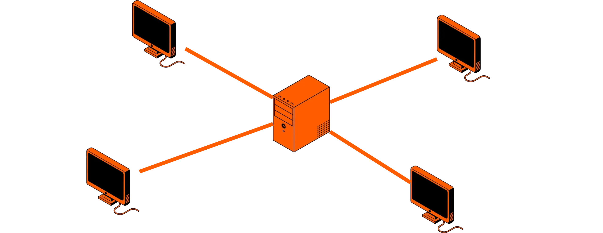


**Забележка**: все още има мрежи, организирани в линейна, подобна на шина топология, където оборудването е свързано едно след друго. Това решение, въпреки че е евтино за внедряване, има основния недостатък, че едно прекъсване изолира някои от хостовете, разделяйки мрежата на независими подмножества.


### Мрежова мрежа


Мрежовата мрежа е проектирана за максимална резервираност: всяко устройство е пряко свързано с всяко друго устройство. Това гарантира непрекъснатост на услугата дори при повреда на няколко връзки или устройства, тъй като трафикът може да бъде пренасочен по алтернативни пътища.


Компромисът се състои в това, че броят на връзките, които трябва да се установят, нараства бързо с броя на терминалите. За `N` точки на свързване са необходими `N × (N-1) / 2` отделни връзки, което прави тази топология скъпа и сложна за внедряване. Затова тя се използва главно в критични мрежи, изискващи много висока наличност, като например някои части на интернет или чувствителни промишлени системи.


Съществуват и други варианти, като например мрежи от типа grid или hypercube, които са предназначени за специализирани нужди в областта на разпределените изчисления или паралелната обработка.


В глобален мащаб интернет е масивна взаимовръзка на мрежи, използващи различни топологии, обединени от общо адресиране (IPv4 и IPv6) и набор от стандартизирани протоколи, определени от IETF (*Internet Engineering Task Force*). Това разнообразие означава, че интернет не следва една-единствена топология: структурата му е гъвкава, мащабируема и независима от логическата схема за адресиране, която го прави използваем.


## Произход на TCP/IP


<chapterId>266b6864-8789-48d7-bc85-001cb9f1651f</chapterId>


Протоколът TCP води началото си от **ARPA** (*Агенция за напреднали изследователски проекти*, преименувана на "DARPA" през 1972 г.), която през 1966 г. стартира проекта **ARPANET**. Първият сегмент на ARPANET е пуснат в експлоатация през октомври 1969 г., свързвайки университетите UCLA и Stanford. Целта е била да се свържат изследователските центрове чрез мрежа с комутация на пакети, която може да поддържа комуникациите дори в случай на частична повреда на инфраструктурата.


Като част от тази динамика ARPA финансира университета в Бъркли, за да интегрира първите протоколи TCP/IP в своята система BSD Unix. Това изигра важна роля за разпространението и стандартизирането на протокола, първо в академичния свят, а по-късно и в индустрията.


**Забележка**: по онова време компютърните специалисти все още не разполагаха с Linux (който щеше да се появи едва в началото на 90-те години), нито с Minix - образователната система, разработена от Андрю Таненбаум.  Основните възможности бяха Unix или понякога собственически мейнфреймове като OpenVMS. Благодарение на гъвкавостта и отвореността си Unix спомогна за разпространението на първите концепции за мрежи.


Строго погледнато, TCP/IP не е един протокол, а набор от протоколи, изградени около TCP и IP. Той стана известен, защото предостави стандартизиран програмен интерфейс за обмен на данни между машини в една и съща мрежа. Този интерфейс, базиран на примитиви, наречени "сокети", даде възможност за създаване на надеждни и гъвкави връзки, като същевременно интегрира основни приложни протоколи.


Следователно ARPANET е историческата основа на днешния интернет. Всъщност интернет е глобална мрежа, основана на принципа на комутация на пакети, в която информацията се разпространява с помощта на набор от стандартизирани протоколи, които осигуряват съвместимост и оперативна съвместимост между разнородни системи. Тази отворена архитектура позволи разработването и внедряването на безброй услуги и приложения, включително:


- имейли,
- world Wide Web (www),
- прехвърляне и споделяне на файлове...


Управлението и развитието на тези протоколи се контролира от ***Internet Architecture Board*** (IAB).

Тази организация координира техническите направления чрез две основни структури:


- IRTF** (_Internet Research Task Force_), която провежда дългосрочни изследвания на еволюцията и подобряването на протоколите.
- IETF** (_Internet Engineering Task Force_), която разработва, стандартизира и документира оперативните протоколи, използвани в интернет


Разпределението на мрежовите ресурси (диапазони от IP адреси, номера на автономни системи, основни имена на домейни и т.н.) се координира на международно ниво от **IANA/ICANN**. Оперативното управление се основава на: **RIR** (*Регионални интернет регистри*): **RIPE NCC** (Европа, Близкият изток, Централна Азия), **ARIN**, **APNIC**, **LACNIC** и **AFRINIC**.


Всички спецификации на протоколите TCP/IP са записани в документи, наречени **RFC** (_Запитване за коментари_), които служат като авторитетни технически справки. RFC се актуализират и номерират непрекъснато, за да отразяват непрекъснатото развитие на пакета протоколи.


Стекът TCP/IP често се представя като стек от четири функционални слоя, като често се сравнява със седемслойния модел **OSI** (_Open Systems Interconnection_), разработен от **ISO** (_International Standards Organization_), който служи като концептуална референция за мрежите.


Четирите слоя на модела TCP/IP са:


- нивото на МРЕЖОВ ДОСТЪП, което осигурява протоколите за контрол на физическата връзка и достъпа до медиите;
- слой INTERNET, който се занимава с маршрутизация и IP адресиране;
- транспортен слой, който гарантира надеждността и управлението на потоците от данни, използвайки протоколи като TCP или UDP ;
- ниво APPLICATION, което обединява потребителски и софтуерни протоколи, като HTTP, FTP, SMTP и DNS.


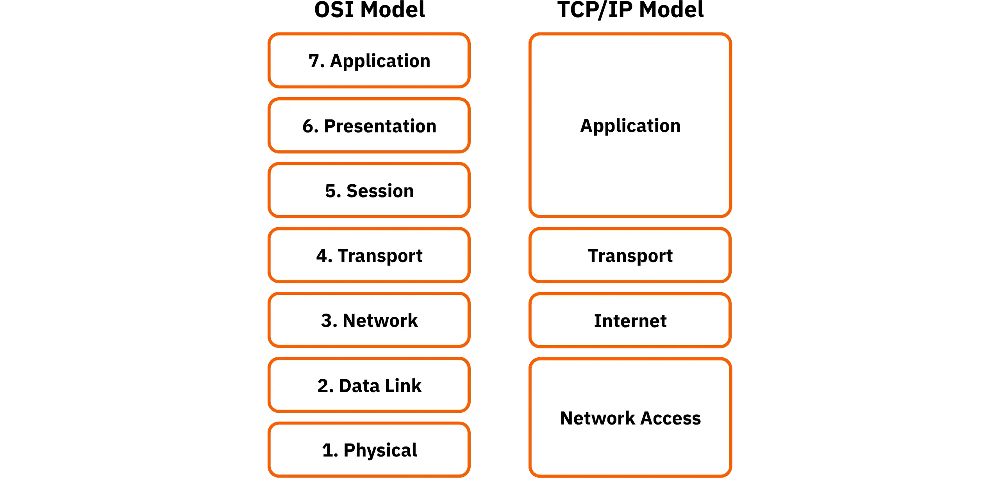


Днес най-широко използваната версия на IP е IPv4, но 32-битовото адресно пространство има ясни ограничения. Това доведе до създаването на IPv6, който използва 128-битово адресиране и предлага практически неограничен капацитет: от съществено значение за поддържане на експлозивния растеж на свързаните устройства и за посрещане на предизвикателствата на интернет на нещата, мобилността и сигурността.


Всяко ниво на стека TCP/IP предоставя специфични услуги, което позволява да се отговори на различни мрежови нужди по модулен начин: физическо предаване, логическо адресиране, цялост на данните и услуги на ниво приложение.


| Device example    | Description                                                                               | 	TCP/IP layer |
| ---------------------- | ----------------------------------------------------------------------------------------- | ----------------------- |
| Web server            | Application services closest to end users                                      | Application             |
| Gateway or proxy    | 	Encodes, encrypts, compresses useful data                                              | Application             |
| Session switch | Establishes sessions between applications                                               | Application             |
| Firewall or L4 router | Establishes, maintains, and terminates sessions between endpoint devices                  | Transport               |
| Router                | Globally addresses interfaces and determines optimal paths through a network | Network                  |
| Switch   | Locally addresses interfaces and forwards traffic via MAC                            | Network Access         |
| Network Interface Card (NIC)     | Signal encoding, cabling, connectors, physical specifications                        | Network Access         |

https://planb.academy/tutorials/computer-security/communication/pi-hole-46a735c5-8af3-4cc3-a2c2-1d4f6a7dc428

https://planb.academy/tutorials/computer-security/operating-system/opnsense-90c2785d-a0d7-4981-be8d-d290bbeb8263

https://planb.academy/tutorials/computer-security/operating-system/pfsense-24eea96a-2fdc-42a6-a77b-89bc29149864

## Протокол IPv5 QoS


<chapterId>570ded19-be61-4005-844e-9490570a6455</chapterId>


Заглавието на IP пакета е основна структура от данни, разделена на няколко полета, всяко от които има специфична роля, за да гарантира правилното предаване и обработка на пакетите по време на пътуването им в мрежата. Тези полета включват IP адреса на местоназначението (необходим за маршрутизиране на пакета до неговия получател), дължината на заглавието, посочена в полето IHL (*Internet Header Length*), общата дължина на пакета, записана в полето *Total Length*, информация за контрол и проверка, както и други параметри за управление на комуникационния поток и качество.


Първото поле в заглавието се нарича Версия. Тази 4-битова стойност определя коя версия на IP протокола следва пакетът. Тя е важна, защото указва на всеки маршрутизатор или междинно устройство как да интерпретира и обработва капсулираните данни.


**Забележка**: За управлението и разпределението на версиите на IP протоколите отговаря **IANA**. 4-битовото поле позволява 16 двоични комбинации (стойности от 0 до 15). Към днешна дата те са разпределени, както следва:


| Version Number | Protocol   | Version Description         | Reference               |
| -------------- | ---------- | --------------------------- | ----------------------- |
| 0–1            | Reserved   | Reserved                    |                         |
| 2–3            | Unassigned | Unassigned                  |                         |
| 4              | IP         | Internet Protocol           | RFC 791                 |
| **5**          | **ST**     | **ST Datagram mode**        | **RFC 1190** / RFC 1819 |
| 6              | IPv6       | Internet Protocol version 6 | RFC 8200                |
| 7              | TP/IX      | The Next Internet           | RFC 1475                |
| 8              | PIP        | The P Internet Protocol     | RFC 1621                |
| 9              | TUBA       | Tuba                        | RFC 1347                |
| 10–14          | Unassigned | Unassigned                  |                         |
| 15             | Reserved   | Reserved                    |                         |

Сред тях е IPv5, който, макар и до голяма степен неизвестен на обществеността, съществуваше като ST (_Stream Protocol_). Разработен през 80-те години на миналия век, IPv5 е предназначен да отговори на нарастваща нужда по това време: осигуряване на "_качество на услугата_" (QoS) за определени потоци данни, които изискват непрекъснато и стабилно предаване, като например Voice over IP или мултимедийни потоци. Неговата цел беше да се гарантира широчина на честотната лента и приоритет от край до край - концепция, подобна на тази, която RSVP (_Протокол за резервиране на ресурси_) предлага днес за динамично резервиране на мрежови ресурси в съвременните маршрутизатори.


Въпреки това IPv5 остана експериментален и беше внедрен само в малък брой мрежови устройства. Ограниченото му приемане, съчетано с бързо нарастващата нужда от повече адресно пространство, накара интернет проектантите да преминат директно от IPv4 към IPv6. По този начин бяха избегнати както ограниченията на адресите на IPv4, така и всякакъв риск от объркване или несъвместимост с експерименталните спецификации на IPv5.


Въпреки че IPv5 никога не е бил широко използван, той изигра важна роля в оформянето на ранното мислене за QoS и управлението на трафика. Днес той е по-скоро исторически маркер, отколкото работещ стандарт.


**Припомняме** - Протоколът е набор от правила за комуникация: структури от данни, алгоритми, формати на пакети и конвенции, които позволяват на различни устройства да обменят информация надеждно и разбираемо. Услугата е конкретната реализация на даден протокол чрез специфични програми (клиенти, сървъри), които следват тези правила и предоставят функционалността на потребителите и приложенията.


Сега можем да разгледаме по-подробно структурата и функционирането на протокола IP, който е основната основа на всички мрежови комуникации.


## Протоколът IP


<chapterId>758fddbd-b652-4c18-bd1e-d038bd2e4d05</chapterId>


### Определения и обща информация


IP протоколът, или "***Internet Protocol***", е основата на модела TCP/IP. Той пренася пакети с данни от един хост до друг в рамките на една мрежа, независимо дали тя е локална или обхваща целия свят. Той има две ключови роли: управлява логическото адресиране на устройствата и осигурява маршрутизирането на пакетите в често хетерогенни и взаимосвързани мрежи.


На физическо ниво предаването разчита на хардуерни интерфейси за установяване на връзки от вида "точка към точка" между възлите. IP протоколът обаче е този, който прави възможна комуникацията от край до край, като предоставя на всеки пакет необходимата информация, за да премине през множество възможни пътища до местоназначението си.


Три елемента на мрежовата конфигурация определят начина, по който пакетът се изпраща по пътя си:


- IP адрес**: уникално идентифицира хоста на дестинацията в мрежата.
- Маска на подмрежата**: определя коя част от адреса идентифицира мрежата и коя част - хоста, което позволява логическо разделяне на подмрежи.
- Шлюзът**: посочва междинния маршрутизатор, през който трябва да премине пакетът, за да достигне до външна мрежа или друг сегмент на локалната мрежа.


В интернет данните не текат като един непрекъснат поток, а се изпращат като **датаграми**: независими блокове от данни, всеки от които е капсулиран с цялата информация, необходима за доставката. Това е принципът на **комутацията на пакети**, при който информацията се разделя на самостоятелни единици, които могат да преминат по различни пътища, за да достигнат до един и същ получател.


Освен полезния товар (*payload*) всяка IP дейтаграма съдържа структурирано заглавие с полета като адрес на местоназначението, адрес на източника, тип услуга, номер на версията на протокола и друга контролна информация, необходима за управление на предаването.


Теоретичният максимален размер на IP дейтаграма е **65 536 октета** - ограничение, което се определя от полето за обща дължина в заглавието. На практика този размер рядко се достига, тъй като физическите мрежи, по които се пренасят пакетите (Ethernet, Wi-Fi, оптични мрежи...), обикновено налагат по-строги ограничения, известни като **MTU** (_Maximum Transmission Unit_). Ако дадена дейтаграма надхвърли MTU на физическата връзка, тя трябва да бъде разделена на по-малки пакети, всеки от които се изпраща отделно и се сглобява отново при пристигането му.


Тази адаптивност прави IP протокола стабилен и гъвкав, способен да работи с голямо разнообразие от базови технологии, като същевременно поддържа универсална съвместимост между хетерогенни системи и мрежи.


### Фрагментиране на IP дейтаграми


Когато една IP дейтаграма трябва да премине през мрежа, чийто капацитет за пренос е по-малък от капацитета на самата дейтаграма, тя трябва да бъде **фрагментирана**, за да може да премине безпроблемно. Това ограничение на физическия размер се нарича **MTU** (Maximum Transmission Unit): най-големият размер на кадъра, който може да премине през дадена мрежа, без да бъде раздробен.


Всяка мрежова технология налага свой собствен MTU, който се определя от хардуерните и протоколните характеристики. Общите стойности включват:


- ARPANET**: 1000 байта
- Ethernet**: 1500 байта
- FDDI**: 4470 байта


Когато дадена дейтаграма надхвърли MTU на мрежовия сегмент, през който трябва да премине, маршрутизиращото оборудване я разделя на по-малки **фрагменти**, които отговарят на ограничението. Това обикновено се случва при преминаване от мрежа с висок МТУ към мрежа с по-малък капацитет. Например може да се наложи дейтаграма, идваща от FDDI мрежа, да бъде фрагментирана, преди да бъде изпратена през Ethernet сегмент.


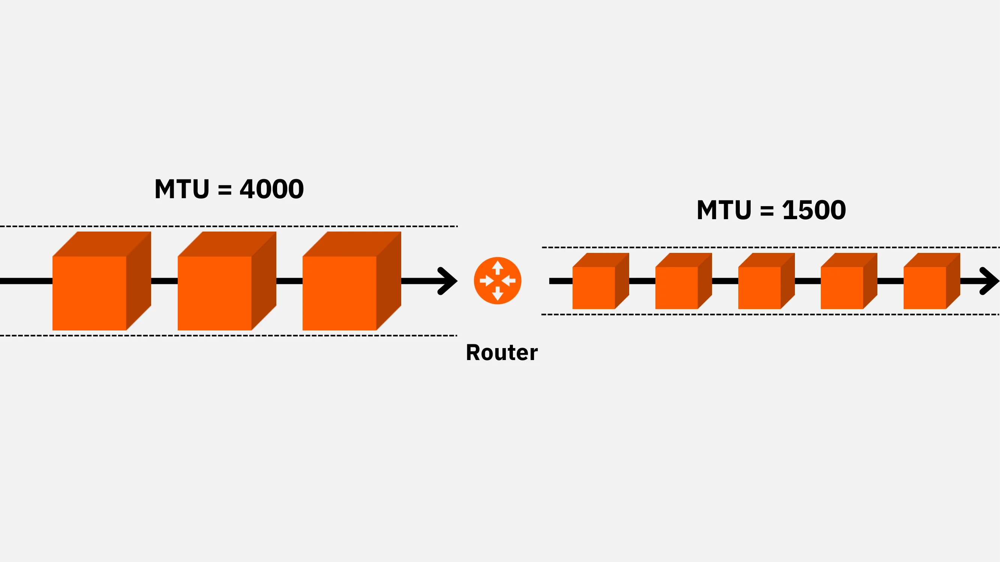


Процесът на фрагментиране протича по следния начин:


- Маршрутизаторът разбива дейтаграмата на фрагменти, които не са по-големи от MTU на целевата мрежа.
- Размерът на всеки фрагмент е кратен на 8 байта, тъй като IP протоколът използва тази единица за кодиране на отместването на повторното сглобяване.
- Всеки фрагмент получава собствено IP заглавие, което съдържа информацията, необходима на крайния получател, за да ги събере отново в правилния ред.


Веднъж фрагментирани, парчетата се движат самостоятелно в мрежата. Те могат да поемат по различни маршрути в зависимост от таблиците за маршрутизация, натоварването на връзките или прекъсванията. Няма гаранция, че те ще пристигнат в реда, в който са изпратени.


При пристигането си приемната машина извършва **сглобяване**. Използвайки информацията в заглавията (споделен идентификатор, отместване и флагове за фрагментация), тя подрежда фрагментите в правилния ред, за да възстанови оригиналната дейтаграма, преди да я предаде на следващото ниво. Ако дори един фрагмент е изгубен или повреден, цялата дейтаграма обикновено се отхвърля, тъй като без всяко парче резултатът би бил непълен или неизползваем.


Въпреки че са ефективни, фрагментирането и повторното събиране имат и недостатъци: допълнителна обработка за маршрутизаторите и хостовете и по-голяма вероятност за загуба на пакети, което може да увеличи броя на повторните предавания. Ето защо внимателното управление на MTU и оптимизирането на размера на пакетите са важни за безпроблемна и ефективна IP комуникация.


### Капсулиране на данни


За да се гарантира, че данните се пренасочват правилно през слоевете на модела TCP/IP, ключова роля играе процесът на **капсулиране**. На всеки етап, докато съобщението се придвижва от приложението на изпращача до машината на получателя, се добавя допълнителна информация, известна като заглавия. Тези заглавия дават на междинните устройства и софтуерните слоеве инструкциите, които са им необходими за обработката, доставката и, ако е необходимо, за повторното сглобяване на данните.


Когато се изпраща съобщение, то преминава през четирите слоя на стека на TCP/IP. На всеки слой пред съществуващите данни се добавя нов хедър: всеки хедър съдържа специфични метаданни, като логически или физически адреси, комуникационни портове, номера на последователността, флагове за контрол на грешките и всякаква информация, необходима за управление на предаването и маршрутизацията.


По този начин предаването следва структуриран процес:


- Слоят на приложението създава първоначалното **съобщение**, съдържащо необработени данни.
- Транспортният слой го капсулира в **сегмент**, като добавя портове на източника и дестинацията, номера на последователността и механизми за контрол на потока.
- Интернет слоят добавя към сегмента IP заглавие, за да се образува **датаграма**, в която се посочват IP адресите на източника и местоназначението.
- Слоят за мрежов достъп опакова дейтаграмата в **кадър**, като добавя MAC адреси и кодове за проверка на целостта (CRC).


Този процес на капсулиране осигурява както целостта и проследимостта на данните, така и тяхната адаптивност: при преминаване от една мрежа в друга заглавията предоставят на устройствата информацията, необходима за избор на маршрут, проверка на валидността или фрагментиране, ако е необходимо.


При пристигане процесът се обръща: приемащата машина получава рамката на слоя за достъп до мрежата, който прочита и премахва съответната заглавна част. След това дейтаграмата се предава на интернет слоя, който прочита IP заглавието и го премахва на свой ред, за да предаде сегмента на транспортния слой. Транспортният слой обработва транспортните заглавия, проверява целостта на потока и накрая доставя **съобщението** на целевото приложение в първоначалното му състояние.


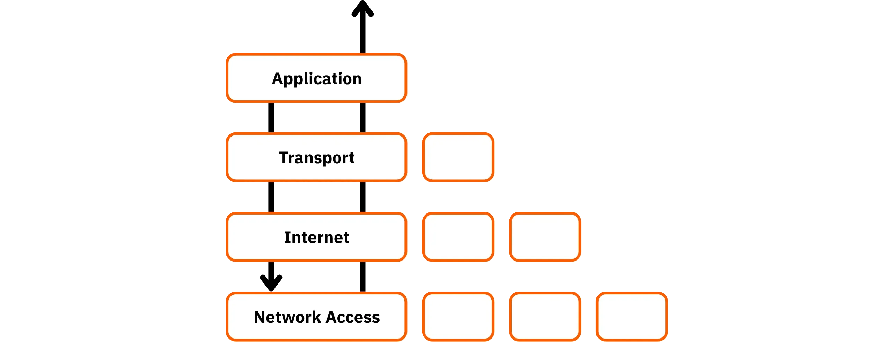


Трансформацията на данните на всеки слой може да се обобщи по следния начин:


- Съобщение**: блок от информация на ниво приложение.
- Сегмент**: единица данни след капсулиране от транспортното ниво.
- Датаграма**: форма, приета след добавянето на IP заглавието от интернет слоя.
- Фрейм**: краен блок, готов за предаване по физическата среда от слоя за достъп до мрежата.


Този процес, който е от съществено значение за надеждността и универсалността на интернет комуникациите, гарантира, че всяка част от данните, независимо колко фрагментирана или сложна е тя, може да бъде пренесена от край до край, като същевременно остане разбираема и използваема от приемащата машина.


### IP адресиране


Дори при наличието на комутация на пакети, фрагментация и капсулиране, мрежата все още не може да функционира без надеждна система за адресиране. За да се гарантира, че всеки пакет данни достига до правилния получател, интернет нивото използва уникален идентификатор: **IP адрес**.

В IPv4 IP адресът е кодиран на **32 бита** и се записва като четири десетични числа, разделени с точки, в познатия формат N1.N2.N3.N4 (например: 192.168.1.12).


IP адресът се състои от две части:


- _netid_**: идентифицира мрежата, към която принадлежи хостът
- _hostid_**: идентифицира конкретния хост в рамките на тази мрежа

Това разделение позволява глобалният интернет да бъде логически структуриран в множество взаимосвързани мрежи.


В миналото системата IPv4 разчиташе на схема, базирана на класове, обозначени от A до E, която определяше обхвата на адресите и тяхното предназначение. Всеки клас разпределяше определен брой битове за _netid_ и _hostid_, което пряко влияеше на възможния брой мрежи и хостове.


| **Class** | **IPv4 Address Range**            | **Usage**                    |
| --------- | --------------------------------- | ---------------------------- |
| A         | 1.x.x.x to 126.x.x.x              | Unicast addresses            |
|           | (127.x.x.x reserved for loopback) | Local loopback               |
| B         | 128.0.x.x to 191.255.x.x          | Unicast addresses            |
| C         | 192.0.0.x to 223.255.255.x        | Unicast addresses            |
| D         | 224.0.0.0 to 239.255.255.255      | IP Multicast                 |
| E         | 240.0.0.0 to 255.255.255.255      | Reserved for experimentation |

Не всички възможни стойности могат да бъдат присвоени на хостове. Например в адрес от **клас С** последният байт предлага 8 бита (256 стойности). Но два от тях са запазени:


- 0: идентифицира самата мрежа
- 255: е **броадресът**, който се използва за изпращане на пакет до всички хостове в мрежата едновременно.

Остават 254 използваеми адреса за устройства.


Броят на наличните адреси варира в широки граници между класовете: от големи публични мрежи в клас А, през корпоративни мрежи в клас В, до по-малки локални мрежи в клас С.


Някои адресни обхвати са запазени за частна употреба и никога не се маршрутизират директно в интернет. Те са известни като **частни адреси** и се използват в организации, фирми или домове и изискват превод на адреси, обикновено NAT (*Network Address Translation*), за да достигнат до публичния интернет. Това са:


- Клас А**: от 10.0.0.0 до 10.255.255.255
- Клас В**: от 172.16.0.0 до 172.31.255.255
- Клас C**: от 192.168.0.0 до 192.168.255.255


Когато устройство с частен адрес осъществи достъп до интернет, рутерът или шлюзът с поддръжка на NAT го замества с валиден публичен адрес.


Пример: Ако даден хост има адрес **192.168.7.5**, можем да заключим:


- 192.168.7.0: мрежов адрес
- 192.168.7.1: често местният маршрутизатор
- 192.168.7.5: самият хост


Друг специален случай е **127.0.0.1**, известен като "***loopback***".

В системите с Linux той е свързан с Interface **lo**. Този адрес позволява на машината да се адресира за локално тестване или диагностика, без да преминава през физически Interface. Целият диапазон **127.0.0.0/8** е запазен за тази цел.


За да се оптимизира използването на адреси и да се проектират сложни мрежи, **маската на подмрежата** (_маска на мрежата_) е от съществено значение. Тази двоична маска разделя _netid_ от _hostid_ в IP адреса.

Всеки клас има маска по подразбиране:


- 255.0,0,0** за клас А,
- 255.255.0.0** за клас В,
- 255.255.255.0** за клас C.


Добрият мрежов дизайн следва едно основно правило: устройствата, които трябва да комуникират директно, трябва да са в една и съща мрежа или подмрежа. За да сегментираме мрежата, използваме подмрежа, като разделяме мрежата на по-малки подмрежи чрез използване на по-специфична маска.


Пример за подмрежа:

Мрежа от **клас С**: 192.168.1.0/24 с маска по подразбиране 255.255.255.0.

Искаме 4 подмрежи с до 60 хоста всяка.


**Стъпка 1**: Брой адреси, необходими за подмрежа = 60 + 2 резервирани адреса (мрежови + излъчващи) = 62.


**Стъпка 2**: Намерете най-близката степен на 2 ≥ 62. -> 2⁶ = 64.


**Стъпка 3: Настройте маската. Запазете битовете _netid_ и резервирайте необходимите битове _hostid_. Получаваме двоична маска, която след преобразуване дава** 255.255.255.192.


```
11111111 11111111 11111111 11000000
```


**Стъпка 4**: Изчислете адресните обхвати за всяка подмрежа, като променяте битовете, запазени за хоста.


| Subnet ID (bits) | Subnet Address   | Subnet Mask     | Address Range                 | Broadcast Address |
| ---------------- | ---------------- | --------------- | ----------------------------- | ----------------- |
| 00               | 192.168.1.0/26   | 255.255.255.192 | 192.168.1.1 – 192.168.1.62    | 192.168.1.63      |
| 01               | 192.168.1.64/26  | 255.255.255.192 | 192.168.1.65 – 192.168.1.126  | 192.168.1.127     |
| 10               | 192.168.1.128/26 | 255.255.255.192 | 192.168.1.129 – 192.168.1.190 | 192.168.1.191     |
| 11               | 192.168.1.192/26 | 255.255.255.192 | 192.168.1.193 – 192.168.1.254 | 192.168.1.255     |


**Стъпка 5**: По този начин се създават четири подмрежи, всяка от които поддържа до 62 машини, като се запазва ефективността на цялостната схема за адресиране. Частта _hostid_ се разделя на част _subnetid_ и част за хост.


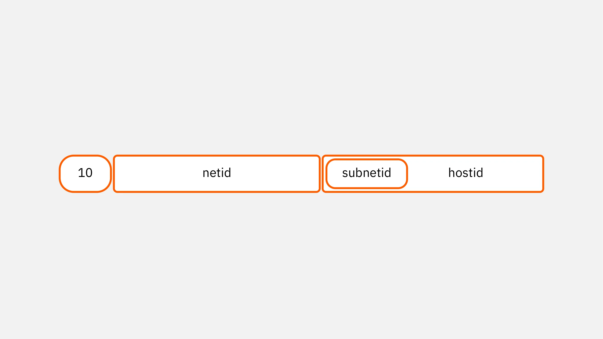


Този фундаментален принцип на подмрежата остава незаменим в съвременното мрежово инженерство, като позволява прецизно разпределение на IP адресите, по-добър контрол на трафика, силна изолация на сегментите и мащабируемо управление на мрежата.


### Адресиране на CIDR


В началото на 90-те години на миналия век, когато интернет се разпространи бързо сред бизнеса и организациите, традиционната система за IP адресиране, базирана на класове (A, B, C), започна да показва своите ограничения.

Нейната твърда структура доведе до значително разхищение на IP адреси и направи таблиците за маршрутизация все по-големи, сложни и трудни за поддържане.

За да се решат тези проблеми, беше въведен по-гъвкав и ефективен метод: **CIDR** (_безкласическо маршрутизиране между домейни_). CIDR постепенно се превърна в стандарт, като до голяма степен замени старата система, базирана на класове.


Основната идея на CIDR е възможността за групиране на няколко съседни мрежи, особено блокове от клас C, в една логическа единица, наречена **супернет** (_супернет_). С това обединяване един запис в таблицата за маршрутизация може да представлява няколко подмрежи, което намалява броя на маршрутите, които маршрутизаторите трябва да обработват, и подобрява тяхната производителност.


Макар че първоначално мрежите от клас С имаха най-голяма нужда от агрегиране поради по-малкия си капацитет, принципът се прилага и за мрежи от клас В и, теоретично, дори за мрежи от клас А, макар че последните са по-малко засегнати поради големия си адресен обхват.


При CIDR концепцията за фиксирани класове изчезва. Адресното пространство се разглежда като непрекъснат обхват, който може да се разделя или обединява според нуждите. Блоковете на CIDR се дефинират с помощта на маски на подмрежи, които не са ограничени до подразбиращите се класове A, B или C. CIDR блокът може да представлява или една мрежа, или съседен набор от подмрежи, които споделят един и същ префикс.


Блокът CIDR се записва във формат "адрес/префикс", където числото след наклонената черта показва колко бита съставляват мрежовата част. Например /17 означава, че първите 17 бита идентифицират мрежата, а останалите 15 бита идентифицират хостовете.


Пример:

Един блок /17 съдържа 2^(32-17) адреса, така че 2^15 = 32 768 общи адреса. Като извадите двата запазени адреса (мрежови и broadcast), остават 32 766 използваеми адреса на хостове. Това позволява на мрежовите администратори да оразмеряват подмрежите си точно според реалните нужди, като избягват ненужното разхищение.


За по-лесно разбиране на оразмеряването на CIDR е представена таблица с често срещани префикси и техните еквивалентни маски на подмрежата и използваеми адреси:


| CIDR Prefix | Available Host Bits | Subnet Mask     | Usable Host Addresses         |
| ----------- | ------------------- | --------------- | ----------------------------- |
| /8          | 24                  | 255.0.0.0       | 2^24 - 2 = 16,777,214         |
| /12         | 20                  | 255.240.0.0     | 2^20 - 2 = 1,048,574          |
| /16         | 16                  | 255.255.0.0     | 2^16 - 2 = 65,534             |
| /20         | 12                  | 255.255.240.0   | 2^12 - 2 = 4,094              |
| /24         | 8                   | 255.255.255.0   | 2^8 - 2 = 254                 |
| /26         | 6                   | 255.255.255.192 | 2^6 - 2 = 62                  |
| /27         | 5                   | 255.255.255.224 | 2^5 - 2 = 30                  |
| /28         | 4                   | 255.255.255.240 | 2^4 - 2 = 14                  |
| /29         | 3                   | 255.255.255.248 | 2^3 - 2 = 6                   |
| /30         | 2                   | 255.255.255.252 | 2^2 - 2 = 2                   |
| /31         | 1                   | 255.255.255.254 | 2^1 = 2 (point-to-point only) |
| /32         | 0                   | 255.255.255.255 | 1 (host address only)         |


**ЗАБЕЛЕЖКА**: В миналото RFC 950 не препоръчваше използването на нулева подмрежа, главно за да се избегне объркване при маршрутизиране.  Това ограничение отпадна с RFC 1878, който напълно позволява използването му. Старото ограничение се дължеше най-вече на несъвместимост с по-стар хардуер, който не можеше да обработва правилно CIDR. Съвременното оборудване няма такъв проблем.


Например подмрежата **1.0.0.0** с маска на подмрежата **255.255.0.0**, която някога беше двусмислена с мрежовия идентификатор от клас А, сега е напълно валидна и използваема.


**TIP**: за безпогрешни изчисления на подмрежи и бързо преобразуване на адреси в CIDR нотация има удобни инструменти като ***ipcalc***. Този "мрежов калкулатор" ясно показва разбивките на адресите, наличните диапазони и свързаните с тях маски, което е идеално както за администратори, така и за ученици, изучаващи CIDR.


```shell
sudo apt install ipcalc
```


https://planb.academy/tutorials/computer-security/communication/angry-ip-scanner-47f7c943-53b7-4098-b167-4cec8e747b5d

## Протоколът TCP


<chapterId>860bf7d5-a502-4d10-a12c-9827f6c2d393</chapterId>


Протоколът **TCP** (_Transmission Control Protocol_) играе централна роля в слоя TRANSPORT на модела TCP/IP. Той действа като мост между приложенията и интернет слоя, като осигурява надеждно предаване на данни между две отдалечени машини.

Докато IP протоколът просто изпраща пакети, без да гарантира доставката или реда им, TCP гарантира целостта и последователността на потока от данни, като ги доставя без загуби, в правилния ред и без дублирания.


Основните отговорности на TCP включват:


- Пренареждане на получените сегменти;
- Наблюдение на потока от данни за избягване на претоварване;
- Разделяне или сглобяване на блокове от данни на подходящи единици (сегменти);
- Управление на установяването и прекратяването на връзки между двата края на комуникацията.


TCP е протокол, ориентиран към връзките, което означава, че създава явна, постоянна връзка между клиент и сървър. За тази цел той използва **номера на последователността** и **потвърждения**: за всеки изпратен сегмент се присвоява уникален идентификатор, така че приемащата машина да може да провери както реда, така и целостта на данните. След това получателят връща сегмент за потвърждение с флаг **ACK**, зададен на 1, потвърждавайки получаването и посочвайки следващия очакван пореден номер.


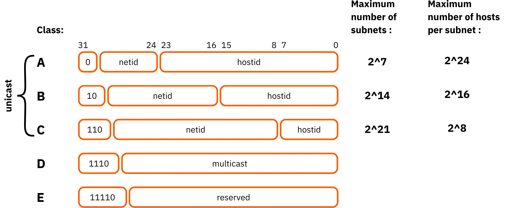


За да подобри надеждността, TCP използва таймер: след като сегментът бъде изпратен, започва обратно броене. Ако потвърждението не пристигне в рамките на периода на тайм-аут, изпращачът автоматично препраща сегмента, приемайки, че е бил изгубен при преноса. Този механизъм за автоматично препредаване компенсира загубите, присъщи на IP мрежите, които могат да възникнат в случаи на претоварване, грешки в маршрутизацията или хардуерни повреди.


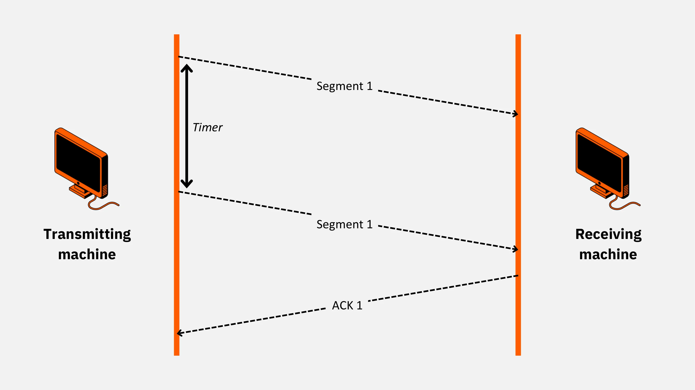


TCP може да открива и обработва дубликати. Ако пристигне препредаден сегмент, но се появи и оригиналът, приемникът използва номерата на последователността, за да идентифицира дубликата и да запази само правилното копие, като елиминира всякакво двусмислие.


За да функционира този процес, двете машини трябва да имат общо разбиране за своите начални поредни номера. Това се осигурява чрез следване на строга процедура за свързване: от една страна, **сървърът** слуша на определен порт, очаквайки входяща заявка (пасивен режим); от друга страна, **клиентът** активно инициира връзката, като изпраща заявка към сървъра на същия служебен порт.


**ЗАБЕЛЕЖКА**: "Порт" е цифров идентификатор (от 0 до 65 535), присвоен на мрежово приложение на компютър. Използва се за разграничаване на множество услуги, които работят едновременно на един и същ IP адрес. Когато клиентът изпраща данни, той посочва номера на порта, така че операционната система на сървъра да знае коя програма трябва да ги получи (напр. 80 за HTTP, 443 за HTTPS, 25 за SMTP). Портовете действат като специални врати, насочвайки входящия и изходящия трафик, предотвратявайки объркването между услугите и позволявайки фин контрол на достъпа чрез защитни стени или правила за филтриране.


Обменът на синхронизиращи последователности се основава на известния механизъм **"*тристранно ръкостискане*"**, подобен на начина, по който двама души се поздравяват, за да установят контакт. Тази фаза на инициализация, която осигурява надеждността на TCP, се осъществява на 3 етапа:

1. **SYN:** Клиентът изпраща начален сегмент за синхронизация (**SYN**) със зададено подходящо знаме и начален номер на последователността (например C);

2. **SYN-ACK:** Получаващият сървър отговаря със сегмент за потвърждение (**SYN-ACK**), потвърждава поредния номер на клиента и предоставя своя първоначален пореден номер;

3. **ACK:** Клиентът изпраща окончателно потвърждение (**ACK**), потвърждаващо получаването на поредния номер на сървъра, с което синхронизацията приключва. Сега флагът SYN е изключен, а флагът ACK остава зададен, което показва, че връзката е установена.


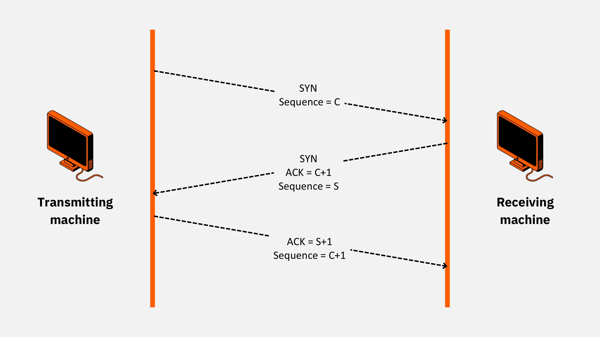


Този протокол за обмен гарантира, че двете страни имат една и съща номерационна база преди предаването на данни за полезния товар. След като тази синхронизация приключи, сесията се отваря: сегментите вече могат да се движат в двете посоки, като всеки от тях се потвърждава при получаване, което осигурява максимална надеждност на потока от данни.


Това ***тристранно ръкостискане*** се отнася само за установяване на връзка. За затваряне TCP използва *четиристранно ръкостискане*: FIN → ACK → FIN → ACK, което гарантира, че нито един транзитен сегмент няма да бъде изгубен, преди връзката да бъде напълно освободена.


Въпреки че е проектиран с оглед на устойчивостта и надеждността, този процес също така води до уязвимости, които могат да бъдат използвани. Например атаки като **IP Spoofing** имат за цел да заобиколят или да нарушат тази връзка на доверие, като се представят за оторизирана машина чрез фалшифицирани номера на последователност, създавайки нарушение, което позволява прихващане или манипулиране на потока от данни.


За да се ограничат рисковете от отвличане на синхронизацията на последователностите и да се управлява натоварването на мрежата, протоколът TCP използва техника за управление на потоците, известна като "**_Sliding Window_**". Тази система регулира колко данни могат да бъдат изпратени, без да се изисква незабавно потвърждение за всеки сегмент, като по този начин се намалява ненужното претоварване на мрежата и същевременно се поддържа добра надеждност.


На практика плъзгащият се прозорец дефинира диапазон от номера на последователност, които могат да циркулират свободно между подателя и получателя, без да се потвърждава всеки отделен сегмент. Когато изпращащата система получи потвърждения, прозорецът се "плъзга": той се плъзга надясно, за да освободи място за изпращане на нови сегменти. Размерът на този прозорец (който е от решаващо значение за оптимизиране на пропускателната способност при избягване на претоварване) се посочва в полето "*Window*" на TCP заглавието.


**Пример**: ако първоначалният номер на последователността е 3 и прозорецът се разширява до последователност 5, сегментите с номера от 3 до 5 могат да бъдат изпратени, без да се чака индивидуално потвърждение.


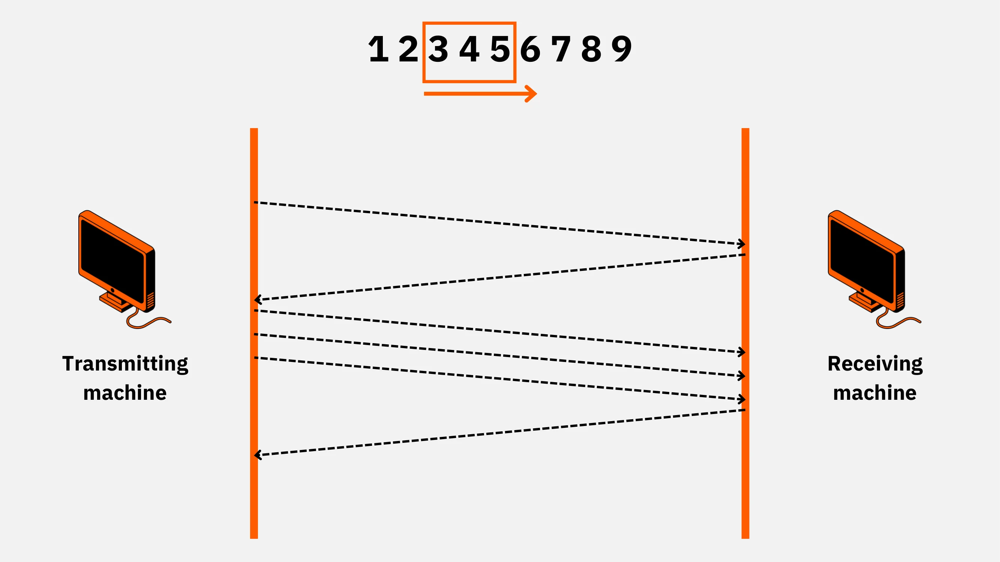


Размерът на плъзгащия се прозорец не е фиксиран; той се настройва динамично според условията на мрежата и капацитета за обработка на приемника.  Ако приемникът може да обработва по-голям обем данни, той показва това чрез полето Window (Прозорец), като подканя изпращача да разшири своя прозорец. Обратно, в случай на претоварване или риск от насищане, получателят може да поиска намаляване, като изпращачът ще изчака, докато прозорецът се придвижи напред, за да изпрати допълнителни сегменти.


Протоколът осигурява симетрична процедура за затваряне на TCP връзка, за да се осигури чисто и организирано изключване. Всяка машина може да инициира затваряне, като изпрати сегмент с флаг **FIN**, зададен на 1, сигнализирайки намерението си да прекрати комуникацията. След това се изчаква, докато се получат всички транзитни сегменти, и се пренебрегват всички по-нататъшни данни.


След като получи този сегмент, другата машина изпраща потвърждение, също маркирано с флага FIN. След това тя завършва изпращането на всички останали данни, преди да уведоми местното приложение, че коонтекцията е затворена. Това двойно потвърждение осигурява организирано изключване и свежда до минимум риска от загуба на данни.


Това прецизно управление, съчетаващо гъвкавото маршрутизиране на IP със строгия контрол на TCP, често се илюстрира с диаграма, противопоставяща скоростта на IP протокола (който работи на базата на **"най-добрите усилия "**, без гаранция за доставка) на надеждността на TCP протокола (който управлява предаването чрез потвърждения и договорени последователности).


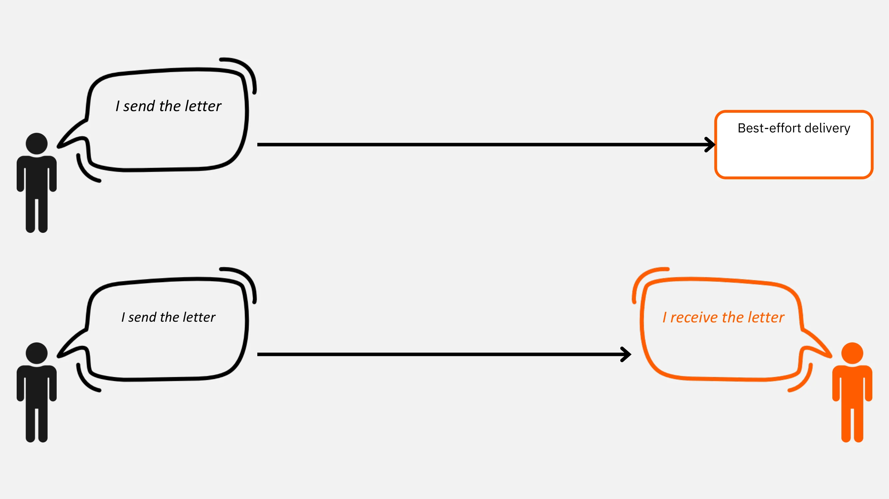


В някои случаи обаче абсолютната надеждност не е приоритет - важни са скоростта и простотата. Това важи за приложения като стрийминг на живо или VoIP, които могат да понесат известна загуба на пакети, без това да се отрази сериозно на потребителското преживяване. В такива случаи се предпочита **UDP** (_User Datagram Protocol_).


UDP функционира на принцип, който е коренно различен от този на TCP: той е **безвръзка**, което означава, че не се установява предварителна връзка между изпращача и получателя. Когато една машина изпраща пакети чрез UDP, те се предават еднопосочно; получателят не изпраща потвърждения и изпращачът няма потвърждение, че съобщението е пристигнало. Заглавието на UDP е умишлено минимално, съдържащо само порта на източника, порта на дестинацията, дължината на сегмента и контролна сума, без вграден механизъм за потвърждение или контрол на състоянието. Както винаги, IP адресите се пренасят от основния IP хедър.


Често срещана аналогия е, че TCP прилича на **телефонно обаждане**, при което се създава верига, която се следи и контролира по време на разговора. Докато протоколът UDP е като **поставяне на поща**, при което подателят пуска писмо в пощенска кутия без незабавно доказателство за доставка или системна обратна връзка.


Това взаимно допълване между TCP и UDP позволява на съвременните мрежи да се адаптират към различни нужди, като избират максимална надеждност или дават приоритет на скоростта в зависимост от приложението.


## Примитиви за услуги


<chapterId>4480afb7-e950-4ccb-88fa-d132f9dc3479</chapterId>


### Многослойна архитектура и организация на обмена


Както видяхме, **услугите** са конкретната реализация на протоколите, които описахме досега. Макар че моделът TCP/IP се различава от модела **OSI**, той възприема същия подход на слоевете: всеки слой е предназначен да изпълнява конкретна функция и да предоставя **услуги** на слоя непосредствено над него, което води до модулна, надеждна и лесно поддържана архитектура.


Всеки слой се основава на възможностите на слоя под него и на свой ред предоставя на по-горния слой последователен Interface за управление на данни. В тази архитектура всеки слой има свои собствени **структури за данни**, които са внимателно дефинирани, за да се осигури перфектна съвместимост с останалите слоеве. Тази съвместимост е от съществено значение за безпроблемната, надеждна и ясна комуникация от една крайна точка към друга.


Тези обмени са подчинени на два основни аспекта:


- Вертикален аспект**: връзката между един слой и слоя над или под него (от слой N към слой N+1 и обратно).


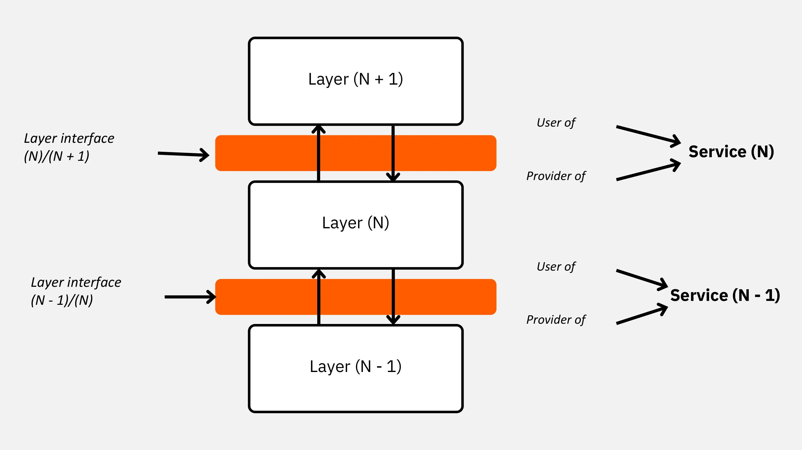


- Хоризонтален аспект**: взаимодействието между отдалечени приложения, т.е. диалогът между **клиент** и **сървър**, в двете посоки.


Многослойната архитектура следва принципа, че всеки слой обработва само информацията, която е в неговия обхват: структурите на данните, заглавията и механизмите за управление се различават от един слой до друг, но заедно те образуват съгласувана система, която гарантира, че данните постепенно се насочват към крайното си местоназначение.


**Припомняме**: Използва се специфична терминология за описание на единиците данни, които се обменят между слоевете:


- съобщение** за приложния слой,
- сегмент** за транспортния слой (TCP),
- дейтаграма** за интернет нивото (IP),
- рамка** за слоя за достъп до мрежата.


В таблицата по-долу са обобщени термините за TCP и UDP контексти:


| TCP/IP Layer         | Unit Name (TCP) | Unit Name (UDP) |
|----------------------|------------------|------------------|
| Application Layer    | Stream           | Message          |
| Transport Layer      | Segment          | Packet           |
| Internet Layer       | Datagram         | Datagram         |
| Network Access Layer | Frame            | Frame            |

### Примитиви на услуги и единици данни


В основата на тази система са **примитиви на услуги**, които действат като комуникационни интерфейси. Тези примитиви функционират като бюра за услуги, слушат резервирани специфични **портове** и позволяват на процесите да установяват, поддържат и прекратяват мрежови връзки по контролиран начин. Докато протоколите организират формата и предаването на данни в мрежата, **услугите и техните примитиви** са тези, които осигуряват вертикалната връзка между слоевете.


Чрез комбиниране на хоризонталния аспект (комуникация между разпределени приложения) с вертикалния аспект (вътрешни взаимодействия между слоевете) моделът TCP/IP осигурява цялостна, мащабируема архитектура. Припокриването на тези два аспекта дава ясна представа за начина, по който се обменят данни в структурираната мрежова комуникация.


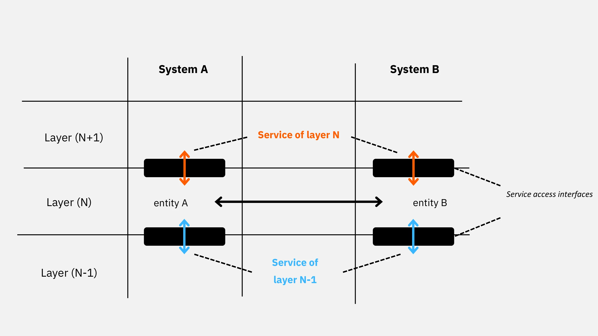


### Обобщение на частта


В този първи основен раздел разгледахме основната архитектура, която управлява конфигурацията и работата на днешните свързани с интернет мрежи. Тази архитектура се основава на **четирислоен модел**, вдъхновен от модела OSI, и е изградена около пакета протоколи **TCP/IP**, който е гръбнакът на съвременните комуникации. Видяхме, че TCP, със своя ориентиран към връзката подход, осигурява надеждни трансфери, докато UDP, по-лек и по-бърз, се предпочита, когато скоростта е по-важна от надеждността.


Правилното функциониране на този модел се основава на прилагането на протоколи чрез **примитиви за услуги**. Те осигуряват връзката между слоевете, като позволяват обработката на данни да се адаптира към специфичните изисквания на всяко ниво - от транспорт до приложение, включително достъп до интернет и мрежа. Този модулен подход прави системата едновременно гъвкава и надеждна.


IP адресирането е друг крайъгълен камък на тази инфраструктура. Всяко свързано устройство се идентифицира с **уникален IP адрес**, взет от адресно пространство, организирано в **класове** (от А до Е). Някои от тези адреси са запазени за специални цели, като например локален loopback или multicast, докато други, известни като "частни адреси", не се маршрутизират в интернет без транслация (NAT). Тази класификация дава възможност за логическа, йерархична организация на мрежите.


Разгледахме и концепцията за **подмрежи**, която дава възможност за разделяне на мрежови сегменти с цел по-добро управление на IP ресурсите и оптимизиране на потока от данни. Въпреки че ръчното разделяне с помощта на подмрежови маски продължава да бъде важен принцип, то до голяма степен е модернизирано благодарение на **CIDR** (_Classless Inter-Domain Routing_). Този метод трансформира управлението на адресите, като позволява по-гъвкаво и рационално разпределение на IP диапазоните, като същевременно намалява размера на таблиците за маршрутизация.


С овладяването на тези понятия - слоеве, протоколи, примитиви на услугите, адресиране и подмрежи - ще получите солидна основа за разбиране на техническите характеристики на съвременните мрежи и за ефективно конфигуриране на мрежова инфраструктура, която да отговаря на съвременните нужди.


В следващия раздел ще разгледаме по-подробно адресирането по IPv4.


# IPv4 адресиране


<partId>83f3c3e5-378c-440f-a095-df210842efde</partId>


## Използване на IPv4


<chapterId>79e4dd18-446a-435b-9f25-c88a00f8bec6</chapterId>


В този раздел ще навлезем по-дълбоко и ще разгледаме как **IPv4** адресите всъщност се реализират в реална мрежа. Ще разгледаме техния формат, логиката, която стои зад тях, и как са свързани с други ключови мрежови елементи като **DNS имена**, **MAC адреси**, **подмрежи** и **техники за превод**.


IP адресът е уникален цифров идентификатор, присвоен на всяка **мрежа Interface** на устройството. Той дава възможност да се определи местоположението на това устройство в рамките на мрежата и да се достигне до него за предаване на данни. Например маршрутизатор, сървър, работна станция, мрежов принтер или дори камера за наблюдение имат поне един собствен IP адрес. IP адресът прави възможна **маршрутизацията**, т.е. пренасянето на пакети от точка А до точка Б, дори ако те са физически отдалечени една от друга.


IP адресите могат да бъдат присвоявани по два основни начина:


- Статичен**: Ръчно зададена в устройството.
- Динамичен**: Автоматично присвояване при поискване от DHCP (_Dynamic Host Configuration Protocol_) сървър. DHCP опростява управлението на мрежата, като премахва необходимостта от ръчно конфигуриране и същевременно позволява прецизен контрол чрез резервации и продължителност на наема.


**IPv4** адресите се записват в **32-битов** формат, разделен на **четири байта**. Всеки байт съдържа 8 бита и представлява десетично число от 0 до 255. Четирите байта са разделени с точки, за да се получи ясен и четлив запис.


пример: адрес 172.16.254.1_


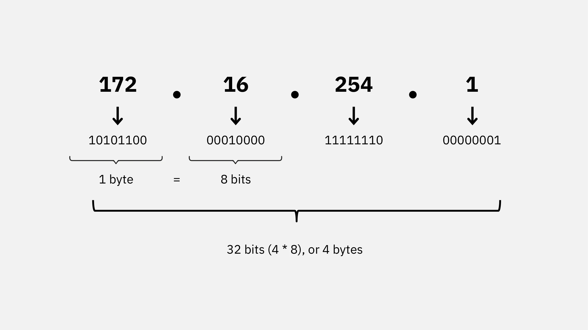


Всеки бит в байта има стойност (или "тегло"): левият бит (най-значимият бит) е със стойност 128, следващият 64, след това 32, 16, 8, 4, 2 и 1 за десния бит (най-малкият бит). По този начин двоичният запис се преобразува в десетичен чрез простото събиране на зададените тегла.


Таблицата по-долу илюстрира тази кореспонденция:


| Binary Code | Activated Bit Values          | Decimal Value |
|-------------|-------------------------------|---------------|
| 00000000    | 0                             | 0             |
| 00000001    | 1                             | 1             |
| 00000011    | 1 + 2                         | 3             |
| 00000111    | 1 + 2 + 4                     | 7             |
| 00001111    | 1 + 2 + 4 + 8                 | 15            |
| 00011111    | 1 + 2 + 4 + 8 + 16            | 31            |
| 00111111    | 1 + 2 + 4 + 8 + 16 + 32       | 63            |
| 01111111    | 1 + 2 + 4 + 8 + 16 + 32 + 64  | 127           |
| 11111111    | 1 + 2 + 4 + 8 + 16 + 32 + 64 + 128 | 255      |

За да преобразувате двоичната в десетичната система, добавете теглата на битовете, които са настроени на 1.


| Binary     | Decimal Value |
| ---------- | ------------- |
| `10101100` | 172           |
| `00010000` | 16            |
| `11111110` | 254           |
| `00000001` | 1             |

IP адресът идентифицира един **мрежов интерфейс**, а не цялото устройство. Многопортовият маршрутизатор или защитната стена имат множество интерфейси, всеки от които има собствен IP адрес. Един интерфейс може дори да има няколко IP адреса (например за обслужване на няколко виртуални мрежи или услуги).


Всеки IP пакет съдържа два IP адреса в заглавието си:


- Адресът на източника (**изпращач**)
- Адресът на местоназначението (**получател**)

Маршрутизаторите четат тези адреси, за да определят най-добрия път за изпращане на пакета до местоназначението. Без строги правила за адресиране мрежовият трафик не би могъл да се насочва правилно и глобалното свързване на мрежите би било невъзможно.


IPv4 адресът се състои от две части:


- NetID**: идентифицира мрежата
- HostID**: идентифицира устройство в рамките на тази мрежа

Маската на **подмрежата** определя къде свършва NetID и къде започва HostID, като определя колко бита принадлежат на всяка част. Колкото по-дълъг е NetID, толкова по-голям е броят на възможните подмрежи, но съответно намалява броят на хостовете в подмрежа.


Първоначално мрежите IPv4 бяха разделени на пет **класа**: (A, B, C, D и E). Всеки клас съответства на конкретен диапазон на NetID и определя фиксирана детайлност:


- Клас А: много големи мрежи с голям брой хостове
- Клас В: средни мрежи
- Клас C: малки мрежи
- Клас D: адреси, запазени за мултикастинг (_multicast_)
- Клас Е: експериментални адреси, които не се използват за конвенционално адресиране


| Class | Leading Bits | First Byte Range | Default Subnet Mask | Purpose                          |
| ----- | ------------ | ---------------- | ------------------- | -------------------------------- |
| A     | 0            | 0 – 127          | 255.0.0.0           | Very large networks              |
| B     | 10           | 128 – 191        | 255.255.0.0         | Medium-sized networks            |
| C     | 110          | 192 – 223        | 255.255.255.0       | Small networks                   |
| D     | 1110         | 224 – 239        | N/A                 | Multicast addresses              |
| E     | 1111         | 240 – 255        | N/A                 | Experimental (not publicly used) |

Специални адреси:


- Мрежов адрес**: Идентифицира самата мрежа (използва се в таблиците за маршрутизация).
- Адрес за излъчване**: Изпраща данни до всички устройства в подмрежата наведнъж (всички HostID битове са настроени на 1).


Следните диапазони са запазени за вътрешна употреба:


- 10.0.0.0/8** (частен клас А)
- 127.0.0.0/8** (локална обратна връзка или _loopback_)
- 172.16.0.0 до 172.31.255.255** (частен клас B)
- 192.168.0.0 до 192.168.255.255** (частен клас C)


Адресите **127.0.0.1** и, по-общо, целият обхват 127.0.0.0/8 се използват за вътрешно тестване: всяка заявка, изпратена до него, никога не напуска машината. Това е полезно за проверка на работата на дадена локална мрежова услуга, без да се включва по-широката мрежа.


За да използват по-добре адресното пространство, администраторите често разделят мрежите на **подмрежи**, като използват маски на подмрежи или **CIDR** (_Classless Inter-Domain Routing_). CIDR позволява по-прецизно управление и помага да се избегне разхищението на адреси. Днес CIDR е от съществено значение за прецизното настройване на IP диапазоните и за намаляване на размера на таблиците за маршрутизация.


В съвременните мрежи IP адресирането обикновено се съчетава с други идентификатори:


- име на домейн**, регистрирано в **DNS** (_Система за имена на домейни_): Тя свързва цифров IP адрес с име, което е удобно за ползване от човека.
- MAC адрес**: физически идентификатор, вграден в мрежовата карта, който се използва за локален пренос (_Ethernet_). Когато един IP пакет трябва да бъде физически предаден, таблицата ARP съпоставя IP адреса с MAC адреса на местоназначението.


За да се справят с недостига на IPv4 адреси и да добавят ниво на сигурност, мрежите често използват транслиране на адреси (_NAT_). NAT позволява на много частни устройства да споделят един публичен IP адрес при достъп до интернет.


**Забележка**: Онлайн и вградените в операционната система инструменти, като например [Grenoble CRIC calculator](http://cric.grenoble.cnrs.fr/Administrateurs/Outils/CalculMasque/), улесняват значително изчисленията на подмрежата и маската.

Тези помощни програми помагат за ефективно планиране на разделянето на мрежата.


В заключение, излъчващият адрес остава практична функция за изпращане на едно и също съобщение до всички устройства, свързани към даден сегмент: това се постига чрез задаване на всички битове в частта HostID на 1, така че всички хостове да бъдат насочени.


## Различните видове IPv4 адреси


<chapterId>2adfad24-a90d-45b5-b808-3d2f6598bebf</chapterId>


IPv4 адресите се разделят на две основни категории: публични адреси, които са пряко достъпни в интернет, и частни адреси, предназначени за вътрешна употреба в рамките на локална мрежа.


Публичният IPv4 адрес е глобално уникален и може да се маршрутизира в интернет. Той се присвоява от официални органи и се изисква за публични услуги, като например уебсайтове, имейл сървъри или облачна инфраструктура.

Уникалността на тези адреси в световен мащаб е от съществено значение, за да се избегнат конфликти или колизии при маршрутизиране.


Разпределението на тези IP диапазони се управлява от **IANA** (_Internet Assigned Numbers Authority_), която работи под ръководството на **ICANN** (_Internet Corporation for Assigned Names and Numbers_). Конкретно, IANA разделя IPv4 пространството на 256 блока с размер /8, в съответствие с нотацията CIDR. Всеки блок представлява малко над 16,7 милиона адреса (2³² / 2⁸).


Тези блокове от едноадреси се поверяват от IANA на **регионалните интернет регистри** (RIR). Тези RIR отговарят за преразпределянето на адресите на регионално ниво в съответствие с реалните нужди на доставчиците на достъп, компаниите или администрациите. Едноадресното адресно пространство се простира от блокове **1/8 до 223/8**, като части от него са запазени за специална употреба (изследвания, документация, тестване) или са разпределени директно на мрежа или RIR за преразпределение.


За да проверите кой е собственик на даден публичен IP адрес, можете да направите справка в базите данни на RIR, като използвате командата **whois** или като използвате уеб интерфейсите, предоставени от всеки регистър. Тези инструменти могат да се използват за проследяване на адреса до организацията или доставчика, който го е обявил.


Съществуват и частни IPv4 адреси, които са практически отговор на недостига на публични адреси. Тези адреси, които не могат да се маршрутизират в интернет, са запазени за локални среди: корпоративни мрежи, домашни локални мрежи, центрове за данни или компютърни клъстери. Те не са уникални в световен мащаб: много частни мрежи могат да използват повторно едни и същи IP диапазони без смущения, стига да останат изолирани или да използват устройство за транслиране на мрежови адреси за достъп до интернет.


За да позволят на устройство с частен IP адрес да получи достъп до интернет, мрежите използват NAT (Network Address Translation). NAT работи чрез динамично заместване на частния адрес с публичен, което позволява на десетки (или дори стотици) устройства да споделят един публичен IP адрес. Този метод оптимизира използването на IPv4 пространството и също така добавя ниво на сигурност, като скрива вътрешната структура на мрежата.


Друга специална категория са **неуточнените** адреси. Записът на IPv4 **0.0.0.0** или неговата IPv6 версия **::/128** означава "без конкретен адрес". Такъв адрес е невалиден като местоназначение на мрежов адрес, но може да се използва локално от хост за обозначаване на "всички интерфейси" или "все още няма назначен адрес". Това е често срещано при динамично присвояване на DHCP или за слушане на всички интерфейси на сървъра.


IPv6 поддържа и частно адресиране, но стандартът обикновено препоръчва публично адресиране, за да се избегне натрупването на няколко слоя NAT. **Локалните адреси** (_site-local_) от блока **fec0::/10** са премахнати от **RFC 3879** от съображения за последователност и сигурност. Те бяха заменени с **уникални локални адреси** (_ULA_), разположени в блока **fc00::/7**. ULA позволяват създаването на частни IPv6 мрежи с чиста вътрешна маршрутизация, като се използва случайно генериран 40-битов идентификатор, за да се осигури локална уникалност.


Изчерпването на IPv4 беше официално потвърдено през 2011 г. За да се удължи животът му, интернет общността прие няколко стратегии:


- Постепенна миграция към **IPv6**
- Широко разпространена употреба на **NAT**
- По-строги политики за разпределение на средства от РИР, изискващи точна обосновка и управление на нуждите от адреси
- Възстановяване на неизползвани или доброволно върнати адресни блокове от дружествата


Тези мерки показват, че адресирането на IP адреси не е само техническо предизвикателство, но и въпрос на глобално управление, който е от основно значение за продължаващото разширяване на интернет.


## DNS, директория за адреси


<chapterId>511244ec-ba43-44ac-b4c3-b41579a15cff</chapterId>


Нека бъдем честни, хората не са много добри в запомнянето на дълги поредици от числа, независимо дали в двоична или десетична форма. Това предизвикателство става още по-голямо при IP адресите, които могат да бъдат сложни, а един IP адрес понякога може да прикрива няколко адреса, особено когато се използват техники като NAT или виртуален хостинг.


За да улесни работата, приложният слой използва система, която свързва IP адреса с логическо име, което може да се чете от човек. Това е ролята на **DNS** (*Система за имена на домейни*) - огромна, йерархична, разпределена директория, която свързва четливи имена на домейни с IP адреси. Системата се основава на набор от протоколи и услуги. Най-широко използваният софтуер за DNS сървъри е **BIND** (_Berkeley Internet Name Domain_) - софтуерен пакет с отворен код, който се позовава на голяма част от инфраструктурата на DNS в интернет.


Основната идея на DNS е проста: за всяка свързана услуга, независимо дали става въпрос за уебсайт, пощенски сървър или друга мрежова услуга, има запис, който съпоставя името на домейна с един или повече IP адреси. Това работи в две посоки:


- Пренасочване: преобразуване на име в IP адрес.
- Обратна резолюция: намиране на името на домейна, свързано с даден IP адрес.

Това прави мрежовото адресиране използваемо за хората, като същевременно запазва прецизността, от която се нуждаят маршрутизаторите, за да пренасят правилно данните.


Името на домейна винаги е структурирано йерархично, като всяко ниво е разделено с точка: пълното име се нарича **FQDN** (_Fully Qualified Domain Name_). Най-дясната част е **TLD** (_Домейн от най-високо ниво_), като например `.com`, `.org` или `.fr`. Най-лявата част обозначава хоста, т.е. конкретната машина или услуга, свързана с IP адреса.


Системата DNS е проектирана като **дърво от зони**. Една **зона** е част от пространството от имена на домейна, управлявана от определен DNS сървър. Една зона може да съдържа множество **поддомейни**, които могат да бъдат делегирани на други зони, управлявани от различни сървъри. Администраторите отговарят за поддръжката на своите зони: обработват актуализации, делегиране и цялостно управление.


Тази структура позволява не само насочване към основния домейн (например `example.com`), но и фино настройване на записи за отделни хостове (`www`, `mail`, `ftp` и т.н.). В ранните дни на мрежите това картографиране се извършваше със статични файлове (`/etc/hosts` в Unix системите), но този метод бързо стана непрактичен за бързо развиващия се, взаимосвързан Интернет.


Важно е да се разбере, че **DNS сървърът** може да обслужва само ограничен обхват. Например вътрешният DNS сървър на дадена компания може да не е пряко достъпен от интернет. Ако този DNS сървър не е конфигуриран да пренасочва заявки или няма надеждна връзка с други сървъри, някои заявки ще бъдат неуспешни: тогава нито името, нито IP адресът могат да бъдат разрешени извън определената зона.


DNS играе роля и при маршрутизирането на имейли. Например записът **MX** (_Mail Exchange_) определя пощенските сървъри, които отговарят за получаването на имейли за даден домейн. Тези записи определят приоритетите (тегловен коефициент) и решенията за отказ. Файлът на зоната на даден DNS сървър трябва да съдържа запис **SOA** (_Start Of Authority_), който определя сървъра като официален източник на информация за тази зона.


Благодарение на йерархичната си разпределена структура DNS остава крайъгълен камък на интернет, като позволява на потребителите да получават достъп до услуги чрез ясни и запомнящи се имена на домейни вместо чрез дълги технически IP адреси.


В следващата глава ще разгледаме друга основна концепция: **Етернет адреси**, известни също като **MAC адреси**, които осигуряват доставката на данни на физическото ниво на локалните мрежи.


## Откриване на Ethernet адреси и ARP


<chapterId>d02109f6-9bf9-4261-a8f9-e1aa4398b949</chapterId>


### Определения


За да работи протоколът за маршрутизиране на данни надеждно и последователно, е необходим един ключов компонент. Като хора можем лесно да идентифицираме дадена машина по нейния IP адрес или по името, което се извлича чрез DNS. Машината обаче трябва да може недвусмислено да разпознава устройството, за да доставя пакети. За тази цел тя разчита на специфичен хардуерен идентификатор, използван директно от мрежовия ѝ интерфейс: MAC адрес (_Media Access Control_).


**Забележка**: Това няма нищо общо с "физическия адрес" в архитектурата на паметта. В компютрите физическият адрес на паметта се отнася до конкретно място на шината на паметта, за разлика от виртуалния адрес, управляван от операционната система. За разлика от това MAC адресът се отнася единствено до мрежовия хардуер.


MAC адресът е постоянно и уникално присвоен от производителя, от когото е произведено оборудването. MAC адресът недвусмислено идентифицира мрежовата карта, независимо дали става въпрос за компютър, смартфон, принтер или друго свързано устройство. За разлика от IP адреса, който може да се променя динамично (чрез DHCP сървър или ръчна конфигурация), MAC адресът обикновено остава един и същ през целия живот на устройството, освен ако не е умишлено променен.


Всеки мрежов интерфейс, жичен или безжичен, има свой собствен MAC адрес. Този адрес се използва в рамките на слоя за връзка с данни (слой 2 на модела OSI) за въвеждане и управление на хардуерния адрес във всеки обменен мрежов кадър. Понякога той се нарича _Етернет адрес_ или _UAA_ (_Универсално администриран адрес_). Стандартизираната дължина на адреса е 48 бита или 6 байта, като той се записва в шестнадесетична нотация, обикновено под формата на байтове, разделени с `:` или `-`.


Например: `5A:BC:17:A2:AF:15`


В тази структура първите три байта идентифицират производителя на мрежовата карта: те са известни като **OUI** (*Организационно уникален идентификатор*). Тези префикси, определени от IEEE, се използват и в други схеми за хардуерно адресиране, като Bluetooth и LLDP, за да се гарантира уникалност в световен мащаб.


### Промяна на MAC Address (MAC Spoofing)


Теоретично MAC адресът е проектиран да остане фиксиран, но има начини да се модифицира, особено за да се отговори на конкретни нужди или да се заобиколят определени ограничения. Тази операция, често наричана _spoofing MAC_, включва замяна на оригиналния хардуерен адрес с различна стойност, определена на софтуерно ниво. Някои операционни системи улесняват тази модификация, особено когато действителният Ethernet адрес не се използва директно от драйвера.


Причините за тази промяна са различни. Това може да бъде необходимостта дадено приложение да изисква специфичен Ethernet адрес, за да функционира правилно, или да се разреши конфликт на идентични адреси между две устройства, които използват една и съща локална мрежа.


Промяната на MAC адреса може да бъде мотивирана и от съображения за защита на личните данни: като скриват уникалния идентификатор, гравиран върху картата, потребителите намаляват възможността тяхното устройство да бъде проследено от мрежи или служби за наблюдение. Тази практика обаче не е без последствия. Промяната на MAC адреса може да наруши работата на някои филтриращи устройства или да изисква преконфигуриране на защитните стени, за да се разреши новият хардуер.


Някои мрежи, особено Wi-Fi, използват филтриране на MAC адреси, за да допускат само устройства с одобрени адреси. Това добавя основно ниво на контрол, но само по себе си не е сигурно. Нападателят може да улови валиден MAC адрес, който вече е разрешен в мрежата, и да го клонира, за да заобиколи ограниченията. По тази причина филтрирането на MAC адреси винаги трябва да се комбинира с по-силни мерки за сигурност.


### MAC/IP кореспонденция


За да работи ефективно една локална мрежа, трябва да има ясно съпоставяне между физическите адреси (MAC адреси) и логическите адреси (IP адреси). Без тази връзка компютърът може да знае IP адреса на местоназначението, но няма да знае как физически да изпрати данни до него в локалната мрежа.

Това съпоставяне се извършва автоматично от ARP (_Протокол за разрешаване на адреси_).


На практика, когато потребителят иска да узнае MAC адреса, съответстващ на определен IP адрес, той може да използва помощната програма `arp`. Този инструмент проверява локалната ARP таблица на машината, за да покаже известните съвпадения между IP адреси и MAC адреси в локалната мрежа. По този начин е възможно бързо да се провери ефективната връзка между логическия и физическия слой.


Практически пример: ако искате да проверите коя мрежова карта отговаря на IP адреса `192.168.1.5`, използвайте следната команда:


```bash
arp –a 192.168.1.5
```


На изхода се показват свързаният физически адрес (MAC), естеството на входа (статичен или динамичен) и съответният Interface.


```
Interface: 192.168.1.5 --- 0x5
IP Address            MAC Address                Type
192.168.1.5           00:54:BC:17:14:6E          D
```


Важно е да запомните, че MAC адресът и IP адресът са два напълно различни идентификатора, които обаче се допълват взаимно. MAC адресът е уникално гравиран във всеки мрежов интерфейс от производителя и се използва за физическа идентификация на устройството в локалната мрежа. IP адресът, от друга страна, е логически адрес, присвоен динамично или статично, който позволява на машината да се присъедини към IP мрежата и да обменя пакети извън локалната мрежа.


- Визуален пример за MAC адрес:


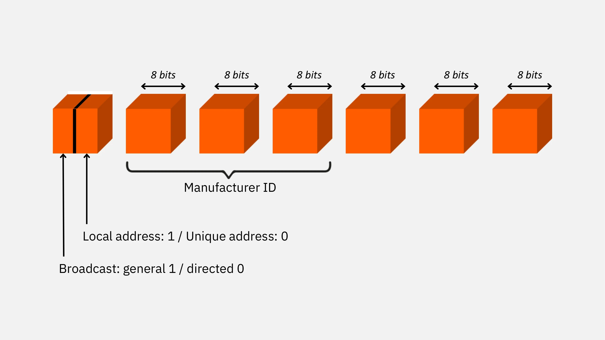


- Визуален пример за IP адрес:


В корпоративна среда тези две нива на адресиране не могат да функционират отделно. Например, когато DHCP сървърът автоматично присвоява IP адрес, MAC адресът на оборудването се използва като отправна точка. Компютърът изпраща DHCP broadcast заявка, съдържаща неговия MAC адрес, за да може сървърът да присвои наличен IP адрес на правилното устройство. Без тази хардуерна идентификация DHCP сървърът няма да знае на кое устройство да предостави адреса.


Следователно протоколът ARP е от основно значение: той осигурява връзката между IP адресите и физическите адреси, като позволява на машините да преобразуват логическа дестинация в действителна физическа дестинация. Когато един компютър трябва да изпрати пакет до машина в същата мрежа, той първо прави справка в ARP таблицата си, за да провери дали MAC адресът на получателя вече е известен. Ако това не е така, той излъчва ARP заявка до всички хостове в локалната мрежа. Машината, която разпознава целевия IP адрес в тази заявка, отговаря, като посочва своя MAC адрес. След това изпращачът записва тази двойка IP/MAC в своя ARP кеш, за да не се налага операцията да се повтаря всеки път, когато се изпраща заявката.


Тази таблица ARP действа като мини директория за картографиране, която се актуализира динамично по подобен начин, както DNS асоциира имена на домейни с IP адреси. Без ARP не би бил възможен никакъв локален обмен, тъй като слоят за връзка с данни трябва да знае MAC адреса, за да капсулира правилно Ethernet кадрите.


И обратното, протоколът RARP (_Reverse Address Resolution Protocol_) е предназначен за обратната ситуация: да позволи на машина, която знае само своя MAC адрес, да открие своя IP адрес. Това е често срещан случай за по-стари работни станции без локален твърд диск, които трябва да се зареждат по мрежата и да изискват IP адрес. В крайна сметка RARP е заменен от **BOOTP**, а след това от **DHCP**, които са по-гъвкави и автоматизирани.


Тези протоколи за асоцииране играят важна роля в маршрутизацията. Маршрутизаторът по същество е машина с множество мрежови интерфейси, свързващи различни сегменти. Когато маршрутизаторът получи рамка, той я обработва, за да извлече IP дейтаграма, и разглежда IP заглавието, за да определи местоназначението. Ако местоназначението е в директно свързана мрежа, дейтаграмата се доставя директно след актуализиране на заглавието. Ако местоназначението принадлежи на друга мрежа, маршрутизаторът прави справка в таблицата си за маршрутизация, за да определи най-добрия път или _следващ скок_ до местоназначението.


Така маршрутът се разделя на по-кратки и по-лесно управляеми участъци. Всеки междинен маршрутизатор знае само следващата стъпка, а не непременно крайната дестинация.


**Припомняме:** Директна доставка се извършва, когато подателят и получателят са в една и съща физическа мрежа. В противен случай доставката е непряка и преминава през един или повече маршрутизатори.


Таблицата за маршрутизация, управлявана ръчно (статична маршрутизация) или динамично (динамична маршрутизация), съдържа информацията, необходима за определяне на маршрута. В малките мрежи статичната конфигурация е достатъчна. В по-големите инфраструктури динамичното маршрутизиране е от съществено значение за автоматичното коригиране на маршрутите при промяна на топологията или при повреда на връзка.


Таблицата за маршрутизация действа като таблица за съпоставяне между целевите IP адреси и следващите шлюзове. Обикновено в нея се съхраняват мрежови идентификатори (_network ID_), а не всеки отделен адрес на хост, което значително намалява нейния размер.


| Destination Address | Next-Hop Router Address | Interface |
| ------------------- | ----------------------- | --------- |

С помощта на тези записи маршрутизаторът може бързо да определи през кой Interface и до кой възел трябва да се изпрати всяка дейтаграма. В комбинация с ARP за разрешаване на съвпадащите MAC адреси, това осигурява ефективен и надежден трансфер на данни в мрежата.


И накрая, протоколите за динамично маршрутизиране включват стандарти като RIP (_Routing Information Protocol_), базиран на алгоритъма за разстояние, и OSPF (_Open Shortest Path First_), който изчислява най-кратките пътища в сложна топология. Тези протоколи постоянно обменят актуализации, за да оптимизират маршрутите, да намалят разходите за пренос и да подобрят устойчивостта срещу прекъсвания или претоварване.


## NAT: Address Превод


<chapterId>4f984d5d-f2e0-4faf-b703-ff315f32cef4</chapterId>


### Определение


Network Address Translation_ (NAT) е техника, разработена за справяне с постепенното изчерпване на наличните IPv4 адреси. Замислен като временно решение преди широкото приемане на IPv6, NAT позволява на компаниите и частните лица да продължат да свързват голям брой машини, като използват само ограничен набор от публични IP адреси.


**Важно напомняне:** преминаването от IPv4 към IPv6 теоретично решава проблема с изчерпването на адресите чрез разширяване на адресното пространство от 32 бита на 128 бита, което осигурява почти неограничен брой адреси (2^128). На практика обаче преходът все още не е завършен и NAT продължава да се използва широко и днес.


Принципът на NAT е прост, но изключително ефективен: вместо да се задава уникален публичен IP адрес на всяко устройство във вътрешната мрежа, за всички частни устройства се използва един маршрутизируем адрес (или малък набор от адреси). Шлюзът NAT, често интегриран в маршрутизатор или защитна стена, след това динамично превежда вътрешния IP адрес заедно с информацията, необходима за правилното насочване на трафика към външния свят, и гарантира, че отговорите се връщат на първоначалния подател.


Този подход има непосредствено предимство: той напълно скрива вътрешната мрежова архитектура. За външния наблюдател всички заявки от работни станции, сървъри или принтери изглеждат като идващи от една и съща публична идентичност. Частните адреси, обикновено взети от запазени диапазони (напр. 192.168.x.x или 10.x.x.x), остават невидими от интернет.


Освен че се справя с недостига на IPv4, NAT повишава и сигурността, като създава първата логическа бариера между вътрешните и публичните мрежи. Нежеланите входящи комуникации са естествено блокирани, тъй като само връзките, инициирани от вътрешната мрежа, се възползват от необходимия превод, за да получат отговори.


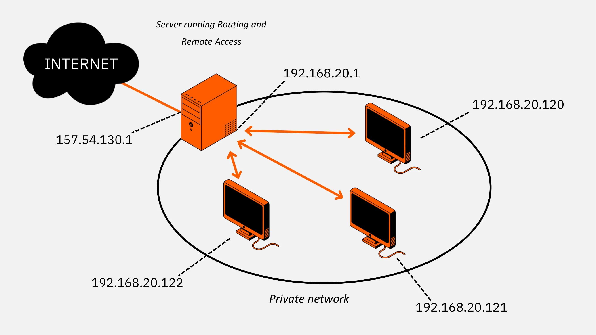


### Типове преводи


NAT може да се прилага по различни начини, за да отговаря на конкретните нужди. Двата основни режима на работа са статичен превод и динамичен превод.


**Статичното преобразуване** създава фиксирано съпоставяне между частен IP адрес и публичен IP адрес. Всяка вътрешна машина е постоянно свързана със своя специален публичен адрес. Например, вътрешно устройство, конфигурирано като 192.168.20.1, може да бъде свързано с маршрутизируем адрес 157.54.130.1. Когато изходящ пакет напуска локалната мрежа, маршрутизаторът заменя адреса на източника на пакета с публичния адрес и извършва обратната операция за входящия трафик. Тази двупосочна транслация е прозрачна за потребителя.


**Предупреждение:** Макар че този метод изолира вътрешната мрежа, той не решава проблема с недостига на публични IP адреси, тъй като все още се нуждаете от толкова публични адреси, колкото са машините, които да разкриете. Затова статичната транслация се използва главно, когато определени вътрешни ресурси трябва да останат достъпни отвън (уеб сървър, пощенски сървър...).


**Динамичното превеждане**, от друга страна, използва пул от публични IP адреси. Когато вътрешен хост започне връзка, маршрутизаторът временно присвоява един от тези публични адреси на частния адрес на хоста за времето на сесията. Връзката е 1 към 1, но е временна:след като връзката приключи, публичният адрес става достъпен за друго устройство. Следователно динамичният NAT намалява броя на необходимите публични адреси, когато не всички машини са онлайн по едно и също време, но все още изисква блок от външни адреси, поне толкова голям, колкото е максималният брой едновременни връзки.


**Прехвърляне на портове** (PAT), известно също като *Претоварване на NAT* или *Маскиране на IP*, отива още по-далеч: всички частни устройства споделят един публичен IP адрес (или много малък брой). За да разграничи сесиите, шлюзът модифицира не само адреса на източника, но и порта на източника. Той поддържа таблица, която свързва всяка двойка *(частен адрес, частен порт)* с уникална двойка *(публичен адрес, публичен порт)*. Тази форма на NAT се използва в почти всички домашни маршрутизатори, като позволява на десетки устройства (компютри, смартфони, свързани обекти и т.н.) да споделят един и същ публичен IP адрес, като поддържат плавна комуникация.


Следователно NAT удължава живота на IPv4, като същевременно добавя ценно ниво на сегментиране и сигурност. Въпреки това, тъй като приемането на IPv6 се разраства и неговото огромно адресно пространство става все по-широко използвано, ролята на NAT вероятно ще намалее, въпреки че за целите на съвместимостта и контрола, той все още ще се използва в някои среди за сегментиране и филтриране на трафика.


### Внедряване на NAT


За да се гарантира правилното функциониране на транслирането на адреси, маршрутизаторът или шлюзът NAT трябва да поддържа точен запис на съпоставките, създадени между всеки частен адрес във вътрешната мрежа и публичния адрес, който се използва за комуникация с външния свят. Тази информация се съхранява в т.нар. таблица за транслация на NAT, която играе основна роля в управлението на мрежовия трафик.


Всеки запис в тази таблица свързва поне една двойка: вътрешния IP адрес на изпращащата машина и външния IP адрес, който ще бъде изложен в интернет. Когато пакет от частната мрежа се изпраща към публична дестинация, NAT маршрутизаторът прихваща кадъра, анализира IP и TCP/UDP заглавията, след което заменя частния адрес на източника с публичния адрес на шлюза. По обратния път същият шлюз улавя входящия пакет, проверява таблицата за съпоставяне и извършва обратната операция, за да пренасочи потока към оригиналния вътрешен IP адрес.


Този принцип на динамичен превод се основава на прецизно управление на таблицата: всеки запис остава валиден, докато има активен трафик, който го оправдава. След конфигурируем период на неактивност записът се изтрива и може да се използва отново за нови връзки.


_Пример на опростена таблица за превод на NAT:_


| Internal IP   | External IP    | Duration (sec) | Reusable? |
| ------------- | -------------- | -------------- | --------- |
| 10.101.10.20  | 193.48.100.174 | 1,200          | no        |
| 10.100.54.251 | 193.48.101.8   | 3,601          | yes       |
| 10.100.0.89   | 193.48.100.46  | 0              | no        |

В този пример, ако през втория запис не е преминал нито един пакет в продължение на повече от час (3600 секунди), той се маркира като повторно използваем. Обратно, продължителност от нула показва активна комуникация, като картографирането е заключено.


Въпреки че NAT работи прозрачно за повечето общи приложения (сърфиране в уеб, електронна поща, прехвърляне на файлове и т.н.), той може да създаде допълнителни предизвикателства за някои мрежови приложения. Някои технологии разчитат на изричен обмен на IP адреси или портове в полезния товар на пакета. След преминаване през NAT шлюз тази информация става непоследователна.


Типични примери за ограничения включват:


- Протоколите peer-to-peer (P2P), които изискват директни връзки между устройствата, са възпрепятствани от бариерата на NAT, тъй като всички вътрешни машини споделят един и същ външен IP адрес и не могат да бъдат достигнати директно без специална конфигурация (например *пренасочване на портове* или UPnP);
- Протоколът IPSec, използван за защита на мрежовите комуникации, криптира заглавията на пакетите. Тъй като NAT трябва да модифицира тези заглавия, за да замени IP адресите, криптирането прави това невъзможно без механизми за адаптиране като NAT-T (*NAT Traversal*);
- Протоколът X Window, който позволява отдалечено показване на графични приложения в Unix/Linux, работи по начин, при който сървърът X активно изпраща TCP връзки към клиентите. Това обръщане на обичайната посока на връзките може да бъде блокирано от NAT.


Като цяло всеки протокол, който изрично включва вътрешния IP адрес в полезния товар на пакета, ще бъде засегнат, тъй като след транслацията този адрес вече няма да съответства на реалния, видим в интернет адрес.


**Важна бележка:** За да се справят с тези проблеми, някои маршрутизатори NAT предлагат _дълбока проверка на пакетите_ (DPI) или _помощници за протоколи_ , които проверяват съдържанието на пакетите, за да идентифицират и динамично да заменят адресите или номерата на портовете в данните на приложението. Това изисква задълбочени познания за формата на протокола и може да създаде уязвимости в сигурността или да увеличи използването на ресурси.


**Предпазливост:** Въпреки че NAT помага да се скрие вътрешната мрежа и да се контролира входящият трафик, той не е заместител на специална защитна стена. Преводът сам по себе си не е пълна бариера за сигурността: той винаги трябва да се допълва от ясни правила за филтриране, за да се блокира нежеланият или нежелан трафик.


_За да илюстрирате как това работи на практика, разгледайте следния пример:_


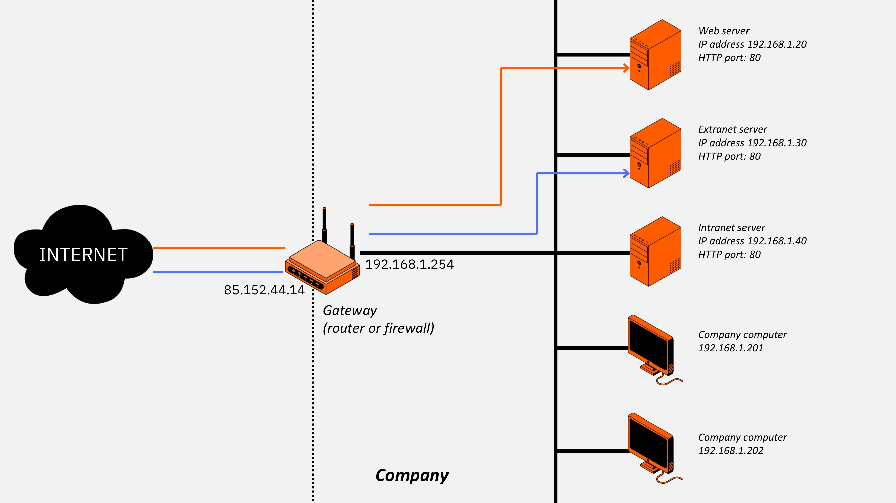


В този сценарий вътрешна работна станция може да получи достъп до вътрешния уеб сървър, като просто извика URL адреса `http://192.168.1.20:80`. Посочването на порта тук не е задължително, тъй като `80` е стандартният HTTP порт.Обратно, ако заявката е инициирана отвън, потребителят ще въведе публичния адрес `http://85.152.44.14:80`. Маршрутизаторът NAT получава заявката, консултира се с таблицата си за съпоставяне и автоматично преобразува публичния адрес в частен, като пренасочва връзката към `http://192.168.1.20:80`.


Същият принцип се прилага и за всеки друг сървър, оторизиран да получава интернет връзки, като например Extranet сървъра (синята верига на схемата).


**Практическа бележка:** във виртуализирани среди често се използват мрежови интерфейси, наречени _virbrX_ (за _Virtual Bridge X_). Тези виртуални мостове, осигурени по-специално от библиотеката libvirt или хипервайзора Xen, свързват виртуалната вътрешна мрежа на машините-гости с физическата мрежа, като прилагат NAT. Обикновено те се конфигурират чрез скриптове в `/etc/sysconfig/network-scripts/`, както е показано по-долу за `virbr0`:


```ini
NAME=""
BOOTPROTO=none
MACADDR=""
TYPE=Bridge
DEVICE=virbr0
NETMASK=255.255.255.0
MTU=""
BROADCAST=192.168.0.255
IPADDR=192.168.0.1
NETWORK=192.168.0.0
ONBOOT=yes
```


След като виртуалният мост е създаден, трябва да активирате IP маршрутизацията и да конфигурирате превода на портове с `iptables`:


```shell
echo 1 > /proc/sys/net/ipv4/ip_forward
```


```shell
iptables -t nat -A POSTROUTING -o <WAN> -s 192.168.0.0/24 -j MASQUERADE
```


При тази конфигурация изходящият трафик се маршрутизира и се прилага NAT транслация, което позволява на виртуалните машини да комуникират с външния свят, без да разкриват директно вътрешните си IP адреси.


В следващата глава ще разгледаме подробно конфигурирането на IP адреси под Linux, като ще разгледаме както прости, така и усъвършенствани методи, подходящи за различни контексти на администриране.


https://planb.academy/tutorials/computer-security/communication/pi-hole-46a735c5-8af3-4cc3-a2c2-1d4f6a7dc428

https://planb.academy/tutorials/computer-security/operating-system/opnsense-90c2785d-a0d7-4981-be8d-d290bbeb8263

https://planb.academy/tutorials/computer-security/operating-system/pfsense-24eea96a-2fdc-42a6-a77b-89bc29149864


## Как да конфигурирам мрежата с помощта на `ip`?


<chapterId>8ba7e946-d2a0-4841-8d54-e85ba96baa25</chapterId>


### Стандартна конфигурация


След като разгледахме теоретичните основи на мрежите и разбрахме как работят заедно IP адресите, маските, маршрутизацията и транслацията, е време да преминем към практическото конфигуриране. В GNU/Linux мрежовите настройки вече се извършват с командата **`ip`** (пакет _iproute2_), която замества по-старата `ifconfig`.


`ip` ви позволява да задавате или променяте IP адрес, да променяте маска, да стартирате или спирате интерфейс, както и да проверявате състоянието му по всяко време.


**TIPS:** за показване на всички интерфейси (активни или не): `ip addr show`


Пример: задаване на статичен адрес и активиране на Interface


Добавяне на адрес `192.168.1.2/24` към Interface `eth0`:


```shell
ip addr add 192.168.1.2/24 dev eth0
```


Активирайте Interface:


```shell
ip link set dev eth0 up
```


Деактивирайте същия Interface:


```shell
ip link set dev eth0 down
```


Показване на състоянието на конкретен Interface:


```shell
ip addr show dev eth2
```


**Практически съвет:** с `ip` добавянето на допълнителен адрес към интерфейс вече не изисква суфикс `:1`. Просто добавете още един ред `ip addr add ...`:


```shell
ip addr add 172.18.2.39/24 dev eth2
```


### Скриптове за активиране: ifup / ifdown


Помощните програми `ifup` и `ifdown` четат статични конфигурационни файлове от `/etc/sysconfig/network-scripts/` (в RHEL, CentOS, Rocky Linux, AlmaLinux...) или `/etc/network/interfaces` (в Debian/Ubuntu), за да изчистят интерфейсите и да ги включат или изключат.


```shell
ifup eth1
ifdown eth2
```


Файлове за конфигуриране (подобно на RHEL):


- /etc/sysconfig/network**: глобални настройки (NETWORKING, HOSTNAME, GATEWAY...).
- ifcfg-**: специфични настройки за всеки интерфейс.


Статичен пример (ifcfg-eth0):


```ini
DEVICE=eth0
BOOTPROTO=none
ONBOOT=yes
IPADDR=192.168.2.5
NETMASK=255.255.255.0
GATEWAY=192.168.2.1
```


Пример за DHCP:


```ini
DEVICE=eth0
BOOTPROTO=dhcp
ONBOOT=yes
```


Тази модулна структура все още е валидна и може лесно да се автоматизира в настоящите системи.


### Разширена конфигурация: свързване


В професионалните среди целта е да се гарантира непрекъснатост на услугата и/или да се агрегира честотната лента. *Механизмите за свързване* (или *teaming* с _teamd_) отговарят на тези нужди: няколко физически интерфейса функционират като един логически Interface, често наричан `bond0` или `team0`.


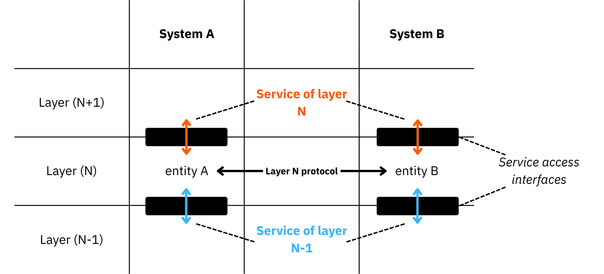


Предварителни условия:


- Зареждане на модула `bonding` (или използване на `teamd`) ;
- Имате на разположение поне два физически интерфейса.


#### Различни разпространени методи за свързване:


|Mode|Name|Principle|
|---|---|---|
|0|balance-rr|Round-robin, cyclic distribution of frames|
|1|active-backup|Single active interface with hot failover |
|2|balance-xor|Selection based on XOR of src/dst MAC addresses|
|3|broadcast|Broadcast simultaneously on all interfaces   |
|4|802.3ad (LACP)|Standardized dynamic aggregation; requires compatible switch|
|5|tlb (Transmit Load Balancing)|Balancing based on transmit load|
|6|alb (Adaptive Load Balancing)|Adaptive balancing; also balances receive via ARP|

#### Настройка с `IP връзка


- Деактивиране на физическите интерфейси:


```shell
ip link set eth0 down
ip link set eth1 down
```


- Създайте свързания Interface:


```shell
ip link add bond0 type bond mode balance-alb
```


- Конфигуриране на опциите след създаване


```shell
ip link set bond0 type bond miimon 100
```


- Присвояване на MAC и IP адреси:


```shell
ip link set dev bond0 address 00:17:56:BC:02:3A
ip addr add 192.168.2.3/24 dev bond0
ip route add default via 192.168.2.1
```


- Прикачване на подчинени интерфейси:


```shell
ip link set eth0 master bond0
ip link set eth1 master bond0
```


- Върнете всичко нагоре:


```shell
ip link set bond0 up
ip link set eth0 up
ip link set eth1 up
```


**Съвет:** за да отделите подчинено устройство, без да прекъсвате връзката: `ip link set eth1 nomaster`


#### Постоянна конфигурация (подобно на RHEL)


Създайте три файла в `/etc/sysconfig/network-scripts`:


_ifcfg-bond0_


```ini
DEVICE=bond0
ONBOOT=yes
BOOTPROTO=none
IPADDR=192.168.2.3
NETMASK=255.255.255.0
BROADCAST=192.168.2.255
GATEWAY=192.168.2.1
BONDING_OPTS="mode=balance-alb miimon=100"
```


_ifcfg-eth0_


```ini
DEVICE=eth0
ONBOOT=yes
MASTER=bond0
SLAVE=yes
```


_ifcfg-eth1_


```ini
DEVICE=eth1
ONBOOT=yes
MASTER=bond0
SLAVE=yes
```


След това:


```shell
systemctl restart network
```


#### Допълнителен IP адрес (модерен псевдоним)


С помощта на `ip` можете просто да добавите втори адрес към същото устройство:


```shell
ip addr add 192.168.1.2/24 dev eth0
```


За да направите този псевдоним постоянен след рестартиране, добавете втори блок `IPADDR2=...` / `PREFIX2=...` към `ifcfg-eth0` или създайте нова *NetworkManager* връзка чрез `nmcli`.


Благодарение на `ip` и свързаните с него команди (`ip link`, `ip addr`, `ip route`) конфигурацията на мрежата е по-последователна, ясна и може да се използва в скриптове. Свързването е ключов компонент на архитектурите с висока достъпност, а задаването на множество адреси на един интерфейс стана много по-лесно.


В следващата глава ще разгледаме особеностите и прилагането на IPv6 адресирането.


# IPv6 адресиране


<partId>9b1d87f1-2a68-496e-b5dd-76cf74fb8cde</partId>


## IPv6: Стандарти и определения


<chapterId>d1f16f0a-1104-460d-8d67-f725665f8e3f</chapterId>


Сега преминаваме към следващото поколение IP адресиране: протоколът IPv6, първоначално известен като IPng (_IP Next Generation_). Създаден, за да преодолее структурните ограничения на IPv4, този протокол въвежда значително разширена архитектура за адресиране, както и множество технически оптимизации.


Мотивите за приемането на IPv6 са разнообразни и са свързани с критични нужди за развитието на интернет. На първо място, ролята на IPv6 е да поддържа експоненциалното нарастване на броя на свързаните устройства (цел, която е непостижима с ограниченото адресно пространство на IPv4). На второ място, протоколът има за цел да намали размера на таблиците за маршрутизация, като направи обмена по-ефективен и намали натоварването на маршрутизаторите в дългосрочен план.


IPv6 също така се стреми да опрости някои аспекти на обработката на пакети, като подобри потока от дейтаграми и оптимизира скоростта на трансфер между мрежите. От гледна точка на сигурността в основната спецификация са включени заглавията AH/ESP на протокола *IPsec* и всички възли на IPv6 трябва да могат да ги поддържат (RFC 6434). Използването им обаче остава незадължително: администраторът сам решава дали да ги включи в зависимост от контекста.


Други цели включват по-прецизно управление на видовете услуги, по-специално за осигуряване на по-добро качество за приложения в реално време (VoIP, видеоконференции и др.). IPv6 е проектиран и така, че да позволява по-гъвкаво управление на мобилността: дадено устройство може да сменя точките за достъп, без да променя адреса си по начин, който да е видим за връстниците му.


И накрая, IPv6 е проектиран да съществува заедно с по-старите протоколи. Въпреки че не е пряко бинарно съвместим с IPv4, той остава напълно оперативно съвместим с протоколи от по-високо ниво, като TCP, UDP, ICMPv6 и DNS, както и с протоколи за маршрутизация, като OSPF и BGP, при спазване на определени корекции. За управление на многоадресното предаване IPv6 използва протокола MLD (*Multicast Listener Discovery*), който е функционален еквивалент на IGMP в среда IPv4.


### Правила за записване


Една от най-значимите промени в IPv6 е форматът на самия IP адрес. За да се преодолее хроничният недостиг на IPv4 адреси, дължината на адреса е увеличена от 32 бита на 128 бита, т.е. 16 байта. Теоретично това дава възможност за адресно пространство от:


$$3,4 пъти 10^{38}$$


Това осигурява практически неограничен капацитет за цялото настоящо и бъдещо оборудване.


IPv6 адресите се записват по съвсем различен начин от познатия ни точков десетичен запис. IPv6 адресът се състои от осем 16-битови групи, записани в шестнадесетична бройна система и разделени с двоеточия `:`.


Например:


```
1987:0c02:0000:84c2:0000:0000:cf2a:9077
```


За да се опрости записването, водещите нули във всяка група могат да бъдат пропуснати. Така горният пример става:


```
1987:c02:0:84c2:0:0:cf2a:9077
```


Освен това една непрекъсната последователност от нулеви групи може да бъде заменена с::, което допълнително съкращава адреса:


```
1987:c02:0:84c2::cf2a:9077
```


**Предупреждение:** това правило е строго: само една последователност от последователни нули може да бъде заменена с `::`. Ако адресът съдържа няколко последователности от нули, се сгъстява само най-дългата от тях. Това гарантира едновременно уникалност и четимост.


**Важна подробност:** символът `:`, използван за разделяне на шестнадесетични блокове, може да доведе до двусмислие в URL адресите, тъй като `:` се използва и за обозначаване на порт на услугата. За да се избегне объркване, IPv6 адресите в URL адресите трябва да бъдат затворени в квадратни скоби `[ ]`.


Пример за HTTP достъп до определен порт за адрес `2002:400:2A41:378::34A2:36`:


```
http://[2002:400:2A41:378::34A2:36]:8080
```


Когато представяте IPv4 адрес в контекста на IPv6, можете да използвате смесена нотация в десетична форма, предшествана от `::`:


```
::192.168.1.5
```


Тази съвместимост улеснява прехода между двата протокола, като позволява включването на блокове от IPv4 в адресното пространство на IPv6.


**Забележка:** За да се стандартизира начинът, по който се записват адресите, RFC 5952 определя каноничен формат с правила за съкращения, за да се избегнат множество представяния на един и същ адрес. Следването на тези препоръки помага да се намали погрешното тълкуване и осигурява последователни мрежови конфигурации.


### Видове IPv6 адреси


IPv6 се различава от своя предшественик чрез широк набор от категории адреси, всяка от които е предназначена за специфични приложения, като същевременно позволява гъвкаво маршрутизиране и управление на мрежата. Както и при IPv4, адресите могат да бъдат глобални, локални, резервирани или специфични за определени механизми за преход.


Неуточнен IPv6 адрес се представя с `::` или, по-ясно, `::0.0.0.0`. Тази специална форма се използва по време на получаването на адреси или като стойност по подразбиране, за да се посочи липсата на адрес.


| IPv6 Address Prefix | Description                                 |
| ------------------- | ------------------------------------------- |
|::/8                | Reserved addresses                          |
| 2000::/3            | Unicast addresses, routable on the Internet |
| fc00::/7            | Unique local addresses (1)                  |
| fe80::/10           | Link-local addresses                        |
| ff00::/8            | Multicast addresses                         |

(1): *В частна локална мрежа префиксът `fd00::/8` е предпочитан за присвояване на вътрешни адреси, които не могат да бъдат маршрутизирани в интернет.*


#### Запазени адреси


Някои диапазони на IPv6 са изрично запазени и не трябва да се използват като глобални адреси. Те имат специфични технически цели:


- `::/128`**: неуточнен адрес, който никога не е бил постоянно присвоен на устройство, но се използва като адрес на източника от машина, която очаква конфигурация.
- `::1/128`**: адресът _loopback_, директният еквивалент на `127.0.0.1` в IPv4, който позволява на машината да се адресира сама.
- `64:ff9b::/96`**: Запазено за транслатори на протоколи, за да се даде възможност за взаимовръзка между IPv4 и IPv6, както е определено в RFC 6052.
- `::ffff:0:0/96`**: блок за съвместимост за представяне на IPv4 адрес в специфична IPv6 структура, често използван вътрешно от приложенията.


Тези блокове гарантират оперативна съвместимост и улесняват миграцията между двете версии на протокола.


#### Глобални униластни адреси


Глобалните уникаст адреси съставляват по-голямата част от публично маршрутизируемото IPv6 пространство, като представляват около 1/8 от адресното пространство. От 1999 г. насам IANA разпределя тези блокове, като например префикса `2001::/16`, в CIDR блокове (от `/23` до `/12`) на регионални регистри, които след това ги преразпределят на доставчици и организации.


Някои диапазони имат специални документирани употреби:


- `2001:2::/48`**: Запазено за тестване на производителността и оперативната съвместимост (RFC 5180).
- `2001:db8::/32`**: Запазено за документация и примери (RFC 3849).
- `2002::/16`**: Използва се за механизма 6to4, който позволява на IPv6 трафика да преминава през IPv4 инфраструктура (полезно по време на преходната фаза между двата протокола).


**Забележка:** голяма част от глобалните адреси остават неизползвани и служат като резерв за бъдещо разрастване на интернет.


#### Уникални локални адреси (ULA)


Уникалните локални адреси (`fc00::/7`) са IPv6 еквивалентът на IPv4 частните адреси (RFC1918). Те позволяват създаването на изолирани вътрешни мрежи, без да се рискува конфликт с публичното адресиране. На практика ефективният префикс е `fd00::/8`, като осмият бит е зададен на 1, за да се посочи локалното използване. Всеки ULA блок включва 40-битов псевдослучаен идентификатор, което свежда до минимум адресните колизии при свързване на отделни частни мрежи.


#### Локални адреси на връзката


Линк-локалните адреси (`fe80::/64`) се използват изключително за комуникация в рамките на един и същ сегмент на Layer 2 (една и съща VLAN или комутатор). Те никога не се маршрутизират извън локалната връзка. Всеки мрежов Interface автоматично генерира линк-локален адрес, който често се извлича от неговия MAC адрес, като се използва схемата EUI-64.


**Специална характеристика**: една и съща машина може да използва един и същ линк локален адрес на няколко интерфейса, но интерфейсът трябва да бъде посочен при комуникация, за да се избегне двусмислие.


#### Многоадреси


В IPv6 излъчването е заменено с многоадресация - по-ефективен начин за предоставяне на пакети на определена група получатели. Обхватът на многоадресното излъчване се префигира с `ff00::/8`. Това включва адреси като `ff02::1`, които са насочени към всички възли на локалната връзка. Макар и удобен, този адрес вече не се препоръчва за приложения, тъй като може да generate неконтролирани излъчвания.


Често срещана употреба на многоадресация е _Протоколът за откриване на съседи_ (NDP), който замества ARP в IPv6. NDP използва специфични многоадреси, като например `ff02::1:ff00:0/104`, за автоматично откриване на други хостове, свързани към същата връзка.


Чрез комбинирането на тези типове адреси IPv6 предоставя пълен набор от възможности за посрещане на нуждите на глобалното маршрутизиране, локалните комуникации, миграцията на IPv4/IPv6 и автоматичното конфигуриране на устройствата, като същевременно подобрява ефективността на преноса.


### Обхват на Address


Обхватът на един IPv6 адрес определя точния домейн, в който той е валиден и уникален. Разбирането на тази концепция е от ключово значение за овладяването на маршрутизацията на пакети и логическата организация на IPv6 мрежа. IPv6 адресите обикновено се групират в три основни категории въз основа на техния обхват и употреба: unicast, anycast и multicast.


**Адресите Unicast** са най-често срещаните и включват няколко различни подтипа.

Те включват адреса _loopback_ (`::1`), чийто обхват е ограничен до хоста, който го използва, и който се използва за вътрешно тестване на мрежовия стек, без да се изпраща трафик по физическата мрежа.

След това има адреси, локални за връзката (_link-local_), чийто обхват е ограничен до един мрежов сегмент: те се използват за директна комуникация между устройства на една и съща физическа или логическа връзка (например един комутатор или VLAN).

И накрая, уникалните локални адреси (_ULA_, за _Unique Local Addresses_) са вътрешни за дадена частна мрежа. Те могат да бъдат маршрутизирани между множество частни сегменти, но никога не са видими в интернет.


Концептуално IPv6 адресите често се представят като двоична структура, в която първата половина (първите 64 бита) идентифицира мрежовия префикс, а втората половина (също 64 бита) идентифицира уникално интерфейса на устройството в тази мрежа. Това разделяне улеснява автоконфигурацията на адреса чрез механизми като SLAAC (_Stateless Address Autoconfiguration_), които позволяват на машините автоматично да generate стабилен адрес въз основа на MAC адреса или псевдослучаен идентификатор.


| Field     | Prefix | L | Global ID | Subnet | Interface ID |
|-----------|--------|---|-----------|--------|---------------|
| Bits      | 7      | 1 | 40        | 16     | 64            |

Архитектурата на IPv6 следва йерархичния модел на глобално маршрутизиране на днешния интернет. Разделянето на префиксите позволява на регионалните регистри и мрежовите оператори да управляват разпределението на адресите по децентрализиран начин, като същевременно осигуряват глобална уникалност. В тази рамка един и същ хост може едновременно да притежава глобален уникаст адрес за интернет комуникация и локален адрес за локално взаимодействие, например с непосредствения квартал или за съобщения за откриване на маршрутизатори.


| Field     | Prefix | Zero | Interface ID |
|-----------|--------|------|--------------|
| Bits      | 10     | 54   | 64           |

**Аникаст адресите** представляват междинна концепция, която се основава на модела на уникаст, но в определени случаи може да се държи като мултикаст. По същество anycast адресът е unicast адрес, присвоен на няколко интерфейса, разпределени в различни мрежови възли. Когато пакетът се изпраща към anycast адрес, протоколът IPv6 има за цел да го достави до един от хостовете, споделящи този адрес, обикновено най-близкия по отношение на топологията на маршрутизиране. Този подход оптимизира скоростта на обработка на заявките и подобрява устойчивостта на разпределените услуги. Класически пример са кореновите DNS сървъри, при които anycast адресирането автоматично насочва заявките към най-близката точка на присъствие.


| Field     | Prefix | Subnet | Interface ID |
|-----------|--------|--------|--------------|
| Bits      | 48     | 16     | 64           |

В IPv6 **многоадресите** заменят механизма за излъчване, който се считаше за твърде скъп и неподходящ за глобална мрежа. Мултикастният адрес идентифицира група интерфейси, обикновено в няколко хоста, които желаят да получават едни и същи пакети едновременно.

Всеки мултикаст адрес включва специално 4-битово поле _scope_, което определя географската или логическата граница на излъчването:


- Обхват от `1` означава, че пакетът е предназначен само за локалното устройство.
- Обхват от `2` ограничава пакета до локалната връзка: всички устройства в същия физически или виртуален сегмент могат да го получат.
- Обхват от `5` разширява обхвата до сайт, обикновено до цялата корпоративна мрежа.
- Обхватът от `8` разширява обхвата на организацията, като позволява доставка във всички подмрежи на същата организация.
- Обхват от `e` (14 в шестнадесетична бройна система) показва глобален обхват, което прави многоадресатната група достъпна от всяка точка на интернет, ако инфраструктурата за маршрутизация го поддържа.


Структурата на IPv6 multicast адреса включва:


- поле _Flag_ (4 бита) определя дали групата е постоянна или временна,
- поле _Scope_ (4 бита) определя обхвата,
- идентификационно поле (112 бита), идентифициращо номера на групата за многоадресно предаване.


| Field      | Prefix | Flags | Scope | Group ID |
|------------|--------|--------|--------|----------|
| Bits       | 8      | 4      | 4      | 112      |

Добре познат пример за многоадресация на IPv6 в действие е протоколът _Neighbor Discovery Protocol_ (NDP). Вместо да използва ARP, както в IPv4, NDP разчита на многоадреси, като например `ff02::1:ff00:0/104`, за да излъчва заявки за откриване на съседи, насочени само към съответните хостове на същата връзка.


Чрез толкова прецизно дефиниране на обхвата на адресите IPv6 структурира начина на изпращане, получаване и маршрутизиране на потоците от данни. Тази детайлност прави протокола по-гъвкав и ефективен за управление на локални и глобални комуникации, като същевременно се избягват недостатъците на обобщеното излъчване.


## Присвояване на Address в локална мрежа


<chapterId>4c9c3e52-59bc-499a-af0a-6dd369a9e029</chapterId>


В тази глава ще разгледаме един от най-практичните аспекти на внедряването на IPv6: присвояване на IP адреси на хостове в локалната мрежа. Архитектурата на IPv6 е проектирана за гъвкавост, като позволява на всяко устройство да generate собствения си адрес автоматично, като същевременно позволява напълно ръчно конфигуриране, когато е необходимо.


Локалната мрежа IPv6 систематично разделя адреса на две части:


- първите 64 бита представляват префикса на подмрежата, който обикновено се предоставя от маршрутизатор или орган, отговарящ за адресите;
- останалите 64 бита се използват от хоста за уникална идентификация в този сегмент.

Този модел значително опростява агрегирането на маршрути и управлението на адресни блокове.


За присвояване на адреси на устройствата се използват два основни подхода:


- Ръчно конфигуриране, при което администраторът задава точния адрес на всеки интерфейс;
- Автоматично конфигуриране, при което устройствата динамично получават своите собствени адреси generate или generate.


При ръчно конфигуриране администраторът присвоява пълния IPv6 адрес на всеки интерфейс. Някои стойности остават запазени:


- `::/128`: неустановен адрес, никога не е бил постоянно присвоен ;
- `::1/128`: loopback адрес (_loopback_), IPv4 еквивалент: `127.0.0.1`.


За разлика от IPv4 няма концепция за _броудкаст_; комбинациите "всички нули" или "всички единици" в частта за хоста нямат специално значение.

Ръчното конфигуриране все още е полезно в контролирани среди, но става трудно за поддържане в голям мащаб.


Съществуват няколко метода за автоматично конфигуриране:


- Протоколът **NDP** (_Neighbor Discovery Protocol_), посочен в RFC4862, позволява *безсъдържателно* автоматично конфигуриране. В този режим хостът получава мрежов префикс от местен маршрутизатор и сам допълва адреса с идентификатор, базиран на неговия MAC адрес. Този метод е лесен за внедряване и не изисква централен сървър.
- Приложения като тези в Windows могат да generate частта за хоста по псевдослучаен начин, за да се подобри поверителността, като се избегне директното разкриване на MAC адреса. Разкриването на MAC адреса в IPv6 пакетите може да породи опасения за неприкосновеността на личния живот, тъй като позволява проследяване на дадено устройство в различни мрежи.
- Протокол DHCPv6: Той е дефиниран в RFC3315 и е подобен на DHCP, използван за IPv4, но позволява по-контролирано и централизирано конфигуриране, включително управление на наема, допълнителни опции (DNS, MTU...) и регистрация на бази данни. DHCPv6 може да работи самостоятелно или заедно с конфигурация без състояние, за да предоставя допълнителни параметри, без да присвоява самия IP адрес.


**Важна бележка:** При метода, базиран на MAC, MAC адресът се преобразува в 64-битов идентификатор, като се използва форматът EUI-64. Този механизъм вмъква байтовете `FF:FE` в средата на оригиналния MAC адрес (в 48 бита) и инвертира 7-ия бит, за да посочи глобална уникалност. Резултатът е стабилен идентификатор Interface, който се използва в пълния IPv6 адрес.


Ето един пример за преобразуване на MAC адрес в EUI-64:


Въпреки това, поради нарастващата загриженост за проследяването на устройствата, съвременните операционни системи (по-специално Linux, Windows 10+, macOS, Android) вече позволяват разширения за поверителност по подразбиране. Те използват произволно генерирани идентификатори на интерфейси, които периодично се подновяват за изходящи връзки, като същевременно запазват стабилен идентификатор за вътрешни комуникации (като DNS или DHCPv6).


Както и при DHCP в IPv4, автоматично присвоените IPv6 адреси могат да имат два срока на живот, определени от DHCPv6 маршрутизаторите или сървърите:


- Предпочитан срок на живот*: след изтичането на този период адресът остава валиден, но вече не се използва за иницииране на нови връзки;
- Срок на валидност*: когато този срок изтече, адресът се премахва напълно от конфигурацията на Interface.


Тази система дава възможност за динамично управление на промените в мрежата, например за осигуряване на плавен преход от един доставчик на интернет услуги към друг. Чрез актуализиране на префикса, обявен от маршрутизаторите, и паралелно коригиране на DNS записите миграцията към IPv6 може да се извърши без забележимо прекъсване на услугата.


**Съвет:** Комбинираното използване на жизнените цикли на адресите и DNS дава възможност за прилагане на стратегия за постепенен преход, при която новите връзки преминават към нова топология, докато съществуващите връзки продължават да съществуват до естествения си край.


Накратко, IPv6 предлага широка гама от гъвкавост за присвояване на адреси: ръчно конфигуриране, автоматично конфигуриране без промяна на състоянието или с промяна на състоянието, DHCPv6 или случайно генериране. Всеки подход има своите предимства и ограничения и може да бъде адаптиран в зависимост от необходимото ниво на контрол, размера на мрежата или нуждите за защита на личните данни.


## Присвояване на блокове IPv6 адреси


<chapterId>45cce866-1b58-4888-b3fe-15c922180839</chapterId>


### Разпределение на Address


Схемата за разпределение на IPv6 адреси е структурирана така, че да постигне две цели: да гарантира уникалност на глобалния адрес и да даде възможност за логическа йерархия, която благоприятства обединяването и опростяването на таблиците за маршрутизация.

Както и при IPv4, на върха на тази йерархия се намира *Интернетският орган за присвояване на номера* (IANA). Той управлява глобалното едноадресно адресно пространство и делегира адресни блокове на петте регионални интернет регистъра (_RIR_).


Петте съществуващи РИО са:


- ARIN (Северна Америка),
- RIPE NCC (Европа, Близък изток, Централна Азия),
- APNIC (Азиатско-тихоокеански регион),
- AFRINIC (Африка),
- LACNIC (Латинска Америка и Карибския басейн).


IANA разпределя на всеки RIR блокове IPv6 с различен размер, обикновено между /23 и /12. Този подход предлага гъвкавост, като същевременно осигурява дългосрочна мащабируемост. От своя страна RIRs преразпределят тези блокове на доставчиците на интернет услуги (ISP), големите корпорации и публичните институции.


От 2006 г. насам всеки RIR получава от IANA блок IPv6/12 - фиксиран размер, предназначен да осигури стабилен и достатъчно голям резерв за бъдещо разрастване. Обикновено RIR ги разделят на блокове /23, /26 или /29. Доставчиците на интернет услуги най-често получават блокове /32, въпреки че този размер може да варира в зависимост от големината и географския район на доставчика на интернет услуги. Обикновено те разпределят /48 блокове на клиентите. Всеки /48 предоставя 65 536 отделни подмрежи /64 (огромен капацитет в сравнение с IPv4).


**Важна бележка:** един блок /32 съдържа точно 65 536 подблока /48. Това означава, че всеки доставчик на интернет услуги може да обслужва десетки хиляди клиенти, без да изчерпи разпределението си. Благодарение на своя /48 всеки клиент ще разполага с гигантско пространство, за да структурира собствената си вътрешна мрежа с толкова /64 сегмента, колкото желае.


Типичната йерархия на разпределение изглежда по следния начин:


| IANA | RIR | LIR | Customer | Subnet | Interface |
|------|-----|-----|----------|--------|-----------|
|  3   | 20  |  9  |    16    |   16   |     64    |

При това изобилие от адреси вече не е необходимо да се използва NAT (*Network Address Translation*), който някога беше необходим в IPv4 за справяне с недостига на адреси. Всеки хост може да има уникален, глобално маршрутизируем публичен адрес, което опростява връзката от край до край и улеснява използването на протоколи като IPSec, VoIP или входящи връзки.


За да проверите на коя организация принадлежи даден IPv6 адрес, можете да използвате командата `whois`, за да направите справка в публичните бази данни RIR. Тази прозрачност дава възможност да се идентифицира организацията, която притежава даден префикс, което може да бъде полезно за целите на мрежата, анализа или сигурността.


### Адресиране на PA срещу PI


Първоначално моделът за разпределение на IPv6 се основаваше единствено на PA (*Provider Aggregatable*) блокове, което означаваше, че са свързани с доставчика на интернет услуги. При този модел организацията получава своя префикс от своя доставчик на интернет услуги, което означава, че смяната на доставчика изисква преномериране на цялата инфраструктура.


Въпреки че функциите за автоматично конфигуриране на IPv6 и продължителността на живота на адресите улесняват преномерирането, то остава неудобно за организациите с критична инфраструктура или с множество връзки с доставчици за изисквания за резервиране.


От 2009 г. насам политиките за разпределение позволяват блокове PI (*Независим доставчик*). Тези блокове (обикновено с размер /48) се разпределят директно на компания или институция от РИР, независимо от доставчика на интернет услуги. Този модел е особено подходящ за организации, които практикуват *multihoming* (т.е. свързани са към няколко оператора едновременно). Например в Европа RIPE-512 описва политиката за разпределяне на PI.


### Записване на маска на подмрежата


Както и в IPv4, IPv6 използва CIDR (*Classless Inter-Domain Routing*). Това се състои в посочване на броя на битовете, съставляващи префикса, след адреса, като се използва символът `/`.


Вземете следния пример:


```
2001:db8:1:1a0::/59
```


Това означава, че първите 59 бита са фиксирани и идентифицират мрежата. Всички останали битове (тук 69 бита) могат да се използват за идентифициране на подмрежи или хостове.


Така този запис обхваща адреси от `2001:db8:1:1a0:0:0:0:0` до `2001:db8:1:1bf:ffff:ffff:ffff:ffff:ffff`.


Следователно този блок обхваща набор от 8 /64 подмрежи, всяка от които може да приема огромен брой устройства.


Нотацията CIDR позволява прецизно планиране на адресното пространство - от широкомащабни мрежи до домашни настройки и виртуализирани среди - и насърчава агрегирането на маршрути, като намалява натоварването на маршрутизатора и подобрява мащабируемостта.


### IPv6 пакети и заглавия


Форматът на пакетите на IPv6 се различава от този на IPv4, тъй като е едновременно по-прост и по-разширен. IPv6 дейтаграмата винаги започва с 40 байта заглавна част с фиксиран размер, съдържаща цялата основна информация за маршрутизацията. Този опростен подход, в сравнение с променливата дължина на заглавието на IPv4 (от 20 до 60 байта), позволява по-бърза и по-ефективна обработка на пакетите от маршрутизаторите.


Въпреки това IPv6 не премахва функционалността: вместо да интегрира многобройни незадължителни полета в основното заглавие, той въвежда система от разширени заглавия, поставени непосредствено след основното заглавие. Тези незадължителни заглавия дават възможност да се добавят данни или инструкции, специфични за определени функции, без да се натоварват излишно обикновените пакети.


Някои заглавия на разширения следват фиксирана структура, докато други могат да съдържат различен брой опции. В тях опциите се кодират като тройки `{Тип, Дължина, Стойност}`:


- Полето "Тип" (1 байт) показва естеството на опцията;
- Първите два бита на "Type" определят какво трябва да направят маршрутизаторите, ако опцията не е разпозната:
 - Игнорирайте тази опция и продължете лечението,
 - Отхвърляне на дейтаграмата,
 - Отпадане и изпращане на ICMP грешка до източника.
 - Отхвърляне на дейтаграмата без уведомяване (в случай на многоадресирани пакети).
- Полето "Дължина" (1 байт) задава размера на полето "Стойност" - от 0 до 255 байта;
- Полето "Стойност" съдържа данните, свързани с опцията.


Ето общ преглед на различните видове разширителни заглавия, дефинирани в IPv6.


#### Заглавие Hop-by-Hop


Това заглавие, ако има такова, винаги се поставя непосредствено след основното заглавие. Тя съдържа информация, която трябва да бъде обработена от всеки маршрутизатор по пътя на пакета, за разлика от повечето други заглавия, които обикновено се обработват само от крайния възел. Типичните употреби включват сигнализиране на глобални параметри или заявяване на конкретни стъпки за обработка, докато пакетът преминава през мрежата.


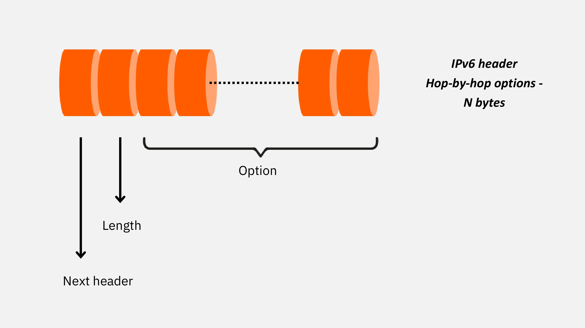


#### Заглавие за маршрутизиране


Заглавието за маршрутизиране посочва списък с междинни адреси, през които трябва да премине пакетът. Съществуват два основни режима на маршрутизиране:


- Строго маршрутизиране: точният път е предварително определен
- Свободно маршрутизиране: посочени са само някои задължителни стъпки.


Първите четири полета на това заглавие за вкореняване са:


- Next Header**: идентифицира типа на следващото заглавие;
- Routing Type**: определя метода на маршрутизиране (обикновено `0`);
- Оставащи сегменти**: брой сегменти, които остават за преминаване ;
- Address[n]**: списък с междинни адреси.


Полето "Оставащи сегменти" започва с общия брой на оставащите сегменти и се намалява с единица на всеки скок.


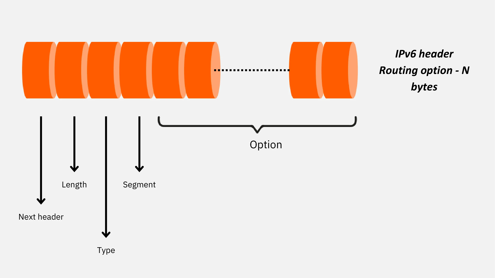


#### Заглавие за фрагментиране


В IPv6 само на изходния хост е разрешено да фрагментира дадена дейтаграма, за разлика от IPv4, където това можеха да правят и маршрутизаторите. Всички възли на IPv6 трябва да могат да обработват пакети от поне 1280 байта. Ако маршрутизатор срещне пакет, по-голям от MTU на следващата връзка, той изпраща съобщение *ICMPv6 Packet Too Big* (Пакетът е твърде голям) обратно към източника, който след това коригира размера на своите предавания.


Заглавието за фрагментация съдържа следните полета:


- Идентификация**: уникален идентификатор на дейтаграма за повторно сглобяване.
- Отместване на фрагмента**: позицията на фрагмента в рамките на оригиналната дейтаграма.
- M флаг**: показва дали следват още фрагменти.


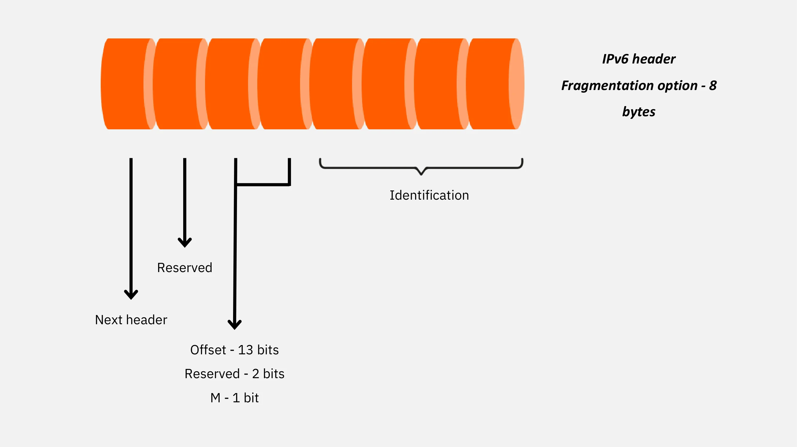


#### Заглавие за удостоверяване (AH)


Това заглавие е предназначено за защита на комуникациите чрез проверка на автентичността на изпращача и на целостта на данните. Обикновено се използва с протокола IPsec. С помощта на код за удостоверяване получателят може да потвърди, че съобщението наистина идва от очаквания подател и че не е било променено при преноса.


В случай на опит за измамна модификация кодът за удостоверяване вече няма да съвпада и дейтаграмата може да бъде отхвърлена. Този механизъм също така предпазва от атаки за преиграване, като открива неразрешени дублирания.


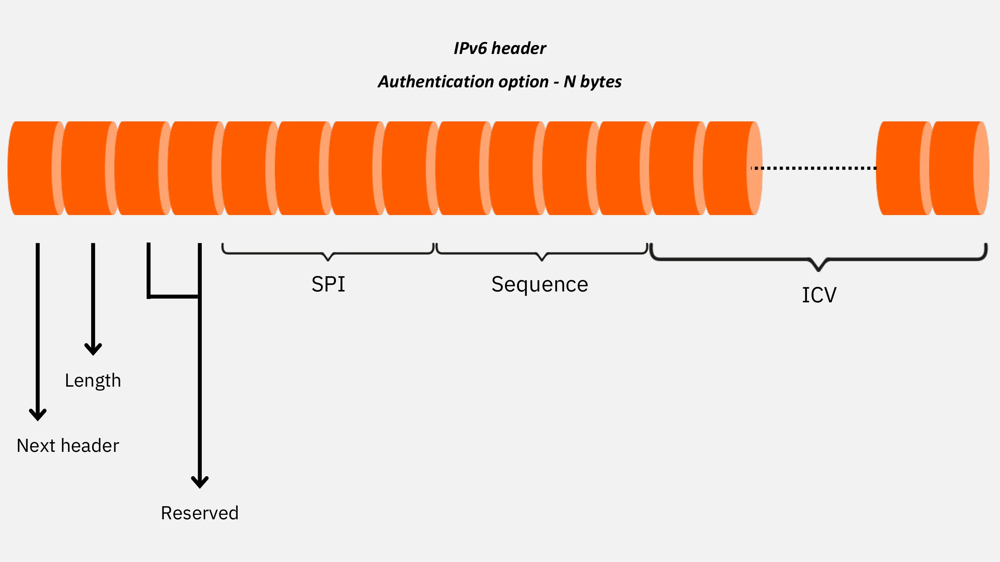


#### Заглавие на опциите за дестинация


Този хедър е предназначен само за крайния получател на дейтаграмата. Тя може да се използва за добавяне на опции или метаданни, специфични за приложението, без да се вземат предвид от междинните маршрутизатори.


Първоначално в протокола не беше определена такава опция. Въпреки това този хедър беше въведен при проектирането на IPv6, за да се позволи добавянето на бъдещи разширения, без да се променя цялостната структура на пакета. Опцията null например се използва само за подпълване на заглавието до кратно на 8 байта с цел подравняване на паметта.


Дизайнът на пакетите IPv6 се основава на ясно разделение между минимален основен хедър и модулни разширяващи хедъри. Тази архитектура осигурява както стандартна производителност на обработката, така и гъвкавостта, необходима за развитие на протокола и интегриране на механизми за сигурност, сложна маршрутизация или качество на услугата, като същевременно поддържа съвместимост с бъдещи инфраструктури.


## Връзка между IPv6 и DNS


<chapterId>421eacb8-b80b-4aee-910f-e069ed805f00</chapterId>


В съвременните мрежи DNS (*Система за имена на домейни*) преобразува имената на домейни в IP адреси, които машините могат да използват. С въвеждането на IPv6 DNS трябваше да се адаптира, за да поддържа 128-битови адреси, като същевременно запази обратната съвместимост с IPv4. Това съжителство е особено важно в средите с два стека, където двете версии на IP работят едновременно.


### Специфични за IPv6 DNS записи


За да свърже име на домейн с IPv6 адрес, DNS използва запис AAAA (*quad-A*), аналогичен на записа "A" за IPv4 адреси. Записът AAAA изрично съпоставя име на домейн с IPv6 адрес.

Пример:


```shell
ipv6.mydmn.org.         IN      AAAA    2001:66c:2a8:22::c100:68b
```


Този запис показва, че домейнът `ipv6.mydmn.org` се преобразува в IPv6 адрес `2001:66c:2a8:22::c100:68b`. Възможно е, и дори се препоръчва за максимална съвместимост, едно и също име на домейн да се свързва с няколко IP адреса, независимо дали са IPv4 (чрез запис A) или IPv6 (чрез запис AAAA). Това позволява на клиентите, съвместими с IPv6, да предпочитат IPv6, като същевременно се гарантира, че клиентите, които използват само IPv4, ще продължат да бъдат поддържани.


Освен това DNS поддържа обратна резолюция, което означава, че може да търси името на домейна, свързано с даден IP адрес. В случая на IPv6 тази операция използва PTR записи, разположени в зоната `ip6.arpa`. Тази зона е специално запазена за обратното разрешаване на IPv6. За IPv4 това е зоната `in-addr.arpa`.


### Обратна резолюция


Обратното разрешаване на IPv6 адрес следва строг процес:

1) Разгънете адреса в пълен шестнадесетичен запис (16 байта, т.е. 32 шестнадесетични цифри).

Пример:


```shell
2001:66c:2a8:22::c100:68b
```


Става:


```shell
2001:066c:02a8:0022:0000:0000:c100:068b
```


2) Обърнете последователността на всяка шестнадесетична цифра (nibble), разделете ги с точки и добавете `ip6.arpa`:


```shell
b.8.6.0.0.0.1.c.0.0.0.0.0.0.0.0.2.2.0.0.8.a.2.0.c.6.6.0.1.0.0.2.ip6.arpa  IN PTR  ipv6.mydmn.org
```


Тази структура осигурява стандартизирани, уникални обратни търсения в адресното пространство на IPv6.


**Моля, обърнете внимание**: DNS заявките могат да преминават през IPv4 или IPv6. Използваният транспортен протокол не оказва влияние върху вида на върнатите записи.

Например:


- Клиент, свързан през IPv6, може да поиска IPv4 запис.
- Клиент, свързан през IPv4, може да поиска IPv6 запис.

DNS сървърът просто отговаря със записите, с които разполага, независимо от транспортния протокол на заявката.


Когато дадено име на хост е картографирано към IPv4 и IPv6, изборът на адрес, който да се използва, се определя от RFC 6724, който дефинира алгоритъм за избор на адрес въз основа на фактори като предпочитание на префикс, обхват и достижимост. По подразбиране IPv6 обикновено се предпочита, освен ако не е отменен от системната или мрежовата конфигурация.


**Важно напомняне**: когато вграждате IPv6 адрес в URL адрес (*Uniform Resource Locator*), той трябва да бъде затворен в квадратни скоби (`[]`). По този начин се избягва объркването между двоеточието (`:`) в IPv6 адреса и двоеточието, което отделя името на хоста от порта в URL адреса.


Валиден пример:


```shell
http://[2001:db8::1]:8080
```


Това гарантира, че URL адресът се обработва правилно както от браузърите, така и от уеб сървърите.


Поради това интегрирането на IPv6 в системата DNS се основава на нови типове записи, строг метод за обратна резолюция и точни правила за подбор и форматиране, за да се гарантира съвместимост и последователност на маршрутизацията.


### Обобщение на частта


В този раздел разгледахме основните принципи на IPv6 адресирането. Започнахме с разглеждане на структурата на IPv6 адреса: неговата 128-битова дължина, шестнадесетичен запис и правилата за опростяване, използвани за съкращаване на повтарящи се последователности от нули. Тази конструкция позволява на IPv6 да преодолее ограниченията на адресното пространство на IPv4, като същевременно гарантира мащабируемост и ефективна йерархия.


След това разгледахме различните категории IPv6 адреси: unicast, anycast и multicast, като подробно описахме техния обхват, типична употреба и представяне в адресното пространство.


След това направихме преглед на методите за присвояване на IPv6 адреси в рамките на локална мрежа, независимо дали чрез ръчна конфигурация, чрез протокола DHCPv6 или с помощта на механизми за автоматично конфигуриране без състояние, като например тези, предлагани от NDP. Тези подходи дават възможност на устройствата автоматично да generate собствения си адрес от предоставения префикс и техния MAC адрес (чрез EUI-64), като същевременно предлагат гъвкавост по отношение на управлението на срока на експлоатация и поверителността.


Също така подробно описахме как се разпределят блоковете адреси, като се започне от IANA, която ги разпределя към петте RIR (*Регистрирани интернет региони*), а след това към доставчиците на интернет услуги, които ги преразпределят към своите клиенти като подмрежи (често в /48, което позволява 65536 /64 подмрежи). Разграничението между блоковете _Provider Aggregatable_ (PA) и _Provider Independent_ (PI) помага да се управляват сценариите за _multihoming_ или смяна на доставчика.


Видяхме, че DNS се адаптира към IPv6 с въвеждането на записа AAAA и че механизмите за обратна резолюция вече разчитат на зоната `ip6.arpa`. Важното е, че DNS остава независим от използвания транспортен протокол (IPv4 или IPv6), като осигурява безпроблемна оперативна съвместимост в среда с два стека.


Следователно IPv6 не е просто постепенно подобрение на IPv4, а цялостно преработване на системата за адресиране, създадена да посрещне както настоящите, така и бъдещите предизвикателства на глобалния интернет.


В последната част на този курс NET 302 ще преминем към практиката и ще се съсредоточим върху инструментите за диагностика на мрежи.


# Инструменти за мрежова диагностика


<partId>368a5c6f-ec48-4b28-970f-3a770788ad37</partId>


## Инструменти за мрежов достъп Layer


<chapterId>1d25a21d-6900-4fbe-a438-e06c8afb9e02</chapterId>


В тази първа глава от последния раздел за диагностика на мрежи се фокусираме върху инструментите за анализ на слоя за достъп до мрежата от модела TCP/IP. Този слой отговаря за пряката комуникация между устройствата в една и съща физическа мрежа, по-специално чрез използването на MAC адреси и физически мрежови интерфейси, като например Ethernet карти или Wi-Fi интерфейси.


Целта е да предоставим на администраторите практически инструменти за проверка, тестване и оптимизиране на този важен слой на свързаност от ниско ниво. Тези инструменти могат да се използват за проверка на правилното функциониране на интерфейсите, за отстраняване на проблеми с конфигурацията на мрежовите карти или за откриване на аномалии, като например колизии, загуба на пакети или грешки на връзката.


### Помощни програми за IP/MAC квартала


#### инструмент `Arp`


Един от най-старите инструменти за диагностика на нивото за мрежов достъп е командата `arp`. Въпреки че все повече се заменя от съвременни алтернативи като `ip neigh` (която ще открием след малко). `Arp` все още присъства в много системи, за да преглежда или манипулира кеша на ARP (*Address Resolution Protocol*). В този кеш се съхраняват съпоставките между IP адресите и MAC адресите, известни локално на дадена машина. С други думи, той ви позволява да определите кой физически (MAC) адрес съответства на даден IP адрес в локалната мрежа.


На практика, когато даден хост иска да изпрати пакет до IP адрес в същата подмрежа, той трябва първо да знае MAC адреса на целевата машина. Това съпоставяне се извършва от ARP, който излъчва заявка в локалната мрежа и получава отговор, съдържащ съответния MAC адрес. След това този резултат се съхранява временно в локална таблица, наречена "ARP кеш", за да се избегне повтарянето на заявките за всеки нов пакет.


За да видите съдържанието на този кеш и да проверите записите, които са известни на машината в момента, използвайте:


```bash
arp -a
```


Тази команда изброява всички локално регистрирани IP/MAC съпоставки за всички интерфейси. На всеки ред се посочват името на хоста (ако може да се разреши), IP адресът, съответният MAC адрес и Interface, където се наблюдава съпоставянето.


За да филтрирате показването на определен IP адрес, просто го посочете:


```bash
arp -a 192.168.1.5
```


Това позволява лесно да се провери дали даден IP адрес присъства в кеша, което може да помогне за диагностициране на грешки в комуникацията между два хоста в една и съща мрежа.


По подобен начин, за да покажете само ARP записите, свързани с определен мрежов интерфейс (например Ethernet карта с име `eth0`), можете да използвате:


```bash
arp -a -i eth0
```


Това е особено полезно в среди с много интерфейси (кабелни, безжични, VPN и др.), където един хост може да има няколко мрежови адаптера.


Командата `arp` не е ограничена до използване само за четене. Тя може да се използва и за ръчно редактиране на ARP кеша, което е безценна функция при някои разширени сценарии за отстраняване на неизправности или при симулиране на специфични условия. Например можете ръчно да добавите съпоставяне на IP/MAC:


```bash
arp -s 192.168.1.7 00:17:BC:56:4F:25 -i eth2
```


Тази команда създава статичен запис в локалната ARP таблица, асоциирайки IP адреса `192.168.1.7` с MAC адреса `00:17:BC:56:4F:25` на Interface `eth2`.Ако не е посочен интерфейс, системата автоматично използва първия приложим.


Можете също така да премахнете даден запис от кеша ARP, за да коригирате грешка или да наложите повторно откриване:


```bash
arp -d 192.168.1.7
```


По този начин се изтрива записът, за да се гарантира, че при следващия опит за комуникация ще бъде задействана нова ARP заявка.


**ЗАБЕЛЕЖКА**: Опцията за изтриване приема и име на интерфейс, което ви позволява да премахнете по-точно конкретен запис.


В обобщение, инструментът `arp` осигурява диагностика на ниско ниво, особено полезна в локални мрежи, където проблемите със свързаността често могат да бъдат проследени до неправилно или остаряло разрешаване на адреси. Въпреки това в последните системи, особено в съвременните дистрибуции на Linux, този инструмент все по-често се заменя с командата `ip neigh` от набора инструменти `iproute2`, която предлага подобна функционалност в по-унифицирана рамка.


#### инструмент `Ip neighbor`


В съвременните системи, особено в последните дистрибуции на Linux, командата `ip neighbor` е инструмент за проверка и управление на съпоставките между IP и MAC адреси. Тази команда е част от пакета `iproute2`, който постепенно замества по-стари инструменти като `arp`, осигурявайки по-последователна и гъвкава рамка за диагностика на нивото на връзката данни.


Командата `ip neighbor` прави справка в кеша на локалните IP съседи, който е еквивалентен на кеша ARP за IPv4 и кеша NDP (_Neighbor Discovery Protocol_) за IPv6. В този кеш се съхраняват известните асоциации между IP адреси (v4 или v6) и MAC адреси, заедно с тяхното състояние (валидни, чакащи, изтекли...).


Основната команда за показване на кеша е:


```bash
ip neigh
```


Извежда се списък със записи, показващ IP адреса на местоназначението, съответния мрежов интерфейс, свързания MAC адрес (ако има такъв) и състоянието на записа (напр. `REACHABLE`, `STALE`, `DELAY`, `FAILED`...).


Примерен изход:


```bash
192.168.1.5 dev eth0 lladdr 00:17:BC:56:4F:25 REACHABLE
```


Този ред показва, че машината знае за валидно съпоставяне между IP адрес `192.168.1.5` и MAC адрес `00:17:BC:56:4F:25` чрез Interface `eth0`.


Можете също така да филтрирате записите по критерии, като например IP адрес, интерфейс или състояние. Например, за да направите заявка само за адрес `192.168.1.7`:


```bash
ip neigh show 192.168.1.7
```


Или за да покажете всички записи за интерфейс `eth1`:


```bash
ip neigh show dev eth1
```


Освен за консултация, `ip neighbor` може да се използва и за ръчно редактиране на кеша. Например, за да добавите статичен запис:


```bash
ip neigh add 192.168.1.7 lladdr 00:17:BC:56:4F:25 dev eth1 nud permanent
```


Това асоциира за постоянно IP адреса `192.168.1.7` с посочения MAC адрес на интерфейс `eth1`. Опцията `nud permanent` (за _Neighbor Unreachability Detection_) гарантира, че записът няма да бъде автоматично анулиран.


Обратно, за да изтриете запис в кеша:


```bash
ip neigh del 192.168.1.7 dev eth1
```


Това принуждава системата да преосмисли съпоставянето при следващата комуникация с този адрес.


**ЗАБЕЛЕЖКА**: Инструментът `ip neighbor` работи както за IPv4, така и за IPv6. За IPv4 той взаимодейства с ARP, а за IPv6 - с NDP. Това осигурява унифициран, последователен подход за управление на връзките IP/MAC в различните семейства протоколи, което превръща `ip neigh` в съвременния стандарт за управление на съседите в Linux системите.


### Инструменти за анализ на пакети


За да анализират задълбочено случващото се в компютърната мрежа, администраторите се нуждаят от инструменти, които могат да улавят пакетите, обменяни между машините. Две помощни програми се открояват като еталони: `tcpdump` и `Wireshark`. Тези инструменти са от съществено значение за диагностициране на необичайно поведение, одитиране на обмена на протоколи или изследване на мрежовата сигурност чрез инспектиране на съдържанието на кадрите.


#### `ttcpdump`: анализ на командния ред


`tcpdump` е много мощен инструмент за команден ред, предназначен за улавяне и показване на пакети, преминаващи през мрежов интерфейс. Той работи в реално време и благодарение на лекия си дизайн може да се използва в системи без графичен интерфейс или с ограничени ресурси. Той разчита на библиотеката `libpcap`, която предоставя независими от хардуера функции за улавяне на ниско ниво.


Често срещана употреба на `tcpdump` е да следи мрежовата активност на дадена машина или мрежов сегмент, като филтрира пакетите по определени критерии. Резултатите могат да бъдат пренасочени към файл, което позволява архивиране на трафика за по-късен анализ или възпроизвеждане с друг инструмент, например Wireshark.


Общият синтаксис на командата е:


```bash
tcpdump -w <file.cap> -i <interface> -s <snapshot_length> -n <filters>
```


- `-w` записва уловените пакети във файл във формат `libpcap` (разширение `.cap` или `.pcap`);
- `-i` указва мрежовия интерфейс, който ще се следи (напр. `eth0`, `wlan0`);
- `-s` задава максималното количество данни, уловени в един пакет. При задаване на `0` се улавят всички пакети;
- `-n` деактивира DNS и разрешаването на имена на услуги, което подобрява производителността.


Филтрите за изразяване в края на командата ви позволяват да ограничите улавянето до подмножество от трафика. Можете да комбинирате ключовите думи `host`, `port`, `src`, `dst` и т.н., за да прецизирате избора.


Пример: улавяне на HTTP пакети (порт 80) към или от сървър `192.168.25.24` и записването им във файл `fichier.cap`:


```bash
tcpdump -w fichier.cap -i eth0 -s 0 -n port 80 and host 192.168.25.24
```


Полученият файл може по-късно да бъде анализиран с графичен инструмент или възпроизведен в друга система.


#### Wireshark: разширен визуален анализ


Wireshark, известен преди като *Ethereal*, е пълна програма за мрежов анализ с графичен интерфейс. За разлика от `tcpdump` тя осигурява структурирана, подробна визуализация на пакетите, включително разчленяване на протоколи, графики на потоците, статистика на трафика и интерактивни филтри. Тя разчита и на `libpcap`, което означава, че може да отваря и обработва файлове за заснемане, генерирани от `tcpdump`.


Wireshark е наличен за много операционни системи, включително Linux и Windows. Инсталирането му изисква администраторски права за достъп до интерфейсите за заснемане. След като бъде стартиран, можете да изберете мрежов интерфейс от менюто *Capture*. Щракването върху *Start* започва запис на пакети в реално време. Дисплеят е разделен на три панела:


- списъка на заснетите кадри ;
- протоколно декодирани данни,
- необработени шестнадесетични данни.


Wireshark се справя отлично със сценарии, при които трябва да наблюдавате сложно поведение на протоколите, да реконструирате диалози на приложения (например HTTP или DNS сесия) или да изследвате времето за реакция на услугата. Той поддържа и строго специфични филтри за показване, като използва своя специален синтаксис (различен от този на `tcpdump`), за да се фокусира само върху съответните пакети.


#### Допълнителни инструменти


Важно е да се отбележи, че `tcpdump` и Wireshark не са взаимозаменяеми: всеки от тях има своите силни страни. `tcpdump` е по-подходящ за среди с команден ред, автоматизирани скриптове и отдалечени намеси в сървъра, докато Wireshark е идеален за подробен, интерактивен и образователен анализ на трафика.


Двата инструмента могат да се комбинират: може да се направи заснемане на отдалечена система с `tcpdump`, след което файлът `.cap` да се прехвърли за анализ с Wireshark на местна машина. Този подход се използва широко в практиката.


### Инструменти за анализ на Interface


На нивото на мрежовия достъп често се налага да се правят заявки и да се конфигурират физическите мрежови интерфейси, за да се диагностицират неизправности, да се оптимизира производителността или да се провери целостта на връзката. Един от най-мощните инструменти, налични в Linux за тази цел, е `ethtool` - помощна програма за командния ред, която не само предоставя подробна техническа информация за Ethernet интерфейса, но и ви позволява да настройвате някои от параметрите му в реално време.


#### Преглед на спецификациите на Interface


Основна функция на `ethtool` е възможността за търсене на интерфейс и показване на текущите му характеристики. Това ви позволява да проверявате:


- скорост на връзката (напр. 100 Mbit/s, 1 Gbit/s или 10 Gbit/s);
- режим на договаряне (полудуплекс или пълен дуплекс) ;
- дали е активирано автонотирането;
- вида на порта (меден, оптичен и др.);
- състояние на връзката (активна или не) ;
- поддръжка на разширени функции, като например *Wake-on-LAN*.


Тази информация е особено полезна за диагностициране на проблеми, свързани с физическа свързаност или несъответстващи настройки за договаряне между мрежовата карта на хоста и оборудването, към което се свързва (комутатор, маршрутизатор и др.).


За да получите тази информация, просто изпълнете:


```bash
ethtool enp0s3
```


Тази команда извежда подробен отчет за интерфейса `enp0s3`, често срещана конвенция за именуване в системите, базирани на CentOS или RHEL.


#### Динамично модифициране на параметрите на Interface


`ethtool` не се ограничава само до наблюдение: той също така ви позволява да регулирате някои параметри на интерфейса, без да рестартирате машината. Това дава възможност например да се наложи определена скорост на връзката или да се активират функции според нуждите на локалната мрежа.


Опцията `-s` се използва за динамично конфигуриране на параметри като:


- скорост на връзката (`speed`), зададена изрично (напр. 1000 за 1 Gbit/s) ;
- дуплексен режим (`duplex`) - `полу- или `пълна`;
- включване или изключване на автонотирането (`autoneg`) ;
- активиране на *Wake-on-LAN* (`wol`) ;
- тип порт.


Пример 1: разрешаване на автонотирането на интерфейс:


```bash
ethtool -s enp0s3 autoneg on
```


Пример 2: активирайте функцията *Wake-on-LAN* (за да позволите на машината да се събуди от разстояние чрез магически пакет):


```bash
ethtool -s enp0s3 wol p
```


В този пример опцията `p` указва, че събуждането ще се извърши веднага щом бъде открит пакет *Wake-on-LAN*. Тази настройка често се използва в корпоративни среди за извършване на актуализации през нощта или за отдалечена поддръжка.


#### Инсталиране на инструменти


Важно е да се отбележи, че `ethtool` не винаги е инсталиран по подразбиране. В дистрибуциите на Red Hat/CentOS той може да бъде инсталиран с командата:


```bash
yum install -y ethtool
```


В Debian и Ubuntu еквивалентната команда е:


```bash
sudo apt install ethtool
```


**ВНИМАНИЕ**: във всички команди `ethtool` името на мрежовия интерфейс трябва да бъде посочено непосредствено след опцията (като `-s`). Всяка синтактична грешка в разположението на параметрите ще направи командата невалидна или неефективна.


## Инструменти за мрежово ниво


<chapterId>d2c5bf35-4284-4af8-8e8b-049c696a511b</chapterId>


### Инструменти за анализ на трафика


В мрежовата диагностика командата `ping` остава един от най-простите и същевременно най-мощни инструменти за тестване на свързаността между две машини. Тя проверява дали даден отдалечен хост е достъпен в даден момент, като същевременно предоставя информация за латентността, стабилността на връзката и DNS резолюцията.


Командата `ping` разчита на протокола ICMP (*Internet Control Message Protocol*). Когато потребител изпрати заявка за `ping`, системата изпраща ICMP пакет "Echo Request" (Заявка за ехо) до IP адрес или име на хост. Ако целевата машина е онлайн и мрежовият път е валиден, тя отговаря с пакет ICMP "Echo Reply". Този прост механизъм може да се използва за измерване на закъснението и откриване на проблеми с връзката или разрешаването на имена.


Пример за класическа команда:


```bash
ping 172.17.18.19
```


Типичен отговор:


```bash
mydmn.org (172.17.18.19): 56 data bytes
64 bytes from 172.17.18.19: icmp_seq=0 ttl=56 time=7.7 ms
64 bytes from 172.17.18.19: icmp_seq=1 ttl=56 time=6.0 ms
64 bytes from 172.17.18.19: icmp_seq=2 ttl=56 time=5.5 ms
```


В този пример преобразуването на имената е извършено автоматично: домейнът `mydmn.org` е свързан с IP адреса `172.17.18.19`, което потвърждава, че преобразуването на DNS работи правилно. Командата предоставя и технически подробности, като например:


- пореден номер на iCMP (`icmp_seq`), полезен за проверка на реда на отговорите;
- TTL (*Time-To-Live*), който показва броя на оставащите скокове, преди пакетът да бъде отхвърлен;
- време/закъснение на обходния маршрут (`време`), изразено в милисекунди, което дава оценка на закъснението на връзката.


#### По-подробен анализ на параметрите на ICMP


TTL е критично поле в IP протокола. Всяка дейтаграма се инициализира със стойност TTL от изпращача (често 64, 128 или 255). Всеки маршрутизатор по пътя намалява тази стойност с 1. Ако TTL достигне 0, преди да достигне местоназначението си, пакетът се отхвърля и на изпращача се връща ICMP грешка. Този механизъм предотвратява безкрайни цикли на маршрутизиране.


Времето за разпространение (*закъснение/време на обиколка*) измерва закъснението, с което даден пакет напуска изпращача, достига до целта и се връща обратно. На практика закъснение под 200 ms се счита за приемливо за стабилна връзка. Необичайно високите закъснения могат да показват претоварване на мрежата, неефективно маршрутизиране или лошо качество на връзката.


#### Разширено използване на `ping`


`ping` предоставя опции за прецизиране на тестовете и наблюдение на специфично поведение на мрежата.


За да изпратите заявки за излъчване, можете да използвате опцията `-b`, за да насочите към всички хостове в подмрежата:

```bash
ping -b 192.168.1.255
```


Това е полезно в локални мрежи за бързо откриване на активни хостове или за тестване на начина, по който мрежата обработва заявките за излъчване. В много от конфигурациите обаче маршрутизаторите и защитните стени блокират излъчваните пингове, за да предотвратят атаки с усилване.


Можете също така да зададете потребителски интервал между заявките с опцията `-i` (по подразбиране: 1 секунда):


```bash
ping -i 0.2 -c 10 192.168.1.7
```


Изпращат се 10 ICMP заявки на интервали от 0,2 секунди. Такова тестване е полезно за откриване на колебания в латентността за кратък период от време или за леко натоварване на връзка, за да се оцени нейната стабилност.


### Инструменти за анализ на таблицата за маршрутизация


Командата `ip route`, част от пакета `iproute2`, е препоръчителният и стандартен инструмент в съвременните Linux системи за проверка и управление на таблицата за IP маршрутизация на ядрото. Тя замества остарялата команда `route`, като предлага по-ясен синтаксис, по-голяма последователност и разширена поддръжка на съвременни функции (IPv6, множество таблици, пространства от имена и т.н.).


#### Показване на таблицата за маршрутизация


За показване на текущата таблица за маршрутизация:


```bash
ip route show
```


Този изход съдържа всички маршрути, известни на ядрото, т.е. пътищата, по които изходящите пакети преминават в зависимост от местоназначението си.


Примерен изход:


```bash
default via 192.168.1.1 dev eth0 proto dhcp metric 100
192.168.1.0/24 dev eth0 proto kernel scope link src 192.168.1.100
```


Всяка линия представлява маршрут. Основните полета включват:


- по подразбиране**: маршрутът по подразбиране, който се използва, когато няма по-специфичен маршрут.
- via**: шлюзът, използван за достигане на дестинацията.
- dev**: използваният мрежов интерфейс.
- proto**: как е създаден маршрутът (ръчно, DHCP, в ядрото и т.н.).
- metric**: цена на маршрута, която се използва за определяне на приоритета на множество възможни пътища.
- scope**: обхват на маршрута (напр. `link` за директно свързан маршрут).
- src**: IP адресът на източника, използван за изходящите пакети на този интерфейс.


#### Добавяне и изтриване на маршрути


Можете също така да променяте таблицата за маршрутизация динамично, например чрез добавяне или премахване на статични маршрути.


Добавяне на статичен маршрут:


```bash
ip route add 192.168.1.0/24 via 192.168.1.1 dev eth0
```


Това конфигурира маршрут към мрежата `192.168.1.0/24` през шлюза `192.168.1.1` на интерфейс `eth0`.


Премахване на този маршрут:


```bash
ip route del 192.168.1.0/24
```


Тази команда изтрива предварително дефинирания маршрут.


#### Полезни команди


Ето някои полезни варианти за анализ или писане на скриптове:


- `ip -4 route`: показва само IPv4 маршрути;
- `ip -6 route`: показва само IPv6 маршрути;
- `ip route list table main`: показва основната таблица за маршрутизация (стойност по подразбиране) ;
- `ip route get <Address>`: показва кой интерфейс и шлюз ще използва пакетът към дадения адрес.


Пример:


```bash
ip route get 8.8.8.8
```


Това показва точния маршрут, по който един пакет ще достигне до `8.8.8.8`.


### Инструменти за проследяване


Един от най-ефективните инструменти за анализиране на маршрута, по който преминават IP пакетите между хост източник и целева дестинация, е командата `traceroute`. Тя показва стъпка по стъпка пътя, по който минават пакетите, и идентифицира междинните маршрутизатори, през които преминават. В случай на неизправност на мрежова връзка или прекъсване на услугата, `traceroute` помага да се определи точното място на проблема.


Както и при командата `ping`, целта може да бъде зададена или чрез пълно квалифицирано име на домейн (FQDN), или чрез IP адрес. Например:


```bash
traceroute mydmn.org
```


#### Принцип на работа


`traceroute` разчита на полето TTL (*Time To Live*) в заглавието на IP пакетите. Както беше обяснено по-рано, това поле представлява брояч, който се намалява от всеки маршрутизатор по пътя. Когато TTL достигне нула, пакетът се отхвърля и маршрутизаторът връща на изпращача съобщение ICMP "Time Exceeded". Този механизъм предотвратява безкрайни цикли в случай на неправилно маршрутизиране.


`traceroute` се възползва от това поведение, за да картографира маршрутизаторите между изпращача и получателя:


- Първоначално той изпраща поредица от UDP пакети (обикновено три) с TTL от 1. Първият маршрутизатор среща TTL от 0, така че отхвърля пакета и след това отговаря с ICMP съобщение, разкривайки своя IP адрес и времето за отговор.
- След това той изпраща друга серия от пакети с TTL 2, разкривайки втория маршрутизатор.
- Процесът се повтаря, докато се достигне дестинацията, след което хостът отговаря със съобщение ICMP Port Unreachable, което показва, че крайната точка е достигната.


По подразбиране `traceroute` използва UDP пакети, изпратени до неизползвани портове (обикновено започващи от 33434), но може да бъде конфигуриран да използва ICMP (като `ping`) или дори TCP, в зависимост от системите или вариантите на командите.


Примерен изход:


```bash
traceroute to www.google.fr (216.58.210.35), 64 hops max, 52 byte packets

1  par81-024.ff.avast.com (62.210.189.205)   25.107 ms  24.235 ms  24.383 ms
2  62-210-189-1.rev.poneytelecom.eu (62.210.189.1)  27.341 ms  27.119 ms  28.184 ms
3  a9k1-45x-s43-1.dc3.poneytelecom.eu (195.154.1.92)  25.910 ms  25.040 ms  25.558 ms
4  72.14.218.182 (72.14.218.182)  36.234 ms  39.907 ms  38.130 ms
5  108.170.244.177 (108.170.244.177)  25.880 ms
108.170.244.240 (108.170.244.240)  25.791 ms
108.170.244.177 (108.170.244.177)  26.449 ms
6  216.239.62.143 (216.239.62.143)  26.491 ms
216.239.43.157 (216.239.43.157)  26.414 ms
216.239.62.139 (216.239.62.139)  26.400 ms
...
9  108.170.246.161 (108.170.246.161)  33.174 ms
108.170.246.129 (108.170.246.129)  34.342 ms
108.170.246.161 (108.170.246.161)  33.707 ms
10  108.170.232.105 (108.170.232.105)  33.845 ms  33.846 ms
108.170.232.103 (108.170.232.103)  34.206 ms
11  lhr25s11-in-f35.1e100.net (216.58.210.35)  34.094 ms  33.353 ms  33.718 ms
```


Всеки ред съответства на преминат маршрутизатор с до три измервания на времето (в милисекунди), показващи закъснението на обиколката до този маршрутизатор. Тези стойности помагат да се оцени производителността на всеки мрежов сегмент.


#### Тълкуване на резултатите


Ако маршрутизаторът не отговаря или филтрира ICMP съобщенията, вместо времето за отговор се показват звездички `*`. Това може да означава:


- защитна стена, която блокира ICMP отговорите,
- устройство, конфигурирано да не отговаря, или
- временен проблем със свързаността по пътя.


По този начин `traceroute` не само идентифицира изминатия маршрут, но и подчертава точките на необичайно забавяне или прекъсване.


На някои системи може да се използва еквивалентната команда `tracepath`, която не изисква привилегии на root. За IPv6 използвайте `traceroute6` или `tracepath6`.


Пример за проследяване на IPv6:


```bash
traceroute6 ipv6.google.com
```


### Инструменти за проверка на активни връзки


За диагностициране на активни мрежови връзки и следене на мрежовата активност в система Linux командата `ss` (съкращение от _socket statistics_) е съвременният референтен инструмент. Част от пакета `iproute2`, тя замества вече остарялата `netstat`, като предлага по-добра производителност и по-точни резултати.


`ss` показва активни TCP и UDP връзки, слушащи портове, локални и отдалечени адреси, състояния на връзките и свързаните с тях процеси.


#### Обща употреба


Когато се изпълнява без опции, командата `ss` показва активните TCP връзки. Основен синтаксис:


```bash
ss [options]
```


Някои често срещани варианти за прецизиране на анализа:


- `-t`: показва само TCP връзки;
- `-u`: показва само UDP връзки;
- `-l`: показва само слушащите сокети;
- `-n`: деактивиране на разрешаването на имена (необработени IP адреси и номера на портове) ;
- `-p`: показва всеки свързан с гнездото процес (PID и име на програмата),
- `-a`: показва всички връзки, включително неактивните,
- `-s`: показване на статистически данни от високо ниво за сокети.


#### Казуси


За показване на всички активни връзки, използващи TCP порт 80 (HTTP):


```bash
ss -ant | grep ':80'
```


Това показва активните TCP връзки, включващи порт 80. Състояния като `LISTEN`, `ESTABLISHED`, `TIME-WAIT` показват текущото състояние на всеки обмен.


Примерен изход:

```
ESTAB 0 0 192.168.1.10:54321  93.184.216.34:80
```


За показване на всички мрежови връзки със свързаните с тях процеси:


```bash
ss -tulnp
```


За да получите обща справка за използването на гнездата:

```bash
ss -s
```


За филтриране само на UDP връзки:

```bash
ss -unp
```


Тези команди са особено полезни за откриване на подозрителни връзки, неочаквани портове за слушане или за наблюдение на дейността на определена услуга.


## Инструменти за пренос и горен слой


<chapterId>bce47931-930e-4288-b0fd-666c9a1066b5</chapterId>


### Инструменти за DNS заявки


В горните слоеве на модела TCP/IP, особено в слоя на приложенията, е важно да се разбере как работи разрешаването на имена. Инструментите за DNS заявки ви позволяват да проверите дали дадено име на домейн е правилно свързано с IP адрес, както и да диагностицирате проблеми с DNS сървъра, като например неправилна конфигурация, забавяне на разпространението или недостъпност. Тези инструменти са от съществено значение за всеки мрежов администратор или за всеки потребител, който иска да разбере по-добре DNS обмена в IP среда.


#### Командата `nslookup`


Най-простият инструмент за DNS заявки е `nslookup`. Той изпраща заявка към DNS сървър и връща IP адреса, свързан с името на домейна (или обратното). По подразбиране той задава запитване към конфигурирания DNS сървър на системата, но можете също така да посочите сървър директно в командата.


Пример за директно търсене:

```bash
nslookup mydmn.org
```


Запитване за конкретен DNS сървър:

```bash
nslookup mydmn.org 192.6.23.4
```


Заявката иска от DNS сървъра на адрес `192.6.23.4` да разреши името `mydmn.org`. Това е особено полезно, за да се провери дали даден DNS сървър разпознава име на домейн или за да се провери дали сървърът работи правилно.


#### Командата `dig`


`dig` (*Domain Information Groper*) е по-модерен, по-пълен и по-гъвкав инструмент от `nslookup`. Той поддържа сложни заявки и предоставя подробна информация за процеса на разрешаване, йерархията на участващите сървъри, вида на върнатия запис (A, AAAA, MX, TXT и т.н.) и всички срещнати грешки.


Пример за основна заявка:

```bash
dig mydmn.org
```


Запитване за конкретен DNS сървър:

```bash
dig @192.6.23.4 mydmn.org
```


Тази команда проверява наличието на DNS запис в даден сървър.

Едно от основните предимства на `dig` е, че показва подробностите на DNS отговора, което го прави много полезен за диагностициране на грешки в конфигурацията.


#### Ръчно конфигуриране на DNS резолвери


Понякога е необходимо да замените локално използваните DNS сървъри, например в тестови среди, или да наложите използването на определени сървъри. Това може да стане чрез редактиране на файла `/etc/resolv.conf`, който определя настройките за DNS резолюция на системата.


Примерна конфигурация:


```bash
vi /etc/resolv.conf

search mydmn.org
nameserver 192.168.1.10
nameserver 192.168.1.11
```


- Полето `search` задава домейн, който да се добавя автоматично при разрешаване на кратки имена.
- Записите `nameserver` определят DNS сървърите, които да се използват, по ред на приоритета.


В много съвременни дистрибуции (особено тези, които използват `systemd-resolved`) промените в `/etc/resolv.conf` са временни и могат да бъдат презаписани при рестартиране или повторно свързване към мрежата. По-трайните методи включват използването на `resolvconf`, `systemd-resolved` или модифициране на конфигурациите на *NetworkManager*.


#### Командата `host`


Друг прост, но ефективен инструмент за DNS е `host`. Той преобразува имената на домейни в IP адреси (или обратното) и може да помогне за диагностициране на грешки в DNS или неправилни конфигурации на мрежовия интерфейс.


Примери:

```bash
host mydmn.org
```


Обратно търсене:

```bash
host 192.6.23.4
```


`host` е особено удобен за бързи проверки, особено когато се използва в скриптове от команден ред.


Многократните или интензивни заявки към DNS сървъри на трети страни без разрешение могат да се тълкуват като опити за проникване или злонамерена дейност. Използвани неправилно или срещу мрежи, които не контролирате, тези команди могат да приличат на разузнавателни сканирания, които често са първа стъпка в атаката. Винаги ограничавайте употребата им до среди, които администрирате или в които имате изрично разрешение.


### Инструменти за сканиране на мрежи


Когато наблюдавате или защитавате локална или глобална мрежа, е изключително важно да идентифицирате активните устройства и услугите, които те предоставят. Точно това прави инструментът `nmap` (*Network Mapper*).


https://planb.academy/tutorials/computer-security/communication/nmap-862300d7-6dfb-4660-970d-f56a9f58f60d

#### Представяне на `nmap`


`nmap` позволява целенасочено сканиране на един или повече хостове за откриване на отворени портове, налични услуги (HTTP, SSH, DNS и др.), а понякога дори и вида на използваната операционна система. Благодарение на многобройните си опции `nmap` осигурява точен преглед на експозиционната повърхност на мрежата, което е от съществено значение по време на фазите на одит или укрепване на управлението на инфраструктурата.


Подобно на командата `host`, `nmap` никога не трябва да се използва в мрежи или инфраструктури, които не притежавате, или без изрично разрешение. Неразрешеното сканиране на портове може да бъде отбелязано като злонамерен опит за разузнаване, често се открива от системите за сигурност (защитни стени, IDS/IPS) и дори може да доведе до правни последствия.


#### Основно използване


Сканиране на конкретен хост и преглед на отворените му портове:

```bash
nmap 192.168.0.1
```


Тази команда сканира 1000-те най-често използвани порта на хоста `192.168.0.1` и показва услугите, до които е имало достъп, и използваните протоколи. Ако е конфигурирана DNS резолюция, можете да използвате и името на хоста вместо IP адреса.


#### Пълно сканиране на мрежата


Едно от предимствата на `nmap` е възможността за сканиране на цял набор от адреси с една команда. Това улеснява, например, бързото инвентаризиране на всички активни машини в дадена мрежа:


```bash
nmap 192.168.0.0/24
```


В този случай ще бъдат потърсени всички хостове в диапазона от `192.168.0.0` до `192.168.0.255`. За всеки IP адрес резултатите показват списък с отворените портове, тяхното състояние (отворени, филтрирани и т.н.) и, когато е възможно, името на съответната услуга.


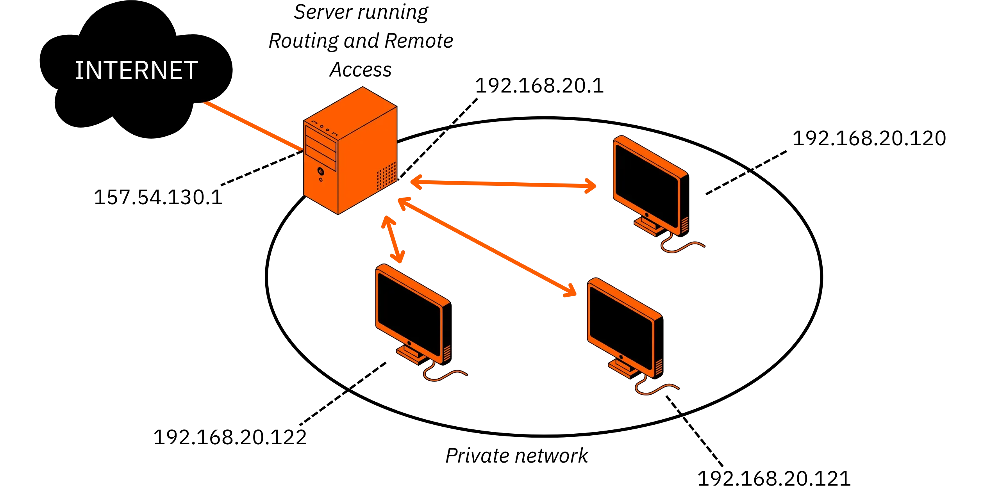


Администраторът може да разчита на `nmap` за няколко задачи:


- Откриване на активни хостове**: определяне на машините, които отговарят в рамките на подмрежата;
- Опис на услугите**: осигурете достъп само до необходимите портове (принцип на най-малките привилегии);
- Проверка за съответствие**: сравнете отворените портове с политиката за сигурност на организацията;
- Предотвратяване на уязвимости**: откриване на несигурни или остарели услуги, които се изпълняват на критични машини.


https://planb.academy/tutorials/computer-security/communication/nmap-862300d7-6dfb-4660-970d-f56a9f58f60d

### Инструменти за допитване до процеса


За задълбочен анализ на активните процеси и отворените файлове, особено в мрежов контекст, администраторите на Linux често се обръщат към командата `lsof` (*Списък на отворените файлове*). Въпреки името си, `lsof` не се ограничава до традиционните файлове: в UNIX системите всичко се счита за файл, включително мрежови сокети, устройства и комуникационни канали.


Следователно този инструмент предоставя напречен поглед върху системата, като съпоставя активните процеси, отворените мрежови портове, достъпните файлове и участващите потребители.


#### Мрежов анализ с `lsof`


Опцията `-i` ограничава изхода до мрежови връзки (TCP, UDP, IPv4 или IPv6). Така лесно се вижда кои процеси комуникират по мрежата:


```bash
lsof -i
```


Тази команда изброява всички работещи процеси, използващи мрежов сокет, като показва използвания порт, протокола (TCP/UDP), състоянието на връзката, както и PID и свързания с него потребител.


#### Филтриране по IP адрес или порт


Можете да прецизирате търсенето, като посочите IP адрес и порт, изолирайки конкретен мрежов поток. Например, за да проверите SMTP сесия (порт 25) с конкретен хост:


```bash
lsof -n -i @192.168.2.1:25
```


Това ще покаже само активните мрежови връзки с хост `192.168.2.1` на порт 25, което е полезно за диагностициране на подозрителна дейност или проблеми с SMTP потока.


#### Проследяване на достъпа до устройството


Друга силна страна на `lsof` е проследяването на специални файлове, като например дискови дялове. Например, за да проверите кои процеси са отворили файлове на `/dev/sda1`:


```bash
lsof /dev/sda1
```


Това е удобно, когато опитът за демонтиране е неуспешен, тъй като устройството все още се използва, или когато изследвате кои приложения имат достъп до даден дял.


#### Кръстосан анализ: процес и мрежа


Опциите могат да се комбинират за получаване на точни данни. Например, за да видите всички мрежови портове, отворени от процес с PID 1521:


```bash
lsof -i -a -p 1521
```


Опцията `-a` пресича критериите (`-i` и `-p`), като ограничава изхода само до мрежовите връзки на този процес.


#### Проследяване на множество потребители


`lsof` може да се използва и за анализиране на активността на определени потребители, като се изброяват всички файлове, които са отворили, по желание филтрирани по PID:


```bash
lsof -p 1521 -u 500,phil
```


Това показва файловете или мрежовите връзки, използвани от потребител `phil` или UID 500, ограничен до процес 1521.


### Резюме на раздела


В този последен раздел разгледахме широк набор от незаменими инструменти за диагностициране, анализиране и администриране на компютърни мрежи. Структурирано около слоевете на модела TCP/IP, това изследване не само изяснява как работят мрежовите комуникации, но и създава строга методология за идентифициране, изолиране и разрешаване на потенциални проблеми.


Тези инструменти предоставят на администраторите съгласуван набор от технически лостове за наблюдение на състоянието на мрежата, анализ на трафика, одит на връзките и бърза намеса при повредено оборудване или услуги.


#### Мрежов достъп Layer


Инструменти, осигуряващи директна видимост на интерфейси и рамки:


- arp / ip neighbor**: проверява и модифицира кеша ARP/NDP, за да провери или коригира асоциациите IP-MAC;
- tcpdump**: улавяне на пакети от командния ред, възможност за филтриране и експортиране;
- Wireshark**: графичен анализ на пакети с дълбоко декодиране на протоколи;
- ethtool**: запитване и настройка на физическите параметри на Ethernet картата (скорост, дуплекс, WoL и др.).


#### Мрежово ниво


Инструменти за оценка на IP свързаността, маршрутизацията и трафика на пакети:


- ping**: тестване на достижимостта и измерване на закъснението с ICMP;
- ip route**: проверка и промяна на таблицата за маршрутизация за контрол на пътищата на пакетите;
- traceroute**: идентифициране на маршрутизаторите по маршрута до дестинация;
- ss**: подробен опис на TCP/UDP сокети и свързаните с тях процеси (наследник на netstat).


#### Транспортни и приложни слоеве


Инструменти за диагностициране на услуги и процеси:


- nslookup / dig / host**: DNS заявки за потвърждаване на разделителната способност на имената и анализ на записите;
- nmap**: проучване на отворените портове и изложените услуги за оценка на повърхността на атаката;
- lsof**: изготвя списък на файловете и сокетите, отворени от процесите, като съпоставя системната и мрежовата активност.


Овладяването на тези инструменти, всеки от които е съобразен с определен етап от модела TCP/IP, позволява методичен подход: като се започне от физическия слой, премине се през маршрутизацията и се стигне до услугите за приложения. Тази верига от експертни познания дава възможност на администраторите да диагностицират, подсигуряват и оптимизират инфраструктурата си, като гарантират както производителността, така и наличността на мрежата.


# Финална част


<partId>09d5393c-63bc-42fc-bf79-c65e380211bd</partId>


## Отзиви и оценки


<chapterId>114c33c0-9831-4d74-affd-f5d37adc53c3</chapterId>


<isCourseReview>true</isCourseReview>

## Заключителен изпит


<chapterId>b99e005e-8dd0-4fa4-b302-f940c27a30ac</chapterId>


<isCourseExam>true</isCourseExam>

## Заключение


<chapterId>3b449814-78f3-41c0-8138-0a04f3682719</chapterId>


<isCourseConclusion>true</isCourseConclusion>