# IP 세계를 탐색하기 위한 필수 기술


IP 세계의 중심부로 뛰어들어 네트워크를 이해하고 효율적으로 관리할 수 있는 지식을 갖추세요. 이 과정에서는 컴퓨터 네트워크에 대해 알아야 할 모든 것을 명확하고 실용적인 방식으로 배웁니다.


네트워크와 IP 주소 지정의 작동 방식, IPv4와 IPv6를 구분하는 방법, 다양한 Address 카테고리를 식별하고 사용하는 방법, TCP/IP 프로토콜의 전체 중요성과 IP 주소, 물리적 주소, DNS 이름 간의 연결 고리를 파악하는 방법을 배우게 됩니다.


NET 302는 네트워킹의 기본을 이해하고 인프라 관리, 문제 해결 및 최적화에 대한 자율성을 강화하려는 학생, Linux 사용자 또는 단순히 호기심이 많은 사람을 대상으로 합니다.


저희와 함께 여러분의 지식을 실제 운영 전문 지식으로 전환하세요!


___


이 NET 302 과정은 *네트워크 기초 과정을 각색한 것입니다: TCP/IP, IPv4 및 IPv6*를 프랑스어로 작성하고 [IT-Connect](https://www.it-connect.fr/cours/les-bases-du-reseau-tcpip-ipv4-et-ipv6/)에 게시한 것으로, Creative Commons 저작자표시-비영리 4.0 국제 라이선스([CC BY-NC 4.0](https://creativecommons.org/licenses/by-nc/4.0/)에 따라 이용할 수 있습니다.)


필립 피에르의 원작의 교육 정신을 유지하면서 업데이트되고 심도 있는 내용을 제공하기 위해 텍스트가 완전히 재작성, 확장 및 보강되었으며, 로익 모렐의 원본 버전에 상당한 변화가 있었습니다. 도표도 수정되었습니다.


+++


# 소개


<partId>a52b996d-1e23-470f-a9df-7ad88790099a</partId>


## 코스 개요


<chapterId>9f238ecd-c9bb-4886-a205-2beba609fb13</chapterId>


이 과정은 IP 네트워크의 기초에 대한 완벽한 소개를 제공합니다. 이 과정은 컴퓨터 네트워크의 문제를 이해하고, 구성하고, 진단하는 데 필수적인 측면을 다루는 네 가지 주요 섹션으로 구성되어 있습니다.


### TCP/IP 프로토콜


이 첫 번째 파트에서는 네트워킹의 개념과 TCP/IP 프로토콜의 역사를 살펴봄으로써 기초를 다질 것입니다. 주요 구성 요소를 살펴볼 것입니다: IP, TCP와 함께 IPv5 QoS 프로토콜에 대해 간략하게 살펴봅니다. 또한 데이터 Exchange의 로직을 더 잘 이해하기 위해 서비스 기본 요소에 대해서도 다룰 것입니다.


### IPv4 주소 지정


그런 다음 IPv4 주소 지정 전용 모듈로 이동합니다. IPv4가 실제로 어떻게 사용되는지, 다양한 Address 유형(개인, 공용, 브로드캐스트 등), DNS의 기본 역할, 이더넷 주소와 ARP 프로토콜의 작동 방식에 대해 배우게 됩니다. 또한 NAT(네트워크 Address 변환)와 네트워크 구성의 기초에 대해서도 알아보세요.


### IPv6 주소 지정


세 번째 파트에서는 IPv4의 한계를 Address에 필요한 IPv6 주소 지정에 중점을 둡니다. 표준과 정의, 로컬 네트워크 내 Address Assignment, Address 블록 관리, IPv6와 DNS의 관계에 대해 살펴봅니다.


### 네트워크 진단 도구


마지막으로 주요 네트워크 진단 도구에 대한 프레젠테이션으로 마무리하겠습니다. 이를 통해 오작동을 분석하고 제어하며 문제를 해결할 수 있습니다. 이 부분은 계층별로 구성됩니다: 네트워크 액세스, 네트워크, 전송 및 상위 계층으로 구성됩니다.


이 과정을 마치면 네트워크 인프라를 효율적으로 관리하고 잠재적인 문제를 진단할 수 있는 기본 지식을 갖추게 됩니다.


컴퓨터 네트워크의 세계로 뛰어들 준비가 되셨나요? 시작하세요!


**참고**: 이 설명은 GNU/Linux CentOS 7 시스템을 기반으로 합니다. 그러나 네트워크 구성은 Debian과 CentOS 시스템을 비교할 때 거의 동일합니다. 따라서 따로 구분하지 않겠습니다. 구분이 있는 경우 특정 로고를 앞에 붙이겠습니다.


**N.B.**: 강의 중에 생소한 용어가 나오면 [용어집](https://planb.network/resources/glossary)에서 정의를 참조하세요.


# TCP/IP 프로토콜


<partId>53fd4b73-cdf1-4865-ba29-1ac8ec3e9e9a</partId>


## 네트워크란 무엇인가요?


<chapterId>7370904f-f8f5-4ad4-a63a-5931d94c3b3b</chapterId>


이 첫 번째 모듈에서는 현대 디지털 통신의 초석인 TCP/IP 프로토콜에 대해 자세히 살펴봅니다. 프로토콜의 기원과 기본 원리, 그리고 연결된 장치 간의 정보 흐름을 보장하는 데 필수적인 주소 지정 시스템에 대해 설명합니다.


또한 이 모델을 구성하는 주요 구성 요소에 대해 자세히 설명하고 이러한 구성 요소가 어떻게 상호 작용하여 운영되고 안정적이며 확장 가능한 네트워크를 형성하는지 설명합니다. 하지만 먼저 네트워크의 개념으로 돌아가는 것이 중요합니다.


어원적으로 네트워크는 서로 연결되어 상호 연결된 구조를 형성하는 일련의 지점을 의미합니다. 통신 및 컴퓨팅에서 이 정의는 물리적 또는 무선 미디어를 통해 데이터를 교환할 수 있는 장치(컴퓨터, 라우터, 스위치, 액세스 포인트 등)의 그룹으로 해석됩니다. 따라서 네트워크는 요구 사항, 사용 중인 프로토콜 및 배포된 아키텍처의 특성에 따라 정보의 연속적 또는 간헐적 흐름을 가능하게 합니다.


시간이 지남에 따라 비용, 성능, 복원력 및 유지 관리 용이성에 대한 다양한 요구 사항을 충족하기 위해 몇 가지 고전적인 토폴로지가 개발되었습니다. 여기에는 다음이 포함됩니다:


- 링 네트워크,
- 트리 네트워크,
- 버스 네트워크,
- 스타 네트워크,
- 메시 네트워크.


### 링 네트워크


링 토폴로지에서 장치는 폐쇄 루프로 연결되며, 각 스테이션은 다음 스테이션에 연결되고 마지막 스테이션은 다시 첫 번째 스테이션에 연결됩니다. 이 설정에서 모든 장치는 릴레이 역할을 하며 데이터를 다음 링크로 전달합니다. 네트워크 유형에 따라 정보는 한 방향으로만 순환하거나 양방향으로 순환할 수 있습니다.


이 배열의 장점은 케이블 연결이 간단하고 중앙 장비에 의존하지 않는다는 점입니다. 그러나 전체 네트워크의 연속성은 각 개별 요소의 상태에 따라 달라지며, 단일 스테이션의 장애로 인해 전체 통신 시스템이 중단될 수 있습니다. 그렇기 때문에 이중화 또는 우회 메커니즘을 구축하는 경우가 많습니다.


### 트리 네트워크


트리 네트워크 또는 계층적 토폴로지는 가계도의 구조를 본떠서 모델링한 것입니다. 최상단의 루트 노드가 여러 하위 수준의 노드에 연결되고, 이 노드는 다시 다른 노드에 연결되는 식으로 연속적인 레벨로 구성됩니다.


이 계층적 레이아웃은 명확한 책임 분담과 세분화된 관리가 필요한 대규모 네트워크에 특히 적합합니다. 하지만 상위 노드의 장애에 취약하여 루트 또는 메인 브랜치가 손실되면 인프라의 전체 섹션이 차단될 수 있습니다.


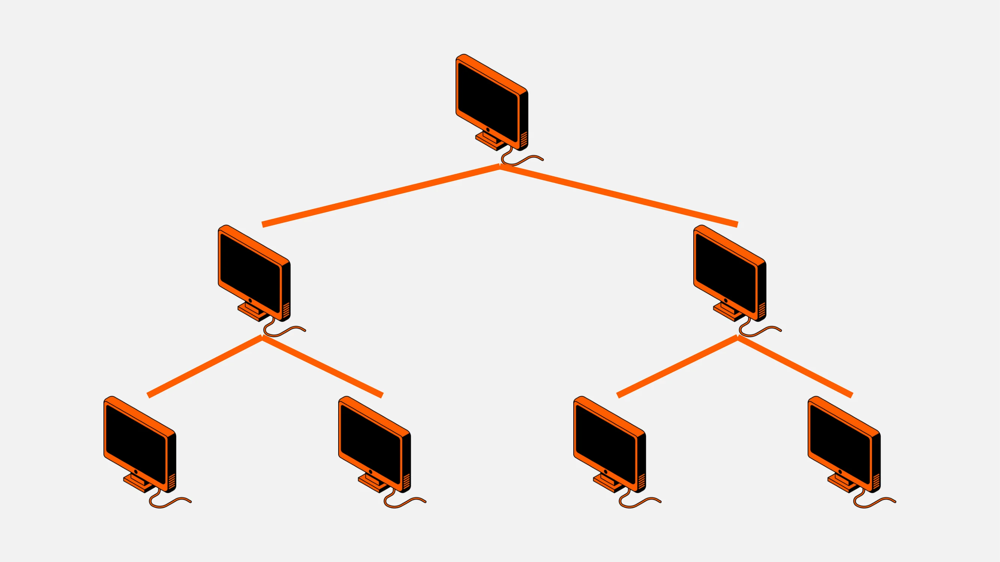


### 버스 네트워크


버스 토폴로지에서 모든 장치는 동일한 전송 매체(일반적으로 동축선 또는 광섬유)를 공유합니다. 각 장치는 수동적으로 연결되므로 신호를 능동적으로 수정하지 않으며, 이 공유 채널을 통해 데이터를 주고받을 수 있습니다.


버스 토폴로지의 주요 장점은 간소화된 케이블링 덕분에 설치 비용이 저렴하다는 점입니다.  하지만 구형 동축 기반 구현(이더넷 10BASE2/10BASE5)에서는 단일 스테이션의 연결이 끊기거나 손실되면 버스 전기 연속성 및 종단 임피던스가 더 이상 유지되지 않기 때문에 모든 트래픽이 중단되거나 심지어 중단될 수도 있습니다. 단일 물리적 매체를 사용하는 것도 중요한 약점입니다. 단선이나 장애가 발생하면 전체 네트워크의 통신이 중단됩니다.


### 스타 네트워크


"허브 앤 스포크"라고도 하는 스타 토폴로지는 오늘날 특히 가정 및 사무실 이더넷 네트워크에서 가장 일반적입니다. 여기서 모든 장치는 하나의 중앙 장치에 연결됩니다.


이 레이아웃은 관리와 유지보수가 쉬워 주변 장치 하나에 장애가 발생해도 나머지 네트워크에는 영향을 미치지 않습니다. 단점은 중앙 디바이스가 단일 장애 지점이라는 점입니다. 중앙 디바이스가 다운되면 모든 곳에서 통신이 중단됩니다. 우수한 성능을 유지하려면 케이블 품질과 링크 길이도 신중하게 고려해야 합니다.


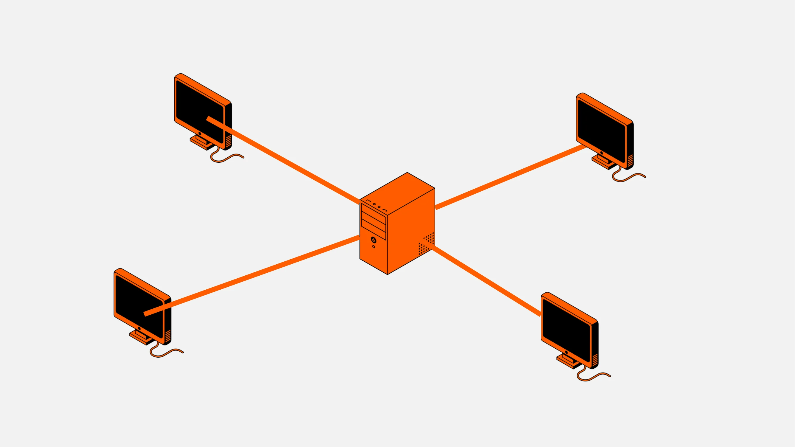


**참고**: 장비가 차례로 연결되는 선형 버스형 토폴로지로 구성된 네트워크가 여전히 존재합니다. 이 솔루션은 배포 비용이 저렴하지만 한 번의 중단으로 일부 호스트가 격리되어 네트워크가 독립적인 하위 집합으로 나뉜다는 큰 단점이 있습니다.


### 메시 네트워크


메시 네트워크는 모든 디바이스가 다른 모든 디바이스에 직접 연결되어 중복성을 극대화하도록 설계되었습니다. 따라서 여러 링크 또는 디바이스에 장애가 발생하더라도 대체 경로를 따라 트래픽을 재라우팅할 수 있으므로 서비스 연속성이 보장됩니다.


단점은 단말기 수에 따라 설정해야 하는 연결 수가 급격히 증가한다는 것입니다. 연결 지점이 'N'인 경우 'N × (N-1)/2'의 별도 링크가 필요하므로 이 토폴로지는 비용이 많이 들고 배포하기가 복잡합니다. 따라서 인터넷의 특정 부분이나 민감한 산업 시스템과 같이 매우 높은 가용성이 필요한 중요 네트워크에서 주로 사용됩니다.


분산 컴퓨팅 또는 병렬 처리의 특수한 요구 사항을 위해 설계된 그리드 또는 하이퍼큐브 네트워크와 같은 다른 변형이 존재합니다.


전 세계적으로 인터넷은 다양한 토폴로지를 사용하는 네트워크의 대규모 상호 연결로, 공통 주소 지정(IPv4 및 IPv6)과 IETF(*인터넷 엔지니어링 태스크포스*)에서 정의한 표준화된 프로토콜 모음으로 통합되어 있습니다. 이러한 다양성은 인터넷이 단일 토폴로지를 따르지 않는다는 것을 의미합니다. 인터넷의 구조는 유연하고 확장 가능하며 논리적 주소 지정 체계와 무관하게 사용할 수 있습니다.


## TCP/IP의 기원


<chapterId>266b6864-8789-48d7-bc85-001cb9f1651f</chapterId>


TCP 프로토콜의 기원은 1966년 **ARPANET** 프로젝트를 시작한 **ARPA**(*고등연구계획국*, 1972년 "DARPA"로 명칭 변경)에서 비롯되었습니다. 1969년 10월, UCLA와 스탠포드 대학을 연결하는 첫 번째 ARPANET 세그먼트가 가동되었습니다. 이 프로젝트의 목표는 부분적인 인프라 장애가 발생하더라도 통신을 계속 실행할 수 있는 패킷 스위치 네트워크를 통해 연구 센터를 연결하는 것이었습니다.


이러한 역학 관계의 일환으로 ARPA는 버클리 대학교에 자금을 지원하여 최초의 TCP/IP 프로토콜을 BSD 유닉스 시스템에 통합했습니다. 이는 처음에는 학계에서, 나중에는 산업계에서 프로토콜을 확산하고 표준화하는 데 중요한 역할을 했습니다.


**참고**: 당시 컴퓨터 과학자들은 아직 Linux(1990년대 초까지 등장하지 않음)나 Andrew Tanenbaum이 설계한 교육용 시스템인 Minix를 가지고 있지 않았습니다.  주요 옵션은 유닉스나 때로는 OpenVMS와 같은 독점적인 메인프레임이었습니다. 유연성과 개방성 덕분에 유닉스는 최초의 네트워킹 개념을 확산하는 데 중요한 역할을 했습니다.


엄밀히 말하면 TCP/IP는 단일 프로토콜이 아니라 TCP와 IP를 중심으로 구축된 프로토콜 모음입니다. 동일한 네트워크에 있는 컴퓨터 간에 데이터를 교환하기 위한 표준화된 프로그래밍 Interface을 제공했기 때문에 유명해졌습니다. "소켓"이라는 기본 요소를 기반으로 하는 이 Interface는 필수 애플리케이션 프로토콜을 통합하면서 안정적이고 유연한 연결을 만들 수 있게 했습니다.


따라서 ARPANET은 오늘날 인터넷의 역사적 토대입니다. 실제로 인터넷은 패킷 스위칭 원리에 기반한 글로벌 네트워크로, 이기종 시스템 간의 호환성과 상호 운용성을 보장하는 일련의 표준화된 프로토콜을 사용하여 정보가 순환합니다. 이러한 개방형 아키텍처 덕분에 다음과 같은 수많은 서비스와 애플리케이션의 개발 및 배포가 가능해졌습니다:


- 이메일,
- 월드 와이드 웹(www),
- 파일 전송 및 공유...


이러한 프로토콜의 거버넌스와 발전은 ***인터넷 아키텍처 위원회***(IAB)에서 감독합니다.

이 조직은 두 가지 주요 구조를 통해 기술 방향을 조정합니다:


- 프로토콜 진화 및 개선에 대한 장기적인 연구를 수행하는 **IRTF**(_인터넷 연구 태스크포스_)가 있습니다.
- 인터넷에서 사용되는 운영 프로토콜을 개발, 표준화 및 문서화하는 **IETF**(*인터넷 엔지니어링 태스크포스*)


네트워크 리소스(IP Address 범위, 자율 시스템 번호, 루트 도메인 이름 등)의 배포는 **IANA/ICANN**에 의해 국제적으로 조정됩니다. 운영 관리는 다음에 의존합니다: **RIR**(*지역 인터넷 레지스트리*): **RIPE NCC**(유럽, 중동, 중앙아시아), **ARIN**, **APNIC**, **LACNIC** 및 **AFRINIC**.


모든 TCP/IP 프로토콜 사양은 **RFC**(_의견 요청_)라는 문서에 기록되어 있으며, 이는 권위 있는 기술 참조 자료로 사용됩니다. RFC는 프로토콜 제품군의 지속적인 발전을 반영하기 위해 지속적으로 업데이트되고 번호가 부여됩니다.


TCP/IP 스택은 종종 네 개의 기능 계층으로 구성된 스택으로 표현되며, **ISO**(_국제 표준화 기구_)에서 개발한 7-Layer **OSI**(_오픈 시스템 상호 연결_) 모델과 비교되어 네트워킹의 개념적 기준이 되기도 합니다.


TCP/IP 모델의 네 가지 계층은 다음과 같습니다:


- 물리적 링크 및 미디어 액세스 제어 프로토콜을 제공하는 네트워크 액세스 Layer;
- 라우팅 및 IP 주소를 처리하는 인터넷 Layer을 사용합니다;
- tCP 또는 UDP와 같은 프로토콜을 사용하는 데이터 흐름의 안정성과 관리를 보장하는 TRANSPORT Layer ;
- hTTP, FTP, SMTP 및 DNS와 같은 사용자 및 소프트웨어 프로토콜을 함께 그룹화하는 애플리케이션 Layer입니다.


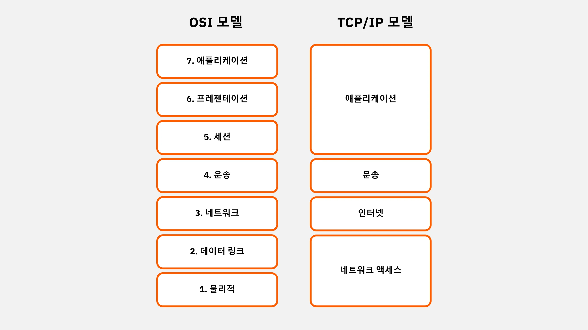


오늘날 가장 널리 사용되는 IP 버전은 IPv4이지만 32비트 Address 공간에는 분명한 한계가 있습니다. 이에 따라 128비트 주소를 사용하고 사실상 무제한 용량을 제공하는 IPv6가 탄생했으며, 이는 커넥티드 디바이스의 폭발적인 성장을 지원하고 사물 인터넷, 이동성 및 보안 문제를 해결하는 데 필수적입니다.


TCP/IP 스택의 각 Layer는 특정 서비스를 제공하므로 물리적 전송, 논리적 주소 지정, 데이터 무결성, 애플리케이션 수준 서비스 등 다양한 네트워킹 요구 사항을 모듈 방식으로 Address에 적용할 수 있습니다.


| Device example    | Description                                                                               | 	TCP/IP layer |
| ---------------------- | ----------------------------------------------------------------------------------------- | ----------------------- |
| Web server            | Application services closest to end users                                      | Application             |
| Gateway or proxy    | 	Encodes, encrypts, compresses useful data                                              | Application             |
| Session switch | Establishes sessions between applications                                               | Application             |
| Firewall or L4 router | Establishes, maintains, and terminates sessions between endpoint devices                  | Transport               |
| Router                | Globally addresses interfaces and determines optimal paths through a network | Network                  |
| Switch   | Locally addresses interfaces and forwards traffic via MAC                            | Network Access         |
| Network Interface Card (NIC)     | Signal encoding, cabling, connectors, physical specifications                        | Network Access         |

https://planb.network/tutorials/computer-security/communication/pi-hole-46a735c5-8af3-4cc3-a2c2-1d4f6a7dc428

https://planb.network/tutorials/computer-security/operating-system/opnsense-90c2785d-a0d7-4981-be8d-d290bbeb8263

https://planb.network/tutorials/computer-security/operating-system/pfsense-24eea96a-2fdc-42a6-a77b-89bc29149864

## IPv5 QoS 프로토콜


<chapterId>570ded19-be61-4005-844e-9490570a6455</chapterId>


IP 패킷의 헤더는 필수 데이터 구조로, 패킷이 네트워크를 통과할 때 올바르게 전송되고 처리되도록 하기 위해 각각 특정한 역할을 하는 여러 필드로 나뉩니다. 이러한 필드에는 패킷을 의도한 수신자에게 라우팅하는 데 필요한 대상 IP Address, IHL(*인터넷 헤더 길이*) 필드에 표시된 헤더 길이, *총 길이 필드*에 기록된 총 패킷 길이, 제어 및 확인 정보, 통신 흐름 및 품질 관리를 위한 기타 파라미터가 포함됩니다.


헤더의 첫 번째 필드를 버전이라고 합니다. 이 4비트 값은 패킷이 따르는 IP 프로토콜의 버전을 지정합니다. 이 값은 각 라우터 또는 중간 장치에 캡슐화된 데이터를 해석하고 처리하는 방법을 알려주기 때문에 중요합니다.


**참고**: IP 프로토콜 버전의 관리 및 Assignment은 **IANA**의 책임 하에 있습니다. 4비트 필드는 16개의 이진 조합(값 0~15)을 허용합니다. 현재 Assignment은 다음과 같습니다:


| Version Number | Protocol   | Version Description         | Reference               |
| -------------- | ---------- | --------------------------- | ----------------------- |
| 0–1            | Reserved   | Reserved                    |                         |
| 2–3            | Unassigned | Unassigned                  |                         |
| 4              | IP         | Internet Protocol           | RFC 791                 |
| **5**          | **ST**     | **ST Datagram mode**        | **RFC 1190** / RFC 1819 |
| 6              | IPv6       | Internet Protocol version 6 | RFC 8200                |
| 7              | TP/IX      | The Next Internet           | RFC 1475                |
| 8              | PIP        | The P Internet Protocol     | RFC 1621                |
| 9              | TUBA       | Tuba                        | RFC 1347                |
| 10–14          | Unassigned | Unassigned                  |                         |
| 15             | Reserved   | Reserved                    |                         |

이 중에는 일반인에게는 잘 알려지지 않았지만 ST(_스트림 프로토콜_)로 존재했던 IPv5가 있습니다. 1980년대에 개발된 IPv5는 당시 점점 커져가는 수요, 즉 VoIP나 멀티미디어 스트림과 같이 지속적이고 안정적인 전송이 필요한 특정 데이터 흐름에 대해 "_서비스 품질_"(QoS)을 제공하기 위해 고안되었습니다. 그 목표는 엔드투엔드 대역폭과 우선순위를 보장하는 것이었는데, 이는 오늘날 최신 라우터에서 네트워크 리소스를 동적으로 예약하기 위해 RSVP(_자원 예약 프로토콜_)가 제공하는 것과 유사한 개념입니다.


그러나 IPv5는 여전히 실험 단계에 머물렀고 소수의 네트워크 디바이스에서만 구현되었습니다. 제한된 채택과 더 많은 Address 공간에 대한 급격한 수요 증가로 인해 인터넷 설계자들은 IPv4에서 IPv6로 바로 건너뛰게 되었습니다. 이를 통해 IPv4의 Address 제한과 IPv5의 실험적 사양과의 혼동 또는 비호환성 위험을 모두 피할 수 있었습니다.


IPv5는 널리 사용되지는 않았지만, QoS와 트래픽 관리에 대한 초기 생각을 형성하는 데 중요한 역할을 했습니다. 오늘날에는 작동하는 표준이라기보다는 역사적 지표에 가깝습니다.


**알림** - 프로토콜은 데이터 구조, 알고리즘, 패킷 형식, 규칙 등 다양한 디바이스가 안정적이고 이해하기 쉽게 정보를 주고받을 수 있도록 하는 일련의 통신 규칙을 말합니다. 서비스는 이러한 규칙을 따르는 특정 프로그램(클라이언트, 서버)을 통해 프로토콜을 구체적으로 구현하여 사용자와 애플리케이션이 해당 기능을 사용할 수 있도록 하는 것입니다.


이제 모든 네트워크 통신의 필수 기반인 IP 프로토콜의 구조와 작동에 대해 자세히 살펴볼 수 있습니다.


## IP 프로토콜


<chapterId>758fddbd-b652-4c18-bd1e-d038bd2e4d05</chapterId>


### 정의 및 일반 정보


IP 프로토콜 또는 "***인터넷 프로토콜***"은 TCP/IP 모델의 근간을 이루는 프로토콜입니다. 로컬이든 전 세계에 걸쳐 있든 네트워크 내에서 한 호스트에서 다른 호스트로 데이터 패킷을 전달합니다. 디바이스의 논리적 주소 지정 관리와 이질적이고 상호 연결된 네트워크에서 패킷이 라우팅되도록 하는 두 가지 주요 역할이 있습니다.


물리적 수준에서 전송은 하드웨어 인터페이스에 의존하여 노드 간의 지점 간 연결을 설정합니다. 그러나 엔드투엔드 통신을 가능하게 하는 것은 IP 프로토콜로, 각 패킷이 목적지까지 가능한 여러 경로를 탐색하는 데 필요한 정보를 제공합니다.


세 가지 네트워크 구성 Elements은 패킷이 전송되는 방식을 결정합니다:


- **IP Address**: 네트워크에서 대상 호스트를 고유하게 식별합니다.
- **서브넷 마스크**: Address의 어느 부분이 네트워크를 식별하고 어느 부분이 호스트를 식별하는지 지정하여 서브넷으로 논리적으로 분할할 수 있습니다.
- **게이트웨이**: 패킷이 외부 네트워크 또는 로컬 네트워크의 다른 세그먼트에 도달하기 위해 통과해야 하는 중간 라우터를 나타냅니다.


인터넷에서 데이터는 하나의 연속적인 스트림으로 흐르지 않고, 각각 전달에 필요한 모든 정보가 캡슐화된 독립적인 데이터 블록인 **데이터그램**으로 전송됩니다. 이것이 바로 **패킷 스위칭**의 원리로, 동일한 수신자에게 도달하기 위해 서로 다른 경로를 취할 수 있는 독립된 단위로 정보를 분할합니다.


페이로드(*페이로드*) 외에도 각 IP 데이터그램에는 대상 Address, 소스 Address, 서비스 유형, 프로토콜 버전 번호 및 전송 관리에 필요한 기타 제어 정보와 같은 필드가 있는 구조화된 헤더가 포함되어 있습니다.


IP 데이터그램의 이론적 최대 크기는 **65,536 옥텟**이며, 헤더의 총 길이 필드에 의해 제한됩니다. 패킷을 전송하는 물리적 네트워크(이더넷, Wi-Fi, 광섬유 등)는 일반적으로 **MTU**(_최대 전송 단위_)라는 더 엄격한 제한을 적용하기 때문에 실제로는 이 크기에 도달하는 경우가 거의 없습니다. 데이터그램이 물리적 링크의 MTU를 초과하는 경우, 데이터그램을 작은 패킷으로 분할하여 각각 개별적으로 전송하고 도착 시 재조립해야 합니다.


이러한 적응성으로 인해 IP는 다양한 기반 기술에서 작동하면서 이기종 시스템과 네트워크 간의 범용 호환성을 유지할 수 있는 강력하고 유연한 프로토콜이 되었습니다.


### IP 데이터그램의 조각화


IP 데이터그램이 전송 용량이 데이터그램 자체보다 작은 네트워크를 통과해야 하는 경우, 문제 없이 이동할 수 있도록 **분할**해야 합니다. 이 물리적 크기 제한을 **MTU(최대 전송 단위)**라고 하는데, 이는 분할되지 않고 주어진 네트워크를 통과할 수 있는 최대 프레임 크기입니다.


각 네트워크 기술에는 하드웨어 및 프로토콜 특성에 따라 결정되는 고유한 MTU가 있습니다. 일반적인 값은 다음과 같습니다:


- **ARPANET**: 1000 바이트
- **이더넷**: 1500 바이트
- **FDDI**: 4470 바이트


데이터그램이 교차해야 하는 네트워크 세그먼트의 MTU를 초과하면 라우팅 장비는 이를 제한을 준수하는 작은 **조각**으로 분할합니다. 이는 일반적으로 MTU가 높은 네트워크에서 용량이 낮은 네트워크로 이동할 때 발생합니다. 예를 들어, FDDI 네트워크에서 오는 데이터그램은 이더넷 세그먼트를 통해 전송되기 전에 조각화되어야 할 수 있습니다.


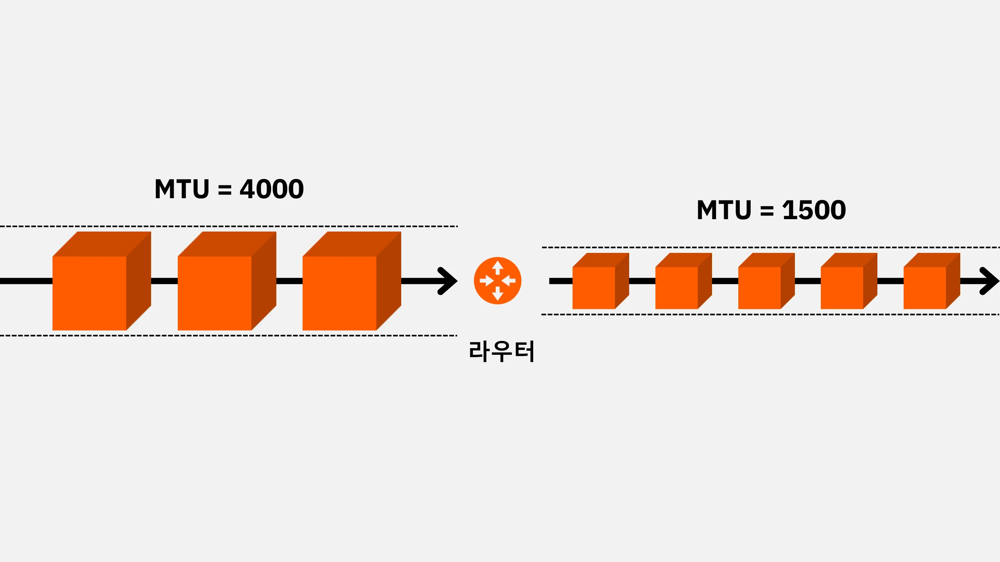


조각화 프로세스는 다음과 같이 작동합니다:


- 라우터는 데이터그램을 대상 네트워크의 MTU보다 크지 않은 조각으로 나눕니다.
- IP 프로토콜은 재조립 오프셋을 인코딩할 때 이 단위를 사용하기 때문에 각 조각의 크기는 8바이트의 배수입니다.
- 모든 조각에는 최종 수신자가 올바른 순서로 재조립하는 데 필요한 정보가 포함된 자체 IP 헤더가 있습니다.


일단 조각난 조각은 네트워크를 통해 독립적으로 이동합니다. 라우팅 테이블, 링크 부하 또는 중단에 따라 다른 경로를 사용할 수 있습니다. 전송된 순서대로 도착한다는 보장은 없습니다.


도착하면 수신 기기는 **재조립**을 처리합니다. 헤더의 정보(공유 식별자, 오프셋, 조각화 플래그)를 사용하여 조각을 올바른 순서로 다시 배치하여 원본 데이터그램을 재구성한 후 다음 Layer로 전송합니다. 단 하나의 조각이라도 손실되거나 손상되면 일반적으로 전체 데이터그램이 폐기되며, 모든 조각이 손실되면 결과가 불완전하거나 사용할 수 없게 됩니다.


조각화와 재조립은 효과적이지만 라우터와 호스트의 추가 처리와 패킷 손실 가능성이 높아져 재전송이 증가할 수 있다는 단점이 있습니다. 그렇기 때문에 원활하고 효율적인 IP 통신을 위해서는 신중한 MTU 관리와 패킷 크기 최적화가 중요합니다.


### 데이터 캡슐화


데이터가 TCP/IP 모델의 계층을 통해 올바르게 라우팅되도록 하기 위해 **캡슐화** 프로세스가 중요한 역할을 합니다. 발신자의 애플리케이션에서 수신자의 컴퓨터로 메시지가 이동하는 각 단계마다 헤더라고 하는 추가 정보가 추가됩니다. 이러한 헤더는 중간 디바이스와 소프트웨어 계층에 데이터를 처리하고, 전달하고, 필요한 경우 재조립하는 데 필요한 지침을 제공합니다.


메시지가 전송되면 TCP/IP 스택의 네 계층을 통과합니다. 각 Layer에서는 기존 데이터 앞에 새로운 헤더가 추가되는데, 각 헤더에는 논리적 또는 물리적 주소, 통신 포트, 시퀀스 번호, 오류 제어 플래그, 전송 및 라우팅 관리에 필요한 모든 정보 등 특정 메타데이터가 포함됩니다.


따라서 전송은 구조화된 프로세스를 따릅니다:


- 애플리케이션 Layer은 원시 데이터가 포함된 초기 **메시지**를 생성합니다.
- 전송 Layer은 이를 **세그먼트**로 캡슐화하여 소스 및 대상 포트, 시퀀스 번호, 흐름 제어 메커니즘을 추가합니다.
- 인터넷 Layer는 세그먼트에 IP 헤더를 추가하여 소스 및 대상 IP 주소를 지정하는 **데이터그램**을 형성합니다.
- 네트워크 액세스 Layer은 데이터그램을 **프레임**으로 래핑하여 MAC 주소와 무결성 검사 코드(CRC)를 추가합니다.


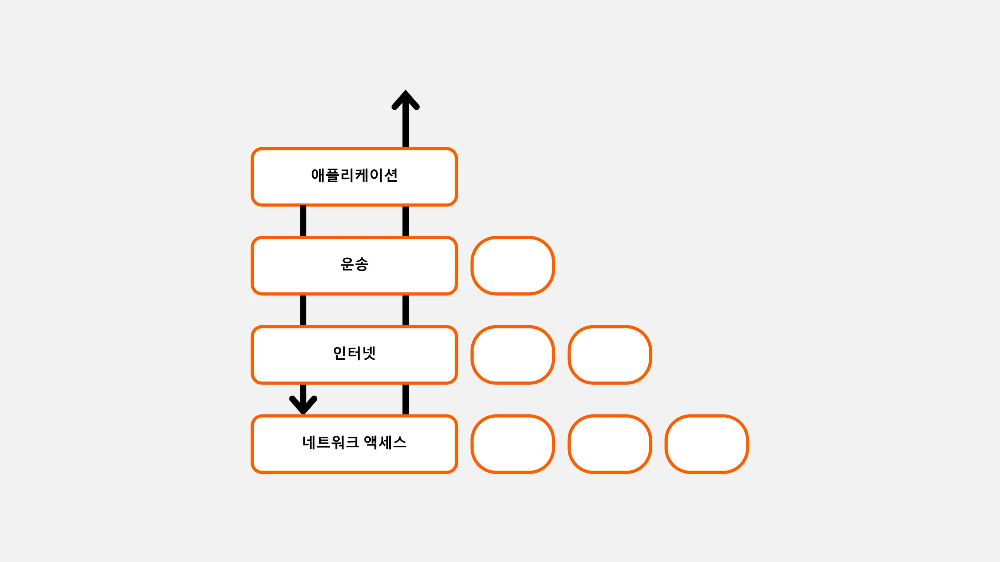


이 캡슐화 프로세스는 데이터의 무결성과 추적성, 적응성을 모두 보장합니다. 한 네트워크에서 다른 네트워크로 이동할 때 헤더는 경로 선택, 유효성 검사 또는 필요한 경우 조각화를 수행하는 데 필요한 정보를 디바이스에 제공합니다.


도착하면 프로세스가 반대로 진행됩니다. 수신 기기는 네트워크 액세스 Layer에서 프레임을 가져와 해당 헤더를 읽고 제거합니다. 그런 다음 데이터그램은 인터넷 Layer로 전달되고, 인터넷 Layer은 IP 헤더를 읽고 제거하여 전송 Layer로 세그먼트를 전달합니다. 전송 Layer은 전송 헤더를 처리하고 스트림의 무결성을 확인한 후 최종적으로 **메시지**를 원래 상태로 대상 애플리케이션에 전달합니다.


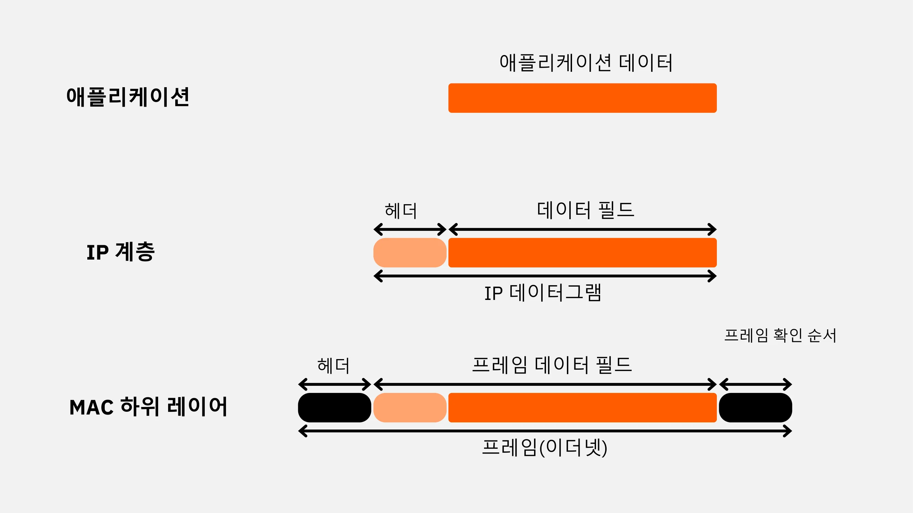


각 Layer에서 데이터의 변환은 다음과 같이 요약할 수 있습니다:


- **메시지**: 애플리케이션 Layer의 정보 블록입니다.
- **세그먼트**: 전송 Layer에 의해 캡슐화된 후의 데이터 단위.
- **데이터그램**: 인터넷 Layer에 의해 IP 헤더가 추가된 후 생성된 형식입니다.
- **프레임**: 네트워크 액세스 Layer에 의해 물리적 매체를 통해 전송할 준비가 된 최종 블록입니다.


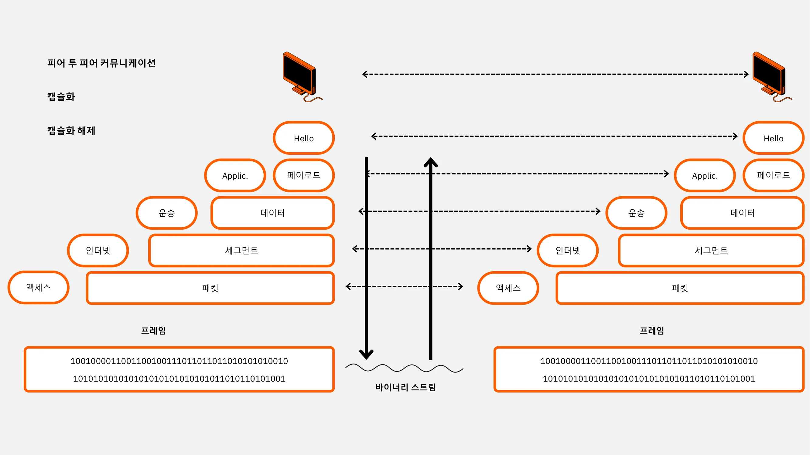


인터넷 통신의 안정성과 보편성에 필수적인 이 프로세스는 아무리 파편화되거나 복잡한 데이터라도 수신 컴퓨터가 이해하고 사용할 수 있는 상태로 모든 데이터를 종단 간 전송할 수 있도록 보장합니다.


### IP 주소 지정


패킷 스위칭, 조각화, 캡슐화 기능을 갖추고 있더라도 안정적인 주소 지정 시스템이 없으면 네트워크가 제대로 작동할 수 없습니다. 각 데이터 패킷이 올바른 수신자에게 도달할 수 있도록 인터넷 Layer은 고유 식별자, 즉 **IP Address**을 사용합니다.

IPv4에서 IP Address는 **32비트**로 코딩되며 점으로 구분된 10진수 4개로 익숙한 N1.N2.N3.N4 형식(예: 192.168.1.12)으로 작성됩니다.


IP Address은 두 부분으로 구성되어 있습니다:


- **netid**: 호스트가 속한 네트워크를 식별합니다
- **hostid**: 해당 네트워크 내의 특정 호스트를 식별합니다

이러한 분리를 통해 글로벌 인터넷은 논리적으로 상호 연결된 여러 네트워크로 구성될 수 있습니다.


역사적으로 IPv4 시스템은 A부터 E까지 레이블이 지정된 클래스 기반 체계에 의존하여 Address의 범위와 그 용도를 정의했습니다. 각 클래스는 _netid_와 _hostid_에 정해진 수의 비트를 할당하여 가능한 네트워크 및 호스트 수에 직접적인 영향을 미쳤습니다.


| **Class** | **IPv4 Address Range**            | **Usage**                    |
| --------- | --------------------------------- | ---------------------------- |
| A         | 1.x.x.x to 126.x.x.x              | Unicast addresses            |
|           | (127.x.x.x reserved for loopback) | Local loopback               |
| B         | 128.0.x.x to 191.255.x.x          | Unicast addresses            |
| C         | 192.0.0.x to 223.255.255.x        | Unicast addresses            |
| D         | 224.0.0.0 to 239.255.255.255      | IP Multicast                 |
| E         | 240.0.0.0 to 255.255.255.255      | Reserved for experimentation |

호스트에 가능한 모든 값을 할당할 수 있는 것은 아닙니다. 예를 들어 **클래스 C** Address의 경우 마지막 바이트는 8비트(256개 값)를 제공합니다. 하지만 이 중 2개는 예약되어 있습니다:


- 0: 네트워크 자체를 식별합니다
- 255: 네트워크의 모든 호스트에 한 번에 패킷을 전송하는 데 사용되는 **브로드캐스트** Address입니다.

그러면 디바이스에 사용할 수 있는 주소가 254개가 남습니다.


사용 가능한 주소의 수는 클래스 A의 대규모 공용 네트워크, 클래스 B의 기업 네트워크, 클래스 C의 소규모 로컬 네트워크 등 클래스마다 매우 다양합니다.


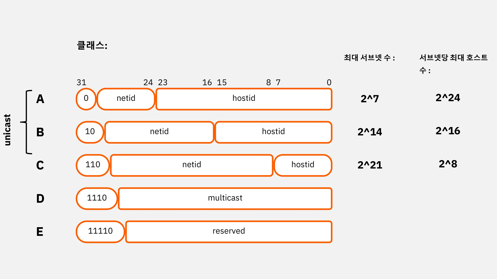


일부 Address 범위는 개인용으로 예약되어 있으며 인터넷에서 직접 라우팅되지 않습니다. 이를 **개인 주소**라고 하며 조직, 기업 또는 가정 내부에서 사용되며 공용 인터넷에 연결하려면 일반적으로 NAT(*네트워크 Address 변환*)와 같은 Address 변환이 필요합니다. 다음과 같습니다:


- **클래스 A**: 10.0.0.0 ~ 10.255.255.255
- **클래스 B**: 172.16.0.0 ~ 172.31.255.255
- 클래스 C: 192.168.0.0 ~ 192.168.255.255


비공개 Address가 있는 장치가 인터넷에 액세스하면 NAT 지원 라우터 또는 게이트웨이가 이를 유효한 공용 Address로 대체합니다.


예시: 예: 호스트가 Address **192.168.7.5**를 가지고 있다면 추론할 수 있습니다:


- 192.168.7.0: 네트워크 Address
- 192.168.7.1: 로컬 라우터인 경우가 많습니다
- 192.168.7.5: 호스트 자체


또 다른 특별한 경우는 "***루프백***"으로 알려진 **127.0.0.1**입니다.

Linux 시스템에서는 Interface **lo**와 연결됩니다. 이 Address를 사용하면 실제 Interface을 거치지 않고 로컬 테스트 또는 진단을 위해 컴퓨터가 스스로 Address를 수행할 수 있습니다. 전체 **127.0.0.0/8** 범위는 이 용도로 예약되어 있습니다.


Address 사용을 최적화하고 복잡한 네트워크를 설계하려면 **서브넷마스크**(_netmask_)가 필수입니다. 이 바이너리 마스크는 IP Address의 _netid_와 _hostid_를 분리합니다.

각 클래스에는 기본 마스크가 있습니다:


- **255.0.0.0** 클래스 A의 경우,
- 255.클래스 B의 경우 255.0.0.0,
- **255.255.255.0** 클래스 C의 경우.


좋은 네트워크 설계는 직접 통신해야 하는 디바이스는 동일한 네트워크 또는 서브넷에 있어야 한다는 기본 규칙을 따릅니다. 네트워크를 세분화하기 위해 보다 구체적인 마스크를 사용하여 네트워크를 더 작은 서브넷으로 나누는 서브넷을 사용합니다.


서브넷팅 예시:

클래스 **C** 네트워크: 192.168.1.0/24, 기본 마스크는 255.255.255.0입니다.

각각 최대 60개의 호스트로 구성된 4개의 서브넷이 필요합니다.


**1단계**: 서브넷당 필요한 주소 수 = 60개 + 예약 주소 2개(네트워크 + 브로드캐스트) = 62개.


**2단계**: 2 ≥ 62의 가장 가까운 거듭제곱을 구합니다. -> 2⁶ = 64.


**3단계: 마스크 조정하기.** NETID_ 비트는 유지하고 필요한 _HOSTID_ 비트를 예약합니다. 변환하면 **255.255.255.192**가 되는 바이너리 마스크를 얻습니다.


```
11111111 11111111 11111111 11000000
```


**4단계**: 호스트에 예약된 비트를 변경하여 각 서브넷에 대한 Address 범위를 계산합니다.


| Subnet ID (bits) | Subnet Address   | Subnet Mask     | Address Range                 | Broadcast Address |
| ---------------- | ---------------- | --------------- | ----------------------------- | ----------------- |
| 00               | 192.168.1.0/26   | 255.255.255.192 | 192.168.1.1 – 192.168.1.62    | 192.168.1.63      |
| 01               | 192.168.1.64/26  | 255.255.255.192 | 192.168.1.65 – 192.168.1.126  | 192.168.1.127     |
| 10               | 192.168.1.128/26 | 255.255.255.192 | 192.168.1.129 – 192.168.1.190 | 192.168.1.191     |
| 11               | 192.168.1.192/26 | 255.255.255.192 | 192.168.1.193 – 192.168.1.254 | 192.168.1.255     |


**5단계**: 이렇게 하면 전체 주소 지정 체계를 효율적으로 유지하면서 각각 최대 62대의 머신을 지원하는 4개의 서브네트워크가 생성됩니다. Hostid_ 부분은 _subnetid_ 부분과 호스트 부분으로 나뉩니다.


이 서브넷의 기본 원칙은 최신 네트워크 엔지니어링에서 필수적인 요소로, 정확한 IP 할당, 더 나은 트래픽 제어, 강력한 세그먼트 격리 및 확장 가능한 네트워크 관리를 가능하게 합니다.


### CIDR 주소 지정


1990년대 초, 기업과 조직을 통해 인터넷이 빠르게 확산되면서 클래스(A, B, C)에 기반한 기존 IP 주소 체계는 한계를 보이기 시작했습니다.

경직된 구조로 인해 IP 주소가 상당히 낭비되고 라우팅 테이블이 점점 더 크고 복잡해지며 유지 관리가 어려워졌습니다.

이러한 문제를 해결하기 위해 보다 유연하고 효율적인 방법이 Address에 도입되었습니다: **CIDR**(_클래스 없는 도메인 간 라우팅_)입니다. CIDR은 점차 표준으로 자리 잡으며 기존의 클래스 기반 시스템을 대체하고 있습니다.


CIDR의 핵심 아이디어는 여러 인접 네트워크, 특히 클래스 C 블록을 **슈퍼넷**(_슈퍼넷_)이라는 단일 논리 단위로 그룹화할 수 있는 기능입니다. 이러한 집계를 통해 라우팅 테이블의 단일 항목이 여러 하위 네트워크를 나타낼 수 있으므로 라우터가 처리해야 하는 경로 수가 줄어들고 성능이 향상됩니다.


클래스 C 네트워크는 처음에는 용량이 작기 때문에 통합의 필요성이 가장 컸지만, 이 원칙은 클래스 B와 이론적으로는 클래스 A 네트워크에도 적용되었지만, 후자는 Address 범위가 넓기 때문에 영향을 덜 받습니다.


CIDR을 사용하면 고정 클래스의 개념이 사라집니다. Address 공간은 필요에 따라 분할하거나 집계할 수 있는 연속적인 범위로 취급됩니다. CIDR 블록은 A, B 또는 C 클래스의 기본값으로 제한되지 않는 서브넷 마스크를 사용하여 정의됩니다. CIDR 블록은 단일 네트워크 또는 동일한 접두사를 공유하는 인접한 하위 네트워크 집합을 나타낼 수 있습니다.


CIDR 블록은 "Address/접두사" 형식으로 작성되며, 슬래시 뒤의 숫자는 네트워크 부분을 구성하는 비트 수를 나타냅니다. 예를 들어 /17은 처음 17비트는 네트워크를 식별하고 나머지 15비트는 호스트를 식별한다는 의미입니다.


예시:

17 블록에는 2^(32-17)개의 주소가 있으므로 2^15 = 32,768개의 총 주소가 있습니다. 두 개의 예약 주소(네트워크 및 브로드캐스트)를 빼면 32,766개의 사용 가능한 호스트 주소가 남습니다. 따라서 네트워크 관리자는 서브넷의 크기를 실제 요구사항에 맞게 정확하게 조정하여 불필요한 낭비를 방지할 수 있습니다.


CIDR 크기 조정을 더 쉽게 이해할 수 있도록 다음은 일반적인 접두사와 그에 해당하는 서브넷 마스크 및 사용 가능한 주소의 표입니다:


| CIDR Prefix | Available Host Bits | Subnet Mask     | Usable Host Addresses         |
| ----------- | ------------------- | --------------- | ----------------------------- |
| /8          | 24                  | 255.0.0.0       | 2^24 - 2 = 16,777,214         |
| /12         | 20                  | 255.240.0.0     | 2^20 - 2 = 1,048,574          |
| /16         | 16                  | 255.255.0.0     | 2^16 - 2 = 65,534             |
| /20         | 12                  | 255.255.240.0   | 2^12 - 2 = 4,094              |
| /24         | 8                   | 255.255.255.0   | 2^8 - 2 = 254                 |
| /26         | 6                   | 255.255.255.192 | 2^6 - 2 = 62                  |
| /27         | 5                   | 255.255.255.224 | 2^5 - 2 = 30                  |
| /28         | 4                   | 255.255.255.240 | 2^4 - 2 = 14                  |
| /29         | 3                   | 255.255.255.248 | 2^3 - 2 = 6                   |
| /30         | 2                   | 255.255.255.252 | 2^2 - 2 = 2                   |
| /31         | 1                   | 255.255.255.254 | 2^1 = 2 (point-to-point only) |
| /32         | 0                   | 255.255.255.255 | 1 (host address only)         |


**참고**: 과거에 RFC 950에서는 라우팅의 혼란을 피하기 위해 서브넷 0의 사용을 권장하지 않았습니다.  이 제한은 사용을 완전히 허용하는 RFC 1878에서 더 이상 사용되지 않게 되었습니다. 이전의 제한은 대부분 CIDR을 올바르게 처리할 수 없는 구형 하드웨어와의 비호환성 때문이었습니다. 최신 장비에는 이러한 문제가 없습니다.


예를 들어, 서브넷 마스크가 **255.255.0.0**인 서브넷 **1.0.0.0**은 클래스 A 네트워크 식별자가 모호했지만 이제 완벽하게 유효하며 사용할 수 있습니다.


**팁**: 오류 없는 서브넷 계산과 주소를 CIDR 표기법으로 빠르게 변환하기 위해 ***ipcalc***와 같은 편리한 도구가 있습니다. 이 '네트워크 계산기'는 Address 분석, 사용 가능한 범위, 관련 마스크를 명확하게 보여주므로 관리자와 CIDR을 배우는 학생 모두에게 이상적입니다.


```shell
sudo apt install ipcalc
```


https://planb.network/tutorials/computer-security/communication/angry-ip-scanner-47f7c943-53b7-4098-b167-4cec8e747b5d

## TCP 프로토콜


<chapterId>860bf7d5-a502-4d10-a12c-9827f6c2d393</chapterId>


TCP 프로토콜**(_전송 제어 프로토콜_)**은 TCP/IP 모델의 TRANSPORT Layer에서 중심적인 역할을 합니다. 애플리케이션과 인터넷 Layer 사이의 가교 역할을 하여 멀리 떨어져 있는 두 컴퓨터 간에 데이터를 안정적으로 전송할 수 있도록 합니다.

IP 프로토콜은 전달이나 순서를 보장하지 않고 단순히 패킷을 전송하는 반면, TCP는 데이터 흐름의 무결성과 일관성을 보장하여 손실 없이 정확한 순서로 중복 없이 전달합니다.


TCP의 주요 업무는 다음과 같습니다:


- 수신된 세그먼트 재정렬하기;
- 데이터 흐름을 모니터링하여 혼잡을 방지합니다;
- 데이터 블록을 적절한 단위(세그먼트)로 분할하거나 재조립합니다;
- 통신 양쪽 끝 간의 연결 설정 및 종료를 관리합니다.


TCP는 연결 지향 프로토콜로, 클라이언트와 서버 간에 명시적이고 지속적인 관계를 설정합니다. 이를 위해 **시퀀스 번호**와 **승인**을 사용합니다. 전송되는 모든 세그먼트에 고유 식별자가 할당되어 수신 컴퓨터가 데이터의 순서와 무결성을 모두 확인할 수 있습니다. 그런 다음 수신기는 **ACK 플래그**가 1로 설정된 승인 세그먼트를 반환하여 수신을 확인하고 다음 예상 시퀀스 번호를 표시합니다.


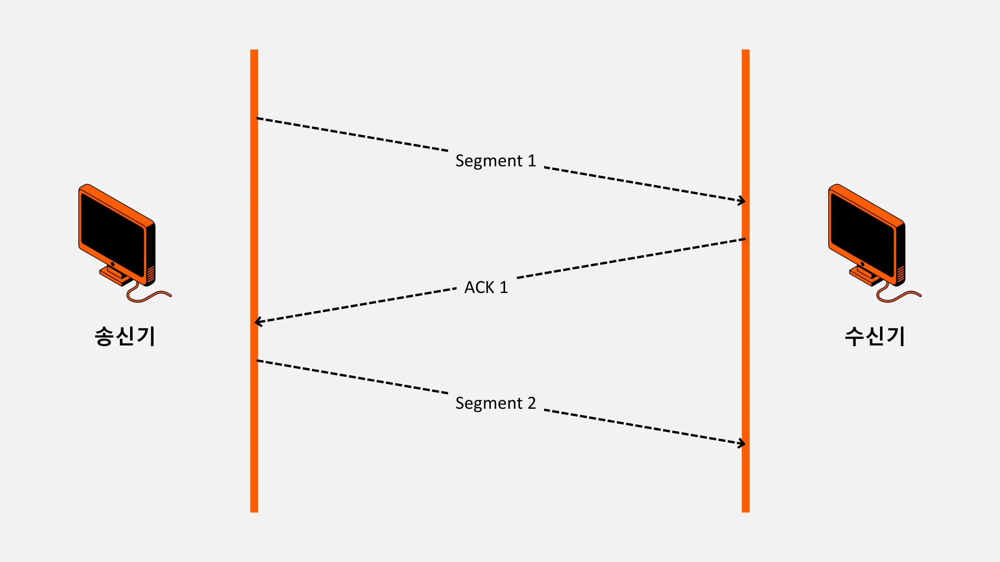


신뢰성을 높이기 위해 TCP는 타이머를 사용합니다. 세그먼트가 전송되면 카운트다운이 시작됩니다. 시간 초과 기간 내에 확인이 도착하지 않으면 발신자는 세그먼트가 전송 중 손실된 것으로 간주하여 자동으로 재전송합니다. 이 자동 재전송 메커니즘은 혼잡, 라우팅 오류 또는 하드웨어 장애로 인해 발생할 수 있는 IP 네트워크의 고유한 손실을 상쇄합니다.


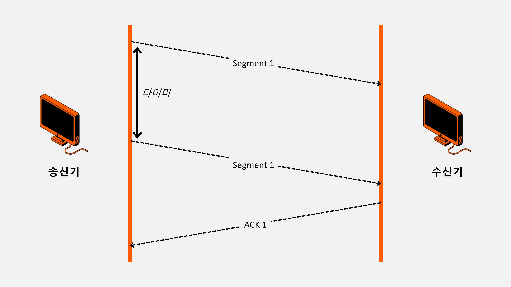


TCP는 중복을 감지하고 처리할 수 있습니다. 재전송된 세그먼트가 도착했지만 원본도 표시되는 경우 수신자는 시퀀스 번호를 사용하여 중복을 식별하고 올바른 사본만 보관하여 모호함을 제거합니다.


이 프로세스가 작동하려면 두 시스템이 초기 시퀀스 번호에 대한 공통된 이해를 공유해야 합니다. 한편으로는 **서버**가 특정 포트에서 수신 요청을 기다리며 대기하고(수동 모드), 다른 한편으로는 **클라이언트**가 동일한 서비스 포트의 서버에 요청을 전송하여 연결을 적극적으로 시작하는 등 엄격한 연결 절차를 따름으로써 이를 보장할 수 있습니다.


**참고**: "포트"는 컴퓨터의 네트워크 애플리케이션에 할당된 숫자 식별자(0~65,535)입니다. 동일한 IP Address에서 동시에 실행되는 여러 서비스를 구분하는 데 사용됩니다. 클라이언트가 데이터를 전송할 때 포트 번호를 지정하면 서버의 운영 체제가 어떤 프로그램이 데이터를 수신해야 하는지 알 수 있습니다(예: HTTP의 경우 80, HTTPS의 경우 443, SMTP의 경우 25). 포트는 전용 출입문과 같은 역할을 하여 트래픽의 출입을 지시하고 서비스 간의 혼동을 방지하며 방화벽이나 필터링 규칙을 통해 세분화된 액세스 제어를 가능하게 합니다.


시퀀스 동기화 Exchange는 두 사람이 서로 인사하며 연락을 취하는 방식과 유사한 유명한 **"*3자 악수*"** 메커니즘을 기반으로 합니다. TCP의 안정성을 보장하는 이 초기화 단계는 3단계로 진행됩니다:

1. **SYN:** 클라이언트는 적절한 플래그 설정과 초기 시퀀스 번호(예: C)가 포함된 초기 동기화 세그먼트(**SYN**)를 전송합니다;

2. **SYN-ACK:** 수신 서버가 승인 세그먼트(**SYN-ACK**)로 응답하면 클라이언트의 시퀀스 번호를 승인하고 자체 초기 시퀀스 번호를 제공합니다;

3. **ACK:** 클라이언트가 서버의 시퀀스 번호를 수신했음을 확인하는 최종 확인(**ACK**)을 보내 동기화를 완료합니다. 이제 SYN 플래그는 비활성화되고 ACK 플래그는 연결이 설정되었음을 나타내는 상태로 유지됩니다.


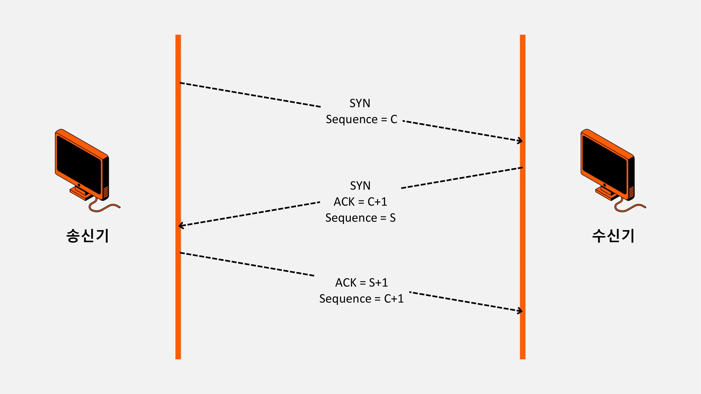


이 Exchange 프로토콜은 페이로드 데이터를 전송하기 전에 양 당사자가 동일한 번호 기반을 공유하도록 보장합니다. 이 동기화가 완료되면 세션이 열리고 이제 세그먼트가 양방향으로 이동할 수 있으며 수신 시 각각 승인되어 데이터 흐름의 안정성을 극대화할 수 있습니다.


이 ***3방향 핸드셰이크***는 연결 설정에만 관련됩니다. 연결 종료를 위해 TCP는 *4방향 핸드셰이크*를 사용합니다: 핀 → 확인 → 핀 → 확인으로, 연결이 완전히 해제되기 전에 전송 중인 세그먼트가 손실되지 않도록 보장합니다.


이 프로세스는 견고성과 신뢰성을 위해 설계되었지만, 악용 가능한 취약점을 발생시키기도 합니다. 예를 들어, **IP 스푸핑**과 같은 공격은 위조된 시퀀스 번호를 통해 인증된 컴퓨터로 위장하여 이러한 신뢰 관계를 우회하거나 손상시켜 데이터 스트림을 가로채거나 조작할 수 있는 침해를 발생시키는 것을 목표로 합니다.


시퀀스 동기화 하이재킹의 위험을 제한하고 네트워크 부하를 관리하기 위해 TCP 프로토콜은 "**_Sliding Window_**"라는 흐름 관리 기법을 사용합니다. 이 시스템은 각 세그먼트에 대해 즉각적인 승인 없이 전송할 수 있는 데이터의 양을 조절하여 네트워크의 불필요한 과부하를 줄이면서 안정성을 유지합니다.


실제로 슬라이딩 창은 각각의 개별 세그먼트가 승인되지 않고 발신자와 수신자 간에 자유롭게 순환할 수 있는 시퀀스 번호의 범위를 정의합니다. 발신 시스템에서 확인을 받으면 창이 오른쪽으로 미끄러지면서 새 세그먼트를 보낼 수 있는 공간을 확보합니다. 이 창의 크기(혼잡을 피하면서 처리량을 최적화하는 데 중요)는 TCP 헤더의 "*Window*" 필드에 지정되어 있습니다.


**예**: 초기 시퀀스 번호가 3이고 창이 시퀀스 5까지 확장된 경우, 3~5번 세그먼트는 개별 확인을 기다릴 필요 없이 전송할 수 있습니다.


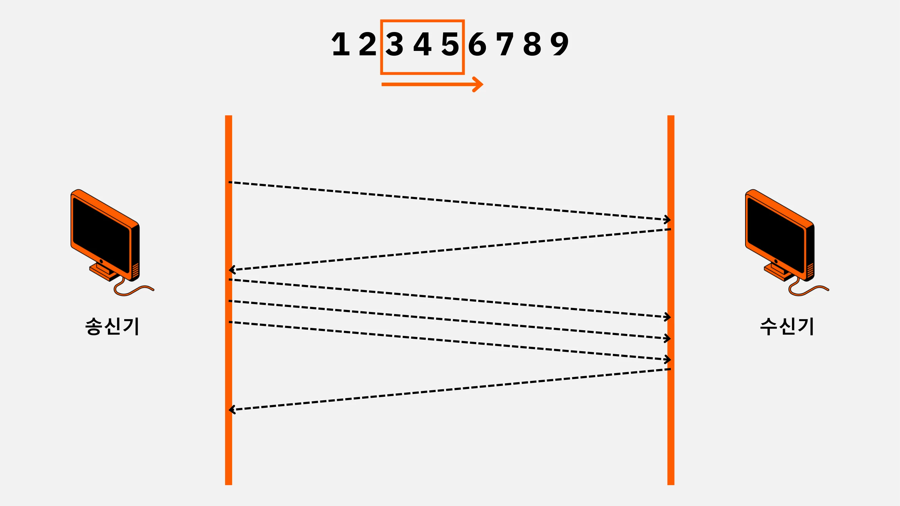


슬라이딩 창의 크기는 고정되어 있지 않으며 네트워크 상태와 수신자의 처리 용량에 따라 동적으로 조정됩니다.  수신자가 더 많은 양의 데이터를 처리할 수 있는 경우 창 필드를 통해 이를 표시하여 발신자에게 창을 확장하라는 메시지를 표시합니다. 반대로 과부하 또는 포화 위험이 있는 경우 수신자는 감소를 요청할 수 있으며, 발신자는 창이 앞으로 이동하여 추가 세그먼트를 보낼 때까지 기다립니다.


이 프로토콜은 깔끔하고 질서정연한 종료를 보장하기 위해 대칭적인 TCP 연결 종료 절차를 제공합니다. 어느 컴퓨터든 **FIN** 플래그가 1로 설정된 세그먼트를 전송하여 통신 종료 의사를 알리는 방식으로 종료를 시작할 수 있습니다. 그런 다음 전송 중인 모든 세그먼트가 수신될 때까지 기다렸다가 더 이상의 데이터를 무시합니다.


이 세그먼트를 수신하면 다른 컴퓨터는 FIN 플래그가 표시된 확인을 보냅니다. 그런 다음 남은 데이터 전송을 완료한 후 로컬 애플리케이션에 연결이 종료되었음을 알립니다. 이러한 이중 확인을 통해 질서 정연한 종료를 보장하고 데이터 손실 위험을 최소화할 수 있습니다.


IP의 유연한 라우팅과 TCP의 엄격한 제어를 결합한 이러한 정밀한 관리는 종종 IP 프로토콜의 속도(**"최선의 노력"** 기반으로 작동하며 전송을 보장하지 않음)와 TCP 프로토콜의 안정성(승인 및 협상된 시퀀스를 통해 전송을 관리)을 대조하는 다이어그램으로 설명할 수 있습니다.


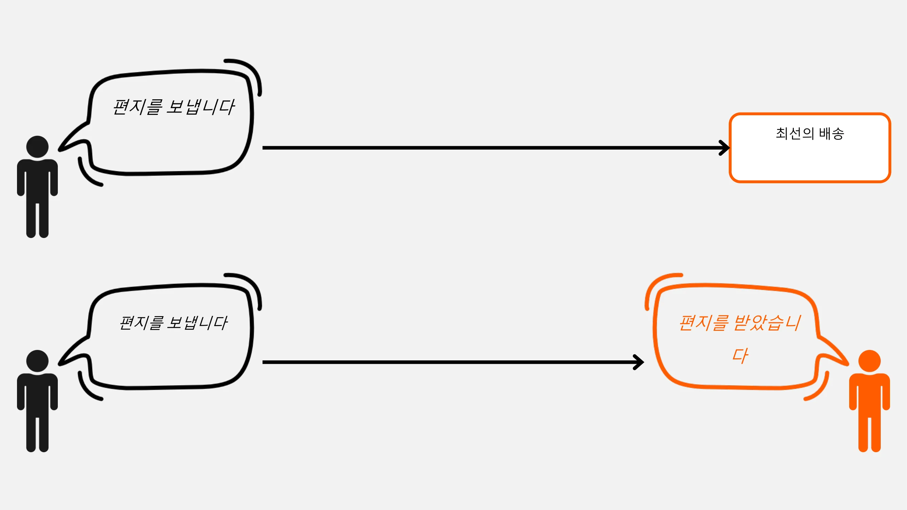


그러나 어떤 경우에는 절대적인 안정성이 우선 순위가 아니라 속도와 단순성이 우선 순위입니다. 이는 사용자 경험에 심각한 영향을 미치지 않고 약간의 패킷 손실을 견딜 수 있는 라이브 스트리밍이나 VoIP와 같은 애플리케이션에 해당합니다. 이러한 경우 **UDP**(_사용자 데이터그램 프로토콜_)가 선호됩니다.


UDP는 TCP와는 근본적으로 다른 원리로 작동합니다. 즉, 발신자와 수신자 사이에 사전 관계가 설정되지 않는다는 의미의 **무연결** 방식입니다. 컴퓨터가 UDP를 통해 패킷을 전송하면 단방향으로 전송되며, 수신자는 확인을 보내지 않고 발신자는 메시지가 도착했는지 확인할 수 없습니다. UDP 헤더는 의도적으로 최소화되어 소스 포트, 대상 포트, 세그먼트 길이, 체크섬만 포함하며 승인 또는 상태 제어 메커니즘이 내장되어 있지 않습니다. 항상 그렇듯이 IP 주소는 기본 IP 헤더에 의해 전달됩니다.


일반적인 비유를 들자면 TCP는 **전화 통화**와 같으며, 대화가 진행되는 동안 회로를 설정하고 추적하며 제어합니다. 반면, UDP 프로토콜은 발신자가 편지를 우체통에 넣는 **우편물 발송**과 같으며, 즉각적인 배달 증명이나 체계적인 피드백이 없습니다.


TCP와 UDP의 이러한 상호 보완성 덕분에 최신 네트워크는 애플리케이션에 따라 최대 안정성을 선택하거나 속도를 우선시하는 등 다양한 요구사항에 적응할 수 있습니다.


## 서비스 기본 요소


<chapterId>4480afb7-e950-4ccb-88fa-d132f9dc3479</chapterId>


### 계층화된 아키텍처 및 Exchange 조직


지금까지 살펴본 바와 같이 **서비스**는 지금까지 설명한 프로토콜의 구체적인 구현입니다. TCP/IP 모델은 **OSI** 모델과는 다르지만, 동일한 계층적 접근 방식을 채택하고 있습니다. 각 Layer는 특정 기능을 수행하고 바로 위에 있는 Layer에 **서비스**를 제공하도록 설계되어 모듈식, 견고하고 유지 관리가 쉬운 아키텍처를 구현합니다.


각 Layer는 그 아래에 있는 Interface의 기능을 기반으로 구축되며, 위의 Layer는 데이터 관리를 위한 일관된 Interface을 차례로 제공합니다. 이 아키텍처에서 모든 Layer에는 다른 레이어와의 완벽한 호환성을 보장하기 위해 세심하게 정의된 자체 **데이터 구조**가 있습니다. 이러한 호환성은 한 엔드포인트에서 다른 엔드포인트로의 원활하고 안정적이며 명확한 통신을 위해 필수적입니다.


이러한 거래소에는 두 가지 주요 측면이 적용됩니다:


- **수직적 측면**: 하나의 Layer와 그 위 또는 아래의 Layer 사이의 관계(Layer N에서 Layer N+1로, 또는 그 반대로).


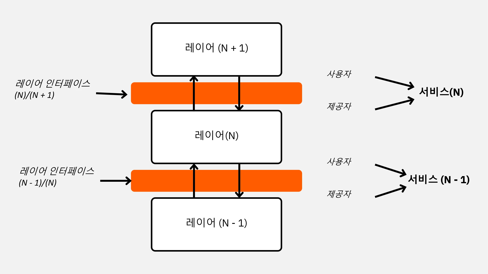


- **수평적 측면**: 원격 애플리케이션 간의 상호 작용, 즉 **클라이언트**와 **서버** 간의 양방향 대화입니다.


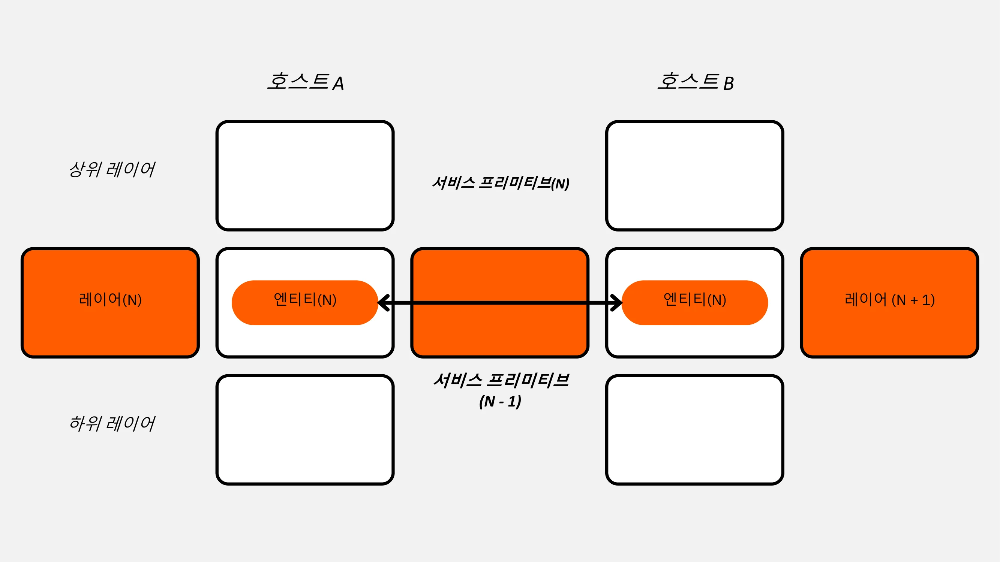


계층화된 아키텍처는 각 Layer이 해당 범위 내의 정보만 처리한다는 원칙에 따라 데이터 구조, 헤더 및 제어 메커니즘은 Layer마다 다르지만 함께 일관된 시스템을 형성하여 데이터가 최종 목적지로 점진적으로 라우팅되도록 합니다.


**알림**: 레이어 간에 교환되는 데이터 단위를 설명하기 위해 특정 용어가 사용됩니다:


- **메시지**를 전송합니다,
- 세그먼트**를** 전송 Layer(TCP)에 사용합니다,
- 인터넷 Layer(IP)용 **데이터그램**,
- 네트워크 액세스 Layer용 **프레임**.


아래 표에는 TCP 및 UDP 컨텍스트에 대한 용어가 요약되어 있습니다:


| TCP/IP Layer         | Unit Name (TCP) | Unit Name (UDP) |
|----------------------|------------------|------------------|
| Application Layer    | Stream           | Message          |
| Transport Layer      | Segment          | Packet           |
| Internet Layer       | Datagram         | Datagram         |
| Network Access Layer | Frame            | Frame            |

### 서비스 기본 요소 및 데이터 단위


이 시스템의 핵심에는 통신 인터페이스 역할을 하는 **서비스 프리미티브**가 있습니다. 이러한 프리미티브는 서비스 데스크처럼 작동하며 예약된 특정 **포트**에서 수신 대기하고 프로세스가 제어된 방식으로 네트워크 연결을 설정, 유지, 종료할 수 있도록 합니다. 프로토콜이 네트워크에서 데이터의 형식과 전송을 구성하는 반면, 계층 간의 수직적 연결을 제공하는 것은 **서비스와 그 프리미티브**입니다.


수평적 측면(분산된 애플리케이션 간의 통신)과 수직적 측면(계층 간의 내부 상호 작용)을 결합하여 TCP/IP 모델은 완전하고 확장 가능한 아키텍처를 제공합니다. 이 두 가지 관점을 겹쳐 보면 구조화된 네트워크 통신에서 데이터가 교환되는 방식을 명확하게 파악할 수 있습니다.


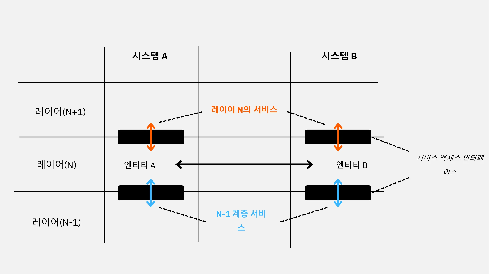


### 파트 요약


첫 번째 주요 섹션에서는 오늘날 인터넷 연결 네트워크의 구성과 운영을 관리하는 핵심 아키텍처에 대해 살펴보았습니다. 이 아키텍처는 OSI 모델에서 영감을 얻은 **4-Layer 모델**을 기반으로 하며, 현대 통신의 근간인 **TCP/IP** 프로토콜 제품군을 중심으로 구축되었습니다. 연결 지향적 접근 방식의 TCP가 안정적인 전송을 보장하는 반면, 신뢰성보다 속도가 더 중요한 경우에는 더 가볍고 빠른 UDP가 선호된다는 것을 확인했습니다.


이 모델이 제대로 작동하려면 **서비스 프리미티브**를 통한 프로토콜 구현에 의존합니다. 이는 계층 간의 연결을 보장하여 인터넷 및 네트워크 액세스를 포함한 전송부터 애플리케이션까지 각 계층의 특정 요구 사항에 맞게 데이터 처리를 조정할 수 있도록 합니다. 이러한 모듈식 접근 방식은 시스템을 유연하고 견고하게 만듭니다.


IP 주소 지정은 이 인프라의 또 다른 초석입니다. 연결된 모든 장치는 **클래스**(A부터 E까지)로 구성된 Address 공간에서 가져온 **고유 IP Address**로 식별됩니다. 이러한 주소 중 일부는 로컬 루프백 또는 멀티캐스트와 같은 특수 목적을 위해 예약되어 있으며, "개인 주소"로 알려진 다른 주소는 번역(NAT) 없이 인터넷을 통해 라우팅되지 않습니다. 이러한 분류를 통해 네트워크를 논리적이고 계층적으로 구성할 수 있습니다.


또한 네트워크 세그먼트를 분할하여 IP 리소스를 더 잘 관리하고 데이터 흐름을 최적화할 수 있는 **서브네트워크**의 개념에 대해서도 살펴봤습니다. 서브넷 마스크를 사용한 수동 세분화는 여전히 중요한 원칙이지만, **CIDR**(_클래스 없는 도메인 간 라우팅_) 덕분에 크게 현대화되었습니다. 이 방법은 라우팅 테이블의 크기를 줄이면서 IP 범위를 보다 유연하고 합리적으로 할당할 수 있게 함으로써 Address 관리를 혁신했습니다.


레이어, 프로토콜, 서비스 기본 요소, 주소 지정 및 서브넷 등 이러한 개념을 마스터하면 최신 네트워크의 기술적 작동을 이해하고 오늘날의 요구 사항을 충족하는 네트워크 인프라를 효율적으로 구성할 수 있는 탄탄한 기반을 다질 수 있습니다.


다음 섹션에서는 IPv4 주소 지정에 대해 자세히 살펴보겠습니다.


# IPv4 주소 지정


<partId>83f3c3e5-378c-440f-a095-df210842efde</partId>


## IPv4 사용


<chapterId>79e4dd18-446a-435b-9f25-c88a00f8bec6</chapterId>


이 섹션에서는 실제 네트워크에서 **IPv4** 주소가 실제로 어떻게 구현되는지 자세히 살펴보겠습니다. 주소의 형식과 그 뒤에 숨겨진 로직, 그리고 **DNS 이름**, **MAC 주소**, **서브네트워크** 및 **번역 기술**과 같은 다른 주요 네트워크 Elements와 어떻게 연결되는지 자세히 살펴볼 것입니다.


IP Address은 디바이스의 각 **네트워크 Interface**에 할당된 고유한 숫자 식별자입니다. 이를 통해 네트워크 내에서 이 장치를 찾아 해당 장치에 연결하여 데이터를 전송할 수 있습니다. 예를 들어 라우터, 서버, 워크스테이션, 네트워크 프린터, 심지어 감시 카메라에도 하나 이상의 IP Address이 있습니다. IP Address은 물리적으로 멀리 떨어져 있어도 패킷을 A 지점에서 B 지점으로 이동하는 **라우팅**을 가능하게 합니다.


IP 주소는 크게 두 가지 방법으로 할당할 수 있습니다:


- **정적**: 장치에서 수동으로 설정합니다.
- 동적**: 동적**: 필요에 따라 DHCP(_동적 호스트 구성 프로토콜_) 서버에 의해 자동으로 할당됩니다. DHCP는 네트워크 관리를 간소화하여 수동 구성이 필요 없으며 예약 및 임대 기간을 통해 정밀한 제어가 가능합니다.


**IPv4** 주소는 **4바이트**로 분할된 **32비트** 형식으로 작성됩니다. 각 바이트는 8비트를 포함하며 0에서 255까지의 10진수를 나타냅니다. 4바이트는 점으로 구분되어 명확하고 읽기 쉬운 표기법을 형성합니다.


예시 Address 172.16.254.1_


바이트의 각 비트에는 값(또는 "가중치")이 있는데, 왼쪽 비트(가장 중요한 비트)는 128, 그 다음 64, 오른쪽 비트(가장 중요하지 않은 비트)는 32, 16, 8, 4, 2, 1의 가치가 있습니다. 이런 식으로 2진법은 설정된 가중치를 단순히 더하는 방식으로 십진법으로 변환됩니다.


아래 표는 이러한 대응을 보여줍니다:


| Binary Code | Activated Bit Values          | Decimal Value |
|-------------|-------------------------------|---------------|
| 00000000    | 0                             | 0             |
| 00000001    | 1                             | 1             |
| 00000011    | 1 + 2                         | 3             |
| 00000111    | 1 + 2 + 4                     | 7             |
| 00001111    | 1 + 2 + 4 + 8                 | 15            |
| 00011111    | 1 + 2 + 4 + 8 + 16            | 31            |
| 00111111    | 1 + 2 + 4 + 8 + 16 + 32       | 63            |
| 01111111    | 1 + 2 + 4 + 8 + 16 + 32 + 64  | 127           |
| 11111111    | 1 + 2 + 4 + 8 + 16 + 32 + 64 + 128 | 255      |

바이너리를 십진수로 변환하려면 1로 설정된 비트의 가중치를 더합니다.


| Binary     | Decimal Value |
| ---------- | ------------- |
| `10101100` | 172           |
| `00010000` | 16            |
| `11111110` | 254           |
| `00000001` | 1             |

IP Address는 전체 장치가 아닌 단일 **네트워크 Interface**을 식별합니다. 멀티포트 라우터 또는 방화벽에는 각각 고유한 IP Address가 있는 여러 인터페이스가 있습니다. 예를 들어 여러 가상 네트워크 또는 서비스를 제공하기 위해 하나의 Interface에 여러 개의 IP 주소를 가질 수도 있습니다.


모든 IP 패킷은 헤더에 두 개의 IP 주소를 포함합니다:


- 소스 Address (**발신자**)
- 대상 Address(**수신자**)

라우터는 이러한 주소를 읽고 패킷이 목적지에 도달할 때까지 패킷을 전송할 최적의 경로를 파악합니다. 엄격한 주소 지정 규칙이 없으면 네트워크 트래픽을 올바르게 라우팅할 수 없고 네트워크의 글로벌 상호 연결이 불가능합니다.


IPv4 Address는 두 부분으로 구성되어 있습니다:


- **NetID**: 네트워크를 식별합니다
- **HostID**: 해당 네트워크 내의 디바이스를 식별합니다

서브넷 마스크는 NetID가 끝나는 부분과 HostID가 시작되는 부분을 결정하며, 각 부분에 속하는 비트 수를 지정합니다. NetID가 길수록 가능한 서브넷의 수는 증가하지만 서브넷당 호스트 수는 그에 따라 감소합니다.


원래 IPv4 네트워크는 5개의 **클래스**로 나뉩니다: (A, B, C, D, E). 각 클래스는 특정 NetID 범위에 해당하며 고정된 세분성을 정의합니다:


- 클래스 A: 호스트 수가 많은 초대형 네트워크
- 클래스 B: 중간 규모 네트워크
- 클래스 C: 소규모 네트워크
- 클래스 D: 멀티캐스팅을 위해 예약된 주소(_multicast_)
- 클래스 E: 실험적 주소, 기존 주소에 사용되지 않음


| Class | Leading Bits | First Byte Range | Default Subnet Mask | Purpose                          |
| ----- | ------------ | ---------------- | ------------------- | -------------------------------- |
| A     | 0            | 0 – 127          | 255.0.0.0           | Very large networks              |
| B     | 10           | 128 – 191        | 255.255.0.0         | Medium-sized networks            |
| C     | 110          | 192 – 223        | 255.255.255.0       | Small networks                   |
| D     | 1110         | 224 – 239        | N/A                 | Multicast addresses              |
| E     | 1111         | 240 – 255        | N/A                 | Experimental (not publicly used) |

특별 주소:


- **네트워크 Address**: 네트워크 자체를 식별합니다(라우팅 테이블에 사용).
- **브로드캐스트 Address**: 서브넷의 모든 디바이스에 한 번에 데이터를 전송합니다(모든 HostID 비트가 1로 설정됨).


다음 범위는 내부용으로 예약되어 있습니다:


- **10.0.0.0/8** (비공개 클래스 A)
- **127.0.0.0/8** (로컬 루프백 또는 _loopback_)
- 172.16.0.0 ~ 172.31.255.255 **(비공개 클래스 B)**
- 192.168.0.0 ~ 192.168.255.255 **(비공개 클래스 C)**


주소 **127.0.0.1** 및 더 일반적으로 127.0.0.0/8 전체 범위는 내부 테스트에 사용되며, 이 주소로 전송되는 모든 요청은 절대 머신 외부로 나가지 않습니다. 이는 더 넓은 네트워크를 포함하지 않고 로컬 네트워크 서비스가 작동하는지 확인하는 데 유용합니다.


Address 공간을 더 잘 활용하기 위해 관리자는 서브넷 마스크 또는 **CIDR** 표기법(_클래스 없는 도메인 간 라우팅_)을 사용하여 네트워크를 **서브넷**으로 분할하는 경우가 많습니다. CIDR을 사용하면 보다 정확한 관리가 가능하고 주소 낭비를 방지할 수 있습니다. 오늘날 CIDR은 IP 범위를 미세 조정하고 라우팅 테이블의 크기를 줄이는 데 필수적입니다.


최신 네트워크에서 IP 주소는 일반적으로 다른 식별자와 함께 사용됩니다:


- dNS**(_도메인 네임 시스템_)에 등록된 도메인 네임**입니다: 숫자 IP Address을 사람에게 친숙한 이름과 연결합니다.
- **MAC Address**: 네트워크 카드에 새겨진 물리적 식별자로, 로컬 전송(*이더넷*)에 사용됩니다. IP 패킷을 물리적으로 전송해야 하는 경우, ARP 테이블은 IP Address을 대상의 MAC Address과 일치시킵니다.


IPv4 Address 부족 문제를 해결하고 보안을 강화하기 위해 네트워크에서는 종종 Address 변환(_NAT_)을 사용합니다. NAT를 사용하면 여러 개인 디바이스가 인터넷에 액세스할 때 하나의 공용 IP Address을 공유할 수 있습니다.


**참고**: 그르노블 CRIC 계산기](http://cric.grenoble.cnrs.fr/Administrateurs/Outils/CalculMasque/)와 같은 온라인 및 기본 제공 OS 도구를 사용하면 서브넷 및 마스크 계산이 훨씬 쉬워집니다.

이러한 유틸리티는 네트워크 분할을 효율적으로 계획하는 데 도움이 됩니다.


결론적으로 브로드캐스트 Address은 세그먼트에 연결된 모든 디바이스에 동일한 메시지를 전송하는 실용적인 기능으로, 모든 호스트가 대상이 되도록 HostID 부분의 모든 비트를 1로 설정하여 이를 구현할 수 있습니다.


## 다양한 유형의 IPv4 Address


<chapterId>2adfad24-a90d-45b5-b808-3d2f6598bebf</chapterId>


IPv4 주소는 인터넷에서 직접 액세스할 수 있는 공개 주소와 로컬 네트워크 내에서 내부용으로 사용되는 비공개 주소의 두 가지 주요 범주로 나뉩니다.


공인 IPv4 Address는 전 세계적으로 고유하며 인터넷에서 라우팅할 수 있습니다. 공식 기관에서 할당하며 웹사이트, 이메일 서버 또는 클라우드 인프라와 같은 공공 대면 서비스에 필요합니다.

라우팅 충돌이나 충돌을 방지하려면 이러한 주소의 전 세계 고유성이 필수적입니다.


**ICANN**(_인터넷주소자원관리기구_) 산하의 **IANA**(_인터넷주소관리기구_)는 이러한 IP 범위의 분배를 관리합니다. 구체적으로 IANA는 CIDR 표기법에 따라 IPv4 공간을 /8 크기의 256개 블록으로 나눕니다. 각 블록은 1,670만 개가 조금 넘는 주소(2³² / 2⁸)를 나타냅니다.


이러한 유니캐스트 Address 블록은 IANA가 **지역 인터넷 레지스트리**(RIR)에 위탁합니다. 이러한 RIR은 액세스 공급자, 회사 또는 행정기관의 실제 필요에 따라 지역 수준에서 주소를 재분배할 책임이 있습니다. 유니캐스트 Address 공간은 **1/8에서 223/8** 블록까지 확장되며, 일부는 특수 용도(연구, 문서화, 테스트)를 위해 예약되거나 재분배를 위해 네트워크 또는 RIR에 직접 할당됩니다.


공인 IP Address의 소유자를 확인하려면 **whois** 명령을 사용하거나 각 레지스트리에서 제공하는 웹 인터페이스를 사용하여 RIR 데이터베이스를 참조할 수 있습니다. 이러한 도구를 사용하여 Address를 신고한 조직 또는 제공업체를 추적할 수 있습니다.


이와 반대로 공인 주소 부족에 대한 실질적인 대응책인 사설 IPv4 주소가 있습니다. 인터넷에서 라우팅할 수 없는 이러한 주소는 기업 네트워크, 가정용 LAN, 데이터센터 또는 컴퓨팅 클러스터와 같은 로컬 환경을 위해 예약되어 있습니다. 많은 사설 네트워크가 격리된 상태로 유지되거나 네트워크 Address 변환 장치를 사용하여 인터넷에 액세스하는 한, 동일한 IP 범위를 간섭 없이 재사용할 수 있는 것은 전 세계적으로 유일하지 않습니다.


비공개 IP Address을 사용하는 디바이스가 인터넷에 액세스할 수 있도록 네트워크는 NAT(네트워크 Address 변환)를 사용합니다. NAT는 비공개 Address을 공용 Address으로 동적으로 교체하여 수십(또는 수백) 개의 디바이스가 하나의 공용 IP Address을 공유할 수 있도록 합니다. 이 방법은 IPv4 공간 사용을 최적화하고 내부 네트워크 구조를 숨겨 보안을 강화하는 Layer을 추가합니다.


또 다른 특수 범주는 **지정되지 않은** 주소입니다. IPv4 표기법 **0.0.0.0** 또는 해당 IPv6 버전 **::/128**은 "특정 Address 없음"을 의미합니다. 이러한 Address는 네트워크 Address 대상으로는 유효하지 않지만 호스트가 로컬에서 "모든 인터페이스" 또는 "아직 할당된 Address 없음"을 나타내는 데 사용할 수 있습니다. 이는 DHCP 동적 Assignment 또는 모든 서버 인터페이스에서 수신하는 데 일반적으로 사용됩니다.


IPv6는 비공개 주소도 지원하지만, 표준에서는 일반적으로 여러 NAT 계층을 쌓지 않기 위해 공개 주소를 권장합니다. **Fec0::/10** 블록의 **사이트-로컬 주소**(*site-local*)는 일관성 및 보안상의 이유로 **RFC 3879**에 의해 더 이상 사용되지 않습니다. 이 주소는 **fc00::/7** 블록에 있는 **유니크 로컬 주소**(*ULA*)로 대체되었습니다. ULA를 사용하면 로컬 고유성을 보장하기 위해 무작위로 생성된 40비트 식별자를 사용하여 깔끔한 내부 라우팅을 갖춘 비공개 IPv6 네트워크를 만들 수 있습니다.


IPv4 고갈은 2011년에 공식적으로 확인되었습니다. 수명을 연장하기 위해 인터넷 커뮤니티는 몇 가지 전략을 채택했습니다:


- **IPv6**로의 점진적 마이그레이션
- **NAT**의 광범위한 사용
- RIR의 더 엄격한 할당 정책, Address 수요에 대한 정확한 정당화 및 관리 요구
- 기업이 사용하지 않거나 자발적으로 반납한 Address 블록의 복구


이러한 조치는 IP 주소 지정이 단순한 기술적 문제가 아니라 인터넷의 지속적인 확장에 핵심이 되는 글로벌 거버넌스의 문제임을 보여줍니다.


## DNS, Address 디렉토리


<chapterId>511244ec-ba43-44ac-b4c3-b41579a15cff</chapterId>


솔직히 말해서 인간은 2진수든 10진수든 긴 문자열의 숫자를 외우는 데 능숙하지 않습니다. 특히 NAT 또는 가상 호스팅과 같은 기술이 관련된 경우, 복잡할 수 있고 단일 IP Address이 여러 주소를 가릴 수 있는 IP 주소의 경우 이 문제는 더욱 심각해집니다.


작업을 더 쉽게 하기 위해 애플리케이션 Layer는 IP Address를 논리적으로 사람이 읽을 수 있는 이름에 연결하는 시스템을 사용합니다. 이는 읽을 수 있는 도메인 이름을 IP 주소와 일치시키는 대규모의 계층적 분산 디렉토리인 **DNS**(*도메인 이름 시스템*)의 역할입니다. 이 시스템은 일련의 프로토콜과 서비스를 기반으로 합니다. 가장 널리 사용되는 DNS 서버 소프트웨어는 인터넷 DNS 인프라의 대부분을 참조하는 오픈 소스 소프트웨어 패키지인 **BIND**(_버클리 인터넷 이름 도메인_)입니다.


웹사이트, 메일 서버, 기타 네트워크 서비스 등 연결된 모든 서비스에는 도메인 이름을 하나 이상의 IP 주소에 매핑하는 레코드가 있습니다. 이는 두 가지 방향으로 작동합니다:


- 순방향 해결: 이름을 IP Address으로 번역합니다.
- 역방향 확인: 주어진 IP Address과 연결된 도메인 이름을 찾습니다.

이렇게 하면 라우터가 데이터를 올바르게 이동하는 데 필요한 정밀도를 유지하면서 사람이 네트워크 주소를 사용할 수 있습니다.


도메인 이름은 항상 계층적으로 구조화되어 있으며, 각 단계는 점으로 구분됩니다. 전체 이름은 **FQDN**(_정격 도메인 이름_)이라고 합니다. 가장 오른쪽 부분은 `.com`, `.org` 또는 `.fr`과 같은 **TLD**(_최상위 도메인_)입니다. 가장 왼쪽 부분은 호스트, 즉 IP Address에 연결된 특정 컴퓨터 또는 서비스를 지정합니다.


DNS 시스템은 **영역 트리**로 설계되었습니다. 영역**은 특정 DNS 서버가 관리하는 도메인 네임스페이스의 섹션입니다. 단일 영역에는 여러 개의 **서브도메인이 포함될 수 있으며, 다른 서버에서 관리하는 다른 영역에 위임될 수 있습니다. 관리자는 업데이트, 위임 및 전반적인 관리를 처리하는 등 영역을 유지 관리할 책임이 있습니다.


이 구조는 기본 도메인(예: `example.com`)을 가리킬 뿐만 아니라 개별 호스트(`www`, `mail`, `ftp` 등)에 대한 레코드도 미세 조정할 수 있습니다. 네트워킹 초창기에는 이러한 매핑을 유닉스 시스템의 `/etc/hosts`와 같은 정적 파일로 처리했지만, 빠르게 성장하고 상호 연결된 인터넷에서는 이러한 방법이 비현실적이 되었습니다.


DNS 서버는 제한된 범위에서만 서비스를 제공할 수 있다는 점을 이해하는 것이 중요합니다. 예를 들어, 회사의 내부 DNS 서버는 인터넷에서 직접 액세스할 수 없을 수도 있습니다. 이 DNS가 쿼리를 전달하도록 구성되지 않았거나 다른 서버와 신뢰할 수 있는 관계가 없는 경우 일부 쿼리가 실패합니다. 즉, 정의된 영역 외부에서는 이름이나 IP Address를 확인할 수 없습니다.


DNS는 이메일 라우팅에서도 역할을 합니다. 예를 들어 **MX**(_메일 교환_) 레코드는 특정 도메인에 대한 이메일 수신을 담당하는 메일 서버를 지정합니다. 이러한 레코드는 우선순위(가중치) 및 장애 조치 솔루션을 정의합니다. DNS 서버의 영역 파일에는 해당 서버를 해당 영역의 공식 정보 소스로 지정하는 **SOA**(_스타트 오브 오소리티_) 레코드가 포함되어야 합니다.


계층적이고 분산된 구조 덕분에 DNS는 인터넷의 초석으로 남아 있으며, 사용자는 길고 기술적인 IP 주소 대신 명확하고 기억하기 쉬운 도메인 이름을 통해 서비스에 액세스할 수 있습니다.


다음 장에서는 또 다른 기본 개념에 대해 살펴보겠습니다: 로컬 네트워크의 물리적 Layer에서 데이터 전송을 보장하는 **MAC 주소**라고도 하는 *이더넷 주소*입니다.


## 이더넷 주소 및 ARP 검색


<chapterId>d02109f6-9bf9-4261-a8f9-e1aa4398b949</chapterId>


### 정의


데이터 라우팅 프로토콜이 안정적이고 일관되게 작동하려면 한 가지 핵심 요소가 필수적입니다. 인간은 IP Address 또는 DNS를 통해 검색된 이름으로 기계를 쉽게 식별할 수 있습니다. 하지만 머신은 패킷을 전송할 대상 디바이스를 명확하게 인식할 수 있어야 합니다. 이를 위해 네트워크 Interface에서 직접 사용하는 특정 하드웨어 식별자, 즉 MAC Address(_미디어 액세스 제어_)에 의존합니다.


**참고**: 이는 메모리 아키텍처의 '물리적 Address'과는 아무런 관련이 없습니다. 컴퓨팅에서 물리적 메모리 Address은 운영 체제에서 관리하는 가상 Address과 달리 메모리 버스의 특정 위치를 의미합니다. 반면, MAC Address은 네트워크 하드웨어와 엄격하게 연관되어 있습니다.


MAC Address는 장비가 제조된 제조업체에서 영구적으로 고유하게 할당합니다. MAC Address는 컴퓨터, 스마트폰, 프린터 또는 기타 연결된 장치에 관계없이 네트워크 카드를 명확하게 식별합니다. DHCP 서버 또는 수동 구성을 통해 동적으로 변경될 수 있는 IP Address와 달리, MAC Address는 고의로 변경하지 않는 한 일반적으로 디바이스의 수명 기간 동안 동일하게 유지됩니다.


유선 또는 무선의 모든 네트워크 Interface에는 자체 MAC Address이 있습니다. 이 Address은 교환되는 각 네트워크 프레임에 하드웨어 Address을 삽입하고 관리하기 위해 데이터 링크 Layer(OSI 모델의 Layer 2) 내에서 사용됩니다. 이를 _이더넷 주소_ 또는 _UAA_(_유니버설 관리 주소_)라고도 합니다. 48비트, 즉 6바이트 길이로 표준화되어 있으며, 16진수 표기법으로 작성되며 일반적으로 `:` 또는 `-`로 구분된 바이트 형태로 표기됩니다.


예: `5A:BC:17:A2:AF:15`


이 구조에서 처음 3바이트는 네트워크 카드 제조업체를 식별하며, 이를 **OUI**(*조직 고유 식별자*)라고 합니다. IEEE에서 할당하는 이 접두사는 전 세계적인 고유성을 보장하기 위해 Bluetooth 및 LLDP와 같은 다른 하드웨어 주소 지정 체계에서도 사용됩니다.


### MAC Address 변경(MAC 스푸핑)


이론적으로 MAC Address는 고정된 상태로 유지되도록 설계되었지만, 특정 요구 사항을 충족하거나 특정 제약 조건을 우회하기 위해 수정할 수 있는 방법이 있습니다. 흔히 _스푸핑 MAC_이라고 하는 이 작업에는 원래 하드웨어 Address를 소프트웨어 수준에서 정의된 다른 값으로 대체하는 것이 포함됩니다. 일부 운영 체제는 특히 실제 이더넷 Address를 드라이버가 직접 사용하지 않을 때 이 수정을 용이하게 합니다.


이러한 변경의 이유는 다양합니다. 특정 애플리케이션이 올바르게 작동하기 위해 특정 이더넷 Address이 필요하거나 동일한 로컬 네트워크를 공유하는 두 장치 간의 동일한 주소 충돌을 해결하기 위한 것일 수 있습니다.


카드에 새겨진 고유 식별자를 숨겨서 네트워크나 감시 서비스에 의해 디바이스가 추적될 가능성을 줄이면 개인정보 보호를 고려할 수도 있습니다. 하지만 이러한 관행에 부작용이 없는 것은 아닙니다. MAC Address을 변경하면 특정 필터링 장치가 중단되거나 방화벽을 재구성하여 새 하드웨어를 인증해야 할 수 있습니다.


특히 Wi-Fi와 같은 일부 네트워크에서는 MAC Address 필터링을 사용하여 승인된 주소를 가진 디바이스만 허용합니다. 이는 기본적인 수준의 제어를 추가하지만, 그 자체로는 안전하지 않습니다. 공격자는 네트워크에서 이미 승인된 유효한 MAC Address를 캡처하고 이를 복제하여 제한을 우회할 수 있습니다. 따라서 MAC 필터링은 항상 더 강력한 보안 조치와 함께 사용해야 합니다.


### MAC/IP 대응


로컬 네트워크가 효율적으로 작동하려면 물리적 주소(MAC 주소)와 논리적 주소(IP 주소) 사이에 명확한 매핑이 있어야 합니다. 이 연결이 없으면 컴퓨터는 대상의 IP Address을 알 수 있지만 로컬 네트워크에서 물리적으로 데이터를 전송하는 방법을 알 수 없습니다.

이 매핑은 ARP(_주소 확인 프로토콜_)에 의해 자동으로 처리됩니다.


실제로 사용자가 특정 IP Address에 해당하는 MAC Address를 알고 싶을 때 `arp` 유틸리티를 사용할 수 있습니다. 이 도구는 기기의 로컬 ARP 테이블을 확인하여 로컬 네트워크의 IP 주소와 MAC 주소 간에 알려진 일치 항목을 표시합니다. 이러한 방식으로 논리적 계층과 물리적 계층 간의 효과적인 링크를 빠르게 확인할 수 있습니다.


실제 예: IP Address `192.168.1.5`에 해당하는 네트워크 카드를 확인하려면 다음 명령을 사용하세요:


```bash
arp –a 192.168.1.5
```


출력에는 연결된 물리적 Address(MAC), 입력의 특성(정적 또는 동적) 및 해당 Interface이 표시됩니다.


```
Interface: 192.168.1.5 --- 0x5
IP Address            MAC Address                Type
192.168.1.5           00:54:BC:17:14:6E          D
```


MAC Address과 IP Address은 완전히 다른 식별자이지만 서로 밀접하게 상호 보완된다는 점을 기억하는 것이 중요합니다. MAC Address은 제조업체에서 각 네트워크 Interface에 고유하게 새겨 넣은 것으로, 로컬 네트워크에서 디바이스를 물리적으로 식별하는 데 사용됩니다. 반면 IP Address은 동적 또는 정적으로 할당된 논리적 Address으로, 로컬 네트워크를 넘어 IP 네트워크와 Exchange 패킷에 참여할 수 있도록 합니다.


- MAC Address의 시각적 예시:


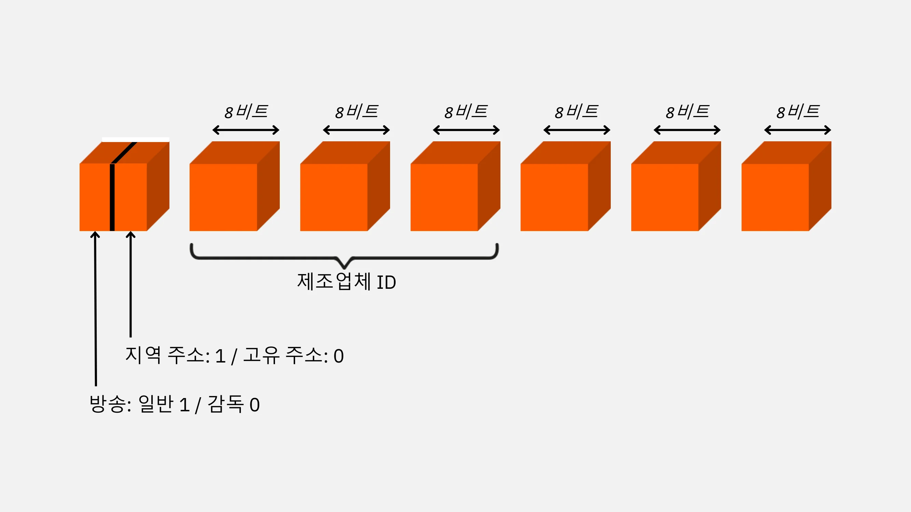


- IP Address의 시각적 예시:


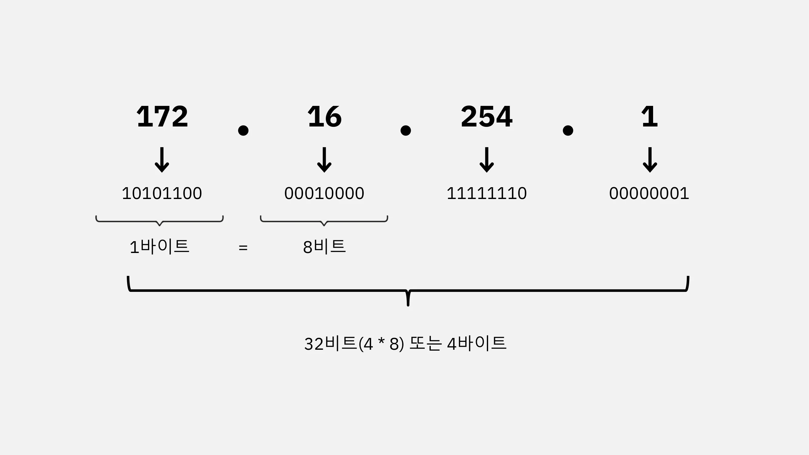


기업 환경에서는 이 두 가지 주소 지정 수준이 별도로 작동할 수 없습니다. 예를 들어, DHCP 서버가 IP Address을 자동으로 할당하는 경우 장비의 MAC Address이 시작점으로 사용됩니다. 컴퓨터는 MAC Address이 포함된 DHCP 브로드캐스트 요청을 전송하여 서버가 올바른 장치에 사용 가능한 IP Address을 할당할 수 있도록 합니다. 이 하드웨어 식별이 없으면 DHCP 서버는 Address을 어느 장치에 전달할지 알 수 없습니다.


따라서 ARP 프로토콜은 IP 주소와 물리적 주소 사이의 연결을 제공하여 컴퓨터가 논리적 대상을 실제 물리적 대상으로 변환할 수 있도록 하는 기본적인 프로토콜입니다. 컴퓨터가 동일한 네트워크에 있는 컴퓨터로 패킷을 보내야 하는 경우, 먼저 ARP 테이블을 참조하여 수신자의 MAC Address가 이미 알려져 있는지 확인합니다. 그렇지 않은 경우 로컬 네트워크의 모든 호스트에 ARP 요청을 브로드캐스트합니다. 이 요청에서 대상 IP Address를 인식한 컴퓨터는 자신의 MAC Address를 지정하여 응답합니다. 그런 다음 발신자는 요청이 전송될 때마다 이 작업을 반복하지 않기 위해 이 IP/MAC 쌍을 자신의 ARP 캐시에 기록합니다.


이 ARP 테이블은 DNS가 도메인 이름을 IP 주소와 연결하는 것과 유사한 방식으로 동적으로 업데이트되는 미니 매핑 디렉터리 역할을 합니다. 데이터 링크 Layer이 이더넷 프레임을 올바르게 캡슐화하려면 MAC Address을 알아야 하므로 ARP가 없으면 로컬 Exchange는 불가능합니다.


반대로 RARP 프로토콜(_역방향 Address 확인 프로토콜_)은 정반대의 상황을 위해 설계되었습니다. 즉, MAC Address만 알고 있는 컴퓨터가 IP Address을 검색할 수 있도록 하는 것입니다. 로컬 Hard 디스크가 없는 구형 워크스테이션의 경우 네트워크를 통해 부팅하고 IP Address을 요청해야 하는 경우가 일반적이었습니다. 결국 RARP는 더 유연하고 자동화된 **BOOTP**와 **DHCP**로 대체되었습니다.


이러한 연결 프로토콜은 라우팅에서 중요한 역할을 합니다. 라우터는 기본적으로 여러 네트워크 인터페이스를 갖춘 기계로, 서로 다른 세그먼트를 연결합니다. 라우터는 프레임을 수신하면 이를 처리하여 IP 데이터그램을 추출하고 IP 헤더를 검사하여 목적지를 결정합니다. 목적지가 직접 연결된 네트워크에 있는 경우 헤더를 업데이트한 후 데이터그램이 바로 전달됩니다. 목적지가 다른 네트워크에 속한 경우 라우터는 라우팅 테이블을 참조하여 목적지로 가는 최적의 경로, 즉 _다음 홉_을 식별합니다.


이렇게 하면 경로가 더 짧고 관리하기 쉬운 구간으로 나뉩니다. 각 중간 라우터는 다음 단계만 알고 있을 뿐 최종 목적지는 알지 못합니다.


**참고: ** 직접 전달은 발신자와 수신자가 동일한 물리적 네트워크에 있을 때 이루어집니다. 그렇지 않으면 배달은 간접적으로 이루어지며 하나 이상의 라우터를 통과합니다.


수동(정적 라우팅) 또는 동적(동적 라우팅)으로 관리되는 라우팅 테이블에는 어떤 경로를 사용할지 결정하는 데 필요한 정보가 포함되어 있습니다. 소규모 네트워크에서는 정적 구성으로 충분합니다. 대규모 인프라에서는 토폴로지가 변경되거나 링크가 다운될 때 자동으로 경로를 조정하기 위해 동적 라우팅이 필수적입니다.


라우팅 테이블은 대상 IP 주소와 다음 게이트웨이 사이의 매핑 테이블 역할을 합니다. 일반적으로 모든 개별 호스트 Address이 아닌 네트워크 식별자(_네트워크 ID_)를 저장하므로 크기가 크게 줄어듭니다.


| Destination Address | Next-Hop Router Address | Interface |
| ------------------- | ----------------------- | --------- |

라우터는 이러한 항목을 사용하여 각 데이터그램이 어떤 Interface을 통해 어떤 노드로 전송되어야 하는지 신속하게 결정할 수 있습니다. 일치하는 MAC 주소 확인을 위한 ARP와 결합하여 네트워크 전체에서 효율적이고 안정적인 데이터 전송을 보장합니다.


마지막으로 동적 라우팅 프로토콜에는 거리 알고리즘을 기반으로 하는 RIP(_라우팅 정보 프로토콜_), 복잡한 토폴로지에서 최단 경로를 계산하는 OSPF(_최단 경로 우선 개방_) 등의 표준이 있습니다. 이러한 프로토콜은 경로를 최적화하고 전송 비용을 절감하며 중단이나 혼잡에 대한 복원력을 향상시키기 위해 지속적으로 Exchange를 업데이트합니다.


## NAT: Address 번역


<chapterId>4f984d5d-f2e0-4faf-b703-ff315f32cef4</chapterId>


### 정의


네트워크 Address 전환_(NAT)은 사용 가능한 IPv4 주소의 점진적인 고갈에 대비해 개발된 기술입니다. IPv6가 널리 채택되기 전의 임시 솔루션으로 설계된 NAT는 기업과 개인이 제한된 공용 IP 주소만 사용하면서 많은 수의 컴퓨터를 계속 연결할 수 있게 해줍니다.


**중요 참고 사항**: IPv4에서 IPv6로의 전환은 이론적으로 Address 공간을 32비트에서 128비트로 확장하여 거의 무제한의 주소(2^128)를 제공함으로써 소진 문제를 해결합니다. 그러나 실제로는 아직 전환이 불완전하며 오늘날에도 NAT가 널리 사용되고 있습니다.


NAT의 원리는 간단하지만 매우 효과적입니다. 내부 네트워크의 모든 장치에 고유한 공용 IP Address을 할당하는 대신 라우팅 가능한 단일 Address(또는 소규모 주소 풀)을 모든 개인 장치에 사용합니다. 그러면 라우터 또는 방화벽에 통합되는 NAT 게이트웨이가 트래픽을 외부로 올바르게 라우팅하는 데 필요한 정보와 함께 내부 IP Address을 동적으로 변환하고 응답이 원래 발신자에게 반환되도록 보장합니다.


이 접근 방식은 내부 네트워크 아키텍처를 완전히 숨긴다는 즉각적인 이점이 있습니다. 외부 관찰자에게는 워크스테이션, 서버 또는 프린터의 모든 요청이 동일한 공개 ID에서 온 것처럼 보입니다. 일반적으로 예약된 범위(예: 192.168.x.x 또는 10.x.x.x)에서 가져온 비공개 주소는 인터넷에서 보이지 않습니다.


NAT는 IPv4 부족 문제를 해결하는 것 외에도 내부 네트워크와 공용 네트워크 사이에 첫 번째 논리적 장벽을 생성하여 보안을 강화합니다. 네트워크 내부에서 시작된 연결만 응답을 수신하는 데 필요한 번역에 도움이 되므로 원치 않는 인바운드 통신은 자연스럽게 차단됩니다.


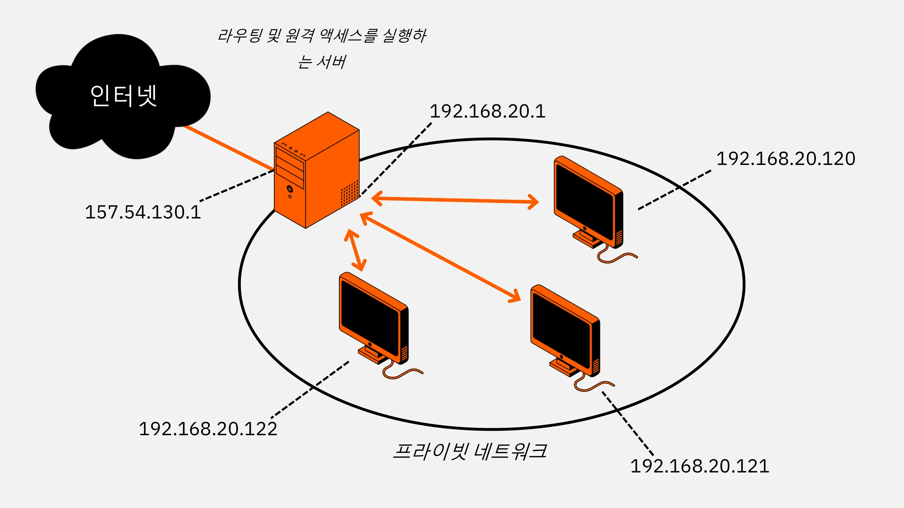


### 번역 유형


NAT는 특정 요구에 맞게 다양한 방식으로 구현할 수 있습니다. 두 가지 주요 작동 모드는 정적 번역과 동적 번역입니다.


**정적 번역**은 사설 IP Address과 공용 IP Address 사이에 고정 매핑을 생성합니다. 각 내부 기기는 전용 공용 Address에 영구적으로 연결됩니다. 예를 들어 192.168.20.1로 구성된 내부 장치는 라우팅 가능한 Address 157.54.130.1과 연결될 수 있습니다. 나가는 패킷이 로컬 네트워크를 떠날 때 라우터는 패킷의 소스 Address을 공용 Address로 바꾸고 들어오는 트래픽에 대해 그 반대의 작업을 수행합니다. 이 양방향 변환은 사용자에게 투명하게 공개됩니다.


**경고:** 이 방법은 내부 네트워크를 격리하지만, 노출할 컴퓨터 수만큼의 공인 주소가 필요하므로 공인 IP 주소 부족 문제를 해결하지 못합니다. 따라서 정적 번역은 주로 외부에서 특정 내부 리소스(웹 서버, 메일 서버 등)에 계속 접속할 수 있어야 하는 경우에 사용됩니다.


반면 **동적 번역**은 공용 IP 주소 풀을 사용합니다. 내부 호스트가 연결을 시작하면 라우터는 세션이 진행되는 동안 이러한 공용 주소 중 하나를 호스트의 비공개 Address에 임시로 할당합니다. 연결은 1대1이지만 일시적이며, 연결이 종료되면 다른 기기에서 공용 Address을 사용할 수 있게 됩니다. 따라서 동적 NAT는 모든 컴퓨터가 동시에 온라인 상태가 아닐 때 필요한 공개 주소의 수를 줄이지만, 여전히 최대 동시 연결 수만큼의 외부 주소 블록이 필요합니다.


**NAT 과부하* 또는 *IP 마스킹*이라고도 하는 *포트 변환**(PAT)은 한 단계 더 나아가 모든 개인 장치가 단일 공용 IP Address(또는 아주 적은 수)를 공유합니다. 세션을 구분하기 위해 게이트웨이는 소스 Address뿐만 아니라 소스 포트도 수정합니다. 각 *(비공개 Address, 비공개 포트)* 쌍을 고유한 *(공용 Address, 공용 포트)* 쌍에 연결하는 테이블을 유지합니다. 이 형태의 NAT는 거의 모든 가정용 라우터에서 사용되며, 수십 개의 장치(컴퓨터, 스마트폰, 연결된 사물 등)가 동일한 공용 IP Address를 공유하면서 원활한 통신을 유지할 수 있도록 합니다.


따라서 NAT는 IPv4의 수명을 연장하는 동시에 세분화 및 보안이라는 귀중한 Layer을 추가합니다. 그러나 IPv6 채택이 증가하고 방대한 Address 공간이 더 널리 사용됨에 따라 호환성 및 제어 목적으로 일부 환경에서는 여전히 트래픽을 세분화하고 필터링하는 데 사용되기는 하지만 NAT의 역할은 감소할 것입니다.


### NAT 구현


Address 변환이 제대로 작동하려면 NAT 라우터 또는 게이트웨이가 내부 네트워크의 각 사설 Address와 외부와의 통신에 사용하는 공용 Address 사이에 설정된 매핑을 정확하게 기록해야 합니다. 이 정보는 네트워크 트래픽 관리의 중심 역할을 하는 'NAT 변환 테이블'에 저장됩니다.


이 표의 각 항목은 적어도 하나의 쌍, 즉 송신기의 내부 IP Address과 인터넷에 노출될 외부 IP Address을 연결합니다. 사설 네트워크의 패킷이 공용 대상으로 전송되면 NAT 라우터는 프레임을 가로채고 IP 및 TCP/UDP 헤더를 분석한 다음 사설 소스 Address을 게이트웨이의 공용 Address으로 바꿉니다. 반환 경로에서 동일한 게이트웨이가 들어오는 패킷을 캡처하고 매핑 테이블을 확인한 후 역방향 작업을 수행하여 흐름을 원래 내부 IP Address으로 리디렉션합니다.


이 동적 번역 원칙은 정확한 테이블 관리에 의존합니다. 각 항목은 이를 정당화하는 활성 트래픽이 있는 한 유효하게 유지됩니다. 구성 가능한 비활성 기간이 지나면 항목이 지워지고 새 연결에 재사용할 수 있습니다.


간소화된 NAT 번역 테이블의 예:_ 다음과 같습니다


| Internal IP   | External IP    | Duration (sec) | Reusable? |
| ------------- | -------------- | -------------- | --------- |
| 10.101.10.20  | 193.48.100.174 | 1,200          | no        |
| 10.100.54.251 | 193.48.101.8   | 3,601          | yes       |
| 10.100.0.89   | 193.48.100.46  | 0              | no        |

이 예에서 두 번째 항목에 대해 1시간(3,600초) 이상 패킷이 통과하지 않은 경우 재사용 가능한 것으로 표시됩니다. 반대로 지속 시간이 0이면 매핑이 잠긴 상태에서 통신이 활성 상태임을 나타냅니다.


NAT는 대부분의 일반적인 용도(웹 브라우징, 이메일, 파일 전송 등)에서는 투명하게 작동하지만, 특정 네트워크 애플리케이션에는 추가적인 문제를 야기할 수 있습니다. 일부 기술은 패킷 페이로드 내에서 IP 주소 또는 포트를 명시적으로 교환하는 데 의존합니다. NAT 게이트웨이를 통과한 후에는 이 정보가 일관되지 않게 됩니다.


제한의 일반적인 예는 다음과 같습니다:


- 장치 간 직접 연결이 필요한 P2P 프로토콜(P2P)은 모든 내부 시스템이 동일한 외부 IP Address를 공유하며 특정 구성(*포트 포워딩* 또는 UPnP 등) 없이는 직접 연결할 수 없기 때문에 NAT 장벽에 의해 방해를 받습니다;
- 네트워크 통신을 보호하는 데 사용되는 IPSec 프로토콜은 패킷 헤더를 암호화합니다. NAT는 IP 주소를 대체하기 위해 이러한 헤더를 수정해야 하므로, 암호화는 NAT-T(*NAT Traversal*)와 같은 적응 메커니즘 없이는 이 작업을 불가능하게 합니다;
- Unix/Linux에서 그래픽 애플리케이션을 원격으로 표시할 수 있는 X Window 프로토콜은 X 서버가 클라이언트에 TCP 연결을 능동적으로 전송하는 방식으로 작동합니다. 이러한 일반적인 연결 방향의 반전은 NAT에 의해 차단될 수 있습니다.


일반적으로 패킷 페이로드에 내부 IP Address을 명시적으로 포함하는 모든 프로토콜은 영향을 받게 되는데, 이는 번역 후 해당 Address이 더 이상 인터넷에서 볼 수 있는 실제 Address과 일치하지 않기 때문입니다.


**중요 참고: ** 이러한 문제를 해결하기 위해 일부 NAT 라우터는 패킷 내용을 검사하여 애플리케이션 데이터 내의 주소 또는 포트 번호를 식별하고 동적으로 대체하는 _DPI(심층 패킷 검사)_ 또는 _프로토콜 헬퍼_ 기능을 제공합니다. 이 경우 프로토콜 형식에 대한 심층적인 지식이 필요하며 보안 취약점이 발생하거나 리소스 사용량이 증가할 수 있습니다.


**주의:** NAT는 내부 네트워크를 숨기고 들어오는 트래픽을 제어하는 데 도움이 되지만 전용 방화벽을 대체할 수는 없습니다. 번역만으로는 완전한 보안 장벽이 될 수 없으며, 원치 않거나 원치 않는 트래픽을 차단하기 위해 항상 명확한 필터링 규칙으로 보완해야 합니다.


실제로 어떻게 작동하는지 설명하기 위해 다음 예시를 살펴보겠습니다


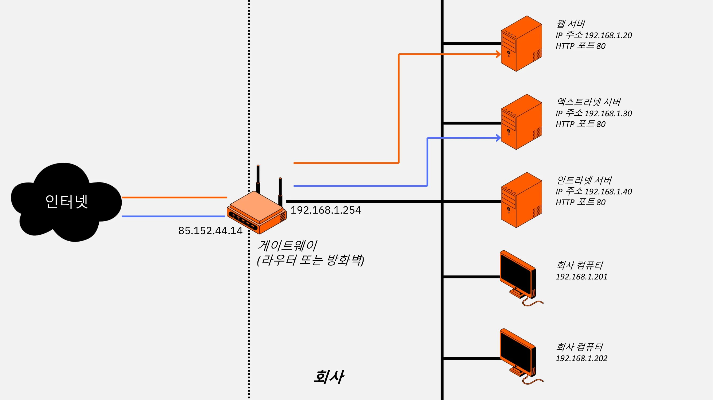


이 시나리오에서 내부 워크스테이션은 단순히 URL `http://192.168.1.20:80`을 호출하여 내부 웹 서버에 액세스할 수 있습니다. 80`이 표준 HTTP 포트이므로 여기서 포트 지정은 선택 사항이며, 반대로 외부에서 요청이 시작되면 사용자는 공용 Address `http://85.152.44.14:80`을 입력하게 됩니다. NAT 라우터는 요청을 수신하고 매핑 테이블을 참조하여 공개 Address을 비공개로 자동 변환하여 연결을 `http://192.168.1.20:80`로 리디렉션합니다.


엑스트라넷 서버(다이어그램의 파란색 회로)와 같이 인터넷 연결을 수신하도록 승인된 다른 서버에도 동일한 원칙이 적용됩니다.


**참고: 가상화된 환경에서는 *virbrX*(*Virtual Bridge X*의 경우)라는 네트워크 인터페이스가 일반적으로 사용됩니다. 이러한 가상 브리지는 특히 libvirt 라이브러리 또는 Xen 하이퍼바이저에서 제공하며, 게스트 머신의 가상 내부 네트워크를 물리적 네트워크에 연결하면서 NAT를 적용합니다. 일반적으로 `/etc/sysconfig/network-scripts/`의 스크립트를 통해 구성되며, 아래 `virbr0`의 경우와 같이 구성됩니다:**


```ini
NAME=""
BOOTPROTO=none
MACADDR=""
TYPE=Bridge
DEVICE=virbr0
NETMASK=255.255.255.0
MTU=""
BROADCAST=192.168.0.255
IPADDR=192.168.0.1
NETWORK=192.168.0.0
ONBOOT=yes
```


가상 브리지가 설정되면 `iptables`로 IP 라우팅을 활성화하고 포트 변환을 구성해야 합니다:


```shell
echo 1 > /proc/sys/net/ipv4/ip_forward
```


```shell
iptables -t nat -A POSTROUTING -o <WAN> -s 192.168.0.0/24 -j MASQUERADE
```


이 구성을 사용하면 발신 트래픽이 라우팅되고 NAT 변환이 적용되어 가상 머신이 내부 IP 주소를 직접 노출하지 않고도 외부와 통신할 수 있습니다.


다음 장에서는 다양한 관리 상황에 적합한 간단한 방법과 고급 방법을 모두 다루면서 Linux에서 IP Address 구성을 자세히 살펴보겠습니다.


https://planb.network/tutorials/computer-security/communication/pi-hole-46a735c5-8af3-4cc3-a2c2-1d4f6a7dc428

https://planb.network/tutorials/computer-security/operating-system/opnsense-90c2785d-a0d7-4981-be8d-d290bbeb8263

https://planb.network/tutorials/computer-security/operating-system/pfsense-24eea96a-2fdc-42a6-a77b-89bc29149864


## IP`로 네트워크를 구성하려면 어떻게 하나요?


<chapterId>8ba7e946-d2a0-4841-8d54-e85ba96baa25</chapterId>


### 표준 구성


네트워킹의 이론적 기초를 다루고 IP 주소, 마스크, 라우팅 및 번역이 함께 작동하는 방식을 이해했다면, 이제 실제 구성으로 넘어갈 차례입니다. GNU/Linux에서는 이제 네트워크 설정이 이전의 `ifconfig`를 대체하는 **`ip`** 명령(_iproute2_ 패키지)으로 처리됩니다.


'ip'를 사용하면 언제든지 IP Address을 할당 또는 변경하고, 마스크를 변경하고, Interface을 시작 또는 중지하거나 상태를 확인할 수 있습니다.


**모든 인터페이스(활성화 여부)를 표시하려면 TIPS:** `ip addr show`를 입력합니다.


예: 정적 Address 할당 및 Interface 활성화


Address `192.168.1.2/24`를 Interface `eth0`에 추가합니다:


```shell
ip addr add 192.168.1.2/24 dev eth0
```


Interface을 활성화합니다:


```shell
ip link set dev eth0 up
```


동일한 Interface을 비활성화합니다:


```shell
ip link set dev eth0 down
```


특정 Interface의 상태를 표시합니다:


```shell
ip addr show dev eth2
```


**실용적인 팁:** `ip`를 사용하면 Interface에 Address을 추가할 때 더 이상 `:1` 접미사가 필요하지 않습니다. 그냥 `ip addr add ...` 줄을 하나 더 추가하면 됩니다:


```shell
ip addr add 172.18.2.39/24 dev eth2
```


### 활성화 스크립트: ifup/ifdown


Ifup` 및 `ifdown` 유틸리티는 `/etc/sysconfig/네트워크-스크립트/`(RHEL, CentOS, Rocky Linux, AlmaLinux 등) 또는 `/etc/네트워크/인터페이스`(Debian/Ubuntu)에서 정적 구성 파일을 읽어 인터페이스를 깔끔하게 업 또는 다운합니다.


```shell
ifup eth1
ifdown eth2
```


구성 파일(RHEL과 유사):


- **/etc/sysconfig/network**: 전역 설정(네트워킹, 호스트 이름, 게이트웨이...).
- **ifcfg-**: 각 Interface에 특정한 설정입니다.


정적 예제(ifcfg-eth0):


```ini
DEVICE=eth0
BOOTPROTO=none
ONBOOT=yes
IPADDR=192.168.2.5
NETMASK=255.255.255.0
GATEWAY=192.168.2.1
```


DHCP 예제:


```ini
DEVICE=eth0
BOOTPROTO=dhcp
ONBOOT=yes
```


이 모듈식 구조는 여전히 유효하며 현재 시스템에서 쉽게 자동화할 수 있습니다.


### 고급 구성: 본딩


전문적인 환경에서는 서비스 연속성을 보장하거나 대역폭을 통합하는 것이 목표입니다. *본딩*(또는 _teamd_로 *팀화*) 메커니즘은 이러한 요구를 충족합니다. 여러 물리적 인터페이스가 하나의 논리적 Interface로 작동하며, 흔히 `bond0` 또는 `team0`이라고 불립니다.


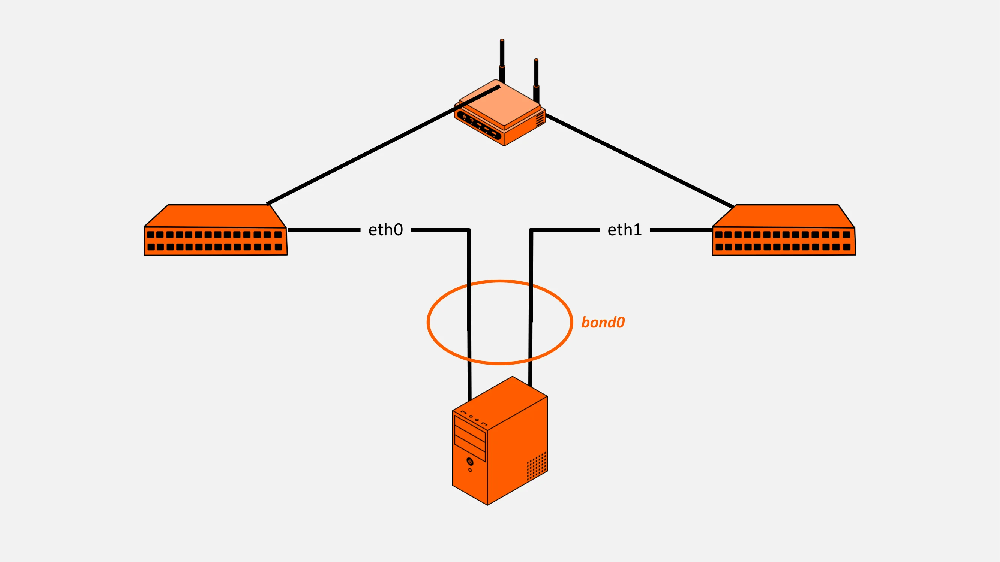


전제 조건:


- 본딩` 모듈을 로드합니다(또는 `teamd` 사용);
- 사용 가능한 물리적 인터페이스가 두 개 이상 있어야 합니다.


#### 다양한 일반적인 결합 방법:


|Mode|Name|Principle|
|---|---|---|
|0|balance-rr|Round-robin, cyclic distribution of frames|
|1|active-backup|Single active interface with hot failover |
|2|balance-xor|Selection based on XOR of src/dst MAC addresses|
|3|broadcast|Broadcast simultaneously on all interfaces   |
|4|802.3ad (LACP)|Standardized dynamic aggregation; requires compatible switch|
|5|tlb (Transmit Load Balancing)|Balancing based on transmit load|
|6|alb (Adaptive Load Balancing)|Adaptive balancing; also balances receive via ARP|

#### 'IP 링크'로 설정


- 물리적 인터페이스를 비활성화합니다:


```shell
ip link set eth0 down
ip link set eth1 down
```


- 본딩된 Interface을 생성합니다:


```shell
ip link add bond0 type bond mode balance-alb
```


- 생성 후 옵션 구성


```shell
ip link set bond0 type bond miimon 100
```


- MAC 및 IP 주소를 할당합니다:


```shell
ip link set dev bond0 address 00:17:56:BC:02:3A
ip addr add 192.168.2.3/24 dev bond0
ip route add default via 192.168.2.1
```


- 슬레이브 인터페이스를 연결합니다:


```shell
ip link set eth0 master bond0
ip link set eth1 master bond0
```


- 모든 것을 다시 백업하세요:


```shell
ip link set bond0 up
ip link set eth0 up
ip link set eth1 up
```


**팁:** 본드를 해제하지 않고 슬레이브를 분리하려면: 'IP 링크 설정 ETH1 노마스터'


#### 영구 구성(RHEL과 유사)


Etc/sysconfig/network-scripts`에 파일 세 개를 만듭니다:


_ifcfg-bond0_


```ini
DEVICE=bond0
ONBOOT=yes
BOOTPROTO=none
IPADDR=192.168.2.3
NETMASK=255.255.255.0
BROADCAST=192.168.2.255
GATEWAY=192.168.2.1
BONDING_OPTS="mode=balance-alb miimon=100"
```


_IFCFG-ETH0_


```ini
DEVICE=eth0
ONBOOT=yes
MASTER=bond0
SLAVE=yes
```


_ifcfg-eth1_


```ini
DEVICE=eth1
ONBOOT=yes
MASTER=bond0
SLAVE=yes
```


그러면


```shell
systemctl restart network
```


#### 추가 IP Address(최신 별칭)


'ip'를 사용하면 동일한 장치에 두 번째 Address를 간단히 추가할 수 있습니다:


```shell
ip addr add 192.168.1.2/24 dev eth0
```


재부팅 후에도 이 별칭을 유지하려면 `ifcfg-eth0`에 두 번째 `IPADDR2=...` / `PREFIX2=...` 블록을 추가하거나 `nmcli`를 통해 새 *NetworkManager* 연결을 생성하세요.


Ip` 및 관련 명령어(`ip link`, `ip addr`, `ip route`) 덕분에 네트워크 구성이 보다 일관되고 스크립트화 가능하며 명확해졌습니다. 본딩은 고가용성 아키텍처의 핵심 구성 요소이며, 단일 Interface에 여러 주소를 할당하는 것이 훨씬 더 간단해졌습니다.


다음 장에서는 IPv6 주소 지정의 구체적인 사항과 구현에 대해 살펴보겠습니다.


# IPv6 주소 지정


<partId>9b1d87f1-2a68-496e-b5dd-76cf74fb8cde</partId>


## IPv6: 표준 및 정의


<chapterId>d1f16f0a-1104-460d-8d67-f725665f8e3f</chapterId>


이제 차세대 IP 주소 지정인 IPv6 프로토콜(원래는 IPng(_IP Next Generation_)로 알려짐)로 전환합니다. IPv4의 구조적 한계를 극복하기 위해 설계된 이 프로토콜은 대폭 확장된 주소 지정 아키텍처와 수많은 기술적 최적화를 도입했습니다.


IPv6를 채택하게 된 동기는 다양하며, 인터넷의 진화를 위해 Address이 반드시 필요합니다. 첫째, IPv6의 역할은 연결된 디바이스 수의 기하급수적인 증가를 지원하는 것입니다(IPv4의 제한된 Address 공간으로는 달성할 수 없는 목표). 둘째, 이 프로토콜은 라우팅 테이블의 크기를 줄여 교환을 더 효율적으로 만들고 장기적으로 라우터의 작업 부하를 줄이는 것을 목표로 합니다.


IPv6는 또한 패킷 처리의 특정 측면을 단순화하여 데이터그램 흐름을 개선하고 네트워크 간 전송 속도를 최적화하고자 합니다. 보안 관점에서 *IPsec* 프로토콜의 AH/ESP 헤더는 기본 사양에 포함되어 있으며, 모든 IPv6 노드는 이를 지원할 수 있어야 합니다(RFC 6434). 그러나 이 헤더의 사용 여부는 선택 사항으로, 상황에 따라 관리자가 활성화할 수 있습니다.


다른 목표로는 서비스 유형을 보다 정확하게 처리하는 것, 특히 실시간 애플리케이션(VoIP, 화상 회의 등)의 품질을 개선하는 것이 있습니다. IPv6는 또한 보다 유연한 이동성 관리가 가능하도록 설계되었습니다. 디바이스는 피어에게 보이는 방식으로 Address을 변경하지 않고도 액세스 포인트를 변경할 수 있습니다.


마지막으로 IPv6는 레거시 프로토콜과 공존하도록 설계되었습니다. IPv4와 직접적으로 바이너리 호환되지는 않지만, TCP, UDP, ICMPv6 및 DNS와 같은 상위 Layer 프로토콜은 물론 OSPF 및 BGP와 같은 라우팅 프로토콜과도 일부 조정에 따라 완벽하게 상호 운용할 수 있습니다. 멀티캐스트 관리를 위해 IPv6는 IPv4 환경의 IGMP와 기능적으로 동등한 MLD(*멀티캐스트 리스너 검색*) 프로토콜을 사용합니다.


### 표기법 규칙


IPv6에서 가장 중요한 변화 중 하나는 IP Address 자체의 형식입니다. 만성적인 IPv4 주소 부족을 해결하기 위해 Address의 길이가 32비트에서 128비트로 늘어나 16바이트가 되었습니다. 이론상으로는 Address의 가능한 공간은 다음과 같습니다:


$$3.4 \times 10^{38}$$


이를 통해 현재와 미래의 모든 장비에 사실상 무제한의 용량을 보장합니다.


IPv6 주소는 익숙한 점선 십진수 표기법과는 매우 다르게 작성됩니다. IPv6 Address은 16비트 8그룹으로 구성되며, 16진수로 작성되고 콜론 `:`으로 구분됩니다.


예를 들어


```
1987:0c02:0000:84c2:0000:0000:cf2a:9077
```


표기를 단순화하기 위해 각 그룹에서 선행 0을 생략할 수 있습니다. 그러면 위의 예는 다음과 같이 됩니다:


```
1987:c02:0:84c2:0:0:cf2a:9077
```


또한 0 그룹의 단일 연속 시퀀스를 다음과 같이 대체할 수 있습니다::, Address를 더욱 단축할 수 있습니다:


```
1987:c02:0:84c2::cf2a:9077
```


**경고:** 이 규칙은 엄격합니다. 연속된 0 시퀀스는 `::`로 한 번만 대체할 수 있습니다. Address에 여러 개의 0 시퀀스가 포함된 경우 가장 긴 0 시퀀스만 압축됩니다. 이렇게 하면 고유성과 가독성을 모두 보장할 수 있습니다.


**중요 정보:** 16진수 블록을 구분하는 데 사용되는 `:` 문자는 서비스 포트를 나타내는 데도 사용되므로 URL에 모호함을 유발할 수 있습니다. 혼동을 피하기 위해 URL의 IPv6 주소는 대괄호 `[ ]`로 묶어야 합니다.


Address `2002:400:2A41:378::34A2:36`의 특정 포트에 대한 HTTP 액세스 예시입니다:


```
http://[2002:400:2A41:378::34A2:36]:8080
```


IPv6 컨텍스트에서 IPv4 Address를 표현할 때는 점으로 구분된 십진수 형식에 `::`를 앞에 붙이는 혼합 표기를 사용할 수 있습니다:


```
::192.168.1.5
```


이러한 호환성은 IPv4 블록을 IPv6 Address 공간에 포함할 수 있도록 하여 두 프로토콜 간의 전환을 용이하게 해줍니다.


**참고: ** 주소 작성 방식을 표준화하기 위해 RFC 5952는 동일한 Address의 여러 표현을 피하기 위해 약어 규칙이 포함된 표준 형식을 정의합니다. 이러한 권장 사항을 따르면 오해를 줄이고 일관된 네트워크 구성을 보장하는 데 도움이 됩니다.


### IPv6 Address 유형


IPv6는 특정 용도에 맞게 설계된 광범위한 Address 카테고리를 통해 이전 버전과 다르며, 유연한 라우팅 및 네트워크 관리가 가능합니다. IPv4와 마찬가지로 주소는 글로벌, 로컬, 예약 또는 특정 전환 메커니즘에 따라 달라질 수 있습니다.


지정되지 않은 IPv6 Address은 `::` 또는 보다 명확하게는 `::0.0.0.0`으로 표시됩니다. 이 특수 형식은 Address을 획득하는 동안 사용되거나 Address이 없음을 나타내는 기본값으로 사용됩니다.


| IPv6 Address Prefix | Description                                 |
| ------------------- | ------------------------------------------- |
|::/8                | Reserved addresses                          |
| 2000::/3            | Unicast addresses, routable on the Internet |
| fc00::/7            | Unique local addresses (1)                  |
| fe80::/10           | Link-local addresses                        |
| ff00::/8            | Multicast addresses                         |

(1): *사설 LAN에서는 인터넷에서 라우팅할 수 없는 내부 주소를 할당할 때 `fd00::/8` 접두사가 선호됩니다*


#### 예약 주소


특정 IPv6 범위는 명시적으로 예약되어 있으므로 글로벌 주소로 사용해서는 안 됩니다. 이러한 범위에는 특정한 기술적 목적이 있습니다:


- **`::/128`**: 지정되지 않은 Address, 장치에 영구적으로 할당되지 않았지만 구성을 대기 중인 시스템에서 소스 Address로 사용됨.
- **`::1/128`**: IPv4에서 `127.0.0.1`에 직접적으로 해당하는 *loopback* Address로, 머신이 스스로 Address가 될 수 있도록 합니다.
- **64:ff9b::/96**: RFC 6052에 정의된 대로 프로토콜 변환기가 IPv4/IPv6 상호 연결을 활성화하기 위해 예약되어 있습니다.
- `::ffff:0:0/96`: 애플리케이션에서 내부적으로 자주 사용되는 특정 IPv6 구조의 IPv4 Address을 나타내는 호환성 블록입니다.


이러한 블록은 상호 운용성을 보장하고 두 프로토콜 버전 간의 마이그레이션을 용이하게 합니다.


#### 글로벌 유니캐스트 주소


글로벌 유니캐스트 주소는 공개적으로 라우팅할 수 있는 IPv6 공간의 대부분을 차지하며, Address 공간의 약 1/8을 차지합니다. 1999년부터 IANA는 `2001::/16` 접두사와 같은 이러한 블록을 `/23`에서 `/12`까지 CIDR 블록으로 지역 레지스트리에 할당하여 공급자와 조직에 재분배하고 있습니다.


일부 범위에는 문서화된 특별한 용도가 있습니다:


- `2001:2::/48`: **성능 및 상호 운용성 테스트를 위해 예약됨(RFC 5180).**
- **2001:db8::/32**: 문서와 예제를 위해 예약되어 있습니다(RFC 3849).
- `2002::/16`: IPv6 트래픽이 IPv4 인프라를 통해 이동할 수 있도록 하는 6to4 메커니즘에 사용됩니다(두 프로토콜 간의 전환 단계에서 유용).


**참고: ** 글로벌 주소의 상당 부분이 미사용 상태로 남아 있어 향후 인터넷 성장을 위한 예비 공간으로 활용되고 있습니다.


#### 고유 로컬 주소(ULA)


고유 로컬 주소(`fc00::/7`)는 IPv4 개인 주소(RFC1918)에 해당하는 IPv6 주소입니다. 이를 통해 공용 주소와 충돌할 위험 없이 격리된 내부 네트워크를 만들 수 있습니다. 실제로 유효 접두사는 `fd00::/8`이며, 8번째 비트는 로컬 사용을 나타내기 위해 1로 설정됩니다. 각 ULA 블록에는 40비트 의사 랜덤 식별자가 포함되어 있어 별도의 사설 네트워크를 연결할 때 Address 충돌을 최소화합니다.


#### 링크-로컬 주소


링크-로컬 주소(`fe80::/64`)는 동일한 Layer 2 세그먼트(동일한 VLAN 또는 스위치) 내에서만 통신하는 데 사용됩니다. 로컬 링크를 넘어 라우팅되지 않습니다. 각 네트워크 Interface은 자동으로 링크-로컬 Address을 생성하며, 종종 EUI-64 체계를 사용하여 MAC Address에서 파생됩니다.


**특수 기능**: 동일한 머신이 여러 인터페이스에서 동일한 링크 로컬 Address을 사용할 수 있지만, 모호성을 피하기 위해 통신할 때 Interface를 지정해야 합니다.


#### 멀티캐스트 주소


IPv6에서 브로드캐스트는 정의된 수신자 그룹에 패킷을 전달하는 보다 효율적인 방법인 멀티캐스트로 대체되었습니다. 멀티캐스트 범위에는 `ff00::/8`이 접두사로 붙습니다. 여기에는 로컬 링크의 모든 노드를 대상으로 하는 `ff02::1`과 같은 주소가 포함됩니다. 편리하긴 하지만 이 Address는 제어되지 않은 브로드캐스트를 generate로 보낼 수 있으므로 더 이상 애플리케이션에 권장되지 않습니다.


멀티캐스트의 일반적인 사용은 IPv6에서 ARP를 대체하는 _이웃 검색 프로토콜_(NDP)입니다. NDP는 `ff02::1:ff00:0/104`와 같은 특정 멀티캐스트 주소를 사용하여 동일한 링크에 연결된 다른 호스트를 자동으로 검색합니다.


이러한 Address 유형을 결합함으로써 IPv6는 글로벌 라우팅, 로컬 통신, IPv4/IPv6 마이그레이션 및 자동 장치 구성에 대한 요구를 충족하는 동시에 전송 효율성을 개선하는 완벽한 옵션 세트를 제공합니다.


### Address 범위


IPv6 Address의 범위는 유효하고 고유한 정확한 도메인을 정의합니다. 이 개념을 이해하는 것은 패킷 라우팅과 IPv6 네트워크의 논리적 구성을 마스터하기 위한 핵심입니다. IPv6 주소는 일반적으로 범위와 용도에 따라 유니캐스트, 애니캐스트, 멀티캐스트의 세 가지 주요 카테고리로 분류됩니다.


**유니캐스트 주소**가 가장 일반적이며 여러 가지 하위 유형이 있습니다.

루프백_(`::1`) Address은 사용 중인 호스트로 범위가 제한되며, 물리적 네트워크를 통해 트래픽을 전송하지 않고 내부적으로 네트워크 스택을 테스트하는 데 사용됩니다.

링크-로컬 주소(_link-local_)는 단일 네트워크 세그먼트로 범위가 제한되며, 동일한 물리적 또는 논리적 링크(예: 단일 스위치 또는 VLAN)에 있는 장치 간의 직접 통신에 사용됩니다.

마지막으로, 고유 로컬 주소(_ULA_, _유니크 로컬 주소_의 경우)는 비공개 네트워크 내부에 있습니다. 여러 비공개 세그먼트 간에 라우팅될 수 있지만 인터넷에는 표시되지 않습니다.


개념적으로 IPv6 주소는 종종 이진 구조로 표현되는데, 전반부(처음 64비트)는 네트워크 접두사를 식별하고 후반부(역시 64비트)는 해당 네트워크에서 디바이스의 Interface을 고유하게 식별합니다. 이러한 분할은 기계가 MAC Address 또는 의사 임의 식별자를 기반으로 안정적인 generate을 자동으로 Address로 자동 구성할 수 있는 SLAAC(_Stateless Address 자동 구성_)과 같은 메커니즘을 통해 Address 자동 구성을 더 쉽게 만듭니다.


| Field     | Prefix | L | Global ID | Subnet | Interface ID |
|-----------|--------|---|-----------|--------|---------------|
| Bits      | 7      | 1 | 40        | 16     | 64            |

IPv6 아키텍처는 오늘날 인터넷의 계층적 글로벌 라우팅 모델을 따릅니다. 접두사 파티셔닝을 통해 지역 레지스트리와 네트워크 사업자는 글로벌 고유성을 보장하면서 분산된 방식으로 Address 할당을 관리할 수 있습니다. 이 프레임워크 내에서 동일한 호스트는 인터넷 통신을 위한 글로벌 유니캐스트 Address과 바로 이웃 또는 라우터 검색 메시지와 같은 로컬 상호 작용을 위한 링크-로컬 Address을 동시에 보유할 수 있습니다.


| Field     | Prefix | Zero | Interface ID |
|-----------|--------|------|--------------|
| Bits      | 10     | 54   | 64           |

**애니캐스트 주소**는 유니캐스트 모델을 기반으로 하지만 특정 경우에 멀티캐스트처럼 작동할 수 있는 중간 개념을 나타냅니다. 애니캐스트 Address은 본질적으로 서로 다른 네트워크 노드에 분산된 여러 인터페이스에 할당된 유니캐스트 Address입니다. 패킷이 애니캐스트 Address로 전송되면 IPv6 프로토콜은 해당 Address을 공유하는 호스트 중 하나(일반적으로 라우팅 토폴로지 측면에서 가장 가까운 호스트)로 패킷을 전송하는 것을 목표로 합니다. 이 접근 방식은 쿼리 처리 속도를 최적화하고 분산 서비스의 복원력을 향상시킵니다. 대표적인 예로 루트 DNS 서버를 들 수 있는데, 애니캐스트 주소 지정은 쿼리를 가장 가까운 존재 지점으로 자동 전송합니다.


| Field     | Prefix | Subnet | Interface ID |
|-----------|--------|--------|--------------|
| Bits      | 48     | 16     | 64           |

IPv6에서는 **멀티캐스트 주소**가 너무 비싸고 글로벌 규모의 네트워크에 적합하지 않은 것으로 여겨지던 브로드캐스트 메커니즘을 대체합니다. 멀티캐스트 Address는 일반적으로 여러 호스트에 걸쳐 동일한 패킷을 동시에 수신하고자 하는 인터페이스 그룹을 식별합니다.

각 멀티캐스트 Address에는 브로드캐스트의 지리적 또는 논리적 한계를 정의하는 특수 4비트 _scope_ 필드가 포함되어 있습니다:


- 범위가 `1`이면 패킷이 로컬 디바이스 전용임을 의미합니다.
- 범위가 `2`이면 패킷을 로컬 링크로 제한하여 동일한 물리적 또는 가상 세그먼트에 있는 모든 디바이스가 패킷을 수신할 수 있습니다.
- '5'의 범위는 사이트, 일반적으로 전체 회사 네트워크로 범위를 확장합니다.
- '8'의 범위는 조직으로 범위를 확장하여 동일한 엔터티의 모든 서브넷에 걸쳐 전송할 수 있습니다.
- 'e'(16진수 14)의 범위는 글로벌 범위를 나타내며, 라우팅 인프라가 지원하는 경우 인터넷의 어느 곳에서나 멀티캐스트 그룹에 액세스할 수 있습니다.


IPv6 멀티캐스트 Address의 구조는 다음과 같습니다:


- 플래그_ 필드(4비트)는 그룹이 영구적인지 임시적인지를 지정합니다,
- 범위 _Scope_ 필드(4비트)는 범위를 정의합니다,
- 멀티캐스트 그룹 번호를 식별하는 식별 필드(112비트)입니다.


| Field      | Prefix | Flags | Scope | Group ID |
|------------|--------|--------|--------|----------|
| Bits       | 8      | 4      | 4      | 112      |

IPv6 멀티캐스트의 잘 알려진 예는 _이웃 검색 프로토콜_(NDP)입니다. NDP는 IPv4에서와 같이 ARP를 사용하는 대신 `ff02::1:ff00:0/104`와 같은 멀티캐스트 주소를 사용하여 동일한 링크의 관련 호스트만 대상으로 이웃 검색 요청을 브로드캐스트합니다.


Address 범위를 매우 정밀하게 정의함으로써 IPv6는 데이터 흐름이 전송, 수신 및 라우팅되는 방식을 구조화합니다. 이러한 세분성은 프로토콜을 보다 유연하고 효율적으로 로컬 및 글로벌 통신을 관리하면서 일반화된 브로드캐스팅의 단점을 피할 수 있게 해줍니다.


## 로컬 네트워크의 Address Assignment


<chapterId>4c9c3e52-59bc-499a-af0a-6dd369a9e029</chapterId>


이 장에서는 IPv6 배포의 가장 실용적인 측면 중 하나인 로컬 네트워크의 호스트에 IP 주소를 할당하는 방법을 살펴봅니다. IPv6 아키텍처는 유연성을 고려하여 설계되었기 때문에 각 디바이스가 자체 Address를 자동으로 generate할 수 있으며, 필요한 경우 완전히 수동으로 구성할 수 있습니다.


IPv6 로컬 네트워크는 Address을 체계적으로 두 부분으로 나눕니다:


- 첫 64 비트는 일반적으로 라우터 또는 Address 기관에서 제공하는 서브넷 접두사를 나타냅니다;
- 를 사용하면 나머지 64비트는 호스트가 해당 세그먼트에서 자신을 고유하게 식별하는 데 사용됩니다.

이 모델은 경로 집계 및 Address 블록 관리를 크게 간소화합니다.


장치에 주소를 할당하는 데는 두 가지 주요 접근 방식이 사용됩니다:


- 수동 구성: 관리자가 각 Interface의 정확한 Address를 지정하는 방식입니다;
- 자동 구성, 장치 generate 또는 자체 주소를 동적으로 가져옵니다.


수동 구성에서는 관리자가 각 Interface에 전체 IPv6 Address을 할당합니다. 특정 값은 예약된 상태로 유지됩니다:


- '::/128`: 지정되지 않은 Address, 영구적으로 할당되지 않음 ;
- '::1/128`: 루프백 Address(_loopback_), IPv4 등가: `127.0.0.1`.


IPv4와 달리 _브로드캐스트_ 개념이 없으며, 호스트 부분의 "모든 0" 또는 "모든 1" 조합은 특별한 의미가 없습니다.

수동 구성은 통제된 환경에서는 여전히 유용하지만 대규모로 유지 관리하기는 어렵습니다.


자동 구성의 경우 여러 가지 방법이 있습니다:


- RFC4862에 명시된 **NDP**(_이웃 검색 프로토콜_) 프로토콜을 사용하면 *무상태* 자동 구성이 가능합니다. 이 모드에서 호스트는 로컬 라우터로부터 네트워크 접두사를 수신하고 MAC Address에 기반한 식별자를 사용하여 Address 자체를 완성합니다. 이 방법은 배포가 간단하며 중앙 서버가 필요하지 않습니다.
- Windows와 같은 구현에서는 호스트 부분을 의사 임의로 generate 처리하여 MAC Address가 직접 노출되지 않도록 함으로써 개인정보 보호를 개선할 수 있습니다. IPv6 패킷에서 MAC Address를 공개하면 여러 네트워크에서 디바이스를 추적할 수 있으므로 개인정보 보호 문제가 발생할 수 있습니다.
- DHCPv6 프로토콜: RFC3315에 정의되어 있으며 IPv4에 사용되는 DHCP와 유사하며 임대 관리, 추가 옵션(DNS, MTU...), 데이터베이스 등록 등 보다 제어되고 중앙 집중화된 구성을 가능하게 합니다. DHCPv6는 단독으로 또는 상태 비저장 구성과 함께 작동하여 IP Address 자체를 할당하지 않고도 추가 매개변수를 제공할 수 있습니다.


**중요 참고: ** MAC 기반 방식에서 MAC Address는 EUI-64 형식을 사용하여 64비트 식별자로 변환됩니다. 이 메커니즘은 원래 MAC Address(48비트)의 중간에 바이트 'FF:FE'를 삽입하고 7번째 비트를 반전하여 글로벌 고유성을 나타냅니다. 그 결과 전체 IPv6 Address에서 사용되는 안정적인 Interface 식별자가 생성됩니다.


다음은 MAC Address을 EUI-64로 변환하는 방법의 예입니다:


하지만 디바이스 추적에 대한 우려가 커지면서 최신 운영체제(특히 Linux, Windows 10+, macOS, Android)에서는 기본적으로 개인정보 보호 확장 기능을 사용할 수 있습니다. 이는 발신 연결에 대해 주기적으로 갱신되는 무작위로 생성된 Interface 식별자를 사용하며, 내부 통신에 대해서는 안정적인 식별자(예: DNS 또는 DHCPv6)를 유지합니다.


IPv4의 DHCP와 마찬가지로 자동으로 할당된 IPv6 주소는 DHCPv6 라우터 또는 서버에서 정의한 두 가지 수명을 가질 수 있습니다:


- 선호 수명: 이 기간이 지나면 Address은 유효하지만 더 이상 새 연결을 시작하는 데 사용되지 않습니다;
- 유효 수명: 이 시간이 만료되면 Address은 Interface 구성에서 완전히 제거됩니다.


이 시스템을 사용하면 네트워크 변경 사항을 동적으로 관리할 수 있어 한 ISP에서 다른 ISP로 원활하게 전환할 수 있습니다. 라우터에서 발표하는 접두사를 업데이트하고 DNS 레코드를 동시에 조정함으로써 눈에 띄는 서비스 중단 없이 IPv6 마이그레이션을 수행할 수 있습니다.


**팁:** Address과 DNS 수명 주기를 함께 사용하면 새로운 연결은 새로운 토폴로지로 이동하고 기존 연결은 자연스럽게 종료될 때까지 계속 사용하는 점진적 전환 전략을 구현할 수 있습니다.


간단히 말해, IPv6는 수동 구성, 상태 비저장 또는 상태 저장 자동 구성, DHCPv6 또는 무작위 생성 등 Address Assignment에 광범위한 유연성을 제공합니다. 각 접근 방식에는 고유한 장점과 한계가 있으며 필요한 제어 수준, 네트워크 규모 또는 개인정보 보호 요구사항에 따라 조정할 수 있습니다.


## IPv6 Address 블록 할당하기


<chapterId>45cce866-1b58-4888-b3fe-15c922180839</chapterId>


### Address 배포


IPv6 Address 할당 체계는 글로벌 Address 고유성을 보장하고 라우팅 테이블의 집계 및 단순화에 유리한 논리적 계층 구조를 활성화하는 두 가지 목표를 충족하도록 구조화되었습니다.

IPv4와 마찬가지로 *인터넷 할당 번호 기관*(IANA)이 이 계층 구조의 최상위에 위치합니다. 이 기관은 글로벌 유니캐스트 Address 공간을 관리하고 5개 지역 인터넷 레지스트리(_RIR_)에 Address 블록을 위임합니다.


기존의 5가지 RIR은 다음과 같습니다:


- ARIN(북미),
- RIPE NCC(유럽, 중동, 중앙아시아),
- APNIC(아시아 태평양),
- AFRINIC(아프리카),
- LACNIC(라틴 아메리카 및 카리브해).


IANA는 일반적으로 /23에서 /12 사이의 다양한 크기의 IPv6 블록을 각 RIR에 할당합니다. 이러한 접근 방식은 장기적인 확장성을 보장하면서 유연성을 제공합니다. RIR은 차례로 이러한 블록을 인터넷 서비스 공급자(ISP), 대기업, 공공기관에 재분배합니다.


2006년부터 각 RIR은 향후 성장을 위해 안정적이고 충분히 큰 규모의 예비 공간을 확보할 수 있도록 설계된 고정 크기인 IPv6 /12 블록을 IANA로부터 할당받았습니다. RIR은 보통 이를 /23, /26 또는 /29 블록으로 세분화합니다. ISP는 대부분 /32 블록을 할당받지만, 이 크기는 ISP의 규모와 지역에 따라 달라질 수 있습니다. 일반적으로 고객에게 /48 블록을 할당합니다. 각 /48은 65,536개의 개별 /64 서브넷을 제공합니다(IPv4와 비교하면 엄청난 용량).


**중요 참고 사항:** /32 블록은 정확히 65,536개의 /48 하위 블록을 포함합니다. 즉, 모든 ISP는 할당량을 모두 소진하지 않고도 수만 명의 고객에게 서비스를 제공할 수 있습니다. /48 덕분에 각 고객은 원하는 만큼의 /64 세그먼트로 자체 내부 네트워크를 구성할 수 있는 엄청난 양의 공간을 확보할 수 있습니다.


일반적인 할당 계층 구조는 다음과 같습니다:


| IANA | RIR | LIR | Customer | Subnet | Interface |
|------|-----|-----|----------|--------|-----------|
|  3   | 20  |  9  |    16    |   16   |     64    |

이렇게 주소가 풍부해지면서 한때 Address 부족에 대처하기 위해 IPv4에서 필수적이었던 NAT(*네트워크 Address 변환*)는 더 이상 필요하지 않습니다. 모든 호스트는 전 세계적으로 라우팅 가능한 고유한 공용 Address을 보유할 수 있으므로 엔드투엔드 연결이 간소화되고 IPSec, VoIP 또는 인바운드 연결과 같은 프로토콜을 더 쉽게 사용할 수 있습니다.


IPv6 Address가 어느 조직에 속하는지 확인하려면 `whois` 명령을 사용하여 공개 RIR 데이터베이스를 쿼리할 수 있습니다. 이러한 투명성을 통해 접두사를 소유한 조직을 식별할 수 있으므로 네트워크, 분석 또는 보안 목적에 유용할 수 있습니다.


### PA와 PI 주소 지정


원래 IPv6 할당 모델은 ISP에 연결된 PA(*공급자 집계 가능*) 블록만을 기반으로 했습니다. 이 모델에서 조직은 ISP로부터 접두사를 할당받기 때문에 공급자를 변경하면 전체 인프라의 번호를 다시 지정해야 합니다.


IPv6의 자동 구성 기능과 Address 수명으로 인해 번호 변경이 쉬워지긴 했지만, 중요한 인프라나 여러 공급업체를 연결하여 이중화 요구 사항이 있는 조직에서는 여전히 불편한 점이 있습니다.


2009년부터 할당 정책은 PI(*제공자 독립*) 블록을 허용했습니다. 이러한 블록(일반적으로 /48 크기)은 ISP와 독립적으로 RIR이 기업이나 기관에 직접 할당합니다. 이 모델은 *멀티호밍*(여러 사업자와 동시에 연결됨)을 사용하는 조직에 특히 적합합니다. 예를 들어, 유럽에서는 RIPE-512에 PI 할당에 대한 정책이 명시되어 있습니다.


### 서브넷 마스크 표기법


IPv4와 마찬가지로 IPv6는 CIDR(*클래스 없는 도메인 간 라우팅*)을 사용합니다. 이는 `/` 문자를 사용하여 Address 뒤에 접두사를 구성하는 비트 수를 표시하는 것으로 구성됩니다.


다음 예시를 살펴보겠습니다:


```
2001:db8:1:1a0::/59
```


즉, 처음 59비트는 고정되어 네트워크를 식별합니다. 나머지 모든 비트(여기서는 69비트)는 서브넷 또는 호스트를 식별하는 데 사용할 수 있습니다.


따라서 이 표기법은 `2001:db8:1:1a0:0:0:0:0:0`부터 `2001:db8:1:1bf:ffff:ffff:ffff:ffff`까지의 주소에 적용됩니다.


따라서 이 블록은 각각 대량의 장치를 호스팅할 수 있는 8개의 64개 서브넷 세트를 포함합니다.


CIDR 표기법을 사용하면 대규모 네트워크부터 홈 설정 및 가상화 환경에 이르기까지 정밀한 Address 공간 계획을 수립할 수 있으며 라우터 부하를 줄이고 확장성을 향상시키는 라우트 집계를 장려합니다.


### IPv6 패킷 및 헤더


IPv6 패킷 형식은 더 간단하고 확장성이 뛰어나다는 점에서 IPv4와 다릅니다. IPv6 데이터그램은 항상 모든 필수 라우팅 정보를 포함하는 40바이트의 고정 크기 헤더로 시작됩니다. 이 간소화된 접근 방식은 20~60바이트의 가변 길이를 가진 IPv4의 헤더에 비해 라우터가 패킷을 더 빠르고 효율적으로 처리할 수 있게 해줍니다.


그러나 IPv6는 기본 헤더에 수많은 선택적 필드를 통합하는 대신 기본 헤더 바로 뒤에 확장 헤더 시스템을 도입하여 기능을 제거하지 않습니다. 이러한 선택적 헤더를 사용하면 일반 패킷에 불필요한 부담을 주지 않으면서 특정 기능에 특정한 데이터나 지침을 추가할 수 있습니다.


일부 확장 헤더는 고정된 구조를 따르는 반면, 다른 확장 헤더는 가변적인 수의 옵션을 포함할 수 있습니다. 이러한 옵션은 `{유형, 길이, 값}` 세 쌍으로 인코딩됩니다:


- '유형' 필드(1바이트)는 옵션의 특성을 나타냅니다;
- "유형"의 처음 두 비트는 옵션이 인식되지 않을 경우 라우터가 수행해야 할 작업을 지정합니다:
 - 옵션을 무시하고 치료를 계속합니다,
 - 데이터그램을 삭제합니다,
 - ICMP 오류를 삭제하고 소스로 전송합니다.
 - 알림 없이 데이터그램을 삭제합니다(멀티캐스트 패킷의 경우).
- '길이' 필드(1바이트)는 '값' 필드의 크기를 0~255바이트 범위로 지정합니다;
- '값' 필드에는 옵션과 관련된 데이터가 포함됩니다.


다음은 IPv6에서 정의하는 다양한 유형의 확장 헤더에 대한 개요입니다.


#### 홉별 헤더


이 헤더가 있는 경우 항상 기본 헤더 바로 뒤에 배치됩니다. 일반적으로 대상 노드에서만 처리되는 대부분의 다른 헤더와 달리 패킷 경로를 따라 모든 라우터에서 처리해야 하는 정보가 포함되어 있습니다. 일반적인 용도로는 패킷이 네트워크를 통과할 때 글로벌 파라미터에 신호를 보내거나 특정 처리 단계를 요청하는 것이 있습니다.


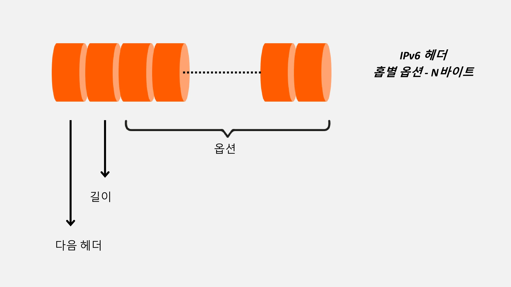


#### 라우팅 헤더


라우팅 헤더는 패킷이 통과해야 하는 중간 주소 목록을 지정합니다. 두 가지 주요 라우팅 모드가 있습니다:


- 엄격한 라우팅: 정확한 경로가 미리 정의되어 있습니다
- 느슨한 라우팅: 특정 필수 단계만 지정됩니다.


이 루팅 헤더의 처음 네 필드는 다음과 같습니다:


- **다음 헤더**: 다음 헤더의 유형을 식별합니다;
- **라우팅 유형**: 라우팅 방법을 정의합니다(일반적으로 `0`);
- **남은 세그먼트**: 트래버스할 남은 세그먼트 수입니다;
- **Address[n]**: 중간 주소 목록입니다.


'남은 세그먼트 수' 필드는 남은 세그먼트의 총 수로 시작하여 각 홉마다 하나씩 줄어듭니다.


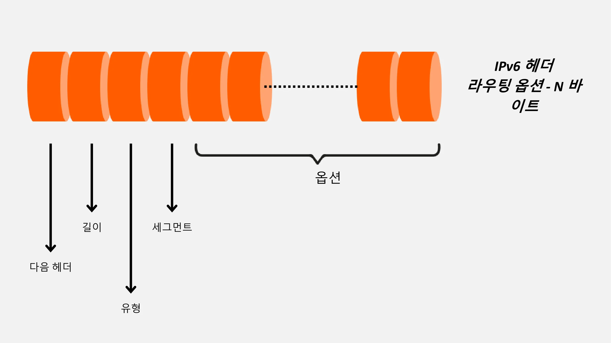


#### 조각화 헤더


라우터도 데이터그램을 조각화할 수 있었던 IPv4와 달리 IPv6에서는 소스 호스트만 데이터그램을 조각화할 수 있습니다. 모든 IPv6 노드는 최소 1280바이트의 패킷을 처리할 수 있어야 합니다. 라우터가 다음 링크의 MTU보다 큰 패킷을 발견하면 *ICMPv6 패킷 너무 큼* 메시지를 소스로 다시 전송하여 전송 크기를 조정합니다.


조각화 헤더에는 다음 필드가 포함됩니다:


- **식별**: 재조립을 위한 고유 데이터그램 식별자.
- **조각 오프셋**: 원본 데이터그램 내에서 조각의 위치입니다.
- **M 플래그**: 더 많은 조각이 뒤따르는지 여부를 나타냅니다.


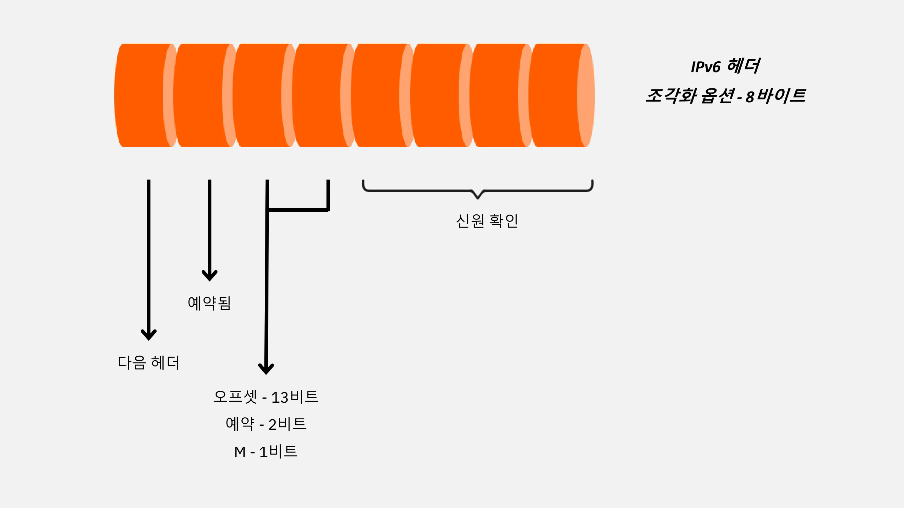


#### 인증 헤더(AH)


이 헤더는 발신자의 진위 여부와 데이터의 무결성을 모두 확인하여 통신을 보호하도록 설계되었습니다. 일반적으로 IPsec 프로토콜과 함께 사용됩니다. 수신자는 인증 코드를 사용하여 메시지가 실제로 예상 발신자가 보낸 것인지, 전송 중에 메시지가 변경되지 않았는지 확인할 수 있습니다.


부정 수정 시도가 발생하면 인증 코드가 더 이상 일치하지 않으며 데이터그램이 거부될 수 있습니다. 이 메커니즘은 또한 무단 복제를 감지하여 리플레이 공격으로부터 보호합니다.


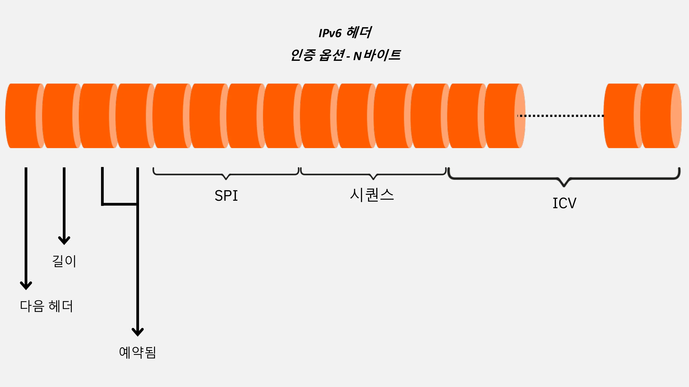


#### 대상 옵션 헤더


이 헤더는 데이터그램의 최종 수신자만을 위한 것입니다. 중간 라우터에서 고려하지 않고 애플리케이션에 특정한 옵션이나 메타데이터를 추가하는 데 사용할 수 있습니다.


처음에는 프로토콜에 이러한 옵션이 정의되어 있지 않았습니다. 그러나 이 헤더는 전체 패킷 구조를 수정하지 않고도 향후 확장을 추가할 수 있도록 IPv6가 설계될 때 도입되었습니다. 예를 들어 null 옵션은 메모리 정렬을 위해 헤더를 8바이트의 배수까지만 패딩하는 데 사용됩니다.


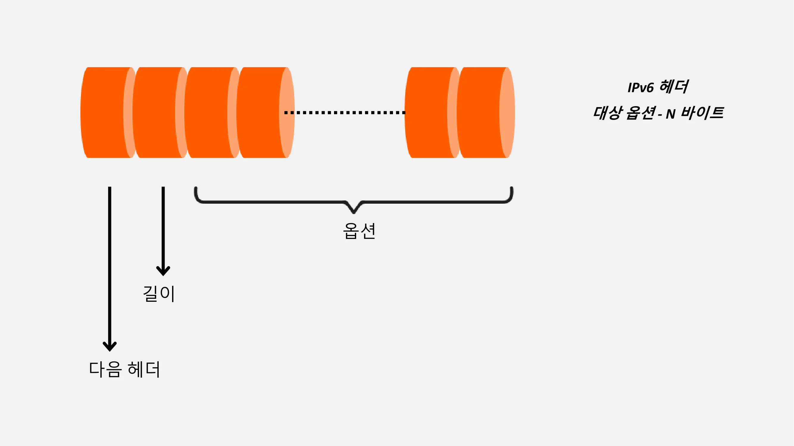


IPv6 패킷 설계는 최소한의 기본 헤더와 모듈식 확장 헤더를 명확하게 분리하여 구축되었습니다. 이 아키텍처는 표준 처리 성능과 프로토콜을 발전시키고 보안, 복잡한 라우팅 또는 서비스 품질 메커니즘을 통합하는 데 필요한 유연성을 모두 보장하는 동시에 향후 인프라와의 호환성을 유지합니다.


## IPv6와 DNS의 관계


<chapterId>421eacb8-b80b-4aee-910f-e069ed805f00</chapterId>


최신 네트워크에서 DNS(*도메인 이름 시스템*)는 도메인 이름을 컴퓨터가 사용할 수 있는 IP 주소로 변환합니다. IPv6가 도입되면서 DNS는 128비트 주소를 지원하면서도 IPv4와의 하위 호환성을 유지하도록 조정해야 했습니다. 이러한 공존은 두 IP 버전이 동시에 작동하는 듀얼 스택 환경에서 특히 중요합니다.


### IPv6 전용 DNS 레코드


도메인 네임을 IPv6 Address에 연결하기 위해 DNS는 IPv4 주소의 "A" 레코드와 유사한 AAAA(*쿼드-A*) 레코드를 사용합니다. AAAA 레코드는 도메인 이름을 IPv6 Address에 명시적으로 매핑합니다.

예시:


```shell
ipv6.mydmn.org.         IN      AAAA    2001:66c:2a8:22::c100:68b
```


이 레코드는 도메인 `ipv6.mydmn.org`가 IPv6 Address `2001:66c:2a8:22::c100:68b`로 확인됨을 나타냅니다. 동일한 도메인 네임을 IPv4(A 레코드를 통해) 또는 IPv6(AAAA 레코드를 통해) 등 여러 IP 주소에 연결할 수 있으며 호환성을 극대화하기 위해 권장되기도 합니다. 이렇게 하면 IPv6 호환 고객이 IPv6를 선호하면서도 IPv4 전용 클라이언트를 계속 지원할 수 있습니다.


또한 DNS는 역방향 확인을 지원하므로 주어진 IP Address에 연결된 도메인 이름을 조회할 수 있습니다. IPv6의 경우 이 작업은 `ip6.arpa` 영역에 있는 PTR 레코드를 사용합니다. 이 영역은 특별히 IPv6 역방향 확인을 위해 예약되어 있습니다. IPv4의 경우 `in-addr.arpa` 영역입니다.


### 역 해상도


IPv6 Address의 역방향 확인은 엄격한 절차를 따릅니다:

1) Address을 전체 16진수 표기법(16바이트, 즉 32진수)으로 확장합니다.

예시:


```shell
2001:66c:2a8:22::c100:68b
```


됩니다:


```shell
2001:066c:02a8:0022:0000:0000:c100:068b
```


2) 각 16진수(니블)의 순서를 반대로 하고 점으로 구분한 후 `ip6.arpa`를 추가합니다:


```shell
b.8.6.0.0.0.1.c.0.0.0.0.0.0.0.0.2.2.0.0.8.a.2.0.c.6.6.0.1.0.0.2.ip6.arpa  IN PTR  ipv6.mydmn.org
```


이 구조는 IPv6 Address 공간에서 표준화된 고유한 역방향 조회를 보장합니다.


**참고**: DNS 쿼리는 IPv4 또는 IPv6를 통해 이동할 수 있습니다. 사용되는 전송 프로토콜은 반환되는 레코드 유형에 영향을 미치지 않습니다.

예를 들어


- IPv6를 통해 연결된 클라이언트는 IPv4 레코드를 요청할 수 있습니다.
- IPv4를 통해 연결된 클라이언트는 IPv6 레코드를 요청할 수 있습니다.

DNS 서버는 쿼리의 전송 프로토콜에 관계없이 보유하고 있는 레코드로 간단히 응답합니다.


호스트 네임이 IPv4와 IPv6 모두에 매핑된 경우 사용할 Address의 선택은 접두사 선호도, 범위, 도달 가능성 등의 요소를 기반으로 Address 선택 알고리즘을 정의하는 RFC 6724에 따라 결정됩니다. 기본적으로 시스템 또는 네트워크 구성에서 재정의하지 않는 한 일반적으로 IPv6가 선호됩니다.


**중요 참고사항**: URL(*유니폼 리소스 로케이터*)에 IPv6 Address을 포함할 때는 반드시 대괄호(`[]`)로 묶어야 합니다. 이렇게 하면 IPv6 Address 내부의 콜론(`:`)과 URL의 포트에서 호스트 이름을 구분하는 콜론이 혼동되는 것을 방지할 수 있습니다.


유효한 예입니다:


```shell
http://[2001:db8::1]:8080
```


이렇게 하면 브라우저와 웹 서버 모두에서 URL을 올바르게 처리할 수 있습니다.


따라서 IPv6를 DNS 시스템에 통합하려면 라우팅 호환성과 일관성을 보장하기 위해 새로운 레코드 유형, 엄격한 역방향 확인 방법, 정확한 선택 및 서식 지정 규칙을 사용해야 합니다.


### 파트 요약


이 섹션에서는 IPv6 주소 지정의 기본 원칙을 살펴보았습니다. 먼저 128비트 길이, 16진수 표기법, 반복적인 0 시퀀스를 단축하는 데 사용되는 단순화 규칙 등 IPv6 Address의 구조를 살펴봤습니다. 이러한 설계를 통해 IPv6는 확장성과 효율적인 계층 구조를 보장하면서 IPv4의 Address 공간의 한계를 극복할 수 있습니다.


그런 다음 유니캐스트, 애니캐스트, 멀티캐스트 등 다양한 IPv6 주소 범주를 살펴보고 그 범위, 일반적인 용도 및 Address 공간에서의 표현에 대해 자세히 설명했습니다.


다음으로, 로컬 네트워크 내에서 수동 구성, DHCPv6 프로토콜 또는 NDP에서 제공하는 것과 같은 상태 비저장 자동 구성 메커니즘을 사용하여 IPv6 주소를 할당하는 방법을 검토했습니다. 이러한 접근 방식을 통해 디바이스는 제공된 접두사 및 MAC Address(EUI-64를 통해)에서 자체 Address를 자동으로 generate화할 수 있으며, 수명 관리 및 개인정보 보호 측면에서 유연성을 확보할 수 있습니다.


또한 Address 블록이 할당되는 방식에 대해서도 자세히 설명했는데, IANA에서 5개 RIR(*등록 인터넷 지역*)에 블록을 배포한 다음, ISP가 고객에게 서브넷으로 재분배합니다(보통 /48로, 65536 /64 서브네트워크 허용). PA(공급자 집계 가능) 블록과 PI(공급자 독립) 블록을 구분하면 멀티호밍 또는 공급자 변경 시나리오를 관리하는 데 도움이 됩니다.


DNS는 AAAA 레코드의 도입으로 IPv6에 적응했으며, 역방향 확인 메커니즘은 이제 `ip6.arpa` 영역에 의존하고 있습니다. 중요한 점은 DNS가 사용되는 전송 프로토콜(IPv4 또는 IPv6)과 독립적으로 유지되어 듀얼 스택 환경에서 원활한 상호 운용성을 보장한다는 점입니다.


따라서 IPv6는 IPv4보다 점진적으로 개선된 것이 아니라 글로벌 인터넷의 현재와 미래의 과제를 모두 해결하기 위해 구축된 주소 체계를 완전히 재설계한 것입니다.


이번 NET 302 과정의 마지막 파트에서는 실습으로 넘어가 네트워크 진단 도구에 대해 집중적으로 살펴봅니다.


# 네트워크 진단 도구


<partId>368a5c6f-ec48-4b28-970f-3a770788ad37</partId>


## 네트워크 액세스 Layer 도구


<chapterId>1d25a21d-6900-4fbe-a438-e06c8afb9e02</chapterId>


네트워크 진단에 대한 마지막 섹션의 첫 번째 장에서는 TCP/IP 모델의 네트워크 액세스 Layer을 분석하기 위한 도구에 대해 중점적으로 설명합니다. 이 Layer은 특히 MAC 주소와 이더넷 카드 또는 Wi-Fi 인터페이스와 같은 물리적 네트워크 인터페이스를 사용하여 동일한 물리적 네트워크에 있는 장치 간의 직접 통신을 담당합니다.


이 문서의 목적은 관리자에게 저수준 연결의 필수적인 Layer를 검사, 테스트 및 최적화할 수 있는 실용적인 도구를 제공하는 것입니다. 이러한 도구는 인터페이스의 올바른 작동을 확인하고, 네트워크 카드 구성 문제를 해결하거나, 충돌, 패킷 손실 또는 링크 오류와 같은 이상 징후를 감지하는 데 사용할 수 있습니다.


### IP/MAC 이웃 유틸리티


#### `Arp` 도구


네트워크 액세스 Layer에서 가장 오래된 진단 도구 중 하나는 `arp` 명령입니다. (곧 소개할) `ip neigh`와 같은 최신 대체 도구로 점점 대체되고 있지만. aRP(*Address 해상도 프로토콜*) 캐시를 보거나 조작하기 위해 많은 시스템에서 `arp`가 여전히 존재합니다. 이 캐시는 컴퓨터에서 로컬로 알려진 IP 주소와 MAC 주소 간의 매핑을 저장합니다. 즉, 로컬 네트워크에서 주어진 IP Address에 해당하는 물리적(MAC) Address을 확인할 수 있습니다.


실제로 호스트가 동일한 서브넷 내의 IP Address로 패킷을 보내려면 먼저 대상 컴퓨터의 MAC Address를 알아야 합니다. 이 매핑은 로컬 네트워크에서 요청을 브로드캐스트하고 해당 MAC Address가 포함된 응답을 수신하는 ARP에 의해 처리됩니다. 그런 다음 이 결과는 모든 새 패킷에 대한 요청이 반복되지 않도록 'ARP 캐시'라는 로컬 테이블에 임시로 저장됩니다.


이 캐시의 내용을 보고 현재 머신에 알려진 항목을 확인하려면 다음을 사용하세요:


```bash
arp -a
```


이 명령은 모든 인터페이스에 걸쳐 로컬로 등록된 모든 IP/MAC 매핑을 나열합니다. 각 줄에는 호스트 이름(확인할 수 있는 경우), IP Address, 해당 MAC Address 및 매핑이 관찰되는 Interface이 표시됩니다.


디스플레이를 특정 IP Address로 필터링하려면 간단히 지정하기만 하면 됩니다:


```bash
arp -a 192.168.1.5
```


이렇게 하면 특정 IP Address이 캐시에 있는지 쉽게 확인할 수 있으므로 동일한 네트워크에 있는 두 호스트 간의 통신 장애를 진단하는 데 도움이 될 수 있습니다.


마찬가지로 특정 네트워크 Interface(예: `eth0`이라는 이름의 이더넷 카드)과 관련된 ARP 항목만 표시하려면 다음과 같이 사용할 수 있습니다:


```bash
arp -a -i eth0
```


이는 하나의 호스트에 여러 개의 네트워크 어댑터가 있을 수 있는 다중 Interface 환경(유선, 무선, VPN 등)에서 특히 유용합니다.


'arp` 명령은 읽기 전용으로만 사용할 수 있는 것이 아닙니다. 특정 고급 문제 해결 시나리오나 특정 조건을 시뮬레이션할 때 매우 유용한 기능인 ARP 캐시를 수동으로 편집하는 데에도 사용할 수 있습니다. 예를 들어 IP/MAC 매핑을 수동으로 추가할 수 있습니다:


```bash
arp -s 192.168.1.7 00:17:BC:56:4F:25 -i eth2
```


이 명령은 로컬 ARP 테이블에 정적 항목을 생성하여 IP Address `192.168.1.7`을 Interface `eth2`의 MAC Address `00:17:BC:56:4F:25`와 연결합니다. Interface가 지정되지 않으면 시스템은 자동으로 해당되는 첫 번째 항목을 사용합니다.


오류를 수정하거나 강제로 다시 검색하기 위해 ARP 캐시에서 항목을 제거할 수도 있습니다:


```bash
arp -d 192.168.1.7
```


이렇게 하면 항목이 삭제되어 다음 통신 시도에서 새로운 ARP 요청이 트리거됩니다.


**참고**: 삭제 옵션은 Interface 이름도 허용하므로 특정 항목의 제거 대상을 보다 정확하게 지정할 수 있습니다.


요약하면, `arp` 도구는 낮은 수준의 진단을 제공하며, 특히 연결 문제가 부정확하거나 더 이상 사용되지 않는 Address 해상도로 추적될 수 있는 로컬 네트워크에서 유용합니다. 그러나 최신 시스템, 특히 최신 Linux 배포판에서는 이 도구가 보다 통합된 프레임워크에서 유사한 기능을 제공하는 `iproute2` 도구 세트의 `ip neigh` 명령으로 대체되는 경우가 점점 더 많아지고 있습니다.


#### '이웃' 도구


최신 시스템, 특히 최신 Linux 배포판에서 `ip neigh` 명령은 IP 주소와 MAC 주소 간의 매핑을 검사하고 관리하기 위해 자주 사용하는 도구입니다. 이 명령은 `iproute2` 제품군의 일부로, `arp`와 같은 이전 도구를 점차 대체하고 있으며 데이터 링크 Layer에서 진단을 위한 보다 일관되고 유연한 프레임워크를 제공합니다.


Ip neigh` 명령은 로컬 IP 이웃 캐시를 쿼리하는데, 이는 IPv4의 경우 ARP 캐시에 해당하고 IPv6의 경우 NDP(_이웃 검색 프로토콜_) 캐시에 해당합니다. 이 캐시는 IP 주소(v4 또는 v6)와 MAC 주소 간의 알려진 연결과 해당 상태(유효, 보류 중, 만료...)를 저장합니다.


캐시를 표시하는 기본 명령은 다음과 같습니다:


```bash
ip neigh
```


그러면 대상 IP Address, 관련 네트워크 Interface, 관련 MAC Address(사용 가능한 경우), 항목의 상태(예: `REACHABLE`, `STALE`, `DELAY`, `FAILED`...)가 표시된 항목 목록이 출력됩니다.


출력 예시:


```bash
192.168.1.5 dev eth0 lladdr 00:17:BC:56:4F:25 REACHABLE
```


이 줄은 컴퓨터가 Interface `eth0`을 통해 IP Address `192.168.1.5`와 MAC Address `00:17:BC:56:4F:25` 사이의 유효한 매핑을 알고 있음을 나타냅니다.


IP Address, Interface 또는 주와 같은 기준으로 항목을 필터링할 수도 있습니다. 예를 들어, Address `192.168.1.7`만 쿼리할 수 있습니다:


```bash
ip neigh show 192.168.1.7
```


또는 Interface `eth1`에 대한 모든 항목을 표시합니다:


```bash
ip neigh show dev eth1
```


참조 외에도 `ip 이웃`을 사용하여 캐시를 수동으로 편집할 수도 있습니다. 예를 들어 정적 항목을 추가하는 데 사용할 수 있습니다:


```bash
ip neigh add 192.168.1.7 lladdr 00:17:BC:56:4F:25 dev eth1 nud permanent
```


이렇게 하면 IP Address `192.168.1.7`이 Interface `eth1`의 지정된 MAC Address와 영구적으로 연결됩니다. 'nud 영구' 옵션(_이웃 연결 불가 감지_의 경우)은 항목이 자동으로 무효화되지 않도록 합니다.


반대로 캐시 항목을 삭제하려면 다음과 같이 하세요:


```bash
ip neigh del 192.168.1.7 dev eth1
```


이렇게 하면 시스템이 다음에 해당 Address과 통신할 때 매핑을 다시 확인해야 합니다.


**참고**: 'ip neigh' 도구는 IPv4와 IPv6 모두에서 작동합니다. IPv4의 경우 ARP와 인터페이스하고, IPv6의 경우 NDP와 상호작용합니다. 이는 프로토콜 패밀리에 걸쳐 IP/MAC 관계를 관리하기 위한 통합적이고 일관된 접근 방식을 제공하므로 `ip neigh`는 Linux 시스템에서 이웃 관리를 위한 최신 표준이 되었습니다.


### 패키지 분석 도구


컴퓨터 네트워크에서 일어나는 일을 철저하게 분석하려면 관리자는 컴퓨터 간에 교환되는 패킷을 캡처할 수 있는 도구가 필요합니다. 벤치마크로서 두 가지 유틸리티가 눈에 띄는데, 바로 `tcpdump`와 `Wireshark`입니다. 이러한 도구는 비정상적인 동작을 진단하거나 프로토콜 교환을 감사하거나 프레임 내용을 검사하여 네트워크 보안을 연구하는 데 필수적입니다.


#### `ttcpdump`: 명령줄 분석


'tcpdump'는 네트워크 Interface를 통해 이동하는 패킷을 캡처하고 표시하도록 설계된 매우 강력한 명령줄 도구입니다. 실시간으로 작동하며, 경량 설계 덕분에 그래픽 Interface가 없거나 리소스가 제한된 시스템에서도 사용할 수 있습니다. 하드웨어 독립적인 로우레벨 캡처 기능을 제공하는 `libpcap` 라이브러리를 사용합니다.


일반적으로 `tcpdump`는 컴퓨터 또는 네트워크 세그먼트의 네트워크 활동을 모니터링하여 특정 기준에 따라 패킷을 필터링하는 데 사용됩니다. 결과는 파일로 리디렉션되어 나중에 분석할 수 있도록 트래픽을 보관하거나 Wireshark와 같은 다른 도구에서 재생할 수 있습니다.


일반적인 명령 구문은 다음과 같습니다:


```bash
tcpdump -w <file.cap> -i <interface> -s <snapshot_length> -n <filters>
```


- w`는 캡처한 패킷을 `libpcap` 형식(확장자 `.cap` 또는 `.pcap`)의 파일에 씁니다;
- i`는 모니터링할 네트워크 Interface를 지정합니다(예: `eth0`, `wlan0`);
- s`는 패킷당 캡처하는 최대 데이터 양을 설정합니다. 0`을 지정하면 모든 패킷을 캡처합니다;
- n`은 DNS 및 서비스 이름 확인을 비활성화하여 성능을 개선합니다.


명령 끝에 있는 표현식 필터를 사용하면 캡처를 트래픽의 하위 집합으로 제한할 수 있습니다. 호스트`, `포트`, `src`, `dst` 등의 키워드를 조합하여 선택 범위를 구체화할 수 있습니다.


예: `192.168.25.24` 서버와 주고받는 HTTP 패킷(포트 80)을 캡처하여 `fichier.cap` 파일에 저장합니다:


```bash
tcpdump -w fichier.cap -i eth0 -s 0 -n port 80 and host 192.168.25.24
```


결과 파일은 나중에 그래픽 도구에서 분석하거나 다른 시스템에서 재생할 수 있습니다.


#### 와이어샤크: 고급 시각적 분석


와이어샤크는 이전에 *이더리얼*로 알려진 그래픽 Interface을 갖춘 완벽한 네트워크 분석 프로그램입니다. Tcpdump`와 달리 프로토콜 분석, 흐름 그래프, 트래픽 통계, 대화형 필터 등 패킷에 대한 구조적이고 상세한 시각화 기능을 제공합니다. 또한 `libpcap`을 사용하므로 `tcpdump`에서 생성된 캡처 파일을 열고 처리할 수 있습니다.


Wireshark는 Linux 및 Windows를 포함한 많은 운영 체제에서 사용할 수 있습니다. 설치하려면 캡처 인터페이스에 액세스할 수 있는 관리자 권한이 필요합니다. 실행 후, *캡처* 메뉴에서 네트워크 Interface을 선택할 수 있습니다. *시작*을 클릭하면 실시간 패킷 녹화가 시작됩니다. 디스플레이는 세 개의 창으로 나뉩니다:


- 캡처된 프레임 목록 ;
- 프로토콜 디코딩 세부 정보,
- 원시 16진수 데이터.


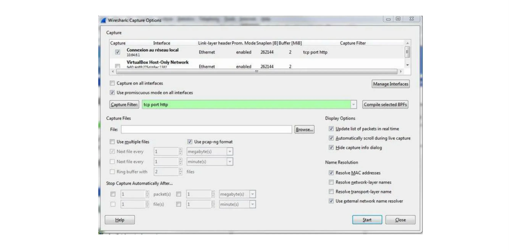


Wireshark는 복잡한 프로토콜 동작을 관찰하거나, 애플리케이션 대화 상자(예: HTTP 또는 DNS 세션)를 재구성하거나, 서비스 응답 시간을 연구해야 하는 시나리오에서 탁월한 성능을 발휘합니다. 또한 관련 패킷에만 집중할 수 있도록 전용 구문(`tcpdump`와는 다른 구문)을 사용하여 매우 구체적인 표시 필터를 지원합니다.


#### 보완 도구


Tcpdump`와 Wireshark는 서로 바꿔 사용할 수 없으며, 각각 고유한 장점이 있다는 점에 유의하세요. 명령줄 환경, 자동화된 스크립트 및 원격 서버 개입에는 `tcpdump`가 더 적합한 반면, 상세한 대화형 및 교육용 트래픽 분석에는 Wireshark가 이상적입니다.


두 도구를 결합할 수 있습니다. 원격 시스템에서 `tcpdump`로 캡처한 다음 로컬 컴퓨터에서 Wireshark로 분석하기 위해 `.cap` 파일을 전송할 수 있습니다. 이 접근 방식은 실제로 널리 사용됩니다.


### Interface 분석 도구


네트워크 액세스 Layer에서는 오작동 진단, 성능 최적화 또는 연결 무결성 확인을 위해 물리적 네트워크 인터페이스를 쿼리하고 구성해야 하는 경우가 종종 있습니다. 이를 위해 Linux에서 사용할 수 있는 가장 강력한 도구 중 하나는 이더넷 Interface에 대한 자세한 기술 정보를 제공할 뿐만 아니라 일부 매개변수를 실시간으로 조정할 수 있는 명령줄 유틸리티인 `ethtool`입니다.


#### Interface 사양 보기


'에트툴'의 핵심 기능은 Interface를 쿼리하고 현재 특성을 표시하는 기능입니다. 이를 통해 확인할 수 있습니다:


- 링크 속도(예: 100Mbit/s, 1Gbit/s 또는 10Gbit/s);
- 협상 모드(반이중 또는 전이중) ;
- 자동 협상이 활성화되어 있는지 여부입니다;
- 포트 유형(구리, 파이버 등) ;
- 링크 상태 (활성 여부) ;
- **wake-on-LAN**과 같은 고급 기능을 지원합니다.


이 정보는 호스트의 네트워크 카드와 연결되는 장비(스위치, 라우터 등) 간의 물리적 연결 또는 협상 설정 불일치와 관련된 문제를 진단하는 데 특히 유용합니다.


이 정보를 얻으려면 실행하기만 하면 됩니다:


```bash
ethtool enp0s3
```


이 명령은 CentOS 또는 RHEL 기반 시스템에서 일반적으로 사용되는 명명 규칙인 `enp0s3` Interface에 대한 자세한 보고서를 출력합니다.


#### Interface 매개변수 동적 수정


'에쓰툴'은 관찰에만 국한되지 않고, 기기를 재부팅하지 않고도 특정 Interface 매개변수를 조정할 수 있습니다. 예를 들어, 특정 링크 속도를 강제하거나 로컬 네트워크의 필요에 따라 기능을 활성화할 수 있습니다.


'-' 옵션은 다음과 같은 매개변수를 동적으로 구성하는 데 사용됩니다:


- 링크 속도(`속도`)를 명시적으로 설정합니다(예: 1Gbit/s의 경우 1000);
- 양면 모드(`듀플렉스`), `하프` 또는 `풀` 중 하나를 선택합니다;
- 자동 협상(`autoneg`)을 활성화 또는 비활성화합니다;
- wake-on-LAN(`wol`)을 활성화합니다;
- 포트 유형.


예 1: Interface에서 자동 협상을 사용 설정합니다:


```bash
ethtool -s enp0s3 autoneg on
```


예 2: *Wake-on-LAN* 기능 활성화(매직 패킷을 통해 원격으로 컴퓨터가 절전 모드에서 깨어날 수 있도록 하기 위해):


```bash
ethtool -s enp0s3 wol p
```


이 예에서 `p` 옵션은 *Wake-on-LAN* 패킷이 감지되는 즉시 웨이크업이 수행되도록 지정합니다. 이 설정은 엔터프라이즈 환경에서 야간 업데이트 또는 원격 유지 관리를 수행할 때 자주 사용됩니다.


#### 도구 설치


'ethtool'이 항상 기본적으로 설치되는 것은 아니라는 점에 유의하세요. Red Hat/CentOS 배포에서는 다음 명령으로 설치할 수 있습니다:


```bash
yum install -y ethtool
```


데비안과 우분투에서는 이에 해당하는 명령이 있습니다:


```bash
sudo apt install ethtool
```


**경고**: 모든 `ethtool` 명령에서는 옵션 바로 뒤에 네트워크 Interface의 이름을 `-s`로 지정해야 합니다. 매개변수 배치에 구문 오류가 있으면 명령이 유효하지 않거나 유효하지 않게 됩니다.


## 네트워크 Layer 도구


<chapterId>d2c5bf35-4284-4af8-8e8b-049c696a511b</chapterId>


### 트래픽 분석 도구


네트워크 진단에서 `ping` 명령은 두 컴퓨터 간의 연결을 테스트하는 가장 간단하면서도 가장 강력한 도구 중 하나입니다. 이 명령은 주어진 시간에 원격 호스트에 연결할 수 있는지 여부를 확인하는 동시에 지연 시간, 링크 안정성 및 DNS 확인에 대한 정보도 제공합니다.


Ping` 명령은 ICMP(*인터넷 제어 메시지 프로토콜*) 프로토콜을 사용합니다. 사용자가 `ping` 요청을 보내면 시스템은 ICMP "에코 요청" 패킷을 IP Address 또는 호스트 이름으로 보냅니다. 대상 컴퓨터가 온라인 상태이고 네트워크 경로가 유효하면 ICMP "Echo Reply" 패킷으로 응답합니다. 이 간단한 메커니즘은 지연 시간을 측정하고 연결 또는 이름 확인 문제를 감지하는 데 사용할 수 있습니다.


일반적인 명령의 예입니다:


```bash
ping 172.17.18.19
```


일반적인 응답입니다:


```bash
mydmn.org (172.17.18.19): 56 data bytes
64 bytes from 172.17.18.19: icmp_seq=0 ttl=56 time=7.7 ms
64 bytes from 172.17.18.19: icmp_seq=1 ttl=56 time=6.0 ms
64 bytes from 172.17.18.19: icmp_seq=2 ttl=56 time=5.5 ms
```


이 예제에서는 이름 확인이 자동으로 수행되었습니다. 도메인 `mydmn.org`가 IP Address `172.17.18.19`와 연결되어 DNS 확인이 올바르게 작동하는지 확인합니다. 이 명령은 다음과 같은 기술적 세부 정보도 제공합니다:


- 응답 순서를 확인하는 데 유용한 iCMP 시퀀스 번호(`icmp_seq`)입니다;
- 패킷이 삭제되기까지 남은 홉 수를 나타내는 TTL(*Time-To-Live*)입니다;
- 왕복 시간/지연(`시간`)을 밀리초 단위로 표시하여 링크 지연 시간을 추정할 수 있습니다.


#### ICMP 매개변수에 대한 자세한 분석


TTL은 IP 프로토콜에서 중요한 필드입니다. 각 데이터그램은 발신자가 TTL 값(보통 64, 128 또는 255)으로 초기화합니다. 경로에 있는 모든 라우터는 이 값을 1씩 감소시킵니다. 목적지에 도달하기 전에 TTL이 0에 도달하면 패킷이 삭제되고 발신자에게 ICMP 오류가 반환됩니다. 이 메커니즘은 무한 라우팅 루프를 방지합니다.


전파 시간(*왕복 지연/시간*)은 패킷이 발신자를 출발하여 대상에 도달한 후 되돌아오는 데 걸리는 지연 시간을 측정합니다. 실제로 200ms 미만의 지연은 안정적인 링크에 허용되는 지연으로 간주됩니다. 비정상적으로 높은 지연은 네트워크 혼잡, 비효율적인 라우팅 또는 링크 품질 저하를 나타낼 수 있습니다.


#### 고급 '핑' 사용법


'핑'은 테스트를 세분화하고 특정 네트워크 동작을 관찰할 수 있는 옵션을 제공합니다.


브로드캐스트 요청을 보내려면 `-b` 옵션을 사용하여 서브넷의 모든 호스트를 대상으로 지정할 수 있습니다:

```bash
ping -b 192.168.1.255
```


이는 로컬 네트워크에서 활성 호스트를 빠르게 감지하거나 네트워크가 브로드캐스트 요청을 처리하는 방식을 테스트할 때 유용합니다. 그러나 많은 설정에서 라우터와 방화벽은 증폭 공격을 방지하기 위해 브로드캐스트 핑을 차단합니다.


'-i' 옵션을 사용하여 요청 간 사용자 지정 간격을 지정할 수도 있습니다(기본값: 1초):


```bash
ping -i 0.2 -c 10 192.168.1.7
```


이 테스트는 0.2초 간격으로 10개의 ICMP 요청을 전송합니다. 이러한 테스트는 짧은 기간 동안의 지연 시간 변동을 감지하거나 링크의 안정성을 평가하기 위해 가볍게 스트레스를 가하는 데 유용합니다.


### 라우팅 테이블 분석 도구


Iproute2` 제품군의 일부인 `ip route` 명령은 최신 Linux 시스템에서 커널의 IP 라우팅 테이블을 검사하고 관리하기 위한 권장 및 표준 도구입니다. 이 명령은 더 이상 사용되지 않는 `route` 명령을 대체하여 보다 명확한 구문과 일관성, 최신 기능(IPv6, 다중 테이블, 네임스페이스 등)에 대한 확장된 지원을 제공합니다.


#### 라우팅 테이블 표시


현재 라우팅 테이블을 표시합니다:


```bash
ip route show
```


이 출력에는 커널에 알려진 모든 경로, 즉 나가는 패킷이 목적지에 따라 이동하는 경로가 나열됩니다.


출력 예시:


```bash
default via 192.168.1.1 dev eth0 proto dhcp metric 100
192.168.1.0/24 dev eth0 proto kernel scope link src 192.168.1.100
```


각 줄은 경로를 나타냅니다. 주요 필드는 다음과 같습니다:


- **default**: 더 이상 특정 경로가 일치하지 않을 때 사용되는 기본 경로입니다.
- **경유**: 목적지에 도달하는 데 사용되는 게이트웨이입니다.
- **dev**: Interface이 사용하는 네트워크입니다.
- **proto**: 경로가 생성된 방법(수동, DHCP, 커널 등).
- **메트릭**: 가능한 여러 경로의 우선순위를 정하는 데 사용되는 경로 비용입니다.
- **범위**: 경로 범위(예: 직접 연결된 경로의 경우 `링크`).
- **src**: 이 Address에서 발신 패킷에 사용되는 소스 IP Interface입니다.


#### 경로 추가 및 삭제


정적 경로를 추가하거나 제거하는 등 라우팅 테이블을 동적으로 수정할 수도 있습니다.


정적 경로 추가하기:


```bash
ip route add 192.168.1.0/24 via 192.168.1.1 dev eth0
```


이는 Interface `eth0`의 `192.168.1.1` 게이트웨이를 통해 `192.168.1.0/24` 네트워크로의 경로를 구성합니다.


이 경로를 제거합니다:


```bash
ip route del 192.168.1.0/24
```


이 명령은 이전에 정의한 경로를 삭제합니다.


#### 유용한 명령어


다음은 분석 또는 스크립팅에 유용한 몇 가지 변형입니다:


- `ip -4 경로`: IPv4 경로만 표시합니다;
- `ip -6 경로`: IPv6 경로만 표시합니다;
- `ip 경로 목록 테이블 메인`: 기본 라우팅 테이블을 표시합니다(기본값);
- `ip route get <Address>`: 주어진 Address에 대한 패킷이 어떤 Interface와 게이트웨이를 사용할지 표시합니다.


예시:


```bash
ip route get 8.8.8.8
```


패킷이 `8.8.8.8`에 도달하기 위한 정확한 경로를 표시합니다.


### 추적 도구


소스 호스트와 대상 목적지 사이의 IP 패킷이 이동한 경로를 분석하는 가장 효과적인 도구 중 하나는 `traceroute` 명령입니다. 이 명령은 패킷이 따라가는 경로를 단계별로 표시하고 패킷이 경유하는 중간 라우터를 식별합니다. 네트워크 링크가 오작동하거나 서비스가 중단된 경우 `traceroute`는 문제의 정확한 위치를 파악하는 데 도움이 됩니다.


핑` 명령과 마찬가지로 대상은 FQDN(정규화된 도메인 이름) 또는 IP Address로 지정할 수 있습니다. 예를 들어


```bash
traceroute mydmn.org
```


#### 작동 원리


추적 경로`는 IP 패킷 헤더의 TTL(*Time To Live*) 필드에 의존합니다. 앞서 설명한 대로 이 필드는 경로를 따라 각 라우터마다 감소하는 카운터입니다. TTL이 0에 도달하면 패킷이 삭제되고 라우터는 발신자에게 ICMP "시간 초과" 메시지를 반환합니다. 이 메커니즘은 라우팅이 잘못될 경우 무한 루프를 방지합니다.


'추적 라우트'는 이 동작을 활용하여 발신자와 수신자 간의 라우터를 매핑합니다:


- 먼저 TTL이 1인 일련의 UDP 패킷(보통 3개)을 전송합니다. 첫 번째 라우터는 TTL이 0이므로 패킷을 삭제한 다음 ICMP 메시지로 응답하여 IP Address과 응답 시간을 표시합니다.
- 다음으로, TTL이 2인 패킷을 한 번 더 전송하여 두 번째 라우터를 표시합니다.
- 이 프로세스는 대상에 도달할 때까지 반복되며, 이 시점에서 호스트는 엔드포인트에 도달했음을 나타내는 ICMP 포트 연결할 수 없음 메시지로 응답합니다.


기본적으로 '추적 경로'는 사용하지 않는 포트(일반적으로 33434에서 시작)로 전송되는 UDP 패킷을 사용하지만 시스템이나 명령어 변형에 따라 ICMP(예: `ping`) 또는 TCP를 사용하도록 구성할 수도 있습니다.


출력 예시:


```bash
traceroute to www.google.fr (216.58.210.35), 64 hops max, 52 byte packets

1  par81-024.ff.avast.com (62.210.189.205)   25.107 ms  24.235 ms  24.383 ms
2  62-210-189-1.rev.poneytelecom.eu (62.210.189.1)  27.341 ms  27.119 ms  28.184 ms
3  a9k1-45x-s43-1.dc3.poneytelecom.eu (195.154.1.92)  25.910 ms  25.040 ms  25.558 ms
4  72.14.218.182 (72.14.218.182)  36.234 ms  39.907 ms  38.130 ms
5  108.170.244.177 (108.170.244.177)  25.880 ms
108.170.244.240 (108.170.244.240)  25.791 ms
108.170.244.177 (108.170.244.177)  26.449 ms
6  216.239.62.143 (216.239.62.143)  26.491 ms
216.239.43.157 (216.239.43.157)  26.414 ms
216.239.62.139 (216.239.62.139)  26.400 ms
...
9  108.170.246.161 (108.170.246.161)  33.174 ms
108.170.246.129 (108.170.246.129)  34.342 ms
108.170.246.161 (108.170.246.161)  33.707 ms
10  108.170.232.105 (108.170.232.105)  33.845 ms  33.846 ms
108.170.232.103 (108.170.232.103)  34.206 ms
11  lhr25s11-in-f35.1e100.net (216.58.210.35)  34.094 ms  33.353 ms  33.718 ms
```


각 라인은 통과한 라우터에 해당하며, 최대 3개의 시간 측정값(밀리초 단위)은 해당 라우터로의 왕복 대기 시간을 나타냅니다. 이 값은 각 네트워크 세그먼트의 성능을 평가하는 데 도움이 됩니다.


#### 결과 해석


라우터가 응답하지 않거나 ICMP 메시지를 필터링하는 경우, 응답 시간 대신 별표 `*`가 표시됩니다. 이는 다음을 나타낼 수 있습니다:


- 방화벽이 ICMP 회신을 차단합니다,
- 응답하지 않도록 구성된 장치 또는
- 경로를 따라 일시적인 연결 문제가 발생했습니다.


따라서 '추적 경로'는 이동 경로를 식별할 뿐만 아니라 비정상적인 지연 시간이나 중단 지점을 강조 표시합니다.


일부 시스템에서는 루트 권한이 필요 없는 동등한 `tracepath` 명령을 사용할 수 있습니다. IPv6의 경우 `traceroute6` 또는 `tracepath6`을 사용합니다.


IPv6 추적의 예입니다:


```bash
traceroute6 ipv6.google.com
```


### 활성 연결을 확인하기 위한 도구


Linux 시스템에서 활성 네트워크 연결을 진단하고 네트워크 활동을 모니터링하려면 `ss` 명령(_socket statistics_의 줄임말)이 최신 참조 도구입니다. 이 도구는 `iproute2` 제품군의 일부로, 지금은 더 이상 사용되지 않는 `netstat`을 대체하여 더 나은 성능과 더 정확한 결과를 제공합니다.


'SS'는 활성 TCP 및 UDP 연결, 수신 포트, 로컬 및 원격 주소, 연결 상태 및 관련 프로세스를 표시합니다.


#### 일반 사용


옵션 없이 실행하면 `ss` 명령은 활성 TCP 연결을 표시합니다. 기본 구문입니다:


```bash
ss [options]
```


분석을 구체화하기 위한 몇 가지 일반적인 옵션입니다:


- t`: TCP 연결만 표시합니다;
- u`: UDP 연결만 표시합니다;
- `-l`: 수신 소켓만 표시합니다;
- n`: 이름 확인(원시 IP 및 포트 번호)을 비활성화합니다;
- p`: 각 소켓 관련 프로세스(PID 및 프로그램 이름)를 표시합니다,
- `-a`: 비활성 연결을 포함한 모든 연결을 표시합니다,
- s`: 상위 레벨 소켓 통계를 표시합니다.


#### 사례 연구


TCP 포트 80(HTTP)을 사용하는 모든 활성 연결을 표시합니다:


```bash
ss -ant | grep ':80'
```


포트 80과 관련된 활성 TCP 연결을 표시합니다. LISTEN`, `ESTABLISHED`, `TIME-WAIT`와 같은 상태는 각 Exchange의 현재 상태를 나타냅니다.


출력 예시:

```
ESTAB 0 0 192.168.1.10:54321  93.184.216.34:80
```


연결된 프로세스가 있는 모든 네트워크 연결을 표시합니다:


```bash
ss -tulnp
```


전체 소켓 사용량 요약을 확인하려면 다음과 같이 하세요:

```bash
ss -s
```


UDP 연결만 필터링합니다:

```bash
ss -unp
```


이러한 명령은 의심스러운 연결, 예기치 않은 수신 포트를 감지하거나 특정 서비스의 활동을 모니터링하는 데 특히 유용합니다.


## 운송 및 최고의 Layer 도구


<chapterId>bce47931-930e-4288-b0fd-666c9a1066b5</chapterId>


### DNS 쿼리 도구


TCP/IP 모델의 상위 계층, 특히 애플리케이션 Layer에서는 이름 확인이 어떻게 작동하는지 이해하는 것이 중요합니다. DNS 쿼리 도구를 사용하면 도메인 이름이 IP Address에 올바르게 연결되어 있는지 확인할 수 있으며, 잘못된 구성, 전파 지연 또는 사용 불가능과 같은 DNS 서버 문제를 진단하는 데 도움이 됩니다. 이러한 도구는 네트워크 관리자나 IP 환경의 DNS 교환을 더 깊이 이해하고자 하는 모든 사용자에게 필수적입니다.


#### Nlookup` 명령


가장 간단한 DNS 쿼리 도구는 `nslookup`입니다. 이 도구는 DNS 서버로 쿼리를 보내고 도메인 이름과 연결된 IP Address을 반환합니다(또는 그 반대도 마찬가지). 기본적으로 시스템에 구성된 DNS 서버를 쿼리하지만 명령에서 직접 서버를 지정할 수도 있습니다.


직접 조회의 예입니다:

```bash
nslookup mydmn.org
```


특정 DNS 서버 쿼리하기:

```bash
nslookup mydmn.org 192.6.23.4
```


이 요청은 `192.6.23.4`의 DNS 서버에 `mydmn.org`라는 이름을 확인하도록 요청합니다. 이는 특정 DNS 서버가 도메인 이름을 인식하는지 확인하거나 서버가 제대로 작동하는지 확인하는 데 특히 유용합니다.


#### Dig` 명령


'dig'(*도메인 정보 그로퍼*)는 `nslookup`보다 더 현대적이고 완벽하며 유연한 도구입니다. 복잡한 쿼리를 지원하고 해결 프로세스, 관련된 서버의 계층 구조, 반환된 레코드 유형(A, AAAA, MX, TXT 등) 및 발생한 오류에 대한 자세한 정보를 제공합니다.


기본 쿼리 예제:

```bash
dig mydmn.org
```


특정 DNS 서버 쿼리하기:

```bash
dig @192.6.23.4 mydmn.org
```


이 명령은 지정된 서버에서 DNS 레코드의 가용성을 확인합니다.

'dig'의 주요 장점 중 하나는 DNS 응답의 세부 정보를 보여주기 때문에 구성 오류를 진단하는 데 매우 유용하다는 점입니다.


#### DNS 확인자 수동 구성


테스트 환경 등에서 로컬로 사용되는 DNS 서버를 재정의하거나 특정 서버를 강제로 사용해야 하는 경우가 있습니다. 이는 시스템의 DNS 확인 설정을 정의하는 `/etc/resolv.conf` 파일을 편집하여 수행할 수 있습니다.


구성 예시:


```bash
vi /etc/resolv.conf

search mydmn.org
nameserver 192.168.1.10
nameserver 192.168.1.11
```


- '검색' 필드에는 짧은 이름을 확인할 때 자동으로 추가할 도메인을 지정합니다.
- Nameserver` 항목은 우선순위에 따라 사용할 DNS 서버를 정의합니다.


많은 최신 배포판(특히 `systemd-resolved`를 사용하는 배포판)에서 `/etc/resolv.conf`의 변경 사항은 일시적이며 재부팅 또는 네트워크 재접속 시 덮어쓰기될 수 있습니다. 보다 영구적인 방법으로는 `resolvconf`, `systemd-resolved`를 사용하거나 *NetworkManager* 구성을 수정하는 방법이 있습니다.


#### 호스트` 명령


간단하지만 효과적인 또 다른 DNS 도구는 '호스트'입니다. 도메인 이름을 IP 주소로(또는 그 반대로) 확인하며 네트워크 Interface에서 DNS 장애 또는 잘못된 구성을 진단하는 데 도움이 될 수 있습니다.


예시:

```bash
host mydmn.org
```


역방향 조회:

```bash
host 192.6.23.4
```


호스트`는 특히 명령줄 스크립트에서 사용할 때 빠른 확인에 특히 유용합니다.


허가 없이 타사 DNS 서버에 대한 반복적이거나 집중적인 쿼리는 침입 시도 또는 악의적인 활동으로 해석될 수 있습니다. 부적절하게 사용하거나 사용자가 제어하지 않는 네트워크에 대해 이러한 명령을 사용하면 공격의 첫 단계인 정찰 스캔과 유사할 수 있습니다. 항상 관리자가 관리하는 환경이나 명시적인 권한이 있는 경우에만 사용하도록 제한하세요.


### 네트워크 스캔 도구


로컬 또는 광역 네트워크를 모니터링하거나 보호할 때는 활성 디바이스와 해당 디바이스가 노출하는 서비스를 식별하는 것이 중요합니다. 이것이 바로 `nmap`(*네트워크 매퍼*) 도구가 하는 일입니다.


https://planb.network/tutorials/computer-security/communication/nmap-862300d7-6dfb-4660-970d-f56a9f58f60d

#### 'nmap'을 소개합니다


'nmap'은 하나 이상의 호스트를 대상으로 스캔하여 열린 포트, 사용 가능한 서비스(HTTP, SSH, DNS 등), 사용 중인 운영 체제 유형까지 감지할 수 있습니다. 다양한 옵션 덕분에 `nmap`은 인프라 관리의 감사 또는 강화 단계에서 필수적인 네트워크의 노출 표면에 대한 정확한 개요를 제공합니다.


호스트` 명령과 마찬가지로 `nmap`도 소유하지 않은 네트워크나 인프라에서 또는 명시적인 승인 없이 사용해서는 안 됩니다. 승인되지 않은 포트 스캔은 악의적인 정찰 시도로 표시될 수 있으며, 보안 시스템(방화벽, IDS/IPS)에 의해 탐지되는 경우가 많고, 심지어 법적 처벌을 받을 수도 있습니다.


#### 기본 사용


특정 호스트를 스캔하고 해당 호스트의 열린 포트를 확인합니다:

```bash
nmap 192.168.0.1
```


이 명령은 호스트 `192.168.0.1`에서 가장 일반적인 포트 1000개를 스캔하여 액세스한 서비스 및 사용된 프로토콜을 표시합니다. DNS 확인이 구성된 경우 IP Address 대신 호스트 이름을 사용할 수도 있습니다.


#### 전체 네트워크 검사


'nmap'의 장점 중 하나는 단일 명령으로 전체 주소 범위를 스캔할 수 있다는 점입니다. 예를 들어, 네트워크의 모든 활성 머신을 빠르게 인벤토리화할 수 있습니다:


```bash
nmap 192.168.0.0/24
```


이 경우 `192.168.0.0` ~ `192.168.0.255` 범위의 모든 호스트가 쿼리됩니다. 각 IP Address에 대해 열린 포트, 해당 상태(개방, 필터링됨 등), 가능한 경우 해당 서비스의 이름이 결과에 나열됩니다.


관리자는 여러 작업에서 `nmap`을 사용할 수 있습니다:


- **활성 호스트 감지**: 서브넷 내에서 어떤 머신이 응답하는지 파악합니다;
- **서비스 인벤토리**: 필요한 포트만 액세스할 수 있도록 합니다(최소 권한 원칙);
- **규정 준수 확인**: 조직의 보안 정책과 개방형 포트를 비교합니다;
- **취약점 예방**: 중요한 컴퓨터에서 실행 중인 안전하지 않거나 오래된 서비스를 찾아냅니다.


https://planb.network/tutorials/computer-security/communication/nmap-862300d7-6dfb-4660-970d-f56a9f58f60d

### 프로세스 심문 도구


특히 네트워킹 환경에서 활성 프로세스 및 열린 파일을 심층적으로 분석하기 위해 Linux 관리자는 종종 `lsof`(*열린 파일 목록*) 명령을 사용합니다. 이름과는 달리 `lsof`는 기존 파일에만 국한되지 않습니다. UNIX 시스템에서는 네트워크 소켓, 장치, 통신 채널을 포함한 모든 것이 파일로 간주됩니다.


따라서 이 도구는 활성 프로세스, 열려 있는 네트워크 포트, 액세스한 파일 및 관련 사용자를 상호 연관시켜 시스템의 단면도를 제공합니다.


#### Lsof`를 사용한 네트워크 분석


I` 옵션은 출력을 네트워크 연결(TCP, UDP, IPv4 또는 IPv6)로 제한합니다. 이렇게 하면 어떤 프로세스가 네트워크를 통해 통신하는지 쉽게 확인할 수 있습니다:


```bash
lsof -i
```


이 명령은 네트워크 소켓을 사용하여 실행 중인 모든 프로세스를 나열하여 사용 중인 포트, 프로토콜(TCP/UDP), 연결 상태, PID 및 관련 사용자를 표시합니다.


#### IP Address 또는 포트별 필터링


특정 네트워크 흐름을 분리하여 IP Address과 포트를 지정하여 검색을 구체화할 수 있습니다. 예를 들어 특정 호스트와의 SMTP 세션(포트 25)을 확인합니다:


```bash
lsof -n -i @192.168.2.1:25
```


포트 25에서 호스트 `192.168.2.1`과의 활성 네트워크 연결만 표시되므로 의심스러운 활동이나 SMTP 흐름 문제를 진단하는 데 유용합니다.


#### 디바이스 액세스 추적


Lsof`의 또 다른 강점은 디스크 파티션과 같은 특수 파일을 추적하는 것입니다. 예를 들어 `/dev/sda1`에서 어떤 프로세스가 파일을 열었는지 확인할 수 있습니다:


```bash
lsof /dev/sda1
```


장치가 아직 사용 중이어서 마운트 해제 시도가 실패하거나 어떤 애플리케이션이 파티션에 액세스하고 있는지 조사할 때 유용하게 사용할 수 있습니다.


#### 교차 분석: 프로세스 및 네트워크


옵션을 조합하여 정확한 인사이트를 얻을 수 있습니다. 예를 들어, PID 1521의 프로세스에서 열린 모든 네트워크 포트를 확인합니다:


```bash
lsof -i -a -p 1521
```


A` 옵션은 기준(`-i` 및 `-p`)을 교차하여 출력을 해당 프로세스의 네트워크 연결로만 제한합니다.


#### 다중 사용자 추적


lsof`는 특정 사용자의 활동을 분석하는 데도 사용할 수 있으며, 사용자가 연 모든 파일을 나열하고 선택적으로 PID별로 필터링할 수 있습니다:


```bash
lsof -p 1521 -u 500,phil
```


여기에는 사용자 `phil` 또는 UID 500이 사용하는 파일 또는 네트워크 연결이 표시되며, 1521 프로세스로 제한됩니다.


### 섹션 요약


이 마지막 섹션에서는 컴퓨터 네트워크를 진단, 분석 및 관리하는 데 필수적인 다양한 도구에 대해 살펴보았습니다. TCP/IP 모델의 계층을 중심으로 구성된 이 연구는 네트워크 통신의 작동 방식을 명확히 할 뿐만 아니라 잠재적인 문제를 식별, 격리 및 해결하기 위한 엄격한 방법론을 확립합니다.


이러한 도구는 관리자에게 네트워크 상태를 모니터링하고, 트래픽을 분석하고, 연결을 감사하고, 결함이 있는 장비나 서비스에 신속하게 개입할 수 있는 일관된 기술적 수단을 제공합니다.


#### 네트워크 액세스 Layer


인터페이스와 프레임에 대한 직접적인 가시성을 제공하는 도구:


- **arp/ip 이웃**: ARP/NDP 캐시를 검사하고 수정하여 IP-MAC 연결을 확인하거나 수정합니다;
- **tcpdump**: 명령줄 패킷 캡처, 필터링 및 내보내기 가능;
- **와이어샤크**: 심층 프로토콜 디코딩을 통한 그래픽 패킷 분석;
- **ethtool**: 이더넷 카드 물리적 매개변수(속도, 이중화, WoL 등)를 쿼리하고 조정합니다.


#### 네트워크 Layer


IP 연결, 라우팅 및 패킷 트래픽을 평가하기 위한 도구입니다:


- **ping**: ICMP로 도달 가능성을 테스트하고 지연 시간을 측정합니다;
- **IP 경로**: 패킷 경로를 제어하기 위해 라우팅 테이블을 검사하고 수정합니다;
- **추적 경로**: 목적지까지의 경로를 따라 홉 단위로 라우터를 식별합니다;
- **ss**: TCP/UDP 소켓 및 관련 프로세스의 상세 인벤토리(netstat의 후속).


#### 전송 및 애플리케이션 계층


서비스 및 프로세스 진단을 위한 도구:


- **nslookup / dig / host**: 이름 확인의 유효성을 검사하고 레코드를 분석하기 위한 DNS 쿼리;
- **nmap**: 오픈 포트와 노출된 서비스를 탐색하여 공격 표면을 평가합니다;
- **lsof**: 프로세스에 의해 열린 파일과 소켓을 나열하여 시스템과 네트워크 활동의 상관관계를 파악합니다.


TCP/IP 모델의 특정 단계에 맞춰 각각 조정된 이러한 도구를 마스터하면 물리적 Layer에서 시작하여 라우팅을 거쳐 애플리케이션 서비스까지 체계적으로 접근할 수 있습니다. 이러한 일련의 전문 지식을 통해 관리자는 인프라를 진단, 보호, 최적화하여 네트워크 성능과 가용성을 모두 보장할 수 있습니다.


# 마지막 부분


<partId>09d5393c-63bc-42fc-bf79-c65e380211bd</partId>


## 리뷰 및 평가


<chapterId>114c33c0-9831-4d74-affd-f5d37adc53c3</chapterId>


<isCourseReview>true</isCourseReview>

## 최종 시험


<chapterId>b99e005e-8dd0-4fa4-b302-f940c27a30ac</chapterId>


<isCourseExam>true</isCourseExam>

## 결론


<chapterId>3b449814-78f3-41c0-8138-0a04f3682719</chapterId>


<isCourseConclusion>true</isCourseConclusion>
