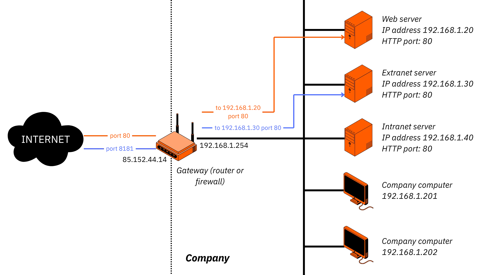
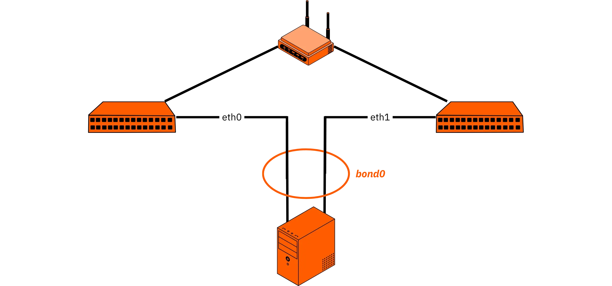
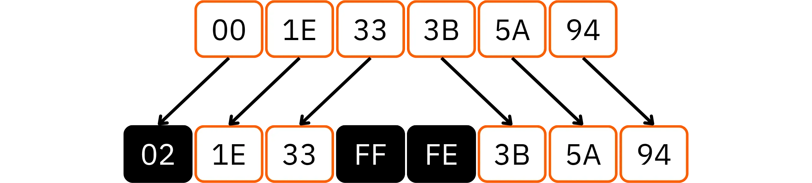
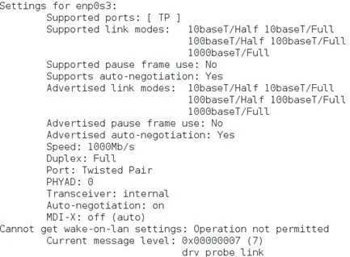
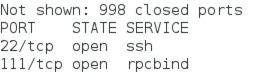

# Ubuhinga bw'ingenzi bwo kugendera mw'isi ya IP


Niwibike mu mutima w’isi ya IP maze witegurire ubumenyi bwo gutahura no gucunga neza imihora yawe. Muri iri shure, uzomenya vyose ukeneye kumenya ku bijanye n’imihora ya mudasobwa mu buryo butomoye kandi bukora.


Uzomenya ingene imihora n’ugutanga amaderesi ya IP bikora, ingene wotandukanya IPv4 na IPv6, ingene womenya no gukoresha ivyiciro bitandukanye vya Address, n’ingene wotahura akamaro kose k’umurongo wa TCP/IP n’amahuza akora hagati y’amaderesi ya IP, amaderesi y’umubiri n’amazina ya DNS.


NET 302 igenewe cane cane abanyeshure, abakoresha Linux canke gusa abashaka gutahura ivy’ishimikiro vyo gukorana n’abandi no gukomeza ubwigenge bwabo mu gucunga, gutorera umuti ingorane no gutuma ibikorwa remezo bigenda neza.


Twifatanye natwe maze uhindure ubumenyi bwawe bube ubuhinga nyabwo bwo gukora!


___


Iyi nyigisho ya NET 302 ni uguhindura ivyigwa *Ivy’ishimikiro ku rubuga: TCP/IP, IPv4 na IPv6*, vyanditswe mu gifaransa na Philippe Pierre kandi vyasohowe kuri [IT-Connect](it-connect.fr/cours/les-bases-du-reseau-tcpip6/ Uruhusha mpuzamakungu rwo gutanga-Uruhusha-Rutari urw’ubudandaji 4.0 ([CC BY-NC 4.0]


Hariho amahinduka akomeye yakozwe ku nsiguro y’intango ya Loïc Morel: ico canditswe carasubiwemwo cose, kiragurwa kandi kiratunganywa kugira ngo kigire ibintu bishasha, vyimbitse, mu gihe nyene kizigama impwemu y’inyigisho y’igitabu c’intango ca Philippe Pierre. Ivyo bishushanyo na vyo nyene vyarasubiwemwo.


+++


# Imenyekanisha


<partId>a52b996d-1e23-470f-a9df-7ad88790099a</partId>


## Incamake y'amashure


<chapterId>9f238ecd-c9bb-4886-a205-2beba609fb13</chapterId>


Iryo shure ritanga intangamarara yuzuye ku vyerekeye ivy’ishimikiro vy’imihora ya IP. Igizwe n’ibice bine nyamukuru, kimwe cose kikaba kirimwo umuce w’ingenzi wo gutahura, gutunganya no gusuzuma ibibazo biri mu rubuga rwa mudasobwa.


### Amasezerano ya TCP/IP


Muri iki gice ca mbere, tuzoshinga umushinge mu gutohoza iciyumviro c’ugukorana n’amateka y’umurongo wa TCP/IP. Tuzokwiga ibice vyayo nyamukuru: IP, TCP, hamwe n’uguca irya n’ino muri make umurongo wa IPv5 QoS. Tuzovuga kandi ku bijanye n'ibikorwa vya kera kugira ngo dutahure neza insobanuro y'amakuru Exchange.


### IPv4 aderesi


Tuzoca tuja ku kiganiro kijanye n’ugutanga aderesi IPv4. Uzomenya ingene IPv4 ikoreshwa mu bikorwa, ubwoko bwayo butandukanye bwa Address (ubw’ibanga, ubw’abantu bose, ubw’amakuru, n’ibindi), uruhara rw’ishimikiro rwa DNS, hamwe n’ingene aderesi za Ethernet n’umurongo wa ARP bikora. Uzobona kandi NAT (Impinduro y’urubuga Address) n’ivy’ishimikiro vyo gutunganya urubuga.


### IPv6 gutanga aderesi


Igice ca gatatu kivuga ku gukoresha IPv6, ivyo bikaba ari ngombwa kugira ngo Address igere ku mipaka ya IPv4. Tuzoca mu ngingo ngenderwako zayo n’insobanuro zayo, Address Assignment mu rubuga rw’aho hantu, Address uburongozi bw’amabuye n’isano hagati ya IPv6 na DNS.


### Ibikoresho vyo gupima urubuga


Ubwa nyuma, tuzosozera n’ugushikiriza ibikoresho nyamukuru vyo gupima urubuga. Ivyo bizokuronsa ubushobozi bwo gusuzuma, kugenzura no gutorera umuti ingorane zidakora neza. Iki gice kizoba gitunganijwe n’ibice: Ugushika ku rubuga, Urubuga, Ugutwara n’ibice vyo hejuru.


Igihe iri shure rizoba rirangiye, uzoba ufise ubumenyi bw’ishimikiro bwo gutwara neza ibikorwa remezo vy’urubuga no gusuzuma ibibazo bishobora kubaho.


Ni mwiteguye kwisuka mw’isi y’imihora ya mudasobwa? Reka tugende!


**ICIBUKIRO**: Insobanuro zishingiye kuri sisitemu ya GNU/Linux CentOS 7. Ariko rero, imiterere y’urubuga ni imwe cane iyo ugereranya Debian na CentOS. Rero, nta tandukaniro tuzogira. Iyo hariho, tuzoyibanza n’ikimenyetso kinaka.


**N.B.**: Niwahura n’amajambo utamenyereye mu gihe c’amashure, usabwe kuraba [urutonde rw’amajambo](https://planb.network/resources/urutonde rw’amajambo) kugira ngo ubone insobanuro.


# Amasezerano ya TCP/IP


<partId>53fd4b73-cdf1-4865-ba29-1ac8ec3e9e9a</partId>


## Urubuga ni iki?


<chapterId>7370904f-f8f5-4ad4-a63a-5931d94c3b3b</chapterId>


Muri iki kiganiro ca mbere, turaza kuraba mu buryo bwimbitse ubuhinga bwa TCP/IP, ari bwo buye ry’imfuruka ry’ivy’itumanaho ry’ubuhinga bwa none. Tuzovuga inkomoko yayo, ingingo ngenderwako zayo z’ishimikiro be n’uburyo bwo gutanga aderesi ikoresha, ivyo bikaba ari ngirakamaro kugira ngo amakuru ashobore guca hagati y’ibikoresho bifatanye.


Turaza kandi gusobanura mu buryo burambuye ibice nyamukuru bitunganya iki kigereranyo, no gusigura ingene bikorana kugira ngo bibe urubuga rukora, rwizigirwa kandi rushobora gukwiragira. Ariko mbere, ni ngombwa ko dusubira ku ciyumviro c’uruja n’uruza.


Mu bijanye n’inkomoko y’amajambo, urusobe rwerekeye urutonde rw’ibintu bifatanye, bikaba bikora ikintu gifatanye. Mu bijanye n’itumanaho n’ubuhinga bwa none, iyo nsobanuro ihinduka umugwi w’ibikoresho (ordinateri, ama router, ama switch, access points, n’ibindi) bishobora guhana amakuru biciye ku bikoresho vy’umubiri canke bitagira amashanyarazi. Gutyo, urubuga ruratuma amakuru aguma agenda canke agaca agenda, bivanye n’ivyo bisabwa, amategeko akoreshwa be n’ingene ubuhinga bwo kwubaka bukoreshwa.


Mu gihe c’igihe, ama topologies menshi ya kera yarateguwe kugira ngo ashobore gushitsa ivya nkenerwa bitandukanye ku bijanye n’igiciro, ubushobozi, ukwihangana, n’ukworohereza kwitaho. Ivyo birimwo:


- urusobe rw'impeta,
- urusobe rw'igiti,
- urusobe rw'ibisi,
- urusobe rw'inyenyeri,
- urusobe rw’urusenga.


### Urubuga rw'impeta


Mu nzira y’ubuhinga bw’impeta, ibikoresho bihuzwa mu nzira ipfutse: ikibanza cose gihuzwa n’ikindi, ica nyuma kigasubira gufatanya n’ica mbere. Muri iyo ntunganyo, igikoresho cose gikora nk’igikoresho co gutanga amakuru, kigatanga amakuru ku yindi nzira. Bivanye n’ubwoko bw’urubuga, amakuru arashobora guca mu nzira imwe gusa, canke muri zompi.


Inyungu y’iyo ndinganizo iri mu kworoha kw’imirongo yayo, no kutagira ibikoresho vyose vyo hagati bishingiyeko. Ariko rero, ugukomeza kw’uruja n’uruza rwose kuvana n’amagara y’ikintu kimwekimwe cose: iyo ikibanza kimwe kidakora neza, birashobora gutuma ubuhinga bwose bwo guhanahana amakuru buhagarara. Ni co gituma kenshi hashirwaho uburyo bwo gusubiramwo canke bwo guca mu nzira.


### Urusobe rw'igiti


Igiti c’uruzitiro, canke topologie y’ubukuru, gishingiye ku miterere y’igiti c’umuryango. Igizwe n’ingero zikurikirana: urudodo rw’umuzi ruri hejuru rufatanya n’ingero nyinshi zo hasi, na zo nyene zishobora gufatanya n’izindi nsoro, n’ibindi.


Iyi nzira y’uburongozi ikora neza cane cane ku mihora minini ikeneye gucapura neza inshingano no kurongora mu bice. Ariko kandi, bituma urubuga rushobora gushikirwa n’ingorane z’ugusenyuka kw’ibihimba vyo ku rwego rwo hejuru: gutakaza umuzi canke ishami ry’ingenzi birashobora guca ibice vyose vy’ibikorwa remezo.


### Urubuga rwa bisi


Mu nzira ya bisi, ibikoresho vyose bisangira uburyo bumwe bwo gutanga amakuru, cane cane umurongo w’ibarabara canke urudodo rw’amaso. Igikoresho cose gifatanye, bisobanura ko kidahindura ikimenyetso, kandi gishobora kohereza canke kwakira amakuru kuri uwo muhora usangiwe.


Inyungu nyamukuru y’iyi topologie ya bisi ni igiciro gito co kuyishiramwo, bivuye ku gukoresha ama cables yoroshe.  Ariko rero, mu mirongo ya kera ishingiye ku nzira y’umuyagankuba (Ethernet 10BASE2/10BASE5), guca canke gutakaza ikibanza kimwe vyoshobora guhungabanya canke mbere guhagarika uruja n’uruza rwose, kuko ububandanya bw’umuyagankuba wa bisi n’ubushobozi bwo guhagarika umuyagankuba ntivyoba bigikomeje. Kugira umurongo umwe w’umubiri na vyo nyene ni intege nke zikomeye: ugusenyuka canke ikosa ryose rihagarika uguhanahana amakuru ku rubuga rwose.


### Urubuga rw'inyenyeri


Topologie y'inyenyeri, izwi kandi nka "hub and spoke", ni yo ikoreshwa cane muri iki gihe, cane cane mu mihora ya Ethernet yo mu nzu no mu biro. Aha, ibikoresho vyose bifatanya n’igikoresho kimwe co hagati.


Ivyo bituma uburongozi n’ugucungera vyoroha: iyo igikoresho kimwe co ku ruhande kidakora neza, ibindi bice vy’urubuga ntibigira ico bikoze. Ikibi ni uko igikoresho co hagati ari ikintu kimwe co kunanirwa: iyo kimanutse, uguhanahana amakuru kurahagarara hose. Uburyo bw’imirongo n’uburebure bw’amahuza na vyo nyene bitegerezwa kwitwararikwa neza kugira ngo bikomeze gukora neza.


**Iciyumviro**: haracariho ama network atunganijwe mu buryo bujanye n’umurongo, bumeze nk’ubw’ibisi, aho ibikoresho bihuzwa kimwe kimwe. Uwo muti, naho udazimvye gukoresha, ufise ingorane nini y’uko akaruhuko kamwe gusa gatandukanya bamwe mu bashitsi, gacapura urubuga mu bice vyigenga.


### Urubuga rw'urusenga


Iryo joro ry’urusenga ryakozwe kugira ngo rikoreshe cane: igikoresho cose gifatanye n’ikindi gikoresho cose. Ivyo bituma igikorwa gikomeza naho amahuzu menshi canke ibikoresho vyinshi vyoba vyananiwe, kuko uruja n’uruza rushobora gusubira guca mu nzira zindi.


Ico bivamwo ni uko umubare w’amahuza azoshirwaho wiyongera cane uko umubare w’ibibanza vy’indege wiyongera. Ku bibanza vy'ihuriro `N`, `N × (N-1) / 2` amahuza atandukanye arakenewe, bituma iyo topologie izimvye kandi igoye gukoresha. Ikoreshwa rero cane cane mu mihora ikomeye isaba ko iboneka cane, nk'ibice bimwebimwe vyo kuri Internet canke ubuhinga bw'inganda buhambaye.


Hariho n’ibindi bihinduka, nk’imirongo y’uruzitiro canke y’uruzitiro rw’ibice vyinshi, vyagenewe ivyipfuzo vyihariye mu gukoresha ubuhinga bwa none canke mu gukorana n’ibindi.


Ku rugero rw’isi yose, Internet ni uguhuza cane kw’imihora ikoresheje ubuhinga butandukanye, buhurikiye hamwe n’ugutanga aderesi rusangi (IPv4 na IPv6) n’ishengero ry’amategeko agezweho asobanurwa na IETF (*Internet Engineering Task Force*). Ubwo butandukanye bisigura ko Internet idakurikira topologie imwe: imiterere yayo irahinduka, irashobora guhindurwa kandi ntiyigenga ku mugambi wo gutanga amaderesi utuma ikoreshwa.


## Inkomoko ya TCP/IP


<chapterId>266b6864-8789-48d7-bc85-001cb9f1651f</chapterId>


Inkomoko y'umurongo wa TCP iri kuri **ARPA** (*Ikigo c'imigambi y'ubushakashatsi*, cahinduwe izina citwa "DARPA" mu 1972), catanguje umugambi wa **ARPANET** mu 1966. Igice ca mbere ca ARPANET caratanguye gukora mu kwezi kwa Gitugutu 1969, gihuza kaminuza za StanfordUC na StanfordUC. Intumbero yari iyo guhuza ibibanza vy’ubushakashatsi biciye ku nzira y’ubuhinga bushobora gutuma ivy’itumanaho biguma bikora mbere n’igihe ibikorwa remezo vyoba vyacitse intege.


Mu ntumbero y’ivyo, ARPA yarahaye amahera Kaminuza ya Berkeley kugira ngo ishiremwo amasezerano ya mbere ya TCP/IP muri sisitemu yayo ya BSD Unix. Ivyo vyaragize uruhara runini mu gukwiragiza no guhuza iyo porotokole, ubwa mbere mu vy’inyigisho, hanyuma mu nganda.


**Iciyumviro**: ico gihe, abahinga mu vy’informatique ntibari bararonka Linux (iyo itazoboneka gushika mu ntango z’imyaka ya 1990), canke Minix, ubuhinga bwo kwigisha bwakozwe na Andrew Tanenbaum.  Amahitamwo nyamukuru yari Unix, canke, rimwe na rimwe, amaporogarama akomeye nka OpenVMS. Kubera ko Unix yashobora guhindura ibintu no gufungura, yarafashije cane mu gukwiragiza ivyiyumviro vya mbere vyo gukorana n’abandi.


Mu kuvuga ataco twirengagije, TCP/IP si porotokole imwe ahubwo ni porotokole yubatswe hirya no hino ya TCP na IP. Yarateye imbere cane kubera ko yatanga porogarama ihuriweko Interface yo guhana amakuru hagati y’amamashini ari ku rubuga rumwe. Iyi Interface, ishingiye ku bintu vya kera vyitwa "sockets", yatumye bishoboka gukora amahuzu yizewe kandi ashobora guhinduka mu gihe harimwo amategeko y'ingenzi y'ibikorwa.


ARPANET rero ni yo shingiro ry’amateka ry’Internet y’ubu. Nkako, Internet ni urubuga rwo kw’isi yose rushingiye ku ngingo ngenderwako y’uguhinduranya amapakete, aho amakuru agendagenda hakoreshejwe urutonde rw’amategeko agezweho atuma habaho uguhuza n’ugukorana hagati y’ibintu bitandukanye. Ubu buhinga bwo kwubaka bufunguye bwatumye habaho ugutegura no gukoresha ibikorwa n’ibikorwa bitagira uko bingana, harimwo:


- imeyili,
- Urubuga rw’Isi Yose (www),
- Kwimurira dosiye no gusangira...


Uburongozi n’iterambere ry’ayo masezerano bigenzurwa na ***Inama y’Ubwubatsi bwa Internet*** (IAB).

Iri shirahamwe rihuza amabwirizwa y’ubuhinga biciye mu nzego zibiri nyamukuru:


- **IRTF** (_Ishirahamwe ry'ubushakashatsi kuri Internet_), rikora ubushakashatsi bw'igihe kirekire ku bijanye n'ugutera imbere n'ugutera imbere kw'amasezerano.
- **IETF** (_Ishirahamwe ry'ubuhinga bwa Internet_), ritegura, rikagira urugero rumwe, kandi rikandika amategeko agenga ibikorwa akoreshwa kuri Internet.


Ugukwiragiza ibikoresho vy’urubuga (IP Address ranges, inomero za sisitemu yigenga, amazina y’imizi, n’ibindi) bihuzwa ku rwego mpuzamakungu na **IANA/ICANN**. Uburongozi bw’ibikorwa bushingiye kuri: **RIR** (*Ivyandikano vya Internet vyo mu karere*): **NCC yizeye** (Uburayi, Uburasirazuba bwo hagati, Aziya yo hagati), **ARIN**, **APNIC**, **LACNIC** na **AFRINIC**.


Ivyerekeye amasezerano yose ya TCP/IP vyandikwa mu nyandiko zitwa **RFC** (_Gusaba Ivyiyumviro_), zikora nk’ibimenyetso vy’ubuhinga vyemewe. RFCs ziguma zivugururwa kandi zigahabwa inomero kugira ngo zigaragaze iterambere rikomeza ry’urutonde rw’amasezerano.


Igitero ca TCP/IP akenshi kigereranywa nk’igitero c’ibice bine bikora, kenshi kigereranywa n’ikigereranyo c’ibice indwi vya Layer **OSI** (_Open Systems Interconnection_) categuwe na **ISO** (_Ishirahamwe mpuzamakungu ry’ingingo ngenderwako_), gikora nk’ishingiro ry’ivyiyumviro vyo gukorana n’abandi.


Ivyumba bine vy’akarorero ka TCP/IP ni:


- NETWORK ACCESS Layer, itanga amasezerano y’ugucungera uruja n’uruza rw’ibintu n’ugushika ku binyamakuru;
- INTERNET Layer, ikora ivy’ugutanga inzira n’ugutanga aderesi za IP;
- TRANSPORT Layer, itanga icemezo c’ukwizigirwa n’ugucungera uruja n’uruza rw’amakuru hakoreshejwe amategeko nka TCP canke UDP ;
- APPLICATION Layer, ihuriza hamwe amategeko y’abakoresha n’ay’amaporogarama nka HTTP, FTP, SMTP na DNS.


Muri iki gihe, verisiyo ya IP ikoreshwa cane ni IPv4, ariko umwanya wayo w’ibice 32 Address urafise aho ugarukira. Ivyo vyatumye hakorwa IPv6, ikoresha ubuhinga bwo gutanga amaderesi y’ibice 128 kandi itanga ubushobozi hafi butagira aho bugarukira: ni ngirakamaro mu gushigikira iterambere ry’ibikoresho bihuye no guhangana n’ingorane za Internet y’Ibintu, ugutembera, n’umutekano.


Buri Layer y’ikirundo ca TCP/IP itanga ibikorwa vyihariye, bikaba bishoboka ko Address ikeneye ibikorwa bitandukanye vy’uruja n’uruza mu buryo bw’ibice: gutanga amakuru ku mubiri, gutanga amakuru mu buryo bubereye, ubutungane bw’amakuru, n’ibikorwa vyo ku rwego rw’ibikorwa.


| Device example    | Description                                                                               | 	TCP/IP layer |
| ---------------------- | ----------------------------------------------------------------------------------------- | ----------------------- |
| Web server            | Application services closest to end users                                      | Application             |
| Gateway or proxy    | 	Encodes, encrypts, compresses useful data                                              | Application             |
| Session switch | Establishes sessions between applications                                               | Application             |
| Firewall or L4 router | Establishes, maintains, and terminates sessions between endpoint devices                  | Transport               |
| Router                | Globally addresses interfaces and determines optimal paths through a network | Network                  |
| Switch   | Locally addresses interfaces and forwards traffic via MAC                            | Network Access         |
| Network Interface Card (NIC)     | Signal encoding, cabling, connectors, physical specifications                        | Network Access         |

https://planb.network/tutorials/computer-security/communication/pi-hole-46a735c5-8af3-4cc3-a2c2-1d4f6a7dc428

https://planb.network/tutorials/computer-security/operating-system/opnsense-90c2785d-a0d7-4981-be8d-d290bbeb8263

https://planb.network/tutorials/computer-security/operating-system/pfsense-24eea96a-2fdc-42a6-a77b-89bc29149864

## IPv5 QoS amasezerano


<chapterId>570ded19-be61-4005-844e-9490570a6455</chapterId>


Umutwe w’ipakete ya IP ni urutonde rw’amakuru y’ingenzi, ugabanywemwo ibice vyinshi, kimwe cose kikaba gifise uruhara rwihariye kugira ngo ayo mapakete arungikwe kandi akorwe neza uko agenda aciye mu rubuga. Ivyo bibanza birimwo IP Address (ikenewe kugira ngo iyo paketi igere ku muntu igenewe), uburebure bw’umutwe bwerekanwa n’umwanya wa IHL (*Internet Header Length*), uburebure bwose bw’ipakete bwanditswe mu *Total Length field*, amakuru y’ubugenzuzi n’ugusuzuma, n’ibindi bipimo vy’uburongozi bw’uburyo n’uburongozi bw’uruja n’uruza


Igipande ca mbere nyene kiri mu mutwe citwa Version. Iyi nkuru y'ibice 4 igaragaza verisiyo y'umurongo wa IP iyo paketi ikurikira. Ni ngombwa kuko ibwira router yose canke igikoresho co hagati ingene cosobanura no gukoresha amakuru yashizwe mu gipfukisho.


**Iciyumviro**: Uburongozi na Assignment y'amaverisiyo y'amasezerano ya IP biri munsi y'ububasha bwa **IANA**. Ibarabara ry'ibice 4 ryemerera imigwi 16 y'ibice bibiri (agaciro 0 gushika kuri 15). Kuva uno musi, Assignment yabo ni iyi:


| Version Number | Protocol   | Version Description         | Reference               |
| -------------- | ---------- | --------------------------- | ----------------------- |
| 0–1            | Reserved   | Reserved                    |                         |
| 2–3            | Unassigned | Unassigned                  |                         |
| 4              | IP         | Internet Protocol           | RFC 791                 |
| **5**          | **ST**     | **ST Datagram mode**        | **RFC 1190** / RFC 1819 |
| 6              | IPv6       | Internet Protocol version 6 | RFC 8200                |
| 7              | TP/IX      | The Next Internet           | RFC 1475                |
| 8              | PIP        | The P Internet Protocol     | RFC 1621                |
| 9              | TUBA       | Tuba                        | RFC 1347                |
| 10–14          | Unassigned | Unassigned                  |                         |
| 15             | Reserved   | Reserved                    |                         |

Muri izo harimwo IPv5, naho ahanini itazwi na bose, yariho vy’ukuri nk’iyi ST (_Stream Protocol_). Yateguwe mu myaka ya 1980, IPv5 yari yateguwe kugira ngo Address ivyipfuzo vyariko birakura muri ico gihe: gutanga "_Quality of Service_" (QoS) ku nzira zimwe zimwe z'amakuru zari zisaba ko zikomeza, zidahinduka, nk'Ijwi kuri IP canke imirongo y'amakuru menshi. Intumbero yayo yari iyo gutuma habaho uburebure bw’uruja n’uruza n’ugushira imbere, iciyumviro gisa n’ico RSVP (_Resource Reservation Protocol_) itanga uno musi ku bijanye no kubika ibikoresho vy’urubuga ku nzira z’ubuhinga bwa none.


Ariko rero, IPv5 yagumye ari igerageza kandi yashizwe mu ngiro ku bikoresho bikeyi gusa vy’uruja n’uruza. Ukwemerwa kwayo guke, hamwe n'ugukura cane kw'ivy'umwanya mwinshi wa Address, vyatumye abahinguzi ba Internet bava kuri IPv4 baja kuri IPv6. Ivyo vyaririnze imipaka ya IPv4 ya Address be n’ingorane iyo ari yo yose yo gutera urujijo canke ukudahuza n’ibisobanuro vy’igerageza vya IPv5.


Naho IPv5 itigeze ikoreshwa cane, yarafise uruhara runini mu guhingura ivyiyumviro vya kera ku bijanye na QoS n’ugucungera uruja n’uruza. Muri iki gihe, ni ikimenyetso c’amateka kuruta kuba urugero rukora.


**Icibutso** - Protocole ni urutonde rw'amategeko y'itumanaho: imiterere y'amakuru, ubuhinga, uburyo bw'amapakete, n'amasezerano yemerera ibikoresho bitandukanye gutanga amakuru ya Exchange mu buryo bwizigirwa kandi butahurwa. Servisi ni ugushirwa mu ngiro nyakuri kw’itegeko biciye mu maporogarama yihariye (abaguzi, abakozi) akurikiza ayo mategeko kandi agatuma iyo mikorere iboneka ku bakoresha n’ibikorwa.


Ubu turashobora kwihweza neza imiterere n’imikorere y’umurongo wa IP, ari wo mushinge w’ingenzi w’ivy’itumanaho ryose ry’urubuga.


## Itegeko rya IP


<chapterId>758fddbd-b652-4c18-bd1e-d038bd2e4d05</chapterId>


### Insobanuro n'amakuru rusangi


Itegeko rya IP, canke "***Itegeko rya Internet***", ni umugongo w'akarorero ka TCP/IP. Itwara amapakete y’amakuru kuva ku nzira imwe gushika ku yindi mu rubuga, yaba iyo mu karere canke iyo mu isi yose. Ifise inshingano zibiri z’ingenzi: gucunga amaderesi y’ibikoresho, no kumenya neza ko amapakete arungikwa ku nzira zitandukanye kandi zihuye.


Ku rugero rw’umubiri, ugutanga amakuru bishingiye ku bikoresho vy’ubuhinga bwa none kugira ngo haboneke amasano hagati y’ibihimba. Ariko rero, ni IP protocol ituma guhanahana amakuru kuva ku mpera kugeza ku mpera bishoboka, igaha amakuru yose ikeneye kugira ngo ishobore guca mu nzira nyinshi zishoboka gushika aho ija.


Ivyiyumviro bitatu vy'urubuga Elements bigena ingene umuzigo woherezwa mu nzira:


- **IP Address**: igaragaza mu buryo bwihariye umushitsi w'aho aja mu rubuga.
- **Subnet mask**: igaragaza igice ca Address kigaragaza urubuga n'igice kigaragaza umushitsi, bikaba bishoboza gucapura mu buryo bubereye mu nzira ntoya.
- **Irembo**: ryerekana umurongo wo hagati iyo paketi ikwiye gucamwo kugira ngo igere ku rubuga rwo hanze canke ikindi gice c'urubuga rwo mu karere.


Kuri Internet, amakuru ntagenda nk’umugezi umwe ukomeza, ahubwo yoherezwa nk’**datagrams**: ibice vy’amakuru vyigenga, kimwe cose kikaba gifise amakuru yose akenewe kugira ngo ashikirizwe. Iryo ni ryo hame ry’**uguhindura amapakete**, aho amakuru agabanywamwo ibice vyihariye bishobora gufata inzira zitandukanye kugira ngo ashike ku muntu umwe.


Uretse umuzigo (*payload*), buri datagram ya IP irimwo umutwe utunganijwe ufise ivyicaro nk’aho uja Address, inkomoko Address, ubwoko bw’igikorwa, inomero ya verisiyo ya porotokole n’ayandi makuru y’ubugenzuzi akenewe kugira ngo umuntu ashobore gucunga ubutumwa.


Ingano y'ivyigwa y'ivyigwa vy'amakuru ya IP ni **65,536 octets**, umupaka ushirwaho n'uburebure bwose bw'umwanya uri mu mutwe. Mu bikorwa, iyo ngano ntiyigeze ishikwako, kuko imihora y’umubiri itwara amapakete (Ethernet, Wi-Fi, fibre optique...) akenshi ishiraho imipaka ikomeye cane izwi nka **MTU** (_Igice c’Itangazo Gikomeye_). Iyo datagram irenze MTU y’ihuriro ry’umubiri, itegerezwa gucagurwa mu mapakete matomato, imwe yose ikarungikwa ukwayo maze igasubira gukoranirizwa hamwe iyo ishitse.


Ukwo guhindura ibintu bituma IP iba ​​porotokole ikomeye kandi ishobora guhinduka, ishobora gukora ku buhinga butandukanye mu gihe iguma ihuye hagati y’imirongo itandukanye n’imirongo.


### Guca ibice kw'amakuru ya IP


Iyo datagram ya IP ikeneye guca mu rubuga rufise ubushobozi bwo gutanga amakuru buke kurusha datagram ubwayo, itegerezwa kuba **igabanutse** kugira ngo ishobore gukora urugendo ata ngorane. Iryo tegeko ry’ubunini bw’umubiri ryitwa **MTU** (Maximum Transmission Unit): ubunini bw’akadiri bunini kuruta ubundi bwose bushobora guca ku rubuga rwatanzwe ata gucapura.


Buri tekinoloji y’urubuga itegeka MTU yayo, igenwa n’ibiranga ibikoresho vyayo n’imirongo ngenderwako. Ivyiza bihurikiyeko birimwo:


- **ARPANET**: amabayiti 1000
- **Ethernet**: amabayiti 1500
- **FDDI**: amabayiti 4470


Iyo datagram irenze MTU y'igice c'urubuga gikeneye kujabuka, ibikoresho vy'inzira bizogicapuramwo **ibice** bitobito bihuye n'urugero. Ivyo bishika iyo umuntu avuye ku rubuga rufise MTU nyinshi akaja ku rubuga rufise ubushobozi buke. Nk’akarorero, datagram iva ku rubuga rwa FDDI yoshobora gukenera gucagurwa imbere y’uko yoherezwa ku gice ca Ethernet.


Inzira yo guca ibice ikora gutya:


- Ico gikoresho gicapura iyo datagram mu bice bitaruta MTU y’urubuga rwo gukoresha.
- Ingano y’igice kimwekimwe cose ni incuro nyinshi z’amabayiti 8, kubera ko porotokole ya IP ikoresha iyo nkuru kugira ngo ikoreshe ubuhinga bwo gusubira gukoranya.
- Igipande cose kiraronka umutwe waco wa IP, ukaba urimwo amakuru akenewe n’uwuzokwakira wa nyuma kugira ngo asubire kuyakoranya mu buryo bubereye.


Ivyo bipande bimaze guca ibice, biragenda vyigenga biciye mu nzira y’uruzitiro. Bashobora gufata inzira zitandukanye, bivanye n’imeza z’inzira, imizigo y’amahuza canke ukuzimira. Nta n’ikimenyamenya ko bazoshika mu buryo barungitswe.


Iyo bashitse, imashini yakira irakora **ugusubira gukoranya**. Ikoresheje amakuru ari mu mitwe (ikimenyetso gisangiwe, uguhindura, n’amabendera y’ugucapura), isubiza ibice mu rutonde rwiza kugira ngo isubire kwubaka urutonde rw’amakuru rw’intango imbere y’uko irungikwa kuri Layer ikurikira. Iyo mbere n’igice kimwe kizimiye canke kigasenyuka, akenshi datagram yose iratabwa, ata gice cose, igisubizo coba kidatunganye canke kidashobora gukoreshwa.


Naho bikora neza, gucapura no gusubira gukoranya biza n’ibintu bibi: gukora cane ku ba router n’abashitsi, n’amahirwe menshi yo gutakaza amapakete, bishobora kwongerera ubushobozi bwo gusubira gutanga amakuru. Ni co gituma gucunga neza MTU no gutuma ubunini bw’amapakete bugenda neza ari ngirakamaro kugira ngo IP igende neza kandi ikore neza.


### Gupfuka amakuru


Kugira ngo amakuru ashobore guca neza biciye mu bice vy’umurongo wa TCP/IP, inzira ya **encapsulation** irafise uruhara runini. Ku ntambwe yose uko ubutumwa buva ku gikoresho c’uwuburungitse buja ku mashine y’ubwakira, amakuru y’inyongera, azwi kw’izina ry’imitwe, arashirwako. Izo mitwe ziha ibikoresho vyo hagati n’ibice vya porogarama amabwirizwa bikeneye kugira ngo bikoreshe, bishikirize, kandi iyo bikenewe, bisubire gukoranya amakuru.


Iyo ubutumwa bwoherejwe, buraca mu bice bine vy’ikirundo ca TCP/IP. Ku Layer yose, umutwe mushasha wongerwako imbere y’amakuru asanzwe ariho: umutwe wose urimwo amakuru yihariye, nk’amaderesi y’ivy’ubwenge canke y’umubiri, ivyuho vy’itumanaho, inomero z’urutonde, amabendera y’ugucungera amakosa, n’amakuru yose akenewe kugira ngo umuntu ashobore gucungera ugutanga amakuru n’uguca mu nzira.


Ugutanga rero bikurikira inzira itunganijwe:


- Porogaramu Layer irema **ubutumwa** bwa mbere, burimwo amakuru atagiramwo ivyiza.
- Transport Layer irayishira mu **gice**, yongerako ivyuho vy’inkomoko n’aho ija, inomero z’urutonde, n’uburyo bwo kugenzura uruja n’uruza.
- Internet Layer yongerako ku gice umutwe wa IP kugira ngo ukore **datagram**, ugaragaza aderesi IP z’inkomoko n’aho zija.
- Igikoresho co gukoresha urubuga Layer gizingira amakuru mu **akarongo**, kikongerako aderesi za MAC n’amakode yo gusuzuma ubutungane (CRC).


Uwo murongo wo gushiramwo amakuru utuma amakuru agira ubutungane n’ugukurikirana, be n’uko ashobora guhindurwa: iyo umuntu avuye ku rubuga rumwe aja ku rundi, imitwe itanga ibikoresho amakuru akenewe kugira ngo bihitemwo inzira, bisuzume ko ari ukuri, canke bikore ibice iyo bikenewe.


Iyo umuntu ashitse, iyo nzira irahinduka: imashini yakira iyo nkuru ironka iyo nkuru ku rubuga rwa Network Access Layer, iyo nkuru igasoma kandi igakuraho umutwe uhuye n’iyo nkuru. Ico gice gica kija kuri Internet Layer, kigasoma umutwe wa IP kikawukuraho kugira ngo kigere kuri Transport Layer. Igikoresho co gutwara abantu n’ibintu Layer gikora imitwe y’ibinyabiziga, kigasuzuma ubutungane bw’uruzi, maze mu nyuma kigashikana **ubutumwa** ku gikorwa c’intumbero mu buryo bwaco bwa mbere.


Ihinduka ry’amakuru kuri buri Layer rishobora gusobanurwamwo mu ncamake gutya:


- **Ubutumwa**: igice c'amakuru ku Busabe Layer.
- **Igice**: igice c'amakuru inyuma yo gushirwa mu gipfukisho n'Ishirahamwe ry'Itwara Layer.
- **Datagram**: urupapuro rwafashwe hakurikijwe kwongerwako umutwe wa IP na Internet Layer.
- **Igishushanyo**: igice ca nyuma giteguwe gutangazwa ku buryo bugaragara n'urubuga rwo gukoresha Layer.


Uwo murongo, ukaba ari ngirakamaro kugira ngo ivy’itumanaho vyo kuri Internet bibe ivyo kwizigirwa no gukoreshwa kw’isi yose, bituma amakuru yose, naho yoba yacitsemwo ibice canke ateye akaga gute, ashobora gutwarwa kuva ku mpera kugeza ku mpera mu gihe aguma atahurwa kandi akoreshwa n’imashini iyakira.


### IP aderesi


Naho hariho uguhindura amapakete, ugucapura, n’ugushiramwo ibintu, urubuga ntirwari gushobora gukora ata buryo bwo gutanga aderesi bwizigirwa. Kugira ngo amakuru yose ashike ku muntu akwiriye, Internet Layer ikoresha ikimenyetso kidasanzwe: **IP Address**.

Muri IPv4, IP Address ikodeshwa kuri **32 bits** kandi yandikwa nk’imibare ine y’icumi itandukanijwe n’utudomo, mu buryo bumenyerewe N1.N2.N3.N4 (nk’akarorero: 192.168.1.12).


IP Address ifise ibice bibiri:


- **netid**: igaragaza urubuga umushitsi arimwo
- **hostid**: igaragaza umushitsi yihariye muri iyo nzira

Ukwo gutandukanya gutuma Internet yo kw’isi yose ishobora gutunganirizwa mu buryo bubereye mu mihora myinshi ihurikiye hamwe.


Mu mateka, ubuhinga bwa IPv4 bwari bwishingikirije ku mugambi ushingiye ku rwego, rwanditswe kuva kuri A gushika kuri E, rwasobanura urutonde rwa Address n’ingene zizokoreshwa. Ishure ryose ryahaye umubare w'ibice ku _netid_ na _hostid_, bikaba bigira ico bikoze ku mubare w'imihora n'abashitsi.


| **Class** | **IPv4 Address Range**            | **Usage**                    |
| --------- | --------------------------------- | ---------------------------- |
| A         | 1.x.x.x to 126.x.x.x              | Unicast addresses            |
|           | (127.x.x.x reserved for loopback) | Local loopback               |
| B         | 128.0.x.x to 191.255.x.x          | Unicast addresses            |
| C         | 192.0.0.x to 223.255.255.x        | Unicast addresses            |
| D         | 224.0.0.0 to 239.255.255.255      | IP Multicast                 |
| E         | 240.0.0.0 to 255.255.255.255      | Reserved for experimentation |

Si agaciro kose gashoboka gashobora guhabwa abashitsi. Nk’akarorero, mu **umugwi C** Address, byte ya nyuma itanga ibice 8 (agaciro 256). Ariko bibiri muri ivyo birabitswe:


- 0: igaragaza urubuga ubwarwo
- 255: ni **ivyo gutangaza** Address, ikoreshwa mu kohereza umuzigo ku bashitsi bose bari mu rubuga icarimwe.

Ivyo bisiga amaderesi 254 akoreshwa ku bikoresho.


Igitigiri c’amaderesi aboneka kiratandukanye cane hagati y’imigwi: kuva ku mihora minini ya bose yo mu mugwi A, gushika ku mihora y’amashirahamwe mu mugwi B, gushika ku mihora mito mito yo mu karere mu mugwi C.


Hariho amabarabara ya Address akoreshwa n’abantu ku giti cabo kandi ntiyigera arungikwa kuri Internet ata guca ku ruhande. Ivyo bizwi nka **amaderesi y’abantu ku giti cabo**, kandi bikoreshwa imbere mu mashirahamwe, mu bucuruzi, canke mu ngo, kandi bisaba ubuhinduzi bwa Address, cane cane NAT (*Ubuhinduzi bwa Address bw’urubuga*), kugira ngo bishike kuri Internet ya bose. Ivyo ni:


- **Ishure A**: kuva ku 10.0.0.0 gushika ku 10.255.255.255
- Igitigiri ca **B**: kuva ku wa 172.16.0.0 gushika ku wa 172.31.255.255
- Igitigiri ca **C**: kuva ku 192.168.0.0 gushika ku 192.168.255.255


Iyo igikoresho gifise Address yihariye gikoresheje Internet, router canke gateway ikoresha NAT iragisubirira Address ya bose ikora.


Akarorero: Iyo umushitsi afise Address **192.168.7.5**, turashobora guca dufata:


- 192.168.7.0: urubuga Address
- 192.168.7.1: kenshi ni umurongozi wo mu karere
- 192.168.7.5: umushitsi ubwiwe


Ikindi kibazo kidasanzwe ni **127.0.0.1**, kizwi nka "***ugusubira inyuma***".

Ku mirongo ya Linux, ifatanye na Interface **lo**. Iyi Address iremesha imashini gukora Address ubwayo kugira ngo igeragezwe canke isuzumwe, itaciye muri Interface y’umubiri. Ivyiyumviro vyose **127.0.0.0/8** vyabikiwe iyo ntumbero.


Kugira ngo ukoreshe neza Address no guhingura imihora igoye, **subnetmask** (_netmask_) ni ngombwa. Iyi nkweto itandukanya _netid_ na _hostid_ muri IP Address.

Ishure ryose rifise igipfukisho:


- **255.0.0.0** ku rwego rwa A,
- **255.255.0.0** ku rwego rwa B,
- **255.255.255.0** ku rwego rwa C.


Igishushanyo ciza c’urubuga gikurikiza itegeko ry’ishimikiro: ibikoresho bitegerezwa guhanahana amakuru ataco bimaze bikwiye kuba biri mu rubuga rumwe canke mu rubuga ruto. Kugira ngo ducece urubuga, dukoresha subnetting, tugacapura urubuga mu bice bitobito dukoresheje igipfukisho kidasanzwe.


Akarorero k'uruja n'uruza:

Urubuga rwa **umugwi C**: 192.168.1.0/24 n'igipfukisho c'imbere ca 255.255.255.0.

Turashaka ama subnets 4 agera ku ba hosts 60 kuri imwe yose.


**Intambwe ya 1**: Umubare w'amaderesi akenewe ku rubuga = 60 + aderesi 2 zabitswe (urubuga + gutangaza) = 62.


**Intambwe ya 2**: Rondera ububasha buri hafi bwa 2 ≥ 62. -> 26 = 64.


**Intambwe ya 3: Gutunganya igipfukisho.** Gumana ibice *netid* maze ubike ibice *hostid* bikenewe. Turaronka igipfukisho c'ibintu bibiri, iyo gihinduwe, gitanga **255.255.255.192**.


```
11111111 11111111 11111111 11000000
```


**Intambwe ya 4**: Harura ibice vya Address ku rubuga rwo hasi rwose, uhindure ibice vyabikiwe umushitsi.


| Subnet ID (bits) | Subnet Address   | Subnet Mask     | Address Range                 | Broadcast Address |
| ---------------- | ---------------- | --------------- | ----------------------------- | ----------------- |
| 00               | 192.168.1.0/26   | 255.255.255.192 | 192.168.1.1 – 192.168.1.62    | 192.168.1.63      |
| 01               | 192.168.1.64/26  | 255.255.255.192 | 192.168.1.65 – 192.168.1.126  | 192.168.1.127     |
| 10               | 192.168.1.128/26 | 255.255.255.192 | 192.168.1.129 – 192.168.1.190 | 192.168.1.191     |
| 11               | 192.168.1.192/26 | 255.255.255.192 | 192.168.1.193 – 192.168.1.254 | 192.168.1.255     |


**Intambwe ya 5**: Ivyo bituma habaho ama subnetwork ane, imwe yose ikaba ifasha imashini zishika 62, mu gihe umugambi wo gutanga aderesi muri rusangi uguma ukora neza. Igice ca _hostid_ kigabanywamwo igice ca _subnetid_ n'igice c'umushitsi.


Iryo hame ry’ishimikiro ry’ugukoresha urubuga rwa subnetting riguma ari ngirakamaro mu buhinga bwa none bw’urubuga, rituma IP ishobora guhabwa neza, igenzura neza uruja n’uruza, itandukaniro rikomeye ry’ibice, n’ugucungera urubuga bishobora gutera imbere.


### CIDR ivuga


Mu ntango z’imyaka ya 1990, uko Internet yariko irakwiragira cane biciye mu bucuruzi no mu mashirahamwe, uburyo bwa kera bwo gutanga aderesi IP bushingiye ku migwi (A, B, C) bwatanguye kwerekana aho bugarukira.

Uburyo bwayo bukomeye bwatumye habaho ugusesagura cane amaderesi ya IP kandi vyatumye amameza y’inzira agenda arushiriza kuba manini, agoranye kandi agoye kubungabunga.

Ku Address ivyo bibazo, hashizweho uburyo bushobora guhinduka kandi bukora neza: **CIDR** (_Inzira hagati y’ibice bitagira umugwi_). Buhoro buhoro CIDR yaracitse ikigereranyo, ahanini isubirira uburyo bwa kera bushingiye ku mashure.


Iciyumviro nyamukuru kiri inyuma ya CIDR ni ubushobozi bwo gukoranya imirongo myinshi iri hafi, cane cane amabuye y’umugwi C, mu gice kimwe c’ubwenge citwa **supernet** (_supernet_). Iyo hakoreshejwe iyo nzira, ikintu kimwe co mu rutonde rw’inzira gishobora guserukira imirongo myinshi, bikagabanya umubare w’inzira abarongozi bakeneye gukoresha no gutuma bakora neza.


Naho mu ntango imirongo y’umugwi C yari ikeneye cane gukoranirizwa hamwe kubera ubushobozi bwayo buke, iyo ngingo ngenderwako yarakoreshejwe no ku mihora yo mu mugwi B, mu vyiyumviro, mbere no ku mirongo yo mu mugwi A, naho iyo mirongo ya nyuma idashikirwa cane n’ivyo ikora kubera urutonde rwayo runini rwa Address.


Na CIDR, iciyumviro c’imigwi idahinduka kirazimangana. Ikibanza ca Address gifatwa nk’urutonde rukomeza rushobora kugabanywa canke guhurizwa hamwe uko bikenewe. CIDR blocks zisobanurwa hakoreshejwe subnet masks zidagarukira ku nzira z'imbere z'amashure A, B, canke C. Igipande ca CIDR gishobora guserukira urusobe rumwe canke urusobe ruto rufatanye rusangiye intango imwe.


Igipande ca CIDR candikwa mu buryo bwa "Address/prefix", aho umubare uri inyuma y'agace k'uruzitiro werekana umubare w'ibice bigize igice c'urubuga. Nk’akarorero, /17 bisigura ko ibice 17 vya mbere bimenyesha urubuga, mu gihe ibice 15 bisigaye bimenyesha abashitsi.


Akarorero:

Igipande ca /17 kirimwo amaderesi 2^(32-17) rero 2^15 = amaderesi yose hamwe 32.768. Gukuraho aderesi zibiri zabitswe (urubuga n’ivy’ugutangaza) bisiga amaderesi 32.766 y’abashitsi akoreshwa. Ivyo bituma abarongozi b’urubuga bashobora gupima neza neza urubuga rwabo ruto ruto kugira ngo rujane n’ivyo isi nyakuri ikeneye, bigatuma bakirinda gusesagura ibintu bidakenewe.


Kugira ngo CIDR sizing yorohe gutahura, ng'iyi imbonerahamwe y'intango rusangi n'ibipfukisho vy'uruja n'uruza n'amaderesi akoreshwa:


| CIDR Prefix | Available Host Bits | Subnet Mask     | Usable Host Addresses         |
| ----------- | ------------------- | --------------- | ----------------------------- |
| /8          | 24                  | 255.0.0.0       | 2^24 - 2 = 16,777,214         |
| /12         | 20                  | 255.240.0.0     | 2^20 - 2 = 1,048,574          |
| /16         | 16                  | 255.255.0.0     | 2^16 - 2 = 65,534             |
| /20         | 12                  | 255.255.240.0   | 2^12 - 2 = 4,094              |
| /24         | 8                   | 255.255.255.0   | 2^8 - 2 = 254                 |
| /26         | 6                   | 255.255.255.192 | 2^6 - 2 = 62                  |
| /27         | 5                   | 255.255.255.224 | 2^5 - 2 = 30                  |
| /28         | 4                   | 255.255.255.240 | 2^4 - 2 = 14                  |
| /29         | 3                   | 255.255.255.248 | 2^3 - 2 = 6                   |
| /30         | 2                   | 255.255.255.252 | 2^2 - 2 = 2                   |
| /31         | 1                   | 255.255.255.254 | 2^1 = 2 (point-to-point only) |
| /32         | 0                   | 255.255.255.255 | 1 (host address only)         |


**ICIBUKIRO**: Mu mateka, RFC 950 yaracishije bugufi gukoresha subnet zero, ahanini kugira ngo ntihagire uwuvyura urujijo mu bijanye no gutanga inzira.  Iryo tegeko ryaciye ritagira akamaro na RFC 1878, yemerera gukoreshwa. Ivyo vya kera vyari bivuye ahanini ku kudahuza n’ibikoresho vya kera bitashobora gukora neza CIDR. Ivyombo vyo muri iki gihe nta ngorane nk’iyo bifise.


Nk'akarorero, urubuga ruto **1.0.0.0** rufise igipfukisho c'urubuga ruto **255.255.0.0** rwari rwarasobanutse neza n'ikimenyetso c'urubuga rw'umugwi A, ubu rurakora neza kandi rurakoreshwa.


**ICIYUMVIRO**: ku biharuro vy'uruja n'uruza rudafise amakosa no guhindura vuba amaderesi mu kwandika kwa CIDR, hari ibikoresho vy'intoke nka ***ipcalc***. Iyi "bara y'urubuga" yerekana neza ivyicaro vya Address, ibiharuro biriho, n'ibipfukisho bijana, vyiza ku barongozi n'abanyeshure biga CIDR.


```shell
sudo apt install ipcalc
```


https://planb.network/tutorials/computer-security/communication/angry-ip-scanner-47f7c943-53b7-4098-b167-4cec8e747b5d

## Amasezerano ya TCP


<chapterId>860bf7d5-a502-4d10-a12c-9827f6c2d393</chapterId>


**Itegeko rya TCP** (_Itegeko ry'Igenzura ry'Itangazamakuru_) rifise uruhara runini muri TRANSPORT Layer y'akarorero ka TCP/IP. Ikora nk’ikiraro hagati y’ibikoresho na Internet Layer, igatuma amakuru ashobora guhererekanwa mu buryo bwizigirwa hagati y’amamashini abiri ari kure.

Naho IP protocol yohereza gusa amapakete ataco yemeza ko azoshikirizwa canke ngo azoshikirizwa, TCP iratuma amakuru agenda neza kandi akaguma ari meza, ikayatanga ata co atakaza, mu buryo bubereye, kandi ataco yisubiriza.


Inshingano nyamukuru za TCP ni:


- Gusubira gutondeka ibice vyakiriwe;
- Gukurikirana ingene amakuru agenda kugira ngo ntihagire umudugararo;
- Gucapura canke gusubira gukoranya ibice vy’amakuru mu bice (ibice) bikwiye;
- Gucungera ugushinga no guhagarika amasano hagati y’impande zompi z’itumanaho.


TCP ni porotokole ishingiye ku guhuza, bisobanura ko ishiraho ubucuti butomoye, buhoraho hagati y’umukiriya na server. Kugira ngo ivyo bishoboke, ikoresha **imibare y'urutonde** na **ugushimira**: ku gice cose coherejwe, hashirwaho ikimenyetso kidasanzwe kugira ngo imashini yakira ishobore kugenzura urutonde n'ubutungane bw'amakuru. Uwukira aca asubiza igice c'ukwemera gifise ibendera rya **ACK** ryashizwe kuri 1, yemeza ko yakiriye kandi yerekana inomero y'urutonde yitezwe ikurikira.


Kugira ngo TCP ishobore kwizigirwa, ikoresha igihe: iyo igice kimaze koherezwa, igiharuro kiratangura. Iyo icemezo kitashitse mu kiringo c’igihe, uwugirungitse aca asubira gutanga ico gice, yiyumvira ko cazimiye mu gihe co guca. Ubwo buryo bwo gusubira gutanga amakuru bwikora burasubiza inyuma ivyo gutakaza biva ku nzira za IP, bishobora gushika iyo habayeho uguhuza abantu, amakosa yo gutuma amakuru agenda neza canke iyo ibikoresho bikora nabi.


TCP irashobora kumenya no gukorana n’ibintu vyisubiriza. Iyo igice casubiwemwo kishitse ariko ica mbere na co nyene kikagaragara, uwugikira arakoresha inomero z’urutonde kugira ngo amenye igice ca kabiri maze agumane kopi ibereye gusa, ivyo bikaba bikuraho ukutumvikana kwose.


Kugira ngo iyo nzira ikore, izo mashini zompi zitegerezwa gusangira ugutahura kumwe kw’imibare y’urutonde rwazo rw’intango. Ivyo bishikirizwa hakurikijwe uburyo bukomeye bwo guhuza: ku ruhande rumwe, **server** yumviriza ku port yihariye, irindiriye igisabwa kiza (uburyo butagiramwo uruhara); ku rundi ruhande, **umukiriya** atangura n'inguvu ihuriro mu kohereza ubusabe kuri server iri ku nzira imwe y'ibikorwa.


**ICIBUKIRO**: "Icuma" ni ikimenyetso c'umubare (kuva kuri 0 gushika kuri 65.535) gihabwa porogarama y'urubuga kuri mudasobwa. Ikoreshwa mu gutandukanya ibikorwa vyinshi bikora icarimwe kuri IP imwe Address. Iyo umukiriya yohereje amakuru, agaragaza inomero y’icuma kugira ngo sisitemu ikoresha ya server imenye porogarama ikwiye kuyakira (nk’akarorero 80 kuri HTTP, 443 kuri HTTPS, 25 kuri SMTP). Ivyambu bikora nk’inzugi zihariye, bikayobora uruja n’uruza rwinjiye n’urwo gusohoka, bikabuza gutera urujijo hagati y’ibikorwa, kandi bikareka ubugenzuzi bwiza bw’ukwinjira biciye ku bihome vy’umuriro canke amategeko yo kuyungurura.


Urutonde rw'uguhuza ibintu Exchange rushingiye ku buryo buzwi cane **"*gufata ibiganza mu buryo butatu*"**, busa n'uko abantu babiri baramutsanya kugira ngo bashobore guhura. Iyi ntambwe yo gutangura, ituma TCP yizigirwa, iba mu ntambwe 3:

1. **SYN:** Umukiriya yohereza igice c'intango c'uguhuza (**SYN**) gifise ibendera rikwiye n'umubare w'urutonde rw'intango (nk'akarorero, C);

2. **SYN-ACK:** Serveri yakira isubiza n’igice co kwemeza (**SYN-ACK**), yemera inomero y’urutonde rw’umukiriya kandi itanga inomero yiwe y’urutonde rw’intango;

3. **ACK:** Umukiriya yohereza icemezo ca nyuma (**ACK**) cemeza ko yakiriye inomero y’urutonde rwa server, agaheza gukorana. Ibendera rya SYN ubu rirazimye kandi ibendera rya ACK riguma ryerekana ko ihuriro ryashinzwe.


Iyi porotokole ya Exchange ituma abo bompi basangira urufatiro rumwe rw’imibare imbere yo gutanga amakuru y’ivy’ubuhinga. Iyo iyo nzira y’uguhuza irangiriye, ikiganiro kirafungurwa: ibice birashobora ubu kugenda mu nzira zompi, kimwe cose kikemezwa iyo kikiriwe, bikaba vyemeza ko uruja n’uruza rw’amakuru rushobora kwizigirwa cane.


Ivyo ***gufatanya ibiganza mu nzira zitatu*** vyerekeye gusa ugushinga amasano. Ku bijanye no gufunga, TCP ikoresha *ugufatanya ukuboko kw’inzira zine*: FIN → ACK → FIN → ACK, ivyo bikaba vyemeza ko ata gice kiri mu nzira kizimangana imbere y’uko iyo nzira irekurwa burundu.


Naho iyo nzira yagenewe gukomera no kwizigirwa, yaratumye kandi habaho ubugoyagoye bushobora gukoreshwa nabi. Nk’akarorero, ibitero nka **IP Spoofing** bigamije guca mu nzira canke kwonona iyo nzira y’ukwizigirana mu kwigira nk’imashini yemerewe biciye ku mibare y’urutonde y’ibinyoma, bikaba bituma habaho ukurenga ku mategeko kwemerera gufata canke gukoresha nabi uruzitiro rw’amakuru.


Kugira ngo ugabanye ingorane zo gufata urutonde rw'ibintu no gucunga umuzigo w'urubuga, porotokole ya TCP ikoresha ubuhinga bwo gucunga uruja n'uruza buzwi nka "**_Sliding Window_**". Uwo murongo utunganya ingene amakuru ashobora kwoherezwa ataco bisaba ko umuntu ahita yemeza igice cose, gutyo bikagabanya umuzigo udakenewe ku rubuga mu gihe biguma vyizigirwa neza.


Mu majambo ngirakamaro, idirisha rinyerera risobanura urutonde rw’imibare ishobora guca mu mwidegemvyo hagati y’uwurungika n’uwuronka ata gice kimwekimwe cose cemewe. Uko ivyemezo vyakirwa n'uburyo bwo kohereza, idirisha "riranyerera": rinyerera iburyo ritanga umwanya w'ibice bishasha vyoherezwa. Ubwinshi bw'iri dirisha (buhambaye mu gutuma ubushobozi bwo gukora bugenda neza mu gihe wirinda gutera umudugararo) bugaragazwa mu mwanya wa "*Idirisha*" w'umutwe wa TCP.


**Akarorero**: iyo inomero y'urutonde rw'intango ari 3 kandi idirisha rikagera ku rutonde rwa 5,ibice bifise inomero 3 gushika kuri 5 birashobora kwoherezwa ata kurindira kwemeza umuntu ku giti ciwe.


Ubwinshi bw’idirisha ry’ugunyerera ntibushikamye; irahinduranya neza ivy’urubuga n’ubushobozi bwo gukora bw’uwuyakira.  Iyo uwuronka amakuru ashobora gukorana n’amakuru menshi cane, ivyo abigaragaza biciye ku kibanza c’Idirisha, bigatuma uwurungitse ashobora kwagura idirisha ryiwe. Ku rundi ruhande, iyo habaye umuzigo urenze urugero canke ingorane yo guhazwa, uwuronka arashobora gusaba ko bamugabanya, uwurungika azorindira ko idirisha rigenda imbere kugira ngo yohereze ibindi bice.


Iryo tegeko ritanga uburyo bubereye bwo gufunga uruja n’uruza rwa TCP kugira ngo habeho ugufunga gusukuye kandi ku rutonde. Iryo mashini ryose rishobora gutangura gufunga mu kurungika igice gifise ibendera rya **FIN** ryashizwe kuri 1, ryerekana umugambi waryo wo guhagarika ubutumwa. Ica irindira gushika ibice vyose biri mu nzira y’urugendo vyakiriwe maze ntiyirengagize ayandi makuru yose.


Iyo iyo mashini imaze kwakira ico gice, irarungika ikimenyetso co kwemera, na co nyene kikaba gifise ikimenyetso c’ibendera rya FIN. Ica iraheza kohereza amakuru yose asigaye imbere yo kumenyesha application yo mu karere ko coonection yafunzwe. Ukwo kwemeza kabiri bituma habaho ugufunga mu buryo bubereye kandi bikagabanya ingorane zo gutakaza amakuru.


Ubu burongozi nyabwo,bufatanya inzira ya IP ishobora guhinduka n'ubugenzuzi bukomeye bwa TCP, akenshi bugaragazwa n'ikigereranyo gitandukanya umuvuduko w'umurongo wa IP (ukora ku **"inguvu nziza cane "**, ata n'ikimenyamenya c'ugushikana) n'ukwizigirwa kw'umurongo wa TCP ushikirizwa biciye mu guhanahana amakuru).


Ariko rero, rimwe na rimwe, ukwizigirwa gushitse si vyo bibanza: ukwihuta n’ukworohereza ni vyo bibanza. Ivyo ni ukuri ku bikorwa nk’ivyo gucapura canke VoIP, bishobora kwihanganira gutakaza amapakete ataco bihinduye ku bumenyi bw’abakoresha. Mu bihe nk'ivyo, **UDP** (_Itegeko ry'Umukoresha_) ni ryo rikunda.


UDP ikora ku ngingo ngenderwako itandukanye cane na TCP: **itagira ubucuti**, bisobanura ko ata sano ry’imbere rishingwa hagati y’uwurungika n’uwuronka. Iyo imashini yohereje amapakete biciye kuri UDP, arungikwa mu buryo bumwe; uwuronka ubutumwa ntarungika ivyemezo, kandi uwuburungitse nta cemezo afise c’uko ubutumwa bwashitse. Umutwe wa UDP ni muto cane, urimwo gusa icuma c'inkomoko, icuma c'aho kija, uburebure bw'igice, n'umubare w'isuzuma, ata kwemera kwubatswemwo canke uburyo bwo kugenzura igihugu. Nk’uko bisanzwe, amaderesi ya IP atwarwa n’umutwe wa IP uri munsi.


Ikigereranyo gisanzwe ni uko TCP imeze nk’**uguhamagara kuri telefone**, aho hashirwaho umurongo, ugakurikirwa kandi ukagenzurwa mu kiyago cose. Mu gihe, umurongo wa UDP ni nk’**ugushiraho ubutumwa**, aho uwurungitse ashira ikete mu gasandugu k’ubutumwa ata kimenyamenya c’uko ryashitse canke inyishu itunganijwe.


Ukwo kwuzuzanya hagati ya TCP na UDP gutuma imihora y’ubu ishobora guhura n’ibintu bitandukanye bikenewe, igahitamwo kwizigirwa cane canke igashira imbere umuvuduko, bivanye n’ivyo ikoresha.


## Ibikorwa vya kera


<chapterId>4480afb7-e950-4ccb-88fa-d132f9dc3479</chapterId>


### Ubwubatsi buteye imbere n'imiteguro ya Exchange


Nk'uko twabibonye, ​​**services** ni ugushirwa mu ngiro nyakuri kw'ama protocoles twadondoye gushika ubu. Naho uburyo bwa TCP/IP butandukanye n’uburyo bwa **OSI**, bukoresha uburyo bumwe bw’ibice: Layer yose igenewe gukora igikorwa kinaka no gutanga **services** kuri Layer iri hejuru yayo, bikaba bituma haba ubuhinga bwo kwubaka bufise ibice, bukomeye kandi bworoshe gutunganirizwa.


Layer yose yubaka ku bushobozi bw’iyiri munsi yayo, kandi na yo igatanga Layer iri hejuru Interface idahinduka yo gucunga amakuru. Muri iyo nyubakwa, Layer yose irafise **imiterere y’amakuru** yayo, isobanuwe neza kugira ngo ihure neza n’ibindi bice. Ukwo guhuza ni ngirakamaro kugira ngo umuntu ashobore kuvugana neza, yizigirwa kandi atomoye kuva ku mpera imwe gushika ku yindi.


Ibintu bibiri nyamukuru bigenzura ivyo biganiro:


- **Umuce uhagaze**: isano hagati ya Layer imwe n'iyiri hejuru canke munsi yayo (kuva kuri Layer N gushika kuri Layer N+1, n'ibihushanye n'ivyo).


- **Umuce uringaniye**: ugukorana hagati y'ibikorwa vyo kure, ni ukuvuga, ikiyago hagati y'**umukiriya** n'**umukozi**, mu nzira iyo ari yo yose.


Ubwubatsi bw’ibice bukurikira ingingo ngenderwako y’uko Layer yose ikora amakuru gusa ari mu rwego rwayo: imiterere y’amakuru, imitwe n’uburyo bwo kuyagenzura biratandukanye kuva kuri Layer imwe gushika ku yindi, ariko vyose hamwe bikora uburyo buhuye, bituma amakuru agenda buhoro buhoro ashika aho aja.


**Icibutso**: Amajambo yihariye akoreshwa mu kudondora ibice vy'amakuru bihindurwa hagati y'ibice:


- **ubutumwa** bw'Igikoresho Layer,
- **igice** c'Ivy'Itwara Layer (TCP),
- **urupapuro rw'amakuru** rwo kuri Internet Layer (IP),
- **frame** ku bijanye n'Ugushika ku Rubuga Layer.


Imbonerahamwe iri musi ivuga mu ncamake amajambo y'imirongo ya TCP na UDP:


| TCP/IP Layer         | Unit Name (TCP) | Unit Name (UDP) |
|----------------------|------------------|------------------|
| Application Layer    | Stream           | Message          |
| Transport Layer      | Segment          | Packet           |
| Internet Layer       | Datagram         | Datagram         |
| Network Access Layer | Frame            | Frame            |

### Ibikorwa vya kera n'ibice vy'amakuru


Mu ntumbero y’iyi nzira harimwo **ibikoresho vya kera vy’ibikorwa**, bikora nk’ibikoresho vyo guhanahana amakuru. Ivyo bikoresho vya kera bikora nk'amamesa y'ibikorwa, bitega yompi ku **ibibanza** vy'umwihariko kandi bikaba vyemerera imigenderanire gushinga, kubungabunga, no guhagarika amahuza y'urubuga mu buryo bugenzurwa. Naho amategeko atunganya uburyo n'ugutanga amakuru ku rubuga, ni **ibikorwa n'ibintu vyavyo vya mbere** bitanga uruja n'uruza hagati y'ibice.


Mu gufatanya umuce uringaniye (uguhanahana amakuru hagati y’ibikorwa bikwiragijwe) n’umuce uhagaze (imigenderanire yo mu mutima hagati y’ibice), urugero rwa TCP/IP rutanga ubuhinga bushitse kandi bushobora guhindurwa. Gushiramwo izo nzira zibiri bitanga inyishu itomoye y’ingene amakuru ahindurwa mu guhanahana amakuru ku mbuga ngurukanabumenyi.


### Incamake y'igice


Muri iki gice ca mbere gikomeye, twasuzumye ubuhinga nyamukuru bugenzura imiterere n’imikorere y’imihora y’ubuhinga bwa none ihuye na Internet. Iyi nyubakwa ishingiye ku **citegererezo ca four-Layer**, yahumekewe n’igitegererezo ca OSI, kandi yubatswe hirya no hino y’umurongo wa **TCP/IP**, umugongo w’ivy’itumanaho ry’ubu. Twabonye ko TCP, n’uburyo bwayo bushingiye ku guhuza, ituma amakuru ashobora kwizigirwa, mu gihe UDP, yoroshe kandi yihuta, ari yo ikunda iyo umuvuduko ari wo uhambaye kuruta kwizigirwa.


Ugukora neza kw’iyi nzira bishingiye ku gushirwa mu ngiro kw’amasezerano biciye mu **bikorwa vy’intango**. Ivyo bituma habaho isano hagati y’ibice, bikaba bituma ugutunganya amakuru guhuzwa n’ibisabwa vyihariye vy’urugero rumwe rumwe, kuva ku gutwara gushika ku gukoresha, harimwo no gukoresha Internet no ku rubuga. Ubwo buryo bw’ibice butuma iyo sisitemu ishobora guhinduka kandi igakomera.


IP addressing ni irindi buye ry’imfuruka ry’ivyo bikorwa remezo. Igikoresho cose gifatanye kimenyekana na **IP Address** yihariye, ifashwe mu kibanza ca Address gitunganijwe mu **migwi** (kuva kuri A gushika kuri E). Zimwe muri izo aderesi zibitswe ku ntumbero zidasanzwe, nk'ugusubiramwo ibintu mu karere canke gukoresha amakuru menshi, mu gihe izindi, zizwi nka "aderesi z'ibanga", zitarungikwa kuri Internet ata mpinduro (NAT). Ukwo gushikiriza ibintu mu migwi birashoboza gutunganya imirongo y’ibintu mu buryo bubereye kandi bujanye n’ubukuru.


Twarasuzumye kandi iciyumviro ca **subnetworks**, gituma bishoboka kugabanya ibice vy’urubuga kugira ngo umuntu ashobore gucunga neza ibikoresho vya IP no gutuma amakuru agenda neza. Naho ugucapura n’amaboko hakoreshejwe amabara y’uruja n’uruza biguma ari ingingo ngenderwako ihambaye, vyarahinduwe cane cane bivuye kuri **CIDR** (_Classless Inter-Domain Routing_). Ubu buryo bwahinduye uburongozi bwa Address mu gutuma habaho ugutanga IP mu buryo bubereye kandi bubereye, mu gihe bugabanya ubunini bw’imeza z’inzira.


Mu kumenya neza ivyo vyiyumviro - ibice, amasezerano, ivy’intango vy’ibikorwa, gutanga amaderesi n’ugutanga amaderesi - uronka umushinge ukomeye wo gutahura ubuhinga bw’imirongo y’ubuhinga bwa none, no gutunganya neza ibikorwa remezo vy’imirongo kugira ngo bishobore gushitsa ivyo bikenewe muri iki gihe.


Mu gice gikurikira, tuzokwihweza neza ukuntu IPv4 ikoreshwa.


# IPv4 aderesi


<partId>83f3c3e5-378c-440f-a095-df210842efde</partId>


## Gukoresha IPv4.


<chapterId>79e4dd18-446a-435b-9f25-c88a00f8bec6</chapterId>


Muri iki gice, tuzoja kure cane turabe ingene amaderesi **IPv4** ashirwa mu ngiro mu vy’ukuri mu rubuga rw’isi nyakuri. Tuzocapura uburyo bwavyo, ivyiyumviro biri inyuma yavyo, n'ingene bifatanya n'iyindi nzira y'ingenzi Elements nka **amazina ya DNS**, **amaderesi ya MAC**, **inzira ntoya** na **ubuhinga bwo guhindura**.


IP Address ni ikimenyetso c'umubare kidasanzwe gihabwa buri **urubuga Interface** ku gikoresho. Bituma umuntu ashobora kumenya aho ico gikoresho kiri mu rubuga maze akagishikako kugira ngo arungike amakuru. Nk’akarorero, router, server, ikibanza co gukoreramwo, icapa ry’urubuga canke mbere kamera yo gucungera, irafise n’imiburiburi IP Address imwe yayo bwite. IP Address ituma **routing** ishoboka, ni ukuvuga kwimurira amapakete kuva ku ntumbero A gushika ku ntumbero B, naho yoba ari kure cane.


Aderesi za IP zishobora guhabwa mu buryo bubiri nyamukuru:


- **Static**: Ishirwaho n'amaboko ku gikoresho.
- **Dynamic**: Ihita igenewe ku bisabwa na DHCP (_Igikoresho c'Imiterere y'Umushitsi_) umukozi. DHCP yorosha uburongozi bw'urubuga, ikuraho ivy'ugutunganya n'amaboko mu gihe ishoboza gucungera neza biciye mu gufata n'igihe co gukodesha.


**Aderesi za IPv4** zanditswe mu buryo bwa **32-bit** bugabanywemwo **bytes zine**. Buri byte irimwo ibice 8 kandi bigereranya umubare w’icumi kuva kuri 0 gushika kuri 255. Ivyo bice 4 bitandukanijwe n’utudomo kugira ngo bibe ikimenyetso gitomoye kandi gisomwa.


akarorero: Address 172.16.254.1_


Buri gice kiri muri byte gifise agaciro (canke "uburemere"): igice c'ibubamfu (igice gihambaye cane) gifise agaciro ka 128, igikurikira 64, hanyuma 32, 16, 8, 4, 2 na 1 ku gice c'iburyo (igice gifise akamaro gatoyi). Muri ubwo buryo, inyandiko zibiri zihindurwa zikaba icumi n’ukwongerako kworoshe kw’uburemere bwashizweho.


Imbonerahamwe iri musi yerekana iyo nzira:


| Binary Code | Activated Bit Values          | Decimal Value |
|-------------|-------------------------------|---------------|
| 00000000    | 0                             | 0             |
| 00000001    | 1                             | 1             |
| 00000011    | 1 + 2                         | 3             |
| 00000111    | 1 + 2 + 4                     | 7             |
| 00001111    | 1 + 2 + 4 + 8                 | 15            |
| 00011111    | 1 + 2 + 4 + 8 + 16            | 31            |
| 00111111    | 1 + 2 + 4 + 8 + 16 + 32       | 63            |
| 01111111    | 1 + 2 + 4 + 8 + 16 + 32 + 64  | 127           |
| 11111111    | 1 + 2 + 4 + 8 + 16 + 32 + 64 + 128 | 255      |

Guhindura bibiri mu cumi, wongereko uburemere bw'ibice vyashizwe kuri 1.


| Binary     | Decimal Value |
| ---------- | ------------- |
| `10101100` | 172           |
| `00010000` | 16            |
| `11111110` | 254           |
| `00000001` | 1             |

IP Address igaragaza **urubuga Interface** rumwe, atari igikoresho cose. Router canke firewall ifise ivyuma vyinshi, imwe yose ifise IP yayo Address. Interface imwe irashobora mbere kugira amaderesi IP menshi (nk’akarorero, kugira ngo ikoreshe amarezo canke ibikorwa vyinshi vy’ubuhinga bwa none).


Buri IP packet irimwo aderesi zibiri za IP mu mutwe wayo:


- Inkomoko Address (**uwurungitse**)
- Iyo uja Address (**uwakira**)

Abakoresha ama router barasoma izo aderesi kugira ngo bamenye inzira nziza yo gutuma iyo paquet gushika ishitse aho ija. Hatari amategeko akomeye yo gutanga amaderesi, uruja n’uruza rw’urubuga ntirwari gushobora guca neza kandi uguhuza urubuga kw’isi yose ntivyoshoboka.


IPv4 Address ifise ibice bibiri:


- **NetID**: igaragaza urubuga
- **HostID**: igaragaza igikoresho kiri muri urwo rubuga

**Igipfukisho c'urubuga** kigena aho NetID ihera n'aho HostID itangurira, kigaragaza ingene ibice vy'igice kimwekimwe cose biri. Uko NetID iba ndende, niko umubare w’ibice bishoboka uba munini, ariko umubare w’abashitsi ku gice kigabanuka bivanye n’ivyo.


Mu ntango, imihora ya IPv4 yari igabanywemwo **imigwi** itanu: (A, B, C, D na E). Ishure ryose rihuye n'urutonde rwa NetID rwihariye kandi risobanura uburebure buhoraho:


- Ishure A: imihora minini cane ifise umubare munini w'abashitsi
- Ishure B: imihora y'ubunini buringaniye
- Ishure C: imihora mito mito
- Ishure D: aderesi zabikiwe gutangaza amakuru menshi (_gutangaza amakuru menshi_)
- Igitigiri E: amaderesi y'igerageza, ntakoreshwa mu gutanga amaderesi asanzwe


| Class | Leading Bits | First Byte Range | Default Subnet Mask | Purpose                          |
| ----- | ------------ | ---------------- | ------------------- | -------------------------------- |
| A     | 0            | 0 – 127          | 255.0.0.0           | Very large networks              |
| B     | 10           | 128 – 191        | 255.255.0.0         | Medium-sized networks            |
| C     | 110          | 192 – 223        | 255.255.255.0       | Small networks                   |
| D     | 1110         | 224 – 239        | N/A                 | Multicast addresses              |
| E     | 1111         | 240 – 255        | N/A                 | Experimental (not publicly used) |

Aderesi zidasanzwe:


- **Urubuga Address**: Igaragaza urusobe ubwarwo (rukoreshwa mu mbonerahamwe z'inzira).
- **Itangazo Address**: Yohereza amakuru ku bikoresho vyose biri mu rubuga rwa subnet icarimwe (ibice vyose vya HostID bishizwe kuri 1).


Ibi bice bikurikira vyabikiwe gukoreshwa imbere:


- **10.0.0.0/8** (Ikigo c'abikorera ku giti cabo A)
- **127.0.0.0/8** (ugusubira inyuma kw'aho hantu canke *ugusubira inyuma*)
- 172.16.0.0 gushika kuri 172.31.255.255 **(Ikigo c'abikorera ku giti cabo B)**
- 192.168.0.0 gushika kuri 192.168.255.255 (Ikigo c'abikorera ku giti cabo)


Amaderesi **127.0.0.1** na, muri rusangi, urutonde rwose rwa 127.0.0.0/8 rukoreshwa mu kugerageza imbere: igisabwa cose coherezwa kuri yo ntikiva mw’imashini. Ivyo ni ngirakamaro mu kugenzura ko umurimo w’urubuga rwo mu karere uriko urakora ata gukoresha urubuga rwagutse.


Kugira ngo ukoreshe neza umwanya wa Address, abarongozi kenshi bagabanya imirongo mu **imirongo mito** bakoresheje amabara y’imirongo mito canke **CIDR** ikimenyetso (_Classless Inter-Domain Routing_). CIDR iremesha uburongozi bubereye kandi ifasha kwirinda gutakaza amaderesi. Ubu, CIDR ni nkenerwa mu gutunganya neza IP ranges no kugabanya ubunini bw’imeza z’inzira.


Mu mihora ya none, aderesi IP ifatanywa n'ibindi bimenyetso:


- izina ry'indangarubuga ryanditswe muri **DNS** (_Izina ry'indangarubuga Sisitemu_): Rifatanya IP y'umubare Address n'izina ry'umuntu.
- **MAC Address**: ikimenyetso c'umubiri gicapwe mw'ikarata y'urubuga, gikoreshwa mu gutwara abantu n'ibintu mu karere (*Ethernet*). Iyo umuzigo wa IP ukeneye gutangazwa mu buryo bw'umubiri, imbonerahamwe ya ARP ihuza IP Address na MAC Address y'aho ija.


Kugira ngo ushobore guhangana n'ubukene bwa IPv4 Address no kwongerako Layer y'umutekano, imihora akenshi ikoresha ubuhinduzi bwa Address (_NAT_). NAT iremeza ko ibikoresho vyinshi vy’abantu ku giti cabo bishobora gusangira IP imwe ya bose Address igihe bikoresha Internet.


**Iciyumviro**: Ibikoresho vyo kuri interineti n’ivyo mu OS vyubatswemwo, nk’igiharuro ca [Grenoble CRIC](http://cric.grenoble.cnrs.fr/Administrators/Outils/CalculMasque/), bituma uguharura kw’urubuga n’uguharura kw’amabara vyoroha cane.

Ivyo bikoresho bifasha gutegura neza ugucapura urubuga.


Mu gusozera, ikiganiro Address kiguma ari igikorwa ngirakamaro co kohereza ubutumwa bumwe ku bikoresho vyose bifatanye n’igice: ivyo bishikwako mu gushiramwo ibice vyose biri mu gice ca HostID kuri 1 kugira ngo abashitsi bose babe abashitsi.


## Ubwoko butandukanye bwa IPv4 Address


<chapterId>2adfad24-a90d-45b5-b808-3d2f6598bebf</chapterId>


Aderesi za IPv4 zica mu mice ibiri nyamukuru: aderesi za bose, zishobora gushikirizwa ataco ziciye kuri Internet, n’izindi zigenewe gukoreshwa imbere mu mugwi w’abantu bo mu karere.


IPv4 Address ya bose ni iyo kwihariza kw’isi yose kandi ishobora gukoreshwa kuri Internet. Ishirwaho n’ubutegetsi kandi isabwa ku bikorwa vyerekeye abantu bose nk’imbuga ngurukanabumenyi, amaserveri y’iposita, canke ibikorwa remezo vyo mu gicu.

Ubudasa bw’izo aderesi kw’isi yose ni ngombwa kugira ngo ntihagire amakimbirane canke ugutombora kw’inzira.


**IANA** (_Ubuyobozi bw'Imibare Yatanzwe kuri Internet_), bukorera munsi ya **ICANN** (_Ishirahamwe ry'Internet ry'Amazina n'Imibare_), ni ryo ricungera ugukwirakwiza izo nzira za IP. Mu majambo nyayo, IANA igabanya ikibanza ca IPv4 mu bice 256 vy’ubunini /8, hakurikijwe CIDR notation. Ibarabara rimwe ryose rigereranya amaderesi arenga gato imiliyoni 16,7 (232 / 28).


Ivyo bice vya unicast Address vyemewe na IANA **Ibigo vy’Igihugu vy’Igihugu vy’Igihugu** (RIRs). Izo RIR zijejwe gusubira gutanga amaderesi ku rwego rw’akarere, bivanye n’ivyo abatanga uburenganzira bwo gushikira, amashirahamwe canke ubuyobozi bakeneye vy’ukuri. Ico kibanza ca unicast Address kiva ku bice **1/8 gushika kuri 223/8**, kikaba gifise ibice bishobora gukoreshwa mu buryo budasanzwe (ubushakashatsi, inyandiko, igerageza), canke bikaba bigenewe ata guca ku ruhande urubuga canke RIR kugira ngo bisubire gukwiragizwa.


Kugira ngo umenye uwufise IP ya bose Address, ushobora kuraba amakuru ya RIR ukoresheje itegeko **whois**, canke ukoresheje interfaces z'urubuga zitangwa n'ibiro vyose. Ivyo bikoresho birashobora gukoreshwa mu gukurikirana Address gushika kw’ishirahamwe canke uwuyitanga yatangaje.


Ku rundi ruhande, hariho amaderesi IPv4 y’ibanga, inyishu ngirakamaro ku kubura amaderesi ya bose. Izo aderesi, zidashobora gukoreshwa kuri Internet, zigenewe ibidukikije vyo mu karere: imihora y’amashirahamwe, ama LAN yo mu rugo, ibibanza vy’amakuru canke amatsinda y’ubuhinga. Si vyo vyonyene kw’isi yose: amashirahamwe menshi y’abantu ku giti cabo arashobora gusubira gukoresha izo nzira nyene za IP ataco akora, igihe cose azoguma ari ukwayo canke akoresheje igikoresho co guhindura urubuga Address kugira ngo ashobore gukoresha internet.


Kugira ngo igikoresho gifise IP yihariye Address gishobore gukoresha Internet, amarezo akoresha NAT (Impinduro y’Irezo Address). NAT ikora mu gusubirira Address yihariye n'iya bose, bikaba bishoboza amajana (canke amajana) y'ibikoresho gusangira IP imwe ya bose Address. Ubu buryo buratuma hakoreshwa neza umwanya wa IPv4 kandi bwongerako Layer y’umutekano mu guhisha imiterere y’urubuga rw’imbere.


Ikindi kiciro kidasanzwe ni **amaderesi atamenyekanye**. Igiharuro ca IPv4 **0.0.0.0** canke verisiyo yayo ya IPv6 **::/128** bisigura "nta Address yihariye". Uwo Address ntaco amaze nk'aho urubuga rwa Address ruja, ariko rushobora gukoreshwa n'umushitsi kugira ngo rwerekane "imirongo yose" canke "nta Address yashizweho". Ivyo birasanzwe muri DHCP dynamic Assignment canke mu kwumviriza ku nzira zose za server.


IPv6 nayo irashigikira gukoresha aderesi z'ibanga, ariko muri rusangi itegeko risaba gukoresha aderesi za bose kugira ngo wirinde guteranya ibice vyinshi vya NAT. **Aderesi z'urubuga-n'aho hantu** (_urubuga-n'aho hantu_) z'ibarabara **fec0::/10** zacitse intege na **RFC 3879** kubera imvo z'uguhuza n'umutekano. Zasubirijwe na **Aderesi z'Igihugu zidasanzwe** (_ULA_) ziri mu gice ca **fc00::/7**. ULAs zituma habaho imihora y’ibanga ya IPv6 ifise inzira y’imbere isukuye, hakoreshejwe ikimenyetso c’ibice 40 givuye mu buryo butari bwo kugira ngo habeho ubudasa bw’aho hantu.


Urushe rwa IPv4 rwemejwe ku mugaragaro mu 2011. Kugira ngo rwongere ubuzima bwayo, umuryango wa Internet warafashe ingamba zitari nke:


- Kwimuka buhoro buhoro kuri **IPv6**
- Ikoreshwa ryagutse rya **NAT**
- Amategeko akomeye cane y’ugutanga amafaranga ava ku ma RIR, asaba gushingira intahe neza no gucunga neza ivyipfuzo vya Address
- Gusubiza amabuye ya Address atakoreshejwe canke yagaruwe ku bushake n'amashirahamwe


Izo ngingo zirerekana ko gukoresha IP atari ingorane y’ubuhinga gusa, ariko kandi ko ari ikibazo c’ubutegetsi bw’isi yose, ari co gihambaye mu kwaguka kwa Internet gukomeza.


## DNS, ububiko bwa Address


<chapterId>511244ec-ba43-44ac-b4c3-b41579a15cff</chapterId>


Reka tuvuge ukuri, abantu si abahinga mu gufata mu mutwe imirongo miremire y’imibare, yaba mu buryo bwa binaire canke bwa decimal. Ico kibazo kirarushiriza gukomera cane iyo umuntu afise amaderesi ya IP, ashobora kuba agoranye kandi IP imwe Address rimwe na rimwe ishobora gupfuka amaderesi menshi, cane cane iyo hakoreshejwe ubuhinga nka NAT canke virtual hosting.


Kugira ngo ibintu vyorohe, Porogarama Layer ikoresha uburyo buhuza IP Address n’izina ryumvikana kandi rishobora gusomwa n’abantu. Uyu niwo murimo wa **DNS** (*Domain Name System*), ububiko bunini, bushingiye ku rwego, busanzwe bujanye n’amazina y’intara ashobora gusomwa n’amaderesi ya IP. Ubuhinga bushingiye ku mategeko n’ibikorwa. Porogaramu ya DNS ikoreshwa cane ni **BIND** (_Berkeley Internet Name Domain_), porogaramu y’inkomoko yuguruye ikoresha vyinshi mu bikorwa remezo vya DNS vya Internet.


Iciyumviro nyamukuru kiri inyuma ya DNS ni coroshe: ku gikorwa cose gihuye, haba urubuga, umukozi w’ubutumwa, canke ikindi gikorwa c’urubuga, hariho inyandiko yerekana izina ry’itongo kuri aderesi IP imwe canke nyinshi. Ivyo bikora mu buryo bubiri:


- Inyishu y'imbere: guhindura izina muri IP Address.
- Igisubizo gihinduka: kurondera izina ry'indangarubuga rijanye n'i IP Address.

Ivyo bituma gukoresha aderesi y’urubuga bishobora gukoreshwa n’abantu mu gihe bizigama ama routeurs y’ukuri akeneye kwimurira amakuru neza.


Izina ry'indangarubuga ryama ritunganijwe mu buryo bw'uburongozi, urugero rwose rutandukanijwe n'akadomo: izina ryose ryitwa **FQDN** (_Izina ry'indangarubuga ryuzuye_). Igice c'iburyo ni **TLD** (_Ikibanza co hejuru_) nka `.com`, `.org` canke `.fr`. Igice c'ibubamfu cane kigaragaza umushitsi, ni ukuvuga imashini canke igikorwa gihuye na IP Address.


Ubuhinga bwa DNS bwakozwe nk'**igiti c'ibice**. **Akarere** ni igice c'amazina y'indangarubuga gicungiwe na server ya DNS yihariye. Zone imwe ishobora kubamwo **subdomains** nyinshi, izo ubwazo zishobora gushikirizwa izindi zone zicungiwe n'abakozi batandukanye. Abarongozi ni bo bajejwe kubungabunga uturere twabo: gukorana n’ibintu bishasha, gushinga intumwa, n’uburongozi muri rusangi.


Iyi mibumbe ntiyemerera gusa kwerekeza ku nzira nyamukuru (nk'akarorero `example.com`), ariko kandi n'ugutunganya neza amakuru y'abashitsi ku giti cabo (`www`, `mail`, `ftp`, n'ibindi). Mu misi ya mbere y’ugukorana n’abandi, iyo karita yakoreshwa n’amadosiye adahinduka nka (`/etc/hosts` kuri sisitemu za Unix), ariko uburyo nk’ubwo bwaciye buhinduka ubudakora kuri Internet iriko irakura ningoga, ihurikiye hamwe.


Ni vyiza gutahura ko **DNS server** ishobora gukoresha gusa urugero rutoyi. Nk’akarorero, server ya DNS yo mu mutima w’ishirahamwe yoshobora kutashobora gukoreshwa ata guca ku ruhande kuri Internet. Iyo iyi DNS itatunganijwe kugira ngo irungike ibibazo, canke idafise ubucuti bwizigirwa n’izindi serveri, ibibazo bimwebimwe bizonanirwa: nta zina canke IP Address bishobora rero gutorwa hanze y’aho vyasobanuwe.


DNS nayo irafise uruhara mu gutuma ubutumwa bugenda neza. Nk'akarorero, **MX** (_Mail Exchange_) inyandiko igaragaza abakozi b'ubutumwa bajejwe kwakira ubutumwa bwa e-mail ku rwego rwatanzwe. Izo nyandiko zisobanura ivy’imbere (ikintu co gupima) n’imiti y’ugutsindwa. Dosiye y'akarere ka server ya DNS itegerezwa kubamwo **SOA** (_Start Of Authority_) inyandiko, igaragaza server nk'inkomoko yemewe y'amakuru y'iyo zone.


Kubera ubuhinga bwayo bwo gukurikirana, gukwiragizwa, DNS iguma ari ibuye ry’imfuruka rya Internet, ituma abayikoresha bashobora kuronka ibikorwa biciye ku mazina y’itongo atomoye kandi atibagiranwa aho gukoresha aderesi maremare kandi z’ubuhinga.


Mu gice gikurikira, tuzoca irya n’ino ikindi ciyumviro nyamukuru: **Aderesi za Ethernet**, zizwi kandi kw’izina rya **Aderesi za MAC**, zituma amakuru ashika kuri Layer y’imihora yo mu karere.


## Kumenya aderesi za Ethernet na ARP


<chapterId>d02109f6-9bf9-4261-a8f9-e1aa4398b949</chapterId>


### Insobanuro


Kugira ngo umurongo wo gutanga amakuru ukore neza kandi udahinduka, ikintu kimwe nyamukuru ni ngombwa. Twebwe abantu, turashobora kumenya imashini bitagoranye kubera IP yayo Address canke izina ryayo ryaronswe biciye kuri DNS. Ariko rero, imashini itegerezwa kuba ishoboye kumenya ata gukeka igikoresho kija kugira ngo irungike amapakete. Kugira ngo ivyo bishoboke, yizigira ikimenyetso c’ibikoresho vy’ubuhinga, gikoreshwa ata guca ku ruhande n’urubuga rwayo Interface: MAC Address (_Igenzura ry’Ukwinjira kw’Itangazamakuru_).


**Iciyumviro**: Ivyo ntaco bihuriyeko na "Address y'umubiri" mu vy'ubwubatsi bw'ukwibuka. Mu gukoresha ubuhinga bwa none, ubuhinga bwo kwibuka Address buvuga ahantu kanaka kuri bisi y’ubuhinga bwo kwibuka, bitandukanye n’ubuhinga bwo kwibuka Address bugenzurwa n’ubuhinga bwo gukoresha. MAC Address, mu buryo butandukanye n’ubwo, ifitaniye isano cane n’ibikoresho vy’uruja n’uruza.


MAC Address ni ubudasiba kandi budasanzwe buhabwa n’umuhinguzi w’ibikoresho bihinguwe. MAC Address iramenya neza ikarita y’urubuga nimba ari mudasobwa, telefone ngendanwa, icapa canke ikindi gikoresho cose gihuye. Udakunze IP Address, ishobora guhinduka mu buryo bukomeye (biciye kuri server ya DHCP canke mu guhindura ibintu mu buryo bw’amaboko), MAC Address mu bisanzwe iguma ari imwe mu kiringo cose igikoresho kizoba kiriho, kiretse iyo gihinduwe n’ibigirankana.


Igikoresho cose Interface, gifise amashanyarazi canke kitagira amashanyarazi, gifise MAC Address yaco. Iyi Address ikoreshwa mu nzira y’amakuru Layer (Layer 2 y’ikigereranyo ca OSI) kugira ngo yinjize no gucunga ibikoresho Address muri buri nzira y’urubuga ihinduwe. Ivyo rimwe na rimwe vyitwa _Aderesi ya Ethernet_ canke _UAA_ (_Aderesi Irongowe kw'Isi Yose_). Igereranywa n'uburebure bw'ibice 48, canke amabayiti 6, yandikwa mu buryo bw'ibice cumi na bitandatu, muri rusangi mu buryo bw'amabayiti atandukanijwe na `:` canke `-`.


Akarorero: `5A:BC:17:A2:AF:15`


Muri iyo mibumbe, ama byte atatu ya mbere yerekana uwukora ikarita y’urubuga: ivyo bizwi kw’izina rya **OUI** (*Ikimenyetso kidasanzwe c’ishirahamwe*). Ivyo bimenyetso vy’intango, vyatanzwe na IEEE, birakoreshwa kandi mu bindi bikorwa vyo gutanga amaderesi y’ibikoresho, nka Bluetooth na LLDP, kugira ngo bibe ivy’umwihariko kw’isi yose.


### Guhindura MAC Address (Ukwihenda kwa MAC)


Mu vyiyumviro, MAC Address yagenewe kuguma ihagaze, ariko hari uburyo bwo kuyihindura, cane cane kugira ngo igere ku bikenewe vyihariye canke gukingira inzitizi zimwezimwe. Ivyo bikorwa, akenshi vyitwa _spoofing MAC_, birimwo gusubirira ibikoresho vy’intango Address n’agaciro gatandukanye, gasobanurwa ku rugero rwa porogarama. Hariho ubuhinga bumwe bumwe bwo gukoresha bufasha iyo mpinduka, cane cane iyo Ethernet Address nyayo idakoreshwa ata guca ku ruhande n’umushoferi.


Imvo zituma haba iryo hinduka ni zitandukanye. Bishobora kuba ari ugukenera ko igikorwa kinaka gisaba Ethernet Address yihariye kugira ngo gikore neza, canke gutorera umuti amakimbirane y’amaderesi asa hagati y’ibikoresho bibiri bisangira urubuga rumwe rw’aho hantu.


Guhindura MAC Address birashobora kandi guterwa n’ivy’ubuzima bwite: mu guhisha ikimenyetso kidasanzwe canditswe ku karata, abakoresha baragabanya ubushobozi bwo gukurikirana igikoresho cabo n’imihora canke ibikorwa vyo gucungera. Ariko rero, uwo mugenzo ntubura ingaruka. Guhindura MAC Address birashobora guhungabanya ibikoresho bimwebimwe vyo kuyungurura, canke bisaba ko ibihome vy’umuriro bisubira gutunganirizwa kugira ngo vyemeze ibikoresho bishasha.


Hariho ivyuma bimwe bimwe, cane cane Wi-Fi, bikoresha ukuyungurura kwa MAC Address kugira ngo vyemeze gusa ibikoresho bifise amaderesi yemewe. Naho ivyo vyongera ku rugero rw’ishimikiro rwo kugenzura, ntibitekanye ubwavyo. Umuntu ashobora gufata MAC Address ikora isanzwe yemerewe ku rubuga maze akayigira clone kugira ngo arenge amategeko. Kubera iyo mpamvu, ugucungera MAC bikwiye kwama bifatanijwe n’ingero zikomeye z’umutekano.


### Ukwandikana kwa MAC/IP


Kugira ngo urubuga rwo mu karere rukore neza, hategerezwa kubaho ikarita igaragara hagati y’amaderesi y’umubiri (amaderesi ya MAC) n’amaderesi y’ukuri (amaderesi ya IP). Iyo ata n’iyi nzira, mudasobwa yoshobora kumenya IP Address y’aho ija ariko ntizomenya ingene yoyirungikira amakuru ku mubiri ku rubuga rw’aho hantu.

Iyi karita ikoreshwa ubwayo na ARP (_Itegeko ry'Igisubizo c'Aderesi_).


Mu bikorwa, iyo umukoresha ashaka kumenya MAC Address ihuye n'IP Address yihariye, umukoresha arashobora gukoresha ubuhinga bwa `arp`. Ico gikoresho kirasuzuma imbonerahamwe ya ARP y’aho hantu y’imashini kugira ngo yerekane amahuza azwi hagati y’amaderesi IP n’amaderesi MAC ku rubuga rw’aho hantu. Muri ubwo buryo, birashoboka ko umuntu yihuta kugenzura isano ryiza riri hagati y’ibice vy’umubiri n’ivy’umubiri.


Akarorero ngirakamaro: niwaba ushaka kumenya ikarita y'urubuga ihuye na IP Address `192.168.1.5`, koresha iri tegeko:


```bash
arp –a 192.168.1.5
```


Igisohoka kizokwerekana Address (MAC) ifatanye n’ivyo, kamere y’ivyo winjiza (ibidahinduka canke bihinduka) na Interface bireba.


```
Interface: 192.168.1.5 --- 0x5
IP Address            MAC Address                Type
192.168.1.5           00:54:BC:17:14:6E          D
```


Ni vyiza kwibuka ko MAC Address na IP Address ari ibimenyetso bibiri bitandukanye cane, ariko bikaba bihuza cane. MAC Address iracapwa mu buryo budasanzwe muri buri rubuga Interface n’uwuyikora kandi ikoreshwa mu kumenya ku mubiri igikoresho kiri ku rubuga rwo mu karere. IP Address, ku rundi ruhande, ni Address yumvikana igenewe mu buryo bukora canke butahinduka, igatuma imashini ishobora kwifatanya n’urubuga rwa IP n’amapakete ya Exchange arenga urubuga rwayo rwo mu karere.


- Akarorero kaboneka ka MAC Address:


- Akarorero kagaragara k'i IP Address:


Mu bidukikije vy’ishirahamwe, izo nzego zibiri zo gutanga aderesi ntizishobora gukora zitandukanye. Nk’akarorero, iyo umukozi wa DHCP yihitiye gutanga IP Address, MAC Address y’ico gikoresho ni yo ikoreshwa nk’intango. Mudasobwa yohereza ubusabe bwo gutangaza DHCP burimwo MAC Address yayo kugira ngo server ishobore gutanga IP Address iriho ku gikoresho kibereye. Iyo ataco kimenyetso c’ibikoresho, umukozi wa DHCP ntiyomenya igikoresho co gushikanako Address.


Itegeko rya ARP rero ni ry’ishimikiro: ritanga uruja n’uruza hagati y’amaderesi ya IP n’amaderesi y’umubiri, bikaba bituma imashini zishobora guhindura aho umuntu aja mu buryo bubereye akayigira aho umuntu aja vy’ukuri. Iyo mudasobwa ikeneye kohereza umuzigo ku mashini iri kuri iyo nzira nyene, ibanza kuraba ku meza yayo ya ARP kugira ngo isuzume nimba MAC Address y’uwuyironka isanzwe izwi. Niba atarivyo, itangaza ubusabe bwa ARP ku bashitsi bose bari ku rubuga rw’aho hantu. Imashini imenya IP Address muri iki gisaba yishura mu kugaragaza MAC Address yayo. Uwurungitse aca yandika iyo IP/MAC mu bubiko bwiwe bwa ARP, kugira ngo ntihagire uwusubiramwo igikorwa igihe cose ico asaba coherejwe.


Iyi mbonerahamwe ya ARP ikora nk’ububiko buto bw’ikarita, buvugururwa mu buryo busa n’ubwo DNS ifatanya amazina y’itongo n’amaderesi ya IP. Iyo ata ARP, nta Exchange yo mu karere yoshoboka, kuko uruja n’uruza rw’amakuru Layer rukeneye kumenya MAC Address kugira ngo rushobore gushiramwo neza amafoto ya Ethernet.


Ku rundi ruhande, umurongo wa RARP (_Umurongo w'Igisubizo ca Address_) wari waragenewe ibintu bihushanye n'ivyo: gutuma imashini izi gusa MAC Address yayo ishobora kumenya IP Address yayo. Ivyo vyari bisanzwe ku bibanza vya kera vy'akazi bitagira disiki ya Hard, vyategerezwa gufungura ku rubuga maze bisaba IP Address. RARP yaje gusubirizwa na **BOOTP** hanyuma **DHCP**, zikaba zishobora guhinduka kandi zikora.


Aya masezerano y’ishirahamwe arafise uruhara runini mu gutanga inzira. Router ni imashini ifise interface nyinshi z’uruja n’uruza, zihuza ibice bitandukanye. Iyo router yakiriye frame, irayikora kugira ngo ikuremwo IP datagram maze igasuzuma umutwe wa IP kugira ngo imenye aho ija. Iyo aho umuntu aja ari ku rubuga rwuzuye, iyo datagram irashikirizwa ataco ihinduye inyuma yo guhindura umutwe. Iyo iyo nzira ari iyo ku yindi nzira, router iraba ku meza yayo y'inzira kugira ngo imenye inzira nziza, canke _next hop_, ijana iyo nzira.


Ivyo bica bica inzira mu bice bigufi kandi bishobora gutunganirizwa neza. Buri router yo hagati imenya gusa intambwe ikurikira, si ngombwa ngo igere.


**Icibutso:** Gutanga amakuru ataco akora bishika iyo uwurungitse n’uwuronka bari ku rubuga rumwe rw’umubiri. Ahandi ho, ugushikana ni ukutaziguye kandi guca ku nzira imwe canke nyinshi.


Imbonerahamwe y’inzira, icungiwe n’amaboko (inzira idahinduka) canke n’inguvu (inzira ihinduka), irimwo amakuru akenewe kugira ngo umuntu ahitemwo inzira yofata. Mu mihora mito mito, ugutunganya ibintu bimwe bimwe birahagije. Mu bikorwa remezo binini, uguhindura inzira ni ngombwa kugira ngo uhindure inzira iyo topologie ihindutse canke ihuriro rimanutse.


Imbonerahamwe y'inzira ikora nk'imbonerahamwe y'ikarita hagati y'amaderesi IP y'intumbero n'amarembo akurikira. Ubusanzwe ibika ibimenyetso vy'urubuga (_network ID_) aho kubika umushitsi wese Address, ivyo bikaba bigabanya cane ubunini bwayo.


| Destination Address | Next-Hop Router Address | Interface |
| ------------------- | ----------------------- | --------- |

Ukoresheje ivyo bintu, iyo router irashobora kumenya ningoga Interface iyihe be n’aho datagram yose ikwiye kurungikwa. Ivyo bifatanijwe na ARP yo gutorera umuti amaderesi ya MAC ahuye, bituma amakuru ashobora guhererekanwa neza kandi yizewe ku rubuga rwose.


Ubwa nyuma, amategeko y’inzira y’inguvu arimwo ingingo ngenderwako nka RIP (_Itegeko ry’amakuru y’inzira_), rishingiye ku nzira y’urugendo, na OSPF (_Gufungura Inzira Ngufi kuruta izindi mbere_), ibara inzira ngufi kuruta izindi mu nzira zikomeye. Ivyo bipimo biguma bivugururwa Exchange kugira ngo inzira zibe nziza, bigabanye amahera yo gutanga amakuru, kandi bishobore guhangana n’uguhagarara kw’amashanyarazi canke uguhagarara kw’amashanyarazi.


## NAT: Ubuhinduzi bwa Address


<chapterId>4f984d5d-f2e0-4faf-b703-ff315f32cef4</chapterId>


### Insobanuro


Urubuga Address Ubuhinduzi_ (NAT) ni ubuhinga bwateguwe kugira ngo Address buhoro buhoro amaderesi IPv4 ariho agabanuke. NAT yari yateguwe nk’umuti w’agateganyo imbere y’uko IPv6 yemerwa cane, yatumye amashirahamwe n’abantu ku giti cabo baguma bahuza imashini nyinshi mu gihe bakoresha gusa amaderesi IP ya bose.


**Iciyumviro gihambaye:** kuva kuri IPv4 uja kuri IPv6 mu vyiyumviro bitorera umuti ingorane y’urushe mu kwagura umwanya wa Address kuva ku bice 32 gushika ku bice 128, bikaba bitanga umubare hafi w’amaderesi ataco amaze (2^128). Ariko rero, mu bikorwa, iyo mpinduka iracari itaraheza, kandi NAT iracariko irakoreshwa cane no muri iki gihe.


Ingingo ngenderwako iri inyuma ya NAT ni yoroshe ariko irakora cane: aho guha IP ya bose yihariye Address ku gikoresho cose kiri ku rubuga rw’imbere, Address imwe ishobora gukoreshwa (canke akazu gatoyi k’amaderesi) irakoreshwa ku bikoresho vyose vy’abantu ku giti cabo. Iryo rembo rya NAT, akenshi ryinjizwa muri router canke firewall, rica rihindura mu buryo bukomeye IP Address yo mu mutima hamwe n’amakuru akenewe kugira ngo ryihereze neza uruja n’uruza rw’ibintu ku isi yo hanze, kandi rikamenya neza ko inyishu zisubira ku muntu yarungitse.


Ubwo buryo burafise inyungu ubwo nyene: buranyegeza rwose ubuhinga bwo gukora urubuga rw’imbere. Ku muntu yihweza hanze, ibisabwa vyose biva ku bibanza vy’akazi, ku ma server canke ku bicapura bisa n’ibiva ku kimenyetso kimwe ca bose. Aderesi z’ibanga, akenshi zifatwa mu bibanza vyabitswe (nk’akarorero 192.168.x.x canke 10.x.x.x), ziguma zitaboneka kuri Internet.


Uretse gutorera umuti ubukene bwa IPv4, NAT irakomeza kandi umutekano mu kurema inzitizi ya mbere yumvikana hagati y’imihora y’imbere n’iya bose. Ivyiyumviro vyinjira bitasabwe birabuzwa mu buryo busanzwe, kubera ko amahuzu gusa atanguzwa imbere mu rubuga ari yo afasha ubuhinduzi bukenewe kugira ngo umuntu aronke inyishu.


### Ubwoko bw'ubuhinduzi


NAT ishobora gushirwa mu ngiro mu buryo butandukanye kugira ngo ihure n’ivyo umuntu akeneye vyihariye. Uburyo bubiri nyamukuru bwo gukora ni ubuhinduzi butahinduka n’ubuhinduzi buhinduka.


**Ubuhinduzi buhoraho** bukora ikarita idahinduka hagati ya IP y'ibanga Address na IP ya bose Address. Buri mashini yo mu mutima ifatanye ubudasiba na Address yayo ya bose. Nk'akarorero, igikoresho co mu mutima gitunganijwe nka 192.168.20.1 coshobora gufatanywa n'igikoresho gishobora gukoreshwa Address 157.54.130.1. Iyo umuzigo usohotse uvuye ku rubuga rw’aho hantu, router isubirira inkomoko y’umuziki Address n’iy’abantu bose Address, maze igakora igikorwa co gusubira inyuma ku bijanye n’imiduga yinjira. Ubu buhinduzi bw’inzira zibiri buraboneka ku wubukoresha.


**Imburi:** Naho ubu buryo bwitandukanya n'urubuga rw'imbere, ntibushobora gutorera umuti ubukene bw'ama IP ya bose, kuko ugikeneye ama IP ya bose nk'uko hari imashini zo gushikiriza. Ubuhinduzi buhoraho rero bukoreshwa canecane igihe hari ibikoresho bimwebimwe vyo mu mutima bitegerezwa kuguma bishikira umuntu bivuye hanze (server y’urubuga, server y’ubutumwa...).


**Impinduro y'inguvu**, ku rundi ruhande, ikoresha umugwi w'amaderesi IP ya bose. Iyo umushitsi wo mu mutima atanguye gukorana, router itanga mu gihe gito imwe muri izo aderesi za bose kuri Address y’umwihariko w’umushitsi mu kiringo cose c’ikiganiro. Iryo huriro ni 1-ku-1, ariko ry'igihe gito:igihe ihuriro riheze, Address ya bose iraboneka ku kindi gikoresho. Dynamic NAT rero igabanya umubare w’amaderesi ya bose akenewe iyo imashini zose zitari kuri Internet igihe kimwe, ariko iracari isaba igice c’amaderesi yo hanze n’imiburiburi ingana n’umubare munini w’amahuza akoreshwa icarimwe.


**Uguhindura ivyuma** (PAT), bizwi kandi nka *NAT overload* canke *IP masquerading*, biratera intambwe imbere: ibikoresho vyose vy’ibanga bisangira IP imwe ya bose Address (canke umubare muto cane). Kugira ngo utandukanye ibiganiro, irembo ntirihindura gusa inkomoko Address, ariko n’inkomoko y’icuma. Igumya imeza ihuza *(Address yigenga, icambu c'ibanga)* n'iyindi *(Address ya bose, icambu ca bose)* idasanzwe. Ubwo buryo bwa NAT burakoreshwa hafi mu ma router yose yo mu nzu, bugatuma ibikoresho vyinshi (ordinateri, telefone ngendanwa, ibintu bifatanye, n’ibindi) bishobora gusangira IP imwe ya bose Address, mu gihe biguma bivugana neza.


NAT rero iragwiza ubuzima bwa IPv4, mu gihe yongerako Layer y’agaciro y’ugucapura n’umutekano. Ariko rero, uko kwemerwa kwa IPv6 gukura kandi ikibanza cayo kinini ca Address kigakoreshwa cane, uruhara rwa NAT rushobora kugabanuka, naho kubera intumbero zo guhuza no kugenzura, ruzoguma rukoreshwa mu bidukikije bimwebimwe kugira ngo rucece no gucungera uruja n’uruza.


### Ishirwa mu ngiro rya NAT


Kugira ngo ubuhinduzi bwa Address bukore neza, umurongozi canke irembo rya NAT ritegerezwa kubika urutonde rw’ukuri rw’amakarata ashizweho hagati ya Address yose y’ibanga iri ku rubuga rw’imbere n’iyindi Address ya bose ikoresha mu kuvugana n’isi yo hanze. Aya makuru abikwa mu kizwi nka "Imeza y'ubuhinduzi bwa NAT", ifise uruhara runini mu gucunga uruja n'uruza rw'urubuga.


Ico kintu cose kiri muri iyi mbonerahamwe gihuza n’imiburiburi umugwi umwe: IP Address yo mu mutima y’imashini yohereza n’iyo hanze IP Address izogaragara kuri Internet. Iyo umuzigo uva ku rubuga rwihariye woherejwe ku kibanza ca bose, umurongo wa NAT urafata iyo nzira, ugasesangura imitwe ya IP na TCP/UDP, hanyuma ugasubirira inkomoko yihariye Address n’inkomoko ya bose y’irembo Address. Ku nzira yo gusubirayo, iryo rembo nyene rifata umuzigo winjira, rigasuzuma imbonerahamwe y'ikarita maze rigakora igikorwa co guhindura uruja n'uruza kugira ngo rihindure uruja n'uruza ku IP y'imbere y'intango Address.


Iryo hame ry’ubuhinduzi ry’inguvu rishingiye ku gucunga neza imeza: ikintu cose cinjijwe kiguma gifise akamaro igihe cose hariho uruja n’uruza rukora kugira ngo ruvyishinge intahe. Inyuma y'igihe gishobora guhindurwa c'ukudakora, ivyinjijwe birakurwaho kandi bishobora gusubira gukoreshwa ku mahuriro mashasha.


_Akarorero k'imbonerahamwe yoroshe y'ubuhinduzi bwa NAT:_


| Internal IP   | External IP    | Duration (sec) | Reusable? |
| ------------- | -------------- | -------------- | --------- |
| 10.101.10.20  | 193.48.100.174 | 1,200          | no        |
| 10.100.54.251 | 193.48.101.8   | 3,601          | yes       |
| 10.100.0.89   | 193.48.100.46  | 0              | no        |

Muri aka karorero, iyo ata paketi yaciyemwo ku bijanye n’injira ya kabiri mu kiringo kirenze isaha (amasegonda 3.600), irashirwako ikimenyetso c’uko ishobora gusubira gukoreshwa. Ku rundi ruhande, igihe c’ubusa kigaragaza uguhanahana amakuru gukomeye, n’ikarata ipfungiwe.


Naho NAT ikora mu buryo buboneye ku bikorwa vyinshi bikoreshwa (gusura urubuga, ubutumwa kuri interineti, gutanga amadosiye, n’ibindi), birashobora gutuma haba ingorane z’inyongera ku bikorwa bimwebimwe vy’urubuga. Hariho ubuhinga bumwe bumwe bwishingikiriza ku guhanahana mu buryo butomoye aderesi za IP canke ivyuho biri mu muzigo w’amapakete. Amaze guca mu rembo rya NAT, ayo makuru aca ahinduka adahuye.


Ingero zisanzwe z’imipaka ni:


- Amasezerano y’urunganwe (P2P), asaba guhuza ataco akora hagati y’ibikoresho, arabuzwa n’intambamyi ya NAT, kuko imashini yose yo mu mutima isangira IP imwe y’inyuma Address kandi ntishobora gushikwako ataco ikora ata n’imwe itunganywa (nk’uko *port forwarding* canke UPnP);
- IPSec protocol, ikoreshwa mu gukingira ivy’itumanaho ry’urubuga, ipfuka imitwe y’amapakete. Kubera ko NAT itegerezwa guhindura iyo mitwe kugira ngo isubirire amaderesi IP, gushiramwo amakuru bituma ivyo bidashoboka ata buryo bwo guhindura nk’ubwa NAT-T (*NAT Traversal*);
- Idirisha rya X, ryemerera kwerekana kure ibikorwa vy’ibishushanyo kuri Unix/Linux, rikora mu buryo umukozi wa X yohereza n’umwete amahuzu ya TCP ku bakiriya. Ukwo guhindura inzira isanzwe y’amahuza bishobora kubuzwa na NAT.


Muri rusangi, porotokole iyo ari yo yose irimwo mu buryo butomoye IP y’imbere Address mu muzigo w’amapakete izogira ico ikoze, kuko iyo Address itazosubira guhura na Address nyayo, iboneka kuri internet inyuma y’uguhindura.


**Iciyumviro gihambaye:** Kugira ngo Address ivyo bibazo, ama router amwe amwe ya NAT atanga _Deep Packet Inspection_ (DPI) canke _Protocol Helpers_ , asuzuma ibirimwo amapakete kugira ngo amenye kandi asubirire mu buryo bukomeye aderesi canke inomero z'ibarabara mu makuru y'ibikorwa. Ivyo bisaba ubumenyi bwimbitse bw’uburyo bw’amasezerano, kandi bishobora gutuma habaho ubugoyagoye mu mutekano canke kwongera ikoreshwa ry’ibikoresho.


**Iciyumviro:** Naho NAT ifasha guhisha urubuga rw’imbere no kugenzura uruja n’uruza rwinjira, ntabwo ari ikintu gisubirira uruhome rw’umuriro rwihariye. Ubuhinduzi bwonyene si intambamyi yuzuye y’umutekano: butegerezwa kwama buzuzwa n’amategeko atomoye yo kuyungurura kugira ngo buzibire uruja n’uruza rudasabwe canke rudakenewe.


_Kugira ngo tubone ingene ivyo bigenda mu bikorwa, rimbura akarorero gakurikira:_





Muri iki gihe, ikibanza co gukoreramwo co mu mutima gishobora gushika ku rubuga rw'imbere mu guhamagara URL `http://192.168.1.20:80`. Gusobanura icuma ni ubusabe hano, kuko `80` ari icuma ca HTTP gisanzwe.Ibihushanye n'ivyo, iyo igisabwa gitangujwe hanze, umukoresha azokwinjira muri Address ya bose `http://85.152.44.14:80`. Igikoresho ca NAT kirakira ivyo gisaba, kigaca kiraba urutonde rwaco rw'ikarata, maze kigahindura Address ya bose mu yindi, kigaca kirungika iyo nzira kuri `http://192.168.1.20:80`.


Iryo hame nyene rirakora no ku yindi server yose yemerewe kwakira amakuru ya internet, nka server ya Extranet (umurongo w’ubururu uri ku kigereranyo).


**Iciyumviro ngirakamaro:** mu bidukikije vy'ubuhinga, urubuga rwitwa _virbrX_ (ku _Virtual Bridge X_) ni rwo rukoreshwa cane. Ivyo biraro vy’ukuri, bitangwa cane cane n’ibitabo vya libvirt canke Xen hypervisor, bihuza urusobe rw’imbere rw’amamashini y’abashitsi n’urubuga rw’umubiri mu gihe hakoreshwa NAT. Muri rusangi zitunganijwe biciye mu nyandiko ziri mu `/n'ibindi/sysconfig/inyandiko-z'urubuga/`, nk'uko vyerekanwa aha hepfo kuri `virbr0`:


```ini
NAME=""
BOOTPROTO=none
MACADDR=""
TYPE=Bridge
DEVICE=virbr0
NETMASK=255.255.255.0
MTU=""
BROADCAST=192.168.0.255
IPADDR=192.168.0.1
NETWORK=192.168.0.0
ONBOOT=yes
```


Igihe ikiraro c'ukuri kiri mu kibanza, ukeneye gukoresha inzira ya IP no gutunganya ubuhinduzi bw'icuma na `iptables`:


```shell
echo 1 > /proc/sys/net/ipv4/ip_forward
```


```shell
iptables -t nat -A POSTROUTING -o <WAN> -s 192.168.0.0/24 -j MASQUERADE
```


Iyo iyo ntunganyo ikoreshejwe, amakuru asohoka ararungikwa kandi ubuhinduzi bwa NAT burakoreshwa, ivyo bikaba bituma amashini y’ivy’impwemu ashobora kuvugana n’isi yo hanze ataco yerekana ata guca ku ruhande aderesi zayo za IP zo mu mutima.


Mu gice gikurikira, turaza kuraba mu buryo burambuye IP Address configuration iri munsi ya Linux, ivuga uburyo bworoshe n’ubuteye imbere bubereye imice itandukanye y’uburongozi.


https://planb.network/tutorials/computer-security/communication/pi-hole-46a735c5-8af3-4cc3-a2c2-1d4f6a7dc428

https://planb.network/tutorials/computer-security/operating-system/opnsense-90c2785d-a0d7-4981-be8d-d290bbeb8263

https://planb.network/tutorials/computer-security/operating-system/pfsense-24eea96a-2fdc-42a6-a77b-89bc29149864


## Ni gute notunganya urubuga nkoresheje `ip`?


<chapterId>8ba7e946-d2a0-4841-8d54-e85ba96baa25</chapterId>


### Imiterere isanzwe


Amaze gupfuka imishinge y’ivyiyumviro y’ugukorana n’abandi no gutahura ingene amaderesi ya IP, amabara, inzira, n’uguhindura bikorana, ni igihe co gutera intambwe ku bijanye n’ugutunganya ibintu. Ku GNU/Linux, ugutegura urubuga ubu gukoreshwa n'itegeko **`ip`** (_iproute2_), risubirira `ifconfig` ya kera.


`ip` igufasha gutanga canke guhindura IP Address, guhindura igipfukisho, gutangura canke guhagarika Interface, canke gusuzuma uko imeze igihe cose.


**IMPAMVU:** kugaragaza imirongo yose (ikora canke idakora): `ip addr yerekane`


Akarorero: gutanga Address idahinduka no gukoresha Interface


Kwongera Address '192.168.1.2/24' kuri Interface 'eth0`:


```shell
ip addr add 192.168.1.2/24 dev eth0
```


Gukoresha Interface:


```shell
ip link set dev eth0 up
```


Gufunga iyo Interface nyene:


```shell
ip link set dev eth0 down
```


Erekana ikibanza ca Interface yihariye:


```shell
ip addr show dev eth2
```


**Impanuro ngirakamaro:** na `ip`, kwongerako Address y'inyongera ku Interface ntibisaba inyuma ya `:1`. Wongereko gusa uwundi `ip addr wongereko ...` umurongo:


```shell
ip addr add 172.18.2.39/24 dev eth2
```


### Gukoresha inyandiko: ifup / ifdown


Ivyo bikoresho `ifup` na `ifdown` bisoma amadosiye y'imiterere idahinduka kuva kuri `/n'ibindi/inyandiko-z'urubuga/` (kuri RHEL, CentOS, Rocky Linux, AlmaLinux...) canke `/n'ibindi/urubuga/imirongo` (ku Debian/Ubuntu) kugira ngo bibe vyiza.


```shell
ifup eth1
ifdown eth2
```


Amadosiye y'imiterere (bisa na RHEL):


- **/n'ibindi/sysconfig/urubuga**: imiterere y'isi yose (URUBUGA, IZINA ry'UMUGAMBI, IRENGO...).
- **ifcfg-**: imiterere yihariye kuri buri Interface.


Akarorero kadahinduka (ifcfg-eth0):


```ini
DEVICE=eth0
BOOTPROTO=none
ONBOOT=yes
IPADDR=192.168.2.5
NETMASK=255.255.255.0
GATEWAY=192.168.2.1
```


Akarorero ka DHCP:


```ini
DEVICE=eth0
BOOTPROTO=dhcp
ONBOOT=yes
```


Iyi nzira y’ibice iracariho kandi irashobora gukoreshwa mu buryo bworoshe ku bikoresho biriho ubu.


### Itunganywa riteye imbere: gufatanya


Mu bidukikije vy’umwuga, intumbero ni ugutuma ibikorwa bigumaho no/canke gukoranya uburebure bw’uruja n’uruza. *Ugufatanya* (canke *gufatanya* na _teamd_) uburyo burahuye n'ivyo bikenewe: imirongo myinshi y'umubiri ikora nk'imwe y'ubwenge Interface, akenshi yitwa `bond0` canke `team0`.





Ibisabwa:


- Injira `ubufatanye` (canke ukoreshe `teamd`) ;
- Ugire n’imiburiburi interface zibiri z’umubiri ziboneka.


#### Uburyo butandukanye bwo gufatanya:


|Mode|Name|Principle|
|---|---|---|
|0|balance-rr|Round-robin, cyclic distribution of frames|
|1|active-backup|Single active interface with hot failover |
|2|balance-xor|Selection based on XOR of src/dst MAC addresses|
|3|broadcast|Broadcast simultaneously on all interfaces   |
|4|802.3ad (LACP)|Standardized dynamic aggregation; requires compatible switch|
|5|tlb (Transmit Load Balancing)|Balancing based on transmit load|
|6|alb (Adaptive Load Balancing)|Adaptive balancing; also balances receive via ARP|

#### Gushiraho n'ihuriro rya `ip


- Guhagarika ibigaragara:


```shell
ip link set eth0 down
ip link set eth1 down
```


- Rema Interface ifatanye:


```shell
ip link add bond0 type bond mode balance-alb
```


- Kugena amahitamwo inyuma y'irema


```shell
ip link set bond0 type bond miimon 100
```


- Gutanga aderesi za MAC na IP:


```shell
ip link set dev bond0 address 00:17:56:BC:02:3A
ip addr add 192.168.2.3/24 dev bond0
ip route add default via 192.168.2.1
```


- Fatanya ibigaragara vy'abaja:


```shell
ip link set eth0 master bond0
ip link set eth1 master bond0
```


- Mugarure vyose hejuru:


```shell
ip link set bond0 up
ip link set eth0 up
ip link set eth1 up
```


**Impanuro:** gutandukanya umuja utakuyeho umugozi: `ip link yashizeho eth1 nomaster`


#### Itunganywa rihoraho (risa na RHEL)


Rema amadosiye atatu muri `/n'ibindi/sysconfig/inyandiko z'urubuga`:


_ifcfg-ubufatanye0_


```ini
DEVICE=bond0
ONBOOT=yes
BOOTPROTO=none
IPADDR=192.168.2.3
NETMASK=255.255.255.0
BROADCAST=192.168.2.255
GATEWAY=192.168.2.1
BONDING_OPTS="mode=balance-alb miimon=100"
```


_ifcfg-ivyo0_


```ini
DEVICE=eth0
ONBOOT=yes
MASTER=bond0
SLAVE=yes
```


_nibacfg-ivyo1_


```ini
DEVICE=eth1
ONBOOT=yes
MASTER=bond0
SLAVE=yes
```


None:


```shell
systemctl restart network
```


#### IP y'inyongera Address (izina ry'ubu)


Na `ip`, ushobora kwongerako Address ya kabiri ku gikoresho kimwe:


```shell
ip addr add 192.168.1.2/24 dev eth0
```


Kugira ngo iri zina ry'ibanga rikomeze inyuma yo gusubira gufungura, wongereko ububiko bwa kabiri `IPADDR2=...` / `PREFIX2=...` kuri `ifcfg-eth0`, canke ureme *Umucungerezi w'Urubuga* bushasha biciye ku `nmcli`.


Kubera `ip` n'amabwirizwa ajanye (`ip link`, `ip addr`, `ip route`), imiterere y'urubuga irahuye neza, ishobora kwandikwa kandi iratomoye. Gufatanya ni ikintu nyamukuru c’ubwubatsi bushobora gukoreshwa cane, kandi guha amaderesi menshi kuri Interface imwe vyaciye vyoroshe cane.


Mu gice gikurikira, turaza kuraba ivyerekeye n’ugushirwa mu ngiro kw’amaderesi ya IPv6.


# IPv6 gutanga aderesi


<partId>9b1d87f1-2a68-496e-b5dd-76cf74fb8cde</partId>


## IPv6: Ivyagezwe n'insobanuro


<chapterId>d1f16f0a-1104-460d-8d67-f725665f8e3f</chapterId>


Ubu tuja ku ruvyaro rukurikira rw’ugutanga amaderesi ya IP: umurongo wa IPv6, mu ntango wari uzwi kw’izina rya IPng (_IP Next Generation_). Iyi porotokole yagenewe gutsinda imipaka y’imiterere ya IPv4, izana ubuhinga bwo gutanga amaderesi bwagutse cane, hamwe n’ubuhinga bwinshi bwo gutuma ibintu bigenda neza.


Ivyo vyatumye IPv6 yemerwa biratandukanye, kandi Address irakenewe cane kugira ngo Internet itere imbere. Ica mbere, uruhara rwa IPv6 ni ugushigikira iterambere ry’umubare w’ibikoresho bihuye (intumbero idashobora gushikwako n’umwanya muto wa Address wa IPv4). Ica kabiri, iyo porotokole igamije kugabanya ubunini bw’imeza z’inzira, bigatuma ubuhinga bwo guhanahana amakuru bugenda neza no kugabanya ibikorwa vy’abakoresha mu gihe kirekire.


IPv6 kandi irondera kworohereza imice imwimwe yo gukoresha amapakete, gutuma amakuru agenda neza no gutuma amakuru agenda neza hagati y’imihora. Uvuye ku bijanye n’umutekano, imitwe ya AH/ESP y’umurongo *IPsec* iri mu vyo gusobanura ivy’ishimikiro, kandi amanode yose ya IPv6 ategerezwa kuba ashoboye kuyashigikira (RFC 6434). Ariko rero, ikoreshwa ryavyo riguma ari ryo guhitamwo: ni umuyobozi ashobora kubishoboza bivanye n’aho biherereye.


Ibindi bigamije ni ugufata neza ubwoko bw’ibikorwa, cane cane kugira ngo haboneke uburyo bwiza bwo gukoresha ibikorwa vy’igihe nyaco (VoIP, videoconferencing, n’ibindi). IPv6 kandi yagenewe kwemera gucunga neza ivy’ugutembera: igikoresho gishobora guhindura aho umuntu ashobora gushika ataco gihinduye Address yaco mu buryo buboneka ku bagenzi baco.


Ubwa nyuma, IPv6 yari yagenewe kubana n’amategeko y’iragi. Naho idahuye n’ivy’ubuhinga bwa none na IPv4, iguma ikorana neza n’amategeko yo hejuru-Layer nka TCP, UDP, ICMPv6 na DNS, hamwe n’amategeko y’inzira nka OSPF na BGP, bishobora guhindurwa bimwebimwe. Ku bijanye n’ugucungera amakuru menshi, IPv6 ikoresha umurongo wa MLD (*Ukuvumbura kw’abamenyeshamakuru benshi*), ari ryo ry’ibikorwa bingana na IGMP mu bidukikije vya IPv4.


### Amategeko y'inyandiko


Imwe mu mpinduka zikomeye cane muri IPv6 ni uburyo IP Address ubwayo ikora. Ku Address ubukene budahera bw’amaderesi IPv4, uburebure bwa Address bwarongerewe buva ku bice 32 buja ku bice 128, ni ukuvuga ibice 16. Mu vyiyumviro, ivyo bitanga umwanya ushoboka wa Address wa:


$$3.4 \incuro 10^{38}$$


Ivyo bituma haba ubushobozi hafi butagira aho bugarukira bw’ibikoresho vyose biriho ubu n’ivyo muri kazoza.


Aderesi za IPv6 zandikwa mu buryo butandukanye cane n’uburyo bumenyerewe bwo kwandika amadosi y’icumi. IPv6 Address igizwe n'imigwi umunani y'ibice 16, yanditswe mu bice cumi na bitandatu kandi itandukanijwe n'ibice bibiri `:`.


Nk'akarorero:


```
1987:0c02:0000:84c2:0000:0000:cf2a:9077
```


Kugira ngo vyorohe kwandika, zero zirongora mu mugwi umwumwe wose zirashobora kurekurwa. Akarorero kari hejuru rero gaca kaba:


```
1987:c02:0:84c2:0:0:cf2a:9077
```


Ikindi, urutonde rumwe rudahinduka rw’imigwi ya zero rushobora gusubirizwa na::, rukarushiriza kugabanya Address:


```
1987:c02:0:84c2::cf2a:9077
```


**Imburi:** iri tegeko rirakomeye: urutonde rumwe gusa rw'ibiharuro bikurikirana rushobora gusubirizwa na `::`. Iyo Address irimwo urutonde rw’ibiharuro vyinshi, iyo ndende cane ni yo yonyene ipfutse. Ivyo bituma haba ikintu kidasanzwe kandi kikaba gishobora gusomwa.


**Ibisobanuro bihambaye:** `:` igaragazwa no gutandukanya amabuye y'icumi na gatandatu ishobora gutuma habaho ukutumvikana muri URLs, kuko `:` na yo ikoreshwa mu kwerekana icuma c'ibikorwa. Kugira ngo ntihagire uwuvyura urujijo, aderesi za IPv6 muri URL zitegerezwa gushirwa mu bifunga `[ ]`.


Akarorero ka HTTP gushika ku cambu kidasanzwe ca Address `2002:400:2A41:378::34A2:36`:


```
http://[2002:400:2A41:378::34A2:36]:8080
```


Igihe userukira IPv4 Address mu gihe ca IPv6, ushobora gukoresha inyandiko ivanze mu buryo bw'utudomo tw'icumi, ibanza na`::`:


```
::192.168.1.5
```


Ukwo guhuza gufasha kworohereza uguhinduka hagati y’izo porotokole zibiri mu kwemera ko amabuye ya IPv4 ashirwa mu kibanza ca IPv6 Address.


**Iciyumviro:** Kugira ngo amaderesi yanditswe, RFC 5952 isobanura uburyo busanzwe bufise amategeko y'inyuguti kugira ngo wirinde guserukira kenshi Address imwe. Gukurikiza izo mpanuro birafasha kugabanya ugusobanura nabi no gutuma urubuga rudahinduka.


### Ubwoko bwa IPv6 Address


IPv6 itandukanye n’iyayibanjirije biciye mu mice myinshi ya Address, imwe yose igenewe gukoreshwa mu buryo bumwe bumwe, mu gihe yemera guhindura inzira n’ugucungera urubuga. Nk'uko biri kuri IPv4, amaderesi ashobora kuba ay'isi yose, ay'aho hantu, ayibitswe canke ay'umwihariko ku buryo bumwe bumwe bwo guhindura.


IPv6 Address itamenyekanye igereranywa na `::` canke, mu buryo butomoye, `::0.0.0.0`. Iyi fishi idasanzwe ikoreshwa mu gihe co kuronka Address, canke nk'agaciro ka mbere kugira ngo yerekane ko ata Address iriho.


| IPv6 Address Prefix | Description                                 |
| ------------------- | ------------------------------------------- |
|::/8                | Reserved addresses                          |
| 2000::/3            | Unicast addresses, routable on the Internet |
| fc00::/7            | Unique local addresses (1)                  |
| fe80::/10           | Link-local addresses                        |
| ff00::/8            | Multicast addresses                         |

(1): *Kuri LAN yigenga, intango `fd00::/8` irakundwa mu gutanga aderesi zo mu mutima zidashobora gukoreshwa kuri Internet.*


#### Aderesi zabitswe


Hariho IPv6 zibitswe kandi ntizitegerezwa gukoreshwa nk'amaderesi y'isi yose. Bifise intumbero zidasanzwe z’ubuhinga:


- `::/128`: Address itamenyekanye, ntiyigeze ihabwa igikoresho ubudasiba, ariko ikoreshwa nk'inkomoko Address n'imashini irindiriye gutunganya.
- `::1/128`: **_isubira inyuma_ Address**, ringana n'iry'i `127.0.0.1` muri IPv4, rituma imashini ishobora gukora Address ubwayo.
- `64:ff9b::/96`: **Bigenewe abahinduzi b'amasezerano kugira ngo bashobore guhuza IPv4/IPv6, nk'uko bisobanurwa muri RFC 6052.**
- `::ffff:0:0/96`: ububiko bwo guserukira IPv4 Address mu mibumbe yihariye ya IPv6, akenshi ikoreshwa imbere n'ibikorwa.


Ivyo bice bituma habaho ugukorana neza kandi bikorohereza ukwimuka hagati y’izo verisiyo zibiri z’amasezerano.


#### Aderesi z'isi yose


Aderesi z’isi yose zikora igice kinini c’ikibanza ca IPv6 gishobora gukoreshwa na bose, zigereranya nk’ica 1/8 c’ikibanza ca Address. Kuva mu mwaka w’1999, IANA yarahaye ayo mabuye, nk’intango `2001::/16`, mu mabuye ya CIDR (kuva kuri `/23` gushika kuri `/12`) ku bigo vy’inyandiko vy’akarere, na vyo bikaba bisubira kubitanga ku batanga ubufasha n’imiryango.


Hariho imirongo ifise ikoreshwa ridasanzwe ry'inyandiko:


- `2001:2::/48`: **Bigenewe kugerageza ubushobozi n'ugukorana (RFC 5180).**
- `2001:db8::/32`: **Bibikiwe inyandiko n'ingero (RFC 3849).**
- `2002::/16`: Ikoreshwa ku buryo bwa 6to4, bushobora gutuma uruja n'uruza rwa IPv6 rujabuka ibikorwa remezo vya IPv4 (birakenewe mu gihe c'ihinduka hagati y'amasezerano abiri).


**Iciyumviro:** igice kinini c’amaderesi yo kw’isi yose kiguma kitakoreshwa, kikaba ari ikibanza co gukingira iterambere rya Internet muri kazoza.


#### Aderesi yihariye yo mu karere (ULA)


Aderesi zidasanzwe zo mu karere (`fc00::/7`) ni IPv6 zingana n'amaderesi yihariye ya IPv4 (RFC1918). Bituma habaho imihora y’imbere mu gihugu yitandukanije ata ngorane zishobora gutera amakimbirane n’ugushikiriza abantu bose. Mu bikorwa, intango y'intango ni `fd00::/8`, n'igice ca 8 gishizwe kuri 1 kugira ngo kigaragaze ikoreshwa ry'aho hantu. Buri nzira ya ULA irimwo ikimenyetso c’ibinyoma c’ibice 40, kigabanya ugutombora kwa Address igihe umuntu ahuza imihora y’ibanga itandukanye.


#### Ihuza-amaderesi yo mu karere


Amaderesi y'aho hantu (`fe80::/64`) akoreshwa gusa mu guhanahana amakuru mu gice kimwe ca Layer 2 (VLAN imwe canke umuhinduzi). Ntibigera birungikwa birenze uruja n’uruza rw’aho hantu. Buri nzira Interface ihita itanga Address y’aho hantu, akenshi ikomoka kuri MAC Address yayo ikoresheje umugambi wa EUI-64.


**Ikintu kidasanzwe**: iyo mashini imwe ishobora gukoresha iyo link-local Address ku nzira nyinshi, ariko Interface itegerezwa gusobanurwa igihe ivugana kugira ngo ntihagire ikintu kidasobanutse.


#### Aderesi nyinshi


Mu IPv6, gutangaza amakuru vyasubiriwe n’ugutangaza amakuru menshi, uburyo bwiza bwo gutanga amapakete ku mugwi w’abayakira. Urutonde rw'ibintu vyinshi rutanguzwa na `ff00::/8`. Ibi birimwo amaderesi nka `ff02::1`, yibanda ku nzira zose ziri ku nzira y'aho hantu. Naho bibereye, iyo Address ntigishobora gukoreshwa mu bikorwa, kuko ishobora generate gutangaza amakuru atagenzurwa.


Ikoreshwa rusangi rya multicast ni _Itegeko ry'Ukuvumbura Ababanyi_ (NDP), risubirira ARP muri IPv6. NDP ikoresha amaderesi yihariye y'ivy'amakuru menshi, nka `ff02::1:ff00:0/104`, kugira ngo ibone ubwo nyene abandi bashitsi bahuye n'ihuriro rimwe.


Mu gufatanya ubwo bwoko bwa Address, IPv6 itanga uburyo bwose bwo guhitamwo kugira ngo umuntu ashobore gushitsa ivya nkenerwa vyo gukoresha inzira y’isi yose, ivy’itumanaho ryo mu karere, ukwimuka kwa IPv4/IPv6, n’ugutunganya ibikoresho vyikora, mu gihe bitera imbere mu bijanye n’ugutanga amakuru.


### Address uburebure


Igitigiri ca IPv6 Address gisobanura igice nyaco ikoreshwamwo kandi kidasanzwe. Gutahura iki ciyumviro ni urufunguruzo rwo kumenya neza inzira y’amapakete n’ugutunganya neza urubuga rwa IPv6. Aderesi za IPv6 muri rusangi zishirwa mu mice itatu nyamukuru bishingiye ku rugero rwazo n’ingene zikoreshwa: unicast, anycast na multicast.


**Aderesi za Unicast** ni zo zisanzwe kandi zirimwo ubwoko butandukanye.

Ivyo birimwo _loopback_ (`::1`) Address, uburebure bwayo bugarukira ku mushitsi ayikoresha, kandi ikoreshwa mu kugerageza ikirundo c'urubuga imbere ata kohereza uruja n'uruza ku rubuga rw'umubiri.

Hanyuma hariho amaderesi y’ihuriro-ry’aho hantu (_link-local_), afise uburebure bugarukira ku gice kimwe c’urubuga: akoreshwa mu guhanahana amakuru ataco akora hagati y’ibikoresho biri ku nzira imwe y’umubiri canke y’ubwenge (nk’akarorero, umuhinduzi umwe canke VLAN).

Ubwa nyuma, amaderesi yihariye yo mu karere (_ULA_, ku _Aderesi yihariye yo mu karere_) ni imbere mu rubuga rw'ibanga. Bishobora guca hagati y’ibice vyinshi vy’ibanga ariko ntivyigera biboneka kuri Internet.


Mu vyiyumviro, aderesi za IPv6 akenshi zigaragazwa nk’imiterere y’ibice bibiri aho igice ca mbere (ibice 64 vya mbere) kigaragaza intango y’urubuga, igice ca kabiri (na co nyene ni ibice 64) kigaragaza mu buryo budasanzwe Interface y’igikoresho kuri urwo rubuga. Ivyo bica bituma Address ishobora gutunganya ubwayo biciye mu buryo nka SLAAC (_Stateless Address Autoconfiguration_), butuma imashini zishobora gutunganya Address idahinduka ishingiye kuri MAC Address canke ikimenyetso c’ibinyoma.


| Field     | Prefix | L | Global ID | Subnet | Interface ID |
|-----------|--------|---|-----------|--------|---------------|
| Bits      | 7      | 1 | 40        | 16     | 64            |

Ubwubatsi bwa IPv6 bukurikira uburyo bwo gukoresha inzira z’isi yose bwa Internet y’ubu. Gucapura amajambo y’intango bituma amashirahamwe y’akarere n’abakoresha urubuga bashobora gucunga ugutanga Address mu buryo bwegerejwe, mu gihe bashobora gutuma haba ubudasa kw’isi yose. Muri iyo nzira, uwo mushitsi umwe arashobora gufata icarimwe unicast y’isi yose Address yo guhanahana amakuru kuri internet n’iyindi Address yo gukorana n’abandi, nk’akarorero. n'ababanyi ba hafi canke ku butumwa bwo kuvumbura router.


| Field     | Prefix | Zero | Interface ID |
|-----------|--------|------|--------------|
| Bits      | 10     | 54   | 64           |

**Anderesi za Anycast** zigereranya iciyumviro co hagati cubatse ku citegererezo ca unicast ariko gishobora kwigenza nk’ica multicast mu bihe bimwe bimwe. Anycast Address ni, mu vy’ukuri, unicast Address igenewe interfaces nyinshi zikwiragijwe ku nzira zitandukanye z’uruja n’uruza. Iyo umuzigo woherejwe kuri anycast Address, IPv6 protocol igamije kuyishikana kuri umwe mu bashitsi basangira iyo Address, cane cane iyo iri hafi cane mu bijanye n’inzira y’ubuhinga. Ubwo buryo buratuma ibibazo vyihuta kandi bugatuma ibikorwa bitangazwa bishobora gukomera. Akarorero ka kera ni imizi ya DNS servers, aho anycast addressing ihita irungika ibibazo ku ntumbero iri hafi cane.


| Field     | Prefix | Subnet | Interface ID |
|-----------|--------|--------|--------------|
| Bits      | 48     | 16     | 64           |

Mu IPv6, **amaderesi menshi** asubirira uburyo bwo gutangaza, bwabonwa ko buzimvye cane kandi butabereye ku rubuga rw’isi yose. Multicast Address igaragaza umugwi w’ibikoresho, cane cane mu bibanza vyinshi, bipfuza kwakira amapakete amwe icarimwe.

Buri multicast Address irimwo umwanya udasanzwe w’ibice 4 _scope_, usobanura urugero rw’aho itangazwa riri canke ry’ubwenge:


- Igitigiri ca `1` bisigura ko iyo paketi ari iy'igikoresho co mu karere gusa.
- Igitigiri ca `2` kigabanya umuzigo ku nzira y'aho hantu: ibikoresho vyose biri ku gice kimwe c'umubiri canke c'ivy'impwemu birashobora kuvyakira.
- Igitigiri ca `5` kiragura urubuga, cane cane urubuga rwose rw'ishirahamwe.
- Igitigiri ca `8` kiratuma ishirahamwe rishobora gushikira, bikaba bishoboza gutanga amakuru ku nzira zose z'ishirahamwe rimwe.
- Igitigiri ca `e` (14 mu bice cumi na bitandatu) kigaragaza ko umuntu ashobora gushika kw’isi yose, bikaba bituma umugwi w’abamenyeshamakuru benshi ushobora gushikirwa aho hose kuri Internet nimba ibikorwa remezo vy’inzira biwushigikiye.


Ubuhinga bwa IPv6 Address burimwo:


- a _Flag_ field (ibice 4) bigaragaza nimba itsinda rihoraho canke ari iry'igihe gito,
- a _Scope_ umurima (ibice 4) bisobanura uburebure,
- umwanya wo kumenya (112 bits) ugaragaza umubare w'umugwi w'abamenyeshamakuru benshi.


| Field      | Prefix | Flags | Scope | Group ID |
|------------|--------|--------|--------|----------|
| Bits       | 8      | 4      | 4      | 112      |

Akarorero kazwi cane k'ibikorwa vy'ubuhinga bwa IPv6 ni _Itegeko ry'ukuvumbura ababanyi_ (NDP). Aho gukoresha ARP nk’uko biri muri IPv4, NDP yizigira aderesi z’amakuru menshi nka `ff02::1:ff00:0/104` kugira ngo itangaze ibisabwa vyo kuvumbura ababanyi, igamije gusa abashitsi babereye ku nzira imwe.


Mu gusobanura neza cane ibipimo vya Address, IPv6 itunganya ingene amakuru yoherezwa, yakirwa, kandi arungikwa. Ubwo buhinga butuma iyo porotokole ishobora guhinduka kandi igakora neza mu gucunga itumanaho ryo mu karere no kw’isi yose, mu gihe umuntu yirinda ivyiza biva ku gutangaza amakuru muri rusangi.


## Address Assignment mu rubuga rw'aho hantu


<chapterId>4c9c3e52-59bc-499a-af0a-6dd369a9e029</chapterId>


Muri iki gice, turaza kuraba kimwe mu bintu bikora cane mu gukoresha IPv6: guha amaderesi IP abashitsi ku rubuga rw’aho hantu. Ubwubatsi bwa IPv6 bwakozwe kugira ngo bube ubw’uguhinduranya, bugatuma igikoresho cose gishobora gukora generate Address yaco bwite, mu gihe kiguma gishobora guhindura ibintu vyose n’amaboko iyo bikenewe.


Igikoresho co mu karere ka IPv6 kigabanya Address mu bice bibiri:


- ibice 64 vya mbere bigereranya intango y’uruja n’uruza, akenshi itangwa na router canke ubuyobozi bwa Address;
- ibice 64 bisigaye bikoreshwa n'umushitsi kugira ngo yimenyekane mu buryo budasanzwe kuri ico gice.

Iyi nzira yorosha cane gukoranya inzira n’ugucungera amabarabara ya Address.


Uburyo bubiri nyamukuru burakoreshwa mu guha aderesi ibikoresho:


- Gutunganya n’amaboko, aho umuyobozi asobanura Address nyayo ya Interface yose;
- Ivyiyumviro vy’ubuhinga,aho ibikoresho generate canke bironka aderesi zavyo bwite.


Mu gutunganya n'amaboko, umuyobozi atanga IPv6 Address yuzuye kuri Interface yose. Hariho agaciro kaguma kabitswe:


- `::/128`: Address itasobanuwe, ntiyigeze ihabwa ubudasiba ;
- `::1/128`: gusubira inyuma Address (_ugusubira inyuma_), IPv4 bingana: `127.0.0.1`.


Udakunze IPv4, nta ciyumviro _co gutangaza_ kiriho; "zero zose" canke "zose" zihuriweko mu gice c'umushitsi nta nsobanuro idasanzwe zifise.

Gutunganya n’amaboko biracari ngirakamaro mu bidukikije bigenzurwa ariko biragora kubungabunga ku rugero.


Ku gutunganya ubwavyo, hari uburyo bwinshi:


- **NDP** (_Itegeko ryo Kuvumbura Ababanyi_) Porotokole, igaragazwa na RFC4862, ishoboza *stateless* kwitunganya. Muri ubu buryo, umushitsi aronka intango y'urubuga kuva ku murongo wo mu karere, maze akazuza Address ubwayo n'ikimenyetso gishingiye kuri MAC Address yayo. Ubu buryo burasanzwe gukoresha, kandi ntibusaba umukozi wa mbere.
- Ishirwa mu ngiro nk'iryo muri Windows rishobora generate igice c'umushitsi mu buryo butari bwo kugira ngo ryiteho ubuzima bwite mu kwirinda gushirwa ahabona kwa MAC Address. Guhishura MAC Address mu mapakete ya IPv6 birashobora gutuma habaho ivyiyumviro vy’ubuzima bwite, kuko bishobora gukurikirana igikoresho ku nzira zitandukanye.
- DHCPv6 protocol: Isobanuwe muri RFC3315 kandi isa na DHCP ikoreshwa kuri IPv4, ishoboza gucungera neza no gushinga hamwe, harimwo n’ugucungera ubukode, amahitamwo y’inyongera (DNS, MTU...), n’ukwandika amakuru. DHCPv6 ishobora gukora yonyene canke iruhande y’imiterere idafise igihugu kugira ngo itange ibindi bipimo ata IP Address ubwayo itanga.


**Iciyumviro gihambaye:** Mu buryo bushingiye kuri MAC, MAC Address ihindurwa ikaba ikimenyetso c’ibice 64 hakoreshejwe uburyo bwa EUI-64. Ubu buryo bwinjiza ama bytes `FF:FE` hagati ya MAC Address y’umwimerere (mu bice 48), maze bugahindura bit ya 7 kugira ngo yerekane ubudasa bw’isi yose. Igisubizo ni ikimenyetso gikomeye ca Interface, gikoreshwa muri IPv6 Address yuzuye.


Aha niho akarorero k'ingene wohindura MAC Address ngo ibe EUI-64:





Ariko rero, kubera ivyiyumviro bigenda birakura ku bijanye no gukurikirana ibikoresho, ubuhinga bwo gukoresha ubuhinga bwa none (na cane cane Linux, Windows 10+, macOS, Android) ubu burashoboza kwagura ubuzima bwite ku buryo busanzwe. Ivyo bikoresha ibimenyetso vya Interface vyavutse mu buryo butari bwo bivugururwa rimwe na rimwe ku bijanye n’amahuza asohoka, mu gihe bigumya ikimenyetso gikomeye ku bijanye n’itumanaho ryo mu mutima (nka DNS canke DHCPv6).


Nk'uko biri kuri DHCP muri IPv4, aderesi za IPv6 zishobora kugira ubuzima bubiri, busobanurwa n'abarongozi canke abakozi ba DHCPv6:


- Igihe c'ubuzima gikundwa: inyuma y'ico kiringo, Address iraguma ikora, ariko ntigikoreshwa mu gutanguza amahuzu mashasha;
- Igihe c'ubuzima: iyo ico gihe kirangiye, Address irakurwamwo burundu mu ntunganyo ya Interface.


Uwo murongo utuma bishoboka gucunga amahinduka y’urubuga mu buryo bukomeye, nk’akarorero, gutuma umuntu ashobora kuva ku ISP imwe aja ku yindi ata ngorane. Mu guhindura imbere y’ijambo ryamenyeshejwe n’aba router no guhindura amakuru ya DNS mu buryo bumwe, ukwimuka kwa IPv6 birashobora gukorwa ata n’imwe igaragara ko ihagarara.


**Impanuro:** Gukoresha hamwe Address na DNS lifecycles bituma bishoboka gushirwa mu ngiro ubuhinga bwo guhindura buhoro buhoro, aho amahuzu mashasha aja ku topologie nshasha, mu gihe amahuzu asanzweho abandanya gushika kw’iherezo ryayo ry’akameremere.


Muri make, IPv6 itanga uburyo bwinshi bwo guhindura Address Assignment: gutunganya n’amaboko, gutunganya bitagira igihugu canke bifise igihugu, DHCPv6, canke guhindura ibintu mu buryo butari bwo. EEach uburyo buzana n’ivyiza vyabwo n’imipaka yabwo, kandi burashobora guhindurwa bivanye n’urugero rukenewe rwo kugenzura, ubunini bw’urubuga, canke ivy’ubuzima bwite bikenewe.


## Gutanga IPv6 Address amabuye


<chapterId>45cce866-1b58-4888-b3fe-15c922180839</chapterId>


### Address gukwirakwiza


Igishushanyo co gutanga IPv6 Address caratunganijwe kugira ngo gishike ku ntumbero zibiri: gushingira intahe ubudasa bwa Address kw’isi yose, no gutuma habaho uburongozi bubereye bushigikira ugukoranya no kworohereza imbonerahamwe z’inzira.

Nk'uko biri kuri IPv4, *Ikigo c'Imibare Igenewe Internet* (IANA) cicara hejuru y'iyi nzira. Icungera ikibanza ca Address co kw’isi yose kandi igatanga amabarabara ya Address ku bibanza bitanu vy’akarere vya Internet (_RIR_).


Ivyo RIR bitanu biriho ni:


- ARIN (Amerika y’Uburaruko),
- RIPE NCC (Uburayi, Uburasirazuba bwo Hagati, Aziya yo Hagati),
- APNIC (Aziya-Pasifike),
- AFIRIKA (Afirika),
- LACNIC (Amerika Latini n’ibihugu vya Karayibe).


IANA itanga amabuye ya IPv6 y'ubunini butandukanye kuri RIR yose, muri rusangi hagati ya /23 na /12. Izo nzira zitanga ubushobozi bwo guhindura ibintu mu gihe zituma umuntu ashobora guhindura ibintu mu kiringo kirekire. Aba RIR na bo nyene, basubira guha ayo mabuye abatanga ubuhinga bwa Internet (ISPs), amashirahamwe manini manini be n’ibigo vya Leta.


Kuva mu mwaka w’2006, RIR yose yararonse IPv6 /12 block iva kuri IANA, ubunini buhoraho bugenewe gutuma habaho ububiko buhamye kandi buhagije bwo gukura muri kazoza. RIRs akenshi zigabanya ivyo mu bice /23, /26 canke /29. ISPs akenshi zironka /32 blocks, naho ubu bunini bushobora guhinduka bivanye n’ubunini bwa ISP n’aho aba. Mu bisanzwe baha abakiriya /48 blocks. Buri /48 itanga 65.536 zitandukanye /64 subnets (ubushobozi buhambaye cane ugereranyije na IPv4).


**Iciyumviro gihambaye:** igice ca /32 kirimwo neza na neza ibice 65.536 /48. Ivyo bisigura ko ISP yose ishobora gufasha abakiriya ibihumbi mirongo ataco irushe. Kubera /48 yayo, umukiriya wese azoca agira umwanya munini cane wo gutunganya urubuga rwiwe rw’imbere rufise ibice vyinshi /64 nk’uko yipfuza.


Uburongozi busanzwe bw'ugutanga busa n'ubu:


| IANA | RIR | LIR | Customer | Subnet | Interface |
|------|-----|-----|----------|--------|-----------|
|  3   | 20  |  9  |    16    |   16   |     64    |

Kubera ubwo bwinshi bw’amaderesi, NAT (*Impinduro y’urubuga Address*), yahora ari ngirakamaro muri IPv4 kugira ngo umuntu ashobore guhangana n’ubukene bwa Address, ntabwo igikenewe. Buri mushitsi ashobora kugira Address yihariye, ishobora gukoreshwa kw’isi yose, yorosha uguhuza kw’iherezo n’iherezo no gutuma amasezerano nka IPSec, VoIP, canke uguhuza kwinjira yoroha gukoresha.


Kugira ngo umenye ishirahamwe IPv6 Address irimwo, ushobora gukoresha itegeko `whois` kugira ngo ubaze amakuru ya RIR ya bose. Ukwo guserukira abantu bituma bishoboka kumenya ishirahamwe rifise ijambo ry’intango, rishobora kuba ngirakamaro ku bijanye n’uruja n’uruza, gusesangura canke gucungera umutekano.


### PA vs PI gutanga aderesi


Mu ntango, uburyo bwo gutanga IPv6 bwari bushingiye gusa ku mabarabara ya PA (*Provider Aggregatable*), bisobanura ko ahuye na ISP. Muri iki kigereranyo, ishirahamwe rironka ijambo ry’intango ryaryo kuri ISP ryaryo, bisobanura ko guhindura abatanga amakuru bisaba gusubira gutanga inomero ku bikorwa remezo vyose.


Naho IPv6 ikoresha ubuhinga bwo kwitunganya n’ubuzima bwa Address bituma gusubiramwo inomero vyoroha, biraguma bigoye ku mashirahamwe afise ibikorwa remezo bihambaye canke amahuza y’abatanga amakuru menshi kubera ibisabwa vyo gusubiramwo.


Kuva mu mwaka w’2009, amategeko y’ugutanga yaremeye amabarabara ya PI (*Umutanga ubuvuzi yigenga*). Ivyo bice (muri rusangi /48 mu bunini) bihabwa ataco bimaze ishirahamwe canke ikigo na RIR, ataco bimaze ISP iyo ari yo yose. Iyi modele irabereye cane cane amashirahamwe akora *multihoming*, (bisobanura ko ahuye n’abakozi benshi icarimwe). Nk’akarorero, mu Buraya, RIPE-512 iradondora ingingo ngenderwako y’ugutanga PI.


### Urusobe ruto rw'igipfukisho c'inyandiko


Nk’uko biri muri IPv4, IPv6 ikoresha CIDR (*Inzira zitagira umugwi*). Ivyo birimwo kwerekana umubare w'ibice bigize intango inyuma ya Address, hakoreshejwe ikimenyetso `/`.


Fata akarorero gakurikira:


```
2001:db8:1:1a0::/59
```


Ivyo bisigura ko ibice 59 vya mbere bigumye kandi bigaragaza urusobe. Bits zose zisigaye (aha 69 bits) zishobora gukoreshwa mu kumenya subnets canke abashitsi.


Gutyo, iki gisobanuro gipfutse amaderesi kuva kuri `2001:db8:1:1a0:0:0:0:0` gushika kuri `2001:db8:1:1bf:ffff:ffff:ffff:ffff`.


Iyi block rero ipfutse urutonde rw’imirongo 8 /64, imwe yose ishobora kwakira umubare munini w’ibikoresho.


CIDR notation iremesha gutegura neza ikibanza ca Address, kuva ku nzira nini gushika ku mihora yo mu rugo no ku bidukikije vy’ubuhinga bwa none, kandi iremesha gukoranya inzira, kugabanya umuzigo wa router no kunoza ubushobozi bwo gukoresha.


### IPv6 amapakete n'imitwe


IPv6 packet format itandukanye na IPv4 mu kuba yoroshe kandi ishobora kwaguka. IPv6 datagram yama itangurana n'umutwe w'ubunini butahinduka w'ama bytes 40 urimwo amakuru yose y'ingenzi y'inzira. Ubwo buryo bubereye, ugereranyije n’uburebure bw’umutwe wa IPv4 (kuva kuri 20 gushika kuri 60 byte), buratuma aba router bashobora gukora amapakete vyihuta kandi bikora neza.


Ariko rero, IPv6 ntikuraho ibikorwa: aho gushiramwo ivyicaro vyinshi vy’ubuhinga mu mutwe nyamukuru, izana uburyo bw’imitwe y’ivyagutse, ishirwa ubwo nyene inyuma y’umutwe w’ishimikiro. Ivyo bitabo vy'amahitamwo bituma bishoboka kwongerako amakuru canke amabwirizwa yihariye ku bikorwa bimwebimwe, ata kuremerera amapakete asanzwe.


Imitwe imwe imwe y'ukwagura ikurikira urutonde rudahinduka, mu gihe iyindi ishobora gufata umubare w'amahitamwo uhinduka. Muri aya mahitamwo ashizwemwo nk'`{Ubwoko, Uburebure, Agaciro}` ibice bitatu:


- "Ubwoko" Umurima (1 byte) werekana kamere y'amahitamwo;
- Ivyiyumviro bibiri vya mbere vya "Ubwoko" bisobanura ivyo aba router bakwiye gukora iyo amahitamwo ataremewe:
 - Nimwirengagize amahitamwo maze mubandanye mu kuvura,
 - Gutera urutonde rw'amakuru,
 - Gutera no kohereza ikosa rya ICMP ku nkomoko.
 - Gutera datagram ata nkuru (mu gihe c'amapakete y'ivy'amakuru menshi).
- Igihugu ca "Uburebure" (1 byte) kigaragaza ubunini bw'igice ca "Agaciro", kuva kuri 0 gushika kuri 255 bytes;
- "Agaciro" Umurima urimwo amakuru ajanye n'amahitamwo.


Aha niho hari icegeranyo c'ubwoko butandukanye bw'imitwe y'ivyagutse isobanurwa na IPv6.


#### Umutwe w'Isimbuka-ku-Isimbuka


Uwo mutwe, iyo uhari, wama ushirwa ubwo nyene inyuma y’umutwe w’ishimikiro. Irimwo amakuru ategerezwa gutunganirizwa na router yose iri mu nzira y’ipakete, bitandukanye n’iyindi mitwe myinshi, akenshi ikoreshwa gusa n’umurongo w’aho ija. Ikoreshwa risanzwe ririmwo gutanga ikimenyetso c'ibipimo vy'isi yose canke gusaba intambwe zihariye zo gukora uko iyo paketi igenda biciye ku rubuga.


#### Umutwe w'inzira


Umutwe w'inzira ugaragaza urutonde rw'amaderesi yo hagati iyo paketi itegerezwa gucamwo. Hari uburyo bubiri nyamukuru bwo guca:


- Inzira ikomeye: inzira nyayo irasobanuwe
- Inzira zidakomeye: intambwe zimwe zimwe z’ingenzi gusa ni zo zigaragazwa.


Ivyatsi bine vya mbere vy'uyu mutwe w'imizi ni:


- **Umutwe ukurikira**: ugaragaza ubwoko bw'umutwe ukurikira;
- **Ubwoko bw'inzira**: busobanura uburyo bwo guca (kenshi `0`);
- **Ibice vyasigaye**: umubare w'ibice bisigaye vyo kujabuka ;
- **Address[n]**: urutonde rw'amaderesi yo hagati.


"Ibice vy'ibubamfu" bitangura n'umubare wose w'ibice bisigaye kandi bigabanywa n'ikimwe ku nzira yose.


#### Umutwe w'uguca ibice


Muri IPv6, umushitsi w'inkomoko wenyene niwe yemerewe gucapura urutonde rw'amakuru, bitandukanye na IPv4 aho abarongozi na bo nyene bashobora kubigira. Ivyuma vyose vya IPv6 bitegerezwa kuba bishobora gukorana n'amapakete y'ama bytes 1280. Iyo router ihuye n’ipakete nini kuruta MTU y’ihuriro rikurikira, yohereza ubutumwa *ICMPv6 Packet Too Big* bugasubira ku nkomoko, bugaca buhindura ubunini bw’ivyo irungika.


Umutwe w'ibice urimwo ibi bikurikira:


- **Indangamuntu**: indangamuntu yihariye y'uruzitiro rwo gusubira gukoranya.
- **Igice c'Igice**: ikibanza c'igice mu gicapo c'amakuru c'umwimerere.
- **M flag**: yerekana nimba hari ibindi bice bikurikira.


#### Umutwe w'ukwemeza (AH)


Uwo mutwe ugenewe gukingira amakuru mu kugenzura ukuri kw’uwurungitse be n’ubutungane bw’amakuru. Ikoreshwa cane cane n'umurongo wa IPsec. Uwuronse ubutumwa akoresheje kode y’ukwemeza, arashobora kwemeza ko ubwo butumwa buva vy’ukuri ku muntu yari yiteze kandi ko butahinduwe mu gihe bwariko buraburungika.


Iyo habayeho ukugerageza guhindura mu buryo bw’ubuhendanyi, kode y’ukwemeza ntizosubira guhura, kandi datagram ishobora kwangwa. Ubwo buryo burakingira kandi ibitero vyo gusubiramwo mu kumenya ivy’ugusubiramwo bitaremewe.


#### Umutwe w'amahitamwo y'aho uja


Uyu mutwe ugenewe gusa uwuronka amakuru ya nyuma. Ishobora gukoreshwa mu kwongerako amahitamwo canke metadata yihariye ku gikorwa, ataco ifatwa mu muzirikanyi n’abarongozi bo hagati.


Mu ntango, nta mahitamwo nk’ayo yari yasobanuwe muri iyo porotokole. Ariko rero, uwo mutwe warashizweho igihe IPv6 yahingurwa, kugira ngo bishobore kwongerwako ibindi bizoza ata guhindura imiterere yose y’amapakete. Ihitamwo ry'ubusa, nk'akarorero, rikoreshwa gusa kugira ngo umutwe ushire ku mubare w'amabayiti 8 ku ntumbero zo gutunganya ubwonko.


IPv6 packet design yubatswe ku gutandukanya gutomoye hagati y'umutwe w'ishimikiro mutoyi n'imitwe y'ivyagutse vy'ibice. Iyi nyubakwa ituma habaho ubushobozi bwo gukora neza n’uguhinduranya bikenewe kugira ngo umuntu ashobore guhindura amategeko no gushiramwo umutekano, uburyo butoroshe bwo gukoresha canke uburyo bwo gutanga ibikorwa, mu gihe aguma ahuye n’ibikorwa remezo vyo muri kazoza.


## Ubucuti buri hagati ya IPv6 na DNS


<chapterId>421eacb8-b80b-4aee-910f-e069ed805f00</chapterId>


Mu mihora y’ubuhinga bwa none, DNS (*Domain Name System*) ihindura amazina y’intara mu ma aderesi IP imashini zishobora gukoresha. Igihe IPv6 yatangura, DNS yategerezwa kwimenyereza gushigikira amaderesi y’ibice 128 mu gihe iguma ihuye n’inyuma na IPv4. Ukwo kubana ni ikintu gihambaye cane cane mu bidukikije vy’ibirundo bibiri, aho izo verisiyo zompi za IP zikora icarimwe.


### IPv6-ihariye DNS nyandiko


Kugira ngo uhuze izina ry'indangarubuga na IPv6 Address, DNS ikoresha inyandiko ya AAAA (*quad-A*), isa n'inyandiko ya "A" y'amaderesi ya IPv4. Inyandiko ya AAAA yerekana neza izina ry'indangarubuga kuri IPv6 Address.

Akarorero:


```shell
ipv6.mydmn.org.         IN      AAAA    2001:66c:2a8:22::c100:68b
```


Iyi nyandiko yerekana ko urwego `ipv6.mydmn.org` rutorera umuti IPv6 Address `2001:66c:2a8:22::c100:68b`. Birashoboka, kandi mbere biraremeshwa kugira ngo bihure cane, gufatanya izina ry’indangarubuga rimwe n’amaderesi menshi ya IP, yaba IPv4 (biciye mu nyandiko ya A) canke IPv6 (biciye mu nyandiko ya AAAA). Ivyo bituma abaguzi bahuye na IPv6 bakunda IPv6, mu gihe bamenya neza ko abaguzi bahuye na IPv4 gusa baguma bashigikiwe.


Ikindi, DNS ishigikira uguhindura, bisobanura ko ishobora kurondera izina ry'indangarubuga rijanye n'IP Address. Ku bijanye na IPv6, iki gikorwa gikoresha amakuru ya PTR ashizwe mu karere ka `ip6.arpa`. Iyi zone yagenewe cane cane IPv6 gusubira inyuma. Ku IPv4, ni `mu-aderesi.arpa` akarere.


### Guhindura umuti


Guhindura inyishu ya IPv6 Address bikurikira uburyo bukomeye:

1) Kwagura Address mu gucapura kwuzuye kw’ibiharuro cumi na bitandatu (bytes 16, ni ukuvuga imibare 32 y’ibiharuro cumi na bitandatu).

Akarorero:


```shell
2001:66c:2a8:22::c100:68b
```


Bihinduka:


```shell
2001:066c:02a8:0022:0000:0000:c100:068b
```


2) Guhindura urutonde rw'umubare wose w'icumi na gatandatu (nibble), uwutandukanye n'utudomo hanyuma wongereko `ip6.arpa`:


```shell
b.8.6.0.0.0.1.c.0.0.0.0.0.0.0.0.2.2.0.0.8.a.2.0.c.6.6.0.1.0.0.2.ip6.arpa  IN PTR  ipv6.mydmn.org
```


Iyi mibumbe ituma habaho uburyo bwo gushakashaka mu buryo busanzwe, budasanzwe mu kibanza ca IPv6 Address.


**Iciyumviro**: Ibibazo vya DNS bishobora guca kuri IPv4 canke IPv6. Itegeko ry’ugutwara abantu rikoreshwa ntaco rihindura ku bwoko bw’amadosiye asubizwa.

Nk'akarorero:


- Umukiriya ahuye kuri IPv6 ashobora gusaba inyandiko ya IPv4.
- Umukiriya ahuye kuri IPv4 ashobora gusaba inyandiko ya IPv6.

Serveri ya DNS yishura gusa n’amakuru ifise, ataco ifatiye ku nzira y’ugutwara ikibazo.


Iyo izina ry’umushitsi ryifashe kuri IPv4 na IPv6, uguhitamwo Address yo gukoresha bigenwa na RFC 6724, isobanura ubuhinga bwo guhitamwo Address bushingiye ku bintu nk’uguhitamwo kw’intango, uburebure, n’ugushikira. Ku mburabuzi, IPv6 ni yo ikunda cane kiretse iyo ihinduwe n'imiterere ya sisitemu canke y'urubuga.


**Iciyumviro gihambaye**: iyo ushize IPv6 Address muri URL (*Igikoresho co gutora ibikoresho bimwe*), itegerezwa gushirwa mu bifunga (`[]`). Ivyo birinda gutera urujijo hagati y'akarongo (`:`) kari imbere muri IPv6 Address n'akarongo gatandukanya izina ry'umushitsi n'icuma kiri muri URL.


Akarorero keza:


```shell
http://[2001:db8::1]:8080
```


Ivyo bituma URL ikoreshwa neza n'abacukumbuzi n'abakozi b'urubuga.


Gushiramwo IPv6 muri sisitemu ya DNS rero bishingiye ku bwoko bushasha bw’amakuru, uburyo bukomeye bwo guhindura inyishu, n’amategeko nyayo yo guhitamwo no guhindura imiterere kugira ngo inzira zihure kandi zibe zihuye.


### Incamake y'igice


Muri iki gice, twasuzumye ingingo ngenderwako z’ishimikiro zo gukoresha IPv6. Twatanguye dusuzuma imiterere ya IPv6 Address: uburebure bwayo bw’ibice 128, ubuhinga bwo kwandika bufise ibice cumi na bitandatu, n’amategeko yo kworohereza ibintu akoreshwa mu kugabanya urutonde rw’ibiharuro bisubiramwo. Iyi nzira ituma IPv6 ishobora gutsinda imipaka y’ikibanza ca Address ca IPv4, mu gihe itanga icemezo c’uko ishobora gutera imbere n’uburongozi bwiza.


Twaraciye turaba ivyiciro bitandukanye vy’amaderesi ya IPv6: unicast, anycast na multicast, tuvuga ido n’ido urugero rwayo, ikoreshwa risanzwe n’uguserukira mu kibanza ca Address.


Inyuma y’aho, twasubiyemwo uburyo bwo gutanga amaderesi ya IPv6 mu rubuga rw’aho hantu, haba mu gutunganya n’amaboko, biciye ku nzira ya DHCPv6, canke hakoreshejwe uburyo bwo gutunganya bwite butagira igihugu nk’ubwo butangwa na NDP. Izo nzira zituma ibikoresho bishobora kwikorera generate Address vyavyo bivuye ku ntango yatanzwe na MAC Address vyavyo (biciye kuri EUI-64), mu gihe bitanga ubushobozi bwo guhindura ibintu mu bijanye n’uburongozi bw’ubuzima bwose n’ubuzima bwite.


Twaradondora kandi ingene ama blocks ya Address atangwa, duhereye kuri IANA, ikayatanga ku ma RIR atanu (*Registered Internet Regions*), hanyuma akayatanga ku ba ISP, bakayasubira kuyatanga ku bakiriya babo nk’imirongo mito mito (kenshi mu /48, yemerera imirongo mito mito 65536 /64). Itandukaniro hagati y'ibice _Umutanga_ (PA) na _Umutanga Yigenga_ (PI) rifasha gucunga _multihoming_ canke ihinduka ry'abatanga.


Twabonye ko DNS yamenyereye IPv6 n’ugushiraho inyandiko ya AAAA, kandi ko uburyo bwo gutorera umuti ubu bushingiye ku karere ka `ip6.arpa`. Igihambaye ni uko DNS iguma yigenga ku bijanye n’uburyo bwo gutwara ibintu bukoreshwa (IPv4 canke IPv6), bikaba bituma habaho ugukorana ata nkomanzi mu bidukikije vy’ibice bibiri.


IPv6 rero si ugutera imbere gusa kuruta IPv4, ahubwo ni uguhindura bimwe bishitse uburyo bwo gutanga aderesi, bushingiye ku ngorane zo muri iki gihe n’izo muri kazoza z’Internet y’isi yose.


Mu gice ca nyuma c’iri shure rya NET 302, tuzoja mu bikorwa kandi twibande ku bikoresho vyo gupima urubuga.


# Ibikoresho vyo gupima urubuga


<partId>368a5c6f-ec48-4b28-970f-3a770788ad37</partId>


## Ukwinjira ku rubuga rwa Layer ibikoresho


<chapterId>1d25a21d-6900-4fbe-a438-e06c8afb9e02</chapterId>


Muri iki gice ca mbere c’igice ca nyuma kivuga ku gupima urubuga, twibanda ku bikoresho vyo gusuzuma uburyo bwo gushika ku rubuga Layer rw’akarorero ka TCP/IP. Iyi Layer ni yo ishinzwe guhanahana amakuru ataco akora hagati y’ibikoresho biri ku rubuga rumwe, cane cane biciye mu gukoresha amaderesi ya MAC n’ibikoresho vy’urubuga nk’amakarata ya Ethernet canke ibikoresho vya Wi-Fi.


Intumbero aha ni uguha abarongozi ibikoresho ngirakamaro vyo gusuzuma, kugerageza no gutuma neza iyi Layer y’ingenzi y’uguhuza kw’urugero ruto. Ivyo bikoresho birashobora gukoreshwa mu kugenzura ukuntu interfaces zikora neza, gutorera umuti ingorane z’imiterere y’ikarita y’urubuga, canke kumenya ibitari vyo nk’ugutombora, gutakaza amapakete canke amakosa yo guhuza.


### IP/MAC ibikorwa vy'ababanyi


#### 'Arp` igikoresho


Kimwe mu bikoresho vya kera vyo gupima indwara kuri Network Access Layer ni itegeko rya `arp`. Naho nyene bigenda birasubirizwa n'ibindi bikoresho vyo muri iki gihe nka `ip neigh` (ivyo tuzobibona vuba). `Arp` iracariho kuri sisitemu nyinshi kugira ngo ubone canke ukoreshe ububiko bwa ARP (*Itegeko ry'Igisubizo rya Address*). Ubu bubiko bubika amakarata ari hagati y'amaderesi IP n'amaderesi MAC azwi aho hantu ku mashini. Mu yandi majambo, bigufasha kumenya Address y’umubiri (MAC) ihuye n’IP Address yatanzwe ku rubuga rw’aho hantu.


Mu bikorwa, iyo umushitsi ashaka kohereza ubutumwa kuri IP Address mu rubuga rumwe, ategerezwa kubanza kumenya MAC Address y'imashini. Iryo karita rikorwa na ARP, itangaza igisabwa ku rubuga rw'aho hantu maze ikaronka inyishu irimwo MAC Address ihuye. Ico ciyumviro gica kibikwa mu gihe gito mu meza yo mu karere yitwa "ARP cache", kugira ngo ntihagire uwusubiramwo ibisabwa ku mpapuro nshasha zose.


Kugira ngo ubone ibirimwo muri ubu bubiko no kugenzura ivyinjijwe ubu bizwi n'imashini, koresha:


```bash
arp -a
```


Iri tegeko ritanga urutonde rw'amakarata yose yanditswe mu karere IP/MAC, ku mirongo yose. Buri murongo utanga izina ry’umushitsi (niba rishobora gutorwa umuti), IP Address, MAC Address ihuye na Interface aho ikarita ibonwa.


Kugira ngo ucungurure ikigaragaza ku IP yihariye Address, uyisobanure gusa:


```bash
arp -a 192.168.1.5
```


Ivyo bituma vyoroha kumenya nimba IP Address kanaka iri mu bubiko, ivyo bikaba bishobora gufasha kumenya ukuntu ivy’uguhanahana amakuru bigenda nabi hagati y’abashitsi babiri bari ku rubuga rumwe.


Na wewe nyene, kugira ngo ugaragaze gusa ivyinjijwe muri ARP bifitaniye isano n'urubuga rwihariye Interface (nk'akarorero ikarita ya Ethernet yitwa `eth0`), ushobora gukoresha:


```bash
arp -a -i eth0
```


Ivyo ni ngirakamaro cane cane mu bidukikije vyinshi vya Interface (vy’intsinga, bitagira intsinga, VPN, n’ibindi), aho umushitsi umwe ashobora kuba afise ama adaptateur menshi y’urubuga.


Itegeko rya `arp` ntirigarukira ku gukoresha gusoma gusa. Ishobora kandi gukoreshwa mu guhindura n’amaboko ububiko bwa ARP, ikintu c’agaciro kanini mu bihe bimwebimwe vy’ugutorera umuti ingorane canke igihe wigana ibintu vyihariye. Nk'akarorero, ushobora kwongerako IP/MAC ikarita:


```bash
arp -s 192.168.1.7 00:17:BC:56:4F:25 -i eth2
```


Iri tegeko rikora inyandiko idahinduka mu mbonerahamwe ya ARP yo mu karere, ifatanya IP Address `192.168.1.7` na MAC Address `00:17:BC:56:4F:25` kuri Interface `eth2`.


Ushobora kandi gukuraho ivyinjijwe mu bubiko bwa ARP, kugira ngo ukosore ikosa canke ngo ukoreshe ku nguvu gusubira kuvumbura:


```bash
arp -d 192.168.1.7
```


Ivyo bica bikuraho ivyinjijwe, bikamenya neza ko ikigeragezo co guhanahana amakuru gikurikira kivyura igisabwa gishasha ca ARP.


**ICIBUKIRO**: Ihitamwo ryo gukuraho na ryo nyene ryemera izina rya Interface, rikagufasha gushingira ku gukuraho ivyinjijwe bimwe bimwe mu buryo bubereye.


Mu ncamake, igikoresho ca `arp` kiratanga ivyigwa vyo ku rugero ruto, cane cane bifise akamaro mu mihora yo mu karere aho ingorane zo guhuza zishobora kenshi gusubirwamwo ku nzira ya Address idatomoye canke itagikoreshwa. Ariko rero, ku mirongo ya vuba, cane cane ku mirongo ya Linux y’ubu, iki gikoresho kiriko kirasubirizwa n’itegeko rya `ip neigh`, rivuye mu gikoresho ca `iproute2`, gitanga ibikorwa bisa n’ivyo mu buryo bumwe.


#### 'Ip umubanyi` igikoresho


Ku mirongo ya none, cane cane ku mirongo ya Linux, itegeko rya `ip neigh` ni igikoresho co gusuzuma no gucunga amakarata hagati ya aderesi za IP na MAC. Iri tegeko ni igice ca `iproute2` suite, iriko irasubirira buhoro buhoro ibikoresho vya kera nka `arp`, itanga uburyo buhuye kandi bushobora guhinduka bwo gupima ku nzira y'amakuru Layer.


Itegeko rya `ip neigh` risaba ububiko bw'umubanyi wa IP, bungana n'ububiko bwa ARP bwa IPv4 n'ububiko bwa NDP (_Neighbor Discovery Protocol_) bwa IPv6. Ubu bubiko bubika amashirahamwe azwi hagati y’amaderesi ya IP (v4 canke v6) n’amaderesi ya MAC, hamwe n’aho ameze (akora, arindiriye, yarangije...).


Itegeko ry'ishimikiro ryo kwerekana ububiko ni:


```bash
ip neigh
```


Ibi bitanga urutonde rw'ibintu vyinjijwe, vyerekana aho IP Address ija, urubuga Interface, MAC Address ijana (niba iriho), n'ingene ivyo vyinjijwe biri (nk'akarorero `BISHIKWA`, `BISHIRA MU GIHUGU`, `BITEBERWA`, `BIRANINIWE`...).


Akarorero k'igisohoka:


```bash
192.168.1.5 dev eth0 lladdr 00:17:BC:56:4F:25 REACHABLE
```


Uyu murongo werekana ko imashini izi ikarita ibereye hagati ya IP Address `192.168.1.5` na MAC Address `00:17:BC:56:4F:25` biciye kuri Interface `eth0`.


Ushobora kandi kuyungurura ivyinjijwe hakurikijwe ibigenderwako nka IP Address, Interface, canke intara. Akarorero, kubaza gusa Address `192.168.1.7`:


```bash
ip neigh show 192.168.1.7
```


Canke kugaragaza ivyinjijwe vyose vya Interface `eth1`:


```bash
ip neigh show dev eth1
```


Uretse kugisha inama, `ip neigh` ishobora kandi gukoreshwa mu guhindura n'amaboko ububiko. Nk'akarorero, kwongerako ikintu kidahinduka:


```bash
ip neigh add 192.168.1.7 lladdr 00:17:BC:56:4F:25 dev eth1 nud permanent
```


Ivyo bihuza ubudasiba IP Address `192.168.1.7` na MAC Address yatanzwe kuri Interface `eth1`. Ihitamwo rya `nud permanent` (ku _Itahura ry'Umubanyi_) rituma ivyo winjije bitazokwigera bihindurwa.


Ibihushanye n'ivyo, gukuraho ivyinjijwe mu bubiko:


```bash
ip neigh del 192.168.1.7 dev eth1
```


Ivyo bituma iyo sisitemu isubira gutorera umuti ikarita igihe izosubira kuvugana n'iyo Address.


**ICIBUKIRO**: Igikoresho ca `ip neigh` gikora kuri IPv4 na IPv6. Ku IPv4, ikorana na ARP; ku IPv6, ikorana na NDP. Ivyo bitanga uburyo bumwe, buhoraho bwo gucunga imigenderanire ya IP/MAC mu miryango yose y'amasezerano, bikaba bituma `ip neigh` iba urugero rwa none rwo gucunga ababanyi ku mirongo ya Linux.


### Ibikoresho vyo gusesangura amapaki


Kugira ngo abarongozi bashobore gusuzuma neza ibiriko biraba ku rubuga rwa orodinateri, barakeneye ibikoresho bishobora gufata amapakete ahindurwa hagati y’amamashini. Ivyuma bibiri biragaragara nk'ibipimo: `tcpdump` na `Wireshark`. Ivyo bikoresho ni ngirakamaro mu gusuzuma inyifato idasanzwe, gusuzuma uguhanahana kw’amasezerano, canke kwiga umutekano w’urubuga mu gusuzuma ibirimwo.


#### `ttcpdump`: isesengura ry'umurongo w'itegeko


`tcpdump` ni igikoresho gikomeye cane c'umurongo w'amabwirizwa gikoreshwa mu gufata no kwerekana amapakete agendagenda biciye ku rubuga Interface. Ikora mu gihe nyaco, kandi kubera ubuhinga bwayo busanzwe, irashobora gukoreshwa ku bikoresho bitagira igishushanyo ca Interface canke bifise uburyo buke. Ishingiye ku bubiko bwa `libpcap`, butanga ibikorwa vyo gufata ku rugero ruto bitagiramwo ibikoresho.


Ikoreshwa rusangi rya `tcpdump` ni ugukurikirana ibikorwa vy'urubuga vy'imashini canke igice c'urubuga, gucungera amapakete hakurikijwe ingingo zihariye. Ivyavuyemwo bishobora gusubirwamwo muri dosiye, bikaba vyemeza ko uruja n’uruza rushobora gushirwa mu bubiko kugira ngo ruzosuzumwe mu nyuma canke rusubire gukinwa mu kindi gikoresho, nka Wireshark.


Itegeko rusangi ni:


```bash
tcpdump -w <file.cap> -i <interface> -s <snapshot_length> -n <filters>
```


- `-w` yandika amapakete yafashwe muri dosiye mu buryo bwa `libpcap` (ukwaguka `.cap` canke `.pcap`);
- `-i` igaragaza urubuga Interface rwo gukurikirana (nk'akarorero `eth0`, `wlan0`);
- `-s` igena umubare munini w'amakuru yafashwe ku mpapuro. Gusobanura `0` bifata amapakete yose;
- `-n` izibira DNS n'izina ry'umurimo, igatuma ibikorwa bigenda neza.


Amayunguruzo y'imvugo ku mpera y'itegeko araguha uburenganzira bwo guhagarika amafoto ku gice c'uruja n'uruza. Ushobora gufatanya amajambo y'ingenzi `umushitsi`, `icuma`, `src`, `dst`, n'ibindi, kugira ngo utunganye ihitamwo.


Akarorero: gufata amapakete ya HTTP (icuma 80) aja canke kuva kuri server `192.168.25.24`, maze uyabike muri dosiye `fichier.cap`:


```bash
tcpdump -w fichier.cap -i eth0 -s 0 -n port 80 and host 192.168.25.24
```


Dosiye ishobora gusubirwamwo mu nyuma mu gikoresho c’ibishushanyo canke igasubirwamwo ku yindi nzira.


#### Wireshark: isesengura ry'amashusho riteye imbere


Wireshark, mbere yitwa *Ethereal*, ni porogaramu yuzuye yo gusesangura urubuga n'igishushanyo Interface. Udakunze `tcpdump`, itanga ivyerekanwa vy'amapakete vy'imiterere, vy'ido n'ido, harimwo n'ugucapura amasezerano, ibishushanyo vy'uruja n'uruza, imibare y'imigenderanire, n'ibiyunguruzo bikorana. Ishingiye kandi kuri `libpcap`, bisobanura ko ishobora gufungura no gukora amadosiye yafashwe na `tcpdump`.


Wireshark iboneka ku bikoresho vyinshi, harimwo Linux na Windows. Kuyishiramwo bisaba uburenganzira bw’umuyobozi kugira ngo ushikire interfaces zo gufata. Iyo umaze gutangura, ushobora guhitamwo urubuga Interface mu rutonde rwa *Capture*. Gukanda *Start* bitangura kwandika amapakete mu gihe nyaco. Ivyo vyerekanywe bigabanywemwo ibice bitatu:


- urutonde rw'amafoto yafashwe ;
- Ibisobanuro vy'amasezerano,
- amakuru y’icumi na gatandatu atagiramwo ivyiza.


Wireshark iraruta ayandi mu bihe aho ukeneye kwihweza inyifato y’amasezerano itoroshe, gusubira kwubaka ibiganiro vy’ibikorwa (nk’igihe ca HTTP canke DNS), canke kwiga ibihe vy’inyishu z’ibikorwa. Ishigikira kandi amayunguruzo y'iyerekanwa yihariye cane ikoresheje insiguro yayo yihariye (itandukanye n'iya `tcpdump`) kugira ngo yibande gusa ku mapakete akwiriye.


#### Ibikoresho vy'inyongera


Ni vyiza kumenya ko `tcpdump` na Wireshark bidashobora guhinduranwa: kimwe cose gifise inkomezi zaco. `tcpdump` irabereye cane ibidukikije vy'umurongo w'amabwirizwa, inyandiko zikora n'ibikorwa vya server iri kure, mu gihe Wireshark ari nziza cane ku gusesangura uruja n'uruza rw'ibintu mu buryo burambuye, bukorana kandi bwigisha.


Ivyo bikoresho bibiri birashobora guhurizwa hamwe: gufata bishobora gukorwa kuri sisitemu iri kure hakoreshejwe `tcpdump`, hanyuma dosiye `.cap` ikarungikwa kugira ngo isesengurwe hakoreshejwe Wireshark ku mashini yo mu karere. Ubwo buryo burakoreshwa cane mu bikorwa.


### Ibikoresho vyo gusesangura Interface


Ku rubuga rwa Network Access Layer, kenshi birakenewe kubaza no gutunganya imirongo y’urubuga kugira ngo umuntu asuzume ko ataco akora, akore neza, canke asuzume ubutungane bw’uruja n’uruza. Kimwe mu bikoresho bikomeye cane biri munsi ya Linux ku bw’iyo ntumbero ni `ethtool`, igikoresho c’umurongo w’amabwirizwa kidatanga gusa amakuru y’ubuhinga arambuye yerekeye Ethernet Interface, ariko kandi kigufasha guhindura bimwe mu bipimo vyayo mu gihe nyaco.


#### Raba ibisobanuro vya Interface


Ikintu nyamukuru kiranga `ethtool` ni ubushobozi bwayo bwo kubaza Interface no kwerekana ibiranga ubu. Ivyo bigufasha kugenzura:


- umuvuduko w'ihuriro (nk'akarorero 100 Mbit/s, 1 Gbit/s canke 10 Gbit/s) ;
- uburyo bwo guhanahana amakuru (igice c’inzu canke yuzuye) ;
- nimba uguhanahana amakuru bwite gushoboka;
- ubwoko bw’icuma (umuringa, intsinga, n’ibindi) ;
- ikibanza c'ihuriro (gikora canke kitakora) ;
- gushigikira ibintu biteye imbere nka *Wake-on-LAN*.


Aya makuru ni ngirakamaro cane cane mu gusuzuma ingorane zijanye n’uguhuza kw’umubiri canke imiterere y’ibiganiro idahuye hagati y’ikarita y’urubuga y’umushitsi n’ibikoresho ihuza (switch, router, n’ibindi).


Kugira uronke aya makuru, genda gusa:


```bash
ethtool enp0s3
```


Iri tegeko ritanga raporo ido n'ido ku `enp0s3` Interface, itegeko ry'amazina rusangi ku mirongo ishingiye kuri CentOS canke RHEL.





#### Guhindura mu buryo bukomeye imirongo ya Interface


`ethtool` ntigarukira ku kwihweza gusa: iragufasha kandi guhindura amaparametere amwe amwe ya Interface utasubiye gufungura imashini. Ivyo bituma bishoboka, nk’akarorero, guhatira umuvuduko w’ihuriro ryihariye canke gukoresha ibiranga bivanye n’ivyo urubuga rwo mu karere rukeneye.


Ihitamwo rya `-s` rikoreshwa mu gutunganya ibigenderwako nka:


- umuvuduko w'ihuriro (`umuvuduko`), ushizweho mu buryo butomoye (nk'akarorero 1000 ku 1 Gbit/s) ;
- uburyo bw'ibice bibiri (`ibice bibiri`), canke `igice` canke `vyuzuye` ;
- gushoboza canke guhagarika uguhanahana amakuru (`autoneg`) ;
- gushoboza *Kuvyuka-ku-LAN* (`wol`) ;
- ubwoko bw'icuma.


Akarorero ka 1: gushoboza ibiganiro ku Interface:


```bash
ethtool -s enp0s3 autoneg on
```


Akarorero ka 2: ushoboze *Wake-on-LAN* ikintu (kugira ngo imashini ishobore kuvyuka kure biciye ku mpapuro z'ubupfumu):


```bash
ethtool -s enp0s3 wol p
```


Muri aka karorero, uburyo bwa `p` bugaragaza ko gukangura bizoshika igihe nyene *Wake-on-LAN* izoba ibonetse. Iyi nzira ikoreshwa kenshi mu bidukikije vy’amashirahamwe kugira ngo ukore ivy’uguhindura ijoro canke gusanasana kure.


#### Gushiramwo ibikoresho


Ni vyiza kumenya ko `ethtool` idahora ishirwaho ku buryo busanzwe. Ku bimenyetso vya Red Hat/CentOS, bishobora gushirwako n'itegeko:


```bash
yum install -y ethtool
```


Kuri Debian na Ubuntu, itegeko ringana ni:


```bash
sudo apt install ethtool
```


**IMBURIZO**: mu mategeko yose ya `ethtool`, izina ry'urubuga Interface ritegerezwa gusobanurwa ubwo nyene inyuma y'ihitamwo (nk'uko `-s`). Ikosa ryose ry'inyuguti mu gushiramwo amaparametere rizotuma itegeko ritagira akamaro canke ritagira akamaro.


## Ibikoresho vy'urubuga Layer


<chapterId>d2c5bf35-4284-4af8-8e8b-049c696a511b</chapterId>


### Ibikoresho vyo gusuzuma uruja n'uruza


Mu gupima urubuga, itegeko rya `ping` riguma ari rimwe mu bikoresho vyoroshe ariko bikomeye cane vyo kugerageza ubufatanye hagati y'amamashini abiri. Igenzura nimba umushitsi wo kure ashobora gushikwako ku gihe kinaka, mu gihe kandi itanga amakuru ku bijanye n’uguteba, ugushikama kw’amahuza, n’ugutorera umuti DNS.


Itegeko rya `ping` rishingiye ku nzira ya ICMP (*Itegeko ry'Ubutumwa bwo Gucungera Internet*). Iyo umukoresha yohereje `ping` ubusabe, sisitemu yohereza ICMP "Echo Request" ku IP Address canke izina ry'umushitsi. Iyo imashini y'intumbero iri kuri interineti kandi inzira y'urubuga ikaba ibereye, yishura n'ipaki ya ICMP "Echo Reply". Ubu buryo bworoshe burashobora gukoreshwa mu gupima igihe co guhagarara no kumenya ingorane zo guhuza canke gutorera umuti amazina.


Akarorero k'itegeko rya kera:


```bash
ping 172.17.18.19
```


Inyishu isanzwe:


```bash
mydmn.org (172.17.18.19): 56 data bytes
64 bytes from 172.17.18.19: icmp_seq=0 ttl=56 time=7.7 ms
64 bytes from 172.17.18.19: icmp_seq=1 ttl=56 time=6.0 ms
64 bytes from 172.17.18.19: icmp_seq=2 ttl=56 time=5.5 ms
```


Muri aka karorero, gutorera umuti amazina vyakozwe ubwavyo: urwego `mydmn.org` rufitaniye isano na IP Address `172.17.18.19`, vyemeza ko gutorera umuti DNS bikora neza. Iryo tegeko kandi ritanga amakuru y’ubuhinga nk’aya:


- iCMP urutonde rw'umubare (`icmp_seq`), ngirakamaro mu kugenzura urutonde rw'inyishu;
- TTL (*Igihe-co-Kubaho*), kigaragaza umubare w’ibipfunsi bisigaye imbere y’uko iyo paketi ijugunywa;
- igihe/ugucererwa kw'urugendo rwo kugaruka (`igihe`), kigaragazwa mu milisegonda, kigatanga ingereranyo y'igihe c'ihuriro.


#### Isesengura ry'ido n'ido ry'imirongo ya ICMP


TTL ni ikibanza gihambaye cane mu masezerano ya IP. Buri datagram itanguzwa n’agaciro ka TTL n’uwuyirungitse (kenshi 64, 128 canke 255). Router yose iri mu nzira igabanya ako gaciro na 1. Iyo TTL ishitse kuri 0 imbere y’uko ishika aho ija, iyo paketi irajugunywa maze ikosa rya ICMP rikagaruka ku warungitse. Ubwo buryo burabuza inzira zitagira iherezo.


Igihe co gukwiragiza (*ugucererwa kw’urugendo rwo kugaruka/igihe*) gipima igihe umuzigo ushobora kuva ku wuwurungitse, gushika aho ushaka, no kugaruka. Mu bikorwa, ugucererwa kuri munsi ya 200 ms kubonwa ko kwemewe ku bijanye n’ihuriro rihamye. Gucererwa cane bidasanzwe bishobora kwerekana ko urubuga rwuzuye, inzira idakora neza, canke uburyo bubi bwo guhuza.


#### Ikoreshwa rya `ping` riteye imbere


`ping` itanga amahitamwo yo gutunganya ibipimo no kwihweza inyifato zidasanzwe z'urubuga.


Kugira ngo wohereze ibisabwa vyo gutangaza, ushobora gukoresha `-b` uburyo bwo gushimikira ku bashitsi bose ku rubuga ruto:

```bash
ping -b 192.168.1.255
```


Ivyo ni ngirakamaro ku nzira zo mu karere kugira ngo umenye ningoga abashitsi bakora canke ugerageze ingene iyo nzira ifata ibisabwa vyo gutangaza. Ariko rero, mu mirongo myinshi, ama router n’ama firewall birazibira ama pings yo gutangaza amakuru kugira ngo ntihagire ibitero vy’ugukomeza amajwi bitera.


Ushobora kandi gusobanura igihe hagati y'ibisabwa n'uburyo `-i` (mburabuzi: isegonda 1):


```bash
ping -i 0.2 -c 10 192.168.1.7
```


Ivyo birungika ibisabwa 10 vya ICMP mu bihe vy’amasegonda 0,2. Mwene ukwo kugerageza ni ngirakamaro mu kumenya uguhinduka kw’igihe gito canke mu gushimika gatoyi ku nzira kugira ngo usuzume ukuntu ihagaze.


### Ibikoresho vyo gusesangura imbonerahamwe y'inzira


Itegeko rya `ip route`, igice ca `iproute2` suite, ni igikoresho gishimikijwe kandi gisanzwe ku mirongo ya Linux ya none yo gusuzuma no gucunga imeza y'inzira ya IP ya kernel. Isubirira itegeko rya `inzira` rya kera, itanga insiguro itomoye, uguhuza cane, n'ugushigikira kwagutse kw'ibintu vya none (IPv6, imbonerahamwe nyinshi, ibibanza vy'amazina, n'ibindi).


#### Kugaragaza imbonerahamwe y'inzira


Kugira ngo ugaragaze imbonerahamwe y'inzira:


```bash
ip route show
```


Iyi nkuru itanga urutonde rw'inzira zose zizwi na kernel, ni ukuvuga inzira amapakete asohoka afata bivanye n'aho aja.


Akarorero k'igisohoka:


```bash
default via 192.168.1.1 dev eth0 proto dhcp metric 100
192.168.1.0/24 dev eth0 proto kernel scope link src 192.168.1.100
```


Umurongo wose ugereranya inzira. Ibibanza vy'ingenzi birimwo:


- **default**: inzira mburabuzi, ikoreshwa iyo ata yindi nzira yihariye ihuye.
- **via**: irembo rikoreshwa kugira ngo umuntu ashike aho aja.
- **dev**: urubuga Interface rwakoreshejwe.
- **proto**: ingene inzira yaremwe (igitabu, DHCP, kernel, n'ibindi).
- **metric**: igiciro c'inzira, gikoreshwa mu gushiramwo imbere inzira nyinshi zishoboka.
- **scope**: inzira (nk'akarorero `link` ku nzira ihuye).
- **src**: inkomoko IP Address ikoreshwa ku mapakete asohoka kuri iyi Interface.


#### Kwongerako no gukuraho inzira


Ushobora kandi guhindura imbonerahamwe y'inzira mu buryo buhinduka, nk'akarorero mu kwongerako canke gukuraho inzira zidahinduka.


Kwongera inzira idahinduka:


```bash
ip route add 192.168.1.0/24 via 192.168.1.1 dev eth0
```


Ibi bitunganya inzira ija ku rubuga rwa `192.168.1.1.1` kuri Interface `eth0`.


Kuraho iyi nzira:


```bash
ip route del 192.168.1.0/24
```


Iri tegeko rifuta inzira yari yarasobanuwe mbere.


#### Amabwirizwa ngirakamaro


Aha hariho uburyo ngirakamaro bwo gusesangura canke kwandika:


- `ip -4 inzira`: yerekana inzira za IPv4 gusa;
- `ip -6 inzira`: yerekana inzira za IPv6 gusa;
- `ip urutonde rw'inzira imbonerahamwe main`: yerekana imbonerahamwe y'inzira nyamukuru (agaciro mburabuzi) ;
- `ip inzira kuronka <Address>`: yerekana Interface n'irembo ry'ipakete ku Address yatanzwe ryokoresha.


Akarorero:


```bash
ip route get 8.8.8.8
```


Ibi vyerekana inzira nyayo umuzigo wofata kugira ngo ushikire `8.8.8.8`.


### Ibikoresho vyo gukurikirana


Kimwe mu bikoresho vyiza cane vyo gusuzuma inzira ifatwa n'amapakete ya IP hagati y'umushitsi w'inkomoko n'aho aja ni itegeko `traceroute`. Irerekana, intambwe ku yindi, inzira ikurikirwa n’amapakete kandi igaragaza ama routeurs yo hagati ajabuka. Iyo uruja n'uruza rw'urubuga rudakora neza canke iyo serivisi ihagaze, `traceroute` ifasha kumenya neza aho ingorane iri.


Nk'uko biri ku itegeko rya `ping`, intumbero ishobora gusobanurwa n'izina ryayo ry'indangarubuga (FQDN) canke n'izina ryayo ry'indangarubuga Address. Nk'akarorero:


```bash
traceroute mydmn.org
```


#### Ingingo ngenderwako


`traceroute` ishingiye ku mwanya wa TTL (*Igihe Co Kubaho*) mu mutwe w'amapakete ya IP. Nk’uko vyasiguwe imbere, iki kibanza ni igiharuro kigabanywa n’umurongozi wose uri ku nzira. Iyo TTL ishitse kuri zero, iyo pake iratabwa, maze router igasubiza ubutumwa bwa ICMP "Igihe cararengeye" ku wohereje. Ubwo buryo burabuza inzira zitagira iherezo iyo umuntu akoresheje inzira mbi.


`traceroute` ikoresha iyi nyifato kugira ngo ikore ikarita y'inzira hagati y'uwurungika n'uwuronka:


- Ibanza kohereza urutonde rw’amapakete ya UDP (kenshi na kenshi ni atatu), afise TTL ya 1. Router ya mbere ihura na TTL ya 0 rero igata iyo pakete hanyuma igasubiza n’ubutumwa bwa ICMP, igahishura IP Address yayo n’igihe co kwishura.
- Inyuma y’aho, irungika uwundi murongo w’amapakete afise TTL ya 2, igahishura router ya kabiri.
- Ivyo bisubirwamwo gushika aho bishitse, aho rero uwo mushitsi aca yishura n’ubutumwa bwa ICMP Port Unreachable, bugaragaza ko iherezo ryashitse.


Ku mburabuzi, `traceroute` ikoresha amapakete ya UDP yoherezwa ku bibanza bitakoreshwa (mu bisanzwe bitangura ku 33434), ariko kandi ishobora gutunganirizwa gukoresha ICMP (nk'i `ping`) canke mbere TCP, bivanye n'uburyo canke amabwirizwa atandukanye.


Akarorero k'igisohoka:


```bash
traceroute to www.google.fr (216.58.210.35), 64 hops max, 52 byte packets

1  par81-024.ff.avast.com (62.210.189.205)   25.107 ms  24.235 ms  24.383 ms
2  62-210-189-1.rev.poneytelecom.eu (62.210.189.1)  27.341 ms  27.119 ms  28.184 ms
3  a9k1-45x-s43-1.dc3.poneytelecom.eu (195.154.1.92)  25.910 ms  25.040 ms  25.558 ms
4  72.14.218.182 (72.14.218.182)  36.234 ms  39.907 ms  38.130 ms
5  108.170.244.177 (108.170.244.177)  25.880 ms
108.170.244.240 (108.170.244.240)  25.791 ms
108.170.244.177 (108.170.244.177)  26.449 ms
6  216.239.62.143 (216.239.62.143)  26.491 ms
216.239.43.157 (216.239.43.157)  26.414 ms
216.239.62.139 (216.239.62.139)  26.400 ms
...
9  108.170.246.161 (108.170.246.161)  33.174 ms
108.170.246.129 (108.170.246.129)  34.342 ms
108.170.246.161 (108.170.246.161)  33.707 ms
10  108.170.232.105 (108.170.232.105)  33.845 ms  33.846 ms
108.170.232.103 (108.170.232.103)  34.206 ms
11  lhr25s11-in-f35.1e100.net (216.58.210.35)  34.094 ms  33.353 ms  33.718 ms
```


Umurongo wose uhuye n’umurongo w’inzira ujabuka, hakaba hariho ingero z’igihe zishika kuri zitatu (mu milisegonda) zigaragaza igihe urugendo rwo kugaruka rwoja kuri uwo murongo rushobora guteba. Ivyo bipimo birafasha gusuzuma ingene igice cose c’urubuga gikora.


#### Insobanuro y'ivyavuyemwo


Iyo router idasubiza canke iyungurura ubutumwa bwa ICMP, inyenyeri `*` zigaragara aho kugaragaza igihe co kwishura. Ivyo bishobora kwerekana:


- uruhome rw'umuriro ruzibira inyishu za ICMP,
- igikoresho catunganijwe kugira ngo ntikivyishure, canke
- ikibazo c’uguhuza c’igihe gito ku nzira.


Gutyo, `traceroute` ntigaragaza gusa inzira yafashwe ariko kandi irashira ahabona uturongo tw’uguhagarara canke uguhagarara kudasanzwe.


Ku mirongo imwimwe, itegeko ringana na `tracepath` rishobora gukoreshwa, ridasaba uburenganzira bw'imizi. Ku IPv6, koresha `inzira6` canke `inzira6`.


Akarorero k'ugukurikirana IPv6:


```bash
traceroute6 ipv6.google.com
```


### Ibikoresho vyo kugenzura amahuza akora


Kugira ngo usuzume amahuza y'urubuga akora no kugenzura ibikorwa vy'urubuga kuri sisitemu ya Linux, itegeko `ss` (mu ncamake _socket statistics_) ni igikoresho co gukoresha co muri iki gihe. Igice ca `iproute2` suite, gisubirira `netstat` ubu itagikoreshwa, itanga ibikorwa vyiza n'ibisubizo vy'ukuri.


`ss` yerekana amahuza akora ya TCP na UDP, ivyuho vyo kwumviriza, aderesi zo mu karere n'izo kure, imiterere y'amahuza n'imigenderanire ijana.


#### Ikoreshwa rusangi


Iyo ukoresheje ata mahitamwo, itegeko `ss` ryerekana amahuzu ya TCP akora. Insiguro y'ishimikiro:


```bash
ss [options]
```


Amahitamwo amwe amwe asanzwe yo gutunganya isesengura:


- `-t`: yerekana amahuza ya TCP gusa;
- `-u`: yerekana amahuzu ya UDP gusa;
- `-l`: yerekana amasokete yo kwumviriza gusa;
- `-n`: guhagarika izina ry'umuti (IPs n'imibare y'ivyambu) ;
- `-p`: yerekana buri socket ijana n'imigenderanire (PID n'izina rya porogaramu),
- `-a`: yerekana amahuzu yose, harimwo n'ayadakora,
- `-s`: yerekana imibare y'urugero rwo hejuru.


#### Ivyigwa


Kugaragaza amahuzwa yose akora ukoresheje icuma ca TCP 80 (HTTP):


```bash
ss -ant | grep ':80'
```


Ibi vyerekana amahuzwa ya TCP akora afise icuma 80. Intara nka `UMVUGA`, `GUSHIRAHO`, `IGIHE-KIRINDIRA` vyerekana uko Exchange yose imeze.


Akarorero k'igisohoka:

```
ESTAB 0 0 192.168.1.10:54321  93.184.216.34:80
```


Kugaragaza amahuza yose y'urubuga n'imigenderanire ijana:


```bash
ss -tulnp
```


Kugira uronke incamake y'ikoreshwa ry'isoketi muri rusangi:

```bash
ss -s
```


Kuyungurura amahuzwa ya UDP gusa:

```bash
ss -unp
```


Aya mabwirizwa ni ngirakamaro canecane mu kumenya amahuzu akekwa, ivyuho vy’ugutega yompi bitategerezwa, canke mu kugenzura igikorwa c’igikorwa kinaka.


## Ugutwara abantu n'ibintu n'ibikoresho vyo hejuru vya Layer


<chapterId>bce47931-930e-4288-b0fd-666c9a1066b5</chapterId>


### Ibikoresho vy'ikibazo ca DNS


Mu bice vyo hejuru vy'akarorero ka TCP/IP, cane cane ku gikorwa Layer, birahambaye gutahura ingene gutorera umuti amazina bikora. Ibikoresho vy’ibibazo vya DNS bigufasha kugenzura nimba izina ry’indangarubuga rifitaniye isano n’IP Address, kandi bigufasha gusuzuma ibibazo vya server ya DNS nk’ugutunganya nabi, guteba gukwiragira, canke ukutaboneka. Ivyo bikoresho ni ngombwa ku muyobozi wese w’urubuga canke umukoresha wese ashaka gutahura neza cane uguhanahana kwa DNS mu bidukikije vya IP.


#### Itegeko rya 'nslookup'


Igikoresho coroshe co gusaba DNS ni `nslookup`. Irungika ikibazo kuri server ya DNS maze igarura IP Address ifatanye n’izina ry’itongo (canke ibihushanye n’ivyo). Ku mburabuzi, ibaza umukozi wa DNS yatunganijwe na sisitemu, ariko ushobora kandi gutanga umukozi ataco uhinduye mw'itegeko.


Akarorero k'ugushaka gutaziguye:

```bash
nslookup mydmn.org
```


Kubaza umukozi wa DNS yihariye:

```bash
nslookup mydmn.org 192.6.23.4
```


Ico gisaba gisaba umukozi wa DNS kuri `192.6.23.4` gutorera umuti izina `mydmn.org`. Ivyo ni ngirakamaro cane cane kugira ngo umenye nimba umukozi wa DNS yatanzwe yemera izina ry’indangarubuga canke kugira ngo umenye nimba umukozi akora neza.


#### Itegeko rya `kwimba`


`dig` (*Umucungezi w'amakuru y'itongo*) ni igikoresho gishasha, cuzuye, kandi gishobora guhinduka kuruta `nslookup`. Ishigikira ibibazo bikomeye kandi itanga amakuru arambuye yerekeye uburyo bwo gutorera umuti, uburongozi bw’abakozi bari muri ivyo, ubwoko bw’inyandiko yagarutse (A, AAAA, MX, TXT, n’ibindi), n’amakosa yose yoba yahuye.


Akarorero k'ikibazo c'ishimikiro:

```bash
dig mydmn.org
```


Kubaza umukozi yihariye wa DNS:

```bash
dig @192.6.23.4 mydmn.org
```


Iri tegeko rigenzura ukuntu inyandiko ya DNS iriho kuri server yatanzwe.

Kimwe mu vyiza nyamukuru vya `dig` ni uko yerekana ido n'ido ry'inyishu ya DNS, bikaba bituma ari ngirakamaro cane mu gupima amakosa yo gutunganya.


#### Gutunganya n'amaboko ibisubizo vya DNS


Rimwe na rimwe birakenewe guhindura ama server ya DNS akoreshwa mu karere, nk’akarorero, mu bidukikije vy’igerageza canke guhatira gukoresha ama server yihariye. Ivyo bishobora gukorwa mu guhindura dosiye `/etc/resolv.conf`, isobanura imiterere y'umuti wa DNS wa sisitemu.


Akarorero k'imiterere:


```bash
vi /etc/resolv.conf

search mydmn.org
nameserver 192.168.1.10
nameserver 192.168.1.11
```


- `Ugushaka` Umwanya ugaragaza urwego rwo kwongerako igihe co gutorera umuti amazina magufi.
- Ivyinjira muri `nameserver` bisobanura amaserveri ya DNS yo gukoresha, mu buryo bw'imbere.


Ku bimenyetso vyinshi vy'ubu (na cane cane ivyo bikoresha `systemd-resolved`), amahinduka kuri `/etc/resolv.conf` ni ay'akanya gato kandi ashobora kwandikwa ku gihe co gusubira gutangura canke gusubira gukorana n'urubuga. Uburyo bundi buhoraho burimwo gukoresha `resolvconf`, `systemd-yatowe umuti`, canke guhindura *Umucungerezi w'Urubuga* imiterere.


#### Itegeko ry'umushitsi


Ikindi gikoresho ca DNS gisanzwe ariko gikora neza ni `host`. Itorera umuti amazina y'itongo mu ma aderesi ya IP (canke ibihushanye) kandi ishobora gufasha gusuzuma ukunanirwa kwa DNS canke ukudakora neza ku rubuga Interface.


Ingero:

```bash
host mydmn.org
```


Guhindura gushaka:

```bash
host 192.6.23.4
```


`host` ni nziza cane mu gusuzuma vyihuse, cane cane iyo ikoreshejwe mu nyandiko z'umurongo w'amabwirizwa.


Ibibazo bisubirwamwo canke bikomeye ku maserukira ya DNS y’uwundi muntu ata ruhusha bishobora gusobanurwamwo ukugerageza kwinjira canke igikorwa kibi. Iyo ikoreshejwe nabi, canke irwanya imihora udacungera, ayo mabwirizwa arashobora gusa n’ibipimo vy’ugutahura, akenshi bikaba ari intambwe ya mbere mu gitero. Imisi yose uzikoreshe mu bidukikije ucungera canke aho ufise uruhusha rutomoye.


### Ibikoresho vyo gupima urubuga


Igihe ugenzura canke ucungera urubuga rwo mu karere canke rwo mu karere kanini, birahambaye cane kumenya ibikoresho bikora n’ibikorwa bigaragaza. Ivyo ni vyo nyene igikoresho ca `nmap` (*Igikoresho co gukora ikarita y'urubuga*) gikora.


https://planb.network/tutorials/computer-security/communication/nmap-862300d7-6dfb-4660-970d-f56a9f58f60d

#### Gutanguza `nmap`


`nmap` iremesha gucapura bimwe canke vyinshi kugira ngo umenye ivyuho vyuguruye, ibikorwa biriho (HTTP, SSH, DNS, n'ibindi), rimwe na rimwe mbere n'ubwoko bw'uburyo bwo gukoresha bukoreshwa. Kubera uburyo bwinshi bwo guhitamwo, `nmap` itanga inyishu nyayo y’aho urubuga rugaragara, bihambaye mu gihe c’igenzura canke mu bice vyo gukomeza uburongozi bw’ibikorwa remezo.


Nka kurya kw’itegeko rya `host`, `nmap` ntishobora kwigera ikoreshwa ku nzira canke ku bikorwa remezo udafise, canke ata ruhusha rutomoye. Ivyuma bikoreshwa mu gupima ivyuma bitemewe birashobora gufatwa nk’ibigeragezo vy’ugutahura ibintu bitari vyo, akenshi bimenyekana n’ubuhinga bwo gucungera umutekano (firewalls, IDS/IPS), kandi birashobora mbere gutuma umuntu agira ingaruka zijanye n’amategeko.


#### Ikoreshwa ry'ishimikiro


Kugira ngo uscan umushitsi yihariye maze ubone ivyuho vyayo vyuguruye:

```bash
nmap 192.168.0.1
```


Iri tegeko ricapura 1000 zisanzwe ku nzira `192.168.0.1` maze ryerekana ibikorwa vyashitsweko n'amasezerano yakoreshejwe. Niba umuti wa DNS watunganijwe, ushobora gukoresha izina ry'umushitsi aho gukoresha IP Address.


#### Gusuzuma urubuga rwose


Kimwe mu vyiza vya `nmap` ni ubushobozi bwayo bwo gucapura urutonde rwose rw'amaderesi n'itegeko rimwe. Ivyo bituma vyoroha, nk'akarorero, gukora urutonde rw'amamashini yose akora ku rubuga:


```bash
nmap 192.168.0.0/24
```


Muri iki gihe, abashitsi bose bari hagati ya `192.168.0.0` na `192.168.0.255` bazobazwa. Ku IP Address yose, ibisubizo bitanga urutonde rw’ibibanza vyuguruye, aho bimeze (vyuguruye, biyunguruwe, n’ibindi), kandi, iyo bishoboka, izina ry’igikorwa gihuye.





Umuyobozi ashobora kwizigira `nmap` ku bikorwa vyinshi:


- **Gutahura abashitsi bakora**: kumenya imashini zisubiza mu murongo muto;
- **Igiharuro c'ibikorwa**: kumenya neza ko ivyambu bikenewe vyonyene ari vyo bishobora gushikwako (ingingo ngenderwako y'agateka gatoyi);
- **Igenzura ry'ukubahiriza amategeko**: kugereranya ivyicaro vyuguruye n'ingingo ngenderwako y'umutekano y'ishirahamwe;
- **Ukwirinda ingorane**: kubona ibikorwa bidatekanye canke vya kera bikoreshwa ku mashini zihambaye.


https://planb.network/tutorials/computer-security/communication/nmap-862300d7-6dfb-4660-970d-f56a9f58f60d

### Ibikoresho vyo kubaza ibibazo


Ku bijanye n’isesengura ry’imbere ry’imigenderanire ikora n’amadosiye yuguruye, cane cane mu bijanye n’uruja n’uruza, abarongozi ba Linux kenshi bahindukira ku itegeko rya `lsof` (*Urutonde rw’amadosiye yuguruye*). Naho izina ryayo, `lsof` ntigarukira ku madosiye ya kera gusa: kuri sisitemu za UNIX, vyose bifatwa nk'idosiye, harimwo n'ibikoresho vy'urubuga, ibikoresho, n'imihora y'itumanaho.


Ico gikoresho rero kiratanga uburyo bwo kubona ibintu mu buryo butandukanye mu guhuza ibikorwa bikora, ivyuho vy’urubuga vyuguruye, amadosiye yashitsweko, n’abakoresha bari muri vyo.


#### Isesengura ry'urubuga na `lsof`


Ihitamwo `-i` ribuza igisohoka ku nzira z'urubuga (TCP, UDP, IPv4, canke IPv6). Ivyo bituma vyoroha kubona inzira ziriko ziravugana ku rubuga:


```bash
lsof -i
```


Iri tegeko ritanga urutonde rw’ibikorwa vyose bikoreshwa hakoreshejwe urubuga, ryerekana icuma gikoreshwa, porotokole (TCP/UDP), uburyo bwo guhuza, hamwe na PID n’ukoresha ajana.


#### Kuyungurura na IP Address canke icambu


Ushobora gutunganya ubushakashatsi mu kugaragaza IP Address n'icuma, ugatandukanya uruja n'uruza rw'urubuga rwihariye. Nk'akarorero, kugira ngo usuzume igihe ca SMTP (icuma 25) n'umushitsi yihariye:


```bash
lsof -n -i @192.168.2.1:25
```


Ivyo bizokwerekana gusa amahuzu y'urubuga akora n'umushitsi `192.168.2.1` ku port 25, ngirakamaro mu gusuzuma ibikorwa bikekwa canke ibibazo vy'uruja n'uruza rwa SMTP.


#### Gukurikirana ukwinjira kw'igikoresho


Iyindi nkomezi ya `lsof` ni ugukurikirana amadosiye yihariye nk'imigabane ya disiki. Nk'akarorero, kugira ngo ugenzure inzira zafunguye amadosiye kuri `/dev/sda1`:


```bash
lsof /dev/sda1
```


Ivyo birafasha iyo ukugerageza gukuraho bidashoboka kubera ko igikoresho kigikoreshwa, canke iyo uriko uratohoza ibikorwa biriko birashika ku gice.


#### Isesengura ry'umusaraba: uburyo n'urubuga


Amahitamwo arashobora guhurizwa hamwe kugira ngo umuntu aronke ubumenyi nyabwo. Nk'akarorero, kubona ivyuho vyose vy'urubuga vyuguruwe n'uburyo bufise PID 1521:


```bash
lsof -i -a -p 1521
```


Ihitamwo `-a` rihuza ibigenderwako (`-i` na `-p`), rigabanya igisohoka ku guhuza gusa urusobe rw'iyo nzira.


#### Gukurikirana abakoresha benshi


`lsof` ishobora kandi gukoreshwa mu gusesangura ibikorwa vy'abakoresha, gutanga urutonde rw'amadosiye yose bafunguye, bishobora gucungerwa na PID:


```bash
lsof -p 1521 -u 500,phil
```


Ibi vyerekana amadosiye canke amahuza y'urubuga akoreshwa n'umukoresha `phil` canke UID 500, bigarukira ku nzira 1521.


### Incamake y'igice


Muri iki gice ca nyuma, twasuzumye ibikoresho vyinshi bihambaye vyo gupima, gusuzuma no gucunga imihora ya mudasobwa. Iyi nyigisho itunganijwe hirya no hino y’ibice vy’akarorero ka TCP/IP, ntisobanura gusa ingene ivy’itumanaho ry’urubuga bikora ariko kandi ishiraho uburyo bukomeye bwo kumenya, kwitandukanya no gutorera umuti ingorane zishobora kubaho.


Ivyo bikoresho biha abarongozi ubuhinga buhuye bwo kugenzura ubuzima bw’urubuga, gusuzuma uruja n’uruza, gusuzuma amahuzu no gufasha ningoga ku bikoresho canke ibikorwa bifise amakosa.


#### Ukwinjira ku rubuga Layer


Ibikoresho bitanga ukuboneka mu buryo butaziguye mu mirongo n'imirongo:


- **arp / ip neigh**: gusuzuma no guhindura ububiko bwa ARP/NDP kugira ngo usuzume canke ukosore amashirahamwe ya IP-MAC;
- **tcpdump**: gufata amapakete y'umurongo w'itegeko, gucungera no kwoherezwa hanze;
- **Wireshark**: isesengura ry'amapakete y'ibishushanyo n'ugusobanura amaporotokole yimbitse;
- **ethtool**: kubaza no gutunganya ibipimo vy'umubiri vy'ikarita ya Ethernet (umuvuduko, uburyo bubiri, WoL, n'ibindi).


#### Urubuga Layer


Ibikoresho vyo gusuzuma ubufatanye bwa IP, inzira, n'uruja n'uruza rw'amapakete:


- **ping**: kugerageza ubushobozi bwo gushikira no gupima igihe co guhagarara na ICMP;
- **ip route**: gusuzuma no guhindura imbonerahamwe y'inzira kugira ngo ugenzure inzira z'amapakete;
- **traceroute**: kumenya inzira y'inzira y'inzira ija aho umuntu aja;
- **ss**: urutonde rw'ibintu vy'ido n'ido vy'ibikoresho vya TCP/UDP n'imigenderanire ijana (ikurikira netstat).


#### Ugutwara n'ugukoresha


Ibikoresho vyo gupima ibikorwa n'imigenderanire:


- **nslookup / dig / host**: Ibibazo vya DNS vyo kwemeza umuti w'izina no gusesangura amakuru;
- **nmap**: gutohoza ivyicaro vyuguruye n'ibikorwa vyerekanwa kugira ngo usuzume ubuso bw'igitero;
- **lsof**: urutonde rw'amadosiye n'ibisoketi vyuguruwe n'imigenderanire, uburyo bwo guhuza n'ibikorwa vy'urubuga.


Kumenya neza ivyo bikoresho, kimwe cose kikaba gihuye n’intambwe yihariye y’akarorero ka TCP/IP, birashoboza uburyo bwo gukora: gutangura kuri Layer y’umubiri, guca mu nzira, no gushika ku bikorwa vy’ibikorwa. Uwo murongo w’ubuhinga utanga ibikoresho ku barongozi kugira ngo bashobore gusuzuma, gucungera no gutuma ibikorwa remezo vyabo bigenda neza, kugira ngo urubuga rukore neza kandi ruboneke.


# Igice ca nyuma


<partId>09d5393c-63bc-42fc-bf79-c65e380211bd</partId>


## Amasuzuma n'Ibipimo


<chapterId>114c33c0-9831-4d74-affd-f5d37adc53c3</chapterId>


<isCourseReview>true</isCourseReview>

## Ikibazo canyuma


<chapterId>b99e005e-8dd0-4fa4-b302-f940c27a30ac</chapterId>


<isCourseExam>true</isCourseExam>

## Iciyumviro


<chapterId>3b449814-78f3-41c0-8138-0a04f3682719</chapterId>


<isCourseConclusion>true</isCourseConclusion>
