# Ključne veštine za snalaženje u svetu IP mreža


Zaronite u srž IP sveta i opremite se znanjem za razumevanje i efikasno upravljanje vašim mrežama. Na ovom kursu, naučićete sve što treba da znate o računarskim mrežama na jasan i praktičan način.


Naučićete kako funkcionišu mreže i IP adresiranje, kako razlikovati IPv4 i IPv6, kako identifikovati i koristiti različite kategorije adresa, i kako razumeti pun značaj TCP/IP protokola i veza koje se uspostavljaju između IP adresa, fizičkih adresa i DNS imena.


NET 302 je namenjen uglavnom studentima, korisnicima Linux-a ili jednostavno radoznalima koji žele da razumeju osnove umrežavanja i ojačaju svoju autonomiju u upravljanju, rešavanju problema i optimizaciji infrastruktura.


Pridružite nam se i pretvorite svoje znanje u stvarnu operativnu stručnost!


___


Ovaj kurs NET 302 je adaptacija kursa *Osnove mreže: TCP/IP, IPv4 i IPv6*, koji je na francuskom napisao Philippe Pierre i objavio na [IT-Connect](https://www.it-connect.fr/cours/les-bases-du-reseau-tcpip-ipv4-et-ipv6/), pod licencom Creative Commons Attribution-NonCommercial 4.0 International ([CC BY-NC 4.0](https://creativecommons.org/licenses/by-nc/4.0/)).


Značajne promene su napravljene u originalnoj verziji od strane Loïc Morel: tekst je u potpunosti prepisan, proširen i obogaćen kako bi pružio ažuriran, detaljan sadržaj, dok je očuvan edukativni duh originalnog dela Philippe Pierre-a. Dijagrami su takođe revidirani.


+++


# Uvod


<partId>a52b996d-1e23-470f-a9df-7ad88790099a</partId>


## Pregled kursa


<chapterId>9f238ecd-c9bb-4886-a205-2beba609fb13</chapterId>


Ovaj kurs pruža potpuni uvod u osnove IP mreža. Struktuiran je u četiri glavna dela, od kojih svaki pokriva suštinski aspekt za razumevanje, konfigurisanje i dijagnostikovanje problema u računarskoj mreži.


### TCP/IP protokol


U ovom prvom delu, postavićemo osnove istraživanjem koncepta umrežavanja i istorije TCP/IP protokola. Proučićemo njegove glavne komponente: IP, TCP, uz kratak pregled IPv5 QoS protokola. Takođe ćemo pokriti servisne primitive kako bismo bolje razumeli logiku razmene podataka.


### IPv4 adresiranje


Zatim ćemo preći na modul posvećen IPv4 adresiranju. Naučićete kako se IPv4 koristi u praksi, njegove različite tipove adresa (privatne, javne, broadcast, itd.), fundamentalnu ulogu DNS-a, kao i kako funkcionišu Ethernet adrese i ARP protokol. Takođe ćete otkriti NAT (Network Address Translation) i osnove mrežne konfiguracije.


### IPv6 adresiranje


Treći deo se fokusira na IPv6 adresiranje, koje je neophodno da bi se prevazišla ograničenja IPv4. Proći ćemo kroz njegove standarde i definicije, dodela adresa unutar lokalne mreže, upravljanje blokovima adresa i odnos između IPv6 i DNS-a.


### Alati za dijagnostiku mreže


Na kraju, završićemo prezentacijom glavnih alata za dijagnostiku mreže. Ovi alati će vam omogućiti da analizirate, kontrolišete i rešavate probleme u radu. Ovaj deo će biti strukturisan po slojevima: pristup mreži (eng. network access), mreža (eng. network), transport i gornji slojevi.


Do kraja ovog kursa, imaćete osnovno znanje za efikasno upravljanje mrežnom infrastrukturom i dijagnostikovanje potencijalnih problema.


Spremni da zaronite u svet računarskih mreža? Hajde da krenemo!


**NAPOMENA**: Opisi su zasnovani na GNU/Linux CentOS 7 sistemu. Međutim, mrežne konfiguracije su uglavnom iste kada se upoređuje Debian sa CentOS sistemom. Dakle, nećemo praviti nikakvu razliku. Kada je bude, označićemo je određenim logotipom.


# TCP/IP protokoli


<partId>53fd4b73-cdf1-4865-ba29-1ac8ec3e9e9a</partId>


## Šta je mreža?


<chapterId>7370904f-f8f5-4ad4-a63a-5931d94c3b3b</chapterId>


U ovom prvom modulu, detaljno ćemo razmotriti TCP/IP protokol, temelj savremenih digitalnih komunikacija. Diskutovaćemo o njegovom poreklu, osnovnim principima i sistemu adresiranja koji koristi, a koji je ključan za obezbeđivanje protoka informacija između povezanih uređaja.


Takođe ćemo detaljno objasniti glavne komponente koje čine strukturu ovog modela i objasniti kako one međusobno deluju da bi formirale operativnu, pouzdanu i skalabilnu mrežu. Ali prvo, neophodno je vratiti se na koncept mreže.


Etimološki, mreža se odnosi na skup tačaka povezanih jedna s drugom, formirajući međusobno povezanu strukturu. U telekomunikacijama i računarstvu, ova definicija se prevodi u grupu uređaja (računari, ruteri, prekidači, pristupne tačke, itd.) sposobnih za razmenu podataka putem fizičkih ili bežičnih medija. Mreža tako omogućava kontinuirani ili povremeni protok informacija, u zavisnosti od zahteva, korišćenih protokola i prirode primenjene arhitekture.


Tokom vremena, razvijeno je nekoliko klasičnih topologija kako bi se zadovoljile različite potrebe za troškovima, performansama, otpornošću i lakoćom održavanja. To uključuje:


- prstenasta mreža (engl. ring network),
- stablasta mreža (engl.tree network),
- sabirnička mreža (engl. bus network),
- zvezdasta mreža (engl. star network),
- mesh mreža.


### Prstenasta mreža


U topologiji prstena, uređaji su povezani u zatvorenu petlju: svaka stanica je povezana sa sledećom, a poslednja se povezuje nazad na prvu. U ovom podešavanju, svaki uređaj deluje kao relej, prosleđujući podatke dalje na sledeću vezu. U zavisnosti od tipa mreže, informacije mogu cirkulisati samo u jednom pravcu, ili u oba.


Prednost ovog aranžmana leži u jednostavnosti kabliranja i odsustvu zavisnosti od bilo koje centralne opreme. Međutim, kontinuitet cele mreže zavisi od zdravlja svakog pojedinačnog elementa: kvar jedne stanice može prekinuti ceo komunikacioni sistem. Zato se često postavljaju mehanizmi redundancije ili zaobilaženja.


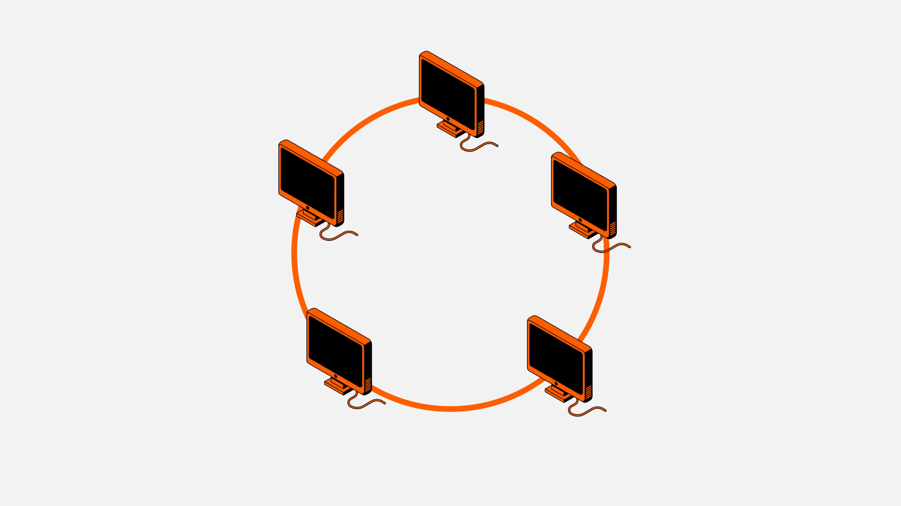


### Stablasta mreža


Stablasta mreža, ili hijerarhijska topologija, modelovana je prema strukturi porodičnog stabla. Sastoji se od uzastopnih nivoa: korenski čvor na vrhu povezuje se sa nekoliko čvorova nižeg nivoa, koji se mogu povezivati sa drugim čvorovima, i tako dalje.


Ovaj hijerarhijski raspored posebno dobro funkcioniše za velike mreže koje zahtevaju jasnu podelu odgovornosti i segmentirano upravljanje. Međutim, takođe čini mrežu ranjivom na kvarove čvorova višeg nivoa: gubitak korena ili glavne grane može odseći čitave delove infrastrukture.


### Sabirnička mreža


U sabirničkoj topologiji, svi uređaji dele isti prenosni medijum, obično koaksijalni kabl ili optičko vlakno. Svaka jedinica je pasivno povezana, što znači da ne menja aktivno signal, i može slati ili primati podatke preko ovog zajedničkog kanala.


Glavna prednost sabirničke topologije je nizak trošak instalacije, zahvaljujući pojednostavljenom kabliranju. Međutim, u starijim implementacijama zasnovanim na koaksijalnim kablovima (Ethernet 10BASE2/10BASE5), isključenje ili gubitak jedne stanice moglo bi poremetiti ili čak zaustaviti sav saobraćaj, jer električni kontinuitet sabirnice i impedansa završetka više ne bi bili održavani. Imati jedan fizički medijum je takođe kritična slabost: bilo kakav prekid ili kvar zaustavlja komunikaciju za celu mrežu.


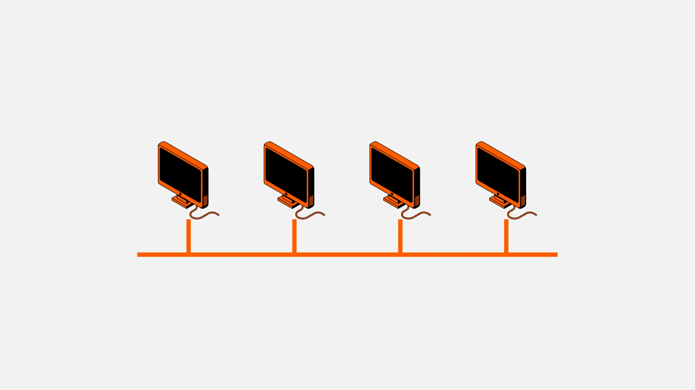


### Zvezdasta mreža


Zvezdasta topologija, takođe poznata kao "hub and spoke", danas je najčešća, posebno u kućnim i kancelarijskim Ethernet mrežama. Ovde su svi uređaji povezani na jedan centralni uređaj.


Ovaj raspored olakšava upravljanje i održavanje: ako jedan periferni uređaj zakaže, ostatak mreže ostaje nepromenjen. Nedostatak je što je centralni uređaj jedina tačka kvara: ako on prestane da radi, komunikacija se zaustavlja svuda. Kvalitet kablova i dužine veza takođe moraju biti pažljivo razmotreni kako bi se održale dobre performanse.


**Napomena**: još uvek postoje mreže organizovane u linearnoj, sabirničkoj topologiji, gde je oprema povezana jedna za drugom. Ovo rešenje, iako je jeftino za implementaciju, ima veliki nedostatak — jedan prekid može izolovati deo hostova, razdvajajući mrežu na nezavisne podskupove.

### Meš mreža


Meš mreža je dizajnirana za maksimalnu redundanciju: svaki uređaj je direktno povezan sa svakim drugim uređajem. Ovo osigurava kontinuitet usluge čak i ako više veza ili uređaja otkaže, jer se saobraćaj može preusmeriti duž alternativnih puteva.


Kompromis je u tome što broj veza koje treba uspostaviti brzo raste s brojem terminala. Za `N` priključnih tačaka, potrebno je `N × (N-1) / 2` zasebnih veza, što ovu topologiju čini skupom i složenom za implementaciju. Stoga se uglavnom koristi u kritičnim mrežama koje zahtevaju veoma visoku dostupnost, kao što su određeni delovi interneta ili osetljivi industrijski sistemi.


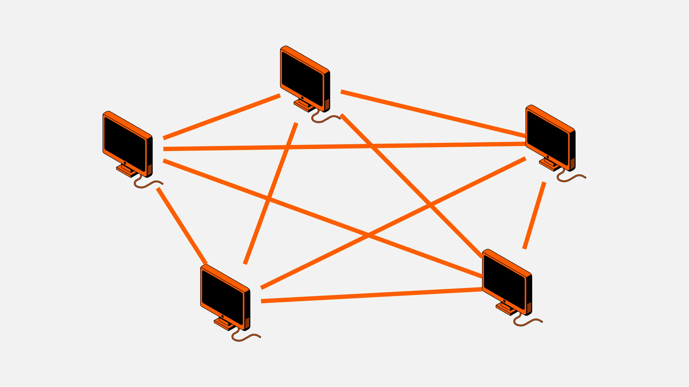


Postoje i druge varijacije, kao što su mreže u obliku rešetke ili hiperkocke, koje su dizajnirane za specijalizovane potrebe u distribuiranom računarstvu ili paralelnoj obradi.


Na globalnom nivou, Internet predstavlja ogromnu međusobnu povezanost mreža koje koriste različite topologije, ujedinjene zajedničkim adresiranjem (IPv4 i IPv6) i skupom standardizovanih protokola definisanih od strane IETF (*Internet Engineering Task Force*). Ova raznolikost znači da internet ne prati jednu jedinu topologiju: njegova struktura je fleksibilna, skalabilna i nezavisna od logičke šeme adresiranja koja ga čini upotrebljivim.


## Poreklo TCP/IP


<chapterId>266b6864-8789-48d7-bc85-001cb9f1651f</chapterId>


Poreklo TCP protokola potiče od **ARPA-e** (*Advanced Research Projects Agency*, preimenovana u "DARPA" 1972. godine), koja je pokrenula projekat **ARPANET** 1966. godine. Prvi segment ARPANET-a postao je operativan u oktobru 1969. godine, povezujući univerzitete UCLA i Stanford. Cilj je bio da se istraživački centri povežu preko paketski preklopljene mreže (eng. packet-switched network) koja bi omogućavala neprekidnu komunikaciju čak i u slučaju delimičnog kvara infrastrukture.


Kao deo ove dinamike, ARPA je finansirala Univerzitet u Berkliju da integriše prve TCP/IP protokole u svoj BSD Unix sistem. Ovo je odigralo ključnu ulogu u širenju i standardizaciji protokola, prvo u akademskom svetu, a kasnije i u industriji.


**Napomena**: u to vreme, računarski naučnici još nisu imali Linux (koji se neće pojaviti do ranih 1990-ih), niti Minix, obrazovni sistem koji je dizajnirao Andrew Tanenbaum. Glavne opcije su bile Unix, ili, ponekad, vlasnički mainframe sistemi poput OpenVMS. Zahvaljujući svojoj fleksibilnosti i otvorenosti, Unix je bio ključan u širenju prvih koncepata umrežavanja.


Strogo govoreći, TCP/IP nije jedan protokol već skup protokola izgrađen oko TCP i IP. Postao je značajan jer je obezbedio standardizovan programski interfejs za razmenu podataka između računara u istoj mreži. Ovaj interfejs, zasnovan na primitivima koji se nazivaju „socketi“, omogućio je uspostavljanje pouzdanih i fleksibilnih veza uz integraciju osnovnih aplikativnih protokola.

ARPANET je stoga istorijska osnova današnjeg interneta. Zaista, internet je globalna mreža zasnovana na principu preklapanja paketa (eng. packet switching), gde informacije cirkulišu koristeći skup standardizovanih protokola koji osiguravaju kompatibilnost i interoperabilnost između heterogenih sistema. Ova otvorena arhitektura omogućila je razvoj i implementaciju bezbrojnih usluga i aplikacija, uključujući:


- e-pošte,
- svetska mreža (www),
- prenos i deljenje fajlova...


Upravljanje i evoluciju ovih protokola nadgleda ***Internet Architecture Board*** (IAB).

Ova organizacija koordinira tehničke pravce kroz dve glavne strukture:


- **IRTF** (_Internet Research Task Force_), koja sprovodi dugoročna istraživanja o evoluciji i poboljšanju protokola.
- **IETF** (_Internet Engineering Task Force_), koja razvija, standardizuje i dokumentuje operativne protokole koji se koriste na internetu


Distribucija mrežnih resursa (opsezi IP adresa, brojevi autonomnih sistema, imena korenskih domena, itd.) koordinisana je međunarodno od strane **IANA/ICANN**. Operativno upravljanje se oslanja na: **RIR** (*Regional Internet Registries*): **RIPE NCC** (Evropa, Bliski Istok, Centralna Azija), **ARIN**, **APNIC**, **LACNIC** i **AFRINIC**.


Sve TCP/IP specifikacije protokola zabeležene su u dokumentima koji se zovu **RFC** (_Request For Comments_), koji služe kao autoritativne tehničke reference. RFC-ovi se kontinuirano ažuriraju i numerišu kako bi odražavali stalnu evoluciju skupa protokola.


TCP/IP stek se često predstavlja kao stek od četiri funkcionalna sloja, često upoređivan sa sedmoslojnim **OSI** (_Open Systems Interconnection_) modelom razvijenim od strane **ISO** (_International Standards Organization_), koji služi kao konceptualna referenca za umrežavanje.


Četiri sloja TCP/IP modela su:


- NETWORK ACCESS sloj, koji obezbeđuje fizičku vezu i protokole za kontrolu pristupa medijima;
- INTERNET sloj, koji upravlja rutiranjem i IP adresiranjem;
- TRANSPORTNI sloj, koji garantuje pouzdanost i upravljanje tokovima podataka koristeći protokole kao što su TCP ili UDP;
- APLIKATIVNI sloj, koja grupiše korisničke i softverske protokole kao što su HTTP, FTP, SMTP i DNS.


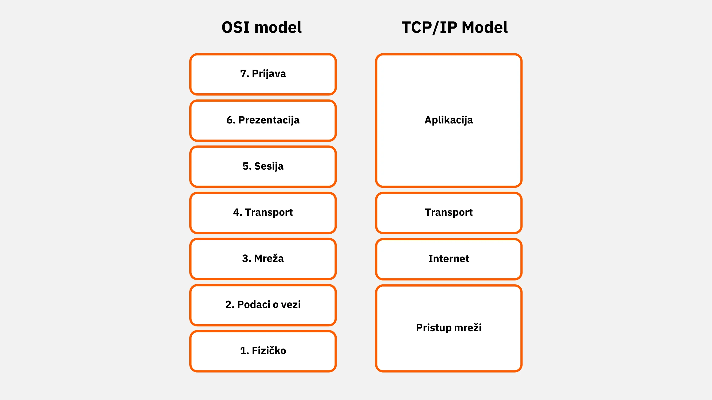


Danas je najčešće korišćena verzija IP-a IPv4, ali njegov 32-bitni adresni prostor ima jasna ograničenja. To je dovelo do stvaranja IPv6, koji koristi 128-bitno adresiranje i nudi praktično neograničen kapacitet: neophodan za podršku eksplozivnom rastu povezanih uređaja i za suočavanje sa izazovima Interneta stvari (eng.Internet of Things), mobilnosti i bezbednosti.


Svaki sloj TCP/IP steka obezbeđuje određene usluge, čime se omogućava modularno rešavanje različitih mrežnih potreba: fizički prenos, logičko adresiranje, integritet podataka i usluge na aplikativnom nivou.


| Primer uređaja         | Opis                                                                                      | 	TCP/IP sloj            |
| ---------------------- | ----------------------------------------------------------------------------------------- | ----------------------- |
| Web server             | Servisi aplikacija najbliži krajnjim korisnicima.                                         | Aplikativni             |
| Gateway ili proxy      | 	Kodira, šifruje i kompresuje korisne podatke                                             | Aplikativni             |
| Session switch         | Uspostavlja sesije između aplikacija                                                      | Aplikativni             |
| Firewall ili L4 ruter  | Uspostavlja, održava i prekida sesije između krajnjih uređaja                             | Transportni             |
| Ruter                  | Globalno adresira interfejse i određuje optimalne putanje kroz mrežu                      | Network                 |
| Switch                 | Lokalno adresira interfejse i prosleđuje saobraćaj putem MAC adrese                       | Network Access          |
| Network Interface Card (NIC)     | Kodiranje signala, kablovi, konektori i fizičke specifikacije                   | Network Access          |

https://planb.academy/tutorials/computer-security/communication/pi-hole-46a735c5-8af3-4cc3-a2c2-1d4f6a7dc428

https://planb.academy/tutorials/computer-security/operating-system/opnsense-90c2785d-a0d7-4981-be8d-d290bbeb8263

https://planb.academy/tutorials/computer-security/operating-system/pfsense-24eea96a-2fdc-42a6-a77b-89bc29149864

## IPv5 QoS protokol


<chapterId>570ded19-be61-4005-844e-9490570a6455</chapterId>


Zaglavlje IP paketa je ključna struktura podataka, podeljena na nekoliko polja, od kojih svako ima specifičnu ulogu kako bi se osiguralo da se paketi pravilno prenose i obrađuju dok putuju kroz mrežu. Ova polja uključuju odredišnu IP adresu (potrebnu za usmeravanje paketa ka njegovom nameravanom primaocu), dužinu zaglavlja označenu poljem IHL (*Internet Header Length*), ukupnu dužinu paketa zabeleženu u *Total Length field*, informacije za kontrolu i verifikaciju, i druge parametre za upravljanje protokom komunikacije i kvalitetom.


Prvo polje u zaglavlju naziva se verzija. Ova 4-bitna vrednost određuje koju verziju IP protokola paket prati. To je važno jer govori svakom ruteru ili međumrežnom uređaju kako da interpretira i obradi enkapsulirane podatke.


**Napomena**: Upravljanje i dodela verzija IP protokola spada pod nadležnost **IANA**. Polje od 4 bita omogućava 16 binarnih kombinacija (vrednosti 0 do 15). Do danas, njihova dodela je sledeća:


| Broj verzije | Protokol | Opis verzije | Referenca |
| -------------- | ---------- | --------------------------- | ----------------------- |
| 0–1 | Rezervisano | Rezervisano | |
| 2–3 | Nedodeljeno | Nedodeljeno | |
| 4 | IP | Internet protokol | RFC 791 |
| **5** | **ST** | **ST režim datagrama** | **RFC 1190** / RFC 1819 |
| 6 | IPv6 | Internet protokol verzija 6 | RFC 8200 |
| 7 | TP/IX | Sledeći internet | RFC 1475 |
| 8 | PIP | P internet protokol | RFC 1621 |
| 9 | TUBA | Tuba | RFC 1347 |
| 10–14 | Nedodeljeno | Nedodeljeno | |
| 15 | Rezervisano | Rezervisano | |

Među njima je IPv5, koji, iako uglavnom nepoznat javnosti, jeste postojao kao ST (_Stream Protocol_). Razvijen 1980-ih, IPv5 je bio dizajniran da reši rastuću potrebu tog vremena: pružanje "_Quality of Service_" (QoS) za određene tokove podataka koji su zahtevali kontinuirani, stabilni prenos, kao što su glas preko IP (engl. Voice over IP) ili multimedijalni tokovi. Njegov cilj je bio da garantuje propusni opseg i prioritet od kraja do kraja, koncept sličan onome što RSVP (_Resource Reservation Protocol_) danas nudi za dinamičko rezervisanje mrežnih resursa na modernim ruterima.


Međutim, IPv5 je ostao eksperimentalan i bio je implementiran na samo malom broju mrežnih uređaja. Njegovo ograničeno prihvatanje, u kombinaciji sa brzo rastućom potrebom za više adresnog prostora, navelo je dizajnere interneta da preskoče direktno sa IPv4 na IPv6. Ovo je izbeglo i rešavanje ograničenja IPv4 i bilo kakav rizik od konfuzije ili nekompatibilnosti sa eksperimentalnim specifikacijama IPv5.


Iako IPv5 nikada nije bio široko korišćen, odigrao je važnu ulogu u oblikovanju ranog razmišljanja o QoS-u i upravljanju saobraćajem. Danas je više istorijski marker nego radni standard.


**Podsetnik** - Protokol je skup pravila komunikacije: strukture podataka, algoritmi, formati paketa i konvencije koje omogućavaju različitim uređajima da razmenjuju informacije pouzdano i razumljivo. Servis je konkretna implementacija protokola kroz specifične programe (klijenti, serveri) koji prate ova pravila i čine funkcionalnost dostupnom korisnicima i aplikacijama.


Sada možemo detaljnije pogledati strukturu i rad IP protokola, suštinskog temelja sve mrežne komunikacije.


## IP protokol


<chapterId>758fddbd-b652-4c18-bd1e-d038bd2e4d05</chapterId>


### Definicije i opšte informacije


IP protokol, ili "***Internet protokol***", je okosnica TCP/IP modela. Prenosi pakete podataka sa jednog hosta na drugi unutar mreže — bilo da je ona lokalna ili se prostire širom sveta. Ima dve ključne uloge: upravljanje logičkim adresiranjem uređaja i osiguravanje da se paketi rutiraju kroz često heterogene i međusobno povezane mreže.


Na fizičkom nivou, prenos se zasniva na hardverskim interfejsima koji uspostavljaju veze od tačke do tačke između čvorova. Međutim, IP protokol je taj koji omogućava komunikaciju od kraja do kraja, dajući svakom paketu informacije potrebne za navigaciju kroz više mogućih puteva do odredišta.


Tri mrežne konfiguracije elemenata određuju kako se paket šalje na svoj put:


- **IP adresa**: jedinstveno identifikuje odredišni host (čvor) u mreži.
- **Maska podmreže (engl. Subnet mask)**: specificira koji deo adrese identifikuje mrežu, a koji deo identifikuje hosta, omogućavajući logičku podelu na podmreže.
- **Prelazni uređaj (engl. gateway)**: označava posrednički ruter kroz koji paket treba da prođe kako bi stigao do spoljne mreže ili drugog segmenta lokalne mreže.


Na internetu, podaci ne teku kao jedan kontinuirani tok, već se šalju kao **datagrami**: nezavisni blokovi podataka, svaki upakovan sa svim informacijama potrebnim za njihovu isporuku. Ovo je princip **komutacije paketa** (eng. packet switching), gde se informacije dele na samostalne jedinice koje mogu ići različitim putevima da bi stigle do istog primaoca.


Pored korisnog sadržaja (*payload*), svaki IP datagram sadrži strukturisano zaglavlje sa poljima kao što su odredišna adresa, izvorna adresa, tip usluge, broj verzije protokola i druge kontrolne informacije potrebne za upravljanje prenosom.


Teorijska maksimalna veličina IP datagrama je **65.536 okteta**, što je ograničenje postavljeno poljem ukupne dužine u zaglavlju. U praksi, ova veličina se retko dostiže, jer fizičke mreže koje prenose pakete (Ethernet, Wi-Fi, optička vlakna...) obično nameću stroža ograničenja poznata kao **MTU** (_Maximum Transmission Unit_). Ako datagram premašuje MTU fizičke veze, mora biti podeljen na manje pakete, od kojih se svaki šalje zasebno i ponovo sastavlja po dolasku.


Ova prilagodljivost čini IP robusnim i fleksibilnim protokolom, sposobnim da funkcioniše preko širokog spektra osnovnih tehnologija, dok održava univerzalnu kompatibilnost između heterogenih sistema i mreža.


### Fragmentacija IP datagrama


Kada IP datagram treba da prođe kroz mrežu čiji je kapacitet prenosa manji od samog datagrama, datagram mora biti **fragmentiran** kako bi mogao da putuje bez problema. Ovo fizičko ograničenje veličine naziva se **MTU** (Maximum Transmission Unit): najveća veličina okvira koja može proći kroz datu mrežu bez cepanja.


Svaka mrežna tehnologija nameće svoj MTU, određen karakteristikama njenog hardvera i protokola. Uobičajene vrednosti uključuju:


- **ARPANET**: 1000 bajtova
- **Ethernet**: 1500 bajtova
- **FDDI**: 4470 bajta


Kada datagram premaši MTU mrežnog segmenta koji treba da pređe, rutirajuća oprema će ga podeliti na manje **fragmente** koji su u skladu sa ograničenjem. Ovo se obično dešava kada se prelazi sa mreže sa visokim MTU na mrežu sa nižim kapacitetom. Na primer, datagram koji dolazi sa FDDI mreže možda će morati biti fragmentiran pre nego što bude poslat preko Ethernet segmenta.


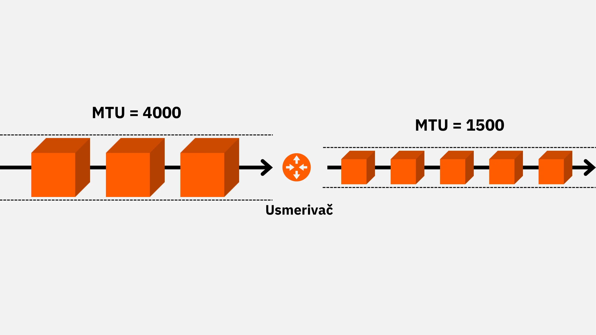


Proces fragmentacije funkcioniše ovako:


- Ruter razbija datagram na fragmente koji nisu veći od MTU ciljne mreže.
- Veličina svakog fragmenta je umnožak od 8 bajtova, jer IP protokol koristi tu jedinicu za kodiranje pomaka pri ponovnom sastavljanju.
- Svaki fragment dobija svoje IP zaglavlje, koje sadrži informacije potrebne krajnjem primaocu da ih ponovo sastavi u ispravnom redosledu.


Jednom fragmentirani, delovi putuju nezavisno kroz mrežu. Mogu uzeti različite rute, u zavisnosti od tabela rutiranja, opterećenja linkova ili prekida. Nema garancije da će stići redosledom kojim su poslati.


Po prijemu, mašina koja prima podatke obavlja **ponovno sastavljanje**. Koristeći informacije u zaglavljima (zajednički identifikator, pomak i zastavice fragmentacije), vraća fragmente u pravilan redosled kako bi rekonstruisala originalni datagram pre nego što ga prenese sledećem sloju. Ako čak i jedan fragment bude izgubljen ili oštećen, ceo datagram se obično odbacuje, bez svakog dela, rezultat bi bio nepotpun ili neupotrebljiv.


Iako efikasni, fragmentacija i ponovno sastavljanje dolaze s nedostacima: dodatna obrada za rutere i hostove, i veća šansa za gubitak paketa, što može povećati ponovna slanja. Zato su pažljivo upravljanje MTU-om i optimizacija veličine paketa važni za glatku i efikasnu IP komunikaciju.


### Enkapsulacija podataka


Da bi se osiguralo da se podaci pravilno usmeravaju kroz slojeve TCP/IP modela, proces **enkapsulacije** igra ključnu ulogu. Na svakoj fazi dok poruka putuje od aplikacije pošiljaoca do mašine primaoca, dodaju se dodatne informacije, poznate kao zaglavlja. Ova zaglavlja daju međusobnim uređajima i softverskim slojevima instrukcije koje su im potrebne za obradu, isporuku i, ako je potrebno, ponovno sastavljanje podataka.


Kada se poruka pošalje, prolazi kroz četiri sloja TCP/IP steka. Na svakom sloju, novo zaglavlje se dodaje ispred postojećih podataka: svako zaglavlje sadrži specifične metapodatke, kao što su logičke ili fizičke adrese, komunikacioni portovi, redni brojevi, zastavice za kontrolu grešaka i bilo koje informacije potrebne za upravljanje prenosom i rutiranjem.


Prenos tako prati strukturiran proces:


- Aplikacioni sloj kreira početnu **poruku**, koja sadrži neobrađene podatke.
- Transportni sloj ga enkapsulira u **segment**, dodajući izvorne i odredišne portove, brojeve sekvenci i mehanizme kontrole toka.
- Internteski sloj dodaje segmentu IP zaglavlje kako bi formirao **datagram**, navodeći izvorne i odredišne IP adrese.
- Sloj pristupa mreži obavija datagram u **frejm ili u prevodu okvir**, dodajući MAC adrese i kodove za proveru integriteta (CRC).


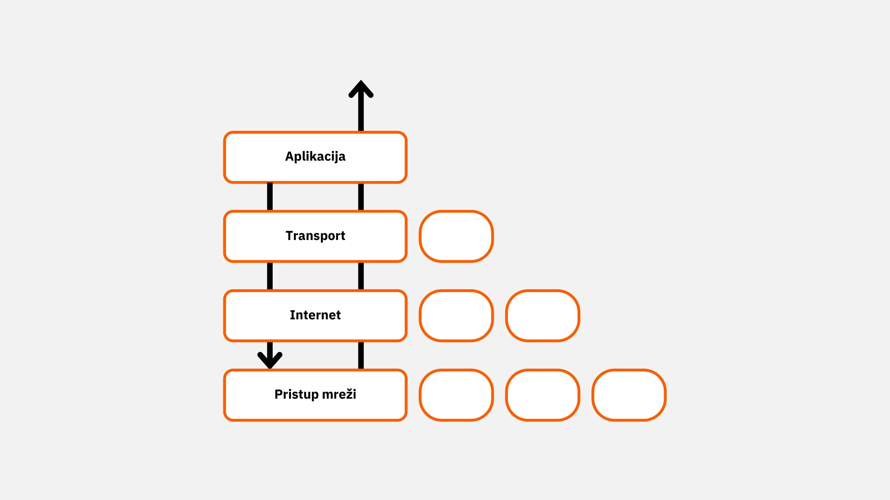


Ovaj proces enkapsulacije osigurava i integritet i sledljivost podataka, kao i njihovu prilagodljivost: prilikom prelaska sa jedne mreže na drugu, zaglavlja obezbeđuju uređajima informacije potrebne za izbor rute, proveru validnosti ili izvršavanje fragmentacije ako je potrebno.


Po dolasku, proces se obrće: prijemna mašina prima okvir sa sloja pristupa mreži, koji čita i uklanja odgovarajuće zaglavlje. Datagram se zatim prosleđuje internetskom sloju, koji čita IP zaglavlje i uklanja ga kako bi isporučio segment transportnom sloju. Transportni sloj obrađuje transportna zaglavlja, proverava integritet toka i konačno isporučuje **poruku** ciljnoj aplikaciji u njenom originalnom stanju.


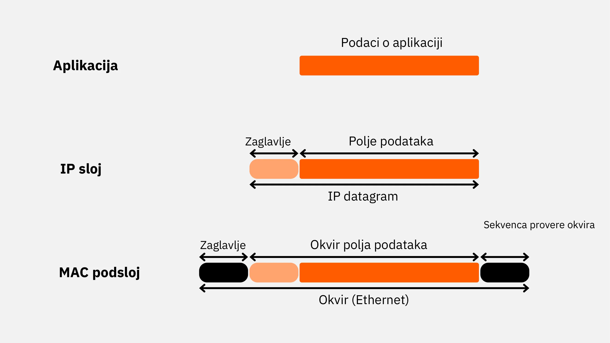


Transformacija podataka na svakom sloju može se sažeti kao:


- **Poruka**: blok informacija na aplikacionom sloju.
- **Segment**: jedinica podataka nakon enkapsulacije od strane transportnog sloja.
- **Datagram**: oblik koji se formira nakon dodavanja IP zaglavlja od strane internet sloja.
- **Frame (okvir)**: konačni blok spreman za prenos preko fizičkog medijuma putem sloja za pristupa mreži.


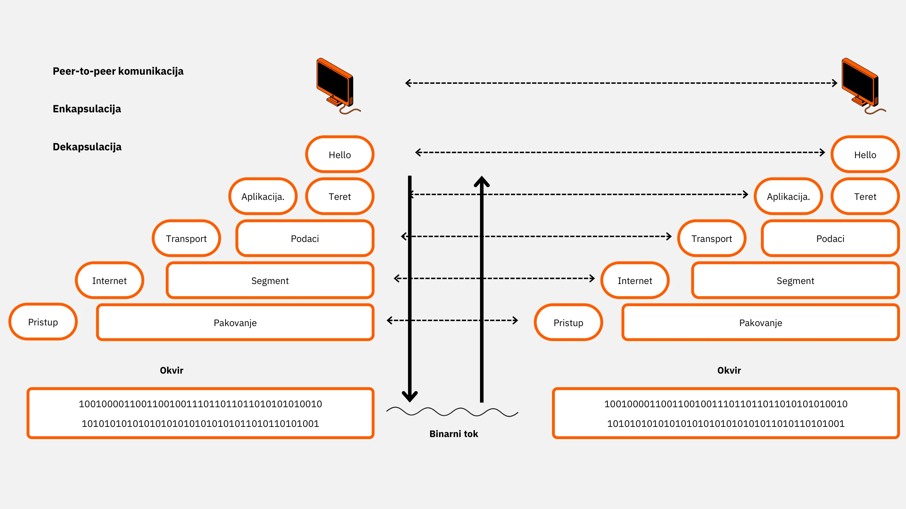


Ovaj proces, koji je ključan za pouzdanost i univerzalnost internet komunikacija, osigurava da svaki deo podataka, bez obzira koliko fragmentiran ili složen, može biti prenesen od početka do kraja, ostajući razumljiv i upotrebljiv za mašinu koja ih prima.


### IP adresiranje


Čak i sa komutacijom paketa, fragmentacijom i enkapsulacijom, mreža i dalje ne bi mogla funkcionisati bez pouzdanog sistema adresiranja. Da bi se osiguralo da svaki paket podataka stigne do pravog primaoca, internet sloj koristi jedinstveni identifikator: **IP adrese**.

U IPv4, IP adresa je kodirana sa **32 bita** i napisana kao četiri decimalna broja odvojena tačkama, u poznatom formatu N1.N2.N3.N4 (na primer: 192.168.1.12).


IP adresa ima dva dela:


- **netid**: identifikuje mrežu kojoj host pripada
- **hostid**: identifikuje specifičnog domaćina unutar te mreže

Ova separacija omogućava da globalni internet bude logički strukturiran u mnoge međusobno povezane mreže.


Istorijski gledano, IPv4 sistem se oslanjao na šemu zasnovanu na klasama, označenim od A do E, koja je definisala opseg adresa i njihovu namenu. Svaka klasa je dodeljivala određen broj bitova _netid_-u i _hostid_-u, što je direktno uticalo na mogući broj mreža i hostova.


| **Klasa** | **Opseg IPv4 adresa**            | **Namena**                  |
| --------- | --------------------------------- | ---------------------------- |
| A         | 1.x.x.x do 126.x.x.x              | Unicast adrese               |
|           | (127.x.x.x rezervisano za loopback)| Lokalni loopback          |
| B         | 128.0.x.x do 191.255.x.x          | Unicast adrese               |
| C         | 192.0.0.x do 223.255.255.x        | Unicast adrese               |
| D         | 224.0.0.0 do 239.255.255.255      | IP Multicast                 |
| E         | 240.0.0.0 do 255.255.255.255      | Rezervisano za eksperimentisanje |

Nije moguće dodeliti sve moguće vrednosti hostovima. Na primer, u **klasi C** adresa, poslednji bajt nudi 8 bita (256 vrednosti). Ali dve od njih su rezervisane:


- 0: identifikuje samu mrežu
- 255: je **broadcast** adresa, koristi se za slanje paketa svim hostovima u mreži odjednom.

To ostavlja 254 upotrebljive adrese za uređaje.


Broj dostupnih adresa značajno varira između klasa: od velikih javnih mreža u klasi A, preko korporativnih mreža u klasi B, do manjih lokalnih mreža u klasi C.


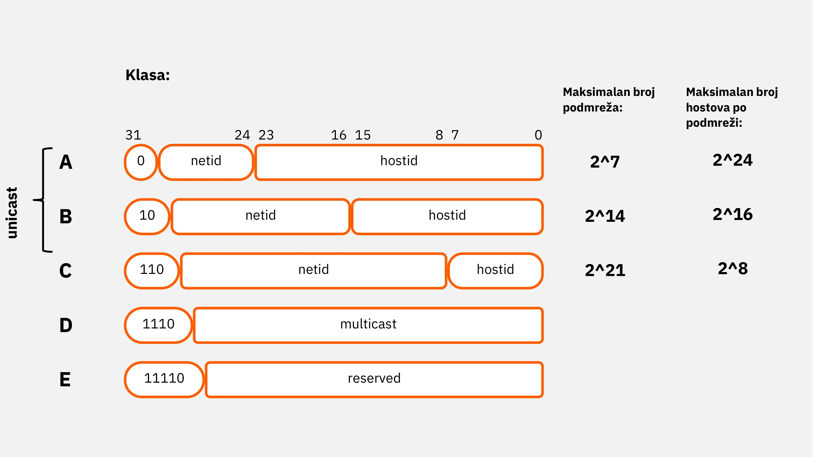


Neki opsezi adresa su rezervisani za privatnu upotrebu i nikada se ne rutiraju direktno na internetu. Oni su poznati kao **privatne adrese**, i koriste se unutar organizacija, preduzeća ili domova, i zahtevaju prevod adresa, obično NAT (*Network Address Translation*), da bi se došlo do javnog interneta. To su:


- **Klasa A**: od 10.0.0.0 do 10.255.255.255
- **Klasa B**: od 172.16.0.0 do 172.31.255.255
- **Klasa C**: od 192.168.0.0 do 192.168.255.255


Kada uređaj sa privatnom adresom pristupa internetu, ruter ili mrežni prolaz (eng. gateway) sa omogućenim NAT-om zamenjuje ga važećom javnom adresom.


Primer: Ako host ima adresu **192.168.7.5**, možemo zaključiti:


- 192.168.7.0: mrežna adresa
- 192.168.7.1: često lokalni ruter
- 192.168.7.5: sam host


Još jedan poseban slučaj je **127.0.0.1**, poznat kao "***loopback***".

Na Linux sistemima, to je povezano sa interfejsom **lo**. Ova adresa omogućava mašini da adresira samu sebe za lokalno testiranje ili dijagnostiku, bez prolaska kroz fizički interfejs. Čitav opseg **127.0.0.0/8** je rezervisan za ovu svrhu.


Da bi se optimizovala upotreba adresa i dizajnirale složene mreže, **subnetmask** (_netmask_) je esencijalna. Ova binarna maska odvaja _netid_ od _hostid_ u IP adresi.

Svaka klasa ima podrazumevanu masku:


- **255.0.0.0** za klasu A,
- **255.255.0.0** za klasu B,
- **255.255.255.0** za klasu C.


Dobar dizajn mreže prati osnovno pravilo: uređaji koji moraju direktno komunicirati trebaju biti u istoj mreži ili podmreži. Za segmentaciju mreže koristimo subnetiranje, deljenje mreže na manje podmreže korišćenjem specifičnije maske.


Primer podmreže:

Mreža **klase C**: 192.168.1.0/24 sa podrazumevanom maskom 255.255.255.0.

Želimo 4 podmreže sa do 60 hostova svaka.


**Korak 1**: Broj adresa potrebnih po podmreži = 60 + 2 rezervisane adrese (mrežna + broadcast) = 62.


**Korak 2**: Pronađi najbliži stepen 2 ≥ 62. ->  2⁶ = 64.


**Korak 3: Podesite masku. Zadržite _netid_ bitove i rezervišite potrebne _hostid_ bitove. Dobijamo binarnu masku koja, kada se konvertuje, daje** 255.255.255.192.


```
11111111 11111111 11111111 11000000
```


**Korak 4**: Izračunajte opsege adresa za svaki podmrežni segment, menjajući broj bita rezervisanih za hosta.


| ID podmreže (bitovi) | Adresa podmreže | Maska podmreže | Opseg adresa              | Broadcast adresa |
| ---------------- | ---------------- | --------------- | ----------------------------- | ----------------- |
| 00               | 192.168.1.0/26   | 255.255.255.192 | 192.168.1.1 – 192.168.1.62    | 192.168.1.63      |
| 01               | 192.168.1.64/26  | 255.255.255.192 | 192.168.1.65 – 192.168.1.126  | 192.168.1.127     |
| 10               | 192.168.1.128/26 | 255.255.255.192 | 192.168.1.129 – 192.168.1.190 | 192.168.1.191     |
| 11               | 192.168.1.192/26 | 255.255.255.192 | 192.168.1.193 – 192.168.1.254 | 192.168.1.255     |

**Korak 5**: Ovo kreira četiri podmreže, od kojih svaka podržava do 62 mašine, dok se celokupna šema adresiranja održava efikasnom. Deo _hostid_ je podeljen na deo _subnetid_ i deo za host.


Ovaj fundamentalni princip subnetovanja ostaje nezamenljiv u modernom mrežnom inženjeringu, omogućavajući preciznu IP dodelu, bolju kontrolu saobraćaja, snažnu izolaciju segmenata i skalabilno upravljanje mrežom.


### CIDR adresiranje


Početkom 1990-ih, kako se internet brzo širio kroz preduzeća i organizacije, tradicionalni sistem IP adresiranja zasnovan na klasama (A, B, C) počeo je da pokazuje svoja ograničenja.

Njegova rigidna struktura dovela je do značajnog rasipanja IP adresa i učinila tabele rutiranja sve većim, složenijim i težim za održavanje.

Da bi se rešili ovi problemi sa adresama, uvedena je fleksibilnija i efikasnija metoda: **CIDR** (_Classless Inter-Domain Routing_). CIDR je postepeno postao standard, uglavnom zamenjujući stari sistem zasnovan na klasama.


Osnovna ideja iza CIDR-a je mogućnost grupisanja nekoliko susednih mreža, posebno blokova klase C, u jednu logičku jedinicu koja se zove **supermreža** (_supernet_). Sa ovom agregacijom, jedan unos u tabeli rutiranja može predstavljati više podmreža, smanjujući broj ruta koje ruteri moraju da obrađuju i poboljšavajući njihov učinak.


Iako su mreže klase C u početku imale najveću potrebu za agregacijom zbog svog manjeg kapaciteta, princip je takođe primenjen na mreže klase B i, u teoriji, čak i na mreže klase A, iako su ove poslednje manje pogođene zahvaljujući svom velikom opsegu adresa.


Sa CIDR-om, koncept fiksnih klasa nestaje. Prostor adresa tretira se kao kontinuirani raspon koji se može deliti ili agregirati po potrebi. CIDR blokovi se definišu korišćenjem subnet maski koje nisu ograničene na podrazumevane A, B ili C klase. CIDR blok može predstavljati ili jednu mrežu ili kontinuirani skup podmreža koje dele isti prefiks.


CIDR blok je napisan u formatu "adresa/prefix", gde broj posle kose crte označava koliko bitova čini mrežni deo. Na primer, /17 znači da prvih 17 bitova identifikuje mrežu, dok preostalih 15 bitova identifikuje hostove.


Primer:

Blok A /17 sadrži 2^(32-17) adresa, tako da 2^15 = 32,768 ukupnih adresa. Oduzimanjem dve rezervisane adrese (mrežna i broadcast) ostaje 32,766 upotrebljivih adresa za hostove. Ovo omogućava mrežnim administratorima da precizno dimenzionišu svoje podmreže kako bi odgovarale stvarnim potrebama, izbegavajući nepotrebno rasipanje.


Da bi CIDR veličine bile lakše za razumevanje, evo tabele uobičajenih prefiksa i njihovih ekvivalentnih maski podmreže i upotrebljivih adresa:


| CIDR prefiks | Dostupni host bitovi | Maska podmreže | Upotrebljive host adrese |
| ----------- | ------------------- | --------------- | ----------------------------- |
| /8          | 24                  | 255.0.0.0       | 2^24 - 2 = 16,777,214         |
| /12         | 20                  | 255.240.0.0     | 2^20 - 2 = 1,048,574          |
| /16         | 16                  | 255.255.0.0     | 2^16 - 2 = 65,534             |
| /20         | 12                  | 255.255.240.0   | 2^12 - 2 = 4,094              |
| /24         | 8                   | 255.255.255.0   | 2^8 - 2 = 254                 |
| /26         | 6                   | 255.255.255.192 | 2^6 - 2 = 62                  |
| /27         | 5                   | 255.255.255.224 | 2^5 - 2 = 30                  |
| /28         | 4                   | 255.255.255.240 | 2^4 - 2 = 14                  |
| /29         | 3                   | 255.255.255.248 | 2^3 - 2 = 6                   |
| /30         | 2                   | 255.255.255.252 | 2^2 - 2 = 2                   |
| /31         | 1                   | 255.255.255.254 | 2^1 = 2 (samo point-to-point) |
| /32         | 0                   | 255.255.255.255 | 1 (samo host adresa)         |

**NAPOMENA**: Istorijski gledano, RFC 950 je obeshrabrivao korišćenje subnet nule, uglavnom da bi se izbegla konfuzija u rutiranju. Ovo ograničenje je postalo zastarelo sa RFC 1878, koji u potpunosti dozvoljava njegovo korišćenje. Staro ograničenje je uglavnom bilo zbog nekompatibilnosti sa starijim hardverom koji nije mogao pravilno da rukuje sa CIDR. Moderna oprema nema takav problem.


Na primer, podmreža **1.0.0.0** sa maskom podmreže **255.255.0.0**, koja je nekada bila dvosmislena sa identifikatorom mreže klase A, sada je potpuno validna i upotrebljiva.


**SAVET**: za proračune podmreža bez grešaka i brzu konverziju adresa u CIDR notaciju, postoje korisni alati kao što je ***ipcalc***. Ovaj "mrežni kalkulator" jasno prikazuje raspodelu adresa, dostupne opsege i pridružene maske, idealno za administratore i studente koji uče CIDR.


```shell
sudo apt install ipcalc
```


https://planb.academy/tutorials/computer-security/communication/angry-ip-scanner-47f7c943-53b7-4098-b167-4cec8e747b5d

## TCP protokol


<chapterId>860bf7d5-a502-4d10-a12c-9827f6c2d393</chapterId>


**TCP protokol** (_Transmission Control Protocol_) igra centralnu ulogu u TRANSPORT-nom sloju TCP/IP modela. Deluje kao most između aplikacija i internet sloja, osiguravajući pouzdan prenos podataka između dve udaljene mašine.

Dok IP protokol jednostavno šalje pakete bez garancije isporuke ili redosleda, TCP osigurava integritet i konzistentnost toka podataka, isporučujući ga bez gubitaka, u ispravnom redosledu i bez duplikata.


Glavne odgovornosti TCP-a uključuju:


- Preuređivanje primljenih segmenata;
- Praćenje protoka podataka kako bi se izbegla zagušenja;
- Razdvajanje ili ponovno sastavljanje blokova podataka u odgovarajuće jedinice (segmente);
- Upravljanje uspostavljanjem i prekidom veza između oba kraja komunikacije.


TCP je protokol zasnovan na vezi, što znači da uspostavlja eksplicitnu, stalnu vezu između klijenta i servera. Da bi to postigao, koristi **sekvencijalne brojeve** i **potvrde**: za svaki poslati segment dodeljuje se jedinstveni identifikator kako bi primajuća mašina mogla da proveri redosled i integritet podataka. Primalac zatim vraća segment potvrde sa **ACK zastavicom** postavljenom na 1, potvrđujući prijem i ukazujući na sledeći očekivani sekvencijalni broj.


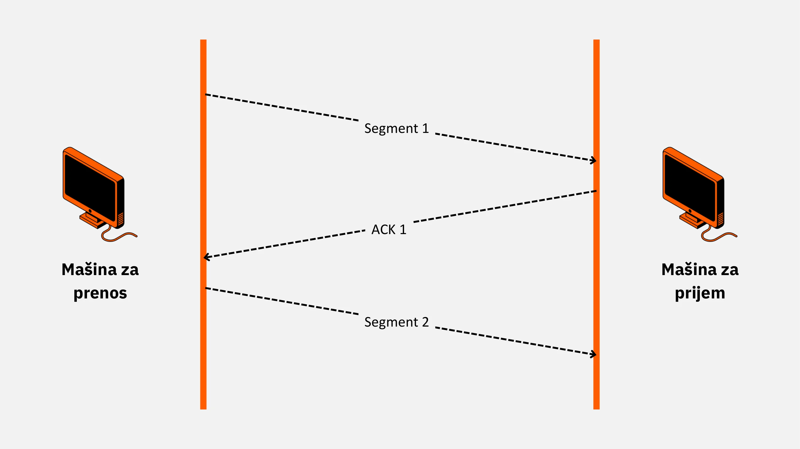


Da bi se poboljšala pouzdanost, TCP koristi tajmer: kada se segment pošalje, počinje odbrojavanje. Ako potvrda ne stigne u okviru perioda isteka, pošiljalac automatski ponovo šalje segment, pretpostavljajući da je izgubljen tokom prenosa. Ovaj mehanizam automatskog ponovnog slanja nadoknađuje gubitke svojstvene IP mrežama, koji se mogu desiti u slučajevima zagušenja, grešaka u rutiranju ili kvarova hardvera.


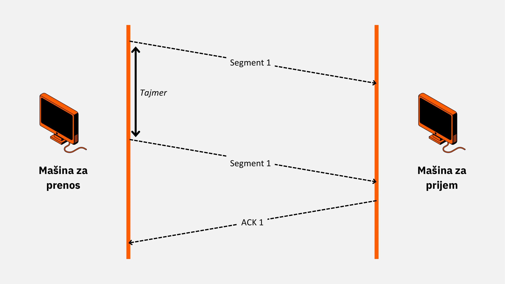


TCP može da detektuje i obradi duplikate. Ako retransmitovani segment stigne, ali se pojavi i original, primalac koristi redne brojeve da identifikuje duplikat i zadrži samo ispravnu kopiju, eliminišući svaku nejasnoću.


Da bi ovaj proces funkcionisao, obe mašine moraju deliti zajedničko razumevanje svojih početnih sekvencijalnih brojeva. Ovo se obezbeđuje praćenjem striktne procedure povezivanja: s jedne strane, **server** osluškuje na specifičnom portu, čekajući dolazni zahtev (pasivni režim); s druge strane, **klijent** aktivno inicira vezu slanjem zahteva serveru na istom servisnom portu.


**NAPOMENA**: "Port" je numerički identifikator (od 0 do 65.535) dodeljen mrežnoj aplikaciji na računaru. Koristi se za razlikovanje više servisa koji istovremeno rade na istoj IP adresi. Kada klijent šalje podatke, navodi broj porta kako bi operativni sistem servera znao kojem programu treba da ih prosledi (npr. 80 za HTTP, 443 za HTTPS, 25 za SMTP). Portovi funkcionišu kao posvećena vrata, usmeravajući saobraćaj unutra i napolje, sprečavajući zabunu između servisa i omogućavajući preciznu kontrolu pristupa putem firewall-a ili pravila filtriranja.


Razmena sinhronizacije sekvenci zasnovana je na čuvenom mehanizmu **"*three-way handshake*"** ili u prevodu trostruko rukovanje, sličnom načinu na koji se dve osobe pozdravljaju kako bi uspostavile kontakt. Ova faza inicijalizacije, koja osigurava pouzdanost TCP-a, odvija se u 3 faze:

1. **SYN:** Klijent šalje početni segment za sinhronizaciju (**SYN**) sa odgovarajućom postavljenom zastavicom i početnim rednim brojem (npr., C);

2. **SYN-ACK:** Server koji prima odgovara segmentom potvrde (**SYN-ACK**), potvrđuje klijentov redni broj i pruža svoj početni redni broj;

3. **ACK:** Klijent šalje konačnu potvrdu (**ACK**) potvrđujući prijem serverovog rednog broja, čime se završava sinhronizacija. Zastavica SYN je sada onemogućena, a zastavica ACK ostaje postavljena, što ukazuje da je veza uspostavljena.


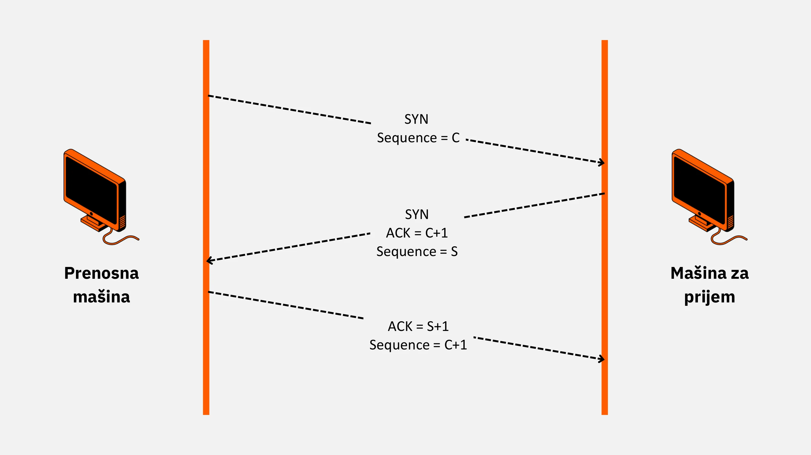


Ovaj protokol razmene osigurava da obe strane koriste istu osnovu numerisanja pre slanja podataka. Kada je ova sinhronizacija završena, sesija se otvara: segmenti sada mogu putovati u oba smera, svaki se potvrđuje po prijemu, čime se osigurava maksimalna pouzdanost protoka podataka.


Ovo ***trostruko rukovanje*** odnosi se samo na uspostavljanje veze. Za zatvaranje, TCP koristi *četvorostruko rukovanje*: FIN → ACK → FIN → ACK, što garantuje da nijedan segment u tranzitu nije izgubljen pre nego što se veza potpuno prekine.


Iako je dizajniran za robusnost i pouzdanost, ovaj proces je takođe doveo do ranjivosti koje se mogu iskoristiti. Na primer, napadi kao što je **IP Spoofing** imaju za cilj da zaobiđu ili naruše ovaj odnos poverenja predstavljajući se kao ovlašćena mašina putem falsifikovanih sekvencijalnih brojeva, stvarajući proboj koji omogućava presretanje ili manipulaciju tokova podataka.


Da bi se ograničili rizici otmice sinhronizacije sekvenci i upravljalo opterećenjem mreže, TCP protokol koristi tehniku upravljanja protokom poznatu kao "**_Sliding Window_**". Ovaj sistem reguliše koliko podataka može biti poslato bez potrebe za trenutnim potvrđivanjem svakog segmenta, čime se smanjuje nepotrebno opterećenje mreže uz održavanje dobre pouzdanosti.


U praktičnim terminima, klizni prozor definiše opseg sekvencijalnih brojeva koji mogu slobodno cirkulisati između pošiljaoca i primaoca bez da svaki pojedinačni segment bude potvrđen. Kako potvrde stižu do sistema koji šalje, prozor se "kliza": kliza se udesno praveći prostor za slanje novih segmenata. Veličina ovog prozora (kritična za optimizaciju protoka dok se izbegava zagušenje) je specificirana u polju "*Window*" TCP zaglavlja.


**Primer**: ako je početni broj sekvence 3 i prozor se proteže do sekvence 5, segmenti numerisani od 3 do 5 mogu biti poslati bez čekanja na pojedinačne potvrde.


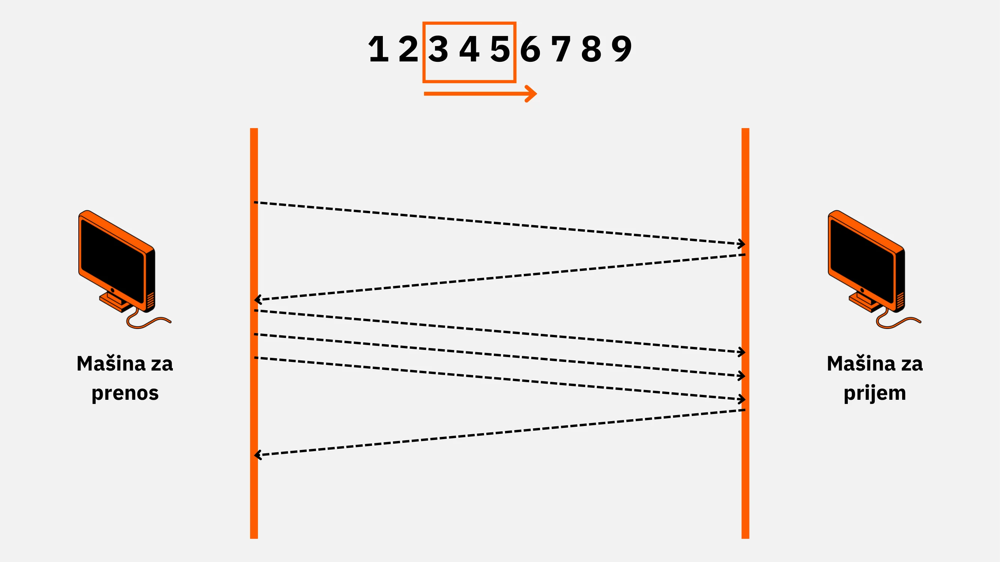


Veličina kliznog prozora nije fiksna; prilagođava se dinamički uslovima mreže i kapacitetu obrade prijemnika. Ako prijemnik može da obradi veći obim podataka, to naznačava kroz polje Window, podstičući pošiljaoca da proširi svoj prozor. Suprotno tome, u slučaju preopterećenja ili rizika od zasićenja, prijemnik može zatražiti smanjenje, pošiljalac će čekati dok se prozor ne pomeri napred da pošalje dodatne segmente.


Protokol obezbeđuje simetričnu proceduru za zatvaranje TCP veze kako bi se osiguralo čisto i uredno gašenje. Bilo koja mašina može inicirati zatvaranje slanjem segmenta sa postavljenom **FIN** zastavicom na 1, signalizirajući svoju nameru da prekine komunikaciju. Zatim čeka dok svi segmenti u tranzitu ne budu primljeni i ignoriše sve daljnje podatke.


Po prijemu ovog segmenta, druga mašina šalje potvrdu, takođe označenu sa FIN zastavicom. Zatim završava slanje svih preostalih podataka pre nego što obavesti lokalnu aplikaciju da je veza zatvorena. Ova dvostruka potvrda osigurava uredno gašenje i minimizira rizik od gubitka podataka.


Ovo precizno upravljanje, koje kombinuje fleksibilno rutiranje IP-a sa strogom kontrolom TCP-a, često se ilustruje dijagramom koji kontrastira brzinu IP protokola (koji radi na osnovu **"najboljeg truda"**, bez garancije isporuke) naspram pouzdanosti TCP protokola (koji upravlja prenosom putem potvrda i dogovorenih sekvenci).


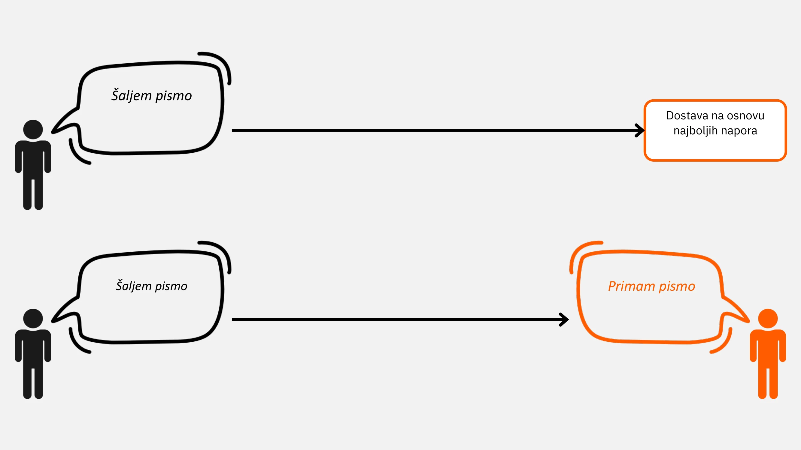


U nekim slučajevima, međutim, apsolutna pouzdanost nije prioritet: brzina i jednostavnost jesu. Ovo važi za aplikacije kao što su live streaming ili VoIP, koje mogu tolerisati određeni gubitak paketa bez ozbiljnog uticaja na korisničko iskustvo. U takvim slučajevima, **UDP** (_User Datagram Protocol_) je preferiran.


UDP radi na fundamentalno drugačijem principu od TCP-a: on je **bez konekcije**, što znači da se ne uspostavlja prethodni odnos između pošiljaoca i primaoca. Kada mašina šalje pakete putem UDP-a, oni se prenose u jednom pravcu; primalac ne šalje potvrde, a pošiljalac nema potvrdu da je poruka stigla. UDP zaglavlje je namerno minimalno, sadrži samo izvorni port, odredišni port, dužinu segmenta i kontrolni zbir, bez ugrađenog mehanizma za potvrdu ili kontrolu stanja. Kao i uvek, IP adrese se prenose putem osnovnog IP zaglavlja.


Uobičajena analogija je da je TCP kao **telefonski poziv**, gde se uspostavlja veza koja se prati i kontroliše tokom celog razgovora. Dok je UDP protokol kao **slanje pošte**, gde pošiljalac ubacuje pismo u poštansko sanduče bez trenutnog dokaza o isporuci ili sistematske povratne informacije.


Ova komplementarnost između TCP i UDP omogućava modernim mrežama da se prilagode različitim potrebama, birajući maksimalnu pouzdanost ili prioritizaciju brzine, u zavisnosti od aplikacije.


## Servisni primitivi


<chapterId>4480afb7-e950-4ccb-88fa-d132f9dc3479</chapterId>


### Slojevita arhitektura i organizacija razmene


Kao što smo videli, **servisi** su konkretna implementacija protokola koje smo do sada opisali. Iako se TCP/IP model razlikuje od **OSI** modela, usvaja isti slojeviti pristup: svaki sloj je dizajniran da obavlja specifičnu funkciju i da pruža **servise** sloju direktno iznad njega, što rezultira modularnom, robusnom i lako održivom arhitekturom.


Svaki sloj se nadovezuje na mogućnosti sloja ispod sebe i zauzvrat obezbeđuje sloju iznad sebe dosledan interfejs za upravljanje podacima. U ovoj arhitekturi, svaki sloj ima svoje **strukture podataka**, pažljivo definisane kako bi se osigurala savršena kompatibilnost sa ostalim slojevima. Ova kompatibilnost je ključna za glatku, pouzdanu i jasnu komunikaciju od jedne krajnje tačke do druge.


Dva ključna aspekta upravljaju ovim razmenama:


- **Vertikalni aspekt**: odnos između jednog sloja i onog iznad ili ispod njega (od sloja N do sloja N+1, i obrnuto).


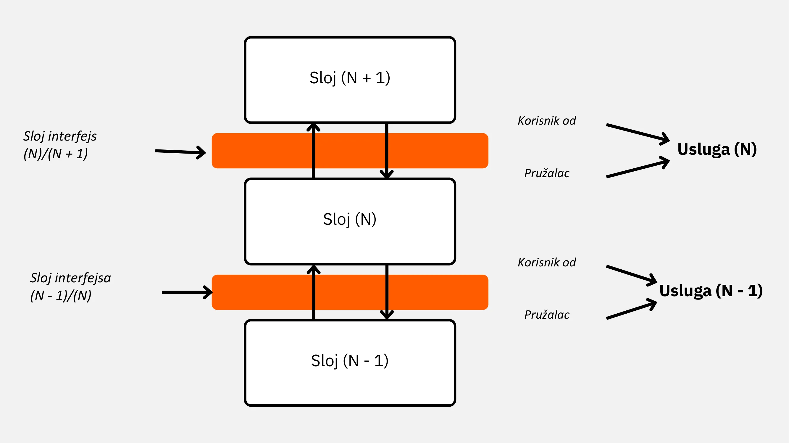


- **Horizontalni aspekt**: interakcija između udaljenih aplikacija, tj. dijalog između **klijenta** i **servera**, u oba smera.


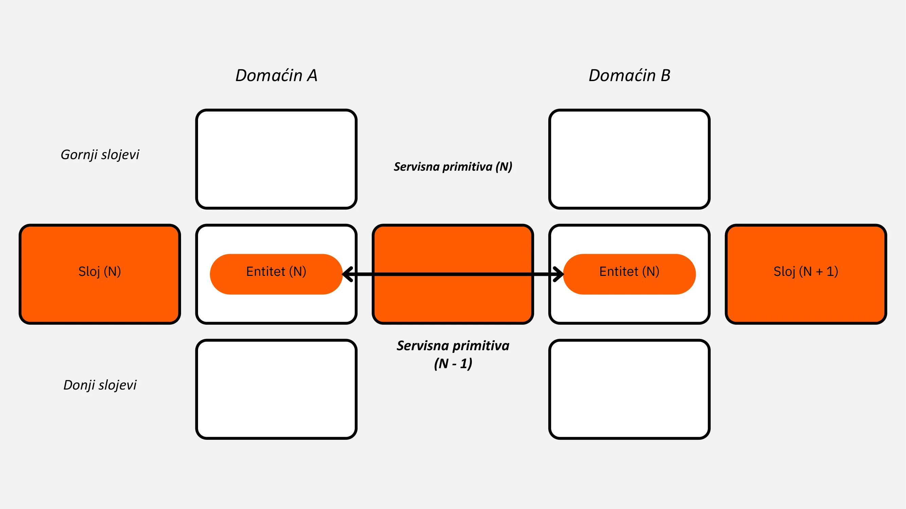


Slojevita arhitektura prati princip da svaki sloj obrađuje samo informacije unutar svog opsega: strukture podataka, zaglavlja i kontrolni mehanizmi variraju od jednog sloja do drugog, ali zajedno formiraju koherentan sistem, osiguravajući da se podaci postepeno usmeravaju ka svojoj konačnoj destinaciji.


**Podsetnik**: Specifična terminologija se koristi za opisivanje jedinica podataka razmenjenih između slojeva:


- **poruka** za aplikativni sloj,
- **segment** za transportni sloj (TCP),
- **datagram** za internet sloj (IP),
- **okvir** za sloj pristupa mreži.


Tabela ispod rezimira termine za TCP i UDP kontekste:


| TCP/IP sloj          | Naziv jedinice (TCP) | Naziv jedinice (UDP) |
|----------------------|------------------|------------------|
| Aplikacioni sloj     | Tok              | Poruka           |
| Transportni sloj     | Segment          | Paket            |
| Internet sloj        | Datagram         | Datagram         |
| Sloj mrežnog pristupa | Okvir           | Okvir            |

### Servisni primitivi i jedinice podataka


U srži ovog sistema su **servisni primitivi**, koje deluju kao komunikacioni interfejsi. Ovi primitivi funkcionišu poput servisnih pultova, osluškujući na rezervisanim specifičnim **portovima** i omogućavajući procesima da uspostave, održavaju i prekidaju mrežne veze na kontrolisan način. Dok protokoli organizuju format i prenos podataka preko mreže, **servisi i njihovi primitivi** obezbeđuju vertikalnu vezu između slojeva.


Kombinovanjem horizontalnog aspekta (komunikacija između distribuiranih aplikacija) sa vertikalnim aspektom (unutrašnje interakcije između slojeva), TCP/IP model pruža kompletnu, skalabilnu arhitekturu. Preklapanje ovih dveju perspektiva daje jasan pregled kako se podaci razmenjuju u strukturisanoj mrežnoj komunikaciji.


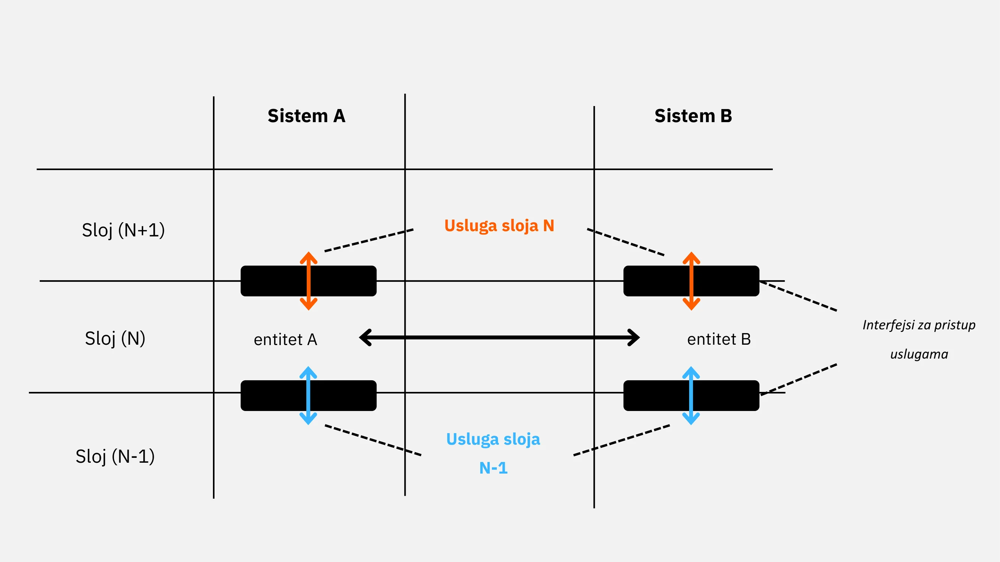


### Deo rezimea


U ovom prvom glavnom delu, istražili smo osnovnu arhitekturu koja upravlja konfiguracijom i radom današnjih mreža povezanih na internet. Ova arhitektura je zasnovana na **modelu sa četiri sloja**, inspirisanom OSI modelom, i izgrađena oko **TCP/IP** protokolnog skupa, kičme modernih komunikacija. Videli smo da TCP, sa svojim pristupom orijentisanim na vezu, obezbeđuje pouzdane prenose, dok se UDP, lakši i brži, preferira kada je brzina važnija od pouzdanosti.


Pravilno funkcionisanje ovog modela oslanja se na implementaciju protokola putem **servisnih primitiva**. Oni obezbeđuju vezu između slojeva, omogućavajući da se obrada podataka prilagodi specifičnim zahtevima svakog nivoa, od transporta do aplikacije, uključujući pristup internetu i mreži. Ovaj modularni pristup čini sistem i fleksibilnim i robusnim.


IP adresiranje je još jedan kamen temeljac ove infrastrukture. Svaki povezani uređaj je identifikovan jedinstvenom **IP adresom**, uzetom iz prostora adresa organizovanog u **klase** (od A do E). Neke od ovih adresa su rezervisane za posebne svrhe, kao što su lokalni loopback ili multicast, dok se druge, poznate kao "privatne adrese", ne rutiraju preko interneta bez prevođenja (NAT). Ova klasifikacija omogućava logičnu, hijerarhijsku organizaciju mreža.


Takođe smo ispitali koncept **podmreža**, što omogućava podelu segmenata mreže kako bi se bolje upravljalo IP resursima i optimizovao protok podataka. Iako ručna podela korišćenjem maski podmreže ostaje važan princip, u velikoj meri je modernizovana zahvaljujući **CIDR** (_Classless Inter-Domain Routing_). Ova metoda je transformisala upravljanje adresama omogućavajući fleksibilniju i racionalniju dodelu IP opsega, dok istovremeno smanjuje veličinu tabela rutiranja.


Savladavanjem ovih pojmova - slojevi, protokoli, servisni primitivi, adresiranje i subnetiranje - stičete čvrstu osnovu za razumevanje tehničkog funkcionisanja modernih mreža i za efikasno konfigurisanje mrežne infrastrukture kako bi se zadovoljile današnje potrebe.


U sledećem odeljku, detaljnije ćemo pogledati IPv4 adresiranje.


# IPv4 adresiranje


<partId>83f3c3e5-378c-440f-a095-df210842efde</partId>


## Korišćenje IPv4


<chapterId>79e4dd18-446a-435b-9f25-c88a00f8bec6</chapterId>


U ovom odeljku ćemo detaljnije pogledati kako su **IPv4** adrese zapravo implementirane u mreži stvarnog sveta. Razložićemo njihov format, logiku iza njih i kako se povezuju sa drugim ključnim mrežnim elementima kao što su **DNS imena**, **MAC adrese**, **podmreže** i **tehnike prevođenja**.


IP adresa je jedinstveni numerički identifikator dodeljen svakom **mrežnom interfejsu** na uređaju. Omogućava lociranje ovog uređaja unutar mreže i pristup njemu radi prenosa podataka. Na primer, ruter, server, radna stanica, mrežni štampač ili čak nadzorna kamera imaju bar jednu svoju IP adresu. IP adresa omogućava **rutiranje**, tj. premeštanje paketa sa tačke A do tačke B, čak i ako su fizički udaljeni.


IP adrese mogu biti dodeljene na dva glavna načina:


- **Statički**: Ručno postavljene na uređaju.
- **Dinamički**: Automatski dodeljena adresa po potrebi od strane DHCP (_Dynamic Host Configuration Protocol_) servera. DHCP pojednostavljuje upravljanje mrežom, eliminišući potrebu za ručnom konfiguracijom dok omogućava preciznu kontrolu putem rezervacija i trajanja zakupa.


**IPv4** adrese su napisane u formatu od **32 bita** podeljenom na **četiri bajta**. Svaki bajt sadrži 8 bita i predstavlja decimalni broj od 0 do 255. Četiri bajta su odvojena tačkama kako bi se formirala jasna, čitljiva notacija.


primer: adresa 172.16.254.1_


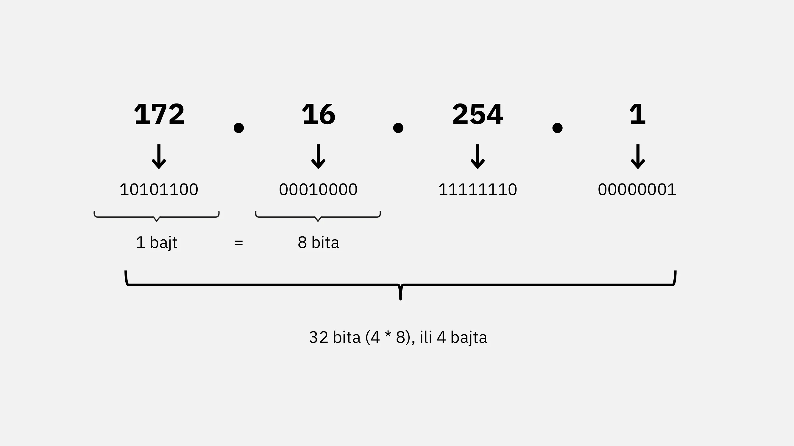


Svaki bit u bajtu ima vrednost (ili "težinu"): levi bit (najznačajniji bit) vredi 128, sledeći 64, zatim 32, 16, 8, 4, 2 i 1 za desni bit (najmanje značajan bit). Na ovaj način, binarno pisanje se konvertuje u decimalno prostim sabiranjem postavljenih težina.


Tabela ispod ilustruje ovu korespondenciju:


| Binarni kod | Aktivirane vrednosti bitova   | Decimalna vrednost |
|-------------|-------------------------------|---------------|
| 00000000    | 0                             | 0             |
| 00000001    | 1                             | 1             |
| 00000011    | 1 + 2                         | 3             |
| 00000111    | 1 + 2 + 4                     | 7             |
| 00001111    | 1 + 2 + 4 + 8                 | 15            |
| 00011111    | 1 + 2 + 4 + 8 + 16            | 31            |
| 00111111    | 1 + 2 + 4 + 8 + 16 + 32       | 63            |
| 01111111    | 1 + 2 + 4 + 8 + 16 + 32 + 64  | 127           |
| 11111111    | 1 + 2 + 4 + 8 + 16 + 32 + 64 + 128 | 255      |

Da biste konvertovali binarni u decimalni broj, saberite težine bitova koji su postavljeni na 1.


| Binarni    | Decimalna vrednost |
| ---------- | ------------- |
| `10101100` | 172           |
| `00010000` | 16            |
| `11111110` | 254           |
| `00000001` | 1             |

IP adresa identifikuje jedan **mrežni interfejs**, ne ceo uređaj. Ruter ili firewall sa više portova ima više interfejsa, svaki sa svojim IP adresama. Jedan interfejs može čak imati nekoliko IP adresa (na primer, da služi više virtuelnih mreža ili servisa).


Svaki IP paket sadrži dve IP adrese u svom zaglavlju:


- Adresa izvora (**pošiljalac**)
- Adresa odredišta (**primalac**)

Ruteri čitaju ove adrese kako bi odredili najbolji put za slanje paketa dok ne stigne do odredišta. Bez strogih pravila adresiranja, mrežni saobraćaj ne bi mogao biti pravilno usmeren i globalno povezivanje mreža bi bilo nemoguće.


IPv4 adresa ima dva dela:


- **NetID**: identifikuje mrežu
- **HostID**: identifikuje uređaj unutar te mreže

**Subnet maska** određuje gde se završava NetID, a počinje HostID, specificirajući koliko bitova pripada svakom delu. Što je NetID duži, veći je broj mogućih podmreža, ali se broj hostova unutar podmreže smanjuje u skladu s tim.


Prvobitno su IPv4 mreže bile podeljene u pet **klasa**: (A, B, C, D i E). Svaka klasa odgovara specifičnom opsegu NetID-a i definiše fiksnu granularnost:


- Klasa A: veoma velike mreže sa velikim brojem hostova
- Klasa B: mreže srednje veličine
- Klasa C: male mreže
- Klasa D: adrese rezervisane za multicast (_multicast_)
- Klasa E: eksperimentalne adrese, ne koriste se za konvencionalno adresiranje


| Klasa | Vodeći bitovi | Opseg prvog bajta | Podrazumevana maska podmreže | Svrha                         |
| ----- | ------------ | ---------------- | ------------------- | -------------------------------- |
| A     | 0            | 0 – 127          | 255.0.0.0           | Veoma velike mreže               |
| B     | 10           | 128 – 191        | 255.255.0.0         | Mreže srednje veličine           |
| C     | 110          | 192 – 223        | 255.255.255.0       | Male mreže                       |
| D     | 1110         | 224 – 239        | N/A                 | Multicast adrese                 |
| E     | 1111         | 240 – 255        | N/A                 | Eksperimentalno (ne koristi se javno) |

Specijalne adrese:


- **Mrežna adresa**: Identifikuje samu mrežu (koristi se u tabelama rutiranja).
- **Broadcast adresa**: Šalje podatke svim uređajima u podmreži odjednom (svi HostID bitovi postavljeni na 1).


Sledeći opsezi su rezervisani za internu upotrebu:


- **10.0.0.0/8** (privatna Klasa A)
- **127.0.0.0/8** (lokalna povratna ili _loopback_)
- 172.16.0.0 do 172.31.255.255 **(privatna Klasa B)**
- 192.168.0.0 do 192.168.255.255 **(privatna Klasa C)**


Adrese **127.0.0.1** i, generalno, ceo opseg 127.0.0.0/8 koristi se za interno testiranje: svaki zahtev poslat na ovu adresu nikada ne napušta mašinu. Ovo je korisno za proveru da li lokalna mrežna usluga radi bez uključivanja šire mreže.


Da bi se bolje iskoristio prostor adresa, administratori često dele mreže na **podmreže** koristeći maske podmreže ili **CIDR** notaciju (_Classless Inter-Domain Routing_). CIDR omogućava preciznije upravljanje i pomaže u izbegavanju rasipanja adresa. Danas je CIDR neophodan za fino podešavanje IP opsega i smanjenje veličine tabela rutiranja.


U modernim mrežama, IP adresiranje se obično uparuje sa drugim identifikatorima:


- **domensko ime** registrovano u **DNS** (_Domain Name System_): Povezuje numeričku IP adresu sa imenom koje je prilagođeno ljudima.
- **MAC adresa**: fizički identifikator ugraviran na mrežnoj kartici, koristi se za lokalni transport (_Ethernet_). Kada IP paket treba fizički da se prenese, ARP tabela povezuje IP adresu sa MAC adresom odredišta.


Da bi se rešili nedostaci IPv4 adresa i dodao sloj bezbednosti, mreže često koriste prevođenje adresa (_NAT_). NAT omogućava mnogim privatnim uređajima da dele jednu javnu IP adresu prilikom pristupa internetu.


**Napomena**: Online i ugrađeni alati operativnog sistema, kao što je [Grenoble CRIC kalkulator](http://cric.grenoble.cnrs.fr/Administrateurs/Outils/CalculMasque/), čine proračune podmreža i maski mnogo jednostavnijim.

Ovi alati pomažu u efikasnom planiranju razdvajanja mreže.


Na kraju, broadcast adresa ostaje praktična funkcija za slanje iste poruke svim uređajima povezanim na segment: ovo se postiže postavljanjem svih bitova u delu HostID na 1 tako da su svi hostovi ciljani.


## Različite vrste IPv4 adresa


<chapterId>2adfad24-a90d-45b5-b808-3d2f6598bebf</chapterId>


IPv4 adrese spadaju u dve glavne kategorije: javne adrese, direktno dostupne na internetu, i privatne adrese, namenjene za internu upotrebu unutar lokalne mreže.


Javna IPv4 adresa je globalno jedinstvena i može se rutirati preko interneta. Dodeljuju je zvanične vlasti i potrebna je za usluge koje su okrenute ka javnosti, kao što su veb-sajtovi, email serveri ili cloud infrastruktura.

Jedinstvenost ovih adresa na svetskom nivou je neophodna kako bi se izbegli bilo kakvi sukobi ili kolizije u rutiranju.


**IANA** (_Internet Assigned Numbers Authority_), koja posluje pod okriljem **ICANN** (_Internet Corporation for Assigned Names and Numbers_), upravlja distribucijom ovih IP opsega. Konkretno, IANA deli IPv4 prostor na 256 blokova veličine /8, prema CIDR notaciji. Svaki blok predstavlja nešto više od 16,7 miliona adresa (2³² / 2⁸).


Ovi unicast blokovi adresa su povereni od strane IANA-e **Regionalnim internet registrima** (RIR-ovima). Ovi RIR-ovi su odgovorni za redistribuciju adresa na regionalnom nivou, u skladu sa stvarnim potrebama internet provajderi (eng. access providers), kompanija ili administracija. Unicast prostor adresa se proteže od blokova **1/8 do 223/8**, sa delovima koji su ili rezervisani za posebne namene (istraživanje, dokumentacija, testiranje), ili direktno dodeljeni mreži ili RIR-u za redistribuciju.


Da biste proverili ko je vlasnik javne IP adrese, možete se poslužiti RIR bazama podataka koristeći komandu **whois**, ili putem web interfejsa koje pruža svaki registar. Ovi alati se mogu koristiti za praćenje adrese do organizacije ili provajdera koji ju je prijavio.


Suprotno tome, postoje privatne IPv4 adrese, praktičan odgovor na nedostatak javnih adresa. Ove adrese, koje nisu rutabilne na internetu, rezervisane su za lokalna okruženja: korporativne mreže, kućne LAN-ove, data centre ili računarske klastere. One nisu jedinstvene na svetskom nivou: mnoge privatne mreže mogu ponovo koristiti iste opsege IP adresa bez međusobnog ometanja, sve dok ostaju izolovane ili koriste uređaj za prevođenje mrežnih adresa (NAT) za pristup internetu.


Da bi se omogućilo uređaju sa privatnom IP adresom da pristupi internetu, mreže koriste NAT (Network Address Translation). NAT funkcioniše tako što dinamički zamenjuje privatne adrese javnim, omogućavajući desetinama (ili čak stotinama) uređaja da dele jednu javnu IP adresu. Ova metoda optimizuje korišćenje IPv4 prostora i takođe dodaje nivo sigurnosti skrivajući strukturu interne mreže.


Druga posebna kategorija su **neodređene** adrese. IPv4 notacija **0.0.0.0** ili njena IPv6 verzija **::/128** znači "nema određene adrese". Takva adresa je nevažeća kao mrežna adresa destinacije, ali je može koristiti lokalni host da označi "svi interfejsi" ili "nema još dodeljene adrese". Ovo je uobičajeno kod dinamičke dodele adresa putem DHCP-a ili za slušanje na svim serverskim interfejsima.


IPv6 takođe podržava privatne adrese, ali standard generalno preporučuje javne adrese kako bi se izbeglo nagomilavanje više NAT slojeva. **Adrese lokalne za sajt** (_site-local_) iz bloka **fec0::/10** su ukinute od strane **RFC 3879** iz razloga konzistentnosti i bezbednosti. One su zamenjene sa **jedinstvenim lokalnim adresama** (_ULA_) koje se nalaze u bloku **fc00::/7**. ULA omogućavaju kreiranje privatnih IPv6 mreža sa čistim internim rutiranjem, koristeći nasumično generisan 40-bitni identifikator kako bi se osigurala lokalna jedinstvenost.


Iscrpljenost IPv4 adresa je zvanično potvrđeno 2011. godine. Da bi se produžio njegov vek trajanja, internet zajednica je usvojila nekoliko strategija:


- Postepena migracija na **IPv6**
- Široka upotreba **NAT-a**
- Strožija pravila dodele adresa od strane RIR-ova, koja zahtevaju precizno obrazloženje i upravljanje potrebama za adresama.
- Povrat neiskorišćenih ili dobrovoljno vraćenih blokova adresa od strane kompanija


Ove mere pokazuju da IP adresiranje nije samo tehnički izazov, već i pitanje globalnog upravljanja, ključno za kontinuiranu ekspanziju interneta.


## DNS, direktorijum adresa


<chapterId>511244ec-ba43-44ac-b4c3-b41579a15cff</chapterId>


Budimo iskreni, ljudima ne ide baš najbolje pamćenje dugih nizova brojeva, bilo u binarnom ili decimalnom obliku. Ovaj izazov postaje još veći sa IP adresama, koje mogu biti složene i jedna IP adresa ponekad može maskirati više adresa, posebno kada su uključene tehnike poput NAT-a ili virtuelnog hostinga.


Da bi stvari bile jednostavnije, aplikacioni sloj koristi sistem koji povezuje IP adresu sa logičkim, ljudski čitljivim imenom. Ovo je uloga **DNS** (*Domain Name System*), masivnog, hijerarhijskog, distribuiranog direktorijuma koji povezuje čitljiva imena domena sa IP adresama. Sistem se zasniva na skupu protokola i usluga. Najrasprostranjeniji softver za DNS servere je **BIND** (_Berkeley Internet Name Domain_), softverski paket otvorenog koda koji predstavlja osnovu velikog dela DNS infrastrukture interneta.


Osnovna ideja iza DNS-a je jednostavna: za bilo koju povezanu uslugu, bilo da je to veb-sajt, mejl server ili neka druga mrežna usluga, postoji zapis koji mapira naziv domena na jednu ili više IP adresa. Ovo funkcioniše u dva smera:


- Direktno razrešavanje: prevođenje imena u IP adresu.
- Obrnuto razrešavanje: pronalaženje naziva domena povezanog sa datom IP adresom.

Ovo čini adresiranje u mreži upotrebljivom za ljude, a istovremeno zadržava preciznost koja je ruterima potrebna za ispravno prenošenje podataka.

Ime domena je uvek hijerarhijski strukturirano, sa svakim nivoom odvojenim tačkom: puno ime se naziva **FQDN** (_Fully Qualified Domain Name_). Desni deo je **TLD** (_Top Level Domain_) kao što su `.com`, `.org` ili `.fr`. Levi deo označava host, tj. specifičnu mašinu ili uslugu povezanu sa IP adresom.


DNS sistem je dizajniran kao **hijararhijsko stablo zona**. **Zona** je deo domen prostora imena kojim upravlja određeni DNS server. Jedna zona može sadržati više **poddomena**, koji mogu biti delegirani drugim zonama kojima upravljaju različiti serveri. Administratori su odgovorni za održavanje svojih zona: upravljanje ažuriranjima, delegacijama i celokupnim menadžmentom.


Ova struktura omogućava ne samo usmeravanje na glavni domen (npr. `example.com`), već i fino podešavanje zapisa za pojedinačne hostove (`www`, `mail`, `ftp`, itd.). U ranim danima umrežavanja, ovo mapiranje je bilo rešavano statičkim fajlovima kao što je (`/etc/hosts` na Unix sistemima), ali takav metod je brzo postao nepraktičan za brzo rastući, međusobno povezani internet.


Važno je razumeti da **DNS server** može služiti samo ograničenom opsegu. Na primer, interni DNS server kompanije možda neće biti direktno dostupan sa interneta. Ako ovaj DNS nije konfigurisan da prosleđuje upite, ili nema poverljiv odnos sa drugim serverima, neki upiti će propasti: ni ime ni IP adresa tada ne mogu biti razrešeni van definisane zone.


DNS takođe igra ulogu u rutiranju e-pošte. Na primer, **MX** (_Mail Exchange_) zapis specificira mail servere odgovorne za primanje e-mailova za dati domen. Ovi zapisi definišu prioritete (faktor težine) i rešenja za prebacivanje u slučaju kvara. Zona fajl DNS servera mora sadržati **SOA** (_Start Of Authority_) zapis, koji označava server kao zvanični izvor informacija za tu zonu.


Zahvaljujući svojoj hijerarhijskoj, distribuiranoj strukturi, DNS ostaje kamen temeljac interneta, omogućavajući korisnicima pristup uslugama putem jasnih, pamtljivih domena umesto dugih, tehničkih IP adresa.


U sledećem poglavlju, istražićemo još jedan fundamentalni koncept: **Ethernet adrese**, takođe poznate kao **MAC adrese**, koje obezbeđuju isporuku podataka na fizičkom sloju unutar lokalnih mreža.


## Otkrivanje Ethernet adresa i ARP


<chapterId>d02109f6-9bf9-4261-a8f9-e1aa4398b949</chapterId>


### Definicije


Da bi protokol za usmeravanje podataka radio pouzdano i dosledno, jedan ključni element je neophodan. Kao ljudi, lako možemo identifikovati mašinu po njenoj IP adresi ili po imenu dobijenog putem DNS-a. Mašina, međutim, mora biti u stanju da nedvosmisleno prepozna odredišni uređaj kako bi isporučila pakete. Da bi to uradila, oslanja se na specifičan hardverski identifikator, koji direktno koristi njen mrežni interfejs: MAC adresa (_Media Access Control_).


**Napomena**: Ovo nema nikakve veze sa "fizičkom adresom" u arhitekturi memorije. U računarstvu, fizička memorijska adresa odnosi se na specifičnu lokaciju na memorijskoj magistrali (eng. memory bus), za razliku od virtuelne adrese kojom upravlja operativni sistem. MAC adresa, nasuprot tome, odnosi se isključivo na mrežni hardver.


MAC adresa je trajno i jedinstveno dodeljena od strane proizvođača opreme u kojoj je proizveden. MAC adresa nedvosmisleno identifikuje mrežnu karticu bilo da je u pitanju računar, pametni telefon, štampač ili bilo koji drugi povezani uređaj. Za razliku od IP adrese, koja se može dinamički menjati (putem DHCP servera ili ručne konfiguracije), MAC adresa obično ostaje ista tokom celog životnog veka uređaja, osim ako nije namerno izmenjena.


Svaki mrežni interfejs, žičani ili bežični, ima svoju MAC adresu. Ova adresa se koristi u sloju veze podataka (eng. data link layer) (sloj 2 OSI modela) za umetanje i upravljanje hardverskim adresama u svakom mrežnom okviru koji se razmenjuje. Ovo se ponekad naziva _Ethernet adresa_ ili _UAA_ (_Univerzalno Administrirana Adresa_). Standardizovana na dužinu od 48 bita, ili 6 bajtova, piše se u heksadecimalnoj notaciji, obično u obliku bajtova odvojenih sa `:` ili `-`.


Na primer: `5A:BC:17:A2:AF:15`


U ovoj strukturi, prva tri bajta identifikuju proizvođača mrežne kartice: ovo je poznato kao **OUI** (*Organisationally Unique Identifier*). Ovi prefiksi, dodeljeni od strane IEEE, takođe se koriste u drugim šemama adresiranja hardvera, kao što su Bluetooth i LLDP, kako bi se garantovala jedinstvenost na svetskom nivou.


### Promena MAC adrese (MAC Spoofing - lažiranje MAC adrese)


U teoriji, MAC adresa je dizajnirana da ostane fiksirana, ali postoje načini da se modifikuje, naročito da bi se zadovoljile posebne potrebe ili zaobišle određena ograničenja. Ova operacija, često nazvana _spoofing MAC_, uključuje zamenu originalne hardverske adrese sa drugačijom vrednošću, definisanom na softverskom nivou. Neki operativni sistemi olakšavaju ovu modifikaciju, posebno kada stvarna Ethernet (MAC) adresa nije direktno korišćena od strane drajvera.


Razlozi za takvu promenu su različiti. To može biti potreba da određena aplikacija zahteva specifičnu Ethernet adresu kako bi ispravno funkcionisala, ili da se reši konflikt identičnih adresa između dva uređaja koji dele istu lokalnu mrežu.


Promena MAC adrese može biti motivisana i razlozima privatnosti: skrivanjem jedinstvenog identifikatora ugraviranog na kartici, korisnici smanjuju mogućnost praćenja njihovog uređaja od strane mreža ili nadzornih službi. Međutim, ova praksa nije bez posledica. Promena MAC adrese može poremetiti rad pojedinih uređaja za filtriranje ili zahtevati ponovno konfigurisanje firewalla kako bi se novi hardver autorizovao.


Neke mreže, posebno Wi-Fi, koriste MAC adresu za filtriranje kako bi omogućile samo uređajima sa odobrenim adresama pristup. Iako ovo dodaje osnovni nivo kontrole, nije samo po sebi sigurno. Napadač može presresti važeću MAC adresu koja je već autorizovana na mreži i klonirati je kako bi zaobišao ograničenja. Iz tog razloga, MAC filtriranje uvek treba kombinovati sa jačim merama bezbednosti.


### MAC/IP korespondencija


Da bi lokalna mreža radila efikasno, mora postojati jasno mapiranje između fizičkih adresa (MAC adresa) i logičkih adresa (IP adresa). Bez ove veze, računar bi mogao znati IP adresu odredišta, ali ne bi znao kako fizički poslati podatke do njega na lokalnoj mreži.

Ovo mapiranje se automatski obrađuje putem ARP-a (_Address Resolution Protocol_).


U praksi, kada korisnik želi da sazna MAC adresu koja odgovara određenoj IP adresi, korisnik može koristiti `arp` alat. Ovaj alat proverava lokalnu ARP tabelu mašine kako bi prikazao poznate podudarnosti između IP adresa i MAC adresa na lokalnoj mreži. Na ovaj način, moguće je brzo verifikovati efektivnu vezu između logičkog i fizičkog sloja.


Praktičan primer: ako želite da proverite koja mrežna kartica odgovara IP adresi `192.168.1.5`, koristite sledeću komandu:


```bash
arp –a 192.168.1.5
```


Izlaz će prikazati povezanu fizičku adresu (MAC), prirodu ulaza (statički ili dinamički) i odgovarajući interfejs.


```
Interface: 192.168.1.5 --- 0x5
IP Address            MAC Address                Type
192.168.1.5           00:54:BC:17:14:6E          D
```


Važno je zapamtiti da su MAC adrese i IP adrese dva potpuno različita identifikatora, ali su blisko komplementarni. MAC adresa je jedinstveno ugravirana u svaki mrežni interfejs od strane proizvođača i koristi se za fizičku identifikaciju uređaja na lokalnoj mreži. S druge strane, IP adresa je logička adresa koja se dodeljuje dinamički ili statički, omogućavajući mašini da se pridruži IP mreži i razmeni pakete izvan svoje lokalne mreže.


- Vizuelni primer MAC adrese:


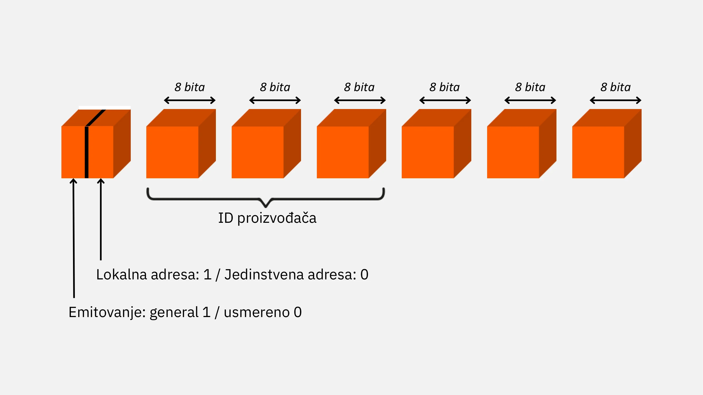


- Vizuelni primer IP adrese:


U korporativnom okruženju, ova dva nivoa adresiranja ne mogu funkcionisati odvojeno. Na primer, kada DHCP server automatski dodeli IP adresu, MAC adresa opreme se koristi kao početna tačka. Računar šalje DHCP broadcast zahtev koji sadrži njegovu MAC adresu kako bi server mogao dodeliti dostupnu IP adresu ispravnom uređaju. Bez ove hardverske identifikacije, DHCP server ne bi znao kojem uređaju da isporuči adresu.


ARP protokol je stoga fundamentalan: obezbeđuje vezu između IP adresa i fizičkih adresa, omogućavajući mašinama da prevedu logičku destinaciju u stvarnu fizičku destinaciju. Kada računar treba da pošalje paket mašini na istoj mreži, prvo konsultuje svoju ARP tabelu da proveri da li je primaočeva MAC adresa već poznata. Ako nije, emituje ARP zahtev svim domaćinima na lokalnoj mreži. Mašina koja prepozna ciljnu IP adresu u ovom zahtevu odgovara specificirajući svoju MAC adresu. Pošiljalac zatim upisuje ovaj IP/MAC par u svoju ARP keš memoriju, kako ne bi morao da ponavlja operaciju svaki put kada se zahtev šalje.


Ova ARP tabela deluje kao mini-direktorijum za mapiranje, dinamički ažuriran na sličan način kao što DNS povezuje imena domena sa IP adresama. Bez ARP-a, nijedna lokalna razmena ne bi bila moguća, jer podatkovni link sloj treba da zna MAC adresu kako bi ispravno enkapsulirao Ethernet okvire.


Suprotno tome, RARP protokol (_Reverse Address Resolution Protocol_) je dizajniran za suprotnu situaciju: omogućavanje mašini koja zna samo svoju MAC adresu da otkrije svoju IP adresu. Ovo je bio čest slučaj za starije radne stanice bez lokalnog hard diska, koje su morale da se pokreću preko mreže i zahtevaju IP adresu. RARP je na kraju zamenjen sa **BOOTP** a zatim sa **DHCP**, koji su fleksibilniji i automatizovani.


Ovi protokoli asocijacije igraju važnu ulogu u rutiranju. Ruter je u suštini mašina sa više mrežnih interfejsa, koja povezuje različite segmente. Kada ruter primi okvir, obrađuje ga kako bi izvukao IP datagram i ispituje IP zaglavlje da bi odredio odredište. Ako je odredište na direktno povezanoj mreži, datagram se isporučuje direktno nakon ažuriranja zaglavlja. Ako odredište pripada drugoj mreži, ruter konsultuje svoju tabelu rutiranja kako bi identifikovao najbolji put, ili _sledeći skok_, do odredišta.


Ovo razbija rutu na kraće, lakše upravljive segmente. Svaki posrednički ruter zna samo sledeći korak, ne nužno i konačno odredište.


**Podsetnik:** Direktna isporuka se dešava kada su pošiljalac i primalac na istoj fizičkoj mreži. U suprotnom, isporuka je indirektna i prolazi kroz jedan ili više rutera.


Tabela rutiranja, kojom se upravlja ili ručno (statičko rutiranje) ili dinamički (dinamičko rutiranje), sadrži informacije potrebne za odlučivanje kojom rutom krenuti. U malim mrežama, statička konfiguracija je dovoljna. U većim infrastrukturama, dinamičko rutiranje je neophodno za automatsko prilagođavanje ruta kada se topologija promeni ili kada veza padne.


Tabela rutiranja deluje kao tabela mapiranja između ciljnih IP adresa i sledećih prolaza. Obično skladišti identifikatore mreže (_network ID_) umesto svake pojedinačne host adrese, što značajno smanjuje njenu veličinu.


| Odredišna adresa | Adresa rutera sledećeg skoka | Interfejs |
| ------------------- | ----------------------- | --------- |

Koristeći ove unose, ruter može brzo odrediti kroz koji interfejs i ka kojem čvoru svaki datagram treba biti poslat. U kombinaciji sa ARP-om za rešavanje odgovarajućih MAC adresa, ovo osigurava efikasan i pouzdan prenos podataka preko mreže.


Konačno, dinamički protokoli rutiranja uključuju standarde kao što su RIP (_Routing Information Protocol_), zasnovan na algoritmu udaljenosti, i OSPF (_Open Shortest Path First_), koji izračunava najkraće puteve u složenoj topologiji. Ovi protokoli neprestano razmenjuju ažuriranja kako bi optimizovali rute, smanjili troškove prenosa i poboljšali otpornost na prekide ili zagušenja.


## NAT: Prevođenje adresa


<chapterId>4f984d5d-f2e0-4faf-b703-ff315f32cef4</chapterId>


### Definicija


_Network Address Translation_ (NAT) je tehnika razvijena za rešavanje problema postepenog iscrpljivanja dostupnih IPv4 adresa. Dizajnirana kao privremeno rešenje pre široke primene IPv6, NAT je omogućio kompanijama i pojedincima da nastave povezivanje velikog broja mašina koristeći samo ograničen skup javnih IP adresa.


**Važno podsećanje:** prelazak sa IPv4 na IPv6 teoretski rešava problem iscrpljivanja proširivanjem prostora adresa sa 32 bita na 128 bita, pružajući gotovo neograničen broj adresa (2^128). U praksi, međutim, tranzicija je još uvek nepotpuna, i NAT se i dalje danas široko koristi.


Princip iza NAT-a je jednostavan, ali veoma efikasan: umesto dodeljivanja jedinstvene javne IP adrese svakom uređaju na unutrašnjoj mreži, koristi se jedna rutabilna adresa (ili mali skup adresa) za sve privatne uređaje. NAT prolaz, često integrisan u ruter ili firewall, zatim dinamički prevodi unutrašnju IP adresu zajedno sa informacijama potrebnim za ispravno usmeravanje saobraćaja ka spoljašnjem svetu, i osigurava da se odgovori vrate originalnom pošiljaocu.


Ovaj pristup ima trenutnu korist: potpuno skriva internu mrežnu arhitekturu. Za posmatrača spolja, svi zahtevi sa radnih stanica, servera ili štampača izgledaju kao da dolaze sa istog javnog identiteta. Privatne adrese, obično preuzete iz rezervisanih opsega (npr. 192.168.x.x ili 10.x.x.x), ostaju nevidljive sa interneta.


Pored rešavanja problema nestašice IPv4 adresa, NAT takođe jača bezbednost stvaranjem prve logičke barijere između internih i javnih mreža.Neželjene dolazne komunikacije se prirodno blokiraju, jer samo veze pokrenute iz unutrašnje mreže dobijaju potrebnu translaciju kako bi mogle da prime odgovore.


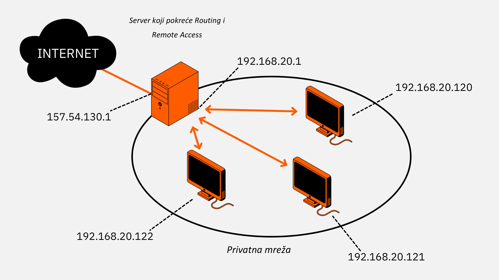


### Tipovi prevoda


NAT se može implementirati na različite načine kako bi odgovarao specifičnim potrebama. Dva glavna načina rada su statički prevod i dinamički prevod.


**Statički prevod** stvara fiksno mapiranje između privatne IP adrese i javne IP adrese. Svaka interna mašina je trajno povezana sa svojom posvećenom javnom adresom. Na primer, interni uređaj konfigurisan kao 192.168.20.1 mogao bi biti povezan sa rutabilnom adresom 157.54.130.1. Kada odlazni paket napusti lokalnu mrežu, ruter zamenjuje izvornu adresu paketa javnom adresom, i obavlja obrnuti postupak za dolazni saobraćaj. Ova dvosmerna translacija je transparentna za korisnika.


**Upozorenje:** Iako ova metoda izoluje internu mrežu, ne rešava problem nedostatka javnih IP adresa, jer vam i dalje treba onoliko javnih adresa koliko ima mašina koje treba izložiti. Statički prevod se stoga uglavnom koristi kada određeni interni resursi moraju ostati dostupni spolja (web server, mail server...).


**Dinamički prevod**, s druge strane, koristi bazen javnih IP adresa. Kada interni host započne vezu, ruter privremeno dodeljuje jednu od ovih javnih adresa privatnoj host adresi za vreme trajanja sesije. Veza je 1-na-1, ali privremena: kada veza završi, javna adresa postaje dostupna za drugi uređaj. Dinamički NAT stoga smanjuje broj potrebnih javnih adresa kada nisu sve mašine istovremeno na mreži, ali i dalje zahteva blok eksternih adresa barem onoliko velik koliko je maksimalni broj istovremenih veza.


**Prevod porta** (PAT), takođe poznat kao *NAT preopterećenje* ili *IP maskiranje*, ide korak dalje: svi privatni uređaji dele jednu javnu IP adresu (ili vrlo mali broj). Da bi razlikovao sesije, ruter menja ne samo izvornu adresu, već i izvorni port. Održava tabelu koja povezuje svaki par *(privatna adresa, privatni port)* sa jedinstvenim parom *(javna adresa, javni port)*. Ovaj oblik NAT-a koristi se u gotovo svim kućnim ruterima, omogućavajući desetinama uređaja (računari, pametni telefoni, povezani objekti, itd.) da dele istu javnu IP adresu, dok održavaju tečnu komunikaciju.


NAT stoga produžava životni vek IPv4, dok dodaje vredan sloj segmentacije i bezbednosti. Međutim, kako usvajanje IPv6 raste i njegov ogroman adresni prostor postaje sve šire korišćen, uloga NAT-a će verovatno opadati, iako će se zbog kompatibilnosti i kontrolnih svrha i dalje koristiti u nekim okruženjima za segmentaciju i filtriranje saobraćaja.


### Implementacija NAT-a


Da bi se osigurala pravilna operacija prevođenja adresa, NAT ruter ili gateway mora voditi tačan zapis o mapiranjima uspostavljenim između svake privatne adrese na unutrašnjoj mreži i javne adrese koja se koristi za komunikaciju sa spoljnim svetom. Ove informacije se čuvaju u onome što je poznato kao "NAT tabela prevoda", koja igra centralnu ulogu u upravljanju mrežnim saobraćajem.


Svaki unos u ovoj tabeli povezuje bar jedan par: interna IP adresa mašine koja šalje i eksterna IP adresa koji će biti izložen na internetu. Kada se paket iz privatne mreže šalje na javnu destinaciju, NAT ruter presreće okvir, analizira IP i TCP/UDP zaglavlja, zatim zamenjuje privatnu adresu izvora javnom adresom rutera. Na povratnom putu, isti ruter hvata dolazni paket, proverava tabelu mapiranja i izvršava obrnuti postupak kako bi preusmerio tok na originalnu internu IP adresu.


Ovaj dinamički princip prevođenja oslanja se na precizno upravljanje tabelama: svaki unos ostaje važeći sve dok postoji aktivan saobraćaj koji ga opravdava. Nakon konfigurisanog perioda neaktivnosti, unos se briše i može se ponovo koristiti za nove konekcije.


_Primer pojednostavljene NAT tabele prevođenja:_


| Interna IP | Eksterna IP | Trajanje (sek) | Ponovno upotrebljivo? |
| ------------- | -------------- | -------------- | --------- |
| 10.101.10.20  | 193.48.100.174 | 1,200          | ne        |
| 10.100.54.251 | 193.48.101.8   | 3,601          | da        |
| 10.100.0.89   | 193.48.100.46  | 0              | ne        |

U ovom primeru, ako nijedan paket nije prošao kroz drugi unos duže od sat vremena (3.600 sekundi), označava se kao ponovo upotrebljiv. Suprotno tome, trajanje od nula označava aktivnu komunikaciju, sa zaključanim mapiranjem.


Iako NAT funkcioniše transparentno za većinu uobičajenih upotreba (pregledanje interneta, e-mail, prenos fajlova, itd.), može stvoriti dodatne izazove za određene mrežne aplikacije. Neke tehnologije se oslanjaju na eksplicitnu razmenu IP adresa ili portova unutar sadržaja paketa. Nakon prolaska kroz NAT prolaz, ove informacije postaju nedosledne.


Tipični primeri ograničenja uključuju:


- Peer-to-peer protokoli (P2P), koji zahtevaju direktne veze između uređaja, ometeni su NAT barijerom, budući da svi interni uređaji dele istu eksternu IP adresu i ne mogu biti direktno dostupni bez specifične konfiguracije (kao što su *prosleđivanje portova* ili UPnP);
- IPSec protokol, korišćen za obezbeđivanje mrežnih komunikacija, šifruje zaglavlja paketa. Pošto NAT mora da modifikuje ova zaglavlja kako bi zamenio IP adrese, šifrovanje to čini nemogućim bez mehanizama prilagođavanja kao što je NAT-T (*NAT Traversal*);
- X Window protokol, koji omogućava udaljeni prikaz grafičkih aplikacija na Unix/Linux sistemima, funkcioniše tako da X server aktivno šalje TCP konekcije klijentima. Ovo obrtanje uobičajenog smera konekcija može biti blokirano od strane NAT-a.


Uopšteno, svaki protokol koji eksplicitno uključuje internu IP adresu u sadržaju paketa će biti pogođen, jer ta adresa više neće odgovarati stvarnom, na internetu vidljivom adresom nakon prevođenja.


**Važna napomena:** Za rešavanje ovih problema, neki NAT ruteri nude _Dubinsku Inspekciju Paketa_ (DPI) ili _Protokol Pomagače_, koji pregledaju sadržaj paketa kako bi identifikovali i dinamički zamenili adrese ili brojeve portova unutar aplikacionih podataka. Ovo zahteva detaljno poznavanje formata protokola i može stvoriti sigurnosne ranjivosti ili povećati upotrebu resursa.


**Upozorenje:** Iako NAT pomaže u skrivanju interne mreže i kontroli dolaznog saobraćaja, nije zamena za namenski firewall. Sama translacija nije potpuna sigurnosna barijera: uvek mora biti dopunjena jasnim pravilima filtriranja kako bi se blokirao nepoželjan ili neželjen saobraćaj.


_Da bismo ilustrovali kako ovo funkcioniše u praksi, razmotrimo sledeći primer:_


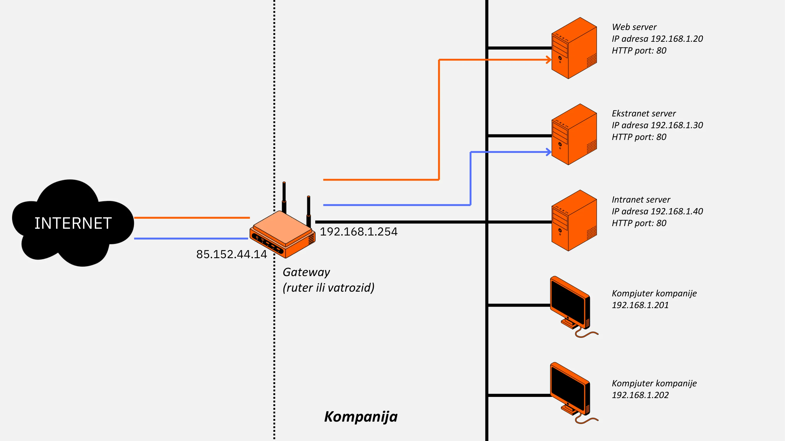


U ovom scenariju, interna radna stanica može pristupiti internom veb serveru jednostavno pozivanjem URL-a `http://192.168.1.20:80`. Navođenje porta je ovde opcionalno, jer je `80` standardni HTTP port. Suprotno tome, ako je zahtev iniciran spolja, korisnik će uneti javnu adresu `http://85.152.44.14:80`. NAT ruter prima zahtev, konsultuje svoju tabelu mapiranja i automatski prevodi javnu adresu u privatnu, preusmeravajući vezu na `http://192.168.1.20:80`.


Isti princip se primenjuje na bilo koji drugi server ovlašćen za primanje internet konekcija, kao što je Extranet server (plavi krug u dijagramu).


**Praktična napomena:** u virtualizovanim okruženjima, mrežni interfejsi nazvani _virbrX_ (za _Virtual Bridge X_) se često koriste. Ovi virtuelni mostovi, koje posebno obezbeđuje libvirt biblioteka ili Xen hipervizor, povezuju virtuelnu internu mrežu gostujućih mašina sa fizičkom mrežom dok primenjuju NAT. Oni su generalno konfigurisani putem skripti u `/etc/sysconfig/network-scripts/`, kao što je prikazano ispod za `virbr0`:


```ini
NAME=""
BOOTPROTO=none
MACADDR=""
TYPE=Bridge
DEVICE=virbr0
NETMASK=255.255.255.0
MTU=""
BROADCAST=192.168.0.255
IPADDR=192.168.0.1
NETWORK=192.168.0.0
ONBOOT=yes
```


Kada je virtuelni most postavljen, potrebno je omogućiti IP rutiranje i konfigurisati prevođenje portova sa `iptables`:


```shell
echo 1 > /proc/sys/net/ipv4/ip_forward
```


```shell
iptables -t nat -A POSTROUTING -o <WAN> -s 192.168.0.0/24 -j MASQUERADE
```


Sa ovom konfiguracijom, odlazni saobraćaj se usmerava i primenjuje se NAT prevođenje, omogućavajući virtuelnim mašinama da komuniciraju sa spoljnim svetom bez direktnog izlaganja njihovih internih IP adresa.


U sledećem poglavlju, detaljno ćemo razmotriti konfiguraciju IP adresa na Linux-u, pokrivajući i jednostavne i napredne metode prilagođene različitim kontekstima administracije.


https://planb.academy/tutorials/computer-security/communication/pi-hole-46a735c5-8af3-4cc3-a2c2-1d4f6a7dc428

https://planb.academy/tutorials/computer-security/operating-system/opnsense-90c2785d-a0d7-4981-be8d-d290bbeb8263

https://planb.academy/tutorials/computer-security/operating-system/pfsense-24eea96a-2fdc-42a6-a77b-89bc29149864


## Kako da konfigurišem mrežu pomoću `ip`?


<chapterId>8ba7e946-d2a0-4841-8d54-e85ba96baa25</chapterId>


### Standardna konfiguracija


Nakon što smo pokrili teorijske osnove umrežavanja i razumeli kako IP adrese, maske, rutiranje i prevođenje rade zajedno, vreme je da pređemo na praktičnu konfiguraciju. Na GNU/Linux-u, podešavanje mreže se sada obavlja pomoću komande **`ip`** (paket _iproute2_), koja zamenjuje stariju `ifconfig`.


`ip` vam omogućava da dodelite ili promenite IP adresu, promenite masku, pokrenete ili zaustavite interfejs, ili proverite njegov status u bilo kom trenutku.


**SAVETI:** za prikaz svih interfejsa (aktivnih ili ne): `ip addr show`


Primer: dodeljivanje statičke adrese i aktiviranje interfejsa


Dodaj adresu `192.168.1.2/24` na interfejs `eth0`:


```shell
ip addr add 192.168.1.2/24 dev eth0
```


Aktiviraj interfejs:


```shell
ip link set dev eth0 up
```


Deaktiviraj isti interfejs:


```shell
ip link set dev eth0 down
```


Prikaži status određenog interfejsa:


```shell
ip addr show dev eth2
```


**Praktični savet:** sa `ip`, dodavanje dodatne adrese na interfejs više ne zahteva sufiks `:1`. Samo dodajte još jednu liniju `ip addr add ...`:


```shell
ip addr add 172.18.2.39/24 dev eth2
```


### Skripte aktivacije: ifup / ifdown


`ifup` i `ifdown` alati čitaju statičke konfiguracione fajlove iz `/etc/sysconfig/network-scripts/` (na RHEL, CentOS, Rocky Linux, AlmaLinux...) ili `/etc/network/interfaces` (na Debian/Ubuntu) kako bi uredno podigli ili spustili interfejse.


```shell
ifup eth1
ifdown eth2
```


Datoteke konfiguracije (slično RHEL-u):


- **/etc/sysconfig/network**: globalna podešavanja (NETWORKING, HOSTNAME, GATEWAY...).
- **ifcfg-**: postavke specifične za svaki interfejs.


Staticki primer (ifcfg-eth0):


```ini
DEVICE=eth0
BOOTPROTO=none
ONBOOT=yes
IPADDR=192.168.2.5
NETMASK=255.255.255.0
GATEWAY=192.168.2.1
```


primer DHCP:


```ini
DEVICE=eth0
BOOTPROTO=dhcp
ONBOOT=yes
```


Ova modularna struktura je i dalje važeća i može se lako automatizovati na trenutnim sistemima.


### Napredna konfiguracija: bonding


U profesionalnim okruženjima, cilj je garantovati kontinuitet usluge i/ili agregirati propusni opseg. Mehanizmi *Bonding* (ili *teaming* sa _teamd_) ispunjavaju ove potrebe: nekoliko fizičkih interfejsa funkcioniše kao jedan logički interfejs, često nazvan `bond0` ili `team0`.


Preduslovi:


- Učitajte modul `bonding` (ili koristite `teamd`) ;
- Imate na raspolaganju najmanje dva fizička interfejsa.


#### Različite uobičajene metode povezivanja:


|Način rada|Naziv|Princip rada|
|---|---|---|
|0|balance-rr|Round-robin, ciklična distribucija frejmova|
|1|active-backup|Jedan aktivni interfejs sa brzim (vrućim) prebacivanjem u slučaju kvara. |
|2|balance-xor|Selekcija zasnovana na XOR-u izvorne i odredišne MAC adrese.|
|3|broadcast|Emitovanje (broadcast) istovremeno na svim interfejsima.   |
|4|802.3ad (LACP)|Standardizovana dinamička agregacija; zahteva kompatibilan svič|
|5|tlb (Transmit Load Balancing)|Balansiranje zasnovano na opterećenju prilikom slanja (transmit load)|
|6|alb (Adaptive Load Balancing)|Adaptivno balansiranje; takođe balansira prijem koristeći ARP|

#### Podešavanje sa `ip link


- Onemogući fizičke interfejse:


```shell
ip link set eth0 down
ip link set eth1 down
```


- Kreiraj povezani interfejs:


```shell
ip link add bond0 type bond mode balance-alb
```


- Konfiguriši opcije nakon kreiranja


```shell
ip link set bond0 type bond miimon 100
```


- Dodeli MAC i IP adrese:


```shell
ip link set dev bond0 address 00:17:56:BC:02:3A
ip addr add 192.168.2.3/24 dev bond0
ip route add default via 192.168.2.1
```


- Povezivanje sekundarnih interfejsa:


```shell
ip link set eth0 master bond0
ip link set eth1 master bond0
```


- Ponovo aktivirajte sve:


```shell
ip link set bond0 up
ip link set eth0 up
ip link set eth1 up
```


**Savet:** za odvajanje podređenih interfejsa bez isključivanja veze: `ip link set eth1 nomaster`


#### Trajno podešavanje (po uzoru na RHEL)


Kreirajte tri datoteke u `/etc/sysconfig/network-scripts`:


_ifcfg-bond0_


```ini
DEVICE=bond0
ONBOOT=yes
BOOTPROTO=none
IPADDR=192.168.2.3
NETMASK=255.255.255.0
BROADCAST=192.168.2.255
GATEWAY=192.168.2.1
BONDING_OPTS="mode=balance-alb miimon=100"
```


_ifcfg-eth0_


```ini
DEVICE=eth0
ONBOOT=yes
MASTER=bond0
SLAVE=yes
```


_ifcfg-eth1_


```ini
DEVICE=eth1
ONBOOT=yes
MASTER=bond0
SLAVE=yes
```


Zatim:


```shell
systemctl restart network
```


#### Dodatna IP adresa (savremeni način za alias adresu)


Sa `ip`, možete jednostavno dodati drugu adresu na isti uređaj:


```shell
ip addr add 192.168.1.2/24 dev eth0
```


Da bi ovaj alias bio postojan nakon ponovnog pokretanja (eng. reboot), dodajte drugi blok `IPADDR2=...` / `PREFIX2=...` u `ifcfg-eth0`, ili kreirajte novu *NetworkManager* konekciju putem `nmcli`.


Zahvaljujući komandama `ip` i srodnim komandama (`ip link`, `ip addr`, `ip route`), mrežna konfiguracija je konzistentnija, skriptabilna i jasna. Bonding je ključna komponenta arhitektura visoke dostupnosti, a dodeljivanje više adresa jednom interfejsu postalo je mnogo jednostavnije.


U narednom poglavlju, pogledaćemo specifičnosti i implementaciju IPv6 adresiranja.


# IPv6 adresiranje


<partId>9b1d87f1-2a68-496e-b5dd-76cf74fb8cde</partId>


## IPv6: Standardi i definicije


<chapterId>d1f16f0a-1104-460d-8d67-f725665f8e3f</chapterId>


Sada prelazimo na sledeću generaciju IP adresiranja: IPv6 protokol, prvobitno poznat kao IPng (_IP Next Generation_). Dizajniran da prevaziđe strukturna ograničenja IPv4, ovaj protokol uvodi znatno proširenu adresnu arhitekturu, kao i brojne tehničke optimizacije.


Motivacije iza usvajanja IPv6 su različite, i rešava kritične potrebe za evoluciju interneta. Prvo, uloga IPv6 je da podrži eksponencijalni rast broja povezanih uređaja (cilj koji je nedostižan sa ograničenim prostorom adresa IPv4). Drugo, protokol ima za cilj da smanji veličinu tabela rutiranja, čineći razmene efikasnijim i smanjujući opterećenje rutera na duži rok.


IPv6 takođe nastoji da pojednostavi određene aspekte rukovanja paketima, poboljšavajući tok datagrama i optimizujući brzine prenosa između mreža. Sa stanovišta bezbednosti, AH/ESP zaglavlja *IPsec* protokola su uključena u osnovnu specifikaciju, i svi IPv6 uređaji moraju biti sposobni da ih podrže (RFC 6434). Njihova upotreba, međutim, ostaje opcionalna: na administratoru je da ih omogući u zavisnosti od konteksta.


Drugi ciljevi uključuju preciznije rukovanje tipovima servisa, posebno kako bi se osigurala bolji kvalitet za aplikacije u realnom vremenu (VoIP, videokonferencije, itd.). IPv6 je takođe dizajniran da omogući fleksibilnije upravljanje mobilnošću: uređaj može promeniti pristupne tačke bez promene svoje adrese na način koji je vidljiv drugim uređajima s kojima komunicira.


Konačno, IPv6 je dizajniran da koegzistira sa starijim protokolima. Iako nije direktno binarno kompatibilan sa IPv4, i dalje je potpuno interoperabilan sa protokolima višeg sloja kao što su TCP, UDP, ICMPv6 i DNS, kao i sa protokolima za rutiranje poput OSPF i BGP, uz određene prilagodbe. Za upravljanje multicast-om, IPv6 koristi MLD (*Multicast Listener Discovery*) protokol, koji je funkcionalno ekvivalent IGMP-u u IPv4 okruženju.


### Pravila notacije


Jedna od najznačajnijih promena u IPv6 je format same IP adrese. Da bi se rešio problem hroničnog nedostatka IPv4 adresa, dužina adrese je povećana sa 32 bita na 128 bita, što je 16 bajtova. U teoriji, ovo daje mogući adresni prostor od:


$$3.4 \times 10^{38}$$


Ovo osigurava praktično neograničen kapacitet za svu trenutnu i buduću opremu.


IPv6 adrese su napisane veoma drugačije od poznate notacije sa tačkama u decimalnom formatu. IPv6 adresa se sastoji od osam 16-bitnih grupa, napisanih u heksadecimalnom formatu i odvojenih dvotačkama `:`.


Na primer:


```
1987:0c02:0000:84c2:0000:0000:cf2a:9077
```


Da bi se pojednostavila notacija, vodeće nule u svakoj grupi mogu biti izostavljene. Gornji primer tada postaje:


```
1987:c02:0:84c2:0:0:cf2a:9077
```


Pored toga, jedan neprekinuti niz grupa nula može se zameniti sa ::, dodatno skraćujući adresu:


```
1987:c02:0:84c2::cf2a:9077
```


**Upozorenje:** ovo pravilo je strogo: samo jedan niz uzastopnih nula može biti zamenjen sa `::`. Ako adresa sadrži više nizova nula, samo najduži se kondenzuje. Ovo osigurava i jedinstvenost i čitljivost.


**Važan detalj:** karakter `:` koji se koristi za razdvajanje heksadecimalnih blokova može izazvati nejasnoće u URL-ovima, jer se `:` takođe koristi za označavanje porta usluge. Da bi se izbegla zabuna, IPv6 adrese u URL-u moraju biti obuhvaćene uglastim zagradama `[ ]`.


Primer HTTP pristupa određenom portu za adresu `2002:400:2A41:378::34A2:36`:


```
http://[2002:400:2A41:378::34A2:36]:8080
```


Kada predstavljate IPv4 adrese u kontekstu IPv6, možete koristiti mešovitu notaciju u obliku tačkaste decimale, kojoj prethodi `::`:


```
::192.168.1.5
```


Ova kompatibilnost pomaže u olakšavanju prelaza između dva protokola omogućavajući da IPv4 blokovi budu uključeni unutar IPv6 adresnog prostora.


**Napomena:** Da bi se standardizovao način pisanja adresa, RFC 5952 definiše kanonski format sa pravilima za skraćivanje kako bi se izbegle višestruke reprezentacije iste adrese. Praćenje ovih preporuka pomaže u smanjenju pogrešnog tumačenja i obezbeđuje dosledne mrežne konfiguracije.


### IPv6 tipovi adresa


IPv6 se razlikuje od svog prethodnika kroz širok spektar kategorija adresa, od kojih je svaka dizajnirana za specifične namene, dok omogućava fleksibilno rutiranje i upravljanje mrežom. Kao i kod IPv4, adrese mogu biti globalne, lokalne, rezervisane ili specifične za određene mehanizme tranzicije.


Neodređena IPv6 adresa je predstavljena sa `::` ili, preciznije, `::0.0.0.0`. Ovaj poseban oblik se koristi tokom akvizicije adresa, ili kao podrazumevana vrednost da označi odsustvo adresa.


| Prefiks IPv6 adrese | Opis                                  |
| ------------------- | ------------------------------------------- |
|::/8                | Rezervisane adrese                         |
| 2000::/3            | Unicast adrese, rutabilne na Internetu     |
| fc00::/7            | Jedinstvene lokalne adrese (1)             |
| fe80::/10           | Link-local adrese                          |
| ff00::/8            | Multicast adrese                           |

(1): *Na privatnoj LAN mreži, prefiks `fd00::/8` je preferiran za dodelu internih adresa koje nisu rutabilne na Internetu.*


#### Rezervisane adrese


Određeni opsezi IPv6 su eksplicitno rezervisani i ne smeju se koristiti kao globalne adrese. Imaju specifične tehničke svrhe:


- `::/128`: nespecificirana adresa, nikada trajno dodeljena uređaju, ali se koristi kao izvorna adresa na uređaju koji čeka konfiguraciju.
- `::1/128`: the _loopback_ adresa, odgovara tačno `127.0.0.1` kod IPv4, što omogućava uređaju da sam sebi dodeli adresu.
- `64:ff9b::/96`: **Rezervisano za protokolske prevodioce radi omogućavanja međusobnog povezivanja IPv4/IPv6, kako je definisano u RFC 6052.**
- `::ffff:0:0/96`: **blok za kompatibilnost za predstavljanje IPv4 adresa u specifičnoj IPv6 strukturi, često korišćen interno od strane aplikacija.**


Ovi blokovi garantuju interoperabilnost i olakšavaju migraciju između dve verzije protokola.


#### Globalne unicast adrese


Globalne unicast adrese čine većinu javno rutabilnog IPv6 prostora, predstavljajući oko 1/8 adresnog prostora. Od 1999. godine, IANA je dodelila ove blokove, kao što je prefiks `2001::/16`, u CIDR blokovima (od `/23` do `/12`) regionalnim registrima, koji ih zatim redistribuiraju provajderima i organizacijama.


Neki opsezi imaju posebne dokumentovane upotrebe:


- `2001:2::/48`: **Rezervisano za testiranje performansi i interoperabilnosti (RFC 5180).**
- `2001:db8::/32`: **Rezervisano za dokumentaciju i primere (RFC 3849).**
- `2002::/16`: Koristi se za 6to4 mehanizam, koji omogućava IPv6 saobraćaju da putuje preko IPv4 infrastrukture (korisno tokom faze prelaska između dva protokola).


**Napomena:** veliki deo globalnih adresa ostaje neiskorišćen, služeći kao rezerva za budući rast interneta.


#### Jedinstvene lokalne adrese (ULA)


Jedinstvene lokalne adrese (`fc00::/7`) su IPv6 ekvivalent IPv4 privatnih adresa (RFC1918). Omogućavaju kreiranje izolovanih internih mreža bez rizika od konflikata sa javnim adresiranjem. U praksi, efektivni prefiks je `fd00::/8`, sa 8. bitom postavljenim na 1 kako bi se označila lokalna upotreba. Svaki ULA blok uključuje 40-bitni pseudo-slučajni identifikator, minimizirajući kolizije adresa prilikom povezivanja odvojenih privatnih mreža.


#### Link-lokalne adrese


Link-lokalne adrese (`fe80::/64`) koriste se isključivo za komunikaciju unutar istog sloja 2 segmenta (isti VLAN ili prekidač). Nikada se ne rutiraju izvan lokalne veze. Svaki mrežni interfejs automatski generiše link-lokalnu adresu, koja je često izvedena iz MAC adrese koristeći EUI-64 šemu.


**Specijalna funkcija**: ista mašina može koristiti istu link-lokalnu adresu na više interfejsa, ali interfejs mora biti specificiran prilikom komunikacije kako bi se izbegla dvosmislenost.


#### Multicast adrese


U IPv6, broadcast je zamenjen multicast-om, efikasnijim načinom za isporuku paketa definisanoj grupi primalaca. Multicast opseg je prefiksiran sa `ff00::/8`. Ovo uključuje adrese poput `ff02::1`, koja cilja sve čvorove na lokalnoj vezi. Iako je zgodno, ova adresa više nije preporučen za aplikacije, jer može generisati nekontrolisane broadcast-e.


Uobičajena upotreba multicast-a je _Neighbor Discovery Protocol_ (NDP), koji zamenjuje ARP u IPv6. NDP koristi specifične multicast adrese, kao što je `ff02::1:ff00:0/104`, za automatsko otkrivanje drugih hostova povezanih na isti link.


Kombinovanjem ovih tipova adresa, IPv6 pruža kompletan skup opcija za ispunjavanje potreba globalnog rutiranja, lokalnih komunikacija, migracije IPv4/IPv6 i automatske konfiguracije uređaja, uz poboljšanje efikasnosti prenosa.


### Opseg adresa


Opseg IPv6 adrese definiše tačan domen u kojem je ona važeća i jedinstvena. Razumevanje ovog koncepta je ključno za savladavanje rutiranja paketa i logičke organizacije IPv6 mreže. IPv6 adrese su generalno grupisane u tri glavne kategorije na osnovu njihovog opsega i upotrebe: unicast, anycast i multicast.


**Unicast adrese** su najčešće i uključuju nekoliko različitih podtipova.

To uključuje _loopback_ (`::1`) adresu, čiji je opseg ograničen na host koji ga koristi, i koji se koristi za interno testiranje mreže bez slanja saobraćaja preko fizičke mreže.

Zatim postoje link-lokalne adrese (_link-local_), čiji je opseg ograničen na jedan segment mreže: koriste se za direktnu komunikaciju između uređaja na istom fizičkom ili logičkom linku (npr. jedan switch ili VLAN).

Konačno, jedinstvene lokalne adrese (_ULA_, za _Unique Local Addresses_) su interne za privatnu mrežu. Mogu se rutirati između više privatnih segmenata, ali nikada nisu vidljive na internetu.


Konceptualno, IPv6 adrese se često predstavljaju kao binarna struktura gde prva polovina (prvih 64 bita) identifikuje mrežni prefiks, a druga polovina (takođe 64 bita) jedinstveno identifikuje interfejs uređaja na toj mreži. Ova podela olakšava autokonfiguraciju adresa kroz mehanizme kao što je SLAAC (_Stateless Address Autoconfiguration_), koji omogućavaju mašinama da automatski generišu stabilnu adresu na osnovu MAC adrese ili pseudo-slučajnog identifikatora.


| Polje     | Prefiks | L | Globalni ID | Podmreža | ID interfejsa |
|-----------|--------|---|-----------|--------|---------------|
| Bitovi    | 7      | 1 | 40        | 16     | 64            |

IPv6 arhitektura prati hijerarhijski model globalnog rutiranja današnjeg interneta. Podela prefiksa omogućava regionalnim registrima i mrežnim operatorima da upravljaju dodelom adresa na decentralizovan način, uz obezbeđivanje globalne jedinstvenosti. U okviru ovog okvira, isti host može istovremeno imati globalnu unicast adresu za internet komunikaciju i link-lokalnu adresu za lokalne interakcije, npr. sa neposrednim susedstvom ili za poruke otkrivanja rutera.


| Polje     | Prefiks | Nula | ID interfejsa |
|-----------|--------|------|--------------|
| Bitovi    | 10     | 54   | 64           |

**Anycast adrese** predstavljaju posredni koncept koji se nadovezuje na unicast model, ali se u određenim slučajevima može ponašati kao multicast. Anycast adresa je, u suštini, unicast adresa dodeljena na nekoliko interfejsa raspoređenih preko različitih mrežnih čvorova. Kada se paket pošalje na anycast adresu, IPv6 protokol ima za cilj da ga isporuči jednom od domaćina koji dele tu adresu, obično onom najbližem u smislu rutirajuće topologije. Ovaj pristup optimizuje brzinu obrade upita i poboljšava otpornost distribuiranih servisa. Klasičan primer su root DNS serveri, gde anycast adresiranje automatski usmerava upite na najbližu tačku prisustva.


| Polje     | Prefiks | Podstiica | ID interfejsa |
|-----------|--------|--------|______________|
| Bitovi      | 48     | 16     | 64           |

U IPv6, **multicast adrese** zamenjuju mehanizam emitovanja, koji se smatrao previše skupim i nepodesnim za mrežu globalnog obima. Multicast adresa identifikuje grupu interfejsa, obično na više hostova, koji žele da istovremeno prime iste pakete.

Svaka multicast adresa uključuje posebno 4-bitno polje _scope_, koje definiše geografsko ili logičko ograničenje emitovanja:


- Opseg od `1` znači da je paket namenjen samo za lokalni uređaj.
- Opseg od `2` ograničava paket na lokalnu vezu: svi uređaji na istom fizičkom ili virtualnom segmentu mogu ga primiti.
- Opseg od `5` proširuje domet do lokacije, obično čitave korporativne mreže.
- Opseg od `8` proširuje domet na organizaciju, omogućavajući isporuku preko svih podmreža istog entiteta.
- Opseg `e` (14 u heksadecimalnom formatu) označava globalni domet, čineći multicast grupu dostupnom sa bilo kog mesta na internetu ako je infrastruktura rutiranja podržava.


Struktura IPv6 multicast adresa uključuje:


- polje _Flag_ (4 bita) određuje da li je grupa trajna ili privremena,
- polje _Scope_ (4 bita) definiše opseg,
- polje za identifikaciju (112 bita) koje identifikuje broj multicast grupe.


| Polje      | Prefiks | Zastavice | Opseg | ID grupe |
|------------|--------|--------|--------|----------|
| Bitovi       | 8      | 4      | 4      | 112      |

Poznat primer IPv6 multicast-a u akciji je _Neighbor Discovery Protocol_ (NDP). Umesto korišćenja ARP kao u IPv4, NDP se oslanja na multicast adrese kao što je `ff02::1:ff00:0/104` za emitovanje zahteva za otkrivanje lokalnih uređaja, ciljajući samo relevantne uređaje na istoj mrežnoj vezi.


Preciznim definisanjem opsega adresa, IPv6 strukturiše kako se tokovi podataka šalju, primaju i usmeravaju. Ova granularnost čini protokol fleksibilnim i efikasnijim za upravljanje lokalnim i globalnim komunikacijama, istovremeno izbegavajući nedostatke generalizovanog emitovanja.


## Dodela adresa u lokalnoj mreži


<chapterId>4c9c3e52-59bc-499a-af0a-6dd369a9e029</chapterId>


U ovom poglavlju ćemo pogledati jedan od najpraktičnijih aspekata implementacije IPv6: dodeljivanje IP adresa uređajima na lokalnoj mreži. Arhitektura IPv6 je dizajnirana za fleksibilnost, omogućavajući svakom uređaju da generiše svoju sopstvenu adresu automatski, dok i dalje omogućava potpuno ručno konfigurisanje kada je to potrebno.


IPv6 lokalna mreža sistematski deli adresu na dva dela:


- prvih 64 bita predstavljaju prefiks podmreže, obično obezbeđen od strane rutera ili adresa autoriteta;
- preostalih 64 bita koristi host da se jedinstveno identifikuje na tom segmentu.

Ovaj model u velikoj meri pojednostavljuje agregaciju ruta i upravljanje blokom adresa.


Dva glavna pristupa se koriste za dodelu adresa uređajima:


- Ručno konfigurisanje, gde administrator precizira tačnu adresu za svaki interfejs;
- Automatska konfiguracija, gde uređaji generišu ili dinamički dobijaju svoje adrese.


U ručnoj konfiguraciji, administrator dodeljuje kompletnu IPv6 adresu svakom interfejsu. Određene vrednosti ostaju rezervisane:


- `::/128`: nespecificirana adresa, nikada trajno dodeljena ;
- `::1/128`: loopback adresa (_loopback_), IPv4 equivalent: `127.0.0.1`.


Za razliku od IPv4, ne postoji koncept _broadcast_-a; kombinacije "sve nule" ili "sve jedinice" u delu za host nemaju posebno značenje.

Ručna konfiguracija je i dalje korisna u kontrolisanim okruženjima, ali postaje teško održiva na većem obimu.


Za automatsku konfiguraciju, postoji nekoliko metoda:


- Protokol **NDP** (_Neighbor Discovery Protocol_), specificiran od strane RFC4862, omogućava *stateless* auto-konfiguraciju. U ovom režimu, host prima mrežni prefiks od lokalnog rutera i samostalno kompletira adresu identifikatorom zasnovanom na svojoj MAC adresi. Ova metoda je jednostavna za implementaciju i ne zahteva centralni server.
- Implementacije kao one u Windows-u mogu generisati deo hosta pseudo-slučajno kako bi poboljšale privatnost izbegavanjem direktnog izlaganja MAC adrese. Otkrivanje MAC adrese u IPv6 paketima može izazvati zabrinutost za privatnost, jer omogućava praćenje uređaja preko različitih mreža.
- DHCPv6 protokol: Definisan u RFC3315 i sličan DHCP-u koji se koristi za IPv4, omogućava kontrolisaniju i centralizovanu konfiguraciju, uključujući upravljanje zakupom, dodatne opcije (DNS, MTU...) i registraciju baza podataka. DHCPv6 može raditi samostalno ili zajedno sa stateless konfiguracijom kako bi obezbedio dodatne parametre bez dodeljivanja same IP adrese.


**Važna napomena:** U metodi zasnovanoj na MAC-u, MAC adresa se konvertuje u 64-bitni identifikator koristeći EUI-64 format. Ovaj mehanizam umeće bajtove `FF:FE` u sredinu originalne MAC adrese (u 48 bita), i inverzuje 7. bit kako bi označio globalnu jedinstvenost. Rezultat je stabilan interfejs identifikator, koji se koristi u punoj IPv6 adresi.


Evo primera kako transformisati MAC adresu u EUI-64:


Međutim, zbog rastućih zabrinutosti oko praćenja uređaja, moderni operativni sistemi (posebno Linux, Windows 10+, macOS, Android) sada podrazumevano omogućavaju ekstenzije za privatnost. Oni koriste nasumično generisane interfejs identifikatore koji se periodično obnavljaju za odlazne veze, dok zadržavaju stabilan identifikator za interne komunikacije (kao što su DNS ili DHCPv6).


Kao i kod DHCP-a u IPv4, automatski dodeljene IPv6 adrese mogu imati dva životna veka, definisana od strane DHCPv6 rutera ili servera:


- Preferirani životni vek: nakon ovog perioda, adresa ostaje važeća, ali se više ne koristi za iniciranje novih veza;
- Važeći vek trajanja: kada ovo vreme istekne, adresa se potpuno uklanja iz konfiguracije interfejsa.


Ovaj sistem omogućava dinamičko upravljanje promenama u mreži, na primer, obezbeđujući nesmetan prelaz sa jednog ISP-a na drugi. Ažuriranjem prefiksa koji najavljuju ruteri i paralelnim podešavanjem DNS zapisa, migracija na IPv6 može se izvršiti bez ikakvog primetnog prekida usluge.


**Savet:** Kombinovana upotreba adresa i DNS životnih ciklusa omogućava implementaciju strategije postepenog prelaska, gde se nove veze prebacuju na novu topologiju, dok postojeće veze traju do svog prirodnog završetka.


Ukratko, IPv6 nudi širok spektar fleksibilnosti za dodeljivanje adresa: ručna konfiguracija, stateless ili stateful auto-konfiguracija, DHCPv6 ili nasumična generacija. Svaki pristup dolazi sa svojim prednostima i ograničenjima, i može se prilagoditi prema potrebnom nivou kontrole, veličini mreže ili potrebama privatnosti.


## Dodeljivanje IPv6 blokova adresa


<chapterId>45cce866-1b58-4888-b3fe-15c922180839</chapterId>


### Distribucija adresa


Šema dodele IPv6 adresa je strukturisana da ispuni dva cilja: da garantuje globalnu jedinstvenost adrese i da omogući logičku hijerarhiju koja favorizuje agregaciju i pojednostavljivanje tabela rutiranja.

Kao i kod IPv4, *Internet Assigned Numbers Authority* (IANA) se nalazi na vrhu ove hijerarhije. Ona upravlja globalnim unicast adresnim prostorom i delegira blokove adresa pet regionalnim internet registrima (_RIR_).


Pet postojećih RIR-ova su:


- ARIN (Severna Amerika),
- RIPE NCC (Evropa, Bliski Istok, Centralna Azija),
- APNIC (Azija-Pacifik),
- AFRINIC (Afrika),
- LACNIC (Latinska Amerika i Karibi).


IANA dodeljuje IPv6 blokove različitih veličina svakom RIR-u, uglavnom između /23 i /12. Ovaj pristup nudi fleksibilnost uz osiguranje dugoročne skalabilnosti. RIR-ovi, zauzvrat, redistribuiraju ove blokove Internet provajderima (ISP-ovima), velikim korporacijama i javnim institucijama.


Od 2006. godine, svaki RIR je dobio IPv6 blok veličine /12 od IANA, fiksna veličina je dizajnirana da osigura stabilnu i dovoljno veliku rezervu za budući rast. RIR-ovi obično dele ove blokove na /23, /26 ili /29 blokove. ISP-ovi najčešće dobijaju /32 bloka, iako ova veličina može varirati u zavisnosti od veličine ISP-a i geografske oblasti. Oni obično dodeljuju /48 bloka korisnicima. Svaki blok veličine /48 obezbeđuje 65,536 različitih /64 podmreža (ogroman kapacitet u poređenju sa IPv4).


**Važna napomena:** blok /32 sadrži tačno 65.536 /48 podblokova. To znači da svaki ISP može opslužiti desetine hiljada korisnika bez iscrpljivanja svoje alokacije. Zahvaljujući svom /48, svaki korisnik će zatim imati ogromnu količinu prostora za strukturiranje svoje interne mreže sa onoliko /64 segmenata koliko želi.


Tipična hijerarhija alokacije izgleda ovako:


| IANA | RIR | LIR | Klijent | Podstiica | Interfejs |
|------|-----|-----|----------|--------|----------|
|  3   | 20  |  9  |    16    |   16   |     64    |

Sa ovom obiljem adresa, NAT (*Network Address Translation*), nekada neophodan u IPv4 za rešavanje nedostatka adresa, više nije potreban. Svaki host može imati jedinstvenu, globalno rutabilnu javnu adresu, što pojednostavljuje end-to-end povezivanje i olakšava korišćenje protokola kao što su IPSec, VoIP ili dolazne konekcije.


Da biste proverili kojoj organizaciji pripada IPv6 adresa, možete koristiti komandu `whois` za upit javnih RIR baza podataka. Ova transparentnost omogućava identifikaciju organizacije koja poseduje prefiks, što može biti korisno za mrežu, analizu ili bezbednosne svrhe.


### PA vs PI adresiranje


Prvobitno, model dodele IPv6 adresa bio je zasnovan isključivo na PA (*Provider Aggregatable*) blokovima, što znači da su povezani sa ISP-om. U ovom modelu, organizacija dobija svoj prefiks od svog ISP-a, što znači da promena provajdera zahteva ponovno numerisanje cele infrastrukture.


Iako IPv6-ove funkcije automatske konfiguracije i životni vekovi adresa olakšavaju ponovno numerisanje, ono ostaje nezgodno za organizacije sa kritičnom infrastrukturom ili višestrukim vezama sa provajderima zbog zahteva obezbeđivanja redundanse.


Od 2009. godine, politike alokacije su omogućile PI (*Provider Independent*) blokove. Ovi blokovi (uglavnom veličine /48) se direktno dodeljuju kompaniji ili instituciji od strane RIR-a, nezavisno od bilo kog ISP-a. Ovaj model je posebno pogodan za organizacije koje praktikuju *multihoming* (što znači povezivanje sa nekoliko operatera istovremeno). Na primer, u Evropi, RIPE-512 opisuje politiku za PI alokacije.


### Notacija podmrežne maske


Kao i u IPv4, IPv6 koristi CIDR (*Classless Inter-Domain Routing*). Ovo se sastoji od navođenja broja bitova koji čine prefiks nakon adrese, koristeći znak `/`.


Uzmite sledeći primer:


```
2001:db8:1:1a0::/59
```


To znači da je prvih 59 bita fiksirano i identifikuje mrežu. Svi preostali bitovi (ovde 69 bita) mogu se koristiti za identifikaciju podmreža ili hostova.


Tako, ova notacija pokriva adrese od `2001:db8:1:1a0:0:0:0:0` do `2001:db8:1:1bf:ffff:ffff:ffff:ffff`.


Ovaj blok stoga pokriva skup od 8 /64 podmreža, od kojih svaka može da ugosti ogroman broj uređaja.


CIDR notacija omogućava precizno planiranje adresnog prostora, od velikih mreža do kućnih postavki i virtualizovanih okruženja, i podstiče agregaciju ruta, smanjujući opterećenje rutera i poboljšavajući skalabilnost.


### IPv6 paketi i zaglavlja


IPv6 format paketa razlikuje se od IPv4 po tome što je jednostavniji i proširiviji. IPv6 datagram uvek počinje sa zaglavljem fiksne veličine od 40 bajtova koje sadrži sve osnovne informacije o rutiranju. Ovaj pojednostavljeni pristup, u poređenju sa promenljivom dužinom zaglavlja IPv4 (od 20 do 60 bajtova), omogućava bržu i efikasniju obradu paketa od strane rutera.


Međutim, IPv6 ne uklanja funkcionalnost: umesto integrisanja brojnih opcionih polja u glavno zaglavlje, uvodi sistem zaglavlja proširenja, koja se postavljaju odmah nakon osnovnog zaglavlja. Ova opciona zaglavlja omogućavaju dodavanje podataka ili instrukcija specifičnih za određene funkcije, bez nepotrebnog opterećivanja običnih paketa.


Neka zaglavlja ekstenzija prate fiksnu strukturu, dok druga mogu sadržati promenljiv broj opcija. Ove opcije su kodirani kao grupe od tri elementa `{Type, Length, Value}`:


- Polje "Type" (1 bajt) označava prirodu opcije;
- Prva dva bita polja "Type" određuju šta ruteri treba da urade ako opcija nije prepoznata:
 - Ignoriši opciju i nastavi sa tretmanom,
 - Ispusti datagram,
 - Ispusti i pošalji ICMP grešku izvoru.
 - Ispusti datagram bez obaveštenja (u slučaju multicast paketa).
- Polje "Length" (1 bajt) specificira veličinu polja "Value", od 0 do 255 bajtova;
- Polje "Value" sadrži podatke povezane sa opcijom.


Evo pregleda različitih tipova zaglavlja ekstenzija definisanih od strane IPv6.


#### Hop-by-Hop zaglavlje


Ovaj zaglavlje, ako je prisutno, uvek se postavlja odmah nakon osnovnog zaglavlja. Sadrži informacije koje moraju biti obrađene od strane svakog rutera duž puta paketa, za razliku od većine drugih zaglavlja, koja obično obrađuje samo odredišni čvor. Tipične upotrebe uključuju signalizaciju globalnih parametara ili zahtev za specifičnim koracima obrade dok paket putuje kroz mrežu.


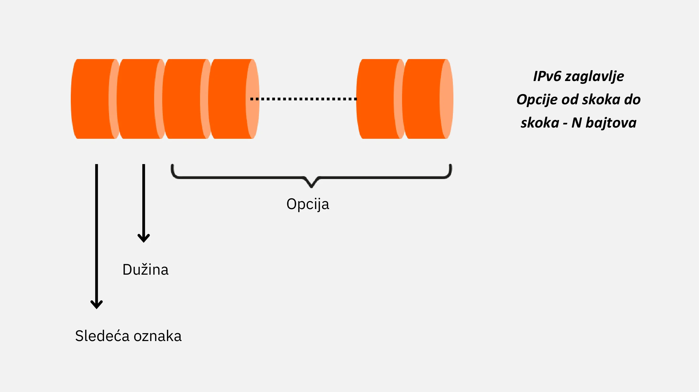


#### Zaglavlje usmeravanja


Zaglavlje usmeravanja specificira listu posrednih adresa kroz koje paket mora proći. Postoje dva glavna režima usmeravanja:


- Strogo rutiranje: tačna putanja je unapred definisana
- Labavo usmeravanje: samo određeni obavezni koraci su navedeni.


Prva četiri polja ovog zaglavlja za usmeravanje su:


- **Sledeće zaglavlje**: identifikuje tip sledećeg zaglavlja;
- **Tip rutiranja**: definiše metod rutiranja (obično `0`);
- **Preostali segmenti**: broj preostalih segmenata za prelazak ;
- **Adresa[n]**: lista srednjih adresa.


Polje "Segments Left" počinje sa ukupnim brojem preostalih segmenata i smanjuje se za jedan pri svakom skoku.


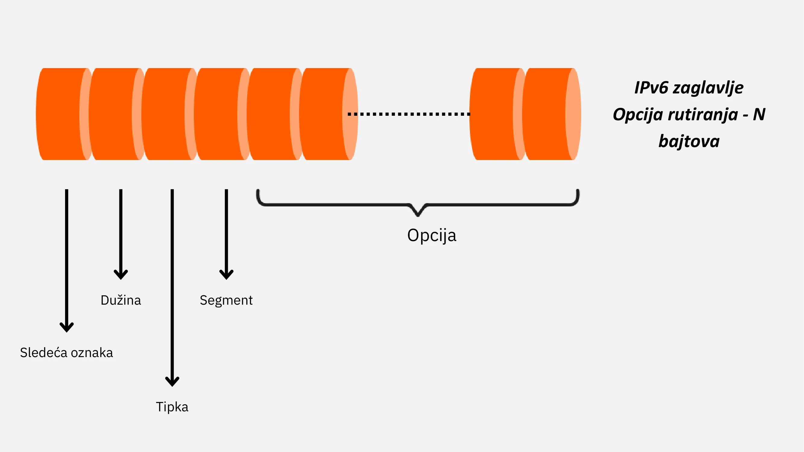


#### Zaglavlje fragmentacije


U IPv6, samo izvorni host sme da fragmentira datagram, za razliku od IPv4 gde su ruteri takođe mogli to da rade. Svi IPv6 čvorovi moraju biti sposobni da obrade pakete od najmanje 1280 bajtova. Ako ruter naiđe na paket veći od MTU naredne veze, šalje poruku *ICMPv6 Packet Too Big* nazad izvoru, koji zatim prilagođava veličinu svojih prenosa.


Zaglavlje fragmentacije sadrži sledeća polja:


- **Identification**: jedinstveni identifikator datagrama za ponovno sastavljanje.
- **Fragment Offset**: pozicija fragmenta unutar originalnog datagrama.
- **M flag**: označava da li sledi još fragmenata.


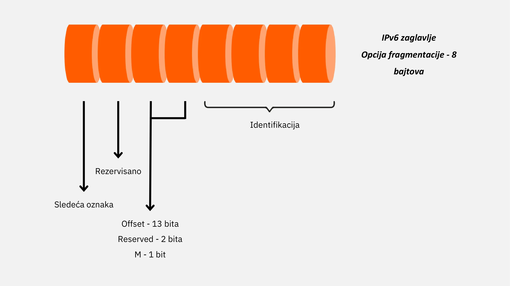


#### Autentifikaciono zaglavlje (AH)


Ovo zaglavlje je dizajnirano da osigura komunikacije verifikovanjem autentičnosti pošiljaoca i integriteta podataka. Obično se koristi sa IPsec protokolom. Koristeći autentifikacioni kod, primalac može potvrditi da poruka zaista dolazi od očekivanog pošiljaoca i da nije izmenjena tokom prenosa.


U slučaju pokušaja lažne izmene, kod za autentifikaciju više neće odgovarati i datagram može biti odbijen. Ovaj mehanizam takođe štiti od napada ponavljanjem otkrivanjem neovlašćenih duplikacija.


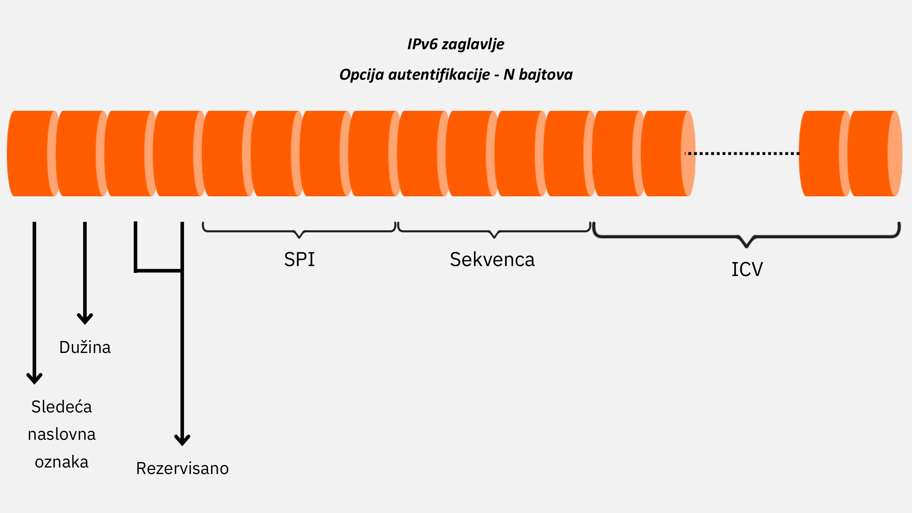


#### Zaglavlje opcija odredišta


Ovo zaglavlje je namenjeno samo za krajnjeg primaoca datagrama. Može se koristiti za dodavanje opcija ili metapodataka specifičnih za aplikaciju, a koje usputni ruteri ignorišu.


U početku, takva opcija nije bila definisana u protokolu. Međutim, ovo zaglavlje je uvedeno kada je IPv6 dizajniran, kako bi se omogućilo dodavanje budućih proširenja bez modifikovanja ukupne strukture paketa. Null opcija, na primer, koristi se samo za popunjavanje zaglavlja na višekratnik od 8 bajtova radi poravnanja memorije.


Dizajn IPv6 paketa zasnovan je na jasnoj separaciji između minimalnog osnovnog zaglavlja i modularnih zaglavlja za proširenje. Ova arhitektura osigurava kako standardne performanse obrade, tako i fleksibilnost potrebnu za evoluciju protokola i integraciju sigurnosti, složenog rutiranja ili mehanizama kvaliteta usluge, uz održavanje kompatibilnosti sa budućim infrastrukturama.


## Odnos između IPv6 i DNS-a


<chapterId>421eacb8-b80b-4aee-910f-e069ed805f00</chapterId>


U modernim mrežama, DNS (*Domain Name System*) prevodi nazive domena u IP adrese koje mašine mogu koristiti. Sa uvođenjem IPv6, DNS je morao da se prilagodi kako bi podržao 128-bitne adrese, dok je zadržao unazadnu kompatibilnost sa IPv4. Ovaj suživot je posebno važan u dual-stack okruženjima, gde obe verzije IP-a rade istovremeno.


### DNS zapisi specifični za IPv6


Da bi se ime domena povezalo sa IPv6 adresom, DNS koristi AAAA (*quad-A*) zapis, analogan "A" zapisu za IPv4 adrese. AAAA zapis eksplicitno mapira ime domena na IPv6 adrese.

Primer:


```shell
ipv6.mydmn.org.         IN      AAAA    2001:66c:2a8:22::c100:68b
```


Ovaj zapis pokazuje da domen `ipv6.mydmn.org` razrešava na IPv6 adresu `2001:66c:2a8:22::c100:68b`. Moguće je, a čak i preporučljivo za maksimalnu kompatibilnost, povezati isti naziv domena sa nekoliko IP adresa, bilo IPv4 (putem A zapisa) ili IPv6 (putem AAAA zapisa). Ovo omogućava korisnicima kompatibilnim sa IPv6 da preferiraju IPv6, dok se obezbeđuje podrška za klijente koji koriste samo IPv4.


Pored toga, DNS podržava obrnuto rešavanje, što znači da može pronaći ime domena povezano sa datom IP adresom. U slučaju IPv6, ova operacija koristi PTR zapise smeštene u zoni `ip6.arpa`. Ova zona je specifično rezervisana za obrnuto rešavanje IPv6. Za IPv4, to je zona `in-addr.arpa`.


### Obrnuta rezolucija


Obrnuto razrešavanje IPv6 adresa prati strogu proceduru:

1) Proširi adresu u punu heksadecimalnu notaciju (16 bajtova, tj. 32 heksadecimalne cifre).

Primer:


```shell
2001:66c:2a8:22::c100:68b
```


Postaje:


```shell
2001:066c:02a8:0022:0000:0000:c100:068b
```


2) Obrnite redosled svake heksadecimalne cifre (nibble), odvojite ih tačkama i dodajte `ip6.arpa`:


```shell
b.8.6.0.0.0.1.c.0.0.0.0.0.0.0.0.2.2.0.0.8.a.2.0.c.6.6.0.1.0.0.2.ip6.arpa  IN PTR  ipv6.mydmn.org
```


Ova struktura osigurava standardizovane, jedinstvene obrnute pretrage u IPv6 adresnom prostoru.


**Imajte na umu**: DNS upiti mogu putovati preko IPv4 ili IPv6. Korišćeni transportni protokol nema uticaja na tip vraćenih zapisa.

Na primer:


- Klijent povezan preko IPv6 može zatražiti IPv4 zapis.
- Klijent povezan preko IPv4 može zatražiti IPv6 zapis.

DNS server jednostavno odgovara sa zapisima koje ima, bez obzira na transportni protokol upita.


Kada je ime hosta mapirano na oba, IPv4 i IPv6, izbor koju adresu koristiti je regulisan RFC 6724, koji definiše algoritam izbora adresa zasnovan na faktorima kao što su preferencija prefiksa, opseg i dostupnost. Podrazumevano, IPv6 je generalno preferiran osim ako nije nadjačan sistemskom ili mrežnom konfiguracijom.


**Važno podsećanje**: kada se IPv6 adresa ugrađuje u URL (*Uniform Resource Locator*), mora biti obuhvaćena uglastim zagradama (`[]`). Ovo izbegava zabunu između dvotačke (`:`) unutar IPv6 adrese i dvotačke koja razdvaja ime hosta od porta u URL-u.


Važeći primer:


```shell
http://[2001:db8::1]:8080
```


Ovo osigurava da URL bude ispravno obrađen od strane i pregledača i veb servera.


Integrisanje IPv6 u DNS sistem stoga se oslanja na nove tipove zapisa, strogu metodu za reverznu rezoluciju i precizna pravila za odabir i formatiranje kako bi se osigurala kompatibilnost i doslednost rutiranja.


### Deo rezimea


U ovom odeljku, istražili smo osnovne principe IPv6 adresiranja. Počeli smo ispitivanjem strukture IPv6 adresa: njene dužine od 128 bita, heksadecimalne notacije i pravila pojednostavljenja korišćenih za skraćivanje ponavljajućih sekvenci nula. Ovaj dizajn omogućava IPv6 da prevaziđe ograničenja IPv4 adresnog prostora, dok garantuje skalabilnost i efikasnu hijerarhiju.


Zatim smo pogledali različite kategorije IPv6 adresa: unicast, anycast i multicast, detaljno opisujući njihov opseg, tipičnu upotrebu i predstavljanje u adresnom prostoru.


Zatim smo pregledali metode dodeljivanja IPv6 adresa unutar lokalne mreže, bilo ručnom konfiguracijom, putem DHCPv6 protokola, ili korišćenjem mehanizama za stateless autokonfiguraciju kao što su oni koje nudi NDP. Ovi pristupi omogućavaju uređajima da automatski generišu svoje sopstvene adrese iz datog prefiksa i njihove MAC adrese (putem EUI-64), dok nude fleksibilnost u smislu upravljanja vremenom trajanja i privatnošću.


Takođe smo detaljno objasnili kako se dodeljuju adresni blokovi, počevši od IANA, koja distribuira pet RIR-ovima (*Registrovane Internet Regije*), a zatim ISP-ovima, koji ih redistribuiraju svojim korisnicima kao podmreže (često u /48, što omogućava 65536 /64 podmreža). Razlika između _Provider Aggregatable_ (PA) i _Provider Independent_ (PI) blokova pomaže u upravljanju scenarijima _multihoming_-a ili promene provajdera.


Videli smo da se DNS prilagodio na IPv6 uvođenjem AAAA zapisa, i da se mehanizmi reverzne rezolucije sada oslanjaju na `ip6.arpa` zonu. Važno je napomenuti da DNS ostaje nezavisan od korišćenog transportnog protokola (IPv4 ili IPv6), obezbeđujući besprekornu interoperabilnost u dual-stack okruženju.


IPv6 nije samo inkrementalno poboljšanje u odnosu na IPv4, već potpuni redizajn adresnog sistema, napravljen da zadovolji i trenutne i buduće izazove globalnog Interneta.


U završnom delu ovog NET 302 kursa, preći ćemo na praksu i fokusirati se na alate za dijagnostiku mreže.


# Alati za dijagnostiku mreže


<partId>368a5c6f-ec48-4b28-970f-3a770788ad37</partId>


## Alati za rad na sloju pristupa mreži (eng. Network Access)


<chapterId>1d25a21d-6900-4fbe-a438-e06c8afb9e02</chapterId>


U ovom prvom poglavlju završnog dela o dijagnostici mreže, fokusiramo se na alate za analizu mrežnog pristupa TCP/IP modela. Ovaj sloj je odgovoran za direktnu komunikaciju između uređaja na istoj fizičkoj mreži, posebno kroz korišćenje MAC adresa i fizičkih mrežnih interfejsa kao što su Ethernet kartice ili Wi-Fi interfejsi.


Cilj je da se administratorima obezbede praktični alati za proveru, testiranje i optimizaciju ovog osnovnog sloja mrežnog povezivanja. Ovi alati se mogu koristiti za verifikaciju pravilnog rada interfejsa, rešavanje problema sa konfiguracijom mrežne kartice, ili detekciju anomalija kao što su sudari, gubitak paketa ili greške u vezi.


### Alati za IP/MAC susede (uređaje na istom linku/LAN-u)


#### `Arp` alat


Jedan od najstarijih dijagnostičkih alata na sloju mrežnog pristupa je `arp` komanda. Iako je sve više zamenjena modernim alternativama kao što je `ip neigh` (koju ćemo uskoro otkriti). `Arp` je i dalje prisutan na mnogim sistemima za pregled ili manipulaciju ARP (*Address Resolution Protocol*) keša. Ovaj keš čuva mapiranja između IP adresa i MAC adresa poznatih lokalno na mašini. Drugim rečima, omogućava vam da odredite koja fizički (MAC) adresa odgovara datoj IP adresi na lokalnoj mreži.


U praksi, kada host želi da pošalje paket na IP adresu unutar iste podmreže, prvo mora znati MAC adresu ciljne mašine. Ovo mapiranje se obrađuje putem ARP-a, koji emituje zahtev na lokalnoj mreži i prima odgovor koji sadrži odgovarajuću MAC adresu. Ovaj rezultat se zatim privremeno skladišti u lokalnoj tabeli koja se zove "ARP keš", kako bi se izbeglo ponavljanje zahteva za svaki novi paket.


Da biste pregledali sadržaj ove keš memorije i proverili unose koji su trenutno poznati mašini, koristite:


```bash
arp -a
```


Ova komanda prikazuje sve lokalno registrovane IP/MAC mape, preko svih interfejsa. Svaka linija pruža ime hosta (ako je rešivo), IP adresu, odgovarajuću MAC adresu i interfejs gde je mapa primećena.


Da biste filtrirali prikaz za određenu IP adresu, jednostavno je navedite:


```bash
arp -a 192.168.1.5
```


Ovo olakšava proveru da li je određena IP adresa prisutna u kešu, što može pomoći u dijagnostikovanju problema u komunikaciji između dva hosta na istoj mreži.


Isto tako, da biste prikazali samo ARP unose povezane sa specifičnim mrežnim interfejsom (na primer Ethernet kartica nazvana `eth0`), možete koristiti:


```bash
arp -a -i eth0
```


Ovo je posebno korisno u okruženjima sa više interfejsa (žičnim, bežičnim, VPN, itd.), gde jedan host može imati nekoliko mrežnih adaptera.


Komanda `arp` nije ograničena samo na režim čitanja. Takođe se može koristiti za ručno uređivanje ARP keša, što je neprocenjiva funkcija u određenim naprednim scenarijima rešavanja problema ili kada se simuliraju specifični uslovi. Na primer, možete ručno dodati IP/MAC mapiranje:


```bash
arp -s 192.168.1.7 00:17:BC:56:4F:25 -i eth2
```


Ova komanda kreira statički unos u lokalnoj ARP tabeli, povezujući IP adresu `192.168.1.7` sa MAC adresom `00:17:BC:56:4F:25` na interfejsu `eth2`. Ako nijedan interfejs nije specificiran, sistem automatski koristi prvi primenljivi.


Takođe možete ukloniti unos iz ARP keša, bilo da ispravite grešku ili da primorate ponovno otkrivanje:


```bash
arp -d 192.168.1.7
```


Ovo briše unos, osiguravajući da sledeći pokušaj komunikacije pokrene novi ARP zahtev.


**NAPOMENA**: Opcija brisanja takođe prihvata naziv interfejsa, omogućavajući vam da preciznije ciljate uklanjanje određenog unosa.


Ukratko, alat `arp` omogućava dijagnostiku na osnovnom mrežnom sloju, što je posebno korisno u lokalnim mrežama gde problemi u povezivanju često potiču od pogrešnog ili zastarelog mapiranja adresa. Međutim, na novijim sistemima, posebno sa modernim Linux distribucijama, ova alatka se sve više zamenjuje komandom `ip neigh`, iz skupa alatki `iproute2`, koji nudi sličnu funkcionalnost unutar jednog paketa.


#### Alat `Ip neigh`


Na modernim sistemima, posebno na novijim Linux distribucijama, komanda `ip neigh` je osnovni alat za pregled i upravljanje mapiranjima između IP i MAC adresa. Ova komanda je deo `iproute2` paketa, koji postepeno zamenjuje starije alate kao što je `arp`, pružajući konzistentniji i fleksibilniji okvir za dijagnostiku na sloju podatkovne veze (eng. data link).


Komanda `ip neigh` ispituje lokalnu IP keš memoriju suseda, koja je ekvivalentna ARP kešu za IPv4 i NDP (_Neighbor Discovery Protocol_) kešu za IPv6. Ova keš memorija čuva poznate asocijacije između IP adresa (v4 ili v6) i MAC adresa, zajedno sa njihovim statusom (važeći, na čekanju, istekao...).


Osnovna komanda za prikazivanje keša je:


```bash
ip neigh
```


Ovo ispisuje listu unosa, prikazujući odredišnu IP adresu, relevantni mrežni interfejs, pridruženu MAC adresu (ako je dostupna), i stanje unosa (npr. `REACHABLE`, `STALE`, `DELAY`, `FAILED`...).


Primer izlaza:


```bash
192.168.1.5 dev eth0 lladdr 00:17:BC:56:4F:25 REACHABLE
```


Ova linija ukazuje da mašina zna za validno mapiranje između IP adrese `192.168.1.5` i MAC adrese `00:17:BC:56:4F:25` preko interfejsa `eth0`.


Takođe možete filtrirati unose prema kriterijumima kao što su IP adresa, interfejs, ili stanje. Na primer, upit samo za adresu `192.168.1.7`:


```bash
ip neigh show 192.168.1.7
```


Ili za prikaz svih unosa za interefjs `eth1`:


```bash
ip neigh show dev eth1
```


Pored konsultacija, `ip neigh` se može koristiti i za ručno uređivanje keša. Na primer, za dodavanje statičkog unosa:


```bash
ip neigh add 192.168.1.7 lladdr 00:17:BC:56:4F:25 dev eth1 nud permanent
```


Ovo trajno povezuje IP adresu `192.168.1.7` sa specificiranom MAC adresom na interfejsu `eth1`. Opcija `nud permanent` (za _Neighbor Unreachability Detection_) osigurava da unos neće biti automatski poništen.


Suprotno tome, da biste obrisali unos iz keša:


```bash
ip neigh del 192.168.1.7 dev eth1
```


Ovo primorava sistem da ponovo razreši mapiranje sledeći put kada komunicira sa tom adresom.


**NAPOMENA**: Alatka `ip neigh` radi i za IPv4 i za IPv6. Za IPv4, komunicira sa ARP; za IPv6, komunicira sa NDP. Ovo pruža jedinstven, konzistentan pristup upravljanju IP/MAC odnosima kroz protokolske porodice, čineći `ip neigh` modernim standardom za upravljanje susedima na Linux sistemima.


### Alati za analizu paketa


Da bi temeljno analizirali šta se dešava na računarskoj mreži, administratori trebaju alate koji mogu da uhvate pakete razmenjene između mašina. Dve alatke se ističu kao merila: `tcpdump` i `Wireshark`. Ovi alati su ključni za dijagnostikovanje abnormalnog ponašanja, praćenje razmene podataka unutar protokola ili proučavanje bezbednosti mreže kroz pregled sadržaja frejmova.


#### `tcpdump`: analiza komandne linije


`tcpdump` je veoma moćan alat komandne linije dizajniran za hvatanje i prikazivanje paketa koji prolaze kroz mrežni interfejs. Radi u realnom vremenu, i zahvaljujući svom laganom dizajnu, može se koristiti na sistemima bez grafičkog interfejsa ili sa ograničenim resursima. Koristi biblioteku `libpcap`, koja omogućava hvatanje mrežnih paketa nezavisno od hardvera.


Uobičajena upotreba `tcpdump` je praćenje mrežne aktivnosti mašine ili segmenta mreže, filtrirajući pakete prema specifičnim kriterijumima. Rezultati se mogu preusmeriti u datoteku, omogućavajući arhiviranje saobraćaja za kasniju analizu ili reprodukciju u drugom alatu, kao što je Wireshark.


Opšta sintaksa komande je:


```bash
tcpdump -w <file.cap> -i <interface> -s <snapshot_length> -n <filters>
```


- `-w` piše uhvaćene pakete u datoteku u formatu `libpcap` (ekstenzija `.cap` ili `.pcap`);
- `-i` specificira mrežni interfejs za nadgledanje (npr. `eth0`, `wlan0`);
- `-s` postavlja maksimalnu količinu podataka uhvaćenih po paketu. Navođenje `0` hvata sve pakete;
- `-n` onemogućava DNS i rezoluciju imena usluga, poboljšavajući performanse.


Izlazni filteri na kraju komande omogućavaju vam da ograničite hvatanje na podskup saobraćaja. Možete kombinovati ključne reči `host`, `port`, `src`, `dst`, itd., da biste precizirali izbor.


Primer: za hvatanje HTTP paketa (port 80) do ili od `192.168.25.24` servera, i njihovo čuvanje u `fichier.cap` fajl:


```bash
tcpdump -w fichier.cap -i eth0 -s 0 -n port 80 and host 192.168.25.24
```


Rezultujuća datoteka može kasnije biti analizirana u grafičkom alatu ili reprodukovana na drugom sistemu.


#### Wireshark: napredna vizuelna analiza

Wireshark, ranije poznat kao *Ethereal*, predstavlja kompletan program za analizu mreže sa grafičkim interfejsom. Za razliku od `tcpdump-a`, on obezbeđuje strukturisan i detaljan prikaz paketa, uključujući raščlanjivanje protokola, grafove tokova, statistiku saobraćaja i interaktivne filtere. Takođe se oslanja na `libpcap`, što znači da može da otvara i obrađuje datoteke sa snimcima (capture files) koje generiše `tcpdump`.


Wireshark je dostupan na mnogim operativnim sistemima, uključujući Linux i Windows. Instalacija zahteva administratorske privilegije za pristup interfejsima za hvatanje. Kada se pokrene, možete izabrati mrežni interfejs iz menija *Capture*. Klikom na *Start* počinje snimanje paketa u realnom vremenu. Prikaz je podeljen u tri panela:


- lista uhvaćenih frejmova;
- detalji dekodiranog protokola,
- sirovi heksadecimalni podaci.


Wireshark se ističe u scenarijima gde je potrebno posmatrati složeno ponašanje protokola, rekonstruisati dijaloge aplikacija (kao što su HTTP ili DNS sesije), ili proučavati vremena odziva servisa. Takođe podržava veoma specifične filtere prikaza koristeći svoju posebnu sintaksu (različitu od one `tcpdump`-a) kako bi se fokusirao samo na relevantne pakete.


#### Komplementarni alati


Važno je napomenuti da `tcpdump` i Wireshark nisu zamenjivi: svaki ima svoje prednosti. `tcpdump` je bolje prilagođen za komandno-linijska okruženja, automatizovane skripte i intervencije na udaljenim serverima, dok je Wireshark idealan za detaljnu, interaktivnu i edukativnu analizu saobraćaja.


Dva alata se mogu kombinovati: snimanje se može izvršiti na udaljenom sistemu pomoću `tcpdump`, zatim se `.cap` fajl prenosi za analizu koristeći Wireshark na lokalnom računaru. Ovaj pristup je široko korišćen u praksi.


### Alati za analizu interfejsa


Na sloju mrežnog pristupa, često je potrebno ispitati i konfigurisati fizičke mrežne interfejse kako bi se dijagnostikovali kvarovi, optimizovala performansa ili proverio integritet veze. Jedan od najmoćnijih alata dostupnih pod Linux-om za ovu svrhu je `ethtool`, komandno-linijski alat koji ne samo da pruža detaljne tehničke informacije o Ethernet interfejsu, već vam takođe omogućava da prilagodite neke od njegovih parametara u realnom vremenu.


#### Prikaz specifikacije interfejsa


Osnovna funkcija `ethtool` je njegova sposobnost da ispita interfejs i prikaže njegove trenutne karakteristike. Ovo vam omogućava da proverite:


- brzina veze (npr. 100 Mbit/s, 1 Gbit/s ili 10 Gbit/s);
- način pregovaranja (polu-dupleks ili puni dupleks);
- da li je automatsko pregovaranje omogućeno;
- tip porta (bakar, vlakno, itd.);
- status veze (aktivna ili ne) ;
- podrška za napredne funkcije kao što je *Wake-on-LAN*.


Ove informacije su posebno korisne za dijagnostikovanje problema vezanih za fizičku povezanost ili neusaglašena podešavanja pregovaranja između mrežne kartice hosta i opreme na koju se povezuje (svitch, ruter, itd.).


Da biste dobili ove informacije, jednostavno pokrenite:


```bash
ethtool enp0s3
```


Ova komanda ispisuje detaljan izveštaj o `enp0s3` interfejsu, uobičajena konvencija imenovanja na sistemima zasnovanim na CentOS ili RHEL.


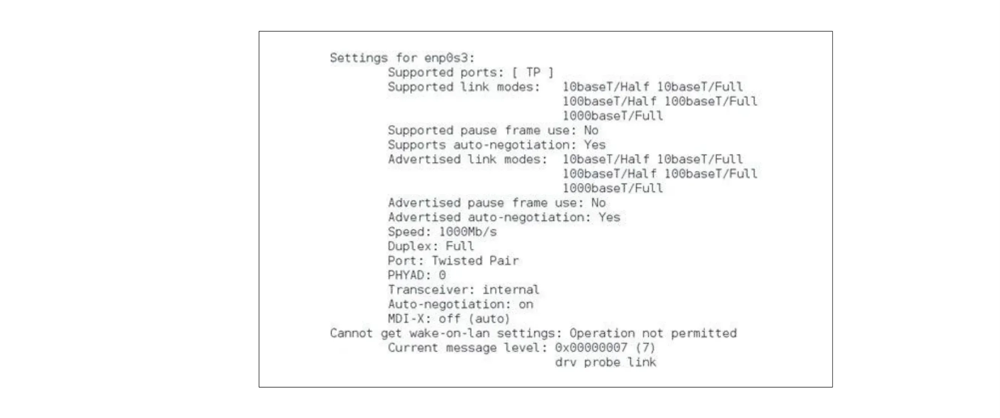


#### Dinamička promena parametara interfejsa


`ethtool` nije ograničen samo na posmatranje: takođe vam omogućava da prilagodite određene parametre interfejsa bez ponovnog pokretanja mašine. Ovo omogućava, na primer, da forsirate određenu brzinu veze ili omogućite funkcije prema potrebama lokalne mreže.


Opcija `-s` se koristi za dinamičku konfiguraciju parametara kao što su:


- brzina veze (`speed`), postavljena eksplicitno (npr. 1000 za 1 Gbit/s) ;
- duplex režim (`duplex`), ili `half` ili `full` ;
- omogućavanje ili onemogućavanje automatskog pregovaranja (`autoneg`) ;
- omogućavanje *Wake-on-LAN* (`wol`) ;
- tip porta.


Primer 1: omogućite automatsko pregovaranje na interfejsu:


```bash
ethtool -s enp0s3 autoneg on
```


Primer 2: omogućite funkciju *Wake-on-LAN* (da biste omogućili mašini da se probudi na daljinu putem magičnog paketa):


```bash
ethtool -s enp0s3 wol p
```


U ovom primeru, opcija `p` određuje da će buđenje nastupiti čim se detektuje *Wake-on-LAN* paket. Ova postavka se često koristi u poslovnim okruženjima za obavljanje noćnih ažuriranja ili daljinsko održavanje.


#### Instalacija alata


Važno je napomenuti da `ethtool` nije uvek instaliran podrazumevano. Na Red Hat/CentOS distribucijama, može se instalirati komandom:


```bash
yum install -y ethtool
```


Na Debianu i Ubuntu-u, ekvivalentna komanda je:


```bash
sudo apt install ethtool
```


**UPOZORENJE**: u svim `ethtool` komandama, ime mrežnog interfejsa mora biti navedeno odmah nakon opcije (kao kod `-s`). Bilo koja sintaksna greška u postavljanju parametara učiniće komandu nevažećom ili neučinkovitom.


## Alati mrežnog sloja (eng. Network)


<chapterId>d2c5bf35-4284-4af8-8e8b-049c696a511b</chapterId>


### Alati za analizu saobraćaja


U mrežnoj dijagnostici, komanda `ping` ostaje jedan od najjednostavnijih, ali najmoćnijih alata za testiranje povezanosti između dve mašine. Proverava da li je udaljeni host dostupan u datom trenutku, dok takođe pruža informacije o kašnjenju, stabilnosti veze i DNS rezoluciji.


Komanda `ping` oslanja se na ICMP (*Internet Control Message Protocol*) protokol. Kada korisnik pošalje `ping` zahtev, sistem šalje ICMP paket "Echo Request" ka IP adresi ili imenu hosta. Ako je ciljna mašina online i mrežni put važeći, odgovara ICMP paketom "Echo Reply". Ovaj jednostavan mehanizam može se koristiti za merenje latencije i otkrivanje problema sa povezivanjem ili rezolucijom imena.


Primer klasične komande:


```bash
ping 172.17.18.19
```


Tipičan odgovor:


```bash
mydmn.org (172.17.18.19): 56 data bytes
64 bytes from 172.17.18.19: icmp_seq=0 ttl=56 time=7.7 ms
64 bytes from 172.17.18.19: icmp_seq=1 ttl=56 time=6.0 ms
64 bytes from 172.17.18.19: icmp_seq=2 ttl=56 time=5.5 ms
```


U ovom primeru, razrešavanje imena je izvršeno automatski: domen `mydmn.org` je povezan sa IP adresom `172.17.18.19`, što potvrđuje da DNS razrešavanje funkcioniše ispravno. Komanda takođe pruža tehničke detalje kao što su:


- broj sekvence iCMP (`icmp_seq`), koristan za proveru redosleda odgovora;
- TTL (*Time-To-Live*), što označava broj preostalih skokova pre nego što se paket odbaci;
- vreme povratnog putovanja/kašnjenje (`time`), izraženo u milisekundama, pružajući procenu latencije veze.


#### Detaljnija analiza ICMP parametara


TTL je kritično polje u IP protokolu. Svaki datagram je inicijalizovan sa TTL vrednošću od strane pošiljaoca (često 64, 128 ili 255). Svaki ruter na putu smanjuje ovu vrednost za 1. Ako TTL dostigne 0 pre nego što stigne na odredište, paket se odbacuje i ICMP greška se vraća pošiljaocu. Ovaj mehanizam sprečava beskonačne petlje rutiranja.


Vreme propagacije (*round-trip delay/time*) pokazuje koliko traje da paket ode do odredišta i vrati se nazad. U praksi, kašnjenje ispod 200 ms se smatra prihvatljivim za stabilnu vezu. Nenormalno visoka kašnjenja mogu ukazivati na zagušenje mreže, neefikasno rutiranje ili loš kvalitet veze.


#### Napredno korišćenje `ping` komande


`ping` pruža opcije za preciziranje testova i posmatranje specifičnih mrežnih ponašanja.


Da biste poslali broadcast zahteve, možete koristiti opciju `-b` da ciljate sve hostove na podmreži:

```bash
ping -b 192.168.1.255
```


Ovo je korisno na lokalnim mrežama za brzo otkrivanje aktivnih hostova ili testiranje kako mreža obrađuje broadcast zahteve. Međutim, u mnogim konfiguracijama, ruteri i firewall-ovi blokiraju broadcast pingove kako bi sprečili napade amplifikacije.


Takođe možete navesti prilagođeni interval između zahteva pomoću opcije `-i` (podrazumevano: 1 sekunda):


```bash
ping -i 0.2 -c 10 192.168.1.7
```


Ovo šalje 10 ICMP zahteva u intervalima od 0,2 sekunde. Takvo testiranje je korisno za otkrivanje fluktuacija kašnjenja tokom kratkog perioda ili za blago opterećenje veze kako bi se procenila njena stabilnost.


### Alati za analizu tabele rutiranja


Komanda `ip route`, deo `iproute2` paketa, je preporučeni i standardni alat na modernim Linux sistemima za pregled i upravljanje IP rutirajućom tabelom kernela. Ona zamenjuje zastarelu komandu `route`, nudeći jasniju sintaksu, veću doslednost i proširenu podršku za moderne funkcije (IPv6, više tabela, imenski prostori, itd.).


#### Prikazivanje tabele rutiranja


Da biste prikazali trenutnu tabelu rutiranja:


```bash
ip route show
```


Ovaj izlaz navodi sve rute poznate kernelu, odnosno puteve koje odlazni paketi koriste u zavisnosti od njihove destinacije.


Primer izlaza:


```bash
default via 192.168.1.1 dev eth0 proto dhcp metric 100
192.168.1.0/24 dev eth0 proto kernel scope link src 192.168.1.100
```


Svaka linija predstavlja rutu. Ključna polja uključuju:


- **default**: podrazumevana ruta, koristi se kada nijedna specifičnija ruta ne odgovara.
- **via**: prolaz korišćen za dolazak do odredišta.
- **dev**: korišćeni mrežni interfejs.
- **proto**: kako je ruta kreirana (ručno, DHCP, kernel, itd.).
- **metric**: cena rute, koristi se za prioritizaciju više mogućih puteva.
- **scope**: opseg rute (npr. `link` za direktno povezanu rutu).
- **src**: izvorna IP adresa korišćena za odlazne pakete na ovom interfejsu.


#### Dodavanje i brisanje ruta


Takođe možete dinamički modifikovati tabelu rutiranja, na primer dodavanjem ili uklanjanjem statičkih ruta.


Dodavanje statičke rute:


```bash
ip route add 192.168.1.0/24 via 192.168.1.1 dev eth0
```


Ovo konfiguriše rutu do `192.168.1.0/24` mreže, preko `192.168.1.1` prolaza na `eth0` interfejsu.


Ukloni ovu rutu:


```bash
ip route del 192.168.1.0/24
```


Ova komanda briše prethodno definisanu rutu.


#### Korisne komande


Evo nekoliko korisnih varijanti za analizu ili skriptovanje:


- `ip -4 route`: prikazuje samo IPv4 rute;
- `ip -6 route`: prikazuje samo IPv6 rute;
- `ip route list table main`: prikazuje glavnu tabelu rutiranja (podrazumevana vrednost) ;
- `ip route get <Address>`: pokazuje koji bi interfejs i prolaz koristio paket do date adrese.


Primer:


```bash
ip route get 8.8.8.8
```


Ovo prikazuje tačnu putanju koju bi paket prešao da stigne do `8.8.8.8`.


### Alati za praćenje


Jedan od najefikasnijih alata za analizu puta kojim IP paketi putuju između izvornog hosta i ciljne destinacije je komanda `traceroute`. Ona prikazuje, korak po korak, putanju koju paketi prate i identifikuje međusobne rutere kroz koje prolaze. U slučaju kvara mrežne veze ili prekida usluge, `traceroute` pomaže u preciznom određivanju lokacije problema.


Kao i kod komande `ping`, cilj se može navesti ili putem njegovog potpuno kvalifikovanog imena domena (FQDN) ili putem njegove IP adrese. Na primer:


```bash
traceroute mydmn.org
```


#### Princip rada


`traceroute` se oslanja na TTL (*Time To Live*) polje u zaglavlju IP paketa. Kao što je ranije objašnjeno, ovo polje je brojač koji se smanjuje od strane svakog rutera na putu. Kada TTL dostigne nulu, paket se odbacuje, a ruter vraća ICMP poruku "Time Exceeded" pošiljaocu. Ovaj mehanizam sprečava beskonačne petlje u slučaju pogrešnog usmeravanja.


`traceroute` koristi ovu osobinu da mapira rutere između pošiljaoca i primaoca:


- Prvo šalje seriju UDP paketa (obično tri), sa TTL-om od 1. Prvi ruter nailazi na TTL od 0 pa odbacuje paket i zatim odgovara ICMP porukom, otkrivajući svoju IP adresu i vreme odgovora.
- Zatim šalje još jednu seriju paketa sa TTL-om od 2, otkrivajući drugi ruter.
- Proces se ponavlja dok se ne dostigne odredište, u tom trenutku domaćin odgovara sa ICMP Port Unreachable porukom, što ukazuje da je krajnja tačka dostignuta.


Podrazumevano, `traceroute` koristi UDP pakete poslate na neiskorišćene portove (obično počevši od 33434), ali se takođe može konfigurisati da koristi ICMP (kao `ping`) ili čak TCP, u zavisnosti od sistema ili varijanti komande.


Primer izlaza:


```bash
traceroute to www.google.fr (216.58.210.35), 64 hops max, 52 byte packets

1  par81-024.ff.avast.com (62.210.189.205)   25.107 ms  24.235 ms  24.383 ms
2  62-210-189-1.rev.poneytelecom.eu (62.210.189.1)  27.341 ms  27.119 ms  28.184 ms
3  a9k1-45x-s43-1.dc3.poneytelecom.eu (195.154.1.92)  25.910 ms  25.040 ms  25.558 ms
4  72.14.218.182 (72.14.218.182)  36.234 ms  39.907 ms  38.130 ms
5  108.170.244.177 (108.170.244.177)  25.880 ms
108.170.244.240 (108.170.244.240)  25.791 ms
108.170.244.177 (108.170.244.177)  26.449 ms
6  216.239.62.143 (216.239.62.143)  26.491 ms
216.239.43.157 (216.239.43.157)  26.414 ms
216.239.62.139 (216.239.62.139)  26.400 ms
...
9  108.170.246.161 (108.170.246.161)  33.174 ms
108.170.246.129 (108.170.246.129)  34.342 ms
108.170.246.161 (108.170.246.161)  33.707 ms
10  108.170.232.105 (108.170.232.105)  33.845 ms  33.846 ms
108.170.232.103 (108.170.232.103)  34.206 ms
11  lhr25s11-in-f35.1e100.net (216.58.210.35)  34.094 ms  33.353 ms  33.718 ms
```


Svaka linija odgovara ruteru kroz koji se prolazi, sa do tri merenja vremena (u milisekundama) koja ukazuju na kašnjenje povratnog putovanja do tog rutera. Ove vrednosti pomažu u proceni performansi svakog segmenta mreže.


#### Tumačenje rezultata


Ako ruter ne odgovara ili filtrira ICMP poruke, zvezdice `*` se prikazuju umesto vremena odziva. Ovo može ukazivati na:


- firewall koji blokira ICMP odgovore,
- uređaj konfigurisan da ne reaguje, ili
- privremeni problem sa povezivanjem duž puta.


Dakle, `traceroute` ne samo da identifikuje putanju već i ističe tačke abnormalne latencije ili prekida.


Na nekim sistemima može se koristiti ekvivalentna komanda `tracepath`, koja ne zahteva root privilegije. Za IPv6, koristite `traceroute6` ili `tracepath6`.


Primer za praćenje IPv6:


```bash
traceroute6 ipv6.google.com
```


### Alati za proveru aktivnih konekcija


Da biste dijagnostikovali aktivne mrežne konekcije i pratili mrežnu aktivnost na Linux sistemu, komanda `ss` (skraćeno od _socket statistics_) je savremeni referentni alat. Deo `iproute2` paketa, zamenjuje sada zastareli `netstat`, nudeći bolje performanse i preciznije rezultate.


`ss` prikazuje aktivne TCP i UDP konekcije, portove koji slušaju, lokalne i udaljene adrese, stanja konekcija i pridružene procese.


#### Opšta upotreba


Kada se pokrene bez opcija, komanda `ss` prikazuje aktivne TCP konekcije. Osnovna sintaksa:


```bash
ss [options]
```


Neke uobičajene opcije za preciziranje analize:


- `-t`: prikaži samo TCP konekcije;
- `-u`: prikaži samo UDP konekcije;
- `-l`: prikaži samo osluškujuće sokete;
- `-n`: onemogućava razrešavanje imena (IP-ovi u numeričkom obliku i brojevi portova bez prevoda u servisne nazive);
- `-p`: prikaži svaki proces povezan sa soketom (PID i naziv programa),
- `-a`: prikaži sve veze, uključujući neaktivne,
- `-s`: prikazuje detaljnu statistiku socket-a.


#### Studije slučaja


Da biste prikazali sve aktivne veze koje koriste TCP port 80 (HTTP):


```bash
ss -ant | grep ':80'
```


Ovo prikazuje aktivne TCP konekcije koje uključuju port 80. Stanja kao što su `LISTEN`, `ESTABLISHED`, `TIME-WAIT` označavaju trenutni status svake razmene


Primer izlaza:

```
ESTAB 0 0 192.168.1.10:54321  93.184.216.34:80
```


Da prikažete sve mrežne veze sa povezanim procesima:


```bash
ss -tulnp
```


Da biste dobili ukupni sažetak korišćenja soketa:

```bash
ss -s
```


Da biste filtrirali samo UDP konekcije:

```bash
ss -unp
```


Ove komande su posebno korisne za otkrivanje sumnjivih veza, neočekivanih portova za slušanje ili praćenje aktivnosti određene usluge.


## Alati za transportni i aplikacioni sloj


<chapterId>bce47931-930e-4288-b0fd-666c9a1066b5</chapterId>


### DNS alati za upite


U gornjim slojevima TCP/IP modela, posebno na aplikativnom sloju, važno je razumeti kako funkcioniše razrešavanje imena. DNS alati za upite omogućavaju vam da proverite da li je ime domena ispravno povezano sa IP adresom, i takođe pomažu u dijagnostikovanju problema sa DNS serverom kao što su pogrešna konfiguracija, kašnjenja u propagaciji ili nedostupnost. Ovi alati su neophodni za svakog mrežnog administratora ili bilo kog korisnika koji želi dublje razumevanje DNS razmena u IP okruženju.


#### Komanda `nslookup`


Najjednostavniji alat za DNS upite je `nslookup`. On šalje upit DNS serveru i vraća IP adresu povezanu sa nazivom domena (ili obrnuto). Podrazumevano, on šalje upite DNS serveru koji je konfigurisan na sistemu, ali možete direktno navesti server u komandi.


Primer direktnog pretraživanja:

```bash
nslookup mydmn.org
```


Upit specifičnog DNS servera:

```bash
nslookup mydmn.org 192.6.23.4
```


Zahtev traži od DNS servera na `192.6.23.4` da razreši ime `mydmn.org`. Ovo je posebno korisno za proveru da li dati DNS server prepoznaje ime domena ili za verifikaciju da server radi ispravno.


#### Komanda `dig`


`dig` (*Domain Information Groper*) je moderniji, potpuniji i fleksibilniji alat od `nslookup`. Podržava složene upite i pruža detaljne informacije o procesu razrešavanja, hijerarhiji uključenih servera, tipu vraćenog zapisa (A, AAAA, MX, TXT, itd.) i svim greškama na koje naiđe.


Osnovni primer upita:

```bash
dig mydmn.org
```


Upit ka specifičnom DNS serveru:

```bash
dig @192.6.23.4 mydmn.org
```


Ova komanda proverava dostupnost DNS zapisa na datom serveru.

Jedna od ključnih prednosti `dig` je ta što prikazuje detalje DNS odgovora, što ga čini veoma korisnim za dijagnostikovanje grešaka u konfiguraciji.


#### Ručno konfigurisanje DNS resolvera


Ponekad je potrebno nadjačati DNS servere koji se koriste lokalno, na primer, u testnim okruženjima ili da bi se primoralo korišćenje specifičnih servera. Ovo se može uraditi uređivanjem datoteke `/etc/resolv.conf`, koja definiše postavke DNS rezolucije sistema.


Primer konfiguracije:


```bash
vi /etc/resolv.conf

search mydmn.org
nameserver 192.168.1.10
nameserver 192.168.1.11
```


- Polje `search` specificira domen koji se automatski dodaje prilikom razrešavanja kratkih imena.
- Unosi `nameserver` definišu DNS servere koji će se koristiti, po prioritetu.


Na mnogim modernim distribucijama (posebno onima koje koriste `systemd-resolved`), promene u `/etc/resolv.conf` su privremene i mogu biti prepisane pri ponovnom pokretanju ili ponovnom povezivanju na mrežu. Trajnije metode uključuju korišćenje `resolvconf`, `systemd-resolved`, ili modifikovanje *NetworkManager* konfiguracija.


#### Komanda `host`


Još jedan jednostavan, ali efikasan DNS alat je `host`. On prevodi imena domena u IP adrese (ili obrnuto) i može pomoći u dijagnostikovanju DNS grešaka ili pogrešnih konfiguracija na mrežnom interfejsu.


Primeri:

```bash
host mydmn.org
```


Obrnuto pretraživanje:

```bash
host 192.6.23.4
```


`host` je posebno koristan za brze provere, naročito kada se koristi u komandno-linijskim skriptama.


Ponovljeni ili intenzivni upiti ka DNS serverima trećih strana bez dozvole mogu biti protumačeni kao pokušaji upada ili zlonamerne aktivnosti. Nepravilna upotreba, ili upotreba protiv mreža koje ne kontrolišete, može izgledati kao skeniranje u svrhu izviđanja, što je često prvi korak u napadu. Uvek ograničite njihovu upotrebu na okruženja koja administrirate ili gde imate eksplicitnu dozvolu.


### Alati za skeniranje mreže


Kada nadgledate ili osiguravate lokalnu ili širokopojasnu mrežu, ključno je identifikovati aktivne uređaje i usluge koje pružaju. Upravo to radi alatka `nmap` (*Network Mapper*).


https://planb.academy/tutorials/computer-security/communication/nmap-862300d7-6dfb-4660-970d-f56a9f58f60d

#### Uvod u `nmap`


`nmap` omogućava ciljano skeniranje jednog ili više hostova kako bi se detektovali otvoreni portovi, dostupne usluge (HTTP, SSH, DNS, itd.), a ponekad čak i tip operativnog sistema koji se koristi. Zahvaljujući mnogim opcijama, `nmap` pruža precizan pregled izloženost mreže, što je ključno tokom faza revizije ili učvršćivanja u upravljanju infrastrukturom.


Baš kao i komanda `host`, `nmap` nikada ne sme biti korišćen na mrežama ili infrastrukturama koje ne posedujete, ili bez eksplicitne dozvole. Neovlašćeno skeniranje portova može biti označeno kao zlonameran pokušaj izviđanja, često biva detektovano od strane sigurnosnih sistema (firewall, IDS/IPS), i može čak dovesti do pravnih posledica.


#### Osnovna upotreba


Da biste skenirali određeni host i videli njegove otvorene portove:

```bash
nmap 192.168.0.1
```


Ova komanda skenira 1000 najčešćih portova na hostu `192.168.0.1` i prikazuje pristupljene servise i korišćene protokole. Ako je DNS rezolucija konfigurisana, možete koristiti i ime hosta umesto IP-a adrese.


#### Kompletno skeniranje mreže


Jedna od prednosti `nmap`-a je njegova sposobnost da skenira čitav opseg adresa jednom komandom. Ovo olakšava, na primer, brzo popisivanje svih aktivnih mašina na mreži:


```bash
nmap 192.168.0.0/24
```


U ovom slučaju, svi hostovi u opsegu `192.168.0.0` do `192.168.0.255` će biti ispitani. Za svaku IP adresu, rezultati navode otvorene portove, njihov status (otvoren, filtriran, itd.), i, kada je moguće, ime odgovarajuće usluge.


Administrator može da se osloni na `nmap` za nekoliko zadataka:


- **Otkrivanje aktivnih hostova**: identifikujte koje mašine odgovaraju unutar podmreže;
- **Inventar usluga**: osigurajte da su dostupni samo neophodni portovi (princip principa najmanje privilegije);
- **Provera usklađenosti**: uporedite otvorene portove sa bezbednosnom politikom organizacije;
- **Prevencija ranjivosti**: uočite nesigurne ili zastarele servise koji rade na kritičnim mašinama.


https://planb.academy/tutorials/computer-security/communication/nmap-862300d7-6dfb-4660-970d-f56a9f58f60d

### Alati za ispitivanje procesa


Za detaljnu analizu aktivnih procesa i otvorenih fajlova, posebno u kontekstu umrežavanja, administratori Linux sistema često koriste komandu `lsof` (*List Open Files*). Uprkos svom nazivu, `lsof` nije ograničen na tradicionalne fajlove: na UNIX sistemima, sve se smatra fajlom, uključujući mrežne sokete, uređaje i komunikacione kanale.


Ovaj alat stoga pruža presečni prikaz sistema korelisanjem aktivnih procesa, otvorenih mrežnih portova, pristupljenih fajlova i uključenih korisnika.


#### Analiza mreže pomoću `lsof`


Opcija `-i` ograničava izlaz na mrežne veze (TCP, UDP, IPv4, ili IPv6). Ovo olakšava pregled koji procesi komuniciraju preko mreže:


```bash
lsof -i
```


Ova komanda prikazuje sve pokrenute procese koji koriste mrežni soket, prikazujući korišćeni port, protokol (TCP/UDP), stanje veze, kao i PID i povezanog korisnika.


#### Filtriranje po IP adresi ili portu


Možete precizirati pretrage navođenjem IP adrese i porta, izolovanjem određenog mrežnog toka. Na primer, da proverite SMTP sesiju (port 25) sa određenim hostom:


```bash
lsof -n -i @192.168.2.1:25
```


Ovo će prikazati samo aktivne mrežne veze sa hostom `192.168.2.1` na portu 25, korisno za dijagnostikovanje sumnjivih aktivnosti ili problema sa SMTP protokom.


#### Praćenje pristupa uređaju


Još jedna prednost `lsof` je praćenje specijalnih fajlova kao što su particije diska. Na primer, da biste proverili koji procesi su otvorili fajlove na `/dev/sda1`:


```bash
lsof /dev/sda1
```


Ovo je korisno kada pokušaj demontiranja ne uspe jer se uređaj još uvek koristi, ili kada istražujete koje aplikacije pristupaju particiji.


#### Unakrsna analiza: proces i mreža


Opcije se mogu kombinovati za precizne uvide. Na primer, da biste videli sve mrežne portove koje je otvorio proces sa PID 1521:


```bash
lsof -i -a -p 1521
```


Opcija `-a` preseca kriterijume (`-i` i `-p`), ograničavajući izlaz samo na mrežne konekcije tog procesa.


#### Praćenje više korisnika


`lsof` se takođe može koristiti za analizu aktivnosti određenih korisnika, navodeći sve datoteke koje su otvorili, opcionalno filtrirano po PID-u:


```bash
lsof -p 1521 -u 500,phil
```


Ovo prikazuje fajlove ili mrežne konekcije koje koristi korisnik `phil` ili UID 500, ograničeno na proces 1521.


### Rezime sekcije


U ovom završnom delu, istražili smo širok spektar neophodnih alata za dijagnostikovanje, analiziranje i administriranje računarskih mreža. Struktuirano oko slojeva TCP/IP modela, ovo istraživanje ne samo da pojašnjava kako funkcionišu mrežne komunikacije, već i uspostavlja rigoroznu metodologiju za identifikovanje, izolovanje i rešavanje potencijalnih problema.


Ovi alati daju administratorima koherentan skup tehničkih poluga za praćenje zdravlja mreže, analizu saobraćaja, reviziju veza i brzo intervenisanje na neispravnoj opremi ili uslugama.


#### Sloj mrežnog pristupa


Alati koji pružaju direktnu vidljivost u interfejse i okvire:


- **arp / ip neigh**: pregledaj i izmeni ARP/NDP keš da proveriš ili ispraviš IP-MAC asocijacije;
- **tcpdump**: komandno-linijsko hvatanje paketa, moguće filtriranje i izvoz;
- **Wireshark**: grafička analiza paketa sa dubokim dekodiranjem protokola;
- **ethtool**: ispitivanje i podešavanje fizičkih parametara Ethernet kartice (brzina, duplex, WoL, itd.).


#### Mrežni sloj


Alati za procenu IP povezivosti, rutiranja i saobraćaja paketa:


- **ping**: testiraj dostupnost i meri kašnjenje sa ICMP;
- **ip route**: pregledaj i modifikuj tabelu rutiranja kako biste kontrolisali putanje paketa;
- **traceroute**: identifikacija rutera korak-po-korak duž rute do odredišta;
- **ss**: detaljan inventar TCP/UDP soketa i povezanih procesa (naslednik netstat-a).


#### Transportni i aplikativni slojevi


Alati za dijagnostikovanje usluga i procesa:


- **nslookup / dig / host**: DNS upiti za validaciju razrešavanja imena i analizu zapisa;
- **nmap**: istražite otvorene portove i izložene usluge kako biste procenili površinu napada;
- **lsof**: lista fajlova i soketa koje su otvorili procesi, povezujući sistemsku i mrežnu aktivnost.


Ovladavanje ovim alatima, od kojih je svaki usklađen sa specifičnom fazom TCP/IP modela, omogućava metodičan pristup: počevši od fizičkog sloja, prelazeći kroz rutiranje, pa sve do aplikativnih servisa. Ovaj lanac stručnosti oprema administratore da dijagnostikuju, osiguraju i optimizuju svoju infrastrukturu, osiguravajući i performanse i dostupnost mreže.


# Završni deo


<partId>09d5393c-63bc-42fc-bf79-c65e380211bd</partId>


## Recenzije i Ocene


<chapterId>114c33c0-9831-4d74-affd-f5d37adc53c3</chapterId>


<isCourseReview>true</isCourseReview>

## Završni ispit


<chapterId>b99e005e-8dd0-4fa4-b302-f940c27a30ac</chapterId>


<isCourseExam>true</isCourseExam>

## Zaključak


<chapterId>3b449814-78f3-41c0-8138-0a04f3682719</chapterId>


<isCourseConclusion>true</isCourseConclusion>
