# Fikri Mülkiyet Dünyasında Gezinmek için Temel Beceriler


IP dünyasının kalbine dalın ve ağlarınızı anlamak ve verimli bir şekilde yönetmek için kendinizi bilgi ile donatın. Bu eğitimde bilgisayar ağları hakkında bilmeniz gereken her şeyi açık ve pratik bir şekilde öğreneceksiniz.


Ağların ve IP adreslemenin nasıl çalıştığını, IPv4 ve IPv6 arasında nasıl ayrım yapılacağını, farklı Address kategorilerinin nasıl tanımlanacağını ve kullanılacağını ve TCP/IP protokolünün ve IP adresleri, fiziksel adresler ve DNS adları arasında kurduğu bağlantıların tüm önemini nasıl kavrayacağınızı öğreneceksiniz.


NET 302, daha çok öğrencilere, Linux kullanıcılarına veya ağın temellerini anlamak ve altyapıları yönetme, sorun giderme ve optimize etme konusunda özerkliklerini güçlendirmek isteyen meraklılara yöneliktir.


Bize katılın ve bilginizi gerçek operasyonel uzmanlığa dönüştürün!


___


Bu NET 302 dersi, Philippe Pierre tarafından Fransızca yazılan ve [IT-Connect](https://www.it-connect.fr/cours/les-bases-du-reseau-tcpip-ipv4-et-ipv6/) sitesinde yayınlanan *Ağ Temelleri: TCP/IP, IPv4 ve IPv6* dersinin bir uyarlamasıdır ve Creative Commons Attribution-NonCommercial 4.0 International lisansı ([CC BY-NC 4.0](https://creativecommons.org/licenses/by-nc/4.0/)) altında sunulmaktadır.


Loïc Morel'in orijinal versiyonunda önemli değişiklikler yapılmıştır: Philippe Pierre'in orijinal çalışmasının eğitici ruhunu korurken, güncellenmiş, derinlemesine içerik sağlamak için metin tamamen yeniden yazılmış, genişletilmiş ve zenginleştirilmiştir. Diyagramlar da revize edilmiştir.


+++


# Giriş


<partId>a52b996d-1e23-470f-a9df-7ad88790099a</partId>


## Kursa genel bakış


<chapterId>9f238ecd-c9bb-4886-a205-2beba609fb13</chapterId>


Bu eğitim, IP ağlarının temellerine eksiksiz bir giriş sağlamaktadır. Her biri bir bilgisayar ağındaki sorunları anlamak, yapılandırmak ve teşhis etmek için temel bir yönü kapsayan dört ana bölüm halinde yapılandırılmıştır.


### TCP/IP protokolü


Bu ilk bölümde, ağ kavramını ve TCP/IP protokolünün tarihini keşfederek temel oluşturacağız. Ana bileşenlerini inceleyeceğiz: IP, TCP ve IPv5 QoS protokolüne kısa bir bakış. Ayrıca veri Exchange'nin mantığını daha iyi anlamak için hizmet ilkellerini de ele alacağız.


### IPv4 adresleme


Daha sonra IPv4 adreslemeye adanmış bir modüle geçeceğiz. IPv4'ün pratikte nasıl kullanıldığını, farklı Address türlerini (özel, genel, yayın vb.), DNS'nin temel rolünü, Ethernet adreslerinin ve ARP protokolünün nasıl çalıştığını öğreneceksiniz. Ayrıca NAT (Ağ Address Çevirisi) ve ağ yapılandırmasının temellerini de keşfedeceksiniz.


### IPv6 adresleme


Üçüncü bölüm, IPv4'ün sınırlamalarını Address için gerekli olan IPv6 adreslemesine odaklanmaktadır. Standartlarını ve tanımlarını, yerel bir ağ içindeki Address Assignment'ü, Address blok yönetimini ve IPv6 ile DNS arasındaki ilişkiyi inceleyeceğiz.


### Ağ tanılama araçları


Son olarak, ana ağ tanılama araçlarının bir sunumu ile bitireceğiz. Bunlar arızaları analiz etmenizi, kontrol etmenizi ve gidermenizi sağlayacaktır. Bu bölüm katmanlara göre yapılandırılacaktır: Ağ Erişimi, Ağ, Taşıma ve Üst katmanlar.


Bu eğitimin sonunda, bir ağ altyapısını verimli bir şekilde yönetmek ve olası sorunları teşhis etmek için temel bilgilere sahip olacaksınız.


Bilgisayar ağları dünyasına dalmaya hazır mısınız? Hadi başlayalım!


**NOT**: Açıklamalar bir GNU/Linux CentOS 7 sistemine dayanmaktadır. Ancak, bir Debian ile bir CentOS sistemi karşılaştırıldığında ağ yapılandırmaları büyük ölçüde aynıdır. Bu yüzden herhangi bir ayrım yapmayacağız. Bir ayrım olduğunda, bunun önüne belirli bir logo ekleyeceğiz.


**N.B.**: Kurs sırasında bilmediğiniz terimlerle karşılaşırsanız, lütfen tanımlar için [sözlüğe] (https://planb.network/resources/glossary) başvurunuz.


# TCP/IP protokolleri


<partId>53fd4b73-cdf1-4865-ba29-1ac8ec3e9e9a</partId>


## Ağ nedir?


<chapterId>7370904f-f8f5-4ad4-a63a-5931d94c3b3b</chapterId>


Bu ilk modülde, modern dijital iletişimin temel taşı olan TCP/IP protokolüne derinlemesine bir bakış atacağız. Kökenlerini, temel ilkelerini ve bağlı cihazlar arasında bilgi akışını sağlamak için gerekli olan adresleme sistemini tartışacağız.


Ayrıca bu modeli yapılandıran ana bileşenleri detaylandıracak ve operasyonel, güvenilir ve ölçeklenebilir bir ağ oluşturmak için nasıl etkileşime girdiklerini açıklayacağız. Ancak öncelikle ağ kavramına geri dönmek çok önemlidir.


Etimolojik olarak ağ, birbirine bağlı bir yapı oluşturan, birbirine bağlı bir dizi noktayı ifade eder. Telekomünikasyon ve bilgi işlemde bu tanım, fiziksel veya kablosuz medya aracılığıyla veri alışverişi yapabilen bir grup cihaza (bilgisayarlar, yönlendiriciler, anahtarlar, erişim noktaları, vb. Böylece bir ağ, gereksinimlere, kullanılan protokollere ve konuşlandırılan mimarinin doğasına bağlı olarak sürekli veya aralıklı bilgi akışını sağlar.


Zaman içinde, maliyet, performans, esneklik ve bakım kolaylığı gibi farklı ihtiyaçları karşılamak için çeşitli klasik topolojiler geliştirilmiştir. Bunlar şunları içerir:


- halka ağı,
- ağaç ağı,
- otobüs ağı,
- star Network,
- örgü ağ.


### Halka ağı


Halka topolojisinde, cihazlar kapalı bir döngü içinde bağlanır: her istasyon bir sonrakine bağlanır ve sonuncusu ilkine geri bağlanır. Bu kurulumda, her cihaz bir röle görevi görür ve verileri bir sonraki bağlantıya aktarır. Ağ türüne bağlı olarak, bilgi yalnızca bir yönde veya her iki yönde de dolaşabilir.


Bu düzenlemenin avantajı, kablolamanın basitliği ve herhangi bir merkezi ekipmana bağımlı olmamasıdır. Ancak, tüm ağın devamlılığı her bir elemanın sağlığına bağlıdır: tek bir istasyonun arızalanması tüm iletişim sistemini kesintiye uğratabilir. Bu nedenle yedekleme veya bypass mekanizmaları sıklıkla devreye sokulur.


### Ağaç ağı


Ağaç ağı veya hiyerarşik topoloji, bir aile ağacının yapısından sonra modellenir. Ardışık seviyelerden oluşur: en üstteki bir kök düğüm, kendileri de başka düğümlere bağlanabilen birkaç alt seviye düğüme bağlanır ve bu böyle devam eder.


Bu hiyerarşik düzen, sorumlulukların net bir şekilde bölünmesi ve bölümlere ayrılmış yönetim gerektiren büyük ağlar için özellikle iyi çalışır. Bununla birlikte, ağı daha üst düzey düğümlerin arızalanmasına karşı savunmasız hale getirir: kökü veya ana dalı kaybetmek altyapının tüm bölümlerini kesebilir.


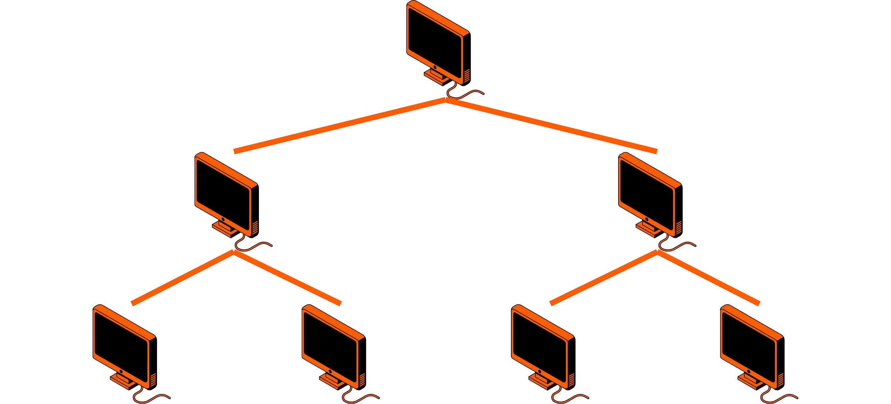


### Otobüs ağı


Bir veri yolu topolojisinde, tüm cihazlar aynı iletim ortamını, tipik olarak bir koaksiyel hattı veya optik fiberi paylaşır. Her birim pasif olarak bağlıdır, yani sinyali aktif olarak değiştirmez ve bu paylaşılan kanal üzerinden veri gönderebilir veya alabilir.


Bus topolojisinin ana avantajı, basitleştirilmiş kablolama sayesinde düşük kurulum maliyetidir.  Bununla birlikte, eski koaksiyel tabanlı uygulamalarda (Ethernet 10BASE2/10BASE5), veri yolu elektriksel sürekliliği ve sonlandırma empedansı artık korunamayacağından, tek bir istasyonun bağlantısının kesilmesi veya kaybedilmesi tüm trafiği kesintiye uğratabilir veya hatta durdurabilir. Tek bir fiziksel ortama sahip olmak da kritik bir zayıflıktır: herhangi bir kopma veya arıza tüm ağ için iletişimi durdurur.


### Yıldız ağı


"Hub and spoke" olarak da bilinen yıldız topolojisi, günümüzde özellikle ev ve ofis Ethernet ağlarında en yaygın olanıdır. Burada tüm cihazlar tek bir merkezi cihaza bağlanır.


Bu düzen yönetim ve bakımı kolaylaştırır: bir çevresel cihaz arızalanırsa, ağın geri kalanı etkilenmez. Dezavantajı ise merkezi cihazın tek bir arıza noktası olmasıdır: eğer bu cihaz arızalanırsa iletişim her yerde durur. İyi performansı korumak için kablo kalitesi ve bağlantı uzunlukları da dikkatle değerlendirilmelidir.


**Not**: Ekipmanların birbiri ardına bağlandığı doğrusal, veri yolu benzeri bir topolojide organize edilmiş ağlar hala vardır. Bu çözüm ucuz olmasına rağmen, tek bir kopmanın bazı ana bilgisayarları izole ederek ağı bağımsız alt kümelere ayırması gibi büyük bir dezavantaja sahiptir.


### Mesh ağı


Mesh ağı maksimum yedeklilik için tasarlanmıştır: her cihaz diğer tüm cihazlara doğrudan bağlıdır. Bu, birden fazla bağlantı veya cihaz arızalansa bile trafik alternatif yollar boyunca yeniden yönlendirilebildiğinden hizmet sürekliliğini sağlar.


Buradaki değiş tokuş, kurulacak bağlantı sayısının terminal sayısıyla birlikte hızla artmasıdır. N` bağlantı noktası için, `N × (N-1) / 2` ayrı bağlantı gereklidir, bu da bu topolojiyi dağıtımı pahalı ve karmaşık hale getirir. Bu nedenle, esas olarak İnternet'in belirli bölümleri veya hassas endüstriyel sistemler gibi çok yüksek kullanılabilirlik gerektiren kritik ağlarda kullanılır.


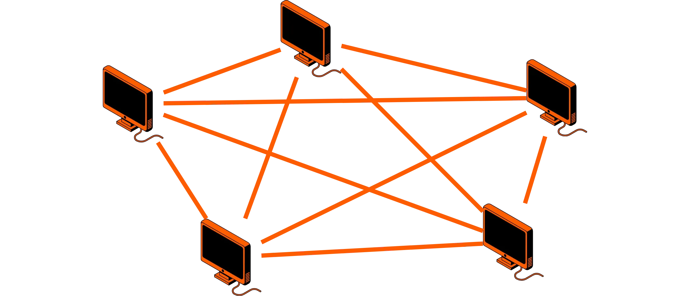


Dağıtık hesaplama veya paralel işlemede özel ihtiyaçlar için tasarlanmış grid veya hiperküp ağları gibi başka varyasyonlar da mevcuttur.


Küresel ölçekte İnternet, farklı topolojiler kullanan, ortak adresleme (IPv4 ve IPv6) ve IETF (*Internet Engineering Task Force*) tarafından tanımlanan standartlaştırılmış protokoller koleksiyonu ile birleştirilmiş devasa bir ağlar arası bağlantıdır. Bu çeşitlilik, İnternet'in tek bir topolojiyi takip etmediği anlamına gelir: yapısı esnek, ölçeklenebilir ve onu kullanılabilir kılan mantıksal adresleme şemasından bağımsızdır.


## TCP/IP'nin kökenleri


<chapterId>266b6864-8789-48d7-bc85-001cb9f1651f</chapterId>


TCP protokolünün kökenleri, 1966 yılında **ARPANET** projesini başlatan **ARPA** (*Gelişmiş Araştırma Projeleri Ajansı*, 1972'de "DARPA" olarak yeniden adlandırıldı) ile yatmaktadır. İlk ARPANET segmenti Ekim 1969'da UCLA ve Stanford üniversitelerini birbirine bağlayarak yayına girdi. Amaç, araştırma merkezlerini, kısmi altyapı arızası durumunda bile iletişimi devam ettirebilecek paket anahtarlamalı bir ağ üzerinden birbirine bağlamaktı.


Bu dinamiğin bir parçası olarak ARPA, Berkeley Üniversitesi'ni ilk TCP/IP protokollerini BSD Unix sistemine entegre etmesi için finanse etti. Bu, protokolün önce akademik dünyada, daha sonra da endüstride yayılmasında ve standartlaşmasında önemli bir rol oynadı.


**Not**: O zamanlar bilgisayar bilimcileri henüz Linux'a (1990'ların başına kadar ortaya çıkmayacaktı) ya da Andrew Tanenbaum tarafından tasarlanan eğitim sistemi Minix'e sahip değildi.  Ana seçenekler Unix ya da bazen OpenVMS gibi tescilli ana bilgisayarlardı. Esnekliği ve açıklığı sayesinde Unix, ilk ağ kavramlarının yayılmasında etkili oldu.


Açıkça söylemek gerekirse, TCP/IP tek bir protokol değil, TCP ve IP etrafında oluşturulmuş bir protokoller paketidir. Ön plana çıkmasının nedeni, aynı ağ üzerindeki makineler arasında veri alışverişi için standartlaştırılmış bir programlama Interface sağlamasıdır. "Soket" adı verilen ilkellere dayanan bu Interface, temel uygulama protokollerini entegre ederken güvenilir ve esnek bağlantılar oluşturmayı mümkün kılmıştır.


ARPANET bu nedenle bugünkü internetin tarihsel temelidir. Gerçekten de İnternet, bilginin heterojen sistemler arasında uyumluluk ve birlikte çalışabilirlik sağlayan bir dizi standartlaştırılmış protokol kullanılarak dolaştığı, paket anahtarlama ilkesine dayalı küresel bir ağdır. Bu açık mimari, aşağıdakiler de dahil olmak üzere sayısız hizmet ve uygulamanın geliştirilmesini ve dağıtılmasını sağlamıştır:


- e-postalar,
- world Wide Web (www),
- dosya aktarımı ve paylaşımı...


Bu protokollerin yönetimi ve gelişimi ***Internet Mimarisi Kurulu*** (IAB) tarafından denetlenmektedir.

Bu organizasyon teknik yönelimleri iki ana yapı üzerinden koordine etmektedir:


- IRTF** (_Internet Research Task Force_), protokol gelişimi ve iyileştirilmesi üzerine uzun vadeli araştırmalar yürütmektedir.
- IETF** (_Internet Engineering Task Force_), İnternet üzerinde kullanılan operasyonel protokolleri geliştirir, standartlaştırır ve belgeler


Ağ kaynaklarının (IP Address aralıkları, otonom sistem numaraları, kök alan adları, vb.) dağıtımı uluslararası olarak **IANA/ICANN** tarafından koordine edilir. Operasyonel yönetim şunlara dayanır: **RIR** (*Bölgesel İnternet Kayıt Kuruluşları*): **RIPE NCC** (Avrupa, Orta Doğu, Orta Asya), **ARIN**, **APNIC**, **LACNIC** ve **AFRINIC**.


Tüm TCP/IP protokol özellikleri **RFC** (_Request For Comments_) adı verilen ve yetkili teknik referanslar olarak hizmet veren belgelere kaydedilir. RFC'ler sürekli olarak güncellenir ve protokol paketinin devam eden gelişimini yansıtacak şekilde numaralandırılır.


TCP/IP yığını genellikle dört işlevsel katmandan oluşan bir yığın olarak temsil edilir ve genellikle ağ iletişimi için kavramsal bir referans olarak hizmet veren **ISO** (_Uluslararası Standartlar Organizasyonu_) tarafından geliştirilen yedi-Layer **OSI** (_Open Systems Interconnection_) modeliyle karşılaştırılır.


TCP/IP modelinin dört katmanı şunlardır:


- fiziksel bağlantı ve ortam erişim kontrol protokollerini sağlayan NETWORK ACCESS Layer;
- yönlendirme ve IP adresleme işlemlerini gerçekleştiren INTERNET Layer;
- tCP veya UDP gibi protokolleri kullanarak veri akışlarının güvenilirliğini ve yönetimini garanti eden TRANSPORT Layer;
- hTTP, FTP, SMTP ve DNS gibi kullanıcı ve yazılım protokollerini bir araya getiren APPLICATION Layer.


Günümüzde IP'nin en yaygın kullanılan sürümü IPv4'tür, ancak 32 bitlik Address alanının açık sınırlamaları vardır. Bu durum, 128 bit adresleme kullanan ve neredeyse sınırsız kapasite sunan IPv6'nın yaratılmasına yol açmıştır: bağlı cihazların patlayıcı büyümesini desteklemek ve Nesnelerin İnterneti, mobilite ve güvenlik zorluklarını karşılamak için gereklidir.


TCP/IP yığınının her bir Layer'i belirli hizmetler sunarak Address'ün farklı ağ ihtiyaçlarını modüler bir şekilde karşılamasını mümkün kılar: fiziksel iletim, mantıksal adresleme, veri bütünlüğü ve uygulama düzeyinde hizmetler.


| Device example    | Description                                                                               | 	TCP/IP layer |
| ---------------------- | ----------------------------------------------------------------------------------------- | ----------------------- |
| Web server            | Application services closest to end users                                      | Application             |
| Gateway or proxy    | 	Encodes, encrypts, compresses useful data                                              | Application             |
| Session switch | Establishes sessions between applications                                               | Application             |
| Firewall or L4 router | Establishes, maintains, and terminates sessions between endpoint devices                  | Transport               |
| Router                | Globally addresses interfaces and determines optimal paths through a network | Network                  |
| Switch   | Locally addresses interfaces and forwards traffic via MAC                            | Network Access         |
| Network Interface Card (NIC)     | Signal encoding, cabling, connectors, physical specifications                        | Network Access         |

https://planb.network/tutorials/computer-security/communication/pi-hole-46a735c5-8af3-4cc3-a2c2-1d4f6a7dc428

https://planb.network/tutorials/computer-security/operating-system/opnsense-90c2785d-a0d7-4981-be8d-d290bbeb8263

https://planb.network/tutorials/computer-security/operating-system/pfsense-24eea96a-2fdc-42a6-a77b-89bc29149864

## IPv5 QoS protokolü


<chapterId>570ded19-be61-4005-844e-9490570a6455</chapterId>


Bir IP paketinin başlığı, paketlerin ağ üzerinden geçerken doğru bir şekilde iletilmesini ve işlenmesini sağlamak için her biri belirli bir role sahip çeşitli alanlara bölünmüş temel bir veri yapısıdır. Bu alanlar arasında hedef IP Address (paketi hedeflenen alıcıya yönlendirmek için gereklidir), IHL (*Internet Header Length*) alanı tarafından belirtilen başlık uzunluğu, *Total Length* alanında kaydedilen toplam paket uzunluğu, kontrol ve doğrulama bilgileri ve iletişim akışını ve kalitesini yönetmek için diğer parametreler yer alır.


Başlıktaki ilk alan Sürüm olarak adlandırılır. Bu 4 bitlik değer, paketin IP protokolünün hangi sürümünü izlediğini belirtir. Bu önemlidir çünkü her yönlendiriciye veya ara cihaza kapsüllenmiş veriyi nasıl yorumlayacağını ve işleyeceğini söyler.


**Not**: IP protokol sürümlerinin yönetimi ve tahsisi **IANA**’nın sorumluluğundadır. 4 bitlik bir alan 16 ikili kombinasyona izin verir (0’dan 15’e kadar değerler). Bugüne kadar, bunların tahsisi şu şekildedir:


| Version Number | Protocol   | Version Description         | Reference               |
| -------------- | ---------- | --------------------------- | ----------------------- |
| 0–1            | Reserved   | Reserved                    |                         |
| 2–3            | Unassigned | Unassigned                  |                         |
| 4              | IP         | Internet Protocol           | RFC 791                 |
| **5**          | **ST**     | **ST Datagram mode**        | **RFC 1190** / RFC 1819 |
| 6              | IPv6       | Internet Protocol version 6 | RFC 8200                |
| 7              | TP/IX      | The Next Internet           | RFC 1475                |
| 8              | PIP        | The P Internet Protocol     | RFC 1621                |
| 9              | TUBA       | Tuba                        | RFC 1347                |
| 10–14          | Unassigned | Unassigned                  |                         |
| 15             | Reserved   | Reserved                    |                         |

Bunlar arasında, halk tarafından büyük ölçüde bilinmemesine rağmen ST (_Stream Protocol_) olarak var olan IPv5 de bulunmaktadır. 1980'lerde geliştirilen IPv5, o dönemde giderek artan bir ihtiyaç olan Address için tasarlanmıştı: IP üzerinden Ses veya multimedya akışları gibi sürekli, istikrarlı iletim gerektiren belirli veri akışları için "_Hizmet Kalitesi_" (QoS) sağlamak. Amacı, RSVP'nin (_Resource Reservation Protocol_) bugün modern yönlendiricilerde ağ kaynaklarını dinamik olarak ayırmak için sunduğu konsepte benzer bir şekilde uçtan uca bant genişliği ve önceliği garanti etmekti.


Ancak IPv5 deneysel kaldı ve yalnızca az sayıda ağ cihazında uygulandı. Sınırlı benimsenmesi ve hızla artan daha fazla Address alanı ihtiyacı, İnternet tasarımcılarını doğrudan IPv4'ten IPv6'ya geçmeye yöneltti. Bu sayede hem IPv4'ün Address sınırlamalarından hem de IPv5'in deneysel özellikleriyle herhangi bir karışıklık veya uyumsuzluk riskinden kaçınılmış oldu.


IPv5 hiçbir zaman yaygın bir kullanım görmemiş olsa da, QoS ve trafik yönetimi hakkındaki ilk düşüncelerin şekillenmesinde önemli bir rol oynamıştır. Bugün, çalışan bir standarttan çok tarihi bir işarettir.


**Hatırlatma** - Protokol bir dizi iletişim kuralıdır: veri yapıları, algoritmalar, paket biçimleri ve farklı cihazların Exchange bilgilerini güvenilir ve anlaşılır bir şekilde iletmesini sağlayan kurallar. Bir hizmet, bu kuralları takip eden ve işlevselliği kullanıcılar ve uygulamalar için kullanılabilir hale getiren belirli programlar (istemciler, sunucular) aracılığıyla bir protokolün somut uygulamasıdır.


Artık tüm ağ iletişiminin temelini oluşturan IP protokolünün yapısına ve işleyişine daha yakından bakabiliriz.


## IP protokolü


<chapterId>758fddbd-b652-4c18-bd1e-d038bd2e4d05</chapterId>


### Tanımlar ve genel bilgiler


IP protokolü veya "***Internet Protokolü***", TCP/IP modelinin belkemiğidir. Veri paketlerini, ister yerel isterse tüm dünyayı kapsayan bir ağ içinde bir ana bilgisayardan diğerine taşır. İki temel rolü vardır: cihazların mantıksal adreslemesini yönetmek ve paketlerin genellikle heterojen ve birbirine bağlı ağlar arasında yönlendirilmesini sağlamak.


Fiziksel düzeyde iletim, düğümler arasında noktadan noktaya bağlantılar kurmak için donanım arayüzlerine dayanır. Bununla birlikte, uçtan uca iletişimi mümkün kılan, her pakete hedefine giden birden fazla olası yoldan geçmesi için gereken bilgileri veren IP protokolüdür.


Üç ağ yapılandırması Elements bir paketin yoluna nasıl gönderileceğini belirler:


- IP Address**: ağdaki hedef ana bilgisayarı benzersiz bir şekilde tanımlar.
- Alt ağ maskesi**: Address'ün hangi kısmının ağı, hangi kısmının ana bilgisayarı tanımladığını belirtir ve mantıksal olarak alt ağlara bölünmeyi sağlar.
- Ağ geçidi**: paketin harici bir ağa veya yerel ağın başka bir segmentine ulaşmak için geçmesi gereken ara yönlendiriciyi belirtir.


İnternette, veriler sürekli bir akış olarak akmaz, ancak **datagramlar** olarak gönderilir: her biri teslimat için gerekli tüm bilgilerle kapsüllenmiş bağımsız veri blokları. Bu, bilginin aynı alıcıya ulaşmak için farklı yollar izleyebilecek bağımsız birimlere bölündüğü **paket anahtarlama** ilkesidir.


Yüke (*payload*) ek olarak, her IP datagramı hedef Address, kaynak Address, hizmet türü, protokol sürüm numarası ve iletimi yönetmek için gereken diğer kontrol bilgileri gibi alanları içeren yapılandırılmış bir başlık içerir.


Bir IP datagramının teorik maksimum boyutu **65,536 oktettir**, bu sınır başlıktaki toplam uzunluk alanı tarafından belirlenir. Pratikte, paketleri taşıyan fiziksel ağlar (Ethernet, Wi-Fi, fiber optik...) genellikle **MTU** (_Maximum Transmission Unit_) olarak bilinen daha katı bir sınır uyguladığından, bu boyuta nadiren ulaşılır. Bir datagram fiziksel bağlantının MTU'sunu aşarsa, her biri ayrı ayrı gönderilen ve varışta yeniden birleştirilen daha küçük paketlere bölünmelidir.


Bu uyarlanabilirlik, IP'yi heterojen sistemler ve ağlar arasında evrensel uyumluluğu korurken çok çeşitli temel teknolojiler üzerinde çalışabilen sağlam ve esnek bir protokol haline getirir.


### IP datagramlarının parçalanması


Bir IP datagramının, iletim kapasitesi datagramın kendisinden daha küçük olan bir ağdan geçmesi gerektiğinde, sorunsuz bir şekilde seyahat edebilmesi için **parçalanması** gerekir. Bu fiziksel boyut sınırına **MTU** (Maksimum İletim Birimi) denir: belirli bir ağ üzerinden bölünmeden geçebilecek en büyük çerçeve boyutu.


Her ağ teknolojisi, donanım ve protokol özellikleri tarafından belirlenen kendi MTU'sunu uygular. Ortak değerler şunları içerir:


- ARPANET**: 1000 bayt
- Ethernet**: 1500 bayt
- FDDI**: 4470 bayt


Bir datagram, geçmesi gereken bir ağ segmentinin MTU'sunu aştığında, yönlendirme ekipmanı onu sınıra uyan daha küçük **parçalara** böler. Bu genellikle yüksek MTU'lu bir ağdan daha düşük kapasiteli bir ağa geçerken olur. Örneğin, bir FDDI ağından gelen bir datagramın Ethernet segmenti üzerinden gönderilmeden önce parçalanması gerekebilir.


Parçalama işlemi şu şekilde çalışır:


- Yönlendirici, datagramı hedef ağın MTU'sundan daha büyük olmayan parçalara böler.
- IP protokolü yeniden birleştirme ofsetini kodlamak için bu birimi kullandığından, her parçanın boyutu 8 baytın katıdır.
- Her parça, son alıcının bunları doğru sırada yeniden birleştirmesi için gereken bilgileri içeren kendi IP başlığını alır.


Parçalandıktan sonra, parçalar ağ boyunca bağımsız olarak hareket eder. Yönlendirme tablolarına, bağlantı yüklerine veya kesintilere bağlı olarak farklı rotalar izleyebilirler. Gönderildikleri sırayla ulaşacaklarının garantisi yoktur.


Varışta, alıcı makine **yeniden birleştirme** işlemini gerçekleştirir. Başlıklardaki bilgileri (paylaşılan tanımlayıcı, ofset ve parçalanma bayrakları) kullanarak, bir sonraki Layer'e iletmeden önce orijinal datagramı yeniden oluşturmak için parçaları doğru sıraya koyar. Bir parça bile kaybolsa veya bozulsa, tüm datagram genellikle atılır, her parça olmadan sonuç eksik veya kullanılamaz olur.


Etkili olmasına rağmen, parçalama ve yeniden birleştirmenin dezavantajları vardır: yönlendiriciler ve ana bilgisayarlar için ekstra işlem ve yeniden iletimleri artırabilecek daha yüksek paket kaybı şansı. Bu nedenle dikkatli MTU yönetimi ve paket boyutu optimizasyonu sorunsuz ve verimli IP iletişimi için önemlidir.


### Veri kapsülleme


Verilerin TCP/IP modelinin katmanları arasında doğru bir şekilde yönlendirilmesini sağlamak için **enkapsülasyon** süreci önemli bir rol oynar. Bir mesaj göndericinin uygulamasından alıcının makinesine giderken her aşamada, başlıklar olarak bilinen ekstra bilgiler eklenir. Bu başlıklar, ara cihazlara ve yazılım katmanlarına verileri işlemek, iletmek ve gerekirse yeniden birleştirmek için ihtiyaç duydukları talimatları verir.


Bir mesaj gönderildiğinde, TCP/IP yığınının dört katmanından geçer. Her Layer'da, mevcut verilerin önüne yeni bir başlık eklenir: her başlık, mantıksal veya fiziksel adresler, iletişim portları, sıra numaraları, hata kontrol bayrakları ve iletim ve yönlendirmeyi yönetmek için gereken bilgiler gibi belirli meta verileri içerir.


İletim böylece yapılandırılmış bir süreç izler:


- Uygulama Layer, ham verileri içeren ilk **mesajı** oluşturur.
- Aktarım Layer, kaynak ve hedef bağlantı noktalarını, sıra numaralarını ve akış kontrol mekanizmalarını ekleyerek bunu bir **segment** halinde kapsüller.
- Internet Layer, kaynak ve hedef IP adreslerini belirterek bir **datagram** oluşturmak için segmente bir IP başlığı ekler.
- Ağ Erişimi Layer, MAC adreslerini ve bütünlük kontrol kodlarını (CRC) ekleyerek datagramı bir **çerçeve** içine sarar.


Bu kapsülleme işlemi hem verilerin bütünlüğünü ve izlenebilirliğini hem de uyarlanabilirliğini sağlar: bir ağdan diğerine geçerken, başlıklar cihazlara rotayı seçmek, geçerliliği kontrol etmek veya gerekirse parçalama yapmak için gereken bilgileri sağlar.


Varışta işlem tersine döner: alıcı makine çerçeveyi Ağ Erişimi Layer'den alır, bu da ilgili başlığı okur ve kaldırır. Datagram daha sonra IP başlığını okuyan ve segmenti Taşıma Layer'e teslim etmek için sırayla kaldıran İnternet Layer'e iletilir. Taşıma Layer taşıma başlıklarını işler, akışın bütünlüğünü kontrol eder ve son olarak **mesajı** orijinal haliyle hedef uygulamaya teslim eder.


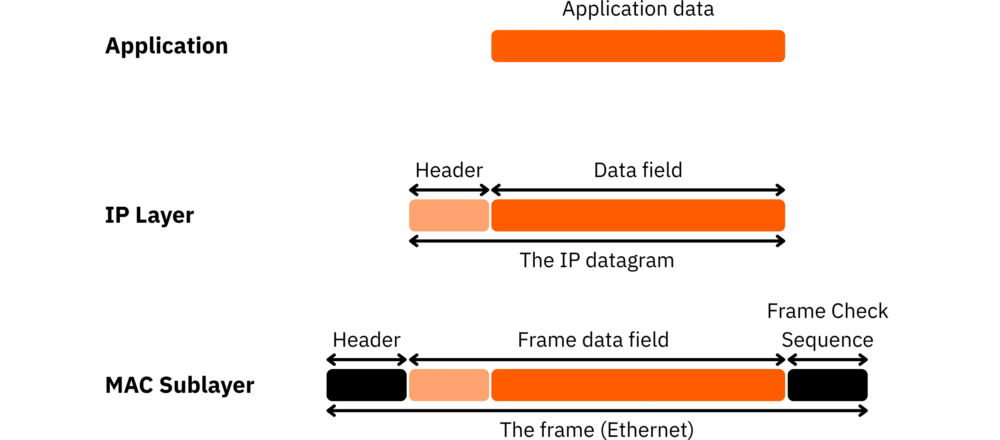


Her bir Layer'deki verilerin dönüşümü şu şekilde özetlenebilir:


- Mesaj**: Uygulama Layer'teki bilgi bloğu.
- Segment**: Aktarım Layer tarafından kapsüllendikten sonraki veri birimi.
- Datagram**: İnternet Layer tarafından IP başlığının eklenmesinin ardından alınan biçim.
- Çerçeve**: Ağ Erişim Layer tarafından fiziksel ortam üzerinden iletime hazır son blok.


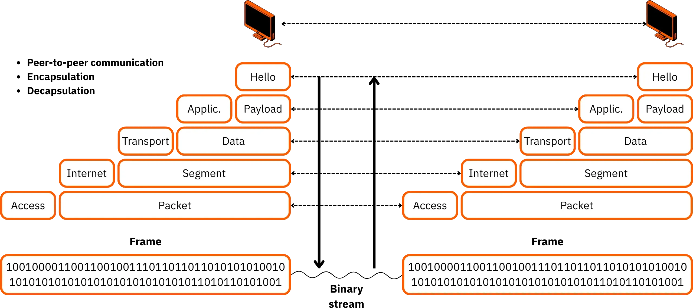


İnternet iletişiminin güvenilirliği ve evrenselliği için gerekli olan bu süreç, ne kadar parçalı veya karmaşık olursa olsun her veri parçasının alıcı makine tarafından anlaşılabilir ve kullanılabilir kalırken uçtan uca taşınabilmesini sağlar.


### IP adresleme


Paket anahtarlama, parçalama ve kapsülleme olsa bile, güvenilir bir adresleme sistemi olmadan bir ağ hala çalışamaz. Her veri paketinin doğru alıcıya ulaştığından emin olmak için İnternet Layer benzersiz bir tanımlayıcı kullanır: **IP Address**.

IPv4'te, bir IP Address **32 bit** üzerinde kodlanır ve bilinen N1.N2.N3.N4 formatında noktalarla ayrılmış dört ondalık sayı olarak yazılır (örneğin: 192.168.1.12).


Bir IP Address'ın iki bölümü vardır:


- _netid_**: ana bilgisayarın ait olduğu ağı tanımlar
- _hostid_**: bu ağ içindeki belirli bir ana bilgisayarı tanımlar

Bu ayrım, küresel internetin mantıksal olarak birbirine bağlı birçok ağ şeklinde yapılandırılmasını sağlar.


Tarihsel olarak, IPv4 sistemi, Address aralığını ve kullanım amaçlarını tanımlayan A'dan E'ye kadar etiketlenmiş sınıf tabanlı bir şemaya dayanıyordu. Her sınıf _netid_ ve _hostid_'e belirli sayıda bit tahsis ederek olası ağ ve ana bilgisayar sayısını doğrudan etkiliyordu.


| **Class** | **IPv4 Address Range**            | **Usage**                    |
| --------- | --------------------------------- | ---------------------------- |
| A         | 1.x.x.x to 126.x.x.x              | Unicast addresses            |
|           | (127.x.x.x reserved for loopback) | Local loopback               |
| B         | 128.0.x.x to 191.255.x.x          | Unicast addresses            |
| C         | 192.0.0.x to 223.255.255.x        | Unicast addresses            |
| D         | 224.0.0.0 to 239.255.255.255      | IP Multicast                 |
| E         | 240.0.0.0 to 255.255.255.255      | Reserved for experimentation |

Tüm olası değerler ana bilgisayarlara atanamaz. Örneğin, bir **class C** Address'de, son bayt 8 bit (256 değer) sunar. Ancak bunlardan ikisi ayrılmıştır:


- 0: ağın kendisini tanımlar
- 255: **broadcast** Address'tür ve bir paketi ağdaki tüm ana bilgisayarlara aynı anda göndermek için kullanılır.

Bu da cihazlar için 254 kullanılabilir adres bırakır.


Kullanılabilir adreslerin sayısı sınıflar arasında büyük farklılıklar gösterir: A sınıfındaki büyük genel ağlardan B sınıfındaki kurumsal ağlara ve C sınıfındaki daha küçük yerel ağlara kadar.


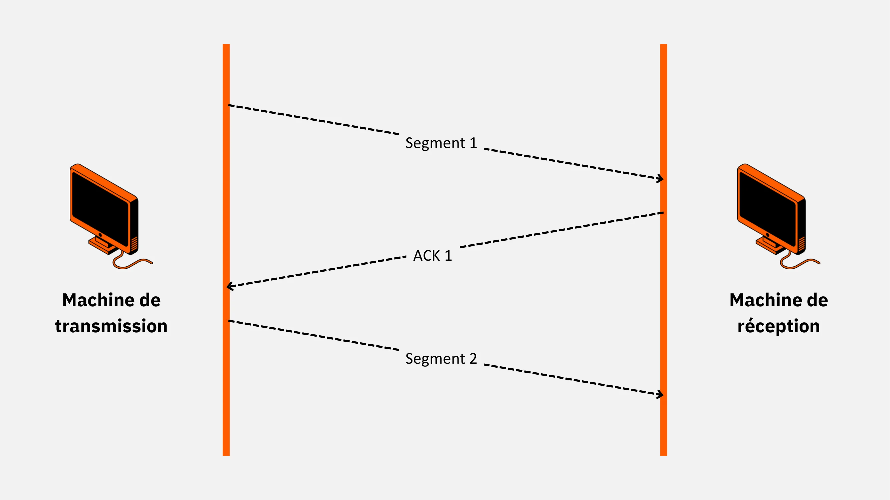


Bazı Address aralıkları özel kullanım için ayrılmıştır ve asla doğrudan İnternet'e yönlendirilmez. Bunlar **özel adresler** olarak bilinir ve kuruluşların, işletmelerin veya evlerin içinde kullanılır ve genel İnternet'e ulaşmak için Address çevirisi, tipik olarak NAT (*Network Address Translation*) gerektirir. Bunlar şunlardır:


- Sınıf A**: 10.0.0.0 ila 10.255.255.255 arası
- Sınıf B**: 172.16.0.0 ile 172.31.255.255 arası
- Sınıf C**: 192.168.0.0 ila 192.168.255.255 arası


Özel bir Address'e sahip bir cihaz İnternet'e eriştiğinde, NAT özellikli bir yönlendirici veya ağ geçidi bunu geçerli bir genel Address ile değiştirir.


Örnek: Bir ana bilgisayar Address **192.168.7.5**'e sahipse, çıkarım yapabiliriz:


- 192.168.7.0: ağ Address
- 192.168.7.1: genellikle yerel yönlendirici
- 192.168.7.5: ana bilgisayarın kendisi


Bir diğer özel durum ise "***loopback***" olarak bilinen **127.0.0.1**'dir.

Linux sistemlerinde, Interface **lo** ile ilişkilidir. Bu Address, bir makinenin fiziksel bir Interface'den geçmeden yerel test veya tanılama için kendi kendine Address yapmasını sağlar. Tüm **127.0.0.0/8** aralığı bu amaç için ayrılmıştır.


Address kullanımını optimize etmek ve karmaşık ağlar tasarlamak için **subnetmask** (_netmask_) gereklidir. Bu ikili maske, bir IP Address'deki _netid_ ile _hostid_'i birbirinden ayırır.

Her sınıfın varsayılan bir maskesi vardır:


- 255.a sınıfı için 0.0.0**,
- 255.255.0.0** B sınıfı için,
- 255.255.255.0** C sınıfı için.


İyi bir ağ tasarımı temel bir kuralı takip eder: doğrudan iletişim kurması gereken cihazlar aynı ağda veya alt ağda olmalıdır. Bir ağı bölümlere ayırmak için, daha spesifik bir maske kullanarak bir ağı daha küçük alt ağlara bölen alt ağ oluşturmayı kullanırız.


Alt ağ oluşturma örneği:

Bir **class C** ağı: 192.168.1.0/24 ve varsayılan maske 255.255.255.0.

Her biri 60 ana bilgisayara kadar 4 alt ağ istiyoruz.


**Adım 1**: Alt ağ başına gereken adres sayısı = 60 + 2 ayrılmış adres (ağ + yayın) = 62.


**Adım 2**: 2 ≥ 62'nin en yakın kuvvetini bulun. -> 2⁶ = 64.


**Adım 3: Maskeyi ayarlayın. Netid_ bitlerini saklayın ve gerekli _hostid_ bitlerini ayırın. Dönüştürüldüğünde **255.255.255.192** değerini veren ikili bir maske elde ederiz.


```
11111111 11111111 11111111 11000000
```


**Adım 4**: Ana bilgisayar için ayrılan bitleri değiştirerek her alt ağ için Address aralıklarını hesaplayın.


| Subnet ID (bits) | Subnet Address   | Subnet Mask     | Address Range                 | Broadcast Address |
| ---------------- | ---------------- | --------------- | ----------------------------- | ----------------- |
| 00               | 192.168.1.0/26   | 255.255.255.192 | 192.168.1.1 – 192.168.1.62    | 192.168.1.63      |
| 01               | 192.168.1.64/26  | 255.255.255.192 | 192.168.1.65 – 192.168.1.126  | 192.168.1.127     |
| 10               | 192.168.1.128/26 | 255.255.255.192 | 192.168.1.129 – 192.168.1.190 | 192.168.1.191     |
| 11               | 192.168.1.192/26 | 255.255.255.192 | 192.168.1.193 – 192.168.1.254 | 192.168.1.255     |


**Adım 5**: Bu, genel adresleme şemasını verimli tutarken, her biri 62 makineye kadar destekleyen dört alt ağ oluşturur. Hostid_ kısmı bir _subnetid_ kısmına ve bir host kısmına bölünür.


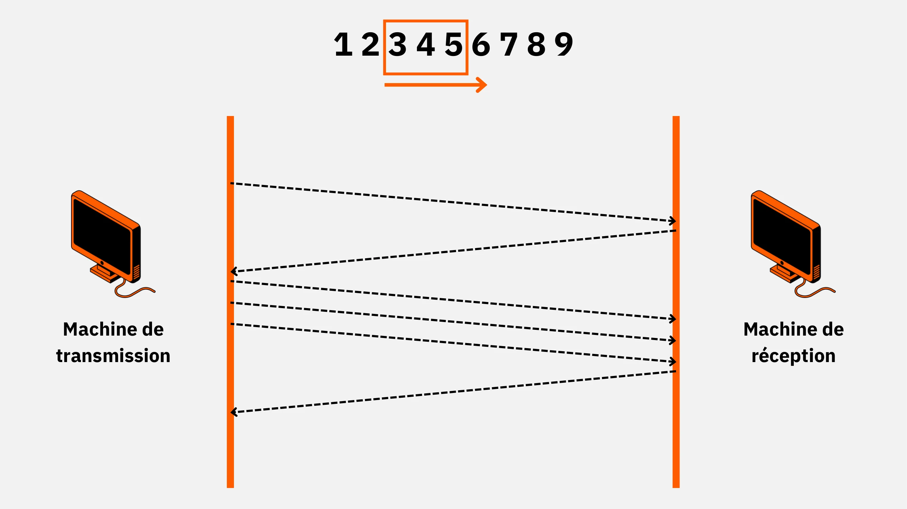


Bu temel alt ağ oluşturma ilkesi, hassas IP tahsisi, daha iyi trafik kontrolü, güçlü segment izolasyonu ve ölçeklenebilir ağ yönetimi sağlayarak modern ağ mühendisliğinde vazgeçilmez olmaya devam etmektedir.


### CIDR adresleme


1990'ların başında, İnternet işletmeler ve kuruluşlar arasında hızla yayıldıkça, sınıflara (A, B, C) dayalı geleneksel IP adresleme sistemi sınırlarını göstermeye başladı.

Katı yapısı IP adreslerinin önemli ölçüde israf edilmesine yol açtı ve yönlendirme tablolarını giderek daha büyük, karmaşık ve bakımı zor hale getirdi.

Bu sorunları çözmek için daha esnek ve verimli bir yöntem geliştirilmiştir: **CIDR** (_Classless Inter-Domain Routing_). CIDR yavaş yavaş standart haline geldi ve büyük ölçüde eski sınıf tabanlı sistemin yerini aldı.


CIDR'nin arkasındaki temel fikir, birkaç bitişik ağı, özellikle C Sınıfı blokları, **supernet** (_supernet_) adı verilen tek bir mantıksal birim halinde gruplama yeteneğidir. Bu birleştirme ile, yönlendirme tablosundaki tek bir giriş birden fazla alt ağı temsil edebilir, yönlendiricilerin işlemesi gereken rota sayısını azaltır ve performanslarını artırır.


C Sınıfı ağlar başlangıçta daha küçük kapasiteleri nedeniyle en büyük toplama ihtiyacına sahipken, prensip B Sınıfı ve hatta teoride A Sınıfı ağlara da uygulanmıştır, ancak ikincisi geniş Address aralığı sayesinde daha az etkilenmiştir.


CIDR ile sabit sınıf kavramı ortadan kalkar. Address alanı, gerektiğinde bölünebilen veya toplanabilen sürekli bir aralık olarak ele alınır. CIDR blokları, A, B veya C sınıflarının varsayılanlarıyla sınırlı olmayan alt ağ maskeleri kullanılarak tanımlanır. Bir CIDR bloğu tek bir ağı ya da aynı öneki paylaşan bitişik bir alt ağ kümesini temsil edebilir.


Bir CIDR bloğu "Address/prefix" biçiminde yazılır; burada eğik çizgiden sonraki sayı ağ bölümünü kaç bitin oluşturduğunu gösterir. Örneğin, /17 ilk 17 bitin ağı, kalan 15 bitin ise ana bilgisayarları tanımladığı anlamına gelir.


Örnek:

17'lik bir blok 2^(32-17) adres içerir, yani 2^15 = 32,768 toplam adres. Ayrılmış iki adres (ağ ve yayın) çıkarıldığında geriye 32.766 kullanılabilir ana bilgisayar adresi kalır. Bu, ağ yöneticilerinin alt ağlarını gerçek dünya ihtiyaçlarına tam olarak uyacak şekilde boyutlandırmalarına olanak tanıyarak gereksiz israfı önler.


CIDR boyutlandırmasını anlamayı kolaylaştırmak için, burada yaygın öneklerin ve eşdeğer alt ağ maskelerinin ve kullanılabilir adreslerin bir tablosu bulunmaktadır:


| CIDR Prefix | Available Host Bits | Subnet Mask     | Usable Host Addresses         |
| ----------- | ------------------- | --------------- | ----------------------------- |
| /8          | 24                  | 255.0.0.0       | 2^24 - 2 = 16,777,214         |
| /12         | 20                  | 255.240.0.0     | 2^20 - 2 = 1,048,574          |
| /16         | 16                  | 255.255.0.0     | 2^16 - 2 = 65,534             |
| /20         | 12                  | 255.255.240.0   | 2^12 - 2 = 4,094              |
| /24         | 8                   | 255.255.255.0   | 2^8 - 2 = 254                 |
| /26         | 6                   | 255.255.255.192 | 2^6 - 2 = 62                  |
| /27         | 5                   | 255.255.255.224 | 2^5 - 2 = 30                  |
| /28         | 4                   | 255.255.255.240 | 2^4 - 2 = 14                  |
| /29         | 3                   | 255.255.255.248 | 2^3 - 2 = 6                   |
| /30         | 2                   | 255.255.255.252 | 2^2 - 2 = 2                   |
| /31         | 1                   | 255.255.255.254 | 2^1 = 2 (point-to-point only) |
| /32         | 0                   | 255.255.255.255 | 1 (host address only)         |


**NOT**: Tarihsel olarak, RFC 950, esas olarak yönlendirmede karışıklığı önlemek için sıfır alt ağ kullanımını önermemiştir.  Bu kısıtlama, kullanımına tamamen izin veren RFC 1878 ile geçerliliğini yitirmiştir. Eski sınırlama çoğunlukla CIDR'yi doğru şekilde işleyemeyen eski donanımlarla uyumsuzluktan kaynaklanıyordu. Modern donanımlarda böyle bir sorun yoktur.


Örneğin, bir zamanlar A sınıfı ağ tanımlayıcısıyla belirsiz olan **255.255.0.0** alt ağ maskesine sahip **1.0.0.0** alt ağı artık tamamen geçerli ve kullanılabilirdir.


**İPUCU**: hatasız alt ağ hesaplamaları ve adreslerin CIDR gösterimine hızlı bir şekilde dönüştürülmesi için ***ipcalc*** gibi kullanışlı araçlar vardır. Bu "ağ hesaplayıcı" Address dökümlerini, mevcut aralıkları ve ilgili maskeleri açıkça gösterir, hem yöneticiler hem de CIDR öğrenen öğrenciler için idealdir.


```shell
sudo apt install ipcalc
```


https://planb.network/tutorials/computer-security/communication/angry-ip-scanner-47f7c943-53b7-4098-b167-4cec8e747b5d

## TCP protokolü


<chapterId>860bf7d5-a502-4d10-a12c-9827f6c2d393</chapterId>


TCP protokolü** (_Transmission Control Protocol_) TCP/IP modelinin TRANSPORT Layer'sinde merkezi bir rol oynar. Uygulamalar ve Internet Layer arasında bir köprü görevi görür ve iki uzak makine arasında güvenilir veri aktarımı sağlar.

IP protokolü paketleri teslimatı veya sırasını garanti etmeden basitçe gönderirken, TCP veri akışının bütünlüğünü ve tutarlılığını sağlar, kayıpsız, doğru sırada ve kopyasız olarak teslim eder.


TCP'nin ana sorumlulukları şunlardır:


- Alınan segmentlerin yeniden sıralanması;
- Tıkanıklığı önlemek için veri akışının izlenmesi;
- Veri bloklarının uygun birimlere (segmentlere) bölünmesi veya yeniden birleştirilmesi;
- İletişimin her iki ucu arasındaki bağlantıların kurulmasını ve sonlandırılmasını yönetmek.


TCP bağlantı yönelimli bir protokoldür, yani istemci ve sunucu arasında açık ve sürekli bir ilişki kurar. Bunu yapmak için **sıra numaraları** ve **onaylar** kullanır: gönderilen her segment için benzersiz bir tanımlayıcı atanır, böylece alıcı makine verilerin hem sırasını hem de bütünlüğünü kontrol edebilir. Alıcı daha sonra **ACK bayrağı** 1 olarak ayarlanmış, alındığını onaylayan ve bir sonraki beklenen sıra numarasını belirten bir onay segmenti döndürür.


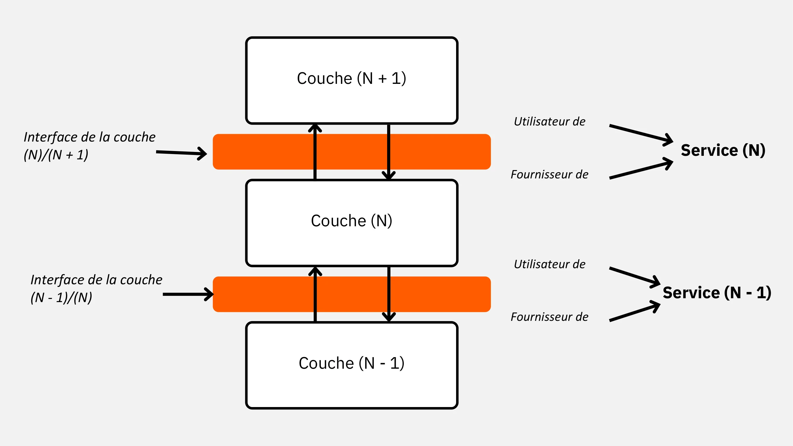


Güvenilirliği artırmak için TCP bir zamanlayıcı kullanır: bir segment gönderildikten sonra bir geri sayım başlar. Zaman aşımı süresi içinde bir onay gelmezse, gönderici otomatik olarak segmenti yeniden iletir ve geçiş sırasında kaybolduğunu varsayar. Bu otomatik yeniden iletim mekanizması, IP ağlarının doğasında bulunan ve tıkanıklık, yönlendirme hataları veya donanım arızaları gibi durumlarda ortaya çıkabilen kayıpları dengeler.


TCP kopyaları tespit edebilir ve işleyebilir. Yeniden iletilen bir segment gelirse ancak orijinali de ortaya çıkarsa, alıcı kopyayı tanımlamak için sıra numaralarını kullanır ve herhangi bir belirsizliği ortadan kaldırarak yalnızca doğru kopyayı tutar.


Bu işlemin çalışması için, her iki makinenin de başlangıç sıra numaraları konusunda ortak bir anlayışa sahip olması gerekir. Bu, katı bir bağlantı prosedürü izlenerek sağlanır: bir yandan **sunucu** belirli bir bağlantı noktasında dinleyerek gelen bir isteği bekler (pasif mod); diğer yandan **istemci** aynı hizmet bağlantı noktasından sunucuya bir istek göndererek bağlantıyı aktif olarak başlatır.


**NOT**: "Bağlantı noktası", bilgisayardaki bir ağ uygulamasına atanan sayısal bir tanımlayıcıdır (0 ile 65.535 arasında). Aynı IP Address üzerinde aynı anda çalışan birden fazla hizmeti ayırt etmek için kullanılır. Bir istemci veri gönderdiğinde, sunucunun işletim sisteminin hangi programın bunu alması gerektiğini bilmesi için port numarasını belirtir (örneğin HTTP için 80, HTTPS için 443, SMTP için 25). Portlar, trafiği içeri ve dışarı yönlendiren, hizmetler arasında karışıklığı önleyen ve güvenlik duvarları veya filtreleme kuralları aracılığıyla ince taneli erişim kontrolüne izin veren özel kapılar gibi davranır.


Exchange sıra senkronizasyonu, iki kişinin iletişim kurmak için birbirini selamlamasına benzer şekilde, ünlü **"*üç yönlü el sıkışma*"** mekanizmasına dayanmaktadır. TCP'nin güvenilirliğini sağlayan bu başlatma aşaması 3 aşamada gerçekleşir:

1. **SYN:** İstemci, uygun bayrak ayarlı ve bir başlangıç sıra numarası (örn. C) içeren bir başlangıç senkronizasyon segmenti (**SYN**) gönderir;

2. **SYN-ACK:** Alıcı sunucu bir onay segmenti (**SYN-ACK**) ile yanıt verir, istemcinin sıra numarasını onaylar ve kendi ilk sıra numarasını sağlar;

3. **ACK:** İstemci, sunucunun sıra numarasının alındığını onaylayan ve senkronizasyonu sonlandıran bir son onay (**ACK**) gönderir. SYN bayrağı artık devre dışıdır ve ACK bayrağı bağlantının kurulduğunu gösterecek şekilde ayarlı kalır.


Bu Exchange protokolü, yük verilerini iletmeden önce her iki tarafın da aynı numaralandırma tabanını paylaşmasını sağlar. Bu senkronizasyon tamamlandıktan sonra oturum açılır: segmentler artık her iki yönde de hareket edebilir, her biri alındığında onaylanır ve veri akışının maksimum güvenilirliğini sağlar.


Bu ***üç yönlü el sıkışma*** yalnızca bağlantı kurulmasıyla ilgilidir. Kapanış için TCP *dört yönlü el sıkışma* kullanır: FIN → ACK → FIN → ACK, bağlantı tamamen serbest bırakılmadan önce aktarımdaki hiçbir segmentin kaybolmamasını garanti eder.


Sağlamlık ve güvenilirlik için tasarlanmış olmasına rağmen, bu süreç aynı zamanda istismar edilebilir güvenlik açıklarına da yol açmıştır. Örneğin, **IP Spoofing** gibi saldırılar, sahte sıra numaraları aracılığıyla yetkili bir makine gibi davranarak bu güven ilişkisini atlamayı veya bozmayı amaçlar ve veri akışının kesilmesine veya manipüle edilmesine izin veren bir ihlal yaratır.


Sıra senkronizasyonu kaçırma risklerini sınırlamak ve ağ yükünü yönetmek için TCP protokolü "**_Sliding Window_**" olarak bilinen bir akış yönetimi tekniği kullanır. Bu sistem, her segment için anında bir onay gerektirmeden ne kadar veri gönderilebileceğini düzenler, böylece iyi bir güvenilirlik sağlarken ağdaki gereksiz aşırı yükü azaltır.


Pratik anlamda, kayan pencere, her bir segment onaylanmadan gönderici ve alıcı arasında serbestçe dolaşabilen bir dizi sıra numarasını tanımlar. Gönderen sistem tarafından onaylar alındıkça, pencere "kayar": sağa doğru kayarak yeni segmentlerin gönderilmesi için yer açar. Bu pencerenin boyutu (tıkanıklığı önlerken verimi optimize etmek için kritik öneme sahiptir) TCP başlığının "*Window*" alanında belirtilir.


**Örnek**: ilk sıra numarası 3 ise ve pencere sıra 5'e kadar uzanıyorsa, 3 ila 5 numaralı segmentler ayrı ayrı onaylar beklenmeden gönderilebilir.


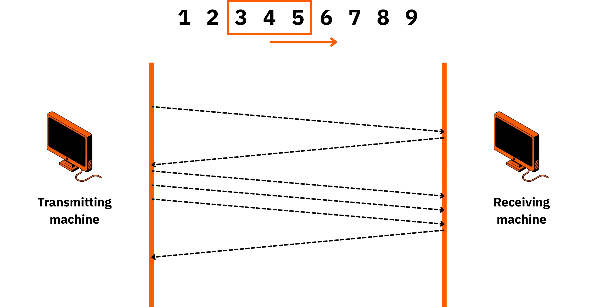


Kayan pencerenin boyutu sabit değildir; ağ koşullarına ve alıcının işlem kapasitesine göre dinamik olarak ayarlanır.  Alıcı daha fazla veri hacmini kaldırabiliyorsa, bunu Pencere alanı aracılığıyla belirtir ve göndericiden penceresini genişletmesini ister. Tersine, aşırı yüklenme veya doygunluk riski durumunda, alıcı bir azaltma talep edebilir, gönderici ek segmentler göndermek için pencere ilerleyene kadar bekleyecektir.


Protokol, temiz ve düzenli bir kapatma sağlamak amacıyla TCP bağlantısını kapatmak için simetrik bir prosedür sağlar. Her iki makine de **FIN** bayrağı 1'e ayarlanmış bir segment göndererek iletişimi sonlandırma niyetini bildirerek kapatma işlemini başlatabilir. Ardından, tüm aktarım segmentleri alınana kadar bekler ve başka verileri yok sayar.


Diğer makine bu segmenti aldıktan sonra FIN bayrağı ile işaretlenmiş bir onay gönderir. Ardından, yerel uygulamaya bağlantının kapatıldığını bildirmeden önce kalan verileri göndermeyi bitirir. Bu çifte onay, düzenli bir kapanma sağlar ve veri kaybı riskini en aza indirir.


IP'nin esnek yönlendirmesi ile TCP'nin sıkı kontrolünü birleştiren bu hassas yönetim, genellikle IP protokolünün hızı (teslimat garantisi olmadan **"en iyi çaba "** temelinde çalışır) ile TCP protokolünün güvenilirliğini (iletimi onaylar ve anlaşmalı diziler aracılığıyla yönetir) karşılaştıran bir diyagramla gösterilir.


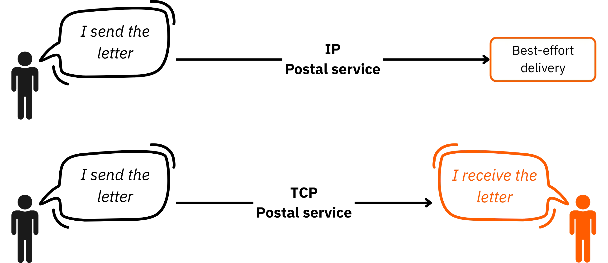


Ancak bazı durumlarda mutlak güvenilirlik öncelikli değildir: hız ve basitlik önceliklidir. Bu, kullanıcı deneyimini ciddi şekilde etkilemeden bir miktar paket kaybını tolere edebilen canlı akış veya VoIP gibi uygulamalar için geçerlidir. Bu gibi durumlarda **UDP** (_User Datagram Protocol_) tercih edilir.


UDP, TCP'den temelde farklı bir prensiple çalışır: **bağlantısızdır**, yani gönderici ve alıcı arasında önceden bir ilişki kurulmaz. Bir makine UDP aracılığıyla paketler gönderdiğinde, bunlar tek yönlü olarak iletilir; alıcı onay göndermez ve göndericinin mesajın ulaştığına dair bir onayı yoktur. UDP başlığı kasıtlı olarak minimaldir, sadece kaynak portu, hedef portu, segment uzunluğu ve bir sağlama toplamı içerir, yerleşik bir onay veya durum kontrol mekanizması yoktur. Her zaman olduğu gibi, IP adresleri altta yatan IP başlığı tarafından taşınır.


Yaygın bir benzetme, TCP'nin bir devrenin kurulduğu, konuşma boyunca takip edildiği ve kontrol edildiği bir **telefon görüşmesi** gibi olduğudur. UDP protokolü ise **postalama** gibidir; burada gönderici bir posta kutusuna bir mektup atar ve mektubun teslim edildiğine dair anında bir kanıt ya da sistematik bir geri bildirim yoktur.


TCP ve UDP arasındaki bu tamamlayıcılık, modern ağların uygulamaya bağlı olarak maksimum güvenilirliği seçerek veya hıza öncelik vererek çeşitli ihtiyaçlara uyum sağlamasına olanak tanır.


## Hizmet ilkelleri


<chapterId>4480afb7-e950-4ccb-88fa-d132f9dc3479</chapterId>


### Katmanlı mimari ve Exchange organizasyonu


Gördüğümüz gibi, **hizmetler** şimdiye kadar tanımladığımız protokollerin somut uygulamasıdır. TCP/IP modeli **OSI** modelinden farklı olsa da, aynı katmanlı yaklaşımı benimser: her Layer belirli bir işlevi yerine getirmek ve hemen üstündeki Layer'ye **hizmetler** sağlamak için tasarlanmıştır, bu da modüler, sağlam ve bakımı kolay bir mimari ile sonuçlanır.


Her bir Layer, bir altındakinin yetenekleri üzerine inşa edilir ve sırayla yukarıdaki Layer'e veri yönetimi için tutarlı bir Interface sağlar. Bu mimaride, her Layer'ün diğer katmanlarla mükemmel uyumluluğu sağlamak için dikkatlice tanımlanmış kendi **veri yapıları** vardır. Bu uyumluluk, bir uç noktadan diğerine sorunsuz, güvenilir ve net iletişim için gereklidir.


Bu alışverişlerde iki temel husus geçerlidir:


- Dikey yön**: bir Layer ile üstündeki veya altındaki arasındaki ilişki (Layer N'den Layer N+1'e veya tam tersi).


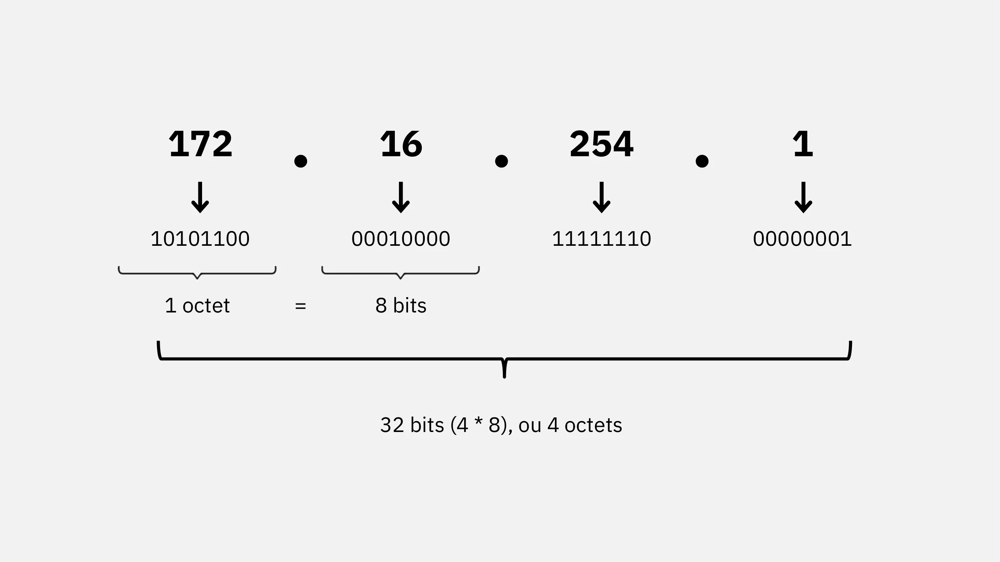


- Yatay yön**: uzak uygulamalar arasındaki etkileşim, yani bir **istemci** ile bir **sunucu** arasındaki diyalog, her iki yönde de.


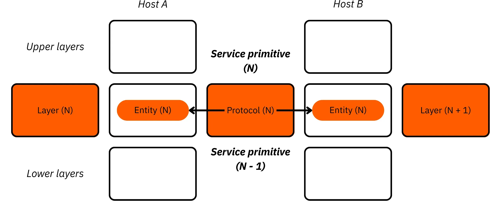


Katmanlı mimari, her Layer'nın yalnızca kendi kapsamındaki bilgileri işlemesi ilkesini izler: veri yapıları, başlıklar ve kontrol mekanizmaları bir Layer'dan diğerine değişir, ancak birlikte tutarlı bir sistem oluştururlar ve verilerin nihai hedefine kademeli olarak yönlendirilmesini sağlarlar.


**Hatırlatma**: Katmanlar arasında değiş tokuş edilen veri birimlerini tanımlamak için özel terminoloji kullanılır:


- gW-67 Uygulaması için mesaj**,
- taşıma Layer (TCP) için segment**,
- i̇nternet Layer (IP) için datagram**,
- ağ Erişimi Layer için çerçeve**.


Aşağıdaki tablo TCP ve UDP bağlamları için terimleri özetlemektedir:


| TCP/IP Layer         | Unit Name (TCP) | Unit Name (UDP) |
|----------------------|------------------|------------------|
| Application Layer    | Stream           | Message          |
| Transport Layer      | Segment          | Packet           |
| Internet Layer       | Datagram         | Datagram         |
| Network Access Layer | Frame            | Frame            |

### Hizmet ilkelleri ve veri birimleri


Bu sistemin özünde, iletişim arayüzleri olarak işlev gören **hizmet ilkelleri** vardır. Bu ilkeller hizmet masaları gibi işlev görür, ayrılmış belirli **portları** dinler ve süreçlerin ağ bağlantılarını kontrollü bir şekilde kurmasına, sürdürmesine ve sonlandırmasına izin verir. Protokoller ağ üzerinden veri biçimini ve iletimini düzenlerken, katmanlar arasındaki dikey bağlantıyı sağlayan **hizmetler ve bunların ilkelleri**dir.


TCP/IP modeli, yatay yönü (dağıtık uygulamalar arasındaki iletişim) dikey yönle (katmanlar arasındaki dahili etkileşimler) birleştirerek eksiksiz, ölçeklenebilir bir mimari sunar. Bu iki perspektifin örtüşmesi, yapılandırılmış ağ iletişiminde verilerin nasıl değiş tokuş edildiğine dair net bir genel bakış sağlar.


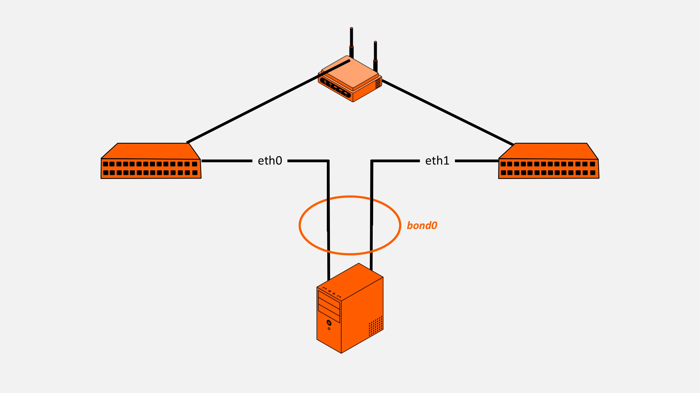


### Bölüm özeti


Bu ilk büyük bölümde, günümüzün İnternet bağlantılı ağlarının yapılandırılmasını ve işletilmesini yöneten temel mimariyi inceledik. Bu mimari, OSI modelinden esinlenen bir **dört Layer modeline** dayanmaktadır ve modern iletişimin belkemiği olan **TCP/IP** protokol paketi etrafında inşa edilmiştir. Bağlantı odaklı yaklaşımıyla TCP'nin güvenilir aktarımlar sağladığını, daha hafif ve daha hızlı olan UDP'nin ise hızın güvenilirlikten daha önemli olduğu durumlarda tercih edildiğini gördük.


Bu modelin düzgün iĢlemesi, protokollerin **hizmet ilkelleri** aracılığıyla uygulanmasına bağlıdır. Bunlar, katmanlar arasındaki bağlantıyı sağlayarak veri işlemenin, İnternet ve ağ erişimi de dahil olmak üzere taşımadan uygulamaya kadar her seviyenin özel gereksinimlerine uyarlanmasını sağlar. Bu modüler yaklaşım sistemi hem esnek hem de sağlam kılmaktadır.


IP adresleme bu altyapının bir diğer temel taşıdır. Bağlı her cihaz, **sınıflar** (A'dan E'ye) halinde düzenlenmiş bir Address alanından alınan **benzersiz bir IP Address** ile tanımlanır. Bu adreslerden bazıları yerel loopback veya multicast gibi özel amaçlar için ayrılırken, "özel adresler" olarak bilinen diğerleri çeviri (NAT) olmadan İnternet üzerinden yönlendirilmez. Bu sınıflandırma, ağların mantıksal, hiyerarşik bir şekilde düzenlenmesini sağlar.


IP kaynaklarını daha iyi yönetmek ve veri akışını optimize etmek için bir ağ segmentlerini bölmeyi mümkün kılan **alt ağlar** kavramını da inceledik. Alt ağ maskelerini kullanarak manuel alt bölümleme önemli bir ilke olmaya devam ederken, **CIDR** (_Classless Inter-Domain Routing_) sayesinde büyük ölçüde modernize edilmiştir. Bu yöntem, yönlendirme tablolarının boyutunu azaltırken IP aralıklarının daha esnek ve rasyonel bir şekilde tahsis edilmesini sağlayarak Address yönetimini dönüştürmüştür.


Bu kavramlara (katmanlar, protokoller, hizmet ilkelleri, adresleme ve alt ağ oluşturma) hakim olarak modern ağların teknik işleyişini anlamak ve günümüz ihtiyaçlarını karşılamak üzere bir ağ altyapısını verimli bir şekilde yapılandırmak için sağlam bir temel elde edersiniz.


Bir sonraki bölümde, IPv4 adreslemesine daha yakından bakacağız.


# IPv4 adresleme


<partId>83f3c3e5-378c-440f-a095-df210842efde</partId>


## IPv4 Kullanımı


<chapterId>79e4dd18-446a-435b-9f25-c88a00f8bec6</chapterId>


Bu bölümde, daha derine inecek ve **IPv4** adreslerinin gerçek dünya ağlarında nasıl uygulandığına bakacağız. Biçimlerini, arkalarındaki mantığı ve **DNS adları**, **MAC adresleri**, **alt ağlar** ve **çeviri teknikleri** gibi diğer önemli ağ Elements ile nasıl bağlantı kurduklarını inceleyeceğiz.


IP Address, bir cihazdaki her **ağ Interface**'e atanan benzersiz bir sayısal tanımlayıcıdır. Bu cihazı bir ağ içinde bulmayı ve veri iletmek için ona ulaşmayı mümkün kılar. Örneğin, bir yönlendirici, sunucu, iş istasyonu, ağ yazıcısı ve hatta bir güvenlik kamerasının kendine ait en az bir IP Address'sı vardır. IP Address **yönlendirmeyi** mümkün kılar, yani fiziksel olarak birbirinden uzak olsalar bile paketleri A noktasından B noktasına taşır.


IP adresleri iki ana şekilde atanabilir:


- Statik**: Cihaz üzerinde manuel olarak ayarlanır.
- Dinamik**: Bir DHCP (_Dinamik Ana Bilgisayar Yapılandırma Protokolü_) sunucusu tarafından isteğe bağlı olarak otomatik olarak atanır. DHCP ağ yönetimini basitleştirir, manuel yapılandırma ihtiyacını ortadan kaldırırken rezervasyonlar ve kira süreleri aracılığıyla hassas kontrol sağlar.


**IPv4** adresleri **32-bit** formatında **dört bayta** bölünmüş olarak yazılır. Her bayt 8 bit içerir ve 0 ila 255 arasında bir ondalık sayıyı temsil eder. 4 bayt, net ve okunaklı bir gösterim oluşturmak için noktalarla ayrılmıştır.


örnek: Address 172.16.254.1_


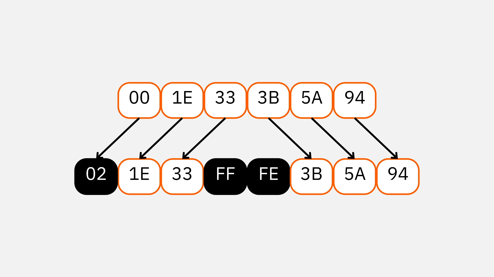


Bir bayttaki her bitin bir değeri (veya "ağırlığı") vardır: soldaki bit (en anlamlı bit) 128, sonraki 64, sonra 32, 16, 8, 4, 2 ve sağdaki bit (en az anlamlı bit) için 1 değerindedir. Bu şekilde, ikili yazı, ayarlanan ağırlıkların basitçe toplanmasıyla ondalık sayıya dönüştürülür.


Aşağıdaki tablo bu yazışmayı göstermektedir:


| Binary Code | Activated Bit Values          | Decimal Value |
|-------------|-------------------------------|---------------|
| 00000000    | 0                             | 0             |
| 00000001    | 1                             | 1             |
| 00000011    | 1 + 2                         | 3             |
| 00000111    | 1 + 2 + 4                     | 7             |
| 00001111    | 1 + 2 + 4 + 8                 | 15            |
| 00011111    | 1 + 2 + 4 + 8 + 16            | 31            |
| 00111111    | 1 + 2 + 4 + 8 + 16 + 32       | 63            |
| 01111111    | 1 + 2 + 4 + 8 + 16 + 32 + 64  | 127           |
| 11111111    | 1 + 2 + 4 + 8 + 16 + 32 + 64 + 128 | 255      |

İkiliyi ondalık sayıya dönüştürmek için, 1'e ayarlanmış bitlerin ağırlıklarını toplayın.


| Binary     | Decimal Value |
| ---------- | ------------- |
| `10101100` | 172           |
| `00010000` | 16            |
| `11111110` | 254           |
| `00000001` | 1             |

Bir IP Address tüm cihazı değil, tek bir **ağ Interface**'i tanımlar. Çok portlu bir yönlendirici veya güvenlik duvarı, her biri kendi IP Address'una sahip birden fazla arayüze sahiptir. Bir Interface'in birkaç IP adresi bile olabilir (örneğin, birden fazla sanal ağa veya hizmete hizmet etmek için).


Her IP paketinin başlığında iki IP adresi bulunur:


- Kaynak Address (**gönderen**)
- Hedef Address (**alıcı**)

Yönlendiriciler bu adresleri okuyarak paketin hedefe ulaşana kadar gönderileceği en iyi yolu bulurlar. Katı adresleme kuralları olmadan ağ trafiği doğru bir şekilde yönlendirilemez ve ağların küresel olarak birbirine bağlanması imkansız olurdu.


Bir IPv4 Address'nin iki bölümü vardır:


- NetID**: ağı tanımlar
- HostID**: bu ağ içindeki bir cihazı tanımlar

Alt ağ maskesi** NetID'nin nerede bittiğini ve HostID'nin nerede başladığını belirler ve her bölüme kaç bit ait olduğunu belirtir. NetID ne kadar uzun olursa, olası alt ağların sayısı o kadar artar, ancak alt ağ başına ana bilgisayar sayısı da buna bağlı olarak azalır.


Başlangıçta, IPv4 ağları beş **sınıfa** ayrılmıştır: (A, B, C, D ve E). Her sınıf belirli bir NetID aralığına karşılık gelir ve sabit bir ayrıntı tanımlar:


- Sınıf A: çok sayıda ana bilgisayar içeren çok büyük ağlar
- B Sınıfı: orta ölçekli ağlar
- Sınıf C: küçük ağlar
- Sınıf D: çoklu yayın için ayrılmış adresler (_multicast_)
- Sınıf E: deneysel adresler, geleneksel adresleme için kullanılmaz


| Class | Leading Bits | First Byte Range | Default Subnet Mask | Purpose                          |
| ----- | ------------ | ---------------- | ------------------- | -------------------------------- |
| A     | 0            | 0 – 127          | 255.0.0.0           | Very large networks              |
| B     | 10           | 128 – 191        | 255.255.0.0         | Medium-sized networks            |
| C     | 110          | 192 – 223        | 255.255.255.0       | Small networks                   |
| D     | 1110         | 224 – 239        | N/A                 | Multicast addresses              |
| E     | 1111         | 240 – 255        | N/A                 | Experimental (not publicly used) |

Özel Adresler:


- Ağ Address**: Ağın kendisini tanımlar (yönlendirme tablolarında kullanılır).
- Yayın Address**: Alt ağdaki tüm cihazlara aynı anda veri gönderir (tüm HostID bitleri 1 olarak ayarlanır).


Aşağıdaki aralıklar dahili kullanım için ayrılmıştır:


- 10.0.0.0/8** (Özel Sınıf A)
- 127.0.0.0/8** (yerel geri döngü veya _loopback_)
- 172.16.0.0 - 172.31.255.255** (özel B Sınıfı)
- 192.168.0.0 - 192.168.255.255** (özel C Sınıfı)


127.0.0.1** adresi ve daha genel olarak 127.0.0.0/8 aralığının tamamı dahili test için kullanılır: buraya gönderilen herhangi bir istek makineyi asla terk etmez. Bu, yerel bir ağ hizmetinin daha geniş bir ağı dahil etmeden çalışıp çalışmadığını kontrol etmek için kullanışlıdır.


Address alanını daha iyi kullanmak için, yöneticiler genellikle alt ağ maskelerini veya **CIDR** gösterimini (_Classless Inter-Domain Routing_) kullanarak ağları **alt ağlara** bölerler. CIDR daha hassas bir yönetim sağlar ve adreslerin boşa harcanmasını önlemeye yardımcı olur. Günümüzde CIDR, IP aralıklarına ince ayar yapmak ve yönlendirme tablolarının boyutunu azaltmak için gereklidir.


Modern ağlarda IP adreslemesi genellikle diğer tanımlayıcılarla eşleştirilir:


- alan adı** bir **DNS** (_Domain Name System_) içinde kayıtlıdır: Sayısal bir IP Address'yı insan dostu bir adla ilişkilendirir.
- MAC Address**: yerel aktarım için kullanılan ağ kartına kazınmış fiziksel bir tanımlayıcı (_Ethernet_). Bir IP paketinin fiziksel olarak iletilmesi gerektiğinde, ARP tablosu IP Address ile hedefin MAC Address'sini eşleştirir.


IPv4 Address eksiklikleriyle başa çıkmak ve bir Layer güvenliği eklemek için, ağlar genellikle Address çevirisini (_NAT_) kullanır. NAT, birçok özel cihazın İnternet'e erişirken tek bir genel IP Address'i paylaşmasını sağlar.


**Not**: Grenoble CRIC hesaplayıcı] (http://cric.grenoble.cnrs.fr/Administrateurs/Outils/CalculMasque/) gibi çevrimiçi ve yerleşik işletim sistemi araçları, alt ağ ve maske hesaplamalarını çok daha kolay hale getirir.

Bu araçlar, ağ bölme işleminin verimli bir şekilde planlanmasına yardımcı olur.


Sonuç olarak, Address yayını bir segmente bağlı tüm cihazlara aynı mesajı göndermek için pratik bir işlev olmaya devam etmektedir: bu, HostID kısmındaki tüm bitlerin 1 olarak ayarlanmasıyla elde edilir, böylece tüm ana bilgisayarlar hedeflenir.


## Farklı IPv4 GW türleri-91


<chapterId>2adfad24-a90d-45b5-b808-3d2f6598bebf</chapterId>


IPv4 adresleri iki ana kategoriye ayrılır: İnternet üzerinden doğrudan erişilebilen genel adresler ve yerel bir ağ içinde dahili kullanım için tasarlanmış özel adresler.


Genel bir IPv4 Address küresel olarak benzersizdir ve İnternet üzerinde yönlendirilebilir. Resmi makamlar tarafından atanır ve web siteleri, e-posta sunucuları veya bulut altyapısı gibi halka yönelik hizmetler için gereklidir.

Bu adreslerin dünya çapında benzersiz olması, herhangi bir yönlendirme çakışmasını veya çarpışmasını önlemek için gereklidir.


Bu IP aralıklarının dağıtımını **ICANN** (_Internet Tahsisli Sayılar ve İsimler Kurumu_) altında faaliyet gösteren **IANA** (_Internet Tahsisli Sayılar Kurumu_) yönetir. Somut olarak, IANA IPv4 alanını CIDR gösterimine göre /8 boyutunda 256 bloğa böler. Her blok 16,7 milyondan biraz fazla adresi temsil etmektedir (2³² / 2⁸).


Bu tek noktaya yayın Address blokları IANA tarafından **Bölgesel İnternet Kayıtlarına** (RIR'ler) emanet edilmiştir. Bu RIR'ler, erişim sağlayıcıların, şirketlerin veya idarelerin gerçek ihtiyaçlarına göre adresleri bölgesel düzeyde yeniden dağıtmaktan sorumludur. Tek noktaya yayın Address alanı **1/8 ila 223/8** blokları arasında uzanır ve bazı kısımları özel kullanımlar (araştırma, dokümantasyon, test) için ayrılmış ya da yeniden dağıtım için doğrudan bir ağa veya RIR'ye tahsis edilmiştir.


Bir genel IP Address'ün kime ait olduğunu kontrol etmek için, **whois** komutunu kullanarak veya her bir kayıt tarafından sağlanan web arayüzlerini kullanarak RIR veritabanlarına başvurabilirsiniz. Bu araçlar, Address'ü beyan eden kuruluşa veya sağlayıcıya kadar izlemek için kullanılabilir.


Buna karşılık, genel adres sıkıntısına pratik bir yanıt olan özel IPv4 adresleri vardır. İnternet üzerinde yönlendirilemeyen bu adresler yerel ortamlar için ayrılmıştır: kurumsal ağlar, ev LAN'ları, veri merkezleri veya bilgi işlem kümeleri. Dünya çapında benzersiz değildirler: birçok özel ağ, izole kaldıkları veya internete erişmek için bir ağ Address çeviri cihazı kullandıkları sürece aynı IP aralıklarını parazitsiz olarak yeniden kullanabilir.


Özel IP Address'ya sahip bir cihazın İnternet'e erişmesine izin vermek için ağlar NAT (Ağ Address Çevirisi) kullanır. NAT, özel Address'yı dinamik olarak genel bir Address ile değiştirerek çalışır ve düzinelerce (hatta yüzlerce) cihazın tek bir genel IP Address'yı paylaşmasını sağlar. Bu yöntem IPv4 alanının kullanımını optimize eder ve ayrıca dahili ağ yapısını gizleyerek bir Layer güvenliği ekler.


Bir başka özel kategori de **belirtilmemiş** adreslerdir. IPv4 gösterimi **0.0.0.0** veya IPv6 sürümü **::/128** "belirli bir Address yok" anlamına gelir. Böyle bir Address, bir ağ Address hedefi olarak geçersizdir, ancak bir ana bilgisayar tarafından yerel olarak "tüm arabirimler" veya "henüz atanmış Address yok" belirtmek için kullanılabilir. Bu, DHCP dinamik Assignment'de veya tüm sunucu arayüzlerini dinlemek için yaygındır.


IPv6 ayrıca özel adreslemeyi de destekler, ancak standart genellikle birden fazla NAT katmanının istiflenmesini önlemek için genel adreslemeyi önerir. Fec0::/10** bloğunun **site-local adresleri** (_site-local_) tutarlılık ve güvenlik nedenleriyle **RFC 3879** tarafından kullanımdan kaldırılmıştır. Bunların yerini **fc00::/7** bloğunda bulunan **Benzersiz Yerel Adresler** (_ULA_) almıştır. ULA'lar, yerel benzersizliği sağlamak için rastgele oluşturulmuş 40 bitlik bir tanımlayıcı kullanarak temiz dahili yönlendirmeye sahip özel IPv6 ağlarının oluşturulmasına izin verir.


IPv4'ün tükendiği 2011 yılında resmen teyit edildi. İnternet topluluğu, IPv4'ün ömrünü uzatmak için çeşitli stratejiler benimsedi:


- IPv6**'ya kademeli geçiş
- Yaygın **NAT** kullanımı
- RIR'lerden gelen ve Address ihtiyaçlarının kesin gerekçelendirilmesini ve yönetimini gerektiren daha katı tahsis politikaları
- Kullanılmayan veya gönüllü olarak iade edilen Address bloklarının şirketler tarafından geri alınması


Bu önlemler, IP adreslemesinin sadece teknik bir sorun olmadığını, aynı zamanda İnternet'in devam eden genişlemesinin merkezinde yer alan küresel bir yönetişim meselesi olduğunu göstermektedir.


## DNS, bir Address dizini


<chapterId>511244ec-ba43-44ac-b4c3-b41579a15cff</chapterId>


Dürüst olalım, insanlar ister ikili ister ondalık formda olsun, uzun sayı dizilerini ezberlemekte iyi değildir. Bu zorluk, karmaşık olabilen ve tek bir IP Address'ün bazen birden fazla adresi maskeleyebildiği IP adreslerinde, özellikle de NAT veya sanal barındırma gibi teknikler söz konusu olduğunda daha da büyük hale gelir.


İşleri kolaylaştırmak için Uygulama Layer, bir IP Address'ü mantıksal, insan tarafından okunabilir bir isme bağlayan bir sistem kullanır. Bu, okunabilir alan adlarını IP adresleriyle eşleştiren büyük, hiyerarşik, dağıtılmış bir dizin olan **DNS'nin** (*Alan Adı Sistemi*) rolüdür. Sistem bir dizi protokol ve hizmete dayanmaktadır. En yaygın kullanılan DNS sunucu yazılımı, İnternet'in DNS altyapısının çoğuna referans veren açık kaynaklı bir yazılım paketi olan **BIND** (_Berkeley Internet Name Domain_)'dir.


DNS'in arkasındaki temel fikir basittir: bir web sitesi, posta sunucusu veya başka bir ağ hizmeti olsun, bağlı herhangi bir hizmet için, bir alan adını bir veya daha fazla IP adresine eşleyen bir kayıt vardır. Bu iki yönde çalışır:


- İleri çözümleme: bir adın IP Address'ya çevrilmesi.
- Ters çözümleme: belirli bir IP Address ile ilişkili alan adını bulma.

Bu, ağ adreslemesini insanlar için kullanılabilir hale getirirken, yönlendiricilerin verileri doğru bir şekilde taşımak için ihtiyaç duyduğu hassasiyeti korur.


Bir alan adı her zaman hiyerarşik olarak yapılandırılır ve her seviye bir nokta ile ayrılır: tam ada **FQDN** (_Fully Qualified Domain Name_) denir. En sağdaki kısım **TLD** (_Top Level Domain_), örneğin `.com`, `.org` veya `.fr`. En soldaki kısım ana bilgisayarı, yani IP Address'e bağlı belirli bir makine veya hizmeti belirtir.


DNS sistemi bir **bölge** ağacı olarak tasarlanmıştır. Bir **bölge**, belirli bir DNS sunucusu tarafından yönetilen etki alanı ad alanının bir bölümüdür. Tek bir bölge birden fazla **alt alan adı** içerebilir ve bunlar farklı sunucular tarafından yönetilen diğer bölgelere devredilebilir. Yöneticiler kendi bölgelerinin bakımından sorumludur: güncellemeler, yetkilendirmeler ve genel yönetim.


Bu yapı sadece bir ana etki alanına (örneğin `example.com`) işaret etmekle kalmaz, aynı zamanda bireysel ana bilgisayarlar (`www`, `mail`, `ftp`, vb.) için ince ayar kayıtlarına da izin verir. Ağ oluşturmanın ilk günlerinde bu eşleme Unix sistemlerinde `/etc/hosts` gibi statik dosyalarla yapılıyordu, ancak böyle bir yöntem hızla büyüyen, birbirine bağlı bir İnternet için pratik olmaktan çıktı.


Bir **DNS sunucusunun** yalnızca sınırlı bir kapsamda hizmet verebileceğini anlamak önemlidir. Örneğin, bir şirketin dahili DNS sunucusuna İnternet'ten doğrudan erişilemeyebilir. Bu DNS sorguları iletmek için yapılandırılmamışsa veya diğer sunucularla güvenilir bir ilişkisi yoksa, bazı sorgular başarısız olacaktır: ne ad ne de IP Address tanımlanan bölgenin dışında çözümlenemez.


DNS e-posta yönlendirmede de rol oynar. Örneğin, bir **MX** (_Mail Exchange_) kaydı, belirli bir etki alanı için e-postaları almaktan sorumlu posta sunucularını belirtir. Bu kayıtlar öncelikleri (ağırlık faktörü) ve yük devretme çözümlerini tanımlar. Bir DNS sunucusunun bölge dosyası, sunucuyu o bölge için resmi bilgi kaynağı olarak belirleyen bir **SOA** (_Yetki Başlangıcı_) kaydı içermelidir.


Hiyerarşik, dağıtılmış yapısı sayesinde DNS, kullanıcıların uzun, teknik IP adresleri yerine net, akılda kalıcı alan adları aracılığıyla hizmetlere erişmesine olanak tanıyarak İnternet'in temel taşı olmaya devam etmektedir.


Bir sonraki bölümde, başka bir temel kavramı keşfedeceğiz: *yerel ağların fiziksel Layer'unda veri iletimini sağlayan **MAC adresleri** olarak da bilinen *Ethernet adresleri**.


## Ethernet adreslerini ve ARP'yi keşfetme


<chapterId>d02109f6-9bf9-4261-a8f9-e1aa4398b949</chapterId>


### Tanımlar


Veri yönlendirme protokolünün güvenilir ve tutarlı bir şekilde çalışması için önemli bir bileşen gereklidir. İnsanlar olarak, bir makineyi IP Address veya DNS aracılığıyla alınan adıyla kolayca tanımlayabiliriz. Ancak bir makine, paketleri teslim etmek için hedef cihazı kesin olarak tanıyabilmelidir. Bunu yapmak için, doğrudan ağ Interface tarafından kullanılan belirli bir donanım tanımlayıcısına güvenir: MAC Address (_Media Access Control_).


**Not**: Bunun bellek mimarisindeki "fiziksel Address" ile hiçbir ilgisi yoktur. Bilgi işlemde fiziksel bellek Address, işletim sistemi tarafından yönetilen sanal bir Address'ün aksine bellek veri yolu üzerindeki belirli bir konumu ifade eder. Buna karşın MAC Address, kesinlikle ağ donanımıyla ilgilidir.


Bir MAC Address, ekipmanın üretildiği üretici tarafından kalıcı ve benzersiz olarak atanır. MAC Address, ister bilgisayar, ister akıllı telefon, yazıcı veya bağlı başka bir cihaz olsun, ağ kartını kesin olarak tanımlar. Dinamik olarak değişebilen (bir DHCP sunucusu veya manuel yapılandırma yoluyla) IP Address'ün aksine, MAC Address normalde kasıtlı olarak değiştirilmediği sürece cihazın kullanım ömrü boyunca aynı kalır.


Kablolu veya kablosuz her ağ Interface'in kendi MAC Address'sı vardır. Bu Address, veri bağlantısı Layer (OSI modelinin Layer 2'si) içinde, değiştirilen her ağ çerçevesine Address donanımını eklemek ve yönetmek için kullanılır. Bu bazen _Ethernet adresi_ veya _UAA_ (_Universally Administered Address_) olarak adlandırılır. Standart olarak 48 bit veya 6 bayt uzunluğunda olup, genellikle `:` veya `-` ile ayrılmış baytlar şeklinde onaltılık gösterimle yazılır.


Örneğin: `5A:BC:17:A2:AF:15`


Bu yapıda, ilk üç bayt ağ kartı üreticisini tanımlar: bu **OUI** (*Organizasyonel Olarak Benzersiz Tanımlayıcı*) olarak bilinir. IEEE tarafından atanan bu önekler, dünya çapında benzersizliği garanti etmek için Bluetooth ve LLDP gibi diğer donanım adresleme şemalarında da kullanılır.


### MAC Address'i Değiştirme (MAC Spoofing)


Teorik olarak, MAC Address sabit kalacak şekilde tasarlanmıştır, ancak özellikle belirli ihtiyaçları karşılamak veya belirli kısıtlamaları aşmak için onu değiştirmenin yolları vardır. Genellikle _spoofing MAC_ olarak adlandırılan bu işlem, orijinal donanım Address'un yazılım düzeyinde tanımlanan farklı bir değerle değiştirilmesini içerir. Bazı işletim sistemleri, özellikle gerçek Ethernet Address'un sürücü tarafından doğrudan kullanılmadığı durumlarda bu değişikliği kolaylaştırır.


Böyle bir değişikliğin nedenleri çeşitlidir. Belirli bir uygulamanın doğru çalışması için belirli bir Ethernet Address gerektirmesi veya aynı yerel ağı paylaşan iki cihaz arasındaki aynı adreslerin çakışmasını çözme ihtiyacı olabilir.


MAC Address'in değiştirilmesi gizlilik kaygılarından da kaynaklanabilir: kullanıcılar kartın üzerine kazınmış benzersiz tanımlayıcıyı gizleyerek cihazlarının ağlar veya gözetim hizmetleri tarafından izlenme olasılığını azaltırlar. Ancak bu uygulama sonuçsuz değildir. Bir MAC Address'in değiştirilmesi belirli filtreleme cihazlarını bozabilir veya güvenlik duvarlarının yeni donanımı yetkilendirmek için yeniden yapılandırılmasını gerektirebilir.


Bazı ağlar, özellikle Wi-Fi, yalnızca onaylı adreslere sahip cihazlara izin vermek için MAC Address filtrelemesini kullanır. Bu temel bir kontrol seviyesi eklese de, kendi başına güvenli değildir. Bir saldırgan, ağda zaten yetkili olan geçerli bir MAC Address'yi yakalayabilir ve kısıtlamaları atlamak için klonlayabilir. Bu nedenle MAC filtreleme her zaman daha güçlü güvenlik önlemleriyle birleştirilmelidir.


### MAC/IP yazışmaları


Yerel bir ağın verimli çalışabilmesi için fiziksel adresler (MAC adresleri) ve mantıksal adresler (IP adresleri) arasında net bir eşleme olmalıdır. Bu bağlantı olmadan, bir bilgisayar bir hedefin IP Address'ünü bilebilir, ancak yerel ağ üzerinde fiziksel olarak nasıl veri göndereceğini bilemez.

Bu eşleme ARP (_Adres Çözümleme Protokolü_) tarafından otomatik olarak gerçekleştirilir.


Uygulamada, bir kullanıcı belirli bir IP Address'e karşılık gelen MAC Address'ü bilmek istediğinde, kullanıcı `arp` yardımcı programını kullanabilir. Bu araç, yerel ağdaki IP adresleri ve MAC adresleri arasındaki bilinen eşleşmeleri görüntülemek için makinenin yerel ARP tablosunu kontrol eder. Bu şekilde, mantıksal ve fiziksel katmanlar arasındaki etkili bağlantıyı hızlı bir şekilde doğrulamak mümkündür.


Pratik örnek: Address `192.168.1.5` IP'sine hangi ağ kartının karşılık geldiğini kontrol etmek istiyorsanız, aşağıdaki komutu kullanın:


```bash
arp –a 192.168.1.5
```


Çıktı, ilişkili fiziksel Address'yi (MAC), girişin niteliğini (statik veya dinamik) ve ilgili Interface'yı gösterecektir.


```
Interface: 192.168.1.5 --- 0x5
IP Address            MAC Address                Type
192.168.1.5           00:54:BC:17:14:6E          D
```


MAC Address ve IP Address'un tamamen farklı, ancak birbirini tamamlayan iki tanımlayıcı olduğunu unutmamak önemlidir. MAC Address, üretici tarafından her bir ağ Interface'ine benzersiz bir şekilde kazınır ve yerel ağdaki cihazı fiziksel olarak tanımlamak için kullanılır. IP Address ise dinamik ya da statik olarak atanan mantıksal bir Address'dur ve makinenin IP ağına ve Exchange paketlerine yerel ağının ötesinde katılmasını sağlar.


- MAC Address'in görsel örneği:


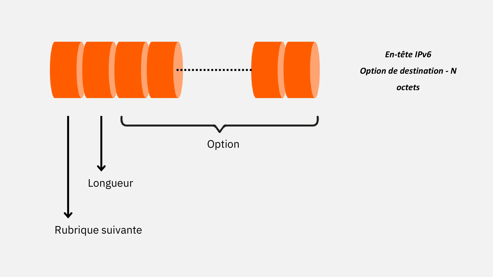


- Bir IP Address'nin görsel örneği:


Kurumsal bir ortamda, bu iki adresleme seviyesi ayrı ayrı çalışamaz. Örneğin, bir DHCP sunucusu otomatik olarak bir IP Address atadığında, başlangıç noktası olarak ekipmanın MAC Address'ü kullanılır. Bilgisayar, MAC Address'ünü içeren bir DHCP yayın isteği gönderir, böylece sunucu doğru cihaza kullanılabilir bir IP Address atayabilir. Bu donanım tanımlaması olmadan, DHCP sunucusu Address'ü hangi cihaza vereceğini bilemez.


ARP protokolü bu nedenle çok önemlidir: IP adresleri ve fiziksel adresler arasındaki bağlantıyı sağlayarak makinelerin mantıksal bir hedefi gerçek bir fiziksel hedefe çevirmesini sağlar. Bir bilgisayarın aynı ağdaki bir makineye paket göndermesi gerektiğinde, önce alıcının MAC Address'ünün zaten bilinip bilinmediğini kontrol etmek için ARP tablosuna başvurur. Değilse, yerel ağdaki tüm ana bilgisayarlara bir ARP isteği yayınlar. Bu istekte hedef IP Address'ü tanıyan makine MAC Address'ünü belirterek yanıt verir. Gönderici daha sonra bu IP/MAC çiftini ARP önbelleğine yazar, böylece istek her gönderildiğinde işlemi tekrarlamak zorunda kalmaz.


Bu ARP tablosu, DNS'in alan adlarını IP adresleriyle ilişkilendirmesine benzer bir şekilde dinamik olarak güncellenen bir mini eşleme dizini görevi görür. ARP olmadan yerel Exchange mümkün olmazdı, çünkü veri bağlantısı Layer'nin Ethernet çerçevelerini doğru şekilde kapsüllemek için MAC Address'yı bilmesi gerekir.


Buna karşılık, RARP protokolü (_Reverse Address Resolution Protocol_) tam tersi bir durum için tasarlanmıştır: yalnızca MAC Address'ini bilen bir makinenin IP Address'ini keşfetmesini sağlamak. Bu, ağ üzerinden önyükleme yapmak ve bir IP Address istemek zorunda olan yerel bir Hard diski olmayan eski iş istasyonları için yaygın bir durumdu. RARP sonunda yerini daha esnek ve otomatik olan **BOOTP** ve ardından **DHCP**'ye bıraktı.


Bu ilişkilendirme protokolleri yönlendirmede önemli bir rol oynar. Yönlendirici aslında farklı segmentleri birbirine bağlayan birden fazla ağ arayüzüne sahip bir makinedir. Bir yönlendirici bir çerçeve aldığında, IP datagramını çıkarmak için onu işler ve hedefi belirlemek için IP başlığını inceler. Hedef doğrudan bağlı bir ağ üzerindeyse, datagram başlığı güncellendikten sonra doğrudan teslim edilir. Hedef başka bir ağa aitse, yönlendirici hedefe giden en iyi yolu veya _next hop_'u belirlemek için yönlendirme tablosuna danışır.


Bu, rotayı daha kısa, daha yönetilebilir parçalara böler. Her ara yönlendirici yalnızca bir sonraki adımı bilir, son hedefi bilmesi gerekmez.


**Hatırlatma:** Doğrudan teslimat, gönderici ve alıcı aynı fiziksel ağ üzerinde olduğunda gerçekleşir. Aksi takdirde, teslimat dolaylıdır ve bir veya daha fazla yönlendiriciden geçer.


Manuel (statik yönlendirme) ya da dinamik (dinamik yönlendirme) olarak yönetilen yönlendirme tablosu, hangi yolun izleneceğine karar vermek için gereken bilgileri içerir. Küçük ağlarda statik yapılandırma yeterlidir. Daha büyük altyapılarda, topoloji değiştiğinde veya bir bağlantı kesildiğinde rotaları otomatik olarak ayarlamak için dinamik yönlendirme gereklidir.


Yönlendirme tablosu, hedef IP adresleri ve sonraki ağ geçitleri arasında bir eşleme tablosu görevi görür. Genellikle her bir ana bilgisayar Address yerine ağ tanımlayıcılarını (_network ID_) depolar, bu da boyutunu büyük ölçüde azaltır.


| Destination Address | Next-Hop Router Address | Interface |
| ------------------- | ----------------------- | --------- |

Yönlendirici bu girdileri kullanarak her bir datagramın hangi Interface üzerinden ve hangi düğüme gönderilmesi gerektiğini hızlı bir şekilde belirleyebilir. Eşleşen MAC adreslerini çözümlemek için ARP ile birleştirildiğinde, bu, ağ üzerinden verimli ve güvenilir veri aktarımı sağlar.


Son olarak, dinamik yönlendirme protokolleri, mesafe algoritmasına dayanan RIP (_Routing Information Protocol_) ve karmaşık topolojideki en kısa yolları hesaplayan OSPF (_Open Shortest Path First_) gibi standartları içerir. Bu protokoller, rotaları optimize etmek, iletim maliyetlerini azaltmak ve kesintilere veya tıkanıklığa karşı dayanıklılığı artırmak için sürekli olarak Exchange güncellemelerini yapar.


## NAT: Address Çeviri


<chapterId>4f984d5d-f2e0-4faf-b703-ff315f32cef4</chapterId>


### Tanım


Network Address Translation_ (NAT), mevcut IPv4 adreslerinin kademeli olarak tükenmesi için geliştirilmiş bir tekniktir. IPv6'nın yaygın olarak benimsenmesinden önce geçici bir çözüm olarak tasarlanan NAT, şirketlerin ve bireylerin yalnızca sınırlı sayıda genel IP adresi kullanırken çok sayıda makineyi birbirine bağlamaya devam etmesini sağlamıştır.


**Önemli hatırlatma:** IPv4'ten IPv6'ya geçiş teorik olarak Address alanını 32 bitten 128 bite genişleterek neredeyse sınırsız sayıda adres (2^128) sağlayarak tükenme sorununu çözmektedir. Ancak pratikte geçiş hala tamamlanmamıştır ve NAT günümüzde yaygın olarak kullanılmaya devam etmektedir.


NAT'ın arkasındaki prensip basit ama oldukça etkilidir: dahili ağdaki her cihaza benzersiz bir genel IP Address atamak yerine, tüm özel cihazlar için tek bir yönlendirilebilir Address (veya küçük bir adres havuzu) kullanılır. Genellikle yönlendirici veya güvenlik duvarına entegre edilen NAT ağ geçidi, trafiği dış dünyaya doğru şekilde yönlendirmek için gereken bilgilerle birlikte dahili IP Address'yı dinamik olarak çevirir ve yanıtların orijinal göndericiye geri dönmesini sağlar.


Bu yaklaşımın hemen bir faydası vardır: dahili ağ mimarisini tamamen gizler. Dışarıdan bakan bir gözlemci için iş istasyonlarından, sunuculardan veya yazıcılardan gelen tüm istekler aynı genel kimlikten geliyor gibi görünür. Genellikle ayrılmış aralıklardan (örneğin 192.168.x.x veya 10.x.x.x) alınan özel adresler İnternet'ten görünmez kalır.


IPv4 kıtlığını ele almanın yanı sıra NAT, dahili ve genel ağlar arasında ilk mantıksal bariyeri oluşturarak güvenliği de güçlendirir. İstenmeyen gelen iletişimler doğal olarak engellenir, çünkü yalnızca ağın içinden başlatılan bağlantılar yanıt almak için gerekli çeviriden yararlanır.


### Çeviri türleri


NAT, özel ihtiyaçlara uyacak şekilde farklı şekillerde uygulanabilir. İki ana çalışma modu statik çeviri ve dinamik çeviridir.


**Statik çeviri** özel bir IP Address ile genel bir IP Address arasında sabit bir eşleme oluşturur. Her dahili makine kalıcı olarak kendi özel genel Address'sine bağlanır. Örneğin, 192.168.20.1 olarak yapılandırılmış dahili bir cihaz yönlendirilebilir Address 157.54.130.1 ile ilişkilendirilebilir. Giden bir paket yerel ağdan ayrıldığında, yönlendirici paketin kaynak Address'sini genel Address ile değiştirir ve gelen trafik için ters işlemi gerçekleştirir. Bu çift yönlü çeviri kullanıcı için şeffaftır.


**Uyarı:** Bu yöntem dahili ağı izole etse de, genel IP adresi sıkıntısını çözmez, çünkü hala açığa çıkarılacak makine sayısı kadar genel adrese ihtiyacınız vardır. Bu nedenle statik çeviri esas olarak belirli dahili kaynakların dışarıdan erişilebilir kalması gerektiğinde kullanılır (web sunucusu, posta sunucusu...).


*öte yandan *Dinamik çeviri**, genel IP adreslerinden oluşan bir havuz kullanır. Dahili bir ana bilgisayar bir bağlantı başlattığında, yönlendirici bu genel adreslerden birini oturum süresince geçici olarak ana bilgisayarın özel Address'ine atar. Bağlantı 1'e 1'dir, ancak geçicidir: bağlantı sona erdiğinde, genel Address başka bir cihaz için kullanılabilir hale gelir. Bu nedenle Dinamik NAT, tüm makineler aynı anda çevrimiçi olmadığında gereken genel adres sayısını azaltır, ancak yine de en az maksimum eşzamanlı bağlantı sayısı kadar büyük bir harici adres bloğu gerektirir.


**NAT aşırı yüklemesi* veya *IP maskeleme* olarak da bilinen *Port çevirisi** (PAT) bir adım daha ileri gider: tüm özel cihazlar tek bir genel IP Address'u (veya çok az sayıda) paylaşır. Oturumları ayırt etmek için, ağ geçidi yalnızca kaynak Address'u değil, aynı zamanda kaynak bağlantı noktasını da değiştirir. Her *(özel Address, özel port)* çiftini benzersiz bir *(genel Address, genel port)* çiftine bağlayan bir tablo tutar. Bu NAT biçimi neredeyse tüm ev yönlendiricilerinde kullanılır ve düzinelerce cihazın (bilgisayarlar, akıllı telefonlar, bağlı nesneler, vb.) akıcı iletişimi korurken aynı genel IP Address'u paylaşmasına olanak tanır.


NAT bu nedenle IPv4'ün ömrünü uzatırken, değerli bir Layer segmentasyon ve güvenlik ekler. Bununla birlikte, IPv6'nın benimsenmesi arttıkça ve geniş Address alanı daha yaygın olarak kullanıldıkça, NAT'ın rolü muhtemelen azalacaktır, ancak uyumluluk ve kontrol amacıyla, trafiği bölümlere ayırmak ve filtrelemek için bazı ortamlarda hala kullanılacaktır.


### NAT uygulaması


Address çevirisinin düzgün çalışmasını sağlamak için NAT yönlendiricisi veya ağ geçidi, iç ağdaki her bir özel Address ile dış dünya ile iletişim kurmak için kullandığı genel Address arasında kurulan eşlemelerin doğru bir kaydını tutmalıdır. Bu bilgiler "NAT çeviri tablosu" olarak bilinen ve ağ trafiğinin yönetilmesinde merkezi bir rol oynayan tabloda saklanır.


Bu tablodaki her giriş en az bir çifti birbirine bağlar: gönderen makinenin dahili IP Address'ü ve internette gösterilecek olan harici IP Address. Özel ağdan bir paket genel bir hedefe gönderildiğinde, NAT yönlendiricisi çerçeveyi yakalar, IP ve TCP/UDP başlıklarını analiz eder, ardından özel kaynak Address'ü ağ geçidinin genel Address'ü ile değiştirir. Dönüş yolunda, aynı ağ geçidi gelen paketi yakalar, eşleme tablosunu kontrol eder ve akışı orijinal dahili IP Address'e yeniden yönlendirmek için ters işlemi gerçekleştirir.


Bu dinamik çeviri prensibi hassas tablo yönetimine dayanır: her giriş, onu haklı çıkaracak aktif trafik olduğu sürece geçerli kalır. Yapılandırılabilir bir hareketsizlik döneminden sonra, giriş temizlenir ve yeni bağlantılar için yeniden kullanılabilir.


basitleştirilmiş bir NAT çeviri tablosu örneği:_


| Internal IP   | External IP    | Duration (sec) | Reusable? |
| ------------- | -------------- | -------------- | --------- |
| 10.101.10.20  | 193.48.100.174 | 1,200          | no        |
| 10.100.54.251 | 193.48.101.8   | 3,601          | yes       |
| 10.100.0.89   | 193.48.100.46  | 0              | no        |

Bu örnekte, ikinci giriş için bir saatten uzun bir süre (3.600 saniye) boyunca hiçbir paket geçmediyse, yeniden kullanılabilir olarak işaretlenir. Tersine, sürenin sıfır olması, eşlemenin kilitli olduğu aktif bir iletişimi gösterir.


NAT en yaygın kullanımlar için (web tarama, e-posta, dosya aktarımı, vb.) şeffaf bir şekilde çalışsa da, belirli ağ uygulamaları için ek zorluklar yaratabilir. Bazı teknolojiler, paket yükü içinde IP adreslerinin veya bağlantı noktalarının açıkça değiş tokuş edilmesine dayanır. Bir NAT ağ geçidinden geçtikten sonra bu bilgiler tutarsız hale gelir.


Tipik sınırlama örnekleri şunlardır:


- Cihazlar arasında doğrudan bağlantı gerektiren eşler arası protokoller (P2P) NAT bariyeri tarafından engellenir, çünkü tüm dahili makineler aynı harici IP Address'ü paylaşır ve özel yapılandırma (*port yönlendirme* veya UPnP gibi) olmadan doğrudan erişilemez;
- Ağ iletişimlerini güvence altına almak için kullanılan IPSec protokolü, paket başlıklarını şifreler. NAT'ın IP adreslerini değiştirmek için bu başlıkları değiştirmesi gerektiğinden, şifreleme NAT-T (*NAT Traversal*) gibi uyarlama mekanizmaları olmadan bunu imkansız hale getirir;
- Unix/Linux üzerinde grafik uygulamaların uzaktan görüntülenmesini sağlayan X Window protokolü, X sunucusunun istemcilere aktif olarak TCP bağlantıları göndermesi şeklinde çalışır. Bağlantıların olağan yönünün bu şekilde tersine çevrilmesi NAT tarafından engellenebilir.


Genel olarak, paket yükünde dahili IP Address'yı açıkça içeren herhangi bir protokol etkilenecektir, çünkü bu Address, çeviriden sonra artık gerçek, internette görünen Address ile eşleşmeyecektir.


**Önemli not:** Bu sorunları Address için, bazı NAT yönlendiricileri, uygulama verileri içindeki adresleri veya bağlantı noktası numaralarını tanımlamak ve dinamik olarak değiştirmek için paket içeriğini inceleyen _Deep Packet Inspection_ (DPI) veya _Protocol Helpers_ sunar. Bu, protokol formatı hakkında derinlemesine bilgi gerektirir ve güvenlik açıkları yaratabilir veya kaynak kullanımını artırabilir.


**Dikkat:** NAT iç ağı gizlemeye ve gelen trafiği kontrol etmeye yardımcı olsa da, özel bir güvenlik duvarının yerini tutmaz. Çeviri tek başına tam bir güvenlik bariyeri değildir: istenmeyen veya istenmeyen trafiği engellemek için her zaman açık filtreleme kuralları ile tamamlanmalıdır.


bunun pratikte nasıl işlediğini göstermek için aşağıdaki örneği ele alalım:_


Bu senaryoda, dahili bir iş istasyonu dahili web sunucusuna sadece `http://192.168.1.20:80` URL`sini çağırarak erişebilir. Burada bağlantı noktasını belirtmek isteğe bağlıdır, çünkü `80` standart HTTP bağlantı noktasıdır. Tersine, dışarıdan bir istek başlatılırsa, kullanıcı genel Address `http://85.152.44.14:80` adresini girecektir. NAT yönlendiricisi isteği alır, eşleme tablosuna başvurur ve otomatik olarak genel Address`i özel bir Address`e çevirerek bağlantıyı `http://192.168.1.20:80` adresine yönlendirir.


Aynı prensip Extranet sunucusu (şemadaki mavi devre) gibi internet bağlantısı almaya yetkili diğer sunucular için de geçerlidir.


**Pratik not:** sanallaştırılmış ortamlarda, _virbrX_ (_Virtual Bridge X_ için) adı verilen ağ arayüzleri yaygın olarak kullanılır. Özellikle libvirt kütüphanesi veya Xen hipervizörü tarafından sağlanan bu sanal köprüler, NAT uygularken konuk makinelerin sanal iç ağını fiziksel ağa bağlar. Genellikle `/etc/sysconfig/network-scripts/` içindeki betikler aracılığıyla yapılandırılırlar, aşağıda `virbr0` için gösterildiği gibi:


```ini
NAME=""
BOOTPROTO=none
MACADDR=""
TYPE=Bridge
DEVICE=virbr0
NETMASK=255.255.255.0
MTU=""
BROADCAST=192.168.0.255
IPADDR=192.168.0.1
NETWORK=192.168.0.0
ONBOOT=yes
```


Sanal köprü kurulduktan sonra IP yönlendirmesini etkinleştirmeniz ve `iptables` ile port çevirisini yapılandırmanız gerekir:


```shell
echo 1 > /proc/sys/net/ipv4/ip_forward
```


```shell
iptables -t nat -A POSTROUTING -o <WAN> -s 192.168.0.0/24 -j MASQUERADE
```


Bu yapılandırmayla, giden trafik yönlendirilir ve NAT çevirisi uygulanarak sanal makinelerin iç IP adreslerini doğrudan göstermeden dış dünyayla iletişim kurmalarına olanak sağlanır.


Bir sonraki bölümde, Linux altında IP Address yapılandırmasına ayrıntılı olarak bakacağız ve farklı yönetim bağlamlarına uygun hem basit hem de gelişmiş yöntemleri ele alacağız.


https://planb.network/tutorials/computer-security/communication/pi-hole-46a735c5-8af3-4cc3-a2c2-1d4f6a7dc428

https://planb.network/tutorials/computer-security/operating-system/opnsense-90c2785d-a0d7-4981-be8d-d290bbeb8263

https://planb.network/tutorials/computer-security/operating-system/pfsense-24eea96a-2fdc-42a6-a77b-89bc29149864


## Ağı `ip` ile nasıl yapılandırabilirim?


<chapterId>8ba7e946-d2a0-4841-8d54-e85ba96baa25</chapterId>


### Standart yapılandırma


Ağ kurmanın teorik temellerini ele aldıktan ve IP adresleri, maskeler, yönlendirme ve çevirinin birlikte nasıl çalıştığını anladıktan sonra, pratik yapılandırmaya geçmenin zamanı geldi. GNU/Linux'ta ağ kurulumu artık eski `ifconfig'in yerini alan **`ip`** komutu (_iproute2_ paketi) ile yapılmaktadır.


iP` bir IP Address atamanızı veya değiştirmenizi, bir maskeyi değiştirmenizi, bir Interface'ı başlatmanızı veya durdurmanızı veya herhangi bir zamanda durumunu kontrol etmenizi sağlar.


*tüm arayüzleri (aktif olsun olmasın) görüntülemek için *TIPS:**: `ip addr show`


Örnek: Statik bir Address atama ve Interface'yi etkinleştirme


Address `192.168.1.2/24`ü Interface `eth0`a ekleyin:


```shell
ip addr add 192.168.1.2/24 dev eth0
```


Interface'yı etkinleştirin:


```shell
ip link set dev eth0 up
```


Aynı Interface'yi devre dışı bırakın:


```shell
ip link set dev eth0 down
```


Belirli bir Interface'in durumunu görüntüleyin:


```shell
ip addr show dev eth2
```


**Pratik ipucu:** `ip` ile, bir Interface'a ek bir Address eklemek için artık `:1` soneki gerekmez. Sadece başka bir `ip addr add ...` satırı ekleyin:


```shell
ip addr add 172.18.2.39/24 dev eth2
```


### Etkinleştirme komut dosyaları: ifup / ifdown


Ifup` ve `ifdown` yardımcı programları `/etc/sysconfig/network-scripts/` (RHEL, CentOS, Rocky Linux, AlmaLinux... üzerinde) veya `/etc/network/interfaces` (Debian/Ubuntu üzerinde) statik yapılandırma dosyalarını okuyarak arayüzleri temiz bir şekilde yukarı veya aşağı getirir.


```shell
ifup eth1
ifdown eth2
```


Yapılandırma dosyaları (RHEL benzeri):


- /etc/sysconfig/network**: global ayarlar (NETWORKING, HOSTNAME, GATEWAY...).
- ifcfg-**: her bir Interface'e özgü ayarlar.


Statik örnek (ifcfg-eth0):


```ini
DEVICE=eth0
BOOTPROTO=none
ONBOOT=yes
IPADDR=192.168.2.5
NETMASK=255.255.255.0
GATEWAY=192.168.2.1
```


DHCP örneği:


```ini
DEVICE=eth0
BOOTPROTO=dhcp
ONBOOT=yes
```


Bu modüler yapı hala geçerlidir ve mevcut sistemlerde kolayca otomatikleştirilebilir.


### Gelişmiş yapılandırma: bonding


Profesyonel ortamlarda amaç, hizmet sürekliliğini garanti etmek ve/veya bant genişliğini toplamaktır. *Bonding* (veya _teamd_ ile *teaming*) mekanizmaları bu ihtiyaçları karşılar: birkaç fiziksel arayüz, genellikle `bond0` veya `team0` olarak adlandırılan tek bir mantıksal Interface olarak işlev görür.


Önkoşullar:


- Bonding` modülünü yükleyin (ya da `teamd` kullanın) ;
- En az iki fiziksel arabirimin mevcut olması.


#### Çeşitli yaygın bağlama yöntemleri:


|Mode|Name|Principle|
|---|---|---|
|0|balance-rr|Round-robin, cyclic distribution of frames|
|1|active-backup|Single active interface with hot failover |
|2|balance-xor|Selection based on XOR of src/dst MAC addresses|
|3|broadcast|Broadcast simultaneously on all interfaces   |
|4|802.3ad (LACP)|Standardized dynamic aggregation; requires compatible switch|
|5|tlb (Transmit Load Balancing)|Balancing based on transmit load|
|6|alb (Adaptive Load Balancing)|Adaptive balancing; also balances receive via ARP|

#### IP bağlantısı ile kurulum


- Fiziksel arayüzleri devre dışı bırakın:


```shell
ip link set eth0 down
ip link set eth1 down
```


- Bağlanmış Interface'ü oluşturun:


```shell
ip link add bond0 type bond mode balance-alb
```


- Oluşturduktan sonra seçenekleri yapılandırma


```shell
ip link set bond0 type bond miimon 100
```


- MAC ve IP adreslerini atayın:


```shell
ip link set dev bond0 address 00:17:56:BC:02:3A
ip addr add 192.168.2.3/24 dev bond0
ip route add default via 192.168.2.1
```


- Bağımlı arayüzleri bağlayın:


```shell
ip link set eth0 master bond0
ip link set eth1 master bond0
```


- Her şeyi geri getirin:


```shell
ip link set bond0 up
ip link set eth0 up
ip link set eth1 up
```


**İpucu:** bağı kaldırmadan bir slave'i ayırmak için: `ip link set eth1 nomaster`


#### Kalıcı yapılandırma (RHEL benzeri)


Etc/sysconfig/network-scripts` içinde üç dosya oluşturun:


_ifcfg-bond0_


```ini
DEVICE=bond0
ONBOOT=yes
BOOTPROTO=none
IPADDR=192.168.2.3
NETMASK=255.255.255.0
BROADCAST=192.168.2.255
GATEWAY=192.168.2.1
BONDING_OPTS="mode=balance-alb miimon=100"
```


_ifcfg-eth0_


```ini
DEVICE=eth0
ONBOOT=yes
MASTER=bond0
SLAVE=yes
```


_ifcfg-eth1_


```ini
DEVICE=eth1
ONBOOT=yes
MASTER=bond0
SLAVE=yes
```


Sonra:


```shell
systemctl restart network
```


#### Ek IP Address (modern takma ad)


IP` ile aynı cihaza ikinci bir Address ekleyebilirsiniz:


```shell
ip addr add 192.168.1.2/24 dev eth0
```


Bu takma adı yeniden başlatmadan sonra kalıcı hale getirmek için, `ifcfg-eth0` öğesine ikinci bir `IPADDR2=...` / `PREFIX2=...` bloğu ekleyin ya da `nmcli` aracılığıyla yeni bir *NetworkManager* bağlantısı oluşturun.


IP` ve ilgili komutlar (`ip link`, `ip addr`, `ip route`) sayesinde ağ yapılandırması daha tutarlı, kodlanabilir ve nettir. Bağlama, yüksek kullanılabilirlik mimarilerinin önemli bir bileşenidir ve tek bir Interface'ya birden fazla adres atamak çok daha basit hale gelmiştir.


Bir sonraki bölümde, IPv6 adreslemesinin özelliklerini ve uygulamasını inceleyeceğiz.


# IPv6 adresleme


<partId>9b1d87f1-2a68-496e-b5dd-76cf74fb8cde</partId>


## IPv6: Standartlar ve tanımlar


<chapterId>d1f16f0a-1104-460d-8d67-f725665f8e3f</chapterId>


Şimdi IP adreslemenin yeni nesline geçiyoruz: orijinal adıyla IPng (_IP Next Generation_) olarak bilinen IPv6 protokolü. IPv4'ün yapısal sınırlamalarının üstesinden gelmek için tasarlanan bu protokol, çok sayıda teknik optimizasyonun yanı sıra büyük ölçüde genişletilmiş bir adresleme mimarisi sunar.


IPv6'nın benimsenmesinin ardındaki motivasyonlar çeşitlidir ve Address İnternet'in evrimi için kritik ihtiyaçlardır. İlk olarak, IPv6'nın rolü, bağlı cihazların sayısındaki üstel büyümeyi desteklemektir (IPv4'ün sınırlı Address alanı ile ulaşılamayan bir hedef). İkinci olarak, protokol yönlendirme tablolarının boyutunu azaltmayı, alışverişleri daha verimli hale getirmeyi ve uzun vadede yönlendiricilerin iş yükünü azaltmayı amaçlamaktadır.


IPv6 ayrıca paket işlemenin belirli yönlerini basitleştirmeyi, datagram akışını iyileştirmeyi ve ağlar arasındaki aktarım hızlarını optimize etmeyi amaçlamaktadır. Güvenlik açısından bakıldığında, *IPsec* protokolünün AH/ESP başlıkları temel spesifikasyona dahil edilmiştir ve tüm IPv6 düğümleri bunları destekleyebilmelidir (RFC 6434). Ancak bunların kullanımı isteğe bağlıdır: bağlama bağlı olarak bunları etkinleştirmek yöneticiye kalmıştır.


Diğer hedefler arasında, özellikle gerçek zamanlı uygulamalar (VoIP, video konferans, vb.) için daha iyi kalite sağlamak üzere hizmet türlerinin daha hassas bir şekilde ele alınması yer almaktadır. IPv6 ayrıca daha esnek mobilite yönetimine izin verecek şekilde tasarlanmıştır: bir cihaz, Address'ini eşleri tarafından görülebilecek şekilde değiştirmeden erişim noktalarını değiştirebilir.


Son olarak, IPv6 eski protokollerle bir arada var olacak şekilde tasarlanmıştır. IPv4 ile doğrudan ikili uyumlu olmamasına rağmen, TCP, UDP, ICMPv6 ve DNS gibi daha yüksek Layer protokollerinin yanı sıra OSPF ve BGP gibi yönlendirme protokolleri ile belirli ayarlamalara tabi olarak tamamen birlikte çalışabilir. Çok noktaya yayın yönetimi için IPv6, IPv4 ortamındaki IGMP'nin işlevsel eşdeğeri olan MLD (*Multicast Listener Discovery*) protokolünü kullanır.


### Notasyon kuralları


IPv6'daki en önemli değişikliklerden biri IP Address'in biçimidir. IPv4 adreslerinin kronik sıkıntısını gidermek için Address'in uzunluğu 32 bitten 128 bite, yani 16 bayta çıkarılmıştır. Teorik olarak bu, olası bir Address alanı sağlar:


$$3.4 \times 10^{38}$$


Bu, mevcut ve gelecekteki tüm ekipmanlar için neredeyse sınırsız kapasite sağlar.


IPv6 adresleri bilinen noktalı ondalık gösterimden çok farklı yazılır. Bir IPv6 Address, onaltılık olarak yazılan ve `:` iki nokta üst üste ile ayrılan sekiz adet 16 bitlik gruptan oluşur.


Örneğin:


```
1987:0c02:0000:84c2:0000:0000:cf2a:9077
```


Gösterimi basitleştirmek için, her gruptaki baştaki sıfırlar atlanabilir. Yukarıdaki örnek o zaman şöyle olur:


```
1987:c02:0:84c2:0:0:cf2a:9077
```


Buna ek olarak, tek bir sürekli sıfır grubu dizisi:: ile değiştirilerek Address daha da kısaltılabilir:


```
1987:c02:0:84c2::cf2a:9077
```


**Uyarı:** bu kural katıdır: sadece bir ardışık sıfır dizisi `::` ile değiştirilebilir. Bir Address birden fazla sıfır dizisi içeriyorsa, yalnızca en uzun olanı yoğunlaştırılır. Bu hem benzersizliği hem de okunabilirliği sağlar.


**Önemli ayrıntı:** onaltılık blokları ayırmak için kullanılan `:` karakteri URL'lerde belirsizliğe neden olabilir, çünkü `:` aynı zamanda bir hizmet bağlantı noktasını belirtmek için de kullanılır. Karışıklığı önlemek için, URL'deki IPv6 adresleri köşeli parantez `[ ]` içine alınmalıdır.


Address `2002:400:2A41:378::34A2:36` için belirli bir bağlantı noktasına HTTP erişimi örneği:


```
http://[2002:400:2A41:378::34A2:36]:8080
```


Bir IPv4 Address'i bir IPv6 bağlamında temsil ederken, önünde `::` olan noktalı ondalık biçimde karışık bir gösterim kullanabilirsiniz:


```
::192.168.1.5
```


Bu uyumluluk, IPv4 bloklarının IPv6 Address alanına dahil edilmesine izin vererek iki protokol arasındaki geçişi kolaylaştırmaya yardımcı olur.


**Not:** Adreslerin nasıl yazıldığını standartlaştırmak için RFC 5952, aynı Address'nin birden fazla gösterimini önlemek için kısaltma kurallarıyla birlikte kanonik bir format tanımlar. Bu önerilere uymak yanlış yorumlamaları azaltmaya yardımcı olur ve tutarlı ağ yapılandırmaları sağlar.


### IPv6 Address türleri


IPv6, esnek yönlendirme ve ağ yönetimine izin verirken, her biri belirli kullanımlar için tasarlanmış çok çeşitli Address kategorileri aracılığıyla selefinden farklıdır. IPv4'te olduğu gibi, adresler küresel, yerel, ayrılmış veya belirli geçiş mekanizmalarına özel olabilir.


Belirtilmemiş bir IPv6 Address `::` veya daha açık bir ifadeyle `::0.0.0.0` ile gösterilir. Bu özel biçim Address edinimi sırasında veya bir Address'ın olmadığını belirtmek için varsayılan değer olarak kullanılır.


| IPv6 Address Prefix | Description                                 |
| ------------------- | ------------------------------------------- |
|::/8                | Reserved addresses                          |
| 2000::/3            | Unicast addresses, routable on the Internet |
| fc00::/7            | Unique local addresses (1)                  |
| fe80::/10           | Link-local addresses                        |
| ff00::/8            | Multicast addresses                         |

(1): *Özel bir LAN'da, `fd00::/8` öneki, İnternet üzerinde yönlendirilemeyen dahili adreslerin atanması için tercih edilir.*


#### Ayrılmış adresler


Belirli IPv6 aralıkları açıkça ayrılmıştır ve genel adresler olarak kullanılmamalıdır. Bunların belirli teknik amaçları vardır:


- `::/128`**: belirtilmemiş Address, hiçbir zaman kalıcı olarak bir cihaza atanmadı, ancak yapılandırma bekleyen bir makine tarafından kaynak Address olarak kullanıldı.
- `::1/128`**: _loopback_ Address, IPv4`teki `127.0.0.1`in doğrudan eşdeğeridir ve bir makinenin Address`nin kendisine ulaşmasını sağlar.
- 64:ff9b::/96`**: RFC 6052'de tanımlandığı gibi IPv4/IPv6 ara bağlantısını etkinleştirmek için protokol çeviricileri için ayrılmıştır.
- `::ffff:0:0/96`**: genellikle uygulamalar tarafından dahili olarak kullanılan belirli bir IPv6 yapısında bir IPv4 Address'ü temsil etmek için uyumluluk bloğu.


Bu bloklar birlikte çalışabilirliği garanti eder ve iki protokol sürümü arasında geçişi kolaylaştırır.


#### Küresel tek noktaya yayın adresleri


Küresel tek noktaya yayın adresleri, Address alanının yaklaşık 1/8'ini temsil eden, kamuya açık yönlendirilebilir IPv6 alanının çoğunu oluşturur. IANA, 1999 yılından bu yana `2001::/16` öneki gibi bu blokları CIDR blokları halinde (`/23`ten `/12`ye kadar) bölgesel kayıtlara tahsis etmekte ve bunlar da daha sonra bunları sağlayıcılara ve kuruluşlara yeniden dağıtmaktadır.


Bazı menzillerin belgelenmiş özel kullanımları vardır:


- `2001:2::/48`**: Performans ve birlikte çalışabilirlik testleri için ayrılmıştır (RFC 5180).
- `2001:db8::/32`**: Dokümantasyon ve örnekler için ayrılmıştır (RFC 3849).
- `2002::/16`**: IPv6 trafiğinin bir IPv4 altyapısı üzerinden seyahat etmesini sağlayan 6to4 mekanizması için kullanılır (iki protokol arasındaki geçiş aşamasında yararlıdır).


**Not:** küresel adreslerin büyük bir kısmı kullanılmadan kalmakta ve gelecekteki İnternet büyümesi için bir rezerv olarak hizmet vermektedir.


#### Benzersiz yerel adresler (ULA)


Benzersiz yerel adresler (`fc00::/7`) IPv4 özel adreslerinin IPv6 eşdeğeridir (RFC1918). Genel adresleme ile çakışma riski olmadan yalıtılmış dahili ağların oluşturulmasını sağlarlar. Uygulamada, etkin önek `fd00::/8`dir ve 8. bit yerel kullanımı belirtmek için 1`e ayarlanmıştır. Her ULA bloğu, ayrı özel ağları bağlarken Address çarpışmalarını en aza indiren 40 bitlik sözde rastgele bir tanımlayıcı içerir.


#### Bağlantı yerel adresleri


Bağlantı yerel adresleri (`fe80::/64`) yalnızca aynı Layer 2 segmenti (aynı VLAN veya anahtar) içindeki iletişim için kullanılır. Asla yerel bağlantının ötesine yönlendirilmezler. Her ağ Interface otomatik olarak EUI-64 şemasını kullanarak genellikle MAC Address'sinden türetilen bir bağlantı yerel Address oluşturur.


**Özel özellik**: aynı makine birden fazla arayüzde aynı bağlantı-yerel Address'ü kullanabilir, ancak belirsizliği önlemek için iletişim kurarken Interface belirtilmelidir.


#### Çok noktaya yayın adresleri


IPv6'da broadcast, paketleri tanımlanmış bir alıcı grubuna ulaştırmanın daha etkili bir yolu olan multicast ile değiştirilmiştir. Çoklu yayın aralığı `ff00::/8` ile öneklendirilmiştir. Bunlar, yerel bağlantıdaki tüm düğümleri hedefleyen `ff02::1` gibi adresleri içerir. Kullanışlı olsa da, bu Address artık uygulamalar için önerilmemektedir, çünkü generate kontrolsüz yayınlar yapabilir.


Multicast'in yaygın bir kullanımı, IPv6'da ARP'nin yerini alan _Neighbor Discovery Protocol_ (NDP)'dir. NDP, aynı bağlantıya bağlı diğer ana bilgisayarları otomatik olarak keşfetmek için `ff02::1:ff00:0/104` gibi belirli çok noktaya yayın adreslerini kullanır.


Bu Address türlerini birleştiren IPv6, iletim verimliliğini artırırken küresel yönlendirme, yerel iletişim, IPv4/IPv6 geçişi ve otomatik cihaz yapılandırması ihtiyaçlarını karşılamak için eksiksiz bir dizi seçenek sunar.


### Address kapsamı


Bir IPv6 Address'in kapsamı, geçerli ve benzersiz olduğu tam etki alanını tanımlar. Bu kavramı anlamak, paket yönlendirmede ve bir IPv6 ağının mantıksal organizasyonunda uzmanlaşmanın anahtarıdır. IPv6 adresleri genellikle kapsam ve kullanımlarına göre üç ana kategoride gruplandırılır: unicast, anycast ve multicast.


**Unicast adresler** en yaygın olanlarıdır ve birkaç farklı alt tür içerir.

Bunlar, kapsamı onu kullanan ana bilgisayarla sınırlı olan ve fiziksel ağ üzerinden trafik göndermeden ağ yığınını dahili olarak test etmek için kullanılan _loopback_ (`::1`) Address'yı içerir.

Daha sonra, kapsamı tek bir ağ segmentiyle sınırlı olan bağlantı yerel adresleri (_link-local_) vardır: bunlar aynı fiziksel veya mantıksal bağlantıdaki cihazlar (örneğin tek bir anahtar veya VLAN) arasında doğrudan iletişim için kullanılır.

Son olarak, benzersiz yerel adresler (_ULA_, _Unique Local Addresses_ için) özel bir ağın içindedir. Birden fazla özel segment arasında yönlendirilebilirler ancak asla İnternet'te görünmezler.


Kavramsal olarak, IPv6 adresleri genellikle ilk yarının (ilk 64 bit) ağ önekini tanımladığı ve ikinci yarının (ayrıca 64 bit) cihazın bu ağdaki Interface'sini benzersiz bir şekilde tanımladığı ikili bir yapı olarak temsil edilir. Bu bölünme, SLAAC (_Stateless Address Autoconfiguration_) gibi mekanizmalar aracılığıyla Address otomatik yapılandırmasını kolaylaştırır, bu da makinelerin MAC Address veya sözde rasgele bir tanımlayıcıya dayalı olarak otomatik olarak generate kararlı bir Address oluşturmasına olanak tanır.


| Field     | Prefix | L | Global ID | Subnet | Interface ID |
|-----------|--------|---|-----------|--------|---------------|
| Bits      | 7      | 1 | 40        | 16     | 64            |

IPv6 mimarisi, günümüz İnternetinin hiyerarşik küresel yönlendirme modelini takip etmektedir. Önek bölümleme, bölgesel kayıtların ve ağ operatörlerinin Address tahsisini merkezi olmayan bir şekilde yönetmesini sağlarken, küresel benzersizliği de garanti eder. Bu çerçevede, aynı ana bilgisayar aynı anda internet iletişimi için küresel bir tek noktaya yayın Address'a ve yerel etkileşimler için, örneğin yakın komşularla veya yönlendirici keşif mesajları için bir bağlantı yerel Address'a sahip olabilir.


| Field     | Prefix | Zero | Interface ID |
|-----------|--------|------|--------------|
| Bits      | 10     | 54   | 64           |

**Anycast adresleri**, unicast modelini temel alan ancak belirli durumlarda multicast gibi davranabilen bir ara kavramı temsil eder. Bir anycast Address, özünde, farklı ağ düğümlerine dağıtılmış birkaç arayüze atanmış tek noktaya yayın Address'dir. Bir anycast Address'e bir paket gönderildiğinde, IPv6 protokolü bu paketi Address'i paylaşan ana bilgisayarlardan birine, tipik olarak yönlendirme topolojisi açısından en yakın olanına ulaştırmayı amaçlar. Bu yaklaşım, sorgu işleme hızını optimize eder ve dağıtılmış hizmetlerin esnekliğini artırır. Klasik bir örnek, anycast adreslemenin sorguları otomatik olarak en yakın varlık noktasına yönlendirdiği kök DNS sunucularıdır.


| Field     | Prefix | Subnet | Interface ID |
|-----------|--------|--------|--------------|
| Bits      | 48     | 16     | 64           |

IPv6'da, **çok noktaya yayın adresleri**, çok maliyetli ve küresel ölçekli bir ağ için uygun olmadığı düşünülen yayın mekanizmasının yerini alır. Bir çok noktaya yayın Address, aynı paketleri aynı anda almak isteyen, genellikle birden çok ana bilgisayarda bulunan bir grup arabirimi tanımlar.

Her çok noktaya yayın Address, yayının coğrafi veya mantıksal sınırını tanımlayan 4 bitlik özel bir _scope_ alanı içerir:


- Kapsamın `1` olması, paketin yalnızca yerel cihaz için olduğu anlamına gelir.
- 2` kapsamı paketi yerel bağlantıyla sınırlar: aynı fiziksel veya sanal segmentteki tüm cihazlar paketi alabilir.
- 5`lik bir kapsam, erişimi bir siteye, tipik olarak tüm bir şirket ağına genişletir.
- 8`lik bir kapsam, bir kuruluşa erişimi genişleterek aynı kuruluşun tüm alt ağlarında teslimatı mümkün kılar.
- Kapsamın `e` (onaltılık olarak 14) olması, yönlendirme altyapısı destekliyorsa çok noktaya yayın grubunun İnternet üzerindeki herhangi bir yerden erişilebilir olmasını sağlayan küresel bir erişimi gösterir.


IPv6 çok noktaya yayın Address'ün yapısı şunları içerir:


- bir _Flag_ alanı (4 bit) grubun kalıcı mı yoksa geçici mi olduğunu belirtir,
- bir _Scope_ alanı (4 bit) kapsamı tanımlar,
- çok noktaya yayın grup numarasını tanımlayan bir kimlik alanı (112 bit).


| Field      | Prefix | Flags | Scope | Group ID |
|------------|--------|--------|--------|----------|
| Bits       | 8      | 4      | 4      | 112      |

IPv6 multicast'in iyi bilinen bir örneği _Neighbor Discovery Protocol_ (NDP)'dir. NDP, IPv4'te olduğu gibi ARP kullanmak yerine, komşu keşif isteklerini yayınlamak için `ff02::1:ff00:0/104` gibi çok noktaya yayın adreslerine dayanır ve yalnızca aynı bağlantıdaki ilgili ana bilgisayarları hedefler.


IPv6, Address kapsamlarını bu kadar kesin bir şekilde tanımlayarak veri akışlarının nasıl gönderileceğini, alınacağını ve yönlendirileceğini yapılandırır. Bu ayrıntı düzeyi, protokolü hem yerel hem de küresel iletişimleri yönetmek için daha esnek ve verimli hale getirirken, genelleştirilmiş yayının dezavantajlarından kaçınır.


## Yerel ağda Address Assignment


<chapterId>4c9c3e52-59bc-499a-af0a-6dd369a9e029</chapterId>


Bu bölümde, IPv6 dağıtımının en pratik yönlerinden birine bakacağız: yerel bir ağdaki ana bilgisayarlara IP adreslerinin atanması. IPv6 mimarisi esneklik için tasarlanmıştır, her cihazın kendi generate'ini otomatik olarak Address yapmasına izin verirken, gerektiğinde tamamen manuel yapılandırmaya da izin verir.


Bir IPv6 yerel ağı, Address'yi sistematik olarak iki parçaya böler:


- ilk 64 bit, genellikle bir yönlendirici veya bir Address yetkilisi tarafından sağlanan alt ağ önekini temsil eder;
- kalan 64 bit, ana bilgisayar tarafından o segmentte kendini benzersiz bir şekilde tanımlamak için kullanılır.

Bu model, rota birleştirme ve Address blok yönetimini büyük ölçüde basitleştirir.


Cihazlara adres atamak için iki ana yaklaşım kullanılır:


- Yöneticinin her bir Interface'ün tam Address'ünü belirttiği manuel yapılandırma;
- Cihazların generate veya kendi adreslerini dinamik olarak aldığı otomatik yapılandırma.


Manuel yapılandırmada, yönetici her bir Interface'ya IPv6 Address'nin tamamını atar. Belirli değerler saklı kalır:


- ::/128`: belirtilmemiş Address, hiçbir zaman kalıcı olarak atanmamış ;
- `::1/128`: loopback Address (_loopback_), IPv4 eşdeğeri: `127.0.0.1`.


IPv4'ün aksine, _broadcast_ kavramı yoktur; ana bilgisayar bölümündeki "tüm sıfırlar" veya "tüm birler" kombinasyonlarının özel bir anlamı yoktur.

Manuel yapılandırma kontrollü ortamlarda hala kullanışlıdır, ancak ölçekte sürdürülmesi zorlaşır.


Otomatik yapılandırma için çeşitli yöntemler mevcuttur:


- RFC4862 tarafından belirtilen **NDP** (_Neighbor Discovery Protocol_) protokolü, *durumsuz* otomatik yapılandırmayı etkinleştirir. Bu modda, ana bilgisayar yerel bir yönlendiriciden bir ağ öneki alır ve Address'u MAC Address'una dayalı bir tanımlayıcı ile kendisi tamamlar. Bu yöntemin dağıtımı basittir ve merkezi bir sunucu gerektirmez.
- Windows'taki gibi uygulamalar, MAC Address'nin doğrudan açığa çıkmasını önleyerek gizliliği artırmak için ana bilgisayar bölümünü sözde rastgele generate yapabilir. IPv6 paketlerinde MAC Address'nin açığa çıkarılması, bir cihazın farklı ağlar arasında izlenmesine izin verdiği için gizlilik endişelerini artırabilir.
- DHCPv6 protokolü: RFC3315'te tanımlanan ve IPv4 için kullanılan DHCP'ye benzer şekilde, kira yönetimi, ekstra seçenekler (DNS, MTU...) ve veritabanları kaydı dahil olmak üzere daha kontrollü ve merkezi yapılandırma sağlar. DHCPv6, IP Address'ün kendisini atamadan ek parametreler sağlamak için tek başına veya durumsuz yapılandırma ile birlikte çalışabilir.


**Önemli not:** MAC tabanlı yöntemde MAC Address, EUI-64 formatı kullanılarak 64 bitlik bir tanımlayıcıya dönüştürülür. Bu mekanizma, orijinal MAC Address'in ortasına (48 bit olarak) `FF:FE` baytlarını ekler ve küresel benzersizliği belirtmek için 7. biti ters çevirir. Sonuç, tam IPv6 Address'te kullanılan kararlı bir Interface tanımlayıcısıdır.


İşte bir MAC Address'nın EUI-64'e nasıl dönüştürüleceğine dair bir örnek:


Bununla birlikte, cihaz takibiyle ilgili artan endişeler nedeniyle, modern işletim sistemleri (özellikle Linux, Windows 10+, macOS, Android) artık varsayılan olarak gizlilik uzantılarını etkinleştirmektedir. Bunlar, dahili iletişimler (DNS veya DHCPv6 gibi) için sabit bir tanımlayıcı tutarken, giden bağlantılar için periyodik olarak yenilenen rastgele oluşturulmuş Interface tanımlayıcılarını kullanır.


IPv4'teki DHCP'de olduğu gibi, otomatik olarak atanan IPv6 adreslerinin DHCPv6 yönlendiricileri veya sunucuları tarafından tanımlanan iki yaşam süresi olabilir:


- Tercih edilen ömür*: bu süreden sonra Address geçerli kalır, ancak artık yeni bağlantılar başlatmak için kullanılmaz;
- Geçerli ömür*: bu süre sona erdiğinde Address, Interface yapılandırmasından tamamen kaldırılır.


Bu sistem, örneğin bir İSS'den diğerine sorunsuz bir geçiş sağlamak için ağ değişikliklerini dinamik olarak yönetmeyi mümkün kılar. Yönlendiriciler tarafından duyurulan ön ekin güncellenmesi ve DNS kayıtlarının paralel olarak ayarlanmasıyla, IPv6 geçişi fark edilebilir bir hizmet kesintisi olmadan gerçekleştirilebilir.


**İpucu:** Address ve DNS yaşam döngülerinin birlikte kullanılması, yeni bağlantıların yeni bir topolojiye geçtiği ve mevcut bağlantıların doğal sonlarına kadar devam ettiği kademeli bir geçiş stratejisinin uygulanmasını mümkün kılar.


Kısacası, IPv6 Address Assignment için geniş bir esneklik yelpazesi sunar: manuel yapılandırma, durumsuz veya durumlu otomatik yapılandırma, DHCPv6 veya rastgele oluşturma. Her yaklaşımın kendine özgü avantajları ve sınırlamaları vardır ve gerekli kontrol seviyesine, ağın boyutuna veya gizlilik ihtiyaçlarına göre uyarlanabilir.


## IPv6 Address bloklarını atama


<chapterId>45cce866-1b58-4888-b3fe-15c922180839</chapterId>


### Address dağıtım


IPv6 Address tahsis şeması iki hedefi karşılayacak şekilde yapılandırılmıştır: küresel Address benzersizliğini garanti etmek ve yönlendirme tablolarının toplanmasını ve basitleştirilmesini destekleyen mantıksal bir hiyerarşi sağlamak.

IPv4'te olduğu gibi, *İnternet Tahsisli Sayılar Kurumu* (IANA) bu hiyerarşinin en üstünde yer alır. Küresel tek noktaya yayın Address alanını yönetir ve Address bloklarını beş bölgesel İnternet kaydına (_RIR_) devreder.


Mevcut beş RIR şunlardır:


- ARIN (Kuzey Amerika),
- RIPE NCC (Avrupa, Orta Doğu, Orta Asya),
- APNIC (Asya-Pasifik),
- AFRINIC (Afrika),
- LACNIC (Latin Amerika ve Karayipler).


IANA, her bir RIR'ye genellikle /23 ve /12 arasında değişen büyüklükte IPv6 blokları tahsis etmektedir. Bu yaklaşım, uzun vadeli ölçeklenebilirlik sağlarken esneklik de sunmaktadır. RIR'ler de bu blokları İnternet Servis Sağlayıcılarına (İSS'ler), büyük şirketlere ve kamu kurumlarına yeniden dağıtır.


2006'dan bu yana, her RIR IANA'dan bir IPv6 /12 bloğu almıştır; bu, gelecekteki büyüme için istikrarlı ve yeterince büyük bir rezerv sağlamak üzere tasarlanmış sabit bir boyuttur. RIR'ler genellikle bunları /23, /26 veya /29 bloklara böler. İSS'ler çoğunlukla /32 blok alırlar, ancak bu boyut İSS'nin büyüklüğüne ve coğrafi alanına bağlı olarak değişebilir. Genellikle müşterilere /48 blok tahsis ederler. Her /48, 65.536 farklı /64 alt ağ sağlar (IPv4 ile karşılaştırıldığında muazzam bir kapasite).


**Önemli not:** bir /32 bloğu tam olarak 65.536 /48 alt blok içerir. Bu, her İSS'nin tahsisatını tüketmeden on binlerce müşteriye hizmet verebileceği anlamına gelir. 48 sayesinde, her müşteri kendi iç ağını istediği kadar /64 segmenti ile yapılandırmak için devasa miktarda alana sahip olacaktır.


Tipik tahsis hiyerarşisi şu şekildedir:


| IANA | RIR | LIR | Customer | Subnet | Interface |
|------|-----|-----|----------|--------|-----------|
|  3   | 20  |  9  |    16    |   16   |     64    |

Bu adres bolluğu sayesinde, bir zamanlar IPv4'te Address eksiklikleriyle başa çıkmak için gerekli olan NAT (*Network Address Translation*) artık gerekli değildir. Her ana bilgisayarın benzersiz, küresel olarak yönlendirilebilir bir genel Address'i olabilir, bu da uçtan uca bağlantıyı basitleştirir ve IPSec, VoIP veya gelen bağlantılar gibi protokollerin kullanımını kolaylaştırır.


Bir IPv6 Address'un hangi kuruluşa ait olduğunu kontrol etmek için, genel RIR veritabanlarını sorgulamak üzere `whois` komutunu kullanabilirsiniz. Bu şeffaflık, ağ, analiz veya güvenlik amaçları için yararlı olabilecek bir önekin sahibi olan kuruluşu tanımlamayı mümkün kılar.


### PA vs PI adresleme


Başlangıçta, IPv6 tahsis modeli yalnızca PA (*Provider Aggregatable*) bloklarına dayanıyordu, yani İSS'ye bağlıydı. Bu modelde, bir kuruluş önekini İSS'sinden alır, yani sağlayıcıların değiştirilmesi tüm altyapının yeniden numaralandırılmasını gerektirir.


IPv6'nın otomatik yapılandırma özellikleri ve Address ömürleri yeniden numaralandırmayı kolaylaştırsa da, kritik altyapıya veya yedeklilik gereksinimleri için birden fazla sağlayıcı bağlantısına sahip kuruluşlar için elverişsiz olmaya devam etmektedir.


2009 yılından bu yana tahsis politikaları PI (*Sağlayıcıdan Bağımsız*) bloklara izin vermektedir. Bu bloklar (genellikle /48 boyutunda) herhangi bir İSS'den bağımsız olarak bir RIR tarafından doğrudan bir şirkete veya kuruma tahsis edilir. Bu model özellikle *multihoming* (yani aynı anda birden fazla operatöre bağlanma) uygulayan kuruluşlar için çok uygundur. Örneğin, Avrupa'da RIPE-512, PI tahsisleri için politikayı özetlemektedir.


### Alt ağ maskesi gösterimi


IPv4'te olduğu gibi IPv6 da CIDR (*Sınıfsız Alanlar Arası Yönlendirme*) kullanır. Bu, `/` karakteri kullanılarak Address'den sonra öneki oluşturan bit sayısının belirtilmesinden oluşur.


Aşağıdaki örneği ele alalım:


```
2001:db8:1:1a0::/59
```


Bu, ilk 59 bitin sabit olduğu ve ağı tanımladığı anlamına gelir. Kalan tüm bitler (burada 69 bit) alt ağları veya ana bilgisayarları tanımlamak için kullanılabilir.


Dolayısıyla, bu gösterim `2001:db8:1:1a0:0:0:0` ile `2001:db8:1:1bf:ffff:ffff:ffff:ffff` arasındaki adresleri kapsar.


Dolayısıyla bu blok, her biri çok sayıda cihaz barındırabilen 8 /64 alt ağdan oluşan bir kümeyi kapsar.


CIDR notasyonu, büyük ölçekli ağlardan ev kurulumlarına ve sanallaştırılmış ortamlara kadar hassas Address alan planlamasına olanak tanır ve rota toplamayı teşvik ederek yönlendirici yükünü azaltır ve ölçeklenebilirliği artırır.


### IPv6 paketleri ve başlıkları


IPv6 paket formatı IPv4'ten hem daha basit hem de daha genişletilebilir olmasıyla ayrılır. Bir IPv6 datagramı her zaman tüm temel yönlendirme bilgilerini içeren 40 baytlık sabit boyutlu bir başlık ile başlar. IPv4'ün değişken uzunluktaki (20 ila 60 bayt) başlığına kıyasla bu basitleştirilmiş yaklaşım, yönlendiriciler tarafından daha hızlı ve daha verimli paket işleme olanağı sağlar.


Bununla birlikte, IPv6 işlevselliği ortadan kaldırmaz: ana başlığa çok sayıda isteğe bağlı alan entegre etmek yerine, temel başlıktan hemen sonra yerleştirilen bir uzantı başlıkları sistemi sunar. Bu isteğe bağlı başlıklar, sıradan paketlere gereksiz yük bindirmeden belirli işlevlere özgü veri veya talimatların eklenmesini mümkün kılar.


Bazı uzantı başlıkları sabit bir yapı izlerken, diğerleri değişken sayıda seçenek tutabilir. Bu seçenekler `{Tür, Uzunluk, Değer}` üçlüleri olarak kodlanır:


- "Tip" alanı (1 bayt) seçeneğin niteliğini gösterir;
- "Tip "in ilk iki biti, seçeneğin tanınmaması durumunda yönlendiricilerin ne yapması gerektiğini belirtir:
 - Seçeneği göz ardı edin ve tedaviye devam edin,
 - Datagramı bırakın,
 - Bırakın ve kaynağa bir ICMP hatası gönderin.
 - Bildirim yapmadan datagramı bırakın (çok noktaya yayın paketleri durumunda).
- "Uzunluk" alanı (1 bayt), 0 ila 255 bayt arasında "Değer" alanının boyutunu belirtir;
- "Değer" alanı seçenekle ilişkili verileri içerir.


IPv6 tarafından tanımlanan farklı uzantı başlıklarına genel bir bakış.


#### Hop-by-Hop başlığı


Bu başlık, eğer varsa, her zaman temel başlıktan hemen sonra yer alır. Genellikle yalnızca hedef düğüm tarafından işlenen diğer başlıkların aksine, paketin yolu boyunca her yönlendirici tarafından işlenmesi gereken bilgileri içerir. Tipik kullanımları arasında genel parametrelerin bildirilmesi veya paket ağda ilerlerken belirli işlem adımlarının talep edilmesi yer alır.


#### Yönlendirme başlığı


Yönlendirme başlığı, paketin geçmesi gereken ara adreslerin bir listesini belirtir. İki ana yönlendirme modu vardır:


- Sıkı yönlendirme: kesin yol önceden tanımlanmıştır
- Gevşek yönlendirme: yalnızca belirli zorunlu adımlar belirtilir.


Bu köklendirme başlığının ilk dört alanı şunlardır:


- Sonraki Başlık**: sonraki başlığın türünü tanımlar;
- Yönlendirme Türü**: yönlendirme yöntemini tanımlar (genellikle `0`);
- Kalan segmentler**: geçilecek kalan segment sayısı ;
- Address[n]**: ara adreslerin listesi.


"Kalan Segmentler" alanı kalan segmentlerin toplam sayısı ile başlar ve her atlamada bir azalır.


#### Parçalama başlığı


IPv6'da, yönlendiricilerin de bunu yapabildiği IPv4'ün aksine, yalnızca kaynak ana bilgisayarın bir datagramı parçalamasına izin verilir. Tüm IPv6 düğümleri en az 1280 baytlık paketleri işleyebilmelidir. Bir yönlendirici, bir sonraki bağlantının MTU'sundan daha büyük bir paketle karşılaşırsa, kaynağa bir *ICMPv6 Paketi Çok Büyük* mesajı gönderir ve ardından iletimlerinin boyutunu ayarlar.


Parçalama başlığı aşağıdaki alanları içerir:


- Kimlik**: yeniden birleştirme için benzersiz datagram tanımlayıcısı.
- Parça Ofseti**: parçanın orijinal datagram içindeki konumu.
- M bayrağı**: daha fazla parçanın takip edip etmediğini gösterir.


#### Kimlik doğrulama başlığı (AH)


Bu başlık, hem gönderenin gerçekliğini hem de verilerin bütünlüğünü doğrulayarak iletişimleri güvence altına almak için tasarlanmıştır. Genellikle IPsec protokolü ile birlikte kullanılır. Alıcı, bir kimlik doğrulama kodu kullanarak mesajın gerçekten beklenen göndericiden geldiğini ve aktarım sırasında değiştirilmediğini doğrulayabilir.


Hileli bir değişiklik girişimi durumunda, kimlik doğrulama kodu artık eşleşmez ve datagram reddedilebilir. Bu mekanizma aynı zamanda yetkisiz çoğaltmaları tespit ederek tekrar saldırılarına karşı da koruma sağlar.


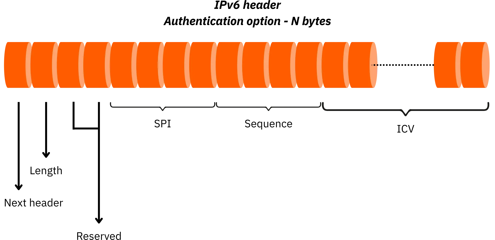


#### Hedef Seçenekleri Üstbilgisi


Bu başlık yalnızca datagramın son alıcısı için tasarlanmıştır. Ara yönlendiriciler tarafından dikkate alınmadan uygulamaya özel seçenekler veya meta veriler eklemek için kullanılabilir.


Başlangıçta protokolde böyle bir seçenek tanımlanmamıştı. Ancak, bu başlık IPv6 tasarlanırken, gelecekteki uzantıların genel paket yapısını değiştirmeden eklenmesine izin vermek için tanıtıldı. Örneğin null seçeneği, yalnızca bellek hizalama amacıyla başlığı 8 baytın katları şeklinde doldurmak için kullanılır.


IPv6 paket tasarımı, minimal bir temel başlık ile modüler uzantı başlıkları arasında net bir ayrım üzerine inşa edilmiştir. Bu mimari hem standart işlem performansını hem de protokolü geliştirmek ve güvenlik, karmaşık yönlendirme veya hizmet kalitesi mekanizmalarını entegre etmek için gereken esnekliği sağlarken gelecekteki altyapılarla uyumluluğu da korur.


## IPv6 ve DNS arasındaki ilişki


<chapterId>421eacb8-b80b-4aee-910f-e069ed805f00</chapterId>


Modern ağlarda DNS (*Domain Name System*) alan adlarını makinelerin kullanabileceği IP adreslerine çevirir. IPv6'nın kullanılmaya başlanmasıyla birlikte DNS, IPv4 ile geriye dönük uyumluluğu korurken 128 bit adresleri destekleyecek şekilde adapte olmak zorunda kalmıştır. Bu birlikte varoluş, özellikle her iki IP sürümünün aynı anda çalıştığı çift yığınlı ortamlarda önemlidir.


### IPv6'ya özgü DNS kayıtları


Bir alan adını bir IPv6 Address ile ilişkilendirmek için DNS, IPv4 adresleri için "A" kaydına benzer bir AAAA (*quad-A*) kaydı kullanır. AAAA kaydı, bir alan adını açıkça bir IPv6 Address ile eşler.

Örnek:


```shell
ipv6.mydmn.org.         IN      AAAA    2001:66c:2a8:22::c100:68b
```


Bu kayıt, `ipv6.mydmn.org` alan adının IPv6 Address `2001:66c:2a8:22::c100:68b` adresine çözümlendiğini gösterir. Aynı alan adını ister IPv4 (A kaydı aracılığıyla) ister IPv6 (AAAA kaydı aracılığıyla) olsun birkaç IP adresiyle ilişkilendirmek mümkündür ve hatta maksimum uyumluluk için önerilir. Bu, IPv6 uyumlu müşterilerin IPv6'yı tercih etmesini sağlarken, yalnızca IPv4 istemcilerinin desteklenmeye devam etmesini sağlar.


Buna ek olarak, DNS ters çözümlemeyi destekler, yani belirli bir IP Address ile ilişkili alan adını arayabilir. IPv6 durumunda, bu işlem `ip6.arpa` bölgesine yerleştirilen PTR kayıtlarını kullanır. Bu bölge özellikle IPv6 ters çözümleme için ayrılmıştır. IPv4 için bu bölge `in-addr.arpa` bölgesidir.


### Ters çözünürlük


Bir IPv6 Address'nin ters çözümlemesi katı bir süreç izler:

1) Address'i tam onaltılık gösterime genişletin (16 bayt, yani 32 onaltılık basamak).

Örnek:


```shell
2001:66c:2a8:22::c100:68b
```


Olur:


```shell
2001:066c:02a8:0022:0000:0000:c100:068b
```


2) Her onaltılık basamağın (nibble) sırasını tersine çevirin, bunları noktalarla ayırın ve `ip6.arpa` ekleyin:


```shell
b.8.6.0.0.0.1.c.0.0.0.0.0.0.0.0.2.2.0.0.8.a.2.0.c.6.6.0.1.0.0.2.ip6.arpa  IN PTR  ipv6.mydmn.org
```


Bu yapı, IPv6 Address alanında standartlaştırılmış, benzersiz ters aramalar sağlar.


**Lütfen unutmayın**: DNS sorguları IPv4 ya da IPv6 üzerinden iletilebilir. Kullanılan aktarım protokolünün döndürülen kayıtların türü üzerinde hiçbir etkisi yoktur.

Örneğin:


- IPv6 üzerinden bağlanan bir istemci bir IPv4 kaydı talep edebilir.
- IPv4 üzerinden bağlanan bir istemci bir IPv6 kaydı talep edebilir.

DNS sunucusu, sorgunun aktarım protokolünden bağımsız olarak sadece sahip olduğu kayıtlarla yanıt verir.


Bir ana bilgisayar adı hem IPv4 hem de IPv6 ile eşlendiğinde, hangi Address'ın kullanılacağı seçimi, önek tercihi, kapsam ve erişilebilirlik gibi faktörlere dayalı bir Address seçim algoritmasını tanımlayan RFC 6724 tarafından yönetilir. Varsayılan olarak, sistem veya ağ yapılandırması tarafından geçersiz kılınmadığı sürece genellikle IPv6 tercih edilir.


**Önemli hatırlatma**: Bir URL'ye (*Uniform Resource Locator*) bir IPv6 Address yerleştirirken, köşeli parantez (`[]`) içine alınmalıdır. Bu, IPv6 Address'in içindeki iki nokta üst üste (`:`) ile URL'deki ana bilgisayar adını bağlantı noktasından ayıran iki nokta üst üste arasındaki karışıklığı önler.


Geçerli örnek:


```shell
http://[2001:db8::1]:8080
```


Bu, URL'nin hem tarayıcılar hem de web sunucuları tarafından doğru şekilde işlenmesini sağlar.


Bu nedenle IPv6'nın DNS sistemine entegre edilmesi, yeni kayıt türlerine, ters çözümleme için katı bir yönteme ve yönlendirme uyumluluğu ve tutarlılığını sağlamak için hassas seçim ve biçimlendirme kurallarına dayanır.


### Bölüm özeti


Bu bölümde, IPv6 adreslemesinin temel ilkelerini araştırdık. IPv6 Address'nin yapısını inceleyerek başladık: 128 bit uzunluğu, onaltılık gösterimi ve tekrarlayan sıfır dizilerini kısaltmak için kullanılan basitleştirme kuralları. Bu tasarım, IPv6'nın IPv4'ün Address alanının sınırlamalarının üstesinden gelmesini sağlarken ölçeklenebilirliği ve verimli hiyerarşiyi garanti eder.


Daha sonra IPv6 adreslerinin farklı kategorilerini inceledik: unicast, anycast ve multicast, kapsamlarını, tipik kullanımlarını ve Address alanındaki temsillerini detaylandırdık.


Daha sonra, ister manuel yapılandırma, ister DHCPv6 protokolü aracılığıyla, ister NDP tarafından sunulanlar gibi durumsuz otomatik yapılandırma mekanizmaları kullanılarak olsun, yerel bir ağ içinde IPv6 adreslerini atama yöntemlerini inceledik. Bu yaklaşımlar, cihazların sağlanan önekten ve MAC Address'lerinden (EUI-64 aracılığıyla) kendi Address'lerini otomatik olarak generate yapmalarını sağlarken, ömür boyu yönetim ve gizlilik açısından esneklik sunar.


Ayrıca, Address bloklarının, bunları beş RIR'ye (*Kayıtlı İnternet Bölgeleri*) dağıtan IANA'dan başlayarak nasıl tahsis edildiğini ve ardından bunları müşterilerine alt ağlar olarak yeniden dağıtan İSS'lere (genellikle /48 olarak, 65536 /64 alt ağa izin vererek) nasıl tahsis edildiğini ayrıntılı olarak açıkladık. Sağlayıcı Birleştirilebilir_ (PA) ve Sağlayıcıdan Bağımsız_ (PI) bloklar arasındaki ayrım, çoklu bağlantı veya sağlayıcı değiştirme senaryolarının yönetilmesine yardımcı olur.


DNS'in AAAA kaydının kullanılmaya başlanmasıyla IPv6'ya uyum sağladığını ve ters çözümleme mekanizmalarının artık `ip6.arpa' bölgesine dayandığını gördük. Daha da önemlisi, DNS kullanılan aktarım protokolünden (IPv4 veya IPv6) bağımsız kalarak çift yığınlı bir ortamda sorunsuz birlikte çalışabilirlik sağlamaktadır.


Bu nedenle IPv6, IPv4'e göre sadece artan bir gelişme değil, küresel İnternet'in hem mevcut hem de gelecekteki zorluklarını karşılamak için inşa edilen adresleme sisteminin tamamen yeniden tasarlanmasıdır.


Bu NET 302 kursunun son bölümünde, uygulamaya geçeceğiz ve ağ tanılama araçlarına odaklanacağız.


# Ağ tanılama araçları


<partId>368a5c6f-ec48-4b28-970f-3a770788ad37</partId>


## Ağ Erişimi Layer araçları


<chapterId>1d25a21d-6900-4fbe-a438-e06c8afb9e02</chapterId>


Ağ tanılamasına ilişkin son bölümün bu ilk kısmında, TCP/IP modelinin ağ erişimi Layer'i analiz etmeye yönelik araçlara odaklanıyoruz. Bu Layer, özellikle MAC adreslerinin ve Ethernet kartları veya Wi-Fi arayüzleri gibi fiziksel ağ arayüzlerinin kullanımı yoluyla aynı fiziksel ağdaki cihazlar arasındaki doğrudan iletişimden sorumludur.


Buradaki amaç, yöneticilere bu temel Layer düşük seviyeli bağlantıyı incelemek, test etmek ve optimize etmek için pratik araçlar sağlamaktır. Bu araçlar arayüzlerin düzgün çalıştığını doğrulamak, ağ kartı yapılandırma sorunlarını gidermek veya çarpışmalar, paket kaybı veya bağlantı hataları gibi anormallikleri tespit etmek için kullanılabilir.


### IP/MAC mahalle yardımcı programları


#### `Arp` aracı


Ağ Erişimi Layer'deki en eski tanılama araçlarından biri `arp` komutudur. Giderek yerini `ip neigh` gibi modern alternatiflere bıraksa da (ki bunu birazdan keşfedeceğiz). aRP (*Address Resolution Protocol*) önbelleğini görüntülemek veya değiştirmek için `Arp` hala birçok sistemde mevcuttur. Bu önbellek, bir makinede yerel olarak bilinen IP adresleri ve MAC adresleri arasındaki eşlemeleri saklar. Başka bir deyişle, yerel ağdaki belirli bir IP Address'e hangi fiziksel (MAC) Address'in karşılık geldiğini belirlemenizi sağlar.


Pratikte, bir ana bilgisayar aynı alt ağ içindeki bir IP Address'ye paket göndermek istediğinde, önce hedef makinenin MAC Address'sini bilmelidir. Bu eşleme, yerel ağda bir istek yayınlayan ve karşılık gelen MAC Address'yi içeren bir yanıt alan ARP tarafından gerçekleştirilir. Bu sonuç daha sonra, her yeni paket için isteklerin tekrarlanmasını önlemek için "ARP önbelleği" adı verilen yerel bir tabloda geçici olarak saklanır.


Bu önbelleğin içeriğini görüntülemek ve makinenin o anda bildiği girişleri kontrol etmek için şunu kullanın:


```bash
arp -a
```


Bu komut, tüm arayüzlerde yerel olarak kayıtlı tüm IP/MAC eşlemelerini listeler. Her satırda ana bilgisayar adı (çözümlenebilirse), IP Address, karşılık gelen MAC Address ve eşlemenin gözlemlendiği Interface bulunur.


Ekranı belirli bir IP Address'e filtrelemek için, bunu belirtmeniz yeterlidir:


```bash
arp -a 192.168.1.5
```


Bu, önbellekte belirli bir IP Address'nın bulunup bulunmadığını kontrol etmeyi kolaylaştırır, bu da aynı ağdaki iki ana bilgisayar arasındaki iletişim arızalarını teşhis etmeye yardımcı olabilir.


Benzer şekilde, yalnızca belirli bir Interface ağıyla (örneğin `eth0` adlı bir Ethernet kartı) ilişkili ARP girişlerini görüntülemek için şunu kullanabilirsiniz:


```bash
arp -a -i eth0
```


Bu özellikle bir ana bilgisayarın birden fazla ağ bağdaştırıcısına sahip olabileceği çoklu Interface ortamlarında (kablolu, kablosuz, VPN, vb.) kullanışlıdır.


ARP` komutu salt okunur kullanımla sınırlı değildir. Bazı gelişmiş sorun giderme senaryolarında veya belirli koşulları simüle ederken çok değerli bir özellik olan ARP önbelleğini manuel olarak düzenlemek için de kullanılabilir. Örneğin, manuel olarak bir IP/MAC eşlemesi ekleyebilirsiniz:


```bash
arp -s 192.168.1.7 00:17:BC:56:4F:25 -i eth2
```


Bu komut yerel ARP tablosunda, IP Address `192.168.1.7` ile Interface `eth2` üzerindeki MAC Address `00:17:BC:56:4F:25`i ilişkilendiren statik bir giriş oluşturur.Interface belirtilmezse, sistem otomatik olarak ilk uygulanabilir olanı kullanır.


Ayrıca, bir hatayı düzeltmek veya yeniden keşfe zorlamak için ARP önbelleğinden bir girişi kaldırabilirsiniz:


```bash
arp -d 192.168.1.7
```


Bu, girişi silerek bir sonraki iletişim girişiminin yeni bir ARP isteğini tetiklemesini sağlar.


**NOT**: Silme seçeneği ayrıca bir Interface adını da kabul ederek belirli bir girdinin kaldırılmasını daha kesin bir şekilde hedeflemenizi sağlar.


Özetle, `arp` aracı, özellikle bağlantı sorunlarının genellikle yanlış veya eski Address çözünürlüğüne kadar izlenebildiği yerel ağlarda yararlı olan düşük seviyeli tanılama sağlar. Bununla birlikte, son sistemlerde, özellikle modern Linux dağıtımlarında, bu aracın yerini giderek daha birleşik bir çerçevede benzer işlevsellik sunan `iproute2` araç setinden `ip neigh` komutu almaktadır.


#### `Ip komşusu` aracı


Modern sistemlerde, özellikle de son Linux dağıtımlarında, `ip neigh` komutu IP ve MAC adresleri arasındaki eşleştirmeleri incelemek ve yönetmek için başvurulan bir araçtır. Bu komut, `arp` gibi eski araçların yerini yavaş yavaş alan ve veri bağlantısı Layer'te tanılama için daha tutarlı ve esnek bir çerçeve sağlayan `iproute2` paketinin bir parçasıdır.


IP neigh` komutu, IPv4 için ARP önbelleğine ve IPv6 için NDP (_Neighbor Discovery Protocol_) önbelleğine eşdeğer olan yerel IP komşu önbelleğini sorgular. Bu önbellek, IP adresleri (v4 veya v6) ve MAC adresleri arasındaki bilinen ilişkileri durumlarıyla birlikte (geçerli, beklemede, süresi dolmuş...) saklar.


Önbelleği görüntülemek için temel komut şudur:


```bash
ip neigh
```


Bu, hedef IP Address'i, ilgili ağ Interface'ü, ilişkili MAC Address'i (varsa) ve girişin durumunu (örneğin, `ERİŞİLEBİLİR`, `BEKLEME`, `ERTELEME`, `BAŞARISIZ`...) gösteren bir giriş listesi çıkarır.


Örnek çıktı:


```bash
192.168.1.5 dev eth0 lladdr 00:17:BC:56:4F:25 REACHABLE
```


Bu satır, makinenin Interface `eth0` üzerinden IP Address `192.168.1.5` ve MAC Address `00:17:BC:56:4F:25` arasında geçerli bir eşleme bildiğini gösterir.


Girişleri IP Address, Interface veya durum gibi kriterlere göre de filtreleyebilirsiniz. Örneğin, yalnızca Address `192.168.1.7`yi sorgulamak için:


```bash
ip neigh show 192.168.1.7
```


Veya Interface `eth1` için tüm girişleri görüntülemek için:


```bash
ip neigh show dev eth1
```


Danışmanın ötesinde, `ip neigh` önbelleği manuel olarak düzenlemek için de kullanılabilir. Örneğin, statik bir giriş eklemek için:


```bash
ip neigh add 192.168.1.7 lladdr 00:17:BC:56:4F:25 dev eth1 nud permanent
```


Bu, IP Address `192.168.1.7`yi Interface `eth1` üzerindeki belirtilen MAC Address ile kalıcı olarak ilişkilendirir. Nud permanent` seçeneği (_Neighbor Unreachability Detection_ için) girişin otomatik olarak geçersiz kılınmamasını sağlar.


Tersine, bir önbellek girdisini silmek için:


```bash
ip neigh del 192.168.1.7 dev eth1
```


Bu, sistemi söz konusu Address ile bir sonraki iletişiminde eşlemeyi yeniden çözmeye zorlar.


**NOT**: IP neigh` aracı hem IPv4 hem de IPv6 için çalışır. IPv4 için ARP ile arayüz oluşturur; IPv6 için NDP ile etkileşime girer. Bu, protokol aileleri arasında IP/MAC ilişkilerini yönetmek için birleşik, tutarlı bir yaklaşım sağlar ve `ip neigh`i Linux sistemlerinde komşu yönetimi için modern standart haline getirir.


### Paket analiz araçları


Bir bilgisayar ağında neler olup bittiğini derinlemesine analiz etmek için, yöneticilerin makineler arasında değiş tokuş edilen paketleri yakalayabilecek araçlara ihtiyacı vardır. Karşılaştırma ölçütü olarak iki araç öne çıkmaktadır: `tcpdump` ve `Wireshark`. Bu araçlar anormal davranışları teşhis etmek, protokol alışverişlerini denetlemek veya çerçeve içeriklerini inceleyerek ağ güvenliğini incelemek için gereklidir.


#### `ttcpdump`: komut satırı analizi


`tcpdump` bir ağ Interface üzerinden seyahat eden paketleri yakalamak ve görüntülemek için tasarlanmış oldukça güçlü bir komut satırı aracıdır. Gerçek zamanlı olarak çalışır ve hafif tasarımı sayesinde grafiksel Interface olmayan veya sınırlı kaynaklara sahip sistemlerde kullanılabilir. Donanımdan bağımsız düşük seviyeli yakalama işlevleri sağlayan `libpcap` kütüphanesine dayanır.


Tcpdump`ın yaygın bir kullanımı, paketleri belirli kriterlere göre filtreleyerek bir makinenin veya ağ segmentinin ağ etkinliğini izlemektir. Sonuçlar bir dosyaya yönlendirilerek trafiğin daha sonra analiz edilmek üzere arşivlenmesine veya Wireshark gibi başka bir araçta yeniden oynatılmasına olanak tanır.


Genel komut sözdizimi şöyledir:


```bash
tcpdump -w <file.cap> -i <interface> -s <snapshot_length> -n <filters>
```


- w` yakalanan paketleri `libpcap` formatında (uzantısı `.cap` veya `.pcap`) bir dosyaya yazar;
- i` izlenecek Interface ağını belirtir (örneğin `eth0`, `wlan0`);
- s`, paket başına yakalanan maksimum veri miktarını ayarlar. 0` belirtilirse tüm paketler yakalanır;
- n` DNS ve hizmet adı çözümlemesini devre dışı bırakarak performansı artırır.


Komutun sonundaki ifade filtreleri, yakalamaları bir trafik alt kümesiyle kısıtlamanıza olanak tanır. Seçimi hassaslaştırmak için `host`, `port`, `src`, `dst` vb. anahtar kelimeleri birleştirebilirsiniz.


Örnek: `192.168.25.24` sunucusuna giden veya gelen HTTP paketlerini (port 80) yakalamak ve bunları bir `fichier.cap` dosyasına kaydetmek için:


```bash
tcpdump -w fichier.cap -i eth0 -s 0 -n port 80 and host 192.168.25.24
```


Ortaya çıkan dosya daha sonra grafiksel bir araçta analiz edilebilir veya başka bir sistemde yeniden oynatılabilir.


#### Wireshark: gelişmiş görsel analiz


Eskiden *Ethereal* olarak bilinen Wireshark, grafiksel bir Interface ile eksiksiz bir ağ analiz programıdır. Tcpdump`tan farklı olarak, protokol diseksiyonu, akış grafikleri, trafik istatistikleri ve etkileşimli filtreler dahil olmak üzere paketlerin yapılandırılmış, ayrıntılı görselleştirilmesini sağlar. Ayrıca `libpcap`e dayanır, yani `tcpdump` tarafından oluşturulan yakalama dosyalarını açabilir ve işleyebilir.


Wireshark, Linux ve Windows dahil olmak üzere birçok işletim sisteminde kullanılabilir. Kurulumu, yakalama arayüzlerine erişmek için yönetici ayrıcalıkları gerektirir. Bir kez başlatıldığında, *Capture* menüsünden bir Interface ağı seçebilirsiniz. Başlat* düğmesine tıklandığında gerçek zamanlı paket kaydı başlar. Ekran üç bölmeye ayrılmıştır:


- yakalanan karelerin listesi ;
- protokolde deşifre edilmiş ayrıntılar,
- ham onaltılık veri.


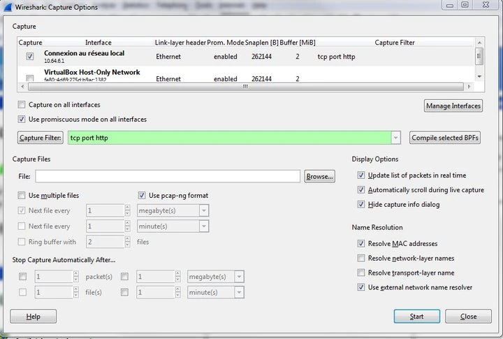


Wireshark, karmaşık protokol davranışlarını gözlemlemeniz, uygulama diyaloglarını (HTTP veya DNS oturumu gibi) yeniden yapılandırmanız veya hizmet yanıt sürelerini incelemeniz gereken senaryolarda mükemmeldir. Ayrıca, yalnızca ilgili paketlere odaklanmak için özel sözdizimini (`tcpdump`tan farklı) kullanarak son derece spesifik görüntüleme filtrelerini de destekler.


#### Tamamlayıcı araçlar


Tcpdump` ve Wireshark`ın birbirinin yerine kullanılamayacağını belirtmek önemlidir: her birinin kendine özgü güçlü yönleri vardır. tcpdump` komut satırı ortamları, otomatik komut dosyaları ve uzak sunucu müdahaleleri için daha uygunken, Wireshark ayrıntılı, etkileşimli ve eğitici trafik analizi için idealdir.


İki araç birleştirilebilir: `tcpdump` ile uzak bir sistemde bir yakalama yapılabilir, ardından `.cap` dosyası yerel bir makinede Wireshark ile analiz için aktarılır. Bu yaklaşım pratikte yaygın olarak kullanılmaktadır.


### Interface analiz araçları


Ağ Erişimi Layer'de, arızaları teşhis etmek, performansı optimize etmek veya bağlantı bütünlüğünü doğrulamak için genellikle fiziksel ağ arayüzlerini sorgulamak ve yapılandırmak gerekir. Bu amaçla Linux altında mevcut olan en güçlü araçlardan biri, sadece bir Ethernet Interface hakkında ayrıntılı teknik bilgi sağlamakla kalmayan, aynı zamanda bazı parametrelerini gerçek zamanlı olarak ayarlamanıza izin veren bir komut satırı yardımcı programı olan `ethtool`dur.


#### Interface teknik özelliklerini görüntüleyin


Ethtool`un temel özelliklerinden biri, bir Interface'yi sorgulama ve mevcut özelliklerini görüntüleme yeteneğidir. Bu kontrol etmenizi sağlar:


- bağlantı hızı (örneğin 100 Mbit/sn, 1 Gbit/sn veya 10 Gbit/sn);
- müzakere modu (yarım dubleks veya tam dubleks) ;
- otomatik anlaşmanın etkin olup olmadığı;
- bağlantı noktası türü (bakır, fiber, vb.);
- bağlantı durumu (aktif veya değil) ;
- wake-on-LAN* gibi gelişmiş özellikler için destek.


Bu bilgi özellikle fiziksel bağlantı veya ana bilgisayarın ağ kartı ile bağlandığı ekipman (anahtar, yönlendirici vb.) arasındaki uyumsuz anlaşma ayarlarıyla ilgili sorunların teşhisi için kullanışlıdır.


Bu bilgiyi elde etmek için çalıştırmanız yeterlidir:


```bash
ethtool enp0s3
```


Bu komut, CentOS veya RHEL tabanlı sistemlerde yaygın bir adlandırma kuralı olan `enp0s3` Interface hakkında ayrıntılı bir rapor çıktısı verir.


#### Interface parametrelerini dinamik olarak değiştirme


ethtool` gözlemle sınırlı değildir: makineyi yeniden başlatmadan belirli Interface parametrelerini ayarlamanıza da olanak tanır. Bu, örneğin, belirli bir bağlantı hızını zorlamayı veya yerel ağın ihtiyaçlarına göre özellikleri etkinleştirmeyi mümkün kılar.


S` seçeneği aşağıdaki gibi parametreleri dinamik olarak yapılandırmak için kullanılır:


- bağlantı hızı (`speed`), açıkça ayarlanır (örneğin 1 Gbit/s için 1000) ;
- dupleks modu (`duplex`), `half` veya `full`;
- otomatik anlaşmayı etkinleştirme veya devre dışı bırakma (`autoneg`) ;
- wake-on-LAN* (`wol`) etkinleştirilmesi;
- liman tipi.


Örnek 1: Interface üzerinde otomatik anlaşmayı etkinleştirin:


```bash
ethtool -s enp0s3 autoneg on
```


Örnek 2: *Wake-on-LAN* özelliğini etkinleştirin (makinenin sihirli bir paket aracılığıyla uzaktan uyanmasına izin vermek için):


```bash
ethtool -s enp0s3 wol p
```


Bu örnekte `p` seçeneği, bir *Wake-on-LAN* paketi algılandığı anda uyandırma işleminin gerçekleşeceğini belirtir. Bu kurulum genellikle kurumsal ortamlarda gece güncellemeleri veya uzaktan bakım gerçekleştirmek için kullanılır.


#### Alet kurulumu


Ethtool`un her zaman öntanımlı olarak yüklenmediğine dikkat etmek önemlidir. Red Hat/CentOS dağıtımlarında şu komut ile kurulabilir:


```bash
yum install -y ethtool
```


Debian ve Ubuntu'da eşdeğer komut şöyledir:


```bash
sudo apt install ethtool
```


**UYARI**: Tüm `ethtool` komutlarında, Interface ağının adı seçenekten hemen sonra belirtilmelidir (`-s` olarak). Parametrelerin yerleştirilmesindeki herhangi bir sözdizimi hatası, komutu geçersiz veya etkisiz hale getirecektir.


## Ağ Layer araçları


<chapterId>d2c5bf35-4284-4af8-8e8b-049c696a511b</chapterId>


### Trafik analiz araçları


Ağ tanılamada `ping` komutu, iki makine arasındaki bağlantıyı test etmek için en basit ancak en güçlü araçlardan biri olmaya devam etmektedir. Uzak bir ana bilgisayara belirli bir zamanda erişilebilir olup olmadığını kontrol ederken, gecikme, bağlantı kararlılığı ve DNS çözünürlüğü hakkında da bilgi sağlar.


Ping` komutu ICMP (*Internet Control Message Protocol*) protokolüne dayanır. Bir kullanıcı `ping` isteği gönderdiğinde, sistem bir IP Address veya ana bilgisayar adına bir ICMP "Echo Request" paketi gönderir. Hedef makine çevrimiçiyse ve ağ yolu geçerliyse, bir ICMP "Echo Reply" paketiyle yanıt verir. Bu basit mekanizma, gecikme süresini ölçmek ve bağlantı veya ad çözümleme sorunlarını tespit etmek için kullanılabilir.


Klasik bir komut örneği:


```bash
ping 172.17.18.19
```


Tipik cevap:


```bash
mydmn.org (172.17.18.19): 56 data bytes
64 bytes from 172.17.18.19: icmp_seq=0 ttl=56 time=7.7 ms
64 bytes from 172.17.18.19: icmp_seq=1 ttl=56 time=6.0 ms
64 bytes from 172.17.18.19: icmp_seq=2 ttl=56 time=5.5 ms
```


Bu örnekte, isim çözümlemesi otomatik olarak gerçekleştirilmiştir: `mydmn.org` etki alanı Address `172.17.18.19` IP'si ile ilişkilendirilerek DNS çözümlemesinin doğru çalıştığı teyit edilmiştir. Komut ayrıca aşağıdaki gibi teknik ayrıntılar da sağlar:


- iCMP sıra numarası (`icmp_seq`), yanıtların sırasını kontrol etmek için kullanışlıdır;
- TTL (*Time-To-Live*), paket atılmadan önce kalan atlama sayısını gösterir;
- milisaniye cinsinden ifade edilen gidiş-dönüş süresi/gecikmesi (`time`), bağlantı gecikmesinin bir tahminini sağlar.


#### ICMP parametrelerinin daha ayrıntılı analizi


TTL, IP protokolünde kritik bir alandır. Her datagram gönderici tarafından bir TTL değeri ile başlatılır (genellikle 64, 128 veya 255). Yol boyunca her yönlendirici bu değeri 1 azaltır. TTL hedefine ulaşmadan önce 0'a ulaşırsa, paket atılır ve gönderene bir ICMP hatası döndürülür. Bu mekanizma sonsuz yönlendirme döngülerini önler.


Yayılma süresi (*gidiş-dönüş gecikmesi/zaman*) bir paketin göndericiden ayrılması, hedefe ulaşması ve geri dönmesi için gereken gecikmeyi ölçer. Uygulamada, 200 ms'nin altındaki bir gecikme istikrarlı bir bağlantı için kabul edilebilir olarak kabul edilir. Anormal derecede yüksek gecikmeler ağ tıkanıklığını, verimsiz yönlendirmeyi veya düşük bağlantı kalitesini gösterebilir.


#### Gelişmiş `ping` kullanımı


ping`, testleri iyileştirmek ve belirli ağ davranışlarını gözlemlemek için seçenekler sunar.


Yayın istekleri göndermek için, bir alt ağdaki tüm ana bilgisayarları hedeflemek üzere `-b` seçeneğini kullanabilirsiniz:

```bash
ping -b 192.168.1.255
```


Bu, aktif ana bilgisayarları hızlı bir şekilde tespit etmek veya ağın yayın isteklerini nasıl işlediğini test etmek için yerel ağlarda kullanışlıdır. Bununla birlikte, birçok kurulumda, yönlendiriciler ve güvenlik duvarları, amplifikasyon saldırılarını önlemek için yayın pinglerini engeller.


Ayrıca `-i` seçeneği ile istekler arasında özel bir aralık belirtebilirsiniz (varsayılan: 1 saniye):


```bash
ping -i 0.2 -c 10 192.168.1.7
```


Bu, 0,2 saniyelik aralıklarla 10 ICMP isteği gönderir. Bu tür testler, kısa bir süre içindeki gecikme dalgalanmalarını tespit etmek veya kararlılığını değerlendirmek için bir bağlantıyı hafifçe zorlamak için kullanışlıdır.


### Yönlendirme tablosu analiz araçları


IProute2` paketinin bir parçası olan `ip route` komutu, modern Linux sistemlerinde çekirdeğin IP yönlendirme tablosunu incelemek ve yönetmek için önerilen ve standart bir araçtır. Daha açık sözdizimi, daha fazla tutarlılık ve modern özellikler (IPv6, çoklu tablolar, isim alanları, vb.) için genişletilmiş destek sunarak eski `route` komutunun yerini alır.


#### Yönlendirme tablosunun görüntülenmesi


Geçerli yönlendirme tablosunu görüntülemek için:


```bash
ip route show
```


Bu çıktı, çekirdek tarafından bilinen tüm rotaları, yani giden paketlerin hedeflerine bağlı olarak izledikleri yolları listeler.


Örnek çıktı:


```bash
default via 192.168.1.1 dev eth0 proto dhcp metric 100
192.168.1.0/24 dev eth0 proto kernel scope link src 192.168.1.100
```


Her satır bir rotayı temsil eder. Anahtar alanlar şunları içerir:


- default**: daha spesifik bir rota eşleşmediğinde kullanılan varsayılan rota.
- via**: hedefe ulaşmak için kullanılan ağ geçidi.
- dev**: kullanılan Interface ağı.
- proto**: rotanın nasıl oluşturulduğu (manuel, DHCP, kernel, vb.).
- metric**: rota maliyeti, birden fazla olası yola öncelik vermek için kullanılır.
- scope**: rota kapsamı (örneğin, doğrudan bağlı bir rota için `link`).
- src**: bu Interface üzerinde giden paketler için kullanılan kaynak IP Address.


#### Rota ekleme ve silme


Yönlendirme tablosunu, örneğin statik yollar ekleyerek veya kaldırarak dinamik olarak da değiştirebilirsiniz.


Statik rota ekleme:


```bash
ip route add 192.168.1.0/24 via 192.168.1.1 dev eth0
```


Bu, Interface `eth0` üzerindeki `192.168.1.1` ağ geçidi üzerinden `192.168.1.0/24` ağına bir rota yapılandırır.


Bu rotayı kaldırın:


```bash
ip route del 192.168.1.0/24
```


Bu komut önceden tanımlanmış rotayı siler.


#### Yararlı komutlar


İşte analiz veya komut dosyası oluşturma için bazı yararlı varyantlar:


- ip -4 route`: yalnızca IPv4 rotalarını görüntüler;
- ip -6 route`: yalnızca IPv6 rotalarını görüntüler;
- `ip route list table main`: ana yönlendirme tablosunu görüntüler (varsayılan değer) ;
- `ip route get <Address>`: verilen Address'ya giden bir paketin hangi Interface ve ağ geçidini kullanacağını gösterir.


Örnek:


```bash
ip route get 8.8.8.8
```


Bu, bir paketin `8.8.8.8` adresine ulaşmak için izleyeceği tam rotayı gösterir.


### İzleme araçları


IP paketlerinin bir kaynak ana bilgisayar ile bir hedef arasında izlediği rotayı analiz etmek için en etkili araçlardan biri `traceroute` komutudur. Paketlerin izlediği yolu adım adım gösterir ve geçtikleri ara yönlendiricileri tanımlar. Bir ağ bağlantısı arızası veya hizmet kesintisi durumunda, `traceroute` sorunun tam yerini belirlemeye yardımcı olur.


Ping` komutunda olduğu gibi, hedef ya tam nitelikli alan adıyla (FQDN) ya da IP Address ile belirtilebilir. Örneğin:


```bash
traceroute mydmn.org
```


#### Çalışma prensibi


`traceroute` IP paketleri başlığındaki TTL (*Time To Live*) alanına dayanır. Daha önce açıklandığı gibi, bu alan yol boyunca her yönlendirici tarafından azaltılan bir sayaçtır. TTL sıfıra ulaştığında paket atılır ve yönlendirici göndericiye bir ICMP "Time Exceeded" mesajı gönderir. Bu mekanizma yanlış yönlendirme durumunda sonsuz döngüleri önler.


traceroute` gönderici ve alıcı arasındaki yönlendiricileri eşlemek için bu davranıştan yararlanır:


- İlk olarak TTL'si 1 olan bir dizi UDP paketi (genellikle üç) gönderir. İlk yönlendirici TTL'si 0 olan bir paketle karşılaşır, bu nedenle paketi atar ve ardından IP Address'ini ve yanıt süresini gösteren bir ICMP mesajıyla yanıt verir.
- Ardından, TTL'si 2 olan bir dizi paket daha göndererek ikinci yönlendiriciyi ortaya çıkarır.
- Bu işlem hedefe ulaşılana kadar tekrarlanır ve bu noktada ana bilgisayar uç noktaya ulaşıldığını belirten bir ICMP Port Unreachable mesajı ile yanıt verir.


Varsayılan olarak, `traceroute` kullanılmayan bağlantı noktalarına (genellikle 33434 ile başlayan) gönderilen UDP paketlerini kullanır, ancak sistemlere veya komut değişkenlerine bağlı olarak ICMP (`ping` gibi) veya hatta TCP kullanacak şekilde de yapılandırılabilir.


Örnek çıktı:


```bash
traceroute to www.google.fr (216.58.210.35), 64 hops max, 52 byte packets

1  par81-024.ff.avast.com (62.210.189.205)   25.107 ms  24.235 ms  24.383 ms
2  62-210-189-1.rev.poneytelecom.eu (62.210.189.1)  27.341 ms  27.119 ms  28.184 ms
3  a9k1-45x-s43-1.dc3.poneytelecom.eu (195.154.1.92)  25.910 ms  25.040 ms  25.558 ms
4  72.14.218.182 (72.14.218.182)  36.234 ms  39.907 ms  38.130 ms
5  108.170.244.177 (108.170.244.177)  25.880 ms
108.170.244.240 (108.170.244.240)  25.791 ms
108.170.244.177 (108.170.244.177)  26.449 ms
6  216.239.62.143 (216.239.62.143)  26.491 ms
216.239.43.157 (216.239.43.157)  26.414 ms
216.239.62.139 (216.239.62.139)  26.400 ms
...
9  108.170.246.161 (108.170.246.161)  33.174 ms
108.170.246.129 (108.170.246.129)  34.342 ms
108.170.246.161 (108.170.246.161)  33.707 ms
10  108.170.232.105 (108.170.232.105)  33.845 ms  33.846 ms
108.170.232.103 (108.170.232.103)  34.206 ms
11  lhr25s11-in-f35.1e100.net (216.58.210.35)  34.094 ms  33.353 ms  33.718 ms
```


Her satır geçilen bir yönlendiriciye karşılık gelir ve üç adede kadar zaman ölçümü (milisaniye cinsinden) o yönlendiriciye gidiş-dönüş gecikmesini gösterir. Bu değerler her bir ağ segmentinin performansını değerlendirmeye yardımcı olur.


#### Sonuç yorumlama


Bir yönlendirici yanıt vermezse veya ICMP mesajlarını filtrelerse, yanıt süresi yerine yıldız işaretleri `*` görüntülenir. Bu şunu gösterebilir:


- iCMP yanıtlarını engelleyen bir güvenlik duvarı,
- yanıt vermeyecek şekilde yapılandırılmış bir cihaz veya
- yol boyunca geçici bir bağlantı sorunu.


Böylece, `traceroute` sadece izlenen rotayı tanımlamakla kalmaz, aynı zamanda anormal gecikme veya kesinti noktalarını da vurgular.


Bazı sistemlerde, root ayrıcalıkları gerektirmeyen eşdeğer `tracepath` komutu kullanılabilir. IPv6 için `traceroute6` veya `tracepath6` kullanın.


IPv6 izleme için örnek:


```bash
traceroute6 ipv6.google.com
```


### Etkin bağlantıları kontrol etmek için araçlar


Aktif ağ bağlantılarını teşhis etmek ve bir Linux sistemindeki ağ etkinliğini izlemek için `ss` komutu (_socket statistics_ kısaltması) modern bir referans aracıdır. Iproute2` paketinin bir parçası olan bu araç, artık kullanılmayan `netstat`ın yerini alarak daha iyi performans ve daha doğru sonuçlar sunmaktadır.


ss` aktif TCP ve UDP bağlantılarını, dinleme portlarını, yerel ve uzak adresleri, bağlantı durumlarını ve ilişkili işlemleri görüntüler.


#### Genel kullanım


Seçenekler olmadan çalıştırıldığında, `ss` komutu etkin TCP bağlantılarını görüntüler. Temel sözdizimi:


```bash
ss [options]
```


Analizi iyileştirmek için bazı yaygın seçenekler:


- t`: yalnızca TCP bağlantılarını gösterir;
- `-u`: yalnızca UDP bağlantılarını gösterir;
- l`: sadece dinleme soketlerini göster;
- `-n`: isim çözümlemesini devre dışı bırakın (ham IP'ler ve bağlantı noktası numaraları) ;
- `-p`: her soketle ilişkili işlemleri görüntüler (PID ve program adı),
- a`: etkin olmayanlar da dahil olmak üzere tüm bağlantıları gösterir,
- `-s`: üst düzey soket istatistiklerini görüntüler.


#### Vaka çalışmaları


TCP bağlantı noktası 80 (HTTP) kullanan tüm etkin bağlantıları görüntülemek için:


```bash
ss -ant | grep ':80'
```


Bu, 80 numaralı bağlantı noktasını içeren aktif TCP bağlantılarını gösterir. LISTEN`, `ESTABLISHED`, `TIME-WAIT` gibi durumlar her bir Exchange'un mevcut durumunu gösterir.


Örnek çıktı:

```
ESTAB 0 0 192.168.1.10:54321  93.184.216.34:80
```


Tüm ağ bağlantılarını ilişkili işlemlerle birlikte görüntülemek için:


```bash
ss -tulnp
```


Genel bir soket kullanım özeti elde etmek için:

```bash
ss -s
```


Yalnızca UDP bağlantılarını filtrelemek için:

```bash
ss -unp
```


Bu komutlar özellikle şüpheli bağlantıları, beklenmedik dinleme portlarını tespit etmek veya belirli bir hizmetin etkinliğini izlemek için kullanışlıdır.


## Layer aletlerinin taşınması ve üst kısmı


<chapterId>bce47931-930e-4288-b0fd-666c9a1066b5</chapterId>


### DNS sorgu araçları


TCP/IP modelinin üst katmanlarında, özellikle Uygulama Layer'de, ad çözümlemenin nasıl çalıştığını anlamak önemlidir. DNS sorgulama araçları, bir alan adının bir IP Address ile doğru şekilde ilişkilendirilip ilişkilendirilmediğini kontrol etmenizi sağlar ve ayrıca yanlış yapılandırma, yayılma gecikmeleri veya kullanılamama gibi DNS sunucusu sorunlarını teşhis etmenize yardımcı olur. Bu araçlar, bir ağ yöneticisi veya IP ortamındaki DNS alışverişlerini daha iyi anlamak isteyen herhangi bir kullanıcı için gereklidir.


#### Nslookup` komutu


En basit DNS sorgulama aracı `nslookup`tır. Bir DNS sunucusuna sorgu gönderir ve bir alan adıyla ilişkili IP Address'ü (ya da tam tersini) döndürür. Varsayılan olarak, sistemin yapılandırılmış DNS sunucusunu sorgular, ancak komutta doğrudan bir sunucu da belirtebilirsiniz.


Doğrudan arama örneği:

```bash
nslookup mydmn.org
```


Belirli bir DNS sunucusunu sorgulama:

```bash
nslookup mydmn.org 192.6.23.4
```


İstek, `192.6.23.4` adresindeki DNS sunucusundan `mydmn.org` adını çözümlemesini ister. Bu, özellikle belirli bir DNS sunucusunun bir alan adını tanıyıp tanımadığını kontrol etmek veya sunucunun düzgün çalıştığını doğrulamak için kullanışlıdır.


#### Dig` komutu


`dig` (*Domain Information Groper*) `nslookup`tan daha modern, eksiksiz ve esnek bir araçtır. Karmaşık sorguları destekler ve çözümleme süreci, ilgili sunucuların hiyerarşisi, döndürülen kayıt türü (A, AAAA, MX, TXT, vb.) ve karşılaşılan hatalar hakkında ayrıntılı bilgi sağlar.


Temel sorgu örneği:

```bash
dig mydmn.org
```


Belirli bir DNS sunucusunu sorgulama:

```bash
dig @192.6.23.4 mydmn.org
```


Bu komut, belirli bir sunucuda bir DNS kaydının kullanılabilirliğini kontrol eder.

Dig`in en önemli avantajlarından biri, DNS yanıtının ayrıntılarını göstererek yapılandırma hatalarını teşhis etmek için çok kullanışlı hale getirmesidir.


#### DNS çözümleyicilerinin manuel yapılandırması


Bazen, örneğin test ortamlarında veya belirli sunucuların kullanımını zorlamak için yerel olarak kullanılan DNS sunucularını geçersiz kılmak gerekir. Bu, sistemin DNS çözümleme ayarlarını tanımlayan `/etc/resolv.conf` dosyasını düzenleyerek yapılabilir.


Örnek yapılandırma:


```bash
vi /etc/resolv.conf

search mydmn.org
nameserver 192.168.1.10
nameserver 192.168.1.11
```


- Search` alanı, kısa adlar çözümlenirken otomatik olarak eklenecek bir etki alanını belirtir.
- Nameserver` girdileri, öncelik sırasına göre kullanılacak DNS sunucularını tanımlar.


Birçok modern dağıtımda (özellikle `systemd-resolved` kullananlar), `/etc/resolv.conf` üzerindeki değişiklikler geçicidir ve yeniden başlatma veya ağa yeniden bağlanma sırasında üzerine yazılabilir. Daha kalıcı yöntemler arasında `resolvconf`, `systemd-resolved` kullanımı veya *NetworkManager* yapılandırmalarının değiştirilmesi yer alır.


#### Host` komutu


Bir diğer basit ama etkili DNS aracı `host`tur. Etki alanı adlarını IP adreslerine (veya tersine) çözümler ve bir Interface ağındaki DNS arızalarını veya yanlış yapılandırmaları teşhis etmeye yardımcı olabilir.


Örnekler:

```bash
host mydmn.org
```


Ters arama:

```bash
host 192.6.23.4
```


host` özellikle komut satırı betiklerinde kullanıldığında hızlı kontroller için kullanışlıdır.


Üçüncü taraf DNS sunucularına izinsiz olarak yapılan tekrarlı veya yoğun sorgular izinsiz giriş girişimleri veya kötü niyetli faaliyetler olarak yorumlanabilir. Uygunsuz şekilde veya kontrol etmediğiniz ağlara karşı kullanılan bu komutlar, genellikle bir saldırının ilk adımı olan keşif taramalarına benzeyebilir. Bunların kullanımını her zaman yönettiğiniz veya açık yetkinizin olduğu ortamlarla sınırlandırın.


### Ağ Tarama Araçları


Bir yerel ya da geniş alan ağını izlerken ya da güvenliğini sağlarken, aktif aygıtları ve açığa çıkardıkları hizmetleri tanımlamak çok önemlidir. İşte `nmap` (*Network Mapper*) aracının yaptığı da tam olarak budur.


https://planb.network/tutorials/computer-security/communication/nmap-862300d7-6dfb-4660-970d-f56a9f58f60d

#### Nmap` ile tanışın


nmap` açık portları, mevcut hizmetleri (HTTP, SSH, DNS, vb.) ve hatta bazen kullanılan işletim sistemi türünü tespit etmek için bir veya daha fazla ana bilgisayarın hedefli taranmasına izin verir. Birçok seçeneği sayesinde `nmap`, altyapı yönetiminin denetleme veya sertleştirme aşamalarında gerekli olan bir ağın maruz kalma yüzeyine kesin bir genel bakış sağlar.


Tıpkı `host` komutunda olduğu gibi, `nmap` komutu da sahip olmadığınız ağlarda veya altyapılarda ya da açık bir yetkilendirme olmadan asla kullanılmamalıdır. Yetkisiz port taramaları kötü niyetli keşif girişimleri olarak işaretlenebilir, genellikle güvenlik sistemleri (güvenlik duvarları, IDS/IPS) tarafından tespit edilir ve hatta yasal sonuçlara yol açabilir.


#### Temel kullanım


Belirli bir ana bilgisayarı taramak ve açık portlarını görüntülemek için:

```bash
nmap 192.168.0.1
```


Bu komut `192.168.0.1` ana bilgisayarındaki en yaygın 1000 bağlantı noktasını tarar ve erişilen hizmetleri ve kullanılan protokolleri görüntüler. DNS çözümlemesi yapılandırılmışsa, IP Address yerine ana bilgisayar adını da kullanabilirsiniz.


#### Tam ağ taraması


Nmap`in avantajlarından biri, tek bir komutla tüm adres aralığını tarayabilmesidir. Bu, örneğin bir ağdaki tüm aktif makinelerin hızlı bir şekilde envanterini çıkarmayı kolaylaştırır:


```bash
nmap 192.168.0.0/24
```


Bu durumda, `192.168.0.0` ila `192.168.0.255` aralığındaki tüm ana bilgisayarlar sorgulanacaktır. Her IP Address için sonuçlar açık portları, durumlarını (açık, filtrelenmiş, vb.) ve mümkün olduğunda ilgili servisin adını listeler.


Bir yönetici çeşitli görevler için `nmap'a güvenebilir:


- Aktif ana bilgisayarları tespit etme**: bir alt ağ içinde hangi makinelerin yanıt verdiğini belirleyin;
- Hizmet envanteri**: yalnızca gerekli bağlantı noktalarının erişilebilir olmasını sağlayın (en az ayrıcalık ilkesi);
- Uyumluluk kontrolü**: açık portları kuruluşun güvenlik politikasıyla karşılaştırın;
- Güvenlik açığı önleme**: kritik makinelerde çalışan güvensiz veya güncel olmayan hizmetleri tespit edin.


https://planb.network/tutorials/computer-security/communication/nmap-862300d7-6dfb-4660-970d-f56a9f58f60d

### Süreç sorgulama araçları


Özellikle ağ bağlamında aktif süreçlerin ve açık dosyaların derinlemesine analizi için Linux yöneticileri genellikle `lsof` (*List Open Files*) komutuna başvururlar. Adına rağmen, `lsof` geleneksel dosyalarla sınırlı değildir: UNIX sistemlerinde, ağ soketleri, aygıtlar ve iletişim kanalları da dahil olmak üzere her şey bir dosya olarak kabul edilir.


Dolayısıyla bu araç, aktif süreçleri, açık ağ bağlantı noktalarını, erişilen dosyaları ve ilgili kullanıcıları ilişkilendirerek sistemin kesitsel bir görünümünü sağlar.


#### Lsof` ile ağ analizi


I` seçeneği çıktıyı ağ bağlantılarıyla (TCP, UDP, IPv4 veya IPv6) sınırlar. Bu, hangi işlemlerin ağ üzerinden iletişim kurduğunu görmeyi kolaylaştırır:


```bash
lsof -i
```


Bu komut, bir ağ soketi kullanarak çalışan tüm işlemleri listeler ve kullanılan bağlantı noktasını, protokolü (TCP/UDP), bağlantı durumunu, ayrıca PID ve ilişkili kullanıcıyı gösterir.


#### IP Address veya bağlantı noktasına göre filtreleme


Bir IP Address ve bir bağlantı noktası belirterek aramaları daraltabilir ve belirli bir ağ akışını izole edebilirsiniz. Örneğin, belirli bir ana bilgisayarla bir SMTP oturumunu (bağlantı noktası 25) kontrol etmek için:


```bash
lsof -n -i @192.168.2.1:25
```


Bu, yalnızca 25 numaralı bağlantı noktasında `192.168.2.1` ana bilgisayarıyla olan etkin ağ bağlantılarını görüntüler, şüpheli etkinlik veya SMTP akış sorunlarını teşhis etmek için kullanışlıdır.


#### Cihaz erişim takibi


Lsof`un bir diğer güçlü yanı da disk bölümleri gibi özel dosyaları takip edebilmesidir. Örneğin, `/dev/sda1` üzerinde hangi işlemlerin dosya açtığını kontrol etmek için:


```bash
lsof /dev/sda1
```


Bu, aygıt hala kullanımda olduğu için bir unmount girişimi başarısız olduğunda veya hangi uygulamaların bir bölüme eriştiğini araştırırken kullanışlıdır.


#### Çapraz analiz: süreç ve ağ


Kesin bilgiler için seçenekler birleştirilebilir. Örneğin, PID 1521'e sahip bir işlem tarafından açılan tüm ağ bağlantı noktalarını görmek için:


```bash
lsof -i -a -p 1521
```


A` seçeneği kriterleri (`-i` ve `-p`) keserek çıktıyı yalnızca o sürecin ağ bağlantılarıyla sınırlar.


#### Çok kullanıcılı izleme


lsof` ayrıca, isteğe bağlı olarak PID'ye göre filtrelenerek açtıkları tüm dosyaları listeleyerek belirli kullanıcıların etkinliklerini analiz etmek için de kullanılabilir:


```bash
lsof -p 1521 -u 500,phil
```


Bu, 1521 işlemiyle sınırlı olarak `phil` kullanıcısı veya UID 500 tarafından kullanılan dosyaları veya ağ bağlantılarını gösterir.


### Bölüm Özeti


Bu son bölümde, bilgisayar ağlarını teşhis etmek, analiz etmek ve yönetmek için çok çeşitli vazgeçilmez araçları keşfettik. TCP/IP modelinin katmanları etrafında yapılandırılan bu çalışma, yalnızca ağ iletişiminin nasıl çalıştığını açıklamakla kalmıyor, aynı zamanda olası sorunları tanımlamak, izole etmek ve çözmek için titiz bir metodoloji oluşturuyor.


Bu araçlar yöneticilere ağ sağlığını izlemek, trafiği analiz etmek, bağlantıları denetlemek ve hatalı ekipman veya hizmetlere hızla müdahale etmek için tutarlı bir dizi teknik kaldıraç sağlar.


#### Ağ Erişimi Layer


Arayüzlere ve çerçevelere doğrudan görünürlük sağlayan araçlar:


- arp / ip neigh**: IP-MAC ilişkilerini kontrol etmek veya düzeltmek için ARP/NDP önbelleğini inceleyin ve değiştirin;
- tcpdump**: komut satırı paket yakalama, filtrelenebilir ve dışa aktarılabilir;
- Wireshark**: derin protokol kod çözme ile grafiksel paket analizi;
- ethtool**: Ethernet kartı fiziksel parametrelerini (hız, dupleks, WoL, vb.) sorgular ve ayarlar.


#### Ağ Layer


IP bağlantısı, yönlendirme ve paket trafiğini değerlendirmek için araçlar:


- ping**: ICMP ile erişilebilirliği test edin ve gecikme süresini ölçün;
- ip route**: paket yollarını kontrol etmek için yönlendirme tablosunu inceleyin ve değiştirin;
- traceroute**: bir hedefe giden rota boyunca yönlendiricilerin hop-by-hop tanımlanması;
- ss**: TCP/UDP soketlerinin ve ilişkili süreçlerin ayrıntılı envanteri (netstat'ın halefi).


#### Taşıma ve Uygulama katmanları


Hizmetleri ve süreçleri tanılamaya yönelik araçlar:


- nslookup / dig / host**: Ad çözümlemesini doğrulamak ve kayıtları analiz etmek için DNS sorguları;
- nmap**: saldırı yüzeyini değerlendirmek için açık portları ve maruz kalınan hizmetleri keşfedin;
- lsof**: işlemler tarafından açılan dosyaları ve soketleri listeleyerek sistem ve ağ etkinliğini ilişkilendirir.


Her biri TCP/IP modelinin belirli bir aşamasıyla uyumlu olan bu araçlara hakim olmak, metodik bir yaklaşım sağlar: fiziksel Layer'den başlayarak yönlendirme ve uygulama hizmetlerine kadar. Bu uzmanlık zinciri, yöneticileri altyapılarını teşhis etme, güvenli hale getirme ve optimize etme konusunda donatarak hem ağ performansını hem de kullanılabilirliği sağlar.


# Son bölüm


<partId>09d5393c-63bc-42fc-bf79-c65e380211bd</partId>


## Yorumlar & Derecelendirmeler


<chapterId>114c33c0-9831-4d74-affd-f5d37adc53c3</chapterId>


<isCourseReview>true</isCourseReview>

## Final Sınavı


<chapterId>b99e005e-8dd0-4fa4-b302-f940c27a30ac</chapterId>


<isCourseExam>true</isCourseExam>

## Sonuç


<chapterId>3b449814-78f3-41c0-8138-0a04f3682719</chapterId>


<isCourseConclusion>true</isCourseConclusion>