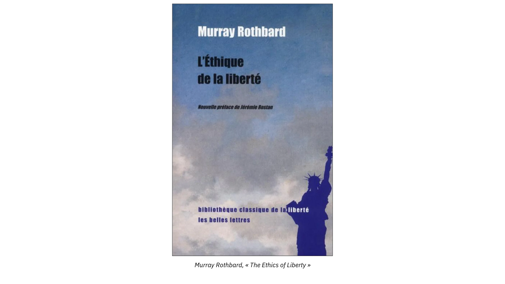
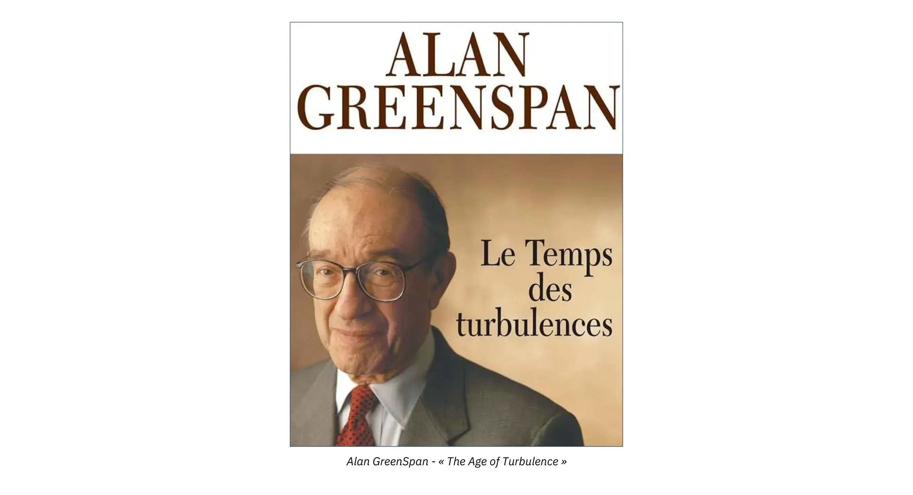

# Пътешествие из философската история на свободата

Курсът разглежда свободата в историята, като анализира две съперничещи си политически философии: свобода и власт. Ще изучавате влиятелни мислители, като Фредерик Бастиа, лорд Актън, Карл Маркс и Мъри Ротбард, и техните противоположни възгледи за производството, грабежа, класовата борба и ролята на държавата.

От Древността до Просвещението свободата се издига, тъй като обществата възприемат толерантността и икономическата независимост. През XIX и XX век обаче настъпва упадък, тъй като капитализмът е подложен на критика, а колективизмът се разраства. Проучете как тези промени осветяват днешните заплахи за свободата и започнете да разбирате битката между свободата и властта.

+++
# Въведение

<partId>6edada19-3af3-411b-8483-3fe45cfe1c54</partId>

## Преглед на курса

<chapterId>14d810d3-883c-4f5c-8593-f532530e7b7a</chapterId>

:::video id=be186f5a-9867-4132-bf3e-2212db365a4b:::

Добре дошли в PHI201!

Този курс ви кани да изследвате еволюцията на свободата в историята, като анализирате основните мисловни школи, които са я формирали. Ще проучите как концепцията за свободата се е развивала през вековете - в противовес или в сътрудничество с властта - чрез историческо пътуване от Античността до съвременните дебати.

**Раздел 1: Свобода или власт**

Ще започнем с преглед на двете основни политически философии в историята: свобода и власт. В този раздел ще бъдат разгледани вижданията на мислители като Фредерик Бастиа, който противопоставя производството на разхищението; лорд Актън, който разглежда свободата като движеща сила на историята; Карл Маркс с неговата теория за класовата борба; и Мъри Ротбард, който противопоставя държавата на обществото. Това концептуално въведение ще осигури рамка за анализ на историческите периоди.

**Раздел 2: Произход на свободата: Древност**

Тук ще се върнем към корените на философската мисъл при гърците, които са създали критичната рационалност, и при римляните, които са поставили основите на съвременното право. Ще разгледаме и падането на Рим като ключов момент, който предефинира политическата и социалната организация около понятието за свобода.

**Раздел 3: Произход на свободата: Средновековие**

Средновековието често се възприема като мрачен период, но ние ще открием, че то полага основите на съвременната свобода. Ще разгледаме утвърждаването на човешката свобода, дебатите между разума и вярата, появата на суверенната държава, библейската етика, която цени индивида, и ранните очертания на капитализма, които се появяват през този период.

**Раздел 4: Възходът на свободата: От Ренесанса до Просвещението**

В този раздел ще се спрем на появата на религиозната толерантност и икономическата свобода, които набират скорост по време на Ренесанса и Просвещението. Ще анализираме и значението на 1776 г., която бележи голям обрат с ключови събития, оформили свободния свят, преди да навлезем в епохата на революциите, които предефинират самото понятие за свобода.

**Раздел 5: Връх и спад: От XIX до XX век**

Ще продължим с изучаване на сътресенията през XIX и XX век, като подчертаем силните и слабите страни на демокрацията, марксистките критики на капитализма и австрийския отговор на тези критики. Ще разгледаме и предупрежденията за опасностите от колективизма чрез основни произведения като "Пътят към крепостничеството".

**Раздел 6: Възходът на държавата на благоденствието през ХХ век**

И накрая, в този раздел ще бъде разгледано как държавата на благоденствието постепенно взема превес над идеите за икономическа свобода, особено чрез триумфа на Кейнс и изоставянето на златния стандарт. В заключение ще подчертаем значението на идеите за формирането на хода на историята и продължаващата роля на свободата в съвременните общества.

Готови ли сте да се впуснете в това уникално философско пътешествие в търсене на свободата? Хайде!

# Свобода или власт

<partId>e59475e9-3ae4-5e66-a17e-218de0281b06</partId>

## Съществуват само две политически философии

<chapterId>ffa60c0d-ee2b-575d-a4ac-4e9ccdad396f</chapterId>

:::video id=d21788a4-3b99-48b7-ac1a-24d5913af893:::

Защо да озаглавите този курс: История на свободата? Защото трябва да разбираме връзката между идеите и събитията, за да преценяваме епохата си по-ефективно и да действаме проницателно. Именно в миналото откриваме елементите за по-добро разбиране на това какво е свободата и причините, поради които трябва да я пазим.

> Когато миналото вече не осветява бъдещето, духът върви в мрак (Алексис дьо Токвил - _Демокрацията в Америка_).

В същото време Огюст Конт е казал: "Човек не познава напълно една наука, докато не познава нейната история." Тази истина може да се приложи към идеята за свободата.

Всъщност свободата не е нова идея. Тя е наследство, предавано от поколение на поколение. Цялата история на цивилизацията свидетелства за непрестанна борба за свобода.

Въпреки това целта на този курс е не само да хвърли светлина върху историята на свободата, но и - което е по-важно - да развие критично мислене. Всъщност историята сама по себе си не е достатъчна, за да се прецени настоящето и бъдещето. Тя трябва да бъде придружена от критично осмисляне и преценка на грешките в миналото. Това е приносът на философията. Ето защо озаглавих този курс "Философска история на свободата" Всъщност става дума за изследване на това как философите са схващали свободата през вековете.

### Задачата на философията

Още от самото си създаване той има двойна цел:

- На първо място, това е придаването на смисъл на неясни и объркани понятия. Какво е добро, истинско, справедливо, красиво? Точно както функцията на историята е да осветлява миналото, така и философията е изкуството да се дефинират правилно понятията. Ето защо трябва да започнем този курс с разбирането на това какво е свободата.

Свободата е понятие, което включва множество варианти, които са толкова възможни депликации на една и съща реалност: политическа свобода, икономическа свобода, свобода на съвестта, свобода на словото, религиозна свобода, свобода на сдружаването и т.н. За каква реалност става дума?

Свободата може да се определи като способността да се прави избор по отношение на собствените дела. Тя е присъща способност на човешкото същество. Тя е реалност, която по същество е индивидуална. Само индивидът може да мисли и да действа, т.е. да прави избор. Това не означава, че индивидът е сам, нито че не дължи нищо на другите. Напротив, той живее в общество и трябва да си сътрудничи с другите за своето благо. Но всеки остава свободен да си сътрудничи или не и трябва да поеме отговорността за своя избор.

Понятието за отговорност е следствие от свободата, защото всеки избор има последствия. Отговорният човек е този, който поема разходите за собствените си решения и не прехвърля тези разходи върху другите. С други думи, свободата е изискваща. Тя е морално понятие, което предполага както права, така и задължения към другите, включително задължението да се зачита тяхната свобода.

Второ, философията е нормативна, докато историята е само описателна. По този начин политическата философия се различава от политическата наука. Политическата философия е нормативна, което означава, че тя предписва ценности и оценява човешките действия по критерий за справедливост. От друга страна, политолозите се задоволяват да описват режими и да правят история на институциите, без да правят ценностни преценки.

### Философия на свободата и философия на властта

От тази гледна точка има само два вида политически философии: философия на свободата и философия на властта.

- Философията на свободата се основава на естественото право на собственост и твърди, че единствената цел на закона е да защитава частната собственост и договорите. Всеки трябва да може да прави каквото пожелае с това, което му принадлежи, при условие че не вреди на никого. Това е философия, която защитава равната свобода за всички да се разпореждат със себе си и със собствеността си при условие на отговорност. Това е философията на свободния пазар.
- Философията на властта обосновава правомощията на определени колективни субекти, като държавата или обществото, да определят границите, които трябва да се поставят на пазара и собствеността, а следователно и на свободата. В тази рамка законът е отговорен за организирането на икономиката, здравеопазването, жилищното настаняване, културата, образованието и други аспекти на обществото. Тази конструктивистка философия винаги е имала своите защитници в името на колективния интерес, равенството, защитата и благосъстоянието.

Антагонизмът между тези две философии съществува във всички епохи. Но ние можем да го илюстрираме с философията на Просвещението. Между двата типа мислители ясно се очертава разделителна линия.

Тези, които защитават първата философия във Франция, са физиократите, начело с Франсоа Кеснай. Те наричат себе си физиократи (името идва от гръцкото "Physis", което означава природа, и "Kratos", което означава управление), защото развиват икономическа и социална мисъл, основана на естествените права на човека. За тях обществото, хората и собствеността съществуват преди законите. В тази система Бастиа обяснява,

> Не защото има закони, а защото има свойства, има и закони. (_Свойство и закон_).

За Турго и Сей, ученици на Кесне, съществува естествен закон, независим от капризите на законодателите, който е валиден за всички хора и съществува преди всяко общество. Тази философия идва директно от средновековната схоластика, стоиците, Аристотел и Софокъл. Неписаните закони идват преди писаните и ги превъзхождат, защото произтичат от човешката природа и разум.

Втората философия се среща сред автори като Русо, Робеспиер или Кант, които въплъщават републиканската традиция, в която суверенитетът на общата воля се смята за истински източник на правото. Съвременник на Кесне, Русо е антифизиократ. За него законодателят трябва да организира обществото, подобно на механик, който изобретява машина от инертна материя.

> "Онзи, който се осмелява да се заеме със създаването на народ - казва Русо, - трябва да се чувства способен да промени, така да се каже, човешката природа, да превърне всеки индивид, който сам по себе си е съвършено и самотно цяло, в част от едно по-голямо цяло, от което този индивид получава в известен смисъл своя живот и битие." (_Социален договор_)

От тази гледна точка мисията на законодателя е да организира, променя или дори премахва собствеността, ако сметне за необходимо. За Русо собствеността не е естествена, а конвенционална, както и самото общество. На свой ред Робеспиер установява принципа, че "Собствеността е правото на всеки гражданин да ползва и да се разпорежда с частта от благата, гарантирана му от закона" Не съществува естествено право на собственост; съществуват само неопределен брой възможни и условни договорености.

## Фредерик Бастиа: производство срещу разхищение

<chapterId>5a8a3452-9970-51a0-a5ea-f367b63137bc</chapterId>

:::video id=a18fd72d-34fd-41e5-a7db-770abdde79fa:::

Когато човек отваря учебниците, отбелязва Бастиа, научава, че без намесата на властта човечеството би било обречено на нищо:

> "Достатъчно е да отворим почти произволно някоя книга по философия, политика или история, за да видим колко дълбоко е вкоренена в нашата страна идеята, родена от класическите изследвания и майка на социализма, че човечеството е инертна материя, която получава от властта живот, организация, морал и богатство; или още по-лошо, че самото човечество се стреми към деградация и е спряно на този път само от тайнствената ръка на Законодателя." ("Законът") (http://bastiat.org/fr/la_loi.html).

С други думи, културният предразсъдък, който доминира в западната философия и историография, е, че дължим всичко на властта: свобода, здраве, образование, сигурност и просперитет. Човечеството е описано като "инертна материя", която придобива форма благодарение на законодателя.

Но реалността на властта е съвсем различна според Бастиа. Властта е потисничество. Той пише:

Отворете хрониката на човечеството на случаен принцип! Прегледайте древната или съвременната история, свещената или светската, и се запитайте откъде идват всички тези расови, класови, национални и семейни войни! Винаги ще получите този неизменен отговор: От жаждата за власт. ([_Парламентарни несъвместимости_](http://bastiat.org/fr/incompatibilites_parlementaires.html))

Именно жаждата за власт е в основата на всички форми на потисничество в историята. В писмо до г-жа Шеврьо от 23 юни 1850 г. Бастиа очертава фазите на потисничеството: "Времена на борба за това кой ще завладее държавата; и времена на примирие, които ще бъдат ефимерното управление на триумфиращото потисничество, предвестник на нова борба." Първо, завладяване на властта чрез война, след това създаване на държава, която се издържа чрез ограбване на богатството на своите граждани.

Така историята е борба между два принципа: свободата и потисничеството.

> Свобода! В крайна сметка това е хармоничният принцип. Потисничество! Това е дисонансният принцип; борбата на тези две сили е изпълнила летописите на човечеството. ([_Икономически хармонии_](http://bastiat.org/fr/conclusion_eo_harmonies.html), заключение на оригиналното издание).

### Какво е потисничество?

С една дума, това е грабеж. Бастиа очертава основните форми на грабеж, произлизащи от управляващите елити: война, робство, теокрация и монопол. Всъщност, според него: "Има само два начина за придобиване на необходимото за запазване, разкрасяване и подобряване на живота: ПРОИЗВОДСТВО и ПЛАНИНСТВО." ([_Физиология на грабежа_](http://bastiat.org/fr/physiologie_de_la_spoliation.html))

Каква е разликата между производство и грабеж? Ето отговора на Бастиа:

> За да произвежда, човек трябва да насочи всичките си способности към овладяване на природата; защото природата е тази, с която трябва да се бори, да я опитомява и да я поробва. Ето защо желязото, превърнато в плуг, е емблемата на производството. За да граби, човек трябва да насочи всичките си способности към господство над хората; защото те са тези, с които трябва да се бори, да убива или да поробва. Ето защо желязото, превърнато в меч, е емблема на грабежа. ([_Икономически хармонии_](http://bastiat.org/fr/guerre.html), Война).

С други думи, производството е форма на власт над природата. Грабежът е власт над хората. Съществуват обаче две форми на грабеж: законна и незаконна.

Незаконният грабеж е кражба или престъпление, извършено от един гражданин срещу друг. Това е действието на бандита или измамника. Най-лошата форма на грабеж обаче е тази, която се извършва по закон: "Има хора, които смятат, че грабежът губи цялата си неморалност, ако е законен. Що се отнася до мен, не мога да си представя по-утежняващо обстоятелство." ([_Какво се вижда и какво не се вижда_](http://bastiat.org/fr/cqovecqonvp.html#RESTRICTION)).

Бастиа ни казва, че все още има две форми на законен грабеж:

> Външният грабеж се нарича война, завоевания и колонии. Вътрешният грабеж често се нарича данъци, позиции и монополи. ([_Cobden and the League_](http://bastiat.org/fr/introduction_cobden_ligue.html), Въведение).

В книгата [_Физиология на грабежа_](http://bastiat.org/fr/physiologie_de_la_spoliation.html) той уточнява:

> Истинският и справедлив закон на хората е: Свободно обсъждана размяна на услуга срещу услуга. Грабежът се състои в това да забраниш със сила или измама свободата на дебата за получаване на услуга, без да предоставяш такава в замяна. Грабежът чрез сила се осъществява по следния начин: Човек изчаква човек да произведе нещо, след което му го отнема с оръжие в ръка. Декалогът официално го осъжда: Не кради. Когато това се случва от човек на човек, се нарича кражба и води до затвор; когато е от народ на народ, се нарича завоевание и води до слава.

### История на грабежа

В исторически план управляващите елити винаги са се издържали от грабеж. Бастиа отбелязва:

> Силата, приложена за грабеж, е в основата на човешките летописи. Да се проследи нейната история би означавало да се възпроизведе почти изцяло историята на всички народи: Асирийци, вавилонци, мидийци, перси, египтяни, гърци, римляни, готи, франки, хуни, турци, араби, монголци, татари, да не говорим за испанците в Америка, англичаните в Индия, французите в Африка, руснаците в Азия и т.н.
>

> ([_Икономически софизми_](http://bastiat.org/fr/conclusion_sophismes.html), Заключение на първия том).
> Грабежът в най-бруталната му форма, въоръжен с факла и меч, е изпълнил летописите на човешката история. Какви са имената, които обобщават историята? Кир, Сезострис, Александър, Сципион, Цезар, Атила, Тамерлан, Мохамед, Писаро, Уилям Завоевателя; това е наивен грабеж чрез завоевания. На него принадлежат лаврите, паметниците, статуите и триумфалните арки. ([_Икономически хармонии_](http://bastiat.org/fr/conclusion_eo_harmonies.html), заключение на оригиналното издание).
> Историята на света е история на това как една група хора ограбва другите, често систематично, чрез войни, робство и теокрация. В днешно време това е монополът, т.е. икономическите привилегии, раздавани от държавата на нейните клиенти.

Няколко дни преди да умре в Рим през 1850 г., Бастиа се доверява на приятеля си Проспер Пайоте:

> Важна задача на политическата икономия е да напише историята на грабежа. Това е дълга история, в която от самото начало се появяват завоевания, преселения на народите, нашествия и всички катастрофални ексцесии на силата в конфликт със справедливостта. От всичко това има живи следи и до днес, а това е голяма трудност за решаването на въпросите, поставени през нашия век. Няма да стигнем до това решение, докато не установим ясно какво е несправедливост и как тя се е вкоренила в нашите обичаи и закони.
>

> (П. Пайоте, _Девет дни край умиращ човек_)

## Лорд Актън: Свободата е двигател на историята

<chapterId>de971d92-4e26-5870-a961-18dfa06497cf</chapterId>

:::video id=72ae49f1-30b8-4d9c-ba2c-32f157954c88:::

Известно е, че победителите пишат историята. Вниманието често се фокусира върху завладяването на властта, върху живота на лидерите на власт и върху конфликтите, които ги противопоставят на онези, които искат да заемат тяхното място.

Това важи с особена сила за учебниците, предназначени за държавните училища и написани от професори, наети от държавата.

Не такъв е случаят с труд в два тома, написан от един историк от Кеймбридж през XIX век, [лорд Актън](https://www.lesbelleslettres.com/livre/9782251447858/le-pouvoir-corrompt). Пълното му име е Джон Емерих Едуард Далберг, барон на Актън (1834-1902). Той е автор на _История на свободата в древността и християнството_. Трудът му се смята за един от най-важните по темата и той му посвещава голяма част от кариерата си. Трудът му, макар и незавършен, е мощно предупреждение срещу опасностите от злоупотреба с власт, а застъпничеството му за свобода и индивидуална отговорност остава актуално и днес.

Този автор е известен най-вече с максимата си: "Властта корумпира, а абсолютната власт корумпира абсолютно." Формула, която повтаря тази на Монтескьо в [_Духът на законите_](https://fr.wikisource.org/wiki/Page:Montesquieu_-_Esprit_des_Lois_-_Tome_1.djvu/316):

> Вечен опит е, че всеки човек, който има власт, е изкушен да злоупотреби с нея.

### Тезата на Актън

За Актън конфликтът между свободата и властта е централната тема на човешката история, а свободата е движещата сила на прогреса и еволюцията на обществата. Актън се опитва да разбере факторите, които са допринесли за възхода на свободата на Запад. Целта му е да определи условията, необходими за нейното запазване и развитие. Той изучава философските идеи, социалните структури и политическия контекст, които са благоприятствали появата им във времето.

Основната му теза е, че "свободата се установява чрез конфликта на властите" Според Актън в продължение на векове след падането на Западната римска империя католическата църква е единствената сила, способна да оспори властта на феодалите, монарсите и императорите. Тази борба за власт между Църквата и държавата се оказва решаваща за възхода на свободата. В Европа е имало силна Църква и слаба държава поради продължаващата през Средновековието кавга между папите и кралете. За разлика от нея Китай имал слабо божество и силна бюрократична власт.

> Под свобода имам предвид увереността, че всеки човек ще бъде защитен, когато върши това, което смята за свой дълг, от влиянието на властта и мнозинството, на обичая и мнението. Държавата е компетентна да определя задълженията и да прави разлика между добро и зло само в своята непосредствена сфера.
>

> (Лорд Актън)
> С други думи, свободата е правото на индивидите да следват съвестта си и не е задача на държавата да диктува поведението на човека по философски, морални и религиозни въпроси.
> Първоначално Фридрих Хайек обмисля да нарече Обществото Мон Пелерин "Обществото Актън-Токвил" в знак на почит към двама мислители, на които дълбоко се възхищава: Лорд Актън и Алексис дьо Токвил. В крайна сметка е избрано името на мястото, където се провежда първата среща на Обществото - Мон Пелерин в Швейцария.

### Волтер и Кондорсе

Но идеята, че свободата в Европа се ражда от вътрешните борби между различните претенденти за власт, които не позволяват установяването на абсолютно господство, не е присъща само на Актън. Тя се среща още при мислители като Волтер и Кондорсе.

Така Волтер в своите [Философски писма](https://fr.wikisource.org/wiki/Lettres_philosophiques/Lettre_6) обяснява английската свобода с конфликтите между крале и благородници, които предотвратявали прекомерната концентрация на власт. Той отбелязва:

> Ако в Англия имаше само една религия, нейният деспотизъм щеше да буди страх; ако имаше само две, те щяха да си прережат гърлата; но те са тридесет и живеят в мир и щастие. ([За презвитерианците](https://fr.wikisource.org/wiki/Lettres_philosophiques/Lettre_6))

Кондорсе в своя "Ескиз за историческа картина на прогреса на човешкия ум" (https://fr.wikisource.org/wiki/Esquisse_d%E2%80%99un_tableau_historique_des_progr%C3%A8s_de_l%E2%80%99esprit_humain) обяснява децентрализираната структура на властта в Италия със съперничеството между папата и императора, което позволява процъфтяването на много независими градове-държави.

Тази теза се съдържа и в монументален труд от 1983 г: _Закон и революция: Берман ([превод на френски език от Раул Одуен](https://www.eyrolles.com/Entreprise/Livre/droit-et-revolution-9782903449667/), публикуван от книжарницата на Университета в Екс ан Прованс през 2002 г.). Анализът на Берман подчертава решаващата роля на правния плурализъм в историята на Запада. Тази система далеч не е само източник на сложност, а е била двигател на развитието, свободата и иновациите, оформяйки трайно западните правни традиции.

## Маркс: Историята като класова борба

<chapterId>438100e6-a385-55c6-b2c5-ad192c564757</chapterId>

:::video id=01b9125f-6693-49ae-b7c9-07bc10a10c3d:::

Съществува обаче и друга гледна точка към историята. Тя е доста успешна и отдавна се радва на подкрепата на западните интелектуалци и на представителите на глобалния Юг. Това е социалистическият и марксисткият поглед върху историята.

Той обяснява необикновения растеж на Европа преди всичко с напредъка на технологиите, съчетан с "примитивното натрупване" на капитал, произтичащо от империализма, робството, триъгълната търговия, експроприацията на дребните селяни и експлоатацията на работническата класа. Изводът е ясен. Този изключителен европейски растеж е постигнат за сметка на милиони и милиони роби и потиснати индивиди.

Поначало Маркс е прав за едно нещо: историята е история на класовите борби и експлоатацията. Цитатът е добре познат, тъй като е първото изречение от първата глава на [_Комунистическия манифест_](https://fr.wikisource.org/wiki/Manifeste_du_parti_communiste/Andler): "Историята на всички съществуващи досега общества е история на класовите борби." Самият Маркс признава, че е заимствал теорията си за класовата борба от по-ранни автори:

> Нямам никаква заслуга за откриването на класите и класовите борби в съвременното общество. Много преди мен буржоазните историци бяха описали историческото развитие на тази класова борба, а буржоазните икономисти - икономическата анатомия на класите.
>

> (_Писмо до J. Weydemeyer_, 5 март 1852 г.).

Но той греши по един основен въпрос, свързан с работническата класа: не капиталът е този, който произвежда експлоатация. С други думи, класовата борба не се води в рамките на производството, а между тези, които плащат данъци, и тези, които ги събират.

Според Маркс експлоатацията е процес, който включва извличане на част от стойността, създадена от работника, без компенсация, което позволява на капиталистите да реализират печалба. С други думи, експлоатацията е механизъм, който позволява на капиталистите да се обогатяват, като експлоатират труда на работническата класа, известна още като пролетариат.

Този анализ отразява неразбирането на принадената стойност и на кооперативния и динамичен характер на икономическия живот. Всъщност печалбата, която предприемачът получава, е компенсация за поетия от него риск, а работникът или служителят не е роб. В условията на конкуренция те могат да приемат или да откажат договор с работодателя си. Те правят избор, който отразява анализа на разходите и ползите.

### Индустриалната революция под въпрос

Всъщност марксисткият анализ изкривява историческата реалност на индустриалната революция. Лудвиг фон Мизес изяснява този въпрос в своя трактат по икономика [_Човешкото действие_](http://herve.dequengo.free.fr/Mises/AH/AHTDM.htm) (вж. особено главата, озаглавена [Популярна интерпретация на индустриалната революция](http://herve.dequengo.free.fr/Mises/AH/AH21.htm#inter2)), както и в поредица от лекции, публикувани под заглавие: [_Икономическа политика: мисли за днес и утре_](http://herve.dequengo.free.fr/Mises/PE/PE_TDM.htm). (Заслужава си да се прочете също така: The Anti-Capitalistic Mentality [тук](https://www.institutcoppet.org/wp-content/uploads/2011/05/La-Mentalit%C3%A9-anticapitaliste.pdf) и [тук](http://herve.dequengo.free.fr/Mises/MAC/MAC_TDM.htm)).

Мизес обяснява, че работата в заводите, макар и мизерна според нашите стандарти, е представлявала най-добрата възможна възможност за работниците по онова време.

Нека да прочетем откъс от _Човешкото действие_:

> През първите десетилетия на индустриалната революция жизненият стандарт на фабричните работници е бил скандално нисък в сравнение с условията на техните съвременници от висшите класи и в сравнение със сегашното положение на индустриалните тълпи. Работното време е било дълго, а санитарните условия в цеховете - плачевни. Работоспособността на индивидите бързо се изчерпвала. Но остава фактът, че за излишното население присвояването на общинските пасища (загражденията) го е довело до най-тежката мизерия. За тези, за които буквално не е имало място в рамките на господстващата производствена система, работата във фабриките е била спасение. Тези хора се стичаха в цеховете единствено защото имаха нужда да подобрят жизнения си стандарт.

Мизес добавя, че подобряването на човешкото положение е станало възможно благодарение на натрупването на капитал:

> Радикалната промяна в ситуацията, която осигури на западните маси сегашния стандарт на живот (наистина висок стандарт на живот в сравнение с този в докапиталистическите времена и с този в Съветска Русия), е резултат от натрупването на капитал чрез спестявания и разумни инвестиции от далновидни предприемачи. Никакво технологично подобрение не би било постижимо, ако допълнителният материален капитал, необходим за практическото използване на новите изобретения, не беше станал възможен чрез предварително спестяване.
> Що се отнася до марксистката историография, можем да се позовем и на Фридрих Хайек в "Капитализмът и историците" (University of Chicago Press, 1954 г.) и неговата глава, озаглавена "История и политика". Според Хайек не индустриализацията е направила работниците нещастни, както твърди тъмната легенда за капитализма, разпространявана от марксизма. Той отбелязва:
> Реалната история на връзката между капитализма и възхода на пролетариата е почти противоположна на това, което предполагат тези теории за експроприацията на масите.

Преди Индустриалната революция повечето хора са живеели в селски райони и са разчитали на земеделието, за да оцелеят. Те не са имали какво да продават на пазара, което е ограничавало възможностите им и стандарта им на живот. Всички са очаквали да живеят в абсолютна бедност и са си представяли подобна съдба за своите потомци. Никой не се възмущаваше от ситуацията, която изглеждаше неизбежна.

С настъпването на индустриализацията се появяват нови възможности, които водят до нарастващо търсене на работна ръка. За първи път хората без земя или значителни ресурси можеха да продават труда си на фабрики и производители срещу заплащане, като по този начин си осигуряваха сигурност в бъдеще.

Този нов достъп до доходи им позволява да се изхранват и настаняват сами, дори в бързо разрастващите се градове. По този начин индустриалната революция стимулира демографски взрив, който не би бил възможен в условията на икономическа стагнация в прединдустриалната епоха.

Така Хайек отбелязва, че "икономическото страдание стана по-видимо и изглеждаше по-малко оправдано, защото общото богатство се увеличаваше по-бързо от всякога"

Поради това работникът не е бил експлоатиран, дори и заплатите да са били ниски, поради изобилието от работна ръка, която е бягала от провинцията.

В действителност експлоатацията има смисъл само като агресия срещу частната собственост. В този смисъл експлоатацията винаги е акт на държавата. Държавата е единствената институция, която получава приходите си чрез принуда, т.е. чрез сила. Така истинската експлоатация, както видяхме при Бастиа, е тази на производителните класи от самите държавни служители. По-точно би било да се каже, че историята на всички общества до наши дни не е нищо друго освен история на борбата между грабителите и производителните класи.

### "Европейското чудо"

Впоследствие един по-различен исторически анализ от този на Маркс ни позволява да оспорим идеята за хищническа Европа, която дължи успеха си единствено на империализма и робството. Като разглеждат сравнителната икономическа история, някои съвременни историци търсят произхода на развитието на Европа в това, което я отличава от други големи цивилизации, особено от тези на Китай, Индия и исляма. Тези характеристики са изследвани от [Дейвид Ландес](https://www.eyrolles.com/Entreprise/Livre/richesse-et-pauvrete-des-nations-9782226110381/), [Жан Байхлер](https://academiesciencesmoralesetpolitiques.fr/publications/publications-de-lacademie/jean-baechler/), [Франсоа Крузе](https://www.cairn.info/revue-entreprises-et-histoire-2010-4-page-219.htm) и [Дъглас Норт](https://www.iedm.org/fr/65134-douglass-north-l-un-des-economistes-les-plus-originaux/). Тези изследователи са се опитали да разберат това, което се нарича "европейско чудо" Те фокусираха вниманието си върху факта, че Европа е била мозайка от разделени и конкуриращи се юрисдикции, където след падането на Рим нито една централна политическа сила не е била в състояние да наложи волята си.

Както казва Жан Байхлер, член на Академията за морални и политически науки, в книгата си _Преходът на капитализма_ (1971 г.):

> Първото условие за максимизиране на икономическата ефективност е освобождаването на гражданското общество от държавата (...) Експанзията на капитализма дължи своя произход и смисъл на съществуването си на политическата анархия.

С други думи, голямото "не-събитие", което доминира в съдбата на Европа, е отсъствието на хегемонна империя, подобна на тази, която доминира в Китай.

Именно тази радикално децентрализирана Европа дава началото на парламентите, диетите и генералните щати. В нея се появиха харти като известната Магна Харта на Англия. Все пак тя създава и свободните градове в Северна Италия и Фландрия, сред които Венеция, Флоренция, Генуа, Амстердам, Гент и Брюж. И накрая, тя развива концепцията за естественото право, както и принципа, че дори принцът не е над закона - доктрина, която се корени в средновековните университети в Болоня, Оксфорд и Париж, а по-късно се разпространява във Виена и Краков.

В заключение на тази глава ще кажа, че икономическият и културният възход на Европа не се дължи на завладяването и експлоатацията на останалата част от света. Тя доминира в света благодарение на икономическия си напредък. Това, което се нарича "империализъм", е следствие, а не причина за икономическия напредък на Европа. Но за да се върнем към лорд Актън, това, което отличава западната цивилизация още повече от всички останали, е утвърждаването на стойността на индивида. В този смисъл свободата на съвестта, особено в областта на религията, е основен стълб на тази цивилизация. Ще се върнем на този въпрос в следващия раздел.

## Мъри Ротбард: Държавата срещу обществото

<chapterId>5a0020ca-2bbd-5e09-8389-d57c57542cb2</chapterId>

:::video id=5ea889a5-8fc7-43a6-88a4-2404442bf52e:::

В последната глава на _Анатомия на държавата_ (преведена на френски като _L'anatomie de l'Etat_ от издателство Résurgence) Мъри Ротбард предлага теория на историята. Тази много кратка глава е озаглавена "История: Състезание между държавната и социалната власт" Според Ротбард историята може да бъде разбрана като постоянен конфликт между два основни принципа:

- Мирно сътрудничество и производство, които представляват доброволен обмен и създаване на богатство чрез труд и иновации.
- Принудителна експлоатация и хищничество, олицетворени от господството на държавата, която си присвоява плодовете на труда на хората със сила.

Позовавайки се на Албърт Дж. Нок, Ротбард използва термините "социална власт" и "държавна власт", за да обозначи тези две противоположни сили:

- Социалната сила се поражда от сътрудничеството и изобретателността на свободните индивиди, което води до икономически напредък и просперитет. Тя е власт над природата, творческата способност на човека да превръща природата в ресурси и знания за колективното благо на обществото.
- Държавната власт се налага чрез принуда и насилие, като се стреми да контролира и експлоатира обществото в своя полза. Тя е власт, упражнявана над човека. Тя се състои в "източване на плодовете на обществото в полза на непродуктивни (всъщност антипродуктивни) лидери"

### Държавата като паразит

Ротбард смята, че държавата е паразит, който живее за сметка на продуктивното общество. Тя завзема стратегически "командни постове", за да присвои богатство и власт. Монопол върху силата, правосъдието, образованието и инфраструктурата. И добавя: "В съвременната икономика парите са основният команден пост"

Според Ротбард принципът на свободата трябва да се прилага и за парите. Ако подкрепяме свободата в други сектори, ако искаме да защитим собствеността и личността от намесата на държавата, най-спешната ни задача трябва да бъде да проучим възможността за свободен паричен пазар. (Вж. по този въпрос неговото есе: _Държаво, какво направи с нашите пари?_ Превод от Стефан Куврер за Института Коппет, 2011 г.).

### Провалът на опитите за ограничаване на държавата

Ротбард предупреждава срещу идеята, че писаните конституции сами по себе си могат да гарантират свободата и ограничаването на властта:

> През последните векове хората са се опитвали да наложат конституционни и други ограничения на държавата, за да установят, че тези ограничения, както и всички други опити, са се провалили. От всички многобройни форми, които режимите са приемали през вековете, от всички концепции и институции, които са били изпробвани, нито една не е успяла да държи държавата под контрол.

Писмената конституция със сигурност има много предимства, но е сериозна грешка да се смята, че тя е достатъчна. Всъщност партията на мнозинството, разполагаща с власт, може да приеме разширително тълкуване, за да увеличи своята власт. Без конкретни механизми за прилагане на правата и изправени пред доминираща партия, решена да разшири властта си, конституциите рискуват да се превърнат в неефективни, подвеждащи инструменти.

### ХХ век: Век на отстъпление

Според Ротбард историята не е линеен процес, а по-скоро осцилация между напредъка на социалната власт и възстановяването на контрола от страна на държавата:

- Периоди на свобода: когато социалната власт процъфтява, свободата, мирът и просперитетът се увеличават.
- Периоди на държавно господство: когато държавата взема надмощие, което води до потисничество, войни и регрес.

Между XVII и XIX в. в много западни страни се наблюдават периоди на ускорен социален прогрес и съответно увеличаване на свободата, мира и материалното благосъстояние. Но Ротбард ни напомня, че ХХ век е белязан от възраждане на държавната власт с ужасни последици: увеличаване на робството, войните и разрушенията.

> През този век човешката раса отново се сблъсква с жестокото господство на държавата; държавата, която сега е въоръжена с творческата сила на човека, конфискувана и извратена за своите цели.
> Какво все пак е свободното общество? Това е общество без монопол. В своя труд по политическа философия _Ethics of Liberty_ (1982) Ротбард отговаря: "общество, в което не съществува правна възможност за насилствена агресия срещу личността или собствеността на който и да е индивид" Ето защо според него политическата философия, която трябва да определи принципите на едно справедливо общество, се свежда до един-единствен въпрос: "Кой какво притежава законно?"

> 

За Ротбард социалният ред може да надделее, ако е резултат от обобщаването на договорните процедури за свободна размяна на права на собственост, което се постига чрез приватизиране на всички икономически дейности и дори на суверенни функции (като централните банки и съдилищата) и чрез прибягване до конкуренция между агенциите за защита.

И добавя:

> Вече сме опитали всички варианти на етатизма и всички те са се провалили. В началото на ХХ в. в целия западен свят бизнес лидери, политици и интелектуалци започват да се застъпват за "нова" система на смесена икономика, характеризираща се с държавно господство, на мястото на относителния laissez-faire от предишния век. Изпробвани са нови, привлекателни на пръв поглед панацеи като социализма, корпоративната държава, държавата на благоденствието и т.н. и всички те очевидно са се провалили. Аргументите в полза на социализма и държавното планиране сега изглеждат като призиви в полза на една остаряла, изчерпана и провалена система. Какво остава да се опита, освен свободата?
>

> (_Ethics of Liberty_)

# Произходът на свободата: Древност

<partId>d7a9d251-6d44-5f2f-9cc5-88796c84f61b</partId>

## Изобретяването на критичната рационалност от гърците

<chapterId>5b5f65e6-f980-5971-b9f6-a37244503325</chapterId>

:::video id=08751358-5a23-48ef-9c30-6a810d165c75:::

Опитът на атинската демокрация е оставил трайна следа в историята на политическата мисъл и продължава да вдъхновява идеалите за демокрация и гражданско участие в съвременния свят.

Атинската демокрация се характеризирала с оживени публични дебати по въпросите на града, които се провеждали предимно на агората - градския пазар. Този начин на функциониране, основан на разума и критичните дискусии, рязко контрастира с по-ранните практики, при които законите и обичаите са се смятали за свещени и неизменни, предадени от предците и защитени от боговете.

### Раждането на политиката с града

Атинската демокрация представлява значително отклонение от традицията. Всъщност в по-ранните общества не е можело да има "политика" в смисъл на обсъждане на социалните правила, тъй като те са били наложени по трансцендентен начин от мита.

Историкът Жан-Пиер Вернан пише:

> Възникването на полиса представлява решаващо събитие в историята на гръцката мисъл. Разбира се, по отношение на интелектуалното и институционалното развитие пълните му последици ще се реализират едва в дългосрочен план; полисът ще премине през множество етапи и различни форми. Въпреки това, още с появата си, която може да бъде поставена между VIII и VII в., той бележи начало, истинско изобретение; чрез него социалният живот и отношенията между хората придобиват нова форма, чиято оригиналност гърците ще усетят напълно. (...) Това, което системата на полисите предполага преди всичко, е изключителното превъзходство на речта над всички други инструменти на властта. Тя се превръща в политически инструмент par excellence, в ключ към цялата власт в държавата, в средство за командване и господство над другите. (...) Втората характеристика на полиса е характерът на пълната публичност, която се дава на най-важните прояви на обществения живот. Би могло дори да се каже, че полисът съществува само доколкото е възникнала публична сфера в два различни, но взаимосвързани смисъла на понятието: сектор от общ интерес, за разлика от частните дела, и открити практики, установени посред бял ден, за разлика от тайните процедури. (...) Оттук нататък дискусията, аргументацията и спорът стават правила както на интелектуалната, така и на политическата игра. Общността упражнява постоянен контрол върху творенията на ума, както и върху магистратурата на държавата.
>

> (Jean Pierre Vernant, _The Origins of Greek Thought_, Paris, P.U.F, 1962)

Гръцката дума "полис", от която произлиза и английската дума "politics", се отнася за град-държава. Когато Аристотел пише, че "човекът по природа е политическо животно", това не означава, че той е създаден за власт. Под политика той има предвид способността на хората да обсъждат на обществения площад, за да определят кое е справедливо и кое не.

Тази новост се основава на фундаменталното разграничение между два термина в гръцкия език - "phusis" и "nomos", които обозначават два вида закони:

- _Phusis_ е законът на природата (откъдето идва думата "физика" на френски език).
- _Nomos_ е човешкият закон (термин, който се среща в думата "автономия", която означава "да се подчиняваш на своя закон").

Градът се появява с идеята, че законът (nomos) е с човешки произход, че той може да бъде свободно променян от хората, за разлика от природата, и може да се прилага за всички. Тогава гърците осъзнават автономността на социалния и политическия ред по отношение на природния ред.

Така се появява политиката: постоянната дискусия за самите правила на социалния живот. Отсега нататък проблемите ще се решават чрез съгласувани действия, а не чрез неизменен, свещен ред.

Жан-Пиер Вернан добавя:

> Гръцкият разум е този, който по позитивен, рефлексивен и методичен начин ни позволява да действаме върху хората, а не да преобразуваме природата. В своите граници, както и в своите иновации, той е дъщерята на града.

### Идеята за свобода под закона

Умишленото действие на боговете не води до социална хармония, а до подчинението на всички граждани на един и същ безличен закон. Властта вече не е дело на жреците. Тя се е превърнала в дело на всички. Така се появява понятието за равенство пред закона: "_isonomia_", но също и реторика. Владеенето на речта е било от съществено значение за убеждаването на съгражданите в събранията и съдилищата.

За Аристотел тиранията е подчинение на човек, а свободата е подчинение на закона. На него се приписва този цитат:

> Да желаем върховенството на закона означава да очакваме изключителното господство на разума. Да избереш вместо това властта на човек, означава да прибавиш и тази на див звяр, защото желанието и гневът изкривяват преценката на управниците, дори те да са най-добрите от хората.

Според него законите, които са безлични и постоянни, гарантират справедливост и равенство за всички граждани.

Цицерон, прочутият римски оратор и философ от I в. пр.н.е., възприема тази идея: "Ние сме роби на законите, за да бъдем свободни" (_De Republica_, книга III, глава 13). В този пасаж Цицерон развива аргумент в полза на република, управлявана от закони, а не от един човек или малка група хора.

Концепцията за републиката произлиза от гръцката философия. Тя често е противопоставяна на демокрацията, която се смята за твърде рискована. Платон озаглавява основния си труд по политическа философия: република" и в него той оценява демокрацията много строго. Когато народът управлява, съществува голям риск да наложи закона на своите желания и да обърка доброто с приятното. Затова и трагичната смърт на Сократ, осъден на смърт от народното жури, е манипулирана от софистите. Платон извлича всички поуки от това.

Аристотел използва термина "република", за да обозначи справедлива конституция, която се стреми към общия интерес и третира гражданите като свободни хора. Истинският режим на свобода е този, в който законът е общ, еднакъв за всички, анонимен, а не лична заповед.

Концепцията за свобода пред закона е отразена и в англосаксонския термин "Rule of Law"

### Политическа свобода

Може да се каже, че гърците са измислили концепцията за политическа свобода като противодействие на тираничното господство. Гърците от онази епоха са смятали, че робството е естествена институция и че робите нямат същия статут като гражданите. Това може да изглежда в противоречие с идеята за свобода, но за тях свободата е била свързана с гражданството, а не с липсата на робство.

Херодот в своята "История" и Есхил в трагедията си "Персите" блестящо илюстрират контраста между абсолютната и тиранична монархия на Ксеркс и духа на свобода сред гърците. Тези хора, за които е характерно отсъствието на господари и отказът да се подчинят на робството на варварите, независимо колко многобройни са те, намират силата си в закона, "номос", техния истински господар, който гарантира свободата им. И този закон произлиза от волята на всички.

Според Жаклин дьо Ромили:

Самите гърци са измерили тази оригиналност и са я осъзнали в началото на V в., при сътресението, което ги е противопоставило на персийските нашественици. И първият факт, който ги поразил, бил, че между тях и противниците им имало политическа разлика, която заповядвала на всичко останало. Персите се подчинявали на един абсолютен владетел, който бил техен господар, от когото се страхували и пред когото се прекланяли; тези практики не били разпространени в Гърция. В Херодот има един удивителен диалог, който противопоставя Ксеркс на един бивш цар на Спарта. Този цар съобщава на Ксеркс, че гърците няма да отстъпят, защото Гърция винаги се е борила срещу поробването на господар. Тя ще се бори, независимо от броя на противниците си. Защото, ако гърците са свободни, "те не са свободни във всичко: имат господар - закона, от който се страхуват дори повече, отколкото твоите поданици се страхуват от теб"

(_Древна Гърция при откриването на свободата, Париж, Editions de Fallois, 1989_)

Херодот е убеден, че народ от свободни хора е народ, който се подчинява на закон, а не на господар, както е в Персийската империя, където само един човек е свободен, а всички останали са роби. Това е вярно за Атина, която е демокрация, но е вярно и за Спарта. Царят не създава закона. Той не налага волята си. Той осигурява спазването на закона, той е в негова услуга и ако е необходимо, умира, за да го защити.

### Търсенето на истината и плурализмът

Отклонявайки се от митологичната мисъл, Талес, Анаксимандър, Анаксимен, а по-късно Демокрит и Емпедокъл са първите, които се опитват да разберат природата чрез разума, а не чрез свръхестествени същности.

Фундаменталният принцип, заложен от тези ранни философи от времето на Сократ, е, че елементите на космоса (вселената) се държат на мястото си, защото всички те са еднакво подчинени на един и същ "природен закон" (phusis), който може да бъде формулиран универсално и задължително. Вселената е рационална; тя представлява структурирано цяло, което човекът може да открие със своя разум ("логос" за разлика от "мутос", мита).

Според Карл Попър изобретяването на критическия рационализъм, западната традиция на критическата дискусия и източника на научната мисъл и плурализма дължим на философите от Древна Гърция, по-специално на предсократиците. Той обяснява това в глава от _Conjectures and Refutations_, озаглавена "Завръщане към предсократиците":

Първите признаци за съществуването на критично отношение, на нова свобода на мисълта, се появяват в критиката на Анаксимандър към Талес. Това е доста необичайно явление; мислителят, когото Анаксимандър критикува, е неговият учител, сънародник, един от Седемте мъдреци, основателят на Йонийската школа. Според традицията Анаксимандър е бил само четиринадесет години по-млад от Талес и вероятно е формулирал критиките си и е представил новите си концепции по време на живота на своя учител, тъй като двамата са починали, изглежда, в разстояние на няколко години. Въпреки това в източниците не се откриват доказателства за несъгласие, кавга или разкол.

Тези елементи според него показват, че Талес е създател на тази нова традиция на свободата, основана на оригинална връзка между учител и ученик. Талес е бил способен да търпи критика и е създал традицията да я признава. Попър установява, че тук се извършва откъсване от догматичната традиция, която допуска само една училищна доктрина, и я заменя с плурализъм и фалибилизъм.

> Опитите ни да разберем и открием истината не са окончателни. Все пак те могат да се усъвършенстват; нашето познание и нашата доктрина са конюнктурни и се състоят по-скоро от предположения и хипотези, отколкото от сигурни и окончателни истини.

Единствените средства, с които разполагаме, за да се доближим до истината, са критиката и дискусията. Затова от древна Гърция идва тази традиция:

> Която се състои в изказването на смели предположения и упражняването на свободна критика - традиция, която е в основата на рационалния и научен подход и следователно на тази западна култура, която е нашата и единствената, основана на науката, макар очевидно това да не е единствената ѝ основа.

## Изобретяването на правото от римляните

<chapterId>e9337ad6-5a75-5894-a017-9a507939cb51</chapterId>

:::video id=ad8c92c1-5960-4607-b277-ce5e61e80b36:::

Римската империя е била огромна, космополитна единица. В своя пик, около 117 г. от н.е., тя е била огромна мултиетническа и многоезична държава:

- На запад тя се простирала от Великобритания (днешна Англия) до Испания, като преминавала през Галия (днешна Франция) и северната част на Африка.
- На север тя достига до Рейн и Дунав, като обхваща части от Германия, Нидерландия, Швейцария, Австрия, Унгария, Румъния и България.
- На юг тя граничи със Средиземно море, включително Италия, Гърция, Балканите, Мала Азия (днешна Турция), Сирия, Ливан, Палестина, Египет и Киренайка (част от днешна Либия).
- На изток се разпростира до Месопотамия (днешен Ирак) и Армения.

От този момент нататък римляните развиват правото далеч по-напред от гърците, които живеят в малки, етнически хомогенни градове-държави. По време на Римската република вече е съществувала правна защита на собствеността и индивидуалните права.

Всъщност функцията на правото е да направи възможно мирното съжителство и размяната между хората, като очертае границите на "мое" и "твое"

Частната собственост придобива ново измерение в римската цивилизация, каквото тя не е познавала преди това дори в древногръцката цивилизация.

Римското право се превръща в основа на всички съвременни западни закони от Средновековието до наши дни.

### Защита на индивидуалните права

В крайна сметка римското право отдава голямо значение на правата и свободите на хората, а римските граждани се гордеят със статута си на граждани. Законът на дванадесетте таблици (450 г. пр. н. е.) представлява първият корпус от писмени закони, достъпни за всички римски граждани - както за патрициите, така и за плебеите. Тази кодификация спомогнала за изясняването и стандартизирането на закона, който преди това бил разпръснат и често пъти обичаен, като осигурила определено ниво на прозрачност при прилагането на права като правото на брак, покупка и продажба.

Този закон удивително съответства на основните естествени права, теоретично изведени от Джон Лок две хиляди години по-късно. Той дава възможност за защита на индивидуалните права срещу произвола и злоупотребата с власт.

Разбира се, жените, робите и чужденците все още са били изключени от пълната защита на закона. Въпреки това Законът на дванадесетте таблици представлява значителен напредък и поставя основите на по-нататъшното развитие на индивидуалните права, които впоследствие се разпростират върху всички.

Законът на дванадесетте таблици отдава особено значение на правата на собственост:

- В него се определят различните видове собственост (поземлена, движима и др.)
- Той разделя собствеността на usus (право на ползване), fructus (право на получаване на плодовете) и abusus (право на отчуждаване)
- В него се определят условията за придобиване, предаване и защита на тези стоки.

В обобщение, тя допринася за гарантиране на сделките и защита на лицата срещу произволна експроприация, с възможност за обжалване в случай на спор.

### Раждането на хуманизма и личният живот

Това, което човек е, зависи от това, което има. Битието не е толкова независимо от притежаването, колкото понякога се казва, защото това, което притежаваме, ни отличава от това, което притежават другите. И животът ни принадлежи на нас, ние първо притежаваме способностите си, тялото си, преди да притежаваме материални блага.

В римското общество индивидите все повече могат да се разграничават от другите и по този начин да станат актьори на собствения си живот. Човекът вече играе уникална роля и Цицерон използва думата "persona", за да го обозначи. "Персона" е била маска, носена от римските актьори, но също така се е отнасяла до юридическата и социалната личност на индивида. Понятието "persona" предполагало, че индивидите са отделни субекти със свои права и отговорности. Концепцията за индивидуалната човешка личност (егото) с нейния вътрешен живот и уникална съдба възниква и се развива в рамките на християнството.

Освен това римската литература и философия съдържат много примери за размишления върху природата на индивида, щастието, мъдростта и живота в обществото.

### Сенека и щастливият живот

Пример за баланс в мисленето е Сенека, римски философ стоик, който пише за значението на добродетелта, разума и самоконтрола. Съвременник на Исус, той също така е бил възпитател на Нерон, богат банкер и известен римски писател.

Трактатът "Щастливият живот" (_De Vita Beata_) е призив за стоически морал. Щастието, казва Сенека, "е свободна душа, недостъпна за страха, за която единственото зло е моралното унижение" Ученик на Сократ, стоическият мъдрец не се страхува от физическото зло, от смъртта и дори от несправедливостта. За него единственото зло е моралното зло. Следователно върховното благо се състои в добродетелта.

Удоволствието обаче не е несъвместимо с добродетелта:

> Древните са предписвали да се живее най-добрия живот, а не най-приятния, така че удоволствието да не е водач на правилната воля, а неин спътник по пътя.

Ето защо мъдрецът не отхвърля даровете на съдбата:

> Той не обича богатството, а го предпочита; не го приема в сърцето си, а в дома си; не отхвърля това, което притежава, а надделява над него и иска то да осигури на добродетелта му достатъчно материал.

Сенека отива още по-далеч. За мъдрия човек богатството е повод и средство за упражняване на добродетелта:

В бедността [...] има само един вид добродетел: да не се колебаеш и да не се оставяш да бъдеш потиснат; сред богатството умереността, щедростта, проницателността, икономията и великолепието имат свобода на действие.

### Концепцията за висш закон

Терминът "права на човека", около който се обединяват много юристи, косвено подкрепя идеята за по-висш закон, тъй като е насочен към права, присъщи на самото човечество, предшестващи всяко позитивно законодателство. Без тази висша морална норма вече не би имало критичен авторитет, способен да тълкува и поставя под въпрос правния ред.

Тази идея ни напомня, че князът (както и политическите лидери) не притежава самата справедливост, а сам е подчинен на закон, който го превъзхожда и трябва да регулира преценката му.

Философите от Античността, особено римляните като Цицерон и стоиците, са наричали това естествено право. Неговият произход може да се проследи до гръцката мисъл, особено в трудовете на Софокъл и Аристотел.

Аристотел прави разграничение между естествена и правна справедливост. Естествената справедливост е тази, която е общовалидна, на всяко място и по всяко време. Тя е неписан закон, познат чрез разума и логиката. Правната справедливост е по своята същност безразлична, но става задължителна за всички в резултат на конвенционален избор и се кодифицира в правен текст. С други думи, прави се разграничение между естественото право и позитивното право.

Драматургът Софокъл в пиесата си "Антигона" поставя на сцената конфликт между божествения и човешкия закон. Антигона отказва да се подчини на указа на цар Креон, който забранява погребението на брат ѝ, с аргумента, че божествените закони, които са неизменни и по-висши, имат предимство пред човешките.

Когато Антигона не се подчинява на Креон, тя се противопоставя на позитивното право, за да се подчини на своята морална и религиозна съвест. Ако има само позитивен закон, казва Аристотел, Креон винаги е прав, дори когато греши. Но ако поддържаме регулативната идея за естествения или божествения закон, Антигона може да се изправи, когато настъпи моментът, и да се позове срещу несправедливия закон на по-висшето право на неписания закон.

### Цицерон и естественото право

Цицерон е живял през I в. пр.н.е. и е смятан за един от най-великите оратори на латински език по времето на Римската империя. Той е и морален и политически философ, близък до стоиците. Образованите европейци са чели неговите есета в продължение на много векове.

В трактата си _За законите_ (_De Legibus_) той разсъждава върху основите на правото. Според него позитивното право, съвкупността от конвенции или писани закони, приети от едно общество, не може да установи справедливост, достойна за това име. Съществува естествена справедливост, вписана в човешкия разум: "правото има основа в самата природа" Да се каже, че несправедливостта е резултат от конвенция, означава да се каже, че истината е постановена. Истината обаче не може да бъде постановена, дори от мнозинството; тя ръководи нашите преценки.

Цицерон също отхвърля полезността като основа на правото. Всъщност той пише:

> Ако справедливостта е подчинение на писаните закони и институциите на народите и ако, както казват тези, които я поддържат, полезността е мярката за всички неща, ще пренебрегне и наруши законите този, който вярва, че вижда в тях своята полза. И така, няма повече справедливост, ако не действа естествената справедливост; ако тя се основава на полезността, друга полезност я преобръща. Следователно, ако правото не почива на природата, всички добродетели изчезват. Наистина, какво става с либералността, любовта към родината, уважението към нещата, които трябва да са свещени за нас, желанието да служим на другите, готовността да признаем извършената услуга? Всички тези добродетели произтичат от склонността ни да обичаме хората, която е в основата на правото.

Затова според него съществува универсална справедливост, вписана в разума и природата. Цицерон пише в _De Republica_:

> Истинският закон е правилният разум, който е в съгласие с природата; той е с универсално приложение, неизменен и вечен; той приканва към дълг чрез своите заповеди и отклонява от грешния път чрез своите забрани \[...\]. Нито Сенатът, нито народът имат властта да ни освободят от спазването му \[...\]. Тя не е една в Атина и друга в Рим, не е една днес и друга утре. Но той е един и същ закон, вечен, неизменен, в сила по всяко време и сред всички народи \[...\]. Който не се подчинява на този закон, бяга от себе си и презира човешката си природа.

Този закон е по-висш от действащото законодателство; следователно "той не може да бъде обезсилен от други закони, нито някоя от неговите заповеди може да бъде дерогирана, нито пък може да бъде изцяло отменен", добавя Цицерон. Политическата власт няма власт над него.

Нито истината, нито справедливостта могат да бъдат постановени дори от мнозинството, защото в противен случай то става обект на всякакви манипулации. Ето защо, дори ако управляващият е народът, не е правилно да се престъпват принципите на естественото право.

Твърдейки, че правото не може да бъде сведено само до законите, приети от законодателя, Цицерон се стреми да се бори срещу законодателния произвол и да предложи политически морал. Тази идея е оказала трайно влияние върху западната мисъл.

## Падането на Рим

<chapterId>1b0f3de8-696a-5dbc-bb5e-e03ddafb4ebf</chapterId>

:::video id=65ae0d54-7319-4913-b69a-5f5c842e40fa:::

Защо Рим запада и в крайна сметка пада? Мнозина обичат да мислят, че Римската империя е рухнала внезапно, под въздействието на варварските нашествия. Причините за рухването на Римската империя обаче се крият много по-рано - в империализма и икономическия и паричен дирижизъм.

През 1734 г. в своите "Разсъждения върху причините за величието на римляните и за техния упадък" Монтескьо развива оригинална и единна теза, за да обясни възхода и упадъка на римската власт: свободата, придобита по време на републиката, и загубена по време на империята. От момента, в който римското господство се разширява, свободата се губи и настъпва упадък.

Римската империя е паразитен военен режим, който може да оцелее само благодарение на постоянния приток на заграбени богатства отвън, на затворници, превърнати в роби, и на откраднати земи.

Всъщност обогатяването на римската аристокрация идва предимно от плячката от нашествия, а не от създаването на нови ценности. С края на завоеванията и намаляването на печалбите от грабежите обаче администрацията трябвало все по-често да прибягва до увеличаване на данъците, за да задоволи нуждата си от богатство, което довело до общо обедняване на населението на империята.

### Хляб и циркове

Около 140 г. римският историк Фронто пише:

> Римското общество се интересува предимно от две неща: снабдяването с храна и спектаклите.

Гладиаторските битки, надбягванията с колесници и театралните представления, често безплатни, привличали огромни тълпи и позволявали на елита да спечели благоразположението на народа. Властта осигурявала игри на своите граждани, както и жито, хляб, свинско месо и зехтин. Тази стратегия служила като политическа стратегия за намаляване на социалното напрежение, отклоняване на вниманието от икономическите проблеми и укрепване на властта на императорите.

При управлението на император Антонин Пий (138-161 г.) римската бюрокрация достига огромни размери.

Въпреки това, тъй като приходите от данъци не са достатъчни за финансиране на администрацията и гарнизоните, императорите започват да емитират все повече пари, като намаляват количеството сребро във всяка монета. В денария, основната валута на Рим, съдържанието на сребро намалява от 100 % на 0,5 % между 235 и 284 г. С девалвацията на валутата цените нарастват неконтролируемо, което води до спад в потреблението, търговията и доверието.

Упадъкът на Римската империя е бавен процес, пряко свързан с фалита на една корумпирана парична система. Последвалата хиперинфлация довежда до срив на икономиката, което води до широко разпространена загуба на доверие във валутата сред хората.

След това към икономическата нестабилност се прибавя и политическата, като за 50 години на трона се сменят повече от 50 императори.

### Контрол на цените

Класически пример за интервенционизъм се появява в Рим, когато император Диоклециан иска да ограничи цените. Интервенционизмът се определя като действие на властта, което надхвърля ролята ѝ за поддържане на реда и защита на гражданите. Това е опит за контрол на пазара, насочен към промяна на цените, заплатите, лихвените проценти и печалбите.

Многократните парични емисии на поредните императори, за да се справят с увеличаването на военните разходи, предизвикват рязко покачване на цените. През 301 г. Диоклециан провъзгласява Едикта за максимума в опит да ги ограничи. Той се проваля.

Лудвиг фон Мизес описва този епизод, който добре илюстрира вредните последици от интервенционизма:

Римският император Диоклециан е известен с това, че е последният римски император, който преследва християните. През втората половина на III век римските императори разполагат само с един финансов метод: да обезценяват валутата. В тези примитивни времена, преди изобретяването на печатарската преса, самата инфлация е била, така да се каже, примитивно понятие. Тя е включвала измами при сеченето на монети, особено сребърни, докато не се промени цветът на сплавта и не се намали значително теглото им. Резултатът от това обезценяване на валутите, съчетано със съответното увеличаване на паричното обращение, е бил повишаване на цените, последвано от указ за контрол на цените. И римските императори не се въздържали да прилагат законите; не смятали, че смъртта е твърде сурово наказание за човек, който е поискал твърде висока цена. Те наложили контрол върху цените, но в резултат на това сринали обществото. Това в крайна сметка довело до разпадането на Римската империя и до разпадането на разделението на труда.

([Икономическа политика, размисли за днес и утре](http://herve.dequengo.free.fr/Mises/PE/PE_3.htm))

### От либерализъм към социализъм

Следвайки стъпките на Монтескьо, Филип Фабри доказва, че в Рим е имало траектория от либерализъм към социализъм. Филип Фабри е историк на правото, институциите и политическите идеи. Той е преподавател в Университета на Тулуза 1 Capitole и е автор на няколко книги, сред които _Рим, от либерализъм до социализъм_(2014).

Дали Рим е бил най-великата либерална сила в древния свят? Дали след това е изпаднал във форма на социализъм? Нека първо да дефинираме понятията:

Либерализъм: доверие в действията на индивидите, които създават спонтанен ред, само защото той е резултат от техните доброволни взаимодействия, чрез свободната игра на пазара и зачитането на техните неотменими права.

Социализъм: организиране от държавата на обществото като цяло чрез планиране на производството и потреблението.

Тезата в книгата на Филип Фабри е, че "падането на Римската империя е следствие от безизходицата, в която имперският социализъм е довел древния свят" Именно дирижизмът на римската имперска държава е довел до нейния крах.

Римската република, най-великата либерална сила на древния свят, е съществувала от 510 г. пр.н.е. до 27 г. пр.н.е., т.е. повече от 500 години. Постепенно обаче гражданската колегиалност, характерна за Римската република, отстъпва място на личната власт, олицетворявана от императори, които възприемат стила на управление на източните владетели от Древен Египет и Персия. Прекъсвайки дотогавашната си умерена външна политика, Рим внезапно покорява огромни групи от населението чрез войни, осигурявайки потоци от роби на богатите римски инвеститори и съсипвайки средните класи. В замяна на това римското население изисквало все по-големи субсидии.

В началото на своето величие всеки римлянин е смятал себе си за основен източник на своите доходи. Това, което е можел да придобие доброволно на пазара, е било източникът на прехраната му. Упадъкът на Рим започнал, когато голяма част от гражданите открили друг източник на доходи: политическия процес или преразпределителната държава.

Тогава римляните се отказват от свободата и личната отговорност в замяна на обещания за привилегии и богатство, разпределяни директно от правителството. Гражданите възприемат идеята, че е по-изгодно да получават доходи чрез политически средства, а не чрез труд.

Филип Фабри обобщава:

> Наблюдаваните слабости на имперската система \[...\] са такива, каквито имат всички тоталитарни режими: "Абсолютен приоритет на поддържането на системата, неефективност на икономическото производство, корупция, шуробаджанащина.

И добавя:

> Общо взето, икономическият, политическият, художественият и религиозният живот в Римската империя през IV в. трябва да е бил доста подобен на този, който е бил при Брежнев в СССР (и в най-тежките моменти при Сталин), или на този, който може да бъде днес в Северна Корея: цялото население на римския свят е било подчинено на имперския социализъм и е страдало, пряко или косвено, от неговите последици.

# Произход на свободата: Средновековието

<partId>f47bd5fc-c4a7-5d3b-b102-7b948bb43268</partId>

## Утвърждаване на човешката свобода

<chapterId>96ca5622-f8e4-58ef-b358-7f7d25543104</chapterId>

:::video id=c0dd7eb3-cacb-4614-9650-088436a352a8:::

Християнската концепция за свободата се развива в средновековното богословие - от Свети Августин през IV век до Свети Тома Аквински през XIII век. Какво представлява тази идея?

### Свободата е включена в идеята за греха

От самото начало християнството учи, че грехът е личен въпрос, който не е присъщ на групата, а по-скоро всеки човек трябва да поеме отговорност за своето спасение. "Бог е надарил своето създание със свободна воля, способност да върши зло, а с това и отговорност за греха", твърди свети Августин в трактата си за свободната воля _De Libero Arbitrio_.

Грехът не може да съществува без свобода. Всъщност християнският Бог е съдия, който възнаграждава добродетелите и наказва греха. Това схващане за Бога обаче е несъвместимо именно с фатализма, защото човек не би могъл да бъде виновен и да направи "mea culpa", ако не е бил първо свободен да определи поведението си. Да признаеш моралната си вина, своята вина, означава да признаеш, че си могъл да постъпиш по друг начин.

> "Защо вършим грехове?" - пита свети Августин. Ако не се лъжа, аргументът е показал, че действаме по този начин благодарение на свободната воля на човека. Но тази свободна воля, на която дължим способността си да съгрешаваме, убедени сме, питам се дали Този, който ни е създал, е постъпил добре, като ни я е дал. Наистина изглежда, че не бихме били изложени на греха, ако бяхме лишени от нея; но трябва да се опасяваме, че по този начин Бог се явява и като автор на лошите ни постъпки. (_De libero arbitrio_, I, 16, 35.)

Ако Бог е искал човекът да е способен да върши зло, не е ли тогава Той косвено отговорен за злото? Защо Бог е искал да има възможност за зло? Свети Августин отговаря:

> Свободната воля, без която никой не може да живее добре, трябва да признаеш, че е благо и че е дар от Бога, и че онези, които злоупотребяват с това благо, трябва да бъдат осъдени, а не да се казва за този, който го е дал, че не е трябвало да го дава.

Отговорът на свети Августин на този проблем е, че Бог е отговорен за възможността за зло, но не и за неговото осъществяване. Той иска възможността за зло, защото тази възможност е необходима за свободата, без която няма отговорност, т.е. няма достъп до достойнството на моралния живот.

Но осъществяването на моралното зло е дело на човека, който използва зле свободата си, а не на Бога, който иска човекът да избере доброто.

В обобщение, свободата е благо, защото позволява на човека да се подчини на благото и на Бога, който е върховното благо. Въпреки това тя задължително и едновременно предполага възможността за избор на злото и отхвърляне на Бога.

### Бог не прави добро вместо нас

В средновековното богословие провидението не се разбира като постоянна намеса на Бога в живота на хората, сякаш Бог действа от наше име и без наше съгласие. Напротив, Бог дава на всяко създание, според неговата природа, способности, които му позволяват да се самоосигурява и така да постигне пълното си развитие. Бог не прави добро за създанието вместо него.

И колкото по-високо се изкачваме в скалата на съществата - от минерала до човека - толкова повече Бог делегира на своето създание силата да действа самостоятелно. Той поверява на човека свободата да управлява себе си и да управлява света с разума си, в съответствие с добродетелта на благоразумието.

Така Свети Тома пише (_Summa contra Gentiles_, III, 69 и 122):

> Да отнемеш от съвършенството на създанията означава да отнемеш от съвършенството на божествената сила (...) Бог е обиден от нас само защото действаме против нашето добро.

Затова Провидението ни дава възможност да бъдем сами провидението си. И добавя:

> Човек може да направлява и управлява действията си. Следователно разумното същество участва в божествения промисъл не само като е управлявано, но и като управлява.

За да може човекът да използва свободата си по най-добрия възможен начин, Бог му дава инструмент, какъвто е разумът му, и наръчник, който да го просвещава, какъвто е естественият закон.

Естественият закон се проявява в нас чрез наклонности като любов към истината, подчинение на разума или известното златно правило: "Не прави на другите това, което не искаш да правят на теб." Според него тези наклонности са вродени. Наистина, пише свети Тома, "трябва да се счита, че естествената справедливост е тази, към която природата на човека клони"

Тази вътрешна светлина обаче не е достатъчна, за да действате добре. Необходимо е да се разработят конкретни норми за действие и те да се прилагат в конкретни ситуации. След това на юристите се пада задачата да определят тези норми по естествено право: това са човешките закони. Но естественото право е по-висше от човешкото и се налага универсално, включително и на князете.

Според Свети Тома:

> Чрез познаването на естественото право човекът има пряк достъп до общия ред на разума, преди и над политическия ред, към който принадлежи като гражданин на дадено общество.
> Следователно преди създаването на държавата съществува право, набор от общи принципи, които разумът може да формулира чрез изучаване на природата на човека, такава, каквато Бог я е създал. Това право се налага на монарха, на властта, която след това трябва да го зачита. А законите, приемани от политическата власт, са задължителни само доколкото съответстват на естественото право.

## Разум и вяра: открито състезание

<chapterId>ca379c2e-57cb-541d-8ddb-4b925032a779</chapterId>

:::video id=49baeb92-3504-45a0-8e51-fab8ddceb1f2:::

През Средновековието разумът и вярата се съревновават за достъп до истината. Следвайки Абелар и Алберт Велики, Тома Аквински през XIII в. избира да защитава автономността на разума по отношение на вярата.

Той заимства от мисълта на Аристотел идеята за автономен природен ред, независим от небесния. Свръхестественият ред наистина надхвърля природния, но съществува отделно и го предхожда. Затова за него има два начина за достъп до истината за света и особено за Бога:

- От една страна, **разумът**, който тръгва от природата, от разумния опит, който развива идеи и достига до рационални уверености чрез своите разсъждения.
- От друга страна, **вярата**, която започва от Откровение, т.е. свещен текст, вдъхновен от Бога. Подходът е противоположен, не реалността или човешка характеристика (мисъл) водят до сигурност, а истини, дадени отгоре от Бога, които ще обяснят реалността.

Как тогава да съчетаем двете? През Средновековието възникват две традиции за формулиране на връзката между разума и вярата: мистицизъм и религиозен рационализъм.

### Съперничеството между мистицизма и религиозния рационализъм

Мистицизмът се състои в изключване на разума от вярата. Вярата е абсолютна, отвъд разума, и никога не трябва да се подчинява на разума. Ако тя противоречи на разума, това е нормално, а опитът да се вместят откровените истини в рамките на разума е ерес. Бог е далеч отвъд разума; с други думи, няма смисъл да се опитваме да Го обясняваме. Ето защо философията се разглежда много зле. Бог би бил дори отвъд човешкия език: Той би бил неназовимото, изцяло Другото. Неговата воля е абсолютна и произволна. Затова човек не бива да се опитва да разбере защо Бог е направил това или онова; единственото подходящо отношение е покорството.

В исляма също така се казва, че човек не трябва да изобразява Бога или да му дава образ. В християнския свят един мистик като Майстер Екхарт пише в една проповед: "Всички неща имат защо, но Бог няма защо." За мистиците единствената валидна философия е тази, която идва директно от Откровението. Всичко, което не идва от него, не е нито вярно, нито лъжливо, а е лишено от всякаква истинска стойност.

Пряко противоположна на тази мисъл е тази, която твърди, че само разумът е правилен и че всяка вяра е безсмислена. Това е абсолютният рационализъм, който води до атеизъм. През Средновековието обаче такова течение все още не се е появило.

За привържениците на религиозния рационализъм съществува взаимно допълване между разума и вярата, което представлява средна позиция. Истината може да се познае както чрез вяра, така и чрез разум. И така, онова, което е истинно във вярата, трябва да е истинно и в разума, и обратно. Истината е една, но тя е достъпна по два начина. Затова двете науки не могат да си противоречат, а се допълват: естествената наука или философията и свещената наука или богословието. Ако това не е така, ако се появи противоречие между разума и вярата, то е или че човек разсъждава зле, или че тълкува погрешно Писанията.

Така за Тома Аквински "вярата е съгласие на разума, движено от волята, при липса на доказателства" С други думи, разумът е способен да възприема света и Бога рационално до определен момент. В този момент той не се сблъсква с повече доказателства. Тогава волята може да избере дали да вярва и по този начин да продължи към истината чрез вяра, или да не вярва. Но вярата не е скок в абсурда. Тя не е унижение на разума.

Това е средната позиция, която се опитва да съчетае вярата и разума. Истинският рационализъм не се състои в това да се отхвърля всичко, което разумът не разбира, а да се мисли за границите на разума. Това, което излиза извън рамките на разума, не е непременно против разума. Един цитат от Паскал в **_Пенсеите_** много добре илюстрира тази мисловна нагласа: "Две крайности: да изключиш разума, да признаеш само разума."

### Раждането на университетите

Християнското Средновековие е белязано в началото на XIII в. от появата и множеството университети на Запад. Университетът е общност от студенти и магистри от един и същи град под контрола на Църквата и включваща по принцип четири факултета: изкуства, теология, право и медицина. Теологията е замислена като наука, създадена по модела на гръцката наука.

През 1200 г. Филип Огюст основава Парижкия университет, който бързо се превръща в най-известния университет в Европа. През 1257 г. Робер дьо Сорбон основава колеж по теология към Парижкия университет, който по-късно се нарича Сорбоната. В тези университети се появява нов метод на преподаване и изследване, известен като схоластика (от латинското schola, което означава "училище"). Той включвал "диспут" - вид дебат, в който участниците представяли противоположни мнения пред публика. Предлагала се теза, последвана от възражения, които изисквали отговор. След като всички аргументи били изчерпани, учителят решавал дебата с аргументирано решение.

Сред големите аристотелистки майстори, които бележат тази епоха, можем да споменем Алберт Велики (1200-1280) и Тома Аквински (1224-1274). Последният, утвърждавайки разума в неговите права, изтъква спецификата и автономността на философската мъдрост по отношение на теологията. Както благодатта предполага природата и я осъществява, така и вярата предполага и усъвършенства разума.

От този момент нататък религиозният рационализъм окончателно ще надделее над мистицизма.

## Религия и политика: Раждането на суверенната държава

<chapterId>a925ea80-9f66-5f0b-8ab0-f428ae5c12dc</chapterId>

:::video id=a0027b3b-a40e-479e-94c8-420d20404966:::

През Средновековието Църквата и християнските монархии наследяват от Римската империя един политически модел, известен като богословско-политическа система - система, в която властта се смята за свещена, което означава, че политическият лидер е и религиозен лидер.

Ето защо за средновековните общества е характерно политико-религиозното единодушие. Политическата власт основава своята легитимност, авторитет и единство на християнската вяра (или на мюсюлманската вяра). Тя се смята за пазител на културната и религиозната ортодоксалност и третира като парии онези, които се отклоняват от това единодушие. В този контекст, дори и да може да се признае известна толерантност към онези, които се отклоняват от общата културна визия (като евреите), не може да им се признае право на плурализъм. Едва в края на Средновековието, със завладяването на Америка, въпросът за гражданските свободи става ключов за Църквата, като дава началото на нова философия на правото, която утвърждава и защитава индивидуалните свободи, легитимира плурализма и осъжда държавната принуда.

### Свети Августин и теократичното изкушение

Въпросът за връзката между политиката и религията се оформя с произведението на Свети Августин _Civitas Dei_ (_Градът на Бога_). В него той обяснява, че две сфери съществуват едновременно:

Така две любови създават два града: любовта към себе си, която презира Бога - земния град; любовта към Бога, която презира себе си - небесния град.

Следователно имаме:

- Духовната власт, произлизаща от Бога, се въплъщава в папата и се упражнява над целия християнски свят (това е Божият град).
- Градът на хората, който е земен и се състои от местна и временна власт. Той произлиза от първородния грях, от Злото.

За Августин обаче този земен град е необходим. Той е необходим, защото гарантира мира. Затова съжителството с религиозните трябва да бъде добре управлявано, а преобладаването на духовната власт над светската трябва да го регулира. Не бива обаче да се стига до радикално разделение или открит конфликт; вместо това двата субекта трябва да работят заедно. Историците наричат тази доктрина политически августинизъм.

### Съперничеството между светската и духовната власт

Нито папите, нито кралете обаче са доволни от този съюз. Църквата се опитваше да утвърди властта си над политическата власт, докато политическата власт се опитваше да се освободи, за да утвърди своя суверенитет.

По този начин Църквата, от своя страна, ще развие своето право и съдилища и ще твърди, че папата може да разрешава земните спорове. От своя страна кралете ще започнат да създават възможно най-могъщ държавен апарат. Те също така ще се опитат да централизират разрешаването на правни конфликти, постепенно ще обобщят данъчното облагане, ще развият териториалната администрация и ще създадат армии, като по този начин ще положат основите на съвременната държава.

В действителност съревнованието между силите води до множество конфликти. Всеки княз или папа винаги се опитвал да има последната дума и да убеди другите, че притежава върховната власт, като последна инстанция. Така папа Григорий VII обявява:

> Папата е единственият човек, чиито крака трябва да целуват всички принцове.

От своя страна Свети Луи не се поколебава да се противопостави на папа Инокентий IV, който отлъчва от църквата и сваля от престола император Фридрих II, като по този начин го лишава от всякакво доверие сред народа му. Неговият внук, Филип Справедливия, ще направи същото.

Теократичното изкушение на Църквата се сблъсква и с теорията за "божественото право" Ако кралете на Франция се провъзгласяват за монарси по "божествено право", то е, за да избегнат хватката на папата и да черпят властта си директно от Бога, без да се налага да получават заповеди от духовенството.

## Библейска етика: Свещената ценност на индивида

<chapterId>7a27494d-8481-52ea-a551-e430bdb5315f</chapterId>

:::video id=3d55d74e-195e-48f7-86ef-b4ceeb4ba77e:::

Древната мисъл подчинява човека на божествения космос, т.е. на съвършената вселена, от която той е само част. Монотеизмът, от друга страна, утвърждава безкрайно превъзхождащата стойност на човека над природата, доколкото човекът е създаден по образ и подобие Божие. Този ключов момент е в основата на истинската етическа революция. Библията утвърждава свещената и безкрайна стойност на всяко човешко същество.

Ето защо библейската етика променя отношението ни към злото. Тя носи остра и безпрецедентна чувствителност към човешкото страдание. Ето защо тя ни насърчава да смятаме за ненормални и непоносими злини, които преди това човечеството е намирало за напълно поносими, особено злините, причинени на другите, на слабите и на невинните.

### Преходът от симетрична етика към асиметрична етика

Симетричната етика е свързана с установяването на строго равенство в човешките взаимоотношения или строга реципрочност. Тя се проявява в добродетелта на справедливостта, която е висша добродетел за гърците. Справедливостта означава да се дава на другите това, което им се дължи: всекиму своето - възприемането на времето като циклично води до усещането, че не носиш отговорност за злото, извършено от другите. На Земята има зло, но то винаги е съществувало и ще съществува. То трябва да бъде отнесено към сметката за приходите и разходите, а сборът от тях е постоянен. Няма какво да се направи, винаги ще бъде така - това е гръцкият и римският фатализъм.

Библейската етика е асиметрична, което означава, че човек трябва да даде повече от това, което му се полага. Всеки се чувства отговорен за злото, дори за това, което не е извършил - етика на даването, етика на прошката, етика на състраданието. Човек не може да остане безразличен към страданието на другите и не трябва да толерира безпричинното страдание, дори когато то не идва от нас. Спокойствието на стоическия мъдрец, който се примирява със съдбата, става невъзможно. Това е смисълът на притчата за добрия самарянин. Нищо не го задължава да спре и да се погрижи за човек, ранен от разбойници. От етичната революция, донесена от Библията, цялото човечество се превръща в своеобразен Добър самарянин. То е приканено да не търпи злото, причинено на другите, и да се бори срещу него.

Нещо повече, тъй като Бог е създател, виждаме появата на нова концепция: равенството на всички пред Бога. Пред трансцендентната необятност на Бога няма привилегировани личности и всички хора са равни.

### Правата на индианците

Най-известното въплъщение на тази новопоявила се доктрина е школата в Саламанка, намираща се в Испания през XVI век. Франсиско де Витория, един от нейните представители, твърди, че ако всеки човек е създаден по образ и подобие Божие, никой не може да бъде обявен за по-нисш от друг - нито евреинът, нито черният роб, нито индианецът.

Откриването на Америка представлява истински културен шок, първи пробив в политико-религиозния единомислие, наследен от Античността. Прочутият спор за правата на индианците наистина разделя богословите на два противоположни и непримирими лагера.

В единия лагер бяха привържениците на културния монолитизъм и принципа на принудата. За тях индианците живееха извън библейското послание. Това би могло да означава, че Бог не е искал да им се разкрие. Защо? В такъв случай са възможни две хипотези: 1° Те са големи грешници (канибализъм), 2° Те са изостанали и са по-близо до звяра, отколкото до човека. Ето защо имат право да ги третират като роби и да отнемат земите им със сила, защото са едновременно неверници и варвари.

В противниковия лагер са привържениците на плурализма и гражданските свободи, сред които са богословите от школата в Саламанка, ученици на свети Тома. Според Франсиско де Витория и Бартоломео де Лас Касас правата трябва да бъдат признати на индианците като човешки същества, а не защото са се придържали или не към католическата вяра. Те не само не трябва да бъдат обръщани в християнството със сила, но и не трябва да им се отнема имуществото, нито да бъдат подлагани на каквато и да е форма на робство. Тяхната аргументация се основава на томистката концепция за естественото право, различно от божественото право.

В _Summa Theologica_ свети Тома поставя следния въпрос: Трябва ли да се подчиняваме на един неверен княз, който не вярва в Бога? И той отговаря с "да", защото законната власт е по естествено право, а изневярата или атеизмът на княза не са причина за бунт. Политическият ред е преди всичко естествен ред. По-нататък той пита: Трябва ли да се води война срещу неверниците и да им се налага вярата? Той отговаря отрицателно: една война е справедлива само ако е отбранителна. И накрая, вярата може да бъде само свободен акт.

Учените от Саламанка прилагат тази аргументация към случая на коренното население, като твърдят, че собствеността е естествено право. Следователно отнемането на земи от коренното население означава да се извърши кражба, точно както ако те са християни. Също така не е допустимо да се води война срещу тях, при положение че няма агресия от тяхна страна, а по-скоро от наша.

Въпросът за коренното население е първата пукнатина в политико-религиозния монолит. Тя показа, че единството на политическото общество може да почива на основа, различна от религиозното единство на жителите на една и съща територия, основано на обща връзка, вкоренена в човешката природа.

Идеята за човечеството се развива. Започва да се смята, че има само едно човечество, с което естествено са свързани равни права. Но все още ще е необходимо време, за да бъде приета от всички. За това ще е необходим най-вече приносът на естествените науки към концепцията за човешкия вид.

## Първите скици на капитализма

<chapterId>236bdeeb-7bd3-536a-9df1-8791800bf31e</chapterId>

:::video id=ad63fa9b-569b-460d-b221-5391a4e576d2:::

Видяхме, че християнството налага на хората морален дълг да работят за подобряване на света. Бог иска човекът да бъде щастлив, но не иска да постигне своето благо вместо него. Затова християнинът е длъжен да се бори с моралното зло, да обича ближния си, да помага на жертвите, накратко, да работи за един по-справедлив и хуманен свят. Съвместим ли е капитализмът, т.е. свободната икономика, основана на частната собственост и свободата на договорите, с християнския дълг?

Част от отговора се крие във факта, че капитализмът е възникнал в религиозен контекст много преди протестантската реформация. Другата част от отговора включва наблюдението, че капитализмът е най-ефективното средство за подобряване на материалното и моралното състояние на хората. Единствено свободната икономика, основана на правото на собственост и доброволното сътрудничество, е в състояние трайно да избави хората от мизерията.

Нека се съсредоточим върху първата точка. Втората точка ще бъде разгледана в следващия раздел.

### Възходът на италианските градове

Анри Пирен, белгийски историк от началото на XX в., посвещава част от работата си на анализа на появата на капитализма в Европа. В книгата си _История на Европа_ той твърди:

> Всички основни характеристики на капитализма - индивидуално предприемачество, развитие на кредита, търговски печалби, спекулации и т.н. - вече съществуват от XII в. в италианските градове-държави Венеция, Генуа или Флоренция.

Според Пирен тези търговски градове, благодарение на търговския си динамизъм и стратегическото си положение по морските пътища, са развили икономически практики, характерни за зараждащия се капитализъм. Той изтъква по-специално:

- Възходът на индивидуалното предприемачество:** Италианските търговци, често от богати семейства, инвестират средствата си в далечни търговски експедиции, като по този начин поемат рисковете и очакват значителни печалби.
- Разширяване на кредита:** Развитието на международната търговия стимулира използването на различни кредитни инструменти, като например менителници и банкови операции, които позволяват финансирането на сделките и улесняват движението на капитали.
- Стремеж към печалба:** Основната мотивация на италианските търговци е стремежът към търговска печалба. Те се впускали в рисковани начинания, надявайки се да увеличат печалбите си чрез търговия с ценни продукти на далечни пазари.
- Появата на спекулациите:** Несигурността, присъща на морските пътувания, и колебанията на цените пораждат спекулативни практики, при които търговците залагат на развитието на цените на стоките.

Пирен отбелязва, че тези практики, макар и да са съществували и в други региони на Европа, са се развили особено рано и интензивно в италианските градове-държави. Той обяснява този феномен с няколко фактора, сред които възходът на морската търговия, влиянието на кръстоносните походи, отслабването на феодалните структури и новаторския дух, характерен за тези търговски градове.

### Издаването на лихвоносни заеми

Свещеното Писание осъжда лихвените заеми, известни като лихварство, като смята, че даването на пари назаем срещу лихва е равносилно на експлоатация на уязвими кредитополучатели. На практика обаче Църквата си е затваряла очите за този проблем.

Жак Льо Гоф е френски историк, специализиран в областта на културата и манталитета на Средновековието. Следвайки Пирен, той признава наличието на зародишите на капитализма още през Средновековието, особено в италианските градове, където вече са налице практики като индивидуално предприемачество, стремеж към печалба и използване на кредитни инструменти.

Или Le Goff подчертава в _L'usure au Moyen Âge_ (1967 г., преиздаден през 1986 г. под заглавие: алберт Велики теоретизира понятието "законен интерес", което е доразвито от свети Тома Аквински след него. Въпреки религиозните забрани, практиката на кредитиране е съществувала и е отговаряла на реални икономически нужди. Много преди Адам Смит те са разбрали, че лихвата по заемите не е лихварство, а средство за компенсиране на заемодателя за риска и на заемополучателя за инвестициите, които са в основата на капитализма.

Според френския историк обаче възходът на капитализма трябва да се постави в по-широк контекст на икономически, социални и културни трансформации, които се развиват в продължение на няколко века. Льо Гоф особено подчертава значението на Търговската революция от XV и XVI в., характеризираща се с разрастването на морската търговия и откриването на нови търговски пътища, които стимулират натрупването на капитал и преобладаването на пазарната логика.

### Критика на паричните манипулации

Систематичното изучаване на икономическите закони започва през Високото средновековие. Първите икономисти са схоластичните богослови от Парижката школа. Първият сред тях, който написва научен трактат, изцяло посветен на икономическа тема, е Никола Оресме (1325-1382 г.). Около 1360 г. той съставя своя "Трактат за произхода, природата, закона и измененията на парите", в който обобщава и развива идеите на схоластиците от своето време.

В основата на неговия паричен анализ стои проблемът за "мутациите" на парите, т.е. промените в металното съдържание на монетите и тяхната номинална стойност. Тези промени се случват от зората на времето и са добре документирани за Античността и Средновековието. Най-видимият им ефект е да променят покупателната способност на паричната единица, особено да я намалят. Това е примитивна форма на инфлация, която Оресме ясно осъжда като зло.

Oresme веднага повдига един основен въпрос: Полезна ли е инфлацията за общността? Той отговаря отрицателно, като твърди, че инфлацията не прави парите повече или по-малко полезни за размяната. Икономиката може да функционира добре независимо от равнището на цените и следователно независимо от номиналната парична маса.

Но ако това е така, очевидно възниква друг въпрос: защо съществуват изменения на валутата? И по-специално, защо се стремим да увеличим паричната маса? Оресме отговаря, че тези промени нямат еднакви последици за различните членове на общността. Те облагодетелстват определени хора за сметка на други. Печелившите от промените във валутата имат материален интерес от тяхното прилагане. Обикновено тези печеливши са хората, които са на власт. Oresme пише:

> Основната и крайна причина, поради която принцът иска да завладее властта да променя валутите, е печалбата, която може да извлече от това, защото в противен случай е безсмислено да прави толкова много и толкова значителни промени.

След това той добавя тези подробности:

> Каквато и печалба да има принцът от това, тя задължително е за сметка на общността. А всичко, което князът прави за сметка на общността, е несправедливост и действие не на цар, а на тиранин, както казва Аристотел (...) Ако князът може с право да направи проста промяна на валутата и да извлече някаква полза от нея, той може по подобна причина да направи по-голяма промяна и да извлече по-голяма полза (....) Така в крайна сметка князът би могъл да привлече към себе си почти всички пари или богатства на своите поданици и да ги превърне в роби, което би означавало да докаже напълно тиранията и дори една истинска и съвършена тирания, както се появява от философите и историите на древните.

Оресме подчертава, че промяната на валутата не е просто игра на преразпределение в полза на властта за сметка на останалите членове на общността. Те водят до общи загуби - играта е с отрицателна сума. Често променяната валута нарушава търговията и приканва фалшификаторите да се възползват от общото объркване.

Освен това, ако две различни валути се ползват от законно платежно средство, агентите ще трупат тази, която струва повече, така че в обращение да остане само по-лошата валута. (Тук Оресме изпреварва известния "закон на Грешъм": лошите пари изтласкват добрите при режим на законно платежно средство.) Той стига до заключението, че валутните манипулации са по-лоши от лихварството и че вероятно те са били съществена причина за упадъка на Римската империя, както видяхме по-рано.

# Възходът на свободата: От Ренесанса до Просвещението

<partId>58793f94-f217-530a-a877-b5b6df70a5fe</partId>

## Призив за религиозна толерантност

<chapterId>c4c9a729-4a0f-5814-8e32-9aff4d373018</chapterId>

:::video id=e6a4005f-e732-48df-961a-d701ef4a777f:::

От Ренесанса нататък Европа ще бъде опустошавана от религиозни войни. Затова толерантността се превръща в една от големите битки на Просвещението.

За някои научният метод би обединил хората отвъд предразсъдъците с обща представа за света. Нима универсалното привличане не е едно и също за католик, протестант, евреин или атеист? Така Енциклопедията на Дидро и д'Алембер представлява опит за популяризиране на универсалното знание, способно да обедини хората.

Волтер е мислел същото за търговията. Тя може да установи толерантност много по-добре от която и да е политическа институция.

### Печалбата като "мирна религия"

За Волтер в основата на доктрината за толерантност и политическа свобода стои преди всичко човешката погрешност. Той пише в своя _Философски речник_ (1764 г.):

> Толерантността е необходимо следствие от съзнанието ни, че сме непогрешими. Да се греши е човешко и всички ние постоянно правим грешки. Нека си прощаваме взаимно глупостите; това е първият закон на природата.

Но в своите _философски писма_ (1734) Волтер предлага друга гледна точка. Той отбелязва, че в Англия търговията насърчава религиозната толерантност, която е съществен компонент на гражданския мир, а оттам и на щастието. Той пише тези писма, за да разкритикува религиозните войни във Франция, подхранвани от една абсолютна и натрапчива политическа власт. Това е първата радикална критика на Стария режим.

Това, което представлява щастието на индивида или на нацията, за Волтер е режим, в който хората живеят в мир помежду си, в определен материален комфорт. Ето защо едно общество е толкова по-свободно и щастливо, колкото повече се основава на търговията в смисъл на икономически обмен.

Според Волтер трябва да се разгледат три въпроса:

1. Щастието на една нация изисква лесен материален живот, който насърчава изкуствата.

2. Луксът и търговията са гаранция за свободи.

3. И накрая, търговията е полезна, тъй като насърчава цивилизованите и по този начин мирни отношения между хората.

Колкото повече се цени търговията, толкова повече предразсъдъците избледняват пред икономическите интереси. Въпреки конфесионалните си различия всички хора, които търгуват, имат един и същ обект в центъра на своите грижи: печалбата. Общият стремеж към печалба води до сътрудничество и зачитане на мнението на другите, особено на техните религиозни убеждения.

В _Шестото писмо_, _"За презвитерианците"_, Волтер дава пример с Лондонската фондова борса Exchange. В този връх на международната търговия "евреинът, мюсюлманинът и християнинът" правят бизнес заедно, "сякаш са от една и съща религия". Те запазват "името на неверниците само за онези, които фалират".

Пасажът си струва да бъде цитиран изцяло, защото е толкова известен:

> Влезте в Лондонската фондова борса Exchange - място, по-прилично от много съдилища; там виждате делегати от всички нации, събрани за благото на човечеството. Там евреинът, мюсюлманинът и християнинът общуват помежду си, сякаш са от една и съща религия, и наричат неверници само онези, които фалират; там презвитерианецът се доверява на анабаптика, а англиканецът приема обещанието на квакера. След като напуснат тези мирни и свободни събрания, някои отиват в синагогата, други - да пият; един отива да се кръсти в голяма вана в името на Отца от Сина в Светия дух; друг прерязва препуциума на сина си и мърмори над детето еврейски думи, които не разбира; други отиват в своята църква, за да очакват божието вдъхновение, с шапки на главите, и всички са доволни.

Следователно търговията обединява хората около "една и съща религия" - печалбата. Тя позволява на хората да пренебрегват религиозните или класовите различия, които са в основата на конфликтите. Така в Англия печалбата е мирна религия. Но какво става във Франция?

В _Десето писмо_, "За търговията", Волтер описва френския начин на мислене по следния начин: "Търговецът често чува да се говори с презрение за неговата професия, до такава степен, че е достатъчно глупав, за да се срамува от нея." За разлика от него в Англия търговецът изпитва "справедлива гордост" и се сравнява "не без основание с римски гражданин". Волтер отдава дължимото на английската средна класа, на нейната търговия и на мирното ѝ общество.

### Истината изисква свобода

И все пак във Франция не липсваха велики умове. Малко известно е, че Ан Робер Жак Турго, барон дьо Лален, е бил преди всичко водещ мислител, преди да стане главен финансов контрольор при Луи XVI. Той е автор на майсторския трактат по политическа икономия "Разсъждения за формирането и разпределението на богатството" (1766 г.), който предшества "Богатството на народите" (1776 г.) на Адам Смит.

Ранните му трудове отразяват привързаността му към философията на Просвещението. През 1754 г. той публикува своите _Листове за гражданската толерантност_, а през 1757 г. - няколко статии, написани за _Енциклопедията_ от Дидро и д'Алембер.

В своите писма Турго дава определение на толерантността. Толерантност означава отказ от насилие срещу грешка. С други думи, толерантността не е приемане на грешката. Човек може да се бори срещу нея, но с оръжията на убеждението и разума, а не с насилие.

Впоследствие Турго се опитва да накара Луи XVI да премахне фразата: "Заклевам се да потискам ереста" от клетвата, която полага в деня на коронацията. В _Мемоар до краля за толерантността_ (1775 г.) той пише:

> Ще кажат ли защитниците на нетолерантността, че принцът има право да заповядва, когато религията му е истинска, и че тогава човек трябва да му се подчинява? Не, дори и тогава човек не може и не трябва да му се подчинява; защото ако трябва да следва религията, която той предписва, то не е защото той я заповядва, а защото тя е истинска; а не е и не може да бъде, защото князът я предписва, че тя е истинска. Няма достатъчно глупав човек, който да вярва, че една религия е истинска поради такава причина. Следователно онзи, който добросъвестно се подчинява на нея, не се подчинява на княза, а само на съвестта си; и заповедта на княза не добавя никаква тежест към задължението, което тази съвест му налага. Независимо дали князът вярва или не вярва в дадена религия, дали заповядва или не заповядва да се следва тя, тя не е нито повече, нито по-малко това, което е, истинска или лъжлива. Мнението на княза следователно е абсолютно чуждо на истинността на дадена религия и следователно на задължението да я следваш: следователно князът, като княз, няма право да съди, няма право да заповядва в това отношение; неговата некомпетентност е абсолютна по въпроси от този порядък, които не са в неговата компетентност и по които съвестта на всеки човек може и трябва да има за единствен съдник единствено Бога.

С други думи, да бъдеш толерантен не означава да бъдеш враждебен към религията. То означава да се има предвид, че религиозните убеждения не са в компетенциите на политическата власт, а по-скоро на съвестта на всеки човек. Истината изисква свобода; тя никога не трябва да бъде налагана под страх от поквара.

- Идеите трябва да се обменят, както и стоките

## Призив за икономическа свобода

<chapterId>23fbb745-4fd1-5322-8fba-3ff2e998c7e2</chapterId>

:::video id=bede59ca-934d-4120-b023-1b7d1d112ad7:::

Икономическият либерализъм често се свързва с англосаксонската традиция, водеща началото си от Адам Смит. Той се противопоставя на "политическия либерализъм", за който се твърди, че води началото си от континенталното Просвещение, особено във Франция. Това мнение е неправилно.

Икономическата наука във Франция се появява в отговор на меркантилизма и по-общо на идеите на Стария режим. С Просвещението настъпва период, в който философите започват да се наричат "икономисти" Това са физиократите.

Те поставят основите на либералната икономика. Основните представители на физиократичната школа са Франсоа Кесне, маркиз дьо Мирабо, Лемерсие дьо ла Ривиер, абат Никола Бодо, Луи-Пол Абей и Пиер-Самуел Дюпон дьо Немур.

> Политическата икономия, обобщава Дюпон дьо Немур, е наука за естественото право, приложена към цивилизованите общества. (_Кореспонденция с Ж.-Б. Сей_).

Те се застъпват за принципа "Laissez-faire", който препоръчва държавата да не се намесва в икономиката.

От този момент нататък в рамките на Просвещението започват да се оформят две много различни концепции:

- От една страна, някои смятат, че тази социална хармония трябва да бъде постигната изкуствено и чрез принудата на държавата; това са теориите на договора.

От друга страна, някои смятат, че управлението може да бъде постигнато чрез интересите, т.е. да се позволи на индивидуалните интереси да се хармонизират в рамките на правилата на играта, които са известни и приети от всички; това са пазарните теории.

### Срещу колбертизма

Тази фраза се появява, когато Жан-Батист Колбер, главният съветник на Луи XIV, един ден пита търговците: "Какво мога да направя за вас?" Един от тях, на име Франсоа Легендр, отговорил: "Нека ние да го направим!"

Фразата е възприета от физиократите, Франсоа Кесне, маркиз д'Арженсон, а след това и от Венсан дьо Гурнай: "Laissez-faire, laissez passer" Това се превръща в техен девиз.

Като се позовават на естественото право (терминът произлиза от _phusis_, което означава природа, и _cratos_, което означава власт или управление), физиократите смятат, че съществуват икономически закони, които не зависят от политическата или религиозната власт, а по-скоро от самата природа на човека и обществото. Икономическият ред е естественият ред на обществата. Политическата власт трябва да се подчини на него.

Физиократите се опитват да докажат, че меркантилизмът, преобладаващата икономическа политика във Франция и Англия, е не само неефективен, но и неморален. Колбер е един от първите съвременни етатисти. Той е убеден, че държавното регулиране може да доведе до национален просперитет. Държавата е действала като банкер, търговец и доставчик. Тя контролирала валутата, насочвала търговията и преразпределяла богатството.

Според Колбер целта е била да се увеличи богатството чрез насърчаване на промишлеността. Той също така добавя: "Франция може да се обогати само за сметка на Англия и Холандия."

Напротив, за физиократите свободната търговия е единствената добра икономическа политика, тъй като тя е игра с положителна сума, а икономиката се управлява от естествени закони, които не бива да се нарушават от произволни правила.

### Предимствата на свободния пазар

До Френската революция обществото се характеризира с аристократична икономика, основана на дарения и привилегии. Произволните действия и недоволства са затруднявали достъпа до пазара на обикновените граждани.

Както видяхме, от Средновековието насам обаче пазарната икономика се развива. Търговците стават по-богати и придобиват все по-голяма икономическа свобода.

Пазарът се състои в доброволна размяна на договорена цена. Пазарът подобрява материалните, интелектуалните и политическите условия на всеки, като дава възможност за придобиване на пространство на автономност и инициатива.

Всъщност хората естествено искат да подобрят собственото си състояние и това на близките си чрез размяна на стоки и услуги. Оттук идва и желанието на тези нови философи, "икономистите", да дадат възможност на хората да си осигурят достатъчен доход и по този начин да постигнат това, което Кант нарича в своя памфлет _Какво е просвещение?_ своето "мнозинство", своята автономност на решенията и действията.

За физиократите свободата не разделя. Борбата с политическите привилегии и борбата с икономическите ренти са едно и също нещо. Голямата новост на модерните икономисти в зората на XVIII в. се състои в това, че те се съсредоточават върху всеки индивид, за да възстановят способността му за действие, като същевременно обмислят как да овладеят страстите и интересите чрез свободния пазар.

Всъщност как да накараме да съжителстват мъже с различни интереси? Какво да правим, ако мъжете влязат в конфликт, ако допуснат грешки, ако са алчни и егоистични?

Физиократите отговарят на три етапа:

1. Свободата на договорите позволява разрешаването на конфликти на интереси, а не общественият договор, който е псевдодоговор, тъй като не може да бъде нарушен. Анализирането на социалните проблеми от гледна точка на пазара и размяната ни дава възможност да разглеждаме отношенията между хората и между нациите като игра с положителна сума, като се решават както проблемите на институционалните, така и на регулаторните рамки в обществото, като се утвърждава, че единствено нуждата и интересът управляват отношенията между хората.

2. Естествената свобода е правото да се разпореждаш със себе си и с имуществото си. Следователно хармонията на интересите е възможна въз основа на зачитането на законната собственост, която се придобива чрез труд и произтича от използването на нашите способности. И именно тази свобода, основана на собствеността, е ключът към социалния проблем, а не ограничението на закона.

3. Ролята на държавата е да осигурява изпълнението на договорите и да гарантира сигурността на хората и собствеността. Това е известното "Laissez faire", девизът на физиократите. Държавата управлява по-добре, когато управлява по-малко и предоставя на хората свободата да поемат инициативи и да поемат своите отговорности.

Накратко, ако всеки може свободно да преследва своя частен интерес в съответствие с естественото право, мирът и просперитетът на всички ще бъдат гарантирани по-добре, отколкото от политическа организация, която би определила общия интерес отгоре и би го наложила чрез законовата принуда. Политическата свобода е полезно нещо, но тя не е достатъчна, за да даде на индивидите автономията на решенията и действията, от която се нуждаят. Такъв е урокът на физиократите. Френската либерална школа от XIX в. с фигури като Сай, Констан, Дюноа, Бастиа и Молинари ще го запомни и блестящо ще защити това наследство срещу зараждащия се социализъм.

## Ключова година за свободния свят: 1776 г

<chapterId>c1ba85f8-e8d1-5794-b198-8c683efb0d9b</chapterId>

:::video id=433b758e-648f-4e13-8aba-3ac7d302f8b4:::

1776 г. е година, която често остава незабелязана в учебниците по история. Въпреки това в три държави - Франция, Шотландия и Северна Америка - няколко събития ще оставят незаличима следа в историята на свободата.

### Позорът на Турго

По време на краткия си мандат като министър на финансите (главен контрольор) от август 1774 г. до май 1776 г. Ан-Робер Жак Турго се опитва да осъществи важни реформи, насочени към прекратяване на разточителните разходи, премахване на множество местни монополи и връщане към свободната търговия. Той дори стига дотам, че отправя забележка към крал Луи XVI в този смисъл:

> Трябва, Сиреч, да се въоръжиш срещу добротата си, със самата си доброта, като помислиш откъде идват парите, които можеш да раздадеш на придворните си.

През 1774 г. той публикува своите Шест декрета за премахване на гилдиите и майсторствата (корпорации, превърнали се в монополи и пречки за навлизане на пазара на труда), за премахване на вътрешните мита върху търговията със зърно, за премахване на принудителния труд (corvée) и за установяване на толерантност към протестантите.

За съжаление, рязкото покачване на цените на пшеницата след слаба реколта поставя под съмнение неговите реформи. Турго пише в негова защита:

> Когато в провинциите все още ще има глад, това не бива да се приема като възражение срещу свободата; трябва само да се заключи, че свободата не е била установена достатъчно дълго, за да предизвика всички свои ефекти.

Той обаче се сблъсква най-вече с гнева на благородниците, които се опитват да защитят своите привилегии. Изправен пред заговор, организиран от принц Конти, той предпочита да подаде оставка през май 1776 г., вместо да отстъпи пред това, което смята за спасение на монархията и Франция. Неговото падане слага край на първия експеримент във Франция със свободна пазарна икономика (За повече информация виж Edgar Faure, _La disgrâce de Turgot_).

Основният труд на Турго "Размисли за формирането и разпределението на богатството" (1766 г.) дължи много на доктрината на физиократите. Турго преразглежда и разширява модела на свободния пазар, предложен от Кеснай, а преди него и от Боагилбер срещу меркантилистите. Но идеите му са поне в еднаква степен повлияни от неговия приятел Жак Венсан дьо Гурнай, назначен за интендант на търговията през 1751 г. Турго пътува с него из цялата страна по време на инспекционните му обиколки.

Турго е апостол на естественото право, което той нарича "система на свободата" Той често подчертава, че конкуренцията на свободния пазар естествено регулира цените и предотвратява злоупотребите. Освен това той превръща търговеца в крайъгълен камък на пазарния механизъм. Всъщност държавните агенти са по-слабо мотивирани и в частност по-слабо информирани от търговците. Затова е по-ефективно търговията да бъде оставена в ръцете на частните интереси.

Излишно е да доказваме, че всеки индивид е единственият, който може да прецени как най-изгодно да използва ума и оръжията си. Само те притежават местните познания, без които и най-просветеният човек може да разсъждава само сляпо. Само те имат опит, който е още по-надежден, тъй като е ограничен до един-единствен обект. Те се учат чрез многократните си опити, успехите и загубите си и придобиват такт, чийто финес, изострен от чувството за необходимост, далеч надхвърля теорията на безразличния спекулант. (_Похвала за Винсент дьо Гурнай_).

Тук Турго до голяма степен изпреварва аргументацията на Мизес и Хайек за невъзможността да се направи икономическо изчисление в социалистическа икономическа система.

Посвещавайки една глава на "Блестящата роля на Турго", Мъри Ротбард в своята икономическа история от австрийска гледна точка подчертава, че "влиянието на Турго върху последвалата икономическа мисъл е било сериозно ограничено (...) от последвалия мит, че Адам Смит е основател на политическата икономия" И добавя: "В крайна сметка най-голямо влияние Турго оказва върху французина Ж. Б. Сей, официално последовател на Смит, и по-специално върху неговата теория за полезната стойност."

### Шедьовърът на Кондилак

През 1776 г. философът Етиен Боно дьо Кондиляк публикува книгата "Търговия и управление", която вероятно е една от най-величествените пледоарии на онази епоха в полза на свободната търговия и индивидуалната свобода.

_Commerce and Government_ съдържа това, което по-късно ще бъде наречено теория за субективността на стойността, която му спечелва всички похвали на австрийските икономисти, като се започне от Менгер. Следвайки Турго, но с по-голяма яснота, Кондилак твърди, че стойността не се крие в труда, а във факта, че всеки намира интерес в размяната:

> Стойността на нещата, пише той, се основава на тяхната полезност, или, което е равносилно на същото, на нуждата, която имаме от тях, или, което отново е равносилно на същото, на ползата, която можем да извлечем от тях. И добавя: "Едно нещо няма стойност, защото струва, както се предполага, а струва, защото има стойност.

Така стойността не се намира в самата вещ под формата на количество труд, което е трябвало да бъде произведено (тезата за стойността на труда е тази на Адам Смит и Рикардо), а извън вещта, с други думи, в интензивността на желанието, което купувачът изпитва.

Той е и философски трактат, тъй като показва как свободната и доброволна размяна е инструмент за еманципация, по-справедлив от държавната намеса, защото е егалитарен и антийерархичен. Тя е способна да създаде зрели и отговорни граждани и е отговорът на тираничните увлечения на Ancien Régime. Всъщност, ако пазарът може да регулира ексцесиите на индивидуализма, нищо не може да регулира злоупотребите на централната власт. Ето защо Кондиляк приканва властта да освободи търговията от всякакви пречки и да се откаже от всякаква намеса в икономическата сфера.

### Манифест за свободата в Америка

През 1776 г. англичанинът Томас Пейн публикува в Америка яростен памфлет, в който критикува английската монархия и се застъпва за независимостта на американските колонисти, озаглавен "Обикновен разум".

Пейн твърди, че:

- Гражданското общество съществува преди правителството
- Монархията е остаряла и деспотична политическа система.
- Америка страда под британско господство.
- Американската революция е универсална кауза, която защитава ценностите на свободата, равенството и отговорността.
- Америка трябва да се отдели от Англия и да създаде република, която да въплъщава тези ценности.

Авторът прави разграничение между гражданското общество и държавата:

> Обществото е резултат от нашите нужди, а правителството е резултат от нашата порочност. \Социалната държава е благо при всички хипотези. Правителството, дори в своето съвършенство, е само необходимо зло; в своето несъвършенство то е непоносимо зло.

Успехът на книгата е огромен. За няколко месеца от нея са продадени около 100 000 екземпляра в страна с три милиона жители, което допринася за активизирането на американските настроения в полза на независимостта.

Чрез своя памфлет Томас Пейн изиграва решаваща роля в Американската революция и във вдъхновяването на идеалите за свобода и демокрация. Той оказва пряко влияние върху американската Декларация за независимост, която е приета няколко месеца след съставянето ѝ.

### Конгресът във Филаделфия

На 4 юли 1776 г. във Филаделфия, където са събрани на Конгрес (на английски "Convention"), представителите на тринадесетте английски колонии в Северна Америка приемат резолюция, в която заявяват, че "Съединените щати са и по право трябва да бъдат свободни и независими държави" Резолюцията е подкрепена от Джон Адамс, един от вдъхновителите на Чаеното парти, и Бенджамин Франклин, делегат от Масачузетс. Томас Джеферсън, делегат от Вирджиния, ще изготви проект на Декларацията за независимост.

През следващите години французите Ла Файет, Рошамбо, адмирал дьо Грас, граф д'Естен, генерал Дюпортай, маркиз дьо ла Руери, командир Пиер Л'Енфан, писателят Бомарше и много други се сражават заедно с въстаниците, за да ги освободят от игото на английския крал.

141 години по-късно, на 4 юли 1917 г., в разгара на Първата световна война, на гробището Пикпус в Париж се провежда церемония за първите войници от AEF, пристигнали в града. Церемонията се провежда в близост до гроба на Ла Файет, "героя на два свята" По този повод капитан Чарлз Е. Стантън от щаба на генерал Пършинг произнася знаменита реч:

> Съжалявам, че не мога да се обърна към френското население на красивия език на неговата вярна страна. Не може да се забрави, че вашата нация беше наш приятел, когато Америка се бореше за своето съществуване, когато шепа смели и патриотични мъже бяха решили да защитят правата, които им е дал техният Създател - че Франция в лицето на Лафайет ни се притече на помощ с думи и дела. Би било неблагодарно да не помним това и Америка няма да се провали в задълженията си...
>

> Ето защо с голяма гордост прегръщаме цветовете в знак на уважение към този гражданин на вашата велика република и тук и сега, в сянката на прочутите мъртъвци, го уверяваме, че сърцето и честта ни дават благоприятен изход на тази война.
>

> Лафайет, ние сме тук!

През 1789 г. отново Ла Файет, заедно с Джеферсън, полага първите основи на Декларацията за правата на човека от 1789 г.

### Богатството на народите

През 1776 г. Адам Смит публикува "Изследване на природата и причините за богатството на народите". Един плодотворен труд, който често го категоризира като икономист, въпреки че преподава морална философия в университета в Глазгоу. В карикатурен вид той е запомнен като баща на съвременната икономика.

В действителност Смит дължи много на икономистите Кеснай и Турго, с които се запознава по време на почти едногодишно пътуване във Франция. В тази книга той описва една "проста система на естествена свобода", в която хората, преследвайки своите интереси, са водени "от невидима ръка", за да насърчават общото благосъстояние на обществото.

Ето най-известния пасаж:

Като предпочита успеха на националната промишленост пред този на чуждестранната, той мисли само за това да си осигури по-голяма сигурност; а като насочва тази промишленост така, че продуктът ѝ да е с възможно най-висока стойност, той мисли само за своята печалба; в този, както и в много други случаи, той е воден от невидима ръка, за да постигне цел, която изобщо не е част от неговите намерения. Не винаги е най-лошото за обществото, че тази цел не е част от неговите намерения. (_Богатството на народите_)

Тази известна невидима ръка илюстрира идеята, че свободната конкуренция на свободния пазар води до ефективно разпределение на ресурсите и максимизиране на общото благосъстояние.

Най-значимият принос на Смит към концепцията за свободата е изясняването на идеята за спонтанния ред. Всъщност Смит твърди, че индивидите, стремейки се да задоволяват собствените си нужди и желания, са насърчавани да произвеждат и разменят стоки и услуги по начин, който отговаря на нуждите на обществото по-ефективно, отколкото би могло централното планиране.

Концепцията за спонтанния ред се превръща в ключова идея в творчеството на Фридрих Хайек, който признава, че е задължен на шотландското Просвещение и по-специално на Адам Смит.

## Епохата на революциите

<chapterId>c260e3ab-31a2-5ad7-b775-4bdcdc13b859</chapterId>

:::video id=acf98b8e-b8df-45d5-86d7-f48a05c19995:::

Голямата новост на този съвременен период от западната история е появата на общество, което се организира извън религиозната зависимост. Това не означава изчезване на религиозната вяра или смърт на Бога. Но Бог става частен въпрос, който вече не се смесва с политическите дела. Не става дума за изчезване на религията, а за детрониране на нейната ръководна роля. Тя се превръща в система от индивидуални вярвания.

Секуларизацията на западния свят не се е случила за една нощ. Тя беше подготвена с идеи. Както често се случва, философията е в челните редици на големите културни промени.

От Макиавели и Хобс насам човекът се възприема като същество на страстите, движено от противоречиви наклонности. Затова е било необходимо да се намерят регулаторни принципи за тези страсти, за да се избегнат конфликтите и насилието, до които те водят.

Говорихме за икономистите и тяхното застъпничество за свободния пазар. Но за много философи решението на проблема по-скоро предполага установяването на суверенна власт чрез правен договор.

До XVIII в. основната политическа задача на тези философи е била свързана със суверенитета. Това е преди всичко въпрос на справедливост: кой може легитимно да упражнява суверенитет?

### Народен суверенитет

Идеята е вдъхновена от Лок през XVII в., а след това е възприета от Русо. Суверенната власт трябва не само да произхожда от свободната воля на народа, но и да живее в него. Това е русоистката теория за суверенитета на общата воля, която днес наричаме демокрация.

Русо възприема народа като автономни индивиди, способни да се подчиняват на законите, които установяват. Свободната воля на народа представлява единствената справедлива основа на суверенитета. Русо ще развие този правен хуманизъм, характерен за Модерността, до крайните му последици, като възприеме народа като индивид, способен свободно да се самоопределя, или като колективна единица, например обща воля. По този начин договорът включва подчинение на законите, които човекът, като обща воля, дава на себе си като особена воля. По този начин теорията за общата воля или суверенитета на народа позволява съвместяването на свободата и подчинението. Самоутвърждаването на закона или политическата автономия действително е съществен компонент на демокрацията още от времето на Русо.

Но въпросът за произхода на суверенитета не е единственият. Размисълът може да поеме в нова посока, а именно - за начина на упражняване на суверенитета. Винаги ли общата воля е справедлива? И преди всичко, има ли тя право да се намесва в гражданското общество и в какви граници?

### Теорията за ограничената власт

Един от философите на Просвещението, чието влияние е много силно във Франция и Америка, е Джон Лок. Той е вдъхновител на бащите-основатели на Съединените щати, но също и на Декларацията за правата на човека и гражданина от 1789 г

Всички предишни системи са смятали, че свободите са само привилегии, предоставени от властта, предоставени с разрешение, което може да бъде отменено по всяко време. За Лок животът на човека е негова собственост по силата на естественото право (което означава: по силата на морален принцип, присъщ на човешката природа) и че единствената морална цел на едно правителство е защитата на индивидуалните права.

Лок възлага на държавата мисията да защитава индивидуалната собственост, т.е. "живота, свободата и имуществото":

> Следователно голямата и главна цел, поради която хората се обединяват в общности и се поставят под управление, е запазването на собствеността им. (Два трактата за управлението, § 87).

Томас Джеферсън вписва теорията на Лок за неотменимите права в Декларацията за независимост:

Ние смятаме, че тези истини са очевидни, че всички хора са създадени равни, че те са надарени от своя Създател с някои неотменими права, сред които са животът, свободата и стремежът към щастие.

Нещо повече, член 2 от френската Декларация за правата от 1789 г. също черпи вдъхновение от традицията на Лок за естественото право:

> Целта на всяко политическо сдружение е запазването на естествените и неотменими права на човека. Тези права са свобода, собственост, сигурност и съпротива срещу потисничество.

### Сравнение на две революции

Американската революция беше водена от хора, които говореха за основните неотменими права. Тя доведе до формирането на децентрализирана и ограничена правова държава. От другата страна на Атлантическия океан се разгръща друг политически експеримент: Френската революция, която започва като смело народно въстание, в крайна сметка завършва с поредица от кланета, кървави вътрешни конфликти и проправя пътя за военната диктатура на Наполеон Бонапарт. Защо такава разлика?

През XIX в. Алексис дьо Токвил, френски политически философ, се опитва да определи тези разлики между двете сестрински революции. Той обяснява успеха на Американската революция с няколко фактора.

На първо място, при определянето на републиката. Френската република е единна и неделима. Американската република е съставена от суверенни щати, всеки от които притежава своя юрисдикция и местни интереси. Във Франция федерализмът се смята за държавна измяна. В Америка предателството би се състояло в желанието да се наложи единство. Поне до Американската гражданска война Съюзът, с неговото разнообразие от щати, е бил силата на Федерацията.

Той също така твърди, че вярата на Америка във висш закон е изиграла решаваща роля. Декларацията за независимост провъзгласява, че всички хора са създадени равни, че са надарени с определени неотменими права (живот, свобода, собственост и стремеж към щастие) и че целта на правителството е единствено да гарантира тези права. Става дума за възстановяване на принципите и идеалите, които са били потъпкани от британската корона.

Първата поправка на американската конституция, изготвена през 1789 г., гласи:

Конгресът няма да приема закони за установяване на религия или за забрана на свободното й изповядване, за ограничаване на свободата на словото или на печата, или за правото на хората да се събират мирно и да отправят петиции до правителството за облекчаване на положението.

Тази формулировка изрично защитава от тиранията на мнозинството. Френската революция обаче е съвсем различна. Французите се стремяха да скъсат напълно с миналото. Вековните принципи на християнското наследство вече не отговаряха на очакванията на революционери като Робеспиер.

### От бунта на третото съсловие до якобинския терор

Абат Сийес (1748-1836) често е смятан за баща на Френската революция. Той е автор на книгата _Какво е третото съсловие?_, публикувана през януари 1789 г

Третото съсловие включва всички, които не принадлежат към духовенството или благородничеството. Още в първите редове на прочутия си памфлет абат Сиес възхвалява индивидуалните свободи и свободната конкуренция:

> Не е ли известен ефектът на монопола? Ако той обезкуражава тези, които изключва, не е ли известно, че прави тези, които облагодетелства, по-малко квалифицирани? Не е ли известно, че всяка работа, от която е отстранена свободната конкуренция, ще бъде извършена по-скъпо и по-лошо?

Нощта на 4 август 1789 г. е основополагащо събитие за Френската революция, дори по-значимо от 14 юли, който по-късно е избран за национален празник. Всъщност по време на сесията, проведена по това време, Учредителното събрание слага край на феодалната система. Премахнати са привилегиите, включително тези на благородниците и духовенството. През март 1791 г., след няколко месеца на правна несигурност, са премахнати и гилдиите и е установена пълна свобода на труда. Революцията утвърждава труда на Турго. Но не за дълго...

Към края на 1791 г. гладът изостря народните вълнения във Франция. Бунтовете парализират търговията със зърно и хлябът е дефицитен. Огромно движение настоява за аграрен закон, т.е. за разпределяне от страна на държавата на произведената пшеница. Народното събрание обаче се противопоставя на този опит за колективизация. Първоначално то гласува за конфискация на църковните имоти, а на втори етап - за гражданска конституция на духовенството.

Конфискацията на църковните имоти има за цел да предотврати финансовата криза; тя е предназначена да послужи като обезпечение за асигнатите, което означава масово емитиране на книжни пари.

Освен това, както Дюпон дьо Немур е предвиждал, емитирането на фалшиви пари само задълбочава кризата, предизвиквайки широко разпространена инфлация и рязък спад в стойността на асигнатите. През август 1792 г. гладните бунтове водят до въстание в Париж, екзекуцията на Луи XVI през януари 1793 г. и в крайна сметка до Царството на терора.

През 1795 г., пет години след първата емисия, книжните пари губят 99% от стойността си. Френската революция продължава при управлението на Директорията до 1799 г., когато Наполеон завзема властта чрез държавен преврат. Той става първи консул на Френската република, преди да бъде коронясан за император през 1804 г. Това е едно от първите крещящи противоречия с Декларацията за правата на човека, която провъзгласява, че частната собственост е неприкосновена.

В Америка не е имало икономически дирижизъм, нито паричен банкрут като този на Асигнатите. И най-вече - нямаше забрани, масови емиграции, гилотина, кланета и терор. Веднага може да се види разликата в средствата за действие, която разделя Американската революция от Френската революция.

С Русо и Робеспиер французите се стремят да вярват, че нацията или общата воля имат неограничена власт и оправдават всички действия. От факта, че народът управлява, се заключаваше, че той има всички права. Очевидно е имало противоречие между великите принципи на Революцията и средствата, използвани за тяхното възтържествуване.

Това е и смисълът на забележката на Фридрих Хайек в книгата му _Конституцията на свободата_:

> Решаващият фактор, който направи напразни усилията на Революцията за насърчаване на личната свобода, беше, че тя създаде илюзията, че доколкото цялата власт е предадена на народа, всички предпазни мерки срещу злоупотребата с нея са станали излишни.

# Апогей и упадък: От XIX до XX век

<partId>39810d57-19e3-5166-8f2e-40b763154148</partId>

## Свободата на модерните

<chapterId>e575f4c1-7144-591b-ab98-d976ec4102fb</chapterId>

:::video id=1356c0eb-806d-4914-8885-0eada01d9580:::

Според Бенджамин Констант свободата в съвременните общества вече не може да се разбира по начина на древните култури - като пряко участие в делата на града.

### Свобода в личния живот

В древността хората са били суверенни в обществените дела, но поробени във всички свои лични отношения. Използването на политическите права компенсирало жертвата на личната свобода: правото да се упражняват пряко различни аспекти на суверенитета, да се обсъждат на обществения площад, да се гласуват закони, да се произнасят присъди, да се оценяват и съдят магистрати. Това е политическа и колективна свобода:

> Свободата на древните се е състояла в активно и постоянно участие в колективната власт. Нашата свобода, от друга страна, трябва да се състои в мирно ползване на частната независимост; от това следва, че ние трябва да сме много по-привързани към нашата независимост от древните. (_За свободата на древните в сравнение с тази на съвременните_ (1819 г.))

Съвременната свобода включва граждански свободи, които включват икономическа свобода и се основават на правото на неприкосновеност на личния живот. Това е правото да не бъдеш подложен на произвол, правото на изразяване, събиране, движение, богослужение и индустрия. Няма свобода без възможност за избор на начин на живот и ценности; следователно няма свобода без възможност за оттегляне от общността и следователно няма свобода без ограничение от страна на държавата, която да позволи съществуването на това частно пространство. Това е свобода, която съответства на това, което американците наричат граждански права.

Това определение на свободата се среща при Джон Стюарт Мил:

> Единствената свобода, която заслужава това име, е да преследваме своето добро по свой начин, стига да не се опитваме да лишаваме другите от него или да възпрепятстваме усилията им да го постигнат. (...) Човечеството печели повече, като оставя всеки човек да живее така, както смята за добре, отколкото като го принуждава да живее така, както другите смятат за добре. (_За свободата_, 1859 г.)

Мил очертава границите на държавния суверенитет: той свършва там, където започва суверенитетът на индивида. Ако дадено индивидуално действие няма вредни последици за другите, то индивидът е напълно свободен да го извърши. Държавата трябва да регулира междуиндивидуалните отношения, но не може да отиде по-далеч, като се намесва в личния живот на индивидите. Ако индивидът вреди на себе си, държавата не може да направи нищо друго, освен да го "порицае" или да се опита да го "вразуми" или "убеди": тя не може да го принуждава или наказва. Мил добавя: "Единствената легитимна причина, поради която държавата може да използва сила срещу един от своите членове, против тяхната воля, е да предотврати нанасянето на вреда на други

Следователно политическата власт, съответстваща на свободата на модерните, е ограничена: "Нека властта се ограничи до това да бъде справедлива, ние ще се погрижим за нашето щастие", заявява Бенджамин Констант. Държавата не е тази, която трябва да ни казва как да бъдем щастливи.

### Объркването на русоистите

Според Констант "смесването на тези два вида свободи е било причина за много злини сред нас през твърде известни епохи на нашата революция" Жан-Жак Русо, схващайки свободата единствено като колективно участие на гражданите в политически действия, насърчава Робеспиер да ограничава гражданите чрез терор. По този начин погрешните стъпки на Революцията са резултат от модерното прилагане на политически принципи, валидни сред древните.

Това обаче не означава да се жертва политическата свобода или участието във властта. Констант уточнява, че ако съвременната свобода се различава от античната, тя е застрашена от опасност от различен вид. Опасността за свободата на древните е била произволът. Заплахата за свободата на модерните би била да се откажат от политическите гаранции на тази свобода чрез един вид безразличие към общественото благо. С други думи, от гражданите зависи да упражняват постоянна бдителност над своите представители.

Всъщност в своите _Принципи на политиката_ Бенджамин Констант твърди:

> Суверенитетът на народа не е неограничен; той е ограничен в границите, очертани от справедливостта и правата на хората. Волята на целия народ не може да направи справедливо това, което е несправедливо.

Това е нова критика на Русо и на _Обществения договор_: дори общата воля подлежи на ограничения и не може да промени онова, което попада в обхвата на естественото право. Съществува право, предшестващо и превъзхождащо политическата власт: това е естественото право. Това право определя границите на политическата власт и ограничава индивидуалните свободи.

Да се каже, че всяка легитимна власт трябва да се основава на общата воля, не означава, че всичко, което общата воля реши, е легитимно. По този начин Констант се присъединява към Декларацията за правата на човека от 1789 г., член II, който гласи, че държавата е създадена само за да запази естествените права, а именно свободата, отговорността и собствеността. Следователно има области, в които политическата власт няма влияние: моралът и религията, но също и науките, които попадат под властта на знанието и накрая индустрията, добавя Констант.

### Политическа свобода и икономическа свобода

Според Бенджамин Констант политическата свобода без други свободи е само илюзия. Политическата свобода е свободата да участваш в упражняването на властта. Властта на народа или на масите обаче може да бъде разрушителна за свободите, тъй като предоставя на гласуващото мнозинство правото да налага волята си на цялото общество, включително своите капризи или моментната си идеология: конфискационни данъци без компенсация, налагане на единна мисъл, цензура, репресии и интелектуален тероризъм. Ето защо не може да има истинска свобода без граждански свободи, включително религиозна свобода и икономическа свобода. Бенджамин Констант не отделя политическия либерализъм от икономическия либерализъм:

> Четиридесет години защитавам един и същ принцип - свободата във всичко, в религията, във философията, в литературата, в индустрията, в политиката: под свобода разбирам победата на индивидуалността както над властта, която би управлявала чрез деспотизъм, така и над масите, които претендират за правото да поробят малцинството в полза на мнозинството. Деспотизмът няма право на това. Мнозинството има право да принуждава малцинството да спазва реда: но всичко, което не нарушава реда, всичко, което е само вътрешно, като например мнението; всичко, което при изразяването на мнението не вреди на другите, нито като предизвиква материално насилие, нито като се противопоставя на противоположното изразяване; всичко, което по отношение на индустрията позволява на конкурентния сектор да работи свободно, е индивидуално и не може да бъде законно подчинено на социалната власт.

С други думи, в едно свободно общество е необходимо да се установи строга граница между публичната и частната сфера. Принципът, който стои в основата на тази граница, се основава на това да не се вреди на другите, по-конкретно да не се нарушават техните права на собственост.

## Силни и слаби страни на демокрацията

<chapterId>753e065d-dbee-5d61-aa56-b1c074c95499</chapterId>

:::video id=81dba30f-446b-4baa-9dc6-39aa297f741c:::

Алексис дьо Токвил е наблюдател на демокрацията и критик на демократичния индивидуализъм.

Анализът на демокрацията, направен от Токвил, по същество разширява разграничението, направено от Констант, между свободата на древните и тази на модерните. В статия от 1836 г. (_Социално и политическо състояние на Франция преди и след 1789 г._) Токвил методично сравнява аристократичната свобода с демократичната. Първата е дефинирана като "Ползване на привилегия" и Токвил привежда примера с римския гражданин, който извлича свободата си не от природата, а от принадлежността си към Рим.

Втората концепция, известна като "правилна представа за свобода", включва "равно и неотменимо право на живот, независим от връстниците" По този начин това съвременно понятие за свобода се различава от първото; то е политическо понятие, но се основава на естественото право и се счита за правилно, защото се прилага еднакво за всеки човек. Написано е:

> Според съвременната представа, демократичната представа и смея да твърдя, че правилната представа за свободата, всеки човек, за когото се предполага, че е получил от природата необходимото просвещение, за да се държи сам, получава по рождение равно и неотменимо право да живее независимо от своите връстници във всичко, което се отнася само до него, и да регулира съдбата си, както намери за добре.

Токвил внимателно идентифицира всички политически и културни последици от този нов начин на съществуване, типично модерен. Почитател на Паскал, той се стреми да представи величието и страданията на демокрацията.

През 1841 г. в "Демокрацията в Америка" той анализира демократичния принцип, който се изразява в изравняване на условията срещу йерархията на класите и авторитета на традицията. И отбелязва, че този процес логично съпътства разпадането на социалните влияния, на връзките на зависимост и атомизира социалната връзка, като по този начин застрашава самото упражняване на свободата и политическата отговорност на гражданите. Нещо повече, загубата на великите антични идеали (добродетелта, общото благо) води до обедняване на смисъла на живота, "до малки и вулгарни удоволствия", до скука и безпокойство.

Всъщност равнопоставеността, която характеризира демокрацията, означава, че всеки човек е склонен да се затвори в себе си, без връзка, която да го свързва с другите. Индивидуалната независимост, която тази нова свобода посвещава, затруднява упражняването на гражданските добродетели, като насърчава безразличието към общественото благо. В резултат на това съвременните демокрации се излагат на "мекия и редовен" деспотизъм на етатизма, който става възможен благодарение на нарастващата незаинтересованост на хората към политическия живот. По този начин демокрацията се стреми симетрично към два ексцеса, които се подхранват взаимно:

От една страна, индивидуализмът, т.е. "незаинтересоваността към обществените дела" и "любовта към материалните удоволствия" Токвил определя индивидуализма именно като чувство за самодостатъчност, което кара гражданите да се изолират от другите и да се затварят в себе си. Това е хедонистичен нарцисизъм.

И от друга страна, етатизмът, който унищожава индивидите, като ги държи в състояние на детство. Държавата "с готовност работи за тяхното щастие, но иска да бъде единственият агент"

Всъщност изравняването е съпроводено с по-голяма уязвимост на индивидите, които се изолират и отделят един от друг. За да избегнат анархията и да защитят имуществото си, те разчитат на уникална и централна власт, на която делегират всичките си права. Ето защо според Токвил е необходимо да се развиват граждански сдружения и "местна демокрация", за да се поддържат противодействащи сили и по този начин да се води борба както с индивидуализма, така и с деспотизма, които са разрушителни за свободата.

Авторът на книгата _Демокрацията в Америка_ ни предупреждава:

> Наистина съществува благородна и легитимна страст към равенство, която подтиква мъжете да искат да бъдат силни и уважавани. Тази страст се стреми да издигне малките до ранга на големите. Все пак в човешкото сърце има и покварен вкус към равенството, който кара слабите да искат да свалят силните до тяхното ниво и който кара хората да предпочитат равенството в робството пред неравенството в свободата. (...) Народите в наши дни не могат да направят така, че условията в тях да са равни. Все пак от тях зависи дали равенството ще ги доведе до робство или до свобода, до просвещение или до варварство, до просперитет или до мизерия.

За Токвил човекът е много по-привлечен от равенството, отколкото от свободата. Той вижда в това значителна заплаха за демокрацията. Защо човекът предпочита страстта към равенството между двете? Защото свободата произвежда пряко видими разходи, а ползите от нея са по-далечни, вписани в дългосрочен план (свободата не осигурява съдържание, а само способността да се търси щастие според собствената преценка). Обратно, равенството дава непосредствено видими положителни резултати, а недостатъците му стават видими едва в дългосрочен план.

### Правото на труд

Правото на труд е добър пример за отклонението на демократичния егалитаризъм. В речта си пред Учредителното събрание през 1848 г. Токвил се обявява против правото на труд в проекта за конституция. Ако държавата се ангажира да осигури работа на всички работници, твърди той, или ако гарантира, че те винаги ще я намират на пазара на труда, както искат социалистите, това ще доведе до превръщането ѝ във "велик и уникален организатор на труда"

В тази реч Токвил сравнява социализма с Античния режим, за който "поданиците му са немощни и слаби същества, които винаги трябва да бъдат държани за ръка, за да не паднат или да се наранят" Социализмът е "нова форма на робство" по три причини:

1. От морална гледна точка социализмът насърчава безотговорността чрез своя директивен и колективистичен държавен контрол. Той винаги се характеризира с "дълбоко презрение към индивида като такъв"

2. В политически план тя е деспотична, защото в името на щастието се стреми да стане "господар на всеки човек, негов учител и възпитател"

3. От икономическа гледна точка тя е неефективна, тъй като елиминира конкуренцията чрез своите регулации и отхвърляне на частната собственост.

### Законът и злоупотребите с него

Какво мисли Фредерик Бастиа за демокрацията? Той отговаря още през 1846 г:

> Аз съм за демокрацията, ако под тази дума разбирате: Всекиму имот от неговия труд, свобода за всички, равенство за всички, справедливост за всички и мир между всички. (_Свободна търговия_).

Въпреки това през 1848 г., след Февруарската революция, Бастиа е избран за депутат от Ландите в събрание, в което социалистите влизат триумфално. Последните настояват само за едно: в закона да бъде залегнал принципът на братството. С други думи, да се приемат закони, които да осигуряват работа, образование и здравеопазване за всички.

По време на управлението на социалистическите идеи Бастиа отбелязва, че изборната машина се използва за ограбване на обществените пари, а оттам и на гражданите:

> Публичните финанси не след дълго ще изпаднат в пълен хаос. Как би могло да бъде иначе, когато държавата е натоварена със задачата да осигури всичко за всички? Данъците ще смачкат хората; заемите ще последват заемите. След изчерпване на настоящето, бъдещето ще бъде погълнато. И накрая, тъй като по принцип ще се приеме, че държавата е отговорна за насърчаването на братството между гражданите, цялото население ще се превърне в петима души. Собствеността върху земята, селското стопанство, промишлеността, търговията, военноморският флот, промишлените предприятия, всичко ще се раздвижи, за да претендира за благоволението на държавата. Държавната хазна ще бъде буквално разграбена. ([_Справедливост и братство_](http://bastiat.org/fr/justice_fraternite.html))

Тогава държавата се превръща, според думите на Бастиа,

> голямата измислица, чрез която всеки се опитва да живее за сметка на всички останали. ([Държавата_](http://bastiat.org/fr/l_etat.html))
> Бастиа развива и идеята, че конфликтът възниква, когато законът се отклони от своята законна роля. В известния си памфлет [_Правото_](http://bastiat.org/fr/la_loi.html) той показва защо и как правото се е превърнало в "бойното поле на всяка алчност", т.е. в източник на привилегии, ситуационни ренти и произволни данъци. Веднага щом се допусне по принцип, че законът може да бъде отклонен от истинската си мисия, че може да нарушава собствеността, вместо да я гарантира, задължително следва класова борба - или за защита от разхищение, или за организирането му в нечия полза.

В случаите, когато законът просто налага правата на всеки индивид и гарантира _"колективната организация на индивидуалното право на законна защита"_, никой не е в състояние да го използва в своя полза за сметка на всички до такава степен, че самата форма на управление се превръща във второстепенен въпрос.

Само когато законът надхвърли законните си граници, законодателят става корумпиран. Тогава това води до ожесточена борба между различни категорични интереси, всички стремящи се да завладеят законодателния апарат, за да получат привилегии, които по дефиниция са разхитителни.

Според Бастиа социалистическата демокрация води до постоянен бюджетен дефицит и в крайна сметка до насилие. Всъщност, като неуморно умножава обещанията и не може да ги изпълни, избирателната машина развива горчивина, която създава предпоставки за революции. Той пише:

> Но ако правителството се заеме да повишава и регулира заплатите и не може да го направи; ако се заеме да помага на всички нещастници и не може да го направи; ако се заеме да осигурява пенсии за всички работници и не може да го направи... Не виждаме ли това, уви, в края на всяко разочарование? Повече от вероятно е да има също толкова неизбежна революция. ([_Законът_](http://bastiat.org/fr/la_loi.html))

Заключението на Бастиа:

Погледнете земното кълбо. Кои са най-щастливите, най-моралните и най-мирните хора? Тези, в които законът се намесва най-малко в частната дейност; където правителството се усеща най-малко; където индивидуалността е най-устойчива, а общественото мнение - най-влиятелно; където административните механизми са най-малко и най-малко сложни; данъците са най-малко обременяващи и най-малко неравни; народното недоволство е най-малко провокирано и най-малко оправдано; където отговорността на индивидите и класите е най-активна и където, следователно, ако моралът не е съвършен, той се стреми неумолимо да се поправи; където сделките, споразуменията, сдруженията са най-малко възпрепятствани; където трудът, капиталът и населението страдат от най-малко изкуствени размествания ([_Законът_](http://bastiat.org/fr/la_loi.html))

## Марксистката критика на капитализма

<chapterId>16c82521-7c51-5d84-b660-0b358447e3bd</chapterId>

:::video id=4c62c361-923f-47f0-be3f-3798bbc37e57:::

През XIX в. се появява критиката на капитализма, особено марксистката.

Каква е ползата от правото да говориш, пишеш и гласуваш - възкликва Маркс, - ако всекидневният живот е борба за оцеляване? Отвъд определен праг бедността се равнява на състояние на робство. Следователно социалният ред е от полза за всички само ако се прилага принципът на справедливо разпределение на благата. Именно тази критика на либерализма кара Маркс да обмисли необходимостта от рационално и планирано управление на социалния ред. Оттук нататък минималната държава на либералите трябва да бъде сменена от силна държава, способна да установи истинско равенство, което според Маркс стига до премахването на частната собственост и нейната колективизация. В една по-мека версия, "социалната демокрация", от държавата се иска да гарантира не само абстрактните права на човека, но и конкретните права на човека. Създават се нови права, социални и икономически права, гарантирани от държавата: право на труд, право на жилище, право на здравеопазване (безплатно), право на образование (безплатно).

### Митът за безпристрастната държава

Основната критика, която Маркс отправя към политическия либерализъм, особено в ранните си трудове (_Критика на философията на правото на Хегел_ и _За еврейския въпрос_), се фокусира върху разделението на гражданското общество и държавата. Тази критика трябва да се разбира в общата рамка на неговото тълкуване на "буржоазната революция" Именно тази революция води до формирането на държава, отделена от гражданското общество, която трябва да се стреми към универсалното, тоест към общия интерес, като играе ролята на безпристрастен арбитър.

За Маркс обаче всичко това е само измамна привидност. В действителност държавата не е нищо друго освен инструмент, предназначен да обслужва конкретните интереси на управляващата класа. С други думи, държавата не е безпристрастна; тя не е отделена от гражданското общество. Всъщност либералната държава е обект на двойна илюзия. Илюзията за универсалното, както току-що видяхме, и следователно - илюзията за еманципацията. Наистина, Революцията еманципира гражданите, като установява народен суверенитет и равенство пред закона, но тази свобода и равенство остават чисто идеални и абстрактни. Погрешно е, казва Маркс, да се мисли, подобно на Русо или Хегел, че човекът напълно реализира рационалната си природа, като стане гражданин. В действителност човек може да стане гражданин и да остане експлоатиран, поробен, изоставен на капризите на желанията, на анархията на егоизма и на закона на по-силния.

Еманципацията на гражданина, според Маркс, съвсем не означава еманципация на човека, както предполага Декларацията от 1789 г., а по-скоро триумф на разрушителния индивидуализъм и следователно на неравенството. Свободата като власт да правиш всичко, което не вреди на другите, стълб на човешките права, е чисто негативна свобода, която не установява връзка между индивидите, а напротив, насърчава тяхното разделение, антагонизъм и в крайна сметка тяхното робство. Свободата на правата на човека е формална.

Тази политическа илюзия на либерализма е светската страна на религиозната илюзия - добавя Маркс. Формулата е добре позната: "религията е опиумът на народа" Религията е източник на утеха, предлагаща еуфория и обещаваща еманципация в задгробния живот. Но тя отклонява човека от неговата истинска еманципация тук, на земята. Във връзка с дейността на работника гражданството е като Божието царство по отношение на мизерното съществуване на тази земя. То никога не се реализира. Това двойно разделение представлява двойно отчуждение, което означава неосъществяване от страна на човека на неговата човешка същност или на въображаемото му осъществяване.

### Икономическо отчуждение

Всъщност според Маркс и историческия материализъм икономическото отчуждение е в основата както на политическото, така и на религиозното отчуждение. При икономическото отчуждаване, резултат от капитализма (дефиниран като частна собственост върху средствата за производство), работникът е принуден да продава своята работна сила като стока. Освен това той е лишен от продукта на своя труд, който е собственост на работодателя. По този начин той е отчужден, тоест отделен от себе си, защото трудът му се превръща в нещо чуждо за него, което той извършва по необходимост, за да оцелее. И все пак за Маркс трудът е квинтесенцията на човешкото действие, чрез което се реализира самата същност на човека, а именно свободата. Ето защо освобождаването на труда означава и възстановяване на човечността у човека.

Затова според него политическата революция е илюзия, ако не е придружена от икономическа и социална революция, способна да освободи човека от капиталистическото робство и по този начин да постигне единство между работника и гражданина, между обществото и държавата, между частната и публичната сфера. Така формалната свобода и равенството на гражданите ще станат реалност в едно безкласово общество.

## Австрийската критика на марксизма

<chapterId>f05dae71-c478-5de1-996e-1b7b4255d373</chapterId>

:::video id=0c740114-faff-400a-9359-d4b81766f246:::

Австрийската икономическа школа, основана от Карл Менгер в края на XIX век, от самото начало се противопоставя на теориите на Карл Маркс.

### Класовата борба

Австрийските икономисти отхвърлят марксистката концепция за класовата борба, според която конфликтът между капиталистическата и работническата класа е неизбежен и служи като двигател на социалната промяна.

**Всяка социална промяна е възможна само чрез действията на индивидите, а не от абстрактни социални сили като класите.**

Австрийците твърдят, че обществото не е разделено на две антагонистични класи, а по-скоро е съставено от индивиди с различни интереси и потребности. Те подчертават, че икономическите отношения между индивидите обикновено са взаимноизгодни и не се основават на експлоатация.

Например, работодателят наема работник, защото се нуждае от неговите умения, за да произведе стока или услуга, която потребителите желаят. Работникът на свой ред приема работата, защото се нуждае от доходи, за да задоволи нуждите си. Тази връзка е взаимноизгодна и не е конфликтна.

Лудвиг фон Мизес подчертава, че Маркс не е успял да направи разлика между това, което се отнася до буржоазната идеология в правата на човека, и това, което те означават на практика, сътресенията, които водят до тях в социалния живот. Много критици на правата на човека са допускали същата грешка. Такава е била и практиката на контрареволюционери като Жозеф дьо Майстер или Луи дьо Боналд.

В "Етика на свободата" и "Анатомия на държавата" Мъри Ротбард обяснява, че експлоатацията има смисъл само като агресия срещу частната собственост и че само държавата получава приходите си чрез агресия, т.е. чрез данъци, дълг, печатане на пари и по този начин чрез инфлация. В действителност именно държавната намеса, а не класовата борба, е източникът на насилието и конфликтите в обществото. Държавата, като присвоява ресурси и регулира икономиката, създава изкривявания и несправедливости, които водят до конфликти и репресии. Затова прекратяването на експлоатацията изисква намаляване на правомощията на хищническата каста - държавата.

По този въпрос вж. също: _Марксистки и австрийски класов анализ_, Ханс Херман Хоппе, Journal of Libertarian Studies, том IX, № 2, есен 1990 г. [Превод на Франсоа Гийомат](https://fr.liberpedia.org/L%E2%80%99analyse_de_classe_marxiste_et_celle_des_Autrichiens). Включено като глава 4 от _The Economics and Ethics of Private Property_ (Boston: Kluwer Academic Publishers, 1993).

### Полилогизъм

Концепцията за класовата борба може да доведе и до идеята, че всичко е позволено. Маркс твърди, че понятията за добро, зло, справедливост, право и истина са относителни към класите. Човешкият разум, твърди той, е вродено неспособен да открие истината. Логическата структура на разума се различава в зависимост от социалните класи. Не съществува универсално валидна логика.

Мизес въвежда термина "полилогизъм", за да обясни този софизъм. "Поли" означава много, а "логизъм" се отнася до рационалния дискурс и логиката. Според Маркс ще има няколко несъвместими логики - тази на пролетариите и тази на буржоазията.

Въпреки това до средата на XIX в. никой не се осмелява да оспори факта, че логическата структура на ума е идентична и обща за всички хора. Всички човешки отношения се основават на предположението за единна логическа структура. Хората могат да водят дискусии, защото могат да се позовават на нещо общо за всички, а именно логическата структура на разума.

Мизес пише:

Маркс и марксистите (...) учеха, че мисълта се определя от класовото положение на мислителя. Това, което мисълта произвежда, не е истина, а идеологии. В контекста на марксистката философия този термин се отнася до прикриването на егоистичните интереси на класата, към която принадлежи мислещият индивид. Ето защо е безсмислено да се обсъжда каквото и да било с хора от друга социална класа. Идеологиите не трябва да се опровергават чрез дедуктивни разсъждения; те трябва да бъдат разобличени чрез изобличаване на класовото положение и социалния произход на техните автори. Така марксистите не обсъждат достойнствата на физичните теории; те разкриват буржоазния произход на физиците. (_Всемогъщото правителство_).

В очите на марксистите Рикардо, Фройд, Бергсон и Айнщайн са погрешни, защото са буржоазни. Така марксистите твърдят, че логическата структура на ума би била различна в зависимост от класовата принадлежност. Всяка класа би имала своя логика, а следователно и своя икономика, математика, физика и т.н. Единствената логика и единствената точна, правилна и вечна наука би била тази на марксистите.

Ето защо Жорж Сорел, вносителят на марксизма във Франция, казва, че насилието е полезно, стига да е "пролетарско". Не е изненадващо, че същите разсъждения се срещат и в трудовете на Ленин и Троцки. Тъй като класическият морал и законът са изобретения на управляващата класа, всичко е позволено.

### Работа и печалба

Австрийците твърдят, че трудовата теория за стойността на Маркс, според която стойността на дадена стока се определя от количеството труд, необходимо за нейното производство, е погрешна. Те твърдят, че стойността е субективна и се определя от предпочитанията на потребителите, а не от производствените разходи.

Ойген фон Бьом-Баверк, един от първите австрийски икономисти, критикува трудовата теория за стойността на Маркс в своя труд _Wert, Kapital und Zins_ (1886). Бьом-Баверк твърди, че теорията на Маркс се основава на фундаментална грешка, а именно, че всички единици труд са идентични. В действителност, твърди той, някои видове труд са по-трудоемки или по-продуктивни от други и именно това определя стойността на стоката.

Що се отнася до теорията за печалбата, Маркс твърди, че печалбата е форма на кражба. Тя е концепция за експлоатацията, според която капиталистите извличат несправедлива принадена стойност от труда на работниците. Австрийците опровергават тази идея, като твърдят, че заплатите се определят от стойността, която работниците внасят в компаниите, и че печалбата е награда за предприемачите, които поемат рискове и инвестират ефективно. По този начин печалбата е награда за предприемача, който поема рискове и инвестира в нови продукти и процеси.

Фридрих Хайек разработва теория на печалбата, основана на концепцията за несигурността, която се корени в работата на Жан-Батист Сей. Според Хайек предприемачите печелят, защото могат да предвидят по-добре бъдещите нужди на потребителите, отколкото другите икономически субекти.

### Невъзможността за икономическо изчисление

Марксистите вярват, че социализмът - икономическа система, в която средствата за производство са собственост на работниците и се контролират от тях - е неизбежно по-добър от капитализма. Австрийците, от друга страна, твърдят, че социализмът е невъзможно да бъде постигнат на практика, тъй като би изисквал нереалистична степен на централно планиране.

Още през 1922 г. в книгата си "Социализмът"_ Лудвиг фон Мизес доказва, че социализмът ще доведе до повсеместен недостиг, тъй като централните плановици няма да могат да правят точни икономически изчисления без системата на цените, осигурена от пазара.

## Пътят към робството

<chapterId>3f92f346-3062-5f76-8c54-3a9075e2b030</chapterId>

:::video id=4ba4f2b4-86f4-4ef4-a5f8-ef8d6b1a1770:::

Разтревожен от засилването на държавната намеса в икономиките на западните демокрации, Хайек пише "Пътят към крепостничеството" като философска критика на колективизма, независимо дали е отдясно или отляво. Издадена в няколко милиона екземпляра, благодарение на _Reader's Digest_, тази книга допринася значително за известността на Хайек в Съединените щати.

### Очарованието на колективизма

Написано между 1940 и 1943 г., това кратко есе има за цел да даде първоначална оценка на дирижистките експерименти, предприети през втората половина на 30-те години на ХХ в., по-специално национализацията и кейнсианското управление на търсенето, които се появяват в социалдемократическа Европа и в ерата на Новия курс в САЩ. Посветен на "социалистите от всички партии", той има за цел да покаже, че "Западът постепенно изоставя принципа на икономическата свобода, без който преди това не е била възможна нито индивидуална, нито политическа свобода"

Всъщност навсякъде се наблюдава един и същ процес на политическа централизация и едно и също желание да се замени дирижираната организация с традиционни пазарни механизми. Във Великобритания, както и в Съединените щати, се твърди, че публичната власт трябва да планира всичко и може да реши всичко.

Що се отнася до автентичния либерализъм, той се занимава със справедливостта. Въпреки това Хайек ни напомня, че организирането на тази солидарност принадлежи на гражданското общество, а не на държавата. Това, което отличава либерализма от социализма, не са целите, а средствата. Според Хайек,

> Либерализмът иска да използваме по най-добрия възможен начин силите на конкуренцията като средство за координиране на човешките усилия; той не иска да оставим нещата такива, каквито са.

Ето защо, добавя Хайек, държавата има неоспорима сфера на дейност:

> Да се създадат условия, при които конкуренцията да бъде възможно най-ефективна, да се замени там, където тя не може да бъде ефективна, да се предоставят услуги, които са от такова естество, че печалбата, според формулата на Смит, не може да възстанови разходите на никоя група.

И обратното, планирането на икономиката и обществото като цяло, което е същността на социализма, е насочено срещу конкуренцията като такава. Според Хайек обаче съществува несъвместимост между целите на социализма (социална справедливост, равенство и сигурност) и средствата, които социализмът предвижда за постигането им (премахване на частната собственост, колективизация на средствата за производство и планова икономика).

### Социалистическите корени на нацизма

Още от първите страници Хайек прави паралел между триумфа на социалистическите идеали на Запад и едновременния успех на тоталитарните утопии.

> Малцина, предупреждава той в предговора си, са готови да признаят, че възходът на фашизма и нацизма не е реакция срещу тенденциите (...) от предишния период, а неизбежен резултат от тези тенденции. Това е нещо, което повечето хора са отказвали да видят, дори в момента, в който са осъзнавали приликата, предлагана от някои негативни черти на вътрешните режими на комунистическа Русия и нацистка Германия. Резултатът е, че много хора, които се смятат за много над отклоненията на нацизма и които искрено мразят всички негови прояви, в същото време работят за идеали, чието осъществяване би довело директно до тази отвратителна тирания.
> Според Хайек социализмът и нацизмът имат редица общи черти, особено отхвърлянето на индивидуализма и спонтанния ред на пазара. И двете идеологии дават приоритет на благосъстоянието на групата пред правата и свободите на индивидите, като се стремят да създадат хомогенно общество, обединено от общи ценности и цели. Нито социалистите, нито нацистите се колебаят да използват сила и принуда, за да постигнат целите си. Те са готови да потискат индивидуалните свободи и да потискат несъгласието в името на по-голямото благо на обществото.
> В главата, озаглавена "Социалистическите корени на нацизма", Хайек посочва, че нацизмът изисква социалистическо планиране (откъдето идва и името му - националсоциализъм) на икономиката като средство за установяване на пълен контрол над населението.

Германските и италианските социалисти просто проправиха пътя на нацизма, като създадоха политически партии, които ръководеха всички дейности на индивида от раждането до смъртта, диктувайки му мнението си за всичко. Не фашистите, а социалистите бяха тези, които започнаха да вкарват децата в политически организации, да контролират личния им живот и мислите им.

Нацистите просто възприемат етатисткия, дирижисткия и интервенционисткия дискурс, вече популяризиран от марксистите. Много от фашистките лидери, като Мусолини в Италия, Лавал във Франция и Осуалд Мозли във Великобритания, са започнали политическата си кариера като леви активисти, преди да преминат към фашизма или хитлеризма, поради идеологическа близост.

В заключение Хайек призовава съвременниците си да обърнат гръб на "лудостта" и "съвременното мракобесие", за да избавят човечеството от "грешките, които доминираха в живота ни в близкото минало" Според него най-добрата гаранция за свободата е частната собственост. Когато всички средства за производство са съсредоточени в ръцете на няколко организатори, ние сме подложени на тотална власт, тъй като тази икономическа власт се превръща в политически инструмент за контрол върху целия ни живот.

# Възходът на държавата на благоденствието през XX век

<partId>49e581cb-3dca-5f10-ac34-5b4cbd3d7c36</partId>

## Триумфът на Кейнс

<chapterId>f40fc495-bcf7-5b7a-95ad-3a3ccba3e3ba</chapterId>

:::video id=563102d8-ee0c-4c8d-b592-dabb8a395403:::

Капитализмът често е обвиняван, че е източник на тази забрана: "Винаги трябва да произвеждаме повече" или на формулата: "Потреблението е полезно за растежа" Тези идеи обаче не произтичат от традиционния капитализъм, а от кейнсианството, което доминира в областта на икономическата наука и политическата класа от 30-те години на миналия век насам.

### Анализ на кризата от 1929 г

Публикуваната през 1936 г. книга на Джон Мейнард Кейнс _Общата теория на заетостта, лихвата и парите_ помита всичко по пътя си. Поставяйки под съмнение причините за Голямата депресия и средствата за излизане от нея, той описва нова икономическа парадигма, която ще преобрази поколения икономисти и политици.

В общи линии публичните разходи водят до растеж, а за да се поддържа бюджетният дефицит, трябва да се прилага парична политика на ниски лихвени проценти. Така първоначално дискреционното увеличаване на публичните разходи ще има мултиплициращ ефект върху икономическата активност, способен да ограничи рецесията и да ускори възстановяването. След това, на втория етап, парите ще се разглеждат като инструмент на паричната политика, който да се използва от публичните власти за макроикономическа стабилизация.

Следователно кейнсианството е претенция да се осигурят средства за силен растеж и пълна заетост чрез публични разходи и потребление. Този план за растеж се основава на контрола върху парите.

Всъщност според Кейнс дългосрочните спестявания действат като спирачка на потреблението и следователно на растежа. Следователно парите трябва да губят покупателната си способност с течение на времето, за да насърчат хората да потребяват по-бързо, което е от полза за икономиката. В кейнсианската логика на политиките на стимулиране основният враг са спестяванията.

Според Кейнс този враг може да бъде преборен с нисколихвена ликвидност. Ето защо централните банки трябва да регулират и контролират паричното предлагане.

С Кейнс XX век се превръща във век на доверието в експертите и планирането. Социалните инженери начело на държавната и паричната политика могат да дърпат лостовете, предназначени да възстановят благоденствието, тъй като притежават макроикономическа визия за света.

### Противоречивото наследство на Кейнс

За Кейнс държавната намеса е необходима, за да се стимулира търсенето и да се рестартира икономическият двигател. Тази доктрина се наложи в университетите и учебниците. Въпреки това държавната намеса има своите недостатъци и в дългосрочен план може да задълбочи кризите, вместо да ги разреши.

Ето защо някои икономисти, които са малцинство, критикуват Кейнс за неговия краткосрочен подход и се застъпват за връщане към пазарните механизми като по-ефективна алтернатива на държавната намеса.

Така Фридрих Хайек обяснява, че непрекъснатото намаляване на лихвените проценти от страна на централните банки и изкуственото разширяване на кредитирането може само да заблуди икономическите субекти, като ги накара да инвестират така, сякаш съществуват много спестени ресурси, тъй като лихвените проценти естествено намаляват в отговор на увеличаването на спестяванията. Това неправилно разпределение на ресурсите след това подхранва изкуствено нарастване на растежа - балон, който е последван от жестока рецесия. Именно този принос към теорията на циклите донася на Хайек Нобеловата награда за икономика през 1974 г.

Заедно с други той изтъкна и опасността от централизиране и манипулиране на валутата. Такъв е случаят с французина Жак Руеф, също ученик и приятел на Лудвиг фон Мизес.

Завършва Политехническата гимназия през 1919 г. и прави забележителна кариера като висш държавен служител, като през 20-те и 30-те години на ХХ век е икономически съветник на много правителства. Основният му труд _L'ordre social_ (Социалният ред) е публикуван през 1945 г. В него той развива мощни аргументи в полза на свободния пазар от икономическа, философска и морална гледна точка.

Тази книга включва ключова глава, озаглавена "Здрави пари или тоталитарна държава" В тази глава той развива две предложения. Първото е: "Фалшивите пари водят до социални безредици" Второто предложение произтича от първото: "Социалният безпорядък поражда социално робство". Фалшивите пари са хартиена валута, откъсната от всякаква физическа реалност и манипулирана от управляващата власт. Социалният безпорядък е инфлацията и консуматорството, които са резултат от нея. Социалното робство е зависимостта на обществото от държавата, загубата на всякаква финансова, морална и политическа автономия.

През 1947 г., пет години след френския превод на "Общата теория", той публикува статия, озаглавена "Грешките в общата теория на лорд Кейнс". В нея той отправя следните предупреждения:

Следващият период на депресия вероятно ще доведе до широкото прилагане на политиката, предложена от лорд Кейнс, в целия свят. Не се страхувам да заявя, че тази политика ще намали безработицата само в малка степен, но ще има дълбоки последици за развитието на страните, в които се прилага. (...) Заради лорд Кейнс следващият цикъл ще бъде възможност за дълбоки политически промени, на които някои се надяват, а други се страхуват. Във всеки случай, базирайки се на една фалшива теория, средствата, които ще бъдат приложени, ще имат дълбоко различни последици от тези, които са били предназначени да насърчат. Тяхната неефективност ще бъде за голяма част от общественото мнение нова причина да поиска замяната на един режим, който, отричайки себе си, ще е унищожил самия себе си.

От 1958 г. под ръководството на генерал дьо Гол се провежда политика за оздравяване на френската икономика, вдъхновена от Жак Руеф. Тя ще доведе до прочутите "Trente Glorieuses" (Тридесет славни години).

В книгата си "Паричният грях на Запада" от 1971 г. Руеф пише:

> Именно чрез бюджетния дефицит хората губят свободата си.

Той добавя: "Инфлацията означава да се субсидират разходи, които не носят нищо, с пари, които не съществуват." Според него: "Човек би си помислил, наблюдавайки развитието на международната парична система, че Западът прилага съвета на Ленин, според който: За да унищожиш буржоазния режим, е достатъчно да развалиш неговата валута.

През 1976 г. той за последен път атакува кейнсианството в статия за вестник _Le Monde_.

Никоя религия не се е разпространила по света толкова бързо, колкото тази на заетостта. Подтикната от спомена за трагедиите с безработицата, които опустошиха Англия и Германия през 20-те години на миналия век, тя се превърна в основен принцип на икономическата политика в почти всички страни по света, независимо дали е изразена или не. Прикривайки целта си под хитроумното и лъжливо прикритие на "общата теория", издигната от ентусиазирани и слепи ученици до статута на правителствена библия за действие, тя прикрива истинското лице на инфлационните политики, които покрива. Чрез тази заобиколна линия тя е давала спокойствие на правителствата, които, след като са изчерпали възможностите си за данъци и заеми, са прибягвали до измамните изкушения на паричното творчество. (_Конецът на кейнсианската ера или: Когато дългият период свърши_, Euromoney, април 1976 г., стр. 70-7.)

## Отказ от златния стандарт

<chapterId>f52da9ae-c4bc-5d1a-8fd0-8fcae5948e34</chapterId>

:::video id=99ab9658-dbc6-4f7e-87b6-a43debfd1969:::

Парите са инструмент, който е позволил на хората да излязат извън рамките на размяната, да спестяват и да се координират в голям мащаб чрез пазара. Те са направили възможни специализацията на труда, сравнителните предимства, печалбите от търговията и икономическите изчисления. Без пари нямаше да има съвременна цивилизация.

### Златото като глобален стандарт

Оказва се, че една конкретна форма на пари постепенно се е отличила от останалите, за да се превърне през вековете в световен референтен стандарт - златото.

Всъщност златото е твърда валута, която трудно се произвежда и скъпо се фалшифицира. Пазарът е избрал златото като най-надеждната, най-трайната и най-малко манипулируема валута. Историческите данни сочат, че когато хората имат възможност да избират своята валута, те обикновено избират златото.

Ето защо в "Човешкото действие" Лудвиг фон Мизес пише:

> Златният стандарт беше световният стандарт на капиталистическата ера, на нарастващия просперитет, свобода и демокрация \[...\] Той беше международният стандарт, от който се нуждаеха международната търговия и световните капиталови пазари \[...\] Той пренесе индустрията, капитала и западната цивилизация до най-отдалечените кътчета на планетата, създавайки непознато дотогава богатство.
> Но златният стандарт принуждава правителствата да финансират разходите си чрез данъци, а не чрез инфлация, което обяснява известна враждебност на политическите и икономическите елити към тази система. Защото обвързването на валутата с благороден метал ограничава възможностите на централната банка да финансира растежа на социалната държава чрез косвено данъчно облагане, което може да доведе до инфлация.
> Ето защо още през 1923 г. Кейнс заявява:

> Всъщност златният стандарт вече е варварска реликва. (...) Защитниците на стария стандарт не забелязват колко далеч е той от духа и нуждите на новото време. (J.M. Keynes, _Monetary Reform_).

### "Шокът на Никсън"

Системата от Бретън Уудс, създадена през 1944 г. и напълно въведена през 1959 г., се основава на златото и на долара - единствената валута, конвертируема в злато. Следователно беше необходимо да се натрупват долари, за да се получи злато.

По това време, особено по време на Виетнамската война, увеличаването на държавния дефицит на САЩ кара много чужди държави, включително Франция, да искат да обменят доларите си в злато във ФЕД. На 15 август 1971 г. президентът Никсън решава да отмени обещанието за конвертируемост на долара в злато, като по този начин създава първата изцяло хартиена валута в историята на Съединените щати. От този ден може да се датира моментът, в който парите изцяло преминават под контрола на централните банки. Твърди се, че в едно интервю Ричард Никсън е заявил:

> Днес всички сме кейнсианци.

Всъщност за много икономисти кейнсианци отказът от златния стандарт дава на правителствата необходимата гъвкавост, за да реагират на икономически кризи или да ги предотвратяват.

Според Алън Грийнспан, бивш председател на Федералния резерв, американската централна банка, златният стандарт е несъвместим с държавния дълг и финансирането на социалната държава:

> Винаги съм изпитвал носталгия по ценовата стабилност, присъща на златния стандарт; стабилната валута беше неговата основна цел. Отдавна обаче съм признал, че златният стандарт не се вписва лесно в преобладаващата представа за функциите на правителството, особено в задължението му да осигури система за социална сигурност. \Повечето американци са търпели инфлацията като цена, която трябва да се плати за наличието на модерна социална държава. Вече няма привърженици на златния стандарт и не виждам голяма вероятност той да се завърне. (_Епохата на турбулентността_).
> Напротив, за хора като Жак Руеф отказът от благородния метал е грешка, която може да доведе единствено до непрекъснато намаляване на покупателната способност, придружено от понижаване на жизнения стандарт, увеличаване на неравенството в доходите и нарастваща икономическа нестабилност.
> 

През февруари 1965 г., по време на пресконференция, излъчена по телевизията, генерал дьо Гол, вдъхновен пряко от Руеф, предлага връщане към златния стандарт. Той заявява:

> Златото, което не променя своята природа, което няма националност, което се смята за вечна и универсална ценност par excellence.

### Възможен е паричен пазар без държавен монопол

През 1976 г. Хайек предлага алтернатива на монопола на държавата върху създаването на валута: конкуренция между валутите. В книгата си _Pour une vraie concurrence des monnaies_ (_Денационализацията на парите_) той си представя паричен пазар без държавен монопол, на който ще съществуват няколко частни валути. Създаването и управлението на различни валути от частни субекти би позволило на индивидите да изберат най-стабилната и надеждна валута, като по този начин се насърчава конкуренцията и дисциплината сред емитентите.

Той пише:

> Докато не възстановим ситуацията, в която правителствата (както и другите публични органи) знаят, че ако харчат твърде много, те, както и всички останали, няма да могат да изпълняват задълженията си, няма да има спиране на този процес, който, заменяйки колективната дейност с частна, заплашва да задуши индивидуалната инициатива. При сегашната неограничена демокрация, при която правителството има право да предоставя специални материални облаги на определени групи, то е принудено да си купи подкрепата на достатъчно от тях, за да състави мнозинство. (гл. XXI, Ефекти на финансите и публичните разходи).

За Хайек нестабилността на пазарната икономика в миналото се дължи на факта, че най-важният регулатор на пазарните механизми, а именно парите, не може да бъде продукт на пазарен процес.

Хайек смята, че свободният пазар на частни валути ще доведе до по-голяма парична стабилност. Близо 50 години по-късно криптовалута като Bitcoin въплъщава конкурентната визия на Хайек, като предлага децентрализирана алтернатива на монополната система на централните банки. Bitcoin, със своя фиксиран лимит на емисиите от 21 милиона единици, служи като предпазна мярка срещу инфлацията и произвола на регулаторните органи.

## Заключение: силата на идеите

<chapterId>50676155-c071-5bee-a14e-0c251f0375da</chapterId>

Кризата, която преживяваме, е криза на цивилизацията, т.е. интелектуална криза с морални, политически и икономически последици.

Много се говори за кризата на политиката, за упадъка на парламентарната демокрация, на представителното управление, а оттам и на свободата. Тази криза донякъде лесно се приписва на капитализма и "диктатурата на пазарите"

Тази ситуация е следствие от радикална интелектуална промяна в идеите. От края на XIX в. насам Европа изоставя идеите, които са ѝ позволили да се превърне в проспериращ и просветен континент. Известно време нейната най-голяма дъщеря, Америка, се съпротивляваше на ветровете на колективизма, преди също да бъде завладяна от тях.

През 1941 г. Джордж Оруел прави тази оценка:

> Ясно е, че епохата на свободния капитализъм е към своя край и че една след друга страните приемат централизирана икономика, която може да се нарече социализъм или държавен капитализъм, както ви харесва. В тази система изчезва икономическата свобода на индивида и до голяма степен свободата му като цяло - свободата да действа, да избира работата си и да се придвижва. Едва напоследък започнахме да прозираме последиците от това явление. Преди това не сме си представяли, че изчезването на икономическата свобода може да засегне интелектуалната свобода. Обикновено се смяташе, че социализмът е форма на либерализъм, подсилена с морален компонент. Държавата щеше да поеме грижата за икономическия ви живот и да ви освободи от страха от бедност, безработица и т.н., но нямаше да е необходимо да се намесва в личния ви интелектуален живот. Днес е доказано, че тези възгледи са били погрешни.

Въпреки това, противно на предсказанията на пророците на съдбата, западната цивилизация не е обречена да изчезне през XXI век. Тя не е изчерпала своите възможности. Свободата тепърва предстои.

Това предлага Мъри Ротбард през 1982 г:

Вече сме изпитали всички варианти на етатизма и всички те са се провалили. В началото на ХХ в. в целия западен свят бизнес лидери, политици и интелектуалци започват да се застъпват за "нова" система на смесена икономика, характеризираща се с държавно господство, на мястото на относителната свобода на волята от предишния век. Нови панацеи, първоначално привлекателни, като социализма, корпоративната държава и държавата на благоденствието, бяха изпробвани и очевидно се провалиха. Аргументите в полза на социализма и държавното планиране сега изглеждат като призиви в полза на една остаряла, изчерпана и провалена система. Какво остава да се опита, ако не свободата?

В известен смисъл ситуацията ни е по-добра, отколкото в миналото. След последователните провали на различни социалистически, комунистически и социалдемократически експерименти днес знаем как да различаваме по-добре от вчера истинските идеи от фалшивите. А фалшивите идеи могат да бъдат опровергани и заменени с истински. Както казва Мизес:

> Всичко, което се случва в глобалното общество, в което живеем, е резултат от идеи. Добрите и лошите. Това, което е необходимо, е да се борим с фалшивите идеи. (...) Нашата цивилизация може да оцелее и трябва да оцелее. И тя ще оцелее благодарение на по-добри идеи от тези, които управляват света днес, а подрастващото поколение ще развие тези по-добри идеи.

(_Икономическа политика: мисли за днес и утре_, 1979 г.).

# Последен раздел

<partId>df550767-5876-4034-9c6a-31238363e85f</partId>

## Преглед и оценка

<chapterId>b972fd24-47e1-4877-b21d-6451ffdafcdd</chapterId>

<isCourseReview>true</isCourseReview>

## Финален изпит

<chapterId>3331124d-fe7c-4b73-9f92-1d3a23900fd4</chapterId>

<isCourseExam>true</isCourseExam>

## Заключение

<chapterId>594691db-1ecb-4914-bcb2-5a88f50ca0a5</chapterId>

<isCourseConclusion>true</isCourseConclusion>