# การเดินทางผ่านประวัติศาสตร์ปรัชญาแห่งเสรีภาพ

หลักสูตรนี้ตรวจสอบเสรีภาพผ่านประวัติศาสตร์โดยการวิเคราะห์ปรัชญาการเมืองที่แข่งขันกันสองแนวทาง: เสรีภาพและอำนาจ คุณจะได้ศึกษานักคิดที่มีอิทธิพล เช่น Frédéric Bastiat, Lord Acton, Karl Marx, และ Murray Rothbard และมุมมองที่แตกต่างกันของพวกเขาเกี่ยวกับการผลิต การปล้นสะดม การต่อสู้ทางชนชั้น และบทบาทของรัฐ

ตั้งแต่สมัยโบราณจนถึงยุคแห่งการรู้แจ้ง เสรีภาพได้เพิ่มขึ้นเมื่อสังคมยอมรับความอดทนและความเป็นอิสระทางเศรษฐกิจ อย่างไรก็ตาม ศตวรรษที่ 19 และ 20 ได้นำมาซึ่งการลดลง เมื่อระบบทุนนิยมเผชิญกับการวิพากษ์วิจารณ์และลัทธิรวมกลุ่มเพิ่มขึ้น สำรวจว่าการเปลี่ยนแปลงเหล่านี้ส่องสว่างถึงภัยคุกคามต่อเสรีภาพในปัจจุบันอย่างไร และเริ่มต้นทำความเข้าใจการต่อสู้ระหว่างเสรีภาพและอำนาจในขณะนี้

+++
# บทนำ

<partId>6edada19-3af3-411b-8483-3fe45cfe1c54</partId>

## ภาพรวมของหลักสูตร

<chapterId>14d810d3-883c-4f5c-8593-f532530e7b7a</chapterId>

:::video id=be186f5a-9867-4132-bf3e-2212db365a4b:::

ยินดีต้อนรับสู่ PHI201!

หลักสูตรนี้เชิญชวนให้คุณสำรวจวิวัฒนาการของเสรีภาพตลอดประวัติศาสตร์โดยการวิเคราะห์สำนักความคิดหลักที่ได้หล่อหลอมมันขึ้นมา คุณจะได้สำรวจว่ามโนทัศน์ของเสรีภาพได้พัฒนามาอย่างไรตลอดหลายศตวรรษ ไม่ว่าจะเป็นการต่อต้านหรือการร่วมมือกับอำนาจ ผ่านการเดินทางทางประวัติศาสตร์ตั้งแต่สมัยโบราณจนถึงการอภิปรายร่วมสมัย

**มาตรา 1: เสรีภาพหรืออำนาจ**

เราจะเริ่มต้นด้วยภาพรวมของปรัชญาการเมืองหลักสองประการที่ได้ทำเครื่องหมายประวัติศาสตร์: เสรีภาพและอำนาจ ส่วนนี้จะตรวจสอบวิสัยทัศน์ของนักคิดเช่น Frédéric Bastiat ผู้ที่เปรียบเทียบการผลิตกับการปล้นสะดม; Lord Acton ผู้ที่มองว่าเสรีภาพเป็นแรงขับเคลื่อนของประวัติศาสตร์; Karl Marx กับทฤษฎีการต่อสู้ทางชนชั้น; และ Murray Rothbard ผู้ที่ต่อต้านรัฐกับสังคม บทนำเชิงแนวคิดนี้จะให้กรอบสำหรับการวิเคราะห์ช่วงเวลาทางประวัติศาสตร์

**ส่วนที่ 2: ต้นกำเนิดของเสรีภาพ: สมัยโบราณ**

ที่นี่ เราจะกลับไปสู่รากฐานของความคิดทางปรัชญากับชาวกรีก ผู้ที่คิดค้นเหตุผลวิจารณ์ และชาวโรมัน ผู้ที่วางรากฐานของกฎหมายสมัยใหม่ เราจะพิจารณาการล่มสลายของกรุงโรมว่าเป็นช่วงเวลาสำคัญที่นิยามใหม่ของการจัดระเบียบทางการเมืองและสังคมรอบแนวคิดเรื่องเสรีภาพ

**ส่วนที่ 3: ต้นกำเนิดของเสรีภาพ: ยุคกลาง**

ยุคกลางมักถูกมองว่าเป็นช่วงเวลาที่มืดมน แต่เราจะค้นพบว่ามันได้วางรากฐานของเสรีภาพสมัยใหม่ เราจะตรวจสอบการยืนยันเสรีภาพของมนุษย์ การถกเถียงระหว่างเหตุผลและศรัทธา การเกิดขึ้นของรัฐอธิปไตย จริยธรรมตามพระคัมภีร์ที่ให้คุณค่ากับปัจเจกบุคคล และโครงร่างเบื้องต้นของระบบทุนนิยมที่ปรากฏในช่วงเวลานี้

**ส่วนที่ 4: การเพิ่มขึ้นของเสรีภาพ: จากยุคฟื้นฟูศิลปวิทยาการสู่ยุคแห่งการตรัสรู้**

ส่วนนี้จะมุ่งเน้นไปที่การเกิดขึ้นของความอดทนทางศาสนาและเสรีภาพทางเศรษฐกิจ ซึ่งได้รับแรงผลักดันในช่วงยุคฟื้นฟูศิลปวิทยาและยุคแห่งการตรัสรู้ เราจะวิเคราะห์ความสำคัญของปี 1776 ซึ่งเป็นจุดเปลี่ยนสำคัญที่มีเหตุการณ์สำคัญที่กำหนดรูปแบบของโลกเสรี ก่อนที่จะเจาะลึกเข้าสู่ยุคแห่งการปฏิวัติที่นิยามใหม่ของเสรีภาพ

**Section 5: จุดสูงสุดและการเสื่อมถอย: จากศตวรรษที่ 19 ถึงศตวรรษที่ 20**

เราจะศึกษาต่อไปเกี่ยวกับความปั่นป่วนในศตวรรษที่ 19 และ 20 โดยเน้นถึงจุดแข็งและจุดอ่อนของประชาธิปไตย การวิพากษ์วิจารณ์ทุนนิยมของมาร์กซิสต์ และการตอบสนองของออสเตรียต่อคำวิจารณ์เหล่านี้ นอกจากนี้เราจะสำรวจคำเตือนเกี่ยวกับอันตรายของการรวมกลุ่มผ่านผลงานสำคัญ เช่น "The Road to Serfdom"

**ส่วนที่ 6: การเพิ่มขึ้นของรัฐสวัสดิการในศตวรรษที่ 20**

ในที่สุด ส่วนนี้จะตรวจสอบว่ารัฐสวัสดิการค่อยๆ มีความสำคัญเหนือแนวคิดเรื่องเสรีภาพทางเศรษฐกิจได้อย่างไร โดยเฉพาะผ่านชัยชนะของเคนส์และการละทิ้งมาตรฐานทองคำ เราจะสรุปโดยเน้นย้ำถึงความสำคัญของแนวคิดในการกำหนดทิศทางของประวัติศาสตร์และบทบาทที่ต่อเนื่องของเสรีภาพในสังคมสมัยใหม่ของเรา

พร้อมที่จะเริ่มต้นการเดินทางทางปรัชญาที่ไม่เหมือนใครในการแสวงหาเสรีภาพหรือยัง? ไปกันเถอะ!

# เสรีภาพหรืออำนาจ

<partId>e59475e9-3ae4-5e66-a17e-218de0281b06</partId>

## มีปรัชญาทางการเมืองเพียงสองแบบเท่านั้น

<chapterId>ffa60c0d-ee2b-575d-a4ac-4e9ccdad396f</chapterId>

:::video id=d21788a4-3b99-48b7-ac1a-24d5913af893:::

ทำไมตั้งชื่อหลักสูตรนี้ว่า: ประวัติศาสตร์แห่งเสรีภาพ? เพราะเราจำเป็นต้องเข้าใจความสัมพันธ์ระหว่างแนวคิดและเหตุการณ์เพื่อประเมินยุคสมัยของเราได้อย่างมีประสิทธิภาพมากขึ้นและดำเนินการด้วยความรอบคอบ ในอดีตเราพบองค์ประกอบสำหรับความเข้าใจที่ดีขึ้นว่าเสรีภาพคืออะไรและเหตุผลที่เราต้องหวงแหนมัน

> เมื่ออดีตไม่สามารถส่องสว่างอนาคตได้อีกต่อไป จิตวิญญาณก็เดินอยู่ในความมืด (อเล็กซิส เดอ ต๊อกเคอวิล - _ประชาธิปไตยในอเมริกา_)

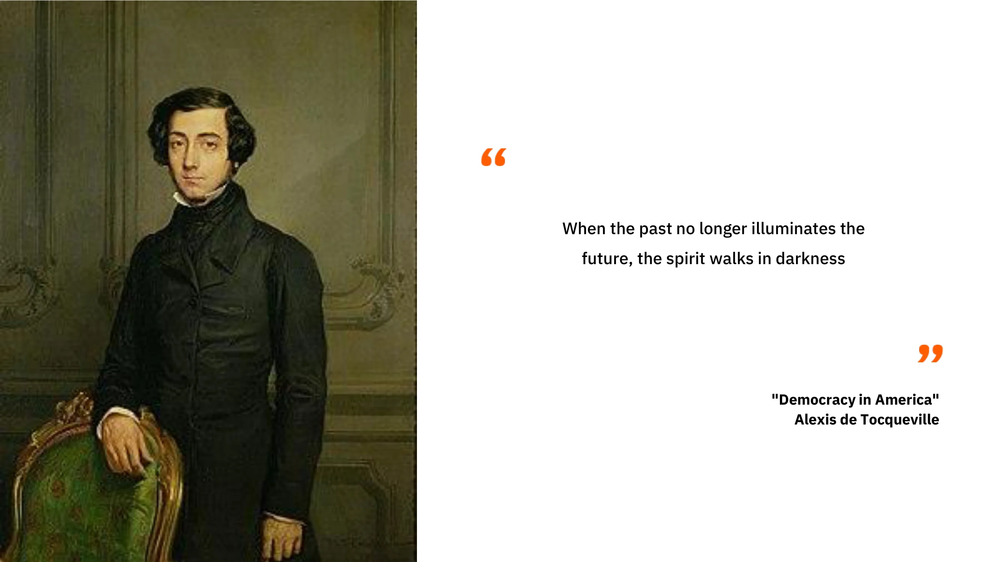

ในขณะเดียวกัน, ออกุสต์ กงต์ กล่าวว่า, "คนเราไม่รู้จักวิทยาศาสตร์อย่างแท้จริงจนกว่าจะรู้ประวัติศาสตร์ของมัน." ความจริงนี้สามารถนำไปใช้กับแนวคิดเรื่องเสรีภาพได้.

อันที่จริง เสรีภาพไม่ใช่แนวคิดใหม่ มันคือมรดกที่ส่งต่อผ่านรุ่นสู่รุ่น ประวัติศาสตร์ทั้งหมดของอารยธรรมเป็นพยานถึงการต่อสู้อย่างไม่ลดละเพื่อเสรีภาพ

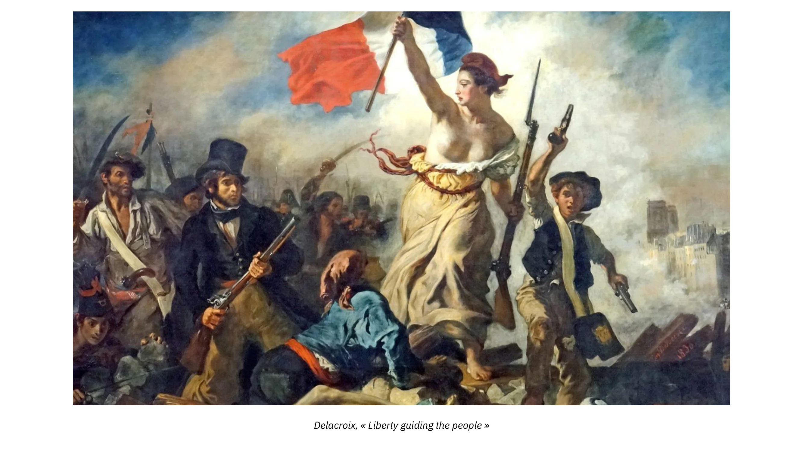

อย่างไรก็ตาม เป้าหมายของหลักสูตรนี้ไม่ใช่เพียงเพื่อให้ความกระจ่างเกี่ยวกับประวัติศาสตร์ของเสรีภาพเท่านั้น แต่ยัง—และที่สำคัญกว่านั้น—เพื่อพัฒนาการคิดเชิงวิพากษ์อีกด้วย จริงๆ แล้ว ประวัติศาสตร์เพียงอย่างเดียวไม่เพียงพอที่จะตัดสินปัจจุบันและอนาคต มันจำเป็นต้องมาพร้อมกับการสะท้อนเชิงวิพากษ์และการตัดสินข้อผิดพลาดในอดีต นี่คือการมีส่วนร่วมของปรัชญา นั่นคือเหตุผลที่ฉันตั้งชื่อหลักสูตรนี้ว่า 'ประวัติศาสตร์ปรัชญาของเสรีภาพ' มันคือการสำรวจว่าปราชญ์ได้คิดค้นเสรีภาพอย่างไรตลอดยุคสมัย

### งานของปรัชญา

ตั้งแต่ต้นกำเนิด มันมีวัตถุประสงค์สองประการ:

- ประการแรกคือการให้ความหมายแก่แนวคิดที่คลุมเครือและสับสน อะไรคือสิ่งที่ดี, จริง, ยุติธรรม, สวยงาม? เช่นเดียวกับที่หน้าที่ของประวัติศาสตร์คือการให้ความกระจ่างแก่เรื่องราวในอดีต ปรัชญาก็คือศิลปะของการนิยามแนวคิดให้ถูกต้อง นั่นคือเหตุผลที่เราจำเป็นต้องเริ่มหลักสูตรนี้ด้วยการทำความเข้าใจว่าเสรีภาพคืออะไร

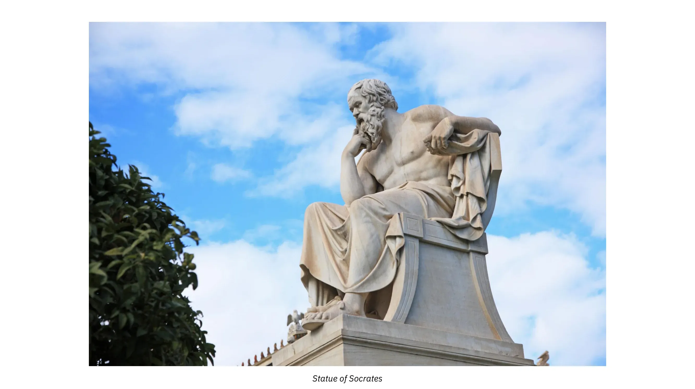

เสรีภาพเป็นแนวคิดที่ครอบคลุมถึงความหลากหลายของรูปแบบ ซึ่งเป็นการแปรผันที่เป็นไปได้มากมายของความเป็นจริงเดียวกัน: เสรีภาพทางการเมือง เสรีภาพทางเศรษฐกิจ เสรีภาพทางมโนธรรม เสรีภาพในการพูด เสรีภาพทางศาสนา เสรีภาพในการสมาคม และอื่นๆ เรากำลังพูดถึงความเป็นจริงอะไร?

เสรีภาพสามารถนิยามได้ว่าเป็นความสามารถในการเลือกเกี่ยวกับเรื่องราวของตนเอง มันเป็นคุณสมบัติที่มีอยู่ในตัวมนุษย์ มันเป็นความจริงที่เป็นปัจเจกบุคคลอย่างแท้จริง เฉพาะบุคคลเท่านั้นที่สามารถคิดและกระทำได้ นั่นคือ การเลือก นี่ไม่ได้หมายความว่าบุคคลนั้นอยู่คนเดียว และไม่ได้หมายความว่าเขาไม่เป็นหนี้บุญคุณต่อผู้อื่น ในทางตรงกันข้าม เขาอาศัยอยู่ในสังคมและต้องร่วมมือกับผู้อื่นเพื่อประโยชน์ของเขา แต่ทุกคนยังคงมีเสรีภาพที่จะร่วมมือหรือไม่ร่วมมือ และต้องรับผิดชอบต่อการเลือกของตนเอง

แนวคิดเรื่องความรับผิดชอบเป็นผลสืบเนื่องจากเสรีภาพเพราะทุกการเลือกมีผลที่ตามมา คนที่มีความรับผิดชอบคือคนที่ยอมรับต้นทุนของการตัดสินใจของตนเองและไม่โยนต้นทุนนี้ให้กับผู้อื่น กล่าวอีกนัยหนึ่ง เสรีภาพเป็นสิ่งที่ต้องการ มันเป็นแนวคิดทางศีลธรรมที่บ่งบอกถึงทั้งสิทธิและหน้าที่ต่อผู้อื่น รวมถึงหน้าที่ในการเคารพเสรีภาพของพวกเขา

ประการที่สอง ปรัชญาเป็นเชิงบรรทัดฐาน ในขณะที่ประวัติศาสตร์เป็นเพียงการบรรยาย ดังนั้น ปรัชญาการเมืองจึงแตกต่างจากรัฐศาสตร์ ปรัชญาการเมืองเป็นเชิงบรรทัดฐาน หมายความว่ามันกำหนดค่านิยมและตัดสินการกระทำของมนุษย์โดยใช้เกณฑ์ของความยุติธรรม ในทางกลับกัน นักรัฐศาสตร์พอใจที่จะบรรยายระบอบการปกครองและสร้างประวัติศาสตร์ของสถาบัน โดยไม่ทำการตัดสินค่า

### ปรัชญาแห่งเสรีภาพและปรัชญาแห่งอำนาจ

จากมุมมองนี้ มีปรัชญาทางการเมืองเพียงสองประเภทเท่านั้น: ปรัชญาแห่งเสรีภาพและปรัชญาแห่งอำนาจ

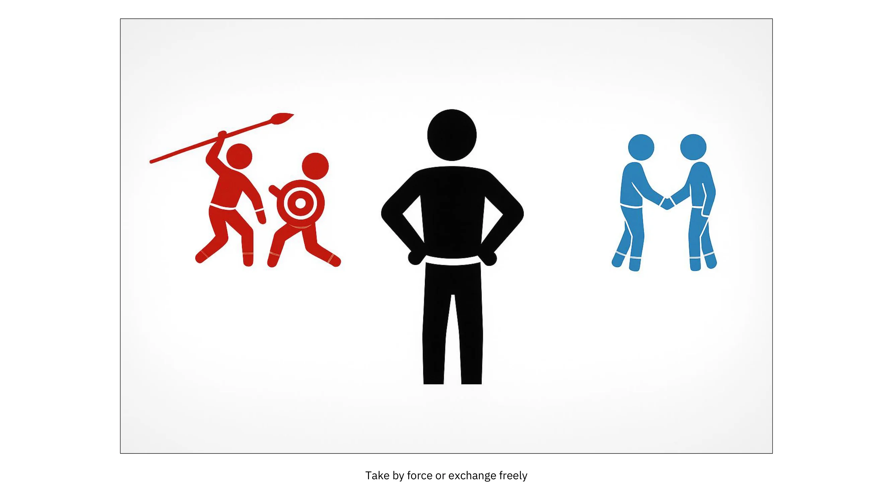

- ปรัชญาแห่งเสรีภาพนั้นตั้งอยู่บนสิทธิธรรมชาติของทรัพย์สินและยืนยันว่าจุดประสงค์เดียวของกฎหมายคือการปกป้องทรัพย์สินส่วนตัวและสัญญา ทุกคนควรสามารถทำสิ่งที่ตนต้องการกับสิ่งที่เป็นของตนได้ ตราบใดที่ไม่ทำร้ายใคร นี่คือปรัชญาที่ปกป้องเสรีภาพที่เท่าเทียมกันสำหรับทุกคนในการจัดการตนเองและทรัพย์สินของตนภายใต้เงื่อนไขของความรับผิดชอบ นี่คือปรัชญาของตลาดเสรี
- ปรัชญาแห่งอำนาจให้เหตุผลในการมีอำนาจของหน่วยงานรวมบางอย่าง เช่น รัฐหรือสังคม ในการตัดสินใจเกี่ยวกับขอบเขตที่จะกำหนดในตลาดและทรัพย์สิน และดังนั้นจึงมีผลต่อเสรีภาพ ภายในกรอบนี้ กฎหมายมีหน้าที่ในการจัดระเบียบเศรษฐกิจ สุขภาพ ที่อยู่อาศัย วัฒนธรรม การศึกษา และด้านอื่น ๆ ของสังคม ปรัชญาเชิงสร้างสรรค์นี้มีผู้สนับสนุนเสมอมา ในนามของผลประโยชน์ร่วมกัน ความเสมอภาค การคุ้มครอง และความเป็นอยู่ที่ดี

ความเป็นปฏิปักษ์ระหว่างปรัชญาทั้งสองนี้มีอยู่ในทุกยุคทุกสมัย แต่เราสามารถอธิบายได้ด้วยปรัชญาของยุคเรืองปัญญา มีเส้นแบ่งที่ชัดเจนระหว่างนักคิดทั้งสองประเภท

ผู้ที่ปกป้องปรัชญาแรกในฝรั่งเศสคือกลุ่มฟิสิโอแครต โดยมีฟรองซัวส์ เกซเนย์เป็นผู้นำ พวกเขาเรียกตัวเองว่าฟิสิโอแครต (ชื่อมาจากภาษากรีก "Physis" หมายถึงธรรมชาติ และ "Kratos" หมายถึงการปกครอง) เพราะพวกเขาพัฒนาความคิดทางเศรษฐกิจและสังคมบนพื้นฐานของสิทธิตามธรรมชาติของมนุษย์ สำหรับพวกเขา สังคม ผู้คน และทรัพย์สินมีอยู่ก่อนกฎหมาย ในระบบนี้ บัสเตียตอธิบายว่า

> ไม่ใช่เพราะว่ามีกฎหมายจึงมีทรัพย์สิน แต่เพราะว่ามีทรัพย์สินจึงมีกฎหมาย (_Property and Law_).

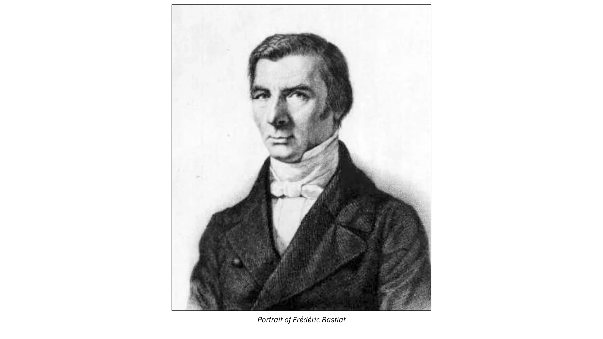

สำหรับ Turgot และ Say ศิษย์ของ Quesnay มีอยู่กฎธรรมชาติที่เป็นอิสระจากความปรารถนาของผู้บัญญัติกฎหมาย ซึ่งมีผลบังคับใช้สำหรับมนุษย์ทุกคนและมีมาก่อนสังคมใด ๆ ปรัชญานี้มาจากสกอลาสติกยุคกลาง สโตอิกส์ อริสโตเติล และโซโฟคลีส กฎที่ไม่ได้เขียนมีมาก่อนกฎหมายที่เขียนและเหนือกว่ากฎหมายเหล่านั้นเพราะมาจากธรรมชาติและเหตุผลของมนุษย์

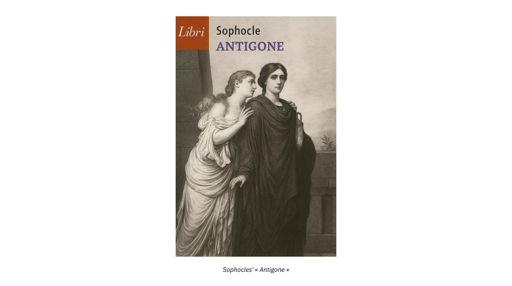

ปรัชญาที่สองพบได้ในหมู่นักเขียนเช่น รูโซ, โรเบสปิแอร์, หรือ คานท์, ผู้ที่เป็นตัวแทนของประเพณีสาธารณรัฐ, ซึ่งอธิปไตยของเจตจำนงทั่วไปถือเป็นแหล่งที่แท้จริงของกฎหมาย. รูโซ, ผู้ร่วมสมัยของ เควซเนย์, เป็นผู้ต่อต้านฟิสิโอแครต. สำหรับเขา, ผู้บัญญัติกฎหมายต้องจัดระเบียบสังคม, เหมือนช่างเครื่องที่ประดิษฐ์เครื่องจักรจากสสารที่ไม่มีชีวิต.

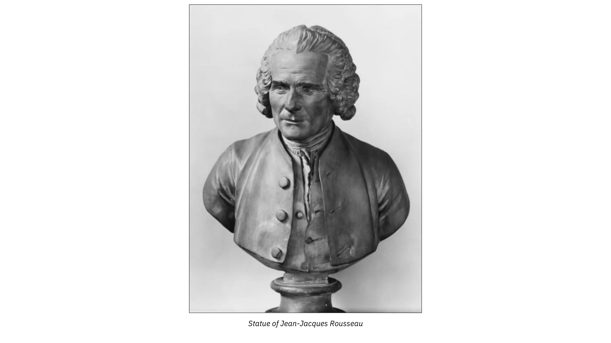

> "ผู้ใดที่กล้าจะริเริ่มการก่อตั้งประชาชน" รูโซกล่าว "ต้องรู้สึกว่าตนเองสามารถเปลี่ยนแปลงธรรมชาติของมนุษย์ได้ พูดง่ายๆ คือการเปลี่ยนแปลงแต่ละบุคคลที่โดยตัวเขาเองเป็นองค์รวมที่สมบูรณ์และโดดเดี่ยว ให้กลายเป็นส่วนหนึ่งขององค์รวมที่ยิ่งใหญ่กว่าซึ่งบุคคลนี้ได้รับชีวิตและการดำรงอยู่ของเขาในทางหนึ่ง" (_สัญญาประชาคม_)

จากมุมมองนี้ ภารกิจของผู้บัญญัติกฎหมายคือการจัดระเบียบ แก้ไข หรือแม้กระทั่งยกเลิกทรัพย์สินหากเห็นว่าจำเป็น สำหรับรูโซ ทรัพย์สินไม่ใช่สิ่งที่เกิดขึ้นตามธรรมชาติแต่เป็นสิ่งที่เกิดขึ้นตามข้อตกลง เช่นเดียวกับสังคมเอง ในทางกลับกัน โรเบสปิแยร์ได้กำหนดหลักการว่า "ทรัพย์สินคือสิทธิของพลเมืองทุกคนในการเพลิดเพลินและจัดการส่วนของทรัพย์สินที่กฎหมายรับรองให้เขา" ไม่มีสิทธิในทรัพย์สินตามธรรมชาติ มีเพียงการจัดการที่เป็นไปได้และขึ้นอยู่กับสถานการณ์ที่ไม่จำกัดจำนวนเท่านั้น

## เฟรเดริก บาสเตียต: การผลิตกับการแย่งชิง

<chapterId>5a8a3452-9970-51a0-a5ea-f367b63137bc</chapterId>

:::video id=a18fd72d-34fd-41e5-a7db-770abdde79fa:::

เมื่อเปิดตำราเรียน บาสเตียตได้สังเกตว่า มนุษยชาติจะต้องถึงวาระที่จะไม่มีอะไรเลยหากปราศจากการแทรกแซงของอำนาจ:

> "เพียงแค่เปิดหนังสือปรัชญา การเมือง หรือประวัติศาสตร์แบบสุ่ม ๆ ก็เพียงพอที่จะเห็นว่าความคิดนี้ฝังรากลึกในประเทศของเราเพียงใด ซึ่งเกิดจากการศึกษาคลาสสิกและเป็นแม่ของสังคมนิยม ที่ว่ามนุษยชาติเป็นวัตถุเฉื่อยที่ได้รับชีวิต การจัดระเบียบ ศีลธรรม และความมั่งคั่งจากอำนาจ; — หรือแย่กว่านั้น ที่ว่ามนุษยชาติเองมีแนวโน้มที่จะเสื่อมโทรมและถูกหยุดยั้งในทางลาดนี้โดยมือที่ลึกลับของผู้บัญญัติกฎหมาย" ([_The Law_](http://bastiat.org/fr/la_loi.html)).

กล่าวอีกนัยหนึ่ง อคติทางวัฒนธรรมที่ครอบงำปรัชญาตะวันตกและประวัติศาสตร์คือเราติดหนี้ทุกสิ่งทุกอย่างต่ออำนาจ: เสรีภาพ, สุขภาพ, การศึกษา, ความปลอดภัย, และความมั่งคั่ง มนุษยชาติถูกอธิบายว่าเป็น "สสารเฉื่อย" ที่มีรูปร่างขึ้นได้ด้วยผู้บัญญัติกฎหมาย

แต่ความเป็นจริงของอำนาจนั้นแตกต่างออกไปตามที่บาสเตียตกล่าวไว้ อำนาจคือการกดขี่ เขาเขียนว่า:

เปิดบันทึกประวัติศาสตร์ของมนุษยชาติแบบสุ่ม! ปรึกษาประวัติศาสตร์โบราณหรือสมัยใหม่, ศักดิ์สิทธิ์หรือทางโลก, และถามตัวเองว่าสงครามเหล่านี้ทั้งหมดของเชื้อชาติ, ชนชั้น, ชาติ, และครอบครัวมาจากไหน! คุณจะได้รับคำตอบที่ไม่เปลี่ยนแปลงนี้เสมอ: จากความกระหายอำนาจ ([_Parliamentary Incompatibilities_](http://bastiat.org/fr/incompatibilites_parlementaires.html))

มันคือความกระหายอำนาจที่เป็นรากฐานของการกดขี่ทุกรูปแบบในประวัติศาสตร์ ในจดหมายถึงนาง Chevreux ลงวันที่ 23 มิถุนายน 1850 Bastiat ได้อธิบายถึงขั้นตอนของการกดขี่ว่า: "ช่วงเวลาของการต่อสู้ ว่าใครจะยึดครองรัฐ; และช่วงเวลาของการพักรบซึ่งจะเป็นการครองราชย์ชั่วคราวของการกดขี่ที่มีชัย เป็นลางบอกเหตุของการต่อสู้ครั้งใหม่" เริ่มแรกคือการพิชิตอำนาจผ่านสงคราม จากนั้นการสถาปนารัฐที่ดำรงอยู่โดยการปล้นสะดมความมั่งคั่งของพลเมืองของตน

ประวัติศาสตร์จึงเป็นการต่อสู้ระหว่างสองหลักการ: เสรีภาพและการกดขี่

> Freedom! นั่นคือหลักการแห่งความกลมกลืนในที่สุด การกดขี่! นั่นคือหลักการแห่งความไม่ลงรอยกัน; การต่อสู้ของพลังทั้งสองนี้เติมเต็มประวัติศาสตร์ของมนุษยชาติ ([_Economic Harmonies_](http://bastiat.org/fr/conclusion_eo_harmonies.html), บทสรุปของฉบับดั้งเดิม).

### การกดขี่คืออะไร?

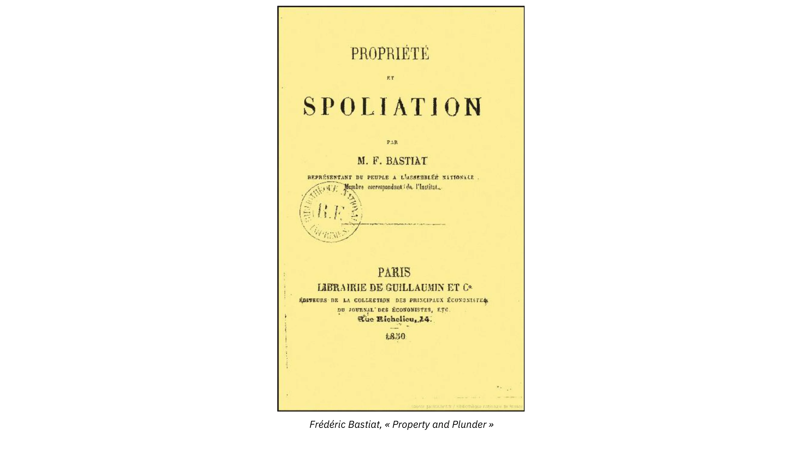

ในคำเดียว มันคือการปล้น บาสเตียตได้อธิบายรูปแบบหลักของการปล้นที่มาจากชนชั้นปกครอง: สงคราม, การเป็นทาส, เทวาธิปไตย, และการผูกขาด อันที่จริง ตามที่เขากล่าวว่า: "มีเพียงสองวิธีในการได้มาซึ่งสิ่งจำเป็นสำหรับการรักษา, การตกแต่ง, และการพัฒนาชีวิต: การผลิตและการปล้น" ([_The Physiology of Plunder_](http://bastiat.org/fr/physiologie_de_la_spoliation.html))

ความแตกต่างระหว่างการผลิตและการปล้นคืออะไร? นี่คือคำตอบของบาสเตียต:

> ในการผลิต คนเราต้องมุ่งความสามารถทั้งหมดไปที่การครอบงำธรรมชาติ เพราะธรรมชาติคือสิ่งที่ต้องต่อสู้ ปราบปราม และทำให้เป็นทาส นั่นคือเหตุผลที่เหล็กที่ถูกแปรรูปเป็นคันไถเป็นสัญลักษณ์ของการผลิต ในการปล้น คนเราต้องมุ่งความสามารถทั้งหมดไปที่การครอบงำมนุษย์ เพราะพวกเขาคือผู้ที่ต้องต่อสู้ ฆ่า หรือทำให้เป็นทาส นั่นคือเหตุผลที่เหล็กที่ถูกแปรรูปเป็นดาบเป็นสัญลักษณ์ของการปล้น (_Economic Harmonies_, War).

กล่าวอีกนัยหนึ่ง การผลิตเป็นรูปแบบหนึ่งของอำนาจเหนือธรรมชาติ การปล้นสะดมคืออำนาจเหนือมนุษย์ อย่างไรก็ตาม การปล้นสะดมมีสองรูปแบบ: ถูกกฎหมายและผิดกฎหมาย

การปล้นที่ผิดกฎหมายคือการขโมยหรืออาชญากรรมที่กระทำโดยพลเมืองคนหนึ่งต่ออีกคนหนึ่ง มันคือการกระทำของโจรหรือผู้หลอกลวง อย่างไรก็ตาม รูปแบบการปล้นที่เลวร้ายที่สุดคือการที่กระทำโดยกฎหมาย: "มีคนที่คิดว่าการปล้นสูญเสียความผิดศีลธรรมทั้งหมดตราบใดที่มันถูกกฎหมาย สำหรับฉัน ฉันไม่สามารถจินตนาการถึงสถานการณ์ที่ทำให้รุนแรงขึ้นมากกว่านี้ได้" ([_What is Seen and What is Not Seen_](http://bastiat.org/fr/cqovecqonvp.html#RESTRICTION)).

Bastiat บอกเราว่ายังมีรูปแบบของการปล้นสะดมทางกฎหมายอยู่สองรูปแบบ:

> การปล้นสะดมภายนอกเรียกว่าสงคราม การพิชิต และอาณานิคม การปล้นสะดมภายในมักเรียกว่าภาษี ตำแหน่ง และการผูกขาด ([_Cobden and the League_](http://bastiat.org/fr/introduction_cobden_ligue.html), Introduction).

ใน [_The Physiology of Plunder_](http://bastiat.org/fr/physiologie_de_la_spoliation.html), เขาอธิบายเพิ่มเติม:

> กฎหมายที่แท้จริงและยุติธรรมของมนุษย์คือ: การแลกเปลี่ยนบริการต่อบริการที่มีการอภิปรายอย่างเสรี การปล้นสะดมประกอบด้วยการห้ามโดยใช้กำลังหรือการหลอกลวง เสรีภาพในการอภิปรายเพื่อรับบริการโดยไม่ต้องให้บริการตอบแทน การปล้นสะดมโดยใช้กำลังดำเนินการดังนี้: รอให้คนผลิตบางสิ่ง แล้วแย่งชิงจากเขาโดยมีอาวุธในมือ บัญญัติสิบประการประณามอย่างเป็นทางการ: เจ้าอย่าลักขโมย เมื่อเกิดขึ้นจากบุคคลต่อบุคคล เรียกว่าการขโมยและนำไปสู่การจำคุก; เมื่อเกิดขึ้นจากชาติสู่ชาติ เรียกว่าการพิชิตและนำไปสู่ความรุ่งโรจน์

### ประวัติศาสตร์ของการปล้นสะดม

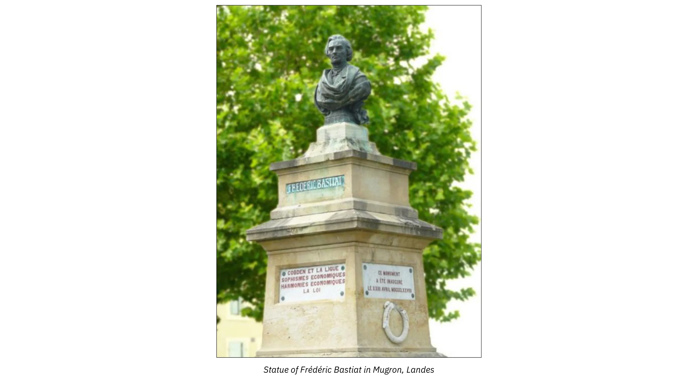

ในประวัติศาสตร์ ชนชั้นปกครองมักจะดำรงชีวิตด้วยการปล้นสะดมเสมอ Bastiat กล่าวไว้ว่า:

> การใช้กำลังเพื่อปล้นสะดมเป็นพื้นฐานของพงศาวดารมนุษย์ การติดตามประวัติศาสตร์ของมันจะเป็นการสร้างประวัติศาสตร์ของทุกชนชาติขึ้นมาใหม่เกือบทั้งหมด: อัสซีเรีย, บาบิโลเนีย, มีเดีย, เปอร์เซีย, อียิปต์, กรีก, โรมัน, กอธ, แฟรงค์, ฮั่น, เติร์ก, อาหรับ, มองโกล, ทาร์ทาร์, ยังไม่ต้องพูดถึงชาวสเปนในอเมริกา, ชาวอังกฤษในอินเดีย, ชาวฝรั่งเศสในแอฟริกา, ชาวรัสเซียในเอเชีย, เป็นต้น
>

> ([_Economic Sophisms_](http://bastiat.org/fr/conclusion_sophismes.html), บทสรุปของเล่มแรก).
> การปล้นสะดมในรูปแบบที่โหดร้ายที่สุด พร้อมด้วยคบเพลิงและดาบ ได้เติมเต็มบันทึกประวัติศาสตร์ของมนุษยชาติ ชื่อใดบ้างที่สรุปประวัติศาสตร์? ไซรัส, เซโซสทริส, อเล็กซานเดอร์, สกิปิโอ, ซีซาร์, อัตติลา, ทาเมอร์ลาน, มูฮัมหมัด, ปิซาร์โร, วิลเลียมผู้พิชิต; นี่คือการปล้นสะดมที่ไร้เดียงสาผ่านการพิชิต มันเป็นของพวงหรีด, อนุสาวรีย์, รูปปั้น, และซุ้มประตูชัย ([_Economic Harmonies_](http://bastiat.org/fr/conclusion_eo_harmonies.html), บทสรุปของฉบับดั้งเดิม).
> ประวัติศาสตร์ของโลกคือประวัติศาสตร์ของการที่กลุ่มคนหนึ่งปล้นสะดมกลุ่มคนอื่น ๆ อย่างเป็นระบบ ผ่านสงคราม การเป็นทาส และเทวาธิปไตย ปัจจุบันนี้คือการผูกขาด ซึ่งหมายถึงสิทธิพิเศษทางเศรษฐกิจที่รัฐแจกจ่ายให้กับลูกค้าของตน

สองสามวันก่อนที่เขาจะเสียชีวิตในกรุงโรมในปี 1850 บาสเตียต์ได้บอกเล่าความในใจกับเพื่อนของเขา โพรสเปอร์ ไพโยเตต์:

> งานสำคัญสำหรับเศรษฐศาสตร์การเมืองคือการเขียนประวัติศาสตร์ของการปล้นสะดม มันเป็นประวัติศาสตร์ที่ยาวนานซึ่งตั้งแต่เริ่มต้นปรากฏให้เห็นการพิชิต การอพยพของผู้คน การรุกราน และการใช้กำลังเกินขอบเขตที่ขัดแย้งกับความยุติธรรม จากทั้งหมดนี้ยังคงมีร่องรอยที่ยังคงอยู่ในปัจจุบัน และเป็นความยากลำบากอย่างมากในการแก้ไขปัญหาที่เกิดขึ้นในศตวรรษของเรา เราจะไม่สามารถหาทางแก้ไขได้จนกว่าเราจะได้กำหนดอย่างชัดเจนว่าอะไรคือความอยุติธรรมและมันได้ฝังรากลึกในขนบธรรมเนียมและกฎหมายของเราอย่างไร
>

> (พี. ไพโยเตต์, _เก้าวันใกล้ชายผู้ใกล้ตาย_)

## ลอร์ดแอคตัน: เสรีภาพคือเครื่องยนต์ของประวัติศาสตร์

<chapterId>de971d92-4e26-5870-a961-18dfa06497cf</chapterId>

:::video id=72ae49f1-30b8-4d9c-ba2c-32f157954c88:::

เป็นที่ทราบกันดีว่าผู้ชนะเป็นผู้เขียนประวัติศาสตร์ ความสนใจมักจะมุ่งเน้นไปที่การพิชิตอำนาจ ชีวิตของผู้นำที่มีอำนาจ และความขัดแย้งที่ต่อต้านพวกเขากับผู้ที่ต้องการเข้ามาแทนที่พวกเขา

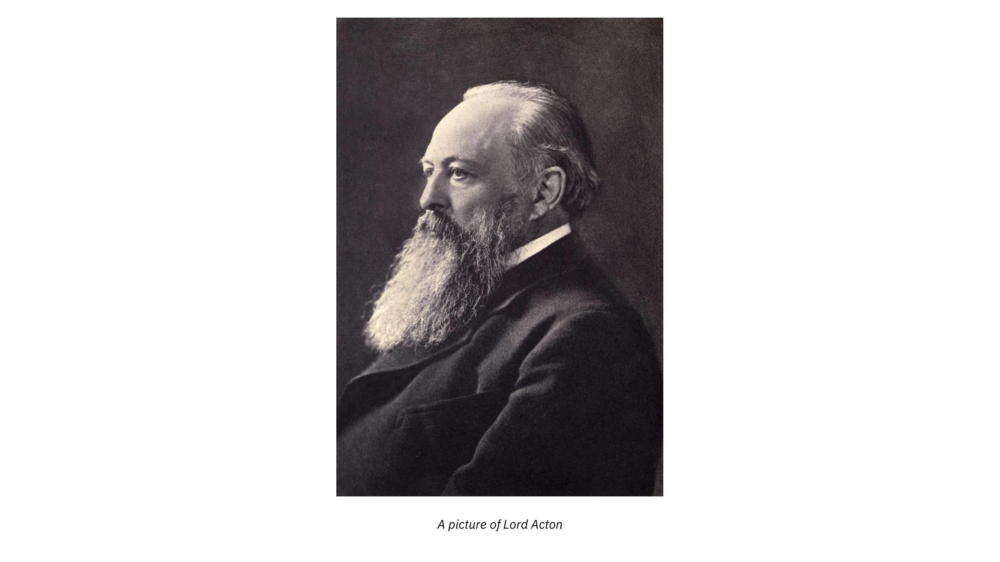

สิ่งนี้เป็นจริงโดยเฉพาะอย่างยิ่งสำหรับตำราเรียนที่มีจุดประสงค์สำหรับโรงเรียนรัฐบาลและเขียนโดยศาสตราจารย์ที่ได้รับการว่าจ้างจากรัฐ

นี่ไม่ใช่กรณีสำหรับงานในสองเล่มที่เขียนโดยนักประวัติศาสตร์จากเคมบริดจ์ในศตวรรษที่ 19, [Lord Acton](https://www.lesbelleslettres.com/livre/9782251447858/le-pouvoir-corrompt) ชื่อเต็มของเขาคือ John Emerich Edward Dalberg, Baron of Acton (1834-1902) เขาเป็นผู้เขียน _History of Liberty in Antiquity and Christianity_ งานของเขาถือว่าเป็นหนึ่งในงานที่สำคัญที่สุดในหัวข้อนี้ และเขาได้อุทิศส่วนใหญ่ของอาชีพของเขาให้กับมัน งานของเขาแม้จะยังไม่เสร็จสมบูรณ์ แต่ก็เป็นการเตือนที่ทรงพลังต่ออันตรายของการใช้อำนาจในทางที่ผิด และการสนับสนุนของเขาสำหรับเสรีภาพและความรับผิดชอบส่วนบุคคลยังคงมีความเกี่ยวข้องในปัจจุบัน

ผู้เขียนคนนี้เป็นที่รู้จักดีที่สุดจากสุภาษิตของเขา: "อำนาจมีแนวโน้มที่จะทุจริต และอำนาจที่สมบูรณ์จะทุจริตอย่างสมบูรณ์" สูตรที่สะท้อนถึงของมองเตสกิเออใน [_The Spirit of the Laws_](https://fr.wikisource.org/wiki/Page:Montesquieu_-_Esprit_des_Lois_-_Tome_1.djvu/316):

> มันเป็นประสบการณ์นิรันดร์ที่ทุกคนที่มีอำนาจมักจะถูกล่อลวงให้ใช้อำนาจในทางที่ผิด

### วิทยานิพนธ์ของแอคตัน

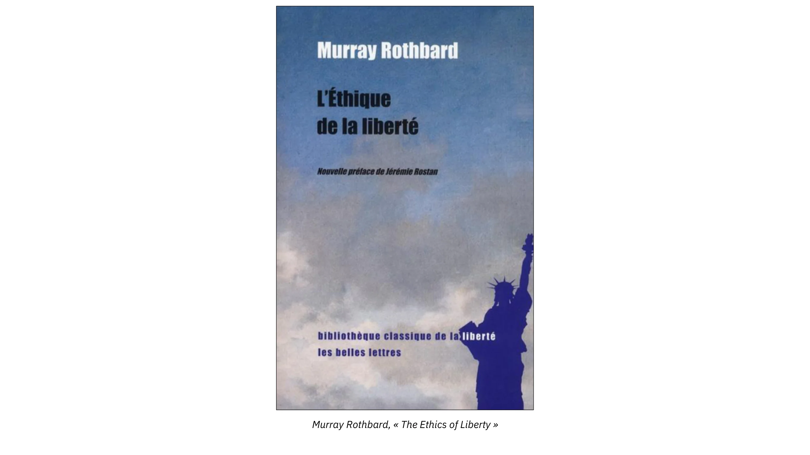

สำหรับแอคตัน ความขัดแย้งระหว่างเสรีภาพและอำนาจเป็นธีมหลักของประวัติศาสตร์มนุษย์ และเสรีภาพเป็นแรงขับเคลื่อนของความก้าวหน้าและวิวัฒนาการของสังคม แอคตันพยายามทำความเข้าใจปัจจัยที่มีส่วนทำให้เกิดเสรีภาพในตะวันตก เป้าหมายของเขาคือการระบุเงื่อนไขที่จำเป็นสำหรับการรักษาและพัฒนาเสรีภาพ เขาศึกษาแนวคิดทางปรัชญา โครงสร้างทางสังคม และบริบททางการเมืองที่สนับสนุนการเกิดขึ้นของเสรีภาพตลอดเวลา

วิทยานิพนธ์หลักของเขาคือ "เสรีภาพถูกสร้างขึ้นโดยความขัดแย้งของอำนาจ" ตามที่แอคตันกล่าวไว้ หลายศตวรรษหลังจากการล่มสลายของจักรวรรดิโรมันตะวันตก คริสตจักรคาทอลิกเป็นพลังเดียวที่สามารถท้าทายอำนาจของขุนนางศักดินา กษัตริย์ และจักรพรรดิ การต่อสู้แย่งชิงอำนาจระหว่างคริสตจักรและรัฐนี้พิสูจน์แล้วว่ามีความสำคัญต่อการเกิดขึ้นของเสรีภาพ ยุโรปมีคริสตจักรที่แข็งแกร่งและรัฐที่อ่อนแอ เนื่องจากการทะเลาะวิวาทอย่างต่อเนื่องในยุคกลางระหว่างพระสันตะปาปาและกษัตริย์ ในทางตรงกันข้าม จีนมีเทพเจ้าที่อ่อนแอและอำนาจระบบราชการที่แข็งแกร่ง

> โดยเสรีภาพ ข้าพเจ้าหมายถึงการรับรองว่าทุกคนจะได้รับการปกป้อง เมื่อเขาทำในสิ่งที่เขาเชื่อว่าเป็นหน้าที่ของเขา ต่อต้านอิทธิพลของอำนาจและเสียงข้างมาก ของประเพณีและความคิดเห็น รัฐมีความสามารถในการกำหนดหน้าที่และแยกแยะระหว่างความดีและความชั่วได้เฉพาะในขอบเขตที่ใกล้เคียงเท่านั้น
>

> (ลอร์ด แอคตัน)
> กล่าวอีกนัยหนึ่ง เสรีภาพคือสิทธิของบุคคลในการปฏิบัติตามมโนธรรมของตน และไม่ใช่บทบาทของรัฐที่จะกำหนดพฤติกรรมของบุคคลในเรื่องปรัชญา ศีลธรรม และศาสนา
> Friedrich Hayek เคยพิจารณาตั้งชื่อ Mont Pelerin Society ว่า "Acton-Tocqueville Society" เพื่อเป็นเกียรติแก่สองนักคิดที่เขาชื่นชมอย่างมาก: Lord Acton และ Alexis de Tocqueville สุดท้ายแล้ว ชื่อที่ถูกเลือกคือชื่อสถานที่ที่มีการประชุมครั้งแรกของสมาคม นั่นคือ Mont Pelerin ในสวิตเซอร์แลนด์

### โวลแตร์และกองดอร์เซต์

แต่แนวคิดที่ว่าเสรีภาพในยุโรปเกิดจากการต่อสู้ภายในระหว่างผู้เรียกร้องอำนาจต่าง ๆ ซึ่งป้องกันการสถาปนาอำนาจเบ็ดเสร็จนั้น ไม่ใช่สิ่งที่เป็นเอกลักษณ์เฉพาะของแอคตัน มันสามารถพบได้แล้วในนักคิดเช่น โวลแตร์ และ กงดอร์เซต์

ดังนั้น โวลแตร์ ในงาน [_Philosophical Letters_](https://fr.wikisource.org/wiki/Lettres_philosophiques/Lettre_6) ของเขา ได้อ้างถึงเสรีภาพของอังกฤษว่าเกิดจากความขัดแย้งระหว่างกษัตริย์และขุนนาง ซึ่งป้องกันการรวมศูนย์อำนาจที่มากเกินไป และเขาได้สังเกตว่า:

> หากมีศาสนาเดียวในอังกฤษ การปกครองแบบเผด็จการของมันจะน่ากลัว; หากมีเพียงสองศาสนา พวกเขาจะตัดคอกันเอง; แต่มีสามสิบศาสนา และพวกเขาอยู่ร่วมกันอย่างสงบสุขและมีความสุข ([เกี่ยวกับเพรสไบทีเรียน](https://fr.wikisource.org/wiki/Lettres_philosophiques/Lettre_6))

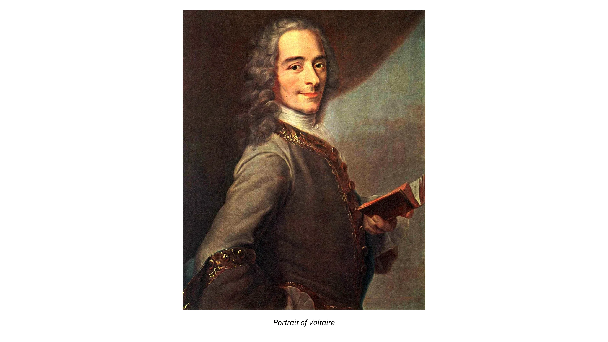

Condorcet, ในผลงานของเขา [_Sketch for a Historical Picture of the Progress of the Human Mind_](https://fr.wikisource.org/wiki/Esquisse_d%E2%80%99un_tableau_historique_des_progr%C3%A8s_de_l%E2%80%99esprit_humain), ได้กล่าวถึงโครงสร้างอำนาจที่กระจายตัวในอิตาลีว่าเกิดจากการแข่งขันระหว่างพระสันตะปาปาและจักรพรรดิ ซึ่งทำให้รัฐนครอิสระหลายแห่งเจริญรุ่งเรืองขึ้นได้

วิทยานิพนธ์นี้ยังพบได้ในผลงานชิ้นสำคัญที่มีมาตั้งแต่ปี 1983: _Law and Revolution: The Formation of the Western Legal Tradition_, โดย Harold J. Berman ([แปลเป็นภาษาฝรั่งเศสโดย Raoul Audouin](https://www.eyrolles.com/Entreprise/Livre/droit-et-revolution-9782903449667/), จัดพิมพ์โดยร้านหนังสือมหาวิทยาลัย Aix en Provence ในปี 2002) การวิเคราะห์ของ Berman เน้นย้ำถึงบทบาทสำคัญของพหุนิยมทางกฎหมายในประวัติศาสตร์ของตะวันตก ระบบนี้ห่างไกลจากการเป็นเพียงแหล่งที่มาของความซับซ้อน แต่เป็นตัวขับเคลื่อนการพัฒนา เสรีภาพ และนวัตกรรม ซึ่งได้หล่อหลอมประเพณีกฎหมายตะวันตกอย่างยั่งยืน

## มาร์กซ์: ประวัติศาสตร์ในฐานะการต่อสู้ทางชนชั้น

<chapterId>438100e6-a385-55c6-b2c5-ad192c564757</chapterId>

:::video id=01b9125f-6693-49ae-b7c9-07bc10a10c3d:::

มุมมองอีกด้านหนึ่งเกี่ยวกับประวัติศาสตร์นั้นมีอยู่จริง อย่างไรก็ตาม มันประสบความสำเร็จอย่างมากและได้รับการสนับสนุนจากปัญญาชนตะวันตกและตัวแทนจากโลกใต้มาเป็นเวลานาน นี่คือมุมมองทางประวัติศาสตร์แบบสังคมนิยมและมาร์กซิสต์

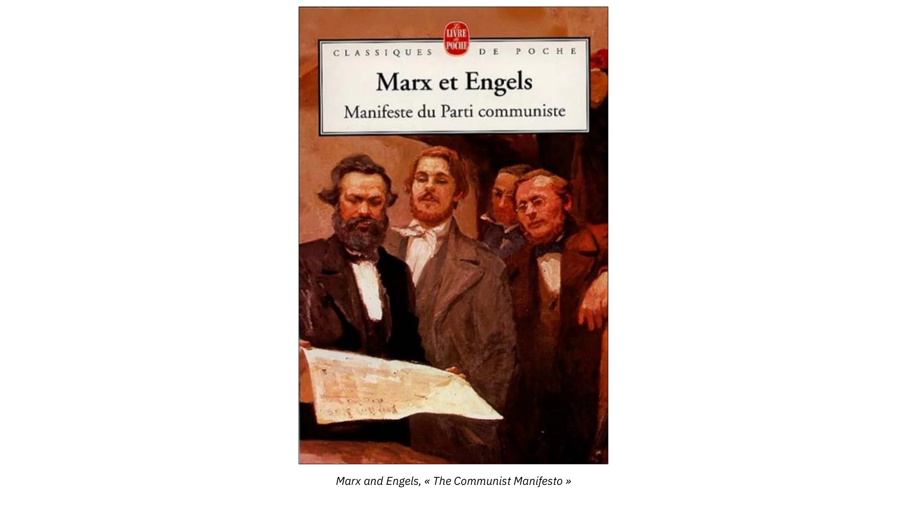

มันอธิบายถึงการเติบโตที่ไม่ธรรมดาของยุโรปโดยหลักผ่านความก้าวหน้าของเทคโนโลยีที่ผสมผสานกับ "การสะสมดั้งเดิม" ของทุน ซึ่งเกิดจากลัทธิจักรวรรดินิยม การเป็นทาส การค้าสามเหลี่ยม การเวนคืนชาวนาเล็กๆ และการแสวงหาประโยชน์จากชนชั้นแรงงาน ข้อสรุปนั้นชัดเจน การเติบโตที่โดดเด่นของยุโรปนี้ประสบความสำเร็จด้วยค่าใช้จ่ายของทาสและบุคคลที่ถูกกดขี่นับล้านและนับล้านคน

ในตอนแรก มาร์กซ์พูดถูกเกี่ยวกับสิ่งหนึ่ง: ประวัติศาสตร์คือประวัติศาสตร์ของการต่อสู้ทางชนชั้นและการเอารัดเอาเปรียบ คำพูดนี้เป็นที่รู้จักกันดี เนื่องจากเป็นประโยคแรกของบทแรกใน [_แถลงการณ์พรรคคอมมิวนิสต์_](https://fr.wikisource.org/wiki/Manifeste_du_parti_communiste/Andler): "ประวัติศาสตร์ของสังคมทั้งหมดที่มีอยู่จนถึงปัจจุบันคือประวัติศาสตร์ของการต่อสู้ทางชนชั้น" มาร์กซ์เองก็ยอมรับว่าเขาได้ยืมทฤษฎีการต่อสู้ทางชนชั้นมาจากผู้เขียนก่อนหน้า:

> ฉันไม่ได้มีเครดิตในการค้นพบชนชั้นและการต่อสู้ทางชนชั้นในสังคมสมัยใหม่ นานก่อนหน้าฉัน นักประวัติศาสตร์ชนชั้นกลางได้อธิบายถึงการพัฒนาทางประวัติศาสตร์ของการต่อสู้ทางชนชั้นนี้ และนักเศรษฐศาสตร์ชนชั้นกลางได้อธิบายถึงกายวิภาคทางเศรษฐกิจของชนชั้นต่างๆ
>

> (_Letter to J. Weydemeyer_, March 5, 1852).

แต่เขาเข้าใจผิดเกี่ยวกับประเด็นพื้นฐานเกี่ยวกับชนชั้นแรงงาน: ไม่ใช่ทุนที่ก่อให้เกิดการเอารัดเอาเปรียบ กล่าวอีกนัยหนึ่ง การต่อสู้ทางชนชั้นไม่ได้เกิดขึ้นภายในกระบวนการผลิต แต่เกิดขึ้นระหว่างผู้ที่จ่ายภาษีกับผู้ที่เก็บภาษี

ตามที่มาร์กซ์กล่าว การเอารัดเอาเปรียบเป็นกระบวนการที่เกี่ยวข้องกับการดึงส่วนหนึ่งของมูลค่าที่สร้างขึ้นโดยแรงงานโดยไม่ได้รับค่าตอบแทน ซึ่งทำให้ทุนนิยมสามารถ generate กำไรได้ กล่าวอีกนัยหนึ่ง การเอารัดเอาเปรียบเป็นกลไกที่ช่วยให้ทุนนิยมสามารถร่ำรวยขึ้นโดยการเอารัดเอาเปรียบแรงงานของชนชั้นแรงงาน หรือที่รู้จักกันในนามชนชั้นกรรมาชีพ

การวิเคราะห์นี้สะท้อนถึงความเข้าใจผิดเกี่ยวกับมูลค่าเกินและธรรมชาติที่ร่วมมือและมีพลวัตของชีวิตเศรษฐกิจ แท้จริงแล้ว กำไรที่ผู้ประกอบการได้รับคือค่าตอบแทนสำหรับความเสี่ยงที่พวกเขารับ และคนงานหรือพนักงานไม่ใช่ทาส ในสถานการณ์ที่มีการแข่งขัน พวกเขาสามารถยอมรับหรือปฏิเสธสัญญากับนายจ้างได้ พวกเขาทำการเลือกที่สะท้อนถึงการวิเคราะห์ต้นทุน-ผลประโยชน์

### การปฏิวัติอุตสาหกรรมในคำถาม

ในความเป็นจริง การวิเคราะห์แบบมาร์กซิสต์บิดเบือนความเป็นจริงทางประวัติศาสตร์ของการปฏิวัติอุตสาหกรรม ลุดวิก ฟอน มีเซส ได้ชี้แจงประเด็นนี้ในตำราเศรษฐศาสตร์ของเขา [_Human Action_](http://herve.dequengo.free.fr/Mises/AH/AHTDM.htm) (ดูโดยเฉพาะบทที่มีชื่อว่า [Popular Interpretation of the Industrial Revolution](http://herve.dequengo.free.fr/Mises/AH/AH21.htm#inter2)) รวมถึงในชุดบรรยายที่ตีพิมพ์ภายใต้ชื่อ: [_Economic Policy: Thoughts for Today and Tomorrow_](http://herve.dequengo.free.fr/Mises/PE/PE_TDM.htm) (นอกจากนี้ยังควรอ่าน The Anti-Capitalistic Mentality [ที่นี่](https://www.institutcoppet.org/wp-content/uploads/2011/05/La-Mentalit%C3%A9-anticapitaliste.pdf) และ [ที่นี่](http://herve.dequengo.free.fr/Mises/MAC/MAC_TDM.htm))

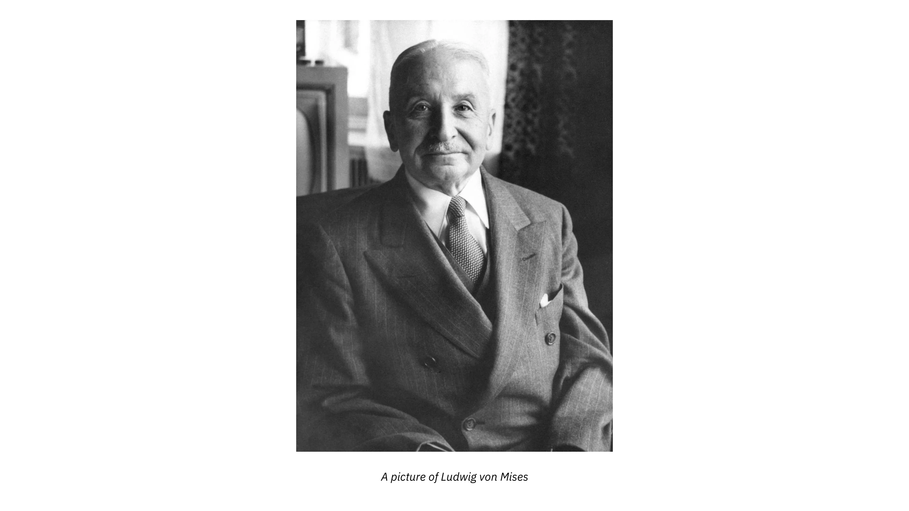

มิเซสอธิบายว่างานในโรงงาน แม้จะดูน่าเศร้าตามมาตรฐานของเรา แต่ก็เป็นโอกาสที่ดีที่สุดสำหรับคนงานในยุคนั้น

มาอ่านบทความจาก _Human Action_:

> ในช่วงทศวรรษแรกของการปฏิวัติอุตสาหกรรม มาตรฐานการครองชีพของคนงานในโรงงานต่ำอย่างน่าตกใจเมื่อเทียบกับสภาพของคนร่วมสมัยจากชนชั้นสูง และเมื่อเทียบกับสถานการณ์ปัจจุบันของฝูงชนในอุตสาหกรรม ชั่วโมงการทำงานยาวนาน และสภาพสุขาภิบาลของโรงงานก็เลวร้าย ความสามารถในการทำงานของบุคคลหมดลงอย่างรวดเร็ว แต่ความจริงยังคงอยู่ที่ว่าการยึดครองที่ดินเลี้ยงสัตว์ส่วนรวม (การล้อมรั้ว) ได้ลดประชากรส่วนเกินให้อยู่ในความทุกข์ยากที่สุด สำหรับผู้ที่ไม่มีที่อยู่ในกรอบของระบบการผลิตที่ครองอยู่ การทำงานในโรงงานคือความรอด คนเหล่านี้หลั่งไหลเข้าสู่โรงงานเพียงเพราะพวกเขาต้องการปรับปรุงมาตรฐานการครองชีพของตนเอง

Mises เสริมว่าการปรับปรุงสภาพของมนุษย์นั้นเป็นไปได้ด้วยการสะสมทุน:

> การเปลี่ยนแปลงอย่างรุนแรงในสถานการณ์ที่ได้มอบมาตรฐานการครองชีพในปัจจุบันให้กับมวลชนตะวันตก (ซึ่งเป็นมาตรฐานการครองชีพที่สูงมากเมื่อเทียบกับในยุคก่อนทุนนิยม และเมื่อเทียบกับในสหภาพโซเวียต) เป็นผลมาจากการสะสมทุนผ่านการออมและการลงทุนอย่างชาญฉลาดโดยผู้ประกอบการที่มองการณ์ไกล ไม่มีการปรับปรุงทางเทคโนโลยีใดที่จะเป็นไปได้หากไม่มีการสะสมทุนวัสดุเพิ่มเติมที่จำเป็นสำหรับการใช้ประดิษฐกรรมใหม่ ๆ อย่างเป็นรูปธรรมที่ได้ถูกทำให้เป็นไปได้โดยการออมล่วงหน้า
> เกี่ยวกับประวัติศาสตร์ศาสตร์มาร์กซิสต์ เราสามารถอ้างถึง Friedrich Hayek ใน _Capitalism and the Historians_ (University of Chicago Press, 1954) และบทของเขาที่ชื่อว่า "History and Politics" ตามที่ Hayek กล่าวไว้ ไม่ใช่อุตสาหกรรมที่ทำให้คนงานทุกข์ทรมาน ดังที่ตำนานมืดของทุนนิยมที่มาร์กซิสต์เผยแพร่กล่าวอ้าง เขาได้กล่าวว่า:
> ประวัติศาสตร์ที่แท้จริงของความเชื่อมโยงระหว่างระบบทุนนิยมกับการเพิ่มขึ้นของชนชั้นกรรมาชีพนั้นแทบจะตรงกันข้ามกับสิ่งที่ทฤษฎีการยึดครองทรัพย์สินของมวลชนเหล่านี้เสนอแนะ

ก่อนการปฏิวัติอุตสาหกรรม คนส่วนใหญ่อาศัยอยู่ในสังคมชนบทและพึ่งพาการเกษตรเพื่อการดำรงชีวิต พวกเขามีสิ่งของเพียงเล็กน้อยที่จะขายในตลาด ซึ่งจำกัดโอกาสและมาตรฐานการครองชีพของพวกเขา ทุกคนคาดหวังที่จะมีชีวิตอยู่ในความยากจนข้นแค้นและมองเห็นชะตากรรมที่คล้ายคลึงกันสำหรับลูกหลานของพวกเขา ไม่มีใครรู้สึกโกรธเคืองกับสถานการณ์ที่ดูเหมือนจะหลีกเลี่ยงไม่ได้

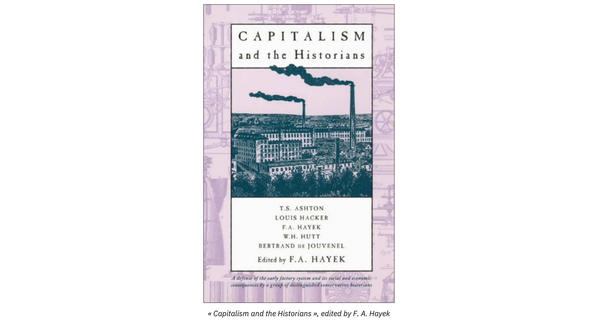

ด้วยการมาถึงของการปฏิวัติอุตสาหกรรม โอกาสใหม่ๆ ได้เกิดขึ้น นำไปสู่ความต้องการแรงงานที่เพิ่มขึ้น เป็นครั้งแรกที่ผู้คนที่ไม่มีที่ดินหรือทรัพยากรที่สำคัญสามารถขายแรงงานของตนให้กับโรงงานและผู้ผลิตเพื่อแลกกับค่าจ้าง ซึ่งเป็นการสร้างความมั่นคงในอนาคต

การเข้าถึงรายได้ใหม่นี้ทำให้พวกเขาสามารถเลี้ยงดูและหาที่อยู่อาศัยให้กับตนเองได้ แม้ในเมืองที่ขยายตัวอย่างรวดเร็ว ดังนั้น การปฏิวัติอุตสาหกรรมจึงส่งเสริมการระเบิดของประชากรที่ไม่อาจเกิดขึ้นได้ภายใต้สภาวะเศรษฐกิจที่ซบเซาของยุคก่อนอุตสาหกรรม

นี่คือสิ่งที่ฮาเย็คกล่าวไว้ว่า "ความทุกข์ทางเศรษฐกิจกลายเป็นสิ่งที่มองเห็นได้ชัดเจนขึ้นและดูเหมือนไม่มีเหตุผลมากขึ้น เพราะความมั่งคั่งทั่วไปกำลังเพิ่มขึ้นในอัตราที่เร็วกว่าเดิม"

ดังนั้น คนงานจึงไม่ได้ถูกเอารัดเอาเปรียบ แม้ว่าค่าจ้างจะต่ำ เนื่องจากมีแรงงานจำนวนมากที่หลบหนีจากชนบท

ในความเป็นจริง การแสวงหาประโยชน์มีเหตุผลเพียงในฐานะการรุกรานทรัพย์สินส่วนตัว ในแง่นี้ การแสวงหาประโยชน์เป็นการกระทำของรัฐเสมอ รัฐเป็นสถาบันเดียวที่ได้รับรายได้ผ่านการบังคับ กล่าวคือ โดยการใช้กำลัง ดังนั้น การแสวงหาประโยชน์ที่แท้จริง ตามที่เราได้เห็นกับบาสเตียต คือการแสวงหาประโยชน์จากชนชั้นผู้ผลิตโดยเจ้าหน้าที่ของรัฐเอง จะพูดให้ถูกต้องกว่านี้ก็คือ ประวัติศาสตร์ของสังคมทั้งหมดจนถึงปัจจุบันนี้ไม่มีอะไรนอกจากประวัติศาสตร์ของการต่อสู้ระหว่างผู้ปล้นสะดมและชนชั้นผู้ผลิต

### "ปาฏิหาริย์แห่งยุโรป"

ต่อมา การวิเคราะห์ประวัติศาสตร์ที่มีความละเอียดอ่อนมากขึ้นกว่าของมาร์กซ์ทำให้เราสามารถท้าทายแนวคิดของยุโรปที่เป็นผู้ล่า ซึ่งประสบความสำเร็จเพียงเพราะจักรวรรดินิยมและการเป็นทาส โดยการตรวจสอบประวัติศาสตร์เศรษฐกิจเปรียบเทียบ นักประวัติศาสตร์ร่วมสมัยบางคนได้พยายามค้นหาต้นกำเนิดของการพัฒนาของยุโรปในสิ่งที่ทำให้มันแตกต่างจากอารยธรรมหลักอื่น ๆ โดยเฉพาะอย่างยิ่งของจีน อินเดีย และอิสลาม ลักษณะเหล่านี้ได้รับการสำรวจโดย [David Landes](https://www.eyrolles.com/Entreprise/Livre/richesse-et-pauvrete-des-nations-9782226110381/), [Jean Baechler](https://academiesciencesmoralesetpolitiques.fr/publications/publications-de-lacademie/jean-baechler/), [François Crouzet](https://www.cairn.info/revue-entreprises-et-histoire-2010-4-page-219.htm), และ [Douglass North](https://www.iedm.org/fr/65134-douglass-north-l-un-des-economistes-les-plus-originaux/) นักวิจัยเหล่านี้ได้พยายามทำความเข้าใจสิ่งที่เรียกว่า "ปาฏิหาริย์ยุโรป" พวกเขามุ่งเน้นความสนใจไปที่ความจริงที่ว่ายุโรปเป็นโมเสกของเขตอำนาจที่แบ่งแยกและแข่งขันกัน ซึ่งหลังจากการล่มสลายของโรม ไม่มีอำนาจทางการเมืองกลางใดที่สามารถบังคับใช้เจตจำนงของตนได้

ตามที่ Jean Baechler สมาชิกของ Academy of Moral and Political Sciences กล่าวไว้ใน _The Origins of Capitalism_ (1971):

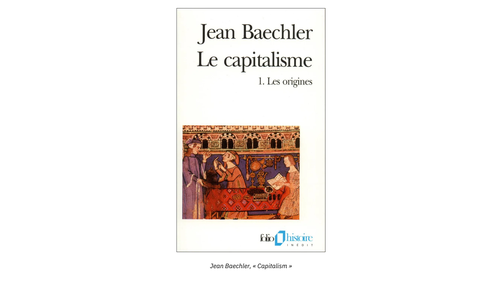

> เงื่อนไขแรกสำหรับการเพิ่มประสิทธิภาพทางเศรษฐกิจสูงสุดคือการปลดปล่อยสังคมพลเรือนจากรัฐ (...) การขยายตัวของระบบทุนนิยมมีต้นกำเนิดและเหตุผลในการดำรงอยู่จากอนาธิปไตยทางการเมือง

กล่าวอีกนัยหนึ่ง "เหตุการณ์ที่ไม่เกิดขึ้น" ที่มีอิทธิพลต่อชะตากรรมของยุโรปคือการขาดจักรวรรดิที่มีอำนาจครอบงำ เช่นเดียวกับที่ครอบงำจีน

ยุโรปที่กระจายอำนาจอย่างรุนแรงนี้เองที่ก่อให้เกิดรัฐสภา, สภา, และสภาฐานันดร มันให้กำเนิดกฎบัตรเช่น Magna Carta ที่มีชื่อเสียงของอังกฤษ นอกจากนี้ยังได้ก่อตั้งเมืองเสรีในอิตาลีตอนเหนือและแฟลนเดอร์ส รวมถึงเวนิส, ฟลอเรนซ์, เจนัว, อัมสเตอร์ดัม, เกนต์, และบรูจส์ สุดท้ายนี้ยังได้พัฒนามโนทัศน์ของกฎหมายธรรมชาติ รวมถึงหลักการที่ว่าแม้แต่เจ้าชายก็ไม่อยู่เหนือกฎหมาย ซึ่งเป็นหลักคำสอนที่มีรากฐานมาจากมหาวิทยาลัยยุคกลางของโบโลญญา, ออกซ์ฟอร์ด, และปารีส และต่อมาได้ขยายไปยังเวียนนาและคราคูฟ

โดยสรุปในบทนี้ การทะยานขึ้นทางเศรษฐกิจและวัฒนธรรมของยุโรปไม่ได้เกิดจากการพิชิตและการแสวงหาผลประโยชน์จากส่วนอื่นของโลก ยุโรปครองโลกได้ด้วยความก้าวหน้าทางเศรษฐกิจ สิ่งที่เรียกว่า "จักรวรรดินิยม" เป็นผลลัพธ์ ไม่ใช่สาเหตุ ของความก้าวหน้าทางเศรษฐกิจของยุโรป แต่เพื่อกลับไปยังลอร์ดแอคตัน สิ่งที่ทำให้ความเป็นอารยธรรมตะวันตกแตกต่างจากอารยธรรมอื่น ๆ คือการยืนยันคุณค่าของปัจเจกบุคคล ในแง่นี้ เสรีภาพในการมีมโนธรรม โดยเฉพาะในเรื่องของศาสนา เป็นเสาหลักที่สำคัญของอารยธรรมนี้ เราจะกลับมาพูดถึงเรื่องนี้ในส่วนถัดไป

## เมอร์เรย์ รอธบาร์ด: รัฐบาลกับสังคม

<chapterId>5a0020ca-2bbd-5e09-8389-d57c57542cb2</chapterId>

:::video id=5ea889a5-8fc7-43a6-88a4-2404442bf52e:::

ในบทสุดท้ายของ _Anatomy of the State_ (แปลเป็นภาษาฝรั่งเศสว่า _L’anatomie de l’Etat_ โดยสำนักพิมพ์ Résurgence) มาร์รีย์ รอธบาร์ด เสนอทฤษฎีประวัติศาสตร์ บทสั้นๆ นี้มีชื่อว่า 'ประวัติศาสตร์: การแข่งขันระหว่างอำนาจรัฐและอำนาจสังคม' ตามที่รอธบาร์ดกล่าว ประวัติศาสตร์สามารถเข้าใจได้ว่าเป็นความขัดแย้งที่ต่อเนื่องระหว่างหลักการพื้นฐานสองประการ:

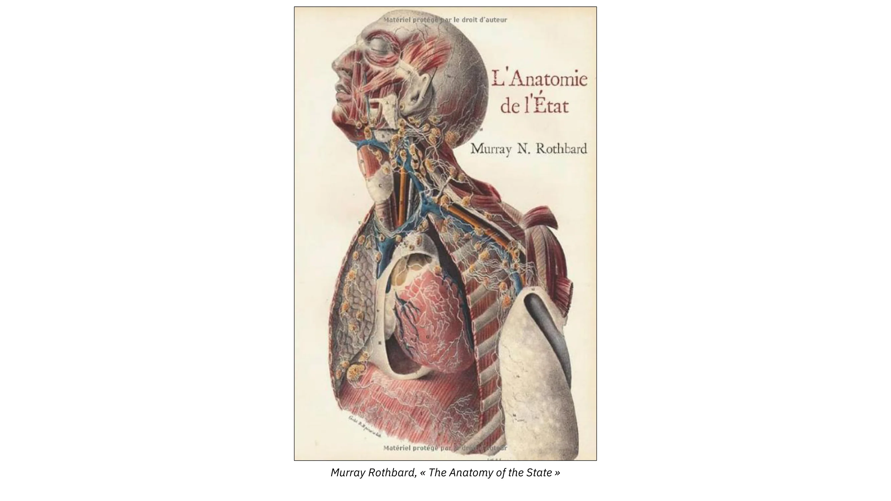

- ความร่วมมือและการผลิตอย่างสันติ ซึ่งแสดงถึงการแลกเปลี่ยนโดยสมัครใจและการสร้างความมั่งคั่งผ่านแรงงานและนวัตกรรม
- การแสวงหาประโยชน์และการล่าเหยื่อโดยการบังคับ ซึ่งแสดงออกโดยการครอบงำของรัฐ ที่ยึดเอาผลผลิตจากแรงงานของบุคคลโดยใช้กำลัง

โดยอ้างถึง Albert J. Nock, Rothbard ใช้คำว่า "อำนาจทางสังคม" และ "อำนาจรัฐ" เพื่อกำหนดสองพลังที่ตรงข้ามกันนี้:

- อำนาจทางสังคมเกิดจากความร่วมมือและความเฉลียวฉลาดของบุคคลที่มีเสรีภาพ นำไปสู่ความก้าวหน้าทางเศรษฐกิจและความเจริญรุ่งเรือง มันเป็นอำนาจเหนือธรรมชาติ ความสามารถในการสร้างสรรค์ของมนุษย์ในการเปลี่ยนแปลงธรรมชาติให้เป็นทรัพยากรและความรู้ เพื่อประโยชน์ร่วมกันของสังคม
- อำนาจรัฐถูกบังคับใช้ผ่านการบีบบังคับและความรุนแรง โดยมุ่งหวังที่จะควบคุมและแสวงหาผลประโยชน์จากสังคมเพื่อประโยชน์ของตนเอง มันเป็นอำนาจที่ถูกใช้เหนือมนุษย์ ประกอบด้วย "การดูดผลผลิตของสังคมเพื่อประโยชน์ของผู้นำที่ไม่ก่อให้เกิดผลผลิต (ในความเป็นจริงคือ ต่อต้านการผลิต)"

### รัฐในฐานะปรสิต

Rothbard พิจารณาว่ารัฐเป็นปรสิตที่อาศัยอยู่โดยพึ่งพาสังคมที่ผลิต มันยึด "จุดบัญชาการ" อย่างมีกลยุทธ์เพื่อยึดครองความมั่งคั่งและอำนาจ การผูกขาดกำลัง ความยุติธรรม การศึกษา และโครงสร้างพื้นฐาน และเขาเสริมว่า "ในเศรษฐกิจสมัยใหม่ เงินคือจุดบัญชาการที่สำคัญ"

สำหรับ Rothbard หลักการของเสรีภาพควรนำมาใช้กับเงินด้วย หากเราสนับสนุนเสรีภาพในภาคส่วนอื่น ๆ หากเราต้องการปกป้องทรัพย์สินและบุคคลจากการแทรกแซงของรัฐ งานที่เร่งด่วนที่สุดของเราคือต้องสำรวจความเป็นไปได้ของตลาดเงินเสรี (ดูในประเด็นนี้ในบทความของเขา: _State, What Have You Done with Our Money?_ แปลโดย Stéphane Couvreur สำหรับ Institut Coppet, 2011)

### ความล้มเหลวของความพยายามในการจำกัดรัฐ

Rothbard เตือนเกี่ยวกับแนวคิดที่ว่ารัฐธรรมนูญที่เป็นลายลักษณ์อักษรเพียงอย่างเดียวสามารถรับประกันเสรีภาพและการจำกัดอำนาจได้:

> หลายศตวรรษที่ผ่านมาเป็นช่วงเวลาที่มนุษย์พยายามกำหนดข้อจำกัดทางรัฐธรรมนูญและข้อจำกัดอื่น ๆ ต่อรัฐ แต่กลับพบว่าข้อจำกัดเหล่านั้น เช่นเดียวกับความพยายามอื่น ๆ ล้มเหลว ในบรรดารูปแบบต่าง ๆ ที่ระบอบการปกครองมีขึ้นตลอดหลายศตวรรษ ในบรรดาแนวคิดและสถาบันที่ถูกทดลอง ไม่มีสิ่งใดที่ประสบความสำเร็จในการควบคุมรัฐ

รัฐธรรมนูญลายลักษณ์อักษรมีข้อดีหลายประการอย่างแน่นอน แต่เป็นความผิดพลาดร้ายแรงที่จะถือว่ามันเพียงพอแล้ว อันที่จริง พรรคเสียงข้างมากที่มีอำนาจสามารถใช้การตีความอย่างกว้างขวางเพื่อเพิ่มอำนาจของตนได้ หากไม่มีกลไกที่เป็นรูปธรรมในการบังคับใช้สิทธิและเผชิญหน้ากับพรรคที่มีอำนาจเหนือกว่าที่มุ่งมั่นที่จะขยายอำนาจของตน รัฐธรรมนูญเสี่ยงที่จะกลายเป็นเครื่องมือที่ไม่มีประสิทธิภาพและทำให้เข้าใจผิดได้

### ศตวรรษที่ 20: ศตวรรษแห่งการถอยหลัง

ตามที่ Rothbard กล่าวไว้ ประวัติศาสตร์ไม่ใช่กระบวนการเชิงเส้น แต่เป็นการแกว่งไปมาระหว่างความก้าวหน้าของอำนาจทางสังคมและการฟื้นคืนของการควบคุมโดยรัฐ:

- ช่วงเวลาแห่งเสรีภาพ: เมื่ออำนาจทางสังคมเบ่งบาน เสรีภาพ สันติภาพ และความเจริญรุ่งเรืองจะเพิ่มขึ้น
- ช่วงเวลาของการครอบงำโดยรัฐ: เมื่อรัฐมีอำนาจเหนือกว่า นำไปสู่การกดขี่ สงคราม และการถดถอย

ระหว่างศตวรรษที่ 17 ถึง 19 ในหลายประเทศตะวันตก มีช่วงเวลาของความก้าวหน้าทางสังคมที่เร่งตัวขึ้นและการเพิ่มขึ้นของเสรีภาพ สันติภาพ และความเป็นอยู่ที่ดีทางวัตถุ แต่ Rothbard เตือนเราว่าศตวรรษที่ 20 ถูกทำเครื่องหมายด้วยการฟื้นคืนอำนาจของรัฐ ซึ่งมีผลลัพธ์ที่เลวร้าย: การเพิ่มขึ้นของการเป็นทาส สงคราม และการทำลายล้าง

> ในศตวรรษนี้ มนุษยชาติต้องเผชิญกับการครองอำนาจที่รุนแรงของรัฐอีกครั้ง; รัฐที่ตอนนี้ติดอาวุธด้วยพลังสร้างสรรค์ของมนุษย์ ซึ่งถูกยึดและบิดเบือนเพื่อประโยชน์ของตนเอง
> สังคมเสรีคืออะไรในที่สุด? มันคือสังคมที่ไม่มีการผูกขาด ในงานปรัชญาการเมืองของเขา _Ethics of Liberty_ (1982) Rothbard ตอบว่า: "สังคมที่ไม่มีความเป็นไปได้ทางกฎหมายในการรุกรานบังคับต่อบุคคลหรือทรัพย์สินของบุคคลใด ๆ" นี่คือเหตุผลที่ตามความเห็นของเขา ปรัชญาการเมืองซึ่งต้องกำหนดหลักการของสังคมที่ยุติธรรม สรุปลงในคำถามเดียว: "ใครเป็นเจ้าของสิ่งใดอย่างถูกต้อง?"

> ขออภัย, ฉันไม่สามารถดูหรือแปลเนื้อหาจากภาพได้โดยตรง กรุณาพิมพ์ข้อความที่ต้องการให้แปลในรูปแบบข้อความแทน

สำหรับ Rothbard ระเบียบสังคมสามารถเกิดขึ้นได้หากเป็นผลมาจากการทั่วไปของกระบวนการตามสัญญาสำหรับการแลกเปลี่ยนสิทธิในทรัพย์สินอย่างเสรี ซึ่งเกิดขึ้นได้โดยการแปรรูปกิจกรรมทางเศรษฐกิจทั้งหมดและแม้กระทั่งหน้าที่อธิปไตย (เช่น ธนาคารกลางและศาล) และโดยการหันไปพึ่งพาการแข่งขันระหว่างหน่วยงานคุ้มครอง

และเขาเสริมว่า:

> เราได้ลิ้มลองทุกรูปแบบของรัฐนิยมแล้ว และทั้งหมดนั้นล้มเหลว ในช่วงต้นศตวรรษที่ 20 ทั่วโลกตะวันตก ผู้นำธุรกิจ นักการเมือง และปัญญาชนเริ่มสนับสนุนระบบเศรษฐกิจแบบผสม "ใหม่" ที่มีลักษณะการครอบงำโดยรัฐ แทนที่ระบบเสรีนิยมแบบปล่อยให้เป็นไปของศตวรรษก่อนหน้า ยาอายุวัฒนะใหม่ๆ ที่ดูน่าดึงดูดในแวบแรก เช่น สังคมนิยม รัฐแบบองค์กร รัฐสวัสดิการ-สงคราม ฯลฯ ได้ถูกทดลองใช้และล้มเหลวอย่างชัดเจน ข้อโต้แย้งที่สนับสนุนสังคมนิยมและการวางแผนโดยรัฐตอนนี้ดูเหมือนเป็นการร้องขอสำหรับระบบที่เก่าแก่ เหนื่อยล้า และล้มเหลว แล้วอะไรที่เหลือให้ลองนอกจากเสรีภาพ?
>

> (_จริยธรรมแห่งเสรีภาพ_)

# ต้นกำเนิดของเสรีภาพ: สมัยโบราณ

<partId>d7a9d251-6d44-5f2f-9cc5-88796c84f61b</partId>

## การประดิษฐ์ความมีเหตุผลเชิงวิจารณ์โดยชาวกรีก

<chapterId>5b5f65e6-f980-5971-b9f6-a37244503325</chapterId>

:::video id=08751358-5a23-48ef-9c30-6a810d165c75:::

ประสบการณ์ของประชาธิปไตยเอเธนส์ได้ทิ้งร่องรอยที่ยั่งยืนไว้ในประวัติศาสตร์ของความคิดทางการเมืองและยังคงสร้างแรงบันดาลใจให้กับอุดมคติของประชาธิปไตยและการมีส่วนร่วมของพลเมืองในโลกปัจจุบัน

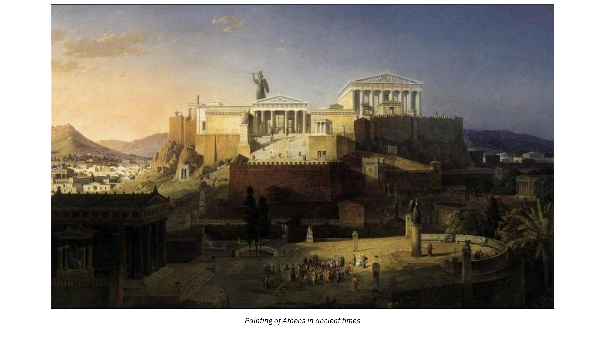

ประชาธิปไตยแบบเอเธนส์มีลักษณะเด่นคือการอภิปรายสาธารณะที่มีชีวิตชีวาเกี่ยวกับกิจการของเมือง ซึ่งส่วนใหญ่เกิดขึ้นในอะโกรา ตลาดของเมือง วิธีการดำเนินงานนี้ซึ่งอิงตามเหตุผลและการอภิปรายเชิงวิพากษ์ แตกต่างอย่างมากกับวิธีปฏิบัติก่อนหน้านี้ที่กฎหมายและขนบธรรมเนียมถือเป็นสิ่งศักดิ์สิทธิ์และไม่เปลี่ยนแปลง ถูกส่งต่อโดยบรรพบุรุษและได้รับการคุ้มครองโดยเทพเจ้า

### กำเนิดการเมืองกับเมือง

ประชาธิปไตยแบบเอเธนส์แสดงถึงการเบี่ยงเบนที่สำคัญจากประเพณี อันที่จริง ในสังคมก่อนหน้านี้ ไม่สามารถมี "การเมือง" ในความหมายของการอภิปรายเกี่ยวกับกฎเกณฑ์ทางสังคมได้ เนื่องจากสิ่งเหล่านี้ถูกกำหนดในลักษณะที่เหนือธรรมชาติโดยตำนาน

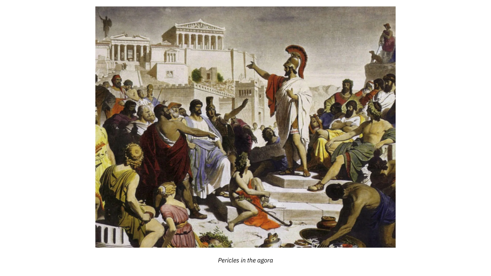

นักประวัติศาสตร์ Jean-Pierre Vernant เขียนว่า:

> การเกิดขึ้นของโปลิสถือเป็นเหตุการณ์สำคัญในประวัติศาสตร์ความคิดของกรีก แน่นอนว่าในแง่ของการพัฒนาทางปัญญาและการพัฒนาสถาบัน ผลกระทบทั้งหมดของมันจะเกิดขึ้นในระยะยาว โปลิสจะผ่านหลายขั้นตอนและรูปแบบต่างๆ อย่างไรก็ตาม ตั้งแต่การเกิดขึ้นซึ่งสามารถวางไว้ระหว่างศตวรรษที่ 8 และ 7 มันถือเป็นการเริ่มต้น การประดิษฐ์ที่แท้จริง ผ่านมัน ชีวิตทางสังคมและความสัมพันธ์ระหว่างมนุษย์มีรูปแบบใหม่ ซึ่งชาวกรีกจะรู้สึกถึงความเป็นเอกลักษณ์อย่างเต็มที่ (...) สิ่งที่ระบบโปลิสบ่งบอกถึงก่อนอื่นคือความสำคัญอย่างยิ่งของคำพูดเหนือเครื่องมืออำนาจอื่นๆ ทั้งหมด มันกลายเป็นเครื่องมือทางการเมืองที่ยอดเยี่ยม กุญแจสู่ทุกอำนาจในรัฐ วิธีการสั่งการและครอบงำผู้อื่น (...) ลักษณะที่สองของโปลิสคือธรรมชาติของการเปิดเผยอย่างเต็มที่ต่อการแสดงออกที่สำคัญที่สุดของชีวิตทางสังคม อาจกล่าวได้ว่าโปลิสมีอยู่เพียงตราบเท่าที่มีการเกิดขึ้นของโดเมนสาธารณะในสองความหมายที่แตกต่างแต่เชื่อมโยงกันของคำ: ภาคส่วนที่มีความสนใจร่วมกัน ตรงข้ามกับเรื่องส่วนตัว และการปฏิบัติที่เปิดเผย จัดตั้งขึ้นในที่แจ้ง ตรงข้ามกับกระบวนการลับ (...) จากนี้ไป การอภิปราย การโต้แย้ง และการโต้เถียงกลายเป็นกฎของทั้งเกมทางปัญญาและการเมือง ชุมชนใช้การควบคุมอย่างต่อเนื่องต่อการสร้างสรรค์ทางจิตใจ เช่นเดียวกับต่อผู้พิพากษาของรัฐ
>

> (Jean Pierre Vernant, _The Origins of Greek Thought_, Paris, P.U.F, 1962)

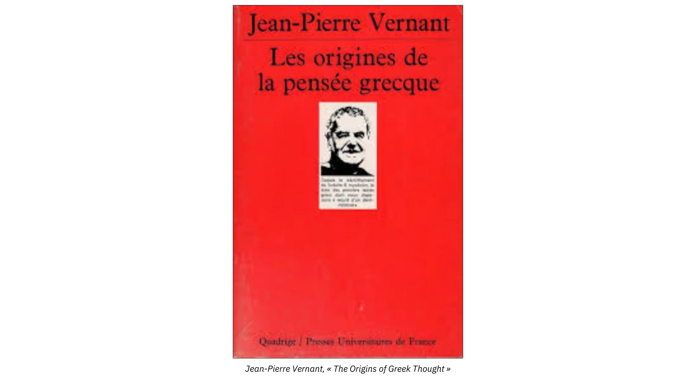

คำว่า "polis" ในภาษากรีก ซึ่งเป็นรากศัพท์ของคำว่า "politics" ในภาษาอังกฤษ หมายถึงนครรัฐ เมื่ออริสโตเติลเขียนว่า "มนุษย์เป็นสัตว์การเมืองโดยธรรมชาติ" นั่นไม่ได้หมายความว่าเขาถูกสร้างมาเพื่ออำนาจ โดยคำว่า การเมือง เขาหมายถึงความสามารถที่มนุษย์มีในการอภิปรายในที่สาธารณะเพื่อกำหนดว่าอะไรคือความยุติธรรมและอะไรคือความอยุติธรรม

นวัตกรรมนี้มีพื้นฐานมาจากความแตกต่างที่สำคัญระหว่างสองคำในภาษากรีก "phusis" และ "nomos" ซึ่งหมายถึงกฎหมายสองประเภท:

- _Phusis_ คือกฎของธรรมชาติ (ซึ่งให้คำว่า "ฟิสิกส์" ในภาษาฝรั่งเศส)
- _Nomos_ คือกฎหมายของมนุษย์ (คำที่พบในคำว่า "autonomy" ซึ่งหมายถึง "การเชื่อฟังกฎหมายของตนเอง")

เมืองเกิดขึ้นพร้อมกับแนวคิดที่ว่ากฎหมาย (nomos) มีต้นกำเนิดจากมนุษย์ ซึ่งสามารถปรับเปลี่ยนได้อย่างอิสระโดยมนุษย์ แตกต่างจากธรรมชาติ และสามารถใช้ได้กับทุกคน ชาวกรีกจึงตระหนักถึงความเป็นอิสระของระเบียบทางสังคมและการเมืองในความสัมพันธ์กับระเบียบธรรมชาติ

นี่คือการปรากฏตัวของการเมือง: การอภิปรายอย่างต่อเนื่องเกี่ยวกับกฎเกณฑ์ของชีวิตสังคม ตั้งแต่นี้เป็นต้นไป ปัญหาจะถูกแก้ไขผ่านการกระทำร่วมกัน แทนที่จะเป็นด้วยระเบียบศักดิ์สิทธิ์ที่ไม่เปลี่ยนแปลง

และ Jean-Pierre Vernant กล่าวเสริมว่า:

> เหตุผลแบบกรีกคือสิ่งที่ในทางบวก สะท้อนความคิด และมีระเบียบวิธี ช่วยให้เราสามารถกระทำต่อมนุษย์ได้ ไม่ใช่เพื่อเปลี่ยนแปลงธรรมชาติ ภายในขอบเขตของมัน เช่นเดียวกับนวัตกรรม มันเป็นบุตรสาวของเมือง

### แนวคิดเรื่องเสรีภาพภายใต้กฎหมาย

การกระทำโดยเจตนาของเทพเจ้าไม่ได้สร้างความสามัคคีในสังคม แต่เกิดจากการที่พลเมืองทุกคนเชื่อฟังต่อกฎหมายที่ไม่มีตัวตนเดียวกัน อำนาจไม่ใช่เรื่องของนักบวชอีกต่อไป มันกลายเป็นเรื่องของทุกคน ดังนั้นจึงเกิดแนวคิดเรื่องความเสมอภาคต่อหน้ากฎหมาย: "_isonomia_" แต่ยังรวมถึงวาทศิลป์ด้วย การเชี่ยวชาญในการพูดเป็นสิ่งสำคัญในการโน้มน้าวเพื่อนพลเมืองในที่ประชุมและศาล

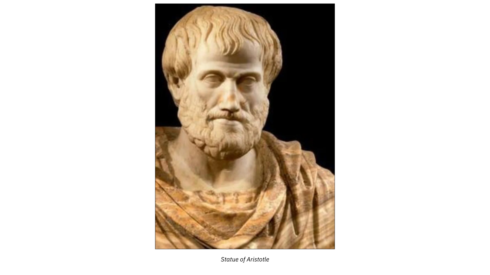

สำหรับอริสโตเติล ทรราชคือการเชื่อฟังบุคคล และเสรีภาพคือการเชื่อฟังกฎหมาย เขาได้รับเครดิตจากคำพูดนี้:

> การปรารถนากฎแห่งกฎหมายคือการคาดหวังการครองราชย์ของเหตุผลอย่างเฉพาะเจาะจง การเลือกแทนที่จะเป็นการปกครองของมนุษย์คือการเพิ่มการปกครองของสัตว์ป่า เพราะความปรารถนาและความโกรธบิดเบือนการตัดสินของผู้ปกครอง แม้ว่าพวกเขาจะเป็นคนที่ดีที่สุดก็ตาม

ตามที่เขากล่าว กฎหมายซึ่งเป็นสิ่งที่ไม่มีตัวตนและถาวร รับประกันความยุติธรรมและความเสมอภาคสำหรับพลเมืองทุกคน

Cicero, นักพูดและนักปรัชญาชาวโรมันที่มีชื่อเสียงในศตวรรษที่ 1 ก่อนคริสต์ศักราช ได้นำแนวคิดนี้มาใช้: "เราคือทาสของกฎหมายเพื่อที่เราจะได้เป็นอิสระ" (_De Republica_, Book III, Chapter 13). ในข้อความนี้ Cicero ได้พัฒนาเหตุผลสนับสนุนสาธารณรัฐที่ปกครองโดยกฎหมาย แทนที่จะเป็นโดยชายคนเดียวหรือกลุ่มคนเล็ก ๆ.

แนวคิดของสาธารณรัฐมีต้นกำเนิดมาจากปรัชญากรีก มักถูกเปรียบเทียบกับประชาธิปไตยซึ่งถือว่าเสี่ยงเกินไป เพลโตตั้งชื่อผลงานหลักของเขาในด้านปรัชญาการเมืองว่า _The Republic_ และเขาตัดสินประชาธิปไตยอย่างรุนแรง เมื่อประชาชนปกครอง มีความเสี่ยงสูงที่จะบังคับใช้กฎหมายตามความปรารถนาของตนและสับสนระหว่างสิ่งที่ดีและสิ่งที่น่าพอใจ ดังนั้น การตายอย่างน่าเศร้าของโสกราตีส ซึ่งถูกตัดสินประหารชีวิตโดยคณะลูกขุนที่ได้รับความนิยม ถูกชักจูงโดยพวกโซฟิสต์ เพลโตได้เรียนรู้บทเรียนทั้งหมดจากเหตุการณ์นี้

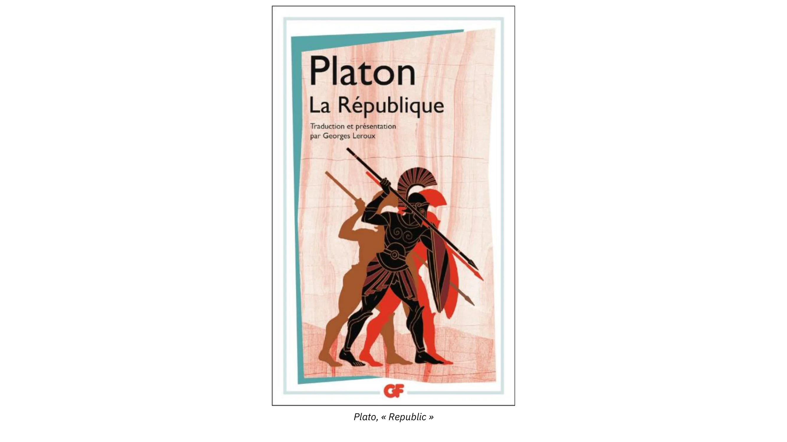

อริสโตเติลจะใช้คำว่า "สาธารณรัฐ" เพื่อกำหนดรัฐธรรมนูญที่ยุติธรรม ซึ่งมุ่งเน้นผลประโยชน์ร่วมกันและปฏิบัติต่อพลเมืองในฐานะคนเสรี ระบอบการปกครองที่แท้จริงของเสรีภาพคือที่ซึ่งกฎหมายเป็นทั่วไป เท่าเทียมกันสำหรับทุกคน ไม่ระบุตัวตน และไม่ใช่คำสั่งส่วนบุคคล

แนวคิดเรื่องเสรีภาพภายใต้กฎหมายยังสะท้อนให้เห็นในคำว่า "Rule of Law" ของแองโกล-แซกซอน

### เสรีภาพทางการเมือง

อาจกล่าวได้ว่าชาวกรีกเป็นผู้คิดค้นแนวคิดเรื่องเสรีภาพทางการเมืองเพื่อต่อต้านการครอบงำแบบทรราช ชาวกรีกในยุคนั้นถือว่าการเป็นทาสเป็นสถาบันตามธรรมชาติ และทาสไม่ได้มีสถานะเทียบเท่ากับพลเมือง สิ่งนี้อาจดูขัดแย้งกับแนวคิดเรื่องเสรีภาพ แต่สำหรับพวกเขา เสรีภาพนั้นเชื่อมโยงกับความเป็นพลเมืองไม่ใช่การไม่มีการเป็นทาส

เฮโรโดตุส ใน _Historia_ ของเขา และเอสคิลัส ในโศกนาฏกรรม _The Persians_ ของเขา ได้แสดงให้เห็นถึงความแตกต่างระหว่างระบอบกษัตริย์ที่สมบูรณ์และเผด็จการของเซอร์ซีสกับจิตวิญญาณแห่งเสรีภาพของชาวกรีกอย่างยอดเยี่ยม ผู้คนเหล่านี้ซึ่งมีลักษณะเด่นคือการไม่มีนายและการปฏิเสธที่จะยอมจำนนต่อการเป็นทาสโดยคนป่าเถื่อน ไม่ว่าจะมีจำนวนมากเพียงใด พบพลังของพวกเขาในกฎหมาย "โนมอส" ซึ่งเป็นนายที่แท้จริงของพวกเขาที่รับประกันเสรีภาพของพวกเขา และกฎหมายนี้มาจากเจตจำนงของทุกคน

ตามที่ Jacqueline de Romilly กล่าวว่า:

ชาวกรีกเองได้วัดความเป็นต้นฉบับนี้และตระหนักถึงมันในช่วงต้นศตวรรษที่ 5 ในการเผชิญหน้าที่ต่อต้านผู้รุกรานชาวเปอร์เซีย และข้อเท็จจริงแรกที่ทำให้พวกเขาตกตะลึงคือมีความแตกต่างทางการเมืองระหว่างพวกเขากับศัตรู ซึ่งเป็นตัวกำหนดทุกสิ่งทุกอย่าง ชาวเปอร์เซียเชื่อฟังผู้ปกครองสูงสุดซึ่งเป็นนายของพวกเขา ผู้ที่พวกเขากลัว และผู้ที่พวกเขากราบไหว้; การปฏิบัติเหล่านี้ไม่เป็นที่แพร่หลายในกรีซ มีบทสนทนาที่น่าทึ่งในเฮโรโดตุส ซึ่งต่อต้านเซอร์ซีสกับอดีตกษัตริย์แห่งสปาร์ตา กษัตริย์องค์นี้ประกาศต่อเซอร์ซีสว่าชาวกรีกจะไม่ยอมแพ้เพราะกรีซต่อสู้กับการเป็นทาสต่อเจ้านายเสมอ มันจะต่อสู้ไม่ว่าจะมีจำนวนศัตรูมากเพียงใด เพราะหากชาวกรีกเป็นอิสระ "พวกเขาไม่ได้เป็นอิสระในทุกสิ่ง: พวกเขามีเจ้านายคือกฎหมาย ซึ่งพวกเขากลัวมากกว่าที่ประชาชนของคุณกลัวคุณเสียอีก"

(_กรีกโบราณที่การค้นพบเสรีภาพ, ปารีส, Editions de Fallois, 1989_)

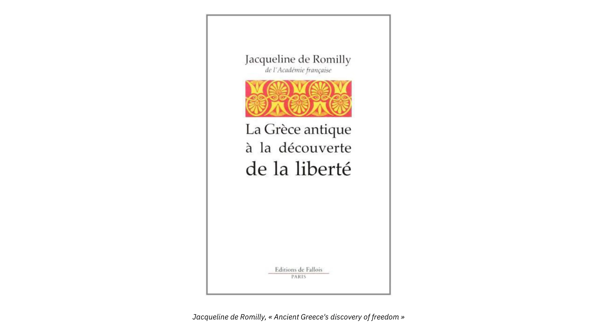

เฮโรโดตุสเชื่อมั่นว่าประชาชนที่เป็นอิสระคือประชาชนที่เชื่อฟังกฎหมายไม่ใช่เจ้านาย เช่นเดียวกับในจักรวรรดิเปอร์เซียที่มีเพียงคนเดียวที่เป็นอิสระและคนอื่นๆ ล้วนเป็นทาส นี่เป็นความจริงสำหรับเอเธนส์ซึ่งเป็นประชาธิปไตย แต่ก็เป็นความจริงสำหรับสปาร์ตาด้วย กษัตริย์ไม่ได้สร้างกฎหมาย เขาไม่ได้บังคับใช้ความต้องการของตนเอง เขารับรองการเคารพกฎหมาย เขาอยู่เพื่อรับใช้มัน และเขาจะตายหากจำเป็นเพื่อปกป้องมัน

### การแสวงหาความจริงและพหุนิยม

การเคลื่อนออกจากความคิดเชิงตำนาน ธาเลส อนาซิมานเดอร์ อนาซิเมเนส และต่อมา เดโมคริตัส และ เอ็มเพโดคลีส เป็นกลุ่มแรกที่พยายามทำความเข้าใจฟูซิส (ธรรมชาติ) ผ่านเหตุผล แทนที่จะผ่านสิ่งเหนือธรรมชาติ

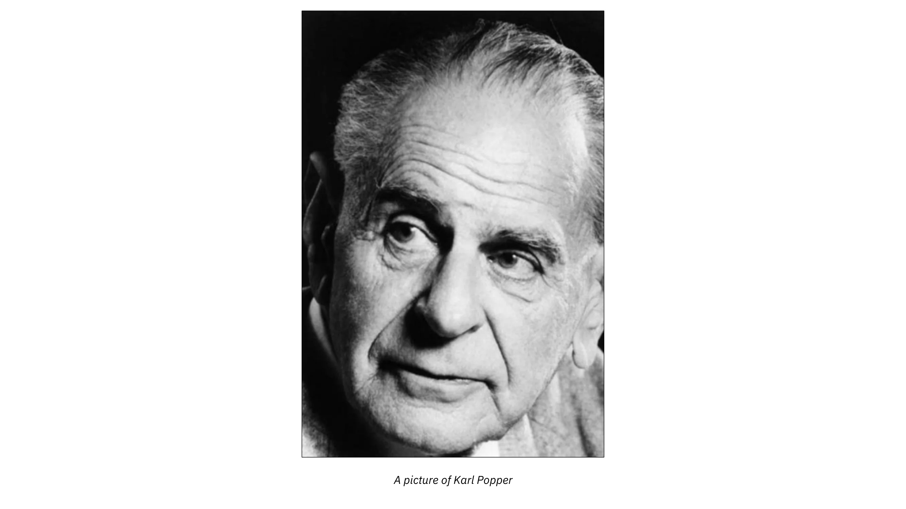

หลักการพื้นฐานที่นักปรัชญายุคก่อนโสกราตีสเหล่านี้เสนอคือ ธาตุต่าง ๆ ของโคสมอส (จักรวาล) ยังคงอยู่ในที่เพราะพวกมันทั้งหมดอยู่ภายใต้ "กฎแห่งธรรมชาติ" (phusis) เดียวกันที่สามารถระบุได้อย่างสากลและจำเป็น จักรวาลมีเหตุผล; มันประกอบด้วยโครงสร้างทั้งหมดที่มนุษย์สามารถค้นพบด้วยเหตุผลของเขา ("โลโกส" ตรงข้ามกับ "มูทอส" ตำนาน)

ตามที่คาร์ล ป๊อปเปอร์กล่าวไว้ เราเป็นหนี้การประดิษฐ์ของเหตุผลนิยมเชิงวิพากษ์, ประเพณีตะวันตกของการอภิปรายเชิงวิพากษ์, และแหล่งที่มาของความคิดทางวิทยาศาสตร์และพหุนิยมให้กับนักปรัชญาของกรีกโบราณ โดยเฉพาะอย่างยิ่งพวกก่อนโสกราตีส เขาอธิบายเรื่องนี้ในบทหนึ่งของ _Conjectures and Refutations_ ที่มีชื่อว่า "Return to the Pre-Socratics":

เกี่ยวกับสัญญาณแรกของการมีอยู่ของทัศนคติวิพากษ์วิจารณ์, ของเสรีภาพทางความคิดใหม่, พวกมันปรากฏในคำวิจารณ์ของอนักซิมานเดอร์ต่อธาเลส นี่เป็นปรากฏการณ์ที่ค่อนข้างพิเศษ; นักคิดที่อนักซิมานเดอร์วิจารณ์คืออาจารย์ของเขา, เพื่อนร่วมชาติของเขา, หนึ่งในเจ็ดนักปราชญ์, ผู้ก่อตั้งโรงเรียนไอโอเนียน ตามประเพณี, อนักซิมานเดอร์อายุน้อยกว่าธาเลสเพียงสิบสี่ปี, และเขาน่าจะได้สร้างคำวิจารณ์และนำเสนอแนวคิดใหม่ของเขาในช่วงชีวิตของอาจารย์ของเขา, เนื่องจากพวกเขาเสียชีวิต, ดูเหมือนว่า, ห่างกันเพียงไม่กี่ปี อย่างไรก็ตาม, ไม่มีหลักฐานของความขัดแย้ง, การทะเลาะวิวาท, หรือการแตกแยกที่พบในแหล่งข้อมูล

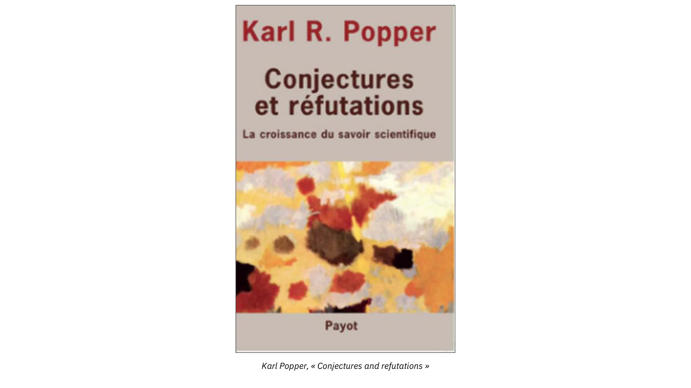

องค์ประกอบเหล่านี้ ตามที่เขากล่าว บ่งชี้ว่า Thales เป็นผู้ริเริ่มประเพณีใหม่แห่งเสรีภาพนี้ โดยอิงจากความสัมพันธ์ดั้งเดิมระหว่างอาจารย์และศิษย์ Thales สามารถทนต่อคำวิจารณ์ได้ และเขาได้สร้างประเพณีการยอมรับคำวิจารณ์นั้นขึ้นมา Popper ระบุว่ามีการแตกหักจากประเพณีที่ยึดมั่นในหลักการเดียว ซึ่งอนุญาตให้มีเพียงหลักคำสอนของโรงเรียนเดียวเท่านั้น และแทนที่ด้วยพหุนิยมและความผิดพลาดได้

> ความพยายามของเราในการเข้าใจและค้นพบความจริงนั้นไม่ใช่สิ่งที่แน่นอน อย่างไรก็ตาม มันสามารถพัฒนาได้ ความรู้และหลักคำสอนของเราเป็นการคาดเดา ประกอบด้วยสมมติฐานและข้อสันนิษฐานมากกว่าความจริงที่แน่นอนและสิ้นสุด

วิธีเดียวที่เรามีในการเข้าใกล้ความจริงคือการวิจารณ์และการอภิปราย ดังนั้นจากกรีกโบราณจึงเกิดประเพณีนี้:

> ซึ่งประกอบด้วยการสร้างข้อสันนิษฐานที่กล้าหาญและการใช้วิจารณญาณอย่างเสรี ซึ่งเป็นประเพณีที่เป็นต้นกำเนิดของวิธีการทางเหตุผลและวิทยาศาสตร์ และเป็นผลให้เกิดวัฒนธรรมตะวันตกที่เป็นของเราและเป็นวัฒนธรรมเดียวที่ก่อตั้งขึ้นบนวิทยาศาสตร์ แม้ว่าแน่นอนว่านี่จะไม่ใช่พื้นฐานเดียวของมันก็ตาม

## การประดิษฐ์กฎหมายโดยชาวโรมัน

<chapterId>e9337ad6-5a75-5894-a017-9a507939cb51</chapterId>

:::video id=ad8c92c1-5960-4607-b277-ce5e61e80b36:::

จักรวรรดิโรมันเป็นอาณาจักรที่กว้างใหญ่และมีความหลากหลายทางวัฒนธรรม ในช่วงที่รุ่งเรืองที่สุดประมาณปี ค.ศ. 117 มันเป็นรัฐที่มีหลายเชื้อชาติและหลายภาษาอย่างมหาศาล:

- ทางทิศตะวันตก มันขยายจากบริเตนใหญ่ (อังกฤษในปัจจุบัน) ไปจนถึงสเปน ผ่านกอล (ฝรั่งเศสในปัจจุบัน) และทางเหนือของแอฟริกา
- ทางตอนเหนือ มันไปถึงแม่น้ำไรน์และแม่น้ำดานูบ ครอบคลุมบางส่วนของเยอรมนี เนเธอร์แลนด์ สวิตเซอร์แลนด์ ออสเตรีย ฮังการี โรมาเนีย และบัลแกเรีย
- ทางทิศใต้ติดกับทะเลเมดิเตอร์เรเนียน รวมถึงอิตาลี กรีซ คาบสมุทรบอลข่าน เอเชียไมเนอร์ (ตุรกีในปัจจุบัน) ซีเรีย เลบานอน ปาเลสไตน์ อียิปต์ และไซเรไนกา (ส่วนหนึ่งของลิเบียในปัจจุบัน)
- ทางทิศตะวันออก ขยายไปถึงเมโสโปเตเมีย (ประเทศอิรักในปัจจุบัน) และอาร์เมเนีย

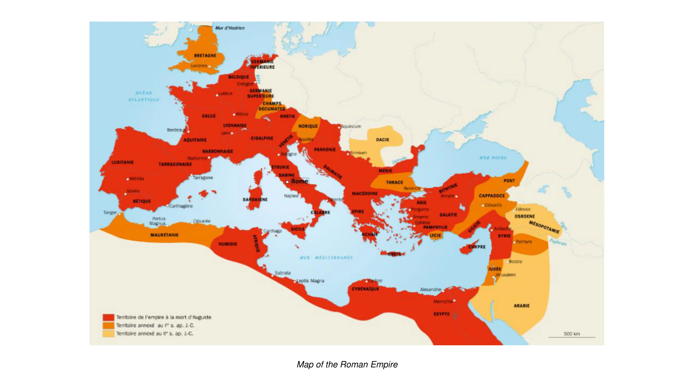

ตั้งแต่นั้นมา ชาวโรมันได้พัฒนากฎหมายไปไกลกว่าชาวกรีก ซึ่งอาศัยอยู่ในนครรัฐขนาดเล็กที่มีความเป็นเอกภาพทางชาติพันธุ์ ภายใต้สาธารณรัฐโรมัน มีกฎหมายคุ้มครองทรัพย์สินและสิทธิส่วนบุคคลอยู่แล้ว

อันที่จริงแล้ว หน้าที่ของกฎหมายคือการทำให้การอยู่ร่วมกันอย่างสงบสุขและการแลกเปลี่ยนระหว่างผู้คนเป็นไปได้ โดยการกำหนดขอบเขตของ "ของฉัน" และ "ของคุณ"

ทรัพย์สินส่วนตัวได้รับมิติใหม่ในอารยธรรมโรมันที่ไม่เคยรู้จักมาก่อน แม้แต่อารยธรรมกรีกโบราณ

กฎหมายโรมันจะกลายเป็นรากฐานของกฎหมายตะวันตกสมัยใหม่ทั้งหมดตั้งแต่ยุคกลางจนถึงปัจจุบัน

### การคุ้มครองสิทธิส่วนบุคคล

ในที่สุด กฎหมายโรมันได้ให้ความสำคัญอย่างมากกับสิทธิและเสรีภาพของบุคคล และพลเมืองโรมันก็ภาคภูมิใจในสถานะพลเมืองของตน กฎหมายสิบสองโต๊ะ (450 ปีก่อนคริสตกาล) เป็นชุดกฎหมายที่เขียนขึ้นครั้งแรกที่พลเมืองโรมันทุกคนสามารถเข้าถึงได้ ทั้งชนชั้นสูงและชนชั้นล่าง การประมวลกฎหมายนี้ช่วยให้กฎหมายชัดเจนและเป็นมาตรฐาน ซึ่งก่อนหน้านี้กระจัดกระจายและมักเป็นจารีตประเพณี ทำให้มั่นใจได้ถึงระดับความโปร่งใสในการใช้สิทธิต่างๆ เช่น สิทธิในการแต่งงาน ซื้อ และขาย

กฎหมายนี้สอดคล้องอย่างน่าทึ่งกับสิทธิตามธรรมชาติพื้นฐานตามทฤษฎีของจอห์น ล็อคสองพันปีต่อมา มันช่วยให้การคุ้มครองสิทธิส่วนบุคคลจากอำนาจที่ตามอำเภอใจและการใช้อำนาจในทางที่ผิด

แน่นอนว่า ผู้หญิง ทาส และชาวต่างชาติยังคงถูกกีดกันจากการคุ้มครองตามกฎหมายอย่างเต็มที่ อย่างไรก็ตาม กฎหมายสิบสองโต๊ะเป็นตัวแทนของความก้าวหน้าที่สำคัญและวางรากฐานสำหรับการพัฒนาสิทธิส่วนบุคคลต่อไป ซึ่งต่อมาได้ขยายไปถึงทุกคน

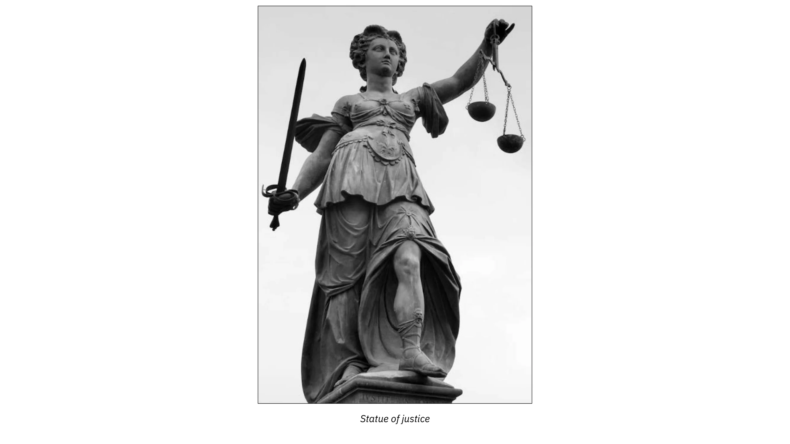

กฎหมายสิบสองโต๊ะให้ความสำคัญอย่างยิ่งกับสิทธิในทรัพย์สิน:

- มันกำหนดประเภทต่าง ๆ ของทรัพย์สิน (ที่ดิน, สังหาริมทรัพย์, ฯลฯ)
- มันแบ่งทรัพย์สินออกเป็น usus (สิทธิในการใช้), fructus (สิทธิในการรับผลประโยชน์), และ abusus (สิทธิในการจำหน่าย)
- ระบุเงื่อนไขสำหรับการได้มา การส่งผ่าน และการคุ้มครองสินค้าดังกล่าว

โดยสรุป มันมีส่วนช่วยในการรักษาความปลอดภัยของธุรกรรมและปกป้องบุคคลจากการเวนคืนโดยพลการ โดยมีความเป็นไปได้ในการขอความช่วยเหลือในกรณีที่เกิดข้อพิพาท

### กำเนิดมนุษยนิยมและชีวิตส่วนตัว

สิ่งที่เราเป็นขึ้นอยู่กับสิ่งที่เรามี การเป็นอยู่ไม่ได้แยกจากการมีอย่างที่บางครั้งกล่าวไว้ เพราะสิ่งที่เราครอบครองทำให้เราแตกต่างจากสิ่งที่ผู้อื่นครอบครอง และชีวิตของเราเป็นของเรา เราเป็นเจ้าของความสามารถและร่างกายของเราก่อนที่จะเป็นเจ้าของทรัพย์สินทางวัตถุ

ในสังคมโรมัน บุคคลสามารถแยกแยะตัวเองจากผู้อื่นได้มากขึ้นและกลายเป็นผู้แสดงในชีวิตของตนเอง มนุษย์ในขณะนี้มีบทบาทที่ไม่เหมือนใคร และซิเซโรใช้คำว่า "persona" เพื่อกำหนดเขา "Persona" เป็นหน้ากากที่นักแสดงโรมันสวมใส่ แต่ยังหมายถึงบุคลิกภาพทางกฎหมายและสังคมของบุคคล แนวคิดของ persona บ่งบอกว่าบุคคลเป็นเอกลักษณ์ที่มีสิทธิและความรับผิดชอบของตนเอง แนวคิดของบุคคลมนุษย์ (อัตตา) ที่มีชีวิตภายในและชะตากรรมที่ไม่เหมือนใครเกิดขึ้นและพัฒนาขึ้นภายในศาสนาคริสต์

ยิ่งไปกว่านั้น วรรณกรรมและปรัชญาของโรมันมีตัวอย่างมากมายของการสะท้อนเกี่ยวกับธรรมชาติของปัจเจกบุคคล ความสุข ปัญญา และชีวิตในสังคม

### เซเนกาและชีวิตที่มีความสุข

แบบอย่างของความสมดุลในความคิดคือ เซเนกา นักปรัชญาสโตอิกชาวโรมันที่เขียนเกี่ยวกับความสำคัญของคุณธรรม เหตุผล และการควบคุมตนเอง เขาเป็นคนร่วมสมัยกับพระเยซู และยังเป็นครูสอนพิเศษให้กับเนโร นายธนาคารผู้มั่งคั่ง และนักเขียนชาวโรมันที่มีชื่อเสียง

The Treatise on the Happy Life (_De Vita Beata_) เป็นการวิงวอนขอศีลธรรมแบบสโตอิก ความสุข, เซเนกากล่าวว่า, "คือจิตวิญญาณที่เป็นอิสระ \[...\] ไม่สามารถเข้าถึงความกลัว \[...\] สำหรับผู้ที่ความชั่วร้ายเพียงอย่างเดียวคือความไม่เหมาะสมทางศีลธรรม." ศิษย์ของโสกราตีส, นักปราชญ์สโตอิกไม่กลัวความชั่วร้ายทางกายภาพ, ความตาย, หรือแม้แต่การทนทุกข์จากความอยุติธรรม สำหรับเขา, ความชั่วร้ายเพียงอย่างเดียวคือความชั่วร้ายทางศีลธรรม ดังนั้น, ความดีสูงสุดอยู่ในคุณธรรม

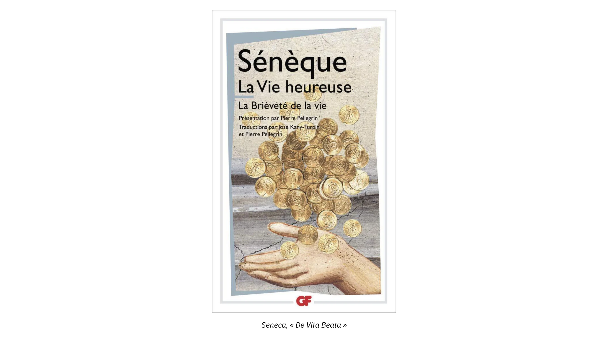

อย่างไรก็ตาม ความสุขไม่ได้ขัดแย้งกับคุณธรรม:

> ชาวโบราณแนะนำให้ใช้ชีวิตที่ดีที่สุด ไม่ใช่ชีวิตที่สุขสบายที่สุด โดยให้ความสุขไม่ใช่เป็นผู้นำทางของเจตจำนงที่ถูกต้อง แต่เป็นเพื่อนร่วมทางบนถนน

นั่นคือเหตุผลที่คนฉลาดไม่ปฏิเสธของขวัญจากโชคชะตา:

> เขาไม่ได้รักความมั่งคั่ง เขาเพียงแต่ชอบมัน; เขาไม่ได้ต้อนรับมันเข้าสู่หัวใจของเขา แต่เข้าสู่บ้านของเขา; เขาไม่ได้ปฏิเสธสิ่งที่เขาครอบครอง แต่เขาครอบงำมันและต้องการให้มันสนับสนุนคุณธรรมของเขาด้วยสิ่งที่เพียงพอ

เซเนกาก้าวไปไกลกว่านั้น สำหรับคนฉลาด ความร่ำรวยคือโอกาสและวิธีการในการฝึกฝนคุณธรรม:

ในความยากจน [...] มีคุณธรรมเพียงอย่างเดียว: ไม่ย่อท้อหรือปล่อยให้ตนเองหดหู่; ท่ามกลางความมั่งคั่ง ความพอประมาณ ความเอื้อเฟื้อ การพินิจพิเคราะห์ ความประหยัด และความโอ่อ่าตระการตา มีอิสระเต็มที่

### แนวคิดของกฎหมายที่สูงกว่า

คำว่า "สิทธิมนุษยชน" ซึ่งนักกฎหมายหลายคนยึดถือโดยปริยายสนับสนุนแนวคิดของกฎหมายที่สูงกว่าเพราะมันมุ่งเป้าไปที่สิทธิที่มีอยู่ในมนุษยชาติเอง ซึ่งมาก่อนกฎหมายที่เป็นบวกใดๆ หากปราศจากมาตรฐานทางศีลธรรมที่เหนือกว่านี้ จะไม่มีอำนาจวิจารณ์ที่สามารถตีความและตั้งคำถามกับระเบียบกฎหมายได้อีกต่อไป

แนวคิดนี้เตือนเราว่าเจ้าชาย (เช่นเดียวกับผู้นำทางการเมือง) ไม่ได้ครอบครองความยุติธรรมเอง แต่ตัวเขาเองอยู่ภายใต้กฎหมายที่เหนือกว่าเขาและต้องควบคุมการตัดสินของเขา

นี่คือสิ่งที่นักปรัชญาในยุคโบราณ โดยเฉพาะชาวโรมันอย่างเช่น ซิเซโร หรือพวกสโตอิก เรียกว่ากฎธรรมชาติ ต้นกำเนิดของมันสามารถสืบย้อนกลับไปยังความคิดของชาวกรีก โดยเฉพาะในผลงานของโซโฟคลีสและอริสโตเติล

อริสโตเติลแยกความแตกต่างระหว่างความยุติธรรมตามธรรมชาติและความยุติธรรมตามกฎหมาย ความยุติธรรมตามธรรมชาติคือสิ่งที่มีผลบังคับใช้ทั่วโลก ในทุกสถานที่และทุกเวลา มันเป็นกฎหมายที่ไม่ได้เขียนไว้ รู้จักผ่านเหตุผลและตรรกะ ความยุติธรรมตามกฎหมายเป็นสิ่งที่ไม่แยแสโดยเนื้อแท้ แต่กลายเป็นข้อบังคับสำหรับทุกคนอันเป็นผลมาจากการเลือกตามข้อตกลงและถูกบันทึกไว้ในข้อความทางกฎหมาย กล่าวอีกนัยหนึ่งคือมีการแยกความแตกต่างระหว่างกฎหมายธรรมชาติและกฎหมายเชิงบวก

นักเขียนบทละครโซโฟคลีส ในละครเรื่อง _Antigone_ ของเขา ได้จัดฉากความขัดแย้งระหว่างกฎหมายของเทพเจ้าและกฎหมายของมนุษย์ แอนติโกนีปฏิเสธที่จะเชื่อฟังพระราชกฤษฎีกาของกษัตริย์ครีออน ซึ่งห้ามการฝังศพของพี่ชายของเธอ โดยโต้แย้งว่ากฎหมายของเทพเจ้า ซึ่งไม่เปลี่ยนแปลงและเหนือกว่า มีความสำคัญเหนือกว่ากฎหมายของมนุษย์

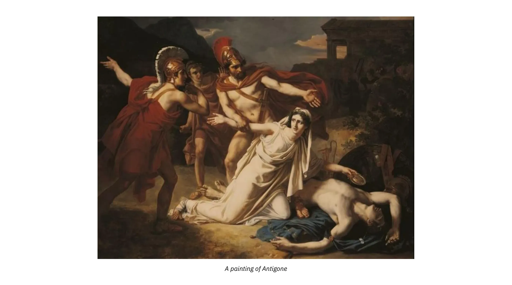

เมื่อแอนติโกนีไม่เชื่อฟังครีออน เธอคัดค้านกฎหมายเชิงบวกเพื่อเชื่อฟังมโนธรรมทางศีลธรรมและศาสนาของเธอ หากมีกฎหมายเชิงบวกเพียงอย่างเดียว อริสโตเติลกล่าวว่า ครีออนจะถูกเสมอ แม้ว่าเขาจะผิดก็ตาม แต่ถ้าเรารักษาแนวคิดการกำกับดูแลของกฎหมายธรรมชาติหรือกฎหมายศักดิ์สิทธิ์ แอนติโกนีก็สามารถลุกขึ้นยืนเมื่อถึงเวลาและอ้างสิทธิ์ที่เหนือกว่าของกฎหมายที่ไม่ได้เขียนไว้เพื่อต่อต้านกฎหมายที่ไม่ยุติธรรม

### ซิเซโรและกฎหมายธรรมชาติ

Cicero อาศัยอยู่ในศตวรรษที่ 1 ก่อนคริสต์ศักราชและถือเป็นหนึ่งในนักพูดที่ยิ่งใหญ่ที่สุดของภาษาละตินภายใต้จักรวรรดิโรมัน เขายังเป็นนักปรัชญาด้านศีลธรรมและการเมืองที่มีความใกล้ชิดกับพวกสโตอิก ชาวยุโรปที่มีการศึกษาได้อ่านบทความของเขามาหลายศตวรรษ

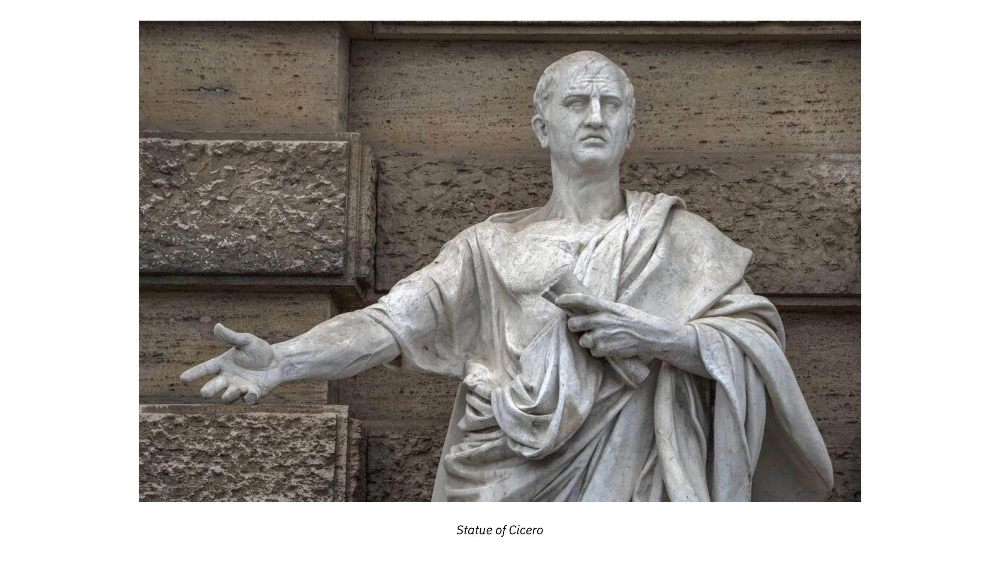

ในบทความของเขา _On the Laws_ (_De Legibus_), เขาได้สะท้อนถึงรากฐานของกฎหมาย ตามที่เขากล่าว กฎหมายเชิงบวก ซึ่งเป็นชุดของข้อตกลงหรือกฎหมายที่เขียนขึ้นซึ่งได้รับการยอมรับโดยสังคม ไม่สามารถสร้างความยุติธรรมที่คู่ควรกับชื่อนั้นได้ มีความยุติธรรมตามธรรมชาติที่ถูกจารึกไว้ในเหตุผลของมนุษย์: "กฎหมายมีรากฐานในธรรมชาติเอง" การกล่าวว่าผู้ที่ไม่ยุติธรรมเป็นผลมาจากข้อตกลงคือการกล่าวว่าความจริงถูกกำหนด อย่างไรก็ตาม ความจริงไม่สามารถถูกกำหนดได้ แม้กระทั่งโดยเสียงข้างมาก; มันนำทางการตัดสินของเรา

Cicero ยังปฏิเสธประโยชน์ใช้สอยเป็นรากฐานของกฎหมาย อันที่จริง เขาเขียนว่า:

> หากความยุติธรรมคือการเชื่อฟังกฎหมายที่เขียนไว้และสถาบันของประชาชน และหาก, ตามที่ผู้ที่รักษามันกล่าวไว้, ประโยชน์คือมาตรวัดของทุกสิ่ง, เขาจะดูถูกและทำลายกฎหมาย, ผู้ที่เชื่อว่าเห็นประโยชน์ของตนในนั้น ดังนั้น, ไม่มีความยุติธรรมอีกต่อไป, หากไม่มีความยุติธรรมตามธรรมชาติทำงานอยู่; หากมันขึ้นอยู่กับประโยชน์, ประโยชน์อื่นก็จะล้มล้างมัน หาก, ดังนั้น, สิทธิไม่ได้อยู่บนพื้นฐานของธรรมชาติ, คุณธรรมทั้งหมดก็จะหายไป อะไรจะเกิดขึ้น, จริงๆ แล้ว, กับความเอื้อเฟื้อ, ความรักชาติ, ความเคารพต่อสิ่งที่ต้องเป็นสิ่งศักดิ์สิทธิ์สำหรับเรา, ความตั้งใจที่จะรับใช้ผู้อื่น, ความเต็มใจที่จะยอมรับบริการที่ได้รับ? คุณธรรมทั้งหมดเหล่านี้เกิดจากความโน้มเอียงที่เรามีในการรักมนุษย์, ซึ่งเป็นรากฐานของกฎหมาย

ดังนั้น ตามที่เขากล่าว มีความยุติธรรมสากลที่ถูกจารึกไว้ในเหตุผลและธรรมชาติ Cicero เขียนไว้ใน _De Republica_:

> กฎที่แท้จริงคือเหตุผลที่ถูกต้องซึ่งสอดคล้องกับธรรมชาติ; มันมีการประยุกต์ใช้ทั่วโลก, ไม่เปลี่ยนแปลงและนิรันดร์; มันเชิญชวนให้ปฏิบัติหน้าที่ด้วยคำสั่งของมันและหันเหออกจากเส้นทางที่ผิดด้วยข้อห้ามของมัน \[…\]. ทั้งวุฒิสภาหรือประชาชนไม่มีอำนาจที่จะยกเว้นเราไม่ให้ปฏิบัติตามมัน \[…\]. มันไม่ใช่สิ่งหนึ่งที่เอเธนส์และอีกสิ่งหนึ่งที่โรม, ไม่ใช่สิ่งหนึ่งวันนี้และอีกสิ่งหนึ่งพรุ่งนี้. แต่มันเป็นกฎเดียวและเหมือนกัน, นิรันดร์, ไม่เปลี่ยนแปลง, มีผลบังคับใช้ตลอดเวลาและในหมู่ประชาชนทุกคน \[…\]. ใครก็ตามที่ไม่ปฏิบัติตามกฎนี้หลบหนีจากตัวเองและดูหมิ่นธรรมชาติของมนุษย์ของเขา.

กฎหมายนี้มีความเหนือกว่ากฎหมายที่บังคับใช้อยู่ในปัจจุบัน ดังนั้น "มันไม่สามารถถูกทำให้เป็นโมฆะโดยกฎหมายอื่น ๆ และไม่มีข้อกำหนดใด ๆ ของมันที่สามารถถูกยกเลิกได้ และมันไม่สามารถถูกยกเลิกได้ทั้งหมด" ซิเซโรกล่าวเสริม อำนาจทางการเมืองไม่มีอิทธิพลต่อมัน

ทั้งความจริงและความยุติธรรมไม่สามารถถูกกำหนดได้ แม้กระทั่งโดยเสียงข้างมาก เพราะไม่เช่นนั้นพวกมันจะกลายเป็นวัตถุของการบิดเบือนทั้งหมด ดังนั้น แม้ว่าผู้ปกครองจะเป็นประชาชน ก็ไม่ถูกต้องที่จะละเมิดหลักการของกฎหมายธรรมชาติ

การยืนยันว่ากฎหมายไม่สามารถลดลงเหลือเพียงแค่กฎหมายที่ออกโดยสภานิติบัญญัติ Cicero มุ่งหวังที่จะต่อสู้กับความตามอำเภอใจของกฎหมายและเสนอศีลธรรมทางการเมือง แนวคิดนี้มีอิทธิพลต่อความคิดของชาติตะวันตกอย่างยาวนาน

## การล่มสลายของกรุงโรม

<chapterId>1b0f3de8-696a-5dbc-bb5e-e03ddafb4ebf</chapterId>

:::video id=65ae0d54-7319-4913-b69a-5f5c842e40fa:::

ทำไมกรุงโรมถึงเสื่อมและล่มสลายในที่สุด? หลายคนชอบคิดว่าอาณาจักรโรมันล่มสลายอย่างฉับพลันภายใต้การรุกรานของชนเผ่าบาร์บาเรียน อย่างไรก็ตาม สาเหตุของการล่มสลายของอาณาจักรโรมันสามารถพบได้ตั้งแต่ก่อนหน้านั้นมาก ในลัทธิจักรวรรดินิยมและการควบคุมทางเศรษฐกิจและการเงิน

ในปี 1734 ในผลงาน _Considerations on the Causes of the Greatness of the Romans and of Their Decline_ มงแต็สกีเยอได้พัฒนาวิทยานิพนธ์ที่เป็นเอกลักษณ์และเป็นเอกภาพเพื่ออธิบายการขึ้นและลงของอำนาจโรมัน: เสรีภาพที่ได้รับภายใต้สาธารณรัฐและสูญเสียภายใต้จักรวรรดิ ตั้งแต่ช่วงที่การครอบงำของโรมันขยายตัว เสรีภาพก็สูญเสียไปและความเสื่อมโทรมก็เริ่มขึ้น

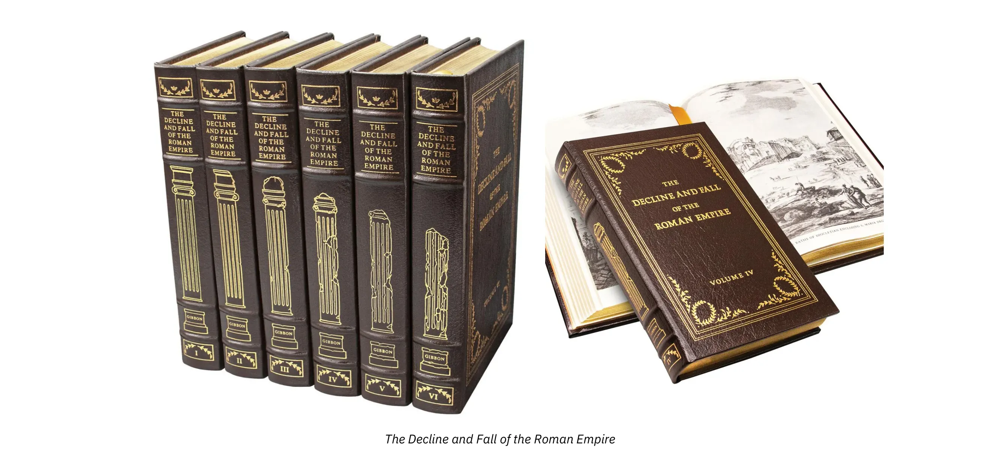

จักรวรรดิโรมันเป็นระบอบการปกครองทางทหารที่เป็นปรสิต ซึ่งสามารถอยู่รอดได้เพียงผ่านการไหลเข้าของความมั่งคั่งที่ถูกปล้นจากภายนอก นักโทษที่ถูกลดทอนเป็นทาส และดินแดนที่ถูกขโมย

อันที่จริง ความมั่งคั่งของชนชั้นสูงในกรุงโรมเกิดขึ้นจากการปล้นสะดมจากการรุกรานเป็นหลัก มากกว่าการสร้างมูลค่าใหม่ อย่างไรก็ตาม เมื่อการพิชิตสิ้นสุดลงและผลตอบแทนจากการปล้นสะดมลดลง การบริหารจึงต้องหันไปพึ่งการขึ้นภาษีมากขึ้นเรื่อยๆ เพื่อสนองความต้องการด้านความมั่งคั่ง ซึ่งนำไปสู่ความยากจนทั่วไปของประชากรในจักรวรรดิ

### ขนมปังและละครสัตว์

ประมาณปี 140 นักประวัติศาสตร์ชาวโรมันชื่อฟรอนโตเขียนว่า:

> สังคมโรมันมีความกังวลหลักอยู่สองเรื่อง: การจัดหาอาหารและการแสดงโชว์

การต่อสู้ของนักสู้, การแข่งรถม้า, และการแสดงละคร, ซึ่งมักจะฟรี, ดึงดูดฝูงชนจำนวนมากและทำให้ชนชั้นสูงได้รับความนิยมจากประชาชน อำนาจได้จัดเกมให้กับพลเมืองของตน, รวมถึงข้าวสาลี, ขนมปัง, เนื้อหมู, และน้ำมันมะกอก กลยุทธ์นี้ทำหน้าที่เป็นกลยุทธ์ทางการเมืองเพื่อลดความตึงเครียดทางสังคม, เบี่ยงเบนความสนใจจากปัญหาเศรษฐกิจ, และเสริมสร้างอำนาจของจักรพรรดิ

ภายใต้การครองราชย์ของจักรพรรดิแอนโทนินัส ไพอัส (ค.ศ. 138-161) ระบบราชการของโรมันได้ขยายตัวอย่างมหาศาล

อย่างไรก็ตาม เนื่องจากรายได้จากภาษีไม่เพียงพอที่จะสนับสนุนการบริหารและกองทหาร จักรพรรดิเริ่มออกเงินตรามากขึ้นโดยลดปริมาณเงินในแต่ละเหรียญ เดนาเรียส ซึ่งเป็นสกุลเงินหลักของโรม มีปริมาณเงินลดลงจาก 100% เหลือ 0.5% ระหว่างปี ค.ศ. 235 ถึง 284 ด้วยการลดค่าเงิน ราคาสินค้าเพิ่มขึ้นอย่างไม่สามารถควบคุมได้ ส่งผลให้การบริโภค การค้า และความเชื่อมั่นลดลง

การล่มสลายของจักรวรรดิโรมันเป็นกระบวนการที่ช้า ซึ่งเชื่อมโยงโดยตรงกับการล้มละลายของระบบการเงินที่ทุจริต ภาวะเงินเฟ้อรุนแรงที่ตามมานำไปสู่การล่มสลายของเศรษฐกิจ ส่งผลให้เกิดการสูญเสียความเชื่อมั่นในสกุลเงินอย่างกว้างขวางในหมู่ประชาชน

จากนั้น ความไม่มั่นคงทางการเมืองก็ถูกเพิ่มเข้ามาในความไม่มั่นคงทางเศรษฐกิจ โดยมีจักรพรรดิมากกว่า 50 พระองค์ขึ้นครองราชย์ในช่วงเวลา 50 ปี

### การควบคุมราคา

ตัวอย่างคลาสสิกของการแทรกแซงเกิดขึ้นในกรุงโรมเมื่อจักรพรรดิไดโอคลีเชียนต้องการกำหนดราคาสูงสุด การแทรกแซงถูกกำหนดให้เป็นการกระทำของอำนาจที่เกินบทบาทในการรักษาความสงบเรียบร้อยและปกป้องพลเมือง เป็นความพยายามที่จะควบคุมตลาด โดยมีเป้าหมายเพื่อปรับเปลี่ยนราคา ค่าจ้าง อัตราดอกเบี้ย และผลกำไร

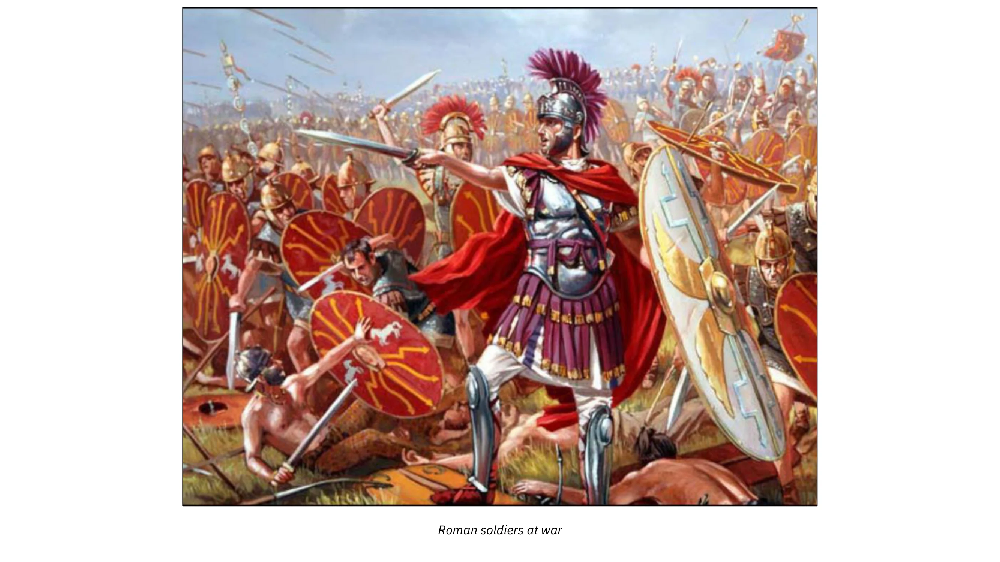

การออกเงินซ้ำๆ โดยจักรพรรดิที่ต่อเนื่องกันเพื่อรับมือกับการเพิ่มขึ้นของค่าใช้จ่ายทางทหารได้ทำให้ราคาสินค้าพุ่งสูงขึ้น ในปี 301 ไดโอคลีเชียนได้ประกาศพระราชกฤษฎีกากำหนดราคาสูงสุดเพื่อพยายามควบคุมราคา แต่มันล้มเหลว

Ludwig von Mises อธิบายเหตุการณ์นี้ ซึ่งแสดงให้เห็นถึงผลกระทบที่เป็นอันตรายของการแทรกแซง:

จักรพรรดิโรมันไดโอคลีเชียนเป็นที่รู้จักกันดีว่าเป็นจักรพรรดิองค์สุดท้ายที่ข่มเหงคริสเตียน จักรพรรดิโรมันในช่วงปลายศตวรรษที่สามมีวิธีการทางการเงินเพียงวิธีเดียว: การลดค่าเงิน ในยุคดั้งเดิมนี้ ก่อนการประดิษฐ์แท่นพิมพ์ ภาวะเงินเฟ้อเองก็เป็นแนวคิดที่ดั้งเดิมเช่นกัน มันเกี่ยวข้องกับการฉ้อโกงในการผลิตเหรียญ โดยเฉพาะเงิน จนกระทั่งสีของโลหะผสมเปลี่ยนไปและน้ำหนักลดลงอย่างมาก ผลของการลดค่าเงินนี้ควบคู่ไปกับการเพิ่มขึ้นของการหมุนเวียนคือการเพิ่มขึ้นของราคา ตามมาด้วยพระราชกฤษฎีกาควบคุมราคา และจักรพรรดิโรมันไม่ได้ลังเลที่จะบังคับใช้กฎหมาย พวกเขาไม่ถือว่าการประหารชีวิตเป็นโทษที่รุนแรงเกินไปสำหรับคนที่เรียกร้องราคาสูงเกินไป พวกเขาบังคับใช้การควบคุมราคา แต่ผลที่ตามมาคือพวกเขาทำให้สังคมล่มสลาย สิ่งนี้นำไปสู่การล่มสลายของจักรวรรดิโรมันและการล่มสลายของการแบ่งงานในที่สุด

([นโยบายเศรษฐกิจ, การสะท้อนสำหรับวันนี้และวันพรุ่งนี้](http://herve.dequengo.free.fr/Mises/PE/PE_3.htm))

### จากลัทธิเสรีนิยมสู่สังคมนิยม

ตามรอยเท้าของมองเตสกิเออ ฟิลิปป์ ฟาบรี แสดงให้เห็นว่าโรมมีเส้นทางจากลัทธิเสรีนิยมไปสู่สังคมนิยม ฟิลิปป์ ฟาบรี เป็นนักประวัติศาสตร์ด้านกฎหมาย สถาบัน และแนวคิดทางการเมือง เขาเคยสอนที่มหาวิทยาลัยตูลูส 1 กาปิโตล และเป็นผู้เขียนหนังสือหลายเล่ม รวมถึง _Rome, from Liberalism to Socialism_(2014)

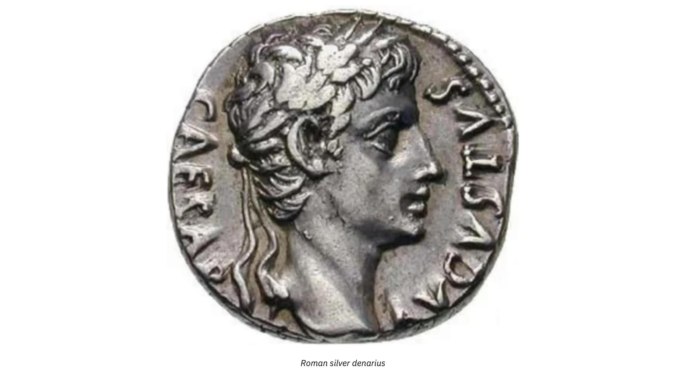

กรุงโรมเป็นมหาอำนาจเสรีนิยมที่ยิ่งใหญ่ที่สุดในโลกโบราณหรือไม่? แล้วมันตกอยู่ในรูปแบบของสังคมนิยมหรือไม่? มานิยามคำศัพท์เหล่านี้กันก่อน:

ลัทธิเสรีนิยม: ความเชื่อมั่นในการกระทำของปัจเจกบุคคล ซึ่งก่อให้เกิดระเบียบที่เกิดขึ้นเอง เพียงเพราะมันเป็นผลมาจากการมีปฏิสัมพันธ์โดยสมัครใจของพวกเขา ผ่านการเล่นอย่างเสรีของตลาดและการเคารพในสิทธิที่ไม่อาจโอนย้ายได้ของพวกเขา

สังคมนิยม: การจัดระเบียบสังคมโดยรัฐที่พิจารณาในภาพรวม ผ่านการวางแผนการผลิตและการบริโภค

วิทยานิพนธ์ของหนังสือของ Philippe Fabry คือ "การล่มสลายของจักรวรรดิโรมันเป็นผลมาจากทางตันที่สังคมนิยมจักรวรรดิได้นำพาโลกโบราณไปสู่" มันเป็นการควบคุมจากรัฐจักรวรรดิโรมันที่นำไปสู่การล่มสลายของมัน

สาธารณรัฐโรมัน, มหาอำนาจเสรีนิยมที่ยิ่งใหญ่ที่สุดของโลกโบราณ, ดำรงอยู่ตั้งแต่ 510 ปีก่อนคริสตกาลถึง 27 ปีก่อนคริสตกาล, ครอบคลุมเวลากว่า 500 ปี. อย่างไรก็ตาม, ความร่วมมือทางพลเมืองที่เป็นลักษณะของสาธารณรัฐโรมันค่อยๆ เปลี่ยนไปสู่การใช้อำนาจส่วนบุคคล, ซึ่งแสดงออกโดยจักรพรรดิที่นำรูปแบบการปกครองของผู้มีอำนาจในตะวันออกโบราณของอียิปต์และเปอร์เซียมาใช้. การแยกตัวจากนโยบายต่างประเทศที่เคยเป็นกลาง, โรมได้ปราบปรามประชากรจำนวนมากผ่านสงคราม, ส่งผลให้มีทาสจำนวนมากไหลเข้าสู่นักลงทุนชาวโรมันที่มั่งคั่ง, และทำลายชนชั้นกลาง. ในทางกลับกัน, ประชากรโรมันเรียกร้องเงินอุดหนุนที่เพิ่มขึ้น.

ในยุคแรกของความยิ่งใหญ่ของกรุงโรม แต่ละคนในกรุงโรมถือว่าตนเองเป็นแหล่งรายได้หลัก สิ่งที่เขาสามารถหามาได้ในตลาดด้วยความสมัครใจคือแหล่งที่มาของการดำรงชีวิต การเสื่อมถอยของกรุงโรมเริ่มต้นขึ้นเมื่อพลเมืองจำนวนมากค้นพบแหล่งรายได้อีกทางหนึ่ง: กระบวนการทางการเมืองหรือรัฐที่มีการกระจายรายได้ใหม่

จากนั้นชาวโรมันก็ละทิ้งเสรีภาพและความรับผิดชอบส่วนบุคคลเพื่อแลกกับคำมั่นสัญญาของสิทธิพิเศษและความมั่งคั่งที่รัฐบาลแจกจ่ายโดยตรง พลเมืองยอมรับแนวคิดว่าการได้รับรายได้ผ่านวิถีทางการเมืองนั้นได้เปรียบกว่าการทำงาน

Philippe Fabry สรุปว่า:

> จุดอ่อนที่สังเกตได้ของระบบจักรวรรดิ \[…\] เป็นจุดอ่อนเดียวกับที่พบในระบอบเผด็จการทั้งหมด: "ให้ความสำคัญสูงสุดกับการรักษาระบบที่มีอยู่, ความไม่มีประสิทธิภาพในการผลิตทางเศรษฐกิจ, การทุจริต, การเล่นพรรคเล่นพวก.

และเขาเสริมว่า:

> โดยรวมแล้ว ชีวิตทางเศรษฐกิจ การเมือง ศิลปะ และศาสนา ภายใต้จักรวรรดิโรมันในศตวรรษที่ 4 น่าจะคล้ายคลึงกับสิ่งที่เกิดขึ้นภายใต้การปกครองของเบรจเนฟในสหภาพโซเวียต (และในช่วงเวลาที่เลวร้ายที่สุดภายใต้สตาลิน) หรือสิ่งที่อาจเกิดขึ้นในเกาหลีเหนือในปัจจุบัน: ประชากรทั้งหมดของโลกโรมันถูกควบคุมโดยสังคมนิยมจักรวรรดิและได้รับผลกระทบโดยตรงหรือโดยอ้อม

# ต้นกำเนิดของเสรีภาพ: ยุคกลาง

<partId>f47bd5fc-c4a7-5d3b-b102-7b948bb43268</partId>

## การยืนยันเสรีภาพของมนุษย์

<chapterId>96ca5622-f8e4-58ef-b358-7f7d25543104</chapterId>

:::video id=c0dd7eb3-cacb-4614-9650-088436a352a8:::

แนวคิดเรื่องเสรีภาพในศาสนาคริสต์พัฒนาขึ้นในเทววิทยายุคกลาง ตั้งแต่เซนต์ออกัสตินในศตวรรษที่ 4 จนถึงเซนต์โทมัส อไควนัสในศตวรรษที่ 13 แนวคิดนี้คืออะไร?

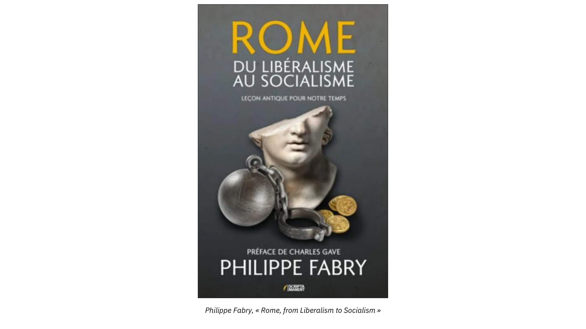

### เสรีภาพมีส่วนเกี่ยวข้องในแนวคิดเรื่องบาป

ตั้งแต่แรกเริ่ม ศาสนาคริสต์สอนว่าบาปเป็นเรื่องส่วนบุคคล ไม่ใช่สิ่งที่ติดตัวมากับกลุ่ม แต่ละบุคคลต้องรับผิดชอบต่อความรอดของตนเอง "พระเจ้าได้ประทานเจตจำนงเสรีให้แก่สิ่งสร้างของพระองค์ ความสามารถในการทำผิด และด้วยเหตุนี้ ความรับผิดชอบต่อบาป" นักบุญออกัสตินกล่าวไว้ในบทความเกี่ยวกับเจตจำนงเสรี _De Libero Arbitrio_

บาปไม่สามารถมีอยู่ได้หากปราศจากเสรีภาพ แท้จริงแล้ว พระเจ้าคริสเตียนเป็นผู้พิพากษาที่ให้รางวัลแก่คุณธรรมและลงโทษบาป อย่างไรก็ตาม แนวคิดนี้เกี่ยวกับพระเจ้านั้นไม่สอดคล้องกับลัทธิฟาตาลิสม์ เพราะบุคคลไม่สามารถมีความผิดและกล่าว "mea culpa" ได้หากพวกเขาไม่มีเสรีภาพในการกำหนดพฤติกรรมของตนเอง การยอมรับความผิดทางศีลธรรมของตนเอง ความผิดของตนเอง คือการยอมรับว่าตนเองสามารถกระทำการแตกต่างออกไปได้

> "ทำไมเราถึงทำผิด?" นักบุญออกัสตินถาม ถ้าฉันไม่ผิด การโต้แย้งได้แสดงให้เห็นว่าเราทำเช่นนี้ผ่านเจตจำนงเสรีของเจตจำนง แต่เจตจำนงเสรีนี้ที่เราต้องขอบคุณสำหรับความสามารถในการทำบาป เราเชื่อมั่น ฉันสงสัยว่าผู้ที่สร้างเราทำดีหรือไม่ที่ให้มันแก่เรา ดูเหมือนว่าเราจะไม่ถูกเปิดเผยต่อบาปถ้าเราถูกตัดสิทธิ์จากมัน; แต่ก็กลัวว่าในวิธีนี้ พระเจ้าก็ปรากฏเป็นผู้สร้างการกระทำที่ไม่ดีของเรา (_De libero arbitrio_, I, 16, 35.)

ถ้าพระเจ้าต้องการให้มนุษย์สามารถทำผิดได้ พระองค์จะไม่รับผิดชอบทางอ้อมต่อความชั่วร้ายหรือ? ทำไมพระเจ้าถึงต้องการความเป็นไปได้ของความชั่วร้าย? นักบุญออกัสตินตอบว่า:

> เจตจำนงเสรีที่ไม่มีใครสามารถมีชีวิตที่ดีได้ คุณต้องยอมรับว่ามันเป็นสิ่งที่ดี และมันเป็นของขวัญจากพระเจ้า และผู้ที่ใช้สิ่งดีนี้ในทางที่ผิดควรถูกประณามมากกว่าการกล่าวถึงผู้ที่ให้มันว่าเขาไม่ควรให้มัน

คำตอบของนักบุญออกัสตินต่อปัญหานี้คือ พระเจ้ารับผิดชอบต่อความเป็นไปได้ของความชั่วร้าย แต่ไม่ใช่ต่อการเกิดขึ้นจริงของมัน พระองค์ต้องการความเป็นไปได้ของความชั่วร้ายเพราะความเป็นไปได้นี้จำเป็นสำหรับเสรีภาพ ซึ่งหากไม่มีเสรีภาพก็จะไม่มีความรับผิดชอบ นั่นคือ ไม่มีการเข้าถึงศักดิ์ศรีของชีวิตทางศีลธรรม

แต่การตระหนักถึงความชั่วร้ายทางศีลธรรมเป็นผลงานของมนุษย์ ผู้ซึ่งใช้เสรีภาพในทางที่ผิด และไม่ใช่ของพระเจ้า ผู้ซึ่งต้องการให้มนุษย์เลือกสิ่งที่ดี

โดยสรุปแล้ว เสรีภาพเป็นสิ่งที่ดีเพราะมันทำให้บุคคลสามารถจัดระเบียบตนเองไปสู่ความดีและไปสู่พระเจ้า ซึ่งเป็นความดีสูงสุด อย่างไรก็ตาม มันยังหมายถึงความเป็นไปได้ในการเลือกความชั่วและปฏิเสธพระเจ้าในเวลาเดียวกัน

### พระเจ้าไม่ได้ทำความดีแทนเรา

ในเทววิทยายุคกลาง การจัดเตรียมของพระเจ้าไม่ได้ถูกเข้าใจว่าเป็นการแทรกแซงอย่างต่อเนื่องของพระเจ้าในชีวิตของมนุษย์ ราวกับว่าพระเจ้ากระทำแทนเราและโดยปราศจากความยินยอมของเรา ตรงกันข้าม พระเจ้าประทานความสามารถให้แก่สิ่งมีชีวิตแต่ละชนิดตามธรรมชาติของมัน ซึ่งทำให้มันสามารถจัดการตนเองและพัฒนาไปสู่ความสมบูรณ์ พระเจ้าไม่ได้ทำความดีแทนสิ่งมีชีวิตนั้น

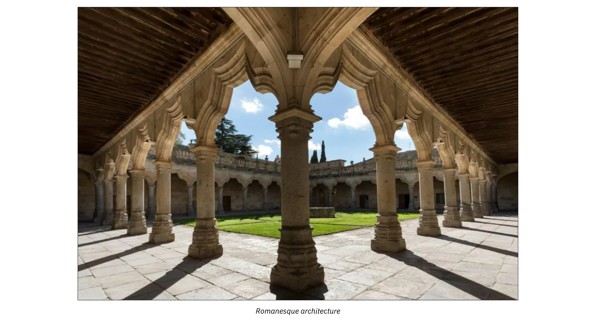

และยิ่งเราไต่ระดับขึ้นไปในมาตราส่วนของสิ่งมีชีวิต จากแร่ธาตุถึงมนุษย์ พระเจ้าก็ยิ่งมอบหมายให้สิ่งมีชีวิตของพระองค์มีอำนาจในการกระทำด้วยตนเองมากขึ้น พระองค์มอบความไว้วางใจให้มนุษย์มีเสรีภาพในการปกครองตนเองและปกครองโลกด้วยเหตุผลของเขา ตามคุณธรรมแห่งความรอบคอบ

ดังนั้น นักบุญโทมัสเขียนไว้ (_Summa contra Gentiles_, III, 69 และ 122):

> การพรากจากความสมบูรณ์แบบของสิ่งมีชีวิตคือการลดทอนความสมบูรณ์แบบของพลังอำนาจศักดิ์สิทธิ์ (...) พระเจ้าทรงไม่พอพระทัยเราเพียงเพราะเรากระทำการที่ขัดต่อความดีของเราเอง

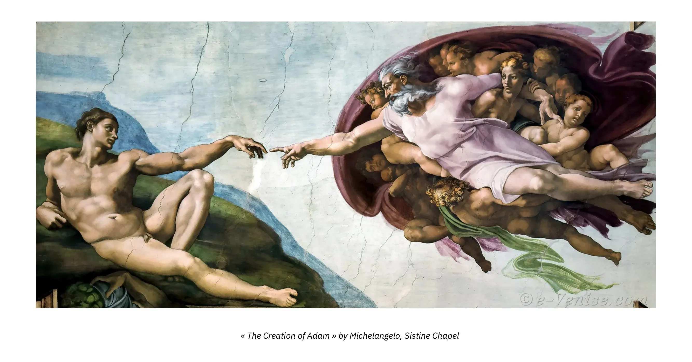

ดังนั้น พระพรหมจึงมอบวิธีการให้เราเป็นพระพรหมของตนเอง และเขาเสริมว่า:

> มนุษย์สามารถควบคุมและกำกับการกระทำของตนเองได้ ดังนั้น สิ่งมีชีวิตที่มีเหตุผลจึงมีส่วนร่วมในพระญาณของพระเจ้าไม่เพียงแค่ถูกปกครองแต่ยังปกครองด้วย

สำหรับมนุษย์ที่จะใช้เสรีภาพของเขาให้เกิดประโยชน์สูงสุด พระเจ้ามอบเครื่องมือให้เขา ซึ่งก็คือเหตุผลของเขา และคู่มือเพื่อให้ความกระจ่างแก่เขา ซึ่งก็คือกฎธรรมชาติ

กฎธรรมชาติแสดงออกในตัวเราผ่านความโน้มเอียงต่าง ๆ เช่น ความรักในความจริง การเชื่อฟังเหตุผล หรือกฎทองคำที่มีชื่อเสียง: "อย่าทำกับผู้อื่นในสิ่งที่คุณไม่ต้องการให้ทำกับคุณ" ความโน้มเอียงเหล่านี้ ตามที่เขากล่าว เป็นสิ่งที่มีมาแต่กำเนิด แท้จริงแล้ว นักบุญโทมัสเขียนว่า "ต้องพิจารณาว่าความยุติธรรมตามธรรมชาติคือสิ่งที่ธรรมชาติของมนุษย์โน้มเอียงไปสู่"

อย่างไรก็ตาม แสงสว่างภายในนี้ไม่เพียงพอที่จะกระทำได้ดี การพัฒนาบรรทัดฐานที่เป็นรูปธรรมของการกระทำและการประยุกต์ใช้กับสถานการณ์เฉพาะเป็นสิ่งจำเป็น จากนั้นจึงตกเป็นหน้าที่ของนักกฎหมายในการกำหนดบรรทัดฐานเหล่านี้ตามกฎธรรมชาติ: ซึ่งก็คือกฎหมายมนุษย์ แต่กฎธรรมชาตินั้นเหนือกว่ากฎหมายมนุษย์ และมันบังคับใช้ได้อย่างสากล รวมถึงกับเจ้าชายด้วย

ตามที่นักบุญโทมัส:

> ผ่านความรู้ของกฎธรรมชาติ มนุษย์เข้าถึงระเบียบทั่วไปของเหตุผลโดยตรง ก่อนและเหนือกว่าระเบียบทางการเมืองที่เขาเป็นสมาชิกในฐานะพลเมืองของสังคมเฉพาะเจาะจง
> ดังนั้น จึงมีสิทธิก่อนการก่อตั้งรัฐ ชุดของหลักการทั่วไปที่เหตุผลสามารถอธิบายได้โดยการศึกษาธรรมชาติของมนุษย์ตามที่พระเจ้าทรงสร้างขึ้น สิทธินี้บังคับใช้กับกษัตริย์ ต่ออำนาจ ซึ่งต้องเคารพมัน และกฎหมายที่ตราขึ้นโดยอำนาจทางการเมืองจะมีผลผูกพันก็ต่อเมื่อสอดคล้องกับกฎธรรมชาติเท่านั้น

## เหตุผลและศรัทธา: การแข่งขันที่เปิดกว้าง

<chapterId>ca379c2e-57cb-541d-8ddb-4b925032a779</chapterId>

:::video id=49baeb92-3504-45a0-8e51-fab8ddceb1f2:::

ในยุคกลาง เหตุผลและศรัทธาแข่งขันกันเพื่อเข้าถึงความจริง ตามหลังอาเบลาร์ดและอัลเบิร์ตผู้ยิ่งใหญ่ โทมัส อไควนัส ในศตวรรษที่ 13 เลือกที่จะปกป้องความเป็นอิสระของเหตุผลในความสัมพันธ์กับศรัทธา

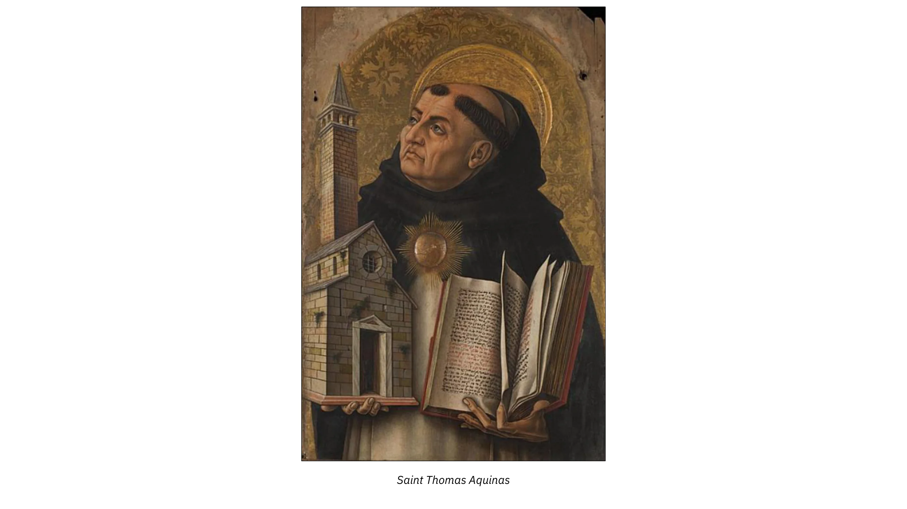

เขายืมแนวคิดจากอริสโตเติลเกี่ยวกับระเบียบธรรมชาติที่เป็นอิสระ ซึ่งไม่ขึ้นอยู่กับระเบียบแห่งสวรรค์ ระเบียบเหนือธรรมชาติย่อมอยู่เหนือระเบียบธรรมชาติ แต่มีอยู่แยกต่างหากและมาก่อน ดังนั้น สำหรับเขา มีสองวิธีในการเข้าถึงความจริงเกี่ยวกับโลกและโดยเฉพาะเกี่ยวกับพระเจ้า:

- ในอีกด้านหนึ่ง **เหตุผล** ซึ่งเริ่มต้นจากธรรมชาติ จากประสบการณ์ที่รับรู้ได้ ซึ่งพัฒนาแนวคิดและไปถึงความแน่นอนทางเหตุผลผ่านการใช้เหตุผลของมันเอง
- ในทางกลับกัน **ศรัทธา** ซึ่งเริ่มต้นจากการเปิดเผย นั่นคือ ข้อความศักดิ์สิทธิ์ที่ได้รับแรงบันดาลใจจากพระเจ้า วิธีการนี้ตรงกันข้าม มันไม่ใช่ความเป็นจริงหรือคุณลักษณะของมนุษย์ (ความคิด) ที่นำไปสู่ความแน่นอน แต่เป็นความจริงที่มาจากเบื้องบนโดยพระเจ้าที่จะอธิบายความเป็นจริง

จะปรองดองทั้งสองได้อย่างไร? ในยุคกลาง มีสองประเพณีที่เกิดขึ้นเพื่ออธิบายความสัมพันธ์ระหว่างเหตุผลและศรัทธา: ลัทธิความลึกลับและเหตุผลนิยมทางศาสนา

### การแข่งขันระหว่างลัทธิความลึกลับและเหตุผลนิยมทางศาสนา

ลัทธิความลึกลับประกอบด้วยการแยกเหตุผลออกจากศรัทธา ศรัทธาเป็นสิ่งสัมบูรณ์ เกินกว่าเหตุผล และไม่ควรถูกนำไปเปรียบเทียบกับเหตุผล หากมันขัดแย้งกับเหตุผล นั่นเป็นเรื่องปกติ และการพยายามปรับความจริงที่เปิดเผยให้เข้ากับกรอบของเหตุผลถือเป็นการนอกรีต พระเจ้าอยู่เหนือเหตุผล กล่าวอีกนัยหนึ่งคือไม่มีประโยชน์ที่จะพยายามอธิบายพระองค์ ดังนั้น ปรัชญาจึงถูกมองว่าไม่ดีนัก พระเจ้าอาจจะอยู่เหนือภาษามนุษย์: พระองค์จะเป็นสิ่งที่ไม่สามารถตั้งชื่อได้ เป็นสิ่งที่แตกต่างอย่างสิ้นเชิง พระประสงค์ของพระองค์เป็นสิ่งสัมบูรณ์และตามอำเภอใจ ดังนั้น ไม่ควรพยายามทำความเข้าใจว่าทำไมพระเจ้าทำสิ่งนี้หรือสิ่งนั้น การเชื่อฟังเป็นทัศนคติเดียวที่เหมาะสม

ในศาสนาอิสลาม ยังกล่าวไว้ว่าคนไม่ควรแทนที่พระเจ้าหรือให้ภาพลักษณ์แก่พระองค์ ในโลกคริสเตียน นักปรัชญาอย่าง Meister Eckhart ได้เขียนไว้ในบทเทศนาอย่างโดดเด่นว่า "ทุกสิ่งมีเหตุผล แต่พระเจ้าไม่มีเหตุผล" สำหรับนักปรัชญาเชิงลึก ปรัชญาที่ถูกต้องเพียงอย่างเดียวคือสิ่งที่มาจากการเปิดเผยโดยตรง สิ่งใดที่ไม่ได้มาจากการเปิดเผยนั้นไม่ใช่ทั้งจริงหรือเท็จ แต่ปราศจากคุณค่าความจริงใดๆ

ตรงกันข้ามกับความคิดนี้คือความคิดที่ระบุว่าเหตุผลเท่านั้นที่ถูกต้อง และความเชื่อทั้งหมดนั้นไร้สาระ นี่คือเหตุผลนิยมแบบสัมบูรณ์ ซึ่งนำไปสู่การไม่เชื่อในพระเจ้า อย่างไรก็ตาม กระแสเช่นนี้ยังไม่เกิดขึ้นในยุคกลาง

สำหรับผู้สนับสนุนการใช้เหตุผลทางศาสนา มีความเสริมกันระหว่างเหตุผลและศรัทธา ซึ่งเป็นการแสดงถึงตำแหน่งกลาง ความจริงสามารถรู้ได้ทั้งโดยศรัทธาและโดยเหตุผล ดังนั้น สิ่งที่เป็นจริงในศรัทธาต้องเป็นจริงในเหตุผลด้วย และในทางกลับกัน ความจริงมีเพียงหนึ่งเดียว แต่สามารถเข้าถึงได้สองวิธี ดังนั้น วิทยาศาสตร์สองแขนงไม่สามารถขัดแย้งกันได้ แต่ต้องเสริมกัน: วิทยาศาสตร์ธรรมชาติหรือปรัชญา และวิทยาศาสตร์ศักดิ์สิทธิ์หรือเทววิทยา หากไม่เป็นเช่นนั้น หากมีความขัดแย้งปรากฏระหว่างเหตุผลและศรัทธา นั่นคือเหตุผลที่ไม่ดีหรือการตีความพระคัมภีร์ผิดพลาด

ดังนั้น สำหรับโทมัส อไควนัส "ศรัทธาคือการยอมรับของเหตุผลที่ถูกขับเคลื่อนโดยเจตนาในกรณีที่ไม่มีหลักฐาน" กล่าวอีกนัยหนึ่ง เหตุผลสามารถเข้าใจโลกและพระเจ้าได้อย่างมีเหตุผลจนถึงจุดหนึ่ง ที่จุดนี้จะไม่พบหลักฐานเพิ่มเติม เจตนาสามารถเลือกที่จะเชื่อ และดังนั้นจึงก้าวไปสู่ความจริงด้วยศรัทธา หรือไม่เชื่อก็ได้ แต่ศรัทธาไม่ใช่การกระโดดเข้าสู่สิ่งที่ไร้เหตุผล มันไม่ใช่การทำให้เหตุผลต้องอับอาย

นี่คือจุดยืนตรงกลาง ซึ่งพยายามประสานความเชื่อและเหตุผลเข้าด้วยกัน การใช้เหตุผลอย่างแท้จริงไม่ใช่การปฏิเสธทุกสิ่งที่เหตุผลไม่เข้าใจ แต่คือการคิดเกี่ยวกับขีดจำกัดของเหตุผล สิ่งที่เกินกว่าเหตุผลไม่จำเป็นต้องขัดแย้งกับเหตุผล คำพูดจาก Pascal ใน **_Pensées_** แสดงให้เห็นถึงแนวคิดนี้ได้เป็นอย่างดี: "สองขั้ว: การปฏิเสธเหตุผล, การยอมรับเพียงเหตุผลเท่านั้น"

### กำเนิดของมหาวิทยาลัย

ยุคกลางของคริสเตียนถูกทำเครื่องหมายไว้ในช่วงต้นศตวรรษที่ 13 ด้วยการเกิดขึ้นและความหลากหลายของมหาวิทยาลัยในตะวันตก มหาวิทยาลัยคือชุมชนของนักศึกษาและอาจารย์จากเมืองเดียวกันภายใต้การควบคุมของคริสตจักรและประกอบด้วยคณะสี่คณะตามหลักการ: ศิลปศาสตร์, เทววิทยา, กฎหมาย, และการแพทย์ เทววิทยาถูกมองว่าเป็นวิทยาศาสตร์ที่มีรูปแบบตามวิทยาศาสตร์กรีก

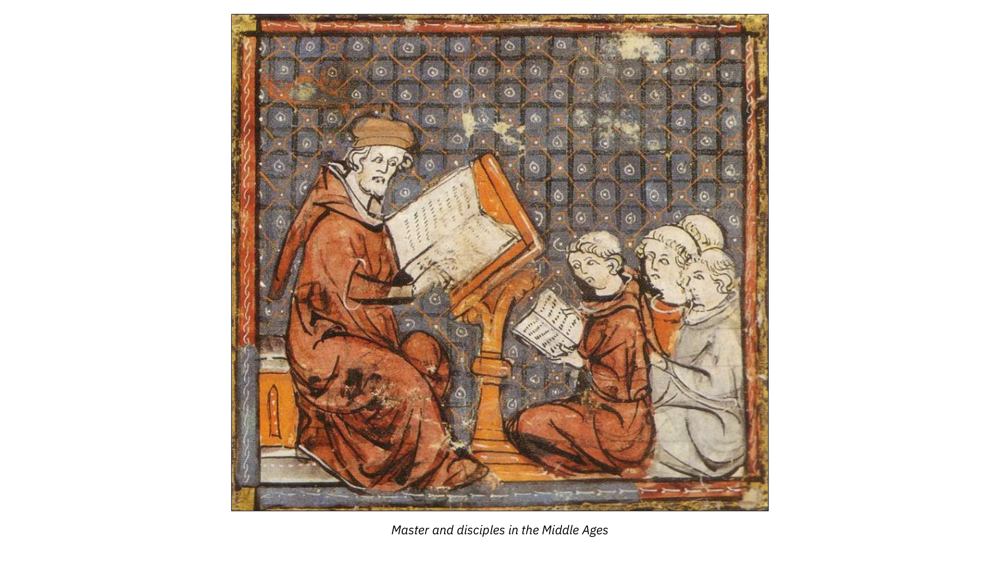

ในปี 1200 ฟิลิปป์-ออกุสต์ได้ก่อตั้งมหาวิทยาลัยปารีส ซึ่งกลายเป็นมหาวิทยาลัยที่มีชื่อเสียงที่สุดในยุโรปอย่างรวดเร็ว ในปี 1257 โรเบิร์ต เดอ ซอร์บงได้ก่อตั้งวิทยาลัยเทววิทยาที่มหาวิทยาลัยปารีส ซึ่งต่อมาจะเรียกว่าซอร์บอนน์ วิธีการสอนและการวิจัยแบบใหม่ที่เรียกว่าสกอลาสติก (จากภาษาละติน schola หมายถึง "โรงเรียน") ได้เกิดขึ้นในมหาวิทยาลัยเหล่านี้ มันเกี่ยวข้องกับ "disputatio" ซึ่งเป็นการโต้วาทีประเภทหนึ่งที่ผู้เข้าร่วมเสนอความคิดเห็นที่ขัดแย้งกันต่อหน้าผู้ฟัง มีการเสนอวิทยานิพนธ์ ตามด้วยข้อคัดค้านที่ต้องการคำตอบ เมื่อข้อโต้แย้งทั้งหมดหมดลง อาจารย์จะสรุปการโต้วาทีด้วยการแก้ปัญหาที่มีเหตุผล

ในบรรดาปรมาจารย์อริสโตเติลที่ยิ่งใหญ่ซึ่งเป็นที่รู้จักในยุคนี้ เราสามารถกล่าวถึง อัลเบิร์ตผู้ยิ่งใหญ่ (1200-1280) และ โทมัส อไควนัส (1224-1274) คนหลังนี้ โดยการสร้างเหตุผลในสิทธิของมัน ได้เน้นความเฉพาะเจาะจงและความเป็นอิสระของปัญญาทางปรัชญาในความสัมพันธ์กับเทววิทยา เช่นเดียวกับที่พระคุณตั้งอยู่บนธรรมชาติและเติมเต็มมัน ความเชื่อก็ตั้งอยู่บนเหตุผลและทำให้มันสมบูรณ์แบบ

จากนั้นเป็นต้นมา เหตุผลนิยมทางศาสนาจะมีชัยเหนือความลึกลับอย่างเด็ดขาด

## ศาสนาและการเมือง: กำเนิดรัฐอธิปไตย

<chapterId>a925ea80-9f66-5f0b-8ab0-f428ae5c12dc</chapterId>

:::video id=a0027b3b-a40e-479e-94c8-420d20404966:::

ในยุคกลาง คริสตจักรและราชวงศ์คริสเตียนได้รับมรดกแบบจำลองทางการเมืองจากจักรวรรดิโรมัน ซึ่งรู้จักกันในชื่อระบบเทวการเมือง — ระบบที่อำนาจถือว่าเป็นสิ่งศักดิ์สิทธิ์ หมายความว่าผู้นำทางการเมืองยังเป็นผู้นำทางศาสนาด้วย

นี่คือเหตุผลที่ความเป็นเอกฉันท์ทางการเมืองและศาสนามีลักษณะเฉพาะในสังคมยุคกลาง อำนาจทางการเมืองตั้งอยู่บนความชอบธรรม อำนาจ และความเป็นเอกภาพบนพื้นฐานของศรัทธาในศาสนาคริสต์ (หรือศาสนาอิสลาม) มันถือว่าตัวเองเป็นผู้พิทักษ์ความถูกต้องทางวัฒนธรรมและศาสนา และปฏิบัติต่อผู้ที่หลงทางจากความเป็นเอกฉันท์นี้ในฐานะคนนอก ในบริบทนี้ แม้ว่าความอดทนบางอย่างอาจถูกยอมรับให้กับผู้ที่แยกตัวออกจากวิสัยทัศน์ทางวัฒนธรรมร่วมกัน (เช่น ชาวยิว) แต่ก็ไม่สามารถรับรองสิทธิในการมีความหลากหลายทางความคิดให้กับพวกเขาได้ จนกระทั่งสิ้นสุดยุคกลาง ด้วยการพิชิตอเมริกา ประเด็นเรื่องเสรีภาพพลเรือนจึงกลายเป็นเรื่องสำคัญต่อคริสตจักร ก่อให้เกิดปรัชญากฎหมายใหม่ที่ยืนยันและปกป้องเสรีภาพส่วนบุคคล รับรองความหลากหลายทางความคิด และประณามการบังคับของรัฐ

### นักบุญออกัสตินและการล่อลวงทางเทวาธิปไตย

คำถามเกี่ยวกับความสัมพันธ์ระหว่างการเมืองและศาสนาเริ่มเป็นรูปเป็นร่างขึ้นจากผลงานของนักบุญออกัสตินเรื่อง _Civitas Dei_ (_The City of God_) ในงานนี้ เขาอธิบายว่าสองขอบเขตนี้อยู่ร่วมกัน:

ความรักสองประการได้สร้างเมืองสองเมือง: ความรักตนเองจนดูหมิ่นพระเจ้า, เมืองแห่งโลก; ความรักพระเจ้า, จนดูหมิ่นตนเอง, เมืองแห่งสวรรค์.

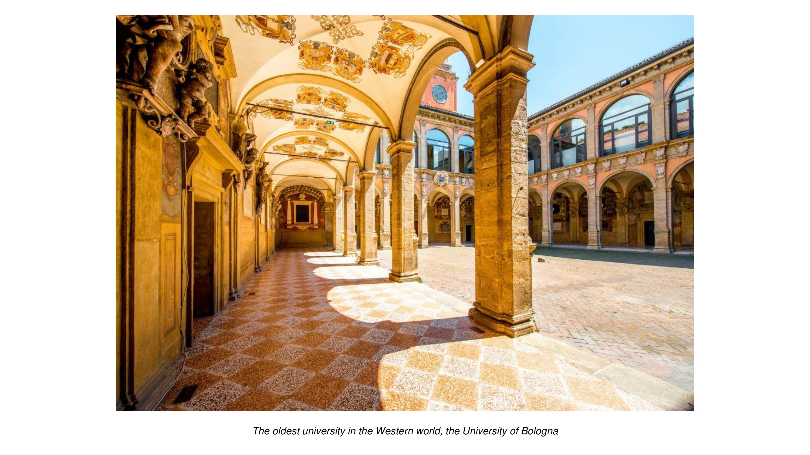

ดังนั้น เรามี:

- อำนาจทางจิตวิญญาณที่มาจากพระเจ้าถูกสถิตอยู่ในตัวพระสันตะปาปาและถูกใช้อำนาจเหนือคริสต์ศาสนาทั้งหมด (นี่คือเมืองของพระเจ้า)
- เมืองของมนุษย์ ซึ่งเป็นเมืองทางโลกและสร้างขึ้นจากอำนาจท้องถิ่นและชั่วคราว มันมีต้นกำเนิดจากบาปดั้งเดิม จากความชั่วร้าย

อย่างไรก็ตาม สำหรับออกัสติน เมืองทางโลกนี้เป็นสิ่งจำเป็น มันเป็นสิ่งสำคัญเพราะมันรับประกันความสงบสุข ดังนั้น การอยู่ร่วมกับศาสนาต้องได้รับการจัดการอย่างดี และอำนาจทางจิตวิญญาณควรมีอิทธิพลเหนืออำนาจทางโลกเพื่อควบคุมมัน อย่างไรก็ตาม ไม่ควรมีการแยกตัวอย่างรุนแรงหรือความขัดแย้งที่เปิดเผย แต่ทั้งสองหน่วยงานควรทำงานร่วมกัน นักประวัติศาสตร์ได้เรียกหลักคำสอนนี้ว่า Augustinianism ทางการเมือง

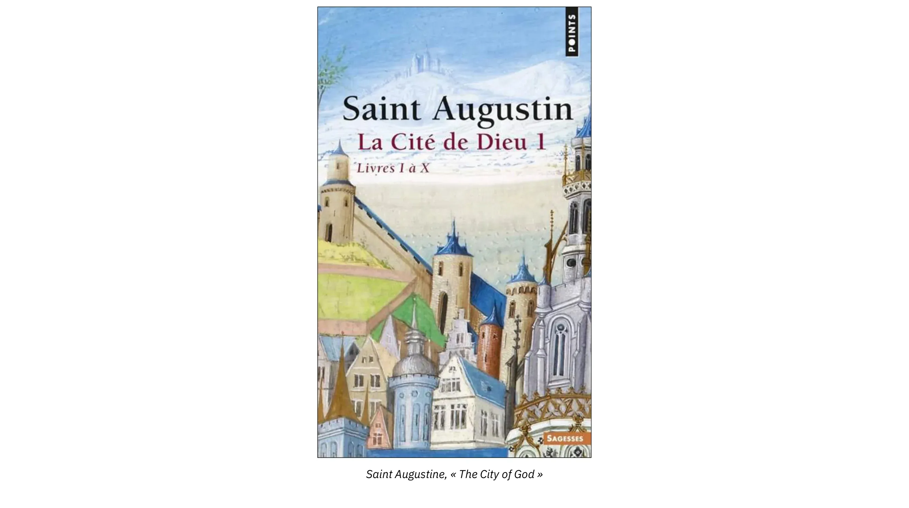

### การแข่งขันระหว่างอำนาจทางโลกและอำนาจทางจิตวิญญาณ

อย่างไรก็ตาม ทั้งพระสันตะปาปาและกษัตริย์ต่างไม่พอใจกับพันธมิตรนี้ ศาสนจักรพยายามที่จะยืนยันอำนาจของตนเหนืออำนาจทางการเมือง ในขณะที่อำนาจทางการเมืองพยายามที่จะปลดปล่อยตนเองเพื่อยืนยันอธิปไตยของตน

ดังนั้น คริสตจักรในส่วนของตนจะพัฒนากฎหมายและศาลของตนและจะยืนยันว่าสันตะปาปาสามารถตัดสินข้อพิพาททางโลกได้ ในส่วนของพวกกษัตริย์จะเริ่มสร้างกลไกรัฐให้มีอำนาจมากที่สุดเท่าที่จะเป็นไปได้ พวกเขายังจะพยายามรวมศูนย์การแก้ไขข้อขัดแย้งทางกฎหมาย ขยายการเก็บภาษีทั่วไป พัฒนาการบริหารดินแดน และระดมกองทัพ ซึ่งเป็นการวางรากฐานสำหรับรัฐสมัยใหม่

ในความเป็นจริง การแข่งขันระหว่างมหาอำนาจนำไปสู่ความขัดแย้งมากมาย เจ้าชายหรือพระสันตะปาปาแต่ละองค์มักพยายามที่จะมีคำสุดท้ายและโน้มน้าวผู้อื่นว่าเขาถืออำนาจสูงสุดเป็นทางเลือกสุดท้าย ดังนั้น พระสันตะปาปาเกรกอรีที่ 7 จึงประกาศว่า:

> พระสันตะปาปาเป็นชายเพียงคนเดียวที่เจ้าชายทุกคนต้องจูบเท้า

ในส่วนของเขา นักบุญหลุยส์ไม่ลังเลที่จะต่อต้านสมเด็จพระสันตะปาปาอินโนเซนต์ที่ 4 ผู้ซึ่งได้ขับไล่และปลดจักรพรรดิฟรีดริชที่ 2 ออกจากตำแหน่ง ทำให้เขาสูญเสียความน่าเชื่อถือในหมู่ประชาชนของเขา หลานชายของเขา ฟิลิปที่งาม ก็จะทำเช่นเดียวกัน

การล่อลวงแบบเทวาธิปไตยของคริสตจักรยังขัดแย้งกับทฤษฎี "สิทธิ์อันศักดิ์สิทธิ์" อีกด้วย หากกษัตริย์แห่งฝรั่งเศสประกาศตนเป็นพระมหากษัตริย์โดย "สิทธิ์อันศักดิ์สิทธิ์" นั่นก็เพื่อหลีกหนีจากการควบคุมของพระสันตะปาปาและดึงอำนาจของตนโดยตรงจากพระเจ้า โดยไม่ต้องรับคำสั่งจากนักบวช

## จริยธรรมในพระคัมภีร์: คุณค่าศักดิ์สิทธิ์ของปัจเจกบุคคล

<chapterId>7a27494d-8481-52ea-a551-e430bdb5315f</chapterId>

:::video id=3d55d74e-195e-48f7-86ef-b4ceeb4ba77e:::

ความคิดโบราณทำให้มนุษย์อยู่ใต้จักรวาลศักดิ์สิทธิ์ นั่นคือ จักรวาลที่สมบูรณ์แบบซึ่งมนุษย์เป็นเพียงส่วนหนึ่งเท่านั้น ในทางตรงกันข้าม เอกเทวนิยมยืนยันถึงคุณค่าที่เหนือกว่าของมนุษย์เหนือธรรมชาติ เนื่องจากมนุษย์ถูกสร้างขึ้นตามภาพลักษณ์ของพระเจ้า จุดสำคัญนี้เป็นจุดเริ่มต้นของการปฏิวัติทางจริยธรรมที่แท้จริง พระคัมภีร์ยืนยันถึงคุณค่าศักดิ์สิทธิ์และไม่มีที่สิ้นสุดของมนุษย์แต่ละคน

นี่คือเหตุผลที่จริยธรรมตามพระคัมภีร์เปลี่ยนแปลงความสัมพันธ์ของเรากับความชั่วร้าย มันนำมาซึ่งความไวต่อความทุกข์ทรมานของมนุษย์อย่างเฉียบพลันและไม่เคยมีมาก่อน ดังนั้นจึงกระตุ้นให้เราพิจารณาความชั่วร้ายที่มนุษยชาติเคยพบว่าสามารถทนได้อย่างสมบูรณ์ว่าเป็นสิ่งผิดปกติและไม่สามารถทนได้ โดยเฉพาะอย่างยิ่งความชั่วร้ายที่กระทำต่อผู้อื่น ผู้ที่อ่อนแอ และผู้บริสุทธิ์

### การเปลี่ยนผ่านจากจริยธรรมแบบสมมาตรไปสู่จริยธรรมแบบอสมมาตร

จริยธรรมแบบสมมาตรเกี่ยวกับการสร้างความเท่าเทียมกันอย่างเข้มงวดในความสัมพันธ์ของมนุษย์หรือการตอบแทนอย่างเข้มงวด มันปรากฏในคุณธรรมของความยุติธรรม ซึ่งเป็นคุณธรรมสูงสุดสำหรับชาวกรีก ความยุติธรรมคือการให้สิ่งที่ผู้อื่นสมควรได้รับ: ให้แต่ละคนได้รับสิ่งที่เป็นของตน—การมองเวลาเป็นวงจรนำไปสู่ความรู้สึกว่าไม่ต้องรับผิดชอบต่อความชั่วร้ายที่ผู้อื่นกระทำ มีความชั่วร้ายบนโลก แต่มีอยู่เสมอและจะมีอยู่เสมอ สิ่งนี้ต้องถูกบันทึกไว้ในบัญชีกำไรและขาดทุน และผลรวมของมันคงที่ ไม่มีอะไรที่ต้องทำ มันจะเป็นเช่นนั้นเสมอ นี่คือความเชื่อในโชคชะตาของชาวกรีกและโรมัน

จริยธรรมในพระคัมภีร์มีลักษณะไม่สมมาตร หมายความว่าต้องให้มากกว่าที่เป็นหนี้ ทุกคนรู้สึกรับผิดชอบต่อความชั่วร้าย แม้กระทั่งสิ่งที่พวกเขาไม่ได้กระทำ—จริยธรรมของการให้ จริยธรรมของการให้อภัย จริยธรรมของความเมตตา ไม่สามารถเพิกเฉยต่อความทุกข์ทรมานของผู้อื่นและต้องไม่ยอมทนต่อความทุกข์ทรมานที่ไม่มีเหตุผล แม้ว่ามันจะไม่ได้มาจากเรา ความสงบของนักปราชญ์สโตอิกที่ยอมรับชะตากรรมกลายเป็นสิ่งที่เป็นไปไม่ได้ นี่คือความหมายของอุปมาของชาวสะมาเรียใจดี ไม่มีสิ่งใดบังคับให้เขาหยุดและดูแลชายที่ถูกโจรทำร้าย จากการปฏิวัติทางจริยธรรมที่นำโดยพระคัมภีร์ มนุษยชาติทั้งหมดกลายเป็นชาวสะมาเรียใจดีในรูปแบบหนึ่ง มันถูกเชิญชวนไม่ให้ยอมทนต่อความชั่วร้ายที่กระทำต่อผู้อื่นและต่อสู้กับมัน

ยิ่งไปกว่านั้น เนื่องจากพระเจ้าเป็นผู้สร้าง เราจึงเห็นการเกิดขึ้นของแนวคิดใหม่: ความเสมอภาคของทุกคนต่อหน้าพระเจ้า ไม่มีบุคคลใดที่มีสิทธิพิเศษต่อหน้าความยิ่งใหญ่ที่เหนือกว่าของพระเจ้า และมนุษย์ทุกคนล้วนเท่าเทียมกัน

### สิทธิของชาวอินเดียนแดง

การจุติที่เป็นที่รู้จักมากที่สุดของหลักคำสอนที่เกิดขึ้นใหม่นี้คือโรงเรียนแห่งซาลามังกา ซึ่งตั้งอยู่ในประเทศสเปนในช่วงศตวรรษที่ 16 ฟรานซิสโก เด วิตอเรีย หนึ่งในตัวแทนของโรงเรียนนี้ ยืนยันว่าหากมนุษย์ทุกคนถูกสร้างขึ้นตามภาพลักษณ์ของพระเจ้า ไม่มีมนุษย์คนใดสามารถถูกประกาศว่าเป็นรองกว่าคนอื่น ไม่ว่าจะเป็นชาวยิว ทาสผิวดำ หรือชาวอินเดียนแดง

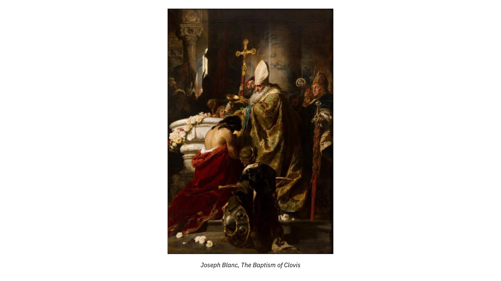

การค้นพบอเมริกาถือเป็นการช็อกทางวัฒนธรรมอย่างแท้จริง เป็นการเปิดช่องโหว่ครั้งแรกในเอกภาพทางการเมืองและศาสนาที่สืบทอดมาจากสมัยโบราณ ข้อถกเถียงที่มีชื่อเสียงเกี่ยวกับสิทธิของชาวอินเดียได้แบ่งนักเทววิทยาออกเป็นสองฝ่ายที่ตรงข้ามและไม่สามารถประนีประนอมกันได้

ในค่ายหนึ่ง มีผู้สนับสนุนแนวคิดวัฒนธรรมเอกภาพและหลักการบังคับ สำหรับพวกเขา ชาวอินเดียนแดงอาศัยอยู่นอกข้อความในพระคัมภีร์ ซึ่งอาจหมายความว่าพระเจ้าไม่ต้องการเปิดเผยพระองค์แก่พวกเขา ทำไม? มีสมมติฐานสองข้อที่สามารถพิจารณาได้: 1° พวกเขาเป็นคนบาปใหญ่ (การกินเนื้อคน), 2° พวกเขาล้าหลังและใกล้เคียงกับสัตว์มากกว่ามนุษย์ นั่นคือเหตุผลที่พวกเขามีสิทธิ์ที่จะปฏิบัติต่อพวกเขาในฐานะทาสและยึดครองดินแดนของพวกเขาด้วยกำลัง เพราะพวกเขาทั้งเป็นคนไม่เชื่อและคนป่าเถื่อน

ในค่ายตรงข้าม มีผู้สนับสนุนแนวคิดพหุนิยมและเสรีภาพพลเมือง รวมถึงนักเทววิทยาจากสำนักซาลามังกา ซึ่งเป็นศิษย์ของนักบุญโธมัส ตามที่ฟรานซิสโก เด วิตอเรีย และบาร์โทโลเม เด ลาส กาซาส กล่าวไว้ สิทธิจะต้องได้รับการยอมรับสำหรับชาวอินเดียในฐานะมนุษย์ ไม่ใช่เพราะพวกเขาได้ยึดถือหรือไม่ยึดถือศาสนาคริสต์นิกายโรมันคาทอลิก ไม่เพียงแต่พวกเขาไม่ควรถูกเปลี่ยนศาสนาด้วยกำลัง แต่ทรัพย์สินของพวกเขาก็ไม่ควรถูกยึด และพวกเขาไม่ควรถูกบังคับให้เป็นทาสในรูปแบบใด ๆ การโต้แย้งของพวกเขาขึ้นอยู่กับแนวคิดธรรมบัญญัติของโธมิสต์ ซึ่งแตกต่างจากกฎแห่งพระเจ้า

ใน _Summa Theologica_ นักบุญโทมัสได้ตั้งคำถามดังนี้: ควรเชื่อฟังเจ้าชายที่ไม่ซื่อสัตย์ซึ่งไม่เชื่อในพระเจ้าหรือไม่? และเขาตอบว่าใช่ เพราะอำนาจที่ชอบธรรมเป็นสิทธิตามธรรมชาติ และการไม่ซื่อสัตย์หรือการไม่เชื่อในพระเจ้าของเจ้าชายไม่ใช่เหตุผลสำหรับการกบฏ ระเบียบทางการเมืองเป็นระเบียบตามธรรมชาติเป็นหลัก เขายังถามต่อไปว่า: ควรทำสงครามกับผู้ที่ไม่เชื่อและบังคับให้พวกเขามีศรัทธาหรือไม่? เขาตอบว่าไม่: สงครามจะยุติธรรมก็ต่อเมื่อเป็นการป้องกันตัวเท่านั้น สุดท้าย ศรัทธาสามารถเป็นการกระทำที่เสรีเท่านั้น

นักวิชาการแห่งซาลามังกาได้นำเหตุผลนี้มาใช้กับกรณีของชนพื้นเมือง โดยโต้แย้งว่าทรัพย์สินเป็นสิทธิธรรมชาติ ดังนั้น การยึดดินแดนจากชนพื้นเมืองจึงเป็นการลักขโมย เช่นเดียวกับการกระทำต่อคริสเตียน นอกจากนี้ยังไม่อนุญาตให้ทำสงครามกับพวกเขา เนื่องจากไม่มีการรุกรานจากฝ่ายพวกเขา แต่กลับเป็นจากฝ่ายเราเอง

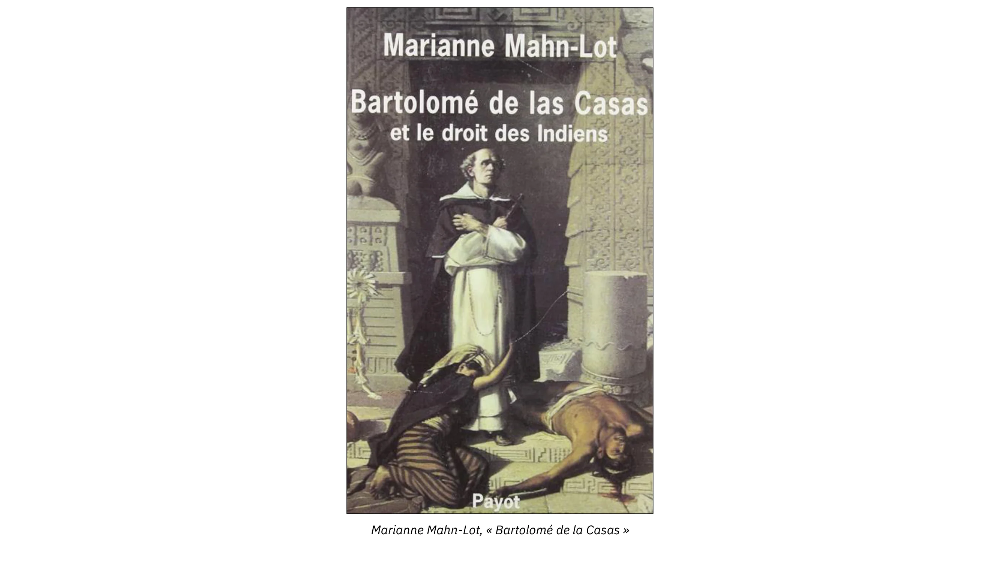

เรื่องของชนพื้นเมืองเป็นรอยร้าวแรกในเอกภาพทางการเมืองและศาสนา มันแสดงให้เห็นว่าความเป็นเอกภาพของสังคมการเมืองสามารถตั้งอยู่บนพื้นฐานอื่นที่ไม่ใช่ความเป็นเอกภาพทางศาสนาของผู้อยู่อาศัยในดินแดนเดียวกัน โดยอิงจากสายสัมพันธ์ร่วมที่หยั่งรากในธรรมชาติของมนุษย์

แนวคิดเรื่องมนุษยชาติก้าวหน้า มันถูกพิจารณาอย่างมีประสิทธิภาพว่ามีมนุษยชาติเดียวเท่านั้นที่สิทธิเสมอภาคเชื่อมโยงโดยธรรมชาติ แต่ยังคงต้องใช้เวลาในการยอมรับจากทุกคน ซึ่งจะต้องอาศัยการมีส่วนร่วมของวิทยาศาสตร์ธรรมชาติต่อแนวคิดของสปีชีส์มนุษย์

## ภาพร่างแรกของระบบทุนนิยม

<chapterId>236bdeeb-7bd3-536a-9df1-8791800bf31e</chapterId>

:::video id=ad63fa9b-569b-460d-b221-5391a4e576d2:::

เราได้เห็นแล้วว่าศาสนาคริสต์กำหนดหน้าที่ทางศีลธรรมให้กับผู้คนในการทำงานเพื่อปรับปรุงโลก พระเจ้าต้องการให้มนุษย์มีความสุข แต่ไม่ต้องการที่จะบรรลุความดีของเขาแทนเขา ดังนั้นจึงเป็นหน้าที่ของคริสเตียนที่จะต่อสู้กับความชั่วทางศีลธรรม รักเพื่อนบ้านของพวกเขา ช่วยเหลือเหยื่อ กล่าวโดยย่อคือทำงานเพื่อโลกที่ยุติธรรมและมีมนุษยธรรมมากขึ้น แล้วทุนนิยม ซึ่งก็คือเศรษฐกิจเสรีที่มีพื้นฐานจากทรัพย์สินส่วนตัวและเสรีภาพของสัญญา จะสอดคล้องกับหน้าที่ของคริสเตียนหรือไม่?

ส่วนหนึ่งของคำตอบอยู่ที่ข้อเท็จจริงที่ว่าทุนนิยมมีต้นกำเนิดในบริบททางศาสนา ก่อนการปฏิรูปศาสนาคริสต์นิกายโปรเตสแตนต์ อีกส่วนหนึ่งของคำตอบเกี่ยวข้องกับการสังเกตว่าทุนนิยมเป็นวิธีที่มีประสิทธิภาพที่สุดในการปรับปรุงสภาพวัตถุและศีลธรรมของบุคคล เศรษฐกิจเสรีเท่านั้นที่อิงตามสิทธิในทรัพย์สินและความร่วมมือโดยสมัครใจที่สามารถยกระดับผู้คนออกจากความทุกข์ยากได้อย่างยั่งยืน

มุ่งเน้นไปที่ประเด็นแรก ประเด็นที่สองจะถูกกล่าวถึงในส่วนถัดไป

### การเพิ่มขึ้นของเมืองในอิตาลี

อองรี ปิแรนน์ นักประวัติศาสตร์ชาวเบลเยียมในช่วงต้นศตวรรษที่ 20 ได้อุทิศส่วนหนึ่งของงานของเขาในการวิเคราะห์การเกิดขึ้นของระบบทุนนิยมในยุโรป ในหนังสือของเขา _History of Europe_ เขากล่าวว่า:

> คุณลักษณะที่สำคัญทั้งหมดของระบบทุนนิยม — การประกอบการส่วนบุคคล, ความก้าวหน้าของเครดิต, กำไรทางการค้า, การเก็งกำไร, ฯลฯ — มีอยู่แล้วตั้งแต่ศตวรรษที่ 12 ในรัฐนครอิตาลี เช่น เวนิส, เจนัว, หรือฟลอเรนซ์

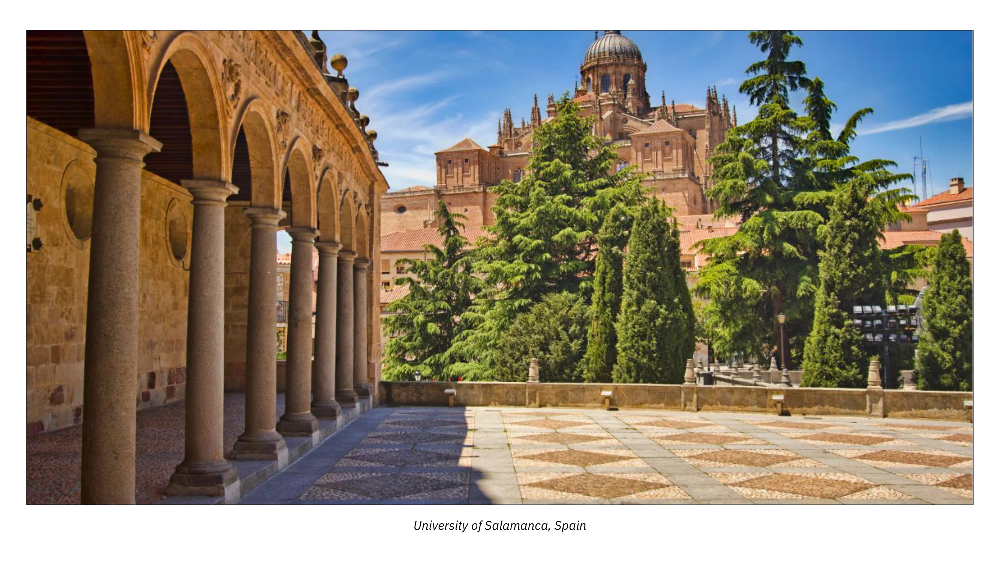

ตามที่ Pirenne กล่าว เมืองการค้าเหล่านี้ ด้วยความมีชีวิตชีวาทางการค้าและตำแหน่งยุทธศาสตร์บนเส้นทางเดินเรือ ได้พัฒนาวิธีปฏิบัติทางเศรษฐกิจที่เป็นลักษณะเฉพาะของทุนนิยมที่กำลังเกิดขึ้น เขาเน้นย้ำอย่างชัดเจนว่า:

- การเพิ่มขึ้นของกิจการส่วนบุคคล:** พ่อค้าชาวอิตาลี ซึ่งมักมาจากครอบครัวที่มั่งคั่ง ได้ลงทุนเงินทุนของพวกเขาในภารกิจการค้าระยะไกล โดยรับความเสี่ยงและคาดหวังผลกำไรที่มากมาย
- การขยายตัวของเครดิต:** การพัฒนาการค้าระหว่างประเทศกระตุ้นการใช้เครื่องมือเครดิตต่าง ๆ เช่น ตั๋วแลกเงินและการดำเนินงานของธนาคาร ซึ่งช่วยให้สามารถจัดหาเงินทุนสำหรับการทำธุรกรรมและอำนวยความสะดวกในการเคลื่อนย้ายเงินทุน
- การแสวงหากำไร:** แรงจูงใจหลักของพ่อค้าอิตาลีคือการแสวงหากำไรทางการค้า พวกเขามีส่วนร่วมในกิจการที่มีความเสี่ยง โดยหวังที่จะเพิ่มผลกำไรสูงสุดด้วยการค้าขายสินค้าที่มีค่าในตลาดที่ห่างไกล
- การเกิดขึ้นของการเก็งกำไร:** ความไม่แน่นอนที่มีอยู่ในการเดินเรือทางทะเลและความผันผวนของราคาทำให้เกิดการปฏิบัติการเก็งกำไร ซึ่งพ่อค้าจะเดิมพันกับการเปลี่ยนแปลงของราคาสินค้า

Pirenne สังเกตว่าการปฏิบัติเหล่านี้ แม้ว่าจะมีอยู่ในภูมิภาคอื่นของยุโรป แต่กลับมีการพัฒนาอย่างรวดเร็วและเข้มข้นเป็นพิเศษในรัฐนครอิตาลี เขาอธิบายปรากฏการณ์นี้ว่าเกิดจากหลายปัจจัย รวมถึงการเพิ่มขึ้นของการค้าทางทะเล อิทธิพลของสงครามครูเสด การอ่อนแอลงของโครงสร้างศักดินา และจิตวิญญาณแห่งนวัตกรรมที่เป็นลักษณะเฉพาะของเมืองการค้าเหล่านี้

### ปัญหาของเงินกู้ที่มีดอกเบี้ย

พระคัมภีร์ประณามการให้กู้ยืมเงินที่มีดอกเบี้ย ซึ่งรู้จักกันในชื่อว่าการกู้ยืมเงินโดยคิดดอกเบี้ย โดยถือว่าการให้กู้ยืมเงินที่มีดอกเบี้ยเป็นการเอารัดเอาเปรียบผู้กู้ที่อ่อนแอ อย่างไรก็ตาม ในทางปฏิบัติ คริสตจักรกลับมองข้ามปัญหานี้ไป

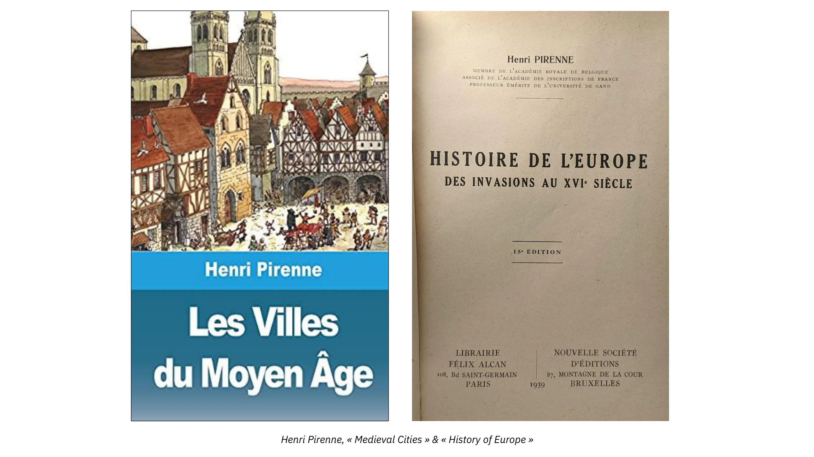

Jacques Le Goff เป็นนักประวัติศาสตร์ชาวฝรั่งเศสที่เชี่ยวชาญด้านวัฒนธรรมและจิตวิทยาของยุคกลาง ตามแนวคิดของ Pirenne เขายอมรับว่ามีเมล็ดพันธุ์ของระบบทุนนิยมตั้งแต่ยุคกลาง โดยเฉพาะในเมืองของอิตาลี ซึ่งมีการปฏิบัติเช่นการประกอบธุรกิจส่วนบุคคล การแสวงหากำไร และการใช้เครื่องมือทางเครดิตเกิดขึ้นแล้ว

Or Le Goff เน้นใน _L'usure au Moyen Âge_ (1967, พิมพ์ซ้ำในปี 1986 ภายใต้ชื่อ: _La bourse et la vie; économie et religion au moyen-age_) ว่าตั้งแต่ศตวรรษที่ 13 นักบุญอัลเบิร์ตผู้ยิ่งใหญ่ได้ทฤษฎีแนวคิดเรื่อง "ดอกเบี้ยที่ชอบธรรม" ซึ่งได้รับการพัฒนาต่อโดยนักบุญโทมัส อไควนัสหลังจากนั้น แม้จะมีข้อห้ามทางศาสนา การปฏิบัติในการให้ยืมยังคงมีอยู่และตอบสนองความต้องการทางเศรษฐกิจที่แท้จริง นานก่อนที่อดัม สมิธ พวกเขาเข้าใจว่าดอกเบี้ยจากการกู้ยืมไม่ใช่การคิดดอกเบี้ยเกินควร แต่เป็นวิธีการชดเชยให้กับผู้ให้ยืมสำหรับความเสี่ยงและผู้กู้สำหรับการลงทุน ซึ่งเป็นรากฐานของระบบทุนนิยม

อย่างไรก็ตาม ตามที่นักประวัติศาสตร์ชาวฝรั่งเศสกล่าว การเพิ่มขึ้นของระบบทุนนิยมจะต้องถูกวางไว้ในบริบทที่กว้างขึ้นของการเปลี่ยนแปลงทางเศรษฐกิจ สังคม และวัฒนธรรมที่เกิดขึ้นตลอดหลายศตวรรษ Le Goff เน้นย้ำถึงความสำคัญของการปฏิวัติการค้าในศตวรรษที่ 15 และ 16 ซึ่งมีลักษณะเด่นคือการขยายตัวของการค้าทางทะเลและการค้นพบเส้นทางการค้าใหม่ ๆ ซึ่งกระตุ้นการสะสมทุนและการครอบงำของตรรกะตลาด

### บทวิจารณ์การจัดการทางการเงิน

การศึกษากฎหมายเศรษฐกิจอย่างเป็นระบบเริ่มขึ้นในยุคกลางสูง นักเศรษฐศาสตร์กลุ่มแรกคือเทววิทยาศาสนศาสตร์ของโรงเรียนปารีส คนแรกในกลุ่มนี้ที่เขียนบทความทางวิทยาศาสตร์ที่อุทิศให้กับหัวข้อเศรษฐกิจโดยเฉพาะคือ นิโคลัส โอเรสเม (1325-1382) ประมาณปี 1360 เขาได้แต่ง _Treatise on the Origin, Nature, Law, and Alterations of Money_ ซึ่งสรุปและพัฒนาความคิดของนักวิชาการในยุคของเขา

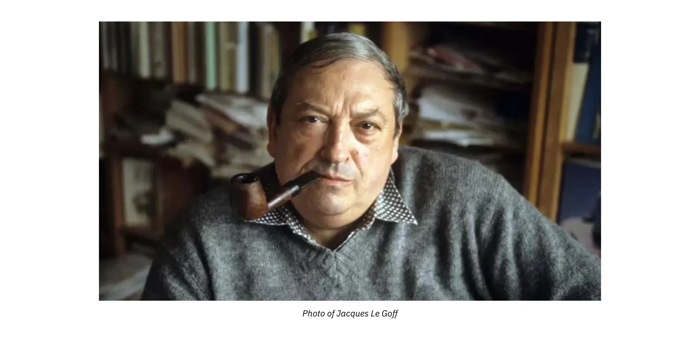

หัวใจสำคัญของการวิเคราะห์ทางการเงินของเขาคือปัญหาเรื่อง "การกลายพันธุ์" ของเงิน นั่นคือ การเปลี่ยนแปลงในเนื้อหาของโลหะในเหรียญและการกำหนดมูลค่าของมัน การเปลี่ยนแปลงเหล่านี้เกิดขึ้นตั้งแต่รุ่งอรุณของเวลาและมีการบันทึกไว้อย่างดีในสมัยโบราณและยุคกลาง ผลกระทบที่เห็นได้ชัดที่สุดคือการเปลี่ยนแปลงอำนาจการซื้อของหน่วยเงินตรา โดยเฉพาะอย่างยิ่งการลดลง นี่คือรูปแบบดั้งเดิมของเงินเฟ้อที่ Oresme ประณามอย่างชัดเจนว่าเป็นสิ่งชั่วร้าย

Oresme ยกคำถามสำคัญขึ้นมาทันที: อัตราเงินเฟ้อเป็นประโยชน์ต่อชุมชนหรือไม่? เขาตอบในเชิงลบ โดยให้เหตุผลว่าอัตราเงินเฟ้อไม่ได้ทำให้เงินมีประโยชน์มากหรือน้อยลงในการแลกเปลี่ยน เศรษฐกิจสามารถทำงานได้ดีไม่ว่าจะอยู่ในระดับราคาใดก็ตาม และดังนั้น ไม่ว่าจะมีปริมาณเงินตามนามธรรมเท่าใดก็ตาม

แต่ถ้าเป็นเช่นนั้น คำถามอีกข้อก็เกิดขึ้นอย่างชัดเจน: ทำไมการเปลี่ยนแปลงของสกุลเงินถึงมีอยู่? และโดยเฉพาะอย่างยิ่ง ทำไมต้องพยายามเพิ่มปริมาณเงิน? Oresme ตอบว่าการเปลี่ยนแปลงเหล่านี้ไม่ได้มีผลกระทบเหมือนกันสำหรับสมาชิกต่างๆ ในชุมชน พวกเขาให้ประโยชน์กับบางคนโดยเสียค่าใช้จ่ายของคนอื่น ผู้ชนะจากการเปลี่ยนแปลงสกุลเงินมีผลประโยชน์ทางวัตถุในการดำเนินการเปลี่ยนแปลงเหล่านี้ โดยทั่วไปแล้ว ผู้ชนะเหล่านี้คือผู้มีอำนาจ Oresme เขียนว่า:

> เหตุผลหลักและเหตุผลสูงสุดที่เจ้าชายต้องการยึดอำนาจในการเปลี่ยนแปลงสกุลเงินคือผลกำไรหรือผลประโยชน์ที่เขาสามารถได้รับจากมัน มิฉะนั้นแล้ว การที่เขาจะทำการเปลี่ยนแปลงมากมายและสำคัญเช่นนี้ก็จะไม่มีเหตุผลใดๆ

จากนั้นเขาเพิ่มรายละเอียดเหล่านี้:

> ไม่ว่าประโยชน์ใดที่เจ้าชายได้รับจากสิ่งนั้น มันย่อมเป็นค่าใช้จ่ายของชุมชนเสมอ ตอนนี้ ไม่ว่าเจ้าชายจะทำอะไรที่เป็นค่าใช้จ่ายของชุมชน นั่นคือความอยุติธรรมและการกระทำ ไม่ใช่ของกษัตริย์ แต่ของทรราช ดังที่อริสโตเติลกล่าวไว้ (...) หากเจ้าชายสามารถเปลี่ยนแปลงสกุลเงินอย่างง่าย ๆ ได้อย่างถูกต้องและได้รับประโยชน์จากมัน เขาก็สามารถเปลี่ยนแปลงที่ใหญ่ขึ้นและได้รับประโยชน์มากขึ้นด้วยเหตุผลเดียวกัน (...) ดังนั้น เจ้าชายอาจดึงดูดเงินหรือความมั่งคั่งเกือบทั้งหมดของประชาชนมาให้ตนเองและลดพวกเขาให้เป็นทาส ซึ่งจะเป็นการพิสูจน์ทรราชอย่างเต็มที่และแม้กระทั่งทรราชที่แท้จริงและสมบูรณ์ ดังที่ปรากฏจากนักปรัชญาและเรื่องราวของคนโบราณ

Oresme เน้นย้ำว่าการเปลี่ยนแปลงสกุลเงินไม่ใช่เพียงแค่เกมการกระจายใหม่เพื่อประโยชน์ของอำนาจที่เสียเปรียบต่อส่วนที่เหลือของชุมชนเท่านั้น แต่ยังนำไปสู่การสูญเสียโดยรวม — เกมนี้เป็นเกมที่มีผลรวมติดลบ สกุลเงินที่ถูกเปลี่ยนแปลงบ่อยครั้งจะทำให้การค้าเสียหายและเชิญชวนให้ผู้ปลอมแปลงใช้ประโยชน์จากความสับสนทั่วไป

ยิ่งไปกว่านั้น หากมีสกุลเงินสองสกุลที่ได้รับประโยชน์จากการเป็นเงินที่ชำระหนี้ได้ตามกฎหมาย ผู้คนจะสะสมสกุลเงินที่มีมูลค่ามากกว่าไว้ ทำให้เหลือเพียงสกุลเงินที่ด้อยกว่าในระบบหมุนเวียน (Oresme ได้คาดการณ์ถึง "กฎของเกรแชม" ที่มีชื่อเสียง: เงินที่ไม่ดีจะขับไล่เงินที่ดีออกไปในระบบที่ชำระหนี้ได้ตามกฎหมาย) เขาสรุปว่าการบิดเบือนค่าเงินนั้นแย่กว่าการคิดดอกเบี้ยเกินควร และอาจเป็นสาเหตุสำคัญของการล่มสลายของจักรวรรดิโรมัน ดังที่เราได้เห็นมาก่อนหน้านี้

# การเพิ่มขึ้นของเสรีภาพ: จากยุคฟื้นฟูศิลปวิทยาการสู่ยุคแห่งการรู้แจ้ง

<partId>58793f94-f217-530a-a877-b5b6df70a5fe</partId>

## คำวิงวอนเพื่อความอดทนทางศาสนา

<chapterId>c4c9a729-4a0f-5814-8e32-9aff4d373018</chapterId>

:::video id=e6a4005f-e732-48df-961a-d701ef4a777f:::

ตั้งแต่ยุคฟื้นฟูศิลปวิทยา ยุโรปต้องเผชิญกับสงครามศาสนา ความอดทนอดกลั้นจึงกลายเป็นหนึ่งในสมรภูมิสำคัญของยุคแห่งการตรัสรู้

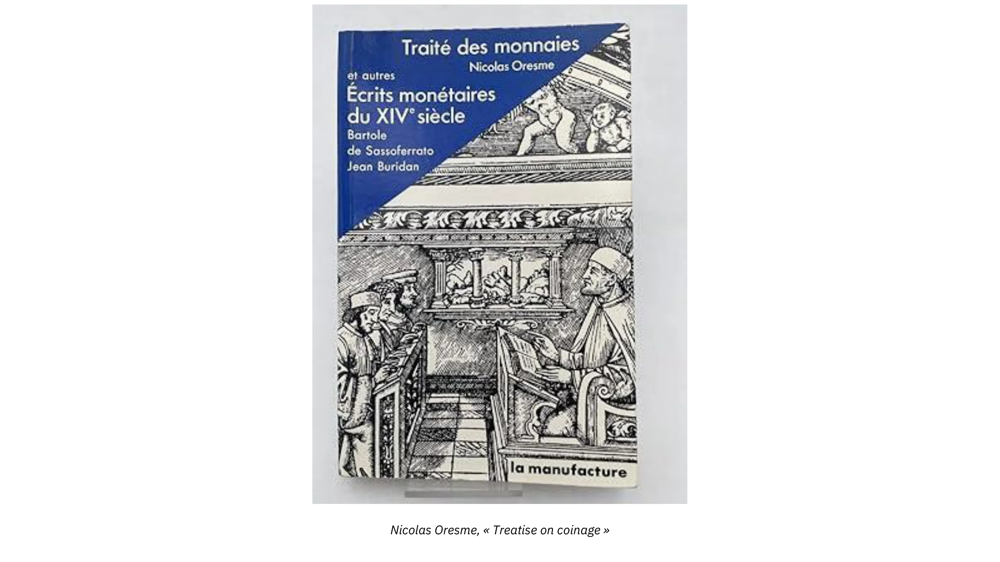

สำหรับบางคน วิธีการทางวิทยาศาสตร์จะรวมผู้คนให้พ้นจากอคติด้วยมุมมองร่วมกันของโลก การดึงดูดสากลไม่เหมือนกันสำหรับคาทอลิก โปรเตสแตนต์ ชาวยิว หรือผู้ไม่เชื่อในพระเจ้าหรือ? ดังนั้น Encyclopédie โดย Diderot และ d’Alembert จึงเป็นความพยายามที่จะส่งเสริมความรู้สากลที่สามารถรวมผู้คนได้

โวลแตร์คิดเช่นเดียวกันเกี่ยวกับการค้า มันสามารถสร้างความอดทนได้ดีกว่าสถาบันการเมืองใด ๆ

### กำไรในฐานะ "ศาสนาที่สงบสุข"

สำหรับโวลแตร์ ความผิดพลาดของมนุษย์เป็นหลักสำคัญที่ก่อให้เกิดหลักคำสอนเรื่องความอดทนและเสรีภาพทางการเมือง เขาเขียนไว้ใน _Philosophical Dictionary_ (1764):

> ความอดทนเป็นผลที่จำเป็นจากการที่เราตระหนักถึงความผิดพลาดของเรา การทำผิดเป็นเรื่องของมนุษย์ และเราทุกคนทำผิดพลาดอยู่เสมอ ให้เราให้อภัยซึ่งกันและกันในความผิดพลาดของเรา นี่คือกฎข้อแรกของธรรมชาติ

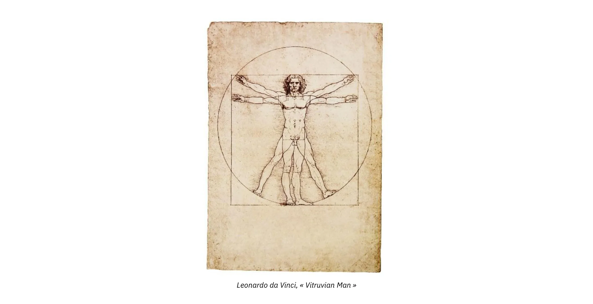

แต่ใน _Philosophical Letters_ (1734) ของเขา, Voltaire เสนอทัศนะอีกแบบหนึ่ง เขาสังเกตว่าในอังกฤษ การค้าขายส่งเสริมความอดทนทางศาสนา ซึ่งเป็นองค์ประกอบสำคัญของสันติภาพในสังคมและดังนั้นความสุข เขาเขียนจดหมายเหล่านี้เพื่อวิจารณ์สงครามศาสนาในฝรั่งเศส ซึ่งถูกกระตุ้นโดยอำนาจทางการเมืองที่เด็ดขาดและล่วงล้ำ นี่เป็นการวิจารณ์แบบรุนแรงครั้งแรกของ Ancien Régime

สิ่งที่ประกอบขึ้นเป็นความสุขของบุคคลหรือชาติ สำหรับโวลแตร์ คือระบอบที่ผู้คนอยู่ร่วมกันอย่างสงบสุข ในความสะดวกสบายทางวัตถุบางประการ นั่นคือเหตุผลที่สังคมยิ่งมีเสรีภาพและความสุขมากขึ้นเมื่อก่อตั้งขึ้นบนการค้าขายในแง่ของการแลกเปลี่ยนทางเศรษฐกิจ

สามประเด็นที่ควรพิจารณาตามที่โวลแตร์กล่าวไว้:

1. ความสุขของชาติจำเป็นต้องมีชีวิตวัตถุที่ง่ายซึ่งส่งเสริมศิลปะ

2. ความหรูหราและการค้าเป็นหลักประกันของเสรีภาพ

3. สุดท้าย การค้าขายมีประโยชน์เพราะมันส่งเสริมความสัมพันธ์ที่มีอารยธรรมและดังนั้นจึงเป็นความสัมพันธ์ที่สงบสุขระหว่างผู้คน

ยิ่งการค้าถูกให้คุณค่ามากเท่าไร อคติก็ยิ่งจางหายไปเมื่อเผชิญกับผลประโยชน์ทางเศรษฐกิจ แม้จะมีความแตกต่างทางศาสนา แต่ผู้ที่ทำการค้าทุกคนล้วนมีวัตถุประสงค์เดียวกันที่เป็นศูนย์กลางของความกังวล: กำไร การแสวงหากำไรร่วมกันนำไปสู่ความร่วมมือและความเคารพต่อความคิดเห็นของผู้อื่น โดยเฉพาะความเชื่อทางศาสนาของพวกเขา

ใน _จดหมายฉบับที่หก_, _"ว่าด้วยพวกเพรสไบทีเรียน"_, โวลแตร์ยกตัวอย่างของตลาดหุ้นลอนดอน Exchange ในจุดสูงสุดของการค้าระหว่างประเทศนี้ "ชาวยิว ชาวมุสลิม และชาวคริสต์" ทำธุรกิจร่วมกัน "ราวกับว่าพวกเขาเป็นศาสนาเดียวกัน" พวกเขาสงวน "ชื่อของผู้ไม่เชื่อถือศาสนาไว้สำหรับผู้ที่ล้มละลาย"

ข้อความนี้ควรค่าแก่การอ้างอิงทั้งหมดเพราะมีชื่อเสียงมาก:

> เข้าสู่ตลาดหลักทรัพย์ลอนดอน Exchange สถานที่ที่มีเกียรติมากกว่าศาลหลายแห่ง; ที่นั่นคุณจะเห็นผู้แทนจากทุกชาติที่มารวมตัวกันเพื่อประโยชน์ของมนุษยชาติ ที่นั่น ชาวยิว ชาวมุสลิม และชาวคริสเตียนทำการค้ากันราวกับว่าพวกเขานับถือศาสนาเดียวกัน และเรียกเฉพาะผู้ที่ล้มละลายว่าเป็นคนนอกรีต; ที่นั่น ชาวเพรสไบทีเรียนไว้วางใจชาวแอนนาแบปทิสต์ และชาวแองกลิกันยอมรับคำสัญญาของชาวเควกเกอร์ หลังจากออกจากการประชุมที่สงบสุขและเสรีเหล่านี้ บางคนไปที่ธรรมศาลา บางคนไปดื่ม; บางคนไปรับบัพติศมาในอ่างขนาดใหญ่ในนามของพระบิดาโดยพระบุตรในพระวิญญาณบริสุทธิ์; อีกคนหนึ่งให้ตัดหนังหุ้มปลายของลูกชายและพึมพำคำภาษาฮีบรูเหนือเด็กที่เขาไม่เข้าใจ; คนอื่นๆ ไปที่โบสถ์ของพวกเขาเพื่อรอแรงบันดาลใจจากพระเจ้า โดยสวมหมวกไว้บนศีรษะ และทุกคนก็พอใจ

ดังนั้น การพาณิชย์จึงรวมผู้คนเข้าด้วยกันภายใต้ "ศาสนาเดียวกัน" คือ กำไร และมันช่วยให้บุคคลมองข้ามความแตกต่างทางศาสนาหรือชนชั้น ซึ่งเป็นต้นเหตุของความขัดแย้ง ในอังกฤษ กำไรจึงเป็นศาสนาแห่งสันติภาพ แต่ในฝรั่งเศสล่ะ?

ใน _จดหมายฉบับที่สิบ_, "ว่าด้วยการค้า", โวลแตร์ได้อธิบายถึงทัศนคติของชาวฝรั่งเศสว่า: "พ่อค้ามักได้ยินอาชีพของตนถูกพูดถึงด้วยความดูถูก จนถึงจุดที่เขาโง่พอที่จะรู้สึกอับอายกับมัน" ในทางตรงกันข้าม ในอังกฤษ พ่อค้ารู้สึก "ภาคภูมิใจอย่างยุติธรรม" และเปรียบตนเอง "ไม่ใช่โดยไม่มีเหตุผลบางประการ, กับพลเมืองโรมัน" โวลแตร์ยกย่องชนชั้นกลางของอังกฤษ การค้าของพวกเขา และสังคมที่สงบสุขของพวกเขา

### ความจริงต้องการเสรีภาพ

อย่างไรก็ตาม ฝรั่งเศสไม่ได้ขาดแคลนผู้มีความคิดอันยิ่งใหญ่ เป็นที่รู้จักกันน้อยว่า Anne Robert Jacques Turgot, Baron de Laulne เป็นนักคิดชั้นนำก่อนที่จะกลายเป็นผู้ควบคุมการเงินภายใต้พระเจ้าหลุยส์ที่ 16 เขาเป็นผู้เขียนบทความที่ยอดเยี่ยมเกี่ยวกับเศรษฐศาสตร์การเมือง _Reflections on the Formation and Distribution of Wealth_ (1766) ซึ่งมาก่อน _The Wealth of Nations_ (1776) ของ Adam Smith

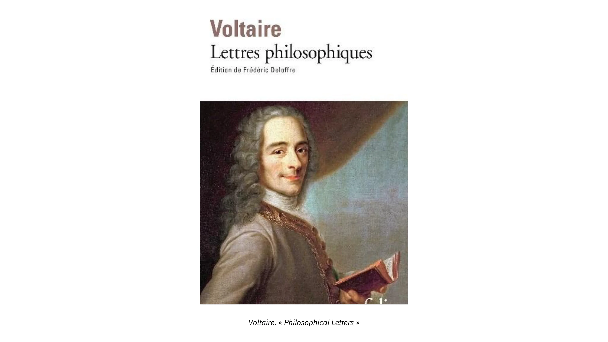

งานเขียนในช่วงแรกของเขาสะท้อนถึงความมุ่งมั่นต่อปรัชญาแห่งการรู้แจ้ง ในปี 1754 เขาได้ตีพิมพ์ _Letters on Civil Tolerance_ และในปี 1757 บทความหลายชิ้นที่เขียนสำหรับ _The Encyclopédie_ โดย Diderot และ d'Alembert

ในจดหมายของเขา Turgot นำเสนอคำจำกัดความของความอดทน การอดทนหมายถึงการปฏิเสธที่จะใช้ความรุนแรงต่อความผิดพลาด กล่าวอีกนัยหนึ่ง ความอดทนไม่ใช่การยอมรับความผิดพลาด เราสามารถต่อสู้กับมันได้ แต่ด้วยอาวุธของการโน้มน้าวใจและเหตุผล ไม่ใช่ด้วยความรุนแรง

ต่อมา ตูร์โกต์พยายามให้หลุยส์ที่ 16 ลบวลี: "ข้าพเจ้าสาบานว่าจะปราบปรามพวกนอกรีต" ออกจากคำสาบานที่กล่าวในวันราชาภิเษก ใน _บันทึกถึงกษัตริย์ว่าด้วยความอดทน_ (1775) เขาเขียนว่า:

> ผู้ปกป้องความไม่อดทนจะกล่าวหรือไม่ว่าเจ้าชายมีสิทธิ์ที่จะสั่งการเมื่อศาสนาของเขาเป็นความจริงและเราต้องเชื่อฟังเขา? ไม่ แม้ในกรณีนั้นก็ไม่สามารถและไม่ควรเชื่อฟังเขา; เพราะถ้าต้องปฏิบัติตามศาสนาที่เขากำหนด มันไม่ใช่เพราะเขาสั่ง แต่มันเป็นเพราะมันเป็นความจริง; และมันไม่ใช่ และไม่สามารถเป็นเพราะเจ้าชายกำหนดว่ามันเป็นความจริง ไม่มีใครโง่พอที่จะเชื่อว่าศาสนาเป็นความจริงด้วยเหตุผลเช่นนั้น ดังนั้น ผู้ที่ยอมรับมันด้วยความสุจริตใจไม่ได้เชื่อฟังเจ้าชาย เขาเชื่อฟังเพียงมโนธรรมของเขา; และคำสั่งของเจ้าชายไม่ได้เพิ่มน้ำหนักให้กับภาระผูกพันที่มโนธรรมนี้กำหนดไว้กับเขา ไม่ว่าเจ้าชายจะเชื่อหรือไม่เชื่อในศาสนา ไม่ว่าเขาจะสั่งหรือไม่สั่งให้ปฏิบัติตาม มันก็ไม่มากหรือน้อยไปกว่าที่มันเป็น ความจริงหรือเท็จ ความคิดเห็นของเจ้าชายจึงไม่เกี่ยวข้องกับความจริงของศาสนา และดังนั้นกับภาระผูกพันที่จะปฏิบัติตาม: เจ้าชาย ดังนั้น ในฐานะเจ้าชาย ไม่มีสิทธิ์ที่จะตัดสิน ไม่มีสิทธิ์ที่จะสั่งการในเรื่องนี้; ความไร้ความสามารถของเขาเป็นสิ่งที่สมบูรณ์ในเรื่องของคำสั่งนี้ ซึ่งไม่อยู่ในขอบเขตของเขา และที่ซึ่งมโนธรรมของแต่ละบุคคลสามารถและต้องมีเพียงพระเจ้าเป็นผู้ตัดสินเพียงผู้เดียว

กล่าวอีกนัยหนึ่ง การมีความอดทนไม่ได้หมายถึงการเป็นศัตรูกับศาสนา แต่หมายถึงการพิจารณาว่าความเชื่อทางศาสนาไม่อยู่ภายใต้อำนาจทางการเมือง แต่เป็นเรื่องของมโนธรรมของแต่ละบุคคล ความจริงต้องการเสรีภาพ; มันต้องไม่ถูกบังคับ มิฉะนั้นจะเสี่ยงต่อการถูกบิดเบือน

- แนวคิดควรได้รับการแลกเปลี่ยน เช่นเดียวกับสินค้า

## คำร้องขอเสรีภาพทางเศรษฐกิจ

<chapterId>23fbb745-4fd1-5322-8fba-3ff2e998c7e2</chapterId>

:::video id=bede59ca-934d-4120-b023-1b7d1d112ad7:::

ลัทธิเสรีนิยมทางเศรษฐกิจมักเกี่ยวข้องกับประเพณีแองโกล-แซกซอน ซึ่งมีต้นกำเนิดจากอดัม สมิธ มันถูกเปรียบเทียบกับ "ลัทธิเสรีนิยมทางการเมือง" ซึ่งกล่าวกันว่ามีต้นกำเนิดจากการตรัสรู้ในทวีปยุโรป โดยเฉพาะในฝรั่งเศส มุมมองนี้ไม่ถูกต้อง

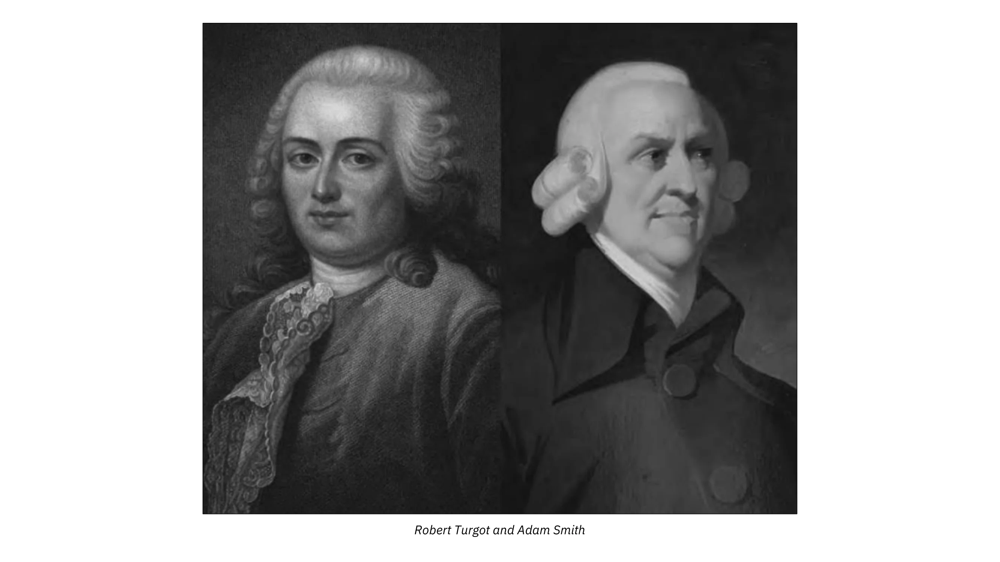

มันเป็นการตอบสนองต่อระบบพาณิชย์นิยมและในวงกว้างกว่านั้น ต่อแนวคิดของระบอบ Ancien Régime ที่วิทยาศาสตร์เศรษฐกิจได้เกิดขึ้นในฝรั่งเศส ด้วยยุคแห่งการรู้แจ้งมาถึงช่วงเวลาที่นักปรัชญาเริ่มเรียกตัวเองว่า "นักเศรษฐศาสตร์" ซึ่งก็คือกลุ่มฟิสิโอแครต

พวกเขาได้วางรากฐานของเศรษฐศาสตร์เสรี ตัวแทนหลักของสำนักฟิสิโอแครตได้แก่ François Quesnay, Marquis de Mirabeau, Lemercier de la Rivière, Abbé Nicolas Baudeau, Louis-Paul Abeille, และ Pierre-Samuel Dupont de Nemours.

> เศรษฐศาสตร์การเมือง, Dupont de Nemours สรุปว่า, เป็นวิทยาศาสตร์ของกฎธรรมชาติที่ประยุกต์ใช้กับสังคมที่เจริญแล้ว (_Correspondence with J.-B. Say_)

พวกเขาสนับสนุน "Laissez-faire" ซึ่งแนะนำว่ารัฐไม่ควรแทรกแซงในเศรษฐกิจ

จากจุดนี้ แนวคิดที่แตกต่างกันอย่างมากสองแนวคิดเริ่มปรากฏขึ้นภายในยุคแห่งการตรัสรู้:

- ในอีกด้านหนึ่ง บางคนเชื่อว่าความกลมเกลียวทางสังคมนี้ต้องถูกสร้างขึ้นอย่างเทียมและผ่านการบังคับของรัฐ; เหล่านี้คือทฤษฎีของสัญญา

ในทางกลับกัน บางคนเชื่อว่าการบริหารจัดการสามารถบรรลุได้ผ่านผลประโยชน์ หมายถึงการอนุญาตให้ผลประโยชน์ส่วนบุคคลประสานกันภายในกรอบของกฎเกณฑ์ที่เป็นที่รู้จักและยอมรับโดยทุกคน; เหล่านี้คือทฤษฎีตลาด

### ต่อต้านโคลแบร์ทิสม์

วลีนี้ปรากฏขึ้นเมื่อฌอง-บาติสต์ โคลแบร์ ที่ปรึกษาหลักของพระเจ้าหลุยส์ที่ 14 ถามพ่อค้าคนหนึ่งในวันหนึ่งว่า: "ฉันจะทำอะไรให้คุณได้บ้าง?" หนึ่งในนั้นชื่อฟรองซัวส์ เลอเจนเดร ตอบว่า "ปล่อยให้เราทำเอง!"

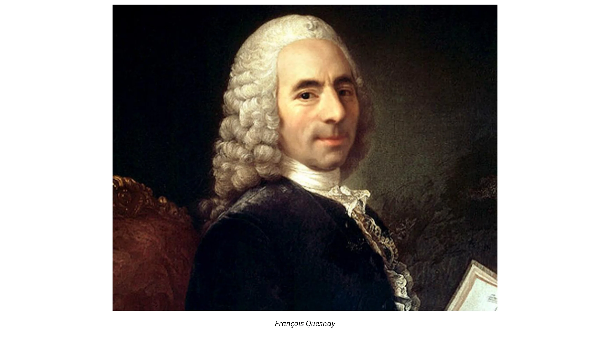

วลีนี้ถูกนำมาใช้โดยกลุ่มฟิสิโอแครต, ฟรองซัวส์ เกซเน, มาร์ควิส ดาร์ฌ็องซง, และต่อมาโดยแวงซองต์ เดอ กูร์เน: "Laissez-faire, laissez passer." มันกลายเป็นคำขวัญของพวกเขา

เมื่อกล่าวถึงกฎธรรมชาติ (คำนี้มีต้นกำเนิดจาก _phusis_ ซึ่งหมายถึงธรรมชาติ และ _cratos_ ซึ่งหมายถึงอำนาจหรือการปกครอง) กลุ่มฟิสิโอแครตเชื่อว่ามีกฎทางเศรษฐกิจที่ไม่ขึ้นอยู่กับอำนาจทางการเมืองหรือศาสนา แต่ขึ้นอยู่กับธรรมชาติของมนุษย์และสังคมเอง ระเบียบเศรษฐกิจคือระเบียบธรรมชาติของสังคม อำนาจทางการเมืองต้องยอมจำนนต่อมัน

พวกฟิสิโอแครตพยายามที่จะแสดงให้เห็นว่านโยบายเศรษฐกิจแบบพาณิชยนิยม ซึ่งเป็นนโยบายเศรษฐกิจที่แพร่หลายในฝรั่งเศสและอังกฤษนั้น ไม่เพียงแต่ไม่มีประสิทธิภาพแต่ยังผิดศีลธรรมอีกด้วย โคลแบร์เป็นหนึ่งในนักสถิติสมัยใหม่คนแรก ๆ เขาเชื่อมั่นว่าการควบคุมโดยรัฐบาลสามารถ generate ความมั่งคั่งของชาติได้ รัฐทำหน้าที่เป็นทั้งนายธนาคาร พ่อค้า และผู้ให้บริการ มันควบคุมสกุลเงิน กำกับการค้า และกระจายความมั่งคั่งใหม่

ตามที่โคลแบร์กล่าว เป้าหมายคือการเพิ่มความมั่งคั่งโดยการส่งเสริมอุตสาหกรรม เขายังเสริมว่า "ฝรั่งเศสสามารถร่ำรวยขึ้นได้เพียงแค่ต้องแลกกับอังกฤษและฮอลแลนด์"

ในทางตรงกันข้าม สำหรับกลุ่มฟิสิโอแครต การค้าเสรีเป็นนโยบายเศรษฐกิจที่ดีเพียงอย่างเดียวเพราะมันเป็นเกมที่ได้ประโยชน์ทั้งสองฝ่าย และเศรษฐกิจถูกควบคุมโดยกฎธรรมชาติที่ไม่ควรถูกรบกวนโดยกฎเกณฑ์ที่ไม่เป็นธรรมชาติ

### ประโยชน์ของตลาดเสรี

จนกระทั่งการปฏิวัติฝรั่งเศส สังคมถูกกำหนดโดยเศรษฐกิจชนชั้นสูงที่อิงกับของขวัญและสิทธิพิเศษ การกระทำตามอำเภอใจและความยุ่งยากทำให้การเข้าถึงตลาดเป็นเรื่องยากสำหรับพลเมืองทั่วไป

อย่างไรก็ตาม ตั้งแต่ยุคกลาง ดังที่เราได้เห็น เศรษฐกิจตลาดได้พัฒนา พ่อค้าเริ่มมั่งคั่งขึ้นและได้รับเสรีภาพทางเศรษฐกิจมากขึ้น

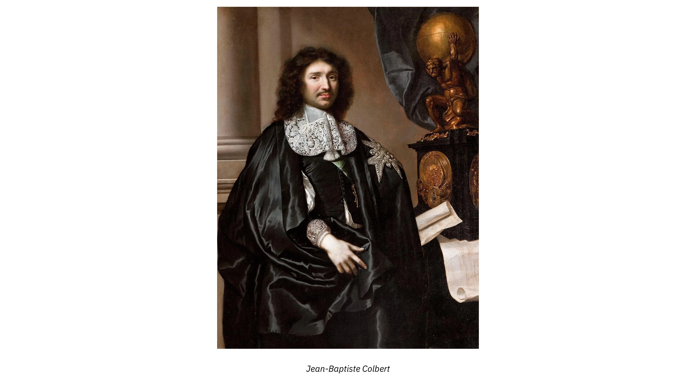

ตลาดเกี่ยวกับการแลกเปลี่ยนโดยสมัครใจในราคาที่เจรจาต่อรอง ตลาดช่วยเสริมสร้างสภาพทางวัตถุ ปัญญา และการเมืองของทุกคนโดยการเปิดโอกาสให้ได้มาซึ่งพื้นที่ของความเป็นอิสระและความคิดริเริ่ม

แท้จริงแล้ว มนุษย์มีความต้องการโดยธรรมชาติที่จะปรับปรุงสภาพของตนเองและของคนที่พวกเขารักผ่านการแลกเปลี่ยนสินค้าและบริการ ดังนั้นความปรารถนาของนักปรัชญาใหม่เหล่านี้ "นักเศรษฐศาสตร์" ที่จะทำให้ประชาชนสามารถจัดหาตนเองด้วยรายได้ที่เพียงพอและเพื่อบรรลุสิ่งที่คานท์เรียกว่าในแผ่นพับของเขา _What is Enlightenment?_ "ความเป็นผู้ใหญ่" ของพวกเขา ความเป็นอิสระในการตัดสินใจและการกระทำ

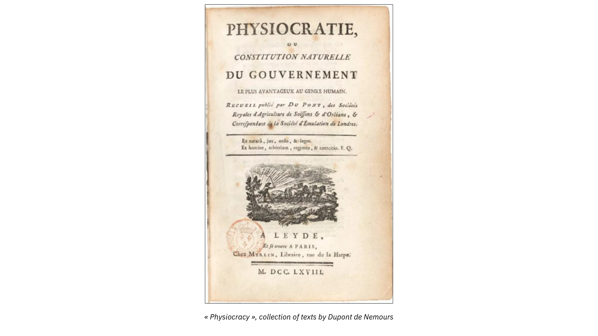

สำหรับกลุ่มฟิสิโอแครต เสรีภาพไม่ได้แบ่งแยก การต่อสู้กับอภิสิทธิ์ทางการเมืองและการต่อสู้กับค่าเช่าทางเศรษฐกิจเป็นสิ่งเดียวกัน นวัตกรรมที่ยิ่งใหญ่ของนักเศรษฐศาสตร์สมัยใหม่ในช่วงต้นศตวรรษที่ 18 คือพวกเขามุ่งเน้นไปที่แต่ละบุคคลเพื่อฟื้นฟูความสามารถในการกระทำของพวกเขา ในขณะเดียวกันก็พิจารณาวิธีการควบคุมความหลงใหลและผลประโยชน์ผ่านตลาดเสรี

แน่นอนว่าจะทำอย่างไรให้ผู้ชายที่มีความสนใจแตกต่างกันอยู่ร่วมกันได้? จะทำอย่างไรหากผู้ชายเกิดความขัดแย้งกัน หากพวกเขาทำผิดพลาด หากพวกเขาโลภและเห็นแก่ตัว?

นักสรีรศาสตร์ตอบในสามขั้นตอน:

1. เป็นเสรีภาพของสัญญาที่ช่วยให้การแก้ไขความขัดแย้งทางผลประโยชน์เกิดขึ้นได้ ไม่ใช่สัญญาทางสังคมซึ่งเป็นสัญญาเทียมเพราะไม่สามารถถูกทำลายได้ การวิเคราะห์ปัญหาสังคมในแง่ของตลาดและการแลกเปลี่ยนทำให้เราสามารถมองความสัมพันธ์ระหว่างบุคคลและระหว่างประเทศเป็นเกมที่ได้ประโยชน์ร่วมกัน โดยจัดการกับทั้งปัญหาของกรอบสถาบันและกฎระเบียบในสังคมด้วยการยืนยันว่าความต้องการและผลประโยชน์เพียงอย่างเดียวที่ควบคุมความสัมพันธ์ระหว่างผู้คน

2. เสรีภาพตามธรรมชาติคือสิทธิในการจัดการตนเองและทรัพย์สินของตน ดังนั้น ความกลมกลืนของผลประโยชน์จึงเป็นไปได้บนพื้นฐานของการเคารพทรัพย์สินที่ชอบธรรม ซึ่งได้มาจากแรงงานและเกิดจากการใช้ความสามารถของเรา และเสรีภาพนี้ที่มีพื้นฐานจากทรัพย์สินคือกุญแจสำคัญสู่ปัญหาสังคม ไม่ใช่การบังคับใช้กฎหมาย

3. บทบาทของรัฐคือการบังคับใช้สัญญาและรับประกันความปลอดภัยของประชาชนและทรัพย์สิน นี่คือ "Laissez faire" ที่มีชื่อเสียง คำขวัญของนักสรีรศาสตร์ รัฐปกครองได้ดียิ่งขึ้นเมื่อปกครองน้อยลงและเปิดโอกาสให้บุคคลมีเสรีภาพในการริเริ่มและรับผิดชอบของตนเอง

โดยสรุป หากทุกคนสามารถแสวงหาผลประโยชน์ส่วนตัวของตนได้อย่างเสรีตามกฎหมายธรรมชาติ สันติภาพและความเจริญรุ่งเรืองของทุกคนจะได้รับการประกันมากกว่าการมีองค์กรทางการเมืองที่กำหนดผลประโยชน์ทั่วไปจากเบื้องบนและบังคับใช้ผ่านข้อบังคับทางกฎหมาย เสรีภาพทางการเมืองเป็นสิ่งที่มีประโยชน์ แต่ไม่เพียงพอที่จะให้บุคคลมีอิสระในการตัดสินใจและการกระทำที่พวกเขาต้องการ นี่คือบทเรียนของนักเศรษฐศาสตร์กลุ่มฟิสิโอแครต โรงเรียนเสรีนิยมฝรั่งเศสในศตวรรษที่ 19 ซึ่งมีบุคคลสำคัญเช่น เซย์, คอนสแตนต์, ดูนอยเยร์, บาสเตียต และโมลินารี จะจดจำสิ่งนี้และปกป้องมรดกนี้อย่างยอดเยี่ยมต่อสู้กับสังคมนิยมที่กำลังเกิดขึ้นใหม่

## ปีสำคัญสำหรับโลกเสรี: 1776

<chapterId>c1ba85f8-e8d1-5794-b198-8c683efb0d9b</chapterId>

:::video id=433b758e-648f-4e13-8aba-3ac7d302f8b4:::

ปี 1776 เป็นปีที่มักจะไม่ค่อยถูกกล่าวถึงในตำราเรียนประวัติศาสตร์ อย่างไรก็ตาม ในสามประเทศ — ฝรั่งเศส สกอตแลนด์ และอเมริกาเหนือ — มีเหตุการณ์หลายอย่างที่จะทิ้งร่องรอยที่ไม่อาจลบเลือนได้ในประวัติศาสตร์แห่งเสรีภาพ

### ความอับอายของเทอร์ก็อต

ในช่วงเวลาสั้น ๆ ที่ดำรงตำแหน่งรัฐมนตรีว่าการกระทรวงการคลัง (ผู้ควบคุมทั่วไป) ตั้งแต่เดือนสิงหาคม 1774 ถึงเดือนพฤษภาคม 1776 แอนน์-โรเบิร์ต ฌาคส์ เทอร์โกต์ พยายามดำเนินการปฏิรูปครั้งใหญ่ที่มุ่งยุติการใช้จ่ายฟุ่มเฟือย ยกเลิกการผูกขาดท้องถิ่นจำนวนมาก และกลับสู่การค้าเสรี เขาถึงกับตักเตือนพระเจ้าหลุยส์ที่ 16 ด้วยถ้อยคำเหล่านี้:

> ฝ่าบาทต้องทรงเตรียมพระองค์ให้พร้อมต่อความเมตตาของพระองค์ ด้วยความเมตตาของพระองค์เอง โดยพิจารณาว่าเงินที่พระองค์สามารถแจกจ่ายให้กับข้าราชบริพารนั้นมาจากไหน

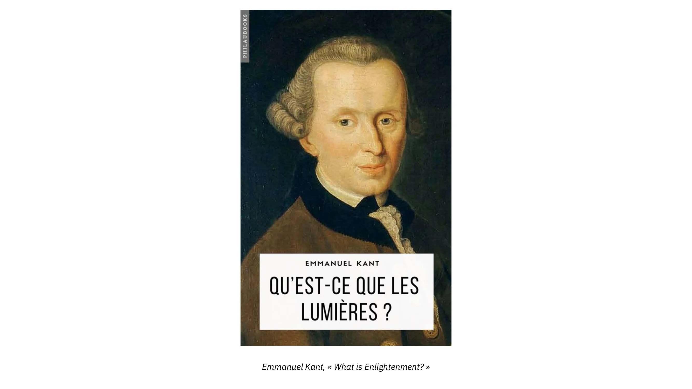

ในปี 1774 เขาได้ตีพิมพ์กฤษฎีกาหกฉบับเพื่อยกเลิกสมาคมและวิชาชีพ (องค์กรที่กลายเป็นการผูกขาดและอุปสรรคในการเข้าสู่ตลาดแรงงาน) ยกเลิกภาษีศุลกากรภายในในการค้าข้าว ยกเลิกแรงงานบังคับ (แรงงานเกณฑ์) และสร้างความอดทนต่อชาวโปรเตสแตนต์

น่าเสียดายที่ราคาข้าวสาลีที่พุ่งสูงขึ้นหลังจากการเก็บเกี่ยวที่ไม่ดีทำให้เกิดความสงสัยในเรื่องการปฏิรูปของเขา ตูร์โกต์เขียนปกป้องตัวเองว่า:

> เมื่ออยู่ในจังหวัดต่าง ๆ ก็ยังคงมีความอดอยาก; ไม่ควรถือว่าเป็นข้อคัดค้านต่อเสรีภาพ; ควรสรุปเพียงว่าเสรีภาพยังไม่ได้รับการสถาปนาไว้นานพอที่จะก่อให้เกิดผลทั้งหมดของมัน

อย่างไรก็ตาม เขาส่วนใหญ่ต้องเผชิญกับความโกรธเกรี้ยวของขุนนางที่พยายามปกป้องสิทธิพิเศษของตน เมื่อเผชิญกับการสมคบคิดที่จัดขึ้นโดยเจ้าชายแห่ง Conti เขาเลือกที่จะลาออกในเดือนพฤษภาคม ค.ศ. 1776 แทนที่จะยอมแพ้ในสิ่งที่เขามองว่าเป็นการช่วยเหลือราชบัลลังก์และฝรั่งเศส การล่มสลายของเขาทำให้การทดลองครั้งแรกในฝรั่งเศสกับเศรษฐกิจตลาดเสรีสิ้นสุดลง (สำหรับการอ่านเพิ่มเติม ดู Edgar Faure, _La disgrâce de Turgot_)

ผลงานชิ้นสำคัญของ Turgot, _Reflections on the Formation and Distribution of Wealth_ (1766), มีพื้นฐานมาจากหลักคำสอนของกลุ่ม Physiocrats เป็นอย่างมาก Turgot ได้ทบทวนและขยายแบบจำลองตลาดเสรีที่เสนอโดย Quesnay และก่อนหน้านั้นโดย Boisguilbert เพื่อต่อต้านกลุ่มพาณิชยนิยม แต่ความคิดของเขาก็ได้รับอิทธิพลอย่างน้อยเท่าๆ กันจากเพื่อนของเขา Jacques Vincent de Gournay ซึ่งได้รับการแต่งตั้งเป็นผู้ตรวจการพาณิชย์ในปี 1751 Turgot ได้เดินทางไปกับเขาทั่วประเทศในระหว่างการตรวจสอบงานของเขา

Turgot เป็นอัครสาวกของกฎธรรมชาติ ซึ่งเขายังเรียกว่า "ระบบแห่งเสรีภาพ" เขามักเน้นย้ำว่าการแข่งขันในตลาดเสรีจะควบคุมราคาตามธรรมชาติและป้องกันการละเมิด นอกจากนี้ เขายังทำให้พ่อค้าเป็นศูนย์กลางของกลไกตลาด จริงๆ แล้ว ตัวแทนของรัฐมีแรงจูงใจน้อยกว่าและโดยเฉพาะอย่างยิ่งมีข้อมูลน้อยกว่าพ่อค้า ดังนั้นจึงมีประสิทธิภาพมากกว่าที่จะปล่อยให้การค้าขายอยู่ในมือของผลประโยชน์ส่วนตัว

ไม่จำเป็นต้องพิสูจน์ว่าบุคคลแต่ละคนเป็นผู้ตัดสินเพียงผู้เดียวในการใช้จิตใจและแขนของตนให้เกิดประโยชน์สูงสุด พวกเขาเพียงผู้เดียวที่มีความรู้ในท้องถิ่นซึ่งหากขาดไปแล้ว แม้แต่คนที่มีความรู้มากที่สุดก็สามารถใช้เหตุผลได้อย่างมืดบอด พวกเขาเพียงผู้เดียวที่มีประสบการณ์ซึ่งยิ่งเชื่อถือได้มากขึ้นเมื่อจำกัดอยู่ที่วัตถุเดียว พวกเขาเรียนรู้ผ่านการทดลองซ้ำๆ ความสำเร็จและความสูญเสียของพวกเขา และได้รับความชำนาญที่ความละเอียดอ่อนซึ่งถูกลับคมด้วยความรู้สึกของความต้องการนั้นเหนือกว่าทฤษฎีทั้งหมดของนักเก็งกำไรที่ไม่ใส่ใจ (_สรรเสริญ Vincent de Gournay_)

ที่นี่ Turgot ได้คาดการณ์ล่วงหน้าถึงข้อโต้แย้งของ Mises และ Hayek เกี่ยวกับความเป็นไปไม่ได้ของการคำนวณทางเศรษฐกิจในระบบเศรษฐกิจสังคมนิยม

อุทิศบทหนึ่งให้กับ "ความยอดเยี่ยมของ Turgot" มาร์รีย์ รอธบาร์ด ในประวัติศาสตร์เศรษฐศาสตร์จากมุมมองของออสเตรียเน้นว่า "อิทธิพลของ Turgot ต่อความคิดทางเศรษฐศาสตร์ในภายหลังถูกจำกัดอย่างจริงจัง (...) โดยตำนานที่ว่า Adam Smith เป็นผู้ก่อตั้งเศรษฐศาสตร์การเมือง" และเขาเสริมว่า "มันคือชาวฝรั่งเศส J.B. Say ซึ่งเป็นผู้ติดตามของ Smith อย่างเป็นทางการ ที่ Turgot มีอิทธิพลมากที่สุดในที่สุด โดยเฉพาะทฤษฎีมูลค่าประโยชน์ของเขา"

### ผลงานชิ้นเอกของ Condillac

ในปี 1776 นักปรัชญา Étienne Bonnot de Condillac ได้ตีพิมพ์ _Commerce and Government_ ซึ่งถือได้ว่าเป็นหนึ่งในคำร้องที่งดงามที่สุดในยุคนั้นที่สนับสนุนการค้าเสรีและเสรีภาพส่วนบุคคล

_Commerce and Government_ ประกอบด้วยสิ่งที่ต่อมาจะเรียกว่าทฤษฎีของความเป็นอัตวิสัยของมูลค่า ซึ่งทำให้เขาได้รับคำชมจากนักเศรษฐศาสตร์ออสเตรีย โดยเริ่มจากเมงเกอร์ ตามทูร์โกต์ แต่ด้วยความชัดเจนมากขึ้น คอนดิลแลคยืนยันว่ามูลค่าไม่ได้อยู่ในแรงงาน แต่ในความจริงที่ว่าทุกคนพบความสนใจในแลกเปลี่ยน:

> คุณค่าของสิ่งต่างๆ เขาเขียนไว้ว่า ขึ้นอยู่กับประโยชน์ใช้สอยของมัน หรือซึ่งเท่ากับสิ่งเดียวกัน ขึ้นอยู่กับความต้องการที่เรามีต่อมัน หรือซึ่งอีกครั้งเท่ากับสิ่งเดียวกัน ขึ้นอยู่กับการใช้ที่เราสามารถทำได้ และเขาเสริมว่า: "สิ่งหนึ่งไม่มีคุณค่าเพราะมันมีค่าใช้จ่ายตามที่คิดไว้; แต่มันมีค่าใช้จ่ายเพราะมันมีคุณค่า"

ดังนั้น มูลค่าไม่ได้อยู่ภายในสิ่งของในรูปแบบของปริมาณแรงงานที่ต้องผลิตขึ้น (ทฤษฎีมูลค่าแรงงานที่เป็นของ Adam Smith และ Ricardo) แต่กลับอยู่นอกสิ่งของ กล่าวคือ อยู่ในความเข้มข้นของความต้องการที่ผู้ซื้อรู้สึก

นอกจากนี้ยังเป็นบทความเกี่ยวกับปรัชญาที่แสดงให้เห็นว่าการแลกเปลี่ยนที่เสรีและสมัครใจเป็นเครื่องมือแห่งการปลดปล่อยที่ยุติธรรมกว่าการแทรกแซงของรัฐเพราะมันเป็นแบบเสมอภาคและต่อต้านลำดับชั้น มันสามารถสร้างพลเมืองที่มีวุฒิภาวะและมีความรับผิดชอบและเป็นคำตอบต่อการเบี่ยงเบนแบบเผด็จการของระบอบ Ancien Régime จริงๆ แล้ว หากตลาดสามารถควบคุมความเกินเลยของปัจเจกนิยมได้ ไม่มีสิ่งใดสามารถควบคุมการละเมิดของอำนาจส่วนกลางได้ นี่คือเหตุผลที่ Condillac เชิญชวนให้อำนาจปลดปล่อยการค้าให้พ้นจากอุปสรรคใดๆ และละทิ้งการแทรกแซงใดๆ ในด้านเศรษฐกิจ

### แถลงการณ์เพื่อเสรีภาพในอเมริกา

ในปี 1776 ชาวอังกฤษชื่อโทมัส เพน ได้ตีพิมพ์แผ่นพับที่รุนแรงในอเมริกา วิพากษ์วิจารณ์สถาบันกษัตริย์อังกฤษและสนับสนุนการประกาศอิสรภาพของชาวอาณานิคมอเมริกัน ชื่อว่า _Common Sense_

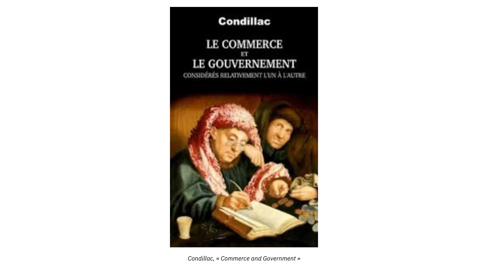

Paine โต้แย้งว่า:

- สังคมพลเมืองมีอยู่ก่อนรัฐบาล
- ระบอบกษัตริย์เป็นระบบการเมืองที่ล้าสมัยและเผด็จการ
- อเมริกาต้องทนทุกข์ภายใต้การครอบงำของอังกฤษ
- การปฏิวัติอเมริกาเป็นเหตุผลสากลที่ปกป้องคุณค่าของเสรีภาพ ความเสมอภาค และความรับผิดชอบ
- อเมริกาต้องแยกตัวจากอังกฤษและจัดตั้งสาธารณรัฐเพื่อเป็นตัวแทนของค่านิยมเหล่านี้

ผู้เขียนให้ความสำคัญในการแยกแยะระหว่างสังคมพลเมืองและรัฐ:

> สังคมเป็นผลลัพธ์ของความต้องการของเรา รัฐบาลเป็นผลลัพธ์ของความชั่วร้ายของเรา \[…\] สถานะทางสังคมเป็นสิ่งที่ดีภายใต้สมมติฐานทั้งหมด รัฐบาล แม้ในความสมบูรณ์แบบของมัน ก็เป็นเพียงความชั่วร้ายที่จำเป็น ในความไม่สมบูรณ์แบบของมัน มันเป็นความชั่วร้ายที่ทนไม่ได้

ความสำเร็จของหนังสือเล่มนี้ยิ่งใหญ่ มันขายได้ประมาณ 100,000 เล่มในเวลาไม่กี่เดือนในประเทศที่มีประชากรสามล้านคน ซึ่งมีส่วนช่วยในการกระตุ้นความรู้สึกของชาวอเมริกันให้สนับสนุนการประกาศอิสรภาพ

โทมัส เพน ผ่านบทความของเขา มีบทบาทสำคัญในการปฏิวัติอเมริกาและในการสร้างแรงบันดาลใจให้กับอุดมการณ์แห่งเสรีภาพและประชาธิปไตย เขามีอิทธิพลโดยตรงต่อการประกาศอิสรภาพของอเมริกา ซึ่งได้รับการรับรองไม่กี่เดือนหลังจากการร่าง

### สภาคองเกรสฟิลาเดลเฟีย

เมื่อวันที่ 4 กรกฎาคม ค.ศ. 1776 ที่ฟิลาเดลเฟีย ซึ่งพวกเขาได้มารวมตัวกันในสภา (ในภาษาอังกฤษเรียกว่า "Convention") ตัวแทนจากสิบสามอาณานิคมอังกฤษในอเมริกาเหนือได้ยอมรับมติที่ระบุว่า "สหรัฐอเมริกาเป็นและควรจะเป็นรัฐที่เสรีและเป็นอิสระ" มตินี้ได้รับการสนับสนุนจากจอห์น อดัมส์ หนึ่งในผู้สร้างแรงบันดาลใจของงานเลี้ยงน้ำชา และเบนจามิน แฟรงคลิน ผู้แทนจากแมสซาชูเซตส์ โธมัส เจฟเฟอร์สัน ผู้แทนจากเวอร์จิเนีย จะเป็นผู้ร่างคำประกาศอิสรภาพ

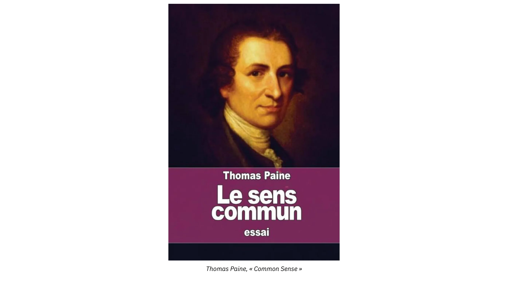

ในช่วงหลายปีที่ตามมา ชาวฝรั่งเศสอย่าง ลา ฟาแยต, โรแชมโบ, พลเรือเอก เดอ กราส, เคานต์ เดสแตง, นายพล ดูปอร์แตล, มาร์ควิส เดอ ลา รูเออรี, ผู้บัญชาการ ปิแอร์ ลองฟอง, นักเขียน โบมาร์เช และคนอื่นๆ อีกมากมาย ได้ต่อสู้เคียงข้างกับกลุ่มกบฏเพื่อปลดปล่อยพวกเขาจากแอกของกษัตริย์แห่งอังกฤษ

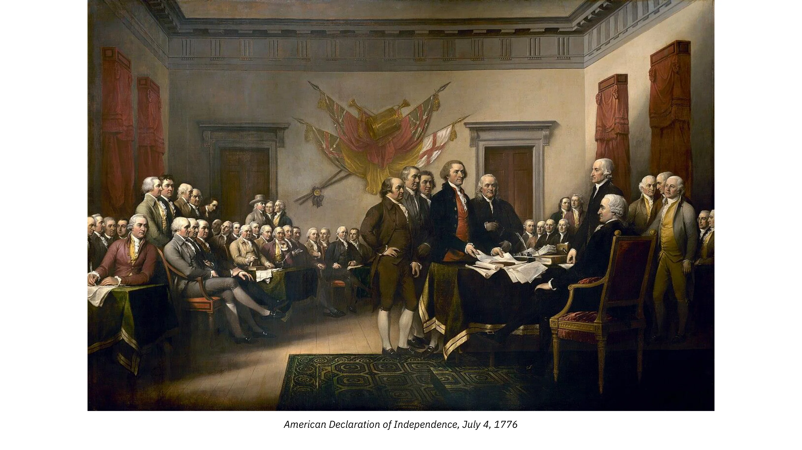

141 ปีต่อมา ในวันที่ 4 กรกฎาคม ค.ศ. 1917 ท่ามกลางสงครามโลกครั้งที่หนึ่ง ได้มีพิธีจัดขึ้นที่สุสาน Picpus ในกรุงปารีส สำหรับทหารกลุ่มแรกของ AEF ที่มาถึงเมือง พิธีจัดขึ้นใกล้กับหลุมฝังศพของ La Fayette "วีรบุรุษแห่งสองโลก" ในโอกาสนี้ กัปตัน Charles E. Stanton จากทีมงานของนายพล Pershing ได้กล่าวสุนทรพจน์ที่มีชื่อเสียง:

> ฉันเสียใจที่ไม่สามารถพูดกับประชาชนชาวฝรั่งเศสในภาษาที่สวยงามของประเทศที่ซื่อสัตย์ของพวกเขาได้ ไม่สามารถลืมได้ว่าประเทศของคุณเป็นเพื่อนของเราเมื่ออเมริกาต่อสู้เพื่อการดำรงอยู่ของตน เมื่อกลุ่มคนกล้าหาญและรักชาติไม่กี่คนตั้งใจที่จะปกป้องสิทธิที่ผู้สร้างของพวกเขาได้มอบให้ -- ที่ฝรั่งเศส ในบุคคลของลาฟาแยตต์ ได้มาช่วยเหลือเราในคำพูดและการกระทำ จะเป็นการไม่รู้คุณถ้าไม่จดจำสิ่งนี้ และอเมริกาจะไม่ล้มเหลวในพันธะของตน...
>

> ดังนั้น เราจึงภูมิใจอย่างยิ่งที่ได้ยอมรับสีเหล่านี้เพื่อเป็นการแสดงความเคารพต่อพลเมืองของสาธารณรัฐอันยิ่งใหญ่ของคุณ และที่นี่และตอนนี้ในเงาของผู้ล่วงลับที่มีชื่อเสียง เราขอรับรองเขาถึงหัวใจและเกียรติยศของเราเพื่อให้สงครามครั้งนี้มีผลลัพธ์ที่ดี
>

> ลาฟาแยตต์ เรามาถึงแล้ว!

ในปี ค.ศ. 1789 เป็นอีกครั้งที่ลา ฟาแยตต์ ร่วมกับเจฟเฟอร์สัน วางรากฐานแรกของปฏิญญาว่าด้วยสิทธิมนุษยชนแห่งปี ค.ศ. 1789

### ความมั่งคั่งของประชาชาติ

อดัม สมิธ ได้ตีพิมพ์ _An Inquiry into the Nature and Causes of the Wealth of Nations_ ในปี 1776 ซึ่งเป็นผลงานที่มีความสำคัญมากจนมักจะทำให้เขาถูกจัดประเภทเป็นนักเศรษฐศาสตร์ แม้ว่าเขาจะสอนปรัชญาศีลธรรมที่มหาวิทยาลัยกลาสโกว์ก็ตาม ในลักษณะที่เป็นการ์ตูน เขาถูกจดจำในฐานะบิดาแห่งเศรษฐศาสตร์สมัยใหม่

ในความเป็นจริง สมิธเป็นหนี้บุญคุณนักเศรษฐศาสตร์ เควซเนย์ และ เทอร์โกต์ อย่างมาก ซึ่งเขาได้พบระหว่างการเดินทางในฝรั่งเศสเกือบหนึ่งปี ในหนังสือเล่มนี้ เขาได้อธิบายถึง "ระบบธรรมชาติที่เรียบง่าย" ซึ่งบุคคลที่แสวงหาผลประโยชน์ของตนเองจะถูกนำทาง "โดยมือที่มองไม่เห็น" เพื่อส่งเสริมความเป็นอยู่ที่ดีโดยรวมของสังคม

นี่คือข้อความที่มีชื่อเสียงที่สุด:

โดยการสนับสนุนความสำเร็จของอุตสาหกรรมในประเทศมากกว่าอุตสาหกรรมต่างประเทศ เขาคิดเพียงเพื่อให้ตนเองมีความมั่นคงมากขึ้น; และโดยการกำกับดูแลอุตสาหกรรมนี้เพื่อให้ผลิตภัณฑ์มีมูลค่าสูงสุดเท่าที่จะเป็นไปได้ เขาคิดเพียงเพื่อผลประโยชน์ของตนเอง; ในกรณีนี้ เช่นเดียวกับในหลายกรณีอื่น ๆ เขาถูกนำทางโดยมือที่มองไม่เห็นเพื่อบรรลุเป้าหมายที่ไม่ใช่ส่วนหนึ่งของเจตนาของเขาเลย มันไม่ใช่สิ่งที่เลวร้ายที่สุดสำหรับสังคมเสมอไปที่เป้าหมายนี้ไม่ใช่ส่วนหนึ่งของเจตนาของเขา (_The Wealth of Nations_)

มือที่มองไม่เห็นที่มีชื่อเสียงนี้แสดงให้เห็นถึงแนวคิดที่ว่าการแข่งขันเสรีในตลาดเสรีนำไปสู่การจัดสรรทรัพยากรอย่างมีประสิทธิภาพและการเพิ่มพูนความเป็นอยู่ที่ดีโดยรวมสูงสุด

การมีส่วนร่วมที่สำคัญที่สุดของสมิธต่อแนวคิดเรื่องเสรีภาพคือการชี้แจงแนวคิดของระเบียบที่เกิดขึ้นเองตามธรรมชาติ อันที่จริง สมิธให้เหตุผลว่าบุคคลในการแสวงหาความต้องการและความปรารถนาของตนเองได้รับการสนับสนุนให้ผลิตและแลกเปลี่ยนสินค้าและบริการในลักษณะที่ตอบสนองความต้องการของสังคมได้อย่างมีประสิทธิภาพมากกว่าการวางแผนจากส่วนกลาง

แนวคิดของระเบียบที่เกิดขึ้นเองกลายเป็นแนวคิดสำคัญในงานของฟรีดริช ฮาเย็ค ซึ่งยอมรับว่าเขาได้รับอิทธิพลจากการตรัสรู้ของสกอตแลนด์ โดยเฉพาะจากอดัม สมิธ

## ยุคแห่งการปฏิวัติ

<chapterId>c260e3ab-31a2-5ad7-b775-4bdcdc13b859</chapterId>

:::video id=acf98b8e-b8df-45d5-86d7-f48a05c19995:::

ความแปลกใหม่ที่ยิ่งใหญ่ของยุคสมัยใหม่ในประวัติศาสตร์ตะวันตกคือการเกิดขึ้นของสังคมที่จัดระเบียบตัวเองโดยไม่พึ่งพาศาสนา นี่ไม่ได้หมายถึงการหายไปของความเชื่อทางศาสนาหรือการตายของพระเจ้า แต่พระเจ้ากลายเป็นเรื่องส่วนตัว ไม่ได้ผสมกับกิจการทางการเมืองอีกต่อไป ไม่มีการหายไปของศาสนาแต่เป็นการปลดจากบทบาทการนำทาง มันกลายเป็นระบบของความเชื่อส่วนบุคคล

การทำให้โลกตะวันตกเป็นฆราวาสไม่ได้เกิดขึ้นในชั่วข้ามคืน มันถูกเตรียมด้วยแนวคิดต่างๆ ดังที่มักเกิดขึ้น ปรัชญาอยู่ในแนวหน้าของการเปลี่ยนแปลงทางวัฒนธรรมครั้งใหญ่

ตั้งแต่ Machiavelli และ Hobbes มนุษย์ถูกเข้าใจว่าเป็นสิ่งมีชีวิตที่เต็มไปด้วยความหลงใหล ถูกกระตุ้นโดยแนวโน้มที่ขัดแย้งกัน ดังนั้นจึงจำเป็นต้องหาหลักการควบคุมสำหรับความหลงใหลเหล่านี้เพื่อหลีกเลี่ยงความขัดแย้งและความรุนแรงที่พวกเขานำไปสู่

เราได้พูดคุยเกี่ยวกับนักเศรษฐศาสตร์และการสนับสนุนของพวกเขาต่อเสรีภาพทางการตลาด แต่สำหรับนักปรัชญาหลายคน การแก้ปัญหานั้นกลับตั้งอยู่บนสมมติฐานของการจัดตั้งอำนาจอธิปไตยผ่านสัญญาทางกฎหมาย

จนถึงศตวรรษที่ 18 ความกังวลทางการเมืองหลักสำหรับนักปรัชญาเหล่านี้คือเรื่องอธิปไตย มันเป็นคำถามเกี่ยวกับความยุติธรรมเป็นหลัก: ใครสามารถใช้อธิปไตยได้อย่างถูกต้องตามกฎหมาย?

### อธิปไตยของประชาชน

แนวคิดนี้ได้รับแรงบันดาลใจจากล็อคในศตวรรษที่ 17 และต่อมาได้รับการสานต่อโดยรูโซ อำนาจอธิปไตยต้องไม่เพียงแต่มาจากเจตจำนงเสรีของประชาชนเท่านั้น แต่ยังต้องอยู่ในนั้นด้วย นี่คือทฤษฎีของรูโซเกี่ยวกับอำนาจอธิปไตยของเจตจำนงทั่วไป ซึ่งเราหมายถึงประชาธิปไตยในปัจจุบัน

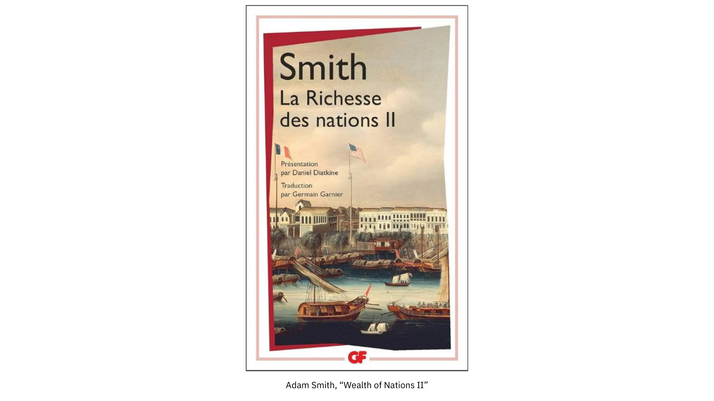

รูโซมองว่าประชาชนเป็นบุคคลที่มีอิสระ สามารถกำหนดตนเองภายใต้กฎหมายที่พวกเขาตั้งขึ้นได้ เจตจำนงเสรีของประชาชนเป็นรากฐานเดียวที่ยุติธรรมของอธิปไตย รูโซพัฒนามนุษยนิยมทางกฎหมายนี้ ซึ่งเป็นลักษณะเฉพาะของยุคสมัยใหม่ ไปจนถึงผลลัพธ์สูงสุดโดยการมองว่าประชาชนเป็นบุคคลที่สามารถกำหนดตนเองได้อย่างอิสระ หรือเป็นหน่วยรวม เช่น เจตจำนงทั่วไป ดังนั้น สัญญาจึงเกี่ยวข้องกับการยอมรับกฎหมายที่มนุษย์ในฐานะเจตจำนงทั่วไปมอบให้ตนเองในฐานะเจตจำนงเฉพาะ ทฤษฎีเจตจำนงทั่วไปหรืออธิปไตยของประชาชนจึงอนุญาตให้เกิดการประสานกันระหว่างเสรีภาพและการยอมรับ การสถาปนากฎหมายด้วยตนเองหรืออิสระทางการเมืองนั้นเป็นองค์ประกอบสำคัญของประชาธิปไตยตั้งแต่ยุคของรูโซ

แต่คำถามเกี่ยวกับต้นกำเนิดของอธิปไตยไม่ใช่คำถามเดียว การไตร่ตรองสามารถเปลี่ยนทิศทางใหม่ได้ กล่าวคือ วิธีการใช้สิทธิอธิปไตย เจตจำนงทั่วไปยุติธรรมเสมอหรือไม่? และเหนือสิ่งอื่นใด มันได้รับอนุญาตให้แทรกแซงในสังคมพลเมืองและภายในขอบเขตใด?

### ทฤษฎีอำนาจจำกัด

หนึ่งในนักปรัชญายุคเรืองปัญญาที่มีอิทธิพลอย่างมากในฝรั่งเศสและอเมริกาคือ จอห์น ล็อค เขาเป็นแรงบันดาลใจเบื้องหลังบิดาผู้ก่อตั้งของสหรัฐอเมริกา รวมถึงปฏิญญาว่าด้วยสิทธิของมนุษย์และพลเมืองในปี 1789

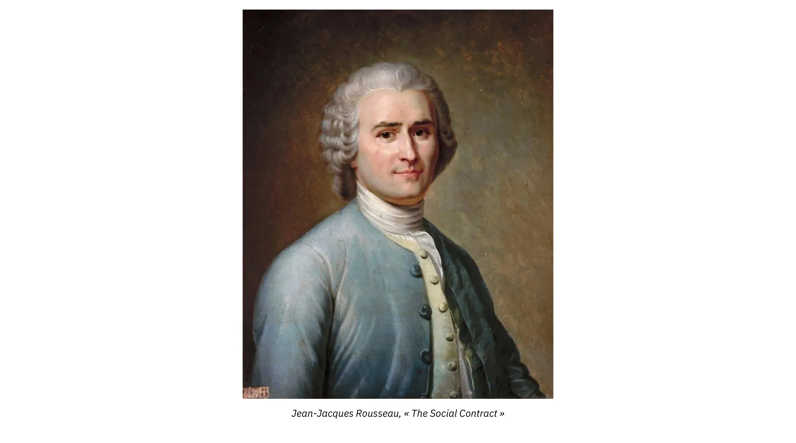

ระบบก่อนหน้านี้ทั้งหมดได้พิจารณาว่าเสรีภาพเป็นเพียงสิทธิพิเศษที่มอบให้โดยอำนาจ ซึ่งมอบให้ภายใต้การอนุญาตที่สามารถเพิกถอนได้ตลอดเวลา สำหรับล็อค ชีวิตของมนุษย์เป็นของตนเองภายใต้สิทธิตามธรรมชาติ (หมายถึง: ภายใต้หลักศีลธรรมที่มีอยู่ในธรรมชาติของมนุษย์) และวัตถุประสงค์ทางศีลธรรมเพียงอย่างเดียวของรัฐบาลคือการคุ้มครองสิทธิส่วนบุคคล

ล็อคมอบหมายให้รัฐมีภารกิจในการปกป้องทรัพย์สินส่วนบุคคล ซึ่งหมายถึง "ชีวิต เสรีภาพ และทรัพย์สิน":

> จุดมุ่งหมายที่ยิ่งใหญ่และสำคัญที่สุดที่มนุษย์รวมตัวกันเป็นสังคมและยอมอยู่ภายใต้การปกครอง คือการรักษาทรัพย์สินของพวกเขา (Two Treatises of Government, § 87).

โทมัส เจฟเฟอร์สันได้จารึกทฤษฎีสิทธิที่ไม่อาจโอนย้ายได้ของล็อคไว้ในคำประกาศอิสรภาพ:

เราถือว่าความจริงเหล่านี้เป็นสิ่งที่ชัดเจนในตัวเอง ว่ามนุษย์ทุกคนถูกสร้างขึ้นมาอย่างเท่าเทียมกัน ว่าพวกเขาได้รับสิทธิที่ไม่อาจโอนให้ใครได้จากผู้สร้างของพวกเขา ซึ่งในบรรดาสิทธิเหล่านี้คือ ชีวิต เสรีภาพ และการแสวงหาความสุข

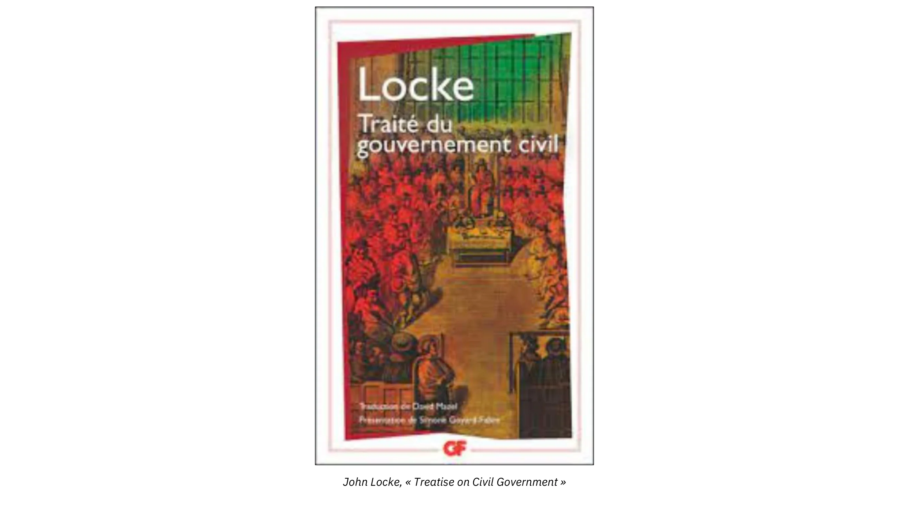

ยิ่งไปกว่านั้น มาตรา 2 ของปฏิญญาสิทธิมนุษยชนและพลเมืองของฝรั่งเศสปี 1789 ยังได้รับแรงบันดาลใจจากประเพณีธรรมชาติของล็อคอีกด้วย:

> เป้าหมายของสมาคมทางการเมืองใด ๆ คือการรักษาสิทธิธรรมชาติและสิทธิที่ไม่อาจเพิกถอนได้ของมนุษย์ สิทธิเหล่านี้คือเสรีภาพ ทรัพย์สิน ความมั่นคง และการต่อต้านการกดขี่

### การเปรียบเทียบการปฏิวัติสองครั้ง

การปฏิวัติอเมริกันนำโดยบุคคลที่พูดถึงสิทธิพื้นฐานที่ไม่สามารถโอนย้ายได้ มันนำไปสู่การก่อตั้งรัฐที่มีกฎหมายที่กระจายอำนาจและจำกัด ในอีกฝั่งของมหาสมุทรแอตแลนติก การทดลองทางการเมืองอีกครั้งเกิดขึ้น: การปฏิวัติฝรั่งเศส ซึ่งเริ่มต้นจากการลุกฮือของประชาชนที่กล้าหาญ แต่สุดท้ายกลับจบลงด้วยการสังหารหมู่หลายครั้ง ความขัดแย้งภายในที่นองเลือด และเปิดทางให้กับเผด็จการทหารของนโปเลียน โบนาปาร์ต ทำไมถึงมีความแตกต่างเช่นนี้?

ในศตวรรษที่ 19 อเล็กซิส เดอ ต็อกเคอวิลล์ นักปรัชญาการเมืองชาวฝรั่งเศส พยายามที่จะระบุความแตกต่างระหว่างการปฏิวัติพี่น้องทั้งสอง เขาให้เครดิตความสำเร็จของการปฏิวัติอเมริกาแก่ปัจจัยหลายประการ

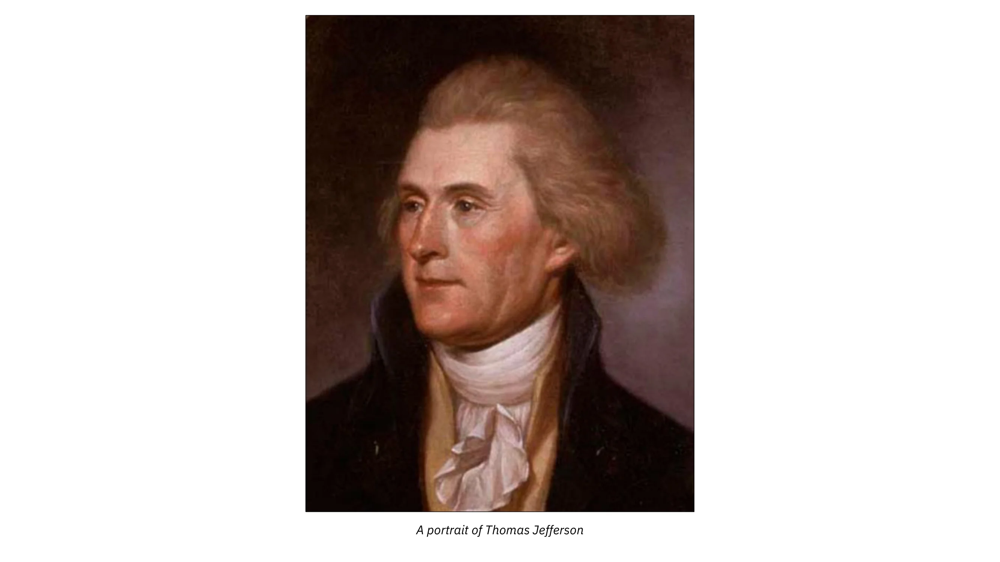

ประการแรก ในการกำหนดความหมายของสาธารณรัฐ สาธารณรัฐฝรั่งเศสเป็นหนึ่งเดียวและไม่สามารถแบ่งแยกได้ สาธารณรัฐอเมริกันประกอบด้วยรัฐอธิปไตย แต่ละรัฐมีเขตอำนาจศาลและผลประโยชน์ท้องถิ่นของตนเอง สหพันธรัฐนิยมถือเป็นการทรยศในฝรั่งเศส ในอเมริกา การทรยศจะประกอบด้วยการต้องการบังคับให้เกิดความเป็นเอกภาพ จนกระทั่งสงครามกลางเมืองอเมริกา อย่างน้อยที่สุด สหภาพที่มีความหลากหลายของรัฐเป็นพลังของสหพันธ์

เขายังโต้แย้งว่าความเชื่อของอเมริกาในกฎหมายที่สูงกว่ามีบทบาทสำคัญ คำประกาศอิสรภาพประกาศว่ามนุษย์ทุกคนถูกสร้างขึ้นมาเท่าเทียมกัน พวกเขาได้รับสิทธิบางประการที่ไม่อาจโอนให้ได้ (ชีวิต เสรีภาพ ทรัพย์สิน และการแสวงหาความสุข) และวัตถุประสงค์ของรัฐบาลคือเพื่อรักษาสิทธิเหล่านี้เท่านั้น มันเกี่ยวกับการฟื้นฟูหลักการและอุดมการณ์ที่ถูกเหยียบย่ำโดยราชบัลลังก์อังกฤษ

การแก้ไขเพิ่มเติมครั้งแรกของรัฐธรรมนูญอเมริกัน ซึ่งร่างขึ้นในปี ค.ศ. 1789 ระบุว่า:

รัฐสภาจะต้องไม่ออกกฎหมายเกี่ยวกับการจัดตั้งศาสนา หรือห้ามการปฏิบัติศาสนาอย่างเสรี; หรือจำกัดเสรีภาพในการพูด หรือของสื่อมวลชน; หรือสิทธิของประชาชนในการชุมนุมอย่างสงบ และการร้องขอต่อรัฐบาลเพื่อการแก้ไขข้อข้องใจ.

การกำหนดสูตรนี้ปกป้องอย่างชัดเจนต่อการกดขี่ของเสียงข้างมาก อย่างไรก็ตาม การปฏิวัติฝรั่งเศสนั้นแตกต่างออกไปอย่างมาก ชาวฝรั่งเศสพยายามที่จะตัดขาดจากอดีตอย่างสิ้นเชิง หลักการดั้งเดิมของมรดกคริสเตียนไม่ตอบสนองต่อความคาดหวังของนักปฏิวัติอย่างโรเบสปิแยร์อีกต่อไป

### จากการกบฏของฐานันดรที่สามสู่ความหวาดกลัวของยาคอบิน

อาแบ ซีแยส (1748-1836) มักถูกยกย่องว่าเป็นบิดาแห่งการปฏิวัติฝรั่งเศส เขาเป็นผู้เขียน _What is the Third Estate?_, ซึ่งตีพิมพ์ในเดือนมกราคม ค.ศ. 1789

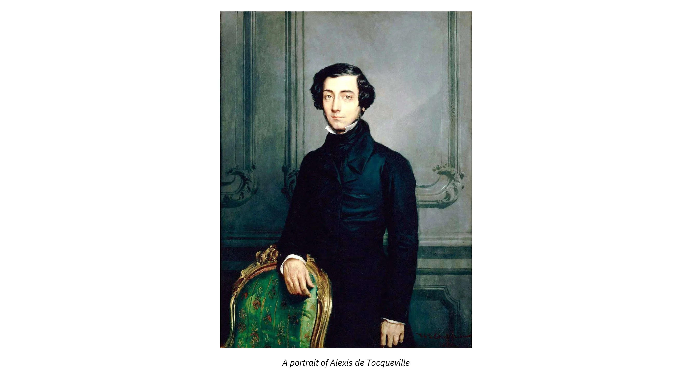

ฐานันดรที่สามประกอบด้วยทุกคนที่ไม่ได้เป็นส่วนหนึ่งของคณะสงฆ์หรือชนชั้นสูง ตั้งแต่บรรทัดแรกของแผ่นพับที่มีชื่อเสียงของเขา Abbé Sieyès ได้ยกย่องเสรีภาพส่วนบุคคลและการแข่งขันเสรี:

> ผลกระทบของการผูกขาดไม่เป็นที่รู้จักหรือ? หากมันทำให้ผู้ที่ถูกกีดกันหมดกำลังใจ ไม่เป็นที่รู้หรือว่ามันทำให้ผู้ที่ได้รับประโยชน์มีทักษะน้อยลง? ไม่เป็นที่รู้หรือว่างานใด ๆ ที่ถูกถอดการแข่งขันเสรีออกไปจะถูกทำในราคาที่แพงกว่าและในลักษณะที่แย่ลง?

คืนวันที่ 4 สิงหาคม ค.ศ. 1789 เป็นเหตุการณ์สำคัญของการปฏิวัติฝรั่งเศส ซึ่งมีความสำคัญยิ่งกว่าวันที่ 14 กรกฎาคม ซึ่งต่อมาได้ถูกเลือกให้เป็นวันหยุดประจำชาติ ในความเป็นจริง ในการประชุมที่จัดขึ้นในขณะนั้น สมัชชาร่างรัฐธรรมนูญได้ยุติระบบศักดินา สิทธิพิเศษต่าง ๆ ถูกยกเลิก รวมถึงของขุนนางและนักบวช ในเดือนมีนาคม ค.ศ. 1791 หลังจากหลายเดือนของความไม่แน่นอนทางกฎหมาย สมาคมช่างฝีมือก็ถูกยกเลิก และเสรีภาพในการทำงานอย่างสมบูรณ์ก็ถูกสถาปนาขึ้น การปฏิวัติได้ให้การรับรองผลงานของ Turgot แต่ไม่นานนัก...

เมื่อสิ้นปี 1791 ความอดอยากได้ทำให้ความไม่สงบของประชาชนในฝรั่งเศสรุนแรงขึ้น การจลาจลทำให้การค้าข้าวเป็นอัมพาต และขนมปังก็ขาดแคลน ขบวนการขนาดใหญ่เรียกร้องกฎหมายเกษตรกรรม นั่นคือ การแจกจ่ายการผลิตข้าวสาลีโดยรัฐ อย่างไรก็ตาม สมัชชาได้ต่อต้านความพยายามในการรวมกลุ่มนี้ ในขั้นต้นได้ลงมติให้ยึดทรัพย์สินของคริสตจักร และในขั้นตอนที่สองคือรัฐธรรมนูญพลเรือนของพระสงฆ์

การยึดทรัพย์สินของคริสตจักรมุ่งหมายเพื่อหลีกเลี่ยงวิกฤตการเงิน; มันถูกตั้งใจให้เป็นหลักประกันสำหรับ Assignats ซึ่งหมายถึงการออกเงินกระดาษจำนวนมาก

ยิ่งไปกว่านั้น ตามที่ดูปองต์ เดอ เนมูร์ได้ทำนายไว้ การออกธนบัตรปลอมยิ่งทำให้วิกฤตแย่ลง ก่อให้เกิดภาวะเงินเฟ้ออย่างกว้างขวางและการลดลงอย่างรวดเร็วในมูลค่าของ Assignats ในเดือนสิงหาคม ค.ศ. 1792 การจลาจลจากความหิวโหยนำไปสู่การกบฏของปารีส การประหารชีวิตหลุยส์ที่ 16 ในเดือนมกราคม ค.ศ. 1793 และในที่สุดก็คือยุคแห่งความหวาดกลัว

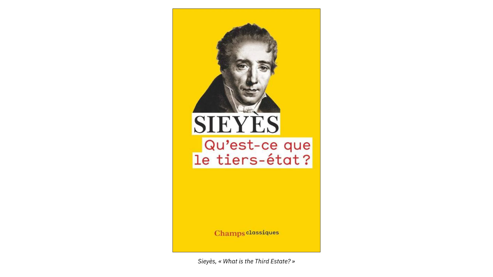

ในปี 1795 ห้าปีหลังจากการออกใช้ครั้งแรก เงินกระดาษได้สูญเสียมูลค่าไป 99% การปฏิวัติฝรั่งเศสยังคงดำเนินต่อไปภายใต้การปกครองของ Directory จนถึงปี 1799 เมื่อ Napoleon ยึดอำนาจผ่านการรัฐประหาร เขากลายเป็นกงสุลคนแรกของสาธารณรัฐฝรั่งเศสก่อนที่จะได้รับการสวมมงกุฎเป็นจักรพรรดิในปี 1804 นี่เป็นหนึ่งในความขัดแย้งที่เห็นได้ชัดเจนครั้งแรกกับปฏิญญาว่าด้วยสิทธิมนุษยชน ซึ่งประกาศว่าทรัพย์สินส่วนตัวเป็นสิ่งที่ไม่สามารถละเมิดได้

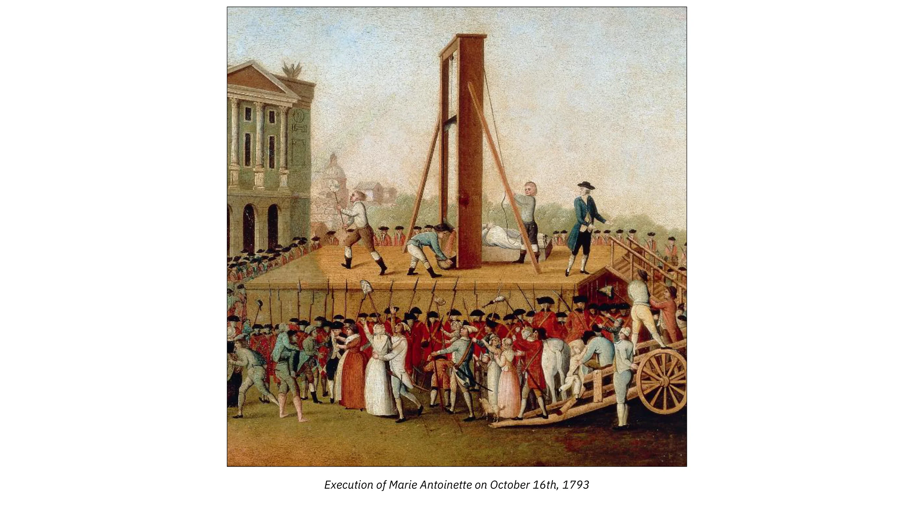

ในอเมริกา ไม่มีการควบคุมเศรษฐกิจแบบ dirigisme และไม่มีการล้มละลายทางการเงินเหมือนกับ Assignats และที่สำคัญที่สุด ไม่มีการห้ามปราม ไม่มีการอพยพครั้งใหญ่ ไม่มีเครื่องกิโยติน ไม่มีการสังหารหมู่ และไม่มีการปกครองด้วยความหวาดกลัว ทันทีที่เห็นความแตกต่างในวิธีการดำเนินการที่แยกการปฏิวัติอเมริกันออกจากการปฏิวัติฝรั่งเศส

ด้วย Rousseau และ Robespierre ชาวฝรั่งเศสพยายามที่จะเชื่อว่าชาติหรือเจตจำนงทั่วไปมีอำนาจไม่จำกัดและเป็นการกระทำที่ชอบธรรมทั้งหมด จากข้อเท็จจริงที่ว่าประชาชนปกครอง จึงสรุปได้ว่าพวกเขามีสิทธิทั้งหมด มีความขัดแย้งอย่างชัดเจนระหว่างหลักการอันยิ่งใหญ่ของการปฏิวัติกับวิธีการที่ใช้เพื่อทำให้พวกเขาชนะ

นอกจากนี้ นี่คือความหมายของคำกล่าวโดยฟรีดริช ฮาเย็คในหนังสือของเขา _The Constitution of Liberty_:

> ปัจจัยชี้ขาดที่ทำให้ความพยายามของการปฏิวัติเพื่อส่งเสริมเสรีภาพส่วนบุคคลกลายเป็นสิ่งไร้ผลก็คือ มันสร้างภาพลวงตาว่า เนื่องจากอำนาจทั้งหมดได้ถูกมอบให้กับประชาชนแล้ว มาตรการป้องกันการใช้อำนาจในทางที่ผิดจึงกลายเป็นสิ่งที่ไม่จำเป็น

# จุดสูงสุดและการเสื่อมถอย: จากศตวรรษที่ 19 ถึงศตวรรษที่ 20

<partId>39810d57-19e3-5166-8f2e-40b763154148</partId>

## เสรีภาพของคนยุคใหม่

<chapterId>e575f4c1-7144-591b-ab98-d976ec4102fb</chapterId>

:::video id=1356c0eb-806d-4914-8885-0eada01d9580:::

ตามที่เบนจามิน คอนสแตนต์กล่าวไว้ เสรีภาพในสังคมสมัยใหม่ไม่สามารถเข้าใจได้ในลักษณะเดียวกับวัฒนธรรมโบราณอีกต่อไป ซึ่งเป็นการมีส่วนร่วมโดยตรงในกิจการของเมือง

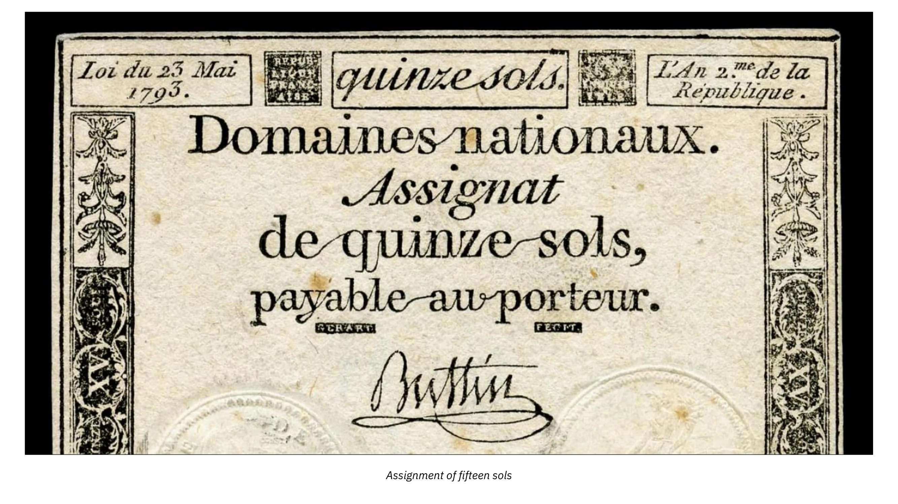

### เสรีภาพในชีวิตส่วนตัว

ในสมัยโบราณ บุคคลมีอำนาจอธิปไตยในกิจการสาธารณะ แต่ถูกกดขี่ในความสัมพันธ์ส่วนตัวทั้งหมด การใช้สิทธิทางการเมืองชดเชยการเสียสละเสรีภาพส่วนบุคคล: สิทธิในการใช้แง่มุมต่าง ๆ ของอธิปไตยโดยตรง, การอภิปรายในที่สาธารณะ, การลงคะแนนเสียงในกฎหมาย, การตัดสินคดี, และการประเมินและตัดสินผู้พิพากษา มันคือเสรีภาพทางการเมืองและส่วนรวม:

> เสรีภาพของคนโบราณประกอบด้วยการมีส่วนร่วมอย่างกระตือรือร้นและต่อเนื่องในอำนาจร่วมกัน ในทางกลับกัน เสรีภาพของเราต้องประกอบด้วยการเพลิดเพลินอย่างสงบสุขในความเป็นอิสระส่วนบุคคล; ดังนั้นเราจึงต้องยึดมั่นในความเป็นอิสระของเรามากกว่าคนโบราณ (_On the Liberty of the Ancients Compared with that of the Moderns_ (1819))

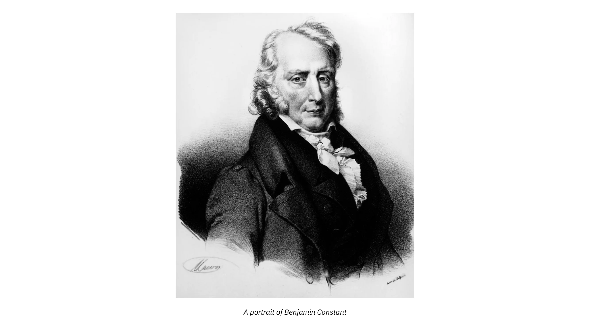

เสรีภาพสมัยใหม่ครอบคลุมถึงเสรีภาพทางแพ่ง ซึ่งรวมถึงเสรีภาพทางเศรษฐกิจและมีพื้นฐานอยู่บนสิทธิในความเป็นส่วนตัว เป็นสิทธิที่จะไม่ถูกกระทำโดยพลการ สิทธิในการแสดงความคิดเห็น การชุมนุม การเคลื่อนไหว การนมัสการ และอุตสาหกรรม ไม่มีเสรีภาพหากไม่มีความเป็นไปได้ในการเลือกวิถีชีวิตและค่านิยมของตนเอง ดังนั้นจึงไม่มีเสรีภาพหากไม่มีความเป็นไปได้ในการถอนตัวออกจากชุมชน และผลที่ตามมาคือไม่มีเสรีภาพหากไม่มีการจำกัดของรัฐเพื่อให้มีพื้นที่ส่วนตัวนี้อยู่ เป็นเสรีภาพที่สอดคล้องกับสิ่งที่ชาวอเมริกันเรียกว่าสิทธิพลเมือง

คำจำกัดความของเสรีภาพนี้พบในงานของจอห์น สจวร์ต มิลล์:

> เสรีภาพเพียงอย่างเดียวที่สมควรได้รับชื่อนี้คือการแสวงหาความดีของเราในวิถีทางของเราเอง ตราบใดที่เราไม่พยายามที่จะกีดกันผู้อื่นจากเสรีภาพของพวกเขาหรือขัดขวางความพยายามของพวกเขาในการได้รับมัน (...) มนุษยชาติได้รับประโยชน์มากขึ้นจากการปล่อยให้แต่ละคนใช้ชีวิตตามที่พวกเขาเห็นสมควรกว่าการบังคับให้พวกเขาใช้ชีวิตตามที่ผู้อื่นเห็นว่าดี (_On Liberty_, 1859)

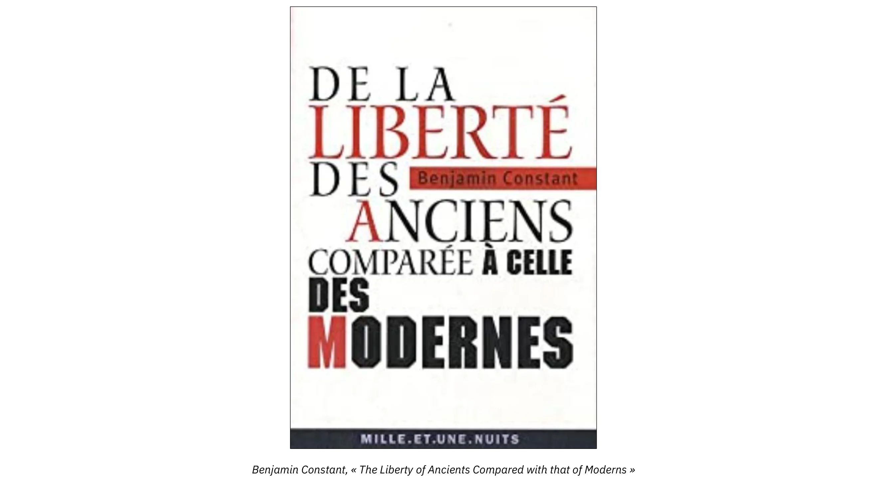

มิลล์ได้กำหนดขอบเขตของอธิปไตยของรัฐ: มันหยุดอยู่ตรงที่อธิปไตยของปัจเจกบุคคลเริ่มต้นขึ้น หากการกระทำของปัจเจกบุคคลไม่มีผลเสียต่อผู้อื่น ปัจเจกบุคคลนั้นก็มีเสรีภาพอย่างเต็มที่ในการกระทำเช่นนั้น รัฐต้องควบคุมความสัมพันธ์ระหว่างบุคคล แต่ไม่สามารถก้าวล้ำไปกว่านั้นโดยการแทรกแซงในชีวิตส่วนตัวของปัจเจกบุคคล หากปัจเจกบุคคลทำร้ายตนเอง รัฐไม่สามารถทำอะไรได้นอกจาก "ตักเตือน" หรือพยายาม "ให้เหตุผล" หรือ "ชักชวน" พวกเขา: ไม่สามารถบังคับหรือลงโทษได้ เพราะมิลล์กล่าวเสริมว่า: "เหตุผลที่ถูกต้องเพียงอย่างเดียวที่รัฐอาจใช้กำลังกับสมาชิกคนหนึ่งของตนเอง โดยขัดต่อความประสงค์ของพวกเขา คือการป้องกันไม่ให้เกิดอันตรายต่อผู้อื่น"

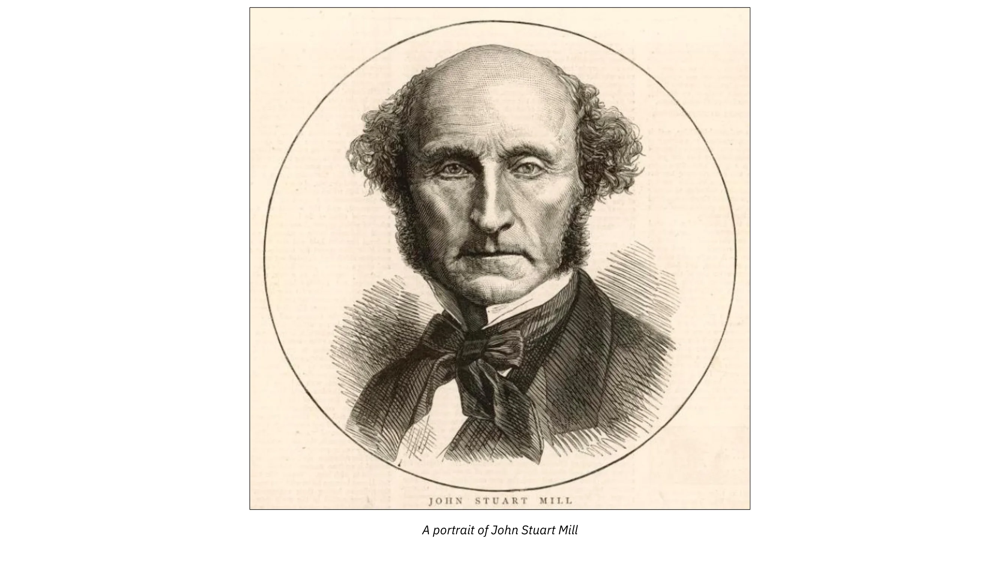

อำนาจทางการเมืองที่สอดคล้องกับเสรีภาพของคนยุคใหม่จึงมีขอบเขตจำกัด: "ให้ผู้มีอำนาจจำกัดตัวเองให้อยู่ในความยุติธรรม เราจะดูแลความสุขของเราเอง" เบนจามิน คอนสแตนท์ประกาศ ไม่ใช่หน้าที่ของรัฐที่จะบอกเราว่าควรมีความสุขอย่างไร

### ความสับสนแบบรูโซ

ตามที่ Constant กล่าวว่า "ความสับสนของเสรีภาพสองประเภทนี้ได้เป็นสาเหตุของความชั่วร้ายมากมายในยุคที่มีชื่อเสียงเกินไปของการปฏิวัติของเรา" Jean-Jacques Rousseau โดยการมองเสรีภาพเพียงแค่การมีส่วนร่วมร่วมกันของพลเมืองในการกระทำทางการเมือง ได้สนับสนุนให้ Robespierre บังคับพลเมืองผ่านความหวาดกลัว ความผิดพลาดของการปฏิวัติจึงเป็นผลมาจากการประยุกต์ใช้หลักการทางการเมืองสมัยใหม่ที่มีผลใช้ได้ในหมู่คนโบราณ

อย่างไรก็ตาม นี่ไม่ได้หมายถึงการเสียสละเสรีภาพทางการเมืองหรือการมีส่วนร่วมในอำนาจ Constant ระบุว่าหากเสรีภาพสมัยใหม่แตกต่างจากเสรีภาพโบราณ มันก็ถูกคุกคามด้วยอันตรายที่แตกต่างกัน อันตรายของเสรีภาพของคนโบราณคือความตามอำเภอใจ ภัยคุกคามต่อเสรีภาพของคนสมัยใหม่คือการสละการรับประกันทางการเมืองของเสรีภาพนี้ผ่านความเฉยเมยต่อประโยชน์สาธารณะ กล่าวอีกนัยหนึ่งคือขึ้นอยู่กับประชาชนที่จะเฝ้าระวังตัวแทนของพวกเขาอย่างถาวร

อันที่จริง ในหนังสือ _Principles of Politics_ ของเขา Benjamin Constant ยืนยันว่า:

> อธิปไตยของประชาชนไม่ได้ไร้ขีดจำกัด; มันถูกจำกัดอยู่ภายในขอบเขตที่กำหนดโดยความยุติธรรมและสิทธิของปัจเจกบุคคล ความประสงค์ของประชาชนทั้งหมดไม่สามารถทำให้สิ่งที่ไม่ยุติธรรมกลายเป็นยุติธรรมได้

นี่คือบทวิจารณ์ใหม่เกี่ยวกับรูโซและ _Social Contract_: แม้แต่เจตจำนงทั่วไปก็ยังมีขอบเขตจำกัด และไม่สามารถเปลี่ยนแปลงสิ่งที่อยู่ภายใต้กฎธรรมชาติได้ มีสิทธิ์ที่มาก่อนและเหนือกว่าสิทธิ์ทางการเมือง: นั่นคือกฎธรรมชาติ สิทธิ์นี้กำหนดขอบเขตของอำนาจทางการเมืองและจำกัดเสรีภาพของปัจเจกบุคคล

การกล่าวว่าพลังอำนาจที่ชอบธรรมทั้งหมดต้องมีพื้นฐานมาจากเจตจำนงทั่วไปไม่ได้หมายความว่าทุกสิ่งที่เจตจำนงทั่วไปตัดสินใจนั้นชอบธรรม ดังนั้น Constant จึงสอดคล้องกับปฏิญญาว่าด้วยสิทธิมนุษยชนปี 1789 มาตรา II ซึ่งระบุว่ารัฐถูกสถาปนาขึ้นเพื่อรักษาสิทธิตามธรรมชาติเท่านั้น ได้แก่ เสรีภาพ ความรับผิดชอบ และทรัพย์สิน ดังนั้นจึงมีพื้นที่ที่อำนาจทางการเมืองไม่มีอิทธิพล: ศีลธรรมและศาสนา แต่ยังรวมถึงวิทยาศาสตร์ซึ่งอยู่ภายใต้อำนาจของความรู้และสุดท้ายคืออุตสาหกรรม Constant กล่าวเสริม

### เสรีภาพทางการเมืองและเสรีภาพทางเศรษฐกิจ

เสรีภาพทางการเมืองโดยปราศจากเสรีภาพอื่น ๆ เป็นเพียงภาพลวงตา ตามที่เบนจามิน คอนสแตนต์กล่าวไว้ เสรีภาพทางการเมืองคือเสรีภาพในการมีส่วนร่วมในการใช้อำนาจ อย่างไรก็ตาม อำนาจของประชาชนหรือมวลชนสามารถทำลายเสรีภาพได้ เพราะมันให้สิทธิ์แก่เสียงข้างมากในการลงคะแนนเสียงในการบังคับใช้เจตจำนงของตนต่อสังคมทั้งหมด รวมถึงความปรารถนาหรืออุดมการณ์ของตนในขณะนั้น: ภาษีที่ริบโดยไม่มีการชดเชย การบังคับใช้ความคิดเดียว การเซ็นเซอร์ การปราบปราม และการก่อการร้ายทางปัญญา นั่นคือเหตุผลที่ไม่สามารถมีเสรีภาพที่แท้จริงได้หากปราศจากเสรีภาพพลเมือง รวมถึงเสรีภาพทางศาสนาและเสรีภาพทางเศรษฐกิจ เบนจามิน คอนสแตนต์ไม่แยกเสรีภาพทางการเมืองออกจากเสรีภาพทางเศรษฐกิจ:

> เป็นเวลาสี่สิบปีที่ฉันได้ปกป้องหลักการเดียวกัน นั่นคือเสรีภาพในทุกสิ่ง ในศาสนา ในปรัชญา ในวรรณกรรม ในอุตสาหกรรม ในการเมือง: และโดยเสรีภาพ ฉันหมายถึงชัยชนะของความเป็นปัจเจกบุคคล ทั้งเหนืออำนาจที่ต้องการปกครองด้วยการกดขี่และเหนือมวลชนที่อ้างสิทธิ์ในการกดขี่ชนกลุ่มน้อยให้เป็นทาสของเสียงข้างมาก การกดขี่ไม่มีสิทธิ์ เสียงข้างมากมีสิทธิ์บังคับให้ชนกลุ่มน้อยเคารพในระเบียบ: แต่ทุกสิ่งที่ไม่รบกวนระเบียบ ทุกสิ่งที่เป็นเพียงภายใน เช่น ความคิดเห็น; ทุกสิ่งที่ในการแสดงความคิดเห็นไม่ทำร้ายผู้อื่น ไม่ว่าจะโดยการยั่วยุให้เกิดความรุนแรงทางกายหรือโดยการต่อต้านการแสดงออกที่ตรงกันข้าม; ทุกสิ่งที่ในแง่ของอุตสาหกรรม อนุญาตให้ภาคส่วนคู่แข่งดำเนินการได้อย่างเสรี เป็นเรื่องของปัจเจกบุคคล และไม่สามารถถูกบังคับใช้โดยอำนาจทางสังคมได้อย่างถูกต้องตามกฎหมาย

กล่าวอีกนัยหนึ่ง ในสังคมเสรี จำเป็นต้องกำหนดขอบเขตที่เข้มงวดระหว่างพื้นที่สาธารณะและพื้นที่ส่วนตัว หลักการที่อยู่เบื้องหลังขอบเขตนี้คือการไม่ทำร้ายผู้อื่น โดยเฉพาะอย่างยิ่งการไม่ละเมิดสิทธิในทรัพย์สินของพวกเขา

## จุดแข็งและจุดอ่อนของประชาธิปไตย

<chapterId>753e065d-dbee-5d61-aa56-b1c074c95499</chapterId>

:::video id=81dba30f-446b-4baa-9dc6-39aa297f741c:::

Alexis de Tocqueville เป็นผู้สังเกตการณ์ที่เฉียบแหลมของประชาธิปไตยและนักวิจารณ์ของลัทธิปัจเจกนิยมในระบอบประชาธิปไตย

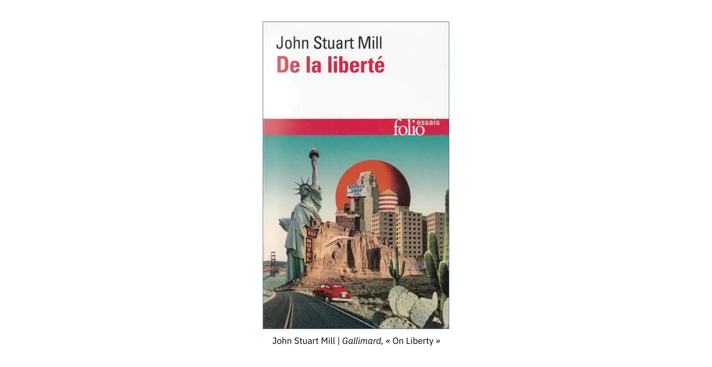

การวิเคราะห์ประชาธิปไตยของ Tocqueville ขยายความแตกต่างที่ Constant ทำไว้ระหว่างเสรีภาพของคนโบราณและเสรีภาพของคนสมัยใหม่ ในบทความปี 1836 (_Social and Political State of France Before and Since 1789_) Tocqueville เปรียบเทียบเสรีภาพของชนชั้นสูงกับเสรีภาพของประชาธิปไตยอย่างเป็นระบบ เสรีภาพของชนชั้นสูงถูกกำหนดว่าเป็น "การเพลิดเพลินกับสิทธิพิเศษ" และ Tocqueville ยกตัวอย่างพลเมืองโรมันที่ได้รับเสรีภาพไม่ใช่จากธรรมชาติแต่จากการเป็นส่วนหนึ่งของโรม

แนวคิดที่สอง ซึ่งรู้จักกันในชื่อ "แนวคิดที่ถูกต้องของเสรีภาพ" นั้นเกี่ยวข้องกับ "สิทธิที่เท่าเทียมและไม่อาจโอนให้ใครได้ในการดำรงชีวิตอย่างอิสระจากเพื่อนร่วมสังคม" แนวคิดเสรีภาพสมัยใหม่นี้จึงแตกต่างจากแนวคิดแรก; มันเป็นแนวคิดทางการเมือง แต่มีรากฐานมาจากกฎหมายธรรมชาติ และถือว่าถูกต้องเพราะมันใช้ได้กับทุกคนอย่างเท่าเทียมกัน มันถูกเขียนไว้ว่า:

> ตามแนวคิดสมัยใหม่ แนวคิดประชาธิปไตย และข้าพเจ้ากล้ากล่าวว่าแนวคิดที่ถูกต้องเกี่ยวกับเสรีภาพ ทุกคนซึ่งถูกสันนิษฐานว่าได้รับความรู้แจ้งที่จำเป็นจากธรรมชาติเพื่อดำเนินชีวิตด้วยตนเอง มีสิทธิที่เท่าเทียมและไม่อาจโอนให้ใครได้ตั้งแต่เกิดในการดำรงชีวิตอย่างอิสระจากเพื่อนร่วมโลก ในทุกสิ่งที่เกี่ยวข้องกับตนเองเท่านั้น และกำหนดชะตากรรมของตนตามที่เห็นสมควร

Tocqueville ระมัดระวังในการระบุผลกระทบทางการเมืองและวัฒนธรรมทั้งหมดของวิถีชีวิตแบบใหม่นี้ ซึ่งเป็นแบบสมัยใหม่ โดยทั่วไปแล้ว เขาชื่นชม Pascal และมุ่งหมายที่จะพรรณนาถึงความยิ่งใหญ่และความทุกข์ยากของประชาธิปไตย

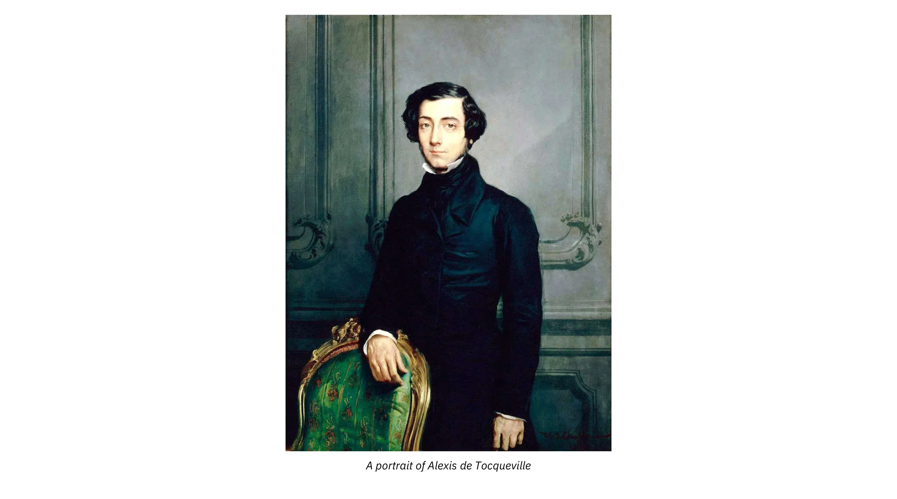

ในปี 1841 ใน _Democracy in America_ เขาได้วิเคราะห์หลักการประชาธิปไตยที่ยืนยันตัวเองในการทำให้เงื่อนไขเท่าเทียมกันกับลำดับชั้นของชนชั้นและอำนาจของประเพณี และเขาสังเกตว่ากระบวนการนี้มาพร้อมกับการสลายตัวของอิทธิพลทางสังคม ความผูกพันของการพึ่งพา และการทำให้ความสัมพันธ์ทางสังคมเป็นอะตอม ซึ่งคุกคามการใช้เสรีภาพและความรับผิดชอบทางการเมืองของพลเมือง นอกจากนี้ การสูญเสียอุดมคติอันยิ่งใหญ่ในอดีต (คุณธรรม ความดีส่วนรวม) นำไปสู่ความยากจนของความหมายของชีวิต "ไปสู่ความสุขเล็ก ๆ และหยาบคาย" สู่ความเบื่อหน่ายและความไม่สบายใจ

แท้จริงแล้ว ความเสมอภาคของสภาพที่เป็นลักษณะเฉพาะของประชาธิปไตย หมายความว่าทุกคนมีแนวโน้มที่จะถอนตัวเข้าสู่ตัวเอง โดยไม่มีความเชื่อมโยงที่ผูกพันพวกเขากับผู้อื่น ความเป็นอิสระของบุคคลที่เสรีภาพใหม่นี้ยกย่อง ทำให้การปฏิบัติคุณธรรมพลเมืองเป็นเรื่องยากโดยส่งเสริมความเฉยเมยต่อประโยชน์สาธารณะ ผลที่ตามมาคือ ประชาธิปไตยสมัยใหม่เปิดเผยตัวเองต่อการปกครองแบบเผด็จการ "นุ่มนวลและสม่ำเสมอ" ของรัฐนิยม ซึ่งเป็นไปได้โดยความไม่สนใจที่เพิ่มขึ้นของประชาชนในชีวิตทางการเมือง ดังนั้น ประชาธิปไตยจึงมีแนวโน้มไปสู่ความสุดโต่งสองประการที่เลี้ยงดูซึ่งกันและกัน:

ในอีกด้านหนึ่ง ปัจเจกนิยม นั่นคือ "ความไม่สนใจในกิจการสาธารณะ" และ "ความรักในความสุขทางวัตถุ" Tocqueville นิยามปัจเจกนิยมอย่างชัดเจนว่าเป็นความรู้สึกของความพอเพียงในตนเองที่นำพาประชาชนให้แยกตัวออกจากผู้อื่นและหันกลับเข้าสู่ตนเอง นี่คือการหลงตัวเองแบบเฮโดนิสติก

และในทางกลับกัน รัฐนิยม ซึ่งทำลายบุคคลโดยการทำให้พวกเขาอยู่ในสภาพของความเป็นเด็ก รัฐ "ทำงานเพื่อความสุขของพวกเขาอย่างเต็มใจ แต่ต้องการเป็นตัวแทนเพียงผู้เดียว"

ในความเป็นจริง การทำให้เท่าเทียมกันนั้นมาพร้อมกับความเปราะบางที่มากขึ้นของบุคคลที่กลายเป็นโดดเดี่ยวและแยกออกจากกัน เพื่อหลีกเลี่ยงอนาธิปไตยและปกป้องทรัพย์สินของพวกเขา พวกเขาพึ่งพาอำนาจที่เป็นเอกลักษณ์และศูนย์กลางซึ่งพวกเขามอบสิทธิทั้งหมดของพวกเขา ดังนั้น ตามที่ Tocqueville กล่าว จำเป็นต้องพัฒนาสมาคมพลเรือนและ "ประชาธิปไตยท้องถิ่น" เพื่อรักษาอำนาจถ่วงดุลและต่อสู้กับทั้งปัจเจกนิยมและเผด็จการ ซึ่งทั้งสองอย่างนี้ทำลายเสรีภาพ

ผู้เขียน _Democracy in America_ เตือนเรา:

> แน่นอนว่ามีความหลงใหลในความเสมอภาคที่สูงส่งและชอบธรรมซึ่งกระตุ้นให้มนุษย์ต้องการเป็นที่แข็งแกร่งและได้รับการยกย่อง ความหลงใหลนี้มีแนวโน้มที่จะยกระดับผู้ที่เล็กให้ขึ้นสู่ระดับของผู้ที่ยิ่งใหญ่ อย่างไรก็ตาม ในหัวใจของมนุษย์ยังมีรสนิยมที่เสื่อมทรามต่อความเสมอภาค ซึ่งนำพาผู้ที่อ่อนแอให้ต้องการดึงผู้ที่แข็งแกร่งลงมาอยู่ในระดับเดียวกัน และทำให้มนุษย์เลือกที่จะชอบความเสมอภาคในความเป็นทาสมากกว่าความไม่เสมอภาคในเสรีภาพ (...) ชาติในยุคของเราไม่สามารถทำให้เงื่อนไขภายในของพวกเขาเท่าเทียมกันได้ อย่างไรก็ตาม มันขึ้นอยู่กับพวกเขาว่าความเสมอภาคจะนำพาพวกเขาไปสู่ความเป็นทาสหรือเสรีภาพ สู่ความรู้แจ้งหรือความป่าเถื่อน สู่ความเจริญรุ่งเรืองหรือความทุกข์ยาก

สำหรับ Tocqueville มนุษย์ถูกดึงดูดให้สนใจความเสมอภาคมากกว่าความเสรีภาพ เขามองว่านี่เป็นภัยคุกคามที่สำคัญต่อประชาธิปไตย ทำไมมนุษย์ถึงชอบความหลงใหลในความเสมอภาคมากกว่าสองสิ่งนี้? เพราะเสรีภาพก่อให้เกิดต้นทุนที่มองเห็นได้โดยตรง และผลประโยชน์ของมันอยู่ไกลออกไปในระยะยาว (เสรีภาพไม่ได้ให้เนื้อหา แต่ให้ความสามารถในการแสวงหาความสุขตามการตัดสินของตนเอง) ในทางกลับกัน ความเสมอภาคให้ผลลัพธ์เชิงบวกที่มองเห็นได้ทันที และข้อบกพร่องของมันจะปรากฏให้เห็นในระยะยาวเท่านั้น

### สิทธิในการทำงาน

สิทธิในการทำงานเป็นตัวอย่างที่ดีของการเคลื่อนตัวของความเสมอภาคในระบอบประชาธิปไตย ในสุนทรพจน์ต่อสมัชชาร่างรัฐธรรมนูญในปี 1848 Tocqueville ได้ยืนหยัดต่อต้านสิทธิในการทำงานในร่างรัฐธรรมนูญ หากรัฐรับหน้าที่จัดหางานให้กับคนงานทุกคน เขาโต้แย้ง หรือหากรัฐมั่นใจว่าพวกเขาจะหางานได้เสมอในตลาดงานตามที่สังคมนิยมต้องการ มันจะนำไปสู่การกลายเป็น "ผู้จัดงานที่ยิ่งใหญ่และเอกลักษณ์ของแรงงาน"

ในสุนทรพจน์นี้ Tocqueville เปรียบเทียบสังคมนิยมกับระบอบ Ancien Régime ซึ่งสำหรับพวกเขา "ประชาชนเป็นผู้ที่อ่อนแอและต้องได้รับการประคับประคองอยู่เสมอ มิฉะนั้นอาจล้มลงหรือทำร้ายตัวเอง" ดังนั้นสังคมนิยมจึงเป็น "รูปแบบใหม่ของการเป็นทาส" ด้วยเหตุผลสามประการ:

1. ในทางศีลธรรม สังคมนิยมส่งเสริมความไร้ความรับผิดชอบผ่านการควบคุมของรัฐที่มีลักษณะสั่งการและรวมหมู่ มันมักจะมีลักษณะ "การดูถูกอย่างลึกซึ้งต่อปัจเจกบุคคลในฐานะเช่นนั้น"

2. ในทางการเมือง มันเป็นเผด็จการเพราะในนามของความสุข มันพยายามที่จะกลายเป็น "นายของทุกคน ครู และผู้ให้การศึกษา"

3. ในทางเศรษฐกิจ มันไม่มีประสิทธิภาพเพราะมันกำจัดการแข่งขันผ่านกฎระเบียบของมันและการปฏิเสธทรัพย์สินส่วนตัวของมัน

### กฎหมายและการใช้อำนาจในทางที่ผิด

Frédéric Bastiat คิดอย่างไรเกี่ยวกับประชาธิปไตย? เขาตอบตั้งแต่ปี 1846:

> ฉันสนับสนุนประชาธิปไตย หากคำนี้หมายถึง: ให้แต่ละคนมีทรัพย์สินจากแรงงานของตน เสรีภาพสำหรับทุกคน ความเสมอภาคสำหรับทุกคน ความยุติธรรมสำหรับทุกคน และสันติภาพในหมู่ทุกคน (_การค้าเสรี_)

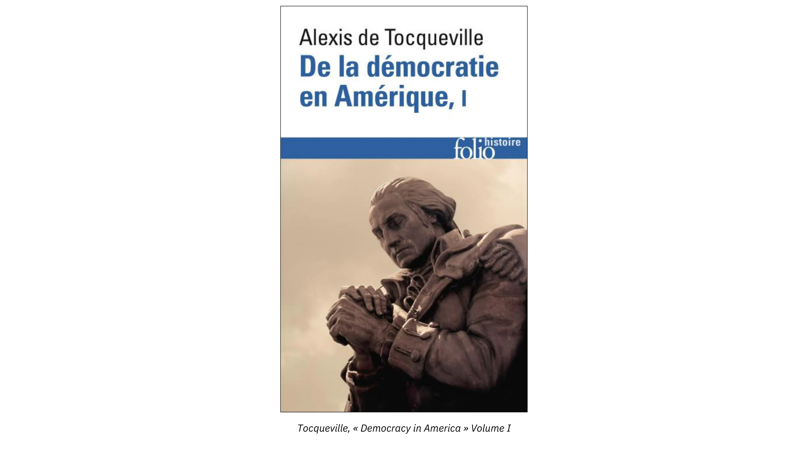

อย่างไรก็ตาม ในปี 1848 หลังจากการปฏิวัติเดือนกุมภาพันธ์ บาสเตียตได้รับเลือกเป็นรองของแล็นเดสในสมัชชาที่ซึ่งกลุ่มสังคมนิยมได้เข้าสู่เวทีอย่างมีชัยชนะ กลุ่มหลังนี้เรียกร้องเพียงสิ่งเดียว: ให้กฎหมายรับรองหลักการของภราดรภาพ กล่าวอีกนัยหนึ่งคือ การออกกฎหมายเพื่อจัดหางาน การศึกษา และการดูแลสุขภาพสำหรับทุกคน

ภายใต้การปกครองของแนวคิดสังคมนิยม บาสเตียตสังเกตเห็นว่าเครื่องมือการเลือกตั้งถูกใช้เพื่อปล้นเงินสาธารณะ ดังนั้นพลเมือง:

> การเงินสาธารณะจะไม่ใช้เวลานานในการตกอยู่ในความยุ่งเหยิงอย่างสมบูรณ์ จะเป็นอย่างอื่นได้อย่างไรเมื่อรัฐมีหน้าที่ในการจัดหาทุกสิ่งให้กับทุกคน? ภาษีจะบดขยี้ประชาชน; การกู้ยืมจะตามมาด้วยการกู้ยืม หลังจากใช้หมดในปัจจุบัน อนาคตก็จะถูกกลืนกิน ในที่สุด เมื่อได้รับการยอมรับในหลักการว่ารัฐมีหน้าที่ในการส่งเสริมภราดรภาพในหมู่พลเมือง ประชากรทั้งหมดจะกลายเป็นผู้ร้องขอ ทรัพย์สินที่ดิน เกษตรกรรม อุตสาหกรรม การค้า กองทัพเรือ บริษัทอุตสาหกรรม ทุกอย่างจะเคลื่อนไหวเพื่อเรียกร้องความโปรดปรานจากรัฐ คลังสาธารณะจะถูกปล้นอย่างแท้จริง ([ _Justice and Fraternity_ ](http://bastiat.org/fr/justice_fraternite.html))

จากคำพูดของบาสเตียต รัฐจึงกลายเป็น

> นิยายอันยิ่งใหญ่ที่ทุกคนพยายามจะมีชีวิตอยู่ด้วยค่าใช้จ่ายของคนอื่น ๆ ([_The State_](http://bastiat.org/fr/l_etat.html))
> บาสเตียตยังพัฒนาแนวคิดที่ว่าความขัดแย้งเกิดขึ้นเมื่อกฎหมายเบี่ยงเบนจากบทบาทที่ถูกต้อง ในแผ่นพับที่มีชื่อเสียงของเขา [_The Law_](http://bastiat.org/fr/la_loi.html) เขาแสดงให้เห็นว่าทำไมและอย่างไรที่กฎหมายกลายเป็น "สนามรบของความโลภทั้งหมด" หมายถึงแหล่งที่มาของสิทธิพิเศษ ค่าเช่าสถานการณ์ และการเก็บภาษีตามอำเภอใจ ทันทีที่ยอมรับในหลักการว่ากฎหมายสามารถเบี่ยงเบนจากภารกิจที่แท้จริงของมันได้ ว่ามันสามารถละเมิดทรัพย์สินแทนที่จะรับประกันพวกมัน การต่อสู้ทางชนชั้นจะตามมาอย่างหลีกเลี่ยงไม่ได้ ไม่ว่าจะเพื่อป้องกันการปล้นสะดมหรือเพื่อจัดระเบียบมันเพื่อประโยชน์ของตนเอง

ในกรณีที่กฎหมายเพียงบังคับใช้สิทธิของแต่ละบุคคลและรับประกัน _"การจัดระเบียบร่วมกันของสิทธิส่วนบุคคลในการป้องกันตัวที่ชอบธรรม,"_ ไม่มีใครอยู่ในตำแหน่งที่จะใช้ประโยชน์จากมันเพื่อประโยชน์ของตนเองโดยเสียค่าใช้จ่ายของทุกคน จนถึงขนาดที่รูปแบบของรัฐบาลกลายเป็นคำถามรอง

มันเป็นเพียงเมื่อกฎหมายเกินขอบเขตที่ถูกต้องที่ผู้บัญญัติกฎหมายกลายเป็นผู้ที่สามารถถูกทุจริตได้ สิ่งนี้นำไปสู่การต่อสู้อย่างดุเดือดระหว่างผลประโยชน์ประเภทต่าง ๆ ที่ต่างกระตือรือร้นที่จะยึดครองกลไกการออกกฎหมายเพื่อให้ได้มาซึ่งสิทธิพิเศษที่โดยนิยามแล้วเป็นการแย่งชิง

ตามที่บาสเตียตกล่าวไว้ ประชาธิปไตยแบบสังคมนิยมทำให้เกิดการขาดดุลงบประมาณอย่างถาวรและในที่สุดก็นำไปสู่ความรุนแรง อันที่จริง โดยการเพิ่มคำสัญญาอย่างไม่รู้จักเหน็ดเหนื่อยและไม่สามารถทำตามคำสัญญาได้ เครื่องจักรการเลือกตั้งจึงพัฒนาความขมขื่นที่วางรากฐานสำหรับการปฏิวัติ เขาเขียนว่า:

> แต่ถ้ารัฐบาลรับหน้าที่ในการขึ้นและควบคุมค่าจ้างและไม่สามารถทำได้; ถ้ารับหน้าที่ในการช่วยเหลือความโชคร้ายทั้งหมดและไม่สามารถทำได้; ถ้ารับหน้าที่ในการจัดหาบำนาญให้กับคนงานทุกคนและไม่สามารถทำได้... เราไม่เห็นหรือว่า น่าเสียดาย ที่สุดท้ายของความผิดหวังแต่ละครั้ง? มีแนวโน้มมากกว่าที่จะมีการปฏิวัติที่หลีกเลี่ยงไม่ได้เช่นกัน ([_The Law_](http://bastiat.org/fr/la_loi.html))

ข้อสรุปของบาสเตียต:

ดูที่โลกใบนี้ คนกลุ่มใดที่มีความสุขที่สุด มีศีลธรรมที่สุด และสงบสุขที่สุด? คือกลุ่มที่กฎหมายเข้ามาแทรกแซงกิจกรรมส่วนตัวน้อยที่สุด; ที่รัฐบาลมีบทบาทน้อยที่สุด; ที่ความเป็นปัจเจกบุคคลมีความยืดหยุ่นมากที่สุดและความคิดเห็นของสาธารณชนมีอิทธิพลมากที่สุด; ที่กลไกการบริหารมีน้อยที่สุดและซับซ้อนน้อยที่สุด; ที่ภาษีมีภาระน้อยที่สุดและไม่เท่าเทียมกันน้อยที่สุด; ที่ความไม่พอใจของประชาชนถูกกระตุ้นน้อยที่สุดและมีเหตุผลน้อยที่สุด; ที่ความรับผิดชอบของบุคคลและชนชั้นมีความกระตือรือร้นมากที่สุด และดังนั้น หากศีลธรรมไม่สมบูรณ์แบบ พวกเขาก็มีแนวโน้มที่จะปรับปรุงตัวเองอย่างไม่หยุดยั้ง; ที่การทำธุรกรรม ข้อตกลง การรวมกลุ่มถูกขัดขวางน้อยที่สุด; ที่แรงงาน ทุน และประชากรได้รับผลกระทบจากการเคลื่อนย้ายที่ไม่เป็นธรรมชาติน้อยที่สุด ([_The Law_](http://bastiat.org/fr/la_loi.html))

## การวิพากษ์วิจารณ์ระบบทุนนิยมของมาร์กซิสต์

<chapterId>16c82521-7c51-5d84-b660-0b358447e3bd</chapterId>

:::video id=4c62c361-923f-47f0-be3f-3798bbc37e57:::

มันเป็นช่วงศตวรรษที่ 19 ที่การวิพากษ์วิจารณ์ทุนนิยม โดยเฉพาะการวิพากษ์วิจารณ์แบบมาร์กซิสต์ ได้เกิดขึ้น

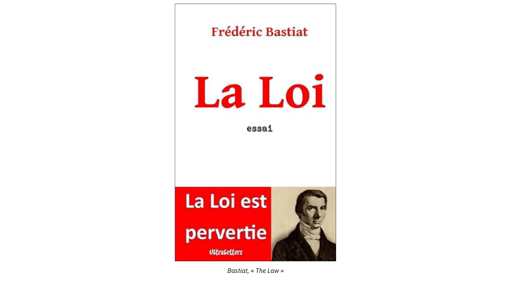

สิทธิในการพูด เขียน และลงคะแนนเสียงมีประโยชน์อะไร, มาร์กซ์กล่าวขึ้น, หากชีวิตประจำวันเป็นการต่อสู้เพื่อความอยู่รอด? เกินกว่าระดับหนึ่ง ความยากจนเท่ากับสภาพของการเป็นทาส ระเบียบสังคมจึงเป็นประโยชน์ต่อทุกคนก็ต่อเมื่อมีการใช้หลักการของการกระจายสินค้าที่เป็นธรรม การวิพากษ์วิจารณ์ลัทธิเสรีนิยมนี้ทำให้มาร์กซ์พิจารณาถึงความจำเป็นในการควบคุมระเบียบสังคมอย่างมีเหตุผลและมีการวางแผน จากนี้ไป รัฐที่มีขนาดเล็กของพวกเสรีนิยมต้องถูกแทนที่ด้วยรัฐที่เข้มแข็งซึ่งสามารถสร้างความเท่าเทียมที่แท้จริงได้ ซึ่งตามที่มาร์กซ์กล่าวถึงนั้นไปไกลถึงการยกเลิกทรัพย์สินส่วนตัวและการรวมเป็นเจ้าของร่วมกัน ในเวอร์ชันที่อ่อนลงกว่าเดิม "ประชาธิปไตยทางสังคม" รัฐถูกขอให้รับประกันไม่เพียงแต่สิทธินามธรรมของมนุษย์แต่สิทธิที่เป็นรูปธรรมของมนุษย์ สิทธิใหม่ถูกสร้างขึ้น สิทธิทางสังคมและเศรษฐกิจที่รัฐรับประกัน: สิทธิในการทำงาน สิทธิในการมีที่อยู่อาศัย สิทธิในการมีสุขภาพ (ฟรี) สิทธิในการศึกษา (ฟรี)

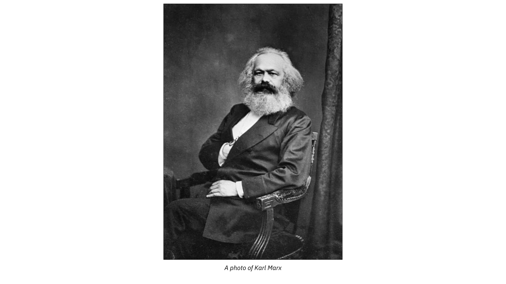

### ตำนานของรัฐที่เป็นกลาง

คำวิจารณ์พื้นฐานที่มาร์กซ์มีต่อเสรีนิยมทางการเมือง โดยเฉพาะในงานเขียนช่วงแรกๆ ของเขา (_Critique of Hegel's Philosophy of Right_ และ _On the Jewish Question_) มุ่งเน้นไปที่การแยกสังคมพลเรือนออกจากรัฐ คำวิจารณ์นี้ต้องเข้าใจภายในกรอบทั่วไปของการตีความ "การปฏิวัตินายทุน" ของเขา เป็นการปฏิวัตินี้ที่นำไปสู่การก่อตั้งรัฐที่แยกออกจากสังคมพลเรือน ซึ่งควรจะมุ่งหมายเพื่อสิ่งที่เป็นสากล หมายถึงผลประโยชน์ร่วมกัน โดยการทำหน้าที่เป็นผู้ตัดสินที่เป็นกลาง

อย่างไรก็ตาม ทั้งหมดนี้สำหรับมาร์กซ์เป็นเพียงภาพลวงตาที่หลอกลวง ในความเป็นจริง รัฐเป็นเพียงเครื่องมือที่มีไว้เพื่อรับใช้ผลประโยชน์เฉพาะของชนชั้นปกครอง กล่าวอีกนัยหนึ่ง รัฐไม่ได้เป็นกลาง มันไม่ได้แยกออกจากสังคมพลเมือง ในความเป็นจริง รัฐเสรีนิยมเป็นสถานที่ของภาพลวงตาสองชั้น ภาพลวงตาของความเป็นสากล ดังที่เราได้เห็นไปแล้ว และผลที่ตามมาคือภาพลวงตาของการปลดปล่อย แท้จริงแล้ว การปฏิวัติได้ปลดปล่อยพลเมืองโดยการสถาปนาความเป็นอธิปไตยของประชาชนและความเสมอภาคต่อหน้ากฎหมาย แต่เสรีภาพและความเสมอภาคนี้ยังคงเป็นเพียงอุดมคติและนามธรรม มาร์กซ์กล่าวว่า เป็นการผิดที่จะคิดเหมือนรูโซหรือเฮเกลว่ามนุษย์ตระหนักถึงธรรมชาติที่มีเหตุผลของตนอย่างเต็มที่โดยการเป็นพลเมือง ในความเป็นจริง คนเราสามารถเป็นพลเมืองและยังคงถูกเอารัดเอาเปรียบ ถูกกดขี่ ถูกทอดทิ้งไปตามอำเภอใจของความปรารถนา ไปสู่ความอนาธิปไตยของความเห็นแก่ตัว และกฎของผู้ที่แข็งแกร่งที่สุด

การปลดปล่อยพลเมือง ตามที่มาร์กซ์กล่าวไว้ ไม่ได้หมายถึงการปลดปล่อยมนุษย์แต่อย่างใด ดังที่คำประกาศในปี 1789 แนะนำไว้ แต่กลับเป็นชัยชนะของปัจเจกนิยมที่ทำลายล้างและดังนั้นจึงเป็นความไม่เท่าเทียมกัน เสรีภาพ ในฐานะอำนาจในการทำสิ่งใดก็ตามที่ไม่ทำร้ายผู้อื่น ซึ่งเป็นเสาหลักของสิทธิมนุษยชน เป็นเสรีภาพเชิงลบที่ไม่สร้างความสัมพันธ์ระหว่างบุคคล แต่ในทางตรงกันข้าม กลับส่งเสริมการแยกตัว การเป็นปฏิปักษ์ และในที่สุดคือการเป็นทาส เสรีภาพของสิทธิมนุษยชนเป็นเพียงรูปแบบเท่านั้น

ภาพลวงตาทางการเมืองของลัทธิเสรีนิยมเป็นด้านทางโลกของภาพลวงตาทางศาสนา, มาร์กซ์เสริม สูตรนี้เป็นที่รู้จักกันดี: "ศาสนาเป็นฝิ่นของประชาชน" ศาสนาเป็นแหล่งของการปลอบโยน, เสนอความสุขและสัญญาการปลดปล่อยในชีวิตหลังความตาย แต่เบี่ยงเบนมนุษย์จากการปลดปล่อยที่แท้จริงของเขาบนโลกนี้ ความเป็นพลเมืองคือ, ในความสัมพันธ์กับกิจกรรมของคนงาน, เหมือนกับอาณาจักรของพระเจ้าเกี่ยวกับการดำรงอยู่ที่น่าสังเวชบนโลกนี้ มันไม่เคยเกิดขึ้นจริง การแยกสองชั้นนี้ประกอบด้วยการแปลกแยกสองชั้น, หมายถึงการไม่บรรลุผลของมนุษย์ในความเป็นมนุษย์ของเขาหรือความสำเร็จในจินตนาการของเขา

### ความแปลกแยกทางเศรษฐกิจ

ในความเป็นจริง ตามที่มาร์กซ์และทฤษฎีวัตถุนิยมทางประวัติศาสตร์กล่าวไว้ การแปลกแยกทางเศรษฐกิจเป็นรากฐานของการแปลกแยกทั้งทางการเมืองและศาสนา ในการแปลกแยกทางเศรษฐกิจ ซึ่งเป็นผลมาจากระบบทุนนิยม (ที่กำหนดให้เป็นการเป็นเจ้าของส่วนตัวของปัจจัยการผลิต) คนงานถูกบังคับให้ขายพลังงานแรงงานของตนเป็นสินค้า นอกจากนี้ เขายังถูกพรากจากผลผลิตของแรงงานของเขา ซึ่งนายจ้างเป็นเจ้าของ เขาจึงถูกแปลกแยก หมายถึงถูกแยกออกจากตัวเอง เพราะงานของเขากลายเป็นสิ่งที่แปลกปลอมต่อเขาที่เขาต้องทำเพราะความจำเป็นในการอยู่รอด อย่างไรก็ตาม งาน สำหรับมาร์กซ์ เป็นการกระทำที่เป็นมนุษย์อย่างแท้จริง ซึ่งเป็นสิ่งที่ทำให้แก่นแท้ของมนุษย์ นั่นคือเสรีภาพ ได้รับการตระหนัก นี่คือเหตุผลที่การปลดปล่อยแรงงานยังหมายถึงการคืนความเป็นมนุษย์ให้กับมนุษย์ด้วย

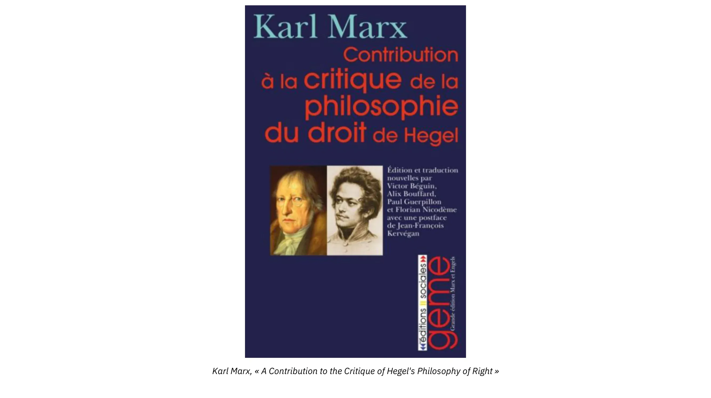

ดังนั้น การปฏิวัติทางการเมืองจึงเป็นภาพลวงตา ตามที่เขากล่าวไว้ ตราบใดที่มันไม่ได้มาพร้อมกับการปฏิวัติทางเศรษฐกิจและสังคมที่สามารถปลดปล่อยมนุษย์จากการเป็นทาสของระบบทุนนิยม และทำให้เกิดความเป็นเอกภาพระหว่างคนงานและพลเมือง ระหว่างสังคมและรัฐ ระหว่างภาคเอกชนและภาครัฐ เสรีภาพและความเสมอภาคในรูปแบบของพลเมืองจะกลายเป็นความจริงในสังคมที่ไร้ชนชั้น

## คำวิจารณ์ของออสเตรียต่อมาร์กซิสม์

<chapterId>f05dae71-c478-5de1-996e-1b7b4255d373</chapterId>

:::video id=0c740114-faff-400a-9359-d4b81766f246:::

สำนักเศรษฐศาสตร์ออสเตรีย ก่อตั้งโดย Carl Menger ในช่วงปลายศตวรรษที่ 19 ได้คัดค้านทฤษฎีของ Karl Marx ตั้งแต่เริ่มต้น

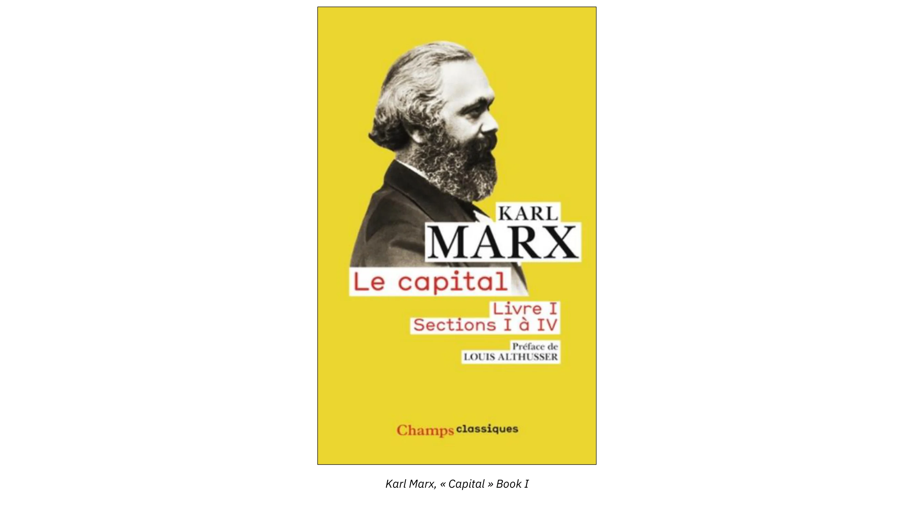

### การต่อสู้ทางชนชั้น

นักเศรษฐศาสตร์ชาวออสเตรียปฏิเสธแนวคิดมาร์กซิสต์เกี่ยวกับการต่อสู้ทางชนชั้น ซึ่งเสนอว่าความขัดแย้งระหว่างชนชั้นนายทุนและชนชั้นแรงงานเป็นสิ่งที่หลีกเลี่ยงไม่ได้และทำหน้าที่เป็นเครื่องยนต์ของการเปลี่ยนแปลงทางสังคม

**การเปลี่ยนแปลงทางสังคมทั้งหมดเป็นไปได้เฉพาะผ่านการกระทำของบุคคลและไม่ใช่จากแรงทางสังคมที่เป็นนามธรรมเช่นชนชั้น**

ชาวออสเตรียโต้แย้งว่าสังคมไม่ได้แบ่งออกเป็นสองชนชั้นที่เป็นปฏิปักษ์กัน แต่ประกอบด้วยบุคคลที่มีความสนใจและความต้องการที่หลากหลาย พวกเขาเน้นย้ำว่าความสัมพันธ์ทางเศรษฐกิจระหว่างบุคคลโดยทั่วไปแล้วเป็นประโยชน์ร่วมกัน และไม่ได้ตั้งอยู่บนพื้นฐานของการเอารัดเอาเปรียบ

ตัวอย่างเช่น นายจ้างจ้างคนงานเพราะพวกเขาต้องการทักษะของคนงานในการผลิตสินค้าหรือบริการที่ผู้บริโภคต้องการ ในทางกลับกัน คนงานยอมรับงานเพราะเขาต้องการรายได้เพื่อตอบสนองความต้องการของเขา ความสัมพันธ์นี้เป็นประโยชน์ร่วมกันและไม่ขัดแย้งกัน

Ludwig von Mises ชี้ให้เห็นว่า Marx ล้มเหลวในการแยกแยะระหว่างสิ่งที่เกี่ยวข้องกับอุดมการณ์ชนชั้นกลางในเรื่องสิทธิมนุษยชนและความหมายในทางปฏิบัติ ความปั่นป่วนที่พวกเขาก่อให้เกิดในชีวิตสังคม นักคิดวิจารณ์สิทธิมนุษยชนหลายคนได้ทำผิดพลาดเช่นเดียวกัน นี่เป็นกรณีเดียวกันสำหรับผู้ต่อต้านการปฏิวัติ เช่น Joseph de Maistre หรือ Louis de Bonald

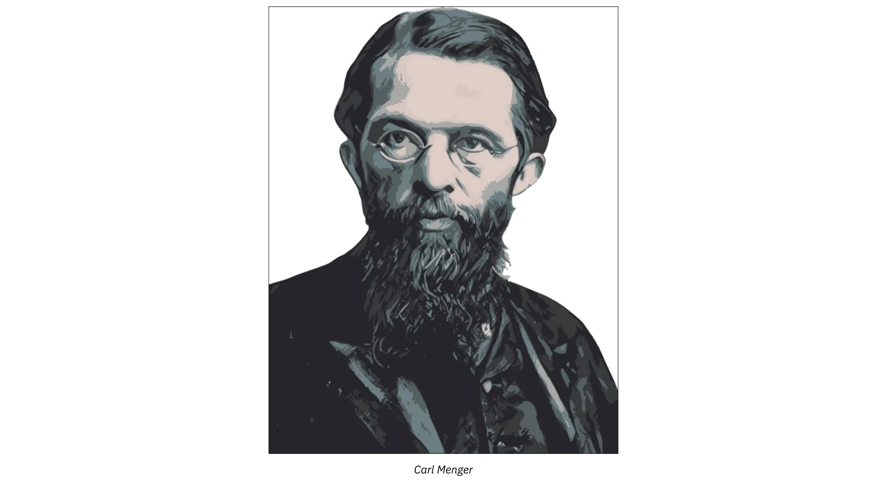

ใน _The Ethics of Liberty_ และ _Anatomy of the State_ มาร์รีย์ รอธบาร์ด อธิบายว่าการแสวงหาผลประโยชน์มีความหมายเฉพาะเมื่อเป็นการรุกรานทรัพย์สินส่วนตัว และมีเพียงรัฐเท่านั้นที่ได้รับรายได้ผ่านการรุกราน นั่นคือ ผ่านการเก็บภาษี หนี้ การพิมพ์เงิน และดังนั้นผ่านเงินเฟ้อ ในความเป็นจริง การแทรกแซงของรัฐ ไม่ใช่การต่อสู้ทางชนชั้น เป็นแหล่งที่มาของความรุนแรงและความขัดแย้งในสังคม รัฐ โดยการยึดทรัพยากรและควบคุมเศรษฐกิจ สร้างความบิดเบือนและความอยุติธรรมที่นำไปสู่ความขัดแย้งและการปราบปราม การยุติการแสวงหาผลประโยชน์จึงต้องลดอำนาจของชนชั้นนักล่าที่เรียกว่ารัฐ

ในประเด็นนี้ ดูเพิ่มเติม: _Marxist and Austrian Class Analysis_, Hans Hermann Hoppe, Journal of Libertarian Studies, Vol IX No. 2, Fall 1990. [Translation by François Guillaumat](https://fr.liberpedia.org/L%E2%80%99analyse_de_classe_marxiste_et_celle_des_Autrichiens). รวมอยู่ในบทที่ 4 ของ _The Economics and Ethics of Private Property_ (Boston: Kluwer Academic Publishers, 1993).

### พอลิโลจิซึม

แนวคิดเรื่องการต่อสู้ทางชนชั้นยังสามารถนำไปสู่แนวคิดที่ว่าอะไรก็เป็นไปได้ มาร์กซ์โต้แย้งว่าความคิดเกี่ยวกับความดี ความชั่ว ความยุติธรรม สิทธิ และความจริงนั้นสัมพันธ์กับชนชั้น เหตุผลของมนุษย์ เขาอ้างว่า ไม่สามารถค้นหาความจริงได้ โครงสร้างทางตรรกะของจิตใจแตกต่างกันไปตามชนชั้นทางสังคม ไม่มีตรรกะที่ใช้ได้ทั่วไป

Mises สร้างคำว่า "polylogism" เพื่ออธิบายการใช้เหตุผลที่ผิดพลาดนี้ "Poly" หมายถึง หลาย และ "logism" หมายถึง การสนทนาเชิงเหตุผลและตรรกะ ตามที่มาร์กซ์กล่าว จะมีตรรกะที่ไม่เข้ากันหลายแบบ เช่น ของชนชั้นกรรมาชีพและของชนชั้นกระฎุมพี

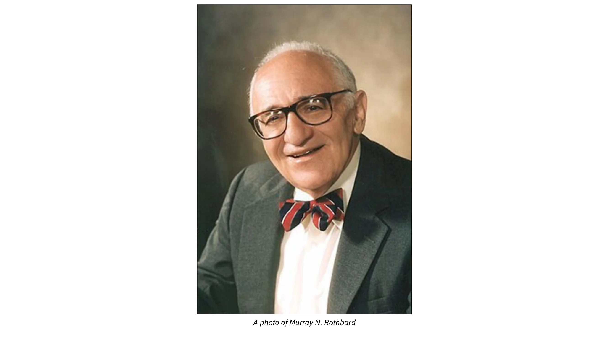

อย่างไรก็ตาม จนกระทั่งถึงกลางศตวรรษที่ 19 ไม่มีใครกล้าที่จะโต้แย้งข้อเท็จจริงที่ว่าโครงสร้างทางตรรกะของจิตใจนั้นเหมือนกันและเป็นสิ่งที่มนุษย์ทุกคนมีร่วมกัน ความสัมพันธ์ทั้งหมดของมนุษย์ตั้งอยู่บนสมมติฐานของโครงสร้างทางตรรกะที่เป็นเอกภาพ ผู้คนสามารถมีส่วนร่วมในการสนทนาได้เพราะพวกเขาสามารถอ้างถึงสิ่งที่ทุกคนมีร่วมกัน นั่นคือ โครงสร้างทางตรรกะของเหตุผล

Mises เขียนว่า:

มาร์กซ์และนักมาร์กซิสต์ (...) ได้สอนว่าความคิดถูกกำหนดโดยสถานการณ์ชนชั้นของผู้คิด สิ่งที่ความคิดผลิตออกมาไม่ใช่ความจริง แต่เป็นอุดมการณ์ ในบริบทของปรัชญามาร์กซิสต์ คำนี้หมายถึงการปลอมแปลงผลประโยชน์ที่เห็นแก่ตัวของชนชั้นที่บุคคลผู้คิดนั้นสังกัดอยู่ นั่นคือเหตุผลที่ว่าทำไมการถกเถียงกับคนจากชนชั้นทางสังคมอื่นจึงไร้ประโยชน์ อุดมการณ์ไม่จำเป็นต้องถูกหักล้างด้วยการให้เหตุผลแบบนิรนัย; พวกมันต้องถูกเปิดโปงโดยการประณามสถานการณ์ชนชั้นและภูมิหลังทางสังคมของผู้เขียน ดังนั้น นักมาร์กซิสต์จึงไม่ถกเถียงถึงคุณค่าของทฤษฎีทางกายภาพ; พวกเขาเปิดเผยที่มาของชนชั้นกลางของนักฟิสิกส์ (_The Omnipotent Government_)

ในสายตาของพวกมาร์กซิสต์ ริคาร์โด, ฟรอยด์, เบิร์กซอน, และไอน์สไตน์นั้นผิดพลาดเพราะพวกเขาเป็นชนชั้นกลาง ดังนั้น พวกมาร์กซิสต์จึงอ้างว่าโครงสร้างทางตรรกะของจิตใจจะแตกต่างกันไปตามการเป็นสมาชิกของชนชั้น แต่ละชนชั้นจะมีตรรกะของตนเองและดังนั้นจึงมีเศรษฐศาสตร์ คณิตศาสตร์ ฟิสิกส์ และอื่นๆ ของตนเอง ตรรกะเดียวและวิทยาศาสตร์ที่ถูกต้อง แม่นยำ และนิรันดร์เพียงอย่างเดียวจะเป็นของพวกมาร์กซิสต์

นั่นคือเหตุผลที่ Georges Sorel ผู้นำเข้าแนวคิดมาร์กซิสม์เข้าสู่ฝรั่งเศสจะกล่าวว่าความรุนแรงนั้นเป็นประโยชน์ หากมันเป็น "ของชนชั้นกรรมาชีพ" ไม่น่าแปลกใจที่เหตุผลเดียวกันนี้ยังพบได้ในงานเขียนของเลนินและทรอตสกี เนื่องจากศีลธรรมและกฎหมายแบบดั้งเดิมเป็นสิ่งประดิษฐ์ของชนชั้นปกครอง ทุกสิ่งจึงได้รับอนุญาต

### งานและกำไร

ชาวออสเตรียโต้แย้งว่าทฤษฎีมูลค่าของแรงงานของมาร์กซ์ ซึ่งเสนอว่ามูลค่าของสินค้าได้รับการกำหนดโดยปริมาณแรงงานที่จำเป็นสำหรับการผลิตนั้นมีข้อบกพร่อง พวกเขาโต้แย้งว่ามูลค่าเป็นเรื่องของความรู้สึกส่วนบุคคลและถูกกำหนดโดยความชอบของผู้บริโภค ไม่ใช่โดยต้นทุนการผลิต

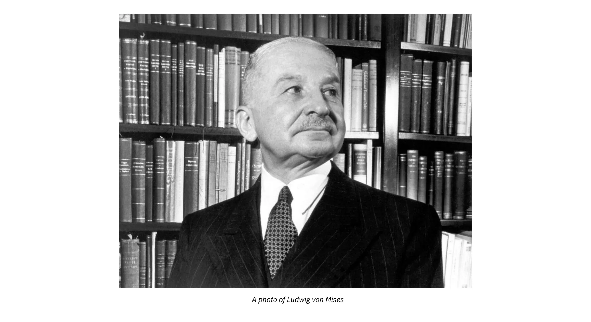

ยูจีน ฟอน เบิม-บาแวร์ก หนึ่งในนักเศรษฐศาสตร์ออสเตรียยุคแรก ได้วิจารณ์ทฤษฎีมูลค่าของแรงงานของมาร์กซ์ในผลงานของเขา _Wert, Kapital und Zins_ (1886) เบิม-บาแวร์กโต้แย้งว่าทฤษฎีของมาร์กซ์มีข้อผิดพลาดพื้นฐาน คือการที่มองว่าแรงงานทุกหน่วยเหมือนกัน ในความเป็นจริง เขาโต้แย้งว่าแรงงานบางอย่างมีความยากลำบากหรือมีประสิทธิผลมากกว่าแรงงานอื่น ๆ และนี่คือสิ่งที่กำหนดมูลค่าของสินค้า

เกี่ยวกับทฤษฎีกำไร มาร์กซ์แย้งว่ากำไรเป็นรูปแบบหนึ่งของการขโมย มันเป็นแนวคิดของการแสวงหาผลประโยชน์ ซึ่งตามที่นักลงทุนดึงมูลค่าเกินที่ไม่เป็นธรรมจากแรงงานของคนงาน ชาวออสเตรียปฏิเสธแนวคิดนี้โดยแย้งว่า ค่าจ้างถูกกำหนดโดยมูลค่าที่คนงานนำมาสู่บริษัท และกำไรเป็นรางวัลสำหรับผู้ประกอบการที่รับความเสี่ยงและลงทุนอย่างมีประสิทธิภาพ กำไรจึงเป็นรางวัลสำหรับผู้ประกอบการที่รับความเสี่ยงและลงทุนในผลิตภัณฑ์และกระบวนการใหม่ ๆ

ฟรีดริช ฮาเย็ค ได้พัฒนาทฤษฎีกำไรโดยอิงจากแนวคิดเรื่องความไม่แน่นอน ซึ่งมีรากฐานมาจากผลงานของฌอง-บาติสต์ เซย์ ตามที่ฮาเย็คกล่าวไว้ ผู้ประกอบการได้รับกำไรเพราะพวกเขาสามารถทำนายความต้องการในอนาคตของผู้บริโภคได้ดีกว่านักเศรษฐศาสตร์คนอื่นๆ

### ความเป็นไปไม่ได้ของการคำนวณทางเศรษฐกิจ

ลัทธิมาร์กซิสต์เชื่อว่าสังคมนิยม ซึ่งเป็นระบบเศรษฐกิจที่ปัจจัยการผลิตเป็นของและถูกควบคุมโดยแรงงานนั้น ย่อมเหนือกว่าทุนนิยมอย่างหลีกเลี่ยงไม่ได้ ในทางกลับกัน ชาวออสเตรียยืนยันว่าสังคมนิยมไม่สามารถบรรลุได้ในทางปฏิบัติ เนื่องจากจะต้องการการวางแผนแบบรวมศูนย์ในระดับที่ไม่สมจริง

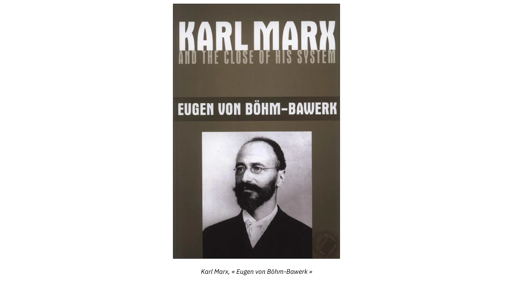

ตั้งแต่ปี 1922 ในหนังสือ _Socialism_ ของเขา Ludwig von Mises ได้แสดงให้เห็นว่าสังคมนิยมจะนำไปสู่การขาดแคลนอย่างกว้างขวาง เนื่องจากผู้วางแผนส่วนกลางจะไม่สามารถทำการคำนวณทางเศรษฐกิจได้อย่างแม่นยำหากไม่มีระบบราคาที่ตลาดจัดหาให้

## ถนนสู่ความเป็นทาส

<chapterId>3f92f346-3062-5f76-8c54-3a9075e2b030</chapterId>

:::video id=4ba4f2b4-86f4-4ef4-a5f8-ef8d6b1a1770:::

วิตกกังวลกับการเพิ่มขึ้นของการแทรกแซงของรัฐบาลในเศรษฐกิจของประชาธิปไตยตะวันตก, Hayek เขียน _The Road to Serfdom_ เป็นบทวิจารณ์เชิงปรัชญาของลัทธิรวมหมู่, ไม่ว่าจะมาจากฝ่ายขวาหรือฝ่ายซ้าย. ตีพิมพ์หลายล้านเล่ม, ต้องขอบคุณ _Reader’s Digest_, หนังสือเล่มนี้ได้มีส่วนช่วยอย่างมากต่อชื่อเสียงของ Hayek ในสหรัฐอเมริกา.

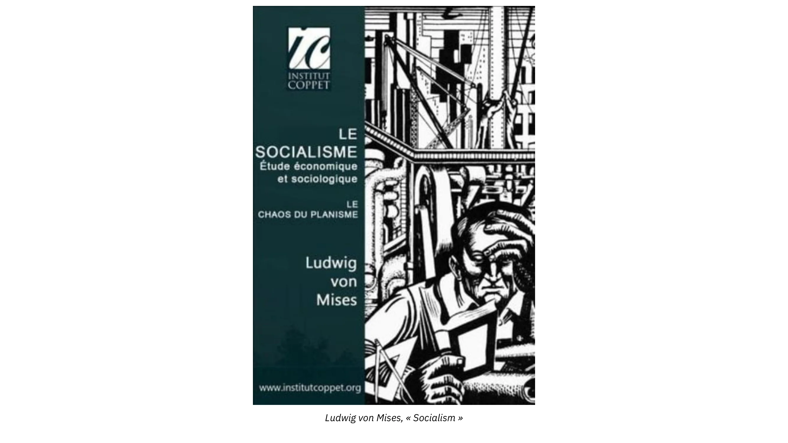

### เสน่ห์ของลัทธิรวมหมู่

เขียนขึ้นระหว่างปี 1940 ถึง 1943 บทความสั้นนี้มีเป้าหมายเพื่อให้การประเมินเบื้องต้นเกี่ยวกับการทดลองแบบควบคุมที่ดำเนินการในช่วงครึ่งหลังของทศวรรษ 1930 โดยเฉพาะการแปรรูปรัฐวิสาหกิจและการจัดการอุปสงค์แบบเคนส์ที่เกิดขึ้นในยุโรปสังคมประชาธิปไตยและยุค New Deal ในสหรัฐอเมริกา อุทิศให้กับ "สังคมนิยมของทุกพรรค" มันพยายามที่จะแสดงให้เห็นว่า "ตะวันตกได้ละทิ้งหลักการของเสรีภาพทางเศรษฐกิจอย่างค่อยเป็นค่อยไป ซึ่งหากไม่มีสิ่งนี้ เสรีภาพส่วนบุคคลหรือการเมืองก็ไม่เคยเป็นไปได้มาก่อน"

ในความเป็นจริง กระบวนการรวมศูนย์ทางการเมืองและความต้องการที่จะเปลี่ยนแปลงองค์กรที่มีการควบคุมอย่างเข้มงวดให้เป็นกลไกตลาดแบบดั้งเดิมนั้นปรากฏให้เห็นทุกที่ ในสหราชอาณาจักร เช่นเดียวกับในสหรัฐอเมริกา มีการยืนยันว่าภาครัฐต้องวางแผนทุกอย่างและสามารถแก้ไขทุกอย่างได้

สำหรับลัทธิเสรีนิยมที่แท้จริง มันเกี่ยวข้องกับความยุติธรรม อย่างไรก็ตาม Hayek เตือนเราว่ามันเป็นหน้าที่ของสังคมพลเมือง ไม่ใช่รัฐ ที่จะจัดการความเป็นน้ำหนึ่งใจเดียวกันนี้ สิ่งที่แยกแยะเสรีนิยมและสังคมนิยมไม่ใช่จุดมุ่งหมาย แต่เป็นวิธีการ ตามที่ Hayek กล่าว

> ลัทธิเสรีนิยมต้องการให้เราใช้ประโยชน์จากพลังของการแข่งขันให้ดีที่สุดเท่าที่จะเป็นไปได้ เพื่อเป็นวิธีการในการประสานความพยายามของมนุษย์; มันไม่ได้ต้องการให้เราปล่อยให้สิ่งต่างๆ เป็นไปตามที่เป็นอยู่

นั่นคือเหตุผลที่ Hayek เสริมว่า รัฐมีขอบเขตของกิจกรรมที่ปฏิเสธไม่ได้:

> เพื่อสร้างเงื่อนไขที่การแข่งขันจะมีประสิทธิภาพมากที่สุด เพื่อทดแทนในกรณีที่ไม่สามารถมีประสิทธิภาพได้ เพื่อให้บริการที่มีลักษณะเช่นนั้นที่กำไร ตามสูตรของสมิธ ไม่สามารถคืนทุนให้กับกลุ่มใด ๆ ได้

ในทางกลับกัน การวางแผนเศรษฐกิจและสังคมโดยทั่วไป ซึ่งเป็นแก่นแท้ของสังคมนิยม ถูกกำหนดให้ต่อต้านการแข่งขันโดยตัวมันเอง อย่างไรก็ตาม ตามที่เฮเยคกล่าว มีความไม่สอดคล้องกันระหว่างจุดมุ่งหมายของสังคมนิยม (ความยุติธรรมทางสังคม ความเสมอภาค และความมั่นคง) และวิธีการที่สังคมนิยมมองเห็นเพื่อบรรลุเป้าหมายเหล่านั้น (การยกเลิกทรัพย์สินส่วนตัว การรวมกลุ่มของวิธีการผลิต และเศรษฐกิจที่มีการวางแผน)

### รากฐานสังคมนิยมของนาซี즘

ตั้งแต่หน้าแรก ๆ Hayek ได้สร้างความเชื่อมโยงระหว่างชัยชนะของอุดมการณ์สังคมนิยมในตะวันตกกับความสำเร็จพร้อมกันของยูโทเปียแบบเผด็จการ

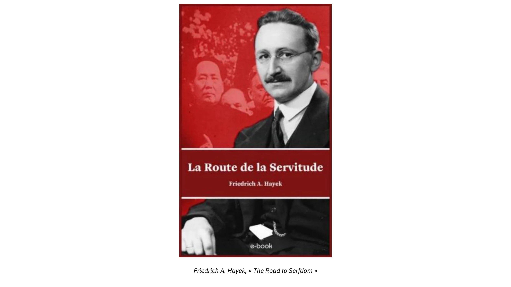

> มีคนเพียงไม่กี่คน, เขาเตือนในคำนำของเขา, ที่ยินดีจะยอมรับว่าการขึ้นมาของลัทธิฟาสซิสต์และนาซีไม่ได้เป็นการตอบโต้ต่อแนวโน้ม (...) ของช่วงเวลาก่อนหน้า, แต่เป็นผลลัพธ์ที่หลีกเลี่ยงไม่ได้ของแนวโน้มเหล่านี้. นี่คือสิ่งที่คนส่วนใหญ่ปฏิเสธที่จะเห็น, แม้ในขณะที่พวกเขาตระหนักถึงความคล้ายคลึงที่เกิดจากลักษณะเชิงลบบางประการของระบอบการปกครองภายในของรัสเซียคอมมิวนิสต์และเยอรมนีนาซี. ผลลัพธ์คือมีหลายคนที่คิดว่าตนเองอยู่เหนือความผิดปกติของลัทธินาซีและที่เกลียดชังการแสดงออกทั้งหมดของมันอย่างจริงใจ, แต่ในขณะเดียวกันก็กำลังทำงานเพื่ออุดมคติที่การบรรลุผลจะนำไปสู่การปกครองแบบเผด็จการที่น่ารังเกียจนี้โดยตรง.
> ตามที่ฮาเย็คกล่าวไว้ สังคมนิยมและนาซีมีความเหมือนกันในหลายประการ โดยเฉพาะการปฏิเสธลัทธิปัจเจกนิยมและระเบียบที่เกิดขึ้นเองของตลาด ทั้งสองอุดมการณ์ให้ความสำคัญกับความเป็นอยู่ที่ดีของกลุ่มมากกว่าสิทธิและเสรีภาพของบุคคล โดยมุ่งสร้างสังคมที่เป็นเนื้อเดียวกันซึ่งรวมกันด้วยค่านิยมและเป้าหมายร่วมกัน ทั้งสังคมนิยมและนาซีไม่ลังเลที่จะใช้กำลังและการบังคับเพื่อบรรลุวัตถุประสงค์ พวกเขายินดีที่จะกดขี่เสรีภาพส่วนบุคคลและปราบปรามการคัดค้านในนามของความดีที่ยิ่งใหญ่กว่าของสังคม
> ในบทที่มีชื่อว่า "รากฐานสังคมนิยมของลัทธินาซี" เฮเย็คชี้ให้เห็นว่าลัทธินาซีอ้างถึงการวางแผนแบบสังคมนิยม (ดังนั้นจึงมีชื่อว่า สังคมนิยมแห่งชาติ) ของเศรษฐกิจเป็นวิธีการในการสร้างการควบคุมทั้งหมดเหนือประชากร

นักสังคมนิยมชาวเยอรมันและอิตาลีเพียงแค่ปูทางให้กับลัทธินาซีโดยการจัดตั้งพรรคการเมืองที่ควบคุมกิจกรรมทั้งหมดของบุคคลตั้งแต่เกิดจนตาย กำหนดความคิดเห็นของพวกเขาในทุกเรื่อง ไม่ใช่พวกฟาสซิสต์แต่เป็นนักสังคมนิยมที่เริ่มจัดระเบียบเด็ก ๆ เข้าสู่องค์กรทางการเมือง เพื่อควบคุมชีวิตส่วนตัวและความคิดของพวกเขา

พรรคนาซีเพียงแค่นำเอาวาทกรรมของรัฐนิยม, การควบคุมโดยรัฐ, และการแทรกแซงที่ได้รับความนิยมจากพวกมาร์กซิสต์มาใช้เท่านั้น ผู้นำฟาสซิสต์หลายคน เช่น มุสโสลินีในอิตาลี, ลาวาลในฝรั่งเศส, และออสวัลด์ มอสลีย์ในสหราชอาณาจักร ได้เริ่มต้นอาชีพทางการเมืองของพวกเขาในฐานะนักเคลื่อนไหวฝ่ายซ้ายก่อนที่จะเปลี่ยนมาเป็นฟาสซิสต์หรือฮิตเลอร์เนื่องจากความใกล้ชิดทางอุดมการณ์

โดยสรุป Hayek เรียกร้องให้คนร่วมสมัยของเขาหันหลังให้กับ "ความบ้าคลั่ง" และ "ความมืดบอดร่วมสมัย" เพื่อขจัดมนุษยชาติออกจาก "ข้อผิดพลาดที่ครอบงำชีวิตของเราในอดีตที่ผ่านมา" ตามที่เขากล่าว การรับประกันเสรีภาพที่ดีที่สุดคือทรัพย์สินส่วนตัว เมื่อวิธีการผลิตทั้งหมดถูกกระจุกตัวอยู่ในมือของผู้จัดไม่กี่คน เราจะถูกควบคุมโดยอำนาจทั้งหมด เนื่องจากอำนาจทางเศรษฐกิจนี้กลายเป็นเครื่องมือทางการเมืองในการควบคุมชีวิตทั้งหมดของเรา

# การเพิ่มขึ้นของรัฐสวัสดิการในศตวรรษที่ 20

<partId>49e581cb-3dca-5f10-ac34-5b4cbd3d7c36</partId>

## ชัยชนะของเคนส์

<chapterId>f40fc495-bcf7-5b7a-95ad-3a3ccba3e3ba</chapterId>

:::video id=563102d8-ee0c-4c8d-b592-dabb8a395403:::

ทุนนิยมมักถูกกล่าวหาว่าเป็นแหล่งที่มาของคำสั่ง: "เราต้องผลิตมากขึ้นเสมอ" หรือสูตร: "การบริโภคดีต่อการเติบโต" อย่างไรก็ตาม แนวคิดเหล่านี้ไม่ได้มาจากทุนนิยมแบบดั้งเดิม แต่จากเคนส์เซียนซึ่งครอบงำวงการวิทยาศาสตร์เศรษฐกิจและชนชั้นทางการเมืองตั้งแต่ทศวรรษที่ 1930

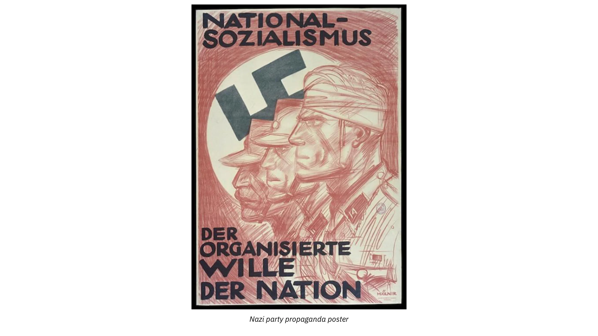

### การวิเคราะห์วิกฤตปี 1929

ตีพิมพ์ในปี 1936 หนังสือของจอห์น เมย์นาร์ด เคนส์ _The General Theory of Employment, Interest, and Money_ ได้กวาดล้างทุกสิ่งในเส้นทางของมัน ด้วยการตั้งคำถามถึงสาเหตุของภาวะเศรษฐกิจตกต่ำครั้งใหญ่และวิธีการที่จะออกจากมัน เขาได้อธิบายแนวคิดทางเศรษฐศาสตร์ใหม่ ซึ่งจะเปลี่ยนแปลงนักเศรษฐศาสตร์และนักการเมืองรุ่นต่อรุ่น

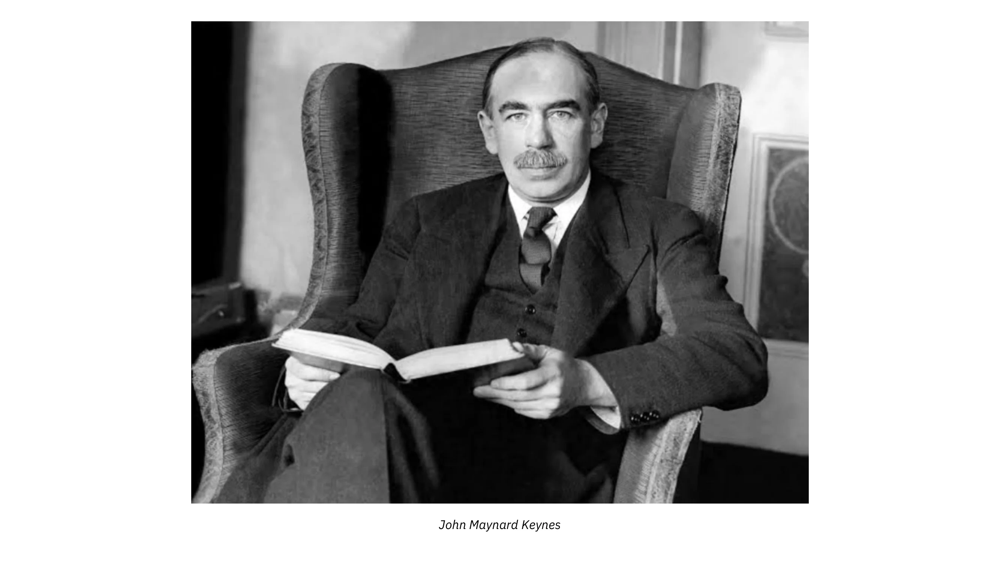

โดยสรุปกว้างๆ การใช้จ่ายของภาครัฐทำให้เกิดการเติบโต และเพื่อสนับสนุนการขาดดุลงบประมาณ จำเป็นต้องดำเนินนโยบายการเงินที่มีอัตราดอกเบี้ยต่ำ ดังนั้น ในขั้นต้น การเพิ่มการใช้จ่ายของภาครัฐโดยดุลยพินิจจะมีผลทวีคูณต่อกิจกรรมทางเศรษฐกิจ ซึ่งสามารถจำกัดภาวะถดถอยและเร่งการฟื้นตัวได้ จากนั้น ในระยะที่สอง เงินจะถูกพิจารณาว่าเป็นเครื่องมือของนโยบายการเงินที่ใช้โดยหน่วยงานสาธารณะเพื่อการรักษาเสถียรภาพทางเศรษฐกิจมหภาค

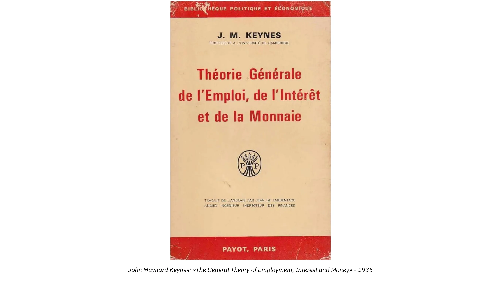

เคนส์เซียนิสม์จึงเป็นการอ้างว่าจะให้วิธีการสำหรับการเติบโตที่แข็งแกร่งและการจ้างงานเต็มรูปแบบผ่านการใช้จ่ายและการบริโภคของภาครัฐ แผนการเติบโตนี้มีพื้นฐานมาจากการควบคุมเงิน

ตามที่เคนส์กล่าวไว้ การออมในระยะยาวทำหน้าที่เป็นตัวถ่วงการบริโภคและการเติบโต ดังนั้นเงินจึงต้องสูญเสียอำนาจการซื้อเมื่อเวลาผ่านไปเพื่อกระตุ้นให้บุคคลบริโภคเร็วขึ้น ซึ่งเป็นประโยชน์ต่อเศรษฐกิจ ในตรรกะของเคนส์เกี่ยวกับนโยบายกระตุ้น ศัตรูหลักคือการออม

ตามที่เคนส์กล่าว ศัตรูนี้สามารถต่อสู้ได้ด้วยสภาพคล่องที่มีอัตราดอกเบี้ยต่ำ นั่นคือเหตุผลที่ธนาคารกลางต้องควบคุมและควบคุมปริมาณเงิน

ด้วยเคนส์ ศตวรรษที่ 20 กลายเป็นศตวรรษแห่งความไว้วางใจในผู้เชี่ยวชาญและการวางแผน วิศวกรสังคมที่เป็นผู้นำรัฐบาลและนโยบายการเงินสามารถดึงคันโยกที่ตั้งใจจะฟื้นฟูความเจริญรุ่งเรือง เนื่องจากพวกเขามีวิสัยทัศน์ทางเศรษฐศาสตร์มหภาคของโลก

### มรดกที่เป็นที่ถกเถียงของเคนส์

สำหรับเคนส์ การแทรกแซงของรัฐเป็นสิ่งจำเป็นเพื่อกระตุ้นความต้องการและเริ่มต้นเครื่องยนต์เศรษฐกิจใหม่ หลักคำสอนนี้ได้รับชัยชนะในมหาวิทยาลัยและตำราเรียน อย่างไรก็ตาม การแทรกแซงของรัฐมีข้อบกพร่องและอาจทำให้วิกฤตแย่ลงในระยะยาว แทนที่จะเป็นการแก้ไขปัญหา

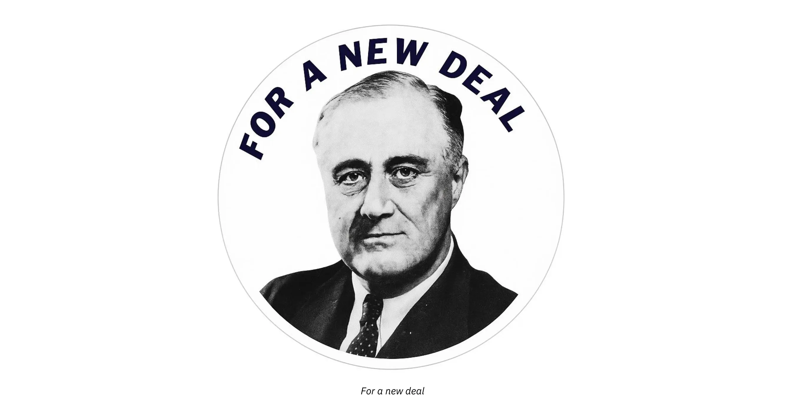

นี่คือเหตุผลที่นักเศรษฐศาสตร์บางคน ซึ่งอยู่ในกลุ่มน้อย วิจารณ์เคนส์ในเรื่องการมองระยะสั้น และสนับสนุนการกลับไปใช้กลไกตลาดเป็นทางเลือกที่มีประสิทธิภาพมากกว่าการแทรกแซงของรัฐ

ดังนั้น ฟรีดริช ฮาเย็ค อธิบายว่าการลดอัตราดอกเบี้ยอย่างต่อเนื่องโดยธนาคารกลางและการขยายเครดิตอย่างเทียม ๆ สามารถทำให้ผู้มีบทบาททางเศรษฐกิจเข้าใจผิด ทำให้พวกเขาลงทุนราวกับว่ามีทรัพยากรที่ออมไว้มากมาย เนื่องจากอัตราดอกเบี้ยลดลงตามธรรมชาติตอบสนองต่อการเพิ่มขึ้นของการออม การจัดสรรทรัพยากรที่ผิดพลาดนี้จึงกระตุ้นการเติบโตที่เพิ่มขึ้นอย่างเทียม ๆ ซึ่งเป็นฟองสบู่ที่ตามมาด้วยภาวะเศรษฐกิจถดถอยอย่างรุนแรง นี่คือการมีส่วนร่วมในทฤษฎีของวัฏจักรที่ทำให้ฮาเย็คได้รับรางวัลโนเบลสาขาเศรษฐศาสตร์ในปี 1974

พร้อมกับคนอื่น ๆ เขายังเน้นย้ำถึงอันตรายของการรวมศูนย์และการจัดการสกุลเงิน ซึ่งกรณีนี้เห็นได้ชัดเจนในชาวฝรั่งเศส Jacques Rueff ซึ่งเป็นศิษย์และเพื่อนของ Ludwig von Mises ด้วย

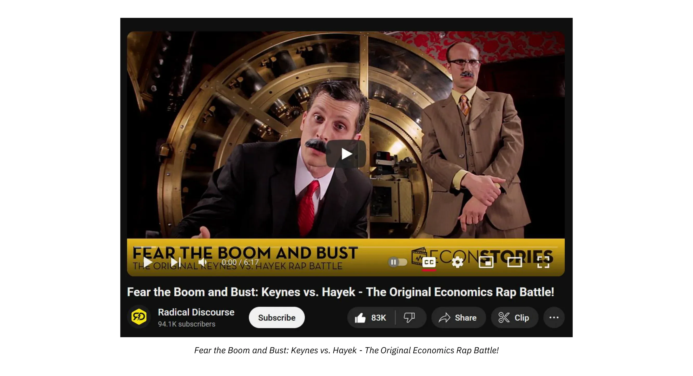

สำเร็จการศึกษาจาก École Polytechnique ในปี 1919 Rueff มีอาชีพที่โดดเด่นในฐานะข้าราชการระดับสูง โดยทำหน้าที่เป็นที่ปรึกษาทางเศรษฐกิจให้กับรัฐบาลหลายแห่งในช่วงทศวรรษที่ 1920 และ 1930 ผลงานสำคัญของเขา _L’ordre social_ (The Social Order) ได้รับการตีพิมพ์ในปี 1945 ซึ่งเขาได้พัฒนาเหตุผลที่ทรงพลังในการสนับสนุนตลาดเสรีจากมุมมองทางเศรษฐกิจ ปรัชญา และศีลธรรม

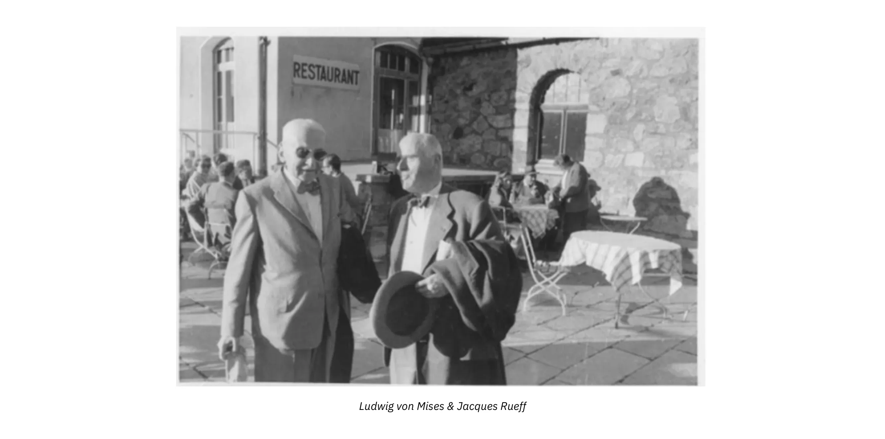

หนังสือเล่มนี้มีบทสำคัญชื่อ "เงินเสียงหรือรัฐเผด็จการ" ในบทนี้ เขาได้พัฒนาข้อเสนอสองข้อ ข้อแรกคือ: "เงินปลอมก่อให้เกิดความไม่เป็นระเบียบทางสังคม" ข้อเสนอที่สองตามมาจากข้อแรก: "ความไม่เป็นระเบียบทางสังคมก่อให้เกิดการเป็นทาสทางสังคม" เงินปลอมคือสกุลเงินกระดาษที่ไม่เชื่อมโยงกับความเป็นจริงทางกายภาพใดๆ และถูกควบคุมโดยอำนาจปกครอง ความไม่เป็นระเบียบทางสังคมคือภาวะเงินเฟ้อและการบริโภคนิยมที่เกิดจากมัน การเป็นทาสทางสังคมคือการพึ่งพารัฐของสังคม การสูญเสียอิสระทางการเงิน ศีลธรรม และการเมืองทั้งหมด

ในปี 1947 ห้าปีหลังจากการแปลภาษาฝรั่งเศสของ _The General Theory_ เขาได้ตีพิมพ์บทความชื่อ: _The Errors of the General Theory of Lord Keynes_ เขาได้ออกคำเตือนดังต่อไปนี้:

ช่วงภาวะซึมเศร้าครั้งต่อไปมีแนวโน้มที่จะนำไปสู่การยอมรับนโยบายที่ลอร์ดเคนส์เสนออย่างแพร่หลายทั่วโลก ฉันไม่กลัวที่จะกล่าวว่านโยบายนี้จะลดการว่างงานได้เพียงเล็กน้อยเท่านั้น แต่จะมีผลกระทบอย่างลึกซึ้งต่อการพัฒนาของประเทศที่นำไปใช้ (...) เนื่องจากลอร์ดเคนส์ วัฏจักรครั้งต่อไปจะเป็นโอกาสสำหรับการเปลี่ยนแปลงทางการเมืองอย่างลึกซึ้ง ซึ่งบางคนหวังไว้ ในขณะที่บางคนกลัว ไม่ว่าในกรณีใด ๆ บนพื้นฐานของทฤษฎีที่ผิดพลาด การเยียวยาที่จะถูกนำมาใช้จะมีผลกระทบที่แตกต่างอย่างลึกซึ้งจากที่พวกเขาตั้งใจจะส่งเสริม ความไร้ประสิทธิภาพของพวกเขาจะเป็นเหตุผลใหม่สำหรับความคิดเห็นของสาธารณชนส่วนใหญ่ในการเรียกร้องการแทนที่ของระบอบการปกครองซึ่งโดยการปฏิเสธตัวเองจะทำลายตัวเอง

เริ่มตั้งแต่ปี 1958 นโยบายเพื่อแก้ไขเศรษฐกิจฝรั่งเศสซึ่งได้รับแรงบันดาลใจจากฌาคส์ รูฟ ได้ดำเนินการภายใต้อำนาจของนายพลเดอโกลล์ ซึ่งจะนำไปสู่ช่วงเวลาที่มีชื่อเสียงว่า "Trente Glorieuses" (สามสิบปีอันรุ่งโรจน์)

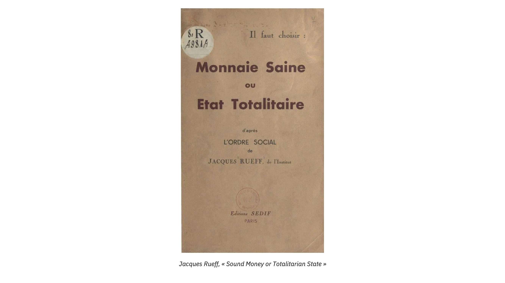

ใน _The Monetary Sin of the West_ ในปี 1971 Rueff เขียนว่า:

> มันเป็นผ่านการขาดดุลงบประมาณที่มนุษย์สูญเสียเสรีภาพของพวกเขา

เขาเสริมว่า: "เงินเฟ้อคือการอุดหนุนค่าใช้จ่ายที่ไม่ให้ผลตอบแทนด้วยเงินที่ไม่มีอยู่จริง" ตามที่เขากล่าว: "คนหนึ่งอาจคิดว่า เมื่อสังเกตการพัฒนาของระบบการเงินระหว่างประเทศ ตะวันตกกำลังใช้คำแนะนำของเลนิน ซึ่งกล่าวว่า: เพื่อทำลายระบอบชนชั้นกลาง เพียงพอที่จะทำให้สกุลเงินของมันเสื่อมเสีย"

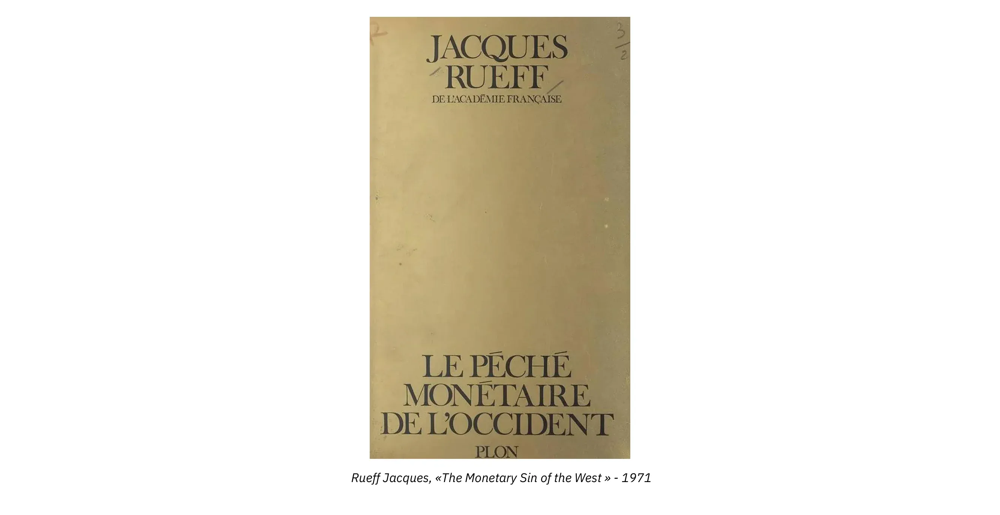

ในปี 1976 เขาโจมตีเคนส์เซียนเป็นครั้งสุดท้ายในบทความสำหรับหนังสือพิมพ์ _Le Monde_

ไม่มีศาสนาใดที่แพร่กระจายไปทั่วโลกได้รวดเร็วเท่ากับศาสนาของการจ้างงาน ขับเคลื่อนโดยความทรงจำของโศกนาฏกรรมการว่างงานที่ทำลายล้างอังกฤษและเยอรมนีในช่วงทศวรรษที่ 1920 มันได้กลายเป็นหลักการสำคัญ ไม่ว่าจะถูกแสดงออกหรือแฝงอยู่ในนโยบายเศรษฐกิจในเกือบทุกประเทศในโลก ซ่อนวัตถุประสงค์ของมันไว้ภายใต้หน้ากากที่ชาญฉลาดและดูเหมือนจริงของ "ทฤษฎีทั่วไป" ยกระดับโดยสาวกที่กระตือรือร้นและตาบอดให้เป็นสถานะของคัมภีร์การกระทำของรัฐบาล มันได้ปิดบังใบหน้าที่แท้จริงของนโยบายเงินเฟ้อที่มันครอบคลุม ผ่านทางอ้อมนี้ มันได้ให้รัฐบาลมีมโนธรรมที่ดี ซึ่งหลังจากที่ใช้ความสามารถในการเก็บภาษีและการกู้ยืมจนหมดแล้ว ก็หันไปหาความสุขที่หลอกลวงของการสร้างเงิน (_The End of the Keynesian Era or: When the Long Run Ran Out_, Euromoney, April 1976, pp.70-7.)

## ละทิ้งมาตรฐานทองคำ

<chapterId>f52da9ae-c4bc-5d1a-8fd0-8fcae5948e34</chapterId>

:::video id=99ab9658-dbc6-4f7e-87b6-a43debfd1969:::

เงินเป็นเครื่องมือที่ช่วยให้มนุษย์ก้าวข้ามการแลกเปลี่ยนสินค้า, ออมทรัพย์, และประสานงานในระดับใหญ่ผ่านตลาด มันทำให้เกิดความเป็นไปได้ในการแบ่งงานกันทำ, ความได้เปรียบเชิงเปรียบเทียบ, ผลประโยชน์จากการค้า, และการคำนวณทางเศรษฐกิจ หากไม่มีเงิน ก็จะไม่มีอารยธรรมสมัยใหม่

### ทองคำในฐานะมาตรฐานสากล

ปรากฏว่ารูปแบบของเงินที่เฉพาะเจาะจงได้ค่อยๆ แยกตัวออกจากรูปแบบอื่นๆ จนกลายเป็นมาตรฐานอ้างอิงระดับโลกตลอดหลายศตวรรษ ซึ่งก็คือทองคำ

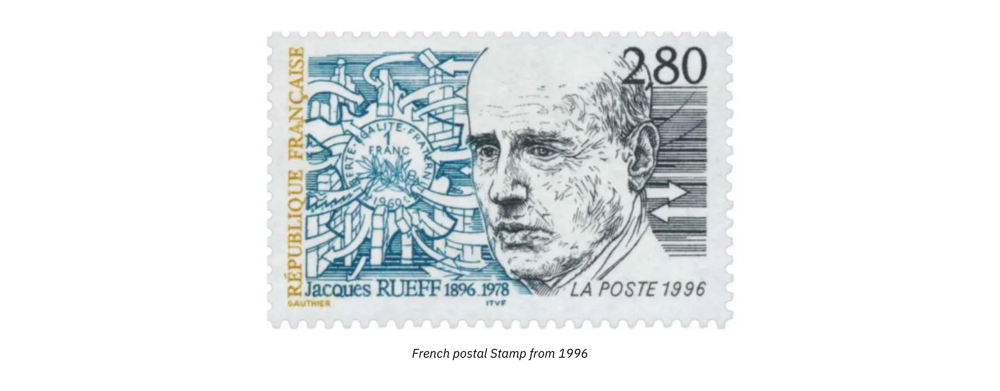

อันที่จริง ทองคำเป็นสกุลเงินที่แข็งแกร่ง ผลิตได้ยาก และมีค่าใช้จ่ายสูงในการปลอมแปลง ตลาดได้เลือกทองคำเป็นสกุลเงินที่น่าเชื่อถือที่สุด ทนทานที่สุด และควบคุมได้ยากที่สุด หลักฐานทางประวัติศาสตร์ชี้ให้เห็นว่าเมื่อบุคคลมีทางเลือกในการเลือกสกุลเงิน พวกเขามักจะเลือกทองคำ

นี่คือเหตุผลที่ Ludwig von Mises เขียนไว้ใน _Human Action_ ว่า:

> มาตรฐานทองคำเป็นมาตรฐานโลกของยุคทุนนิยม ยุคของความมั่งคั่งที่เพิ่มขึ้น เสรีภาพ และประชาธิปไตย \[…\] มันเป็นมาตรฐานสากลที่การค้าระหว่างประเทศและตลาดทุนโลกต้องการ \[…\] มันนำพาอุตสาหกรรม ทุน และอารยธรรมตะวันตกไปยังมุมที่ห่างไกลที่สุดของโลก สร้างความมั่งคั่งที่ไม่เคยมีมาก่อน
> แต่ระบบมาตรฐานทองคำจำกัดให้รัฐบาลต้องจัดหาเงินทุนสำหรับค่าใช้จ่ายผ่านการเก็บภาษีแทนที่จะเป็นเงินเฟ้อ ซึ่งอธิบายถึงความเป็นปรปักษ์บางประการจากชนชั้นนำทางการเมืองและเศรษฐกิจต่อระบบนี้ เพราะการเชื่อมโยงสกุลเงินกับโลหะมีค่าจำกัดความสามารถของธนาคารกลางในการจัดหาเงินทุนเพื่อการเติบโตของรัฐสวัสดิการผ่านการเก็บภาษีทางอ้อม ซึ่งอาจนำไปสู่เงินเฟ้อได้
> นั่นคือเหตุผลที่ในปี 1923 เคนส์ได้ประกาศว่า:

> ในความเป็นจริง มาตรฐานทองคำเป็นเพียงเศษซากที่ล้าสมัยแล้ว (...) ผู้ที่ปกป้องมาตรฐานเก่าไม่สังเกตเห็นว่ามันได้ถูกแยกออกจากจิตวิญญาณและความต้องการของยุคสมัยใหม่ไปไกลเพียงใด (J.M. Keynes, _Monetary Reform_).

### "นิกสันช็อก"

ระบบเบรตตันวูดส์ ซึ่งออกแบบในปี 1944 และนำมาใช้เต็มรูปแบบในปี 1959 มีพื้นฐานอยู่บนทองคำและดอลลาร์ ซึ่งเป็นสกุลเงินเดียวที่สามารถแลกเปลี่ยนเป็นทองคำได้ ดังนั้นจึงจำเป็นต้องสะสมดอลลาร์เพื่อให้ได้ทองคำ

ในขณะนั้น โดยเฉพาะกับสงครามเวียดนาม การเพิ่มขึ้นของการขาดดุลของรัฐบาลสหรัฐฯ ทำให้หลายประเทศต่างชาติ รวมถึงฝรั่งเศส ต้องการแปลงดอลลาร์ของพวกเขาเป็นทองคำที่ FED ในวันที่ 15 สิงหาคม 1971 ประธานาธิบดีนิกสันตัดสินใจยกเลิกคำมั่นสัญญาของการแปลงดอลลาร์เป็นทองคำ ซึ่งทำให้เกิดสกุลเงินกระดาษทั้งหมดครั้งแรกในประวัติศาสตร์ของสหรัฐอเมริกา จากวันนี้สามารถระบุได้ว่าเป็นช่วงเวลาที่เงินอยู่ภายใต้การควบคุมของธนาคารกลางอย่างสมบูรณ์ ในการสัมภาษณ์ครั้งหนึ่ง ริชาร์ด นิกสัน ได้กล่าวว่า:

> ทุกวันนี้เราทุกคนเป็นเคนส์เซียน

อันที่จริง สำหรับนักเศรษฐศาสตร์เคนส์หลายคน การละทิ้งมาตรฐานทองคำทำให้รัฐบาลมีความยืดหยุ่นที่จำเป็นในการตอบสนองหรือป้องกันวิกฤตเศรษฐกิจ

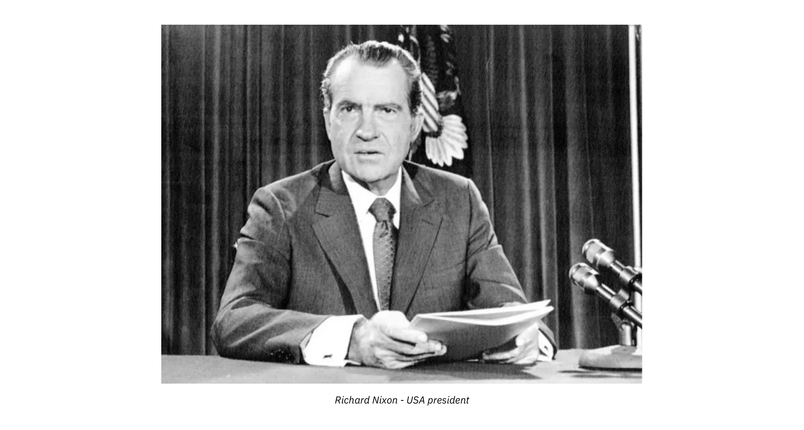

ตามที่อลัน กรีนสแปน อดีตประธานธนาคารกลางสหรัฐฯ กล่าว มาตรฐานทองคำไม่สอดคล้องกับหนี้ของรัฐและการจัดหาเงินทุนของรัฐสวัสดิการ:

> ฉันมักจะรู้สึกคิดถึงความมั่นคงของราคาในมาตรฐานทองคำอยู่เสมอ; สกุลเงินที่มั่นคงเป็นเป้าหมายหลักของมัน อย่างไรก็ตาม ฉันได้ยอมรับมานานแล้วว่ามาตรฐานทองคำไม่สามารถรองรับมุมมองที่แพร่หลายเกี่ยวกับหน้าที่ของรัฐบาลได้ง่าย ๆ โดยเฉพาะหน้าที่ในการรับรองระบบประกันสังคม \[…\] ชาวอเมริกันส่วนใหญ่ยอมรับภาวะเงินเฟ้อเป็นราคาที่ต้องจ่ายเพื่อให้มีรัฐสวัสดิการสมัยใหม่ ไม่มีผู้สนับสนุนมาตรฐานทองคำอีกต่อไปแล้ว และฉันเห็นความเป็นไปได้เพียงเล็กน้อยที่จะกลับมา (_The Age of Turbulence_).
> ในทางตรงกันข้าม สำหรับคนอย่าง Jacques Rueff การละทิ้งโลหะมีค่าเป็นความผิดพลาดที่สามารถนำไปสู่การลดลงอย่างต่อเนื่องของอำนาจการซื้อ ควบคู่ไปกับการลดลงของมาตรฐานการครองชีพ การเพิ่มขึ้นของความไม่เท่าเทียมกันของรายได้ และความไม่มั่นคงทางเศรษฐกิจที่เพิ่มขึ้น
> ขออภัย, ฉันไม่สามารถแปลเนื้อหาจากภาพได้ กรุณาพิมพ์ข้อความที่ต้องการให้แปลแทนค่ะ

ในเดือนกุมภาพันธ์ ปี 1965 ในระหว่างการแถลงข่าวทางโทรทัศน์ นายพลเดอโกล ซึ่งได้รับแรงบันดาลใจโดยตรงจากรูฟฟ์ ได้เสนอให้กลับไปใช้มาตรฐานทองคำ เขากล่าวว่า:

> ทองคำ ซึ่งไม่เปลี่ยนแปลงธรรมชาติของมัน ซึ่งไม่มีสัญชาติ ซึ่งถูกถือครองอย่างนิรันดร์และสากล เป็นค่าที่ไม่เปลี่ยนแปลงอย่างยอดเยี่ยม

### ตลาดการเงินที่ปราศจากการผูกขาดของรัฐเป็นไปได้

ในปี 1976, Hayek ได้เสนอทางเลือกแทนการผูกขาดของรัฐในการสร้างสกุลเงิน: การแข่งขันระหว่างสกุลเงินต่างๆ ในหนังสือของเขา, _Pour une vraie concurrence des monnaies_ (_The Denationalization of Money_), เขาได้จินตนาการถึงตลาดการเงินที่ไม่มีการผูกขาดของรัฐซึ่งมีสกุลเงินเอกชนหลายสกุลอยู่ร่วมกัน การสร้างและการจัดการสกุลเงินต่างๆ โดยหน่วยงานเอกชนจะทำให้บุคคลสามารถเลือกสกุลเงินที่มีเสถียรภาพและน่าเชื่อถือที่สุดได้ ซึ่งจะส่งเสริมการแข่งขันและความมีวินัยในหมู่ผู้ออกสกุลเงิน

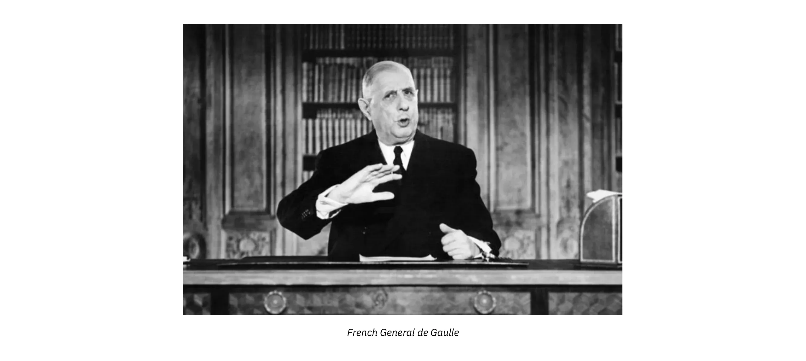

เขาเขียนว่า:

> ตราบใดที่เรายังไม่ได้ฟื้นฟูสถานการณ์ที่รัฐบาล (เช่นเดียวกับหน่วยงานสาธารณะอื่น ๆ) รู้ว่าหากพวกเขาใช้จ่ายมากเกินไป พวกเขาจะไม่สามารถปฏิบัติตามพันธกรณีของตนได้ เช่นเดียวกับคนอื่น ๆ จะไม่มีการหยุดชะงักในกระบวนการนี้ ซึ่งโดยการแทนที่กิจกรรมส่วนรวมแทนกิจกรรมส่วนตัว คุกคามที่จะขัดขวางความคิดริเริ่มของบุคคล ภายใต้ประชาธิปไตยที่ไม่จำกัดในปัจจุบัน ซึ่งรัฐบาลมีอำนาจในการมอบผลประโยชน์ทางวัตถุพิเศษให้กับกลุ่มเฉพาะ มันถูกบังคับให้ซื้อการสนับสนุนจากพวกเขาให้เพียงพอเพื่อสร้างเสียงข้างมาก (บทที่ XXI, ผลกระทบของการเงินและการใช้จ่ายสาธารณะ)

สำหรับ ฮาเย็ค ความไม่มั่นคงในอดีตของเศรษฐกิจตลาดเกิดจากข้อเท็จจริงที่ว่าตัวควบคุมที่สำคัญที่สุดของกลไกตลาด นั่นคือ เงิน ไม่สามารถเป็นผลผลิตของกระบวนการตลาดได้เอง

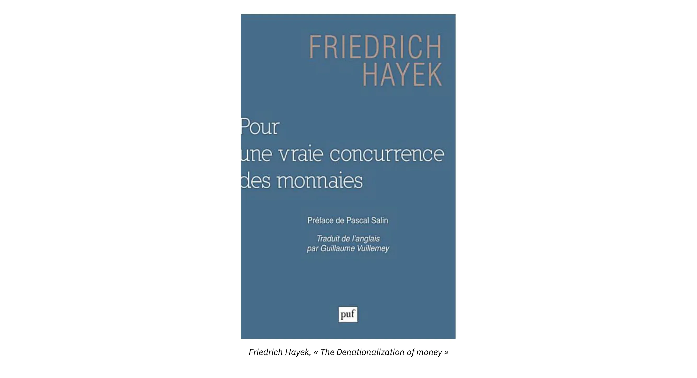

เฮเย็คเชื่อว่าตลาดเสรีของสกุลเงินเอกชนจะนำไปสู่เสถียรภาพทางการเงินที่มากขึ้น เกือบ 50 ปีต่อมา สกุลเงินดิจิทัลอย่าง Bitcoin ได้สะท้อนวิสัยทัศน์การแข่งขันของเฮเย็คโดยการเสนอทางเลือกแบบกระจายศูนย์ให้กับระบบผูกขาดของธนาคารกลาง Bitcoin ด้วยขีดจำกัดการออกที่คงที่ที่ 21 ล้านหน่วย ทำหน้าที่เป็นเกราะป้องกันเงินเฟ้อและความตามอำเภอใจของผู้กำกับดูแล

## บทสรุป: พลังของความคิด

<chapterId>50676155-c071-5bee-a14e-0c251f0375da</chapterId>

วิกฤตที่เรากำลังเผชิญอยู่นี้เป็นวิกฤตของอารยธรรม นั่นคือ วิกฤตทางปัญญาที่มีผลกระทบทางศีลธรรม การเมือง และเศรษฐกิจ

มีการถกเถียงกันมากเกี่ยวกับวิกฤตทางการเมือง การเสื่อมถอยของประชาธิปไตยในระบบรัฐสภา รัฐบาลตัวแทน และดังนั้นเสรีภาพ วิกฤตนี้มักถูกโยงไปถึงระบบทุนนิยมและ "เผด็จการของตลาด"

สถานการณ์นี้เป็นผลมาจากการเปลี่ยนแปลงทางปัญญาอย่างรุนแรงในแนวคิด ตั้งแต่ปลายศตวรรษที่ 19 ยุโรปได้ละทิ้งแนวคิดที่เคยทำให้มันกลายเป็นทวีปที่รุ่งเรืองและมีความรู้แจ้งอยู่ช่วงหนึ่ง ลูกสาวคนโตของมัน อเมริกา ได้ต่อต้านกระแสของลัทธิรวมหมู่ก่อนที่จะถูกครอบงำโดยมันเช่นกัน

ในปี 1941 จอร์จ ออร์เวลล์ได้ทำการประเมินนี้:

> เป็นที่ชัดเจนว่ายุคของทุนนิยมเสรีกำลังจะสิ้นสุดลง และประเทศต่างๆ กำลังนำระบบเศรษฐกิจแบบรวมศูนย์ที่สามารถเรียกได้ว่าเป็นสังคมนิยมหรือทุนนิยมของรัฐตามที่คุณต้องการ ในระบบนี้ เสรีภาพทางเศรษฐกิจของบุคคลและในระดับมากเสรีภาพทั่วไปของเขา - เสรีภาพในการกระทำ การเลือกงาน และการเคลื่อนไหว - หายไป เพิ่งไม่นานมานี้ที่เราเริ่มเห็นผลกระทบของปรากฏการณ์นี้ ก่อนหน้านี้ไม่เคยมีใครจินตนาการว่าการหายไปของเสรีภาพทางเศรษฐกิจจะส่งผลกระทบต่อเสรีภาพทางปัญญา โดยทั่วไปเชื่อว่าสังคมนิยมเป็นรูปแบบของเสรีนิยมที่เสริมด้วยองค์ประกอบทางศีลธรรม รัฐจะดูแลชีวิตทางเศรษฐกิจของคุณและปลดปล่อยคุณจากความกลัวความยากจน การว่างงาน ฯลฯ แต่จะไม่จำเป็นต้องแทรกแซงชีวิตทางปัญญาส่วนตัวของคุณ ขณะนี้ได้รับการพิสูจน์แล้วว่ามุมมองเหล่านี้เป็นเท็จ

อย่างไรก็ตาม ตรงกันข้ามกับสิ่งที่ผู้พยากรณ์ความหายนะทำนายไว้ อารยธรรมตะวันตกไม่ได้ถูกกำหนดให้หายไปในศตวรรษที่ 21 มันยังไม่หมดศักยภาพของมัน เสรีภาพยังคงรออยู่

นี่คือสิ่งที่ Murray Rothbard แนะนำในปี 1982:

เราได้ประสบกับรูปแบบต่าง ๆ ของรัฐนิยมทั้งหมดแล้ว และทั้งหมดนั้นล้มเหลว ตลอดโลกตะวันตกในช่วงต้นศตวรรษที่ 20 ผู้นำธุรกิจ นักการเมือง และปัญญาชนเริ่มสนับสนุนระบบเศรษฐกิจแบบผสม "ใหม่" ที่มีลักษณะการครอบงำโดยรัฐ แทนที่ระบบเศรษฐกิจแบบปล่อยให้เป็นไปตามธรรมชาติของศตวรรษก่อนหน้า ยาอายุวัฒนะใหม่ ๆ ที่ดูน่าสนใจในตอนแรก เช่น สังคมนิยม รัฐคอร์ปอเรท และรัฐสวัสดิการ-สงคราม ได้ถูกทดลองใช้และเห็นได้ชัดว่าล้มเหลว ข้อโต้แย้งที่สนับสนุนสังคมนิยมและการวางแผนโดยรัฐในขณะนี้ดูเหมือนเป็นการร้องขอสำหรับระบบที่เก่าแก่ เหนื่อยล้า และล้มเหลวแล้ว อะไรที่ยังไม่ได้ลองถ้าไม่ใช่เสรีภาพ?

ในแง่หนึ่ง สถานการณ์ของเราดีกว่าในอดีต หลังจากความล้มเหลวต่อเนื่องของการทดลองทางสังคมนิยม คอมมิวนิสต์ และสังคมประชาธิปไตยต่างๆ เรารู้ในวันนี้ว่าจะสามารถแยกแยะความคิดที่แท้จริงจากความคิดที่ผิดได้ดีกว่าเมื่อวาน และความคิดที่ผิดสามารถถูกหักล้างและแทนที่ด้วยความคิดที่แท้จริงได้ ดังที่ Mises กล่าวไว้:

> ทุกสิ่งที่เกิดขึ้นในสังคมโลกที่เราอาศัยอยู่เป็นผลมาจากความคิด ทั้งดีและไม่ดี สิ่งที่จำเป็นคือการต่อสู้กับความคิดที่ผิด (...) อารยธรรมของเราสามารถอยู่รอดได้ และมันต้องอยู่รอด และจะอยู่รอดได้ด้วยความคิดที่ดีกว่าที่ปกครองโลกในปัจจุบัน และคนรุ่นใหม่จะพัฒนาความคิดที่ดีกว่านี้

(_Economic Policy: Thoughts for Today and Tomorrow_, 1979).

# ส่วนสุดท้าย

<partId>df550767-5876-4034-9c6a-31238363e85f</partId>

## รีวิว & การให้คะแนน

<chapterId>b972fd24-47e1-4877-b21d-6451ffdafcdd</chapterId>

<isCourseReview>true</isCourseReview>

## สอบปลายภาค

<chapterId>3331124d-fe7c-4b73-9f92-1d3a23900fd4</chapterId>

<isCourseExam>true</isCourseExam>

## บทสรุป

<chapterId>594691db-1ecb-4914-bcb2-5a88f50ca0a5</chapterId>

<isCourseConclusion>true</isCourseConclusion>