# En resa genom frihetens filosofiska historia

A Philosophical History of Freedom utforskar friheten genom historien. Damien Theillier undersöker två politiska filosofier: frihet och makt. Han analyserar tänkare som Frédéric Bastiat, Lord Acton, Karl Marx och Murray Rothbard och belyser deras syn på produktion, plundring, klasskamp och staten.

Kursen följer frihetens ursprung i antiken, med fokus på grekerna och romarna, och fortsätter genom medeltiden, där människans frihet utforskas i både religiösa och politiska sammanhang. Kursen illustrerar hur idéer om frihet utvecklades i takt med att universiteten och de första formerna av kapitalism växte fram i italienska städer.

Från renässansen till upplysningen undersöker kursen frihetens framväxt, präglad av religiös tolerans och ekonomiskt oberoende, som kulminerade 1776 med viktiga händelser som Philadelphiakongressen. Under 1800- och 1900-talen nådde friheten sin höjdpunkt och sin nedgång, med kritik mot kapitalismen och farorna med kollektivism, vilket sätter dagens utmaningar för friheten i perspektiv.

+++

# Inledning

<partId>6edada19-3af3-411b-8483-3fe45cfe1c54</partId>

## Kursöversikt

<chapterId>14d810d3-883c-4f5c-8593-f532530e7b7a</chapterId>

Välkommen till PHI201!

Den här kursen bjuder in dig att utforska frihetens utveckling genom historien genom att analysera de stora tankeskolor som har format den. Du kommer att utforska hur frihetsbegreppet har utvecklats under århundradena, antingen i motsats till eller i samarbete med makten, genom en historisk resa från antiken till samtida debatter.

**Avsnitt 1: Frihet eller makt**

Vi börjar med en översikt över de två stora politiska filosofier som har präglat historien: frihet och makt. I detta avsnitt granskas visionerna hos tänkare som Frédéric Bastiat, som ställer produktion mot plundring; Lord Acton, som ser frihet som historiens drivkraft; Karl Marx, med sin teori om klasskamp; och Murray Rothbard, som ställer staten mot samhället. Denna begreppsmässiga introduktion kommer att utgöra ett ramverk för analysen av de historiska perioderna.

**Avsnitt 2: Frihetens ursprung: Antiken**

Här kommer vi att återvända till det filosofiska tänkandets rötter med grekerna, som uppfann den kritiska rationaliteten, och romarna, som lade grunden för den moderna juridiken. Vi kommer också att undersöka Roms fall som ett avgörande ögonblick som omdefinierade den politiska och sociala organisationen kring begreppet frihet.

**Avsnitt 3: Frihetens ursprung: Medeltiden**

Medeltiden ses ofta som en mörk period, men vi kommer att upptäcka att den lade grunden till den moderna friheten. Vi kommer att undersöka hävdandet av mänsklig frihet, debatterna mellan förnuft och tro, framväxten av den suveräna staten, den bibliska etiken som värdesätter individen och de tidiga konturerna av kapitalismen som dyker upp under denna period.

**Avsnitt 4: Frihetens framväxt: Från renässans till upplysningstid**

Detta avsnitt fokuserar på framväxten av religiös tolerans och ekonomisk frihet, som tog fart under renässansen och upplysningstiden. Vi kommer också att analysera betydelsen av år 1776, som markerade en viktig vändpunkt med nyckelhändelser som formade den fria världen, innan vi fördjupar oss i revolutionernas era som omdefinierade själva begreppet frihet.

**Avsnitt 5: Höjdpunkt och nedgång: Från 1800-talet till 1900-talet**

Vi fortsätter med att studera omvälvningarna under 1800- och 1900-talen och belyser demokratins styrkor och svagheter, den marxistiska kritiken av kapitalismen och Österrikes svar på denna kritik. Vi kommer också att utforska varningar om farorna med kollektivism genom stora verk som "Vägen till träldom".

**Avsnitt 6: Välfärdsstatens framväxt under 1900-talet**

Slutligen kommer detta avsnitt att undersöka hur välfärdsstaten gradvis fick företräde framför idéerna om ekonomisk frihet, särskilt genom Keynes triumf och övergivandet av guldmyntfoten. Vi avslutar med att betona idéernas betydelse för att forma historiens gång och frihetens fortsatta roll i våra moderna samhällen.

Är du redo att ge dig ut på denna unika filosofiska resa i strävan efter frihet? Då kör vi!

# Frihet eller makt

<partId>e59475e9-3ae4-5e66-a17e-218de0281b06</partId>

## Det finns bara två politiska filosofier

<chapterId>ffa60c0d-ee2b-575d-a4ac-4e9ccdad396f</chapterId>

Varför titulera den här kursen: Frihetens historia? För att vi behöver förstå sambandet mellan idéer och händelser för att kunna bedöma vår tid mer effektivt och agera med omdöme. Det är i det förflutna som vi hittar Elements för en bättre förståelse av vad frihet är och skälen till varför vi måste värna om den.

> När det förflutna inte längre lyser upp framtiden vandrar anden i mörker (Alexis de Tocqueville - _Democracy in America_).

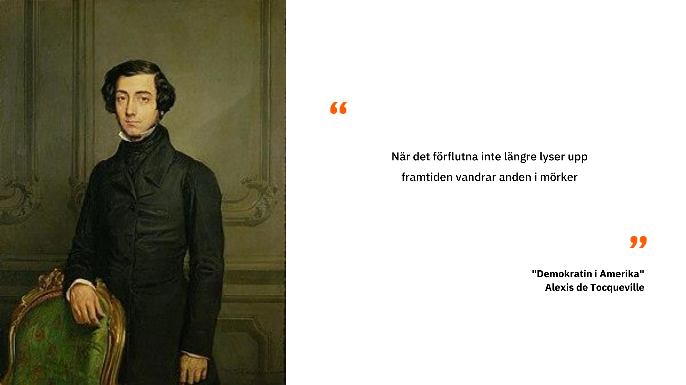

Samtidigt sade Auguste Comte: "Man känner inte till en vetenskap till fullo förrän man känner till dess historia." Denna sanning kan tillämpas på frihetsbegreppet.

Frihet är faktiskt ingen ny idé. Det är ett arv som förts vidare genom generationer. Hela civilisationens historia bär vittnesbörd om en obeveklig kamp för frihet.

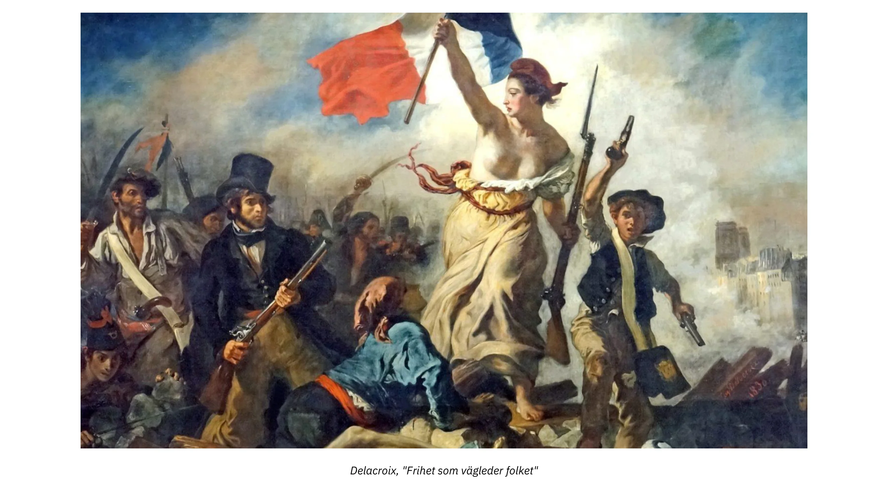

Målet med denna kurs är dock inte bara att belysa frihetens historia, utan också - och framför allt - att utveckla ett kritiskt tänkande. Enbart historia är nämligen inte tillräckligt för att bedöma nutid och framtid. Den måste åtföljas av kritisk reflektion och en bedömning av tidigare misstag. Det är detta som är filosofins bidrag. Det är därför jag har gett den här kursen titeln "Frihetens filosofiska historia" Det handlar nämligen om att utforska hur filosofer har uppfattat frihet genom tiderna.

### Filosofins uppgift

Redan från början har den haft ett dubbelt syfte:

- För det första handlar det om att ge mening åt vaga och förvirrade begrepp. Vad är gott, sant, rättvist, vackert? På samma sätt som historiens uppgift är att belysa det förflutna, är filosofin konsten att definiera begrepp på ett korrekt sätt. Det är därför vi måste börja denna kurs med att förstå vad frihet är.

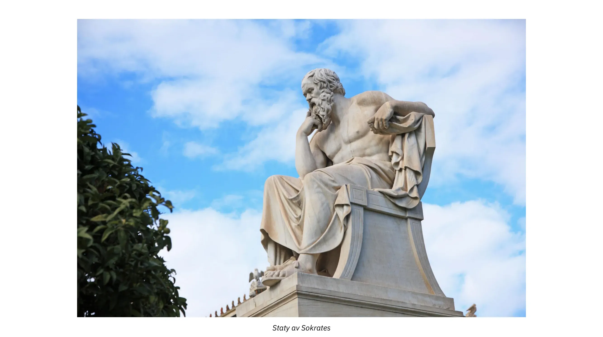

Frihet är ett begrepp som rymmer en mängd varianter, som är lika många möjliga avarter av samma verklighet: politisk frihet, ekonomisk frihet, samvetsfrihet, yttrandefrihet, religionsfrihet, föreningsfrihet och så vidare. Vilken verklighet är det vi talar om?

Frihet kan definieras som förmågan att göra val över sina egna angelägenheter. Det är en inneboende förmåga hos människan. Det är en verklighet som i allt väsentligt är individuell. Det är bara individen som kan tänka och handla, det vill säga göra val. Detta innebär inte att individen är ensam eller att han eller hon inte är skyldig andra något. Tvärtom lever han i ett samhälle och måste samarbeta med andra för sitt eget bästa. Men var och en är fri att samarbeta eller inte och måste ta ansvar för sina val.

Begreppet ansvar är en följd av frihet eftersom varje val får konsekvenser. Den ansvarsfulla personen är den som tar på sig kostnaderna för sina egna beslut och inte skjuter över dessa kostnader på andra. Frihet är med andra ord krävande. Det är ett moraliskt begrepp som innebär både rättigheter och skyldigheter gentemot andra, inklusive skyldigheten att respektera deras frihet.

För det andra är filosofi normativ, medan historia endast är beskrivande. Politisk filosofi skiljer sig således från statsvetenskap. Politisk filosofi är normativ, vilket innebär att den föreskriver värden och bedömer mänskliga handlingar utifrån ett rättvisekriterium. Statsvetare nöjer sig däremot med att beskriva regimer och skriva institutionernas historia, utan att göra värdeomdömen.

### Frihetens filosofi och maktens filosofi

Ur detta perspektiv finns det bara två typer av politiska filosofier: frihetsfilosofin och maktfilosofin.

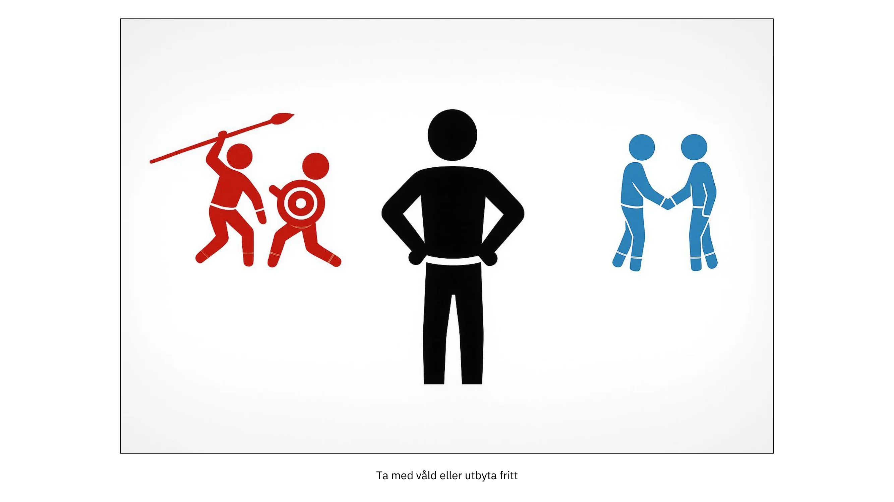

- Frihetsfilosofin bygger på den naturliga äganderätten och hävdar att lagens enda syfte är att skydda privat egendom och avtal. Alla ska kunna göra vad de vill med det som tillhör dem, förutsatt att de inte skadar någon. Det är en filosofi som försvarar lika frihet för alla att förfoga över sig själv och sin egendom under ansvar. Det är den fria marknadens filosofi.
- Maktfilosofin motiverar att vissa kollektiva enheter, såsom staten eller samhället, har rätt att bestämma vilka gränser som ska sättas för marknaden och egendomen, och därmed för friheten. Inom denna ram är det lagens ansvar att organisera ekonomi, hälsa, bostäder, kultur, utbildning och andra aspekter av samhället. Denna konstruktivistiska filosofi har alltid haft sina försvarare, i namn av kollektivt intresse, jämlikhet, skydd och välbefinnande.

Motsättningen mellan dessa två filosofier finns i alla tider. Men vi kan illustrera det med upplysningstidens filosofi. Det finns en tydlig skiljelinje mellan de två typerna av tänkare.

De som försvarar den första filosofin i Frankrike är fysiokraterna, med François Quesnay i spetsen. De kallar sig fysiokrater (namnet kommer från grekiskans "Physis", som betyder natur, och "Kratos", som betyder regel) eftersom de utvecklar ett ekonomiskt och socialt tänkande som bygger på människans naturliga rättigheter. För dem existerar samhället, människor och egendomar före lagarna. I detta system, förklarar Bastiat,

> Det är inte för att det finns lagar som det finns egenskaper, utan för att det finns egenskaper som det finns lagar. (_Egenskap och lag_).

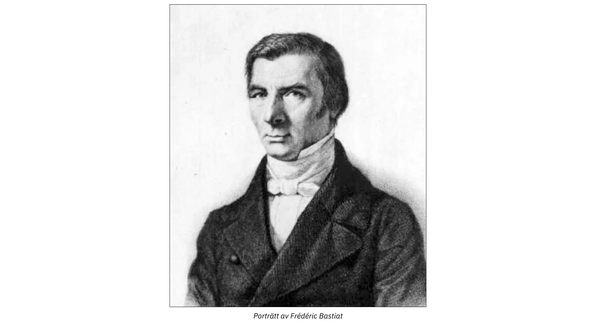

För Turgot och Say, lärjungar till Quesnay, finns det en naturlag som är oberoende av lagstiftarnas nycker, som gäller för alla människor och som föregår alla samhällen. Denna filosofi kommer direkt från den medeltida skolastiken, stoikerna, Aristoteles och Sofokles. De oskrivna lagarna kommer före de skrivna lagarna och är överordnade dem eftersom de härrör från människans natur och förnuft.

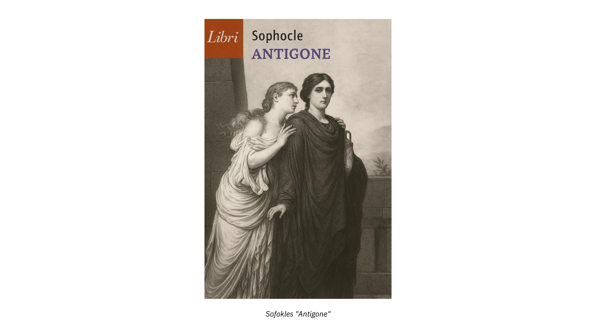

Den andra filosofin återfinns hos författare som Rousseau, Robespierre eller Kant, som förkroppsligar den republikanska traditionen, där den allmänna viljans suveränitet anses vara den sanna rättskällan. Rousseau, som var samtida med Quesnay, är en anti-fysiokrat. För honom måste lagstiftaren organisera samhället, som en mekaniker som uppfinner en maskin av inert materia.

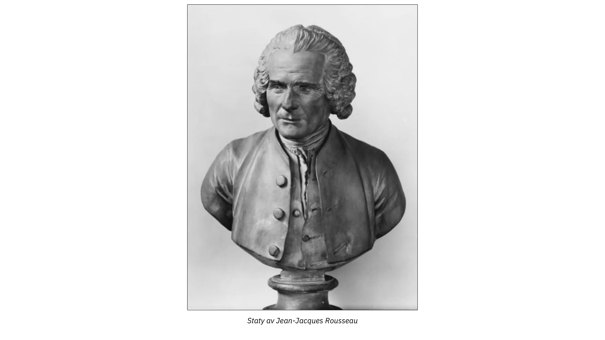

> "Den som vågar ta på sig uppgiften att bilda ett folk", säger Rousseau, "måste känna sig kapabel att så att säga förändra den mänskliga naturen, att förvandla varje individ, som i sig själv är en perfekt och ensam helhet, till en del av en större helhet från vilken denna individ på sätt och vis får sitt liv och sin varelse." (_Samhällskontraktet_)

Ur detta perspektiv är det lagstiftarens uppgift att organisera, modifiera eller till och med avskaffa äganderätten om det anses nödvändigt. För Rousseau är egendomen inte naturlig utan konventionell, precis som samhället självt. Robespierre slår i sin tur fast principen att "egendom är varje medborgares rätt att åtnjuta och förfoga över den del av varorna som lagen garanterar honom" Det finns ingen naturlig rätt till egendom; det finns bara ett obestämt antal möjliga och villkorliga arrangemang.

## Frédéric Bastiat: produktion kontra förskingring

<chapterId>5a8a3452-9970-51a0-a5ea-f367b63137bc</chapterId>

När man slår upp läroböckerna, konstaterade Bastiat, får man veta att mänskligheten skulle vara dömd till intet utan maktens ingripande:

> "Det räcker med att nästan slumpmässigt öppna en bok om filosofi, politik eller historia för att se hur djupt rotad i vårt land denna idé är, född ur klassiska studier och socialismens moder, att mänskligheten är en trög materia som från makten får liv, organisation, moral och rikedom; - eller ännu värre, att mänskligheten själv tenderar mot sin förnedring och bara stoppas på denna sluttning av lagstiftarens mystiska hand." ([_The Law_](http://bastiat.org/fr/la_loi.html)).

Den kulturella fördom som dominerar såväl västerländsk filosofi som historieskrivning är med andra ord att vi är skyldiga makten allt: frihet, hälsa, utbildning, trygghet och välstånd. Människan beskrivs som en "trög materia" som tar form tack vare lagstiftaren.

Men maktens verklighet är en helt annan enligt Bastiat. Makt är förtryck. Det skriver han:

Öppna mänsklighetens annaler på måfå! Konsultera forntida eller modern historia, helig eller profan, och fråga dig själv varifrån alla dessa krig mellan raser, klasser, nationer och familjer kommer ifrån! Du kommer alltid att få detta oföränderliga svar: Från törsten efter makt. ([_Parliamentary Incompatibilities_](http://bastiat.org/fr/incompatibilites_parlementaires.html))

Det är törsten efter makt som ligger till grund för alla former av förtryck i historien. I ett brev till fru Chevreux, daterat den 23 juni 1850, beskriver Bastiat förtryckets olika faser: "Tider av kamp, om vem som ska ta över staten; och tider av vapenvila som kommer att vara det triumferande förtryckets kortvariga regeringstid, ett förebud om en ny kamp." Först erövring av makten genom krig, sedan upprättandet av en stat som lever på att plundra sina medborgares rikedomar.

Historien är således en kamp mellan två principer: frihet och förtryck.

> Frihet! Det är i slutändan den harmoniska principen. Förtryck! Det är den dissonanta principen; kampen mellan dessa två krafter fyller mänsklighetens annaler. ([_Economic Harmonies_](http://bastiat.org/fr/conclusion_eo_harmonies.html), avslutning av originalutgåvan).

### Vad är förtryck?

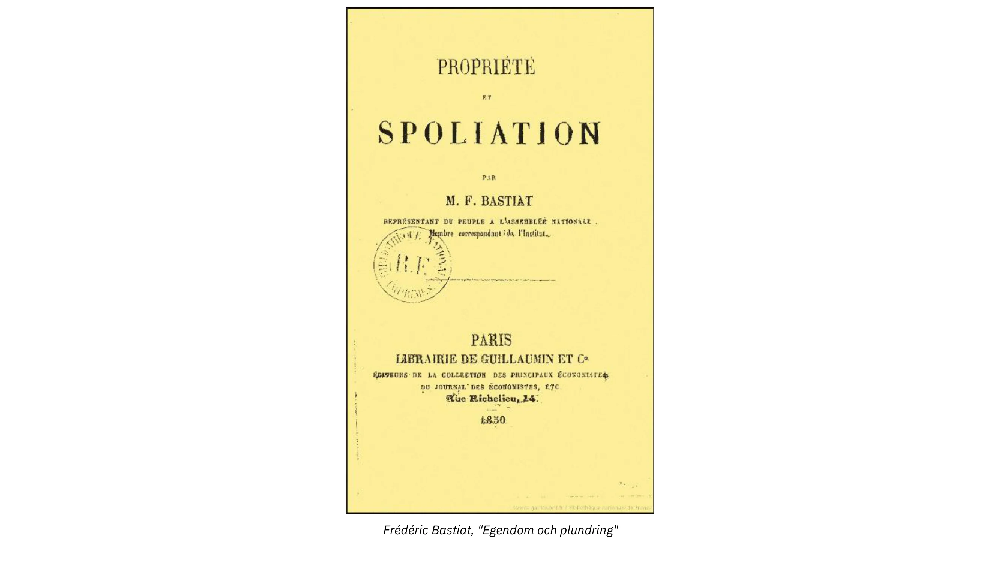

Med ett ord är det plundring. Bastiat beskriver de primära formerna av plundring som utgår från de styrande eliterna: krig, slaveri, teokrati och monopol. Enligt honom är det faktiskt så att "Det finns bara två sätt att skaffa sig det som behövs för att bevara, försköna och förbättra livet: PRODUKTION och PLUNDRING." ([_The Physiology of Plunder_](http://bastiat.org/fr/physiologie_de_la_spoliation.html))

Vad är skillnaden mellan produktion och plundring? Här är Bastiats svar:

> För att producera måste man rikta alla sina krafter mot att behärska naturen, för det är naturen som måste bekämpas, tämjas och förslavas. Det är därför järn som omvandlas till en plog är produktionens emblem. För att plundra måste man rikta alla sina krafter mot att härska över människorna, för det är de som måste bekämpas, dödas eller förslavas. Det är därför järn omvandlat till ett svärd är plundringens emblem. ([_Economic Harmonies_](http://bastiat.org/fr/guerre.html), Krig).

Med andra ord är produktion en form av makt över naturen. Plundring är makt över människor. Det finns dock två former av plundring: laglig och olaglig.

Olaglig plundring är stöld eller brott som begås av en medborgare mot en annan. Det är banditens eller svindlarens handling. Den värsta formen av plundring är dock den som sker med stöd av lag: "Det finns människor som anser att plundring förlorar all sin omoral om den är laglig. För min del kan jag inte föreställa mig en mer försvårande omständighet." ([_Vad som syns och vad som inte syns_](http://bastiat.org/fr/cqovecqonvp.html#RESTRICTION)).

Bastiat säger att det fortfarande finns två former av laglig plundring:

> Extern plundring kallas krig, erövringar och kolonier. Intern plundring benämns ofta skatter, positioner och monopol. ([_Cobden and the League_] (http://bastiat.org/fr/introduction_cobden_ligue.html), Inledning).

I [_The Physiology of Plunder_] (http://bastiat.org/fr/physiologie_de_la_spoliation.html) utvecklar han detta:

> Den sanna och rättvisa lagen för män är: Fritt debatterad Exchange av tjänst för tjänst. Plundring består i att med våld eller bedrägeri förbjuda friheten att debattera för att få en tjänst utan att ge en i gengäld. Plundring med våld utövas på följande sätt: Man väntar på att en man ska producera något och rycker det sedan från honom med vapen i hand. Dekalogen fördömer formellt detta: Du skall icke stjäla. När det sker från individ till individ kallas det stöld och leder till fängelse; när det sker från nation till nation kallas det erövring och leder till ära.

### Plundringens historia

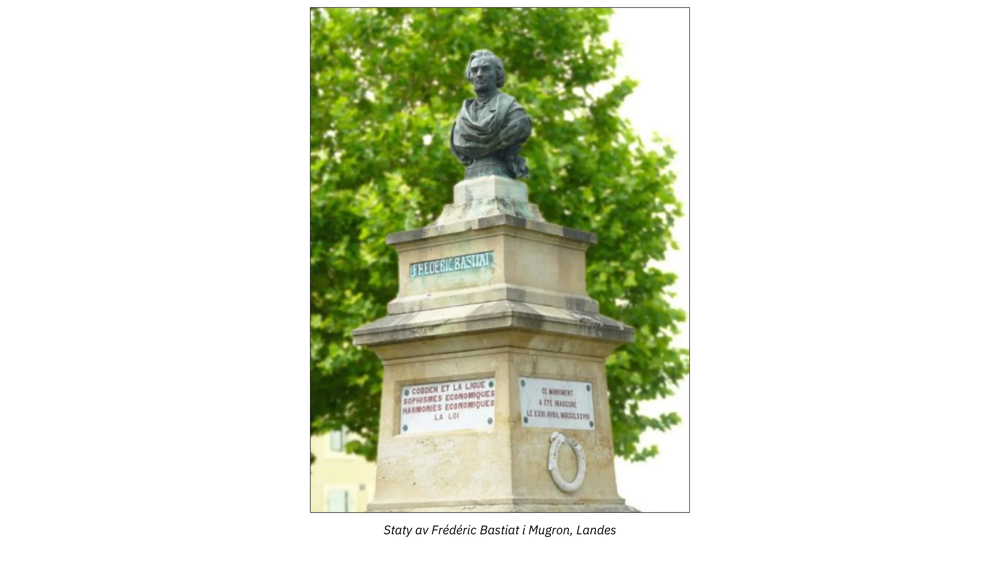

Historiskt sett har den styrande eliten alltid levt på plundring. Bastiat konstaterar:

> Våld som används för plundring är grunden för människans historia. Att spåra dess historia skulle vara att nästan helt och hållet återge alla folks historia: Assyrierna, babylonierna, mederna, perserna, egyptierna, grekerna, romarna, goterna, frankerna, hunnerna, turkarna, araberna, mongolerna, tartarerna, för att inte tala om spanjorerna i Amerika, engelsmännen i Indien, fransmännen i Afrika, ryssarna i Asien osv.
>

> ([_Economic Sophisms_] (http://bastiat.org/fr/conclusion_sophismes.html), avslutning av första bandet).
> Plundring, i sin mest brutala form, beväpnad med fackla och svärd, fyller annalerna i mänsklighetens historia. Vilka är de namn som sammanfattar historien? Cyrus, Sesostris, Alexander, Scipio, Caesar, Attila, Tamerlan, Muhammed, Pizarro, Vilhelm Erövraren; detta är naiv plundring genom erövringar. Till det hör lagerkransarna, monumenten, statyerna och triumfbågarna. ([_Economic Harmonies_](http://bastiat.org/fr/conclusion_eo_harmonies.html), avslutning av originalutgåvan).
> Världens historia är historien om hur en grupp människor plundrade andra, ofta systematiskt, genom krig, slaveri och teokrati. Numera är det monopolet, det vill säga de ekonomiska privilegier som staten delar ut till sina kunder.

Några dagar innan han dog i Rom 1850 anförtrodde sig Bastiat åt sin vän Prosper Paillottet:

> En viktig uppgift för den politiska ekonomin är att skriva plundringens historia. Det är en lång historia där det från början förekommer erövringar, folkvandringar, invasioner och alla de katastrofala överdrifterna av våld i konflikt med rättvisa. Av allt detta finns det fortfarande levande spår i dag, och det är en stor svårighet för lösningen av de frågor som ställs i vårt århundrade. Vi kommer inte att nå fram till denna lösning förrän vi klart har fastställt vad orättvisa är och hur den har förankrats i våra seder och lagar.
>

> (P. Paillottet, _Nio dagar nära en döende man_)

## Lord Acton: Frihet är historiens motor

<chapterId>de971d92-4e26-5870-a961-18dfa06497cf</chapterId>

Det är känt att segrarna skriver historien. Uppmärksamheten riktas ofta mot erövringen av makt, mot makthavarnas liv och mot de konflikter som står i motsättning till dem som vill ta deras plats.

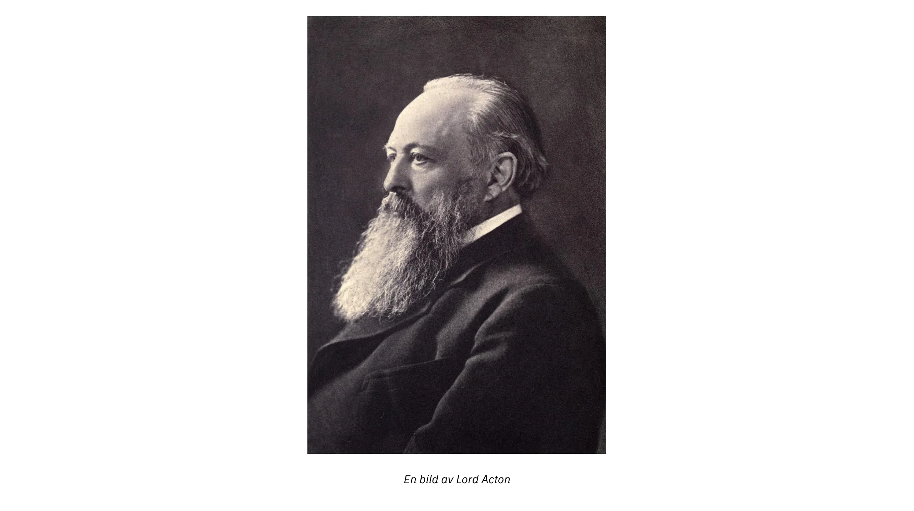

Detta gäller särskilt läroböcker som är avsedda för offentliga skolor och skrivna av professorer som är anställda av staten.

Så är inte fallet med ett verk i två volymer skrivet av en historiker från Cambridge på 1800-talet, [Lord Acton] (https://www.lesbelleslettres.com/livre/9782251447858/le-pouvoir-corrompt). Hans fullständiga namn är John Emerich Edward Dalberg, Baron of Acton (1834-1902). Han är författare till _History of Liberty in Antiquity and Christianity_. Hans verk anses vara ett av de viktigaste i ämnet och han ägnade en stor del av sin karriär åt det. Även om hans verk är ofullbordat är det en kraftfull varning för farorna med maktmissbruk, och hans förespråkande av frihet och individuellt ansvar är fortfarande relevant idag.

Denna författare är mest känd för sin maxim: "Makt tenderar att korrumpera, och absolut makt korrumperar absolut." En formel som är ett eko av Montesquieus i [_Lagarnas anda_] (https://fr.wikisource.org/wiki/Page:Montesquieu_-_Esprit_des_Lois_-_Tome_1.djvu/316):

> Det är en evig erfarenhet att varje människa som har makt är frestad att missbruka den.

### Actons tes

För Acton är konflikten mellan frihet och makt det centrala temat i mänsklighetens historia, och frihet är drivkraften bakom framsteg och samhällens utveckling. Acton försökte förstå de faktorer som bidrog till frihetens uppkomst i västvärlden. Hans mål var att identifiera de förutsättningar som krävdes för att bevara och utveckla den. Han studerade filosofiska idéer, sociala strukturer och politiska sammanhang som gynnade deras framväxt över tid.

Hans centrala tes är att "frihet skapas genom en konflikt mellan olika makter" Enligt Acton var den katolska kyrkan under århundradena efter det västromerska rikets fall den enda kraft som kunde utmana feodalherrarnas, monarkernas och kejsarnas auktoritet. Denna maktkamp mellan kyrkan och staten visade sig vara avgörande för frihetens uppkomst. Europa hade en stark kyrka och en svag stat, vilket berodde på den ständiga striden mellan påvar och kungar under medeltiden. I Kina däremot hade man en svag gud och en stark byråkratisk makt.

> Med frihet menar jag försäkran om att varje människa kommer att skyddas, när hon gör vad hon anser vara sin plikt, mot inflytande från auktoritet och majoriteter, från sedvänja och åsikt. Staten är behörig att fastställa plikter och skilja mellan gott och ont endast inom sin omedelbara sfär.
>

> (Lord Acton)
> Frihet är med andra ord individens rätt att följa sitt samvete, och det är inte statens uppgift att diktera en persons beteende i filosofiska, moraliska och religiösa frågor.
> Friedrich Hayek hade ursprungligen övervägt att döpa Mont Pelerin Society till "Acton-Tocqueville Society", som en hyllning till två tänkare som han beundrade djupt: Lord Acton och Alexis de Tocqueville. I slutändan blev det namnet på den plats där sällskapets första möte hölls, Mont Pelerin i Schweiz, som valdes.

### Voltaire och Condorcet

Men tanken att friheten i Europa föddes ur interna strider mellan olika makthavare, som förhindrade att absolut dominans etablerades, är inte unik för Acton. Den finns redan hos tänkare som Voltaire och Condorcet.

Voltaire tillskriver således i sina [_Philosophical Letters_] (https://fr.wikisource.org/wiki/Lettres_philosophiques/Lettre_6) den engelska friheten konflikter mellan kungar och adelsmän, vilka förhindrade en alltför stor maktkoncentration. Och han noterar:

> Om det bara fanns en religion i England skulle dess despotism vara att frukta; om det bara fanns två skulle de skära halsen av varandra; men det finns trettio, och de lever i fred och lycka. ([Om presbyterianerna](https://fr.wikisource.org/wiki/Lettres_philosophiques/Lettre_6))

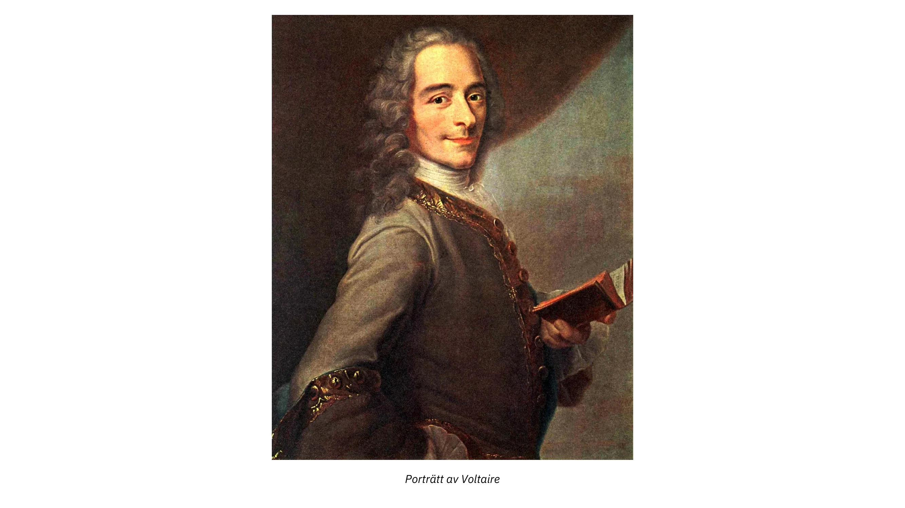

Condorcet tillskriver i sin [_Sketch for a Historical Picture of the Progress of the Human Mind_] (https://fr.wikisource.org/wiki/Esquisse_d%E2%80%99un_tableau_historique_des_progr%C3%A8s_de_l%E2%80%99esprit_humain) den decentraliserade maktstrukturen i Italien rivaliteten mellan påven och kejsaren, som gjorde det möjligt för många oberoende stadsstater att blomstra.

Denna tes återfinns också i ett monumentalt verk från 1983: _Law and Revolution: The Formation of the Western Legal Tradition_, av Harold J. Berman ([fransk översättning av Raoul Audouin](https://www.eyrolles.com/Entreprise/Livre/droit-et-revolution-9782903449667/), utgiven av University of Aix en Provence Bookstore 2002). Bermans analys belyser den juridiska pluralismens avgörande roll i västerlandets historia. Detta system, som långt ifrån bara var en källa till komplexitet, var en drivkraft för utveckling, frihet och innovation och formade de västerländska rättstraditionerna på ett bestående sätt.

## Marx: Historien som klasskamp

<chapterId>438100e6-a385-55c6-b2c5-ad192c564757</chapterId>

Men det finns ett annat perspektiv på historien. Det har varit ganska framgångsrikt och har länge haft stöd av västerländska intellektuella och representanter från det globala syd. Det är den socialistiska och marxistiska historiesynen.

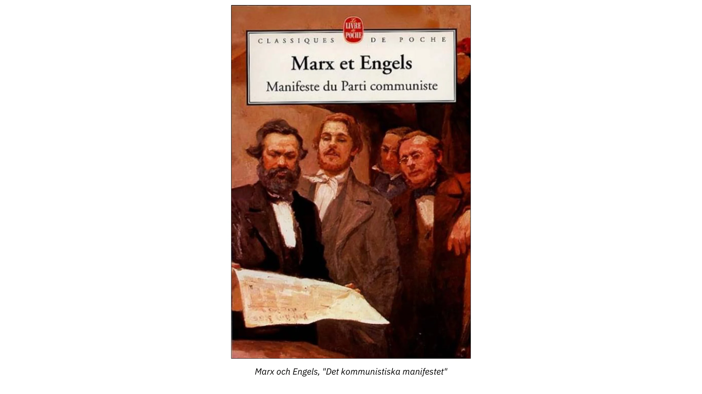

Europas extraordinära tillväxt förklaras främst av teknikens framsteg i kombination med en "primitiv ackumulation" av kapital, som härrör från imperialism, slaveri, triangelhandel, expropriering av småbönder och exploatering av arbetarklassen. Slutsatsen är tydlig. Denna exceptionella europeiska tillväxt uppnåddes på bekostnad av miljoner och åter miljoner slavar och förtryckta individer.

Till att börja med har Marx rätt i en sak: historien är klasskampens och exploateringens historia. Citatet är välkänt, eftersom det är den första meningen i det första kapitlet i [_Communistiska manifestet_] (https://fr.wikisource.org/wiki/Manifeste_du_parti_communiste/Andler): "Alla hittills existerande samhällens historia är klasskampens historia." Marx erkände själv att han hade lånat sin teori om klasskampen från tidigare författare:

> Det är inte min förtjänst att ha upptäckt klasser och klasskamp i det moderna samhället. Långt före mig hade borgerliga historiker beskrivit den historiska utvecklingen av denna klasskamp, och borgerliga ekonomer klassernas ekonomiska anatomi.
>

> (_Brev till J. Weydemeyer_, 5 mars 1852).

Men han har fel på en grundläggande punkt när det gäller arbetarklassen: det är inte kapitalet som producerar exploatering. Klasskampen utspelar sig med andra ord inte inom produktionen utan mellan dem som betalar skatt och dem som driver in den.

Enligt Marx är exploatering en process som innebär att en del av det värde som arbetaren skapar tas ut utan ersättning, vilket gör det möjligt för kapitalisterna att göra en vinst. Med andra ord är exploatering en mekanism som gör det möjligt för kapitalister att berika sig själva genom att exploatera arbetarklassens, även kallat proletariatets, arbete.

Denna analys återspeglar en missuppfattning av mervärdet och det ekonomiska livets kooperativa och dynamiska natur. Den vinst som entreprenören får är faktiskt en kompensation för den risk han eller hon tar, och arbetaren eller den anställde är inte en slav. I en konkurrenssituation kan de acceptera eller vägra en Contract med sin arbetsgivare. De gör ett val som återspeglar en kostnads- och intäktsanalys.

### Den industriella revolutionen i fråga

I själva verket förvränger den marxistiska analysen den industriella revolutionens historiska verklighet. Ludwig von Mises klargjorde denna fråga i sin ekonomiska avhandling [_Human Action_](http://herve.dequengo.free.fr/Mises/AH/AHTDM.htm) (se särskilt kapitlet med titeln [Popular Interpretation of the Industrial Revolution](http://herve.dequengo.free.fr/Mises/AH/AH21.htm#inter2)) samt i en serie föreläsningar som publicerades under titeln: [_Economic Policy: Thoughts for Today and Tomorrow_](http://herve.dequengo.free.fr/Mises/PE/PE_TDM.htm). (Läsvärt är också The Anti-Capitalistic Mentality [här](https://www.institutcoppet.org/wp-content/uploads/2011/05/La-Mentalit%C3%A9-anticapitaliste.pdf) och [här](http://herve.dequengo.free.fr/Mises/MAC/MAC_TDM.htm)).

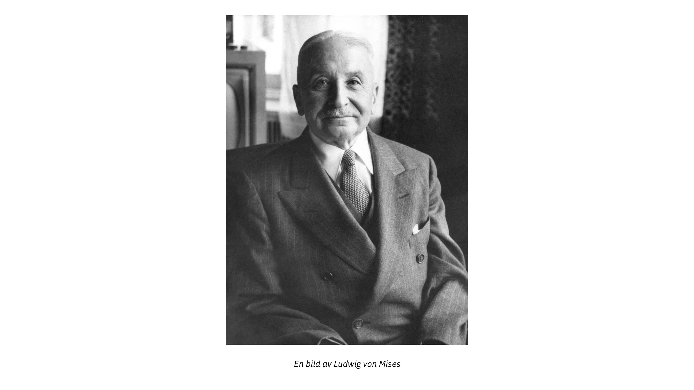

Mises förklarar att jobben i fabrikerna, även om de var usla med våra mått mätt, utgjorde den bästa möjliga möjligheten för den tidens arbetare.

Låt oss läsa ett utdrag ur _Human Action_:

> Under de första decennierna av den industriella revolutionen var levnadsstandarden för fabriksarbetare skandalöst låg jämfört med förhållandena för deras samtida från överklassen, och jämfört med den nuvarande situationen för industriella folkmassor. Arbetstiderna var långa och de sanitära förhållandena i verkstäderna var bedrövliga. Individernas arbetskapacitet är snabbt uttömd. Men faktum kvarstår att för överskottsbefolkningen hade tillägnandet av kommunala betesmarker (inhägnader) reducerat dem till den värsta misären. För dem som det bokstavligen inte fanns någon plats för inom ramen för det rådande produktionssystemet var fabriksarbetet räddningen. Dessa människor strömmade till verkstäderna enbart för att de behövde förbättra sin levnadsstandard.

Mises tillägger att förbättringen av människans villkor således möjliggjordes av kapitalackumulationen:

> Den radikala förändring av situationen som har gett massorna i väst den nuvarande levnadsstandarden (en hög levnadsstandard jämfört med vad den var under förkapitalistisk tid och vad den är i Sovjetryssland) var effekten av kapitalackumulation genom sparande och kloka investeringar av framsynta entreprenörer. Ingen teknisk förbättring skulle ha kunnat uppnås om inte det extra materiella kapital som krävs för den praktiska användningen av nya uppfinningar hade möjliggjorts genom sparande i förväg.
> När det gäller marxistisk historieskrivning kan vi också hänvisa till Friedrich Hayek i _Capitalism and the Historians_ (University of Chicago Press, 1954) och hans kapitel med titeln "History and Politics". Enligt Hayek var det inte industrialiseringen som gjorde arbetarna olyckliga, vilket den mörka legenden om kapitalismen som marxismen sprider påstår. Han konstaterar:
> Den verkliga historien om sambandet mellan kapitalismen och proletariatets uppkomst är nästan raka motsatsen till vad dessa teorier om massornas expropriering antyder.

Före den industriella revolutionen levde de flesta människor på landsbygden och var beroende av jordbruket för sin överlevnad. De hade inte mycket att sälja på marknaden, vilket begränsade deras möjligheter och levnadsstandard. Alla förväntade sig att leva i absolut fattigdom och föreställde sig ett liknande öde för sina efterkommande. Ingen blev upprörd över en situation som verkade vara oundviklig.

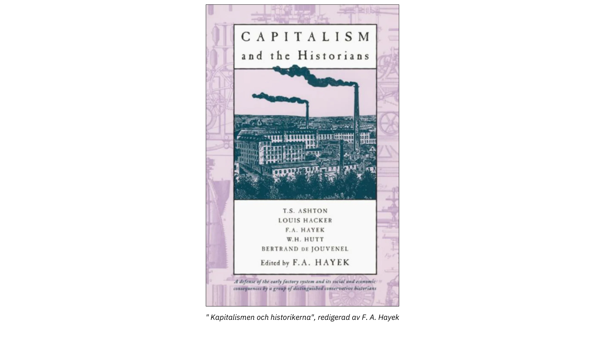

I och med industrialiseringen uppstod nya möjligheter, vilket ledde till en växande efterfrågan på arbetskraft. För första gången kunde människor utan mark eller betydande resurser sälja sin arbetskraft till fabriker och tillverkare i Exchange för en lön och därmed säkerställa framtida säkerhet.

Den nya tillgången till inkomst gjorde att de kunde skaffa mat och bostad åt sig själva, även i snabbt växande städer. Den industriella revolutionen ledde således till en befolkningsexplosion som inte hade varit möjlig under den förindustriella tidens ekonomiska stagnation.

Så här säger Hayek: "Ekonomiskt lidande blev både mer synligt och tycktes mindre berättigat, eftersom det allmänna välståndet ökade snabbare än någonsin tidigare."

Därför utnyttjades inte arbetaren, även om lönerna var låga, på grund av det överflöd av arbetskraft som flydde landsbygden.

I verkligheten är exploatering endast meningsfull som ett angrepp mot privat egendom. I denna mening är exploatering alltid en statlig handling. Staten är den enda institution som erhåller sina intäkter genom tvång, det vill säga med våld. Den verkliga exploateringen, som vi har sett hos Bastiat, är alltså den som de produktiva klasserna utsätts för av statstjänstemännen själva. Det skulle vara mer korrekt att säga att alla samhällens historia fram till våra dagar inte är något annat än historien om kampen mellan plundrare och de produktiva klasserna.

### Det "europeiska miraklet"

Med en mer nyanserad historisk analys än Marx kan vi sedan ifrågasätta idén om ett rovgirigt Europa, som enbart har imperialism och slaveri att tacka för sin framgång. Genom att undersöka jämförande ekonomisk historia har vissa samtida historiker sökt ursprunget till Europas utveckling i vad som skilde det från andra stora civilisationer, särskilt Kina, Indien och islam. Dessa särdrag har utforskats av [David Landes](https://www.eyrolles.com/Entreprise/Livre/richesse-et-pauvrete-des-nations-9782226110381/), [Jean Baechler](https://academiesciencesmoralesetpolitiques.fr/publications/publications-de-lacademie/jean-baechler/), [François Crouzet](https://www.cairn.info/revue-entreprises-et-histoire-2010-4-page-219.htm) och [Douglass North](https://www.iedm.org/fr/65134-douglass-north-l-un-des-economistes-les-plus-originaux/). Dessa forskare har försökt förstå vad som kallas "det europeiska miraklet" De har fokuserat på det faktum att Europa var en mosaik av delade och konkurrerande jurisdiktioner, där ingen central politisk makt efter Roms fall kunde genomdriva sin vilja.

Som Jean Baechler, ledamot av Academy of Moral and Political Sciences, säger i _The Origins of Capitalism_ (1971):

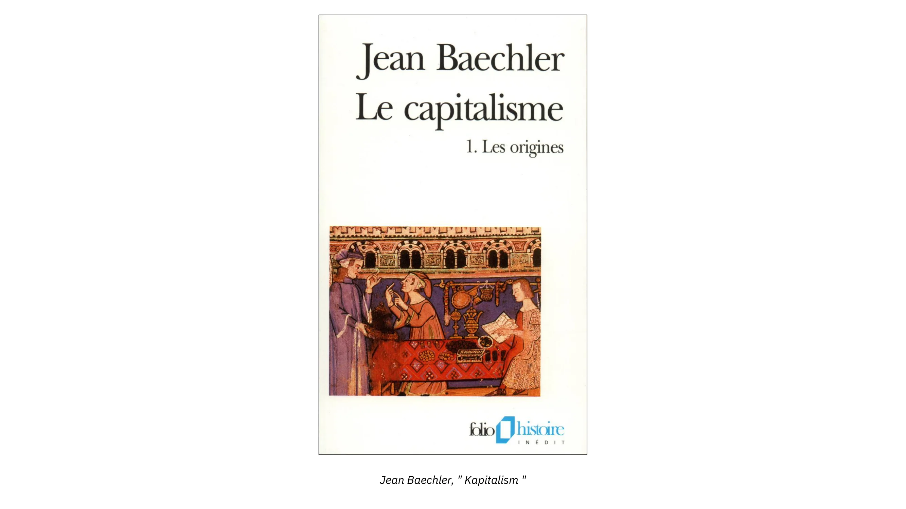

> Det första villkoret för att maximera den ekonomiska effektiviteten är att det civila samhället frigörs från staten (...) Kapitalismens expansion har sitt ursprung och existensberättigande i den politiska anarkin.

Med andra ord var den stora "icke-händelse" som dominerade Europas öde avsaknaden av ett hegemoniskt imperium, som det som dominerade Kina.

Det är detta radikalt decentraliserade Europa som gav upphov till parlament, domsagor och generalständer. Det gav upphov till stadgar som den berömda Magna Carta i England. Men det gav också upphov till de fria städerna i norra Italien och Flandern, bland annat Venedig, Florens, Genua, Amsterdam, Gent och Brygge. Slutligen utvecklades begreppet naturrätt, liksom principen att inte ens prinsen står över lagen, en doktrin som hade sina rötter i de medeltida universiteten i Bologna, Oxford och Paris, och som senare spreds till Wien och Krakow.

Sammanfattningsvis kan sägas att Europas ekonomiska och kulturella uppsving inte berodde på att man erövrade och exploaterade resten av världen. Europa dominerade världen tack vare sina ekonomiska framsteg. Det som har kallats "imperialism" är följden av, inte orsaken till, Europas ekonomiska framsteg. Men för att återgå till Lord Acton, det som skiljer den västerländska civilisationen ännu mer från alla andra är dess bejakande av individens värde. I denna mening har samvetsfrihet, särskilt i religiösa frågor, varit en grundläggande pelare i denna civilisation. Vi återkommer till detta i följande avsnitt.

## Murray Rothbard: Stat kontra samhälle

<chapterId>5a0020ca-2bbd-5e09-8389-d57c57542cb2</chapterId>

I det sista kapitlet i _Anatomy of the State_ (översatt till franska som _L'anatomie de l'Etat_, av Résurgence editions) föreslår Murray Rothbard en historieteori. Detta mycket korta kapitel har rubriken "History: En kapplöpning mellan statsmakt och social makt" Enligt Rothbard kan historien förstås som en evig konflikt mellan två grundläggande principer:

- Fredligt samarbete och produktion, som representerar frivillig Exchange och skapandet av välstånd genom arbete och innovation.
- Tvångsmässig exploatering och rovdrift, förkroppsligad av statens dominans, som med våld tillägnar sig frukterna av individers arbete.

Med hänvisning till Albert J. Nock använder Rothbard begreppen "social makt" och "statsmakt" för att beteckna dessa två motsatta krafter:

- Social makt uppstår ur fria individers samarbete och uppfinningsrikedom, vilket leder till ekonomiska framsteg och välstånd. Det är en makt över naturen, människans kreativa förmåga att omvandla naturen till resurser och kunskap för samhällets kollektiva bästa.
- Statsmakt utövas genom tvång och våld i syfte att kontrollera och exploatera samhället för egen vinning. Det är en makt som utövas över människan. Den består i att "dränera samhällets frukter till förmån för icke-produktiva (i själva verket antiproduktiva) ledare"

### Staten som parasit

Rothbard betraktar staten som en parasit som lever på bekostnad av det produktiva samhället. Den intar strategiska "kommandoposter" för att tillskansa sig rikedom och makt. Monopol på våld, rättvisa, utbildning och infrastruktur. Och han tillägger: "I den moderna ekonomin är pengar den viktigaste kommandoposten."

Enligt Rothbard bör frihetsprincipen även gälla pengar. Om vi är för frihet inom andra sektorer, om vi vill skydda egendom och person mot statens intrång, måste vår mest angelägna uppgift vara att utforska möjligheten till en fri penningmarknad. (Se på denna punkt hans essä: _State, What Have You Done with Our Money?_ Översättning av Stéphane Couvreur för Institut Coppet, 2011).

### De misslyckade försöken att begränsa staten

Rothbard varnar för tanken att skrivna konstitutioner i sig skulle kunna garantera frihet och maktbegränsning:

> Under de senaste århundradena har människor försökt införa konstitutionella och andra gränser för staten, bara för att upptäcka att sådana gränser, liksom alla andra försök, har misslyckats. Av alla de många former som regimerna antog under århundradena, av alla de begrepp och institutioner som prövades, lyckades ingen hålla staten under kontroll.

En skriven konstitution har förvisso många fördelar, men det är ett allvarligt misstag att tro att den skulle vara tillräcklig. Majoritetspartiet, med sin makt, kan faktiskt göra en extensiv tolkning för att öka sin makt. Utan konkreta mekanismer för att upprätthålla rättigheter och med ett dominerande parti som är fast beslutet att utöka sin makt, riskerar konstitutioner att bli ineffektiva och missvisande verktyg.

### Det 20:e århundradet: Ett århundrade av tillbakadragande

Enligt Rothbard är historien inte en linjär process, utan snarare en pendling mellan samhällsmaktens framväxt och statens återkomst som kontrollinstans:

- Frihetsperioder: När samhällsmakten blomstrar ökar friheten, freden och välståndet.
- Perioder av statligt herravälde: när staten tar överhanden, vilket leder till förtryck, krig och regression.

Mellan 1600- och 1800-talet fanns det i många västländer perioder av accelererande sociala framsteg och en motsvarande ökning av frihet, fred och materiell välfärd. Men Rothbard påminner oss om att 1900-talet präglades av en återkomst av statsmakten, med ödesdigra konsekvenser: en ökning av slaveri, krig och förstörelse.

> Under detta århundrade står mänskligheten återigen inför statens våldsamma styre; staten som nu är beväpnad med människans kreativa kraft, konfiskerad och förvrängd för sina syften.

Vad är ett fritt samhälle, trots allt? Det är ett samhälle utan monopol. I sitt verk om politisk filosofi, _Ethics of Liberty_ (1982), svarar Rothbard: "Ett samhälle där det inte finns någon laglig möjlighet till tvångsaggression mot någon individs person eller egendom." Det är därför som den politiska filosofin, som måste definiera principerna för ett rättvist samhälle, enligt honom kokar ner till en enda fråga: "Vem äger legitimt vad?"

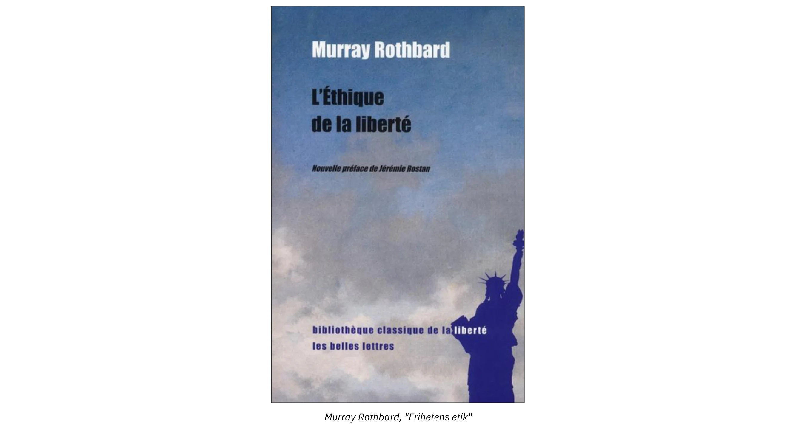

För Rothbard kan social ordning råda om den är en produkt av generaliseringen av avtalsförfaranden för den fria Exchange av äganderätten, vilket uppnås genom att privatisera alla ekonomiska aktiviteter och till och med suveräna funktioner (såsom centralbanker och domstolar) och genom att tillgripa konkurrens mellan skyddsorgan.

Och han tillägger:

> Vi har nu smakat på alla varianter av statism, och de har alla misslyckats. I början av 1900-talet började företagsledare, politiker och intellektuella i hela västvärlden att förespråka ett "nytt" blandekonomiskt system, präglat av statlig dominans, i stället för det föregående århundradets relativa laissez-faire. Nya, vid första anblicken attraktiva universalmedel som socialism, korporativistisk stat, välfärdsstat etc. har prövats och alla har uppenbarligen misslyckats. Argumenten för socialism och statlig planering framstår nu som argument för ett gammalt, utmattat och misslyckat system. Vad finns det kvar att pröva förutom frihet?
>

> (_Frihetens etik_)

# Frihetens ursprung: Antiken

<partId>d7a9d251-6d44-5f2f-9cc5-88796c84f61b</partId>

## Grekerna uppfann den kritiska rationaliteten

<chapterId>5b5f65e6-f980-5971-b9f6-a37244503325</chapterId>

Erfarenheterna av den atenska demokratin har lämnat ett bestående avtryck i det politiska tänkandets historia och fortsätter att inspirera till ideal om demokrati och medborgardeltagande i dagens värld.

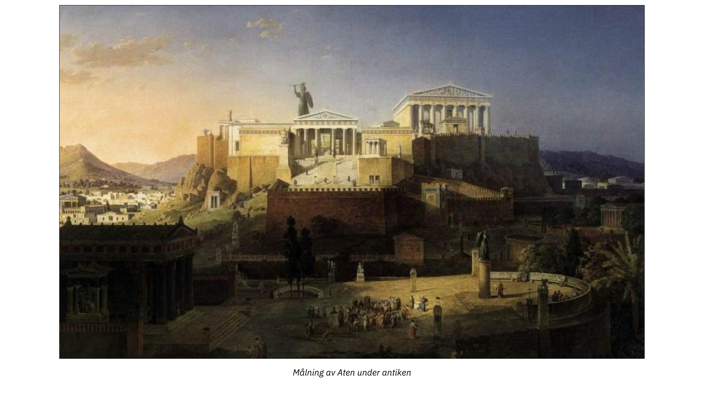

Den atenska demokratin kännetecknades av livliga offentliga debatter om stadens angelägenheter, som främst ägde rum på agoran, stadens marknadsplats. Detta sätt att fungera, baserat på förnuft och kritisk diskussion, stod i skarp kontrast till tidigare praxis där lagar och sedvänjor ansågs vara heliga och oföränderliga, nedärvda av förfäder och skyddade av gudarna.

### Politikens födelse med staden

Den atenska demokratin utgör ett betydande avsteg från traditionen. I tidigare samhällen kunde det faktiskt inte finnas någon "politik" i betydelsen en diskussion om sociala regler, eftersom dessa på ett transcendent sätt påtvingades av myten.

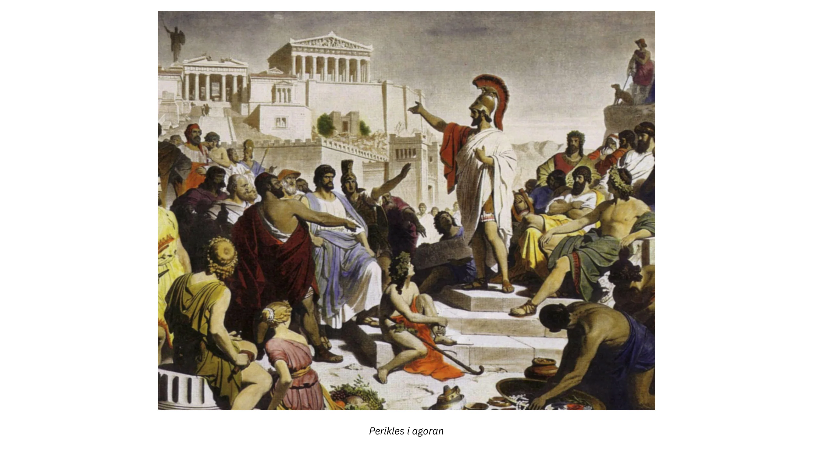

Historikern Jean-Pierre Vernant skriver:

> Polisens uppkomst utgör en avgörande händelse i det grekiska tänkandets historia. I termer av intellektuell och institutionell utveckling skulle dess fulla konsekvenser förvisso först förverkligas på lång sikt; polis skulle genomgå flera stadier och olika former. Men från och med dess tillkomst, som kan placeras mellan 800- och 700-talen, markerar den en början, en verklig uppfinning; genom den får samhällslivet och relationerna mellan människor en ny form, vars originalitet grekerna skulle känna fullt ut. (...) Vad polis-systemet först och främst innebär är att talet får en extraordinär överlägsenhet över alla andra maktinstrument. Det blir det politiska verktyget par excellence, nyckeln till all auktoritet i staten, medlet för kommando och dominans över andra. (...) Ett andra kännetecken för polis är den fulla offentlighet som ges åt de viktigaste manifestationerna i samhällslivet. Man skulle till och med kunna säga att polis existerar endast i den mån en offentlig domän har uppstått, i två olika men ändå sammanlänkade betydelser av termen: en sektor av gemensamt intresse, i motsats till privata angelägenheter, och öppen praxis, etablerad i fullt dagsljus, i motsats till hemliga förfaranden. (...) Hädanefter blir diskussion, argumentation och kontroverser reglerna för både det intellektuella och det politiska spelet. Samhället utövar en ständig kontroll över såväl sinnets skapelser som över statens makthavare.
>

> (Jean Pierre Vernant, _The Origins of Greek Thought_, Paris, P.U.F, 1962)

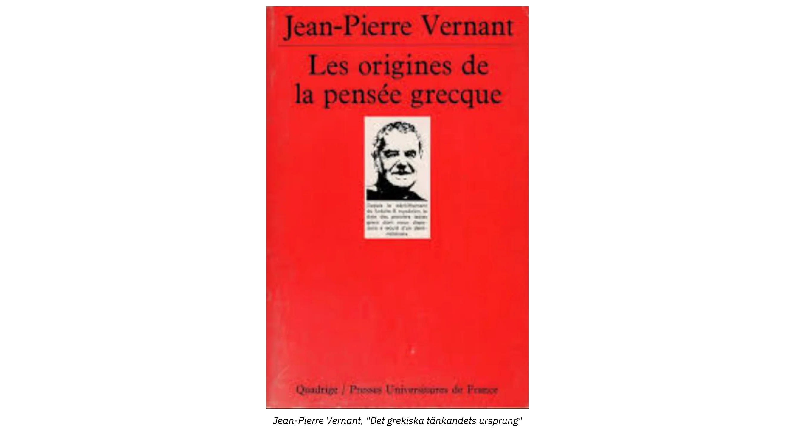

Det grekiska ordet "polis", som gett upphov till det engelska ordet "politics", syftar på en stadsstat. När Aristoteles skriver att "människan av naturen är ett politiskt djur" betyder det inte att hon är skapad för makt. Med politik avser han den förmåga som människan har att överlägga på det offentliga torget för att avgöra vad som är rätt och orätt.

Denna nyhet bygger på den grundläggande skillnaden mellan två termer i det grekiska språket, "phusis" och "nomos", som betecknar två typer av lagar:

- _Phusis_ är naturens lag (vilket ger ordet "fysik" på franska).
- _Nomos_ är människans lag (en term som återfinns i ordet "autonomi", som betyder "att lyda sin egen lag").

Staden växer fram ur tanken att lagen (nomos) är av mänskligt ursprung, att den till skillnad från naturen fritt kan ändras av människan och att den kan gälla alla. Grekerna blev därmed medvetna om den sociala och politiska ordningens självständighet i förhållande till den naturliga ordningen.

Detta är början på politiken: den pågående diskussionen om själva reglerna för samhällslivet. Från och med nu kommer problem att lösas genom samordnade åtgärder, snarare än genom en oföränderlig, helig ordning.

Och Jean-Pierre Vernant tillägger:

> Det grekiska förnuftet är det som på ett positivt, reflekterande och metodiskt sätt tillåter oss att agera på människor, inte att förändra naturen. Inom sina gränser, liksom i sina innovationer, är det stadens dotter.

### Idén om frihet under lagen

Det är inte gudarnas avsiktliga agerande som skapar social harmoni, utan snarare alla medborgares lydnad för samma opersonliga lag. Makt är inte längre en angelägenhet för präster. Den har blivit en angelägenhet för alla. Så uppkommer begreppet likhet inför lagen: "_isonomia_", men också retorik. Att behärska talet var en förutsättning för att kunna övertyga sina medmänniskor i församlingar och domstolar.

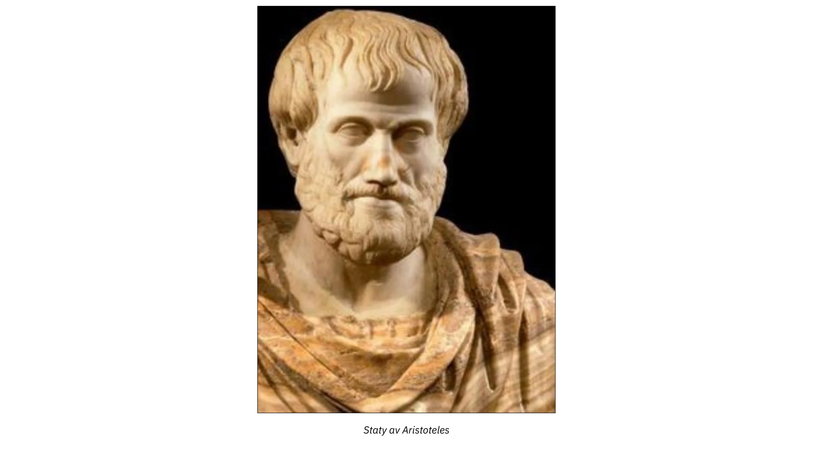

För Aristoteles är tyranni lydnad mot en man och frihet lydnad mot lagen. Han tillskrivs detta citat:

> Att önska sig en rättsstat är att förvänta sig förnuftets exklusiva herravälde. Att i stället välja en människas styre är att lägga till ett vilddjurs, för begär och vrede förvränger de styrandes omdöme, även om de är de bästa av människor.

Enligt honom garanterar lagar, eftersom de är opersonliga och permanenta, rättvisa och jämlikhet för alla medborgare.

Cicero, den berömde romerske talaren och filosofen från första århundradet f.Kr., anammade denna idé: "Vi är lagarnas slavar för att vi ska bli fria" (_De Republica_, bok III, kapitel 13). I detta avsnitt utvecklar Cicero ett argument till förmån för en republik som styrs av lagar, snarare än av en man eller en liten grupp män.

Begreppet republik härstammar från den grekiska filosofin. Det har ofta ställts i motsats till demokrati, som ansetts vara för riskabel. Platon gav ut sitt huvudverk i politisk filosofi: _Republiken_, och han dömer demokratin mycket hårt. När folket styr finns det en stor risk att man inför sina önskningars lag och förväxlar det goda med det trevliga. Därför manipulerades Sokrates tragiska död, som dömts till döden av en folklig jury, av sofisterna. Platon lärde sig alla läxor av detta.

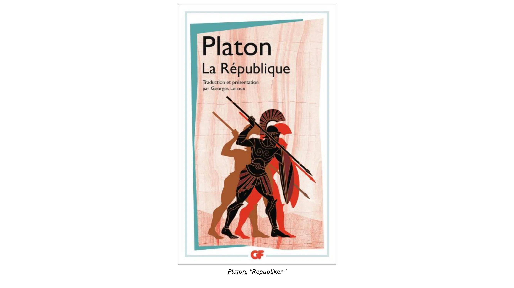

Aristoteles skulle använda termen "republik" för att beteckna en rättvis konstitution, en som syftar till det gemensamma intresset och behandlar medborgarna som fria människor. En sann frihetsregim är en där lagen är allmän, lika för alla, anonym och inte ett personligt kommando.

Begreppet frihet under lagarna återspeglas också i den anglosaxiska termen "Rule of Law"

### Politisk frihet

Man kan säga att grekerna uppfann begreppet politisk frihet som en motvikt till tyranniskt herravälde. Den tidens greker ansåg att slaveriet var en naturlig institution och att slavar inte hade samma status som medborgare. Detta kan tyckas motsäga idén om frihet, men för dem var frihet kopplat till medborgarskap och inte till avsaknaden av slaveri.

Herodotos i sin _Historia_ och Aiskylos i sin tragedi _Perserna_ illustrerar på ett lysande sätt kontrasten mellan Xerxes absoluta och tyranniska monarki och grekernas frihetsanda. Detta folk, som kännetecknas av att det inte har några herrar och vägrar att låta sig förslavas av barbarer, oavsett hur många de är, finner sin styrka i lagen, "nomos", deras sanna herre som garanterar deras frihet. Och denna lag emanerar från allas vilja.

Enligt Jacqueline de Romilly:

Grekerna själva har mätt denna originalitet och blev medvetna om den i början av 500-talet, i den chock som stod emot dem mot de persiska inkräktarna. Och det första faktum som slog dem var att det fanns en politisk skillnad mellan dem och deras motståndare, som befallde allt annat. Perserna lydde en absolut suverän, som var deras herre, som de fruktade och inför vilken de kastade sig ner; dessa metoder var inte vanliga i Grekland. Det finns en häpnadsväckande dialog i Herodotos, som ställer Xerxes mot en tidigare kung av Sparta. Denne kung meddelar Xerxes att grekerna inte kommer att ge sig eftersom Grekland alltid kämpar mot förslavning under en herre. Det kommer att kämpa, oavsett antalet motståndare. För även om grekerna är fria, "är de inte fria i allt: de har en herre, lagen, som de fruktar ännu mer än dina undersåtar fruktar dig."

(_Det antika Grekland vid upptäckten av friheten, Paris, Editions de Fallois, 1989_)

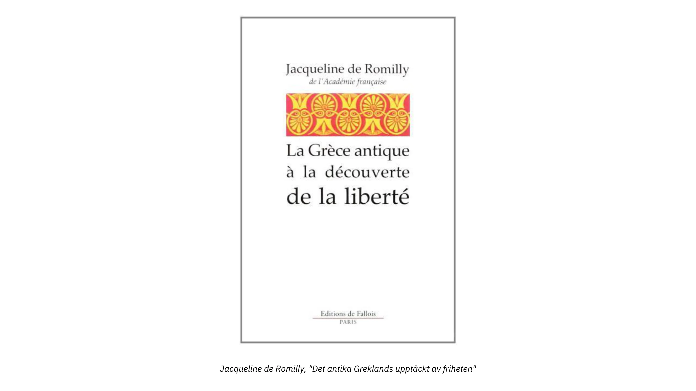

Herodotos är övertygad om att ett folk av fria män är ett folk som lyder en lag och inte en herre, som i det persiska imperiet, där bara en man är fri och alla andra är slavar. Detta gäller för Aten, en demokrati, men det gäller också för Sparta. Kungen skapar inte lagen. Han påtvingar inte sin vilja. Han ser till att lagen respekteras, han står till dess tjänst och han dör, om så krävs, för att försvara den.

### Strävan efter sanning och pluralism

Thales, Anaximander, Anaximenes och senare Demokritos och Empedokles var de första att försöka förstå phusis (naturen) med hjälp av förnuftet snarare än med hjälp av övernaturliga väsen.

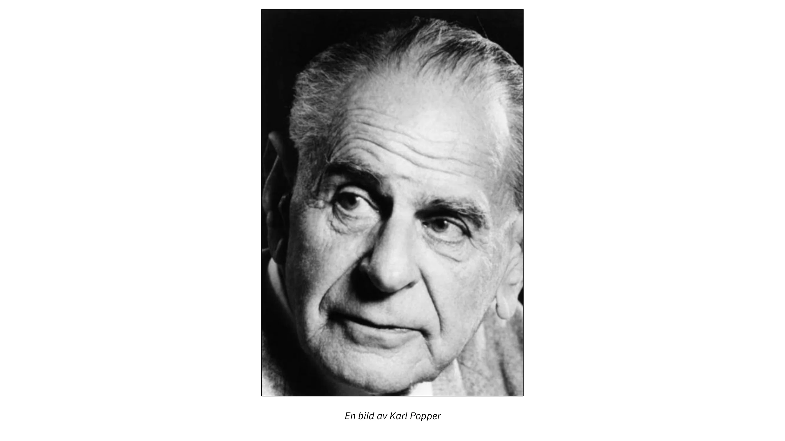

Den grundläggande princip som dessa tidiga försokratiska filosofer hävdade är att kosmos (universums) Elements håller sig på plats eftersom de alla är lika mycket underkastade samma "naturlag" (phusis) som kan sägas vara universell och nödvändig. Universum är rationellt; det utgör en strukturerad helhet som människan kan upptäcka med sitt förnuft (logos i motsats till mutos, myten).

Enligt Karl Popper är vi skyldiga filosoferna i det antika Grekland, särskilt försokratikerna, uppfinningen av den kritiska rationalismen, den västerländska traditionen av kritisk diskussion och källan till vetenskapligt tänkande och pluralism. Han förklarar detta i ett kapitel i _Conjectures and Refutations_ med titeln "Return to the Pre-Socratics":

De första tecknen på en kritisk hållning, på en ny tankefrihet, dyker upp i Anaximanders kritik av Thales. Detta är en ganska märklig företeelse; den tänkare som Anaximander kritiserar är hans mästare, hans landsman, en av de sju vise, den som grundade den joniska skolan. Enligt traditionen var Anaximander bara fjorton år yngre än Thales, och han formulerade sannolikt sin kritik och presenterade sina nya begrepp under sin mästares livstid, eftersom de av allt att döma dog med några års mellanrum. Källorna ger dock inga belägg för meningsskiljaktigheter, gräl eller schism.

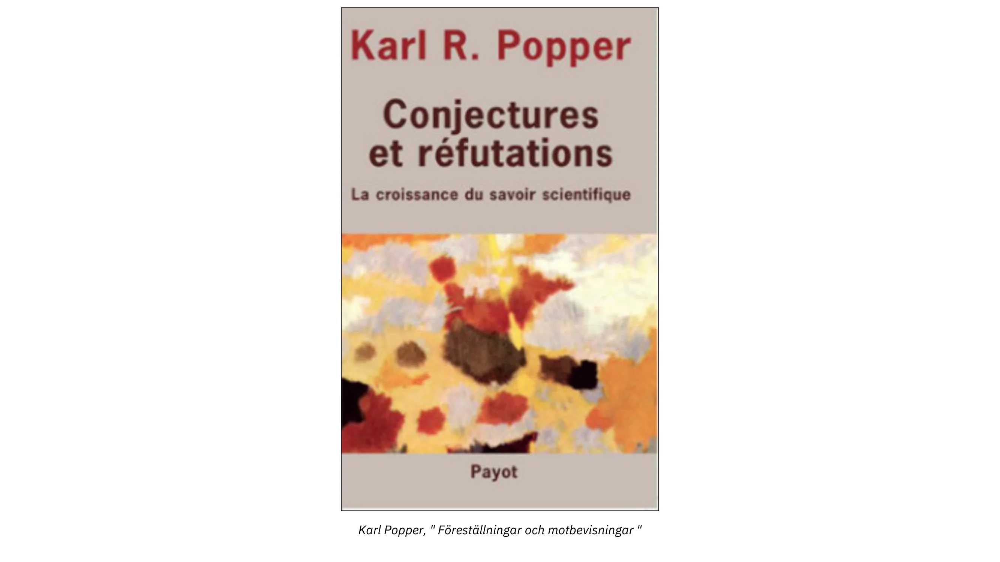

Dessa Elements tyder enligt honom på att Thales var upphovsman till denna nya frihetstradition, som byggde på ett originellt förhållande mellan mästare och lärjunge. Thales kunde tolerera kritik, och han etablerade traditionen att erkänna den. Popper ser här en brytning med den dogmatiska traditionen, som endast tillåter en enda skolas lära, och ersätter den med pluralism och fallibilism.

> Våra försök att förstå och upptäcka sanningen är inte definitiva. Vår kunskap och våra läror är gissningar, de består av antaganden och hypoteser snarare än av säkra och slutgiltiga sanningar.

De enda medel vi har för att närma oss sanningen är kritik och diskussion. Från det antika Grekland kommer därför denna tradition:

> Som består i att formulera djärva gissningar och utöva fri kritik, en tradition som var ursprunget till det rationella och vetenskapliga synsättet och följaktligen till denna västerländska kultur som är vår och den enda som bygger på vetenskap, även om detta naturligtvis inte är dess enda grund.

## Romarnas uppfinning av lagen

<chapterId>e9337ad6-5a75-5894-a017-9a507939cb51</chapterId>

Det romerska riket var en enorm, kosmopolitisk enhet. När det var som störst, omkring år 117 e.Kr., var det en enorm multietnisk och flerspråkig stat:

- I väster sträckte den sig från Storbritannien (nuvarande England) till Spanien och passerade genom Gallien (nuvarande Frankrike) och norra Afrika.
- I norr nådde den Rhen och Donau och omfattade delar av Tyskland, Nederländerna, Schweiz, Österrike, Ungern, Rumänien och Bulgarien.
- I söder gränsade det till Medelhavet, inklusive Italien, Grekland, Balkan, Mindre Asien (nuvarande Turkiet), Syrien, Libanon, Palestina, Egypten och Cyrenaica (en del av nuvarande Libyen).
- I öster sträckte den sig till Mesopotamien (nuvarande Irak) och Armenien.

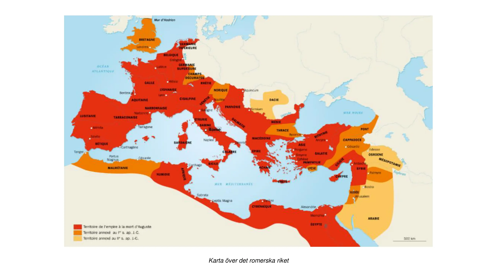

Från och med då drev romarna rättsutvecklingen långt längre än grekerna, som levde i små, etniskt homogena stadsstater. Under den romerska republiken fanns det redan ett rättsligt skydd för egendom och individuella rättigheter.

Lagens funktion var att möjliggöra fredlig samlevnad och Exchange mellan människor genom att dra upp gränserna för "mitt" och "ditt"

Privat egendom fick en ny dimension i den romerska civilisationen som den inte hade haft tidigare, inte ens i den antika grekiska civilisationen.

Den romerska rätten kom att bli grunden för all modern västerländsk lagstiftning från medeltiden fram till idag.

### Skydd av individuella rättigheter

I slutändan lade den romerska rätten stor vikt vid individens fri- och rättigheter, och de romerska medborgarna var stolta över sin medborgarstatus. De tolv tabellernas lag (450 f.Kr.) utgjorde den första skriftliga lagsamlingen som var tillgänglig för alla romerska medborgare, både patricier och plebejer. Denna kodifiering bidrog till att klargöra och standardisera lagen, som tidigare var spridd och ofta sedvanerättslig, och säkerställde en viss grad av transparens i tillämpningen av rättigheter som rätten att gifta sig, köpa och sälja.

Denna lag motsvarar på ett häpnadsväckande sätt de grundläggande naturliga rättigheter som John Locke teoretiserade två tusen år senare. Den gör det möjligt att skydda individens rättigheter mot godtycklig maktutövning och maktmissbruk.

Visserligen var kvinnor, slavar och utlänningar fortfarande undantagna från lagens fulla skydd. Ändå innebar de tolv bordens lag ett betydande framsteg och lade grunden för den fortsatta utvecklingen av individuella rättigheter, som senare utvidgades till att omfatta alla.

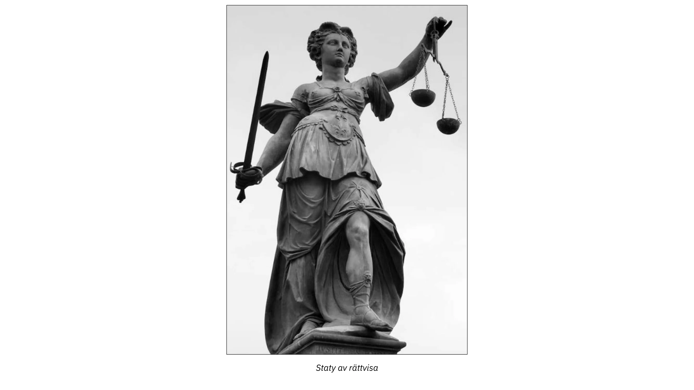

Lagen om de tolv tabellerna lägger särskilt stor vikt vid äganderätten:

- Den definierar de olika typerna av egendom (mark, lösöre etc.)
- Den delar upp egendom i usus (nyttjanderätt), fructus (rätt att ta emot frukterna) och abusus (rätt att avyttra)
- Den anger villkoren för förvärv, överföring och skydd av dessa varor.

Sammanfattningsvis bidrar den till att säkra transaktioner och skydda individer mot godtycklig expropriation, med möjlighet till regress i händelse av tvist.

### Humanismens födelse och privatlivet

Vad man är beror på vad man har. Att vara är inte så oberoende av att ha som det ibland sägs, eftersom det vi äger skiljer oss från det andra äger. Och vårt liv tillhör oss, vi äger först våra förmågor, vår kropp, innan vi äger materiella varor.

I det romerska samhället kunde individen i allt högre grad skilja sig från andra och på så sätt bli aktör i sitt eget liv. Människan spelar nu en unik roll och Cicero använder ordet "persona" för att beteckna henne. "Persona" var en mask som bars av romerska skådespelare, men det syftade också på en individs juridiska och sociala personlighet. Begreppet persona innebar att individer var distinkta enheter med egna rättigheter och skyldigheter. Begreppet den enskilda människan (egot) med sitt inre liv och sitt unika öde uppstod och utvecklades inom kristendomen.

Dessutom innehåller den romerska litteraturen och filosofin många exempel på reflektioner kring individens natur, lycka, visdom och livet i samhället.

### Seneca och det lyckliga livet

En förebild för balans i tanken är Seneca, en romersk stoisk filosof som skrev om vikten av dygd, förnuft och självbehärskning. Han var samtida med Jesus men också Neros lärare, en förmögen bankir och en känd romersk författare.

Avhandlingen om det lyckliga livet (_De Vita Beata_) är en plädering för den stoiska moralen. Lyckan, säger Seneca, "är en fri själ \[...\] oåtkomlig för fruktan \[...\] för vilken det enda onda är moralisk förnedring." Den stoiske vismannen, som var lärjunge till Sokrates, fruktar inte fysisk ondska, döden eller ens att utsättas för orättvisor. För honom är det enda onda det moraliskt onda. Därför ligger det högsta goda i dygden.

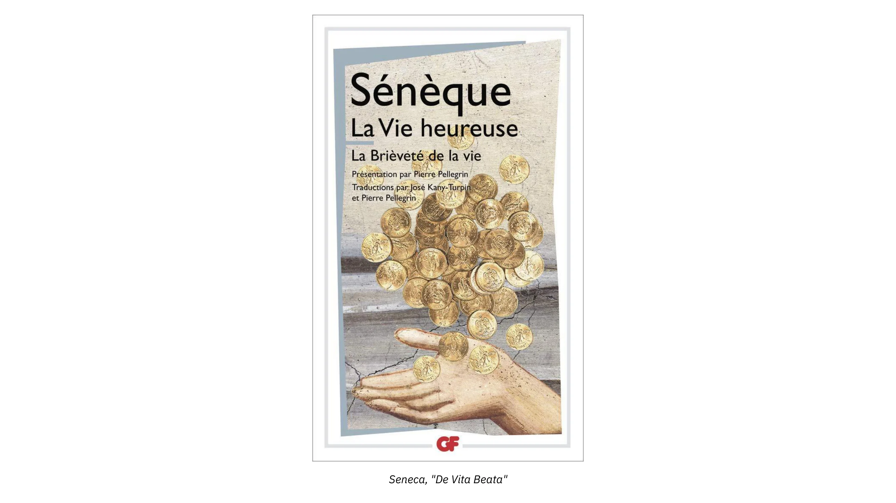

Njutning är dock inte oförenligt med dygd:

> De gamla föreskrev att man skulle leva det bästa livet, inte det trevligaste, på ett sådant sätt att njutningen inte är den rätta viljans vägvisare, utan dess följeslagare på vägen.

Det är därför den vise mannen inte avvisar förmögenhetens gåvor:

> Han älskar inte rikedomar, han föredrar dem; han välkomnar dem inte till sitt hjärta utan till sitt hus; han avvisar inte det han äger, han dominerar dem och vill att de ska förse hans dygd med rikligt med material.

Seneca går ännu längre. För den vise är rikedomar ett tillfälle och ett medel för att utöva dygd:

I fattigdom [...] finns det bara en sorts dygd: att inte vackla eller låta sig deprimeras; mitt i rikedomen har måttfullhet, generositet, omdömesförmåga, ekonomi och storslagenhet fritt spelrum.

### Konceptet med en högre lag

Termen "mänskliga rättigheter", som många jurister samlas kring, ansluter sig implicit till idén om en högre lag eftersom den riktar sig mot rättigheter som är inneboende i mänskligheten själv och som föregår all positiv lagstiftning. Utan denna överordnade moraliska norm skulle det inte längre finnas någon kritisk auktoritet som kan tolka och ifrågasätta rättsordningen.

Denna tanke påminner oss om att prinsen (precis som politiska ledare) inte besitter rättvisan i sig utan själv är underkastad en lag som överträffar honom och måste reglera hans omdöme.

Det är vad antikens filosofer, särskilt romare som Cicero eller stoikerna, kallade naturrätt. Dess ursprung kan spåras tillbaka till det grekiska tänkandet, särskilt i Sofokles och Aristoteles verk.

Aristoteles skiljer mellan naturrättvisa och lagrättvisa. Naturrätt är det som är universellt giltigt, på alla platser och vid alla tidpunkter. Det är en oskriven lag som är känd genom förnuft och logik. Juridisk rättvisa är i sig likgiltig, men blir obligatorisk för alla till följd av ett konventionellt val och kodifieras i en lagtext. Man skiljer med andra ord mellan naturrätt och positiv rätt.

Dramatikern Sofokles iscensätter i sin pjäs _Antigone_ en konflikt mellan gudomlig lag och mänsklig lag. Antigone vägrar att lyda kung Kreons dekret, som förbjuder begravningen av hennes bror, med argumentet att gudomliga lagar, som är oföränderliga och överlägsna, har företräde framför mänskliga lagar.

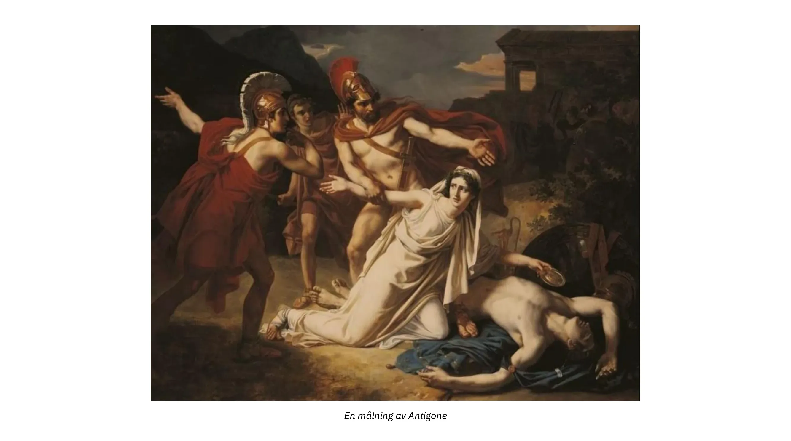

När Antigone inte lyder Kreon går hon emot den positiva lagen för att lyda sitt moraliska och religiösa samvete. Om det bara finns positiv lag, säger Aristoteles, har Kreon alltid rätt, även när han har fel. Men om vi behåller den reglerande idén om en naturlig eller gudomlig lag, kan Antigone när det är dags stå upp och mot en orättvis lag åberopa den oskrivna lagens överlägsna rätt.

### Cicero och naturrätten

Cicero levde på 1000-talet f.Kr. och anses vara en av de största talarna på det latinska språket under romarriket. Han är också en moralisk och politisk filosof som är nära besläktad med stoikerna. Utbildade européer har läst hans essäer i många århundraden.

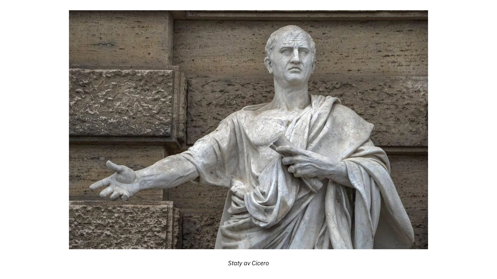

I sin avhandling _Om lagarna_ (_De Legibus_) reflekterar han över lagens grundvalar. Enligt honom kan inte positiv rätt, dvs. den uppsättning konventioner eller skrivna lagar som ett samhälle antar, skapa en rättvisa värd namnet. Det finns en naturlig rättvisa, inskriven i det mänskliga förnuftet: "lagen har en grund i naturen själv" Att säga att det orättvisa är resultatet av en konvention är att säga att sanningen är dekreterad. Sanningen kan dock inte dekreteras, inte ens av majoriteten; den vägleder våra bedömningar.

Cicero förkastar också nyttan som grund för lagen. I själva verket skriver han:

> Om rättvisa är lydnad mot skrivna lagar och folkens institutioner, och om, som de som upprätthåller den säger, nyttan är alltings mått, kommer den att förakta och bryta mot lagarna, som tror sig se sin fördel i den. Alltså, ingen rättvisa, om det inte finns någon naturlig rättvisa i arbetet; om den är baserad på nytta, kullkastar en annan nytta den. Om därför rätten inte vilar på naturen, försvinner alla dygder. Vad händer då med liberaliteten, kärleken till landet, respekten för det som måste vara heligt för oss, viljan att tjäna andra, viljan att erkänna utförda tjänster? Alla dessa dygder härrör från vår benägenhet att älska människor, vilket är lagens grund.

Därför finns det enligt honom en universell rättvisa, inskriven i förnuftet och naturen. Cicero skriver i _De Republica_:

> Den sanna lagen är det rätta förnuftet i överensstämmelse med naturen; den har universell tillämpning, är oföränderlig och evig; den uppmanar till plikt genom sina bud och vänder sig bort från den felaktiga vägen genom sina förbud \[...\]. Varken senaten eller folket har befogenhet att befria oss från att lyda den \[...\]. Den är inte en sak i Aten och en annan i Rom, inte en sak i dag och en annan i morgon. Utan det är en enda och samma lag, evig, oföränderlig, i kraft vid alla tider och bland alla folk \[...\]. Den som inte lyder denna lag flyr från sig själv och föraktar sin mänskliga natur.

Denna lag är överordnad gällande lagstiftning och kan därför "inte ogiltigförklaras av andra lagar, inte heller kan någon av dess föreskrifter frångås eller helt upphävas", tillägger Cicero. Den politiska makten har inget grepp om den.

Varken sanning eller rättvisa kan dekreteras, inte ens av majoriteten, eftersom de annars blir föremål för alla manipulationer. Därför är det inte rätt att överträda naturlagens principer, även om folket är härskaren.

Cicero hävdade att lagen inte kan reduceras till enbart de lagar som den lagstiftande församlingen antar och ville bekämpa godtycket i lagstiftningen och föreslå en politisk moral. Denna idé har haft ett bestående inflytande på det västerländska tänkandet.

## Roms fall

<chapterId>1b0f3de8-696a-5dbc-bb5e-e03ddafb4ebf</chapterId>

Varför gick Rom tillbaka och föll till slut? Många vill gärna tro att romarriket kollapsade plötsligt, under påverkan av barbariska invasioner. Orsakerna till romarrikets kollaps går dock att finna långt tidigare, i imperialism och ekonomisk och monetär dirigism.

År 1734 utvecklade Montesquieu i sin bok _Considerations on the Causes of the Greatness of the Romans and of Their Decline_ en originell och enhetlig tes för att förklara den romerska maktens uppgång och fall: den frihet som uppnåddes under republiken och sedan förlorades under kejsardömet. Från det ögonblick då det romerska herraväldet expanderade gick friheten förlorad och dekadensen satte in.

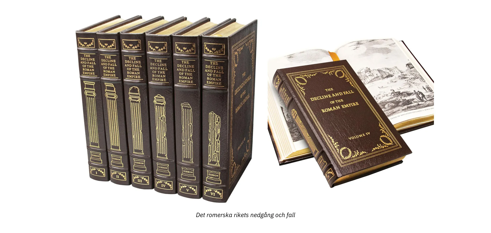

Romarriket var en parasitisk militärregim som bara kunde överleva genom ett ständigt inflöde av plundrade rikedomar utifrån, slavar och stulna landområden.

Den romerska aristokratins berikande kom i själva verket främst från bytet från invasioner, snarare än från skapandet av nytt värde. Men i takt med att erövringarna upphörde och avkastningen från plundringarna minskade, tvingades administrationen i allt högre grad ta till skattehöjningar för att tillfredsställa sitt behov av rikedom, vilket ledde till en allmän utarmning av rikets befolkning.

### Bröd och cirkusar

Omkring år 140 skrev den romerske historikern Fronto:

> Det romerska samhället är i första hand inriktat på två saker: mat och skådespel.

Gladiatorstrider, vagnkapplöpningar och teaterföreställningar, ofta gratis, lockade stora folkmassor och gjorde det möjligt för eliten att vinna folkets gunst. Makten försåg sina medborgare med spel, men också med vete, bröd, fläskkött och olivolja. Denna strategi fungerade som en politisk strategi för att lindra sociala spänningar, avleda uppmärksamheten från ekonomiska problem och stärka kejsarnas makt.

Under kejsar Antoninus Pius (138-161) nådde den romerska byråkratin enorma proportioner.

Men eftersom skatteintäkterna inte räckte till för att finansiera administrationen och garnisonerna började kejsarna ge ut allt mer valuta genom att minska mängden silver i varje mynt. I den romerska huvudvalutan denarius minskade silverinnehållet från 100 procent till 0,5 procent mellan 235 och 284 e.Kr. I och med devalveringen av valutan ökade priserna okontrollerat, vilket ledde till en nedgång i konsumtion, handel och förtroende.

Romarrikets fall var en långsam process som var direkt kopplad till att ett korrupt monetärt system gick i konkurs. Den efterföljande hyperinflationen ledde till att ekonomin kollapsade, vilket resulterade i en utbredd förlust av förtroende för valutan bland folket.

Till den ekonomiska instabiliteten kom sedan den politiska instabiliteten, med mer än 50 olika kejsare på tronen under en period av 50 år.

### Prisreglering

Ett klassiskt exempel på interventionism uppstod i Rom när kejsar Diocletianus ville sätta ett tak för priserna. Interventionism definieras som ett agerande från en makt som överskrider sin roll att upprätthålla ordning och skydda medborgarna. Det är ett försök att kontrollera marknaden, i syfte att ändra priser, löner, räntor och vinster.

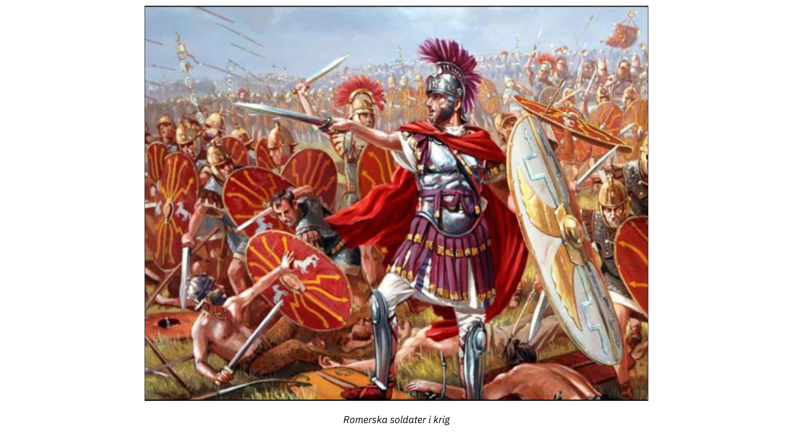

De upprepade monetära utsläpp som successiva kejsare gjorde för att klara av de ökade militärutgifterna hade orsakat en kraftig prisökning. År 301 proklamerade Diocletianus Maximum-ediktet i ett försök att begränsa dem. Det var ett misslyckande.

Ludwig von Mises beskriver denna episod, som väl illustrerar interventionismens skadliga effekter:

Den romerske kejsaren Diocletianus är känd för att ha varit den siste romerske kejsaren som förföljde kristna. Under senare delen av 300-talet hade de romerska kejsarna bara en finansiell metod: att förringa valutan. I dessa primitiva tider, innan tryckpressen uppfanns, var inflation i sig så att säga ett primitivt begrepp. Det handlade om bedrägeri vid myntningen, särskilt av silver, tills färgen på legeringen ändrades och vikten minskades avsevärt. Resultatet av denna försvagning av valutorna, i kombination med motsvarande ökning av cirkulationen, var en prisökning som följdes av ett påbud om priskontroll. Och de romerska kejsarna drog sig inte för att tillämpa lagarna; de ansåg inte att döden var ett alltför strängt straff för en man som hade begärt ett för högt pris. De genomdrev priskontroller, men följden blev att samhället föll samman. Detta ledde så småningom till att det romerska riket föll sönder och att arbetsdelningen upphörde.

([Ekonomisk politik, reflektioner för idag och imorgon](http://herve.dequengo.free.fr/Mises/PE/PE_3.htm))

### Från liberalism till socialism

Philippe Fabry följer i Montesquieus fotspår och visar att Rom genomgick en utveckling från liberalism till socialism. Philippe Fabry är historiker med inriktning på juridik, institutioner och politiska idéer. Han har undervisat vid University of Toulouse 1 Capitole och är författare till flera böcker, bland annat _Rome, from Liberalism to Socialism_ (2014).

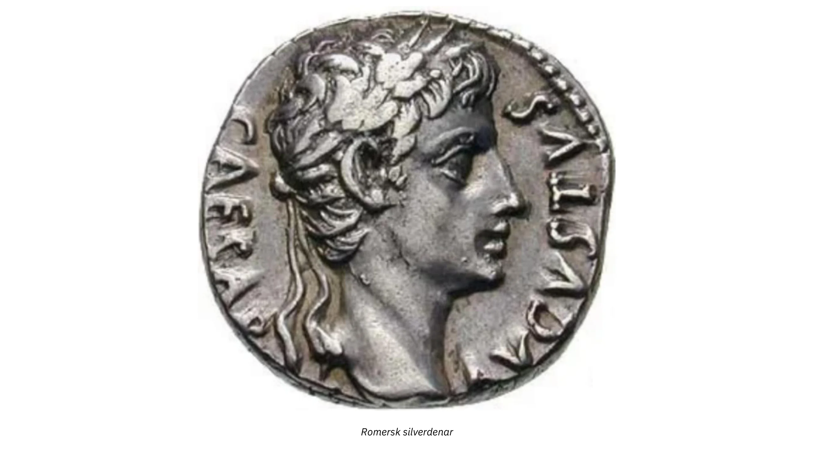

Var Rom den största liberala makten i den antika världen? Föll den sedan in i en form av socialism? Låt oss först definiera begreppen:

Liberalism: tilltro till att individernas agerande skapar en spontan ordning, bara för att den är resultatet av deras frivilliga interaktion, genom marknadens fria spel och respekten för deras omistliga rättigheter.

Socialism: statens organisering av samhället som helhet genom planering av produktion och konsumtion.

Tesen i Philippe Fabrys bok är att "romarrikets fall är en följd av det dödläge som den imperialistiska socialismen hade lett den antika världen in i" Det var den romerska kejsarstatens dirigism som ledde till dess kollaps.

Den romerska republiken, den största liberala makten i den antika världen, varade från 510 f.Kr. till 27 f.Kr. och sträckte sig över 500 år. Men gradvis gav den medborgerliga kollegialitet som kännetecknade den romerska republiken vika för personlig makt, förkroppsligad av kejsare som antog samma regeringsstil som de orientaliska potentaterna i forntida Egypten och Persien. Rom bröt med en tidigare moderat utrikespolitik och underkuvade plötsligt stora befolkningar genom krig, vilket gav strömmar av slavar till rika romerska investerare och förstörde medelklassen. I gengäld krävde den romerska befolkningen ökande subventioner.

I början av sin storhetstid betraktade varje romare sig själv som den viktigaste inkomstkällan. Det han frivilligt kunde förvärva på marknaden var källan till hans försörjning. Roms nedgång började när ett stort antal medborgare upptäckte en annan inkomstkälla: den politiska processen eller den omfördelande staten.

Romarna övergav sedan frihet och personligt ansvar i Exchange för löften om privilegier och rikedomar som fördelades direkt av regeringen. Medborgarna antog idén att det var mer fördelaktigt att få inkomst genom politiska medel snarare än genom arbete.

Philippe Fabry sammanfattar:

> De observerade svagheterna i det imperialistiska systemet \[...\] är de som finns i alla totalitära regimer: "Absolut prioritet ges åt att upprätthålla systemet på plats, ineffektivitet i den ekonomiska produktionen, korruption, svågerpolitik.

Och han tillägger:

> Sammantaget måste det ekonomiska, politiska, konstnärliga och religiösa livet under romarriket på 400-talet ha varit ganska likt det som rådde under Brezjnev i Sovjetunionen (och i de värsta stunderna under Stalin) eller det som kan råda i Nordkorea i dag: hela den romerska världens befolkning styrdes av den imperialistiska socialismen och drabbades, direkt eller indirekt, av dess effekter.

# Frihetens ursprung: medeltiden

<partId>f47bd5fc-c4a7-5d3b-b102-7b948bb43268</partId>

## Bekräftelse av mänsklig frihet

<chapterId>96ca5622-f8e4-58ef-b358-7f7d25543104</chapterId>

Det kristna frihetsbegreppet utvecklades i den medeltida teologin, från Sankt Augustinus på 400-talet till Sankt Thomas av Aquino på 1200-talet. Vad är detta för idé?

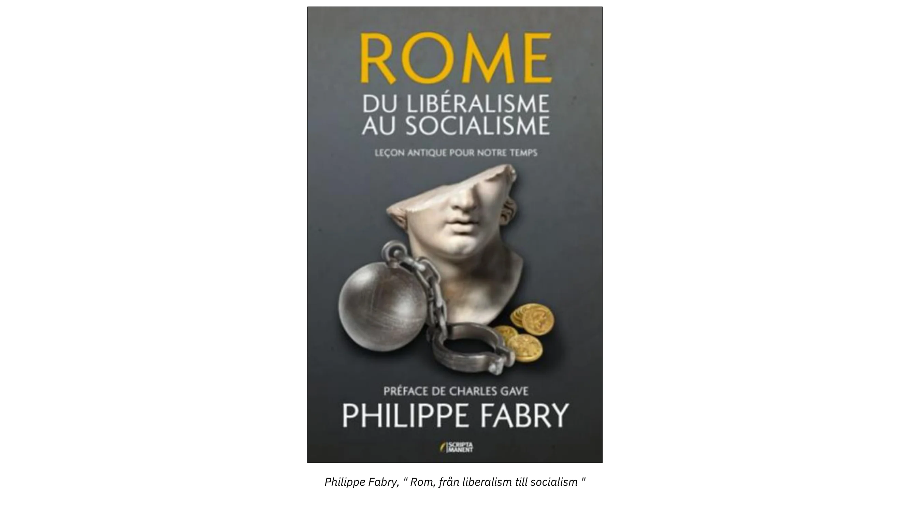

### Frihet är inblandad i idén om synd

Redan från början lär kristendomen ut att synd är en personlig angelägenhet, inte något som är inneboende i gruppen, utan att varje individ måste ta ansvar för sin egen frälsning. "Gud har utrustat sin skapelse med fri vilja, förmågan att göra fel och därmed ansvaret för synd", hävdar Sankt Augustinus i sin avhandling om den fria viljan, _De Libero Arbitrio_.

Synd kan inte existera utan frihet. Den kristne Guden är i själva verket en domare som belönar dygden och straffar synden. Men denna gudsuppfattning är just oförenlig med fatalism eftersom en människa inte skulle kunna vara skyldig och göra en "mea culpa" om hon inte först var fri att bestämma över sitt beteende. Att erkänna sitt moraliska fel, sin skuld, är att erkänna att man kunde ha handlat annorlunda.

> "Varför gör vi fel?" frågar sig Sankt Augustinus. Om jag inte misstar mig har argumentet visat att vi agerar på detta sätt genom viljans fria vilja. Men denna fria vilja som vi har att tacka för vår förmåga att synda, är vi övertygade om, jag undrar om han som skapade oss gjorde rätt i att ge oss den. Det förefaller visserligen som om vi inte skulle ha blivit utsatta för synd om vi hade berövats den; men det är att frukta att Gud på detta sätt också framstår som upphovsman till våra dåliga handlingar. (_De libero arbitrio_, I, 16, 35.)

Om Gud ville att människan skulle kunna göra fel, är han då inte indirekt ansvarig för ondskan? Varför ville Gud att det skulle finnas en möjlighet till ondska? Sankt Augustinus svarar:

> Den fria viljan, utan vilken ingen kan leva ett gott liv, måste man erkänna som en vara, som en gåva från Gud, och att de som missbrukar denna vara bör fördömas, snarare än att säga om den som gav den att han inte borde ha gett den.

Sankt Augustinus svar på problemet är att Gud är ansvarig för möjligheten till ondska, men inte för dess förverkligande. Han vill ha möjligheten till ondska eftersom denna möjlighet är nödvändig för friheten, utan vilken det inte finns något ansvar, det vill säga ingen tillgång till det moraliska livets värdighet.

Men förverkligandet av det moraliskt onda är människans verk, eftersom hon använder sin frihet på ett dåligt sätt, och inte Guds, som vill att människan ska välja det goda.

Sammanfattningsvis är frihet något gott eftersom den gör det möjligt för människan att anpassa sig till det goda och till Gud, som är det yttersta goda. Friheten innebär dock med nödvändighet och samtidigt möjligheten att välja det onda och att förkasta Gud.

### Gud gör inte gott i vårt ställe

I den medeltida teologin förstås försynen inte som ett ständigt ingripande av Gud i människors liv, som om Gud handlade å våra vägnar och utan vårt samtycke. Tvärtom ger Gud varje varelse, i enlighet med dess natur, förmågor som gör det möjligt för den att försörja sig själv och därmed nå sin fulla utveckling. Gud gör inte gott för den skapade varelsen i dess ställe.

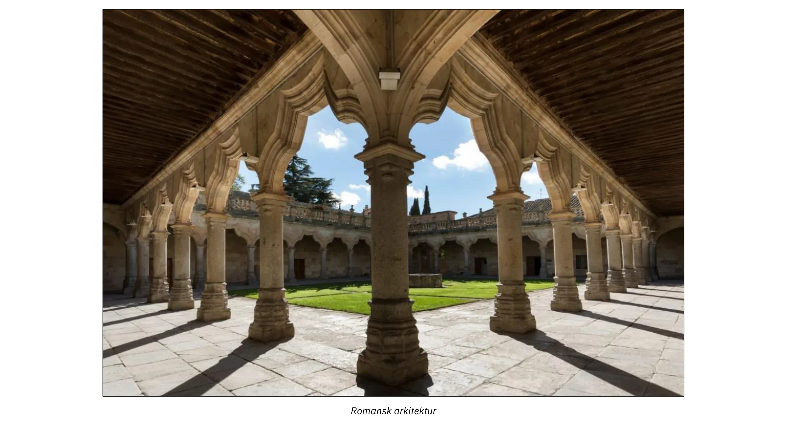

Och ju högre upp vi kommer i skalan av varelser, från mineral till människa, desto mer delegerar Gud till sin skapelse makten att handla på egen hand. Han anförtror människan friheten att styra sig själv och att styra världen med sitt förnuft, i enlighet med dygden försiktighet.

Så skriver Sankt Thomas (_Summa contra Gentiles_, III, 69 och 122):

> Att ta bort från varelsernas fulländning är att ta bort från den gudomliga maktens fulländning (...) Gud blir förolämpad av oss bara för att vi agerar mot vårt eget bästa.

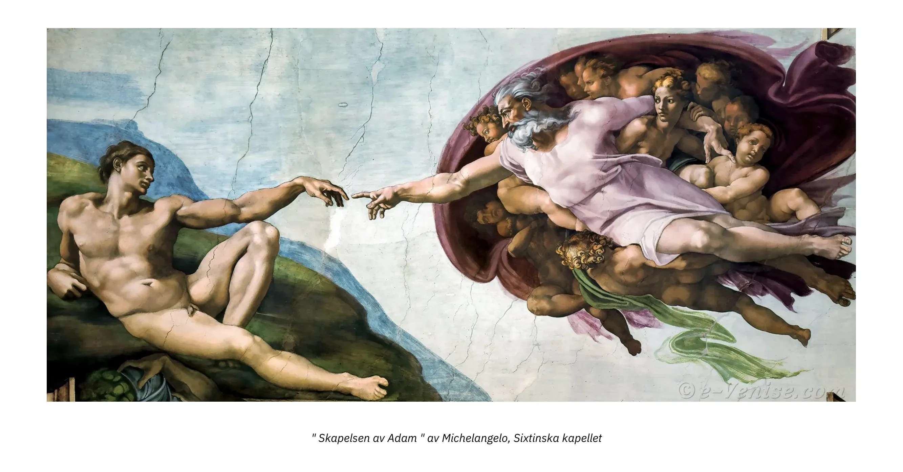

Försynen ger oss därför möjlighet att vara vår egen försyn. Och han tillägger:

> En människa kan styra och leda sina handlingar. Därför deltar den förnuftiga varelsen i den gudomliga försynen inte bara genom att styras utan också genom att styra.

För att människan ska kunna använda sin frihet på bästa möjliga sätt ger Gud henne ett verktyg, nämligen förnuftet, och en handbok som upplyser henne, nämligen naturrätten.

Naturrätten uttrycker sig i oss genom böjelser som sanningskärlek, lydnad mot förnuftet eller den berömda gyllene regeln: "Gör inte mot andra vad du inte vill att de ska göra mot dig" Dessa böjelser är enligt honom medfödda. I själva verket, skriver Sankt Thomas, "måste det anses att naturlig rättvisa är det som människans natur lutar mot."

Detta inre ljus är dock inte tillräckligt för att agera väl. Det är nödvändigt att utveckla konkreta handlingsnormer och tillämpa dem på specifika situationer. Det är sedan juristernas uppgift att definiera dessa normer, enligt naturrätten: detta är mänskliga lagar. Men naturrätten är överlägsen den mänskliga lagen och den gäller universellt, även för furstar.

Enligt Saint Thomas:

> Genom kunskapen om naturrätten får människan direkt tillgång till förnuftets gemensamma ordning, före och över den politiska ordning som hon tillhör som medborgare i ett visst samhälle.
> Därför finns det en rätt innan staten bildas, en uppsättning allmänna principer som förnuftet kan formulera genom att studera människans natur så som Gud skapade den. Denna rättighet ålägger sig monarken, makten, som sedan måste respektera den. Och de lagar som stiftas av den politiska makten är bindande endast i den mån de överensstämmer med naturrätten.

## Förnuft och tro: en öppen tävling

<chapterId>ca379c2e-57cb-541d-8ddb-4b925032a779</chapterId>

Under medeltiden tävlade förnuft och tro om att få tillgång till sanningen. Efter Abélard och Albert den store valde Thomas av Aquino på 1200-talet att försvara förnuftets självständighet i förhållande till tron.

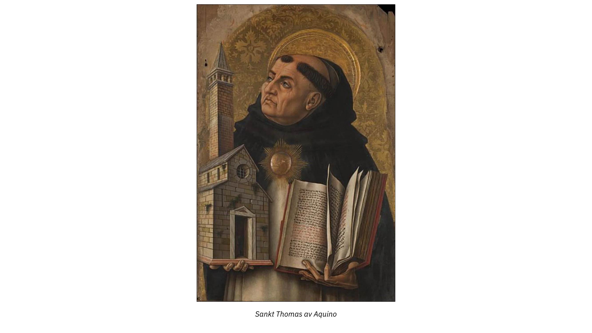

Från Aristoteles lånar han idén om en autonom naturlig ordning, oberoende av den himmelska ordningen. Den övernaturliga ordningen transcenderar visserligen den naturliga ordningen, men den existerar separat och föregår den. För honom finns det därför två sätt att få tillgång till sanningen om världen och i synnerhet om Gud:

- Å ena sidan **förnuftet**, som utgår från naturen, från förnuftig erfarenhet, som utvecklar idéer och når rationella säkerheter genom sitt resonemang.
- Å andra sidan **tro** som utgår från en Uppenbarelse, det vill säga en helig text inspirerad av Gud. Synsättet är det motsatta, det är inte verkligheten eller en mänsklig egenskap (tanke) som leder till visshet utan sanningar givna ovanifrån av Gud som kommer att förklara verkligheten.

Hur kan man då förena de två? Under medeltiden uppstod två traditioner för att formulera förhållandet mellan förnuft och tro: mysticism och religiös rationalism.

### Motsättningen mellan mystik och religiös rationalism

Mysticism innebär att man utesluter förnuftet från tron. Tron är absolut, bortom allt resonemang, och bör aldrig underkastas förnuftet. Om den motsäger förnuftet är det normalt, och att försöka passa in uppenbarade sanningar i förnuftets ramverk är kätteri. Gud är långt bortom förnuftet; det är med andra ord ingen mening med att försöka förklara honom. Därför är filosofi mycket illa ansett. Gud skulle till och med vara bortom det mänskliga språket: Han skulle vara det onämnbara, det helt Andra. Hans vilja är absolut och godtycklig. Därför bör man inte försöka förstå varför Gud gjorde det ena eller det andra; lydnad är den enda lämpliga attityden.

Inom islam sägs det också att man inte ska representera Gud eller ge honom en bild. I den kristna världen skrev en mystiker som Meister Eckhart bland annat i en predikan "Alla ting har ett varför, men Gud har inget varför." För mystiker är den enda giltiga filosofin den som kommer direkt från Uppenbarelsen. Allt som inte kommer från den är varken sant eller falskt utan saknar allt sanningsvärde.

Den direkta motsatsen till denna tanke är den som säger att endast förnuftet är rätt och att all tro är meningslös. Detta är den absoluta rationalismen, som leder till ateism. En sådan strömning fanns dock ännu inte på medeltiden.

För förespråkare av religiös rationalism finns det en komplementaritet mellan förnuft och tro, vilket representerar en mittenposition. Sanningen kan erkännas både genom tro och genom förnuft. Det som är sant i tron måste alltså också vara sant i förnuftet, och vice versa. Sanningen är en, men den är tillgänglig på två sätt. Därför kan två vetenskaper inte motsäga varandra utan komplettera varandra: naturvetenskapen eller filosofin och den sakrala vetenskapen eller teologin. Om så inte är fallet, om det uppstår en motsägelse mellan förnuft och tro, beror det antingen på att man resonerar dåligt eller på att man misstolkar Skriften.

För Thomas av Aquino är således "tron det av viljan drivna förnuftets samtycke i avsaknad av bevis" Med andra ord kan förnuftet förstå världen och Gud på ett rationellt sätt fram till en viss punkt. Vid denna punkt finns det inte längre några bevis. Viljan kan då välja att tro, och på så sätt gå vidare mot sanningen genom tron, eller att inte tro. Men tron är inte ett språng in i det absurda. Det är inte en förödmjukelse av förnuftet.

Detta är en mellanposition som försöker förena tro och förnuft. Sann rationalism innebär inte att man förkastar allt som förnuftet inte förstår, utan att man funderar över förnuftets gränser. Det som går utöver förnuftet är inte nödvändigtvis emot förnuftet. Ett citat från Pascal i **_Pensées_** illustrerar detta tankesätt mycket väl: "Två ytterligheter: att utesluta förnuftet, att endast tillåta förnuftet."

### Universitetens födelse

Den kristna medeltiden präglades i början av 1200-talet av uppkomsten och mångfalden av universitet i väst. Ett universitet är en gemenskap av studenter och mästare från samma stad som står under kyrkans kontroll och som i princip omfattar fyra fakulteter: konst, teologi, juridik och medicin. Teologin uppfattas som en vetenskap, modellerad efter den grekiska vetenskapen.

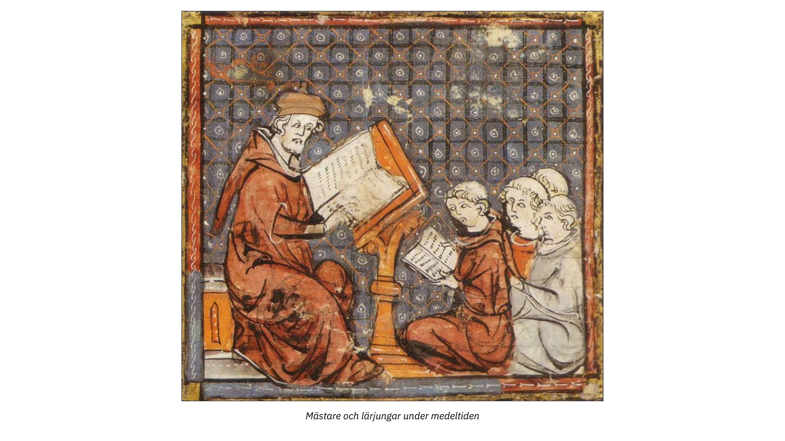

År 1200 grundade Philippe-Auguste universitetet i Paris, som snabbt blev det mest välrenommerade universitetet i Europa. År 1257 grundade Robert de Sorbon en teologisk högskola vid universitetet i Paris, som senare skulle komma att kallas Sorbonne. En ny metod för undervisning och forskning, känd som skolastik (från latinets schola, som betyder "skola"), växte fram inom dessa universitet. Den innebar "disputatio", en typ av debatt där deltagarna presenterade motsatta åsikter för en publik. En tes lades fram och följdes av invändningar som krävde ett svar. När alla argument var uttömda skulle mästaren lösa debatten med en genomtänkt lösning.

Bland de stora aristoteliska mästare som präglade denna epok kan nämnas Albert den store (1200-1280) och Thomas av Aquino (1224-1274). Den senare framhöll, genom att ge förnuftet dess rättigheter, den filosofiska visdomens särart och självständighet i förhållande till teologin. På samma sätt som nåden förutsätter naturen och fulländar den, förutsätter och fulländar tron förnuftet.

Från och med då skulle den religiösa rationalismen definitivt segra över mystiken.

## Religion och politik: Den suveräna statens födelse

<chapterId>a925ea80-9f66-5f0b-8ab0-f428ae5c12dc</chapterId>

Under medeltiden ärvde kyrkan och de kristna monarkierna en politisk modell från romarriket, det s.k. teologisk-politiska systemet - ett system där makten betraktas som helig, vilket innebär att den politiska ledaren också är en religiös ledare.

Det är därför som en politisk-religiös enighet präglar medeltida samhällen. Den politiska makten baserar sin legitimitet, auktoritet och enighet på den kristna tron (eller den muslimska tron). Den ser sig själv som den kulturella och religiösa ortodoxins väktare och behandlar dem som avviker från denna enighet som paria. Även om en viss tolerans kunde medges för dem som avviker från den gemensamma kulturella visionen (t.ex. judar), kunde man inte erkänna någon rätt till pluralism för dem. Det var inte förrän i slutet av medeltiden, i och med erövringen av Amerika, som frågan om medborgerliga fri- och rättigheter blev avgörande för kyrkan och gav upphov till en ny rättsfilosofi som bejakade och skyddade individuella friheter, legitimerade pluralism och fördömde statligt tvång.

### Sankt Augustinus och den teokratiska frestelsen

Frågan om förhållandet mellan politik och religion tog form i och med Sankt Augustinus verk _Civitas Dei_ (_Guds stad_). I den förklarar han att två sfärer existerar sida vid sida:

Två kärlekar har sålunda skapat två städer: kärleken till sig själv till förakt för Gud, den jordiska staden; kärleken till Gud till förakt för sig själv, den himmelska staden.

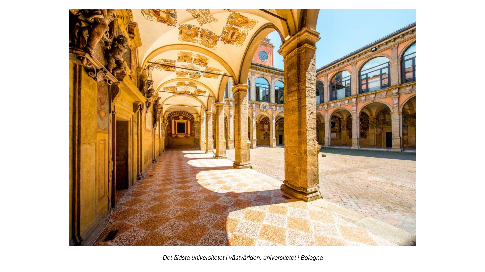

Vi har därför..:

- En andlig makt som härrör från Gud förkroppsligas av påven och utövas över hela kristenheten (detta är Guds stad).
- Människornas stad, som är jordisk och består av en lokal och världslig makt. Den har sitt ursprung i arvsynden, i ondskan.

Men för Augustinus är denna jordiska stad nödvändig. Den är nödvändig eftersom den garanterar fred. Därför måste samexistensen med de religiösa vara välordnad, och den bör regleras av att den andliga makten dominerar över den världsliga. Det får dock inte finnas någon radikal separation eller öppen konflikt, utan båda enheterna bör arbeta tillsammans. Historiker har kallat denna doktrin för politisk augustinianism.

### Rivaliteten mellan världslig makt och andlig makt

Varken påvar eller kungar var dock nöjda med denna allians. Kyrkan försökte hävda sin auktoritet över den politiska makten, medan den politiska makten försökte frigöra sig för att hävda sin suveränitet.

Kyrkan å sin sida kommer således att utveckla sin lag och sina domstolar och hävda att påven kan lösa jordiska tvister. Kungarna å sin sida kommer att börja bygga upp en statsapparat som är så kraftfull som möjligt. De kommer också att försöka centralisera lösningen av juridiska konflikter, gradvis generalisera beskattningen, utveckla den territoriella administrationen och skaffa arméer och därmed lägga grunden för den moderna staten.

I själva verket ledde konkurrensen mellan makthavarna till många konflikter. Varje furste eller påve försökte alltid få sista ordet och som en sista utväg övertyga andra om att han hade den högsta auktoriteten. Således förklarade påven Gregorius VII:

> Påven är den enda man vars fötter alla prinsar måste kyssa.

Sankt Ludvig tvekade inte att gå emot påven Innocentius IV, som hade bannlyst och avsatt kejsar Fredrik II och därmed berövat honom all trovärdighet bland sitt folk. Hans sonson, Filip den sköne, skulle göra samma sak.

Kyrkans teokratiska frestelse kolliderar också med teorin om "gudomlig rätt" Om Frankrikes kungar utnämner sig själva till monarker av "gudomlig rätt" är det för att undkomma påvens grepp och hämta sin auktoritet direkt från Gud, utan att behöva ta emot order från prästerskapet.

## Biblisk etik: Den enskilda människans heliga värde

<chapterId>7a27494d-8481-52ea-a551-e430bdb5315f</chapterId>

Enligt antikens tankevärld var människan underordnad ett gudomligt kosmos, det vill säga ett perfekt universum som hon bara var en del av. Monoteismen, å andra sidan, hävdar människans oändligt överlägsna värde över naturen, i den mån människan är skapad till Guds avbild. Denna avgörande punkt är ursprunget till en sann etisk revolution. Bibeln bekräftar varje människas heliga och oändliga värde.

Det är därför som biblisk etik förändrar vår relation till ondskan. Den medför en skarp och oöverträffad känslighet för mänskligt lidande. Den uppmuntrar oss därför att betrakta ondska som onormal och outhärdlig, ondska som mänskligheten tidigare hade funnit helt uthärdlig, särskilt den ondska som drabbar andra, de svaga och de oskyldiga.

### Övergången från en symmetrisk etik till en asymmetrisk etik

Symmetrisk etik handlar om att etablera strikt jämlikhet i mänskliga relationer eller strikt ömsesidighet. Den kommer till uttryck i dygden rättvisa, som var grekernas högsta dygd. Rättvisa är att ge andra det man är skyldig dem: var och en sitt - att uppfatta tiden som cyklisk leder till en känsla av att inte vara ansvarig för det onda som andra gör. Det finns ondska på jorden, men den har alltid funnits och kommer alltid att finnas. Detta måste räknas in i resultaträkningen, och summan av det är konstant. Det finns inget att göra, det kommer alltid att vara så, det är den grekiska och romerska fatalismen.

Biblisk etik är asymmetrisk, vilket innebär att man måste ge mer än vad man är skyldig. Alla känner sig ansvariga för det onda, även för det som de inte har begått - givandets etik, förlåtelsens etik, medlidandets etik. Man kan inte förbli likgiltig inför andras lidande och får inte tolerera onödigt lidande, inte ens när det inte kommer från oss. Lugnet hos den stoiske vise som accepterar ödet blir omöjligt. Detta är innebörden i liknelsen om den barmhärtige samariten. Ingenting tvingar honom att stanna och ta hand om en man som sårats av banditer. I och med den etiska revolution som Bibeln medför blir hela mänskligheten en sorts barmhärtig samarit. Den uppmanas att inte tolerera det onda som görs mot andra och att kämpa mot det.

Eftersom Gud är skaparen ser vi dessutom framväxten av ett nytt begrepp: allas likhet inför Gud. Det finns inga privilegierade individer inför Guds transcendenta immensitet, och alla människor är jämlika.

### Indianernas rättigheter

Den mest kända inkarnationen av denna framväxande doktrin är Salamancaskolan, som låg i Spanien under 1500-talet. Francisco de Vitoria, en av dess företrädare, hävdar att om varje människa är skapad till Guds avbild kan ingen människa förklaras underlägsen någon annan, varken juden, den svarte slaven eller indianen.

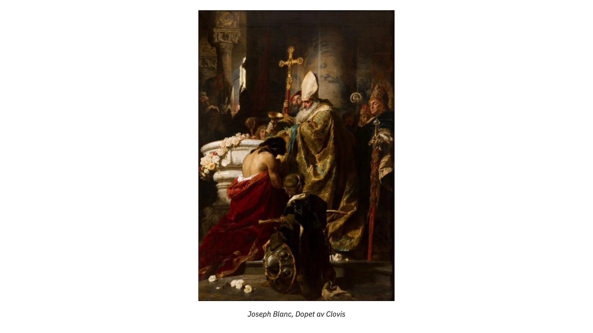

Upptäckten av Amerika utgjorde en verklig kulturell chock, ett första brott i den politisk-religiösa enhällighet som ärvts från antiken. Den berömda kontroversen om indianernas rättigheter delade verkligen teologerna i två motsatta och oförsonliga läger.

I det ena lägret fanns förespråkarna för kulturell monolitism och principen om tvång. För dem levde indianerna utanför det bibliska budskapet. Detta kunde betyda att Gud inte ville uppenbara sig för dem. Men varför inte? Två hypoteser är då tänkbara: 1° De är stora syndare (kannibalism), 2° De är bakåtsträvare och står närmare odjuret än människan. Det är därför de har rätt att behandla dem som slavar och ta deras land med våld, eftersom de är både otrogna och barbarer.

I det motsatta lägret fanns förespråkarna för pluralism och medborgerliga fri- och rättigheter, bland annat teologerna vid Salamancaskolan, lärjungar till Sankt Thomas. Enligt Francisco de Vitoria och Bartolomeo de Las Casas måste rättigheterna erkännas för indianerna som människor, inte för att de har anslutit sig till eller inte anslutit sig till den katolska tron. Inte nog med att de inte får tvångskonverteras, deras ägodelar får inte heller tas ifrån dem och de får inte utsättas för någon form av slaveri. Deras argumentation bygger på den thomistiska uppfattningen om naturrätten, som skiljer sig från den gudomliga lagen.

I _Summa Theologica_ ställer S:t Thomas följande fråga: Skall man lyda en trolös furste som inte tror på Gud? Och han svarar ja, eftersom legitim auktoritet är av naturlig rätt, och prinsens otrohet eller ateism inte är en anledning till uppror. Den politiska ordningen är i första hand en naturlig ordning. Han frågar vidare: Bör man föra krig mot de otrogna och den tro som påtvingas dem? Han svarar nej: ett krig är rättvist endast om det är defensivt. Slutligen kan tron bara vara en fri handling.

De lärde i Salamanca tillämpade detta resonemang på ursprungsfolken och hävdade att egendom är en naturlig rättighet. Att ta mark från ursprungsbefolkningarna är därför att begå stöld, precis som om de vore kristna. Det är inte heller tillåtet att föra krig mot dem, eftersom det inte handlar om någon aggression från deras sida, utan snarare från vår.

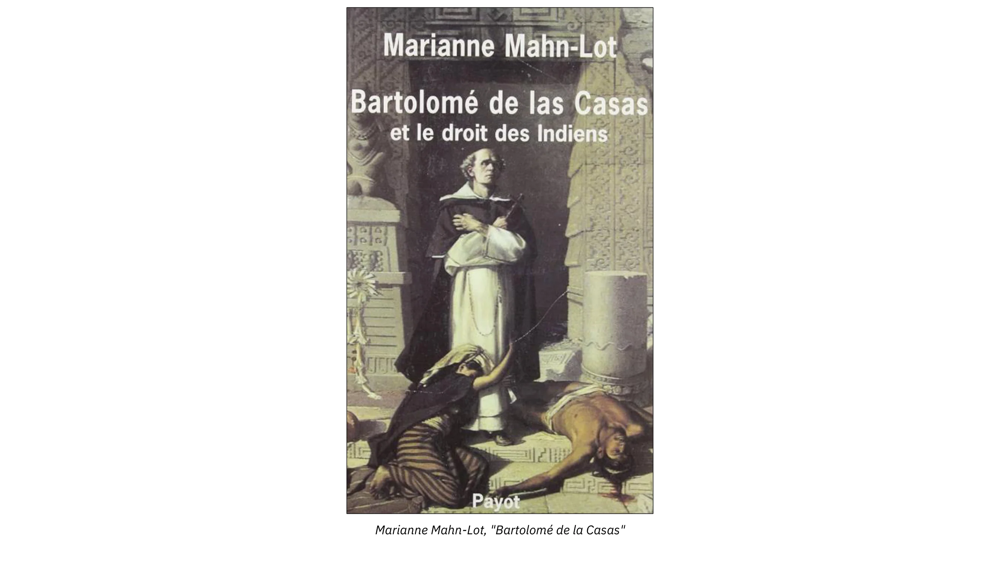

Frågan om ursprungsbefolkningarna var den första sprickan i den politisk-religiösa monoliten. Den visade att det politiska samhällets enhet kunde vila på en annan grund än den religiösa enheten mellan invånarna i samma territorium, baserad på ett gemensamt band som har sina rötter i den mänskliga naturen.

Idén om mänskligheten utvecklas. Man började faktiskt anse att det bara finns en enda mänsklighet, till vilken lika rättigheter är naturligt knutna. Men det kommer fortfarande att ta tid innan det accepteras av alla. Detta kommer framför allt att kräva naturvetenskapens bidrag till begreppet den mänskliga arten.

## De första skisserna av kapitalismen

<chapterId>236bdeeb-7bd3-536a-9df1-8791800bf31e</chapterId>

Vi har sett att kristendomen ålägger människor en moralisk plikt att arbeta för att förbättra världen. Gud vill att människan ska vara lycklig, men vill inte uppnå sitt goda i hennes ställe. Det är därför upp till den kristne att bekämpa det moraliskt onda, att älska sin nästa, att hjälpa offren, kort sagt att arbeta för en mer rättvis och mänsklig värld. Är kapitalismen, det vill säga den fria ekonomin som bygger på privat egendom och avtalsfrihet, förenlig med den kristna plikten?

En del av svaret ligger i det faktum att kapitalismen har sitt ursprung i ett religiöst sammanhang, långt före den protestantiska reformationen. Den andra delen av svaret handlar om att kapitalismen är det mest effektiva sättet att förbättra individers materiella och moraliska villkor. Endast en fri ekonomi, baserad på äganderätt och frivilligt samarbete, kan på ett hållbart sätt lyfta människor ur misär.

Låt oss fokusera på den första punkten. Den andra punkten kommer att behandlas i följande avsnitt.

### Uppkomsten av italienska städer

Henri Pirenne, en belgisk historiker från början av 1900-talet, ägnade en del av sitt arbete åt att analysera kapitalismens framväxt i Europa. I sin bok _History of Europe_ konstaterar han:

> Alla kapitalismens grundläggande drag - individuell företagsamhet, kreditgivning, kommersiella vinster, spekulationer etc. - fanns redan från 1100-talet i de italienska stadsstaterna Venedig, Genua och Florens.

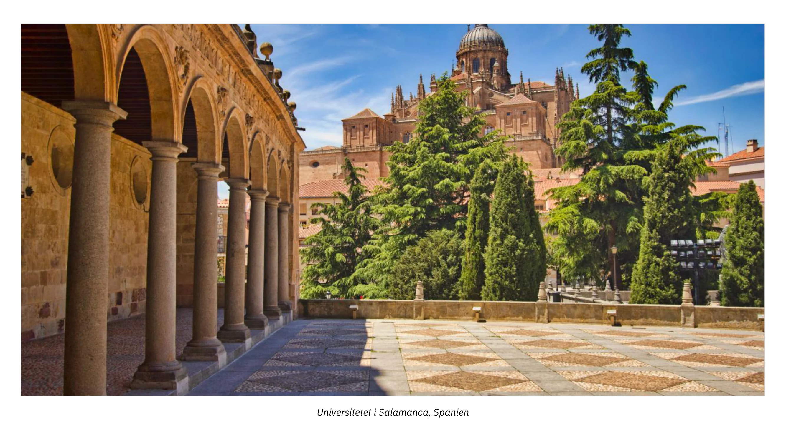

Enligt Pirenne hade dessa handelsstäder, tack vare sin kommersiella dynamik och sitt strategiska läge längs sjövägarna, utvecklat ekonomiska metoder som var typiska för den framväxande kapitalismen. Han lyfter särskilt fram följande:

- **Uppkomsten av enskilda företag:** Italienska köpmän, ofta från rika familjer, investerade sina medel i avlägsna kommersiella expeditioner och tog därmed på sig riskerna och förväntade sig betydande vinster.
- **Kreditexpansionen:** Utvecklingen av den internationella handeln stimulerade användningen av olika kreditinstrument, t.ex. växlar och banktransaktioner, vilket möjliggjorde finansiering av transaktioner och underlättade kapitalrörelser.
- **Strävan efter vinst:** De italienska köpmännens främsta drivkraft var strävan efter kommersiella vinster. De engagerade sig i riskabla satsningar i hopp om att maximera sina vinster genom att handla värdefulla produkter på avlägsna marknader.
- **Spekulationens framväxt:** Den osäkerhet som var förknippad med sjöresor och prisfluktuationer gav upphov till spekulationsverksamhet, där köpmän satsade på råvaruprisernas utveckling.

Pirenne konstaterar att dessa sedvänjor, även om de förekom i andra delar av Europa, fick en särskilt tidig och intensiv utveckling i de italienska stadsstaterna. Han tillskriver detta fenomen flera faktorer, bland annat den ökande sjöhandeln, korstågens inflytande, försvagningen av de feodala strukturerna och den innovativa anda som kännetecknade dessa handelsstäder.

### Frågan om räntebärande lån

I Bibeln fördöms räntebärande lån, så kallat ocker, eftersom man anser att utlåning av pengar mot ränta innebär att man utnyttjar sårbara låntagare. I praktiken blundade dock kyrkan för frågan.

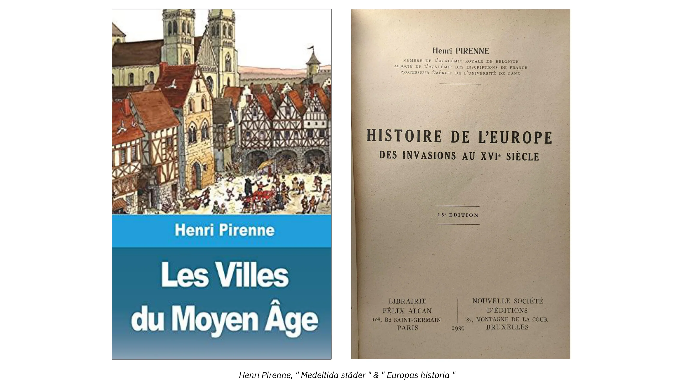

Jacques Le Goff är en fransk historiker som har specialiserat sig på medeltidens kultur och mentalitet. I likhet med Pirenne konstaterar han att kapitalismen började växa fram redan under medeltiden, framför allt i italienska städer, där det redan fanns metoder som individuellt företagande, strävan efter vinst och användning av kreditinstrument.

Eller Le Goff belyser i _L'usure au Moyen Âge_ (1967, återutgiven 1986 under titeln: _La bourse et la vie; économie et religion au moyen-age_) att Sankt Albert den store redan på 1200-talet hade teoretiserat begreppet "legitimt intresse", vilket vidareutvecklades av Sankt Thomas av Aquino efter honom. Trots religiösa förbud fanns utlåningen och den tillgodosåg verkliga ekonomiska behov. Långt före Adam Smith förstod man att ränta på lån inte var ocker utan ett sätt att kompensera långivaren för risk och låntagaren för investering, vilket är grunden för kapitalismen.

Enligt den franske historikern måste kapitalismens framväxt dock sättas in i ett bredare sammanhang av ekonomiska, sociala och kulturella omvandlingar som utspelade sig under flera århundraden. Le Goff betonar särskilt vikten av den kommersiella revolutionen på 1400- och 1500-talen, som kännetecknades av en expansion av sjöhandeln och upptäckten av nya handelsvägar, vilket stimulerade kapitalackumulationen och marknadslogikens dominans.

### En kritik av penningpolitiska manipulationer

Det systematiska studiet av ekonomiska lagar började under högmedeltiden. De första ekonomerna är de skolastiska teologerna i Parisskolan. Den förste bland dem som skrev en vetenskaplig avhandling som helt ägnades åt ett ekonomiskt ämne var Nicolas Oresme (1325-1382). Omkring 1360 skrev han sin _Treatise on the Origin, Nature, Law, and Alterations of Money_, som sammanfattar och utvecklar de idéer som hans samtids skolastiker hade.

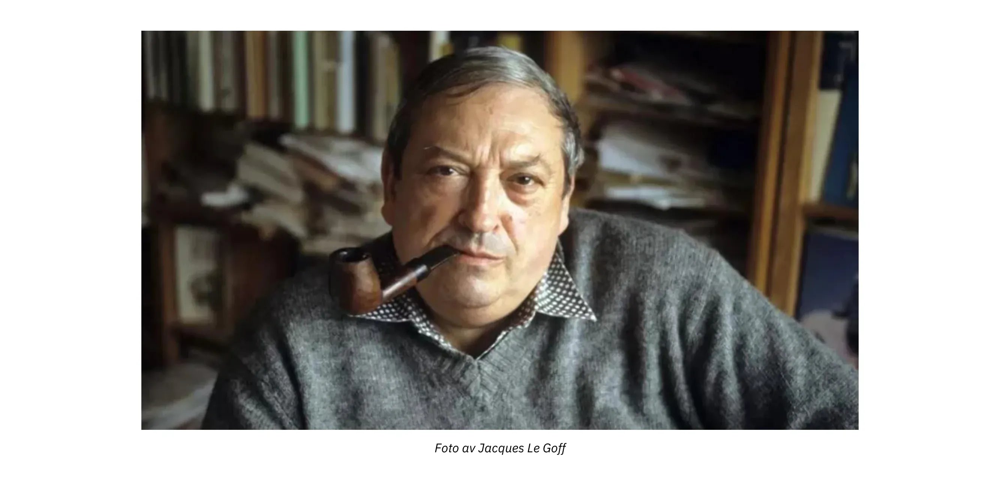

Kärnan i hans monetära analys är problemet med "mutationer" av pengar, det vill säga förändringar i metallinnehållet i mynt och deras valörer. Dessa förändringar har förekommit sedan tidernas begynnelse och är väldokumenterade för antiken och medeltiden. Deras mest synliga effekt är att förändra den monetära enhetens köpkraft, särskilt att minska den. Detta är en primitiv form av inflation som Oresme tydligt fördömer som något ont.

Oresme väcker omedelbart en central fråga: Är inflationen till nytta för samhället? Han svarar nekande och menar att inflationen inte gör pengar mer eller mindre användbara för utbyten. Ekonomin kan fungera väl oavsett prisnivå och därmed oavsett den nominella penningmängden Supply.

Men om så är fallet uppstår naturligtvis en annan fråga: varför finns det förändringar av valutan? Och i synnerhet, varför försöker man öka pengarnas Supply? Oresme svarar att dessa förändringar inte har samma konsekvenser för olika medlemmar i samhället. De gynnar vissa människor på bekostnad av andra. De som vinner på valutaförändringar har ett väsentligt intresse av att de genomförs. I allmänhet är dessa vinnare män med makt. Oresme skriver:

> Det primära och yttersta skälet till att prinsen vill ta makten att ändra valutor är den vinst eller vinst han kan få av det, för annars är det utan anledning att han skulle göra så många och så stora mutationer.

Sedan lägger han till dessa detaljer:

> Vilken vinst fursten än gör på detta sätt, så sker det med nödvändighet på samhällets bekostnad. Vad en furste än gör på samhällets bekostnad är det en orättvisa och inte en kung utan en tyranns handling, som Aristoteles säger (...) Om fursten rättmätigt kan göra en enkel förändring av valutan och få en viss vinst av det, kan han av samma skäl göra en större förändring och få mer vinst (....) Således skulle fursten så småningom kunna dra till sig nästan alla sina undersåtars pengar eller rikedomar och reducera dem till träldom, vilket skulle vara att fullt ut bevisa tyranni och till och med ett sant och perfekt tyranni, som det framgår av filosoferna och de gamlas berättelser.

Oresme betonar att valutaförändringar inte bara är ett spel om omfördelning till förmån för makthavare på bekostnad av resten av samhället. De leder till övergripande förluster - spelet är ett negativt summespel. En valuta som ofta ändras stör handeln och inbjuder förfalskare att dra fördel av den allmänna förvirringen.

Om två olika valutor gynnas av ett lagligt betalningsmedel kommer aktörerna dessutom att hamstra den som är mer värd, så att endast den sämre valutan finns kvar i omlopp. (Oresme föregriper här den berömda "Greshams lag": dåliga pengar driver ut goda i ett system med lagligt betalningsmedel) Han drar slutsatsen att valutamanipulationer är värre än ocker och att de förmodligen var en viktig orsak till romarrikets nedgång, som vi har sett tidigare.

# Frihetens uppkomst: Från renässans till upplysningstid

<partId>58793f94-f217-530a-a877-b5b6df70a5fe</partId>

## Vädjan om religiös tolerans

<chapterId>c4c9a729-4a0f-5814-8e32-9aff4d373018</chapterId>

Från renässansen skulle Europa härjas av religionskrig. Tolerans blev därför en av upplysningstidens stora strider.

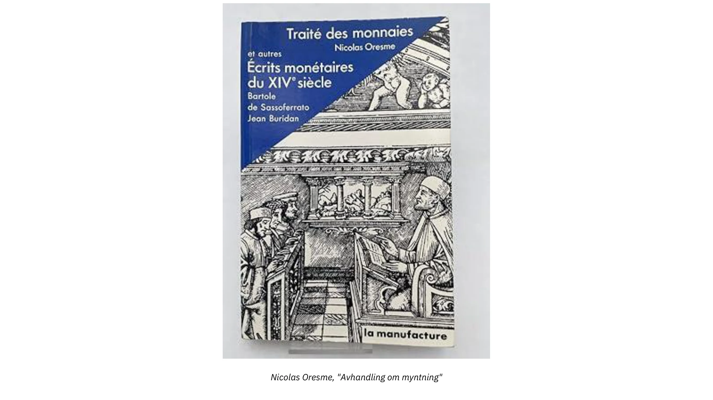

För vissa skulle den vetenskapliga metoden förena människor bortom fördomar med en gemensam syn på världen. Är inte den universella attraktionen densamma för en katolik, en protestant, en jude eller en ateist? Diderots och d'Alemberts Encyclopédie är således ett försök att främja universell kunskap som kan förena människor.

Voltaire tänkte likadant om handeln. Den kunde skapa tolerans, mycket bättre än någon politisk institution.

### Profit som en "fredlig religion"

För Voltaire är det främst människans felbarhet som utgör grunden för en doktrin om tolerans och politisk frihet. Han skriver i sin _Philosophical Dictionary_ (1764):

> Tolerans är den nödvändiga konsekvensen av vår medvetenhet om att vi är felbara. Att fela är mänskligt, och vi gör alla misstag hela tiden. Låt oss förlåta varandra våra dumheter; detta är naturens första lag.

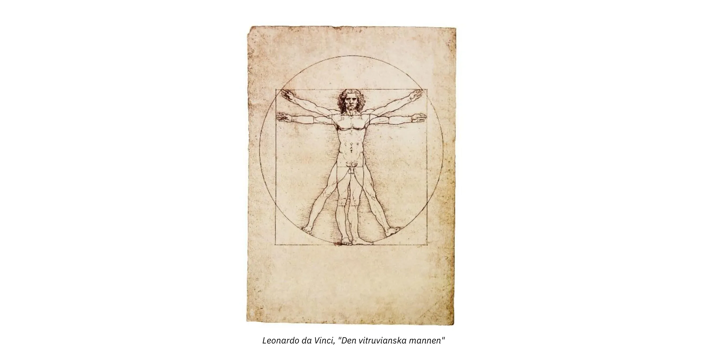

Men i sina _Filosofiska brev_ (1734) ger Voltaire en annan synvinkel. Han konstaterar att handeln i England främjar religiös tolerans, vilket är en viktig förutsättning för civil fred och därmed lycka. Han skriver dessa brev för att kritisera religionskrigen i Frankrike, som underblåses av en absolut och påträngande politisk makt. Detta är den första radikala kritiken av Ancien Régime.

För Voltaire är det som gör en individ eller en nation lycklig en regim där människor lever i fred med varandra, i en viss materiell bekvämlighet. Därför är ett samhälle desto friare och lyckligare som det bygger på handel i betydelsen ekonomisk Exchange.

Enligt Voltaire är det tre punkter som ska beaktas:

1. För att en nation ska vara lycklig krävs ett enkelt materiellt liv som främjar konsten.

2. Lyx och handel är garantier för friheter.

3. Slutligen är handel fördelaktigt eftersom det främjar civiliserade och därmed fredliga relationer mellan människor.

Ju mer handeln värderas, desto mer försvinner fördomarna inför de ekonomiska intressena. Trots sina konfessionella skillnader har män som handlar alla samma mål i centrum för sina bekymmer: vinst. Den gemensamma strävan efter vinst leder till samarbete och respekt för andras åsikter, särskilt deras religiösa övertygelser.

I det _sjätte brevet_, _"Om presbyterianerna"_, ger Voltaire exemplet London Stock Exchange. På denna höjdpunkt för internationell handel gör "juden, muslimen och den kristne" affärer tillsammans, "som om de tillhörde samma religion". De reserverar "namnet otrogna endast för dem som går i konkurs".

Passagen är värd att citera i sin helhet eftersom den är så känd:

> Gå in på London Stock Exchange, en plats som är mer respektabel än många domstolar; där ser du delegater från alla nationer samlade för mänsklighetens nytta. Där behandlar juden, muslimen och den kristne varandra som om de tillhörde samma religion, och kallar endast dem som går i konkurs för otrogna; där litar presbyterianen på anabaptisten och anglikanen accepterar kväkaren löfte. Efter att ha lämnat dessa fredliga och fria församlingar går somliga till synagogan, andra går för att dricka; en går för att döpas i ett stort badkar i Faderns namn av Sonen i den Helige Ande; en annan låter skära bort förhuden på sin son och mumlar hebreiska ord över barnet som han inte förstår; andra går till sin kyrka för att invänta Guds inspiration, med hatten på huvudet, och alla är nöjda.

Handel förenar därför människor kring en "samma religion", vinst. Och den gör det möjligt för individer att bortse från religiösa eller klassmässiga skillnader, som är ursprunget till konflikter. I England är vinsten alltså en fredlig religion. Men hur är det i Frankrike?

I det _Tionde brevet_, "Om handel", beskriver Voltaire det franska tänkesättet på följande sätt: "Köpmannen hör ofta sitt yrke omtalas med förakt, så till den grad att han är dum nog att skämmas för det." I England däremot känner köpmannen en "rättmätig stolthet" och jämför sig "inte utan anledning med en romersk medborgare". Voltaire hyllar den engelska medelklassen, deras handel och deras fredliga samhälle.

### Sanning kräver frihet

Men Frankrike saknade inte stora tänkare. Det är föga känt, men Anne Robert Jacques Turgot, baron de Laulne, var först och främst en ledande tänkare innan hon blev generalcontroller för finanserna under Ludvig XVI. Han var författare till en mästerlig avhandling om politisk ekonomi, _Reflections on the Formation and Distribution of Wealth_ (1766), som föregick Adam Smiths _The Wealth of Nations_ (1776).

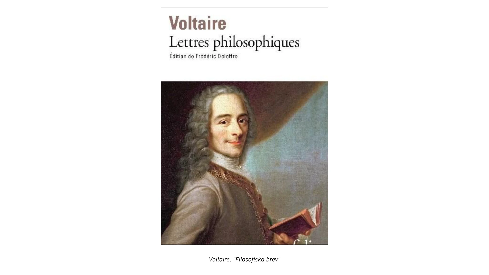

Hans tidiga skrifter återspeglar hans Commitment till upplysningsfilosofin. År 1754 publicerade han sina _Letters on Civil Tolerance_ och 1757 flera artiklar skrivna för _The Encyclopédie_ av Diderot och d'Alembert.

I sina brev presenterar Turgot en definition av tolerans. Att tolerera innebär att vägra använda våld mot fel. Tolerans innebär med andra ord inte att man accepterar fel. Man kan kämpa mot det, men med övertygelsens och förnuftets vapen, inte med våld.

Därefter försökte Turgot få Ludvig XVI att ta bort frasen: "Jag svär att undertrycka kätteriet" från den ed som avlades på kröningsdagen. I _Memoir till kungen om tolerans_ (1775) skriver han:

> Kommer intoleransens försvarare att säga att prinsen har rätt att befalla när hans religion är sann och att man då måste lyda honom? Nej, inte ens då kan och bör man lyda honom, för om man måste följa den religion han föreskriver är det inte för att han befaller den, utan för att den är sann, och det är inte, och kan inte vara, för att prinsen föreskriver den som den är sann. Det finns ingen människa som är dum nog att tro att en religion är sann av ett sådant skäl. Därför lyder den som underkastar sig den i god tro inte fursten, han lyder bara sitt samvete; och furstens order lägger ingen vikt vid den skyldighet som detta samvete ålägger honom. Vare sig fursten tror eller inte tror på en religion, vare sig han befaller eller inte befaller att följa den, så är den varken mer eller mindre än vad den är, sann eller falsk. Prinsens åsikt är därför helt främmande för sanningen i en religion, och följaktligen för skyldigheten att följa den: prinsen har därför, som prins, ingen rätt att döma, ingen rätt att befalla i detta avseende; hans inkompetens är absolut i frågor av denna ordning, som inte ligger inom hans ansvarsområde, och i vilka varje individs samvete kan och måste ha endast Gud som sin enda domare.

Att vara tolerant betyder med andra ord inte att man är fientlig mot religion. Det innebär att man anser att religiös tro inte faller under den politiska maktens ansvarsområde, utan snarare under varje individs samvete. Sanningen kräver frihet; den får aldrig påtvingas under risk för att korrumperas.

- Idéer bör utbytas, precis som varor

## Plädering för ekonomisk frihet

<chapterId>23fbb745-4fd1-5322-8fba-3ff2e998c7e2</chapterId>

Ekonomisk liberalism förknippas ofta med en anglosaxisk tradition som härstammar från Adam Smith. Den ställs i motsats till "politisk liberalism", som sägs ha sitt ursprung i den kontinentala upplysningen, särskilt i Frankrike. Denna uppfattning är felaktig.

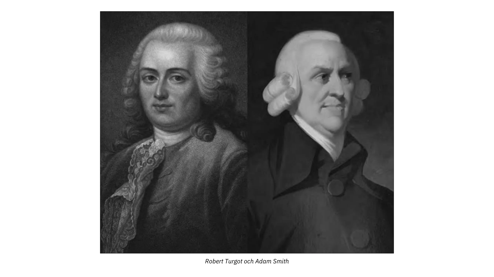

Det var som ett svar på merkantilismen och, mer allmänt, på Ancien Régimes idéer som den ekonomiska vetenskapen växte fram i Frankrike. Med upplysningen följde en period då filosofer började kalla sig "ekonomer" Dessa var fysiokraterna.

De lade grunden till den liberala ekonomin. De främsta företrädarna för den fysiokratiska skolan är François Quesnay, markisen de Mirabeau, Lemercier de la Rivière, Abbé Nicolas Baudeau, Louis-Paul Abeille och Pierre-Samuel Dupont de Nemours.

> Politisk ekonomi, sammanfattar Dupont de Nemours, är vetenskapen om naturrätten tillämpad på civiliserade samhällen. (_Correspondens med J.-B. Say_).

De förespråkade "Laissez-faire", som innebär att staten inte ska ingripa i ekonomin.

Från denna punkt började två mycket olika uppfattningar att växa fram inom upplysningen:

- Å ena sidan anser vissa att denna sociala harmoni måste uppnås på konstgjord väg och genom statens tvång; detta är Contract:s teorier.

Å andra sidan anser vissa att styrning kan uppnås genom intressen, vilket innebär att enskilda intressen tillåts harmonisera inom ramen för spelregler som är kända och accepterade av alla; detta är marknadsteorierna.

### Mot Colbertism

Denna fras uppstod när Jean-Baptiste Colbert, Ludvig XIV:s främste rådgivare, en dag frågade köpmännen "Vad kan jag göra för dig?" En av dem, som hette François Legendre, svarade: "Låt oss göra det!"

Fysiokraterna, François Quesnay, markis d'Argenson och sedan Vincent de Gournay tog till sig frasen: "Laissez-faire, laissez passer" Det blev deras motto.

Med hänvisning till naturrätten (termen kommer från _phusis_, som betyder natur, och _cratos_, som betyder makt eller styre) menade fysiokraterna att det finns ekonomiska lagar som inte är beroende av politisk eller religiös makt, utan snarare av människans och samhällets själva natur. Den ekonomiska ordningen är samhällets naturliga ordning. Den politiska makten måste underkasta sig den.

Fysiokraterna ville visa att merkantilismen, den rådande ekonomiska politiken i såväl Frankrike som England, inte bara var ineffektiv utan också omoralisk. Colbert var en av de första moderna statisterna. Han var övertygad om att statliga regleringar kunde skapa ett nationellt välstånd. Staten fungerade som bankir, köpman och försörjare. Den kontrollerade valutan, styrde handeln och omfördelade rikedomar.

Enligt Colbert var målet att öka rikedomen genom att uppmuntra industrin. Han tillade också: "Frankrike kan bara berika sig på bekostnad av England och Holland."

För fysiokraterna var frihandel tvärtom den enda goda ekonomiska politiken, eftersom det var ett plussummespel och ekonomin styrdes av naturlagar som inte borde störas av godtyckliga regler.

### Fördelarna med den fria marknaden

Fram till den franska revolutionen präglades samhället av en aristokratisk ekonomi baserad på gåvor och privilegier. Godtyckliga åtgärder och förargelseväckande omständigheter gjorde det svårt för vanliga medborgare att få tillträde till marknaden.

Men sedan medeltiden har marknadsekonomin, som vi har sett, utvecklats. Köpmännen blev rikare och fick allt större ekonomisk frihet.

Marknaden handlar om frivillig Exchange till ett förhandlat pris. Marknaden förbättrar de materiella, intellektuella och politiska villkoren för alla genom att möjliggöra förvärv av utrymmen för autonomi och initiativ.

Människan vill naturligtvis förbättra sin egen och sina nära och käras situation genom Exchange av varor och tjänster. Därav dessa nya filosofers, "ekonomernas", önskan att göra det möjligt för folket att skaffa sig en tillräcklig inkomst och därmed uppnå det som Kant i sin pamflett _Vad är upplysning?_ kallar deras "majoritet", deras självständighet i beslut och handling.

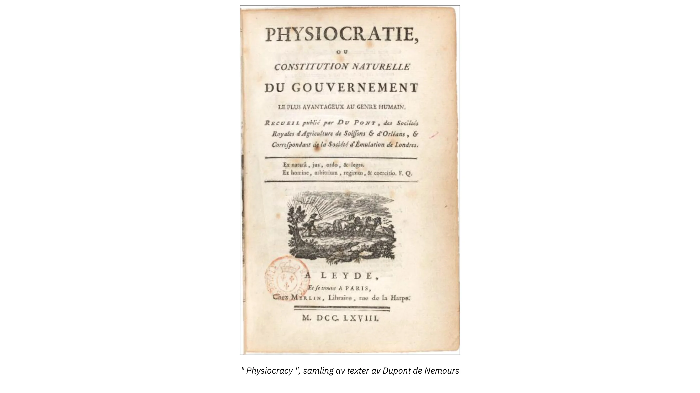

För fysiokraterna är frihet inte något som delas upp. Kampen mot politiska privilegier och kampen mot ekonomisk vinning är en och samma sak. Den stora nyheten hos de moderna ekonomerna i början av 1700-talet var att de fokuserade på varje individ för att återställa deras handlingsförmåga samtidigt som de funderade på hur passioner och intressen skulle kunna begränsas genom den fria marknaden.

Ja, hur får man män med olika intressen att samexistera? Vad ska man göra om människor hamnar i konflikt, om de begår misstag, om de är giriga och själviska?

Fysiokraterna svarade i tre steg:

1. Det är avtalsfriheten som gör det möjligt att lösa intressekonflikter, inte den sociala Contract, som är en pseudo-Contract eftersom den inte kan brytas. Genom att analysera sociala problem i termer av marknad och Exchange kan vi se relationer mellan individer och mellan nationer som ett plussummespel, vilket löser både frågan om institutionella och regulatoriska ramverk i samhället genom att hävda att behov och intresse ensamt styr relationerna mellan människor.

2. Naturlig frihet är rätten att förfoga över sig själv och sina ägodelar. Därför är harmoni mellan olika intressen möjlig på grundval av respekt för legitim egendom, som förvärvas genom arbete och härrör från användningen av våra förmågor. Och det är denna frihet baserad på egendom som är nyckeln till det sociala problemet, inte lagens tvång.

3. Statens roll är att genomdriva avtal och garantera säkerheten för människor och egendom. Detta är det berömda "Laissez faire", fysiokraternas motto. Staten styr bättre när den styr mindre och ger individerna frihet att ta initiativ och ta sitt ansvar.

Kort sagt, om alla fritt kan driva sina privata intressen med respekt för naturrätten, kommer allas fred och välstånd att säkerställas bättre än av en politisk organisation som skulle definiera det allmänna intresset ovanifrån och påtvinga det genom lagens tvång. Politisk frihet är bra, men den är inte tillräcklig för att ge individerna den självständighet i beslut och handlingar som de behöver. Detta är fysiokraternas lärdom. Den franska liberala skolan på 1800-talet, med personer som Say, Constant, Dunoyer, Bastiat och Molinari, kommer att minnas detta och på ett lysande sätt försvara detta arv mot den framväxande socialismen.

## Ett nyckelår för den fria världen: 1776

<chapterId>c1ba85f8-e8d1-5794-b198-8c683efb0d9b</chapterId>

1776 är ett år som ofta går obemärkt förbi i historieböckerna. Men i tre länder - Frankrike, Skottland och Nordamerika - kommer flera händelser att lämna outplånliga spår i frihetens historia.

### Turgots skamfläck

Under sin korta tid som finansminister (generalcontroller), från augusti 1774 till maj 1776, försökte Ann-Robert Jacques Turgot genomföra stora reformer som syftade till att få slut på överdådiga utgifter, avskaffa många lokala monopol och återgå till frihandel. Han gick till och med så långt att han förmanade kung Ludvig XVI i dessa ordalag:

> Du måste, Sire, beväpna dig mot din vänlighet, med din vänlighet själv, med tanke på varifrån kommer de pengar som du kan distribuera till dina hovmän.

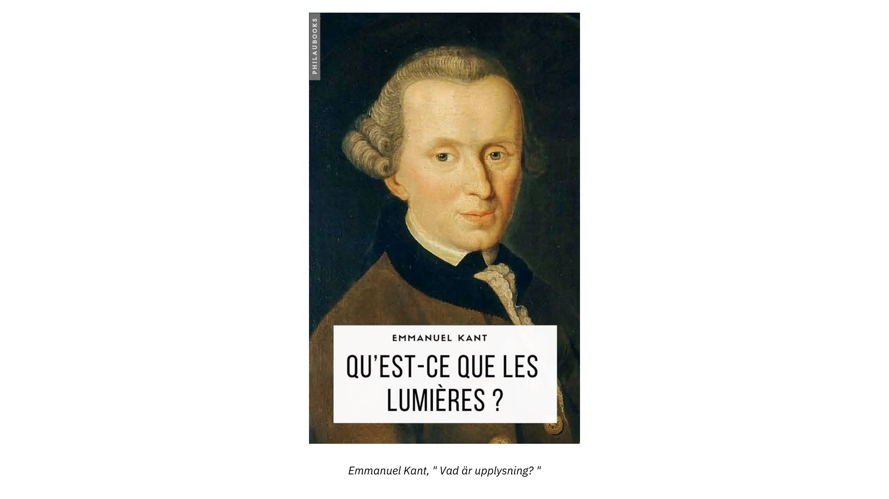

År 1774 publicerade han sina sex edikt som innebar att han avskaffade skråna och mästerskapen (företag som hade blivit monopol och hinder för inträde på arbetsmarknaden), avskaffade interna tullar på spannmålshandeln, avskaffade tvångsarbete (corvée) och införde tolerans mot protestanter.

Tyvärr ledde de skyhöga vetepriserna, som följde på en dålig skörd, till att hans reformer ifrågasattes. Turgot skrev till hans försvar:

> När det i provinserna fortfarande skulle finnas hungersnöd, bör det inte tas som en invändning mot frihet; det bör bara dras slutsatsen att friheten inte har etablerats tillräckligt länge för att ha producerat alla dess effekter.

Han stötte dock främst på adelns vrede, som försökte försvara sina privilegier. Ställd inför en sammansvärjning som leddes av prinsen av Conti föredrog han att avgå i maj 1776 hellre än att ge upp vad han ansåg vara monarkins och Frankrikes räddning. Hans fall innebar slutet på Frankrikes första experiment med en fri marknadsekonomi (för vidare läsning, se Edgar Faure, _La disgrâce de Turgot_).

Turgots huvudverk, _Reflections on the Formation and Distribution of Wealth_ (1766), har mycket att tacka fysiokraternas doktrin för. Turgot tar upp och utvidgar den modell för en fri marknad som Quesnay och, före honom, Boisguilbert hade föreslagit mot merkantilisterna. Men hans idéer är minst lika påverkade av hans vän Jacques Vincent de Gournay, som utnämndes till intendent för handeln 1751. Turgot reste med honom genom hela landet under hans inspektionsresor.

Turgot är en förespråkare för naturrätten, som han också kallar "frihetens system" Han betonar ofta att konkurrensen på en fri marknad på ett naturligt sätt reglerar priserna och förhindrar missbruk. Dessutom gör han handlaren till hörnstenen i marknadsmekanismen. Statliga tjänstemän är mindre motiverade och, i synnerhet, mindre välinformerade än handlare. Därför är det mer effektivt att överlåta handeln till privata intressen.

Det är onödigt att bevisa att varje individ är den enda domaren av den mest fördelaktiga användningen av deras sinne och armar. Endast de besitter den lokalkännedom utan vilken den mest upplysta människa endast kan resonera i blindo. Endast de har en erfarenhet som är desto mer tillförlitlig, eftersom den är begränsad till ett enda objekt. De lär sig genom sina upprepade försök, sina framgångar och sina förluster, och förvärvar en takt vars finess, skärpt av känslan av behov, vida överträffar den likgiltige spekulantens alla teorier. (_Hyllning av Vincent de Gournay_).

Här föregriper Turgot till stor del Mises och Hayeks argument om att det är omöjligt att göra ekonomiska beräkningar i ett socialistiskt ekonomiskt system.

Murray Rothbard ägnar ett kapitel åt "The Brilliance of Turgot" och betonar i sin ekonomiska historia ur ett österrikiskt perspektiv att "Turgots inflytande på senare ekonomiskt tänkande begränsades allvarligt (...) av den följande myten att Adam Smith var grundaren av den politiska ekonomin" Och han tillägger: "Det var på fransmannen J.B. Say, officiellt en anhängare av Smith, som Turgot i slutändan hade störst inflytande, särskilt hans teori om bruksvärde."

### Mästerverket i Condillac

År 1776 publicerade filosofen Étienne Bonnot de Condillac _Commerce and Government_, utan tvekan en av den tidens mest magnifika pläderingar för frihandel och individuell frihet.

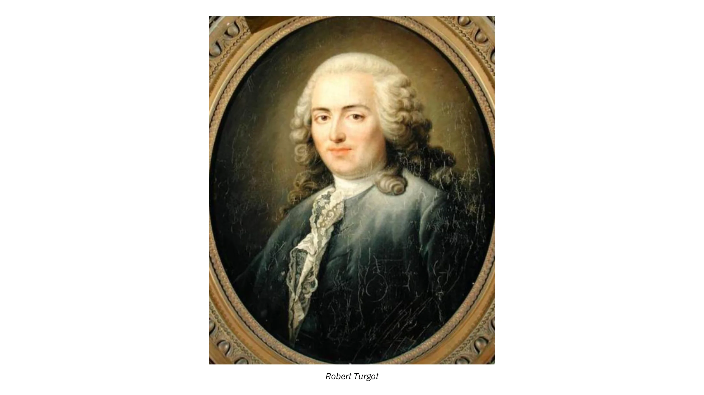

_Commerce and Government_ innehåller vad som senare skulle kallas en teori om värdets subjektivitet, vilket gjorde att han fick alla de österrikiska ekonomernas beröm, med början hos Menger. I Turgots efterföljd, men med större tydlighet, hävdar Condillac att värdet inte ligger i arbetet utan i det faktum att alla finner ett intresse i Exchange:

> Värdet på saker, skriver han, baseras på deras användbarhet, eller, vilket är samma sak, på det behov vi har av dem; eller, vilket också är samma sak, på den nytta vi kan ha av dem. Och han tillägger: "En sak har inte värde därför att den kostar, som man tror, utan den kostar därför att den har ett värde.

Värdet ligger alltså inte i varan i form av den mängd arbete som skulle ha behövt produceras (Adam Smiths och Ricardos arbetsvärdestes), utan utanför varan, det vill säga i intensiteten i den önskan som köparen upplever.

Det är också en filosofisk avhandling eftersom den visar hur fri och frivillig Exchange är ett verktyg för frigörelse som är mer rättvist än statligt ingripande eftersom det är egalitärt och antihierarkiskt. Den kan skapa mogna och ansvarsfulla medborgare och är svaret på Ancien Régimes tyranniska avarter. Om marknaden kan reglera individualismens överdrifter finns det faktiskt ingenting som kan reglera centralmaktens missbruk. Det är därför Condillac uppmanar makten att befria handeln från alla hinder och att avstå från all inblandning i den ekonomiska sfären.

### Ett manifest för frihet i Amerika

År 1776 publicerade engelsmannen Thomas Paine en pamflett i Amerika med titeln _Common Sense_, där han kritiserade den engelska monarkin och förespråkade de amerikanska kolonisternas självständighet.

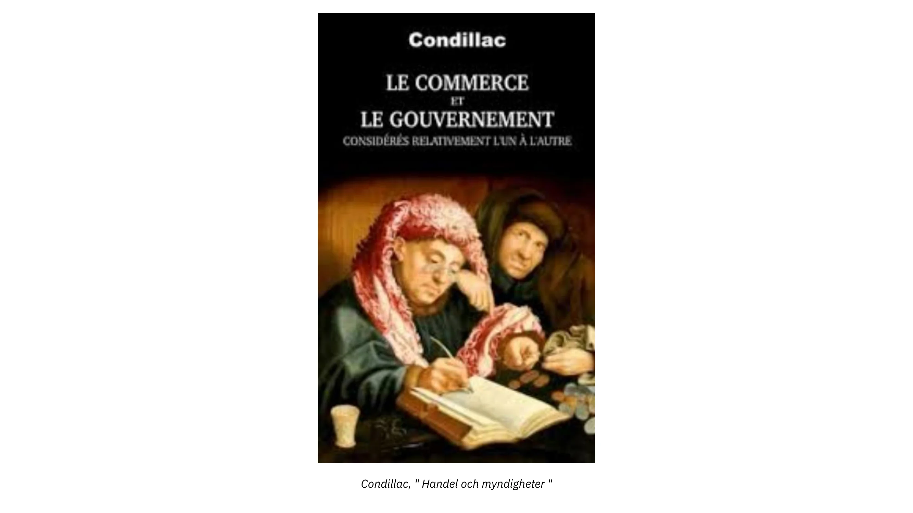

Paine hävdar att:

- Det civila samhället existerar före regeringen
- Monarkin är ett föråldrat och despotiskt politiskt system.
- Amerika lider under brittiskt herravälde.
- Den amerikanska revolutionen är en universell fråga som försvarar värden som frihet, jämlikhet och ansvar.
- Amerika måste skilja sig från England och upprätta en republik för att förkroppsliga dessa värderingar.

Författaren är noga med att skilja mellan det civila samhället och staten:

> Samhället är resultatet av våra behov, regeringen är resultatet av vår ondska. \Det sociala tillståndet är ett gott under alla omständigheter. Regeringen, även i sin perfektion, är bara ett nödvändigt ont; i sin ofullkomlighet är den ett outhärdligt ont.

Bokens framgång är enorm. Den såldes i cirka 100.000 exemplar på några månader i ett land med tre miljoner invånare och bidrog till att galvanisera den amerikanska opinionen till förmån för självständighet.

Thomas Paine spelade genom sin pamflett en avgörande roll i den amerikanska revolutionen och för att inspirera till idealen om frihet och demokrati. Han hade ett direkt inflytande på den amerikanska självständighetsförklaringen, som antogs några månader efter att den hade skrivits.

### Philadelphia-kongressen

Den 4 juli 1776 i Philadelphia, där de är samlade i kongressen (på engelska "Convention"), antar representanterna för de tretton engelska kolonierna i Nordamerika en resolution som säger att "Förenta staterna är, och med rätta borde vara, fria och oberoende stater" Resolutionen stöds av John Adams, en av inspiratörerna till Tea Party, och Benjamin Franklin, en delegat från Massachusetts. Thomas Jefferson, en delegat från Virginia, kommer att utarbeta självständighetsförklaringen.

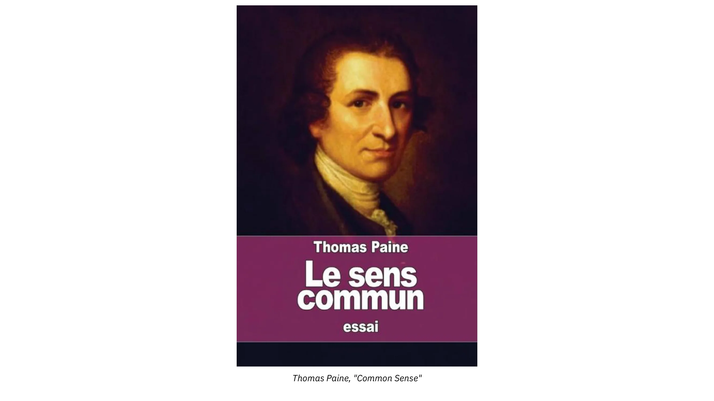

Under de följande åren kämpade fransmännen La Fayette, Rochambeau, amiral de Grasse, greve d'Estaing, general Duportail, markis de la Rouerie, kommendörkapten Pierre L'Enfant, författaren Beaumarchais och många andra tillsammans med rebellerna för att befria dem från den engelska kungens ok.

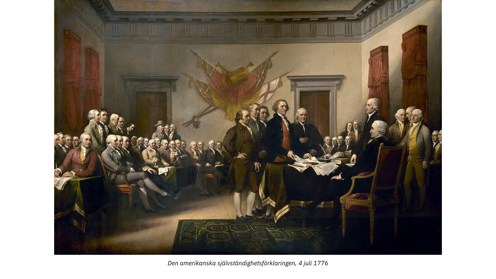

141 år senare, den 4 juli 1917, mitt under första världskriget, hölls en ceremoni på Picpus-kyrkogården i Paris för de första soldaterna från AEF som hade anlänt till staden. Ceremonin ägde rum nära La Fayettes grav, "hjälten från två världar" Vid detta tillfälle höll kapten Charles E. Stanton från general Pershings stab ett berömt tal:

> Jag beklagar att jag inte kan Address den franska befolkningen på det vackra språket i dess lojala land. Det får inte glömmas att er nation var vår vän när Amerika kämpade för sin existens, när en handfull modiga och patriotiska män var fast beslutna att försvara de rättigheter som deras Skapare hade gett dem - att Frankrike, i Lafayettes person, kom till vår hjälp i ord och handling. Det vore otacksamt att inte minnas detta, och Amerika kommer inte att svika sina förpliktelser...
>

> Därför är det med stor stolthet som vi omfamnar fanorna som en hyllning av respekt för denna medborgare i er stora republik, och här och nu i skuggan av den berömde döde försäkrar vi honom om vårt hjärta och vår ära att ge detta krig en gynnsam utgång.
>

> Lafayette, vi är här!

År 1789 var det återigen La Fayette som tillsammans med Jefferson lade den första grunden till 1789 års deklaration om de mänskliga rättigheterna.

### Nationernas välstånd

Adam Smith publicerade 1776 _An Inquiry into the Nature and Causes of the Wealth of Nations_. Ett produktivt verk som ofta kategoriserar honom som ekonom trots att han undervisade i moralfilosofi vid University of Glasgow. På ett karikerat sätt är han ihågkommen som den moderna ekonomins fader.

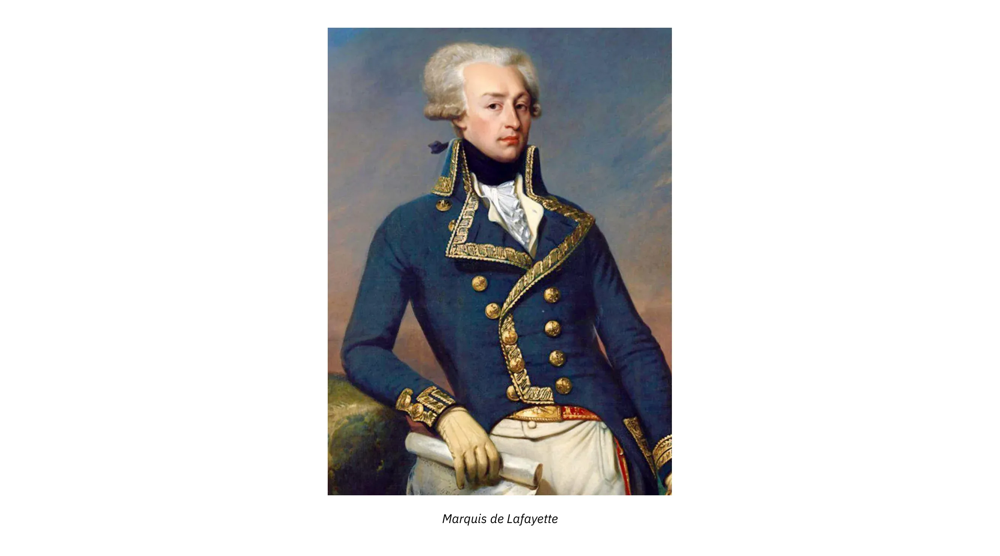

I själva verket hade Smith mycket att tacka ekonomerna Quesnay och Turgot för, som han träffade under en nästan ett år lång resa i Frankrike. I denna bok beskriver han framför allt ett "enkelt system av naturlig frihet" där individer, som följer sina intressen, leds "av en osynlig hand" för att främja samhällets övergripande välbefinnande.

Här är den mest kända passagen:

Genom att gynna den nationella industrins framgångar framför utländska industrier tänker han bara på att ge sig själv större säkerhet; och genom att styra denna industri så att dess produkt får högsta möjliga värde tänker han bara på sin egen vinning; i detta, liksom i många andra fall, leds han av en osynlig hand till att uppnå ett mål som inte alls ingår i hans avsikter. Det är inte alltid det sämsta för samhället att detta mål inte är en del av hans avsikter. (_The Wealth of Nations_)

Denna berömda osynliga hand illustrerar idén om att fri konkurrens på en fri marknad leder till en effektiv resursfördelning och en maximering av den allmänna välfärden.

Smiths mest betydelsefulla bidrag till frihetsbegreppet var att klargöra idén om spontan ordning. Smith menar att individer, i sin strävan att tillfredsställa sina egna behov och önskningar, uppmuntras att producera och Exchange varor och tjänster på ett sätt som tillgodoser samhällets behov på ett mer effektivt sätt än vad central planering skulle kunna göra.

Begreppet spontan ordning blev en central tanke hos Friedrich Hayek, som erkände sin skuld till den skotska upplysningen, i synnerhet till Adam Smith.

## Revolutionernas tidsålder

<chapterId>c260e3ab-31a2-5ad7-b775-4bdcdc13b859</chapterId>

Den stora nyheten i denna moderna period i västvärldens historia är framväxten av ett samhälle som organiserar sig utanför ett religiöst beroende. Detta innebär inte att den religiösa tron försvinner eller att Gud dör. Men Gud blir en privat angelägenhet, som inte längre blandas med politiska angelägenheter. Religionen försvinner inte, men dess vägledande roll detroniseras. Den blir ett system av individuella trosföreställningar.

Sekulariseringen av västvärlden skedde inte över en natt. Den förbereddes med idéer. Som så ofta är fallet ligger filosofin i framkant när det gäller stora kulturella förändringar.

Sedan Machiavelli och Hobbes uppfattas människan som en varelse av passioner, besjälad av motsägelsefulla tendenser. Det var därför nödvändigt att hitta reglerande principer för dessa passioner för att undvika de konflikter och det våld som de leder till.

Vi har talat om ekonomer och deras förespråkande av den fria marknaden. Men för många filosofer förutsätter lösningen på problemet snarare att en suverän makt etableras genom en juridisk Contract.

Fram till 1700-talet var den främsta politiska frågan för dessa filosofer den om suveränitet. Det är i första hand en fråga om rättvisa: vem kan legitimt utöva suveränitet?

### Folklig suveränitet

Idén inspirerades av Locke på 1600-talet och togs sedan upp av Rousseau. Den suveräna makten måste inte bara komma från folkets fria vilja utan också finnas i den. Detta är den rousseauistiska teorin om den allmänna viljans suveränitet, som vi idag kallar demokrati.

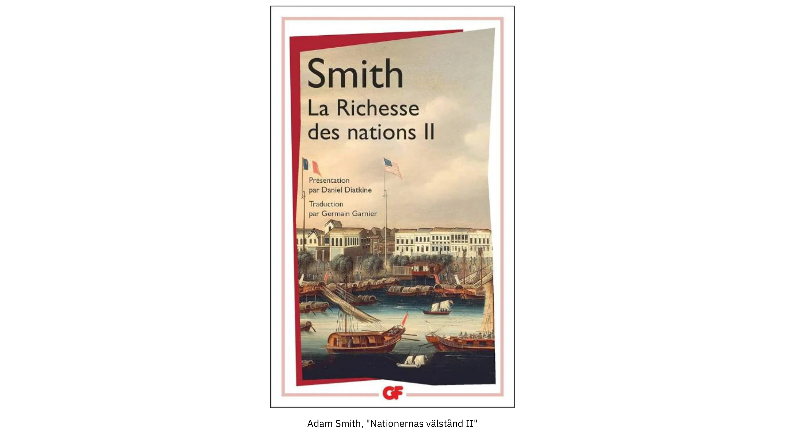

Rousseau betraktar folket som självständiga individer som kan underkasta sig de lagar som de stiftar. Folkets fria vilja utgör den enda rättvisa grunden för suveränitet. Rousseau skulle utveckla denna juridiska humanism, som är karakteristisk för moderniteten, till dess yttersta konsekvenser genom att betrakta folket som en individ som fritt kan bestämma över sig själv eller som en kollektiv enhet, såsom en allmän vilja. Contract innebär således underkastelse under lagar som människan, i egenskap av allmän vilja, ger sig själv i egenskap av särskild vilja. Teorin om den allmänna viljan eller folkets suveränitet gör det således möjligt att förena frihet och underkastelse. Självstiftandet av lagen eller politisk autonomi har verkligen varit en väsentlig del av demokratin sedan Rousseau.

Men frågan om suveränitetens ursprung är inte den enda. Reflektionen kan ta en ny riktning, nämligen sättet att utöva suveränitet. Är den allmänna viljan alltid rättvis? Och framför allt, har den rätt att ingripa i det civila samhället och inom vilka gränser?

### Teorin om begränsad makt

En av de upplysningsfilosofer som fick ett mycket starkt inflytande i Frankrike och Amerika är John Locke. Han var inspirationskällan till USA:s grundlagsfäder, men också till deklarationen om människans och medborgarens rättigheter 1789

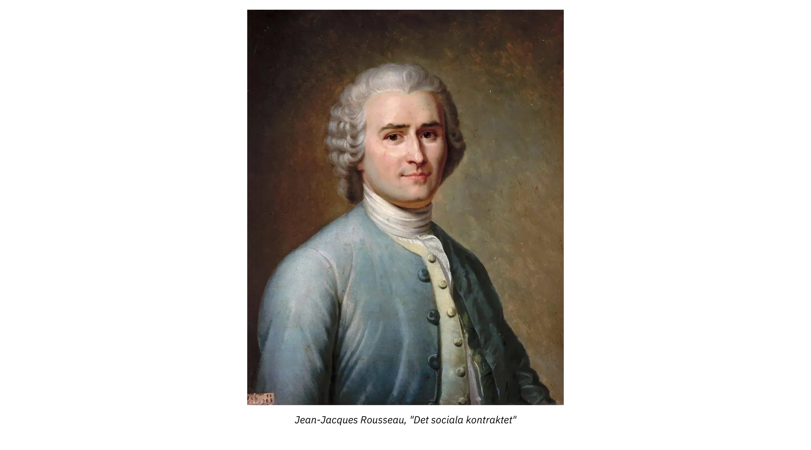

Alla tidigare system hade ansett att friheter endast är privilegier som beviljas av makten, som beviljas med stöd av ett tillstånd som när som helst kan återkallas. För Locke är en människas liv hennes eget enligt en naturlig rättighet (vilket betyder: enligt en moralisk princip som är inneboende i den mänskliga naturen) och att det enda moraliska syftet med en regering är att skydda individuella rättigheter.

Locke ger staten i uppdrag att försvara den enskildes egendom, det vill säga "liv, frihet och egendom":

> Det stora och främsta syftet med att människor förenar sig i samvälden och sätter sig själva under regering är därför att bevara sin egendom. (Två avhandlingar om regeringen, § 87).

Thomas Jefferson skrev in Lockes teori om omistliga rättigheter i självständighetsförklaringen:

Vi anser att dessa sanningar är självklara, att alla människor är skapade lika, att de av sin Skapare har utrustats med vissa oförytterliga rättigheter, bland dessa liv, frihet och strävan efter lycka.

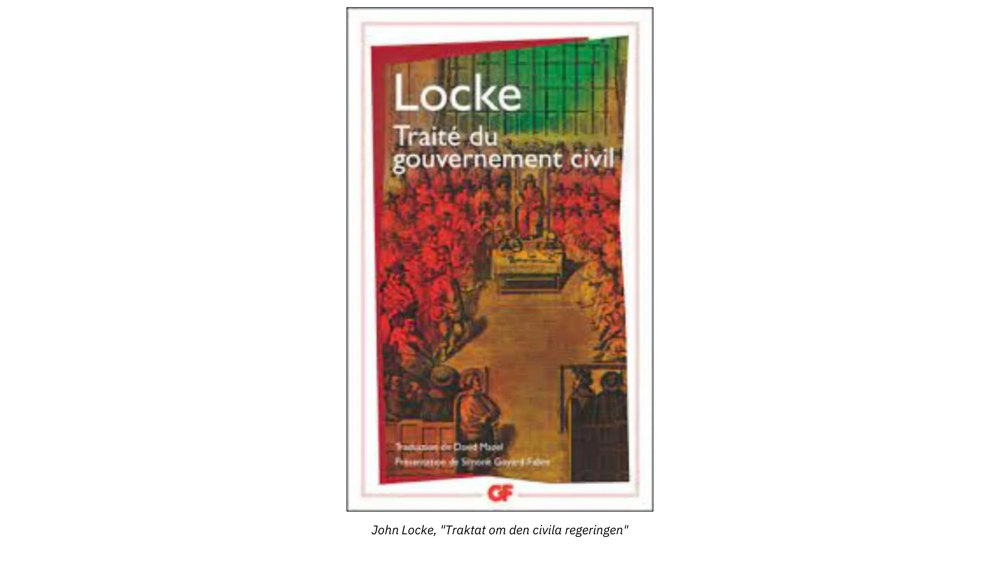

Artikel 2 i den franska rättighetsförklaringen från 1789 hämtar också inspiration från denna Lockeanska tradition av naturrätt:

> Målet för varje politisk sammanslutning är att bevara människans naturliga och okränkbara rättigheter. Dessa rättigheter är frihet, egendom, säkerhet och motstånd mot förtryck.

### Två revolutioner i jämförelse

Den amerikanska revolutionen leddes av män som talade om grundläggande omistliga rättigheter. Den ledde till bildandet av en decentraliserad och begränsad rättsstat. På andra sidan Atlanten utspelade sig ett annat politiskt experiment: den franska revolutionen, som började som ett modigt folkligt uppror, men som slutade med en rad massakrer, blodiga interna konflikter och banade väg för Napoleon Bonapartes militärdiktatur. Varför en sådan skillnad?

På 1800-talet försökte Alexis de Tocqueville, en fransk politisk filosof, att fastställa dessa skillnader mellan de två systerrevolutionerna. Han tillskriver den amerikanska revolutionens framgång flera faktorer.

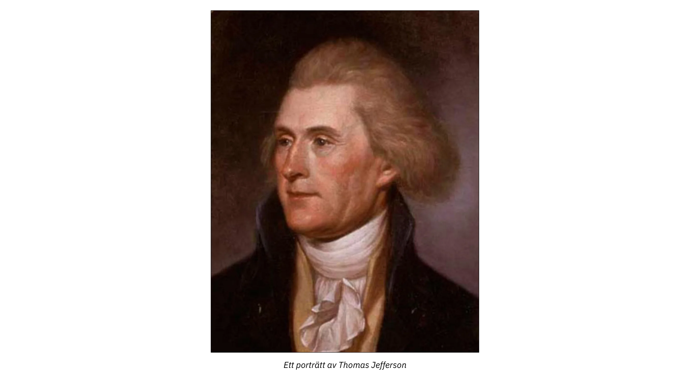

För det första, genom att definiera republiken. Den franska republiken är en och odelbar. Den amerikanska republiken består av suveräna stater, var och en med sin jurisdiktion och sina lokala intressen. Federalism betraktas som förräderi i Frankrike. I Amerika skulle förräderi bestå i att vilja införa enhet. Åtminstone fram till det amerikanska inbördeskriget var unionen, med sin mångfald av stater, federationens styrka.

Han menar också att USA:s tro på en högre lag spelade en avgörande roll. I självständighetsförklaringen proklameras att alla människor är skapade lika, att de är utrustade med vissa omistliga rättigheter (liv, frihet, egendom och strävan efter lycka) och att syftet med en regering endast är att säkra dessa rättigheter. Det handlade om att återupprätta principer och ideal som hade trampats under fötterna av den brittiska kronan.

I det första tillägget till den amerikanska konstitutionen, som utarbetades 1789, står följande:

Kongressen skall inte stifta någon lag om upprättande av religion eller förbud mot dess fria utövande, eller inskränkning i yttrande- eller tryckfriheten, eller folkets rätt att fredligt samlas och att göra framställningar till regeringen om rättelse av missförhållanden.

Denna formulering skyddar uttryckligen mot majoritetens tyranni. Den franska revolutionen var dock helt annorlunda. Fransmännen försökte bryta helt med det förflutna. De uråldriga principerna i det kristna arvet motsvarade inte längre förväntningarna hos revolutionärer som Robespierre.

### Från tredje ståndets revolt till den jakobinska terrorn

Abbé Sieyès (1748-1836) betraktas ofta som den franska revolutionens fader. Han är författare till _Vad är den tredje statsmakten?_, publicerad i januari 1789

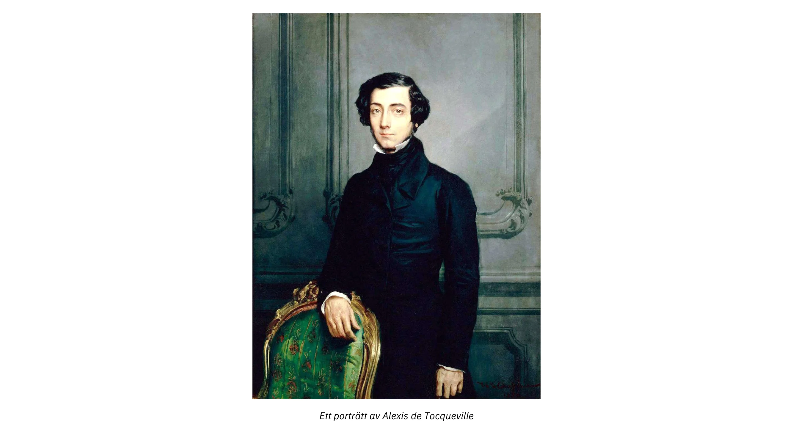

Det tredje ståndet bestod av alla som inte tillhörde prästerskapet eller adeln. Redan i de första raderna av sin berömda pamflett lovordade Abbé Sieyès individens frihet och den fria konkurrensen:

> Är inte effekten av monopol känd? Om det avskräcker dem som det utesluter, är det då inte känt att det gör dem som det gynnar mindre skickliga? Är det inte känt att allt arbete från vilket fri konkurrens tas bort kommer att utföras dyrare och på ett sämre sätt?

Natten till den 4 augusti 1789 är en grundläggande händelse i den franska revolutionen, till och med mer betydelsefull än den 14 juli, som senare valdes som nationell helgdag. Under den session som hölls vid den tidpunkten gjorde den konstituerande församlingen slut på det feodala systemet. Privilegier avskaffades, inklusive de som tillhörde adeln och prästerskapet. I mars 1791, efter flera månader av juridisk ovisshet, avskaffades också skråväsendet och fullständig frihet för arbetare infördes. Revolutionen ratificerade Turgots arbete. Men inte länge till...

I slutet av 1791 hade hungersnöden förvärrat den folkliga oron i Frankrike. Upplopp lamslog spannmålshandeln och det var ont om bröd. En stor rörelse krävde en agrar lag, det vill säga att staten skulle fördela veteproduktionen. Församlingen motsatte sig dock detta försök till kollektivisering. Inledningsvis röstade den för konfiskering av kyrkans egendomar och, i ett andra steg, prästerskapets civila konstitution.

Konfiskeringen av kyrkans egendom syftade till att avvärja den finansiella krisen; den var avsedd att fungera som säkerhet för Assignats, vilket innebar en massiv utgivning av papperspengar.

Som Dupont de Nemours hade förutspått förvärrade dessutom utgivningen av falskmyntade sedlar krisen och orsakade en utbredd inflation och en kraftig värdeminskning av assignaterna. I augusti 1792 ledde hungerkravallerna till upproret i Paris, avrättningen av Ludvig XVI i januari 1793 och slutligen skräckväldet.

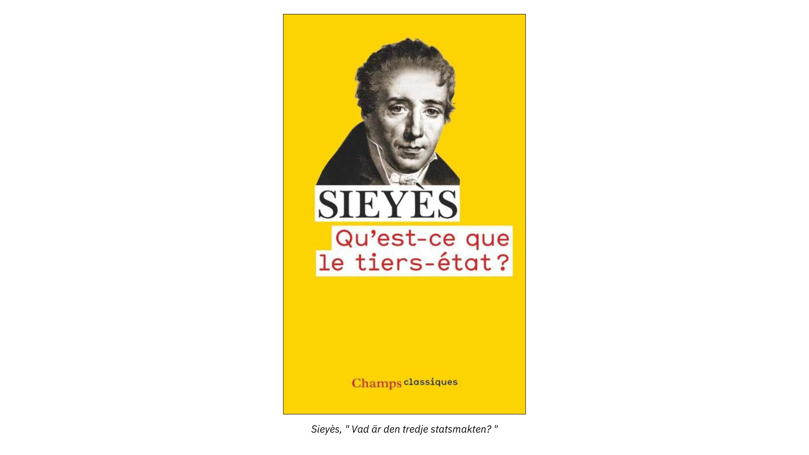

År 1795, fem år efter den första utgivningen, hade papperspengarna förlorat 99% av sitt värde. Den franska revolutionen fortsatte under direktoriet fram till 1799, då Napoleon tog makten genom en statskupp. Han blev den franska republikens förste konsul innan han kröntes till kejsare 1804. Detta var en av de första uppenbara motsägelserna mot deklarationen om de mänskliga rättigheterna, som förkunnade att privat egendom var okränkbar.

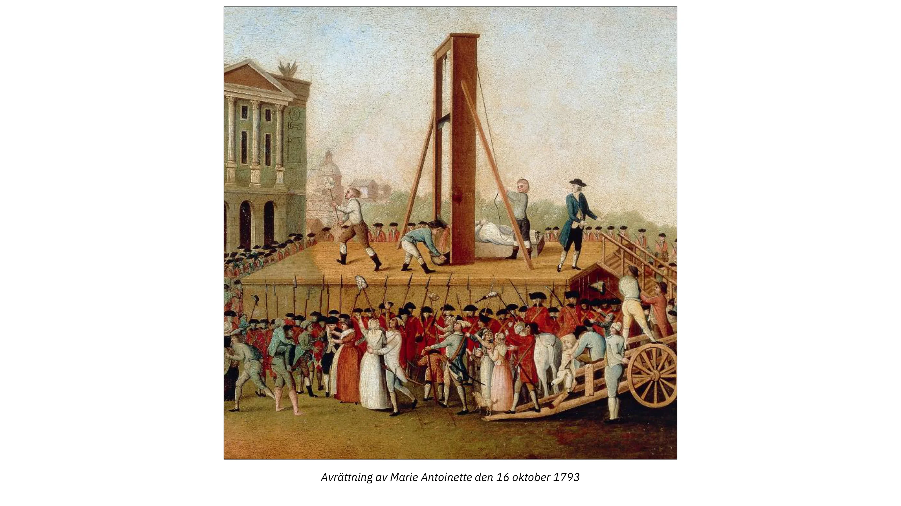

I Amerika fanns det ingen ekonomisk dirigism och inte heller någon monetär bankrutt som Assignats. Och framför allt fanns det inga förbud, inga massutvandringar, ingen giljotin, inga massakrer och inget skräckvälde. Omedelbart kan man se skillnaden i de handlingsmedel som skiljer den amerikanska revolutionen från den franska revolutionen.

Med Rousseau och Robespierre försökte fransmännen tro att nationen eller den allmänna viljan hade obegränsad makt och rättfärdigade alla handlingar. Av det faktum att folket styrde drog man slutsatsen att det hade alla rättigheter. Det fanns en tydlig motsägelse mellan revolutionens stora principer och de medel som användes för att få dem att triumfera.

Detta är för övrigt innebörden av Friedrich Hayeks anmärkning i hans bok _The Constitution of Liberty_:

> Den avgörande faktor som gjorde revolutionens ansträngningar för att främja individens frihet förgäves var att den skapade en illusion om att alla försiktighetsåtgärder mot missbruk av makten hade blivit onödiga i och med att all makt hade överlämnats till folket.

# Höjdpunkt och nedgång: Från 1800- till 1900-talet

<partId>39810d57-19e3-5166-8f2e-40b763154148</partId>

## Moderaternas frihet

<chapterId>e575f4c1-7144-591b-ab98-d976ec4102fb</chapterId>

Enligt Benjamin Constant kan frihet i moderna samhällen inte längre förstås på samma sätt som i antika kulturer, som ett direkt deltagande i stadens angelägenheter.

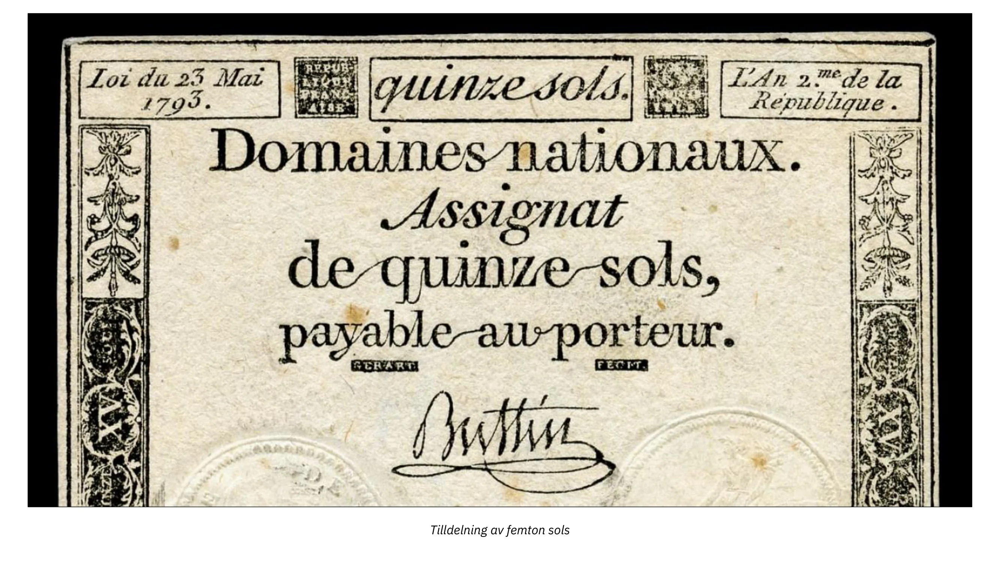

### Frihet i privatlivet

Under antiken var individerna suveräna i offentliga angelägenheter men förslavade i alla sina privata relationer. Användningen av politiska rättigheter kompenserade för uppoffringen av individuell frihet: rätten att direkt utöva olika aspekter av suveränitet, att överlägga på det offentliga torget, att rösta om lagar, att uttala domar och att utvärdera och döma magistrater. Det är en politisk och kollektiv frihet:

> Antikens frihet bestod i ett aktivt och ständigt deltagande i den kollektiva makten. Vår frihet, å andra sidan, måste bestå av det fredliga åtnjutandet av privat oberoende; därav följer att vi måste vara mycket mer fästa vid vårt oberoende än de gamla. (_Om de gamlas frihet jämfört med de modernas_ (1819))

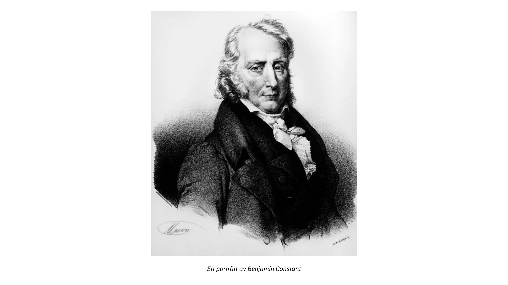

Den moderna friheten omfattar medborgerliga friheter, som inkluderar ekonomisk frihet och grundas i rätten till privatliv. Det är rätten att inte utsättas för godtycke, rätten att uttrycka sig, att samlas, att röra sig, att utöva sin religion och att bedriva näringsverksamhet. Det finns ingen frihet utan möjlighet att välja sin livsstil och sina värderingar; det finns således ingen frihet utan möjlighet att dra sig tillbaka från samhället, och följaktligen ingen frihet utan en begränsning av staten för att tillåta förekomsten av detta privata utrymme. Det är en frihet som motsvarar det som amerikanerna kallar medborgerliga rättigheter.

Denna definition av frihet återfinns hos John Stuart Mill:

> Den enda frihet som förtjänar namnet är den att sträva efter vårt goda på vårt sätt, så länge vi inte försöker beröva andra deras goda eller hindra dem i deras strävan att uppnå det. (...) Mänskligheten vinner mer på att låta varje människa leva som hon vill än på att tvinga henne att leva som andra anser vara bra. (_Om friheten_, 1859)

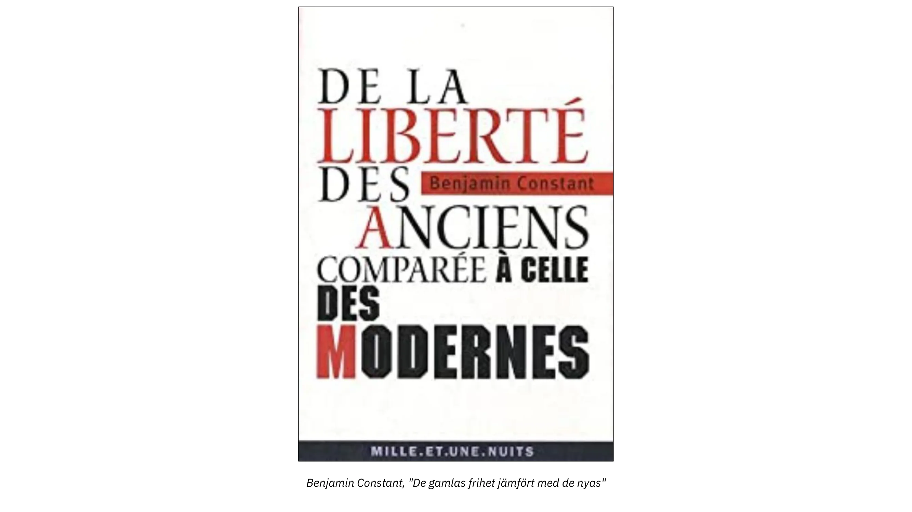

Mill skisserar gränserna för statens suveränitet: den slutar där individens suveränitet börjar. Om en enskild handling inte har några skadliga konsekvenser för andra, är individen helt fri att utföra den. Staten måste reglera relationerna mellan individerna, men den kan inte gå längre än så genom att blanda sig i individernas privatliv. Om individen skadar sig själv kan staten inte göra något annat än att "förmana" eller försöka "resonera" eller "övertala" individen: den kan inte tvinga eller straffa. För Mill tillägger: "Det enda legitima skälet till att en stat kan använda våld mot en av sina medlemmar, mot deras vilja, är att förhindra att andra skadas."

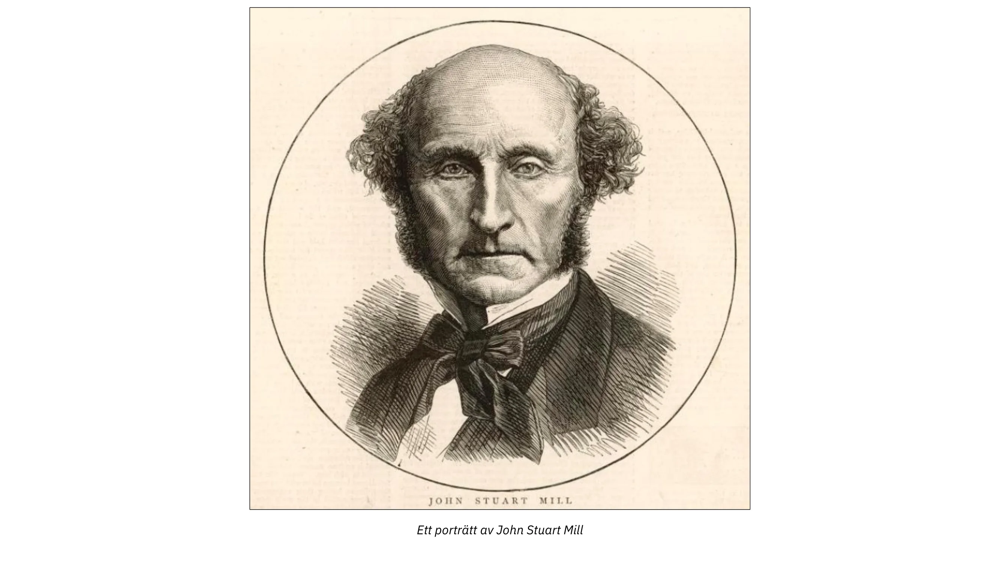

Den politiska makt som motsvarar moderaternas frihet är därför begränsad: "Låt makten begränsa sig till att vara rättvis, så ska vi själva ta hand om vår lycka", säger Benjamin Constant. Det är inte upp till staten att tala om för oss hur vi ska vara lyckliga.

### Den rousseauistiska förvirringen

Enligt Constant har "sammanblandningen av dessa två typer av friheter varit orsaken till mycket ont bland oss, under alltför berömda epoker av vår revolution" Jean-Jacques Rousseau, som uppfattade frihet enbart som medborgarnas kollektiva deltagande i politiska handlingar, uppmuntrade Robespierre att begränsa medborgarna genom terror. Revolutionens felsteg är således resultatet av den moderna tillämpningen av politiska principer som var giltiga bland de gamla.

Detta innebär dock inte att man offrar den politiska friheten eller deltagandet i makten. Constant preciserar att om den moderna friheten skiljer sig från den antika friheten, så hotas den av en fara av ett annat slag. Faran med de gamlas frihet var godtycke. Hotet mot moderaternas frihet skulle vara att avstå från de politiska garantierna för denna frihet genom ett slags likgiltighet för det allmänna bästa. Med andra ord är det upp till medborgarna att utöva ständig vaksamhet över sina representanter.

Benjamin Constant hävdar faktiskt i sin _Principles of Politics_:

> Folkets suveränitet är inte obegränsad; den är begränsad inom de gränser som dras upp av rättvisan och individens rättigheter. Ett helt folks vilja kan inte göra det som är orättvist rättvist.

Detta är en ny kritik av Rousseau och _Social Contract_: även en allmän vilja är föremål för begränsningar, och den kan inte ändra vad som faller under naturrätten. Det finns en rätt som föregår och är överordnad den politiska makten: det är naturrätten. Denna rätt sätter gränser för den politiska makten och begränsar individens friheter.

Att säga att all legitim makt måste grundas på den allmänna viljan innebär inte att allt som den allmänna viljan beslutar är legitimt. Constant ansluter sig därmed till artikel II i 1789 års deklaration om de mänskliga rättigheterna, där det slås fast att staten endast inrättas för att bevara de naturliga rättigheterna, dvs. frihet, ansvar och egendom. Det finns därför områden där den politiska makten inte har något inflytande: moral och religion, men också vetenskaperna, som faller under kunskapens auktoritet och slutligen industrin, tillägger Constant.

### Politisk frihet och ekonomisk frihet

Politisk frihet utan andra friheter är bara en illusion, enligt Benjamin Constant. Politisk frihet är friheten att delta i maktutövningen. Folkets eller massornas makt kan dock vara destruktiv för friheterna, eftersom den ger den röstande majoriteten rätt att påtvinga hela samhället sin vilja, inklusive sina nycker eller sin ideologi för stunden: konfiskatoriska skatter utan kompensation, genomdrivande av en enda tanke, censur, förtryck och intellektuell terrorism. Det är därför det inte kan finnas någon verklig frihet utan medborgerliga friheter, inklusive religionsfrihet och ekonomisk frihet. Benjamin Constant skiljer inte mellan politisk liberalism och ekonomisk liberalism:

> I fyrtio år har jag försvarat samma princip, frihet i allt, i religion, i filosofi, i litteratur, i industri, i politik: och med frihet menar jag individualitetens triumf, både över den auktoritet som skulle styra genom despotism och över de massor som hävdar rätten att förslava minoriteten till majoriteten. Despoti har ingen rätt. Majoriteten har rätt att tvinga minoriteten att respektera ordningen: men allt som inte stör ordningen, allt som bara är internt, som åsikter; allt som, när man uttrycker åsikter, inte skadar andra, varken genom att provocera fram materiellt våld eller genom att motsätta sig ett motsatt uttryck; allt som, när det gäller industrin, gör det möjligt för den konkurrerande sektorn att verka fritt, är individuellt och kan inte legitimt underkastas social makt.

I ett fritt samhälle är det med andra ord nödvändigt att upprätta en strikt gräns mellan den offentliga sfären och den privata sfären. Den princip som ligger till grund för denna gräns bygger på att man inte får skada andra, särskilt inte kränka deras äganderätt.

## Demokratins styrkor och svagheter

<chapterId>753e065d-dbee-5d61-aa56-b1c074c95499</chapterId>

Alexis de Tocqueville var en skarp iakttagare av demokratin och en kritiker av den demokratiska individualismen.

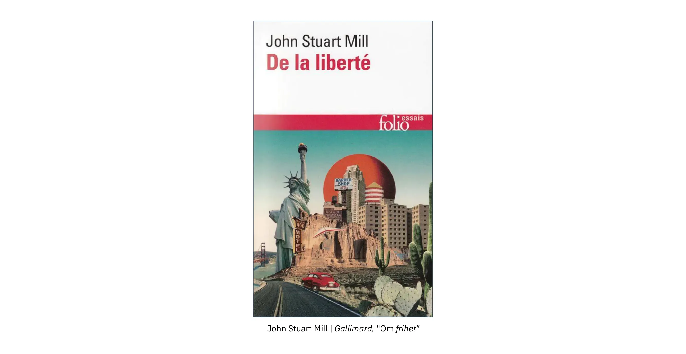

Tocquevilles analys av demokratin utvidgar i allt väsentligt den distinktion som Constant gjorde mellan antikens och modernitetens frihet. I en artikel från 1836 (_Frankrikes sociala och politiska tillstånd före och efter 1789_) jämför Tocqueville metodiskt aristokratisk frihet med demokratisk frihet. Den förra definieras som "åtnjutandet av ett privilegium", och Tocqueville nämner som exempel den romerske medborgaren som inte får sin frihet från naturen utan från sin tillhörighet till Rom.

Det andra begreppet, som kallas "det korrekta frihetsbegreppet", innebär en "lika och omistlig rätt att leva oberoende av sina medmänniskor" Detta moderna frihetsbegrepp skiljer sig alltså från det första; det är ett politiskt begrepp, men det har sin grund i naturrätten och anses vara korrekt eftersom det gäller lika för alla människor. Så står det skrivet:

> Enligt den moderna uppfattningen, den demokratiska uppfattningen, och jag vågar säga den korrekta uppfattningen om frihet, får varje människa, som antas ha fått den nödvändiga upplysningen från naturen för att kunna uppföra sig, vid födseln en lika och oförytterlig rätt att leva oberoende av sina likar, i allt som bara rör honom själv, och att reglera sitt öde som han finner lämpligt.

Tocqueville är noga med att identifiera alla de politiska och kulturella effekterna av detta nya sätt att vara, typiskt modernt. Han är en beundrare av Pascal och vill skildra demokratins storhet och elände.

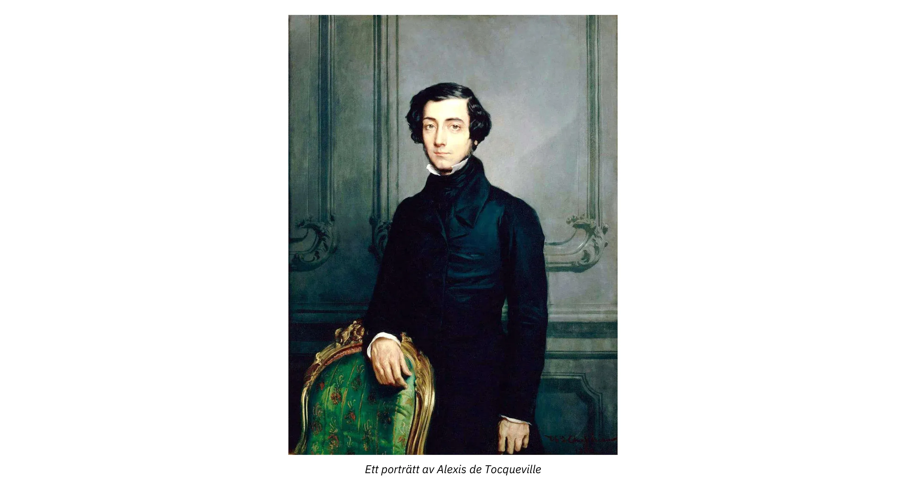

År 1841, i _Democracy in America_, analyserar han den demokratiska princip som hävdar sig i utjämningen av villkor mot klassernas hierarki och traditionens auktoritet. Och han observerar att denna process logiskt följer med upplösningen av sociala influenser, beroendebanden och atomiserar det sociala bandet, vilket hotar själva utövandet av medborgarens frihet och politiska ansvar. Förlusten av de stora antika idealen (dygden, det gemensamma bästa) leder dessutom till att livets mening utarmas, "till små och vulgära nöjen", till tristess och oro.

Den jämlikhet i villkor som kännetecknar demokratin innebär att varje person tenderar att dra sig tillbaka till sig själv, utan en länk som knyter dem till andra. Det individuella oberoende som denna nya frihet innebär försvårar utövandet av medborgerliga dygder genom att främja likgiltighet för det allmänna bästa. Följden blir att moderna demokratier utsätter sig för statismens "Soft och regelbundna" despoti, som möjliggörs av folkets växande ointresse för det politiska livet. Demokratin tenderar således symmetriskt mot två excesser som föder varandra:

Å ena sidan individualism, det vill säga "ointresse för offentliga angelägenheter" och "kärlek till materiella nöjen" Tocqueville definierar individualism just som en känsla av självtillräcklighet som får medborgaren att isolera sig från andra och dra sig undan. Detta är hedonistisk narcissism.

Och å andra sidan statismen, som förstör individerna genom att hålla dem i ett tillstånd av barndom. Staten "arbetar gärna för deras lycka, men den vill vara den enda agenten."

I själva verket åtföljs utjämningen av en större bräcklighet hos individer som blir isolerade och separerade från varandra. För att undvika anarki och skydda sina ägodelar förlitar de sig på en unik och central makt till vilken de delegerar alla sina rättigheter. Enligt Tocqueville är det därför nödvändigt att utveckla civila sammanslutningar och "lokal demokrati" för att upprätthålla motkrafter och därigenom bekämpa både individualism och despotism, som båda är frihetsförstörande.

Författaren till _Democracy in America_ varnar oss:

> Det finns faktiskt en ädel och legitim passion för jämlikhet som får män att vilja vara starka och uppskattade. Denna passion tenderar att höja de små till de storas rang. Men det finns också i människans hjärta en fördärvad smak för jämlikhet, som får de svaga att vilja sänka de starka till sin nivå och som får människor att föredra jämlikhet i träldom framför ojämlikhet i frihet. (...) Vår tids nationer kan inte göra så att förhållandena inom dem är jämlika. Ändå är det upp till dem om jämlikhet leder dem till träldom eller frihet, till upplysning eller barbari, till välstånd eller elände.

För Tocqueville är människan mycket mer attraherad av jämlikhet än av frihet. Han ser detta som ett betydande hot mot demokratin. Varför föredrar människan passionen för jämlikhet mellan de två? För att friheten ger upphov till direkt synliga kostnader och dess fördelar är mer avlägsna, inskrivna på lång sikt (frihet ger inte innehåll, bara förmågan att söka lycka enligt eget omdöme). Omvänt ger jämlikhet omedelbart synliga positiva resultat, och dess brister blir uppenbara först på lång sikt.

### Rätten till arbete

Rätten till arbete är ett bra exempel på den demokratiska egalitarismens avsteg. I ett tal till den konstituerande församlingen 1848 tog Tocqueville ställning mot rätten till arbete i förslaget till konstitution. Om staten åtar sig att tillhandahålla arbete åt alla arbetare, hävdade han, eller om den ser till att de alltid hittar det på arbetsmarknaden, som socialisterna vill, kommer det att leda till att man blir "den stora och unika organisatören av arbete"

I detta tal jämför Tocqueville socialismen med Ancien Régime, för vilken "dess undersåtar är sjuka och svaga varelser som alltid måste hållas i handen, så att de inte faller eller skadar sig själva" Socialismen är alltså "en ny form av slaveri" av tre skäl:

1. Moraliskt främjar socialismen ansvarslöshet genom sin direktiva och kollektivistiska statliga kontroll. Den kännetecknas alltid av "ett djupt förakt för individen som sådan"

2. Politiskt är den despotisk eftersom den i lycksalighetens namn försöker bli "varje människas herre, hennes lärare och uppfostrare"

3. Ekonomiskt sett är den ineffektiv eftersom den eliminerar konkurrens genom sina regleringar och sitt förkastande av privat egendom.

### Lagen och dess missbruk

Vad tyckte Frédéric Bastiat om demokrati? Han svarade så tidigt som 1846:

> Jag är för demokrati, om ni med detta ord menar: Till var och en egendomen av hans arbete, frihet för alla, jämlikhet för alla, rättvisa för alla och fred bland alla. (_Frihandel_).

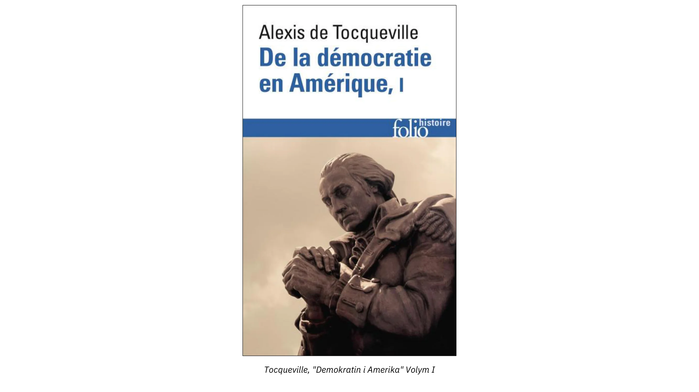

Men efter februarirevolutionen 1848 valdes Bastiat till deputerad för Landes i en församling där socialisterna gjorde ett triumferande intåg. Dessa senare krävde bara en sak: att lagen skulle innehålla principen om broderskap. Med andra ord, att stifta lagar om arbete, utbildning och hälsovård för alla.

Under de socialistiska idéernas styre konstaterade Bastiat att valmaskineriet användes för att plundra offentliga medel och därmed medborgarna:

> Det kommer inte att dröja länge innan de offentliga finanserna hamnar i fullständig oordning. Hur skulle det kunna vara annorlunda när staten har till uppgift att tillhandahålla allt åt alla? Skatterna kommer att krossa folket, lånen kommer att följa på lånen. Efter att ha uttömt nuet kommer framtiden att slukas. Slutligen, eftersom det kommer att accepteras i princip att staten är ansvarig för att främja broderskap bland sina medborgare, kommer hela befolkningen att bli framställare. Markägande, jordbruk, industri, handel, flottan, industriföretag, allt kommer att röra på sig för att göra anspråk på statens gunst. Den offentliga statskassan kommer bokstavligen att plundras. ([_Justice and Fraternity_](http://bastiat.org/fr/justice_fraternite.html))

Staten blir då, enligt Bastiats ord,

> den stora fiktionen genom vilken alla försöker leva på bekostnad av alla andra. ([_The State_](http://bastiat.org/fr/l_etat.html))
> Bastiat utvecklar också idén om att konflikter uppstår när lagen avviker från sin rättmätiga roll. I sin berömda pamflett [_The Law_] (http://bastiat.org/fr/la_loi.html) visar han varför och hur lagen har blivit "alla girigheters slagfält", det vill säga en källa till privilegier, situationsanpassade hyror och godtycklig beskattning. Så snart det i princip erkänns att lagen kan avledas från sitt verkliga uppdrag, att den kan kränka egendomar i stället för att garantera dem, följer med nödvändighet en klasskamp, antingen för att försvara sig mot plundring eller för att organisera den till sin egen fördel.

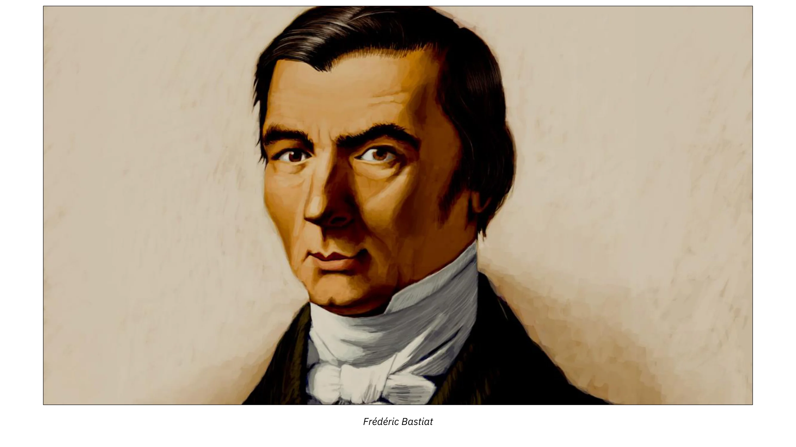

I de fall där lagen bara upprätthåller varje individs rättigheter och garanterar _"den kollektiva organisationen av den individuella rätten till legitimt försvar"_, är ingen i stånd att utnyttja den till sin fördel på allas bekostnad, i en sådan utsträckning att själva regeringsformen blir en sekundär fråga.

Det är först när lagen överskrider sina rättmätiga gränser som lagstiftaren blir korrumperbar. Detta leder sedan till en hård kamp mellan olika kategoriska intressen, som alla är angelägna om att erövra lagstiftningsapparaten för att få privilegier som per definition är spoliatoriska.

Enligt Bastiat leder socialistisk demokrati till ett permanent budgetunderskott och i slutändan till våld. Genom att outtröttligt mångfaldiga löften och inte kunna uppfylla dem utvecklar valmaskinen en bitterhet som lägger grunden för revolutioner. Så skriver han:

> Men om regeringen tar på sig att höja och reglera lönerna och inte kan göra det, om den tar på sig att hjälpa alla olyckor och inte kan göra det, om den tar på sig att ge pensioner till alla arbetare och inte kan göra det... Ser vi inte det, tyvärr, i slutet av varje besvikelse? Mer än troligt är att det finns en lika oundviklig revolution. ([_The Law_](http://bastiat.org/fr/la_loi.html))

Bastiats slutsats:

Ta en titt på jordklotet. Vilka är de lyckligaste, mest moraliska och fredligaste människorna? De där lagen ingriper minst i privat verksamhet; där regeringen känns minst; där individualiteten har störst motståndskraft och den allmänna opinionen störst inflytande; där de administrativa mekanismerna är minst och minst komplicerade; skatterna minst betungande och minst ojämlika; folkligt missnöje minst provocerat och minst berättigat; där individers och klassers ansvar är det mest aktiva, och där följaktligen, om moralen inte är perfekt, den obönhörligen tenderar att korrigera sig själv; där transaktioner, avtal, föreningar hindras minst; där arbete, kapital och befolkning lider minst av artificiella förflyttningar ([_The Law_](http://bastiat.org/fr/la_loi.html))

## Den marxistiska kritiken av kapitalismen

<chapterId>16c82521-7c51-5d84-b660-0b358447e3bd</chapterId>

Det var under 1800-talet som kritiken av kapitalismen, särskilt den marxistiska kritiken, växte fram.

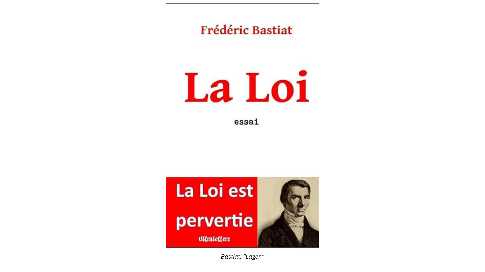

Vad är det för mening med rätten att tala, skriva och rösta, utropade Marx, om det dagliga livet är en kamp för överlevnad? Över en viss tröskel är fattigdom liktydigt med ett tillstånd av slaveri. Den sociala ordningen gynnar således alla endast om principen om en rättvis fördelning av varor tillämpas. Det var denna kritik av liberalismen som fick Marx att överväga nödvändigheten av en rationell och planerad kontroll av samhällsordningen. I fortsättningen måste liberalernas minimala stat ersättas av en stark stat som kan skapa verklig jämlikhet, vilket enligt Marx går så långt som till att avskaffa den privata egendomen och kollektivisera den. I en mjukare version, "socialdemokratin", uppmanas staten att inte bara garantera människans abstrakta rättigheter utan även människans konkreta rättigheter. Nya rättigheter skapas, sociala och ekonomiska rättigheter, som garanteras av staten: rätten till arbete, rätten till bostad, rätten till hälsa (gratis), rätten till utbildning (gratis).

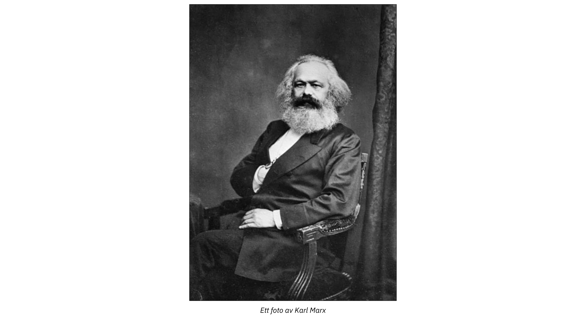

### Myten om den opartiska staten

Den grundläggande kritik som Marx riktar mot den politiska liberalismen, särskilt i sina tidiga skrifter (_Critique of Hegel's Philosophy of Right_ och _On the Jewish Question_), fokuserar på åtskillnaden mellan det civila samhället och staten. Denna kritik måste förstås inom den allmänna ramen för hans tolkning av den "borgerliga revolutionen" Det är denna revolution som leder till bildandet av en stat skild från det civila samhället, som antas sträva efter det universella, det vill säga det gemensamma intresset, genom att spela rollen som en opartisk skiljedomare.

Men allt detta är för Marx bara ett bedrägligt sken. I själva verket är staten inget annat än ett instrument som är avsett att tjäna den härskande klassens särintressen. Staten är med andra ord inte opartisk, den är inte skild från det civila samhället. I själva verket är den liberala staten platsen för en dubbel illusion. Illusionen om det universella, som vi just har sett, och följaktligen illusionen om frigörelse. Revolutionen frigjorde visserligen medborgaren genom att införa folksuveränitet och likhet inför lagen, men denna frihet och jämlikhet förblir rent idealiska och abstrakta. Det är falskt, säger Marx, att som Rousseau eller Hegel tro att människan fullt ut förverkligar sin rationella natur genom att bli medborgare. I verkligheten kan man bli medborgare och förbli exploaterad, förslavad, utlämnad åt begärens nycker, åt själviskhetens anarki och den starkes lag.

Medborgarens frigörelse innebär enligt Marx inte alls människans frigörelse, som deklarationen från 1789 antyder, utan snarare den destruktiva individualismens triumf och därmed ojämlikhet. Frihet, som makten att göra vad som helst som inte skadar andra, en av de mänskliga rättigheternas grundpelare, är en rent negativ frihet som inte skapar någon relation mellan individer utan tvärtom främjar deras separation, antagonism och i slutändan deras slaveri. De mänskliga rättigheternas frihet är formell.

Denna liberalismens politiska illusion är den sekulära sidan av den religiösa illusionen, tillägger Marx. Formeln är välkänd: "Religionen är folkets opium" Religionen är en källa till tröst, ger eufori och utlovar frigörelse i livet efter detta. Men den avleder människan från hennes sanna frigörelse här på jorden. Medborgarskapet är, i förhållande till arbetarens verksamhet, som Guds rike när det gäller den miserabla existensen på denna jord. Det förverkligas aldrig. Denna dubbla separation utgör en dubbel alienation, vilket innebär att människan inte fullföljer sin mänsklighet eller sin inbillade fulländning.

### Ekonomisk alienation

Enligt Marx och den historiska materialismen är det i själva verket den ekonomiska alienationen som ligger till grund för både den politiska och den religiösa alienationen. I den ekonomiska alienationen, som är ett resultat av kapitalismen (definierad som det privata Ownership av produktionsmedlen), tvingas arbetaren att sälja sin arbetskraft som en vara. Dessutom berövas han produkten av sitt arbete, som arbetsgivaren äger. Han blir därmed alienerad, det vill säga skild från sig själv, eftersom hans arbete blir något främmande som han utför av nödvändighet för att överleva. Ändå är arbetet för Marx den i grunden mänskliga handlingen, den handling genom vilken människans innersta väsen, friheten, förverkligas. Därför innebär arbetets frigörelse också att människan återfår sin mänsklighet.

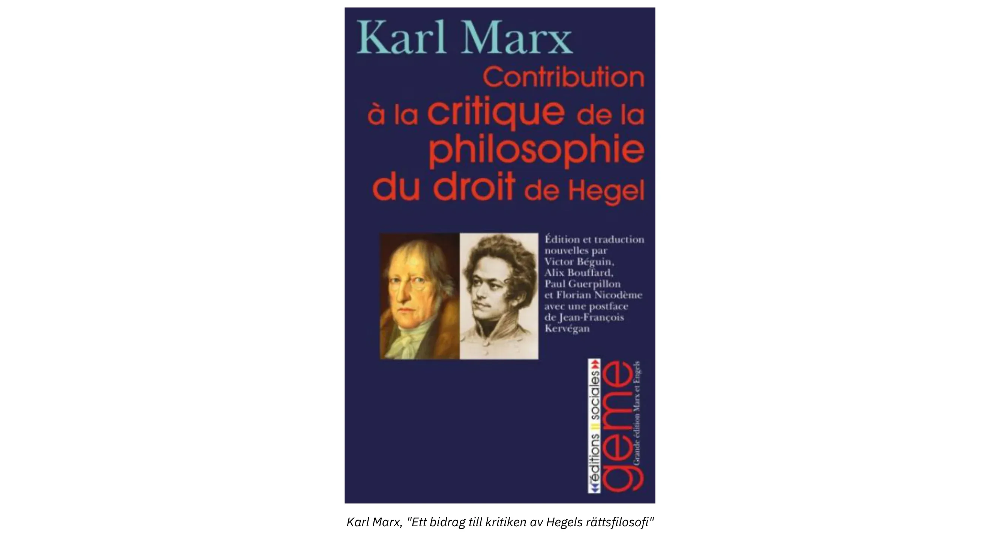

Den politiska revolutionen är därför en illusion, enligt honom, så länge den inte åtföljs av en ekonomisk och social revolution som kan befria människan från kapitalistiskt slaveri och därmed uppnå enhet mellan arbetaren och medborgaren, mellan samhället och staten, den privata sfären och den offentliga sfären. Medborgarnas formella frihet och jämlikhet kommer därmed att bli en realitet i ett klasslöst samhälle.

## Den österrikiska kritiken av marxismen

<chapterId>f05dae71-c478-5de1-996e-1b7b4255d373</chapterId>

Den österrikiska ekonomiska skolan, som grundades av Carl Menger i slutet av 1800-talet, motsatte sig redan från början Karl Marx teorier.

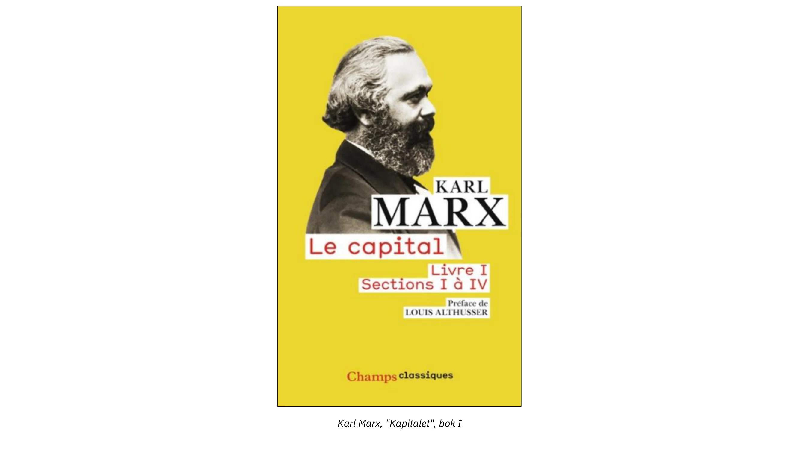

### Klasskampen

Österrikiska ekonomer förkastar den marxistiska uppfattningen om klasskamp, som innebär att konflikten mellan kapitalistklassen och arbetarklassen är oundviklig och fungerar som drivkraft för social förändring.

**All social förändring är endast möjlig genom individers handlingar och inte genom abstrakta sociala krafter som klasser.**

Österrikarna menar att samhället inte är uppdelat i två antagonistiska klasser, utan snarare består av individer med olika intressen och behov. De betonar att de ekonomiska relationerna mellan individer i allmänhet är ömsesidigt fördelaktiga och inte bygger på exploatering.

En arbetsgivare anställer t.ex. en arbetstagare för att han eller hon behöver dennes kompetens för att producera en vara eller tjänst som konsumenterna efterfrågar. Arbetstagaren i sin tur accepterar jobbet eftersom han behöver en inkomst för att tillgodose sina behov. Denna relation är ömsesidigt fördelaktig och inte konfliktfylld.

Ludwig von Mises framhåller att Marx inte lyckades skilja mellan vad som är borgerlig ideologi i mänskliga rättigheter och vad de innebär i praktiken, de omvälvningar de medför i samhällslivet. Många kritiska människorättstänkare har gjort samma misstag. Detta gällde även kontrarevolutionärer som Joseph de Maistre och Louis de Bonald.

I _The Ethics of Liberty_ och _Anatomy of the State_ förklarade Murray Rothbard att exploatering endast är meningsfull som en aggression mot privat egendom och att endast staten får sina intäkter genom aggression, det vill säga genom beskattning, skuldsättning, tryckning av pengar och därmed genom inflation. I själva verket är det statliga ingripanden, och inte klasskampen, som är källan till våld och konflikter i samhället. Genom att staten tillägnar sig resurser och reglerar ekonomin skapar den snedvridningar och orättvisor som leder till konflikter och förtryck. För att få slut på exploateringen krävs därför att man minskar makten hos den rovgiriga kasten: staten.

På denna punkt, se även: _Marxist and Austrian Class Analysis_, Hans Hermann Hoppe, Journal of Libertarian Studies, Vol IX No. 2, Fall 1990. [Översättning av François Guillaumat] (https://fr.liberpedia.org/L%E2%80%99analyse_de_classe_marxiste_et_celle_des_Autrichiens). Ingår som kapitel 4 i _The Economics and Ethics of Private Property_ (Boston: Kluwer Academic Publishers, 1993).

### Polylogism

Begreppet klasskamp kan också leda till tanken att vad som helst är tillåtet. Marx hävdade att föreställningar om gott, ont, rättvisa, rätt och sanning var relativa till klasser. Han hävdade att det mänskliga förnuftet är medfött oförmöget att finna sanningen. Den logiska strukturen i sinnet skiljer sig åt beroende på samhällsklass. Det finns ingen universellt giltig logik.

Mises myntade begreppet "polylogism" för att förklara denna sofism. "Poly" betyder många och "logism" syftar på rationell diskurs och logik. Enligt Marx skulle det finnas flera oförenliga logiker, proletärernas och borgarklassens.

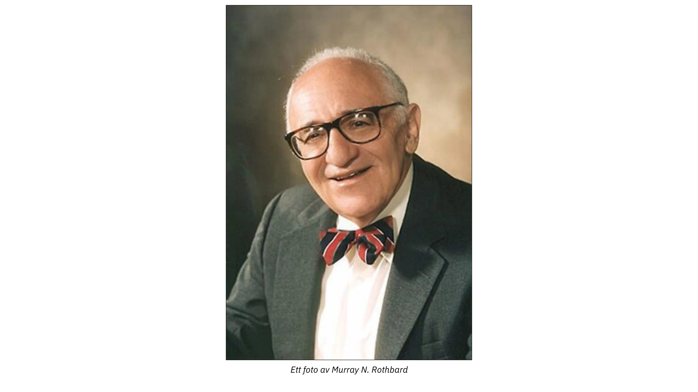

Fram till mitten av 1800-talet var det dock ingen som vågade ifrågasätta det faktum att den logiska strukturen i sinnet var identisk och gemensam för alla människor. Alla mänskliga relationer bygger på antagandet om en enhetlig logisk struktur. Människor kan diskutera eftersom de kan hänvisa till något som är gemensamt för alla, nämligen förnuftets logiska struktur.

Mises skriver:

Marx och marxisterna (...) har lärt ut att tänkandet bestäms av tänkarens klasstillhörighet. Vad tänkandet producerar är inte sanning, utan ideologier. I samband med marxistisk filosofi avser denna term en förklädnad av de själviska intressena hos den klass som den tänkande individen tillhör. Det är därför det är meningslöst att diskutera någonting med människor från en annan samhällsklass. Ideologier behöver inte vederläggas genom deduktiva resonemang, utan de måste demaskeras genom att fördöma klassituationen och författarnas sociala bakgrund. Marxister diskuterar således inte fysikaliska teoriers förtjänster; de avslöjar fysikernas borgerliga ursprung. (_Den allsmäktiga regeringen_).

I marxisternas ögon är Ricardo, Freud, Bergson och Einstein felaktiga eftersom de är borgerliga. Marxisterna hävdar alltså att sinnets logiska struktur skulle vara olika beroende på klasstillhörighet. Varje klass skulle ha sin logik och därmed sin ekonomi, matematik, fysik och så vidare. Den enda logiken och den enda exakta, korrekta och eviga vetenskapen skulle vara marxisternas.

Det är därför Georges Sorel, som importerade marxismen till Frankrike, skulle säga att våld är bra, förutsatt att det är "proletärt". Det är inte förvånande att samma resonemang också återfinns i Lenins och Trotskijs skrifter. Eftersom klassisk moral och lag är den härskande klassens uppfinningar är allt tillåtet.

### Arbete och vinst

Österrikarna hävdar att Marx arbetsvärdelära, som säger att en varas värde bestäms av hur mycket arbete som krävs för att producera den, är felaktig. De menar att värdet är subjektivt och bestäms av konsumenternas preferenser, inte av produktionskostnaderna.

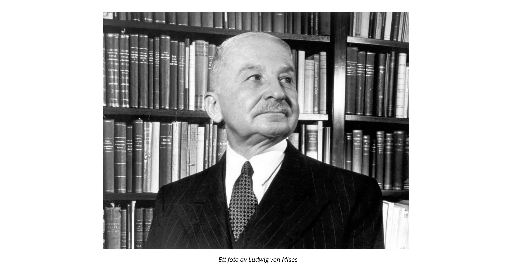

Eugen von Böhm-Bawerk, en av de tidiga österrikiska ekonomerna, kritiserade Marx arbetsvärdeteori i sitt verk _Wert, Kapital und Zins_ (1886). Böhm-Bawerk hävdade att Marx teori byggde på ett grundläggande fel, nämligen att alla arbetsenheter är identiska. I verkligheten, menade han, är visst arbete mer mödosamt eller mer produktivt än annat, och det är detta som bestämmer en varas värde.

När det gäller vinstteorin hävdade Marx att vinst är en form av stöld. Det är begreppet exploatering, enligt vilket kapitalister extraherar ett orättvist mervärde från arbetarnas arbete. Österrikarna tillbakavisar denna idé genom att hävda att lönerna bestäms av det värde som arbetarna tillför företagen och att vinsterna är belöningen för entreprenörer som tar risker och investerar effektivt. Vinsten är således en belöning för den entreprenör som tar risker och investerar i nya produkter och processer.

Friedrich Hayek utvecklade en teori om vinst som bygger på begreppet osäkerhet, som framför allt har sina rötter i Jean-Baptiste Says arbete. Enligt Hayek tjänar entreprenörer pengar eftersom de bättre än andra ekonomiska aktörer kan förutse konsumenternas framtida behov.

### Omöjligheten med ekonomisk kalkylering

Marxisterna anser att socialismen, ett ekonomiskt system där produktionsmedlen ägs och kontrolleras av arbetarna, oundvikligen är överlägsen kapitalismen. Österrikarna, å andra sidan, hävdar att socialismen är omöjlig att uppnå i praktiken, eftersom den skulle kräva en orealistisk grad av centralplanering.

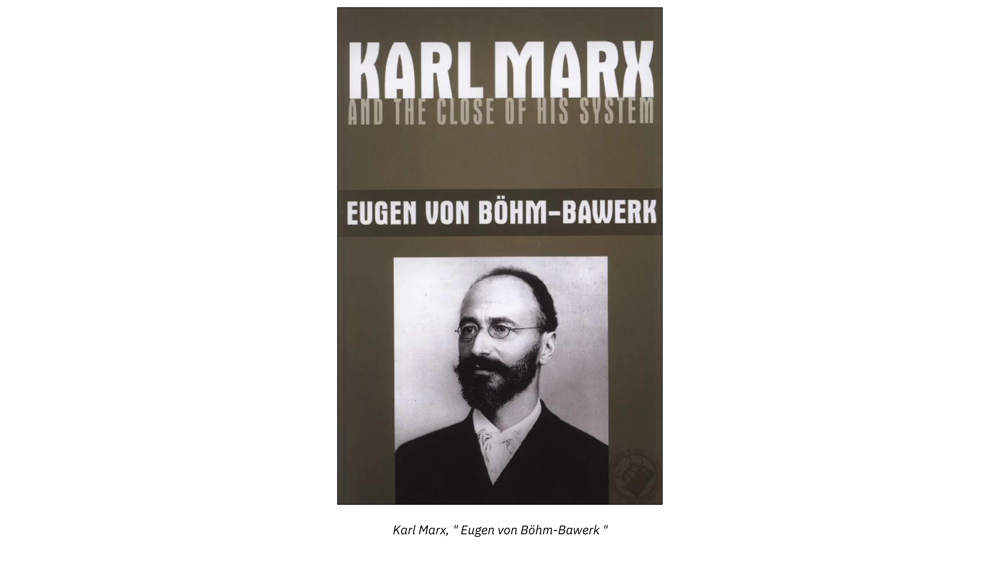

Redan 1922 visade Ludwig von Mises i sin bok _Socialism_ att socialismen skulle leda till omfattande bristsituationer, eftersom centralplanerarna inte skulle kunna göra korrekta ekonomiska beräkningar utan det prissystem som marknaden tillhandahåller.

## Vägen till underkastelse

<chapterId>3f92f346-3062-5f76-8c54-3a9075e2b030</chapterId>

Hayek oroades av den ökande statliga interventionismen i ekonomierna i de västerländska demokratierna och skrev _The Road to Serfdom_ som en filosofisk kritik av kollektivism, oavsett om den kom från höger eller vänster. Boken gavs ut i flera miljoner exemplar tack vare _Reader's Digest_ och har i hög grad bidragit till Hayeks berömmelse i USA.

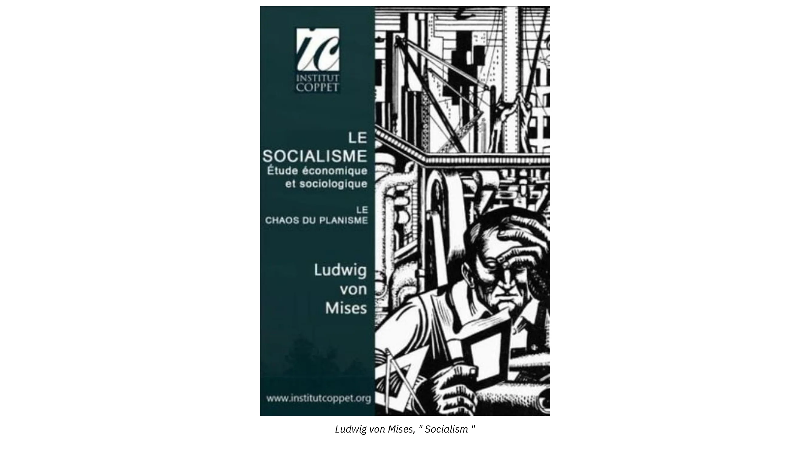

### Kollektivismens lockelse

Denna korta essä, som skrevs mellan 1940 och 1943, syftar till att ge en första bedömning av de dirigistiska experiment som genomfördes under senare hälften av 1930-talet, närmare bestämt de nationaliseringar och den keynesianska efterfrågestyrning som växte fram i det socialdemokratiska Europa och under New Deal-eran i USA. Artikeln är avsedd för "socialister från alla partier" och syftar till att visa att "västvärlden gradvis har övergivit principen om ekonomisk frihet, utan vilken ingen individuell eller politisk frihet tidigare har varit möjlig"

Samma process av politisk centralisering och samma önskan att ersätta en dirigistisk organisation med traditionella marknadsmekanismer är faktiskt tydlig överallt. I Storbritannien, liksom i USA, hävdas det att den offentliga makten måste planera allt och kan lösa allt.

Vad gäller den autentiska liberalismen handlar den om rättvisa. Hayek påminner oss dock om att det är civilsamhället, inte staten, som ska organisera denna solidaritet. Det som skiljer liberalism och socialism åt är inte målen, utan medlen. Enligt Hayek,

> Liberalismen vill att vi på bästa möjliga sätt ska använda konkurrensens krafter för att samordna mänskliga ansträngningar; den vill inte att vi ska låta saker och ting vara som de är.

Det är därför, tillägger Hayek, som staten har ett obestridligt verksamhetsområde:

> Att skapa förutsättningar för att konkurrensen ska bli så effektiv som möjligt, att ersätta den där den inte kan bli effektiv, att tillhandahålla tjänster som är av sådan art att vinsten, enligt Smiths formel, inte kan ersätta kostnaden för någon grupp.

Omvänt är planeringen av ekonomin och samhället i allmänhet, socialismens kärna, riktad mot konkurrensen som sådan. Enligt Hayek finns det dock en oförenlighet mellan socialismens mål (social rättvisa, jämlikhet och trygghet) och de medel som socialismen tänker sig för att uppnå dem (avskaffande av privat egendom, kollektivisering av produktionsmedlen och planekonomi).

### Nazismens socialistiska rötter

Redan på de första sidorna drar Hayek en parallell mellan de socialistiska idealens triumf i västvärlden och de totalitära utopiernas samtidiga framgångar.

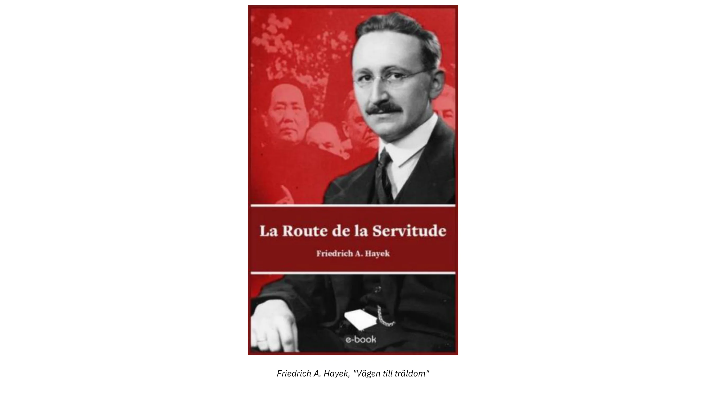

> Få människor, varnar han i sitt förord, är villiga att inse att fascismens och nazismens uppkomst inte var en reaktion mot trenderna (...) under den föregående perioden, utan ett oundvikligt resultat av dessa trender. Detta är något som de flesta människor har vägrat att se, även i det ögonblick då de insåg likheten mellan vissa negativa drag hos de inhemska regimerna i Kommunistryssland och Nazityskland. Resultatet är att många människor som anser sig stå mycket högt över nazismens avarter och som uppriktigt hatar alla dess yttringar, samtidigt arbetar för ideal vars förverkligande skulle leda direkt till denna avskydda tyranni.
> Enligt Hayek har socialismen och nazismen ett antal grundläggande gemensamma nämnare, framför allt förkastandet av individualismen och marknadens spontana ordning. Båda ideologierna prioriterar gruppens välbefinnande framför individens fri- och rättigheter och strävar efter att skapa ett homogent samhälle som förenas av gemensamma värderingar och mål. Varken socialister eller nazister tvekar att använda våld och tvång för att uppnå sina mål. De är villiga att undertrycka individuella friheter och förtrycka oliktänkande i namn av samhällets bästa.
> I kapitlet "Nazismens socialistiska rötter" påpekar Hayek att nazismen hävdar att socialistisk planering (därav namnet nationalsocialism) av ekonomin är ett sätt att etablera total kontroll över befolkningen.

Tyska och italienska socialister banade bara väg för nazismen genom att bilda politiska partier som styrde individens alla aktiviteter, från födsel till död, och dikterade deras åsikter om allt. Det var inte fascisterna utan socialisterna som började inordna barn i politiska organisationer, för att kontrollera deras privatliv och deras tankar.

Nazisterna anammade helt enkelt den stats-, dirigist- och interventionistiska diskurs som redan hade populariserats av marxisterna. Många fascistiska ledare, som Mussolini i Italien, Laval i Frankrike och Oswald Mosley i Storbritannien, hade börjat sina politiska karriärer som vänsteraktivister innan de på grund av ideologisk närhet övergick till fascismen eller hitlerismen.

Avslutningsvis uppmanar Hayek sina samtida att vända ryggen åt "galenskapen" och "den samtida obskurantismen" för att befria mänskligheten från de "fel som har dominerat våra liv under den senaste tiden" Enligt honom är privat egendom den bästa garantin för frihet. När alla produktionsmedel koncentreras i händerna på ett fåtal organisatörer utsätts vi för total makt, eftersom denna ekonomiska makt blir ett politiskt instrument för kontroll över hela våra liv.

# Välfärdsstatens framväxt under 1900-talet

<partId>49e581cb-3dca-5f10-ac34-5b4cbd3d7c36</partId>

## Keynes triumf

<chapterId>f40fc495-bcf7-5b7a-95ad-3a3ccba3e3ba</chapterId>

Kapitalismen anklagas ofta för att vara källan till uppmaningen: "Vi måste alltid producera mer", eller formeln "Konsumtion är bra för tillväxten" Dessa idéer härstammar dock inte från den traditionella kapitalismen utan från keynesianismen, som har dominerat den ekonomiska vetenskapen och den politiska klassen sedan 1930-talet.

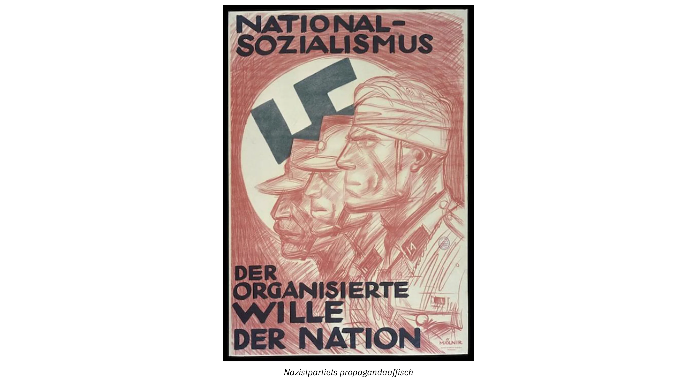

### Analysen av 1929 års kris

John Maynard Keynes bok _The General Theory of Employment, Interest, and Money_ publicerades 1936 och svepte med sig allt i sin väg. Han ifrågasatte orsakerna till den stora depressionen och hur man skulle ta sig ur den och beskrev ett nytt ekonomiskt paradigm som skulle omvända generationer av ekonomer och politiker.

I korthet kan man säga att offentliga utgifter skapar tillväxt, och för att stödja budgetunderskottet måste en penningpolitik med låga räntor genomföras. Till en början skulle alltså den diskretionära ökningen av de offentliga utgifterna ha en multiplikatoreffekt på den ekonomiska aktiviteten, vilket skulle kunna begränsa recessionen och påskynda återhämtningen. Därefter, i en andra fas, skulle pengar betraktas som ett penningpolitiskt instrument som skulle användas av offentliga myndigheter för makroekonomisk stabilisering.

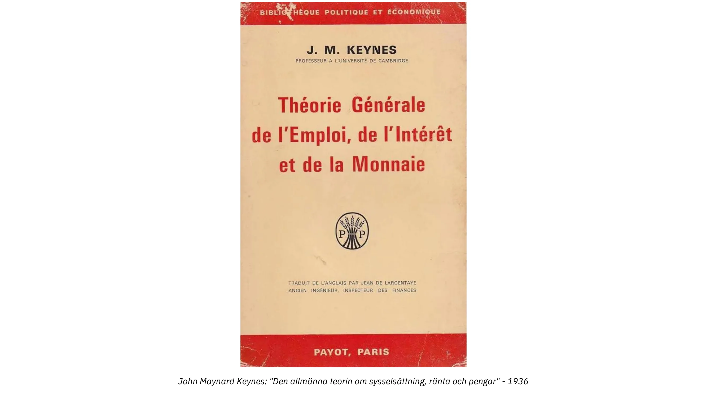

Keynesianism är därför påståendet att ge medel för stark tillväxt och full sysselsättning genom offentliga utgifter och konsumtion. Denna tillväxtplan bygger på kontroll av pengar.

Enligt Keynes fungerar nämligen det långsiktiga sparandet som en broms på konsumtionen och därmed på tillväxten. Pengar måste alltså förlora sin köpkraft över tiden för att uppmuntra individer att konsumera snabbare, vilket är gynnsamt för ekonomin. I den keynesianska stimulanslogiken är det alltså sparandet som är huvudfienden.

Enligt Keynes kan denna fiende bekämpas med lågränte-likviditet. Det är därför centralbankerna måste reglera och kontrollera penningmängden Supply.

Med Keynes blev 1900-talet ett århundrade av tilltro till experter och planering. De sociala ingenjörerna som leder regeringar och penningpolitik kan dra i spakar som ska återställa välståndet, eftersom de har en makroekonomisk vision av världen.

### Det kontroversiella arvet efter Keynes

För Keynes är statliga ingripanden nödvändiga för att stimulera efterfrågan och få igång den ekonomiska motorn igen. Denna doktrin har segrat på universiteten och i läroböckerna. Men statliga ingripanden har sina brister och kan förvärra kriser på lång sikt, snarare än att lösa dem.

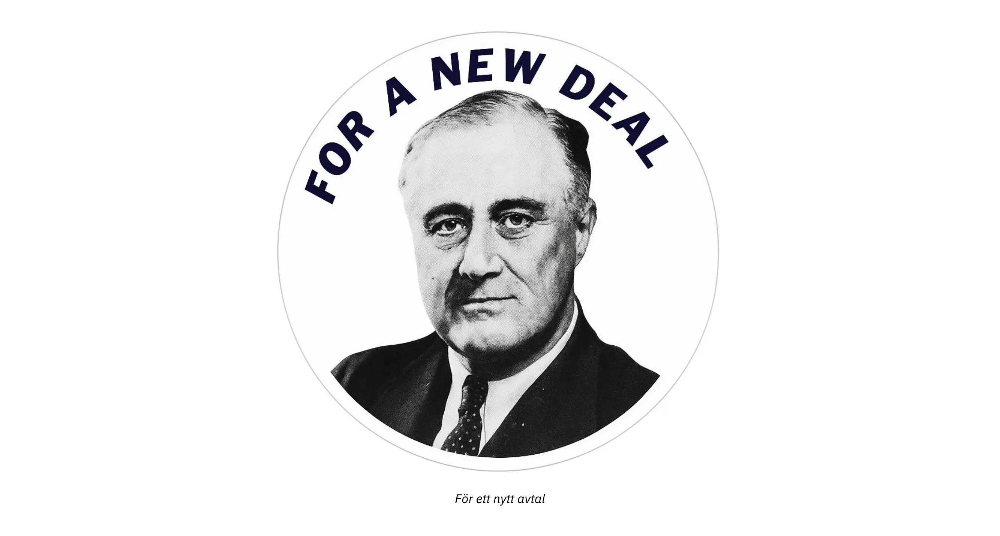

Det är därför som vissa ekonomer, i minoritet, kritiserar Keynes för hans kortsiktighet och förespråkar en återgång till marknadsmekanismer som ett mer effektivt alternativ till statliga ingripanden.

Friedrich Hayek förklarade därför att centralbankernas ständiga räntesänkningar och den artificiella kreditexpansionen bara kunde vilseleda de ekonomiska aktörerna och få dem att investera som om det fanns många sparade resurser, eftersom räntorna naturligtvis sjunker när sparandet ökar. Denna felallokering av resurser driver sedan på en artificiell ökning av tillväxten, en bubbla, som följs av en brutal recession. Det är detta bidrag till teorin om konjunkturcykler som gav Hayek Nobelpriset i ekonomi 1974.

Tillsammans med andra lyfte han också fram faran med att centralisera och manipulera valutan. Detta är särskilt fallet med fransmannen Jacques Rueff, som också var en lärjunge och vän till Ludwig von Mises.

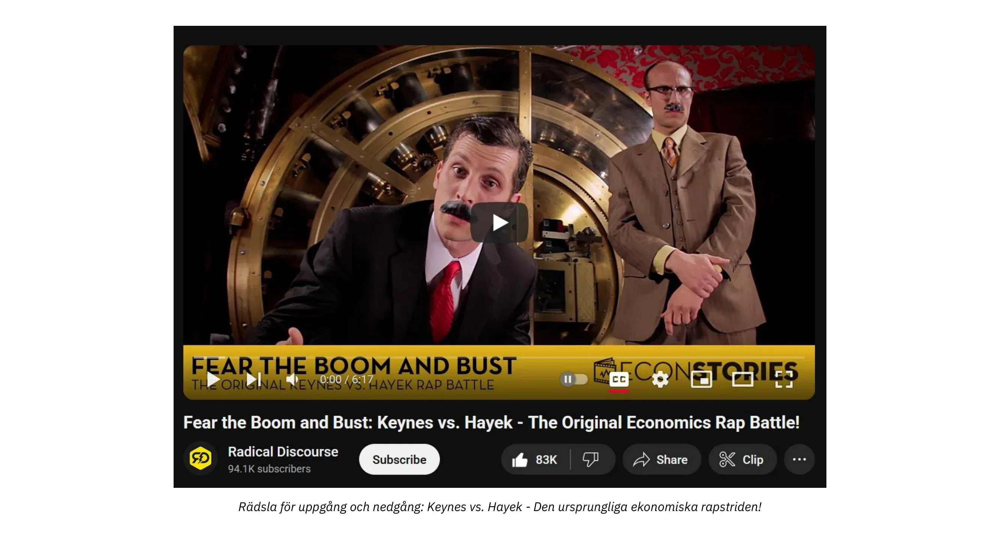

Rueff utexaminerades från École Polytechnique 1919 och hade en framstående karriär som hög tjänsteman och fungerade som ekonomisk rådgivare åt ett flertal regeringar under 1920- och 1930-talen. Hans viktigaste verk, _L'ordre social_ (The Social Order), publicerades 1945, där han utvecklar ett kraftfullt argument för den fria marknaden ur ekonomiska, filosofiska och moraliska perspektiv.

Denna bok innehåller ett viktigt kapitel med titeln "Sunda pengar eller totalitär stat" I detta kapitel utvecklar han två förslag. Den första är: "Falska pengar föder social oordning." Det andra påståendet följer av det första: "Social oordning föder socialt slaveri". Falska pengar är pappersvaluta, frikopplad från all fysisk verklighet och manipulerad av den styrande makten. Social oordning är den inflation och konsumtionshets som blir följden av detta. Socialt slaveri är samhällets beroende av staten, förlusten av all ekonomisk, moralisk och politisk självständighet.

År 1947, fem år efter den franska översättningen av _The General Theory_, publicerade han en artikel med titeln: _The Errors of the General Theory of Lord Keynes_. Han utfärdade följande varningar:

Nästa depressionsperiod kommer sannolikt att leda till att den politik som lord Keynes föreslog kommer att införas på bred front runt om i världen. Jag är inte rädd för att säga att denna politik endast kommer att minska arbetslösheten i liten utsträckning, men den kommer att få djupgående konsekvenser för utvecklingen i de länder där den tillämpas. (...) På grund av Lord Keynes kommer nästa konjunkturcykel att bli en möjlighet till djupgående politiska förändringar, som vissa hoppas på medan andra fruktar. I vilket fall som helst, baserat på en falsk teori, kommer de åtgärder som kommer att genomföras att få helt andra återverkningar än de som de var avsedda att främja. Deras ineffektivitet kommer för en stor del av den allmänna opinionen att vara ett nytt skäl att kräva att en regim som genom att förneka sig själv har förstört sig själv ersätts.

Från och med 1958 fördes en politik för att rätta till den franska ekonomin, inspirerad av Jacques Rueff, under ledning av general de Gaulle. Det kommer att leda till de berömda "Trente Glorieuses" (trettio gloriösa år).

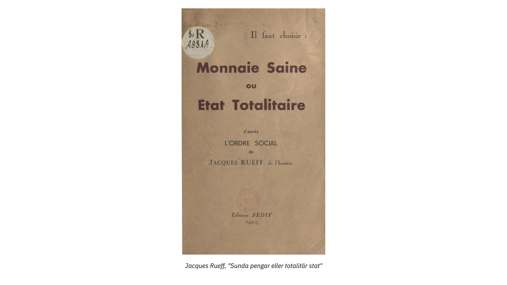

I _The Monetary Sin of the West_, från 1971, skriver Rueff:

> Det är genom budgetunderskottet som människor förlorar sin frihet.

Han tillägger: "Inflation är att subventionera utgifter som inte ger något med pengar som inte finns." Enligt honom: "Man skulle kunna tro, när man observerar utvecklingen av det internationella monetära systemet, att västvärlden tillämpar Lenins råd, enligt vilket: För att krossa den borgerliga regimen räcker det med att korrumpera dess valuta.

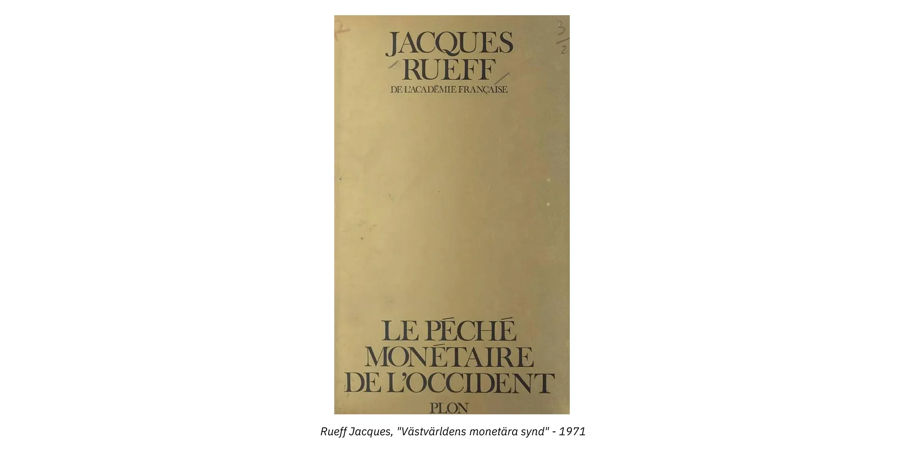

År 1976 angrep han keynesianismen en sista gång i en artikel i tidningen _Le Monde_.

Ingen religion har spridit sig över världen så snabbt som sysselsättningsreligionen. Driven av minnet av de arbetslöshetstragedier som härjade i England och Tyskland under 1920-talet har den blivit den främsta principen, uttalad eller underförstådd, för den ekonomiska politiken i nästan alla världens länder. Genom att dölja sitt syfte under den smarta och bedrägliga täckmanteln "allmän teori", som av entusiastiska och blinda lärjungar upphöjts till en statlig handlingsbibel, har den maskerat det sanna ansiktet på den inflationspolitik som den omfattade. Genom denna omväg har den gett regeringar gott samvete, som efter att ha uttömt sina möjligheter att beskatta och låna tog sin tillflykt till penningskapandets bedrägliga glädjeämnen. (_Slutet på den keynesianska eran eller: When the Long Run Ran Out_, Euromoney, april 1976, s.70-7.)

## Övergivande av guldmyntfoten

<chapterId>f52da9ae-c4bc-5d1a-8fd0-8fcae5948e34</chapterId>

Pengar är ett verktyg som har gjort det möjligt för människor att gå bortom byteshandel, spara och samordna i stor skala genom marknaden. Det har möjliggjort specialisering av arbetskraft, komparativa fördelar, vinster från handel och ekonomiska beräkningar. Utan pengar skulle det inte finnas någon modern civilisation.

### Guld som global standard

Och det visar sig att en viss form av pengar gradvis skilde sig från andra för att under århundradena bli den globala referensstandarden, nämligen guld.

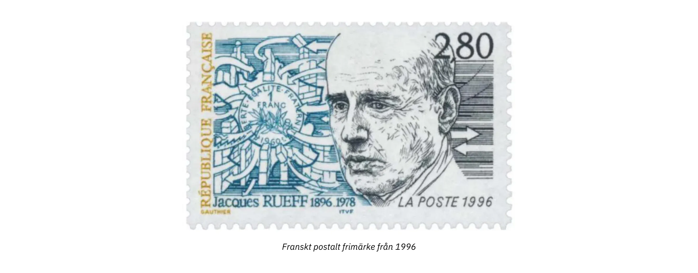

Guld är faktiskt en Hard-valuta, svår att producera och kostsam att förfalska. Marknaden har valt guld som den mest tillförlitliga, mest hållbara och minst manipulerbara valutan. Historiska bevis tyder på att när individer har möjlighet att välja sin valuta tenderar de att välja guld.

Det är därför som Ludwig von Mises skriver i _Human Action_:

> Guldmyntfoten var världsstandarden för den kapitalistiska eran, för ökande välstånd, frihet och demokrati \[...\] Den var den internationella standard som internationell handel och världens kapitalmarknader behövde \[...\] Den förde industri, kapital och västerländsk civilisation till de mest avlägsna hörnen av planeten och skapade välstånd som tidigare varit okänt.
> Men guldmyntfoten tvingar regeringar att finansiera sina utgifter genom skatter snarare än inflation, vilket förklarar en viss fientlighet från politiska och ekonomiska eliter mot detta system. Genom att koppla en valuta till en ädelmetall begränsas centralbankens möjligheter att finansiera välfärdsstatens tillväxt genom indirekt beskattning, vilket kan leda till inflation.
> Det var därför som Keynes redan 1923 förklarade:

> I själva verket är guldmyntfoten redan en barbarisk relik. (...) Försvararna av den gamla standarden märker inte hur långt den nu har avlägsnat sig från den nya tidens anda och behov. (J.M. Keynes, _Monetär reform_).

### "Nixon-chocken"

Bretton Woods-systemet, som utformades 1944 och genomfördes fullt ut 1959, byggde på både guld och dollar, den enda valuta som kunde konverteras till guld. Därför var det nödvändigt att samla på sig dollar för att få tag på guld.

Vid den tiden, i synnerhet under Vietnamkriget, ledde de ökade underskotten i den amerikanska statsbudgeten till att många utländska länder, däribland Frankrike, ville konvertera sina dollar till guld hos FED. Den 15 augusti 1971 beslutade president Nixon att annullera löftet om dollarns konvertibilitet till guld och skapade därmed den första helt pappersbaserade valutan i USA:s historia. Från och med denna dag kan man datera ögonblicket då pengar helt kom under centralbankernas kontroll. I en intervju ska Richard Nixon ha sagt följande:

> Vi är alla keynesianer idag.

För många keynesianska ekonomer innebar övergivandet av guldmyntfoten att regeringarna fick den flexibilitet som behövdes för att hantera eller förebygga ekonomiska kriser.

Enligt Alan Greenspan, f.d. ordförande för den amerikanska centralbanken Federal Reserve, är guldmyntfoten oförenlig med statsskuld och finansiering av välfärdsstaten:

> Jag har alltid hyst nostalgi för den prisstabilitet som guldmyntfoten innebar; en stabil valuta var dess främsta mål. Jag har dock för länge sedan medgett att guldmyntfoten inte enkelt kan anpassas till den rådande synen på en regerings funktion, i synnerhet dess skyldighet att säkerställa ett socialt trygghetssystem. \De flesta amerikaner har tolererat inflation som det pris man får betala för att ha en modern välfärdsstat. Det finns inte längre några förespråkare för guldmyntfoten, och jag ser små möjligheter för att den ska återkomma. (_Turbulensens tidsålder_).

För personer som Jacques Rueff är det tvärtom ett misstag att överge ädelmetaller, något som bara kan leda till en kontinuerlig minskning av köpkraften, vilket åtföljs av en sänkning av levnadsstandarden, en ökning av inkomstskillnaderna och en växande ekonomisk instabilitet.

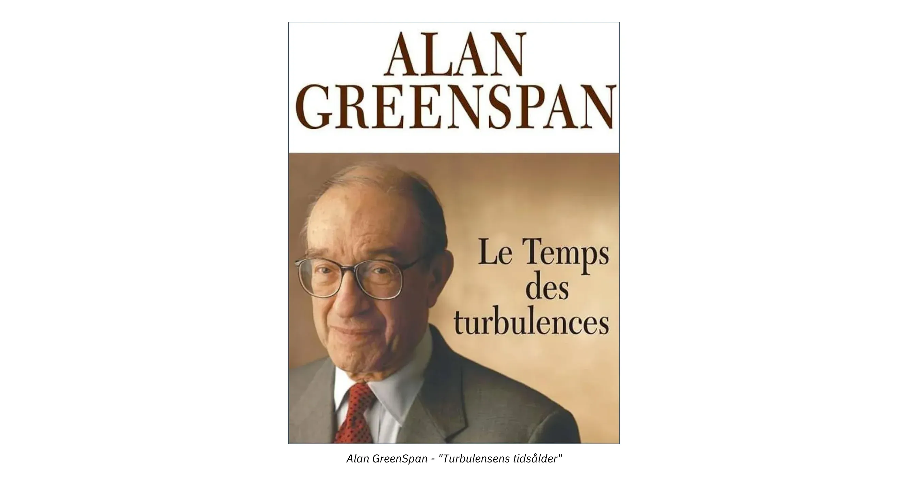

I februari 1965 föreslog general de Gaulle under en TV-sänd presskonferens, direkt inspirerad av Rueff, en återgång till guldmyntfoten. Han sade följande:

> Guld, som inte ändrar sin natur, som inte har någon nationalitet, som hålls, evigt och universellt, som det oföränderliga värdet par excellence.

### En monetär marknad utan statligt monopol är möjlig

År 1976 föreslog Hayek ett alternativ till statens monopol på att skapa valutor: konkurrens mellan valutor. I sin bok _Pour une vraie concurrence des monnaies_ (_The Denationalization of Money_) föreställde han sig en monetär marknad utan statligt monopol där flera privata valutor skulle samexistera. Genom att privata aktörer skapar och förvaltar olika valutor skulle enskilda personer kunna välja den mest stabila och tillförlitliga valutan, vilket skulle uppmuntra till konkurrens och disciplin bland utgivarna.

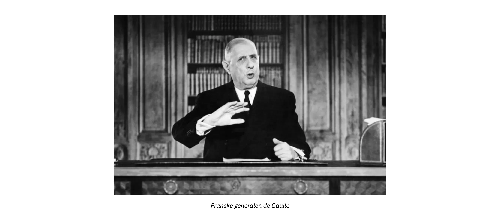

Han skriver:

> Så länge vi inte har återställt en situation där regeringar (liksom andra offentliga myndigheter) vet att om de spenderar för mycket kommer de, precis som alla andra, att vara oförmögna att uppfylla sina skyldigheter, kommer det inte att finnas någon paus i denna process som, genom att ersätta kollektiv aktivitet med privat aktivitet, hotar att kväva det individuella initiativet. Under den nuvarande obegränsade demokratin, där regeringen har makt att ge särskilda materiella fördelar till vissa grupper, är den tvungen att köpa stöd från tillräckligt många av dem för att utgöra en majoritet. (Kap. XXI, Effekterna av finanserna och de offentliga utgifterna).

Enligt Hayek beror marknadsekonomins tidigare instabilitet på att den viktigaste regulatorn av marknadsmekanismerna, nämligen pengar, inte själv kan vara en produkt av en marknadsprocess.

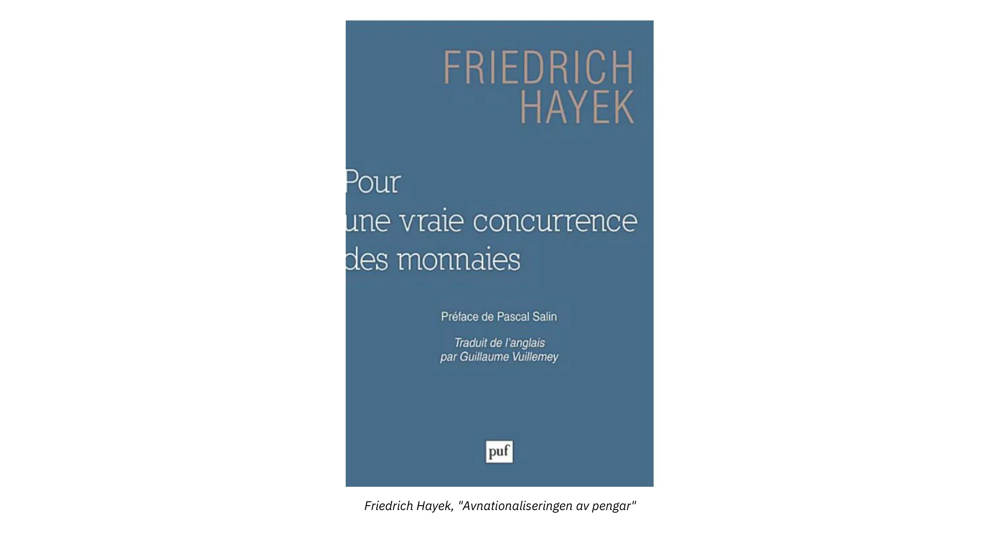

Hayek trodde att en fri marknad med privata valutor skulle leda till större monetär stabilitet. Nästan 50 år senare förkroppsligar en kryptovaluta som Bitcoin Hayeks konkurrensvision genom att erbjuda ett decentraliserat alternativ till centralbankernas monopolistiska system. Bitcoin, med sin fasta emissionsgräns på 21 miljoner enheter, fungerar som ett skydd mot inflation och tillsynsmyndigheternas godtycke.

## Slutsats: Idéernas kraft

<chapterId>50676155-c071-5bee-a14e-0c251f0375da</chapterId>

Den kris vi går igenom är en civilisationskris, det vill säga en intellektuell kris med moraliska, politiska och ekonomiska konsekvenser.

Det talas mycket om politikens kris, den parlamentariska demokratins förfall, det representativa styrelseskicket och därmed friheten. Denna kris tillskrivs ganska lätt kapitalismen och "marknadens diktatur"

Denna situation är följden av en radikal intellektuell idémässig förändring. Sedan slutet av 1800-talet har Europa övergivit de idéer som gjorde det möjligt för Europa att bli en välmående och upplyst kontinent. Dess äldsta dotter, Amerika, stod under en tid emot kollektivismens vindar innan även hon överväldigades av dem.

År 1941 gjorde George Orwell denna bedömning:

> Det är tydligt att den fria kapitalismens tidsålder går mot sitt slut och att det ena landet efter det andra antar en centraliserad ekonomi som kan kallas socialism eller statskapitalism, beroende på vad man vill. I detta system försvinner individens ekonomiska frihet och i stor utsträckning hans frihet i allmänhet - friheten att agera, att välja sitt arbete och att röra sig fritt. Det är först på senare tid som vi har börjat ana konsekvenserna av detta fenomen. Tidigare hade man aldrig kunnat föreställa sig att den ekonomiska frihetens försvinnande skulle kunna påverka den intellektuella friheten. Den allmänna uppfattningen var att socialismen var en form av liberalism med en moralisk komponent. Staten skulle ta hand om ditt ekonomiska liv och befria dig från rädslan för fattigdom, arbetslöshet etc., men den skulle inte behöva blanda sig i ditt privata intellektuella liv. Det har nu bevisats att dessa åsikter var felaktiga.

Men tvärtemot vad domedagsprofeterna förutspår är den västerländska civilisationen inte dömd att försvinna under 2000-talet. Den har inte uttömt sina möjligheter. Friheten har ännu inte kommit.

Detta var vad Murray Rothbard föreslog 1982:

Vi har nu upplevt alla varianter av statism, och de har alla misslyckats. I början av 1900-talet började företagsledare, politiker och intellektuella i hela västvärlden att förespråka ett "nytt" blandekonomiskt system, präglat av statlig dominans, i stället för det föregående århundradets relativa laissez-faire. Nya, till en början lockande, universalmedel som socialism, korporativistisk stat och välfärdsstat har prövats och uppenbarligen misslyckats. Argumenten för socialism och statlig planering framstår nu som försvar för ett gammalt, uttömt och misslyckat system. Vad återstår att pröva om inte frihet?

I viss mening är vår situation bättre än i det förflutna. Efter de successiva misslyckandena med olika socialistiska, kommunistiska och socialdemokratiska experiment vet vi i dag bättre än i går hur man skiljer sanna idéer från falska. Och falska idéer kan motbevisas och ersättas med sanna. Som Mises sa:

> Allt som händer i det globala samhälle vi lever i är ett resultat av idéer. De goda och de dåliga. Vad som är nödvändigt är att bekämpa falska idéer. (...) Vår civilisation kan överleva, och den måste överleva. Och den kommer att överleva tack vare bättre idéer än de som styr världen i dag, och den uppväxande generationen kommer att utveckla dessa bättre idéer.

(_Ekonomisk politik: Tankar för idag och i morgon_, 1979).

# Sista avsnittet

<partId>df550767-5876-4034-9c6a-31238363e85f</partId>

## Granskning och betyg

<chapterId>b972fd24-47e1-4877-b21d-6451ffdafcdd</chapterId>

<isCourseReview>true</isCourseReview>

## Slutlig tentamen

<chapterId>3331124d-fe7c-4b73-9f92-1d3a23900fd4</chapterId>

<isCourseExam>true</isCourseExam>

## Slutsats

<chapterId>594691db-1ecb-4914-bcb2-5a88f50ca0a5</chapterId>

<isCourseConclusion>true</isCourseConclusion>