# Voyage vers la liberté

Ce cours explore la liberté en tant que projet social, en s'appuyant sur la riche tradition libérale française des XVIIIe et XIXe siècles. À travers les écrits de penseurs tels que Frédéric Bastiat, Gustave de Molinari, Paul Leroy-Beaulieu, Benjamin Constant et Charles Dunoyer, vous découvrirez comment la liberté n'est pas une utopie abstraite, mais est profondément enracinée dans les faits de l'existence humaine.

Prêt à découvrir pourquoi la liberté n'est pas seulement un idéal moral, mais aussi la solution la plus efficace aux défis auxquels nos sociétés sont confrontées ? Commençons ce voyage intellectuel au cœur de la pensée libérale française.

+++

# Introduction

<partId>ac94f192-5a35-45d6-a1fe-569ed7a8ef53</partId>

## Aperçu du cours

<chapterId>ed0febb0-507b-4920-a88f-6a00388ae4f5</chapterId>

### Bienvenue

Bienvenue dans ce nouveau cours, je suis heureux que vous ayez pu le suivre.

Pourquoi intituler ce cours *La liberté en tant que projet social* ? Parce que **la liberté n'est pas une utopie abstraite imaginée par des théoriciens déconnectés.** La tradition libérale française des XVIIIe et XIXe siècles, des physiocrates et de Turgot à Frédéric Bastiat, Gustave de Molinari, Benjamin Constant et Paul Leroy-Beaulieu, a construit un édifice intellectuel extraordinaire sur cette idée. Leurs œuvres, longtemps enfouies sous des décennies de consensus interventionniste, méritent d'être redécouvertes.

Ce cours, développé par l'Institut Coppet et présenté par Benoît Malbranc, vous invite à un voyage à travers les fondements, l'histoire et les mécanismes pratiques de la liberté. Nous ne nous contenterons pas de définir la liberté dans l'abstrait, nous l'ancrerons dans les réalités concrètes de l'existence humaine, nous retracerons sa conquête progressive à travers les siècles et nous confronterons les sophismes qui ont été déployés pour justifier sa suppression.

### Ce que vous apprendrez

Pourquoi consacrer du temps à l'étude des penseurs libéraux français des XVIIIe et XIXe siècles ? Parce que les questions auxquelles ils ont répondu sont celles auxquelles vous êtes confrontés chaque jour :

- Lorsque quelqu'un affirme que l'État devrait réglementer les prix, protéger les industries ou redistribuer les richesses, vous serez en mesure d'identifier les coûts cachés et les sophismes derrière ces propositions, en utilisant la méthode de Bastiat de *ce qu'on voit et ce qu'on ne voit pas*.
- **Comprendre l'origine de vos droits.** La propriété, la liberté d'expression, la liberté de travail : ce ne sont pas des cadeaux de l'État. Vous découvrirez qu'ils découlent de faits observables sur la nature humaine, des faits qu'aucun décret ne peut annuler.
- Les politiciens et les intellectuels ont toujours utilisé des sophismes pour justifier l'expansion de leur pouvoir à vos dépens. Ce cours répertorie les plus courants et vous apprend à les démonter.
- La marche de l'esclavage et du servage vers la liberté individuelle est l'histoire centrale de la civilisation humaine. Comprendre cette trajectoire vous permet d'évaluer si une politique proposée nous fait avancer ou reculer.
- **Appliquer les principes libéraux dans la pratique.** Du droit des contrats et de la banque libre à l'éducation et au commerce international, les penseurs de ce cours ont proposé des alternatives concrètes qui restent remarquablement pertinentes aujourd'hui.

En bref, ce cours vous dote d'une boîte à outils intellectuelle pour naviguer dans les débats politiques, économiques et sociaux de notre époque, fondée non pas sur l'idéologie mais sur des faits observés et un raisonnement rigoureux.

### Programme d'études

Le cours est organisé en cinq parties :

**Nous commençons par les faits humains qui donnent naissance à la liberté et à la propriété : l'existence corporelle, la finitude des ressources, l'individualité des perceptions, la propriété de soi et les limites naturelles de la raison. De ces faits découlent la liberté de pensée, la liberté de la presse, la liberté du travail, le principe de non-agression et les contradictions internes de tous les systèmes de contrainte.**

**Nous retracerons ensuite la longue marche de la liberté depuis le communisme préhistorique jusqu'à l'abolition de l'esclavage et du servage, en examinant comment le progrès technique et intellectuel a progressivement remplacé l'autorité par le contrat. Nous verrons pourquoi l'histoire des civilisations est, au fond, l'histoire de l'émancipation.**

**Nous explorons ici les mécanismes concrets d'une société libre : l'autogestion, la production et l'échange, le rôle des profits et des prix, l'harmonie des intérêts et les échecs structurels de la non-liberté, de la fiscalité et du protectionnisme à l'effondrement programmé de la planification centrale.**

**Les ennemis de la liberté ne s'appuient pas uniquement sur la force, ils s'appuient sur des sophismes. Nous disséquerons les sophismes intellectuels, démocratiques, économiques, sociaux et internationaux qui soutiennent les systèmes de contrainte, en suivant la méthode dévastatrice de Bastiat qui consiste à exposer ce qui est vu et ce qui n'est pas vu.**

**Enfin, nous esquissons un programme de liberté : liberté de contrat et d'emploi, réduction des pouvoirs de l'État, alternatives libérales à l'État-providence, autonomie individuelle, droit de sécession et voie vers une sécurité internationale fondée sur le droit plutôt que sur la domination.**

Tout au long de ces leçons, nous laisserons les grands penseurs s'exprimer avec leurs propres mots. Bastiat, Molinari, Constant, Tocqueville, Leroy-Beaulieu, Destutt de Tracy, leurs arguments restent aussi puissants aujourd'hui que lorsqu'ils ont été écrits. Les défis qu'ils ont relevés, le protectionnisme, la fiscalité excessive, le despotisme démocratique, l'illusion de la planification centrale, sont précisément les défis auxquels nous sommes confrontés au XXIe siècle.

Plongeons dans le vif du sujet.

## À propos de l'auteur et des références

<chapterId>37f4b0d0-7aaa-4009-836a-d401c3c12907</chapterId>

### À propos de l'auteur du cours

Ce cours a été développé par **[Benoît Malbranque](https://planb.academy/professors/benoit-malbranque)**, directeur de l'Institut Coppet, la principale institution consacrée à la redécouverte et à la publication de la tradition libérale française. Au cours de la dernière décennie, l'Institut Coppet a réédité des dizaines d'ouvrages des XVIIIe et XIXe siècles qui étaient tombés dans un oubli quasi total. Malbranque est l'auteur du [*Dictionnaire de la tradition libérale française*](https://planb.academy/resources/books/dictionnaire-tradition-liberale-francaise-0b3b933f-4305-4c07-86ef-e64ff97a4851) et l'éditeur de nombreuses éditions critiques de Bastiat, Molinari, Leroy-Beaulieu et d'autres. Sa profonde familiarité avec ces sources primaires confère à ce cours une authenticité unique : vous n'apprendrez pas seulement "sur" ces penseurs, vous les lirez dans leurs propres mots.

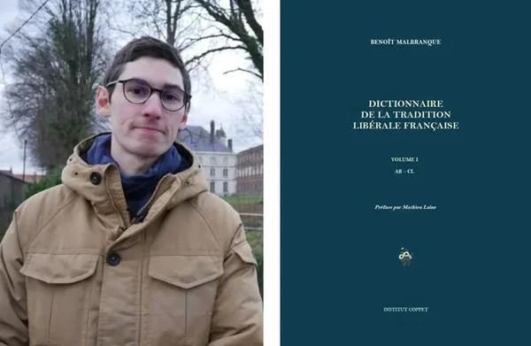

### Cours connexes

Si vous souhaitez commencer par un panorama plus large de l'évolution de l'idée de liberté depuis l'Antiquité jusqu'à l'ère moderne, nous vous recommandons notre cours complémentaire sur l'histoire philosophique de la liberté :

https://planb.academy/courses/9d1bde6a-33e5-45dd-b7c0-94da72e45b11

Et si la méthode de Bastiat pour dénoncer les sophismes économiques éveille votre curiosité, notre cours dédié à sa pensée économique approfondit sa vie, ses influences et ses arguments :

https://planb.academy/courses/d07b092b-fa9a-4dd7-bf94-0453e479c7df

### Ouvrages de référence

Le cours s'appuie sur un ensemble remarquable de sources primaires, presque exclusivement issues de la tradition libérale française. Ces ouvrages, pour la plupart réédités par l'Institut Coppet, constituent la colonne vertébrale intellectuelle de tout ce que vous étudierez. Nous vous encourageons à les explorer davantage au fur et à mesure que vous progressez dans le cours.

**Louis-Paul Abeille** (1719-1807)

- [Lettre d'un négociant sur la nature du commerce des grains (1763)](https://planb.academy/resources/books/lettre-negociant-commerce-grains-c9ae04c1-d19d-409d-aa37-d6498aafde59)

**Frédéric Bastiat** (1801-1850)

- [Oeuvres Complètes (7 volumes)](https://planb.academy/resources/books/bastiat-oeuvres-completes-765be39c-134a-4333-8b4b-e45a4fff7e73)
- [Sophismes économiques (1845)](https://planb.academy/resources/books/sophismes-economiques-9ccb727f-d253-4188-9cc6-74c1e6ce6a16)
- [Harmonies économiques (1850)](https://planb.academy/resources/books/harmonies-economiques-66561d29-feb2-495c-815d-cea521b1930c)
- [Ce qu'on voit et ce qu'on ne voit pas (1850)](https://planb.academy/resources/books/ce-quon-voit-et-ce-quon-ne-voit-pas-8eaa83b8-738a-49b9-a29e-fb48b8668fcf)
- [La Loi (1850)](https://planb.academy/resources/books/la-loi-3f2e33c3-3d68-4561-b02c-84ecc94dd1a0)
- [Cobden et la Ligue (1845)](https://planb.academy/resources/books/cobden-et-la-ligue-292d6271-1829-496a-992b-c0ca08138110)
- [Le Libre-Échange](https://planb.academy/resources/books/le-libre-echange-a5e85b0e-ca10-4210-afa5-19016bc35799)

**Henri Baudrillart**

- [La Liberté du Travail](https://planb.academy/resources/books/la-liberte-du-travail-baudrillart-d529a769-833f-4d4a-94ea-71482d8680c7)
- [La Liberté du Travail, l'Association et la Démocratie](https://planb.academy/resources/books/la-liberte-du-travail-association-democratie-b5164580-430f-4491-95f3-9ad3fabd51a0)

**Nicolas Baudeau**

- [Oeuvres](https://planb.academy/resources/books/baudeau-oeuvres-ef3e25fd-b0b6-439d-9bf9-461772abce26)

**Gustave de Beaumont** (1802-1866)

- [Marie ou l'Esclavage aux États-Unis](https://planb.academy/resources/books/marie-esclavage-etats-unis-db2d05b6-24ae-4d47-b252-493d6c3c09ef)

**Pierre de Boisguilbert** (1646-1714)

- [Écrits Économiques / Détail de la France (1695)](https://planb.academy/resources/books/detail-de-la-france-bc806d78-d4dd-4fab-9a6c-0274092a9f50)

**P.J.G. Cabanis**

- [Rapports du Physique et du Moral de l'Homme (1802)](https://planb.academy/resources/books/rapports-physique-moral-homme-7010e4d4-fe97-4672-91bf-6e3938464b1d)

**Charles-Irénée Castel de Saint-Pierre** (1658-1743)

- [Projet pour rendre la paix perpétuelle en Europe (1713)](https://planb.academy/resources/books/projet-paix-perpetuelle-europe-a9a43e52-3bab-4835-901a-f359c21afc87)
- [Projet pour perfectionner le commerce (1735)](https://planb.academy/resources/books/projet-perfectionner-commerce-f4123249-b5ca-446e-8514-aedef76dbdf3)

**Charles Comte** (1782-1837)

- [Traité de Législation (1827)](https://planb.academy/resources/books/traite-de-legislation-90216321-9a58-49d9-b4d8-f78c61b1cb68)
- [Traité de la Propriété (1834)](https://planb.academy/resources/books/traite-de-la-propriete-80de2b10-5ea1-4fb6-b9c7-b52b312bfa05)
- [Cours de droit naturel (~1830)](https://planb.academy/resources/books/cours-droit-naturel-78a371b6-796b-4ebe-bb8a-54cc64f38b57)

**Condorcet** (1743-1794)

- [Esquisse d'un Tableau Historique des Progrès de l'Esprit Humain](https://planb.academy/resources/books/esquisse-tableau-historique-progres-esprit-humain-ab87cd62-445d-4620-a3ad-7af31ba17c3f)

**Benjamin Constant** (1767-1830)

- [Principes de politique applicables à tous les gouvernements (1815)](https://planb.academy/resources/books/principes-de-politique-282bc3de-f218-4103-903a-5280d7b99108)
- [De la liberté des anciens comparée à celle des modernes (1819)](https://planb.academy/resources/books/liberte-anciens-modernes-dbb9dcca-de4e-4d41-a7bf-4d26f26eba83)
- [Commentaire sur l'ouvrage de Filangieri (1822)](https://planb.academy/resources/books/commentaire-filangieri-8c7eb7d7-a94f-4a7c-b2d2-846e6052ad14)

**Charles Coquelin** (1802-1852)

- [Du crédit et des banques (1848)](https://planb.academy/resources/books/du-credit-et-des-banques-4a34b98d-feda-4228-bf48-e14df159cf11)
- [Dictionnaire de l'Économie Politique (1852)](https://planb.academy/resources/books/dictionnaire-economie-politique-133b07d0-a058-44cb-a1fa-b58609e9b4a5)

**Courcelle-Seneuil**

- [La Banque libre (1867)](https://planb.academy/resources/books/la-banque-libre-cddc59e1-3778-4feb-b2c2-735dc18433b2)

**Antoine Destutt de Tracy** (1754-1836)

- [Traité de la Volonté et de ses Effets (1815)](https://planb.academy/resources/books/traite-volonte-effets-2b6c8688-ecd7-412a-96d9-e8efaabb81b8)
- [De l'amour](https://planb.academy/resources/books/de-lamour-destutt-de-tracy-daf11bb0-4959-4cf6-9456-1a86d941a4ef)
- [Commentaire sur l'Esprit des lois (1819)](https://planb.academy/resources/books/commentaire-esprit-des-lois-7f3a37a4-e731-4415-8308-21daf4a689c7)

**Charles Dunoyer** (1786-1862)

- [L'industrie et la morale considérées dans leurs rapports avec la liberté (1825)](https://planb.academy/resources/books/industrie-morale-liberte-0ce13a70-e72b-4c5c-b527-fdb9b0a60aae)
- [De la liberté du travail (1845)](https://planb.academy/resources/books/de-la-liberte-du-travail-edf7f393-d110-4a18-96f4-fcc477f0b49c)

**Pierre Samuel Du Pont de Nemours** (1739-1817)

- [Recueil d'œuvres](https://planb.academy/resources/books/dupont-de-nemours-oeuvres-d4f27f13-3547-471d-a973-e08d3a95ede7)

**Yves Guyot** (1843-1928)

- [L'Inventeur (1867)](https://planb.academy/resources/books/linventeur-778169ff-cf16-4c9f-9be9-62c783c810bb)
- [La Propriété : Origine et Évolution (1895)](https://planb.academy/resources/books/la-propriete-origine-evolution-72a0dd96-c0ed-4120-ba81-6c60ceb27b56)
- [La Tyrannie collectiviste (1893)](https://planb.academy/resources/books/la-tyrannie-collectiviste-ebe666d6-3a27-4b6e-8fd3-74729817652c)

**Édouard Laboulaye**

- [Le Parti libéral](https://planb.academy/resources/books/le-parti-liberal-d4b76768-dd14-4f21-8a18-23598ed0cca3)
- [La Liberté d'enseignement](https://planb.academy/resources/books/la-liberte-denseignement-5669d523-5702-44fc-9ce4-4ed3515917fa)

**Paul Leroy-Beaulieu** (1843-1916)

- [Le travail des femmes au XIXe siècle (1873)](https://planb.academy/resources/books/travail-femmes-xixe-siecle-54948668-2c21-4343-9c31-3c8dfd9a7dfc)
- [Essai sur la répartition des richesses (1881)](https://planb.academy/resources/books/essai-repartition-richesses-c5b307dc-eed4-493f-a76a-b23321a81c99)
- [Le Collectivisme : Examen critique du nouveau socialisme (1883)](https://planb.academy/resources/books/le-collectivisme-d79dc3a7-7b77-4698-89e6-440312e2da2c)
- [L'État moderne et ses fonctions (1889)](https://planb.academy/resources/books/letat-moderne-fonctions-7f41f6c6-8cf6-4902-b931-7ce9bf132621)

**Benoît Malbranque**

- [Dictionnaire de la tradition libérale française](https://planb.academy/resources/books/dictionnaire-tradition-liberale-francaise-0b3b933f-4305-4c07-86ef-e64ff97a4851)

**Arthur Mangin**

- [De la liberté de la pharmacie](https://planb.academy/resources/books/liberte-de-la-pharmacie-184d9f35-2aac-418f-9486-aec9584491c6)

**Ernest Martineau**

- [Oeuvres](https://planb.academy/resources/books/martineau-oeuvres-f54d54fe-604b-4f70-9f1f-e83f1e29ebd3)

**Gustave de Molinari** (1819-1912)

- [Oeuvres Complètes](https://planb.academy/resources/books/molinari-oeuvres-completes-8a3dbdd8-2053-45bc-9203-dd3b7f3edfee)
- [Cours d'économie politique (1855)](https://planb.academy/resources/books/cours-economie-politique-molinari-75b4a66d-8127-4cf9-8a0a-53d8e353b203)
- [La Morale Économique](https://planb.academy/resources/books/la-morale-economique-8b419025-3d46-48a8-9d8f-0254596406f8)
- [L'Évolution économique du XIXe siècle : Théorie du Progrès](https://planb.academy/resources/books/evolution-economique-xixe-siecle-65ba2491-1595-452b-a8f6-3e86fe385808)
- [L'Évolution politique et la Révolution (1884)](https://planb.academy/resources/books/evolution-politique-revolution-d3be9345-dc7e-4b4d-8824-5f009ac314c4)
- Économie de l'histoire (1888)
- [Questions d'économie politique et de droit public (1861)](https://planb.academy/resources/books/questions-economie-politique-964f1fe1-606f-49f4-a7e8-187cbf39d41f)
- [Grandeur et décadence de la guerre (1898)](https://planb.academy/resources/books/grandeur-decadence-guerre-3bf120be-1536-4b6e-aa85-4a2a62edca7e)
- [Les Lois naturelles de l'économie politique](https://planb.academy/resources/books/lois-naturelles-economie-politique-4a4c1f91-b31b-43c1-93aa-16772f9bda1f)

**Nicolas Oresme** (1320-1382)

- [Traictié de la première invention des monnoies (c. 1360)](https://planb.academy/resources/books/traictie-premiere-invention-monnoies-0d91d52c-ed04-4cdd-baa6-590b3544d40a)

**Frédéric Passy** (1822-1912)

- [Leçons d'économie politique (1860)](https://planb.academy/resources/books/lecons-economie-politique-9eac36cc-15d5-4312-8ecc-2c57ac146e77)

**Jean-Baptiste Say** (1767-1832)

- [Traité d'économie politique (1803)](https://planb.academy/resources/books/traite-economie-politique-5e4bc84a-a7e4-4466-bfeb-d87a12e3b6c1)

**Jules Simon** (1814-1896)

- [La Liberté civile](https://planb.academy/resources/books/la-liberte-civile-53b5dadb-e838-4802-acca-b00f8c4b00d7)
- [La Liberté (1859)](https://planb.academy/resources/books/la-liberte-simon-8166fd17-86ec-4e1f-9928-77155f0e3d88)
- [La Liberté Politique](https://planb.academy/resources/books/la-liberte-politique-666a6abb-7e04-41a0-88e8-c09fabef65d8)
- [Le Devoir](https://planb.academy/resources/books/le-devoir-ec7d9a69-8d1c-4ea1-9035-eff8f91d438b)

**Adam Smith**

- [La richesse des nations](https://planb.academy/resources/books/the-wealth-of-nations-c3e78eda-cc44-4cae-8460-f962148aa289)

**Alexis de Tocqueville** (1805-1859)

- [De la démocratie en Amérique (1835-1840)](https://planb.academy/resources/books/de-la-democratie-en-amerique-7bc2962c-d9b7-4e34-9637-d704a90dfaf4)
- L'Ancien Régime et la Révolution (1856)

**Turgot**

- [Œuvres complètes](https://planb.academy/resources/books/turgot-oeuvres-completes-37fa0489-cabd-413c-9240-34d1663d0720)

**Collectif / Anthologies**

- [La Société d'économie politique : Une anthologie libérale (1841-1928)](https://planb.academy/resources/books/societe-economie-politique-anthologie-3a48e3b5-ef74-4822-b1d9-b030e327b84e)

Avec ces bases posées et ces guides à vos côtés, embarquons pour le voyage.

# Les fondements de la liberté

<partId>466452a9-508e-5bae-bc6a-9213814cf1e5</partId>

## Les faits humains à l'origine de la liberté et de la propriété

<chapterId>8eb03d97-ff42-51a1-bd42-9271d3213ac4</chapterId>

### La tradition libérale française

La tradition libérale française des XVIIIe et XIXe siècles constitue **l'un des chapitres les plus riches et les plus injustement négligés** du patrimoine intellectuel occidental. L'Institut Coppet, qui a développé ce cours, s'est attaché à réhabiliter les œuvres des grands économistes et philosophes libéraux français : les œuvres complètes de Gustave de Molinari, les écrits de Turgot, l'ami des Physiocrates, et bien d'autres encore.

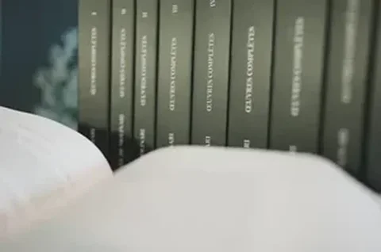

Pourquoi cette tradition mérite-t-elle notre attention ? Pour trois raisons. D'abord, les idées de liberté reviennent dans le débat contemporain, et il était temps. Deuxièmement, cette tradition est profondément enracinée dans la culture francophone, dans nos propres catégories de pensée, ce qui la rend particulièrement accessible au monde francophone. Troisièmement, et surtout, elle a une vocation universaliste. Dès le XVIIIe siècle, ces penseurs ont conçu l'être humain en tant qu'être humain, et non en tant que citoyen d'un pays ou d'une époque. L'influence d'un Frédéric Bastiat, par exemple, dépasse largement les frontières de la France et reste d'une actualité frappante.

### Contre la haine des théoriciens

Les théoriciens ont toujours fait l'objet d'un certain mépris. Ils sont considérés comme des habitants d'un monde à part, déconnectés de la réalité, tandis que les praticiens sont célébrés pour leurs connaissances concrètes et pratiques. Mais cette opposition tient-elle la route ?

Réfléchissez : **chacun de nos actes quotidiens repose sur des théories implicites**. Lorsque nous montons un escalier, lorsque nous prenons un objet et le tendons à quelqu'un, nous appliquons inconsciemment la théorie de la gravitation. Sans théorie, même tacite, nous ne pouvons tout simplement pas agir. La vraie question n'est donc pas de savoir s'il faut être théoricien ou praticien, mais de savoir si nous avons de bonnes théories, fondées sur des faits observables, ou de mauvaises théories, construites sur des sophismes.

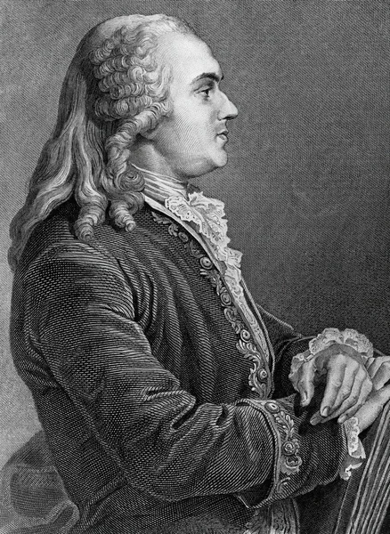

Une version particulièrement préjudiciable de ce préjugé opère dans le domaine politique. La liberté, en tant qu'idéal abstrait, est presque universellement acceptée, c'est l'un des dogmes fondateurs des démocraties modernes. Pourtant, le libéralisme, la théorie systématique de la liberté, est rejeté comme étant trop abstrait, trop conceptuel. Cela conduit à un classement arbitraire des libertés en "bonnes" et "mauvaises" catégories : la liberté politique est valorisée ; la liberté économique est mise en doute. Mais considérons : **Les mêmes principes qui sous-tendent la tolérance religieuse et le suffrage universel** devraient logiquement conduire à la reconnaissance de la liberté économique. Si je suis capable de choisir entre des idées concurrentes en matière de conscience, et entre des candidats concurrents en matière de politique, pourquoi devrais-je être déclaré incompétent lorsqu'il s'agit de choisir ce que j'achète, où je travaille, ou avec qui je fais du commerce ?

Sans cette cohérence, la liberté se réduit à la simple faculté de choisir périodiquement un maître politique. En d'autres termes, le choix collectif, temporaire, peu fréquent et imposé uniformément, élimine les innombrables choix individuels qui permettraient l'adaptation constante aux circonstances, la responsabilité directe et le respect de la diversité des préférences humaines.

### Les idéologues : des praticiens de la liberté

Pendant la Révolution française et le Premier Empire, un groupe remarquable d'intellectuels connus sous le nom d'Idéologues, Destutt de Tracy, Cabanis, Volney, a cherché à ancrer la théorie de la liberté dans l'observation rigoureuse des faits. Loin d'être des universitaires déconnectés, **ils étaient eux-mêmes des praticiens** : Pierre-Jean-Georges Cabanis (1757-1808) est médecin ; Antoine Destutt de Tracy (1754-1836), ancien officier d'artillerie devenu agronome et philosophe, consacre ses dernières années à l'agriculture et à l'étude de l'économie politique.

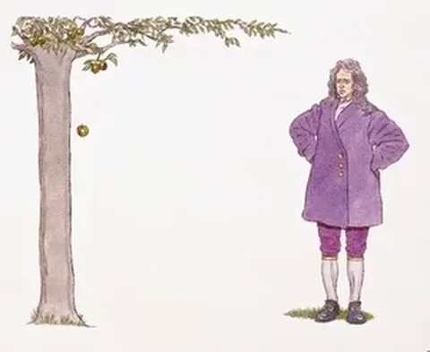

C'est Napoléon qui leur a donné le qualificatif péjoratif d'"idéologues", ironiquement, puisque c'est Bonaparte lui-même qui, à Sainte-Hélène, avoua que lorsque ses ministres lui demandaient le but de toutes ses conquêtes et de toutes ses ambitions, il ne le savait pas, et avoua qu'ils étaient étonnés de cet aveu. Le soi-disant praticien agissait sans direction ; **les soi-disant idéologues possédaient une compréhension cohérente de l'action humaine**.

### Le corps, l'espace, la pomme : la propriété comme fait

Quels faits les idéologues ont-ils identifiés ? Commençons par là où ils ont commencé : le corps humain lui-même.

L'être humain est avant tout un corps parmi d'autres corps, une entité qui occupe nécessairement un espace physique. Considérons le simple fait de dormir dans un lit. Même dans une société collectiviste, le lit appartient au dormeur *de facto* tant qu'il l'occupe. On peut imaginer un système de propriété collective, mais quand on dort, on dort dans *son propre* lit, on l'occupe par le simple fait de s'y allonger. **La propriété, dans sa forme la plus élémentaire, n'est pas une construction sociale arbitraire.** Elle est une conséquence directe et inéluctable de notre existence corporelle.

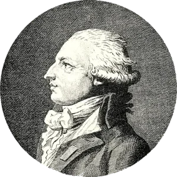

Plus fondamentalement, l'appropriation est requise par la nature. Manger une pomme, c'est nécessairement se l'approprier. Respirer, c'est s'approprier l'air. Toute action humaine nécessite l'appropriation de quelque chose. **La propriété est donc une réalité ancrée dans notre existence physique**, comme la gravité, comme la nécessité de poser ses deux pieds sur le sol, et non une convention que l'on peut décréter ou abolir à volonté.

### La concurrence : une réalité incontournable

La finitude du monde entraîne une autre conséquence : la concurrence. C'est précisément parce que les pommes ne sont pas en nombre infini qu'il faut se les approprier. On peut critiquer la concurrence, on peut la déplorer, mais on ne peut pas l'éliminer.

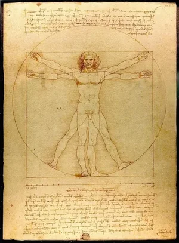

**Les systèmes collectivistes n'abolissent pas la concurrence** ; ils la réorientent simplement vers des canaux politiques, des files d'attente, des privilèges administratifs, des luttes entre factions, souvent à un coût bien plus élevé en termes d'efficacité et de justice. La vraie question n'est pas de savoir si la concurrence existera, mais quelles règles doivent la régir.

### L'individualité des perceptions

Lorsque nous nous tournons du monde extérieur vers l'être humain lui-même, nous rencontrons une autre donnée fondamentale : **l'individualité radicale de nos sensations**. J'ai faim, j'ai soif, je vois, *moi*, l'individu, directement et personnellement. On ne peut pas ressentir la faim à travers une autre personne, ni voir à travers les yeux d'une autre personne.

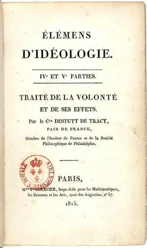

**Les décisions fondées sur une perception personnelle directe contiennent des informations que les décisions collectives ne peuvent pas reproduire.** Si j'ai faim et que j'agis pour satisfaire ma faim, les effets sont immédiats et précisément adaptés à ma situation. En revanche, une décision collective concernant la nourriture doit agréger les perceptions de nombreux individus, chacun ayant des besoins différents en termes de délai, d'intensité et de préférence. Ses résultats seront inévitablement moins adaptés à la situation réelle de chaque personne.

De cette individualité des sensations naît également ce qu'Adam Smith appelait la "sympathie", la capacité à ressentir, de manière atténuée, les sensations des autres, et la nécessité de la coopération humaine, puisque même l'individu le plus autosuffisant dépend de l'échange et de l'entraide.

### La volonté, la propriété de soi et l'origine du "mien" et du "tien"

La sensation mène à la volonté, et la volonté est la première forme de liberté. Si certains de nos actes sont des réflexes, des réponses automatiques à des stimuli, la grande majorité est le fruit d'une réflexion et d'un choix délibéré. Je sens mon propre corps, je peux agir par mon propre corps, de ma propre volonté : **c'est le fondement de la propriété de soi**.

Destutt de Tracy, dans ses *Éléments d'idéologie* (1815), a exprimé cette idée avec une clarté remarquable :

> "Il semble, à entendre certains philosophes et certains législateurs, qu'à un moment précis, on ait spontanément et sans raison imaginé de dire 'à moi' et 'à toi', et qu'on aurait pu et même dû s'en passer. Mais le " tiens " et le " mien " n'ont jamais été inventés ; ils ont été reconnus le jour où l'on a pu dire " tu " et " je ". Et l'idée de "moi" et de "toi", ou plutôt de "moi" et d'"autre que moi", est née, sinon le jour même où l'être sensible a éprouvé des impressions, du moins le jour où, en conséquence de ces impressions, il a éprouvé le sentiment de vouloir, la possibilité d'agir qui en découle, et une résistance à ce sentiment et à cet acte."

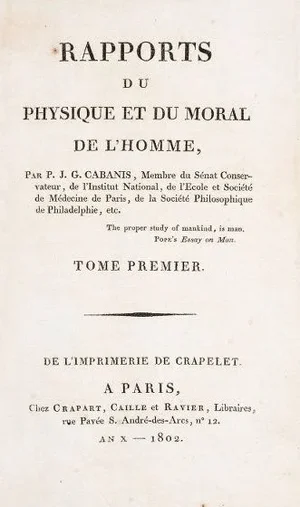

En d'autres termes, **la propriété et la liberté ne sont pas des inventions des législateurs**. Ce sont des reconnaissances de faits aussi anciens que la conscience humaine elle-même.

### La diversité humaine et les limites de la raison

La nature ne produit pas des êtres identiques. Dès les premières observations de nouveau-nés, on constate une grande diversité de capacités physiques, de tempéraments et d'inclinations. Cabanis, le médecin des Idéologues, a beaucoup étudié ces différences physiologiques : un individu de faible constitution n'aura pas les mêmes désirs, les mêmes loisirs, les mêmes ambitions qu'un individu doté d'une grande énergie et d'une grande vigueur physique.

**Cette diversité naturelle a des conséquences directes sur la liberté : les individus ont des volontés différentes et doivent donc avoir la liberté d'agir selon leurs propres inclinations. Cela vaut pour l'éducation : les enfants doivent être éduqués en fonction de leurs aptitudes et de leurs goûts, et non de manière uniforme. Il en va de même pour la liberté de travail : on ne peut pas hériter par tradition du métier de son père ou de son grand-père s'il ne correspond pas à ses propres capacités. Il en va de même pour la liberté de choix dans la consommation, car la satisfaction que procurent les biens et les services dépend de cette diversité irréductible.**

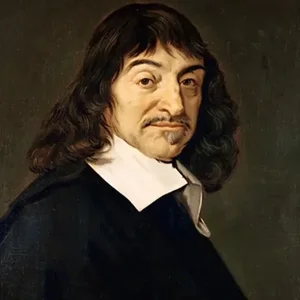

Enfin, un fait que Descartes a mis en lumière et que les physiocrates et les économistes libéraux français du 19e siècle ont développé jusqu'au bout : les limites de la raison humaine. Descartes a utilisé l'exemple du *chiliogon*, un polygone à mille côtés, pour montrer que l'esprit humain ne peut pas le visualiser. Notre raison est un outil puissant, mais elle a des limites.

Les physiocrates du XVIIIe siècle en ont tiré la conclusion que **la planification centrale est impossible**. Aucune autorité centrale, aucun bureau de ministres, aussi vaste soit-il, ne pourrait prévoir, anticiper, organiser et coordonner les millions d'actions humaines individuelles qui constituent une société et une économie de marché. L'impossibilité de planifier est déjà inscrite dans les faits de l'humanité, et surtout dans le fait que notre raison, aussi admirable soit-elle, a ses limites.

Dans les leçons qui suivent, nous reviendrons sur ces fondements factuels de la liberté et de la propriété. Nous les opposerons aux idées et aux pratiques de la non-liberté, pour comprendre pourquoi les systèmes de contrainte ne reposent pas sur des faits mais sur des sophismes, sophismes que nous aurons l'occasion d'exposer dans une partie ultérieure de ce cours.

## Liberté d'expression, liberté de la presse et liberté d'enseignement

<chapterId>e19775a3-6b1d-50ed-ba6b-979f93a78b4b</chapterId>

### Le fait humain de la pensée

Nous avons établi dans le chapitre précédent que la liberté repose sur des faits observables de la nature humaine : le corps, l'occupation de l'espace, l'appropriation des choses, l'individualité des perceptions. Mais l'être humain n'est pas seulement un corps, il est aussi, et peut-être surtout, un esprit. **De ce seul fait découlent la tolérance religieuse, la liberté d'expression, la liberté de la presse et la liberté de l'enseignement.**

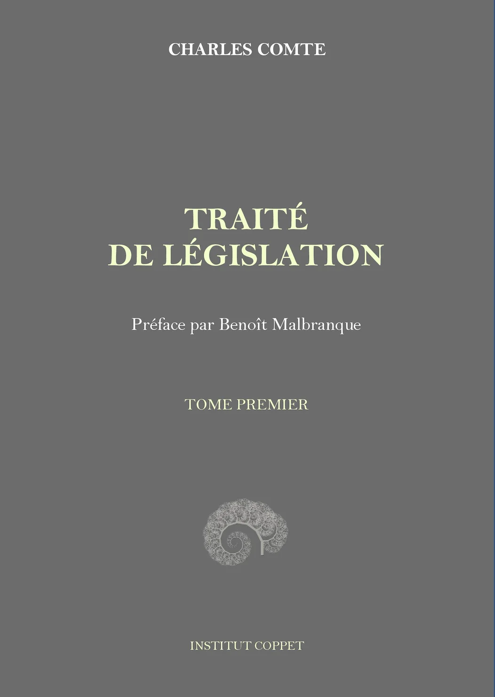

Charles Comte (1782-1837), dans ses [*Cours de droit naturel*](https://planb.academy/resources/books/cours-droit-naturel-78a371b6-796b-4ebe-bb8a-54cc64f38b57), une série de conférences prononcées à Lausanne vers 1830 et dont nous possédons encore le manuscrit, l'affirme dès la première leçon : un être humain dépourvu de capacités cognitives ne serait guère reconnu comme humain. Nous tissons des liens avec les autres précisément parce qu'ils sont des êtres pensants, parce qu'ils ont des sentiments, des idées, des convictions que nous pouvons partager et dont nous pouvons débattre.

Cette capacité de penser s'accompagne d'un élément qu'aucun récit matérialiste ne peut ignorer : le "plaisir" de penser. Prenons le cas du Père Yves-Marie André, un savant jésuite à qui les supérieurs ont interdit de poursuivre ses recherches sur Malebranche. Il en a profondément souffert, mais tout le monde ne ressent pas la même privation avec la même intensité. Pour beaucoup, développer ses idées, les échanger, les enseigner à d'autres, constitue l'une des plus profondes sources de satisfaction humaine. **Le plaisir d'apprendre, le plaisir d'enseigner, le plaisir de la découverte intellectuelle**, sont des faits de l'expérience humaine, et non des luxes réservés à quelques privilégiés.

### De la pensée à l'expression : la chaîne de la liberté

La pensée est une manifestation de la volonté. Nous ressentons, nous concevons des projets et des idées, et nous souhaitons naturellement les transmettre. **Si nous sommes libres de vouloir et de penser (puisque aucune puissance sur terre ne peut nous empêcher de penser), alors il y a une forte présomption naturelle en faveur de la libre expression. Pour briser la chaîne entre la sensation, la volonté, la pensée et son expression matérielle, il faut des arguments très puissants.**

Nous rencontrons ici une idée fondamentale : l'inviolabilité de la conscience. On peut brûler un homme pour ses opinions, cela a été fait, mais on ne peut pas brûler sa pensée. **Aucune autorité n'a jamais eu de pouvoir sur la pensée elle-même ; elle ne peut atteindre que son expression matérielle. Nous sommes libres de changer nos idées, de les poursuivre jusqu'à leur terme, d'abandonner une intuition pour en adopter une autre. Cette liberté n'est pas un don de la législation. C'est un fait de notre nature.**

### Benjamin Constant et la propriété sacrée de la pensée

Benjamin Constant (1767-1830), le grand libéral franco-suisse, a consacré une grande partie de sa carrière à défendre la liberté de la presse et les libertés individuelles dans le contexte des bouleversements politiques de la France post-révolutionnaire. Dans ses [*Principes de politique*](https://planb.academy/resources/books/principes-de-politique-282bc3de-f218-4103-903a-5280d7b99108) (1815), il a exprimé les implications de cette propriété intellectuelle avec une force caractéristique :

> "Erreur ou vérité, la pensée de l'homme est sa propriété la plus sacrée ; erreur ou vérité, les tyrans sont également coupables lorsqu'ils l'attaquent. Celui qui proscrit la superstition au nom de la philosophie, et celui qui proscrit la raison indépendante au nom de Dieu, méritent également l'exécration de tous les hommes de bonne volonté."

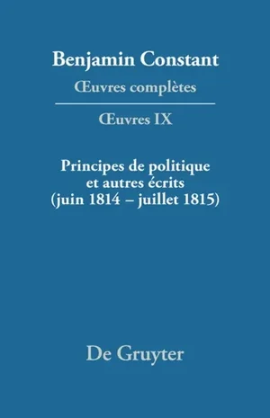

En d'autres termes, l'individu étant le seul propriétaire de sa pensée, la supprimer au nom d'une prétendue raison supérieure, qu'elle soit religieuse ou rationaliste, est fondamentalement injuste. **La propriété de la pensée appartient au penseur**, et aucun tribunal extérieur, aussi bien intentionné soit-il, n'est compétent pour statuer sur le contenu de l'esprit d'un autre homme.

### La perfectibilité humaine et la nécessité d'un débat libre

Pourquoi, au-delà de la simple reconnaissance d'un droit naturel, devrions-nous valoriser activement la liberté d'expression ? La réponse se trouve dans une grande idée que le mouvement philosophique du XVIIIe siècle a fait mûrir : *la perfectibilité humaine*.

Nicolas de Condorcet (1743-1794), au carrefour des philosophes des Lumières et des économistes physiocrates, ami proche de Turgot, a écrit son œuvre maîtresse, l'[*Esquisse d'un tableau historique des progrès de l'esprit humain*](https://planb.academy/resources/books/esquisse-tableau-historique-progres-esprit-humain-ab87cd62-445d-4620-a3ad-7af31ba17c3f), dans des circonstances extraordinaires. Dans la clandestinité, sur le point d'être arrêté et exécuté pendant la Terreur, sans livres, il a composé dans une seule pièce une vision globale du progrès humain à travers les âges.

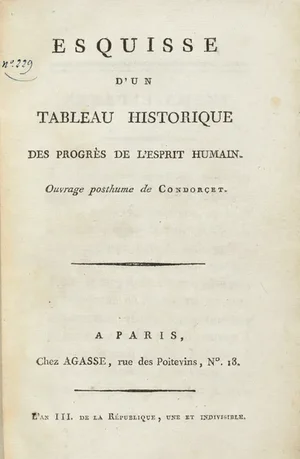

La thèse centrale était révolutionnaire : contrairement à la doctrine chrétienne de la chute, qui postule une descente de la perfection originelle, la civilisation humaine est ascendante. Chaque génération transmet ses découvertes à la suivante, et l'humanité progresse de siècle en siècle. **Les idées nouvelles, audacieuses, pionnières, souvent rejetées dans un premier temps, doivent être librement communiquées. Le découvreur doit pouvoir enseigner ses conceptions aux autres, à ses descendants, à la société dans son ensemble, afin que ce qui était considéré comme trop audacieux soit testé, accepté et mis en pratique.**

Le débat d'idées fonctionne comme la concurrence économique : parmi de nombreux marchands concurrents, c'est celui qui produit le mieux et au moindre coût qui réussit. De même, sur le marché des idées, la confrontation permet aux conceptions les mieux fondées de s'imposer, car chacun peut en observer les effets et juger de leur concordance avec les faits. La variété naturelle des êtres humains, que nous avons déjà évoquée, est elle-même à l'origine de cette variété d'idées. Des individus nés avec des constitutions différentes, élevés dans des environnements différents, développeront inévitablement des perceptions différentes, des sensibilités différentes, des jugements différents. **Le libre débat n'est donc pas un luxe facultatif** ; c'est le mécanisme indispensable qui permet aux idées les plus fondées d'atteindre leur public et de faire progresser la civilisation.

### Liberté de la presse : le tribunal de l'opinion publique

La liberté de la presse étend le principe de la liberté d'expression au domaine politique. Les actions humaines, et en particulier les actions collectives et gouvernementales, produisent des effets qui sont ressentis différemment par différentes personnes. Une réglementation affectant un secteur particulier cause à ceux qui en font partie des souffrances que d'autres peuvent ne pas percevoir du tout. Chaque individu doit pouvoir exprimer et rendre publiques les conséquences qu'il observe : "Cette institution me fait du tort, et voici comment."

L'abbé de Saint-Pierre, au début du XVIIIe siècle, comparait les institutions politiques à des horloges qu'il faut remonter de temps en temps. En effet, les lois et les institutions se périment et nécessitent des réformes périodiques. Mais **la réforme exige une opinion publique éclairée, et une opinion publique éclairée exige une presse libre**.

L'histoire de France illustre de manière frappante ce qui se passe en l'absence de ce mécanisme. Au XVIIIe siècle, les philosophes des Lumières ont électrisé l'élite intellectuelle avec leurs idées. Turgot, en tant que ministre, tente des réformes radicales. Mais il n'y avait pas de journaux accessibles aux gens du peuple, pas de canaux par lesquels une opinion publique informée pouvait se former et soutenir l'effort de réforme. La masse de la population est exclue du grand débat intellectuel. Le résultat fut que **le changement ne pouvait venir que par la révolution**, par le renversement violent de tout le système, plutôt que par une réforme graduelle, préparée et pacifique.

La presse libre, en revanche, agit comme ce que les libéraux appelaient "le tribunal de l'opinion publique", un mécanisme à la fois libre et rapide. Les citoyens observent les effets des lois et des institutions, formulent leurs jugements et les communiquent publiquement. Ce tribunal ne coûte rien, il fonctionne en continu et il prépare le terrain pour les réformes, de sorte que les bouleversements violents deviennent inutiles. Il s'agit, en quelque sorte, d'une entreprise rentable : les journaux et revues privés se maintiennent économiquement tout en remplissant la fonction civique essentielle de la critique démocratique.

### La liberté d'enseignement : une conclusion inéluctable

Nous en arrivons à la liberté d'enseignement, la liberté qui, logiquement, ne devrait pas nécessiter de défense distincte, mais qui rencontre la plus grande résistance.

Réfléchissez : si nous acceptons la liberté d'expression, n'en découle-t-il pas que nous acceptons la liberté d'enseigner ? Si nous acceptons la liberté de la presse, le droit de communiquer ses idées par le biais de l'imprimé, comment pouvons-nous refuser le droit de communiquer ces mêmes idées dans une salle de classe ? Et si nous acceptons la liberté religieuse, la liberté non seulement de prier silencieusement à la maison (ce qui existe sous toutes les tyrannies) mais aussi de pratiquer le culte publiquement, de fonder des églises, de propager sa foi, alors **nous devons accepter la liberté d'éduquer ses enfants selon ses croyances**.

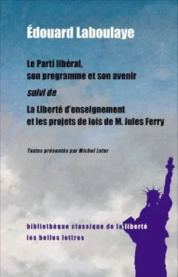

Édouard Laboulaye (1811-1883), l'un des grands défenseurs de la liberté d'enseignement à l'époque des réformes de Jules Ferry, a mené ce combat avec passion, et l'a malheureusement perdu. Les libéraux perdront à nouveau de manière plus décisive dans les décennies suivantes. Pourtant, les arguments restent irréfutables.

L'argument contre le monopole de l'État en matière d'éducation repose sur deux faits. D'abord, le fait naturel de l'amour parental. **L'État, une succession de partis politiques, élus dans des moments d'enthousiasme, sur de vastes programmes dont la plupart des électeurs ignorent les détails, est un substitut artificiel à cette tutelle naturelle. Bien sûr, il peut y avoir des cas d'abus où le recours à un tuteur alternatif est nécessaire. Mais fabriquer à l'avance, et pour tous les enfants, un tuteur de substitution, pour remplacer le parent par défaut, n'est ni logique ni fondé sur les faits de l'existence humaine.**

Deuxièmement, le fait de la diversité humaine, que nous avons rencontré à maintes reprises. Les enfants ne sont pas identiques. Dès la naissance, ils diffèrent par leurs capacités physiques, leurs tempéraments, leurs aptitudes et leurs inclinations. **Enseigner les mêmes choses de la même manière à des enfants que la nature a rendus différents**, c'est postuler quelque chose qui n'existe pas, l'uniformité des êtres humains. Seule la liberté pédagogique, avec la concurrence des écoles, des méthodes, des rythmes et des programmes, peut accueillir cette diversité irréductible et permettre à chacun de s'épanouir selon sa propre nature.

Dans les leçons qui suivent, nous passerons de ces libertés civiles aux fondements factuels de la liberté économique, la liberté du travail, du commerce et de la propriété sous ses formes matérielles.

## Propriété et liberté de travail

<chapterId>9b71cfae-425c-5255-a0f2-7a5b6805e284</chapterId>

### L'autopropriété : le premier bien

Nous passons maintenant des libertés civiles aux libertés économiques, propriété, liberté de travail, libre échange, qui sont moins bien acceptées dans le débat contemporain, mais qui reposent exactement sur les mêmes fondements factuels. En effet, **la liberté politique sans liberté économique est un moyen sans fin** : c'est la liberté de choisir un maître, pas la liberté de vivre en tant qu'individu autonome.

**Il n'y a pas de propriété des choses sans propriété de soi.** Et qu'est-ce que la propriété de soi ? C'est l'aboutissement d'une chaîne de faits que nous avons déjà examinée. Considérons deux cycles de pensée qui la matérialisent. Le premier va de la sensation au jugement, puis à l'opinion : nos perceptions sensorielles sont personnelles et individuelles ; nos jugements sont libres ; leur expression conduit à la liberté de la presse, à l'éducation, à la tolérance religieuse. Le second cycle relie l'observation, le raisonnement et l'adaptation : l'individu observe, établit des liens de cause à effet, puis agit selon un plan de conduite personnel.

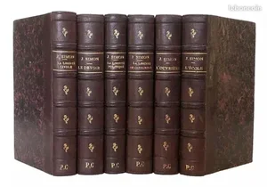

Jules Simon (1814-1896), philosophe et homme d'État, a démontré dans une remarquable série d'ouvrages, notamment [*La Liberté civile*](https://planb.academy/resources/books/la-liberte-civile-53b5dadb-e838-4802-acca-b00f8c4b00d7) et [*La Liberté*](https://planb.academy/resources/books/la-liberte-simon-8166fd17-86ec-4e1f-9928-77155f0e3d88) (1859), que les notions économiques les plus complexes, telles que le capital ou la liberté du travail, reposent en définitive sur des faits humains simples : la libre réflexion et la propriété de sa propre pensée. De la sensation au jugement, du jugement à l'action, de l'action à la production, la chaîne est ininterrompue et la propriété de soi en est le premier maillon.

### Pourquoi la propriété des choses

La propriété de soi conduit naturellement à la propriété des choses, car l'existence humaine ne peut être maintenue que par l'appropriation et la production. Nous devons manger, nous vêtir, et pour ce faire, nous devons produire, ce qui nécessite précisément ces actes d'observation, de raisonnement et d'action intentionnelle qui appartiennent à la propriété de soi.

Il n'y a pas de consommation sans appropriation. Nous l'avons vu avec la pomme : la manger, c'est se l'approprier. Et cette appropriation, comme son nom l'indique, est un acte qui rend quelque chose *propre*, personnel, individuel. C'est parce que je m'approprie individuellement que j'en ressens les effets individuellement : c'est moi qui n'ai plus faim, c'est moi qui éprouve la satisfaction.

Mais la propriété s'étend au-delà de la consommation de biens périssables, jusqu'à la possession de terres, et c'est là qu'intervient un fait crucial : **la possession est un travail**. L'image du colon défrichant une terre vierge, ruisselant de sueur, rend parfaitement compte de cette réalité. À l'état naturel, la terre est souvent totalement impropre aux besoins de l'homme. Pour la rendre productive, il faut la défricher, la cultiver, l'entretenir, réparer la fertilité naturelle du sol, gérer le drainage et l'irrigation. Il s'agit d'un travail ardu et soutenu.

Le même principe s'applique au capital. Préserver et accroître son capital est une forme de travail négatif, qui exige de résister à la tentation constante de la consommation immédiate et d'orienter judicieusement ses investissements. Nombreux sont ceux qui perdent leur capital, que ce soit en le gaspillant dans la consommation ou en se lançant dans des entreprises malavisées qui ne parviennent pas à reproduire en valeur ce qu'elles ont coûté en investissement initial.

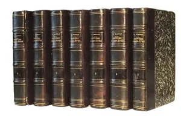

Frédéric Bastiat, dans ses Œuvres complètes, a exprimé ce lien entre travail et propriété avec une précision caractéristique :

> "L'homme ne peut vivre et jouir que par une assimilation, une appropriation perpétuelle, c'est-à-dire par une application perpétuelle de ses facultés aux choses, ou par le travail. C'est de là que naît la Propriété"

En d'autres termes, **la propriété n'est pas une invention des législateurs**. Elle est la conséquence naturelle et nécessaire de l'action humaine appliquée au monde.

### L'universalité de la propriété

Si la propriété n'était qu'une convention sociale, on s'attendrait à trouver des sociétés qui en sont dépourvues. Or, c'est le contraire qui est vrai : **la propriété s'observe à tous les âges et dans toutes les sociétés**, à différents niveaux de développement.

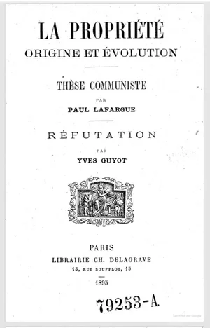

Nous pouvons même l'observer chez les animaux, qui revendiquent et défendent des territoires, des terriers, des sites de nidification, des terrains de chasse, et qui reconnaissent, au moins sous une forme rudimentaire, la propriété d'autres individus. Les corps ne peuvent vivre que sous un régime de propriété.

Même à l'âge de pierre, les grottes et les ressources étaient considérées comme des biens, non pas par l'ensemble de l'humanité, mais par des tribus spécifiques. Cette propriété tribale collective ne doit pas être confondue avec le communisme : la tribu excluait les autres groupes. La propriété n'était "commune" qu'à l'intérieur de ses limites, et privée par rapport à tous les étrangers. La forme de propriété était adaptée aux conditions de production : la chasse, par exemple, ne pouvait se pratiquer dans des enclos étroits, car les animaux parcouraient de vastes territoires. Mais **le principe de la propriété était déjà présent, seule son application différait**.

### Liberté du travail : de la nécessité à l'action

Quels sont les faits à l'origine de la liberté du travail ? Tout d'abord, la réalité des besoins humains. Les besoins ne sont pas imaginaires ou fictifs, ils sont ressentis, réels et incontournables. On ne peut pas vivre sans les satisfaire. Et ils sont individuels : c'est *moi* qui ressens la faim, *moi* qui souffre d'un logement mal abrité, *moi* qui connais l'intensité de mon propre malaise.

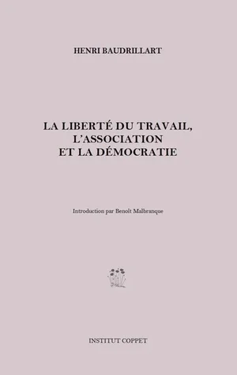

**De ce besoin individuel découle la nécessité d'un plan d'action individuel**, c'est-à-dire d'un travail. Je dois répondre à mes besoins en utilisant mon propre corps, mes propres facultés, ma propre intelligence. Le plan de conduite que j'élabore est le mien par définition : il naît de mes propres sensations et de mon propre raisonnement sur la meilleure façon de les satisfaire.

Le deuxième fondement est la variété des dispositions, des goûts et des forces des individus. Même face à un même besoin, chaque individu le ressent différemment et possède des capacités différentes pour y répondre. Certains ont un corps robuste qui résiste à de longues heures de travail physique ; d'autres se fatiguent rapidement mais récupèrent après une nuit de sommeil. Certains sont attirés par le travail manuel, d'autres par les activités intellectuelles. Chacun doit être libre d'utiliser son propre corps, qui lui appartient, de la manière la plus adaptée à sa situation.

Lorsqu'un État régulateur intervient, il rompt cette chaîne naturelle. Il **prend la prétention de connaître les sensations du travailleur mieux que lui**, et de prescrire un plan d'action sans tenir compte des dispositions individuelles. Mais la sensation est personnelle : je suis le seul à savoir avec quelle intensité je ressens la faim, avec quelle urgence j'ai besoin d'un abri. Et le plan d'action est personnel : je suis le seul à pouvoir juger quelle application de mes facultés répondra le mieux à mes besoins.

### L'intérêt personnel et l'harmonie du monde

Le moteur de toute cette activité est l'intérêt personnel, un fait identifié dans la tradition libérale française bien avant Adam Smith. Pierre de Boisguilbert (1646-1714), dans ses écrits économiques du début du XVIIIe siècle, l'a exprimé avec une clarté remarquable :

> "Il y a une réflexion à faire : c'est que tout le commerce de la terre, en gros et en détail, et même l'agriculture, n'est gouverné que par l'intérêt des entrepreneurs, qui n'ont jamais songé à rendre service ni à obliger ceux avec qui ils traitent ; et tout aubergiste qui vend du vin aux voyageurs n'a jamais eu l'intention de leur être utile, ni les voyageurs qui s'arrêtent chez lui de faire le voyage dans la crainte de perdre leurs provisions. C'est cette utilité réciproque qui fait l'harmonie du monde et le maintien des états ; chacun pense à procurer son intérêt personnel au plus haut degré et avec la plus grande facilité possible."

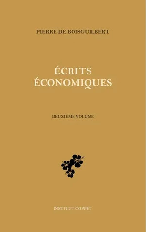

**L'intérêt personnel n'est pas un défaut moral à surmonter** ; c'est un fait de la nature humaine, enraciné dans l'individualité de nos sensations. C'est parce que je souffre, parce que je cherche le plaisir qui m'atteindra individuellement, que j'élabore des plans et des actions pour améliorer ma condition. Et c'est précisément cette recherche, multipliée par des millions d'individus, qui produit l'harmonie du monde.

### Libre-échange : la conclusion logique

Nicolas Baudeau (1730-1792), économiste physiocrate, a tiré la conséquence ultime de ces principes avec une franchise dévastatrice :

> "De quel droit, si vous le voulez bien, par quel motif et pour quelle utilité décidez-vous que tel travail durable sera fait de telle manière et non d'une autre, par telle personne et non par une autre ? Car soit je trouve mon plaisir et mon avantage à jouir des choses ainsi, soit je les trouve à en jouir autrement, moi, le légitime possesseur d'un bien acquis par mon travail, qui peut l'employer à mon bien-être. Si je trouve mon plaisir et mon avantage à consommer tel ou tel objet, à faire travailler tel ou tel ouvrier pour moi et à le faire travailler ainsi, vos règlements et vos privilèges lui sont tout à fait inutiles. Si je ne les trouve pas là, si je les trouve au contraire dans l'objet que vous interdisez, dans la personne que vous excluez, vous violez manifestement ma liberté, ma propriété ; vous empêchez, vous restreignez mes jouissances. Voilà précisément le mal moral, l'offense, l'usurpation, voilà précisément ce que l'autorité doit empêcher"

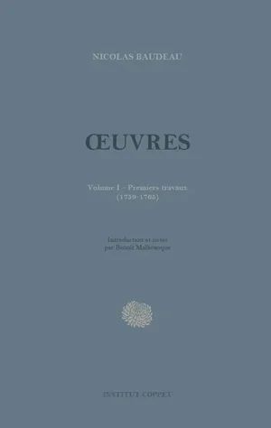

Le libre-échange est le prolongement logique de tous ces principes. Si je suis le propriétaire légitime d'un bien, acquis par mon travail ou par un échange antérieur, qui a le pouvoir de m'empêcher de l'échanger contre un autre bien qui me plaît davantage ? **Les économistes libéraux des XVIIIe et XIXe siècles n'ont pas inventé de théorie, ils ont observé des faits de la nature humaine et en ont tiré les conséquences avec une cohérence rigoureuse.**

## Non-agression, respect de la propriété et de la paix

<chapterId>e8519889-1178-521e-9de7-b32f6177d92b</chapterId>

### La douleur, la peur et les limites de la liberté

Qu'est-ce qui définit la limite de la liberté d'une personne ? La réponse commence par un fait aussi universel qu'élémentaire : la douleur. C'est par la douleur, transmise par le système nerveux, ressentie dans le corps, que les atteintes à notre liberté et à notre intégrité corporelle deviennent perceptibles. Sans douleur, nous ne pourrions pas reconnaître une agression. Cette réalité physiologique établit une limite naturelle à la liberté de chacun : **Toute action qui cause de la douleur à autrui constitue une atteinte à la propriété de soi**.

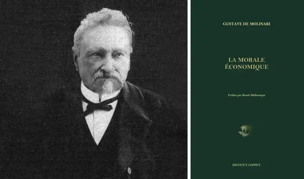

Gustave de Molinari (1819-1912), l'un des penseurs les plus profonds de la tradition libérale française, dont la carrière s'étend sur près d'un siècle, de l'époque de Louis-Philippe à la veille de la Première Guerre mondiale, a développé une deuxième dimension de cette analyse dans sa [*Morale économique*](https://planb.academy/resources/books/la-morale-economique-8b419025-3d46-48a8-9d8f-0254596406f8). Au-delà de la douleur, il y a la peur : l'anticipation du mal et l'inhibition de l'action qui en découle. Lorsque d'autres empiètent sur nos droits ou représentent une menace crédible, nous sommes contraints de reconsidérer et d'ajuster nos plans. Nous ne pouvons pas agir comme nous l'aurions fait en l'absence de menace. **Notre liberté effective est diminuée, avant même qu'une agression physique ne se produise.**

Toutefois, et c'est là une distinction essentielle, toutes les nuisances ne sont pas du même ordre. Imaginons un boulanger dans une petite ville ; un concurrent ouvre une boutique de l'autre côté de la rue. Le premier boulanger subit une véritable nuisance économique. S'agit-il pour autant d'une agression que la loi doit sanctionner ? Il est clair que non. Le concurrent n'a porté atteinte à la personne ou à la propriété de personne, il n'a fait qu'exercer sa propre liberté.

L'évolution historique révèle un élargissement progressif des nuisances que les sociétés ne considèrent plus comme punissables. Au Moyen Âge, la concurrence elle-même était souvent condamnée : la nouvelle technique d'un inventeur menaçait le gagne-pain d'artisans établis sur de petits marchés fermés, où les effets étaient ressentis avec acuité et où il n'existait que peu de débouchés alternatifs. L'émancipation progressive de ces restrictions, la reconnaissance du fait que la concurrence et l'innovation, bien que gênantes, ne sont pas des crimes, ont accompagné le développement de sociétés plus libres et plus prospères.

### Harmonie, paix et logique d'échange

Frédéric Bastiat et Gustave de Molinari ont souvent résumé leur doctrine libérale en deux mots : "liberté et paix", ou, comme ils l'ont parfois formulé, "liberté à l'intérieur, paix à l'extérieur" Il ne s'agit pas d'aspirations distinctes, mais des conséquences naturelles des mêmes principes.

L'harmonie d'une société libre s'enracine dans la plus simple des relations économiques : celle entre le client et le fournisseur. **Le client a besoin de son fournisseur pour obtenir les biens désirés ; le fournisseur a besoin que son client soit prospère**, car un commerçant rationnel préfère des clients riches capables d'acquérir ses produits à des clients appauvris qui ne peuvent rien acheter. Cette logique s'applique à tous les niveaux : au sein d'une famille, d'une ville, entre les nations. Elle crée des relations mutuellement bénéfiques qui engendrent naturellement la coopération et la paix.

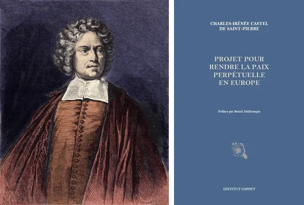

L'abbé de Saint-Pierre, grand pacifiste du début du XVIIIe siècle, très étudié par la suite par Molinari, a identifié une autre donnée à la base de cette harmonie : le besoin universel de sécurité. Aucun individu, aussi fort soit-il, n'est assez fort pour se protéger seul. L'homme le plus fort du monde n'était pas fort dans son enfance, ne le sera pas dans sa vieillesse et ne l'est pas à chaque instant : il dort, il tombe malade, il s'affaiblit. **Cette vulnérabilité fondamentale crée un besoin universel de sécurité collective**, qui ne peut être satisfait que par l'État de droit : des règles convenues qui protègent la liberté et la propriété de chacun, permettant des échanges pacifiques.

Enfin, l'évolution même de la production tend vers la paix. La chasse et la pêche sont en quelque sorte des modes de production violents, qui détruisent plutôt qu'ils ne créent. Le champ de blé représente une avancée vers la production pacifique : il crée de l'utilité là où il n'y en avait pas, sans détruire d'autres êtres vivants. La production moderne incarne de plus en plus la logique de l'harmonie plutôt que celle de la prédation, et il suffit que cette tendance soit reconnue et soutenue par le droit pour produire des sociétés véritablement libérales.

### Liberté politique : décentralisation et suffrage universel

La liberté politique, bien qu'elle soit un moyen plutôt qu'une fin, repose sur des fondements factuels qui lui sont propres. Le premier est le principe de décentralisation, qui découle directement de la diversité humaine. Les êtres humains ne sont pas des clones ; ils ont des besoins, des préférences et des circonstances différents. Cette diversité est avant tout individuelle, et pas seulement régionale ou nationale. En toute logique, **la décentralisation doit être poussée jusqu'à sa plus grande conséquence : l'autonomie individuelle**.

Benjamin Constant, que nous avons déjà rencontré en tant que défenseur de la liberté de pensée, a été l'un des plus ardents défenseurs de la décentralisation. Son argument est simple : **on ne peut pas planifier, organiser ou diriger une société à partir d'un centre** en ignorant la diversité irréductible de ses membres. L'impossibilité de la planification centrale, que nous avons rencontrée plus haut dans les limites de la raison humaine, réapparaît ici dans la sphère politique.

Le suffrage universel trouve sa justification dans les mêmes faits. Les plaisirs et les douleurs sont individuels : Je ressens les effets d'une loi en moi-même, directement et personnellement. D'autres ressentent des effets différents et forment des jugements différents. La perception de chacun doit donc compter, car chacun apporte des informations qu'aucune autorité centrale ne pourrait posséder. La loi juste est celle qui agrège ces jugements individuels, et non celle qui est imposée par une minorité qui prétend mieux savoir.

### Liberté civile : de l'expression au mariage

Nous avons déjà établi les fondements factuels de la liberté d'expression et de la tolérance religieuse : ils découlent de l'individualité de la personnalité humaine et de la diversité des jugements qui découle de la propriété de soi. Parce que les personnalités diffèrent, les jugements diffèrent aussi et doivent différer. **Cette diversité n'est pas un obstacle à la vérité mais le moteur même de la perfectibilité humaine** : c'est par la confrontation de jugements différents que les meilleures idées émergent et que la civilisation progresse.

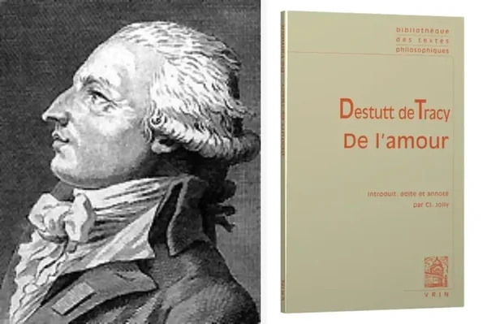

Prenons un autre exemple : le choix du conjoint. Il y a, comme le dit l'adage, mille nuances de beauté et mille façons d'être heureux. Les perceptions esthétiques et émotionnelles sont profondément individuelles, enracinées dans la constitution physiologique unique et l'expérience de vie de chaque personne. **La liberté de choisir qui aimer et qui épouser n'est pas un luxe** ; c'est une conséquence directe des mêmes faits humains qui sont à la base de toutes les autres libertés.

Nous avons ainsi achevé notre tour d'horizon des principaux faits qui fondent la doctrine de la liberté. Le libéralisme, pouvons-nous dire maintenant, est ancré dans les faits de l'existence humaine, dans le corps, les sens, la volonté, la diversité des individus, le besoin de sécurité, la logique de l'échange. Les systèmes de non-liberté, au contraire, doivent nier ou ignorer ces faits. C'est sur leurs contradictions factuelles que nous nous pencherons dans le chapitre suivant.

## Les contradictions factuelles des systèmes de contrainte

<chapterId>c13f7395-6734-5c64-b86c-af7922ffbcb0</chapterId>

### Les contradictions autour de la propriété

Nous commençons par le slogan le plus célèbre du mouvement anti-propriété : Pierre-Joseph Proudhon : "la propriété, c'est le vol" Bastiat n'a pas eu de mal à démonter cette formule, car elle est à première vue auto-contradictoire : **Si la propriété est un vol, alors le vol est une propriété**, ce qui est légitime est illégitime, et ce qui est illégitime est légitime. La phrase semble révolutionnaire, mais elle ne dit rien de cohérent. Bastiat, dans ses Œuvres complètes, est revenu systématiquement sur l'origine de la propriété, du travail, de la propriété de soi, des facultés humaines, et a démontré qu'elle est ancrée dans les faits de toutes les sociétés et de toutes les époques.

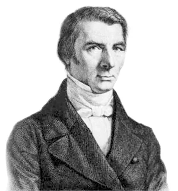

Les systèmes de non-liberté postulent une spoliation originelle : toutes les meilleures terres, affirment-ils, ont été saisies par la force à l'aube de l'histoire, et les propriétaires actuels ne font que jouir sans travail de ce que leurs ancêtres ont volé. Mais ce récit contient deux erreurs fatales.

D'abord, elle suppose une facilité d'enrichissement qui contredit toute expérience. La vision marxiste, et elle est présente de manière frappante dans toute la pensée socialiste, imagine que les profits tombent automatiquement du capital, comme s'il suffisait d'investir et d'encaisser. Il n'y a pas de faillites dans ce tableau, pas de nuits blanches d'inquiétude, pas d'entreprises qui échouent parce qu'elles ne reproduisent pas en valeur ce qu'elles ont coûté. Il s'agit là d'un fantasme, pas d'une réalité.

Deuxièmement, si la spoliation originelle était réelle, on s'attendrait à voir les descendants de ces anciens pillards parmi les familles les plus riches d'aujourd'hui. Mais où sont-ils ? Au fil du temps, les échanges se font légitimement, valeur contre valeur, travail contre travail. **De plus, les conditions de production évoluent constamment : des terres considérées comme extrêmement précieuses peuvent perdre toute leur valeur, tandis que des territoires autrefois négligés, comme l'illustre la course actuelle aux terres rares, peuvent devenir immensément précieux. L'idée que toutes les richesses ont été fixées et saisies à l'origine n'est pas seulement une erreur morale ; elle est contraire aux faits de l'histoire économique.**

### Contradictions contre la nature humaine

Les lois uniformes et la centralisation administrative sont en contradiction directe avec la diversité naturelle des êtres humains. Ces systèmes imposent des modes uniformes de travail, de jouissance des biens et d'organisation de la vie, alors que la propriété, par nature, devrait conférer la liberté d'en user comme on l'entend, dans les limites des droits d'autrui. Sous les régimes de non-liberté, **le propriétaire nominal devient un simple usufruitier : le véritable propriétaire est l'État**. Nous sommes ramenés, sans le vouloir, aux principes de l'Ancien Régime, lorsque le roi était le propriétaire ultime de toutes les terres. Les systèmes de non-liberté sont, au fond, toujours rétrogrades, ils reviennent au passé qu'ils prétendent dépasser.

L'affaiblissement de l'intérêt personnel est une autre contradiction fondamentale. Chaque être humain naît avec une personnalité distincte qui s'approfondit tout au long de la vie. La liberté permet à l'intérêt personnel de trouver ses propres satisfactions, volontairement et paisiblement, à son rythme. **La non-liberté impose des satisfactions standardisées qui ne correspondent aux besoins réels de personne.**

Le rejet de l'amour parental dans l'éducation est particulièrement grave. L'éducation publique remplace les sentiments naturels de la mère et du père, leur connaissance intime de la personnalité de leur enfant, leur investissement émotionnel, par la tutelle administrative froide d'un appareil politique qui change à chaque cycle électoral. L'État n'a aucun sentiment, aucune appréciation de la personnalité unique de chaque enfant. Le substituer aux tuteurs naturels n'est pas un progrès, c'est une contradiction avec les données les plus fondamentales de l'attachement humain.

### L'impossible guerre contre la pensée

Les tentatives de contrôle de la pensée prennent de multiples formes : presse subventionnée, éducation nationale monopolistique, limitation de la liberté religieuse, démocratie réglementée. Toutes sont des attaques contre la nature même de la pensée humaine, qui se forme à l'intérieur, appartient intimement à chaque individu et est l'expression la plus pure de la propriété de soi. **Les systèmes de coercition tentent de rompre le lien naturel entre les idées d'une personne et leur expression pacifique**, privant ainsi la société de la confrontation créative des opinions d'où émerge la vérité.

Cela révèle un profond malentendu. **Les systèmes qui imposent une orthodoxie intellectuelle finissent par étouffer l'innovation et le progrès dont dépend l'avancement de la civilisation.**

### L'impossible lutte contre les faits économiques

La concurrence est une donnée fondamentale de l'existence humaine, rendue inéluctable par la finitude des ressources. Les systèmes de non-liberté lui livrent une guerre impossible, ne réalisant pas que **la concurrence ne peut être supprimée, mais seulement réorientée**. Au cours de l'histoire, elle a existé sous deux formes principales : la concurrence violente (où des groupes s'emparent des ressources par la force) et la concurrence pacifique (où les individus échangent librement). La concurrence politique, l'acquisition des ressources par le vote de la majorité, est, par essence, une continuation de la concurrence violente sous un déguisement démocratique : un groupe acquiert ce qu'un autre a produit, non pas par l'échange mais par la contrainte légale.

L'aspiration à l'abolition de la loi de l'offre et de la demande est tout aussi vaine. Paul Leroy-Beaulieu (1843-1916), l'un des rares libéraux élus à l'Assemblée nationale, racontait avoir assisté à des réunions publiques socialistes où on lui reprochait d'avoir "voté" la loi de l'offre et de la demande, comme s'il s'agissait d'un acte législatif ! Or **la loi de l'offre et de la demande n'est que l'expression naturelle de la libre action humaine** : lorsqu'un prix augmente, les individus réduisent leur consommation ; lorsqu'il baisse, ils l'augmentent. Ce comportement est universel, il découle de la structure des sensations et des choix humains. Aucun décret ne peut l'abolir.

Le rêve d'abolir la propriété privée se heurte à une contradiction similaire. Leroy-Beaulieu, dans [*Le Collectivisme*](https://planb.academy/resources/books/le-collectivisme-d79dc3a7-7b77-4698-89e6-440312e2da2c), l'expliquait avec force aux ouvriers et aux paysans séduits par l'idéal de la collectivisation : la jouissance de la propriété commune est profondément appauvrie par rapport à la propriété privée. Chaque citoyen est théoriquement propriétaire d'un soixante-cinq millionième d'une forêt nationale ou d'un monument public, mais lorsqu'il le visite (s'il a le droit de le faire), il se sent à peine propriétaire. **La collectivisation détruit ce que les libéraux appelaient "l'œil du maître"**, cette attention particulière, cette incitation personnelle à l'amélioration et à l'entretien, que seul le véritable propriétaire possède. Le résultat inévitable est la négligence et l'utilisation sous-optimale des ressources.

Enfin, l'abolition de l'intérêt sur l'argent et la réglementation des profits sont des attaques contre les mécanismes d'échange volontaire. L'intérêt est simplement le prix auquel le capital est transmis de celui qui le possède à celui qui en a besoin, reflétant le temps, le risque et le sacrifice du prêteur. Le supprimer, comme l'ont tenté les interdictions médiévales sur l'usure, n'élimine pas la nécessité de la transmission du capital ; cela ne fait que la contraindre à la clandestinité, créant des solutions de rechange et des injustices, comme l'illustre tragiquement le rôle imposé aux prêteurs juifs au Moyen-Âge.

Ces contradictions pourraient être multipliées à l'infini. Mais le schéma est clair : **Chaque système de non-liberté fait la guerre aux faits**, aux faits de la nature humaine, aux faits du monde physique, aux faits de la vie économique. Les systèmes de liberté, en revanche, sont construits sur ces faits. Ce contraste étant établi, nous nous tournons maintenant vers l'histoire de la liberté, pour retracer, à travers les siècles, comment la liberté s'est progressivement imposée face aux forces de la contrainte.

# Histoire de la liberté

<partId>367e5e75-44e1-5fab-803f-744cf5ddc85c</partId>

## L'homme préhistorique et le communisme primitif

<chapterId>ed3a71e6-6e1b-504a-8c53-fe21b891ad27</chapterId>

### La liberté dans l'histoire : un bien ancien ou une conquête moderne ?

Après avoir examiné, dans la première partie, les faits humains qui fondent la doctrine de la liberté, nous nous tournons maintenant vers l'histoire. Car **la liberté n'est pas simplement un ensemble de faits, mais une construction historique**. Les conditions de la liberté humaine sont plus fortes et plus nombreuses aujourd'hui qu'elles ne l'étaient aux premiers âges de l'histoire humaine. Pour comprendre pourquoi la liberté est un projet pour le XXIe siècle, il faut retracer comment elle s'est construite, comment elle est devenue de plus en plus praticable et pourquoi elle était si difficile à exercer dans l'Antiquité.

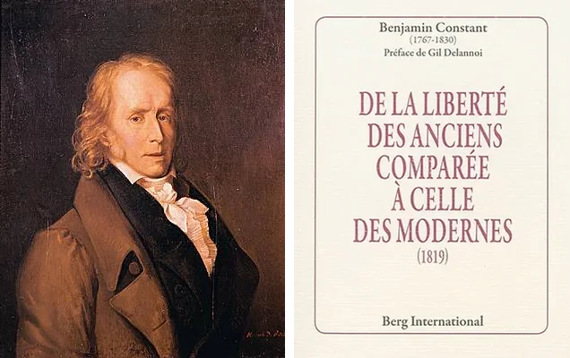

Ce sujet a toujours fait l'objet de débats, et la tradition libérale française du XIXe siècle a produit l'un de ses échanges les plus éclairants. Germaine de Staël (1766-1817), dans son opposition à Napoléon, a inventé cette phrase mémorable : "La liberté est ancienne, le despotisme est moderne" Comme si la pratique du pouvoir par Bonaparte était une nouveauté qui avait bouleversé une tradition séculaire de liberté. Benjamin Constant a adopté le point de vue opposé et, à notre avis, le plus juste. La liberté dans les siècles précédents, et dans l'Antiquité en particulier, n'était ni réelle ni complète. Une longue lignée de penseurs libéraux du XIXe siècle a prolongé cette analyse, démontrant que les conditions historiques du passé n'étaient pas propices à une liberté totale et que, au contraire, **chaque siècle, avec ses améliorations techniques et ses transformations économiques, a rendu la liberté plus praticable** et plus fermement ancrée dans les faits de la vie moderne.

### Les mythes de l'âge d'or et du contrat social

L'histoire de la liberté a toujours été accompagnée de mythes, et deux des plus célèbres méritent notre attention.

Le premier est le mythe du "bon sauvage" de Jean-Jacques Rousseau, qui introduit l'idée que la liberté, l'autonomie, l'indépendance et la plénitude de la puissance humaine se trouvent dans le passé. C'est l'âge d'or éternel, partagé par les philosophes et les penseurs religieux à travers les siècles : la conviction que l'humanité est tombée d'un état originel de perfection. Les libéraux du XVIIIe siècle, à l'époque de Rousseau lui-même, puis à travers la Révolution et tout le XIXe siècle, ont systématiquement combattu cette idée fausse. **Les conditions réelles d'existence des sociétés primitives ne ressemblent en rien à l'idylle** du noble sauvage.

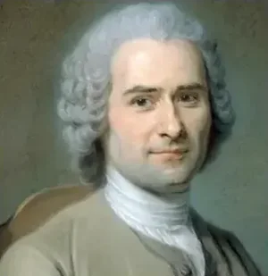

Le second mythe est celui du contrat social, selon lequel la société aurait été fondée par un accord primitif entre des individus libres. Mais les éléments nécessaires à un tel contrat manquaient à l'époque supposée de sa création : un langage développé, la conception même d'une société au-delà de la famille. **La société n'est pas une création volontaire née d'un accord conscient** ; elle existe d'emblée comme condition naturelle de l'existence humaine. On ne crée pas une société, on y naît. Ce sont des contradictions et des erreurs historiques que les libéraux ont identifiées et qui nous permettent de développer une vision plus juste de l'histoire de la liberté.

### La propriété individuelle dans les sociétés préhistoriques : une réalité inexistante

Comment comprendre la propriété de soi à la préhistoire ou dans l'Antiquité ? Dans ces sociétés, comme l'ont également confirmé les voyageurs des XVIIIe et XIXe siècles lorsqu'ils ont rencontré des sociétés archaïques subsistant dans des régions reculées, **l'enfant était la propriété du père**. Il n'avait aucune liberté jusqu'à l'âge où il pouvait porter les armes et subvenir à ses besoins. De même, la femme est considérée comme la propriété de son mari ou de son père ; elle peut être vendue, donnée en héritage ou échangée comme bien matériel.

L'abbé de Saint-Pierre explique cette situation par **l'extrême faiblesse du pouvoir productif de l'époque**. La production se limitait à la chasse, à la pêche et à la cueillette ; la sécurité était inexistante. Il y a un besoin impérieux de l'appui des hommes adultes. Si une femme souhaitait, comme le dit l'abbé, "goûter à la liberté" et fuir son campement, elle s'exposait à une mort certaine dans la nature, car elle ne disposait d'aucune capacité de production indépendante. On ne peut tout simplement pas créer des conditions qui n'existent pas encore.

De même, l'individu est entièrement soumis à la tribu. Un ensemble de règles régissait chaque action, y compris la plus personnelle. La sphère privée que nous définissons aujourd'hui comme un espace de liberté n'existait pas. Ces sociétés pratiquaient le sacrifice systématique des individus considérés comme incapables ou faibles : l'avortement, le sacrifice des veuves et des vieillards étaient des pratiques régulières, souvent sanctionnées par les lois et les religions. Les circonstances qui expliquent tout cela sont, tout d'abord, une nature ingrate et improductive, rendant extraordinairement difficile l'obtention de ressources et de richesses dans les premiers âges de l'histoire humaine. Il y avait aussi les aléas climatiques et les dangers des autres tribus ; la sécurité n'existait tout simplement pas. On était complètement soumis aux caprices de la nature, bien plus qu'aujourd'hui, où l'on peut anticiper les risques et trouver des solutions pour en atténuer les effets. Le combat pour la vie, contre la nature et contre les tribus concurrentes, se déroulait sans protection particulière, sans sécurité à l'échelle des tribus ou des nations.

### L'impossibilité de la propriété foncière privée

La propriété privée de la terre est également impossible à établir. **Les activités productives de l'époque nécessitaient de vastes territoires communs**. La chasse au buffle ou à l'éléphant, par exemple, ne pouvait se faire sur un terrain clos de deux hectares. Le nomadisme était une nécessité, pas un choix. Les peuples pastoraux, par définition, ne pouvaient pas s'attacher à une petite parcelle fixe de propriété privée.

Cette propriété collective ne doit pas être confondue avec le communisme au sens idéologique du terme. La terre était commune au sein de la tribu, de la famille ou du groupe de familles, mais elle était considérée comme la propriété de ce groupe. Les conflits entre tribus étaient importants, personne n'imaginait que la terre entière était la propriété commune de tous. Ces groupes se comportaient comme des animaux défendant leur territoire. Mais ce n'était pas une propriété privée liée à l'individu, c'était **une adaptation collective aux conditions de production**.

### "Libre ! Libre de faire quoi ?"

Charles Dunoyer (1786-1862), dans son remarquable ouvrage [*L'industrie et la morale considérées dans leurs rapports avec la liberté*](https://planb.academy/resources/books/industrie-morale-liberte-0ce13a70-e72b-4c5c-b527-fdb9b0a60aae) (1825), puis dans [*De la liberté du travail*](https://planb.academy/resources/books/de-la-liberte-du-travail-edf7f393-d110-4a18-96f4-fcc477f0b49c) (1845), a montré que **la liberté est une construction progressive**. Nous sommes plus libres dans les sociétés industrielles que dans les sociétés féodales, plus libres sous la féodalité que sous l'esclavage ancien, et plus libres sous l'esclavage que dans la préhistoire. Mais qu'est-ce que l'homme préhistorique était libre de faire ? Rien, car l'existence humaine était soumise à toutes les contraintes imaginables.

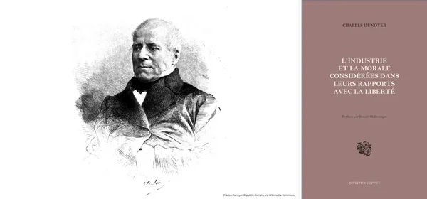

**L'absence de sécurité est un obstacle fondamental à la liberté d'action**. Pourquoi agir, pourquoi entreprendre, si les fruits et les effets de ses actions sont constamment compromis par le danger ? La toute-puissance de la coutume empêchait en outre toute liberté réelle. Devant l'absence de sécurité et la multiplicité des dangers, on jugea préférable d'imposer une direction à l'homme plutôt que de le laisser avec ses faibles lumières dans des circonstances trop difficiles pour le jugement individuel. La grande masse de la population se soumettait à la coutume, peut-être moins volontiers dans l'élite, mais largement et complètement, parce que les circonstances l'exigeaient.

### L'impossibilité de la liberté de pensée

La liberté de pensée peut-elle s'exercer dans de telles conditions ? **Le développement de l'intelligence nécessite une culture quotidienne** par l'éducation et l'observation. Mais comment l'intelligence pouvait-elle être mobilisée lorsque la production dépendait principalement de la force brute ? Les activités productives des premières sociétés reposaient sur la force physique pour obtenir les nécessités de la survie, et il y avait peu de place pour la contribution intellectuelle.

Les innovations techniques ont fondamentalement transformé cette équation. La machine à vapeur en est un exemple emblématique : elle fait partie d'une série d'outils, de machines et d'améliorations technologiques qui, du Moyen Âge à nos jours, ont **permis à la liberté de pensée de devenir une réalité pratique**. Prenons la comparaison entre un porteur, qui transfère des marchandises à la force de son dos, et un conducteur de locomotive. Ces deux métiers ne requièrent pas les mêmes dispositions humaines. Le second permet un développement beaucoup plus complet des capacités intellectuelles, une véritable acquisition et un exercice de la liberté de pensée.

Tels sont les éléments historiques qui expliquent le développement progressif de la liberté. Dans les leçons qui suivent, nous examinerons les circonstances spécifiques qui ont rendu la liberté de plus en plus possible, et comment elle s'est imposée, pas à pas, comme le principe directeur des sociétés modernes.

## L'ancienne raison d'être de l'esclavage, du servage et de l'autorité politique

<chapterId>29fc841c-eb21-522d-818c-9b50c6558396</chapterId>

### La première raison d'être de l'esclavage

Après avoir examiné la non-liberté imposée par les circonstances du passé le plus lointain de l'humanité, nous nous tournons maintenant vers les institutions spécifiques qui sont nées de ces circonstances : l'esclavage, le servage et la sujétion politique. Nous verrons comment ces formes de non-liberté, une fois enracinées dans les faits de leur époque, ont progressivement cédé à de nouveaux faits et à de nouvelles circonstances.

**L'esclavage est né dans des circonstances particulières et s'est développé universellement**, parce qu'il était intimement lié aux conditions de l'époque. D'abord, la production et l'acquisition des richesses se font presque exclusivement par la force : la chasse, le combat, la conquête. Les hommes formés à la violence et à la domination d'autrui, à la domination des animaux et à la conquête violente, étaient naturellement portés à l'asservissement de leurs semblables.

Les caractéristiques de la production individuelle dans le passé méritent notre attention. Les résultats étaient médiocres : on travaillait énormément, en employant une grande force physique, mais les résultats étaient extrêmement faibles et profondément incertains. La faiblesse des marchés aggravait cette difficulté. Même si l'on avait produit en abondance, comment transporter des denrées périssables ? Aujourd'hui, bien sûr, le marché est ouvert ; même les fruits et les légumes peuvent être expédiés à travers le monde. Dans les premiers temps, le transfert entre deux villages ou deux tribus était déjà extrêmement difficile, surtout lorsque les groupes humains vivaient à de grandes distances les uns des autres. La conservation n'existait pratiquement pas, à l'exception des viandes séchées et d'autres méthodes similaires. Le commerce était extrêmement limité et, par conséquent, les richesses étaient difficiles à obtenir en raison des aléas nombreux et puissants.

Dans cette existence précaire, l'esclavage a servi d'assurance contre les risques existentiels. Il permettait aux travailleurs de contribuer à la production sans avoir à risquer leur vie chaque jour dans les activités les plus dangereuses. L'esclavage a perduré dans ces sociétés parce que deux éléments le soutenaient : la violence et l'insécurité quotidiennes, et la médiocrité des résultats productifs qui nécessitaient l'organisation du travail par la force.

Aristote lui-même a fourni une justification rétrospective. **L'esclavage existait, expliquait-il, parce qu'il n'y avait pas de machines**. Si la production avait pu être mécanisée, si des outils avaient pu faire le travail des muscles humains, les esclaves n'auraient pas été nécessaires. Mais la production est restée extrêmement limitée et incertaine, et la balance des avantages et des inconvénients de cette assurance brutale a donc penché en faveur de l'institution de l'esclavage, dans toutes les sociétés anciennes, comme conséquence de ces circonstances historiques particulières.

### Les transformations successives de l'esclavage

Cependant, l'esclavage, aussi fermement ancré dans les circonstances historiques des premiers âges de l'humanité, a commencé à se transformer au fur et à mesure que la production elle-même se transformait. Lorsque **l'activité économique est devenue plus intellectuelle, exigeant créativité et innovation, l'esclavage s'est révélé profondément inadapté**. **Un esclave répond au fouet et à la verge, mais il ne peut pas inventer**. Lorsqu'une société a besoin d'invention, lorsqu'elle a besoin d'employer la vigueur mentale de manière productive, l'esclavage devient inopérant. Dans le même temps, les circonstances devenant moins dangereuses, les individus ont trouvé en eux la capacité de gouverner leur propre conduite et la volonté d'assumer les risques d'une existence autonome.

Ces forces de transformation ont conduit à l'abolition progressive et à la mutation de l'esclavage, d'abord en servage, puis en d'autres formes de domination politique ou sociale moins contraignantes. Siècle après siècle, au gré des circonstances, la liberté individuelle est devenue de plus en plus possible. Cette évolution a été particulièrement visible dans les sociétés les plus touchées par le progrès technique et technologique, où les nouvelles circonstances ont apporté un soutien concret à l'expansion de la liberté.

### La critique libérale de l'esclavage moderne

Le maintien de l'esclavage en Amérique aux XVIIIe et XIXe siècles constitue un paradoxe historique majeur. Les penseurs libéraux français ont reconnu que l'esclavage pouvait avoir une certaine justification dans les sociétés les plus anciennes, dans l'Antiquité et dans les premiers temps de l'exploration coloniale. Mais **l'esclavage des Noirs à l'époque moderne n'avait aucune justification** ; c'était un système anti-productif maintenu artificiellement par l'autorité politique.

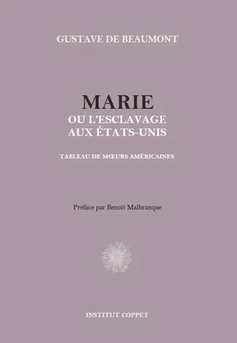

Gustave de Beaumont (1802-1866), qui entreprend son célèbre voyage aux États-Unis en 1831 aux côtés d'Alexis de Tocqueville, choisit à son retour de consacrer ses propres travaux à la réalité du massacre des Amérindiens et à la condition des Noirs dans la société américaine, qu'ils soient esclaves ou nominalement libres, tandis que Tocqueville se consacre à l'écriture de la *Démocratie en Amérique*.

Charles Comte (1782-1837) et d'autres auteurs libéraux ont identifié deux effets principaux de l'esclavage qui les ont amenés à condamner le système dans les termes les plus forts. Tout d'abord, la brutalisation de l'esclave lui-même. Dans les nouvelles conditions de production, dès le XVIIIe siècle, le besoin d'effort intellectuel, d'application de l'intelligence et même de la morale au travail productif se fait de plus en plus sentir. L'esclavage n'a fait que brutaliser la personne, il n'a pas pu faire appel à ses capacités intellectuelles, il l'a privée de toute possibilité de développement. Deuxièmement, et tout aussi dévastateur, **la brutalisation des propriétaires d'esclaves eux-mêmes**. Ils ont développé une vision profondément négative du travail et n'ont eu recours qu'à la force. L'habitude de dominer les autres a transformé leurs idées et leur caractère. Ce n'est pas un hasard, observent ces auteurs, si les grandes familles esclavagistes de Virginie ont produit tant d'hommes politiques et de présidents : la pratique de la domination sur autrui a engendré des conceptions profondément illibérales, incompatibles avec les principes d'égalité qui devraient être à la base des sociétés modernes.

### La sujétion politique : née des mêmes circonstances

L'assujettissement politique trouve lui aussi ses racines dans les mêmes circonstances que l'esclavage. Dans les sociétés les plus anciennes, **le besoin impératif de sécurité exigeait une direction**. On ne pouvait aller à la chasse sans direction, car une chasse improductive, deux chasses improductives, signifiaient la famine et la mort. Au combat, lorsqu'une tribu en attaquait une autre, il fallait trouver une solution, faire des choix rapides et décisifs. Ce besoin de chefs et de domination politique s'est imposé, et nous voyons dans ces sociétés un pouvoir étendu de chefs et surtout de règlements couvrant presque tous les aspects de la vie.

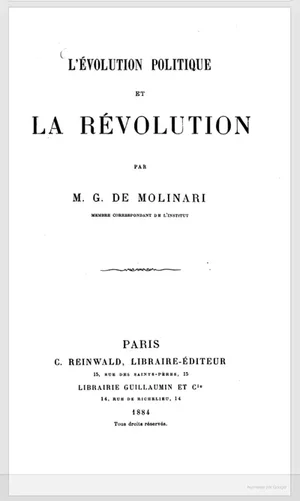

Le risque de guerre, combiné à l'extrême faiblesse de la sécurité, exige une protection politique à l'échelle nationale. L'étroitesse des marchés et la nullité des communications renforcent encore cette dépendance : **on ne peut s'émanciper de son groupe**, on ne peut rechercher la concurrence ou les idées nouvelles, car les communications sont trop faibles. On était donc soumis au pouvoir politique qui gouvernait, un pouvoir qui pouvait avoir une plus grande justification dans le passé, précisément parce que les circonstances étaient beaucoup plus dangereuses et décisives qu'elles ne le sont devenues aujourd'hui.

Avec cet examen des raisons d'être historiques de la non-liberté, nous pouvons déjà sentir la transformation. Dans la leçon suivante, nous retracerons les progrès techniques et intellectuels qui, en modifiant les conditions de l'existence humaine, ont rendu la liberté non seulement possible, mais de plus en plus inévitable.

## Émanciper le progrès technique et intellectuel

<chapterId>a9cf7eb2-4639-5b8a-8fd6-2ad0a9e7cff2</chapterId>

### De la destruction à la production

Nous allons maintenant examiner les éléments spécifiques qui, à travers l'histoire de l'humanité, ont permis la transition de systèmes de non-liberté à l'établissement progressif de la liberté. Quelles circonstances nouvelles ont ouvert la porte ?

Commençons par les transformations de la production elle-même. Dans les premiers temps de l'histoire humaine, **la production était à proprement parler une destruction plutôt qu'une création**. La chasse, la pêche, la cueillette puisaient dans les réserves de la nature sans rien y ajouter. Les groupes humains ne créaient pas de nourriture, ils se contentaient de saisir ce qu'ils trouvaient. Les limites sont sévères : le gibier doit se reproduire, les arbres fruitiers doivent être suffisamment nombreux, et lorsqu'un territoire est épuisé, il faut attendre une saison entière ou partir. Les déplacements nomades ont modifié l'espace dans lequel ces groupes opéraient, mais ils restaient fondamentalement dans une logique de destruction et de saisie, et non de production.

Nous retrouvons ici Rousseau et sa fameuse image de l'homme qui, le premier, a enclos un terrain, devenant ainsi le premier spoliateur d'une terre supposée commune. Paul Leroy-Beaulieu (1843-1916), dans [*Le Collectivisme*](https://planb.academy/resources/books/le-collectivisme-d79dc3a7-7b77-4698-89e6-440312e2da2c), a démontré que cette image est fausse. La terre n'était pas commune à toute l'humanité ; elle était commune à l'intérieur d'un petit groupe humain, la tribu ou la famille, mais elle était considérée comme la propriété de ce groupe. Les conflits entre tribus étaient importants et réguliers. Personne n'imaginait que la terre appartenait en commun à tous les différents groupes ; ils se comportaient comme des animaux défendant leur territoire.

L'homme qui, le premier, a clôturé un terrain n'est donc pas un spoliateur, mais un généreux bienfaiteur. **Il a transformé la production par destruction en véritable production**. En maîtrisant les éléments de la vie, par l'élevage et les débuts de l'agriculture, il a fait naître plus de ressources qu'il n'en consommait. Il a créé un véritable surplus de production, améliorant l'environnement dans lequel il vivait et tirant de nouvelles richesses qu'il n'a pas seulement accaparées mais véritablement créées. C'est une révolution, car des conditions entièrement nouvelles peuvent en découler : les risques peuvent être mieux compris et anticipés, la population peut croître, et les nouvelles ressources permettent de financer la protection collective, la sécurité et les prémices de l'ordre social.

### La sécurité, une condition préalable et une conséquence

Dupont de Nemours (1739-1817), l'un des grands économistes physiocrates qui a anticipé Turgot et, en fait, Adam Smith, a écrit en 1765 dans le *Journal de l'agriculture, du commerce et des finances* :

> "Une culture sans produit net, quelque abondantes que soient les récoltes, ne peut faire vivre qu'un petit nombre de familles éparses, sans relations, sans commerce, sans communication les unes avec les autres, et par conséquent sans que ces familles puissent former une nation, même si elles habitaient un territoire aussi vaste que l'Europe ; car les hommes isolés qui cultiveraient cette terre n'auraient aucun garant pour assurer la propriété de leurs récoltes, ni même la sûreté de leurs personnes, puisqu'il leur serait impossible de faire aucune dépense pour l'entretien d'une autorité tutélaire assez puissante pour réprimer les désordres que la cupidité de ceux qui violeraient les droits d'autrui pourrait occasionner."

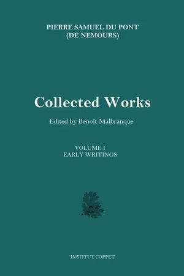

La logique de ce passage est claire : **les nouvelles ressources générées par une véritable production permettent d'introduire un plus haut degré de sécurité** dans les relations humaines. Il y a plus de ressources, donc plus d'échanges, et des relations pacifiques et contractuelles peuvent se développer bien plus que dans les sociétés guerrières de l'époque des chasseurs.

Or, nous rencontrons ici un paradoxe qui explique la lenteur historique du progrès. **La sécurité est une condition du développement économique** mais aussi une conséquence du développement, car seul un surplus de production peut financer les institutions qui garantissent l'ordre social. Ce cycle est très difficile à enclencher et, une fois lancé, il ne progresse que lentement. Mais une fois qu'il a pris de l'ampleur, il tend à se renforcer progressivement.

### Ce que signifie réellement le capitalisme

Le terme "capitalisme", bien qu'imprécis, permet d'identifier ce qui se cache derrière les progrès techniques et intellectuels émancipateurs de ces derniers siècles. Au fond, **le capitalisme, c'est la substitution de l'outil et de la machine à la force brute** comme élément central de la production. C'est la fin de la domination fondée sur la puissance physique, et le début de la production et de l'échange pacifiques.

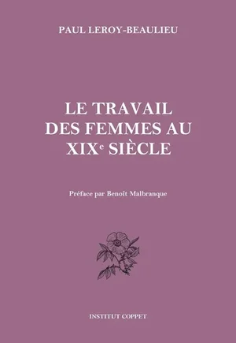

Cette transformation a profondément modifié le statut des individus, et notamment des femmes. Dans les sociétés de chasseurs et de guerriers, la contribution productive des femmes était considérée comme secondaire, car elle dépendait d'une force physique dans laquelle elles étaient désavantagées. L'arrivée de machines et d'outils sophistiqués, nécessitant moins de force brute et plus d'esprit, de direction et de vigueur intellectuelle, a permis aux femmes d'augmenter considérablement leur productivité et de participer à la vie économique sur un pied d'égalité. **La propriété individuelle s'est développée avec le capitalisme et ses progrès techniques et technologiques**.

Le progrès technique a également ouvert les marchés. Les routes, et surtout les chemins de fer au XIXe siècle, ont élargi les débouchés, permis la concurrence nationale et internationale et soumis de plus en plus les sociétés à la logique du contrat plutôt qu'à celle de la contrainte. Le prix de la vie elle-même a augmenté, car l'individu, plus productif d'un âge précoce à un âge plus avancé, pouvait contribuer, innover et exercer sa liberté pendant une période beaucoup plus longue de son existence active.

### L'évolution du statut de l'innovateur

Ces transformations ont également modifié la valeur accordée à l'innovation. Dans les sociétés les plus anciennes, **l'innovateur était considéré avec une profonde méfiance**, car il créait de l'incertitude. Dans un monde où l'on vivait au jour le jour, où les risques étaient omniprésents et la sécurité inexistante, les idées nouvelles étaient dangereuses. Le groupe humain ne suivait pas un innovateur qui ne pouvait pas garantir que ses nouvelles méthodes donneraient des résultats, car le coût de l'échec était la famine.

De nouvelles conditions matérielles ont permis à de nouvelles idées de s'épanouir. La tendance historique à la perfectibilité de l'homme a rendu l'innovation non seulement tolérable, mais activement recherchée. Au Moyen Âge, les innovateurs étaient persécutés et brûlés ; dans les sociétés modernes, ils sont devenus des héros. Ce renversement n'est pas un changement de mode morale ; il est la conséquence directe des conditions matérielles qui permettent désormais l'expérimentation, tolèrent l'échec et récompensent l'amélioration.

Lorsque nous examinons les différents stades de développement, depuis les premières sociétés avec leur maigre production et leur extrême vulnérabilité aux risques naturels, jusqu'aux sociétés capables de déployer des machines et des outils qui diminuent la pression des incertitudes de la nature, nous constatons une corrélation profonde entre les conditions matérielles et le potentiel de liberté individuelle. **La liberté n'est pas une aspiration philosophique abstraite** ; elle dépend fondamentalement des conditions matérielles qui permettent aux êtres humains de se libérer des nécessités les plus pressantes de l'existence.

## L'histoire en un coup d'œil

<chapterId>3fffa63c-58bb-5c97-a2f5-fec90c05f182</chapterId>

### Un résumé et une synthèse plus approfondie

Faisons une pause pour rassembler les fils des leçons précédentes avant d'aborder les nouvelles circonstances de notre siècle. Quelle vision générale de l'histoire se dégage de l'analyse que nous avons faite ?

Tout d'abord, nous avons identifié un ensemble de faits qui, dans les sociétés les plus anciennes, ont empêché le plein établissement de la liberté et de la propriété. Les nombreux aléas de la production, l'extrême précarité et la maigreur des résultats, les conditions mêmes de l'activité productive, notamment la chasse, qui exigeaient de vastes territoires incompatibles avec la petite propriété privée, tout concourait à faire de la **liberté et de la propriété une aspiration lointaine plus qu'une réalité concrète**.

Puis nous avons identifié les faits qui ont permis l'émancipation : **la naissance de l'agriculture, qui a introduit la production pacifique et l'accumulation de surplus** ; la multiplication des échanges rendue possible par l'accroissement des ressources ; l'émergence des relations contractuelles, introduisant des interactions fondées sur l'accord mutuel plutôt que sur la force. De ces transformations matérielles sont nées de nouvelles idées et de nouvelles possibilités d'organisation humaine.

### Une nouvelle façon de lire l'histoire

Toutes les histoires nationales et mondiales peuvent être analysées à travers ce prisme, et il s'agit d'une approche profondément importante, bien que malheureusement négligée. Le récit conventionnel de l'histoire se concentre sur la conquête et la transmission du pouvoir : la montée et la chute des dynasties, la naissance des monarchies, la succession des régimes politiques. Cela n'a que peu d'intérêt. **Ce qui importe le plus, c'est la conquête progressive de la liberté** : comment elle progresse, pourquoi elle progresse et ce qui la fait avancer.

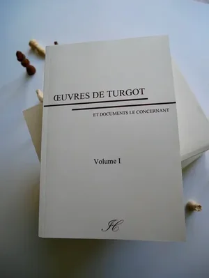

Les sociétés anciennes, celles de l'Antiquité et du Moyen Âge, étaient organisées différemment, précisément parce que leurs techniques de production différaient radicalement. **Les systèmes politiques ne sont pas des impositions arbitraires, mais des réponses à des circonstances matérielles**. Plusieurs transitions majeures marquent cette progression : les débuts de l'agriculture et de la propriété privée, le passage de l'esclavage au servage et du servage au travail réglementé (une transition inégale, accomplie avec beaucoup de difficultés dans certaines sociétés, mais qui se poursuit siècle après siècle), la naissance de la petite industrie, les grandes inventions (la machine à vapeur surtout) et la découverte de nouveaux continents.

Chacune de ces transformations a ouvert des marchés et créé les conditions de la concurrence. Sans routes, sans chemins de fer, sans découverte d'autres peuples et d'autres terres, le monde restait petit, sans communication, sans concurrence des idées ni concurrence des produits. On vivait sur un marché minuscule, sous domination politique et économique, et on subissait de plein fouet les aléas naturels, parce que le commerce, qui permet d'équilibrer les résultats agricoles entre les régions et les saisons, n'existait pas.

### Les Lumières : quand les idées rencontrent de nouvelles circonstances

Le mouvement des Lumières représente, selon nous, l'un des moments les plus importants de cette histoire. C'est **l'émergence d'idées nouvelles qui trouvent leur application précisément parce que les conditions matérielles ont changé**. Les penseurs de cette époque, les physiocrates, Turgot en particulier, et Condorcet, anticipaient un progrès toujours plus grand de l'humanité. Cette notion de perfectibilité de l'espèce humaine les conduit à concevoir des institutions, et surtout une pratique de la liberté, beaucoup plus ambitieuse que tout ce qui a été tenté auparavant, parce que la liberté est désormais de plus en plus imposée par des circonstances nouvelles, et que son utilité pratique se fait sentir.

Considérons le contraste avec le Moyen-Âge. À l'époque médiévale, la libre concurrence et la liberté des prix pouvaient raisonnablement être considérées comme irréalisables. Le boulanger d'une petite ville avait un marché réservé ; on ne pouvait pas obtenir du pain d'un concurrent situé à plusieurs kilomètres. Pour de nombreux biens, même agricoles, il n'y avait tout simplement pas d'alternative, et les producteurs exerçaient donc une domination sur les consommateurs que les circonstances de l'époque rendaient presque inévitable. Au XVIIIe siècle, les physiocrates observent la naissance du commerce mondial, notamment des denrées agricoles, et démontrent que **ces nouvelles circonstances exigent le libre-échange**, qui permet aux prix de s'équilibrer et aux biens d'être obtenus au moindre coût.

### Réformes ou révolutions

L'exemple français du XVIIIe siècle illustre, avec une douloureuse clarté, **la grande nécessité d'harmoniser les idées avec les faits**. Les philosophes des Lumières ont électrisé l'élite intellectuelle avec leurs idées, et Turgot, en tant que ministre, a tenté des réformes radicales. Mais le problème fondamental est l'impossibilité d'aligner les idées nouvelles sur les réalités sociales sans passer par une révolution violente. Comment former une opinion publique éclairée sans une presse libre, sans canaux permettant aux idées d'atteindre les gens du peuple ?

Normalement, les réformes et l'opinion publique vont de pair : des changements graduels, guidés par un jugement éclairé, permettent de réconcilier pacifiquement les idées avec les faits, étendant la liberté parce que les nouvelles circonstances l'imposent et la permettent à la fois. **Les révolutions produisent une violence énorme et tendent à imposer beaucoup plus de changements que l'opinion publique n'est prête à en absorber**. Cela explique les revers fréquents et amers qui suivent les périodes révolutionnaires : la population n'est pas prête pour tout ce que la révolution exige.

Le travail patient d'une réforme graduelle est donc préférable. Il permet aux sociétés d'accéder à une plus grande liberté lorsque le temps le permet vraiment, sans les convulsions destructrices d'un bouleversement violent. C'est l'une des conclusions essentielles de notre analyse historique, et elle nous prépare à la question que nous aborderons dans la prochaine leçon : quelles sont les circonstances spécifiques de notre siècle, et pourquoi sont-elles les plus favorables à la liberté qui aient jamais existé dans l'histoire de l'humanité ?

## Les nouvelles circonstances du 21ème siècle

<chapterId>a1c0c590-d0f6-5a18-a949-67f7a568ca6d</chapterId>

### Le caractère de plus en plus intellectuel du travail

Nous arrivons maintenant à la conclusion de cette deuxième partie et à la question qui lui donne toute sa signification : quelles sont les nouvelles circonstances du XXIe siècle et pourquoi rendent-elles la liberté non seulement possible mais impérative ?

Le premier fait, le plus décisif, est que **le travail est devenu de plus en plus intellectuel**. Cela crée une situation entièrement nouvelle, car le développement de la pensée ne se fait pas par miracle ; il se fait par le libre débat, par la concurrence des idées, et donc par la tolérance religieuse, la liberté d'expression et l'éducation libre. Dans les sociétés où la production n'exigeait que la force brute, la liberté d'enseignement n'avait pas d'importance particulière ; il suffisait d'apprendre à chasser ou à casser la pierre. Le patrimoine intellectuel de l'humanité était beaucoup plus réduit, et l'éducation occupait un domaine réduit en conséquence.

Le grand défaut des systèmes autoritaires d'éducation et de pensée est qu'ils conçoivent toujours les idées et la vérité comme des choses figées, qu'il s'agit simplement de transmettre. Or **la vérité n'est pas figée, la connaissance se crée, elle s'améliore**, et le but de l'éducation, comme le but de toute liberté d'expression, de science, de recherche, et même de tolérance religieuse (car il y a aussi un progrès nécessaire des idées religieuses, sujet sur lequel de nombreux libéraux français, dont Benjamin Constant, ont beaucoup travaillé) est de permettre cette création et cette amélioration.

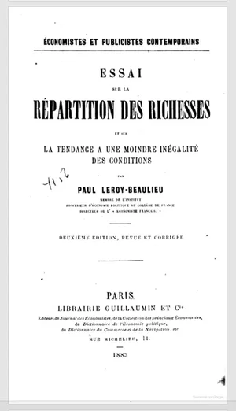

Paul Leroy-Beaulieu, dans son [*Essai sur la répartition des richesses*](https://planb.academy/resources/books/essai-repartition-richesses-c5b307dc-eed4-493f-a76a-b23321a81c99), est l'un des auteurs libéraux français qui a le mieux analysé ces nouvelles circonstances et leurs implications futures. Il a montré que le caractère de plus en plus intellectuel du travail enrichit de nouvelles couches de la société, et transforme en particulier la situation des femmes. À mesure que le travail devient plus intellectuel, la valeur et la contribution productive des femmes augmentent de façon spectaculaire. On ne peut plus les confiner au ménage et à la famille sans priver la société de l'intelligence de la moitié de l'humanité, intelligence nécessaire à l'innovation, aux améliorations techniques et technologiques et au progrès général de la production.

### L'abondance de nouvelles ressources

Le travail est également devenu beaucoup plus productif, ce qui entraîne une cascade de nouvelles circonstances. **L'augmentation de la productivité génère de nouvelles ressources** qui peuvent être utilisées, tout d'abord, pour l'épargne et l'autosuffisance individuelle. L'individu devient de plus en plus capable de subvenir à ses besoins et d'activer sa liberté individuelle en assumant les responsabilités qui en découlent, plutôt que de compter sur la sécurité de la servitude. Ces nouvelles ressources peuvent également financer la sécurité au niveau collectif : une police, une justice, bien plus efficaces et bien moins coûteuses, proportionnellement, que tout ce qui existait dans le passé.

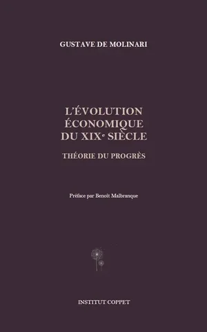

Des ressources deviennent disponibles pour atténuer les risques : maladies, catastrophes naturelles et les innombrables incertitudes qui dominaient autrefois l'existence humaine. Dans les sociétés les plus anciennes, les communautés étaient entièrement à la merci de ces risques ; aujourd'hui, nous pouvons les anticiper, nous en protéger et consacrer des ressources à leur gestion.

Plus important encore peut-être, **de nouvelles ressources deviennent disponibles pour s'occuper des plus faibles et des plus vulnérables** : les enfants, les personnes âgées, les personnes gravement handicapées. Dans les sociétés les plus anciennes, ces personnes étaient systématiquement sacrifiées, non par cruauté mais par nécessité économique. Les personnes âgées ne pouvaient être entretenues lorsqu'elles ne pouvaient plus contribuer à la production. Les nouveau-nés étaient soumis à des tests d'aptitude physique ; ceux qui étaient jugés faibles étaient tués. Dans certaines sociétés, le premier-né était systématiquement sacrifié, au motif que, comme les premiers fruits d'un arbre, les premiers rejetons n'étaient pas aussi sains que les suivants. Les femmes étaient maintenues en nombre minimal, car leur entretien coûtait des ressources et leur contribution productive, dans une économie basée sur la force brute, était considérée comme négligeable. Ces pratiques, que nous examinons aujourd'hui avec un mélange d'horreur et de curiosité, les attribuant à des idées religieuses ou à des superstitions, étaient en fait des nécessités économiques imposées par l'extrême précarité de l'existence.

### La mondialisation et l'harmonie des intérêts

Les nouvelles circonstances comprennent également la mondialisation, l'ouverture des marchés qui permet l'harmonie des intérêts. Dans le monde moderne, nous sommes de plus en plus dans des relations entre producteurs et consommateurs, entre fournisseurs et clients, plutôt que dans l'opposition d'intérêts qui caractérisait les sociétés anciennes. Lorsque la production dépend de la saisie plutôt que de la création, lorsque deux groupes se disputent le même terrain de chasse, ils sont enfermés dans un conflit à somme nulle. Mais la **concurrence pacifique, rendue possible par l'élargissement des marchés, crée des bénéfices mutuels**.

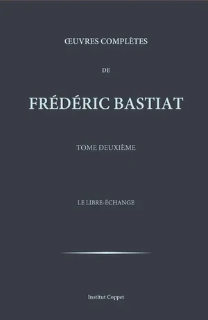

La concurrence internationale rend également les effets des réglementations nuisibles, des impôts lourds et de la dette publique excessive beaucoup plus visibles et conséquents. Dans les sociétés fermées du passé, la domination politique pouvait être totale, parce qu'il n'y avait pas d'alternative ; il n'y avait pas de marché extérieur à l'aune duquel mesurer ses performances. Aujourd'hui, les nations les plus libérales tirent le plus grand profit du commerce, précisément parce qu'elles sont en concurrence avec des nations endettées, interventionnistes, accablées par des réglementations oppressives et une fiscalité lourde, et par conséquent moins productives. **Les conséquences de l'absence de liberté ne sont plus cachées** ; elles sont exposées par la comparaison implacable du commerce international.

### Technologie : le recul du contrôle de la pensée

Enfin, l'histoire de la technologie, qui remonte aux temps les plus anciens mais qui s'est accélérée de façon stupéfiante au cours des deux derniers siècles, fournit peut-être la plus frappante des nouvelles circonstances. **La technologie a permis de faire progresser la liberté et de consolider des acquis** qui, autrement, seraient restés fragiles.

Considérons le recul du contrôle de la pensée. Les libéraux français du XIXe siècle, même à l'époque de Napoléon III, peinaient à s'écrire librement. La presse est contrôlée, la correspondance est surveillée. L'édition d'un livre nécessite de naviguer entre censure et réglementation ; un imprimeur ne peut se risquer à publier des ouvrages susceptibles d'être interdits, comme sous l'Ancien Régime, où il fallait une autorisation royale pour imprimer un volume. Aujourd'hui, **la technologie a considérablement réduit la capacité des gouvernements à contrôler la transmission des idées**. La création et la diffusion de nouvelles idées sont infiniment plus faciles qu'il y a deux siècles.

On le voit aussi dans la protection de la vie privée, et dans le développement des monnaies numériques, qui permettent des échanges beaucoup moins contraints que ceux du passé. C'est sur ces éléments que je voudrais conclure cet examen des nouvelles circonstances. Le passé est bien plus profondément ancré dans les conditions de non-liberté que nous avons tendance à le réaliser, et aujourd'hui nous voyons de nouveaux éléments de la technologie, du travail productif et surtout intellectuel, une révolution d'une importance immense, qui rendent la liberté plus praticable que jamais auparavant.

Nous pouvons revenir aux faits fondamentaux de la nature humaine que nous avons établis dans la première partie : la propriété de soi, la liberté individuelle, l'autonomie individuelle. Ces faits n'ont pas changé, mais les circonstances qui permettent leur exercice ont profondément changé au cours de l'histoire. C'était tout l'objet de la deuxième partie de notre cours. Nous aborderons maintenant les effets de la liberté et les effets de la contrainte, que nous comparerons, avant d'examiner les sophismes qui soutiennent la domination politique jusqu'à nos jours, et enfin d'esquisser un programme de liberté, économique, sociale, politique et internationale, tel qu'il est possible aujourd'hui après ces transformations historiques.

# Comment fonctionne la liberté

<partId>d8b75eca-d6c5-535c-a659-2a0320783baf</partId>

## La capacité à se gouverner soi-même

<chapterId>aeca263f-cce0-5025-829e-4480b73394a6</chapterId>

### Le bon usage de la liberté

Après avoir examiné les faits qui fondent la doctrine de la liberté et l'évolution historique de la liberté et de la contrainte, nous arrivons à une question préliminaire cruciale avant d'étudier le fonctionnement de la liberté dans la pratique. Pour que la liberté s'affirme véritablement comme un projet de société, et pour qu'elle progresse véritablement dans l'histoire, il faut qu'elle soit bien utilisée. Et **pour bien utiliser la liberté, il faut d'abord apprendre à l'utiliser**.

Deux principes essentiels guident cet apprentissage. Le premier : ne pas se faire de mal. Si l'on gaspille ses propres forces, si l'on utilise la liberté de manière inconsidérée ou imprudente, on risque de détruire la liberté même que l'on cherche à exercer. Deuxièmement : ne pas nuire aux autres. Ceux qui s'attaquent à la liberté d'autrui se mettent en guerre contre l'humanité et la société, et dans les sociétés organisées, cette guerre aboutit inévitablement à une grave réduction de la liberté individuelle par l'intervention des institutions judiciaires et policières.

Au-delà de ces deux principes protecteurs, il existe une troisième exigence : utiliser la liberté avec le maximum d'effet utile. Cette optimisation de la liberté est rendue possible par les développements technologiques et techniques que nous avons retracés dans la partie précédente, fruits d'un long processus historique. Lorsque nous analysons les faits historiques, ce qui importe le plus n'est pas la succession des pouvoirs politiques ou les batailles territoriales, mais ce développement progressif de la liberté et l'apprentissage qui l'accompagne.

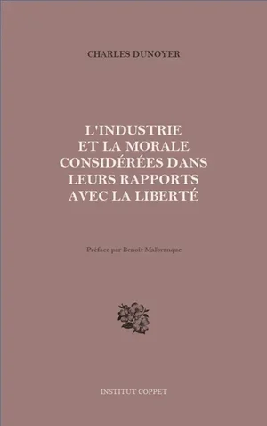

Charles Dunoyer (1786-1862), économiste politique, journaliste et proche collaborateur de Charles Comte, a passé la majeure partie de sa carrière à défendre l'idée que le développement moral et intellectuel était le véritable moteur du progrès de la civilisation. Son œuvre majeure, [*L'industrie et la morale considérées dans leurs rapports avec la liberté*](https://planb.academy/resources/books/industrie-morale-liberte-0ce13a70-e72b-4c5c-b527-fdb9b0a60aae) (1825), reste l'une des tentatives les plus ambitieuses pour fonder la théorie de la liberté sur les faits observables de la nature humaine. Il écrit, vers l'ouverture de cet ouvrage :

> "La liberté n'est pas un don que les sociétés reçoivent tout fait des mains de la nature ou des législateurs. C'est une conquête, lente et douloureuse, qui exige des hommes qu'ils gouvernent leurs passions, disciplinent leurs impulsions et se soumettent au long apprentissage de la maîtrise de soi. Le sauvage n'est pas libre au sens propre du terme ; il est simplement ingouverné. Pour être vraiment libre, il faut être capable de se gouverner soi-même"

En d'autres termes, **la simple absence de contrainte extérieure n'est pas encore la liberté** : elle n'est que la condition préalable à la liberté, qui doit ensuite être construite de l'intérieur.

En effet, cette dimension intérieure de la liberté est ce qui distingue la tradition libérale française du libéralisme purement politique qui réduit la liberté à un ensemble d'arrangements constitutionnels. Pour Dunoyer et ses collègues, la liberté commence à l'intérieur de l'individu, avec la capacité de diriger ses propres facultés vers des fins utiles.

### Se faire du mal : une liberté qui se détruit elle-même

Que se passe-t-il lorsque la liberté est exercée sans cette discipline intérieure ? L'alcoolisme est un exemple particulièrement éclairant d'un usage de la liberté qui finit par nuire à celui qui l'exerce. Il s'agit d'abord d'un acte libre, mais qui diminue progressivement la capacité de liberté de l'individu en le plaçant dans un état de dépendance. Aux effets immédiats d'une consommation excessive s'ajoutent des effets plus lointains : une perte de facultés, une diminution de la volonté, une diminution de la possession de soi et de ses propres forces.

Plus généralement, l'intempérance et toutes les actions ou habitudes qui dépravent, énervent ou brutalisent nos facultés sont des obstacles à la véritable liberté. Plus ces comportements altèrent nos capacités, moins nous sommes libres d'en faire un usage éclairé, voire un usage tout court. Dunoyer a décrit cette diminution auto-infligée avec une précision caractéristique :

> "L'intempérance, la licence, l'oisiveté ne sont pas seulement des fautes morales aux yeux du prédicateur. Ce sont, au sens le plus rigoureux du terme, des destructions de capital. L'homme qui gaspille sa santé, ses facultés et son temps ne pèche pas seulement contre son âme ; il s'appauvrit de la façon la plus littérale et la plus matérielle, se privant des instruments mêmes avec lesquels il aurait pu gagner une plus grande indépendance."

En d'autres termes, **le libertin qui croit exprimer sa liberté la contracte**, heure après heure, jusqu'à ce qu'il ne reste plus rien du moi souverain qu'il s'imaginait être.

En effet, le paradoxe de la liberté autodestructrice fait partie des idées les plus importantes de la tradition libérale. La liberté ne s'entretient pas d'elle-même ; elle a besoin d'être cultivée, comme un jardin a besoin d'être entretenu. Si on la néglige, les mauvaises herbes envahiront l'espace même où la liberté devait s'épanouir.

### Nuire à autrui : la guerre contre l'humanité

Lorsqu'un individu porte atteinte à autrui, que ce soit par des menaces, une mise en danger ou une violation pure et simple de ses droits, il entre en état de guerre avec le genre humain. Mais que lui coûte cette guerre ? Non seulement il risque la réaction punitive de la société organisée, mais il détruit également le réseau d'échanges pacifiques dont il aurait pu lui-même bénéficier.

L'abbé de Saint-Pierre (1658-1743), ecclésiastique d'origine normande et infatigable maître d'œuvre qui a consacré sa longue vie à l'organisation rationnelle de la paix entre les nations et les individus, a saisi cette logique avec une remarquable clarté. Dans son [*Projet pour rendre la paix perpétuelle en Europe*](https://planb.academy/resources/books/projet-paix-perpetuelle-europe-a9a43e52-3bab-4835-901a-f359c21afc87) (1713), il constate :

> "L'homme qui vit de la violence contre ses voisins ne fait pas que les blesser, il se blesse lui-même. Il rompt la chaîne des services et des échanges mutuels dont découle toute richesse. Il substitue au travail productif qui aurait enrichi les deux parties, un conflit stérile qui les laisse plus pauvres qu'avant. La sécurité n'est pas seulement un bien moral, c'est la première condition de toute prospérité"

En d'autres termes, **la paix et la sécurité ne sont pas des luxes sentimentaux** ajoutés à l'ordre économique : ils en sont le fondement même.

Charles Dunoyer, s'appuyant sur les récits de voyageurs et d'explorateurs ayant visité des sociétés ressemblant à celles des premiers âges de l'humanité, a illustré pourquoi ces conditions rendaient les hommes moins libres que ce que les sociétés modernes peuvent offrir. Ses descriptions méritent d'être longuement citées :

> "VORACITÉ. Lorsque les indigènes de la Nouvelle-Hollande ont tué un phoque, dit Péron, des cris de joie s'élèvent de toutes parts ; on ne pense plus qu'au festin ; les féroces vainqueurs se groupent autour de leur victime ; elle est déchirée de tous côtés à la fois ; chacun mange, dort, se réveille, mange et dort encore.
>

> INCONTINENCE. Le sauvage est peu enclin au plaisir. C'est l'effet des rigueurs de sa condition, de la faim qu'il endure, des fatigues épuisantes qu'il supporte. Mais le sauvage est froid sans être continent ; et là où une condition moins dure le rend plus disposé aux plaisirs de l'amour, la licence de ses mœurs est excessive.
>

> IMPROVIDENCE. Le sauvage, dit Robertson, ne songe à construire une hutte que lorsqu'il est contraint par la rigueur du froid, et si le temps se radoucit pendant qu'il a la main à l'ouvrage, il abandonne sa tâche inachevée, sans songer que le froid peut revenir un jour. Quand le Caribe a dormi, il donnerait son hamac pour une bagatelle ; le soir, il sacrifierait tout pour le récupérer ; et le lendemain, il le donnerait encore pour rien, sans penser à ses regrets de la veille."

Ces témoignages contredisent les représentations héritées de Rousseau et démontrent que **la liberté est une construction, un devenir, un apprentissage** qui dépend de la moralisation et de l'industrialisation des hommes.

### Du vice primitif à la capacité d'autonomie

C'est le progrès de l'autonomie qui a permis les grandes avancées depuis les époques antiques et primitives : de l'esclavage au servage, et du servage à une liberté de plus en plus incontrôlée et effective. Aujourd'hui, nous arrivons progressivement à une société d'hommes potentiellement libres, précisément parce qu'ils ont acquis les capacités morales et intellectuelles nécessaires pour faire un usage éclairé de leur liberté.

En quoi consiste concrètement ce progrès ? Il consiste en **la substitution progressive de l'autodiscipline à la contrainte extérieure**. Dunoyer l'a exprimé avec une admirable franchise :

> "La grande transformation de la civilisation moderne peut se résumer ainsi : la discipline extérieure est remplacée par la discipline intérieure. Le fouet cède la place à la conscience ; le maître cède la place à l'homme libre qui s'est maîtrisé lui-même. Ce n'est pas une diminution de l'ordre social, c'est l'ordre social élevé à sa plus haute puissance, parce qu'il n'a plus besoin de l'appareil coûteux de la contrainte"

En d'autres termes, **les sociétés les plus libres ne sont pas celles où les contraintes ont disparu**, mais celles où elles ont migré vers l'intérieur, s'imposant d'elles-mêmes plutôt que d'être infligées de l'extérieur.

En effet, cette évolution historique démontre que la liberté n'est pas un état naturel, mais le résultat d'un processus de civilisation. Ces conditions préalables étant posées, nous pouvons maintenant examiner les éléments factuels relatifs à la liberté elle-même : ses effets et son fonctionnement concret. Cette compréhension est essentielle si nous voulons faire de la liberté un projet de société cohérent et réalisable.

## Production et contrats

<chapterId>0cb003fe-58ac-5fa5-89b1-97e558fc98ac</chapterId>

### La production : une conquête historique

La compréhension de la liberté économique est un enjeu majeur dans notre réflexion sur la liberté comme projet de société. La dimension économique de la liberté est souvent mal comprise, non pas parce qu'elle est intrinsèquement complexe, mais parce que l'éducation économique reste insuffisante, notamment en France. Pourtant, les mécanismes de production et d'échange sont relativement simples, et il faut les clarifier pour comprendre comment une société libérale est **essentiellement fondée sur le contrat, l'échange et la production pacifique**.

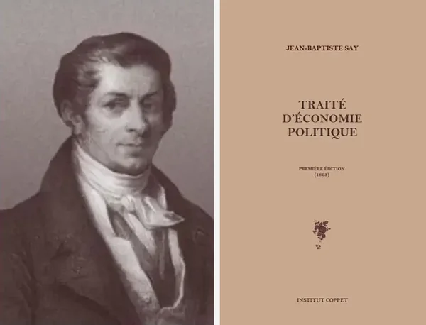

Jean-Baptiste Say (1767-1832), le fils du négociant en coton lyonnais qui devint l'économiste le plus lu au monde au cours des premières décennies du XIXe siècle, plaça la production au centre de son monumental [*Traité d'économie politique*](https://planb.academy/resources/books/traite-economie-politique-5e4bc84a-a7e4-4466-bfeb-d87a12e3b6c1) (1803). Say avait compris que l'analyse de la richesse ne devait pas commencer par la distribution mais par la création : comment les êtres humains produisent-ils les utilités qui constituent leur bien-être ? Sa réponse a jeté les bases de tout ce qui a suivi :

> "Produire n'est pas créer de la matière, car la matière est indestructible et aucune puissance humaine ne peut la faire naître du néant. Produire, c'est donner à la matière une forme, un lieu, un temps où elle est utile aux hommes. L'agriculteur qui récolte son blé, le marchand qui le transporte vers la ville affamée, le meunier qui le transforme en farine : chacun d'eux produit, car chacun d'eux rend un service qui n'existerait pas sans son intervention."

En d'autres termes, **la production est la création d'utilité, pas la création de substance**. Cette distinction apparemment simple a des conséquences considérables : elle signifie que tout service qui rend la vie plus facile ou plus riche est du travail productif, et que la hiérarchie traditionnelle plaçant l'industrie manufacturière au-dessus du commerce et le commerce au-dessus du travail intellectuel est totalement dénuée de fondement.

En effet, l'intuition de Say libère l'analyse économique du préjugé tyrannique selon lequel seuls ceux qui travaillent de leurs mains produisent "réellement". Un enseignant, un avocat, un artiste : tous produisent de l'utilité, tous contribuent à la richesse de la société, si leurs services sont librement recherchés et librement achetés.

La production elle-même représente une véritable conquête dans l'histoire de l'humanité. Pendant longtemps, les sociétés humaines se sont contentées de récolter des denrées alimentaires sans apport créatif particulier, par la chasse, la pêche et la cueillette, où l'activité productive de l'homme restait minime.

### L'erreur des travailleurs "productifs" et "improductifs"

Adam Smith, parmi d'autres penseurs, a commis une erreur importante en faisant la distinction entre les travailleurs productifs et improductifs. Dans la catégorie "improductive", il plaçait les avocats, les artistes et les médecins, au motif que leur produit disparaîtrait immédiatement après avoir été livré. Mais cette distinction tient-elle la route ? Prenons un exemple : un avocat qui obtient l'exécution d'un contrat crée une utilité qui dure pendant toute la durée de ce contrat. Un médecin qui guérit un patient crée une utilité qui persiste pour le reste de la vie de ce patient. L'erreur est évidente.

Gustave de Molinari (1819-1912), économiste d'origine belge qui s'installa à Paris et devint, au cours d'une longue et prolifique carrière, l'une des voix les plus originales et les plus combatives de la tradition libérale française, a immédiatement perçu cette confusion. Dans son [*Cours d'économie politique*](https://planb.academy/resources/books/cours-economie-politique-molinari-75b4a66d-8127-4cf9-8a0a-53d8e353b203) (1855), il écrit :

> "Quels bons outils que certains livres ! La *Richesse des nations*, par exemple, a généré plus de richesses réelles au cours des deux siècles qui ont suivi sa publication que la plupart des usines ne pourraient prétendre en avoir produites au cours de leur existence. N'est-ce pas là de la production ? Dire le contraire, c'est confondre le médium et le message, la forme et le fond."

En d'autres termes, **la production immatérielle n'est pas une moindre forme de production** : c'est souvent la plus conséquente, puisque les idées se multiplient sans être consommées, diffusant leur utilité à un nombre indéfiniment grand de bénéficiaires.

Gustave de Molinari a observé à juste titre que le détaillant, en transférant des denrées alimentaires et en les mettant à la disposition du consommateur de manière accessible et organisée, rend un véritable service. Ce transfert d'un lieu à un autre constitue une véritable production, pour laquelle le consommateur est prêt à payer. Le travail, d'une manière générale, consiste à créer de nouvelles utilités et à rendre des services. Être au service des autres, c'est ce que signifie véritablement la production.

### Les conditions de production

Quelles sont les conditions qui rendent la production possible ? Les économistes libéraux en ont identifié trois qui sont indispensables, et leur analyse converge avec une étonnante unanimité sur ce point.

La première condition est un choix approprié des moyens et des fins, ce qui implique une liberté éclairée et un sens de l'autonomie. Il faut être propriétaire de soi-même et être capable de choisir judicieusement parmi les différentes options qui s'offrent à nous. Cette capacité de choix implique la liberté de pensée et la liberté d'action. Say l'exprimait simplement :

> "L'homme qui ne choisit pas ne produit pas, il ne fait qu'exécuter. La production commence par le jugement que cette fin vaut la peine d'être poursuivie et que ce moyen est le meilleur disponible pour la poursuivre. Si l'on supprime la liberté de choix, on ne modifie pas seulement la forme de la production, on en détruit le principe moteur."

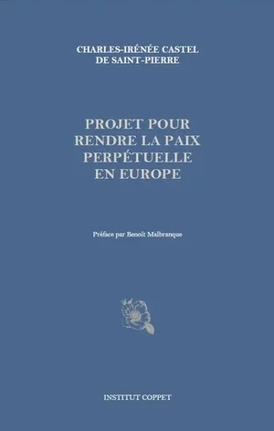

La deuxième condition est l'utilisation possible des moyens, c'est-à-dire la propriété. Sans la propriété des choses, des outils, de son propre corps (tout commence par la propriété de soi), la production devient impossible. La troisième condition est la possibilité de rentabilité, qui est conditionnée par la sécurité. Sans sécurité, je ne peux pas entreprendre un projet de production viable, car je risque d'être entravé par la violence, les menaces ou le vol de mes ressources.

En d'autres termes, **les trois conditions de la production sont la liberté, la propriété et la sécurité**. Ce sont précisément les trois choses que les systèmes de non-liberté détruisent. La boucle est bouclée : l'oppression n'est pas seulement injuste, elle est économiquement ruineuse.

La direction de la production obéit à ce que les économistes ont appelé la "loi naturelle", selon laquelle la production de toutes choses s'organise, en temps, en lieu et de la manière la plus utile. Les agents économiques recherchent leur propre intérêt, non pas un intérêt étroit et égoïste, mais un intérêt large et éclairé. Motivés par la recherche du profit et de la sécurité de leurs ressources, ils gravitent autour des branches de production qui génèrent des profits. Les prix et les profits sont donc **les signaux qui guident naturellement la production**, sans qu'il soit nécessaire de recourir à une organisation gouvernementale ou réglementaire.

### L'échange en tant que jeu à somme positive

L'élément central qui explique l'importance du contrat et de l'échange est leur nature de jeux à somme positive. Je passe un contrat parce qu'il est dans mon intérêt de le faire ; sinon, je préférerais simplement ne pas passer de contrat. De même, en termes économiques, si je fais un échange, c'est parce que je le trouve avantageux ; sinon, je m'abstiens.

L'abbé de Saint-Pierre, au début du XVIIIe siècle, a été l'un des premiers à reconnaître toute l'importance de ce principe. Dans son [*Projet pour perfectionner le commerce*](https://planb.academy/resources/books/projet-perfectionner-commerce-f4123249-b5ca-446e-8514-aedef76dbdf3) (1735), il l'exprime avec une clarté caractéristique :

> "Lorsqu'une vente est faite entre marchands, le vendeur y gagne et l'acheteur aussi ; car sans un gain réciproque, réel ou apparent, ni le vendeur ne vendrait à tel prix, ni l'acheteur de son côté n'achèterait à tel prix. Quelquefois l'un des deux se trompe ; mais ordinairement, eu égard à leurs besoins et à leurs intérêts, tous deux gagnent à l'échange, quelquefois également, mais le plus souvent inégalement. D'où il suit que multiplier les échanges ou les ventes entre marchands, entre sujets d'une nation, et entre nation et nation, c'est contribuer à leur enrichissement ; diminuer le commerce, diminuer le nombre des échanges, des ventes, des achats entre marchands, c'est diminuer leur profit et leur revenu."

En d'autres termes, **chaque échange volontaire crée de la valeur pour les deux parties simultanément**. C'est ce qui distingue le commerce pacifique de la guerre et du vol : ces méthodes redistribuent les richesses existantes ; l'échange crée de nouvelles richesses. On ne saurait trop insister sur l'importance de cette distinction pour l'ensemble de la philosophie sociale.

En effet, de cette analyse découle une conclusion fondamentale. Plus il y a de contrats, plus **le contrat remplace avantageusement la loi dans de nombreux domaines**. La liberté consiste précisément dans ce choix d'agir dans un sens ou dans l'autre avec les biens dont on dispose, d'abord sa propre personne, puis celle des choses légitimement acquises, pour les échanger de manière mutuellement avantageuse.

Say lui-même a été explicite sur ce point :

> "Le commerce n'est pas, comme certains l'ont supposé, un combat dans lequel l'une des parties doit être vaincue pour que l'autre triomphe. C'est, au contraire, une forme de coopération dans laquelle les deux parties apportent ce qu'elles ont en trop et reçoivent ce qui leur manque. Le commerçant n'est pas l'ennemi du producteur, il est son allié le plus nécessaire, le lien indispensable entre le lieu de production et le lieu de consommation."

## Le rôle des profits et des prix

<chapterId>549e00c3-eece-5401-be62-b82c774af893</chapterId>

### Les deux formes de concurrence

L'histoire de l'humanité peut se lire comme une transformation progressive des modes de concurrence entre les individus. Dans les premiers temps, la concurrence s'exerçait principalement par la guerre et la violence : l'appropriation des biens et des produits de subsistance obtenus par la chasse, la pêche et la cueillette. Le marché était extrêmement restreint et la production limitée. Le monde étant composé de ressources limitées, une certaine forme de concurrence pour celles-ci était inévitable. Mais le véritable progrès de la civilisation consistait à **remplacer cette concurrence violente par le contrat et l'échange volontaire**.

Frédéric Bastiat (1801-1850), l'économiste et pamphlétaire gascon qui a compilé plus de clarté en moins de pages que presque n'importe quel auteur dans l'histoire de l'économie, a décrit cette transformation avec sa précision habituelle dans les [*Harmonies économiques*](https://planb.academy/resources/books/harmonies-economiques-66561d29-feb2-495c-815d-cea521b1930c) (1850) :

> "Il y a deux façons pour l'homme de satisfaire ses besoins : la production et le pillage. Certains hommes travaillent, d'autres attendent le fruit de leur travail et se l'approprient par la force. Il ne s'agit pas d'une alternative imaginaire, construite pour l'effet rhétorique. C'est le choix fondamental auquel sont confrontées toutes les sociétés humaines depuis le début de l'histoire. Et la civilisation n'est rien d'autre que l'œuvre lente, douloureuse, jamais achevée, de la substitution de la production au pillage"

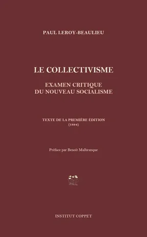

En d'autres termes, l'histoire de la civilisation est **l'histoire de la compétition elle-même en train de se civiliser** : de la transition de la compétition violente à la compétition contractuelle. Cette observation n'est pas anodine ; elle permet de comprendre pourquoi la liberté est importante d'un point de vue économique, et pas seulement d'un point de vue moral.

En effet, l'interventionnisme et le socialisme représentent un pas en arrière dans ce grand progrès historique. Ils remplacent la liberté par la tutelle et l'autorité centralisée, substituant au contrat un retour à l'appropriation par la coercition. La ressemblance entre la concurrence par la violence et la concurrence par la politique est visible dans leurs effets : la distribution des richesses par la violence ou par la politique redistribue les ressources existantes, mais ne les augmente pas. En revanche, la concurrence par le contrat, fondée sur l'intérêt mutuel des parties à l'échange, distribue les richesses sur la base du mérite de chaque contributeur, tout en augmentant simultanément le total grâce à la motivation de l'intérêt personnel.

### La loi de l'offre et de la demande : rien d'autre que la liberté elle-même

Charles Coquelin (1802-1852), brillant économiste et contributeur au [*Dictionnaire de l'économie politique*](https://planb.academy/resources/books/dictionnaire-economie-politique-133b07d0-a058-44cb-a1fa-b58609e9b4a5) publié par Guillaumin en 1852, est mort prématurément avant d'avoir pu développer toutes les implications de son travail, mais il a laissé derrière lui des articles d'une clarté remarquable. Dans son article sur la concurrence, il exprime une vérité fondamentale qui est au cœur de la conception libérale des marchés :

> "La loi de l'offre et de la demande n'est pas une convention arbitraire, ni une règle imposée par les économistes, ni un dispositif inventé par les théoriciens pour la commodité de leurs systèmes. C'est simplement une description de ce qui se passe lorsque des hommes libres sont laissés libres de poursuivre leurs propres intérêts de leur propre manière. Si l'on supprime cette liberté, on supprime la loi. Vous ne la remplacez pas par une meilleure loi ; vous la remplacez par la volonté arbitraire de quiconque détient le pouvoir"

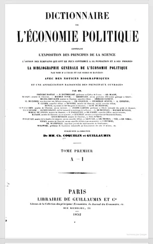

En d'autres termes, **la loi de l'offre et de la demande n'est rien d'autre que le fonctionnement de la liberté économique elle-même**. Sans liberté, cette loi ne peut tout simplement pas fonctionner. Imaginez un citoyen recevant des tickets de rationnement : il n'a pas la possibilité de réduire ou d'augmenter sa demande en fonction de ses préférences. De même, les entreprises soumises à des décisions politiques de production ne peuvent pas faire varier leur offre en fonction des circonstances.

Dans une économie libre, le prix joue un rôle essentiel de signal. Dans un vaste marché à forte population, les agents économiques ont besoin d'une boussole pour les guider dans la production : que produire, quand le produire, où le produire et comment le produire. Le prix fournit précisément cette information cruciale, en attribuant une valeur aux différentes combinaisons productives et, à mesure qu'il augmente ou diminue, en orientant l'intérêt personnel des individus vers les actions qui leur permettront d'obtenir une satisfaction maximale tout en répondant aux besoins réels de la société.

Bastiat l'a saisi avec l'élégance qui le caractérise :

> "Le prix n'est fixé ni par le producteur, ni par le consommateur, ni par une quelconque autorité entre eux. Il émerge de la rencontre de leurs désirs et contraintes respectifs, modifiés par toutes les circonstances qui affectent l'offre et la demande dans le monde. Dans ce prix est codée, implicitement et instantanément, plus d'informations sur l'état du monde qu'aucun ministère de la planification ne pourrait jamais espérer rassembler."

Les bénéfices et les taux d'intérêt sont également des signaux : ils indiquent où se situent les besoins, et où se situent les manques, parmi les différents facteurs de production.

### L'aveuglement de la planification centralisée

Paul Leroy-Beaulieu (1843-1916), le plus éminent économiste de la deuxième génération de libéraux français, qui a occupé la chaire d'économie politique au Collège de France pendant des décennies et dirigé l'*Économiste français* avec une énergie inlassable, a anticipé avec une remarquable clairvoyance les grands développements du communisme au XXe siècle. Dans [*Le Collectivisme*](https://planb.academy/resources/books/le-collectivisme-d79dc3a7-7b77-4698-89e6-440312e2da2c) (1884), il démontre que le socialisme, en rejetant le profit et en remplaçant le mécanisme des prix par une machine centralisée dirigeant à la fois la production et la consommation, se condamne à fonctionner dans l'obscurité la plus complète :

> "L'État socialiste, ayant aboli la propriété privée du capital, se trouve dans l'impossibilité de calculer. Il sait ce qu'il a produit, il ne peut savoir ce qu'il doit produire. Il sait ce qu'il a distribué, il ne peut savoir ce qu'il faut distribuer. C'est un géant aveugle, doté d'un pouvoir immense et incapable de le diriger, trébuchant dans l'économie comme un éléphant dans un magasin de porcelaine, détruisant en une heure ce que des générations d'accumulation patiente avaient construit"

En d'autres termes, sans le signal prix, **la gestion centralisée n'a aucun moyen de connaître les besoins humains réels**, ni de percevoir les effets des changements dans ces besoins ou dans l'offre de production. Cette absence de signaux rend inévitable l'échec de la production centralisée et de la distribution collectiviste.

Le fonctionnement de la liberté, en revanche, permet de produire en temps utile. Des profits élevés encouragent de nouveaux producteurs à se lancer dans la fabrication d'un produit donné ; cette participation se poursuit jusqu'à ce qu'il y ait suffisamment de producteurs pour satisfaire la demande supplémentaire. Le prix potentiel ou anticipé indique à tous les agents du marché ce qui doit être produit, où et comment.

### Tout en temps économiquement utile

Quel est l'avantage décisif du système des prix libres ? C'est que la production n'est jamais ni trop précoce, ni trop tardive. Leroy-Beaulieu l'a expliqué avec une élégante simplicité :

> "Lorsqu'un entrepreneur se trompe, en croyant à une demande qui n'existe pas, il perd de l'argent. Cette perte est sa punition et sa correction. Lorsqu'il réussit, en croyant qu'une demande existe et qu'elle existe, il réalise un profit. Ce profit est sa récompense et son encouragement. Le marché enseigne, constamment et sans pitié, ce dont le monde a réellement besoin. Aucun ministère, aucune commission, aucun comité d'experts ne peut reproduire cette fonction, parce qu'aucun d'entre eux ne supporte le coût personnel de l'erreur"

Dans un système de liberté, nous pouvons compter sur l'intérêt personnel et le libre arbitre des individus pour rechercher de nouvelles opportunités du mieux qu'ils peuvent. Cette recherche du profit implique naturellement des échecs et des tâtonnements, l'effort constant de distinguer les vraies opportunités de celles qui s'avèrent décevantes. L'interventionnisme, en revanche, organise tout en fonction de signaux politiques et d'impératifs électoraux. Il produit dans le temps politiquement utile, avec des "investissements stratégiques" fondés sur l'idée que l'État perçoit des besoins latents dans la société.

En effet, on peut se demander si ces investissements génèrent des profits ou des pertes S'il y a des bénéfices, c'est que la demande du marché est réelle ; s'il y a des pertes, c'est que l'État a mal réparti les ressources de ses contribuables. La réponse est toujours la même. Les investissements politiques génèrent des pertes, car **ils répondent à des besoins politiques plutôt qu'à des besoins économiques**.

## Intérêt personnel, innovation et progrès

<chapterId>958075af-fb8f-50d9-9bf5-4d9882e03072</chapterId>

### Intérêt personnel : plus large que l'égoïsme

Le libéralisme économique repose sur une notion d'intérêt personnel souvent mal comprise et caricaturée. Qu'est-ce que ce concept, bien compris ? Il ne s'agit pas de l'égoïsme impitoyable de l'imagination populaire, mais de quelque chose de beaucoup plus riche et réaliste : l'ensemble des motivations humaines, organisées autour de **l'individu en tant qu'unité d'expérience et de jugement**.

Alexis de Tocqueville (1805-1859), l'aristocrate normand devenu théoricien de la démocratie dont les deux volumes [*De la démocratie en Amérique*](https://planb.academy/resources/books/de-la-democratie-en-amerique-7bc2962c-d9b7-4e34-9637-d704a90dfaf4) (1835-1840) restent l'analyse la plus pénétrante de la société américaine jamais écrite par un Européen, a observé avec une nuance caractéristique que les Américains avaient élevé l'intérêt personnel au rang d'une sorte de doctrine civique :

> "Les Américains aiment expliquer presque tous les actes de leur vie par le principe de l'intérêt personnel bien compris. Ils ont plaisir à montrer comment une considération éclairée pour eux-mêmes les incite constamment à s'entraider et les incline à sacrifier volontiers une partie de leur temps et de leurs biens au bien-être de l'État. Je crois qu'en cela ils ne se rendent pas souvent justice ; car, aux États-Unis comme ailleurs, on voit parfois les gens céder à ces impulsions désintéressées et spontanées qui sont naturelles à l'homme ; mais les Américains admettent rarement qu'ils cèdent à des émotions de ce genre ; ils sont plus soucieux de faire honneur à leur philosophie qu'à eux-mêmes"

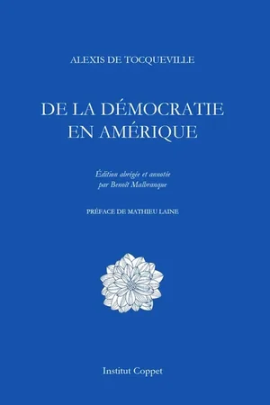

En d'autres termes, les Américains pratiquaient **un intérêt personnel suffisamment large pour inclure la coopération sociale**, l'engagement civique et la prudence à long terme, tout en le théorisant dans le vocabulaire modeste de l'avantage personnel. Il ne s'agit pas d'hypocrisie, mais de réalisme en ce qui concerne les motivations humaines.

En effet, l'être humain est capable d'une large estime de soi qui commence par la famille, puis s'étend à un cercle de connaissances, à une petite entreprise, à une association. Parler d'individus enfermés dans un égoïsme étroit ne correspond pas aux faits que nous observons quotidiennement. L'intérêt personnel est ancré dans l'existence humaine à travers la série de plaisirs et de souffrances que chaque personne ressent et mesure en fonction de sa perception individuelle, de sa constitution personnelle et de son héritage génétique. La personne humaine reste seule juge des moyens et des fins, ce qui est le fondement de toute action.

### Innovation et progrès : le fruit de l'intérêt personnel

L'intérêt personnel est une force propulsive. Il pousse à l'amélioration des processus et à la recherche du progrès. Pour s'enrichir et apporter de la satisfaction à soi-même et aux autres, il faut agir de manière utile, ce qui conduit naturellement à l'innovation.

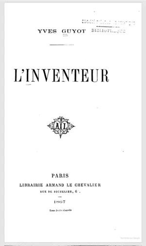

Yves Guyot (1843-1928), journaliste, économiste, puis ministre des Travaux publics sous la Troisième République, fut l'un des défenseurs les plus combatifs et les plus prolifiques du libéralisme de sa génération. Son premier livre, [*L'Inventeur*](https://planb.academy/resources/books/linventeur-778169ff-cf16-4c9f-9be9-62c783c810bb) (1867), consacré à la figure de l'inventeur comme moteur du progrès social, s'ouvre sur un passage qui touche au cœur de la théorie libérale de l'innovation :

> "L'inventeur n'est pas un sage désintéressé qui travaille pour la postérité par pur amour du savoir. C'est un homme qui a vu un problème et croit pouvoir le résoudre ; qui a entrevu une opportunité et souhaite la saisir ; qui désire la reconnaissance, le confort, peut-être la gloire. Ce sont là des désirs humains tout à fait ordinaires. Et c'est précisément parce qu'ils sont ordinaires qu'ils sont fiables. L'inventeur travaille parce qu'il espère bénéficier de son invention. Supprimez cet espoir, et vous supprimez l'invention"

En d'autres termes, la force motrice de l'innovation est **l'intérêt personnel au sens le plus large** : le désir de profit, de reconnaissance, d'un avenir meilleur. Ce n'est pas un défaut de la nature humaine à corriger, c'est le moteur du progrès à exploiter.

En effet, l'innovation et le progrès sont la réponse aux circonstances changeantes de l'humanité : de nouveaux défis exigent constamment de nouvelles solutions. Chaque amélioration modifie l'environnement économique dans lequel l'homme vit, exigeant de nouvelles combinaisons, de nouvelles méthodes, de nouvelles entreprises. Les sociétés ne peuvent être figées ; elles doivent constamment innover. Guyot l'a reconnu avec une grande clarté :

> "La société dans son ensemble constate que les circonstances changent, que les conditions de production évoluent et qu'en y répondant de manière éclairée, des richesses supplémentaires deviennent accessibles. Cette reconnaissance des améliorations possibles rejoint la grande idée de la perfectibilité humaine : la conviction que l'âge d'or n'est pas dans le passé mais dans l'avenir"

### L'État n'innove pas

Mais l'État innove-t-il ? Il n'innove pas du tout. Et ce fait est d'une importance considérable pour toute la question de la politique économique.

Les sociétés anciennes comme l'Egypte, où les métiers se transmettaient de père en fils, illustrent le phénomène des sociétés figées. L'État reproduit cette non-innovation par sa nature même de bureaucratie. Il repose sur l'activité de fonctionnaires qui n'ont **aucune initiative personnelle et aucune rémunération proportionnelle à leur innovation**. Tout est réglementé, il n'y a ni volonté ni intérêt à innover, et le système lui-même n'est pas conçu pour l'innovation.

Paul Leroy-Beaulieu a anticipé en 1883, avec une précision extraordinaire, le fonctionnement concret des expériences communistes :

> "L'État collectiviste ne peut pas récompenser l'innovation, parce qu'il a aboli le mécanisme par lequel l'innovation est récompensée : le profit qui revient à celui qui, le premier, met sur le marché un nouveau produit ou une nouvelle méthode. Il ne peut pas punir l'absence d'innovation, parce qu'il a aboli le mécanisme par lequel cette absence est punie : la perte qui frappe celui qui persiste à utiliser des méthodes inférieures alors que de meilleures sont disponibles. Elle est donc condamnée, non par la méchanceté de ses administrateurs, mais par la logique de sa propre organisation, à reproduire indéfiniment les erreurs d'hier"

En d'autres termes, le système étatique est **structurellement incapable d'innover**, non pas parce que les employés de l'État sont moins intelligents que les entrepreneurs privés, mais parce que la structure d'incitation qui rend l'innovation rationnelle est totalement absente. L'éducation nationale l'illustre parfaitement : elle n'est pas conçue pour améliorer les connaissances, mais simplement pour distribuer un corpus de connaissances conçu comme un actif fixe à diffuser.

Leroy-Beaulieu a ajouté une autre observation qui s'est avérée étonnamment exacte au siècle suivant :

> "Dans les sociétés semi-collectivistes, l'innovation doit venir des secteurs libres, car il est impossible d'innover dans les secteurs monopolisés des services publics. La poste n'inventera pas le télégraphe, le chemin de fer d'Etat n'inventera pas l'automobile. Le progrès viendra toujours de l'extérieur, des interstices de liberté que le système n'a pas encore réussi à combler"

### La rémunération du progrès dans les sociétés libres

Comment, dès lors, le progrès est-il récompensé dans les systèmes de liberté ? La réponse est : de plusieurs manières complémentaires. Les profits industriels et commerciaux en sont la principale forme : lorsqu'un produit innovant arrive sur le marché, l'innovateur, qui est le premier à proposer une nouvelle solution qui satisfait mieux et à moindre coût les besoins des consommateurs, bénéficie d'une sorte de rente temporaire.

Guyot a identifié une deuxième forme de rémunération que l'on oublie facilement : le prestige social accordé aux inventeurs et aux innovateurs dans les sociétés libres, un prestige totalement absent des sociétés anciennes et despotiques où l'innovateur était considéré avec méfiance :

> "À notre époque, le nom de Watt est aussi célèbre que celui de Wellington ; le nom de Stephenson est prononcé avec autant de respect que celui de n'importe quel général. C'est une nouveauté. Dans l'Égypte ancienne, l'inventeur d'un nouveau procédé devait le soumettre à l'approbation des prêtres, qui ne l'approuvaient que rarement. Dans le système des guildes du Moyen Âge, l'artisan qui introduisait une nouvelle technique était menacé de ruine et parfois de violence par ses confrères. La liberté a fait cela : elle a rendu le progrès honorable"

Dans une société libre, **l'intérêt personnel mène à l'innovation et au progrès**. Dans un système de non-liberté, l'intérêt personnel est endigué et brisé au profit d'un intérêt social prédéfini. La marche de l'innovation comporte certes de nombreux échecs, mais aussi de nombreuses réussites qui, dans un système de liberté fondé sur le contrat et l'échange volontaire, conduisent à cette perfectibilité dont parlaient tous les libéraux du XVIIIe siècle.

## Harmonie des intérêts et paix

<chapterId>370f4e98-021b-5c81-a109-3b57b689905f</chapterId>

### Quand les intérêts s'affrontent : le monde avant la production

La notion d'harmonie des intérêts est un pilier fondamental de la pensée libérale, mais elle est souvent rejetée avec scepticisme. Les adversaires du libéralisme la considèrent comme une utopie, un rêve naïf, en partant du principe que les intérêts humains sont fondamentalement antagonistes. Mais cette objection tient-elle la route ? Non, si l'on examine attentivement les conditions dans lesquelles les intérêts s'opposent réellement et celles dans lesquelles ils convergent naturellement.

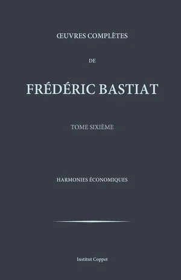

C'est précisément à cette question que Frédéric Bastiat a consacré le dernier et le plus grand ouvrage de sa vie tragiquement courte. Il meurt de la tuberculose en 1850, à l'âge de 49 ans, laissant les [*Harmonies économiques*](https://planb.academy/resources/books/harmonies-economiques-66561d29-feb2-495c-815d-cea521b1930c) inachevées. Mais ce qu'il a achevé suffit à établir sa thèse : les conflits d'intérêts apparents qui remplissent les livres d'histoire ne sont pas la condition naturelle des hommes libres ; ils sont le produit de systèmes de privilèges, de monopoles et d'appropriation politique. Il écrit, dans les fameuses premières pages :

> "Si les tendances naturelles de l'humanité sont si mauvaises qu'il n'est pas sûr de permettre aux gens d'être libres, comment se fait-il que les tendances de ces organisateurs soient toujours bonnes ? Les législateurs et les agents qu'ils ont désignés n'appartiennent-ils pas eux aussi à la race humaine ? Ou bien croient-ils qu'ils sont eux-mêmes faits d'une argile plus fine que le reste de l'humanité ?"

En d'autres termes, le **pessimisme sur la nature humaine qui justifie l'intervention se réfute de lui-même** : si les hommes sont trop méchants pour qu'on leur confie la liberté, ils sont également trop méchants pour qu'on leur confie le pouvoir. L'harmonie des intérêts n'est pas une affirmation que les hommes sont des anges ; c'est une affirmation que le libre échange aligne leur intérêt personnel avec le bénéfice social de manière plus fiable que n'importe quelle autre alternative.

Pour une exploration plus approfondie de la vie de Bastiat, de ses influences et de l'ensemble de sa pensée économique, voir notre cours dédié :

https://planb.academy/courses/d07b092b-fa9a-4dd7-bf94-0453e479c7df

Pour comprendre cette harmonie, il faut d'abord se demander dans quelles circonstances les intérêts humains s'opposent vraiment Dans les premiers temps de l'humanité, les êtres humains se sont trouvés en concurrence directe pour des ressources limitées que personne n'avait produites. La nature offrait des arbres fruitiers, des poissons dans les rivières, des ressources au bord de la mer, mais aucune société humaine n'avait créé ces richesses. L'appropriation se faisait par la force et la destruction plutôt que par la production, et il n'y avait qu'une seule façon de s'enrichir : prendre ce que possédait son voisin ou se battre pour accéder à des ressources que personne n'avait cultivées. Dans un tel monde, tout gain est nécessairement la perte de quelqu'un d'autre.

### La naissance d'un échange harmonieux

Le monde moderne repose sur un principe radicalement différent : la production de nouvelles utilités. Dès l'apparition de l'agriculture, lorsque le champ de blé devient une véritable source de richesse, **des échanges réellement volontaires naissent qui enrichissent simultanément les deux parties**.

Bastiat a exprimé cette transformation avec son don caractéristique pour l'illustration vivante :

> "Considérons les deux hommes qui se trouvent devant nous. L'un a du blé, l'autre du tissu. Aucun des deux n'a ce dont l'autre a besoin sous sa forme la plus utile. Ils échangent. Après l'échange, chacun a plus de ce dont il a besoin qu'avant. Rien n'a été créé à partir de rien, et pourtant les deux sont plus riches. C'est le miracle de l'échange, le miracle qui a construit la civilisation, le miracle que les ennemis du commerce ont toujours échoué à comprendre"

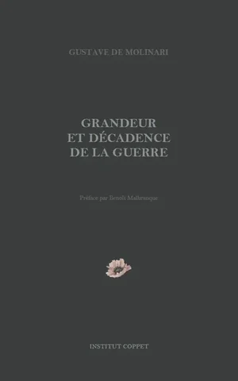

Comme l'observait l'abbé de Saint-Pierre dans la tradition libérale française, les relations fondées sur le contrat, le respect des droits d'autrui et l'échange volontaire forment une "chaîne d'harmonie" reliant les individus, les communautés et les nations.

Cette harmonie s'est construite progressivement. L'ouverture du monde par la navigation, le développement des technologies de transport permettant des échanges plus réguliers et plus étendus, et la sécurité garantissant les relations commerciales ont construit ensemble un réseau d'interdépendance de plus en plus large entre les fournisseurs, les clients et tous les agents économiques. C'est en période de crise que cette interdépendance devient la plus visible. La guerre de Sécession des années 1860 en fournit une illustration frappante : en rompant le commerce du coton, le conflit a ruiné les industries textiles de toute l'Europe, en particulier à Lyon, alors que la France n'était pas belligérante. En d'autres termes, **l'appauvrissement d'un maillon de la chaîne appauvrit immédiatement tous les autres**.

### La paix internationale, condition de la prospérité

La nécessité d'une paix internationale découle logiquement de cette harmonie mondiale. Le commerce étant un jeu à somme positive dans lequel toutes les parties s'enrichissent mutuellement, il devient impératif de maintenir la sécurité à la fois au sein des sociétés et entre les nations. Toute perturbation de l'ordre économique mondial **produit des nuisances qui se répercutent sur l'ensemble de la chaîne des échanges**.

Gustave de Molinari, qui a dirigé le *Journal des économistes* pendant des décennies et a survécu à presque tous ses contemporains, a consacré la fin de sa carrière à ce qu'il appelait une véritable "guerre contre la guerre" Dans son [*Grandeur et décadence de la guerre*](https://planb.academy/resources/books/grandeur-decadence-guerre-3bf120be-1536-4b6e-aa85-4a2a62edca7e) (1898), il argumente avec la rigueur qui le caractérise :

> "La guerre était autrefois rationnelle, dans le sens étroit où les gains d'un pillage réussi pouvaient dépasser les coûts de la campagne. Ce n'est plus le cas aujourd'hui. L'économie mondiale est aujourd'hui si étroitement tissée que la destruction causée par la guerre retombe non seulement sur le vaincu, mais aussi sur le vainqueur, non seulement sur les belligérants, mais aussi sur tous leurs partenaires commerciaux. L'industriel qui applaudit à la victoire applaudit à la destruction de ses propres marchés. Il ne le voit pas parce qu'il ne voit que l'immédiat ; il ne voit pas les dommages invisibles et à long terme que le commerce dissimule"

En effet, au XVe ou XVIe siècle, un conflit en Afrique ou en Asie n'aurait guère affecté les populations européennes, car la sphère des échanges restait étroite et les sociétés vivaient en relative autarcie. Aujourd'hui, cette isolation a disparu. Plus la chaîne des échanges est étendue, **plus sa rupture est dévastatrice**, ce qui constitue paradoxalement un puissant argument en faveur de la paix.

Molinari a été explicite quant à cette implication :

> "Le libre-échange n'est pas seulement une politique économique, c'est une politique de paix. Les nations qui échangent des marchandises n'envoient pas d'armées les unes contre les autres, car le coût de la rupture est trop élevé pour les deux parties. Le protectionniste qui s'imagine défendre sa nation prépare en fait ses guerres"

### Le programme libéral pour la paix

La transition vers un monde pacifique est cependant un long apprentissage. Les sociétés humaines restent marquées par d'anciennes conceptions de la production par la violence, la conquête, la chasse et la cueillette. Les nouvelles conceptions de production, d'échange et d'harmonie pacifiques doivent être apprises et diffusées, et c'est un travail de plusieurs générations.

L'abbé de Saint-Pierre (1658-1743), l'un des premiers penseurs de la paix perpétuelle, a proposé des institutions internationales capables de garantir l'État de droit à l'échelle mondiale. Frédéric Passy (1822-1912), économiste et militant pacifiste qui devint le premier lauréat du prix Nobel de la paix en 1901, distinction remarquable pour un homme qui avait passé cinquante ans à défendre en termes économiques plutôt que sentimentaux l'incompatibilité du libre-échange et de la guerre, plaçait sa confiance dans l'opinion publique : si les peuples comprenaient que **leur prospérité dépendait de celle de leurs partenaires commerciaux**, l'exigence de paix deviendrait irrésistible.

Bastiat, pour sa part, voyait dans le libre-échange le fondement le plus sûr de la paix. Lors de son célèbre débat avec le protectionniste Adolphe Thiers devant la Chambre des députés française, il est allé à l'essentiel :

> "Lorsque les marchandises ne franchissent pas les frontières, les armées le font. Ce n'est pas une métaphore, c'est l'histoire. Les périodes de grande ouverture commerciale sont les périodes de grande paix. Les périodes de plus grande restriction commerciale sont les périodes de plus grande guerre. La causalité va dans les deux sens : le libre-échange rend la guerre moins probable, et la guerre rend le libre-échange impossible. Il s'agit, au sens le plus profond du terme, d'oppositions"

Le libéralisme se présente ainsi comme **une grande chaîne harmonieuse d'échanges et de contrats**, fondée sur la liberté et la propriété, permettant le progrès et améliorant la situation de chacun. La "chaîne d'harmonie" que l'abbé de Saint-Pierre décrivait en théorie est devenue, grâce au développement du commerce mondial, une réalité palpable et matérielle.

## Les différentes variétés de non-liberté

<chapterId>747ec342-bccd-5203-a198-c6e75505801b</chapterId>

### La forme extrême : le communisme comme spoliation organisée

Après avoir examiné les fondements de la liberté dans les faits de l'existence humaine, retracé l'évolution historique de la liberté et de la contrainte, et analysé le fonctionnement de l'économie libre, nous devons maintenant nous tourner vers les systèmes de non-liberté. Pourquoi échouent-ils ? Et pourquoi les sociétés modernes doivent-elles s'orienter résolument vers des solutions fondées sur la liberté ?

**Le communisme primitif, qui organisait le partage de la terre et des outils au sein de petits groupes, était une réponse aux conditions de production et de sécurité des premières sociétés humaines. Dans sa forme moderne, le communisme représente une tentative de retour à cette condition archaïque, où l'individu ne comptait pour rien.**

Paul Leroy-Beaulieu, dans la première édition de son ouvrage majeur [*Le Collectivisme*](https://planb.academy/resources/books/le-collectivisme-d79dc3a7-7b77-4698-89e6-440312e2da2c) (1883), a analysé ces différents systèmes socialistes avec la précision d'un médecin qui diagnostique une maladie :

> "Les doctrines communistes parlent abondamment de la fin de l'exploitation capitaliste et de l'abondance future, mais le fonctionnement réel de cette grande administration qui posséderait toutes les terres, toutes les machines et gérerait toutes les usines, tout cela est très mal expliqué. Les théoriciens du communisme ont été généreux dans leur vision de la destination et remarquablement parcimonieux dans le récit du voyage. Cette réticence n'est pas accidentelle. Elle reflète une difficulté fondamentale que le communiste ne peut résoudre : l'impossibilité de calculer, de diriger et de coordonner la production sans les signaux que le mécanisme des prix fournit et que le communisme, en abolissant la propriété privée, détruit nécessairement"

En effet, la forme extrême de la non-liberté se manifeste par l'assujettissement total de l'individu et la destruction de ses biens. Dans le système communiste, toute propriété est réglementée et contrôlée par d'autres, ce qui constitue une forme d'esclavage collectif. L'individu ne conserve que les quelques propriétés de lui-même qui ne peuvent être brisées : sa conscience inviolable, sa capacité à penser librement dans l'intimité de son esprit, puisque la pensée non-manifestée reste hors de portée de tout pouvoir. Mais toute autre liberté disparaît.

L'analyse de Leroy-Beaulieu s'est avérée prophétique. Des décennies avant l'expérience soviétique, il a expliqué comment les systèmes communistes fonctionneraient en pratique :

> "Spoliation organisée à l'échelle nationale : c'est la seule description honnête du système. Chaque homme devra livrer le fruit de son travail à l'administration centrale, qui décidera ensuite, selon des critères qu'elle définira et que personne ne pourra contester, de la part que chacun recevra en retour. C'est, en substance, de l'esclavage. L'esclave avait au moins la sécurité de l'intérêt de son maître ; le citoyen de l'État communiste n'a aucune garantie de ce genre."

En d'autres termes, le communisme ne se contente pas d'appauvrir matériellement ses sujets ; **il détruit la structure même de l'individualité**, remplaçant la personne autodirigée par une unité administrative à traiter par la machine collective.

### Le socialisme : la forme modérée de la non-liberté

Le socialisme et l'interventionnisme représentent une forme plus modérée de non-liberté. Dans ces systèmes, les services privés sont progressivement remplacés par des services publics et les individus sont mis sous tutelle par un grand État régulateur. Contrairement au communisme, qui tente d'organiser l'ensemble de la production et de la consommation de manière dirigiste, le socialisme fonctionne, pour ainsi dire, comme un demi-communisme.

Ce que le socialisme partage fondamentalement avec le communisme, c'est **le remplacement du contrat, du libre choix et de l'autonomie individuelle par une direction politique.** Les échanges volontaires et mutuellement bénéfiques cèdent la place aux réglementations et aux soi-disant services publics. Le choix politique, nécessairement collectif et exprimé par des élections démocratiques, remplace les choix individuels que chacun peut contrôler directement.

Leroy-Beaulieu a fait le parallèle avec l'acuité qui le caractérise :

> "Le socialiste ne veut pas aller aussi loin que le communiste. Il recule devant les conclusions logiques des prémisses qu'il partage avec lui. Il souhaite conserver un peu de propriété ici, un peu de marché là, un peu de liberté dans ce coin, un peu de concurrence dans celui-là. Mais la logique de sa position l'entraîne, pas à pas, vers la destination à laquelle il prétend résister. C'est l'homme qui saute du dixième étage et qui se félicite, en passant au cinquième, de ne pas être tombé aussi bas qu'il le craignait"

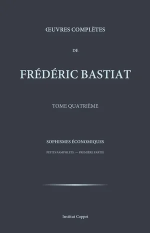

En d'autres termes, **le socialisme n'est pas un équilibre stable, c'est une pente instable**.

Considérons la différence que Leroy-Beaulieu a identifiée entre le choix privé et le choix politique : dans la vie quotidienne, l'individu observe sa propre réalité, pèse les alternatives et modifie librement sa ligne de conduite. Dans une démocratie, le citoyen doit acquiescer à un programme global parmi des options réduites, sans véritable contrôle sur la suite des événements. Si l'État central communiste décide que les fraises ne valent pas la peine d'être produites parce que les vergers de pommiers sont plus efficaces, il n'y aura pas de liberté de consommer des fraises. Le socialisme fonctionne selon la même logique, mais sous une forme diluée.

### La forme insidieuse : les taxes confiscatoires et les réglementations intrusives

Une forme encore plus discrète de non-liberté persiste sous la forme d'impôts confiscatoires et de réglementations intrusives. Il convient ici de bien distinguer. Les impôts qui financent la justice et la police, garantissant la sécurité des personnes et des biens, sont des contributions légitimes, assimilables à un achat collectif. Mais les impôts qui opèrent une véritable confiscation, et les réglementations qui font des choix à la place des individus et délimitent les contrats selon les idées des gouvernants, représentent une véritable tutelle.

Gustave de Molinari, avec sa verve habituelle, a montré que dans beaucoup de ces règlements, le propriétaire n'est plus vraiment le propriétaire :

> "L'homme qui se croit propriétaire de sa maison découvre, lorsqu'il tente d'exercer son droit de propriété, qu'il n'en est que l'usufruitier. Il peut l'habiter, à condition de payer ses impôts. Il peut la peindre, sous réserve de l'approbation de l'autorité locale. Il peut le vendre, moyennant le prélèvement d'une succession de droits. Il peut le léguer à ses enfants, sous réserve d'un droit de succession progressif. À chaque étape, il constate qu'un droit antérieur a été enregistré, qu'un copropriétaire invisible l'accompagne partout, que l'État est le partenaire principal de chaque entreprise et le bénéficiaire silencieux de chaque actif. Ce partenaire silencieux, contrairement à tous les autres partenaires, n'apporte rien et ne consent à rien : il se contente de percevoir"

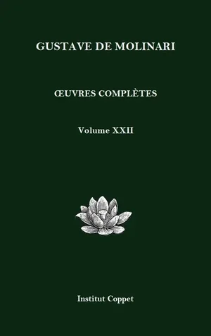

En d'autres termes, ce qui se présente comme une réglementation est souvent, en substance, **une forme de propriété partielle**. L'État régulateur n'est pas simplement un arbitre ; il est un participant, extrayant des rentes de chaque transaction qu'il supervise.

En effet, la liberté ne peut être dissociée de la propriété ou de l'égalité, car ces notions sont profondément imbriquées. Frédéric Bastiat l'a dit sans ambages : **la liberté, c'est la propriété.** Être libre, c'est faire l'usage que l'on veut de ses biens, de soi-même et des choses que l'on possède légitimement. L'homme dont la propriété est vraiment respectée est vraiment libre, puisqu'il peut disposer de lui-même, de ses forces et de ses facultés pour le travail, de ce qu'il possède pour le commerce, de ses facultés intellectuelles pour la libre pensée et l'expression.

### Liberté, propriété et égalité : des principes indissociables

Les systèmes de non-liberté se caractérisent précisément par l'inégalité : certains individus jouissent librement de leurs biens, tandis que d'autres en sont dépossédés et voient leurs choix dictés par d'autres. Lorsque **la liberté n'existe que pour certains, nous sommes dans un système de non-liberté**, quelle que soit sa forme particulière.

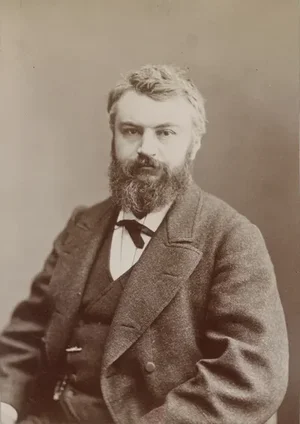

Yves Guyot (1843-1928), journaliste, homme politique et l'un des libéraux français les plus combatifs de sa génération, a mené tous ces combats au début du siècle. Sur la question de l'émancipation des femmes, il écrivait :

> "Un système qui exclut la moitié de l'humanité de la jouissance de ses propres facultés n'est pas un système de liberté mais de privilège, et le privilège est la négation de la liberté. Il n'y a pas de solution intermédiaire : soit les facultés de chaque individu appartiennent à cet individu, soit elles appartiennent à la collectivité. Le libéral ne peut accepter la seconde, il doit donc accepter la première, sans exception, sans réserve, et sans l'indulgence hypocrite qui permet à un homme de proclamer la liberté pour lui-même tout en la refusant à sa femme"

Il a combattu le racisme et l'antisémitisme avec la même fermeté :

> "Si les Juifs souhaitent former leurs propres communautés, exercer leurs métiers ou professer leurs idées, il s'agit simplement de la liberté individuelle en action, protégée par la liberté de religion, d'expression et d'association. Restreindre ces activités, ce n'est pas défendre la nation, c'est violer les droits que la nation a été constituée pour protéger. Le libéral ne peut pas être sélectif quant à la liberté qu'il défend sans cesser d'être un libéral"

En d'autres termes, l'**universalisme des principes libéraux n'admet aucune exception**. La liberté de travail, d'échange et de contrat doit s'appliquer à tous sans distinction ; toute autre chose n'est pas un libéralisme imparfait, mais sa contradiction.

## Remplacer le contrat par une politique

<chapterId>061e5c30-cb50-5205-8a1b-e41b7d1d234a</chapterId>

### Le mythe de l'État comme divinité

L'État a fait l'objet d'une remarquable mythologisation, notamment au cours du XIXe siècle sous l'influence des écrivains allemands. Ces auteurs l'ont présenté comme une sorte de divinité terrestre : un être intangible, supérieur, dépourvu de défauts humains, doté d'une capacité de prévision et de direction qu'aucun individu ne peut posséder.

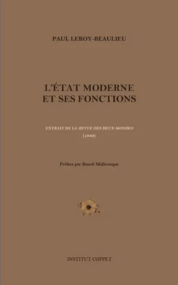

Paul Leroy-Beaulieu, qui avait étudié en Allemagne dans sa jeunesse et connaissait intimement cette littérature, l'a affrontée de front dans [*L'État moderne et ses fonctions*](https://planb.academy/resources/books/letat-moderne-fonctions-7f41f6c6-8cf6-4902-b931-7ce9bf132621) (1890). À cette vision idéalisée, il oppose une analyse beaucoup plus terre à terre de ce qu'est l'État moderne :

> "L'État n'est pas un roi philosophe, doté d'une sagesse surnaturelle et libéré de toute faiblesse humaine. C'est un groupe d'hommes, choisis par des méthodes qui n'ont aucun rapport nécessaire avec la compétence, exerçant des fonctions pour lesquelles ils ont rarement été formés, sous la pression d'intérêts souvent incompatibles avec le bien-être général. Parler de l'État comme s'il était un agent rationnel supérieur aux individus qui le composent, c'est commettre la plus élémentaire des erreurs sociologiques"

En d'autres termes, l'État démocratique ne fonctionne pas comme l'Ancien Régime, où le pouvoir découlait d'une lignée familiale héréditaire : sa réalité est bien plus humble. Des hommes organisés en partis se disputent la possession du pouvoir politique. Ces partis exercent un monopole d'autant plus néfaste qu'il est temporaire : jouissance hâtive des avantages du pouvoir, gaspillage des ressources publiques, lois élaborées par des individus qui ne sont pas toujours adaptés aux fonctions qu'ils assument.

En effet, la **mythologisation de l'État n'est pas une simple erreur intellectuelle, c'est un danger politique**. Car plus l'autorité attribuée à l'État est grande, moins le citoyen se sent en droit de résister à ses empiétements. La tradition philosophique allemande, de Hegel à l'école historique de l'économie, a rendu un mauvais service à la liberté en consacrant l'État comme la plus haute expression de la raison humaine.

### Le processus électoral face à la délibération individuelle

Le processus électoral diffère fondamentalement du processus de jugement individuel. Quelle est la véritable nature de cette différence ? Ce n'est pas seulement une question d'échelle ou de complexité, c'est une question de qualité de la délibération.

Lorsqu'une personne prend une décision privée, qu'il s'agisse de conclure un contrat, d'effectuer un échange ou d'entreprendre une activité professionnelle, elle fait des observations et réfléchit attentivement avant d'agir. Cette délibération se déroule lentement et paisiblement au sein de son propre esprit. Dans la sphère politique, au contraire, les décisions émergent de l'agitation et de la fièvre électorale, dans un climat de court-termisme peu propice au jugement éclairé qu'exigeraient les questions complexes que l'État prétend traiter.

Leroy-Beaulieu a décrit ce contraste avec une grande précision :

> "Le consommateur sur le marché sait ce qu'il veut, parce qu'il a ressenti le besoin directement. Il sait ce qu'on lui offre, parce qu'il peut l'examiner. Il sait ce qu'il paie, parce que le prix est clairement indiqué. Et il sait immédiatement si l'échange l'a satisfait, parce qu'il en ressent le résultat. L'électeur ne sait rien de tout cela. Il n'a qu'une vague impression d'un candidat, filtrée par des journaux partisans et des discours publics conçus pour exciter plutôt que pour informer. Il ne peut pas savoir à l'avance si les politiques qu'il soutient le satisferont ; et lorsqu'il le découvre, son vote a été émis depuis longtemps et ne peut pas être rappelé"

L'État démocratique sacrifie aussi **systématiquement les intérêts des minorités**. Comme les décisions émanent d'une majorité, celle-ci a naturellement tendance, en l'absence de contraintes constitutionnelles suffisantes, à empiéter sur les droits individuels des citoyens minoritaires. Pire encore, les générations futures se retrouvent taxées à l'avance, héritant de dettes et d'intérêts sur des dépenses auxquelles elles n'ont jamais consenti.

### Attributions nécessaires et parasitaires de l'État

Il faut bien distinguer **les fonctions légitimes de l'État de ses fonctions parasitaires**. Les lois qui garantissent la protection des individus par un système judiciaire et policier établissent la sécurité nécessaire aux échanges et aux contrats. C'est ce que Leroy-Beaulieu appelait les attributions "négatives" de l'État, c'est-à-dire des attributions qui se contentent de protéger sans intervenir sur le fond des choix individuels.

Bastiat a exprimé cette distinction avec son économie de langage habituelle :

> "La mission de la loi n'est pas de nous obliger à faire ce qui est bien, mais de nous empêcher de faire ce qui est mal. Elle n'est pas de nous rendre vertueux, mais de nous empêcher d'être méchants envers les autres. Il s'agit là, semble-t-il, d'ambitions modestes. Mais elles sont en réalité immenses, car la loi qui se limite à cette mission laisse une place infinie au libre développement des énergies et des talents individuels"

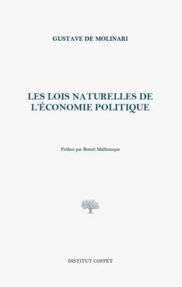

Malheureusement, beaucoup trop de lois entravent, empêchent et réglementent les activités des individus qui ne portent pas atteinte aux droits d'autrui. Ce sont les attributions "positives" de l'État, qui remplace le contrat et l'échange par la décision majoritaire et la réglementation administrative. L'individu est entravé dans sa propriété des choses, ou dans sa propriété de lui-même, sous prétexte d'un préjudice indéfini et indéfinissable à la société ou à certaines catégories de personnes.

En effet, c'est précisément ce **remplacement du contrat par la politique qui constitue le mécanisme central de la non-liberté**. La question n'est pas de savoir si l'État a des fonctions ; bien sûr qu'il a des fonctions, et des fonctions nécessaires. La question est de savoir si ces fonctions doivent se développer sans limite, en colonisant des domaines qui étaient auparavant organisés par le libre accord entre les individus.

### La supériorité du contrat sur le choix politique

Comparons directement les deux systèmes. Dans une société fondée sur le contrat, l'individu est responsable de son destin et maître de ses facultés. Il décide de satisfaire ses besoins, cherche des solutions pour améliorer son existence, s'engage dans un processus de découverte et de délibération qui fait partie intégrante de son individualité. La libre concurrence améliore constamment les alternatives proposées.

Leroy-Beaulieu a articulé la comparaison avec précision :

> "Sur le marché, chacun peut choisir librement entre des alternatives concurrentes ; le marché des idées politiques, en revanche, reste restreint et sous tutelle. En tant que consommateur, je peux juger immédiatement si un achat particulier a satisfait mes besoins ; mais comment puis-je juger si les grandes réformes de l'éducation nationale ou du service postal m'ont donné satisfaction ? Je ne suis pas un consommateur de tout, et mon expérience individuelle porte sur quelque chose qui me dépasse largement"

En d'autres termes, le choix politique est toujours **une offre globale, imposée par la majorité et présentée sur une base à prendre ou à laisser** qu'aucun marché ne tolérerait. L'individu est contraint d'acquiescer à tout un programme, de s'engager dans des échanges qui peuvent lui être défavorables, alors que la liberté contractuelle lui permettrait de faire de ses facultés et de ses biens l'usage qu'il juge le meilleur selon ses propres critères.

Dans un système fondé sur le pouvoir politique, ce processus est tronqué à chaque étape. L'agitation électorale et les promesses trompeuses remplacent la délibération sereine. Le citoyen vote sur la base d'une impression générale d'un candidat plutôt que sur la base d'une évaluation minutieuse de mesures spécifiques. Les choix sont trop complexes et trop vastes pour qu'un individu puisse en mesurer les effets sur lui-même. Enfin, le choix politique est imposé par la majorité et par le paquet : l'individu est privé du retour d'information granulaire, personnel et immédiat que le marché fournit à chaque transaction.

## Le pouvoir par la fiscalité et la manipulation monétaire

<chapterId>ca113581-6969-58b4-a9f8-996ab409be25</chapterId>

### Fiscalité : contribution ou confiscation

La distinction fondamentale entre contribution et confiscation est le point de départ de toute réflexion honnête sur les pratiques de non-liberté. Qu'est-ce qui sépare un impôt légitime d'une forme de pillage organisé ? Les libéraux de tradition française ont répondu à cette question avec soin, et leur réponse reste instructive.

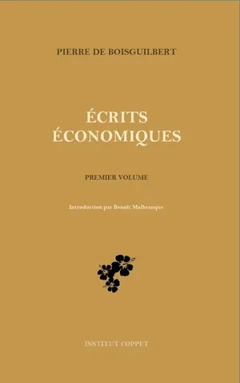

Pierre de Boisguilbert (1646-1714), magistrat normand qui consacra sa retraite à une critique dévastatrice du système fiscal de Louis XIV, fut l'un des premiers à identifier cette distinction avec précision. Dans son [*Détail de la France*](https://planb.academy/resources/books/detail-de-la-france-bc806d78-d4dd-4fab-9a6c-0274092a9f50) (1695), il écrit :

> "Le prince qui prend à ses sujets plus qu'il n'est nécessaire pour maintenir l'ordre et la sécurité ne s'enrichit pas pour autant ; il devient seulement l'instrument de leur appauvrissement, et en les appauvrissant, il s'appauvrit lui-même. Car la richesse du souverain découle de la richesse de la nation, et la nation saignée à blanc n'a plus rien à donner. Le système fiscal français a franchi ce seuil : il ne finance plus l'État, il détruit la capacité productive dont seul l'État peut tirer ses revenus."

En d'autres termes, l'imposition confiscatoire va à l'encontre du but recherché, même dans ses propres termes : **Elle tue la poule aux œufs d'or**. Le souverain qui taxe au-delà de la marge de contribution légitime n'accumule pas de pouvoir, il le consomme.

Frédéric Bastiat a développé cette idée d'échange de service contre service, en insistant sur le fait que les impôts doivent être lisibles, afin que chaque contribuable sache précisément ce qu'il reçoit en échange de sa contribution :

> "Un impôt légitime est simplement le prix d'un service : le service de la sécurité, de la justice, de l'exécution des contrats. Comme tout prix, il doit être proportionnel au service rendu et accepté par le payeur, au moins implicitement. L'impôt qui va au-delà et finance les préférences, les idéaux ou les projets des gouvernants n'est plus un prix, c'est un tribut. Et le tribut est une forme d'asservissement"

### Déficit et dette : taxer ceux qui ne peuvent pas se défendre

Alexis de Tocqueville, après son voyage aux États-Unis, a identifié avec une clarté particulière le problème démocratique des dépenses publiques. Le pouvoir politique, aussi bien intentionné soit-il, ne peut être économe. Le mécanisme fondamental est la rupture du lien entre jouissance et paiement : les individus ont une tendance naturelle à reporter les charges sur les autres tout en profitant eux-mêmes des avantages.

Tocqueville l'a exprimé avec une mélancolie caractéristique dans ses notes sur la démocratie :

> "Le législateur démocratique est constitutionnellement incapable d'économie. Il représente les vivants et ne représente pas les enfants à naître. Il peut toujours trouver une majorité disposée à profiter d'une dépense et une minorité disposée à en différer le paiement. Le déficit n'est donc pas un accident de la gouvernance démocratique ; c'est sa tendance permanente, limitée seulement par des circonstances exceptionnelles ou par des dispositions constitutionnelles que la logique démocratique elle-même tend, avec le temps, à éroder"

En d'autres termes, les déficits et la dette permettent de **reporter le coût des services obtenus sur les générations futures**, qui ne sont pas en mesure de défendre leurs intérêts face à des décisions qui les engagent. Cette pratique constitue une contradiction majeure avec le principe démocratique selon lequel il n'y a pas de taxation sans représentation. Comme l'a vu Tocqueville, nos petits-enfants ne sont pas là pour défendre leurs poches. La démocratie, qui a déjà tendance à sacrifier les minorités, sacrifie donc aussi les générations futures.

Bastiat a exprimé le même point de vue de manière plus directe :

> "L'État est la grande fiction par laquelle chacun essaie de vivre aux dépens de tous les autres. Le déficit est la preuve que cette fiction a été poussée à son extrême logique : nous essayons de vivre non seulement aux dépens de nos contemporains, mais aux dépens de nos descendants. Ce n'est pas une politique, c'est une faillite différée"

### L'argent comme instrument de domination

Dans la logique de la domination politique, l'argent cesse d'être une marchandise ou un service comme les autres pour devenir un instrument de pouvoir. Mais qu'est-ce que l'argent, au sens propre ? Et qu'accomplit sa manipulation par le pouvoir politique ?

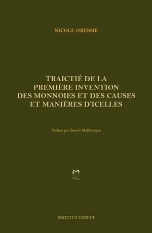

Nicolas Oresme (1320-1382), évêque normand et polymathe qui fut le précepteur du futur roi Charles V de France, s'est penché sur ces questions au XIVe siècle avec une clarté qui reste étonnante. Son [*Traictié de la première invention des monnoies*](https://planb.academy/resources/books/traictie-premiere-invention-monnoies-0d91d52c-ed04-4cdd-baa6-590b3544d40a) (vers 1360) est le premier traité systématique sur la théorie monétaire dans la tradition occidentale. Il écrit en s'adressant directement au roi :

> "La monnaie appartient à la communauté qui l'utilise, et non au prince qui la frappe. Le prince a le droit d'en réglementer l'usage ; il n'a pas le droit d'en altérer le contenu à son profit. Lorsqu'il avilit la monnaie, il commet un vol : un vol au détriment de tous ceux qui détiennent la monnaie, un vol diffusé à l'ensemble de la communauté, et donc un vol plus difficile à identifier et à combattre que le simple pillage d'un individu. C'est pour cette raison que l'avilissement monétaire est le plus dangereux de tous les abus du pouvoir politique"

En d'autres termes, la manipulation monétaire n'est pas une question technique mais politique : **un instrument par lequel le dirigeant extrait la richesse** de la population sans la visibilité et la résistance que l'imposition directe provoquerait.

L'avilissement monétaire produit de l'inflation et déstabilise les prix, car le signal monétaire devient incertain lorsque le maître des mesures de valeur peut en modifier arbitrairement le contenu. **Les lettres de change et les billets de banque, inventés au Moyen-Âge, et aujourd'hui monnaies privées, offrent aux parties contractantes des moyens d'échange volontairement acceptés, plutôt qu'une monnaie sans valeur intrinsèque utilisée principalement pour financer le pouvoir politique.**

L'intuition d'Oresme a été reprise par les libéraux français du XIXe siècle, qui ont identifié le papier-monnaie de la période des assignats comme l'exemple moderne le plus extrême de spoliation monétaire :

> "L'assignat n'était pas de la monnaie au sens propre ; c'était un prêt forcé, imposé à tous les détenteurs de monnaie, remboursable selon le bon vouloir du gouvernement, et liquidé à la fin à une fraction de sa valeur nominale. C'était, en d'autres termes, un impôt : un impôt caché, régressif, inévitable, tombant le plus lourdement sur ceux qui sont le moins en mesure de se protéger en détenant des actifs réels"

### La guerre et le refus de la sécession

Gustave de Molinari s'est particulièrement intéressé à la question de la guerre, observant la contradiction entre ce mode archaïque de relations internationales et les nouveaux phénomènes de production pacifique et de mondialisation. Qu'est-ce que la guerre, dépouillée de son cérémonial militaire ? C'est, au fond, **une manifestation des intérêts contradictoires des gouvernants eux-mêmes**, qui cherchent à étendre leur monopole de domination territoriale comme un industriel chercherait à accroître sa clientèle.

Molinari s'est montré direct, comme à son habitude :

> "La guerre est la continuation de l'imposition par d'autres moyens. De même que le percepteur extrait la richesse de la population nationale par la force de la loi, le général extrait la richesse de la population étrangère par la force des armes. Les deux opérations diffèrent par leur statut juridique ; elles ne diffèrent pas par leur nature économique. Elles consistent toutes deux à transférer des ressources de ceux qui les ont produites à ceux qui détiennent le pouvoir sur elles"

Cette logique d'expansion est un vestige du système féodal, où l'État était conçu comme le propriétaire de la nation. L'histoire des transferts de territoires entre familles régnantes, par mariage ou par vente, illustre parfaitement cette conception. L'achat de la Louisiane, ou plus tard de l'Alaska, démontre la possibilité d'acquérir non seulement une terre mais aussi le droit de dominer ses habitants, qui n'ont pas eu leur mot à dire dans la transaction.

La doctrine de la liberté oppose à cette logique le **principe de la sécession individuelle et collective** : le libre choix des individus qui s'appartiennent et qui décident eux-mêmes de l'organisation politique qui répondra à leurs besoins. Molinari a précisé :

> "Une région qui souhaite rejoindre un autre pays doit être libre de le faire, tout comme un client est libre de changer de fournisseur. Une communauté qui souhaite gérer ses propres affaires doit être libre de le faire, comme un entrepreneur est libre de créer sa propre entreprise. L'interdiction de la sécession n'est rien d'autre qu'un monopole de domination territoriale, aussi indéfendable dans son principe que n'importe quel autre monopole, et produisant les mêmes maux : prix élevés, mauvaise qualité, et frustration permanente de ceux qui préféreraient une alternative"

Les constitutions modernes proclament une république une et indivisible, interdisant toute émancipation collective. Une région ne peut pas rejoindre un autre pays, ni devenir autonome pour gérer ses propres services publics. Cette contradiction fondamentale n'empêche nullement les États de chercher à conquérir de nouvelles clientèles politiques, perpétuant ainsi les pratiques de domination qu'ils prétendent proscrire.

## Les différentes variantes du protectionnisme

<chapterId>3c1cf3d1-e2f5-5a95-9671-bf82b4de4a4e</chapterId>

### Qu'est-ce que le protectionnisme ?

Le protectionnisme est l'une des manifestations les plus significatives de la non-liberté, et l'une des plus durables. Pour le comprendre, il faut rappeler que la concurrence est naturellement imposée aux êtres humains par la finitude des ressources disponibles. Cette rareté crée un besoin d'acquisition et de distribution, qui peut être réalisé soit par le contrat, soit par la politique.

Bastiat a identifié la nature fondamentale du protectionnisme avec une précision dévastatrice dans ses [*Sophismes économiques*](https://planb.academy/resources/books/sophismes-economiques-9ccb727f-d253-4188-9cc6-74c1e6ce6a16) (1845) :

> "L'argument protectionniste, dépouillé de ses fioritures, se résume à ceci : nous voulons vendre sans acheter. Nous voulons recevoir sans donner. Nous voulons produire sans consommer, nous enrichir sans enrichir les autres. En un mot, nous voulons violer la loi fondamentale de l'échange, qui veut que les deux parties gagnent, en faisant en sorte que l'une gagne sans l'autre. Ce n'est pas une politique, c'est un souhait. Et c'est un souhait que, heureusement, la nature des choses fera toujours échouer"

Le protectionnisme apparaît comme une réponse à cette concurrence des méthodes, des idées et des produits. Il offre une solution à ceux qui ne veulent pas suivre le progrès et qui se sentent éclipsés par les individus plus entreprenants. Ces derniers ne cherchent pas seulement à se protéger, mais à extraire la richesse de la population entreprenante et à vivre à ses dépens.

En d'autres termes, **le protectionnisme n'est pas une politique pour les pauvres ; c'est une politique pour les bien établis, aux dépens des pauvres**. Il augmente les prix pour tous les consommateurs afin de préserver les profits de certains producteurs. La démocratie, en donnant le pouvoir aux masses, tend naturellement à produire ce protectionnisme, car les masses sont généralement peu enclines au progrès. La réponse typique à l'innovation est un dédaigneux "à quoi ça sert ?" Cette tendance s'accompagne souvent d'une hostilité envers les riches, alimentée par l'envie et la conviction qu'ils ne méritent pas leur richesse.

En effet, Bastiat a identifié ce qu'il a appelé **"le vu et le non-vu"** comme la clé pour comprendre le raisonnement protectionniste. L'usine protégée est vue ; les usines qui n'existent pas parce que la protection a augmenté les coûts et réduit l'investissement ne sont pas vues. Les travailleurs qui conservent leur emploi sont vus ; les consommateurs qui paient des prix plus élevés pour des produits de qualité inférieure et les travailleurs d'autres secteurs qui supportent le coût de la protection ne sont pas vus.

### L'oreiller de la protection douanière

Le protectionnisme en matière de commerce international est la forme la plus connue de cette notion. Or, la liberté appelle le libre-échange : la propriété des biens acquis par le travail confère légitimement le droit de les échanger contre d'autres produits et services. Le système libéral repose sur le libre-échange intégral, qui permet à chacun d'utiliser ses biens comme il l'entend par des échanges mutuellement bénéfiques, enrichissant la société et satisfaisant les besoins, tout en rendant le travail réellement rémunérateur.

Les auteurs du XIXe siècle ont décrit les effets de la protection à l'aide d'une image frappante : "l'oreiller de la protection douanière" Les producteurs les moins entreprenants se reposent sur leurs lauriers, car la concurrence étrangère n'est pas autorisée. Bastiat l'a illustré par la célèbre pétition des chandeliers, qui ont demandé au Parlement français de bloquer le soleil au motif qu'il exerçait une concurrence déloyale sur l'industrie nationale de l'éclairage :

> "Nous souffrons de la concurrence ruineuse d'un rival étranger qui travaille dans des conditions de production tellement supérieures aux nôtres pour la production de lumière qu'il inonde le marché intérieur de cette lumière à un prix fabuleusement réduit. Ce rival, c'est le soleil. Nous vous demandons d'avoir la bonté d'adopter une loi exigeant la fermeture de toutes les fenêtres, lucarnes et rideaux, afin d'occulter la lumière du soleil et d'ouvrir ainsi un marché pour nos bougies"

En d'autres termes, lorsque des entrepreneurs étrangers découvrent des méthodes de production innovantes ou proposent de meilleurs produits à des prix inférieurs, les producteurs nationaux protégés par des droits de douane **peuvent dormir tranquillement sur leur oreiller protecteur**. Cela empêche les consommateurs nationaux d'acquérir de meilleurs produits et crée une forme de domination économique des producteurs nationaux sur leur propre population.

En effet, Frédéric Passy et Paul Leroy-Beaulieu ont tous deux souligné que le protectionnisme, loin d'être une politique de solidarité nationale, était en fait **une politique de lutte des classes** : la lutte des producteurs établis contre leurs propres consommateurs, et des industries bien organisées contre le public diffus et inorganisé.

### Les coutumes des concours

L'idée protectionniste s'étend bien au-delà du commerce international. Ce que les libéraux français du XIXe siècle appelaient les "coutumes des concours" relève de la même logique que celle appliquée à la liberté du travail. Ces limitations sont conçues pour protéger certaines professions en exigeant le passage par des examens administrés par l'État et des écoles approuvées par l'État avant de permettre à quiconque d'exercer.

Charles Dunoyer, qui a consacré sa carrière à établir le lien entre liberté industrielle et liberté politique, a clairement identifié le mécanisme :

> "Le concours est la douane des professions libérales. Il dit au candidat : vous pouvez entrer dans cette profession, mais seulement après avoir payé un droit de douane. Ce péage ne prend pas la forme d'argent, mais de temps et de soumission : vous devez passer des années à apprendre ce que l'État a décidé qu'il fallait apprendre, de la manière dont l'État a décidé qu'il fallait l'enseigner, à la satisfaction d'examinateurs choisis par l'État. Le résultat est que la profession est protégée non pas de l'incompétence mais de l'innovation, non pas du charlatanisme mais du génie"

En d'autres termes, les coutumes en matière d'examens **ne protègent pas le public contre les préjudices ; elles protègent les praticiens établis contre la concurrence**. La profession protégée de la concurrence par la routine des examens n'attire pas les génies, les innovateurs et les inventeurs qui l'amèneraient au niveau supérieur.

Cette approche substitue le système préventif au système répressif, seul accepté par le libéralisme. Le système répressif est fondé sur la responsabilité individuelle : si je porte atteinte aux droits d'autrui, je dois réparer. Le système préventif, au contraire, organise à l'avance des réglementations censées prévenir de telles atteintes, mais **il commence lui-même par une atteinte aux droits en interdisant l'usage non nuisible de la liberté**. Arthur Mangin, avec Charles Dunoyer et Charles Comte avant lui, a mené ce combat pour la liberté du travail, dans la continuité directe de la lutte de Turgot contre les corporations.

L'exemple de la liberté de la médecine et de la pharmacie, une réalité en Angleterre et aux Etats-Unis mais vivement contestée sur le continent européen, illustre le principe dans sa forme la plus provocante :

> "En Angleterre, n'importe qui peut s'installer comme pharmacien. Le public anglais n'en a pas été empoisonné pour autant ; au contraire, les pharmaciens anglais se livrent une concurrence acharnée sur la qualité et les prix, et les Anglais consomment des médicaments de meilleure qualité à des prix inférieurs à ceux de leurs voisins français, protégés par un monopole d'entreprise qui ne sert que les monopoleurs"

### Protectionnisme du travail et lois anti-immigration

Une application moderne du protectionnisme concerne la restriction de l'immigration. Au XVIIIe siècle, il était courant que des étrangers occupent des fonctions publiques (le ministre Necker, par exemple) ou servent dans l'armée (les gardes suisses). Cette ouverture contraste fortement avec le retour au protectionnisme dans les fonctions publiques que l'on observe aujourd'hui.

La [*Société d'économie politique*](https://planb.academy/resources/books/societe-economie-politique-anthologie-3a48e3b5-ef74-4822-b1d9-b030e327b84e), qui réunissait les grands libéraux français du XIXe siècle lors de ses dîners mensuels à Paris, s'est intéressée de près aux lois anti-immigration qui émergeaient dans les sociétés anglo-saxonnes. Ces pays, après avoir dominé les populations autochtones, se retranchent et refusent la concurrence d'autres peuples qui souhaitent participer non par la conquête mais par le contrat et l'échange. Molinari a été l'un des critiques les plus virulents de cette tendance :

> "La loi anti-immigration est la forme suprême du protectionnisme du travail. Elle dit au travailleur étranger : ton travail ne peut pas concurrencer le nôtre, sous peine d'expulsion. Il s'agit en fait d'une loi de guilde étendue aux frontières de la nation. Son effet est identique à celui des anciennes guildes : il augmente le prix du travail pour ceux qui sont admis et réduit la quantité de production pour tous. La nation qui exclut les travailleurs étrangers s'appauvrit aussi sûrement que la guilde qui excluait les maîtres étrangers"

Alors que le protectionnisme des grandes entreprises vise à protéger les producteurs nationaux de la concurrence étrangère sur les produits, le protectionnisme des travailleurs cherche à protéger les travailleurs nationaux de la concurrence avec les travailleurs étrangers. La notion de protectionnisme révèle donc différentes nuances de non-liberté : dans l'échange de biens par le biais de droits de douane, dans la liberté de travail par le biais de concours, et dans la liberté de voyager et de travailler par le biais de lois anti-immigration.

En effet, la structure logique de toutes ces formes de protectionnisme est identique. Dans chaque cas, **un groupe d'initiés utilise le pouvoir politique pour exclure les outsiders d'un marché**, augmentant les prix pour les consommateurs et réduisant la richesse globale de la société. Les seuls bénéficiaires sont les initiés eux-mêmes, dont les privilèges se font au détriment direct de tous les autres.

## L'échec éternel de la non-liberté

<chapterId>e4b15871-df1d-5d98-a395-16e24e7258d5</chapterId>

### L'impossibilité de planifier, des physiocrates au XXe siècle

L'échec de la non-liberté a une longue histoire intellectuelle. Dès le milieu du XVIIIe siècle, les physiocrates ont ouvert un débat de fond sur la possibilité d'une société dans laquelle l'État, en organisant la non-liberté, prendrait les décisions à la place des individus pour créer un ordre économique et social supposé plus harmonieux.

Louis-Paul Abeille (1719-1807), économiste et administrateur breton qui a joué un rôle clé dans le mouvement physiocratique avant de devenir administrateur financier sous l'Ancien Régime et au début de la Révolution, a exprimé l'idée centrale de l'école dans sa [*Lettre d'un négociant sur la nature du commerce des grains*](https://planb.academy/resources/books/lettre-negociant-commerce-grains-c9ae04c1-d19d-409d-aa37-d6498aafde59) (1763) :

> "Il y a mille circonstances qui déterminent le prix, le lieu et le moment où le grain doit être vendu. Le fermier qui l'a produit et le marchand qui désire l'acheter connaissent ces circonstances ; le fonctionnaire qui cherche à réglementer la transaction n'en connaît aucune. Il ne voit que la moyenne ; ils voient le particulier. Il agit sur la base des informations d'hier ; ils agissent sur la base de celles d'aujourd'hui. Il agit sur un principe général ; ils agissent sur un fait particulier. Le résultat de son intervention est donc nécessairement pire que le résultat de leur libre accord, non pas parce qu'il est moins intelligent, mais parce qu'il est moins informé"

En d'autres termes, l'argument des physiocrates contre la réglementation des céréales n'était pas fondamentalement un argument moral, bien qu'ils aient également avancé des arguments moraux ; il s'agissait d'un argument épistémique. Les **informations nécessaires pour diriger efficacement la production sont dispersées entre des millions d'individus** et ne peuvent être rassemblées par aucune autorité centrale.

En effet, cet héritage intellectuel des physiocrates a été transmis aux libéraux français et à tous les économistes libéraux des XIXe et XXe siècles. Leur réflexion se cristallise autour de la grande question des grains : le blé est la ressource alimentaire majeure de l'époque, sa production et son commerce sont débattus tout au long du siècle. L'État fixe les prix, interdit les transferts entre régions, contrôle les agents économiques et tente d'organiser la distribution de cette denrée essentielle. Le résultat, comme l'ont montré les physiocrates, est toujours le même : **la rareté, la famine et le désordre social.**

Turgot, le plus brillant des alliés des physiocrates au gouvernement, résume la leçon dans sa célèbre lettre au jeune Louis XVI :

> "Sire, le commerce des grains n'exige d'autre réglementation que celle que la nature impose par le jeu des intérêts particuliers. Laissez-le libre, et il nourrira la France mieux qu'aucun édit ne peut le faire. Régulez-le, et vous produirez la pénurie que vous cherchez à éviter, car vous aurez détruit le seul mécanisme capable de répondre à la pénurie : l'intérêt personnel du marchand qui cherche à acheter là où le grain est bon marché et à vendre là où il est cher"

### La prophétie de Leroy-Beaulieu : "l'esclavage sans le pécule"

La tradition libérale française a prolongé cette analyse au XIXe siècle, notamment grâce à Paul Leroy-Beaulieu et à son ouvrage majeur [*Le Collectivisme*](https://planb.academy/resources/books/le-collectivisme-d79dc3a7-7b77-4698-89e6-440312e2da2c) (1883). Leroy-Beaulieu s'est attaché à analyser à l'avance le fonctionnement réel d'une société communiste, les théoriciens du communisme, au premier rang desquels Karl Marx, ayant été remarquablement avares de détails sur la société appelée à remplacer le capitalisme.

La conclusion de Leroy-Beaulieu est dévastatrice. Selon lui, le communisme constituerait **une forme d'esclavage pire que l'esclavage traditionnel lui-même**

> "C'est un esclavage sans pécule, sans possibilité de rachat. L'esclave de l'Antiquité pouvait, dans certains systèmes, acheter sa liberté ; l'homme industrieux pouvait accumuler le prix de sa propre libération. Le citoyen de l'État communiste n'a pas cette possibilité. Il est privé de liberté, sans voie de libération, sans perspective de propriété personnelle, d'autonomie individuelle ou de liberté d'agir selon ses propres idées. Il est, au sens le plus littéral du terme, la propriété de l'État ; et contrairement au propriétaire d'esclaves, l'État est un propriétaire qui ne s'intéresse pas au bien-être de la personne qu'il possède."

La liberté politique serait nécessairement supprimée, car le fonctionnement démocratique ne permet pas de gérer durablement les processus de production et de distribution. Une puissance tutélaire permanente devient indispensable. Leroy-Beaulieu l'a dit avec une clarté prophétique :

> "Le système communiste, une fois établi, ne peut tolérer d'opposition démocratique. Car la démocratie implique la possibilité que les opposants au système accèdent au pouvoir ; et s'ils accèdent au pouvoir, ils restaureront la propriété privée et annuleront la collectivisation. Le système doit donc abolir la démocratie qui l'a porté au pouvoir. Ce n'est pas un accident de la révolution bolchevique, c'est une nécessité logique du collectivisme"

En d'autres termes, le **communisme exige le despotisme**, non pas parce que ses fondateurs sont nécessairement cruels, mais parce que **la logique de sa propre organisation exige la suppression permanente de la liberté** qui, autrement, le détruirait.

### La chaîne des libertés perdues

Le principe de non-liberté dans la production et la distribution a des conséquences directes sur toutes les dimensions de l'existence individuelle. Retraçons cette chaîne.

**Il n'y a pas de liberté de domicile dans un système collectiviste, car il n'y a pas de liberté de travail** : une décision supérieure dicte aux individus les branches de production auxquelles ils participeront et la manière dont ils travailleront. Comme on habite près de son lieu de travail et qu'on ne peut pas choisir son travail, on ne peut pas choisir son domicile.

La liberté de la presse n'existe pas, pour deux raisons fondamentales. Leroy-Beaulieu a été explicite sur ce point :

> "Tout d'abord, la liberté politique est fortement restreinte, car la critique du système est incompatible avec sa perpétuation. Deuxièmement, et plus fondamentalement, l'État est propriétaire des moyens de production ; il est donc propriétaire des presses. Sans propriété privée des imprimeries, il ne peut y avoir de presse privée ; sans presse privée, il ne peut y avoir de liberté d'expression, quelles que soient les déclarations qui la proclament. La liberté de la presse dans une société communiste est comme la liberté de l'oiseau dans une cage : parfaitement réelle dans les limites de la cage, et parfaitement insignifiante au-delà"

**Il n'y a pas de liberté de consommation**, puisque l'État décide de ce qui sera produit et en quelles quantités. Si l'État collectiviste décide que la production de fraises ne vaut pas le travail, il n'y aura tout simplement pas de fraises à consommer. Dans un système libéral, en revanche, le contrat entre acheteurs et producteurs consentants, librement formé et mutuellement bénéfique, satisferait cette demande sans qu'il soit nécessaire de recourir à une direction centrale.

En effet, Leroy-Beaulieu a identifié ce qu'il a appelé la "cascade de suppressions" : chaque suppression d'une liberté entraîne logiquement la suppression des autres, car **les libertés ne sont pas une collection de privilèges séparés mais un système unique et interconnecté** :

> "Supprimer la liberté de travail, c'est supprimer la liberté de domicile. Supprimez la liberté de domicile, et vous supprimez la liberté d'association. Supprimez la liberté d'association et vous supprimez la liberté de la presse. Supprimez la liberté de la presse, et vous supprimez la liberté de pensée. Chaque maillon de la chaîne de la liberté tient tous les autres ; et l'homme qui coupe un maillon a, qu'il le veuille ou non, détruit toute la chaîne"

### Le vingtième siècle confirme la prophétie

Le vingtième siècle a apporté une confirmation éclatante aux prédictions des libéraux français. Le système communiste, une fois devenu réalité en Russie après 1917, **démontre avec une terrible précision la justesse des analyses** faites trois ou quatre décennies plus tôt.

Leroy-Beaulieu avait écrit, en 1883 :

> "L'expérience communiste, lorsqu'elle sera faite, ne réfutera pas notre analyse, elle la confirmera. Elle montrera qu'une société sans propriété privée ne peut ni calculer, ni innover, ni se gouverner démocratiquement. Elle montrera que la tentative d'imposer l'égalité des conditions produit nécessairement, non pas l'égalité, mais une nouvelle hiérarchie : la hiérarchie de ceux qui contrôlent l'État contre ceux qui sont contrôlés par lui. Et il montrera que cette nouvelle hiérarchie se révélera bien plus résistante aux réformes que les anciennes hiérarchies de la naissance et de la richesse, parce qu'elle sera armée de tout le pouvoir de l'État et sanctifiée par la rhétorique du bien commun"

Dans un système libéral, les contrats s'établissent librement entre producteurs et consommateurs dans une relation harmonieuse et pacifique. Le système collectiviste organise, au contraire, **une mise sous tutelle complète de l'individu, remplaçant la libre direction de soi par soi** par les décisions réglementaires et arbitraires d'un pouvoir politique, élu ou non.

Cette histoire intellectuelle et factuelle de l'échec de la non-liberté est une leçon fondamentale. La trajectoire de l'histoire humaine nous pousse à rejeter toujours plus fermement l'idée communiste et l'idée de tutelle, pour faire advenir la liberté, l'autonomie, la décision individuelle, l'échange volontaire et pacifique entre les hommes.

# Sophismes de la non-liberté

<partId>de66dc14-7dc0-52c5-aedf-5efe4820b9c1</partId>

## Sophismes intellectuels : fausses définitions de la liberté

<chapterId>9bd81fd4-20ed-5305-845a-d081811946ee</chapterId>

### L'importance des sophismes

Nous arrivons à une question fondamentale : pourquoi la non-liberté continue-t-elle à dominer nos sociétés, alors qu'elle est démentie par les faits et qu'elle contredit le mouvement historique vers plus de liberté ? La réponse réside dans l'existence de **sophismes tenaces qui servent de fondement intellectuel aux systèmes de non-liberté**.

Aucun penseur ne l'a mieux compris que Frédéric Bastiat (1801-1850), le brillant économiste bayonnais dont la vie a été tragiquement interrompue par la tuberculose avant qu'il ne puisse achever son plus grand ouvrage. Bastiat a consacré toute la force de son génie polémique à identifier et à démonter ces erreurs dans son célèbre [*Sophismes économiques*](https://planb.academy/resources/books/sophismes-economiques-9ccb727f-d253-4188-9cc6-74c1e6ce6a16) (1845). Sa conviction est que les socialistes et les interventionnistes de son époque sont dans l'erreur, mais avec de bonnes intentions. Comme le rappelle l'expression courante, l'enfer est pavé de bonnes intentions. Pour Bastiat, **l'adversaire du libéralisme n'est pas le sophiste lui-même, mais le sophisme** : une erreur de raisonnement ou une erreur factuelle qui doit être corrigée par la science économique.

> Nous sommes assaillis de sophismes. C'est bien. Combattons-les. Ne nous endormons pas devant l'erreur, car l'erreur ne s'endort pas devant la vérité.

En d'autres termes, la bataille intellectuelle contre les fausses idées n'est pas facultative pour le libéral : elle est la condition préalable à toute victoire politique durable.

En effet, Bastiat a bien vu que **les sophismes les plus dangereux ne sont pas ceux des manipulateurs cyniques mais ceux des croyants sincères**. Un menteur malveillant peut être démasqué ; un homme sincère qui raisonne mal ne peut être répondu par des accusations de mauvaise foi. Il faut lui répondre par un meilleur raisonnement. C'est dans cet esprit que la tradition libérale française du XIXe siècle a construit sa science rigoureuse de la liberté.

### Comment les libéraux français ont défini la liberté

La tradition libérale française du XIXe siècle offre un cadre conceptuel solide pour comprendre ce que signifie réellement la liberté. Examinons trois définitions qui convergent vers la même idée essentielle.

Yves Guyot (1843-1928), l'infatigable économiste et homme politique qui a dirigé le *Journal des économistes* pendant plus de trois décennies, l'affirme avec une concision caractéristique :

> Les droits de l'homme consistent dans le libre usage de sa volonté et de ses facultés. Tout acte qui entrave ce libre usage sans être lui-même une défense contre une agression préalable constitue une injustice.

Cela correspond à **la propriété de soi et sa matérialisation dans les limites des droits d'autrui**. Paul Leroy-Beaulieu (1843-1916), le grand économiste qui occupa la chaire d'économie politique au *Collège de France* et dont l'œuvre encyclopédique a façonné toute une génération de la pensée libérale, apporte une précision essentielle :

> La liberté ne consiste pas en une sécurité absolue, à l'abri de tout risque ; la liberté est la faculté qu'a l'homme de déterminer ses propres actes, et non le pouvoir de s'assurer que le résultat de ses actes correspond toujours à ses désirs ou à ses besoins.

En d'autres termes, **la liberté concerne le point de départ de l'action, et non la garantie de son résultat**. Cette distinction est décisive, car elle sépare d'un seul coup la conception libérale de la liberté de la conception socialiste. Enfin, Charles Comte (1782-1837), juriste et gendre de Jean-Baptiste Say, définit la liberté comme suit :

> État d'une personne qui ne rencontre dans ses semblables aucun obstacle au développement régulier de son être ou à l'exercice innocent de ses facultés.

Ces trois définitions convergent vers une conception de la liberté enracinée dans la propriété de soi et dans le respect mutuel des droits individuels. Il ne s'agit pas de visions utopiques, mais de concepts juridiques précis, susceptibles d'être appliqués en droit et dans l'organisation sociale.

### La dangereuse définition de Montesquieu

Face à ces définitions rigoureuses, la pensée politique recèle également des conceptions erronées de la liberté. La plus célèbre est celle de Montesquieu : "La liberté est le droit de faire tout ce que les lois permettent" Cette formule d'apparence innocente se révèle extrêmement dangereuse, car **elle permet toutes les atteintes aux libertés innocentes de l'individu dès lors qu'elles sont autorisées par la loi**.

Mais cette définition résiste-t-elle à un examen approfondi ? Pas du tout. Si la liberté consiste simplement à faire ce que la loi permet, alors une société dans laquelle la loi interdit tout sauf de respirer serait toujours considérée comme libre, à condition que les citoyens obéissent scrupuleusement à leurs législateurs. La formule évacue tout contenu substantiel du concept de liberté et le remplace par une simple légalité.

Les penseurs libéraux du XIXe siècle ont vivement critiqué Montesquieu sur ce point. Antoine Destutt de Tracy (1754-1836), ancien officier d'artillerie devenu philosophe de l'école Idéologue, a consacré un ouvrage entier à la correction de ces erreurs. Dans son [*Commentaire sur l'Esprit des lois*](https://planb.academy/resources/books/commentaire-esprit-des-lois-7f3a37a4-e731-4415-8308-21daf4a689c7) (1819), rédigé à la demande de Thomas Jefferson lui-même, Destutt de Tracy écrit :

> Montesquieu confond l'absence d'interdiction légale avec la présence d'une véritable liberté. Or, il s'agit de choses radicalement différentes. Un esclave est autorisé à faire tout ce que son maître ne lui interdit pas ; cela ne le rend pas libre. La vraie liberté commence non pas avec ce que la loi permet, mais avec ce que la loi n'a pas le droit de toucher.

Benjamin Constant (1767-1830), le grand libéral franco-suisse né à Lausanne et devenu l'un des plus éloquents défenseurs des droits individuels de toute l'histoire de la pensée politique, a développé une théorie distinguant clairement la sphère de l'action individuelle innocente et libre de la sphère du pouvoir. Dans son célèbre [*Principes de politique*](https://planb.academy/resources/books/principes-de-politique-282bc3de-f218-4103-903a-5280d7b99108) (1815), il écrit :

> L'autorité de la société sur ses membres ne s'étend qu'aux actions qui nuisent à autrui. Dans la sphère des actions qui ne concernent que l'individu lui-même, l'indépendance de l'individu est, de droit, absolue. Sur lui-même, sur son corps et son esprit, l'individu est souverain.

En d'autres termes, **la sphère de la liberté individuelle n'est pas ce que la loi ne parvient pas à interdire ; c'est ce qu'aucune loi n'a le droit d'interdire**. La distinction n'est pas simplement sémantique : c'est la différence entre le despotisme habillé de légalité et un véritable gouvernement constitutionnel.

### Liberté négative contre liberté positive

Une distinction cruciale sous-tend l'ensemble du débat : celle entre la liberté négative et la liberté positive. Que signifie exactement cette distinction et pourquoi est-elle si importante ?

La liberté négative se définit comme l'absence d'obstacles. L'individu ne rencontre aucune entrave dans l'expression de sa volonté, tant qu'il ne nuit pas directement à autrui. Ce concept est profondément ancré dans la notion de propriété : il désigne la liberté de faire un usage innocent de son corps, de ses facultés et des biens légitimement possédés. En effet, toute la tradition libérale, de Locke à Bastiat, repose sur cette conception. Elle est dite "négative" non pas parce qu'elle est inférieure, mais parce qu'elle **se définit par l'absence de contrainte extérieure plutôt que par la présence d'une assistance extérieure**.

La liberté positive, en revanche, est conçue comme la capacité de faire et d'obtenir. Selon cette vision, l'individu est libre lorsqu'il peut obtenir les choses qu'il désire, que d'autres soient ou non obligés de les lui fournir. Cette conception rompt avec la notion de propriété et ouvre la porte aux justifications socialistes de l'intervention de l'État.

Paul Leroy-Beaulieu, dans [*Le Collectivisme*](https://planb.academy/resources/books/le-collectivisme-d79dc3a7-7b77-4698-89e6-440312e2da2c) (1884), démontre que le socialisme, même avec sa notion différente de la liberté, empêche les gens de faire des choses sans garantir les résultats promis :

> L'État collectiviste promet à chaque citoyen la liberté de développer pleinement ses facultés. Mais en supprimant la propriété privée et la libre entreprise, il détruit précisément les conditions dans lesquelles ce développement est possible. Il n'offre ni la liberté conçue par les libéraux, ni la liberté promise par ses propres théories. L'individu, dépouillé de son autonomie, devient le fonctionnaire de la volonté collective, c'est-à-dire de celui qui détient le pouvoir politique.

En d'autres termes, **la liberté positive, poursuivie par le pouvoir de l'État, tend à détruire les conditions mêmes de l'épanouissement individuel** qu'elle prétend promouvoir. Le socialisme échoue donc doublement : il n'offre ni la liberté négative des libéraux, ni la liberté positive qu'il promet. La compréhension de ces distinctions fondamentales nous permet de comprendre comment les erreurs conceptuelles initiales dans la définition de la liberté donnent lieu à des sophismes dans les sphères économiques, sociales et internationales.

## L'erreur démocratique : la tutelle des tutelles

<chapterId>96869664-df6e-5f47-92ad-ac93c88e4f55</chapterId>

### Le paradoxe de la tutelle des tutelles

L'erreur de la tutelle des tutelles est l'une des contradictions les plus remarquables des systèmes politiques contemporains. Nous vivons dans des structures qui multiplient les règlements, les entraves et les directives publiques, se substituant aux actes individuels qui découleraient naturellement de la libre perception, du libre jugement et de la volonté personnelle.

Quel est exactement le principe de cette tutelle publique ? Il s'agit d'un postulat précis et rarement énoncé : **que les citoyens sont fondamentalement incapables de se gouverner eux-mêmes et qu'ils ont besoin d'une supervision préventive** pour éviter des actes potentiellement nuisibles. Plutôt que de réprimer les véritables violations des droits d'autrui, le système préfère anticiper et superviser, en partant du principe que les individus laissés à eux-mêmes feront des choix inappropriés, mal informés ou contradictoires avec leurs propres intérêts.

Bastiat a dénoncé l'absurdité de cette position avec un esprit caractéristique. Dans [*Ce qu'on voit et ce qu'on ne voit pas*](https://planb.academy/resources/books/ce-quon-voit-et-ce-quon-ne-voit-pas-8eaa83b8-738a-49b9-a29e-fb48b8668fcf) (1850), il observe :

> Il est étonnant que des hommes qui ne songeraient jamais à dire à leur voisin ce qu'il doit manger pour le dîner n'hésitent pas à dire à une nation entière quelles industries elle doit cultiver, quels salaires elle doit accepter, quels prix elle doit pratiquer et quels contrats elle doit conclure. La même pudeur qui les retient dans la vie privée les abandonne totalement lorsqu'ils entrent dans le domaine de la législation.

En d'autres termes, **l'esprit interventionniste applique à la collectivité une confiance dans la direction centrale qu'il n'appliquerait jamais aux affaires individuelles**, précisément là où la connaissance individuelle est la plus riche et la plus fiable.

En effet, ce même système de non-liberté fonctionne sous une forme démocratique qui postule exactement le contraire de sa propre prémisse paternaliste. Le mécanisme démocratique affirme que tous les citoyens, de manière égale, sont parfaitement capables de faire des choix politiques éclairés entre différentes options. Ils peuvent comparer les programmes, évaluer les personnalités politiques, juger des effets prévisibles des mesures proposées et du bien-fondé des réformes envisagées. La contradiction est flagrante : **les mêmes individus jugés incapables de décider pour eux-mêmes dans leur vie quotidienne sont en même temps jugés capables de décider pour la communauté dans son ensemble**.

### Pourquoi le choix économique est plus simple que le choix politique

Cette contradiction est d'autant plus frappante que le choix sur le marché économique quotidien est infiniment plus simple que le choix politique. Mais la comparaison favorise-t-elle l'interventionniste ? Pas du tout.

Dans nos décisions de consommation, nous comparons quotidiennement les satisfactions ; le processus de décision est direct et les résultats sont immédiatement visibles. Nous observons les conséquences de nos choix et nous ajustons notre comportement à la lumière de l'expérience. Les connaissances nécessaires restent à notre portée, puisque nous consommons des biens que nous pouvons évaluer directement. Le mécanisme de rétroaction est continu et personnel.

Le marché politique présente des caractéristiques radicalement différentes. Les décisions sont espacées dans le temps et leurs conséquences sont collectives et donc difficiles à examiner pour un individu donné. Une mesure politique peut toucher des personnes totalement invisibles pour l'électeur, ce qui ne permet pas de saisir toutes les implications de son choix. Les élections sont des moments de fièvre collective, où les décisions portent sur des programmes entiers, complexes et difficiles à évaluer dans leur globalité. Sur le marché économique, si je ne suis pas satisfait d'un achat, je peux changer immédiatement de fournisseur. Sur le marché politique, je dois attendre des années et accepter les conséquences de choix que je n'aurais peut-être jamais voulus. **S'il existe une incapacité à choisir judicieusement, c'est précisément dans la sphère politique que cette incapacité devrait se manifester le plus fortement**.

Leroy-Beaulieu le précise dans [*L'État moderne et ses fonctions*](https://planb.academy/resources/books/letat-moderne-fonctions-7f41f6c6-8cf6-4902-b931-7ce9bf132621) (1890) :

> Le législateur qui prétend savoir mieux que le consommateur ce dont celui-ci a besoin est dans la position d'un médecin qui n'a jamais examiné son patient mais qui prescrit des médicaments sur la base de la moyenne statistique de tous les patients du pays. Le consommateur connaît ses propres besoins, goûts et circonstances avec une intimité qu'aucune autorité centrale ne pourra jamais approcher. Le marché n'est pas un mécanisme d'exploitation, c'est un mécanisme de connaissance.

### Tocqueville et le despotisme démocratique

Alexis de Tocqueville (1805-1859), aristocrate normand devenu sociologue politique, dont le périple américain a produit l'un des chefs-d'œuvre de la pensée politique moderne, a fameusement identifié, notamment dans la deuxième partie de [*De la démocratie en Amérique*](https://planb.academy/resources/books/de-la-democratie-en-amerique-7bc2962c-d9b7-4e34-9637-d704a90dfaf4) (1840), ce qu'il appelle le "despotisme démocratique" : la tendance à la réduction des libertés par la masse démocratique elle-même, lorsque l'État devient le metteur en scène de la société.

L'analyse de Tocqueville est remarquable par sa prescience. Écrivant dans les années 1830, il observait déjà les germes d'un despotisme doux dans la démocratie la plus réussie de son époque :

> Je vois une multitude innombrable d'hommes, semblables et égaux, qui tournent sans cesse en rond à la poursuite des plaisirs mesquins et banals dont ils gavent leur âme. Chacun d'eux, replié sur lui-même, ignore presque tout du sort des autres. Sur ces derniers s'élève une puissance immense, tutélaire, qui se charge seule d'assurer leur jouissance et de veiller sur leur sort. Cette puissance est absolue, minutieuse, régulière, prévoyante et douce. Elle ressemblerait à l'autorité parentale si, comme elle, elle avait pour objet de préparer les hommes à la virilité ; elle cherche, au contraire, à les maintenir dans une perpétuelle enfance.

En d'autres termes, Tocqueville prévoyait que **le plus grand danger de la démocratie n'était pas une révolution violente mais un doux étouffement** : le lent remplacement de l'initiative individuelle par l'administration collective, jusqu'à ce que les citoyens perdent la capacité même d'auto-gouvernance que la démocratie présuppose.

En effet, Tocqueville a longtemps été mal compris précisément en raison de sa position nuancée. Il reconnaissait le caractère inévitable du régime démocratique tout en restant lucide sur ses dangers, en particulier ses tendances dépensières et despotiques, qu'il observait déjà dans les États-Unis de son époque. Constant, pour sa part, avait prévenu que l'ancienne conception de la liberté comme autogestion collective pouvait devenir un instrument de tyrannie lorsqu'elle était appliquée aux sociétés de masse modernes :

> Le danger de la liberté ancienne était que les hommes, attentifs uniquement aux moyens d'assurer leur participation politique, ne pensent pas assez aux droits et aux plaisirs de l'existence privée. Le danger de la liberté moderne est que, absorbés par la jouissance de notre indépendance privée et par la poursuite de nos intérêts particuliers, nous renoncions trop facilement à notre droit de participer au pouvoir politique.

Son analyse conserve une résonance particulière aujourd'hui pour toutes les sociétés démocratiques confrontées aux mêmes défis.

### La nécessité de limiter la démocratie

Face à ces dangers, la pensée libérale, notamment celle de Benjamin Constant, a développé l'idée que la démocratie doit être encadrée par des règles constitutionnelles et par une opinion publique éclairée. **La démocratie est un moyen, pas une fin**. Ce moyen est certes bon et nécessaire, mais il reste dangereux s'il n'est pas maîtrisé.

Quel est donc le rôle propre d'un gouvernement démocratique ? C'est de garantir les droits de tous, et non de régir la vie de chacun. Bastiat le dit avec une admirable concision dans [*La Loi*](https://planb.academy/resources/books/la-loi-3f2e33c3-3d68-4561-b02c-84ecc94dd1a0) (1850) :

> Le droit est l'organisation collective du droit individuel à la défense légitime. Chacun d'entre nous tient de Dieu le droit naturel de défendre sa personne, sa liberté et ses biens. La loi n'est que l'organisation de ce droit naturel préexistant. La loi ne peut être un instrument d'égalisation que dans la mesure où elle prend à certains pour donner à d'autres ; la loi ne peut être un instrument de charité que dans la mesure où elle oblige certains à être charitables. Mais dans les deux cas, c'est la loi qui opprime les uns au profit des autres.

En d'autres termes, **la loi qui dépasse sa fonction propre de protection des droits ne devient pas une force neutre** d'amélioration collective : elle devient un instrument d'oppression exercé par certains citoyens contre d'autres.

En effet, les systèmes interventionnistes et socialistes poussent la tutelle à son maximum, accordant aux tuteurs le pouvoir le plus étendu tout en réduisant drastiquement la liberté individuelle. Reconnaître la contradiction évidente entre l'incapacité supposée de choisir pour soi-même et la capacité affirmée de choisir collectivement pour les autres est le premier pas vers une société véritablement libérale, fondée sur le respect de l'autonomie individuelle.

## L'erreur économique : le travail comme objectif et non comme moyen

<chapterId>ffec06b3-1fea-51c8-9bdc-d36efcfd82df</chapterId>

### Bastiat et les sophismes économiques

Nous allons maintenant nous pencher sur les sophismes économiques qui constituent le fondement intellectuel des systèmes de non-liberté. Ces sophismes sous-tendent à la fois le communisme et les diverses formes de réglementation excessive et de fiscalité oppressive qui persistent aujourd'hui. Frédéric Bastiat a consacré l'essentiel de son œuvre, malheureusement interrompue par sa mort prématurée à Rome en décembre 1850, à l'identification et à la déconstruction de ces erreurs.

Ses [*Sophismes économiques*](https://planb.academy/resources/books/sophismes-economiques-9ccb727f-d253-4188-9cc6-74c1e6ce6a16) (1845, deuxième série 1848) restent particulièrement pertinents, car **la liberté économique est encore largement contestée dans nos sociétés contemporaines**, permettant aux systèmes de compression et d'autorité de survivre. En effet, Bastiat avait compris que pour établir la liberté, il fallait d'abord détruire les systèmes concurrents fondés sur des raisonnements erronés :

> Entre un bon et un mauvais économiste, il y a une différence : le mauvais économiste se limite à l'effet visible ; le bon économiste tient compte à la fois de l'effet visible et des effets à prévoir. Le sophisme est toujours construit sur ce qui est vu. La réfutation du sophisme consiste à montrer ce qui n'est pas vu.

En d'autres termes, **les sophismes économiques acquièrent leur force de persuasion précisément parce qu'ils attirent l'attention sur un avantage visible, immédiat et concentré** tout en dissimulant les coûts invisibles, dispersés et à long terme. Cette asymétrie de visibilité est le moteur de toutes les politiques protectionnistes et interventionnistes.

Si ces sophismes sont facilement reconnaissables par un œil averti, le grand public ne les identifie pas toujours spontanément. Le rôle de l'économiste libéral est donc de pointer les erreurs factuelles et les failles de raisonnement dans l'analyse des sociétés, des échanges et de la production. Pour Bastiat, le protectionnisme comme le socialisme représentent des retours en arrière vers des conceptions économiques dépassées, et doivent être combattus par la démonstration rigoureuse de leurs incohérences logiques.

### Le travail en tant qu'objectif contre le travail en tant que moyen

L'un des principaux sophismes économiques identifiés par Bastiat concerne l'inversion fondamentale entre le travail comme fin et le travail comme moyen. Mais quelle est précisément l'erreur ?

Les protectionnistes présentent le travail comme une fin en soi : ils cherchent à le défendre et à faire travailler davantage les gens. Cette perspective les conduit à valoriser le travail comme une dépense de force et d'énergie, sans se préoccuper des résultats concrets de cette activité. Ils célèbrent le coût pour l'individu, plutôt que de s'interroger sur ce qu'il accomplit. Dans [*Sophismes économiques*](https://planb.academy/resources/books/sophismes-economiques-9ccb727f-d253-4188-9cc6-74c1e6ce6a16), Bastiat fait la satire de cette logique avec une précision dévastatrice :

> Protéger l'industrie, c'est empêcher l'échange. Empêcher l'échange, c'est obliger les hommes à produire plus laborieusement ce qu'ils pourraient obtenir plus facilement. Forcer les hommes à produire plus laborieusement, ce n'est pas créer de la richesse, c'est créer de la pauvreté. Le protectionniste, qui défend le travail en tant que tel, est comme un médecin qui prescrit la maladie comme un remède.

Les libéraux adoptent une perspective radicalement différente, **en se concentrant sur les effets du travail plutôt que sur le travail lui-même**. Le véritable objectif est d'obtenir pour les travailleurs le maximum de satisfaction en échange d'une même quantité de travail, et non de maximiser le travail en perdant de vue sa finalité. Leroy-Beaulieu l'affirme avec force dans [*Essai sur la répartition des richesses*](https://planb.academy/resources/books/essai-repartition-richesses-c5b307dc-eed4-493f-a76a-b23321a81c99) (1881) :

> La question n'est pas de savoir combien les hommes ont travaillé, mais combien ils ont obtenu pour leur travail. La civilisation ne consiste pas à multiplier le travail humain, elle consiste à diminuer le travail nécessaire pour satisfaire un besoin donné. Chaque invention, chaque amélioration de méthode, chaque extension du commerce est une réduction de la quantité de travail que la vie exige de nous. C'est cela le progrès.

En d'autres termes, **le protectionniste célèbre l'effort, le libéral célèbre le résultat**. L'un considère la dépense d'énergie comme une valeur en soi ; l'autre la considère comme un coût nécessaire à minimiser dans la poursuite d'un véritable bien-être humain. Cette inversion entre la fin et les moyens se retrouve fréquemment dans les arguments en faveur de la non-liberté. Nous l'avons déjà vue dans le cas de la liberté politique, qui est souvent présentée comme un but ultime alors qu'elle n'est qu'un moyen pour satisfaire la liberté civile, la liberté économique et la liberté d'action.

### Faux liens logiques et opposition fictive d'intérêts

Un autre sophisme qui a beaucoup préoccupé Bastiat est le raisonnement qu'il résume par *post hoc, ergo propter hoc* : "après ceci, donc à cause de cela." Cela recouvre les inversions causales et les fausses connexions logiques établies par les socialistes et les protectionnistes :

> Ils observent que dans le pays A, où les droits de douane sont élevés, l'industrie est florissante. Ils en concluent que les droits de douane sont la cause de cette prospérité. Mais ils oublient de poser la question suivante : l'industrie n'aurait-elle pas été encore plus florissante sans les droits de douane ? Ils oublient de demander : qu'est-ce qui a été détruit ou empêché ailleurs par les ressources détournées vers les industries protégées ? Ils voient l'usine protégée, ils ne voient pas l'atelier à naître.

Ces penseurs construisent leur échafaudage théorique sur des bases factuelles fausses ou des concepts mal définis. L'opposition entre "intérêt général" et "intérêt particulier" sert fréquemment de prétexte à la remise en cause des droits individuels, en présentant cet intérêt général comme une entité supérieure qui autorise toutes les violations des libertés individuelles supposées inférieures.

Dans son œuvre maîtresse inachevée [*Les Harmonies économiques*](https://planb.academy/resources/books/harmonies-economiques-66561d29-feb2-495c-815d-cea521b1930c) (1850), Bastiat développe l'idée fondamentale que **les intérêts dans une société libérale sont harmoniques et non antagonistes** :

> Je m'engage à prouver que les intérêts des hommes, dans une société libre, sont harmonieux et non contradictoires. Je m'engage à prouver que l'intérêt commun des producteurs et des consommateurs n'est pas de se priver, mais d'échanger. Ce qui est bon pour l'acheteur est bon pour le vendeur ; ce qui est bon pour la France est bon pour l'Angleterre ; ce qui crée la richesse dans un pays n'en appauvrit pas un autre. Telles sont les harmonies que le sophisme a occultées.

En d'autres termes, **tout l'édifice de la pensée protectionniste et socialiste repose sur l'hypothèse que la vie sociale est un jeu à somme nulle**, dans lequel mon gain doit être votre perte. Bastiat démontre qu'il s'agit là d'une relique de la pensée tribale archaïque, et non d'une analyse de la société commerciale moderne. En effet, lorsque les individus échangent et concluent des contrats volontaires, les deux parties en profitent. L'opposition des intérêts appartient aux conceptions du passé le plus lointain, où les conditions de production créaient effectivement des conflits, comme entre deux tribus se disputant le même terrain de chasse. Cette vision archaïque perdure malheureusement dans la pensée économique contemporaine, à travers la notion de balance commerciale ou l'idée qu'il ne faut pas "enrichir ses ennemis." Dans les relations entre clients et fournisseurs, le vocabulaire des ennemis et de l'enrichissement au détriment des autres n'a tout simplement pas sa place.

### Pourquoi les mêmes sophismes reviennent sans cesse

Bastiat insiste sur ce point car, à son époque, l'Angleterre est constamment présentée comme un ogre cherchant à dominer et à s'enrichir aux dépens de la France. Ce discours s'est perpétué tout au long des XIXe et XXe siècles, et nous l'entendons à nouveau au XXIe siècle avec la résurgence du protectionnisme. Les mêmes sophismes économiques continuent de le sous-tendre.

Comment expliquer cette persistance obstinée d'idées réfutées ? Guyot, dans [*La Tyrannie collectiviste*](https://planb.academy/resources/books/la-tyrannie-collectiviste-ebe666d6-3a27-4b6e-8fd3-74729817652c) (1893), apporte une réponse qui donne à réfléchir :

> Les sophismes ne survivent pas parce qu'ils sont vrais ; ils survivent parce qu'ils sont utiles à ceux qui détiennent le pouvoir. Chaque barrière tarifaire enrichit un producteur particulier aux dépens de tous les consommateurs. Ce producteur particulier est concentré, organisé et se fait entendre ; les consommateurs sont dispersés, inorganisés et silencieux. Le sophisme est le serviteur intellectuel des intérêts organisés. Il reviendra aussi longtemps que ces intérêts l'exigeront.

En effet, l'éradication de ces raisonnements fallacieux nécessite une éducation économique rigoureuse et, surtout, la diffusion de la pensée économique libérale, qui a identifié nombre de ces erreurs dans l'analyse des relations humaines sur le marché. En d'autres termes, **la bataille des idées doit être menée en permanence** : les sophismes économiques ne sont pas vaincus une fois pour toutes, mais doivent trouver une nouvelle réponse à chaque génération.

## Le sophisme social : classes sociales et exploitation capitaliste

<chapterId>a154cdd1-5cc7-56c0-839b-a898305cdf30</chapterId>

### Classes sociales : hier et aujourd'hui

Pour comprendre le sophisme de l'exploitation capitaliste, il faut d'abord examiner la réalité historique des classes sociales. Les sociétés non libres ont traditionnellement fonctionné avec un degré élevé de stratification sociale, une caractéristique que l'on retrouve encore dans les sociétés communistes contemporaines. Cette stratification oppose fondamentalement ceux qui ont la liberté de choisir pour eux-mêmes et pour les autres, et ceux qui en sont privés.

Charles Comte (1782-1837), juriste, journaliste et gendre de Jean-Baptiste Say, examine dans son [*Traité de législation*](https://planb.academy/resources/books/traite-de-legislation-90216321-9a58-49d9-b4d8-f78c61b1cb68) (1827) les différents états de la société pour montrer comment la liberté et la non-liberté ont fonctionné au cours de l'histoire. Bastiat considérait cet ouvrage comme son livre préféré, et il n'est pas difficile de comprendre pourquoi :

> Dans toute société organisée sur le principe de la force, il y a deux classes : ceux qui pillent et ceux qui sont pillés. Le pilleur peut être un conquérant, un roi, une aristocratie, une théocratie, une majorité. La forme varie, le principe ne change pas. Partout où les hommes vivent sous des institutions qui permettent aux uns de s'emparer des fruits du travail des autres sans leur consentement, on retrouve cette division fondamentale. Appelez-la comme vous voulez : castes, ordres, classes. Le nom ne change rien. La réalité est la même.

En d'autres termes, **l'existence de classes sociales oppressives n'est pas une caractéristique du capitalisme mais de toutes les sociétés fondées sur la force** plutôt que sur le libre échange. En effet, dans les sociétés anciennes comme l'Égypte, l'Inde, la Grèce et Rome, les classes sociales sont restées relativement fixes. Certains groupes d'individus jouissaient de la liberté, d'autres en étaient privés, avec un fort degré de reproduction sociale où les métiers se transmettaient de père en fils. Au Moyen Âge, les relations entre serfs et seigneurs perpétuent cette stratification figée. La société moderne, depuis la Révolution française et même avant, se caractérise par **l'autonomie individuelle, l'égalité devant la loi et l'égalité d'accès à toutes les professions**. C'est précisément cette évolution qui distingue la modernité des sociétés antérieures.

### La futilité des catégories sociales marxistes

L'interprétation socialiste et communiste affirme que les classes sociales persistent dans les sociétés modernes, en maintenant moins de liberté pour certaines parties de la population. Mais lorsque nous analysons rigoureusement ce que les classes sociales signifient réellement dans le présent, nous découvrons des contradictions fondamentales.

Paul Leroy-Beaulieu (1843-1916), dont la productivité est légendaire, ayant produit au cours de sa longue carrière plus de quarante volumes sur l'économie, la politique coloniale et les questions sociales, tente dans [*Le Collectivisme*](https://planb.academy/resources/books/le-collectivisme-d79dc3a7-7b77-4698-89e6-440312e2da2c) (1884) de prendre au sérieux les revendications des socialistes en examinant leur vocabulaire opposant les "travailleurs" à l'élite détentrice des "moyens de production." Son analyse est dévastatrice :

> Les socialistes nous demandent de diviser l'humanité en deux groupes : ceux qui possèdent les moyens de production et ceux qui ne les possèdent pas. Mais qui, précisément, appartient au premier groupe ? Le grand propriétaire d'usine, certes. Mais aussi l'artisan qui possède ses outils, le paysan qui possède sa charrue, le médecin qui possède ses instruments médicaux, l'avocat qui possède sa bibliothèque. Et qui appartient au deuxième groupe ? L'ouvrier d'usine, dit-on. Mais aussi, selon la même logique, le grand artiste qui n'a pas d'atelier, le journaliste distingué qui écrit pour le compte d'autrui, le savant célèbre qui travaille dans un laboratoire universitaire. Cette classification produit des absurdités à tout bout de champ.

Ces notions s'avèrent extrêmement difficiles à appliquer dans la pratique. Les artistes et chanteurs fortunés ne possèdent pas les moyens de production. Un grand footballeur serait logiquement un prolétaire, puisque même le ballon n'appartient pas aux joueurs. Un journaliste, un grand scientifique ou un avocat seraient également des prolétaires, puisqu'ils travaillent avec leurs mains et leur intellect sans posséder les outils de leur métier.

Dans son [*Essai sur la répartition des richesses*](https://planb.academy/resources/books/essai-repartition-richesses-c5b307dc-eed4-493f-a76a-b23321a81c99) (1881), Leroy-Beaulieu démontre que les sociétés modernes sont organisées autour du travail : nous devons constamment racheter nos richesses par le travail, et le développement du capital est lui-même un travail quotidien d'analyse du marché et d'investissement :

> La distinction entre capitaliste et travailleur est beaucoup moins stable dans une société libre que ne l'imagine le socialiste. Le travailleur d'aujourd'hui devient le petit épargnant de demain ; le petit épargnant devient l'investisseur ; l'investisseur devient l'entrepreneur. Cette mobilité, si caractéristique des sociétés libres, est précisément ce que le socialisme veut supprimer. En la supprimant, il supprimerait le mécanisme même par lequel les hommes passent de la pauvreté à la prospérité.

En d'autres termes, **les catégories marxistes, qui avaient un sens approximatif pour décrire les sociétés esclavagistes ou féodales, sont tout simplement inapplicables** à une société organisée autour du libre contrat et de l'égalité des droits. Cette réalité révèle l'inanité des catégories sociales marxistes dans une société fondée sur l'égalité des droits et la liberté du travail.

### À qui le capitalisme profite-t-il vraiment ?

Contrairement à l'idée d'exploitation, certains groupes traditionnellement défavorisés bénéficient particulièrement du développement de l'économie de marché. Mais les faits confirment-ils cette affirmation ? Oui, et les penseurs libéraux du dix-neuvième siècle les ont documentées avec un soin remarquable.

Leroy-Beaulieu, dans [*Le travail des femmes au XIXe siècle*](https://planb.academy/resources/books/travail-femmes-xixe-siecle-54948668-2c21-4343-9c31-3c8dfd9a7dfc) (1873), montre que les femmes sont parmi les plus grands bénéficiaires du progrès capitaliste :

> Dans les sociétés anciennes, la position de la femme était celle d'un être fait pour le service, dépendant de la volonté arbitraire d'un père ou d'un mari. Son moindre pouvoir de production et l'insécurité générale de la vie la pénalisaient de manière disproportionnée. Dans la société commerciale moderne, fondée sur le contrat volontaire et l'État de droit, deux choses changent fondamentalement : la sécurité s'améliore, de sorte que la force physique devient moins décisive ; et comme le travail devient de plus en plus mécanique et intellectuel, la différence de capacité physique entre les hommes et les femmes perd de son importance économique. Le marché ne se préoccupe pas du sexe, il se préoccupe du service rendu.

Le sort des enfants s'améliore pour la même raison. Le travail devenant plus intellectuel, il devient impossible de mettre les enfants au travail immédiatement. La formation par l'éducation, lente et coûteuse, assure un meilleur sort et un plus grand respect des enfants. Sur les questions environnementales, les auteurs libéraux reconnaissent les nuisances des industries dangereuses et insalubres, de la déforestation et de la pollution, tout en insistant sur le fait qu'on ne peut pas nuire à autrui librement : il existe un périmètre de libre action, au-delà duquel la responsabilité pour nuisance avérée s'applique.

En d'autres termes, **le progrès de l'économie de marché n'est pas un progrès qui profite à quelques-uns au détriment du plus grand nombre**. C'est un progrès qui relève systématiquement le niveau des membres les plus vulnérables de la société.

### La sensibilité libérale à la pauvreté

L'affirmation socialiste selon laquelle les pauvres deviennent de plus en plus pauvres dans les sociétés capitalistes est contredite par les faits. Mais que montrent les faits ?

Leroy-Beaulieu démontre dans [*Essai sur la répartition des richesses*](https://planb.academy/resources/books/essai-repartition-richesses-c5b307dc-eed4-493f-a76a-b23321a81c99) (1881) que la tendance réelle des sociétés fondées sur le contrat et l'échange volontaire est l'amélioration constante de la condition des masses :

> Les critiques de l'ordre existant soulignent le luxe des riches comme preuve de l'exploitation. Mais ils négligent d'observer que les marchandises autrefois réservées aux rois sont aujourd'hui à la portée du travailleur ordinaire. La chemise en coton, la fenêtre en verre, le livre imprimé, l'outil en métal : c'étaient des luxes au Moyen-Âge. Ce sont des nécessités aujourd'hui. Voilà ce que le progrès de l'industrie et des échanges a accompli. Il n'a pas enrichi les riches aux dépens des pauvres ; il a enrichi les uns et les autres, et les pauvres proportionnellement plus, puisqu'ils ont eu accès à des biens qu'aucune richesse n'aurait pu acheter auparavant.

**Les biens de consommation sont disponibles à des prix de plus en plus bas et la productivité du travail augmente continuellement**. Pour s'en convaincre, il suffit d'observer la taille des logements, la qualité et le renouvellement fréquent des vêtements, ainsi que l'amélioration de l'alimentation.

Cependant, les auteurs libéraux font également preuve d'une forte sensibilité à l'égard de la pauvreté et des faibles, héritée du siècle des Lumières. La lutte de Turgot pour la liberté du travail visait précisément à permettre à chacun de vivre de son travail, y compris les femmes exclues des guildes masculines. Bastiat, au XIXe siècle, a mené son combat pour la liberté du commerce explicitement en faveur des pauvres. Dans [*Sophismes économiques*](https://planb.academy/resources/books/sophismes-economiques-9ccb727f-d253-4188-9cc6-74c1e6ce6a16), il s'adresse directement aux protectionnistes :

> Vous dites défendre le travailleur. Mais le travailleur est aussi un consommateur. Chaque tarif qui augmente le prix du fer augmente le prix de ses outils. Chaque tarif qui augmente le prix du blé augmente le prix de son pain. Toute restriction à l'échange est une taxe payée par le plus grand nombre au profit de quelques-uns. Si vous vous souciez vraiment des pauvres, vous les libérerez de ces fardeaux.

En d'autres termes, **le libéralisme n'est pas l'indifférence à la pauvreté** : c'est la conviction que l'amélioration systématique de la condition des pauvres passe par la liberté et non par la tutelle. Ces penseurs ont proposé des solutions libérales à la pauvreté fondées sur la liberté, le contrat, la sympathie humaine et l'association, cette dernière étant une extension de l'individu qui donne une nouvelle force à la volonté et à l'action individuelles.

## L'erreur internationale : la propriété nationale avant la propriété privée

<chapterId>e4cc0069-d2b8-5c33-8dc3-ccc2655afe68</chapterId>

### L'attaque socialiste contre la propriété privée

La pensée socialiste et communiste adopte une position théorique particulièrement paradoxale à l'égard de la propriété. Ces courants de pensée s'attaquent régulièrement à la propriété privée, estimant que l'appropriation individuelle des choses et des terres est contraire à la justice. Selon cette vision, nous devrions vivre dans un monde où les richesses sont réparties de manière commune et égalitaire, ou selon une organisation collective et politique visant à équilibrer la répartition des ressources.

Charles Comte, dans son [*Traité de la propriété*](https://planb.academy/resources/books/traite-de-la-propriete-80de2b10-5ea1-4fb6-b9c7-b52b312bfa05) (1834), répond à cette attaque de front en fondant les droits de propriété sur les faits naturels de l'existence humaine :

> La propriété n'est pas une invention des législateurs, ni une convention des citoyens. Elle est une conséquence de la nature de l'homme et de sa condition sur terre. L'homme doit manger pour vivre ; pour manger, il doit produire ; pour produire, il doit avoir l'usage de la terre et des outils ; pour faire un usage continu de la terre et des outils, il doit avoir l'assurance qu'il n'en sera pas dépossédé. La propriété n'est rien d'autre que cette assurance, élevée au rang de droit. La détruire, c'est détruire non pas l'inégalité, mais la production elle-même.

En effet, la critique s'étend naturellement à l'héritage, considéré comme une transmission injuste de la richesse qui devrait être organisée politiquement plutôt que laissée à la libre décision des individus. Mais cette critique repose sur une confusion fondamentale. Pour les libéraux, **l'héritage est le prolongement logique du droit de propriété**. Si je suis vraiment propriétaire, j'ai la liberté de faire ce que je veux de mon patrimoine : le donner, le vendre ou le transmettre à mes héritiers. Guyot le dit avec une franchise caractéristique dans [*La Tyrannie collectiviste*](https://planb.academy/resources/books/la-tyrannie-collectiviste-ebe666d6-3a27-4b6e-8fd3-74729817652c) (1893) :

> Nier le droit d'héritage, c'est nier le droit de propriété. Car qu'est-ce que la propriété, sinon le pouvoir de disposer d'une chose à sa guise, y compris après sa mort ? Un droit de propriété qui s'éteint avec son titulaire n'est pas un droit de propriété, c'est un bail à vie accordé par l'État, révocable selon le bon vouloir du législateur. Appelez-le comme vous voulez, mais ne l'appelez pas propriété.

En d'autres termes, **le libre échange lui-même repose sur ce respect fondamental de la propriété des choses et de soi-même**. Transmettre tout ou partie de son patrimoine à ses héritiers ne porte en rien atteinte à l'égalité des droits d'autrui.

### Comment naissent les biens nationaux

Pour comprendre le paradoxe entre le rejet socialiste de la propriété privée et la défense de la propriété nationale, il faut analyser comment la propriété naît à l'intérieur de ses frontières collectives et nationales. Mais d'où vient le droit d'une nation sur son territoire ?

Comte, dans son [*Traité de la propriété*](https://planb.academy/resources/books/traite-de-la-propriete-80de2b10-5ea1-4fb6-b9c7-b52b312bfa05), retrace l'origine de la propriété territoriale à travers une analyse historique minutieuse. Les tribus et groupes humains ancestraux **ont pris possession des territoires, parfois par la violence, mais souvent simplement par la première découverte de nouvelles terres**. Ce travail de découverte n'était pas simple : il s'accompagnait d'un effort considérable de conservation face aux dangers constants que représentait l'installation dans un lieu inconnu.

Le transfert d'un groupe humain vers une nouvelle région est semé d'embûches. Les hommes doivent survivre dans des conditions inconnues alors qu'ils savaient auparavant où puiser leurs moyens de subsistance. Il faut lutter contre le climat, les animaux de proie, l'incertitude d'un sol inconnu. Ce travail de prise de possession se paye souvent au prix de la vie. Comme l'observe Comte :

> Les premiers possesseurs d'un territoire ne se sont pas contentés de l'occuper, ils l'ont créé, dans le seul sens qui compte économiquement. Ils ont transformé un espace sauvage en habitation, un désert en champ, une forêt en village. Leur travail est inscrit dans le paysage lui-même. Lorsque leurs descendants héritent de ce territoire, ils héritent non seulement de la terre, mais aussi du travail accumulé par des générations. Redistribuer ce territoire par décret politique, ce n'est pas rétablir la justice, c'est confisquer un héritage multigénérationnel.

Au fil des générations, ces groupes **non seulement tirent leur subsistance du territoire, mais l'améliorent** par l'agriculture, le creusement de canaux et la construction de routes. Ce processus ressemble exactement à celui par lequel un individu améliore sa propre propriété après en avoir pris possession et l'avoir défrichée.

### La reconnaissance de la propriété à géométrie variable

La contradiction devient évidente lorsque l'on constate que **les socialistes et les communistes sont parfaitement disposés à reconnaître les limites et les frontières des groupes nationaux tout en rejetant la propriété privée**. De quoi s'agit-il, sinon d'une incohérence spectaculaire ?

Dans les débats contemporains sur les guerres de conquête ou les attaques d'un pays contre un autre, ils se posent en défenseurs des frontières. Mais qu'est-ce qu'une frontière, sinon la reconnaissance des limites de la propriété collective d'un groupe sur son territoire ? Défendre les frontières, c'est reconnaître qu'un groupe d'individus mérite qu'on lui garantisse le respect de sa propriété, même au prix d'une intervention armée. Leroy-Beaulieu pousse cette contradiction avec précision dans [*Le Collectivisme*](https://planb.academy/resources/books/le-collectivisme-d79dc3a7-7b77-4698-89e6-440312e2da2c) (1884) :

> Le socialiste défend la frontière de la France contre l'Allemand ; le socialiste défend le territoire de la commune contre la commune voisine. Il reconnaît, dans les deux cas, un droit de propriété collective qui permet au groupe d'exclure tous les autres. Pourtant, si j'applique le même principe à la famille, il hésite. Si je l'applique à l'individu, il proteste. Mais selon quelle logique le droit de propriété apparaît-il au niveau de la nation et disparaît-il au niveau de la personne ? Le socialiste n'a pas de réponse, parce qu'il n'y a pas de réponse rationnelle. Il est simplement plus à l'aise avec les grands collectifs qu'avec les petits.

Cette position devient particulièrement inconfortable au fur et à mesure que l'on descend dans l'échelle communautaire. Dans les micro-États, les socialistes respectent également la propriété collective. Mais jusqu'où ce respect s'étend-il ? À une communauté de mille personnes ? D'une centaine ? À une seule famille ? Le premier niveau est bien sûr l'individu. Si nous respectons les limites de la propriété au niveau du groupe, **pourquoi ne pas les respecter au niveau de l'individu** ?

En d'autres termes, cette logique révèle que nous restons **prisonniers des anciennes conceptions tribales**, où la propriété collective d'un terrain de chasse était exclusive de toutes les autres tribus sans être conçue comme appartenant à l'ensemble du genre humain.

On peut aussi retourner l'argument de l'héritage contre les socialistes en demandant : pourquoi défendent-ils l'héritage sous ses formes collectives ? La propriété nationale de la terre, comme celle de la France, implique que ce sont toujours les Français qui héritent des Français. Pourquoi alors les déshérités du monde, ceux qui vivent dans les déserts ou sous des climats défavorables, n'hériteraient-ils pas eux aussi ? Pourquoi ne pas redistribuer les richesses dans le monde entier ? Les socialistes ne l'admettent pas, car ils reconnaissent pleinement la propriété des frontières au niveau national tout en refusant de la reconnaître au niveau individuel. L'incohérence est totale.

### La fiscalité et la réglementation en tant qu'agression territoriale

Cette analyse permet également de comprendre comment les systèmes de non-liberté portent atteinte à l'autonomie individuelle. Qu'est-ce qu'une taxe qui dépasse sa fonction propre ? Qu'est-ce qu'une réglementation qui va au-delà de la protection des droits ?

**Les impôts, lorsqu'ils excèdent la contribution légitime du service pour le service, constituent une forme d'agression territoriale** contre la propriété individuelle. Bastiat identifie l'essentiel dans [*La Loi*](https://planb.academy/resources/books/la-loi-3f2e33c3-3d68-4561-b02c-84ecc94dd1a0) (1850) :

> Lorsque le pillage devient un mode de vie pour un groupe d'hommes dans une société, ils se créent au fil du temps un système juridique qui l'autorise et un code moral qui le glorifie. Les biens spoliés par la loi ne le sont pas moins pour la formalité. L'homme dont les revenus sont saisis par le percepteur et transférés à une industrie protégée a été volé aussi sûrement que si un voleur l'avait visité dans la nuit. La seule différence est que le voleur légal a la police de son côté.

La réglementation représente elle aussi une forme de dépossession : le propriétaire à qui l'on interdit de peindre sa maison de la couleur qu'il souhaite découvre que **sa prétendue propriété n'est qu'un usufruit**. Ces interventions nous dépossèdent de notre propre propriété, qu'il s'agisse de la propriété de nous-mêmes, des choses ou de la terre. En effet, le sophisme international révèle ainsi une reconnaissance de la propriété à géométrie variable, où les Etats et les nations bénéficient de la protection de leur propriété collective, tandis que l'individu qui acquiert des biens par le travail et l'échange doit subir la réglementation, la surveillance et la tutelle.

En d'autres termes, l'incohérence au cœur de la position socialiste sur la propriété n'est pas accidentelle : **Elle reflète une préférence constante pour le pouvoir collectif sur l'autonomie individuelle**, pour l'État sur la personne, pour le groupe sur l'homme. La tradition libérale, de Comte et Bastiat à Leroy-Beaulieu et Guyot, a identifié cette préférence avec précision et y a répondu par le seul argument possible : le droit égal de chaque être humain à sa propre personne, à son propre travail et aux fruits de celui-ci.

# Philosophie du libéralisme

<partId>67ec4570-8d65-5d03-8ce3-12caa4a132ea</partId>

## Liberté contractuelle et liberté d'emploi

<chapterId>085d5756-4ffe-5e2e-8b41-9a94102c97d3</chapterId>

### Pourquoi nous voulons la liberté contractuelle

Quel est l'élément fondamental des sociétés libres ? C'est le contrat : **l'expression concrète et quotidienne de la libre disposition de soi** et des biens qui nous appartiennent légitimement. Parce que chaque individu est propriétaire de lui-même, il mobilise cette propriété dans ses engagements contractuels, liant sa volonté à celle des autres pour accomplir ensemble certaines actions. Les biens issus de travaux et d'échanges antérieurs peuvent également être engagés dans ces relations contractuelles, qui doivent être comprises non pas comme des luttes à somme nulle mais comme des jeux à somme positive dans lesquels chaque partie trouve un avantage certain à participer.

Charles Dunoyer (1786-1862), le grand économiste libéral et l'un des fondateurs de la *Revue encyclopédique*, l'a compris avec une profondeur particulière. Ami intime de Charles Comte et infatigable défenseur de la société industrielle contre les vestiges des privilèges féodaux, il écrit dans son [*De la liberté du travail*](https://planb.academy/resources/books/de-la-liberte-du-travail-edf7f393-d110-4a18-96f4-fcc477f0b49c) (1845) :

> "Le Contrat n'est pas une simple formalité juridique. C'est le tissu vivant de la société civilisée. Là où le contrat gouverne, les hommes traitent entre eux d'égal à égal ; là où le commandement gouverne, une partie est l'instrument de la volonté d'une autre. Toute l'histoire du progrès est l'histoire de l'avance du contrat sur le commandement"

En effet, le contrat volontaire est aussi le ciment de la société elle-même. La société peut être définie comme la multiplicité des échanges entre les individus : sans échange ni contrat, elle n'existe qu'en fait, comme une agrégation brute de corps en proximité. Elle ne prend forme, véritablement, que par le contrat et l'association volontaire. Ce fonctionnement contractuel est le fondement de l'harmonie et de la paix sociale, car il repose sur des relations mutuellement avantageuses et librement négociées. Lorsqu'une personne choisit de conclure un contrat, c'est précisément parce qu'elle trouve un avantage à effectuer la transaction plutôt qu'à s'abstenir. En d'autres termes, **tout échange volontaire est déjà la preuve que les deux parties y ont gagné** : l'acte même de contracter réfute l'idée d'exploitation.

Frédéric Bastiat (1801-1850), l'économiste de Mugron dont les [*Harmonies économiques*](https://planb.academy/resources/books/harmonies-economiques-66561d29-feb2-495c-815d-cea521b1930c) restent l'une des plus puissantes défenses du marché libre jamais écrites, l'a exprimé avec l'élégance qui le caractérise :

> "L'échange est la société elle-même. C'est le lien de sympathie qui unit les hommes entre eux, le grand moteur de la civilisation, puisque par lui chacun se met au service de tous, et tous au service de chacun. Restreindre l'échange, c'est restreindre la société ; abolir l'échange, c'est ramener l'humanité à la barbarie"

En d'autres termes, **la propriété et la liberté, loin de s'opposer à la solidarité, en sont la condition même**. Le contrat n'est pas le froid instrument de calcul que ses détracteurs imaginent ; il est la forme que prend la coopération humaine volontaire lorsqu'elle respecte l'égale dignité des deux parties.

### Pourquoi nous voulons la liberté du travail

Le travail est l'un des actes humains les plus fondamentaux, et sa liberté couvre un champ d'application remarquablement large. Que recouvre exactement la liberté du travail ? Bien plus que ce que l'on croit généralement. De nombreuses activités peuvent être considérées comme du travail : **La liberté d'expression, par exemple, est aussi une forme de liberté de travail**, puisque le journalisme, la presse et l'imprimerie sont des professions. La tolérance religieuse elle-même touche à cette liberté, puisque la célébration de la messe est un travail. Garantir la liberté du travail revient donc à garantir une liberté extrêmement complète, qui s'étend à tous les domaines de la vie humaine.

Charles Dunoyer, dont les trois volumes [*De la liberté du travail*](https://planb.academy/resources/books/de-la-liberte-du-travail-edf7f393-d110-4a18-96f4-fcc477f0b49c) constituent le traitement le plus systématique de cette question dans toute la tradition libérale française, a écrit :

> "Il n'y a peut-être pas de question d'économie politique plus importante ou moins bien comprise que celle de la liberté du travail. Les hommes parlent volontiers de la liberté dans l'abstrait ; ils sont beaucoup moins disposés à la reconnaître dans le domaine concret de l'industrie, du commerce et du travail. Et pourtant, c'est précisément là que la liberté est la plus nécessaire, la plus bénéfique et la plus constamment violée par les législateurs qui se croient ses amis"

Cette liberté est justifiée par des faits incontournables. Les besoins humains varient d'un individu à l'autre, de même que les moyens de les satisfaire, et le travail est précisément le moyen de créer des satisfactions et des produits à échanger. Il existe une diversité fondamentale entre les forces et les aptitudes des différents individus, qui évoluent dans un environnement changeant qui exige des compétences différentes à différentes étapes de leur vie. En d'autres termes, **les arguments en faveur de la liberté du travail ne reposent pas uniquement sur un principe abstrait, mais sur la réalité empirique de la diversité humaine** : il n'y a pas deux travailleurs identiques, il n'y a pas deux situations identiques, et aucune autorité centrale ne peut savoir à l'avance ce que chaque personne est le mieux à même de faire.

En effet, la liberté de travail a un caractère propulsif qui rend le progrès possible. La perfectibilité humaine est atteinte grâce à cette liberté, car la gestion centralisée ne fait que reproduire des schémas de production déjà connus. La liberté de travail permet de sortir des sentiers battus et d'avancer vers de nouvelles créations. Un programme cohérent de liberté du travail implique donc de lutter contre les professions réglementées, les "coutumes d'examen" et les monopoles publics, en reconnaissant la supériorité du système répressif, qui sanctionne les violations réelles des droits d'autrui, sur le système préventif, qui entrave a priori l'activité de chacun.

Dunoyer a tiré la conclusion avec précision :

> "Le système préventif commence toujours par une supposition d'incapacité ou de mauvaise foi de la part du citoyen. Le système répressif commence par supposer la compétence et la bonne volonté. L'un met la liberté sous tutelle, l'autre la met sous responsabilité. Entre ces deux systèmes, il y a toute la distance qui sépare la servitude de la dignité"

En d'autres termes, **réglementer à l'avance, c'est présumer de la culpabilité avant le fait ; punir après le préjudice, c'est respecter la présomption d'innocence**. Le choix libéral est toujours le second.

### Pourquoi nous voulons la liberté monétaire et bancaire

La liberté bancaire et monétaire est une application particulière de la liberté du travail, puisque la monnaie ne représente qu'un service rendu et un produit échangé sur le marché. Jean-Gustave Courcelle-Seneuil (1813-1892), économiste, professeur à l'université de Santiago du Chili et l'un des théoriciens les plus rigoureux de la liberté bancaire dans la tradition libérale française, ainsi que Charles Coquelin (1802-1852) et d'autres, ont contribué à revitaliser la théorie économique qui sous-tend cette liberté au XIXe siècle. Ces penseurs ont proposé une critique complète de la longue histoire de la manipulation monétaire, de la dévaluation et de l'inflation par l'État.

Courcelle-Seneuil, dans son ouvrage [*La Banque libre*](https://planb.academy/resources/books/la-banque-libre-cddc59e1-3778-4feb-b2c2-735dc18433b2) (1867), énonce le principe fondamental avec une franchise caractéristique :

> "La monnaie n'est pas un instrument de souveraineté, c'est un instrument d'échange. L'État n'a pas plus créé la monnaie qu'il n'a créé la langue ou les poids et mesures que le commerce a spontanément adoptés bien avant que les rois ne songent à les réglementer. Accorder à l'État le monopole de la création monétaire, c'est donc confisquer à la société un outil qui lui appartient, et mettre au service du pouvoir ce que la nature a conçu pour le service de tous"

En effet, Courcelle-Seneuil affirme les idées de la Révolution française sur la liberté du travail et de la propriété, expliquant qu'il n'y a aucune raison de justifier un monopole public de la monnaie. **La liberté bancaire rendrait les services bancaires et monétaires accessibles à un plus grand nombre de personnes**, y compris les paysans qui étaient exclus du système à l'époque. Comme en Écosse et dans certains États américains de l'époque, la liberté bancaire et monétaire encourage l'innovation et le progrès, poussés par l'intérêt personnel qui motive les acteurs du marché à développer de nouvelles solutions pour satisfaire les consommateurs.

Charles Coquelin, dans son [*Du crédit et des banques*](https://planb.academy/resources/books/du-credit-et-des-banques-4a34b98d-feda-4228-bf48-e14df159cf11) (1848), a renforcé l'argument sous un angle historique :

> "Tout examen historique de la monnaie conduit à la même conclusion : les crises monétaires sont les enfants du monopole. Là où les banques se font librement concurrence, chacune est contrainte par la nécessité de maintenir la confiance ; là où une seule banque détient le privilège d'émission, elle n'est contrainte par rien, si ce n'est par l'intervention occasionnelle et tardive des gouvernements qui se retrouvent, en fin de compte, victimes du monstre même qu'ils ont créé."

En d'autres termes, **la liberté monétaire n'est pas une position théorique excentrique ; c'est la conclusion que toute lecture honnête de l'histoire monétaire nous impose**. Le potentiel d'innovation monétaire, dont nous ne percevons aujourd'hui que les premiers signes, est immense.

## Réduction des pouvoirs de l'État

<chapterId>abb3498a-0232-5a58-aea0-52730b75ee84</chapterId>

### La réduction des pouvoirs de l'État

Le programme politique de la liberté repose fondamentalement sur une réduction drastique des pouvoirs de l'État, notamment ceux considérés comme parasitaires. Cette idée traverse toute la tradition libérale française, depuis le marquis d'Argenson (1694-1757), qui écrivait dans ses "Considérations sur le gouvernement ancien et présent de la France" que "pour mieux gouverner, il faut moins gouverner", jusqu'aux physiocrates du XVIIIe siècle, avec leur célèbre principe du "laissez faire", en passant par les grands penseurs du XIXe siècle comme Paul Leroy-Beaulieu (1843-1916), rédacteur de "L'Économiste français" et auteur du monumental [*L'État moderne et ses fonctions*](https://planb.academy/resources/books/letat-moderne-fonctions-7f41f6c6-8cf6-4902-b931-7ce9bf132621) (1890). Si ces auteurs reconnaissent à l'État un certain nombre de pouvoirs nécessaires, notamment en matière de police, de justice et de certains aspects de l'exécution des contrats, ils s'accordent tous sur la nécessité de limiter strictement son champ d'action.

Quelle est la distinction fondamentale autour de laquelle tourne ce débat ? C'est **la distinction entre l'État en tant que gardien des droits et l'État en tant que producteur de services**. Tous les libéraux reconnaissent la légitimité du premier rôle. Le second fait l'objet d'un examen minutieux. D'un côté, il y a les attributions nécessaires : principalement l'établissement d'un État de droit, la protection de la liberté contractuelle, l'exécution des contrats et la défense des droits individuels contre les violations. D'autre part, il y a des fonctions auxiliaires, dont beaucoup sont parfaitement adaptées à l'initiative privée, à la libre association et à l'économie de marché. L'histoire montre, comme l'a démontré Leroy-Beaulieu à l'aide de nombreuses preuves empiriques, que les routes et les ponts, les canaux et les ouvrages hydrauliques ont souvent été construits et gérés par le secteur privé dans de nombreuses sociétés, avec d'excellents résultats.

Leroy-Beaulieu écrit dans [*L'État moderne et ses fonctions*](https://planb.academy/resources/books/letat-moderne-fonctions-7f41f6c6-8cf6-4902-b931-7ce9bf132621) avec l'assurance d'un homme qui a étudié les statistiques d'une douzaine de nations :

> "Plus on examine l'histoire des travaux publics, plus on constate que l'entreprise privée a précédé et dépassé l'action de l'État dans pratiquement tous les domaines. L'État est généralement intervenu là où le capital privé avait déjà démontré la rentabilité de l'entreprise, et il l'a fait à un coût plus élevé et avec moins d'efficacité. Il ne s'agit pas d'un accident, mais d'une caractéristique structurelle de toute organisation qui est à l'abri de la discipline de la concurrence et de la sanction du profit et de la perte"

En d'autres termes, **l'expansion de l'État dans la vie économique n'est pas le signe d'un progrès mais d'une commodité politique** : les gouvernements s'attribuent le mérite d'activités que la libre entreprise aurait accomplies plus efficacement, et ce aux frais du contribuable.

### L'inefficacité structurelle de l'action de l'État

L'État, dans toutes ses manifestations économiques, est un mécanisme déficient et coûteux. Pourquoi en est-il ainsi ? La réponse réside dans la structure des incitations. **L'État ne s'appuie pas sur l'initiative et l'entreprise individuelles**, et ne permet pas à l'intérêt personnel de se développer pleinement. Le fonctionnarisme qui le caractérise génère une organisation peu progressiste et mal adaptée à l'évolution rapide de la société. Cette inadaptation devient particulièrement problématique dans un contexte d'innovation technique constante, où il faut anticiper le progrès et améliorer sans cesse la production de biens et de services.

Leroy-Beaulieu, dans son [*Essai sur la répartition des richesses*](https://planb.academy/resources/books/essai-repartition-richesses-c5b307dc-eed4-493f-a76a-b23321a81c99) (1883), a saisi le mécanisme avec précision :

> "L'agent de l'État ne perd pas son propre argent lorsqu'il se trompe, il perd l'argent des autres. Il ne gagne pas lorsqu'il réussit au-delà des espérances ; il ne gagne que son salaire fixe. Il n'y a pas de relation directe et personnelle entre ses efforts et ses récompenses. C'est pourquoi l'État, quelles que soient les bonnes intentions de ses serviteurs, produira toujours à un coût plus élevé et avec moins d'inventivité que la libre entreprise qui place la fortune de chaque homme dans la dépendance directe de son intelligence, de son énergie et de son jugement"

En effet, il est important de souligner que ce n'est pas l'individu seul qui remplace l'État, mais la libre association et la coordination des forces individuelles sur la base de l'échange et du contrat. L'individualisme ne remplace pas isolément le socialisme : c'est la libre entreprise et la coopération volontaire qui prennent le relais de manière bien plus efficace. L'erreur de certains critiques du libéralisme est d'imaginer que la réduction de l'État signifie l'abandon des individus à leur sort. En d'autres termes, **le choix n'est pas entre l'État et l'individu isolé, mais entre l'État et la vaste capacité créatrice et auto-organisatrice de la société civile libre**.

### La décentralisation n'est pas la solution

Le programme de réduction des pouvoirs de l'État ne doit pas être confondu avec une simple décentralisation. Voici une distinction trop rarement faite : **la décentralisation transfère la localisation du pouvoir, elle n'en réduit pas la nature**. Si cette dernière a le mérite de reconnaître la variété de l'existence humaine et de rapprocher la prise de décision des personnes concernées, l'État local n'a pas plus de légitimité que l'État central pour intervenir de manière abusive et contraire aux libertés individuelles. Le simple transfert de compétences de l'État central vers les collectivités locales n'est pas une solution satisfaisante.

Bastiat, avec la lucidité qui le caractérise, a observé :

> "Un conseil municipal qui m'interdit d'ouvrir une boulangerie dans ma rue n'est pas moins tyrannique qu'une ordonnance royale qui l'interdit dans tout le royaume. Le tyran qui parle avec un accent local n'en est pas moins un tyran. La décentralisation est un changement de maître, pas une récupération de la liberté"

En d'autres termes, **ce que les libéraux recherchent n'est pas une redistribution du pouvoir de l'État mais sa réduction radicale** : non pas un transfert de ces pouvoirs à la commune ou au canton, mais leur transfert au domaine de l'activité privée, à l'individu, à la libre association et à l'entreprise.

### Éducation et santé : le paradoxe de la monopolisation

L'éducation et les soins de santé sont des exemples parfaits des effets pervers de la monopolisation de l'État. Le paradoxe est le suivant : l'État déclare que ces services sont si essentiels, si précieux, qu'il ne peut les laisser aux seules forces du marché. Et pourtant, la conséquence même de cette monopolisation est de dévaloriser précisément ceux qui fournissent ces services essentiels. Paul Leroy-Beaulieu, dans son [*Essai sur la répartition des richesses*](https://planb.academy/resources/books/essai-repartition-richesses-c5b307dc-eed4-493f-a76a-b23321a81c99) (1885), prévoyait que les grands médecins et les professeurs d'élite deviendraient les privilégiés de demain dans une société fondée sur le contrat. La vie devenant de plus en plus précieuse pour les individus dans une civilisation avancée, ceux qui la protègent et l'enrichissent verront leur valeur reconnue à sa juste valeur.

Écrivait Leroy-Beaulieu, avec une perspicacité que deux siècles d'expérience n'ont fait que confirmer :

> "Dans une société libre, le médecin qui guérit, le professeur qui forme les esprits, l'ingénieur qui construit, l'architecte qui crée la beauté, voilà la véritable aristocratie du talent, l'élite naturelle à laquelle le marché attribue spontanément une rémunération proportionnée aux services qu'elle rend. C'est l'État qui, en monopolisant leurs professions et en fixant leurs salaires par décret administratif, les condamne à une médiocrité incompatible avec la dignité de leur mission"

La réalité actuelle révèle une situation paradoxale. Les professionnels de l'éducation et de la santé, qui produisent des services extrêmement précieux, sont en fait les premiers sacrifiés par le système de service public, qui dévalorise leur travail et les empêche d'acquérir la place qui devrait être la leur dans la société. L'État considère ces branches comme si essentielles qu'il doit les monopoliser, mais c'est précisément parce qu'elles sont si utiles qu'elles seraient très appréciées dans un régime de liberté. En d'autres termes, **la justification la plus fervente de l'État pour ses monopoles est en même temps l'argument le plus puissant contre eux**.

## L'alternative libérale à l'État-providence

<chapterId>8be24b04-53da-5d80-8e76-3b6f3530723f</chapterId>

### Solidarité volontaire et libre association

La perspective libérale sur les questions sociales repose sur une conception particulière de l'existence humaine, centrée sur la liberté et la responsabilité individuelles. Mais cela signifie-t-il que le libéralisme est indifférent aux pauvres, aux malades, aux personnes âgées, aux personnes vulnérables ? C'est le reproche qui lui est le plus souvent adressé et qui repose sur un malentendu fondamental. Les relations humaines s'organisent naturellement autour du contrat, mais aussi de ce que l'on peut appeler la sympathie humaine et les associations naturelles de l'individu : le cercle familial, les parents et amis proches, ainsi que les associations libres et les entreprises dans lesquelles chacun évolue.

Gustave de Molinari (1819-1912), économiste d'origine belge qui a fait carrière à Paris et dont l'audace intellectuelle reste inégalée dans la tradition libérale, l'a bien compris. Dans ses [*Questions d'économie politique et de droit public*](https://planb.academy/resources/books/questions-economie-politique-964f1fe1-606f-49f4-a7e8-187cbf39d41f) (1861), il écrit :

> "Il faut avoir une bien piètre opinion de l'humanité pour croire que, laissés libres d'organiser leur propre assistance, les hommes laisseraient leurs semblables périr de misère et de besoin. L'histoire des peuples libres montre précisément le contraire : partout où l'État n'a pas étouffé la charité volontaire en lui substituant la charité obligatoire, la solidarité volontaire s'est épanouie sous des formes d'une variété et d'une efficacité extraordinaires. Les sociétés de secours mutuels, les hôpitaux libres, les fondations charitables sont les produits naturels d'une société qui respecte l'initiative humaine"

En effet, cette organisation sociale permet l'émergence de solidarités volontaires qui peuvent prendre des proportions considérables. Les sociétés de secours mutuels qui se sont développées au XIXe siècle en sont une parfaite illustration. Ces organisations sont en fait les ancêtres de l'État-providence et des systèmes de sécurité sociale actuels, à la différence près qu'elles fonctionnaient sur la base de la concurrence et non du monopole d'État. Cette concurrence entre les établissements et les méthodes a permis une amélioration continue des pratiques, favorisant le succès des formes les plus efficaces et l'abandon de celles qui échouaient. En d'autres termes, **ils étaient soumis à la même discipline d'excellence que celle qui régit toutes les sphères de l'activité libre**.

Le pouvoir de la libre association mérite une reconnaissance particulière. L'individu isolé s'est toujours trouvé en position de faiblesse face aux aléas de la vie et à l'évolution de ses capacités productives. C'est précisément pour cette raison que les êtres humains ont vécu en société depuis l'époque des tribus. L'association et l'entreprise privée, et non l'individu seul, doivent être la solution au déclin des pouvoirs de l'État. **L'assistance privée, contrairement à l'assistance publique réglementaire et bureaucratique, élève l'homme** en respectant son individualité et en le poussant au progrès, alors que l'assistance publique tend à le dégrader et à le maintenir dans une tutelle comparable à celle d'un serf.

Frédéric Passy (1822-1912), économiste et militant pacifiste qui partagea le premier prix Nobel de la paix en 1901, a exprimé cette conviction avec éloquence dans ses [*Leçons d'économie politique*](https://planb.academy/resources/books/lecons-economie-politique-9eac36cc-15d5-4312-8ecc-2c57ac146e77) (1860) :

> "La charité obligatoire est une contradiction dans les termes. La charité extorquée par la loi à ceux qui ne l'auraient pas donnée librement n'est plus de la charité, c'est de l'impôt. Et l'impôt, aussi noble que soit son objectif déclaré, ne produit pas chez le contribuable les habitudes de générosité et de solidarité qui font une société véritablement humaine. La vraie solidarité naît de la liberté et non de la contrainte"

### Féminisme et libéralisme

L'analyse libérale du féminisme repose sur une étude historique et anthropologique de la condition des femmes dans différentes sociétés. Charles Comte (1782-1837), juriste, publiciste et gendre de Jean-Baptiste Say, dont le [*Traité de législation*](https://planb.academy/resources/books/traite-de-legislation-90216321-9a58-49d9-b4d8-f78c61b1cb68) (1827) reste l'un des grands monuments du libéralisme classique, examine la condition des différentes catégories de population dans les sociétés anciennes et dans celles récemment découvertes en Australie et en Nouvelle-Zélande. Son analyse révèle que dans les sociétés primitives, le sort des femmes était loin d'être enviable : elles étaient véritablement les esclaves de leur temps, traitées comme des biens, des instruments de travail, des objets d'échange entre les hommes.

Comte écrit, avec l'indignation posée d'un homme qui a étudié ses preuves avec soin :

> "Chez les peuples sauvages, la femme travaille sans relâche pendant que l'homme se repose. Elle porte les fardeaux, soigne les animaux, prépare la nourriture, élève les enfants, tout en étant légalement comptée pour rien. Ce n'est pas la nature qui l'a rendue esclave, c'est l'absence de loi, le règne de la force brute qui l'a placée dans cette condition. Chaque pas que fait la civilisation est un pas vers l'égalité des sexes, car la civilisation n'est autre chose que la substitution progressive du droit à la force"

L'émancipation des femmes s'est faite par la liberté et par ce que nous appelons le capitalisme : l'utilisation d'outils et de machines qui ont progressivement donné aux femmes une capacité de production égale, voire supérieure, à celle des hommes. Ce développement technologique a mis l'accent sur la persévérance, les vertus morales et intellectuelles, là où les premières sociétés valorisaient la seule force brute. En d'autres termes, **le marché, en récompensant l'intelligence et la diligence plutôt que la force physique, a été le plus puissant moteur d'émancipation féminine** que l'histoire ait connu.

**La notion centrale de consentement est le point de convergence fondamental entre le féminisme et le libéralisme**, puisque le contrat et le libre échange reposent entièrement sur ce principe. Le système de tutelle et de contrainte, au contraire, repose sur le non-consentement ou le consentement majoritaire, qui se passe de l'accord individuel et quotidien de chaque personne. En effet, toutes les formes d'oppression des femmes au cours de l'histoire ont été, à la base, une violation du principe de consentement : un refus de permettre aux femmes de dire non, de partir, de choisir. Le libéralisme, en faisant du consentement le fondement de toutes les relations sociales légitimes, est donc la seule base philosophique cohérente pour un véritable féminisme.

### La position libérale sur le racisme et l'immigration

La question du racisme a fait l'objet de nombreux débats au sein de la [*Société d'économie politique*](https://planb.academy/resources/books/societe-economie-politique-anthologie-3a48e3b5-ef74-4822-b1d9-b030e327b84e) au XIXe siècle, qui réunissait les principaux intellectuels libéraux français sous la présidence de personnalités telles que Michel Chevalier (1806-1879) et Gustave de Molinari. Ces débats abordent les différentes manifestations du racisme, de l'antisémitisme et du sort des Juifs en Roumanie à la situation des travailleurs chinois en Californie et en Australie. La grande majorité des membres de la société voit d'un bon œil le mélange des groupes humains, estimant que la compétition est propulsive et que le travail des générations, combinant différents éléments de culture et d'intelligence, conduit au meilleur développement possible de la civilisation, à condition qu'il s'accomplisse sur la base d'un contrat et d'une coopération volontaire.

Molinari, qui avait observé la question raciale en Amérique et en Europe, a exposé la position libérale avec une franchise caractéristique dans son *Économie de l'histoire* (1888) :

> "La doctrine de la race, dans ses applications politiques, n'est qu'un protectionnisme appliqué aux êtres humains. De même que l'industriel veut réserver le marché national à ses propres produits en excluant les marchandises étrangères, le nationaliste racial veut réserver le territoire national aux membres de son groupe en excluant ceux qui sont nés ailleurs. Dans les deux cas, l'argument est le même : nous sommes menacés par la concurrence. Et dans les deux cas, la réponse est la même : la concurrence profite au consommateur, au travailleur et à la civilisation"

Le caractère individualiste des doctrines de la liberté contredit directement les représentations collectives des races ou des nations en tant que groupes homogènes. La question de l'immigration doit être abordée à partir des fondements libéraux de la propriété de soi et de la propriété des choses. Lorsque l'immigration est fondée sur l'échange volontaire, l'appropriation légitime des biens et l'égalité des contrats, la liberté d'immigration doit être affirmée. Gustave de Molinari, lui-même immigré belge ayant fait sa carrière en France, incarne cette position. Avec la grande majorité des libéraux français de son époque, il voit l'immigration d'un bon œil, reconnaissant que **la lutte contre l'immigration constitue une nouvelle forme de protectionnisme** : un protectionnisme du travail comparable à celui des industriels qui protègent leurs profits de la concurrence internationale.

En d'autres termes, de même que les industriels souhaitaient se réserver un marché national au détriment des consommateurs, les travailleurs et leurs représentants politiques, dans le cadre du suffrage universel, considéraient la concurrence des travailleurs étrangers comme une gêne qu'il fallait faire disparaître par la loi. **Le programme social-libéral ne se limitait donc pas aux questions économiques** mais englobait le recul de l'État au profit du contrat et du libre-échange, dans une perspective parfaitement compatible avec les convictions féministes et antiracistes que le libéralisme génère par sa propre logique interne.

## Autonomie individuelle et autodéfense collective

<chapterId>1811a240-b5c8-5c34-906a-a5a030ca847f</chapterId>

### L'individu, fondement de la liberté politique

La doctrine de la liberté repose sur un principe qui mérite d'être énoncé avec la plus grande clarté : **l'individu est le point de départ incontournable de toute réflexion sur la liberté**. Il ne s'agit pas d'une préférence ou d'un choix esthétique, mais d'une observation factuelle de la nature humaine. Nous n'apprécions pas les choses collectivement ; nous ne possédons pas une volonté collective innée, mais une volonté individuelle qui nous est propre. Par l'échange et le contrat, des décisions collectives peuvent émerger, mais le fondement premier reste toujours l'individu, et non la nation, le groupe ou toute autre catégorie collective.

Benjamin Constant (1767-1830), le grand libéral franco-suisse, né à Lausanne et façonné par les bouleversements de la Révolution et de l'Empire, a consacré une grande partie de sa carrière à préciser les implications de ce fondement individualiste. Dans ses [*Principes de politique applicables à tous les gouvernements*](https://planb.academy/resources/books/principes-de-politique-282bc3de-f218-4103-903a-5280d7b99108) (1815), il écrit avec la précision d'un homme qui a vu ce qui se passe quand le collectif engloutit l'individuel :

> "Il y a une partie de l'existence humaine qui, par nécessité, reste individuelle et indépendante, et qui est, de droit, en dehors de toute compétence sociale. La souveraineté n'existe que de manière limitée et relative. La juridiction de la société s'arrête là où commence l'indépendance individuelle. Si la société franchit cette limite, elle est aussi coupable de tyrannie que le despote qui n'a d'autre titre que le glaive"

Cette reconnaissance a des conséquences importantes sur l'organisation politique. La non-liberté se manifeste presque toujours par l'asservissement de l'individu au nom d'un prétendu intérêt collectif : la nation, la race, la classe, la volonté générale. Les lois doivent donc être fondées sur la reconnaissance des droits de l'homme et des libertés fondamentales, tout en encadrant cette liberté de manière à ce qu'elle ne porte pas atteinte aux libertés similaires d'autrui. Constant, dans son [*Commentaire sur l'ouvrage de Filangieri*](https://planb.academy/resources/books/commentaire-filangieri-8c7eb7d7-a94f-4a7c-b2d2-846e6052ad14) (1822), insiste sur le nécessaire silence de la loi lorsque l'individu fait un usage juste et légitime de sa liberté et de ses biens.

En d'autres termes, **la loi n'a pas de voix légitime sur ce que je fais de mon propre corps, de mon propre temps et de mes propres biens**, tant que je ne porte préjudice à personne d'autre. Ce silence de la loi est un principe essentiel : la seule limitation admissible de la liberté individuelle réside dans la protection des libertés d'autrui.

Constant a développé cette pensée avec une image qui n'a rien perdu de sa force :

> "Demandez-vous ce qui doit être du ressort de la société et du ressort de l'individu. La société a des droits sur les actions qui lui nuisent ; sur les actions qui nuisent aux autres ; sur les actions qui pourraient nuire à l'exercice des droits des autres. Mais sur les actions qui ne concernent que l'individu lui-même, la société n'a pas le droit de s'exprimer : ces actions ne sont pas de son ressort"

### Les nations en tant qu'associations volontaires

La société libérale est fondée sur l'échange volontaire et le contrat, ce qui transforme profondément notre conception de la nation. **Les nations doivent être comprises comme de grandes associations** à travers et au sein desquelles les individus organisent l'administration de la justice et de la police. Elles ne sont pas des entités supérieures qui dominent ou possèdent les individus ; elles sont des instruments que les individus créent et peuvent, en principe, réformer ou remplacer.

Quels sont les véritables fondements de l'unité nationale ? L'histoire nous enseigne que les prétextes habituellement invoqués, tels que l'unité de langue, de culture ou d'histoire, ne résistent pas à une analyse impartiale. Les guerres qui ont agrandi certains territoires n'ont pas été menées sur la base d'affinités linguistiques ou culturelles, mais en fonction des opportunités d'expansion politique. Le grand mouvement de colonisation en est une parfaite illustration : La France a gouverné des populations parlant des centaines de langues sans revendiquer aucune affinité culturelle avec elles ; le critère était la puissance et non la parenté.

Molinari, réfléchissant à la question de la nationalité dans son [*Cours d'économie politique*](https://planb.academy/resources/books/cours-economie-politique-molinari-75b4a66d-8127-4cf9-8a0a-53d8e353b203) (1863), a écrit :

> "Qu'est-ce qu'une nation, si on l'examine sans préjugés ? Une société, une très grande société, constituée à l'origine pour se défendre mutuellement contre les agressions extérieures et les désordres intérieurs. Comme toutes les sociétés, elle n'est légitime que dans la mesure où l'on y adhère librement et où l'on en sort librement. Dès qu'elle place l'individu dans une condition analogue à celle d'un serf lié à la terre de son maître, elle cesse d'être une société pour devenir une prison"

En d'autres termes, nous devons penser la politique différemment, en remplaçant progressivement le servage politique par des fondements de plus en plus contractuels et volontaires. **La nation n'est pas une entité mystique ayant des prétentions sur la vie et la fortune de ses membres** ; c'est une association d'individus qui tire sa légitimité des services qu'elle rend et du consentement de ceux qu'elle gouverne.

### Sécession et liberté de gouvernement

La notion de sécession est la suite logique de cette réflexion. Si la nation est une association volontaire, le droit de la quitter doit, en principe, exister. Gustave de Molinari a particulièrement approfondi cette question au moment de la guerre de Sécession, un conflit qui a obligé les libéraux européens à se confronter à la tension entre deux principes auxquels ils étaient tous deux attachés : la liberté des peuples et l'abolition de l'esclavage.

Dans son analyse du conflit, Molinari pose la question à laquelle le libéralisme ne peut se soustraire :

> "Qu'est-ce que l'esclavage, sinon la forme la plus radicale de la négation de la propriété de soi ? Et qu'est-ce que l'adhésion forcée à une union politique, si ce n'est un déni plus doux mais structurellement identique de ce même droit ? L'homme qui ne peut quitter une communauté politique sans le consentement de ceux qui la gouvernent n'est pas pleinement libre. Il est, pour reprendre le langage du droit, attaché au sol d'une juridiction particulière comme le serf était attaché au domaine de son seigneur"

**La véritable liberté contractuelle ne consiste pas simplement à être partie à un contrat social** ; elle implique la liberté de signer ou de ne pas signer, et donc de choisir d'entrer ou de sortir d'un groupe dans des conditions volontaires. La sécession collective permet à un groupe de personnes de se détacher d'une nation pour en former une autre, ou de rejoindre une entité déjà constituée. Les prétextes territoriaux ou géographiques ne sont pas plus valables que les prétextes linguistiques, comme le montre l'existence d'États enclavés et de groupes politiques partageant des langues différentes. En d'autres termes, la carte n'est pas un argument ; **le consentement des gouvernés est le seul fondement légitime de l'autorité politique**.

### Vers une sécurité internationale fondée sur le droit

Dès 1713, l'abbé de Saint-Pierre (1658-1743) a identifié le besoin d'une sécurité internationale organisée, esquissant dans son [*Projet pour rendre la paix perpétuelle en Europe*](https://planb.academy/resources/books/projet-paix-perpetuelle-europe-a9a43e52-3bab-4835-901a-f359c21afc87) les grandes lignes de ce à quoi pourrait ressembler une fédération de nations. C'était un visionnaire : il avait compris que **la paix n'est pas un état naturel de l'humanité mais une construction**, nécessitant le même type de cadre institutionnel que celui qui rend possible la paix intérieure au sein des nations.

Historiquement, la sécurité s'est établie progressivement : d'abord entre tribus, puis à l'échelle nationale avec la fin du servage et la création de vastes États. Aujourd'hui, la proportion des relations humaines menées sur une base internationale s'est considérablement accrue, rendant plus impératif encore l'établissement de la sécurité sur des frontières très larges. Le commerce, la correspondance et les voyages ont tissé une toile d'interdépendance humaine qu'aucun État ne peut englober.

Molinari, dans son [*La Grandeur et décadence de la guerre*](https://planb.academy/resources/books/grandeur-decadence-guerre-3bf120be-1536-4b6e-aa85-4a2a62edca7e) (1898), écrit avec l'assurance d'un homme qui a consacré une longue vie à la réflexion sur l'économie de la paix :

> "La guerre est la plus coûteuse de toutes les entreprises humaines et la moins productive. Chaque coup de canon représente une quantité de capital détruit, chaque soldat tué représente une quantité d'intelligence, d'énergie et de capacité productive anéantie à jamais. Les nations qui se consacrent à la guerre s'appauvrissent ; celles qui se consacrent au commerce s'enrichissent. La leçon de l'histoire est claire : l'avenir appartient aux arts pacifiques et aux institutions qui les rendent possibles"

Un état de droit international qui reconnaîtrait la liberté d'action tout en sanctionnant les atteintes à cette liberté n'existe pas encore à l'échelle mondiale. Il faut se préparer à son organisation, car l'histoire évolue vers un fonctionnement de plus en plus libéral des sociétés. La sécurité est une condition indispensable aux relations humaines volontaires, car sans elle, la liberté innocente ne peut être ni reconnue, ni mise en œuvre concrètement. En effet, **une liberté constamment en danger est une liberté détruite d'avance** : le marchand qui ne peut expédier ses marchandises sans risquer la piraterie, le voyageur qui ne peut franchir une frontière sans risquer l'emprisonnement, le travailleur qui ne peut changer d'employeur sans risquer la violence, aucune de ces personnes n'est vraiment libre.

## La liberté ancrée dans les faits humains

<chapterId>fa1ae25f-bdcf-50db-9a12-d880ff568875</chapterId>

### Une liberté enracinée dans les faits de l'existence humaine

Ce cours sur la liberté comme projet de société repose sur une conviction fondamentale qui mérite d'être rappelée avec force en conclusion : la liberté n'est ni une utopie ni une simple théorie abstraite, mais elle est profondément enracinée dans les faits de l'existence humaine. La première partie du cours a établi ce fondement essentiel en examinant les réalités qui caractérisent la condition humaine. Parmi ces données fondamentales, **la propriété de soi occupe une place centrale, car c'est précisément parce que l'homme se possède lui-même qu'il peut légitimement posséder des choses**, des biens matériels et des terres. Destutt de Tracy (1754-1836) et Cabanis (1757-1808), les grands Idéologues du début du XIXe siècle, ont fait découler tout l'édifice de la pensée libérale de ce seul constat : le corps est à moi parce que je le sens, je veux par lui et j'agis avec lui. Cette variété humaine, cette individualité irréductible, est le fondement sur lequel doit se construire toute réflexion sérieuse sur la liberté.

Que révèle l'examen des conditions historiques ? Il révèle un processus progressif et lent, plein de revirements et de détours, mais orienté dans une direction que la tradition libérale a toujours identifiée. Les sociétés anciennes vivaient dans des conditions de risque extrême et de danger permanent, fonctionnant selon des modes de production fondés sur la violence et l'appropriation collective des richesses plutôt que sur la création de nouvelles valeurs. Or **l'histoire montre une remarquable tendance au remplacement de l'autorité par le contrat**, ce qui montre bien que les solutions socialistes et interventionnistes sont en fait rétrogrades. Le communisme apparaît comme la forme la plus régressive de cette tendance, nous ramenant au temps des tribus à l'échelle nationale et internationale.

Alexis de Tocqueville (1805-1859), dont le [*De la démocratie en Amérique*](https://planb.academy/resources/books/de-la-democratie-en-amerique-7bc2962c-d9b7-4e34-9637-d704a90dfaf4) (1835-1840) reste l'un des monuments de l'analyse politique libérale, a saisi ce mouvement avec sa double vision caractéristique, à la fois pleine d'espoir et de prudence :

> "Les nations de notre temps ne peuvent empêcher l'égalité des conditions ; mais il dépend d'elles-mêmes que l'égalité les conduise à la servitude ou à la liberté, à la connaissance ou à la barbarie, à la prospérité ou à la misère. La marche est irrésistible, mais la destination n'est pas fixée d'avance. Cela dépend de nous."

### La liberté fonctionne, la non-liberté échoue

Les mécanismes concrets par lesquels la liberté produit ses effets bénéfiques ont été examinés en détail tout au long de ce cours : **les prix et les profits qui guident la production, l'échange et le contrat qui assurent que chaque transaction est mutuellement avantageuse**, la satisfaction des besoins par la liberté économique. En revanche, la non-liberté sous ses diverses formes, du communisme intégral à la fiscalité excessive et à la surréglementation, rompt les liens fondamentaux de l'homme que sont l'individualité et la volonté. Elle substitue la tutelle au choix personnel et remplace le contrat par la politique, avec son fonctionnement défectueux et coûteux.

En effet, des auteurs comme Paul Leroy-Beaulieu et les physiocrates avant lui avaient parfaitement anticipé cet échec. Les physiocrates ne se sont pas contentés d'affirmer le "laissez faire" comme un slogan, ils l'ont tiré d'une analyse rigoureuse de la manière dont la production agricole, source ultime de toute richesse selon eux, nécessite la liberté d'initiative pour s'épanouir. Toute interférence avec cette initiative, aussi bien intentionnée soit-elle, détruit la coordination spontanée qui rend la productivité possible.

Pour se maintenir malgré ses échecs répétés, la non-liberté doit s'appuyer sur des sophismes : des représentations déformées de la réalité qui permettent au public de garder confiance dans des systèmes qui s'effondrent dès qu'on les examine sérieusement. Le sophisme intellectuel, qui propose de fausses définitions de la liberté ; le sophisme démocratique, qui confond la voix de la majorité avec la reconnaissance des droits individuels ; les sophismes économiques, qui traitent le travail comme une fin en soi et postulent une opposition permanente d'intérêts entre producteurs et consommateurs ; le sophisme social, qui invente l'exploitation de classe là où il n'y a que l'échange volontaire ; et le sophisme international, qui applique une reconnaissance de la propriété à géométrie variable selon la nationalité du demandeur : tous révèlent la même faiblesse fondamentale. En d'autres termes, **un système sans fondement réel doit compenser par une abondance de mots**, une prolifération de justifications, un théâtre permanent de bonnes intentions.

### La réforme, pas la révolution ; l'opinion, pas la force

Le programme de liberté qui émerge de cette analyse doit être audacieux, car il est fondé sur les vrais principes de la nature humaine : la propriété de soi, l'autonomie individuelle et le contrat. Il implique une réduction des pouvoirs de l'État et une transformation des services publics en services privés, en s'appuyant de plus en plus sur le libre échange. Mais la tradition libérale française enseigne d'une seule voix qu'il faut préférer les **réformes aux révolutions**. Tocqueville a magistralement démontré dans *L'Ancien Régime et la Révolution* (1856) que les bouleversements révolutionnaires coûtent cher sans transformer la société autant qu'ils le promettent, et qu'ils aboutissent souvent à la consolidation du pouvoir centralisateur qu'ils veulent détruire.

L'exemple de la campagne pour l'abolition des Corn Laws dans l'Angleterre du XIXe siècle illustre, mieux que tout argument théorique, la voie à suivre. Richard Cobden (1804-1865), le fabricant de coton devenu homme d'État, et John Bright (1811-1889), avec la Ligue contre les lois sur le maïs, ont remporté l'une des victoires les plus complètes et les plus durables de l'histoire de la cause libérale, non pas par une révolution ou une insurrection, mais par l'éducation patiente et méthodique de l'opinion publique.

Frédéric Bastiat, qui a assisté aux réunions de la Ligue à Manchester et à Birmingham en 1845 et a été électrisé par ce qu'il a vu, en a rendu compte à ses lecteurs français avec un enthousiasme à peine contenu. Il décrit dans son [*Cobden et la Ligue*](https://planb.academy/resources/books/cobden-et-la-ligue-292d6271-1829-496a-992b-c0ca08138110) (1845) la scène qu'il a observée :

> "Cobden a parlé pendant deux heures sans notes, sans effort, avec une simplicité et une précision qui ne me rappelaient rien tant qu'un mathématicien démontrant un théorème à des étudiants déjà convaincus de sa bonne foi. Il n'a pas flatté son auditoire, il l'a instruit. Il n'a pas enflammé les passions, il a éclairé la raison. Et quand il s'est assis, les applaudissements qui ont suivi n'étaient pas ceux d'une foule enivrée de rhétorique, mais ceux d'hommes qui sentent qu'ils ont compris quelque chose, et que ce qu'ils ont compris est vrai"

Richard Cobden lui-même, dans l'un de ses grands discours à la Ligue, a énoncé la question avec une simplicité que Bastiat a trouvée irrésistible :

> "Je ne doute pas que nous réussirons. Nous avons de notre côté les grands intérêts permanents de l'humanité : l'intérêt du consommateur à acheter au plus bas prix, l'intérêt de l'ouvrier à vendre son travail sur le plus grand marché possible, l'intérêt de la nation à substituer les arts pacifiques du commerce aux arts coûteux et destructeurs de la guerre. Ces intérêts n'ont pas besoin d'être fabriqués ou excités ; ils ne demandent qu'à être compris. Notre tâche n'est pas d'agiter, mais d'éduquer"

Cette méthode de conviction par le débat d'idées reste l'objectif à poursuivre aujourd'hui. Elle s'inscrit parfaitement dans les valeurs de concurrence, de liberté et de perfectibilité que défend le libéralisme. La marche de l'histoire nous conduit vers toujours plus de liberté. Il nous appartient de veiller à ce que cette marche s'accomplisse par le biais de réformes pacifiques et d'opinions éclairées plutôt que par la violence et les bouleversements. En effet, comme Cobden et sa Ligue l'ont démontré au-delà de tout doute raisonnable, **la raison patiemment appliquée à des esprits bien disposés est la force politique la plus puissante au monde**.

Si vous souhaitez continuer à explorer ces idées, nous vous recommandons les cours suivants. Le premier examine l'école économique autrichienne, héritière intellectuelle de nombreuses idées libérales françaises rencontrées ici. Le second vous invite à situer vos propres convictions politiques sur la carte des idées :

https://planb.academy/courses/d955dd28-b7c6-4ba2-a123-d932e21d148f

https://planb.academy/courses/9421c810-523a-4f05-95bd-d2441e3ac2a8

# Section finale

<partId>7955883a-ce99-11f0-90a5-fb346d61dc16</partId>

## Critiques et évaluations

<chapterId>8058b634-ce99-11f0-958c-fbaed1cbe973</chapterId>

<isCourseReview>true</isCourseReview>

## Examen final

<chapterId>867d105a-ce99-11f0-81ae-03ab890b34e2</chapterId>

<isCourseExam>true</isCourseExam>

## Conclusion

<chapterId>8a843872-ce99-11f0-89f2-d3569420a90c</chapterId>

<isCourseConclusion>true</isCourseConclusion>