# Když se Spinoza setkal se Satoshim

Objevte, jak radikální myšlenky filozofa 17. století Barucha de Spinozy o svobodě, rozumu a moci předznamenávají decentralizovanou revoluci Bitcoinu. Tento kurz odhaluje pozoruhodné paralely: oba odmítají slepou víru a centrální autoritu, oba používají matematickou přísnost k osvobození. Spinoza osvobodil mysli od náboženského dogmatu, Bitcoin osvobozuje peníze od státní kontroly.

Naučte se praktické nástroje ze Spinozovy etiky k pochopení filozofických základů bitcoinu a zvyšte svou autonomii. Jste připraveni prozkoumat dva z největších nástrojů lidské emancipace v dějinách?
+++
# Úvod

<partId>80b76189-afab-5295-a8d3-ba8f6fe7a5e8</partId>

## Úvod do kurzu

<chapterId>99af4992-fd6c-5142-b168-d927b251574b</chapterId>

:::video id=1def60bc-1d39-4e49-9b08-fd05b7a0d49b:::

V tomto kurzu vám rád představím filozofii Barucha de Spinozy (1632-1677), slavného filozofa 17. století, který je považován za otce racionální osvícenské filozofie.

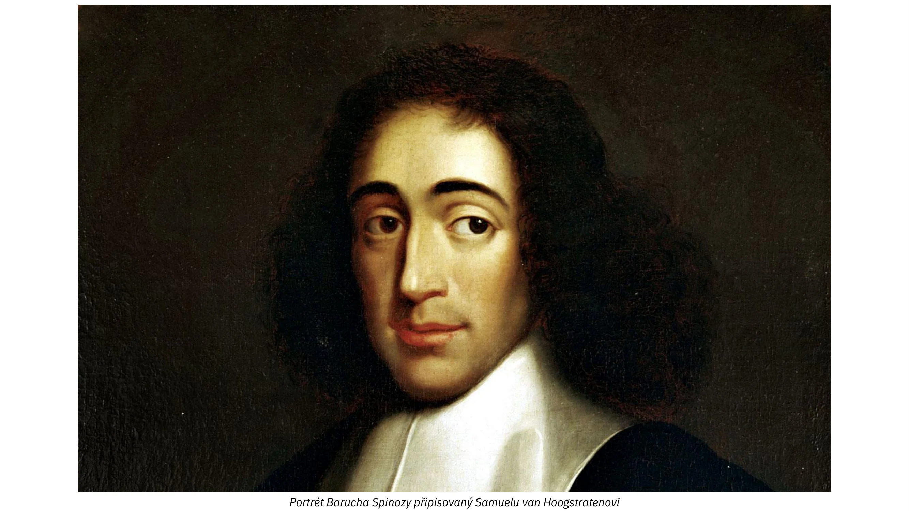

Spinozův portrét

Tyto kurzy vycházejí z mých dvou esejů na toto téma: "Spinozovo pravé náboženství" a "Bitcoin, evangelium svobody", které jsou k dispozici v papírové podobě buď online, nebo přímo na mých webových stránkách, a v digitální podobě na Amazon Kindle.

Cílem tohoto kurzu je především poskytnout zjednodušené porozumění filozofii, která je často považována za velmi složitou a nepřístupnou, přestože se dnes těší novému zájmu.

Tato filozofie nám totiž umožňuje nejen ptát se po smyslu věcí, když se všechno nedaří, což je obecně cílem náboženství, filozofie a humanitních věd, ale také, a možná především, ptát se sebe sama, když se všechno daří.

Když se na nás život usmívá a my máme pocit, že se nemusíme ptát sami sebe, s pýchou považovanou za iluzorní a otrockou, že naše štěstí nebo úspěch by mohly pocházet pouze z našeho talentu, práce nebo údajně svobodné volby, zkrátka z naší vlastní svobodné vůle, a ne z determinismu, kterému jsme vystaveni.

Tímto způsobem můžeme vytvořit spojení mezi touto praktickou filozofií svobody - nebo, jak říká Spinoza, "k prostředkům k jejímu dosažení" - a novým technologickým světem, který nás zde zajímá, kryptoměnami obecně a Bitcoin zvláště.

A to zejména v jeho filozofickém aspektu, který nás nutí zamyslet se právě nad pojmem svoboda: svoboda myslet, vyjadřovat se, respektovat soukromí a samozřejmě v našem případě svoboda Exchange.

Nejprve vás seznámím se Spinozou, jeho osobností, společenským, náboženským a rodinným zázemím a historickým kontextem Spojených provincií, kde žil.

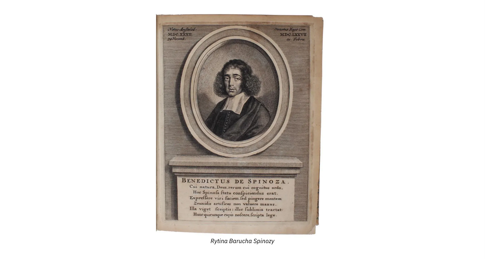

Spinozův portrét

Uvidíme tedy, co je to nová racionální filozofie, podle níž "v přírodě neexistuje nic, co by se nedalo vysvětlit bez použití rozumu".

Jde o myšlenku, že světu a lidské přirozenosti můžeme porozumět pouze z hlediska příčinné souvislosti mezi věcmi, podle níž má účinek vždy příčinu a tato příčina je sama o sobě účinkem jiné příčiny a tak dále, až k první příčině, ke které nemáme přístup a kterou je podle Spinozy příroda.

Příroda, jinými slovy Bůh, je slavné latinské "Deus sive Natura", které ilustruje celý smysl spinozismu.

Podíváme se také na Spinozova dvě hlavní díla, počínaje Etikou, vydanou posmrtně v roce 1677, která se zaměřuje výhradně na svobodu a potřebu osvobodit se od otroctví, které nás omezuje.

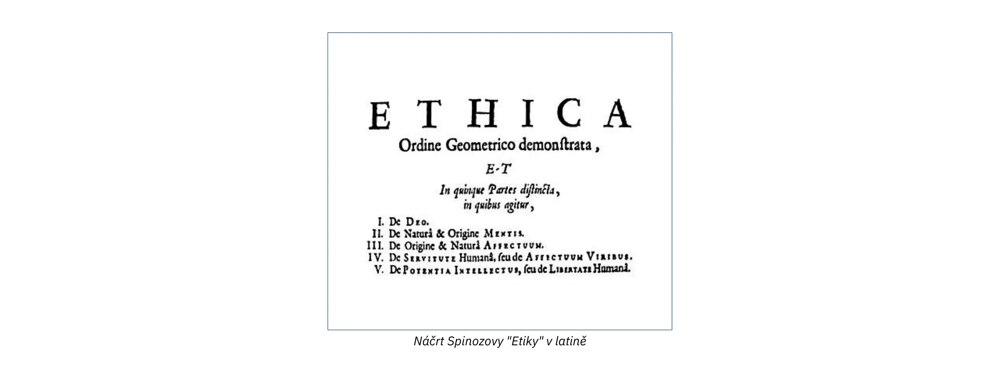

Pak se podíváme na Traité théologico-Politique, vydaný ještě za jeho života v roce 1670, který nám umožní uvažovat o svobodě z jiného úhlu: svobody myšlení a přesvědčení. Jinými slovy svobodu náboženskou, ale především svobodu politickou.

Nakonec si ukážeme, proč je spinozismus koperníkovskou revolucí idejí a jak představuje novou definici světa a lidské přirozenosti, a to na základě studia tří základních iluzí, které Spinoza odsoudil: iluze svobodné vůle, iluze konečných příčin neboli finalismu a teologické iluze.

Díky teorii afektů rozvinuté na způsob geometrů, "more geometrico", konečně uvidíme, jak nám Spinoza nabízí praktickou metodu, jak se osvobodit nebo se pokusit osvobodit od otroctví vlastního lidské přirozenosti a vnějším vášním. Racionální mechanismus, který lze v boji proti nevědomosti přirovnat k jistotě, že tři úhly trojúhelníku se vždy rovnají 180°, a umožní nám spojit ducha osvícenství, který z něj vyplynul, s liberálními proudy 19. století či libertariánstvím 20. století, které přímo souvisejí s vynálezem Satoshi Nakamoto, Bitcoin.

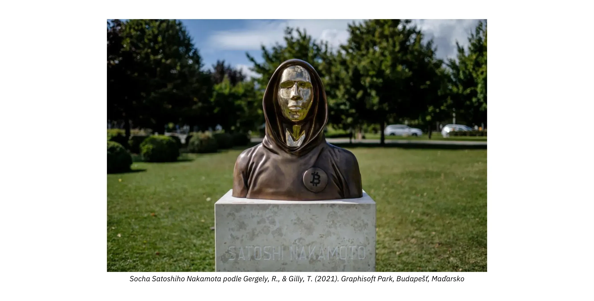

Pak pochopíme, že mezi mnoha společnými body spinozistických koncepcí a tohoto nástroje svobody, který vynalezl Satoshi Nakamoto, je první, že v obou případech, pokud jsme zvědaví, máme dobré úmysly, jak se tehdy říkalo, máme "pochopení", pak si nemůžeme pomoci a musíme se ho držet. A pokud bychom se jí nedrželi, což by ovšem bylo naše nejzazší právo, neboť základem je respektovat svobodu věřit, nebo nevěřit, pak bychom byli rozhodnuti, že nebudeme moci, nebo nebudeme chtít, což se rovná témuž.

A tak můžeme pochopit, že například náboženský fundamentalista nikdy nebude schopen přijmout nebo vyslechnout sebemenší koperníkovskou myšlenku, jako je spinozismus, stejně jako centrální bankéř bude velmi obtížně přijímat Bitcoin.

I když, jak víte, v současné době se věci vyvíjejí správným směrem.

## Představujeme Barucha de Spinozu

<chapterId>f53a9cfd-326e-5b73-a766-3ef2f07c5a49</chapterId>

:::video id=5fac3ddc-c472-4c64-8186-46a8f317e389:::

Kdo byl Baruch de Spinoza? Byl to nizozemský filozof, který se narodil v roce 1632 a zemřel v roce 1677 ve věku 45 let.

Byl židovského vyznání, příslušník portugalské sefardské komunity pocházející z marranů, které katolíci v 15. století donutili opustit Španělsko, a vyrůstal v náboženském a intelektuálním prostředí, kde si uvědomoval, co znamená být pronásledován.

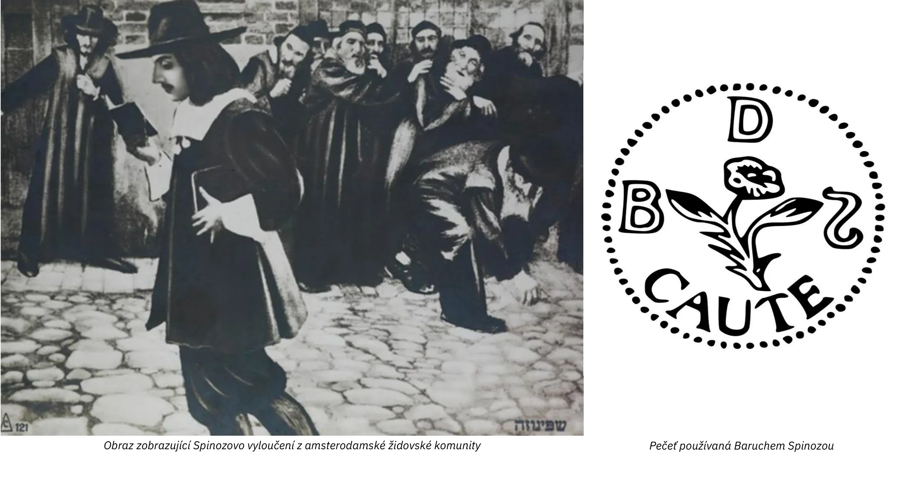

Od raného mládí se totiž projevoval silně kriticky vůči zavedenému náboženství, a zejména vůči své hebrejské komunitě, z níž byl v roce 1656, ve věku pouhých 24 let, násilně vyloučen, ještě než cokoli publikoval.

Tato "exkomunikace" mu prý umožnila izolovat se a soustředit se na svou práci, aniž by se ohlédl zpět.

Spinoza, stejně jako jeho současníci Descartes (1596-1650), Pascal (1632-1662) a Newton (1643-1727), byl dědicem nových racionálních myšlenek ve fyzice Koperníka (1473-1543), Keplera (1571-1630) a Galilea (1564-1642), kteří ho předběhli jen o několik let, a rozvíjel myšlení na způsob geometrů v souladu s Galileovou zásadou, že matematika je jazykem vesmíru.

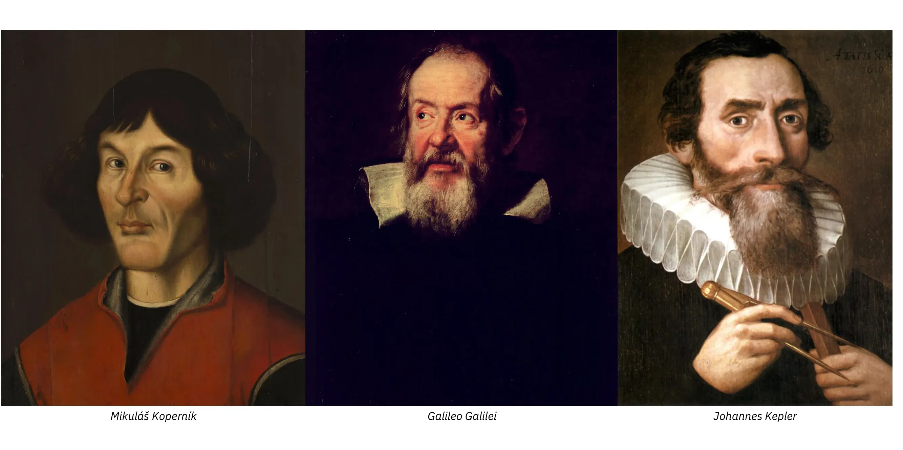

Po procesu s mnichem a filozofem Giordanem Brunem (1548-1600), který byl zaživa upálen za kacířství na veřejném náměstí v Římě, a po procesu s Galileem, kterého inkvizice v roce 1633 donutila vzdát se svého koperníkovského heliocentrického přesvědčení, to však byly na tehdejší dobu velmi nebezpečné myšlenky.

Proto si svým přísně racionálním viděním světa a lidské přirozenosti, založeným na kauzálních souvislostech mezi věcmi, vysloužil pověst ateisty, za kterého byl považován - a dodnes je považován neprávem -.

Spinoza ve svém díle mluví vlastně jen o Bohu, kterého ztotožňuje s přírodou, a i když kritizuje pověrečné pudy věřících lidí a teokratů, ukazuje, že pravé náboženství je pro něj především synonymem spravedlnosti a lásky.

A právě tento přístup spojuje Spinozu s filozofií osvícenství, ať už německou, s Leibnizem (1646-1716), Kantem (1724-1804), Schopenhauerem (1788-1860) a Nietzschem (1844-1900), anglickou s Lockem (1632-1704) nebo francouzskou s Voltairem (1694-1778), Rousseauem (1712-1778) a Diderotem (1713-1784). Všichni se shodli na tom, že rozum je třeba používat k boji proti tmářství, zejména náboženskému, k boji proti nevědomosti a k obraně ideálů svobody a pokroku.

Abychom mohli začít spojovat tuto filozofii s Bitcoin, je důležité si uvědomit, že Spinoza se narodil ve velmi specifické době.

V 17. století byly Spojené provincie nejen nejsvobodnější zemí na světě z hlediska politických a náboženských idejí, ale také nejbohatší. Jinými slovy, hospodářsky a technologicky nejvyspělejší zemí.

Bohatství však není spojeno s přírodními zdroji, vykořisťováním a pustošením kolonií nebo otroctvím, ale s mezinárodním obchodem a komercí v liberálním, podnikatelském duchu. Duchu, který později obhajoval slavný spinozista Voltaire (1694-1778), pro nějž by v obchodním sále obchodník či podnikatel liberálního přesvědčení nikdy nebyl vyloučen, nazván nevěřícím nebo exkomunikován, jak říkal, na základě svého náboženství nebo původu, ale pouze v případě, že by zkrachoval.

Navíc Holandsko bylo v té době vyspělé i ve významných technologických oborech, například v mechanice a optice. Astronomické dalekohledy, kterými se Galileo díval na oblohu a objevoval vesmír, byly na svou dobu skutečně považovány za špičkovou technologii, stejně jako dnes nové technologie spojené s výpočetní technikou, umělou inteligencí a samozřejmě s šifrováním.

A protože Spinoza sám provozoval řemeslo leštění astronomických čoček - což je ironie u člověka, který prý viděl všechno špatně -, můžeme si představit, že by jistě podporoval nástroj svobody, jako je Bitcoin.

Jinými slovy, hodnoty svobody a pokroku, které přináší spinozismus, stojí v protikladu ke světu, kde náboženský fundamentalismus, konspirační teorie, pověry a především nevědomost zůstávají smutnou realitou.

Přesto je to svět, v němž je každý prostředek cenný k úniku, k osvobození se od otroctví, které nás omezuje, a k tomu, abychom byli svobodní tím, že přijmeme svět takový, jaký je, a ne takový, jaký bychom chtěli, aby byl.

Ať už jsou tyto prostředky filozofické nebo technologické, jak uvidíme později, Bitcoin je nástrojem svobody. Je to nástroj, který umožňuje jak jednotlivcům, tak státům osvobodit se od nevolnictví, zejména peněžního.

# Hlavní díla, Etika a politika

<partId>d7d7e9a1-005b-519c-b587-137435e46344</partId>

## Etika a hledání svobody

<chapterId>4cc66e25-335c-591d-9b78-83e5664bbbbc</chapterId>

:::video id=065c5091-69e1-412f-acce-c763ec31d3b1:::

V této kapitole navrhuji, abychom se nyní zaměřili na Spinozovo hlavní dílo nazvané Etika, které vyšlo posmrtně v roce 1677.

Proč posmrtně? Inu proto, že jeho myšlenky byly revoluční, nebo přinejmenším neintuitivní a převratné, a proto ve své době velmi nebezpečné, a to i v liberálním kontextu Spojených provincií 17. století.

Etika je latinsky psané dílo na způsob geometrů, pravděpodobně inspirované vědeckým duchem Galilea (1564-1642), který byl spolu s Keplerem (1571-1630) otcem moderní vědy a podle něhož je matematika jazykem vesmíru. Spinoza rozvíjí své myšlenky v pěti hlavních částech, přičemž používá propozice doprovázené demonstracemi, skolia, axiomy a definice.

Etika jako taková je, Spinozovými slovy, "cestou ke svobodě nebo cestami, které k ní vedou", a ve skutečnosti není knihou, kterou lze číst od obálky k obálce, ale spíše knihou, kterou lze projít například čtením jedné věty, která odkazuje na druhou, která je zase chápána prostřednictvím třetí a tak dále, v dokonale koherentním, racionálním a logickém systému.

Chtěl bych upozornit, že když otevřete Etiku, doporučujeme začít s postfacemi a dodatky, tyto krátké úseky napsal Spinoza běžným jazykem, takže jsou snadno srozumitelné a svým způsobem shrnují jeho někdy složité myšlení.

Spinozovo dílo, které podrobuje svět kolem nás "mikroskopu rozumu", rozebírá lidskou přirozenost na základě principu, že člověk není samovolný, tj. že jsme se nenarodili ani zde, ani v naší době, ani s takovou fyzickou či intelektuální vlastností.

A říká, že nejsme nad přírodou. Nejsme vyňati z jejích zákonů, ať už jde o tělo nebo mysl. Jinými slovy, jsme součástí přírody stejně jako jakákoli jiná živá bytost, živočich nebo rostlina.

Podle Spinozy jsou všechny oblasti lidské činnosti závislé na schopnosti rozumu chápat svět v dokonale koherentním a determinovaném systému.

Svět, ve kterém náhoda neexistuje.

Vše, co se děje, je "nutné" a je důsledkem příčiny, podle myšlenky, že "co je a co se děje, musí být a musí se stát". To je absolutní determinismus.

Je však třeba mít na paměti dva body:

Zaprvé, pokud pro Spinozu náhoda neexistuje, je to proto, že je to událost, jejíž příčinu neznáme. Ale samozřejmě říká, že to, že neznáme příčinu, neznamená, že neexistuje.

Za druhé, o fatalismu také nemůže být řeč, protože příroda není obdařena záměrem. Například blesk nemá v úmyslu nikoho potrestat, jak by se mohlo zdát v případě tragédie. Ne, prostě vyjadřuje podstatu své vlastní přirozenosti, kterou je udeřit bleskem. Udeřit.

Spinoza tak hájí myšlenku, že realita, tj. každodenní život s dobrými i špatnými aspekty, je dokonale srozumitelná a že v přírodě neexistuje jev, který by nebyl kauzálně propojen. To samozřejmě vyvolává otázku zla, zejména absolutního zla, kterému se budeme věnovat o něco později.

Nakonec je důležité poznamenat, že etika není morálka.

Podle Gillese Deleuze (1925-1995), slavného profesora filozofie a odborníka na Spinozu, je morálka systémem úsudků užitečných pro život ve společnosti. Je to však subjektivní systém, protože co je správné tady, může být špatné jinde, a co je špatné dnes, může být správné později.

A spíše než aby určovala, co je správné nebo špatné, etika stanovuje, co je dobré nebo špatné pro naši vlastní přirozenost a naši schopnost, říká Spinoza, zachovat se v našem bytí. Být svobodný. Je to tedy pravá etologie, tedy věda o způsobech bytí, nebo, jak dále vysvětluje Gilles Deleuze, umění vytvářet dobrá setkání.

Nebo umění správně se rozhodovat, abychom se vymanili z otroctví, které nás omezuje a kvůli němuž se podle Spinozy lidé často omezují na to, že "vidí to nejlepší, schvalují to a dělají to nejhorší".

Jinými slovy, "bojovat za své otroctví, jako by bojovali za svou svobodu".

## Teologicko-politický traktát

<chapterId>84b0187e-1050-5d44-a536-80554896e828</chapterId>

:::video id=c1efc97e-1e96-4b37-894c-9a19794d6b52:::

Po Etice bych vás v této kapitole rád seznámil s dalším významným dílem, které vám pomůže pochopit Spinozův filosofický a politický vliv, zejména na nastupující osvícenství a na liberální a v našem případě libertariánské proudy.

Jedná se o Traité théologico-politique neboli TTP, vydaný anonymně v roce 1670.

Spinoza (1632-1677) napsal tuto knihu v době, kdy přerušil psaní své Etiky, ve snaze ukončit nedorozumění, které přetrvává dodnes. Je to přesvědčení, že byl ateistou.

Jak jsme viděli, Spinozovo pojetí Boha je předmětem celé první části Etiky, v níž dokazuje nejen existenci Boha, ale také jeho skutečnou povahu.

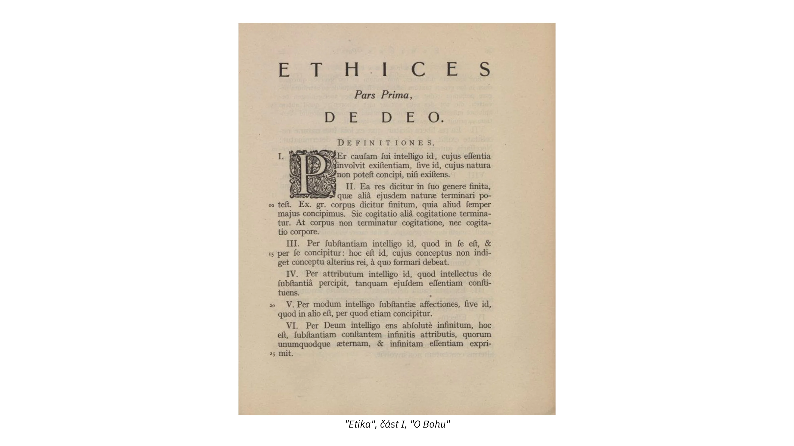

A protože Spinozovy pojmy jsou obecně poměrně obtížně uchopitelné, je často snazší je pochopit, když řekneme, co nejsou, než když se snažíme říci, co jsou. Přístup, který je mimochodem, jak uvidíme později, velmi užitečný pro pochopení Bitcoin.

Tak nám Spinoza ukazuje, že Bůh podle něj není antropomorfní bytostí obdařenou záměry, trestající nebo odměňující, ke které bychom mluvili a která by nás vyslechla podle rituálu, který můžeme, ale nemusíme dodržovat. Jinými slovy, Bůh podle něj není stařec s dlouhým bílým vousem schovaný za mrakem, který by řešil potíže světa a činil nás na něm závislými.

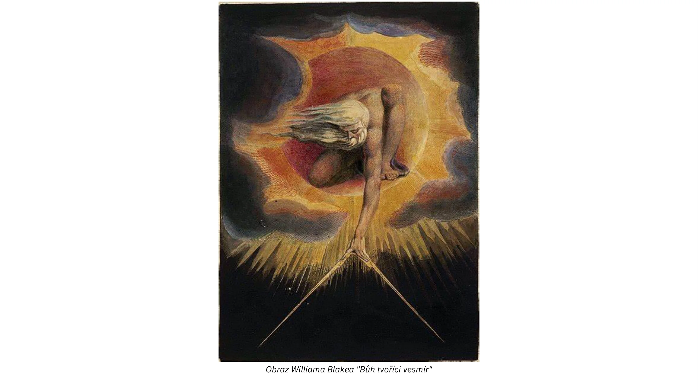

Mluvit o Bohu tedy znamená evokovat přírodu jako jedinečnou, nekonečnou a věčnou Substanci, která se skládá z nekonečného množství atributů, z nichž my lidé známe pouze dva: hmotu neboli rozsah a myšlení.

Jde o slavný spis "Deus Sive Natura", z něhož Spinoza odvozuje koncept absolutního determinismu a myšlenku, že člověk není příčinou sebe sama a nestojí nad přírodou, a už vůbec ne nad zvířaty.

Kromě kritiky náboženství je však TTP pro Spinozu především příležitostí k ostré kritice věřících lidí a teokracie. Jinými slovy, náboženská moc pěstuje strach a pověrčivost a podle něj aktivuje smutné vášně jednotlivců, aby je lépe zotročila, uvěznila je v bludu, fanatismu a válce.

V tomto prvotním, dětském stádiu náboženství se věřící upínají pouze k vnějšímu uctívání a důvěřivé víře založené na předsudcích. Stádium, v němž se náboženství stává mechanicky netolerantním, vybočuje z mezí svého morálního učení a odvrací se od svého poslání podporovat mír a harmonii tím, že se prohlašuje za zastánce pravdy.

Jakmile se však dostaneme za hranice racionální kritiky náboženství, například při exegetickém zkoumání Bible, chce nás Spinoza přesvědčit, že tato nová vize Boha je zcela slučitelná s poselstvím spravedlnosti a lásky tří velkých náboženství Knihy, která stanovila jednoduché, ale často zapomínané zlaté pravidlo: "Miluj svého bližního jako sebe samého".

To ale není všechno.

Tuto vyspělou vizi náboženství rozvinutou v TTP doprovází politický rozměr, nutnost oddělit náboženství a stát, aby byla chráněna svoboda myšlení a víry v zájmu všech jednotlivců i samotného státu.

Spinoza v podstatě považuje svobodu v rámci rozumu za nezbytnou podmínku pro to, aby lidé mohli žít, aniž by byli zotročeni mocí, která se staví proti jejich zájmům, a proto obhajuje přímou demokracii založenou na politické a náboženské svobodě.

Jinými slovy, svoboda myšlení a přesvědčení, aby se lidé mohli vymanit z otroctví a z falešných, infantilizujících přesvědčení, aby mohli uvažovat jako dospělí, dávat přednost rozumu a také, pokud jde o nás, technickému pokroku.

Nechvalně proslulé zemětřesení v Lisabonu 1. listopadu 1755 ukázalo zásadní posun v myšlení lidí o přírodních jevech a katastrofách a o tom, jak se proti nim chránit.

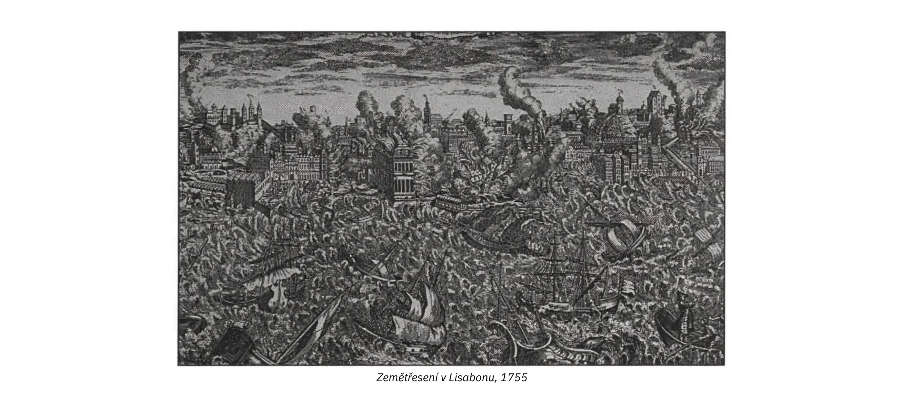

Toto strašlivé zemětřesení zničilo město a zabilo statisíce nevinných lidí, z nichž mnozí byli v té době v kostele, protože to byl Den všech svatých, což ještě více umocnilo nepochopení přeživších.

Drama, které oživilo otázku německého filozofa a matematika Leibnize (1646-1716) o antropomorfní vizi Boha obdařeného záměrem, dobrotou a všemohoucností. Kdyby totiž Bůh byl dobrý, jak říká Leibniz ve své Teodiceji, pak by nebyl všemohoucí, protože by takové katastrofy dopustil, a kdyby byl všemohoucí, pak by nebyl dobrý, protože by jim nemohl zabránit.

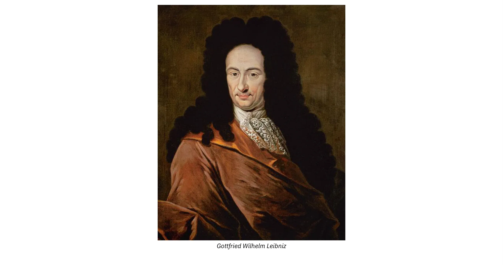

Jean-Jacques Rousseau (1712-1778) napsal Voltairovi, který byl zasažen nespravedlností a hrůzami, jimiž lidstvo diskriminovaně trpí, že "příroda není sama o sobě zlá a že bychom v ní neměli vidět žádnou božskou ruku, která by vysvětlovala její záměr".

Na to Voltaire (1694-1778), spinozista, pokud vůbec někdo takový existoval, odpověděl, že tato přírodní katastrofa by nás měla především přimět k tomu, abychom si uvědomili, že vědecké prostředky, jak se před přírodou chránit, existují, a že výzvou jejich doby je tedy otázka, zda lidé mohou díky poznání a pokroku vzít svou budoucnost do vlastních rukou a osvobodit se od teologie a pověr.

A i když samozřejmě nešlo o prevenci zemětřesení, která jsou stále nejen nepředvídatelná, ale také zcela neovlivnitelná, šlo spíše o to, aby například domy byly postaveny tak, aby jim odolaly.

Proto je osvícenství 18. století díky uplatnění rozumu, vědy a techniky stoletím pokroku. Jinými slovy, pokrok jako nástroj svobody.

# Spinozistická revoluce, tři iluze

<partId>f5d45c2b-28da-527a-ab20-dd255e9a9e0d</partId>

## Nová definice přírody a člověka

<chapterId>3e6599e3-5b29-50a8-a67d-d0386da5d65d</chapterId>

:::video id=b6d2c035-8848-4da6-9da9-be3b70be0f38:::

V této kapitole bych se rád podíval na dějiny idejí a zjistil, proč je spinozismus považován za skutečnou koperníkovskou revoluci idejí.

Díky tomuto novému způsobu chápání Boha, jinými slovy přírody, který nabízí matematika, Spinoza (1632-1670) zavedl hlubokou změnu paradigmatu, která měla nepřímé důsledky pro náboženský světonázor a místo člověka v něm.

Stejně jako Mikuláš Koperník (1473-1543) zjistil, že Země není středem světa, a Charles Darwin (1809-1882) o tři století později ukázal, že člověk není středem "života", tak i Spinoza postupoval podle této logiky a ve své době tvrdil, že člověk není "pánem svého domu" a že vesmír není stvořen pouze pro jeho prospěch.

Říká, že člověk není "říší v říši" a že stejně jako je Země redukována na pouhou planetu, stejně jako všechny ostatní planety, je i člověk redukován na pouhý druh přírody, stejně jako všechny ostatní konečné druhy přírody, jako jsou zvířata, rostliny a všechny "existující bytosti".

Před ním klasická řecká filozofie navrhovala uspořádanou, hierarchickou vizi vesmíru, která vysvětlovala svět, kosmos a lidskou zkušenost. Vycházela z mýtických vyprávění a v podstatě se snažila vysvětlit vznik světa, přičemž trvala na harmonii vesmíru, přírody a člověka.

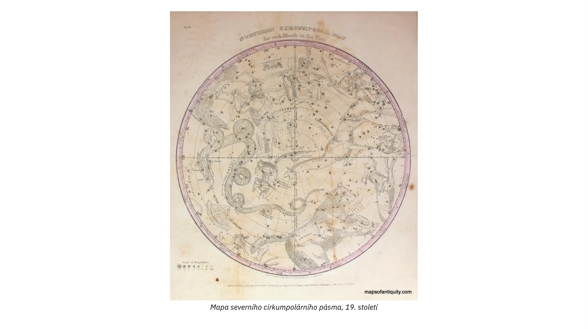

Scholastická kosmologie středověku, v podstatě od 12. století, se vyvíjela směrem k většímu množství argumentů, aby se rozum a víra sladily a vysvětlily vesmír, který byl stále hierarchický, ale lépe odpovídal křesťanské filozofii.

S novou fyzikou Koperníka (1473-1543) v 15. století však došlo v kosmologii k zásadnímu zlomu v chápání vesmíru, jehož geocentrický model byl zpochybněn ve prospěch heliocentrického systému, který otevřel cestu moderní vědě, zejména nové fyzice a astronomii Keplera (1571-1630) a Galilea (1564-1642). Poté Isaac Newton (1643-1727) a nakonec Albert Einstein (1879-1955), přesvědčený spinozista.

Abychom však spinozismu plně porozuměli, musíme vzít v úvahu také kontext Reného Descarta (1596-1650), slavného francouzského filozofa, který Spinozovi předcházel a jehož byl žákem i velkým obdivovatelem.

Navzdory rizikům a odsouzením Giordana Bruna (1548-1600) a Galilea se Descartes rozhodl rozlišit "pravdu od lži" a sladit teologii, filozofii a fyziku. Ve své slavné Rozpravě o metodě, vydané v roce 1637, Descartes tvrdil, že základem poznání je rozum, díky němuž mohou lidé dosáhnout svobody.

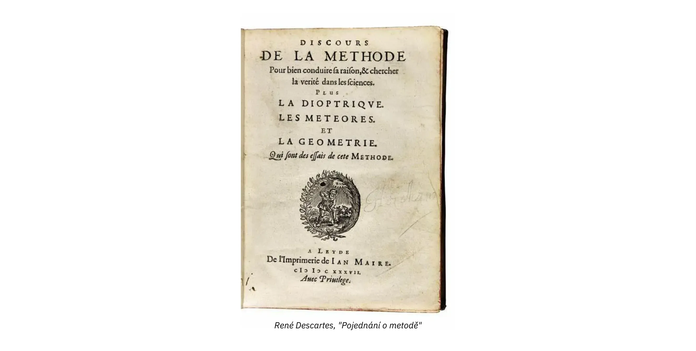

Tím, že vysvětloval svět podle univerzálních zákonů, a nikoli podle přírody obdařené morálními záměry, připravil půdu pro determinismus, který později podle Spinozy vznikl.

Jako katolík však Descartes přesto stanovil hierarchii mezi lidmi a ostatními konečnými druhy přírody, zejména pokud jde o živočišné druhy, které nazval "strojovými zvířaty". A když Descartes říká, že "neexistuje duše, která by, je-li dobře vedena, nemohla získat absolutní moc nad svými činy a vášněmi", tvrdí tím, že člověk má schopnost začít něco z ničeho a že se podle něj člověk "vymyká zákonům přírody", že má absolutní moc nad svým jednáním a svou rozhodnost zakládá výhradně na sobě.

Spinoza věděl, jak tuto fázi překročit a smířit existenci Boha s prokázáním rozumu. Podle něj jsou všechny oblasti lidské činnosti závislé na schopnostech rozumu v dokonale koherentním a determinovaném světě. Ovšem ve světě, v němž neexistuje ani nahodilost, ani náhoda a v němž je vše, co se děje, nutné a je důsledkem příčiny, podle kauzální souvislosti mezi věcmi. To je myšlenka absolutního determinismu.

A právě v těch nejtvrdších termínech nakonec vyvrací karteziánské stanovisko a kritizuje například myšlenku, že člověk nepodléhá přírodním zákonům jako ostatní živočichové, a je tedy nadřazen všem ostatním konečným způsobům přírody.

Jinými slovy, jsou obdařeni svobodnou vůlí, což je iluzorní přesvědčení, kterému je nesmírně obtížné uniknout, jak nám říká Spinoza, a o kterém nyní pojednáme.

## Iluze svobodné vůle

<chapterId>f147a914-cb64-5927-b305-26691930bca3</chapterId>

:::video id=b59da795-ba19-4643-9672-36c9e7953a42:::

V tomto kurzu se nyní budeme věnovat choulostivé otázce svobodné vůle, abychom lépe pochopili, co je svoboda pro Spinozu, osvícenství a rané liberální filozofy.

Jak jsme již viděli, Spinoza (1632-1677) je známý tím, že svobodnou vůli považuje za iluzi, od níž je nesmírně obtížné se osvobodit.

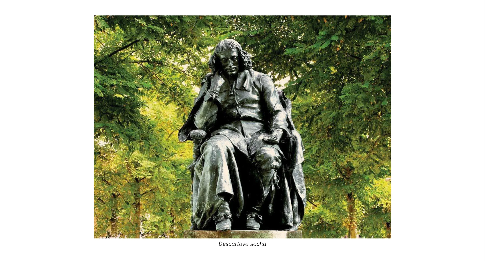

Proč? Protože je v rozporu s filosofickou tradicí od starověku, kterou stále hájí Descartes (1596-1642), že člověk může něco iniciovat z ničeho a nést plnou odpovědnost za své činy, zejména před Bohem, říká svatý Augustin (354-430), otec křesťanské církve.

Ale samozřejmě také před lidskou spravedlností.

Je to myšlenka, že naše vůle, a pouze naše vůle, nám umožňuje řídit náš život, že máme absolutní moc nad svým jednáním a že svobodu svého jednání odvozujeme pouze od sebe samých, a tak disponujeme neomezenou rozhodovací silou.

Jinými slovy, lidstvo je schopno přírodní řád narušovat, místo aby se mu podřizovalo.

Protože by ve svém životě nepodléhal žádnému jinému zákonu než zákonu své vlastní vůle, byl by nejen nad přírodou a zvířaty, pouhými stroji, ale také nad všemi ostatními konečnými způsoby přírody. Takový byl postoj Descarta (1596-1650), pro něhož příčiny lidské bezmocnosti a nestálosti nespočívaly v přírodním řádu, ale v neřestech samotné lidské přirozenosti.

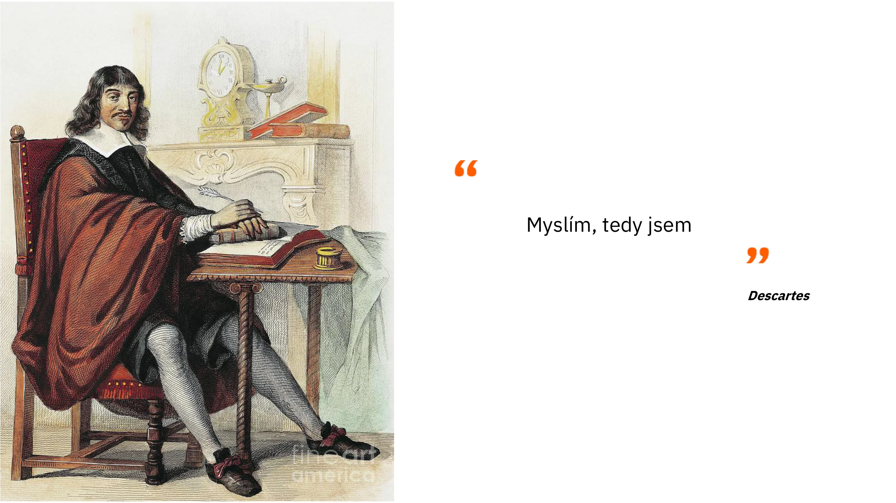

Spinoza sice připisuje Descartovi zásluhy za to, že otevřel cestu k racionálnímu ovládání afektivního života, ale zároveň se od něj zcela distancuje tím, že tuto hypotézu o "absolutní moci" vůle důrazně kritizuje.

Spinoza se naproti tomu domnívá, že náš svět je dokonale koherentní a determinovaný a že vše, co se děje, je nutné a je důsledkem kauzality věcí, podle níž má účinek vždy příčinu a tato příčina je sama důsledkem jiné příčiny atd.

To je myšlenka absolutního determinismu, z níž ve své Etice vyvozuje, že lidé nemají vůbec žádnou svobodnou vůli, protože si podle něj sice uvědomují své činy, ale ignorují nebo raději ignorují skutečné příčiny, které je určují.

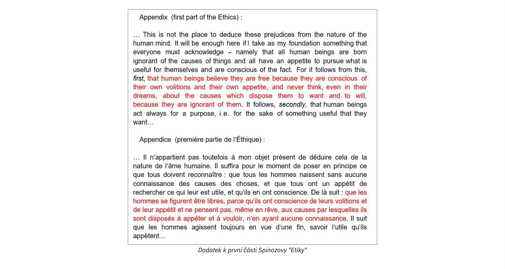

Podle Spinozy tedy lidé jako "konečné mody" přírody, jako jsou zvířata nebo rostliny, nemohou začít něco z ničeho; nejsou vyňati z působnosti přírodních zákonů, a to jak ve svém těle, tak ve své mysli.

A co hůř, podle něj je největším nebezpečím svobody víra v naši svobodnou vůli a přesvědčení, že můžeme jednat, aniž bychom byli determinováni vnějšími příčinami.

Pro Spinozu není svoboda projevem svobodné vůle, ale schopností pochopit své oprávněné místo ve světě, porozumět své určené přirozenosti a odtud směřovat svou existenci k tomu, co "zvyšuje naši sílu jednat". Tím, že se vždy díváme do budoucnosti s optimismem a vidíme svět takový, jaký je, spíše než abychom si ho představovali takový, jaký bychom ho chtěli vidět.

Problém, který vyvstává, je samozřejmě odpovědnost člověka a jeho jednání. mohli bychom dojít k závěru, že pokud by jedinci nebyli ve svém jednání svobodní, nebyli by za něj odpovědní, zejména tváří v tvář spravedlnosti. Tento názor je však zavádějící, protože aniž bychom zacházeli do přílišných podrobností, uznání sociální, rodinné a historické determinovanosti člověka nám nebrání uvažovat o odpovědnosti za spáchané činy, protože ty jsou dobrovolné.

Na druhou stranu by bylo iluzí domnívat se, že jednání zločince nikdy nesouvisí s jeho vlastním determinismem. I když nejde o to, abychom je omlouvali, jde přinejmenším o to, abychom se je snažili pochopit. To je vlastně to, co spravedlnost dělá: kromě trestání protiprávních činů hraje roli předvídání a ochrany budoucnosti, a proto jsou některé trestné činy nejen trestány, ale také léčeny s přihlédnutím k rodinnému, sociálnímu a psychologickému zázemí pachatele.

Tento přístup ke svobodě jako ke schopnosti jednat je spojnicí s osvícenskou filozofií 18. století. Podle jednoho z jejích největších vyslanců, německého filozofa Immanuela Kanta (1724-1804), bylo osvícenství skutečně prostředkem k osvobození člověka ze stavu poroby, nebo jak by řekl Étienne de la Boétie (1530-1563), z dobrovolného otroctví, za které byl sám odpovědný.

Kantovo heslo zní "Mysli sám" a "Odvaž se poznávat", známé latinské "Sapere Aude".

Spinozova schopnost jednat je tedy schopnost, kterou v sobě lidé mají, aby pochopili svůj vlastní živočišný stav a porozuměli přírodě a jejím jevům, ať už pozitivním nebo negativním, tím, že je vztáhnou k objektivním příčinám, aby se nespoléhali na morální vysvětlení, která jsou falešná a iluzorní, tj. vysvětlení utvořená podle našich přání. Spíše spočívá ve snaze vysvětlit je prostřednictvím rozumu s ohledem na emancipaci a svobodu.

A pokrok, který vedl k prvním technologickým revolucím a prvním liberálním a podnikatelským myšlenkám konce 18. století, zejména díky anglickému liberálnímu filozofovi Johnu Lockovi (1632-1704) a anglickému ekonomovi Adamu Smithovi (1723-1790).

A stojí za to připomenout definici iluze, kterou podal Sigmund Freud (1856-1939). Podle otce psychoanalýzy, který vždy uznával Spinozův vliv na své dílo, je iluze právě "přesvědčení motivované realizací přání a v něm přehlížením skutečnosti".

Nakonec je třeba zdůraznit, že zatímco libertariánské hnutí, o němž budeme hovořit, se přímo vztahuje k této nové liberální filozofii, existují lidé, kteří poukazují na to, že osobnosti jako Ayn Randová (1905-1982), autorka knih "La Grève" a "La Source vive", podporují existenci svobodné vůle a věří, že lidské bytosti mají schopnost svobodně se rozhodovat.

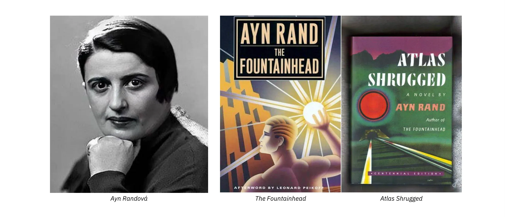

Skutečnost je však zcela jiná a zmatek pramení spíše ze sémantického problému: tím, že uznávají schopnost člověka jednat a rozhodovat se a zároveň uznávají logický determinismus, jehož jsou předmětem, jsou první libertariáni ve skutečnosti také dědici Spinozy. Se Spinozou je spojuje přesvědčení, že lidé nejsou nad přírodou, ale že jsou výsledkem evolučního procesu, který je umisťuje do determinismu, do dějin, které je přesahují a jsou do značné míry zodpovědné za to, jací lidé jsou a co dělají.

A konečně, je-li víra ve svobodnou vůli iluzí, z níž je nesmírně obtížné se vymanit, je to proto, že odkazuje k jiné iluzi, která ji živí, k iluzi konečných příčin, kterou vás zvu ke studiu v následující kapitole.

## Iluze konečných příčin

<chapterId>da2a7fb1-f1e9-5b56-822d-c73770de749d</chapterId>

:::video id=a0127fe7-a4cb-4a1c-8af4-f11c40b4a3d7:::

V předchozí kapitole jsme viděli, že iluze svobodné vůle spočívá v přesvědčení, že bychom mohli začít něco z ničeho, že by nám naše vůle sama o sobě umožnila řídit náš život a že bychom měli neomezenou rozhodovací pravomoc. Je to představa, že člověk je schopen narušit řád přírody více, než mu podléhá.

Pro Spinozu (1632-1677) však člověk není "říší v říši", tj. není - v rozporu s tím, co stanovil Descartes (1596-1650) - výjimkou v přírodě a nikdy není vyňat z prodloužení deterministického řetězce příčin a následků.

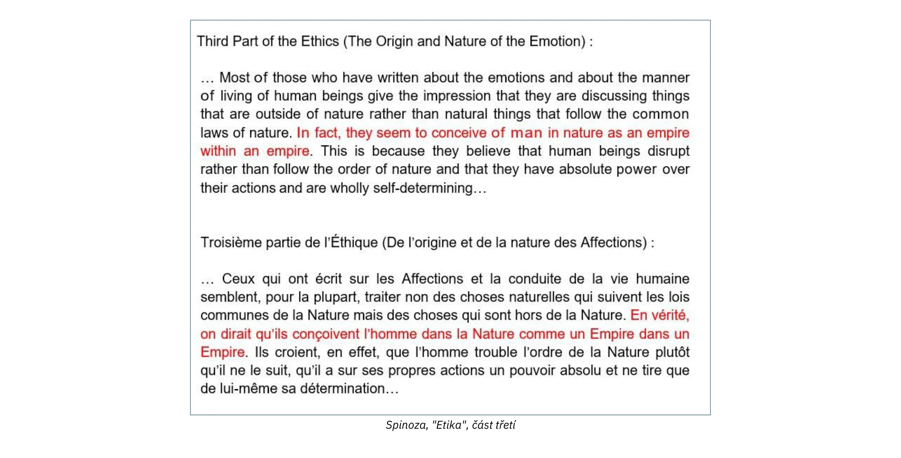

A protože příroda, říká Spinoza, nemá z morálního hlediska žádný předepsaný cíl a protože lidé mají sklon zaměňovat svou představivost za porozumění, vykládají si ji podle toho, co vyhovuje jejich vlastním zájmům. A to až do té míry, že věcem přisuzují význam, který vyplývá pouze z toho, jak je hodnotí a vztahují k sobě.

Tedy podle jejich přání, nadějí a obav.

Toto uvažování ilustruje iluze konečných příčin, která je hlavní překážkou myšlení a používání rozumu, protože jednoduše vyjadřuje naši potřebu, aby následky věci neodpovídaly jejím skutečným příčinám, ale nějakému přesvědčení, i když je absurdní nebo infantilní.

Víra, která vyjadřuje nějaký záměr, zejména božský, a která je podle toho, jak si ji vykládáme, často pověrčivá, Nebo nevědomost.

A proto byly nové nemoci, jako je AIDS v 90. letech nebo kovid v roce 2020, vždy některými vnímány jako projev božského a často trestajícího záměru, podle úvahy, která je v rozporu s principem kauzality, na němž je založen racionalismus a moderní věda zavedená od dob Koperníka (1473-1543), Keplera (1571-1630) a Galilea (1564-1727).

Skutečnost je taková, jak říká Spinoza, že lidem málo záleží na tom, že mnoho věcí se vymyká jejich představivosti, že v přírodě je více nepořádku než řádu. Přesto by je složitost věcí, které jsou mimo jejich chápání, měla odradit od víry v jakýkoli teleologický projekt. Nezáleží na tom, říká, protože víra lidí v relevanci jejich jistoty založené na tom, co vyhovuje jejich přání a užitku, je vždy silnější než jakýkoli racionální argument nebo starost o pravdu.

Finalismus se tedy rovná převrácení příčin a následků věcí, abychom jim porozuměli: například věříme, že důvodem, proč máme oči, je to, že vidíme, a že důvodem, proč máme zuby, je to, že žvýkáme. Zatímco samozřejmě právě proto, aby viděl, se u lidského druhu v průběhu evoluce vyvinul zrak, a skutečně díky potřebě se nasytit a jíst maso se vyvinul i náš chrup v dnešní podobě.

Přesně to tvrdil francouzský přírodovědec Jean-Baptiste de Lamarck (1744-1829) (obrázek 3.3.3), když vytvořil svou předkarvinskou teorii, podle níž je to funkce, která vytváří orgán, a ne naopak.

Ale jak říká Spinoza, "bludy lidí tím nekončí" a mezi všemi příklady naivních a nakonec spíše zábavných teleologických představ často uvádíme slavný příklad biologa Bernardina de Saint-Pierre (1737-1814). Tento bývalý ředitel pařížského přírodovědného muzea se na finalismus přírody díval s poezií, lyrikou a jistou naivitou, když se domníval, že například meloun byl stvořen pouze za účelem potěšit početné rodiny, protože jeho rýhovaná slupka umožňovala snadné krájení na stejné plátky.

Tento paradox velmi dobře ilustruje například definice inflace, kterou podávají keynesiánští ekonomové a zastánci sociálního státu. Podle nich je inflace růst cen, který podle některých centrálních bankéřů přichází buď "odnikud", nebo z geopolitických souvislostí, které nikdo nemůže ovlivnit ani předvídat. Zatímco růst cen skutečně může vést k cyklické inflaci - například když se zvýší cena ropy, zvýší se i ceny některých zpracovaných výrobků - skutečné strukturální příčiny inflace jsou spojeny především s růstem peněz Supply, což zase znamená pokles hodnoty peněz a ipso facto mechanický růst cen.

Věřit nebo nechat ostatní věřit v opak se rovná snění s otevřenýma očima, jak to posměšně vyjádřil Spinoza, a konstruování argumentace, která je falešná nebo zavádějící a kterou je o to snazší přijmout, protože je slyšet jako očekávanou odpověď, která má dokázat, že má člověk pravdu. V tomto případě, když zastánci státních intervencí považují inflaci za nejlepší způsob řešení ekonomických problémů.

Tento zkreslený výklad inflace však vede k tomu, že zapomínáme, že inflace je sice krátkodobě užitečná pro řízení ekonomiky, ale ve skutečnosti je skrytou daní, která z dlouhodobého hlediska vede pouze k lidským a materiálním katastrofám a činí státy neschopnými nezneužívat svou moc. Právě to dobře popisuje Friedrich Hayek (1899-1992) ve svém eseji Cesta do nevolnictví, když připomíná nevolnictví, z něhož se státy již nemohou vymanit.

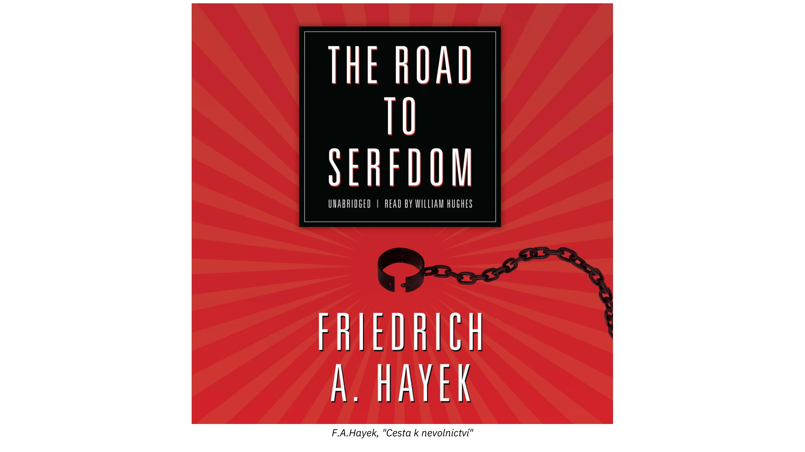

Nakonec stojí za zmínku, že tento finalistický mechanismus dobře ilustruje i způsob, jakým odpůrci Bitcoin vyjadřují svou kritiku, když se zaměřují právě na jeho účinky.

Protože i když některé účinky Bitcoin lze jistě kritizovat, kvůli kognitivnímu zkreslení spojenému s tím, že jde o novou a převratnou technologii, máme silný sklon vidět pouze negativní účinky. Zvláště pokud realita neodpovídá našim přáním, například pokud jsme věřící, když čelíme koperníkovské revoluci, jako je spinozismus, nebo pokud jsme centrální bankéř, když čelíme konceptu decentralizované digitální měny.

Je však zcela zřejmé, že pokud věřící člověk nebo centrální bankéř projeví pochopení, zvědavost a dobrou vůli a pokud se o nějaký koncept zajímá a snaží se mu nejprve porozumět, a ne posuzovat jeho účinky, aby svůj názor přizpůsobil svým očekáváním, pak se ho jistě dokáže držet.

Děkuji vám za pozornost a uvidíme se v další kapitole.

## Teologická iluze

<chapterId>93554156-5e62-526d-9b71-49c47be916af</chapterId>

:::video id=9c490cc1-3d29-4ca7-9464-1a701bb91ba7:::

V této závěrečné kapitole o nové koperníkovské vizi idejí, kterou nabízí spinozismus, se konečně věnujeme třetí iluzi, kterou Spinoza (1632-1677) představil ve svém díle Etika.

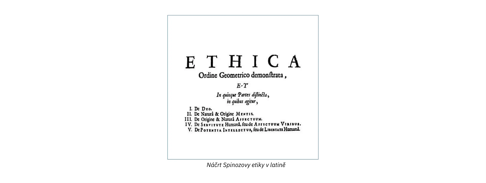

Tato iluze přímo souvisí s prvními dvěma, iluzí svobodné vůle a iluzí konečnosti.

Jde o teologickou iluzi.

Jde o toto: Dokud budou lidé nevědomí, "jak o věcech, tak o sobě samých", jak nám říká Spinoza, dokud budou věřit ve svou iluzorní svobodu, budou považovat svou představivost za porozumění, tj. budou se vždy domnívat, že jsou schopni myslet a chápat podstatu věcí, zatímco ve skutečnosti si pouze představují, vymýšlejí a promítají to, co je pro ně užitečné. Podle svých tužeb.

Proto lidé věří, že pokud existují přirozené prostředky, které jsou užitečné, jako například zuby k jídlu nebo oči k vidění, je to proto, že byly logicky stvořeny "ředitelem přírody". Jinými slovy, záměrný, antropomorfní Bůh, jemuž jsou přisuzovány lidské záměry.

Jinými slovy, bělovousý stařec skrytý za mrakem, kterému se připisuje, že stvořil všechny věci v přírodě jako prostředek k našemu cíli, protože nás miluje a chrání, když ho ctíme a uctíváme.

To je první stupeň teologické iluze.

Ale navzdory naší pýše, s níž věříme, že jsme nad přírodou, a představě, že můžeme začít něco z ničeho, ve skutečnosti vždy podléháme podmínkám existence, které naznačují, že se nám to nakonec opravdu nepodaří, jak říká profesor filozofie Gilles Deleuze (1925-1995). Jsme smrtelní, stejně jako všechna zvířata, ale víme o tom.

Věřit nebo představovat si opak, abychom se uklidnili, je důvodem, proč se neustále zmítáme mezi strachem a nadějí, jako dva protikladné a neoddělitelné póly mezi pocitem bezpečí a pocitem paniky, protože strach je vždy spojen s nadějí na lepší dny.

Že není strachu bez naděje ani naděje bez strachu a že ten, kdo se bojí, vždy doufá, že unikne tomu, čeho se bojí, zatímco ten, kdo doufá, se vždy bojí, že se nestane to, v co doufá.

A protože "máme sklon snadno věřit tomu, v co doufáme", říká Spinoza ve své Etice, právě tehdy, když čelíme vnějším příčinám nebo událostem, které by nám mohly uškodit, což je v rozporu s jakoukoli představou užitečnosti, se projevuje druhé stadium této takzvané teologické iluze, charakterizované přesvědčením, z něhož pramení pověrčivost.

Jinými slovy, "nechvalně známý" podle Voltaira (1694-1778), pro něhož se pověra nikdy nerodí z rozumu a vždy odpovídá iracionální nebo nepodložené víře, se staví proti jakékoli formě racionality tím, že přisuzuje předmětům nebo činům sílu nebo duchovní moc, kterou nemají.

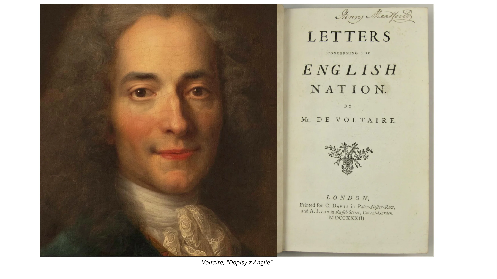

Pod rouškou úlevy a možnosti představit si lepší svět nás pověry ve skutečnosti uzavírají do našich vlastních iluzí a lží. Do otroctví, z něhož se jen těžko vymaníme.

Právě to hájilo německé, anglické a francouzské osvícenství od 18. století a tvrdilo, že pověra prostě brání lidem stát se dospělými, a to nejen tím, že omezuje používání rozumu, ale především tím, že vyvolává nesnášenlivost, která je nejlepším nástrojem k nastolení nadvlády moci. Ať už politická, nebo náboženská.

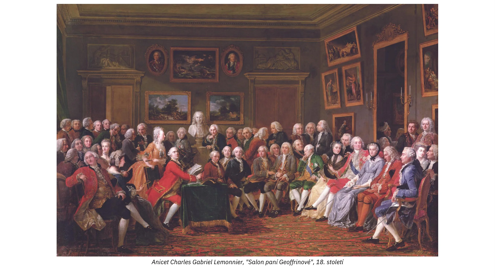

A právě to Spinoza znovu dokazuje ve svém Teologicko-politickém pojednání, kterého jsme se již dotkli. V tomto spise píše, že "velkým tajemstvím monarchického režimu a jeho hlavním zájmem je klamat lidi a jménem náboženství maskovat strach, který je musí ovládat". Proto se tyrani, diktátoři nebo revolucionáři, kteří jsou vždy lidmi hnanými touhou konat dobro pro druhé, často, ne-li vždy, chytají do pasti a pro dosažení svých zásad dělají pravý opak.

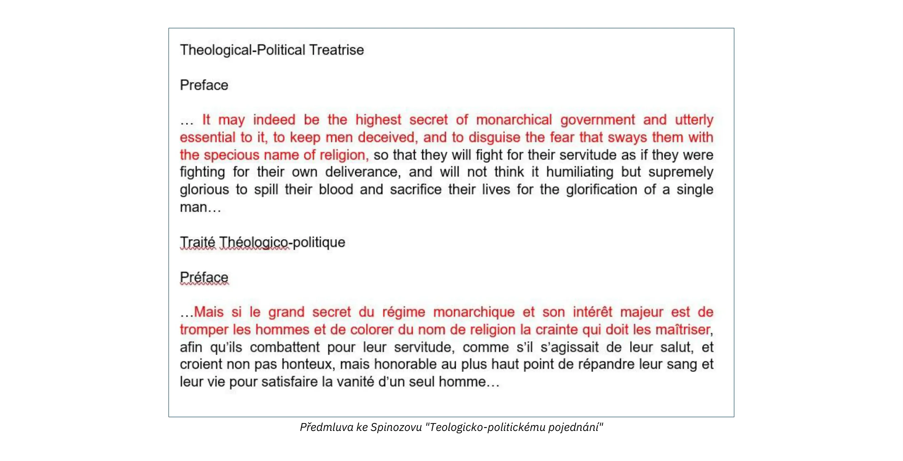

Novinkou, kterou Spinoza vnáší do TTP a která z něj činí svým způsobem otce sekularismu, je však úvaha, že je sice nezbytné bojovat proti pověrám a výzvám k násilí, které svoboda paradoxně umožňuje, ale že je v zájmu státu chránit právo na víru a svobodu myšlení.

Jakmile totiž myšlenky existují a jsou vyjadřovány soukromě, nevyhnutelně se rozšíří po celé společnosti a jejich šíření nemůže zabránit ani zákaz, ani cenzura. Myšlenky, ať už pravdivé či nepravdivé, dobré či špatné, se budou šířit v každém případě a jejich zákaz může v dlouhodobém horizontu vést pouze ke vzpouře a svržení státu ve jménu svobody.

Jinými slovy, stát by se ve skutečnosti mohl mnohem více obávat cenzury nebo potlačování svobody projevu než jejího zachování, a proto je podle Spinozy v jeho zájmu nechat jednotlivce vykonávat jejich přirozené právo myslet a vyjadřovat se.

Pro Spinozu je proto demokratický stát, který umožňuje svobodu myšlení, nejlepší zárukou, že lidé budou žít v míru a že díky uplatnění rozumu budou nejen svobodně myslet a jednat, ale také budou schopni pochopit otroctví, které je omezuje, aby se z něj mohli vymanit.

# Od teorie afektu ke Bitcoin

<partId>82e69d4f-a94f-5978-bcb8-8a7b4651bcca</partId>

## Otázka zla u Spinozy

<chapterId>1ce64576-2688-5757-a119-57cc3a1076c0</chapterId>

:::video id=9c490cc1-3d29-4ca7-9464-1a701bb91ba7:::

Nyní bych se rád věnoval otázce zla, jak ji Spinoza (1632-1677) prezentuje ve svých dílech a korespondenci.

Ale pozor, jedná se o složité a kontroverzní téma a cílem je pouze znovu pochopit jeho způsob myšlení, abychom lépe porozuměli tomu, co ho vede, tedy snaze o svobodu.

Jak jsme viděli, nevěřit ve svobodnou vůli nebo v jakýkoli druh finalismu v přírodě velmi rychle vyvolává problém existence zla v našem každodenním životě.

Jinými slovy, otázka zní, zda "zlo" v přírodě existuje a zda jsou lidé zodpovědní za škody, které způsobují.

Starověcí filozofové věřili, že zlo v přírodě neexistuje, a například Sokrates (470-399 př. n. l.) učil, že "zlo není nic". Podle něj zlý člověk nebyl zlý od přírody a svým způsobem se prostě mýlil o povaze dobra.

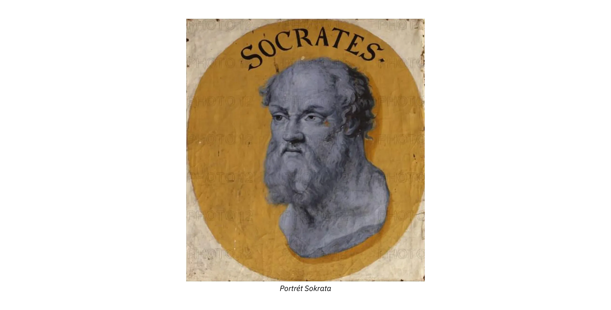

Ale scholastická tradice, zejména tradice svatého Augustina (354-430), která dodnes ovlivňuje křesťanskou morálku, tvrdila, že zlo nejen existuje, že je skutečností, ale že je možné ho vysvětlit, protože lidé jsou svobodní, protože jsou schopni volit mezi dobrem a zlem, a že zlo, které způsobují, je tedy zcela na jejich vlastní zodpovědnosti.

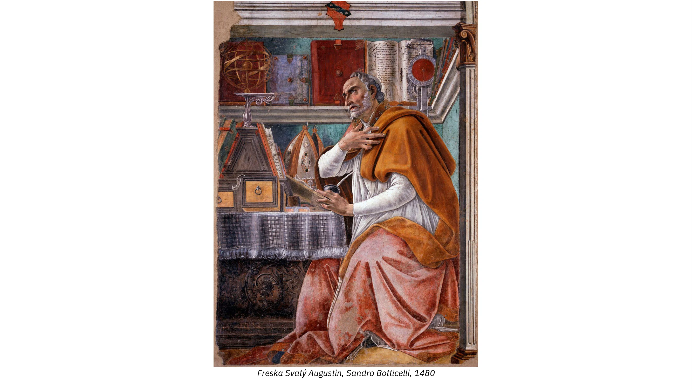

A přestože odpovědnost za škody způsobené zemětřesením, smrtícím virem nebo za to, že se dítě narodí slepé, by neměla být přičítána lidem, tento způsob myšlení přetrvává, protože přisuzuje přírodě morální záměr, který ji činí odpovědnou. Například tím, že se domnívá, že pokud došlo k zemětřesení, je to právě proto, že se lidé chovali špatně.

To je myšlenka, kterou hájí věřící lidé, že lidé se rodí jako hříšníci, viní se prvotním hříchem.

Jak si ovšem dokážete představit, Spinoza tuto myšlenku rozcupoval na kousky, protože podle něj příroda, Bůh nebo štěstí, není obdařena úmyslem a lidé nemají svobodnou vůli, takže odpovědnost za "zlo", která je jim připisována, je zcela iluzorní.

"V přírodě se neděje nic, co by se dalo přičíst nějaké neřesti, která v ní existuje," píše Spinoza v Etice, a proto bychom se podle něj mýlili, kdybychom například slepotu novorozence považovali za "zlo", protože když se dítě narodí slepé, není zbaveno zraku o nic víc než kámen.

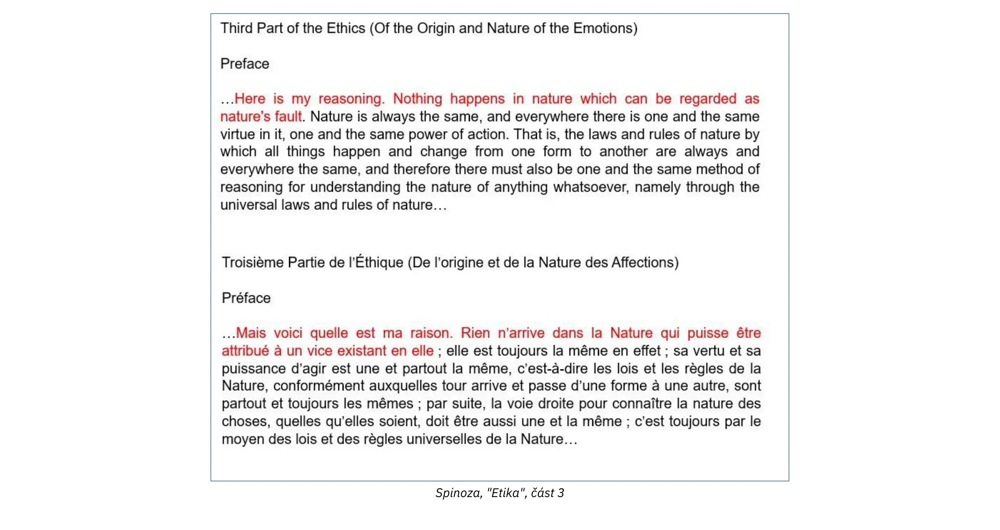

A pokud si myslíme, že slepí nevidí, je to jen z pohledu těch, kteří vidí.

Spinoza se tedy hlásí k myšlence, že zlo v přírodě neexistuje, ale jeho originalita, která z něj činí revoluční filozofii, spočívá v úvaze, že zlo neexistuje a neexistuje ani "dobro".

A proto mluví spíše o etice než o morálce, neuvažuje o tom, co je správné a co špatné, protože to jsou všechno relativní a subjektivní pojmy, ale spíše o tom, co je "dobré" nebo "špatné" pro naši přirozenou potřebu "vytrvat ve svém bytí", říká. Jinými slovy, žít a růst. Abychom vzkvétali jako lidské bytosti.

Navíc jsme již viděli, že Spinozův pohled na odpovědnost lidí, kteří se chovají špatně tím, že spáchají zločin, je zjevně neomlouvá.  Lidé totiž, i když neznají skutečné příčiny, které je ke spáchání zločinu determinují, jsou si vždy vědomi toho, co dělají, a proto jsou jako takoví odpovědní před morálkou a Zákonem.

Je zřejmé, že činy zločince jsou vždy spojeny s rodinnou, sociální, ekonomickou nebo dokonce zdravotní determinací, pokud lze jeho zločiny vysvětlit fyzickým nebo psychickým stavem. A to je úloha justice, která přesahuje rámec trestního práva a zohledňuje skutečnost, že některé trestné činy je třeba nejen trestat, ale také léčit s ohledem na rodinné, sociální a psychické zázemí pachatele.

Proto spinozista Gilles Deleuze (1925-1995) vysvětluje, že etika je svého druhu etologie, tj. praktická věda o způsobech bytí, nebo, jak říká, "umění vytvářet dobrá setkání".

Jinými slovy, svoboda podle Spinozy spočívá v tom, že směřujeme svou existenci k tomu, co "zvyšuje naši sílu jednat", a vždy optimisticky hledíme do budoucnosti, vidíme svět takový, jaký je, a nepředstavujeme si ho takový, jaký bychom ho chtěli vidět.

A v tom spočívá genialita Spinozovy demonstrace, neboť bojuje proti doktorům nevědomosti a proti všem, kdo tvrdí, že je dobré být nevědomý.

Naopak Spinoza studuje lidské vášně, i ty nejracionálnější, zlomená srdce, šílenství, smutek či melancholii, po způsobu geometrů, "more geometrico", jako se studují body, přímky, plochy a objemy.

Tuto teorii afektů rozvíjí ve třetí části své Etiky a doporučuji vám ji nyní prostudovat.

Děkujeme za pozornost.

## Teorie afektu

<chapterId>3bb011ce-6f0c-51a6-b41f-25a3b5b7768e</chapterId>

:::video id=bb427cc6-e54d-4b44-bd6d-281ba421001a:::

Podle Spinozy je svoboda pojem, který je třeba objevit, cesta k lepšímu, silnějšímu životu. Ke svobodnějšímu životu. Cestou, která vyžaduje, abychom uznali absolutní determinismus a racionální kauzalitu věcí.

Svůj systém rozvíjí ve třetí části Etiky. Jedná se o slavnou "teorii afektů".

Princip spočívá v tom, že lidské afekty jsou podle Spinozy aktivní nebo pasivní modifikace těla a myšlení, které ovlivňují naši schopnost jednat, tj. naše chování.

A přesto jsme v závislosti na vlivech specifických pro lidskou přirozenost i vlivech přicházejících z vnějšího světa schopni vytvářet pravdivé myšlenky, uvažovat a vyjadřovat radost.

Jsme však také schopni vytvořit si tzv. pasivní afekty, předsudky, které nás pak mechanicky, "navzdory sobě samým", vedou k tomu, že už nevidíme a neděláme to, co vyžaduje náš vlastní zájem.

Mluvíme o otroctví nebo nevolnictví, o stavu, který se vyznačuje neschopností ovládat a potlačovat pasivní afekty, které nás někdy vedou k tomu, že chceme to, co nechceme, a děláme to, co nechceme.

To říká Spinoza ve své Etice, když se podivuje nad tím, že "lidé často vidí to nejlepší, schvalují to a dělají to nejhorší" nebo že "bojují za své otroctví, jako by bojovali za svou spásu".

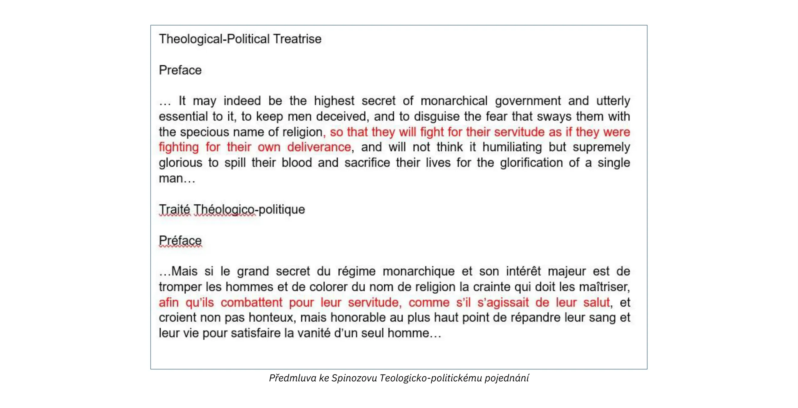

Spinoza si bere za příklad nenávist, kterou chápe jako pasivní afekt, obrácený ke smutku a zrozený z nedostatečných idejí, tj. z částečného poznání příčin, a kterou definuje jako "smutek, který je spojen s představou vnější příčiny".

Jinými slovy, pokud nenávidíme cizince, je to proto, že si tohoto cizince spojujeme s představou, kterou o něm máme, a to z důvodů, kterým nerozumíme, protože je cizí a odlišný svou povahou. Je to tato představa vnější příčiny - představa, která navíc vždy mechanicky motivuje neznalé k tomu, aby se špatně vyjadřovali o pojmu, který neznají.

To mimochodem platí zejména v oblasti kryptoměn.

Spinoza říká, že pokud odstraníme tuto negativní představu vnější příčiny, a to nikoliv morálkou, ale výchovou, empatií, rozumem, zejména tím, že se v tomto případě zaměříme na vlastnosti tohoto cizince, nebo v případě Bitcoin na jeho praktický aspekt či užitečnost, pak zmizí s tím spojený pocit smutku a automaticky i nenávist.

Stojí za to připomenout, že tento způsob myšlení se samozřejmě vztahuje i na aktivní afekty, a zejména na lásku, která je podle Spinozy "radostí spojenou s představou vnější příčiny". A pokud například vnější příčina lásky k nějaké věci nebo osobě zmizí nebo se časem změní, může zmizet i radost s ní spojená, čímž pocit lásky vyhasne. To nás, pokud tomu nerozumíme, může činit nešťastnými a depresivními.

Jestliže se však tato takzvaná teorie afektů vztahuje na naše "nevědomí", pak se tento racionální způsob myšlení "na způsob zeměměřičů" vztahuje také na boj proti všem formám vnějšího zotročení, ať už náboženského, politického, nebo vyplývajícího z přírodních jevů.

To je příklad blesku. Protože když blesk udeří a zabije nevinné lidi, nevědomí lidé budou mít tendenci považovat to za ruku Boží a domnívat se, že blesk vyjadřuje morální a finalistický záměr. Aids v 90. letech nebo dokonce v poslední době covid si někteří vykládají jako boží trest.

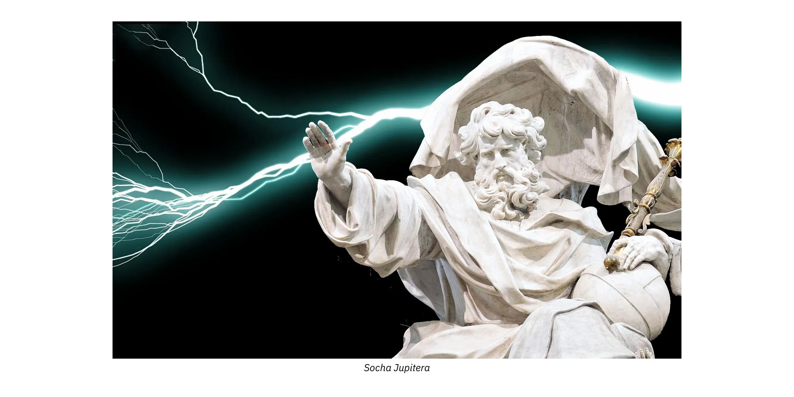

Zatímco pro Spinozu jsou ovšem všechny tyto teleologické představy pouhou pověrou, synonymem nevědomosti, neboť v tomto příkladu blesk, který udeří, podle něj nedělá nic jiného, než že vyjadřuje podstatu své vlastní přirozenosti. Kterou je udeřit. Samozřejmě bez jakéhokoli morálního záměru někoho potrestat nebo odměnit.

Díky tomuto jednoduchému příkladu pochopíme, že jediným řešením, jak se ochránit před bleskem - jinými slovy, jak se vymanit z otroctví, které nám jeho nebezpečí odjakživa ukládá - není stěžovat si na smůlu nebo na domnělou boží nespravedlnost, ani předkládat sebemenší morální argumenty. Ne, spíše jde i zde, stejně jako v případě nenávisti, o zamyšlení nad tím, co můžeme udělat z etického hlediska.

A v tomto případě by to bylo chránit se před bleskem tím, že budeme racionální, otevření pokroku, zvědaví a přesvědčení o tom, co nám věda může nabídnout, a proč ne, že si nainstalujeme hromosvod.

V tom spočívá genialita etiky. Spinoza nám ukazuje, že je možné přejít od dobrovolného otroctví, od života "navzdory sobě" a povětrnostním vlivům v neustálém odcizení k životu prožívanému skrze poznání náklonností a určení.

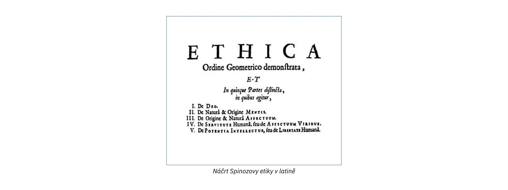

Je to způsob myšlení, který nám umožňuje pitvat lidskou povahu, abychom ve věcech viděli světlé stránky nebo pravdu. Odstranit důvody smutku a strachu, které nás tíží. Být svobodní, jinými slovy být schopni přestat poslouchat smutné vášně a změnit své chování.

A pochopit, pravděpodobně poprvé v dějinách filozofie, že můžete být jasní a šťastní.

Proto se spinozismus často označuje jako "filozofie radosti".

## Svoboda, rakouská ekonomická škola a filozofie Cypherpunk

<chapterId>b54f2532-460c-11f0-a248-93ff24ef1d57</chapterId>

:::video id=5f49d5b4-e15f-475b-b40d-07464c08ca4d:::

Jak už víte, svoboda podle Spinozy je vědomí našeho determinismu. Pod vedením rozumu a díky naší schopnosti jednat můžeme pochopit kauzální mechanismus služebností, abychom proti nim mohli bojovat, netrpět je a nejednat proti svým zájmům.

Nakonec tato jasnozřivost znamená, že už nebudeme žít v nihilismu, který později popsal Friedrich Nietzsche (1844-1900), pro něhož se lidé ztrácejí v ideologických ideálech, tj. politických nebo náboženských fikcích, kvůli nimž popírají realitu, infantilně žijí a činí se nešťastnými.

Právě o to šlo osvícenské racionální filozofii, zejména díky Immanuelu Kantovi (1724-1804), podle něhož pouze vzdělaný jedinec pod vedením rozumu může sám myslet a eticky určit, co je "pravdivé" či "dobré" a co je toxické.

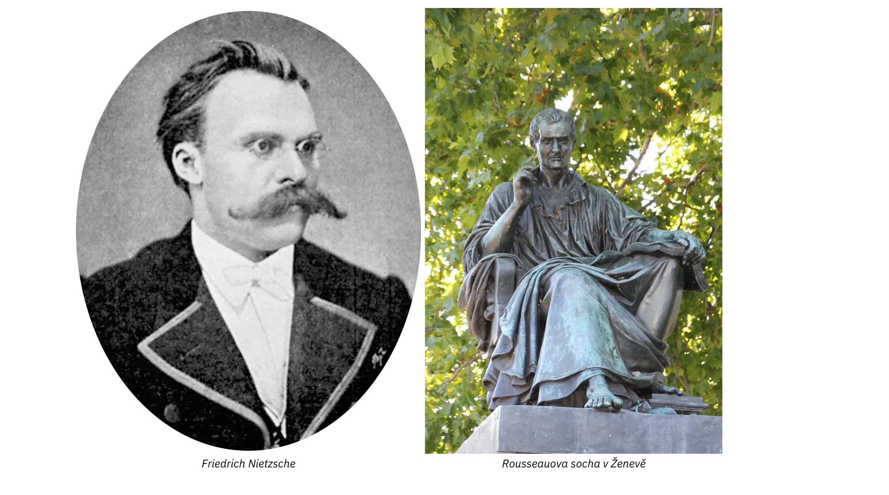

Jinými slovy, říká, pokud budeme myslet sami za sebe, pokud budeme uvažovat jako dospělí racionální lidé, a pokud se tedy budeme snažit přilnout ke kauzálním souvislostem mezi věcmi, nebudeme již potřebovat morální autoritu, která by nás učila například pravým ctnostem náboženství nebo pravým etickým hodnotám v politické a ekonomické sféře.

Tato argumentace navazuje na rakouskou školu liberální ekonomie, která se zrodila v mimořádně plodné intelektuální atmosféře Vídně před první světovou válkou. Právě v tomto kontextu totiž intelektuálové jako Carl Menger (1840-1921), Ludwig von Mises (1883-1979) a Friedrich Hayek (1899-1992) položili základy nové školy liberální ekonomie, která se měla stát základem přesvědčení budoucích cypherpunkerů. A odtud vznik Bitcoin.

Menger a Mises například stanovili, že veškeré poznání musí být konstruováno na základě kauzální souvislosti mezi věcmi, a navrhli tak nové kauzální pojetí ekonomie. Inspirovali se zejména liberálním duchem, který o několik let dříve rozvinul francouzský ekonom Frédéric Bastiat (1801-1850).

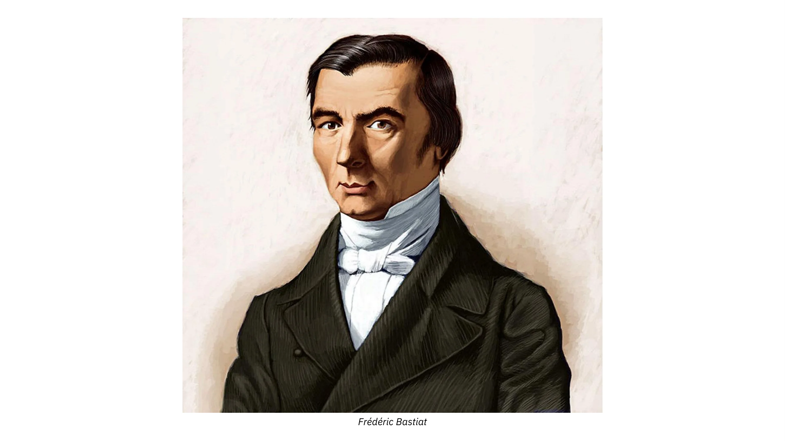

Hayek se naopak domnívá, že všechna ekonomická rozhodnutí vždy vyjadřují určitou formu nejistoty a nevědomosti a že skutečnost, že jimi netrpíme kvůli morálce, přesvědčení, předsudkům nebo politickým ideologiím, umožňuje správně analyzovat ekonomické chování a následně uvažovat o tom, co je dobré pro jednotlivce, pro společnost a pro stát.

Takto tito liberální rakouští ekonomové začali tvrdě kritizovat všechny socialistické myšlenky - Hayek hovořil o "planismu" - a veškerou morální politiku, která je jimi inspirována a která podle něj vede pouze ke zkáze. Poskytnutí ekonomické moci vládám, které nevyhnutelně zaostávají za dobou a nemají přehled o tom, co by se mělo a nemělo dělat, bylo odsouzeno k nezdaru.

Rakušané se například domnívají, že když si stát z donucení udělí pravomoc vytvářet peníze za účelem řízení ekonomiky a řešení krizí, hrozí, že se nikdy nebude moci zdržet zneužívání této pravomoci.

Proč tomu tak je? Protože se vždy ocitá ve formě otroctví, které mu v tom brání, a tak ho tlačí, jak by řekl Spinoza, "vidět to nejlepší, schvalovat to... ale dělat to nejhorší".

Jako spinozista Hayek ve videu vysvětluje, že "jelikož tuto moc nelze bez násilí odebrat, nezbývá než použít trik a zavést nový koncept peněz, který už vlády nemohou zastavit". Tento argument opakuje Milton Friedman (1912-2006) v rozhovoru, v němž se zase zabývá touto novou formou digitální měny v souvislosti se vznikajícím internetem.

Jedná se o politické a ekonomické argumenty, které předložili první cypherpunkeři, Eric Hughes (1953-) ve svém "manifestu Cypherpunk" nebo Timothy May (1951-2018) ve svém "kryptoanarchistickém manifestu" a které znovu převezme Satoshi Nakamoto.

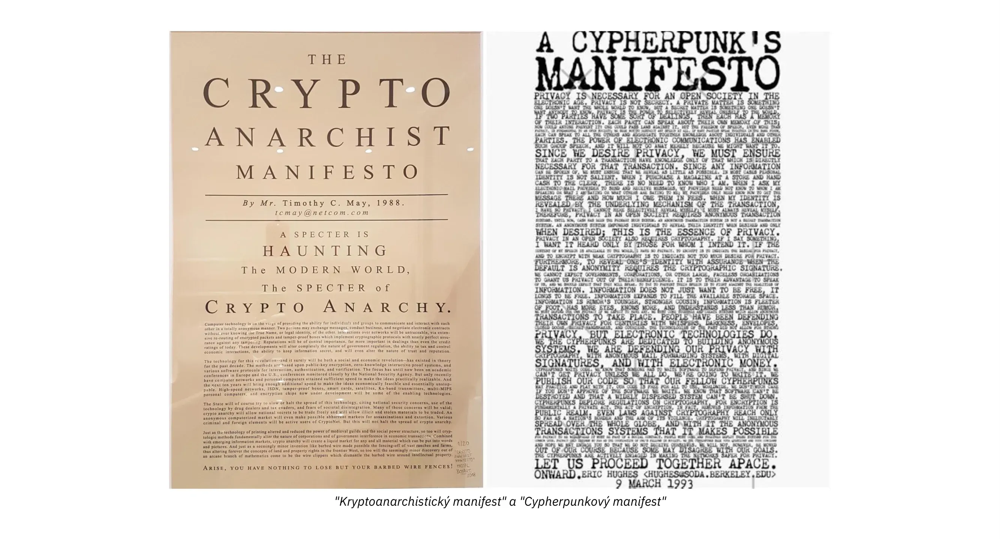

Zvláště když do mincovní báze bloku Genesis Blockchain Bitcoin vepsal titulek Timesů z 3. ledna 2009, aby ilustroval konec jedné éry, keynesiánské, a začátek jiné, s liberálními, anarchistickými a libertariánskými aspiracemi.

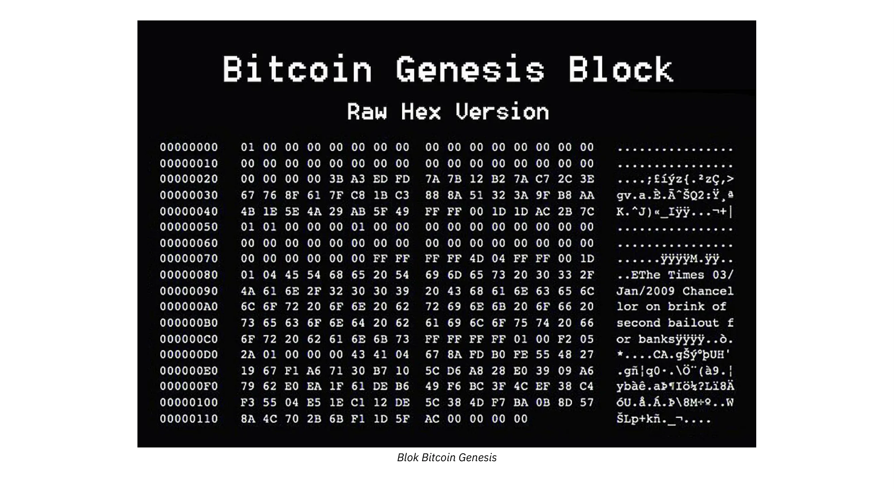

Bílá kniha zveřejněná 31. října 2008 představuje Bitcoin jako prostředek výměny hodnot na internetu bez důvěryhodné třetí strany, založený na decentralizovaném protokolu. Jde o "koperníkovskou" revoluci, která lidem konečně umožní znovu získat schopnost jednat, tj. svobodu, svobodu obchodování, právo na vlastnictví a respektování soukromí.

Proč? Protože Bitcoin nám umožňuje vymanit se z tohoto otroctví Spinozovým způsobem, díky rozumu, díky Galileovu jazyku matematiky. A jak naznačuje Hayek, bez toho, aby se proti tomu mohl postavit stát. A to mírovou cestou, bez nátlaku a proselytismu.

To je vlastně poslední paralela, kterou mezi spinozismem a Bitcoin uvádím, abych ukázal, že nemá smysl přesvědčovat někoho, kdo se nehlásí ke koperníkovskému nebo disruptivnímu pojetí, jinak než rozumem, pochopením, zvědavostí nebo dobrou vůlí.

Ne silou, ne násilím. Protože Koperník, Galileo, Newton, Darwin, Einstein, Hayek, Spinoza nebo Satoshi Nakamoto nikdy nevyhrožovali nikomu, kdo nevěřil v jejich myšlenky a demonstrace.

# Závěrečná část

<partId>70a5a3c8-6c88-11f0-8753-db07e26dcaf4</partId>

## Recenze a hodnocení

<chapterId>7945c38c-6c88-11f0-a73f-0f7cdf99f53f</chapterId>

<isCourseReview>true</isCourseReview>

## Závěrečná zkouška

<chapterId>a557fd32-6c88-11f0-96ff-cfa532cf76a0</chapterId>

<isCourseExam>true</isCourseExam>

## Závěr

<chapterId>ae04ab38-6c88-11f0-a496-3be47119e6b6</chapterId>

<isCourseConclusion>true</isCourseConclusion>