# When Spinoza Met Satoshi

Discover how 17th-century philosopher Baruch de Spinoza's radical ideas about freedom, reason, and power prefigure Bitcoin's decentralized revolution. This course reveals the striking parallels: both reject blind faith and central authority, both use mathematical rigor to liberate. Spinoza freed minds from religious dogma, Bitcoin frees money from state control.

Learn practical tools from Spinoza's ethics to understand bitcoin's philosophical foundations and increase your agency. Ready to explore two of history's greatest instruments of human emancipation?
+++
# Introduction

<partId>80b76189-afab-5295-a8d3-ba8f6fe7a5e8</partId>

## Course introduction

<chapterId>99af4992-fd6c-5142-b168-d927b251574b</chapterId>

:::video id=1def60bc-1d39-4e49-9b08-fd05b7a0d49b:::

In this course, I'm delighted to present the philosophy of Baruch de Spinoza (1632-1677), the famous 17th-century philosopher considered to be the father of rational Enlightenment philosophy.

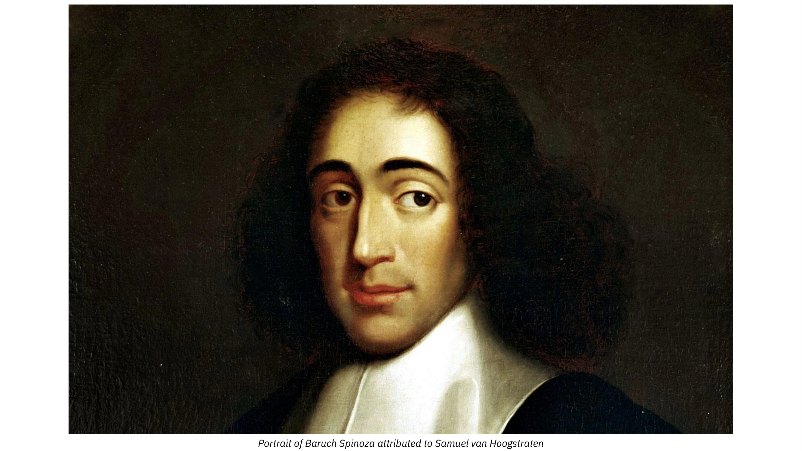

Portrait of Spinoza

These courses are based on my two essays on the subject, "Spinoza's true religion" and "Bitcoin, the gospel of freedom", available in paper form either online or directly from my website, and digitally on Amazon Kindle.

The goal of this course is, first of all, to provide a simplified understanding of a philosophy that is often considered highly complex and inaccessible, despite the renewed interest it enjoys today.

Indeed, this philosophy allows us not only to question the meaning of things when everything goes wrong, which is generally what religion, philosophy and the human sciences are all about, but also, and perhaps mostly, to question ourselves when everything is going well.

When life smiles at us and we feel like we don't need to question ourselves, considering with a pride seen as illusory and slavish that our happiness, or success, would only come from our talent, work or supposedly free choices; in short, from our own free will, rather than from the determinism to which we are subjected.

In this way, we can make the link between this practical philosophy of freedom - or, as Spinoza puts it, "toward the means to achieve it" - and the new technological world we're interested in here, crypto in general and Bitcoin in particular.

And particularly in its philosophical aspect, which makes us reflect precisely on the notion of freedom: the freedom to think, to express oneself, to respect privacy and, of course, in our case, the freedom to exchange.

First, I'll introduce you to Spinoza, his character, his social, religious and family background, and the historical context of the United Provinces where he lived.

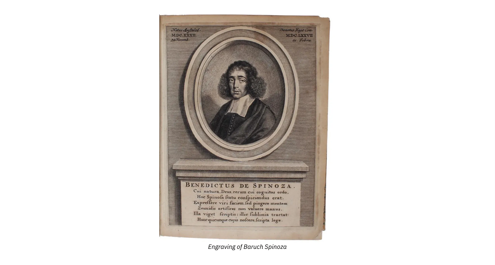

Portrait of Spinoza

We will then see what this new rational philosophy is according to which "nothing exists in nature that cannot be explained without the exercise of reason".

It's the idea that we can only understand the world and human nature in terms of the causal link between things, according to which, an effect always has a cause, and this cause is itself the effect of another cause and so on, all the way back to the first cause, which we have no access to and which, according to Spinoza, is Nature.

Nature, in other words God, is the famous "Deus sive Natura" in Latin that illustrates the whole meaning of Spinozism.

We'll also take a look at Spinoza's two major works, starting with the Ethics, published posthumously in 1677, which focuses entirely on freedom and the need to liberate ourselves from the servitudes that confine us.

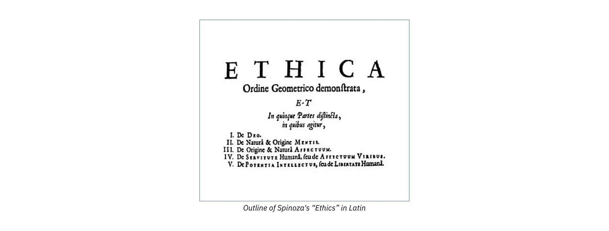

Then we'll look at the Traité théologico-Politique, published during his lifetime in 1670, which let us consider freedom from another angle: freedom of thought and belief. In other words, religious freedom, but above all political freedom.

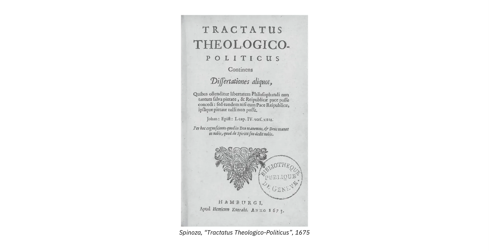

Finally, we'll see why Spinozism is a Copernican revolution of ideas, and how it represents a new definition of the world and human nature, by studying the 3 fundamental illusions denounced by Spinoza: the illusion of free will, the illusion of final causes or finalism, and the theological illusion.

Thanks to the theory of affects developed in the manner of the geometers, "more geometrico", we will finally see how Spinoza offers us a practical method for freeing ourselves, or attempting to free ourselves, from the servitudes inherent in human nature and external passions. A rational mechanism which, to fight against ignorance, can be compared to the certainty that the three angles of a triangle always equal 180°, and will allow us to connect the spirit of the Enlightenment that resulted from it with the liberal currents of the 19th century or libertarianism of the 20th century, which are directly linked to the invention of Satoshi Nakamoto, Bitcoin.

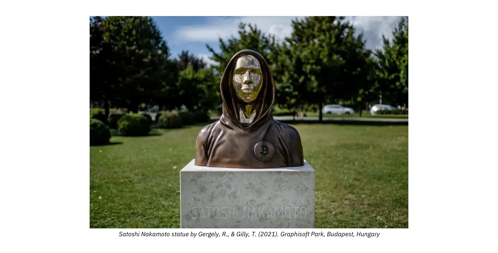

We'll then understand that, among the many points in common between Spinozist concepts and this tool of freedom invented by Satoshi Nakamoto, the first is that, in both cases, if we are curious, well-intentioned, as it was said at the time, have "understanding", then we cannot help but adhere to it. And if we don't adhere to it, which would of course be our most absolute right since it's fundamental to respect the freedom to believe, or not to believe, then we'd be determined not to be able to, or not to want to, which amounts to the same thing.

And that's how we can understand that a religious fundamentalist, for example, will never be able to accept, or listen to the slightest Copernican thought such as Spinozism, just as a central banker will find it very difficult to accept Bitcoin.

Although, as you know, things are currently moving in the right direction.

## Introducing Baruch de Spinoza

<chapterId>f53a9cfd-326e-5b73-a766-3ef2f07c5a49</chapterId>

:::video id=5fac3ddc-c472-4c64-8186-46a8f317e389:::

Who was Baruch de Spinoza? Well, he was a Dutch philosopher born in 1632 and died in 1677 at the age of 45.

Of Jewish faith, he was a member of the Portuguese Sephardic community descended from the Marranos forced to leave Spain by the Catholics in the 15th century, he was brought up in a religious and intellectual environment, aware of what it means to be persecuted.

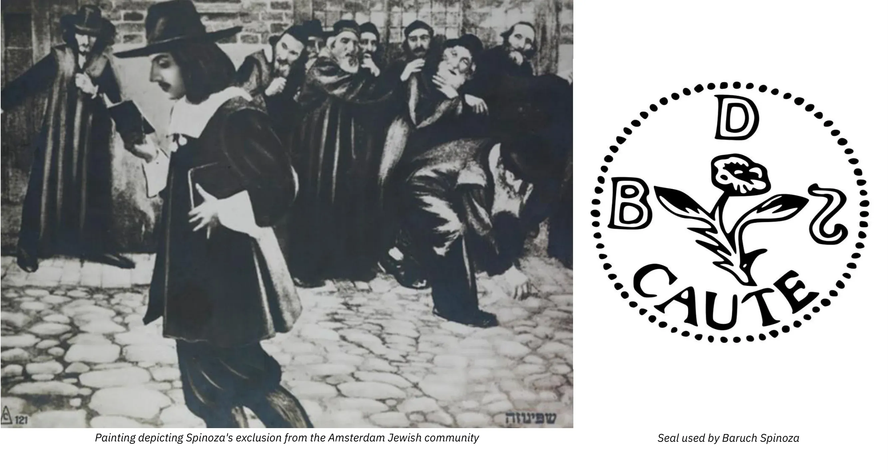

In fact, from an early age, he showed a strongly critical spirit towards established religion, and in particular towards his Hebrew community, from which he was violently rejected in 1656, aged just 24, before he had published anything.

This "excommunication", it is said, allowed him to isolate himself and focus on his work without ever looking back.

An heir, like his contemporaries Descartes (1596-1650), Pascal (1632-1662) and Newton (1643-1727), to the new rational ideas in the physics of Copernicus (1473-1543), Kepler (1571-1630) and Galileo (1564-1642), who preceded him by just a few years, Spinoza developed a way of thinking in the manner of the geometers, in accordance with Galileo's principle that mathematics is the language of the universe.

But these were very dangerous ideas for the time, after the trial of the monk and philosopher Giordano Bruno (1548-1600), who was burnt alive for heresy in a public square in Rome, and the trial of Galileo, forced by the inquisition in 1633 to renounce his Copernican heliocentric convictions.

This is why his strictly rational vision of the world and human nature, based on the causal connections between things, earned him the reputation of being considered, and still is today, wrongly, an atheist.

In fact, Spinoza's work speaks only of God, whom he identifies with Nature, and while he criticizes the superstitious impulses of religious people and theocrats, he shows that true religion for him is above all synonymous with justice and charity.

And it is this approach that links Spinoza to the philosophy of the Enlightenment, whether German, with Leibniz (1646-1716), Kant (1724-1804), Schopenhauer (1788-1860) and Nietzsche (1844-1900), English with Locke (1632-1704) or French with Voltaire (1694-1778), Rousseau (1712-1778) and Diderot (1713-1784). All agreed that reason should be used to combat obscurantism, especially religious obscurantism, to fight ignorance and to defend the ideals of freedom and progress.

Now, to begin connecting this philosophy with Bitcoin, it's important to note that Spinoza was born in a very particular era.

In the 17th century, the United Provinces were not only the freest country in the world in terms of political and religious ideas, but also the wealthiest. In other words, the most economically and technologically advanced country.

Wealth, however, is not tied to natural resources, the exploitation and despoliation of colonies or slavery, but to international trade and commerce in a liberal, entrepreneurial spirit. A spirit later championed by a famous Spinozist, Voltaire (1694-1778), for whom, in a trading room, a businessman or entrepreneur of liberal persuasion would never be excluded, called an infidel or excommunicated, he said, on the basis of his religion or origins, but only if he had gone bankrupt.

What's more, Holland at that time was also advanced in major technological fields, for example in the fields of mechanics and optics. The astronomical telescopes used by Galileo to look up at the sky and discover the universe were indeed considered cutting-edge technology for their era, as are the new technologies associated with computing, AI and, of course, crypto today.

And as Spinoza himself practiced the trade of polishing astronomical lenses - ironically for someone said to have seen everything askew - we can imagine that he would certainly have supported a tool of freedom like Bitcoin.

In other words, the values of freedom and progress conveyed by Spinozism stand in contrast to a world where religious fundamentalism, conspiracy theories, superstition, and, above all, ignorance remain a sad reality.

Yet it is a world in which every means is valuable for escaping, for freeing ourselves from the servitudes that confine us, and for being free by accepting the world as it is, not as we would like it to be.

Whether these means are philosophical or technological, as we shall see later, Bitcoin is a tool of freedom. It's a tool that enables both individuals and states alike to free themselves from servitude, particularly monetary servitude.

# Major works, Ethics and politics

<partId>d7d7e9a1-005b-519c-b587-137435e46344</partId>

## Ethics and the search for freedom

<chapterId>4cc66e25-335c-591d-9b78-83e5664bbbbc</chapterId>

:::video id=065c5091-69e1-412f-acce-c763ec31d3b1:::

In this chapter, I propose that we now turn to Spinoza's major work, entitled Ethics, published posthumously in 1677.

Why posthumously? Well, because his ideas were revolutionary, or at least counterintuitive and disruptive, and therefore very dangerous at the time, even in the liberal context of the 17th-century United Provinces.

The Ethics is a work written in Latin in the manner of geometers, probably inspired by the scientific spirit of Galileo (1564-1642), the father, along with Kepler (1571-1630), of modern science, according to whom mathematics is the language of the universe. Spinoza develops his ideas in five main parts, using propositions accompanied by demonstrations, scolia, axioms and definitions.

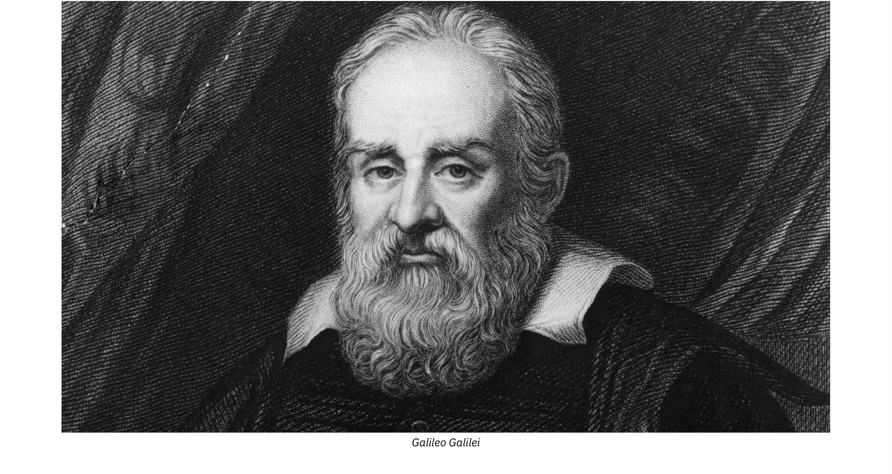

As such, the Ethics is, in Spinoza's words, "a way of arriving at freedom or the paths leading to it", and is not really a book that can be read from cover to cover, but rather one that can be worked through by reading, for example, one proposition that refers to another, which in turn is understood through a third, and so on, in a perfectly coherent, rational and logical system.

I'd like to point out that when you open the Ethics, it's recommended to begin with the postfaces and appendices, these short sections are written by Spinoza in everyday language, so they're easy to understand and, in a way, a summary of his sometimes complex thought.

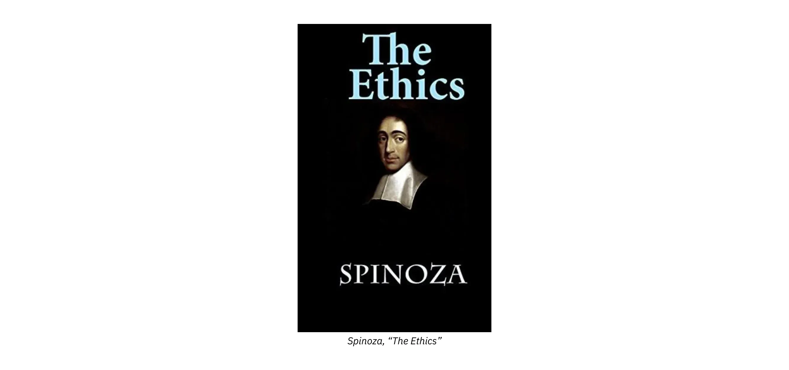

By subjecting the world around us to the "microscope of reason", Spinoza's work dissects human nature on the principle that the human being is not self-caused, i.e. that we did not ask to be born, neither here, nor in our time, nor with such physical or intellectual attribute.

And he says we are not above nature. We are not exempt from its laws, whether in body or mind. In other words, we are as much a part of nature as any other living being, animal or vegetable.

For Spinoza, all fields of human activity depend on the capacity of reason to understand the world in a perfectly coherent and determined system.

A world in which chance doesn't exist.

Everything that happens is "necessary" and the result of a cause, according to the idea that "what is and what happens, must be and must happen". This is absolute determinism.

But there are two points to keep in mind:

Firstly, if chance doesn't exist for Spinoza, it's because it's an event whose cause we don't know. But, of course, he says, just because we don't know the cause doesn't mean it doesn't exist.

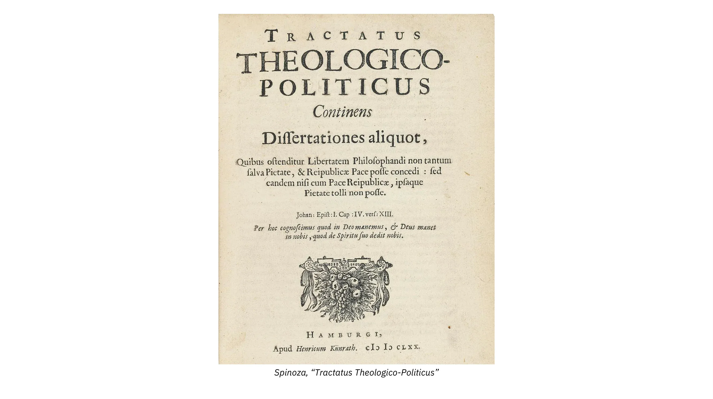

Secondly, there's absolutely no question of fatalism either, since nature is not endowed with intention. Lightning, for example, has no intention of punishing anyone, as one might think in the case of a tragedy. No, it simply expresses the essence of its own nature, which is to strike with lightning. To strike.

Spinoza thus defends the idea that reality, i.e. everyday life with both good and bad aspects, is perfectly intelligible, and that there is no phenomenon in nature that is not causally linked. Of course, this raises the question of evil, particularly absolute evil, which we'll look at a little later.

Finally, it's important to note that ethics is not morality.

According to Gilles Deleuze (1925-1995), the famous professor of philosophy and Spinoza specialist, morality is a system of judgment useful for living in society. But it's a subjective system, since what's right here may be wrong elsewhere, and what's wrong today may be right later.

And rather than determining what is right or wrong, ethics establishes what is good or bad for our own nature and our capacity, says Spinoza, to preserve in our being. To be free. It is, therefore, a true ethology, that is to say, a science of ways of being, or, as Gilles Deleuze further explains, the art of making good encounters.

Or the art of making the right choices to extricate ourselves from the servitudes that confine us and because of which, according to Spinoza, men are often reduced to "seeing the best, approving it, and doing the worst".

In other words, "to fight for their servitude as if they were fighting for their freedom".

## The Theological-Political Treatise

<chapterId>84b0187e-1050-5d44-a536-80554896e828</chapterId>

:::video id=c1efc97e-1e96-4b37-894c-9a19794d6b52:::

After the Ethics, i'd like to introduce you to another major work in this chapter that will help you understand Spinoza's philosophical and political influence, particularly on the coming Enlightenment and on liberal and, in our case, libertarian currents.

This is the Traité théologico-politique, or TTP, published anonymously in 1670.

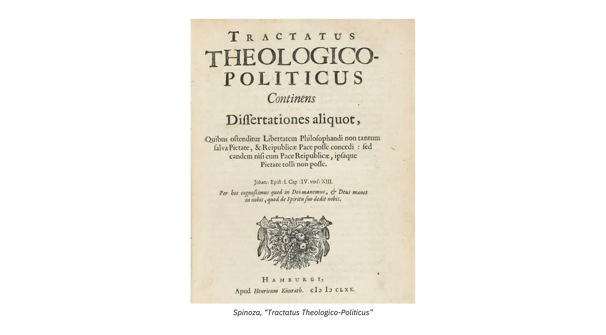

Spinoza (1632-1677) wrote this book while interrupting the writing of his Ethics, in an attempt to put an end to a misunderstanding that still exists today. It's the belief that he was an atheist.

As we have seen, Spinoza's concept of God is the subject of the entire first part of the Ethics, in which he demonstrates not only god's existence but also what his true nature is.

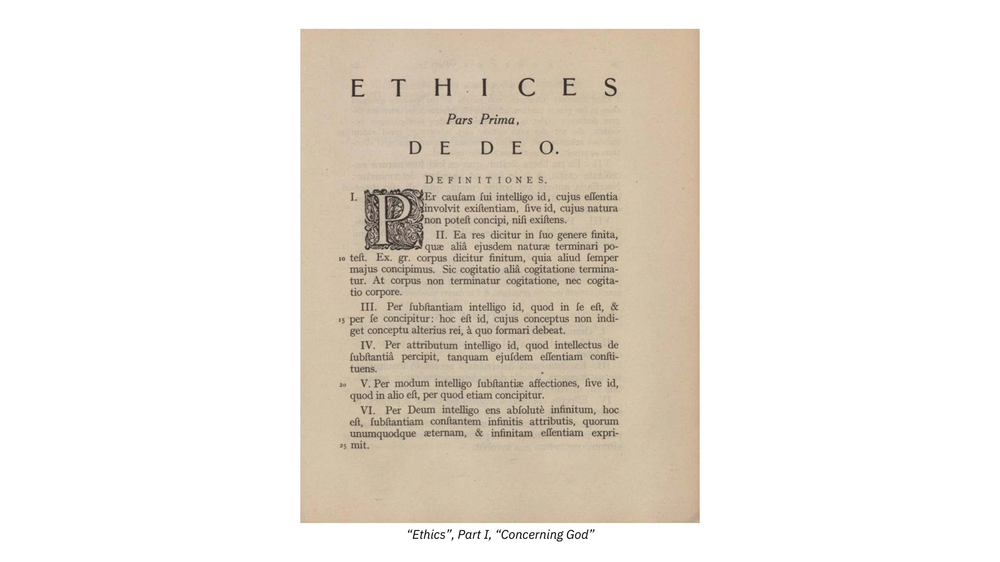

And since Spinoza's concepts are generally quite difficult to grasp, it is often easier to understand them by saying what they are not, rather than by trying to say what they are. An approach which, incidentally and as we shall see later, is very useful for understanding Bitcoin.

This is how Spinoza shows us that God, in his view, is not an anthropomorphic being endowed with intentions, punishing or rewarding, to whom we would speak and who would listen to us according to a ritual that we may or may not follow. In other words, according to him, God is not an old man with a long white beard hidden behind a cloud who would solve the world's difficulties and make us dependent on him.

So to speak of God is to evoke Nature as a unique, infinite and eternal Substance, made up of an infinite number of attributes, of which us human beings know only two: matter, or the extent, and thought.

This is the famous "Deus Sive Natura" from which Spinoza derives the concept of absolute determinism and the idea that man is not a cause of himself and is not above Nature, and is certainly not above animals.

But beyond a critique of religion, the TTP is above all an opportunity for Spinoza to make a severe criticism of the religious people, and of theocracy. In other words, religious power cultivates fear and superstition, and he says, activates the sad passions of individuals to better enslave them, trapping them in delusion, fanaticism and war.

In this primary, infantile stage of religion, believers become attached only to external worship and a credulous faith based on prejudice. A stage in which religion becomes mechanically intolerant, strays from the limits of its moral teaching, and turns away from its vocation to promote peace and harmony by claiming to hold the truth.

However, once we move beyond rational criticism of religion, for example by exegeting the Bible, Spinoza wants to convince us that this new vision of God is entirely compatible with the messages of justice and charity of the three great religions of the Book, which set out a simple but often forgotten golden rule: "You shall love your neighbor as yourself".

But that's not all.

This mature vision of religion developed in the TTP is accompanied by a political dimension, the necessity of separating religion and state in order to protect freedom of thought and belief, in the interests of both all individuals and the state itself.

Basically, Spinoza makes freedom, within the framework of reason, an essential condition for human beings to live without being enslaved by a power opposed to their interests, and therefore he defends a direct democracy based on political and religious freedom.

In other words, freedom of thought and belief, so that people can break free from servitude and from false, infantilizing beliefs, to reason as adults, giving priority to reason and also, as far as we're concerned, to technological progress.

The infamous earthquake in Lisbon on November 1, 1755, showed a major shift in the way people thought about natural events and disasters, and about how to protect themselves against them.

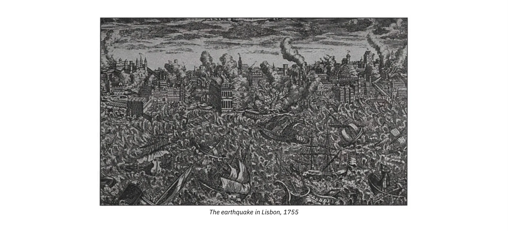

This terrible earthquake destroyed the city and killed hundreds of thousands of innocent people, many of whom were in church at that moment, since it was All Saints’ Day, which added to the survivors’ incomprehension.

A drama that revived the question posed by the German philosopher and mathematician Leibniz (1646-1716) about the anthropomorphic vision of a God endowed with intention, goodness, and omnipotence. For if God were good, as Leibniz says in his Theodicy, then he would not be omnipotent, since he would allow such catastrophes, and if he were omnipotent, then he would not be good, since he could not prevent them.

Far beyond damning the hand of God, Jean-Jacques Rousseau (1712-1778) wrote to Voltaire, who was struck by the injustice and horrors  discriminately suffered by humankind, that "nature was not evil in itself, and that we should not see in it any divine hand that would explain its design".

To which Voltaire (1694-1778), a Spinozist if ever there was one, replied that this natural catastrophe should above all make us realize that the scientific means to protect ourselves from nature did exist, and that the challenge of their time was therefore to ask whether human beings could, thanks to the knowledge and progress, take their future into their own hands and free themselves from theology and superstition.

And while it was, of course, not a question of preventing earthquakes, which are still not only unpredictable but also completely uncontrollable, it was more a question of ensuring that, for example, homes were built to withstand them.

This is why the 18th century Enlightenment, thanks to the exercise of reason, science and technology, is the century of progress. In other words, progress as a tool of freedom.

# The Spinozist revolution, the three illusions

<partId>f5d45c2b-28da-527a-ab20-dd255e9a9e0d</partId>

## A new definition of Nature and the human being

<chapterId>3e6599e3-5b29-50a8-a67d-d0386da5d65d</chapterId>

:::video id=b6d2c035-8848-4da6-9da9-be3b70be0f38:::

In this chapter, I'd like to take a look at the history of ideas, and see why Spinozism is considered a true Copernican revolution of ideas.

Thanks to this new way of understanding God, in other words Nature, offered by mathematics, Spinoza (1632-1670) established a profound paradigm shift, with indirect implications for the religious worldview and human's place in it.

Just as Nicolas Copernicus (1473-1543) established that the earth was not the center of the world, and Charles Darwin (1809-1882) showed three centuries later that human beings were not at the center of "life", so Spinoza followed this logic and asserted in his own time that human beings are not the "master of their own house" and that the universe is not made solely for their benefit.

He says that man is not "an empire within an empire" and that, just as the earth is reduced to the status of a mere planet, like all the other planets, the human being is reduced to the status of a mere modes of nature, like all the other finite modes of nature, such as animals, plants and all "existing beings".

Before him, classical Greek philosophy proposed an ordered, hierarchical vision of the universe to explain the world, the cosmos and human experience. Based on mythical narratives, it basically sought to explain the origin of the world, insisting on the harmony of the universe, nature and mankind.

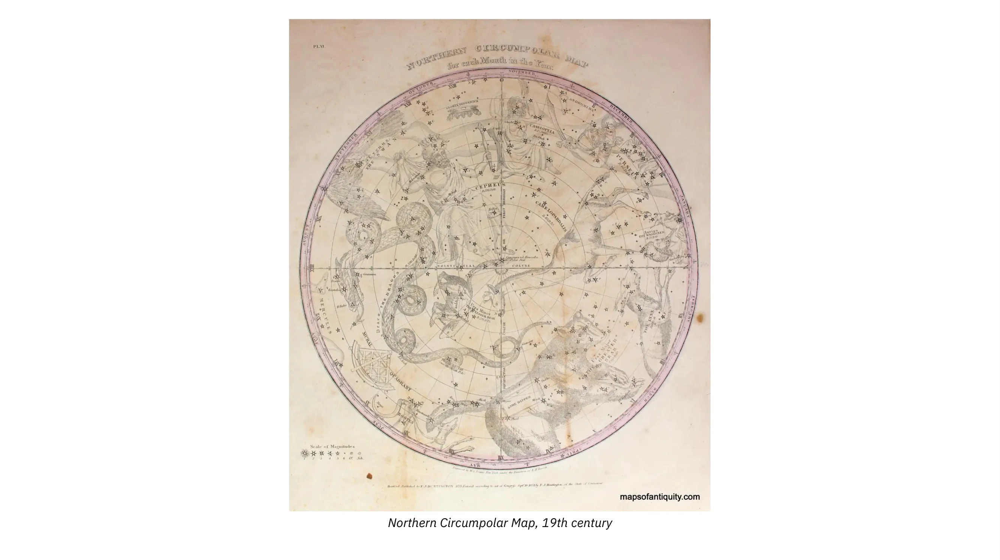

The scholastic cosmology of the Middle Ages, essentially from the 12th century onwards, was an evolution towards more reasoning in order to harmonize reason and faith to explain a universe that was still hierarchical, but which corresponded better to Christian philosophy.

But with the new physics of Copernicus (1473-1543) in the 15th century, cosmology underwent a major turning point in the understanding of the universe, whose geocentric model was thus called into question in favor of the heliocentric system, which paved the way for modern science, notably the new physics and astronomy of Kepler (1571-1630) and Galileo (1564-1642). Then Isaac Newton (1643-1727) and finally Albert Einstein (1879-1955), a committed  Spinozist.

But to fully understand Spinozism, we also need to consider the context of René Descartes (1596-1650), the famous French philosopher who preceded Spinoza and of whom he was both a disciple and a great admirer.

Despite the risks and the condemnations of Giordano Bruno (1548-1600) and Galileo, Descartes set out to distinguish "truth from falsehood" and to harmonize theology, philosophy and physics. In his famous Discourse on Method, published in 1637, Descartes argued that reason is the foundation of knowledge, through which human beings can attain freedom.

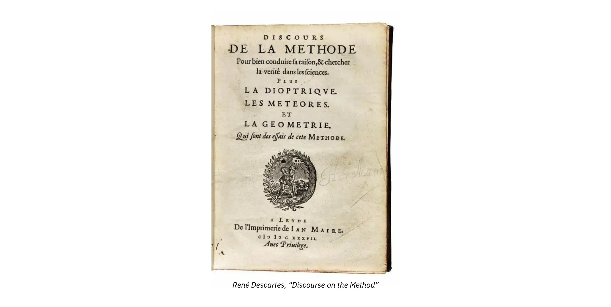

By explaining the world according to universal laws rather than a nature endowed with moral intentions, he paved the way for determinism, which Spinoza would later according.

But as a Catholic, Descartes nonetheless established a hierarchy between human beings and the other finite mode of nature, and in particular with regard to animal species, what he called "machine animals". And in saying that "there is no soul which, when well guided, cannot acquire absolute power over its actions and passions", Descartes thus claims that human beings have the capacity to start something from nothing, and that man, in his view, "escapes the laws of nature", that he has absolute power over his own actions and grounds his determination solely in himself.

Spinoza knew how to go beyond and surpass this stage and reconcile the existence of God with the demonstration of reason. For him, all fields of human activity depend on the capacities of reason in a perfectly coherent and determined world. But a world in which there is neither contingency nor chance, and in which everything that happens is necessary and the result of a cause, according to the causal link between things. This is the idea of absolute determinism.

And it is in the harshest terms that he finally refutes the Cartesian position, criticizing, for example, the idea that human beings are not subject to the laws of nature like all other animals, and are therefore superior to all other finite modes of nature.

In other words, they are endowed with free will, an illusory belief that is extremely difficult to escape, as Spinoza tells us, and which we shall now discuss.

## The illusion of Free Will

<chapterId>f147a914-cb64-5927-b305-26691930bca3</chapterId>

:::video id=b59da795-ba19-4643-9672-36c9e7953a42:::

In this course, we will now turn to the delicate question of free will, in order to better understand what freedom is for Spinoza, for the Enlightenment and for the early liberal philosophers.

As we've already seen, Spinoza (1632-1677) is well known for considering free will as an illusion from which it is extremely difficult to free oneself.

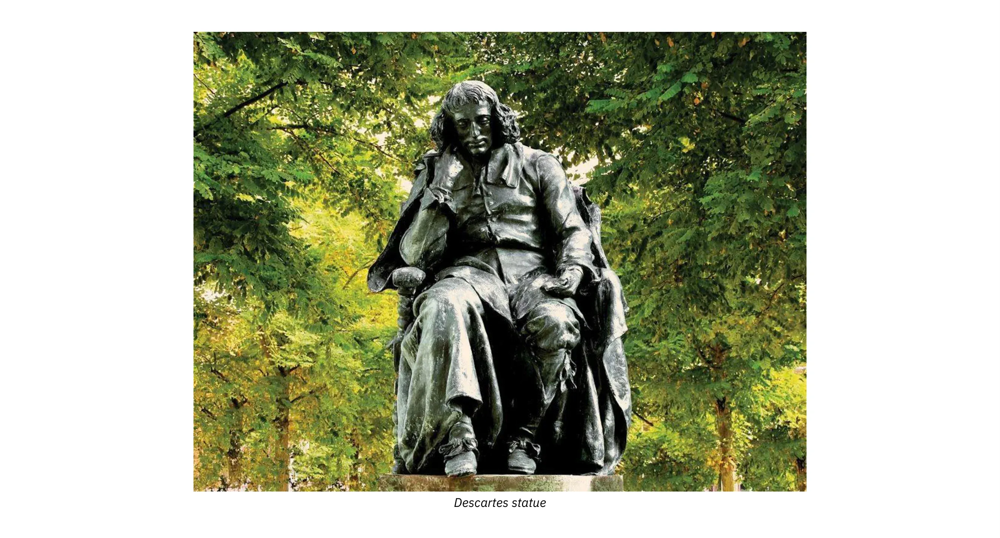

Why so? Because it goes against the philosophical tradition since Antiquity, and still defended by Descartes (1596-1642), that human beings can initiate something from nothing and bear full responsibility for their actions, especially before God, says Saint Augustine (354-430), father of the Christian Church.

But also, of course, before human justice.

It's the idea that our will, and our will alone, allows us to direct our lives, that we have absolute power over our actions, and that we derive the freedom of our actions solely from ourselves, thus possessing an indeterminate power of decision.

In other words, mankind is able to disrupt nature's order, rather than be subjected to it.

In the conduct of his life, because he would be subject to no law other than that of his own will, he would therefore be not only above nature and animals, mere machines, but also above all other finite modes of nature. This was the position of Descartes (1596-1650), for whom the causes of human impotence and inconstancy lay not in the natural order, but in the vices of human nature itself.

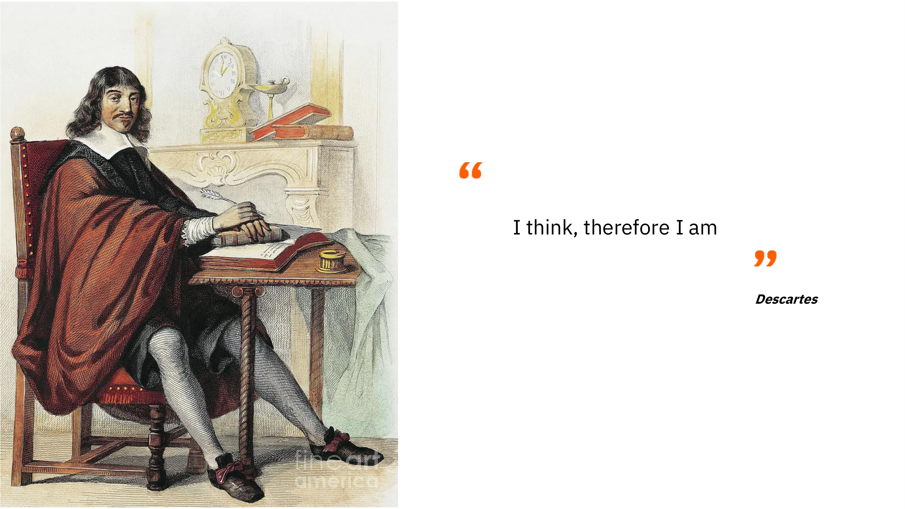

But while Spinoza credits Descartes for opening the way to rational control of the affective life, he distances himself from him entirely by firmly criticizing this hypothesis of an "absolute power" of the will.

Spinoza, on the other hand, considers that our world is perfectly coherent and determined, and that everything that happens is necessary and is the result of the causality of things, according to which an effect always has a cause, and this cause is itself the effect of another cause, and so on.

This is the idea of absolute determinism, from which he establishes in his Ethics that men have no free will whatsoever because, he says, they are conscious of their actions, but they ignore, or prefer to ignore, the true causes that determine them.

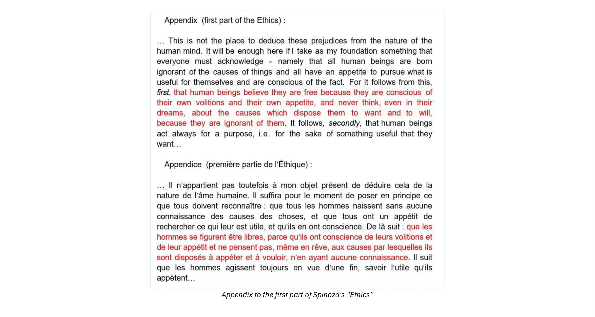

For Spinoza, human beings, as "finite modes" of nature like animals or plants, cannot therefore start something from nothing; they are not exempt from the laws of nature, both in their bodies and in their minds.

Worse, for him, the greatest danger of freedom is to believe in our free will, and to believe that we can act without being determined by external causes.

For Spinoza, freedom is not the expression of free will, but the ability to understand our rightful place in the world, to understand our determined nature and, from there, to direct our existence towards that which "increases our power to act". By always looking to the future with optimism, and seeing the world as it is, rather than imagining it as we'd like to see it.

Of course, the problem that arises is human responsibility and their actions. we could conclude that if individuals are not free in their actions, they would not be responsible for them, especially in the face of justice. But this view is misleading, because without going into too much detail, recognizing one's social, familial and historical determinism does not prevent us from considering the responsibility of actions committed, since these are voluntary.

On the other hand, it would be an illusion to believe that the actions of a criminal are never linked to his own determinism. While it's not a question of excusing them, it is at least a question of trying to understand them. In fact, this is what justice does: beyond punishing unlawful actions, it plays the role of foreseeing and protecting the future, which is why certain crimes are not only punished but also treated, taking the offender's family, social and psychological background into account.

This approach to freedom as a capacity to act is the connection we can make with 18th-century Enlightenment philosophy. According to one of its greatest ambassadors, the German philosopher Immanuel Kant (1724-1804), the Enlightenment was indeed the means of freeing humans from the state of tutelage, or as Étienne de la Boétie (1530-1563) would have said, from voluntary servitude, for which they themselves were responsible.

Kant's motto is "Think for yourself" and "Dare to know", the famous Latin "Sapere Aude".

Spinoza's capacity to act is thus the power that humans have within themselves to understand their own animal condition, and to comprehend nature and its phenomena, whether positive or negative, by relating them to objective causes, so as not to rely on moral explanations that are false and illusory, i.e. explanations shaped to suit our desires. Rather, it consists in seeking to explain them through reason, with a view towards emancipation and freedom.

And the progress, which led to the first technological revolutions and the first liberal and entrepreneurial ideas of the late 18th century, notably with the English liberal philosopher John Locke (1632-1704) and the English economist Adam Smith (1723-1790).

And it's worth recalling Sigmund Freud's (1856-1939) definition of an illusion. According to the father of psychoanalysis, who always acknowledged Spinoza's influence on his work, an illusion is precisely "a belief motivated by the realization of a desire, and there by disregarding reality".

Finally, it's worth pointing out that while the libertarian movement we're about to discuss refers directly to this new liberal philosophy, there are those who point out that figures such as Ayn Rand (1905-1982), author of "La Grève" and "La Source vive", support the existence of free will, believing that human beings have the capacity to make free choices.

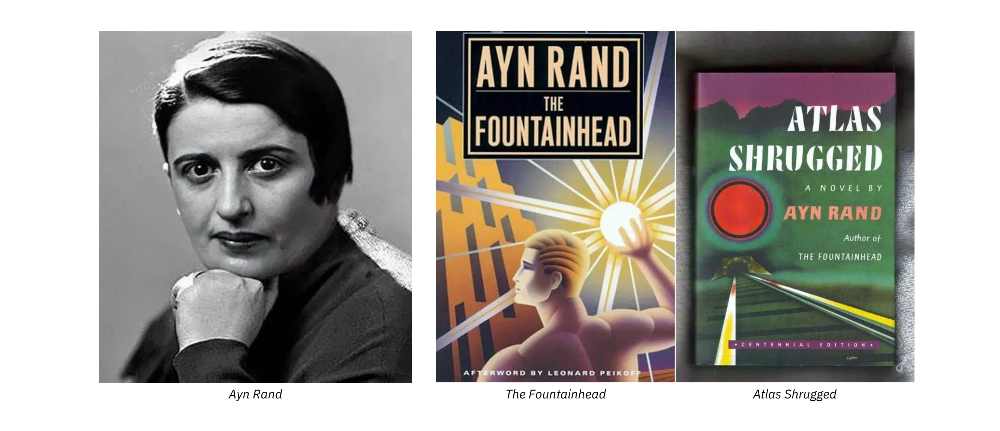

But the reality is quite different, and the confusion stems rather from a semantic problem: by recognizing the capacity of human beings to act, and to make choices, while acknowledging the logical determinism of which they are the object. the first libertarians are, in reality, also heirs of Spinoza. What they have in common with Spinoza is the belief that humans are not above nature but instead are the result of an evolutionary process that places them within a determinism, a history that goes beyond them, and is largely responsible for what humans are and what they do.

Finally, if belief in free will is an illusion from which it is extremely difficult to extricate oneself, it is because it refers back to another illusion that feeds it, the illusion of final causes, which I invite you to study in the next chapter.

## The illusion of final causes

<chapterId>da2a7fb1-f1e9-5b56-822d-c73770de749d</chapterId>

:::video id=a0127fe7-a4cb-4a1c-8af4-f11c40b4a3d7:::

We saw in the previous chapter that the illusion of free will consists in believing that we could start something from nothing, that our will alone would enable us to direct our lives, and that we would have an indeterminate power of decision. It's the idea that man is capable of disrupting Nature's order more than he is subject to it.

But for Spinoza (1632-1677), man is not "an empire within an empire", i.e. he is not, contrary to what Descartes established (1596-1650), an exception in nature, and is never exempt from the prolongement of the deterministic chain of cause and effect.

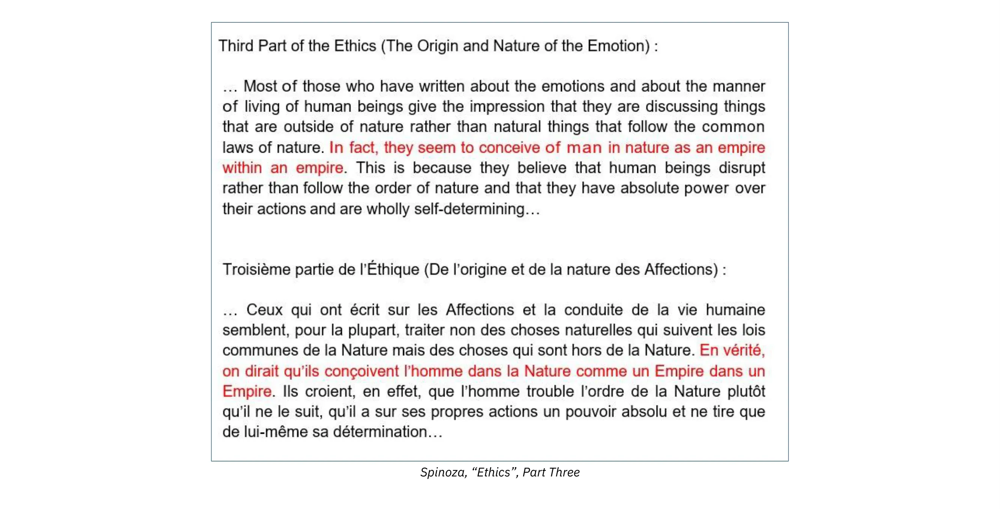

And since Nature, says Spinoza, has no prescribed end from a moral point of view, and since humans tend to mistake their imagination for understanding, They interpret it according to what suits their own interests. To the point that they give a meaning to things that derives only from the way they appreciate them and relate them to themselves.

That is, according to their desires, hopes and fears.

This reasoning is illustrated by the illusion of final causes, which is a major obstacle to thought and the exercise of reason, because it simply expresses our need to make the effects of a thing correspond not to its true causes, but to a belief, even if absurd or infantilizing.

A belief that expresses an intention, notably divine, and which, in the way we interpret it, is often superstitious, Or ignorance.

And that's why new diseases such as AIDS in the 90s or covid in 2020 have always been perceived by some as the expression of a divine and often punitive intention, according to a reasoning that runs counter to the principle of causality that underpins rationalism and modern science established since Copernicus (1473-1543), Kepler (1571-1630) and Galileo (1564-1727).

The fact is, as Spinoza says, that it matters little to people that so many things are beyond their imagination, that there is more disorder than order in nature. Yet the complexity of things beyond their grasp should dissuade them from believing in any teleological project. It doesn't matter, he says, because humans' belief in the relevance of their certainty based on what suits their desire and utility is always stronger than any rational argument or concern for truth.

Finalism thus amounts to inverting the causes and effects of things in order to understand them: for example, we believe that the reason we have eyes is to see, and that the reason we have teeth is to chew. Whereas, of course, it was to see that the human species developed its eyesight during the course of its evolution, and it was indeed through the need to feed itself, and to eat meat, that our dentition also developed as it has today.

And this is exactly what the French naturalist Jean-Baptiste de Lamarck (1744-1829) asserted (image 3.3.3) when he established his predarwinian theory that it is the function that creates the organ, and not the other way round.

But as Spinoza says, "the delusion of men does not end there", and among all the examples of naive, and ultimately rather amusing, teleological ideas, we often cite the famous example of the biologist Bernardin de Saint-Pierre (1737-1814). This former director of the Paris Museum of Natural History regarded the finalism of nature with poetry, lyricism and a certain naivety, considering that the melon, for example, had been created for the sole purpose of pleasing large families, since its ridged skin made it easy to cut into equal slices.

The definition of [inflation](https://planb.academy/resources/glossary/inflation) given by Keynesian economists and advocates of the welfare state, for example, also illustrates this paradox very well. According to them, inflation is an increase in prices which, according to some central bankers, comes either from "nowhere", or from geopolitical contexts which nobody can control or anticipate. While an increase in prices can indeed lead to cyclical inflation - for example, when the price of oil rises, the prices of certain processed goods will also rise - the real structural causes of inflation are primarily linked to an increase in the money supply, which in turn implies a fall in the value of money and, ipso facto, a mechanical rise in prices.

Believing, or having others believe, the opposite is tantamount to dreaming with one's eyes open, as Spinoza mockingly put it, and constructing a line of reasoning that is false, or misleading, and which is all the easier to get accepted because it is heard as an expected response to prove oneself right. In this case, when advocates of state intervention consider inflation to be the best way to solve economic problems.

However, this biased interpretation of inflation leads us to forget that, while it is useful for managing the economy in the short term, it is in fact a hidden tax, leading in the long term only to human and material disasters, and rendering states incapable of not abusing their power. This is what Friedrich Hayek (1899-1992) describes so well in his essay The Road to Serfdom, when he evokes the servitude from which states can no longer extricate themselves.

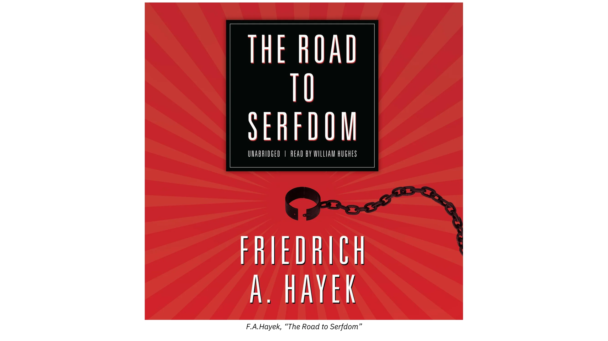

Finally, it's worth noting here that this finalistic mechanism is also well illustrated in the way Bitcoin's detractors express their criticism by focusing precisely on its effects.

Because while some of the effects of Bitcoin can certainly be criticized, due to the cognitive bias associated with the fact that it's a new and disruptive technology, we have a strong propensity to see only the negative effects. Especially if reality doesn't match our desires, for example if we're religious when faced with a Copernican revolution like Spinozism, or if we're a central banker when faced with a decentralized digital currency concept.

However, it's quite clear that if a religious person or a central banker shows understanding, curiosity and good will, and if they take an interest in a concept, seeking first to understand it rather than judging its effects in order to match their opinion to their expectations, then they will certainly be able to adhere to it.

Thank you for your attention, and I'll see you in the next chapter.

## The theological illusion

<chapterId>93554156-5e62-526d-9b71-49c47be916af</chapterId>

:::video id=9c490cc1-3d29-4ca7-9464-1a701bb91ba7:::

In this final chapter on the new Copernican vision of ideas offered by Spinozism, we turn finally to the third illusion presented by Spinoza (1632-1677) in his work, the Ethics.

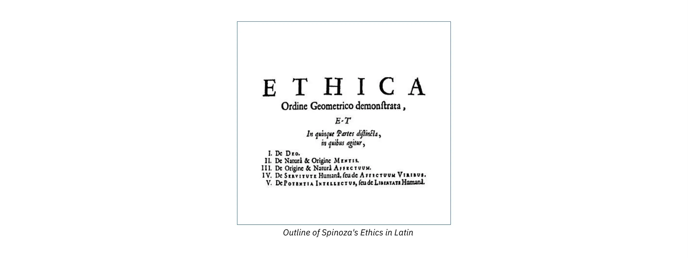

This illusion is directly linked to the first two, the illusion of free will and the illusion of finality.

It's about theological illusion.

The point is this: As long as humans are ignorant, "of both things and themselves", as Spinoza tells us, as long as they believe in their illusory freedom, they will take their imagination for understanding, i.e. they will always consider themselves capable of thinking and understanding the nature of things, when in reality they are only imagining, inventing and projecting what is useful to them. According to their desires.

This is why humans believe that if natural means exist and are useful, such as teeth for eating or eyes for seeing, it's because they were logically created by a "director of nature". In other words, an intentional, anthropomorphic God to whom human intentions are attributed.

In other words, a white-bearded old man hidden behind a cloud, who is credited with creating all things in nature as a means to our end, because he loves us, and protects us as we honor and worship him.

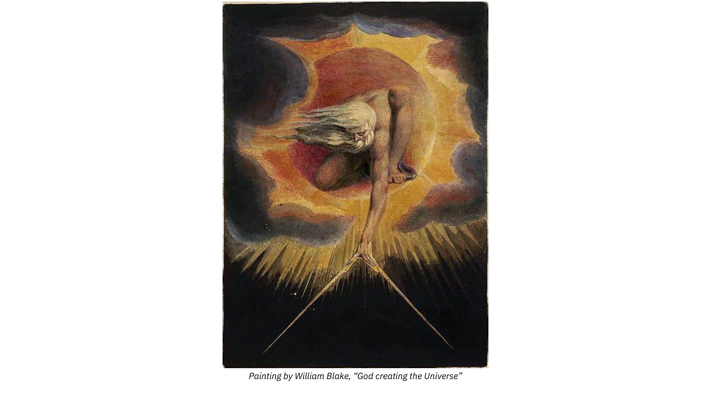

This is the first stage of theological illusion.

But despite our pride in believing ourselves to be above Nature, and in imagining that we can start something from nothing, in reality we are always subject to conditions of existence that indicate that, in the end, we won't really be able to "get away with it", as philosophy professor Gilles Deleuze (1925-1995) put it. We are mortal, like all animals, but we know it.

Believing or imagining the opposite in order to reassure ourselves is the reason why we are perpetually tossed back and forth between fear and hope, like two opposing and inseparable poles between a feeling of security and a feeling of panic, since fear is always linked to the hope of better days.

That there is no fear without hope, nor hope without fear, and that he who fears always hopes to escape what he fears, while he who hopes always fears that what he hopes for will not happen.

And since "we are disposed to believe easily what we hope for", says Spinoza in his Ethics, it's when we face external causes or events that would be harmful to us, contrary to any idea of utility, that the second stage of this so-called theological illusion is expressed, characterized by beliefs from which superstitious sentiment arises.

In other words, "the infamous" according to Voltaire (1694-1778), for whom superstition is never born of reason, and it always corresponds to an irrational or unfounded belief, opposed to any form of rationality by attributing to objects or actions powers or spiritual potency that they don't have.

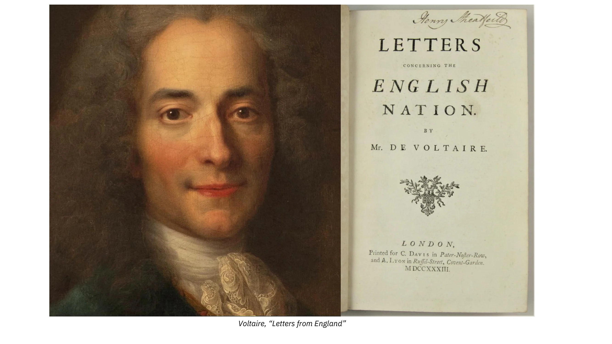

Under the guise of relieving us, of allowing us to imagine a better world, superstition actually locks us into our own illusions and lies. In servitudes from which we'll have a hard time extricating ourselves.

This is what the German, English and French Enlightenment defended from the 18th century onwards, asserting that superstition simply prevents men from becoming adults, not only by limiting the exercise of reason, but also, and above all, by giving rise to intolerance, which is the best instrument for establishing the domination of a power. Whether political or religious.

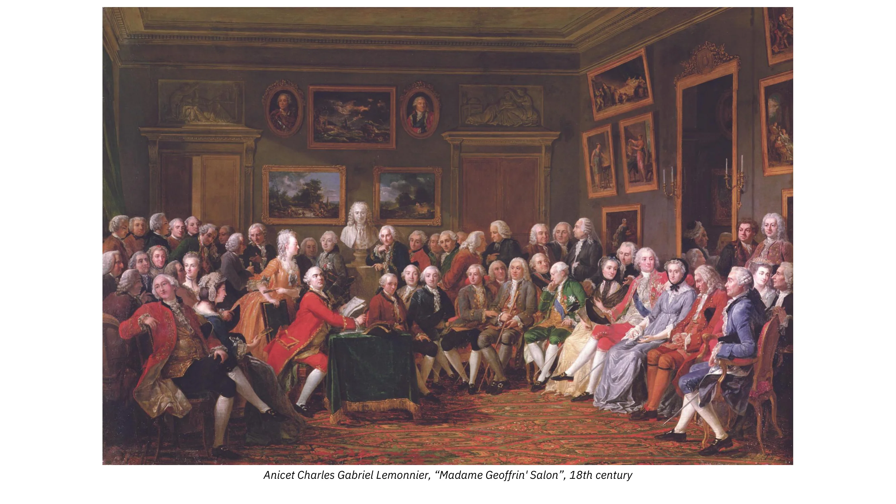

And this is what Spinoza demonstrates again in his Theologico Political Treatise, which we've already touched on. In this essay, he writes that "the great secret of the monarchical regime, and its major interest, is to deceive people, and to disguise with the name of religion the fear which must control them". This is why tyrants, dictators or revolutionaries, who are always people driven by the desire to do good for others, often, if not always, fall into the trap of doing the opposite of their principles in order to achieve them.

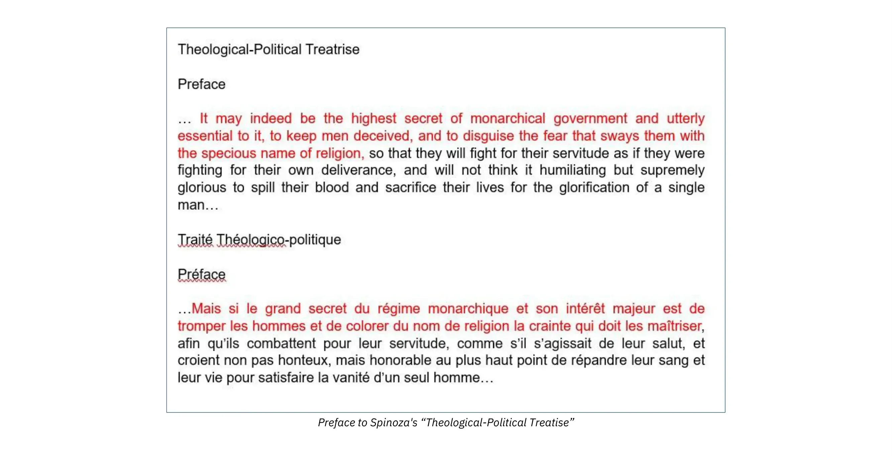

But the novelty that Spinoza brings to the TTP, and which makes him in a way the father of secularism, is to consider that while it is essential to fight superstition and the call to violence that freedom paradoxically allows, the fact is that it is in the stat's interest to protect the right to believe and the freedom to think.

For as soon as ideas exist and are expressed privately, they will inevitably spread throughout society, and neither prohibition nor censorship can ever prevent their spread. Ideas, whether true or false, good or bad, will circulate in any case, and banning them can only lead, in the long term, to revolt and the overthrow of the state in the name of freedom.

In other words, the state would actually have far more to fear from censorship or suppression of freedom of expression than from maintaining it, and it is therefore, says Spinoza, in its interest to let individuals exercise their natural right to think and express themselves.

For Spinoza, a democratic state that allows freedom of thought is therefore the best guarantee that people will live in peace, and that, thanks to the exercise of reason, they will not only be free to think and act, but will also be able to understand the servitudes that constrain them in order to extricate themselves from them.

# From affect theory to Bitcoin

<partId>82e69d4f-a94f-5978-bcb8-8a7b4651bcca</partId>

## The question of evil in Spinoza

<chapterId>1ce64576-2688-5757-a119-57cc3a1076c0</chapterId>

:::video id=9c490cc1-3d29-4ca7-9464-1a701bb91ba7:::

I would now like to discuss the question of evil, as Spinoza (1632-1677) presents it in his works and correspondence.

But be warned, this is a complex and controversial topic, and the goal here is simply to understand, once again, his way of thinking in order to better grasp what guides him, i.e. the quest for freedom.

As we have seen, not believing in free will or in any kind of finalism in nature very quickly raises the problem of the existence of evil in our daily lives.

In other words, the question is whether "evil" exists in nature, and whether humans are responsible for the harm they cause.

Ancient philosophers believed that evil did not exist in nature, and Socrates (470-399 B.C.), for example, taught that "evil is nothing". According to him, a wicked person was not wicked by nature, and in a way was simply mistaken about the nature of good.

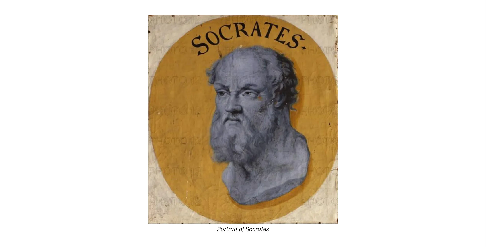

But the scholastic tradition, notably that of Saint Augustine (354-430), which still influences Christian morality today, argued that evil not only exists, that it is a reality, but that it can be explained because people are free, because they are capable of making a choice between good and evil, and that the evil they cause is therefore entirely their own responsibility.

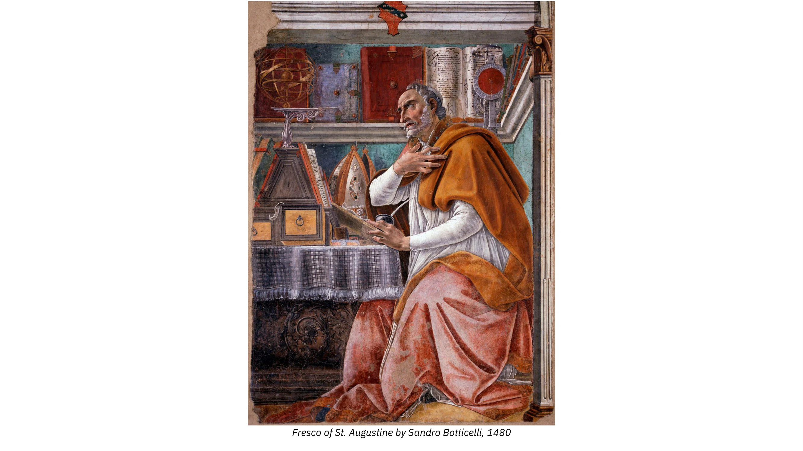

And even if responsibility for the harm caused by an earthquake, a deadly virus or the fact that a child is born blind should not be attributed to people, this way of thinking persists by giving nature a moral intention that makes them responsible. For example, by considering that if an earthquake has occurred, it's precisely because people have behaved badly.

This is the idea defended by the religious people that humans are born sinners, guilty of original sin.

Of course, as you can imagine, this idea is torn to shreds by Spinoza, who considers that, since Nature, or God or fortune as he puts it, is not endowed with intention, and since people do not have free will, the responsibility for "evil" attributed to them is completely illusory.

"Nothing happens in nature that can be attributed to a vice existing in it", writes Spinoza in the Ethics, and according to him, we would therefore be mistaken in considering, for example, the blindness of a newborn baby as "evil" since when born blind, a baby is no more deprived of sight than a stone would be.

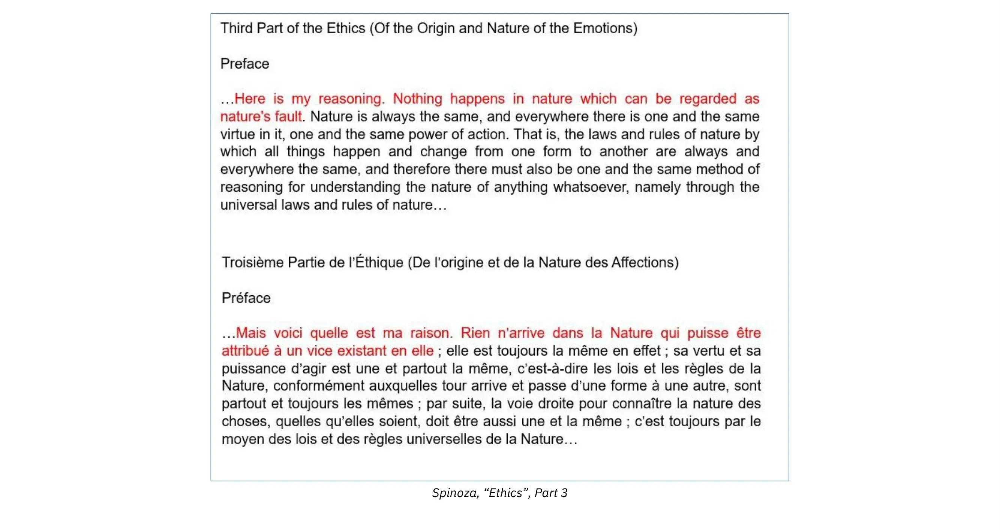

And if we think that the blind lack sight, it's only from the point of view of those who see.

Spinoza thus takes up the idea that evil does not exist in nature, but his originality, which makes it a revolutionary philosophy, is to consider that evil does not exist and neither does "good".

And this is why he speaks of ethics rather than morality, not reflecting on what is right or wrong, since these are all relative and subjective notions, but rather in terms of what is "good" or "bad" for our natural need to "persevere in our being", he says. In other words, to live and grow. To flourish as human beings.

What's more, we've already seen that Spinoza's view of the responsibility of people who behave badly by committing a crime, is clearly not intended to excuse them.  For people, even if they do not know the true causes that determine them to commit a crime, are always aware of what they are doing and are therefore, as such, responsible before morality and the Law.

Clearly, the actions of a criminal are always connected to family, social, economic or even medical determinism, if his crimes can be explained by a physical or mental condition. And this is the role of justice, which goes beyond criminal law to take into account the fact that certain crimes must not only be punished, but also treated, taking into account the offender's family, social and psychological background.

This is why the Spinozist Gilles Deleuze (1925-1995) explains that ethics is a kind of ethology, i.e. a practical science of ways of being, or, as he puts it, "the art of making good encounters".

In other words, freedom, according to Spinoza, consists in directing our existence towards that which "increases our power to act" and, always looking optimistically to the future, seeing the world as it is rather than imagining it as we'd like to see it.

And therein lies the genius of Spinoza's demonstration, as he fights against the doctors of ignorance and against all those who claim that it is good to be ignorant.

On the contrary, Spinoza studies human passions, even the most irrational, heartbreak, madness, sadness or melancholy, in the manner of geometers, "more geometrico", as one would study points, lines, surfaces and volumes.

This is the theory of affects that he develops in the third part of his Ethics, and which I suggest you study now.

Thanks for your attention.

## Affect theory

<chapterId>3bb011ce-6f0c-51a6-b41f-25a3b5b7768e</chapterId>

:::video id=bb427cc6-e54d-4b44-bd6d-281ba421001a:::

According to Spinoza, freedom is a concept to be discovered, a path to a better, more powerful life. A freer life. A path that requires us to recognize absolute determinism and the rational causality of things.

He develops his system in the third part of the Ethics. It is the famous "theory of affects".

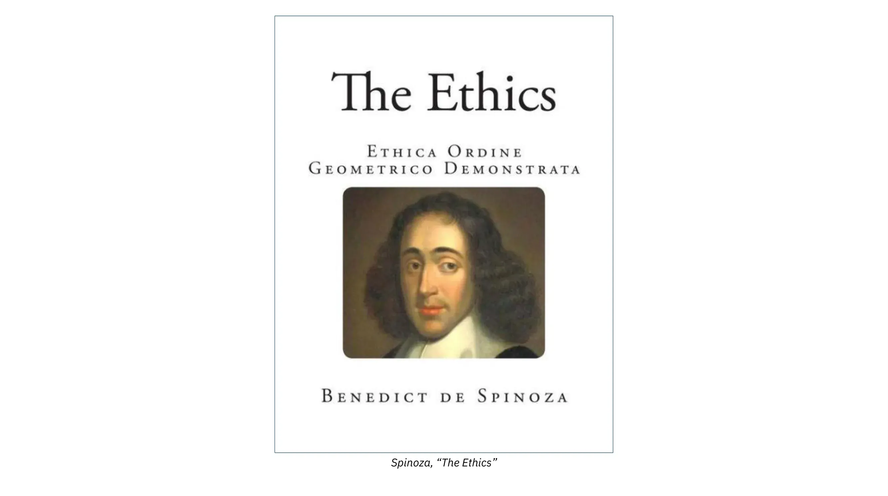

The principle is that human affects are, says Spinoza, active or passive modifications of the body and thought that influence our power to act, i.e. that is our behavior.

And yet, depending on the affects specific to both human nature and those derived from the outside world, we are perfectly capable of forming true ideas, reasoning and expressing joy.

But we are also capable of forming so-called passive affects, prejudices which then lead us mechanically, "in spite of ourselves" in a way to no longer see or do what our own self-interest requires.

We speak of slavery, or servitude, a state characterized by the inability to control and counteract those passive affects that sometimes lead us to want what we do not do and do what we don't want.

This is what Spinoza says in his Ethics, when he is surprised that "people often see the best, approve of it and do the worst", or that "they fight for their servitude as if they were fighting for their salvation".

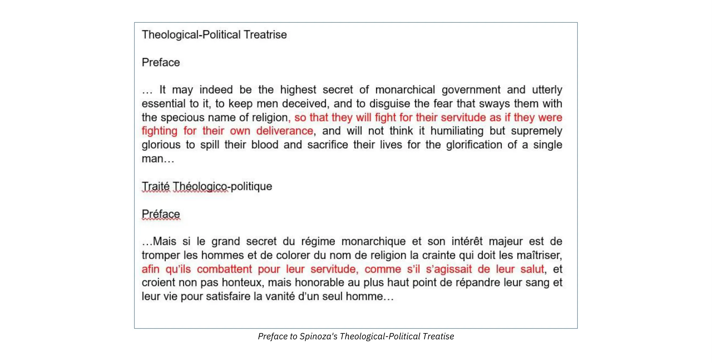

Spinoza takes the example of hatred, which he sees as a passive affect, turned towards sadness and born of inadequate ideas, i.e. a partial knowledge of causes, and which he defines as "a sadness that is associated with the idea of an external cause".

In other words, if we hate a foreigner, it's because we associate this foreigner with the idea we have of him, for reasons we don't understand, since he is foreign and different by nature. It's this idea of an external cause - an idea which, moreover, always mechanically motivates the ignorant to speak ill of a concept they don't know.

This is particularly true, by the way, in the field of [cryptocurrencies](https://planb.academy/resources/glossary/cryptocurrency).

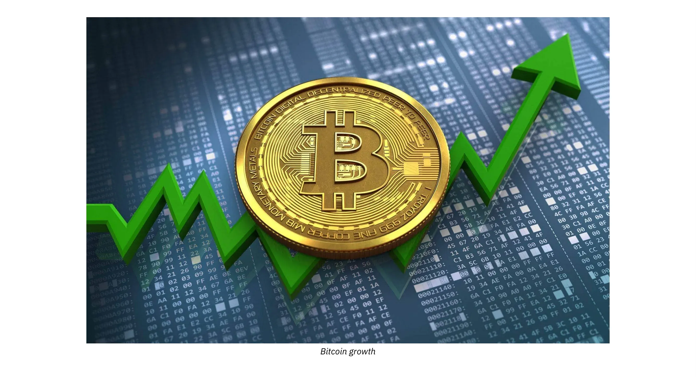

Spinoza says if we remove this negative idea of an external cause, not by morality, but by education, by empathy, by reason, notably by focusing in this case on the qualities of this stranger, or in Bitcoin's case, on its practical aspect or usefulness, then the associated feeling of sadness disappears and, automatically, so does hatred.

It's worth remembering that this way of thinking also applies, of course, to active affects, and in particular to love, which is, according to Spinoza, "a joy associated with the idea of an external cause". And if, for example, the external cause of love for a thing or a person disappears or changes over time, the joy associated with it may also disappear, extinguishing the feeling of love. This, when we don't understand it, can make us unhappy and depressed.

But if this so-called theory of affects applies to our "unconscious", this rational way of thinking "in the manner of surveyors" also applies to the fight against all forms of external servitude, whether religious, political or the result of natural phenomena.

This is the example of lightning. Because when lightning strikes and kills innocent people, the ignorant ones will tend to see it as the hand of God, to consider that lightning expresses a moral and finalistic intention. Aids in the 90s or even, more recently, covid have been interpreted by some as divine punishment.

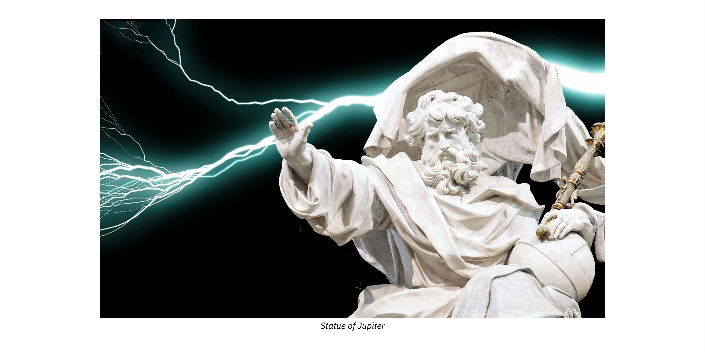

Whereas for Spinoza, of course, all these teleological ideas are merely superstitions, synonymous with ignorance, insofar as in this example the lightning that strikes does nothing, he says, but express the essence of its own nature. Which is to strike. Without, of course, any moral intention to punish or reward anyone.

Thanks to this simple example, we understand that the only solution to protect ourselves from lightning - in other words, to free ourselves from the servitude that its danger has always imposed on us - is not to complain about our bad luck or about a supposed divine injustice, nor is it to put forward the slightest moral argument. No, rather, here again, as with hatred, it’s a matter of reflecting on what we can do from an ethical point of view.

And, in this case, it would be to protect ourselves from lightning by being rational, open to progress, be curious and confident about what science can offer us and, why not, to install a lightning rod.

This is the genius of the Ethics. Spinoza shows us that it is possible to move from voluntary servitude, from a "in spite of ourselves" and a weathervane life of perpetual alienation, to a life lived through the knowledge of affections and determinations.

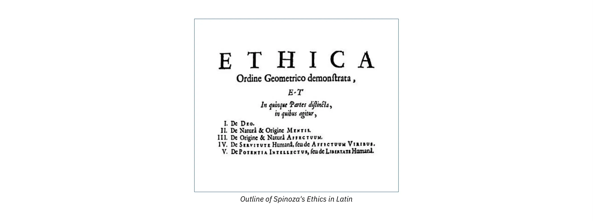

It's a way of thinking that allows us to dissect human nature in order to see the bright side or the truth in things. To eliminate the reasons for sadness and fear that weigh us down. To be free, in other words, being able to stop obeying sad passions and change our behavior.

And to understand, probably for the first time in the history of philosophy, that you can be lucid and happy.

And that's why Spinozism is often referred to as "the philosophy of joy".

## Freedom, the Austrian school of economics and cypherpunk philosophy

<chapterId>b54f2532-460c-11f0-a248-93ff24ef1d57</chapterId>

:::video id=5f49d5b4-e15f-475b-b40d-07464c08ca4d:::

As you now know, freedom according to Spinoza is an awareness of our determinism. Under the guidance of reason, and thanks to our ability to act, we can understand the causal mechanism of servitudes, so that we can fight against them, no longer suffer them, and no longer act against our own interests.

In the end, this lucidity means no longer living in the nihilism later described by Friedrich Nietzsche (1844-1900), for whom men lose themselves in ideological ideals, i.e. political or religious fictions, because of which they deny reality, infantilize themselves and make themselves unhappy.

This is precisely what the Enlightenment rational philosophy was all about, thanks in particular to Immanuel Kant (1724-1804), for whom only an educated individual, under the guidance of reason, can think for himself and determine, ethically, what is "true" or "good," and what is toxic.

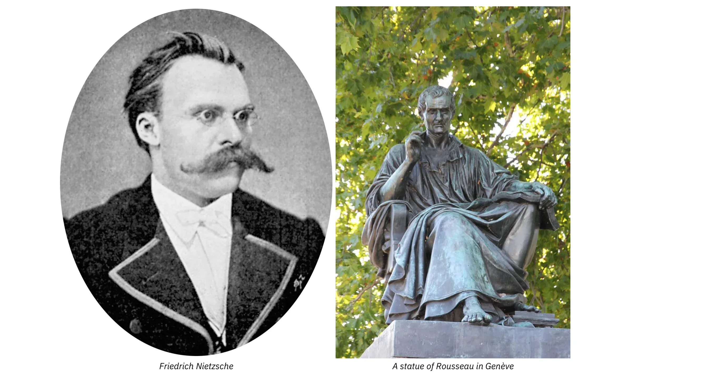

In other words, he says, if we think for ourselves, if we reason as rational adults, and if we therefore strive to attach ourselves to the causal links between things, we will no longer need a moral authority to teach us, for example, the true virtues of religion or true ethical values in the political and economic spheres.

It's a line of reasoning that makes the link with the [Austrian](https://planb.academy/resources/glossary/austrian-school) school of liberal economics, born in the extremely fertile intellectual atmosphere of Vienna before the First World War. For it was in this context that intellectuals such as Carl Menger (1840-1921), Ludwig von Mises (1883-1979) and Friedrich Hayek (1899-1992) laid the foundations for a new school of liberal economics, which was to become the foundation for the convictions of future [cypherpunks](https://planb.academy/resources/glossary/cypherpunks). And hence the creation of Bitcoin.

Menger and Mises established, for example, that all knowledge must be constructed according to the causal link between things, and thus proposed a new causal conception of economics. Inspired in particular by the liberal spirit developed a few years earlier by the French economist Frédéric Bastiat (1801-1850).

Hayek, on the other hand, considers that all economic decisions always express a form of uncertainty and ignorance, and that the fact of not suffering from it because of morality, beliefs, prejudices or political ideologies, makes it possible to analyze economic behavior correctly and, by extension, to consider what is good for individuals, for society and for the State.

This is how these liberal Austrian economists came to firmly criticize all socialist ideas - Hayek spoke of "planism" - and all moral policies inspired by them, which, in his view, only lead to ruin. Giving economic power to governments, inevitably behind the times and out of step with what should and shouldn't be done, was doomed to failure.

For example, the Austrians believe that when a state grants itself, by coercion, the power to create money to manage the economy and resolve crises, the risk is that it will never be able to refrain from abusing this power.

Why is this? Because it always finds itself in a form of servitude that prevents him from doing so, and thus pushes him, as Spinoza would say, "to see the best, to approve it... but to do the worst".

As a Spinozist, Hayek explains in a video that "since this power cannot be taken away without violence, all that can be done is to use a trick and introduce a new concept of money that governments can no longer stop". An argument echoed by Milton Friedman (1912-2006) in an interview, in which he in turn discusses this new form of digital currency in the context of the nascent Internet.

These are the political and economic arguments put forward by the first cypherpunks, Eric Hughes (1953-), in his "Cypherpunk manifesto", or Timothy May (1951-2018) in his "crypto anarchist manifesto", and which Satoshi Nakamoto will take up again.

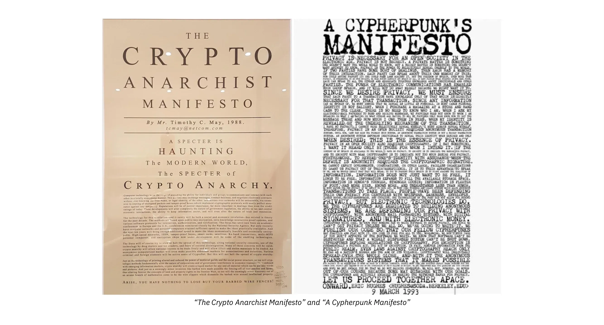

Particularly when he inscribed the Times headline of January 3, 2009 in the [coinbase](https://planb.academy/resources/glossary/coinbase-transaction) of the [Genesis block](https://planb.academy/resources/glossary/genesis-block) of [Blockchain](https://planb.academy/resources/glossary/blockchain) Bitcoin to illustrate the end of one era, Keynesian, and the beginning of another with liberal, anarchist and libertarian aspirations.

The [White Paper](https://planb.academy/resources/glossary/white-paper) published on October 31, 2008 presents Bitcoin as a means of exchanging value on the Internet without a trusted third party, based on a decentralized protocol. A "Copernican" revolution that will finally enable people to regain their ability to act, i.e. their freedom, their freedom to trade, their right to property and respect for their privacy.

Why? Because Bitcoin allows us to extricate ourselves from this servitude in Spinoza's way, thanks to reason, thanks to Galileo's language of mathematics. And, as Hayek suggests, without the state being able to oppose it. And peacefully, without coercion or proselytizing.

In fact, this is the last parallel I'll draw between Spinozism and Bitcoin, to show that there's no point in convincing anyone who doesn't subscribe to a Copernican or disruptive concept other than through reason, understanding, curiosity or good will.

Not by force, not by violence. Because the fact is that Copernicus, Galileo, Newton, Darwin, Einstein, Hayek, Spinoza or Satoshi Nakamoto never threatened anyone who didn't believe in their ideas and demonstrations.

# Final section

<partId>70a5a3c8-6c88-11f0-8753-db07e26dcaf4</partId>

## Reviews & Ratings

<chapterId>7945c38c-6c88-11f0-a73f-0f7cdf99f53f</chapterId>

<isCourseReview>true</isCourseReview>

## Final examination

<chapterId>a557fd32-6c88-11f0-96ff-cfa532cf76a0</chapterId>

<isCourseExam>true</isCourseExam>

## Conclusion

<chapterId>ae04ab38-6c88-11f0-a496-3be47119e6b6</chapterId>

<isCourseConclusion>true</isCourseConclusion>
