# Cuando Spinoza conoció a Satoshi

Descubra cómo las ideas radicales del filósofo del siglo XVII Baruch de Spinoza sobre la libertad, la razón y el poder prefiguran la revolución descentralizada de Bitcoin. Este curso revela los sorprendentes paralelismos: ambos rechazan la fe ciega y la autoridad central, ambos usan el rigor matemático para liberar. Spinoza liberó las mentes del dogma religioso, Bitcoin libera el dinero del control estatal.

Aprenda herramientas prácticas de la ética de Spinoza para comprender los fundamentos filosóficos de bitcoin y aumentar su agencia. ¿Listo para explorar dos de los mayores instrumentos de emancipación humana de la historia?
+++
# Introducción

<partId>80b76189-afab-5295-a8d3-ba8f6fe7a5e8</partId>

## Introducción al curso

<chapterId>99af4992-fd6c-5142-b168-d927b251574b</chapterId>

:::video id=1def60bc-1d39-4e49-9b08-fd05b7a0d49b:::

En este curso, me complace presentar la filosofía de Baruch de Spinoza (1632-1677), el famoso filósofo del siglo XVII considerado el padre de la filosofía racional de la Ilustración.

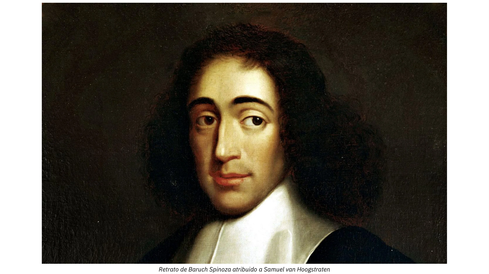

Retrato de Spinoza

Estos cursos se basan en mis dos ensayos sobre el tema, "La verdadera religión de Spinoza" y "Bitcoin, el evangelio de la libertad", disponibles en papel en línea o directamente desde mi sitio web, y digitalmente en Amazon Kindle.

El objetivo de este curso es, en primer lugar, ofrecer una comprensión simplificada de una filosofía que a menudo se considera muy compleja e inaccesible, a pesar del renovado interés de que goza en la actualidad.

En efecto, esta filosofía nos permite no sólo cuestionarnos el sentido de las cosas cuando todo va mal, que es en general de lo que tratan la religión, la filosofía y las ciencias humanas, sino también, y quizá sobre todo, cuestionarnos a nosotros mismos cuando todo va bien.

Cuando la vida nos sonríe y sentimos que no necesitamos cuestionarnos, considerando con un orgullo visto como ilusorio y servil que nuestra felicidad, o el éxito, sólo vendrían de nuestro talento, trabajo o elecciones supuestamente libres; en definitiva, de nuestro propio libre albedrío, y no del determinismo al que estamos sometidos.

De este modo, podemos establecer el vínculo entre esta filosofía práctica de la libertad -o, como dice Spinoza, "hacia los medios para alcanzarla"- y el nuevo mundo tecnológico que nos interesa aquí, el cripto en general y el Bitcoin en particular.

Y sobre todo en su aspecto filosófico, que nos hace reflexionar precisamente sobre la noción de libertad: la libertad de pensar, de expresarse, de respetar la intimidad y, por supuesto, en nuestro caso, la libertad de Exchange.

En primer lugar, les presentaré a Spinoza, su carácter, su entorno social, religioso y familiar, y el contexto histórico de las Provincias Unidas donde vivió.

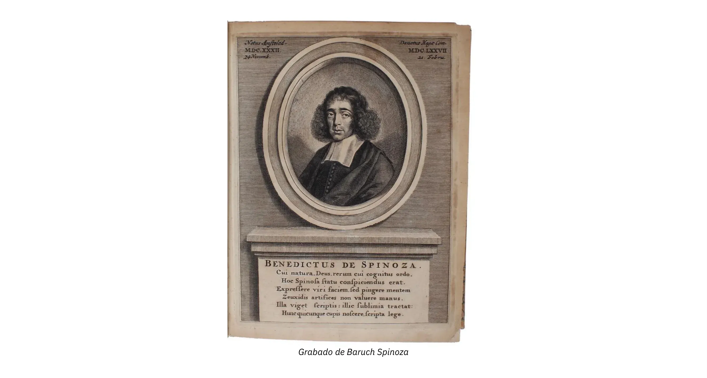

Retrato de Spinoza

Veremos entonces en qué consiste esta nueva filosofía racional según la cual "no existe nada en la naturaleza que no pueda explicarse sin el ejercicio de la razón".

Se trata de la idea de que sólo podemos comprender el mundo y la naturaleza humana en términos de relación causal entre las cosas, según la cual, un efecto siempre tiene una causa, y esta causa es a su vez el efecto de otra causa y así sucesivamente, hasta llegar a la causa primera, a la que no tenemos acceso y que, según Spinoza, es la Naturaleza.

La Naturaleza, es decir, Dios, es el famoso "Deus sive Natura" en latín que ilustra todo el sentido del spinozismo.

También vamos a echar un vistazo a las dos obras principales de Spinoza, empezando por la Ética, publicada póstumamente en 1677, que se centra por completo en la libertad y en la necesidad de liberarnos de las servidumbres que nos confinan.

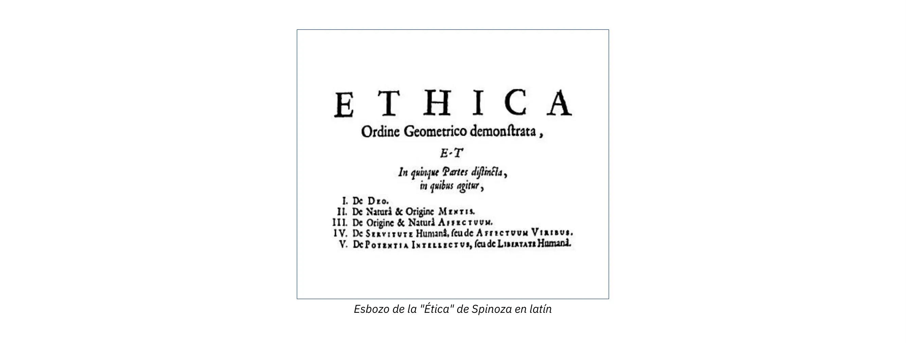

Luego veremos el Traité théologico-Politique, publicado durante su vida, en 1670, que nos permite considerar la libertad desde otro ángulo: la libertad de pensamiento y de creencia. Es decir, la libertad religiosa, pero sobre todo la libertad política.

Por último, veremos por qué el spinozismo es una revolución copernicana de las ideas, y cómo representa una nueva definición del mundo y de la naturaleza humana, estudiando las 3 ilusiones fundamentales denunciadas por Spinoza: la ilusión del libre albedrío, la ilusión de las causas finales o finalismo, y la ilusión teológica.

Gracias a la teoría de los afectos desarrollada a la manera de los geómetras, "more geometrico", veremos finalmente cómo Spinoza nos ofrece un método práctico para liberarnos, o intentar liberarnos, de las servidumbres inherentes a la naturaleza humana y a las pasiones externas. Un mecanismo racional que, para luchar contra la ignorancia, puede compararse a la certeza de que los tres ángulos de un triángulo son siempre iguales a 180°, y que nos permitirá conectar el espíritu de la Ilustración que de ella se derivó con las corrientes liberales del siglo XIX o el libertarismo del siglo XX, directamente vinculadas a la invención de Satoshi Nakamoto, Bitcoin.

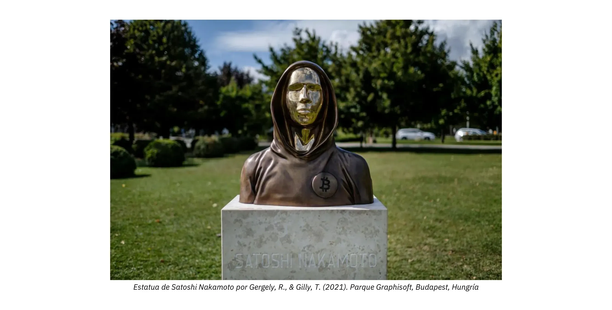

Entenderemos entonces que, entre los muchos puntos en común entre los conceptos spinozistas y esta herramienta de libertad inventada por Satoshi Nakamoto, el primero es que, en ambos casos, si somos curiosos, bienintencionados, como se dijo en su momento, tenemos "entendimiento", entonces no podemos evitar adherirnos a ella. Y si no nos adherimos a ella, lo que por supuesto sería nuestro derecho más absoluto ya que es fundamental respetar la libertad de creer, o de no creer, entonces estaríamos decididos a no poder, o a no querer, lo que viene a ser lo mismo.

Y así es como podemos entender que un fundamentalista religioso, por ejemplo, nunca podrá aceptar ni escuchar el más mínimo pensamiento copernicano como el spinozismo, del mismo modo que a un banquero central le resultará muy difícil aceptar la Bitcoin.

Aunque, como sabe, actualmente las cosas van por buen camino.

## Presentación de Baruch de Spinoza

<chapterId>f53a9cfd-326e-5b73-a766-3ef2f07c5a49</chapterId>

:::video id=5fac3ddc-c472-4c64-8186-46a8f317e389:::

¿Quién fue Baruch de Spinoza? Fue un filósofo holandés nacido en 1632 y fallecido en 1677 a la edad de 45 años.

De confesión judía, miembro de la comunidad sefardí portuguesa descendiente de los marranos obligados a abandonar España por los católicos en el siglo XV, creció en un ambiente religioso e intelectual, consciente de lo que significa ser perseguido.

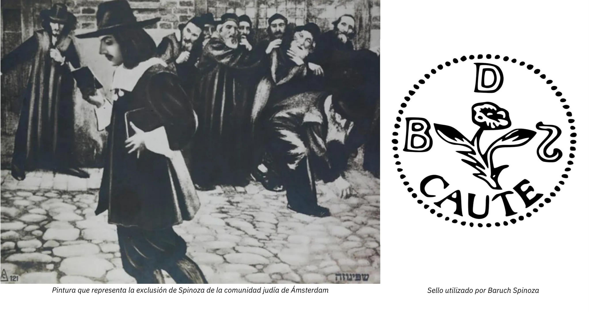

De hecho, desde muy joven mostró un espíritu fuertemente crítico hacia la religión establecida, y en particular hacia su comunidad hebrea, de la que fue violentamente rechazado en 1656, con sólo 24 años, antes de haber publicado nada.

Se dice que esta "excomunión" le permitió aislarse y centrarse en su trabajo sin mirar nunca atrás.

Heredero, como sus contemporáneos Descartes (1596-1650), Pascal (1632-1662) y Newton (1643-1727), de las nuevas ideas racionales de la física de Copérnico (1473-1543), Kepler (1571-1630) y Galileo (1564-1642), que le precedieron en pocos años, Spinoza desarrolló un pensamiento a la manera de los geómetras, de acuerdo con el principio de Galileo de que las matemáticas son el lenguaje del universo.

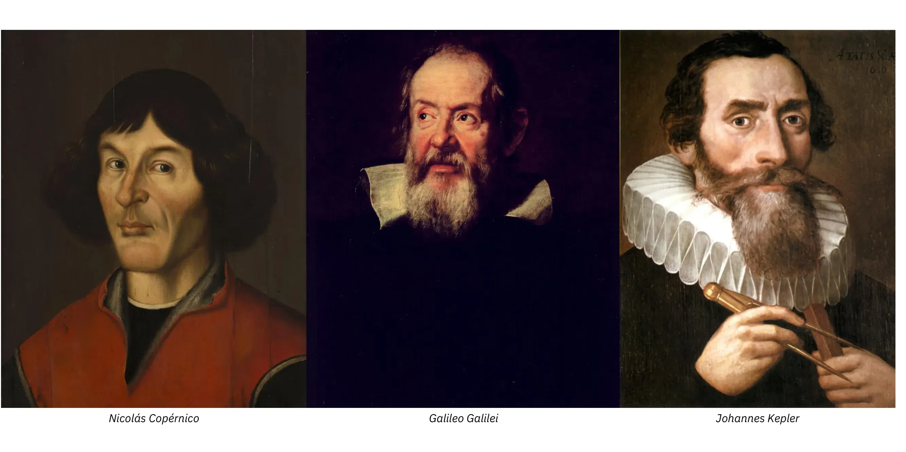

Pero se trataba de ideas muy peligrosas para la época, tras el proceso del monje y filósofo Giordano Bruno (1548-1600), que fue quemado vivo por herejía en una plaza pública de Roma, y el proceso de Galileo, obligado por la inquisición en 1633 a renunciar a sus convicciones heliocéntricas copernicanas.

Por eso, su visión estrictamente racional del mundo y de la naturaleza humana, basada en las conexiones causales entre las cosas, le valió la fama de ser considerado, y aún hoy lo es, erróneamente, un ateo.

De hecho, la obra de Spinoza sólo habla de Dios, al que identifica con la Naturaleza, y aunque critica los impulsos supersticiosos de religiosos y teócratas, demuestra que para él la verdadera religión es ante todo sinónimo de justicia y caridad.

Y es este enfoque el que vincula a Spinoza con la filosofía de la Ilustración, ya sea alemana, con Leibniz (1646-1716), Kant (1724-1804), Schopenhauer (1788-1860) y Nietzsche (1844-1900), inglesa con Locke (1632-1704) o francesa con Voltaire (1694-1778), Rousseau (1712-1778) y Diderot (1713-1784). Todos coincidían en que había que utilizar la razón para combatir el oscurantismo, especialmente el religioso, luchar contra la ignorancia y defender los ideales de libertad y progreso.

Ahora bien, para empezar a relacionar esta filosofía con la Bitcoin, es importante señalar que Spinoza nació en una época muy particular.

En el siglo XVII, las Provincias Unidas no sólo eran el país más libre del mundo en cuanto a ideas políticas y religiosas, sino también el más rico. En otras palabras, el país más avanzado económica y tecnológicamente.

La riqueza, sin embargo, no está ligada a los recursos naturales, a la explotación y el expolio de las colonias o a la esclavitud, sino al comercio y los intercambios internacionales en un espíritu liberal y emprendedor. Un espíritu defendido más tarde por un célebre spinozista, Voltaire (1694-1778), para quien, en una sala de comercio, un hombre de negocios o un empresario de convicciones liberales nunca sería excluido, llamado infiel o excomulgado, según él, en razón de su religión o de sus orígenes, sino sólo si hubiera quebrado.

Es más, Holanda en aquella época también estaba avanzada en importantes campos tecnológicos, por ejemplo en los campos de la mecánica y la óptica. Los telescopios astronómicos utilizados por Galileo para mirar al cielo y descubrir el universo se consideraban tecnología punta para su época, como lo son hoy las nuevas tecnologías asociadas a la informática, la IA y, por supuesto, las criptomonedas.

Y como el propio Spinoza ejercía el oficio de pulidor de lentes astronómicas -irónicamente para alguien de quien se dice que lo veía todo torcido-, podemos imaginar que sin duda habría apoyado una herramienta de libertad como el Bitcoin.

En otras palabras, los valores de libertad y progreso que transmite el spinozismo contrastan con un mundo en el que el fundamentalismo religioso, las teorías conspirativas, la superstición y, sobre todo, la ignorancia siguen siendo una triste realidad.

Sin embargo, es un mundo en el que todos los medios son valiosos para escapar, para liberarnos de las servidumbres que nos confinan y para ser libres aceptando el mundo tal como es, no como nos gustaría que fuera.

Ya se trate de medios filosóficos o tecnológicos, como veremos más adelante, el Bitcoin es una herramienta de libertad. Es una herramienta que permite tanto a los individuos como a los Estados liberarse de la servidumbre, en particular de la servidumbre monetaria.

# Principales obras, Ética y política

<partId>d7d7e9a1-005b-519c-b587-137435e46344</partId>

## Ética y búsqueda de la libertad

<chapterId>4cc66e25-335c-591d-9b78-83e5664bbbbc</chapterId>

:::video id=065c5091-69e1-412f-acce-c763ec31d3b1:::

En este capítulo, propongo que nos centremos ahora en la principal obra de Spinoza, titulada Ética, publicada póstumamente en 1677.

¿Por qué póstumamente? Bueno, porque sus ideas eran revolucionarias, o al menos contraintuitivas y disruptivas, y por tanto muy peligrosas en su momento, incluso en el contexto liberal de las Provincias Unidas del siglo XVII.

La Ética es una obra escrita en latín a la manera de los geómetras, probablemente inspirada en el espíritu científico de Galileo (1564-1642), padre, junto con Kepler (1571-1630), de la ciencia moderna, según el cual las matemáticas son el lenguaje del universo. Spinoza desarrolla sus ideas en cinco partes principales, utilizando proposiciones acompañadas de demostraciones, escolios, axiomas y definiciones.

Como tal, la Ética es, en palabras de Spinoza, "un modo de llegar a la libertad o a los caminos que conducen a ella", y no es realmente un libro que pueda leerse de cabo a rabo, sino que puede trabajarse leyendo, por ejemplo, una proposición que remite a otra, que a su vez se entiende a través de una tercera, y así sucesivamente, en un sistema perfectamente coherente, racional y lógico.

Me gustaría señalar que al abrir la Ética, se recomienda empezar por los postfacios y apéndices, estas breves secciones están escritas por Spinoza en lenguaje cotidiano, por lo que son fáciles de entender y, en cierto modo, un resumen de su pensamiento, a veces complejo.

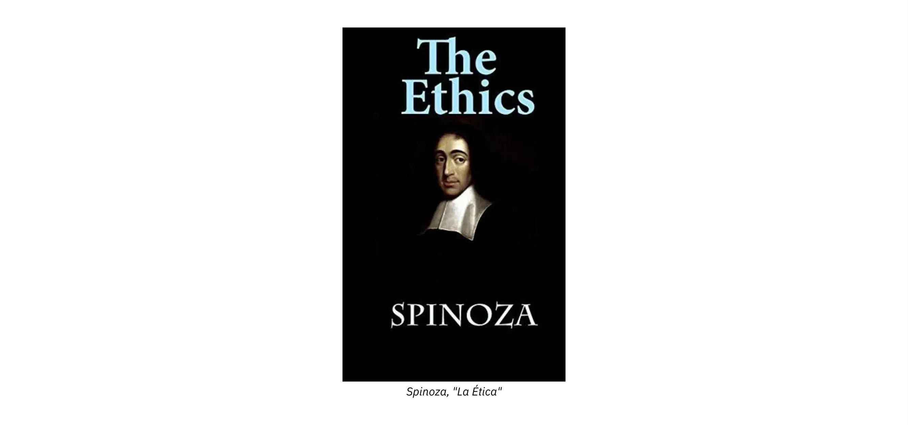

Al someter el mundo que nos rodea al "microscopio de la razón", la obra de Spinoza disecciona la naturaleza humana partiendo del principio de que el ser humano no es autocausado, es decir, que no pedimos nacer, ni aquí, ni en nuestro tiempo, ni con tal atributo físico o intelectual.

Y dice que no estamos por encima de la naturaleza. No estamos exentos de sus leyes, ni en el cuerpo ni en la mente. En otras palabras, somos tan parte de la naturaleza como cualquier otro ser vivo, animal o vegetal.

Para Spinoza, todos los campos de la actividad humana dependen de la capacidad de la razón para comprender el mundo en un sistema perfectamente coherente y determinado.

Un mundo en el que no existe el azar.

Todo lo que ocurre es "necesario" y el resultado de una causa, según la idea de que "lo que es y lo que ocurre, debe ser y debe ocurrir". Esto es el determinismo absoluto.

Pero hay que tener en cuenta dos puntos:

En primer lugar, si para Spinoza el azar no existe, es porque se trata de un acontecimiento cuya causa desconocemos. Pero, por supuesto, dice, que no conozcamos la causa no significa que no exista.

En segundo lugar, tampoco se puede hablar de fatalismo, ya que la naturaleza no está dotada de intención. El rayo, por ejemplo, no tiene intención de castigar a nadie, como podría pensarse en el caso de una tragedia. No, simplemente expresa la esencia de su propia naturaleza, que es fulminar con un rayo. Golpear.

Spinoza defiende así la idea de que la realidad, es decir, la vida cotidiana con sus aspectos buenos y malos, es perfectamente inteligible, y que no hay ningún fenómeno en la naturaleza que no esté relacionado causalmente. Por supuesto, esto plantea la cuestión del mal, en particular del mal absoluto, que examinaremos un poco más adelante.

Por último, es importante señalar que la ética no es moralidad.

Según Gilles Deleuze (1925-1995), célebre profesor de filosofía y especialista en Spinoza, la moral es un sistema de juicio útil para vivir en sociedad. Pero es un sistema subjetivo, ya que lo que está bien aquí puede estar mal en otra parte, y lo que está mal hoy puede estar bien más tarde.

Y más que determinar lo que está bien o mal, la ética establece lo que es bueno o malo para nuestra propia naturaleza y nuestra capacidad, dice Spinoza, de conservar en nuestro ser. De ser libres. Es, por tanto, una verdadera etología, es decir, una ciencia de los modos de ser o, como explica más adelante Gilles Deleuze, el arte de hacer buenos los encuentros.

O el arte de tomar las decisiones correctas para salir de las servidumbres que nos confinan y por las que, según Spinoza, los hombres se ven a menudo reducidos a "ver lo mejor, aprobarlo y hacer lo peor".

En otras palabras, "luchar por su servidumbre como si lucharan por su libertad".

## El tratado teológico-político

<chapterId>84b0187e-1050-5d44-a536-80554896e828</chapterId>

:::video id=c1efc97e-1e96-4b37-894c-9a19794d6b52:::

Después de la Ética, me gustaría presentarle en este capítulo otra obra importante que le ayudará a comprender la influencia filosófica y política de Spinoza, sobre todo en la Ilustración venidera y en las corrientes liberales y, en nuestro caso, libertarias.

Se trata del Traité théologico-politique, o TTP, publicado anónimamente en 1670.

Spinoza (1632-1677) escribió este libro mientras interrumpía la redacción de su Ética, en un intento de poner fin a un malentendido que aún hoy existe. Se trata de la creencia de que era ateo.

Como hemos visto, el concepto de Dios de Spinoza es el tema de toda la primera parte de la Ética, en la que demuestra no sólo la existencia de Dios, sino también cuál es su verdadera naturaleza.

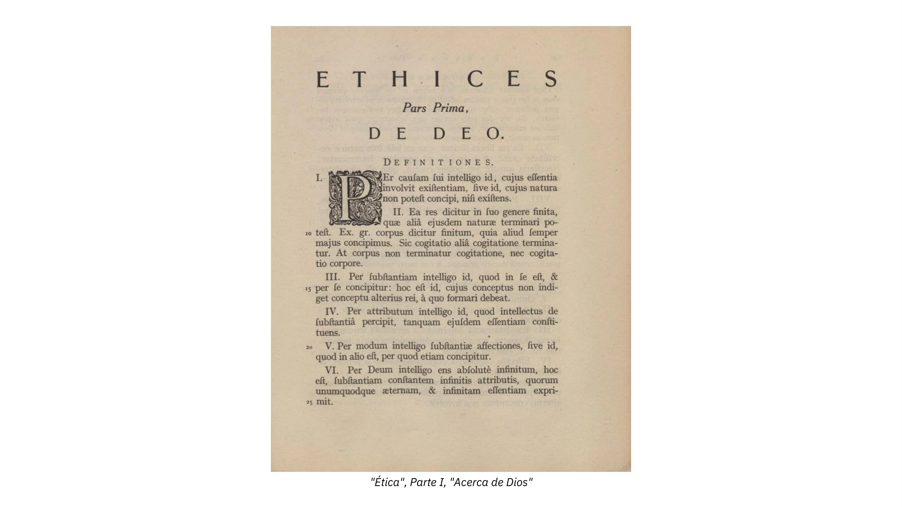

Y como los conceptos de Spinoza son en general bastante difíciles de captar, a menudo es más fácil comprenderlos diciendo lo que no son, que intentando decir lo que son. Un enfoque que, por cierto y como veremos más adelante, es muy útil para comprender Bitcoin.

Así es como Spinoza nos muestra que Dios, en su opinión, no es un ser antropomórfico dotado de intenciones, que castiga o recompensa, al que hablaríamos y que nos escucharía según un ritual que podríamos seguir o no. En otras palabras, según él, Dios no es un anciano de larga barba blanca oculto tras una nube que resolvería las dificultades del mundo y nos haría depender de él.

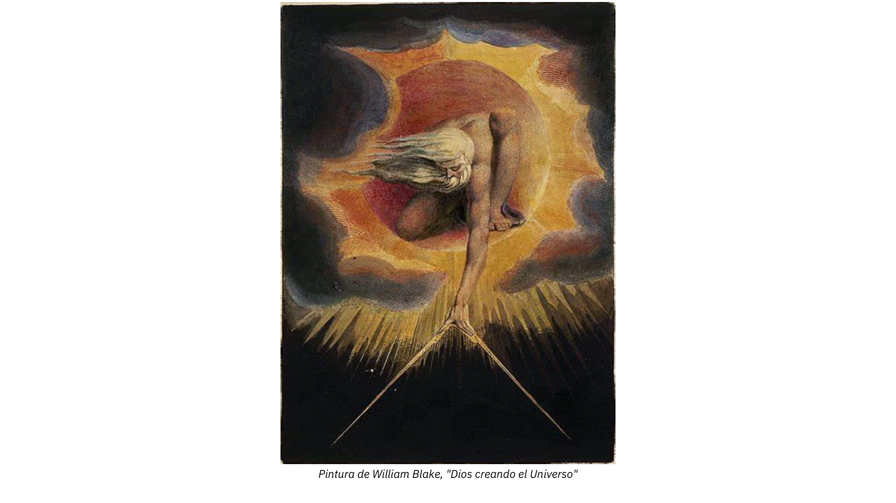

Así pues, hablar de Dios es evocar la Naturaleza como una Sustancia única, infinita y eterna, compuesta por un número infinito de atributos, de los que los seres humanos sólo conocemos dos: la materia, o la extensión, y el pensamiento.

Se trata del famoso "Deus Sive Natura", del que Spinoza deriva el concepto de determinismo absoluto y la idea de que el hombre no es causa de sí mismo y no está por encima de la Naturaleza, ni mucho menos de los animales.

Pero más allá de una crítica de la religión, el TTP es sobre todo una oportunidad para Spinoza de hacer una severa crítica de los religiosos, y de la teocracia. En otras palabras, el poder religioso cultiva el miedo y la superstición y, según él, activa las pasiones tristes de los individuos para esclavizarlos mejor, atrapándolos en el engaño, el fanatismo y la guerra.

En esta etapa primaria e infantil de la religión, los creyentes se apegan únicamente al culto externo y a una fe crédula basada en prejuicios. Una etapa en la que la religión se vuelve mecánicamente intolerante, se aleja de los límites de su enseñanza moral y se aparta de su vocación de promover la paz y la armonía afirmando que posee la verdad.

Sin embargo, una vez superada la crítica racional de la religión, por ejemplo mediante la exégesis de la Biblia, Spinoza quiere convencernos de que esta nueva visión de Dios es totalmente compatible con los mensajes de justicia y caridad de las tres grandes religiones del Libro, que enuncian una regla de oro sencilla pero a menudo olvidada: "Amarás a tu prójimo como a ti mismo".

Pero eso no es todo.

Esta visión madura de la religión desarrollada en el TTP va acompañada de una dimensión política, la necesidad de separar religión y Estado para proteger la libertad de pensamiento y creencia, en interés tanto de todos los individuos como del propio Estado.

Básicamente, Spinoza hace de la libertad, en el marco de la razón, una condición esencial para que el ser humano pueda vivir sin ser esclavizado por un poder opuesto a sus intereses, por lo que defiende una democracia directa basada en la libertad política y religiosa.

En otras palabras, libertad de pensamiento y de creencia, para que las personas puedan liberarse de la servidumbre y de las falsas creencias infantilizantes, para razonar como adultos, dando prioridad a la razón y también, por lo que a nosotros respecta, al progreso tecnológico.

El tristemente célebre terremoto de Lisboa del 1 de noviembre de 1755 supuso un cambio radical en la forma de concebir los fenómenos naturales y las catástrofes y de protegerse contra ellos.

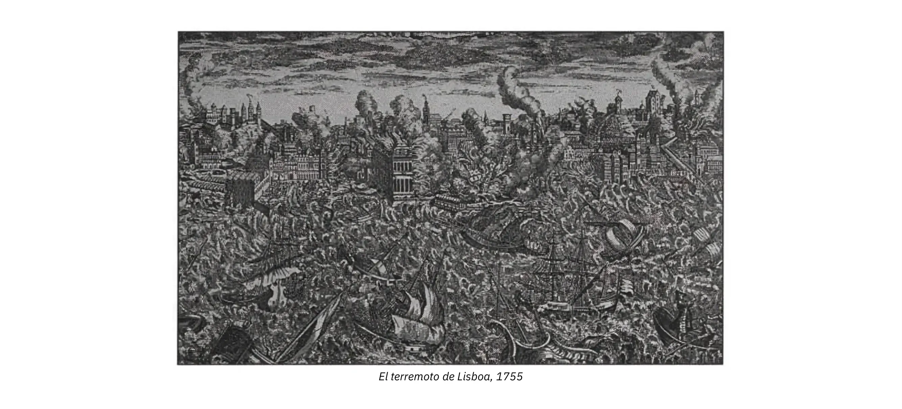

Este terrible terremoto destruyó la ciudad y mató a cientos de miles de personas inocentes, muchas de las cuales estaban en la iglesia en ese momento, ya que era el Día de Todos los Santos, lo que aumentó la incomprensión de los sobrevivientes.

Drama que reaviva la cuestión planteada por el filósofo y matemático alemán Leibniz (1646-1716) sobre la visión antropomórfica de un Dios dotado de intención, bondad y omnipotencia. Porque si Dios fuera bueno, como dice Leibniz en su Teodicea, entonces no sería omnipotente, ya que permitiría tales catástrofes, y si fuera omnipotente, entonces no sería bueno, ya que no podría evitarlas.

Mucho más allá de condenar la mano de Dios, Jean-Jacques Rousseau (1712-1778) escribía a Voltaire, impresionado por la injusticia y los horrores sufridos discriminadamente por la humanidad, que "la naturaleza no era mala en sí misma, y que no debíamos ver en ella ninguna mano divina que explicara su designio".

A lo que Voltaire (1694-1778), spinozista donde los haya, respondió que esta catástrofe natural debía sobre todo hacernos comprender que los medios científicos para protegernos de la naturaleza existían, y que el desafío de su tiempo consistía por tanto en preguntarse si los seres humanos podían, gracias al conocimiento y al progreso, tomar su futuro en sus propias manos y liberarse de la teología y la superstición.

Y aunque, por supuesto, no se trataba de prevenir los terremotos, que siguen siendo no sólo imprevisibles sino también completamente incontrolables, se trataba más bien de garantizar que, por ejemplo, las viviendas estuvieran construidas para resistirlos.

Por eso la Ilustración del siglo XVIII, gracias al ejercicio de la razón, la ciencia y la técnica, es el siglo del progreso. Es decir, el progreso como herramienta de libertad.

# La revolución spinozista, las tres ilusiones

<partId>f5d45c2b-28da-527a-ab20-dd255e9a9e0d</partId>

## Una nueva definición de la Naturaleza y del ser humano

<chapterId>3e6599e3-5b29-50a8-a67d-d0386da5d65d</chapterId>

:::video id=b6d2c035-8848-4da6-9da9-be3b70be0f38:::

En este capítulo, me gustaría echar un vistazo a la historia de las ideas, y ver por qué el spinozismo es considerado una verdadera revolución copernicana de las ideas.

Gracias a esta nueva forma de entender a Dios, es decir, la Naturaleza, que ofrecen las matemáticas, Spinoza (1632-1670) estableció un profundo cambio de paradigma, con implicaciones indirectas para la cosmovisión religiosa y el lugar del ser humano en ella.

Del mismo modo que Nicolás Copérnico (1473-1543) estableció que la Tierra no era el centro del mundo, y Charles Darwin (1809-1882) demostró tres siglos más tarde que el ser humano no estaba en el centro de la "vida", Spinoza siguió esta lógica y afirmó en su época que el ser humano no es el "dueño de su propia casa" y que el universo no está hecho únicamente para su beneficio.

Dice que el hombre no es "un imperio dentro de otro imperio" y que, al igual que la Tierra se reduce a la condición de mero planeta, como todos los demás planetas, el ser humano se reduce a la condición de mero modo de la naturaleza, como todos los demás modos finitos de la naturaleza, como los animales, las plantas y todos los "seres existentes".

Antes de él, la filosofía griega clásica proponía una visión ordenada y jerárquica del universo para explicar el mundo, el cosmos y la experiencia humana. Basada en narraciones míticas, trataba básicamente de explicar el origen del mundo, insistiendo en la armonía del universo, la naturaleza y la humanidad.

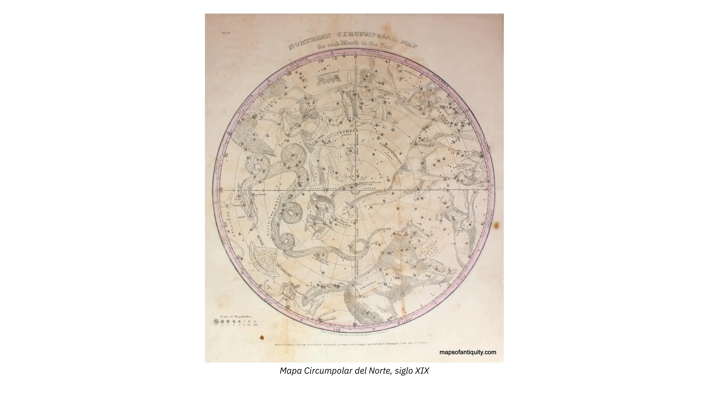

La cosmología escolástica de la Edad Media, esencialmente a partir del siglo XII, fue una evolución hacia un mayor razonamiento con el fin de armonizar razón y fe para explicar un universo que seguía siendo jerárquico, pero que se correspondía mejor con la filosofía cristiana.

Pero con la nueva física de Copérnico (1473-1543) en el siglo XV, la cosmología experimentó un giro importante en la comprensión del universo, cuyo modelo geocéntrico quedó así en entredicho en favor del sistema heliocéntrico, que allanó el camino a la ciencia moderna, en particular a la nueva física y astronomía de Kepler (1571-1630) y Galileo (1564-1642). Luego Isaac Newton (1643-1727) y finalmente Albert Einstein (1879-1955), un spinozista convencido.

Pero para comprender plenamente el spinozismo, también hay que tener en cuenta el contexto de René Descartes (1596-1650), el famoso filósofo francés que precedió a Spinoza y del que fue a la vez discípulo y gran admirador.

A pesar de los riesgos y las condenas de Giordano Bruno (1548-1600) y Galileo, Descartes se propuso distinguir "la verdad de la falsedad" y armonizar la teología, la filosofía y la física. En su célebre Discurso del Método, publicado en 1637, Descartes sostenía que la razón es el fundamento del conocimiento, a través del cual el ser humano puede alcanzar la libertad.

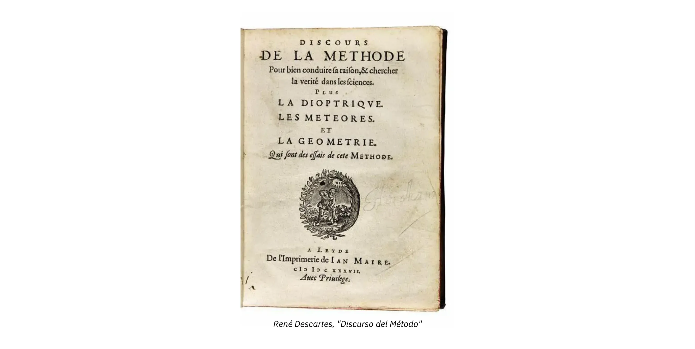

Al explicar el mundo según leyes universales y no según una naturaleza dotada de intenciones morales, allanó el camino al determinismo, que Spinoza secundaría más tarde.

Pero, como católico, Descartes establece sin embargo una jerarquía entre el ser humano y los demás modos finitos de la naturaleza, y en particular con respecto a las especies animales, a las que denomina "animales máquina". Y al afirmar que "no hay alma que, bien guiada, no pueda adquirir un poder absoluto sobre sus acciones y pasiones", Descartes afirma así que el ser humano tiene la capacidad de empezar algo de la nada, y que el hombre, en su opinión, "escapa a las leyes de la naturaleza", que tiene un poder absoluto sobre sus propias acciones y fundamenta su determinación únicamente en sí mismo.

Spinoza supo ir más allá y superar esta etapa y conciliar la existencia de Dios con la demostración de la razón. Para él, todos los campos de la actividad humana dependen de las capacidades de la razón en un mundo perfectamente coherente y determinado. Pero un mundo en el que no hay contingencia ni azar, y en el que todo lo que sucede es necesario y resultado de una causa, según el nexo causal entre las cosas. Esta es la idea del determinismo absoluto.

Y es en los términos más duros como refuta finalmente la posición cartesiana, criticando, por ejemplo, la idea de que el ser humano no está sometido a las leyes de la naturaleza como el resto de los animales, y es por tanto superior a todos los demás modos finitos de la naturaleza.

En otras palabras, están dotados de libre albedrío, una creencia ilusoria de la que es muy difícil escapar, como nos dice Spinoza, y de la que hablaremos a continuación.

## La ilusión del libre albedrío

<chapterId>f147a914-cb64-5927-b305-26691930bca3</chapterId>

:::video id=b59da795-ba19-4643-9672-36c9e7953a42:::

En este curso, nos ocuparemos ahora de la delicada cuestión del libre albedrío, para comprender mejor qué es la libertad para Spinoza, para la Ilustración y para los primeros filósofos liberales.

Como ya hemos visto, Spinoza (1632-1677) es bien conocido por considerar el libre albedrío como una ilusión de la que es extremadamente difícil liberarse.

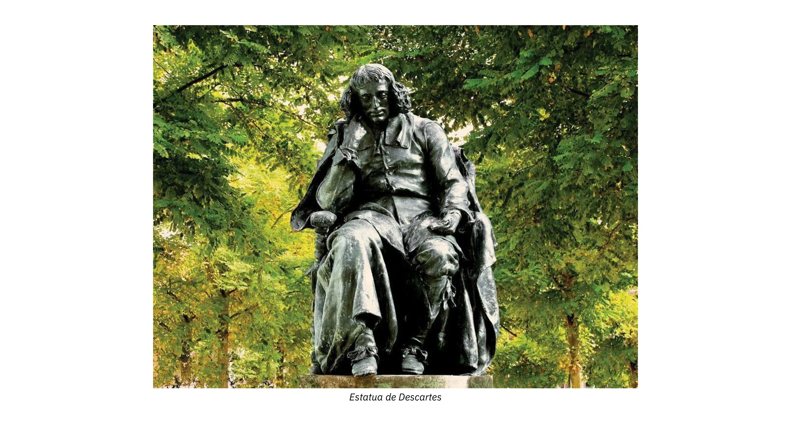

¿Por qué? Porque va en contra de la tradición filosófica desde la Antigüedad, y aún defendida por Descartes (1596-1642), de que el ser humano puede iniciar algo de la nada y es plenamente responsable de sus actos, sobre todo ante Dios, dice San Agustín (354-430), padre de la Iglesia cristiana.

Pero también, por supuesto, ante la justicia humana.

Es la idea de que nuestra voluntad, y sólo nuestra voluntad, nos permite dirigir nuestras vidas, de que tenemos un poder absoluto sobre nuestros actos y de que la libertad de nuestros actos procede únicamente de nosotros mismos, por lo que poseemos un poder de decisión indeterminado.

En otras palabras, la humanidad es capaz de alterar el orden de la naturaleza, en lugar de someterse a él.

En la conducta de su vida, al no estar sometido a otra ley que la de su propia voluntad, estaría por tanto no sólo por encima de la naturaleza y de los animales, meras máquinas, sino también de todos los demás modos finitos de la naturaleza. Esta era la posición de Descartes (1596-1650), para quien las causas de la impotencia e inconstancia humanas no residían en el orden natural, sino en los vicios de la propia naturaleza humana.

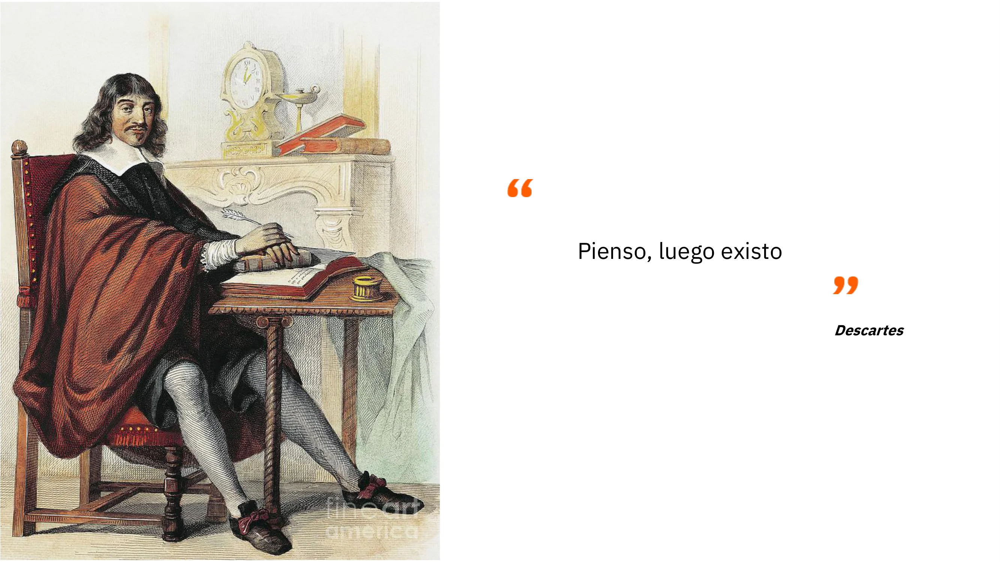

Pero aunque Spinoza atribuye a Descartes la apertura de la vía del control racional de la vida afectiva, se distancia totalmente de él al criticar con firmeza esta hipótesis de un "poder absoluto" de la voluntad.

Spinoza, en cambio, considera que nuestro mundo es perfectamente coherente y determinado, y que todo lo que sucede es necesario y es el resultado de la causalidad de las cosas, según la cual un efecto tiene siempre una causa, y esta causa es a su vez el efecto de otra causa, y así sucesivamente.

Es la idea del determinismo absoluto, a partir de la cual establece en su Ética que los hombres no tienen libre albedrío alguno porque, dice, son conscientes de sus actos, pero ignoran, o prefieren ignorar, las verdaderas causas que los determinan.

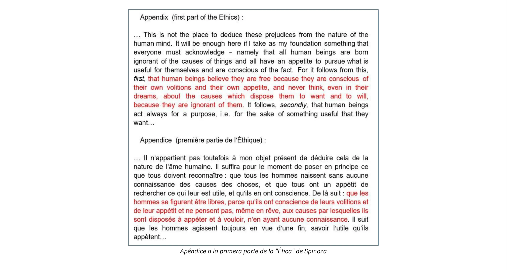

Para Spinoza, los seres humanos, en tanto que "modos finitos" de la naturaleza como los animales o las plantas, no pueden por tanto empezar algo de la nada; no están exentos de las leyes de la naturaleza, tanto en sus cuerpos como en sus mentes.

Peor aún, para él, el mayor peligro de la libertad es creer en nuestro libre albedrío, y creer que podemos actuar sin estar determinados por causas externas.

Para Spinoza, la libertad no es la expresión del libre albedrío, sino la capacidad de comprender el lugar que nos corresponde en el mundo, de entender nuestra naturaleza determinada y, a partir de ahí, orientar nuestra existencia hacia aquello que "aumenta nuestro poder de actuar". Mirando siempre al futuro con optimismo, y viendo el mundo tal como es, en lugar de imaginarlo como nos gustaría verlo.

Por supuesto, el problema que se plantea es el de la responsabilidad humana y sus acciones. podríamos concluir que si los individuos no son libres en sus acciones, no serían responsables de ellas, especialmente frente a la justicia. Pero este punto de vista es engañoso, porque sin entrar en demasiados detalles, reconocer el propio determinismo social, familiar e histórico no impide considerar la responsabilidad de las acciones cometidas, ya que éstas son voluntarias.

Por otra parte, sería ilusorio creer que las acciones de un delincuente nunca están vinculadas a su propio determinismo. Si bien no se trata de excusarlas, sí al menos de intentar comprenderlas. De hecho, eso es lo que hace la justicia: más allá de castigar las acciones ilícitas, desempeña el papel de prever y proteger el futuro, razón por la cual determinados delitos no sólo se castigan, sino que también se tratan, teniendo en cuenta el entorno familiar, social y psicológico del delincuente.

Este enfoque de la libertad como capacidad de actuar es la conexión que podemos establecer con la filosofía de la Ilustración del siglo XVIII. Según uno de sus mayores embajadores, el filósofo alemán Immanuel Kant (1724-1804), la Ilustración fue, en efecto, el medio de liberar a los seres humanos del estado de tutela o, como habría dicho Étienne de la Boétie (1530-1563), de la servidumbre voluntaria, de la que ellos mismos eran responsables.

El lema de Kant es "Piensa por ti mismo" y "Atrévete a saber", el famoso "Sapere Aude" latino.

La capacidad de obrar de Spinoza es, pues, el poder que tiene el ser humano en sí mismo de comprender su propia condición animal y de entender la naturaleza y sus fenómenos, positivos o negativos, relacionándolos con causas objetivas, para no apoyarse en explicaciones morales falsas e ilusorias, es decir, en explicaciones hechas a la medida de nuestros deseos. Consiste más bien en tratar de explicarlos mediante la razón, con vistas a la emancipación y la libertad.

Y el progreso, que dio lugar a las primeras revoluciones tecnológicas y a las primeras ideas liberales y empresariales de finales del siglo XVIII, sobre todo con el filósofo liberal inglés John Locke (1632-1704) y el economista inglés Adam Smith (1723-1790).

Y vale la pena recordar la definición de ilusión de Sigmund Freud (1856-1939). Según el padre del psicoanálisis, que siempre reconoció la influencia de Spinoza en su obra, una ilusión es precisamente "una creencia motivada por la realización de un deseo, y ahí por prescindir de la realidad".

Por último, cabe señalar que si bien el movimiento libertario del que vamos a hablar se refiere directamente a esta nueva filosofía liberal, hay quienes señalan que figuras como Ayn Rand (1905-1982), autora de "La Grève" y "La Source vive", apoyan la existencia del libre albedrío, considerando que los seres humanos tienen la capacidad de tomar decisiones libres.

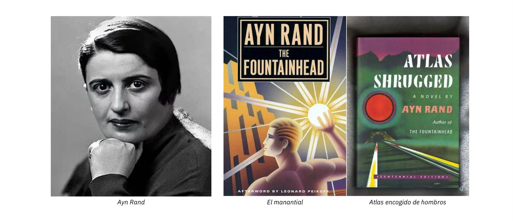

Pero la realidad es bien distinta, y la confusión procede más bien de un problema semántico: al reconocer la capacidad de actuar y de elegir de los seres humanos, reconociendo al mismo tiempo el determinismo lógico del que son objeto. los primeros libertarios son, en realidad, también herederos de Spinoza. Lo que tienen en común con Spinoza es la creencia de que los seres humanos no están por encima de la naturaleza, sino que son el resultado de un proceso evolutivo que los sitúa dentro de un determinismo, de una historia que los sobrepasa, y que es en gran medida responsable de lo que los seres humanos son y de lo que hacen.

Por último, si la creencia en el libre albedrío es una ilusión de la que resulta extremadamente difícil desprenderse, es porque remite a otra ilusión que la alimenta, la ilusión de las causas finales, que les invito a estudiar en el próximo capítulo.

## La ilusión de las causas finales

<chapterId>da2a7fb1-f1e9-5b56-822d-c73770de749d</chapterId>

:::video id=a0127fe7-a4cb-4a1c-8af4-f11c40b4a3d7:::

Vimos en el capítulo anterior que la ilusión del libre albedrío consiste en creer que podríamos empezar algo de la nada, que nuestra sola voluntad nos permitiría dirigir nuestra vida y que tendríamos un poder de decisión indeterminado. Es la idea de que el hombre es capaz de alterar el orden de la Naturaleza más de lo que está sujeto a él.

Pero para Spinoza (1632-1677), el hombre no es "un imperio dentro de un imperio", es decir, no es, contrariamente a lo que estableció Descartes (1596-1650), una excepción en la naturaleza, y nunca está exento de la prolongación de la cadena determinista de causas y efectos.

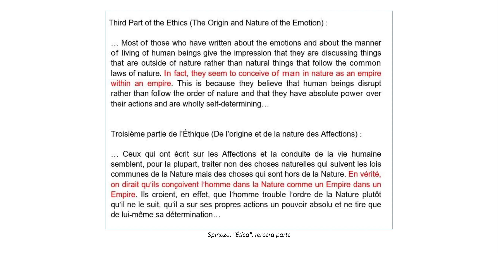

Y como la Naturaleza, dice Spinoza, no tiene un fin prescrito desde el punto de vista moral, y como los humanos tienden a confundir su imaginación con el entendimiento, la interpretan según lo que conviene a sus propios intereses. Hasta el punto de que dan a las cosas un sentido que sólo deriva de la forma en que las aprecian y las relacionan consigo mismas.

Es decir, según sus deseos, esperanzas y temores.

Este razonamiento se ilustra con la ilusión de las causas finales, que es un obstáculo importante para el pensamiento y el ejercicio de la razón, porque expresa simplemente nuestra necesidad de hacer corresponder los efectos de una cosa no a sus verdaderas causas, sino a una creencia, aunque sea absurda o infantilizante.

Una creencia que expresa una intención, en particular divina, y que, tal como la interpretamos, es a menudo supersticiosa, o ignorancia.

Y por eso nuevas enfermedades como el sida en los años 90 o el covid en 2020 siempre han sido percibidas por algunos como la expresión de una intención divina y a menudo punitiva, según un razonamiento contrario al principio de causalidad que sustenta el racionalismo y la ciencia moderna establecida desde Copérnico (1473-1543), Kepler (1571-1630) y Galileo (1564-1727).

El hecho es que, como dice Spinoza, a la gente le importa poco que tantas cosas estén más allá de su imaginación, que haya más desorden que orden en la naturaleza. Sin embargo, la complejidad de las cosas más allá de su alcance debería disuadirles de creer en cualquier proyecto teleológico. No importa, dice, porque la creencia de los humanos en la relevancia de su certeza basada en lo que conviene a su deseo y utilidad es siempre más fuerte que cualquier argumento racional o preocupación por la verdad.

Así, el finalismo equivale a invertir las causas y los efectos de las cosas para comprenderlas: por ejemplo, creemos que la razón por la que tenemos ojos es para ver, y que la razón por la que tenemos dientes es para masticar. Mientras que, por supuesto, fue para ver por lo que la especie humana desarrolló su vista en el curso de su evolución, y fue de hecho por la necesidad de alimentarse, y de comer carne, por lo que nuestra dentición también se desarrolló como lo ha hecho hoy.

Y esto es exactamente lo que afirmaba el naturalista francés Jean-Baptiste de Lamarck (1744-1829) (imagen 3.3.3) cuando estableció su teoría predarwinista de que es la función la que crea el órgano, y no al revés.

Pero, como dice Spinoza, "el engaño de los hombres no acaba ahí", y entre todos los ejemplos de ideas teleológicas ingenuas y, en última instancia, bastante divertidas, se suele citar el famoso ejemplo del biólogo Bernardin de Saint-Pierre (1737-1814). Este antiguo director del Museo de Historia Natural de París contemplaba el finalismo de la naturaleza con poesía, lirismo y cierta ingenuidad, considerando que el melón, por ejemplo, había sido creado con el único fin de agradar a las familias numerosas, ya que su piel estriada facilitaba su corte en rodajas iguales.

La definición de [inflación](https://planb.academy/resources/glossary/inflation) que dan los economistas keynesianos y los defensores del Estado del bienestar, por ejemplo, también ilustra muy bien esta paradoja. Según ellos, la inflación es un aumento de los precios que, según algunos banqueros centrales, procede o bien de "ninguna parte", o bien de contextos geopolíticos que nadie puede controlar ni prever. Si bien es cierto que un aumento de los precios puede dar lugar a una inflación cíclica -por ejemplo, cuando sube el precio del petróleo, suben también los precios de determinados productos transformados-, las verdaderas causas estructurales de la inflación están relacionadas sobre todo con un aumento del Supply monetario, que a su vez implica una caída del valor del dinero e, ipso facto, una subida mecánica de los precios.

Creer, o hacer creer, lo contrario equivale a soñar con los ojos abiertos, como decía burlonamente Spinoza, y construir un razonamiento que es falso, o engañoso, y que es tanto más fácil de conseguir que se acepte porque se escucha como una respuesta esperada para demostrar que se tiene razón. En este caso, cuando los partidarios de la intervención del Estado consideran que la inflación es la mejor manera de resolver los problemas económicos.

Sin embargo, esta interpretación sesgada de la inflación nos lleva a olvidar que, si bien es útil para gestionar la economía a corto plazo, es en realidad un impuesto oculto, que a largo plazo sólo conduce a desastres humanos y materiales, y hace que los Estados sean incapaces de no abusar de su poder. Es lo que describe tan bien Friedrich Hayek (1899-1992) en su ensayo Camino de servidumbre, cuando evoca la servidumbre de la que ya no pueden librarse los Estados.

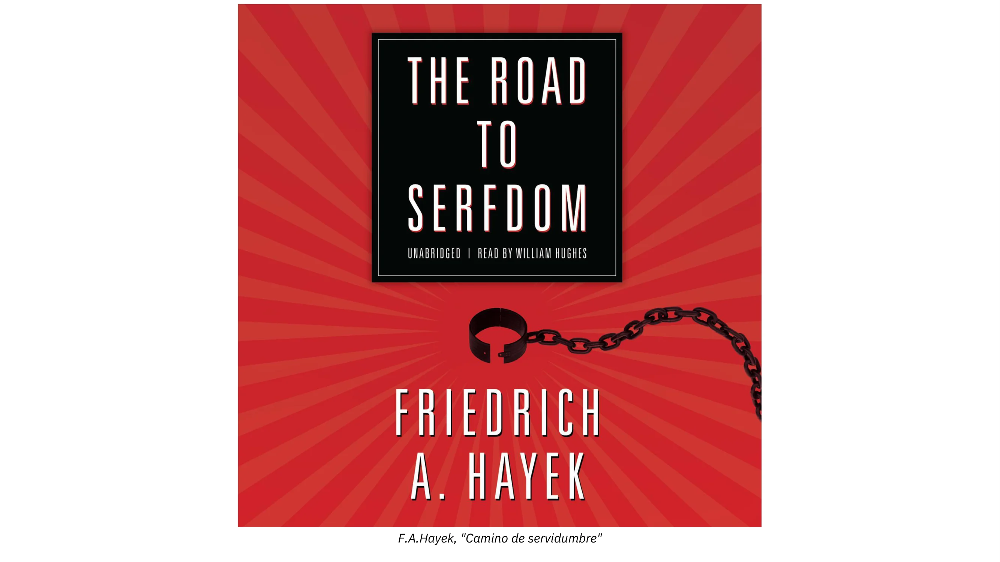

Por último, cabe señalar aquí que este mecanismo finalista también queda bien ilustrado en la forma en que los detractores de la Bitcoin expresan sus críticas centrándose precisamente en sus efectos.

Porque si bien es cierto que algunos de los efectos del Bitcoin son criticables, debido al sesgo cognitivo asociado al hecho de que se trata de una tecnología nueva y disruptiva, tenemos una fuerte propensión a ver sólo los efectos negativos. Especialmente si la realidad no coincide con nuestros deseos, por ejemplo si somos religiosos cuando nos enfrentamos a una revolución copernicana como el spinozismo, o si somos banqueros centrales cuando nos enfrentamos a un concepto de moneda digital descentralizada.

Sin embargo, está bastante claro que si un religioso o un banquero central demuestra comprensión, curiosidad y buena voluntad, y si se interesa por un concepto, buscando primero comprenderlo en lugar de juzgar sus efectos para hacer coincidir su opinión con sus expectativas, entonces sin duda podrá adherirse a él.

Gracias por su atención y nos vemos en el próximo capítulo.

## La ilusión teológica

<chapterId>93554156-5e62-526d-9b71-49c47be916af</chapterId>

:::video id=9c490cc1-3d29-4ca7-9464-1a701bb91ba7:::

En este último capítulo sobre la nueva visión copernicana de las ideas ofrecida por el spinozismo, nos ocuparemos finalmente de la tercera ilusión presentada por Spinoza (1632-1677) en su obra, la Ética.

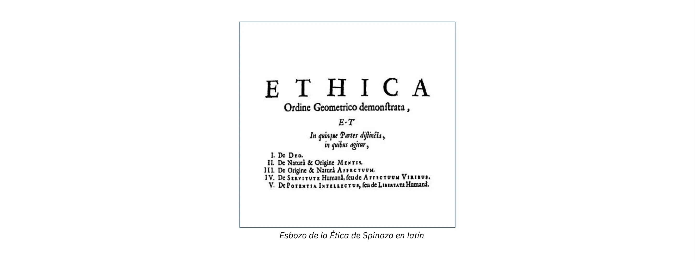

Esta ilusión está directamente relacionada con las dos primeras, la ilusión del libre albedrío y la ilusión de finalidad.

Se trata de la ilusión teológica.

La cuestión es la siguiente: Mientras los humanos sean ignorantes, "tanto de las cosas como de sí mismos", como nos dice Spinoza, mientras crean en su ilusoria libertad, tomarán su imaginación por entendimiento, es decir, siempre se considerarán capaces de pensar y comprender la naturaleza de las cosas, cuando en realidad sólo imaginan, inventan y proyectan lo que les es útil. Según sus deseos.

Por eso los humanos creen que si los medios naturales existen y son útiles, como los dientes para comer o los ojos para ver, es porque fueron creados lógicamente por un "director de la naturaleza". En otras palabras, un Dios intencional y antropomórfico al que se atribuyen intenciones humanas.

En otras palabras, un anciano de barba blanca oculto tras una nube, al que se atribuye la creación de todas las cosas de la naturaleza como medio para nuestro fin, porque nos ama y nos protege mientras le honramos y adoramos.

Esta es la primera etapa de la ilusión teológica.

Pero a pesar de nuestro orgullo de creernos por encima de la Naturaleza y de imaginar que podemos empezar algo de la nada, en realidad siempre estamos sujetos a condiciones de existencia que indican que, al final, no podremos "salirnos con la nuestra", como dijo el profesor de filosofía Gilles Deleuze (1925-1995). Somos mortales, como todos los animales, pero lo sabemos.

Creer o imaginar lo contrario para tranquilizarnos es la razón por la que estamos perpetuamente oscilando entre el miedo y la esperanza, como dos polos opuestos e inseparables entre un sentimiento de seguridad y un sentimiento de pánico, ya que el miedo siempre va unido a la esperanza de días mejores.

Que no hay miedo sin esperanza, ni esperanza sin miedo, y que el que teme siempre espera escapar de lo que teme, mientras que el que espera siempre teme que no suceda lo que espera.

Y puesto que "estamos dispuestos a creer fácilmente aquello que esperamos", dice Spinoza en su Ética, es cuando nos enfrentamos a causas o acontecimientos externos que nos resultarían perjudiciales, contrarios a cualquier idea de utilidad, cuando se expresa la segunda etapa de esta llamada ilusión teológica, caracterizada por creencias de las que surge un sentimiento supersticioso.

Es decir, "los infames", según Voltaire (1694-1778), para quien la superstición nunca nace de la razón y corresponde siempre a una creencia irracional o infundada, opuesta a toda forma de racionalidad al atribuir a los objetos o acciones poderes o potencia espiritual que no tienen.

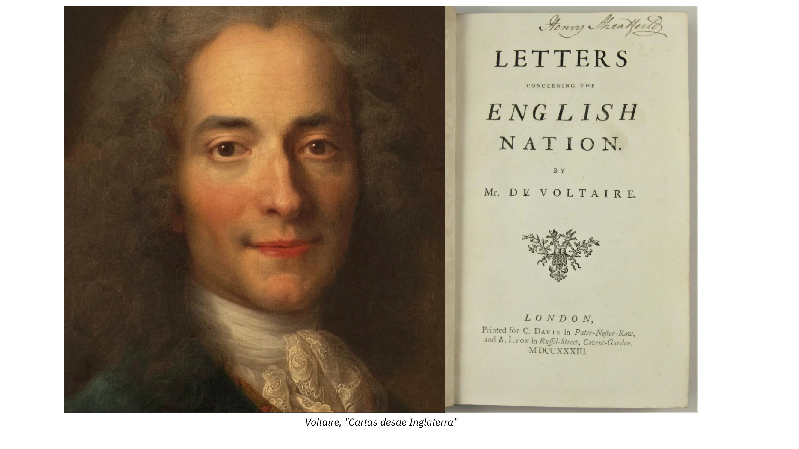

Bajo la apariencia de aliviarnos, de permitirnos imaginar un mundo mejor, la superstición en realidad nos encierra en nuestras propias ilusiones y mentiras. En servidumbres de las que nos costará Hard salir.

Esto es lo que defendió la Ilustración alemana, inglesa y francesa a partir del siglo XVIII, afirmando que la superstición simplemente impide que los hombres lleguen a ser adultos, no sólo limitando el ejercicio de la razón, sino también, y sobre todo, dando lugar a la intolerancia, que es el mejor instrumento para establecer la dominación de un poder. Ya sea político o religioso.

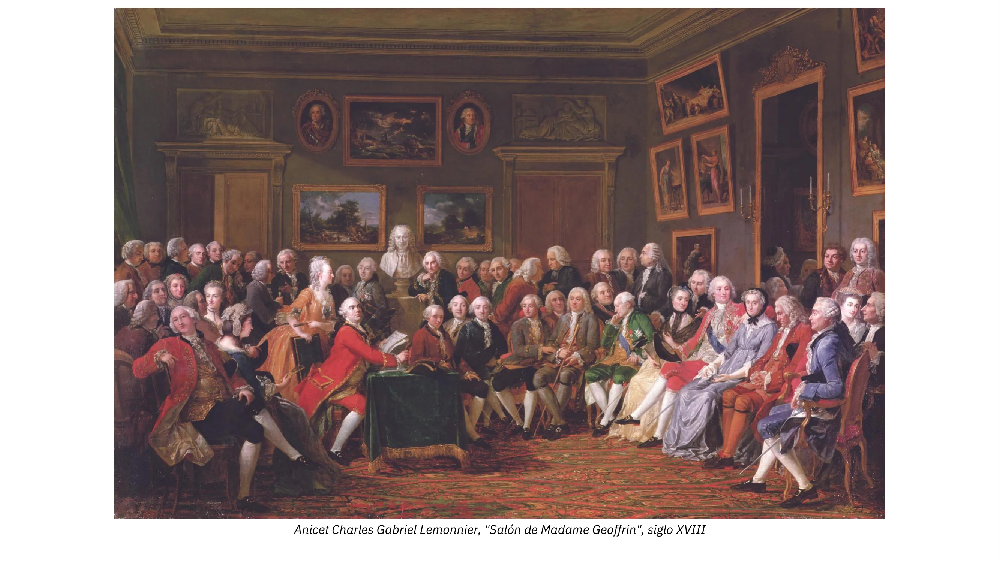

Y esto es lo que Spinoza vuelve a demostrar en su Tratado teológico-político, del que ya hemos hablado. En este ensayo, escribe que "el gran secreto del régimen monárquico, y su mayor interés, es engañar a los pueblos, y disfrazar con el nombre de religión el miedo que debe dominarlos". Por eso los tiranos, dictadores o revolucionarios, que son siempre personas movidas por el deseo de hacer el bien a los demás, caen a menudo, si no siempre, en la trampa de hacer lo contrario de sus principios para alcanzarlos.

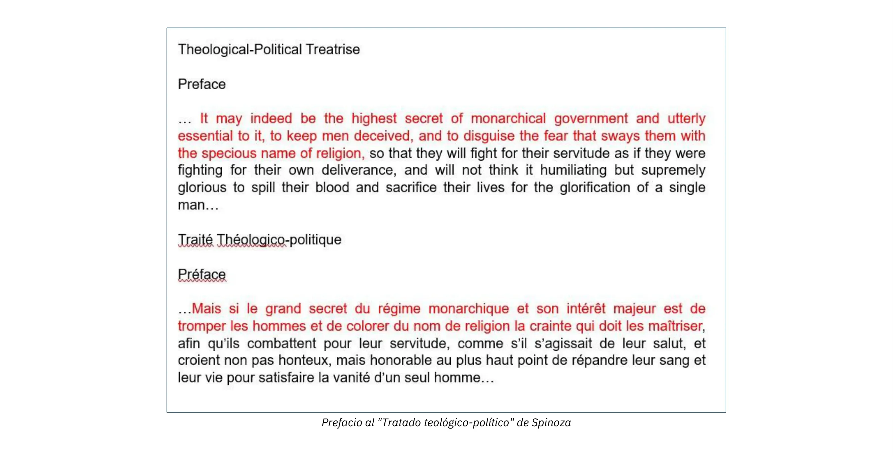

Pero la novedad que aporta Spinoza al TTP, y que le convierte en cierto modo en el padre del laicismo, es considerar que si bien es esencial luchar contra la superstición y la llamada a la violencia que paradójicamente permite la libertad, lo cierto es que al Estado le interesa proteger el derecho a creer y la libertad de pensar.

En efecto, desde el momento en que las ideas existen y se expresan en privado, se difunden inevitablemente en la sociedad, y ni la prohibición ni la censura pueden impedir jamás su difusión. Las ideas, verdaderas o falsas, buenas o malas, circularán en cualquier caso, y prohibirlas sólo puede conducir, a largo plazo, a la revuelta y al derrocamiento del Estado en nombre de la libertad.

En otras palabras, el Estado tendría en realidad mucho más que temer de la censura o de la supresión de la libertad de expresión que de su mantenimiento, y por tanto, dice Spinoza, le interesa dejar que los individuos ejerzan su derecho natural a pensar y a expresarse.

Para Spinoza, un Estado democrático que permita la libertad de pensamiento es, por tanto, la mejor garantía de que los pueblos vivirán en paz y de que, gracias al ejercicio de la razón, no sólo serán libres para pensar y actuar, sino que también podrán comprender las servidumbres que los constriñen para librarse de ellas.

# De la teoría del afecto a Bitcoin

<partId>82e69d4f-a94f-5978-bcb8-8a7b4651bcca</partId>

## La cuestión del mal en Spinoza

<chapterId>1ce64576-2688-5757-a119-57cc3a1076c0</chapterId>

:::video id=9c490cc1-3d29-4ca7-9464-1a701bb91ba7:::

Me gustaría ahora tratar la cuestión del mal, tal como Spinoza (1632-1677) la presenta en sus obras y correspondencia.

Pero atención, se trata de un tema complejo y controvertido, y el objetivo aquí es simplemente comprender, una vez más, su forma de pensar para entender mejor lo que le guía, es decir, la búsqueda de la libertad.

Como hemos visto, no creer en el libre albedrío ni en ningún tipo de finalismo en la naturaleza plantea muy rápidamente el problema de la existencia del mal en nuestra vida cotidiana.

En otras palabras, la cuestión es si el "mal" existe en la naturaleza y si los seres humanos son responsables de los daños que causan.

Los filósofos antiguos creían que el mal no existía en la naturaleza y Sócrates (470-399 a.C.), por ejemplo, enseñaba que "el mal no es nada". Según él, una persona malvada no lo era por naturaleza y, en cierto modo, simplemente se equivocaba sobre la naturaleza del bien.

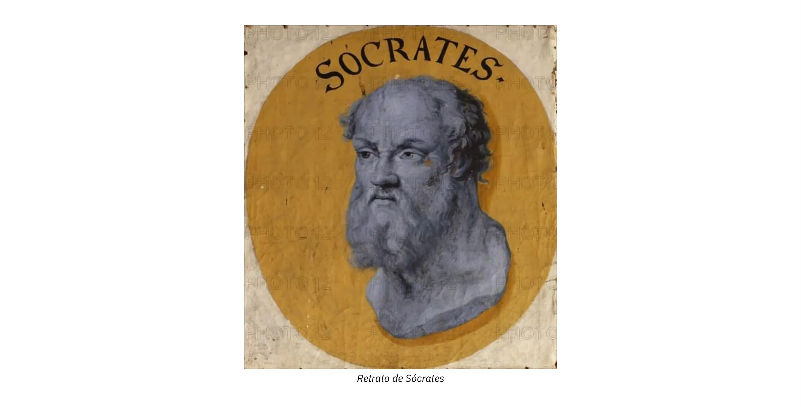

Pero la tradición escolástica, en particular la de San Agustín (354-430), que aún hoy influye en la moral cristiana, sostenía que el mal no sólo existe, que es una realidad, sino que puede explicarse porque las personas son libres, porque son capaces de elegir entre el bien y el mal, y que, por tanto, el mal que causan es enteramente responsabilidad suya.

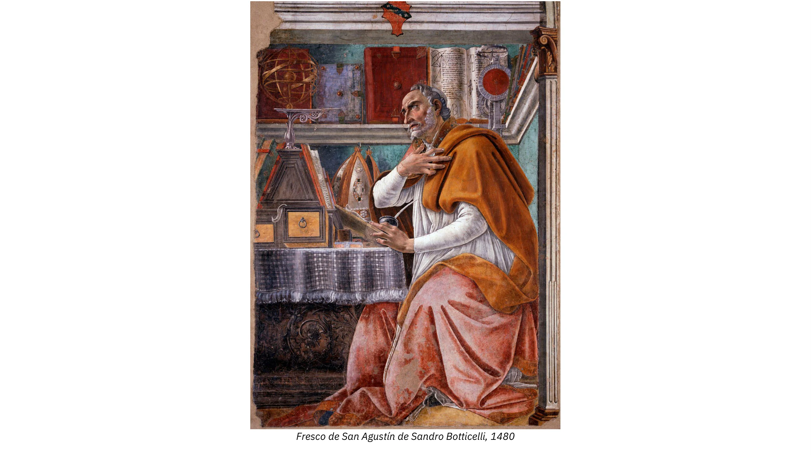

Y aunque la responsabilidad de los daños causados por un terremoto, un virus mortal o el hecho de que un niño nazca ciego no debe atribuirse a las personas, esta forma de pensar persiste al atribuir a la naturaleza una intención moral que las hace responsables. Por ejemplo, al considerar que si se ha producido un terremoto es precisamente porque las personas se han comportado mal.

Es la idea defendida por los religiosos de que los humanos nacen pecadores, culpables del pecado original.

Por supuesto, como puedes imaginar, esta idea es hecha trizas por Spinoza, quien considera que, puesto que la Naturaleza, o Dios o la fortuna como él dice, no está dotada de intención, y puesto que las personas no tienen libre albedrío, la responsabilidad por el "mal" que se les atribuye es completamente ilusoria.

"Nada ocurre en la naturaleza que pueda atribuirse a un vicio existente en ella", escribe Spinoza en la Ética, y según él, nos equivocaríamos por tanto al considerar "maligna", por ejemplo, la ceguera de un recién nacido, ya que al nacer ciego, un bebé no está más privado de la vista de lo que lo estaría una piedra.

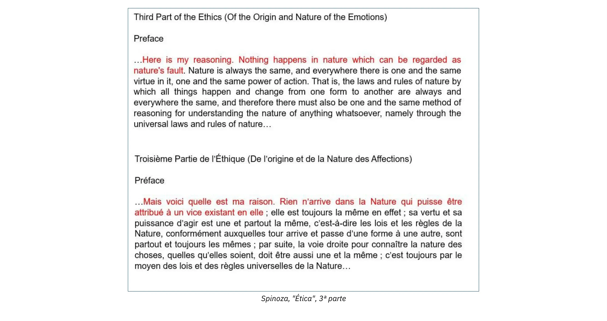

Y si pensamos que los ciegos carecen de vista, es sólo desde el punto de vista de los que ven.

Spinoza retoma así la idea de que el mal no existe en la naturaleza, pero su originalidad, que lo convierte en una filosofía revolucionaria, consiste en considerar que el mal no existe y el "bien" tampoco.

Y por eso habla de ética más que de moral, no reflexionando sobre lo que está bien o mal, ya que todo eso son nociones relativas y subjetivas, sino en términos de lo que es "bueno" o "malo" para nuestra necesidad natural de "perseverar en nuestro ser", dice. En otras palabras, vivir y crecer. Florecer como seres humanos.

Además, ya hemos visto que la opinión de Spinoza sobre la responsabilidad de las personas que se comportan mal cometiendo un delito, evidentemente no pretende excusarlas.  Pues las personas, aunque no conozcan las verdaderas causas que las determinan a cometer un delito, son siempre conscientes de lo que hacen y, por tanto, como tales, son responsables ante la moral y la Ley.

Evidentemente, las acciones de un delincuente siempre están relacionadas con un determinismo familiar, social, económico o incluso médico, si sus delitos pueden explicarse por una afección física o mental. Y éste es el papel de la justicia, que va más allá del derecho penal para tener en cuenta el hecho de que ciertos delitos no sólo deben ser castigados, sino también tratados, teniendo en cuenta el entorno familiar, social y psicológico del delincuente.

Por eso, el spinozista Gilles Deleuze (1925-1995) explica que la ética es una especie de etología, es decir, una ciencia práctica de los modos de ser o, como él dice, "el arte de hacer buenos encuentros".

En otras palabras, la libertad, según Spinoza, consiste en orientar nuestra existencia hacia aquello que "aumenta nuestro poder de acción" y, mirando siempre con optimismo hacia el futuro, ver el mundo tal como es en lugar de imaginarlo como nos gustaría verlo.

Y ahí reside la genialidad de la demostración de Spinoza, que lucha contra los doctores de la ignorancia y contra todos aquellos que afirman que es bueno ser ignorante.

Por el contrario, Spinoza estudia las pasiones humanas, incluso las más irracionales, el desamor, la locura, la tristeza o la melancolía, a la manera de los geómetras, "more geometrico", como se estudian los puntos, las líneas, las superficies y los volúmenes.

Esta es la teoría de los afectos que desarrolla en la tercera parte de su Ética, y que te sugiero que estudies ahora.

Gracias por su atención.

## Teoría de los afectos

<chapterId>3bb011ce-6f0c-51a6-b41f-25a3b5b7768e</chapterId>

:::video id=bb427cc6-e54d-4b44-bd6d-281ba421001a:::

Según Spinoza, la libertad es un concepto por descubrir, un camino hacia una vida mejor, más poderosa. Una vida más libre. Un camino que exige reconocer el determinismo absoluto y la causalidad racional de las cosas.

Desarrolla su sistema en la tercera parte de la Ética. Es la famosa "teoría de los afectos".

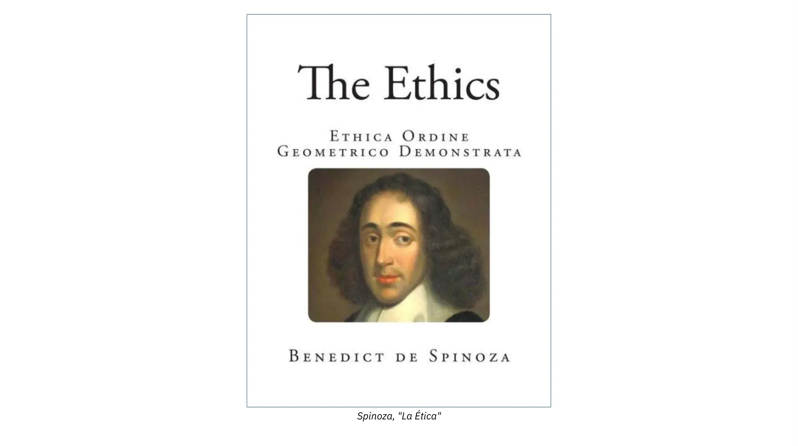

El principio es que los afectos humanos son, dice Spinoza, modificaciones activas o pasivas del cuerpo y del pensamiento que influyen en nuestro poder de actuar, es decir, en nuestro comportamiento.

Y sin embargo, en función de los afectos propios de la naturaleza humana y de los derivados del mundo exterior, somos perfectamente capaces de formarnos ideas verdaderas, razonar y expresar alegría.

Pero también somos capaces de formarnos los llamados afectos pasivos, prejuicios que luego nos llevan mecánicamente, "a pesar nuestro", a no ver ni hacer lo que nuestro propio interés requiere.

Hablamos de esclavitud, o servidumbre, un estado caracterizado por la incapacidad de controlar y contrarrestar esos afectos pasivos que a veces nos llevan a querer lo que no queremos y a hacer lo que no queremos.

Es lo que dice Spinoza en su Ética, cuando se sorprende de que "la gente a menudo ve lo mejor, lo aprueba y hace lo peor", o de que "luchan por su servidumbre como si lucharan por su salvación".

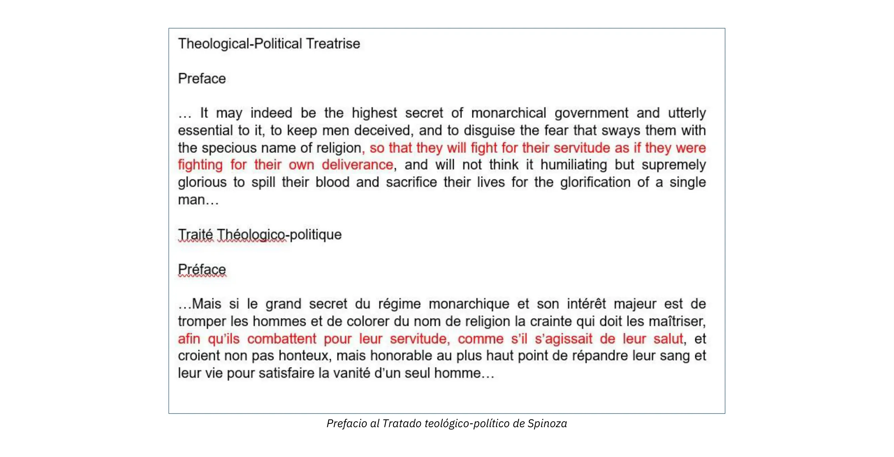

Spinoza toma el ejemplo del odio, que ve como un afecto pasivo, volcado hacia la tristeza y nacido de ideas inadecuadas, es decir, de un conocimiento parcial de las causas, y que define como "una tristeza que se asocia a la idea de una causa externa".

En otras palabras, si odiamos a un extranjero, es porque asociamos a este extranjero con la idea que tenemos de él, por razones que no comprendemos, ya que es extranjero y diferente por naturaleza. Es esta idea de una causa externa - una idea que, por otra parte, siempre motiva mecánicamente a los ignorantes a hablar mal de un concepto que desconocen.

Esto es especialmente cierto, por cierto, en el ámbito de las [criptomonedas](https://planb.academy/resources/glossary/cryptocurrency).

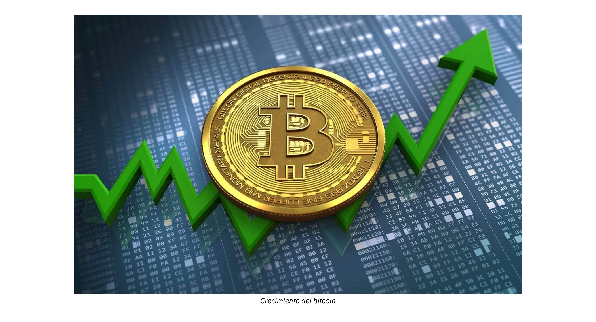

Spinoza dice que si eliminamos esta idea negativa de una causa externa, no por moralidad, sino por educación, por empatía, por razón, especialmente centrándonos en este caso en las cualidades de este extraño, o en el caso de Bitcoin, en su aspecto práctico o utilidad, entonces el sentimiento asociado de tristeza desaparece y, automáticamente, también lo hace el odio.

Conviene recordar que esta forma de pensar también se aplica, por supuesto, a los afectos activos, y en particular al amor, que es, según Spinoza, "una alegría asociada a la idea de una causa externa". Y si, por ejemplo, la causa externa del amor por una cosa o una persona desaparece o cambia con el tiempo, la alegría asociada a ella también puede desaparecer, extinguiéndose el sentimiento amoroso. Esto, cuando no lo entendemos, puede hacernos infelices y deprimirnos.

Pero si esta llamada teoría de los afectos se aplica a nuestro "inconsciente", esta forma racional de pensar "a la manera de los agrimensores" se aplica también a la lucha contra todas las formas de servidumbre externa, ya sean religiosas, políticas o fruto de fenómenos naturales.

Es el ejemplo del rayo. Porque cuando cae un rayo y mata a inocentes, los ignorantes tenderán a verlo como la mano de Dios, a considerar que el rayo expresa una intención moral y finalista. El sida en los años 90 o incluso, más recientemente, el covid han sido interpretados por algunos como un castigo divino.

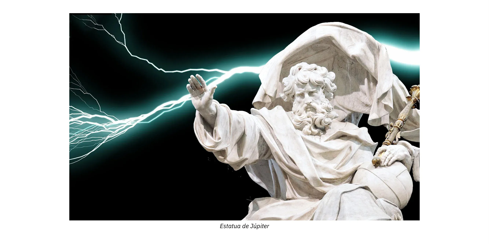

Mientras que para Spinoza, por supuesto, todas estas ideas teleológicas no son más que supersticiones, sinónimo de ignorancia, en la medida en que en este ejemplo el rayo que cae no hace otra cosa, dice, que expresar la esencia de su propia naturaleza. Que es caer. Sin, por supuesto, ninguna intención moral de castigar o recompensar a nadie.

Gracias a este sencillo ejemplo, comprendemos que la única solución para protegernos del rayo -es decir, para liberarnos de la servidumbre que siempre nos ha impuesto su peligro- no es quejarnos de nuestra mala suerte o de una supuesta injusticia divina, ni esgrimir el menor argumento moral. No, más bien, también en este caso, como en el del odio, se trata de reflexionar sobre lo que podemos hacer desde un punto de vista ético.

Y, en este caso, sería protegernos de los rayos siendo racionales, abiertos al progreso, tener curiosidad y confianza en lo que la ciencia puede ofrecernos y, por qué no, instalar un pararrayos.

Esta es la genialidad de la Ética. Spinoza nos muestra que es posible pasar de una servidumbre voluntaria, de un "a pesar nuestro" y de una vida de veleta de alienación perpetua, a una vida vivida a través del conocimiento de los afectos y de las determinaciones.

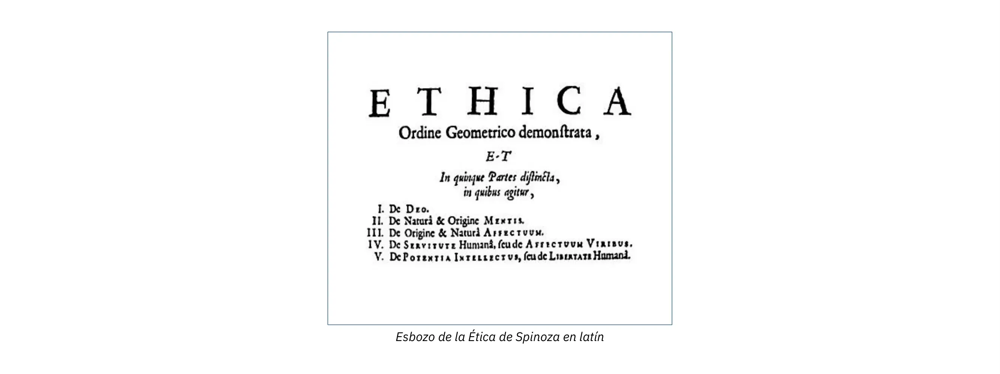

Es una forma de pensar que nos permite diseccionar la naturaleza humana para ver el lado bueno o la verdad de las cosas. Para eliminar los motivos de tristeza y miedo que nos agobian. Ser libres, es decir, poder dejar de obedecer a las pasiones tristes y cambiar nuestro comportamiento.

Y comprender, probablemente por primera vez en la historia de la filosofía, que se puede ser lúcido y feliz.

Por eso se suele hablar del spinozismo como "la filosofía de la alegría".

## La libertad, la escuela austriaca de economía y la filosofía Cypherpunk

<chapterId>b54f2532-460c-11f0-a248-93ff24ef1d57</chapterId>

:::video id=5f49d5b4-e15f-475b-b40d-07464c08ca4d:::

Como ya sabes, la libertad según Spinoza es la conciencia de nuestro determinismo. Bajo la guía de la razón, y gracias a nuestra capacidad de actuar, podemos comprender el mecanismo causal de las servidumbres, de modo que podemos luchar contra ellas, dejar de sufrirlas y dejar de actuar en contra de nuestros propios intereses.

En definitiva, esta lucidez significa dejar de vivir en el nihilismo descrito más tarde por Friedrich Nietzsche (1844-1900), para quien los hombres se pierden en ideales ideológicos, es decir, ficciones políticas o religiosas, a causa de las cuales niegan la realidad, se infantilizan y se hacen infelices.

En eso precisamente consistió la filosofía racional de la Ilustración, gracias en particular a Immanuel Kant (1724-1804), para quien sólo un individuo instruido, bajo la guía de la razón, puede pensar por sí mismo y determinar, éticamente, lo que es "verdadero" o "bueno" y lo que es tóxico.

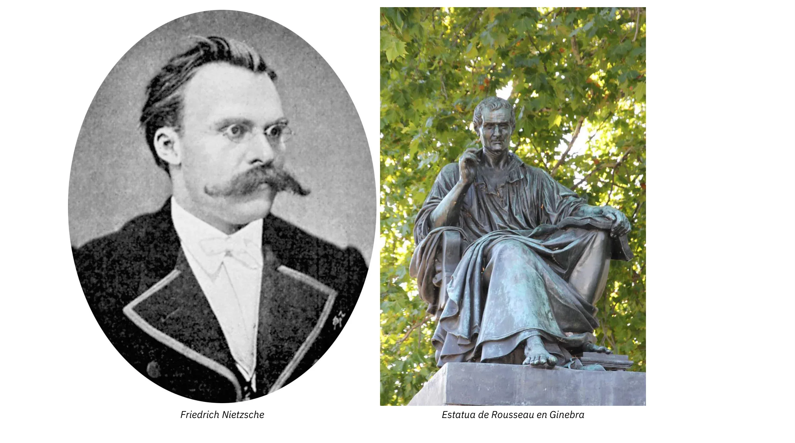

En otras palabras, dice, si pensamos por nosotros mismos, si razonamos como adultos racionales y si, por tanto, nos esforzamos por apegarnos a los vínculos causales entre las cosas, ya no necesitaremos una autoridad moral que nos enseñe, por ejemplo, las verdaderas virtudes de la religión o los verdaderos valores éticos en las esferas política y económica.

Es una línea de razonamiento que establece el vínculo con la escuela [austriaca](https://planb.academy/resources/glossary/austrian-school) de economía liberal, nacida en el fértil ambiente intelectual de Viena antes de la Primera Guerra Mundial. Pues fue en ese contexto donde intelectuales como Carl Menger (1840-1921), Ludwig von Mises (1883-1979) y Friedrich Hayek (1899-1992) sentaron las bases de una nueva escuela de economía liberal, que se convertiría en el fundamento de las convicciones de los futuros [cypherpunks](https://planb.academy/resources/glossary/cypherpunks). Y de ahí la creación de Bitcoin.

Menger y Mises establecieron, por ejemplo, que todo conocimiento debe construirse según el vínculo causal entre las cosas, y propusieron así una nueva concepción causal de la economía. Inspirándose en particular en el espíritu liberal desarrollado unos años antes por el economista francés Frédéric Bastiat (1801-1850).

Hayek, por su parte, considera que todas las decisiones económicas expresan siempre una forma de incertidumbre y de ignorancia, y que el hecho de no padecerla a causa de la moral, las creencias, los prejuicios o las ideologías políticas, permite analizar correctamente el comportamiento económico y, por extensión, considerar lo que es bueno para los individuos, para la sociedad y para el Estado.

Así es como estos economistas liberales austriacos llegaron a criticar con firmeza todas las ideas socialistas -Hayek hablaba de "planismo"- y todas las políticas morales inspiradas en ellas, que, en su opinión, sólo conducían a la ruina. Otorgar el poder económico a los gobiernos, inevitablemente atrasados y desfasados respecto a lo que se debe y no se debe hacer, estaba condenado al fracaso.

Por ejemplo, los austriacos creen que cuando un Estado se otorga a sí mismo, por coacción, el poder de crear dinero para gestionar la economía y resolver las crisis, el riesgo es que nunca pueda abstenerse de abusar de este poder.

¿Por qué? Porque siempre se encuentra en una forma de servidumbre que se lo impide, y le empuja así, como diría Spinoza, "a ver lo mejor, a aprobarlo... pero a hacer lo peor".

Como spinozista, Hayek explica en un vídeo que "puesto que este poder no se puede arrebatar sin violencia, lo único que se puede hacer es utilizar un truco e introducir un nuevo concepto de dinero que los gobiernos ya no puedan detener". Un argumento del que se hace eco Milton Friedman (1912-2006) en una entrevista, en la que a su vez habla de esta nueva forma de moneda digital en el contexto de la naciente Internet.

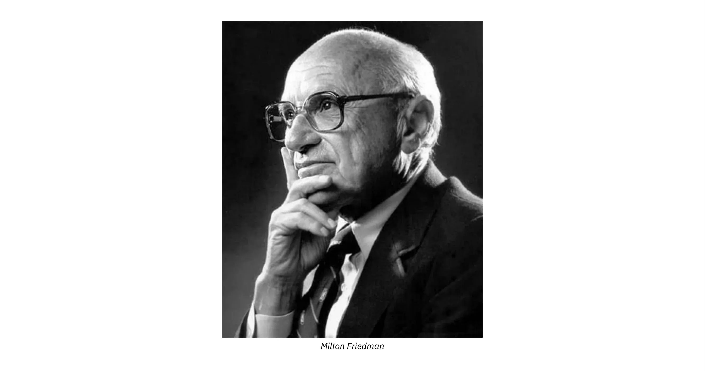

Estos son los argumentos políticos y económicos expuestos por los primeros cypherpunks, Eric Hughes (1953-), en su "manifiesto Cypherpunk", o Timothy May (1951-2018) en su "manifiesto criptoanarquista", y que Satoshi Nakamoto retomará.

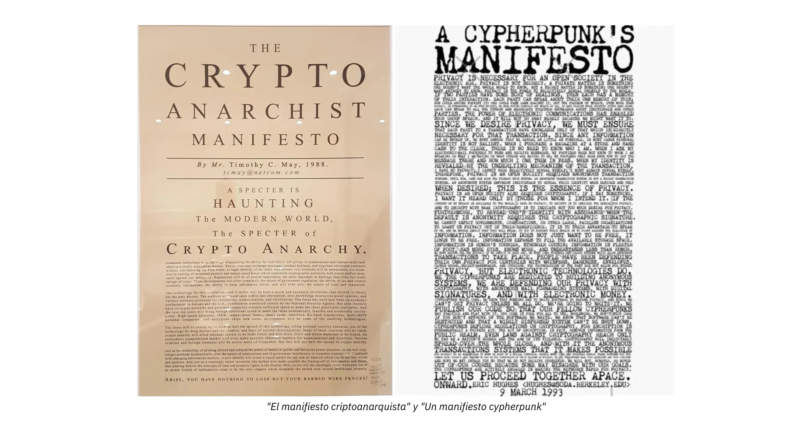

Especialmente cuando inscribió el titular del Times del 3 de enero de 2009 en la [coinbase](https://planb.academy/resources/glossary/coinbase-transaction) del [bloque Genesis](https://planb.academy/resources/glossary/genesis-block) de [Blockchain](https://planb.academy/resources/glossary/blockchain) Bitcoin para ilustrar el fin de una era, la keynesiana, y el comienzo de otra con aspiraciones liberales, anarquistas y libertarias.

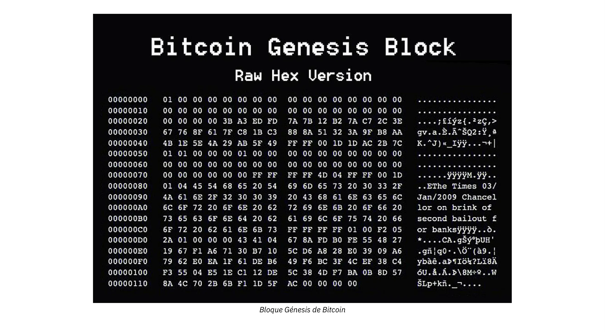

El [Libro Blanco](https://planb.academy/resources/glossary/white-paper) publicado el 31 de octubre de 2008 presenta Bitcoin como un medio de intercambio de valor en Internet sin un tercero de confianza, basado en un protocolo descentralizado. Una revolución "copernicana" que permitirá por fin a las personas recuperar su capacidad de acción, es decir, su libertad, su libertad de comercio, su derecho a la propiedad y el respeto de su vida privada.

¿Por qué? Porque Bitcoin nos permite salir de esta servidumbre a la manera de Spinoza, gracias a la razón, gracias al lenguaje matemático de Galileo. Y, como sugiere Hayek, sin que el Estado pueda oponerse. Y pacíficamente, sin coacción ni proselitismo.

De hecho, éste es el último paralelismo que estableceré entre el spinozismo y Bitcoin, para demostrar que no tiene sentido convencer a nadie que no suscriba un concepto copernicano o disruptivo más que a través de la razón, la comprensión, la curiosidad o la buena voluntad.

No por la fuerza, no por la violencia. Porque el hecho es que Copérnico, Galileo, Newton, Darwin, Einstein, Hayek, Spinoza o Satoshi Nakamoto nunca amenazaron a nadie que no creyera en sus ideas y demostraciones.

# Sección final

<partId>70a5a3c8-6c88-11f0-8753-db07e26dcaf4</partId>

## Opiniones y valoraciones

<chapterId>7945c38c-6c88-11f0-a73f-0f7cdf99f53f</chapterId>

<isCourseReview>true</isCourseReview>

## Examen final

<chapterId>a557fd32-6c88-11f0-96ff-cfa532cf76a0</chapterId>

<isCourseExam>true</isCourseExam>

## Conclusión

<chapterId>ae04ab38-6c88-11f0-a496-3be47119e6b6</chapterId>

<isCourseConclusion>true</isCourseConclusion>