# Kui Spinoza kohtus Satoshiga

Avastage, kuidas 17. sajandi filosoofi Baruch de Spinoza radikaalsed ideed vabadusest, mõistusest ja võimust ennustavad Bitcoini detsentraliseeritud revolutsiooni. See kursus paljastab silmatorkavad paralleelid: mõlemad lükkavad tagasi pimeda usu ja keskse autoriteedi, mõlemad kasutavad vabastamiseks matemaatilist rangust. Spinoza vabastas meeled religioossest dogmast, Bitcoin vabastab raha riiklikust kontrollist.

Õppige Spinoza eetikast praktilisi tööriistu, et mõista bitcoini filosoofilisi aluseid ja suurendada oma tegutsemisvõimet. Kas olete valmis uurima kahte ajaloo suurimat inimese emantsipatsiooni instrumenti?
+++
# Sissejuhatus

<partId>80b76189-afab-5295-a8d3-ba8f6fe7a5e8</partId>

## Kursuse sissejuhatus

<chapterId>99af4992-fd6c-5142-b168-d927b251574b</chapterId>

:::video id=1def60bc-1d39-4e49-9b08-fd05b7a0d49b:::

Sellel kursusel on mul hea meel tutvustada Baruch de Spinoza (1632-1677), kuulsa 17. sajandi filosoofi, keda peetakse ratsionaalse valgustusfilosoofia isaks, filosoofiat.

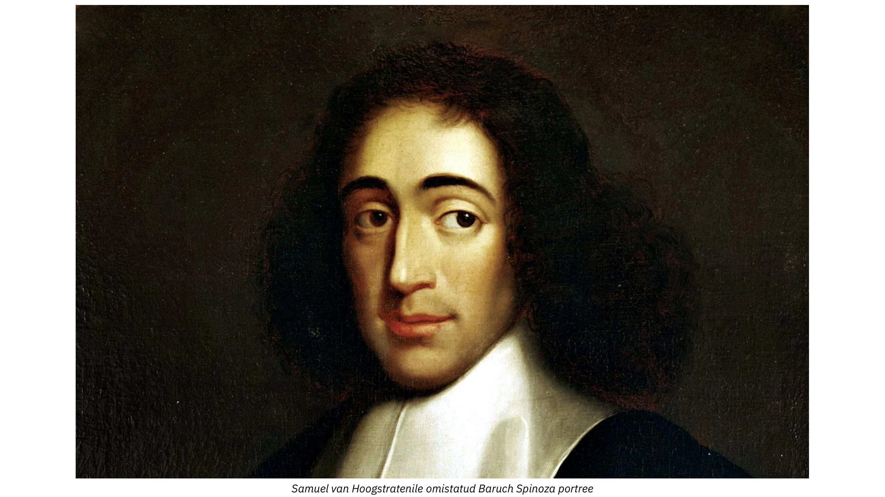

Spinoza portree

Need kursused põhinevad minu kahel selleteemalisel esseel "Spinoza tõeline religioon" ja "Bitcoin, vabaduse evangeelium", mis on saadaval paberkandjal kas internetis või otse minu veebisaidil ning digitaalselt Amazon Kindle'is.

Selle kursuse eesmärk on eelkõige anda lihtsustatud arusaam filosoofiast, mida sageli peetakse väga keeruliseks ja kättesaamatuks, hoolimata sellest, et tänapäeval tuntakse selle vastu taas huvi.

Tõepoolest, see filosoofia võimaldab meil mitte ainult küsida asjade tähendust, kui kõik läheb halvasti, mis on üldiselt religiooni, filosoofia ja humanitaarteaduste eesmärk, vaid ka, ja võib-olla peamiselt, küsida iseennast, kui kõik läheb hästi.

Kui elu naeratab meile ja me tunneme, et me ei pea ennast kahtluse alla seadma, arvestades uhkusega, mida peetakse illusoorseks ja orjanduslikuks, et meie õnn või edu tuleneks ainult meie andekusest, tööst või väidetavalt vabadest valikutest; lühidalt öeldes, meie enda vabast tahtest, mitte determinismist, millele oleme allutatud.

Nii saame luua seose selle praktilise vabadusfilosoofia - või, nagu Spinoza ütleb, "selle saavutamise vahendite poole" - ja selle uue tehnoloogilise maailma vahel, mis meid siin huvitab, krüpto üldiselt ja Bitcoin eriti.

Ja eriti selle filosoofilises aspektis, mis paneb meid mõtlema just vabaduse mõiste üle: vabadus mõelda, end väljendada, austada eraelu puutumatust ja muidugi meie puhul ka Exchange vabadus.

Kõigepealt tutvustan teile Spinozat, tema iseloomu, tema sotsiaalset, religioosset ja perekondlikku tausta ning tema elukohaks olnud Ameerika provintside ajaloolist konteksti.

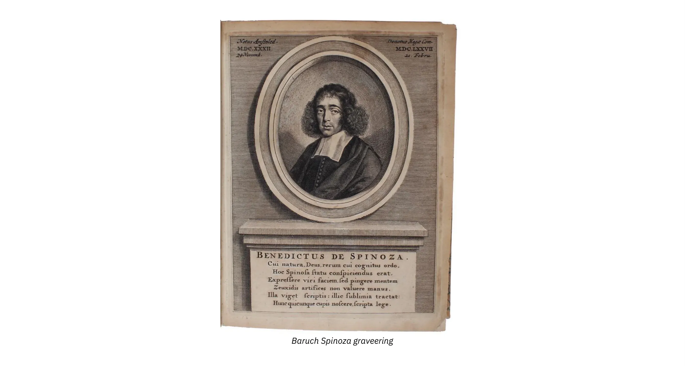

Spinoza portree

Seejärel näeme, mis on see uus ratsionaalne filosoofia, mille kohaselt "looduses ei ole midagi, mida ei saa seletada ilma mõistuse kasutamiseta".

See on mõte, et me saame maailma ja inimloomust mõista ainult asjade vahelise põhjusliku seose kaudu, mille kohaselt on efektil alati põhjus, ja see põhjus on ise teise põhjuse mõju ja nii edasi, kuni esimese põhjuseni, millele meil puudub juurdepääs ja mis Spinoza järgi on Loodus.

Loodus, teisisõnu Jumal, on kuulus ladinakeelne "Deus sive Natura", mis illustreerib kogu spinozismi tähendust.

Vaatleme ka Spinoza kahte põhiteost, alustades 1677. aastal postuumselt avaldatud Eetikast, mis keskendub täielikult vabadusele ja vajadusele vabastada end meid piiravatest orjadest.

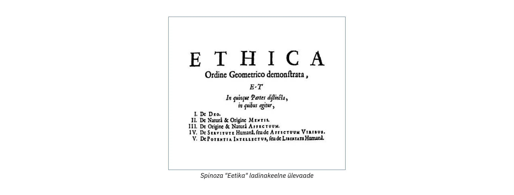

Seejärel vaatleme tema eluajal 1670. aastal avaldatud "Traité théologico-politique", mis võimaldab meil käsitleda vabadust teise nurga alt: mõtte- ja usuvabadust. Teisisõnu, usuvabadus, kuid eelkõige poliitiline vabadus.

Lõpuks näeme, miks Spinozism on ideede Koperniku revolutsioon ja kuidas see esindab maailma ja inimloomuse uut määratlust, uurides kolme põhilist illusiooni, mida Spinoza hukka mõistab: vaba tahte illusioon, lõplike põhjuste illusioon ehk finalism ja teoloogiline illusioon.

Tänu geomeetrite moodi välja töötatud afektiteooriale, "more geometrico", näeme lõpuks, kuidas Spinoza pakub meile praktilist meetodit, kuidas vabastada end või püüda end vabastada inimloomusele omastest ja välistest kirgedest. Ratsionaalne mehhanism, mida võib teadmatuse vastu võitlemiseks võrrelda kindlusega, et kolmnurga kolm nurka on alati võrdsed 180°, ja mis võimaldab meil ühendada sellest tuleneva valgustusajastu vaimu 19. sajandi liberaalsete vooludega või 20. sajandi liberaalsusega, mis on otseselt seotud Satoshi Nakamoto, Bitcoin leiutisega.

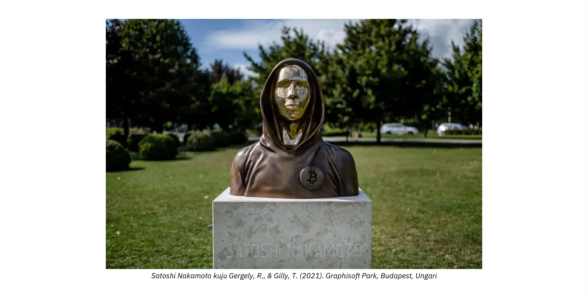

Siis mõistame, et paljudest ühistest punktidest spinotsistlike kontseptsioonide ja selle Satoshi Nakamoto poolt leiutatud vabaduse tööriista vahel on esimene, et mõlemal juhul, kui me oleme uudishimulikud, heatahtlikud, nagu omal ajal öeldi, "mõistusega", siis ei saa me midagi muud teha, kui sellest kinni pidada. Ja kui me ei järgi seda, mis oleks muidugi meie kõige absoluutsem õigus, kuna see on põhiline, et austame vabadust uskuda või mitte uskuda, siis me oleksime otsustanud, et me ei suuda või ei taha, mis on sama asi.

Ja nii saame aru, et näiteks religioosne fundamentalist ei suuda kunagi aktsepteerida või kuulata vähimatki kopernikulist mõtet, näiteks spinozismi, nagu ka keskpankuril on väga raske aktsepteerida Bitcoin.

Kuigi, nagu te teate, liiguvad asjad praegu õiges suunas.

## Baruch de Spinoza tutvustamine

<chapterId>f53a9cfd-326e-5b73-a766-3ef2f07c5a49</chapterId>

:::video id=5fac3ddc-c472-4c64-8186-46a8f317e389:::

Kes oli Baruch de Spinoza? Ta oli hollandi filosoof, kes sündis 1632. aastal ja suri 1677. aastal 45-aastaselt.

Ta oli juudi usku ja kuulus Portugali sefardide kogukonda, kes pärinesid 15. sajandil katoliiklaste poolt Hispaaniast lahkuma sunnitud marranodest, ning ta kasvas üles religioosses ja intellektuaalses keskkonnas, olles teadlik sellest, mida tähendab olla tagakiusatud.

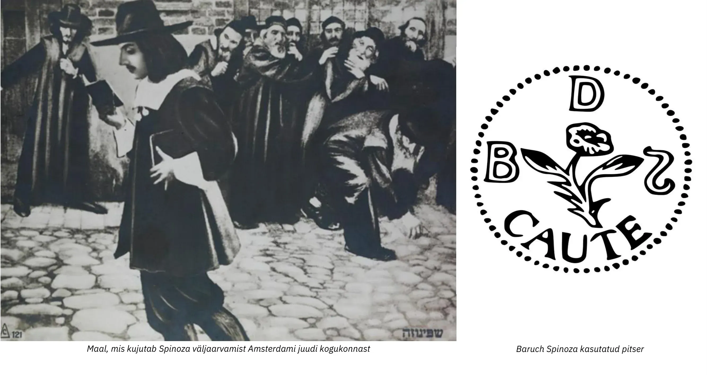

Tegelikult ilmutas ta juba varakult tugevat kriitilist suhtumist väljakujunenud religiooni ja eriti oma heebrea kogukonna suhtes, kust ta 1656. aastal, vaid 24-aastasena, enne kui ta oli midagi avaldanud, vägivaldselt välja heidetud.

Väidetavalt võimaldas see "ekskommunikatsioon" tal end isoleerida ja keskenduda oma tööle, ilma et ta oleks kunagi tagasi vaadanud.

Sarnaselt oma kaasaegsete Descartes'i (1596-1650), Pascali (1632-1662) ja Newtoniga (1643-1727), kes järgisid Koperniku (1473-1543), Kepleri (1571-1630) ja Galilei (1564-1642), kes eelnesid talle vaid mõne aasta võrra, uusi ratsionaalseid ideid füüsikas, töötas Spinoza välja geomeetrilise mõtlemise viisi, mis oli kooskõlas Galilei põhimõttega, et matemaatika on universumi keel.

Kuid need olid tolle aja jaoks väga ohtlikud ideed, pärast kohtuprotsessi munga ja filosoofi Giordano Bruno (1548-1600) üle, kes põletati elusalt ketserluse eest Rooma avalikul väljakul, ning pärast kohtuprotsessi Galileo üle, keda inkvisitsioon sundis 1633. aastal loobuma oma kopernikulistest heliotsentrilistest tõekspidamistest.

Seetõttu on tema rangelt ratsionaalne nägemus maailmast ja inimloomusest, mis põhineb asjade vahelistel põhjuslikel seostel, toonud kaasa selle, et teda peeti ja peetakse tänapäevalgi ekslikult ateistiks.

Tegelikult räägib Spinoza teoses ainult Jumalast, keda ta samastab loodusega, ja kuigi ta kritiseerib usuliste inimeste ja teokraatide ebausklikke impulsse, näitab ta, et tõeline religioon on tema jaoks eelkõige õigluse ja heategevuse sünonüüm.

Ja just selline lähenemine seob Spinoza valgustusfilosoofiaga, olgu see siis saksa keeles Leibnizi (1646-1716), Kanti (1724-1804), Schopenhaueri (1788-1860) ja Nietzschega (1844-1900), inglise keeles Locke'i (1632-1704) või prantsuse keeles Voltaire'i (1694-1778), Rousseau (1712-1778) ja Diderot' (1713-1784) filosoofiaga. Kõik nõustusid, et mõistust tuleb kasutada võitluses obskurantismi, eriti religioosse obskurantismi vastu, võitluses teadmatuse vastu ning vabaduse ja progressi ideaalide kaitsmisel.

Selleks, et alustada selle filosoofia seostamist Bitcoin-ga, on oluline märkida, et Spinoza sündis väga erilisel ajastul.

17. sajandil ei olnud Ühendatud Provintsid mitte ainult maailma kõige vabam riik poliitiliste ja usuliste ideede poolest, vaid ka kõige rikkam. Teisisõnu, majanduslikult ja tehnoloogiliselt kõige arenenum riik.

Rikkus ei ole aga seotud loodusvarade, kolooniate ekspluateerimise ja rüüstamise või orjapidamisega, vaid rahvusvahelise kaubanduse ja ettevõtlusega liberaalses ja ettevõtlikus vaimus. Vaim, mida hiljem propageeris kuulus spinozist Voltaire (1694-1778), kelle jaoks ei tõrjuta kaubandustoas kunagi liberaalsete veendumustega ärimeest või ettevõtjat välja, teda ei nimetata uskmatuks või ekskommunikeeritakse, nagu ta ütles, tema usutunnistuse või päritolu tõttu, vaid ainult siis, kui ta on pankrotti läinud.

Veelgi enam, Holland oli tol ajal arenenud ka olulistes tehnoloogiavaldkondades, näiteks mehaanika ja optika valdkonnas. Astronoomilisi teleskoope, mida Galileo kasutas taevasse vaatamiseks ja universumi avastamiseks, peeti tõepoolest oma ajastu tipptasemel tehnoloogiaks, nagu ka uusi tehnoloogiaid, mis on tänapäeval seotud arvutite, tehisintellekti ja muidugi krüptotehnoloogiaga.

Ja kuna Spinoza ise tegeles astronoomiliste läätsede lihvimisega - irooniliselt kellegi puhul, kes väidetavalt nägi kõike viltu - võime ette kujutada, et ta oleks kindlasti toetanud sellist vabaduse vahendit nagu Bitcoin.

Teisisõnu, Spinozismi poolt edasi antud vabaduse ja progressi väärtused on vastandiks maailmale, kus religioosne fundamentalism, vandenõuteooriad, ebausk ja eelkõige teadmatus on endiselt kurb reaalsus.

Ometi on see maailm, kus iga vahend on väärtuslik, et põgeneda, et vabaneda meid piiravatest orjapidamistest ja et olla vaba, aktsepteerides maailma sellisena, nagu ta on, mitte sellisena, nagu me tahaksime, et ta oleks.

Sõltumata sellest, kas need vahendid on filosoofilised või tehnoloogilised, nagu me hiljem näeme, on Bitcoin vabaduse vahend. See on vahend, mis võimaldab nii üksikisikutel kui ka riikidel vabaneda orjusest, eriti rahalisest orjusest.

# Peamised teosed, Eetika ja poliitika

<partId>d7d7e9a1-005b-519c-b587-137435e46344</partId>

## Eetika ja vabaduse otsimine

<chapterId>4cc66e25-335c-591d-9b78-83e5664bbbbc</chapterId>

:::video id=065c5091-69e1-412f-acce-c763ec31d3b1:::

Selles peatükis teen ettepaneku pöörduda nüüd Spinoza põhiteose "Eetika" juurde, mis avaldati postuumselt 1677. aastal.

Miks postuumselt? Sest tema ideed olid revolutsioonilised või vähemalt vastupidised ja häirivad ning seetõttu tol ajal väga ohtlikud, isegi 17. sajandi Ühendriikide liberaalses kontekstis.

Eetika on ladina keeles kirjutatud teos, mis on kirjutatud geomeetrite moodi, tõenäoliselt inspireeritud Galileo (1564-1642), koos Kepleriga (1571-1630) moodsa teaduse isa, kelle sõnul on matemaatika universumi keel. Spinoza arendab oma ideid viies peamises osas, kasutades propositsioone, millele on lisatud demonstratsioonid, skollid, aksioomid ja definitsioonid.

Sellisena on eetika Spinoza sõnadega "viis, kuidas jõuda vabaduse juurde või selle juurde viivatele teedele", ja see ei ole tegelikult raamat, mida saab lugeda kaanest kaaneni, vaid pigem selline, mida saab läbi töötada, lugedes näiteks ühte lauset, mis viitab teisele, mida omakorda mõistetakse kolmanda lause kaudu ja nii edasi, täiesti sidusas, ratsionaalses ja loogilises süsteemis.

Tahaksin juhtida tähelepanu sellele, et kui te avate "Eetika", siis on soovitatav alustada järelsõnadest ja lisadest, need lühikesed lõigud on Spinoza poolt kirjutatud igapäevases keeles, nii et need on kergesti mõistetavad ja omamoodi kokkuvõte tema mõnikord keerulisest mõtlemisest.

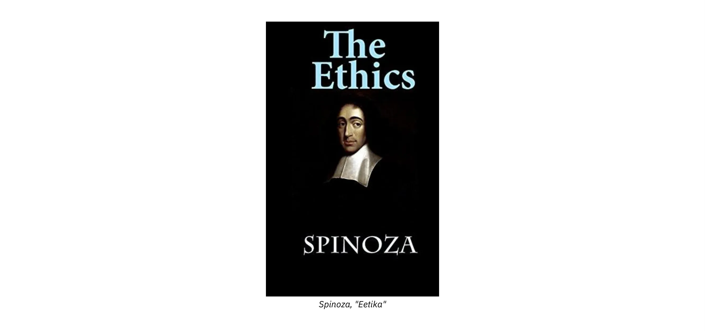

Allutades meid ümbritsevat maailma "mõistuse mikroskoobile", lahkab Spinoza teos inimloomust põhimõttel, et inimene ei ole iseenesest põhjustatud, st et me ei palunud sündida, ei siin ega meie ajal, ei sellise füüsilise ega intellektuaalse omadusega.

Ja ta ütleb, et me ei ole loodusest kõrgemal. Me ei ole vabastatud selle seadustest, ei kehas ega vaimus. Teisisõnu, me oleme sama palju osa loodusest kui mis tahes muu elusolend, olgu see siis loom või taim.

Spinoza jaoks sõltuvad kõik inimtegevuse valdkonnad mõistuse võimest mõista maailma täiesti sidusas ja kindlalt määratud süsteemis.

Maailm, kus juhust ei ole olemas.

Kõik, mis juhtub, on "vajalik" ja põhjuse tulemus, vastavalt ideele, et "see, mis on ja mis juhtub, peab olema ja peab juhtuma". See on absoluutne determinism.

Kuid tuleb silmas pidada kahte punkti:

Esiteks, kui Spinoza jaoks ei ole juhust olemas, siis sellepärast, et see on sündmus, mille põhjust me ei tea. Aga muidugi ütleb ta, et see, et me ei tea põhjust, ei tähenda, et seda ei ole olemas.

Teiseks, fatalismist ei ole samuti absoluutselt juttu, sest loodusele ei ole antud kavatsust. Näiteks välgul ei ole mingit kavatsust kedagi karistada, nagu võiks arvata tragöödia puhul. Ei, ta lihtsalt väljendab omaenda olemuse olemust, milleks on välguga löömine. Lüüa.

Spinoza kaitseb seega ideed, et reaalsus, st igapäevaelu nii heade kui ka halbade aspektidega, on täiesti mõistetav ja et looduses ei ole ühtegi nähtust, mis ei oleks põhjuslikult seotud. See tõstatab muidugi küsimuse kurjusest, eriti absoluutsest kurjusest, mida vaatleme veidi hiljem.

Lõpuks on oluline märkida, et eetika ei ole moraal.

Gilles Deleuze'i (1925-1995), kuulsa filosoofiaprofessori ja Spinoza-spetsialisti sõnul on moraal ühiskonnas elamiseks kasulik hinnangute süsteem. Kuid see on subjektiivne süsteem, sest see, mis on siin õige, võib mujal olla vale, ja see, mis on täna vale, võib hiljem olla õige.

Ja selle asemel, et määrata kindlaks, mis on õige või vale, määrab eetika kindlaks, mis on hea või halb meie enda olemuse ja meie võime jaoks, ütleb Spinoza, et me suudame oma olemuses säilitada. Olla vaba. Seega on see tõeline etoloogia, s.t. teadus olemisviisidest, või nagu Gilles Deleuze edasi seletab, hea kohtumise tegemise kunst.

Või õigete valikute tegemise kunst, et vabaneda meid piiravatest sundustest, mille tõttu Spinoza sõnul on inimesed sageli piirdunud sellega, et "näevad parimat, kiidavad selle heaks ja teevad halvimat".

Teisisõnu, "võitlema oma orjuse eest, nagu võitleksid nad oma vabaduse eest".

## Teoloogilis-poliitiline traktaat

<chapterId>84b0187e-1050-5d44-a536-80554896e828</chapterId>

:::video id=c1efc97e-1e96-4b37-894c-9a19794d6b52:::

Pärast eetikat tahaksin teile selles peatükis tutvustada veel üht olulist teost, mis aitab teil mõista Spinoza filosoofilist ja poliitilist mõju, eriti tulevasele valgustusajastule ning liberaalsetele ja meie puhul liberaalsetele vooludele.

See on 1670. aastal anonüümselt avaldatud "Traité théologico-politique" ehk TTP.

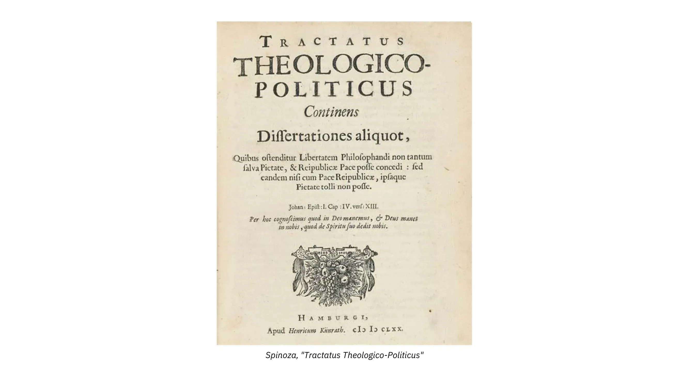

Spinoza (1632-1677) kirjutas selle raamatu oma "Eetika" kirjutamise katkestamise ajal, püüdes lõpetada tänaseni eksitavat arusaamatust. See on uskumus, et ta oli ateist.

Nagu me nägime, on Spinoza jumalakäsitlus kogu "Eetika" esimese osa teema, milles ta näitab mitte ainult jumala olemasolu, vaid ka seda, milline on tema tõeline olemus.

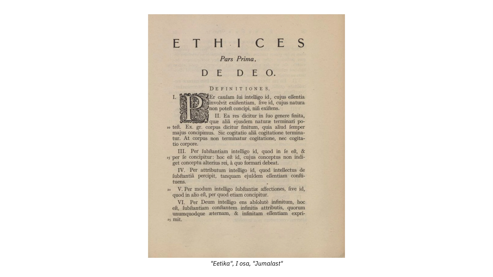

Ja kuna Spinoza mõisted on üldiselt üsna raskesti mõistetavad, on neid sageli lihtsam mõista, öeldes, mida nad ei ole, kui püüdes öelda, mida nad on. Lähenemisviis, mis muide, nagu me hiljem näeme, on Bitcoin mõistmiseks väga kasulik.

Nii näitab Spinoza meile, et tema arvates ei ole Jumal antropomorfne olend, kellel on kavatsused, kes karistab või premeerib, kellega me räägime ja kes kuulab meid rituaali järgi, mida me võime järgida või mitte järgida. Teisisõnu, tema sõnul ei ole Jumal vana mees pika valge habemega, kes on peidetud pilve taha ja kes lahendaks maailma raskused ja teeks meid temast sõltuvaks.

Seega tähendab Jumalast rääkimine, et meenutame loodust kui ainulaadset, lõpmatut ja igavest substantsi, mis koosneb lõpmatust hulgast atribuutidest, millest meie, inimesed, tunneme vaid kahte: ainet ehk ulatust ja mõtet.

See on kuulus "Deus Sive Natura", millest Spinoza tuletab absoluutse determinismi mõiste ja idee, et inimene ei ole iseenda põhjus ja ei ole looduse ja kindlasti mitte loomade kohal.

Kuid lisaks religioonikriitikale on TTP Spinoza jaoks eelkõige võimalus teha karmi kriitikat religioossete inimeste ja teokraatia suhtes. Teisisõnu kultiveerib religioosne võim hirmu ja ebausku ning aktiveerib tema sõnul inimeste kurvad kired, et neid paremini orjastada, vangistades neid eksitusse, fanatismi ja sõda.

Selles religiooni esmases, infantiilses staadiumis kiinduvad usklikud ainult välisesse jumalateenistusse ja eelarvamustel põhinevasse kergeusklikusse usku. Etapp, kus religioon muutub mehaaniliselt sallimatuks, kaldub kõrvale oma moraaliõpetuse piiridest ja pöördub eemale oma kutsumusest edendada rahu ja harmooniat, väites end olevat tõde.

Kui me aga liigume religiooni ratsionaalsest kriitikast kaugemale, näiteks Piibli eksegeetiliselt, tahab Spinoza meid veenda, et see uus nägemus Jumalast on täielikult kooskõlas kolme suure religiooni õigluse ja heategevuse sõnumitega, mis sätestavad lihtsa, kuid sageli unustatud kuldreegli: "Armasta oma ligimest nagu iseennast".

Kuid see pole veel kõik.

TTPs välja töötatud küps nägemus religioonist on seotud poliitilise mõõtmega, vajadusega eraldada religioon ja riik, et kaitsta mõtte- ja usuvabadust nii kõigi üksikisikute kui ka riigi enda huvides.

Põhimõtteliselt muudab Spinoza vabaduse mõistuse raames oluliseks tingimuseks, et inimesed saaksid elada ilma, et neid orjastaks nende huvidega vastuolus olev võim, ning seetõttu kaitseb ta poliitilisel ja usulisel vabadusel põhinevat otsest demokraatiat.

Teisisõnu, mõtte- ja usuvabadus, et inimesed saaksid vabaneda orjusest ja valedest, lapsemeelsetest uskumustest, et arutleda täiskasvanuna, seades esikohale mõistuse ja ka, mis meid puudutab, tehnoloogilise progressi.

Kurikuulus maavärin Lissabonis 1. novembril 1755. aastal näitas suurt muutust selles, kuidas inimesed mõtlesid loodusõnnetustest ja katastroofidest ning sellest, kuidas end nende eest kaitsta.

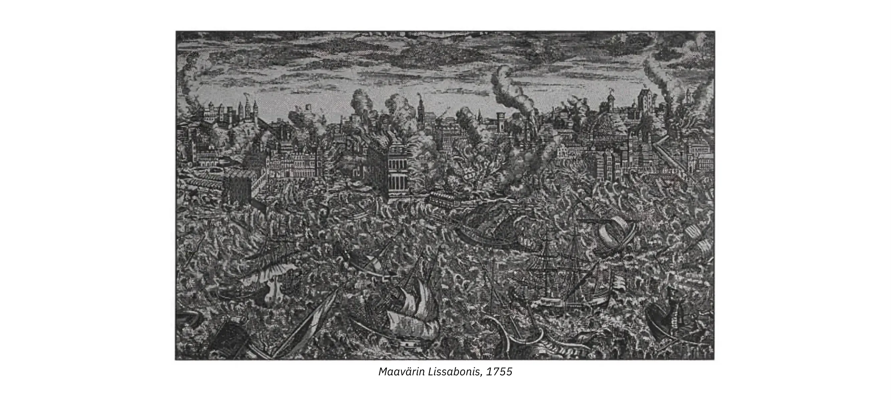

See kohutav maavärin hävitas linna ja tappis sadu tuhandeid süütuid inimesi, kellest paljud viibisid tol hetkel kirikus, sest see oli kõigi pühakute päev, mis suurendas ellujäänute arusaamatust.

Draama, mis taaselustab saksa filosoofi ja matemaatiku Leibnizi (1646-1716) esitatud küsimuse antropomorfse nägemuse kohta Jumalast, kes on varustatud kavatsuse, headuse ja kõikvõimsusega. Sest kui Jumal oleks hea, nagu Leibniz ütleb oma teoditsias, siis ei oleks ta kõikvõimas, sest ta lubaks selliseid katastroofe, ja kui ta oleks kõikvõimas, siis ei oleks ta hea, sest ta ei saaks neid ära hoida.

Jean-Jacques Rousseau (1712-1778) kirjutas Voltaire'ile, kes oli hämmastunud inimkonna ebaõiglusest ja õudustest, mida ta diskrimineerivalt kannatab, et "loodus ei ole iseenesest halb ja et me ei peaks selles nägema mingit jumalikku kätt, mis seletaks selle kujundust".

Sellele vastas Voltaire (1694-1778), Spinozist kui selline, et see looduskatastroof peaks ennekõike panema meid mõistma, et teaduslikud vahendid meie kaitsmiseks looduse eest on olemas, ja et nende aja väljakutse seisneb seega selles, et küsida, kas inimene suudab tänu teadmistele ja progressile võtta oma tuleviku enda kätte ja vabastada end teoloogiast ja ebausust.

Ja kuigi loomulikult ei olnud küsimus maavärinate ennetamises, mis on endiselt mitte ainult ettearvamatu, vaid ka täiesti kontrollimatu, oli küsimus pigem selles, et tagada, et näiteks majad oleksid ehitatud nii, et nad neile vastu peaksid.

Seetõttu on 18. sajand tänu mõistuse, teaduse ja tehnoloogia rakendamisele valgustusajastu, progressi sajand. Teisisõnu, progress kui vabaduse vahend.

# Spinozistlik revolutsioon, kolm illusiooni

<partId>f5d45c2b-28da-527a-ab20-dd255e9a9e0d</partId>

## Looduse ja inimese uus määratlus

<chapterId>3e6599e3-5b29-50a8-a67d-d0386da5d65d</chapterId>

:::video id=b6d2c035-8848-4da6-9da9-be3b70be0f38:::

Selles peatükis tahaksin heita pilgu ideede ajaloole ja näha, miks Spinozismi peetakse tõeliseks Koperniku ideede revolutsiooniks.

Tänu sellele uuele, matemaatika poolt pakutavale Jumala, teisisõnu looduse mõistmise viisile, pani Spinoza (1632-1670) aluse sügavale paradigmamuutusele, millel on kaudsed tagajärjed religioossele maailmapildile ja inimese kohale selles.

Nii nagu Nikolaus Kopernik (1473-1543) tõestas, et Maa ei ole maailma keskpunkt, ja Charles Darwin (1809-1882) näitas kolm sajandit hiljem, et inimene ei ole "elu" keskpunkt, nii järgis Spinoza seda loogikat ja väitis omal ajal, et inimene ei ole "oma maja peremees" ja et universum ei ole loodud ainult tema enda kasuks.

Ta ütleb, et inimene ei ole "impeerium impeeriumi sees" ja et nii nagu Maa taandub pelgalt planeediks, nagu kõik teised planeedid, nii taandub ka inimene pelgalt loodusvormiks, nagu kõik teised piiratud loodusvormid, nagu loomad, taimed ja kõik "olemasolevad olendid".

Enne teda pakkus klassikaline kreeka filosoofia maailma, kosmose ja inimkogemuse seletamiseks välja korrastatud, hierarhilise universumi nägemuse. Müütilistele jutustustele tuginedes püüdis see põhimõtteliselt selgitada maailma päritolu, rõhutades universumi, looduse ja inimese harmooniat.

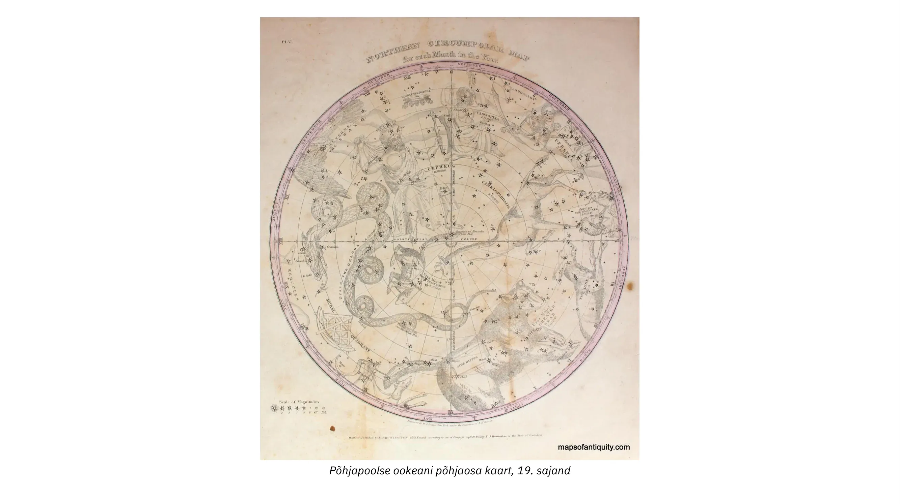

Keskaja skolastiline kosmoloogia, mis algas sisuliselt 12. sajandist alates, oli areng rohkemate arutluste suunas, et ühtlustada mõistust ja usku, et seletada universumit, mis oli endiselt hierarhiline, kuid mis vastas paremini kristlikule filosoofiale.

Kuid Koperniku (1473-1543) uue füüsikaga 15. sajandil toimus kosmoloogias suur pöördepunkt universumi mõistmises, mille geotsentriline mudel seati seega kahtluse alla heliotsentrilise süsteemi kasuks, mis sillutas teed moodsale teadusele, eelkõige Kepleri (1571-1630) ja Galilei (1564-1642) uuele füüsikale ja astronoomiale. Seejärel Isaac Newton (1643-1727) ja lõpuks Albert Einstein (1879-1955), kes oli veendunud spinozist.

Spinozismi täielikuks mõistmiseks peame aga arvestama ka René Descartes'i (1596-1650), Spinozale eelnenud kuulsa prantsuse filosoofi, kelle õpilane ja suur austaja ta oli, konteksti.

Hoolimata Giordano Bruno (1548-1600) ja Galileo riskidest ja hukkamõistust, asus Descartes eristama "tõde valest" ning ühtlustama teoloogiat, filosoofiat ja füüsikat. Oma kuulsas "Diskursuses meetodist", mis avaldati 1637. aastal, väitis Descartes, et mõistus on teadmiste alus, mille kaudu inimene võib saavutada vabaduse.

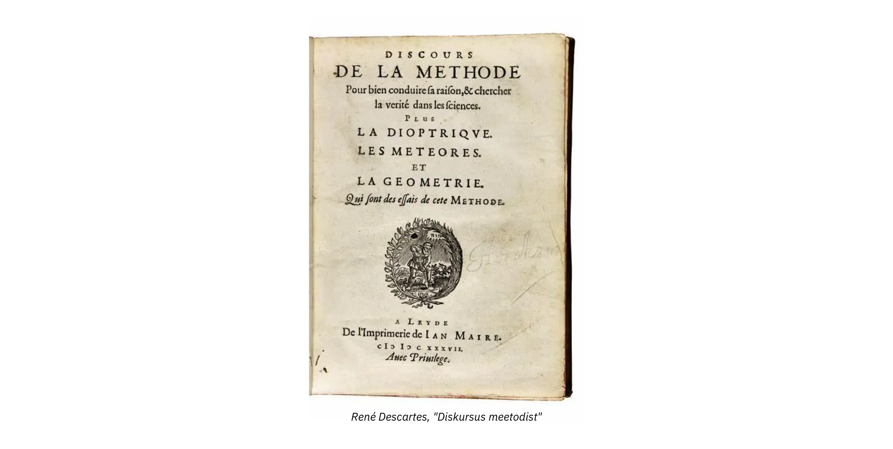

Selgitades maailma pigem universaalsete seaduste kui moraalse tahtega varustatud looduse järgi, sillutas ta teed determinismile, mille järgi Spinoza hiljem tegutses.

Kuid katoliiklasena kehtestas Descartes siiski hierarhia inimese ja teiste looduslike lõplike liikide vahel, eriti seoses loomaliikidega, mida ta nimetas "masinloomadeks". Ja öeldes, et "ei ole olemas hinge, mis hästi juhituna ei saaks omandada absoluutset võimu oma tegude ja kirgede üle", väidab Descartes seega, et inimesel on võime alustada midagi tühjast, ja et inimene tema arvates "põgeneb loodusseadustest", et tal on absoluutne võim oma tegude üle ja ta põhjendab oma otsustusvõimet üksnes iseendaga.

Spinoza teadis, kuidas minna sellest etapist kaugemale ja ületada seda ning ühitada Jumala olemasolu mõistuse tõestamisega. Tema jaoks sõltuvad kõik inimtegevuse valdkonnad mõistuse võimekusest täiesti sidusas ja määratud maailmas. Aga maailma, kus ei ole ei juhuslikkust ega juhust ja kus kõik, mis juhtub, on vajalik ja põhjuse tulemus, vastavalt asjade vahelisele põhjuslikule seosele. See on absoluutse determinismi idee.

Ja kõige karmimalt lükkab ta lõpuks ümber kartesiaanliku seisukoha, kritiseerides näiteks ideed, et inimene ei allu loodusseadustele nagu kõik teised loomad ja on seetõttu kõigist teistest piiratud loodusviisidest kõrgemal.

Teisisõnu, nad on varustatud vaba tahtega, mis on illusoorne uskumus, millest on äärmiselt raske pääseda, nagu Spinoza ütleb, ja mida me nüüd arutame.

## Vaba tahte illusioon

<chapterId>f147a914-cb64-5927-b305-26691930bca3</chapterId>

:::video id=b59da795-ba19-4643-9672-36c9e7953a42:::

Käesolevas kursuses pöördume nüüd vaba tahte delikaatse küsimuse juurde, et paremini mõista, mis on vabadus Spinoza, valgustusajastu ja varajaste liberaalsete filosoofide jaoks.

Nagu me juba nägime, on Spinoza (1632-1677) tuntud selle poolest, et ta pidas vaba tahet illusiooniks, millest on äärmiselt raske vabaneda.

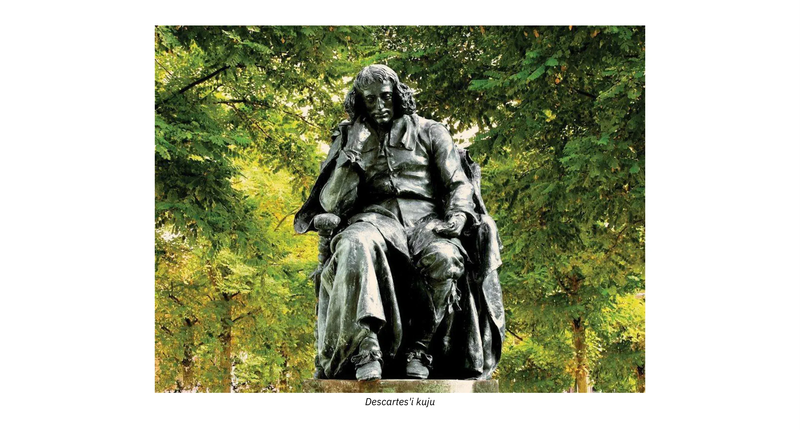

Miks? Sest see on vastuolus antiikajast saadik kehtinud filosoofilise traditsiooniga, mida Descartes (1596-1642) ikka veel kaitseb, et inimene võib algatada midagi tühjalt kohalt ja kannab täielikku vastutust oma tegude eest, eriti Jumala ees, ütleb püha Augustinus (354-430), kristliku kiriku isa.

Aga muidugi ka enne inimõigust.

See on idee, et meie tahe ja ainult meie tahe võimaldab meil oma elu juhtida, et meil on absoluutne võim oma tegude üle ja et me tuletame oma tegude vabaduse üksnes iseendast, omades seega määramatut otsustusõigust.

Teisisõnu, inimkond suudab pigem häirida looduse korda, kui alluda sellele.

Kuna ta ei alluks oma eluviisides ühelegi muule seadusele kui omaenda tahtele, ei oleks ta seega mitte ainult loodusest ja loomadest, pelgalt masinatest, vaid ka kõigist muudest piiratud looduse vormidest kõrgemal. See oli Descartes'i (1596-1650) seisukoht, kelle jaoks inimese jõuetuse ja ebastabiilsuse põhjused ei peitunud mitte looduskorras, vaid inimloomuse enda pahedes.

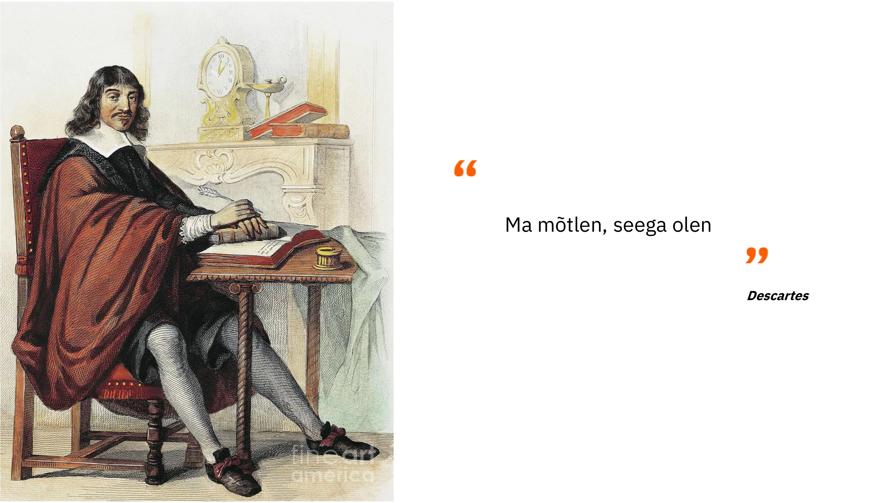

Kuid kuigi Spinoza annab Descartes'ile tunnustust selle eest, et ta avas tee afektiivse elu ratsionaalsele kontrollile, distantseerub ta temast täielikult, kritiseerides kindlalt seda tahte "absoluutse võimu" hüpoteesi.

Spinoza seevastu leiab, et meie maailm on täiesti sidus ja determineeritud ning et kõik, mis juhtub, on vajalik ja tuleneb asjade põhjuslikkusest, mille kohaselt mõjul on alati põhjus, ja see põhjus on ise teise põhjuse tagajärg ja nii edasi.

See on absoluutse determinismi idee, millest ta oma Eetikas lähtub, et inimestel puudub igasugune vaba tahe, sest, nagu ta ütleb, nad on oma tegudest teadlikud, kuid nad ignoreerivad või eelistavad ignoreerida tõelisi põhjusi, mis neid määravad.

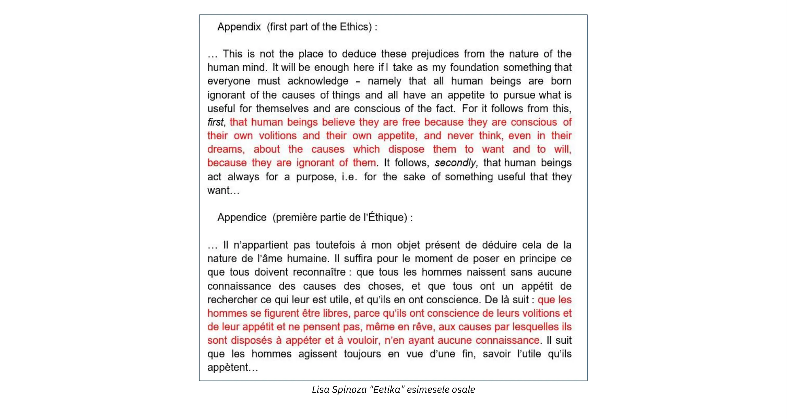

Spinoza jaoks ei saa inimene kui looduse "piiratud moodus" nagu loomad või taimed, seega midagi tühjast alustada; ta ei ole vabastatud loodusseadustest, ei oma kehas ega oma mõtetes.

Veelgi hullem, tema jaoks on vabaduse suurim oht uskuda oma vabasse tahtesse ja uskuda, et me võime tegutseda, ilma et meid määraksid välised põhjused.

Spinoza jaoks ei ole vabadus mitte vaba tahte väljendus, vaid võime mõista meie õiget kohta maailmas, mõista meie määratud olemust ja sealt lähtudes suunata oma eksistentsi sellele, mis "suurendab meie tegutsemisvõimet". Vaadates alati optimistlikult tulevikku ja nähes maailma sellisena, nagu ta on, mitte kujutades seda ette nii, nagu me tahaksime seda näha.

Loomulikult tekib probleem, mis puudutab inimeste vastutust ja nende tegusid. võiksime järeldada, et kui indiviidid ei ole oma tegudes vabad, siis nad ei vastuta nende eest, eriti õigluse ees. Kuid see seisukoht on eksitav, sest ilma liiga palju üksikasjadesse laskumata ei takista inimese sotsiaalse, perekondliku ja ajaloolise determinismi tunnistamine meid kaalumast vastutust sooritatud tegude eest, sest need on vabatahtlikud.

Teisest küljest oleks illusioon uskuda, et kurjategija teod ei ole kunagi seotud tema enda determinismiga. Ehkki tegemist ei ole nende vabandamisega, tuleb vähemalt püüda neid mõista. Tegelikult on see just see, mida õiglus teeb: lisaks õigusvastaste tegude karistamisele täidab ta ka tuleviku ettenägemise ja kaitsmise rolli, mistõttu teatud kuritegusid mitte ainult ei karistata, vaid ka koheldakse, võttes arvesse kurjategija perekondlikku, sotsiaalset ja psühholoogilist tausta.

Selline lähenemine vabadusele kui tegevusvõimele on ühendus, mille võime luua 18. sajandi valgustusfilosoofiaga. Selle ühe suurima saadiku, saksa filosoofi Immanuel Kanti (1724-1804) sõnul oli valgustus tõepoolest vahend, mis vabastas inimese eestkostetusest või, nagu Étienne de la Boétie (1530-1563) oleks öelnud, vabatahtlikust orjusest, mille eest ta ise vastutab.

Kanti moto on "Mõtle ise" ja "Julge teada", kuulus ladinakeelne "Sapere Aude".

Spinoza võime tegutseda on seega võime, mis inimesel on endal olemas, et mõista oma loomset seisundit ning mõista loodust ja selle nähtusi, olgu need siis positiivsed või negatiivsed, seostades neid objektiivsete põhjustega, et mitte toetuda valedele ja illusoorsetele, s.t meie soovide järgi kujundatud moraalsetele seletustele. Pigem seisneb see selles, et püüame neid selgitada mõistuse abil, pidades silmas vabanemist ja vabadust.

Ja progress, mis viis esimeste tehnoloogiliste revolutsioonide ning esimeste liberaalsete ja ettevõtluslike ideedeni 18. sajandi lõpus, eelkõige koos inglise liberaalse filosoofi John Locke'i (1632-1704) ja inglise majandusteadlase Adam Smithiga (1723-1790).

Ja tasub meenutada Sigmund Freudi (1856-1939) illusiooni definitsiooni. Psühhoanalüüsi isa sõnul, kes alati tunnistas Spinoza mõju oma loomingule, on illusioon just "uskumus, mis on motiveeritud mingi soovi realiseerimisest ja sealjuures tegelikkuse eiramisest".

Lõpetuseks tasub märkida, et kuigi libertaarne liikumine, mida me nüüd arutame, viitab otseselt sellele uuele liberaalsele filosoofiale, on neid, kes rõhutavad, et sellised tegelased nagu Ayn Rand (1905-1982), "La Grève" ja "La Source vive" autor, toetavad vaba tahte olemasolu, uskudes, et inimestel on võime teha vabu valikuid.

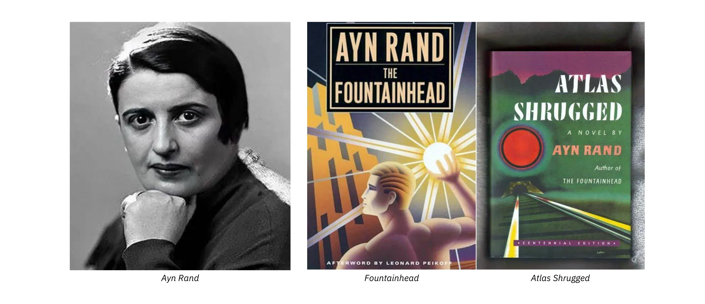

Kuid tegelikkus on hoopis teistsugune ja segadus tuleneb pigem semantilisest probleemist: tunnustades inimese võimet tegutseda ja teha valikuid, kuid tunnistades samas loogilist determinismi, mille objektiks ta on. on esimesed libertaarid tegelikult ka Spinoza pärijad. Spinozaga ühendab neid uskumus, et inimesed ei ole loodusest kõrgemal, vaid on hoopis evolutsioonilise protsessi tulemus, mis asetab nad determinismi, ajalukku, mis ületab neid ja on suures osas vastutav selle eest, mis inimesed on ja mida nad teevad.

Lõpuks, kui usk vabasse tahtesse on illusioon, millest on äärmiselt raske vabaneda, siis sellepärast, et see viitab tagasi teisele illusioonile, mis seda toidab, nimelt lõplike põhjuste illusioonile, mida ma kutsun teid järgmises peatükis uurima.

## Lõplike põhjuste illusioon

<chapterId>da2a7fb1-f1e9-5b56-822d-c73770de749d</chapterId>

:::video id=a0127fe7-a4cb-4a1c-8af4-f11c40b4a3d7:::

Eelmises peatükis nägime, et vaba tahte illusioon seisneb selles, et me usume, et me võiksime midagi alustada tühjalt kohalt, et ainult meie tahe võimaldaks meil oma elu juhtida ja et meil oleks määramata otsustusõigus. See on ettekujutus, et inimene on võimeline häirima looduse korda rohkem, kui ta sellele allub.

Kuid Spinoza (1632-1677) jaoks ei ole inimene "impeerium impeeriumi sees", st ta ei ole, vastupidiselt sellele, mida Descartes (1596-1650) kindlaks tegi, erand looduses ja ei ole kunagi vabastatud põhjuse ja tagajärje deterministliku ahela pikendamisest.

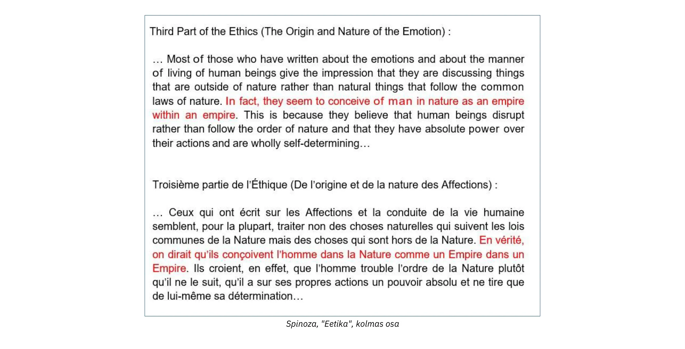

Ja kuna loodusel, ütleb Spinoza, ei ole moraalsest vaatepunktist vaadatuna mingit ettenähtud lõppu ja kuna inimesed kipuvad oma kujutlusvõimet mõistmisega segi ajama, siis tõlgendavad nad seda vastavalt sellele, mis sobib nende enda huvidele. Kuni selleni, et nad annavad asjadele tähenduse, mis tuleneb ainult sellest, kuidas nad neid hindavad ja endaga seostavad.

See tähendab, vastavalt nende soovidele, lootustele ja hirmudele.

Seda arutlust illustreerib lõplike põhjuste illusioon, mis on peamine takistus mõtlemisele ja mõistuse teostamisele, sest see väljendab lihtsalt meie vajadust panna asja tagajärjed vastama mitte selle tõelistele põhjustele, vaid uskumusele, isegi kui see on absurdne või lapsik.

Uskumus, mis väljendab kavatsust, eelkõige jumalikku, ja mis meie tõlgenduse kohaselt on sageli ebausklik, või teadmatus.

Seepärast on mõned inimesed alati pidanud uusi haigusi, nagu AIDS 90ndatel või koviidi 2020. aastal, jumaliku ja sageli karistava kavatsuse väljenduseks, vastavalt põhjendustele, mis on vastuolus ratsionalismi ja kaasaegse teaduse aluseks oleva põhjuslikkuse põhimõttega, mis on kehtestatud alates Kopernikust (1473-1543), Keplerist (1571-1630) ja Galileost (1564-1727).

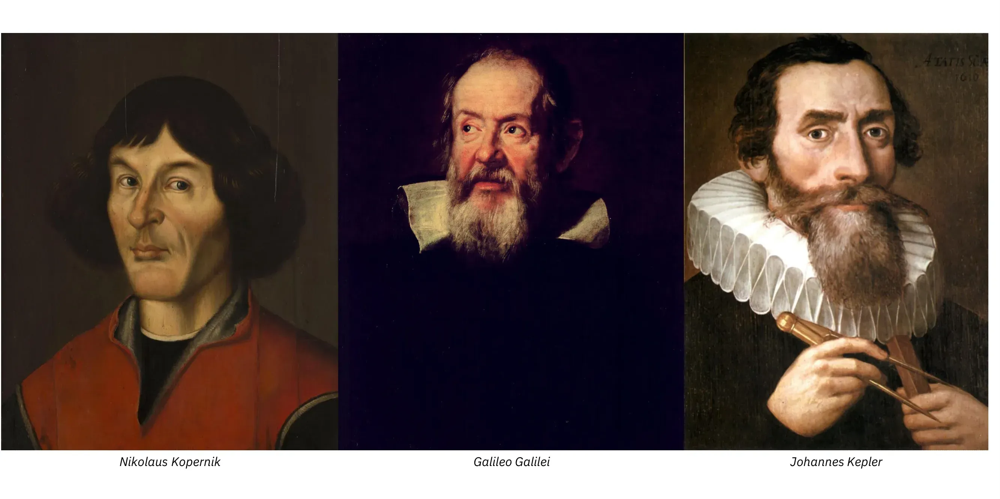

Nagu Spinoza ütleb, on tõsiasi, et inimestele on vähe tähtis, et nii paljud asjad on väljaspool nende kujutlusvõimet, et looduses on rohkem ebakorrapärasust kui korda. Ometi peaks nende arusaamatute asjade keerukus neid heidutama igasuguse teleoloogilise projekti uskumisest. See ei ole oluline, ütleb ta, sest inimeste usk nende kindluse asjakohasusse, mis põhineb sellel, mis sobib nende soovile ja kasulikkusele, on alati tugevam kui mis tahes ratsionaalne argument või mure tõe pärast.

Finalism tähendab seega asjade põhjuste ja tagajärgede ümberpööramist, et neid mõista: näiteks usume, et põhjus, miks meil on silmad, on nägemine, ja põhjus, miks meil on hambad, on närimine. Samal ajal, kui loomulikult oli nägemine see, mille tõttu inimliik arendas oma evolutsiooni käigus välja oma nägemise, ja tõepoolest, tänu vajadusele end toita ja süüa liha, arenes ka meie hambumus selliseks, nagu see on tänapäeval.

Just seda väitis ka prantsuse loodusteadlane Jean-Baptiste de Lamarck (1744-1829) (pilt 3.3.3), kui ta püstitas oma eelarwinistliku teooria, et organi loob funktsioon, mitte vastupidi.

Kuid nagu Spinoza ütleb, "inimeste eksitus ei lõpe sellega", ja kõigi naiivsete ja lõppkokkuvõttes üsna lõbusa teleoloogiliste ideede näidete seas toome sageli esile bioloog Bernardin de Saint-Pierre'i (1737-1814) kuulsa näite. See Pariisi loodusmuuseumi endine direktor pidas looduse finalismi poeetiliseks, lüüriliseks ja teatud naiivsusega, leides, et näiteks melon on loodud ainuüksi selleks, et meeldida suurtele peredele, sest selle sooniline koor võimaldab seda hõlpsasti võrdseteks viiludeks lõigata.

Keynesi majandusteadlaste ja heaoluriigi pooldajate esitatud inflatsiooni määratlus illustreerib seda paradoksi väga hästi. Nende sõnul on inflatsioon hinnatõus, mis mõnede keskpankurite sõnul tuleb kas "mitte kusagilt" või geopoliitilistest kontekstidest, mida keegi ei saa kontrollida ega ette näha. Kuigi hinnatõus võib tõepoolest põhjustada tsüklilist inflatsiooni - näiteks kui nafta hind tõuseb, tõusevad ka teatud töödeldud kaupade hinnad -, on inflatsiooni tegelikud struktuursed põhjused seotud peamiselt raha Supply suurenemisega, mis omakorda tähendab raha väärtuse langust ja ipso facto mehaanilist hinnatõusu.

Vastupidist uskuda või lasta teistel uskuda on sama, kui unistada silmad lahti, nagu Spinoza pilkavalt ütles, ja konstrueerida arutluskäik, mis on vale või eksitav ja mida on seda lihtsam vastu võtta, kuna seda kuuldakse kui oodatavat vastust, et tõestada enda õigsust. Antud juhul, kui riigi sekkumise pooldajad peavad inflatsiooni parimaks viisiks majandusprobleemide lahendamiseks.

Selline inflatsiooni kallutatud tõlgendus paneb meid aga unustama, et kuigi see on lühiajaliselt kasulik majanduse juhtimiseks, on see tegelikult varjatud maks, mis pikemas perspektiivis viib ainult inimlike ja materiaalsete katastroofideni ning muudab riigid võimetuks oma võimu mitte kuritarvitama. Just seda kirjeldab Friedrich Hayek (1899-1992) nii hästi oma essees "Tee pärisorjusse", kui ta toob esile orjuse, millest riigid ei saa enam vabaneda.

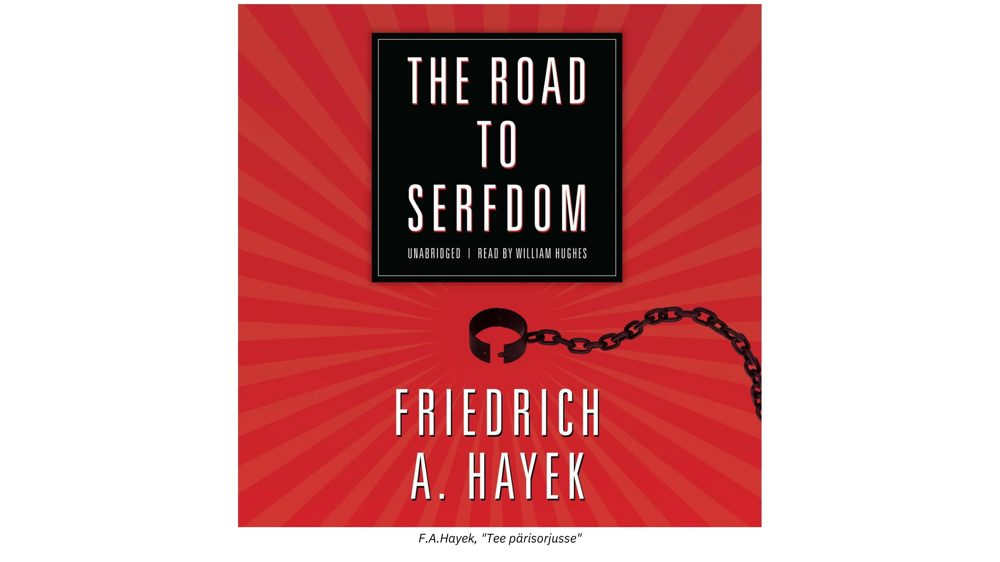

Lõpetuseks tasub siinkohal märkida, et seda finalistlikku mehhanismi illustreerib hästi ka viis, kuidas Bitcoin kritiseerijad väljendavad oma kriitikat, keskendudes just selle mõjule.

Sest kuigi Bitcoin mõningaid mõjusid võib kindlasti kritiseerida, on meil tänu kognitiivsele eelarvamusele, mis on seotud sellega, et tegemist on uue ja häiriva tehnoloogiaga, suur kalduvus näha ainult negatiivseid mõjusid. Eriti kui tegelikkus ei vasta meie soovidele, näiteks kui me oleme religioossed, kui seisame silmitsi Koperniku revolutsiooniga nagu Spinozism, või kui me oleme keskpankurid, kui seisame silmitsi detsentraliseeritud digitaalse valuutakontseptsiooniga.

Siiski on üsna selge, et kui religioosne inimene või keskpankur näitab üles mõistmist, uudishimu ja head tahet ning kui ta tunneb huvi mingi kontseptsiooni vastu, püüdes seda kõigepealt mõista, mitte hinnata selle mõju, et viia oma arvamus vastavusse oma ootustega, siis on ta kindlasti võimeline seda järgima.

Tänan teid tähelepanu eest ja kohtume järgmises peatükis.

## Teoloogiline illusioon

<chapterId>93554156-5e62-526d-9b71-49c47be916af</chapterId>

:::video id=9c490cc1-3d29-4ca7-9464-1a701bb91ba7:::

Selles viimases peatükis, mis käsitleb spinozismi pakutavat uut kopernikaalset ideede nägemust, pöördume lõpuks Spinoza (1632-1677) kolmanda illusiooni juurde, mida ta esitab oma teoses "Eetika".

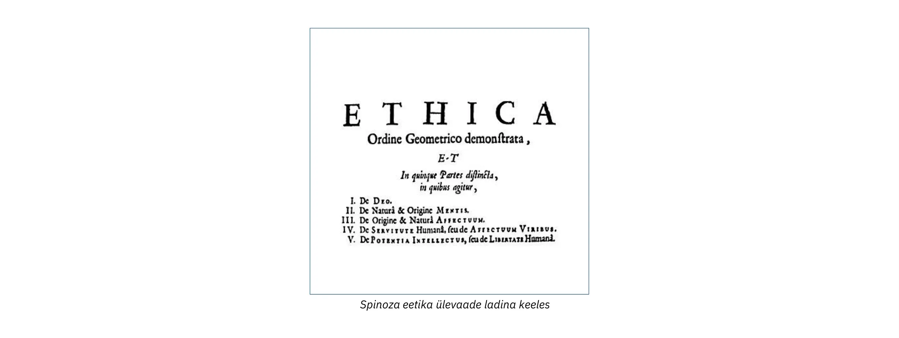

See illusioon on otseselt seotud kahe esimese, vaba tahte ja lõplikkuse illusiooniga.

Tegemist on teoloogilise illusiooniga.

Asi on selles, et: Nii kaua, kuni inimesed on teadmatuses, "nii asjadest kui ka iseendast", nagu Spinoza ütleb, nii kaua, kui nad usuvad oma illusoorse vabaduse, peavad nad oma kujutlusvõimet mõistmiseks, st nad peavad end alati võimeliseks mõtlema ja mõistma asjade olemust, kui nad tegelikult ainult kujutavad, leiutavad ja projitseerivad seda, mis on neile kasulik. Vastavalt nende soovidele.

Seepärast usuvad inimesed, et kui looduslikud vahendid on olemas ja kasulikud, näiteks hambad söömiseks või silmad nägemiseks, siis sellepärast, et need on loogiliselt loodud "looduse juhi" poolt. Teisisõnu, tahtlik, antropomorfne Jumal, kellele omistatakse inimlikud kavatsused.

Teisisõnu, valge habemega vanamees, kes on peidetud pilve taha ja kellele omistatakse, et ta on loonud kõik looduses olevad asjad, sest ta armastab meid ja kaitseb meid, kui me teda austame ja kummardame.

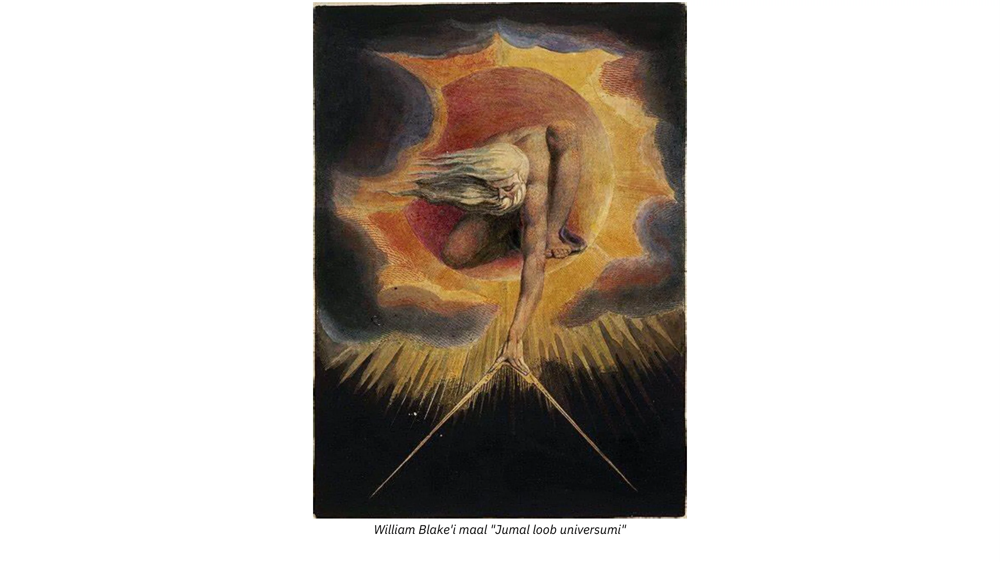

See on teoloogilise illusiooni esimene etapp.

Kuid vaatamata meie uhkusele, et me usume end olevat loodusest kõrgemal ja kujutleme, et me saame midagi alustada tühjalt kohalt, oleme tegelikult alati allutatud eksistentsi tingimustele, mis näitavad, et lõppkokkuvõttes ei saa me tegelikult "hakkama", nagu filosoofiaprofessor Gilles Deleuze (1925-1995) seda väljendas. Me oleme surelikud, nagu kõik loomad, kuid me teame seda.

Vastupidise uskumine või kujutlemine, et end rahustada, on põhjus, miks me pidevalt edasi-tagasi viskleme hirmu ja lootuse vahel, nagu kaks vastandlikku ja lahutamatut poolust turvatunde ja paanikatunde vahel, sest hirm on alati seotud lootusega parematele päevadele.

Et ei ole hirmu ilma lootuseta ega lootust ilma hirmuta ja et see, kes kardab, loodab alati pääseda sellest, mida ta kardab, samas kui see, kes loodab, kardab alati, et see, mida ta loodab, ei juhtu.

Ja kuna "me oleme valmis kergesti uskuma seda, mida me loodame", ütleb Spinoza oma Eetikas, siis just siis, kui me seisame silmitsi väliste põhjuste või sündmustega, mis oleksid meile kahjulikud, mis on vastuolus igasuguse kasulikkuse ideega, avaldub selle nn teoloogilise illusiooni teine etapp, mida iseloomustavad uskumused, millest tuleneb ebausklik meelestatus.

Teisisõnu, Voltaire'i (1694-1778) järgi "kurikuulsad", kelle jaoks ebausk ei sünni kunagi mõistusest ja vastab alati irratsionaalsele või põhjendamatule uskumusele, mis vastandub igasugusele ratsionaalsusele, omistades objektidele või tegevustele jõudu või vaimset jõudu, mida neil ei ole.

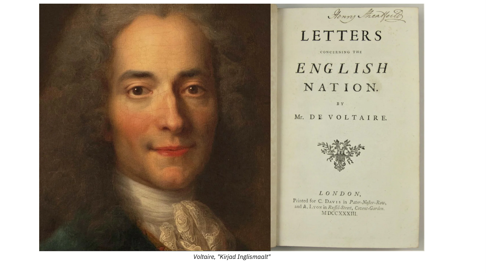

Selle ettekäändel, et meid vabastatakse, et me saame ette kujutada paremat maailma, lukustab ebausk meid tegelikult meie enda illusioonidesse ja valedesse. Sellisesse orjusse, millest meil on Hard aega end vabastada.

Just seda kaitsesid saksa, inglise ja prantsuse valgustuslased alates 18. sajandist, väites, et ebausk lihtsalt takistab inimeste täiskasvanuks saamist, mitte ainult piirates mõistuse kasutamist, vaid ka ja eelkõige tekitades sallimatust, mis on parim vahend võimu domineerimise kehtestamiseks. Olgu see siis poliitiline või religioosne.

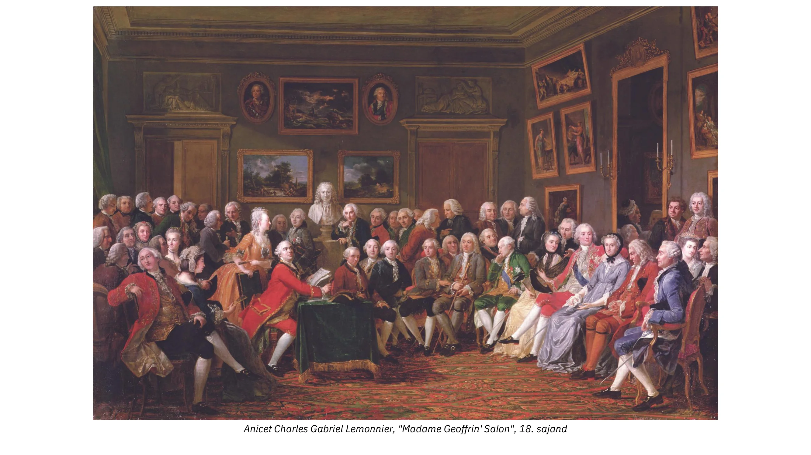

Ja seda demonstreerib Spinoza taas oma teoloogilis-poliitilises traktaadis, mida me juba puudutasime. Selles essees kirjutab ta, et "monarhilise režiimi suur saladus ja selle peamine huvi on inimeste petmine ja selle hirmu, mis peab neid kontrollima, varjamine religiooni nimega". Seepärast langevad türannid, diktaatorid või revolutsionäärid, kes on alati inimesed, keda ajendab soov teha teistele head, sageli, kui mitte alati, sinna lõksu, et teha oma põhimõtetele vastupidist, et neid saavutada.

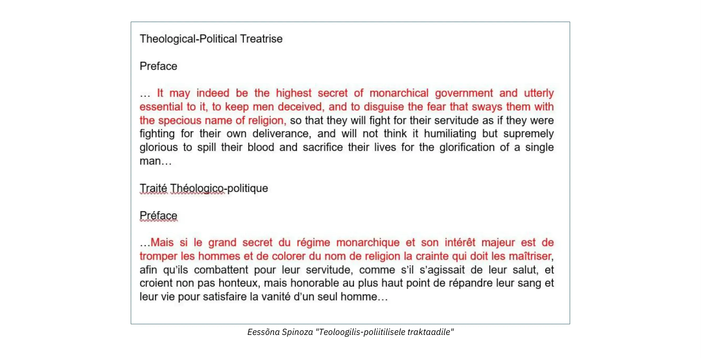

Kuid uudsus, mida Spinoza toob TTPsse ja mis teeb temast teatud mõttes sekularismi isa, on see, et kuigi on oluline võidelda ebausu ja vägivallale kutsumise vastu, mida vabadus paradoksaalselt võimaldab, on tõsiasi, et riigi huvides on kaitsta õigust uskuda ja vabadust mõelda.

Sest niipea, kui ideed on olemas ja neid väljendatakse eraviisiliselt, levivad need paratamatult kogu ühiskonnas ning ei keelamine ega tsensuur ei saa nende levikut kunagi takistada. Ideed, olgu need siis tõesed või valed, head või halvad, hakkavad igal juhul levima ning nende keelustamine võib pikemas perspektiivis viia ainult mässu ja riigi kukutamiseni vabaduse nimel.

Teisisõnu, riigil oleks tegelikult palju rohkem karta tsensuuri või sõnavabaduse mahasurumist kui selle säilitamist, ja seetõttu on Spinoza sõnul tema huvides lasta üksikisikutel kasutada oma loomulikku õigust mõelda ja end väljendada.

Spinoza jaoks on demokraatlik riik, mis võimaldab mõttevabadust, seega parim garantii, et inimesed elavad rahus ja et tänu mõistuse kasutamisele ei ole nad mitte ainult vabad mõtlema ja tegutsema, vaid suudavad ka mõista neid piiravaid sundusi, et neist vabaneda.

# Alates afektiteooriast kuni Bitcoin-ni

<partId>82e69d4f-a94f-5978-bcb8-8a7b4651bcca</partId>

## Kurja küsimus Spinozas

<chapterId>1ce64576-2688-5757-a119-57cc3a1076c0</chapterId>

:::video id=9c490cc1-3d29-4ca7-9464-1a701bb91ba7:::

Tahaksin nüüd arutleda kurjuse küsimuse üle, nii nagu Spinoza (1632-1677) seda oma teostes ja kirjavahetuses esitab.

Kuid olge hoiatatud, see on keeruline ja vastuoluline teema ning eesmärk on siinkohal lihtsalt mõista veel kord tema mõtteviisi, et paremini mõista seda, mis teda juhib, st vabaduse otsimist.

Nagu me nägime, tõstatab vaba tahte või mingi looduse finalismi mitteuskumine väga kiiresti probleemi kurjuse olemasolust meie igapäevaelus.

Teisisõnu, küsimus on selles, kas "kurjus" on looduses olemas ja kas inimesed on vastutavad nende tekitatud kahju eest.

Antiikfilosoofid uskusid, et kurja ei ole looduses olemas, ja näiteks Sokrates (470-399 eKr) õpetas, et "kurjus ei ole midagi". Tema sõnul ei olnud kuri inimene oma olemuselt kuri, vaid lihtsalt eksis teatud mõttes hea olemuse suhtes.

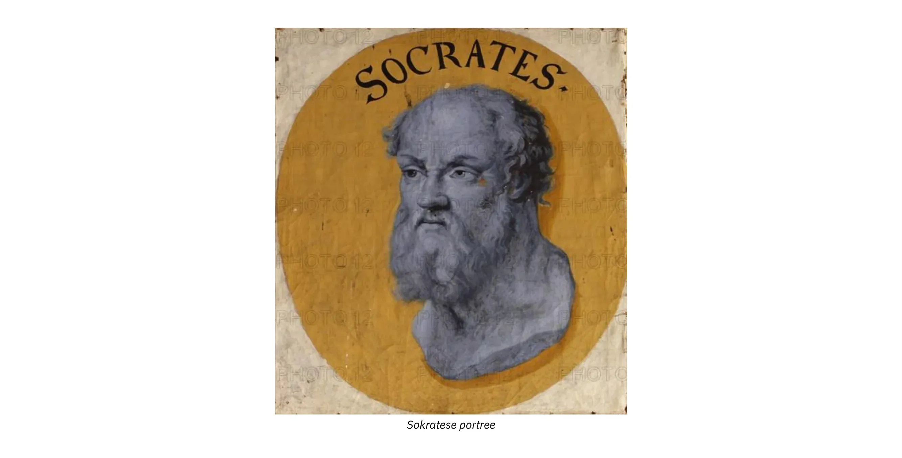

Kuid skolastiline traditsioon, eriti Püha Augustinuse (354-430) traditsioon, mis mõjutab kristlikku moraali tänapäevalgi, väitis, et kurjus mitte ainult ei ole olemas, et see on reaalsus, vaid et seda saab seletada, sest inimesed on vabad, sest nad on võimelised tegema valikuid hea ja kurja vahel ning et kurjus, mida nad põhjustavad, on seega täielikult nende endi vastutus.

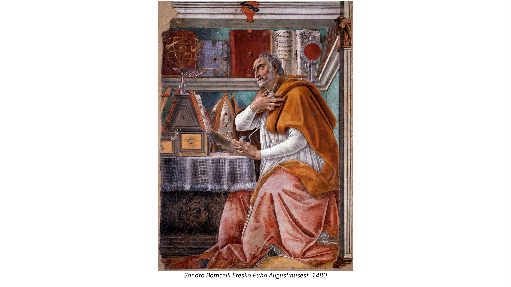

Ja isegi kui vastutust maavärina, surmava viiruse põhjustatud kahju eest või selle eest, et laps sünnib pimesi, ei tohiks omistada inimestele, püsib selline mõtteviis, andes loodusele moraalse kavatsuse, mis muudab nad vastutavaks. Näiteks arvates, et kui maavärin on toimunud, siis just seetõttu, et inimesed on käitunud halvasti.

See on religioossete inimeste poolt kaitstav idee, et inimesed on sündinud patused, süüdi pärispatus.

Muidugi, nagu te võite ette kujutada, rebib Spinoza selle idee tükkideks, sest ta leiab, et kuna Loodus või Jumal või õnn, nagu ta ütleb, ei ole varustatud kavatsusega ja kuna inimestel puudub vaba tahe, on neile omistatud vastutus "kurjuse" eest täiesti illusoorne.

"Looduses ei juhtu midagi sellist, mida saaks omistada selles eksisteerivale paheele," kirjutab Spinoza Eetikas, ja tema sõnul oleksime seega ekslikud, kui peaksime näiteks vastsündinu pimedust "kurjaks", sest pimedana sündides ei ole laps nägemisest rohkem ilma jäetud kui kivi.

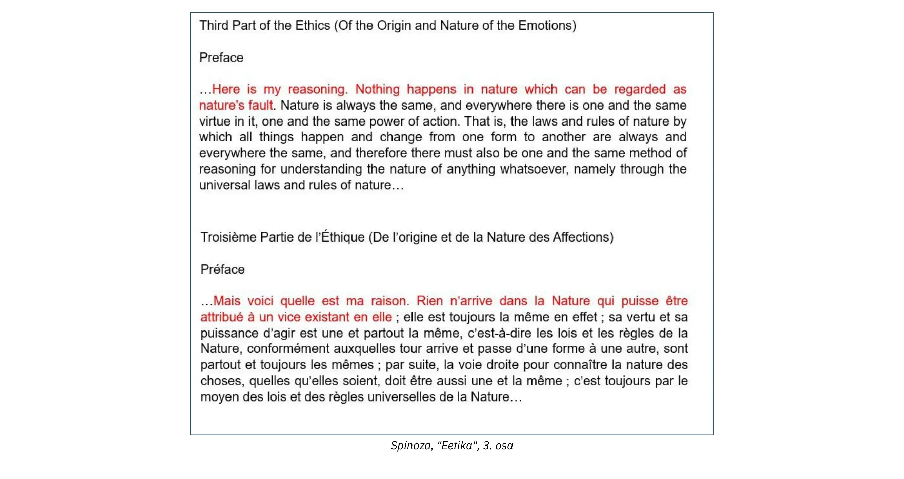

Ja kui me arvame, et pimedatel puudub nägemine, siis ainult nende seisukohast, kes näevad.

Spinoza võtab seega üles idee, et kurja ei ole looduses olemas, kuid tema originaalsus, mis teeb sellest revolutsioonilise filosoofia, seisneb selles, et ta leiab, et kurja ei ole olemas ja ka "head" ei ole olemas.

Ja seetõttu räägib ta pigem eetikast kui moraalist, ei mõtiskle selle üle, mis on õige või vale, sest need on kõik suhtelised ja subjektiivsed mõisted, vaid pigem selle üle, mis on "hea" või "halb" meie loomulikule vajadusele "püsida oma olemises", nagu ta ütleb. Teisisõnu, elada ja kasvada. Et inimesena õitseda.

Veelgi enam, me nägime juba, et Spinoza seisukoht nende inimeste vastutusest, kes käituvad halvasti, sooritades kuriteo, ei ole ilmselgelt mõeldud nende vabandamiseks.  Sest inimesed, isegi kui nad ei tea tõelisi põhjusi, mis määravad nad kuriteo toimepanemiseks, on alati teadlikud sellest, mida nad teevad, ja on seega sellisena vastutavad moraali ja seaduse ees.

On selge, et kurjategija teod on alati seotud perekondliku, sotsiaalse, majandusliku või isegi meditsiinilise determinismiga, kui tema kuritegusid saab seletada füüsilise või vaimse seisundiga. Ja see ongi õigusemõistmise roll, mis läheb kriminaalõigusest kaugemale, et võtta arvesse asjaolu, et teatud kuritegude eest tuleb mitte ainult karistada, vaid neid ka ravida, võttes arvesse kurjategija perekondlikku, sotsiaalset ja psühholoogilist tausta.

Seepärast selgitab spinozist Gilles Deleuze (1925-1995), et eetika on omamoodi etoloogia, st praktiline teadus olemisviisidest, või nagu ta ütleb, "heade kohtumiste tegemise kunst".

Teisisõnu seisneb vabadus Spinoza sõnul selles, et suuname oma eksistentsi sellele, mis "suurendab meie tegutsemisvõimet", ja vaatame alati optimistlikult tulevikku, näeme maailma sellisena, nagu see on, mitte kujutame seda ette nii, nagu me tahaksime seda näha.

Ja selles peitubki Spinoza demonstratsiooni geniaalsus, sest ta võitleb teadmatuse arstide ja kõigi nende vastu, kes väidavad, et on hea olla teadmatuses.

Vastupidi, Spinoza uurib inimlikke kirgi, isegi kõige irratsionaalsemaid, südamevalu, hullumeelsust, kurbust või melanhooliat, geomeetrite moodi, "more geometrico", nagu uuritakse punkte, jooni, pindu ja mahtusid.

See on afektide teooria, mida ta arendab oma eetika kolmandas osas ja mida ma soovitan teil nüüd uurida.

Tänan teid tähelepanu eest.

## Affektiteooria

<chapterId>3bb011ce-6f0c-51a6-b41f-25a3b5b7768e</chapterId>

:::video id=bb427cc6-e54d-4b44-bd6d-281ba421001a:::

Spinoza sõnul on vabadus mõiste, mida tuleb avastada, tee parema, võimsama elu poole. Vabamale elule. Tee, mis nõuab meilt absoluutse determinismi ja asjade ratsionaalse põhjuslikkuse tunnistamist.

Ta arendab oma süsteemi eetika kolmandas osas. See on kuulus "afektide teooria".

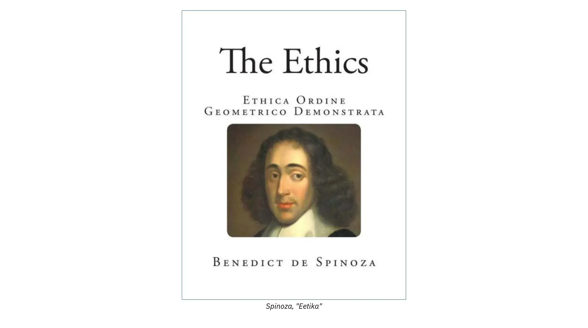

Põhimõte on, et inimese afektid on Spinoza sõnul keha ja mõtte aktiivsed või passiivsed modifikatsioonid, mis mõjutavad meie tegutsemisvõimet, st meie käitumist.

Ja ometi, sõltuvalt nii inimloomusele iseloomulikest kui ka välismaailmast tulenevatest mõjudest, oleme täiesti võimelised kujundama tõelisi ideid, arutlema ja rõõmu väljendama.

Kuid me oleme võimelised moodustama ka nn passiivseid afekte, eelarvamusi, mis siis mehaaniliselt, "iseendast hoolimata" viivad meid nii, et me ei näe ega tee enam seda, mida meie enda huvi nõuab.

Me räägime orjusest või orjusest, seisundist, mida iseloomustab võimetus kontrollida ja võidelda nende passiivsete afektide vastu, mis mõnikord panevad meid tahtma seda, mida me ei taha, ja tegema seda, mida me ei taha.

Just seda ütleb Spinoza oma "Eetikas", kui ta imestab, et "inimesed näevad sageli parimat, kiidavad selle heaks ja teevad halvimat", või et "nad võitlevad oma orjuse eest, nagu võitleksid nad oma päästmise eest".

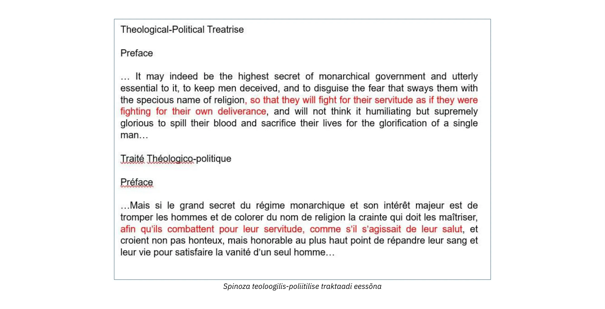

Spinoza võtab näiteks vihkamise, mida ta näeb kui passiivset afekti, mis on pööratud kurbuse poole ja mis on sündinud ebapiisavatest ideedest, st osalisest teadmisest põhjuste kohta, ja mida ta defineerib kui "kurbust, mis on seotud välise põhjuse ideega".

Teisisõnu, kui me vihkame võõrast, siis sellepärast, et me seostame seda võõrast ettekujutusega, mis meil temast on, põhjustel, mida me ei mõista, sest ta on võõras ja oma olemuselt teistsugune. See on see idee välise põhjuse kohta - idee, mis pealegi alati mehaaniliselt motiveerib teadmatuid rääkima halvasti mõistest, mida nad ei tunne.

See kehtib muide eelkõige krüptovaluutade valdkonnas.

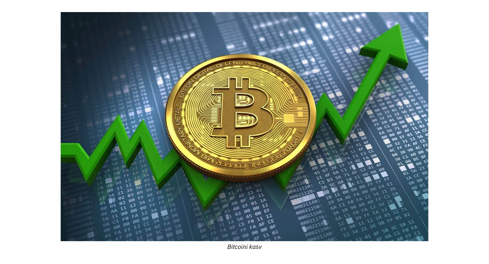

Spinoza ütleb, et kui me eemaldame selle negatiivse idee välisest põhjusest mitte moraali, vaid kasvatuse, empaatia, mõistuse abil, eelkõige keskendudes antud juhul selle võõra omadustele või Bitcoin puhul selle praktilisele aspektile või kasulikkusele, siis kaob sellega seotud kurbuse tunne ja automaatselt kaob ka vihkamine.

Tasub meeles pidada, et selline mõtteviis kehtib muidugi ka aktiivsete afektide ja eriti armastuse kohta, mis Spinoza sõnul on "rõõm, mis on seotud välise põhjuse ideega". Ja kui näiteks armastuse väline põhjus mingi asja või inimese vastu kaob või muutub aja jooksul, võib kaduda ka sellega seotud rõõm, kustutades armastuse tunde. See, kui me seda ei mõista, võib meid õnnetuks ja masendunuks muuta.

Aga kui see nn afektiteooria kehtib meie "alateadvuse" kohta, siis see ratsionaalne mõtteviis "maamõõtjate kombel" kehtib ka võitluses igasuguse välise alluvuse vastu, olgu see siis religioosne, poliitiline või loodusnähtuste tulemus.

See on välgu näide. Sest kui välk lööb ja tapab süütuid inimesi, kipuvad teadmatud nägema selles Jumala kätt, arvama, et välk väljendab moraalset ja finalistlikku kavatsust. 90-ndatel aastatel toimunud abinõusid või isegi, viimasel ajal, kovid on mõned tõlgendanud jumaliku karistusena.

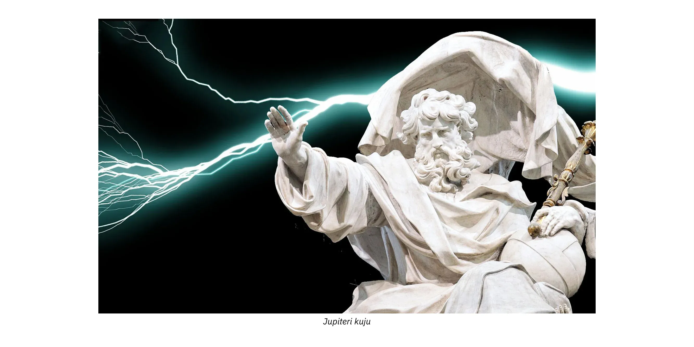

Samas on Spinoza jaoks muidugi kõik need teleoloogilised ideed pelgalt ebausk, teadmatuse sünonüümid, kuivõrd selles näites ei tee välk, mis lööb, nagu ta ütleb, midagi muud kui väljendab omaenda olemuse olemust. Mis seisneb selles, et ta lööb. Loomulikult ilma igasuguse moraalse kavatsuseta kedagi karistada või premeerida.

Tänu sellele lihtsale näitele mõistame, et ainus lahendus, kuidas kaitsta end äikese eest - teisisõnu, kuidas vabaneda orjusest, mida selle oht on meile alati peale sundinud - ei ole kurta oma ebaõnne või oletatava jumaliku ebaõigluse üle ega ka vähimatki moraalset argumenti esitada. Ei, pigem on ka siin, nagu vihkamise puhul, küsimus selles, et mõtiskleda selle üle, mida me saame teha eetilisest vaatepunktist.

Ja antud juhul oleks see, et me kaitseksime end äikese eest, olles ratsionaalsed, avatud progressile, olles uudishimulikud ja enesekindlad selle suhtes, mida teadus meile pakkuda võib, ja miks mitte ka paigaldada piksevarras.

See on eetika geniaalsus. Spinoza näitab meile, et on võimalik liikuda vabatahtlikust orjusest, "iseendast hoolimata" ja igavese võõrandumise säärast elust, elu poole, mida elatakse läbi kiindumuste ja määrangute tundmise.

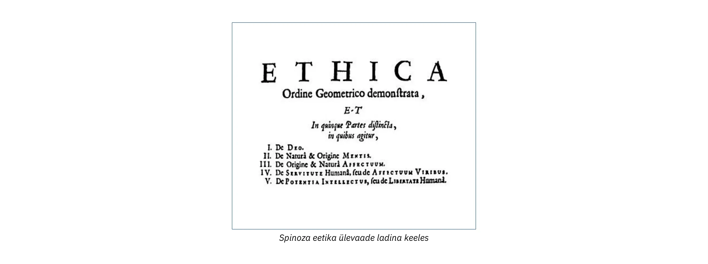

See on mõtteviis, mis võimaldab meil analüüsida inimloomust, et näha asjade helget külge või tõde. Et kõrvaldada kurbuse ja hirmu põhjused, mis meid painavad. Et olla vaba, teisisõnu, suutma lõpetada kurbade kirgede allumine ja muuta oma käitumist.

Ja mõista, ilmselt esimest korda filosoofia ajaloos, et sa võid olla selge ja õnnelik.

Seepärast nimetatakse Spinozismi sageli "rõõmu filosoofiaks".

## Vabadus, Austria majanduskoolkond ja Cypherpunk filosoofia

<chapterId>b54f2532-460c-11f0-a248-93ff24ef1d57</chapterId>

:::video id=5f49d5b4-e15f-475b-b40d-07464c08ca4d:::

Nagu te nüüd teate, on vabadus Spinoza järgi teadlikkus meie determinismist. Mõistuse juhtimisel ja tänu meie tegutsemisvõimele suudame mõista alluvuste põhjuslikku mehhanismi, nii et saame nende vastu võidelda, neid enam mitte kannatada ja mitte enam oma huvide vastu tegutseda.

Lõpuks tähendab see selgus, et ei ela enam nihilismi, mida hiljem kirjeldas Friedrich Nietzsche (1844-1900), kelle jaoks inimesed kaotavad end ideoloogilistes ideaalides, st poliitilistes või religioossetes fiktsioonides, mille tõttu nad eitavad reaalsust, infantiliseerivad end ja teevad end õnnetuks.

Just see oli valgustusaja ratsionaalse filosoofia eesmärk, eelkõige tänu Immanuel Kantile (1724-1804), kelle jaoks ainult haritud inimene saab mõistuse juhtimisel ise mõelda ja eetiliselt kindlaks teha, mis on "õige" või "hea" ja mis on mürgine.

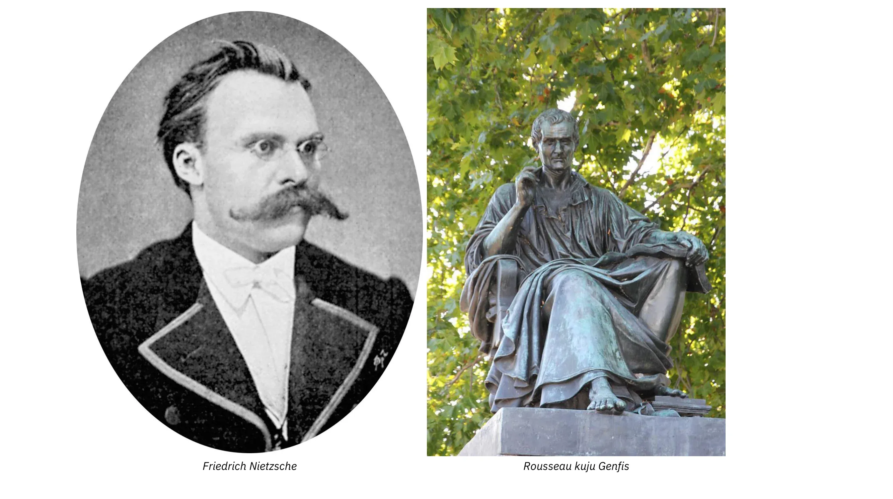

Teisisõnu, ütleb ta, kui me mõtleme ise, kui me arutleme ratsionaalsete täiskasvanutena ja kui me seega püüame end siduda asjade vaheliste põhjusliku seosega, siis ei ole meil enam vaja moraalset autoriteeti, kes õpetaks meile näiteks tõelisi religiooni voorusi või tõelisi eetilisi väärtusi poliitilises ja majanduslikus sfääris.

See on mõttekäik, mis loob seose Austria liberaalse majanduskoolkonnaga, mis sündis Viini äärmiselt viljakas intellektuaalses atmosfääris enne Esimest maailmasõda. Sest just selles kontekstis panid sellised intellektuaalid nagu Carl Menger (1840-1921), Ludwig von Mises (1883-1979) ja Friedrich Hayek (1899-1992) aluse uuele liberaalse majandusteaduse koolkonnale, mis pidi saama aluseks tulevaste tsüptofonistide veendumustele. Ja sellest ka Bitcoin loomine.

Näiteks Menger ja Mises tõdesid, et kõik teadmised peavad olema konstrueeritud vastavalt asjade vahelisele põhjuslikule seosele, ja pakkusid seega välja uue põhjusliku kontseptsiooni majandusteaduses. Inspireerituna eelkõige prantsuse majandusteadlase Frédéric Bastiat (1801-1850) poolt mõned aastad varem välja töötatud liberaalsest vaimust.

Hayek seevastu leiab, et kõik majanduslikud otsused väljendavad alati ebakindluse ja teadmatuse vormi ning et asjaolu, et selle all ei kannatata moraali, uskumuste, eelarvamuste või poliitiliste ideoloogiate tõttu, võimaldab majanduslikku käitumist õigesti analüüsida ja seeläbi kaaluda, mis on hea üksikisikule, ühiskonnale ja riigile.

Nii hakkasid need liberaalsed Austria majandusteadlased otsustavalt kritiseerima kõiki sotsialistlikke ideid - Hayek rääkis "planismist" - ja kogu neist inspireeritud moraalipoliitikat, mis tema arvates viib ainult hävingusse. Majandusliku võimu andmine valitsustele, mis olid paratamatult ajast maha jäänud ja ei olnud kursis sellega, mida tuleks ja mida ei tohiks teha, oli määratud ebaõnnestumisele.

Näiteks usuvad austerlased, et kui riik annab endale sunniviisiliselt õiguse luua raha majanduse juhtimiseks ja kriiside lahendamiseks, on oht, et ta ei suuda kunagi hoiduda selle võimu kuritarvitamisest.

Miks see nii on? Sest ta satub alati mingisugusesse alluvusse, mis takistab teda selles ja sunnib teda seega, nagu Spinoza ütleks, "nägema parimat, heaks kiitma... aga tegema halvimat".

Spinotsistina selgitab Hayek ühes videos, et "kuna seda võimu ei saa ilma vägivallata ära võtta, siis saab vaid kasutada trikki ja kehtestada uue rahakontseptsiooni, mida valitsused ei saa enam peatada". Milton Friedman (1912-2006) kordab seda argumenti intervjuus, kus ta omakorda arutleb selle uue digitaalraha vormi üle tekkiva interneti kontekstis.

Need on poliitilised ja majanduslikud argumendid, mida esitasid esimesed krüptopunkarid, Eric Hughes (1953-) oma "Cypherpunk manifestis" või Timothy May (1951-2018) oma "krüptoanarhistlikus manifestis", ja mida Satoshi Nakamoto võtab uuesti üles.

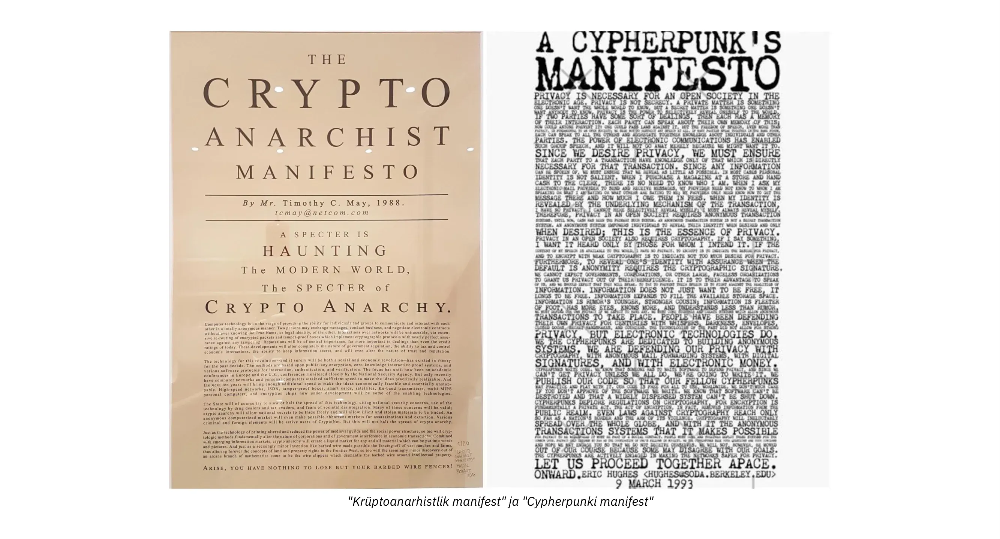

Eriti kui ta kirjutas Timesi 3. jaanuari 2009. aasta pealkirja Genesis ploki Blockchain Bitcoin mündipangale, et illustreerida ühe ajastu, keynesiaanliku, lõppu ja teise, liberaalsete, anarhistlike ja liberaalsete püüdlustega ajastu algust.

31. oktoobril 2008 avaldatud valges raamatus esitatakse Bitcoin kui detsentraliseeritud protokollil põhinev vahend, mille abil saab internetis väärtust vahetada ilma usaldusväärse kolmanda osapooleta. Koperniku revolutsioon, mis võimaldab inimestel lõpuks ometi taastada oma tegutsemisvõime, st oma vabaduse, vabaduse kaubelda, õiguse omandile ja austuse oma eraelu puutumatusele.

Miks? Sest Bitcoin võimaldab meil tänu mõistusele, tänu Galileo matemaatikakeelele Spinoza viisil sellest orjusest vabaneda. Ja, nagu Hayek soovitab, ilma, et riik saaks sellele vastu seista. Ja rahumeelselt, ilma sunnita või proselatsioonita.

Tegelikult on see viimane paralleel, mille ma tõmban spinozismi ja Bitcoin vahele, et näidata, et pole mõtet veenda kedagi, kes ei nõustu kopernikaanliku või murrangulise kontseptsiooniga, muul viisil kui mõistuse, mõistmise, uudishimu või hea tahte abil.

Mitte jõuga, mitte vägivallaga. Sest fakt on see, et Kopernik, Galilei, Newton, Darwin, Einstein, Hayek, Spinoza või Satoshi Nakamoto ei ähvardanud kunagi kedagi, kes ei uskunud nende ideedesse ja tutvustustesse.

# Lõpposa

<partId>70a5a3c8-6c88-11f0-8753-db07e26dcaf4</partId>

## Arvamused ja hinnangud

<chapterId>7945c38c-6c88-11f0-a73f-0f7cdf99f53f</chapterId>

<isCourseReview>true</isCourseReview>

## Lõpueksam

<chapterId>a557fd32-6c88-11f0-96ff-cfa532cf76a0</chapterId>

<isCourseExam>true</isCourseExam>

## Kokkuvõte

<chapterId>ae04ab38-6c88-11f0-a496-3be47119e6b6</chapterId>

<isCourseConclusion>true</isCourseConclusion>