# زمانی که اسپینوزا با ساتوشی ملاقات کرد

کشف کنید که چگونه ایده‌های رادیکال فیلسوف قرن هفدهمی باروخ دو اسپینوزا درباره آزادی، عقل و قدرت، انقلاب غیرمتمرکز بیت‌کوین را پیش‌بینی می‌کند. این دوره شباهت‌های شگفت‌انگیز را آشکار می‌سازد: هر دو ایمان کورکورانه و اقتدار مرکزی را رد می‌کنند، هر دو از دقت ریاضی برای آزادسازی استفاده می‌کنند. اسپینوزا ذهن‌ها را از جزم‌اندیشی مذهبی آزاد کرد، بیت‌کوین پول را از کنترل دولت آزاد می‌کند.

ابزارهای عملی از اخلاق اسپینوزا را بیاموزید تا مبانی فلسفی بیت‌کوین را درک کنید و کارگزاری خود را افزایش دهید. آیا آماده‌اید تا دو مورد از بزرگ‌ترین ابزارهای رهایی بشر در تاریخ را کاوش کنید؟
+++
# مقدمه

<partId>80b76189-afab-5295-a8d3-ba8f6fe7a5e8</partId>

## معرفی دوره

<chapterId>99af4992-fd6c-5142-b168-d927b251574b</chapterId>

:::video id=1def60bc-1d39-4e49-9b08-fd05b7a0d49b:::

در این دوره، خوشحالم که فلسفه باروخ اسپینوزا (1632-1677)، فیلسوف مشهور قرن هفدهم که به عنوان پدر فلسفه روشنگری عقلانی شناخته می‌شود، را ارائه دهم.

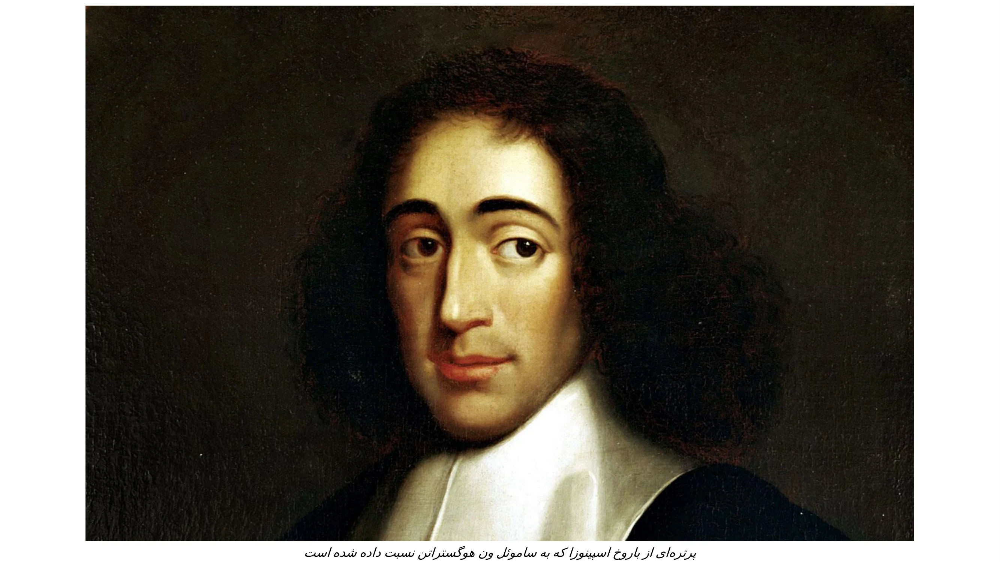

پرتره اسپینوزا

این دوره‌ها بر اساس دو مقاله من در این زمینه، "دین حقیقی اسپینوزا" و "Bitcoin، انجیل آزادی"، که به صورت کاغذی به صورت آنلاین یا مستقیماً از وب‌سایت من و به صورت دیجیتالی در آمازون کیندل در دسترس هستند، تهیه شده‌اند.

هدف این دوره، قبل از هر چیز، ارائه‌ی درکی ساده‌شده از فلسفه‌ای است که اغلب به عنوان بسیار پیچیده و غیرقابل دسترس تلقی می‌شود، علیرغم علاقه‌ی مجددی که امروزه به آن وجود دارد.

در واقع، این فلسفه به ما اجازه می‌دهد نه تنها زمانی که همه چیز اشتباه پیش می‌رود به معنای امور سوال کنیم، که عموماً موضوع دین، فلسفه و علوم انسانی است، بلکه همچنین، و شاید بیشتر، زمانی که همه چیز به خوبی پیش می‌رود از خودمان سوال کنیم.

وقتی زندگی به ما لبخند می‌زند و احساس می‌کنیم نیازی به زیر سوال بردن خود نداریم، با غروری که به‌عنوان توهمی و برده‌وار دیده می‌شود، در نظر می‌گیریم که خوشبختی یا موفقیت ما تنها از استعداد، کار یا انتخاب‌های به‌ظاهر آزاد ما ناشی می‌شود؛ به‌طور خلاصه، از اراده آزاد خودمان، نه از جبرگرایی که به آن محکوم هستیم.

به این ترتیب، می‌توانیم ارتباط بین این فلسفه عملی آزادی - یا به قول اسپینوزا، "به سوی وسایل دستیابی به آن" - و دنیای جدید فناوری که در اینجا به آن علاقه‌مندیم، به‌طور کلی رمزنگاری و به‌طور خاص Bitcoin را برقرار کنیم.

و به‌ویژه در جنبه فلسفی آن، که ما را دقیقاً به تأمل در مورد مفهوم آزادی وادار می‌کند: آزادی اندیشیدن، بیان کردن، احترام به حریم خصوصی و البته، در مورد ما، آزادی Exchange.

اول، من شما را با اسپینوزا، شخصیت او، زمینه‌های اجتماعی، مذهبی و خانوادگی او، و زمینه تاریخی جمهوری‌های متحد که در آن زندگی می‌کرد، آشنا خواهم کرد.

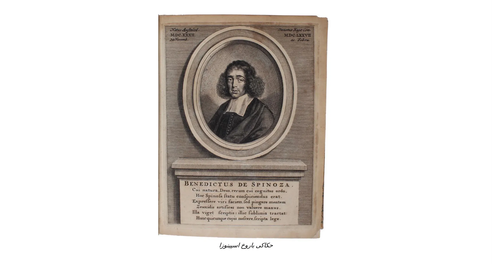

پرتره اسپینوزا

سپس خواهیم دید که این فلسفه عقلانی جدید چیست که بر اساس آن "هیچ چیز در طبیعت وجود ندارد که نتوان آن را بدون استفاده از عقل توضیح داد".

این ایده است که ما فقط می‌توانیم جهان و طبیعت انسانی را از نظر ارتباط علّی بین چیزها درک کنیم، که بر اساس آن، هر اثری همیشه علتی دارد و این علت خود اثر علتی دیگر است و به همین ترتیب، تا اولین علت که به آن دسترسی نداریم و به گفته اسپینوزا، طبیعت است.

طبیعت، به عبارت دیگر خدا، همان "Deus sive Natura" معروف به لاتین است که کل معنای اسپینوزیسم را نشان می‌دهد.

ما همچنین نگاهی به دو اثر اصلی اسپینوزا خواهیم داشت، با شروع از "اخلاق"، که پس از مرگ او در سال ۱۶۷۷ منتشر شد و به طور کامل بر آزادی و نیاز به رهایی از بندگی‌هایی که ما را محدود می‌کنند، تمرکز دارد.

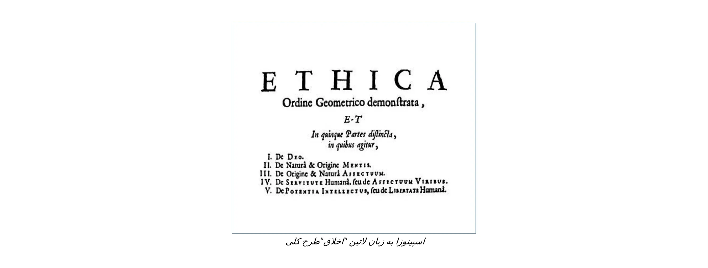

سپس به Traité théologico-Politique که در زمان حیات او در سال 1670 منتشر شد، خواهیم پرداخت که به ما اجازه می‌دهد آزادی را از زاویه‌ای دیگر بررسی کنیم: آزادی اندیشه و باور. به عبارت دیگر، آزادی مذهبی، اما بالاتر از همه آزادی سیاسی.

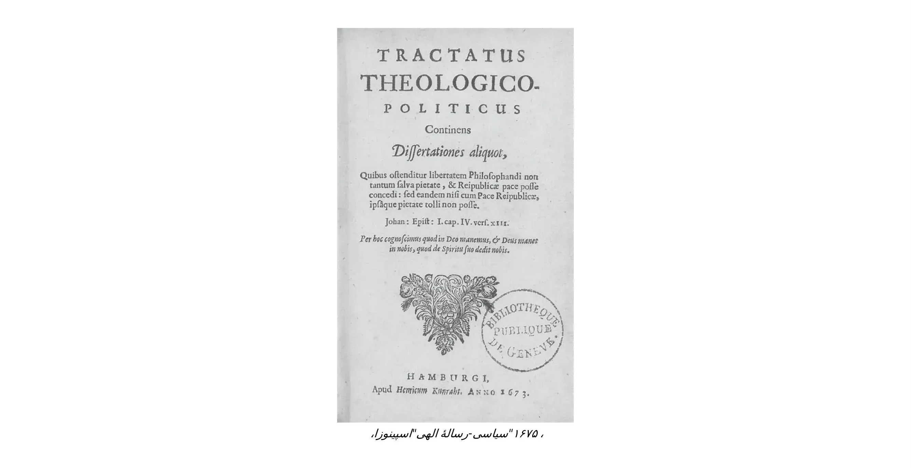

سرانجام، خواهیم دید که چرا اسپینوزیسم یک انقلاب کوپرنیکی در ایده‌ها است و چگونه نمایانگر تعریفی جدید از جهان و طبیعت انسان است، با مطالعه ۳ توهم بنیادی که اسپینوزا آنها را محکوم کرده است: توهم اراده آزاد، توهم علل نهایی یا نهایی‌گرایی، و توهم الهیاتی.

با تشکر از نظریه عواطف که به شیوه هندسه‌دانان، "بیشتر هندسی"، توسعه یافته است، ما بالاخره خواهیم دید که چگونه اسپینوزا روشی عملی برای رهایی از بندگی‌های ذاتی در طبیعت انسانی و احساسات خارجی به ما ارائه می‌دهد، یا تلاش برای رهایی از آنها. مکانیزمی عقلانی که برای مبارزه با جهل می‌توان آن را با قطعیت اینکه سه زاویه یک مثلث همیشه برابر با ۱۸۰ درجه است مقایسه کرد، و به ما اجازه می‌دهد تا روح روشنگری که از آن ناشی شده است را با جریان‌های لیبرال قرن نوزدهم یا لیبرتاریانیسم قرن بیستم که به طور مستقیم با اختراع Satoshi ناکاموتو، Bitcoin مرتبط است، پیوند دهیم.

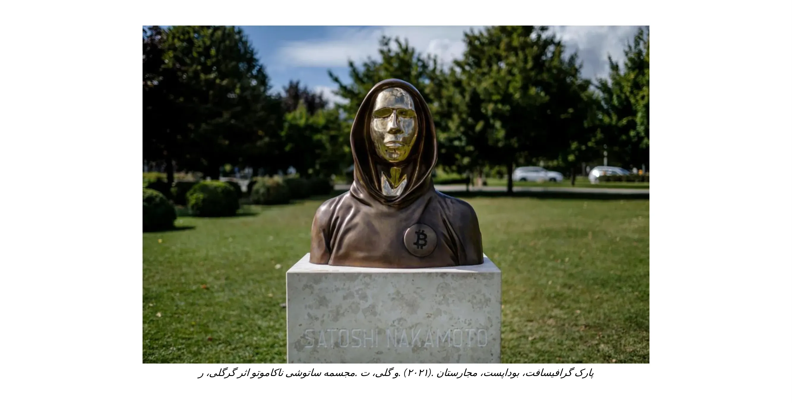

سپس خواهیم فهمید که، در میان نقاط مشترک بسیاری که بین مفاهیم اسپینوزیستی و این ابزار آزادی که توسط Satoshi ناکاموتو اختراع شده است، اولین نکته این است که در هر دو مورد، اگر کنجکاو و خوش‌نیت باشیم، همان‌طور که در آن زمان گفته شد، "فهم" داشته باشیم، نمی‌توانیم از پیوستن به آن خودداری کنیم. و اگر به آن نپیوندیم، که البته حق مطلق ماست زیرا احترام به آزادی باور داشتن یا نداشتن اساسی است، در آن صورت مصمم خواهیم بود که نتوانیم یا نخواهیم، که به همان معناست.

و به این ترتیب می‌توانیم بفهمیم که یک بنیادگرای مذهبی، به عنوان مثال، هرگز قادر نخواهد بود که کوچک‌ترین اندیشه کوپرنیکی مانند اسپینوزیسم را بپذیرد یا به آن گوش دهد، همان‌طور که یک بانکدار مرکزی پذیرش Bitcoin را بسیار دشوار خواهد یافت.

اگرچه، همانطور که می‌دانید، اوضاع در حال حاضر در مسیر درستی پیش می‌رود.

## معرفی باروخ اسپینوزا

<chapterId>f53a9cfd-326e-5b73-a766-3ef2f07c5a49</chapterId>

:::video id=5fac3ddc-c472-4c64-8186-46a8f317e389:::

باروخ د اسپینوزا که بود؟ او یک فیلسوف هلندی بود که در سال 1632 متولد شد و در سال 1677 در سن 45 سالگی درگذشت.

از ایمان یهودی، او عضو جامعه سفاردی پرتغالی بود که از مارانوهایی که در قرن ۱۵ توسط کاتولیک‌ها مجبور به ترک اسپانیا شدند، نسل می‌برد. او در محیطی مذهبی و فکری بزرگ شد و از معنای تحت تعقیب بودن آگاه بود.

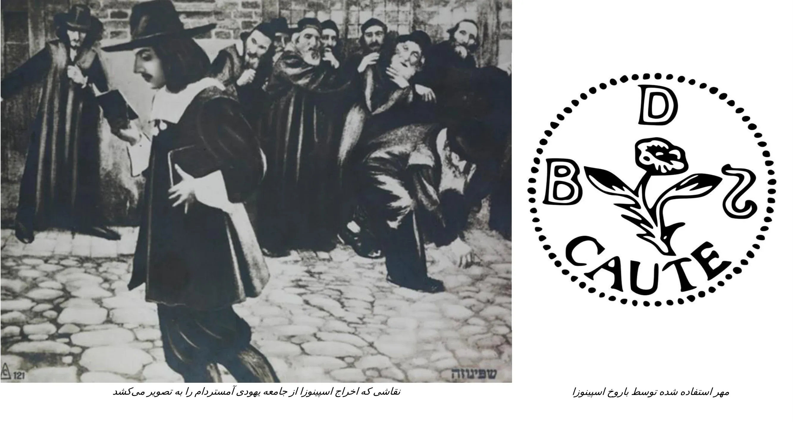

در واقع، او از سنین جوانی روحیه‌ای به شدت انتقادی نسبت به دین مستقر نشان داد، و به ویژه نسبت به جامعه عبری خود، که در سال 1656، در حالی که تنها 24 سال داشت و پیش از آنکه چیزی منتشر کرده باشد، به شدت از آن طرد شد.

گفته می‌شود که این "تکفیر" به او اجازه داد تا خود را منزوی کند و بدون هیچ‌گاه نگاه به گذشته، بر کارش تمرکز کند.

وارثی، مانند هم‌عصرانش دکارت (1596-1650)، پاسکال (1632-1662) و نیوتن (1643-1727)، به ایده‌های جدید عقلانی در فیزیک کوپرنیک (1473-1543)، کپلر (1571-1630) و گالیله (1564-1642)، که تنها چند سال پیش از او بودند، اسپینوزا روشی از تفکر را به شیوه هندسه‌دانان توسعه داد، مطابق با اصل گالیله که ریاضیات زبان جهان است.

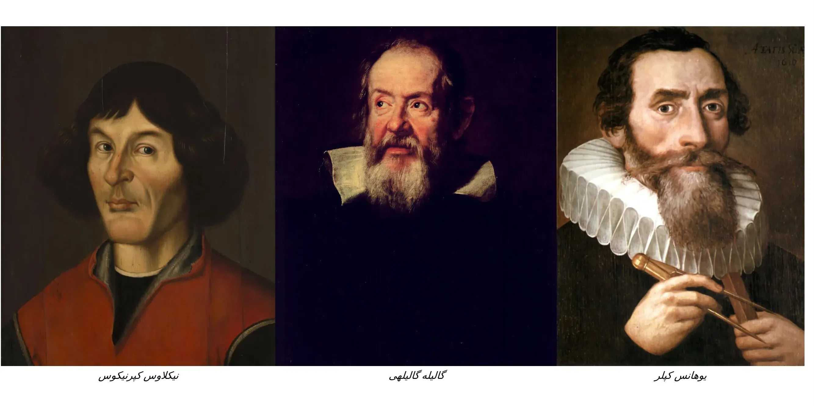

اما این‌ها ایده‌های بسیار خطرناکی برای آن زمان بودند، پس از محاکمه راهب و فیلسوف جوردانو برونو (1548-1600)، که به دلیل ارتداد در یک میدان عمومی در رم زنده زنده سوزانده شد، و محاکمه گالیله، که در سال 1633 توسط تفتیش عقاید مجبور شد از اعتقادات کوپرنیکی خود مبنی بر مرکزیت خورشید دست بردارد.

به همین دلیل است که دیدگاه کاملاً عقلانی او از جهان و طبیعت انسان، که بر اساس ارتباطات علّی بین چیزها بنا شده است، باعث شد که او به اشتباه به عنوان یک بی‌خدا شناخته شود و هنوز هم امروز به همین شکل در نظر گرفته می‌شود.

در واقع، آثار اسپینوزا تنها از خدا سخن می‌گوید، که او را با طبیعت یکی می‌داند، و در حالی که انگیزه‌های خرافی افراد مذهبی و تئوکرات‌ها را نقد می‌کند، نشان می‌دهد که دین واقعی برای او بیش از هر چیز مترادف با عدالت و نیکوکاری است.

و این رویکرد است که اسپینوزا را به فلسفه روشنگری پیوند می‌دهد، چه آلمانی با لایبنیتس (1646-1716)، کانت (1724-1804)، شوپنهاور (1788-1860) و نیچه (1844-1900)، چه انگلیسی با لاک (1632-1704) یا فرانسوی با ولتر (1694-1778)، روسو (1712-1778) و دیدرو (1713-1784). همه متفق‌القول بودند که باید از عقل برای مبارزه با تاریک‌اندیشی، به‌ویژه تاریک‌اندیشی مذهبی، برای مبارزه با جهل و دفاع از ایده‌آل‌های آزادی و پیشرفت استفاده کرد.

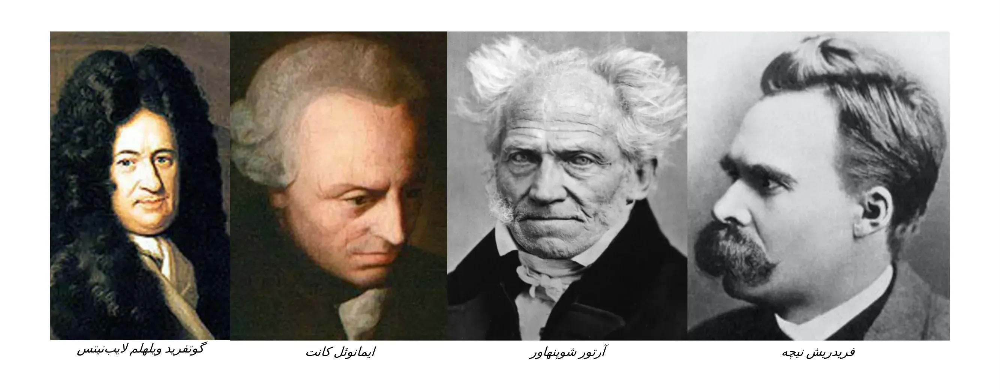

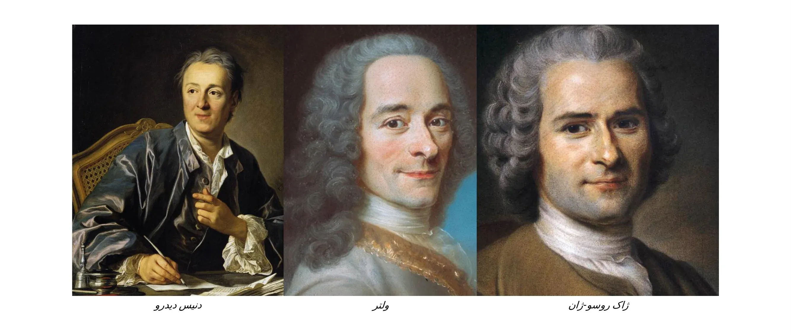

اکنون، برای شروع ارتباط این فلسفه با Bitcoin، مهم است که توجه کنیم اسپینوزا در دوره‌ای بسیار خاص به دنیا آمد.

در قرن هفدهم، استان‌های متحد نه تنها از نظر ایده‌های سیاسی و مذهبی آزادترین کشور جهان بودند، بلکه ثروتمندترین نیز بودند. به عبارت دیگر، پیشرفته‌ترین کشور از نظر اقتصادی و فناوری.

ثروت، با این حال، به منابع طبیعی، بهره‌برداری و تخریب مستعمرات یا برده‌داری وابسته نیست، بلکه به تجارت و بازرگانی بین‌المللی با روحیه‌ای لیبرال و کارآفرینانه وابسته است. روحیه‌ای که بعدها توسط یک اسپینوزیست معروف، ولتر (۱۶۹۴-۱۷۷۸)، حمایت شد، که برای او، در یک اتاق بازرگانی، یک تاجر یا کارآفرین با گرایش لیبرال هرگز به دلیل دین یا اصالتش طرد نمی‌شد، کافر نامیده نمی‌شد یا تکفیر نمی‌شد، بلکه تنها در صورتی که ورشکسته شده بود.

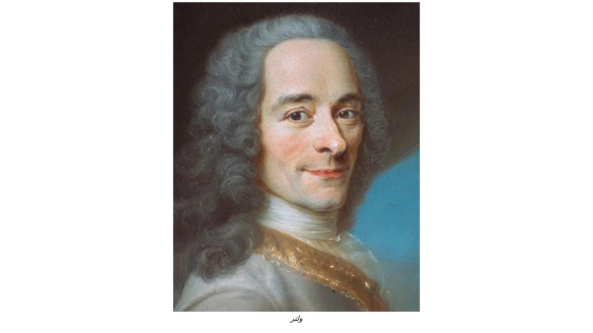

چه چیزی بیشتر، هلند در آن زمان نیز در زمینه‌های عمده فناوری پیشرفته بود، به عنوان مثال در زمینه‌های مکانیک و اپتیک. تلسکوپ‌های نجومی که توسط گالیله برای نگاه به آسمان و کشف جهان استفاده می‌شدند، واقعاً به عنوان فناوری پیشرفته برای دوران خود محسوب می‌شدند، همانطور که فناوری‌های جدید مرتبط با محاسبات، هوش مصنوعی و البته رمزنگاری امروز محسوب می‌شوند.

و از آنجا که خود اسپینوزا به حرفه‌ی صیقل دادن عدسی‌های نجومی مشغول بود - به طرز طنزآمیزی برای کسی که گفته می‌شود همه چیز را کج می‌دید - می‌توانیم تصور کنیم که او قطعاً از ابزاری برای آزادی مانند Bitcoin حمایت می‌کرد.

به عبارت دیگر، ارزش‌های آزادی و پیشرفت که توسط اسپینوزیسم منتقل می‌شوند، در تضاد با جهانی قرار دارند که در آن بنیادگرایی مذهبی، نظریه‌های توطئه، خرافات و از همه مهم‌تر، جهل همچنان یک واقعیت غم‌انگیز است.

با این حال، این جهانی است که در آن هر وسیله‌ای برای فرار ارزشمند است، برای رهایی از بندگی‌هایی که ما را محدود می‌کنند، و برای آزاد بودن با پذیرش جهان همان‌گونه که هست، نه آن‌گونه که ما می‌خواهیم باشد.

چه این ابزارها فلسفی باشند یا تکنولوژیکی، همان‌طور که بعداً خواهیم دید، Bitcoin ابزاری برای آزادی است. این ابزاری است که به افراد و دولت‌ها اجازه می‌دهد خود را از بندگی، به‌ویژه بندگی پولی، رها کنند.

# آثار عمده، اخلاق و سیاست

<partId>d7d7e9a1-005b-519c-b587-137435e46344</partId>

## اخلاق و جستجو برای آزادی

<chapterId>4cc66e25-335c-591d-9b78-83e5664bbbbc</chapterId>

:::video id=065c5091-69e1-412f-acce-c763ec31d3b1:::

در این فصل، پیشنهاد می‌کنم که اکنون به اثر اصلی اسپینوزا، با عنوان اخلاق، که پس از مرگ او در سال ۱۶۷۷ منتشر شد، بپردازیم.

چرا پس از مرگ؟ خب، چون ایده‌های او انقلابی بودند، یا حداقل خلاف شهود و مخرب، و بنابراین در آن زمان بسیار خطرناک بودند، حتی در بستر لیبرال استان‌های متحد قرن هفدهم.

اخلاق اثری است که به زبان لاتین به شیوه هندسه‌دانان نوشته شده است، احتمالاً با الهام از روحیه علمی گالیله (1564-1642)، پدر علم مدرن به همراه کپلر (1571-1630)، که بر اساس نظر او ریاضیات زبان جهان است. اسپینوزا ایده‌های خود را در پنج بخش اصلی توسعه می‌دهد و از قضایا همراه با براهین، توضیحات، اصول و تعاریف استفاده می‌کند.

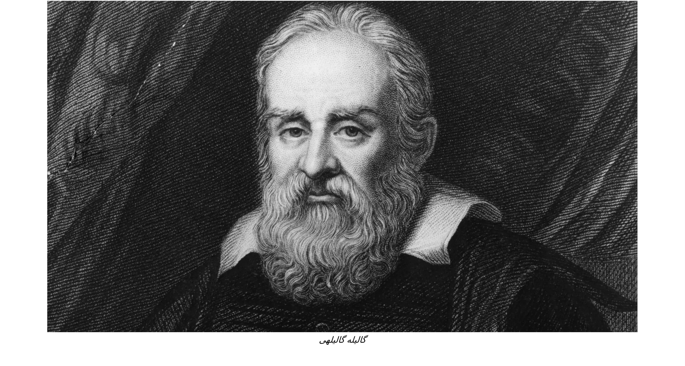

به این ترتیب، اخلاق، به گفته اسپینوزا، "راهی برای رسیدن به آزادی یا مسیرهایی که به آن منتهی می‌شوند" است و واقعاً کتابی نیست که بتوان آن را از ابتدا تا انتها خواند، بلکه کتابی است که می‌توان با خواندن، به عنوان مثال، یک قضیه که به قضیه دیگری اشاره دارد، که به نوبه خود از طریق قضیه سومی فهمیده می‌شود، و به همین ترتیب، در یک سیستم کاملاً منسجم، عقلانی و منطقی، کار کرد.

می‌خواهم اشاره کنم که وقتی اخلاق را باز می‌کنید، توصیه می‌شود با پس‌گفتارها و پیوست‌ها شروع کنید، این بخش‌های کوتاه توسط اسپینوزا به زبان روزمره نوشته شده‌اند، بنابراین فهم آن‌ها آسان است و به نوعی خلاصه‌ای از افکار گاهی پیچیده او هستند.

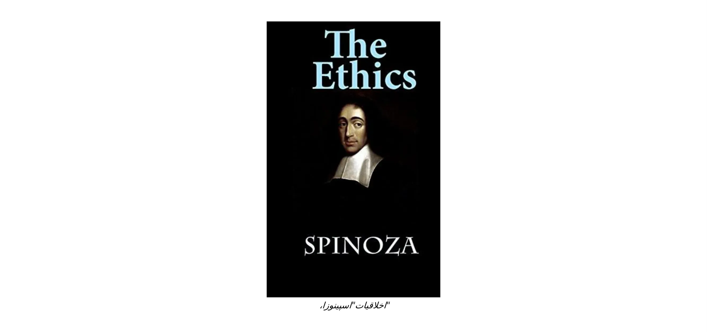

با قرار دادن جهان اطرافمان تحت "میکروسکوپ عقل"، آثار اسپینوزا طبیعت انسان را بر این اصل که انسان خود علت نیست، یعنی ما درخواست نکردیم که متولد شویم، نه اینجا، نه در زمان خودمان، و نه با چنین ویژگی‌های فیزیکی یا فکری، تجزیه و تحلیل می‌کند.

و او می‌گوید که ما بالاتر از طبیعت نیستیم. ما از قوانین آن مستثنی نیستیم، چه در جسم و چه در ذهن. به عبارت دیگر، ما به اندازه هر موجود زنده دیگری، حیوان یا گیاه، بخشی از طبیعت هستیم.

برای اسپینوزا، تمام حوزه‌های فعالیت انسانی به ظرفیت عقل برای درک جهان در یک سیستم کاملاً منسجم و معین وابسته است.

جهانی که در آن شانس وجود ندارد.

همه چیزهایی که اتفاق می‌افتد "ضروری" است و نتیجه یک علت است، بر اساس این ایده که "آنچه هست و آنچه اتفاق می‌افتد، باید باشد و باید اتفاق بیفتد". این جبرگرایی مطلق است.

اما دو نکته وجود دارد که باید در نظر داشت:

اولاً، اگر شانس برای اسپینوزا وجود ندارد، به این دلیل است که رویدادی است که علت آن را نمی‌دانیم. اما، البته، او می‌گوید، فقط به این دلیل که ما علت را نمی‌دانیم به این معنا نیست که وجود ندارد.

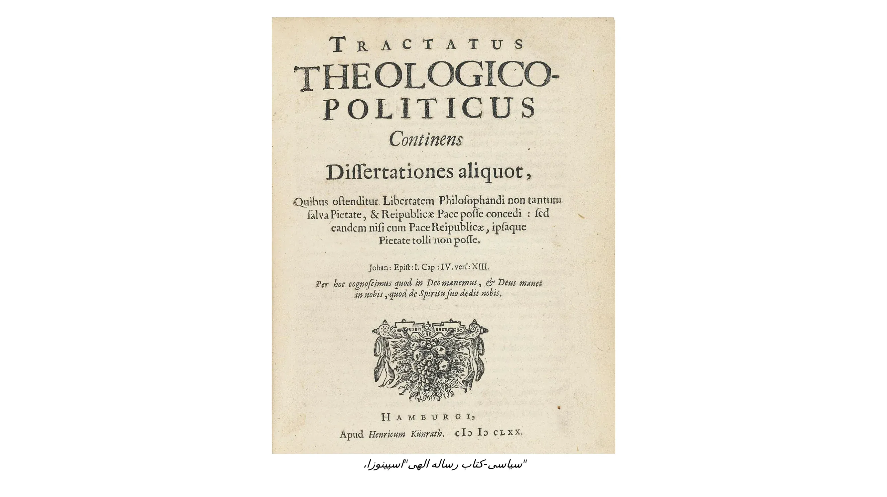

ثانیاً، به هیچ وجه مسئله جبرگرایی مطرح نیست، زیرا طبیعت دارای نیت نیست. به عنوان مثال، رعد و برق قصد مجازات کسی را ندارد، همان‌طور که ممکن است در مورد یک تراژدی فکر شود. نه، این صرفاً ذات طبیعت خود را بیان می‌کند، که همان ضربه زدن با رعد و برق است. ضربه زدن.

اسپینوزا به این ترتیب از این ایده دفاع می‌کند که واقعیت، یعنی زندگی روزمره با جنبه‌های خوب و بد، کاملاً قابل فهم است و هیچ پدیده‌ای در طبیعت وجود ندارد که به صورت علّی مرتبط نباشد. البته، این مسئله شر، به ویژه شر مطلق را مطرح می‌کند که کمی بعد به آن خواهیم پرداخت.

در نهایت، مهم است که توجه داشته باشید که اخلاقیات همان معنویت نیست.

با توجه به گفته‌های ژیل دلوز (۱۹۲۵-۱۹۹۵)، استاد مشهور فلسفه و متخصص اسپینوزا، اخلاق یک سیستم قضاوت است که برای زندگی در جامعه مفید است. اما این یک سیستم ذهنی است، زیرا چیزی که در اینجا درست است ممکن است در جای دیگری نادرست باشد و چیزی که امروز نادرست است ممکن است بعداً درست باشد.

و به جای تعیین اینکه چه چیزی درست یا غلط است، اخلاق تعیین می‌کند چه چیزی برای طبیعت و ظرفیت خودمان خوب یا بد است، می‌گوید اسپینوزا، تا در وجودمان حفظ شویم. آزاد بودن. بنابراین، این یک اتولوژی واقعی است، یعنی علمی درباره روش‌های بودن، یا به‌طور دقیق‌تر، همان‌طور که ژیل دلوز توضیح می‌دهد، هنر ایجاد برخوردهای خوب.

یا هنر انتخاب‌های درست برای رهایی از بندگی‌هایی که ما را محدود می‌کنند و به دلیل آن‌ها، به گفته اسپینوزا، انسان‌ها اغلب به "دیدن بهترین، تأیید آن و انجام بدترین" کاهش می‌یابند.

به عبارت دیگر، "برای بندگی خود بجنگند گویی که برای آزادی خود می‌جنگند".

## رساله الهی-سیاسی

<chapterId>84b0187e-1050-5d44-a536-80554896e828</chapterId>

:::video id=c1efc97e-1e96-4b37-894c-9a19794d6b52:::

پس از اخلاق، مایلم شما را با یکی دیگر از آثار مهم در این فصل آشنا کنم که به شما در درک تأثیر فلسفی و سیاسی اسپینوزا، به‌ویژه بر روشنگری آینده و بر جریان‌های لیبرال و، در مورد ما، لیبرتارین کمک خواهد کرد.

این Traité théologico-politique، یا TTP، است که به صورت ناشناس در سال 1670 منتشر شد.

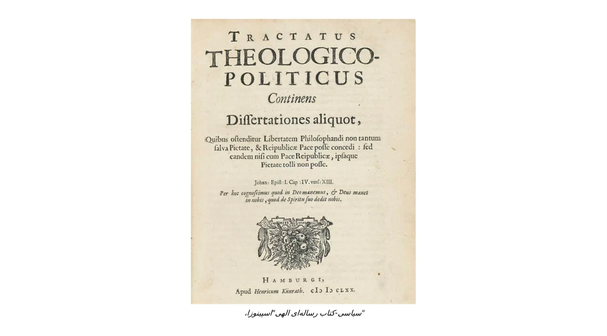

اسپینوزا (1632-1677) این کتاب را در حالی نوشت که نگارش اخلاق را متوقف کرده بود، در تلاشی برای پایان دادن به سوء تفاهمی که هنوز هم امروز وجود دارد. این باور که او یک بی‌خدا بود.

همان‌طور که دیده‌ایم، مفهوم خدا در نظر اسپینوزا موضوع کل بخش اول اخلاق است، که در آن نه تنها وجود خدا را اثبات می‌کند بلکه ماهیت واقعی او را نیز نشان می‌دهد.

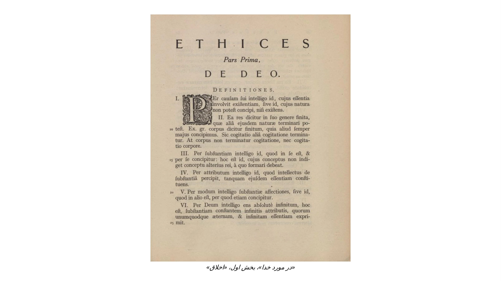

و از آنجا که مفاهیم اسپینوزا عموماً بسیار دشوار برای درک هستند، اغلب آسان‌تر است که با گفتن آنچه که نیستند، آن‌ها را بفهمیم، به جای تلاش برای گفتن آنچه که هستند. رویکردی که، به طور اتفاقی و همان‌طور که بعداً خواهیم دید، برای درک Bitcoin بسیار مفید است.

این‌گونه اسپینوزا به ما نشان می‌دهد که خدا، از دیدگاه او، یک موجود انسان‌وار با نیت‌های خاص نیست که مجازات یا پاداش دهد، کسی که ما با او صحبت کنیم و او بر اساس یک آیین به ما گوش دهد که ممکن است آن را دنبال کنیم یا نکنیم. به عبارت دیگر، به گفته او، خدا یک پیرمرد با ریش سفید بلند نیست که پشت ابری پنهان شده باشد و مشکلات جهان را حل کند و ما را به او وابسته کند.

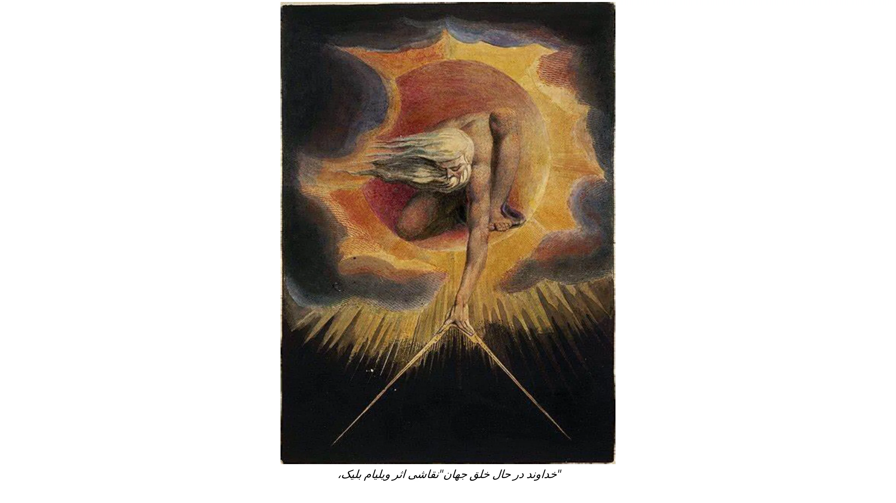

بنابراین صحبت از خدا به معنای فراخوانی طبیعت به عنوان یک جوهر منحصر به فرد، بی‌نهایت و ابدی است که از تعداد بی‌نهایتی از صفات تشکیل شده است که ما انسان‌ها تنها دو مورد از آن‌ها را می‌شناسیم: ماده، یا بُعد، و اندیشه.

این همان "Deus Sive Natura" معروف است که اسپینوزا از آن مفهوم جبر مطلق و ایده‌ای را استخراج می‌کند که انسان علت خود نیست و بالاتر از طبیعت نیست و قطعاً بالاتر از حیوانات نیست.

اما فراتر از نقد دین، TTP بیش از هر چیز فرصتی برای اسپینوزا است تا انتقادی شدید از مردم مذهبی و تئوکراسی ارائه دهد. به عبارت دیگر، قدرت مذهبی ترس و خرافات را پرورش می‌دهد و او می‌گوید، احساسات غم‌انگیز افراد را فعال می‌کند تا بهتر آنها را به بردگی بکشاند و آنها را در توهم، تعصب و جنگ گرفتار کند.

در این مرحله ابتدایی و کودکانه دین، مؤمنان تنها به عبادت ظاهری و ایمانی ساده‌لوحانه مبتنی بر تعصب وابسته می‌شوند. مرحله‌ای که در آن دین به‌طور مکانیکی غیرقابل تحمل می‌شود، از حدود آموزش اخلاقی خود منحرف می‌شود و با ادعای داشتن حقیقت، از رسالت خود برای ترویج صلح و هماهنگی دور می‌شود.

با این حال، هنگامی که از نقد عقلانی دین فراتر می‌رویم، مثلاً با تفسیر کتاب مقدس، اسپینوزا می‌خواهد ما را متقاعد کند که این دیدگاه جدید از خدا کاملاً با پیام‌های عدالت و نیکوکاری سه دین بزرگ کتاب سازگار است، که یک قاعده طلایی ساده اما اغلب فراموش شده را بیان می‌کند: "همسایه‌ات را مانند خودت دوست بدار".

اما این همه ماجرا نیست.

این دیدگاه بالغ از دین که در TTP توسعه یافته است، با یک بُعد سیاسی همراه است، یعنی ضرورت جدایی دین از دولت به منظور حفاظت از آزادی اندیشه و باور، به نفع همۀ افراد و خود دولت.

اساساً، اسپینوزا آزادی را در چارچوب عقلانیت به عنوان یک شرط اساسی برای انسان‌ها می‌داند تا بدون اینکه توسط قدرتی مخالف با منافعشان به بردگی گرفته شوند، زندگی کنند و بنابراین او از دموکراسی مستقیم مبتنی بر آزادی سیاسی و مذهبی دفاع می‌کند.

به عبارت دیگر، آزادی اندیشه و باور، به‌طوری‌که مردم بتوانند از بندگی و باورهای نادرست و کودکانه رها شوند، به‌عنوان بزرگسالان به استدلال بپردازند، به عقلانیت اولویت دهند و همچنین، تا جایی که به ما مربوط می‌شود، به پیشرفت فناوری اهمیت دهند.

زمین‌لرزه بدنام لیسبون در ۱ نوامبر ۱۷۵۵، نشان‌دهنده تغییری عمده در نحوه تفکر مردم درباره رویدادها و بلایای طبیعی و چگونگی محافظت از خود در برابر آن‌ها بود.

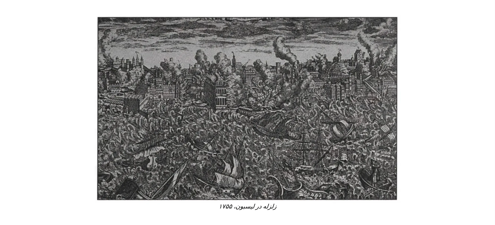

این زلزلهٔ وحشتناک شهر را ویران کرد و صدها هزار انسان بی‌گناه را کشت که بسیاری از آن‌ها در آن لحظه در کلیسا بودند، زیرا روز عید همهٔ قدیسان بود و این بر ناباوری بازماندگان افزود.

نمایشی که سوال مطرح شده توسط فیلسوف و ریاضیدان آلمانی لایبنیتس (1646-1716) درباره دیدگاه انسان‌گونه از خدایی با نیت، خوبی و قادر مطلق را احیا کرد. زیرا اگر خدا خوب بود، همان‌طور که لایبنیتس در کتاب تئودیسه خود می‌گوید، پس نمی‌توانست قادر مطلق باشد، زیرا اجازه چنین فاجعه‌هایی را می‌داد، و اگر قادر مطلق بود، پس نمی‌توانست خوب باشد، زیرا نمی‌توانست از وقوع آن‌ها جلوگیری کند.

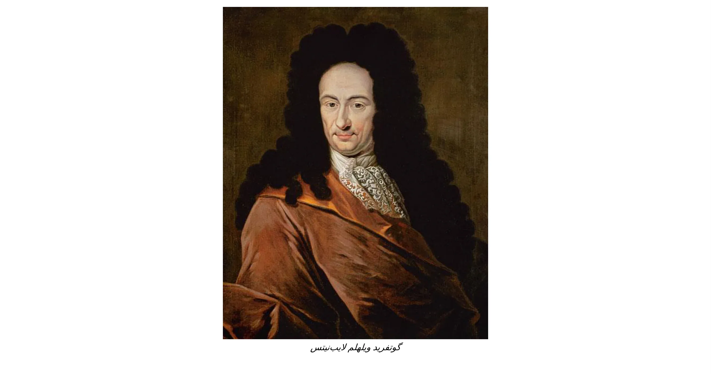

فراتر از محکوم کردن دست خدا، ژان-ژاک روسو (1712-1778) به ولتر نوشت، که از بی‌عدالتی و وحشت‌هایی که به‌طور تبعیض‌آمیز توسط بشریت تحمل می‌شد، متأثر شده بود، که "طبیعت به خودی خود شرور نبود و ما نباید در آن دستی الهی ببینیم که طرح آن را توضیح دهد".

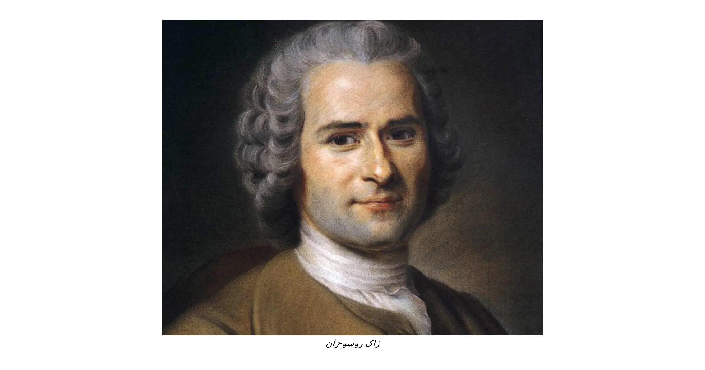

ولتر (۱۶۹۴-۱۷۷۸)، که اگر کسی اسپینوزیست بود، او بود، پاسخ داد که این فاجعه طبیعی باید بیش از هر چیز به ما بفهماند که وسایل علمی برای محافظت از خود در برابر طبیعت وجود دارد، و چالش زمان آن‌ها این بود که بپرسند آیا انسان‌ها می‌توانند، به لطف دانش و پیشرفت، آینده خود را به دست بگیرند و خود را از الهیات و خرافات رها کنند.

و در حالی که، البته، مسئله جلوگیری از زلزله‌ها نبود، که هنوز نه تنها غیرقابل پیش‌بینی بلکه کاملاً غیرقابل کنترل هستند، بیشتر مسئله اطمینان از این بود که، به عنوان مثال، خانه‌ها به گونه‌ای ساخته شوند که بتوانند در برابر آن‌ها مقاومت کنند.

این است که چرا روشنگری قرن هجدهم، به لطف به‌کارگیری عقل، علم و فناوری، قرن پیشرفت است. به عبارت دیگر، پیشرفت به عنوان ابزاری برای آزادی.

# انقلاب اسپینوزی، سه توهم

<partId>f5d45c2b-28da-527a-ab20-dd255e9a9e0d</partId>

## تعریفی جدید از طبیعت و انسان

<chapterId>3e6599e3-5b29-50a8-a67d-d0386da5d65d</chapterId>

:::video id=b6d2c035-8848-4da6-9da9-be3b70be0f38:::

در این فصل، می‌خواهم نگاهی به تاریخ ایده‌ها بیندازم و ببینم چرا اسپینوزیسم به عنوان یک انقلاب کوپرنیکی واقعی در ایده‌ها محسوب می‌شود.

با تشکر از این روش جدید درک خدا، به عبارت دیگر طبیعت، که توسط ریاضیات ارائه شده است، اسپینوزا (1632-1670) یک تغییر پارادایم عمیق ایجاد کرد که پیامدهای غیرمستقیمی برای جهان‌بینی مذهبی و جایگاه انسان در آن داشت.

همان‌طور که نیکلاس کوپرنیک (1473-1543) ثابت کرد که زمین مرکز جهان نیست و چارلز داروین (1809-1882) سه قرن بعد نشان داد که انسان‌ها در مرکز "زندگی" قرار ندارند، اسپینوزا نیز این منطق را دنبال کرد و در زمان خود اظهار داشت که انسان‌ها "صاحب‌خانه خود" نیستند و جهان تنها برای منفعت آن‌ها ساخته نشده است.

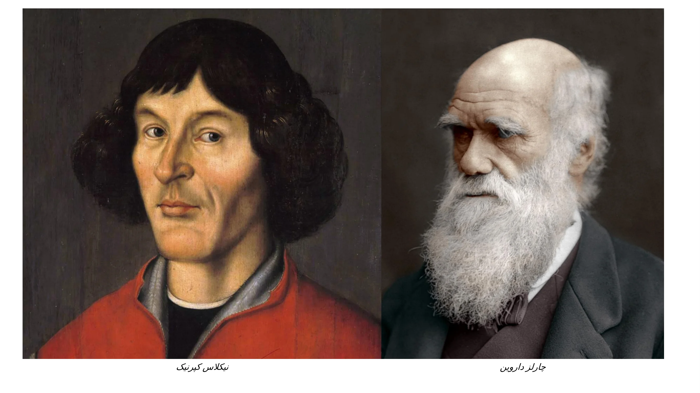

او می‌گوید که انسان "امپراتوری درون امپراتوری" نیست و همان‌طور که زمین به وضعیت یک سیاره صرف، مانند تمام سیارات دیگر تقلیل یافته است، انسان نیز به وضعیت یک حالت صرف از طبیعت تقلیل یافته است، مانند تمام حالت‌های محدود دیگر طبیعت، مانند حیوانات، گیاهان و تمام "موجودات موجود".

پیش از او، فلسفه کلاسیک یونان باستان دیدگاهی منظم و سلسله‌مراتبی از جهان ارائه داد تا جهان، کیهان و تجربه انسانی را توضیح دهد. بر اساس روایت‌های اسطوره‌ای، اساساً به دنبال توضیح منشأ جهان بود و بر هماهنگی جهان، طبیعت و انسان تأکید داشت.

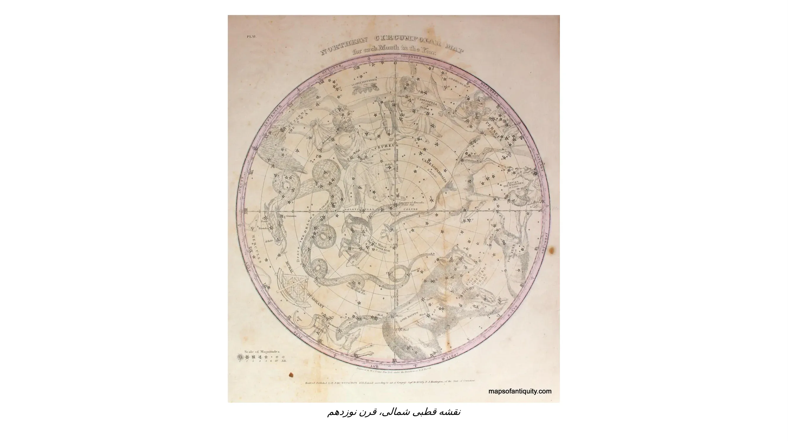

کیهان‌شناسی مدرسه‌ای در قرون وسطی، اساساً از قرن دوازدهم به بعد، تکاملی به سوی استدلال بیشتر بود تا عقل و ایمان را برای توضیح جهانی که هنوز سلسله‌مراتبی بود، اما بهتر با فلسفه مسیحی مطابقت داشت، هماهنگ کند.

اما با فیزیک جدید کوپرنیک (1473-1543) در قرن پانزدهم، کیهان‌شناسی دچار نقطه عطف بزرگی در درک جهان شد، که مدل زمین‌مرکزی آن به نفع سیستم خورشیدمرکزی به چالش کشیده شد و راه را برای علم مدرن، به ویژه فیزیک و نجوم جدید کپلر (1571-1630) و گالیله (1564-1642) هموار کرد. سپس آیزاک نیوتن (1643-1727) و در نهایت آلبرت انیشتین (1879-1955)، یک اسپینوزیست متعهد.

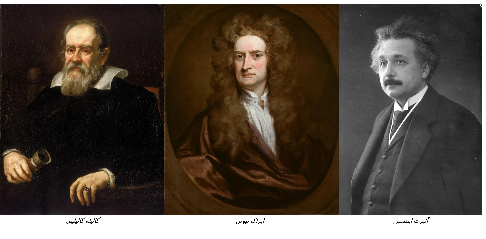

اما برای درک کامل اسپینوزیسم، باید به زمینه رنه دکارت (1596-1650)، فیلسوف مشهور فرانسوی که پیش از اسپینوزا بود و اسپینوزا هم شاگرد و هم تحسین‌کننده بزرگ او بود، توجه کنیم.

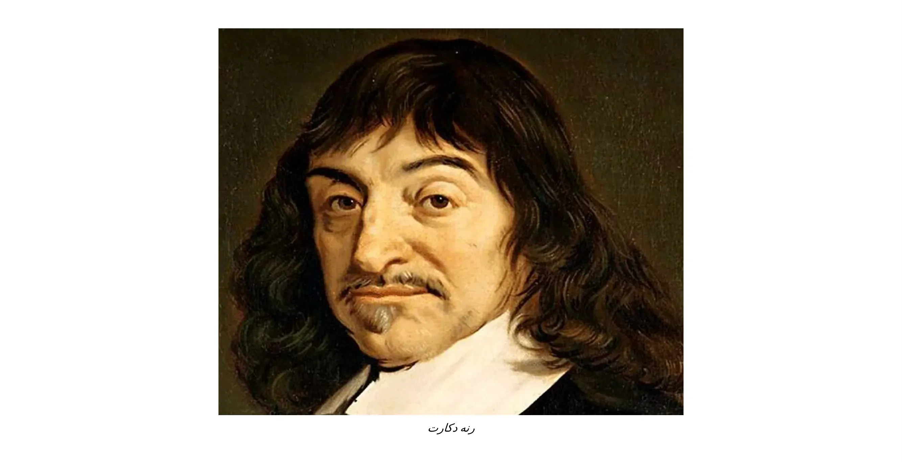

با وجود خطرات و محکومیت‌های جوردانو برونو (1548-1600) و گالیله، دکارت تصمیم گرفت تا "حقیقت را از کذب" تمیز دهد و الهیات، فلسفه و فیزیک را هماهنگ کند. در رساله معروف خود به نام گفتار در روش، که در سال 1637 منتشر شد، دکارت استدلال کرد که عقل پایه و اساس دانش است که از طریق آن انسان‌ها می‌توانند به آزادی دست یابند.

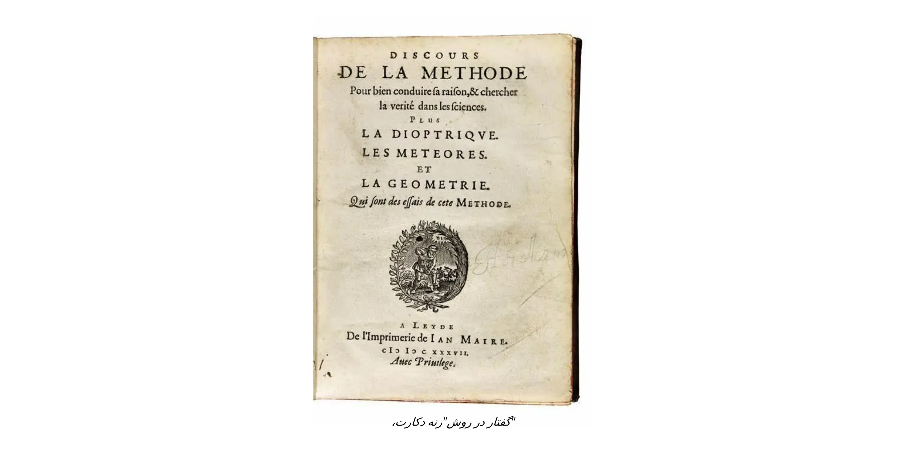

با توضیح جهان بر اساس قوانین جهانی به جای طبیعتی که با نیت‌های اخلاقی مجهز شده است، او راه را برای جبرگرایی هموار کرد، که اسپینوزا بعدها مطابق با آن عمل کرد.

اما به عنوان یک کاتولیک، دکارت با این حال یک سلسله مراتب بین انسان‌ها و دیگر حالت‌های محدود طبیعت برقرار کرد، و به ویژه در مورد گونه‌های حیوانی، آنچه او "حیوانات ماشینی" نامید. و با گفتن اینکه "هیچ روحی نیست که، وقتی به خوبی هدایت شود، نتواند قدرت مطلق بر اعمال و احساسات خود را به دست آورد"، دکارت ادعا می‌کند که انسان‌ها توانایی شروع چیزی از هیچ را دارند، و به نظر او، "از قوانین طبیعت فرار می‌کند"، که او قدرت مطلق بر اعمال خود دارد و تعیین خود را تنها در خود پایه‌گذاری می‌کند.

اسپینوزا می‌دانست چگونه از این مرحله فراتر رود و وجود خدا را با نمایش عقل آشتی دهد. برای او، تمام حوزه‌های فعالیت انسانی به ظرفیت‌های عقل در جهانی کاملاً منسجم و معین وابسته است. اما جهانی که در آن نه تصادف وجود دارد و نه شانس، و در آن هر چیزی که اتفاق می‌افتد ضروری و نتیجه یک علت است، بر اساس پیوند علّی بین چیزها. این ایده جبر مطلق است.

و این در شدیدترین عبارات است که او در نهایت موضع دکارتی را رد می‌کند و به عنوان مثال، ایده‌ای را که انسان‌ها مانند سایر حیوانات تابع قوانین طبیعت نیستند و بنابراین برتر از سایر حالت‌های محدود طبیعت هستند، مورد انتقاد قرار می‌دهد.

به عبارت دیگر، آنها به اراده آزاد مجهز شده‌اند، باوری وهم‌آلود که فرار از آن بسیار دشوار است، همان‌طور که اسپینوزا به ما می‌گوید، و اکنون به بحث درباره آن خواهیم پرداخت.

## توهم اراده آزاد

<chapterId>f147a914-cb64-5927-b305-26691930bca3</chapterId>

:::video id=b59da795-ba19-4643-9672-36c9e7953a42:::

در این دوره، اکنون به پرسش حساس اراده آزاد می‌پردازیم تا بهتر بفهمیم آزادی برای اسپینوزا، برای روشنگری و برای فیلسوفان اولیه لیبرال چیست.

همان‌طور که قبلاً دیده‌ایم، اسپینوزا (1632-1677) به خاطر این‌که اراده آزاد را به‌عنوان یک توهم می‌داند که رهایی از آن بسیار دشوار است، شناخته شده است.

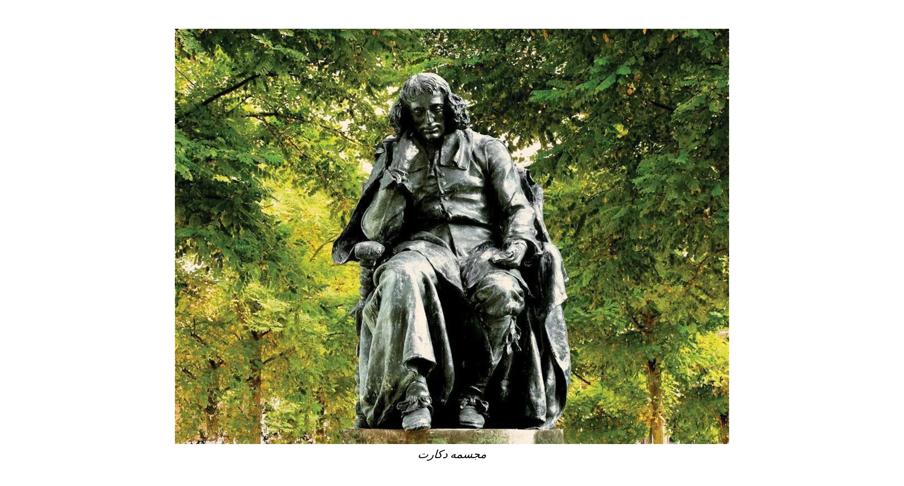

چرا این‌گونه؟ زیرا این امر برخلاف سنت فلسفی از دوران باستان است و همچنان توسط دکارت (1596-1642) دفاع می‌شود که انسان‌ها می‌توانند چیزی را از هیچ آغاز کنند و مسئولیت کامل اعمال خود را به‌ویژه در برابر خدا بر عهده بگیرند، می‌گوید سنت آگوستین (354-430)، پدر کلیسای مسیحی.

اما همچنین، البته، در برابر عدالت انسانی.

این ایده که اراده ما، و تنها اراده ما، به ما اجازه می‌دهد زندگی‌مان را هدایت کنیم، این که ما قدرت مطلق بر اعمال‌مان داریم، و این که آزادی اعمال‌مان را صرفاً از خودمان می‌گیریم، بنابراین دارای قدرت تصمیم‌گیری نامعین هستیم.

به عبارت دیگر، بشر قادر است نظم طبیعت را مختل کند، به جای اینکه تحت تأثیر آن قرار گیرد.

در جریان زندگی‌اش، زیرا او نمی‌خواست تابع هیچ قانونی جز اراده‌ی خود باشد، بنابراین نه تنها بالاتر از طبیعت و حیوانات، که صرفاً ماشین‌هایی هستند، بلکه بالاتر از همه‌ی حالت‌های محدود طبیعت نیز قرار می‌گرفت. این دیدگاه دکارت (1596-1650) بود که علل ناتوانی و ناپایداری انسان را نه در نظم طبیعی، بلکه در رذایل ذات انسانی می‌دانست.

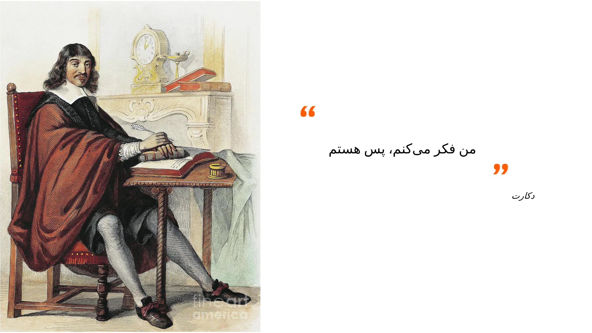

اما در حالی که اسپینوزا دکارت را به خاطر باز کردن راه برای کنترل عقلانی زندگی احساسی تحسین می‌کند، با انتقاد قاطع از این فرضیه "قدرت مطلق" اراده، خود را کاملاً از او جدا می‌کند.

از سوی دیگر، اسپینوزا معتقد است که دنیای ما کاملاً منسجم و تعیین‌شده است و هر چیزی که اتفاق می‌افتد ضروری است و نتیجه علیت چیزها است، به طوری که یک اثر همیشه علتی دارد و این علت خود اثر علت دیگری است و به همین ترتیب ادامه می‌یابد.

این ایده جبر مطلق است که او در اخلاقیات خود بیان می‌کند که انسان‌ها هیچ اراده آزادی ندارند زیرا، به گفته او، آن‌ها از اعمال خود آگاه هستند، اما علل واقعی که آن‌ها را تعیین می‌کند را نادیده می‌گیرند یا ترجیح می‌دهند نادیده بگیرند.

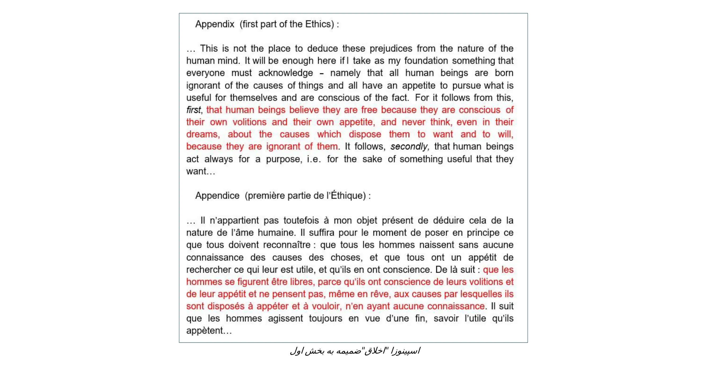

برای اسپینوزا، انسان‌ها به عنوان "حالات محدود" طبیعت مانند حیوانات یا گیاهان، نمی‌توانند چیزی را از هیچ شروع کنند؛ آنها از قوانین طبیعت، هم در بدن و هم در ذهن خود، مستثنی نیستند.

بدتر از آن، برای او، بزرگترین خطر آزادی این است که به اراده آزاد خود باور داشته باشیم و باور کنیم که می‌توانیم بدون تعیین شدن توسط علل خارجی عمل کنیم.

برای اسپینوزا، آزادی بیان اراده آزاد نیست، بلکه توانایی درک جایگاه درست ما در جهان است، درک طبیعت تعیین‌شده‌مان و از آنجا هدایت وجودمان به سوی آنچه "قدرت عمل ما را افزایش می‌دهد". با همیشه به آینده با خوش‌بینی نگاه کردن و دیدن جهان همان‌طور که هست، به جای تصور آن به شکلی که دوست داریم ببینیم.

البته، مشکلی که پیش می‌آید مسئولیت انسانی و اعمال آن‌ها است. ما می‌توانیم نتیجه بگیریم که اگر افراد در اعمال خود آزاد نباشند، در برابر آن‌ها مسئولیتی نخواهند داشت، به ویژه در برابر عدالت. اما این دیدگاه گمراه‌کننده است، زیرا بدون ورود به جزئیات زیاد، شناخت جبر اجتماعی، خانوادگی و تاریخی فرد مانع از این نمی‌شود که مسئولیت اعمال انجام شده را در نظر بگیریم، زیرا این اعمال داوطلبانه هستند.

از سوی دیگر، باور به اینکه اقدامات یک مجرم هرگز به تعیین‌گرایی خود او مرتبط نیست، یک توهم خواهد بود. در حالی که مسئله توجیه آنها نیست، حداقل مسئله تلاش برای درک آنهاست. در واقع، این همان کاری است که عدالت انجام می‌دهد: فراتر از مجازات اقدامات غیرقانونی، نقش پیش‌بینی و حفاظت از آینده را ایفا می‌کند، به همین دلیل است که برخی جرایم نه تنها مجازات می‌شوند بلکه با در نظر گرفتن پیشینه خانوادگی، اجتماعی و روان‌شناختی مجرم، درمان نیز می‌شوند.

این رویکرد به آزادی به عنوان یک ظرفیت برای عمل، ارتباطی است که می‌توانیم با فلسفه روشنگری قرن هجدهم برقرار کنیم. به گفته یکی از بزرگ‌ترین سفیران آن، فیلسوف آلمانی ایمانوئل کانت (1724-1804)، روشنگری در واقع وسیله‌ای برای رهایی انسان‌ها از وضعیت قیمومیت بود، یا همان‌طور که اتین دو لا بوئسی (1530-1563) می‌گفت، از بندگی داوطلبانه که خودشان مسئول آن بودند.

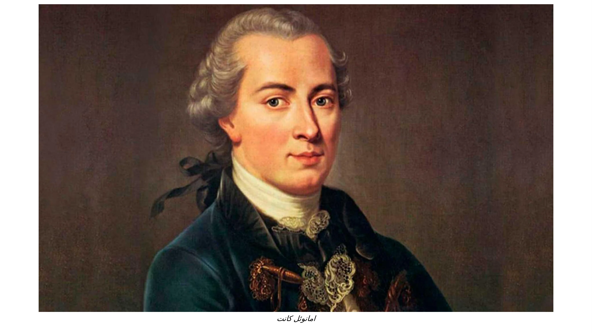

شعار کانت "خودت فکر کن" و "جرأت دانستن داشته باش"، همان لاتین معروف "Sapere Aude" است.

ظرفیت عمل اسپینوزا در واقع قدرتی است که انسان‌ها در درون خود دارند تا وضعیت حیوانی خود را درک کنند و طبیعت و پدیده‌های آن را، چه مثبت و چه منفی، با مرتبط کردن آن‌ها به علل عینی بفهمند، به‌طوری‌که به توضیحات اخلاقی که نادرست و خیالی هستند، یعنی توضیحاتی که برای تطبیق با خواسته‌های ما شکل گرفته‌اند، متکی نباشند. بلکه، این ظرفیت در جستجوی توضیح آن‌ها از طریق عقل، با هدف رهایی و آزادی، نهفته است.

و پیشرفت، که به اولین انقلاب‌های تکنولوژیکی و اولین ایده‌های لیبرال و کارآفرینی در اواخر قرن 18 منجر شد، به ویژه با فیلسوف لیبرال انگلیسی جان لاک (1632-1704) و اقتصاددان انگلیسی آدام اسمیت (1723-1790).

و ارزش دارد که تعریف زیگموند فروید (۱۸۵۶-۱۹۳۹) از توهم را به یاد بیاوریم. به گفته پدر روانکاوی، که همیشه به تأثیر اسپینوزا بر کار خود اذعان داشت، توهم دقیقاً "باوری است که با تحقق یک خواسته انگیزه می‌گیرد و به این ترتیب واقعیت را نادیده می‌گیرد".

در نهایت، شایان ذکر است که در حالی که جنبش لیبرترین که قرار است درباره آن بحث کنیم مستقیماً به این فلسفه لیبرال جدید اشاره دارد، افرادی هستند که اشاره می‌کنند شخصیت‌هایی مانند آین رند (1905-1982)، نویسنده "اعتصاب" و "سرچشمه"، از وجود اراده آزاد حمایت می‌کنند و معتقدند که انسان‌ها توانایی انتخاب‌های آزاد را دارند.

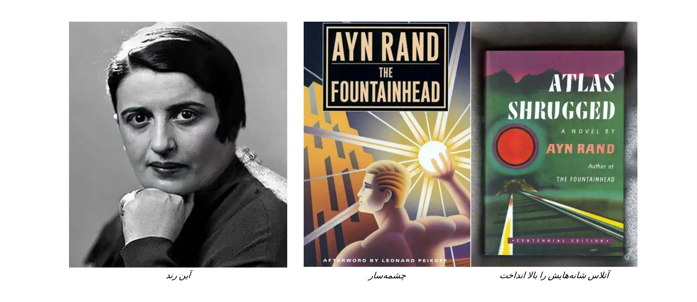

اما واقعیت کاملاً متفاوت است و سردرگمی بیشتر ناشی از یک مشکل معنایی است: با به رسمیت شناختن ظرفیت انسان‌ها برای عمل و انتخاب، در حالی که به جبر منطقی که آنها موضوع آن هستند اذعان می‌کنند. اولین آزادی‌خواهان در واقع وارثان اسپینوزا نیز هستند. آنچه آنها با اسپینوزا مشترک دارند این است که باور دارند انسان‌ها بالاتر از طبیعت نیستند بلکه نتیجه یک فرآیند تکاملی هستند که آنها را درون یک جبر، یک تاریخ که فراتر از آنهاست، قرار می‌دهد و تا حد زیادی مسئول آنچه انسان‌ها هستند و انجام می‌دهند، می‌باشد.

در نهایت، اگر باور به اراده آزاد یک توهم است که از آن بسیار دشوار است خود را رها کرد، به این دلیل است که به توهم دیگری که آن را تغذیه می‌کند، یعنی توهم علل نهایی، بازمی‌گردد، که از شما دعوت می‌کنم در فصل بعدی به مطالعه آن بپردازید.

## توهم علل نهایی

<chapterId>da2a7fb1-f1e9-5b56-822d-c73770de749d</chapterId>

:::video id=a0127fe7-a4cb-4a1c-8af4-f11c40b4a3d7:::

در فصل قبلی دیدیم که توهم اراده آزاد در این باور نهفته است که می‌توانیم چیزی را از هیچ شروع کنیم، که اراده ما به تنهایی می‌تواند ما را قادر سازد زندگی‌مان را هدایت کنیم، و اینکه قدرت تصمیم‌گیری نامعینی داریم. این ایده که انسان قادر است نظم طبیعت را بیشتر از آنچه که تحت تأثیر آن است، مختل کند.

اما برای اسپینوزا (1632-1677)، انسان "امپراتوری درون یک امپراتوری" نیست، یعنی برخلاف آنچه دکارت (1596-1650) بیان کرده است، انسان استثنایی در طبیعت نیست و هرگز از ادامه زنجیره جبری علت و معلول معاف نیست.

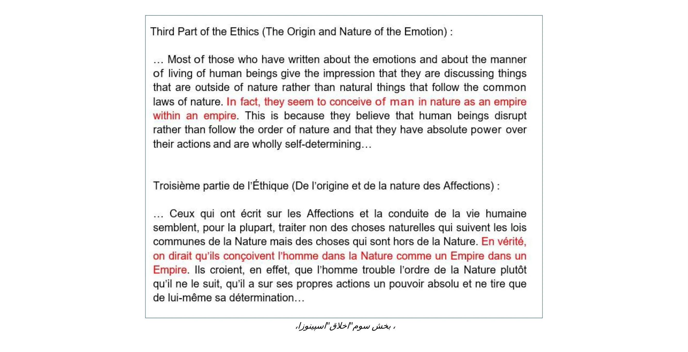

و از آنجا که طبیعت، به گفته اسپینوزا، از دیدگاه اخلاقی هیچ هدف تعیین‌شده‌ای ندارد، و از آنجا که انسان‌ها تمایل دارند تخیل خود را با فهم اشتباه بگیرند، آن را بر اساس آنچه به منافع خودشان می‌خورد تفسیر می‌کنند. تا جایی که به چیزها معنایی می‌دهند که تنها از نحوه‌ای که آن‌ها را ارزیابی می‌کنند و به خودشان مرتبط می‌سازند، ناشی می‌شود.

یعنی بر اساس خواسته‌ها، امیدها و ترس‌هایشان.

این استدلال با توهم علل نهایی نشان داده می‌شود، که مانعی بزرگ برای تفکر و استفاده از عقل است، زیرا صرفاً نیاز ما را برای تطبیق اثرات یک چیز نه با علل واقعی آن، بلکه با یک باور، حتی اگر مضحک یا کودکانه باشد، بیان می‌کند.

باوری که نیتی را بیان می‌کند، به‌ویژه الهی، و به روشی که ما آن را تفسیر می‌کنیم، اغلب خرافی یا ناشی از ناآگاهی است.

و به همین دلیل است که بیماری‌های جدیدی مانند ایدز در دهه ۹۰ یا کووید در سال ۲۰۲۰ همواره توسط برخی به عنوان تجلی نیت الهی و اغلب تنبیهی تلقی شده‌اند، بر اساس استدلالی که برخلاف اصل علیت است که پایه‌گذار عقل‌گرایی و علم مدرن از زمان کوپرنیک (۱۴۷۳-۱۵۴۳)، کپلر (۱۵۷۱-۱۶۳۰) و گالیله (۱۵۶۴-۱۷۲۷) بوده است.

واقعیت این است که، همان‌طور که اسپینوزا می‌گوید، برای مردم چندان اهمیتی ندارد که بسیاری از چیزها فراتر از تصور آن‌هاست و در طبیعت بی‌نظمی بیشتر از نظم وجود دارد. با این حال، پیچیدگی چیزهایی که از درک آن‌ها خارج است، باید آن‌ها را از باور به هر پروژه غایت‌شناسانه بازدارد. او می‌گوید این مهم نیست، زیرا باور انسان‌ها به اهمیت یقین خود بر اساس آنچه با خواسته و سودمندی آن‌ها سازگار است، همیشه قوی‌تر از هر استدلال منطقی یا نگرانی برای حقیقت است.

بنابراین، غایت‌گرایی به معنای وارونه کردن علل و اثرات چیزها برای درک آن‌ها است: به عنوان مثال، ما باور داریم که دلیل داشتن چشم‌هایمان دیدن است و دلیل داشتن دندان‌هایمان جویدن. در حالی که، البته، به خاطر دیدن بود که گونه انسانی در طول تکامل خود بینایی‌اش را توسعه داد، و واقعاً به دلیل نیاز به تغذیه و خوردن گوشت بود که دندان‌های ما نیز به شکلی که امروز هستند، توسعه یافتند.

و این دقیقاً همان چیزی است که طبیعت‌شناس فرانسوی ژان باتیست دو لامارک (1744-1829) بیان کرد (تصویر 3.3.3) زمانی که نظریه پیشاداروینی خود را مطرح کرد که این عملکرد است که اندام را ایجاد می‌کند، نه برعکس.

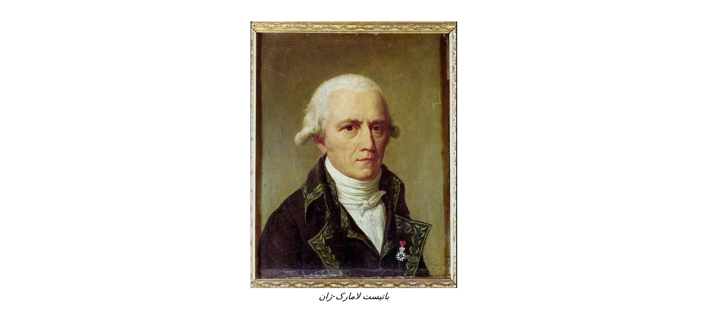

اما همان‌طور که اسپینوزا می‌گوید، "توهم انسان‌ها به اینجا ختم نمی‌شود"، و در میان تمام مثال‌های ایده‌های تله‌ولوژیک ساده‌لوحانه و در نهایت نسبتاً سرگرم‌کننده، ما اغلب به مثال معروف زیست‌شناس برناردین دو سن پیر (1737-1814) اشاره می‌کنیم. این مدیر سابق موزه تاریخ طبیعی پاریس به نهایی‌گرایی طبیعت با شعر، لیرسیم و نوعی ساده‌لوحی نگاه می‌کرد و معتقد بود که مثلاً خربزه برای هدفی جز جلب رضایت خانواده‌های بزرگ خلق نشده است، زیرا پوست شیار‌دار آن برش به قطعات مساوی را آسان می‌کند.

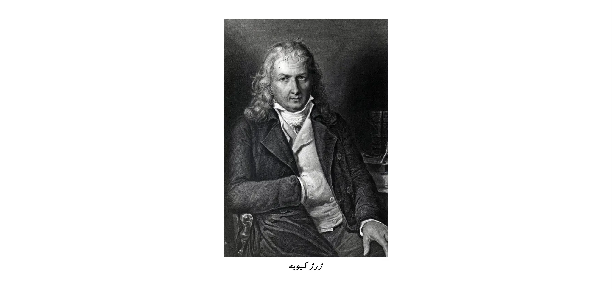

تعریف [تورم](https://planb.academy/resources/glossary/inflation) که توسط اقتصاددانان کینزی و طرفداران دولت رفاه ارائه شده است، به‌عنوان مثال، این پارادوکس را به‌خوبی نشان می‌دهد. به‌گفته‌ی آن‌ها، تورم افزایش قیمت‌ها است که به‌گفته‌ی برخی از بانکداران مرکزی، یا از "هیچ‌جا" می‌آید، یا از زمینه‌های ژئوپلیتیکی که هیچ‌کس نمی‌تواند آن‌ها را کنترل یا پیش‌بینی کند. در حالی که افزایش قیمت‌ها می‌تواند واقعاً به تورم دوره‌ای منجر شود - به‌عنوان مثال، زمانی که قیمت نفت افزایش می‌یابد، قیمت برخی کالاهای فرآوری‌شده نیز افزایش خواهد یافت - علل ساختاری واقعی تورم عمدتاً به افزایش پول Supply مرتبط است که به‌نوبه‌ی خود به کاهش ارزش پول و، به‌طور خودکار، به افزایش مکانیکی قیمت‌ها منجر می‌شود.

باور داشتن، یا واداشتن دیگران به باور داشتن، به عکس، معادل با خواب دیدن با چشمان باز است، همان‌طور که اسپینوزا به‌طور تمسخرآمیز بیان کرد، و ساختن یک خط استدلال که نادرست یا گمراه‌کننده است و پذیرش آن آسان‌تر است زیرا به‌عنوان پاسخی مورد انتظار برای اثبات حقانیت خود شنیده می‌شود. در این مورد، زمانی که طرفداران مداخله دولت، تورم را بهترین راه‌حل برای مشکلات اقتصادی می‌دانند.

با این حال، این تفسیر جانبدارانه از تورم باعث می‌شود فراموش کنیم که در حالی که برای مدیریت اقتصاد در کوتاه‌مدت مفید است، در واقع یک مالیات پنهان است که در بلندمدت تنها به فاجعه‌های انسانی و مادی منجر می‌شود و دولت‌ها را ناتوان از سوءاستفاده نکردن از قدرت خود می‌کند. این همان چیزی است که فریدریش هایک (1899-1992) در مقاله خود به نام راهی به سوی بردگی به خوبی توصیف می‌کند، زمانی که به بردگی‌ای اشاره می‌کند که دولت‌ها دیگر نمی‌توانند خود را از آن رها کنند.

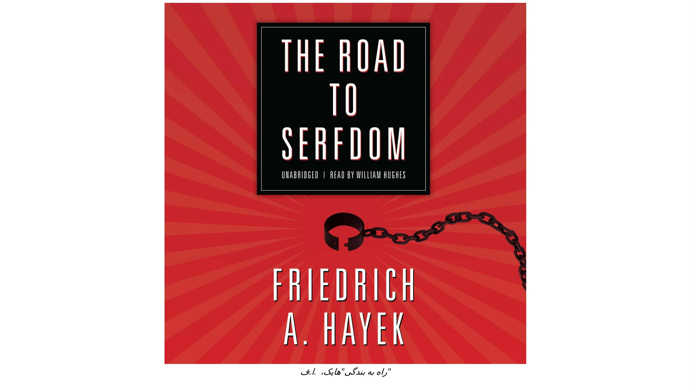

در نهایت، شایان ذکر است که این مکانیزم نهایی‌گرا نیز به خوبی در نحوه‌ای که مخالفان Bitcoin انتقادات خود را با تمرکز دقیق بر اثرات آن بیان می‌کنند، نشان داده شده است.

زیرا در حالی که برخی از اثرات Bitcoin قطعاً قابل انتقاد هستند، به دلیل تعصب شناختی مرتبط با این واقعیت که این یک فناوری جدید و مخرب است، ما تمایل زیادی داریم که فقط اثرات منفی را ببینیم. به ویژه اگر واقعیت با خواسته‌های ما مطابقت نداشته باشد، مثلاً اگر ما مذهبی باشیم و با یک انقلاب کپرنیکی مانند اسپینوزیسم مواجه شویم، یا اگر ما یک بانکدار مرکزی باشیم و با مفهوم ارز دیجیتال غیرمتمرکز روبرو شویم.

با این حال، کاملاً واضح است که اگر یک فرد مذهبی یا یک بانکدار مرکزی نشان دهد که فهم، کنجکاوی و حسن نیت دارد، و اگر به یک مفهوم علاقه‌مند شود و ابتدا به دنبال درک آن باشد به جای قضاوت درباره اثرات آن برای تطبیق نظر خود با انتظاراتشان، آنگاه قطعاً قادر خواهند بود به آن پایبند شوند.

از توجه شما سپاسگزارم و در فصل بعدی شما را خواهم دید.

## توهم الهیاتی

<chapterId>93554156-5e62-526d-9b71-49c47be916af</chapterId>

:::video id=9c490cc1-3d29-4ca7-9464-1a701bb91ba7:::

در این فصل نهایی درباره دیدگاه جدید کوپرنیکی از ایده‌ها که توسط اسپینوزیسم ارائه شده است، سرانجام به سومین توهمی که اسپینوزا (1632-1677) در اثر خود، اخلاق، ارائه می‌دهد، می‌پردازیم.

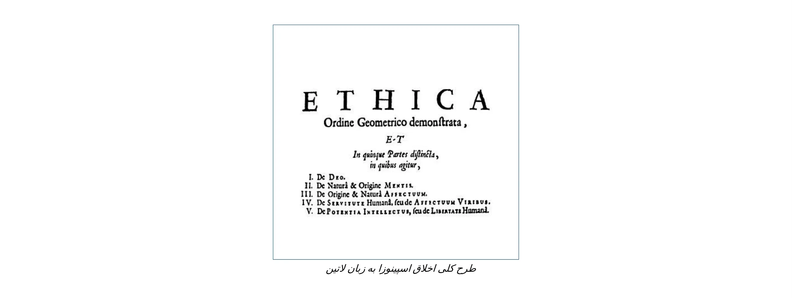

این توهم مستقیماً به دو توهم اول، توهم اراده آزاد و توهم نهایی بودن، مرتبط است.

این درباره توهم الهیاتی است.

نکته این است: تا زمانی که انسان‌ها ناآگاه هستند، "هم از چیزها و هم از خودشان"، همان‌طور که اسپینوزا به ما می‌گوید، تا زمانی که به آزادی خیالی خود باور دارند، تخیل خود را به جای فهم خواهند گرفت، یعنی همیشه خود را قادر به تفکر و درک ماهیت چیزها خواهند دانست، در حالی که در واقعیت تنها در حال تخیل، اختراع و پیش‌بینی آنچه برایشان مفید است، هستند. بر اساس خواسته‌هایشان.

به همین دلیل است که انسان‌ها باور دارند اگر وسایل طبیعی وجود دارند و مفید هستند، مانند دندان‌ها برای خوردن یا چشم‌ها برای دیدن، به این دلیل است که آن‌ها به‌طور منطقی توسط یک "کارگردان طبیعت" خلق شده‌اند. به عبارت دیگر، یک خدای عمدی و انسان‌وار که نیات انسانی به او نسبت داده می‌شود.

به عبارت دیگر، پیرمردی با ریش سفید که پشت ابری پنهان شده است و به او نسبت داده می‌شود که همه چیزهای طبیعت را به عنوان وسیله‌ای برای هدف ما خلق کرده است، زیرا او ما را دوست دارد و از ما محافظت می‌کند همان‌طور که ما او را تکریم و پرستش می‌کنیم.

این اولین مرحله از توهم الهیاتی است.

اما با وجود غرورمان در باور به اینکه بالاتر از طبیعت هستیم و تصور اینکه می‌توانیم چیزی را از هیچ شروع کنیم، در واقع همیشه تحت شرایطی از وجود هستیم که نشان می‌دهد در نهایت واقعاً نمی‌توانیم "از آن فرار کنیم"، همان‌طور که استاد فلسفه ژیل دلوز (1925-1995) بیان کرد. ما فانی هستیم، مانند همه حیوانات، اما این را می‌دانیم.

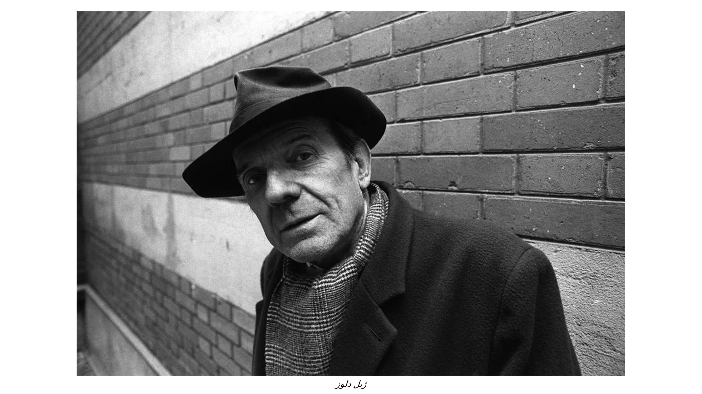

باور یا تصور مخالف به منظور اطمینان خاطر دادن به خودمان دلیل این است که ما به طور مداوم بین ترس و امید، مانند دو قطب مخالف و جدانشدنی بین احساس امنیت و احساس وحشت، به جلو و عقب پرت می‌شویم، زیرا ترس همیشه به امید روزهای بهتر مرتبط است.

که هیچ ترسی بدون امید وجود ندارد و هیچ امیدی بدون ترس، و کسی که می‌ترسد همیشه امیدوار است از آنچه می‌ترسد بگریزد، در حالی که کسی که امیدوار است همیشه می‌ترسد که آنچه امیدوار است رخ ندهد.

و از آنجا که "ما تمایل داریم به راحتی آنچه را که امیدواریم باور کنیم"، اسپینوزا در اخلاقیات خود می‌گوید، زمانی که با علل یا رویدادهای خارجی مواجه می‌شویم که برای ما مضر خواهند بود، برخلاف هر ایده‌ای از سودمندی، مرحله دوم این توهم به اصطلاح الهیاتی بیان می‌شود، که با باورهایی مشخص می‌شود که از آن احساسات خرافی ناشی می‌شود.

به عبارت دیگر، "بدنام" به گفته ولتر (۱۶۹۴-۱۷۷۸)، که برای او خرافات هرگز از عقل زاده نمی‌شود و همیشه باوری غیرمنطقی یا بی‌اساس است که با نسبت دادن قدرت‌ها یا نیروی معنوی به اشیاء یا اعمالی که ندارند، با هر شکلی از عقلانیت مخالف است.

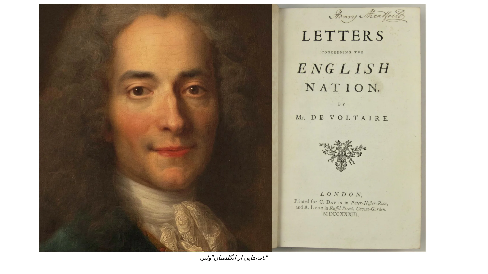

تحت پوشش رهایی‌بخشیدن به ما، و اجازه دادن به ما برای تصور دنیایی بهتر، خرافات در واقع ما را در توهمات و دروغ‌های خودمان زندانی می‌کند. در بندگی‌هایی که از آن‌ها به سختی می‌توانیم خود را رها کنیم.

این همان چیزی است که روشنگری آلمان، انگلیس و فرانسه از قرن هجدهم به بعد از آن دفاع کردند و ادعا کردند که خرافات به سادگی مانع از بالغ شدن انسان‌ها می‌شود، نه تنها با محدود کردن استفاده از عقل، بلکه مهم‌تر از آن، با ایجاد عدم تحمل که بهترین ابزار برای برقراری سلطه یک قدرت است. چه سیاسی و چه مذهبی.

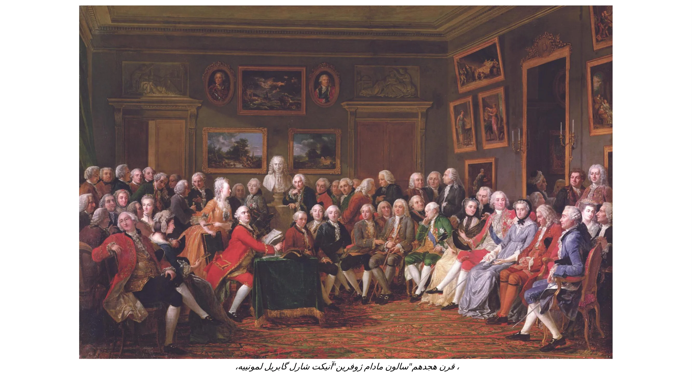

و این همان چیزی است که اسپینوزا بار دیگر در رساله الهی-سیاسی خود که قبلاً به آن اشاره کرده‌ایم، نشان می‌دهد. در این مقاله، او می‌نویسد که "راز بزرگ رژیم سلطنتی و منافع عمده آن، فریب مردم و پنهان کردن ترس که باید آن‌ها را کنترل کند، با نام دین است". به همین دلیل است که ستمگران، دیکتاتورها یا انقلابیون، که همیشه افرادی هستند که با میل به انجام کارهای خوب برای دیگران هدایت می‌شوند، اغلب، اگر نه همیشه، در دام انجام مخالف اصول خود برای دستیابی به آن‌ها می‌افتند.

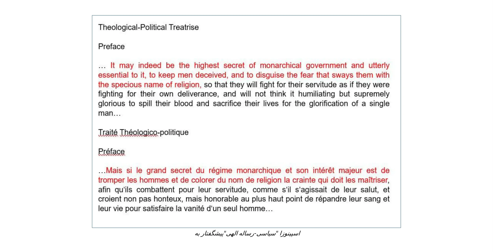

اما نوآوری که اسپینوزا به TTP می‌آورد و او را به نوعی پدر سکولاریسم می‌سازد، این است که در حالی که مبارزه با خرافات و دعوت به خشونت که آزادی به طور پارادوکسیکالی اجازه می‌دهد ضروری است، واقعیت این است که به نفع دولت است که حق باور و آزادی اندیشه را محافظت کند.

به محض اینکه ایده‌ها وجود داشته باشند و به صورت خصوصی بیان شوند، به ناچار در سراسر جامعه گسترش خواهند یافت و نه ممنوعیت و نه سانسور هرگز نمی‌توانند از گسترش آنها جلوگیری کنند. ایده‌ها، چه درست و چه نادرست، چه خوب و چه بد، در هر صورت در گردش خواهند بود و ممنوعیت آنها تنها می‌تواند در بلندمدت به شورش و سرنگونی دولت به نام آزادی منجر شود.

به عبارت دیگر، دولت در واقع باید بیشتر از سانسور یا سرکوب آزادی بیان بترسد تا از حفظ آن، و بنابراین، به گفته اسپینوزا، به نفع دولت است که به افراد اجازه دهد حق طبیعی خود برای فکر کردن و بیان خود را اعمال کنند.

برای اسپینوزا، یک دولت دموکراتیک که آزادی اندیشه را فراهم می‌کند، بهترین تضمین است که مردم در صلح زندگی کنند و به لطف به‌کارگیری عقل، نه تنها آزادانه فکر و عمل کنند، بلکه بتوانند بندهایی که آن‌ها را محدود می‌کند را نیز درک کرده و از آن‌ها رهایی یابند.

# از نظریه تأثیر تا Bitcoin

<partId>82e69d4f-a94f-5978-bcb8-8a7b4651bcca</partId>

## مسئله شر در اسپینوزا

<chapterId>1ce64576-2688-5757-a119-57cc3a1076c0</chapterId>

:::video id=9c490cc1-3d29-4ca7-9464-1a701bb91ba7:::

اکنون مایلم به بحث دربارهٔ مسئلهٔ شر بپردازم، همان‌طور که اسپینوزا (1632-1677) آن را در آثار و مکاتبات خود ارائه می‌دهد.

اما هشدار داده شود، این یک موضوع پیچیده و بحث‌برانگیز است، و هدف در اینجا صرفاً درک دوباره روش تفکر او برای بهتر فهمیدن آنچه او را هدایت می‌کند، یعنی جستجوی آزادی است.

همان‌طور که دیده‌ایم، باور نداشتن به اراده آزاد یا هر نوع غایت‌گرایی در طبیعت به سرعت مسئله وجود شر در زندگی روزمره ما را مطرح می‌کند.

به عبارت دیگر، سوال این است که آیا "شر" در طبیعت وجود دارد و آیا انسان‌ها مسئول آسیبی هستند که ایجاد می‌کنند؟

فلاسفه باستان بر این باور بودند که شر در طبیعت وجود ندارد و سقراط (۴۷۰-۳۹۹ قبل از میلاد)، به عنوان مثال، آموزش می‌داد که "شر هیچ است". به گفته او، یک فرد شرور به طور ذاتی شرور نبود و به نوعی در مورد ماهیت خوبی دچار اشتباه شده بود.

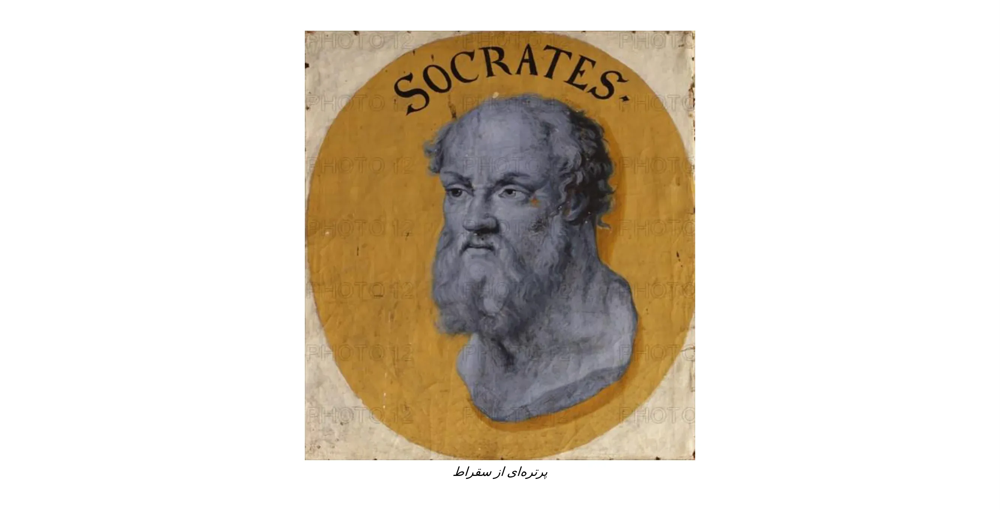

اما سنت مدرسه‌ای، به ویژه سنت سنت آگوستین (354-430)، که هنوز هم بر اخلاق مسیحی تأثیر می‌گذارد، استدلال می‌کرد که شر نه تنها وجود دارد و یک واقعیت است، بلکه می‌توان آن را توضیح داد زیرا انسان‌ها آزاد هستند، زیرا آن‌ها قادر به انتخاب بین خیر و شر هستند، و بنابراین شری که ایجاد می‌کنند کاملاً مسئولیت خودشان است.

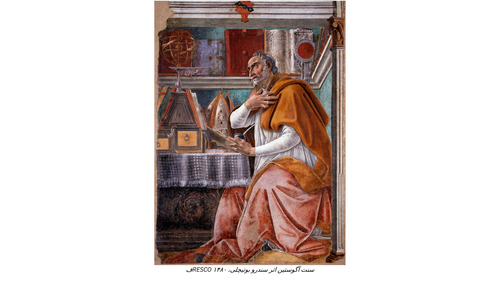

و حتی اگر مسئولیت آسیبی که توسط یک زلزله، یک ویروس کشنده یا این واقعیت که کودکی نابینا به دنیا می‌آید نباید به مردم نسبت داده شود، این شیوه تفکر با دادن نیت اخلاقی به طبیعت که آنها را مسئول می‌سازد، ادامه می‌یابد. به عنوان مثال، با در نظر گرفتن اینکه اگر زلزله‌ای رخ داده است، دقیقاً به این دلیل است که مردم رفتار بدی داشته‌اند.

این ایده‌ای است که توسط افراد مذهبی دفاع می‌شود که انسان‌ها به عنوان گناهکاران به دنیا می‌آیند و گناه اولیه را به دوش می‌کشند.

البته، همان‌طور که می‌توانید تصور کنید، این ایده توسط اسپینوزا به شدت نقد می‌شود، کسی که معتقد است از آنجا که طبیعت، یا خدا یا بخت همان‌طور که او می‌گوید، دارای قصد نیست، و از آنجا که انسان‌ها اراده آزاد ندارند، مسئولیت "شر" نسبت داده شده به آن‌ها کاملاً توهمی است.

«هیچ اتفاقی در طبیعت نمی‌افتد که بتوان آن را به یک رذیلت موجود در آن نسبت داد»، اسپینوزا در کتاب اخلاق می‌نویسد، و به گفته او، ما در اشتباه خواهیم بود اگر، به عنوان مثال، نابینایی یک نوزاد تازه متولد شده را به عنوان «شر» در نظر بگیریم، زیرا وقتی نوزاد نابینا به دنیا می‌آید، به هیچ وجه بیشتر از یک سنگ از بینایی محروم نیست.

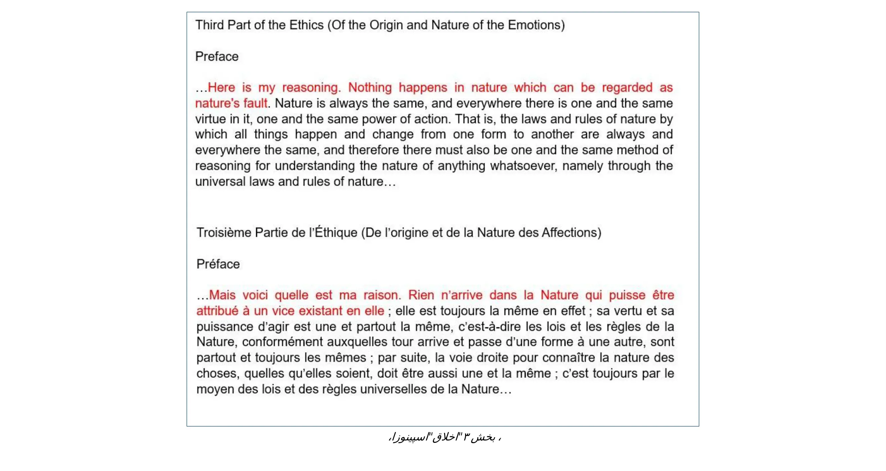

و اگر فکر کنیم که نابینایان فاقد بینایی هستند، این فقط از دیدگاه کسانی است که می‌بینند.

اسپینوزا بدین ترتیب این ایده را مطرح می‌کند که شر در طبیعت وجود ندارد، اما اصالت او که فلسفه‌اش را انقلابی می‌سازد، این است که در نظر می‌گیرد نه تنها شر وجود ندارد، بلکه "خیر" نیز وجود ندارد.

و به همین دلیل است که او از اخلاق به جای اخلاقیات صحبت می‌کند، بدون اینکه به درستی یا نادرستی فکر کند، زیرا این‌ها همه مفاهیم نسبی و ذهنی هستند، بلکه به جای آن به لحاظ آنچه "خوب" یا "بد" برای نیاز طبیعی ما به "پایداری در وجودمان" است، می‌گوید. به عبارت دیگر، زندگی کردن و رشد کردن. شکوفا شدن به عنوان انسان.

علاوه بر این، ما قبلاً دیده‌ایم که دیدگاه اسپینوزا درباره مسئولیت افرادی که با ارتکاب جرم رفتار بدی از خود نشان می‌دهند، به وضوح برای توجیه آنها نیست. زیرا افراد، حتی اگر علل واقعی که آنها را به ارتکاب جرم وادار می‌کند ندانند، همیشه از آنچه انجام می‌دهند آگاه هستند و بنابراین، به این ترتیب، در برابر اخلاق و قانون مسئول هستند.

به وضوح، اقدامات یک مجرم همیشه به جبر خانوادگی، اجتماعی، اقتصادی یا حتی پزشکی مرتبط است، اگر جرایم او بتوانند با یک وضعیت جسمی یا روانی توضیح داده شوند. و این نقش عدالت است که فراتر از حقوق کیفری می‌رود تا به این واقعیت توجه کند که برخی جرایم نه تنها باید مجازات شوند، بلکه باید با در نظر گرفتن پیشینه خانوادگی، اجتماعی و روان‌شناختی مجرم، درمان نیز شوند.

به همین دلیل است که ژیل دلوز اسپینوزیست (۱۹۲۵-۱۹۹۵) توضیح می‌دهد که اخلاق نوعی اتولوژی است، یعنی یک علم عملی از شیوه‌های بودن، یا به قول او، "هنر ایجاد برخوردهای خوب".

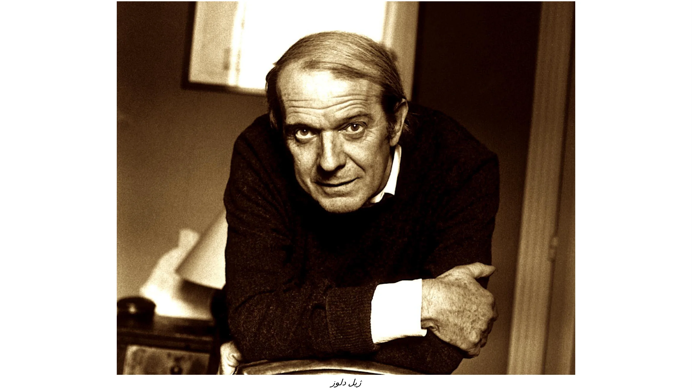

به عبارت دیگر، آزادی به گفته اسپینوزا، شامل هدایت وجود ما به سوی چیزی است که "قدرت عمل ما را افزایش می‌دهد" و همیشه با نگاهی خوش‌بینانه به آینده، دیدن جهان همان‌طور که هست به جای تصور آن به شکلی که دوست داریم ببینیم.

و در اینجا نبوغ اثبات اسپینوزا نهفته است، زیرا او علیه پزشکان نادانی و علیه همه کسانی که ادعا می‌کنند نادانی خوب است، مبارزه می‌کند.

برعکس، اسپینوزا به مطالعه احساسات انسانی می‌پردازد، حتی غیرمنطقی‌ترین آنها، شکست عشقی، جنون، غم یا مالیخولیا، به شیوه هندسه‌دانان، "بیشتر هندسی"، همان‌طور که نقاط، خطوط، سطوح و حجم‌ها را مطالعه می‌کنند.

این نظریه تأثیراتی است که او در بخش سوم اخلاق خود توسعه می‌دهد و من پیشنهاد می‌کنم اکنون آن را مطالعه کنید.

با تشکر از توجه شما.

## نظریه تأثیر

<chapterId>3bb011ce-6f0c-51a6-b41f-25a3b5b7768e</chapterId>

:::video id=bb427cc6-e54d-4b44-bd6d-281ba421001a:::

بر اساس نظر اسپینوزا، آزادی مفهومی است که باید کشف شود، مسیری به سوی زندگی بهتر و قدرتمندتر. زندگی آزادتر. مسیری که از ما می‌خواهد تا جبر مطلق و علیت عقلانی امور را بشناسیم.

او سیستم خود را در بخش سوم اخلاق توسعه می‌دهد. این همان "نظریه عواطف" معروف است.

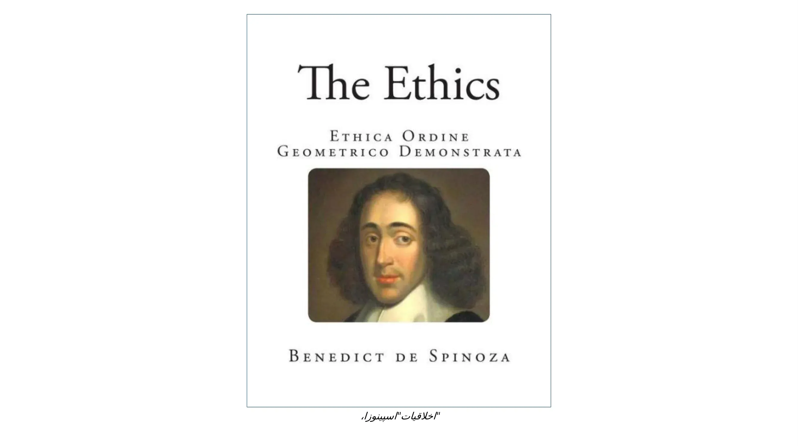

اصل بر این است که عواطف انسانی، به گفته اسپینوزا، تغییرات فعال یا منفعل بدن و اندیشه هستند که بر قدرت عمل ما تأثیر می‌گذارند، یعنی همان رفتار ما.

و با این حال، بسته به تأثیرات خاص طبیعت انسانی و آن‌هایی که از دنیای بیرون ناشی می‌شوند، ما کاملاً قادر به شکل‌دادن به ایده‌های واقعی، استدلال و ابراز شادی هستیم.

اما ما همچنین قادر به شکل‌گیری تأثیرات منفعل به اصطلاح، پیش‌داوری‌هایی هستیم که سپس به‌طور مکانیکی ما را "بر خلاف میل خودمان" به سمتی هدایت می‌کنند که دیگر آنچه را که منافع شخصی‌مان ایجاب می‌کند، نبینیم یا انجام ندهیم.

ما از بردگی یا بندگی صحبت می‌کنیم، حالتی که با ناتوانی در کنترل و مقابله با آن تأثیرات منفعلانه‌ای که گاهی ما را به خواستن آنچه انجام نمی‌دهیم و انجام دادن آنچه نمی‌خواهیم سوق می‌دهد، مشخص می‌شود.

این همان چیزی است که اسپینوزا در کتاب اخلاق خود می‌گوید، زمانی که از این که "مردم اغلب بهترین را می‌بینند، آن را تأیید می‌کنند و بدترین را انجام می‌دهند" یا اینکه "برای بندگی خود می‌جنگند گویی که برای نجات خود می‌جنگند" شگفت‌زده می‌شود.

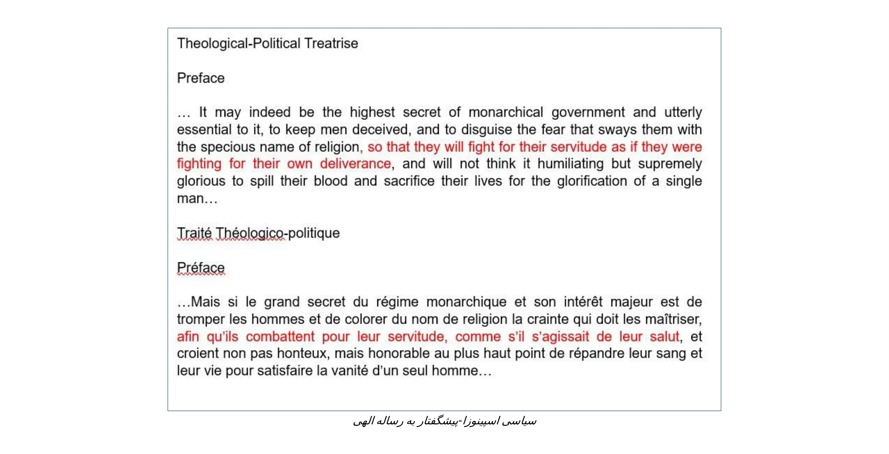

اسپینوزا مثال نفرت را می‌گیرد، که آن را به عنوان یک تأثیر منفعل می‌بیند، به سمت غم و ناشی از ایده‌های ناکافی، یعنی دانشی جزئی از علل، و آن را به عنوان "یک غم که با ایده یک علت خارجی مرتبط است" تعریف می‌کند.

به عبارت دیگر، اگر از یک خارجی متنفر باشیم، به این دلیل است که این خارجی را با ایده‌ای که از او داریم مرتبط می‌کنیم، به دلایلی که نمی‌فهمیم، زیرا او به‌طور ذاتی خارجی و متفاوت است. این ایده‌ی یک علت خارجی است - ایده‌ای که علاوه بر این، همیشه به‌طور مکانیکی نادانان را برمی‌انگیزد تا از مفهومی که نمی‌شناسند بد بگویند.

این موضوع به ویژه در زمینه [ارزهای دیجیتال](https://planb.academy/resources/glossary/cryptocurrency) صادق است.

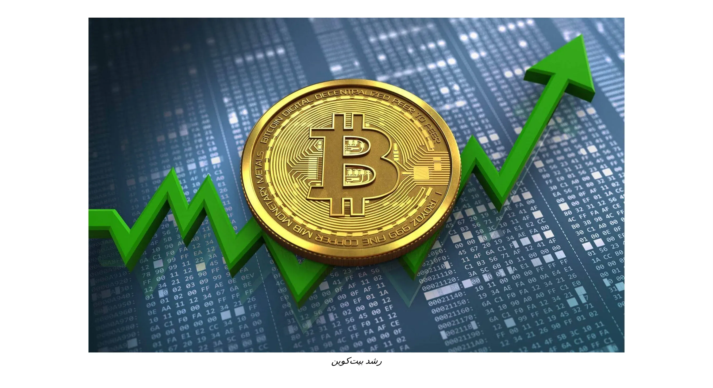

اسپینوزا می‌گوید اگر این ایده منفی از یک علت خارجی را نه با اخلاق، بلکه با آموزش، با همدلی، با عقل، به‌ویژه با تمرکز در این مورد بر ویژگی‌های این غریبه، یا در مورد Bitcoin، بر جنبه عملی یا سودمندی آن حذف کنیم، آنگاه احساس غم مرتبط ناپدید می‌شود و به‌طور خودکار، نفرت نیز از بین می‌رود.

شایان ذکر است که این طرز تفکر، البته، به احساسات فعال نیز اعمال می‌شود، و به‌ویژه به عشق، که به گفته اسپینوزا، "شادی‌ای است که با ایده یک علت خارجی همراه است". و اگر، به عنوان مثال، علت خارجی عشق به یک چیز یا شخص ناپدید شود یا با گذشت زمان تغییر کند، شادی مرتبط با آن نیز ممکن است ناپدید شود و احساس عشق را خاموش کند. این موضوع، زمانی که آن را درک نمی‌کنیم، می‌تواند ما را ناراحت و افسرده کند.

اما اگر این نظریه به اصطلاح تأثیرات به "ناخودآگاه" ما اعمال شود، این روش عقلانی تفکر "به شیوه نقشه‌برداران" نیز به مبارزه با همه اشکال بندگی خارجی، چه مذهبی، سیاسی یا ناشی از پدیده‌های طبیعی، اعمال می‌شود.

این نمونه‌ای از رعد و برق است. زیرا وقتی رعد و برق می‌زند و افراد بی‌گناه را می‌کشد، افراد نادان تمایل دارند آن را به عنوان دست خدا ببینند و تصور کنند که رعد و برق نیت اخلاقی و غایی را بیان می‌کند. ایدز در دهه ۹۰ یا حتی اخیراً، کووید توسط برخی به عنوان مجازات الهی تفسیر شده است.

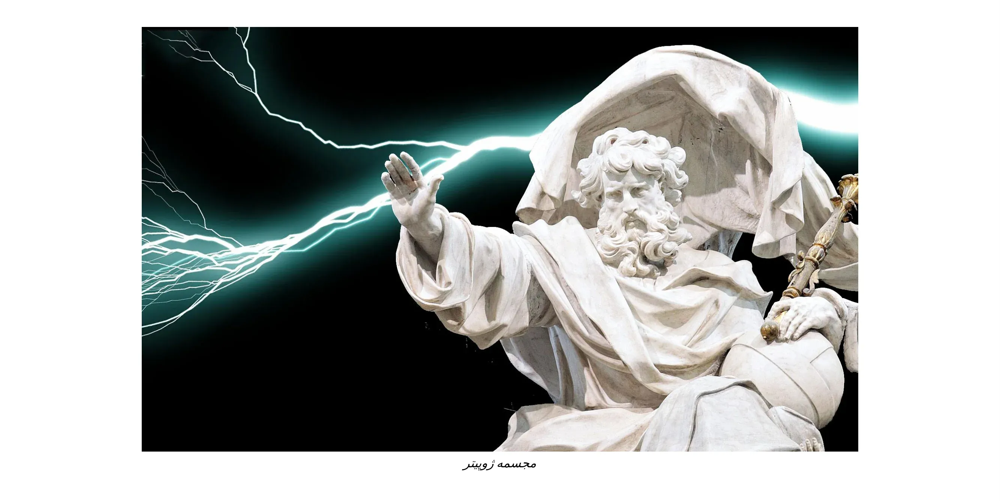

در حالی که برای اسپینوزا، البته، همه این ایده‌های غایت‌شناسانه صرفاً خرافات هستند، مترادف با نادانی، تا آنجا که در این مثال، رعد و برقی که می‌زند کاری نمی‌کند، او می‌گوید، جز اینکه ذات طبیعت خود را بیان کند. که همان زدن است. بدون، البته، هیچ قصد اخلاقی برای تنبیه یا پاداش دادن به کسی.

با تشکر از این مثال ساده، ما متوجه می‌شویم که تنها راه‌حل برای محافظت از خود در برابر رعد و برق - به عبارت دیگر، برای رهایی از بندگی که خطر آن همیشه بر ما تحمیل کرده است - این نیست که از بدشانسی خود یا از یک بی‌عدالتی الهی فرضی شکایت کنیم، و نه این که کوچک‌ترین استدلال اخلاقی را مطرح کنیم. نه، بلکه، در اینجا نیز، مانند نفرت، مسئله این است که از دیدگاه اخلاقی به این فکر کنیم که چه کاری می‌توانیم انجام دهیم.

و در این مورد، محافظت از خود در برابر رعد و برق با عقلانی بودن، پذیرای پیشرفت، کنجکاو و مطمئن بودن نسبت به آنچه علم می‌تواند به ما ارائه دهد و چرا که نه، نصب یک صاعقه‌گیر خواهد بود.

این نبوغ اخلاق است. اسپینوزا به ما نشان می‌دهد که امکان گذار از بندگی داوطلبانه، از یک زندگی "علی‌رغم خودمان" و یک زندگی بادی به هر جهت از بیگانگی همیشگی، به یک زندگی که از طریق شناخت عواطف و تعیین‌ها زیسته می‌شود، وجود دارد.

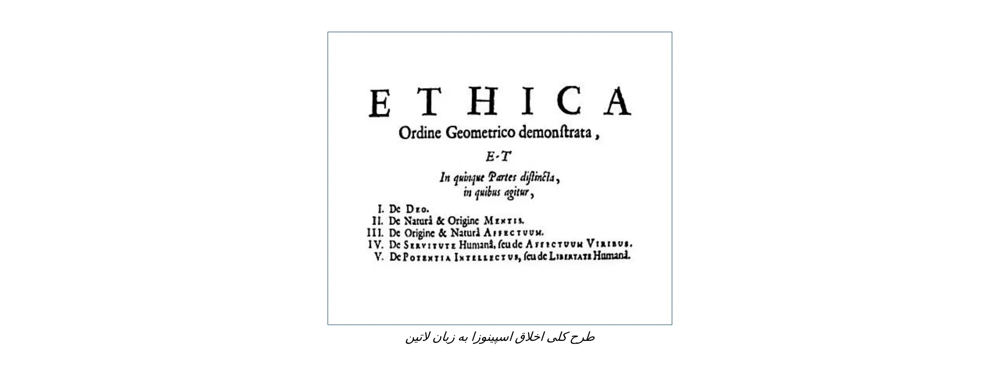

این یک روش تفکر است که به ما اجازه می‌دهد تا طبیعت انسانی را تجزیه کنیم تا بتوانیم جنبه روشن یا حقیقت در چیزها را ببینیم. برای از بین بردن دلایل غم و ترسی که ما را سنگین می‌کند. به عبارت دیگر، آزاد بودن، توانایی متوقف کردن اطاعت از احساسات غمگین و تغییر رفتارمان.

و برای درک این موضوع، احتمالاً برای اولین بار در تاریخ فلسفه، که می‌توانید روشن‌بین و خوشحال باشید.

و به همین دلیل است که اسپینوزیسم اغلب به عنوان "فلسفه شادی" شناخته می‌شود.

## آزادی، مکتب اقتصادی اتریش و فلسفه Cypherpunk

<chapterId>b54f2532-460c-11f0-a248-93ff24ef1d57</chapterId>

:::video id=5f49d5b4-e15f-475b-b40d-07464c08ca4d:::

همان‌طور که اکنون می‌دانید، آزادی از نظر اسپینوزا آگاهی از جبرگرایی ماست. تحت هدایت عقل و به لطف توانایی ما در عمل، می‌توانیم مکانیسم علّی بندگی‌ها را درک کنیم، تا بتوانیم با آن‌ها مبارزه کنیم، دیگر از آن‌ها رنج نبریم و دیگر بر خلاف منافع خود عمل نکنیم.

در نهایت، این شفافیت به معنای دیگر زندگی نکردن در نیهیلیسمی است که بعدها توسط فریدریش نیچه (۱۸۴۴-۱۹۰۰) توصیف شد، که در آن انسان‌ها به دلیل ایدئال‌های ایدئولوژیک، یعنی افسانه‌های سیاسی یا مذهبی، خود را گم می‌کنند و به همین دلیل واقعیت را انکار می‌کنند، خود را کودکانه می‌کنند و خود را ناراضی می‌سازند.

این دقیقاً همان چیزی است که فلسفه عقلانی روشنگری به آن می‌پرداخت، به‌ویژه به لطف ایمانوئل کانت (1724-1804)، که برای او تنها یک فرد تحصیل‌کرده، تحت هدایت عقل، می‌تواند برای خود فکر کند و به‌طور اخلاقی تعیین کند که چه چیزی "درست" یا "خوب" است و چه چیزی سمی است.

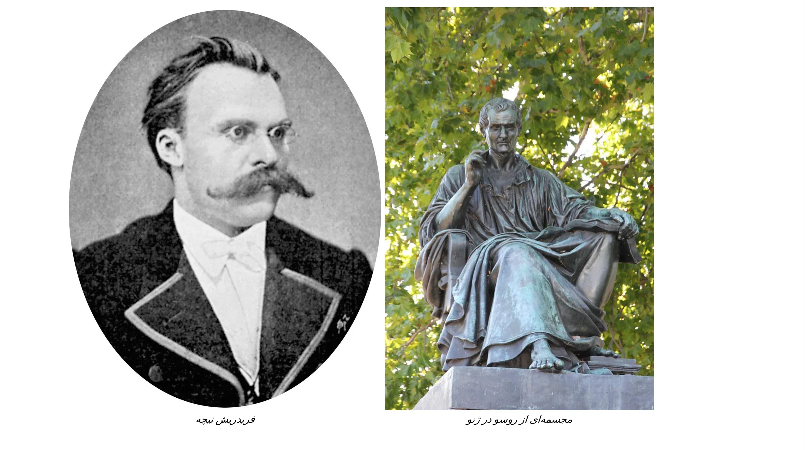

به عبارت دیگر، او می‌گوید، اگر ما برای خودمان فکر کنیم، اگر به عنوان بزرگسالان منطقی استدلال کنیم، و اگر بنابراین تلاش کنیم تا خود را به پیوندهای علّی بین چیزها متصل کنیم، دیگر نیازی به یک مرجع اخلاقی نخواهیم داشت تا به ما، برای مثال، فضایل واقعی دین یا ارزش‌های اخلاقی واقعی در حوزه‌های سیاسی و اقتصادی را بیاموزد.

این یک خط استدلالی است که ارتباط با مکتب اقتصاد لیبرال [اتریشی](https://planb.academy/resources/glossary/austrian-school) را برقرار می‌کند، که در فضای فکری بسیار پربار وین قبل از جنگ جهانی اول شکل گرفت. زیرا در این زمینه بود که روشنفکرانی مانند کارل منگر (1840-1921)، لودویگ فون میزس (1883-1979) و فریدریش هایک (1899-1992) پایه‌های یک مکتب جدید اقتصاد لیبرال را بنا نهادند، که قرار بود به اساس اعتقادات [سایفرپانک‌های](https://planb.academy/resources/glossary/cypherpunks) آینده تبدیل شود. و از این رو ایجاد Bitcoin.

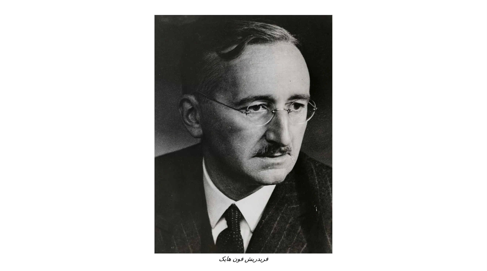

منگر و میزس، به عنوان مثال، اثبات کردند که تمام دانش باید بر اساس پیوند علّی بین چیزها ساخته شود و بدین ترتیب یک مفهوم علّی جدید از اقتصاد را پیشنهاد دادند. به ویژه با الهام از روحیه لیبرالی که چند سال قبل توسط اقتصاددان فرانسوی فردریک باستیا (۱۸۰۱-۱۸۵۰) توسعه یافته بود.

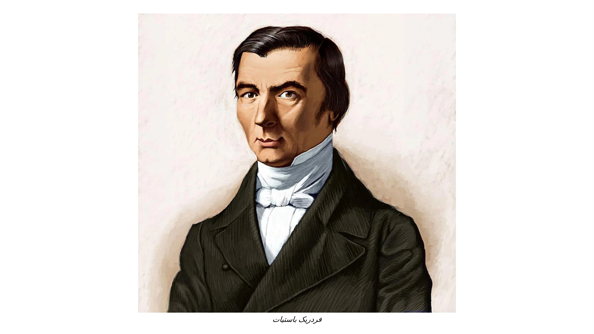

هایک، از سوی دیگر، معتقد است که تمام تصمیمات اقتصادی همواره نوعی عدم قطعیت و ناآگاهی را بیان می‌کنند و این واقعیت که به دلیل اخلاق، باورها، تعصبات یا ایدئولوژی‌های سیاسی از آن رنج نمی‌بریم، امکان تحلیل صحیح رفتار اقتصادی و به تبع آن، بررسی آنچه برای افراد، جامعه و دولت خوب است را فراهم می‌کند.

این همان روشی است که این اقتصاددانان لیبرال اتریشی به شدت به انتقاد از تمام ایده‌های سوسیالیستی پرداختند - هایک از "برنامه‌گرایی" سخن گفت - و تمام سیاست‌های اخلاقی الهام‌گرفته از آن‌ها، که به نظر او تنها به ویرانی منجر می‌شوند. سپردن قدرت اقتصادی به دولت‌ها، که به ناچار از زمان عقب هستند و با آنچه باید و نباید انجام شود هماهنگ نیستند، محکوم به شکست بود.

به عنوان مثال، اتریشی‌ها بر این باورند که وقتی یک دولت با اجبار به خود قدرت ایجاد پول برای مدیریت اقتصاد و حل بحران‌ها را می‌دهد، خطر این است که هرگز نتواند از سوءاستفاده از این قدرت خودداری کند.

چرا اینطور است؟ زیرا همیشه خود را در شکلی از بندگی می‌یابد که او را از انجام آن باز می‌دارد و بدین ترتیب او را وادار می‌کند، همانطور که اسپینوزا می‌گوید، "بهترین را ببیند، آن را تأیید کند... اما بدترین را انجام دهد".

هایک به عنوان یک اسپینوزیست در یک ویدیو توضیح می‌دهد که "از آنجا که این قدرت نمی‌تواند بدون خشونت گرفته شود، تنها کاری که می‌توان انجام داد این است که با یک ترفند، مفهوم جدیدی از پول معرفی کنیم که دولت‌ها دیگر نتوانند آن را متوقف کنند". این استدلال توسط میلتون فریدمن (1912-2006) در یک مصاحبه تکرار می‌شود، که در آن او به نوبه خود این شکل جدید از ارز دیجیتال را در زمینه اینترنت نوظهور مورد بحث قرار می‌دهد.

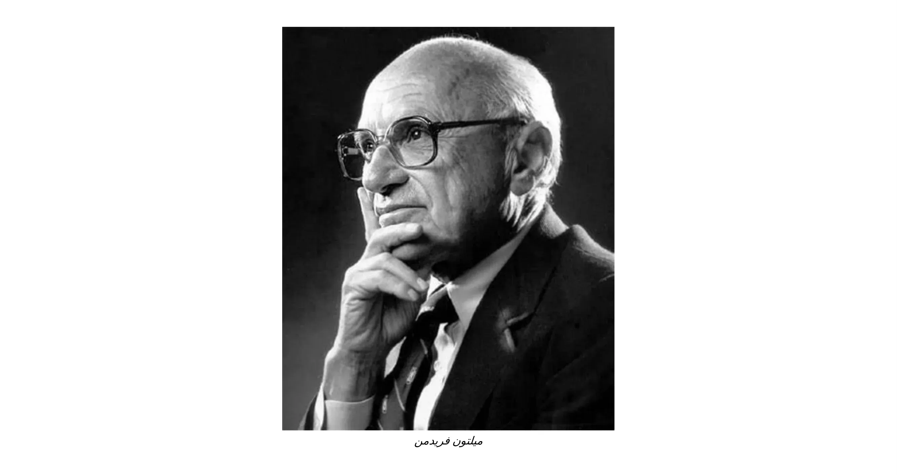

این‌ها استدلال‌های سیاسی و اقتصادی ارائه شده توسط اولین سایفرپانک‌ها، اریک هیوز (1953-) در "مانیفست Cypherpunk" او، یا تیموتی می (1951-2018) در "مانیفست آنارشیست رمزنگاری" او هستند، که Satoshi ناکاموتو دوباره به آن‌ها خواهد پرداخت.

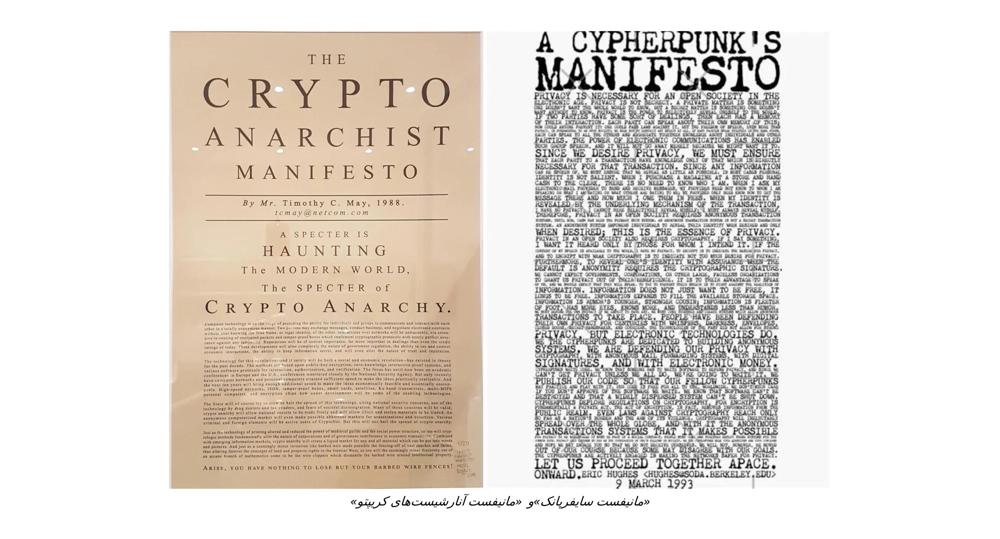

به‌ویژه زمانی که او تیتر روزنامه تایمز در تاریخ ۳ ژانویه ۲۰۰۹ را در [کوین‌بیس](https://planb.academy/resources/glossary/coinbase-transaction) [بلاک Genesis](https://planb.academy/resources/glossary/genesis-block) از [Blockchain](https://planb.academy/resources/glossary/blockchain) Bitcoin نوشت تا پایان یک دوره، کینزی، و آغاز دوره‌ای دیگر با آرمان‌های لیبرال، آنارشیست و لیبرتارین را نشان دهد.

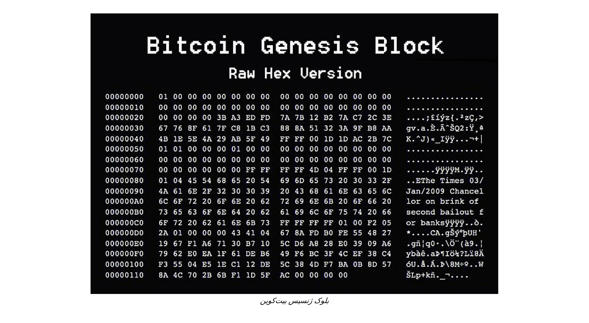

[سپیدنامه](https://planb.academy/resources/glossary/white-paper) منتشر شده در ۳۱ اکتبر ۲۰۰۸، Bitcoin را به عنوان وسیله‌ای برای تبادل ارزش در اینترنت بدون نیاز به یک شخص ثالث مورد اعتماد، بر اساس یک پروتکل غیرمتمرکز معرفی می‌کند. یک انقلاب "کوپرنیکی" که در نهایت به مردم این امکان را می‌دهد تا توانایی عمل خود، یعنی آزادی‌شان، آزادی تجارت، حق مالکیت و احترام به حریم خصوصی‌شان را بازیابند.

چرا؟ زیرا Bitcoin به ما اجازه می‌دهد تا به شیوه اسپینوزا، به لطف عقل، به لطف زبان ریاضی گالیله، خود را از این بندگی رها کنیم. و همان‌طور که هایک پیشنهاد می‌کند، بدون اینکه دولت بتواند با آن مخالفت کند. و به‌طور مسالمت‌آمیز، بدون اجبار یا تبلیغ.

در واقع، این آخرین مقایسه‌ای است که بین اسپینوزیسم و Bitcoin انجام می‌دهم تا نشان دهم که قانع کردن کسی که به یک مفهوم کوپرنیکی یا مخرب اعتقاد ندارد، جز از طریق عقل، فهم، کنجکاوی یا حسن نیت، بی‌فایده است.

نه با زور، نه با خشونت. زیرا واقعیت این است که کوپرنیک، گالیله، نیوتن، داروین، اینشتین، هایک، اسپینوزا یا Satoshi ناکاموتو هرگز کسی را که به ایده‌ها و نمایش‌هایشان باور نداشت، تهدید نکردند.

# بخش نهایی

<partId>70a5a3c8-6c88-11f0-8753-db07e26dcaf4</partId>

## بررسی‌ها و رتبه‌بندی‌ها

<chapterId>7945c38c-6c88-11f0-a73f-0f7cdf99f53f</chapterId>

<isCourseReview>true</isCourseReview>

## امتحان نهایی

<chapterId>a557fd32-6c88-11f0-96ff-cfa532cf76a0</chapterId>

<isCourseExam>true</isCourseExam>

## نتیجه‌گیری

<chapterId>ae04ab38-6c88-11f0-a496-3be47119e6b6</chapterId>

<isCourseConclusion>true</isCourseConclusion>