# Kun Spinoza tapasi Satoshin

Tutustu siihen, miten 1600-luvun filosofi Baruch de Spinozan radikaalit ajatukset vapaudesta, järjestä ja vallasta ennakoivat Bitcoinin hajautettua vallankumousta. Tämä kurssi paljastaa hämmästyttävät yhtäläisyydet: molemmat hylkäävät sokean uskon ja keskusvallan, molemmat käyttävät matemaattista tarkkuutta vapauttamiseen. Spinoza vapautti mielet uskonnollisesta dogmasta, Bitcoin vapauttaa rahan valtion kontrollista.

Opi käytännön työkaluja Spinozan etiikasta ymmärtääksesi bitcoinin filosofiset perusteet ja lisätäksesi toimijuuttasi. Oletko valmis tutkimaan kahta historian suurinta ihmisen vapautumisen välinettä?
+++
# Johdanto

<partId>80b76189-afab-5295-a8d3-ba8f6fe7a5e8</partId>

## Kurssin johdanto

<chapterId>99af4992-fd6c-5142-b168-d927b251574b</chapterId>

:::video id=1def60bc-1d39-4e49-9b08-fd05b7a0d49b:::

Tällä kurssilla minulla on ilo esitellä Baruch de Spinozan (1632-1677) filosofiaa. Hän on kuuluisa 1600-luvun filosofi, jota pidetään rationaalisen valistusfilosofian isänä.

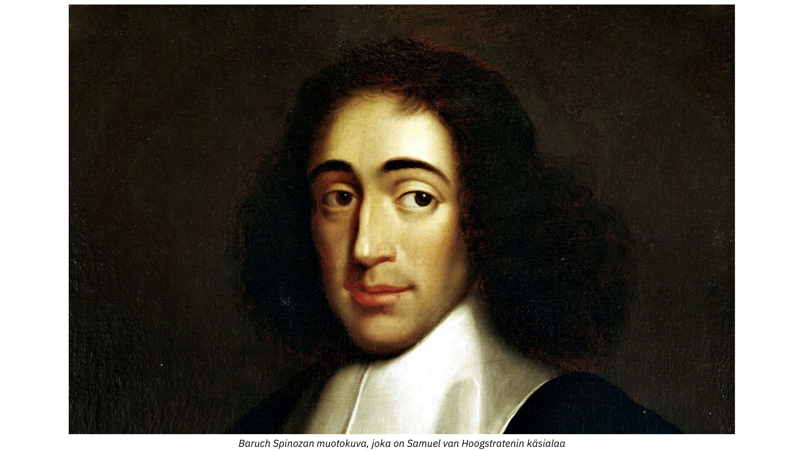

Spinozan muotokuva

Nämä kurssit perustuvat kahteen aihetta käsittelevään esseeseeni, "Spinozan todellinen uskonto" ja "Bitcoin, vapauden evankeliumi", jotka ovat saatavilla paperiversioina joko verkossa tai suoraan verkkosivuiltani sekä digitaalisesti Amazon Kindle -palvelussa.

Tämän kurssin tavoitteena on ensinnäkin tarjota yksinkertaistettu käsitys filosofiasta, jota pidetään usein hyvin monimutkaisena ja vaikeasti lähestyttävänä, vaikka se on nykyisin herättänyt uutta kiinnostusta.

Tämän filosofian avulla voimme kyseenalaistaa asioiden merkityksen silloin, kun kaikki menee pieleen, mistä uskonnossa, filosofiassa ja humanistisissa tieteissä yleensä on kyse, mutta myös ja ehkä ennen kaikkea kyseenalaistaa itsemme silloin, kun kaikki menee hyvin.

Kun elämä hymyilee meille ja meistä tuntuu, ettei meidän tarvitse kyseenalaistaa itseämme, kun ajattelemme harhakuvitelmallisena ja orjallisena pidetyllä ylpeydellä, että onnemme tai menestyksemme tulisi vain lahjakkuudestamme, työstämme tai oletettavasti vapaista valinnoistamme; lyhyesti sanottuna omasta vapaasta tahdostamme eikä determinismistä, jonka alaisuuteen olemme alistettuja.

Tällä tavoin voimme luoda yhteyden tämän käytännön vapauden filosofian - tai, kuten Spinoza sen ilmaisee, "kohti keinoja sen saavuttamiseksi" - ja uuden teknologisen maailman, josta olemme kiinnostuneita, krypton yleisesti ja Bitcoin erityisesti, välille.

Ja erityisesti sen filosofinen näkökulma, joka saa meidät pohtimaan nimenomaan vapauden käsitettä: vapautta ajatella, ilmaista itseään, kunnioittaa yksityisyyttä ja tietysti meidän tapauksessamme vapautta Exchange:aan.

Ensin esittelen sinulle Spinozan, hänen luonteensa, hänen sosiaalisen, uskonnollisen ja perhetaustansa sekä sen Yhdistyneen provinssin historiallisen kontekstin, jossa hän eli.

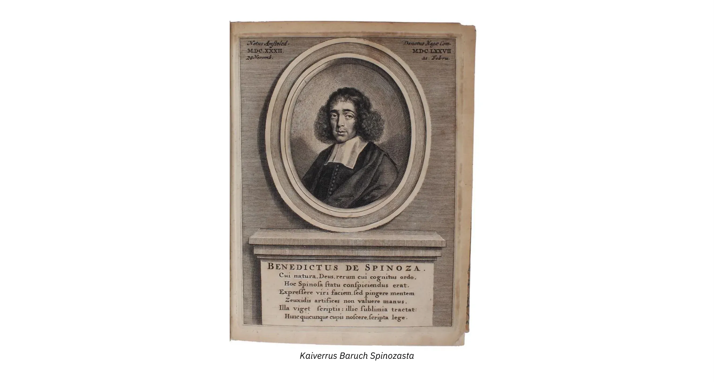

Spinozan muotokuva

Sitten näemme, mitä tämä uusi rationaalinen filosofia on, jonka mukaan "luonnossa ei ole mitään sellaista, mitä ei voisi selittää ilman järjen käyttöä".

Kyse on ajatuksesta, jonka mukaan voimme ymmärtää maailmaa ja ihmisluontoa vain asioiden välisen kausaalisen yhteyden kautta, jonka mukaan vaikutuksella on aina syy, ja tämä syy on itse toisen syyn vaikutus ja niin edelleen, aina ensimmäiseen syyhyn asti, johon meillä ei ole pääsyä ja joka Spinozan mukaan on Luonto.

Luonto, toisin sanoen Jumala, on kuuluisa latinankielinen "Deus sive Natura", joka kuvaa koko spinozismin merkitystä.

Tutustumme myös Spinozan kahteen pääteokseen, alkaen Etiikasta, joka julkaistiin postuumisti vuonna 1677 ja jossa keskitytään täysin vapauteen ja tarpeeseen vapauttaa itsemme meitä rajoittavista orjuudesta.

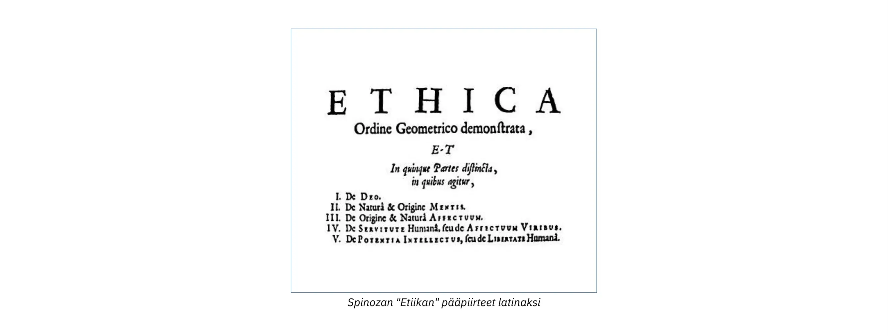

Sitten tarkastelemme Traité théologico-politique -teosta, joka julkaistiin hänen elinaikanaan vuonna 1670 ja jonka avulla voimme tarkastella vapautta toisesta näkökulmasta: ajatuksen ja vakaumuksen vapaudesta. Toisin sanoen uskonnonvapaus, mutta ennen kaikkea poliittinen vapaus.

Lopuksi näemme, miksi spinozismi on ajatusten kopernikaaninen vallankumous ja miten se edustaa maailman ja ihmisluonnon uutta määritelmää, tutkimalla kolmea Spinozan tuomitsemaa perustavanlaatuista harhaa: vapaan tahdon harhaa, lopullisten syiden harhaa eli finalismia ja teologista harhaa.

Geometrien tapaan kehitetyn affektien teorian, "more geometrico", ansiosta näemme lopulta, miten Spinoza tarjoaa meille käytännöllisen menetelmän, jonka avulla voimme vapauttaa itsemme tai yrittää vapauttaa itsemme ihmisluonnon ja ulkoisten intohimojen luontaisesta orjuudesta. Rationaalinen mekanismi, jota voidaan verrata tietämättömyyden torjumiseksi varmuuteen siitä, että kolmion kolme kulmaa ovat aina yhtä suuret kuin 180°, ja jonka avulla voimme yhdistää siitä syntyneen valistuksen hengen 1800-luvun liberaalivirtauksiin tai 1900-luvun libertarismiin, jotka liittyvät suoraan Satoshi Nakamoton keksintöön, Bitcoin:ään.

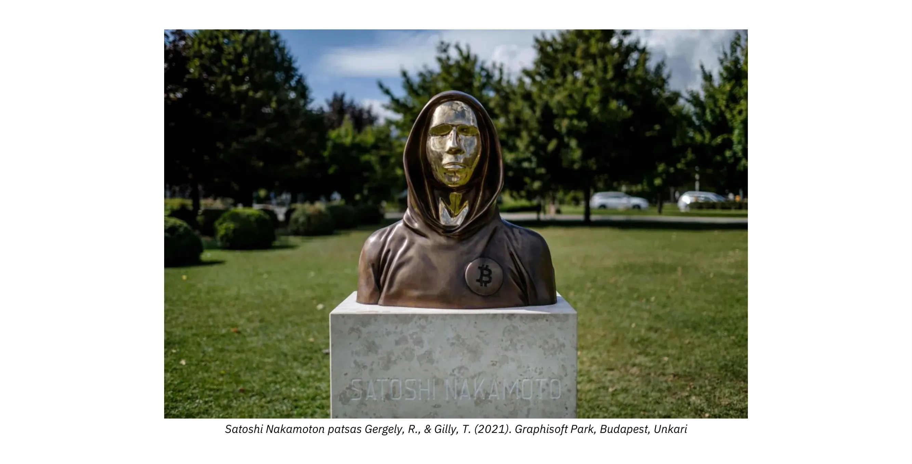

Silloin ymmärrämme, että Spinozin käsitteiden ja tämän Satoshi Nakamoton keksimän vapauden välineen monien yhteisten piirteiden joukossa ensimmäinen on se, että molemmissa tapauksissa, jos olemme uteliaita, hyvää tarkoittavia, kuten tuolloin sanottiin, meillä on "ymmärrystä", emme voi olla noudattamatta sitä. Ja jos emme noudata sitä, mikä olisi tietysti kaikkein ehdottomin oikeutemme, koska on perustavanlaatuista kunnioittaa vapautta uskoa tai olla uskomatta, niin silloin olisimme päättäneet olla kykenemättä tai olla haluamatta, mikä on sama asia.

Ja näin voimme ymmärtää, että esimerkiksi uskonnollinen fundamentalisti ei koskaan pysty hyväksymään tai kuuntelemaan pienintäkään kopernikaanista ajatusta, kuten spinozismia, aivan kuten keskuspankkiirin on hyvin vaikea hyväksyä Bitcoin:ta.

Vaikka, kuten tiedätte, asiat ovat tällä hetkellä menossa oikeaan suuntaan.

## Baruch de Spinozan esittely

<chapterId>f53a9cfd-326e-5b73-a766-3ef2f07c5a49</chapterId>

:::video id=5fac3ddc-c472-4c64-8186-46a8f317e389:::

Kuka oli Baruch de Spinoza? Hän oli hollantilainen filosofi, joka syntyi vuonna 1632 ja kuoli 45-vuotiaana vuonna 1677.

Hän oli juutalaista syntyperää ja kuului portugalilaiseen sefardien yhteisöön, joka polveutui marranoista, jotka katoliset pakottivat lähtemään Espanjasta 1400-luvulla, ja hän kasvoi uskonnollisessa ja älyllisessä ympäristössä, jossa hän oli tietoinen siitä, mitä vainoaminen tarkoittaa.

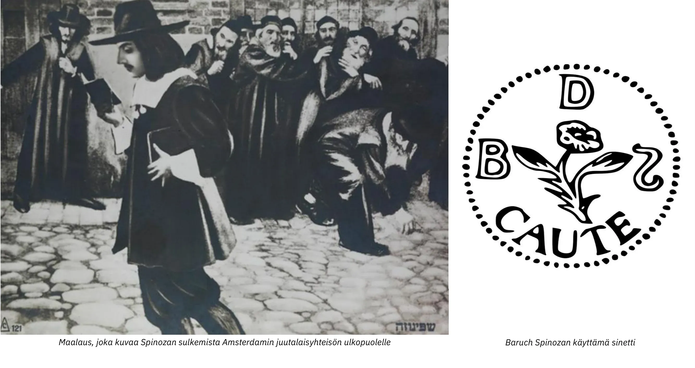

Itse asiassa hän suhtautui jo varhain vahvasti kriittisesti vakiintuneeseen uskontoon ja erityisesti heprealaiseen yhteisöönsä, josta hänet erotettiin väkivaltaisesti vuonna 1656, vain 24-vuotiaana, ennen kuin hän oli julkaissut mitään.

Sanotaan, että tämä "ekskommunikaatio" antoi hänelle mahdollisuuden eristäytyä ja keskittyä työhönsä katsomatta koskaan taakseen.

Spinoza, joka aikalaistensa Descartesin (1596-1650), Pascalin (1632-1662) ja Newtonin (1643-1727) tavoin periytti häntä vain muutamalla vuodella edeltäneiden Kopernikuksen (1473-1543), Keplerin (1571-1630) ja Galilein (1564-1642) uudet rationaaliset ajatukset fysiikassa, kehitti geometristen ajattelutavan Galilein periaatteen mukaisesti, jonka mukaan matematiikka on maailmankaikkeuden kieli.

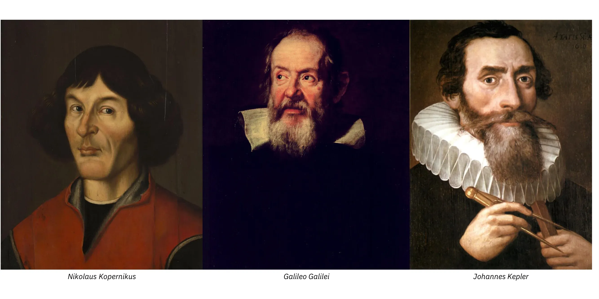

Nämä olivat kuitenkin tuohon aikaan hyvin vaarallisia ajatuksia sen jälkeen, kun munkki ja filosofi Giordano Bruno (1548-1600) oli joutunut oikeudenkäynnin kohteeksi ja poltettu elävältä kerettiläisyydestä Rooman julkisella aukiolla, ja kun inkvisitio pakotti Galileon vuonna 1633 luopumaan kopernikaanisesta heliosentrisestä maailmankuvastaan.

Siksi hänen tiukan rationaalinen, asioiden välisiin kausaalisiin yhteyksiin perustuva näkemyksensä maailmasta ja ihmisluonnosta toi hänelle maineen, jonka vuoksi häntä pidettiin - ja pidetään vielä nykyäänkin, virheellisesti - ateistina.

Itse asiassa Spinoza puhuu teoksessaan vain Jumalasta, jonka hän samaistaa luontoon, ja vaikka hän arvostelee uskonnollisten ihmisten ja teokraattien taikauskoisia impulsseja, hän osoittaa, että todellinen uskonto on hänelle ennen kaikkea oikeudenmukaisuuden ja hyväntekeväisyyden synonyymi.

Juuri tämä lähestymistapa yhdistää Spinozan valistuksen filosofiaan, olipa kyse sitten saksalaisesta Leibnizista (1646-1716), Kantista (1724-1804), Schopenhauerista (1788-1860) ja Nietzschestä (1844-1900), englantilaisesta Lockesta (1632-1704) tai ranskalaisesta Voltairesta (1694-1778), Rousseausta (1712-1778) ja Diderot'sta (1713-1784). Kaikki olivat yhtä mieltä siitä, että järjen avulla olisi torjuttava hämäräperäisyyttä, erityisesti uskonnollista hämäräperäisyyttä, taisteltava tietämättömyyttä vastaan ja puolustettava vapauden ja edistyksen ihanteita.

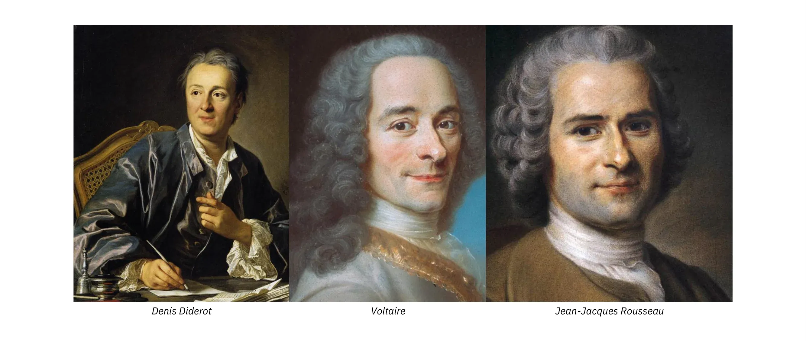

Jotta voisimme aloittaa tämän filosofian yhdistämisen Bitcoin:een, on tärkeää huomata, että Spinoza syntyi hyvin erityisellä aikakaudella.

1600-luvulla Yhdistyneet provinssit olivat paitsi maailman vapain maa poliittisten ja uskonnollisten aatteiden osalta myös rikkain. Toisin sanoen taloudellisesti ja teknisesti edistynein maa.

Rikkaus ei kuitenkaan ole sidoksissa luonnonvaroihin, siirtomaiden riistoon ja riistämiseen tai orjuuteen vaan kansainväliseen kauppaan ja kaupankäyntiin vapaassa, yrittäjähenkisessä hengessä. Tätä henkeä on myöhemmin puolustanut kuuluisa spinotsilainen Voltaire (1694-1778), jonka mielestä liberaalia vakaumusta edustavaa liikemiestä tai yrittäjää ei koskaan suljettaisi kauppahuoneessa pois, ei kutsuttaisi vääräuskoiseksi tai erotettaisi hänen uskontonsa tai alkuperänsä perusteella, vaan vain jos hän olisi mennyt konkurssiin.

Lisäksi Hollanti oli tuohon aikaan edistynyt myös tärkeillä teknologian aloilla, esimerkiksi mekaniikan ja optiikan alalla. Tähtitieteellisiä teleskooppeja, joita Galileo käytti taivaalle katsomiseen ja maailmankaikkeuden löytämiseen, pidettiin aikakautensa huipputekniikkana, samoin kuin tietotekniikkaan, tekoälyyn ja tietysti kryptografiaan liittyvää uutta teknologiaa nykyään.

Ja koska Spinoza itse harjoitti tähtitieteellisten linssien kiillotuksen ammattia - ironista kyllä, sillä hänen sanottiin nähneen kaiken vinossa - voimme kuvitella, että hän olisi varmasti kannattanut Bitcoin:n kaltaista vapauden välinettä.

Toisin sanoen spinozismin välittämät vapauden ja edistyksen arvot ovat vastakohtana maailmalle, jossa uskonnollinen fundamentalismi, salaliittoteoriat, taikausko ja ennen kaikkea tietämättömyys ovat edelleen surullista todellisuutta.

Se on kuitenkin maailma, jossa kaikki keinot ovat arvokkaita, jotta voimme paeta, jotta voimme vapautua meitä rajoittavista orjuudesta ja jotta voimme olla vapaita hyväksymällä maailman sellaisena kuin se on, emme sellaisena kuin haluaisimme sen olevan.

Olivatpa nämä keinot sitten filosofisia tai teknologisia, kuten myöhemmin näemme, Bitcoin on vapauden väline. Se on väline, jonka avulla sekä yksilöt että valtiot voivat vapautua orjuudesta, erityisesti rahaorjuudesta.

# Tärkeimmät teokset, Etiikka ja politiikka

<partId>d7d7e9a1-005b-519c-b587-137435e46344</partId>

## Etiikka ja vapauden etsiminen

<chapterId>4cc66e25-335c-591d-9b78-83e5664bbbbc</chapterId>

:::video id=065c5091-69e1-412f-acce-c763ec31d3b1:::

Tässä luvussa ehdotan, että siirrymme nyt Spinozan tärkeimpään teokseen Etiikka, joka julkaistiin postuumisti vuonna 1677.

Miksi postuumisti? No, koska hänen ajatuksensa olivat vallankumouksellisia tai ainakin vastakkaisia ja häiritseviä, ja siksi ne olivat tuolloin hyvin vaarallisia, jopa 1600-luvun Yhdysvaltojen liberaalissa kontekstissa.

Etiikka on latinankielinen teos, joka on kirjoitettu geometrikkojen tapaan, ja se on todennäköisesti saanut innoituksensa Galileon (1564-1642) tieteellisestä hengestä, joka on Keplerin (1571-1630) ohella modernin tieteen isä, jonka mukaan matematiikka on maailmankaikkeuden kieli. Spinoza kehittää ajatuksiaan viidessä pääosassa käyttäen lauseita, joihin liittyy demonstraatioita, skolia, aksioomeja ja määritelmiä.

Sinänsä etiikka on Spinozan sanoin "tapa päästä vapauteen tai siihen johtaviin polkuihin", eikä se ole oikeastaan kirja, jonka voi lukea kannesta kanteen, vaan pikemminkin sellainen, jonka voi käydä läpi lukemalla esimerkiksi yhden lauseen, joka viittaa toiseen, joka puolestaan ymmärretään kolmannen lauseen kautta, ja niin edelleen, täydellisen johdonmukaisessa, rationaalisessa ja loogisessa järjestelmässä.

Haluaisin huomauttaa, että kun avaat Etiikan, on suositeltavaa aloittaa jälkisanoilla ja liitteillä, nämä lyhyet osat Spinoza on kirjoittanut arkikielellä, joten ne ovat helposti ymmärrettäviä ja tavallaan yhteenveto hänen joskus monimutkaisesta ajattelustaan.

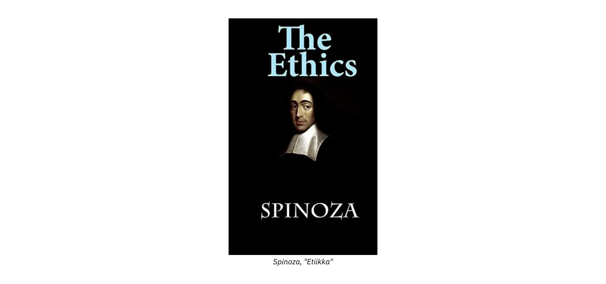

Kun Spinoza asettaa ympäröivän maailman "järjen mikroskoopin" alle, hän analysoi ihmisluontoa sillä periaatteella, että ihminen ei ole itse aiheutettu, eli emme ole itse pyytäneet syntyä tänne emmekä aikanamme, emmekä tällaisella fyysisellä tai älyllisellä ominaisuudella.

Ja hän sanoo, ettemme ole luonnon yläpuolella. Emme ole vapautettuja sen laeista, oli kyse sitten ruumiista tai mielestä. Toisin sanoen olemme yhtä lailla osa luontoa kuin mikä tahansa muu elävä olento, eläin tai kasvi.

Spinozalle kaikki inhimillisen toiminnan alat riippuvat järjen kyvystä ymmärtää maailma täydellisen yhtenäisenä ja määrätietoisena järjestelmänä.

Maailma, jossa sattumaa ei ole olemassa.

Kaikki, mitä tapahtuu, on "välttämätöntä" ja syyn seurausta sen ajatuksen mukaisesti, että "sen, mitä on ja mitä tapahtuu, täytyy olla ja sen täytyy tapahtua". Tämä on absoluuttista determinismiä.

On kuitenkin pidettävä mielessä kaksi seikkaa:

Ensinnäkin, jos Spinozalle sattumaa ei ole olemassa, se johtuu siitä, että se on tapahtuma, jonka syytä emme tiedä. Mutta hän sanoo tietenkin, että se, että emme tiedä syytä, ei tarkoita, ettei sitä olisi olemassa.

Toiseksi, fatalismista ei myöskään ole mitään puhetta, koska luonnolla ei ole aikomusta. Esimerkiksi salamalla ei ole aikomusta rangaista ketään, kuten tragedian tapauksessa voisi ajatella. Ei, se yksinkertaisesti ilmaisee oman luontonsa olemuksen, joka on salamanisku. Iskeä.

Spinoza puolustaa siis ajatusta, jonka mukaan todellisuus eli jokapäiväinen elämä sekä hyvine että huonoine puolineen on täysin ymmärrettävissä ja että luonnossa ei ole mitään sellaista ilmiötä, joka ei olisi kausaalisesti sidoksissa toisiinsa. Tämä herättää tietysti kysymyksen pahasta, erityisesti absoluuttisesta pahasta, jota tarkastelemme hieman myöhemmin.

Lopuksi on tärkeää huomata, että etiikka ei ole moraalia.

Kuuluisan filosofian professorin ja Spinoza-asiantuntijan Gilles Deleuzen (1925-1995) mukaan moraali on yhteiskunnassa elämisen kannalta hyödyllinen arviointijärjestelmä. Se on kuitenkin subjektiivinen järjestelmä, sillä se, mikä on oikein täällä, voi olla väärin toisaalla, ja mikä on väärin tänään, voi olla oikein myöhemmin.

Sen sijaan, että määriteltäisiin, mikä on oikein tai väärin, etiikka määrittää, mikä on hyvää tai huonoa omalle luonteellemme ja Spinozan mukaan kyvyllemme säilyttää olemuksemme. Olla vapaa. Se on siis todellista etologiaa eli tiedettä olemisen tavoista tai, kuten Gilles Deleuze edelleen selittää, hyvien kohtaamisten tekemisen taidetta.

Tai taito tehdä oikeita valintoja, jotta voimme vapautua meitä rajoittavasta orjuudesta, jonka vuoksi Spinozan mukaan ihmiset ovat usein alentuneet "näkemään parasta, hyväksymään sen ja tekemään pahinta".

Toisin sanoen "taistella heidän orjuutensa puolesta ikään kuin he taistelisivat vapautensa puolesta".

## Teologis-poliittinen tutkielma

<chapterId>84b0187e-1050-5d44-a536-80554896e828</chapterId>

:::video id=c1efc97e-1e96-4b37-894c-9a19794d6b52:::

Etiikan jälkeen haluaisin esitellä teille tässä luvussa toisen merkittävän teoksen, joka auttaa ymmärtämään Spinozan filosofista ja poliittista vaikutusta erityisesti tulevaan valistukseen sekä liberaalisiin ja meidän tapauksessamme libertaristisiin virtauksiin.

Kyseessä on Traité théologico-politique eli TTP, joka julkaistiin nimettömänä vuonna 1670.

Spinoza (1632-1677) kirjoitti tämän kirjan, kun hän keskeytti Etiikan kirjoittamisen, yrittäessään tehdä lopun väärinkäsityksestä, joka on edelleen olemassa. Se on uskomus, että hän oli ateisti.

Kuten olemme nähneet, Spinozan jumalakäsitys on koko Etiikan ensimmäisen osan aiheena, jossa hän osoittaa paitsi jumalan olemassaolon myös sen, mikä on hänen todellinen luonteensa.

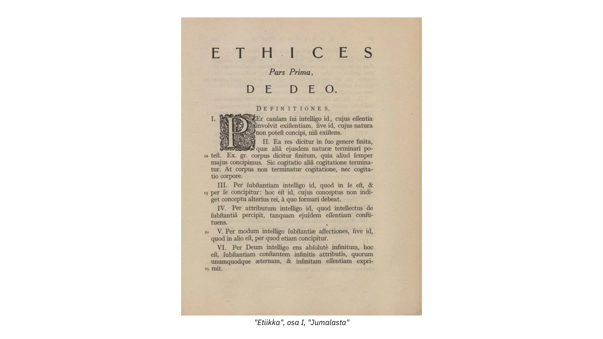

Ja koska Spinozan käsitteet ovat yleensä melko vaikeasti hahmotettavia, on usein helpompi ymmärtää niitä sanomalla, mitä ne eivät ole, kuin yrittämällä sanoa, mitä ne ovat. Lähestymistapa, joka on muuten, kuten tulemme myöhemmin näkemään, erittäin hyödyllinen Bitcoin:n ymmärtämisessä.

Näin Spinoza osoittaa meille, että Jumala ei ole hänen mielestään antropomorfinen olento, jolla on aikomuksia, joka rankaisee tai palkitsee, jolle puhuisimme ja joka kuuntelisi meitä rituaalin mukaisesti, jota saatamme noudattaa tai olla noudattamatta. Toisin sanoen Jumala ei ole hänen mukaansa vanha mies, jolla on pitkä valkoinen parta ja joka on piilossa pilven takana ja joka ratkaisee maailman vaikeudet ja tekee meidät riippuvaisiksi hänestä.

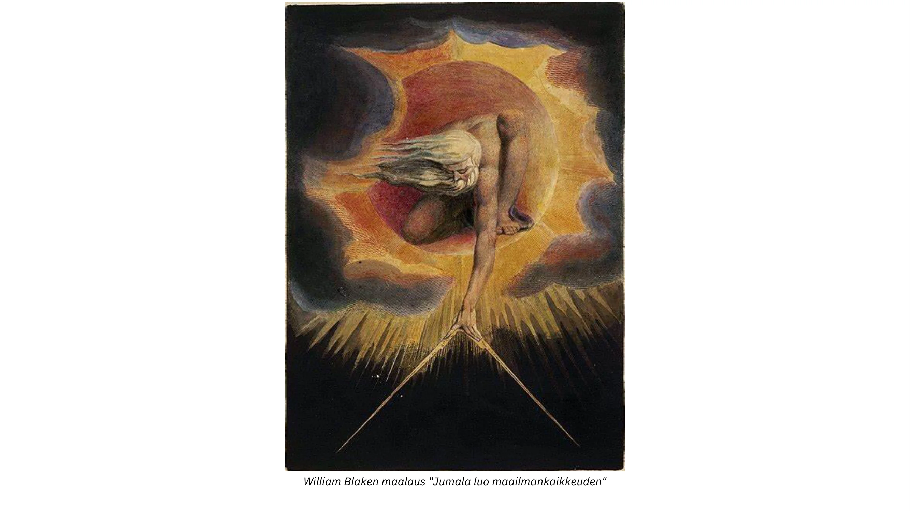

Jumalasta puhuminen tarkoittaa siis luonnon kutsumista ainutlaatuiseksi, äärettömäksi ja ikuiseksi substanssiksi, joka koostuu äärettömästä määrästä ominaisuuksia, joista me ihmiset tunnemme vain kaksi: aineen eli laajuuden ja ajatuksen.

Tämä on kuuluisa "Deus Sive Natura", josta Spinoza johtaa absoluuttisen determinismin käsitteen ja ajatuksen siitä, että ihminen ei ole syypää itseensä eikä ole luonnon yläpuolella, eikä varsinkaan eläinten yläpuolella.

Uskontokritiikin lisäksi TTP on Spinozalle ennen kaikkea tilaisuus arvostella ankarasti uskonnollisia ihmisiä ja teokratiaa. Toisin sanoen uskonnollinen valta viljelee pelkoa ja taikauskoa, ja hänen mukaansa se aktivoi yksilöiden surullisia intohimoja orjuuttaakseen heitä paremmin ja vangitakseen heidät harhakuvitelmiin, fanaattisuuteen ja sotaan.

Tässä uskonnon alkuvaiheessa, lapsellisessa vaiheessa, uskovaiset kiinnittyvät vain ulkoiseen palvomiseen ja ennakkoluuloihin perustuvaan hyväuskoiseen uskoon. Vaihe, jossa uskonnosta tulee mekaanisesti suvaitsematon, se eksyy moraalisen opetuksensa rajoilta ja kääntyy pois kutsumuksestaan edistää rauhaa ja harmoniaa väittämällä olevansa totuuden haltija.

Kun kuitenkin siirrymme rationaalisen uskontokritiikin ulkopuolelle, esimerkiksi Raamatun eksegetiikan avulla, Spinoza haluaa vakuuttaa meidät siitä, että tämä uusi näkemys Jumalasta on täysin sopusoinnussa kirjan kolmen suuren uskonnon oikeudenmukaisuuden ja hyväntekeväisyyden viestien kanssa, joissa esitetään yksinkertainen mutta usein unohdettu kultainen sääntö: "Rakasta lähimmäistäsi niin kuin itseäsi".

Mutta siinä ei ole vielä kaikki.

Tähän TTP:ssä kehitettyyn kypsään näkemykseen uskonnosta liittyy poliittinen ulottuvuus, eli tarve erottaa uskonto ja valtio toisistaan ajatuksen- ja uskonvapauden suojelemiseksi sekä kaikkien yksilöiden että valtion itsensä etujen mukaisesti.

Pohjimmiltaan Spinoza pitää vapautta järjen puitteissa välttämättömänä edellytyksenä sille, että ihmiset voivat elää ilman, että heidän etujaan vastustavien vallanpitäjien orjuuttamia, ja siksi hän puolustaa poliittiseen ja uskonnolliseen vapauteen perustuvaa suoraa demokratiaa.

Toisin sanoen ajatuksen- ja uskonvapautta, jotta ihmiset voivat vapautua orjuudesta ja vääristä, lapsellistavista uskomuksista, jotta he voivat järkeillä aikuisina ja asettaa etusijalle järjen ja, mitä meihin tulee, myös teknisen kehityksen.

Lissabonin surullisenkuuluisa maanjäristys 1. marraskuuta 1755 osoitti, että ihmiset ajattelivat luonnonilmiöistä ja katastrofeista sekä siitä, miten he voisivat suojautua niiltä, muuttui merkittävästi.

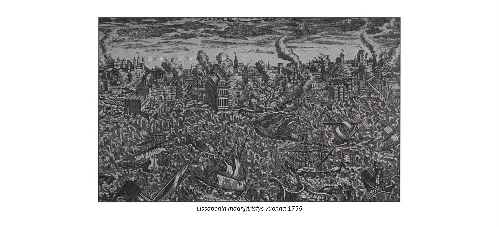

Tämä kauhea maanjäristys tuhosi kaupungin ja tappoi satojatuhansia viattomia ihmisiä, joista monet olivat tuolloin kirkossa, koska oli kaikkien pyhien päivä, mikä lisäsi selviytyneiden hämmennystä.

Draama, joka herätti henkiin saksalaisen filosofin ja matemaatikon Leibnizin (1646-1716) esittämän kysymyksen antropomorfisesta näkemyksestä Jumalasta, jolla on intentionaalisuus, hyvyys ja kaikkivoipaisuus. Sillä jos Jumala olisi hyvä, kuten Leibniz sanoo teodikeassaan, hän ei olisi kaikkivoipa, koska hän sallisi tällaiset katastrofit, ja jos hän olisi kaikkivoipa, hän ei olisi hyvä, koska hän ei voisi estää niitä.

Jean-Jacques Rousseau (1712-1778) kirjoitti Voltairelle, jota ihmiskunnan kärsimä epäoikeudenmukaisuus ja kauheudet olivat hämmästyttäneet, että "luonto ei sinänsä ole paha, eikä meidän pitäisi nähdä siinä mitään jumalallista kättä, joka selittäisi sen suunnittelun".

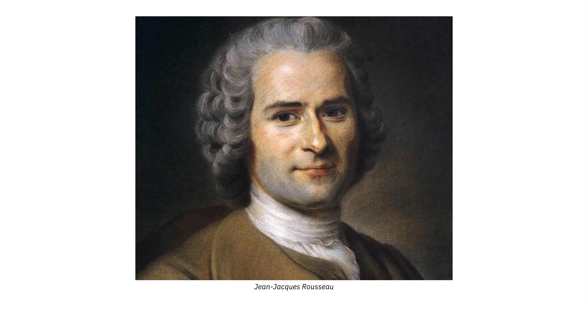

Tähän Voltaire (1694-1778), Spinozisti jos joku muu, vastasi, että tämän luonnonkatastrofin pitäisi ennen kaikkea saada meidät ymmärtämään, että tieteelliset keinot suojella itseämme luonnolta ovat olemassa, ja että heidän aikansa haasteena oli siksi kysyä, voisivatko ihmiset tiedon ja edistyksen ansiosta ottaa tulevaisuutensa omiin käsiinsä ja vapautua teologiasta ja taikauskosta.

Vaikka kyse ei tietenkään ollut maanjäristysten estämisestä, sillä ne ovat edelleen paitsi arvaamattomia myös täysin hallitsemattomia, kyse oli pikemminkin sen varmistamisesta, että esimerkiksi talot rakennettiin kestämään niitä.

Tämän vuoksi 1700-luvun valistus on järjen, tieteen ja teknologian käytön ansiosta edistyksen vuosisata. Toisin sanoen edistys on vapauden väline.

# Spinozilainen vallankumous, kolme harhaa..

<partId>f5d45c2b-28da-527a-ab20-dd255e9a9e0d</partId>

## Luonnon ja ihmisen uusi määritelmä

<chapterId>3e6599e3-5b29-50a8-a67d-d0386da5d65d</chapterId>

:::video id=b6d2c035-8848-4da6-9da9-be3b70be0f38:::

Tässä luvussa haluan tarkastella aatehistoriaa ja selvittää, miksi spinozismia pidetään todellisena kopernikaanisena aatevallankumouksena.

Tämän matematiikan tarjoaman uuden tavan ymmärtää Jumalaa, toisin sanoen luontoa, ansiosta Spinoza (1632-1670) loi syvällisen paradigman muutoksen, jolla oli epäsuoria vaikutuksia uskonnolliseen maailmankuvaan ja ihmisen asemaan siinä.

Aivan kuten Nikolai Kopernikus (1473-1543) totesi, että maapallo ei ole maailman keskipiste, ja Charles Darwin (1809-1882) osoitti kolme vuosisataa myöhemmin, että ihminen ei ole "elämän" keskipiste, Spinoza noudatti tätä logiikkaa ja totesi omana aikanaan, että ihminen ei ole "oman talonsa herra" eikä maailmankaikkeutta ole luotu yksinomaan hänen hyödykseen.

Hän sanoo, että ihminen ei ole "valtakunta valtakunnan sisällä" ja että aivan kuten maapallo on alennettu pelkäksi planeetaksi, kuten kaikki muutkin planeetat, ihminen on alennettu pelkäksi luontotyypiksi, kuten kaikki muutkin äärelliset luontotyypit, kuten eläimet, kasvit ja kaikki "olemassa olevat olennot".

Ennen häntä klassisessa kreikkalaisessa filosofiassa maailmankaikkeutta, kosmosta ja ihmiskokemusta selitettiin järjestyksellisellä ja hierarkkisella näkemyksellä. Se perustui myyttisiin kertomuksiin ja pyrki pohjimmiltaan selittämään maailman alkuperää ja vaati maailmankaikkeuden, luonnon ja ihmiskunnan harmoniaa.

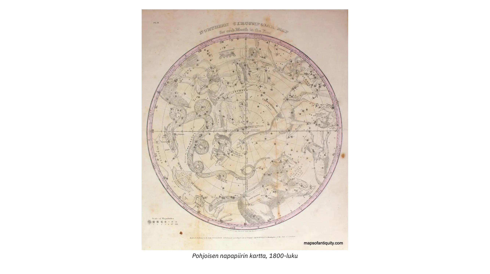

Keskiajan skolastinen kosmologia, joka alkoi pääasiassa 1200-luvulta lähtien, oli kehitys kohti enemmän järjen käyttöä järjen ja uskon yhteensovittamiseksi ja sellaisen maailmankaikkeuden selittämiseksi, joka oli edelleen hierarkkinen mutta joka vastasi paremmin kristillistä filosofiaa.

Kopernikuksen (1473-1543) uuden fysiikan myötä 1400-luvulla kosmologiassa tapahtui kuitenkin merkittävä käänne maailmankaikkeuden ymmärtämisessä. Kopernikuksen geosentrinen malli kyseenalaistettiin heliosentrisen järjestelmän hyväksi, mikä avasi tietä nykyaikaiselle tieteelle, erityisesti Keplerin (1571-1630) ja Galileon (1564-1642) uudelle fysiikalle ja tähtitieteelle. Sitten Isaac Newton (1643-1727) ja lopulta Albert Einstein (1879-1955), joka oli vannoutunut spinozilainen.

Jotta voimme täysin ymmärtää spinozismia, meidän on kuitenkin otettava huomioon myös René Descartes (1596-1650), kuuluisa ranskalainen filosofi, joka oli Spinozan edeltäjä ja jonka oppilas ja suuri ihailija Spinoza oli.

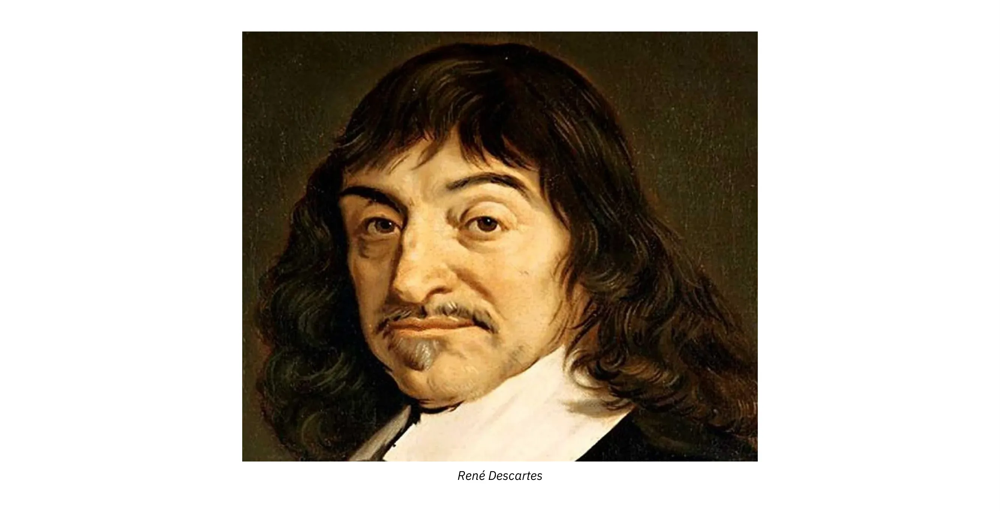

Riskeistä ja Giordano Brunon (1548-1600) ja Galileon tuomioista huolimatta Descartes pyrki erottamaan "totuuden valheesta" ja sovittamaan yhteen teologian, filosofian ja fysiikan. Vuonna 1637 julkaistussa kuuluisassa Menetelmäkeskustelussaan Descartes väitti, että järki on tiedon perusta, jonka avulla ihminen voi saavuttaa vapauden.

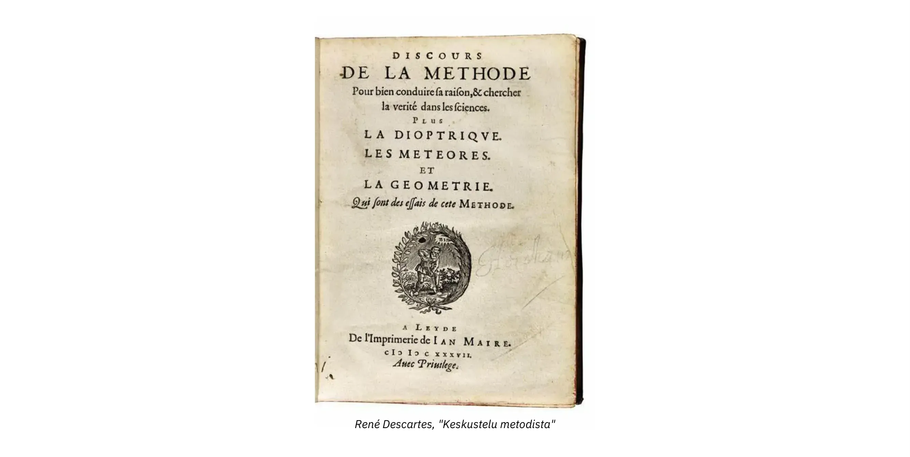

Selittämällä maailman yleismaailmallisten lakien eikä moraalisilla aikomuksilla varustetun luonnon mukaan hän pohjusti tietä determinismille, jota Spinoza myöhemmin noudatti.

Katolilaisena Descartes asetti kuitenkin hierarkian ihmisen ja muun äärellisen luonnon välille, erityisesti eläinlajien, joita hän kutsui "kone-eläimiksi", osalta. Sanoessaan, että "ei ole olemassa sielua, joka ei hyvin ohjattuna voisi hankkia absoluuttista valtaa tekoihinsa ja intohimoihinsa" Descartes väittää näin ollen, että ihmisellä on kyky aloittaa jotakin tyhjästä ja että ihminen hänen mielestään "pakenee luonnonlakeja", että hänellä on absoluuttinen valta omiin tekoihinsa ja että hän perustelee päättäväisyytensä yksinomaan itsessään.

Spinoza osasi mennä tämän vaiheen yli ja ylittää sen ja sovittaa yhteen Jumalan olemassaolon ja järjen osoittamisen. Hänelle kaikki inhimillisen toiminnan alat ovat riippuvaisia järjen kyvyistä täydellisen johdonmukaisessa ja määrätietoisessa maailmassa. Mutta maailmassa, jossa ei ole sattumanvaraisuutta eikä sattumaa ja jossa kaikki tapahtuva on välttämätöntä ja syyn seurausta, asioiden välisen kausaalisen yhteyden mukaisesti. Tämä on absoluuttisen determinismin ajatus.

Hän kumoaa lopulta karkeimmin sanoin kartesiolaisen kannan ja kritisoi esimerkiksi ajatusta, jonka mukaan ihminen ei ole luonnonlakien alainen kuten muut eläimet ja siksi ylivertainen kaikkiin muihin luonnon äärellisiin olomuotoihin nähden.

Toisin sanoen heillä on vapaa tahto, joka on illusorinen uskomus, josta on äärimmäisen vaikea päästä eroon, kuten Spinoza kertoo, ja josta keskustelemme nyt.

## Vapaan tahdon illuusio

<chapterId>f147a914-cb64-5927-b305-26691930bca3</chapterId>

:::video id=b59da795-ba19-4643-9672-36c9e7953a42:::

Tällä kurssilla käsittelemme nyt vapaata tahtoa koskevaa arkaluonteista kysymystä, jotta ymmärtäisimme paremmin, mitä vapaus on Spinozalle, valistusajattelulle ja varhaisille liberaaleille filosofeille.

Kuten olemme jo nähneet, Spinoza (1632-1677) on tunnettu siitä, että hän piti vapaata tahtoa harhakuvitelmana, josta on äärimmäisen vaikea vapautua.

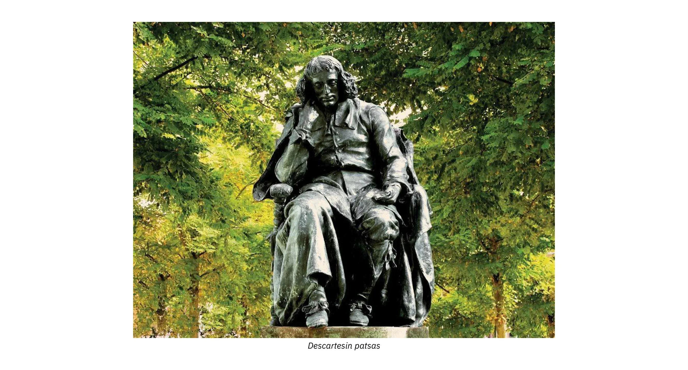

Miksi? Koska se on vastoin antiikista lähtien jatkunutta filosofista perinnettä, jota Descartes (1596-1642) yhä puolustaa, että ihminen voi luoda jotakin tyhjästä ja kantaa täyden vastuun teoistaan, erityisesti Jumalan edessä, sanoo pyhä Augustinus (354-430), kristillisen kirkon isä.

Mutta tietysti myös inhimillisen oikeuden edessä.

Se on ajatus siitä, että tahdomme, ja vain meidän tahtomme, antaa meille mahdollisuuden ohjata elämäämme, että meillä on ehdoton valta tekojemme yli ja että saamme tekojemme vapauden ainoastaan itseltämme, joten meillä on määrittelemätön päätösvalta.

Toisin sanoen ihmiskunta kykenee pikemminkin häiritsemään luonnon järjestystä kuin alistumaan sen alaisuuteen.

Koska hän ei olisi elämänsä toteuttamisessa minkään muun kuin oman tahtonsa lain alainen, hän olisi siten paitsi luonnon ja eläinten, pelkkien koneiden, yläpuolella myös kaikkien muiden luonnon äärellisten olomuotojen yläpuolella. Tämä oli Descartesin (1596-1650) kanta, jonka mielestä ihmisen voimattomuuden ja horjumattomuuden syyt eivät olleet luonnonjärjestyksessä vaan ihmisluonnon paheissa itsessään.

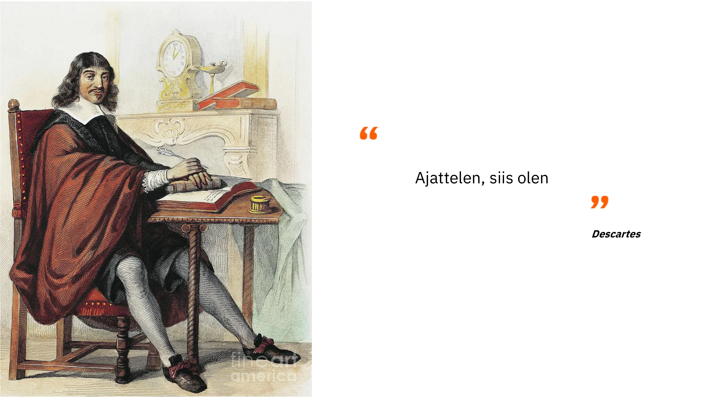

Mutta vaikka Spinoza antaa Descartesille tunnustusta siitä, että hän on avannut tien affektiivisen elämän rationaaliseen hallintaan, hän ottaa hänestä täysin etäisyyttä kritisoimalla jyrkästi tätä hypoteesia tahdon "absoluuttisesta vallasta".

Spinoza taas katsoo, että maailmamme on täydellisen johdonmukainen ja määräytynyt ja että kaikki tapahtuva on välttämätöntä ja seurausta asioiden kausaalisuudesta, jonka mukaan vaikutuksella on aina syy, ja tämä syy on itse toisen syyn vaikutus ja niin edelleen.

Tämä on absoluuttisen determinismin ajatus, josta hän Etiikassaan lähtee, että ihmisillä ei ole minkäänlaista vapaata tahtoa, koska, kuten hän sanoo, he ovat tietoisia teoistaan, mutta he jättävät huomiotta tai mieluummin jättävät huomiotta ne todelliset syyt, jotka määrittävät ne.

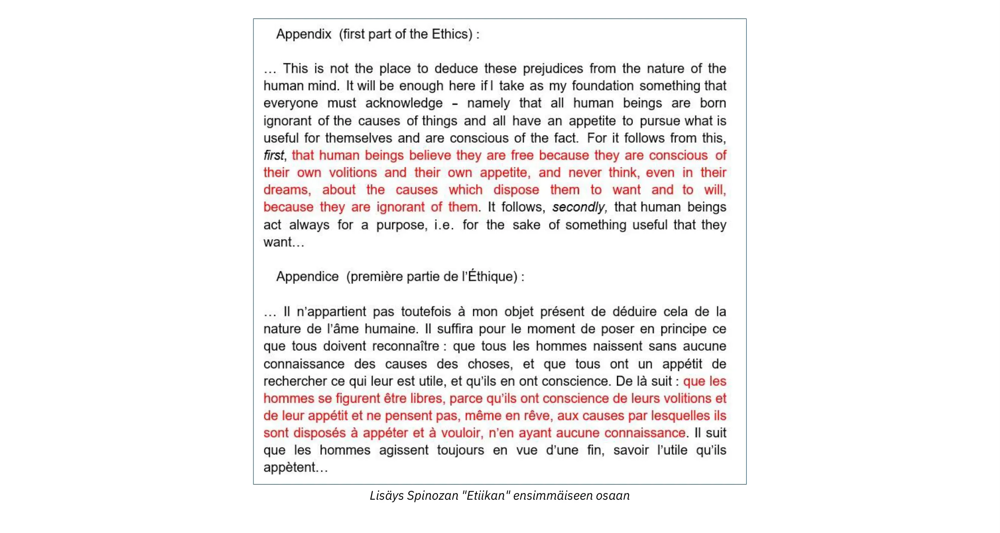

Spinozalle ihminen ei siis voi eläinten tai kasvien kaltaisina luonnon "rajallisina tiloina" aloittaa jotakin tyhjästä; hän ei ole vapautettu luonnon laeista, ei ruumiissaan eikä mielessään.

Mikä pahempaa, hänen mielestään vapauden suurin vaara on uskoa vapaaseen tahtoon ja uskoa, että voimme toimia ilman ulkoisten syiden määräämää vaikutusta.

Spinozalle vapaus ei ole vapaan tahdon ilmaisemista, vaan kykyä ymmärtää oikeutettu paikkamme maailmassa, ymmärtää määrätietoinen luontomme ja siitä käsin suunnata olemassaolomme sellaiseen, joka "lisää toimintakykyämme". Katsomalla aina optimistisesti tulevaisuuteen ja näkemällä maailman sellaisena kuin se on, sen sijaan että kuvittelisimme sen sellaiseksi kuin haluaisimme sen nähdä.

Ongelmaksi nousee tietysti ihmisten vastuu ja heidän tekonsa. voisimme päätellä, että jos yksilöt eivät ole vapaita teoissaan, he eivät olisi vastuussa niistä, varsinkaan oikeudenmukaisuuden edessä. Tämä näkemys on kuitenkin harhaanjohtava, sillä menemättä liian pitkälle yksityiskohtiin, yksilön sosiaalisen, familiaalisen ja historiallisen determinismin tunnustaminen ei estä meitä pohtimasta vastuuta tehdyistä teoista, koska ne ovat vapaaehtoisia.

Toisaalta olisi harhaluulo uskoa, että rikollisen teot eivät koskaan liity hänen omaan determinismiinsä. Vaikka kyse ei olekaan niiden anteeksiantamisesta, kyse on ainakin siitä, että niitä yritetään ymmärtää. Oikeudenmukaisuus tekee itse asiassa juuri tätä: laittomista teoista rankaisemisen lisäksi sillä on rooli tulevaisuuden ennakoimisessa ja suojelemisessa, minkä vuoksi tietyistä rikoksista ei vain rangaista vaan niitä myös hoidetaan ottaen huomioon rikoksentekijän perhe-, sosiaalinen ja psykologinen tausta.

Tämä lähestymistapa vapauteen toimintakykynä on se yhteys, jonka voimme luoda 1700-luvun valistusfilosofiaan. Yhden sen suurimmista lähettiläistä, saksalaisen filosofin Immanuel Kantin (1724-1804) mukaan valistus oli todellakin keino vapauttaa ihminen holhouksen tilasta tai, kuten Étienne de la Boétie (1530-1563) olisi sanonut, vapaaehtoisesta orjuudesta, josta hän oli itse vastuussa.

Kantin motto on "Ajattele itse" ja "Uskalla tietää", kuuluisa latinankielinen "Sapere Aude".

Spinozan mukaan toimintakyky on siis ihmisellä itsellään oleva voima ymmärtää omaa eläimellistä tilaansa ja ymmärtää luontoa ja sen ilmiöitä, olivatpa ne sitten myönteisiä tai kielteisiä, suhteuttamalla ne objektiivisiin syihin, jotta ei tukeuduttaisi moraalisiin selityksiin, jotka ovat valheellisia ja illusorisia, eli selityksiin, jotka on muotoiltu halujemme mukaisiksi. Pikemminkin kyse on siitä, että pyritään selittämään ne järjen avulla, jotta päästään kohti vapautumista ja vapautta.

Ja edistys, joka johti ensimmäisiin teknologisiin vallankumouksiin ja 1700-luvun lopun ensimmäisiin liberaaleihin ja yrittäjyyteen liittyviin ajatuksiin, erityisesti englantilaisen liberaalin filosofin John Locken (1632-1704) ja englantilaisen taloustieteilijän Adam Smithin (1723-1790) myötä.

Kannattaa muistaa Sigmund Freudin (1856-1939) määritelmä illuusiosta. Psykoanalyysin isän mukaan, joka aina tunnusti Spinozan vaikutuksen työhönsä, illuusio on nimenomaan "uskomus, jonka motiivina on jonkin halun toteuttaminen, ja siinä sivuutetaan todellisuus".

Lopuksi on syytä huomauttaa, että vaikka libertaristinen liike, josta nyt keskustelemme, viittaa suoraan tähän uuteen liberaaliin filosofiaan, jotkut muistuttavat, että Ayn Randin (1905-1982), teosten "La Grève" ja "La Source vive" kirjoittajan, kaltaiset henkilöt kannattavat vapaan tahdon olemassaoloa, sillä he uskovat, että ihmisillä on kyky tehdä vapaita valintoja.

Todellisuus on kuitenkin aivan toinen, ja sekaannus johtuu pikemminkin semanttisesta ongelmasta: tunnustamalla ihmisten kyvyn toimia ja tehdä valintoja, mutta samalla tunnustamalla loogisen determinismin, jonka kohteena he ovat, ensimmäiset libertaristit ovat todellisuudessa myös Spinozan perillisiä. Yhteistä heille Spinozan kanssa on usko siihen, että ihminen ei ole luonnon yläpuolella vaan sen sijaan evoluutioprosessin tulos, joka sijoittaa hänet determinismiin, historiaan, joka ylittää hänet ja on suurelta osin vastuussa siitä, mitä ihminen on ja mitä hän tekee.

Jos usko vapaaseen tahtoon on illuusio, josta on äärimmäisen vaikea päästä irti, se johtuu siitä, että se viittaa toiseen sitä ruokkivaan illuusioon, lopullisia syitä koskevaan illuusioon, jota pyydän teitä tutkimaan seuraavassa luvussa.

## Illuusio lopullisista syistä

<chapterId>da2a7fb1-f1e9-5b56-822d-c73770de749d</chapterId>

:::video id=a0127fe7-a4cb-4a1c-8af4-f11c40b4a3d7:::

Edellisessä luvussa näimme, että vapaan tahdon harhakuvitelma perustuu siihen, että uskomme voivamme aloittaa jotakin tyhjästä, että voisimme yksin tahdollamme ohjata elämäämme ja että meillä olisi määrittelemätön päätösvalta. Kyse on ajatuksesta, että ihminen kykenee häiritsemään luonnon järjestystä enemmän kuin että hän on sen alainen.

Spinozalle (1632-1677) ihminen ei kuitenkaan ole "valtakunta valtakunnan sisällä", toisin sanoen hän ei ole, toisin kuin Descartes (1596-1650) totesi, poikkeus luonnossa eikä koskaan ole vapautettu syy-seuraus- ja seuraussuhteiden deterministisen ketjun pidentämisestä.

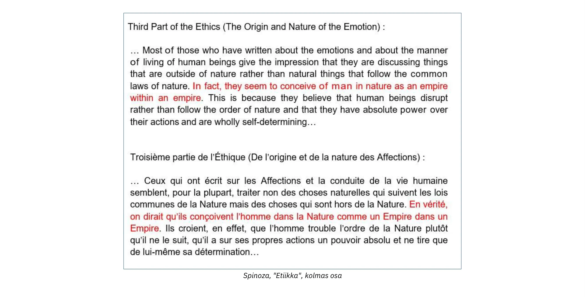

Ja koska luonnolla ei Spinozan mukaan ole moraalisesta näkökulmasta katsottuna mitään määrättyä päämäärää ja koska ihmisillä on taipumus sekoittaa mielikuvituksensa ymmärrykseen, he tulkitsevat sitä sen mukaan, mikä sopii heidän omiin etuihinsa. Niin pitkälle, että he antavat asioille merkityksen, joka juontuu vain siitä, miten he arvostavat niitä ja suhteuttavat ne itseensä.

Toisin sanoen heidän halujensa, toiveidensa ja pelkojensa mukaan.

Tätä päättelyä havainnollistaa illuusio lopullisista syistä, joka on suuri este ajattelulle ja järjen käytölle, koska se yksinkertaisesti ilmaisee tarpeemme saada jonkin asian vaikutukset vastaamaan sen todellisia syitä, ei sen todellisia syitä, vaan uskomusta, vaikka se olisikin absurdi tai lapsellista.

Uskomus, joka ilmaisee aikomusta, erityisesti jumalallista, ja joka on usein taikauskoinen, tai tietämättömyys, sellaisena kuin me sen tulkitsemme.

Siksi jotkut ovat aina pitäneet uusia sairauksia, kuten aidsia 90-luvulla tai covidia vuonna 2020, jumalallisen ja usein rankaisevan aikomuksen ilmentymänä. Tämä on perustelu, joka on ristiriidassa rationalismin ja modernin tieteen perustana olevan kausaalisuusperiaatteen kanssa, joka on vakiintunut Kopernikuksesta (1473-1543), Kepleristä (1571-1630) ja Galileosta (1564-1727) lähtien.

Tosiasia on, kuten Spinoza sanoo, että ihmisille on yhdentekevää, että niin monet asiat ylittävät heidän mielikuvituksensa, että luonnossa on enemmän epäjärjestystä kuin järjestystä. Silti heidän käsityskykynsä ulottumattomissa olevien asioiden monimutkaisuuden pitäisi estää heitä uskomasta mihinkään teleologiseen hankkeeseen. Sillä ei ole merkitystä, hän sanoo, koska ihmisten usko siihen, että heidän varmuutensa perustuu siihen, mikä sopii heidän haluihinsa ja hyötyynsä, on aina vahvempi kuin mikään rationaalinen argumentti tai huoli totuudesta.

Finalismi merkitsee siis sitä, että asioiden syyt ja seuraukset käännetään ylösalaisin niiden ymmärtämiseksi: uskomme esimerkiksi, että meillä on silmät siksi, että näemme, ja että meillä on hampaat siksi, että pureskelemme. Vaikka ihmislajin näkö kehittyi evoluution aikana tietysti näkemistä varten, ja hammaslukumme kehittyi nykyiseen muotoonsa nimenomaan tarpeesta ruokkia itseään ja syödä lihaa.

Juuri näin väitti ranskalainen luonnontieteilijä Jean-Baptiste de Lamarck (1744-1829) (kuva 3.3.3) perustellessaan esiarwinistisen teoriansa, jonka mukaan toiminta luo elimen eikä päinvastoin.

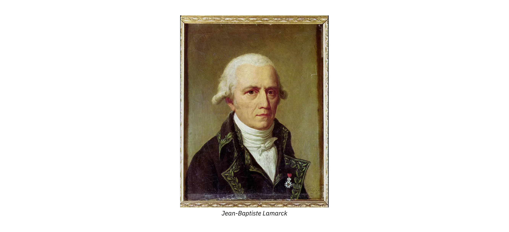

Mutta kuten Spinoza sanoo, "ihmisten harhaluulot eivät lopu tähän", ja kaikkien naiivien ja lopulta melko huvittavien teleologisten ajatusten joukossa mainitaan usein biologi Bernardin de Saint-Pierren (1737-1814) kuuluisa esimerkki. Tämä Pariisin luonnonhistoriallisen museon entinen johtaja suhtautui luonnon finalismiin runollisesti, lyyrisesti ja tietyllä naiiviudella, sillä hän katsoi, että esimerkiksi meloni oli luotu ainoastaan suurperheiden iloksi, koska sen harjattu kuori oli helppo leikata tasakokoisiksi viipaleiksi.

Esimerkiksi keynesiläisten taloustieteilijöiden ja hyvinvointivaltion kannattajien antama inflaation määritelmä kuvaa hyvin tätä paradoksia. Heidän mukaansa inflaatio on hintojen nousua, joka joidenkin keskuspankkiirien mukaan tulee joko "tyhjästä" tai geopoliittisista syistä, joita kukaan ei voi valvoa tai ennakoida. Vaikka hintojen nousu voi todellakin johtaa sykliseen inflaatioon - esimerkiksi kun öljyn hinta nousee, myös tiettyjen jalostettujen tuotteiden hinnat nousevat - inflaation todelliset rakenteelliset syyt liittyvät ensisijaisesti rahan Supply:n kasvuun, mikä puolestaan merkitsee rahan arvon laskua ja ipso facto mekaanista hintojen nousua.

Päinvastaiseen uskominen, tai se, että muut uskovat päinvastaiseen, on yhtä kuin uneksia silmät auki, kuten Spinoza pilkallisesti ilmaisi, ja rakentaa päättelylinja, joka on väärä tai harhaanjohtava ja joka on sitäkin helpompi saada hyväksytyksi, koska se kuullaan odotettuna reaktiona, jonka avulla voi todistaa olevansa oikeassa. Tässä tapauksessa, kun valtion väliintulon kannattajat pitävät inflaatiota parhaana keinona ratkaista taloudellisia ongelmia.

Tämä yksipuolinen tulkinta inflaatiosta saa meidät kuitenkin unohtamaan, että vaikka inflaatio on hyödyllinen talouden hallinnassa lyhyellä aikavälillä, se on itse asiassa piilovero, joka johtaa pitkällä aikavälillä vain inhimillisiin ja aineellisiin katastrofeihin ja tekee valtioista kyvyttömiä olemaan käyttämättä valtaansa väärin. Tätä Friedrich Hayek (1899-1992) kuvaa niin hyvin esseessään "Tie orjuuteen", jossa hän viittaa orjuuteen, josta valtiot eivät enää voi vapautua.

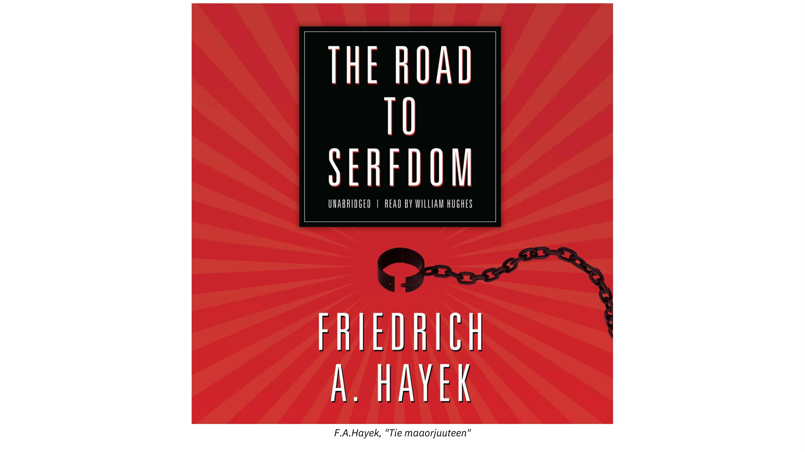

Lopuksi on syytä huomata, että tätä finalistista mekanismia kuvaa hyvin myös tapa, jolla Bitcoin:n vastustajat ilmaisevat kritiikkinsä keskittymällä nimenomaan sen vaikutuksiin.

Vaikka Bitcoin:n joitakin vaikutuksia voidaan varmasti kritisoida, meillä on voimakas taipumus nähdä vain kielteiset vaikutukset, koska kyseessä on uusi ja mullistava teknologia, mikä johtuu siihen liittyvästä kognitiivisesta ennakkoluulosta. Varsinkin jos todellisuus ei vastaa toiveitamme, esimerkiksi jos olemme uskonnollisia, kun kohtaamme Spinozismin kaltaisen kopernikaanisen vallankumouksen, tai jos olemme keskuspankkiireja, kun kohtaamme hajautetun digitaalisen valuuttakonseptin.

On kuitenkin aivan selvää, että jos uskonnollinen henkilö tai keskuspankkiiri osoittaa ymmärrystä, uteliaisuutta ja hyvää tahtoa ja jos hän on kiinnostunut käsitteestä ja pyrkii ensin ymmärtämään sitä sen sijaan, että arvioisi sen vaikutuksia sovittaakseen mielipiteensä odotuksiinsa, hän pystyy varmasti noudattamaan sitä.

Kiitos huomiostanne, ja nähdään seuraavassa luvussa.

## Teologinen harha

<chapterId>93554156-5e62-526d-9b71-49c47be916af</chapterId>

:::video id=9c490cc1-3d29-4ca7-9464-1a701bb91ba7:::

Tässä viimeisessä luvussa, joka käsittelee spinozismin tarjoamaa uutta kopernikaanista näkemystä ideoista, käsittelemme lopuksi Spinozan (1632-1677) teoksessaan Etiikka esittämää kolmatta harhaa.

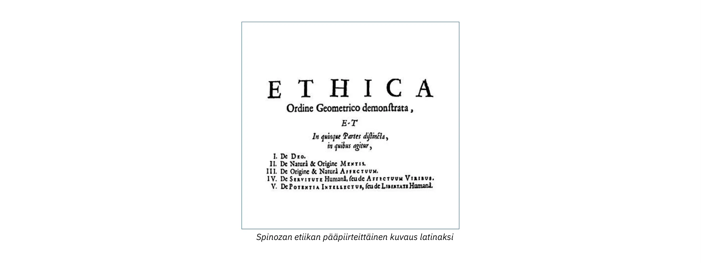

Tämä illuusio liittyy suoraan kahteen ensimmäiseen, vapaan tahdon illuusioon ja lopullisuuden illuusioon.

Kyse on teologisesta harhasta.

Asia on tämä: Niin kauan kuin ihmiset ovat tietämättömiä "sekä asioista että itsestään", kuten Spinoza sanoo, niin kauan kuin he uskovat näennäiseen vapauteensa, he pitävät mielikuvitustaan ymmärryksenä, toisin sanoen he pitävät itseään aina kykenevinä ajattelemaan ja ymmärtämään asioiden luonnetta, vaikka todellisuudessa he vain kuvittelevat, keksivät ja projisoivat sitä, mikä on heille hyödyllistä. Heidän halujensa mukaan.

Tämän vuoksi ihmiset uskovat, että jos luonnon keinot ovat olemassa ja hyödyllisiä, kuten hampaat syömistä varten tai silmät näkemistä varten, se johtuu siitä, että "luonnon ohjaaja" on loogisesti luonut ne. Toisin sanoen tarkoituksellinen, antropomorfinen Jumala, jolle ihmisen aikomukset liitetään.

Toisin sanoen, pilven taakse kätkeytynyt valkopartainen vanha mies, jonka uskotaan luoneen kaiken luonnossa olevan keinona meidän päämääräämme, koska hän rakastaa meitä ja suojelee meitä, kun me kunnioitamme ja palvomme häntä.

Tämä on teologisen harhan ensimmäinen vaihe.

Huolimatta ylpeydestämme uskoa olevamme luonnon yläpuolella ja kuvitellessamme voivamme aloittaa jotakin tyhjästä, todellisuudessa olemme aina alttiita olemassaolon olosuhteille, jotka osoittavat, ettemme lopulta pääse "pälkähästä", kuten filosofian professori Gilles Deleuze (1925-1995) asian ilmaisi. Olemme kuolevaisia, kuten kaikki eläimet, mutta tiedämme sen.

Se, että uskomme tai kuvittelemme päinvastaista rauhoittaaksemme itseämme, on syy siihen, miksi olemme jatkuvasti edestakaisin pelon ja toivon välillä, kuin kaksi vastakkaista ja erottamatonta napaa turvallisuuden tunteen ja paniikin tunteen välillä, koska pelko liittyy aina toiveeseen paremmista päivistä.

Ei ole pelkoa ilman toivoa eikä toivoa ilman pelkoa, ja se, joka pelkää, toivoo aina pääsevänsä eroon siitä, mitä pelkää, kun taas se, joka toivoo, pelkää aina, että se, mitä toivoo, ei toteudu.

Ja koska "olemme taipuvaisia uskomaan helposti siihen, mitä toivomme", sanoo Spinoza Etiikassaan, juuri silloin, kun kohtaamme ulkoisia syitä tai tapahtumia, jotka olisivat meille haitallisia, vastoin kaikkia hyötyajatuksia, ilmenee tämän niin sanotun teologisen harhan toinen vaihe, jolle ovat ominaisia uskomukset, joista syntyy taikauskoisia tunteita.

Toisin sanoen Voltairen (1694-1778) mukaan "pahamaineiset", joille taikausko ei koskaan synny järjellä ja vastaa aina järjenvastaista tai perusteetonta uskomusta, vastustavat kaikenlaista rationaalisuutta liittämällä esineisiin tai tekoihin voimia tai henkistä voimaa, jota niillä ei ole.

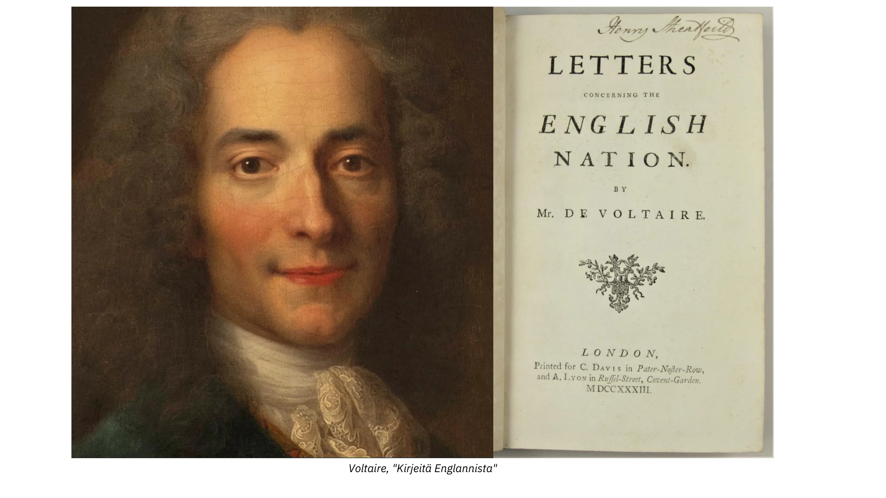

Sen varjolla, että taikausko helpottaisi meitä ja antaisi meidän kuvitella paremman maailman, se itse asiassa lukitsee meidät omiin harhakuvitelmiimme ja valheisiimme. Sellaisiin orjuuteen, joista meidän on Hard-vaikea vapautua.

Tätä saksalaiset, englantilaiset ja ranskalaiset valistajat puolustivat 1700-luvulta lähtien ja väittivät, että taikausko yksinkertaisesti estää ihmisiä kehittymästä aikuisiksi, ei ainoastaan rajoittamalla järjen käyttöä, vaan myös ja ennen kaikkea synnyttämällä suvaitsemattomuutta, joka on paras keino vakiinnuttaa vallan valta. Olipa kyse sitten poliittisesta tai uskonnollisesta.

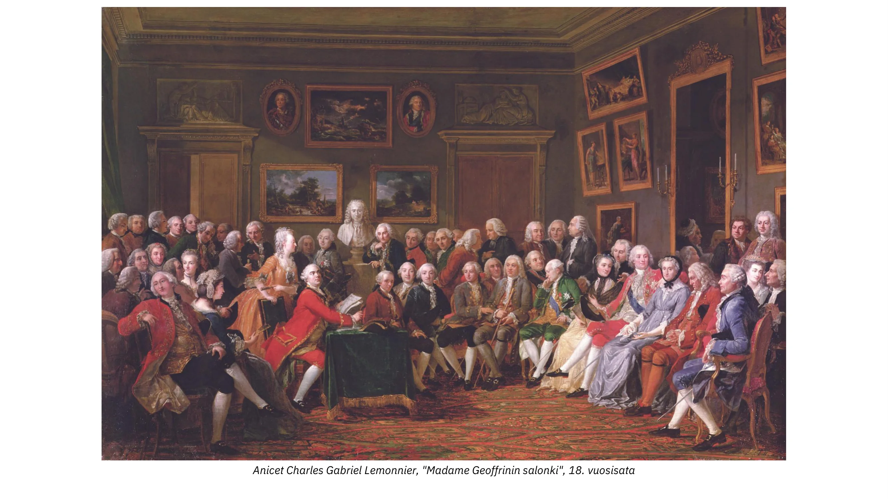

Ja tämän Spinoza osoittaa jälleen kerran teologis-poliittisessa tutkielmassaan Theologico Political Treatise, jota olemme jo käsitelleet. Tässä esseessä hän kirjoittaa, että "monarkkisen hallinnon suuri salaisuus ja sen tärkein intressi on ihmisten pettäminen ja sen pelon naamioiminen uskonnon nimellä, jonka on hallittava heitä". Tämän vuoksi tyrannit, diktaattorit tai vallankumoukselliset, jotka ovat aina ihmisiä, joita ajaa halu tehdä hyvää muille, lankeavat usein, ellei aina, siihen ansaan, että he tekevät periaatteidensa vastakohtia saavuttaakseen ne.

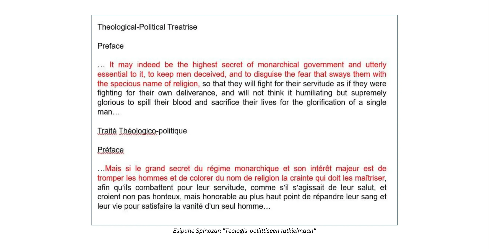

Mutta uutuus, jonka Spinoza tuo TTP:hen ja joka tekee hänestä tavallaan maallistumisen isän, on sen pohtiminen, että vaikka taikauskoa ja väkivaltaan kehottamista vastaan, jonka vapaus paradoksaalisesti sallii, on välttämätöntä taistella, on tosiasia, että on valtion edun mukaista suojella oikeutta uskoa ja vapautta ajatella.

Sillä heti kun ajatuksia on olemassa ja niitä ilmaistaan yksityisesti, ne leviävät väistämättä koko yhteiskuntaan, eikä niiden leviämistä voi koskaan estää kieltäminen tai sensuuri. Ajatukset, olivatpa ne sitten totta tai vääriä, hyviä tai huonoja, leviävät joka tapauksessa, ja niiden kieltäminen voi pitkällä aikavälillä johtaa vain kapinaan ja valtion kukistamiseen vapauden nimissä.

Toisin sanoen valtiolla olisi itse asiassa paljon enemmän pelättävää sananvapauden sensuurista tai tukahduttamisesta kuin sen säilyttämisestä, ja siksi Spinozan mukaan on sen edun mukaista antaa yksilöiden käyttää luonnollista oikeuttaan ajatella ja ilmaista itseään.

Spinozalle demokraattinen valtio, joka sallii ajatuksenvapauden, on näin ollen paras tae siitä, että ihmiset elävät rauhassa ja että järjen käytön ansiosta he eivät ainoastaan voi vapaasti ajatella ja toimia, vaan myös ymmärtää heitä rajoittavat orjuudet, jotta he voivat vapautua niistä.

# Affektiteoriasta Bitcoin:een

<partId>82e69d4f-a94f-5978-bcb8-8a7b4651bcca</partId>

## Kysymys pahasta Spinozassa

<chapterId>1ce64576-2688-5757-a119-57cc3a1076c0</chapterId>

:::video id=9c490cc1-3d29-4ca7-9464-1a701bb91ba7:::

Haluaisin nyt keskustella pahaa koskevasta kysymyksestä, sellaisena kuin Spinoza (1632-1677) esittää sen teoksissaan ja kirjeenvaihdossaan.

Varoitan kuitenkin, että tämä on monimutkainen ja kiistanalainen aihe, ja tarkoituksena on yksinkertaisesti ymmärtää jälleen kerran hänen ajattelutapaansa, jotta voisimme paremmin ymmärtää, mikä häntä ohjaa, nimittäin pyrkimys vapauteen.

Kuten olemme nähneet, jos emme usko vapaaseen tahtoon tai minkäänlaiseen luonnon finalismiin, ongelmaksi nousee hyvin nopeasti pahan olemassaolo jokapäiväisessä elämässämme.

Toisin sanoen kysymys on siitä, onko "pahaa" olemassa luonnossa ja ovatko ihmiset vastuussa aiheuttamistaan vahingoista.

Antiikin filosofit uskoivat, että pahaa ei ole luonnossa, ja esimerkiksi Sokrates (470-399 eKr.) opetti, että "pahaa ei ole mitään". Hänen mukaansa paha ihminen ei ollut luonnostaan paha, vaan oli tavallaan vain erehtynyt hyvän luonteesta.

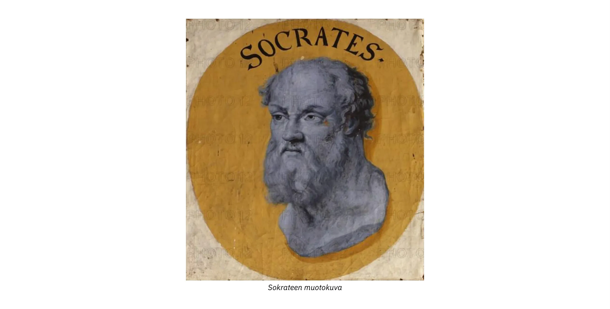

Mutta skolastinen perinne, erityisesti pyhän Augustinuksen (354-430) perinne, joka vaikuttaa kristilliseen moraaliin vielä nykyäänkin, väitti, että paha ei ainoastaan ole olemassa, että se on todellisuutta, vaan että se voidaan selittää, koska ihmiset ovat vapaita, koska he kykenevät tekemään valinnan hyvän ja pahan välillä, ja että heidän aiheuttamansa paha on siten täysin heidän oma vastuunsa.

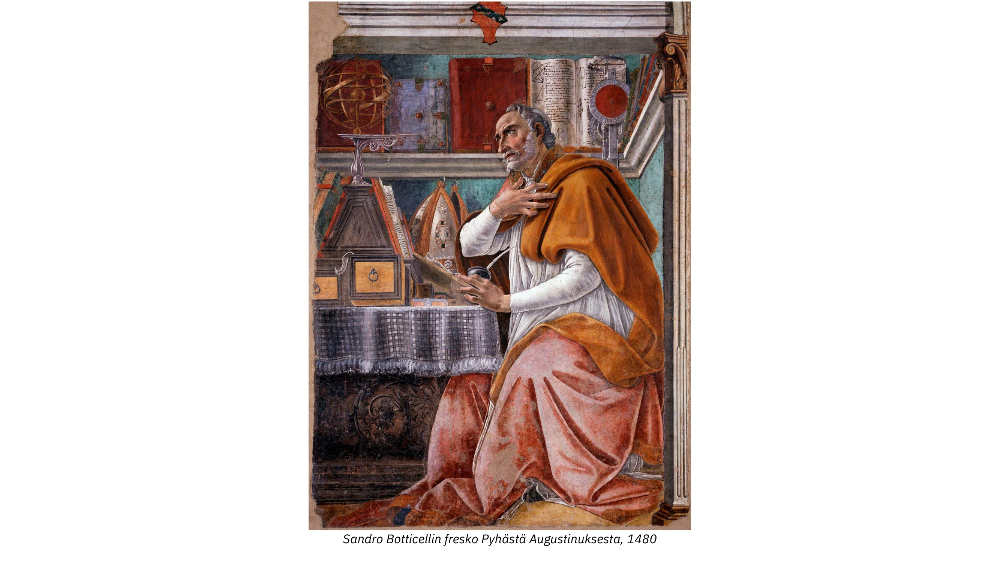

Ja vaikka vastuuta maanjäristyksen, tappavan viruksen tai lapsen sokeana syntymisen aiheuttamista vahingoista ei pitäisi sälyttää ihmisille, tämä ajattelutapa pitää yllä antamalla luonnolle moraalisen tarkoituksen, joka tekee siitä vastuullisen. Esimerkiksi ajattelemalla, että jos maanjäristys on tapahtunut, se johtuu juuri siitä, että ihmiset ovat käyttäytyneet huonosti.

Tämä on uskonnollisten ihmisten puolustama ajatus, jonka mukaan ihmiset syntyvät syntisinä, perisyntiin syyllistyneinä.

Kuten voitte kuvitella, Spinoza repii tämän ajatuksen riekaleiksi, sillä hän katsoo, että koska luonnolla, tai Jumalalla, tai onni, kuten hän asian ilmaisee, ei ole aikomusta ja koska ihmisillä ei ole vapaata tahtoa, on heille osoitettu vastuu "pahasta" täysin näennäistä.

"Luonnossa ei tapahdu mitään sellaista, mikä voidaan katsoa siinä esiintyväksi paheeksi", kirjoittaa Spinoza Etiikassaan, ja hänen mukaansa olisimme siksi väärässä pitäessämme esimerkiksi vastasyntyneen vauvan sokeutta "pahana", sillä sokeana syntyessään vauva ei ole yhtään sen enempää vailla näköä kuin kivi olisi.

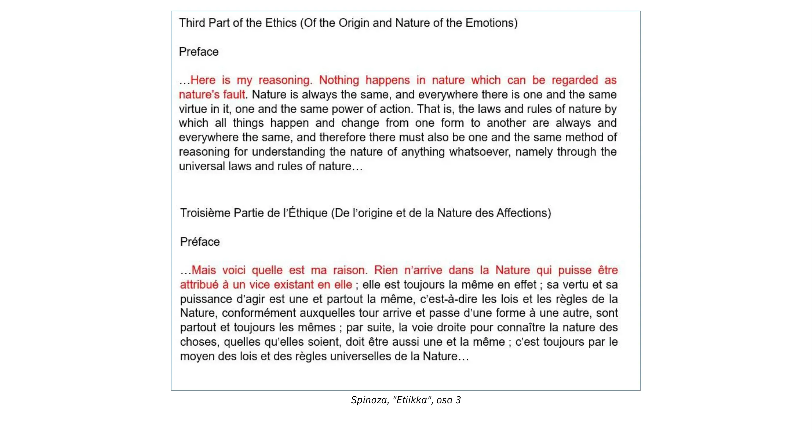

Ja jos ajattelemme, että sokeilta puuttuu näkö, se on vain niiden näkökulmasta, jotka näkevät.

Spinoza ottaa siis esiin ajatuksen, että pahaa ei ole luonnossa, mutta hänen omaperäisyytensä, joka tekee siitä vallankumouksellisen filosofian, on siinä, että hän katsoo, että pahaa ei ole olemassa eikä myöskään "hyvää".

Siksi hän puhuu pikemminkin etiikasta kuin moraalista, ei pohdi sitä, mikä on oikein tai väärin, koska ne ovat kaikki suhteellisia ja subjektiivisia käsitteitä, vaan pikemminkin sitä, mikä on "hyvä" tai "huono" luonnollisen tarpeemme kannalta "pysyä olemassaolossamme", hän sanoo. Toisin sanoen elää ja kasvaa. Kukoistaa ihmisinä.

Lisäksi olemme jo nähneet, että Spinozan näkemys sellaisten ihmisten vastuusta, jotka käyttäytyvät huonosti tekemällä rikoksen, ei selvästikään ole tarkoitettu heidän vapauttamisekseen.  Sillä ihmiset, vaikka he eivät tietäisikään todellisia syitä, jotka määräävät heidät tekemään rikoksen, ovat aina tietoisia siitä, mitä he tekevät, ja ovat siksi sellaisenaan vastuussa moraalin ja lain edessä.

On selvää, että rikollisen teot liittyvät aina perheeseen, sosiaaliseen, taloudelliseen tai jopa lääketieteelliseen determinismiin, jos hänen rikoksensa voidaan selittää fyysisellä tai henkisellä tilalla. Ja tämä on oikeuslaitoksen tehtävä, joka menee rikosoikeutta pidemmälle ja ottaa huomioon sen, että tiettyjä rikoksia ei pidä vain rangaista, vaan niitä on myös hoidettava ottaen huomioon rikoksentekijän perheellinen, sosiaalinen ja psykologinen tausta.

Siksi spinotsilainen Gilles Deleuze (1925-1995) selittää, että etiikka on eräänlaista etologiaa eli käytännön tiedettä olemisen tavoista tai, kuten hän asian ilmaisee, "hyvien kohtaamisten tekemisen taidetta".

Toisin sanoen Spinozan mukaan vapaus koostuu siitä, että suuntaamme olemassaolomme siihen, mikä "lisää toimintakykyämme", ja että katsomme aina optimistisesti tulevaisuuteen ja näemme maailman sellaisena kuin se on sen sijaan, että kuvittelemme sen sellaiseksi kuin haluaisimme sen nähdä.

Ja tässä piilee Spinozan demonstraation nerokkuus, sillä hän taistelee tietämättömyyden lääkäreitä ja kaikkia niitä vastaan, jotka väittävät, että on hyvä olla tietämätön.

Päinvastoin, Spinoza tutkii inhimillisiä intohimoja, jopa kaikkein irrationaalisimpia, sydänsurua, hulluutta, surua tai melankoliaa, geometrikkojen tapaan, "more geometrico", kuten tutkittaisiin pisteitä, viivoja, pintoja ja tilavuuksia.

Tätä affektien teoriaa hän kehittää Etiikan kolmannessa osassa, ja suosittelen, että opiskelet sitä nyt.

Kiitos huomiostanne.

## Affektiteoria

<chapterId>3bb011ce-6f0c-51a6-b41f-25a3b5b7768e</chapterId>

:::video id=bb427cc6-e54d-4b44-bd6d-281ba421001a:::

Spinozan mukaan vapaus on käsite, joka on löydettävä, polku parempaan ja voimakkaampaan elämään. Vapaampaan elämään. Polku, joka vaatii meitä tunnustamaan absoluuttisen determinismin ja asioiden rationaalisen kausaalisuuden.

Hän kehittää järjestelmäänsä Etiikan kolmannessa osassa. Se on kuuluisa "affektien teoria".

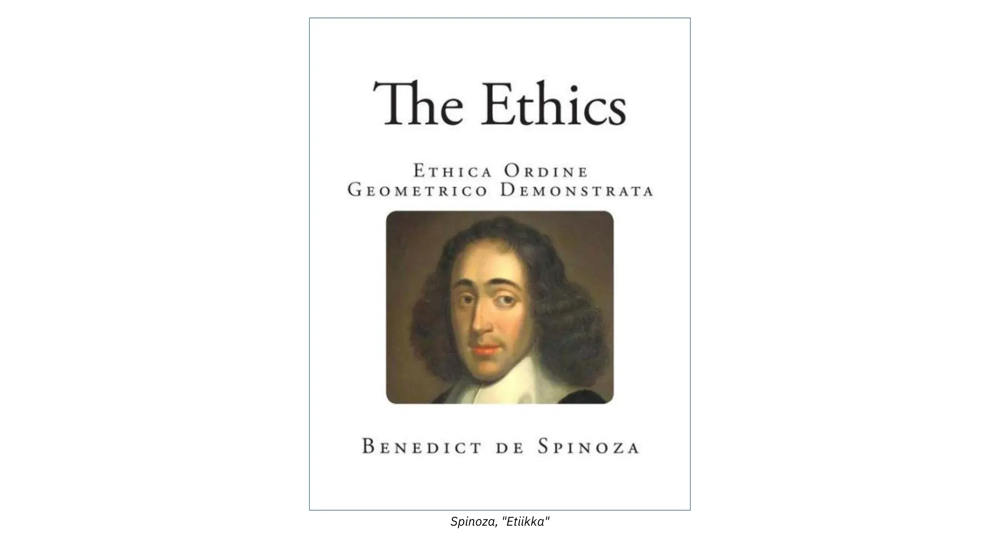

Periaatteena on, että inhimilliset affektit ovat Spinozan mukaan kehon ja ajatuksen aktiivisia tai passiivisia muutoksia, jotka vaikuttavat toimintakykymme eli käyttäytymiseemme.

Silti olemme täysin kykeneviä muodostamaan oikeita ajatuksia, päättelemään ja ilmaisemaan iloa, riippuen sekä ihmisluonnolle ominaisista vaikutuksista että ulkomaailmasta saatavista vaikutuksista.

Mutta pystymme myös muodostamaan niin sanottuja passiivisia affekteja, ennakkoluuloja, jotka sitten johtavat meidät mekaanisesti, "itsestämme huolimatta" tavalla, joka ei enää näe tai tee sitä, mitä oma etumme vaatii.

Puhumme orjuudesta tai orjuudesta, tilasta, jolle on ominaista kyvyttömyys hallita ja torjua niitä passiivisia vaikutteita, jotka joskus saavat meidät haluamaan sitä, mitä emme halua, ja tekemään sitä, mitä emme halua.

Näin sanoo Spinoza Etiikassaan, kun hän hämmästelee sitä, että "ihmiset näkevät usein parasta, hyväksyvät sen ja tekevät pahinta" tai että "he taistelevat orjuutensa puolesta ikään kuin taistelisivat pelastuksensa puolesta".

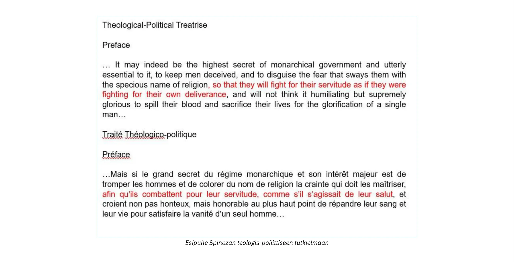

Spinoza ottaa esimerkkinä vihan, jonka hän näkee passiivisena, surullisuuteen kääntyneenä affektina, joka syntyy puutteellisista ideoista, eli osittaisesta tietämyksestä syistä, ja jonka hän määrittelee "surullisuudeksi, joka liittyy ajatukseen ulkoisesta syystä".

Toisin sanoen, jos vihaamme ulkomaalaista, se johtuu siitä, että yhdistämme tämän ulkomaalaisen siihen käsitykseen, joka meillä on hänestä, syistä, joita emme ymmärrä, koska hän on vieras ja luonteeltaan erilainen. Kyse on tästä ajatuksesta ulkoisesta syystä - ajatuksesta, joka sitä paitsi aina mekaanisesti motivoi tietämättömiä puhumaan pahaa käsitteestä, jota he eivät tunne.

Tämä pätee muuten erityisesti kryptovaluuttojen alalla.

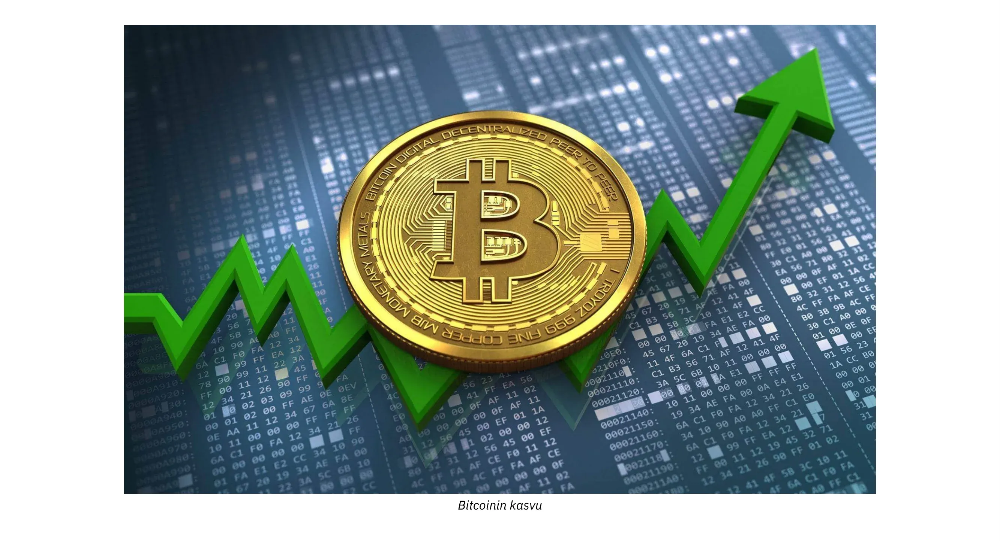

Spinoza sanoo, että jos poistamme tämän negatiivisen ajatuksen ulkoisesta syystä, ei moraalin vaan kasvatuksen, empatian ja järjen avulla, erityisesti keskittymällä tässä tapauksessa vieraan ominaisuuksiin tai Bitcoin:n tapauksessa sen käytännölliseen puoleen tai hyödyllisyyteen, siihen liittyvä surun tunne katoaa, ja automaattisesti myös viha katoaa.

Kannattaa muistaa, että tämä ajattelutapa pätee tietysti myös aktiivisiin affekteihin ja erityisesti rakkauteen, joka Spinozan mukaan on "ilo, joka liittyy ajatukseen ulkoisesta syystä". Ja jos esimerkiksi ulkoinen syy, joka aiheuttaa rakkauden johonkin asiaan tai henkilöön, katoaa tai muuttuu ajan myötä, myös siihen liittyvä ilo voi kadota, jolloin rakkauden tunne sammuu. Tämä, kun emme ymmärrä sitä, voi tehdä meidät onnettomiksi ja masentuneiksi.

Mutta jos tämä niin sanottu affektien teoria koskee "tiedostamatonta", tämä rationaalinen ajattelutapa "maanmittareiden tapaan" koskee myös taistelua kaikkia ulkoisen orjuuden muotoja vastaan, olivatpa ne sitten uskonnollisia, poliittisia tai luonnonilmiöiden aiheuttamia.

Tämä on esimerkki salamasta. Kun salama iskee ja tappaa viattomia ihmisiä, tietämättömät pyrkivät pitämään sitä Jumalan kätenä ja katsomaan, että salama ilmaisee moraalista ja lopullista tarkoitusta. Jotkut ovat tulkinneet 90-luvun aidsia tai jopa viime aikoina covidia jumalalliseksi rangaistukseksi.

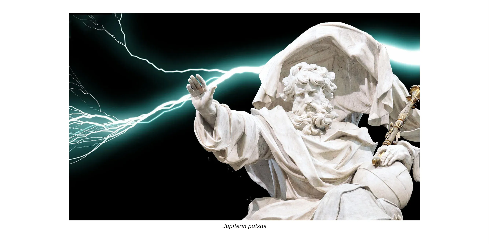

Spinozalle kaikki nämä teleologiset ajatukset ovat tietysti vain taikauskoa, tietämättömyyden synonyymejä, sikäli kuin tässä esimerkissä salama, joka iskee, ei hänen mukaansa tee mitään muuta kuin ilmaisee oman luontonsa olemuksen. Joka on iskeä. Ilman tietenkään mitään moraalista aikomusta rangaista tai palkita ketään.

Tämän yksinkertaisen esimerkin ansiosta ymmärrämme, että ainoa ratkaisu suojella itseämme salamalta - toisin sanoen vapauttaa itsemme siitä orjuudesta, jonka sen vaara on aina asettanut meille - ei ole valittaa huonosta tuuristamme tai oletetusta jumalallisesta epäoikeudenmukaisuudesta eikä esittää pienintäkään moraalista argumenttia. Ei, vaan tässäkin tapauksessa, kuten vihan kohdalla, kyse on pikemminkin siitä, että pohdimme, mitä voimme tehdä eettisestä näkökulmasta.

Tässä tapauksessa se olisi se, että suojaudumme salamalta olemalla järkeviä ja avoimia edistykselle, olemalla uteliaita ja luottavaisia sen suhteen, mitä tiede voi meille tarjota, ja miksipä ei, asentamalla salamanvartijan.

Tämä on etiikan nerokkuus. Spinoza osoittaa meille, että on mahdollista siirtyä vapaaehtoisesta orjuudesta, "itsestämme huolimatta" ja ikuisen vieraantumisen tuuliviirielämästä elämään, jota eletään affektioiden ja determinaatioiden tuntemisen kautta.

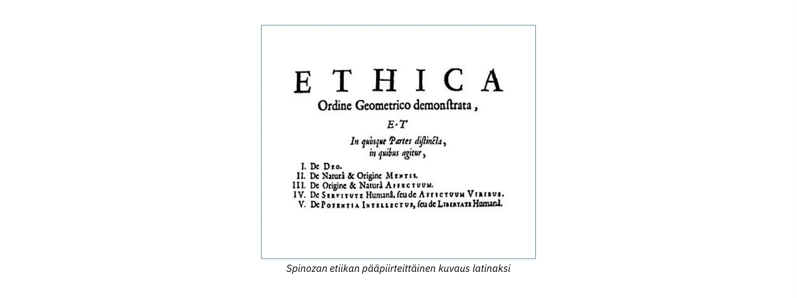

Se on ajattelutapa, jonka avulla voimme analysoida ihmisluontoa nähdäksemme asioiden valoisan puolen tai totuuden. Poistaa surun ja pelon syyt, jotka painavat meitä alaspäin. Ollaksemme vapaita, toisin sanoen pystyäksemme lopettamaan surullisten intohimojen tottelemisen ja muuttamaan käyttäytymistämme.

Ja ymmärtää, luultavasti ensimmäistä kertaa filosofian historiassa, että voi olla selväjärkinen ja onnellinen.

Siksi spinozismia kutsutaan usein "ilon filosofiaksi".

## Vapaus, itävaltalainen taloustieteellinen koulukunta ja Cypherpunk-filosofia

<chapterId>b54f2532-460c-11f0-a248-93ff24ef1d57</chapterId>

:::video id=5f49d5b4-e15f-475b-b40d-07464c08ca4d:::

Kuten nyt tiedätte, Spinozan mukaan vapaus on tietoisuutta determinismistämme. Järjen ohjaamana ja toimintakykymme ansiosta voimme ymmärtää orjuuden kausaalimekanismin, jotta voimme taistella sitä vastaan, emme enää kärsi siitä emmekä enää toimi omaa etuamme vastaan.

Loppujen lopuksi tämä selkeys tarkoittaa sitä, ettei ihminen enää elä Friedrich Nietzschen (1844-1900) myöhemmin kuvaamassa nihilismissä, jonka vuoksi hän menettää itsensä ideologisiin ihanteisiin eli poliittisiin tai uskonnollisiin kuvitelmiin, joiden vuoksi hän kieltää todellisuuden, tekee itsensä lapselliseksi ja tekee itsensä onnettomaksi.

Juuri tästä valistuksen rationaalisessa filosofiassa oli kyse, kiitos erityisesti Immanuel Kantin (1724-1804), jonka mielestä vain koulutettu yksilö voi järjen ohjaamana ajatella itse ja määrittää eettisesti, mikä on "totta" tai "hyvää" ja mikä myrkyllistä.

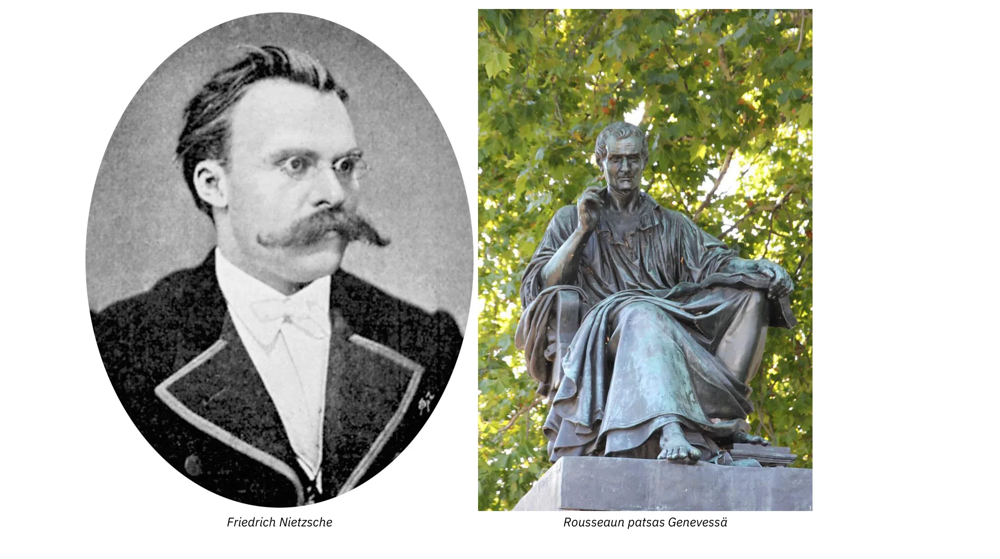

Toisin sanoen hän sanoo, että jos ajattelemme itse, jos järkeilemme kuin järkevät aikuiset ja jos siis pyrimme kiinnittämään itseämme asioiden välisiin kausaalisiin yhteyksiin, emme enää tarvitse moraalista auktoriteettia opettamaan meille esimerkiksi uskonnon todellisia hyveellisyyksiä tai todellisia eettisiä arvoja politiikan ja talouden alalla.

Kyseessä on päättelytapa, joka yhdistää itävaltalaisen liberaalin taloustieteen koulukuntaan, joka syntyi Wienin erittäin hedelmällisessä älyllisessä ilmapiirissä ennen ensimmäistä maailmansotaa. Sillä juuri tässä yhteydessä Carl Mengerin (1840-1921), Ludwig von Misesin (1883-1979) ja Friedrich Hayekin (1899-1992) kaltaiset intellektuellit loivat perustan uudelle liberaalin taloustieteen koulukunnalle, josta tuli tulevien kypäräpoppareiden vakaumusten perusta. Ja näin syntyi Bitcoin.

Menger ja Mises totesivat esimerkiksi, että kaikki tieto on rakennettava asioiden välisen kausaalisen yhteyden perusteella, ja ehdottivat näin uutta kausaalista käsitystä taloustieteestä. Innoittamana erityisesti ranskalaisen taloustieteilijän Frédéric Bastiat'n (1801-1850) muutamaa vuotta aiemmin kehittämä liberaali henki.

Hayek puolestaan katsoo, että kaikki taloudelliset päätökset ilmentävät aina eräänlaista epävarmuutta ja tietämättömyyttä ja että se, ettei niistä kärsi moraalin, uskomusten, ennakkoluulojen tai poliittisten ideologioiden vuoksi, tekee mahdolliseksi analysoida taloudellista käyttäytymistä oikein ja näin ollen pohtia, mikä on hyväksi yksilöille, yhteiskunnalle ja valtiolle.

Näin nämä liberaalit itävaltalaiset taloustieteilijät tulivat kritisoimaan tiukasti kaikkia sosialistisia ajatuksia - Hayek puhui "planismista" - ja kaikkia niiden innoittamia moraalipolitiikkoja, jotka hänen mielestään johtavat vain tuhoon. Taloudellisen vallan antaminen hallituksille, jotka olivat väistämättä jäljessä ajastaan ja eivät olleet perillä siitä, mitä pitäisi ja mitä ei pitäisi tehdä, oli tuomittu epäonnistumaan.

Esimerkiksi itävaltalaiset uskovat, että kun valtio antaa itselleen pakkokeinoin vallan luoda rahaa talouden hallitsemiseksi ja kriisien ratkaisemiseksi, on vaarana, ettei se koskaan pysty pidättäytymään käyttämästä tätä valtaa väärin.

Miksi näin on? Koska se joutuu aina eräänlaiseen orjuuteen, joka estää häntä tekemästä niin ja ajaa hänet näin ollen, kuten Spinoza sanoisi, "näkemään parhaan, hyväksymään sen... mutta tekemään pahinta".

Spinotsistina Hayek selittää videolla, että "koska tätä valtaa ei voida ottaa pois ilman väkivaltaa, ainoa keino on käyttää temppua ja ottaa käyttöön uusi rahan käsite, jota hallitukset eivät voi enää pysäyttää". Milton Friedman (1912-2006) toistaa tämän väitteen haastattelussa, jossa hän puolestaan keskustelee uudesta digitaalisesta valuutasta syntymässä olevan Internetin yhteydessä.

Nämä ovat poliittisia ja taloudellisia perusteluja, jotka ensimmäiset salakirjoittajat, Eric Hughes (1953-), esittivät "Cypherpunk-manifestissaan" tai Timothy May (1951-2018) "kryptoanarkistisessa manifestissaan", ja jotka Satoshi Nakamoto ottaa uudelleen esille.

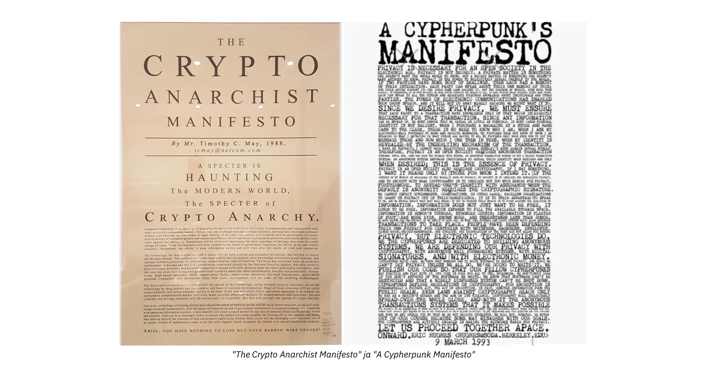

Varsinkin kun hän kirjoitti 3. tammikuuta 2009 julkaistun Timesin otsikon Blockchain Bitcoin:n Genesis-lohkon kolikkopohjaan havainnollistamaan yhden aikakauden, keynesiläisen, loppua ja toisen aikakauden, liberaalien, anarkististen ja libertarististen pyrkimysten, alkua.

31. lokakuuta 2008 julkaistussa valkoisessa kirjassa esitellään Bitcoin hajautettuun protokollaan perustuvana keinona vaihtaa arvoa Internetissä ilman luotettavaa kolmatta osapuolta. Kopernikaaninen vallankumous, jonka ansiosta ihmiset voivat vihdoin saada takaisin toimintakykynsä eli vapautensa, kaupankäynnin vapautensa, oikeutensa omaisuuteen ja yksityisyytensä kunnioittamisen.

Miksi? Koska Bitcoin antaa meille mahdollisuuden vapautua tästä orjuudesta Spinozan tavoin, järjen ja Galileon matematiikan kielen ansiosta. Ja, kuten Hayek ehdottaa, ilman, että valtio voi vastustaa sitä. Ja rauhanomaisesti, ilman pakottamista tai käännyttämistä.

Itse asiassa tämä on viimeinen rinnastus, jonka vedän spinozismin ja Bitcoin:n välille osoittaakseni, ettei ole mitään järkeä vakuuttaa ketään, joka ei allekirjoita kopernikaanista tai häiritsevää käsitettä, muuten kuin järjen, ymmärryksen, uteliaisuuden tai hyvän tahdon avulla.

Ei väkisin, ei väkivallalla. Sillä tosiasia on, että Kopernikus, Galilei, Newton, Darwin, Einstein, Hayek, Spinoza tai Satoshi Nakamoto eivät koskaan uhkailleet ketään, joka ei uskonut heidän ideoihinsa ja esityksiinsä.

# Viimeinen osa

<partId>70a5a3c8-6c88-11f0-8753-db07e26dcaf4</partId>

## Arvostelut & arvostelut

<chapterId>7945c38c-6c88-11f0-a73f-0f7cdf99f53f</chapterId>

<isCourseReview>true</isCourseReview>

## Loppukoe

<chapterId>a557fd32-6c88-11f0-96ff-cfa532cf76a0</chapterId>

<isCourseExam>true</isCourseExam>

## Päätelmä

<chapterId>ae04ab38-6c88-11f0-a496-3be47119e6b6</chapterId>

<isCourseConclusion>true</isCourseConclusion>