# Une exploration philosophique de la liberté à travers Spinoza et Bitcoin

Ce cours explore les liens profonds entre la philosophie révolutionnaire de Baruch de Spinoza (1632-1677) et Bitcoin, deux outils de liberté séparés par les siècles mais unis par une même quête : l'émancipation humaine face aux servitudes.

Nous découvrirons comment Spinoza, père de la philosophie rationnelle des Lumières, a développé une éthique pratique pour nous libérer des illusions qui nous enferment - le libre arbitre, le finalisme et les superstitions théologiques. Sa méthode géométrique et sa théorie des affects nous montrent comment comprendre notre place dans le monde et orienter notre existence vers ce qui accroît notre puissance d'agir.

Le cours établit ensuite les parallèles fascinants entre cette révolution copernicienne des idées et Bitcoin : deux systèmes qui ne requièrent ni foi aveugle ni autorité centrale, mais simplement l'exercice de la raison. Comme le spinozisme a libéré la pensée des dogmes religieux, Bitcoin libère la monnaie du contrôle étatique, offrant une nouvelle forme de liberté économique ancrée dans les mathématiques et la cryptographie.

+++

# Introduction 
<partId>80b76189-afab-5295-a8d3-ba8f6fe7a5e8</partId>

## Introduction du cours
<chapterId>99af4992-fd6c-5142-b168-d927b251574b</chapterId>

:::video id=1def60bc-1d39-4e49-9b08-fd05b7a0d49b:::

Je suis heureux de vous présenter dans ce cours la philosophie de Baruch de Spinoza (1632-1677), célèbre philosophe du 17e siècle considéré comme le père de la philosophie rationnelle des Lumières. 

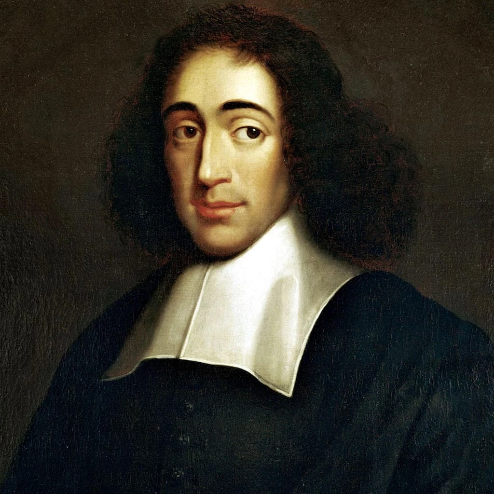
Portrait de Spinoza

Sachez que ces cours sont construits à partir des deux essais que j’ai consacrés au sujet, « La religion vraie de Spinoza » et « Bitcoin, l’évangile de la liberté » disponibles sous forme papier en ligne ou directement sur mon site web et sous forme électronique Kindle Amazon. 

Le but de ce cours est d’abord de comprendre de manière simplifiée une philosophie considérée souvent comme très complexe et inaccessible, malgré le regain d’intérêt qu’elle connaît aujourd’hui.

En effet, cette philosophie nous permet non seulement de nous interroger sur le sens des choses quand tout va mal, ce qui est le propre de la religion, de la philosophie et des sciences humaines en général mais aussi, et peut-être surtout, de nous interroger sur nous-mêmes quand tout va bien. 

Quand la vie nous sourit et que nous estimerions, par exemple, ne pas avoir à nous poser de questions en considérant avec un orgueil vu comme illusoire et servile que notre bonheur, ou que notre réussite, ne viendrait que de notre talent, de notre travail ou de nos choix prétendus libres. Bref, de notre seule et libre volonté opposée au déterminisme auquel nous sommes soumis.

Nous pourrons ainsi faire le lien entre cette philosophie pratique tournée vers la liberté ou, comme le dit Spinoza, « vers les moyens pour y parvenir », et le nouveau monde technologique qui nous intéresse ici, la crypto en général et Bitcoin en particulier. 

Et notamment dans son aspect philosophique qui nous fait précisément réfléchir à la notion de liberté, la liberté de penser, de s’exprimer, le respect de la vie privée et, évidemment pour ce qui nous concerne, la liberté d’échanger.

Dans un premier temps, je vais donc vous présenter qui est Spinoza, le personnage, son milieu social, religieux et familial et quel était le contexte historique des Provinces-Unies où il vivait.

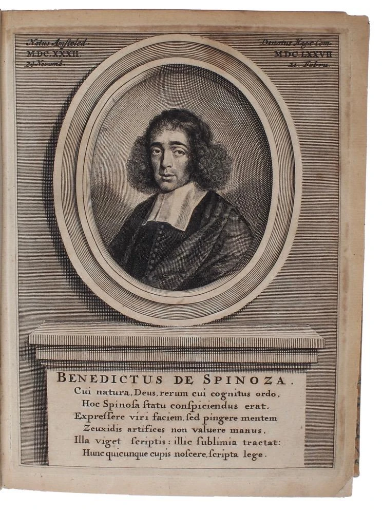
Portrait de Spinoza

Nous verrons ensuite ce qu’est cette nouvelle philosophie rationnelle selon laquelle « rien n’existe dans la nature qui ne puisse s’expliquer sans l’exercice de la raison ».

C’est l’idée qu’on ne peut comprendre le monde et la nature humaine qu’en fonction du lien de causalité des choses selon lequel un effet a toujours une cause, et que cette cause est elle-même l’effet d’une autre cause et ainsi de suite, jusqu’à remonter à la cause première à laquelle nous n’avons pas accès et qui est, selon Spinoza, la Nature. 

La Nature, autrement dit Dieu, c’est le fameux « Deus sive Natura » en latin qui illustre tout le sens du spinozisme.

Nous verrons aussi les deux œuvres majeures de Spinoza, avec d’abord l’Éthique, publiée à titre posthume en 1677, et qui est donc entièrement tournée vers la liberté et le besoin de nous extraire des servitudes qui nous enferment. 

Puis nous verrons le Traité théologico-Politique publié, lui, de son vivant en 1670, qui nous permettra d’envisager la liberté cette fois sous un autre angle, celui de la liberté de penser et de croire. C’est-à-dire la liberté religieuse mais surtout politique.

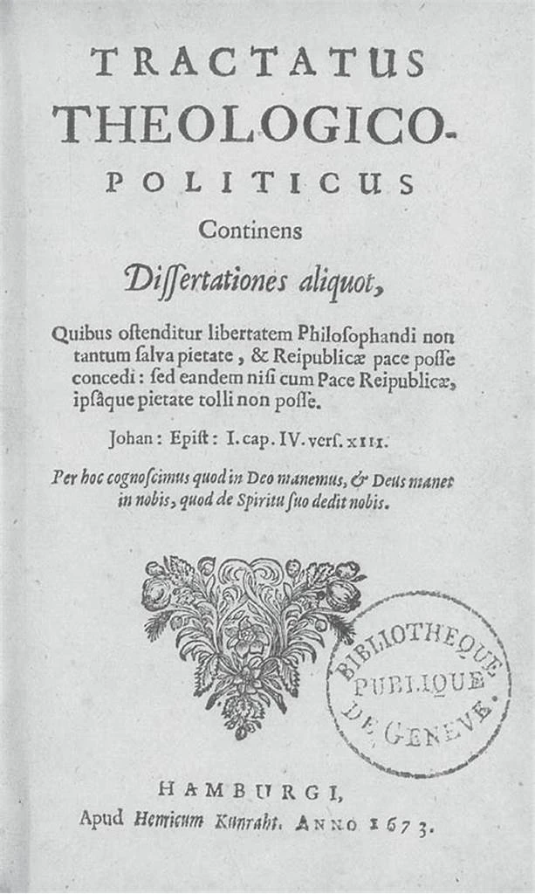

Nous verrons enfin pourquoi le spinozisme est donc une révolution copernicienne des idées et en quoi il s’agit d’une nouvelle définition du monde et de la nature humaine en étudiant les 3 illusions fondamentales dénoncées par Spinoza que sont l’illusion du libre arbitre, l’illusion des causes finales ou le finalisme et l’illusion théologique.

Grâce à la théorie des affects développés à la façon des géomètres, « more geometrico », nous verrons enfin comment Spinoza nous propose donc une méthode pratique afin de nous extraire ou de tenter de nous extraire, des servitudes propres à la nature humaine et aux passions extérieures. Un mécanisme rationnel qui, pour lutter contre l’ignorance, se compare à l’idée que les trois angles d’un triangle font toujours 180° et nous permettra de faire le lien entre l’esprit des Lumières qui en découle et les courants libéraux du 19e siècle ou libertarien du 20e siècle qui sont, eux, directement liés à l’invention de Satoshi Nakamoto, Bitcoin.

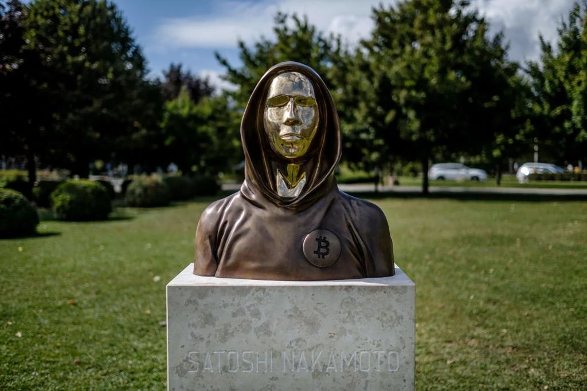

Nous comprendrons alors que parmi les nombreux points communs entre les concepts spinozistes et cet outil de liberté inventé par Satoshi Nakamoto, le premier est que, dans les deux cas, si nous sommes curieux, de bonne volonté et que nous faisons, comme on le disait à cette époque, preuve « d’entendement », alors nous ne pourrons pas ne pas y adhérer. Et que si nous n’y adhérions pas, ce qui serait bien sûr notre droit le plus absolu puisqu’il est fondamental de respecter la liberté de croire, ou de ne pas croire, c’est que nous serions déterminés à ne pas pouvoir, ou à ne pas vouloir, ce qui revient au même. 

Et c’est ainsi que nous pouvons comprendre qu’un fondamentaliste religieux ne pourra par exemple jamais accepter, ni entendre la moindre pensée copernicienne comme le spinozisme, tout comme un banquier central ne pourra, lui, que très difficilement accepter Bitcoin.

Même si, vous le savez, les choses sont actuellement en train d’évoluer dans le bon sens.

## Présentation de Baruch de Spinoza
<chapterId>f53a9cfd-326e-5b73-a766-3ef2f07c5a49</chapterId>

:::video id=5fac3ddc-c472-4c64-8186-46a8f317e389:::

Qui est donc Baruch de Spinoza ? Eh bien il s’agit d’un philosophe hollandais né en 1632 et mort à l’âge de 45 ans, en 1677. 

De confession juive, il était membre de la communauté portugaise séfarade descendant des marranes chassés d’Espagne par les catholiques au 15e siècle et il fut donc élevé dans un milieu religieux et intellectuel, conscient de ce que signifie être persécuté. 

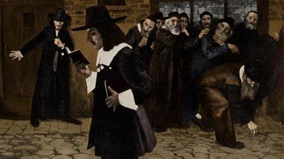

De fait, dès son plus jeune âge, il exprime un esprit critique assez prononcé de la religion établie et notamment vis-à-vis de sa communauté hébraïque dont il sera rejeté très violemment en 1656, âgé seulement de 24 ans, et alors qu’il n’a encore rien publié. 

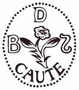

Cette « excommunication », dit-on, lui permettra toutefois de s’isoler et de travailler son œuvre sans jamais regarder en arrière.

Héritier, comme le sont ses contemporains, Descartes (1596-1650), Pascal (1632-1662), Newton (1643-1727), des nouvelles idées rationnelles de la physique de Copernic (1473-1543), de Kepler (1571-1630) et de Galilée (1564-1642) qui le précèdent de quelques années seulement, Spinoza développe une façon de réfléchir à la manière des géomètres conformément au principe de Galilée selon qui les mathématiques sont le langage de l’univers.

Mais avec des idées très dangereuses pour cette époque après le procès du moine et philosophe Giordano Bruno (1548-1600), brûlé vif pour hérésie en place publique à Rome, ou celui de Galilée contraint par l’inquisition en 1633 de contredire ses convictions héliocentriques de Copernic.

C’est pourquoi sa vision strictement rationnelle du monde et de la nature humaine, basée sur le lien de causalité des choses lui vaudra d’être considéré, et de l’être encore aujourd’hui à tort, comme athée.

En réalité, Spinoza ne parle dans son œuvre que de Dieu qu’il assimile à la Nature et s’il critique les élans superstitieux des religieux et des théocrates, il montre que la vraie religion est avant tout pour lui synonyme de justice et de charité. 

Et c’est cette approche qui fait le lien entre Spinoza et la philosophie des Lumières, qu’elle soit allemande, avec Leibniz (1646-1716), Kant (1724-1804), Schopenhauer (1788-1860) et Nietzsche (1844-1900), mais aussi anglaise avec Locke (1632-1704) ou encore française avec Voltaire (1694-1778), Rousseau (1712-1778) et Diderot (1713-1784). Tous s’accordent à faire valoir l’usage de la raison pour combattre l’obscurantisme, notamment religieux, lutter contre l’ignorance et défendre les idéaux de liberté et de progrès. 

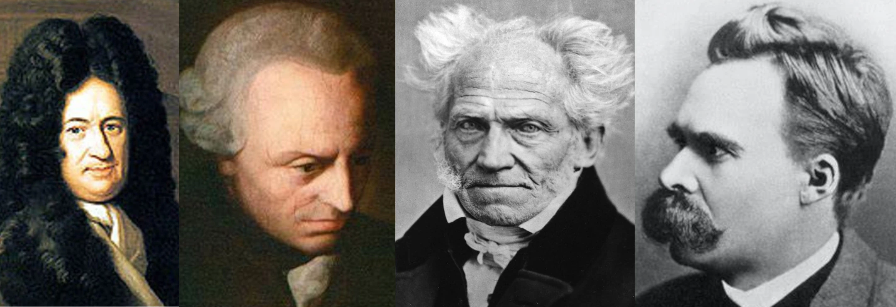
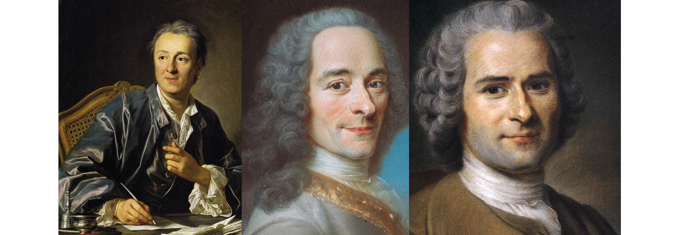

Or, pour commencer à lier cette philosophie avec Bitcoin, il est important de signaler que Spinoza est né dans une époque très particulière. 

Car les Provinces-Unies du 17e siècle sont alors non seulement le pays le plus libre du monde du point de vue des idées, politiques et religieuses, mais aussi le pays le plus riche du monde. Autrement dit, le pays le plus en avance d’un point de vue économique et technologique.

Une richesse qui n’est toutefois pas liée à une ressource naturelle, ni à l’exploitation et à la spoliation de colonies ou à l’esclavage mais qui est liée, bel et bien, au commerce et au négoce international dans un esprit libéral et entrepreneurial. Un esprit qui sera plus tard défendu par un spinoziste célèbre, Voltaire (1694-1778), pour qui dans une salle de marché un homme d’affaire, ou un entrepreneur d’obédience libérale, ne sera jamais exclu, ne sera jamais traité d’infidèle ou excommunié dit-il, en fonction de sa religion ou de ses origines, mais seulement s’il a fait banqueroute.

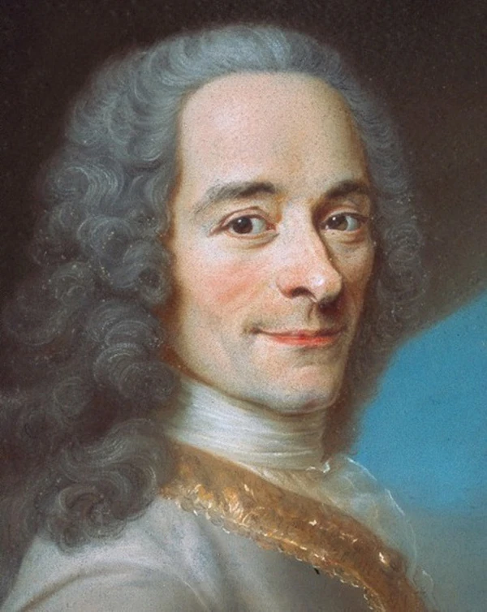

En outre, la Hollande de cette époque fut aussi un lieu de progrès technologiques majeurs par exemple dans le domaine de la mécanique et de l’optique. Les lunettes d’astronomie utilisées par Galilée pour lever les yeux vers le ciel et découvrir l’univers étaient effectivement considérées pour l’époque comme une technologie de pointe comme le sont aujourd’hui les nouvelles technologies liées à l’informatique, à l’IA et, bien sûr, à la crypto. 

Et comme Spinoza a lui-même exercé le métier de polisseur de lunettes d’astronomie, ce qui est amusant pour quelqu’un, dit-on, qui voyait tout de travers, nous pouvons imaginer qu’il aurait certainement soutenu un outil de liberté comme Bitcoin.

Autrement dit, ce sont bien toutes ces valeurs de liberté et de progrès véhiculées par le spinozisme qui s’opposent à un monde où le fondamentalisme religieux, les théories du complot, la superstition et surtout l’ignorance sont une triste réalité.

Un monde, pourtant, dans lequel tous les moyens sont utiles pour nous en sortir, pour nous extraire des servitudes qui nous enferment et être libre en acceptant le monde tel qu’il est, pas tel que nous voudrions qu’il soit.

Que ces moyens soient d’ordre philosophiques ou technologiques, comme l’est donc, et c’est ce que nous verrons par la suite, cet outil de liberté qu’est Bitcoin. Un outil pour que nous puissions, nous individus mais aussi les États, nous extraire des servitudes et notamment monétaires.

# Les œuvres majeures, Éthique et politique
<partId>d7d7e9a1-005b-519c-b587-137435e46344</partId>

## L’Éthique et la recherche de la liberté
<chapterId>4cc66e25-335c-591d-9b78-83e5664bbbbc</chapterId>

:::video id=065c5091-69e1-412f-acce-c763ec31d3b1:::

Je vous propose dans ce chapitre de découvrir à présent l’œuvre majeure de Spinoza, intitulée Éthique, publiée à titre posthume, en 1677.

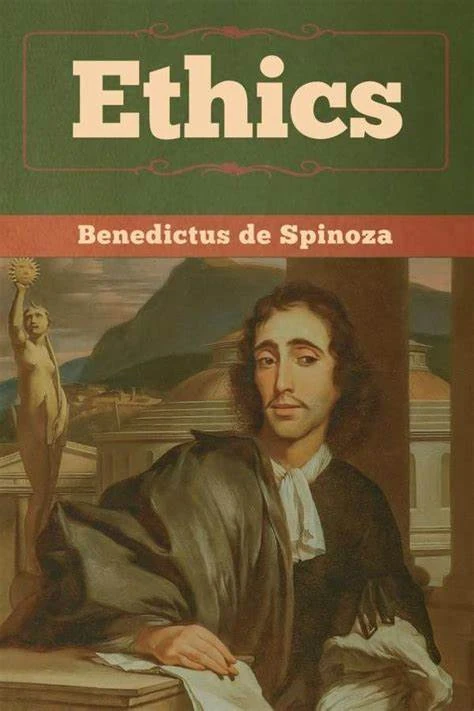

Pourquoi à titre posthume ? Et bien à cause de ses idées révolutionnaires ou tout au moins contre-intuitives et disruptives, et donc très dangereuses pour l’époque. Même dans le contexte libéral des Provinces-Unies du 17e siècle.

L’Éthique est un ouvrage écrit en latin à la manière des géomètres, en étant probablement inspiré par l’esprit scientifique de Galilée (1564-1642), le père, avec Kepler (1571-1630), de la science moderne, et selon lequel les mathématiques sont le langage de l’univers. Spinoza y développe ses idées dans 5 grandes parties grâce à des propositions accompagnées de démonstrations, de scolies, d’axiomes et de définitions. 

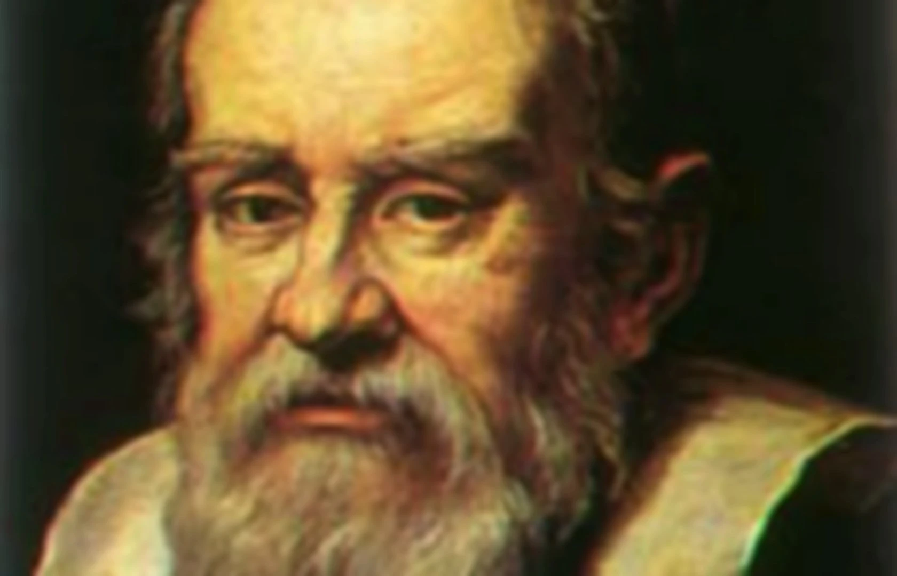

À ce titre, l’Éthique est, dit Spinoza « une manière de parvenir à la liberté ou aux voies y conduisant » et n’est pas vraiment un livre qui se lit de la première à la dernière page mais plutôt qui se travaille en lisant par exemple une proposition qui renvoie à une autre, qui elle-même se comprend grâce à une troisième et ainsi de suite dans un système parfaitement cohérent, rationnel et logique. 

Je précise que quand vous ouvrirez l’Éthique, il est tout à fait judicieux de commencer par y lire les postfaces et les appendices car ces petites parties sont écrites par Spinoza dans un langage courant et abordable, elles sont de fait tout à fait compréhensibles et sont, en quelque sorte, un résumé de sa pensée parfois complexe.

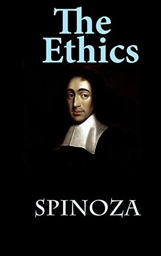

En soumettant le monde qui nous entoure au « microscope de la raison », Spinoza dissèque dans son œuvre la nature humaine avec le principe selon lequel l’être humain n’est pas cause de soi, c’est-à-dire que nous n’avons pas demandé à naître, ni ici, ni à notre époque, ni avec tel ou tel attribut physique ou intellectuel.

Et que, de ce fait, nous ne sommes pas, dit-il, au-dessus de la nature. Nous ne sommes pas exonérés de ses lois, aussi bien au niveau de notre corps que de notre esprit. Autrement dit, nous faisons partie de la nature comme tout autre être vivant, animal ou végétal. 

Pour Spinoza, tous les champs de l’activité humaine dépendent donc des capacités de la raison dans un système de compréhension du monde parfaitement cohérent et déterminé. 

Un monde dans lequel le hasard, par exemple, n’existe pas. 

Tout ce qui arrive est « nécessaire » et est le résultat d’une cause selon l’idée que « ce qui est et ce qui arrive, doit être et doit arriver ». C’est implacable, il s’agit du déterminisme absolu.

Mais attention à deux points : 

Premièrement, si le hasard, pour Spinoza, n’existe pas c’est parce qu’il est un évènement dont nous ignorons la cause. Mais, évidemment, dit-il, ce n’est pas parce que nous ignorons une cause que celle-ci n’existe pas.

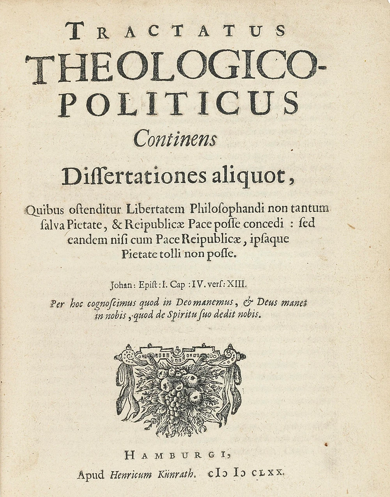

Deuxièmement, il ne s’agit absolument pas non plus de fatalisme puisque la nature n’est pas douée d’intention. La foudre, par exemple, n’a pas l’intention de punir qui que ce soit comme on pourrait le croire en cas de drame. Non, elle ne fait qu’exprimer, dit-on, l’essence de sa propre nature qui est de foudroyer. De frapper.

Spinoza défend donc cette idée que le réel, c’est-à-dire la vie de tous les jours, notre quotidien, dans ses bons et ses mauvais côtés, est parfaitement intelligible et qu’il n’y a de ce fait aucun phénomène de la nature qui ne relève pas du lien de causalité. Bien sûr ici se pose la question du mal, et notamment du mal absolu, que nous verrons un peu plus tard.

Pour finir, il est important ici de noter que l’éthique n’est pas une morale.

La morale, selon Gilles Deleuze (1925-1995), célèbre professeur de philosophie et spécialiste de Spinoza, est un système du jugement utile pour vivre en société. Mais un système subjectif puisque ce qui est bien ici peut être mal ailleurs et ce qui est mal aujourd’hui peut être bien plus tard. 

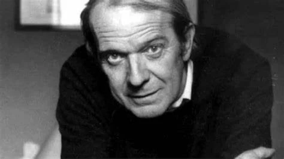

Et plutôt que de déterminer ce qui est bien ou mal, l’éthique établit plutôt ce qui est bon ou mauvais pour notre propre nature et notre capacité, dit Spinoza, à préserver dans notre être. À être libre. C’est, de ce fait, une véritable éthologie, c’est-à-dire une science des manières d’être ou, précise encore Gilles Deleuze, l’art de faire de bonnes rencontres. 

Ou l’art de faire de bons choix pour nous extraire des servitudes qui nous enferment et à cause desquelles les hommes, dit Spinoza, en sont souvent réduits à « voir le meilleur, à l’approuver et à faire le pire ». 

Autrement dit, « à lutter pour leur servitude comme s’ils luttaient pour leur liberté ».

## Le Traité Théologico-politique
<chapterId>84b0187e-1050-5d44-a536-80554896e828</chapterId>

:::video id=c1efc97e-1e96-4b37-894c-9a19794d6b52:::

Après l’Éthique, je souhaite dans ce chapitre vous présenter une autre œuvre majeure pour comprendre toute l’influence philosophique et politique de Spinoza, notamment sur les Lumières à venir et sur les courants libéraux et, pour ce qui nous concerne, libertariens. 

Il s’agit du Traité théologico-politique, dit le TTP, publié anonymement en 1670. 

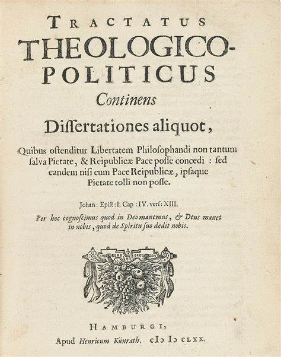

Cet ouvrage, Spinoza (1632-1677) l’a écrit en interrompant la rédaction de son Éthique pour tenter de mettre fin à un malentendu qui court malgré tout encore aujourd’hui. C’est l’idée selon laquelle il serait athée.
Or, comme nous l’avons vu, le concept de Dieu chez Spinoza fait l‘objet de toute la première partie de l’Éthique dans laquelle il démontre que non seulement Dieu existe mais aussi quelle est sa vraie nature. 

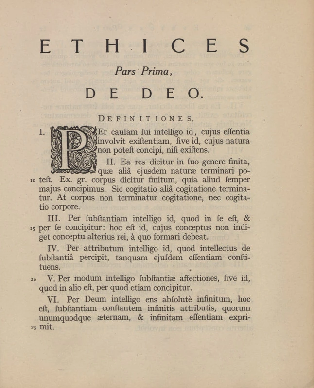

Et comme les concepts de Spinoza sont en général assez difficiles à saisir, il est souvent plus facile de les comprendre en disant ce qu’ils ne sont pas plutôt qu’en cherchant à dire ce qu’ils sont. Une démarche qui, soit dit en passant et comme nous le verrons plus tard, est très utile pour comprendre Bitcoin.

C’est ainsi que Spinoza nous montre que Dieu, selon lui, n’est pas un être anthropomorphe doué d’intention qui punit ou récompense, à qui nous parlerions et qui nous écouterait en fonction d’un rituel que nous suivons, ou pas. Autrement dit, selon lui, Dieu n’est pas un vieux monsieur avec une grande barbe blanche caché derrière un nuage qui réglerait les difficultés du monde et nous rendrait dépendant de lui.

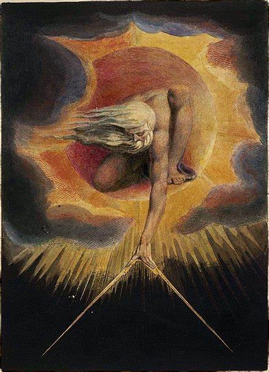

Parler de Dieu revient ainsi plutôt à évoquer la Nature en tant que Substance unique, infinie et éternelle, composée d’une infinité d’attributs dont nous, êtres humains, n’en connaissons que deux, la matière, ou l’étendue, et la pensée. 

C’est le célèbre « Deus Sive Natura » à partir duquel Spinoza tire le concept de déterminisme absolu et l’idée selon laquelle l’homme n’est donc pas cause de soi et n’est pas au-dessus de la Nature, ni bien sûr au-dessus des animaux.

Mais au-delà d’une critique des religions, le TTP est surtout l’opportunité pour Spinoza de faire une sévère critique des religieux, et de la théocratie. Autrement dit du pouvoir religieux qui cultive la crainte et la superstition et qui, dit-il, active les passions tristes des individus pour mieux les asservir, les enfermer dans l’illusion, le fanatisme et les guerres. 
Dans ce stade primaire et infantile de la religion, les croyants ne s’attachent plus qu’au culte extérieur et à une foi crédule faite de préjugés. Un stade dans lequel la religion devient alors mécaniquement intolérante, sort des limites de son enseignement moral et se détourne de sa vocation à promouvoir la paix et la concorde en prétendant détenir la vérité.
Pourtant, une fois dépassé la critique rationnelle du fait religieux, et par exemple en faisant une exégèse de la Bible, Spinoza veut nous convaincre que cette nouvelle vision de Dieu est tout à fait compatible avec le message de justice et de charité des trois grandes religions du Livre qui établissent une règle d’or simple, mais souvent un peu oubliée : « tu aimeras ton prochain comme toi-même ».
Mais ce n’est pas tout. 
Cette vision adulte de la religion développée dans le TTP est accompagnée d’une envergure politique avec la nécessité de séparer la religion et l’État afin de protéger, dans l’intérêt de tous et de l’État lui-même, la liberté de penser et de croire.
Au fond, Spinoza fait de la liberté, dans le cadre de la raison, une condition essentielle pour que les hommes vivent sans être asservis par un pouvoir contraire à leurs intérêts et il défend donc une démocratie directe qui s’appuie sur la liberté politique et religieuse.
Autrement dit sur la liberté de penser et de croire afin de sortir de nos servitudes et de nos fausses croyances infantilisantes et de raisonner en adulte en privilégiant la raison et aussi, et en ce qui nous concerne, le progrès technologique.
Le tristement célèbre tremblement de terre de Lisbonne, le 1er novembre 1755 montre d’ailleurs une évolution importante dans la façon de penser les évènements et les catastrophes de la nature et la manière de s’en protéger.

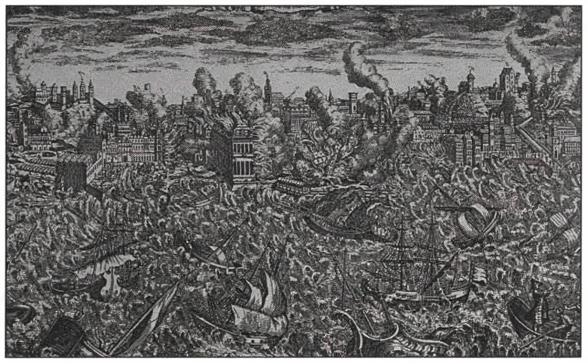

Ce terrible tremblement de terre détruisit la ville et tua des centaines de milliers de personnes innocentes, dont beaucoup étaient à l’église à ce moment-là, car il s’agissait du jour de la Pentecôte ce qui rajouta à l’incompréhension des rescapés.

Un drame qui raviva la question posée par le philosophe et mathématicien allemand Leibniz (1646-1716) sur la vision anthropomorphe d’un Dieu doué d’intention qui est bon et tout-puissant. Car si Dieu était bon, dit Leibnitz dans sa théodicée, alors il ne serait pas tout-puissant puisqu’il permettrait ce genre de catastrophe et s’il était tout-puissant, il ne serait alors pas bon non plus puisqu’il ne pourrait pas les empêcher.

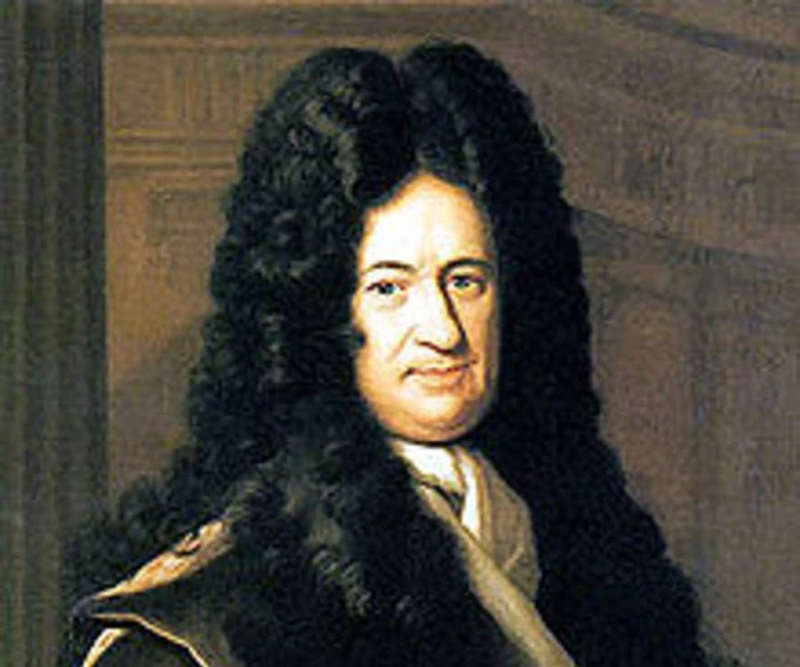

Et bien au-delà d’accabler la main de Dieu, Jean-Jacques Rousseau (1712-1778), lui, écrivit à un Voltaire frappé par l’injustice et les horreurs subies par les hommes indistinctement que « la nature n’était pas mauvaise en soi et qu’il ne fallait pas y voir une quelconque main divine qui expliquerait son dessein ». 

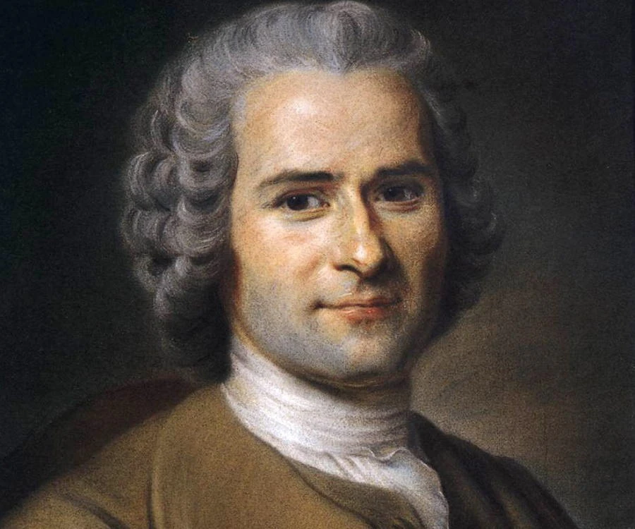

À quoi, Voltaire (1694-1778), spinoziste s’il en est, lui répondit que cette catastrophe naturelle devait surtout nous faire comprendre que les moyens scientifiques de se protéger de la nature existaient et que l’enjeu de leur époque était donc de se demander si les hommes pouvaient, grâce à la connaissance et au progrès, prendre leur avenir en main et se libérer de la théologie et de la superstition.

Et s’il ne s’agissait bien sûr pas d’empêcher les tremblements de terre qui sont encore aujourd’hui non seulement imprévisibles mais aussi tout à fait incontrôlables, il s’agissait plutôt de faire en sorte que, par exemple, les habitations soient construites pour pouvoir y résister. 
C’est pourquoi le 18e siècle des Lumières, grâce à l’exercice de la raison, aux sciences et à la technologie, est le siècle du progrès. Autrement dit, le progrès vu comme outil de liberté.

# La révolution spinoziste, les trois illusions
<partId>f5d45c2b-28da-527a-ab20-dd255e9a9e0d</partId>

## Une nouvelle définition de la Nature et de l’être humain
<chapterId>3e6599e3-5b29-50a8-a67d-d0386da5d65d</chapterId>

:::video id=b6d2c035-8848-4da6-9da9-be3b70be0f38:::

Je vous propose à présent dans ce chapitre de faire un peu d’histoire des idées et de comprendre pourquoi le spinozisme est considéré comme une véritable révolution copernicienne des idées.

Grâce à ce nouveau mode de compréhension de Dieu, autrement dit de la Nature, que lui offraient les mathématiques et dont la pensée enthousiaste est au fond le résultat de son époque, Spinoza (1632-1670) a établi un profond changement de paradigme, de modèle, avec des implications indirectes sur la vision religieuse du monde et la place de l’homme dans celui-ci. 

Car comme Nicolas Copernic (1473-1543) a établi que la terre n’était donc pas le centre du monde, que Charles Darwin (1809-1882) a montré trois siècles plus tard que l’homme n’était pas au centre du « vivant », Spinoza suivra cette logique et affirmera en son temps que l’homme n’est pas le « maître en sa propre maison » et que l’univers n’est pas fait pour son seul bénéfice. 

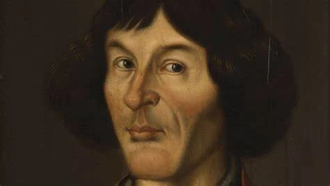
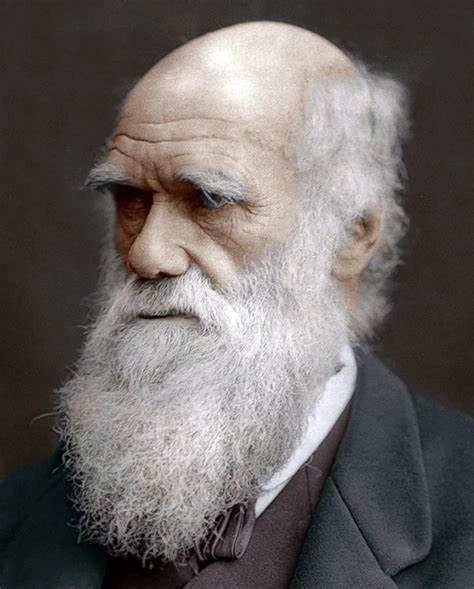

Que l’homme n’est pas, dit-il encore, « un empire dans un empire » et que, au même titre que la terre est ramenée au rang de simple planète, comme toutes les autres planètes, l’être humain est ramené au rang de simple mode de la nature, comme tous les autres modes finis de la nature que sont les animaux, les végétaux et tous « les êtres existants ».

Avant lui, la philosophie grecque classique proposait une vision ordonnée et hiérarchisée de l’univers pour expliquer le monde, le cosmos, et l’expérience humaine. Basée sur des récits mythiques, elle cherchait au fond à expliquer l’origine du monde en insistant sur l’harmonie de l’univers, de la nature et des hommes.

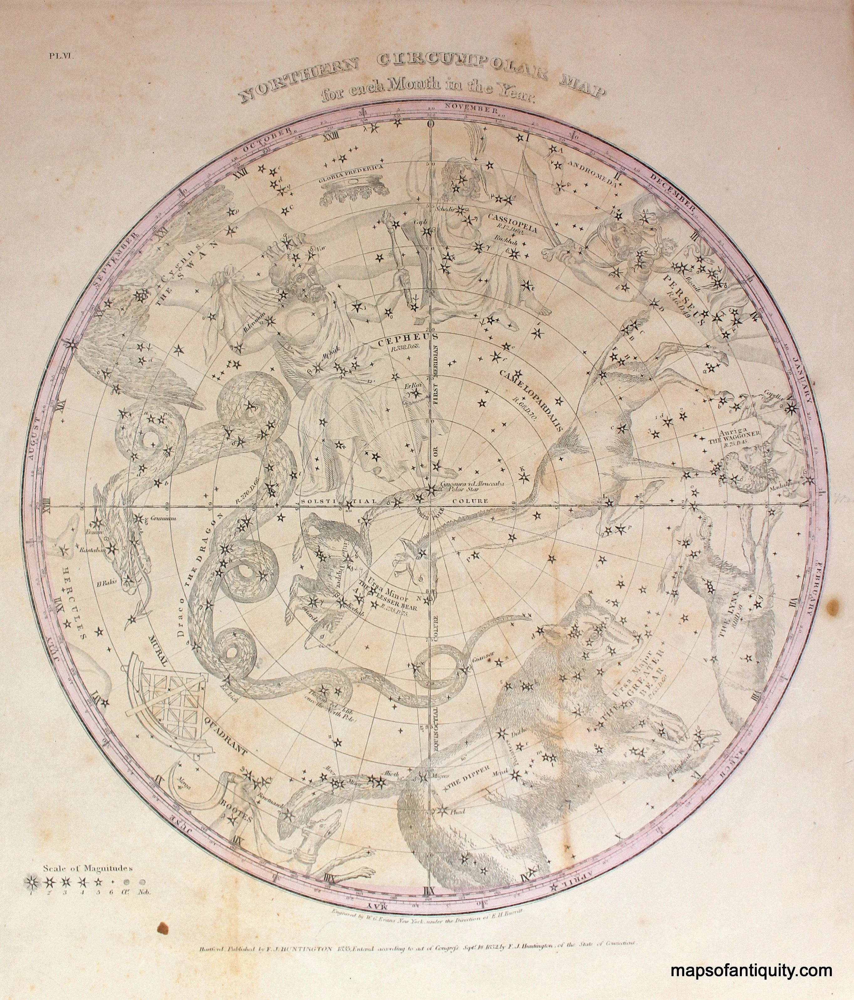

La cosmologie scolastique du Moyen-Âge, essentiellement à partir du 12e siècle, fut alors une évolution vers plus de raisonnements afin d‘harmoniser la raison et la foi pour expliquer un univers toujours hiérarchisé mais qui correspondait mieux à la philosophie chrétienne.

Mais avec la nouvelle physique de Copernic (1473-1543) du 15e siècle, la cosmologie connut un tournant majeur dans la compréhension de l’univers dont le modèle géocentrique fut donc remis en question au profit du système héliocentrique qui ouvrit la voie à la science moderne, et notamment la nouvelle physique et l’astronomie de Kepler (1571-1630) et de Galilée (1564-1642). Puis de Isaac Newton (1643-1727) et enfin d’Albert Einstein (1879-1955), lui-même un spinoziste convaincu.

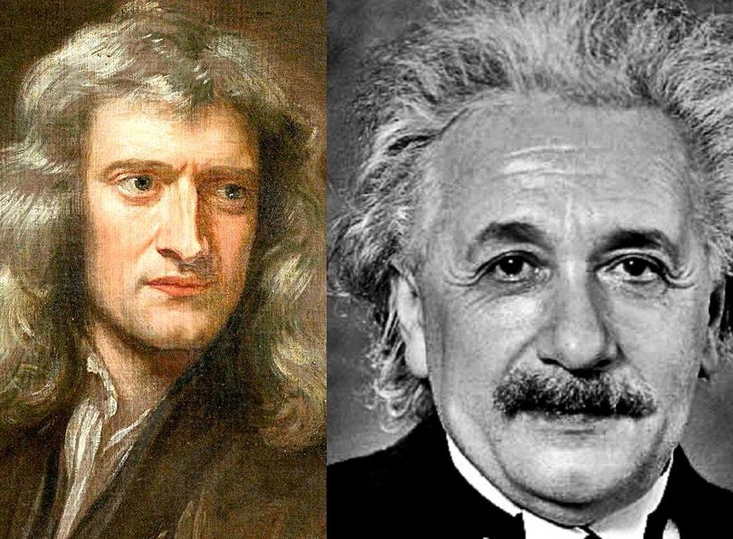

Mais pour bien comprendre le spinozisme, il faut aussi se replacer dans le contexte de René Descartes (1596-1650), le célèbre philosophe français qui précède Spinoza et dont il fut un disciple et un grand admirateur. 

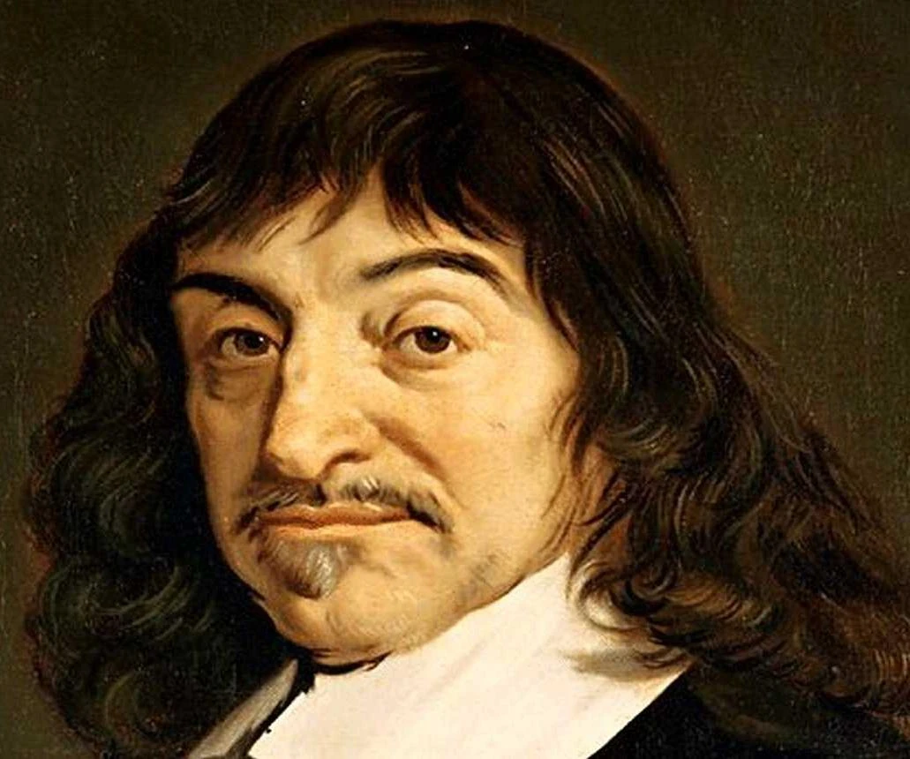

Malgré les risques, malgré les condamnations de Giordano Bruno (1548-1600) et de Galilée, Descartes s’est attelé en précurseur à distinguer « le vrai du faux » et à harmoniser la théologie, la philosophie et la physique. Avec son célèbre Discours de la méthode publié en 1637, Descartes fait valoir ainsi que la raison est le fondement de la connaissance grâce à laquelle l’homme peut atteindre la liberté. 

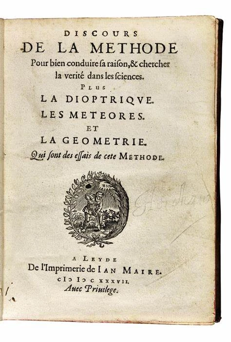

En expliquant le monde selon des lois universelles et non plus en fonction d’une nature douée d’intentions morales, il a ouvert la voie au déterminisme que reprendra donc Spinoza. 

Mais, en tant que catholique, Descartes établit toutefois une hiérarchie entre les hommes et les autres modes finis de la nature, et en particulier vis-à-vis des espèces animales, les « animaux machines » dit-il. Et en disant qu’« il n’y a pas d’âme qui, bien conduite, ne puisse acquérir un pouvoir absolu sur ses actions et ses passions », Descartes affirmera ainsi que l’être humain dispose de la capacité de commencer quelque chose à partir de rien et que l’homme, selon lui, « échappe aux lois de la nature », qu’il aurait sur ses propres actions un pouvoir absolu et ne tirerait que de lui-même sa propre détermination.

Spinoza sut, lui, franchir et dépasser cette étape afin de concilier l’existence de Dieu avec la démonstration de la raison. Pour lui, tous les champs de l’activité humaine dépendent des capacités de la raison dans un monde parfaitement cohérent et déterminé. Mais un monde dans lequel il n’y a pas de contingence ni de hasard et dans lequel tout ce qui arrive est nécessaire et est le résultat d’une cause selon le lien de causalité des choses. C’est l’idée du déterminisme absolu.

Et c’est donc dans des termes très durs qu’il réfute finalement la position cartésienne dont il critique par exemple l’idée que les êtres humains ne seraient pas soumis aux lois de la nature comme tous les autres animaux et qu’ils seraient à ce titre supérieurs à tous les autres modes finis de la nature. 

Autrement dit qu’ils seraient doués du libre arbitre, une croyance illusoire dont il est extrêmement difficile de s’extraire nous dit Spinoza et que nous allons maintenant évoquer.

## L’illusion du Libre arbitre
<chapterId>f147a914-cb64-5927-b305-26691930bca3</chapterId>

:::video id=b59da795-ba19-4643-9672-36c9e7953a42:::

Dans ce cours, nous allons à présent évoquer la question délicate du libre arbitre afin de mieux saisir ce qu’est la liberté pour Spinoza, pour les Lumières et les premiers philosophes libéraux.

Comme nous l’avons déjà vu, Spinoza (1632-1677) est connu pour considérer le libre arbitre comme une illusion dont il est extrêmement difficile de s’extraire.

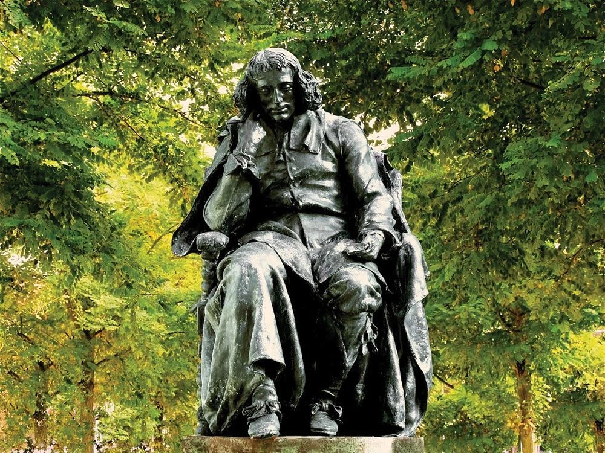

Pourquoi ? Car elle va à l’encontre de la tradition philosophique depuis l’Antiquité et encore défendue par Descartes (1596-1642) selon laquelle les hommes peuvent commencer quelque chose à partir de rien et qu’ils ont l’entière responsabilité de leurs actes, notamment devant Dieu nous dit saint Augustin (354-430), père de l’Église chrétienne. 

Mais aussi, bien sûr, devant la justice des hommes.

C’est l’idée que notre volonté, et seule notre volonté, nous permettrait de diriger notre vie, que nous avons sur nos actions un pouvoir absolu et que nous tirons seulement de nous-mêmes la liberté de nos actions en disposant de ce fait d’un pouvoir de décision indéterminé. 

Autrement dit, que l’homme serait ainsi en mesure de troubler l’ordre de la nature plutôt qu’il ne le subit.

Dans la conduite de sa vie, parce qu’il ne serait soumis à aucune loi autre que celle de sa propre volonté, l’homme serait donc non seulement au-dessus de la nature et des animaux, simples machines, mais aussi de tous les autres modes finis de la nature. C’est la position de Descartes (1596-1650) pour qui les causes de l’impuissance et de l’inconstance des hommes ne se trouvaient pas dans l’ordre naturel mais dans les propres vices de la nature humaine.

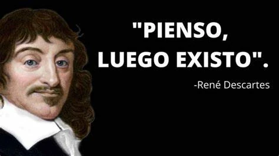

Mais si Spinoza reconnaît à Descartes la qualité d’avoir ouvert la voie du contrôle rationnel de la vie affective, il se démarque entièrement de lui en critiquant fermement cette hypothèse d’un « pouvoir absolu » de la volonté. 

Spinoza, lui, considère en réalité que notre monde est parfaitement cohérent et déterminé et que tout ce qui arrive est nécessaire et est le résultat du lien de causalité des choses selon lequel un effet a toujours une cause, et que cette cause est elle-même l’effet d’une autre cause et ainsi de suite.

C’est l’idée du déterminisme absolu à partir duquel il établit dans son Éthique que les hommes ne disposent pas du moindre libre arbitre car, dit-il, ils sont conscients de leurs actions, mais ils ignorent, ou préfèrent ignorer, les vraies causes qui les déterminent.

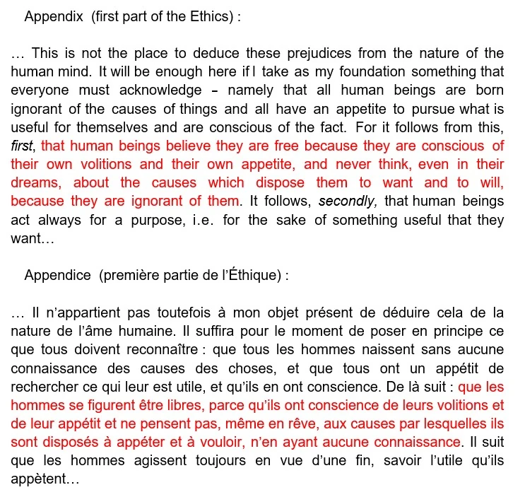

Pour Spinoza, les hommes, en tant que « modes finis » de la nature comme les animaux ou les végétaux, ne peuvent donc pas commencer quelque chose à partir de rien, ils ne sont pas exonérés des lois de la nature, aussi bien au niveau de leur corps que de leur esprit.

Pire, pour lui, le plus grand danger de la liberté est de croire en notre volonté libre et de croire que nous pouvons agir sans être déterminés par des causes extérieures.

La liberté pour Spinoza n’est donc pas l’expression de la volonté libre mais bel et bien la capacité à comprendre notre juste place dans le monde, comprendre notre nature déterminée et, à partir de là, à orienter notre existence vers ce qui « accroît notre puissance d’agir ». En se tournant dès lors toujours vers l’avenir avec optimisme et en regardant le monde tel qu’il est plutôt que de l’imaginer tel qu’on aimerait le voir. 

Bien sûr, le problème qui se pose est celui de la responsabilité des hommes et de leurs actions car nous pourrions conclure que si les hommes ne sont pas libres de leurs actions, ils ne seraient ainsi pas responsables de leurs actes. Notamment face à la justice. Mais cette façon de voir les choses est trompeuse car, sans trop entrer dans le détail, le fait de reconnaître son propre déterminisme social, familial, historique n’empêche pas de considérer la responsabilité des actions commises puisque celles-ci sont volontaires.

Ce serait par contre illusoire de croire que les actions, par exemple, d’un criminel ne sont jamais liées à son propre déterminisme. Et s’il ne s’agit bien sûr pas de les excuser, il s’agit au moins de tenter de les comprendre. C’est d’ailleurs ce que fait la justice qui, au-delà de punir les actions illégales, joue le rôle de prévoir et de protéger l’avenir et c’est la raison pour laquelle certains crimes ne sont pas seulement punis mais font aussi l’objet de soins, compte tenu du passé familial, social et psychologique du délinquant.

Or, cette façon d’envisager la liberté comme une capacité d’agir est le lien que l’on peut faire avec la philosophie des Lumières du 18e siècle. Selon un de ses plus grands ambassadeurs, le philosophe allemand Emmanuel Kant (1724-1804), les Lumières sont effectivement le moyen de sortir les hommes de l’état de tutelle, ou de servitude volontaire aurait dit Étienne de la Boétie (1530-1563), dont ils sont eux-mêmes responsables. 

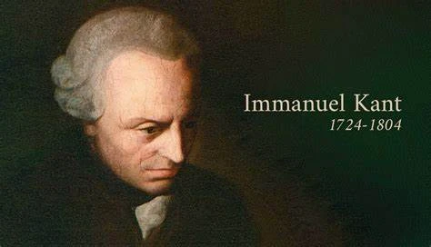

La devise de Kant est d’ailleurs « Penser par soi-même » et « Oser savoir », c’est le célèbre « Sapere Aude » en latin.

La capacité d’agir de Spinoza est ainsi le pouvoir que l’homme a en lui de comprendre sa propre condition animale et de comprendre la nature et ses phénomènes, positifs ou négatifs, en les rapportant à des causes objectives pour ne pas s’en remettre à des explications morales, fausses et illusoires, c’est-à-dire qui nous conviennent en fonction de nos désirs. Mais plutôt à chercher à les expliquer, grâce à la raison, en étant tourné vers l’émancipation et la liberté.

Et le progrès, grâce auquel vont apparaître les premières révolutions technologiques et les premières idées libérales et entrepreneuriales de la fin du 18e siècle, notamment avec le philosophe libéral anglais John Locke (1632-1704) ou encore l’économiste anglais Adam Smith (1723-1790).

Et il est ici utile de se rappeler la définition que fait Sigmund Freud (1856-1939) de l’illusion. Selon le père de la psychanalyse qui a toujours reconnu l’influence de Spinoza sur son travail, une illusion est précisément « une croyance motivée par la réalisation d’un désir en ne tenant pas compte, de ce fait, de la réalité ».

Pour finir, il faut préciser que si le courant libertarien que  nous allons bientôt évoquer se réfère directement à cette nouvelle philosophie libérale, certains soulignent que des figures comme Ayn Rand (1905-1982), auteure de « La Grève » ou de « La Source vive » soutiennent l’existence du libre arbitre en considérant que les hommes ont la capacité de faire des choix libres. 

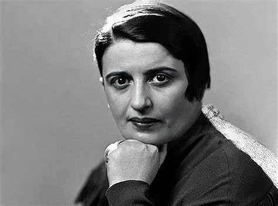
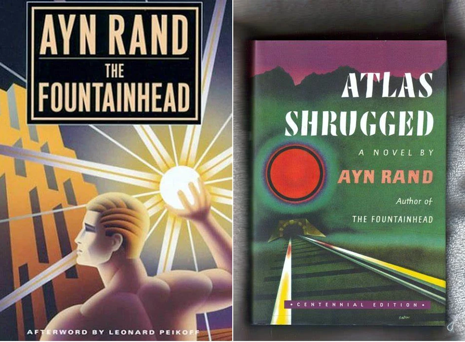

Mais la réalité est tout autre, et la confusion vient plutôt d’un problème sémantique car en reconnaissant aux hommes la capacité d’agir, et de faire des choix, tout en reconnaissant le déterminisme logique dont ils sont l’objet, les premiers libertariens sont, en réalité, eux aussi des héritiers de Spinoza. Ils ont avec lui le point commun de considérer que l’homme n’est pas au-dessus de la nature. Qu’il est bel et bien le résultat d’une évolution qui l’inscrit dans un déterminisme, dans une histoire qui le dépasse et qui fait, en grande partie, ce qu’il est et ce qu’il fait.

Enfin, si la croyance au libre arbitre est  une illusion dont il est extrêmement difficile de s’extraire, c’est qu’elle renvoie à une autre illusion qui l’alimente, l’illusion des causes finales que je vous propose d’étudier dans le prochain chapitre.

## L’illusion des causes finales
<chapterId>da2a7fb1-f1e9-5b56-822d-c73770de749d</chapterId>

:::video id=a0127fe7-a4cb-4a1c-8af4-f11c40b4a3d7:::

Nous avons vu dans le précédant chapitre que l’illusion du libre arbitre consiste à croire que l’on pourrait donc commencer quelque chose à partir de rien, que seule notre volonté nous permettrait de diriger notre vie et que nous disposerions d’un pouvoir de décision indéterminé. C’est l’idée que l’homme serait en mesure de troubler l’ordre de la Nature plus qu’il ne le subit.

Mais pour Spinoza (1632-1677), l’homme n’est pas « un empire dans un empire », c’est-à-dire qu’il n’est pas, contrairement à ce qu’établissait Descartes (1596-1650), une exception dans la nature et qu’il n’est jamais exonéré du prolongement de l’enchaînement déterministe des causes et des effets. 

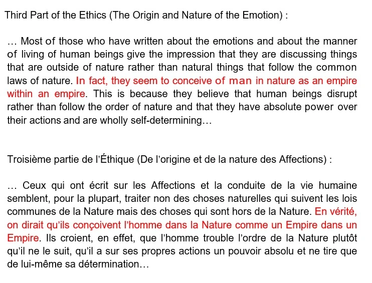

Et comme la Nature, dit encore Spinoza, n’a aucune fin prescrite d’un point de vue moral et que les hommes ont tendance à prendre leur imagination pour de l’entendement, ils projettent sur elle une grille de lecture de ce qui leur est utile. Au point, alors, de donner une signification aux choses qui ne découle que de la manière dont ils les apprécient et les rapportent à eux-mêmes.

C‘est-à-dire en fonction de leurs désirs, de leurs espoirs et de leurs craintes. 

Ce raisonnement est illustré par cette illusion des causes finales qui est un obstacle majeur à la pensée et à l’exercice de la raison car elle exprime tout simplement notre besoin de faire correspondre les effets d’une chose non pas à ses vraies causes mais à une croyance, même absurde, même infantilisante.

Une croyance qui exprime une intention, notamment divine, et qui, dans la façon que nous avons de l’interpréter, relève souvent de la superstition. Ou de l’ignorance. 

Et c’est pourquoi les nouvelles maladies comme le Sida dans les années 90 ou la covid en 2020 ont toujours été perçues par certains comme l’expression d’une intention, divine et souvent punitive, selon un raisonnement contraire, de ce fait, avec le principe de causalité fondateur du rationalisme et de la science moderne établie depuis Copernic (1473-1543), Kepler (1571-1630) et Galilée (1564-1727).

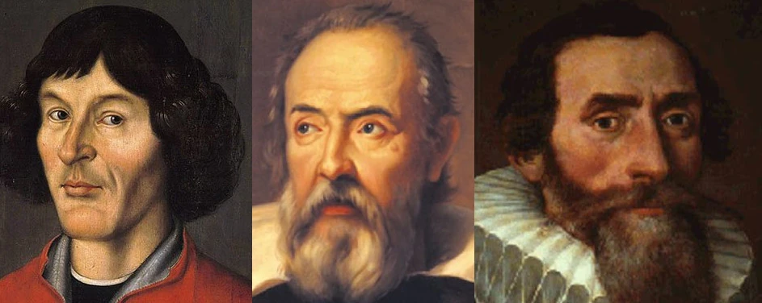

Car le fait est qu’il importe finalement peu aux hommes, dit Spinoza, qu’un grand nombre de faits dépassent leur imagination, qu’il y a plus de désordre que d’ordre dans la nature. La complexité des choses qui leur échappent devrait pourtant les dissuader de croire à tout projet finaliste. Peu importe, dit-il, car la croyance des hommes en la pertinence de leur certitude fondée sur ce qui convient à leur désir et à leur utilité est toujours plus forte que toute argumentation rationnelle ou tout souci de vérité. 

Le finalisme revient ainsi à inverser les causes et les effets des choses pour les comprendre en estimant, par exemple, que si les hommes ont des yeux, c’est pour voir, que s’ils ont des dents, c’est pour mâcher. Alors que, évidemment, c’est pour voir que l’espèce humaine a développé la vue au cours de son évolution, et c’est bien par la nécessité de se nourrir, et de manger de la viande, que notre dentition s’est, elle aussi, développée telle qu’elle est. 

Et c’est bien ce qu’affirma le naturaliste français Jean-Baptiste de Lamarck (1744-1829) (image 3.3.3) en établissant sa théorie prédarwinienne selon laquelle c’est la fonction qui crée l’organe et pas l’inverse.

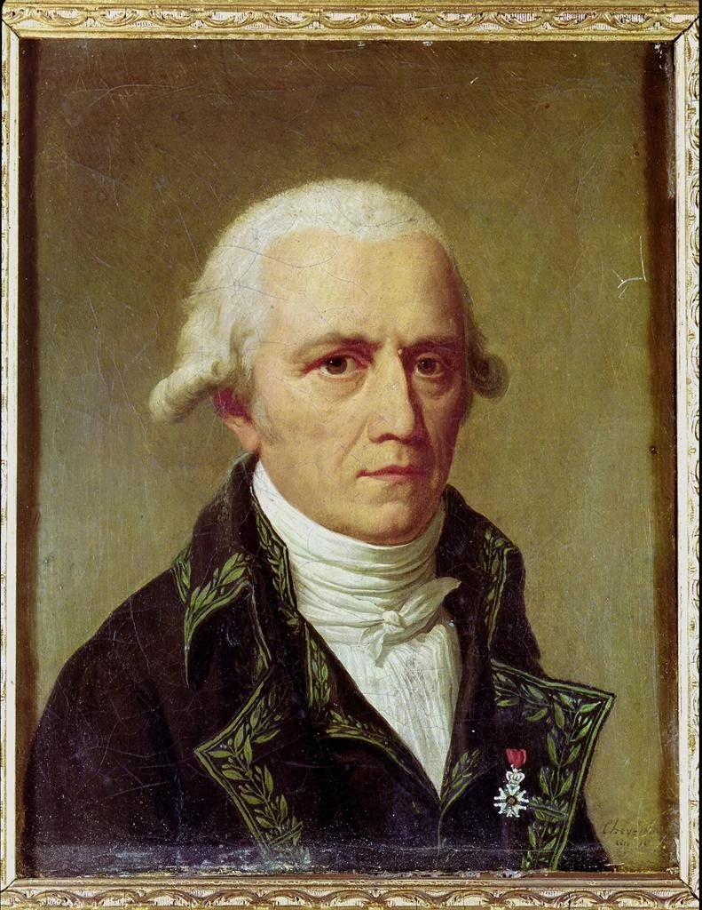

Mais comme dit Spinoza, « le délire des hommes ne s’arrête pas là » et parmi tous les exemples d’idées finalistes naïves, et finalement assez amusantes, on cite souvent l’exemple célèbre du biologiste Bernardin de Saint-Pierre (1737-1814). Cet ancien directeur du musée d’histoire naturelle de Paris considérait le finalisme de la nature avec poésie, lyrisme et une certaine naïveté en considérant que le melon, par exemple, avait été créé dans le seul but de plaire aux familles nombreuses puisque sa peau striée lui permettait d’être coupé facilement en tranches égales.

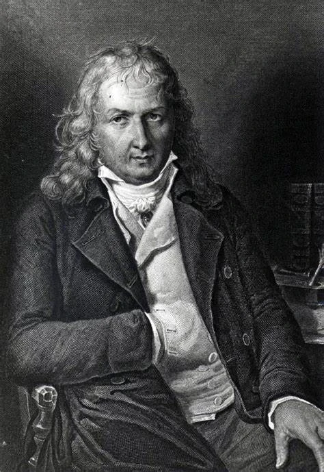

Et la définition que les économistes Keynésiens et les défenseurs de l’État providence donnent par exemple de l’inflation illustre aussi très bien ce paradoxe. Selon eux, l’inflation serait une augmentation des prix qui, d’après certains banquiers centraux, viendrait soit de « nulle part », soit de contextes géopolitiques que personne ne peut donc ni maîtriser, ni anticiper. Alors que si une augmentation des prix peut effectivement aboutir à une inflation conjoncturelle, par exemple quand le prix du pétrole augmente, les prix de certains biens transformés augmenteront également, les vraies causes structurelles de l’inflation sont d’abord liées à une augmentation de la masse monétaire qui implique, elle, une baisse de la valeur de la monnaie et, ipso facto, une augmentation mécanique des prix.

Croire ou faire croire le contraire revient ainsi à rêver les yeux ouverts, comme le dit Spinoza moqueur, et à construire un raisonnement qui est faux, ou mensonger, et qui est d’autant plus facile à faire accepter qu’il est entendu comme une réponse attendue pour se donner raison. En l’espèce, quand les défenseurs de l’intervention de l’État considèrent que l’inflation est le meilleur moyen de résoudre les problèmes économiques. 

Alors que cette interprétation biaisée de l’inflation nous fait surtout oublier que si elle est bel et bien utile pour gérer l’économie à court terme, elle est en réalité un impôt déguisé, n’aboutit à long terme qu’à des catastrophes humaines et matérielles et rend les États incapables de ne pas abuser de leur pouvoir. C’est ce que décrit parfaitement  Friedrich Hayek (1899-1992) dans son essai La route de la servitude en évoquant cette servitude dont les États ne peuvent alors plus s’extraire.

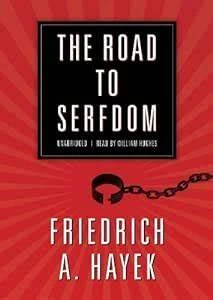

Enfin, il est ici utile de se rendre compte que ce mécanisme finaliste s’illustre aussi très bien dans la manière avec laquelle les détracteurs de Bitcoin expriment leurs critiques en ne s’intéressant précisément qu’à ses effets. 

Car si certains effets de Bitcoin peuvent certainement être critiquables, à cause du biais cognitif  lié au fait qu’il s’agit d’une technologie nouvelle et disruptive, nous avons une forte propension à ne voir que les effets négatifs. Surtout si la réalité ne correspond pas à nos désirs, par exemple si on est religieux face à une révolution copernicienne comme l’est le spinozisme, ou si l’on est un banquier central face à un concept de monnaie numérique décentralisée.

Or, il apparaît très clairement qu’à partir du moment où un religieux ou un banquier central fait preuve d’entendement, de curiosité et de bonne volonté et qu’ils s’intéressent à un concept en cherchant d’abord à le comprendre plutôt qu’en en jugeant les effets pour faire correspondre leur opinion à leurs attentes, ils seront alors certainement en mesure d’y adhérer. 

Merci de votre attention et je vous retrouve dans le prochain chapitre.

## L’illusion théologique
<chapterId>93554156-5e62-526d-9b71-49c47be916af</chapterId>

:::video id=9c490cc1-3d29-4ca7-9464-1a701bb91ba7:::

Dans ce dernier chapitre sur la nouvelle vision copernicienne des idées que nous offre le spinozisme, nous allons enfin évoquer la troisième illusion que présente Spinoza (1632-1677) dans son œuvre, l’Éthique.

Une illusion qui est directement liée aux deux premières que nous venons de voir, l’illusion du libre arbitre et l’illusion finaliste.

Il s’agit de l’illusion théologique. 

Le constat est le suivant : Tant que les hommes sont dans l’ignorance, « tant des choses que d’eux-mêmes » nous dit donc Spinoza, tant qu’ils croient en leur liberté illusoire, ils prendront leur imagination pour de l’entendement, c’est-à-dire qu’ils considéreront toujours être capables de penser et de comprendre la nature des choses alors qu’ils ne font en réalité qu’imaginer, inventer et projeter ce qui leur est utile. En fonction de leurs désirs.

Et c’est pourquoi l’homme va estimer que si des moyens naturels existent, et qu’ils sont utiles, comme les dents pour manger ou les yeux pour voir, c’est qu’ils ont logiquement été créés par un « directeur de la nature ». Autrement dit un Dieu doué d’intention et anthropomorphe à qui on attribue des intentions proprement humaines. 

C’est-à-dire, pour faire simple, un vieil homme à la barbe blanche caché derrière un nuage, à qui on reconnaît d’avoir créé toutes les choses de la nature comme des moyens à notre usage, parce qu’il nous aime, et nous protège puisque nous l’honorons et lui rendons un culte.

C’est la première étape de l’illusion théologique.

Mais malgré notre orgueil à nous croire au-dessus de la Nature et à imaginer pouvoir commencer quelque chose à partir de rien, nous sommes en réalité toujours soumis à des conditions d‘existence selon lesquelles tout indique que, finalement, nous ne pourrons pas vraiment « nous en tirer » comme le dit le professeur de philosophie Gilles Deleuze (1925-1995). Nous sommes mortels, comme tous les animaux, mais nous, nous le savons.

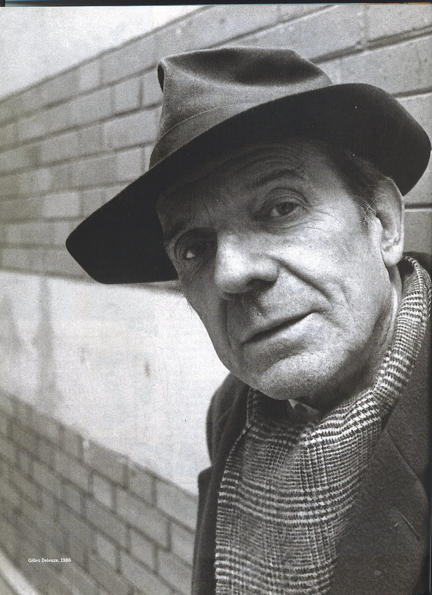

Croire ou imaginer le contraire pour nous rassurer est la raison pour laquelle nous sommes perpétuellement ballotés entre la crainte et l’espoir, comme deux pôles opposés et inséparables entre un sentiment de sécurité et un sentiment de panique puisque la crainte est toujours liée à l’espoir de jours meilleurs. 

Qu’il n’y a pas de crainte sans espoir, ni d’espoir sans crainte et que celui qui craint espère toujours échapper à ce qu’il craint alors que celui qui espère craint toujours que ce qu’il espère ne se produise pas. 

Et comme « nous sommes disposés à croire facilement  ce que nous espérons », dit Spinoza dans son Éthique, c’est lorsque nous affrontons des causes extérieures ou des événements qui nous seraient nuisibles, contraires à toute idée d’utilité, que s’exprime alors la seconde étape de cette illusion dite théologique, caractérisée par des croyances à partir desquelles naît le sentiment superstitieux. 

Autrement dit « L’infâme » selon Voltaire (1694-1778) pour qui la superstition ne nait jamais de la raison, et pour qui elle correspond toujours à une croyance irrationnelle ou infondée, opposée à toute forme de rationalité en attribuant à des objets ou à des actions des pouvoirs ou une puissance spirituelle qu’ils n’ont pas.

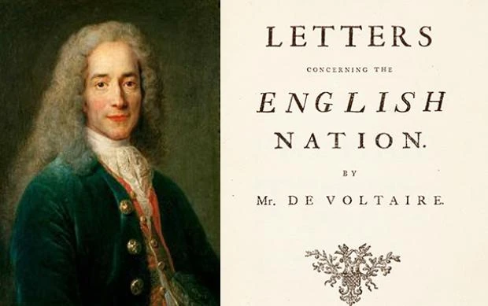

Car sous l’apparence de nous soulager, de nous permettre d’imaginer un monde meilleur, la superstition nous enferme en réalité malgré nous dans nos illusions et nos propres mensonges. Dans des servitudes desquelles nous aurons beaucoup de mal à nous extirper.

C’est ce que défendront donc les Lumières allemandes, anglaises et françaises dès le 18e siècle en affirmant que la superstition empêche simplement les hommes de devenir adulte, non seulement en limitant l’exercice de la raison, mais aussi, et surtout, en faisant naître l’intolérance dont elle est le meilleur instrument pour asseoir la domination d’un pouvoir. Qu’il soit d’ordre politique ou religieux.

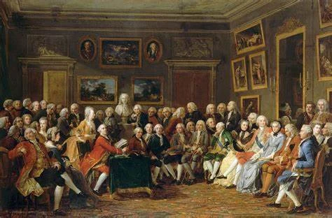

Et c’est ce que Spinoza démontre encore dans son Traité théologico-politique que nous avons déjà abordé. Dans cet essai, il écrit que « le grand secret du régime monarchique et son intérêt majeur est de tromper les hommes et de colorer du nom de religion la crainte qui doit les maîtriser ». C’est la raison pour laquelle les tyrans, les dictateurs ou les révolutionnaires, qui sont toujours des hommes pleins d’entrain à vouloir le bien d’autrui, tombent ainsi souvent, si ce n’est toujours, dans l’écueil de faire le contraire de leurs principes pour les atteindre. 

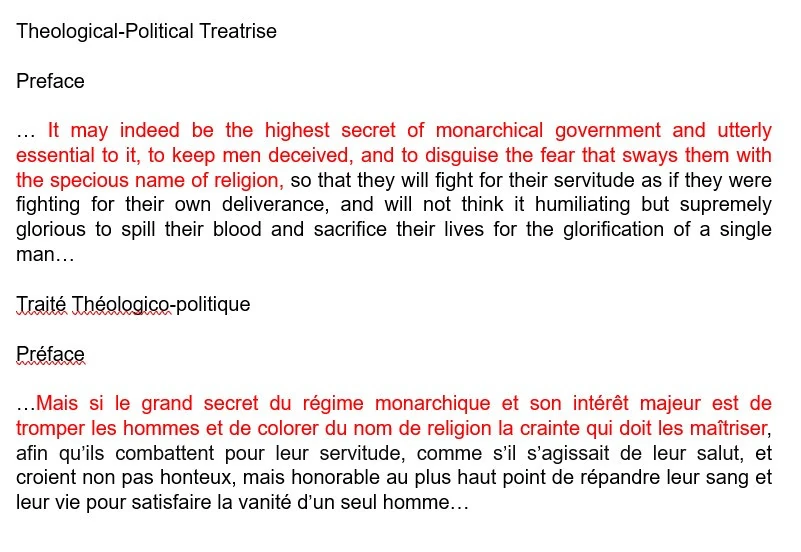

Mais la nouveauté qu’apporte Spinoza dans le TTP et qui fait de lui en quelque sorte le père de la laïcité, est de considérer que s’il est primordial de lutter contre la superstition et contre l’appel à la violence que permet paradoxalement la liberté, le fait est que l'État a tout intérêt à protéger le droit de croire et la liberté de penser. 

Car à partir du moment où les idées existent et s’expriment en privé, celles-ci se répandront fatalement à travers la société et ni leur interdiction, ni leur censure ne pourra jamais les contraindre à ne pas se diffuser. Les idées, qu’elles soient vraies ou fausses, bonnes ou mauvaises, circuleront de toute façon et les interdire ne peut aboutir, à terme, qu’à la révolte et à un renversement de l'État au nom de la liberté. 

Autrement dit, l’État aurait en fait bien plus à craindre de la censure ou de la suppression de la liberté d'expression que de son maintien et il est donc, dit Spinoza, dans son intérêt de laisser les individus exercer leur droit naturel de penser et de s’exprimer. 

Pour Spinoza, un État démocratique qui permet la liberté de penser est donc la meilleure garantie pour que les hommes vivent en paix et, grâce à l’exercice de la raison, qu’ils soient non seulement libres de penser et d’agir mais soient aussi capables de comprendre les servitudes qui les contraignent afin de s’en extraire. 

# De la théorie des affects à Bitcoin
<partId>82e69d4f-a94f-5978-bcb8-8a7b4651bcca</partId>

## La question du mal chez Spinoza
<chapterId>1ce64576-2688-5757-a119-57cc3a1076c0</chapterId>

:::video id=9c490cc1-3d29-4ca7-9464-1a701bb91ba7:::

Je souhaite à présent évoquer avec vous la question du mal, tel que Spinoza (1632-1677) l’expose dans ses œuvres et dans sa correspondance.
Mais attention, c’est un sujet complexe et controversé et il ne s’agit ici que de comprendre, encore une fois, sa manière de réfléchir afin de mieux saisir ce qui le guide, c’est-à-dire la recherche de la liberté.

Comme nous l’avons vu, ne pas croire au libre arbitre ni à aucun finalisme de la nature pose effectivement très vite le problème de l’existence du mal dans notre vie quotidienne.

Autrement dit, la question posée est de savoir si le « mal » existe dans la nature et si l’homme est responsable du mal qu’il cause.

Les philosophes de l’Antiquité estimaient, eux, que le mal n’existait pas dans la nature et Socrate (470-399 av.J.C.) enseignait par exemple que « le mal n’est rien ». Selon lui, quelqu’un de méchant ne l’était pas par nature et ne faisait en quelque sorte que se tromper sur la nature du bien. 

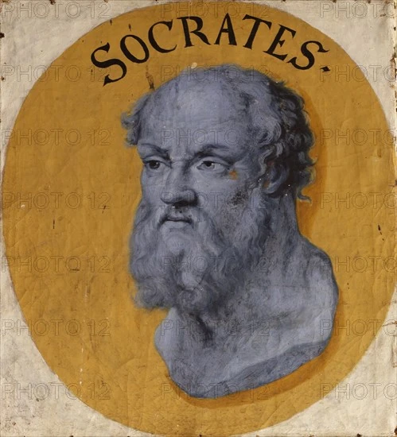

Mais  la tradition scolastique, notamment tirée de saint Augustin (354-430) et qui influence encore la morale chrétienne aujourd’hui, fit valoir que, non seulement le mal existe bel et bien, que c’est une réalité, mais qu’il s’explique parce que l’homme est libre, parce qu’il est capable de faire un choix entre le bien et le mal et que le mal qu’il cause serait donc entièrement de sa propre responsabilité. 

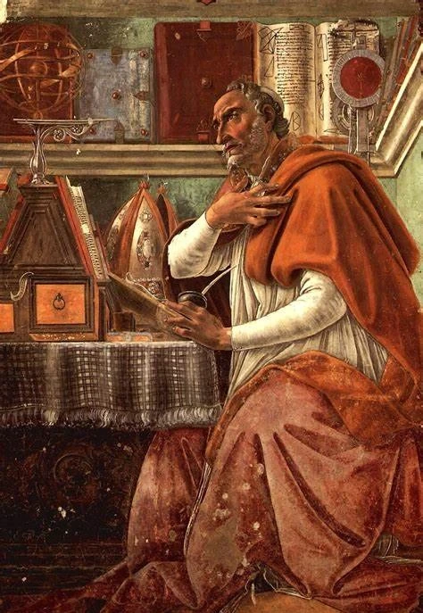

Et même si la responsabilité du mal causé par un tremblement de terre, un virus meurtrier ou le fait qu’un enfant naisse aveugle ne devrait pas être attribuée aux hommes, cette manière de penser se tient en donnant à la nature une intention morale qui les rend responsables. Par exemple, en considérant que si un tremblement de terre a eu lieu, c’est précisément parce que les hommes se seraient mal comportés. 
C’est l’idée défendue par les religieux selon laquelle les hommes naissent pécheurs, coupables du péché originel.
Évidemment, vous vous en doutez, cette idée est démontée en pièces par Spinoza qui considère que, comme la Nature, Dieu ou la fortune dit-il, n’est donc pas douée d’intention et que les hommes ne disposent pas du libre arbitre, la responsabilité du « mal » qu’on leur attribuerait est tout à fait illusoire. 
« Rien n’arrive dans la nature qui puisse être attribué à un vice existant en elle », écrit Spinoza dans l’Éthique et selon lui, nous nous tromperions donc en considérant, par exemple, la cécité d’un nouveau-né comme « mal » puisque quand il naît aveugle, un bébé n’est pas plus privé de la vue qu’une pierre ne le serait. 

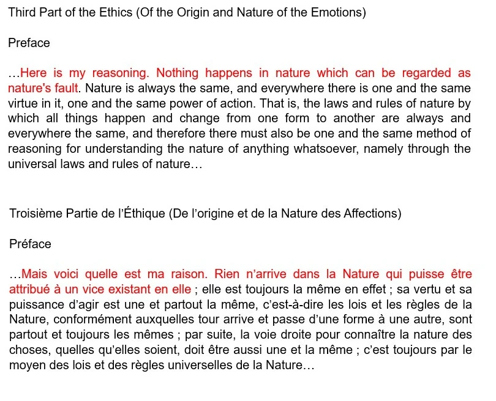

Et que si l’on pense qu’il manque la vue à l’aveugle, c’est uniquement du point de vue de ceux qui voient. 
Spinoza reprend donc cette idée selon laquelle le mal n’existe pas dans la nature mais son originalité, ce qui en fait une philosophie révolutionnaire est de considérer que le mal n’existe pas et que le « bien » non plus. 
Et c’est pourquoi il parle d’éthique plutôt que de morale en ne réfléchissant pas sur ce qui est bien ou mal puisque ce sont des notions toutes relatives et subjectives, mais plutôt en fonction de ce qui est « bon » ou « mauvais » pour notre nécessité naturelle à « persévérer dans notre être » dit-il. En d’autres termes à vivre et à grandir. À nous épanouir en tant qu’êtres humains.
En outre, en ce qui concerne la responsabilité des hommes qui se comporteraient donc mal, en commettant par exemple un crime, nous avons déjà vu que, pour Spinoza, cette manière de penser ne vise évidemment pas à les excuser.  Car les hommes, même s’ils ne connaissent pas les vraies causes qui les déterminent à commettre un crime, sont toujours conscients de ce qu’ils font et sont donc, à ce titre, responsables devant la morale et la Loi.
Il est évident que les actions, par exemple d’un criminel, sont toujours liées à un déterminisme, familial, social, économique, voire médical si ses crimes s’expliquent par une pathologie physique ou mentale. Et c’est d’ailleurs le rôle de la justice qui, au-delà du droit pénal, prend en compte le fait que certains crimes ne doivent pas seulement être punis mais aussi faire l’objet de soins, compte tenu du passé familial, social et psychologique du délinquant.
C’est la raison pour laquelle le spinoziste Gilles Deleuze (1925-1995) explique que l’éthique est en quelque sorte une éthologie, c’est-à-dire une science pratique des manières d’être, ou dit-il encore, « l’art de faire de bonnes rencontres ». 

Autrement dit, la liberté, selon Spinoza, consiste donc à orienter notre existence vers ce qui « accroît notre puissance d’agir » et, en se tournant toujours vers l’avenir avec optimisme, de regarder le monde tel qu’il est plutôt que de l’imaginer tel qu’on aimerait le voir. 
Et c’est là tout le génie de la démonstration de Spinoza qui lutte contre les docteurs de l’ignorance et contre tous ceux qui affirment qu’il est bon d’ignorer. 
Au contraire, c’est à la manière des géomètres, « more geometrico », que Spinoza va étudier les passions humaines, même les plus irrationnelles, les déchirements, la folie, la tristesse ou la mélancolie comme on étudierait les points, les lignes, les surfaces et les volumes.
Il s’agit de la théorie des affects qu’il développe dans la troisième partie de son Éthique et que je vous propose d’étudier maintenant.
Merci de votre attention et je vous retrouve dans la prochaine vidéo.

## La théorie des affects
<chapterId>3bb011ce-6f0c-51a6-b41f-25a3b5b7768e</chapterId>

:::video id=bb427cc6-e54d-4b44-bd6d-281ba421001a:::

Selon Spinoza, la liberté est donc un concept à découvrir, un chemin pour nous mener vers une vie meilleure, plus puissante. Plus libre. Un chemin qui passe par la reconnaissance du déterminisme absolu et du lien de causalité rationnelle des choses.

Son système, il le développe dans la troisième partie de l’Éthique. Il s’agit de la célèbre « théorie des affects ». 

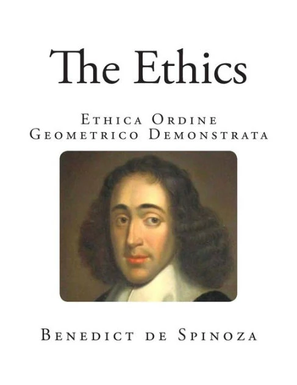

Le principe est que les affects humains sont, dit Spinoza, des modifications, actives ou passives, du corps et de la pensée qui influencent notre puissance d’agir, c’est-à-dire nos comportements. 

Or, en fonction des affects propres à la fois à la nature humaine et de ceux issus du monde extérieur, nous sommes tout à fait capables de former des idées vraies, de raisonner et d’exprimer de la joie. 

Mais nous sommes aussi capables de former des affects dits passifs, des préjugés qui nous conduisent alors mécaniquement, « malgré nous » en quelque sorte, à ne plus voir ni faire ce qu’exige notre propre intérêt. 

On parle d’esclavage, ou de servitude, c’est-à-dire d’un état qui se caractérise par l’impuissance à maîtriser et à contrarier ces affects passifs qui nous induisent parfois à vouloir ce que nous ne faisons pas et à faire ce que nous ne voulons pas.

C’est encore ce que rapporte Spinoza dans l’Éthique, quand il s’étonne que, souvent, « les hommes voient le meilleur, l’approuvent et font le pire » ou que, dit-il encore, « les hommes luttent pour leur servitude comme s’ils luttaient pour leur salut ».

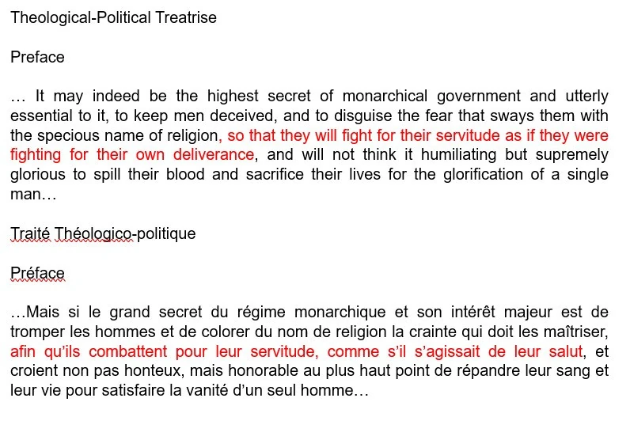

Spinoza prend ainsi l’exemple de la haine qu’il considère comme un affect passif, tourné vers la tristesse et né d’idées inadéquates, c’est-à-dire d’une connaissance partielle des causes et qu’il définit comme « une tristesse qui est associée à l’idée d’une cause extérieure ».

C’est-à-dire que, si, par exemple, on ressent de la haine vis-à-vis d’un étranger, c’est qu’on associe cet étranger à l’idée qu’on se fait de lui pour des raisons qui nous échappent puisqu’il est étranger et par nature différent. C’est cette idée de cause extérieure, idée à cause de laquelle l’ignorant aura d’ailleurs toujours mécaniquement une forte propension à dire du mal d’un concept qu’il ne connaît pas.

Ce qui est particulièrement vrai, soit dit en passant, dans le domaine des cryptomonnaies.

Or, dit Spinoza, si on supprime cette idée négative de cause extérieure, non pas par morale, mais par l’éducation, par l’empathie, par la raison, notamment en s’intéressant dans ce cas d’espèce aux qualités de cet étranger, ou dans le cas de Bitcoin, à son aspect pratique ou à son utilité, alors le sentiment de tristesse associé disparaît et, mécaniquement, de ce fait, la haine également.

Il est ici utile de rappeler que cette manière de réfléchir vaut aussi, bien sûr, pour les affects actifs et notamment pour l’amour qui est, selon Spinoza, « une joie associée à l’idée d’une cause extérieure ». Et si, par exemple, la cause extérieure de l’amour d’une chose ou d’une personne disparaît ou se modifie avec le temps, la joie qui y est associée peut aussi disparaître et éteindre le sentiment amoureux. Ce qui, quand on ne le comprend pas, peut nous rendre malheureux et déprimés.

Mais si cette théorie dite des affects vaut donc pour notre « inconscient », cette manière rationnelle de réfléchir « à la manière des géomètres » vaut aussi pour lutter contre toutes les formes de servitudes extérieures, qu’elles soient religieuses, politiques ou qu’elles soient issues de phénomènes naturels.

C’est l’exemple de la foudre. Car quand la foudre frappe et tue un innocent, l’ignorant aura tendance à y voir la main de Dieu, à considérer que la foudre exprime une intention morale et finaliste. Le Sida dans les années 90 ou même, plus récemment, la covid, ont par exemple été interprétés par certains comme une punition divine.

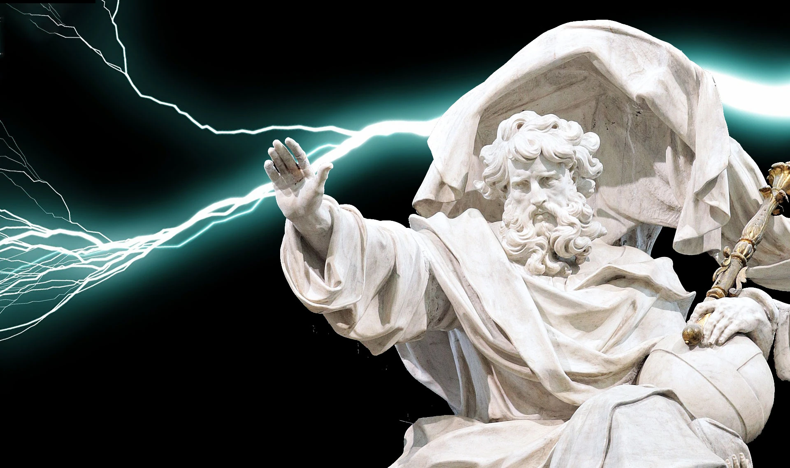

Alors que pour Spinoza, bien sûr, toutes ces idées finalistes ne sont que des superstitions synonymes d’ignorance dans la mesure où, dans cet exemple, la foudre qui frappe ne fait, dit-il, qu’exprimer l’essence de sa propre nature. Qui est de frapper. Sans bien sûr aucune intention morale de punir ou de récompenser qui que ce soit.

Grâce à cet exemple simple, on comprend que la seule solution pour se protéger de la foudre, autrement dit pour se libérer de cette servitude que son danger nous fait courir depuis toujours, n’est pas de se plaindre de notre mauvaise fortune ou d’une prétendue injustice divine, ce n’est pas non plus de faire valoir le moindre argument moral, non, c’est plutôt, là encore, comme pour la haine, de réfléchir à ce que l’on peut faire d’un point de vue éthique.

Et, en l’espèce, ce serait de se protéger de la foudre en étant rationnel, dans un esprit ouvert au progrès, curieux et confiant par ce que la science peut nous offrir et d’installer, pourquoi pas, un paratonnerre.

Voilà ce qu’il y a de génial dans l’Éthique. Spinoza nous montre qu’il est donc possible de passer de la servitude volontaire, d’un « malgré nous » et d’une vie de girouette d’aliénations perpétuelles à une vie vécue par la connaissance des affections et des déterminations. 

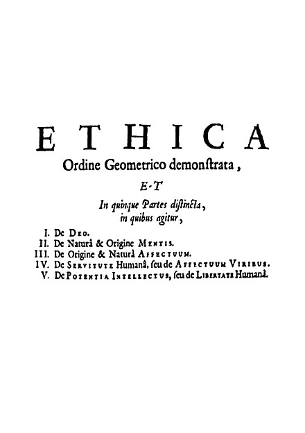

C’est une manière de réfléchir qui permet de disséquer la nature humaine afin de voir le bon côté ou la vérité des choses. D’éliminer les motifs de tristesse et de crainte qui nous accablent. D’être libre, autrement dit capable de ne plus obéir aux passions tristes et de changer de comportement. 

Et de comprendre, probablement pour la première fois dans l’histoire de la philosophie, que l’on peut être lucide et heureux. 

Et c’est la raison pour laquelle on dit souvent du spinozisme qu’elle est « la philosophie de la joie ».

## La liberté, l’école autrichienne d’économie et la philosophie des cypherpunks 

<chapterId>b54f2532-460c-11f0-a248-93ff24ef1d57</chapterId>

:::video id=5f49d5b4-e15f-475b-b40d-07464c08ca4d:::

Vous le savez maintenant, la liberté selon Spinoza est donc une prise de conscience de notre déterminisme. Sous la conduite de la raison et grâce à notre capacité d’agir, nous pouvons ainsi comprendre le mécanisme causal des servitudes afin de lutter contre elles, ne plus les subir, et ne plus agir contre nos propres intérêts. 

Cette lucidité consiste finalement à ne plus vivre dans le nihilisme que décrira plus tard Friedrich Nietzsche (1844-1900) pour qui les hommes se perdent dans des idéaux idéologiques, c’est-à-dire des fictions politiques ou religieuses, à cause desquelles ils nient le réel, s’infantilisent et se rendent malheureux. 

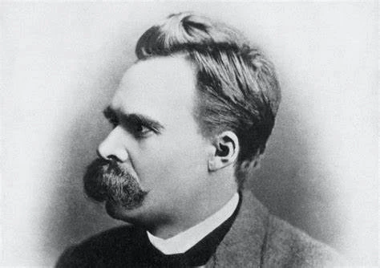

C’est précisément le propos de la philosophie rationnelle des Lumières, et notamment grâce à Emmanuel Kant (1724-1804) pour qui seul un individu éduqué, sous la conduite de la raison, peut penser par lui-même et déterminer, dans une démarche éthique, ce qui est « vrai », ou « bon », et ce qui est toxique. 

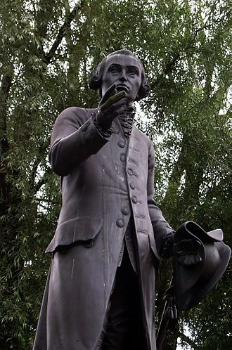

En d’autres termes, dit-il, si nous pensons par nous-mêmes, si nous raisonnons en adulte rationnel et si nous nous évertuons, de ce fait, à nous attacher aux liens de causalité des choses, nous n’aurons plus besoin d'une autorité morale pour nous enseigner, par exemple, les vraies vertus de la religion ou les vraies valeurs éthiques dans les domaines politiques et économiques. 
Un raisonnement qui fera le lien avec l’école d’économie libérale autrichienne née dans l’atmosphère intellectuelle extrêmement fertile de Vienne avant la première guerre mondiale. Car c’est dans ce contexte que des intellectuels comme Carl Menger (1840-1921), Ludwig von Mises (1883-1979) et Friedrich Hayek (1899-1992) vont poser les bases d’une nouvelle école d’obédience libérale à l’origine des convictions des cypherpunks à venir. Et donc de la création de Bitcoin.

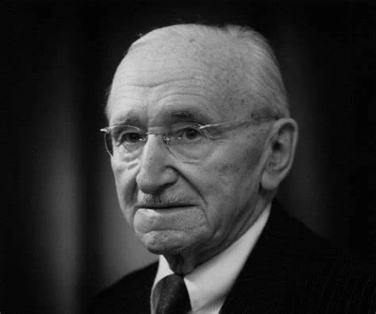

Menger et Mises établissent par exemple que toute connaissance doit se construire en fonction du lien de causalité des choses et ils proposent ainsi une nouvelle conception causale de l’économie. Notamment inspirés par l’esprit libéral développé quelques années auparavant par l’économiste français Frédéric Bastiat (1801-1850). 

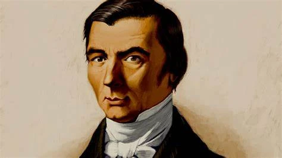

Hayek, lui, considère que toutes décisions économiques expriment toujours une forme d’incertitude et d’ignorance et que le fait de ne pas la subir à cause de la morale, de croyances, de préjugés ou d’idéologies politiques, permet d’analyser correctement le comportement économique et, par extension, d’envisager ce qui est bon pour les individus, pour la société et pour l’État. 
C’est ainsi que ces économistes autrichiens libéraux vont critiquer fermement toute idée socialiste, Hayek parle de « planisme », et toutes politiques morales qui s’en inspirent et ne conduisent, selon lui, qu’à la ruine. Donner le pouvoir économique aux gouvernements, forcément en retard d’informations et en décalage sur ce qu’il faut faire, ou pas est voué, selon eux, à l’échec.
Par exemple, les Autrichiens considèrent que quand un État se donne, par la contrainte, le pouvoir de créer de l’argent pour gérer l’économie et résoudre les crises, le risque est qu’il n’est dès lors jamais plus capable de ne pas abuser de ce pouvoir. 

Pourquoi ? Parce qu’il se retrouve alors toujours  dans une forme de servitude qui l’en empêche et le pousse donc, dirait Spinoza « à voir le meilleur, à l’approuver… mais à faire le pire ».
Or, en bon spinoziste, Hayek explique justement dans une vidéo que « comme ce pouvoir ne peut lui être retiré sans violence, tout ce que l’on peut, c’est le faire grâce à une astuce et introduire un nouveau concept de monnaie que les gouvernements ne pourraient plus arrêter ». Un argument que reprendra Milton Friedman (1912-2006) dans une interview dans laquelle il évoque à son tour cette nouvelle forme de monnaie numérique dans le contexte de l’internet naissant.

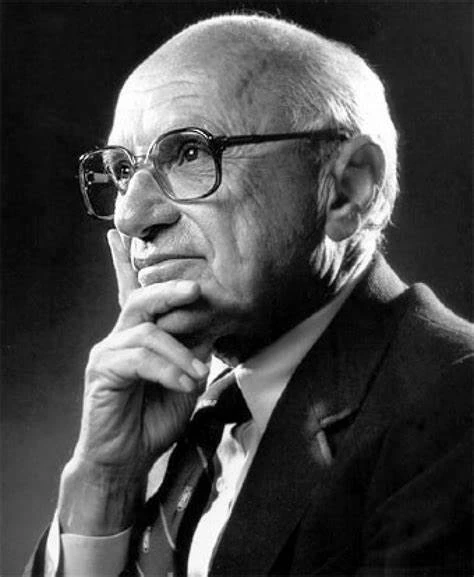

Et ce sont bien ces arguments politiques et économiques défendus par les premiers cypherpunks, Eric Hughes (1953-), dans son « manifeste du cypherpunk », ou encore Timothy May (1951-2018) dans son « manifeste crypto anarchiste » et que va reprendre Satoshi Nakamoto. 

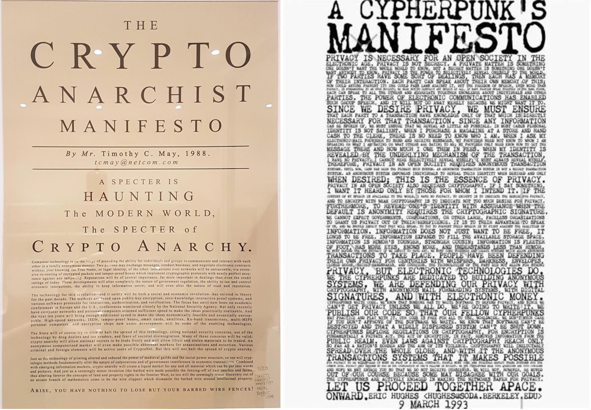

Notamment lorsqu’il inscrit le titre du Times du 3 janvier 2009 dans le coinbase du bloc genesis de la Blockchain Bitcoin pour illustrer la fin d’une époque, keynésienne, et le début d’une autre époque aux aspirations libérales, anarchistes et libertariennes.

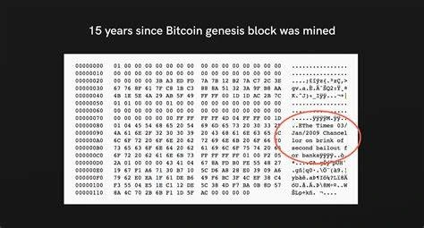

Le White Paper publié le 31 octobre 2008 présente ainsi Bitcoin comme un moyen d’échanger de la valeur sur internet sans tiers de confiance, en se fondant sur un protocole décentralisé. Une révolution « copernicienne » qui permet enfin aux hommes de retrouver leur capacité d’agir, c’est-à-dire leur liberté, leur liberté d’échanger, leur droit de propriété et le respect de leur vie privée. 
Pourquoi ? Car Bitcoin permet de nous extraire de cette servitude à la façon de Spinoza, grâce à la raison, grâce au langage de Galilée que sont les mathématiques. Et comme le suggère Hayek, sans que les État puissent s’y opposer. Et de façon pacifique, sans contrainte et donc sans prosélytisme.

C’est d’ailleurs le dernier parallèle que je ferai entre le spinozisme et Bitcoin pour montrer qu’il ne sert à rien de convaincre quiconque n’adhère pas à un concept copernicien ou disruptif autrement que par la raison, l’entendement, la curiosité ou la bonne volonté. 

À rien et surtout pas par la contrainte, ni par la violence. Car le fait est que Copernic, Galilée, Newton, Darwin, Einstein, Hayek, Spinoza ou Satoshi Nakamoto n’ont ainsi jamais menacé quiconque ne croyait pas en leurs idées et en leurs démonstrations. 

# Section finale

<partId>70a5a3c8-6c88-11f0-8753-db07e26dcaf4</partId>

## Avis & Notes

<chapterId>7945c38c-6c88-11f0-a73f-0f7cdf99f53f</chapterId>
<isCourseReview>true</isCourseReview>

## Examen final

<chapterId>a557fd32-6c88-11f0-96ff-cfa532cf76a0</chapterId>
<isCourseExam>true</isCourseExam>

## Conclusion

<chapterId>ae04ab38-6c88-11f0-a496-3be47119e6b6</chapterId>
<isCourseConclusion>true</isCourseConclusion>

