# Ketika Spinoza Bertemu Satoshi

Temukan bagaimana ide-ide radikal filsuf abad ke-17 Baruch de Spinoza tentang kebebasan, akal, dan kekuasaan mengantisipasi revolusi desentralisasi Bitcoin. Kursus ini mengungkapkan kesamaan yang mencolok: keduanya menolak iman buta dan otoritas pusat, keduanya menggunakan ketegasan matematis untuk membebaskan. Spinoza membebaskan pikiran dari dogma agama, Bitcoin membebaskan uang dari kontrol negara.

Pelajari alat-alat praktis dari etika Spinoza untuk memahami fondasi filosofis bitcoin dan meningkatkan agensi Anda. Siap untuk menjelajahi dua instrumen emansipasi manusia terbesar dalam sejarah?
+++
# Pendahuluan

<partId>80b76189-afab-5295-a8d3-ba8f6fe7a5e8</partId>

## Pengenalan kursus

<chapterId>99af4992-fd6c-5142-b168-d927b251574b</chapterId>

:::video id=1def60bc-1d39-4e49-9b08-fd05b7a0d49b:::

Dalam kursus ini, saya dengan senang hati menyajikan filosofi Baruch de Spinoza (1632-1677), filsuf abad ke-17 yang terkenal dan dianggap sebagai bapak filsafat Pencerahan yang rasional.

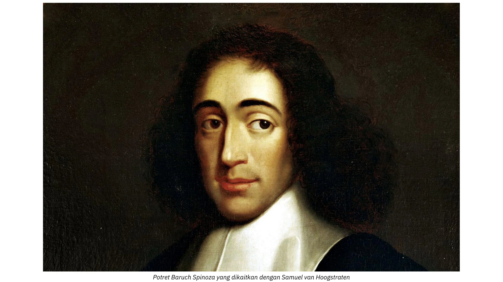

Potret Spinoza

Kursus-kursus ini didasarkan pada dua esai saya tentang topik ini, "Agama Sejati Spinoza" dan "Bitcoin, Injil Kebebasan", yang tersedia dalam bentuk kertas baik secara online maupun langsung dari situs web saya, dan secara digital di Amazon Kindle.

Tujuan dari kursus ini adalah, pertama-tama, untuk memberikan pemahaman yang disederhanakan tentang filosofi yang sering dianggap sangat kompleks dan tidak dapat diakses, meskipun minatnya terus meningkat saat ini.

Memang, filosofi ini memungkinkan kita untuk tidak hanya mempertanyakan makna dari segala sesuatu ketika segala sesuatunya berjalan tidak sesuai dengan harapan, yang pada umumnya merupakan inti dari agama, filosofi, dan ilmu-ilmu manusia, tetapi juga, dan mungkin sebagian besar, mempertanyakan diri kita sendiri ketika segala sesuatunya berjalan dengan baik.

Ketika hidup tersenyum pada kita dan kita merasa tidak perlu mempertanyakan diri kita sendiri, dengan kebanggaan yang dianggap sebagai ilusi dan perbudakan bahwa kebahagiaan kita, atau kesuksesan kita, hanya akan datang dari bakat, pekerjaan, atau pilihan yang seharusnya bebas; singkatnya, dari kehendak bebas kita sendiri, bukan dari determinisme yang kita alami.

Dengan cara ini, kita dapat membuat hubungan antara filosofi praktis kebebasan - atau, seperti yang dikatakan Spinoza, "menuju cara untuk mencapainya" - dan dunia teknologi baru yang kita minati di sini, crypto secara umum dan Bitcoin pada khususnya.

Dan khususnya dalam aspek filosofisnya, yang membuat kami merefleksikan secara tepat gagasan kebebasan: kebebasan untuk berpikir, mengekspresikan diri, menghormati privasi dan, tentu saja, dalam kasus kami, kebebasan untuk Exchange.

Pertama, saya akan memperkenalkan Anda pada Spinoza, karakternya, latar belakang sosial, agama, dan keluarganya, serta konteks historis dari United Provinces di mana ia tinggal.

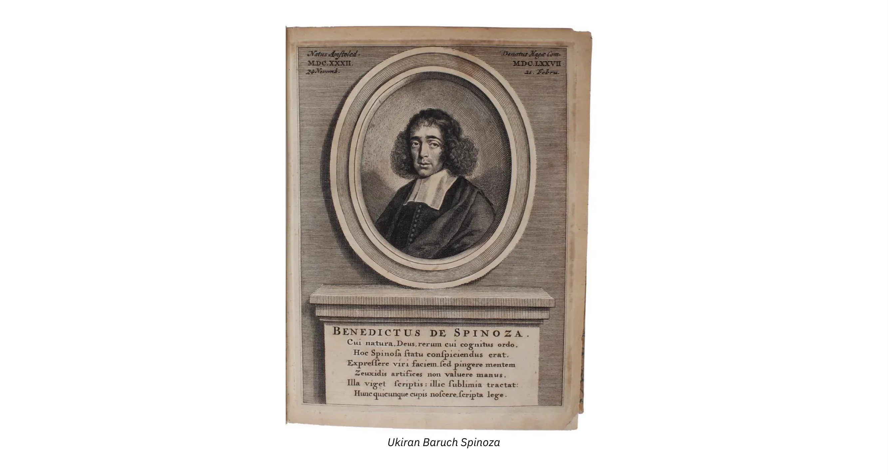

Potret Spinoza

Kita kemudian akan melihat apa yang dimaksud dengan filosofi rasional baru yang menyatakan bahwa "tidak ada sesuatu pun di alam ini yang tidak dapat dijelaskan tanpa penggunaan akal".

Ini adalah gagasan bahwa kita hanya dapat memahami dunia dan sifat manusia dalam hal hubungan sebab akibat antara berbagai hal, yang menurutnya, sebuah efek selalu memiliki penyebab, dan penyebab ini sendiri adalah efek dari penyebab lain dan seterusnya, semua kembali ke penyebab pertama, yang tidak dapat kita akses dan, menurut Spinoza, adalah Alam.

Alam, dengan kata lain Tuhan, adalah "Deus sive Natura" yang terkenal dalam bahasa Latin yang menggambarkan seluruh makna Spinozisme.

Kita juga akan melihat dua karya utama Spinoza, dimulai dengan Etika, yang diterbitkan secara anumerta pada tahun 1677, yang sepenuhnya berfokus pada kebebasan dan kebutuhan untuk membebaskan diri kita sendiri dari penghambaan yang membelenggu kita.

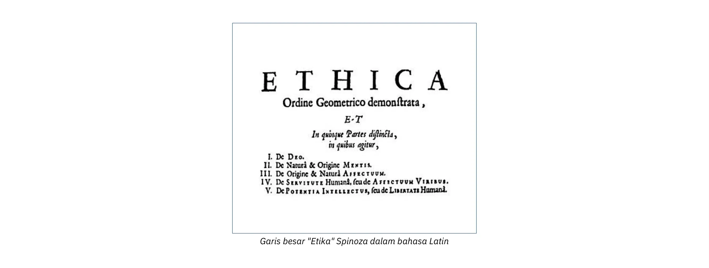

Kemudian kita akan melihat Traité théologico-Politique, yang diterbitkan semasa hidupnya pada tahun 1670, yang memungkinkan kita untuk melihat kebebasan dari sudut pandang lain: kebebasan berpikir dan berkeyakinan. Dengan kata lain, kebebasan beragama, tetapi di atas semua itu adalah kebebasan politik.

Terakhir, kita akan melihat mengapa Spinozisme adalah revolusi ide Copernicus, dan bagaimana ia mewakili definisi baru tentang dunia dan sifat manusia, dengan mempelajari 3 ilusi mendasar yang dikecam oleh Spinoza: ilusi kehendak bebas, ilusi sebab-sebab final atau finalisme, dan ilusi teologis.

Berkat teori pengaruh yang dikembangkan dengan cara para ahli geometri, "lebih geometris", kita akhirnya akan melihat bagaimana Spinoza menawarkan kepada kita metode praktis untuk membebaskan diri kita sendiri, atau berusaha membebaskan diri kita sendiri, dari perbudakan yang melekat pada sifat manusia dan hasrat eksternal. Sebuah mekanisme rasional yang, untuk melawan ketidaktahuan, dapat dibandingkan dengan kepastian bahwa tiga sudut segitiga selalu sama dengan 180°, dan akan memungkinkan kita untuk menghubungkan semangat Pencerahan yang dihasilkan darinya dengan arus liberal abad ke-19 atau libertarianisme abad ke-20, yang secara langsung terkait dengan penemuan Satoshi Nakamoto, Bitcoin.

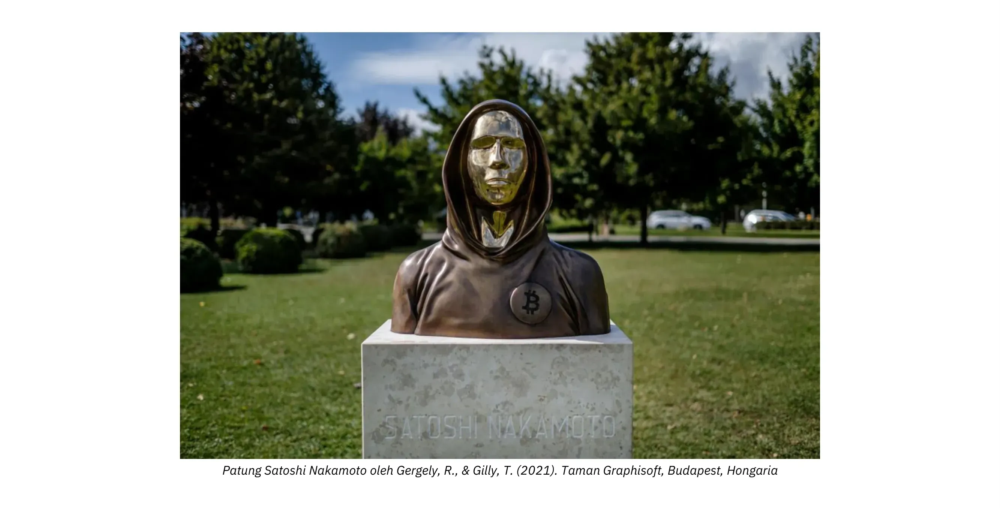

Kita kemudian akan memahami bahwa, di antara banyak kesamaan antara konsep-konsep Spinozis dan alat kebebasan yang ditemukan oleh Satoshi Nakamoto ini, yang pertama adalah bahwa, dalam kedua kasus tersebut, jika kita ingin tahu, berniat baik, seperti yang dikatakan pada saat itu, memiliki "pemahaman", maka kita tidak bisa tidak mematuhinya. Dan jika kita tidak mematuhinya, yang tentu saja merupakan hak kita yang paling absolut karena sangat penting untuk menghormati kebebasan untuk percaya, atau tidak percaya, maka kita akan bertekad untuk tidak dapat, atau tidak ingin, yang sama saja.

Dan begitulah cara kita memahami bahwa seorang fundamentalis agama, misalnya, tidak akan pernah bisa menerima, atau mendengarkan pemikiran Copernicus sekecil apa pun seperti Spinozisme, seperti halnya seorang bankir bank sentral yang akan sulit menerima Bitcoin.

Meskipun, seperti yang Anda ketahui, saat ini segala sesuatunya bergerak ke arah yang benar.

## Memperkenalkan Baruch de Spinoza

<chapterId>f53a9cfd-326e-5b73-a766-3ef2f07c5a49</chapterId>

:::video id=5fac3ddc-c472-4c64-8186-46a8f317e389:::

Siapakah Baruch de Spinoza? Dia adalah seorang filsuf Belanda yang lahir pada tahun 1632 dan meninggal pada tahun 1677 pada usia 45 tahun.

Beragama Yahudi, ia adalah anggota komunitas Sephardic Portugis keturunan Marranos yang dipaksa meninggalkan Spanyol oleh Katolik pada abad ke-15. Ia dibesarkan dalam lingkungan religius dan intelektual, yang sadar akan arti dianiaya.

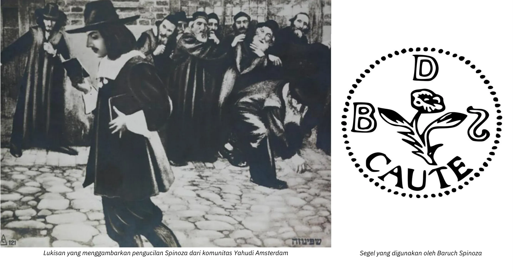

Bahkan, sejak usia dini, ia menunjukkan semangat kritis yang kuat terhadap agama yang mapan, dan khususnya terhadap komunitas Ibrani, di mana ia ditolak dengan keras pada tahun 1656, saat berusia 24 tahun, sebelum ia sempat menerbitkan apa pun.

"Pengucilan" ini, konon, memungkinkannya untuk mengasingkan diri dan fokus pada pekerjaannya tanpa pernah menoleh ke belakang.

Sebagai pewaris, seperti rekan sezamannya Descartes (1596-1650), Pascal (1632-1662) dan Newton (1643-1727), dari ide-ide rasional baru dalam fisika Copernicus (1473-1543), Kepler (1571-1630) dan Galileo (1564-1642), yang mendahuluinya beberapa tahun, Spinoza mengembangkan cara berpikir dengan cara para ahli geometri, sesuai dengan prinsip Galileo bahwa matematika adalah bahasa alam semesta.

Namun, ini adalah ide-ide yang sangat berbahaya pada saat itu, setelah pengadilan biarawan dan filsuf Giordano Bruno (1548-1600), yang dibakar hidup-hidup karena dianggap sesat di sebuah alun-alun di Roma, dan pengadilan Galileo, yang dipaksa oleh inkuisisi pada tahun 1633 untuk meninggalkan keyakinan heliosentris Copernicus.

Inilah sebabnya mengapa visinya yang sangat rasional tentang dunia dan sifat manusia, berdasarkan hubungan sebab-akibat antara berbagai hal, membuatnya mendapatkan reputasi sebagai seorang ateis, dan hingga saat ini, masih dianggap sebagai seorang ateis.

Faktanya, karya Spinoza hanya berbicara tentang Tuhan, yang ia identifikasikan dengan Alam, dan sementara ia mengkritik dorongan takhayul orang-orang religius dan teokratis, ia menunjukkan bahwa agama yang benar baginya di atas segalanya identik dengan keadilan dan amal.

Dan pendekatan inilah yang menghubungkan Spinoza dengan filosofi Pencerahan, baik Jerman, dengan Leibniz (1646-1716), Kant (1724-1804), Schopenhauer (1788-1860) dan Nietzsche (1844-1900), Inggris dengan Locke (1632-1704), atau Prancis dengan Voltaire (1694-1778), Rousseau (1712-1778), dan Diderot (1713-1784). Semua sepakat bahwa akal sehat harus digunakan untuk memerangi ketidakjelasan, terutama ketidakjelasan agama, untuk memerangi ketidaktahuan dan untuk mempertahankan cita-cita kebebasan dan kemajuan.

Sekarang, untuk mulai menghubungkan filosofi ini dengan Bitcoin, penting untuk dicatat bahwa Spinoza lahir di era yang sangat khusus.

Pada abad ke-17, United Provinces bukan hanya negara yang paling bebas di dunia dalam hal politik dan agama, tetapi juga paling kaya. Dengan kata lain, negara yang paling maju secara ekonomi dan teknologi.

Akan tetapi, kekayaan tidak terkait dengan sumber daya alam, eksploitasi dan penghancuran wilayah jajahan atau perbudakan, tetapi dengan perdagangan dan perdagangan internasional dalam semangat kewirausahaan yang liberal. Semangat yang kemudian diperjuangkan oleh seorang Spinozist terkenal, Voltaire (1694-1778), yang dalam ruang perdagangan, seorang pengusaha atau wirausahawan yang menganut paham liberal tidak akan pernah dikucilkan, disebut kafir atau dikucilkan, katanya, berdasarkan agama atau asal-usulnya, tetapi hanya jika dia bangkrut.

Terlebih lagi, Belanda pada saat itu juga maju dalam bidang teknologi utama, misalnya dalam bidang mekanika dan optik. Teleskop astronomi yang digunakan oleh Galileo untuk melihat langit dan menemukan alam semesta memang dianggap sebagai teknologi mutakhir pada masanya, begitu juga dengan teknologi baru yang terkait dengan komputasi, kecerdasan buatan, dan tentu saja, kripto saat ini.

Dan karena Spinoza sendiri mempraktikkan perdagangan memoles lensa astronomi - ironisnya untuk seseorang yang dikatakan telah melihat segala sesuatu secara miring - kita dapat membayangkan bahwa dia pasti akan mendukung alat kebebasan seperti Bitcoin.

Dengan kata lain, nilai-nilai kebebasan dan kemajuan yang disampaikan oleh Spinozisme sangat kontras dengan dunia di mana fundamentalisme agama, teori konspirasi, takhayul, dan yang terpenting, ketidaktahuan masih menjadi kenyataan yang menyedihkan.

Namun, ini adalah dunia di mana segala cara berharga untuk melarikan diri, untuk membebaskan diri kita dari perbudakan yang mengurung kita, dan untuk bebas dengan menerima dunia apa adanya, bukan seperti yang kita inginkan.

Entah cara-cara ini bersifat filosofis atau teknologi, seperti yang akan kita lihat nanti, Bitcoin adalah alat kebebasan. Ini adalah alat yang memungkinkan individu dan negara untuk membebaskan diri mereka sendiri dari perbudakan, terutama perbudakan moneter.

# Karya-karya besar, Etika dan politik

<partId>d7d7e9a1-005b-519c-b587-137435e46344</partId>

## Etika dan pencarian kebebasan

<chapterId>4cc66e25-335c-591d-9b78-83e5664bbbbc</chapterId>

:::video id=065c5091-69e1-412f-acce-c763ec31d3b1:::

Dalam bab ini, saya mengusulkan agar kita beralih ke karya utama Spinoza yang berjudul Etika, yang diterbitkan secara anumerta pada tahun 1677.

Mengapa secara anumerta? Yah, karena ide-idenya revolusioner, atau setidaknya berlawanan dengan intuisi dan mengganggu, dan karena itu sangat berbahaya pada saat itu, bahkan dalam konteks liberal di Provinsi Bersatu pada abad ke-17.

Etika adalah karya yang ditulis dalam bahasa Latin dengan gaya geometris, mungkin terinspirasi oleh semangat ilmiah Galileo (1564-1642), bapak ilmu pengetahuan modern, bersama dengan Kepler (1571-1630), yang menurutnya matematika adalah bahasa alam semesta. Spinoza mengembangkan ide-idenya dalam lima bagian utama, menggunakan proposisi yang disertai dengan demonstrasi, scolia, aksioma, dan definisi.

Dengan demikian, Etika adalah, dalam kata-kata Spinoza, "cara untuk mencapai kebebasan atau jalan menuju kebebasan", dan bukan sebuah buku yang dapat dibaca dari sampul ke sampul, melainkan buku yang dapat dikerjakan dengan membaca, misalnya, satu proposisi yang mengacu pada proposisi lain, yang pada gilirannya dipahami melalui proposisi ketiga, dan seterusnya, dalam sistem yang koheren, rasional dan logis.

Saya ingin menunjukkan bahwa ketika Anda membuka Etika, disarankan untuk memulai dengan postfaces dan lampiran, bagian-bagian pendek ini ditulis oleh Spinoza dalam bahasa sehari-hari, sehingga mudah dimengerti dan, di satu sisi, merupakan ringkasan pemikirannya yang terkadang rumit.

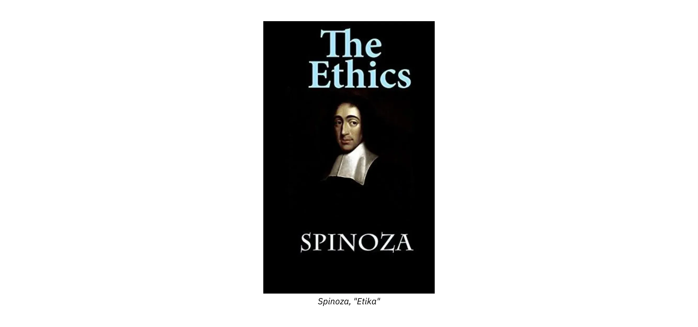

Dengan menundukkan dunia di sekitar kita pada "mikroskop nalar", karya Spinoza membedah sifat dasar manusia dengan prinsip bahwa manusia tidak disebabkan oleh dirinya sendiri, yaitu bahwa kita tidak meminta untuk dilahirkan, baik di sini, maupun di zaman kita, atau dengan atribut fisik atau intelektual.

Dan dia mengatakan bahwa kita tidak berada di atas alam. Kita tidak terbebas dari hukum-hukumnya, baik secara jasmani maupun rohani. Dengan kata lain, kita adalah bagian dari alam seperti halnya makhluk hidup lainnya, baik hewan maupun tumbuhan.

Bagi Spinoza, semua bidang aktivitas manusia bergantung pada kapasitas akal untuk memahami dunia dalam sebuah sistem yang koheren dan ditentukan secara sempurna.

Dunia di mana kesempatan tidak ada.

Segala sesuatu yang terjadi adalah "perlu" dan merupakan hasil dari suatu sebab, sesuai dengan gagasan bahwa "apa yang ada dan apa yang terjadi, pasti dan harus terjadi". Ini adalah determinisme absolut.

Tetapi ada dua hal yang perlu diingat:

Pertama, jika kebetulan tidak ada bagi Spinoza, itu karena itu adalah peristiwa yang penyebabnya tidak kita ketahui. Namun, tentu saja, katanya, hanya karena kita tidak tahu penyebabnya, bukan berarti penyebabnya tidak ada.

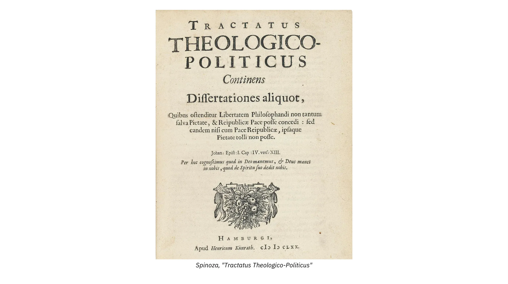

Kedua, sama sekali tidak ada pertanyaan tentang fatalisme, karena alam tidak diberkahi dengan niat. Petir, misalnya, tidak berniat menghukum siapa pun, seperti yang mungkin dipikirkan orang dalam kasus tragedi. Tidak, itu hanya mengekspresikan esensi dari sifatnya sendiri, yaitu menyambar dengan petir. Menyambar.

Dengan demikian, Spinoza membela gagasan bahwa realitas, yaitu kehidupan sehari-hari dengan aspek baik dan buruknya, dapat dipahami dengan sempurna, dan bahwa tidak ada fenomena di alam yang tidak terkait secara kausal. Tentu saja, hal ini menimbulkan pertanyaan tentang kejahatan, terutama kejahatan absolut, yang akan kita bahas nanti.

Terakhir, penting untuk dicatat bahwa etika bukanlah moralitas.

Menurut Gilles Deleuze (1925-1995), profesor filsafat terkenal dan spesialis Spinoza, moralitas adalah sistem penilaian yang berguna untuk hidup dalam masyarakat. Namun, ini adalah sistem yang subjektif, karena apa yang benar di sini bisa jadi salah di tempat lain, dan apa yang salah hari ini bisa jadi benar di kemudian hari.

Dan alih-alih menentukan apa yang benar atau salah, etika menetapkan apa yang baik atau buruk bagi sifat dan kapasitas kita, kata Spinoza, untuk melestarikan keberadaan kita. Untuk menjadi bebas. Oleh karena itu, etika adalah sebuah etologi sejati, yaitu ilmu tentang cara-cara berada, atau, seperti yang dijelaskan lebih lanjut oleh Gilles Deleuze, seni untuk membuat perjumpaan yang baik.

Atau seni membuat pilihan yang tepat untuk melepaskan diri kita dari penghambaan yang mengurung kita dan karena itu, menurut Spinoza, manusia sering kali direduksi menjadi "melihat yang terbaik, menyetujuinya, dan melakukan yang terburuk".

Dengan kata lain, "memperjuangkan perbudakan mereka seolah-olah mereka memperjuangkan kebebasan mereka".

## Risalah Teologis-Politis

<chapterId>84b0187e-1050-5d44-a536-80554896e828</chapterId>

:::video id=c1efc97e-1e96-4b37-894c-9a19794d6b52:::

Setelah Etika, saya ingin memperkenalkan Anda pada karya besar lainnya dalam bab ini yang akan membantu Anda memahami pengaruh filosofis dan politis Spinoza, terutama pada Pencerahan yang akan datang dan pada aliran-aliran liberal, dan dalam kasus kita, aliran libertarian.

Ini adalah Traité théologico-politique, atau TTP, yang diterbitkan secara anonim pada tahun 1670.

Spinoza (1632-1677) menulis buku ini di sela-sela penulisan Etika, sebagai upaya untuk mengakhiri kesalahpahaman yang masih ada sampai sekarang. Yaitu keyakinan bahwa ia adalah seorang ateis.

Seperti yang telah kita lihat, konsep Spinoza tentang Tuhan adalah subjek dari seluruh bagian pertama dari Etika, di mana ia menunjukkan tidak hanya keberadaan Tuhan tetapi juga apa sifat aslinya.

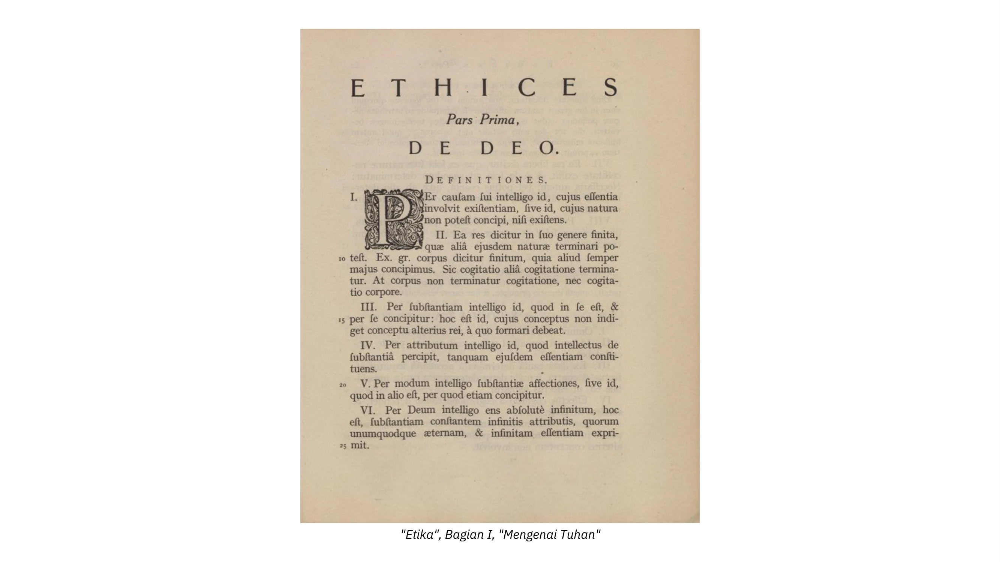

Dan karena konsep-konsep Spinoza pada umumnya cukup sulit untuk dipahami, seringkali lebih mudah untuk memahaminya dengan mengatakan apa yang bukan merupakan konsep tersebut, daripada mencoba untuk mengatakan apa itu konsep tersebut. Sebuah pendekatan yang, secara kebetulan dan seperti yang akan kita lihat nanti, sangat berguna untuk memahami Bitcoin.

Dengan cara inilah Spinoza menunjukkan kepada kita bahwa Tuhan, dalam pandangannya, bukanlah makhluk antropomorfis yang diberkahi dengan niat, menghukum atau memberi hadiah, kepada siapa kita akan berbicara dan yang akan mendengarkan kita sesuai dengan ritual yang mungkin kita ikuti atau tidak kita ikuti. Dengan kata lain, menurutnya, Tuhan bukanlah seorang pria tua berjanggut putih panjang yang bersembunyi di balik awan yang akan menyelesaikan kesulitan dunia dan membuat kita bergantung padanya.

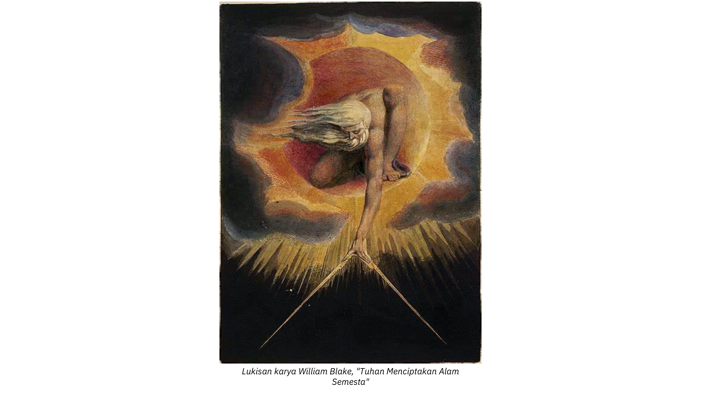

Jadi, berbicara tentang Tuhan berarti membangkitkan Alam sebagai Zat yang unik, tak terbatas, dan abadi, yang terdiri dari sejumlah atribut yang tak terbatas, di mana kita sebagai manusia hanya mengetahui dua di antaranya: materi, atau luasnya, dan pikiran.

Ini adalah "Deus Sive Natura" yang terkenal, yang darinya Spinoza memperoleh konsep determinisme absolut dan gagasan bahwa manusia bukanlah penyebab dirinya sendiri dan tidak berada di atas Alam, dan tentu saja tidak berada di atas hewan.

Namun, di luar kritik terhadap agama, TTP merupakan kesempatan bagi Spinoza untuk melontarkan kritik keras terhadap kaum religius, dan teokrasi. Dengan kata lain, kekuatan agama menumbuhkan rasa takut dan takhayul, dan menurutnya, mengaktifkan hasrat menyedihkan individu untuk memperbudak mereka dengan lebih baik, menjebak mereka dalam khayalan, fanatisme, dan perang.

Dalam tahap agama yang utama dan kekanak-kanakan ini, orang-orang percaya menjadi terikat hanya pada pemujaan eksternal dan iman yang penuh kepercayaan berdasarkan prasangka. Tahap di mana agama menjadi tidak toleran secara mekanis, menyimpang dari batas-batas ajaran moralnya, dan berpaling dari panggilannya untuk mempromosikan perdamaian dan keharmonisan dengan mengklaim memegang kebenaran.

Namun, ketika kita bergerak melampaui kritik rasional terhadap agama, misalnya dengan menafsirkan Alkitab, Spinoza ingin meyakinkan kita bahwa visi baru tentang Tuhan ini sepenuhnya sesuai dengan pesan-pesan keadilan dan amal dari tiga agama besar dalam Kitab Suci, yang menetapkan aturan emas yang sederhana namun sering dilupakan: "Kasihilah sesamamu manusia seperti dirimu sendiri".

Namun, bukan hanya itu saja.

Visi agama yang matang yang dikembangkan dalam TTP ini disertai dengan dimensi politik, yaitu perlunya memisahkan agama dan negara untuk melindungi kebebasan berpikir dan berkeyakinan, demi kepentingan semua individu dan negara itu sendiri.

Pada dasarnya, Spinoza menjadikan kebebasan, dalam kerangka nalar, sebagai syarat mutlak bagi manusia untuk hidup tanpa diperbudak oleh kekuasaan yang bertentangan dengan kepentingannya, dan oleh karena itu ia membela demokrasi langsung yang didasarkan pada kebebasan politik dan agama.

Dengan kata lain, kebebasan berpikir dan berkeyakinan, sehingga orang dapat membebaskan diri dari perbudakan dan dari keyakinan yang salah dan kekanak-kanakan, untuk bernalar sebagai orang dewasa, mengutamakan nalar dan juga, sejauh yang kami ketahui, kemajuan teknologi.

Gempa bumi yang terkenal di Lisbon pada tanggal 1 November 1755, menunjukkan pergeseran besar dalam cara orang berpikir tentang peristiwa alam dan bencana, dan tentang bagaimana melindungi diri mereka sendiri dari bencana tersebut.

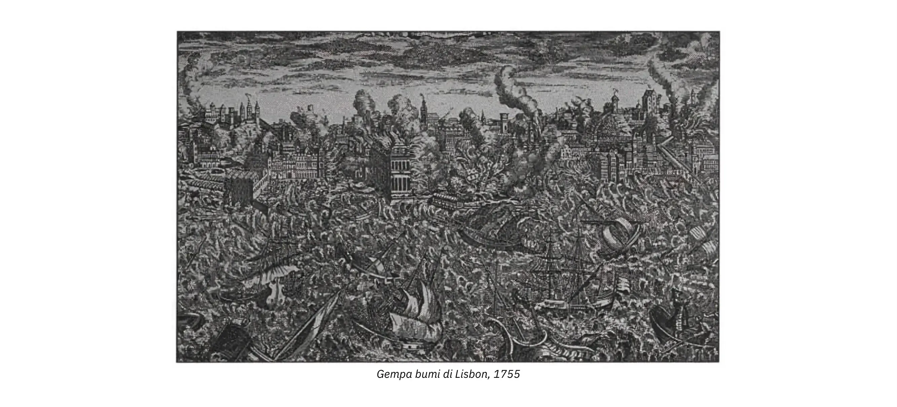

Gempa bumi yang mengerikan ini menghancurkan kota dan menewaskan ratusan ribu orang tak berdosa, banyak di antaranya sedang berada di gereja pada saat itu karena bertepatan dengan Hari Semua Orang Kudus, yang menambah kebingungan para penyintas.

Sebuah drama yang menghidupkan kembali pertanyaan yang diajukan oleh filsuf dan matematikawan Jerman, Leibniz (1646-1716), mengenai visi antropomorfis tentang Tuhan yang memiliki kehendak, kebaikan, dan kemahakuasaan. Karena jika Tuhan itu baik, seperti yang dikatakan Leibniz dalam bukunya Theodicy, maka dia tidak akan mahakuasa, karena dia akan mengizinkan bencana seperti itu, dan jika dia mahakuasa, maka dia tidak akan menjadi baik, karena dia tidak dapat mencegahnya.

Jauh dari mengutuk tangan Tuhan, Jean-Jacques Rousseau (1712-1778) menulis kepada Voltaire, yang terpukul oleh ketidakadilan dan kengerian yang diderita oleh umat manusia, bahwa "alam tidak jahat dalam dirinya sendiri, dan bahwa kita tidak boleh melihat di dalamnya ada tangan ilahi yang akan menjelaskan rancangannya".

Voltaire (1694-1778), seorang Spinozist, jika memang ada, menjawab bahwa bencana alam ini seharusnya membuat kita menyadari bahwa sarana ilmiah untuk melindungi diri kita dari alam memang ada, dan bahwa tantangan pada masa itu adalah untuk bertanya apakah manusia dapat, berkat pengetahuan dan kemajuan, mengambil alih masa depan mereka dan membebaskan diri mereka dari teologi dan takhayul.

Dan sementara itu, tentu saja, bukan masalah mencegah gempa bumi, yang tidak hanya tidak dapat diprediksi tetapi juga sama sekali tidak dapat dikontrol, ini lebih merupakan masalah untuk memastikan bahwa, misalnya, rumah-rumah dibangun untuk tahan terhadap gempa bumi.

Inilah sebabnya mengapa Pencerahan abad ke-18, berkat penggunaan akal, ilmu pengetahuan dan teknologi, adalah abad kemajuan. Dengan kata lain, kemajuan sebagai alat kebebasan.

# Revolusi Spinozist, tiga ilusi

<partId>f5d45c2b-28da-527a-ab20-dd255e9a9e0d</partId>

## Definisi baru tentang Alam dan manusia

<chapterId>3e6599e3-5b29-50a8-a67d-d0386da5d65d</chapterId>

:::video id=b6d2c035-8848-4da6-9da9-be3b70be0f38:::

Dalam bab ini, saya ingin melihat sejarah gagasan, dan melihat mengapa Spinozisme dianggap sebagai revolusi gagasan Copernicus yang sebenarnya.

Berkat cara baru untuk memahami Tuhan, dengan kata lain Alam, yang ditawarkan oleh matematika, Spinoza (1632-1670) membangun pergeseran paradigma yang mendalam, dengan implikasi tidak langsung pada pandangan dunia agama dan tempat manusia di dalamnya.

Seperti halnya Nicolas Copernicus (1473-1543) yang menyatakan bahwa bumi bukanlah pusat dunia, dan Charles Darwin (1809-1882) yang menunjukkan tiga abad kemudian bahwa manusia bukanlah pusat "kehidupan", demikian pula Spinoza mengikuti logika ini dan menegaskan pada masanya bahwa manusia bukanlah "tuan di rumahnya sendiri" dan bahwa alam semesta tidak diciptakan hanya untuk kepentingan mereka.

Dia mengatakan bahwa manusia bukanlah "sebuah kerajaan di dalam kerajaan" dan bahwa, seperti halnya bumi direduksi ke status sebuah planet belaka, seperti semua planet lainnya, manusia direduksi ke status sebuah modus alam belaka, seperti semua modus alam yang terbatas lainnya, seperti hewan, tumbuhan, dan semua "makhluk yang ada".

Sebelumnya, filsafat Yunani klasik mengusulkan visi hirarkis yang teratur tentang alam semesta untuk menjelaskan dunia, kosmos, dan pengalaman manusia. Berdasarkan narasi mitos, pada dasarnya filsafat ini berusaha menjelaskan asal-usul dunia, menekankan harmoni alam semesta, alam, dan manusia.

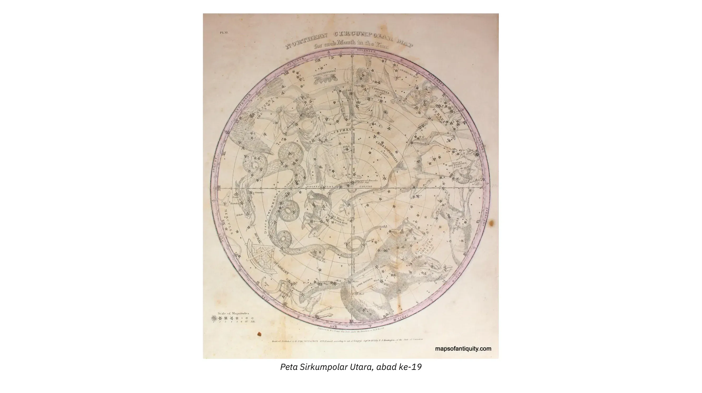

Kosmologi skolastik pada Abad Pertengahan, pada dasarnya dari abad ke-12 dan seterusnya, adalah sebuah evolusi menuju lebih banyak penalaran untuk menyelaraskan nalar dan iman untuk menjelaskan alam semesta yang masih hirarkis, tetapi lebih sesuai dengan filsafat Kristen.

Namun dengan fisika baru Copernicus (1473-1543) pada abad ke-15, kosmologi mengalami titik balik besar dalam pemahaman alam semesta, yang model geosentrisnya kemudian dipertanyakan demi sistem heliosentris, yang membuka jalan bagi ilmu pengetahuan modern, khususnya fisika dan astronomi baru dari Kepler (1571-1630) dan Galileo (1564-1642). Kemudian Isaac Newton (1643-1727) dan akhirnya Albert Einstein (1879-1955), seorang Spinozist yang berkomitmen.

Namun, untuk memahami Spinozisme sepenuhnya, kita juga perlu mempertimbangkan konteks René Descartes (1596-1650), filsuf Prancis terkenal yang mendahului Spinoza dan merupakan murid sekaligus pengagum beratnya.

Terlepas dari risiko dan kecaman dari Giordano Bruno (1548-1600) dan Galileo, Descartes berusaha membedakan "kebenaran dari kepalsuan" dan menyelaraskan teologi, filsafat, dan fisika. Dalam bukunya yang terkenal, Discourse on Method, yang diterbitkan pada tahun 1637, Descartes berpendapat bahwa akal budi adalah fondasi pengetahuan, yang melaluinya manusia dapat mencapai kebebasan.

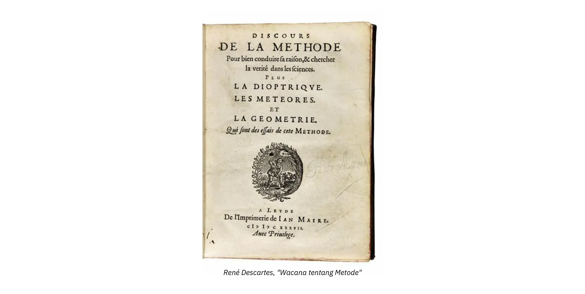

Dengan menjelaskan dunia menurut hukum-hukum universal dan bukannya alam yang diberkahi dengan niat moral, ia membuka jalan bagi determinisme, yang kemudian diikuti oleh Spinoza.

Namun sebagai seorang Katolik, Descartes tetap menetapkan sebuah hierarki antara manusia dan bentuk-bentuk alam yang terbatas lainnya, dan khususnya yang berkaitan dengan spesies hewan, yang ia sebut sebagai "hewan mesin". Dan dengan mengatakan bahwa "tidak ada jiwa yang, jika dibimbing dengan baik, tidak dapat memperoleh kekuasaan mutlak atas tindakan dan nafsunya", Descartes dengan demikian mengklaim bahwa manusia memiliki kapasitas untuk memulai sesuatu dari ketiadaan, dan bahwa manusia, dalam pandangannya, "melarikan diri dari hukum alam", bahwa ia memiliki kekuasaan mutlak atas tindakannya sendiri dan mendasarkan tekadnya semata-mata pada dirinya sendiri.

Spinoza tahu bagaimana melampaui dan melampaui tahap ini dan mendamaikan keberadaan Tuhan dengan demonstrasi akal. Baginya, semua bidang aktivitas manusia bergantung pada kapasitas akal dalam dunia yang koheren dan ditentukan secara sempurna. Tetapi sebuah dunia di mana tidak ada kontingensi atau kebetulan, dan di mana segala sesuatu yang terjadi adalah perlu dan hasil dari suatu sebab, sesuai dengan hubungan sebab akibat di antara berbagai hal. Ini adalah gagasan determinisme absolut.

Dan dalam istilah yang paling keras, ia akhirnya membantah posisi Cartesian, mengkritik, misalnya, gagasan bahwa manusia tidak tunduk pada hukum alam seperti semua hewan lainnya, dan karena itu lebih unggul dari semua mode alam yang terbatas.

Dengan kata lain, mereka dianugerahi kehendak bebas, sebuah keyakinan ilusi yang sangat sulit untuk dilepaskan, seperti yang dikatakan oleh Spinoza, dan yang akan kita bahas sekarang.

## Ilusi Kehendak Bebas

<chapterId>f147a914-cb64-5927-b305-26691930bca3</chapterId>

:::video id=b59da795-ba19-4643-9672-36c9e7953a42:::

Dalam kursus ini, kita sekarang akan beralih ke pertanyaan rumit tentang kehendak bebas, untuk lebih memahami apa arti kebebasan bagi Spinoza, bagi Pencerahan, dan bagi para filsuf liberal awal.

Seperti yang telah kita lihat, Spinoza (1632-1677) terkenal karena menganggap kehendak bebas sebagai ilusi yang sangat sulit untuk membebaskan diri.

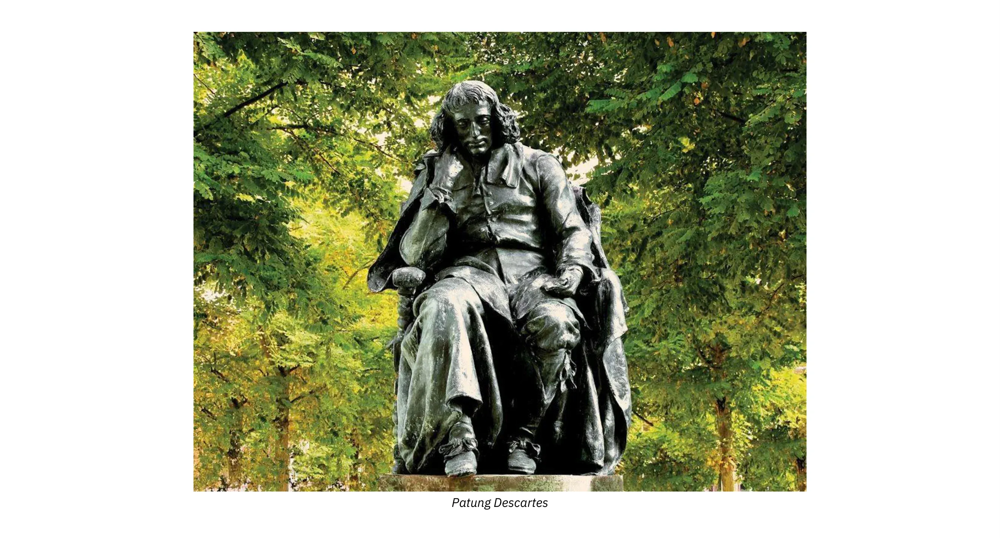

Mengapa demikian? Karena hal ini bertentangan dengan tradisi filosofis sejak jaman dahulu, dan masih dipertahankan oleh Descartes (1596-1642), bahwa manusia dapat memulai sesuatu dari ketiadaan dan memikul tanggung jawab penuh atas tindakan mereka, terutama di hadapan Tuhan, kata Santo Agustinus (354-430), bapak Gereja Kristen.

Tetapi juga, tentu saja, di hadapan keadilan manusia.

Ini adalah gagasan bahwa kehendak kita, dan kehendak kita sendiri, memungkinkan kita untuk mengarahkan hidup kita, bahwa kita memiliki kekuatan mutlak atas tindakan kita, dan bahwa kita memperoleh kebebasan tindakan kita semata-mata dari diri kita sendiri, sehingga memiliki kekuatan keputusan yang tidak terbatas.

Dengan kata lain, manusia dapat mengganggu tatanan alam, bukannya tunduk pada tatanan alam.

Dalam menjalankan kehidupannya, karena ia tidak akan tunduk pada hukum selain kehendaknya sendiri, maka ia tidak hanya berada di atas alam dan hewan, mesin-mesin belaka, tetapi juga di atas semua bentuk-bentuk alam yang terbatas. Ini adalah posisi Descartes (1596-1650), yang baginya penyebab ketidakberdayaan dan ketidakkekalan manusia tidak terletak pada tatanan alam, tetapi pada sifat buruk dari sifat manusia itu sendiri.

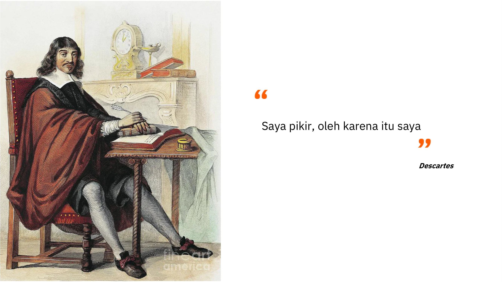

Namun, meskipun Spinoza memuji Descartes karena telah membuka jalan menuju kendali rasional atas kehidupan afektif, ia menjauhkan diri darinya dengan mengkritik keras hipotesis tentang "kekuatan absolut" kehendak.

Spinoza, di sisi lain, menganggap bahwa dunia kita sangat koheren dan ditentukan, dan bahwa segala sesuatu yang terjadi adalah perlu dan merupakan hasil dari kausalitas hal-hal, yang menurutnya suatu akibat selalu memiliki penyebab, dan penyebab ini sendiri merupakan akibat dari penyebab lain, dan seterusnya.

Ini adalah ide determinisme absolut, yang darinya ia menetapkan dalam Etika bahwa manusia tidak memiliki kehendak bebas apa pun karena, katanya, mereka sadar akan tindakan mereka, tetapi mereka mengabaikan, atau lebih memilih untuk mengabaikan, sebab-sebab sebenarnya yang menentukan mereka.

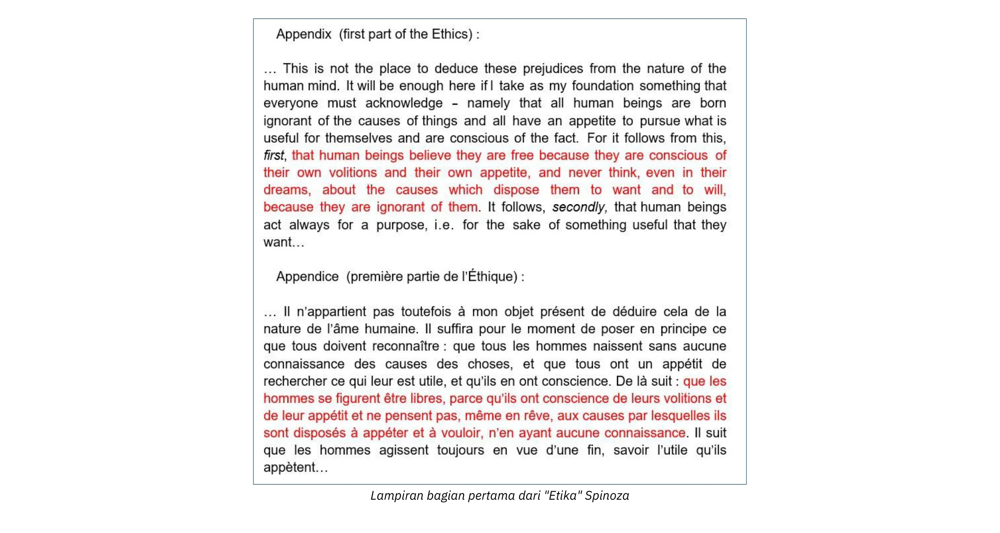

Bagi Spinoza, manusia, sebagai "modus terbatas" alam seperti hewan atau tumbuhan, tidak dapat memulai sesuatu dari ketiadaan; mereka tidak terbebas dari hukum alam, baik dalam tubuh maupun pikiran mereka.

Lebih buruk lagi, baginya, bahaya terbesar dari kebebasan adalah percaya pada kehendak bebas kita, dan percaya bahwa kita dapat bertindak tanpa ditentukan oleh sebab-sebab eksternal.

Bagi Spinoza, kebebasan bukanlah ekspresi kehendak bebas, tetapi kemampuan untuk memahami tempat kita yang sah di dunia, untuk memahami sifat kita yang ditentukan dan, dari sana, untuk mengarahkan keberadaan kita ke arah yang "meningkatkan kekuatan kita untuk bertindak". Dengan selalu melihat ke masa depan dengan optimisme, dan melihat dunia apa adanya, daripada membayangkannya seperti yang kita inginkan.

Tentu saja, masalah yang muncul adalah tanggung jawab manusia dan tindakan mereka. kita dapat menyimpulkan bahwa jika individu tidak bebas dalam tindakan mereka, mereka tidak akan bertanggung jawab atas tindakan mereka, terutama dalam menghadapi keadilan. Tetapi pandangan ini menyesatkan, karena tanpa membahas terlalu jauh, mengakui determinisme sosial, kekeluargaan, dan historis seseorang tidak menghalangi kita untuk mempertimbangkan tanggung jawab atas tindakan yang dilakukan, karena tindakan ini bersifat sukarela.

Di sisi lain, adalah sebuah ilusi jika kita percaya bahwa tindakan kriminal tidak pernah terkait dengan determinasi dirinya. Meskipun ini bukan masalah memaafkan mereka, setidaknya ini adalah masalah mencoba memahami mereka. Faktanya, inilah yang dilakukan oleh keadilan: selain menghukum tindakan yang melanggar hukum, keadilan juga berperan dalam meramalkan dan melindungi masa depan, itulah sebabnya mengapa kejahatan tertentu tidak hanya dihukum tetapi juga diobati, dengan mempertimbangkan latar belakang keluarga, sosial, dan psikologis pelaku.

Pendekatan terhadap kebebasan sebagai kapasitas untuk bertindak adalah hubungan yang dapat kita buat dengan filosofi Pencerahan abad ke-18. Menurut salah satu duta terbesarnya, filsuf Jerman Immanuel Kant (1724-1804), Pencerahan memang merupakan sarana untuk membebaskan manusia dari keadaan di bawah pengawasan, atau seperti yang dikatakan oleh Étienne de la Boétie (1530-1563), dari penghambaan sukarela, yang menjadi tanggung jawab mereka sendiri.

Moto Kant adalah "Pikirkan sendiri" dan "Berani tahu", yang dalam bahasa Latinnya terkenal dengan sebutan "Sapere Aude".

Kapasitas Spinoza untuk bertindak dengan demikian adalah kekuatan yang dimiliki manusia di dalam dirinya sendiri untuk memahami kondisi hewani mereka sendiri, dan untuk memahami alam dan fenomenanya, baik positif maupun negatif, dengan menghubungkannya dengan sebab-sebab obyektif, agar tidak bergantung pada penjelasan moral yang salah dan ilusi, yaitu penjelasan yang dibentuk sesuai dengan keinginan kita. Sebaliknya, ini terdiri dari upaya untuk menjelaskannya melalui akal, dengan tujuan menuju emansipasi dan kebebasan.

Dan kemajuan, yang mengarah pada revolusi teknologi pertama dan ide-ide liberal dan kewirausahaan pertama pada akhir abad ke-18, terutama dengan filsuf liberal Inggris John Locke (1632-1704) dan ekonom Inggris Adam Smith (1723-1790).

Dan perlu diingat kembali definisi Sigmund Freud (1856-1939) tentang ilusi. Menurut bapak psikoanalisis ini, yang selalu mengakui pengaruh Spinoza dalam karyanya, ilusi adalah "keyakinan yang dimotivasi oleh realisasi suatu keinginan, dan di sana dengan mengabaikan realitas".

Terakhir, perlu diketahui bahwa meskipun gerakan libertarian yang akan kita bahas mengacu langsung pada filosofi liberal baru ini, ada juga yang mengatakan bahwa tokoh-tokoh seperti Ayn Rand (1905-1982), penulis "La Grève" dan "La Source vive", mendukung keberadaan kehendak bebas, percaya bahwa manusia memiliki kemampuan untuk membuat pilihan yang bebas.

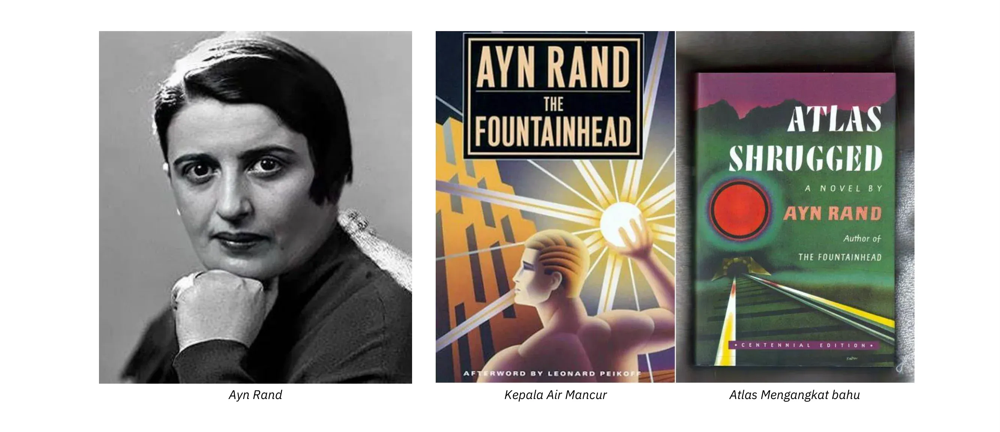

Namun kenyataannya sangat berbeda, dan kebingungan ini lebih disebabkan oleh masalah semantik: dengan mengakui kapasitas manusia untuk bertindak, dan untuk membuat pilihan, sambil mengakui determinisme logis yang menjadi objeknya. kaum libertarian pertama, pada kenyataannya, juga merupakan pewaris Spinoza. Kesamaan mereka dengan Spinoza adalah keyakinan bahwa manusia tidak berada di atas alam, melainkan hasil dari proses evolusi yang menempatkan mereka dalam sebuah determinisme, sejarah yang melampaui mereka, dan sebagian besar bertanggung jawab atas siapa manusia dan apa yang mereka lakukan.

Akhirnya, jika kepercayaan pada kehendak bebas adalah sebuah ilusi yang sangat sulit untuk dilepaskan, hal ini dikarenakan ilusi ini merujuk kembali pada ilusi lain yang menjadi makanannya, yaitu ilusi tentang sebab-sebab akhir, yang akan saya bahas di bab selanjutnya.

## Ilusi tentang penyebab akhir

<chapterId>da2a7fb1-f1e9-5b56-822d-c73770de749d</chapterId>

:::video id=a0127fe7-a4cb-4a1c-8af4-f11c40b4a3d7:::

Kita telah melihat dalam bab sebelumnya bahwa ilusi kehendak bebas terdiri dari keyakinan bahwa kita dapat memulai sesuatu dari ketiadaan, bahwa kehendak kita sendiri akan memungkinkan kita untuk mengarahkan hidup kita, dan bahwa kita akan memiliki kekuatan yang tidak terbatas untuk mengambil keputusan. Ini adalah gagasan bahwa manusia mampu mengganggu tatanan Alam lebih dari dia tunduk pada tatanan itu.

Namun bagi Spinoza (1632-1677), manusia bukanlah "sebuah kerajaan di dalam kerajaan", yaitu, bertentangan dengan apa yang ditetapkan oleh Descartes (1596-1650), manusia bukanlah pengecualian, dan tidak pernah terbebas dari perpanjangan rantai sebab dan akibat yang deterministik.

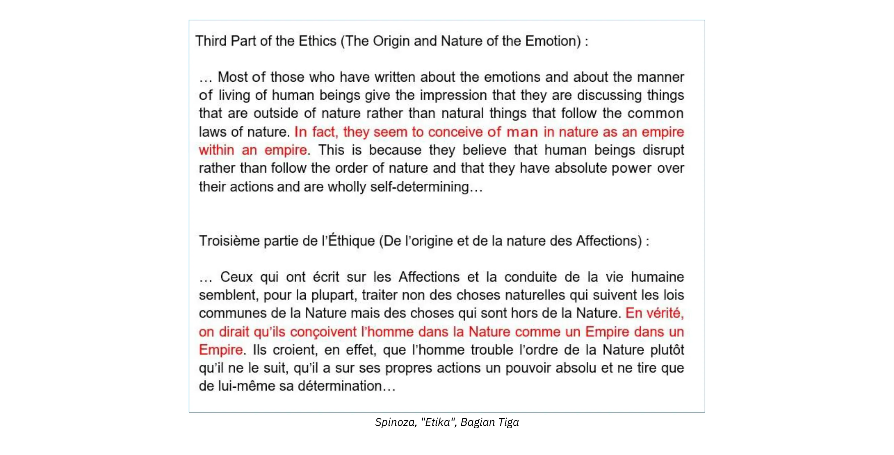

Dan karena Alam, kata Spinoza, tidak memiliki tujuan yang ditentukan dari sudut pandang moral, dan karena manusia cenderung salah mengartikan imajinasi mereka sebagai pemahaman, mereka menafsirkannya sesuai dengan apa yang sesuai dengan kepentingan mereka sendiri. Sampai-sampai mereka memberi makna pada hal-hal yang hanya berasal dari cara mereka menghargainya dan menghubungkannya dengan diri mereka sendiri.

Yaitu, sesuai dengan keinginan, harapan, dan ketakutan mereka.

Alasan ini diilustrasikan oleh ilusi penyebab akhir, yang merupakan hambatan utama untuk berpikir dan menggunakan nalar, karena ini hanya mengungkapkan kebutuhan kita untuk membuat efek dari suatu hal tidak sesuai dengan penyebab sebenarnya, tetapi pada keyakinan, bahkan jika tidak masuk akal atau kekanak-kanakan.

Kepercayaan yang mengekspresikan sebuah niat, terutama yang bersifat ilahi, dan yang, dalam cara kita menafsirkannya, sering kali bersifat takhayul, atau ketidaktahuan.

Dan itulah mengapa penyakit baru seperti AIDS pada tahun 90-an atau covid pada tahun 2020 selalu dianggap oleh beberapa orang sebagai ekspresi dari niat ilahi dan sering kali bersifat menghukum, sesuai dengan penalaran yang bertentangan dengan prinsip kausalitas yang menopang rasionalisme dan ilmu pengetahuan modern yang dibangun sejak Copernicus (1473-1543), Kepler (1571-1630), dan Galileo (1564-1727).

Faktanya adalah, seperti yang dikatakan Spinoza, bahwa tidak terlalu penting bagi manusia bahwa ada begitu banyak hal yang berada di luar imajinasi mereka, bahwa ada lebih banyak kekacauan daripada keteraturan di alam. Namun, kompleksitas hal-hal di luar jangkauan mereka seharusnya menghalangi mereka untuk percaya pada proyek teleologis apa pun. Tidak masalah, katanya, karena keyakinan manusia akan relevansi kepastian mereka berdasarkan apa yang sesuai dengan keinginan dan kegunaannya selalu lebih kuat daripada argumen rasional atau kepedulian terhadap kebenaran.

Dengan demikian, finalisme berarti membalikkan sebab dan akibat dari berbagai hal untuk memahaminya: misalnya, kita percaya bahwa alasan kita memiliki mata adalah untuk melihat, dan alasan kita memiliki gigi adalah untuk mengunyah. Padahal, tentu saja, kita harus melihat bahwa spesies manusia mengembangkan penglihatannya selama proses evolusinya, dan memang melalui kebutuhan untuk memberi makan dirinya sendiri, dan makan daging, gigi kita juga berkembang seperti sekarang ini.

Dan inilah yang ditegaskan oleh naturalis Prancis Jean-Baptiste de Lamarck (1744-1829) (gambar 3.3.3) ketika ia menetapkan teori predarwiniannya bahwa fungsi lah yang menciptakan organ, dan bukan sebaliknya.

Tetapi seperti yang dikatakan Spinoza, "khayalan manusia tidak berakhir di situ", dan di antara semua contoh gagasan teleologis yang naif, dan pada akhirnya agak lucu, kita sering mengutip contoh terkenal dari ahli biologi Bernardin de Saint-Pierre (1737-1814). Mantan direktur Museum Sejarah Alam Paris ini menganggap finalisme alam dengan puisi, lirik, dan kenaifan tertentu, mengingat melon, misalnya, telah diciptakan dengan tujuan tunggal untuk menyenangkan keluarga besar, karena kulitnya yang bergerigi membuatnya mudah dipotong menjadi irisan yang sama.

Definisi inflasi yang diberikan oleh para ekonom Keynesian dan pendukung negara kesejahteraan, misalnya, juga menggambarkan paradoks ini dengan baik. Menurut mereka, inflasi adalah kenaikan harga yang, menurut beberapa bankir bank sentral, datang entah dari mana, atau dari konteks geopolitik yang tidak dapat dikendalikan atau diantisipasi oleh siapapun. Meskipun kenaikan harga memang dapat menyebabkan inflasi siklis - misalnya, ketika harga minyak naik, harga barang-barang olahan tertentu juga akan naik - penyebab struktural sebenarnya dari inflasi terutama terkait dengan peningkatan Supply uang, yang pada gilirannya mengimplikasikan penurunan nilai uang dan, secara ipso facto, kenaikan harga-harga secara mekanis.

Percaya, atau membuat orang lain percaya, kebalikannya sama saja dengan bermimpi dengan mata terbuka, seperti yang diejek oleh Spinoza, dan membangun sebuah alur penalaran yang salah, atau menyesatkan, dan yang lebih mudah diterima karena didengar sebagai respon yang diharapkan untuk membuktikan bahwa dirinya benar. Dalam hal ini, ketika para pendukung intervensi negara menganggap inflasi sebagai cara terbaik untuk menyelesaikan masalah ekonomi.

Namun, interpretasi yang bias terhadap inflasi ini membuat kita lupa bahwa, meskipun berguna untuk mengelola ekonomi dalam jangka pendek, inflasi sebenarnya adalah pajak tersembunyi, yang dalam jangka panjang hanya akan menyebabkan bencana bagi manusia dan materi, dan membuat negara tidak mampu untuk tidak menyalahgunakan kekuasaan mereka. Inilah yang digambarkan dengan sangat baik oleh Friedrich Hayek (1899-1992) dalam esainya The Road to Serfdom, ketika ia menggambarkan perbudakan yang membuat negara tidak bisa lagi membebaskan diri.

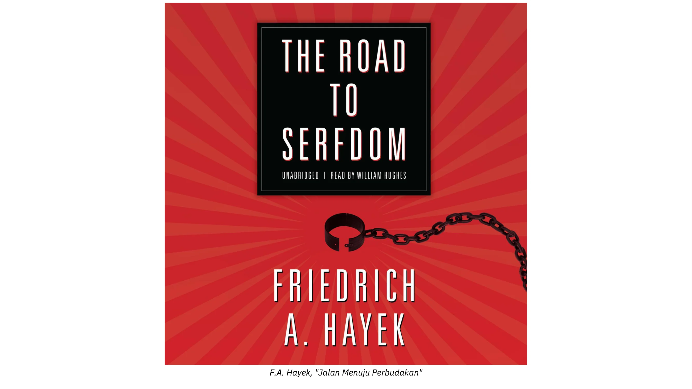

Terakhir, perlu dicatat di sini, bahwa mekanisme finalis ini juga diilustrasikan dengan baik dalam cara para pengkritik Bitcoin mengekspresikan kritik mereka dengan memfokuskan secara tepat pada efeknya.

Karena meskipun beberapa efek dari Bitcoin tentu saja dapat dikritik, karena bias kognitif yang terkait dengan fakta bahwa ini adalah teknologi baru dan mengganggu, kita memiliki kecenderungan yang kuat untuk hanya melihat efek negatifnya saja. Terutama jika kenyataan tidak sesuai dengan keinginan kita, misalnya jika kita seorang religius ketika dihadapkan pada revolusi Copernicus seperti Spinozisme, atau jika kita seorang bankir bank sentral ketika dihadapkan pada konsep mata uang digital yang terdesentralisasi.

Namun, cukup jelas bahwa jika seorang religius atau seorang bankir menunjukkan pemahaman, keingintahuan, dan niat baik, dan jika mereka menaruh minat pada suatu konsep, pertama-tama berusaha memahaminya daripada menilai dampaknya untuk mencocokkan pendapat mereka dengan harapan mereka, maka mereka pasti akan dapat mematuhinya.

Terima kasih atas perhatian Anda, dan sampai jumpa di bab berikutnya.

## Ilusi teologis

<chapterId>93554156-5e62-526d-9b71-49c47be916af</chapterId>

:::video id=9c490cc1-3d29-4ca7-9464-1a701bb91ba7:::

Dalam bab terakhir tentang visi Copernican baru tentang ide-ide yang ditawarkan oleh Spinozisme, kita akhirnya beralih ke ilusi ketiga yang disajikan oleh Spinoza (1632-1677) dalam karyanya, Etika.

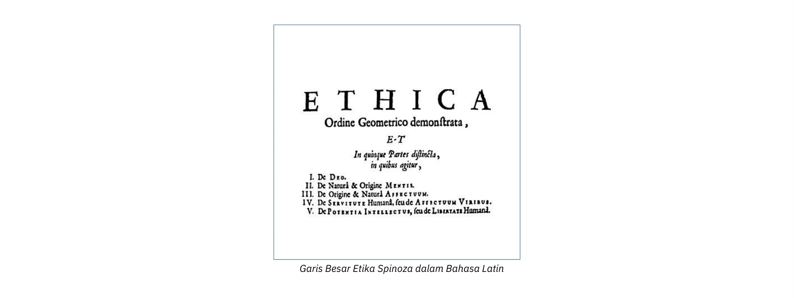

Ilusi ini secara langsung terkait dengan dua ilusi sebelumnya, yaitu ilusi kehendak bebas dan ilusi finalitas.

Ini adalah tentang ilusi teologis.

Intinya adalah ini: Selama manusia tidak mengetahui, "baik tentang benda-benda maupun diri mereka sendiri", seperti yang dikatakan Spinoza, selama mereka percaya pada kebebasan ilusi mereka, mereka akan menggunakan imajinasi mereka untuk memahami, yaitu mereka akan selalu menganggap diri mereka mampu berpikir dan memahami sifat benda-benda, padahal pada kenyataannya mereka hanya berimajinasi, menciptakan, dan memproyeksikan apa yang berguna bagi mereka. Sesuai dengan keinginan mereka.

Inilah sebabnya mengapa manusia percaya bahwa jika sarana alamiah ada dan berguna, seperti gigi untuk makan atau mata untuk melihat, itu karena mereka secara logis diciptakan oleh "pengarah alam". Dengan kata lain, Tuhan yang disengaja dan antropomorfis yang dikaitkan dengan niat manusia.

Dengan kata lain, seorang pria tua berjanggut putih yang tersembunyi di balik awan, yang dipercaya menciptakan segala sesuatu di alam sebagai sarana untuk mencapai tujuan kita, karena dia mengasihi kita, dan melindungi kita ketika kita menghormati dan menyembahnya.

Ini adalah tahap pertama dari ilusi teologis.

Namun, terlepas dari kebanggaan kita yang meyakini bahwa kita berada di atas Alam, dan membayangkan bahwa kita dapat memulai sesuatu dari ketiadaan, pada kenyataannya kita selalu tunduk pada kondisi eksistensi yang mengindikasikan bahwa, pada akhirnya, kita tidak akan benar-benar dapat "meloloskan diri", seperti yang dikatakan oleh profesor filosofi Gilles Deleuze (1925-1995). Kita fana, seperti semua hewan, tetapi kita tahu itu.

Mempercayai atau membayangkan hal yang berlawanan untuk meyakinkan diri sendiri adalah alasan mengapa kita terus-menerus terombang-ambing antara rasa takut dan harapan, seperti dua kutub yang berlawanan dan tak terpisahkan antara rasa aman dan rasa panik, karena rasa takut selalu dikaitkan dengan harapan akan hari yang lebih baik.

Bahwa tidak ada ketakutan tanpa harapan, dan tidak ada harapan tanpa ketakutan, dan bahwa orang yang takut selalu berharap untuk lolos dari apa yang ditakutkannya, sementara orang yang berharap selalu takut bahwa apa yang diharapkannya tidak akan terjadi.

Dan karena "kita cenderung mudah percaya pada apa yang kita harapkan", kata Spinoza dalam bukunya Etika, maka ketika kita menghadapi sebab-sebab atau peristiwa-peristiwa eksternal yang berbahaya bagi kita, yang bertentangan dengan gagasan utilitas, tahap kedua dari apa yang disebut ilusi teologis ini diekspresikan, yang dicirikan oleh keyakinan yang darinya muncul sentimen takhayul.

Dengan kata lain, "yang tidak terkenal" menurut Voltaire (1694-1778), yang takhayulnya tidak pernah lahir dari nalar, dan selalu berhubungan dengan kepercayaan yang tidak rasional atau tidak berdasar, yang menentang segala bentuk rasionalitas dengan mengaitkan objek atau tindakan dengan kekuatan atau potensi spiritual yang tidak dimilikinya.

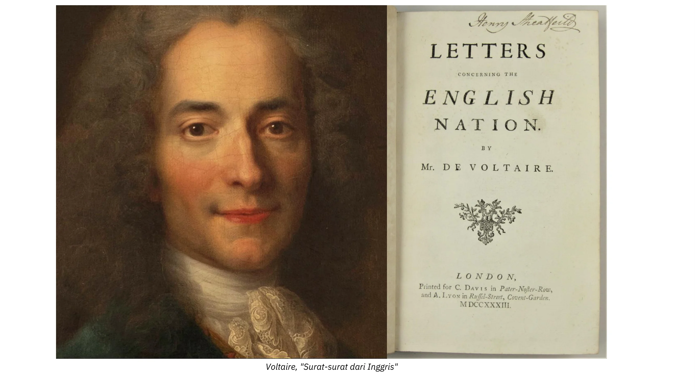

Dengan kedok membebaskan kita, memungkinkan kita membayangkan dunia yang lebih baik, takhayul sebenarnya mengunci kita ke dalam ilusi dan kebohongan kita sendiri. Dalam perbudakan yang darinya kita akan memiliki waktu Hard untuk membebaskan diri kita sendiri.

Inilah yang dipertahankan oleh Pencerahan Jerman, Inggris, dan Prancis sejak abad ke-18 dan seterusnya, menegaskan bahwa takhayul hanya menghalangi manusia untuk menjadi dewasa, tidak hanya dengan membatasi penggunaan nalar, tetapi juga, dan yang terpenting, dengan memunculkan intoleransi, yang merupakan instrumen terbaik untuk membangun dominasi sebuah kekuasaan. Entah itu politik atau agama.

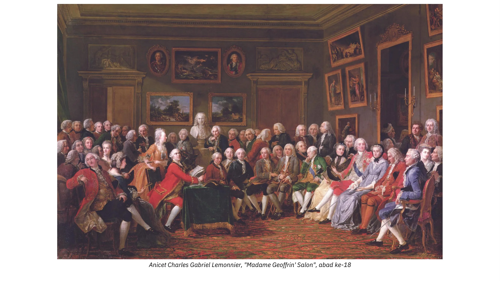

Dan inilah yang Spinoza tunjukkan lagi dalam Risalah Politik Theologico, yang telah kita bahas sebelumnya. Dalam esai ini, ia menulis bahwa "rahasia besar rezim monarki, dan kepentingan utamanya, adalah untuk menipu orang, dan menyamarkan dengan nama agama ketakutan yang seharusnya mengendalikan mereka". Inilah sebabnya mengapa para tiran, diktator, atau revolusioner, yang selalu merupakan orang-orang yang didorong oleh keinginan untuk berbuat baik kepada orang lain, sering kali, jika tidak selalu, jatuh ke dalam perangkap untuk melakukan hal yang berlawanan dengan prinsip-prinsip mereka untuk mencapainya.

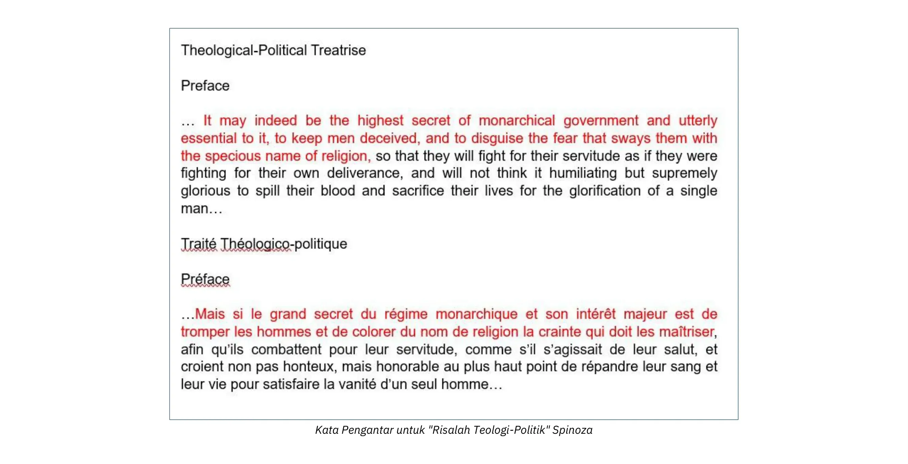

Namun, hal baru yang dibawa Spinoza ke dalam TTP, dan yang membuatnya menjadi bapak sekularisme, adalah mempertimbangkan bahwa meskipun penting untuk melawan takhayul dan seruan untuk melakukan kekerasan yang secara paradoks memungkinkan kebebasan, faktanya adalah kepentingan negara untuk melindungi hak untuk percaya dan kebebasan untuk berpikir.

Karena begitu ide-ide ada dan diekspresikan secara pribadi, mereka pasti akan menyebar ke seluruh masyarakat, dan baik pelarangan maupun penyensoran tidak akan dapat mencegah penyebarannya. Gagasan, entah itu benar atau salah, baik atau buruk, akan tetap beredar, dan melarangnya hanya akan menimbulkan pemberontakan dan penggulingan negara atas nama kebebasan.

Dengan kata lain, negara sebenarnya lebih takut pada penyensoran atau penindasan terhadap kebebasan berekspresi daripada mempertahankannya, dan oleh karena itu, kata Spinoza, negara berkepentingan untuk membiarkan individu-individu menggunakan hak alamiahnya untuk berpikir dan berekspresi.

Bagi Spinoza, negara demokratis yang mengizinkan kebebasan berpikir adalah jaminan terbaik bahwa orang akan hidup dalam kedamaian, dan bahwa, berkat latihan akal, mereka tidak hanya akan bebas untuk berpikir dan bertindak, tetapi juga akan dapat memahami penghambaan yang membelenggu mereka untuk membebaskan diri mereka sendiri.

# Dari teori pengaruh hingga Bitcoin

<partId>82e69d4f-a94f-5978-bcb8-8a7b4651bcca</partId>

## Pertanyaan tentang kejahatan dalam Spinoza

<chapterId>1ce64576-2688-5757-a119-57cc3a1076c0</chapterId>

:::video id=9c490cc1-3d29-4ca7-9464-1a701bb91ba7:::

Sekarang saya ingin membahas pertanyaan tentang kejahatan, sebagaimana Spinoza (1632-1677) menyajikannya dalam karya-karya dan korespondensinya.

Namun berhati-hatilah, ini adalah topik yang kompleks dan kontroversial, dan tujuannya di sini hanyalah untuk memahami, sekali lagi, cara berpikirnya untuk lebih memahami apa yang memandunya, yaitu pencarian kebebasan.

Seperti yang telah kita lihat, tidak percaya pada kehendak bebas atau pada segala jenis finalisme di alam dengan cepat menimbulkan masalah keberadaan kejahatan dalam kehidupan kita sehari-hari.

Dengan kata lain, pertanyaannya adalah apakah "kejahatan" itu ada di alam, dan apakah manusia bertanggung jawab atas kerusakan yang ditimbulkannya.

Para filsuf kuno percaya bahwa kejahatan tidak ada di alam, dan Socrates (470-399 SM), misalnya, mengajarkan bahwa "kejahatan itu tidak ada". Menurutnya, orang yang jahat pada dasarnya tidak jahat, dan hanya keliru dalam memahami sifat kebaikan.

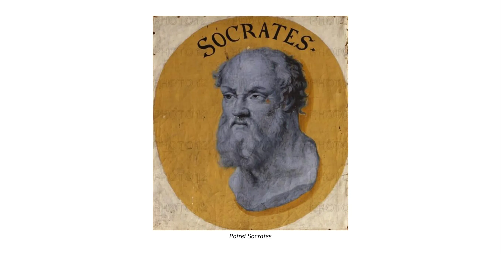

Tetapi tradisi skolastik, terutama dari Santo Agustinus (354-430), yang masih memengaruhi moralitas Kristen saat ini, berpendapat bahwa kejahatan tidak hanya ada, bahwa kejahatan adalah sebuah realitas, tetapi juga dapat dijelaskan karena manusia bebas, karena mereka mampu membuat pilihan antara yang baik dan yang jahat, dan bahwa kejahatan yang mereka timbulkan adalah tanggung jawab mereka sendiri.

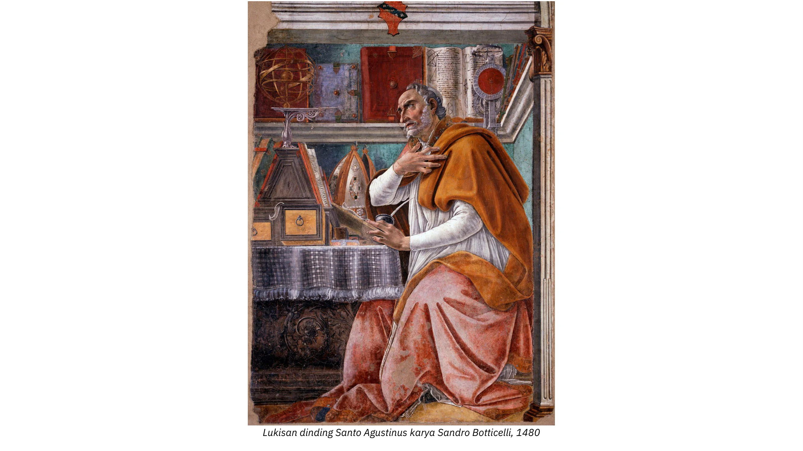

Dan bahkan jika tanggung jawab atas kerusakan yang disebabkan oleh gempa bumi, virus yang mematikan, atau fakta bahwa seorang anak terlahir buta tidak boleh dibebankan kepada manusia, cara berpikir seperti ini tetap ada dengan memberikan alam sebuah niat moral yang membuat mereka bertanggung jawab. Misalnya, dengan menganggap bahwa jika gempa bumi terjadi, itu karena manusia telah berperilaku buruk.

Ini adalah gagasan yang dipertahankan oleh orang-orang beragama bahwa manusia dilahirkan sebagai orang berdosa, bersalah atas dosa asal.

Tentu saja, seperti yang bisa Anda bayangkan, ide ini dicabik-cabik oleh Spinoza, yang menganggap bahwa, karena Alam, atau Tuhan atau keberuntungan seperti yang dia katakan, tidak diberkahi dengan niat, dan karena manusia tidak memiliki kehendak bebas, tanggung jawab atas "kejahatan" yang dikaitkan dengan mereka sepenuhnya ilusi.

"Tidak ada sesuatu pun yang terjadi di alam yang dapat dikaitkan dengan sifat buruk yang ada di dalamnya", tulis Spinoza dalam Etika, dan menurutnya, kita akan keliru jika menganggap, misalnya, kebutaan seorang bayi yang baru lahir sebagai "kejahatan" karena saat terlahir dalam keadaan buta, seorang bayi tidak kehilangan penglihatannya seperti halnya batu.

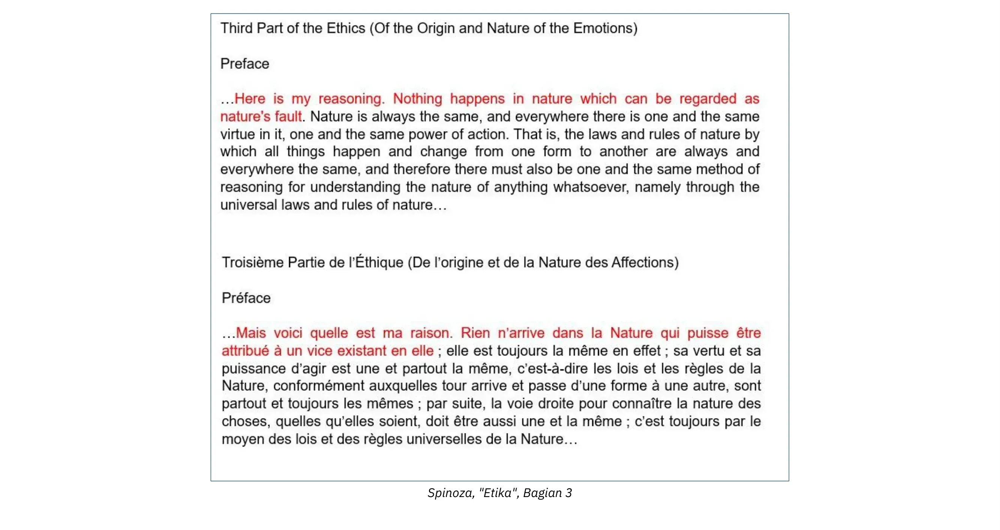

Dan jika kita berpikir bahwa orang buta tidak memiliki penglihatan, itu hanya dari sudut pandang mereka yang melihat.

Dengan demikian, Spinoza mengambil gagasan bahwa kejahatan tidak ada di alam, tetapi orisinalitasnya, yang membuatnya menjadi filsafat revolusioner, adalah menganggap bahwa kejahatan tidak ada dan begitu pula "kebaikan".

Dan inilah mengapa ia berbicara tentang etika dan bukan moralitas, bukan merefleksikan apa yang benar atau salah, karena ini semua adalah gagasan yang relatif dan subyektif, tetapi lebih kepada apa yang "baik" atau "buruk" untuk kebutuhan alami kita untuk "bertahan dalam keberadaan kita", katanya. Dengan kata lain, untuk hidup dan bertumbuh. Untuk berkembang sebagai manusia.

Terlebih lagi, kita telah melihat bahwa pandangan Spinoza tentang tanggung jawab orang yang berperilaku buruk dengan melakukan kejahatan, jelas tidak dimaksudkan untuk memaafkan mereka.  Karena orang-orang, bahkan jika mereka tidak mengetahui penyebab sebenarnya yang menentukan mereka untuk melakukan kejahatan, selalu sadar akan apa yang mereka lakukan dan oleh karena itu, mereka bertanggung jawab di hadapan moralitas dan Hukum.

Jelas, tindakan seorang penjahat selalu terkait dengan determinisme keluarga, sosial, ekonomi, atau bahkan medis, jika kejahatannya dapat dijelaskan oleh kondisi fisik atau mental. Dan inilah peran keadilan, yang melampaui hukum pidana untuk memperhitungkan fakta bahwa kejahatan tertentu tidak hanya harus dihukum, tetapi juga dirawat, dengan mempertimbangkan latar belakang keluarga, sosial dan psikologis pelaku.

Inilah sebabnya mengapa filsuf Spinoza Gilles Deleuze (1925-1995) menjelaskan bahwa etika adalah sejenis etologi, yaitu ilmu praktis tentang cara-cara berada, atau, seperti yang ia katakan, "seni membuat pertemuan yang baik".

Dengan kata lain, kebebasan, menurut Spinoza, adalah mengarahkan keberadaan kita kepada hal yang "meningkatkan kekuatan kita untuk bertindak" dan, selalu melihat masa depan dengan optimis, melihat dunia sebagaimana adanya, bukan membayangkannya seperti yang kita inginkan.

Dan di situlah letak kejeniusan demonstrasi Spinoza, saat ia melawan para dokter kebodohan dan melawan semua orang yang menyatakan bahwa menjadi bodoh itu baik.

Sebaliknya, Spinoza mempelajari hasrat manusia, bahkan yang paling tidak rasional, patah hati, kegilaan, kesedihan atau kemurungan, dengan cara para ahli geometri, "lebih geometrico", sebagaimana seseorang mempelajari titik, garis, permukaan dan volume.

Ini adalah teori pengaruh yang ia kembangkan di bagian ketiga dari Etika, dan yang saya sarankan untuk Anda pelajari sekarang.

Terima kasih atas perhatian Anda.

## Teori pengaruh

<chapterId>3bb011ce-6f0c-51a6-b41f-25a3b5b7768e</chapterId>

:::video id=bb427cc6-e54d-4b44-bd6d-281ba421001a:::

Menurut Spinoza, kebebasan adalah sebuah konsep yang harus ditemukan, sebuah jalan menuju kehidupan yang lebih baik dan lebih kuat. Kehidupan yang lebih bebas. Sebuah jalan yang mengharuskan kita untuk mengenali determinisme absolut dan kausalitas rasional dari berbagai hal.

Dia mengembangkan sistemnya di bagian ketiga dari Etika. Ini adalah "teori pengaruh" yang terkenal.

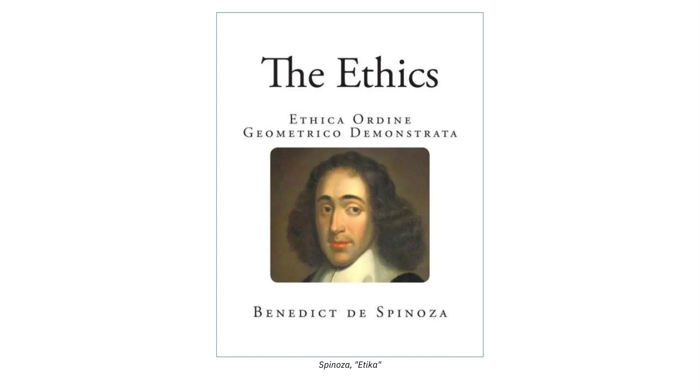

Prinsipnya adalah bahwa pengaruh manusia, kata Spinoza, adalah modifikasi aktif atau pasif dari tubuh dan pikiran yang mempengaruhi kekuatan kita untuk bertindak, yaitu perilaku kita.

Namun, tergantung pada pengaruh yang spesifik pada sifat manusia dan yang berasal dari dunia luar, kita sangat mampu membentuk gagasan yang benar, penalaran dan mengekspresikan kegembiraan.

Namun kita juga mampu membentuk apa yang disebut sebagai pengaruh pasif, prasangka yang kemudian menuntun kita secara mekanis, "terlepas dari diri kita sendiri" sedemikian rupa sehingga tidak lagi melihat atau melakukan apa yang dituntut oleh kepentingan diri kita sendiri.

Kita berbicara tentang perbudakan, atau perbudakan, sebuah keadaan yang ditandai dengan ketidakmampuan untuk mengendalikan dan melawan pengaruh pasif yang terkadang membuat kita menginginkan apa yang tidak kita lakukan dan melakukan apa yang tidak kita inginkan.

Inilah yang dikatakan Spinoza dalam bukunya Etika, ketika ia terkejut bahwa "orang sering melihat yang terbaik, menyetujuinya, dan melakukan yang terburuk", atau bahwa "mereka memperjuangkan penghambaan mereka seolah-olah mereka memperjuangkan keselamatan mereka".

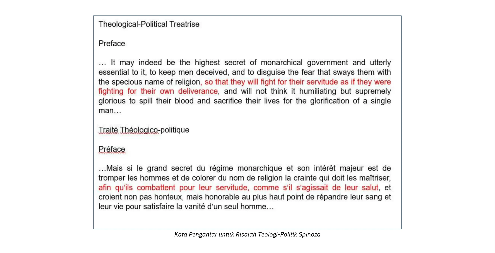

Spinoza mengambil contoh kebencian, yang dilihatnya sebagai pengaruh pasif, berubah menjadi kesedihan dan lahir dari ide yang tidak memadai, yaitu pengetahuan parsial tentang penyebab, dan yang ia definisikan sebagai "kesedihan yang dikaitkan dengan ide tentang penyebab eksternal".

Dengan kata lain, jika kita membenci orang asing, itu karena kita mengasosiasikan orang asing ini dengan gagasan yang kita miliki tentang dia, untuk alasan yang tidak kita pahami, karena dia asing dan berbeda pada dasarnya. Ini adalah gagasan tentang penyebab eksternal - sebuah gagasan yang, terlebih lagi, selalu memotivasi orang yang tidak tahu apa-apa untuk menjelek-jelekkan konsep yang tidak mereka ketahui.

Hal ini terutama berlaku di bidang mata uang kripto.

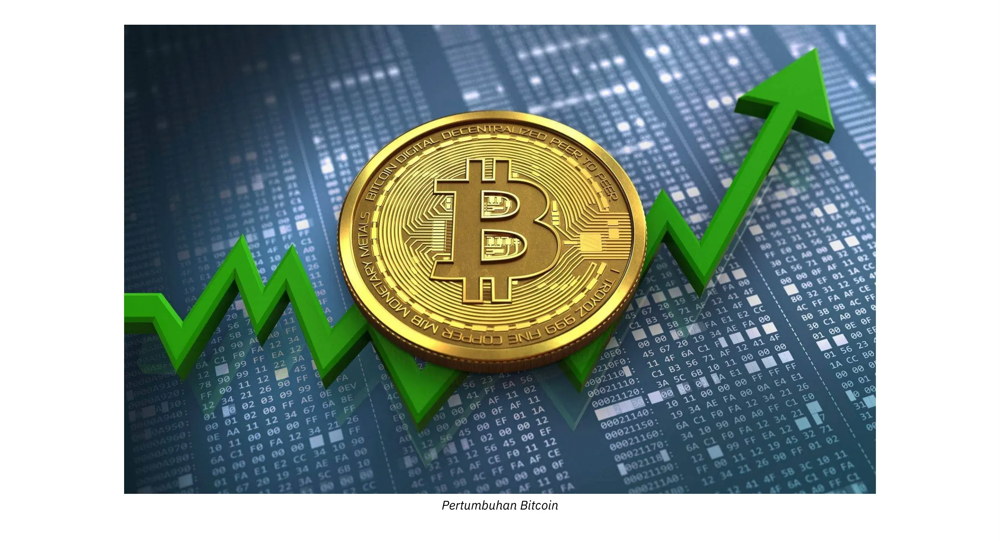

Spinoza mengatakan bahwa jika kita menghilangkan gagasan negatif tentang penyebab eksternal ini, bukan dengan moralitas, tetapi dengan pendidikan, dengan empati, dengan alasan, terutama dengan memfokuskan diri pada kualitas orang asing ini, atau dalam kasus Bitcoin, pada aspek praktisnya atau kegunaannya, maka perasaan sedih yang terkait akan menghilang dan, secara otomatis, begitu pula dengan kebencian.

Perlu diingat bahwa cara berpikir ini juga berlaku, tentu saja, untuk pengaruh aktif, dan khususnya untuk cinta, yang menurut Spinoza, "kegembiraan yang terkait dengan gagasan tentang penyebab eksternal". Dan jika, misalnya, penyebab eksternal dari cinta untuk suatu hal atau seseorang menghilang atau berubah seiring waktu, kegembiraan yang terkait dengannya juga dapat menghilang, memadamkan perasaan cinta. Hal ini, apabila kita tidak memahaminya, dapat membuat kita tidak bahagia dan tertekan.

Tetapi jika apa yang disebut teori pengaruh ini berlaku untuk "ketidaksadaran" kita, cara berpikir rasional "dengan cara para surveyor" ini juga berlaku untuk memerangi semua bentuk perbudakan eksternal, baik agama, politik, maupun hasil dari fenomena alam.

Ini adalah contoh dari petir. Karena ketika petir menyambar dan membunuh orang yang tidak bersalah, orang-orang yang tidak tahu apa-apa akan cenderung melihatnya sebagai tangan Tuhan, menganggap bahwa petir mengekspresikan niat moral dan finalistik. AIDS di tahun 90-an atau bahkan, baru-baru ini, covid telah ditafsirkan oleh beberapa orang sebagai hukuman ilahi.

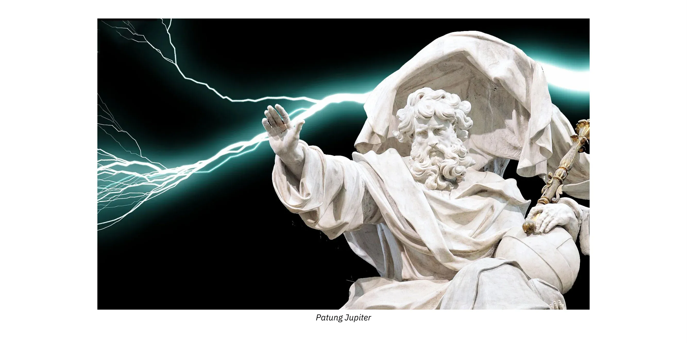

Sedangkan bagi Spinoza, tentu saja, semua gagasan teleologis ini hanyalah takhayul, identik dengan ketidaktahuan, sejauh dalam contoh ini petir yang menyambar tidak melakukan apa pun, katanya, kecuali mengekspresikan esensi sifatnya sendiri. Yaitu menyambar. Tentu saja, tanpa niat moral untuk menghukum atau memberi hadiah kepada siapa pun.

Berkat contoh sederhana ini, kita memahami bahwa satu-satunya solusi untuk melindungi diri kita dari petir - dengan kata lain, untuk membebaskan diri kita dari perbudakan yang selalu dibebankan oleh bahayanya kepada kita - bukanlah dengan mengeluh tentang nasib buruk kita atau tentang ketidakadilan ilahi yang seharusnya terjadi, juga bukan dengan mengajukan argumen moral sekecil apa pun. Tidak, lebih tepatnya, di sini, sekali lagi, seperti halnya kebencian, ini adalah masalah merefleksikan apa yang dapat kita lakukan dari sudut pandang etika.

Dan, dalam hal ini, melindungi diri kita dari petir adalah dengan bersikap rasional, terbuka terhadap kemajuan, ingin tahu dan percaya diri tentang apa yang dapat ditawarkan sains kepada kita dan, mengapa tidak, memasang penangkal petir.

Inilah kejeniusan dari Etika. Spinoza menunjukkan kepada kita bahwa adalah mungkin untuk berpindah dari penghambaan sukarela, dari "terlepas dari diri kita sendiri" dan kehidupan baling-baling yang terasing selamanya, ke kehidupan yang dijalani melalui pengetahuan tentang kasih sayang dan determinasi.

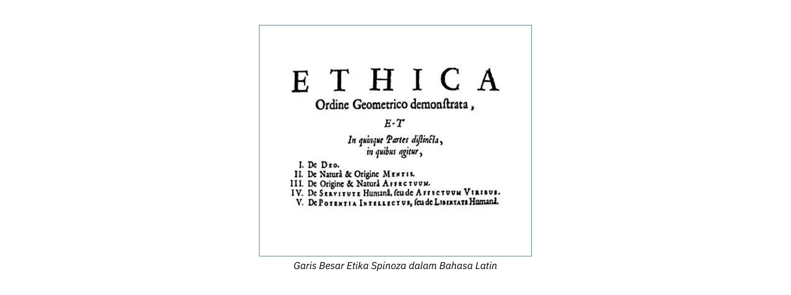

Ini adalah cara berpikir yang memungkinkan kita untuk membedah sifat manusia untuk melihat sisi terang atau kebenaran dalam berbagai hal. Untuk menghilangkan alasan-alasan kesedihan dan ketakutan yang membebani kita. Untuk bebas, dengan kata lain, mampu berhenti menuruti nafsu yang menyedihkan dan mengubah perilaku kita.

Dan untuk memahami, mungkin untuk pertama kalinya dalam sejarah filsafat, bahwa Anda bisa menjadi jernih dan bahagia.

Dan itulah mengapa Spinozisme sering disebut sebagai "filosofi kegembiraan".

## Kebebasan, mazhab ekonomi Austria dan filosofi Cypherpunk

<chapterId>b54f2532-460c-11f0-a248-93ff24ef1d57</chapterId>

:::video id=5f49d5b4-e15f-475b-b40d-07464c08ca4d:::

Seperti yang Anda ketahui, kebebasan menurut Spinoza adalah kesadaran akan determinisme kita. Di bawah bimbingan akal budi, dan berkat kemampuan kita untuk bertindak, kita dapat memahami mekanisme sebab akibat dari perbudakan, sehingga kita dapat melawannya, tidak lagi mengalaminya, dan tidak lagi bertindak bertentangan dengan kepentingan kita sendiri.

Pada akhirnya, kejernihan ini berarti tidak lagi hidup dalam nihilisme yang kemudian digambarkan oleh Friedrich Nietzsche (1844-1900), di mana manusia kehilangan diri mereka sendiri dalam cita-cita ideologis, yaitu fiksi politik atau religius, yang karenanya mereka mengingkari kenyataan, kekanak-kanakan, dan membuat diri mereka tidak bahagia.

Inilah yang dimaksud dengan filosofi rasional Pencerahan, terutama berkat Immanuel Kant (1724-1804), yang mana hanya orang yang berpendidikan, di bawah bimbingan akal, yang dapat berpikir untuk dirinya sendiri dan menentukan, secara etis, apa yang "benar" atau "baik" dan apa yang beracun.

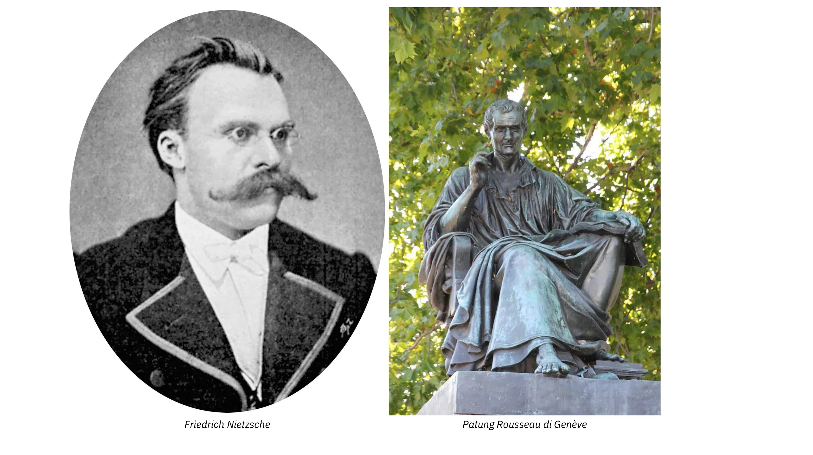

Dengan kata lain, katanya, jika kita berpikir untuk diri kita sendiri, jika kita bernalar sebagai orang dewasa yang rasional, dan jika kita berusaha untuk melekatkan diri kita pada hubungan sebab akibat di antara berbagai hal, kita tidak lagi membutuhkan otoritas moral untuk mengajari kita, misalnya, keutamaan agama yang sebenarnya atau nilai-nilai etika yang sebenarnya dalam bidang politik dan ekonomi.

Ini adalah garis penalaran yang membuat hubungan dengan mazhab ekonomi liberal Austria, yang lahir di atmosfer intelektual yang sangat subur di Wina sebelum Perang Dunia Pertama. Karena dalam konteks inilah para intelektual seperti Carl Menger (1840-1921), Ludwig von Mises (1883-1979) dan Friedrich Hayek (1899-1992) meletakkan dasar-dasar bagi mazhab baru ekonomi liberal, yang akan menjadi fondasi bagi keyakinan para cypherpunks di masa depan. Dan karenanya terciptalah Bitcoin.

Menger dan Mises, misalnya, menyatakan bahwa semua pengetahuan harus dibangun berdasarkan hubungan sebab akibat antara berbagai hal, dan dengan demikian mengajukan konsepsi kausalitas baru tentang ekonomi. Terinspirasi secara khusus oleh semangat liberal yang dikembangkan beberapa tahun sebelumnya oleh ekonom Prancis Frédéric Bastiat (1801-1850).

Di sisi lain, Hayek menganggap bahwa semua keputusan ekonomi selalu mengekspresikan bentuk ketidakpastian dan ketidaktahuan, dan bahwa fakta tidak menderita karena moralitas, kepercayaan, prasangka atau ideologi politik, memungkinkan untuk menganalisis perilaku ekonomi dengan benar dan, lebih jauh lagi, untuk mempertimbangkan apa yang baik bagi individu, masyarakat dan Negara.

Inilah bagaimana para ekonom liberal Austria ini dengan tegas mengkritik semua ide sosialis - Hayek berbicara tentang "planisme" - dan semua kebijakan moral yang terinspirasi olehnya, yang, dalam pandangannya, hanya akan membawa kehancuran. Memberikan kekuasaan ekonomi kepada pemerintah, yang pasti ketinggalan zaman dan tidak sesuai dengan apa yang seharusnya dan tidak seharusnya dilakukan, pasti akan gagal.

Sebagai contoh, Austria percaya bahwa ketika sebuah negara memberikan dirinya sendiri, dengan paksaan, kekuasaan untuk menciptakan uang untuk mengelola ekonomi dan menyelesaikan krisis, risikonya adalah negara tersebut tidak akan pernah bisa menahan diri untuk tidak menyalahgunakan kekuasaan ini.

Mengapa demikian? Karena ia selalu berada dalam bentuk perbudakan yang mencegahnya untuk melakukan hal tersebut, dan dengan demikian mendorongnya, seperti yang dikatakan oleh Spinoza, "melihat yang terbaik, menyetujuinya... tetapi melakukan yang terburuk".

Sebagai seorang Spinozist, Hayek menjelaskan dalam sebuah video bahwa "karena kekuasaan ini tidak dapat diambil tanpa kekerasan, yang dapat dilakukan adalah menggunakan trik dan memperkenalkan konsep uang baru yang tidak dapat dihentikan oleh pemerintah". Sebuah argumen yang digaungkan oleh Milton Friedman (1912-2006) dalam sebuah wawancara, di mana ia membahas bentuk baru mata uang digital ini dalam konteks Internet yang baru lahir.

Ini adalah argumen politik dan ekonomi yang dikemukakan oleh cypherpunks pertama, Eric Hughes (1953-), dalam "manifesto Cypherpunk", atau Timothy May (1951-2018) dalam "manifesto anarkis kripto", dan yang akan diangkat kembali oleh Satoshi Nakamoto.

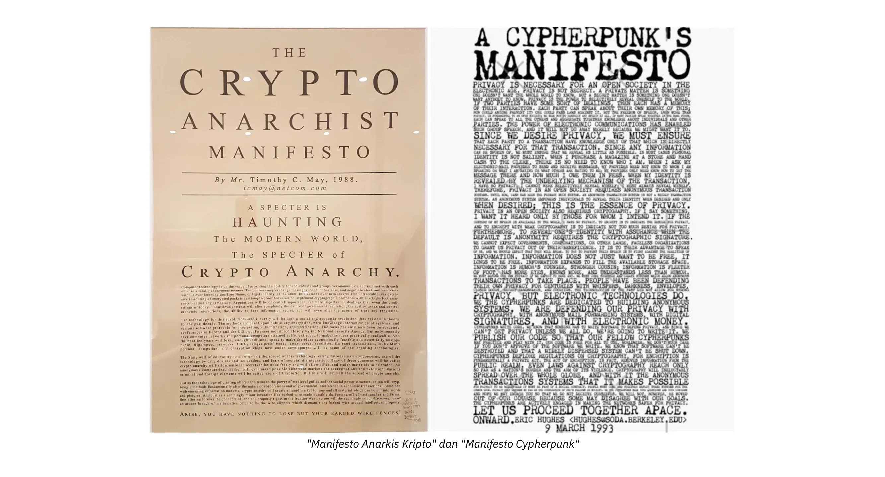

Khususnya ketika dia menuliskan judul Times pada 3 Januari 2009 di dasar koin blok Genesis Blockchain Bitcoin untuk menggambarkan akhir dari satu era, Keynesian, dan awal dari era lain dengan aspirasi liberal, anarkis, dan libertarian.

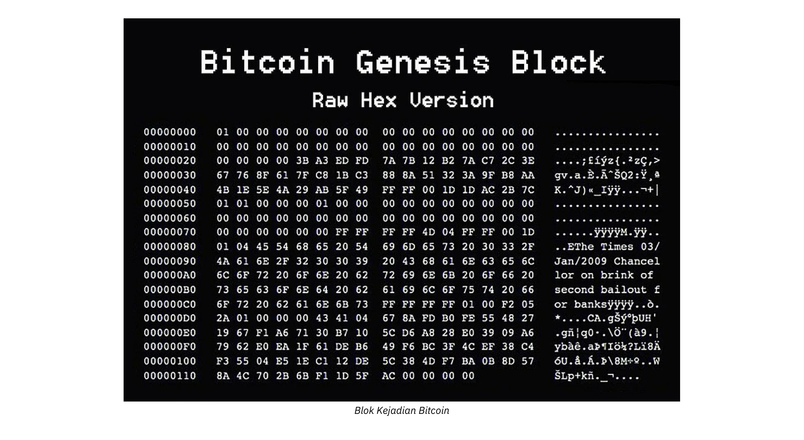

Buku Putih yang diterbitkan pada tanggal 31 Oktober 2008 menyajikan Bitcoin sebagai sarana pertukaran nilai di Internet tanpa pihak ketiga yang tepercaya, berdasarkan protokol yang terdesentralisasi. Sebuah revolusi "Copernican" yang pada akhirnya akan memungkinkan orang untuk mendapatkan kembali kemampuan mereka untuk bertindak, yaitu kebebasan mereka, kebebasan untuk berdagang, hak mereka untuk memiliki properti dan menghormati privasi mereka.

Mengapa? Karena Bitcoin memungkinkan kita untuk melepaskan diri dari perbudakan ini dengan cara Spinoza, berkat akal, berkat bahasa matematika Galileo. Dan, seperti yang dikatakan Hayek, tanpa negara dapat menentangnya. Dan dengan damai, tanpa paksaan atau dakwah.

Faktanya, ini adalah paralel terakhir yang akan saya gambarkan antara Spinozisme dan Bitcoin, untuk menunjukkan bahwa tidak ada gunanya meyakinkan siapa pun yang tidak menganut konsep Copernicus atau konsep disruptif selain melalui akal, pemahaman, keingintahuan, atau niat baik.

Tidak dengan paksaan, tidak dengan kekerasan. Karena faktanya Copernicus, Galileo, Newton, Darwin, Einstein, Hayek, Spinoza, atau Satoshi Nakamoto tidak pernah mengancam siapa pun yang tidak percaya dengan ide dan demonstrasi mereka.

# Bagian akhir

<partId>70a5a3c8-6c88-11f0-8753-db07e26dcaf4</partId>

## Ulasan & Peringkat

<chapterId>7945c38c-6c88-11f0-a73f-0f7cdf99f53f</chapterId>

<isCourseReview>true</isCourseReview>

## Ujian akhir

<chapterId>a557fd32-6c88-11f0-96ff-cfa532cf76a0</chapterId>

<isCourseExam>true</isCourseExam>

## Kesimpulan

<chapterId>ae04ab38-6c88-11f0-a496-3be47119e6b6</chapterId>

<isCourseConclusion>true</isCourseConclusion>