# スピノザがサトシに出会ったとき

17世紀の哲学者バールーフ・デ・スピノザの自由、理性、権力に関する急進的な思想が、いかにビットコインの分散型革命を予見していたかを発見してください。このコースは驚くべき類似点を明らかにします：両者とも盲目的な信仰と中央権力を拒否し、両者とも数学的厳密性を用いて解放します。スピノザは宗教的教義から精神を解放し、ビットコインは国家の支配から貨幣を解放します。

スピノザの倫理学から実践的なツールを学び、ビットコインの哲学的基盤を理解し、あなたの主体性を高めましょう。歴史上最も偉大な二つの人間解放の道具を探求する準備はできていますか？
+++
# はじめに

<partId>80b76189-afab-5295-a8d3-ba8f6fe7a5e8</partId>

## コース紹介

<chapterId>99af4992-fd6c-5142-b168-d927b251574b</chapterId>

:::video id=1def60bc-1d39-4e49-9b08-fd05b7a0d49b:::

このコースでは、合理的啓蒙哲学の父と言われる17世紀の有名な哲学者、バルーク・ド・スピノザ（1632-1677）の哲学を紹介できることを嬉しく思う。

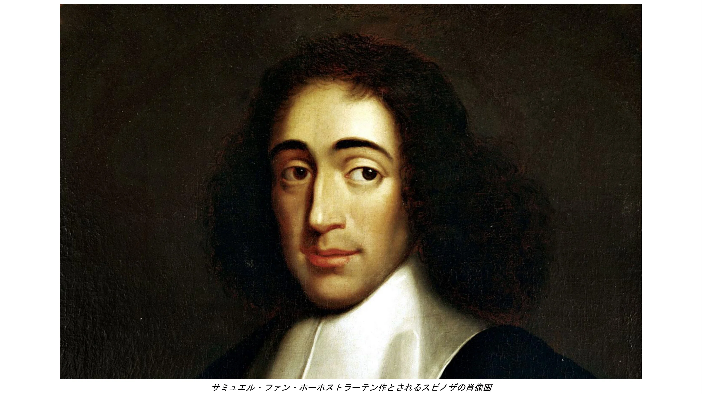

スピノザの肖像

これらのコースは、このテーマに関する私の2つのエッセイ「スピノザの真の宗教」と「Bitcoin、自由の福音」に基づくもので、紙媒体ではオンラインまたは私のウェブサイトから直接、デジタル媒体ではアマゾンKindleから入手できる。

このコースの目的は、まず第一に、今日新たな関心を集めているにもかかわらず、非常に複雑でとっつきにくいと思われがちな哲学を、簡単に理解できるようにすることである。

実際、この哲学は、宗教、哲学、人間科学が一般的にそうであるように、すべてがうまくいかないときに物事の意味を問うことを可能にするだけでなく、すべてがうまくいっているときに自分自身を問うことを可能にする。

人生が私たちに微笑みかけ、私たちが自分自身を疑う必要がないと感じるとき、私たちの幸せや成功は、私たちの才能や仕事、あるいは自由な選択からしか生まれないという、幻想的で隷属的と思われるプライドで考える。

こうすることで、自由についての実践的な哲学、スピノザが言うところの「自由を達成するための手段」と、私たちがここで関心を抱いている新しい技術的世界、一般的な暗号、そして特にBitcoinを結びつけることができる。

特に哲学的な側面では、自由という概念について考えさせられる。考える自由、自己表現の自由、プライバシーの尊重、そしてもちろん、我々の場合はExchangeの自由である。

まず、スピノザについて、彼の性格、社会的、宗教的、家庭的背景、そして彼が生きたユナイテッド・プロヴィンスの歴史的背景を紹介する。

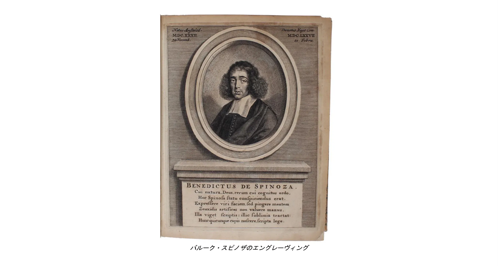

スピノザの肖像

そして、「理性の行使なしには説明できないものは自然界には存在しない」とする、この新しい合理的哲学とは何かを見ていくことにしよう。

この考え方によれば、結果には必ず原因があり、その原因自体が別の原因の結果であり、その繰り返しで、私たちがアクセスすることのできない、スピノザによれば自然である最初の原因にまで遡るのである。

自然、言い換えれば神とは、スピノザ主義の意味全体を示すラテン語の有名な「Deus sive Natura」である。

スピノザの2大著作も見てみよう。まず、1677年に死後出版された『倫理学』から。この著作は、自由と、私たちを束縛する隷属から自らを解放する必要性に完全に焦点を当てている。

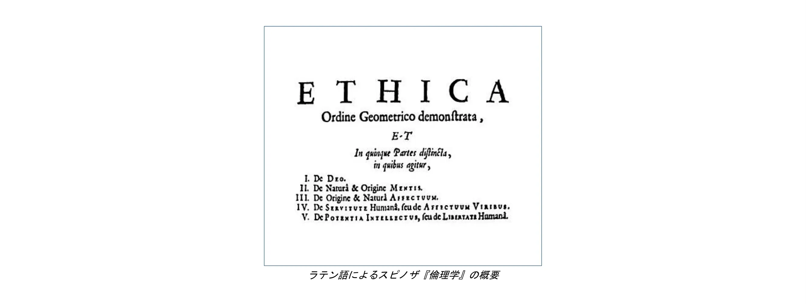

そして、彼が存命中の1670年に出版された『Traité théologico-Politique』を見て、別の角度から自由を考えてみよう。つまり、信教の自由、そして何よりも政治的自由である。

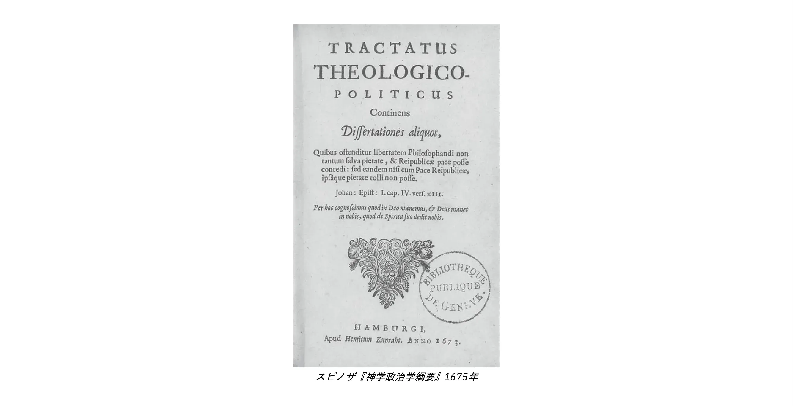

最後に、なぜスピノザ主義が思想のコペルニクス的革命なのか、スピノザが糾弾した3つの根本的な錯覚、すなわち自由意志の錯覚、最終原因あるいは最終主義の錯覚、神学的錯覚を研究することで、スピノザ主義がいかに世界と人間の本質の新たな定義を表しているかがわかるだろう。

スピノザが、幾何学者の手法で発展させた「より幾何学的な」影響論のおかげで、人間の本性や外的な情念に内在する隷属から自らを解放する、あるいは解放しようとするための実践的な方法を、いかに私たちに提供しているかがようやくわかるだろう。無知と闘うための合理的なメカニズムは、三角形の3つの角が常に180°に等しいという確信に例えることができ、そこから生まれた啓蒙主義の精神と、19世紀の自由主義の潮流や20世紀のリバタリアニズムを結びつけることを可能にするだろう。

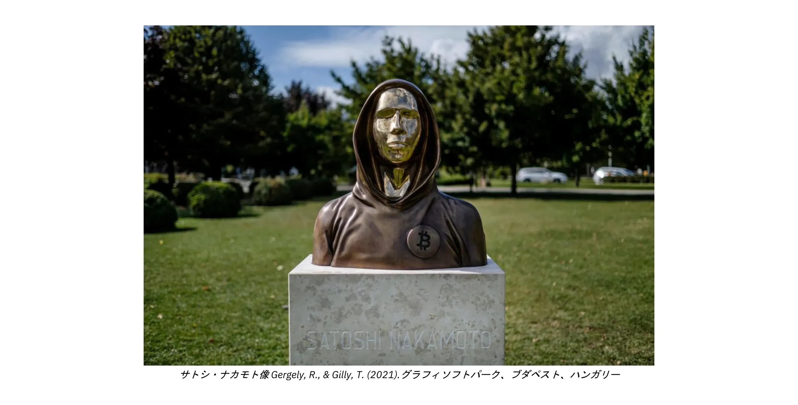

スピノザ主義の概念と、Satoshiナカモトが発明したこの自由のツールの間にある多くの共通点の中で、まず第一に、どちらの場合も、もし私たちが好奇心旺盛で、善意で、当時言われていたように「理解」しているならば、私たちはそれを守らずにはいられない、ということが理解できるだろう。そして、もし私たちがそれを守らないなら、それはもちろん私たちの最も絶対的な権利であり、信じる自由、あるいは信じない自由を尊重することが基本である以上、私たちは「できない」、あるいは「したくない」と決意することになる。

例えば、宗教原理主義者がスピノザ主義のようなコペルニクス的思想を受け入れることはできないし、耳を傾けることもできない。

ご存知のように、現在の状況は正しい方向に進んでいる。

## バルーク・ド・スピノザの紹介

<chapterId>f53a9cfd-326e-5b73-a766-3ef2f07c5a49</chapterId>

:::video id=5fac3ddc-c472-4c64-8186-46a8f317e389:::

バルーク・デ・スピノザとは何者か？1632年に生まれ、1677年に45歳で亡くなったオランダの哲学者である。

15世紀にカトリックによってスペインを追われたマラノ人の末裔であるポルトガルのセファルディック・コミュニティに属するユダヤ人である彼は、宗教的かつ知的な環境の中で、迫害されることの意味を自覚しながら育った。

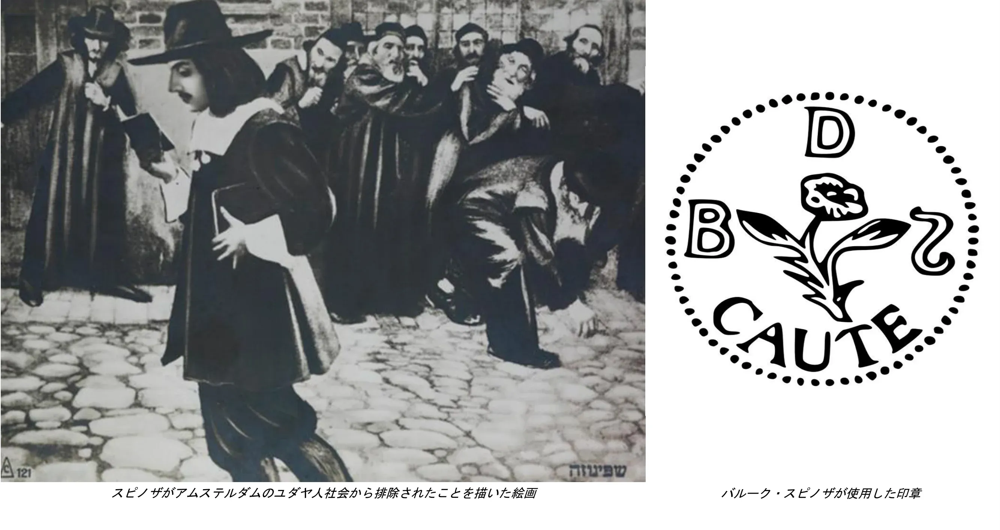

実際、彼は幼い頃から既成の宗教、特にヘブライ人社会に対して強い批判的精神を示し、1656年、まだ何も出版していない24歳のときに、ヘブライ人社会から激しく拒絶された。

この "破門 "のおかげで彼は孤立し、後ろを振り返ることなく仕事に集中することができたと言われている。

同時代のデカルト（1596-1650）、パスカル（1632-1662）、ニュートン（1643-1727）のように、コペルニクス（1473-1543）、ケプラー（1571-1630）、ガリレオ（1564-1642）の物理学における新しい合理的な考えを数年前に受け継いだスピノザは、数学は宇宙の言語であるというガリレオの原則に従って、幾何学者のような思考法を発展させた。

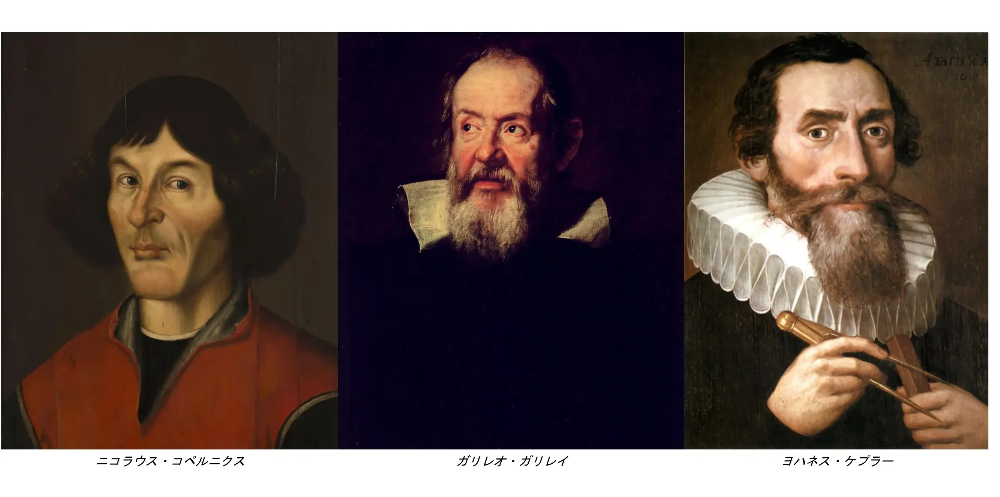

しかし、修道士であり哲学者でもあったジョルダーノ・ブルーノ（1548-1600）が異端の罪でローマの広場で生きたまま焼かれた裁判や、1633年に異端審問によってコペルニクス的天動説の信念を放棄させられたガリレオの裁判の後では、当時としては非常に危険な考えであった。

このため、物事の因果関係に基づく世界と人間の本質に対する彼の厳格で合理的なビジョンは、無神論者とみなされ、現在でも誤って無神論者とみなされている。

実際、スピノザの著作は、彼が自然と同一視する神についてのみ語っており、宗教家や神権主義者の迷信的な衝動を批判する一方で、彼にとっての真の宗教とは、何よりも正義と慈愛と同義であることを示している。

ライプニッツ（1646-1716）、カント（1724-1804）、ショーペンハウアー（1788-1860）、ニーチェ（1844-1900）らドイツ人であれ、ロック（1632-1704）らイギリス人であれ、ヴォルテール（1694-1778）、ルソー（1712-1778）、ディドロ（1713-1784）らフランス人であれ、スピノザを啓蒙思想と結びつけるのはこのアプローチである。理性は、蒙昧主義、特に宗教的蒙昧主義と闘い、無知と闘い、自由と進歩の理想を守るために用いられるべきであるという点で、全員が同意した。

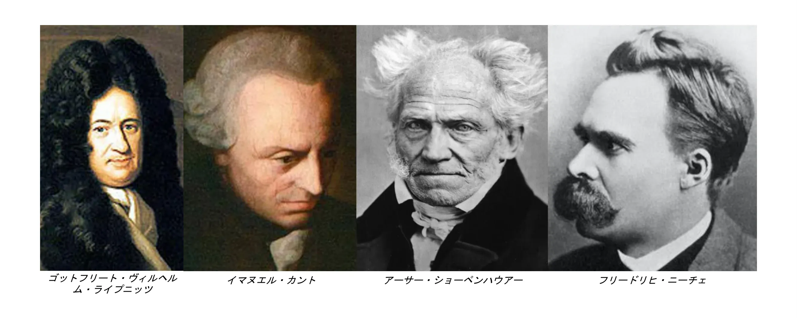

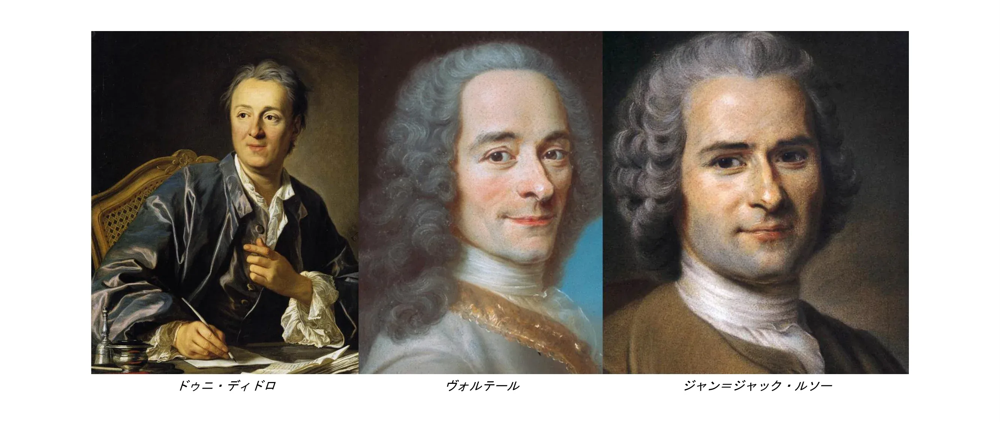

さて、この哲学とBitcoinを結びつけるには、スピノザが非常に特殊な時代に生まれたことに注目する必要がある。

17世紀、連合王国は政治的、宗教的思想において世界で最も自由な国であっただけでなく、最も裕福な国でもあった。つまり、経済的にも技術的にも最も進んだ国だったのだ。

しかし、富は天然資源や植民地の搾取と荒廃、奴隷制度に結びついたものではなく、自由主義的で企業家精神に基づく国際貿易と商業に結びついたものである。この精神は、後にスピノザ主義者として有名なヴォルテール（1694-1778）によって支持されることになる。ヴォルテールは、交易の場において、自由主義的な説得力を持つビジネスマンや企業家が、宗教や出自を理由に排除されたり、異端者と呼ばれたり、破門されたりすることは決してなかったという。

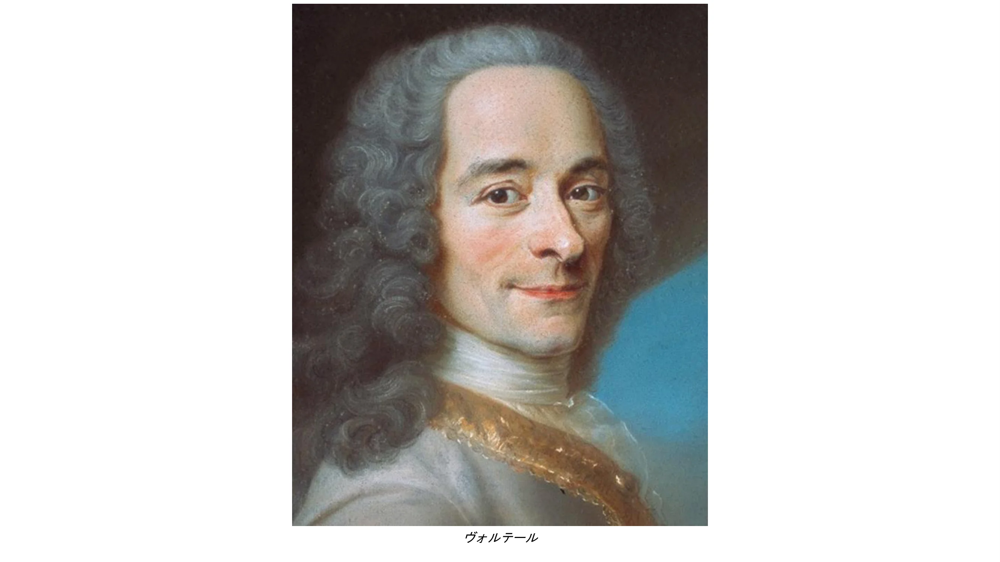

さらに、当時のオランダは主要な技術分野、例えば力学や光学の分野でも進んでいた。ガリレオが空を見上げて宇宙を発見するために使用した天体望遠鏡は、当時としてはまさに最先端技術であり、今日のコンピューティング、AI、そしてもちろん暗号に関連する新技術と同様である。

そして、スピノザ自身が天文レンズを磨く仕事をしていたことから、皮肉なことに、すべてを斜めに見ていたと言われるスピノザが、Bitcoinのような自由の道具を支持したであろうことは想像に難くない。

言い換えれば、スピノザ主義が伝える自由と進歩の価値観は、宗教原理主義、陰謀論、迷信、そして何よりも無知が悲しい現実として残る世界とは対照的である。

しかし、この世界では、あらゆる手段が、脱出するため、私たちを束縛する隷属から解放されるため、そして、私たちがそうありたいと望む世界ではなく、ありのままの世界を受け入れることによって自由になるために、価値あるものなのだ。

この手段が哲学的なものであれ、技術的なものであれ、後に述べるように、Bitcoinは自由の道具である。個人も国家も同様に、隷属、特に金銭的な隷属から自由になれるツールなのだ。

# 代表作, 倫理と政治

<partId>d7d7e9a1-005b-519c-b587-137435e46344</partId>

## 倫理と自由の探求

<chapterId>4cc66e25-335c-591d-9b78-83e5664bbbbc</chapterId>

:::video id=065c5091-69e1-412f-acce-c763ec31d3b1:::

本章では、1677年に死後出版されたスピノザの代表作『倫理学』に目を向けることを提案する。

なぜ死後なのか？それは、彼の思想が革命的、あるいは少なくとも直感に反する破壊的なものであり、17世紀の合衆国というリベラルな文脈の中でさえ、当時としては非常に危険なものだったからだ。

ケプラー（1571-1630）と並ぶ近代科学の父ガリレオ（1564-1642）の科学的精神に触発されたのであろう。スピノザは、実証、スコリア、公理、定義を伴う命題を用いながら、主に5つの部分に分けて自分の考えを展開している。

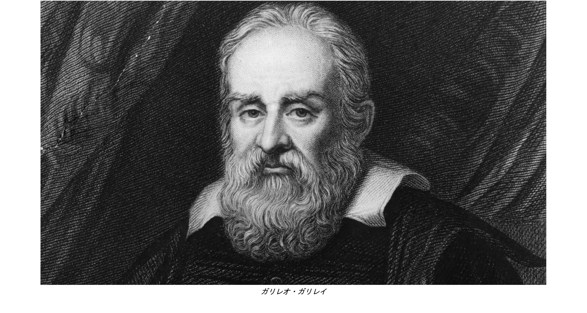

このように、『倫理学』はスピノザの言葉を借りれば、「自由あるいはそれに至る道筋に到達するための方法」であり、隅から隅まで読む本ではなく、例えば、ある命題が別の命題に言及し、その命題が第三の命題を通して理解されるといったように、完全に首尾一貫した合理的かつ論理的な体系で読み進めることができる本なのである。

これらの短いセクションはスピノザが日常的な言葉で書いているので理解しやすく、ある意味で彼の複雑な思想を要約している。

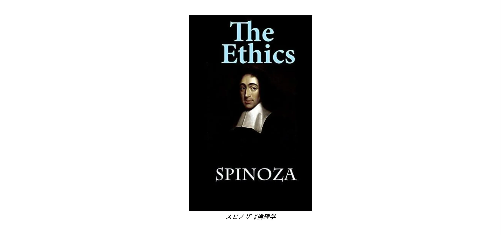

私たちを取り巻く世界を「理性の顕微鏡」にかけることで、スピノザの著作は、人間は自らに起因するものではない、つまり、ここでも、私たちの時代でも、そのような身体的、知的属性を持って生まれてくることを望んだわけではないという原理に基づいて、人間の本性を解剖している。

そして、私たちは自然の上にいるのではないと言う。肉体であれ精神であれ、その法則から免れることはできない。言い換えれば、私たちは動物であれ植物であれ、他の生き物と同じように自然の一部なのだ。

スピノザにとって、人間活動のあらゆる分野は、世界を完全に首尾一貫した決定された体系で理解する理性の能力に依存している。

偶然が存在しない世界。

あるものは必ずあり、起こるものは必ず起こる」という考えによれば、起こることはすべて「必要」であり、原因の結果である。これが絶対決定論である。

しかし、留意すべき点が2つある：

まず、スピノザにとって偶然が存在しないとすれば、それは原因がわからない出来事だからである。しかしもちろん、原因がわからないからといって、それが存在しないということにはならないと彼は言う。

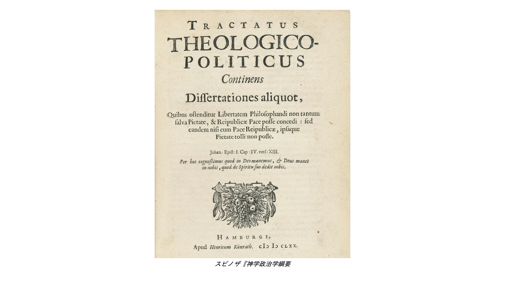

第二に、自然には意思が備わっていないため、運命論もまったく問題ない。例えば、稲妻には、悲劇の場合に考えられるような、誰かを罰する意図はない。そうではなく、単に雷を落とすという自然の本質を表現しているだけなのだ。雷を落とす。

こうしてスピノザは、現実、つまり良い面も悪い面もある日常生活は完全に理解可能であり、自然界には因果関係のない現象は存在しないという考えを擁護する。もちろん、これは悪、特に絶対悪の問題を提起する。

最後に、倫理は道徳ではないことに注意することが重要だ。

哲学者でありスピノザの専門家として有名なジル・ドゥルーズ教授（1925-1995）によれば、道徳とは社会で生きていくために有用な判断システムである。しかし、それは主観的なシステムである。なぜなら、ここで正しいことが他の場所では間違っているかもしれないし、今日間違っていることが後で正しくなるかもしれないからである。

倫理学は、何が正しいか間違っているかを決定するのではなく、私たち自身の本性、そして私たちの存在を維持する能力にとって何が良いか悪いかを決定するのだ、とスピノザは言う。自由であるために。したがって、それは真の倫理学であり、言い換えれば、存在のあり方の科学であり、ジル・ドゥルーズがさらに説明するように、良い出会いを作る技術なのである。

あるいは、スピノザによれば、人間はしばしば「最良のものを見て、それを承認し、最悪のものを行う」ことに還元される。

つまり、「自由のために戦うかのように、彼らの隷属のために戦うこと」である。

## 神学的・政治的論考

<chapterId>84b0187e-1050-5d44-a536-80554896e828</chapterId>

:::video id=c1efc97e-1e96-4b37-894c-9a19794d6b52:::

倫理学』の次に、スピノザの哲学的・政治的影響、特に啓蒙主義や自由主義、そして私たちの場合はリバタリアンの潮流への影響を理解するのに役立つ、もうひとつの主要著作を紹介したい。

これは1670年に匿名で出版されたTraité théologico-politique（TTP）である。

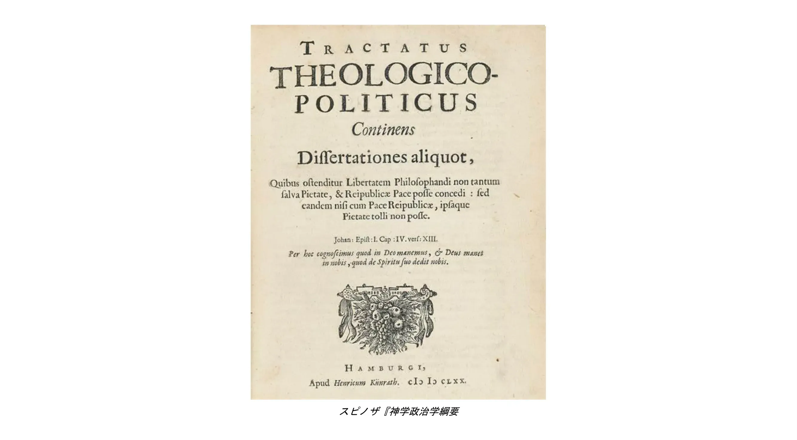

スピノザ（1632-1677）は『倫理学』の執筆を中断し、今日でも存在する誤解に終止符を打つためにこの本を書いた。それは、彼が無神論者であったという思い込みである。

これまで見てきたように、スピノザの神概念は『倫理学』第一部全体の主題であり、彼は神の存在だけでなく、神の本性とは何かを実証している。

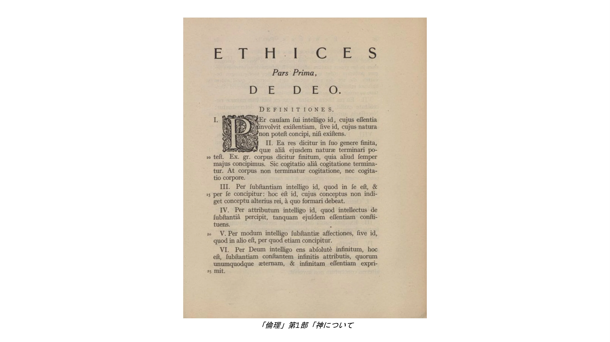

スピノザの概念は一般的に非常に難解であるため、何が何であるかを語るよりも、何が何でないかを語る方が理解しやすいことが多い。ちなみに、後述するように、このアプローチはBitcoinを理解するのに非常に有効である。

こうしてスピノザは、彼の見解では、神とは擬人化された存在であり、罰を与えたり、報いを与えたりする意図を持った存在ではなく、私たちが話しかけたり、私たちが従うかどうかわからない儀式に従って私たちの言うことを聞いたりする存在であることを示している。言い換えれば、彼曰く、神は雲の向こうに隠れた白くて長い髭を生やした老人ではなく、世界の困難を解決し、私たちを神に依存させる存在なのである。

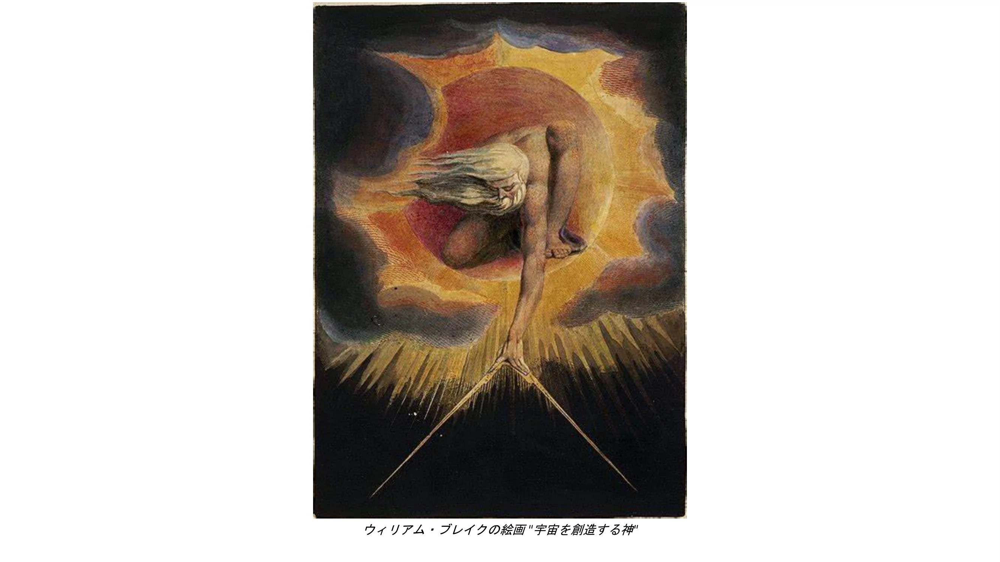

つまり、神について語るということは、無限の属性からなる唯一無二の無限かつ永遠の実体としての自然を呼び起こすことである。

これは、スピノザが絶対決定論の概念と、人間は自分自身の原因ではなく、自然の上にあるものでもなく、動物の上にあるものでもないという考えを導き出した有名な「Deus Sive Natura」である。

しかし、宗教批判を超えて、TTPは何よりもスピノザが宗教家、そして神権政治を厳しく批判する機会である。つまり、宗教的権力は恐怖と迷信を培い、個人をよりよく奴隷化するために個人の悲しい情念を活性化させ、妄信、狂信、戦争に陥れてしまうというのだ。

この宗教の初歩的で幼稚な段階では、信者は外面的な崇拝と偏見に基づく信心深い信仰にのみ執着するようになる。宗教が機械的に不寛容になり、道徳的教えの限界から逸脱し、真理を保持すると主張することで平和と調和を促進するという使命から背を向ける段階である。

しかし、宗教に対する理性的な批判を越えて、たとえば聖書の釈義に踏み込めば、スピノザは、この新しい神のヴィジョンが、「隣人を自分のように愛せよ」というシンプルだが忘れられがちな黄金律を掲げた三大宗教の正義と慈愛のメッセージと完全に両立することを、私たちに納得させようとする。

しかし、それだけではない。

TTPで展開されているこの成熟した宗教観は、政治的な側面を伴っている。すべての個人と国家そのものの利益のために、思想と信条の自由を守るために宗教と国家を分離する必要があるのだ。

基本的にスピノザは、理性の枠内での自由を、人間が自分たちの利益と対立する権力に隷属することなく生きるための必須条件とし、それゆえ政治的・宗教的自由に基づく直接民主制を擁護している。

言い換えれば、思想と信念の自由であり、人々が隷属や誤った幼児化した信念から脱却し、大人として理性を持ち、理性を優先させ、私たちに関する限り、技術の進歩も優先させることができるようにすることである。

1755年11月1日にリスボンで起きた有名な地震は、自然現象や災害に対する人々の考え方、そしてそれらから身を守る方法についての大きな変化を示した。

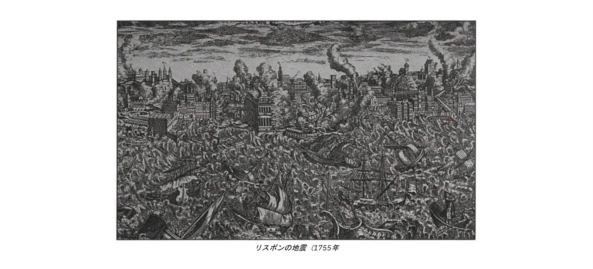

この恐ろしい地震は街を破壊し、数十万人の罪のない人々を殺しました。その多くはちょうど諸聖人の日であったため、その時教会にいて、生存者の理解をさらに困難にしました。

ドイツの哲学者であり数学者であったライプニッツ（1646-1716）が、意図と善と全能を備えた神という擬人化されたビジョンについて投げかけた問いを蘇らせたドラマ。ライプニッツが『神義論』の中で述べているように、もし神が善であるならば、そのような大災害を許してしまうので、神は全能ではないだろうし、もし全能であるならば、それを防ぐことができないので、神は善ではないだろう。

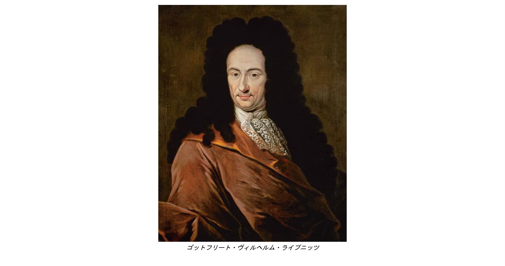

ジャン＝ジャック・ルソー（1712-1778）は、人類が差別的に被っている不正や恐怖に心を打たれたヴォルテールに、「自然はそれ自体悪ではなく、その設計を説明するような神の手をその中に見出すべきではない」と書き送った。

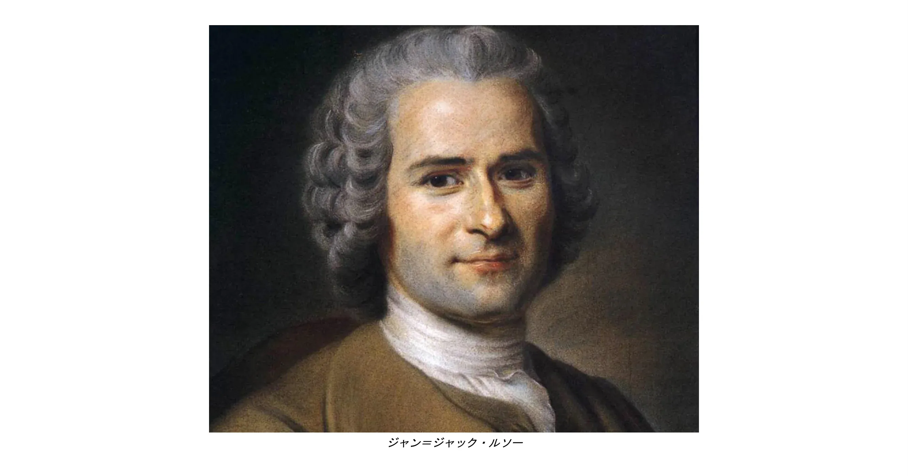

それに対して、スピノザ主義者であるヴォルテール（1694-1778）は、この自然災害は何よりも、自然から身を守る科学的手段が存在することを認識させるものであり、それゆえ、彼らの時代の課題は、知識と進歩のおかげで、人間が自らの手で未来を切り開き、神学や迷信から自由になれるかどうかを問うことだと答えた。

もちろん、地震を防ぐという問題ではない。地震はいまだに予測不可能であるばかりか、まったく制御できないものだからだ。

だからこそ、18世紀の啓蒙主義は、理性、科学、技術の行使のおかげで、進歩の世紀となったのである。言い換えれば、自由の道具としての進歩である。

# スピノザ主義革命、3つの幻想

<partId>f5d45c2b-28da-527a-ab20-dd255e9a9e0d</partId>

## 自然と人間の新しい定義

<chapterId>3e6599e3-5b29-50a8-a67d-d0386da5d65d</chapterId>

:::video id=b6d2c035-8848-4da6-9da9-be3b70be0f38:::

この章では、なぜスピノザ主義が思想の真のコペルニクス的革命と見なされるのか、思想史を見てみたい。

スピノザ（1632-1670）は、数学が提供する神、言い換えれば自然を理解するこの新しい方法のおかげで、宗教的世界観とその中での人間の位置づけに間接的な影響を与える、深遠なパラダイムシフトを確立した。

ニコラ・コペルニクス（1473-1543）が地球が世界の中心ではないことを立証し、チャールズ・ダーウィン（1809-1882）がその3世紀後に人間が「生命」の中心にいるのではないことを示したように、スピノザもこの論理に従って、人間は「自分の家の主人」ではなく、宇宙は自分たちのためだけに作られているのではないと同時代に主張したのである。

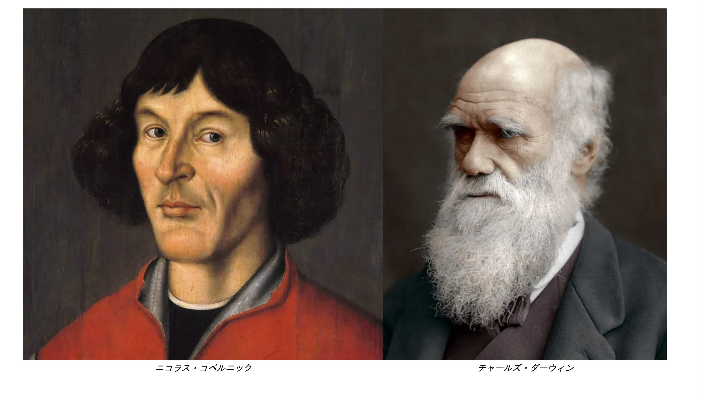

彼は、人間は「帝国の中の帝国」ではなく、地球が他のすべての惑星と同じように単なる惑星の地位に貶められているように、人間も動物や植物やすべての「現存する存在」など、他のすべての有限な自然の諸形態と同じように、単なる自然の諸形態の地位に貶められていると言う。

彼以前の古典ギリシア哲学は、世界、宇宙、人間の経験を説明するために、秩序だった階層的な宇宙観を提唱した。神話的な物語に基づき、基本的に世界の起源を説明しようとし、宇宙、自然、人間の調和を主張した。

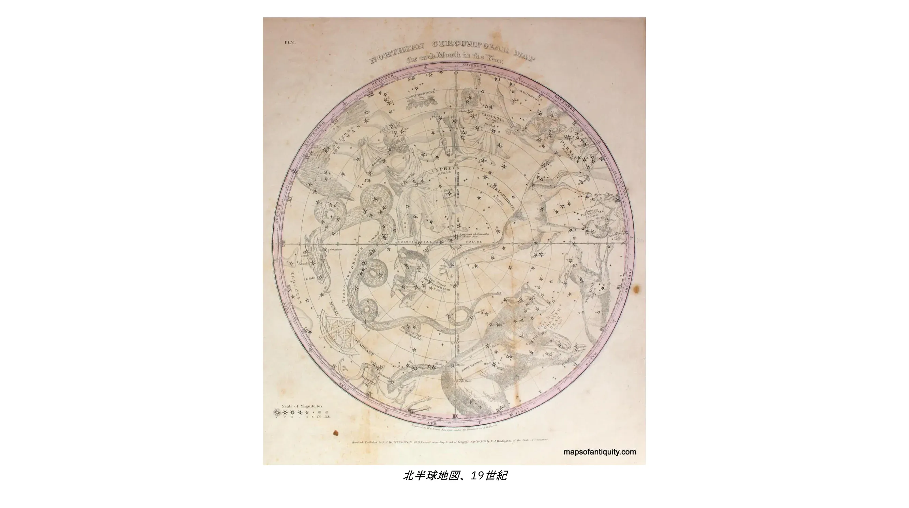

中世のスコラ哲学的宇宙論は、基本的に12世紀以降のもので、理性と信仰を調和させ、依然として階層的ではあるが、キリスト教哲学によりよく対応する宇宙を説明するために、より理性的なものへと進化した。

15世紀のコペルニクス（1473-1543）の新しい物理学によって、宇宙論は宇宙を理解する上で大きな転機を迎え、地動説が疑問視され、天動説が支持されるようになり、ケプラー（1571-1630）とガリレオ（1564-1642）の新しい物理学と天文学に代表される近代科学への道が開かれた。その後、アイザック・ニュートン（1643-1727）、そして最後はアルベルト・アインシュタイン（1879-1955）である。

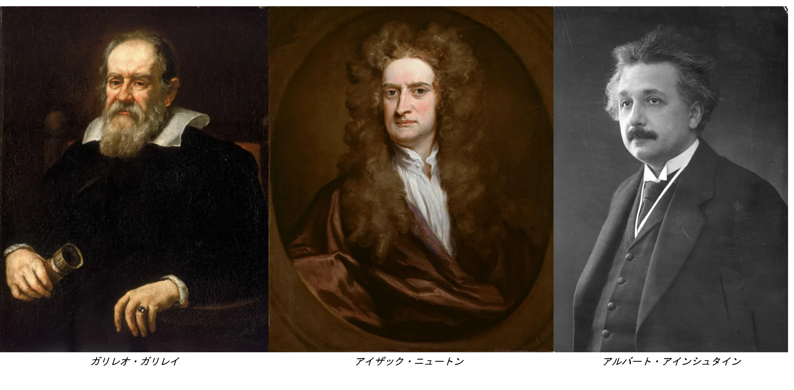

しかし、スピノザ主義を完全に理解するためには、スピノザに先立つ有名なフランスの哲学者であり、スピノザが弟子であると同時に敬愛していたルネ・デカルト（1596-1650）の文脈も考慮する必要がある。

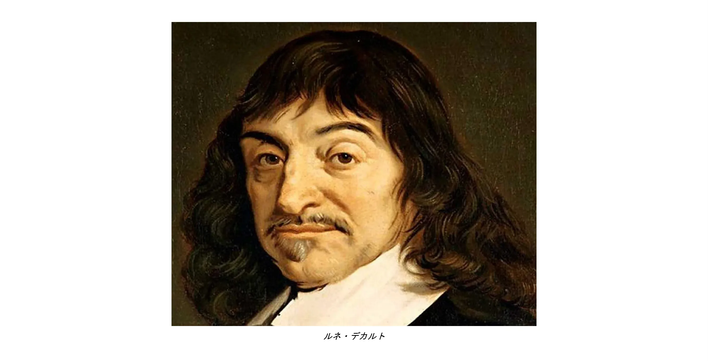

危険とジョルダーノ・ブルーノ（1548-1600）やガリレオの非難にもかかわらず、デカルトは「真理と虚偽」を区別し、神学、哲学、物理学を調和させることを目指した。1637年に出版された有名な『方法論』において、デカルトは理性こそが知識の基礎であり、それによって人間は自由を獲得できると主張した。

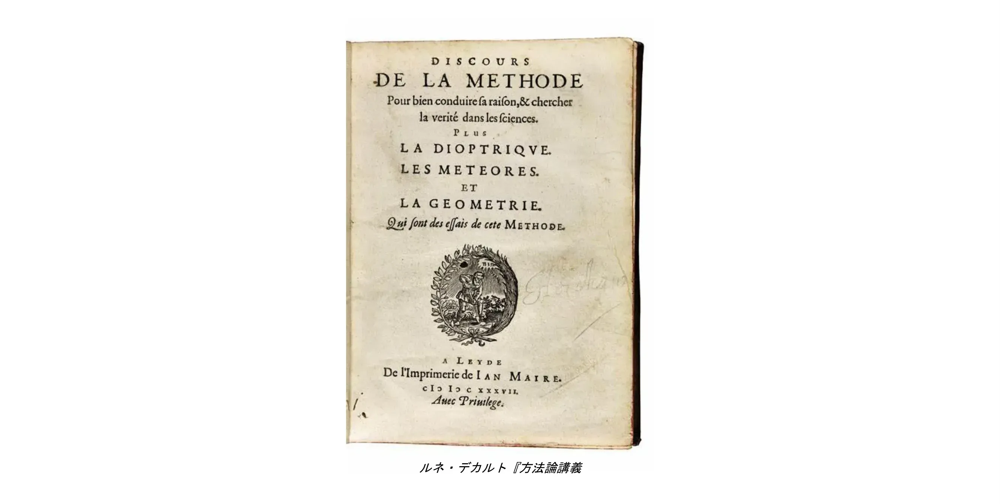

道徳的な意図に恵まれた自然ではなく、普遍的な法則に従って世界を説明することによって、スピノザが後に従うことになる決定論への道を開いたのである。

しかし、カトリック教徒であるデカルトは、それにもかかわらず、人間と他の有限の自然形態との間に、特に彼が「機械動物」と呼んだ動物種との間に、ヒエラルキーを確立した。そして、デカルトは、「よく導かれたとき、その行為と情熱に対して絶対的な力を獲得できない魂は存在しない」と言うことで、人間には無から有を生み出す能力があり、デカルトの考えでは、人間は「自然の法則から逃れ」、自らの行為に対して絶対的な力を持ち、その決意を自分自身にのみ根拠づけることができると主張している。

スピノザはこの段階を超え、凌駕し、神の存在と理性の実証を調和させる方法を知っていた。彼にとって、人間の活動のあらゆる分野は、完全に首尾一貫した決定された世界における理性の能力に依存している。しかし、偶発性も偶然性も存在せず、物事の因果関係に従って、起こることすべてが必要であり、原因の結果である世界。これが絶対決定論の考え方である。

例えば、人間は他のすべての動物のように自然の法則に従うものではなく、したがって他のすべての有限な自然の様式よりも優れているという考えを批判している。

言い換えれば、彼らには自由意志が与えられているのである。スピノザが語っているように、この幻想的な信念から逃れることは極めて難しい。

## 自由意志の幻想

<chapterId>f147a914-cb64-5927-b305-26691930bca3</chapterId>

:::video id=b59da795-ba19-4643-9672-36c9e7953a42:::

この講座では、スピノザにとって、啓蒙主義にとって、そして初期の自由主義哲学者にとっての自由とは何かをよりよく理解するために、自由意志というデリケートな問題に目を向ける。

すでに見てきたように、スピノザ（1632-1677）は自由意志を幻想とみなし、そこから自由になることは極めて困難だと考えていることで知られている。

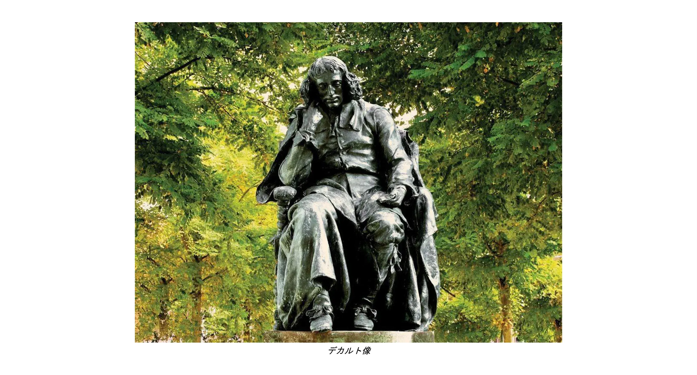

それはなぜか？なぜなら、それは古代以来の哲学的伝統に反するものであり、デカルト（1596-1642）によって現在も擁護されているからである。人間は無から有を生み出すことができ、特に神の前では自分の行為に全責任を負うことができる、とキリスト教会の父である聖アウグスティヌス（354-430）は言う。

しかしもちろん、人間の正義の前でもある。

それは、私たちの意志、そして私たちの意志だけが、私たちの人生を方向づけることを可能にし、私たちは自分の行動に対して絶対的な力を持っており、私たちは自分の行動の自由を自分自身からだけ導き出し、その結果、不確定な決定力を持っているという考え方である。

つまり、人間は自然の摂理に従うのではなく、自然の摂理を乱すことができるのだ。

自分の意志以外のいかなる法則にも従わないのだから、自分の人生において、彼は自然や動物、単なる機械の上に立つだけでなく、他のあらゆる有限の自然の様式の上に立つことになる。これがデカルト（1596-1650）の立場であった。デカルトにとって、人間の無力さと不安定さの原因は、自然の摂理にあるのではなく、人間性そのものの悪徳にあった。

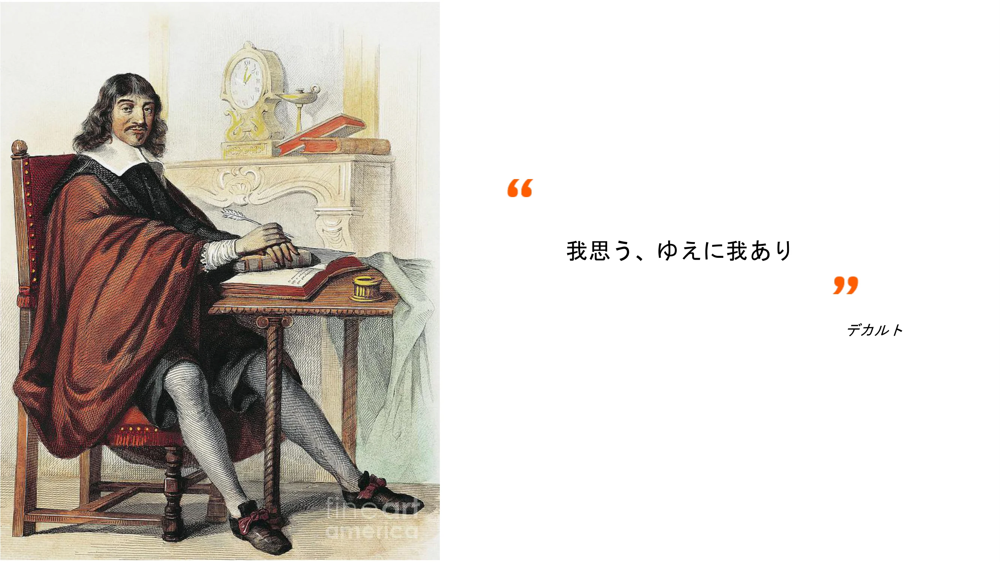

しかしスピノザは、デカルトが感情生活の理性的制御への道を開いたことを評価する一方で、意志の「絶対的な力」というこの仮説を断固として批判することで、デカルトとは完全に距離を置いている。

一方、スピノザは、私たちの世界は完全に首尾一貫しており、決定されており、起こることはすべて必要であり、物事の因果性の結果であると考える。

これは絶対決定論の考え方であり、そこから彼は『倫理学』の中で、人間には自由意志がまったくない、なぜなら人間は自分の行動を自覚しているが、それを決定する真の原因を無視しているか、無視したがるからだ、と述べている。

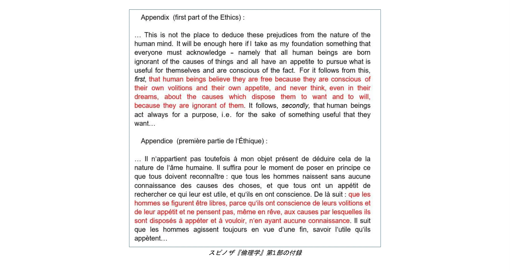

スピノザにとって、人間は動物や植物のような自然の "有限態 "として、無から有を生み出すことはできない。

さらに悪いことに、彼にとって自由の最大の危険は、自分の自由意志を信じ、外的要因に左右されることなく行動できると信じることである。

スピノザにとって自由とは、自由意志を表現することではなく、世界における自分の正当な位置を理解する能力であり、自分の決定された性質を理解する能力であり、そこから「行動する力を増大させる」方向に自分の存在を向ける能力である。常に楽観的に未来を見つめ、見たいように想像するのではなく、ありのままの世界を見ることである。

もちろん、問題となるのは人間の責任とその行動である。もし個人の行動に自由がないのであれば、特に正義の前では、その行動に責任を持つことはないだろうと結論づけることもできる。というのも、社会的、家族的、歴史的な決定論を認めることは、それが自発的なものである以上、犯した行為の責任を考慮することを妨げないからである。

その一方で、犯罪者の行動が決して彼自身の決定論と結びついていないと考えるのは幻想だろう。犯罪を免責することは問題ではないが、少なくとも犯罪を理解しようとすることは問題である。実際、これこそが正義の仕事である。正義は不法行為を罰するだけでなく、将来を予見し保護する役割を果たす。

行動能力としての自由に対するこのアプローチは、18世紀の啓蒙思想とのつながりである。啓蒙思想の最も偉大な使者の一人であるドイツの哲学者、イマヌエル・カント（1724-1804）によれば、啓蒙思想はまさに人間を訓育状態から解放する手段であり、エティエンヌ・ド・ラ・ボエティ（1530-1563）が言ったように、自発的な隷属から人間を解放する手段であった。

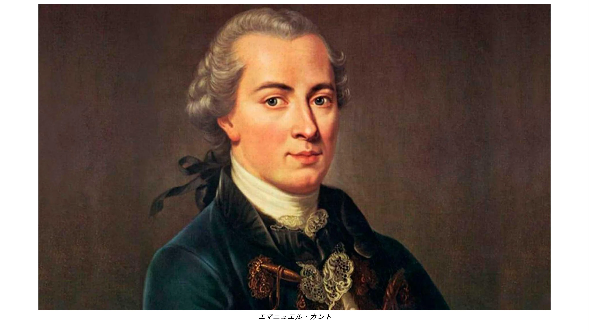

カントのモットーは「自分の頭で考えろ」「知る勇気を持て」であり、有名なラテン語の「Sapere Aude」である。

スピノザの行動力とは、このように、人間が自らの内に持っている、自らの動物的状態を理解する力であり、肯定的であれ否定的であれ、自然とその現象を客観的な原因と関連づけることによって理解する力である。そうではなく、解放と自由を視野に入れ、理性によって説明しようとするのである。

そして、特にイギリスの自由主義哲学者ジョン・ロック（1632-1704）とイギリスの経済学者アダム・スミス（1723-1790）によって、最初の技術革命と18世紀後半の最初の自由主義的・企業家的思想につながった進歩である。

そして、ジークムント・フロイト（1856-1939）の錯覚の定義を思い出す価値がある。常にスピノザの影響を認めていた精神分析の父によれば、幻想とはまさに「欲望の実現に突き動かされ、現実を無視することによってそこにある信念」である。

最後に、これから議論するリバタリアン運動は、直接的にはこの新しい自由主義哲学を指しているが、『La Grève』や『La Source vive』の著者であるアイン・ランド（1905-1982）のような人物が、人間には自由な選択をする能力があると考え、自由意志の存在を支持していることを指摘する人もいる。

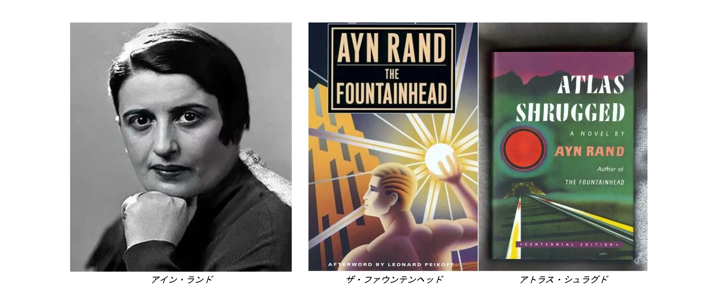

しかし、現実はまったく異なっており、混乱はむしろ意味上の問題から生じている。人間の行動能力、選択能力を認めながら、その対象である論理的決定論を認めることによって、最初の自由主義者は、現実にはスピノザの後継者でもあるのだ。彼らがスピノザと共通しているのは、人間は自然の上にあるのではなく、人間を決定論の中に位置づける進化のプロセスの結果であり、その歴史は人間を超え、人間が何であるか、何をするかについて大きな責任を負っているという信念である。

最後に、もし自由意志を信じることが錯覚であり、そこから抜け出すのが非常に困難であるとすれば、それは自由意志を養うもうひとつの錯覚、すなわち最終原因の錯覚を指しているからである。

## 最終原因の幻想

<chapterId>da2a7fb1-f1e9-5b56-822d-c73770de749d</chapterId>

:::video id=a0127fe7-a4cb-4a1c-8af4-f11c40b4a3d7:::

自由意志という幻想は、無から有を生み出すことができると信じること、自分の意志だけで人生を方向づけることができると信じること、不確定な決定力を持つと信じることから成り立っていることを前章で見た。それは、人間は自然の摂理に従う以上に、自然の摂理を乱すことができるという考えである。

スピノザ（1632-1677）にとって、人間は「帝国の中の帝国」ではない。すなわち、デカルト（1596-1650）が確立したのとは逆に、人間は自然における例外ではなく、決定論的な因果の連鎖の延長から免れることはない。

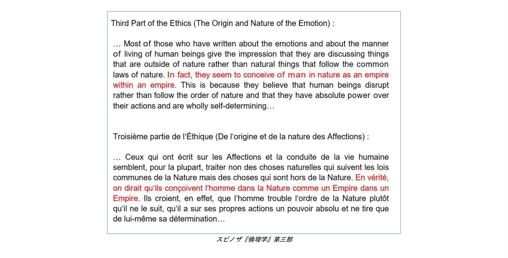

そして、スピノザは言う。自然には道徳的な観点から規定された終わりがなく、人間は想像力を理解力と勘違いする傾向があるため、自分の利益になるように自然を解釈する。物事を評価し、自分自身と関連付けることによってのみ、物事に意味を与えるのである。

つまり、彼らの欲望、希望、恐れに従ってだ。

この推論は、思考と理性の行使の大きな障害となる最終原因幻想によって説明される。なぜなら、最終原因幻想は、物事の結果をその真の原因に対応させるのではなく、たとえ不合理で幼稚なものであっても、信念に対応させたいという私たちの欲求を端的に表しているからである。

神的なものであることが多いが、迷信的であったり、無知であったりすることが多い。

コペルニクス（1473-1543年）、ケプラー（1571-1630年）、ガリレオ（1564-1727年）以来確立された合理主義と近代科学を支える因果関係の原則に反する推論によれば、90年代のエイズや2020年のコビドといった新しい病気が、常に神の、そしてしばしば懲罰的な意図の表れであると一部の人々に認識されてきたのはそのためである。

スピノザが言うように、多くのことが想像を絶すること、自然界には秩序よりも無秩序の方が多いことは、人々にとってはほとんど問題ではないのだ。しかし、そのような想像を超えた物事の複雑さゆえに、スピノザは、いかなる目的論的プロジェクトも信じる気にならないのである。なぜなら、人間は自分の欲望や有用性に基づいて、自分の確信の妥当性を信じることが、どんな合理的な議論や真実への関心よりも常に強いからである。

例えば、私たちは、目があるのは見るためであり、歯があるのは噛むためだと信じている。しかし、もちろん、人類が進化の過程で視力を発達させたのは見るためであり、歯列が今日のように発達したのも、自らを養い、肉を食べる必要があったからである。

そしてこれこそが、フランスの博物学者ジャン＝バティスト・ド・ラマルク（1744-1829）が、「器官を作るのは機能であって、その逆ではない」という先人説を確立したときに主張したことなのである（図3.3.3）。

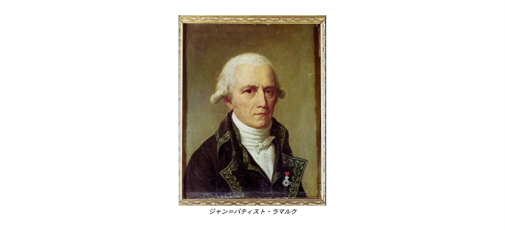

しかし、スピノザが言うように、「人間の妄想はそこで終わらない」のである。素朴で、結局はかなり愉快な、目的論的な考え方の例として、生物学者ベルナルダン・ド・サン＝ピエール（1737-1814）の有名な例がよく挙げられる。この元パリ自然史博物館館長は、自然の終局論を詩的、叙情的、そしてある種の素朴さでとらえ、たとえばメロンは、その畝のある皮が等分に切り分けやすいことから、大家族を喜ばせることだけを目的に作られたと考えた。

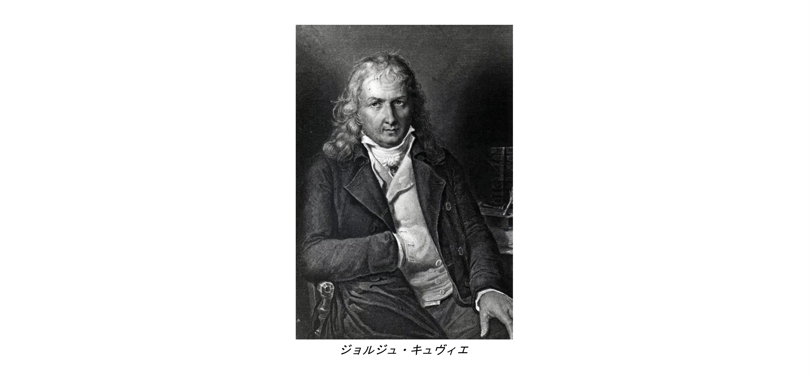

例えば、ケインズ派の経済学者や福祉国家の擁護者たちによるインフレの定義も、このパラドックスをよく表している。彼らによれば、インフレとは物価の上昇のことであり、一部の中央銀行家によれば、それは「どこからともなく」やってくるか、誰もコントロールしたり予測したりできない地政学的な文脈からやってくるのだという。例えば、原油価格が上昇すれば、特定の加工品の価格も上昇する。しかし、インフレの本当の構造的原因は、主にマネーSupplyの上昇に関連しており、それは貨幣価値の下落を意味し、事実上、機械的な物価上昇を意味する。

スピノザが嘲笑したように、正反対のことを信じたり、他人に信じさせたりすることは、目を見開いたまま夢を見ることに等しく、誤った、あるいは誤解を招くような推論を展開することになる。この場合、国家介入を支持する人々が、インフレが経済問題を解決する最善の方法であると考える。

しかし、このようなインフレの偏った解釈は、インフレが短期的には経済運営に役立つものの、実際には隠れた税金であり、長期的には人的・物的災害をもたらすだけで、国家が権力を乱用しないようにすることはできないということを忘れさせてしまう。これは、フリードリヒ・ハイエク（1899-1992）がそのエッセイ『農奴制への道』の中で、国家がもはや抜け出すことのできない隷属を想起させ、非常にうまく描写していることである。

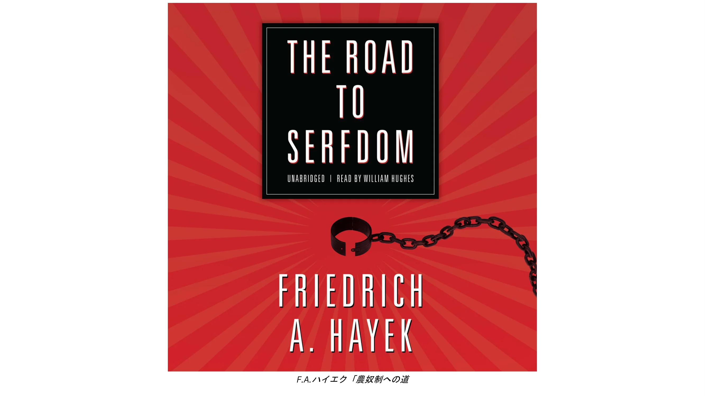

最後に、この最終主義的なメカニズムは、Bitcoinを非難する人々が、その効果に焦点を当てて批判を表明する方法にもよく表れている。

というのも、Bitcoinの効果には確かに批判されるべきものもあるが、それが新しく破壊的なテクノロジーであるという事実に伴う認知バイアスのせいで、私たちはネガティブな効果だけを見ようとする傾向が強いからだ。例えば、スピノザ主義のようなコペルニクス的革命に直面したときに宗教家であったり、分散型デジタル通貨のコンセプトに直面したときに中央銀行家であったりする。

しかし、宗教家や中央銀行家が理解、好奇心、善意を示し、ある概念に関心を持ち、自分の意見と期待を一致させるためにその効果を判断するのではなく、まずそれを理解しようとすれば、必ずそれを守ることができるのは明らかだ。

次章でお会いしましょう。

## 神学的幻想

<chapterId>93554156-5e62-526d-9b71-49c47be916af</chapterId>

:::video id=9c490cc1-3d29-4ca7-9464-1a701bb91ba7:::

スピノザ主義が提示した新しいコペルニクス的な思想観に関するこの最終章では、最後にスピノザ（1632-1677）がその著作『倫理学』で提示した第三の幻想に目を向ける。

この幻想は、最初の2つ、自由意志の幻想と最終性の幻想に直結している。

神学的錯覚のことだ。

要はこういうことだ：スピノザが言うように、人間が「物事と自分自身の両方について」無知である限り、幻想的な自由を信じている限り、人間は自分の想像力を理解力のように思い込んでしまう。欲望のままに。

だからこそ人間は、食べるための歯や見るための目など、自然の手段が存在し有用であるとすれば、それは「自然の監督」によって論理的に創造されたからだと考える。言い換えれば、人間の意図が帰属する、意図的で擬人化された神である。

言い換えれば、雲に隠れた白ひげの老人は、私たちを愛し、私たちが彼を敬い、崇拝するように私たちを守るため、私たちの目的の手段として、自然界の万物を創造したと信じられている。

これが神学的幻想の第一段階である。

哲学者のジル・ドゥルーズ（1925-1995）が言うように、結局のところ、私たちは「逃げ切る」ことはできないのだ。私たちは他の動物と同じように死を免れないが、それを知っている。

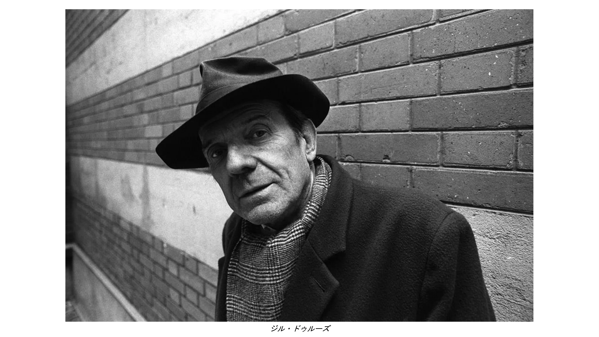

自分を安心させるために、反対のことを信じたり想像したりすることが、恐怖と希望の間を行ったり来たりする理由なのである。

希望のない恐れはなく、恐れのない希望もない。恐れる者は常に、恐れていることから逃れられることを望み、希望する者は常に、望んでいることが実現しないことを恐れる。

そして、スピノザは『倫理学』の中で、「われわれは、自分が望むことを容易に信じるようにできている」と述べている。

言い換えれば、ヴォルテール（1694-1778）によれば、「悪名高き者たち」は、迷信が理性から生まれることは決してなく、常に非合理的な、あるいは根拠のない信念に対応するものであり、物や行為に、それらにはない力や精神的な力を帰属させることによって、いかなる形の合理性にも反対する。

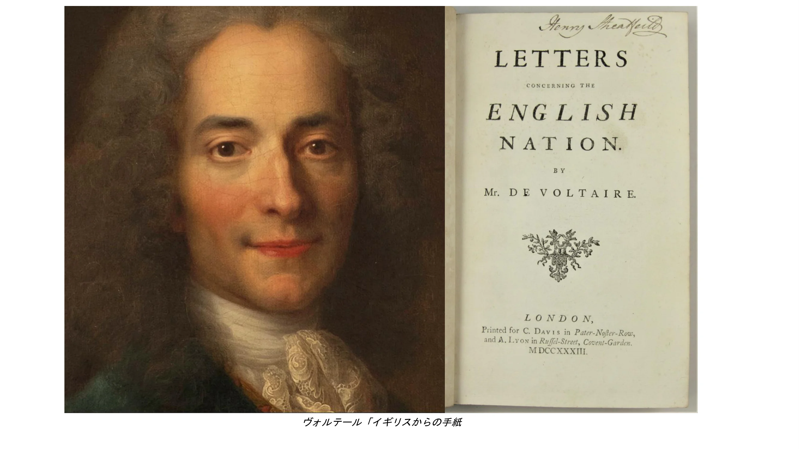

私たちを安心させ、より良い世界を想像させるという名目で、迷信は実際には私たちを自らの幻想と嘘の中に閉じ込める。そこから抜け出すには、GWから20日もかかるのだ。

18世紀以降、ドイツ、イギリス、フランスの啓蒙主義者たちは、迷信は理性の働きを制限するだけでなく、何よりも不寛容を生むことによって、人が大人になるのを妨げるだけであり、権力の支配を確立するための最良の手段であると主張した。政治的であれ宗教的であれ。

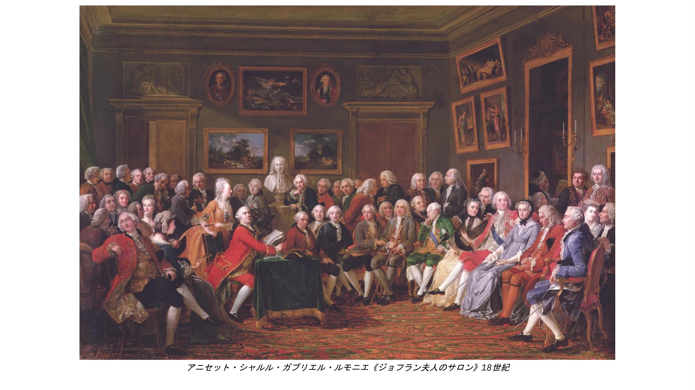

そしてこのことは、すでに触れた『神学政治論考』の中でスピノザが再び証明している。このエッセイの中で彼は、「君主制の大きな秘密、そしてその大きな関心事は、人々を欺くこと、そして人々を支配しなければならない恐怖を宗教の名でごまかすことである」と書いている。専制君主、独裁者、あるいは革命家が、他人のために良いことをしたいという欲望に駆られた人間であるにもかかわらず、常にとは言わないまでも、しばしば、その原則を達成するために、その原則とは正反対のことをするという罠に陥るのはこのためである。

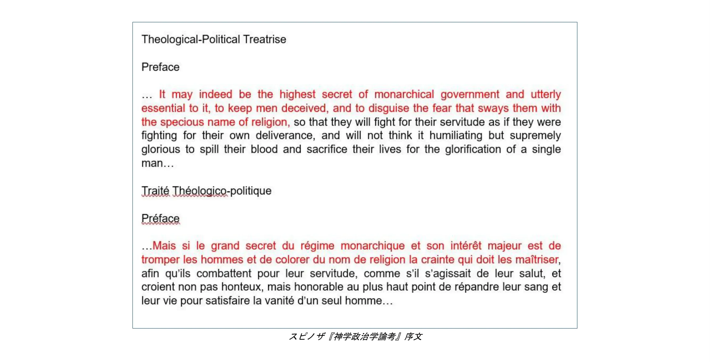

しかし、スピノザがTTPにもたらした新しさ、ある意味で彼を世俗主義の父にしたものは、迷信や、自由が逆説的に許す暴力への呼びかけと闘うことが不可欠である一方で、信じる権利と考える自由を守ることが国家にとって利益になるということを考えることである。

思想が存在し、私的に表現されるやいなや、それは必然的に社会全体に広がるものであり、禁止も検閲も、その広がりを妨げることはできないからだ。思想は、真であれ偽であれ、善であれ悪であれ、どのような場合にも流通するものであり、それを禁止することは、長期的には、自由の名の下に反乱や国家転覆を招くだけである。

言い換えれば、国家は表現の自由を維持することよりも、検閲や抑圧を受けることの方をはるかに恐れているのであり、それゆえスピノザは、個人が自ら考え、表現する当然の権利を行使できるようにすることが国家の利益になると言うのである。

スピノザにとって、思想の自由を認める民主主義国家は、人々が平和に暮らし、理性の行使のおかげで、自由に考え、行動できるだけでなく、自らを束縛している隷属を理解し、そこから抜け出すことができることを保証する最良のものである。

# 影響理論からBitcoinまで

<partId>82e69d4f-a94f-5978-bcb8-8a7b4651bcca</partId>

## スピノザにおける悪の問題

<chapterId>1ce64576-2688-5757-a119-57cc3a1076c0</chapterId>

:::video id=9c490cc1-3d29-4ca7-9464-1a701bb91ba7:::

ここで、スピノザ（1632-1677）がその著作や書簡の中で提示した悪の問題について論じてみたい。

しかし、これは複雑で物議を醸す話題であり、ここでの目的は、彼を導くもの、すなわち自由の探求をよりよく理解するために、彼の考え方をもう一度理解することにある。

これまで見てきたように、自由意志や自然界におけるあらゆる最終主義を信じないことは、私たちの日常生活における悪の存在という問題をすぐに浮上させる。

言い換えれば、自然界に "悪 "が存在するのかどうか、そしてその "悪 "が引き起こす害に対して人間に責任があるのかどうかが問われているのだ。

例えば、ソクラテス（紀元前470～399年）は「悪は無である」と説いた。彼によれば、邪悪な人間は生まれつき邪悪なのではなく、ある意味、善の本質について誤解していただけなのだ。

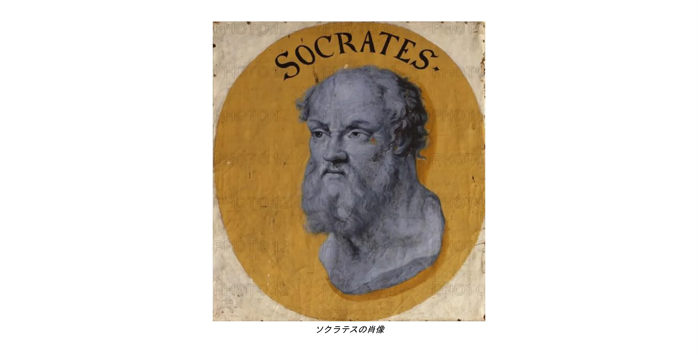

しかし、スコラ学の伝統、特に聖アウグスティヌス（354-430）の伝統は、今日でもキリスト教道徳に影響を及ぼしているが、悪は存在し、現実であるだけでなく、人には自由があり、善悪の選択をする能力があるため、悪を説明することができると主張した。

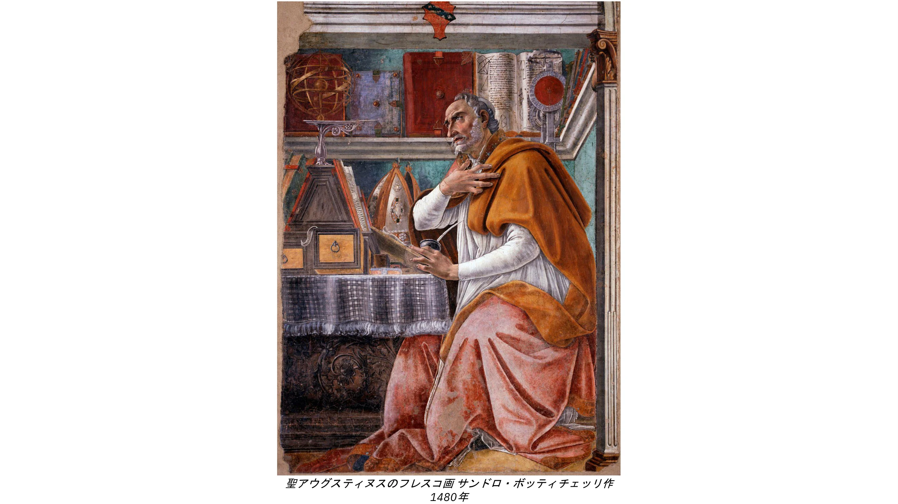

また、地震や致死性のウイルス、あるいは子供が生まれつき盲目であるという事実によって引き起こされた損害の責任は、人間に帰すべきでないとしても、この考え方は、自然に対して責任を負わせる道徳的意図を与えることによって存続している。例えば、地震が起きたのは、まさに人間が悪い行いをしたからだと考えるのである。

これは、人間は生まれながらにして罪人であり、原罪を犯しているという宗教家が擁護する考え方である。

スピノザは、自然や神、あるいは彼の言うところの幸運には意思が与えられておらず、人間には自由意志がないのだから、「悪」の責任は人間に帰するものだと考えている。

スピノザは『倫理学』の中で、「自然界で起こることで、その中に存在する悪徳に帰することができるものは何もない」と書いている。彼によれば、例えば生まれたばかりの赤ん坊の目が見えないことを「悪」と考えるのは間違いである。

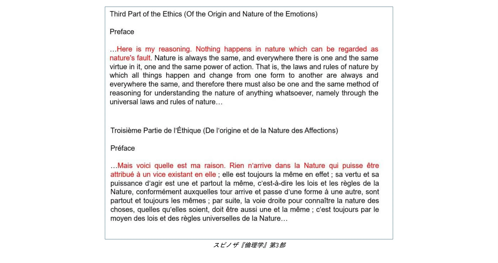

そして、もし私たちが目の見えない人に視力が欠けていると考えるなら、それは見える人の視点からだけなのだ。

こうしてスピノザは、自然界には悪は存在しないという考えを取り上げるのだが、悪は存在せず、「善」も存在しないと考えるところに彼の独創性があり、革命的な哲学となっている。

何が正しいか、何が間違っているかは、すべて相対的で主観的な概念であるため、彼は道徳ではなく倫理について語る。言い換えれば、生きて成長すること。人間として繁栄するために。

さらに、犯罪を犯して悪い行いをした人々の責任に関するスピノザの見解は、明らかに彼らを免責することを意図したものではないことはすでに見た通りである。  人は、たとえ犯罪を犯すに至った真の原因を知らないとしても、常に自分が何をしているかを自覚しており、それゆえ道徳と法の前では責任を負うのである。

犯罪者の犯罪が身体的、精神的な状態によって説明できるのであれば、犯罪者の行動は常に家庭的、社会的、経済的、あるいは医学的決定論と関係していることは明らかである。そしてこれこそが司法の役割であり、ある種の犯罪は罰せられるだけでなく、犯罪者の家庭的、社会的、心理的背景を考慮した上で治療されなければならないという事実を考慮するために、刑法を超えて司法が果たすべき役割なのである。

スピノザ主義者のジル・ドゥルーズ（1925-1995）が、倫理学とは一種の倫理学であり、存在のあり方に関する実践的な科学である。

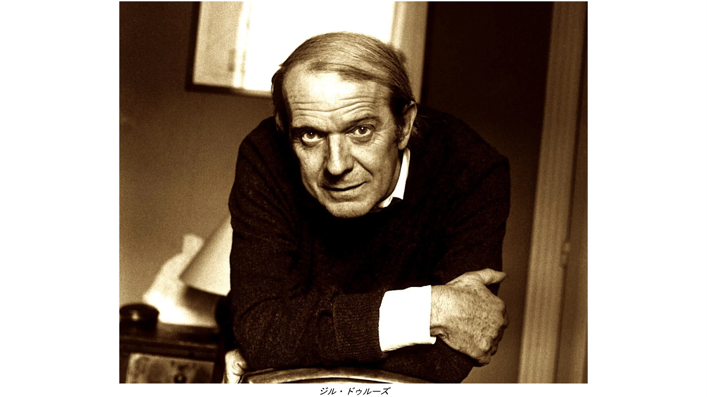

言い換えれば、スピノザによれば、自由とは、私たちの存在を「私たちの行動力を増大させるもの」に向けること、そして常に楽観的に未来を見据え、見たい世界を想像するのではなく、あるがままの世界を見ることである。

無知であることを良しとする医師たちや、無知であることを良しとするすべての人々と闘うスピノザの天才的な実証がそこにある。

それどころか、スピノザは人間の情念、それも最も非合理的なもの、失恋、狂気、悲しみ、憂鬱を、幾何学者のように、「より幾何学的に」、点、線、面、体積を研究するように研究する。

これは、彼が『倫理学』の第3部で展開する影響論であり、今すぐ勉強することをお勧めする。

ご清聴ありがとう。

## 感情理論

<chapterId>3bb011ce-6f0c-51a6-b41f-25a3b5b7768e</chapterId>

:::video id=bb427cc6-e54d-4b44-bd6d-281ba421001a:::

スピノザによれば、自由とは発見されるべき概念であり、より良い、より力強い人生への道である。より自由な人生。その道とは、絶対的決定論と物事の合理的因果性を認識することを必要とする道である。

彼はその体系を『倫理学』の第三部で展開している。有名な「影響論」である。

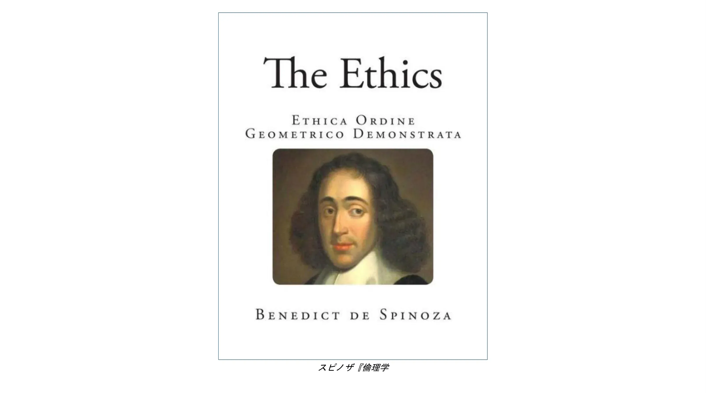

スピノザによれば、人間の影響とは、身体と思考の能動的あるいは受動的な変化であり、それが人間の行動力に影響を与える。

しかし、人間の本性と外界からもたらされる影響の両方によって、私たちは真の考えを形成し、推論し、喜びを表現することができる。

しかし、私たちはまた、いわゆる受動的な影響や偏見を形成することも可能であり、それは私たちを機械的に、"自分自身にもかかわらず"、私たち自身の利己心が必要とするものを見たり実行したりしないように導く。

私たちは奴隷、あるいは隷属を口にする。それは、時として私たちを、しないことを望み、望まないことをするように導く、受動的な影響を制御し、打ち消すことができないことを特徴とする状態である。

これはスピノザが『倫理学』の中で、「人はしばしば最良のものを見て、それを承認し、最悪のことをする」ことに驚いたり、「まるで救いのために戦うかのように、隷属のために戦う」ことに驚いたりするときの言葉である。

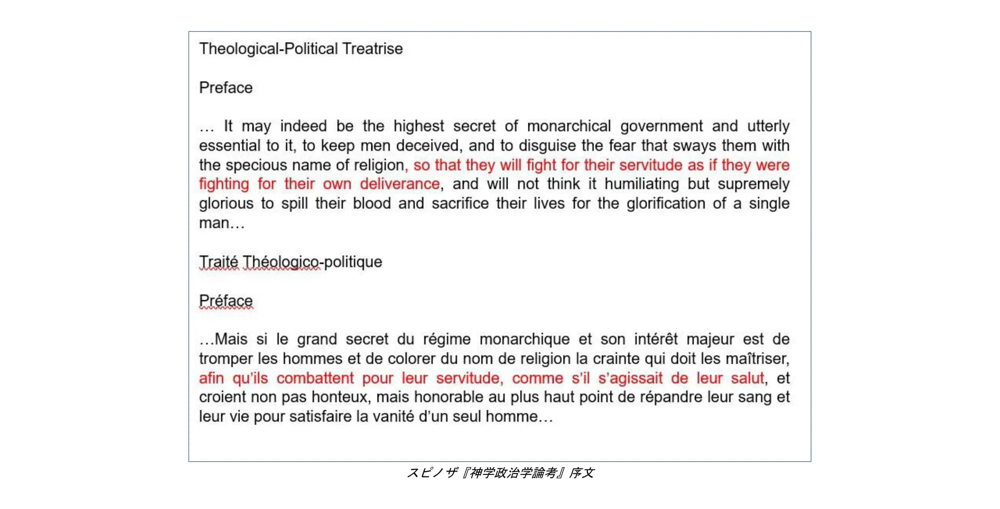

スピノザは憎悪を例にとり、それは悲しみに向かう受動的な感情であり、不十分な観念、すなわち原因についての部分的な知識から生まれると見ている。

言い換えれば、もし私たちが外国人を憎むとすれば、それは、その外国人がもともと外国人であり、異なる存在であることから、私たちが理解できない理由で、その外国人を私たちが持っている考えと結びつけるからである。このような外的な原因という考え方は、しかも、無知な者が自分の知らない概念について悪口を言う動機付けとなる。

特に暗号通貨の分野ではそうだ。

スピノザは、道徳によってではなく、教育によって、共感によって、理性によって、特にこの場合は見知らぬ他人の資質、Bitcoinの場合はその実用的な側面や有用性に焦点を当てることによって、この外的原因という否定的な考えを取り除くならば、関連する悲しみの感情は消え、自動的に憎しみも消える、と言う。

この考え方は、もちろん能動的な影響、特にスピノザによれば「外的原因の観念と結びついた喜び」である愛にも当てはまることを覚えておく価値がある。そして、例えば、ある物や人を愛するという外的原因が消滅したり、時間の経過とともに変化したりすると、それに結びついた喜びも消滅し、愛の感情が消滅することがある。これが理解できないと、不幸になったり落ち込んだりする。

しかし、このいわゆる影響理論が私たちの "無意識 "に適用されるのであれば、"測量士流 "の合理的な思考法は、宗教的、政治的、あるいは自然現象の結果であれ、あらゆる形態の外的隷属との戦いにも適用される。

これは雷の例である。雷が落ちて罪のない人々が殺されると、無知な人はそれを神の手と見なし、雷が道徳的で最終的な意思を表していると考える傾向があるからだ。90年代のエイズや、最近ではコビドも、神の懲罰と解釈されることがある。

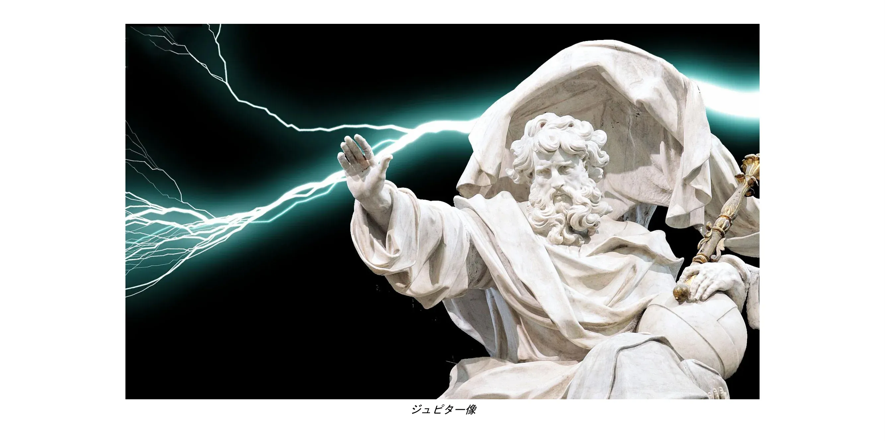

スピノザは、この例で言えば、落雷は何もしないが、それ自身の本質を表現しているのだと言う。雷を落とすということだ。もちろん、誰かを罰したり報いたりする道徳的な意図はない。

この単純な例のおかげで、私たちは、雷から身を守る唯一の解決策は、言い換えれば、雷の危険性が常に私たちに課してきた隷属から身を解放することであり、不運や神の不公平を訴えることでもなく、道徳的な議論を展開することでもないことを理解する。そうではなく、ここでもまた、憎しみと同様に、倫理的観点から私たちに何ができるかを考えることなのだ。

そしてこの場合、理性的であること、進歩に対してオープンであること、科学が私たちに与えてくれるものに対して好奇心と自信を持つこと、そして避雷針を設置することで、雷から身を守ることができるだろう。

これが『倫理学』の天才的なところである。スピノザは、自発的な隷属から、「自分自身にもかかわらず」、永遠に疎外される風見鶏のような生き方から、情念と決意の知識を通して生きる生き方へと移行することが可能であることを示している。

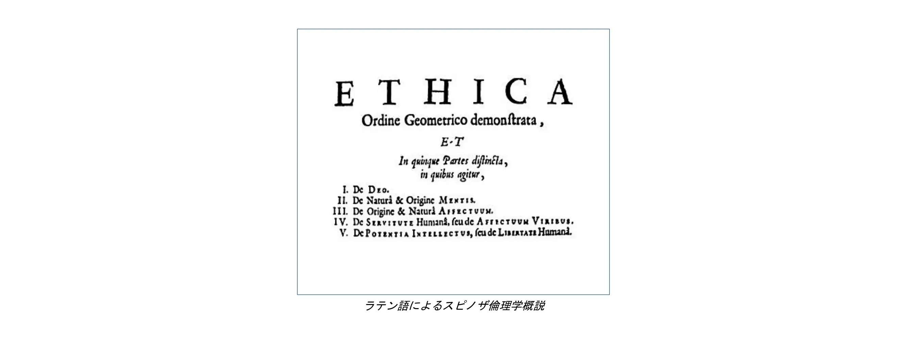

物事の明るい面や真実を見るために、人間の本質を解剖する思考法だ。私たちに重くのしかかる悲しみや恐れの理由を取り除くために。自由になること、言い換えれば、悲しい情熱に従うことをやめ、行動を変えることができるようになること。

そして、おそらく哲学史上初めて、明晰で幸せになれることを理解した。

スピノザ主義がしばしば「喜びの哲学」と呼ばれる所以である。

## 自由、オーストリア経済学派、Cypherpunk哲学

<chapterId>b54f2532-460c-11f0-a248-93ff24ef1d57</chapterId>

:::video id=5f49d5b4-e15f-475b-b40d-07464c08ca4d:::

スピノザが言う自由とは、決定論を自覚することである。理性の導きによって、そして私たちの行動能力のおかげで、私たちは隷属の因果的メカニズムを理解することができる。

結局のところ、この明晰さとは、後にフリードリヒ・ニーチェ（1844～1900年）によって語られるようになるニヒリズムの中に生きることを意味する。

特にイマヌエル・カント（1724-1804）は、理性の導きのもとで教育を受けた個人だけが、自分自身で考え、何が「真」であり「善」であり、何が有害であるかを倫理的に判断することができるとした。

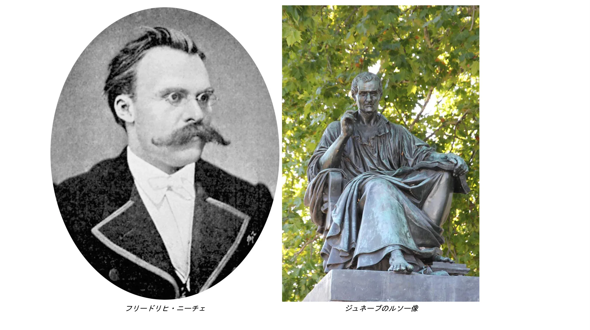

つまり、もし私たちが自分の頭で考え、理性的な大人として理性を持ち、物事の因果関係を理解しようとするならば、例えば、宗教の真の美徳や政治的・経済的領域における真の倫理的価値観を教えてくれる道徳的権威はもはや必要なくなる、というのである。

それは、第一次世界大戦前のウィーンの極めて肥沃な知的雰囲気の中で生まれたオーストリア学派の自由主義経済学との関連性を示すものである。カール・メンガー（1840-1921）、ルートヴィヒ・フォン・ミーゼス（1883-1979）、フリードリヒ・ハイエク（1899-1992）といった知識人たちが、自由主義経済学の新しい学派の基礎を築き、それが後のサイファパンクの信念の基礎となったからである。そしてBitcoinの誕生である。

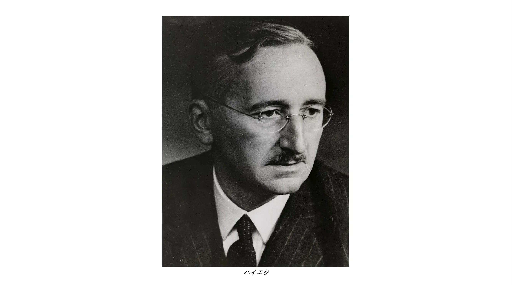

例えば、メンガーとミーゼスは、すべての知識は物事間の因果関係に従って構築されなければならないとし、経済学の新しい因果概念を提案した。特に、その数年前にフランスの経済学者フレデリック・バスティア（1801-1850年）によって展開された自由主義の精神に触発された。

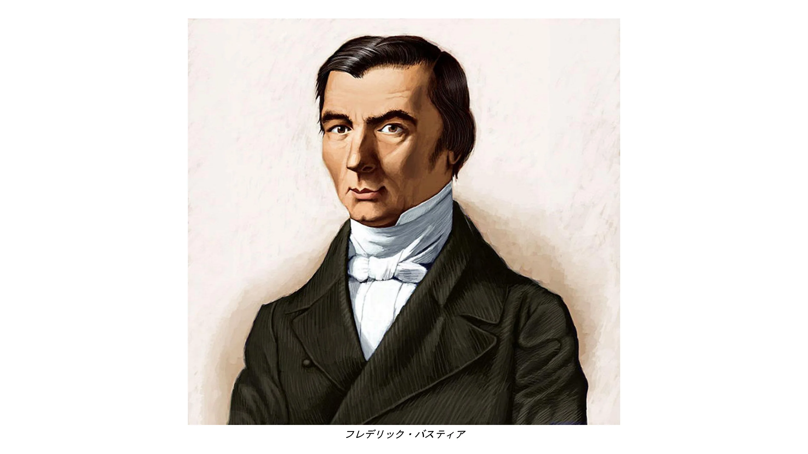

一方ハイエクは、すべての経済的決定は常に不確実性と無知を表現しており、道徳、信念、偏見、政治的イデオロギーのためにそれに苦しまないという事実が、経済的行動を正しく分析することを可能にし、ひいては個人にとって、社会にとって、国家にとって何が良いかを考えることを可能にすると考える。

こうしてリベラルなオーストリアの経済学者たちは、すべての社会主義的な考え方（ハイエクは「プラン主義」と呼んだ）や、それに触発された道徳的な政策を断固として批判するようになった。政府に経済的権力を与えることは、必然的に時代遅れとなり、何をすべきで、何をすべきでないかから外れてしまう。

たとえば、国家が経済運営や危機解決のために貨幣発行権を強制的に付与した場合、その権力を濫用することを自制できなくなる危険性があると、オーストリア学派は考える。

それはなぜか？スピノザが言うように、「最良のものを見、それを承認し...しかし、最悪のものを行う」のだ。

スピノザ主義者であるハイエクはビデオの中で、「この権力は暴力なしには奪えないので、できることはトリックを使い、政府がもはや止めることのできない新しい貨幣概念を導入することだけだ」と説明している。この主張は、ミルトン・フリードマン（1912-2006）のインタビューでも繰り返されており、その中で彼は、この新しい形のデジタル通貨について、発展途上のインターネットの文脈で論じている。

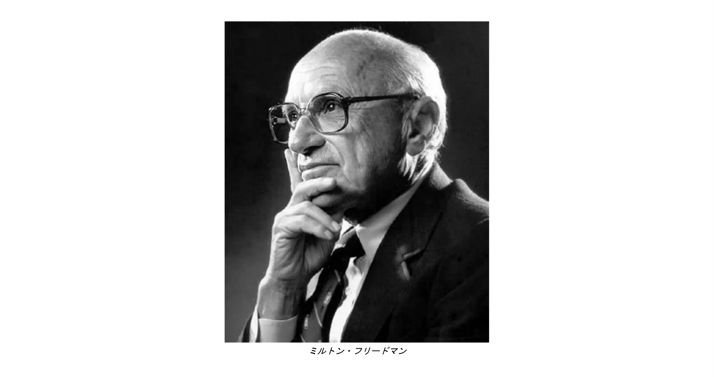

これらは、最初のサイファーパンクであるエリック・ヒューズ（1953-）が「Cypherpunkマニフェスト」で、あるいはティモシー・メイ（1951-2018）が「暗号アナーキスト・マニフェスト」で提唱した政治的・経済的主張であり、Satoshiナカモトが再び取り上げるものである。

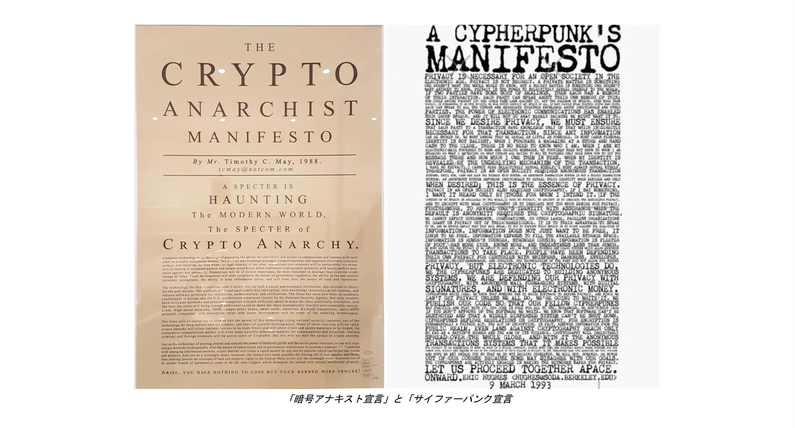

特に、2009年1月3日のタイムズ紙の見出しを、Blockchain BitcoinのGenesisブロックのコインベースに刻み、ケインズ主義というひとつの時代の終わりと、リベラル、アナーキスト、リバタリアンを志向する別の時代の始まりを表現した。

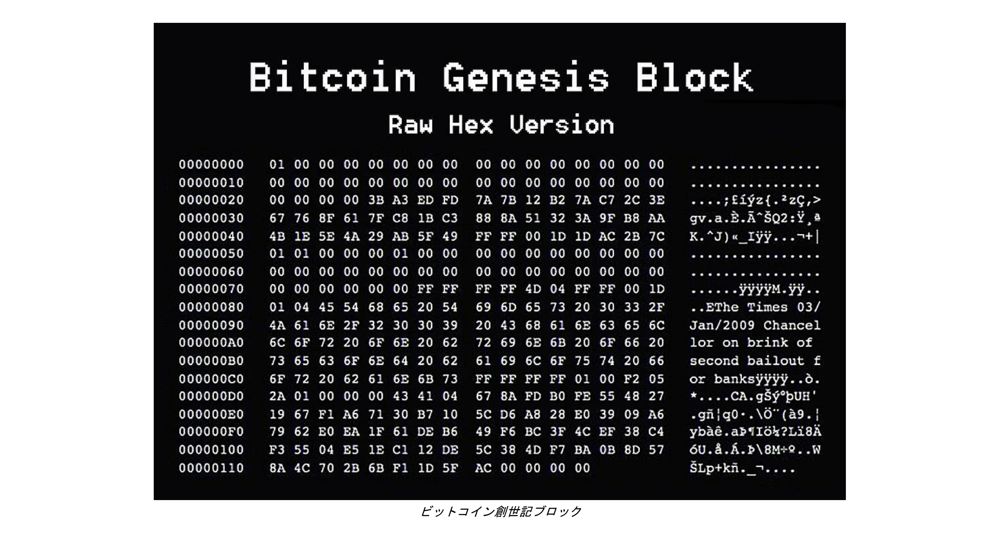

2008年10月31日に発表された白書は、Bitcoinを、分散型プロトコルに基づき、信頼できる第三者なしにインターネット上で価値を交換する手段として提示している。コペルニクス的」革命は、人々が最終的に行動する能力、すなわち自由、取引の自由、財産権、プライバシーの尊重を取り戻すことを可能にする。

なぜか？Bitcoinは、スピノザのやり方で、理性のおかげで、ガリレオの数学の言葉のおかげで、この隷属から抜け出すことを可能にしてくれるからだ。そして、ハイエクが示唆するように、国家が反対することなく。そして、強制も布教もなく、平和的に。

実際、これがスピノザ主義とBitcoinの間に描く最後の並列であり、コペルニクス的あるいは破壊的な概念を支持しない人を説得するためには、理性、理解、好奇心、善意以外には意味がないことを示すものである。

武力でも暴力でもない。なぜなら、コペルニクス、ガリレオ、ニュートン、ダーウィン、アインシュタイン、ハイエク、スピノザ、Satoshiナカモトは、彼らの考えや実証を信じない人を脅すことはなかったからだ。

# 最終節

<partId>70a5a3c8-6c88-11f0-8753-db07e26dcaf4</partId>

## レビュー＆評価

<chapterId>7945c38c-6c88-11f0-a73f-0f7cdf99f53f</chapterId>

<isCourseReview>true</isCourseReview>

## 最終試験

<chapterId>a557fd32-6c88-11f0-96ff-cfa532cf76a0</chapterId>

<isCourseExam>true</isCourseExam>

## 結論

<chapterId>ae04ab38-6c88-11f0-a496-3be47119e6b6</chapterId>

<isCourseConclusion>true</isCourseConclusion>