# Da Spinoza møtte Satoshi

Oppdag hvordan 1600-tallsfilosofen Baruch de Spinozas radikale ideer om frihet, fornuft og makt foregir Bitcoins desentraliserte revolusjon. Dette kurset avslører de slående parallellene: begge avviser blind tro og sentral autoritet, begge bruker matematisk stringens for å frigjøre. Spinoza frigjorde sinn fra religiøs dogme, Bitcoin frigjør penger fra statlig kontroll.

Lær praktiske verktøy fra Spinozas etikk for å forstå bitcoins filosofiske fundamenter og øke din handlefrihet. Klar til å utforske to av historiens største instrumenter for menneskelig frigjøring?
+++
# Innledning

<partId>80b76189-afab-5295-a8d3-ba8f6fe7a5e8</partId>

## Introduksjon til kurset

<chapterId>99af4992-fd6c-5142-b168-d927b251574b</chapterId>

:::video id=1def60bc-1d39-4e49-9b08-fd05b7a0d49b:::

I dette kurset har jeg gleden av å presentere filosofien til Baruch de Spinoza (1632-1677), den berømte 1600-tallsfilosofen som regnes som den rasjonelle opplysningsfilosofiens far.

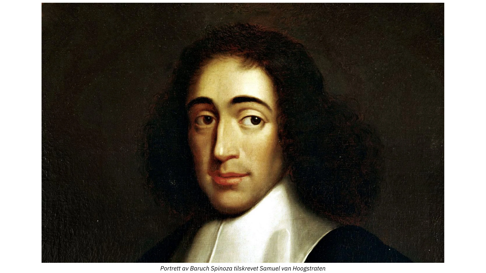

Portrett av Spinoza

Disse kursene er basert på mine to essays om emnet, "Spinozas sanne religion" og "Bitcoin, frihetens evangelium", som er tilgjengelige i papirform enten på nettet eller direkte fra min hjemmeside, og digitalt på Amazon Kindle.

Målet med dette kurset er først og fremst å gi en forenklet forståelse av en filosofi som ofte anses som svært kompleks og utilgjengelig, til tross for den fornyede interessen den nyter i dag.

Denne filosofien lar oss nemlig ikke bare stille spørsmål ved tingenes mening når alt går galt, som religion, filosofi og humaniora vanligvis handler om, men også, og kanskje aller mest, stille spørsmål ved oss selv når alt går bra.

Når livet smiler til oss og vi føler at vi ikke trenger å stille spørsmål ved oss selv, og med en stolthet som oppleves som illusorisk og slavisk, tenker vi at lykken eller suksessen vår bare kan komme fra vårt talent, vårt arbeid eller våre angivelig frie valg; kort sagt, fra vår egen frie vilje, snarere enn fra den determinismen vi er underkastet.

På denne måten kan vi knytte denne praktiske frihetsfilosofien - eller, som Spinoza uttrykker det, "mot midlene for å oppnå den" - til den nye teknologiske verdenen vi er interessert i her, krypto generelt og Bitcoin spesielt.

Og særlig det filosofiske aspektet, som får oss til å reflektere over nettopp frihetsbegrepet: friheten til å tenke, til å uttrykke seg, til å respektere privatlivet og, selvfølgelig, i vårt tilfelle, friheten til å Exchange.

Først vil jeg introdusere deg for Spinoza, hans personlighet, hans sosiale, religiøse og familiære bakgrunn, og den historiske konteksten i de forente provinsene der han levde.

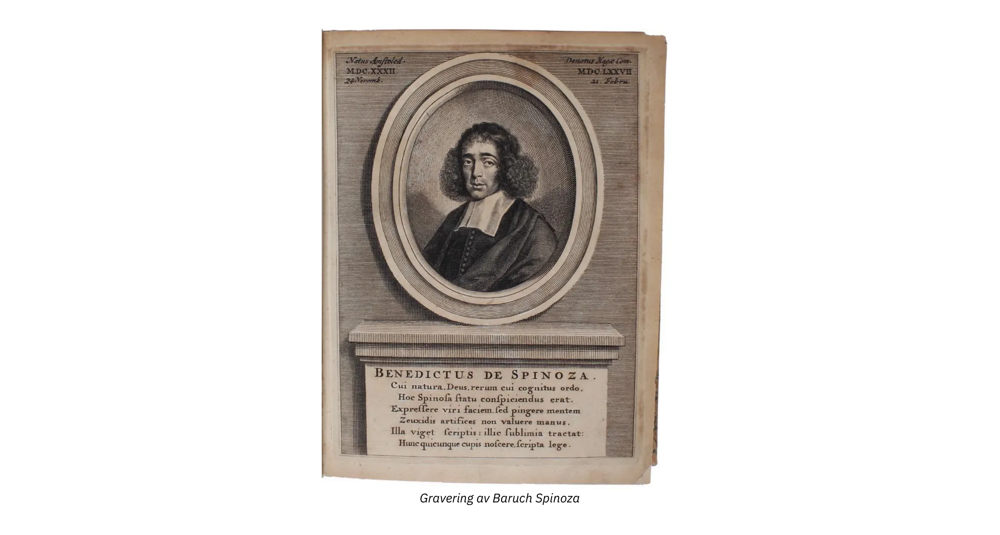

Portrett av Spinoza

Deretter skal vi se hva denne nye rasjonelle filosofien går ut på, som sier at "det ikke finnes noe i naturen som ikke kan forklares uten bruk av fornuften".

Det er ideen om at vi bare kan forstå verden og menneskets natur ut fra årsakssammenhengen mellom tingene, der en virkning alltid har en årsak, og denne årsaken er selv en virkning av en annen årsak, og så videre, helt tilbake til den første årsaken, som vi ikke har tilgang til, og som ifølge Spinoza er naturen.

Naturen, med andre ord Gud, er det berømte "Deus sive Natura" på latin som illustrerer hele spinozismens betydning.

Vi skal også ta en titt på Spinozas to hovedverk, og vi begynner med Etikken, som ble utgitt posthumt i 1677, og som fokuserer helt og holdent på frihet og behovet for å frigjøre oss fra de slaveriene som holder oss fanget.

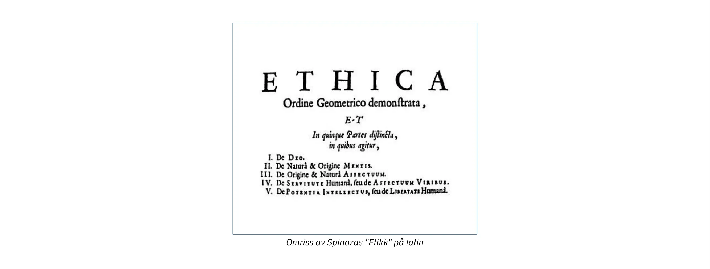

Deretter skal vi se på Traité théologico-politique, som ble utgitt mens han levde i 1670, og som lar oss betrakte friheten fra en annen vinkel: tanke- og trosfrihet. Med andre ord religionsfrihet, men fremfor alt politisk frihet.

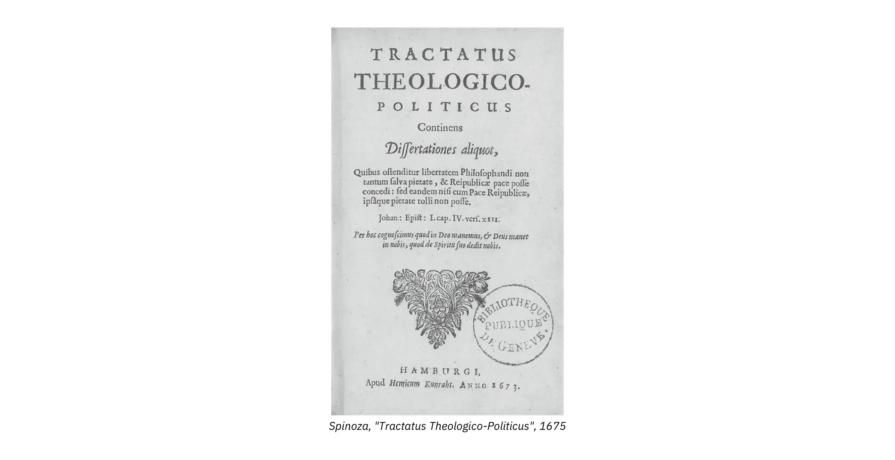

Til slutt skal vi se hvorfor spinozismen er en kopernikansk idérevolusjon, og hvordan den representerer en ny definisjon av verden og menneskets natur, ved å studere de tre grunnleggende illusjonene som Spinoza fordømmer: illusjonen om fri vilje, illusjonen om endelige årsaker eller finalisme, og den teologiske illusjonen.

Takket være teorien om affekter utviklet på geometernes måte, "more geometrico", vil vi til slutt se hvordan Spinoza tilbyr oss en praktisk metode for å frigjøre oss, eller forsøke å frigjøre oss, fra servituttene som ligger i menneskets natur og ytre lidenskaper. En rasjonell mekanisme som, for å bekjempe uvitenhet, kan sammenlignes med vissheten om at de tre vinklene i en trekant alltid er lik 180 °, og vil tillate oss å koble opplysningstidens ånd som resulterte fra den med de liberale strømningene på 1800-tallet eller libertarianismen i det 20. århundre, som er direkte knyttet til oppfinnelsen av Satoshi Nakamoto, Bitcoin.

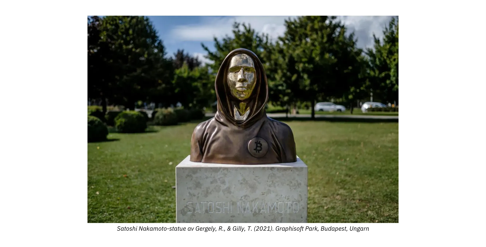

Vi vil da forstå at blant de mange fellestrekkene mellom spinozistiske konsepter og dette frihetsverktøyet oppfunnet av Satoshi Nakamoto, er det første at i begge tilfeller, hvis vi er nysgjerrige, velmenende, som det ble sagt på den tiden, har "forståelse", så kan vi ikke la være å holde oss til det. Og hvis vi ikke holder oss til det, noe som selvfølgelig ville være vår mest absolutte rett siden det er grunnleggende å respektere friheten til å tro, eller ikke tro, så ville vi være fast bestemt på å ikke kunne, eller ikke ville, noe som utgjør det samme.

Og det er slik vi kan forstå at en religiøs fundamentalist, for eksempel, aldri vil kunne akseptere eller lytte til den minste kopernikanske tanke som spinozisme, akkurat som en sentralbankmann vil ha svært vanskelig for å akseptere Bitcoin.

Men som du vet, går utviklingen i riktig retning for tiden.

## Vi presenterer Baruch de Spinoza

<chapterId>f53a9cfd-326e-5b73-a766-3ef2f07c5a49</chapterId>

:::video id=5fac3ddc-c472-4c64-8186-46a8f317e389:::

Hvem var Baruch de Spinoza? Han var en nederlandsk filosof som ble født i 1632 og døde i 1677, 45 år gammel.

Han var jøde, og tilhørte det portugisiske sefardiske samfunnet som nedstammet fra marranerne som ble tvunget til å forlate Spania av katolikkene på 1400-tallet. Han vokste opp i et religiøst og intellektuelt miljø, og var klar over hva det vil si å bli forfulgt.

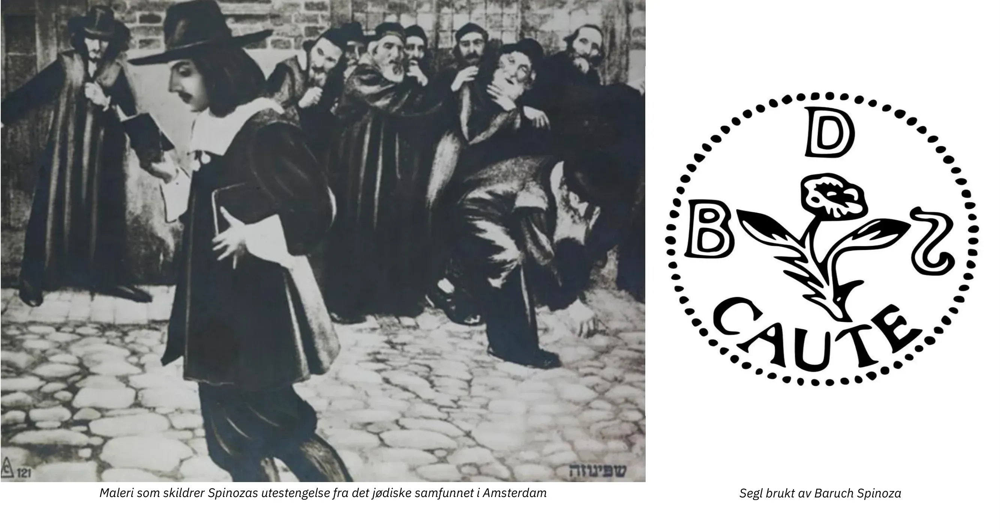

Faktisk viste han tidlig en sterkt kritisk holdning til den etablerte religionen, og særlig til det hebraiske trossamfunnet, som han ble utstøtt fra i 1656, bare 24 år gammel, før han hadde publisert noe som helst.

Denne "ekskommunikasjonen", sies det, gjorde det mulig for ham å isolere seg og fokusere på arbeidet sitt uten å se seg tilbake.

I likhet med sine samtidige Descartes (1596-1650), Pascal (1632-1662) og Newton (1643-1727) var Spinoza en arvtager etter de nye rasjonelle ideene i fysikken til Kopernikus (1473-1543), Kepler (1571-1630) og Galilei (1564-1642), som kom bare noen få år før ham, og han utviklet en tenkemåte i geometriens ånd, i tråd med Galileis prinsipp om at matematikken er universets språk.

Men dette var svært farlige ideer for samtiden, etter rettssaken mot munken og filosofen Giordano Bruno (1548-1600), som ble brent levende for kjetteri på et torg i Roma, og rettssaken mot Galileo, som ble tvunget av inkvisisjonen i 1633 til å ta avstand fra sin kopernikanske heliosentriske overbevisning.

Det er grunnen til at hans strengt rasjonelle syn på verden og menneskets natur, basert på årsakssammenhenger mellom ting, gjorde at han fikk rykte på seg for å være ateist, og det er han fortsatt i dag, med urette.

Spinozas verk taler faktisk bare om Gud, som han identifiserer med naturen, og selv om han kritiserer de overtroiske impulsene til religiøse mennesker og teokrater, viser han at sann religion for ham først og fremst er synonymt med rettferdighet og nestekjærlighet.

Og det er denne tilnærmingen som knytter Spinoza til opplysningstidens filosofi, enten den er tysk med Leibniz (1646-1716), Kant (1724-1804), Schopenhauer (1788-1860) og Nietzsche (1844-1900), engelsk med Locke (1632-1704) eller fransk med Voltaire (1694-1778), Rousseau (1712-1778) og Diderot (1713-1784). Alle var enige om at fornuften skulle brukes til å bekjempe obskurantisme, særlig religiøs obskurantisme, til å bekjempe uvitenhet og til å forsvare idealene om frihet og fremskritt.

For å begynne å knytte denne filosofien til Bitcoin, er det viktig å merke seg at Spinoza ble født i en helt spesiell tid.

På 1600-tallet var De forente provinser ikke bare det frieste landet i verden når det gjaldt politiske og religiøse ideer, men også det rikeste. Med andre ord det økonomisk og teknologisk mest avanserte landet.

Rikdom er imidlertid ikke knyttet til naturressurser, utnyttelse og plyndring av kolonier eller slaveri, men til internasjonal handel i en liberal entreprenørånd. En ånd som senere ble forfektet av en berømt spinozist, Voltaire (1694-1778), for hvem en forretningsmann eller gründer av liberal overbevisning aldri ville bli ekskludert, kalt vantro eller bannlyst, sa han, på grunnlag av sin religion eller opprinnelse, men bare hvis han hadde gått konkurs i et handelslokale.

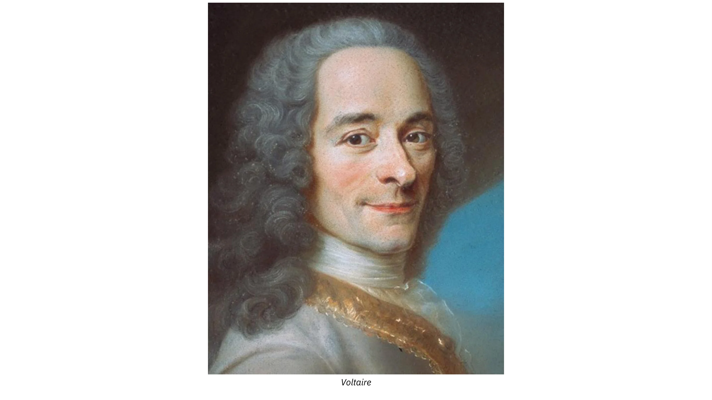

Dessuten var Nederland på den tiden også langt fremme på viktige teknologiske områder, for eksempel innen mekanikk og optikk. De astronomiske teleskopene som Galileo brukte for å se opp mot himmelen og oppdage universet, ble virkelig ansett som banebrytende teknologi for sin tid, og det samme gjelder de nye teknologiene knyttet til databehandling, kunstig intelligens og, selvfølgelig, krypto i dag.

Og siden Spinoza selv drev med polering av astronomiske linser - ironisk nok for en som sies å ha sett alt skjevt - kan vi tenke oss at han helt sikkert ville ha støttet et frihetsverktøy som Bitcoin.

Spinozismens verdier om frihet og fremskritt står med andre ord i kontrast til en verden der religiøs fundamentalisme, konspirasjonsteorier, overtro og, fremfor alt, uvitenhet er en trist realitet.

Likevel er det en verden der alle midler er verdifulle for å unnslippe, for å frigjøre oss fra de slaveriene som begrenser oss, og for å bli fri ved å akseptere verden slik den er, ikke slik vi ønsker at den skal være.

Som vi skal se senere, er Bitcoin et verktøy for frihet, enten det dreier seg om filosofiske eller teknologiske virkemidler. Det er et verktøy som gjør det mulig for både individer og stater å frigjøre seg fra trelldom, særlig økonomisk trelldom.

# Hovedverk, Etikk og politikk

<partId>d7d7e9a1-005b-519c-b587-137435e46344</partId>

## Etikk og søken etter frihet

<chapterId>4cc66e25-335c-591d-9b78-83e5664bbbbc</chapterId>

:::video id=065c5091-69e1-412f-acce-c763ec31d3b1:::

I dette kapittelet foreslår jeg at vi nå vender oss til Spinozas hovedverk, Etikk, som ble utgitt posthumt i 1677.

Hvorfor posthumt? Jo, fordi ideene hans var revolusjonerende, eller i det minste kontraintuitive og forstyrrende, og derfor svært farlige på den tiden, selv i den liberale konteksten i 1600-tallets United Provinces.

Etikken er et verk skrevet på latin på geometernes vis, sannsynligvis inspirert av den vitenskapelige ånden til Galilei (1564-1642), den moderne vitenskapens far sammen med Kepler (1571-1630), som mente at matematikken er universets språk. Spinoza utvikler sine ideer i fem hoveddeler, ved hjelp av proposisjoner ledsaget av demonstrasjoner, skolia, aksiomer og definisjoner.

Etikken er altså, med Spinozas ord, "en måte å nå frem til friheten eller veiene som fører til den", og er egentlig ikke en bok som kan leses fra perm til perm, men snarere en bok som man kan arbeide seg gjennom ved å lese for eksempel en setning som refererer til en annen, som igjen forstås gjennom en tredje, og så videre, i et fullstendig sammenhengende, rasjonelt og logisk system.

Jeg vil gjerne påpeke at når du åpner Etikken, anbefales det å begynne med etterskriftene og appendiksene, disse korte avsnittene er skrevet av Spinoza i hverdagsspråk, så de er lette å forstå og på sett og vis en oppsummering av hans til tider komplekse tenkning.

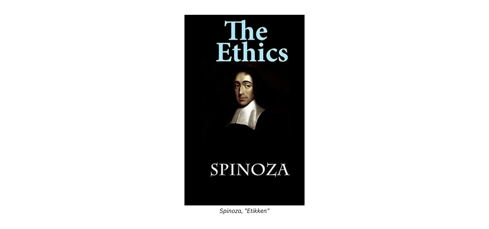

Ved å underkaste verden rundt oss "fornuftens mikroskop", dissekerer Spinozas verk menneskets natur ut fra prinsippet om at mennesket ikke er selvforskyldt, det vil si at vi ikke har bedt om å bli født, verken her eller i vår tid, og heller ikke med slike fysiske eller intellektuelle egenskaper.

Og han sier at vi ikke er hevet over naturen. Vi er ikke fritatt fra dens lover, verken når det gjelder kropp eller sinn. Vi er med andre ord like mye en del av naturen som alle andre levende vesener, dyr eller planter.

For Spinoza er alle områder av menneskelig aktivitet avhengig av fornuftens evne til å forstå verden i et perfekt sammenhengende og determinert system.

En verden der tilfeldigheter ikke eksisterer.

Alt som skjer, er "nødvendig" og et resultat av en årsak, ut fra tanken om at "det som er og det som skjer, må være og må skje". Dette er absolutt determinisme.

Men det er to ting du må huske på:

For det første, hvis tilfeldigheter ikke eksisterer for Spinoza, er det fordi det er en hendelse som vi ikke kjenner årsaken til. Men, sier han, bare fordi vi ikke kjenner årsaken, betyr det selvsagt ikke at den ikke eksisterer.

For det andre er det absolutt ikke snakk om fatalisme heller, siden naturen ikke er utstyrt med intensjon. Lynet har for eksempel ingen intensjon om å straffe noen, slik man kanskje skulle tro i en tragedie. Nei, det uttrykker bare essensen av sin egen natur, som er å slå ned med lynet. Å slå ned.

Spinoza forsvarer altså ideen om at virkeligheten, det vil si hverdagen med både gode og dårlige sider, er fullt forståelig, og at det ikke finnes noe fenomen i naturen som ikke er kausalt forbundet. Dette reiser selvfølgelig spørsmålet om ondskap, og da særlig den absolutte ondskap, som vi skal se nærmere på litt senere.

Til slutt er det viktig å merke seg at etikk ikke er moral.

Ifølge Gilles Deleuze (1925-1995), den berømte filosofiprofessoren og Spinoza-spesialisten, er moral et vurderingssystem som er nyttig for å leve i et samfunn. Men det er et subjektivt system, siden det som er riktig her, kan være galt et annet sted, og det som er galt i dag, kan være riktig senere.

Og i stedet for å fastslå hva som er rett eller galt, fastslår etikken hva som er godt eller dårlig for vår egen natur og vår evne, sier Spinoza, til å bevare i vår væren. Å være fri. Det er derfor en sann etologi, det vil si en vitenskap om måter å være på, eller, som Gilles Deleuze videre forklarer, kunsten å gjøre gode møter.

Eller kunsten å ta de riktige valgene for å frigjøre oss fra de servituttene som begrenser oss, og som ifølge Spinoza gjør at mennesket ofte er redusert til "å se det beste, godkjenne det og gjøre det verste".

Med andre ord, "å kjempe for sitt slaveri som om de kjempet for sin frihet".

## Den teologisk-politiske avhandlingen

<chapterId>84b0187e-1050-5d44-a536-80554896e828</chapterId>

:::video id=c1efc97e-1e96-4b37-894c-9a19794d6b52:::

Etter Etikken vil jeg i dette kapittelet introdusere deg for et annet hovedverk som vil hjelpe deg til å forstå Spinozas filosofiske og politiske innflytelse, særlig på den kommende opplysningstiden og på liberale og, i vårt tilfelle, libertarianske strømninger.

Dette er Traité théologico-politique, eller TTP, som ble utgitt anonymt i 1670.

Spinoza (1632-1677) skrev denne boken mens han avbrøt skrivingen av sin Etikk, i et forsøk på å gjøre slutt på en misforståelse som fortsatt eksisterer i dag. Det er troen på at han var ateist.

Som vi har sett, er Spinozas gudsbegrep tema for hele første del av Etikken, der han ikke bare påviser guds eksistens, men også hva som er hans sanne natur.

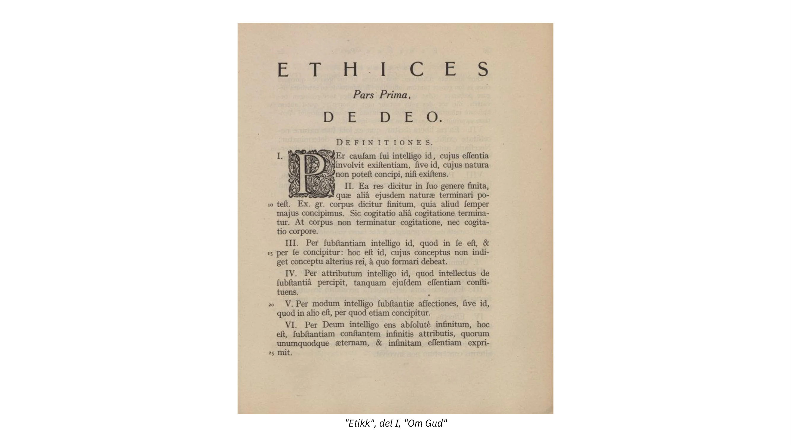

Og siden Spinozas begreper generelt er ganske vanskelige å forstå, er det ofte lettere å forstå dem ved å si hva de ikke er, enn ved å prøve å si hva de er. En tilnærming som for øvrig, og som vi skal se senere, er svært nyttig for å forstå Bitcoin.

Slik viser Spinoza oss at Gud, slik han ser det, ikke er et antropomorft vesen med intensjoner om å straffe eller belønne, som vi kan henvende oss til, og som lytter til oss i henhold til et ritual som vi kan følge eller ikke følge. Gud er med andre ord ikke en gammel mann med langt, hvitt skjegg som skjuler seg bak en sky, og som vil løse verdens problemer og gjøre oss avhengige av ham.

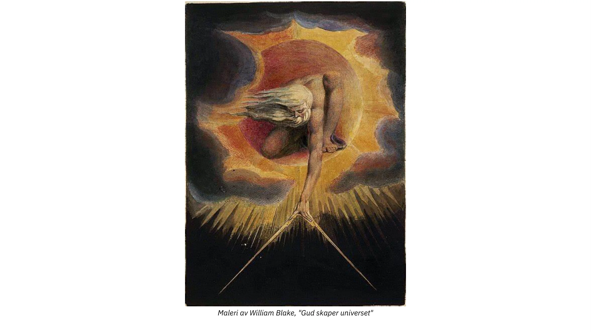

Å snakke om Gud er altså å fremkalle naturen som en unik, uendelig og evig substans, bestående av et uendelig antall attributter, hvorav vi mennesker bare kjenner to: materie, eller utstrekning, og tanke.

Dette er den berømte "Deus Sive Natura", som Spinoza utleder begrepet absolutt determinisme fra, og ideen om at mennesket ikke er årsak til seg selv og ikke står over naturen, og i hvert fall ikke over dyrene.

Men utover religionskritikken er TTP først og fremst en anledning for Spinoza til å rette en skarp kritikk mot de religiøse menneskene, og mot teokratiet. Religiøs makt dyrker med andre ord frykt og overtro, og aktiverer, sier han, individenes triste lidenskaper for bedre å kunne slavebinde dem og fange dem i vrangforestillinger, fanatisme og krig.

I dette primære, infantile stadiet av religionen blir de troende kun knyttet til ytre tilbedelse og en godtroende tro basert på fordommer. Et stadium der religionen blir mekanisk intolerant, beveger seg bort fra grensene for sin moralske lære og vender seg bort fra sitt kall til å fremme fred og harmoni ved å hevde at den sitter inne med sannheten.

Men når vi beveger oss forbi den rasjonelle religionskritikken, for eksempel ved å eksegere Bibelen, ønsker Spinoza å overbevise oss om at dette nye gudsbildet er helt forenlig med budskapet om rettferdighet og nestekjærlighet i de tre store religionene i Bibelen, som inneholder en enkel, men ofte glemt gyllen regel: "Du skal elske din neste som deg selv".

Men det er ikke alt.

Dette modne synet på religion som er utviklet i TTP, ledsages av en politisk dimensjon, nemlig nødvendigheten av å skille religion og stat for å beskytte tanke- og trosfriheten, både av hensyn til enkeltmennesket og staten selv.

Spinoza gjør frihet, innenfor rammen av fornuften, til en nødvendig forutsetning for at mennesket skal kunne leve uten å bli slavebundet av en makt som står i motsetning til dets interesser, og derfor forsvarer han et direkte demokrati basert på politisk og religiøs frihet.

Med andre ord, tanke- og trosfrihet, slik at folk kan frigjøre seg fra trelldom og fra falske, infantiliserende forestillinger, for å resonnere som voksne mennesker, og prioritere fornuften og, for vår del, også den teknologiske utviklingen.

Det beryktede jordskjelvet i Lisboa 1. november 1755 viste et stort skifte i hvordan folk tenkte om naturhendelser og katastrofer, og om hvordan de skulle beskytte seg mot dem.

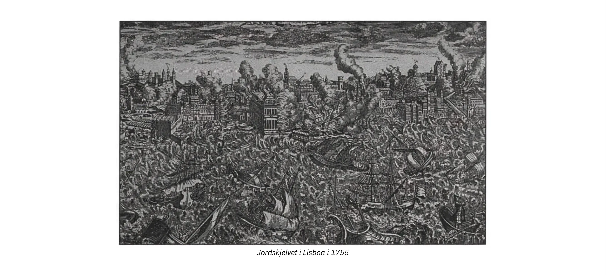

Dette fryktelige jordskjelvet ødela byen og drepte hundretusener av uskyldige mennesker, hvorav mange var i kirken på det tidspunktet, ettersom det var allehelgensdag, noe som økte de overlevendes uforståelse.

Et drama som gjenopplivet spørsmålet som den tyske filosofen og matematikeren Leibniz (1646-1716) stilte om den antropomorfe visjonen om en Gud utstyrt med intensjon, godhet og allmakt. For hvis Gud var god, som Leibniz sier i sin Theodicé, ville han ikke være allmektig, siden han ville tillate slike katastrofer, og hvis han var allmektig, ville han ikke være god, siden han ikke kunne forhindre dem.

Jean-Jacques Rousseau (1712-1778) var langt fra å fordømme Guds hånd, men skrev til Voltaire, som var slått av den urettferdigheten og de grusomhetene som menneskeheten diskriminerende måtte lide under, at "naturen ikke var ond i seg selv, og at vi ikke burde se noen guddommelig hånd i den som kunne forklare dens utforming".

Voltaire (1694-1778), en spinozist om noen, svarte at denne naturkatastrofen først og fremst burde få oss til å innse at det fantes vitenskapelige midler til å beskytte oss mot naturen, og at tidens utfordring derfor var å spørre om menneskene, takket være kunnskap og fremskritt, kunne ta fremtiden i egne hender og frigjøre seg fra teologi og overtro.

Og selv om det selvfølgelig ikke var snakk om å forhindre jordskjelv, som fortsatt ikke bare er uforutsigbare, men også helt ukontrollerbare, handlet det mer om å sørge for at for eksempel boliger ble bygget for å tåle dem.

Det er derfor 1700-tallets opplysningstid, takket være bruk av fornuft, vitenskap og teknologi, er fremskrittets århundre. Med andre ord, fremskrittet som et verktøy for frihet.

# Den spinozistiske revolusjonen, de tre illusjonene

<partId>f5d45c2b-28da-527a-ab20-dd255e9a9e0d</partId>

## En ny definisjon av naturen og mennesket

<chapterId>3e6599e3-5b29-50a8-a67d-d0386da5d65d</chapterId>

:::video id=b6d2c035-8848-4da6-9da9-be3b70be0f38:::

I dette kapittelet vil jeg ta en titt på idéhistorien, og se hvorfor spinozismen regnes som en ekte kopernikansk idérevolusjon.

Takket være denne nye måten å forstå Gud, eller med andre ord naturen, på, som matematikken tilbød, etablerte Spinoza (1632-1670) et dyptgripende paradigmeskifte, med indirekte konsekvenser for det religiøse verdensbildet og menneskets plass i det.

På samme måte som Nikolaus Kopernikus (1473-1543) slo fast at jorden ikke var verdens sentrum, og Charles Darwin (1809-1882) tre århundrer senere viste at mennesket ikke var i sentrum av "livet", fulgte Spinoza denne logikken og hevdet i sin samtid at mennesket ikke er "herre i eget hus", og at universet ikke er skapt utelukkende for dets skyld.

Han sier at mennesket ikke er "et imperium i et imperium", og at på samme måte som jorden er redusert til en planet i likhet med alle de andre planetene, er mennesket redusert til en naturtilstand i likhet med alle de andre begrensede naturtilstandene, som dyr, planter og alle "eksisterende vesener".

Før ham hadde den klassiske greske filosofien foreslått en ordnet, hierarkisk visjon av universet for å forklare verden, kosmos og menneskelig erfaring. Med utgangspunkt i mytiske fortellinger forsøkte den å forklare verdens opprinnelse, og den insisterte på harmonien mellom universet, naturen og mennesket.

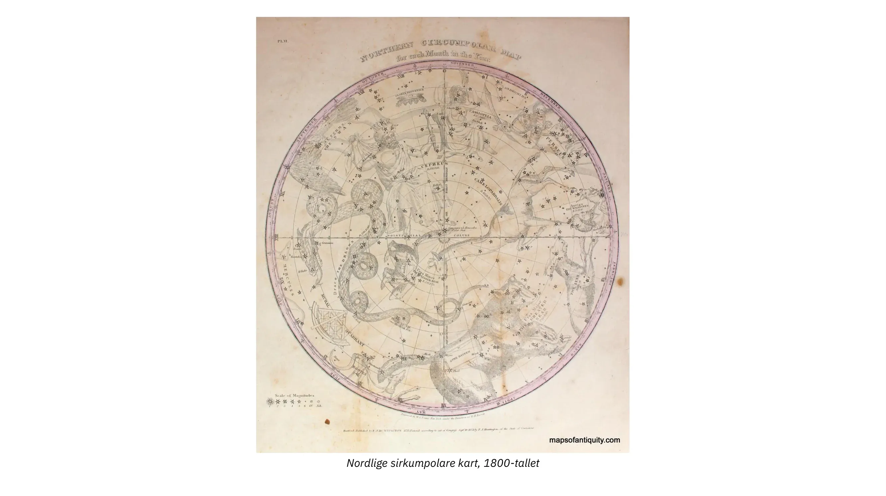

Den skolastiske kosmologien i middelalderen, i hovedsak fra 1100-tallet og fremover, var en utvikling i retning av mer fornuft for å harmonisere fornuft og tro og forklare et univers som fortsatt var hierarkisk, men som samsvarte bedre med den kristne filosofien.

Men med Kopernikus' (1473-1543) nye fysikk på 1400-tallet gjennomgikk kosmologien et stort vendepunkt i forståelsen av universet, hvis geosentriske modell dermed ble trukket i tvil til fordel for det heliosentriske systemet, som banet vei for den moderne vitenskapen, særlig den nye fysikken og astronomien til Kepler (1571-1630) og Galileo (1564-1642). Deretter Isaac Newton (1643-1727) og til slutt Albert Einstein (1879-1955), som var en overbevist spinozist.

Men for å forstå spinozismen fullt ut, må vi også se på konteksten til René Descartes (1596-1650), den berømte franske filosofen som gikk forut for Spinoza, og som han både var en disippel av og en stor beundrer av.

Til tross for risikoen og fordømmelsene fra Giordano Bruno (1548-1600) og Galilei, satte Descartes seg fore å skille "sannhet fra løgn" og å harmonisere teologi, filosofi og fysikk. I sin berømte Avhandling om metoden, som ble publisert i 1637, argumenterte Descartes for at fornuften er grunnlaget for kunnskap, og at det er gjennom den at mennesket kan oppnå frihet.

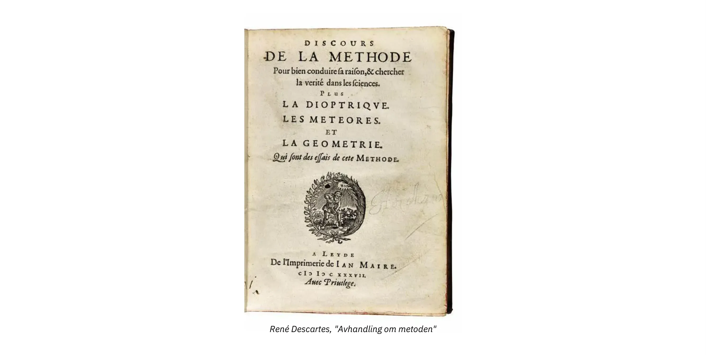

Ved å forklare verden ut fra universelle lover snarere enn en natur utstyrt med moralske intensjoner, banet han vei for determinismen, som Spinoza senere skulle følge.

Men som katolikk etablerte Descartes likevel et hierarki mellom mennesket og de andre begrensede naturtilstandene, og da særlig i forhold til dyreartene, det han kalte "maskindyr". Og når Descartes sier at "det finnes ingen sjel som, når den er godt ledet, ikke kan få absolutt makt over sine handlinger og lidenskaper", hevder han dermed at mennesket har evnen til å skape noe ut av intet, og at mennesket, slik han ser det, "unnslipper naturlovene", at det har absolutt makt over sine egne handlinger og begrunner sin besluttsomhet utelukkende i seg selv.

Spinoza visste hvordan han kunne gå utover og overskride dette stadiet og forene Guds eksistens med fornuftens demonstrasjon. For ham er alle områder av menneskelig aktivitet avhengig av fornuftens evner i en perfekt sammenhengende og determinert verden. Men en verden der det verken finnes tilfeldigheter eller tilfeldigheter, og der alt som skjer er nødvendig og et resultat av en årsak, i henhold til den kausale sammenhengen mellom tingene. Dette er ideen om absolutt determinisme.

Og det er i de skarpeste ordelag han til slutt tilbakeviser den kartesianske posisjonen, og kritiserer for eksempel ideen om at mennesket ikke er underlagt naturlovene på samme måte som alle andre dyr, og at det derfor er overlegent alle andre begrensede naturformer.

De er med andre ord utstyrt med fri vilje, en illusorisk tro som det er svært vanskelig å unnslippe, slik Spinoza forteller oss, og som vi nå skal diskutere.

## Illusjonen om fri vilje

<chapterId>f147a914-cb64-5927-b305-26691930bca3</chapterId>

:::video id=b59da795-ba19-4643-9672-36c9e7953a42:::

I dette kurset skal vi nå ta for oss det delikate spørsmålet om fri vilje, for bedre å forstå hva frihet er for Spinoza, for opplysningstiden og for de tidlige liberale filosofene.

Som vi allerede har sett, er Spinoza (1632-1677) kjent for å betrakte den frie viljen som en illusjon som det er ekstremt vanskelig å frigjøre seg fra.

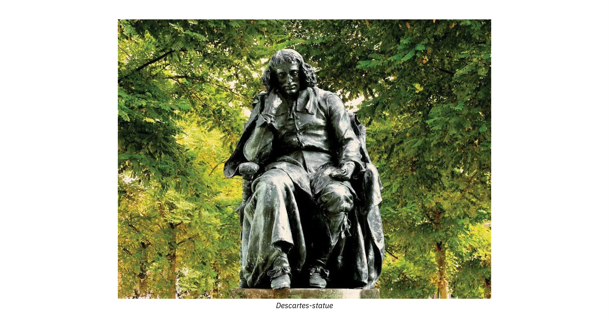

Hvorfor er det slik? Fordi det strider mot den filosofiske tradisjonen siden antikken, som Descartes (1596-1642) fortsatt forsvarer, at mennesket kan skape noe ut av ingenting og bære det fulle ansvaret for sine handlinger, særlig overfor Gud, sier den hellige Augustin (354-430), den kristne kirkes far.

Men selvfølgelig også før menneskelig rettferdighet.

Det er ideen om at vår vilje, og bare vår vilje, gjør det mulig for oss å styre våre liv, at vi har absolutt makt over våre handlinger, og at vi får friheten til å handle utelukkende fra oss selv, og at vi dermed har en ubestemmelig beslutningsmakt.

Mennesket er med andre ord i stand til å forstyrre naturens orden, i stedet for å underkaste seg den.

I sin livsførsel ville mennesket ikke være underlagt noen annen lov enn sin egen viljes, og derfor ville det ikke bare være hevet over naturen og dyrene, som bare var maskiner, men også over alle andre begrensede naturformer. Dette var Descartes' (1596-1650) standpunkt, for ham lå ikke årsakene til menneskets impotens og ustabilitet i naturens orden, men i selve menneskenaturens laster.

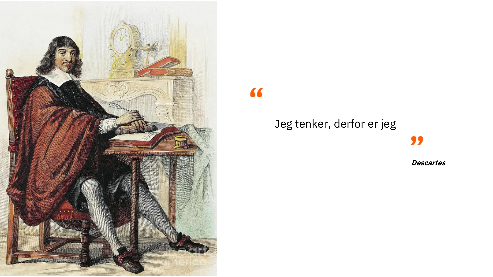

Men selv om Spinoza gir Descartes æren for å ha åpnet veien for rasjonell kontroll over følelseslivet, distanserer han seg helt fra ham ved å kritisere denne hypotesen om viljens "absolutte makt".

Spinoza, derimot, mener at vår verden er fullstendig sammenhengende og determinert, og at alt som skjer er nødvendig og et resultat av tingenes kausalitet, der en virkning alltid har en årsak, og at denne årsaken selv er en virkning av en annen årsak, og så videre.

Dette er ideen om den absolutte determinisme, som han i sin Etikk legger til grunn for at mennesket ikke har noen som helst fri vilje, fordi, sier han, det er bevisst sine handlinger, men det ignorerer, eller foretrekker å ignorere, de egentlige årsakene som bestemmer dem.

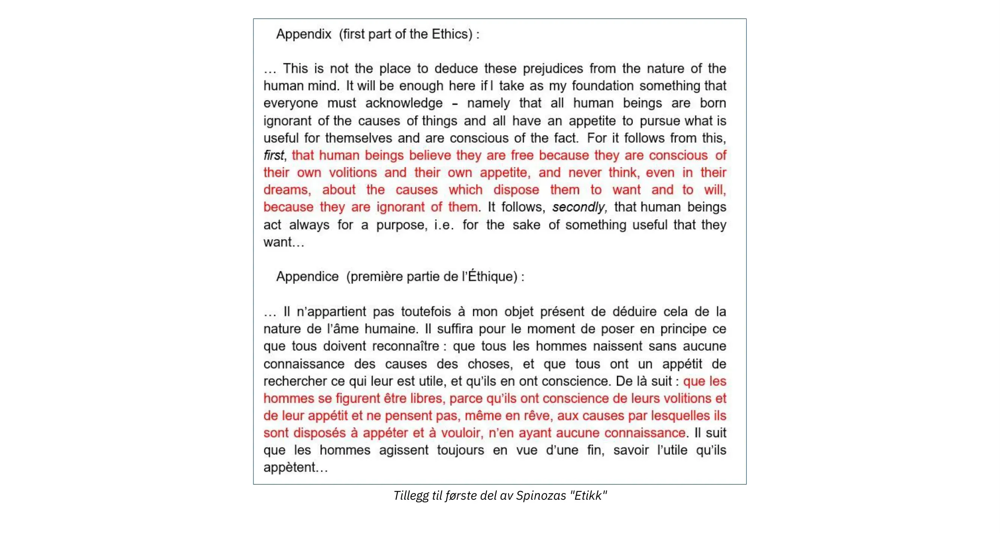

For Spinoza kan mennesket, som en "endelig naturtilstand" på linje med dyr og planter, derfor ikke starte noe fra ingenting; det er ikke fritatt fra naturlovene, verken i kroppen eller i sinnet.

For ham er den største faren ved frihet å tro på vår frie vilje, og å tro at vi kan handle uten å være bestemt av ytre årsaker.

For Spinoza er frihet ikke et uttrykk for fri vilje, men evnen til å forstå vår rettmessige plass i verden, til å forstå vår determinerte natur og derfra styre vår eksistens i retning av det som "øker vår handlekraft". Ved alltid å se optimistisk på fremtiden, og se verden slik den er, i stedet for å forestille oss den slik vi ønsker å se den.

Problemet som oppstår er selvfølgelig menneskets ansvar og deres handlinger. Vi kunne konkludere med at hvis individene ikke er frie i sine handlinger, ville de ikke være ansvarlige for dem, spesielt i møte med rettferdighet. Men dette synet er misvisende, for uten å gå for mye i detalj hindrer ikke erkjennelsen av sosial, familiær og historisk determinisme oss fra å vurdere ansvaret for handlinger som er begått, siden disse er frivillige.

På den annen side ville det være en illusjon å tro at en forbryters handlinger aldri er knyttet til hans egen determinisme. Selv om det ikke er snakk om å unnskylde dem, er det i det minste et spørsmål om å prøve å forstå dem. Det er faktisk det rettferdigheten gjør: I tillegg til å straffe ulovlige handlinger, spiller den en rolle som forutser og beskytter fremtiden, og det er grunnen til at visse forbrytelser ikke bare straffes, men også behandles med tanke på lovbryterens familiemessige, sosiale og psykologiske bakgrunn.

Denne tilnærmingen til frihet som en evne til å handle er den forbindelsen vi kan knytte til 1700-tallets opplysningsfilosofi. Ifølge en av dens fremste ambassadører, den tyske filosofen Immanuel Kant (1724-1804), var opplysningstiden nettopp et middel til å frigjøre mennesket fra den formyndertilstanden, eller som Étienne de la Boétie (1530-1563) ville ha sagt, fra det frivillige slaveriet som det selv var ansvarlig for.

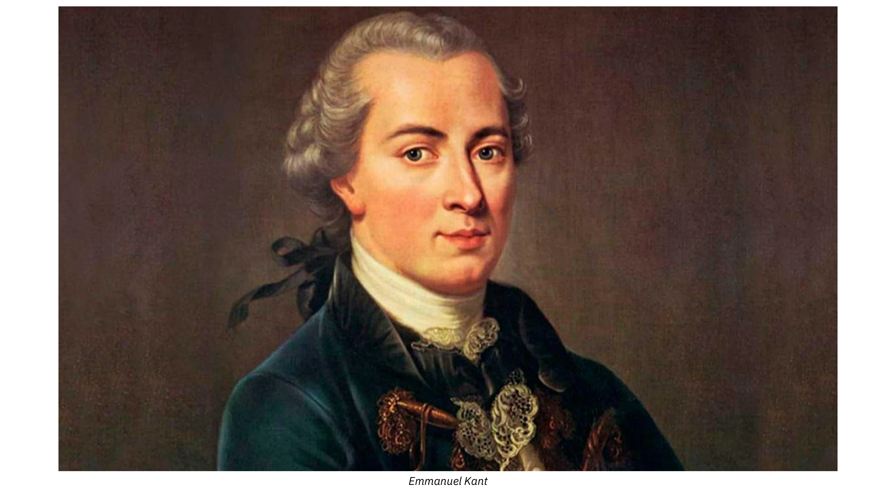

Kants motto er "Tenk selv" og "Våg å vite", det berømte latinske "Sapere Aude".

Spinozas handlingskapasitet er altså den kraften mennesket har i seg til å forstå sin egen dyriske tilstand, og til å forstå naturen og dens fenomener, positive som negative, ved å relatere dem til objektive årsaker, slik at man ikke støtter seg på moralske forklaringer som er falske og illusoriske, det vil si forklaringer som er formet for å passe våre ønsker. Den består snarere i å søke å forklare dem gjennom fornuften, med sikte på frigjøring og frihet.

Og fremskrittet, som førte til de første teknologiske revolusjonene og de første liberale og entreprenørielle ideene på slutten av 1700-tallet, særlig med den engelske liberale filosofen John Locke (1632-1704) og den engelske økonomen Adam Smith (1723-1790).

Og det er verdt å minne om Sigmund Freuds (1856-1939) definisjon av en illusjon. Ifølge psykoanalysens far, som alltid anerkjente Spinozas innflytelse på sitt arbeid, er en illusjon nettopp "en tro som er motivert av realiseringen av et ønske, og der ved å se bort fra virkeligheten".

Til slutt er det verdt å påpeke at selv om den libertarianske bevegelsen vi nå skal diskutere, refererer direkte til denne nye liberale filosofien, er det de som påpeker at personer som Ayn Rand (1905-1982), forfatteren av "La Grève" og "La Source vive", støtter eksistensen av fri vilje, og mener at mennesker har evnen til å ta frie valg.

Men virkeligheten er en helt annen, og forvirringen skyldes snarere et semantisk problem: Ved å anerkjenne menneskets evne til å handle og til å ta valg, samtidig som de anerkjenner den logiske determinismen de er gjenstand for, er de første libertarianerne i realiteten også arvtakere av Spinoza. Det de har til felles med Spinoza, er troen på at mennesket ikke står over naturen, men i stedet er et resultat av en evolusjonær prosess som plasserer det innenfor en determinisme, en historie som går utover det, og som i stor grad er ansvarlig for hva mennesket er og hva det gjør.

Hvis troen på fri vilje er en illusjon som det er svært vanskelig å frigjøre seg fra, er det fordi den viser tilbake til en annen illusjon som gir næring til den, nemlig illusjonen om endelige årsaker, som jeg inviterer deg til å studere i neste kapittel.

## Illusjonen om endelige årsaker

<chapterId>da2a7fb1-f1e9-5b56-822d-c73770de749d</chapterId>

:::video id=a0127fe7-a4cb-4a1c-8af4-f11c40b4a3d7:::

Vi så i forrige kapittel at illusjonen om fri vilje består i å tro at vi kunne starte noe fra ingenting, at vår vilje alene ville gjøre oss i stand til å styre våre liv, og at vi ville ha en ubestemt beslutningsmyndighet. Det er ideen om at mennesket er i stand til å forstyrre naturens orden mer enn det er underlagt den.

Men for Spinoza (1632-1677) er ikke mennesket "et imperium i imperiet", det vil si at det ikke, i motsetning til hva Descartes (1596-1650) slo fast, er et unntak i naturen, og at det aldri er fritatt fra forlengelsen av den deterministiske kjeden av årsak og virkning.

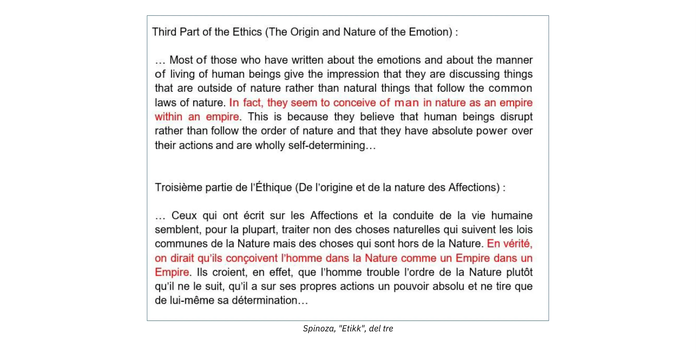

Og siden naturen, sier Spinoza, ikke har noe foreskrevet mål fra et moralsk synspunkt, og siden mennesker har en tendens til å forveksle sin fantasi med forståelse, tolker de den i henhold til det som passer deres egne interesser. Det går så langt at de gir tingene en mening som kun stammer fra måten de verdsetter dem på og relaterer dem til seg selv.

Det vil si i henhold til deres ønsker, håp og frykt.

Dette resonnementet illustreres av illusjonen om endelige årsaker, som er et stort hinder for tenkningen og utøvelsen av fornuften, fordi den ganske enkelt uttrykker vårt behov for å få virkningene av en ting til å stemme overens, ikke med dens sanne årsaker, men med en tro, selv om den er absurd eller infantiliserende.

En tro som uttrykker en intensjon, særlig guddommelig, og som, slik vi tolker den, ofte er overtroisk, eller uvitenhet.

Og derfor har nye sykdommer som aids på 90-tallet eller covid i 2020 av noen alltid blitt oppfattet som uttrykk for en guddommelig og ofte straffende intensjon, ifølge et resonnement som strider mot kausalitetsprinsippet som ligger til grunn for rasjonalismen og den moderne vitenskapen som har vært etablert siden Kopernikus (1473-1543), Kepler (1571-1630) og Galileo (1564-1727).

Faktum er, som Spinoza sier, at det spiller liten rolle for folk at så mange ting er utenfor deres forestillingsevne, at det er mer uorden enn orden i naturen. Likevel burde kompleksiteten i det som ligger utenfor deres fatteevne, avskrekke dem fra å tro på noe teleologisk prosjekt. Det spiller ingen rolle, sier han, fordi menneskets tro på relevansen av sin visshet, basert på hva som passer deres ønsker og nytte, alltid er sterkere enn ethvert rasjonelt argument eller hensynet til sannhet.

Finalismen går altså ut på å snu om på tingenes årsaker og virkninger for å forstå dem: Vi tror for eksempel at grunnen til at vi har øyne, er for å se, og at grunnen til at vi har tenner, er for å tygge. Men det var jo nettopp for å kunne se at menneskearten utviklet synet i løpet av evolusjonen, og det var nettopp på grunn av behovet for å skaffe seg mat og spise kjøtt at tannsettet vårt utviklet seg slik det gjør i dag.

Og det var nettopp dette den franske naturforskeren Jean-Baptiste de Lamarck (1744-1829) hevdet (bilde 3.3.3) da han etablerte sin predarwinistiske teori om at det er funksjonen som skaper organet, og ikke omvendt.

Men som Spinoza sier: "Menneskets villfarelse slutter ikke der", og blant alle eksemplene på naive, og til syvende og sist ganske morsomme, teleologiske ideer, nevner vi ofte det berømte eksempelet til biologen Bernardin de Saint-Pierre (1737-1814). Denne tidligere direktøren for naturhistorisk museum i Paris betraktet naturens finalisme med poesi, lyrisme og en viss naivitet, og mente for eksempel at melonen var skapt med det ene formål å glede storfamilier, siden det riflede skinnet gjorde den lett å skjære i like store skiver.

Definisjonen av inflasjon som gis av keynesianske økonomer og velferdsstatsforkjempere, for eksempel, illustrerer også dette paradokset svært godt. Ifølge dem er inflasjon en prisøkning som, ifølge enkelte sentralbankfolk, kommer enten fra "ingensteds" eller fra geopolitiske sammenhenger som ingen kan kontrollere eller forutse. Selv om en prisøkning faktisk kan føre til syklisk inflasjon - for eksempel når oljeprisen stiger, vil prisene på visse bearbeidede varer også stige - er de virkelige strukturelle årsakene til inflasjon først og fremst knyttet til en økning i pengemengden Supply, som igjen innebærer et fall i pengeverdien og ipso facto en mekanisk prisstigning.

Å tro, eller få andre til å tro, det motsatte er det samme som å drømme med åpne øyne, som Spinoza spøkefullt uttrykte det, og konstruere et resonnement som er falskt eller misvisende, og som er desto lettere å få aksept for fordi det blir hørt som en forventet respons for å bevise at man har rett. I dette tilfellet når tilhengere av statlige inngrep mener at inflasjon er den beste måten å løse økonomiske problemer på.

Denne ensidige tolkningen av inflasjonen får oss imidlertid til å glemme at selv om den er nyttig for å styre økonomien på kort sikt, er den i virkeligheten en skjult skatt som på lang sikt bare fører til menneskelige og materielle katastrofer, og som gjør stater ute av stand til ikke å misbruke sin makt. Det er dette Friedrich Hayek (1899-1992) beskriver så godt i essayet The Road to Serfdom, når han beskriver den trelldommen som stater ikke lenger kan frigjøre seg fra.

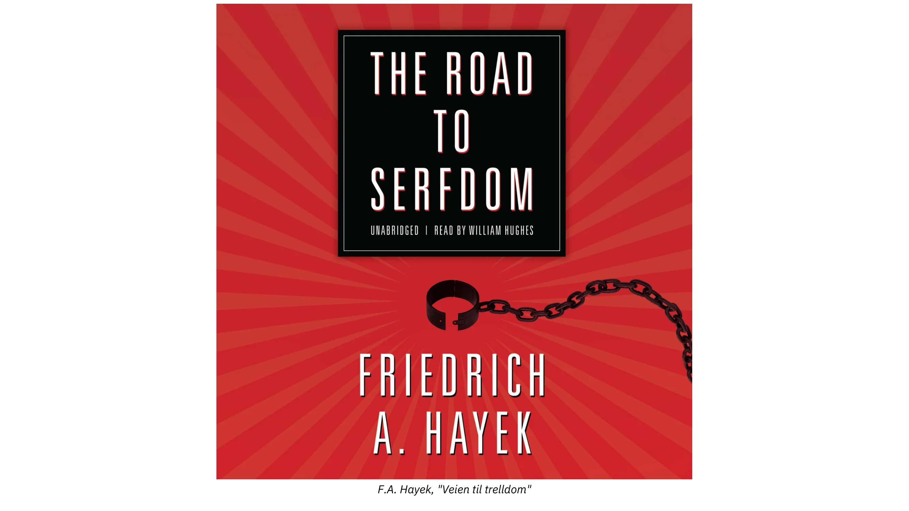

Til slutt er det verdt å merke seg at denne finalistiske mekanismen også illustreres godt i måten kritikerne av Bitcoin uttrykker sin kritikk ved å fokusere nettopp på effektene.

For selv om noen av effektene av Bitcoin absolutt kan kritiseres, har vi på grunn av den kognitive skjevheten knyttet til det faktum at det er en ny og disruptiv teknologi, en sterk tilbøyelighet til bare å se de negative effektene. Spesielt hvis virkeligheten ikke stemmer overens med ønskene våre, for eksempel hvis vi er religiøse i møte med en kopernikansk revolusjon som spinozismen, eller hvis vi er sentralbankfolk i møte med et desentralisert digitalt valutakonsept.

Men det er helt klart at hvis en religiøs person eller en sentralbanksjef viser forståelse, nysgjerrighet og god vilje, og hvis de interesserer seg for et konsept og først forsøker å forstå det i stedet for å dømme dets virkninger for å tilpasse sin mening til sine forventninger, så vil de helt sikkert være i stand til å følge det.

Takk for oppmerksomheten, og vi ses i neste kapittel.

## Den teologiske illusjonen

<chapterId>93554156-5e62-526d-9b71-49c47be916af</chapterId>

:::video id=9c490cc1-3d29-4ca7-9464-1a701bb91ba7:::

I dette siste kapittelet om spinozismens nye kopernikanske idésyn vender vi oss til slutt mot den tredje illusjonen som Spinoza (1632-1677) presenterer i sitt verk Etikken.

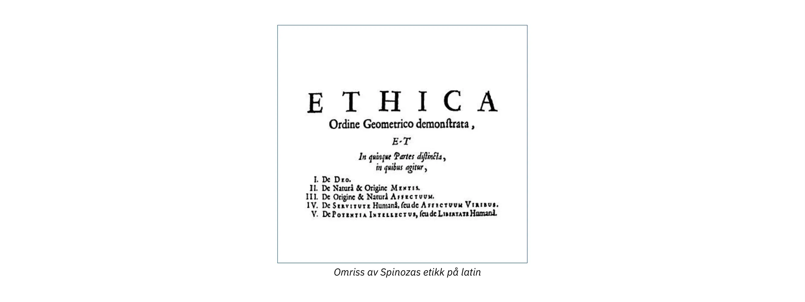

Denne illusjonen er direkte knyttet til de to første, illusjonen om fri vilje og illusjonen om endelighet.

Det handler om teologiske illusjoner.

Poenget er dette: Så lenge menneskene er uvitende, "om både tingene og seg selv", som Spinoza sier, så lenge de tror på sin illusoriske frihet, vil de ta sin fantasi for å forstå, dvs. de vil alltid tro at de er i stand til å tenke og forstå tingenes natur, mens de i virkeligheten bare innbiller seg, finner på og projiserer det som er nyttig for dem. I henhold til deres ønsker.

Det er derfor mennesker tror at hvis det finnes naturlige midler som er nyttige, for eksempel tenner til å spise eller øyne til å se, så er det fordi de logisk sett er skapt av en "naturens regissør". Med andre ord en intensjonell, antropomorf Gud som tilskrives menneskelige intensjoner.

Med andre ord, en hvitskjegget gammel mann gjemt bak en sky, som tilskrives æren for å ha skapt alle ting i naturen som et middel for å nå vårt mål, fordi han elsker oss og beskytter oss når vi ærer og tilber ham.

Dette er det første stadiet i den teologiske illusjonen.

Men til tross for at vi er stolte av å tro at vi står over naturen, og innbiller oss at vi kan starte noe fra ingenting, er vi i virkeligheten alltid underlagt eksistensvilkår som tilsier at vi til syvende og sist ikke vil kunne "slippe unna med det", som filosofiprofessor Gilles Deleuze (1925-1995) uttrykte det. Vi er dødelige, som alle dyr, men vi vet det.

Å tro eller forestille seg det motsatte for å berolige oss selv er grunnen til at vi hele tiden kastes frem og tilbake mellom frykt og håp, som to motstridende og uatskillelige poler mellom en følelse av trygghet og en følelse av panikk, siden frykten alltid er knyttet til håpet om bedre dager.

At det ikke finnes frykt uten håp, og heller ikke håp uten frykt, og at den som frykter, alltid håper å unnslippe det han frykter, mens den som håper, alltid frykter at det han håper på, ikke vil skje.

Og siden "vi er tilbøyelige til å tro på det vi håper på", sier Spinoza i sin Etikk, er det når vi står overfor ytre årsaker eller hendelser som vil være skadelige for oss, i strid med enhver idé om nytte, at det andre stadiet av denne såkalte teologiske illusjonen kommer til uttrykk, kjennetegnet av overtroiske forestillinger.

Med andre ord, "de beryktede" ifølge Voltaire (1694-1778), for hvem overtro aldri er født av fornuft, og den tilsvarer alltid en irrasjonell eller ubegrunnet tro, som motsetter seg enhver form for rasjonalitet ved å tillegge gjenstander eller handlinger krefter eller åndelig potens som de ikke har.

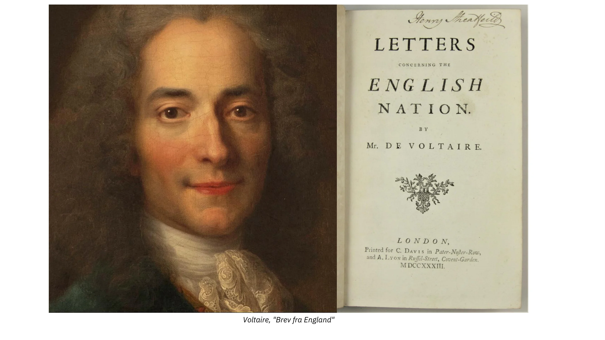

Under dekke av å være en lettelse, av å gi oss mulighet til å forestille oss en bedre verden, låser overtroen oss fast i våre egne illusjoner og løgner. I trelldom som vi vil ha en Hard tid på å komme oss ut av.

Det var dette den tyske, engelske og franske opplysningstiden forsvarte fra 1700-tallet og fremover, og hevdet at overtro rett og slett hindrer mennesket i å bli voksent, ikke bare ved å begrense utøvelsen av fornuften, men også, og fremfor alt, ved å gi opphav til intoleranse, som er det beste instrumentet for å etablere en makts herredømme. Enten det er politisk eller religiøst.

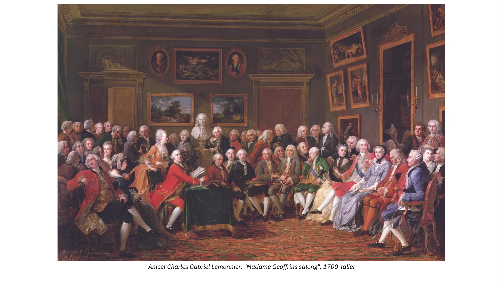

Og det er dette Spinoza demonstrerer igjen i sin Theologico Political Treatise, som vi allerede har vært inne på. I dette essayet skriver han at "det monarkiske regimets store hemmelighet, og dets største interesse, er å lure folk, og å skjule under religionens navn den frykten som må kontrollere dem". Det er derfor tyranner, diktatorer eller revolusjonære, som alltid er mennesker som drives av ønsket om å gjøre godt for andre, ofte, om ikke alltid, går i den fellen at de gjør det motsatte av sine prinsipper for å oppnå dem.

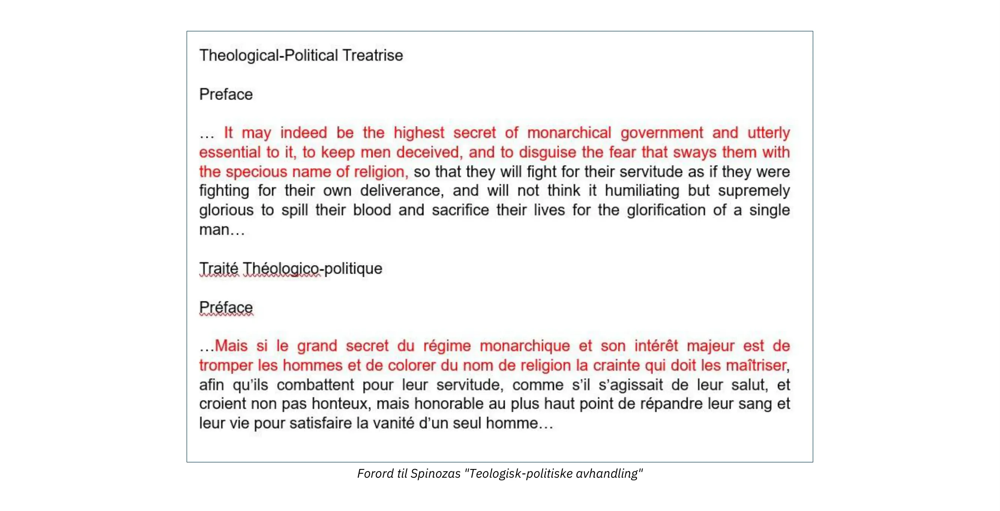

Men det nye som Spinoza tilfører TTP, og som på sett og vis gjør ham til sekularismens far, er at han mener at selv om det er viktig å bekjempe overtro og den oppfordringen til vold som friheten paradoksalt nok åpner for, så er det faktisk i statens interesse å beskytte retten til å tro og friheten til å tenke.

For så snart ideer eksisterer og uttrykkes privat, vil de uunngåelig spre seg i samfunnet, og verken forbud eller sensur kan noensinne forhindre at de spres. Ideer, enten de er sanne eller falske, gode eller dårlige, vil uansett sirkulere, og å forby dem kan på lang sikt bare føre til opprør og omstyrting av staten i frihetens navn.

Med andre ord ville staten faktisk ha langt mer å frykte ved å sensurere eller undertrykke ytringsfriheten enn ved å opprettholde den, og det er derfor, ifølge Spinoza, i dens interesse å la individene utøve sin naturlige rett til å tenke og ytre seg.

For Spinoza er derfor en demokratisk stat som tillater tankefrihet den beste garantien for at menneskene kan leve i fred, og at de, takket være fornuften, ikke bare kan tenke og handle fritt, men også forstå de tvangstrøyene de er underlagt, slik at de kan frigjøre seg fra dem.

# Fra affektteori til Bitcoin

<partId>82e69d4f-a94f-5978-bcb8-8a7b4651bcca</partId>

## Spørsmålet om ondskap hos Spinoza

<chapterId>1ce64576-2688-5757-a119-57cc3a1076c0</chapterId>

:::video id=9c490cc1-3d29-4ca7-9464-1a701bb91ba7:::

Jeg vil nå ta for meg spørsmålet om ondskap, slik Spinoza (1632-1677) presenterer det i sine verker og i sin korrespondanse.

Men vær advart, dette er et komplekst og kontroversielt tema, og målet her er ganske enkelt å forstå, nok en gang, hans måte å tenke på for å bedre forstå hva som styrer ham, dvs. søken etter frihet.

Som vi har sett, reiser det å ikke tro på fri vilje eller på noen form for finalisme i naturen raskt problemet med ondskapens eksistens i våre daglige liv.

Spørsmålet er med andre ord om det finnes "ondskap" i naturen, og om mennesker er ansvarlige for den skaden de forårsaker.

Antikkens filosofer mente at det onde ikke fantes i naturen, og Sokrates (470-399 f.Kr.) lærte for eksempel at "det onde er ingenting". Ifølge ham var en ond person ikke ond av natur, og på sett og vis tok han rett og slett feil av det godes natur.

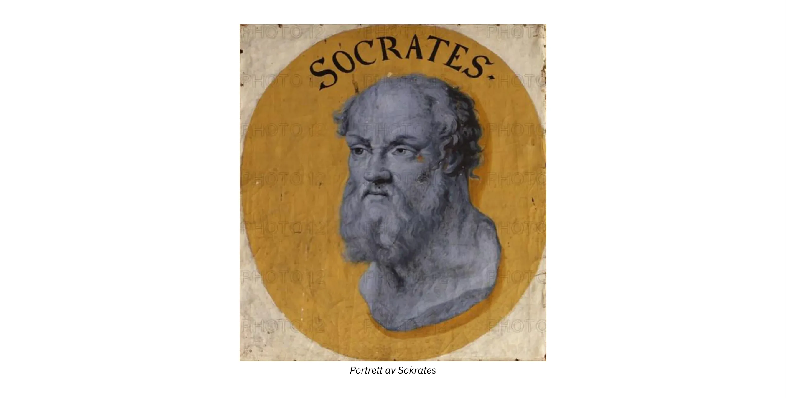

Men den skolastiske tradisjonen, særlig den fra Augustin (354-430), som fortsatt påvirker kristen moral i dag, hevdet at det onde ikke bare eksisterer, at det er en realitet, men at det kan forklares fordi menneskene er frie, fordi de er i stand til å velge mellom godt og ondt, og at det onde de forårsaker, derfor helt og holdent er deres eget ansvar.

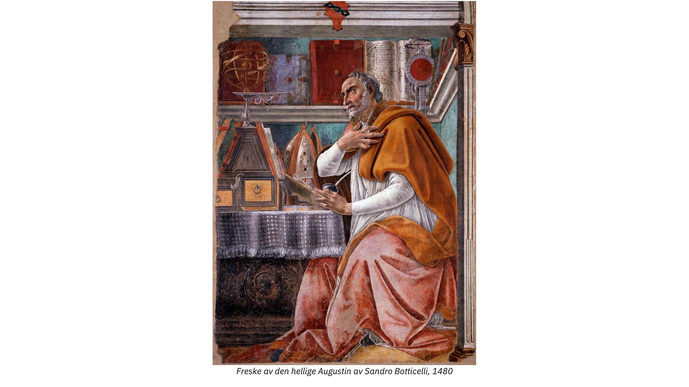

Og selv om ansvaret for skaden som forårsakes av et jordskjelv, et dødelig virus eller det faktum at et barn blir født blindt, ikke bør tilskrives mennesker, vedvarer denne tenkemåten ved å gi naturen en moralsk intensjon som gjør dem ansvarlige. For eksempel ved å tenke at hvis et jordskjelv har oppstått, er det nettopp fordi menneskene har oppført seg dårlig.

Dette er den ideen som forsvares av religiøse mennesker, nemlig at mennesker er født syndere, skyldige i arvesynden.

Som du kan forestille deg, blir denne ideen selvfølgelig revet i filler av Spinoza, som mener at siden naturen, eller Gud eller lykken, som han sier, ikke er utstyrt med intensjoner, og siden mennesker ikke har fri vilje, er ansvaret for "ondskap" som tilskrives dem, fullstendig illusorisk.

"Ingenting skjer i naturen som kan tilskrives en last som finnes i den", skriver Spinoza i Etikken, og ifølge ham ville det derfor være feil å betrakte for eksempel blindhet hos et nyfødt barn som "ondt", siden et barn som fødes blindt, ikke er mer fratatt synet enn en stein ville vært.

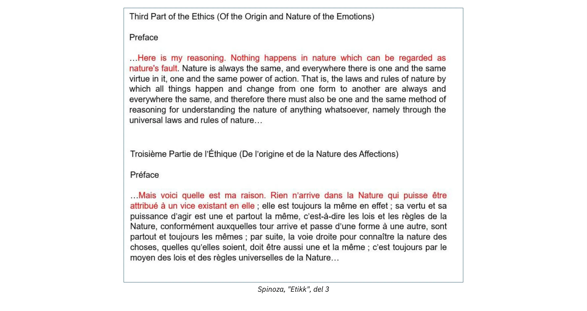

Og hvis vi tror at de blinde mangler syn, er det bare sett fra de seendes synsvinkel.

Spinoza tar altså opp tanken om at det onde ikke finnes i naturen, men hans originalitet, som gjør den til en revolusjonerende filosofi, er å mene at det onde ikke finnes, og det gjør heller ikke "det gode".

Og det er derfor han snakker om etikk i stedet for moral, ikke for å reflektere over hva som er rett eller galt, siden alt dette er relative og subjektive begreper, men snarere i form av hva som er "godt" eller "dårlig" for vårt naturlige behov for å "holde ut i vår væren", som han sier. Med andre ord, å leve og vokse. Å blomstre som mennesker.

Dessuten har vi allerede sett at Spinozas syn på ansvaret til mennesker som oppfører seg dårlig ved å begå en forbrytelse, åpenbart ikke er ment å unnskylde dem.  For selv om mennesker ikke kjenner de egentlige årsakene til at de begår en forbrytelse, er de alltid klar over hva de gjør, og er derfor som sådan ansvarlige overfor moralen og loven.

Det er klart at en forbryters handlinger alltid er knyttet til familiær, sosial, økonomisk eller til og med medisinsk determinisme, hvis forbrytelsene hans kan forklares med en fysisk eller psykisk tilstand. Og dette er rettferdighetens rolle, som går utover strafferetten for å ta hensyn til det faktum at visse forbrytelser ikke bare må straffes, men også behandles, med tanke på lovbryterens familiemessige, sosiale og psykologiske bakgrunn.

Det er derfor spinozisten Gilles Deleuze (1925-1995) forklarer at etikk er en slags etologi, det vil si en praktisk vitenskap om væremåter, eller, som han uttrykker det, "kunsten å gjøre gode møter".

Frihet består med andre ord, ifølge Spinoza, i å rette vår eksistens mot det som "øker vår handlekraft", og alltid se optimistisk på fremtiden, se verden slik den er, snarere enn å forestille oss den slik vi gjerne skulle sett den.

Og det er nettopp det som er det geniale med Spinozas demonstrasjon, for han kjemper mot uvitenhetens leger og mot alle dem som hevder at det er godt å være uvitende.

Tvert imot studerer Spinoza menneskelige lidenskaper, selv de mest irrasjonelle, hjertesorg, galskap, tristhet eller melankoli, på samme måte som geometere, "more geometrico", slik man studerer punkter, linjer, flater og volumer.

Det er denne affektteorien han utvikler i tredje del av sin Etikk, og som jeg foreslår at du studerer nå.

Takk for oppmerksomheten.

## Affektteori

<chapterId>3bb011ce-6f0c-51a6-b41f-25a3b5b7768e</chapterId>

:::video id=bb427cc6-e54d-4b44-bd6d-281ba421001a:::

Ifølge Spinoza er frihet et begrep som skal oppdages, en vei til et bedre og mer kraftfullt liv. Et friere liv. En vei som krever at vi anerkjenner den absolutte determinismen og tingenes rasjonelle kausalitet.

Han utvikler systemet sitt i tredje del av Etikken. Det er den berømte "teorien om affekter".

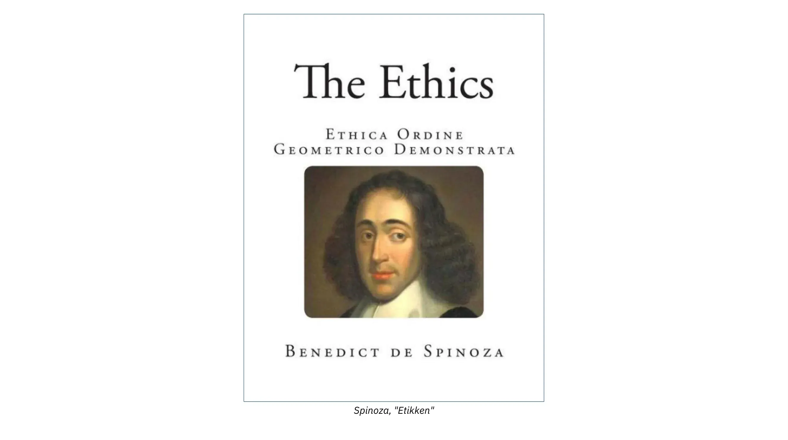

Prinsippet er at menneskelige affekter er, sier Spinoza, aktive eller passive modifikasjoner av kropp og tanke som påvirker vår handlekraft, det vil si vår atferd.

Og likevel er vi, avhengig av de affekter som er spesifikke for både menneskets natur og de som kommer fra omverdenen, fullt i stand til å danne oss sanne ideer, resonnere og uttrykke glede.

Men vi er også i stand til å danne såkalte passive affekter, fordommer som fører til at vi mekanisk, "på tross av oss selv", ikke lenger ser eller gjør det som vår egeninteresse krever.

Vi snakker om slaveri, eller trelldom, en tilstand som kjennetegnes av manglende evne til å kontrollere og motvirke de passive affektene som noen ganger får oss til å ville det vi ikke vil og gjøre det vi ikke vil.

Det er dette Spinoza sier i sin Etikk, når han undrer seg over at "folk ofte ser det beste, bifaller det og gjør det verste", eller at "de kjemper for sin underkastelse som om de kjempet for sin frelse".

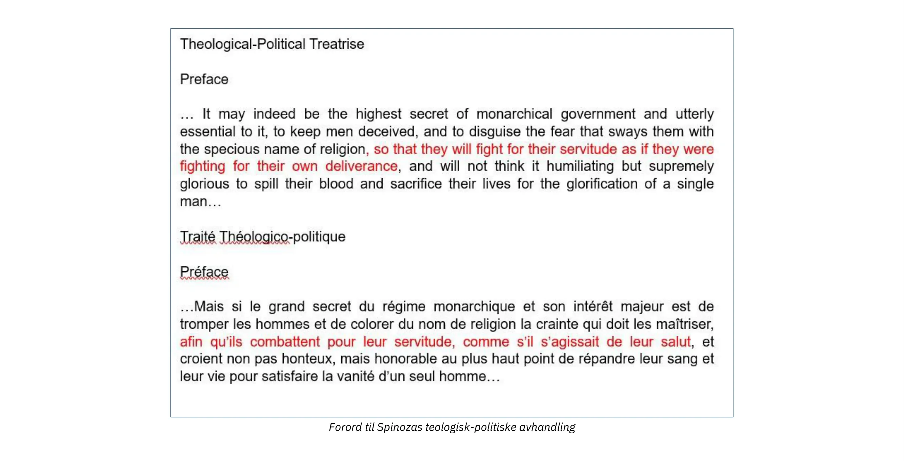

Spinoza tar hatet som eksempel, som han ser som en passiv affekt, vendt mot tristhet og født av utilstrekkelige ideer, det vil si en delvis kunnskap om årsaker, og som han definerer som "en tristhet som er forbundet med ideen om en ytre årsak".

Med andre ord, hvis vi hater en utlending, er det fordi vi forbinder denne utlendingen med den forestillingen vi har om ham, av grunner vi ikke forstår, siden han er fremmed og annerledes av natur. Det er denne forestillingen om en ytre årsak - en forestilling som forøvrig alltid mekanisk motiverer de uvitende til å snakke stygt om et begrep de ikke kjenner.

Dette gjelder forresten spesielt innen kryptovalutaer.

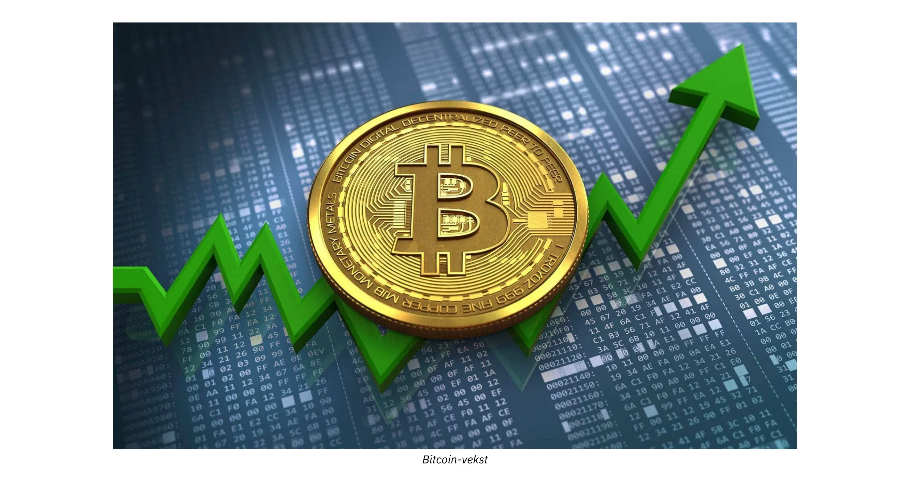

Spinoza sier at hvis vi fjerner denne negative forestillingen om en ytre årsak, ikke ved hjelp av moral, men ved hjelp av oppdragelse, empati og fornuft, særlig ved å fokusere på den fremmedes kvaliteter, eller i Bitcoins tilfelle, på det praktiske aspektet eller nytten, så forsvinner den assosierte følelsen av tristhet, og det samme gjør automatisk hatet.

Det er verdt å huske at denne tankegangen selvfølgelig også gjelder for aktive affekter, og særlig for kjærligheten, som ifølge Spinoza er "en glede forbundet med forestillingen om en ytre årsak". Og hvis for eksempel den ytre årsaken til kjærligheten til en ting eller en person forsvinner eller forandrer seg over tid, kan også gleden knyttet til den forsvinne, slik at kjærlighetsfølelsen slukkes. Når vi ikke forstår dette, kan det gjøre oss ulykkelige og deprimerte.

Men hvis denne såkalte affektteorien gjelder for vårt "ubevisste", gjelder denne rasjonelle tenkemåten "på landmålernes vis" også for kampen mot alle former for ytre trelldom, enten den er religiøs, politisk eller et resultat av naturfenomener.

Dette er eksemplet med lynet. For når lynet slår ned og dreper uskyldige mennesker, vil de uvitende ha en tendens til å se det som Guds hånd, å anse at lynet uttrykker en moralsk og finalistisk intensjon. Aids på 90-tallet eller til og med, mer nylig, covid har av noen blitt tolket som guddommelig straff.

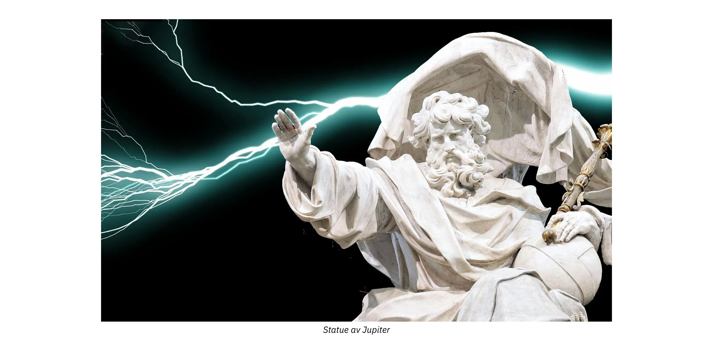

For Spinoza er selvfølgelig alle disse teleologiske ideene bare overtro, synonymt med uvitenhet, i og med at lynet som slår ned i dette eksemplet ikke gjør noe annet enn å uttrykke essensen av sin egen natur. Nemlig å slå ned. Uten noen moralsk intensjon om å straffe eller belønne noen.

Takket være dette enkle eksemplet forstår vi at den eneste løsningen for å beskytte oss mot lynet - med andre ord for å frigjøre oss fra den trelldommen som faren for lynet alltid har påført oss - ikke er å klage over uflaks eller en påstått guddommelig urettferdighet, og heller ikke å komme med det minste moralske argument. Nei, også her, som med hatet, handler det snarere om å reflektere over hva vi kan gjøre ut fra et etisk synspunkt.

Og i dette tilfellet ville det være å beskytte oss mot lynnedslag ved å være rasjonelle, åpne for fremskritt, være nysgjerrige og trygge på hva vitenskapen kan tilby oss, og, hvorfor ikke, installere en lynavleder.

Dette er det geniale med Etikken. Spinoza viser oss at det er mulig å bevege seg fra frivillig trelldom, fra et "på tross av oss selv"-liv og en værhane av evig fremmedgjøring, til et liv som leves gjennom kunnskap om følelser og determinasjoner.

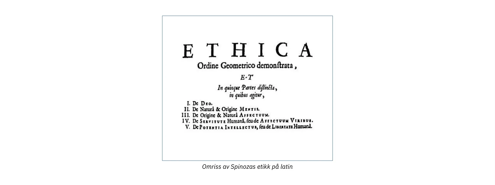

Det er en måte å tenke på som gjør det mulig for oss å dissekere menneskets natur for å se den lyse siden eller sannheten i ting. For å eliminere årsakene til tristhet og frykt som tynger oss ned. Å være fri, med andre ord å kunne slutte å adlyde triste lidenskaper og endre atferd.

Og å forstå, sannsynligvis for første gang i filosofihistorien, at man kan være klar og lykkelig.

Og det er derfor spinozismen ofte omtales som "gledens filosofi".

## Frihet, den østerrikske økonomiske skolen og Cypherpunk-filosofi

<chapterId>b54f2532-460c-11f0-a248-93ff24ef1d57</chapterId>

:::video id=5f49d5b4-e15f-475b-b40d-07464c08ca4d:::

Som du nå vet, er frihet ifølge Spinoza en bevissthet om vår determinisme. Ved hjelp av fornuften, og takket være vår evne til å handle, kan vi forstå årsaksmekanismene bak trelldom, slik at vi kan bekjempe dem, ikke lenger lide under dem og ikke lenger handle mot våre egne interesser.

Til syvende og sist betyr denne klarheten at man ikke lenger lever i den nihilismen som Friedrich Nietzsche (1844-1900) senere beskrev, der mennesket fortaper seg i ideologiske idealer, det vil si politiske eller religiøse fiksjoner, som fører til at det fornekter virkeligheten, infantiliserer seg selv og gjør seg selv ulykkelig.

Det var nettopp dette opplysningstidens rasjonelle filosofi handlet om, særlig takket være Immanuel Kant (1724-1804), som mente at bare et dannet individ, under fornuftens veiledning, kan tenke selv og etisk avgjøre hva som er "sant" eller "godt", og hva som er giftig.

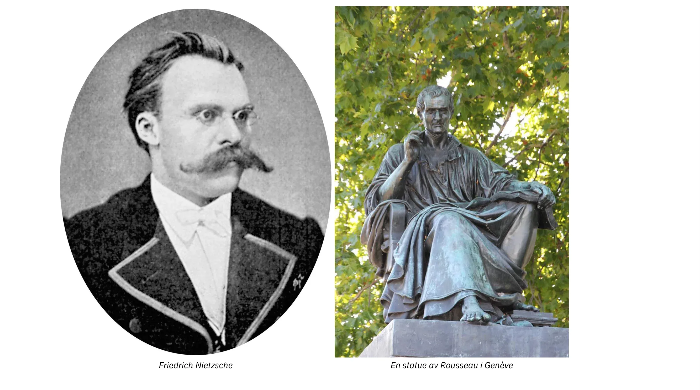

Med andre ord, sier han, hvis vi tenker selv, hvis vi resonnerer som rasjonelle voksne mennesker, og hvis vi derfor bestreber oss på å se årsakssammenhengene mellom tingene, trenger vi ikke lenger en moralsk autoritet til å lære oss for eksempel religionens sanne dyder eller de sanne etiske verdiene på det politiske og økonomiske området.

Det er et resonnement som knytter an til den østerrikske skolen i liberal økonomi, som ble født i den ekstremt fruktbare intellektuelle atmosfæren i Wien før første verdenskrig. Det var nemlig i denne konteksten at intellektuelle som Carl Menger (1840-1921), Ludwig von Mises (1883-1979) og Friedrich Hayek (1899-1992) la grunnlaget for en ny skole i liberal økonomi, som skulle bli fundamentet for overbevisningen til fremtidige cypherpunks. Og derav opprettelsen av Bitcoin.

Menger og Mises slo for eksempel fast at all kunnskap må konstrueres ut fra den kausale sammenhengen mellom ting, og foreslo dermed en ny kausal forståelse av økonomi. De var særlig inspirert av den liberale ånden som den franske økonomen Frédéric Bastiat (1801-1850) hadde utviklet noen år tidligere.

Hayek mener derimot at alle økonomiske beslutninger alltid uttrykker en form for usikkerhet og uvitenhet, og at det faktum at man ikke lider under dette på grunn av moral, tro, fordommer eller politiske ideologier, gjør det mulig å analysere økonomisk atferd korrekt og i forlengelsen av dette vurdere hva som er bra for enkeltmennesker, for samfunnet og for staten.

Slik kom disse liberale østerrikske økonomene til å kritisere alle sosialistiske ideer - Hayek snakket om "planisme" - og all moralpolitikk inspirert av dem, som etter hans mening bare førte til undergang. Å gi økonomisk makt til regjeringer, som uunngåelig lå etter i tiden og var i utakt med hva som burde og ikke burde gjøres, var dømt til å mislykkes.

For eksempel mener østerrikerne at når en stat med tvang gir seg selv makt til å skape penger for å styre økonomien og løse kriser, er det en risiko for at den aldri vil kunne la være å misbruke denne makten.

Hvorfor er det slik? Fordi den alltid befinner seg i en form for trelldom som hindrer den i å gjøre det, og dermed presser den, som Spinoza ville sagt, "til å se det beste, til å godkjenne det ... men til å gjøre det verste".

Som spinozist forklarer Hayek i en video at "siden denne makten ikke kan fjernes uten vold, er det eneste som kan gjøres å bruke et triks og innføre et nytt pengekonsept som myndighetene ikke lenger kan stoppe". Et argument som Milton Friedman (1912-2006) gjengir i et intervju, der han i sin tur diskuterer denne nye formen for digital valuta i sammenheng med det gryende Internett.

Dette er de politiske og økonomiske argumentene som de første cypherpunkerne, Eric Hughes (1953-), la frem i sitt "Cypherpunk-manifest", eller Timothy May (1951-2018) i sitt "crypto anarchist manifesto", og som Satoshi Nakamoto vil ta opp igjen.

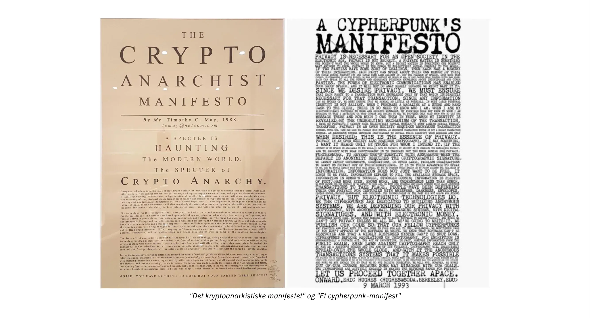

Spesielt da han skrev Times-overskriften fra 3. januar 2009 i myntbasen til Genesis-blokken av Blockchain Bitcoin for å illustrere slutten på en æra, den keynesianske, og begynnelsen på en annen med liberale, anarkistiske og libertarianske ambisjoner.

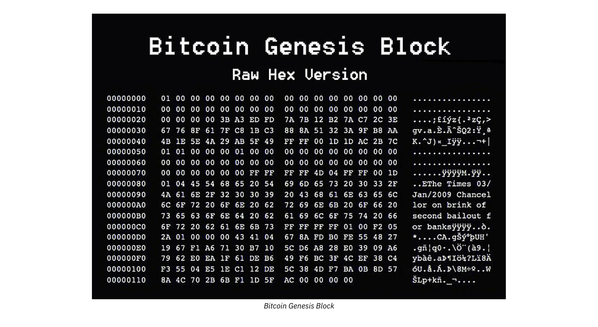

I hvitboken som ble publisert 31. oktober 2008, presenteres Bitcoin som en måte å utveksle verdier på Internett uten en betrodd tredjepart, basert på en desentralisert protokoll. En "kopernikansk" revolusjon som endelig vil gjøre det mulig for folk å gjenvinne sin evne til å handle, det vil si sin frihet, sin frihet til å handle, sin eiendomsrett og respekt for sitt privatliv.

Hvorfor er det slik? Fordi Bitcoin gjør det mulig for oss å frigjøre oss fra denne trelldommen på Spinozas måte, takket være fornuften, takket være Galileis matematiske språk. Og, som Hayek foreslår, uten at staten kan motsette seg det. Og på fredelig vis, uten tvang eller misjonering.

Dette er faktisk den siste parallellen jeg vil trekke mellom spinozisme og Bitcoin, for å vise at det ikke er noen vits i å overbevise noen som ikke abonnerer på et kopernikansk eller disruptivt konsept, annet enn gjennom fornuft, forståelse, nysgjerrighet eller god vilje.

Ikke med makt, ikke med vold. For faktum er at Kopernikus, Galileo, Newton, Darwin, Einstein, Hayek, Spinoza eller Satoshi Nakamoto aldri truet noen som ikke trodde på deres ideer og demonstrasjoner.

# Siste del

<partId>70a5a3c8-6c88-11f0-8753-db07e26dcaf4</partId>

## Anmeldelser og rangeringer

<chapterId>7945c38c-6c88-11f0-a73f-0f7cdf99f53f</chapterId>

<isCourseReview>true</isCourseReview>

## Avsluttende eksamen

<chapterId>a557fd32-6c88-11f0-96ff-cfa532cf76a0</chapterId>

<isCourseExam>true</isCourseExam>

## Konklusjon

<chapterId>ae04ab38-6c88-11f0-a496-3be47119e6b6</chapterId>

<isCourseConclusion>true</isCourseConclusion>