# Toen Spinoza Satoshi ontmoette

Ontdek hoe de radicale ideeën van de 17e-eeuwse filosoof Baruch de Spinoza over vrijheid, rede en macht de gedecentraliseerde revolutie van Bitcoin voorafgaan. Deze cursus onthult de opvallende parallellen: beide verwerpen blind geloof en centrale autoriteit, beide gebruiken wiskundige nauwkeurigheid om te bevrijden. Spinoza bevrijdde geesten van religieus dogma, Bitcoin bevrijdt geld van staatscontrole.

Leer praktische instrumenten uit Spinoza's ethiek om de filosofische fundamenten van bitcoin te begrijpen en je handelingsvrijheid te vergroten. Klaar om twee van de grootste instrumenten voor menselijke emancipatie uit de geschiedenis te verkennen?
+++
# Inleiding

<partId>80b76189-afab-5295-a8d3-ba8f6fe7a5e8</partId>

## Cursus inleiding

<chapterId>99af4992-fd6c-5142-b168-d927b251574b</chapterId>

:::video id=1def60bc-1d39-4e49-9b08-fd05b7a0d49b:::

In deze cursus presenteer ik met veel plezier de filosofie van Baruch de Spinoza (1632-1677), de beroemde 17e-eeuwse filosoof die beschouwd wordt als de vader van de rationele verlichtingsfilosofie.

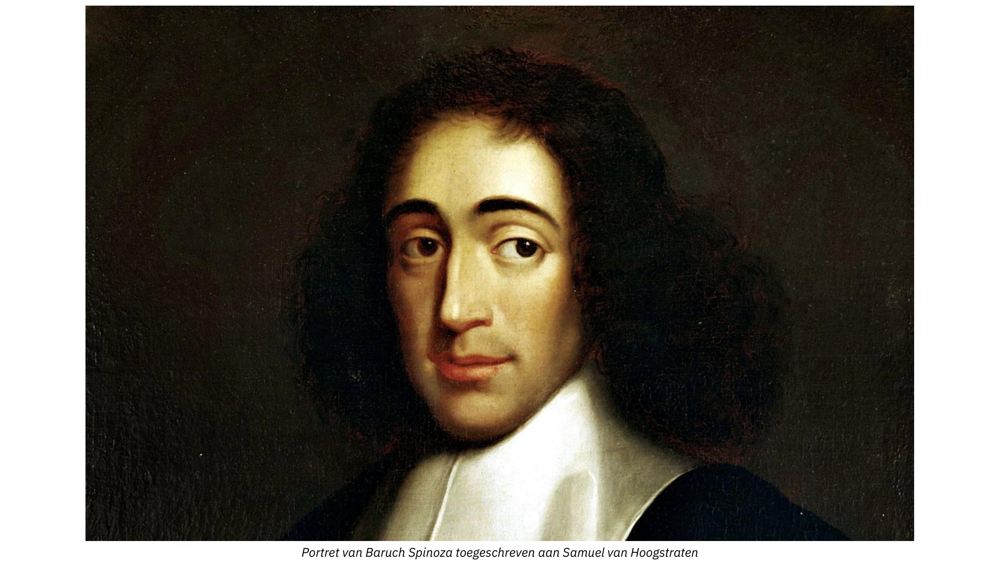

Portret van Spinoza

Deze cursussen zijn gebaseerd op mijn twee essays over dit onderwerp, "Spinoza's ware religie" en "Bitcoin, het evangelie van vrijheid", die in papieren vorm online of rechtstreeks via mijn website verkrijgbaar zijn, en digitaal op Amazon Kindle.

Het doel van deze cursus is in de eerste plaats om een vereenvoudigd begrip te geven van een filosofie die vaak als zeer complex en ontoegankelijk wordt beschouwd, ondanks de hernieuwde belangstelling die ze tegenwoordig geniet.

Sterker nog, deze filosofie stelt ons niet alleen in staat om de betekenis van dingen in twijfel te trekken als alles fout gaat, waar religie, filosofie en menswetenschappen over het algemeen over gaan, maar ook, en misschien wel vooral, om onszelf in twijfel te trekken als alles goed gaat.

Wanneer het leven ons toelacht en we het gevoel hebben dat we onszelf niet in vraag hoeven te stellen, met een trots die als illusoir en slaafs wordt gezien, dat ons geluk, of succes, alleen zou voortkomen uit ons talent, werk of zogenaamd vrije keuzes; kortom, uit onze eigen vrije wil, in plaats van uit het determinisme waaraan we onderworpen zijn.

Op deze manier kunnen we de link leggen tussen deze praktische filosofie van vrijheid - of, zoals Spinoza het zegt, "naar de middelen om het te bereiken" - en de nieuwe technologische wereld waarin we hier geïnteresseerd zijn, crypto in het algemeen en Bitcoin in het bijzonder.

En in het bijzonder in het filosofische aspect ervan, dat ons precies doet nadenken over het begrip vrijheid: de vrijheid om te denken, om jezelf te uiten, om privacy te respecteren en, in ons geval, natuurlijk de vrijheid om Exchange te maken.

Eerst laat ik je kennismaken met Spinoza, zijn karakter, zijn sociale, religieuze en familiale achtergrond en de historische context van de Verenigde Provinciën waar hij leefde.

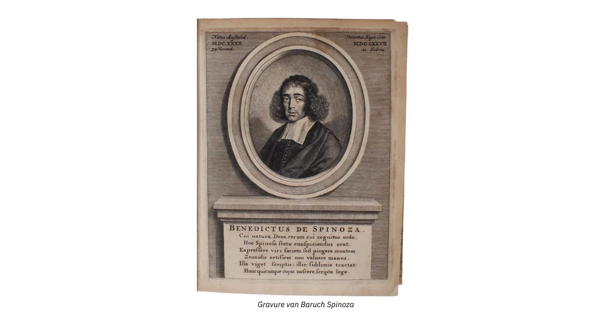

Portret van Spinoza

We zullen dan zien wat deze nieuwe rationele filosofie is volgens welke "er niets in de natuur bestaat dat niet verklaard kan worden zonder de uitoefening van de rede".

Het is het idee dat we de wereld en de menselijke natuur alleen kunnen begrijpen in termen van het oorzakelijk verband tussen dingen, volgens welke een gevolg altijd een oorzaak heeft, en deze oorzaak zelf het gevolg is van een andere oorzaak enzovoort, helemaal terug naar de eerste oorzaak, waar we geen toegang toe hebben en die volgens Spinoza de Natuur is.

De natuur, met andere woorden God, is het beroemde "Deus sive Natura" in het Latijn dat de hele betekenis van het Spinozisme illustreert.

We zullen ook kijken naar de twee belangrijkste werken van Spinoza, te beginnen met de Ethica, postuum gepubliceerd in 1677, die zich volledig richt op vrijheid en de noodzaak om onszelf te bevrijden van de slavernijen die ons beperken.

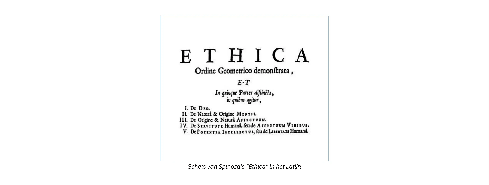

Daarna kijken we naar de Traité théologico-Politique, gepubliceerd tijdens zijn leven in 1670, die ons vrijheid vanuit een andere invalshoek laat bekijken: vrijheid van denken en geloven. Met andere woorden, godsdienstvrijheid, maar vooral politieke vrijheid.

Tot slot zullen we zien waarom het Spinozisme een Copernicaanse revolutie van ideeën is, en hoe het een nieuwe definitie van de wereld en de menselijke natuur vertegenwoordigt, door de 3 fundamentele illusies te bestuderen die Spinoza aan de kaak stelt: de illusie van de vrije wil, de illusie van uiteindelijke oorzaken of finalisme, en de theologische illusie.

Dankzij de theorie van affecten, ontwikkeld op de manier van de geometers, "more geometrico", zullen we uiteindelijk zien hoe Spinoza ons een praktische methode biedt om onszelf te bevrijden, of probeert te bevrijden, van de slavernijen die inherent zijn aan de menselijke natuur en de uiterlijke passies. Een rationeel mechanisme dat, om onwetendheid te bestrijden, kan worden vergeleken met de zekerheid dat de drie hoeken van een driehoek altijd gelijk zijn aan 180°, en ons in staat zal stellen om de geest van de Verlichting die eruit voortkwam te verbinden met de liberale stromingen van de 19e eeuw of het libertarisme van de 20e eeuw, die rechtstreeks verbonden zijn met de uitvinding van Satoshi Nakamoto, Bitcoin.

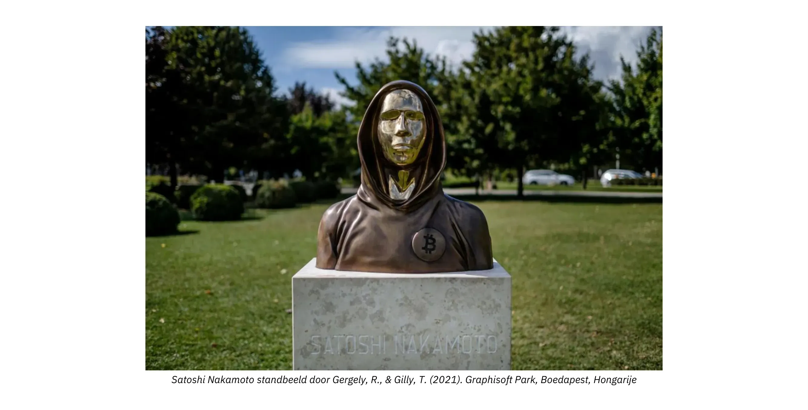

We zullen dan begrijpen dat, van de vele punten van overeenkomst tussen Spinozistische concepten en dit vrijheidsinstrument uitgevonden door Satoshi Nakamoto, het eerste is dat, in beide gevallen, als we nieuwsgierig zijn, goedbedoeld, zoals men destijds zei, "begrip" hebben, we niet anders kunnen dan ons eraan houden. En als we ons er niet aan houden, wat natuurlijk ons meest absolute recht zou zijn omdat het fundamenteel is om de vrijheid om te geloven of niet te geloven te respecteren, dan zouden we vastbesloten zijn om het niet te kunnen, of niet te willen, wat op hetzelfde neerkomt.

En zo kunnen we begrijpen dat bijvoorbeeld een religieuze fundamentalist nooit in staat zal zijn om de minste Copernicaanse gedachte zoals het Spinozisme te accepteren of ernaar te luisteren, net zoals een centrale bankier het heel moeilijk zal vinden om Bitcoin te accepteren.

Maar zoals je weet, gaat het momenteel de goede kant op.

## Even voorstellen: Baruch de Spinoza

<chapterId>f53a9cfd-326e-5b73-a766-3ef2f07c5a49</chapterId>

:::video id=5fac3ddc-c472-4c64-8186-46a8f317e389:::

Wie was Baruch de Spinoza? Hij was een Nederlandse filosoof die in 1632 werd geboren en in 1677 op 45-jarige leeftijd stierf.

Als lid van de Portugese Sefardische gemeenschap die afstamt van de Maranen die in de 15e eeuw door de katholieken gedwongen werden Spanje te verlaten, werd hij opgevoed in een religieuze en intellectuele omgeving en wist hij wat het betekent om vervolgd te worden.

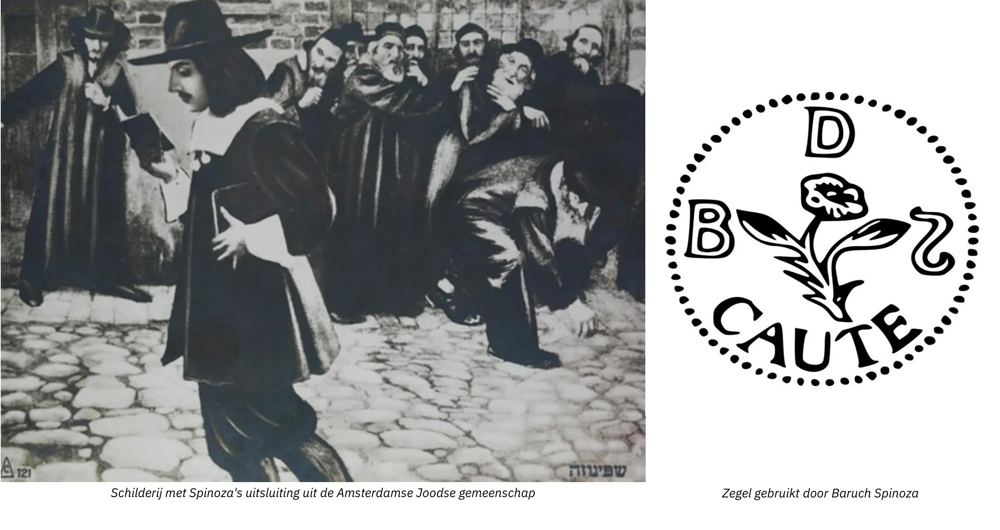

In feite toonde hij al op jonge leeftijd een sterk kritische geest ten opzichte van de gevestigde religie, en in het bijzonder ten opzichte van zijn Hebreeuwse gemeenschap, waaruit hij in 1656, slechts 24 jaar oud, met geweld werd verstoten, nog voordat hij iets had gepubliceerd.

Deze "excommunicatie", zo wordt gezegd, stelde hem in staat om zichzelf af te zonderen en zich op zijn werk te concentreren zonder ooit om te kijken.

Als erfgenaam, net als zijn tijdgenoten Descartes (1596-1650), Pascal (1632-1662) en Newton (1643-1727), van de nieuwe rationele ideeën in de natuurkunde van Copernicus (1473-1543), Kepler (1571-1630) en Galileo (1564-1642), die hem slechts een paar jaar voorgingen, ontwikkelde Spinoza een manier van denken op de manier van de meetkundigen, in overeenstemming met Galileo's principe dat wiskunde de taal van het universum is.

Maar dit waren zeer gevaarlijke ideeën voor die tijd, na het proces tegen de monnik en filosoof Giordano Bruno (1548-1600), die levend werd verbrand wegens ketterij op een openbaar plein in Rome, en het proces tegen Galileo, die in 1633 door de inquisitie werd gedwongen om zijn copernicaanse heliocentrische overtuigingen af te zweren.

Dit is de reden waarom zijn strikt rationele visie op de wereld en de menselijke natuur, gebaseerd op de oorzakelijke verbanden tussen dingen, hem de reputatie opleverde dat hij, ten onrechte, als atheïst werd beschouwd en vandaag de dag nog steeds wordt beschouwd.

In feite spreekt Spinoza's werk alleen over God, die hij vereenzelvigt met de Natuur, en hoewel hij de bijgelovige impulsen van religieuze mensen en theocraten bekritiseert, laat hij zien dat ware religie voor hem bovenal synoniem is met rechtvaardigheid en naastenliefde.

En het is deze benadering die Spinoza verbindt met de filosofie van de Verlichting, of het nu Duits is, met Leibniz (1646-1716), Kant (1724-1804), Schopenhauer (1788-1860) en Nietzsche (1844-1900), Engels met Locke (1632-1704) of Frans met Voltaire (1694-1778), Rousseau (1712-1778) en Diderot (1713-1784). Ze waren het er allemaal over eens dat de rede gebruikt moest worden om obscurantisme te bestrijden, vooral religieus obscurantisme, om onwetendheid te bestrijden en om de idealen van vrijheid en vooruitgang te verdedigen.

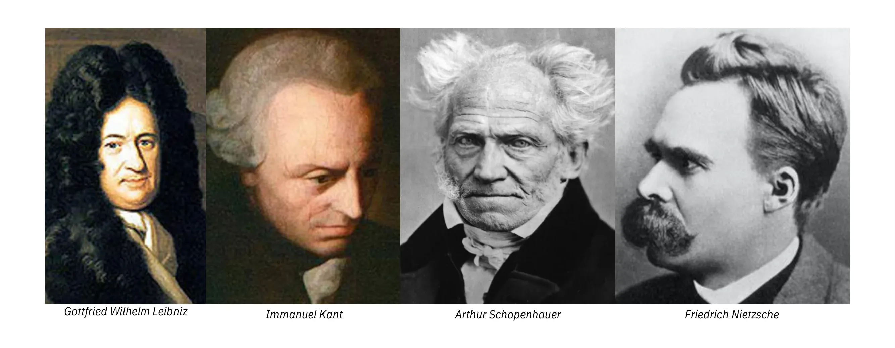

Om te beginnen met het verbinden van deze filosofie met Bitcoin, is het belangrijk op te merken dat Spinoza in een heel bijzonder tijdperk werd geboren.

In de 17e eeuw waren de Verenigde Provincies niet alleen het vrijste land ter wereld op het gebied van politieke en religieuze ideeën, maar ook het rijkste. Met andere woorden, het economisch en technologisch meest geavanceerde land.

Rijkdom is echter niet verbonden aan natuurlijke hulpbronnen, de uitbuiting en verwoesting van koloniën of slavernij, maar aan internationale handel en commercie in een liberale, ondernemende geest. Een geest die later werd verdedigd door een beroemde Spinozist, Voltaire (1694-1778), voor wie, in een handelskamer, een zakenman of ondernemer van liberale overtuiging nooit zou worden uitgesloten, een ongelovige zou worden genoemd of geëxcommuniceerd, zei hij, op basis van zijn religie of afkomst, maar alleen als hij failliet was gegaan.

Bovendien was Nederland in die tijd ook geavanceerd op belangrijke technologische gebieden, bijvoorbeeld op het gebied van mechanica en optica. De astronomische telescopen die Galileo gebruikte om naar de hemel te kijken en het heelal te ontdekken, werden inderdaad beschouwd als geavanceerde technologie voor die tijd, net als de nieuwe technologieën die vandaag de dag worden geassocieerd met computers, AI en natuurlijk cryptografie.

En aangezien Spinoza zelf het vak uitoefende van het polijsten van astronomische lenzen - ironisch genoeg voor iemand van wie gezegd werd dat hij alles scheef zag - kunnen we ons voorstellen dat hij zeker een vrijheidsinstrument als Bitcoin zou hebben gesteund.

Met andere woorden, de waarden van vrijheid en vooruitgang die het Spinozisme uitdraagt staan in contrast met een wereld waar religieus fundamentalisme, samenzweringstheorieën, bijgeloof en vooral onwetendheid een trieste realiteit blijven.

Toch is het een wereld waarin elk middel waardevol is om te ontsnappen, om onszelf te bevrijden van de slavernij die ons beperkt en om vrij te zijn door de wereld te accepteren zoals hij is en niet zoals we zouden willen dat hij is.

Of deze middelen nu filosofisch of technologisch zijn, zoals we later zullen zien, Bitcoin is een vrijheidsmiddel. Het is een middel dat zowel individuen als staten in staat stelt zich te bevrijden van slavernij, vooral monetaire slavernij.

# Belangrijkste werken, Ethiek en politiek

<partId>d7d7e9a1-005b-519c-b587-137435e46344</partId>

## Ethiek en de zoektocht naar vrijheid

<chapterId>4cc66e25-335c-591d-9b78-83e5664bbbbc</chapterId>

:::video id=065c5091-69e1-412f-acce-c763ec31d3b1:::

In dit hoofdstuk stel ik voor dat we ons nu richten op Spinoza's belangrijkste werk, getiteld Ethica, postuum gepubliceerd in 1677.

Waarom postuum? Nou, omdat zijn ideeën revolutionair waren, of op zijn minst contra-intuïtief en ontwrichtend, en daarom in die tijd erg gevaarlijk, zelfs in de liberale context van de 17e-eeuwse Verenigde Provinciën.

De Ethica is een werk geschreven in het Latijn op de manier van meetkundigen, waarschijnlijk geïnspireerd door de wetenschappelijke geest van Galileo (1564-1642), samen met Kepler (1571-1630) de vader van de moderne wetenschap, volgens wie wiskunde de taal van het universum is. Spinoza ontwikkelt zijn ideeën in vijf hoofddelen, gebruikmakend van stellingen vergezeld van demonstraties, scolia, axioma's en definities.

Als zodanig is de Ethica, in Spinoza's woorden, "een manier om tot vrijheid te komen of de wegen die daartoe leiden", en is het niet echt een boek dat van kaft tot kaft gelezen kan worden, maar eerder een boek dat doorgewerkt kan worden door bijvoorbeeld een stelling te lezen die naar een andere verwijst, die op haar beurt begrepen wordt door een derde, enzovoort, in een perfect samenhangend, rationeel en logisch systeem.

Ik wil erop wijzen dat het aan te raden is om bij het openen van de Ethics te beginnen met de postfaces en appendices, deze korte gedeelten zijn door Spinoza in alledaagse taal geschreven, dus ze zijn gemakkelijk te begrijpen en in zekere zin een samenvatting van zijn soms complexe denken.

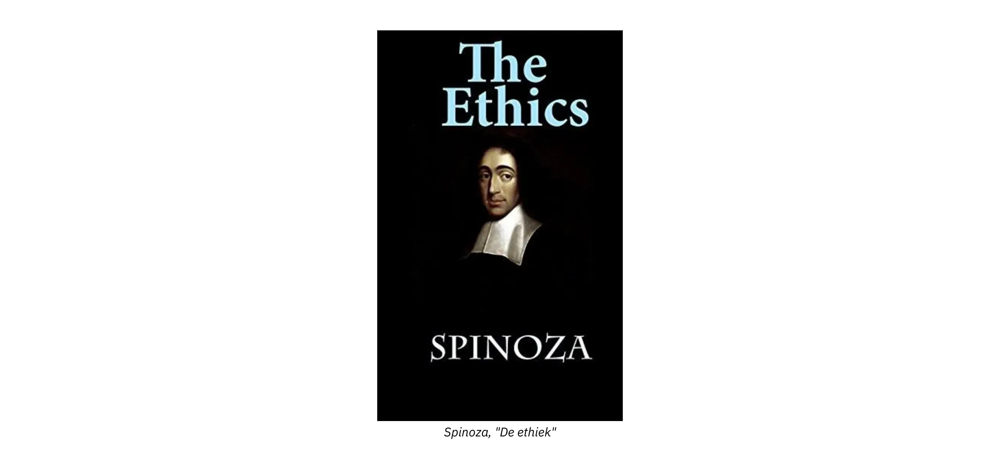

Door de wereld om ons heen aan de "microscoop van de rede" te onderwerpen, ontleedt Spinoza's werk de menselijke natuur volgens het principe dat de mens niet zelf veroorzaakt is, d.w.z. dat we er niet om gevraagd hebben geboren te worden, noch hier, noch in onze tijd, noch met zulke fysieke of intellectuele eigenschappen.

En hij zegt dat we niet boven de natuur staan. We zijn niet vrijgesteld van haar wetten, of het nu gaat om ons lichaam of onze geest. Met andere woorden, we maken net zoveel deel uit van de natuur als ieder ander levend wezen, dier of plant.

Voor Spinoza zijn alle gebieden van menselijke activiteit afhankelijk van het vermogen van de rede om de wereld te begrijpen in een perfect samenhangend en gedetermineerd systeem.

Een wereld waarin toeval niet bestaat.

Alles wat gebeurt is "noodzakelijk" en het resultaat van een oorzaak, volgens het idee dat "wat is en wat gebeurt, moet zijn en moet gebeuren". Dit is absoluut determinisme.

Maar er zijn twee punten die je in gedachten moet houden:

Ten eerste, als toeval niet bestaat voor Spinoza, dan is dat omdat het een gebeurtenis is waarvan we de oorzaak niet kennen. Maar, zegt hij, omdat we de oorzaak niet kennen, betekent dat natuurlijk niet dat het niet bestaat.

Ten tweede is er ook absoluut geen sprake van fatalisme, omdat de natuur geen intentie heeft. De bliksem heeft bijvoorbeeld niet de intentie om iemand te straffen, zoals je zou kunnen denken in het geval van een tragedie. Nee, ze drukt gewoon de essentie van haar eigen natuur uit, namelijk inslaan met de bliksem. Om toe te slaan.

Spinoza verdedigt dus het idee dat de werkelijkheid, d.w.z. het dagelijks leven met zowel goede als slechte aspecten, volkomen begrijpelijk is, en dat er geen verschijnsel in de natuur is dat niet causaal verbonden is. Dit roept natuurlijk de vraag op naar het kwaad, in het bijzonder het absolute kwaad, waar we later naar zullen kijken.

Tot slot is het belangrijk op te merken dat ethiek geen moraliteit is.

Volgens Gilles Deleuze (1925-1995), de beroemde professor in de filosofie en Spinoza-specialist, is moraliteit een beoordelingssysteem dat nuttig is om in de maatschappij te leven. Maar het is een subjectief systeem, want wat hier goed is, kan elders fout zijn, en wat vandaag fout is, kan later goed zijn.

En in plaats van te bepalen wat goed of fout is, stelt de ethiek vast wat goed of slecht is voor onze eigen natuur en ons vermogen, zegt Spinoza, om in ons wezen te behouden. Om vrij te zijn. Het is daarom een ware ethologie, dat wil zeggen een wetenschap van manieren van zijn, of, zoals Gilles Deleuze verder uitlegt, de kunst van het maken van goede ontmoetingen.

Of de kunst om de juiste keuzes te maken om onszelf te bevrijden uit de slavernijen die ons opsluiten en waardoor, volgens Spinoza, mensen vaak gereduceerd worden tot "het beste zien, het goedkeuren en het slechtste doen".

Met andere woorden, "vechten voor hun slavernij alsof ze vechten voor hun vrijheid".

## De theologisch-politieke verhandeling

<chapterId>84b0187e-1050-5d44-a536-80554896e828</chapterId>

:::video id=c1efc97e-1e96-4b37-894c-9a19794d6b52:::

Na de Ethica wil ik in dit hoofdstuk een ander belangrijk werk introduceren dat je zal helpen Spinoza's filosofische en politieke invloed te begrijpen, met name op de komende Verlichting en op liberale en, in ons geval, libertaire stromingen.

Dit is de Traité théologico-politique, of TTP, anoniem gepubliceerd in 1670.

Spinoza (1632-1677) schreef dit boek terwijl hij het schrijven van zijn Ethica onderbrak, in een poging een einde te maken aan een misverstand dat nog steeds bestaat. Het is de overtuiging dat hij atheïst was.

Zoals we hebben gezien is Spinoza's concept van God het onderwerp van het hele eerste deel van de Ethica, waarin hij niet alleen het bestaan van God aantoont, maar ook wat zijn ware aard is.

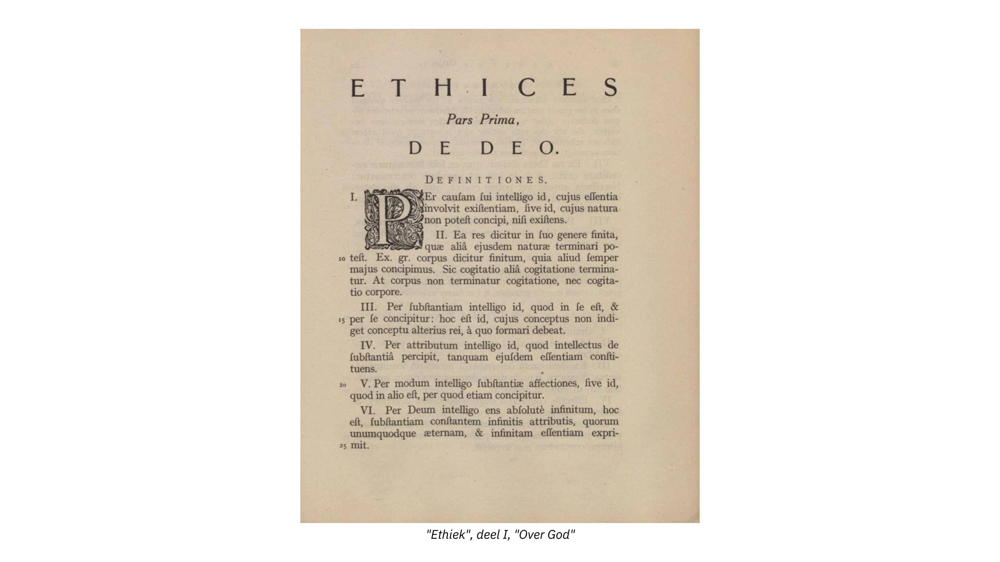

En aangezien Spinoza's concepten over het algemeen nogal moeilijk te vatten zijn, is het vaak gemakkelijker ze te begrijpen door te zeggen wat ze niet zijn, dan door te proberen te zeggen wat ze wel zijn. Een benadering die overigens, zoals we later zullen zien, erg nuttig is om Bitcoin te begrijpen.

Zo laat Spinoza ons zien dat God volgens hem geen antropomorf wezen is met bedoelingen, straffend of belonend, tot wie we zouden spreken en die naar ons zou luisteren volgens een ritueel dat we al dan niet volgen. Met andere woorden, volgens hem is God geen oude man met een lange witte baard, verborgen achter een wolk, die de moeilijkheden van de wereld zou oplossen en ons afhankelijk van hem zou maken.

Spreken over God is dus de Natuur oproepen als een unieke, oneindige en eeuwige Substantie, bestaande uit een oneindig aantal attributen, waarvan wij mensen er maar twee kennen: materie, of de omvang, en het denken.

Dit is het beroemde "Deus Sive Natura" waaraan Spinoza het concept van absoluut determinisme ontleent en het idee dat de mens geen oorzaak van zichzelf is en niet boven de Natuur staat, en zeker niet boven dieren.

Maar naast een kritiek op religie is de TTP voor Spinoza vooral een gelegenheid om zware kritiek te leveren op de religieuze mensen en op de theocratie. Met andere woorden, religieuze macht cultiveert angst en bijgeloof, en activeert volgens hem de trieste passies van individuen om ze nog beter tot slaaf te maken en ze te vangen in waan, fanatisme en oorlog.

In dit primaire, infantiele stadium van religie raken gelovigen alleen gehecht aan uiterlijke aanbidding en een goedgelovig geloof dat gebaseerd is op vooroordelen. Een stadium waarin religie mechanisch intolerant wordt, afdwaalt van de grenzen van haar morele leer en zich afwendt van haar roeping om vrede en harmonie te bevorderen door te beweren de waarheid in pacht te hebben.

Zodra we echter verder gaan dan rationele kritiek op religie, bijvoorbeeld door de Bijbel te exegiseren, wil Spinoza ons ervan overtuigen dat deze nieuwe visie op God volledig verenigbaar is met de boodschappen van rechtvaardigheid en naastenliefde van de drie grote religies van het Boek, die een eenvoudige maar vaak vergeten gouden regel uiteenzetten: "Je zult je naaste liefhebben als jezelf".

Maar dat is nog niet alles.

Deze volwassen visie op religie die in de TTP is ontwikkeld, gaat gepaard met een politieke dimensie: de noodzaak om religie en staat te scheiden om de vrijheid van denken en geloven te beschermen, in het belang van zowel alle individuen als de staat zelf.

In wezen maakt Spinoza van vrijheid, binnen het kader van de rede, een essentiële voorwaarde voor mensen om te kunnen leven zonder geknecht te worden door een macht die tegen hun belangen ingaat, en daarom verdedigt hij een directe democratie gebaseerd op politieke en religieuze vrijheid.

Met andere woorden, vrijheid van denken en geloven, zodat mensen zich kunnen bevrijden van slavernij en van valse, infantiliserende overtuigingen, om als volwassenen te redeneren, waarbij prioriteit wordt gegeven aan de rede en ook, wat ons betreft, aan technologische vooruitgang.

De beruchte aardbeving in Lissabon op 1 november 1755 liet een grote verschuiving zien in de manier waarop mensen dachten over natuurlijke gebeurtenissen en rampen, en over hoe ze zich ertegen konden beschermen.

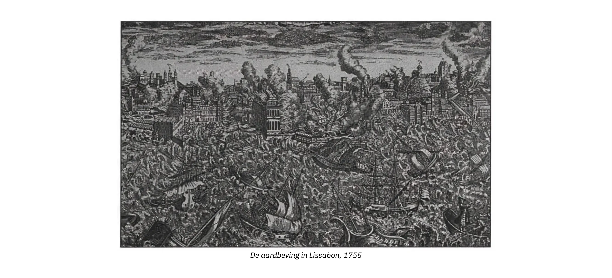

Deze verschrikkelijke aardbeving verwoestte de stad en doodde honderdduizenden onschuldige mensen, van wie velen zich op dat moment in de kerk bevonden, aangezien het Allerheiligen was, wat het onbegrip van de overlevenden nog vergrootte.

Een drama dat de vraag van de Duitse filosoof en wiskundige Leibniz (1646-1716) over de antropomorfe visie van een God begiftigd met intentie, goedheid en almacht nieuw leven inblies. Want als God goed zou zijn, zoals Leibniz zegt in zijn Theodicy, dan zou hij niet almachtig zijn, omdat hij zulke catastrofes zou toestaan, en als hij almachtig zou zijn, dan zou hij niet goed zijn, omdat hij ze niet zou kunnen voorkomen.

Jean-Jacques Rousseau (1712-1778) verdoemde niet alleen de hand van God, maar schreef aan Voltaire, die getroffen was door het onrecht en de verschrikkingen die de mensheid op discriminerende wijze had ondergaan, dat "de natuur op zichzelf niet slecht was en dat we er geen goddelijke hand in moesten zien die haar ontwerp zou verklaren".

Waarop Voltaire (1694-1778), een Spinozist als er ooit een was, antwoordde dat deze natuurramp ons vooral moest doen beseffen dat de wetenschappelijke middelen om ons tegen de natuur te beschermen wel degelijk bestonden, en dat de uitdaging van hun tijd dus was om ons af te vragen of de mens dankzij de kennis en vooruitgang zijn toekomst in eigen handen kon nemen en zich kon bevrijden van theologie en bijgeloof.

En hoewel het natuurlijk geen kwestie was van het voorkomen van aardbevingen, die nog steeds niet alleen onvoorspelbaar maar ook volledig oncontroleerbaar zijn, was het meer een kwestie van ervoor zorgen dat bijvoorbeeld huizen gebouwd werden om ze te weerstaan.

Daarom is de Verlichting van de 18e eeuw, dankzij de uitoefening van de rede, wetenschap en technologie, de eeuw van de vooruitgang. Met andere woorden, vooruitgang als instrument van vrijheid.

# De Spinozistische revolutie, de drie illusies

<partId>f5d45c2b-28da-527a-ab20-dd255e9a9e0d</partId>

## Een nieuwe definitie van de natuur en de mens

<chapterId>3e6599e3-5b29-50a8-a67d-d0386da5d65d</chapterId>

:::video id=b6d2c035-8848-4da6-9da9-be3b70be0f38:::

In dit hoofdstuk wil ik een blik werpen op de geschiedenis van ideeën en kijken waarom het Spinozisme wordt beschouwd als een echte Copernicaanse revolutie van ideeën.

Dankzij deze nieuwe manier om God, met andere woorden de Natuur, te begrijpen die de wiskunde bood, bracht Spinoza (1632-1670) een diepgaande paradigmaverschuiving tot stand, met indirecte implicaties voor het religieuze wereldbeeld en de plaats van de mens daarin.

Net zoals Nicolaas Copernicus (1473-1543) vaststelde dat de aarde niet het middelpunt van de wereld was, en Charles Darwin (1809-1882) drie eeuwen later aantoonde dat de mens niet het middelpunt van het "leven" was, zo volgde Spinoza deze logica en beweerde hij in zijn eigen tijd dat de mens niet de "meester van zijn eigen huis" is en dat het universum niet uitsluitend voor zijn eigen bestwil is gemaakt.

Hij zegt dat de mens niet "een rijk binnen een rijk" is en dat, net zoals de aarde gereduceerd is tot de status van een gewone planeet, net als alle andere planeten, de mens gereduceerd is tot de status van een gewone natuurmodus, net als alle andere eindige natuurmodi, zoals dieren, planten en alle "bestaande wezens".

Vóór hem stelde de klassieke Griekse filosofie een geordende, hiërarchische visie op het universum voor om de wereld, de kosmos en de menselijke ervaring te verklaren. Gebaseerd op mythische verhalen probeerde deze filosofie de oorsprong van de wereld te verklaren, waarbij ze de nadruk legde op de harmonie van het universum, de natuur en de mens.

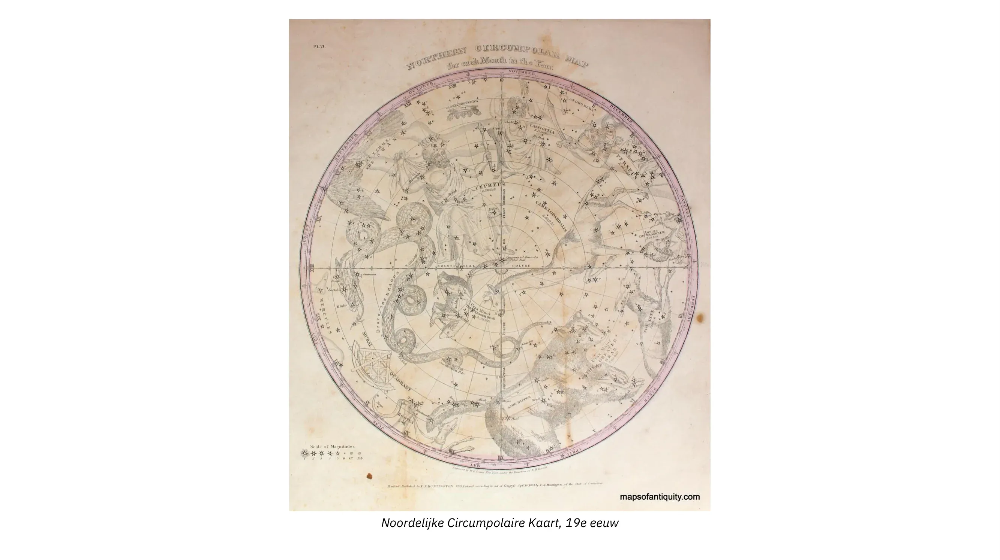

De scholastieke kosmologie van de Middeleeuwen, voornamelijk vanaf de 12e eeuw, was een evolutie naar meer redenering om rede en geloof te harmoniseren en zo een universum te verklaren dat nog steeds hiërarchisch was, maar dat beter overeenkwam met de christelijke filosofie.

Maar met de nieuwe natuurkunde van Copernicus (1473-1543) in de 15e eeuw onderging de kosmologie een belangrijk keerpunt in het begrip van het universum, waarvan het geocentrische model dus ter discussie werd gesteld ten gunste van het heliocentrische systeem, dat de weg vrijmaakte voor de moderne wetenschap, met name de nieuwe natuurkunde en sterrenkunde van Kepler (1571-1630) en Galileo (1564-1642). Daarna Isaac Newton (1643-1727) en tenslotte Albert Einstein (1879-1955), een toegewijd Spinozist.

Maar om het Spinozisme volledig te begrijpen, moeten we ook kijken naar de context van René Descartes (1596-1650), de beroemde Franse filosoof die aan Spinoza voorafging en van wie hij zowel een leerling als een groot bewonderaar was.

Ondanks de risico's en de veroordelingen van Giordano Bruno (1548-1600) en Galileo, zette Descartes zich in om "waarheid van onwaarheid" te onderscheiden en theologie, filosofie en natuurkunde te harmoniseren. In zijn beroemde Verhandeling over de Methode, gepubliceerd in 1637, stelde Descartes dat de rede de basis van kennis is, waardoor mensen vrijheid kunnen bereiken.

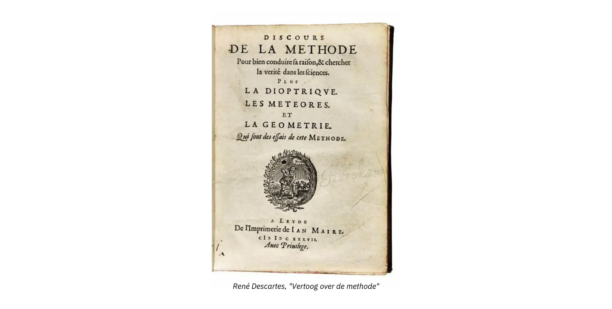

Door de wereld te verklaren volgens universele wetten in plaats van een natuur begiftigd met morele bedoelingen, maakte hij de weg vrij voor het determinisme, dat Spinoza later zou onderschrijven.

Maar als katholiek stelde Descartes niettemin een hiërarchie vast tussen de mens en de andere eindige vormen van de natuur, en in het bijzonder met betrekking tot diersoorten, wat hij "machinedieren" noemde. En door te zeggen dat "er geen ziel is die, wanneer ze goed geleid wordt, geen absolute macht kan verwerven over haar daden en passies", beweert Descartes dus dat menselijke wezens het vermogen hebben om iets uit het niets te beginnen en dat de mens volgens hem "ontsnapt aan de wetten van de natuur", dat hij absolute macht heeft over zijn eigen daden en zijn vastberadenheid uitsluitend op zichzelf baseert.

Spinoza wist dit stadium te overstijgen en het bestaan van God te verzoenen met het bewijs van de rede. Voor hem zijn alle terreinen van menselijke activiteit afhankelijk van de capaciteiten van de rede in een perfect coherente en gedetermineerde wereld. Maar een wereld waarin noch toeval noch toeval bestaat en waarin alles wat gebeurt noodzakelijk is en het resultaat van een oorzaak, volgens het oorzakelijk verband tussen de dingen. Dit is het idee van absoluut determinisme.

En het is in de meest harde bewoordingen dat hij uiteindelijk de cartesiaanse positie weerlegt, waarbij hij bijvoorbeeld het idee bekritiseert dat de mens niet onderworpen is aan de natuurwetten zoals alle andere dieren, en daarom superieur is aan alle andere eindige natuurwijzen.

Met andere woorden, ze zijn begiftigd met een vrije wil, een illusoire overtuiging waaraan uiterst moeilijk te ontsnappen valt, zoals Spinoza ons vertelt, en die we nu zullen bespreken.

## De illusie van vrije wil

<chapterId>f147a914-cb64-5927-b305-26691930bca3</chapterId>

:::video id=b59da795-ba19-4643-9672-36c9e7953a42:::

In deze cursus zullen we ons nu richten op de delicate kwestie van de vrije wil, om beter te begrijpen wat vrijheid is voor Spinoza, voor de Verlichting en voor de vroege liberale filosofen.

Zoals we al gezien hebben, staat Spinoza (1632-1677) erom bekend dat hij de vrije wil beschouwt als een illusie waarvan het uiterst moeilijk is om je te bevrijden.

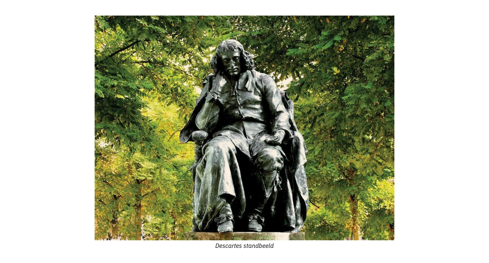

Waarom? Omdat het indruist tegen de filosofische traditie sinds de Oudheid, en nog steeds verdedigd wordt door Descartes (1596-1642), dat de mens iets uit het niets kan voortbrengen en de volledige verantwoordelijkheid draagt voor zijn daden, vooral tegenover God, zegt de heilige Augustinus (354-430), vader van de christelijke kerk.

Maar natuurlijk ook voor menselijke gerechtigheid.

Het is het idee dat onze wil, en onze wil alleen, ons in staat stelt om ons leven te sturen, dat we absolute macht hebben over onze handelingen en dat we de vrijheid van onze handelingen uitsluitend aan onszelf ontlenen, waardoor we een onbepaalde beslissingsbevoegdheid bezitten.

Met andere woorden, de mens is in staat om de orde van de natuur te verstoren in plaats van eraan onderworpen te zijn.

Omdat hij in zijn leven aan geen andere wet onderworpen zou zijn dan die van zijn eigen wil, zou hij daarom niet alleen boven de natuur en de dieren, louter machines, staan, maar ook boven alle andere eindige vormen van de natuur. Dit was het standpunt van Descartes (1596-1650), voor wie de oorzaken van de menselijke onmacht en wisselvalligheid niet in de natuurlijke orde lagen, maar in de ondeugden van de menselijke natuur zelf.

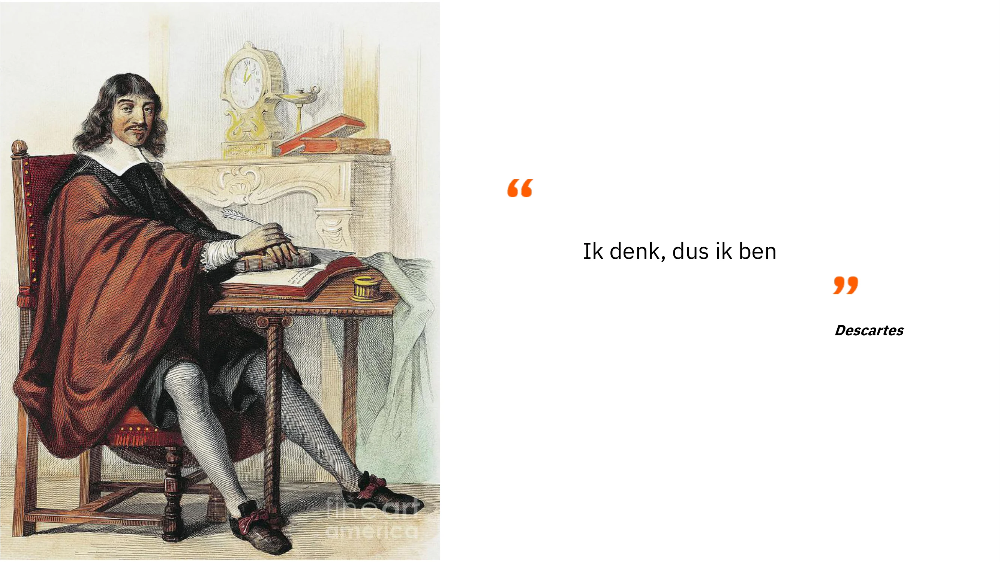

Maar terwijl Spinoza Descartes erkent voor het openen van de weg naar rationele beheersing van het affectieve leven, neemt hij volledig afstand van hem door deze hypothese van een "absolute macht" van de wil stevig te bekritiseren.

Spinoza daarentegen is van mening dat onze wereld perfect coherent en gedetermineerd is, en dat alles wat er gebeurt noodzakelijk is en het resultaat van de causaliteit der dingen, volgens welke een gevolg altijd een oorzaak heeft, en deze oorzaak zelf het gevolg is van een andere oorzaak, enzovoort.

Dit is het idee van absoluut determinisme, waaruit hij in zijn Ethica afleidt dat mensen geen enkele vrije wil hebben omdat, zegt hij, ze zich wel bewust zijn van hun daden, maar de werkelijke oorzaken die ze bepalen negeren, of liever negeren.

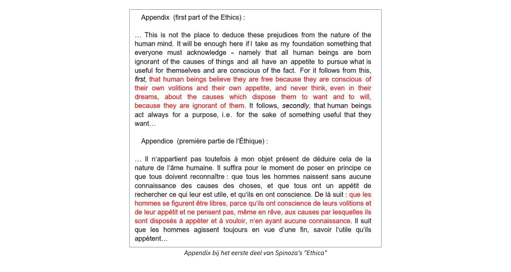

Voor Spinoza kunnen mensen, als "eindige modi" van de natuur zoals dieren of planten, daarom niet iets uit het niets beginnen; ze zijn niet vrijgesteld van de natuurwetten, zowel in hun lichaam als in hun geest.

Erger nog, voor hem is het grootste gevaar van vrijheid te geloven in onze vrije wil, en te geloven dat we kunnen handelen zonder bepaald te worden door externe oorzaken.

Voor Spinoza is vrijheid niet de uitdrukking van een vrije wil, maar het vermogen om onze rechtmatige plaats in de wereld te begrijpen, om onze vastberaden aard te begrijpen en van daaruit ons bestaan te richten op datgene wat "onze macht om te handelen vergroot". Door altijd optimistisch naar de toekomst te kijken en de wereld te zien zoals hij is, in plaats van hem te verbeelden zoals we hem zouden willen zien.

We zouden kunnen concluderen dat als individuen niet vrij zijn in hun daden, ze er ook niet verantwoordelijk voor zijn, zeker niet tegenover rechtvaardigheid. Maar deze zienswijze is misleidend, want zonder al te veel in detail te treden, het erkennen van iemands sociale, familiale en historische determinisme weerhoudt ons er niet van om de verantwoordelijkheid van gepleegde daden in overweging te nemen, aangezien deze vrijwillig zijn.

Aan de andere kant zou het een illusie zijn om te geloven dat de daden van een crimineel nooit verband houden met zijn eigen determinisme. Hoewel het geen kwestie is van verontschuldigen, is het op zijn minst een kwestie van proberen ze te begrijpen. In feite is dit wat rechtvaardigheid doet: naast het bestraffen van onrechtmatige daden, speelt het ook een rol in het voorzien en beschermen van de toekomst. Daarom worden bepaalde misdaden niet alleen bestraft, maar ook behandeld, waarbij rekening wordt gehouden met de familiale, sociale en psychologische achtergrond van de dader.

Deze benadering van vrijheid als handelingsbekwaamheid is het verband dat we kunnen leggen met de 18e-eeuwse Verlichtingsfilosofie. Volgens een van haar grootste ambassadeurs, de Duitse filosoof Immanuel Kant (1724-1804), was de Verlichting inderdaad het middel om mensen te bevrijden van de staat van voogdij, of zoals Étienne de la Boétie (1530-1563) zou hebben gezegd, van vrijwillige dienstbaarheid, waarvoor ze zelf verantwoordelijk waren.

Kants motto is "Denk voor jezelf" en "Durf te weten", het beroemde Latijnse "Sapere Aude".

De handelingsbekwaamheid van Spinoza is dus het vermogen dat de mens in zichzelf heeft om zijn eigen dierlijke toestand te begrijpen en de natuur en haar verschijnselen, positief of negatief, te doorgronden door ze in verband te brengen met objectieve oorzaken, om zich niet te verlaten op morele verklaringen die vals en illusoir zijn, d.w.z. verklaringen die gevormd zijn om aan onze verlangens tegemoet te komen. Het bestaat er veeleer in te proberen ze door de rede te verklaren, met het oog op emancipatie en vrijheid.

En de vooruitgang, die leidde tot de eerste technologische revoluties en de eerste liberale en ondernemende ideeën van de late 18e eeuw, met name bij de Engelse liberale filosoof John Locke (1632-1704) en de Engelse econoom Adam Smith (1723-1790).

En het is de moeite waard om Sigmund Freuds (1856-1939) definitie van een illusie in herinnering te brengen. Volgens de vader van de psychoanalyse, die altijd Spinoza's invloed op zijn werk erkende, is een illusie precies "een overtuiging gemotiveerd door de realisatie van een verlangen, en daar door de werkelijkheid te negeren".

Tot slot is het de moeite waard om erop te wijzen dat, hoewel de libertarische beweging die we gaan bespreken direct verwijst naar deze nieuwe liberale filosofie, er mensen zijn die erop wijzen dat figuren als Ayn Rand (1905-1982), auteur van "La Grève" en "La Source vive", het bestaan van de vrije wil ondersteunen, omdat ze geloven dat mensen het vermogen hebben om vrije keuzes te maken.

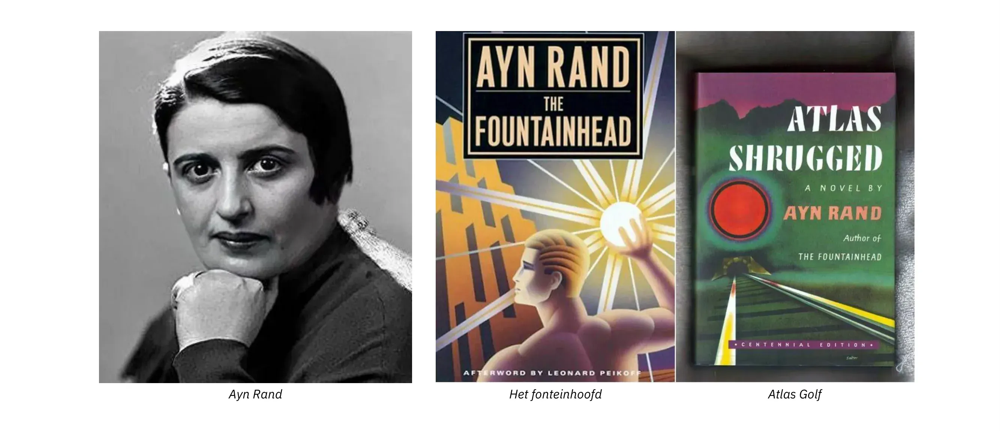

Maar de werkelijkheid is heel anders en de verwarring komt eerder voort uit een semantisch probleem: door het vermogen van mensen om te handelen en keuzes te maken te erkennen en tegelijkertijd het logische determinisme waarvan zij het voorwerp zijn. zijn de eerste libertariërs in werkelijkheid ook erfgenamen van Spinoza. Wat ze met Spinoza gemeen hebben, is het geloof dat mensen niet boven de natuur staan, maar het resultaat zijn van een evolutionair proces dat hen plaatst binnen een determinisme, een geschiedenis die hen overstijgt en grotendeels verantwoordelijk is voor wat mensen zijn en doen.

Tenslotte, als het geloof in de vrije wil een illusie is waarvan het uiterst moeilijk is om je te bevrijden, dan komt dat omdat het terugverwijst naar een andere illusie die het voedt, de illusie van uiteindelijke oorzaken, die ik je uitnodig te bestuderen in het volgende hoofdstuk.

## De illusie van uiteindelijke oorzaken

<chapterId>da2a7fb1-f1e9-5b56-822d-c73770de749d</chapterId>

:::video id=a0127fe7-a4cb-4a1c-8af4-f11c40b4a3d7:::

We zagen in het vorige hoofdstuk dat de illusie van de vrije wil bestaat uit het geloof dat we vanuit het niets iets zouden kunnen beginnen, dat alleen onze wil ons in staat zou stellen ons leven te sturen en dat we een onbepaalde beslissingsbevoegdheid zouden hebben. Het is het idee dat de mens meer in staat is om de orde van de natuur te verstoren dan dat hij eraan onderworpen is.

Maar voor Spinoza (1632-1677) is de mens niet "een rijk binnen een rijk", d.w.z. hij is niet, in tegenstelling tot wat Descartes (1596-1650) vaststelde, een uitzondering in de natuur, en is nooit vrijgesteld van de verlenging van de deterministische keten van oorzaak en gevolg.

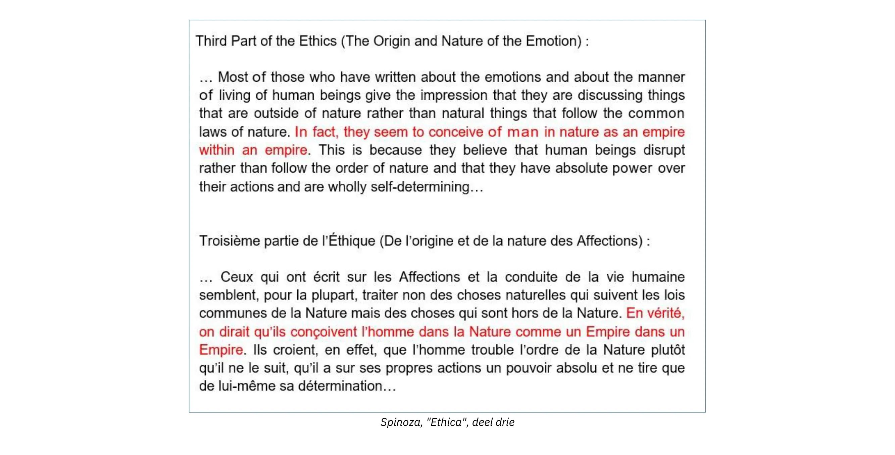

En omdat de natuur, zegt Spinoza, vanuit moreel oogpunt geen voorgeschreven doel heeft, en omdat mensen geneigd zijn hun verbeelding voor begrip aan te zien, interpreteren ze die naar wat hun eigen belangen het beste uitkomt. Tot het punt dat ze de dingen een betekenis geven die alleen voortkomt uit de manier waarop ze die waarderen en met zichzelf in verband brengen.

Dat wil zeggen, volgens hun verlangens, hoop en angsten.

Deze redenering wordt geïllustreerd door de illusie van uiteindelijke oorzaken, die een groot obstakel vormt voor het denken en de uitoefening van de rede, omdat het simpelweg onze behoefte uitdrukt om de gevolgen van een ding niet te laten corresponderen met de werkelijke oorzaken, maar met een overtuiging, ook al is die absurd of infantiliserend.

Een geloof dat een intentie uitdrukt, met name goddelijk, en dat, op de manier waarop wij het interpreteren, vaak bijgelovig is, Of onwetendheid.

En daarom zijn nieuwe ziekten zoals AIDS in de jaren 90 of covid in 2020 door sommigen altijd gezien als de uitdrukking van een goddelijke en vaak bestraffende bedoeling, volgens een redenering die indruist tegen het causaliteitsprincipe dat ten grondslag ligt aan het rationalisme en de moderne wetenschap die sinds Copernicus (1473-1543), Kepler (1571-1630) en Galileo (1564-1727) is ontstaan.

Feit is, zoals Spinoza zegt, dat het mensen weinig uitmaakt dat zoveel dingen hun voorstellingsvermogen te boven gaan, dat er meer wanorde dan orde in de natuur is. Toch zou de complexiteit van de dingen die buiten hun bereik liggen hen ervan moeten weerhouden in enig teleologisch project te geloven. Het maakt niet uit, zegt hij, omdat het geloof van mensen in de relevantie van hun zekerheid op basis van wat past bij hun verlangen en nut altijd sterker is dan enig rationeel argument of zorg om de waarheid.

Finalisme komt dus neer op het omkeren van de oorzaken en gevolgen van dingen om ze te begrijpen: we geloven bijvoorbeeld dat we ogen hebben om te zien en tanden om te kauwen. Terwijl het natuurlijk om te zien was dat de menselijke soort zijn gezichtsvermogen ontwikkelde in de loop van zijn evolutie, en het was inderdaad door de noodzaak om zich te voeden en vlees te eten dat ons gebit zich ontwikkelde zoals het nu is.

En dit is precies wat de Franse natuuronderzoeker Jean-Baptiste de Lamarck (1744-1829) beweerde (afbeelding 3.3.3) toen hij zijn prearwinistische theorie opstelde dat het de functie is die het orgaan creëert, en niet andersom.

Maar zoals Spinoza zegt, "de waan van de mens houdt daar niet op", en onder alle voorbeelden van naïeve, en uiteindelijk nogal amusante, teleologische ideeën noemen we vaak het beroemde voorbeeld van de bioloog Bernardin de Saint-Pierre (1737-1814). Deze voormalige directeur van het Parijse Musée d'Histoire Naturelle beschouwde het finalisme van de natuur met poëzie, lyriek en een zekere naïviteit. Hij was bijvoorbeeld van mening dat de meloen alleen was geschapen om grote gezinnen te plezieren, omdat hij dankzij zijn geribbelde schil gemakkelijk in gelijke plakken kon worden gesneden.

De definitie van inflatie van Keynesiaanse economen en voorstanders van de welvaartsstaat, bijvoorbeeld, illustreert deze paradox ook heel goed. Volgens hen is inflatie een prijsstijging die, volgens sommige centrale bankiers, ofwel uit "het niets" komt, ofwel uit een geopolitieke context die niemand kan controleren of voorzien. Hoewel een prijsstijging inderdaad kan leiden tot cyclische inflatie - wanneer bijvoorbeeld de olieprijs stijgt, zullen ook de prijzen van bepaalde verwerkte goederen stijgen - zijn de echte structurele oorzaken van inflatie voornamelijk gekoppeld aan een stijging van het geld Supply, wat op zijn beurt een daling van de waarde van geld inhoudt en, ipso facto, een mechanische stijging van de prijzen.

Geloven, of anderen het tegenovergestelde laten geloven, komt neer op dromen met open ogen, zoals Spinoza het spottend uitdrukte, en het construeren van een redenering die onjuist of misleidend is en die des te gemakkelijker geaccepteerd wordt omdat het gehoord wordt als een verwachte reactie om je gelijk te halen. In dit geval, wanneer voorstanders van staatsinterventie inflatie beschouwen als de beste manier om economische problemen op te lossen.

Deze bevooroordeelde interpretatie van inflatie doet ons echter vergeten dat inflatie weliswaar nuttig is om de economie op de korte termijn te beheren, maar in feite een verborgen belasting is die op de lange termijn alleen maar leidt tot menselijke en materiële rampen en die staten niet in staat stelt om hun macht niet te misbruiken. Dit is wat Friedrich Hayek (1899-1992) zo goed beschrijft in zijn essay The Road to Serfdom, wanneer hij het heeft over de slavernij waaraan staten zich niet meer kunnen ontworstelen.

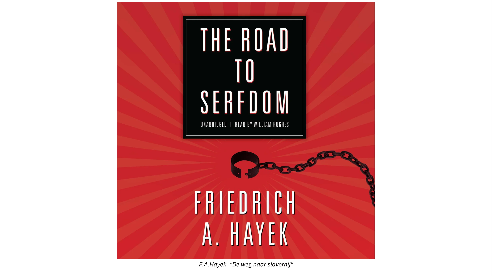

Tot slot is het de moeite waard om hier op te merken dat dit finalistische mechanisme ook goed geïllustreerd wordt in de manier waarop de tegenstanders van Bitcoin hun kritiek uiten door zich precies te richten op de effecten ervan.

Want hoewel sommige effecten van Bitcoin zeker bekritiseerd kunnen worden, hebben we door de cognitieve bias die samenhangt met het feit dat het een nieuwe en ontwrichtende technologie is, een sterke neiging om alleen de negatieve effecten te zien. Vooral als de realiteit niet overeenkomt met onze verlangens, bijvoorbeeld als we religieus zijn wanneer we geconfronteerd worden met een Copernicaanse revolutie zoals het Spinozisme, of als we een centrale bankier zijn wanneer we geconfronteerd worden met een gedecentraliseerd digitaal muntconcept.

Het is echter heel duidelijk dat als een religieus persoon of een centrale bankier begrip, nieuwsgierigheid en goede wil toont, en als ze interesse tonen in een concept en eerst proberen het te begrijpen in plaats van te oordelen over de effecten ervan om hun mening aan hun verwachtingen aan te passen, dan zullen ze zeker in staat zijn om zich eraan te houden.

Bedankt voor jullie aandacht, en ik zie jullie in het volgende hoofdstuk.

## De theologische illusie

<chapterId>93554156-5e62-526d-9b71-49c47be916af</chapterId>

:::video id=9c490cc1-3d29-4ca7-9464-1a701bb91ba7:::

In dit laatste hoofdstuk over de nieuwe copernicaanse visie op ideeën die het Spinozisme biedt, gaan we tenslotte in op de derde illusie die Spinoza (1632-1677) presenteert in zijn werk, de Ethica.

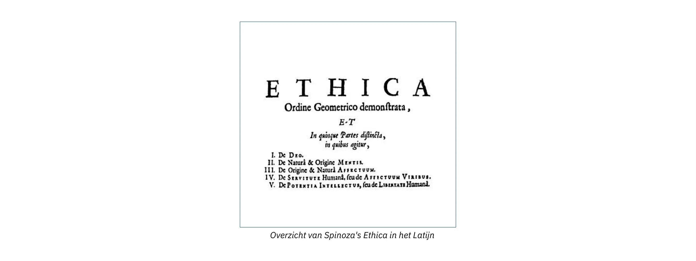

Deze illusie is direct verbonden met de eerste twee, de illusie van vrije wil en de illusie van finaliteit.

Het gaat over theologische illusie.

Het punt is dit: Zolang mensen onwetend zijn, "van zowel de dingen als zichzelf", zoals Spinoza ons vertelt, zolang ze geloven in hun illusoire vrijheid, zullen ze hun verbeelding voor begrip aannemen, d.w.z. ze zullen zichzelf altijd in staat achten de aard van de dingen te denken en te begrijpen, terwijl ze in werkelijkheid alleen maar verbeelden, verzinnen en projecteren wat voor hen nuttig is. Volgens hun verlangens.

Daarom geloven mensen dat als natuurlijke middelen bestaan en nuttig zijn, zoals tanden om te eten of ogen om te zien, dat komt omdat ze logisch geschapen zijn door een "regisseur van de natuur". Met andere woorden, een opzettelijke, antropomorfe God aan wie menselijke bedoelingen worden toegeschreven.

Met andere woorden, een oude man met een witte baard, verborgen achter een wolk, aan wie wordt toegeschreven dat hij alle dingen in de natuur heeft geschapen als middel om ons doel te bereiken, omdat hij van ons houdt en ons beschermt als we hem eren en aanbidden.

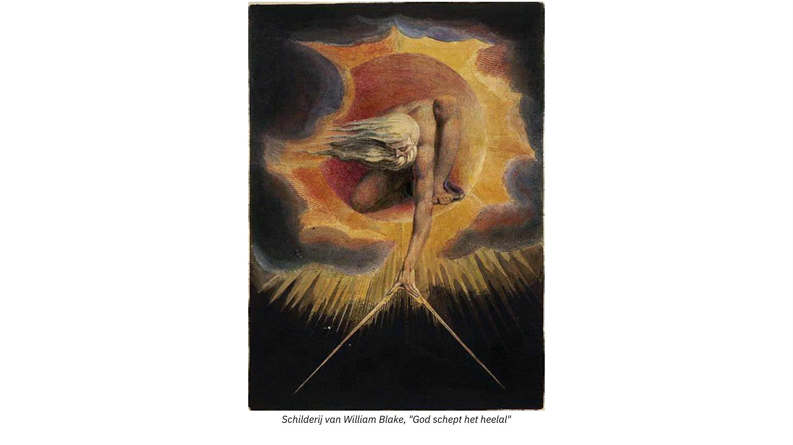

Dit is het eerste stadium van theologische illusie.

Maar ondanks onze trots dat we geloven dat we boven de natuur staan en ons inbeelden dat we vanuit het niets iets kunnen beginnen, zijn we in werkelijkheid altijd onderworpen aan bestaansvoorwaarden die aangeven dat we er uiteindelijk niet echt "mee weg kunnen komen", zoals filosofieprofessor Gilles Deleuze (1925-1995) het uitdrukte. We zijn sterfelijk, zoals alle dieren, maar we weten het.

Geloven of ons het tegenovergestelde inbeelden om onszelf gerust te stellen is de reden waarom we voortdurend heen en weer geslingerd worden tussen angst en hoop, als twee tegenovergestelde en onafscheidelijke polen tussen een gevoel van veiligheid en een gevoel van paniek, omdat angst altijd gekoppeld is aan de hoop op betere tijden.

Dat er geen angst is zonder hoop, noch hoop zonder angst, en dat hij die vreest altijd hoopt te ontsnappen aan wat hij vreest, terwijl hij die hoopt altijd vreest dat wat hij hoopt niet zal gebeuren.

En aangezien "we geneigd zijn gemakkelijk te geloven wat we hopen", zegt Spinoza in zijn Ethica, is het wanneer we geconfronteerd worden met externe oorzaken of gebeurtenissen die schadelijk voor ons zouden zijn, in strijd met elk idee van nut, dat de tweede fase van deze zogenaamde theologische illusie tot uiting komt, gekenmerkt door overtuigingen waaruit bijgelovig sentiment voortkomt.

Met andere woorden, "de beruchte" volgens Voltaire (1694-1778), voor wie bijgeloof nooit voortkomt uit de rede en altijd overeenkomt met een irrationeel of ongegrond geloof, dat zich verzet tegen elke vorm van rationaliteit door aan voorwerpen of handelingen krachten of spirituele potentie toe te schrijven die ze niet hebben.

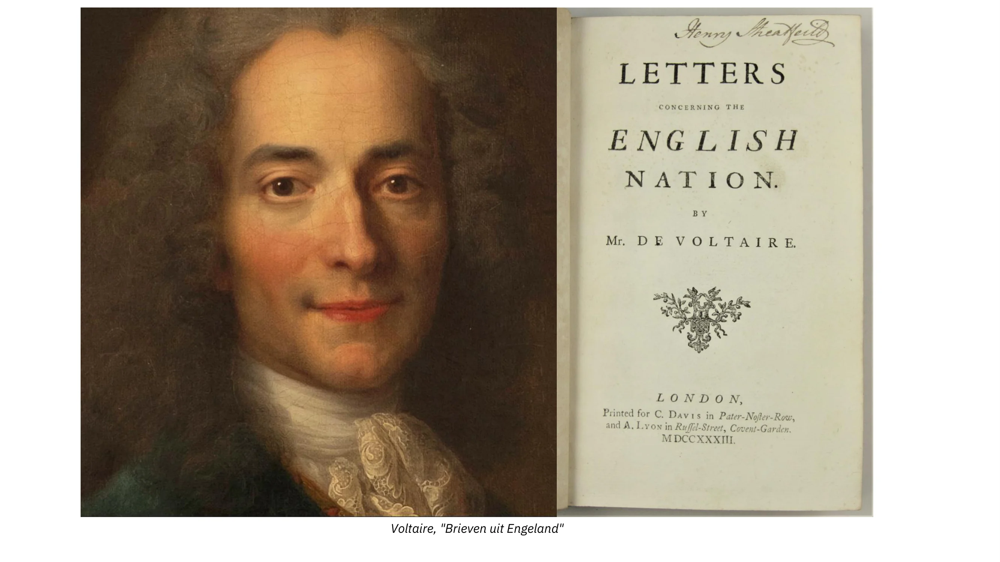

Onder het mom van ons te verlichten, ons een betere wereld voor te stellen, sluit bijgeloof ons eigenlijk op in onze eigen illusies en leugens. In een slavernij waaruit we ons maar moeilijk kunnen bevrijden.

Dit is wat de Duitse, Engelse en Franse Verlichting verdedigde vanaf de 18e eeuw, door te beweren dat bijgeloof eenvoudigweg verhindert dat mensen volwassen worden, niet alleen door de uitoefening van de rede te beperken, maar ook en vooral door intolerantie teweeg te brengen, wat het beste instrument is om de overheersing van een macht te vestigen. Of het nu politiek of religieus is.

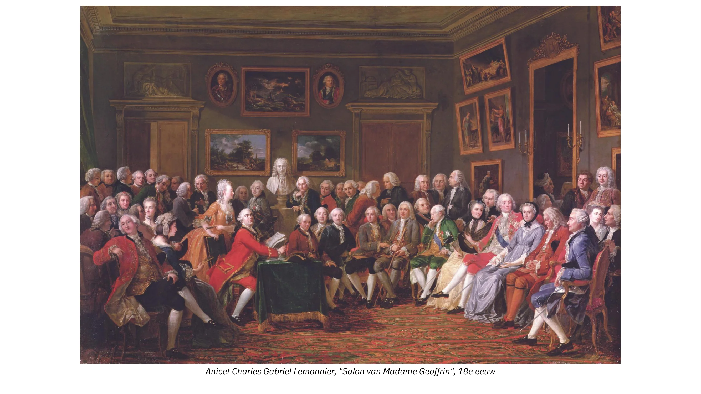

En dit is wat Spinoza opnieuw aantoont in zijn Theologico Political Treatise, dat we al hebben aangestipt. In dit essay schrijft hij dat "het grote geheim van het monarchale regime, en zijn grootste belang, is om mensen te misleiden, en de angst die hen moet beheersen te verhullen met de naam van religie". Daarom trappen tirannen, dictators of revolutionairen, die altijd mensen zijn die gedreven worden door het verlangen om goed te doen voor anderen, vaak, zo niet altijd, in de val om het tegenovergestelde van hun principes te doen om die principes te bereiken.

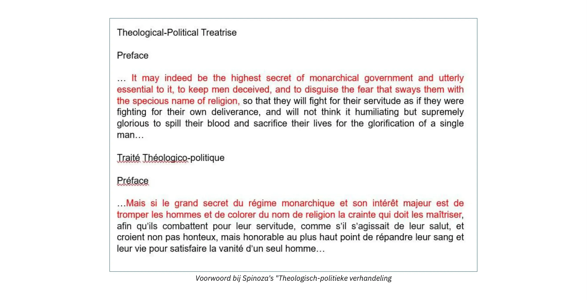

Maar de nieuwigheid die Spinoza inbrengt in de TTP, en die hem in zekere zin de vader van het secularisme maakt, is de overweging dat het weliswaar essentieel is om bijgeloof en de oproep tot geweld die vrijheid paradoxaal genoeg mogelijk maakt te bestrijden, maar dat het in feite in het belang van de staat is om het recht om te geloven en de vrijheid om te denken te beschermen.

Want zodra ideeën bestaan en privé geuit worden, zullen ze zich onvermijdelijk verspreiden in de maatschappij en noch een verbod noch censuur kan hun verspreiding ooit tegenhouden. Ideeën, of ze nu waar zijn of niet, goed of slecht, zullen hoe dan ook circuleren en ze verbieden kan op lange termijn alleen maar leiden tot opstand en de omverwerping van de staat in naam van de vrijheid.

Met andere woorden, de staat zou eigenlijk veel meer te vrezen hebben van censuur of onderdrukking van de vrijheid van meningsuiting dan van het in stand houden ervan, en daarom, zegt Spinoza, is het in zijn belang om individuen hun natuurlijke recht om te denken en zich uit te drukken te laten uitoefenen.

Voor Spinoza is een democratische staat die vrijheid van denken toestaat daarom de beste garantie dat mensen in vrede zullen leven en dat ze, dankzij de uitoefening van de rede, niet alleen vrij zullen zijn om te denken en te handelen, maar ook in staat zullen zijn om de knechtingen die hen dwingen te begrijpen om zich daaruit te bevrijden.

# Van de affecttheorie naar Bitcoin

<partId>82e69d4f-a94f-5978-bcb8-8a7b4651bcca</partId>

## De kwestie van het kwaad bij Spinoza

<chapterId>1ce64576-2688-5757-a119-57cc3a1076c0</chapterId>

:::video id=9c490cc1-3d29-4ca7-9464-1a701bb91ba7:::

Ik wil het nu hebben over de kwestie van het kwaad, zoals Spinoza (1632-1677) die in zijn werken en correspondentie presenteert.

Maar wees gewaarschuwd, dit is een complex en controversieel onderwerp, en het doel hier is simpelweg om nogmaals zijn manier van denken te begrijpen om beter te begrijpen wat hem leidt, namelijk de zoektocht naar vrijheid.

Zoals we hebben gezien roept het niet geloven in de vrije wil of in enig finalisme in de natuur al snel het probleem op van het bestaan van het kwaad in ons dagelijks leven.

Met andere woorden, de vraag is of "het kwaad" bestaat in de natuur en of mensen verantwoordelijk zijn voor de schade die ze veroorzaken.

Oude filosofen geloofden dat het kwaad niet in de natuur bestond en Socrates (470-399 v. Chr.) bijvoorbeeld leerde dat "het kwaad niets is". Volgens hem was een slecht mens niet slecht van nature en vergiste hij zich in zekere zin gewoon in de aard van het goede.

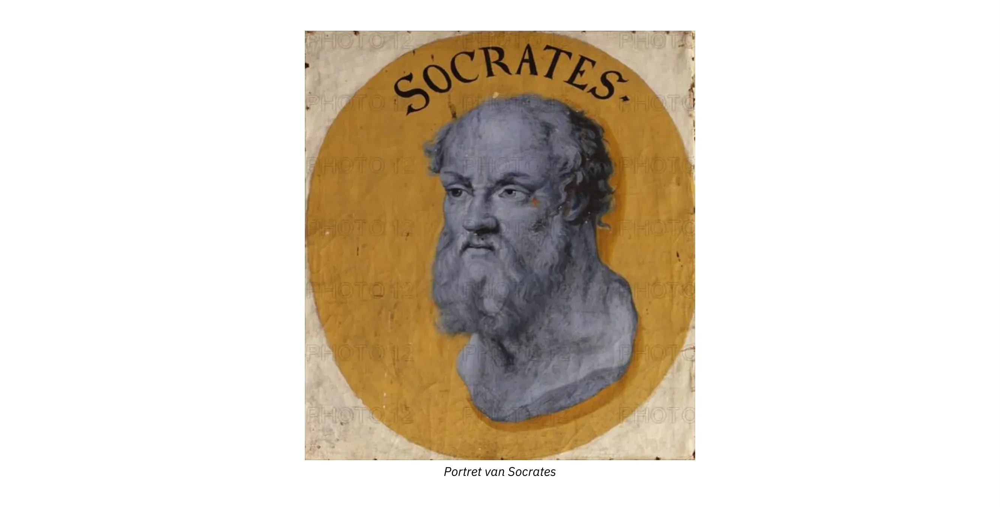

Maar de scholastieke traditie, met name die van de heilige Augustinus (354-430), die vandaag de dag nog steeds de christelijke moraal beïnvloedt, stelde dat het kwaad niet alleen bestaat, dat het een realiteit is, maar dat het ook verklaard kan worden omdat mensen vrij zijn, omdat ze in staat zijn een keuze te maken tussen goed en kwaad, en dat het kwaad dat ze veroorzaken daarom volledig hun eigen verantwoordelijkheid is.

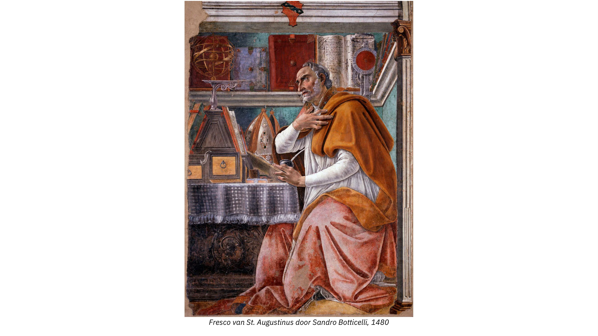

En ook al moet de verantwoordelijkheid voor de schade die wordt veroorzaakt door een aardbeving, een dodelijk virus of het feit dat een kind blind geboren wordt niet aan mensen worden toegeschreven, toch houdt deze manier van denken stand door de natuur een morele intentie te geven die hen verantwoordelijk maakt. Bijvoorbeeld door te bedenken dat als er een aardbeving is geweest, dat precies komt doordat mensen zich slecht hebben gedragen.

Dit is het idee dat door religieuze mensen wordt verdedigd, namelijk dat mensen als zondaars worden geboren en schuldig zijn aan de erfzonde.

Natuurlijk wordt dit idee, zoals je je kunt voorstellen, aan flarden gescheurd door Spinoza, die van mening is dat, aangezien de Natuur, of God of het lot zoals hij het stelt, niet begiftigd is met intentie, en aangezien mensen geen vrije wil hebben, de verantwoordelijkheid voor het "kwaad" die aan hen wordt toegeschreven volledig illusoir is.

"Er gebeurt niets in de natuur dat kan worden toegeschreven aan een ondeugd die erin bestaat", schrijft Spinoza in de Ethica, en volgens hem zouden we ons daarom vergissen als we bijvoorbeeld de blindheid van een pasgeboren baby als "kwaad" zouden beschouwen, want als een baby blind geboren wordt, is hij net zo min van zijn gezichtsvermogen beroofd als een steen dat zou zijn.

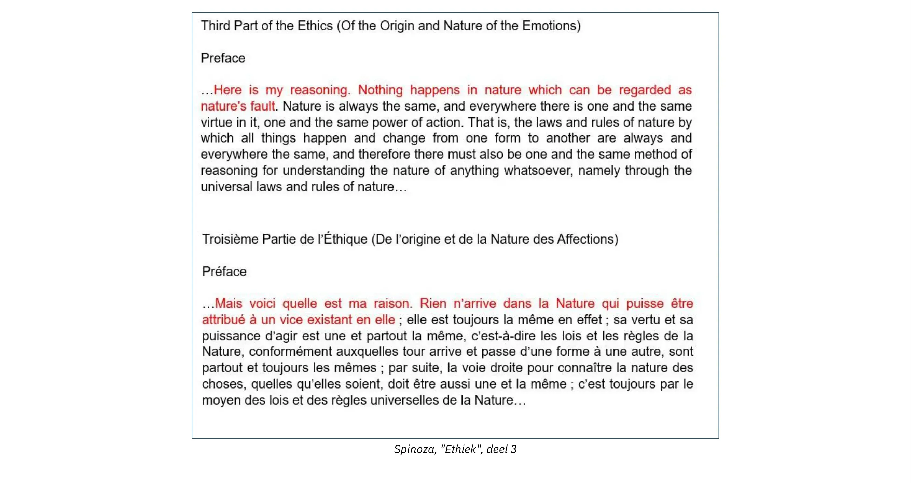

En als we denken dat blinden geen zicht hebben, dan is dat alleen vanuit het gezichtspunt van hen die zien.

Spinoza gaat dus uit van het idee dat het kwaad niet bestaat in de natuur, maar zijn originaliteit, die het tot een revolutionaire filosofie maakt, is de overweging dat het kwaad niet bestaat en "goed" ook niet.

En daarom heeft hij het over ethiek in plaats van moraal, niet over wat goed of fout is, want dat zijn allemaal relatieve en subjectieve begrippen, maar eerder over wat "goed" of "slecht" is voor onze natuurlijke behoefte om "in ons wezen te volharden", zegt hij. Met andere woorden, om te leven en te groeien. Om te bloeien als mens.

Bovendien hebben we al gezien dat Spinoza's opvatting over de verantwoordelijkheid van mensen die zich slecht gedragen door een misdaad te begaan, duidelijk niet bedoeld is om hen te verontschuldigen.  Want mensen zijn zich, zelfs als ze de ware oorzaken die hen tot een misdaad aanzetten niet kennen, altijd bewust van wat ze doen en zijn daarom als zodanig verantwoordelijk voor de moraal en de Wet.

Het is duidelijk dat de daden van een misdadiger altijd verband houden met familiaal, sociaal, economisch of zelfs medisch determinisme, als zijn misdaden verklaard kunnen worden door een fysieke of mentale aandoening. En dit is de rol van justitie, die verder gaat dan het strafrecht om rekening te houden met het feit dat bepaalde misdaden niet alleen moeten worden bestraft, maar ook behandeld, rekening houdend met de familiale, sociale en psychologische achtergrond van de dader.

Daarom legt de Spinozist Gilles Deleuze (1925-1995) uit dat ethiek een soort ethologie is, d.w.z. een praktische wetenschap van manieren van zijn, of, zoals hij het zegt, "de kunst van het maken van goede ontmoetingen".

Met andere woorden, vrijheid bestaat er volgens Spinoza uit dat we ons bestaan richten op datgene wat "onze handelingsbekwaamheid vergroot" en dat we altijd optimistisch naar de toekomst kijken, de wereld zien zoals hij is in plaats van hem te verbeelden zoals we hem zouden willen zien.

En daarin ligt de genialiteit van Spinoza's demonstratie, want hij vecht tegen de dokters van onwetendheid en tegen al diegenen die beweren dat het goed is om onwetend te zijn.

Integendeel, Spinoza bestudeert menselijke passies, zelfs de meest irrationele, liefdesverdriet, waanzin, verdriet of melancholie, op de manier van meetkundigen, "meer geometrico", zoals men punten, lijnen, oppervlakken en volumes zou bestuderen.

Dit is de theorie van affecten die hij ontwikkelt in het derde deel van zijn Ethica, en die je nu zou moeten bestuderen.

Bedankt voor uw aandacht.

## Affect theorie

<chapterId>3bb011ce-6f0c-51a6-b41f-25a3b5b7768e</chapterId>

:::video id=bb427cc6-e54d-4b44-bd6d-281ba421001a:::

Volgens Spinoza is vrijheid een concept dat ontdekt moet worden, een pad naar een beter, krachtiger leven. Een vrijer leven. Een pad dat vereist dat we het absolute determinisme en de rationele causaliteit van de dingen erkennen.

Hij ontwikkelt zijn systeem in het derde deel van de Ethica. Het is de beroemde "theorie van affecten".

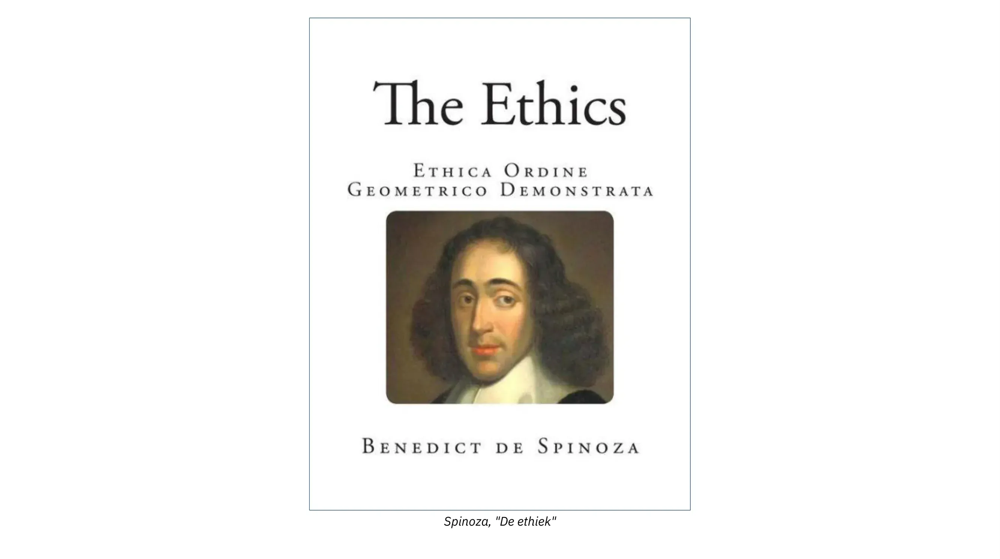

Het principe is dat menselijke affecten, zegt Spinoza, actieve of passieve modificaties van het lichaam en het denken zijn die ons vermogen om te handelen beïnvloeden, dat wil zeggen ons gedrag.

En toch zijn we, afhankelijk van de invloeden die eigen zijn aan zowel de menselijke natuur als aan de buitenwereld, perfect in staat om ware ideeën te vormen, te redeneren en vreugde uit te drukken.

Maar we zijn ook in staat om zogenaamde passieve affecten te vormen, vooroordelen die ons dan mechanisch leiden, "ondanks onszelf" op een manier om niet langer te zien of te doen wat ons eigenbelang vereist.

We spreken van slavernij, of dienstbaarheid, een staat die gekenmerkt wordt door het onvermogen om die passieve affecten te controleren en tegen te gaan die ons er soms toe brengen om te willen wat we niet willen en te doen wat we niet willen.

Dit zegt Spinoza in zijn Ethica, wanneer hij zich erover verbaast dat "mensen vaak het beste zien, het goedkeuren en het slechtste doen", of dat "ze vechten voor hun dienstbaarheid alsof ze vechten voor hun verlossing".

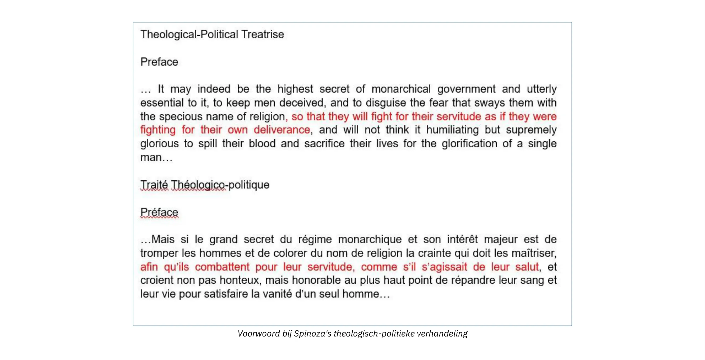

Spinoza neemt het voorbeeld van haat, die hij ziet als een passief affect, gericht op droefheid en voortkomend uit ontoereikende ideeën, d.w.z. een gedeeltelijke kennis van oorzaken, en die hij definieert als "een droefheid die geassocieerd wordt met het idee van een externe oorzaak".

Met andere woorden, als we een buitenlander haten, is dat omdat we deze buitenlander associëren met het idee dat we van hem hebben, om redenen die we niet begrijpen, omdat hij van nature buitenlands en anders is. Het is dit idee van een externe oorzaak - een idee dat de onwetenden bovendien altijd mechanisch motiveert om kwaad te spreken van een concept dat ze niet kennen.

Dit geldt trouwens vooral op het gebied van cryptocurrencies.

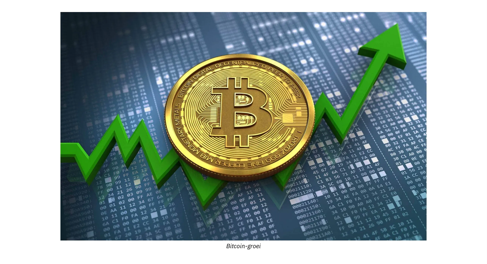

Spinoza zegt dat als we dit negatieve idee van een externe oorzaak wegnemen, niet door moraliteit, maar door opvoeding, door empathie, door rede, met name door ons in dit geval te richten op de kwaliteiten van deze vreemdeling, of in Bitcoin's geval, op zijn praktische aspect of nut, dan verdwijnt het bijbehorende gevoel van verdriet en automatisch ook de haat.

Het is goed te bedenken dat deze manier van denken natuurlijk ook geldt voor actieve affecten, en in het bijzonder voor liefde, die volgens Spinoza "een vreugde is die verbonden is met het idee van een externe oorzaak". En als bijvoorbeeld de externe oorzaak van de liefde voor een ding of een persoon verdwijnt of in de loop van de tijd verandert, kan ook de daarmee verbonden vreugde verdwijnen, waardoor het gevoel van liefde uitdooft. Als we dit niet begrijpen, kan het ons ongelukkig en depressief maken.

Maar als deze zogenaamde theorie van affecten van toepassing is op ons "onbewuste", dan is deze rationele manier van denken "op de manier van landmeters" ook van toepassing op de strijd tegen alle vormen van externe slavernij, of die nu religieus, politiek of het resultaat van natuurverschijnselen is.

Dit is het voorbeeld van de bliksem. Want als de bliksem inslaat en onschuldige mensen doodt, zullen de onwetenden geneigd zijn om het als de hand van God te zien, om te beschouwen dat de bliksem een morele en finalistische bedoeling uitdrukt. Aids in de jaren 90 of zelfs, meer recent, covid zijn door sommigen geïnterpreteerd als goddelijke straf.

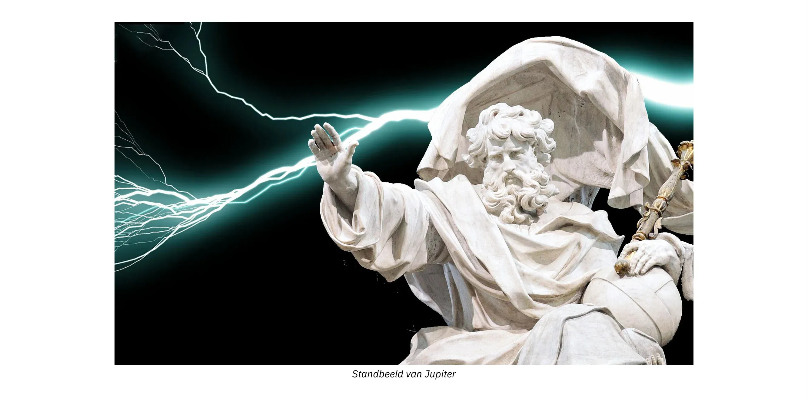

Terwijl voor Spinoza natuurlijk al deze teleologische ideeën slechts bijgeloof zijn, synoniem met onwetendheid, in zoverre dat in dit voorbeeld de bliksem die inslaat niets anders doet, zegt hij, dan de essentie van zijn eigen natuur uitdrukken. En dat is inslaan. Natuurlijk zonder enige morele intentie om iemand te straffen of te belonen.

Dankzij dit eenvoudige voorbeeld begrijpen we dat de enige oplossing om onszelf te beschermen tegen de bliksem - met andere woorden, om onszelf te bevrijden van de slavernij die het gevaar ervan ons altijd heeft opgelegd - niet is om te klagen over onze pech of over een vermeende goddelijke onrechtvaardigheid, noch is het om het minste morele argument naar voren te brengen. Nee, net als bij haat is het ook hier een kwestie van nadenken over wat we vanuit ethisch oogpunt kunnen doen.

En in dit geval zou het zijn om onszelf te beschermen tegen blikseminslag door rationeel te zijn, open te staan voor vooruitgang, nieuwsgierig te zijn en vertrouwen te hebben in wat de wetenschap ons kan bieden en, waarom ook niet, een bliksemafleider te installeren.

Dit is het geniale van de Ethica. Spinoza laat ons zien dat het mogelijk is om over te stappen van vrijwillige dienstbaarheid, van een "ondanks onszelf" en een weerloos leven van eeuwige vervreemding, naar een leven geleefd door de kennis van affecties en determinaties.

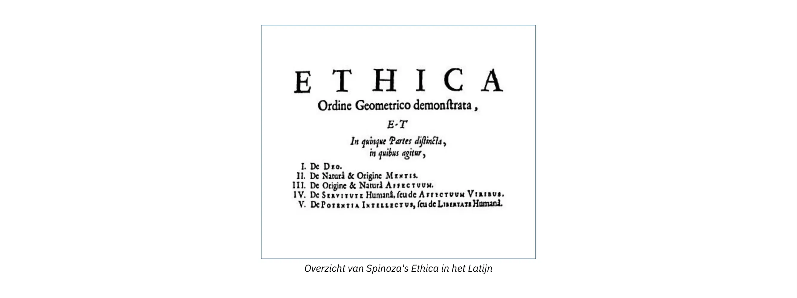

Het is een manier van denken die ons in staat stelt de menselijke natuur te ontleden om de zonnige kant of de waarheid in dingen te zien. Om de redenen voor verdriet en angst die ons belasten te elimineren. Om vrij te zijn, met andere woorden, om niet langer te gehoorzamen aan verdrietige passies en ons gedrag te veranderen.

En om te begrijpen, waarschijnlijk voor het eerst in de geschiedenis van de filosofie, dat je helder en gelukkig kunt zijn.

En daarom wordt het Spinozisme vaak "de filosofie van de vreugde" genoemd.

## Vrijheid, de Oostenrijkse economische school en Cypherpunk filosofie

<chapterId>b54f2532-460c-11f0-a248-93ff24ef1d57</chapterId>

:::video id=5f49d5b4-e15f-475b-b40d-07464c08ca4d:::

Zoals je nu weet is vrijheid volgens Spinoza een bewustzijn van ons determinisme. Onder leiding van de rede en dankzij ons vermogen om te handelen, kunnen we het causale mechanisme van dienstbaarheid begrijpen, zodat we ertegen kunnen vechten, er niet langer onder lijden en niet langer tegen onze eigen belangen in handelen.

Uiteindelijk betekent deze luciditeit dat men niet langer leeft in het nihilisme dat later werd beschreven door Friedrich Nietzsche (1844-1900), voor wie mensen zich verliezen in ideologische idealen, d.w.z. politieke of religieuze ficties, waardoor ze de werkelijkheid ontkennen, zichzelf infantiliseren en ongelukkig maken.

Dit is precies waar de rationele filosofie van de Verlichting over ging, met name dankzij Immanuel Kant (1724-1804), voor wie alleen een opgeleid individu, onder leiding van de rede, voor zichzelf kan denken en ethisch kan bepalen wat "waar" of "goed" is en wat giftig is.

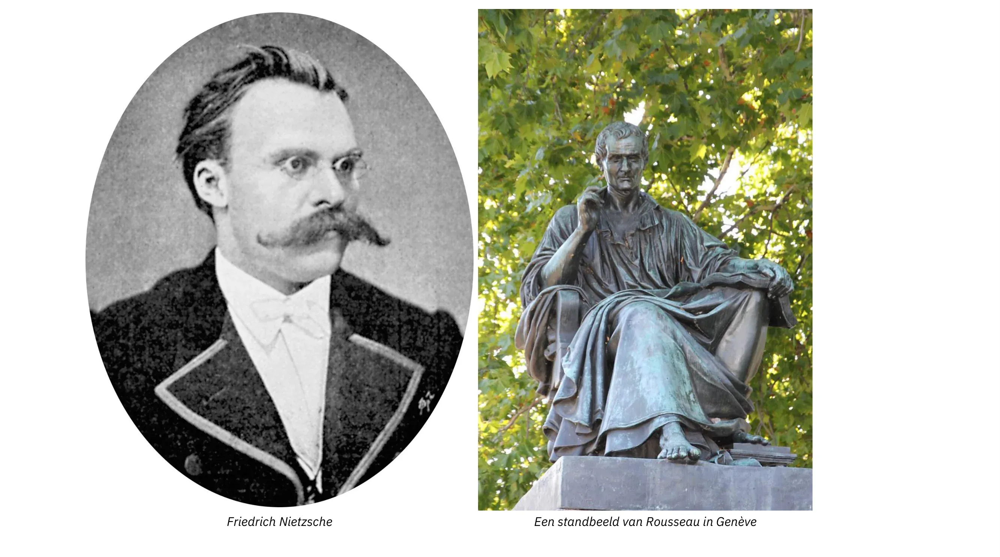

Met andere woorden, zegt hij, als we zelf denken, als we redeneren als rationele volwassenen, en als we er daarom naar streven om ons te hechten aan de oorzakelijke verbanden tussen dingen, dan hebben we geen morele autoriteit meer nodig om ons bijvoorbeeld de ware deugden van religie of ware ethische waarden op politiek en economisch gebied te leren.

Het is een redenering die de link legt met de Oostenrijkse school van liberale economie, geboren in de extreem vruchtbare intellectuele atmosfeer van Wenen voor de Eerste Wereldoorlog. Want het was in deze context dat intellectuelen als Carl Menger (1840-1921), Ludwig von Mises (1883-1979) en Friedrich Hayek (1899-1992) de basis legden voor een nieuwe school van liberale economie, die de basis zou worden voor de overtuigingen van toekomstige cypherpunks. En vandaar de oprichting van Bitcoin.

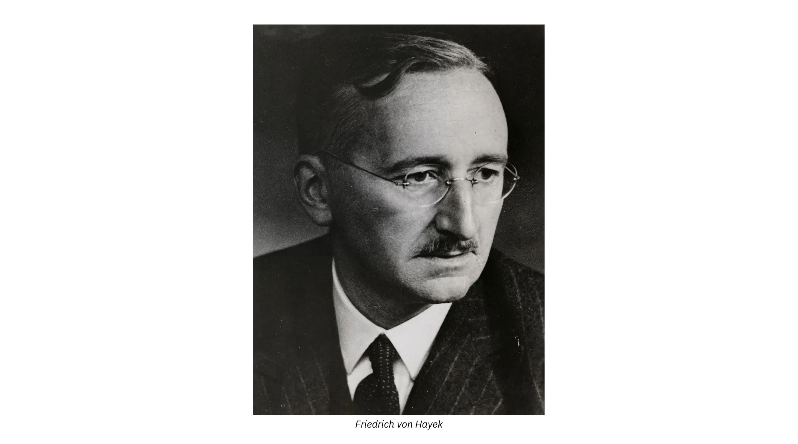

Menger en Mises stelden bijvoorbeeld vast dat alle kennis moet worden opgebouwd volgens het causale verband tussen dingen, en stelden zo een nieuwe causale opvatting van economie voor. Ze waren met name geïnspireerd door de liberale geest die een paar jaar eerder was ontwikkeld door de Franse econoom Frédéric Bastiat (1801-1850).

Hayek, aan de andere kant, is van mening dat alle economische beslissingen altijd een vorm van onzekerheid en onwetendheid uitdrukken, en dat het feit dat je daar niet onder lijdt vanwege moraliteit, overtuigingen, vooroordelen of politieke ideologieën, het mogelijk maakt om economisch gedrag correct te analyseren en, bij uitbreiding, te overwegen wat goed is voor individuen, voor de maatschappij en voor de staat.

Zo kwamen deze liberale Oostenrijkse economen tot een felle kritiek op alle socialistische ideeën - Hayek sprak van "planisme" - en alle morele beleidsmaatregelen die daarop geïnspireerd waren en die volgens hem alleen maar tot de ondergang leidden. Economische macht geven aan regeringen, die onvermijdelijk achter de feiten aanliepen en niet op de hoogte waren van wat wel en niet moest gebeuren, was gedoemd te mislukken.

De Oostenrijkers geloven bijvoorbeeld dat wanneer een staat zichzelf onder dwang de macht geeft om geld te creëren om de economie te beheren en crises op te lossen, het risico bestaat dat de staat zich nooit zal kunnen onthouden van het misbruiken van deze macht.

Waarom? Omdat het zich altijd in een vorm van dienstbaarheid bevindt die hem verhindert dit te doen en hem dus dwingt, zoals Spinoza zou zeggen, "het beste te zien, het goed te keuren... maar het slechtste te doen".

Als Spinozist legt Hayek in een video uit dat "aangezien deze macht niet zonder geweld kan worden weggenomen, er niets anders opzit dan een truc te gebruiken en een nieuw concept van geld te introduceren dat regeringen niet langer kunnen tegenhouden". Een argument dat wordt herhaald door Milton Friedman (1912-2006) in een interview, waarin hij op zijn beurt deze nieuwe vorm van digitale valuta bespreekt in de context van het opkomende internet.

Dit zijn de politieke en economische argumenten die naar voren werden gebracht door de eerste cypherpunks, Eric Hughes (1953-), in zijn "Cypherpunk manifest", of Timothy May (1951-2018) in zijn "crypto anarchist manifesto", en die Satoshi Nakamoto weer zal oppakken.

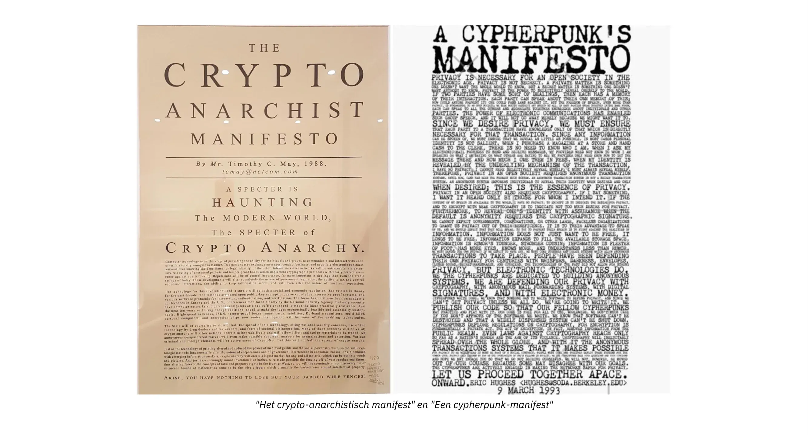

Vooral toen hij de kop van de Times van 3 januari 2009 in de coinbase van het Genesis blok van Blockchain Bitcoin plaatste om het einde van het ene Keynesiaanse tijdperk te illustreren en het begin van een ander tijdperk met liberale, anarchistische en libertaire aspiraties.

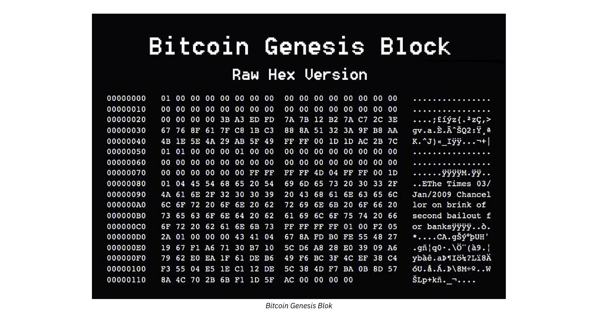

Het witboek dat op 31 oktober 2008 werd gepubliceerd, presenteert Bitcoin als een manier om waarde uit te wisselen op het internet zonder vertrouwde derde partij, gebaseerd op een gedecentraliseerd protocol. Een "Copernicaanse" revolutie die mensen eindelijk in staat zal stellen om hun vermogen tot handelen terug te krijgen, d.w.z. hun vrijheid, hun vrijheid om te handelen, hun recht op eigendom en respect voor hun privacy.

Waarom? Omdat Bitcoin ons in staat stelt om ons op Spinoza's manier, dankzij de rede, dankzij Galileo's taal van de wiskunde, van deze slavernij te bevrijden. En, zoals Hayek suggereert, zonder dat de staat zich ertegen kan verzetten. En vreedzaam, zonder dwang of proselitisme.

In feite is dit de laatste parallel die ik zal trekken tussen Spinozisme en Bitcoin, om aan te tonen dat het geen zin heeft om iemand te overtuigen die een Copernicaans of ontwrichtend concept niet onderschrijft, behalve door rede, begrip, nieuwsgierigheid of goede wil.

Niet met geweld, niet met geweld. Want het is een feit dat Copernicus, Galileo, Newton, Darwin, Einstein, Hayek, Spinoza of Satoshi Nakamoto nooit iemand hebben bedreigd die niet in hun ideeën en demonstraties geloofde.

# Laatste deel

<partId>70a5a3c8-6c88-11f0-8753-db07e26dcaf4</partId>

## Beoordelingen

<chapterId>7945c38c-6c88-11f0-a73f-0f7cdf99f53f</chapterId>

<isCourseReview>true</isCourseReview>

## Eindexamen

<chapterId>a557fd32-6c88-11f0-96ff-cfa532cf76a0</chapterId>

<isCourseExam>true</isCourseExam>

## Conclusie

<chapterId>ae04ab38-6c88-11f0-a496-3be47119e6b6</chapterId>

<isCourseConclusion>true</isCourseConclusion>