# Quando Spinoza conheceu Satoshi

Descubra como as ideias radicais do filósofo do século XVII Baruch de Spinoza sobre liberdade, razão e poder prefiguram a revolução descentralizada do Bitcoin. Este curso revela os paralelos impressionantes: ambos rejeitam a fé cega e a autoridade central, ambos usam rigor matemático para liberar. Spinoza libertou mentes do dogma religioso, o Bitcoin liberta o dinheiro do controle estatal.

Aprenda ferramentas práticas da ética de Spinoza para compreender os fundamentos filosóficos do bitcoin e aumentar sua autonomia. Pronto para explorar dois dos maiores instrumentos de emancipação humana da história?
+++
# Introdução

<partId>80b76189-afab-5295-a8d3-ba8f6fe7a5e8</partId>

## Introdução ao curso

<chapterId>99af4992-fd6c-5142-b168-d927b251574b</chapterId>

:::video id=1def60bc-1d39-4e49-9b08-fd05b7a0d49b:::

Neste curso, tenho o prazer de apresentar a filosofia de Baruch de Spinoza (1632-1677), o famoso filósofo do século XVII considerado o pai da filosofia racional do Iluminismo.

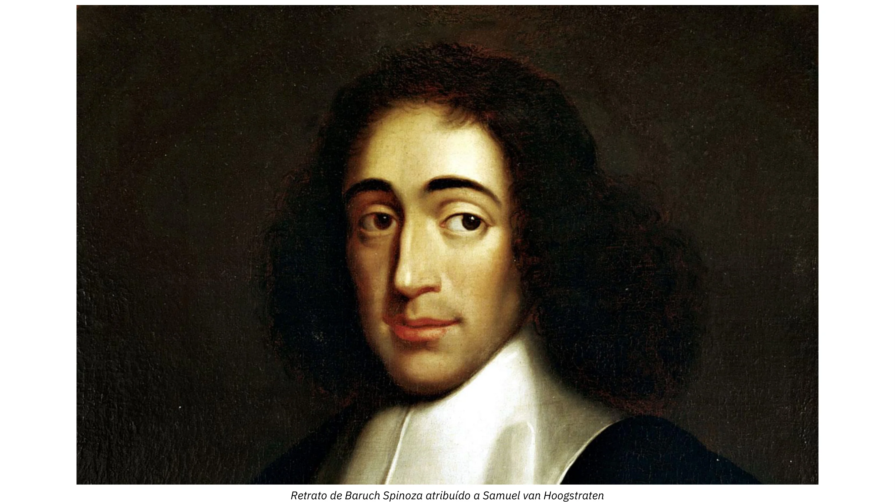

Retrato de Spinoza

Estes cursos baseiam-se nos meus dois ensaios sobre o assunto, "A verdadeira religião de Spinoza" e "Bitcoin, o evangelho da liberdade", disponíveis em papel, online ou diretamente no meu sítio Web, e em formato digital no Amazon Kindle.

O objetivo deste curso é, antes de mais, proporcionar uma compreensão simplificada de uma filosofia que é frequentemente considerada muito complexa e inacessível, apesar do interesse renovado de que goza atualmente.

De facto, esta filosofia permite-nos não só questionar o sentido das coisas quando tudo corre mal, o que é geralmente o objetivo da religião, da filosofia e das ciências humanas, mas também, e talvez sobretudo, questionarmo-nos a nós próprios quando tudo corre bem.

Quando a vida nos sorri e sentimos que não precisamos de nos questionar, considerando com um orgulho visto como ilusório e servil que a nossa felicidade, ou o nosso sucesso, só viria do nosso talento, do nosso trabalho ou de escolhas supostamente livres; em suma, do nosso livre arbítrio, e não do determinismo a que estamos sujeitos.

Desta forma, podemos fazer a ligação entre esta filosofia prática da liberdade - ou, como diz Spinoza, "em direção aos meios para a alcançar" - e o novo mundo tecnológico que nos interessa aqui, a criptografia em geral e o Bitcoin em particular.

E sobretudo no seu aspeto filosófico, que nos faz refletir precisamente sobre a noção de liberdade: a liberdade de pensar, de se exprimir, de respeitar a privacidade e, claro, no nosso caso, a liberdade de Exchange.

Em primeiro lugar, apresento-lhe Spinoza, o seu carácter, o seu contexto social, religioso e familiar, e o contexto histórico das Províncias Unidas onde viveu.

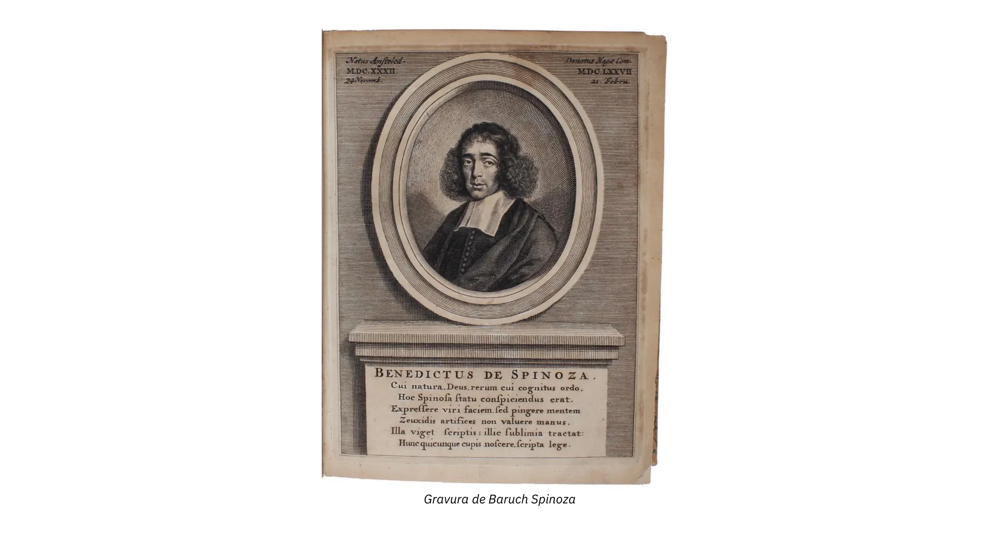

Retrato de Spinoza

Veremos então o que é esta nova filosofia racional segundo a qual "nada existe na natureza que não possa ser explicado sem o exercício da razão".

É a ideia de que só podemos compreender o mundo e a natureza humana em termos do nexo causal entre as coisas, segundo o qual um efeito tem sempre uma causa, e esta causa é ela própria o efeito de outra causa e assim por diante, até à causa primeira, à qual não temos acesso e que, segundo Spinoza, é a Natureza.

A natureza, ou seja, Deus, é o famoso "Deus sive Natura" em latim que ilustra todo o sentido do spinozismo.

Analisaremos também as duas principais obras de Spinoza, começando pela Ética, publicada postumamente em 1677, que se centra inteiramente na liberdade e na necessidade de nos libertarmos das servidões que nos confinam.

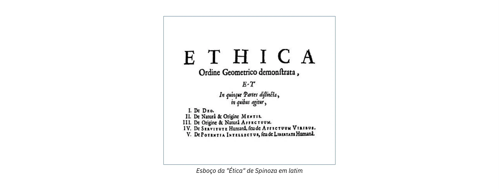

Em seguida, veremos o Traité théologico-Politique, publicado durante a sua vida, em 1670, que nos permite considerar a liberdade de um outro ângulo: a liberdade de pensamento e de crença. Por outras palavras, a liberdade religiosa, mas sobretudo a liberdade política.

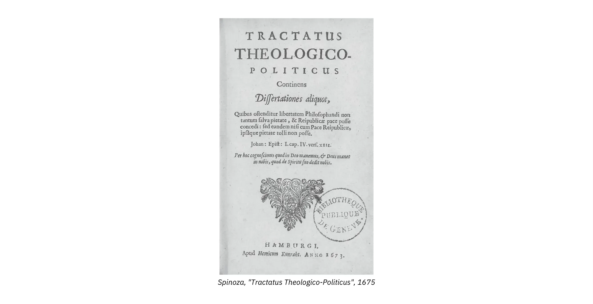

Finalmente, veremos porque é que o spinozismo é uma revolução copernicana das ideias e como representa uma nova definição do mundo e da natureza humana, estudando as 3 ilusões fundamentais denunciadas por Spinoza: a ilusão do livre arbítrio, a ilusão das causas finais ou finalismo e a ilusão teológica.

Graças à teoria dos afectos desenvolvida à maneira dos geómetras, "mais geométrica", veremos finalmente como Spinoza nos oferece um método prático para nos libertarmos, ou tentarmos libertar-nos, das servidões inerentes à natureza humana e às paixões exteriores. Um mecanismo racional que, para lutar contra a ignorância, pode ser comparado à certeza de que os três ângulos de um triângulo são sempre iguais a 180°, e que nos permitirá ligar o espírito do Iluminismo que dele resultou às correntes liberais do século XIX ou ao libertarianismo do século XX, que estão diretamente ligados à invenção de Satoshi Nakamoto, Bitcoin.

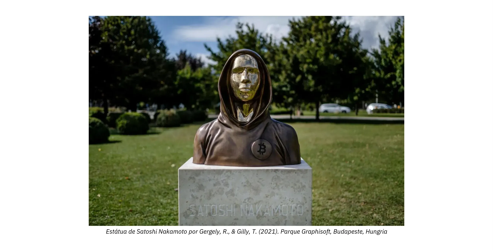

Compreenderemos então que, entre os muitos pontos em comum entre os conceitos spinozistas e esta ferramenta de liberdade inventada por Satoshi Nakamoto, o primeiro é que, em ambos os casos, se somos curiosos, bem-intencionados, como se dizia na altura, temos "compreensão", então não podemos deixar de aderir a ela. E se não aderirmos, o que seria evidentemente o nosso direito mais absoluto, uma vez que é fundamental respeitar a liberdade de acreditar ou não acreditar, então estaríamos determinados a não poder, ou a não querer, o que é a mesma coisa.

E é assim que podemos compreender que um fundamentalista religioso, por exemplo, nunca será capaz de aceitar ou ouvir o mais pequeno pensamento copernicano como o espinozismo, tal como um banqueiro central terá muita dificuldade em aceitar o Bitcoin.

Embora, como sabem, as coisas estejam atualmente a evoluir na direção certa.

## Apresentação de Baruch de Spinoza

<chapterId>f53a9cfd-326e-5b73-a766-3ef2f07c5a49</chapterId>

:::video id=5fac3ddc-c472-4c64-8186-46a8f317e389:::

Quem foi Baruch de Spinoza? Bem, foi um filósofo holandês nascido em 1632 e falecido em 1677, com 45 anos de idade.

De religião judaica, membro da comunidade sefardita portuguesa descendente dos marranos forçados a abandonar Espanha pelos católicos no século XV, foi educado num ambiente religioso e intelectual, consciente do que significa ser perseguido.

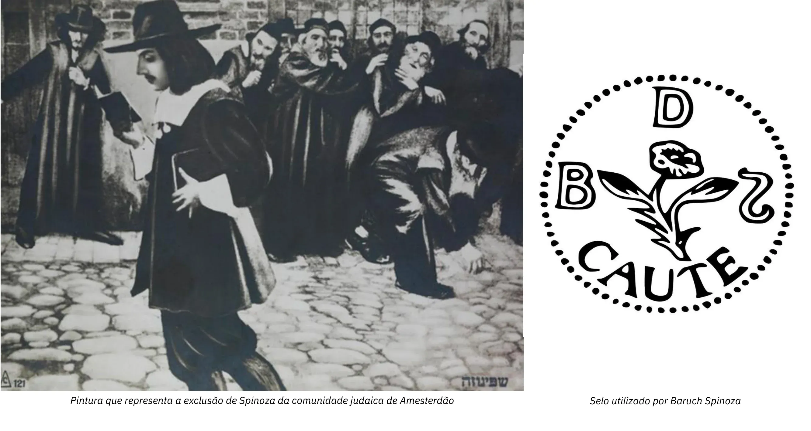

De facto, desde muito cedo, mostrou um espírito fortemente crítico em relação à religião estabelecida e, em particular, à sua comunidade hebraica, da qual foi violentamente rejeitado em 1656, com apenas 24 anos, antes de ter publicado qualquer coisa.

Esta "excomunhão", segundo se diz, permitiu-lhe isolar-se e concentrar-se no seu trabalho sem nunca olhar para trás.

Herdeiro, tal como os seus contemporâneos Descartes (1596-1650), Pascal (1632-1662) e Newton (1643-1727), das novas ideias racionais da física de Copérnico (1473-1543), Kepler (1571-1630) e Galileu (1564-1642), que o precederam em poucos anos, Spinoza desenvolveu um modo de pensar à maneira dos geómetras, de acordo com o princípio de Galileu segundo o qual a matemática é a linguagem do universo.

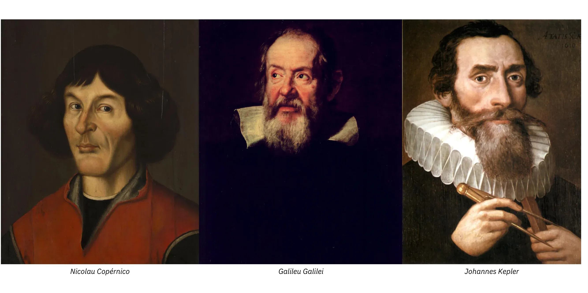

Mas estas ideias eram muito perigosas para a época, após o julgamento do monge e filósofo Giordano Bruno (1548-1600), que foi queimado vivo por heresia numa praça pública de Roma, e o julgamento de Galileu, forçado pela inquisição em 1633 a renunciar às suas convicções heliocêntricas copernicanas.

É por isso que a sua visão estritamente racional do mundo e da natureza humana, baseada nas relações causais entre as coisas, lhe valeu a reputação de ser considerado, e ainda hoje o é, erradamente, um ateu.

De facto, a obra de Spinoza fala apenas de Deus, que identifica com a Natureza, e, embora critique os impulsos supersticiosos dos religiosos e dos teocratas, mostra que a verdadeira religião é, para ele, sobretudo sinónimo de justiça e de caridade.

E é essa abordagem que liga Spinoza à filosofia do Iluminismo, seja alemão, com Leibniz (1646-1716), Kant (1724-1804), Schopenhauer (1788-1860) e Nietzsche (1844-1900), inglês com Locke (1632-1704) ou francês com Voltaire (1694-1778), Rousseau (1712-1778) e Diderot (1713-1784). Todos concordavam que a razão deveria ser usada para combater o obscurantismo, especialmente o religioso, para combater a ignorância e para defender os ideais de liberdade e progresso.

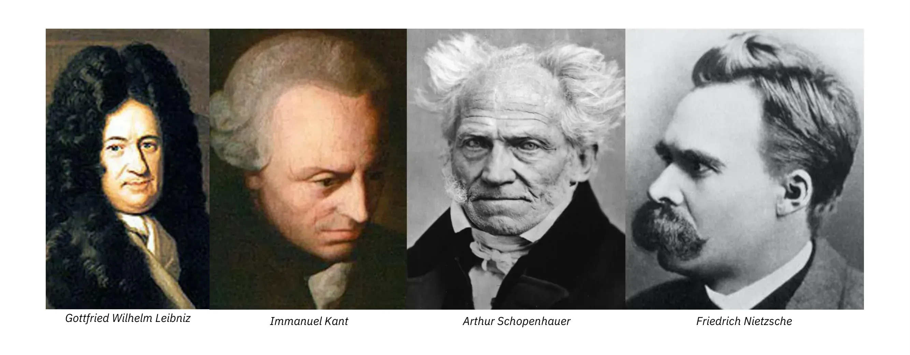

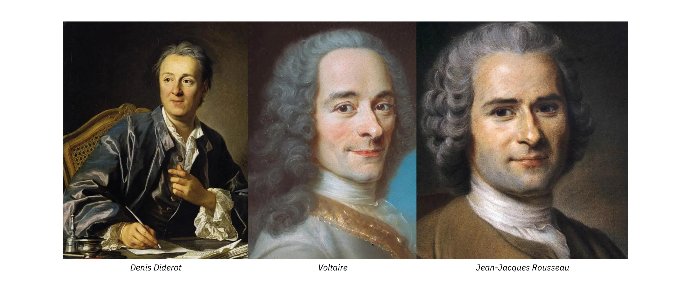

Agora, para começar a relacionar esta filosofia com Bitcoin, é importante notar que Spinoza nasceu numa época muito particular.

No século XVII, as Províncias Unidas eram não só o país mais livre do mundo em termos de ideias políticas e religiosas, mas também o mais rico. Por outras palavras, o país mais avançado do ponto de vista económico e tecnológico.

No entanto, a riqueza não está ligada aos recursos naturais, à exploração e espoliação das colónias ou à escravatura, mas ao comércio internacional e ao espírito liberal e empreendedor. Um espírito mais tarde defendido por um famoso spinozista, Voltaire (1694-1778), para quem, numa sala de comércio, um homem de negócios ou um empresário de convicção liberal nunca seria excluído, chamado de infiel ou excomungado, dizia ele, com base na sua religião ou nas suas origens, mas apenas se tivesse falido.

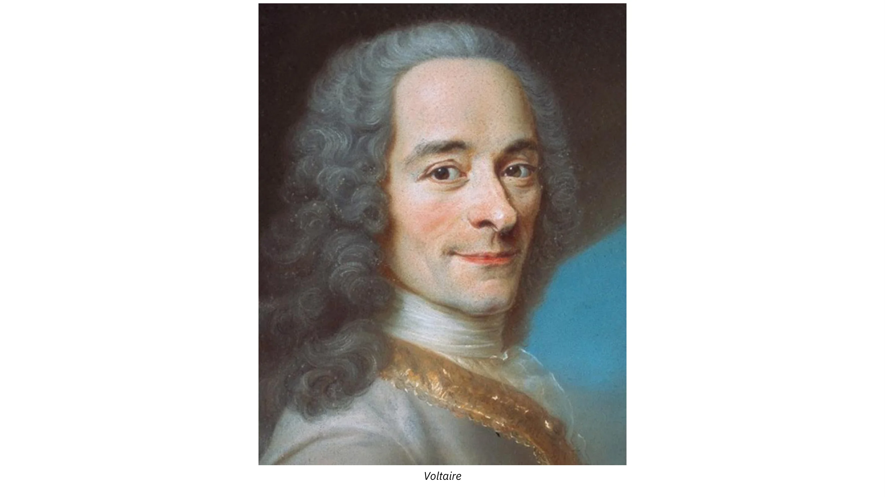

Além disso, nessa altura, os Países Baixos também estavam avançados nos principais domínios tecnológicos, por exemplo, nos domínios da mecânica e da ótica. Os telescópios astronómicos utilizados por Galileu para olhar para o céu e descobrir o universo eram, de facto, considerados tecnologia de ponta para a sua época, tal como as novas tecnologias associadas à computação, à IA e, claro, às criptomoedas hoje em dia.

E como o próprio Spinoza exerceu a profissão de polidor de lentes astronómicas - ironicamente para alguém que se diz ter visto tudo ao contrário - podemos imaginar que teria certamente apoiado um instrumento de liberdade como o Bitcoin.

Por outras palavras, os valores da liberdade e do progresso veiculados pelo Spinozismo contrastam com um mundo onde o fundamentalismo religioso, as teorias da conspiração, a superstição e, sobretudo, a ignorância continuam a ser uma triste realidade.

No entanto, é um mundo em que todos os meios são valiosos para escapar, para nos libertarmos das servidões que nos confinam e para sermos livres, aceitando o mundo tal como ele é, e não como gostaríamos que fosse.

Quer se trate de meios filosóficos ou tecnológicos, como veremos mais adiante, a Bitcoin é um instrumento de liberdade. É um instrumento que permite aos indivíduos e aos Estados libertarem-se da servidão, nomeadamente da servidão monetária.

# Obras principais, Ética e política

<partId>d7d7e9a1-005b-519c-b587-137435e46344</partId>

## A ética e a procura da liberdade

<chapterId>4cc66e25-335c-591d-9b78-83e5664bbbbc</chapterId>

:::video id=065c5091-69e1-412f-acce-c763ec31d3b1:::

Neste capítulo, proponho que nos debrucemos sobre a principal obra de Spinoza, intitulada Ética, publicada postumamente em 1677.

Porquê a título póstumo? Bem, porque as suas ideias eram revolucionárias, ou pelo menos contra-intuitivas e perturbadoras, e portanto muito perigosas na altura, mesmo no contexto liberal das Províncias Unidas do século XVII.

A Ética é uma obra escrita em latim à maneira dos geómetras, provavelmente inspirada no espírito científico de Galileu (1564-1642), o pai, juntamente com Kepler (1571-1630), da ciência moderna, segundo o qual a matemática é a linguagem do universo. Spinoza desenvolve as suas ideias em cinco partes principais, utilizando proposições acompanhadas de demonstrações, escólios, axiomas e definições.

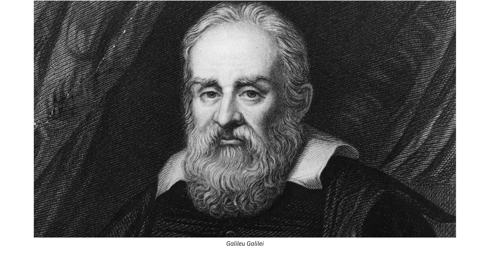

Como tal, a Ética é, nas palavras de Spinoza, "uma maneira de chegar à liberdade ou aos caminhos que a ela conduzem", e não é propriamente um livro que se possa ler de uma ponta à outra, mas sim um livro que se pode trabalhar lendo, por exemplo, uma proposição que remete para outra, que por sua vez se compreende através de uma terceira, e assim sucessivamente, num sistema perfeitamente coerente, racional e lógico.

Gostaria de salientar que, ao abrir a Ética, é recomendável começar pelos posfácios e apêndices. Estas pequenas secções são escritas por Spinoza em linguagem corrente, pelo que são fáceis de compreender e, de certa forma, um resumo do seu pensamento por vezes complexo.

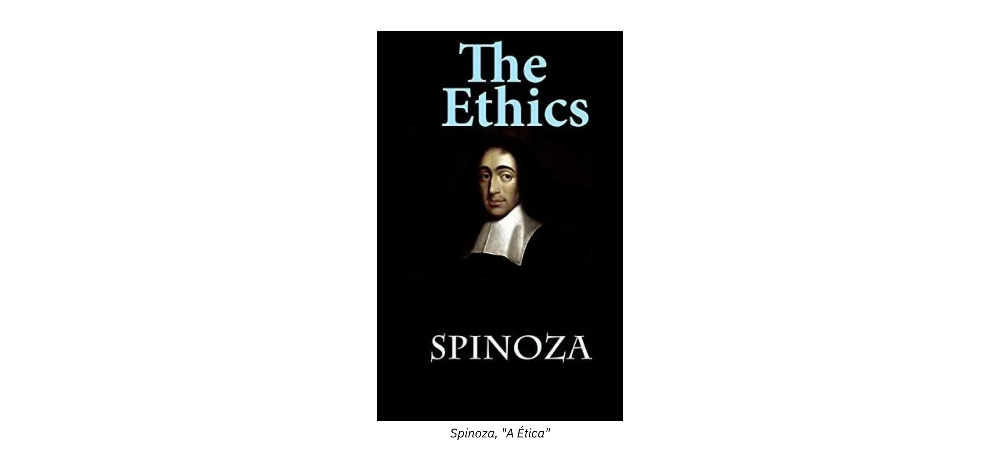

Ao submeter o mundo que nos rodeia ao "microscópio da razão", a obra de Spinoza disseca a natureza humana com base no princípio de que o ser humano não é auto-causado, ou seja, que não pedimos para nascer, nem aqui, nem no nosso tempo, nem com tal atributo físico ou intelectual.

E diz que não estamos acima da natureza. Não estamos isentos das suas leis, seja no corpo ou na mente. Por outras palavras, somos tão parte da natureza como qualquer outro ser vivo, animal ou vegetal.

Para Spinoza, todos os domínios da atividade humana dependem da capacidade da razão para compreender o mundo num sistema perfeitamente coerente e determinado.

Um mundo em que o acaso não existe.

Tudo o que acontece é "necessário" e resultado de uma causa, de acordo com a ideia de que "o que é e o que acontece, deve ser e deve acontecer". É o determinismo absoluto.

Mas há dois pontos a ter em conta:

Em primeiro lugar, se o acaso não existe para Spinoza, é porque se trata de um acontecimento cuja causa desconhecemos. Mas, claro, diz ele, o facto de não conhecermos a causa não significa que não exista.

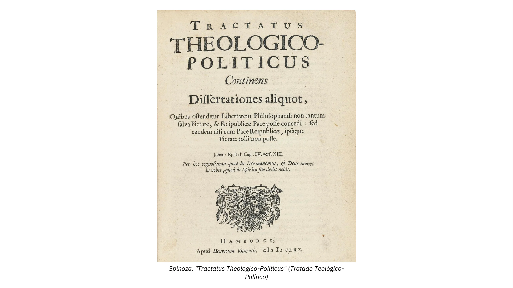

Em segundo lugar, também não se pode falar de fatalismo, uma vez que a natureza não é dotada de intenção. O relâmpago, por exemplo, não tem a intenção de castigar ninguém, como se poderia pensar no caso de uma tragédia. Não, simplesmente exprime a essência da sua própria natureza, que é a de atingir com um raio. Atingir.

Spinoza defende, assim, a ideia de que a realidade, ou seja, a vida quotidiana com os seus aspectos bons e maus, é perfeitamente inteligível e que não há nenhum fenómeno na natureza que não esteja ligado a uma causa. Claro que isto levanta a questão do mal, nomeadamente do mal absoluto, que veremos mais adiante.

Por último, é importante notar que a ética não é moral.

Segundo Gilles Deleuze (1925-1995), o famoso professor de filosofia e especialista em Spinoza, a moral é um sistema de julgamento útil para viver em sociedade. Mas é um sistema subjetivo, pois o que é certo aqui pode ser errado noutro lugar, e o que é errado hoje pode ser certo mais tarde.

E mais do que determinar o que é certo ou errado, a ética estabelece o que é bom ou mau para a nossa própria natureza e para a nossa capacidade, diz Spinoza, de preservar o nosso ser. De sermos livres. É, portanto, uma verdadeira etologia, ou seja, uma ciência dos modos de ser, ou, como explica Gilles Deleuze, a arte de fazer bons encontros.

Ou a arte de fazer as escolhas certas para nos libertarmos das servidões que nos confinam e pelas quais, segundo Spinoza, os homens se reduzem muitas vezes a "ver o melhor, aprová-lo e fazer o pior".

Por outras palavras, "lutar pela sua servidão como se estivessem a lutar pela sua liberdade".

## O Tratado Teológico-Político

<chapterId>84b0187e-1050-5d44-a536-80554896e828</chapterId>

:::video id=c1efc97e-1e96-4b37-894c-9a19794d6b52:::

Depois da Ética, gostaria de vos apresentar uma outra obra importante neste capítulo que vos ajudará a compreender a influência filosófica e política de Spinoza, nomeadamente no Iluminismo que se aproxima e nas correntes liberais e, no nosso caso, libertárias.

Trata-se do Traité théologico-politique, ou TTP, publicado anonimamente em 1670.

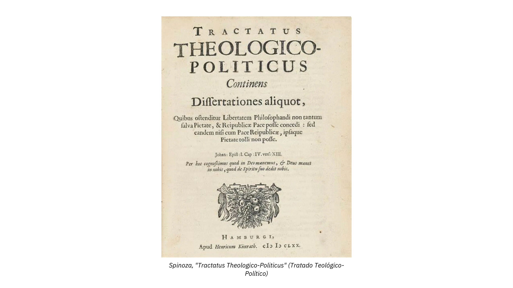

Spinoza (1632-1677) escreveu este livro enquanto interrompia a redação da sua Ética, na tentativa de pôr fim a um mal-entendido que ainda hoje existe. É a crença de que ele era ateu.

Como vimos, o conceito de Deus de Spinoza é o tema de toda a primeira parte da Ética, na qual ele demonstra não só a existência de Deus, mas também qual é a sua verdadeira natureza.

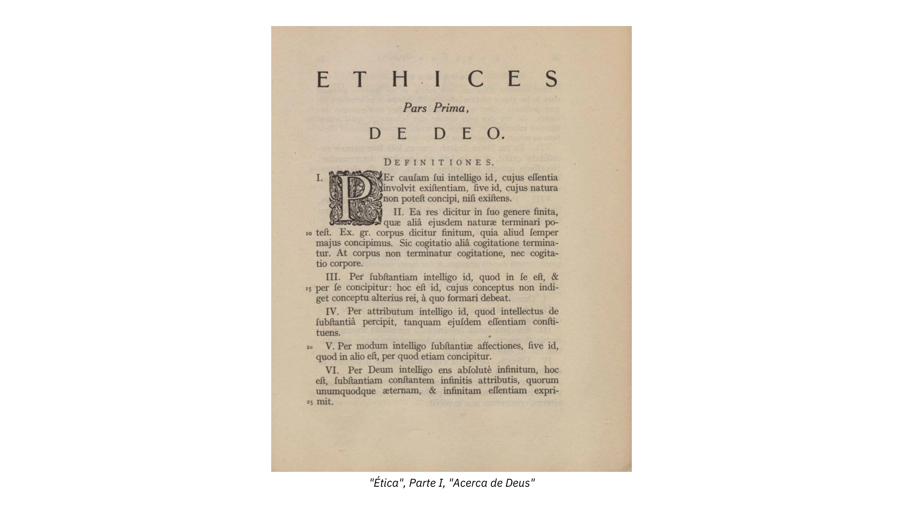

E uma vez que os conceitos de Spinoza são geralmente bastante difíceis de apreender, é muitas vezes mais fácil compreendê-los dizendo o que não são, em vez de tentar dizer o que são. Uma abordagem que, incidentalmente e como veremos mais tarde, é muito útil para compreender Bitcoin.

É assim que Espinosa nos mostra que Deus, na sua perspetiva, não é um ser antropomórfico dotado de intenções, castigando ou recompensando, a quem falaríamos e que nos ouviria segundo um ritual que poderíamos ou não seguir. Por outras palavras, segundo ele, Deus não é um velho de longas barbas brancas escondido atrás de uma nuvem que resolveria as dificuldades do mundo e nos tornaria dependentes dele.

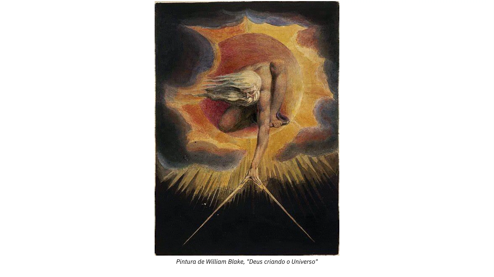

Assim, falar de Deus é evocar a Natureza como uma Substância única, infinita e eterna, composta por um número infinito de atributos, dos quais nós, seres humanos, conhecemos apenas dois: a matéria, ou seja, a extensão, e o pensamento.

É o famoso "Deus Sive Natura", do qual Spinoza retira o conceito de determinismo absoluto e a ideia de que o homem não é causa de si próprio e não está acima da Natureza, e muito menos dos animais.

Mas para além de uma crítica da religião, o TTP é sobretudo uma oportunidade para Spinoza fazer uma crítica severa aos religiosos e à teocracia. Por outras palavras, o poder religioso cultiva o medo e a superstição e, segundo ele, ativa as paixões tristes dos indivíduos para melhor os escravizar, aprisionando-os na ilusão, no fanatismo e na guerra.

Nesse estágio primário e infantil da religião, os crentes ficam apegados apenas à adoração externa e a uma fé crédula baseada em preconceitos. Um estágio em que a religião se torna mecanicamente intolerante, desvia-se dos limites de seu ensinamento moral e afasta-se de sua vocação de promover a paz e a harmonia, afirmando ser detentora da verdade.

No entanto, quando se ultrapassa a crítica racional da religião, por exemplo através da exegese da Bíblia, Spinoza quer convencer-nos de que esta nova visão de Deus é inteiramente compatível com as mensagens de justiça e de caridade das três grandes religiões do Livro, que enunciam uma regra de ouro simples, mas muitas vezes esquecida: "Amarás o teu próximo como a ti mesmo".

Mas isso não é tudo.

Esta visão madura da religião desenvolvida no TTP é acompanhada de uma dimensão política, a necessidade de separar a religião do Estado para proteger a liberdade de pensamento e de crença, no interesse de todos os indivíduos e do próprio Estado.

No fundo, Spinoza faz da liberdade, no quadro da razão, uma condição essencial para que o ser humano possa viver sem ser escravizado por um poder contrário aos seus interesses e, por isso, defende uma democracia direta baseada na liberdade política e religiosa.

Por outras palavras, a liberdade de pensamento e de crença, para que as pessoas se libertem da servidão e das crenças falsas e infantilizantes, para raciocinarem como adultos, dando prioridade à razão e também, no que nos diz respeito, ao progresso tecnológico.

O infame terramoto de Lisboa, ocorrido a 1 de novembro de 1755, revelou uma grande mudança na forma como as pessoas pensavam sobre os fenómenos naturais e as catástrofes, e sobre a forma de se protegerem contra eles.

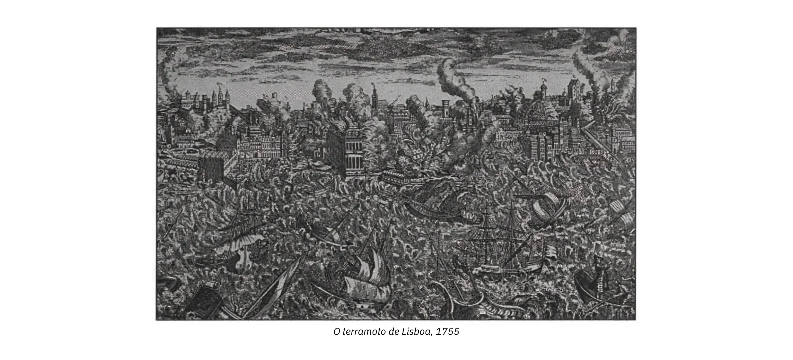

Este terrível terremoto destruiu a cidade e matou centenas de milhares de pessoas inocentes, muitas das quais estavam na igreja naquele momento, pois era o Dia de Todos os Santos, o que aumentou a incompreensão dos sobreviventes.

Um drama que reavivou a questão colocada pelo filósofo e matemático alemão Leibniz (1646-1716) sobre a visão antropomórfica de um Deus dotado de intenção, bondade e omnipotência. Porque se Deus fosse bom, como diz Leibniz na sua Teodiceia, então não seria omnipotente, pois permitiria tais catástrofes, e se fosse omnipotente, então não seria bom, pois não as poderia evitar.

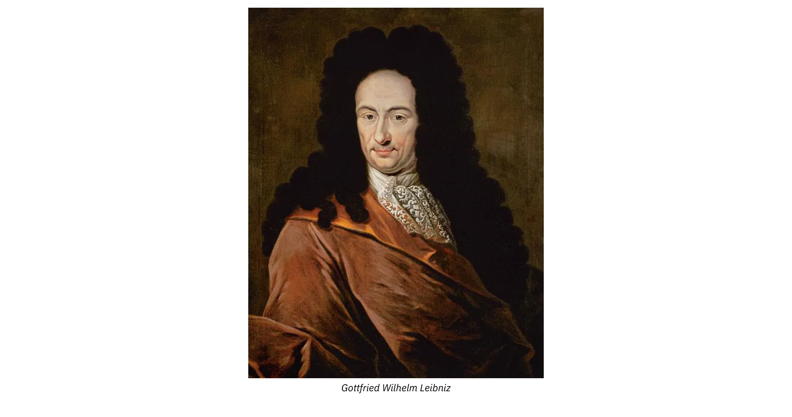

Muito para além de condenar a mão de Deus, Jean-Jacques Rousseau (1712-1778) escreveu a Voltaire, impressionado com as injustiças e os horrores sofridos discriminadamente pela humanidade, que "a natureza não era má em si mesma, e que não devíamos ver nela nenhuma mão divina que explicasse os seus desígnios".

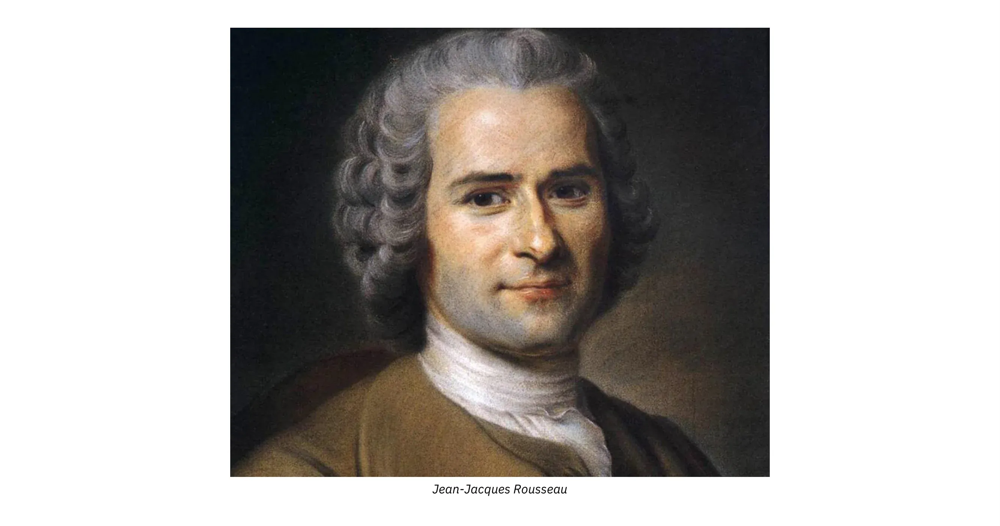

Ao que Voltaire (1694-1778), um spinozista como nunca, respondeu que esta catástrofe natural deveria sobretudo fazer-nos compreender que os meios científicos para nos protegermos da natureza existiam e que o desafio do seu tempo era, portanto, perguntar se os seres humanos poderiam, graças ao conhecimento e ao progresso, tomar o seu futuro nas suas próprias mãos e libertar-se da teologia e da superstição.

E embora não se tratasse, evidentemente, de evitar os sismos, que continuam a ser não só imprevisíveis mas também completamente incontroláveis, tratava-se mais de garantir que, por exemplo, as casas fossem construídas para os suportar.

É por isso que o Iluminismo do século XVIII, graças ao exercício da razão, da ciência e da técnica, é o século do progresso. Por outras palavras, o progresso como instrumento de liberdade.

# A revolução spinozista, as três ilusões

<partId>f5d45c2b-28da-527a-ab20-dd255e9a9e0d</partId>

## Uma nova definição da Natureza e do ser humano

<chapterId>3e6599e3-5b29-50a8-a67d-d0386da5d65d</chapterId>

:::video id=b6d2c035-8848-4da6-9da9-be3b70be0f38:::

Neste capítulo, gostaria de fazer uma análise da história das ideias e ver por que razão o spinozismo é considerado uma verdadeira revolução copernicana das ideias.

Graças a esta nova forma de compreender Deus, ou seja, a Natureza, oferecida pelas matemáticas, Spinoza (1632-1670) estabeleceu uma profunda mudança de paradigma, com implicações indirectas na visão religiosa do mundo e no lugar do homem nele.

Tal como Nicolau Copérnico (1473-1543) estabeleceu que a Terra não era o centro do mundo e Charles Darwin (1809-1882) demonstrou, três séculos mais tarde, que os seres humanos não estavam no centro da "vida", também Spinoza seguiu esta lógica e afirmou, no seu tempo, que os seres humanos não são "donos da sua própria casa" e que o universo não foi feito apenas para seu benefício.

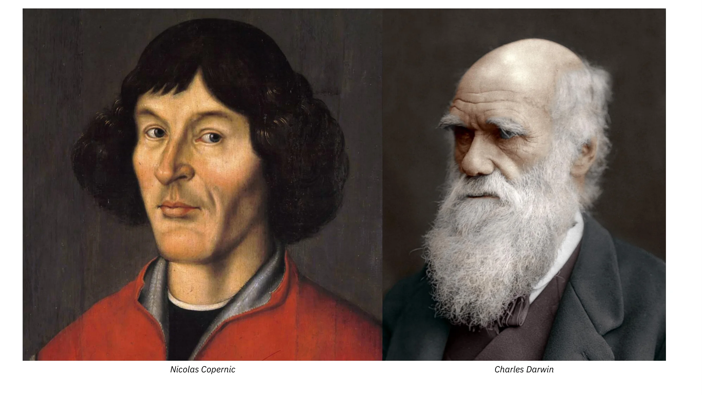

Diz que o homem não é "um império dentro de um império" e que, tal como a terra é reduzida ao estatuto de um simples planeta, como todos os outros planetas, o ser humano é reduzido ao estatuto de um simples modo da natureza, como todos os outros modos finitos da natureza, como os animais, as plantas e todos os "seres existentes".

Antes dele, a filosofia grega clássica propunha uma visão ordenada e hierárquica do universo para explicar o mundo, o cosmos e a experiência humana. Baseada em narrativas míticas, procurava fundamentalmente explicar a origem do mundo, insistindo na harmonia do universo, da natureza e do homem.

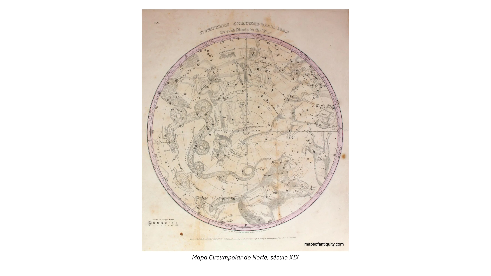

A cosmologia escolástica da Idade Média, essencialmente a partir do século XII, foi uma evolução no sentido de um maior raciocínio para harmonizar razão e fé e explicar um universo ainda hierárquico, mas que correspondia melhor à filosofia cristã.

Mas com a nova física de Copérnico (1473-1543), no século XV, a cosmologia sofreu uma grande viragem na compreensão do universo, cujo modelo geocêntrico foi assim posto em causa em favor do sistema heliocêntrico, que abriu caminho à ciência moderna, nomeadamente à nova física e astronomia de Kepler (1571-1630) e Galileu (1564-1642). Depois Isaac Newton (1643-1727) e, finalmente, Albert Einstein (1879-1955), um spinozista convicto.

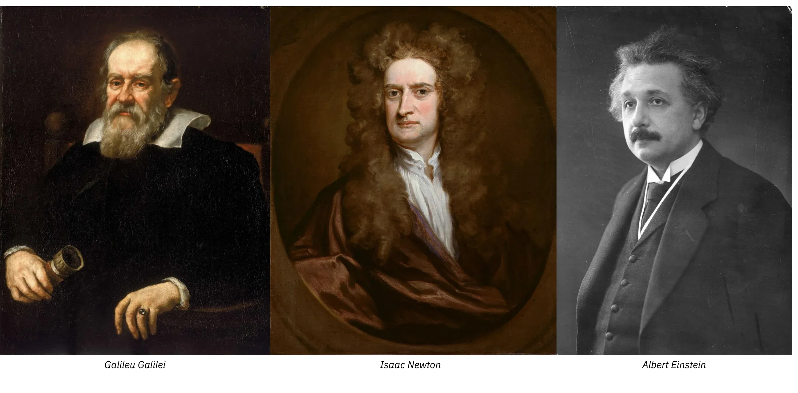

Mas para compreender plenamente o spinozismo, precisamos também de considerar o contexto de René Descartes (1596-1650), o famoso filósofo francês que precedeu Spinoza e de quem este foi simultaneamente discípulo e grande admirador.

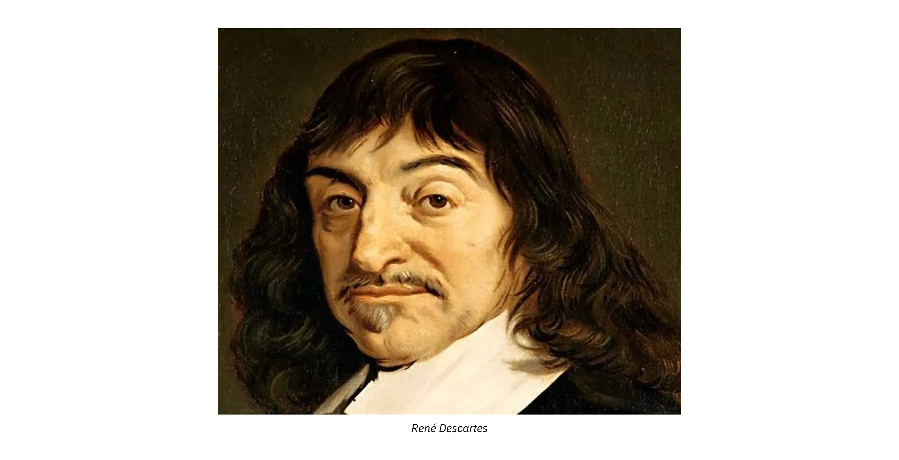

Apesar dos riscos e das condenações de Giordano Bruno (1548-1600) e de Galileu, Descartes procurou distinguir "a verdade da falsidade" e harmonizar a teologia, a filosofia e a física. No seu famoso Discurso do Método, publicado em 1637, Descartes defende que a razão é o fundamento do conhecimento, através do qual o ser humano pode alcançar a liberdade.

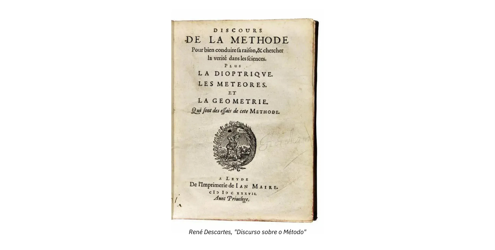

Ao explicar o mundo de acordo com leis universais, em vez de uma natureza dotada de intenções morais, abriu caminho ao determinismo, que Spinoza viria a defender mais tarde.

Mas, enquanto católico, Descartes estabelece uma hierarquia entre o ser humano e os outros modos finitos da natureza, nomeadamente no que diz respeito às espécies animais, a que chama "animais-máquina". E ao dizer que "não há alma que, quando bem guiada, não possa adquirir um poder absoluto sobre as suas acções e paixões", Descartes afirma assim que o ser humano tem a capacidade de partir do nada, e que o homem, na sua opinião, "escapa às leis da natureza", que tem um poder absoluto sobre as suas próprias acções e que funda a sua determinação unicamente em si próprio.

Spinoza soube ir mais longe e ultrapassar esta etapa e conciliar a existência de Deus com a demonstração da razão. Para ele, todos os domínios da atividade humana dependem das capacidades da razão num mundo perfeitamente coerente e determinado. Mas um mundo em que não há nem contingência nem acaso, e em que tudo o que acontece é necessário e resulta de uma causa, segundo o nexo de causalidade entre as coisas. Esta é a ideia do determinismo absoluto.

E é nos termos mais duros que ele finalmente refuta a posição cartesiana, criticando, por exemplo, a ideia de que os seres humanos não estão sujeitos às leis da natureza como todos os outros animais, e são, portanto, superiores a todos os outros modos finitos da natureza.

Por outras palavras, são dotados de livre-arbítrio, uma crença ilusória à qual é extremamente difícil escapar, como nos diz Spinoza, e da qual falaremos agora.

## A ilusão do livre arbítrio

<chapterId>f147a914-cb64-5927-b305-26691930bca3</chapterId>

:::video id=b59da795-ba19-4643-9672-36c9e7953a42:::

Neste curso, debruçar-nos-emos sobre a delicada questão do livre-arbítrio, a fim de compreendermos melhor o que é a liberdade para Spinoza, para o Iluminismo e para os primeiros filósofos liberais.

Como já vimos, Spinoza (1632-1677) é conhecido por considerar o livre-arbítrio como uma ilusão da qual é extremamente difícil libertar-se.

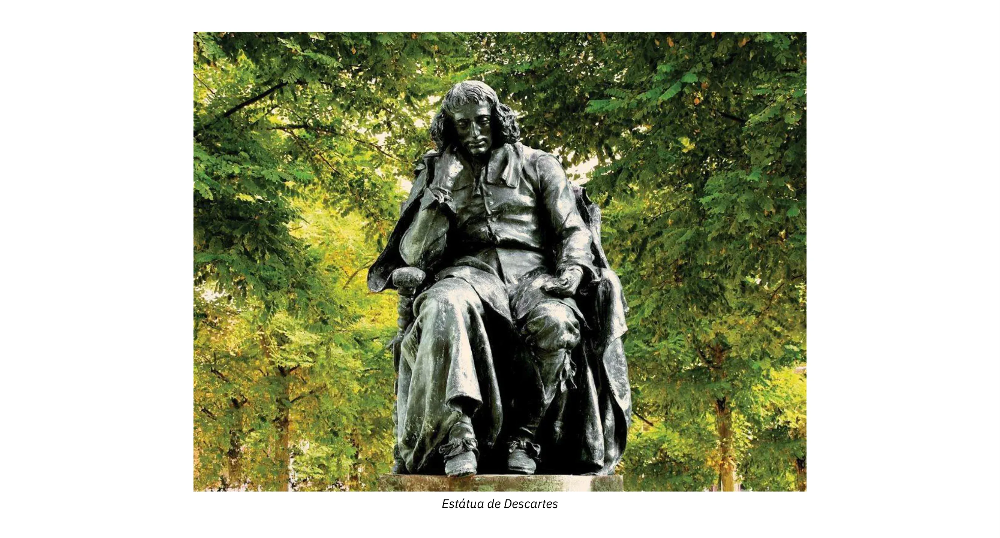

Porquê? Porque vai contra a tradição filosófica desde a Antiguidade, e ainda defendida por Descartes (1596-1642), de que o ser humano pode iniciar algo a partir do nada e tem plena responsabilidade pelos seus actos, sobretudo perante Deus, diz Santo Agostinho (354-430), pai da Igreja cristã.

Mas também, evidentemente, perante a justiça humana.

É a ideia de que a nossa vontade, e apenas a nossa vontade, nos permite dirigir a nossa vida, que temos um poder absoluto sobre as nossas acções e que a liberdade das nossas acções deriva apenas de nós próprios, possuindo assim um poder de decisão indeterminado.

Por outras palavras, o homem é capaz de perturbar a ordem da natureza, em vez de estar sujeito a ela.

Na condução da sua vida, porque não estaria sujeito a outra lei senão a da sua própria vontade, estaria, portanto, não só acima da natureza e dos animais, meras máquinas, mas também acima de todos os outros modos finitos da natureza. Esta era a posição de Descartes (1596-1650), para quem as causas da impotência e inconstância humanas não estavam na ordem natural, mas nos vícios da própria natureza humana.

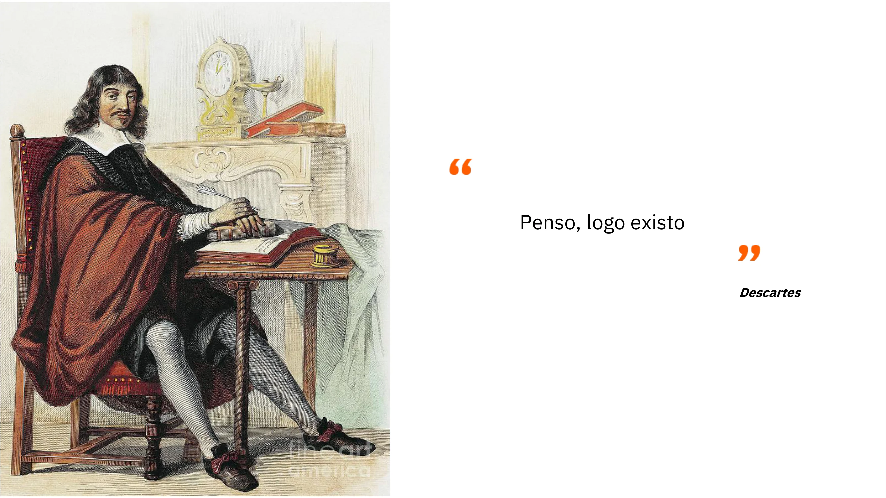

Mas, ao mesmo tempo que atribui a Descartes o mérito de ter aberto o caminho para o controlo racional da vida afectiva, Spinoza afasta-se totalmente dele ao criticar firmemente esta hipótese de um "poder absoluto" da vontade.

Spinoza, por outro lado, considera que o nosso mundo é perfeitamente coerente e determinado, e que tudo o que acontece é necessário e resulta da causalidade das coisas, segundo a qual um efeito tem sempre uma causa, e esta causa é ela própria o efeito de outra causa, e assim por diante.

É a ideia de determinismo absoluto, a partir da qual estabelece, na sua Ética, que os homens não têm qualquer livre arbítrio porque, diz ele, têm consciência dos seus actos, mas ignoram, ou preferem ignorar, as verdadeiras causas que os determinam.

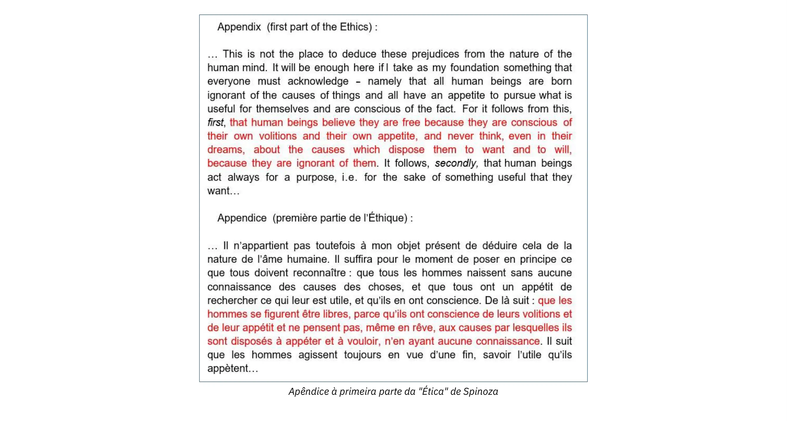

Para Spinoza, os seres humanos, enquanto "modos finitos" da natureza, como os animais ou as plantas, não podem, portanto, começar algo a partir do nada; não estão isentos das leis da natureza, tanto nos seus corpos como nas suas mentes.

Pior, para ele, o maior perigo da liberdade é acreditar no nosso livre arbítrio e acreditar que podemos agir sem sermos determinados por causas externas.

Para Spinoza, a liberdade não é a expressão do livre arbítrio, mas a capacidade de compreender o lugar que nos cabe no mundo, de compreender a nossa natureza determinada e, a partir daí, de orientar a nossa existência para aquilo que "aumenta a nossa potência de agir". Olhando sempre para o futuro com otimismo, e vendo o mundo como ele é, em vez de o imaginar como gostaríamos de o ver.

Evidentemente, o problema que se coloca é o da responsabilidade do homem e dos seus actos. Poderíamos concluir que, se os indivíduos não são livres nos seus actos, não seriam responsáveis por eles, sobretudo perante a justiça. Mas esta visão é enganadora, porque, sem entrar em demasiados pormenores, o reconhecimento do determinismo social, familiar e histórico de cada um não nos impede de considerar a responsabilidade dos actos cometidos, uma vez que estes são voluntários.

Por outro lado, seria uma ilusão acreditar que as acções de um criminoso nunca estão ligadas ao seu próprio determinismo. Se não se trata de as desculpar, trata-se pelo menos de as tentar compreender. De facto, é isso que a justiça faz: para além de punir os actos ilícitos, desempenha o papel de prever e proteger o futuro, razão pela qual certos crimes não são apenas punidos, mas também tratados, tendo em conta o contexto familiar, social e psicológico do delinquente.

Esta abordagem da liberdade como capacidade de ação é a ligação que podemos fazer com a filosofia iluminista do século XVIII. Segundo um dos seus maiores embaixadores, o filósofo alemão Immanuel Kant (1724-1804), o Iluminismo foi, de facto, o meio de libertar o ser humano do estado de tutela, ou, como diria Étienne de la Boétie (1530-1563), da servidão voluntária, pela qual ele próprio era responsável.

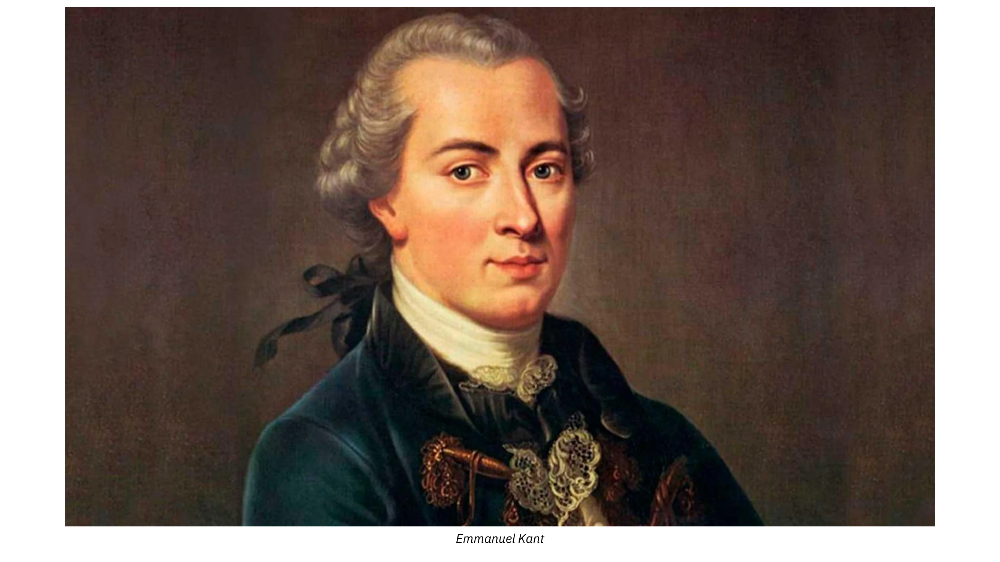

O lema de Kant é "Pensa por ti próprio" e "Atreve-te a saber", o famoso "Sapere Aude" em latim.

A capacidade de agir de Espinosa é, assim, o poder que o homem tem em si mesmo de compreender a sua própria condição animal, de compreender a natureza e os seus fenómenos, positivos ou negativos, relacionando-os com causas objectivas, de modo a não se apoiar em explicações morais falsas e ilusórias, isto é, em explicações feitas à medida dos nossos desejos. Pelo contrário, consiste em procurar explicá-los através da razão, tendo em vista a emancipação e a liberdade.

E o progresso, que conduziu às primeiras revoluções tecnológicas e às primeiras ideias liberais e empresariais do final do século XVIII, nomeadamente com o filósofo liberal inglês John Locke (1632-1704) e o economista inglês Adam Smith (1723-1790).

E vale a pena recordar a definição de ilusão de Sigmund Freud (1856-1939). Segundo o pai da psicanálise, que sempre reconheceu a influência de Spinoza na sua obra, uma ilusão é precisamente "uma crença motivada pela realização de um desejo e que, por isso, ignora a realidade".

Por fim, convém assinalar que, embora o movimento libertário de que vamos falar se refira diretamente a esta nova filosofia liberal, há quem assinale que figuras como Ayn Rand (1905-1982), autora de "La Grève" e "La Source vive", defendem a existência do livre arbítrio, acreditando que o ser humano tem a capacidade de fazer escolhas livres.

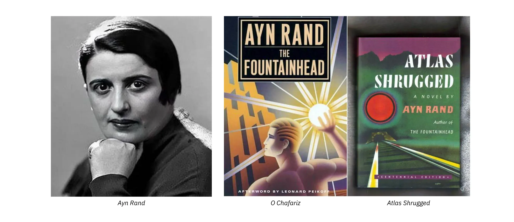

Mas a realidade é bem diferente, e a confusão resulta antes de um problema semântico: ao reconhecerem a capacidade de ação e de escolha dos seres humanos, reconhecendo ao mesmo tempo o determinismo lógico de que são objeto, os primeiros libertários são, na realidade, também herdeiros de Spinoza. O que eles têm em comum com Spinoza é a crença de que os seres humanos não estão acima da natureza, mas são o resultado de um processo evolutivo que os coloca dentro de um determinismo, de uma história que os ultrapassa e que é em grande parte responsável pelo que os seres humanos são e pelo que fazem.

Finalmente, se a crença no livre-arbítrio é uma ilusão da qual é extremamente difícil libertarmo-nos, é porque remete para uma outra ilusão que a alimenta, a ilusão das causas finais, que vos convido a estudar no próximo capítulo.

## A ilusão das causas finais

<chapterId>da2a7fb1-f1e9-5b56-822d-c73770de749d</chapterId>

:::video id=a0127fe7-a4cb-4a1c-8af4-f11c40b4a3d7:::

Vimos no capítulo anterior que a ilusão do livre-arbítrio consiste em acreditar que poderíamos começar algo do nada, que a nossa vontade, por si só, nos permitiria dirigir a nossa vida e que teríamos um poder de decisão indeterminado. É a ideia de que o homem é capaz de perturbar a ordem da Natureza mais do que está sujeito a ela.

Mas para Spinoza (1632-1677), o homem não é "um império dentro de um império", ou seja, não é, ao contrário do que estabeleceu Descartes (1596-1650), uma exceção na natureza, e nunca está isento do prolongamento da cadeia determinista de causa e efeito.

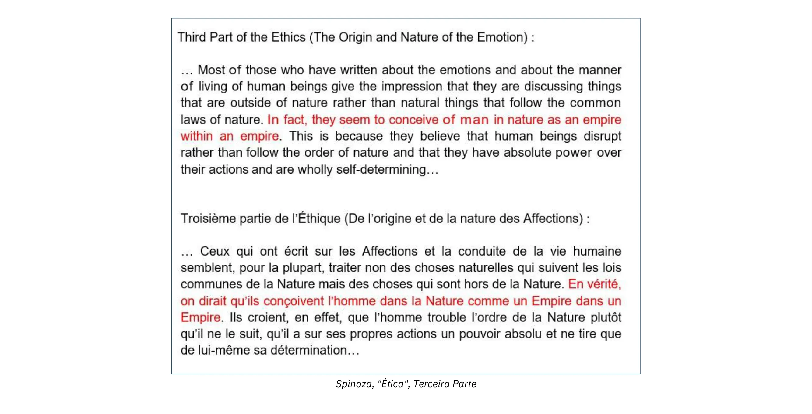

E como a Natureza, diz Spinoza, não tem um fim prescrito do ponto de vista moral, e como os humanos tendem a confundir a imaginação com a compreensão, interpretam-na de acordo com o que convém aos seus próprios interesses. Ao ponto de darem um significado às coisas que deriva apenas da forma como as apreciam e as relacionam consigo próprios.

Ou seja, de acordo com os seus desejos, esperanças e receios.

Este raciocínio é ilustrado pela ilusão das causas finais, que é um grande obstáculo ao pensamento e ao exercício da razão, porque exprime simplesmente a nossa necessidade de fazer corresponder os efeitos de uma coisa não às suas verdadeiras causas, mas a uma crença, mesmo que absurda ou infantilizante.

Uma crença que exprime uma intenção, nomeadamente divina, e que, da forma como a interpretamos, é muitas vezes supersticiosa, ou ignorância.

E é por isso que as novas doenças, como a SIDA nos anos 90 ou a covid em 2020, sempre foram vistas por alguns como a expressão de uma intenção divina e muitas vezes punitiva, segundo um raciocínio que contraria o princípio de causalidade que está na base do racionalismo e da ciência moderna estabelecida desde Copérnico (1473-1543), Kepler (1571-1630) e Galileu (1564-1727).

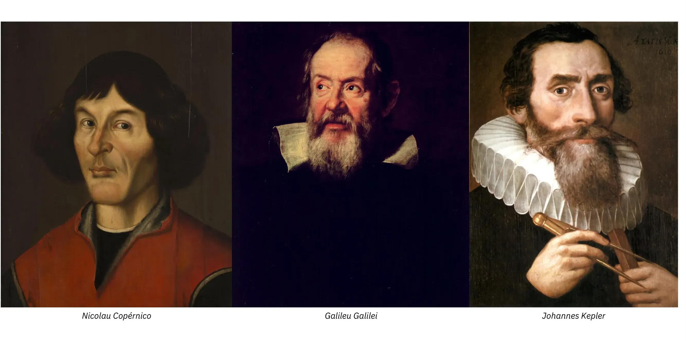

O facto é que, como diz Spinoza, pouco importa às pessoas que tantas coisas estejam para além da sua imaginação, que haja mais desordem do que ordem na natureza. No entanto, a complexidade das coisas que escapam ao seu alcance deveria dissuadi-las de acreditar em qualquer projeto teleológico. Não importa, diz ele, porque a crença dos seres humanos na relevância da sua certeza com base no que satisfaz o seu desejo e utilidade é sempre mais forte do que qualquer argumento racional ou preocupação com a verdade.

O finalismo equivale assim a inverter as causas e os efeitos das coisas para as compreender: por exemplo, pensamos que a razão pela qual temos olhos é para ver e que a razão pela qual temos dentes é para mastigar. Ora, é claro que foi para ver que a espécie humana desenvolveu a sua visão ao longo da sua evolução, e foi de facto através da necessidade de se alimentar, e de comer carne, que a nossa dentição também se desenvolveu tal como é hoje.

Foi exatamente o que afirmou o naturalista francês Jean-Baptiste de Lamarck (1744-1829) (imagem 3.3.3) quando estabeleceu a sua teoria pré-darwinista de que é a função que cria o órgão e não o contrário.

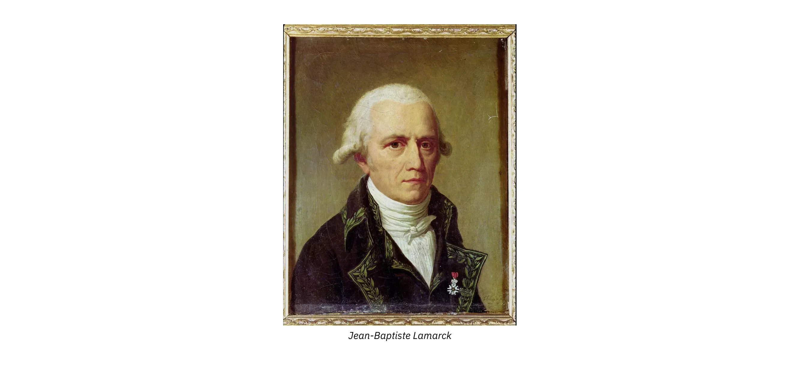

Mas, como diz Spinoza, "a ilusão dos homens não acaba aqui", e entre todos os exemplos de ideias teleológicas ingénuas e, em última análise, bastante divertidas, citamos frequentemente o famoso exemplo do biólogo Bernardin de Saint-Pierre (1737-1814). Este antigo diretor do Museu de História Natural de Paris encarava o finalismo da natureza com poesia, lirismo e uma certa ingenuidade, considerando que o melão, por exemplo, tinha sido criado com o único objetivo de agradar às famílias numerosas, uma vez que a sua pele estriada facilitava o corte em fatias iguais.

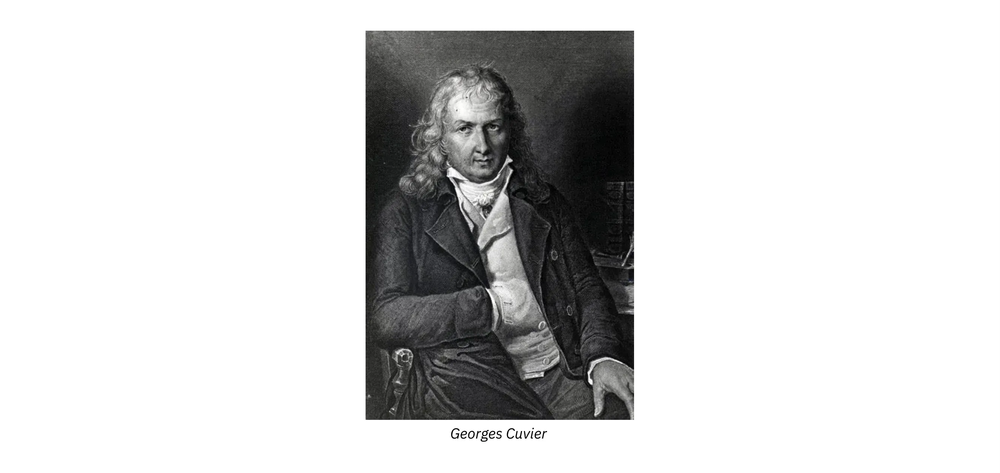

A definição de inflação dada pelos economistas keynesianos e pelos defensores do Estado-providência, por exemplo, também ilustra muito bem este paradoxo. Segundo eles, a inflação é um aumento dos preços que, de acordo com alguns banqueiros centrais, provém "do nada" ou de contextos geopolíticos que ninguém pode controlar ou antecipar. Embora um aumento dos preços possa, de facto, conduzir a uma inflação conjuntural - por exemplo, quando o preço do petróleo sobe, os preços de certos produtos transformados também sobem -, as verdadeiras causas estruturais da inflação estão sobretudo ligadas a um aumento da moeda Supply, que implica, por sua vez, uma diminuição do valor da moeda e, ipso facto, um aumento mecânico dos preços.

Acreditar ou fazer acreditar o contrário equivale a sonhar de olhos abertos, como dizia Spinoza, e a construir um raciocínio falso, ou enganador, que é tanto mais fácil de aceitar quanto é ouvido como resposta esperada para provar que se tem razão. Neste caso, quando os defensores da intervenção do Estado consideram que a inflação é a melhor forma de resolver os problemas económicos.

No entanto, esta interpretação enviesada da inflação faz-nos esquecer que, embora seja útil para gerir a economia a curto prazo, é de facto um imposto oculto que, a longo prazo, só conduz a catástrofes humanas e materiais e torna os Estados incapazes de não abusar do seu poder. É o que Friedrich Hayek (1899-1992) descreve tão bem no seu ensaio "O caminho para a servidão", quando evoca a servidão de que os Estados já não conseguem libertar-se.

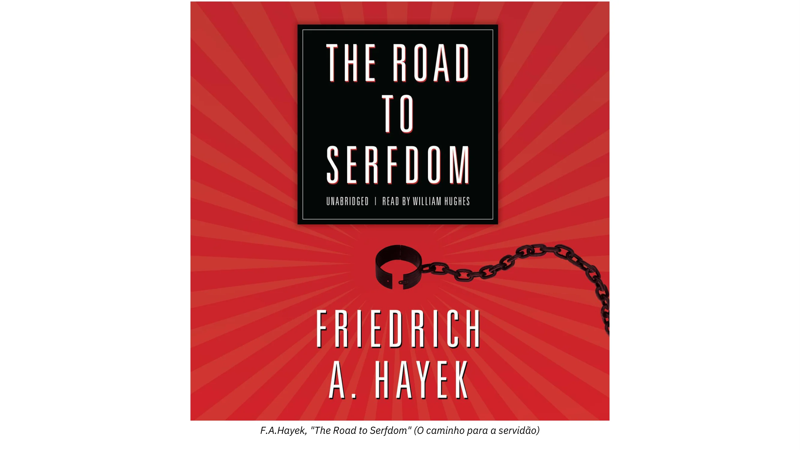

Por último, é de notar que este mecanismo finalista é também bem ilustrado na forma como os detractores do Bitcoin expressam as suas críticas, concentrando-se precisamente nos seus efeitos.

Porque, embora alguns dos efeitos da Bitcoin possam certamente ser criticados, devido ao viés cognitivo associado ao facto de se tratar de uma tecnologia nova e disruptiva, temos uma forte propensão para ver apenas os efeitos negativos. Especialmente se a realidade não corresponder aos nossos desejos, por exemplo, se formos religiosos quando confrontados com uma revolução copernicana como o spinozismo, ou se formos um banqueiro central quando confrontados com um conceito de moeda digital descentralizada.

No entanto, é evidente que, se um religioso ou um banqueiro central mostrar compreensão, curiosidade e boa vontade, e se se interessar por um conceito, procurando primeiro compreendê-lo em vez de julgar os seus efeitos para fazer corresponder a sua opinião às suas expectativas, poderá certamente aderir a ele.

Obrigado pela vossa atenção e vemo-nos no próximo capítulo.

## A ilusão teológica

<chapterId>93554156-5e62-526d-9b71-49c47be916af</chapterId>

:::video id=9c490cc1-3d29-4ca7-9464-1a701bb91ba7:::

Neste último capítulo sobre a nova visão copernicana das ideias oferecida pelo spinozismo, voltamo-nos finalmente para a terceira ilusão apresentada por Spinoza (1632-1677) na sua obra, a Ética.

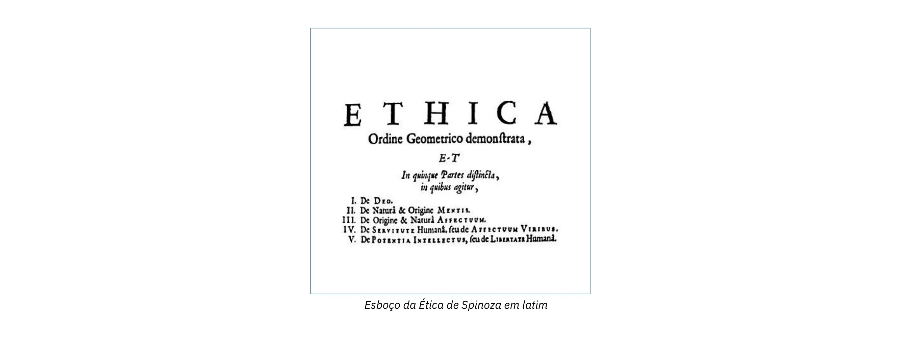

Esta ilusão está diretamente ligada às duas primeiras, a ilusão do livre arbítrio e a ilusão da finalidade.

Trata-se de uma ilusão teológica.

A questão é esta: Enquanto o homem for ignorante, "tanto das coisas como de si mesmo", como nos diz Spinoza, enquanto acreditar na sua liberdade ilusória, tomará a sua imaginação por entendimento, isto é, considerar-se-á sempre capaz de pensar e de compreender a natureza das coisas, quando na realidade apenas imagina, inventa e projecta o que lhe é útil. De acordo com os seus desejos.

É por isso que os humanos acreditam que se os meios naturais existem e são úteis, como os dentes para comer ou os olhos para ver, é porque foram logicamente criados por um "diretor da natureza". Por outras palavras, um Deus intencional, antropomórfico, a quem são atribuídas as intenções humanas.

Por outras palavras, um velho de barbas brancas escondido atrás de uma nuvem, a quem se atribui a criação de todas as coisas na natureza como um meio para o nosso fim, porque nos ama e nos protege quando o honramos e adoramos.

Esta é a primeira fase da ilusão teológica.

Mas apesar do nosso orgulho em acreditar que estamos acima da Natureza e em imaginar que podemos começar algo do nada, na realidade estamos sempre sujeitos a condições de existência que indicam que, no final, não conseguiremos "escapar", como disse o professor de filosofia Gilles Deleuze (1925-1995). Somos mortais, como todos os animais, mas sabemo-lo.

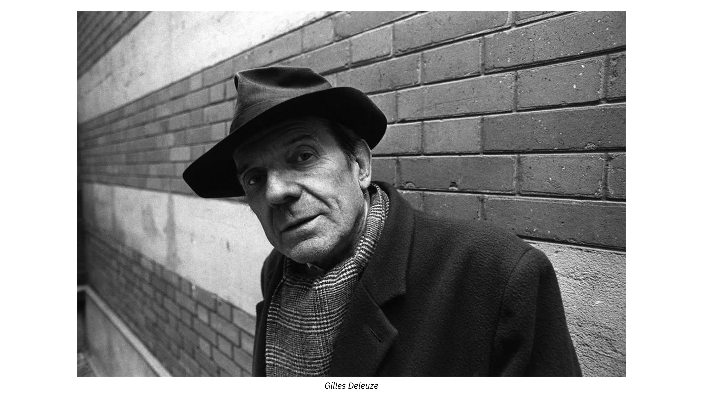

Acreditar ou imaginar o contrário para nos tranquilizarmos é a razão pela qual estamos perpetuamente a oscilar entre o medo e a esperança, como dois pólos opostos e inseparáveis entre um sentimento de segurança e um sentimento de pânico, uma vez que o medo está sempre ligado à esperança de dias melhores.

Que não há medo sem esperança, nem esperança sem medo, e que quem teme espera sempre escapar ao que teme, enquanto quem espera teme sempre que o que espera não aconteça.

E como "estamos dispostos a acreditar facilmente naquilo que esperamos", diz Spinoza na sua Ética, é quando nos deparamos com causas ou acontecimentos exteriores que nos seriam prejudiciais, contrários a qualquer ideia de utilidade, que se manifesta a segunda fase da chamada ilusão teológica, caracterizada por crenças das quais surge o sentimento supersticioso.

Por outras palavras, "os infames", segundo Voltaire (1694-1778), para quem a superstição nunca nasce da razão e corresponde sempre a uma crença irracional ou infundada, oposta a qualquer forma de racionalidade ao atribuir a objectos ou acções poderes ou potência espiritual que não têm.

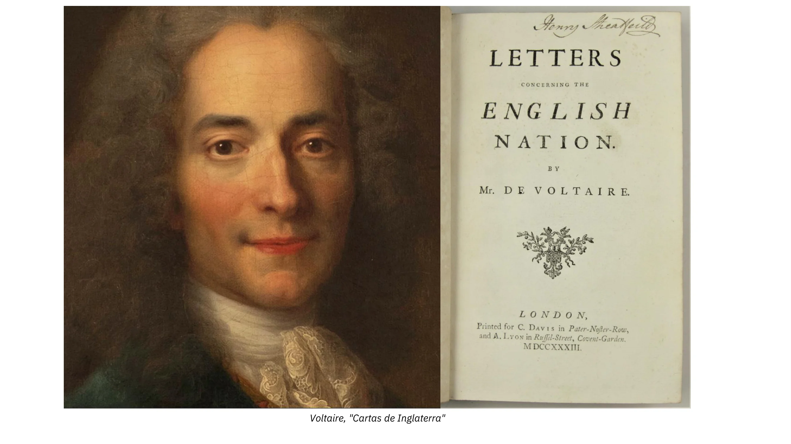

Sob o pretexto de nos aliviar, de nos permitir imaginar um mundo melhor, a superstição prende-nos, na verdade, às nossas próprias ilusões e mentiras. Em servidões das quais teremos um tempo Hard para nos libertarmos.

É o que defendem os iluministas alemães, ingleses e franceses, a partir do século XVIII, afirmando que a superstição simplesmente impede o homem de se tornar adulto, não só por limitar o exercício da razão, mas também, e sobretudo, por dar origem à intolerância, que é o melhor instrumento para estabelecer o domínio de um poder. Seja ele político ou religioso.

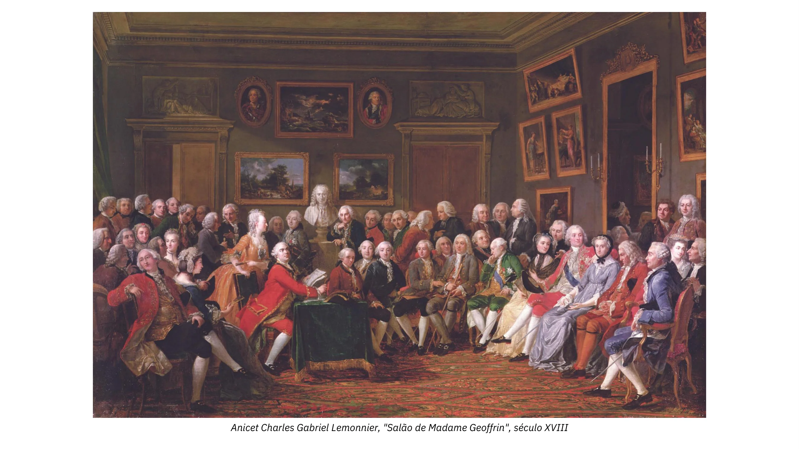

E é isso que Spinoza volta a demonstrar no seu Tratado Teológico-Político, que já abordámos. Neste ensaio, escreve que "o grande segredo do regime monárquico, e o seu maior interesse, é enganar os povos, e disfarçar com o nome de religião o medo que os deve dominar". É por isso que os tiranos, os ditadores ou os revolucionários, que são sempre pessoas movidas pelo desejo de fazer o bem aos outros, caem muitas vezes, se não sempre, na armadilha de fazer o contrário dos seus princípios para os alcançar.

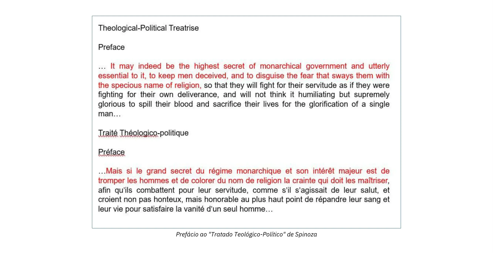

Mas a novidade que Spinoza traz ao TTP, e que faz dele, de certa forma, o pai do laicismo, é considerar que, embora seja essencial combater a superstição e o apelo à violência que a liberdade paradoxalmente permite, o facto é que é do interesse do Estado proteger o direito de acreditar e a liberdade de pensar.

Com efeito, a partir do momento em que as ideias existem e se exprimem de forma privada, espalham-se inevitavelmente pela sociedade, e nem a proibição nem a censura podem jamais impedir a sua difusão. As ideias, verdadeiras ou falsas, boas ou más, circularão em qualquer caso, e proibi-las só pode conduzir, a longo prazo, à revolta e ao derrube do Estado em nome da liberdade.

Por outras palavras, o Estado teria, de facto, muito mais a temer com a censura ou supressão da liberdade de expressão do que com a sua manutenção, pelo que, diz Spinoza, é do seu interesse deixar que os indivíduos exerçam o seu direito natural de pensar e de se exprimir.

Para Spinoza, um Estado democrático que permita a liberdade de pensamento é, portanto, a melhor garantia de que as pessoas viverão em paz e que, graças ao exercício da razão, não só serão livres de pensar e agir, mas também serão capazes de compreender as servidões que as constrangem para se libertarem delas.

# Da teoria dos afectos ao Bitcoin

<partId>82e69d4f-a94f-5978-bcb8-8a7b4651bcca</partId>

## A questão do mal em Spinoza

<chapterId>1ce64576-2688-5757-a119-57cc3a1076c0</chapterId>

:::video id=9c490cc1-3d29-4ca7-9464-1a701bb91ba7:::

Gostaria agora de discutir a questão do mal, tal como Spinoza (1632-1677) a apresenta nas suas obras e correspondência.

Mas atenção, este é um tema complexo e controverso, e o objetivo aqui é simplesmente compreender, mais uma vez, o seu modo de pensar para entender melhor o que o guia, ou seja, a busca da liberdade.

Como vimos, não acreditar no livre arbítrio ou em qualquer tipo de finalismo na natureza levanta rapidamente o problema da existência do mal na nossa vida quotidiana.

Por outras palavras, a questão é saber se o "mal" existe na natureza e se os seres humanos são responsáveis pelos danos que causam.

Os filósofos antigos acreditavam que o mal não existia na natureza, e Sócrates (470-399 a.C.), por exemplo, ensinava que "o mal não é nada". Segundo ele, uma pessoa má não era má por natureza e, de certa forma, estava simplesmente enganada quanto à natureza do bem.

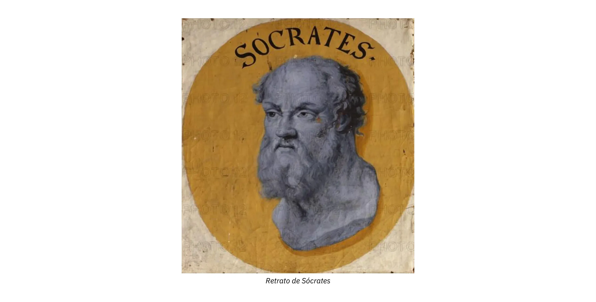

Mas a tradição escolástica, nomeadamente a de Santo Agostinho (354-430), que ainda hoje influencia a moral cristã, defendia que o mal não só existe, que é uma realidade, mas que pode ser explicado porque as pessoas são livres, porque são capazes de escolher entre o bem e o mal, e que o mal que causam é, portanto, da sua inteira responsabilidade.

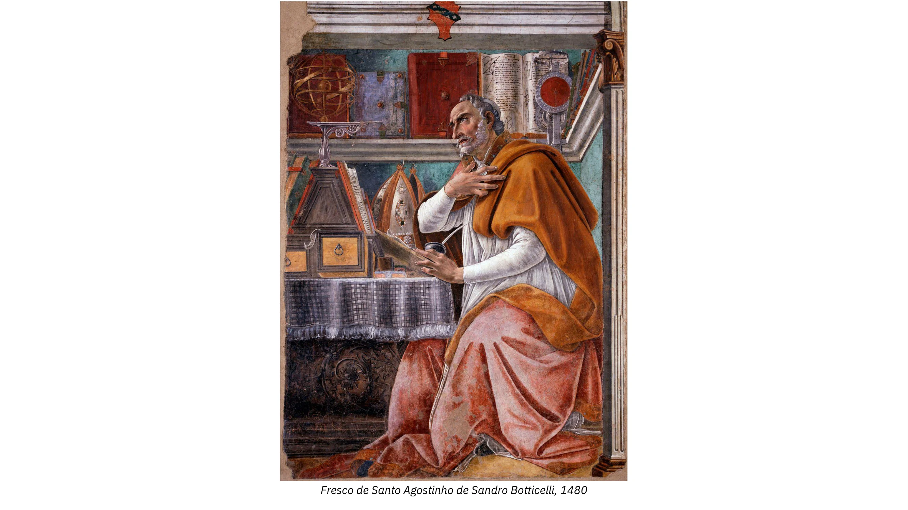

E mesmo que a responsabilidade pelos danos causados por um terramoto, por um vírus mortal ou pelo facto de uma criança nascer cega não deva ser atribuída às pessoas, esta forma de pensar persiste ao atribuir à natureza uma intenção moral que a torna responsável. Por exemplo, ao considerar que, se ocorreu um terramoto, foi precisamente porque as pessoas se comportaram mal.

Esta é a ideia defendida pelos religiosos de que os seres humanos nascem pecadores, culpados do pecado original.

É claro que, como se pode imaginar, esta ideia é desfeita por Spinoza, que considera que, uma vez que a Natureza, ou Deus ou a fortuna, como ele diz, não é dotada de intenção, e uma vez que os homens não têm livre arbítrio, a responsabilidade pelo "mal" que lhes é atribuída é completamente ilusória.

"Nada acontece na natureza que possa ser atribuído a um vício que nela exista", escreve Spinoza na Ética e, segundo ele, estaríamos portanto errados se considerássemos, por exemplo, a cegueira de um recém-nascido como "má", uma vez que, ao nascer cego, o bebé não está mais privado de visão do que uma pedra.

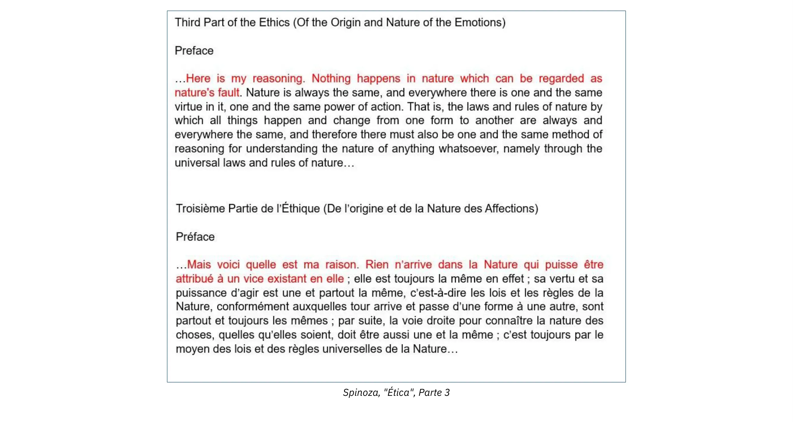

E se pensarmos que aos cegos falta a visão, é apenas do ponto de vista de quem vê.

Spinoza retoma assim a ideia de que o mal não existe na natureza, mas a sua originalidade, que faz dela uma filosofia revolucionária, é considerar que o mal não existe e o "bem" também não.

E é por isso que ele fala de ética e não de moral, não reflectindo sobre o que é certo ou errado, uma vez que tudo isso são noções relativas e subjectivas, mas sim em termos do que é "bom" ou "mau" para a nossa necessidade natural de "perseverar no nosso ser", diz ele. Por outras palavras, viver e crescer. Para florescer como seres humanos.

Além disso, já vimos que a visão de Spinoza sobre a responsabilidade das pessoas que se comportam mal, cometendo um crime, não tem claramente o objetivo de as desculpar.  Pois as pessoas, mesmo que não conheçam as verdadeiras causas que as levam a cometer um crime, têm sempre consciência do que estão a fazer e são, por isso, responsáveis perante a moral e o Direito.

É evidente que as acções de um criminoso estão sempre ligadas a um determinismo familiar, social, económico ou mesmo médico, se os seus crimes puderem ser explicados por uma condição física ou mental. E é este o papel da justiça, que ultrapassa o direito penal para ter em conta o facto de que certos crimes devem não só ser punidos, mas também tratados, tendo em conta o contexto familiar, social e psicológico do delinquente.

É por isso que o spinozista Gilles Deleuze (1925-1995) explica que a ética é uma espécie de etologia, ou seja, uma ciência prática dos modos de ser, ou, como ele diz, "a arte de fazer bons encontros".

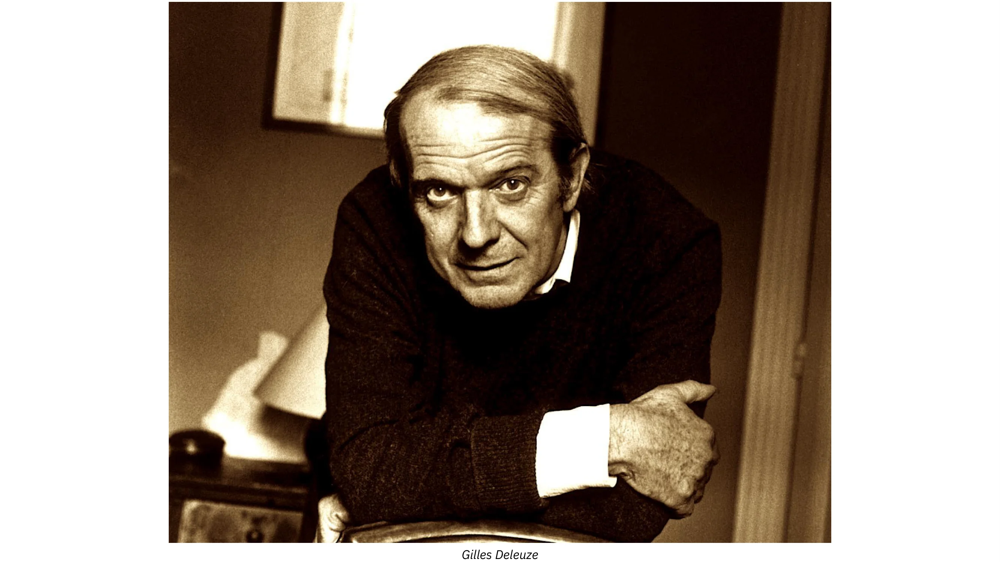

Por outras palavras, a liberdade, segundo Spinoza, consiste em orientar a nossa existência para aquilo que "aumenta a nossa potência de agir" e, olhando sempre com otimismo para o futuro, ver o mundo tal como ele é e não imaginá-lo como gostaríamos de o ver.

E é aí que reside o génio da demonstração de Spinoza, que luta contra os médicos da ignorância e contra todos aqueles que afirmam que é bom ser ignorante.

Pelo contrário, Spinoza estuda as paixões humanas, mesmo as mais irracionais, o desgosto, a loucura, a tristeza ou a melancolia, à maneira dos geómetras, "mais geométrico", como se estudam os pontos, as linhas, as superfícies e os volumes.

É esta a teoria dos afectos que ele desenvolve na terceira parte da sua Ética, e que vos sugiro que estudem agora.

Obrigado pela vossa atenção.

## Teoria dos afectos

<chapterId>3bb011ce-6f0c-51a6-b41f-25a3b5b7768e</chapterId>

:::video id=bb427cc6-e54d-4b44-bd6d-281ba421001a:::

Segundo Spinoza, a liberdade é um conceito a ser descoberto, um caminho para uma vida melhor e mais poderosa. Uma vida mais livre. Um caminho que nos obriga a reconhecer o determinismo absoluto e a causalidade racional das coisas.

Ele desenvolve o seu sistema na terceira parte da Ética. É a famosa "teoria dos afectos".

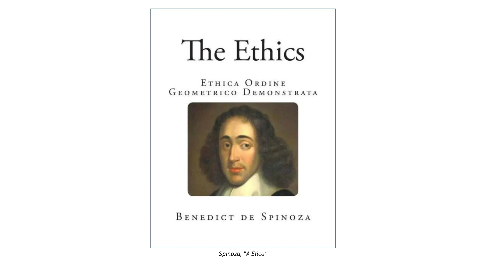

O princípio é que os afectos humanos são, diz Spinoza, modificações activas ou passivas do corpo e do pensamento que influenciam o nosso poder de agir, ou seja, o nosso comportamento.

E, no entanto, dependendo dos afectos próprios da natureza humana e dos derivados do mundo exterior, somos perfeitamente capazes de formar ideias verdadeiras, de raciocinar e de exprimir alegria.

Mas também somos capazes de formar os chamados afectos passivos, preconceitos que nos levam mecanicamente, "apesar de nós próprios", a deixar de ver ou fazer o que o nosso próprio interesse exige.

Falamos de escravatura, ou servidão, um estado caracterizado pela incapacidade de controlar e contrariar os afectos passivos que por vezes nos levam a querer o que não queremos e a fazer o que não queremos.

É o que diz Spinoza na sua Ética, quando se surpreende com o facto de "as pessoas verem muitas vezes o melhor, aprovarem-no e fazerem o pior", ou de "lutarem pela sua servidão como se lutassem pela sua salvação".

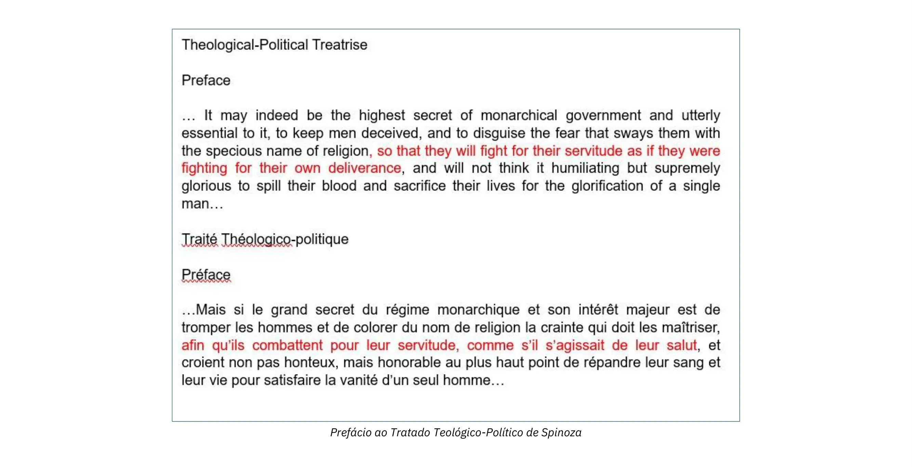

Spinoza toma o exemplo do ódio, que vê como um afeto passivo, voltado para a tristeza e nascido de ideias inadequadas, ou seja, de um conhecimento parcial das causas, e que define como "uma tristeza que está associada à ideia de uma causa externa".

Por outras palavras, se odiamos um estrangeiro, é porque associamos esse estrangeiro à ideia que temos dele, por razões que não compreendemos, uma vez que ele é estrangeiro e diferente por natureza. É esta ideia de uma causa externa - uma ideia que, de resto, motiva sempre mecanicamente os ignorantes a dizer mal de um conceito que não conhecem.

Isto é particularmente verdade, aliás, no domínio das moedas criptográficas.

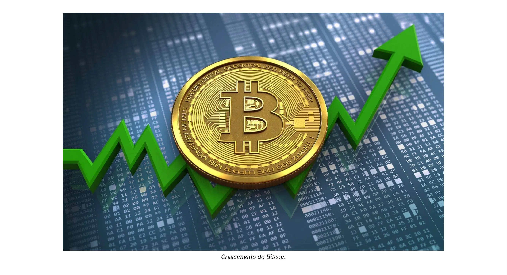

Spinoza diz que se eliminarmos esta ideia negativa de uma causa externa, não pela moralidade, mas pela educação, pela empatia, pela razão, nomeadamente concentrando-nos, neste caso, nas qualidades deste estranho, ou no caso de Bitcoin, no seu aspeto prático ou utilidade, então o sentimento de tristeza associado desaparece e, automaticamente, o ódio também.

Vale a pena lembrar que esta forma de pensar também se aplica, naturalmente, aos afectos activos, e em particular ao amor, que é, segundo Spinoza, "uma alegria associada à ideia de uma causa externa". E se, por exemplo, a causa externa do amor por uma coisa ou uma pessoa desaparecer ou mudar com o tempo, a alegria a ela associada pode também desaparecer, extinguindo o sentimento de amor. Isto, quando não o compreendemos, pode tornar-nos infelizes e deprimidos.

Mas se esta chamada teoria dos afectos se aplica ao nosso "inconsciente", esta forma racional de pensar "à maneira dos agrimensores" aplica-se também à luta contra todas as formas de servidão externa, sejam elas religiosas, políticas ou resultantes de fenómenos naturais.

É o exemplo do relâmpago. Porque quando um raio atinge e mata pessoas inocentes, os ignorantes tenderão a vê-lo como a mão de Deus, a considerar que o raio exprime uma intenção moral e finalística. A sida nos anos 90 ou mesmo, mais recentemente, a covid foram interpretadas por alguns como um castigo divino.

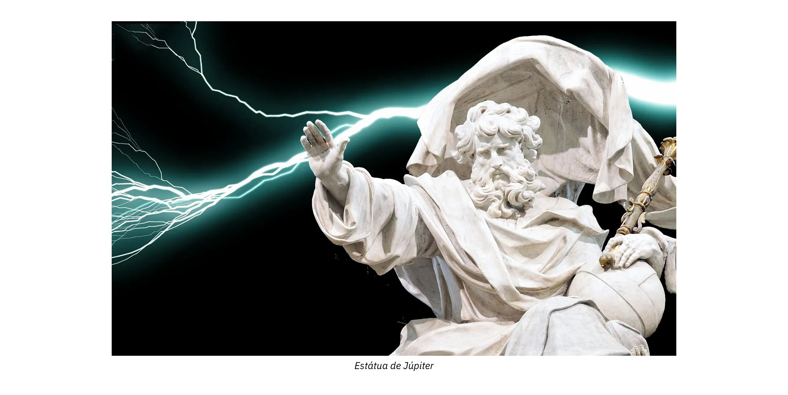

Para Spinoza, evidentemente, todas estas ideias teleológicas não passam de superstições, sinónimos de ignorância, na medida em que, neste exemplo, o raio que cai não faz nada, diz ele, senão exprimir a essência da sua própria natureza. Que é a de cair. Sem, evidentemente, qualquer intenção moral de punir ou recompensar alguém.

Graças a este simples exemplo, compreendemos que a única solução para nos protegermos dos raios - ou seja, para nos libertarmos da servidão que o seu perigo sempre nos impôs - não é queixarmo-nos da nossa má sorte ou de uma suposta injustiça divina, nem tão pouco apresentar o mínimo argumento moral. Não, trata-se, também aqui, como no caso do ódio, de refletir sobre o que podemos fazer do ponto de vista ético.

E, neste caso, seria protegermo-nos dos raios sendo racionais, abertos ao progresso, curiosos e confiantes no que a ciência nos pode oferecer e, porque não, instalar um para-raios.

É este o génio da Ética. Spinoza mostra-nos que é possível passar de uma servidão voluntária, de um "apesar de nós próprios" e de uma vida de cata-vento de perpétua alienação, para uma vida vivida através do conhecimento dos afectos e das determinações.

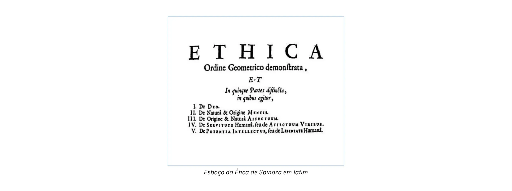

É uma forma de pensar que nos permite dissecar a natureza humana para ver o lado positivo ou a verdade das coisas. Para eliminar os motivos de tristeza e de medo que nos pesam. Ser livre, ou seja, ser capaz de deixar de obedecer às paixões tristes e mudar o nosso comportamento.

E compreender, provavelmente pela primeira vez na história da filosofia, que se pode ser lúcido e feliz.

E é por isso que o spinozismo é muitas vezes referido como "a filosofia da alegria".

## A liberdade, a escola austríaca de economia e a filosofia Cypherpunk

<chapterId>b54f2532-460c-11f0-a248-93ff24ef1d57</chapterId>

:::video id=5f49d5b4-e15f-475b-b40d-07464c08ca4d:::

Como sabem agora, a liberdade, segundo Spinoza, é a consciência do nosso determinismo. Sob a orientação da razão, e graças à nossa capacidade de agir, podemos compreender o mecanismo causal das servidões, de modo a podermos lutar contra elas, deixar de as sofrer e deixar de agir contra os nossos próprios interesses.

No fim de contas, esta lucidez significa deixar de viver no niilismo descrito mais tarde por Friedrich Nietzsche (1844-1900), para quem os homens se perdem em ideais ideológicos, isto é, ficções políticas ou religiosas, por causa das quais negam a realidade, se infantilizam e se tornam infelizes.

Foi precisamente o que fez a filosofia racional do Iluminismo, graças, em particular, a Immanuel Kant (1724-1804), para quem só um indivíduo instruído, sob a orientação da razão, pode pensar por si próprio e determinar, eticamente, o que é "verdadeiro" ou "bom" e o que é tóxico.

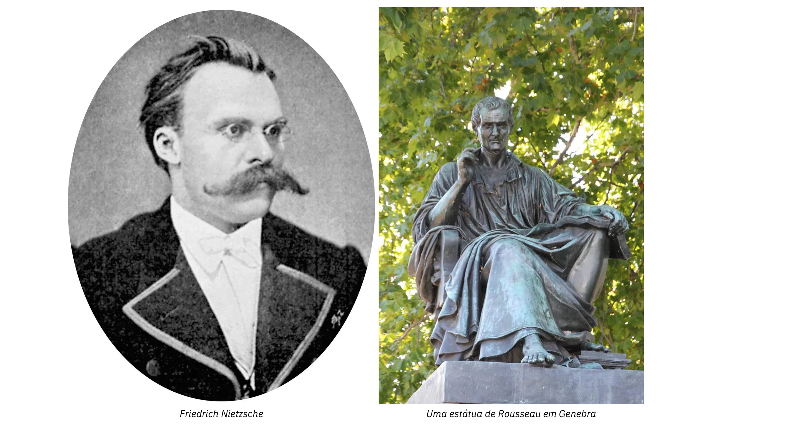

Por outras palavras, diz ele, se pensarmos por nós próprios, se raciocinarmos como adultos racionais e se, por conseguinte, nos esforçarmos por nos ligarmos aos nexos de causalidade entre as coisas, deixaremos de precisar de uma autoridade moral para nos ensinar, por exemplo, as verdadeiras virtudes da religião ou os verdadeiros valores éticos nos domínios político e económico.

É uma linha de raciocínio que faz a ligação com a escola austríaca de economia liberal, nascida no ambiente intelectual extremamente fértil de Viena antes da Primeira Guerra Mundial. Pois foi nesse contexto que intelectuais como Carl Menger (1840-1921), Ludwig von Mises (1883-1979) e Friedrich Hayek (1899-1992) lançaram as bases de uma nova escola de economia liberal, que viria a ser o alicerce das convicções dos futuros cypherpunks. E daí a criação da Bitcoin.

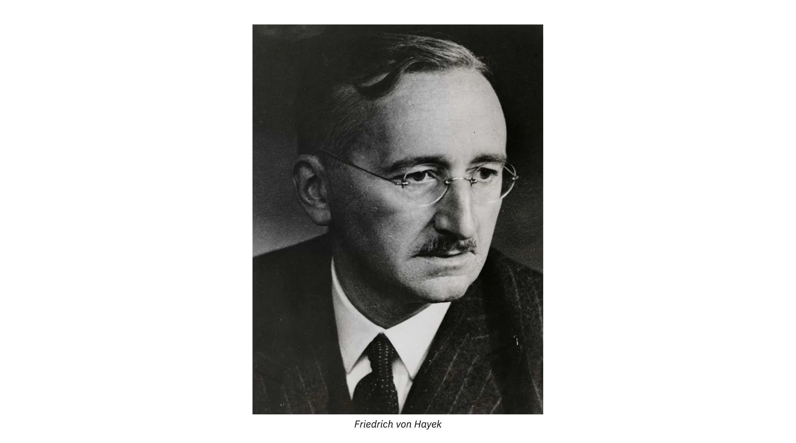

Menger e Mises estabeleceram, por exemplo, que todo o conhecimento deve ser construído de acordo com o nexo de causalidade entre as coisas, propondo assim uma nova conceção causal da economia. Inspirados, em particular, pelo espírito liberal desenvolvido alguns anos antes pelo economista francês Frédéric Bastiat (1801-1850).

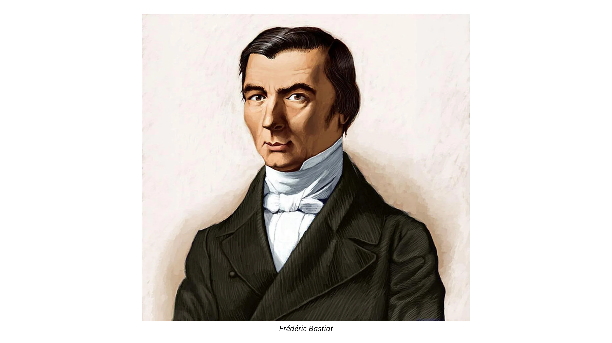

Hayek, por outro lado, considera que todas as decisões económicas expressam sempre uma forma de incerteza e de ignorância, e que o facto de não sofrermos dela por causa da moral, das crenças, dos preconceitos ou das ideologias políticas, permite analisar corretamente o comportamento económico e, por extensão, considerar o que é bom para os indivíduos, para a sociedade e para o Estado.

Foi assim que estes economistas liberais austríacos criticaram firmemente todas as ideias socialistas - Hayek falava de "planismo" - e todas as políticas morais nelas inspiradas, que, na sua opinião, só conduziam à ruína. A atribuição do poder económico aos governos, inevitavelmente atrasados e desfasados do que se deve e não deve fazer, estava condenada ao fracasso.

Por exemplo, os austríacos consideram que, quando um Estado concede a si próprio, por coerção, o poder de criar dinheiro para gerir a economia e resolver crises, corre o risco de nunca conseguir abster-se de abusar desse poder.

Porquê? Porque se encontra sempre numa forma de servidão que o impede de o fazer e que o empurra, como diria Spinoza, "a ver o melhor, a aprová-lo... mas a fazer o pior".

Como spinozista, Hayek explica num vídeo que "uma vez que este poder não pode ser retirado sem violência, tudo o que se pode fazer é usar um truque e introduzir um novo conceito de dinheiro que os governos já não podem impedir". Um argumento que Milton Friedman (1912-2006) retoma numa entrevista, na qual, por sua vez, discute esta nova forma de moeda digital no contexto da Internet nascente.

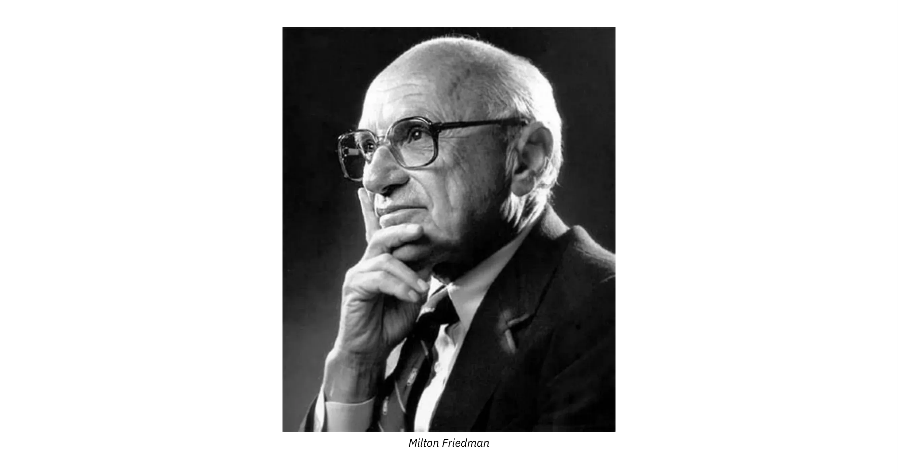

São estes os argumentos políticos e económicos apresentados pelos primeiros cypherpunks, Eric Hughes (1953-), no seu "manifesto Cypherpunk", ou Timothy May (1951-2018) no seu "manifesto cripto-anarquista", e que Satoshi Nakamoto retomará.

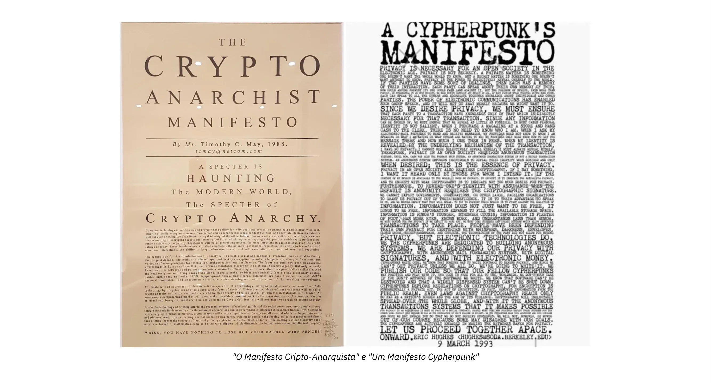

Sobretudo quando inscreveu a manchete do Times de 3 de janeiro de 2009 na base de moedas do bloco Genesis do Blockchain Bitcoin, para ilustrar o fim de uma era, keynesiana, e o início de outra, com aspirações liberais, anarquistas e libertárias.

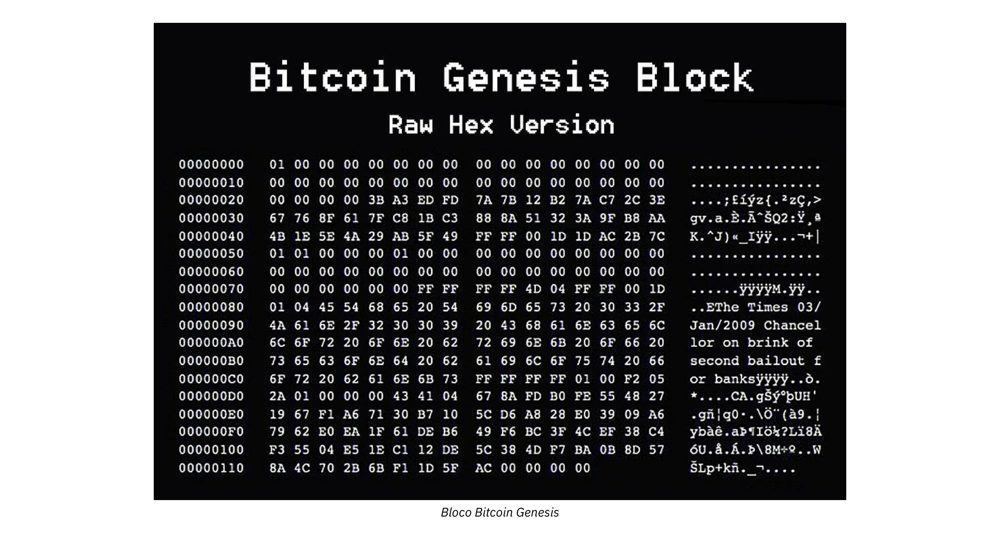

O Livro Branco publicado em 31 de outubro de 2008 apresenta a Bitcoin como um meio de troca de valor na Internet sem um terceiro de confiança, baseado num protocolo descentralizado. Uma revolução "copernicana" que permitirá finalmente que as pessoas recuperem a sua capacidade de ação, ou seja, a sua liberdade, a sua liberdade de comércio, o seu direito de propriedade e o respeito pela sua privacidade.

Porquê? Porque Bitcoin permite-nos libertarmo-nos desta servidão à maneira de Spinoza, graças à razão, graças à linguagem matemática de Galileu. E, como sugere Hayek, sem que o Estado possa opor-se a isso. E pacificamente, sem coação nem proselitismo.

De facto, este é o último paralelo que traço entre o spinozismo e Bitcoin, para mostrar que não vale a pena convencer quem não subscreve um conceito copernicano ou disruptivo a não ser através da razão, da compreensão, da curiosidade ou da boa vontade.

Não pela força, não pela violência. Porque o facto é que Copérnico, Galileu, Newton, Darwin, Einstein, Hayek, Spinoza ou Satoshi Nakamoto nunca ameaçaram ninguém que não acreditasse nas suas ideias e demonstrações.

# Secção final

<partId>70a5a3c8-6c88-11f0-8753-db07e26dcaf4</partId>

## Comentários e classificações

<chapterId>7945c38c-6c88-11f0-a73f-0f7cdf99f53f</chapterId>

<isCourseReview>true</isCourseReview>

## Exame final

<chapterId>a557fd32-6c88-11f0-96ff-cfa532cf76a0</chapterId>

<isCourseExam>true</isCourseExam>

## Conclusão

<chapterId>ae04ab38-6c88-11f0-a496-3be47119e6b6</chapterId>

<isCourseConclusion>true</isCourseConclusion>