# Kada je Spinoza sreo Satošija

Otkrijte kako radikalne ideje filozofa iz 17. veka Baruha de Spinoze o slobodi, razumu i moći predviđaju Bitkoinovu decentralizovanu revoluciju. Ovaj kurs otkriva zapanjujuće paralele: oboje odbacuju slepu veru i centralni autoritet, oboje koriste matematičku strogost da oslobode. Spinoza je oslobodio umove od religijske dogme, Bitkoin oslobađa novac od državne kontrole.

Naučite praktične alate iz Spinozine etike da razumete filozofske temelje bitkoina i povećate svoju autonomiju. Spremni ste da istražite dva od najvećih instrumenata ljudske emancipacije u istoriji?
+++
# Uvod

<partId>80b76189-afab-5295-a8d3-ba8f6fe7a5e8</partId>

## Uvod u kurs

<chapterId>99af4992-fd6c-5142-b168-d927b251574b</chapterId>

:::video id=1def60bc-1d39-4e49-9b08-fd05b7a0d49b:::

U ovom kursu, sa zadovoljstvom predstavljam filozofiju Barucha de Spinoze (1632-1677), poznatog filozofa 17. veka koji se smatra ocem racionalne filozofije prosvetiteljstva.

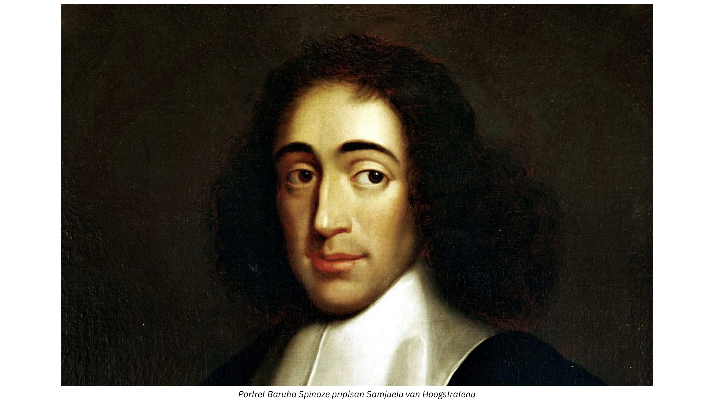

Portret Spinoze

Ovi kursevi su zasnovani na moja dva eseja na tu temu, "Spinozina prava religija" i "Bitcoin, jevanđelje slobode", dostupni u papirnom obliku bilo online ili direktno sa moje veb stranice, i digitalno na Amazon Kindle.

Cilj ovog kursa je, pre svega, da pruži pojednostavljeno razumevanje filozofije koja se često smatra veoma složenom i nepristupačnom, uprkos obnovljenom interesovanju koje danas uživa.

Zaista, ova filozofija nam omogućava ne samo da preispitujemo značenje stvari kada sve krene po zlu, što je generalno ono čime se bave religija, filozofija i humanističke nauke, već takođe, i možda pre svega, da preispitujemo sebe kada sve ide dobro.

Kada nam se život osmehuje i osećamo da ne treba da preispitujemo sebe, smatrajući s ponosom koji se vidi kao iluzoran i ropski da bi naša sreća, ili uspeh, dolazili samo iz našeg talenta, rada ili navodno slobodnih izbora; ukratko, iz naše sopstvene slobodne volje, a ne iz determinizma kojem smo podložni.

Na ovaj način, možemo uspostaviti vezu između ove praktične filozofije slobode - ili, kako Spinoza kaže, "prema sredstvima za njeno postizanje" - i novog tehnološkog sveta koji nas ovde zanima, kripta uopšte i Bitcoin posebno.

A posebno u svom filozofskom aspektu, koji nas navodi da razmišljamo upravo o pojmu slobode: slobode mišljenja, izražavanja, poštovanja privatnosti i, naravno, u našem slučaju, slobode za Exchange.

Prvo, predstaviću vam Spinozu, njegov karakter, društvenu, versku i porodičnu pozadinu, kao i istorijski kontekst Ujedinjenih Provincija u kojima je živeo.

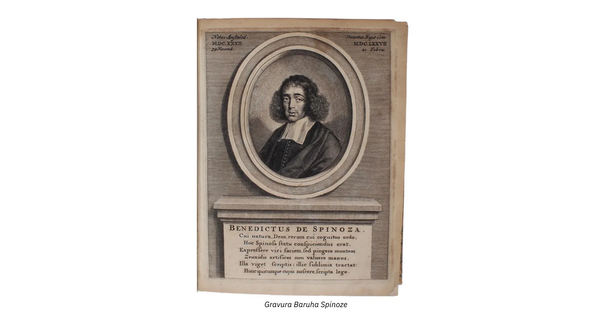

Portret Spinoze

Videćemo onda šta je ova nova racionalna filozofija prema kojoj "ništa ne postoji u prirodi što se ne može objasniti bez upotrebe razuma".

To je ideja da svet i ljudsku prirodu možemo razumeti samo u smislu uzročne veze između stvari, prema kojoj svaki efekat uvek ima uzrok, a taj uzrok je sam po sebi efekat drugog uzroka i tako dalje, sve do prvog uzroka, kojem nemamo pristup i koji je, prema Spinozi, Priroda.

Priroda, drugim rečima Bog, je čuveni "Deus sive Natura" na latinskom koji ilustruje celo značenje Spinozizma.

Takođe ćemo pogledati dva glavna dela Spinoze, počevši od Etike, objavljene posthumno 1677. godine, koja se u potpunosti fokusira na slobodu i potrebu da se oslobodimo ropstva koje nas sputava.

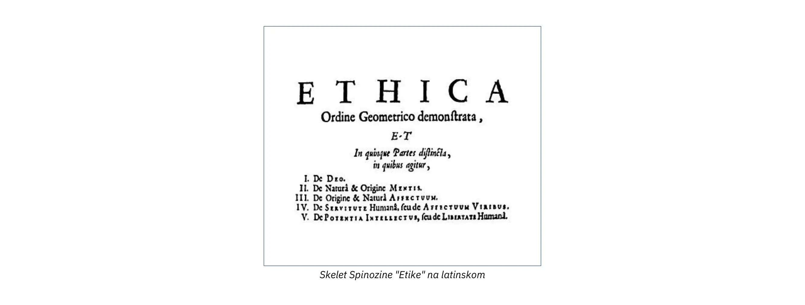

Zatim ćemo pogledati Traité théologico-Politique, objavljen za njegovog života 1670. godine, koji nam omogućava da razmotrimo slobodu iz drugog ugla: slobodu misli i verovanja. Drugim rečima, versku slobodu, ali pre svega političku slobodu.

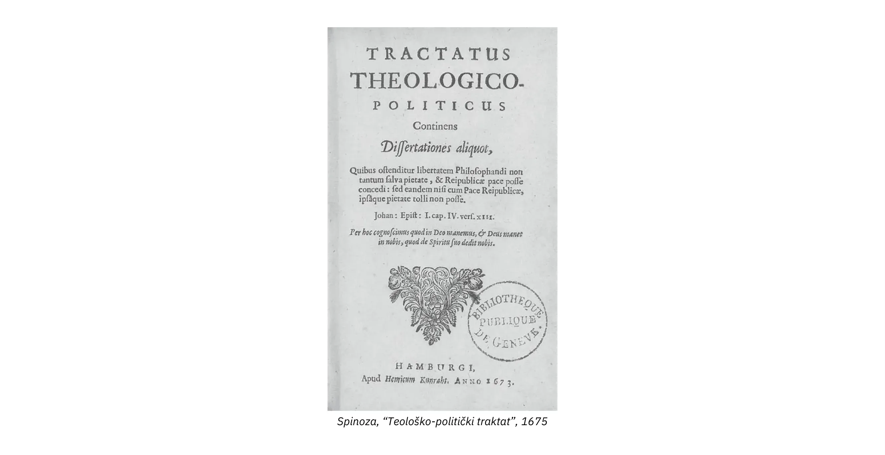

Konačno, videćemo zašto je spinozizam kopernikanska revolucija ideja i kako predstavlja novu definiciju sveta i ljudske prirode, proučavajući 3 fundamentalne iluzije koje je Spinoza osudio: iluziju slobodne volje, iluziju finalnih uzroka ili finalizam, i teološku iluziju.

Zahvaljujući teoriji afekata razvijenoj na način geometara, "more geometrico", konačno ćemo videti kako nam Spinoza nudi praktičnu metodu za oslobađanje, ili pokušaj oslobađanja, od ropstva svojstvenog ljudskoj prirodi i spoljašnjim strastima. Racionalni mehanizam koji, u borbi protiv neznanja, može biti upoređen sa sigurnošću da tri ugla trougla uvek iznose 180°, i omogućava nam da povežemo duh prosvetiteljstva koji je iz toga proizašao sa liberalnim tokovima 19. veka ili libertarijanizmom 20. veka, koji su direktno povezani sa izumom Satoshi Nakamoto, Bitcoin.

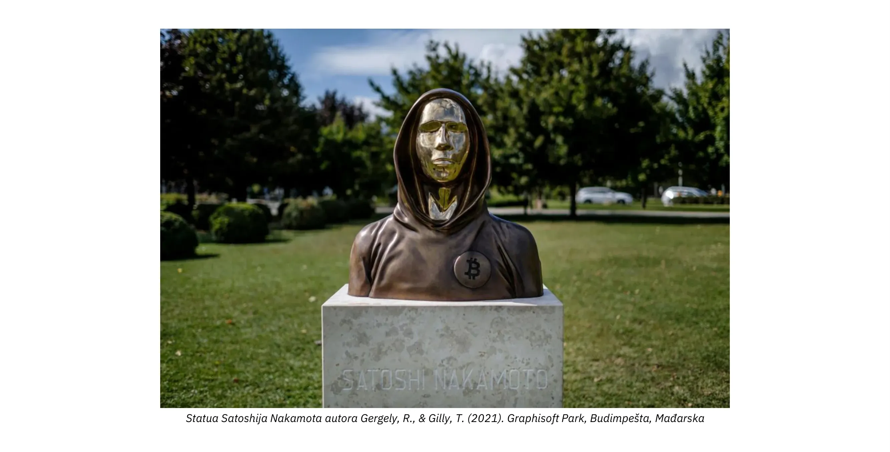

Tada ćemo razumeti da je, među mnogim zajedničkim tačkama između spinozističkih koncepata i ovog alata slobode koji je izumeo Satoshi Nakamoto, prva ta da, u oba slučaja, ako smo radoznali, dobronamerni, kako je tada rečeno, imamo "razumevanje", onda ne možemo a da se ne pridržavamo toga. A ako se ne pridržavamo toga, što bi naravno bilo naše najapsolutnije pravo jer je fundamentalno poštovati slobodu verovanja, ili neverovanja, onda bismo bili odlučni da ne možemo, ili ne želimo, što se svodi na isto.

I tako možemo razumeti da religiozni fundamentalista, na primer, nikada neće moći da prihvati, ili sasluša i najmanju kopernikansku misao kao što je Spinozizam, baš kao što će centralnom bankaru biti veoma teško da prihvati Bitcoin.

Iako, kao što znaš, stvari se trenutno kreću u pravom smeru.

## Predstavljanje Baruh de Spinoza

<chapterId>f53a9cfd-326e-5b73-a766-3ef2f07c5a49</chapterId>

:::video id=5fac3ddc-c472-4c64-8186-46a8f317e389:::

Ko je bio Baruch de Spinoza? Pa, bio je holandski filozof rođen 1632. godine i preminuo 1677. godine u 45. godini života.

Jevrejske vere, bio je član portugalske sefardske zajednice potomaka Marana koji su bili primorani da napuste Španiju od strane katolika u 15. veku, odrastao je u religioznom i intelektualnom okruženju, svestan šta znači biti progonjen.

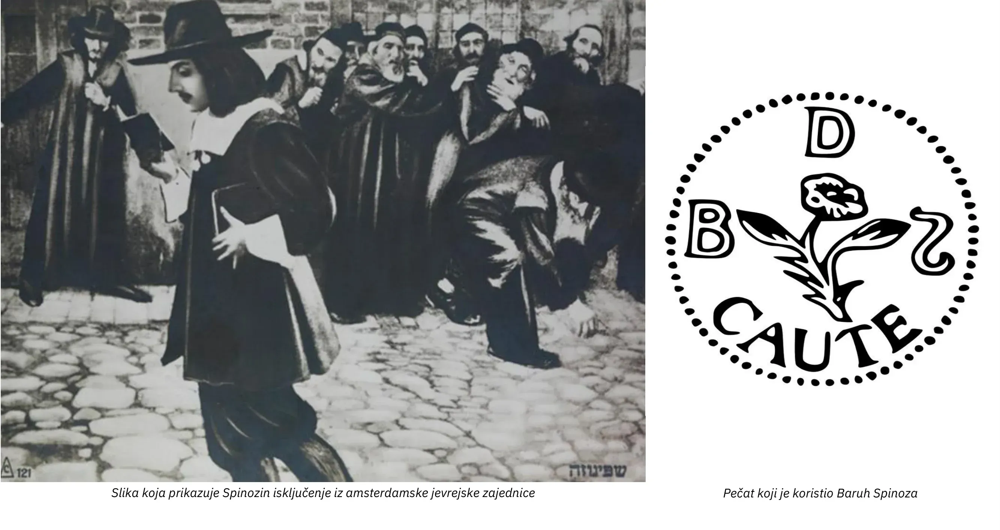

Zapravo, od ranog doba pokazivao je snažan kritički duh prema ustaljenoj religiji, a posebno prema svojoj hebrejskoj zajednici, koja ga je nasilno odbacila 1656. godine, sa samo 24 godine, pre nego što je išta objavio.

Ova "ekskomunikacija", kako se kaže, omogućila mu je da se izoluje i fokusira na svoj rad, ne osvrćući se nikada unazad.

Naslednik, poput svojih savremenika Dekarta (1596-1650), Paskala (1632-1662) i Njutna (1643-1727), novih racionalnih ideja u fizici Kopernika (1473-1543), Keplera (1571-1630) i Galileja (1564-1642), koji su mu prethodili samo nekoliko godina, Spinoza je razvio način razmišljanja u maniru geometara, u skladu sa Galilejevim principom da je matematika jezik univerzuma.

Ali to su bile veoma opasne ideje za to vreme, nakon suđenja monahu i filozofu Đordanu Brunu (1548-1600), koji je spaljen živ zbog jeresi na javnom trgu u Rimu, i suđenja Galileju, kojeg je inkvizicija 1633. godine prisilila da se odrekne svojih kopernikanskih heliocentričnih uverenja.

Zbog toga je njegova strogo racionalna vizija sveta i ljudske prirode, zasnovana na uzročno-posledičnim vezama između stvari, stekla reputaciju da ga smatraju, i još uvek ga danas smatraju, pogrešno, ateistom.

Zapravo, Spinozino delo govori samo o Bogu, koga on poistovećuje sa Prirodom, i dok kritikuje sujeverne impulse religioznih ljudi i teokrata, pokazuje da je prava religija za njega pre svega sinonim za pravdu i milosrđe.

I upravo taj pristup povezuje Spinozu sa filozofijom prosvetiteljstva, bilo nemačkom, sa Lajbnicom (1646-1716), Kantom (1724-1804), Šopenhauerom (1788-1860) i Ničeom (1844-1900), engleskom sa Lokom (1632-1704) ili francuskom sa Volterom (1694-1778), Ruso (1712-1778) i Didroom (1713-1784). Svi su se složili da razum treba koristiti za borbu protiv mračnjaštva, posebno religijskog mračnjaštva, za borbu protiv neznanja i za odbranu ideala slobode i napretka.

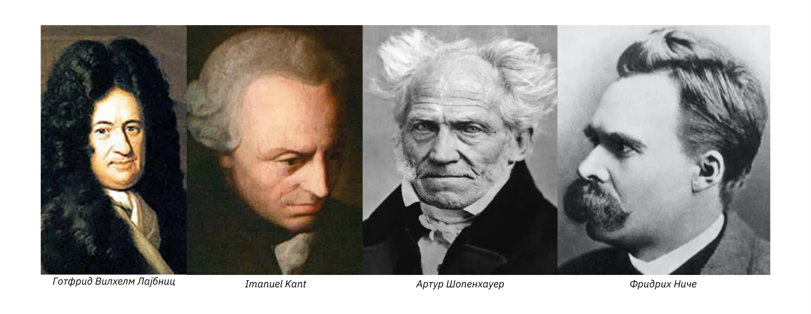

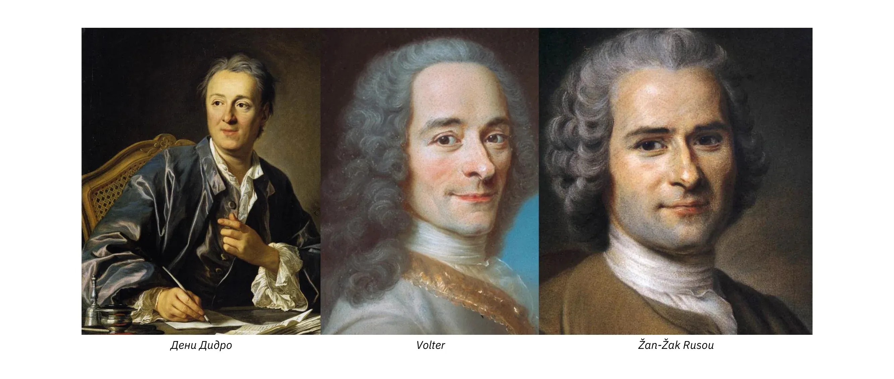

Sada, da bismo počeli povezivati ovu filozofiju sa Bitcoin, važno je napomenuti da je Spinoza rođen u veoma specifičnoj eri.

U 17. veku, Ujedinjene Provincije nisu bile samo najslobodnija zemlja na svetu u pogledu političkih i verskih ideja, već i najbogatija. Drugim rečima, ekonomski i tehnološki najnaprednija zemlja.

Bogatstvo, međutim, nije vezano za prirodne resurse, eksploataciju i pustošenje kolonija ili ropstvo, već za međunarodnu trgovinu i komercijalnu delatnost u liberalnom, preduzetničkom duhu. Duh koji je kasnije zastupao poznati Spinozist, Volter (1694-1778), za koga, u trgovačkoj sobi, poslovni čovek ili preduzetnik liberalnog uverenja nikada ne bi bio isključen, nazvan nevernikom ili ekskomuniciran, rekao je, na osnovu svoje religije ili porekla, već samo ako bi bankrotirao.

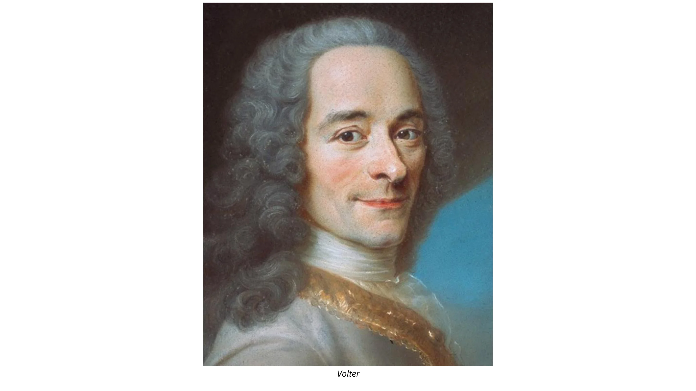

Štaviše, Holandija je u to vreme takođe bila napredna u glavnim tehnološkim oblastima, na primer u oblastima mehanike i optike. Astronomski teleskopi koje je Galileo koristio da pogleda u nebo i otkrije univerzum zaista su se smatrali vrhunskom tehnologijom za njihovu eru, kao što su danas nove tehnologije povezane sa računarstvom, veštačkom inteligencijom i, naravno, kriptovalutama.

A kako je Spinoza sam praktikovao zanat poliranja astronomskih sočiva - ironično za nekoga za koga se kaže da je sve video iskrivljeno - možemo zamisliti da bi sigurno podržao alat slobode kao što je Bitcoin.

Drugim rečima, vrednosti slobode i napretka koje prenosi spinozizam stoje u suprotnosti sa svetom u kojem verski fundamentalizam, teorije zavere, sujeverje i, pre svega, neznanje ostaju tužna stvarnost.

Ipak, to je svet u kojem je svaki način dragocen za bekstvo, za oslobađanje od ropstva koje nas sputava, i za slobodu prihvatanjem sveta onakvim kakav jeste, a ne onakvim kakvim bismo želeli da bude.

Bilo da su ova sredstva filozofska ili tehnološka, kao što ćemo kasnije videti, Bitcoin je alat slobode. To je alat koji omogućava i pojedincima i državama da se oslobode ropstva, posebno monetarnog ropstva.

# Glavna dela, Etika i politika

<partId>d7d7e9a1-005b-519c-b587-137435e46344</partId>

## Etika i potraga za slobodom

<chapterId>4cc66e25-335c-591d-9b78-83e5664bbbbc</chapterId>

:::video id=065c5091-69e1-412f-acce-c763ec31d3b1:::

U ovom poglavlju predlažem da se sada okrenemo Spinozinoj glavnoj knjizi, pod nazivom Etika, objavljenoj posthumno 1677. godine.

Zašto posthumno? Pa, zato što su njegove ideje bile revolucionarne, ili barem kontraintuitivne i disruptivne, i stoga veoma opasne u to vreme, čak i u liberalnom kontekstu Ujedinjenih Provincija 17. veka.

Etika je delo napisano na latinskom jeziku na način geometara, verovatno inspirisano naučnim duhom Galileja (1564-1642), oca, zajedno sa Keplerom (1571-1630), moderne nauke, prema kojem je matematika jezik univerzuma. Spinoza razvija svoje ideje u pet glavnih delova, koristeći teze praćene dokazima, skolijama, aksiomima i definicijama.

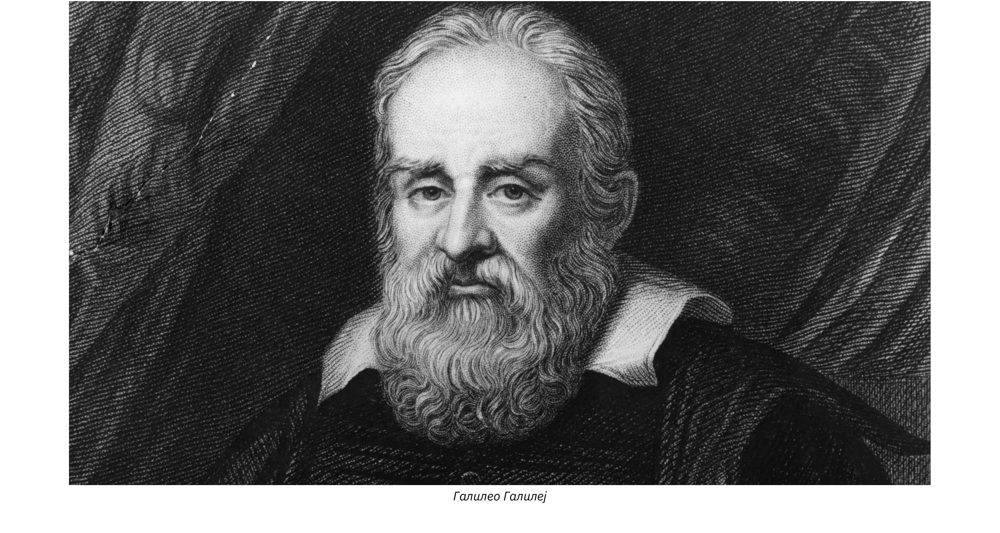

Kao takva, Etika je, prema Spinozinim rečima, "način dolaska do slobode ili putevi koji do nje vode", i nije zaista knjiga koja se može čitati od korice do korice, već ona kroz koju se može raditi čitanjem, na primer, jedne propozicije koja se odnosi na drugu, koja se pak razume kroz treću, i tako dalje, u savršeno koherentnom, racionalnom i logičnom sistemu.

Želeo bih da istaknem da kada otvorite Etiku, preporučuje se da počnete sa pogovorima i dodacima, ovi kratki delovi su napisani od strane Spinoze svakodnevnim jezikom, tako da su laki za razumevanje i, na neki način, predstavljaju sažetak njegovih ponekad složenih misli.

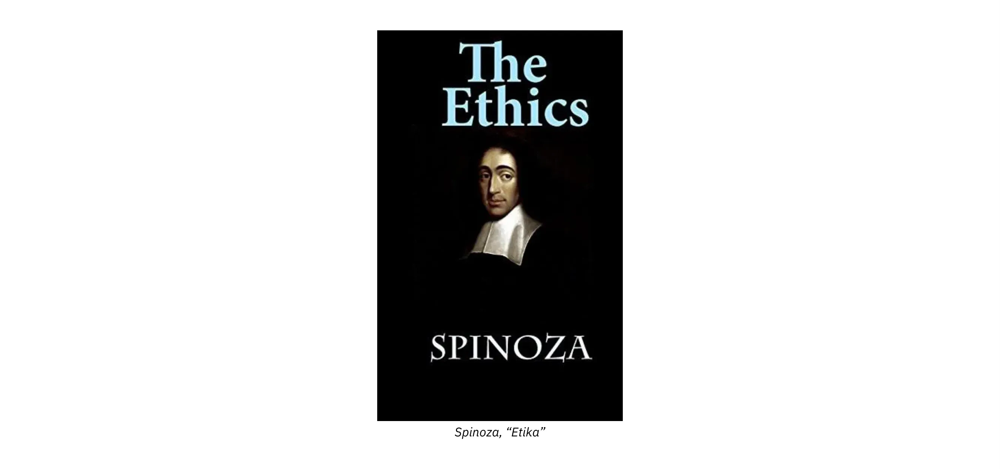

Podvrgavajući svet oko nas "mikroskopu razuma", Spinozino delo secira ljudsku prirodu na principu da ljudsko biće nije samo-uzrokovano, tj. da nismo tražili da budemo rođeni, ni ovde, ni u našem vremenu, niti sa takvim fizičkim ili intelektualnim osobinama.

I kaže da nismo iznad prirode. Nismo izuzeti od njenih zakona, bilo telesnih ili umnih. Drugim rečima, mi smo isto toliko deo prirode kao i bilo koje drugo živo biće, životinjsko ili biljno.

Za Spinozu, sva polja ljudske aktivnosti zavise od sposobnosti razuma da razume svet u savršeno koherentnom i determinisanom sistemu.

Svet u kojem slučajnost ne postoji.

Sve što se dešava je "neophodno" i rezultat je uzroka, prema ideji da "ono što jeste i što se dešava, mora biti i mora se desiti". Ovo je apsolutni determinizam.

Ali postoje dve tačke koje treba imati na umu:

Prvo, ako šansa ne postoji za Spinozu, to je zato što je to događaj čiji uzrok ne znamo. Ali, naravno, kaže on, samo zato što ne znamo uzrok ne znači da on ne postoji.

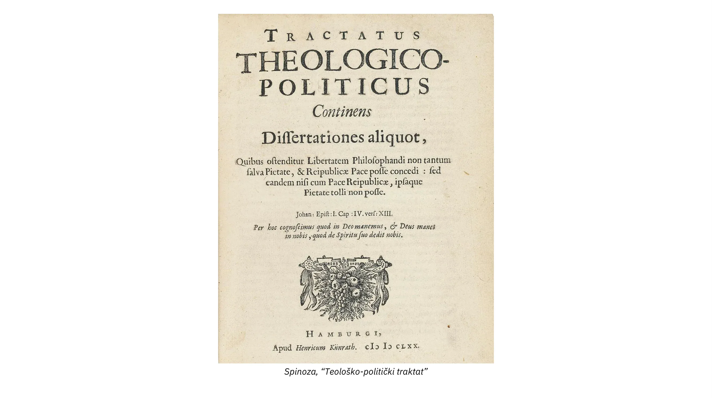

Drugo, apsolutno nema govora o fatalizmu, jer priroda nije obdarena namerom. Munja, na primer, nema nameru da kazni bilo koga, kao što bi se moglo pomisliti u slučaju tragedije. Ne, ona jednostavno izražava suštinu svoje prirode, a to je da udara munjom. Da udara.

Spinoza stoga brani ideju da je stvarnost, tj. svakodnevni život sa dobrim i lošim aspektima, savršeno razumljiva, i da ne postoji fenomen u prirodi koji nije uzročno povezan. Naravno, ovo postavlja pitanje zla, posebno apsolutnog zla, koje ćemo razmotriti malo kasnije.

Konačno, važno je napomenuti da etika nije moral.

Prema Gillesu Deleuzu (1925-1995), poznatom profesoru filozofije i stručnjaku za Spinozu, moral je sistem prosuđivanja koristan za život u društvu. Ali to je subjektivan sistem, jer ono što je ispravno ovde može biti pogrešno negde drugde, a ono što je danas pogrešno može kasnije biti ispravno.

I umesto da određuje šta je ispravno ili pogrešno, etika utvrđuje šta je dobro ili loše za našu sopstvenu prirodu i našu sposobnost, kaže Spinoza, da očuvamo naše biće. Biti slobodan. To je, dakle, prava etologija, to jest, nauka o načinima postojanja, ili, kako Gilles Deleuze dalje objašnjava, umetnost pravljenja dobrih susreta.

Ili umetnost pravljenja pravih izbora kako bismo se oslobodili ropstva koja nas sputavaju i zbog kojih su, prema Spinozi, ljudi često svedeni na to da "vide najbolje, odobre ga, a čine najgore".

Drugim rečima, "boriti se za svoje ropstvo kao da se bore za svoju slobodu".

## Teološko-politički traktat

<chapterId>84b0187e-1050-5d44-a536-80554896e828</chapterId>

:::video id=c1efc97e-1e96-4b37-894c-9a19794d6b52:::

Nakon Etike, voleo bih da vas upoznam sa još jednim značajnim delom u ovom poglavlju koje će vam pomoći da razumete Spinozin filozofski i politički uticaj, posebno na dolazeće prosvetiteljstvo i na liberalne i, u našem slučaju, libertarijanske tokove.

Ovo je Traité théologico-politique, ili TTP, objavljen anonimno 1670. godine.

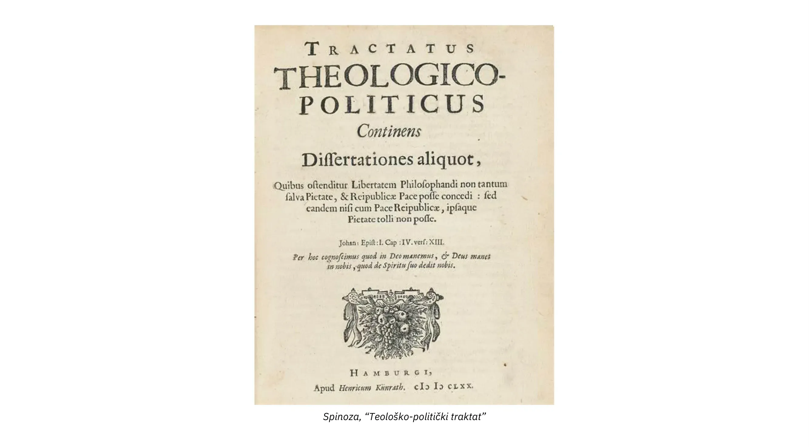

Spinoza (1632-1677) je napisao ovu knjigu dok je prekidao pisanje svoje Etike, u pokušaju da okonča nesporazum koji i danas postoji. To je verovanje da je bio ateista.

Kao što smo videli, Spinozina koncepcija Boga je tema celog prvog dela Etike, u kojem on pokazuje ne samo postojanje boga već i kakva je njegova prava priroda.

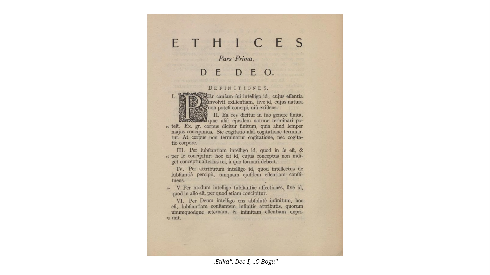

A pošto su Spinozini koncepti generalno prilično teški za shvatanje, često ih je lakše razumeti tako što ćemo reći šta nisu, nego pokušavati reći šta jesu. Pristup koji je, uzgred i kao što ćemo kasnije videti, veoma koristan za razumevanje Bitcoin.

Ovo je način na koji nam Spinoza pokazuje da Bog, prema njegovom mišljenju, nije antropomorfno biće obdareno namerama, koje kažnjava ili nagrađuje, kome bismo govorili i koji bi nas slušao prema ritualu koji možemo ili ne moramo slediti. Drugim rečima, prema njemu, Bog nije starac sa dugom belom bradom skriven iza oblaka koji bi rešavao svetske poteškoće i činio nas zavisnima od njega.

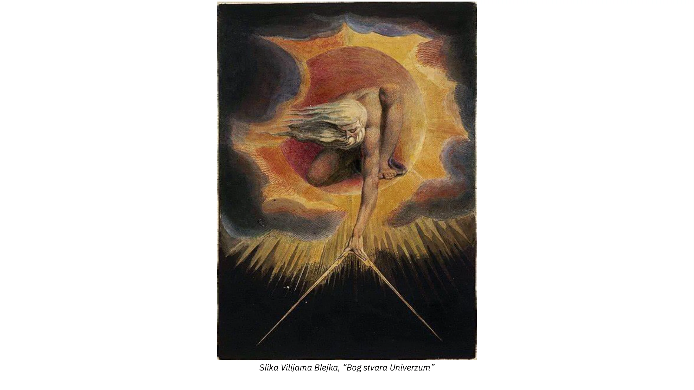

Dakle, govoriti o Bogu znači prizvati Prirodu kao jedinstvenu, beskonačnu i večnu Supstancu, sastavljenu od beskonačnog broja atributa, od kojih mi ljudi poznajemo samo dva: materiju, ili prostiranje, i misao.

Ovo je čuveni "Deus Sive Natura" iz kojeg Spinoza izvodi koncept apsolutnog determinizma i ideju da čovek nije uzrok samog sebe i nije iznad Prirode, i svakako nije iznad životinja.

Ali izvan kritike religije, TTP je pre svega prilika za Spinozu da iznese oštru kritiku religioznih ljudi i teokratije. Drugim rečima, religijska moć neguje strah i sujeverje, i kako on kaže, aktivira tužne strasti pojedinaca kako bi ih bolje porobila, zarobljavajući ih u zabludi, fanatizmu i ratu.

U ovoj primarnoj, infantilnoj fazi religije, vernici se vezuju samo za spoljašnje obožavanje i lakovernu veru zasnovanu na predrasudama. Faza u kojoj religija postaje mehanički netolerantna, udaljava se od granica svog moralnog učenja i okreće se od svoje vokacije da promoviše mir i harmoniju tvrdeći da poseduje istinu.

Međutim, kada se pomerimo dalje od racionalne kritike religije, na primer tumačenjem Biblije, Spinoza želi da nas ubedi da je ova nova vizija Boga potpuno kompatibilna sa porukama pravde i milosrđa tri velike religije Knjige, koje postavljaju jednostavno, ali često zaboravljeno zlatno pravilo: "Voli svog bližnjeg kao samog sebe".

Ali to nije sve.

Ova zrela vizija religije razvijena u TTP-u prati politička dimenzija, potreba za odvajanjem religije i države kako bi se zaštitila sloboda misli i verovanja, u interesu kako svih pojedinaca tako i same države.

U suštini, Spinoza čini slobodu, u okviru razuma, suštinskim uslovom da ljudska bića žive bez da budu porobljena od strane moći koja je suprotstavljena njihovim interesima, i stoga brani direktnu demokratiju zasnovanu na političkoj i verskoj slobodi.

Drugim rečima, sloboda misli i verovanja, kako bi ljudi mogli da se oslobode ropstva i lažnih, infantilizujućih uverenja, da razmišljaju kao odrasli, dajući prioritet razumu i takođe, što se nas tiče, tehnološkom napretku.

Zloglasni zemljotres u Lisabonu 1. novembra 1755. godine pokazao je veliki pomak u načinu na koji su ljudi razmišljali o prirodnim događajima i katastrofama, kao i o tome kako da se zaštite od njih.

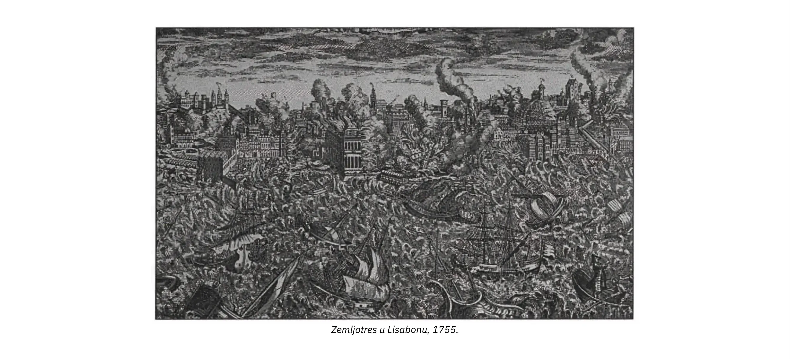

Ovaj strašni zemljotres uništio je grad i ubio stotine hiljada nevinih ljudi, od kojih su mnogi u tom trenutku bili u crkvi, jer je bio Dan svih svetih, što je dodatno povećalo nerazumevanje preživelih.

Drama koja je oživela pitanje koje je postavio nemački filozof i matematičar Lajbnic (1646-1716) o antropomorfnoj viziji Boga obdarenog namerom, dobrotom i svemoći. Jer ako bi Bog bio dobar, kako Lajbnic kaže u svojoj Teodiceji, onda ne bi bio svemoćan, jer bi dopuštao takve katastrofe, a ako bi bio svemoćan, onda ne bi bio dobar, jer ih ne bi mogao sprečiti.

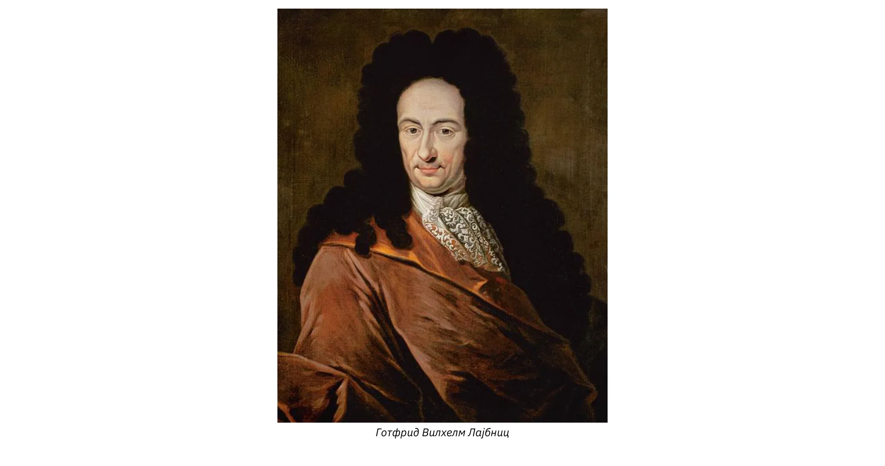

Daleko od toga da proklinje ruku Božju, Žan-Žak Ruso (1712-1778) pisao je Volteru, koji je bio pogođen nepravdom i užasima koje je čovečanstvo diskriminatorno trpelo, da "priroda nije bila zla sama po sebi, i da u njoj ne treba da vidimo božansku ruku koja bi objasnila njen dizajn".

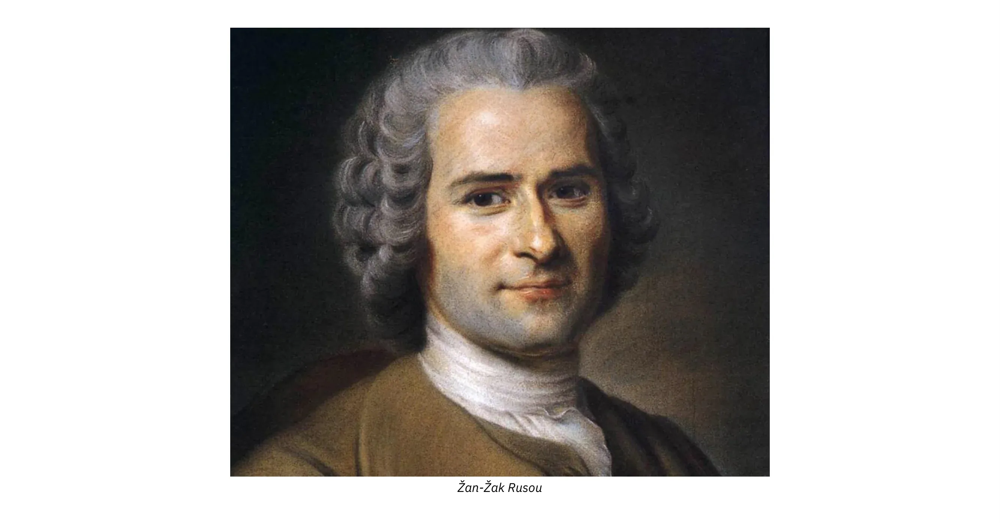

Na što je Voltaire (1694-1778), Spinozist ako je ikada postojao, odgovorio da bi nas ova prirodna katastrofa pre svega trebala navesti da shvatimo da naučna sredstva za zaštitu od prirode zaista postoje, te da je izazov njihovog vremena stoga bio da se zapitaju mogu li ljudi, zahvaljujući znanju i napretku, uzeti svoju budućnost u svoje ruke i osloboditi se teologije i sujeverja.

I dok je, naravno, bilo pitanje ne sprečavanja zemljotresa, koji su i dalje ne samo nepredvidivi već i potpuno nekontrolisani, više je bilo pitanje osiguranja da, na primer, kuće budu izgrađene da ih izdrže.

Zato je prosvetiteljstvo 18. veka, zahvaljujući upotrebi razuma, nauke i tehnologije, vek napretka. Drugim rečima, napredak kao alat slobode.

# Spinozistička revolucija, tri iluzije

<partId>f5d45c2b-28da-527a-ab20-dd255e9a9e0d</partId>

## Nova definicija Prirode i ljudskog bića

<chapterId>3e6599e3-5b29-50a8-a67d-d0386da5d65d</chapterId>

:::video id=b6d2c035-8848-4da6-9da9-be3b70be0f38:::

U ovom poglavlju, želeo bih da pogledam istoriju ideja i vidim zašto se spinozizam smatra pravom kopernikanskom revolucijom ideja.

Zahvaljujući ovom novom načinu razumevanja Boga, odnosno Prirode, koji je ponudila matematika, Spinoza (1632-1670) je uspostavio duboku promenu paradigme, sa indirektnim implikacijama na religijski pogled na svet i mesto čoveka u njemu.

Baš kao što je Nicolas Copernicus (1473-1543) ustanovio da Zemlja nije centar sveta, a Charles Darwin (1809-1882) pokazao tri veka kasnije da ljudska bića nisu u centru "života", tako je Spinoza sledio ovu logiku i tvrdio u svoje vreme da ljudska bića nisu "gospodari svoje kuće" i da univerzum nije stvoren isključivo za njihovu korist.

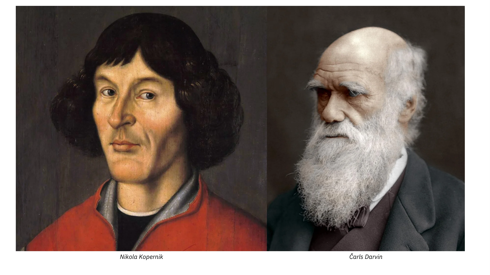

On kaže da čovek nije "carstvo unutar carstva" i da, baš kao što je Zemlja svedena na status obične planete, kao i sve druge planete, ljudsko biće je svedeno na status običnog moda prirode, kao i svi drugi konačni modusi prirode, kao što su životinje, biljke i sva "postojeća bića".

Pre njega, klasična grčka filozofija predložila je uređen, hijerarhijski pogled na univerzum kako bi objasnila svet, kosmos i ljudsko iskustvo. Zasnovana na mitskim narativima, u osnovi je nastojala da objasni poreklo sveta, insistirajući na harmoniji univerzuma, prirode i čovečanstva.

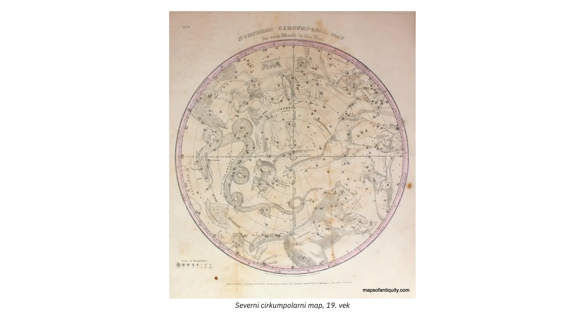

Školska kosmologija srednjeg veka, u suštini od 12. veka nadalje, bila je evolucija ka većem rasuđivanju kako bi se uskladili razum i vera u objašnjavanju univerzuma koji je i dalje bio hijerarhijski, ali koji je bolje odgovarao hrišćanskoj filozofiji.

Ali sa novom fizikom Kopernika (1473-1543) u 15. veku, kosmologija je doživela veliku prekretnicu u razumevanju univerzuma, čiji je geocentrični model doveden u pitanje u korist heliocentričnog sistema, što je otvorilo put za modernu nauku, posebno novu fiziku i astronomiju Keplera (1571-1630) i Galileja (1564-1642). Zatim Isak Njutn (1643-1727) i konačno Albert Ajnštajn (1879-1955), posvećeni Spinozista.

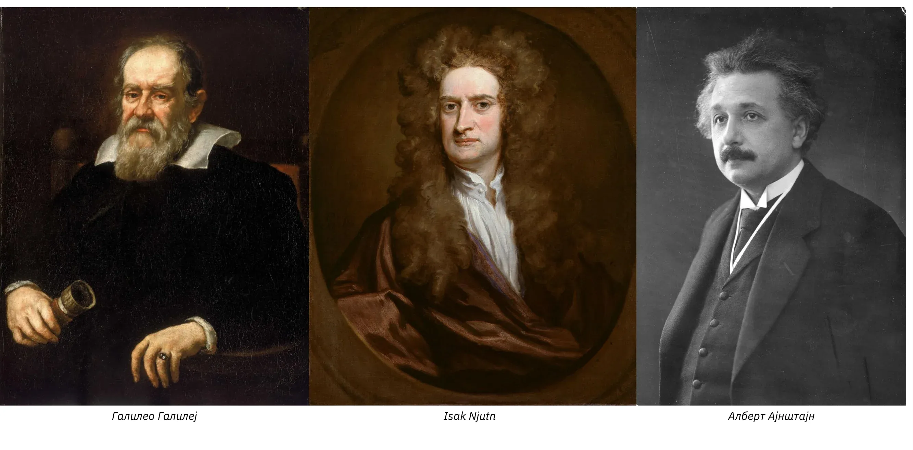

Ali da bismo u potpunosti razumeli Spinozizam, takođe moramo uzeti u obzir kontekst Renéa Descartesa (1596-1650), poznatog francuskog filozofa koji je prethodio Spinozi i čiji je bio i učenik i veliki obožavalac.

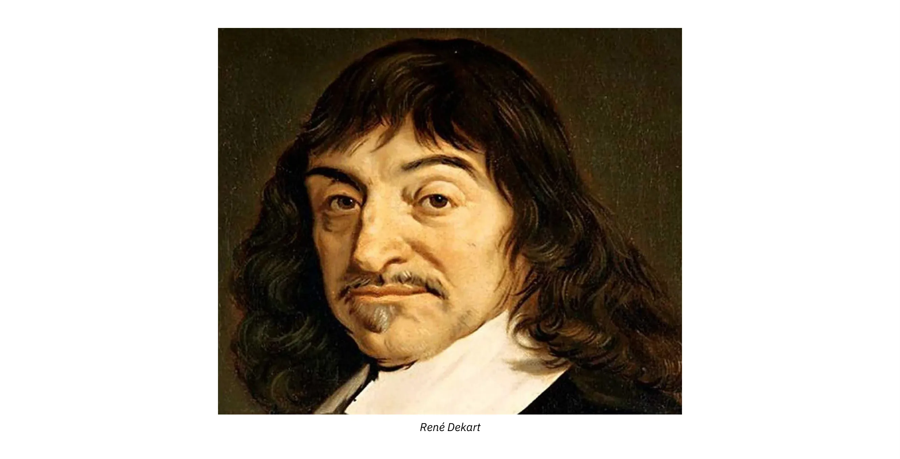

Uprkos rizicima i osudama Đordana Bruna (1548-1600) i Galileja, Dekart je krenuo da razlikuje "istinu od laži" i da uskladi teologiju, filozofiju i fiziku. U svom čuvenom Raspravi o metodi, objavljenom 1637. godine, Dekart je tvrdio da je razum osnova znanja, kroz koji ljudska bića mogu postići slobodu.

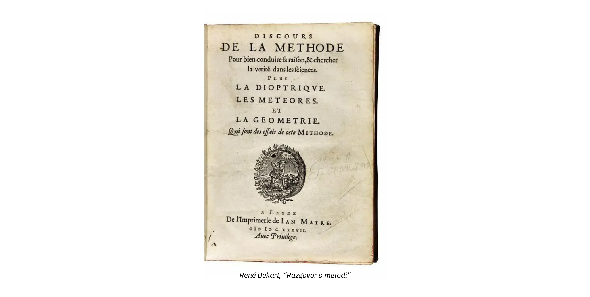

Objašnjavajući svet prema univerzalnim zakonima, a ne prirodom obdarenom moralnim namerama, otvorio je put determinizmu, kojem će Spinoza kasnije prema.

Ali kao katolik, Dekart je ipak uspostavio hijerarhiju između ljudskih bića i drugih konačnih oblika prirode, a posebno u odnosu na životinjske vrste, koje je nazivao "mašine životinje". I kada kaže da "nema duše koja, kada je dobro vođena, ne može steći apsolutnu moć nad svojim delima i strastima", Dekart time tvrdi da ljudska bića imaju sposobnost da započnu nešto iz ničega, i da čovek, po njegovom mišljenju, "izmiče zakonima prirode", da ima apsolutnu moć nad sopstvenim delima i da svoju odlučnost temelji isključivo na sebi.

Spinoza je znao kako da prevaziđe i nadmaši ovu fazu i pomiri postojanje Boga sa demonstracijom razuma. Za njega, sva polja ljudske aktivnosti zavise od sposobnosti razuma u savršeno koherentnom i determinisanom svetu. Ali svetu u kojem nema ni kontingencije ni slučajnosti, i u kojem je sve što se dešava neophodno i rezultat uzroka, prema uzročnoj vezi između stvari. Ovo je ideja apsolutnog determinizma.

I to je najstrožijim rečima konačno odbacio kartezijanski stav, kritikujući, na primer, ideju da ljudska bića nisu podložna zakonima prirode kao svi drugi životinjski oblici, te su stoga superiornija u odnosu na sve druge konačne moduse prirode.

Drugim rečima, oni su obdareni slobodnom voljom, iluzornim uverenjem iz kojeg je izuzetno teško pobeći, kako nam Spinoza kaže, a o čemu ćemo sada raspravljati.

## Iluzija slobodne volje

<chapterId>f147a914-cb64-5927-b305-26691930bca3</chapterId>

:::video id=b59da795-ba19-4643-9672-36c9e7953a42:::

U ovom kursu ćemo se sada okrenuti delikatnom pitanju slobodne volje, kako bismo bolje razumeli šta je sloboda za Spinozu, za prosvetiteljstvo i za rane liberalne filozofe.

Kao što smo već videli, Spinoza (1632-1677) je poznat po tome što slobodnu volju smatra iluzijom od koje je izuzetno teško osloboditi se.

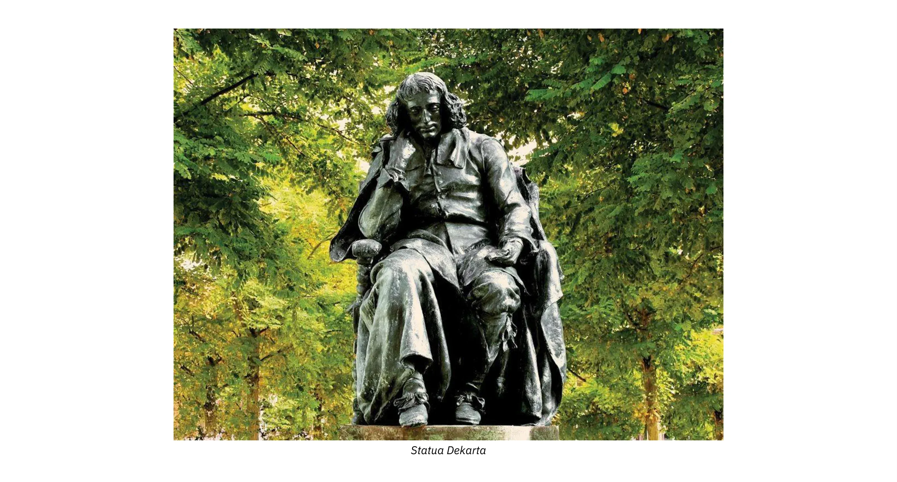

Zašto tako? Zato što je to protivno filozofskoj tradiciji od Antike, koju je još uvek branio Dekart (1596-1642), da ljudska bića mogu započeti nešto iz ničega i snositi punu odgovornost za svoje postupke, posebno pred Bogom, kaže Sveti Avgustin (354-430), otac Hrišćanske crkve.

Ali takođe, naravno, pred ljudskom pravdom.

To je ideja da naša volja, i samo naša volja, omogućava nam da usmeravamo svoje živote, da imamo apsolutnu moć nad svojim postupcima, i da slobodu svojih postupaka izvlačimo isključivo iz sebe, te tako posedujemo neodređenu moć odlučivanja.

Drugim rečima, čovečanstvo je u stanju da naruši prirodni poredak, umesto da mu bude podređeno.

U vođenju svog života, jer ne bi bio podložan nijednom zakonu osim zakonu svoje volje, on bi stoga bio ne samo iznad prirode i životinja, običnih mašina, već i iznad svih drugih konačnih modusa prirode. Ovo je bila pozicija Dekarta (1596-1650), za koga uzroci ljudske nemoći i nestalnosti nisu ležali u prirodnom poretku, već u porocima same ljudske prirode.

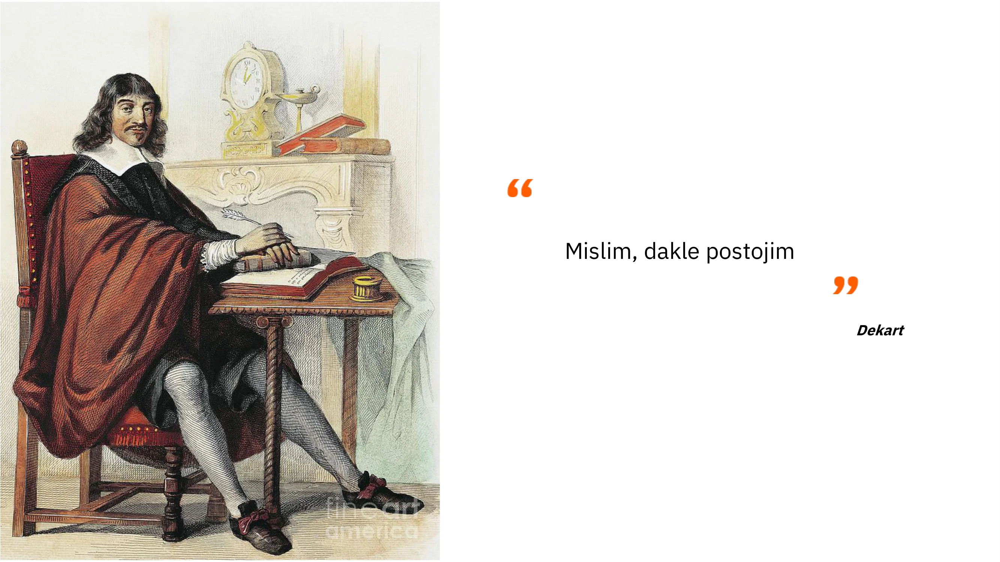

Ali dok Spinoza pripisuje zasluge Dekartu za otvaranje puta ka racionalnoj kontroli afektivnog života, on se u potpunosti distancira od njega čvrsto kritikujući ovu hipotezu o "apsolutnoj moći" volje.

Spinoza, s druge strane, smatra da je naš svet savršeno koherentan i determinisan, i da je sve što se dešava neophodno i rezultat uzročnosti stvari, prema kojoj svaki efekat uvek ima uzrok, a taj uzrok je sam po sebi efekat drugog uzroka, i tako dalje.

Ovo je ideja apsolutnog determinizma, iz koje on u svojoj Etici postavlja da ljudi nemaju nikakvu slobodnu volju jer, kako kaže, oni su svesni svojih postupaka, ali ignorišu, ili radije biraju da ignorišu, prave uzroke koji ih određuju.

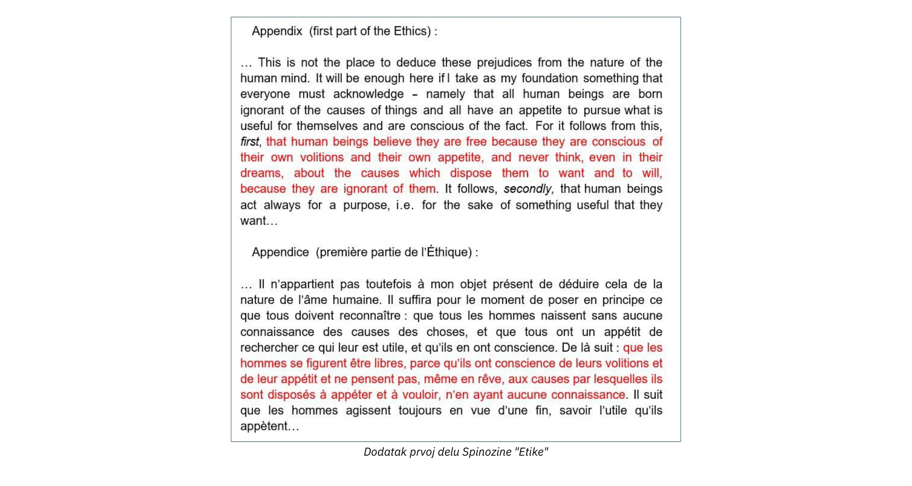

Za Spinozu, ljudska bića, kao "konačni modusi" prirode poput životinja ili biljaka, ne mogu stoga započeti nešto iz ničega; nisu izuzeti od zakona prirode, kako u svojim telima, tako i u svojim umovima.

Što je još gore, za njega je najveća opasnost slobode verovanje u našu slobodnu volju i verovanje da možemo delovati bez da smo određeni spoljnim uzrocima.

Za Spinozu, sloboda nije izraz slobodne volje, već sposobnost da razumemo naše pravo mesto u svetu, da razumemo našu determinisanu prirodu i, odatle, da usmerimo naše postojanje ka onome što "povećava našu moć delovanja". Uvek gledajući u budućnost s optimizmom i posmatrajući svet onakvim kakav jeste, umesto da ga zamišljamo onakvim kakvim bismo želeli da ga vidimo.

Naravno, problem koji se javlja je ljudska odgovornost i njihova dela. Mogli bismo zaključiti da ako pojedinci nisu slobodni u svojim delima, ne bi bili odgovorni za njih, posebno pred pravdom. Ali ovaj pogled je obmanjujući, jer bez ulaska u previše detalja, priznavanje nečijeg socijalnog, porodičnog i istorijskog determinizma ne sprečava nas da razmatramo odgovornost za počinjena dela, budući da su ona dobrovoljna.

S druge strane, bila bi iluzija verovati da postupci kriminalca nikada nisu povezani sa njegovim sopstvenim determinizmom. Iako nije reč o opravdavanju tih postupaka, barem je reč o pokušaju njihovog razumevanja. Zapravo, to je ono što pravda čini: osim kažnjavanja nezakonitih dela, ona igra ulogu predviđanja i zaštite budućnosti, zbog čega se određeni zločini ne samo kažnjavaju već i tretiraju, uzimajući u obzir porodičnu, socijalnu i psihološku pozadinu počinioca.

Ovaj pristup slobodi kao sposobnosti delovanja je veza koju možemo uspostaviti sa filozofijom prosvetiteljstva 18. veka. Prema jednom od njenih najvećih ambasadora, nemačkom filozofu Immanuelu Kantu (1724-1804), prosvetiteljstvo je zaista bilo sredstvo oslobađanja ljudi iz stanja tutorstva, ili kako bi Étienne de la Boétie (1530-1563) rekao, iz dobrovoljnog ropstva, za koje su sami bili odgovorni.

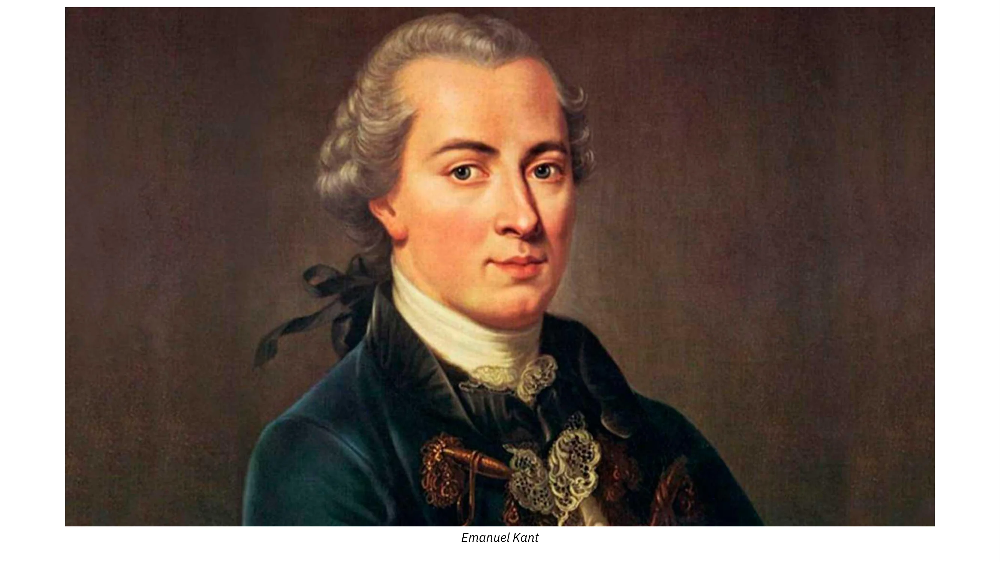

Kantov moto je "Misli svojom glavom" i "Usudi se da znaš", čuveni latinski "Sapere Aude".

Spinozina sposobnost delovanja je, dakle, moć koju ljudi imaju u sebi da razumeju svoje sopstveno životinjsko stanje i da shvate prirodu i njene pojave, bilo pozitivne ili negativne, povezujući ih sa objektivnim uzrocima, kako se ne bi oslanjali na moralna objašnjenja koja su lažna i iluzorna, tj. objašnjenja oblikovana da odgovaraju našim željama. Umesto toga, ona se sastoji u nastojanju da ih objasnimo putem razuma, sa ciljem emancipacije i slobode.

I napredak, koji je doveo do prvih tehnoloških revolucija i prvih liberalnih i preduzetničkih ideja krajem 18. veka, posebno sa engleskim liberalnim filozofom Džonom Lokom (1632-1704) i engleskim ekonomistom Adamom Smitom (1723-1790).

I vredi podsetiti se definicije iluzije Sigmunda Frojda (1856-1939). Prema ocu psihoanalize, koji je uvek priznavao Spinozin uticaj na svoj rad, iluzija je upravo "verovanje motivisano ostvarenjem želje, i time zanemarivanje stvarnosti".

Konačno, vredi istaći da, iako se libertarijanski pokret o kojem ćemo diskutovati direktno odnosi na ovu novu liberalnu filozofiju, postoje oni koji ukazuju na to da ličnosti poput Ayn Rand (1905-1982), autorke "La Grève" i "La Source vive", podržavaju postojanje slobodne volje, verujući da ljudska bića imaju sposobnost donošenja slobodnih izbora.

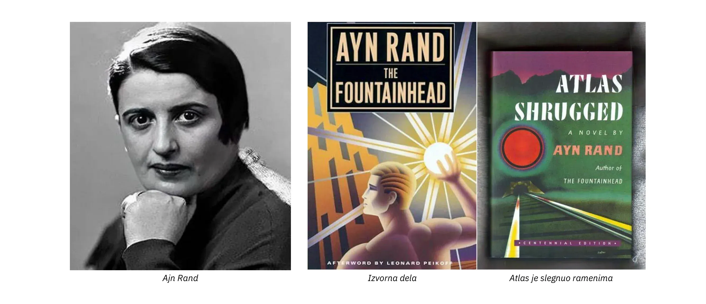

Ali stvarnost je sasvim drugačija, a konfuzija proizlazi pre iz semantičkog problema: priznavanjem sposobnosti ljudskih bića da deluju i donose odluke, uz priznavanje logičkog determinizma čiji su oni objekat. prvi libertarijanci su, u stvarnosti, takođe naslednici Spinoze. Ono što imaju zajedničko sa Spinozom je verovanje da ljudi nisu iznad prirode, već su rezultat evolutivnog procesa koji ih smešta unutar determinizma, istorije koja ih prevazilazi i koja je u velikoj meri odgovorna za to šta ljudi jesu i šta rade.

Konačno, ako je verovanje u slobodnu volju iluzija iz koje je izuzetno teško izvući se, to je zato što se vraća na drugu iluziju koja je hrani, iluziju konačnih uzroka, koju vas pozivam da proučite u narednom poglavlju.

## Iluzija konačnih uzroka

<chapterId>da2a7fb1-f1e9-5b56-822d-c73770de749d</chapterId>

:::video id=a0127fe7-a4cb-4a1c-8af4-f11c40b4a3d7:::

U prethodnom poglavlju smo videli da iluzija slobodne volje leži u verovanju da možemo započeti nešto iz ničega, da bi nam naša volja sama omogućila da usmeravamo svoje živote, i da bismo imali neodređenu moć odlučivanja. To je ideja da je čovek sposoban da poremeti prirodni poredak više nego što mu je podložan.

Ali za Spinozu (1632-1677), čovek nije "carstvo unutar carstva", tj. on nije, suprotno onome što je Dekart ustanovio (1596-1650), izuzetak u prirodi, i nikada nije izuzet od produžetka determinističkog lanca uzroka i posledica.

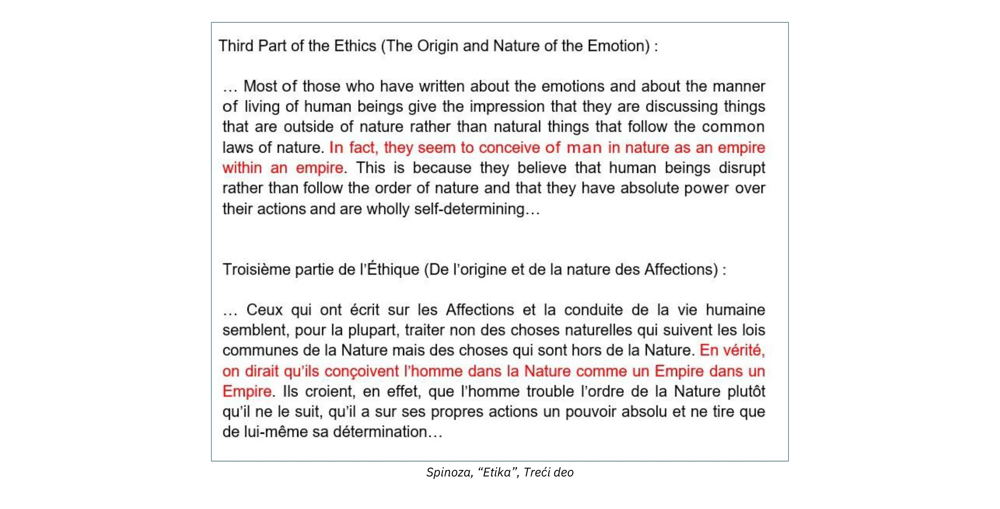

I pošto Priroda, kaže Spinoza, nema unapred određen cilj sa moralnog stanovišta, i pošto ljudi imaju tendenciju da svoju maštu zamene za razumevanje, oni je tumače prema onome što odgovara njihovim sopstvenim interesima. Do te mere da daju značenje stvarima koje proizilazi samo iz načina na koji ih cene i povezuju sa sobom.

To jest, prema njihovim željama, nadama i strahovima.

Ovo razmišljanje ilustrovano je iluzijom konačnih uzroka, koja predstavlja glavnu prepreku za razmišljanje i upotrebu razuma, jer jednostavno izražava našu potrebu da učinimo da efekti neke stvari odgovaraju ne njenim pravim uzrocima, već verovanju, čak i ako je apsurdno ili infantilizujuće.

Uverenje koje izražava nameru, naročito božansku, i koje, na način na koji ga tumačimo, često je sujeverje, ili neznanje.

I zato su nove bolesti kao što su AIDS u 90-im ili covid u 2020. godini uvek bile percipirane od strane nekih kao izraz božanske i često kaznene namere, prema rezonovanju koje je suprotno principu uzročnosti koji podržava racionalizam i modernu nauku uspostavljenu od vremena Kopernika (1473-1543), Keplera (1571-1630) i Galileja (1564-1727).

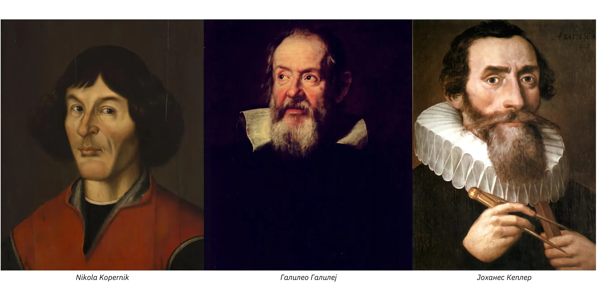

Činjenica je, kako kaže Spinoza, da ljudima malo znači to što je toliko stvari izvan njihove mašte, što u prirodi ima više nereda nego reda. Ipak, složenost stvari koje su izvan njihovog shvatanja trebalo bi da ih odvrati od verovanja u bilo kakav teleološki projekat. Nije važno, kaže on, jer je ljudsko verovanje u relevantnost njihove sigurnosti zasnovane na onome što odgovara njihovoj želji i korisnosti uvek jače od bilo kog racionalnog argumenta ili brige za istinu.

Finalizam, dakle, znači obrtanje uzroka i posledica stvari kako bismo ih razumeli: na primer, verujemo da je razlog što imamo oči da bismo videli, i da je razlog što imamo zube da bismo žvakali. Dok je, naravno, ljudska vrsta razvila svoj vid tokom evolucije upravo da bi videla, i upravo kroz potrebu da se hrani, i jede meso, naša denticija se razvila onako kako je danas.

I ovo je tačno ono što je francuski prirodnjak Žan-Baptist de Lamark (1744-1829) tvrdio (slika 3.3.3) kada je postavio svoju predarvinovsku teoriju da funkcija stvara organ, a ne obrnuto.

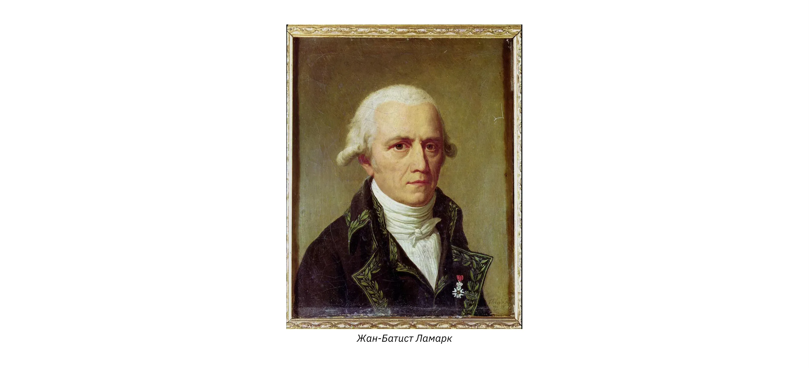

Ali, kako Spinoza kaže, "obmana ljudi tu ne prestaje", i među svim primerima naivnih, i na kraju prilično zabavnih, teleoloških ideja, često navodimo čuveni primer biologa Bernardina de Sen-Pjera (1737-1814). Ovaj bivši direktor Pariškog muzeja prirodne istorije posmatrao je finalizam prirode sa poezijom, lirikom i izvesnom naivnošću, smatrajući da je dinja, na primer, stvorena isključivo da bi ugodila velikim porodicama, jer je njena rebrasta kora činila lako seći je na jednake kriške.

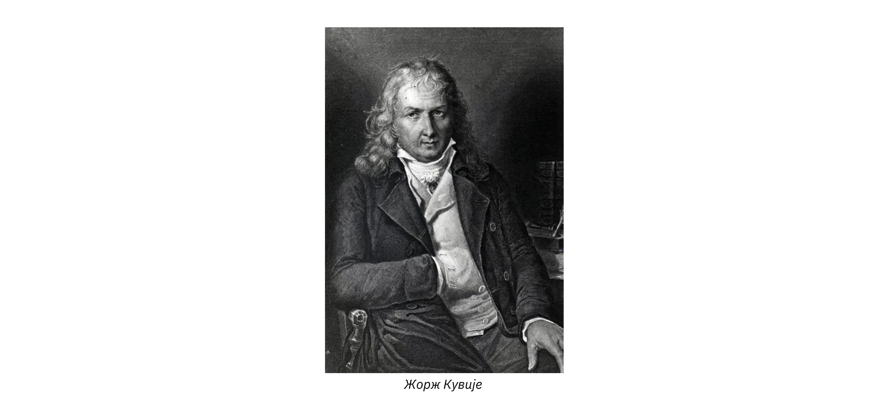

Definicija inflacije koju daju kejnzijanski ekonomisti i zagovornici države blagostanja, na primer, takođe veoma dobro ilustruje ovaj paradoks. Prema njima, inflacija je povećanje cena koje, prema nekim centralnim bankarima, dolazi ili "niotkuda", ili iz geopolitičkih konteksta koje niko ne može kontrolisati ili predvideti. Iako povećanje cena zaista može dovesti do ciklične inflacije - na primer, kada cena nafte raste, cene određenih prerađenih proizvoda će takođe rasti - stvarni strukturni uzroci inflacije su prvenstveno povezani sa povećanjem novca Supply, što zauzvrat implicira pad vrednosti novca i, ipso facto, mehanički rast cena.

Verovati, ili navesti druge da veruju, suprotno je jednako sanjanju otvorenih očiju, kako je Spinoza podrugljivo rekao, i konstruisanju linije razmišljanja koja je lažna, ili obmanjujuća, i koja se lakše prihvata jer se čuje kao očekivani odgovor da bi se dokazala ispravnost. U ovom slučaju, kada zagovornici državne intervencije smatraju inflaciju najboljim načinom za rešavanje ekonomskih problema.

Međutim, ova pristrasna interpretacija inflacije navodi nas da zaboravimo da, iako je korisna za upravljanje ekonomijom na kratak rok, ona je zapravo skriveni porez, koji na duži rok vodi samo ka ljudskim i materijalnim katastrofama, i čini države nesposobnim da ne zloupotrebljavaju svoju moć. Ovo je ono što Fridrih Hajek (1899-1992) tako dobro opisuje u svom eseju Put u ropstvo, kada pominje ropstvo iz kojeg se države više ne mogu izvući.

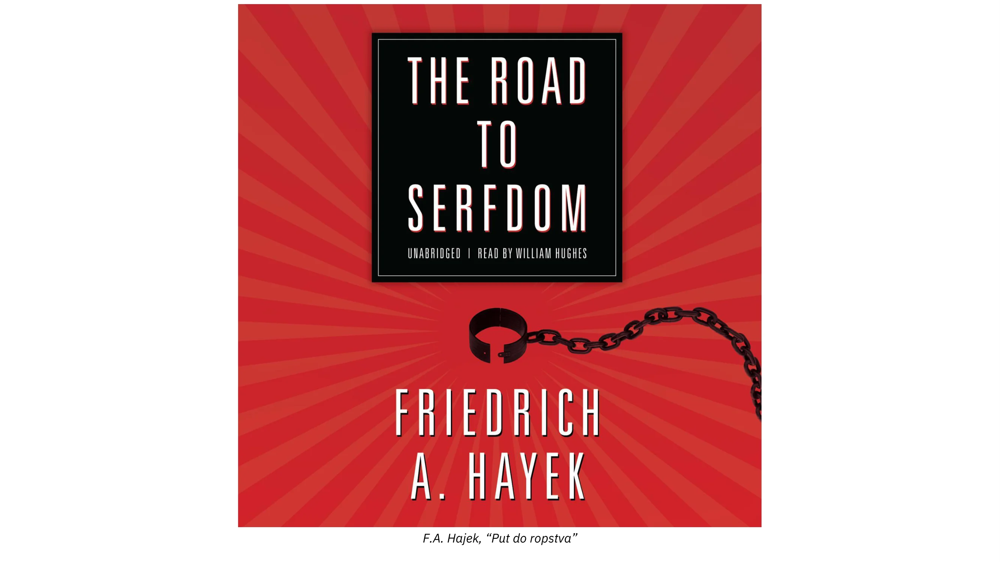

Konačno, vredi napomenuti da je ovaj finalistički mehanizam takođe dobro ilustrovan u načinu na koji kritičari Bitcoin izražavaju svoju kritiku fokusirajući se upravo na njegove efekte.

Jer dok se neki efekti Bitcoin svakako mogu kritikovati, zbog kognitivne pristrasnosti povezane sa činjenicom da je to nova i disruptivna tehnologija, imamo snažnu sklonost da vidimo samo negativne efekte. Posebno ako stvarnost ne odgovara našim željama, na primer ako smo religiozni suočeni sa kopernikanskom revolucijom poput spinozizma, ili ako smo centralni bankar suočeni sa konceptom decentralizovane digitalne valute.

Međutim, sasvim je jasno da ako religiozna osoba ili centralni bankar pokažu razumevanje, radoznalost i dobru volju, i ako se zainteresuju za neki koncept, nastojeći prvo da ga razumeju pre nego što sude o njegovim efektima kako bi uskladili svoje mišljenje sa svojim očekivanjima, onda će sigurno moći da ga prihvate.

Hvala na pažnji i vidimo se u sledećem poglavlju.

## Teološka iluzija

<chapterId>93554156-5e62-526d-9b71-49c47be916af</chapterId>

:::video id=9c490cc1-3d29-4ca7-9464-1a701bb91ba7:::

U ovom završnom poglavlju o novoj kopernikanskoj viziji ideja koju nudi spinozizam, konačno se okrećemo trećoj iluziji koju je predstavio Spinoza (1632-1677) u svom delu, Etika.

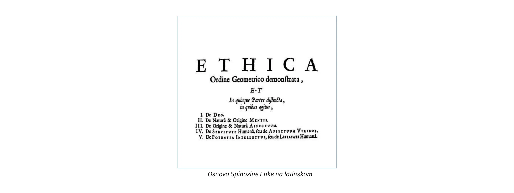

Ova iluzija je direktno povezana sa prve dve, iluzijom slobodne volje i iluzijom finalnosti.

To je o teološkoj iluziji.

Poenta je sledeća: Sve dok su ljudi neuki, "i o stvarima i o sebi samima", kako nam Spinoza kaže, sve dok veruju u svoju iluzornu slobodu, oni će svoju maštu smatrati razumevanjem, tj. uvek će sebe smatrati sposobnim da misle i razumeju prirodu stvari, dok u stvarnosti samo zamišljaju, izmišljaju i projektuju ono što im je korisno. Prema svojim željama.

Zato ljudi veruju da ako prirodna sredstva postoje i korisna su, kao što su zubi za jelo ili oči za gledanje, to je zato što ih je logično stvorio "direktor prirode". Drugim rečima, namerni, antropomorfni Bog kojem se pripisuju ljudske namere.

Drugim rečima, starac sa belom bradom skriven iza oblaka, kojem se pripisuje stvaranje svih stvari u prirodi kao sredstva za naš cilj, jer nas voli i štiti dok ga poštujemo i obožavamo.

Ovo je prva faza teološke iluzije.

Ali uprkos našem ponosu što verujemo da smo iznad Prirode i što zamišljamo da možemo započeti nešto iz ničega, u stvarnosti smo uvek podložni uslovima postojanja koji ukazuju na to da, na kraju, zaista nećemo moći da "prođemo nekažnjeno", kako je to rekao profesor filozofije Žil Delez (1925-1995). Mi smo smrtni, kao i sve životinje, ali mi to znamo.

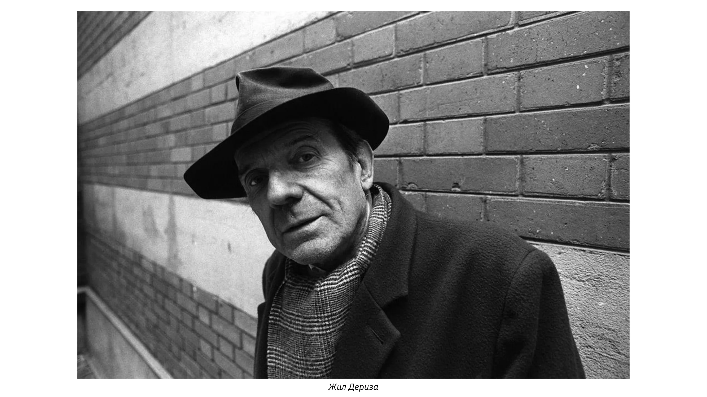

Verovati ili zamišljati suprotno kako bismo se umirili je razlog zašto smo stalno bačeni napred-nazad između straha i nade, kao dva suprotstavljena i nerazdvojiva pola između osećaja sigurnosti i osećaja panike, jer je strah uvek povezan sa nadom u bolje dane.

Da nema straha bez nade, niti nade bez straha, i da onaj ko se boji uvek se nada da će izbeći ono čega se boji, dok onaj ko se nada uvek se boji da se ono čemu se nada neće dogoditi.

A pošto smo "skloni da lako verujemo u ono čemu se nadamo", kaže Spinoza u svojoj Etici, upravo kada se suočavamo sa spoljnim uzrocima ili događajima koji bi nam mogli biti štetni, suprotno bilo kojoj ideji korisnosti, izražava se druga faza ove takozvane teološke iluzije, koju karakterišu verovanja iz kojih proizlazi sujeverni osećaj.

Drugim rečima, "ozloglašeni" prema Volteru (1694-1778), za koga sujeverje nikada nije plod razuma, i uvek odgovara iracionalnom ili neutemeljenom verovanju, suprotstavljajući se bilo kojem obliku racionalnosti pripisujući predmetima ili radnjama moći ili duhovnu snagu koju nemaju.

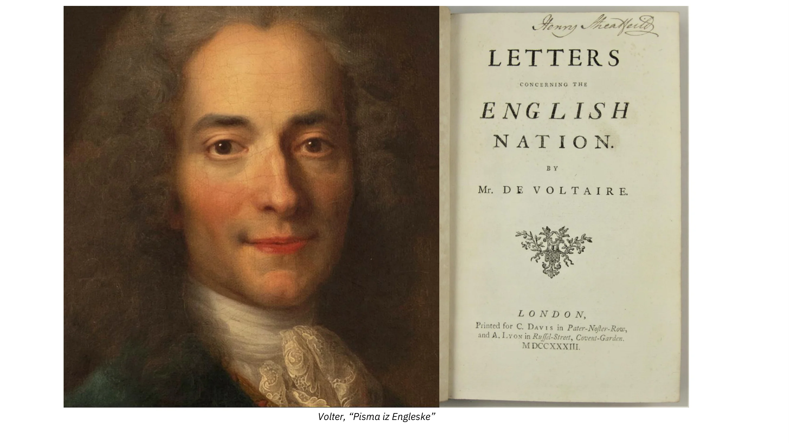

Pod izgovorom da nas oslobađa, da nam omogućava da zamislimo bolji svet, sujeverje nas zapravo zaključava u naše sopstvene iluzije i laži. U ropstva iz kojih ćemo se teško izvući.

Ovo je ono što su nemačko, englesko i francusko prosvetiteljstvo branili od 18. veka nadalje, tvrdeći da sujeverje jednostavno sprečava ljude da postanu odrasli, ne samo ograničavanjem upotrebe razuma, već i, pre svega, podsticanjem netolerancije, koja je najbolji instrument za uspostavljanje dominacije moći. Bilo političke ili verske.

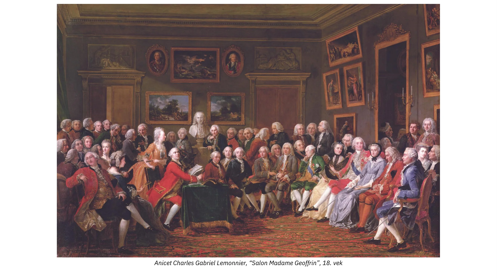

I ovo je ono što Spinoza ponovo pokazuje u svom Teološko-političkom traktatu, koji smo već dotakli. U ovom eseju, on piše da je "velika tajna monarhijskog režima, i njegov glavni interes, da obmanjuje ljude, i da prikriva imenom religije strah koji mora da ih kontroliše". Zato tirani, diktatori ili revolucionari, koji su uvek ljudi vođeni željom da čine dobro za druge, često, ako ne i uvek, upadaju u zamku činjenja suprotnog od svojih principa kako bi ih ostvarili.

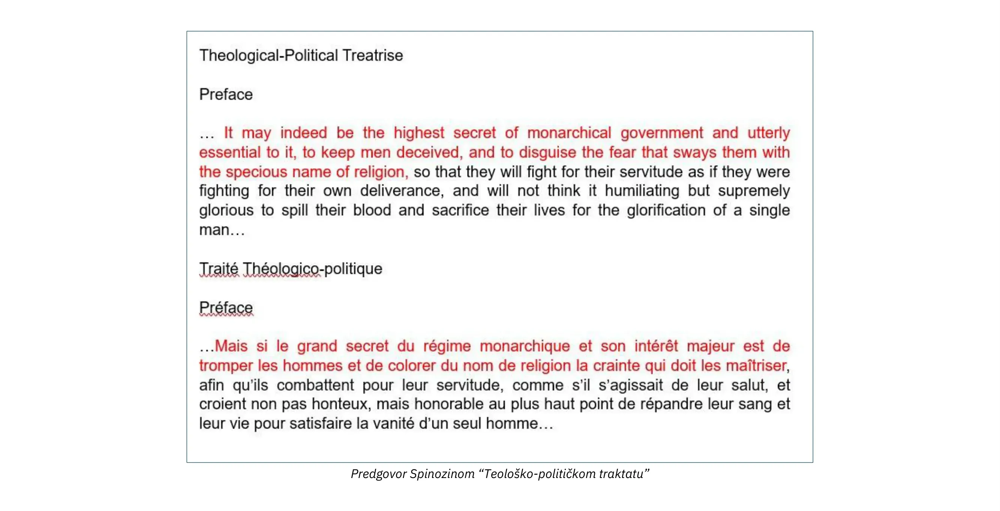

Ali novina koju Spinoza donosi u TTP, i koja ga na neki način čini ocem sekularizma, jeste razmatranje da, iako je suštinski važno boriti se protiv sujeverja i poziva na nasilje koje sloboda paradoksalno omogućava, činjenica je da je u interesu države da štiti pravo na verovanje i slobodu mišljenja.

Čim ideje postoje i budu izražene privatno, one će se neizbežno širiti kroz društvo, i ni zabrana ni cenzura nikada ne mogu sprečiti njihovo širenje. Ideje, bile one istinite ili lažne, dobre ili loše, će kružiti u svakom slučaju, a njihovo zabranjivanje može samo dovesti, na duge staze, do pobune i rušenja države u ime slobode.

Drugim rečima, država bi zapravo imala mnogo više razloga da se plaši cenzure ili suzbijanja slobode izražavanja nego njenog održavanja, i stoga je, kaže Spinoza, u njenom interesu da dozvoli pojedincima da ostvaruju svoje prirodno pravo da misle i izražavaju se.

Za Spinozu, demokratska država koja omogućava slobodu misli je stoga najbolja garancija da će ljudi živeti u miru, i da će, zahvaljujući upotrebi razuma, ne samo biti slobodni da misle i deluju, već će takođe moći da razumeju ropstva koja ih sputavaju kako bi se oslobodili od njih.

# Od teorije afekta do Bitcoin

<partId>82e69d4f-a94f-5978-bcb8-8a7b4651bcca</partId>

## Pitanje zla kod Spinoze

<chapterId>1ce64576-2688-5757-a119-57cc3a1076c0</chapterId>

:::video id=9c490cc1-3d29-4ca7-9464-1a701bb91ba7:::

Sada bih želeo da razgovaram o pitanju zla, kako ga Spinoza (1632-1677) predstavlja u svojim delima i prepisci.

Ali budite upozoreni, ovo je složena i kontroverzna tema, a cilj je jednostavno razumeti, još jednom, njegov način razmišljanja kako bismo bolje shvatili šta ga vodi, tj. potraga za slobodom.

Kao što smo videli, ne verovanje u slobodnu volju ili bilo kakav finalizam u prirodi vrlo brzo postavlja problem postojanja zla u našim svakodnevnim životima.

Drugim rečima, pitanje je da li "zlo" postoji u prirodi i da li su ljudi odgovorni za štetu koju prouzrokuju.

Drevni filozofi su verovali da zlo ne postoji u prirodi, a Sokrat (470-399 p.n.e.), na primer, je učio da je "zlo ništa". Prema njemu, zla osoba nije bila zla po prirodi, i na neki način je jednostavno bila u zabludi o prirodi dobra.

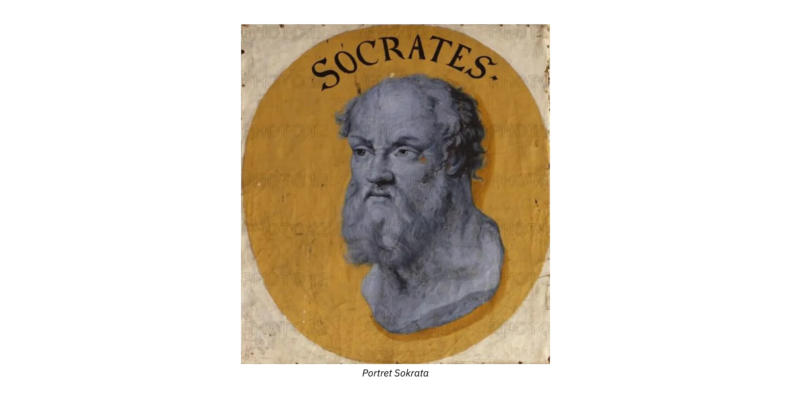

Ali školska tradicija, posebno ona Svetog Avgustina (354-430), koja i danas utiče na hrišćanski moral, tvrdila je da zlo ne samo da postoji, da je stvarnost, već da se može objasniti jer su ljudi slobodni, jer su sposobni da biraju između dobra i zla, i da je zlo koje uzrokuju stoga u potpunosti njihova sopstvena odgovornost.

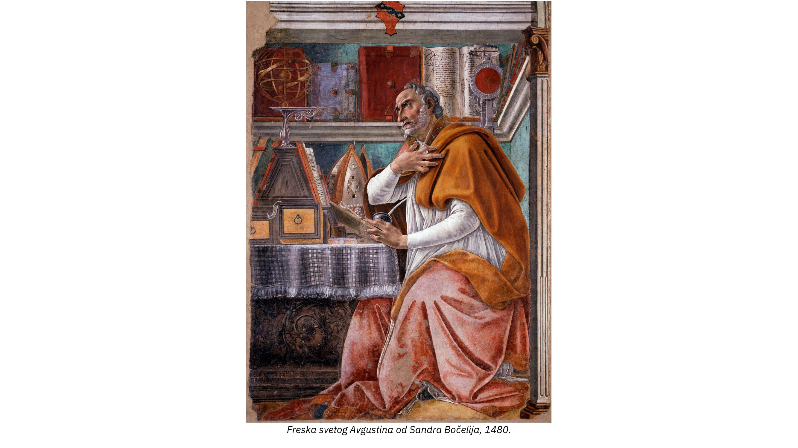

Čak i ako odgovornost za štetu uzrokovanu zemljotresom, smrtonosnim virusom ili činjenicom da se dete rodi slepo ne treba pripisivati ljudima, ovaj način razmišljanja opstaje dajući prirodi moralnu nameru koja ih čini odgovornima. Na primer, razmatranjem da ako se dogodio zemljotres, to je upravo zato što su se ljudi loše ponašali.

Ovo je ideja koju brane religiozni ljudi da se ljudi rađaju kao grešnici, krivi za istočni greh.

Naravno, kao što možete zamisliti, ovu ideju je rastrgao Spinoza, koji smatra da, pošto Priroda, ili Bog ili sreća kako on to kaže, nije obdarena namerom, i pošto ljudi nemaju slobodnu volju, odgovornost za "zlo" koje im se pripisuje je potpuno iluzorna.

"Ništa se u prirodi ne dešava što se može pripisati nekoj poroci koja u njoj postoji", piše Spinoza u Etici, i prema njemu, pogrešili bismo kada bismo, na primer, slepilo novorođene bebe smatrali "zlom" jer kada se rodi slepa, beba nije ništa više lišena vida nego što bi to bio kamen.

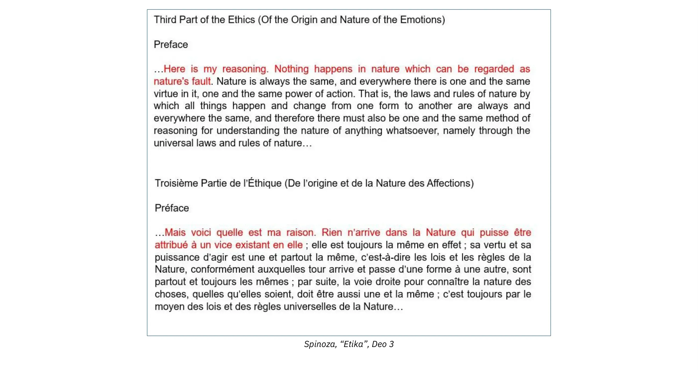

A ako mislimo da slepi nemaju vid, to je samo iz ugla onih koji vide.

Spinoza takođe preuzima ideju da zlo ne postoji u prirodi, ali njegova originalnost, koja ga čini revolucionarnom filozofijom, jeste u tome što smatra da zlo ne postoji, kao ni "dobro".

I zato on govori o etici, a ne o moralu, ne razmišljajući o tome šta je ispravno ili pogrešno, jer su to sve relativni i subjektivni pojmovi, već u smislu onoga što je "dobro" ili "loše" za našu prirodnu potrebu da "istrajemo u našem biću", kaže on. Drugim rečima, da živimo i rastemo. Da napredujemo kao ljudska bića.

Štaviše, već smo videli da Spinozina gledišta o odgovornosti ljudi koji se loše ponašaju počinjenjem zločina, očigledno nisu namenjena da ih opravdaju. Jer ljudi, čak i ako ne znaju prave uzroke koji ih navode da počine zločin, uvek su svesni onoga što rade i stoga su, kao takvi, odgovorni pred moralom i Zakonom.

Jasno je da su postupci kriminalca uvek povezani sa porodičnim, društvenim, ekonomskim ili čak medicinskim determinizmom, ako se njegovi zločini mogu objasniti fizičkim ili mentalnim stanjem. I to je uloga pravde, koja prevazilazi krivično pravo kako bi uzela u obzir činjenicu da određeni zločini ne smeju biti samo kažnjeni, već i tretirani, uzimajući u obzir porodičnu, društvenu i psihološku pozadinu počinioca.

Zato Spinozist Gilles Deleuze (1925-1995) objašnjava da je etika vrsta etologije, tj. praktična nauka o načinima postojanja, ili, kako on kaže, "umetnost ostvarivanja dobrih susreta".

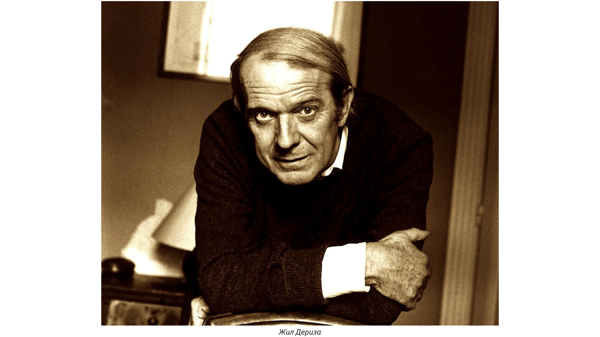

Drugim rečima, sloboda, prema Spinozi, sastoji se u usmeravanju našeg postojanja ka onome što "povećava našu moć delovanja" i, uvek optimistično gledajući u budućnost, posmatranju sveta onakvim kakav jeste, a ne zamišljanju kakvim bismo želeli da ga vidimo.

I tu leži genijalnost Spinozine demonstracije, dok se bori protiv doktora neznanja i protiv svih onih koji tvrde da je dobro biti neznalica.

Naprotiv, Spinoza proučava ljudske strasti, čak i one najiracionalnije, slom srca, ludilo, tugu ili melanholiju, na način geometara, "more geometrico", kao što bi neko proučavao tačke, linije, površine i zapremine.

Ovo je teorija afekata koju razvija u trećem delu svoje Etike, i koju predlažem da sada proučite.

Hvala na pažnji.

## Teorija afekta

<chapterId>3bb011ce-6f0c-51a6-b41f-25a3b5b7768e</chapterId>

:::video id=bb427cc6-e54d-4b44-bd6d-281ba421001a:::

Prema Spinozi, sloboda je koncept koji treba otkriti, put ka boljem, moćnijem životu. Slobodnijem životu. Put koji zahteva da prepoznamo apsolutni determinizam i racionalnu kauzalnost stvari.

On razvija svoj sistem u trećem delu Etike. To je čuvena "teorija afekata".

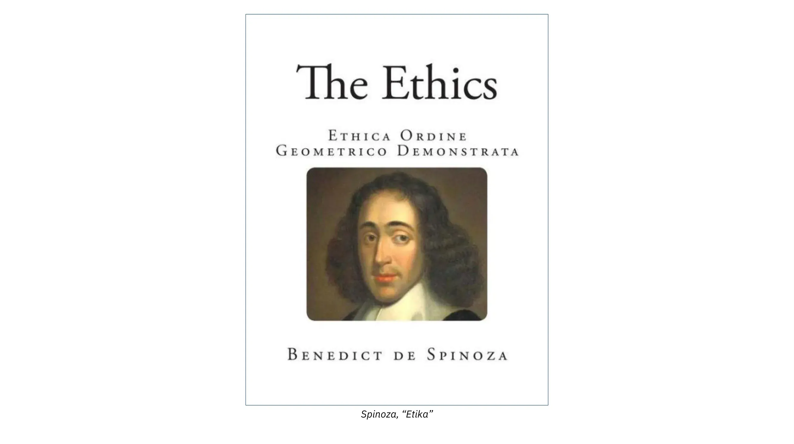

Princip je da su ljudski afekti, kaže Spinoza, aktivne ili pasivne modifikacije tela i misli koje utiču na našu moć delovanja, tj. to je naše ponašanje.

Ipak, u zavisnosti od uticaja specifičnih za ljudsku prirodu i onih koji potiču iz spoljnog sveta, savršeno smo sposobni da formiramo istinite ideje, rasuđujemo i izražavamo radost.

Ali smo takođe sposobni da formiramo takozvane pasivne afekte, predrasude koje nas zatim mehanički vode, "uprkos nama samima" na način da više ne vidimo ili ne činimo ono što zahteva naš sopstveni interes.

Govorimo o ropstvu, ili služenju, stanju koje karakteriše nesposobnost da kontrolišemo i suprotstavimo se onim pasivnim afektima koji nas ponekad navode da želimo ono što ne činimo i činimo ono što ne želimo.

Ovo je ono što Spinoza kaže u svojoj Etici, kada je iznenađen da "ljudi često vide najbolje, odobravaju to i čine najgore", ili da "se bore za svoje ropstvo kao da se bore za svoje spasenje".

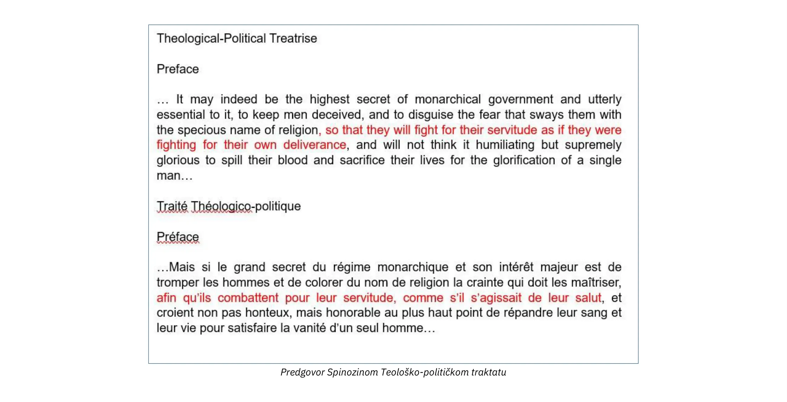

Spinoza uzima primer mržnje, koju vidi kao pasivni afekt, okrenut ka tuzi i rođen iz neadekvatnih ideja, tj. delimičnog znanja o uzrocima, i koju definiše kao "tugu koja je povezana sa idejom spoljašnjeg uzroka".

Drugim rečima, ako mrzimo stranca, to je zato što tog stranca povezujemo sa idejom koju imamo o njemu, iz razloga koje ne razumemo, jer je on stranac i po prirodi drugačiji. To je ta ideja o spoljašnjem uzroku - ideja koja, štaviše, uvek mehanički motiviše neznalice da loše govore o konceptu koji ne poznaju.

Ovo je posebno tačno, uzgred budi rečeno, u oblasti kriptovaluta.

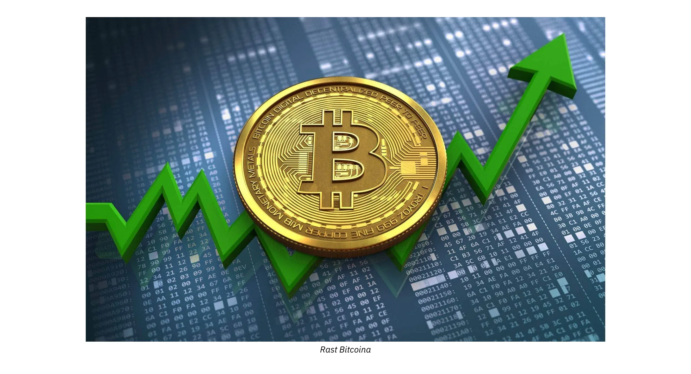

Spinoza kaže da ako uklonimo ovu negativnu ideju o spoljašnjem uzroku, ne moralom, već obrazovanjem, empatijom, razumom, naročito fokusiranjem u ovom slučaju na kvalitete ovog stranca, ili u slučaju Bitcoin, na njegov praktični aspekt ili korisnost, tada povezani osećaj tuge nestaje i, automatski, tako nestaje i mržnja.

Vredi se setiti da se ovaj način razmišljanja odnosi, naravno, i na aktivne afekte, a posebno na ljubav, koja je, prema Spinozi, "radost povezana sa idejom spoljašnjeg uzroka". I ako, na primer, spoljašnji uzrok ljubavi prema nekoj stvari ili osobi nestane ili se promeni tokom vremena, radost povezana s tim može takođe nestati, gaseći osećaj ljubavi. Ovo, kada ne razumemo, može nas učiniti nesrećnim i depresivnim.

Ali ako se ova takozvana teorija afekata primenjuje na našu "nesvesnost", ovaj racionalni način razmišljanja "na način geodeta" takođe se primenjuje na borbu protiv svih oblika spoljašnjeg ropstva, bilo da je religiozno, političko ili rezultat prirodnih fenomena.

Ovo je primer munje. Jer kada munja udari i ubije nevine ljude, neuki će to često videti kao ruku Božju, smatrajući da munja izražava moralnu i finalističku nameru. Sida u 90-im ili čak, nedavno, kovid, neki su tumačili kao božansku kaznu.

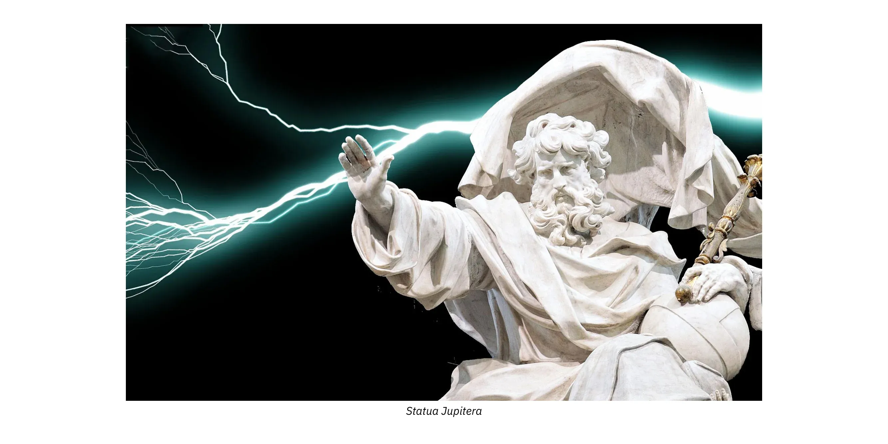

Dok za Spinozu, naravno, sve te teleološke ideje su samo praznoverja, sinonim za neznanje, utoliko što u ovom primeru munja koja udara ne čini ništa, kaže on, osim što izražava suštinu svoje prirode. Koja je da udara. Bez, naravno, ikakve moralne namere da kazni ili nagradi bilo koga.

Zahvaljujući ovom jednostavnom primeru, razumemo da jedino rešenje da se zaštitimo od groma - drugim rečima, da se oslobodimo ropstva koje nam je njegova opasnost uvek nametala - nije da se žalimo na našu lošu sreću ili na navodnu božansku nepravdu, niti je da iznosimo i najmanji moralni argument. Ne, naprotiv, ovde, kao i sa mržnjom, radi se o razmišljanju o tome šta možemo učiniti sa etičkog stanovišta.

A u ovom slučaju, to bi bilo da se zaštitimo od groma tako što ćemo biti racionalni, otvoreni za napredak, radoznali i imati poverenja u ono što nauka može da nam ponudi i, zašto da ne, instalirati gromobran.

Ovo je genijalnost Etike. Spinoza nam pokazuje da je moguće preći iz dobrovoljnog ropstva, iz "uprkos nama samima" i života kao vetrokaz večite otuđenosti, u život koji se živi kroz znanje o afekcijama i determinacijama.

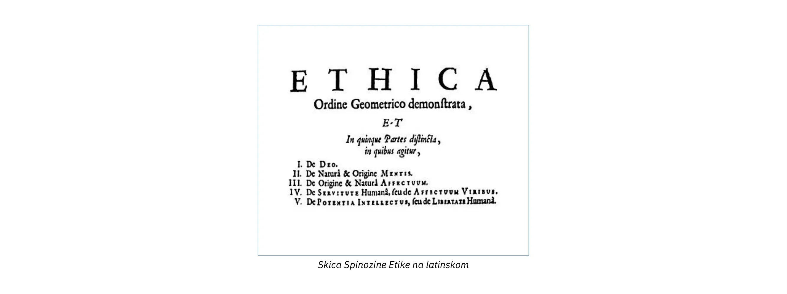

To je način razmišljanja koji nam omogućava da seciramo ljudsku prirodu kako bismo videli svetlu stranu ili istinu u stvarima. Da eliminišemo razloge za tugu i strah koji nas opterećuju. Da budemo slobodni, drugim rečima, sposobni da prestanemo da se povinujemo tužnim strastima i promenimo naše ponašanje.

I da shvatite, verovatno po prvi put u istoriji filozofije, da možete biti lucidni i srećni.

I zato se Spinozizam često naziva "filozofijom radosti".

## Sloboda, austrijska škola ekonomije i Cypherpunk filozofija

<chapterId>b54f2532-460c-11f0-a248-93ff24ef1d57</chapterId>

:::video id=5f49d5b4-e15f-475b-b40d-07464c08ca4d:::

Kao što sada znate, sloboda prema Spinozi je svest o našem determinizmu. Pod vođstvom razuma, i zahvaljujući našoj sposobnosti da delujemo, možemo razumeti uzročni mehanizam servituta, kako bismo se mogli boriti protiv njih, više ih ne trpeti i više ne delovati protiv sopstvenih interesa.

Na kraju, ova lucidnost znači prestanak življenja u nihilizmu koji je kasnije opisao Friedrich Nietzsche (1844-1900), za koga se ljudi gube u ideološkim idealima, tj. političkim ili religijskim fikcijama, zbog kojih poriču stvarnost, infantilizuju se i čine sebe nesrećnima.

Ovo je upravo ono o čemu je racionalna filozofija prosvetiteljstva govorila, zahvaljujući posebno Immanuelu Kantu (1724-1804), za koga samo obrazovana osoba, pod vođstvom razuma, može misliti za sebe i odrediti, etički, šta je "istina" ili "dobro," a šta je toksično.

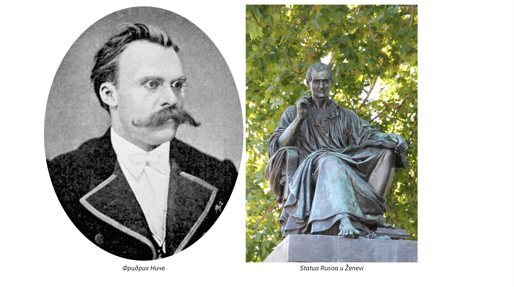

Drugim rečima, kaže on, ako mislimo svojom glavom, ako rasuđujemo kao racionalne odrasle osobe, i ako se stoga trudimo da se povežemo sa uzročno-posledičnim vezama između stvari, više nam neće biti potrebna moralna autoritet da nas uči, na primer, pravim vrlinama religije ili pravim etičkim vrednostima u političkoj i ekonomskoj sferi.

To je linija razmišljanja koja povezuje sa austrijskom školom liberalne ekonomije, rođenom u izuzetno plodnoj intelektualnoj atmosferi Beča pre Prvog svetskog rata. Jer upravo u ovom kontekstu intelektualci kao što su Karl Menger (1840-1921), Ludvig fon Mizes (1883-1979) i Fridrih Hajek (1899-1992) postavili su temelje za novu školu liberalne ekonomije, koja je postala osnova za uverenja budućih sajferpankera. I otuda stvaranje Bitcoin.

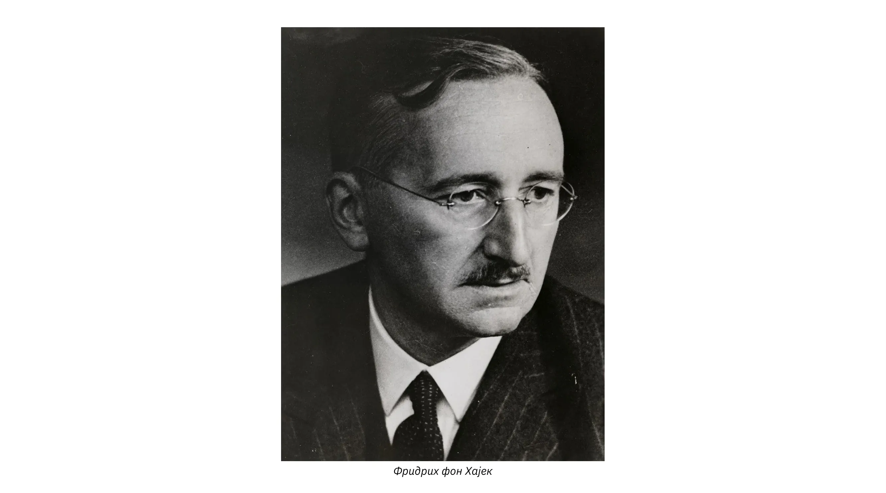

Menger i Mises su ustanovili, na primer, da se svo znanje mora konstruisati prema uzročnoj vezi između stvari, i tako su predložili novu uzročnu koncepciju ekonomije. Inspirisani posebno liberalnim duhom koji je nekoliko godina ranije razvio francuski ekonomista Frédéric Bastiat (1801-1850).

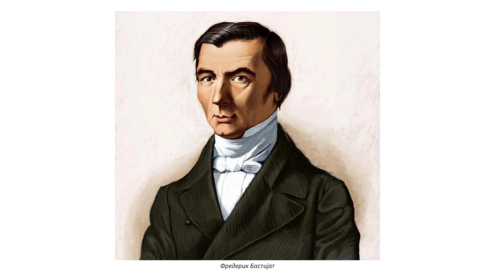

Hayek, s druge strane, smatra da sve ekonomske odluke uvek izražavaju oblik nesigurnosti i neznanja, i da činjenica da se od toga ne pati zbog morala, verovanja, predrasuda ili političkih ideologija, omogućava pravilno analiziranje ekonomskog ponašanja i, po ekstenziji, razmatranje šta je dobro za pojedince, za društvo i za državu.

Ovako su ovi liberalni austrijski ekonomisti došli do čvrste kritike svih socijalističkih ideja - Hayek je govorio o "planizmu" - i svih moralnih politika inspirisanih njima, koje, po njegovom mišljenju, vode samo u propast. Davanje ekonomske moći vladama, koje su neizbežno iza vremena i van koraka sa onim što bi trebalo i ne bi trebalo da se radi, bilo je osuđeno na neuspeh.

Na primer, Austrijanci veruju da kada država sebi dodeli, putem prinude, moć da stvara novac kako bi upravljala ekonomijom i rešavala krize, rizik je da nikada neće moći da se uzdrži od zloupotrebe te moći.

Zašto je to tako? Zato što se uvek nalazi u obliku služenja koji ga sprečava da to učini, i tako ga tera, kako bi Spinoza rekao, "da vidi najbolje, da to odobri... ali da učini najgore".

Kao Spinozista, Hayek objašnjava u videu da "pošto se ova moć ne može oduzeti bez nasilja, sve što se može učiniti je da se upotrebi trik i uvede novi koncept novca koji vlade više ne mogu zaustaviti". Argument koji je ponovio Milton Friedman (1912-2006) u intervjuu, u kojem on zauzvrat raspravlja o ovom novom obliku digitalne valute u kontekstu novonastalog Interneta.

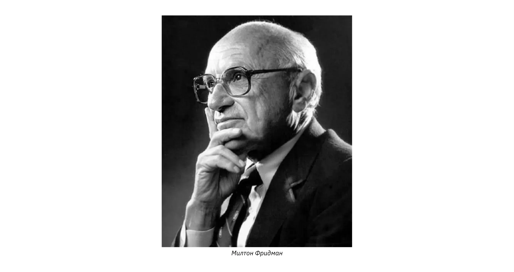

Ovo su politički i ekonomski argumenti koje su izneli prvi cypherpunks, Eric Hughes (1953-) u svom "Cypherpunk manifestu", ili Timothy May (1951-2018) u svom "manifestu kripto anarhiste", a koje će ponovo preuzeti Satoshi Nakamoto.

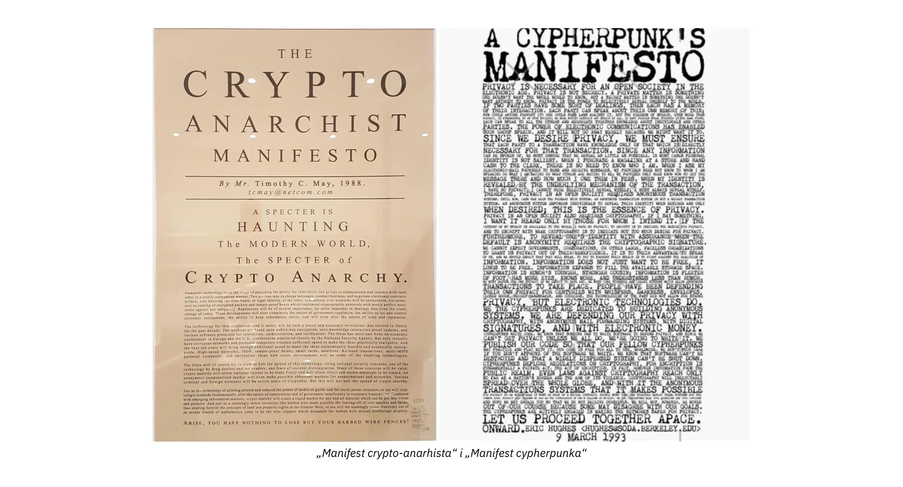

Posebno kada je upisao naslov iz Times-a od 3. januara 2009. u coinbase bloka Genesis od Blockchain Bitcoin kako bi ilustrovao kraj jedne ere, kejnzijanske, i početak druge sa liberalnim, anarhističkim i libertarijanskim težnjama.

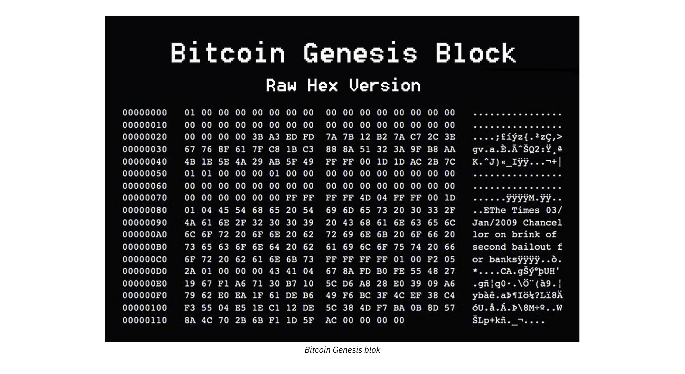

Bela knjiga objavljena 31. oktobra 2008. predstavlja Bitcoin kao sredstvo za razmenu vrednosti na Internetu bez pouzdane treće strane, zasnovano na decentralizovanom protokolu. "Kopernikanska" revolucija koja će konačno omogućiti ljudima da povrate svoju sposobnost delovanja, tj. svoju slobodu, slobodu trgovine, pravo na imovinu i poštovanje njihove privatnosti.

Zašto? Zato što nam Bitcoin omogućava da se oslobodimo ovog ropstva na Spinozin način, zahvaljujući razumu, zahvaljujući Galilejevom jeziku matematike. I, kako Hayek sugeriše, bez da država može da se tome suprotstavi. I to mirno, bez prisile ili prozelitizma.

Zapravo, ovo je poslednja paralela koju ću povući između Spinozizma i Bitcoin, kako bih pokazao da nema smisla ubeđivati bilo koga ko ne prihvata kopernikanski ili disruptivni koncept osim kroz razum, razumevanje, radoznalost ili dobru volju.

Ne silom, ne nasiljem. Jer činjenica je da Kopernik, Galilej, Njutn, Darvin, Ajnštajn, Hajek, Spinoza ili Satoshi Nakamoto nikada nisu pretili nikome ko nije verovao u njihove ideje i demonstracije.

# Završni deo

<partId>70a5a3c8-6c88-11f0-8753-db07e26dcaf4</partId>

## Recenzije i Ocene

<chapterId>7945c38c-6c88-11f0-a73f-0f7cdf99f53f</chapterId>

<isCourseReview>true</isCourseReview>

## Završni ispit

<chapterId>a557fd32-6c88-11f0-96ff-cfa532cf76a0</chapterId>

<isCourseExam>true</isCourseExam>

## Zaključak

<chapterId>ae04ab38-6c88-11f0-a496-3be47119e6b6</chapterId>

<isCourseConclusion>true</isCourseConclusion>