# Spinoza Satoshi ile Tanıştığında

17. yüzyıl filozofu Baruch de Spinoza'nın özgürlük, akıl ve güç hakkındaki radikal fikirlerinin Bitcoin'in merkezi olmayan devrimini nasıl önceden haber verdiğini keşfedin. Bu kurs çarpıcı paralellikleri ortaya koyuyor: her ikisi de kör inancı ve merkezi otoriteyi reddediyor, her ikisi de özgürleştirmek için matematiksel titizlik kullanıyor. Spinoza zihinleri dini dogmadan özgürleştirdi, Bitcoin parayı devlet kontrolünden özgürleştiriyor.

Bitcoin'in felsefi temellerini anlamak ve özerkliğinizi artırmak için Spinoza'nın etiğinden pratik araçlar öğrenin. Tarihin en büyük iki insan özgürleşme aracını keşfetmeye hazır mısınız?
+++
# Giriş

<partId>80b76189-afab-5295-a8d3-ba8f6fe7a5e8</partId>

## Kurs tanıtımı

<chapterId>99af4992-fd6c-5142-b168-d927b251574b</chapterId>

:::video id=1def60bc-1d39-4e49-9b08-fd05b7a0d49b:::

Bu derste, rasyonel Aydınlanma felsefesinin babası olarak kabul edilen ünlü 17. yüzyıl filozofu Baruch de Spinoza'nın (1632-1677) felsefesini sunmaktan mutluluk duyuyorum.

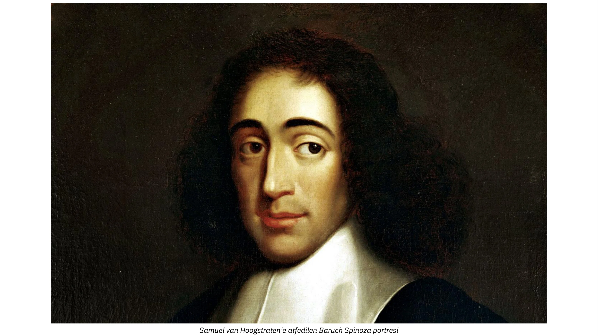

Spinoza'nın Portresi

Bu dersler, konuyla ilgili iki makaleme dayanmaktadır: "Spinoza'nın Gerçek Dini" ve "Bitcoin, Özgürlüğün İncili", basılı olarak çevrimiçi veya doğrudan web sitemden ve dijital olarak Amazon Kindle'dan edinilebilir.

Bu dersin amacı, her şeyden önce, günümüzde gördüğü yenilenen ilgiye rağmen, genellikle son derece karmaşık ve erişilemez olduğu düşünülen bir felsefenin basitleştirilmiş bir şekilde anlaşılmasını sağlamaktır.

Gerçekten de bu felsefe, yalnızca her şey ters gittiğinde, ki genellikle din, felsefe ve insan bilimleri bununla ilgilidir, olayların anlamını sorgulamamıza değil, aynı zamanda ve belki de en çok, her şey yolunda gittiğinde kendimizi sorgulamamıza olanak tanır.

Hayat bize gülümsediğinde ve kendimizi sorgulamamıza gerek yokmuş gibi hissettiğimizde, mutluluğumuzun ya da başarımızın yalnızca yeteneğimizden, çalışmamızdan ya da sözde özgür seçimlerimizden, kısacası tabi olduğumuz determinizmden değil de kendi özgür irademizden kaynaklanacağını aldatıcı ve kölece bir gururla düşünürüz.

Bu şekilde, bu pratik özgürlük felsefesi - ya da Spinoza'nın dediği gibi, "ona ulaşmak için araçlara doğru" - ile burada ilgilendiğimiz yeni teknolojik dünya, genel olarak kripto ve özel olarak Bitcoin arasında bağlantı kurabiliriz.

Ve özellikle de felsefi yönüyle, bizi tam olarak özgürlük kavramı üzerinde düşünmeye sevk ediyor: düşünme, kendini ifade etme, mahremiyete saygı ve tabii ki bizim durumumuzda Exchange özgürlüğü.

Öncelikle size Spinoza'yı, karakterini, sosyal, dini ve ailevi geçmişini ve yaşadığı Birleşik Eyaletler'in tarihsel bağlamını tanıtacağım.

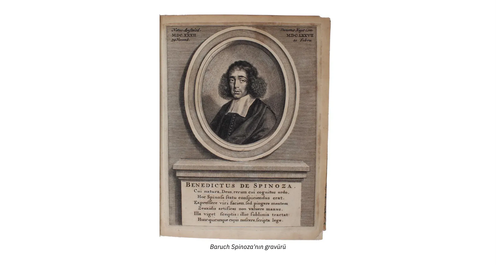

Spinoza'nın Portresi

Daha sonra bu yeni rasyonel felsefenin ne olduğunu göreceğiz; buna göre "doğada aklın kullanımı olmaksızın açıklanamayacak hiçbir şey yoktur".

Bu, dünyayı ve insan doğasını yalnızca şeyler arasındaki nedensel bağlantı açısından anlayabileceğimiz fikridir; buna göre, bir etkinin her zaman bir nedeni vardır ve bu nedenin kendisi de başka bir nedenin sonucudur ve bu şekilde, erişimimizin olmadığı ve Spinoza'ya göre Doğa olan ilk nedene kadar devam eder.

Doğa, diğer bir deyişle Tanrı, Spinozacılığın tüm anlamını gösteren Latince'deki ünlü "Deus sive Natura "dır.

Ayrıca Spinoza'nın 1677'de ölümünden sonra yayınlanan ve tamamen özgürlüğe ve kendimizi bizi hapseden köleliklerden özgürleştirme ihtiyacına odaklanan Etika'dan başlayarak iki büyük eserine de göz atacağız.

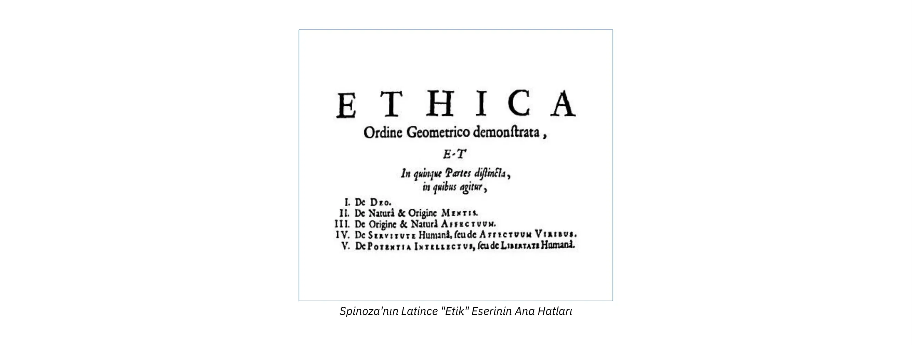

Daha sonra, 1670 yılında onun sağlığında yayınlanan ve özgürlüğü başka bir açıdan ele almamızı sağlayan Traité théologico-Politique'e bakacağız: düşünce ve inanç özgürlüğü. Başka bir deyişle, dini özgürlük, ama her şeyden önce siyasi özgürlük.

Son olarak, Spinozacılığın neden Kopernikçi bir fikir devrimi olduğunu ve Spinoza'nın reddettiği 3 temel yanılsamayı inceleyerek dünyanın ve insan doğasının yeni bir tanımını nasıl temsil ettiğini göreceğiz: özgür irade yanılsaması, nihai nedenler yanılsaması veya finalizm ve teolojik yanılsama.

Geometriciler tarzında geliştirilen duygulanımlar teorisi sayesinde, "more geometrico", Spinoza'nın kendimizi insan doğasına ve dışsal tutkulara içkin köleliklerden kurtarmak ya da kurtarmaya çalışmak için bize nasıl pratik bir yöntem sunduğunu nihayet göreceğiz. Cehalete karşı savaşmak için bir üçgenin üç açısının her zaman 180°'ye eşit olduğu kesinliğiyle karşılaştırılabilecek rasyonel bir mekanizma ve bunun sonucunda ortaya çıkan Aydınlanma ruhunu, Satoshi Nakamoto'nun icadı Bitcoin ile doğrudan bağlantılı olan 19. yüzyılın liberal akımları veya 20. yüzyılın liberteryenizmiyle ilişkilendirmemizi sağlayacaktır.

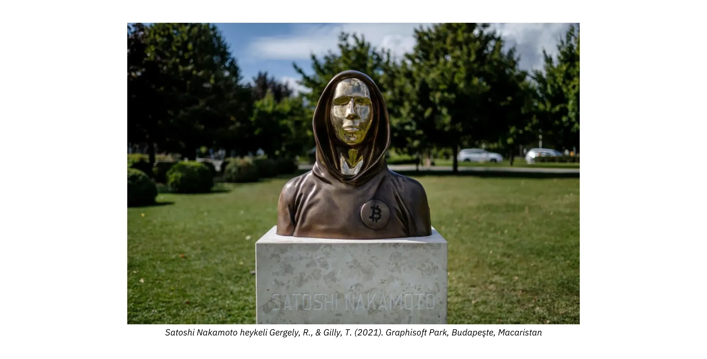

O zaman Spinozacı kavramlar ile Satoshi Nakamoto tarafından icat edilen bu özgürlük aracı arasındaki pek çok ortak noktadan birincisinin, her iki durumda da, eğer meraklıysak, iyi niyetliysek, o zamanlar söylendiği gibi "anlayışa" sahipsek, o zaman ona bağlı kalmaktan başka bir şey yapamayacağımızı anlayacağız. Ve eğer buna uymazsak, ki bu elbette en mutlak hakkımız olacaktır, çünkü inanma ya da inanmama özgürlüğüne saygı duymak esastır, o zaman yapamamaya ya da istememeye kararlı oluruz ki bu da aynı anlama gelir.

İşte bu şekilde, örneğin bir köktendincinin Spinozacılık gibi en ufak bir Kopernikçi düşünceyi asla kabul edemeyeceğini ya da dinleyemeyeceğini, tıpkı bir merkez bankacısının Bitcoin'yi kabul etmekte çok zorlanacağı gibi anlayabiliriz.

Gerçi bildiğiniz gibi şu anda işler doğru yönde ilerliyor.

## Baruch de Spinoza ile tanışın

<chapterId>f53a9cfd-326e-5b73-a766-3ef2f07c5a49</chapterId>

:::video id=5fac3ddc-c472-4c64-8186-46a8f317e389:::

Baruch de Spinoza kimdir? 1632'de doğmuş ve 1677'de 45 yaşında ölmüş Hollandalı bir filozoftur.

Yahudi inancına sahip olan ve 15. yüzyılda Katolikler tarafından İspanya'yı terk etmeye zorlanan Marranoların soyundan gelen Portekiz Sefarad cemaatinin bir üyesiydi, zulüm görmenin ne anlama geldiğinin farkında olarak dini ve entelektüel bir ortamda yetişti.

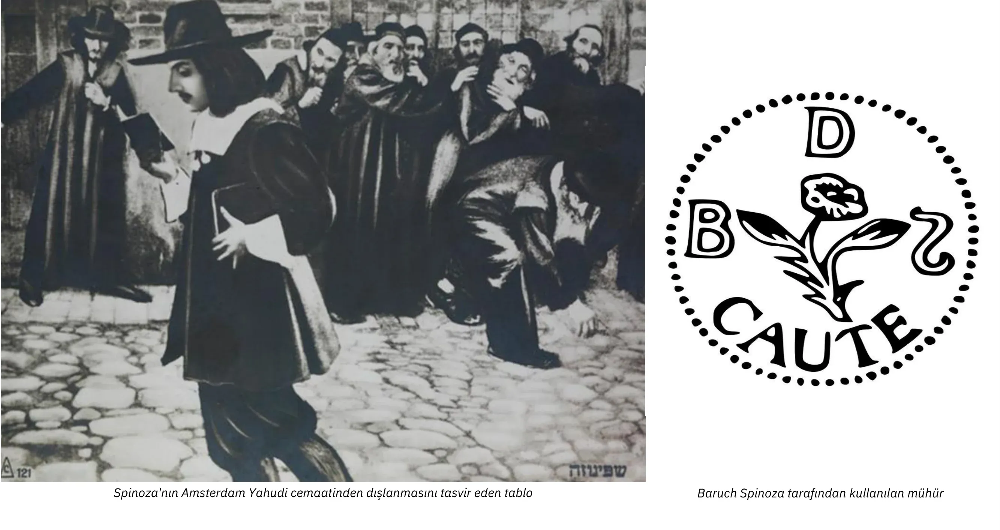

Aslında, erken yaşlardan itibaren yerleşik dine ve özellikle de 1656'da, henüz 24 yaşındayken, hiçbir şey yayınlamadan şiddetle reddedildiği İbrani cemaatine karşı güçlü bir eleştirel ruh sergiledi.

Söylendiğine göre bu "aforoz" onun kendini izole etmesine ve arkasına bile bakmadan işine odaklanmasına olanak sağlamıştır.

Çağdaşları Descartes (1596-1650), Pascal (1632-1662) ve Newton (1643-1727) gibi, kendisinden sadece birkaç yıl önce yaşamış olan Kopernik (1473-1543), Kepler (1571-1630) ve Galileo'nun (1564-1642) fizik alanındaki yeni rasyonel fikirlerinin mirasçısı olan Spinoza, Galileo'nun matematiğin evrenin dili olduğu ilkesine uygun olarak, geometricilerin tarzında bir düşünme biçimi geliştirmiştir.

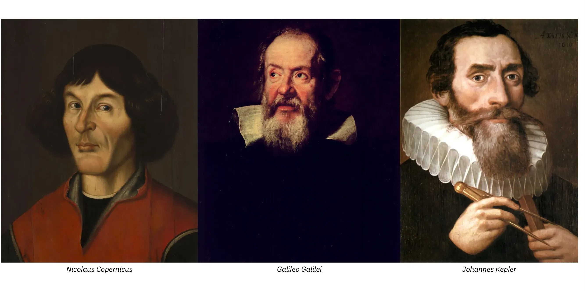

Ancak bunlar, Roma'da halka açık bir meydanda sapkınlık suçundan diri diri yakılan keşiş ve filozof Giordano Bruno'nun (1548-1600) yargılanmasından ve 1633 yılında engizisyon tarafından Kopernikçi güneş merkezli inançlarından vazgeçmeye zorlanan Galileo'nun yargılanmasından sonra, o dönem için çok tehlikeli fikirlerdi.

Bu nedenle, dünya ve insan doğasına ilişkin, şeyler arasındaki nedensel bağlantılara dayanan katı rasyonel vizyonu, ona yanlış bir şekilde ateist olarak görülme ününü kazandırmıştır ve bugün hala öyledir.

Aslında Spinoza'nın eseri sadece Doğa ile özdeşleştirdiği Tanrı'dan bahseder ve dindar insanların ve teokratların batıl dürtülerini eleştirirken, onun için gerçek dinin her şeyden önce adalet ve hayırseverlikle eşanlamlı olduğunu gösterir.

Spinoza'yı ister Leibniz (1646-1716), Kant (1724-1804), Schopenhauer (1788-1860) ve Nietzsche (1844-1900) ile Alman, Locke (1632-1704) ile İngiliz veya Voltaire (1694-1778), Rousseau (1712-1778) ve Diderot (1713-1784) ile Fransız olsun, Aydınlanma felsefesine bağlayan da bu yaklaşımdır. Hepsi de aklın, cehaletle savaşmak, özgürlük ve ilerleme ideallerini savunmak için gericilikle, özellikle de dini gericilikle mücadele etmek için kullanılması gerektiği konusunda hemfikirdi.

Şimdi, bu felsefeyi Bitcoin ile ilişkilendirmeye başlamak için, Spinoza'nın çok özel bir dönemde doğduğunu belirtmek önemlidir.

17. yüzyılda Birleşik Eyaletler sadece siyasi ve dini fikirler açısından dünyanın en özgür ülkesi değil, aynı zamanda en zengin ülkesiydi. Başka bir deyişle, ekonomik ve teknolojik olarak en gelişmiş ülkeydi.

Ancak zenginlik doğal kaynaklara, sömürgelere ve köleliğe değil, liberal ve girişimci bir ruhla yapılan uluslararası ticarete bağlıdır. Bu ruh daha sonra ünlü Spinozacı Voltaire (1694-1778) tarafından da savunulmuştur; ona göre, bir ticaret odasında liberal görüşlü bir işadamı ya da girişimci asla dışlanmaz, kafir olarak adlandırılmaz ya da aforoz edilmezdi.

Dahası, Hollanda o dönemde mekanik ve optik gibi önemli teknolojik alanlarda da ilerlemişti. Galileo tarafından gökyüzüne bakmak ve evreni keşfetmek için kullanılan astronomik teleskoplar, bugün bilgisayar, yapay zeka ve tabii ki kripto ile ilgili yeni teknolojiler gibi, dönemleri için gerçekten de en ileri teknoloji olarak kabul edildi.

Spinoza'nın kendisi de astronomi merceklerini parlatma işiyle uğraştığından - ironik bir şekilde her şeyi çarpık gördüğü söylenen biri için - Bitcoin gibi bir özgürlük aracını kesinlikle destekleyeceğini tahmin edebiliriz.

Başka bir deyişle, Spinozacılık tarafından aktarılan özgürlük ve ilerleme değerleri, dini köktenciliğin, komplo teorilerinin, batıl inançların ve hepsinden önemlisi cehaletin üzücü bir gerçeklik olarak kaldığı bir dünya ile tezat oluşturmaktadır.

Yine de kaçmak, kendimizi bizi hapseden köleliklerden kurtarmak ve dünyayı olmasını istediğimiz gibi değil, olduğu gibi kabul ederek özgür olmak için her yolun değerli olduğu bir dünya.

Bu araçlar ister felsefi ister teknolojik olsun, daha sonra göreceğimiz gibi, Bitcoin bir özgürlük aracıdır. Hem bireylerin hem de devletlerin kendilerini kölelikten, özellikle de parasal kölelikten kurtarmalarını sağlayan bir araçtır.

# Başlıca eserler, Etik ve politika

<partId>d7d7e9a1-005b-519c-b587-137435e46344</partId>

## Etik ve özgürlük arayışı

<chapterId>4cc66e25-335c-591d-9b78-83e5664bbbbc</chapterId>

:::video id=065c5091-69e1-412f-acce-c763ec31d3b1:::

Bu bölümde, Spinoza'nın ölümünden sonra 1677'de yayımlanan Etik başlıklı temel eserine dönmeyi öneriyorum.

Neden ölümünden sonra? Çünkü fikirleri devrimciydi ya da en azından mantığa aykırı ve yıkıcıydı ve bu nedenle 17. yüzyıl Birleşik Eyaletleri'nin liberal bağlamında bile o zamanlar çok tehlikeliydi.

Etika, muhtemelen Kepler (1571-1630) ile birlikte modern bilimin babası olan ve matematiğin evrenin dili olduğuna inanan Galileo'nun (1564-1642) bilimsel ruhundan esinlenerek, geometriciler tarzında Latince yazılmış bir eserdir. Spinoza fikirlerini beş ana bölümde geliştirir; önermelere kanıtlamalar, devşirmeler, aksiyomlar ve tanımlar eşlik eder.

Bu haliyle Etik, Spinoza'nın deyimiyle "özgürlüğe ya da ona giden yollara ulaşmanın bir yoludur" ve aslında baştan sona okunabilecek bir kitap değil, daha ziyade, örneğin bir önermenin bir diğerine gönderme yaptığı, onun da bir üçüncüsüyle anlaşıldığı ve bu şekilde mükemmel bir şekilde tutarlı, rasyonel ve mantıksal bir sistem içinde okunarak üzerinde çalışılabilecek bir kitaptır.

Etika'yı açtığınızda, önsöz ve eklerle başlamanızın tavsiye edildiğini belirtmek isterim, bu kısa bölümler Spinoza tarafından günlük dilde yazılmıştır, bu nedenle anlaşılması kolaydır ve bir bakıma onun bazen karmaşık olan düşüncesinin bir özetidir.

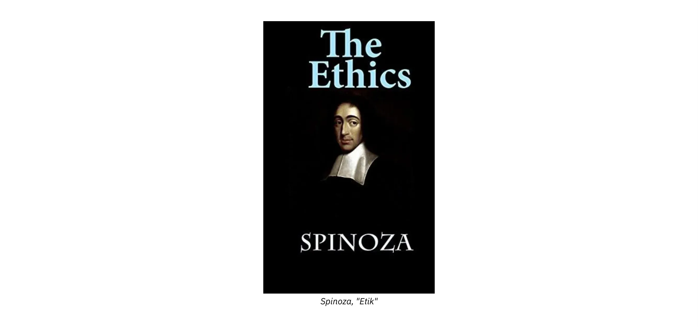

Spinoza'nın eseri, etrafımızdaki dünyayı "aklın mikroskobuna" tabi tutarak, insan doğasını, insanın kendi kendine neden olmadığı, yani ne burada, ne zamanımızda, ne de böyle bir fiziksel veya entelektüel nitelikle doğmayı istemediğimiz ilkesine göre inceler.

Ve doğanın üstünde olmadığımızı söylüyor. Bedenen ya da zihnen onun yasalarından muaf değiliz. Başka bir deyişle, hayvansal ya da bitkisel diğer canlılar kadar doğanın bir parçasıyız.

Spinoza'ya göre, insan faaliyetlerinin tüm alanları, aklın dünyayı mükemmel bir şekilde tutarlı ve belirlenmiş bir sistem içinde anlama kapasitesine bağlıdır.

Şansın var olmadığı bir dünya.

"Olan ve olan şey, olmalıdır ve olmalıdır" fikrine göre, olan her şey "zorunludur" ve bir nedenin sonucudur. Bu mutlak determinizmdir.

Ancak akılda tutulması gereken iki nokta var:

İlk olarak, eğer Spinoza için şans diye bir şey yoksa, bunun nedeni onun nedenini bilmediğimiz bir olay olmasıdır. Ancak, elbette, nedenini bilmiyor olmamızın onun var olmadığı anlamına gelmediğini söyler.

İkinci olarak, doğa niyetle donatılmadığı için kesinlikle kadercilik de söz konusu değildir. Örneğin yıldırımın, bir trajedi durumunda düşünülebileceği gibi, kimseyi cezalandırmak gibi bir niyeti yoktur. Hayır, sadece kendi doğasının özünü ifade eder ki bu da yıldırımla çarpmaktır. Çarpmak.

Spinoza böylece gerçekliğin, yani hem iyi hem de kötü yönleriyle günlük yaşamın mükemmel bir şekilde anlaşılabilir olduğu ve doğada nedensel olarak bağlantılı olmayan hiçbir olgunun bulunmadığı fikrini savunur. Elbette bu, kötülük, özellikle de biraz sonra ele alacağımız mutlak kötülük sorununu gündeme getirir.

Son olarak, etiğin ahlak olmadığını belirtmek önemlidir.

Ünlü felsefe profesörü ve Spinoza uzmanı Gilles Deleuze'e (1925-1995) göre ahlak, toplum içinde yaşamak için yararlı bir yargı sistemidir. Ancak öznel bir sistemdir, çünkü burada doğru olan başka bir yerde yanlış olabilir ve bugün yanlış olan daha sonra doğru olabilir.

Spinoza'ya göre etik, neyin doğru ya da yanlış olduğunu belirlemekten ziyade, kendi doğamız ve varlığımızı koruma kapasitemiz için neyin iyi ya da kötü olduğunu belirler. Özgür olmak için. Bu nedenle gerçek bir etoloji, yani varoluş biçimlerinin bir bilimi ya da Gilles Deleuze'ün daha da açıkladığı gibi, iyi karşılaşmalar yapma sanatıdır.

Ya da bizi hapseden ve Spinoza'ya göre insanların genellikle "en iyiyi görmeye, onaylamaya ve en kötüyü yapmaya" indirgendiği köleliklerden kendimizi kurtarmak için doğru seçimleri yapma sanatı.

Başka bir deyişle, "özgürlükleri için savaşır gibi kölelikleri için savaşmak".

## Teolojik-Politik İnceleme

<chapterId>84b0187e-1050-5d44-a536-80554896e828</chapterId>

:::video id=c1efc97e-1e96-4b37-894c-9a19794d6b52:::

Etika'dan sonra, bu bölümde size Spinoza'nın felsefi ve siyasi etkisini, özellikle de yaklaşan Aydınlanma ve liberal ve bizim durumumuzda özgürlükçü akımlar üzerindeki etkisini anlamanıza yardımcı olacak bir başka önemli eseri tanıtmak istiyorum.

Bu, 1670 yılında anonim olarak yayınlanan Traité théologico-politique veya TTP'dir.

Spinoza (1632-1677) bu kitabı, Etika'nın yazımına ara verdiği bir sırada, bugün hala var olan bir yanlış anlamaya son vermek amacıyla yazmıştır. Bu, onun bir ateist olduğu inancıdır.

Gördüğümüz gibi, Spinoza'nın Tanrı kavramı, sadece Tanrı'nın varlığını değil, aynı zamanda onun gerçek doğasının ne olduğunu da gösterdiği Etika'nın ilk bölümünün tamamının konusudur.

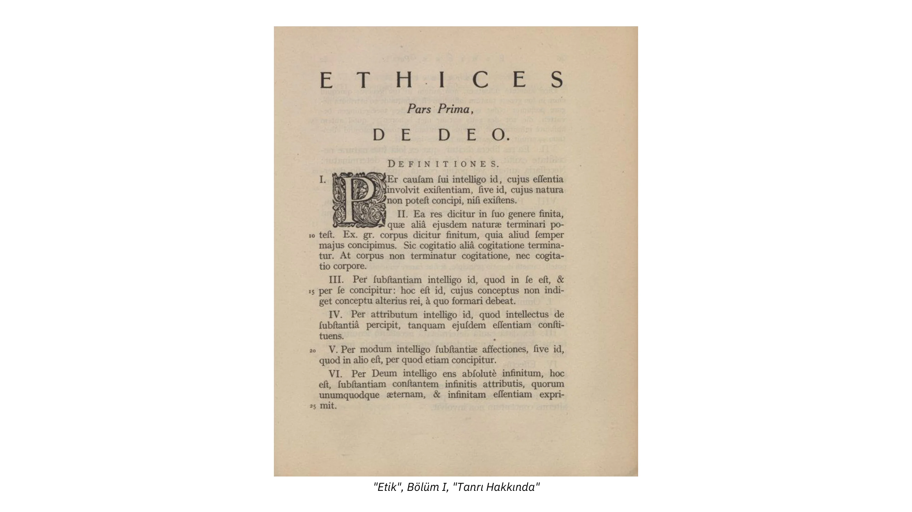

Ve Spinoza'nın kavramlarını anlamak genellikle oldukça zor olduğundan, onları ne olduklarını söylemeye çalışmak yerine ne olmadıklarını söyleyerek anlamak genellikle daha kolaydır. Bu, tesadüfen ve daha sonra göreceğimiz gibi, Bitcoin'yı anlamak için çok yararlı olan bir yaklaşımdır.

Spinoza bize Tanrı'nın, ona göre, niyetlerle donatılmış, cezalandıran veya ödüllendiren, kendisiyle konuşacağımız ve takip edebileceğimiz veya edemeyeceğimiz bir ritüele göre bizi dinleyecek antropomorfik bir varlık olmadığını bu şekilde gösterir. Başka bir deyişle, ona göre Tanrı, dünyanın zorluklarını çözecek ve bizi kendisine bağımlı kılacak, bir bulutun arkasına saklanmış uzun beyaz sakallı yaşlı bir adam değildir.

Dolayısıyla Tanrı'dan söz etmek, Doğayı, biz insanların yalnızca ikisini bildiği sonsuz sayıda nitelikten oluşan eşsiz, sonsuz ve ebedi bir Madde olarak çağrıştırmaktır: madde ya da kapsam ve düşünce.

Bu, Spinoza'nın mutlak determinizm kavramını ve insanın kendi kendisinin nedeni olmadığı ve Doğanın üstünde olmadığı ve kesinlikle hayvanların üstünde olmadığı fikrini türettiği ünlü "Deus Sive Natura "dır.

Ancak TTP, bir din eleştirisinin ötesinde, Spinoza için her şeyden önce dindarlara ve teokrasiye yönelik ağır bir eleştiri yapma fırsatıdır. Başka bir deyişle, dini gücün korku ve batıl inançları beslediğini ve bireylerin üzücü tutkularını harekete geçirerek onları daha iyi köleleştirdiğini, onları yanılsama, fanatizm ve savaşa hapsettiğini söyler.

Dinin bu ilk, çocuksu aşamasında inananlar sadece dışsal ibadete ve önyargıya dayalı saf bir inanca bağlanırlar. Dinin mekanik bir şekilde hoşgörüsüzleştiği, ahlaki öğretisinin sınırlarından saptığı ve hakikate sahip olduğunu iddia ederek barış ve uyumu teşvik etme görevinden uzaklaştığı bir aşamadır.

Bununla birlikte, örneğin İncil'i tefsir ederek dinin rasyonel eleştirisinin ötesine geçtiğimizde, Spinoza bizi bu yeni Tanrı vizyonunun, basit ama genellikle unutulan bir altın kuralı ortaya koyan Kitabın üç büyük dininin adalet ve hayırseverlik mesajlarıyla tamamen uyumlu olduğuna ikna etmek ister: "Komşunu kendin gibi seveceksin".

Ama hepsi bu kadar değil.

TTP'de geliştirilen bu olgun din vizyonuna siyasi bir boyut, düşünce ve inanç özgürlüğünü korumak için din ve devletin hem tüm bireylerin hem de devletin çıkarları doğrultusunda ayrılması gerekliliği eşlik etmektedir.

Temel olarak Spinoza, akıl çerçevesinde özgürlüğü, insanların kendi çıkarlarına karşıt bir güç tarafından köleleştirilmeden yaşayabilmeleri için vazgeçilmez bir koşul haline getirir ve bu nedenle siyasi ve dini özgürlüğe dayalı doğrudan bir demokrasiyi savunur.

Başka bir deyişle, düşünce ve inanç özgürlüğü, böylece insanlar kölelikten ve yanlış, çocuklaştırıcı inançlardan kurtulabilir, yetişkinler gibi muhakeme edebilir, akla ve bize göre teknolojik ilerlemeye öncelik verebilir.

Lizbon'da 1 Kasım 1755 tarihinde meydana gelen meşhur deprem, insanların doğal olaylar ve felaketler hakkındaki düşüncelerinde ve kendilerini bunlara karşı nasıl koruyacakları konusunda büyük bir değişim gösterdi.

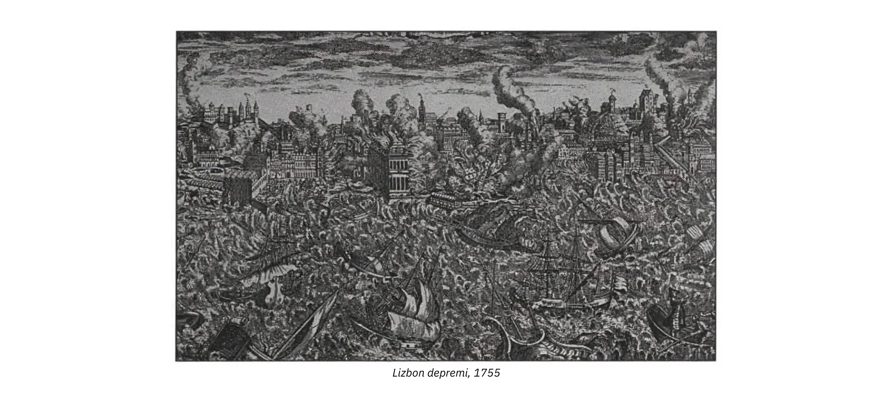

Bu korkunç deprem şehri yok etti ve yüz binlerce masum insanı öldürdü. O sırada çoğu kilisedeydi, çünkü Azizler Günü'ydü, bu da hayatta kalanların şaşkınlığını artırdı.

Alman filozof ve matematikçi Leibniz'in (1646-1716) niyet, iyilik ve her şeye gücü yeten bir Tanrı'nın antropomorfik vizyonu hakkında ortaya attığı soruyu yeniden canlandıran bir drama. Leibniz'in Teodise'sinde söylediği gibi Tanrı iyi olsaydı, bu tür felaketlere izin vereceği için her şeye kadir olmazdı ve her şeye kadir olsaydı, bunları önleyemeyeceği için iyi olmazdı.

Jean-Jacques Rousseau (1712-1778), Tanrı'nın elini lanetlemenin çok ötesinde, insanoğlunun ayrım gözetmeden maruz kaldığı adaletsizlik ve dehşetten etkilenen Voltaire'e "doğanın kendi içinde kötü olmadığını ve onda tasarımını açıklayacak herhangi bir ilahi el görmememiz gerektiğini" yazmıştır.

Bir Spinozacı olan Voltaire (1694-1778), bu doğal felaketin her şeyden önce kendimizi doğadan koruyacak bilimsel araçların var olduğunu fark etmemizi sağlaması gerektiğini ve bu nedenle zamanlarının meydan okumasının, insanların bilgi ve ilerleme sayesinde geleceklerini kendi ellerine alıp alamayacaklarını ve kendilerini teoloji ve batıl inançlardan kurtarıp kurtaramayacaklarını sormak olduğunu söyledi.

Ve elbette, hala sadece öngörülemez değil aynı zamanda tamamen kontrol edilemez olan depremleri önlemek söz konusu olmasa da, daha çok, örneğin evlerin bunlara dayanacak şekilde inşa edilmesini sağlamak söz konusuydu.

Bu nedenle 18. yüzyıl Aydınlanması, aklın, bilimin ve teknolojinin kullanılması sayesinde ilerlemenin yüzyılıdır. Başka bir deyişle, özgürlüğün bir aracı olarak ilerleme.

# Spinozacı devrim, üç yanılsama

<partId>f5d45c2b-28da-527a-ab20-dd255e9a9e0d</partId>

## Doğa ve insanın yeni bir tanımı

<chapterId>3e6599e3-5b29-50a8-a67d-d0386da5d65d</chapterId>

:::video id=b6d2c035-8848-4da6-9da9-be3b70be0f38:::

Bu bölümde, fikirler tarihine bir göz atmak ve Spinozacılığın neden gerçek bir Kopernik fikir devrimi olarak kabul edildiğini görmek istiyorum.

Spinoza (1632-1670), matematiğin sunduğu Tanrı'yı, yani Doğa'yı anlamanın bu yeni yolu sayesinde, dini dünya görüşü ve insanın bu dünyadaki yeri üzerinde dolaylı etkileri olan derin bir paradigma değişimi yaratmıştır.

Nicolas Copernicus'un (1473-1543) dünyanın merkezi olmadığını ortaya koyması ve Charles Darwin'in (1809-1882) üç yüzyıl sonra insanın "yaşamın" merkezinde olmadığını göstermesi gibi, Spinoza da bu mantığı izleyerek kendi döneminde insanın "kendi evinin efendisi" olmadığını ve evrenin yalnızca kendi yararına yaratılmadığını ileri sürmüştür.

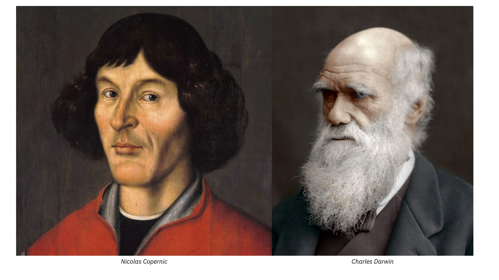

İnsanın "imparatorluk içinde bir imparatorluk" olmadığını ve tıpkı dünyanın diğer tüm gezegenler gibi yalnızca bir gezegen statüsüne indirgenmesi gibi, insanın da hayvanlar, bitkiler ve tüm "var olan varlıklar" gibi doğanın diğer tüm sonlu türleri gibi yalnızca bir doğa türü statüsüne indirgendiğini söyler.

Ondan önce, klasik Yunan felsefesi dünyayı, kozmosu ve insan deneyimini açıklamak için düzenli, hiyerarşik bir evren görüşü önermiştir. Efsanevi anlatılara dayanarak, temelde dünyanın kökenini açıklamaya çalışmış, evrenin, doğanın ve insanlığın uyumunda ısrar etmiştir.

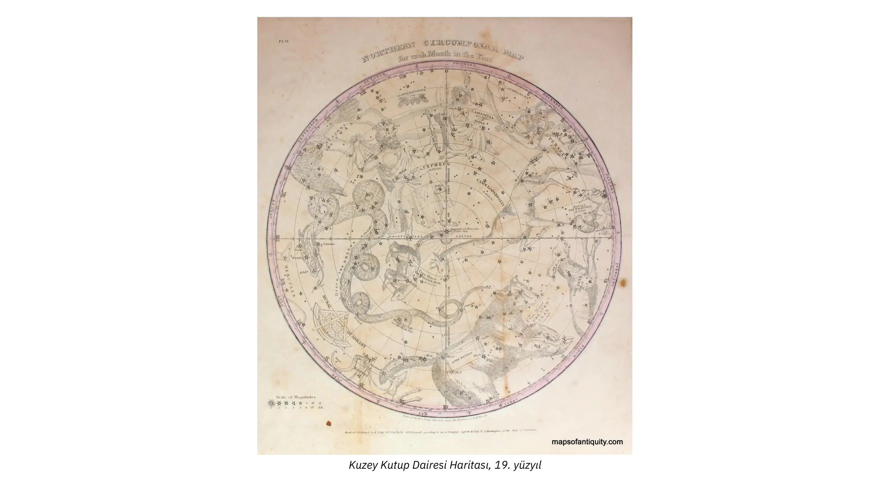

Orta Çağ'ın skolastik kozmolojisi, esasen 12. yüzyıldan itibaren, hala hiyerarşik olan, ancak Hıristiyan felsefesine daha iyi uyan bir evreni açıklamak için akıl ve inancı uyumlu hale getirmek amacıyla daha fazla akıl yürütmeye doğru bir evrim geçirmiştir.

Ancak 15. yüzyılda Kopernik'in (1473-1543) yeni fiziği ile kozmoloji, evrenin anlaşılmasında büyük bir dönüm noktası yaşamış, yer merkezli modeli güneş merkezli sistem lehine sorgulanmaya başlanmış, bu da modern bilimin, özellikle de Kepler (1571-1630) ve Galileo'nun (1564-1642) yeni fizik ve astronomisinin önünü açmıştır. Ardından Isaac Newton (1643-1727) ve son olarak da kararlı bir Spinozacı olan Albert Einstein (1879-1955).

Ancak Spinozacılığı tam olarak anlamak için, Spinoza'dan önce gelen ve hem öğrencisi hem de büyük hayranı olduğu ünlü Fransız filozof René Descartes'ın (1596-1650) bağlamını da göz önünde bulundurmamız gerekir.

Giordano Bruno (1548-1600) ve Galileo'nun risklerine ve kınamalarına rağmen Descartes, "hakikati sahteden" ayırmaya ve teoloji, felsefe ve fiziği uyumlu hale getirmeye koyuldu. Descartes, 1637'de yayımlanan ünlü Metot Üzerine Söylev'inde, aklın bilginin temeli olduğunu ve bu sayede insanın özgürlüğe ulaşabileceğini savunmuştur.

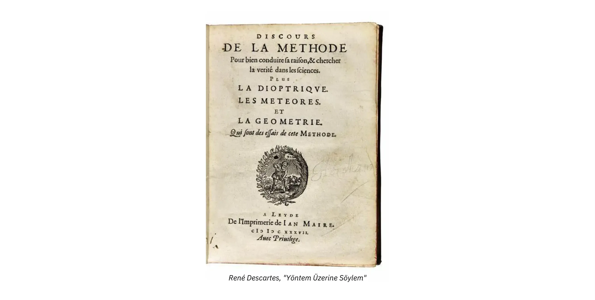

Dünyayı ahlaki niyetlerle donatılmış bir doğa yerine evrensel yasalara göre açıklayarak, Spinoza'nın daha sonra göreceği determinizmin yolunu açmıştır.

Ancak bir Katolik olarak Descartes yine de insan ile doğanın diğer sonlu türleri arasında ve özellikle de "makine hayvanlar" olarak adlandırdığı hayvan türleri arasında bir hiyerarşi kurmuştur. Descartes "iyi yönlendirildiğinde eylemleri ve tutkuları üzerinde mutlak güce sahip olamayacak hiçbir ruh yoktur" diyerek, insanın bir şeyi yoktan var etme kapasitesine sahip olduğunu ve ona göre insanın "doğa yasalarından kaçtığını", kendi eylemleri üzerinde mutlak güce sahip olduğunu ve kararlılığını yalnızca kendinde temellendirdiğini iddia eder.

Spinoza bu aşamanın ötesine geçmeyi ve Tanrı'nın varlığını aklın kanıtlamasıyla nasıl uzlaştıracağını biliyordu. Ona göre, insan faaliyetinin tüm alanları, mükemmel bir şekilde tutarlı ve belirlenmiş bir dünyada aklın kapasitelerine bağlıdır. Ama içinde ne olumsallığın ne de şansın olduğu, olan her şeyin zorunlu olduğu ve şeyler arasındaki nedensel bağa göre bir nedenin sonucu olduğu bir dünya. Bu mutlak determinizm fikridir.

Ve sonunda Kartezyen pozisyonu en sert ifadelerle çürütür, örneğin insanın diğer tüm hayvanlar gibi doğa yasalarına tabi olmadığı ve bu nedenle doğanın diğer tüm sonlu hallerinden üstün olduğu fikrini eleştirir.

Başka bir deyişle, Spinoza'nın bize söylediği ve şimdi tartışacağımız gibi, kaçması son derece zor olan yanıltıcı bir inanç olan özgür irade ile donatılmışlardır.

## Özgür İrade Yanılsaması

<chapterId>f147a914-cb64-5927-b305-26691930bca3</chapterId>

:::video id=b59da795-ba19-4643-9672-36c9e7953a42:::

Bu derste, Spinoza, Aydınlanma ve erken dönem liberal filozoflar için özgürlüğün ne olduğunu daha iyi anlamak amacıyla, özgür irade gibi hassas bir soruya döneceğiz.

Daha önce de gördüğümüz gibi, Spinoza (1632-1677) özgür iradeyi, kişinin kendisini özgürleştirmesinin son derece zor olduğu bir yanılsama olarak görmesiyle tanınır.

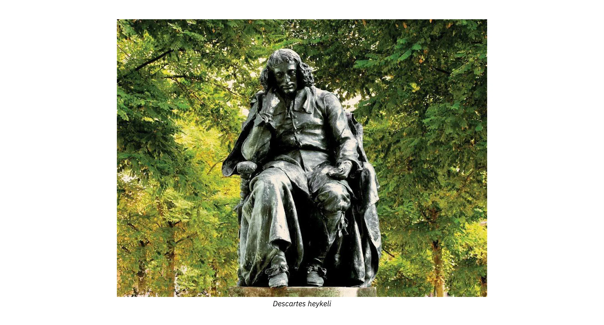

Neden böyle? Çünkü Antik Çağ'dan beri süregelen ve Descartes (1596-1642) tarafından hala savunulan felsefi geleneğe aykırıdır: Hıristiyan Kilisesi'nin babası Aziz Augustinus (354-430), insanın yoktan bir şey var edebileceğini ve özellikle Tanrı'nın önünde eylemlerinin tüm sorumluluğunu taşıyabileceğini söyler.

Ama aynı zamanda, elbette, insan adaletinin önünde.

Bu, irademizin ve yalnızca irademizin yaşamlarımızı yönlendirmemize izin verdiği, eylemlerimiz üzerinde mutlak güce sahip olduğumuz ve eylemlerimizin özgürlüğünü yalnızca kendimizden aldığımız, dolayısıyla belirsiz bir karar gücüne sahip olduğumuz fikridir.

Başka bir deyişle, insanoğlu doğanın düzenine tabi olmak yerine onu bozabilmektedir.

Yaşamını sürdürürken, kendi iradesinden başka hiçbir yasaya tabi olmayacağı için, yalnızca doğanın ve hayvanların, yalnızca makinelerin değil, aynı zamanda doğanın diğer tüm sonlu biçimlerinin de üstünde olacaktır. Descartes'ın (1596-1650) konumu buydu; ona göre insanın iktidarsızlığının ve tutarsızlığının nedenleri doğal düzende değil, insan doğasının kendi zaaflarında yatıyordu.

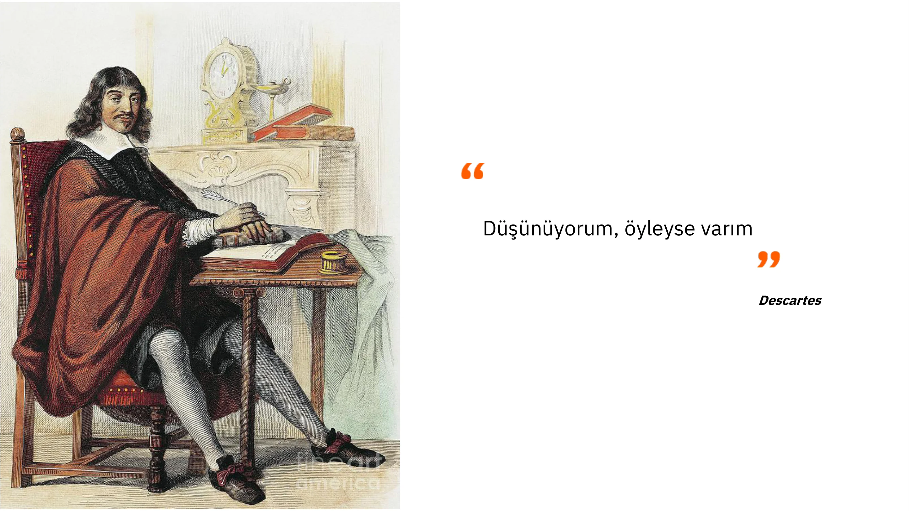

Ancak Spinoza Descartes'a duygusal yaşamın rasyonel kontrolünün yolunu açtığı için itibar ederken, iradenin "mutlak gücü" hipotezini sert bir şekilde eleştirerek ondan tamamen uzaklaşır.

Öte yandan Spinoza, dünyamızın mükemmel bir şekilde tutarlı ve belirlenmiş olduğunu ve olan her şeyin zorunlu olduğunu ve şeylerin nedenselliğinin sonucu olduğunu düşünür; buna göre bir etkinin her zaman bir nedeni vardır ve bu nedenin kendisi de başka bir nedenin sonucudur ve bu böyle devam eder.

Bu, Etika'sında insanların hiçbir şekilde özgür iradeye sahip olmadıklarını ortaya koyduğu mutlak determinizm fikridir; çünkü ona göre, eylemlerinin bilincindedirler, ancak onları belirleyen gerçek nedenleri görmezden gelirler ya da görmezden gelmeyi tercih ederler.

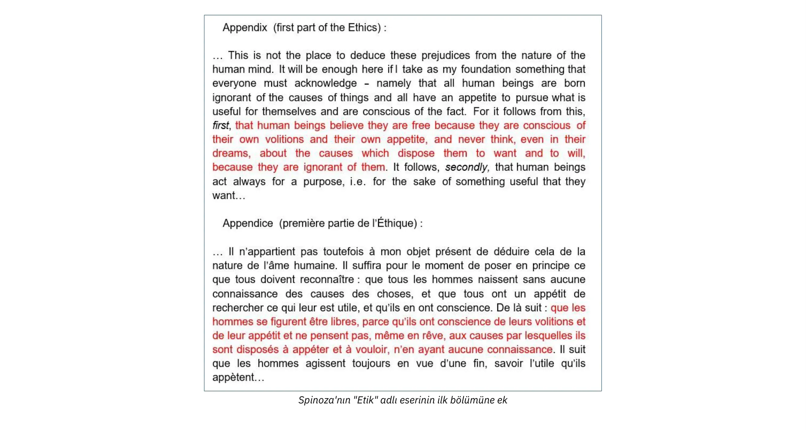

Spinoza'ya göre, hayvanlar ya da bitkiler gibi doğanın "sonlu kipleri" olarak insanlar, bir şeyi yoktan var edemezler; hem bedenlerinde hem de zihinlerinde doğanın yasalarından muaf değildirler.

Daha da kötüsü, ona göre özgürlüğün en büyük tehlikesi, özgür irademize inanmak ve dış nedenler tarafından belirlenmeden hareket edebileceğimize inanmaktır.

Spinoza için özgürlük, özgür iradenin ifadesi değil, dünyadaki haklı yerimizi anlama, belirlenmiş doğamızı anlama ve buradan hareketle varlığımızı "eyleme gücümüzü artıran" şeye yöneltme yeteneğidir. Geleceğe daima iyimserlikle bakarak ve dünyayı görmek istediğimiz gibi hayal etmek yerine olduğu gibi görerek.

Elbette ortaya çıkan sorun insan sorumluluğu ve eylemleridir. Bireyler eylemlerinde özgür değillerse, özellikle adalet karşısında onlardan sorumlu olmayacakları sonucuna varabiliriz. Ancak bu görüş yanıltıcıdır, çünkü çok fazla ayrıntıya girmeden, kişinin sosyal, ailesel ve tarihsel determinizmini kabul etmek, iradi olduğu için işlenen eylemlerin sorumluluğunu düşünmemize engel değildir.

Öte yandan, bir suçlunun eylemlerinin asla kendi determinizmiyle bağlantılı olmadığına inanmak bir yanılsama olacaktır. Mesele onları mazur görmek olmasa da, en azından anlamaya çalışmaktır. Aslında adaletin yaptığı da budur: hukuka aykırı eylemleri cezalandırmanın ötesinde, geleceği öngörme ve koruma rolü oynar, bu nedenle bazı suçlar sadece cezalandırılmakla kalmaz, aynı zamanda suçlunun ailesi, sosyal ve psikolojik geçmişi de dikkate alınarak tedavi edilir.

Özgürlüğe bir eylem kapasitesi olarak bu yaklaşım, 18. yüzyıl Aydınlanma felsefesiyle kurabileceğimiz bağlantıdır. En büyük elçilerinden biri olan Alman filozof Immanuel Kant'a (1724-1804) göre, Aydınlanma gerçekten de insanları vesayet durumundan ya da Étienne de la Boétie'nin (1530-1563) dediği gibi, kendilerinin sorumlu olduğu gönüllü kölelikten kurtarmanın aracıydı.

Kant'ın sloganı "Kendin için düşün" ve "Bilmeye cesaret et", ünlü Latince "Sapere Aude "dir.

Spinoza'nın eyleme kapasitesi, insanın kendi hayvani durumunu anlama ve doğayı ve onun olumlu ya da olumsuz fenomenlerini nesnel nedenlerle ilişkilendirerek kavrama, böylece yanlış ve yanıltıcı olan ahlaki açıklamalara, yani arzularımıza uyacak şekilde şekillendirilmiş açıklamalara güvenmeme gücüdür. Aksine, özgürleşme ve özgürlüğe yönelik bir bakış açısıyla bunları akıl yoluyla açıklamaya çalışmaktan ibarettir.

Ve ilk teknolojik devrimlere ve özellikle İngiliz liberal filozof John Locke (1632-1704) ve İngiliz ekonomist Adam Smith (1723-1790) ile 18. yüzyılın sonlarında ilk liberal ve girişimci fikirlere yol açan ilerleme.

Sigmund Freud'un (1856-1939) yanılsama tanımını hatırlamakta fayda var. Spinoza'nın çalışmaları üzerindeki etkisini her zaman kabul eden psikanalizin babasına göre, yanılsama tam olarak "bir arzunun gerçekleştirilmesiyle motive edilen ve orada gerçekliği göz ardı eden bir inançtır".

Son olarak, tartışmak üzere olduğumuz liberter hareket doğrudan bu yeni liberal felsefeye atıfta bulunurken, "La Grève" ve "La Source vive" kitaplarının yazarı Ayn Rand (1905-1982) gibi isimlerin özgür iradenin varlığını desteklediğini ve insanların özgür seçimler yapma kapasitesine sahip olduğuna inandıklarını belirtmek gerekir.

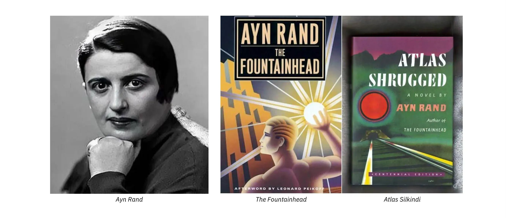

Ancak gerçek oldukça farklıdır ve kafa karışıklığı daha ziyade semantik bir sorundan kaynaklanmaktadır: İnsanların eylemde bulunma ve seçim yapma kapasitesini tanırken, nesnesi oldukları mantıksal determinizmi de kabul eden ilk liberteryenler gerçekte Spinoza'nın mirasçılarıdır. Spinoza ile ortak noktaları, insanların doğanın üstünde olmadıkları, bunun yerine onları bir determinizmin, onları aşan bir tarihin içine yerleştiren ve insanların ne olduklarından ve ne yaptıklarından büyük ölçüde sorumlu olan evrimsel bir sürecin sonucu oldukları inancıdır.

Son olarak, eğer özgür irade inancı kişinin kendisini kurtarmasının son derece zor olduğu bir yanılsama ise, bunun nedeni kendisini besleyen başka bir yanılsamaya, sizi bir sonraki bölümde incelemeye davet ettiğim nihai nedenler yanılsamasına geri dönmesidir.

## Nihai nedenler yanılsaması

<chapterId>da2a7fb1-f1e9-5b56-822d-c73770de749d</chapterId>

:::video id=a0127fe7-a4cb-4a1c-8af4-f11c40b4a3d7:::

Bir önceki bölümde özgür irade yanılsamasının, bir şeyi yoktan var edebileceğimize, tek başımıza irademizin yaşamlarımızı yönlendirmemizi sağlayacağına ve belirsiz bir karar gücüne sahip olacağımıza inanmaktan ibaret olduğunu görmüştük. Bu, insanın Doğa'nın düzenini ona tabi olduğundan daha fazla bozabileceği fikridir.

Ancak Spinoza (1632-1677) için insan "imparatorluk içinde bir imparatorluk" değildir, yani Descartes'ın (1596-1650) ortaya koyduğunun aksine, doğada bir istisna değildir ve deterministik neden-sonuç zincirinin uzamasından asla muaf değildir.

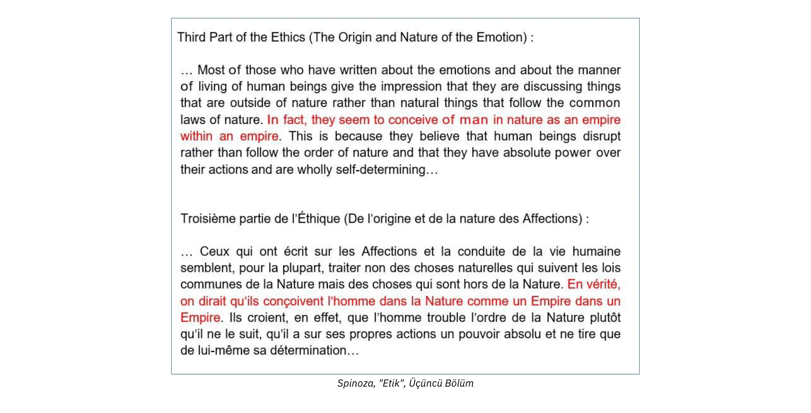

Ve Spinoza'ya göre Doğa'nın ahlaki açıdan belirlenmiş bir sonu olmadığından ve insanlar hayal güçlerini anlayışla karıştırma eğiliminde olduklarından, onu kendi çıkarlarına uygun olana göre yorumlarlar. Öyle ki, şeylere yalnızca onları takdir etme ve kendileriyle ilişkilendirme biçimlerinden kaynaklanan bir anlam verirler.

Yani, arzularına, umutlarına ve korkularına göre.

Bu akıl yürütme, düşüncenin ve aklın kullanılmasının önünde büyük bir engel olan nihai nedenler yanılsaması ile örneklendirilir, çünkü basitçe bir şeyin etkilerini gerçek nedenlerine değil, saçma veya çocuklaştırıcı olsa bile bir inanca karşılık getirme ihtiyacımızı ifade eder.

Bir niyeti, özellikle de ilahi bir niyeti ifade eden ve bizim yorumladığımız şekliyle genellikle batıl ya da cehalet olan bir inanç.

İşte bu yüzden 90'larda AIDS veya 2020'de covid gibi yeni hastalıklar, Kopernik (1473-1543), Kepler (1571-1630) ve Galileo'dan (1564-1727) bu yana kurulan rasyonalizm ve modern bilimin temelini oluşturan nedensellik ilkesine ters düşen bir mantığa göre, bazıları tarafından her zaman ilahi ve genellikle cezalandırıcı bir niyetin ifadesi olarak algılanmıştır.

Gerçek şu ki, Spinoza'nın dediği gibi, insanlar için pek çok şeyin hayal güçlerinin ötesinde olması, doğada düzenden çok düzensizlik olması çok az önemlidir. Yine de kavrayışlarının ötesindeki şeylerin karmaşıklığı onları herhangi bir teleolojik projeye inanmaktan caydırmalıdır. Ona göre bunun bir önemi yoktur, çünkü insanların arzularına ve faydalarına uygun olana dayalı kesinliklerinin uygunluğuna olan inançları her zaman herhangi bir rasyonel argümandan veya hakikat kaygısından daha güçlüdür.

Dolayısıyla finalizm, şeyleri anlamak için neden ve sonuçlarını tersine çevirmek anlamına gelir: örneğin, gözlerimizin olmasının nedeninin görmek, dişlerimizin olmasının nedeninin de çiğnemek olduğuna inanırız. Oysa insan türünün evrimi sırasında görme yetisini geliştirmesinin nedeni elbette görmekti ve dişlerimizin bugünkü halini almasının nedeni de beslenme ve et yeme ihtiyacıydı.

Fransız doğa bilimci Jean-Baptiste de Lamarck'ın (1744-1829), organı yaratanın işlev olduğu, bunun tersinin geçerli olmadığı şeklindeki predarwinci teorisini ortaya attığında (resim 3.3.3) ileri sürdüğü şey tam da budur.

Ancak Spinoza'nın dediği gibi, "insanların yanılgısı burada bitmiyor" ve naif ve nihayetinde oldukça eğlenceli teleolojik fikirlerin tüm örnekleri arasında, biyolog Bernardin de Saint-Pierre'in (1737-1814) ünlü örneğini sık sık anıyoruz. Paris Doğa Tarihi Müzesi'nin bu eski müdürü, doğanın sonluluğuna şiirsellik, lirizm ve belli bir naiflikle bakıyor, örneğin kavunun, kabuğunun eşit dilimler halinde kesilmesini kolaylaştırması nedeniyle yalnızca geniş aileleri memnun etmek amacıyla yaratıldığını düşünüyordu.

Örneğin Keynesyen iktisatçılar ve refah devleti savunucuları tarafından yapılan enflasyon tanımı da bu paradoksu çok iyi göstermektedir. Onlara göre enflasyon, bazı merkez bankacılarına göre ya "hiçbir yerden" ya da kimsenin kontrol edemediği veya öngöremediği jeopolitik bağlamlardan kaynaklanan fiyat artışıdır. Fiyatlardaki bir artış gerçekten de konjonktürel enflasyona yol açabilirken - örneğin petrol fiyatı arttığında bazı işlenmiş malların fiyatları da artacaktır - enflasyonun gerçek yapısal nedenleri esas olarak para Supply'deki bir artışla bağlantılıdır, bu da paranın değerinde bir düşüş ve dolayısıyla fiyatlarda mekanik bir artış anlamına gelir.

Bunun tersine inanmak ya da başkalarının inanmasını sağlamak, Spinoza'nın alaycı bir şekilde ifade ettiği gibi, gözleri açık rüya görmek ve yanlış ya da yanıltıcı olan ve kendini haklı çıkarmak için beklenen bir yanıt olarak duyulduğu için kabul edilmesi daha kolay olan bir akıl yürütme çizgisi oluşturmakla eşdeğerdir. Bu durumda, devlet müdahalesini savunanlar ekonomik sorunları çözmenin en iyi yolunun enflasyon olduğunu düşünmektedir.

Ancak enflasyonun bu önyargılı yorumu, kısa vadede ekonomiyi yönetmek için yararlı olsa da, aslında gizli bir vergi olduğunu, uzun vadede sadece insani ve maddi felaketlere yol açtığını ve devletleri güçlerini kötüye kullanamayacak hale getirdiğini unutmamıza neden olmaktadır. Friedrich Hayek'in (1899-1992) Serfliğe Giden Yol adlı makalesinde, devletlerin artık kendilerini kurtaramayacakları kölelikten söz ederken çok iyi tanımladığı şey budur.

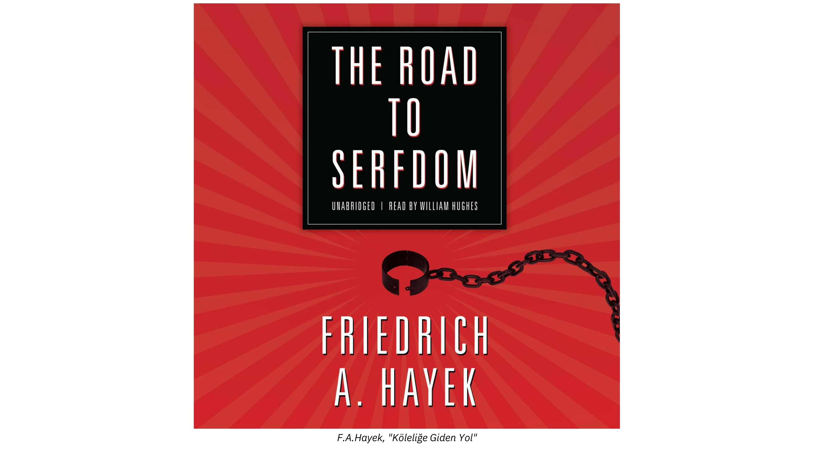

Son olarak, bu finalistik mekanizmanın, Bitcoin'in aleyhtarlarının eleştirilerini tam olarak etkilerine odaklanarak ifade etme biçiminde de iyi bir şekilde gösterildiğini burada belirtmek gerekir.

Çünkü Bitcoin'un bazı etkileri kesinlikle eleştirilebilir olsa da, yeni ve yıkıcı bir teknoloji olmasıyla ilişkili bilişsel önyargı nedeniyle, yalnızca olumsuz etkileri görmeye yönelik güçlü bir eğilimimiz var. Özellikle de gerçeklik arzularımızla uyuşmuyorsa, örneğin Spinozacılık gibi bir Kopernik devrimiyle karşılaştığımızda dindarsak ya da merkezi olmayan bir dijital para birimi konseptiyle karşılaştığımızda bir merkez bankacısıysak.

Bununla birlikte, bir dindarın ya da bir merkez bankacısının anlayış, merak ve iyi niyet göstermesi ve bir kavrama ilgi duyması, fikirlerini beklentilerine uydurmak için etkilerini yargılamak yerine önce onu anlamaya çalışması halinde, kesinlikle ona bağlı kalabileceği açıktır.

İlginiz için teşekkür ederim, bir sonraki bölümde görüşmek üzere.

## Teolojik yanılsama

<chapterId>93554156-5e62-526d-9b71-49c47be916af</chapterId>

:::video id=9c490cc1-3d29-4ca7-9464-1a701bb91ba7:::

Spinozacılığın sunduğu yeni Kopernikçi fikir vizyonuna ilişkin bu son bölümde, son olarak Spinoza'nın (1632-1677) Etika adlı eserinde sunduğu üçüncü yanılsamaya dönüyoruz.

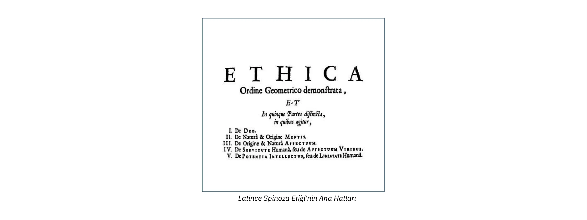

Bu yanılsama ilk ikisiyle, özgür irade yanılsaması ve sonluluk yanılsamasıyla doğrudan bağlantılıdır.

Bu teolojik yanılsamayla ilgili.

Mesele şudur: Spinoza'nın bize söylediği gibi, insanlar "hem şeylerden hem de kendilerinden" habersiz oldukları sürece, yanılsamalı özgürlüklerine inandıkları sürece, hayal güçlerini anlayış sanacaklar, yani kendilerini her zaman şeylerin doğasını düşünme ve anlama yeteneğine sahip görecekler, oysa gerçekte sadece kendilerine yararlı olanı hayal ediyor, icat ediyor ve yansıtıyorlar. Arzularına göre.

Bu nedenle insanlar, yemek yemek için dişler ya da görmek için gözler gibi doğal araçlar var ve faydalı ise, bunun nedeninin mantıksal olarak bir "doğa yöneticisi" tarafından yaratılmış olmaları olduğuna inanırlar. Başka bir deyişle, insani niyetlerin atfedildiği kasıtlı, antropomorfik bir Tanrı.

Başka bir deyişle, bir bulutun arkasına saklanmış, doğadaki her şeyi bizim için bir araç olarak yarattığına inanılan beyaz sakallı yaşlı bir adam, çünkü bizi seviyor ve biz ona saygı gösterip ibadet ettikçe bizi koruyor.

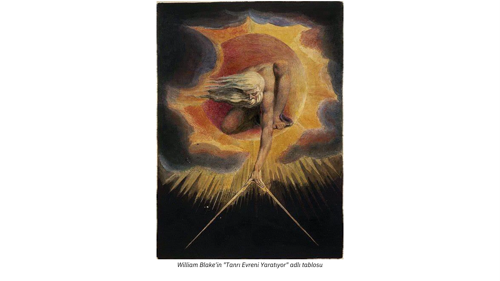

Bu, teolojik yanılsamanın ilk aşamasıdır.

Ancak kendimizi Doğa'nın üstünde görmemizden ve bir şeyi yoktan var edebileceğimizi hayal etmemizden duyduğumuz gurura rağmen, gerçekte her zaman, felsefe profesörü Gilles Deleuze'ün (1925-1995) deyimiyle, sonunda gerçekten "paçayı kurtaramayacağımızı" gösteren varoluş koşullarına tabiyiz. Tüm hayvanlar gibi biz de ölümlüyüz ama bunu biliyoruz.

Kendimizi rahatlatmak için bunun tersine inanmak ya da hayal etmek, korku her zaman daha iyi günler umuduyla bağlantılı olduğundan, güvenlik hissi ile panik hissi arasındaki iki karşıt ve ayrılmaz kutup gibi korku ve umut arasında sürekli gidip gelmemizin nedenidir.

Umut olmadan korkunun, korku olmadan da umudun olamayacağını ve korkan kişinin her zaman korktuğu şeyden kaçmayı umduğunu, umut eden kişinin ise her zaman umduğu şeyin gerçekleşmeyeceğinden korktuğunu.

Spinoza'nın Etika'sında dediği gibi, "umut ettiğimiz şeye kolayca inanma eğiliminde olduğumuz için", herhangi bir fayda fikrine aykırı olarak bize zararlı olabilecek dış nedenler veya olaylarla karşılaştığımızda, bu sözde teolojik yanılsamanın ikinci aşaması ifade edilir ve batıl inançların ortaya çıktığı inançlarla karakterize edilir.

Başka bir deyişle, Voltaire'e (1694-1778) göre "rezil", batıl inanç hiçbir zaman akıldan doğmaz ve her zaman akıl dışı veya temelsiz bir inanca karşılık gelir, nesnelere veya eylemlere sahip olmadıkları güçler veya manevi kudretler atfederek her türlü rasyonelliğe karşı çıkar.

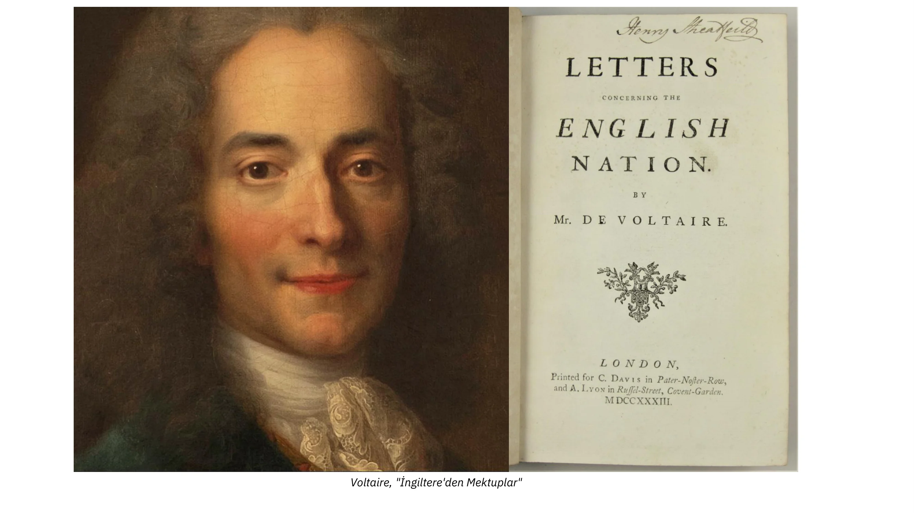

Bizi rahatlatma, daha iyi bir dünya hayal etmemizi sağlama kisvesi altında, batıl inanç aslında bizi kendi yanılsamalarımıza ve yalanlarımıza kilitler. Kendimizi kurtarmak için Hard zamanımızın olacağı köleliklere.

Alman, İngiliz ve Fransız Aydınlanmasının 18. yüzyıldan itibaren savunduğu şey buydu; batıl inançların, yalnızca aklın kullanımını sınırlandırarak değil, aynı zamanda ve hepsinden önemlisi, bir gücün egemenliğini tesis etmek için en iyi araç olan hoşgörüsüzlüğe yol açarak insanların yetişkin olmalarını engellediğini ileri sürüyorlardı. İster siyasi ister dini olsun.

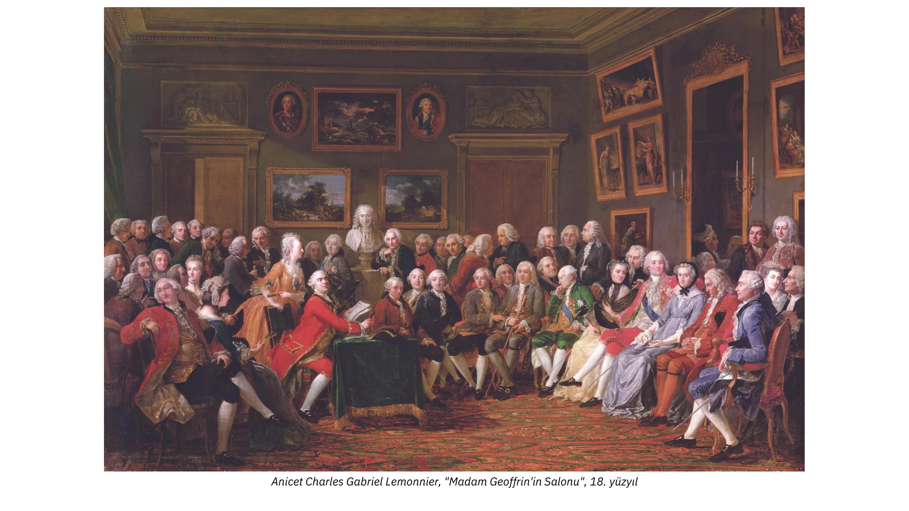

Spinoza'nın daha önce değindiğimiz Theologico Political Treatise adlı eserinde tekrar ortaya koyduğu şey de budur. Bu makalede, "monarşik rejimin büyük sırrı ve en büyük çıkarı, insanları kandırmak ve onları kontrol etmesi gereken korkuyu din adıyla gizlemektir" diye yazar. Bu nedenle, her zaman başkaları için iyilik yapma arzusuyla hareket eden tiranlar, diktatörler ya da devrimciler, her zaman olmasa da çoğu zaman, ilkelerine ulaşmak için ilkelerinin tam tersini yapma tuzağına düşerler.

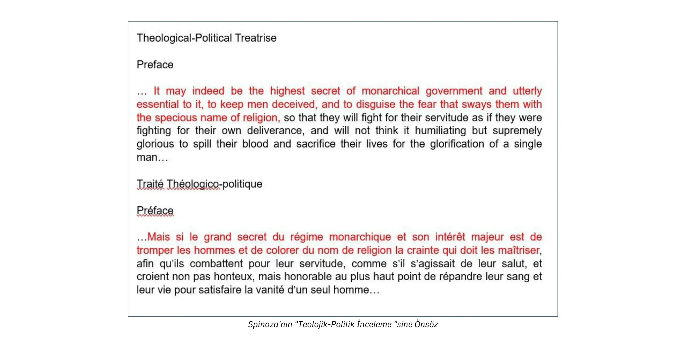

Ancak Spinoza'nın TTP'ye getirdiği ve onu bir bakıma laikliğin babası yapan yenilik, batıl inançlarla ve özgürlüğün paradoksal bir şekilde izin verdiği şiddet çağrısıyla mücadele etmenin esas olmakla birlikte, gerçekte inanma hakkını ve düşünme özgürlüğünü korumanın devletin çıkarına olduğunu düşünmesidir.

Çünkü fikirler var olur olmaz ve özel olarak ifade edilir edilmez, kaçınılmaz olarak topluma yayılacaktır ve ne yasaklama ne de sansür bunların yayılmasını asla engelleyemez. Doğru ya da yanlış, iyi ya da kötü fikirler her halükarda dolaşıma girecektir ve bunları yasaklamak uzun vadede sadece isyana ve özgürlük adına devletin devrilmesine yol açabilir.

Başka bir deyişle, devletin aslında ifade özgürlüğünü korumaktan çok sansürlemekten ya da bastırmaktan korkması gerekir ve bu nedenle Spinoza'ya göre, bireylerin doğal düşünme ve kendilerini ifade etme haklarını kullanmalarına izin vermek devletin çıkarınadır.

Spinoza'ya göre, düşünce özgürlüğüne izin veren demokratik bir devlet, insanların barış içinde yaşamalarının ve aklın kullanımı sayesinde sadece düşünme ve eylemde bulunma özgürlüğüne sahip olmalarının değil, aynı zamanda kendilerini kısıtlayan kölelikleri anlayarak bunlardan kurtulmalarının da en iyi garantisidir.

# Etki teorisinden Bitcoin'e

<partId>82e69d4f-a94f-5978-bcb8-8a7b4651bcca</partId>

## Spinoza'da kötülük sorunu

<chapterId>1ce64576-2688-5757-a119-57cc3a1076c0</chapterId>

:::video id=9c490cc1-3d29-4ca7-9464-1a701bb91ba7:::

Şimdi Spinoza'nın (1632-1677) eserlerinde ve yazışmalarında ortaya koyduğu şekliyle kötülük meselesini tartışmak istiyorum.

Ancak uyaralım, bu karmaşık ve tartışmalı bir konudur ve buradaki amaç, onu yönlendiren şeyi, yani özgürlük arayışını daha iyi kavramak için bir kez daha onun düşünce tarzını anlamaktır.

Gördüğümüz gibi, özgür iradeye ya da doğada herhangi bir tür finalizme inanmamak, günlük hayatlarımızda kötülüğün varlığı sorununu çok hızlı bir şekilde gündeme getirmektedir.

Başka bir deyişle, soru "kötülüğün" doğada var olup olmadığı ve insanların neden oldukları zarardan sorumlu olup olmadıklarıdır.

Antik filozoflar kötülüğün doğada var olmadığına inanıyordu ve örneğin Sokrates (M.Ö. 470-399) "kötülüğün hiçbir şey olmadığını" öğretti. Ona göre, kötü bir insan doğası gereği kötü değildi ve bir bakıma iyinin doğası hakkında yanılıyordu.

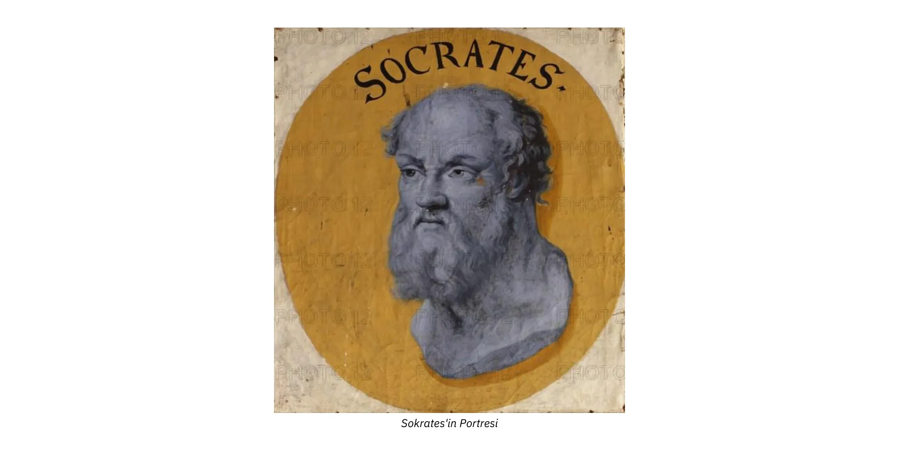

Ancak skolastik gelenek, özellikle de bugün hala Hıristiyan ahlakını etkileyen Aziz Augustinus'un (354-430) geleneği, kötülüğün sadece var olduğunu, bir gerçeklik olduğunu değil, aynı zamanda insanların özgür oldukları, iyi ve kötü arasında bir seçim yapabildikleri ve bu nedenle neden oldukları kötülüğün tamamen kendi sorumlulukları olduğu için açıklanabileceğini savundu.

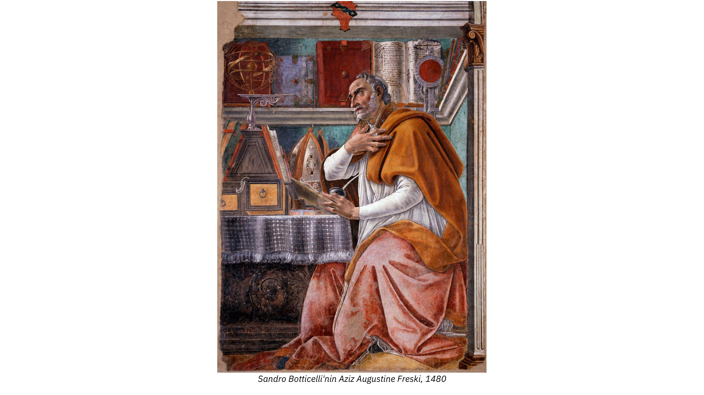

Bir depremin, ölümcül bir virüsün ya da bir çocuğun kör doğmasının neden olduğu zararın sorumluluğunun insanlara atfedilmemesi gerekse bile, bu düşünce biçimi doğaya onları sorumlu kılan ahlaki bir niyet yükleyerek devam etmektedir. Örneğin, bir deprem meydana gelmişse, bunun tam da insanların kötü davranmış olmasından kaynaklandığını düşünerek.

Bu, dindar insanlar tarafından savunulan, insanların günahkâr ve ilk günahtan suçlu olarak doğduğu fikridir.

Elbette, tahmin edebileceğiniz gibi, bu fikir Spinoza tarafından paramparça edilir; Spinoza'ya göre Doğa, Tanrı ya da talih niyetle donatılmadığından ve insanlar özgür iradeye sahip olmadığından, onlara atfedilen "kötülük" sorumluluğu tamamen yanıltıcıdır.

spinoza Etika'da "Doğada, içinde var olan bir kötülüğe atfedilebilecek hiçbir şey olmaz" diye yazar ve ona göre, bu nedenle, örneğin yeni doğmuş bir bebeğin körlüğünü "kötülük" olarak değerlendirmekle hata etmiş oluruz, çünkü kör doğduğunda bir bebek, bir taştan daha fazla görme yetisinden mahrum değildir.

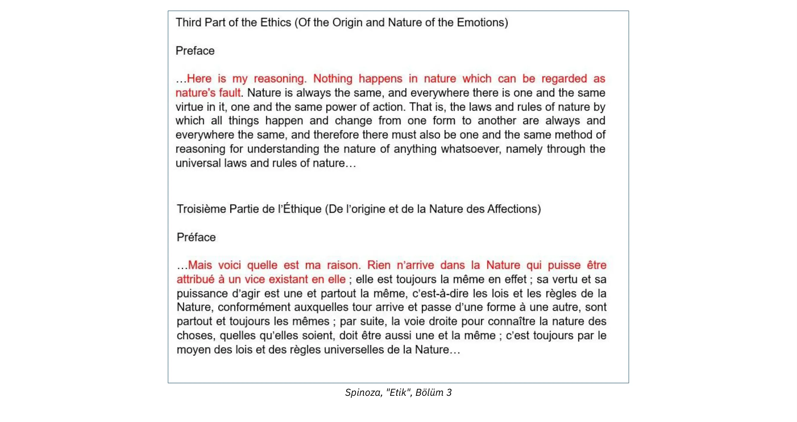

Ve eğer körlerin görme yetisinden yoksun olduğunu düşünüyorsak, bu sadece görenlerin bakış açısından böyledir.

Spinoza böylece kötülüğün doğada var olmadığı fikrini ele alır, ancak onu devrimci bir felsefe yapan özgünlüğü, kötülüğün var olmadığı gibi "iyi "nin de var olmadığını düşünmesidir.

İşte bu yüzden ahlaktan ziyade etikten bahsediyor, neyin doğru neyin yanlış olduğunu düşünmüyor, çünkü bunların hepsi göreceli ve öznel kavramlar, daha ziyade "varlığımızda sebat etmeye" yönelik doğal ihtiyacımız için neyin "iyi" ya da "kötü" olduğunu söylüyor. Başka bir deyişle, yaşamak ve büyümek. İnsan olarak gelişmek.

Dahası, Spinoza'nın suç işleyerek kötü davranan insanların sorumluluğuna ilişkin görüşünün onları mazur gösterme amacı taşımadığını zaten görmüştük.  Çünkü insanlar, kendilerini suç işlemeye iten gerçek nedenleri bilmeseler bile, her zaman ne yaptıklarının farkındadırlar ve bu nedenle ahlak ve Yasa önünde sorumludurlar.

Açıktır ki, bir suçlunun eylemleri her zaman ailevi, sosyal, ekonomik ve hatta suçları fiziksel veya zihinsel bir durumla açıklanabiliyorsa tıbbi determinizmle bağlantılıdır. Bu da, ceza hukukunun ötesine geçerek belirli suçların sadece cezalandırılması değil, aynı zamanda suçlunun ailevi, sosyal ve psikolojik geçmişi de dikkate alınarak tedavi edilmesi gerektiği gerçeğini göz önünde bulunduran adaletin rolüdür.

Spinozacı Gilles Deleuze'ün (1925-1995) etiğin bir tür etoloji, yani var olma biçimlerinin pratik bilimi ya da kendi deyimiyle "iyi karşılaşmalar yapma sanatı" olduğunu açıklamasının nedeni budur.

Başka bir deyişle, Spinoza'ya göre özgürlük, varlığımızı "eyleme gücümüzü artıran" şeye yöneltmekten ve daima geleceğe iyimser bakarak dünyayı görmek istediğimiz gibi hayal etmek yerine olduğu gibi görmekten ibarettir.

Cehalet doktorlarına ve cahil olmanın iyi olduğunu iddia eden herkese karşı savaşan Spinoza'nın kanıtlamasının dehası da burada yatmaktadır.

Aksine, Spinoza insan tutkularını, hatta en irrasyonel olanları, kalp kırıklığını, deliliği, hüznü ya da melankoliyi, geometriciler gibi, "daha geometrico", noktaları, çizgileri, yüzeyleri ve hacimleri inceler gibi inceler.

Bu, Etik'in üçüncü bölümünde geliştirdiği ve şimdi çalışmanızı önerdiğim etkiler teorisidir.

İlginiz için teşekkürler.

## Duygulanım teorisi

<chapterId>3bb011ce-6f0c-51a6-b41f-25a3b5b7768e</chapterId>

:::video id=bb427cc6-e54d-4b44-bd6d-281ba421001a:::

Spinoza'ya göre özgürlük keşfedilmesi gereken bir kavram, daha iyi, daha güçlü bir yaşama giden bir yoldur. Daha özgür bir yaşam. Mutlak determinizmi ve şeylerin rasyonel nedenselliğini tanımamızı gerektiren bir yol.

Sistemini Etik'in üçüncü bölümünde geliştirir. Bu ünlü "duygulanımlar teorisi "dir.

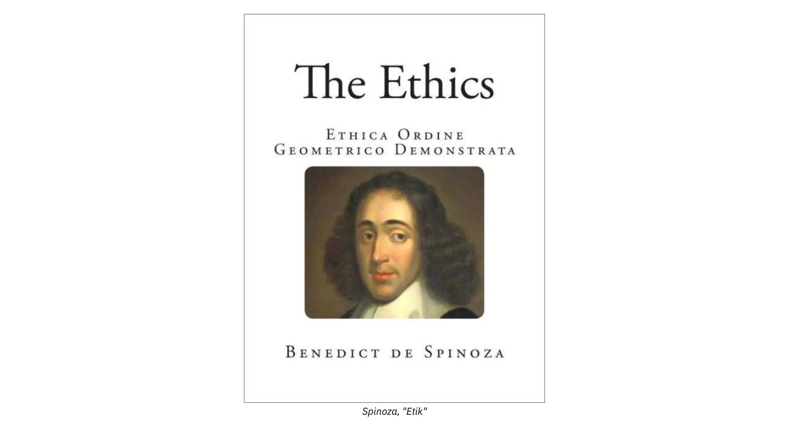

Spinoza'ya göre ilke şudur: İnsan duygulanımları, eyleme gücümüzü, yani davranışımızı etkileyen bedenin ve düşüncenin aktif ya da pasif modifikasyonlarıdır.

Yine de, hem insan doğasına özgü hem de dış dünyadan kaynaklanan etkilere bağlı olarak, doğru fikirler oluşturma, muhakeme etme ve neşeyi ifade etme konusunda mükemmel bir yeteneğe sahibiz.

Ama aynı zamanda pasif duygulanımlar, yani bizi mekanik bir şekilde, "kendimize rağmen" kendi çıkarlarımızın gerektirdiği şeyleri görmemeye ya da yapmamaya iten önyargılar da oluşturabiliriz.

Kölelikten ya da kulluktan, bazen bizi yapmadığımız şeyleri istemeye ve istemediğimiz şeyleri yapmaya yönelten pasif etkileri kontrol edememe ve bunlara karşı koyamama durumundan bahsediyoruz.

Spinoza Etika'sında "insanların genellikle en iyiyi görüp, onaylayıp en kötüyü yapmalarına" ya da "kurtuluşları için savaşır gibi kölelikleri için savaşmalarına" şaşırdığında bunu söyler.

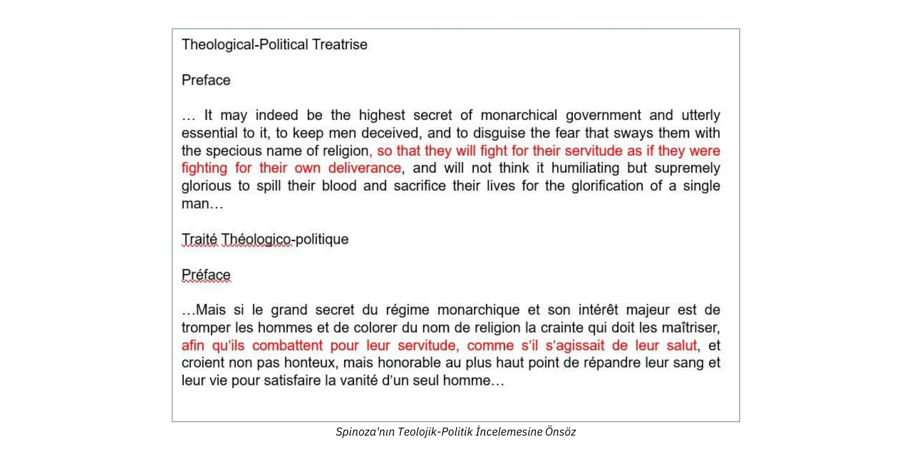

Spinoza, pasif bir duygulanım olarak gördüğü, üzüntüye yönelmiş ve yetersiz fikirlerden, yani kısmi bir neden bilgisinden doğan ve "dışsal bir neden fikriyle ilişkili bir üzüntü" olarak tanımladığı nefreti örnek alır.

Başka bir deyişle, eğer bir yabancıdan nefret ediyorsak, bunun nedeni bu yabancıyı, doğası gereği yabancı ve farklı olduğu için, anlamadığımız nedenlerle ona dair sahip olduğumuz fikirle ilişkilendirmemizdir. Bu dışsal bir neden fikridir - üstelik cahilleri bilmedikleri bir kavram hakkında kötü konuşmak için her zaman mekanik olarak motive eden bir fikir.

Bu arada, bu durum özellikle kripto para birimleri alanında geçerlidir.

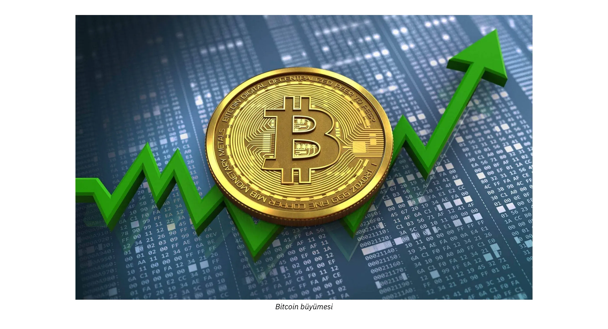

Spinoza, dışsal bir nedene dair bu olumsuz fikri ahlakla değil, eğitimle, empatiyle, akılla, özellikle de bu durumda bu yabancının niteliklerine veya Bitcoin'nin durumunda pratik yönüne veya yararlılığına odaklanarak ortadan kaldırırsak, o zaman ilişkili üzüntü duygusunun ortadan kalkacağını ve otomatik olarak nefretin de ortadan kalkacağını söyler.

Bu düşünce tarzının elbette aktif duygulanımlar ve özellikle de Spinoza'ya göre "dışsal bir neden fikriyle ilişkili bir sevinç" olan aşk için de geçerli olduğunu hatırlamakta fayda var. Ve örneğin, bir şeye ya da bir kişiye duyulan sevginin dışsal nedeni ortadan kalkar ya da zamanla değişirse, bununla ilişkili sevinç de ortadan kalkabilir ve sevgi duygusu sönebilir. Bu, anlamadığımız zaman bizi mutsuz ve depresif yapabilir.

Ancak bu sözde duygulanımlar teorisi "bilinçdışımız" için geçerliyse, "araştırmacılar tarzındaki" bu rasyonel düşünme biçimi, ister dini, ister siyasi, isterse doğal olayların sonucu olsun, her türlü dış köleliğe karşı mücadele için de geçerlidir.

Bu yıldırım örneğidir. Çünkü yıldırım düşüp masum insanları öldürdüğünde, cahil olanlar bunu Tanrı'nın eli olarak görme, yıldırımın ahlaki ve nihai bir niyeti ifade ettiğini düşünme eğiliminde olacaktır. 90'lı yıllardaki Aids ve hatta daha yakın zamanlarda covid, bazıları tarafından ilahi bir ceza olarak yorumlanmıştır.

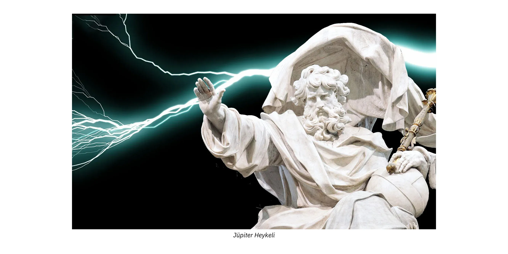

Oysa Spinoza'ya göre tüm bu teleolojik fikirler yalnızca batıl inançlardır, cehaletle eşanlamlıdır, çünkü bu örnekte çakan şimşek kendi doğasının özünü ifade etmekten başka bir şey yapmaz. Bu da çarpmaktır. Elbette, herhangi birini cezalandırmak ya da ödüllendirmek gibi ahlaki bir niyet olmaksızın.

Bu basit örnek sayesinde, kendimizi yıldırımdan korumanın - başka bir deyişle, tehlikesinin bize her zaman dayattığı kölelikten kurtulmanın - tek çözümünün kötü şansımızdan ya da sözde ilahi bir adaletsizlikten şikayet etmek ya da en ufak bir ahlaki argüman öne sürmek olmadığını anlıyoruz. Hayır, daha ziyade, burada da nefret konusunda olduğu gibi, etik açıdan ne yapabileceğimiz üzerine düşünme meselesidir.

Ve bu durumda, akılcı, ilerlemeye açık, bilimin bize sunabilecekleri konusunda meraklı ve kendinden emin olarak ve neden olmasın, bir paratoner takarak kendimizi yıldırımdan korumak olacaktır.

Etika'nın dehası budur. Spinoza bize gönüllü kulluktan, "kendimize rağmen "den ve sürekli yabancılaşmaya dayalı bir yaşamdan, duygulanımların ve belirlenimlerin bilgisi aracılığıyla yaşanan bir yaşama geçmenin mümkün olduğunu gösterir.

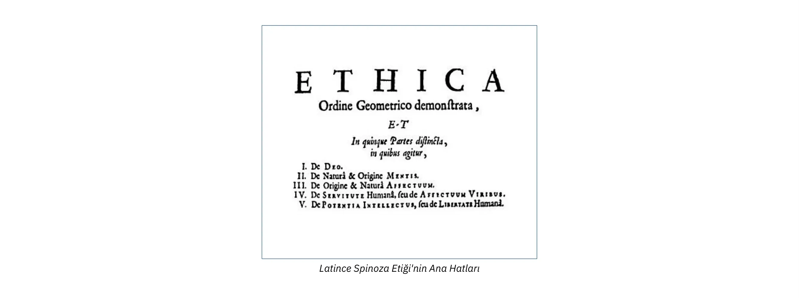

Bu, olayların iyi tarafını ya da gerçeği görebilmek için insan doğasını incelememizi sağlayan bir düşünme biçimidir. Bizi aşağı çeken üzüntü ve korku nedenlerini ortadan kaldırmak. Özgür olmak, başka bir deyişle üzücü tutkulara itaat etmeyi bırakabilmek ve davranışlarımızı değiştirebilmek.

Ve muhtemelen felsefe tarihinde ilk kez, berrak ve mutlu olabileceğinizi anlamak için.

İşte bu yüzden Spinozacılık sıklıkla "neşenin felsefesi" olarak anılır.

## Özgürlük, Avusturya ekonomi okulu ve Cypherpunk felsefesi

<chapterId>b54f2532-460c-11f0-a248-93ff24ef1d57</chapterId>

:::video id=5f49d5b4-e15f-475b-b40d-07464c08ca4d:::

Bildiğiniz gibi Spinoza'ya göre özgürlük, determinizmimizin farkında olmamızdır. Aklın rehberliğinde ve eylem yeteneğimiz sayesinde, köleliklerin nedensel mekanizmasını anlayabilir, böylece onlara karşı savaşabilir, artık acı çekmeyebilir ve artık kendi çıkarlarımıza aykırı davranmayabiliriz.

Nihayetinde bu berraklık, daha sonra Friedrich Nietzsche (1844-1900) tarafından tanımlanan ve insanların kendilerini ideolojik idealler, yani siyasi veya dini kurgular içinde kaybettikleri, bu nedenle gerçekliği inkar ettikleri, kendilerini çocuklaştırdıkları ve kendilerini mutsuz ettikleri nihilizm içinde artık yaşamamak anlamına gelir.

Özellikle Immanuel Kant (1724-1804) sayesinde Aydınlanmanın rasyonel felsefesi tam da bununla ilgiliydi; ona göre yalnızca eğitimli bir birey aklın rehberliğinde kendi adına düşünebilir ve etik olarak neyin "doğru" ya da "iyi", neyin zehirli olduğunu belirleyebilir.

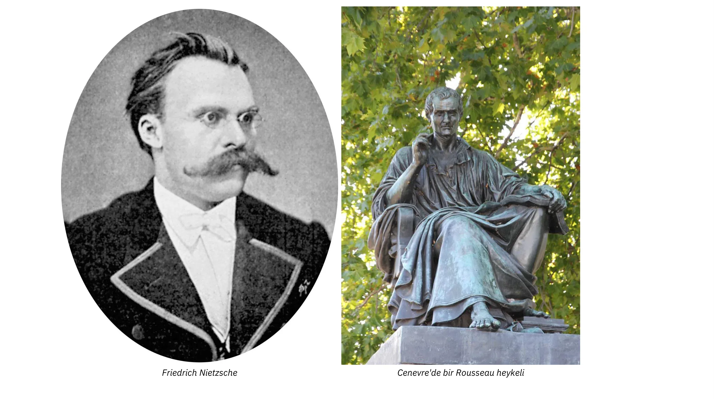

Başka bir deyişle, kendimiz için düşünürsek, rasyonel yetişkinler olarak akıl yürütürsek ve bu nedenle kendimizi şeyler arasındaki nedensel bağlantılara bağlamaya çalışırsak, örneğin dinin gerçek erdemlerini veya siyasi ve ekonomik alanlardaki gerçek etik değerleri bize öğretecek ahlaki bir otoriteye artık ihtiyacımız olmayacağını söylüyor.

Bu, Birinci Dünya Savaşı öncesinde Viyana'nın son derece verimli entelektüel atmosferinde doğan Avusturya liberal ekonomi okuluyla bağlantı kuran bir akıl yürütme çizgisidir. Zira bu bağlamda Carl Menger (1840-1921), Ludwig von Mises (1883-1979) ve Friedrich Hayek (1899-1992) gibi entelektüeller, gelecekteki cypherpunk'ların inançlarının temeli olacak yeni bir liberal ekonomi okulunun temellerini atmışlardır. Ve dolayısıyla Bitcoin'ün yaratılması.

Örneğin Menger ve Mises, tüm bilginin şeyler arasındaki nedensel bağlantıya göre inşa edilmesi gerektiğini ortaya koymuş ve böylece yeni bir nedensel iktisat anlayışı önermişlerdir. Özellikle de birkaç yıl önce Fransız iktisatçı Frédéric Bastiat (1801-1850) tarafından geliştirilen liberal ruhtan esinlenmişlerdir.

Öte yandan Hayek, tüm ekonomik kararların her zaman bir tür belirsizlik ve cehalet ifade ettiğini ve ahlak, inançlar, önyargılar veya siyasi ideolojiler nedeniyle bundan muzdarip olmama gerçeğinin, ekonomik davranışı doğru bir şekilde analiz etmeyi ve dolayısıyla bireyler, toplum ve Devlet için neyin iyi olduğunu düşünmeyi mümkün kıldığını düşünmektedir.

İşte bu liberal Avusturyalı iktisatçılar, Hayek'in "plancılık" dediği tüm sosyalist fikirleri ve onlardan esinlenen, ona göre sadece yıkıma yol açan tüm ahlaki politikaları sert bir şekilde eleştirmeye başladılar. Hükümetlere ekonomik güç vermek, kaçınılmaz olarak zamanın gerisinde kalmak ve neyin yapılıp neyin yapılmaması gerektiği konusunda adım atmamak, başarısızlığa mahkumdu.

Örneğin Avusturyalılar, bir devletin ekonomiyi yönetmek ve krizleri çözmek için para yaratma yetkisini zorlama yoluyla kendisine verdiğinde, bu yetkiyi kötüye kullanmaktan asla kaçınamayacağı riskine inanmaktadır.

Bunun nedeni nedir? Çünkü kendisini her zaman bunu yapmasını engelleyen ve böylece Spinoza'nın dediği gibi onu "en iyiyi görmeye, onaylamaya... ama en kötüyü yapmaya" iten bir kölelik biçiminde bulur.

Bir Spinozacı olarak Hayek bir videoda "bu güç şiddet olmadan elden alınamayacağına göre, yapılabilecek tek şey bir hile kullanmak ve hükümetlerin artık durduramayacağı yeni bir para kavramı ortaya koymaktır" diye açıklıyor. Bu argüman Milton Friedman (1912-2006) tarafından da bir röportajda yinelenmiş ve Friedman da bu yeni dijital para biçimini yeni gelişmekte olan İnternet bağlamında tartışmıştır.

Bunlar, ilk cypherpunk'lar olan Eric Hughes (1953-) tarafından "Cypherpunk manifestosu "nda ya da Timothy May (1951-2018) tarafından "kripto anarşist manifestosu "nda öne sürülen ve Satoshi Nakamoto'nun tekrar ele alacağı siyasi ve ekonomik argümanlardır.

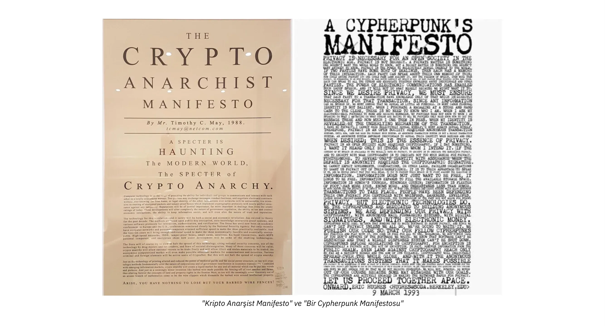

Özellikle de 3 Ocak 2009 tarihli Times manşetini Blockchain Bitcoin'in Genesis bloğunun para tabanına yazarak Keynesyen bir dönemin sona erdiğini ve liberal, anarşist ve özgürlükçü özlemleri olan başka bir dönemin başladığını göstermiştir.

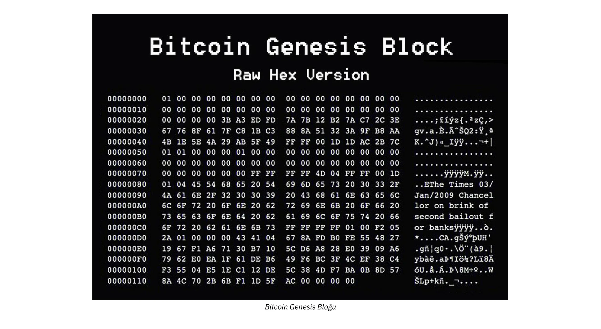

Bitcoin, 31 Ekim 2008 tarihinde yayınlanan Beyaz Kitap'ta, merkezi olmayan bir protokole dayalı olarak, güvenilir bir üçüncü taraf olmaksızın İnternet üzerinde değer alışverişi yapmanın bir yolu olarak sunulmaktadır. Sonunda insanların hareket etme kabiliyetlerini, yani özgürlüklerini, ticaret yapma özgürlüklerini, mülkiyet haklarını ve mahremiyetlerine saygı gösterilmesini yeniden kazanmalarını sağlayacak bir "Kopernik" devrimi.

Neden mi? Çünkü Bitcoin, Galileo'nun matematik dili sayesinde, Spinoza'nın yöntemiyle, akıl sayesinde kendimizi bu kölelikten kurtarmamızı sağlar. Ve Hayek'in önerdiği gibi, devlet buna karşı çıkamadan. Ve barışçıl bir şekilde, zorlama ya da din değiştirme olmadan.

Aslında bu, Spinozacılık ve Bitcoin arasında kuracağım son paralelliktir; Kopernikçi ya da yıkıcı bir kavramı benimsemeyen birini akıl, anlayış, merak ya da iyi niyet dışında ikna etmenin bir anlamı olmadığını göstermek için.

Zorla değil, şiddetle değil. Çünkü gerçek şu ki Kopernik, Galileo, Newton, Darwin, Einstein, Hayek, Spinoza ya da Satoshi Nakamoto kendi fikirlerine ve gösterilerine inanmayan hiç kimseyi tehdit etmedi.

# Son bölüm

<partId>70a5a3c8-6c88-11f0-8753-db07e26dcaf4</partId>

## Yorumlar & Derecelendirmeler

<chapterId>7945c38c-6c88-11f0-a73f-0f7cdf99f53f</chapterId>

<isCourseReview>true</isCourseReview>

## Final Sınavı

<chapterId>a557fd32-6c88-11f0-96ff-cfa532cf76a0</chapterId>

<isCourseExam>true</isCourseExam>

## Sonuç

<chapterId>ae04ab38-6c88-11f0-a496-3be47119e6b6</chapterId>

<isCourseConclusion>true</isCourseConclusion>