# Khi Spinoza Gặp Satoshi

Khám phá cách những ý tưởng cấp tiến của triết gia thế kỷ 17 Baruch de Spinoza về tự do, lý trí và quyền lực báo trước cuộc cách mạng phi tập trung của Bitcoin. Khóa học này tiết lộ những điểm tương đồng nổi bật: cả hai đều từ chối đức tin mù quáng và quyền lực trung ương, cả hai đều sử dụng tính chặt chẽ toán học để giải phóng. Spinoza giải phóng tâm trí khỏi giáo điều tôn giáo, Bitcoin giải phóng tiền tệ khỏi sự kiểm soát của nhà nước.

Học các công cụ thực tế từ đạo đức học của Spinoza để hiểu nền tảng triết học của bitcoin và tăng quyền tự chủ của bạn. Sẵn sàng khám phá hai trong số những công cụ giải phóng con người vĩ đại nhất trong lịch sử chưa?
+++
# Giới thiệu

<partId>80b76189-afab-5295-a8d3-ba8f6fe7a5e8</partId>

## Giới thiệu khóa học

<chapterId>99af4992-fd6c-5142-b168-d927b251574b</chapterId>

:::video id=1def60bc-1d39-4e49-9b08-fd05b7a0d49b:::

Trong khóa học này, tôi rất vui mừng được giới thiệu triết học của Baruch de Spinoza (1632-1677), nhà triết học nổi tiếng thế kỷ 17 được coi là cha đẻ của triết học Khai sáng lý tính.

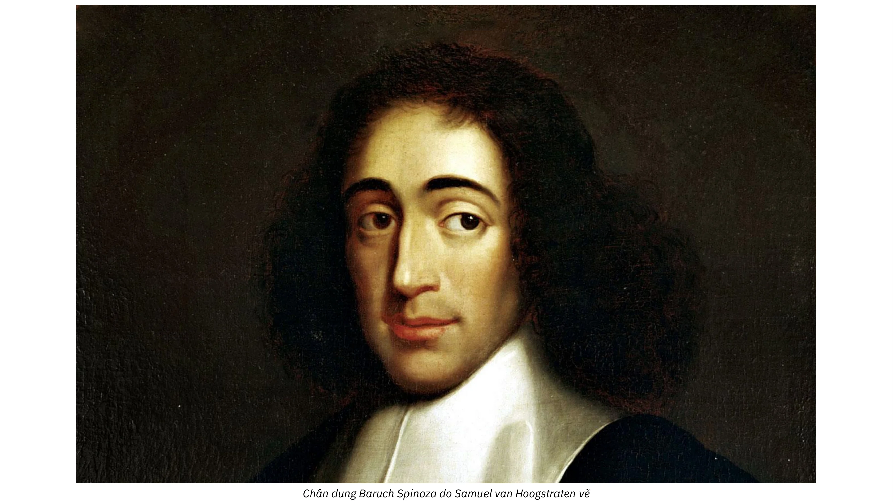

Chân dung Spinoza

Các khóa học này dựa trên hai bài luận của tôi về chủ đề "Tôn giáo đích thực của Spinoza" và "Bitcoin, phúc âm của tự do", có sẵn dưới dạng bản giấy trực tuyến hoặc trực tiếp từ trang web của tôi, và bản kỹ thuật số trên Amazon Kindle.

Mục tiêu của khóa học này trước hết là cung cấp sự hiểu biết đơn giản về một triết lý thường được coi là rất phức tạp và khó hiểu, mặc dù nó đang nhận được sự quan tâm trở lại hiện nay.

Thật vậy, triết lý này không chỉ cho phép chúng ta đặt câu hỏi về ý nghĩa của mọi thứ khi mọi thứ trở nên tồi tệ, vốn là mục đích chung của tôn giáo, triết học và khoa học nhân văn, mà còn, và có lẽ chủ yếu, cho phép chúng ta tự đặt câu hỏi về chính mình khi mọi thứ diễn ra tốt đẹp.

Khi cuộc sống mỉm cười với chúng ta và chúng ta cảm thấy mình không cần phải đặt câu hỏi cho bản thân, coi đó là niềm kiêu hãnh viển vông và nô lệ khi cho rằng hạnh phúc hay thành công của chúng ta chỉ đến từ tài năng, công sức hoặc những lựa chọn được cho là tự do; nói tóm lại, là từ ý chí tự do của chúng ta, chứ không phải từ sự quyết định mà chúng ta phải tuân theo.

Theo cách này, chúng ta có thể tạo ra mối liên hệ giữa triết lý thực tiễn về tự do - hay như Spinoza nói, "hướng tới phương tiện để đạt được nó" - và thế giới công nghệ mới mà chúng ta quan tâm ở đây, tiền điện tử nói chung và Bitcoin nói riêng.

Và đặc biệt là ở khía cạnh triết học, khiến chúng ta phải suy ngẫm chính xác về khái niệm tự do: tự do suy nghĩ, tự do thể hiện bản thân, tự do tôn trọng quyền riêng tư và tất nhiên, trong trường hợp của chúng ta, là tự do đối với Exchange.

Đầu tiên, tôi sẽ giới thiệu với các bạn về Spinoza, tính cách, hoàn cảnh xã hội, tôn giáo và gia đình của ông, cũng như bối cảnh lịch sử của Liên hiệp các Tỉnh nơi ông sinh sống.

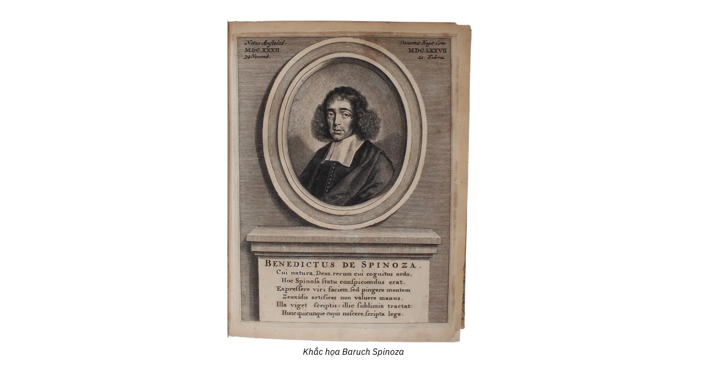

Chân dung Spinoza

Sau đó chúng ta sẽ xem triết lý lý trí mới này là gì theo đó "không có gì tồn tại trong tự nhiên mà không thể giải thích được nếu không sử dụng lý trí".

Đó là ý tưởng rằng chúng ta chỉ có thể hiểu thế giới và bản chất con người thông qua mối liên hệ nhân quả giữa các sự vật, theo đó, một kết quả luôn có một nguyên nhân, và nguyên nhân này lại là kết quả của một nguyên nhân khác, v.v., cho đến nguyên nhân đầu tiên mà chúng ta không thể tiếp cận được và theo Spinoza, đó chính là Thiên nhiên.

Thiên nhiên, hay nói cách khác là Chúa, là "Deus sive Natura" nổi tiếng trong tiếng Latin minh họa toàn bộ ý nghĩa của chủ nghĩa Spinoza.

Chúng ta cũng sẽ xem xét hai tác phẩm chính của Spinoza, bắt đầu với cuốn Đạo đức học, được xuất bản sau khi ông mất vào năm 1677, tập trung hoàn toàn vào tự do và nhu cầu giải phóng bản thân khỏi những ràng buộc đang giam cầm chúng ta.

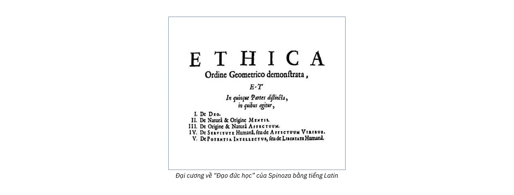

Sau đó, chúng ta sẽ xem xét cuốn Traité théologico-Politique, được xuất bản khi ông còn sống vào năm 1670, cho phép chúng ta xem xét tự do từ một góc độ khác: tự do tư tưởng và tín ngưỡng. Nói cách khác, tự do tôn giáo, nhưng trên hết là tự do chính trị.

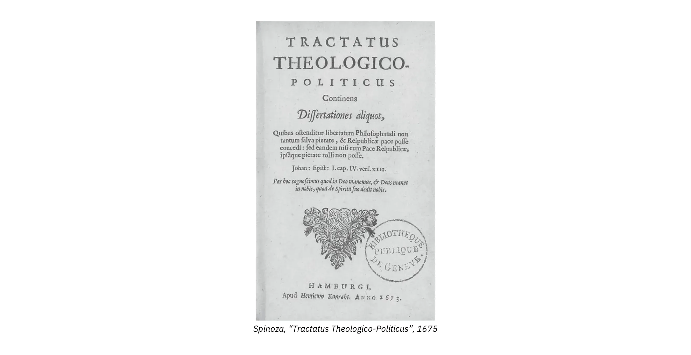

Cuối cùng, chúng ta sẽ thấy tại sao Spinoza lại là cuộc cách mạng tư tưởng theo kiểu Copernicus và cách nó thể hiện một định nghĩa mới về thế giới và bản chất con người, bằng cách nghiên cứu 3 ảo tưởng cơ bản bị Spinoza lên án: ảo tưởng về ý chí tự do, ảo tưởng về nguyên nhân cuối cùng hay chủ nghĩa cuối cùng, và ảo tưởng thần học.

Nhờ lý thuyết về cảm xúc được phát triển theo cách của các nhà hình học, "more geometrico", cuối cùng chúng ta sẽ thấy Spinoza cung cấp cho chúng ta một phương pháp thực tế để giải phóng bản thân, hoặc cố gắng giải phóng bản thân, khỏi những ràng buộc cố hữu trong bản chất con người và những đam mê bên ngoài. Một cơ chế lý trí, để chống lại sự ngu dốt, có thể được so sánh với niềm tin chắc chắn rằng ba góc của một tam giác luôn bằng 180°, và sẽ cho phép chúng ta kết nối tinh thần của Thời kỳ Khai sáng bắt nguồn từ nó với các trào lưu tự do của thế kỷ 19 hoặc chủ nghĩa tự do của thế kỷ 20, những trào lưu có liên hệ trực tiếp với việc phát minh ra Satoshi Nakamoto, Bitcoin.

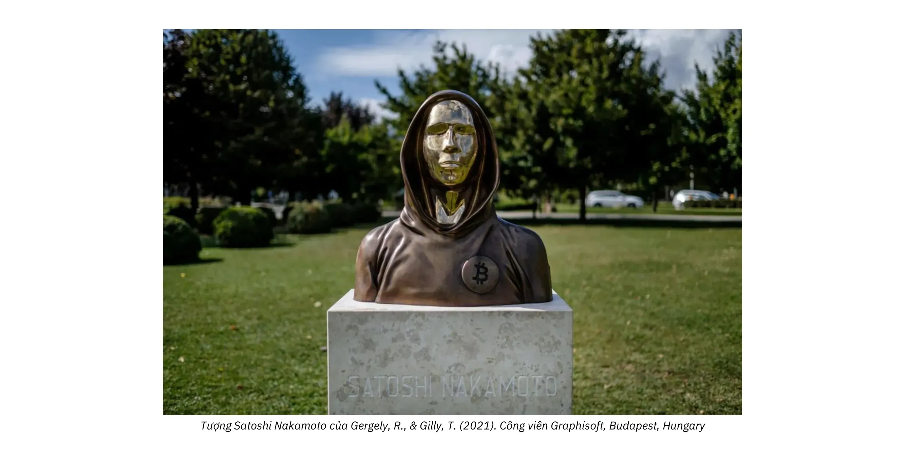

Khi đó, chúng ta sẽ hiểu rằng, trong số rất nhiều điểm chung giữa các khái niệm của Spinoza và công cụ tự do do Satoshi Nakamoto phát minh ra, điểm đầu tiên là, trong cả hai trường hợp, nếu chúng ta tò mò, có thiện chí, như người ta vẫn nói vào thời điểm đó, có "sự hiểu biết", thì chúng ta không thể không tuân thủ nó. Và nếu chúng ta không tuân thủ nó, điều tất nhiên là quyền tuyệt đối nhất của chúng ta vì việc tôn trọng quyền tự do tin hay không tin là điều cơ bản, thì chúng ta sẽ quyết tâm không thể hoặc không muốn tin, điều này cũng tương tự như nhau.

Và đó là cách chúng ta có thể hiểu rằng một người theo chủ nghĩa tôn giáo cực đoan, chẳng hạn, sẽ không bao giờ có thể chấp nhận hoặc lắng nghe dù chỉ là một tư tưởng Copernicus như chủ nghĩa Spinoza, cũng giống như một chủ ngân hàng trung ương sẽ thấy rất khó chấp nhận Bitcoin.

Tuy nhiên, như bạn đã biết, mọi thứ hiện đang đi đúng hướng.

## Giới thiệu Baruch de Spinoza

<chapterId>f53a9cfd-326e-5b73-a766-3ef2f07c5a49</chapterId>

:::video id=5fac3ddc-c472-4c64-8186-46a8f317e389:::

Baruch de Spinoza là ai? Ông là một triết gia người Hà Lan, sinh năm 1632 và mất năm 1677, thọ 45 tuổi.

Theo đạo Do Thái, ông là thành viên của cộng đồng người Sephardic Bồ Đào Nha, hậu duệ của người Marranos bị người Công giáo buộc phải rời khỏi Tây Ban Nha vào thế kỷ 15. Ông được nuôi dưỡng trong môi trường tôn giáo và trí tuệ, nhận thức được ý nghĩa của việc bị bức hại.

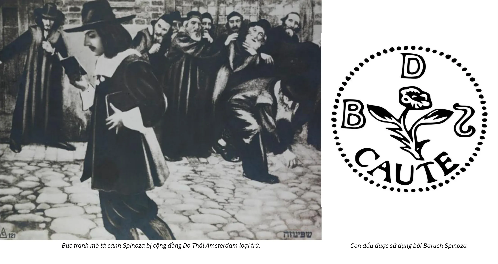

Trên thực tế, ngay từ khi còn nhỏ, ông đã thể hiện tinh thần phê phán mạnh mẽ đối với tôn giáo đã được thiết lập, đặc biệt là đối với cộng đồng người Do Thái của mình, nơi ông đã bị từ chối dữ dội vào năm 1656, khi mới 24 tuổi, trước khi ông xuất bản bất cứ tác phẩm nào.

Người ta nói rằng, việc "rút phép thông công" này đã cho phép ông tự cô lập mình và tập trung vào công việc mà không bao giờ ngoảnh lại nhìn.

Là người kế thừa, giống như những người cùng thời với ông là Descartes (1596-1650), Pascal (1632-1662) và Newton (1643-1727), những ý tưởng lý tính mới trong vật lý của Copernicus (1473-1543), Kepler (1571-1630) và Galileo (1564-1642), những người chỉ đi trước ông vài năm, Spinoza đã phát triển một cách suy nghĩ theo cách của các nhà hình học, phù hợp với nguyên lý của Galileo rằng toán học là ngôn ngữ của vũ trụ.

Nhưng đây là những ý tưởng rất nguy hiểm vào thời điểm đó, sau phiên tòa xét xử nhà sư và triết gia Giordano Bruno (1548-1600), người bị thiêu sống vì tội dị giáo tại một quảng trường công cộng ở Rome, và phiên tòa xét xử Galileo, người bị tòa án dị giáo năm 1633 buộc phải từ bỏ niềm tin nhật tâm của Copernicus.

Đây là lý do tại sao quan điểm hoàn toàn lý trí của ông về thế giới và bản chất con người, dựa trên mối liên hệ nhân quả giữa các sự vật, đã khiến ông bị coi là người vô thần, và cho đến tận ngày nay vẫn bị coi là người vô thần một cách sai lầm.

Trên thực tế, tác phẩm của Spinoza chỉ nói về Chúa, người mà ông đồng nhất với Thiên nhiên, và trong khi ông chỉ trích những động cơ mê tín của những người theo tôn giáo và những nhà thần quyền, ông cho thấy rằng đối với ông, tôn giáo đích thực trên hết đồng nghĩa với công lý và lòng bác ái.

Và chính cách tiếp cận này đã gắn kết Spinoza với triết học Khai sáng, dù là triết học Đức với Leibniz (1646-1716), Kant (1724-1804), Schopenhauer (1788-1860) và Nietzsche (1844-1900), triết học Anh với Locke (1632-1704) hay triết học Pháp với Voltaire (1694-1778), Rousseau (1712-1778) và Diderot (1713-1784). Tất cả đều đồng ý rằng lý trí nên được sử dụng để chống lại chủ nghĩa ngu dân, đặc biệt là chủ nghĩa ngu dân tôn giáo, để chống lại sự ngu dốt và bảo vệ các lý tưởng tự do và tiến bộ.

Bây giờ, để bắt đầu kết nối triết lý này với Bitcoin, điều quan trọng cần lưu ý là Spinoza sinh ra trong một thời đại rất đặc biệt.

Vào thế kỷ 17, Liên bang không chỉ là quốc gia tự do nhất thế giới về tư tưởng chính trị và tôn giáo, mà còn là quốc gia giàu có nhất. Nói cách khác, đây là quốc gia tiên tiến nhất về kinh tế và công nghệ.

Tuy nhiên, sự giàu có không gắn liền với tài nguyên thiên nhiên, với việc khai thác và cướp bóc các thuộc địa hay chế độ nô lệ, mà gắn liền với thương mại quốc tế và kinh doanh theo tinh thần tự do, kinh doanh. Một tinh thần sau này được một nhà tư tưởng Spinoza nổi tiếng, Voltaire (1694-1778), ủng hộ. Theo Voltaire, trong một phòng giao dịch, một doanh nhân hay một doanh nhân có tư tưởng tự do sẽ không bao giờ bị loại trừ, bị gọi là kẻ ngoại đạo hay bị rút phép thông công, ông nói, dựa trên tôn giáo hay nguồn gốc của họ, nhưng chỉ khi họ phá sản.

Hơn nữa, Hà Lan thời đó cũng tiên tiến trong các lĩnh vực công nghệ lớn, ví dụ như cơ học và quang học. Kính thiên văn mà Galileo sử dụng để quan sát bầu trời và khám phá vũ trụ thực sự được coi là công nghệ tiên tiến nhất thời bấy giờ, cũng như các công nghệ mới liên quan đến điện toán, AI và dĩ nhiên là cả mật mã ngày nay.

Và vì bản thân Spinoza cũng hành nghề đánh bóng thấu kính thiên văn - thật trớ trêu khi một người được cho là nhìn thấy mọi thứ lệch lạc - nên chúng ta có thể tưởng tượng rằng ông chắc chắn sẽ ủng hộ một công cụ tự do như Bitcoin.

Nói cách khác, các giá trị tự do và tiến bộ mà chủ nghĩa Spinoza truyền đạt trái ngược với một thế giới mà chủ nghĩa chính thống tôn giáo, thuyết âm mưu, mê tín dị đoan và trên hết là sự ngu dốt vẫn là một thực tế đáng buồn.

Tuy nhiên, đây là thế giới mà mọi phương tiện đều có giá trị để trốn thoát, để giải phóng bản thân khỏi những ràng buộc đang giam cầm chúng ta và để được tự do bằng cách chấp nhận thế giới như nó vốn có, chứ không phải như chúng ta mong muốn.

Cho dù những phương tiện này mang tính triết học hay công nghệ, như chúng ta sẽ thấy sau, Bitcoin là một công cụ của tự do. Nó cho phép cả cá nhân lẫn nhà nước tự giải phóng khỏi ách nô lệ, đặc biệt là ách nô lệ về tiền bạc.

# Các tác phẩm chính, Đạo đức và chính trị

<partId>d7d7e9a1-005b-519c-b587-137435e46344</partId>

## Đạo đức và hành trình tìm kiếm tự do

<chapterId>4cc66e25-335c-591d-9b78-83e5664bbbbc</chapterId>

:::video id=065c5091-69e1-412f-acce-c763ec31d3b1:::

Trong chương này, tôi đề xuất chúng ta hãy chuyển sang tác phẩm chính của Spinoza có tựa đề Đạo đức học, được xuất bản sau khi ông qua đời vào năm 1677.

Tại sao lại là sau khi ông mất? Bởi vì những tư tưởng của ông mang tính cách mạng, hoặc ít nhất là phản trực giác và gây rối loạn, và do đó rất nguy hiểm vào thời điểm đó, ngay cả trong bối cảnh tự do của Liên hiệp các Tỉnh vào thế kỷ 17.

Đạo đức học là một tác phẩm được viết bằng tiếng Latin theo phong cách của các nhà hình học, có lẽ lấy cảm hứng từ tinh thần khoa học của Galileo (1564-1642), người cha đẻ của khoa học hiện đại, cùng với Kepler (1571-1630), người mà theo ông toán học là ngôn ngữ của vũ trụ. Spinoza phát triển tư tưởng của mình thành năm phần chính, sử dụng các mệnh đề kèm theo các minh họa, scolia, tiên đề và định nghĩa.

Theo cách nói của Spinoza, Đạo đức học là "một cách để đạt được tự do hoặc những con đường dẫn đến tự do", và thực chất không phải là một cuốn sách có thể đọc từ đầu đến cuối, mà là một cuốn sách có thể được hiểu thông qua việc đọc, ví dụ, một mệnh đề đề cập đến một mệnh đề khác, rồi mệnh đề này lại được hiểu thông qua một mệnh đề thứ ba, v.v., trong một hệ thống hoàn toàn mạch lạc, hợp lý và logic.

Tôi muốn chỉ ra rằng khi bạn mở cuốn Đạo đức học, bạn nên bắt đầu với phần lời tựa và phụ lục, những phần ngắn này được Spinoza viết bằng ngôn ngữ hàng ngày, do đó, chúng dễ hiểu và theo một cách nào đó, là bản tóm tắt những suy nghĩ đôi khi phức tạp của ông.

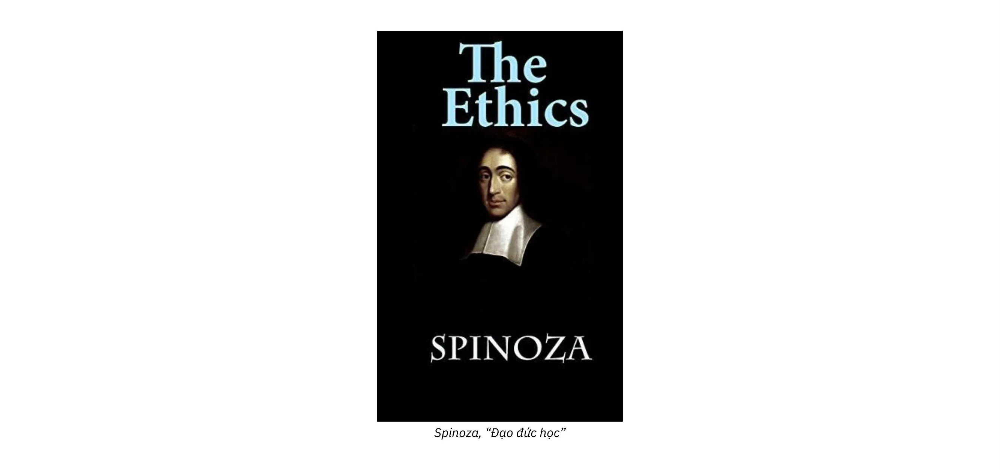

Bằng cách đưa thế giới xung quanh chúng ta vào "kính hiển vi của lý trí", tác phẩm của Spinoza phân tích bản chất con người theo nguyên tắc rằng con người không tự sinh ra, tức là chúng ta không yêu cầu được sinh ra, không phải ở đây, cũng không phải trong thời đại của chúng ta, hay với thuộc tính thể chất hay trí tuệ như vậy.

Và ông nói rằng chúng ta không đứng trên thiên nhiên. Chúng ta không thoát khỏi quy luật của nó, dù là về thể xác hay tinh thần. Nói cách khác, chúng ta cũng là một phần của thiên nhiên như bất kỳ sinh vật sống nào khác, dù là động vật hay thực vật.

Đối với Spinoza, mọi lĩnh vực hoạt động của con người đều phụ thuộc vào khả năng lý trí để hiểu thế giới theo một hệ thống hoàn toàn mạch lạc và xác định.

Một thế giới không tồn tại sự ngẫu nhiên.

Mọi thứ xảy ra đều "cần thiết" và là kết quả của một nguyên nhân, theo quan niệm rằng "cái gì đang có và cái gì xảy ra, phải có và phải xảy ra". Đây là thuyết quyết định luận tuyệt đối.

Nhưng có hai điểm cần lưu ý:

Thứ nhất, nếu đối với Spinoza, cơ hội không tồn tại, đó là vì nó là một sự kiện mà chúng ta không biết nguyên nhân. Nhưng, tất nhiên, ông nói, việc chúng ta không biết nguyên nhân không có nghĩa là nó không tồn tại.

Thứ hai, hoàn toàn không có vấn đề gì về thuyết định mệnh, bởi vì thiên nhiên không hề có ý định. Ví dụ, sét không hề có ý định trừng phạt ai cả, như người ta vẫn nghĩ trong trường hợp bi kịch. Không, nó chỉ đơn giản thể hiện bản chất của chính nó, đó là đánh bằng sét. Đánh.

Do đó, Spinoza bảo vệ ý tưởng rằng thực tại, tức là cuộc sống thường nhật với cả mặt tốt lẫn mặt xấu, là hoàn toàn dễ hiểu, và không có hiện tượng nào trong tự nhiên mà không có mối liên hệ nhân quả. Tất nhiên, điều này đặt ra câu hỏi về cái ác, đặc biệt là cái ác tuyệt đối, mà chúng ta sẽ xem xét sau.

Cuối cùng, điều quan trọng cần lưu ý là đạo đức không phải là luân lý.

Theo Gilles Deleuze (1925-1995), giáo sư triết học nổi tiếng và chuyên gia về Spinoza, đạo đức là một hệ thống phán đoán hữu ích cho cuộc sống xã hội. Nhưng đó là một hệ thống chủ quan, bởi vì điều đúng ở đây có thể sai ở nơi khác, và điều sai hôm nay có thể đúng sau này.

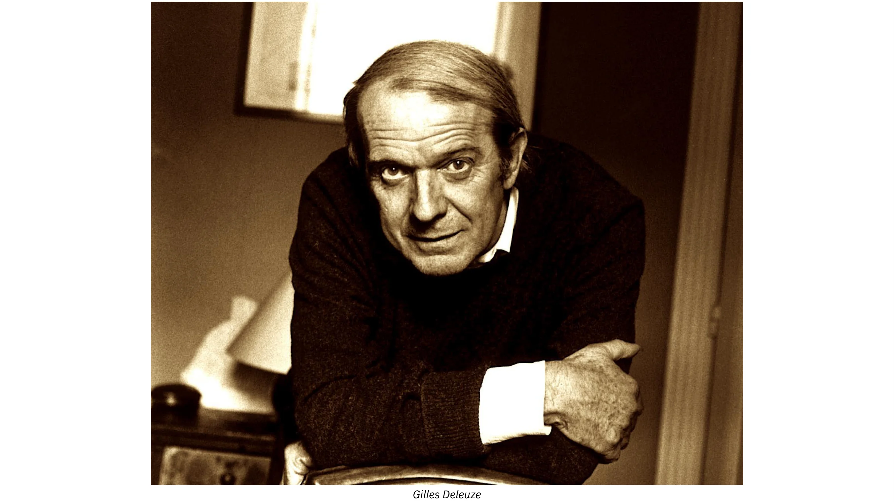

Và thay vì xác định điều gì đúng hay sai, đạo đức học thiết lập điều gì tốt hay xấu cho bản chất và khả năng của chúng ta, theo Spinoza, để bảo tồn trong bản thể mình. Để được tự do. Do đó, nó là một đạo đức học đích thực, tức là một khoa học về các cách thức tồn tại, hay, như Gilles Deleuze giải thích thêm, là nghệ thuật tạo ra những cuộc gặp gỡ tốt đẹp.

Hoặc nghệ thuật đưa ra những lựa chọn đúng đắn để giải thoát bản thân khỏi sự ràng buộc đang giam hãm chúng ta và vì thế, theo Spinoza, con người thường bị đẩy vào tình trạng "nhìn thấy điều tốt nhất, chấp nhận nó và làm điều tồi tệ nhất".

Nói cách khác, "chiến đấu vì chế độ nô lệ như thể họ đang chiến đấu vì tự do".

## Luận thuyết Thần học-Chính trị

<chapterId>84b0187e-1050-5d44-a536-80554896e828</chapterId>

:::video id=c1efc97e-1e96-4b37-894c-9a19794d6b52:::

Sau Đạo đức học, tôi muốn giới thiệu với bạn một tác phẩm quan trọng khác trong chương này sẽ giúp bạn hiểu được ảnh hưởng về mặt triết học và chính trị của Spinoza, đặc biệt là đối với thời kỳ Khai sáng sắp tới và đối với các trào lưu tự do, và trong trường hợp của chúng ta là chủ nghĩa tự do cá nhân.

Đây là Traité théologico-politique, hay TTP, được xuất bản ẩn danh vào năm 1670.

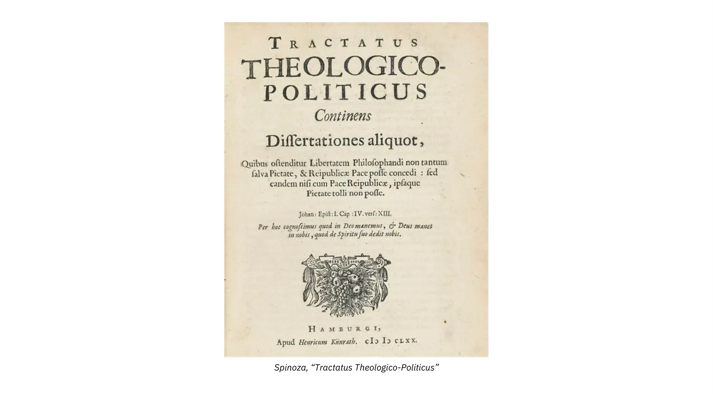

Spinoza (1632-1677) đã viết cuốn sách này trong lúc đang viết cuốn Đạo đức học, nhằm chấm dứt một hiểu lầm vẫn còn tồn tại cho đến ngày nay. Đó là niềm tin rằng ông là một người vô thần.

Như chúng ta đã thấy, khái niệm về Chúa của Spinoza là chủ đề của toàn bộ phần đầu tiên của Đạo đức học, trong đó ông chứng minh không chỉ sự tồn tại của Chúa mà còn cả bản chất thực sự của Ngài.

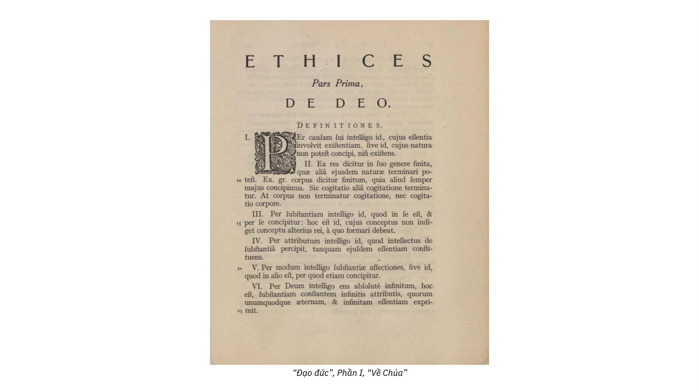

Và vì các khái niệm của Spinoza nhìn chung khá khó nắm bắt, nên thường dễ hiểu hơn bằng cách nói chúng không phải là gì, thay vì cố gắng nói chúng là gì. Một cách tiếp cận, tình cờ và như chúng ta sẽ thấy sau, rất hữu ích cho việc hiểu Bitcoin.

Đây là cách Spinoza cho chúng ta thấy rằng, theo quan điểm của ông, Chúa không phải là một thực thể nhân hình được ban cho những ý định, trừng phạt hay ban thưởng, người mà chúng ta muốn nói chuyện và lắng nghe theo một nghi lễ mà chúng ta có thể hoặc không thể tuân theo. Nói cách khác, theo ông, Chúa không phải là một ông già với bộ râu trắng dài ẩn sau một đám mây, người sẽ giải quyết những khó khăn của thế giới và khiến chúng ta lệ thuộc vào Ngài.

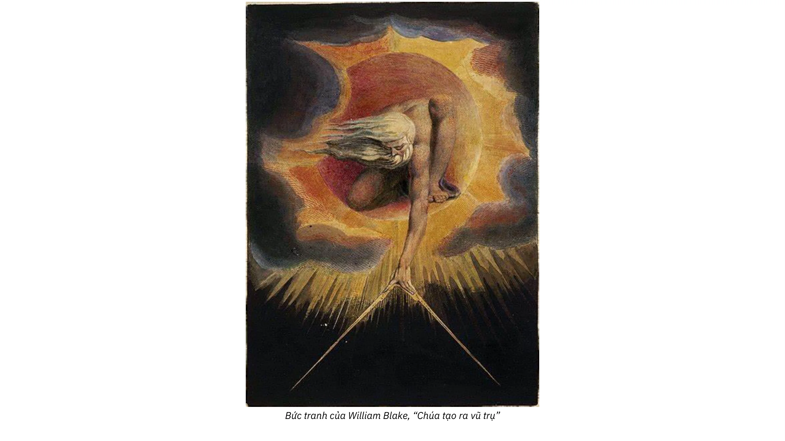

Nói về Chúa nghĩa là gợi lên Thiên nhiên như một Thực thể độc nhất, vô hạn và vĩnh cửu, được tạo thành từ vô số thuộc tính, trong đó con người chúng ta chỉ biết hai thuộc tính: vật chất, hay phạm vi, và tư tưởng.

Đây chính là tác phẩm nổi tiếng "Deus Sive Natura" mà Spinoza lấy ra từ đó khái niệm về thuyết quyết định luận tuyệt đối và ý tưởng rằng con người không phải là nguyên nhân của chính mình, không cao hơn Tự nhiên và chắc chắn không cao hơn động vật.

Nhưng vượt ra ngoài việc phê phán tôn giáo, TTP trên hết là cơ hội để Spinoza phê phán gay gắt những người theo đạo và chế độ thần quyền. Nói cách khác, quyền lực tôn giáo nuôi dưỡng nỗi sợ hãi và mê tín, và ông cho rằng nó kích hoạt những đam mê đen tối của cá nhân để nô dịch họ tốt hơn, giam cầm họ trong ảo tưởng, cuồng tín và chiến tranh.

Trong giai đoạn sơ khai, non nớt này của tôn giáo, tín đồ chỉ gắn bó với sự thờ phượng bề ngoài và một đức tin nhẹ dạ dựa trên định kiến. Một giai đoạn mà tôn giáo trở nên cứng nhắc, thiếu khoan dung, đi chệch khỏi giới hạn của giáo lý đạo đức, và quay lưng lại với sứ mệnh thúc đẩy hòa bình và hòa hợp bằng cách tuyên bố mình nắm giữ chân lý.

Tuy nhiên, một khi chúng ta vượt ra ngoài sự phê bình hợp lý về tôn giáo, ví dụ như bằng cách giải thích Kinh thánh, Spinoza muốn thuyết phục chúng ta rằng quan điểm mới về Chúa này hoàn toàn phù hợp với thông điệp về công lý và lòng bác ái của ba tôn giáo lớn trong Kinh thánh, trong đó nêu ra một quy tắc vàng đơn giản nhưng thường bị lãng quên: "Ngươi phải yêu người lân cận như chính mình".

Nhưng đó không phải là tất cả.

Tầm nhìn trưởng thành về tôn giáo được phát triển trong TTP đi kèm với một chiều hướng chính trị, sự cần thiết phải tách biệt tôn giáo và nhà nước để bảo vệ quyền tự do tư tưởng và tín ngưỡng, vì lợi ích của cả cá nhân và nhà nước.

Về cơ bản, Spinoza coi tự do, trong khuôn khổ lý trí, là điều kiện thiết yếu để con người sống mà không bị nô lệ bởi một thế lực đối lập với lợi ích của họ, và do đó ông bảo vệ nền dân chủ trực tiếp dựa trên tự do chính trị và tôn giáo.

Nói cách khác, tự do tư tưởng và tín ngưỡng, để mọi người có thể thoát khỏi sự nô lệ và những niềm tin sai lầm, trẻ con, để có thể lý luận như người lớn, ưu tiên lý luận và theo quan điểm của chúng ta, ưu tiên tiến bộ công nghệ.

Trận động đất khét tiếng ở Lisbon vào ngày 1 tháng 11 năm 1755 đã cho thấy sự thay đổi lớn trong cách mọi người suy nghĩ về các sự kiện và thảm họa thiên nhiên, cũng như cách bảo vệ bản thân khỏi chúng.

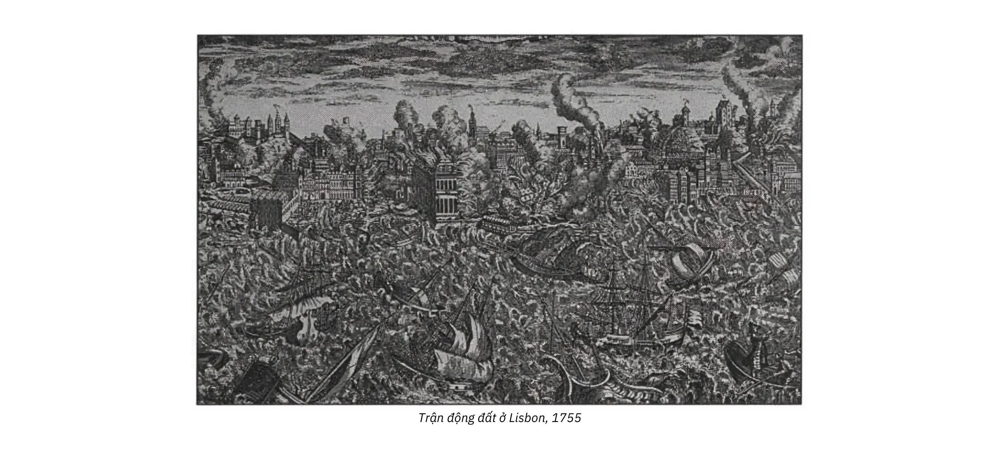

Trận động đất khủng khiếp này đã phá hủy thành phố và giết chết hàng trăm nghìn người vô tội, nhiều người trong số họ đang ở trong nhà thờ vào thời điểm đó vì đó là ngày Lễ Các Thánh, điều này càng làm tăng thêm sự bàng hoàng của những người sống sót.

Một vở kịch khơi gợi lại câu hỏi mà nhà triết học và toán học người Đức Leibniz (1646-1716) đặt ra về viễn kiến nhân hóa về một Thượng Đế được phú cho ý định, lòng tốt và sự toàn năng. Bởi vì nếu Thượng Đế tốt lành, như Leibniz đã nói trong tác phẩm Theodicy của mình, thì Ngài sẽ không toàn năng, bởi vì Ngài đã cho phép những thảm họa như vậy xảy ra, và nếu Ngài toàn năng, thì Ngài sẽ không tốt lành, bởi vì Ngài không thể ngăn chặn chúng.

Vượt xa hơn cả việc lên án bàn tay của Chúa, Jean-Jacques Rousseau (1712-1778) đã viết cho Voltaire, người bị sốc trước sự bất công và nỗi kinh hoàng mà loài người phải chịu đựng một cách phân biệt đối xử, rằng "bản chất tự nhiên không xấu xa, và chúng ta không nên thấy bất kỳ bàn tay thần thánh nào trong đó có thể giải thích được thiết kế của nó".

Voltaire (1694-1778), một người theo chủ nghĩa Spinoza, đã trả lời rằng thảm họa thiên nhiên này trên hết sẽ khiến chúng ta nhận ra rằng các phương tiện khoa học để bảo vệ chúng ta khỏi thiên nhiên đã tồn tại, và do đó, thách thức của thời đại họ là phải tự hỏi liệu con người có thể, nhờ vào kiến thức và sự tiến bộ, nắm giữ tương lai của chính mình và giải thoát bản thân khỏi thần học và mê tín hay không.

Và tất nhiên, vấn đề không phải là ngăn ngừa động đất, vốn không chỉ không thể dự đoán được mà còn hoàn toàn không thể kiểm soát, mà là đảm bảo rằng, chẳng hạn, các ngôi nhà được xây dựng để có thể chống chọi được với động đất.

Đây là lý do tại sao thời kỳ Khai sáng thế kỷ 18, nhờ vào việc vận dụng lý trí, khoa học và công nghệ, được coi là thế kỷ của sự tiến bộ. Nói cách khác, tiến bộ như một công cụ của tự do.

# Cuộc cách mạng Spinoza, ba ảo tưởng

<partId>f5d45c2b-28da-527a-ab20-dd255e9a9e0d</partId>

## Một định nghĩa mới về Thiên nhiên và con người

<chapterId>3e6599e3-5b29-50a8-a67d-d0386da5d65d</chapterId>

:::video id=b6d2c035-8848-4da6-9da9-be3b70be0f38:::

:::id video=b6d2c035-8848-4da6-9da9-be3b70be0f38:::

Trong chương này, tôi muốn xem xét lịch sử tư tưởng và lý giải tại sao chủ nghĩa Spinoza được coi là cuộc cách mạng tư tưởng thực sự của Copernicus.

Nhờ cách hiểu mới này về Chúa, hay nói cách khác là Thiên nhiên, được đưa ra thông qua toán học, Spinoza (1632-1670) đã thiết lập một sự thay đổi mô hình sâu sắc, với những hàm ý gián tiếp đối với thế giới quan tôn giáo và vị trí của con người trong đó.

Cũng như Nicolas Copernicus (1473-1543) đã khẳng định rằng Trái Đất không phải là trung tâm của thế giới, và Charles Darwin (1809-1882) đã chứng minh ba thế kỷ sau đó rằng con người không phải là trung tâm của "cuộc sống", Spinoza cũng tuân theo logic này và khẳng định vào thời của ông rằng con người không phải là "chủ nhân của ngôi nhà của chính mình" và vũ trụ không được tạo ra chỉ vì lợi ích của họ.

Ông nói rằng con người không phải là "một đế chế trong một đế chế" và rằng, giống như trái đất bị thu hẹp lại thành một hành tinh đơn thuần, giống như tất cả các hành tinh khác, con người bị thu hẹp lại thành một dạng thức đơn thuần của tự nhiên, giống như tất cả các dạng thức hữu hạn khác của tự nhiên, chẳng hạn như động vật, thực vật và tất cả "sinh vật hiện hữu".

Trước ông, triết học Hy Lạp cổ điển đã đề xuất một tầm nhìn trật tự, phân cấp về vũ trụ để giải thích thế giới, vũ trụ và trải nghiệm của con người. Dựa trên những câu chuyện thần thoại, triết học này về cơ bản tìm cách giải thích nguồn gốc của thế giới, nhấn mạnh vào sự hài hòa của vũ trụ, thiên nhiên và nhân loại.

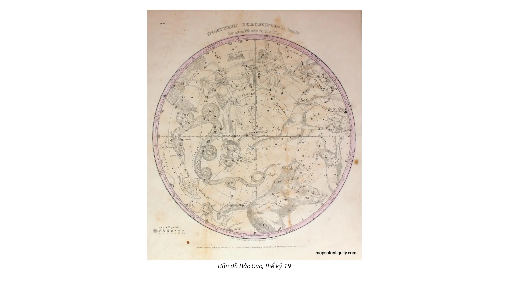

Vũ trụ học kinh viện thời Trung Cổ, về cơ bản từ thế kỷ 12 trở đi, là sự tiến hóa theo hướng lý luận nhiều hơn để hài hòa lý trí và đức tin nhằm giải thích một vũ trụ vẫn có thứ bậc, nhưng phù hợp hơn với triết học Kitô giáo.

Nhưng với vật lý học mới của Copernicus (1473-1543) vào thế kỷ 15, vũ trụ học đã trải qua một bước ngoặt lớn trong sự hiểu biết về vũ trụ, khi mô hình địa tâm của nó bị đặt dấu hỏi để ủng hộ hệ thống nhật tâm, mở đường cho khoa học hiện đại, đặc biệt là vật lý học và thiên văn học mới của Kepler (1571-1630) và Galileo (1564-1642). Sau đó là Isaac Newton (1643-1727) và cuối cùng là Albert Einstein (1879-1955), một người theo chủ nghĩa Spinoza tận tụy.

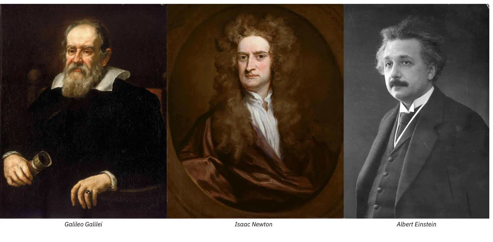

Nhưng để hiểu đầy đủ về chủ nghĩa Spinoza, chúng ta cũng cần xem xét bối cảnh của René Descartes (1596-1650), nhà triết học người Pháp nổi tiếng đi trước Spinoza và là học trò cũng như người ngưỡng mộ ông.

Bất chấp những rủi ro và sự lên án của Giordano Bruno (1548-1600) và Galileo, Descartes vẫn quyết tâm phân biệt "chân lý với dối trá" và hài hòa thần học, triết học và vật lý. Trong tác phẩm nổi tiếng "Diễn ngôn về Phương pháp" (Discourse on Method), xuất bản năm 1637, Descartes lập luận rằng lý trí là nền tảng của tri thức, nhờ đó con người có thể đạt được tự do.

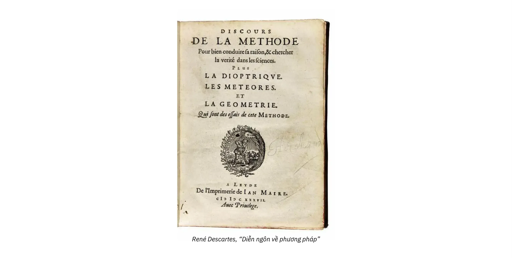

Bằng cách giải thích thế giới theo các quy luật phổ quát thay vì theo bản chất được ban tặng ý định đạo đức, ông đã mở đường cho thuyết quyết định luận, mà sau này Spinoza đã theo đuổi.

Nhưng là một người Công giáo, Descartes vẫn thiết lập một hệ thống phân cấp giữa con người và các dạng hữu hạn khác của tự nhiên, đặc biệt là đối với các loài động vật mà ông gọi là "động vật máy móc". Khi nói rằng "không có linh hồn nào, khi được hướng dẫn đúng đắn, lại không thể có được quyền năng tuyệt đối đối với hành động và đam mê của mình", Descartes khẳng định rằng con người có khả năng khởi đầu một điều gì đó từ hư không, và rằng con người, theo quan điểm của ông, "thoát khỏi các quy luật tự nhiên", rằng con người có quyền năng tuyệt đối đối với hành động của chính mình và chỉ dựa vào chính mình để quyết định.

Spinoza biết cách vượt qua và vượt qua giai đoạn này, dung hòa sự tồn tại của Chúa với sự chứng minh của lý trí. Đối với ông, mọi lĩnh vực hoạt động của con người đều phụ thuộc vào khả năng của lý trí trong một thế giới hoàn toàn mạch lạc và được xác định. Nhưng một thế giới không có sự ngẫu nhiên hay ngẫu nhiên, và mọi thứ xảy ra đều là tất yếu và là kết quả của một nguyên nhân, theo mối liên hệ nhân quả giữa các sự vật. Đây chính là ý tưởng của thuyết quyết định luận tuyệt đối.

Và cuối cùng, bằng những lời lẽ gay gắt nhất, ông đã bác bỏ quan điểm của Descartes, ví dụ như chỉ trích ý tưởng cho rằng con người không tuân theo các quy luật tự nhiên như mọi loài động vật khác, và do đó vượt trội hơn mọi trạng thái hữu hạn khác của tự nhiên.

Nói cách khác, họ được ban cho ý chí tự do, một niềm tin ảo tưởng cực kỳ khó thoát khỏi, như Spinoza đã nói với chúng ta, và chúng ta sẽ thảo luận về điều này ngay bây giờ.

## Ảo tưởng về Ý chí Tự do

<chapterId>f147a914-cb64-5927-b305-26691930bca3</chapterId>

:::video id=b59da795-ba19-4643-9672-36c9e7953a42:::

:::id video=b59da795-ba19-4643-9672-36c9e7953a42:::

Trong khóa học này, chúng ta sẽ chuyển sang câu hỏi tế nhị về ý chí tự do để hiểu rõ hơn ý nghĩa của tự do đối với Spinoza, thời kỳ Khai sáng và các nhà triết học tự do đầu tiên.

Như chúng ta đã thấy, Spinoza (1632-1677) nổi tiếng với việc coi ý chí tự do là một ảo tưởng mà con người rất khó có thể thoát khỏi.

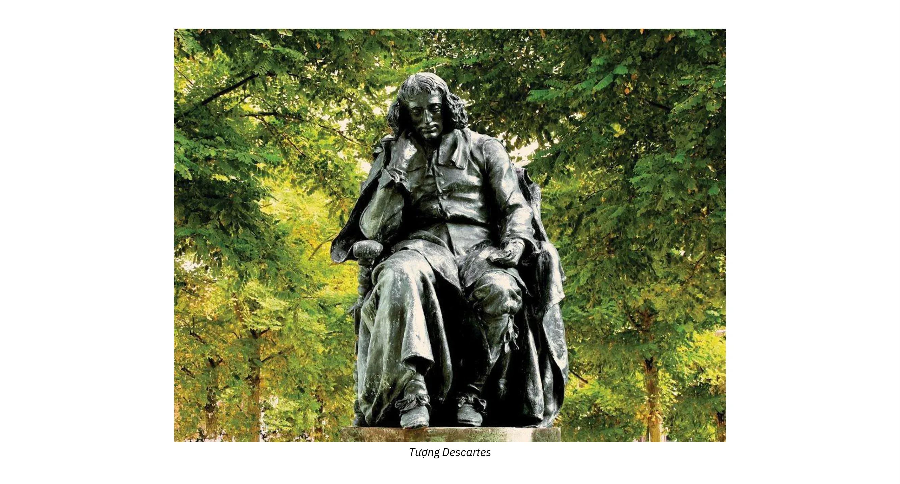

Tại sao vậy? Bởi vì điều này đi ngược lại truyền thống triết học từ thời Cổ đại, và vẫn được Descartes (1596-1642) bảo vệ, rằng con người có thể khởi tạo mọi thứ từ hư không và chịu hoàn toàn trách nhiệm về hành động của mình, đặc biệt là trước Chúa, theo lời Thánh Augustine (354-430), giáo phụ của Giáo hội Kitô giáo.

Nhưng tất nhiên, trước cả công lý của con người.

Đó là ý tưởng rằng ý chí của chúng ta, và chỉ có ý chí của chúng ta, mới cho phép chúng ta định hướng cuộc sống của mình, rằng chúng ta có quyền lực tuyệt đối đối với hành động của mình, và rằng chúng ta có được sự tự do trong hành động chỉ từ chính bản thân mình, do đó sở hữu quyền quyết định không xác định.

Nói cách khác, loài người có khả năng phá vỡ trật tự của thiên nhiên thay vì phải tuân theo nó.

Trong hành trình cuộc đời, bởi vì ông không chịu sự chi phối của bất kỳ luật lệ nào khác ngoài luật lệ do chính ý chí của mình đặt ra, nên ông không chỉ đứng trên thiên nhiên và động vật, những cỗ máy đơn thuần, mà còn đứng trên tất cả các hình thái hữu hạn khác của tự nhiên. Đây chính là quan điểm của Descartes (1596-1650), người cho rằng nguyên nhân của sự bất lực và bất nhất của con người không nằm ở trật tự tự nhiên, mà nằm ở những thói hư tật xấu của chính bản chất con người.

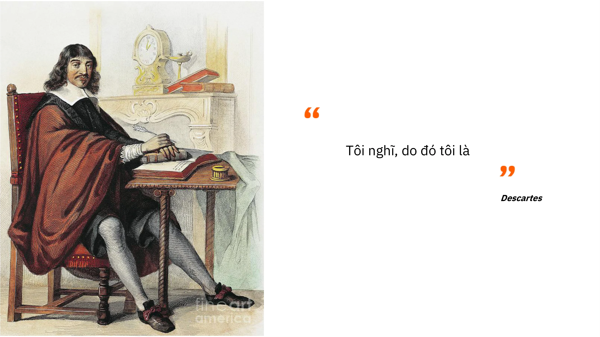

Nhưng trong khi Spinoza ghi nhận Descartes đã mở đường cho sự kiểm soát hợp lý đối với đời sống tình cảm, ông lại hoàn toàn tách mình khỏi Descartes bằng cách chỉ trích mạnh mẽ giả thuyết về "quyền lực tuyệt đối" của ý chí.

Ngược lại, Spinoza cho rằng thế giới của chúng ta hoàn toàn mạch lạc và xác định, và mọi thứ xảy ra đều là tất yếu và là kết quả của tính nhân quả của vạn vật, theo đó một kết quả luôn có nguyên nhân, và nguyên nhân này lại là kết quả của một nguyên nhân khác, v.v.

Đây là ý tưởng về thuyết quyết định luận tuyệt đối, từ đó ông khẳng định trong cuốn Đạo đức học rằng con người không hề có ý chí tự do vì, ông nói, họ ý thức được hành động của mình, nhưng họ phớt lờ, hoặc muốn phớt lờ, những nguyên nhân thực sự quyết định họ.

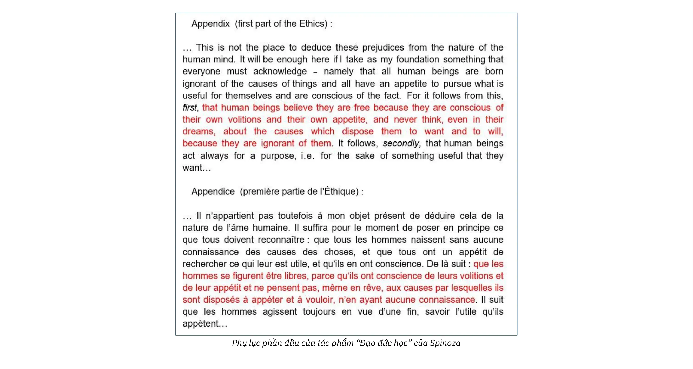

Đối với Spinoza, con người, với tư cách là "hình thái hữu hạn" của tự nhiên giống như động vật hay thực vật, do đó không thể tạo ra bất cứ thứ gì từ hư không; họ không được miễn trừ khỏi các quy luật của tự nhiên, cả về cơ thể lẫn tâm trí.

Tệ hơn nữa, đối với ông, mối nguy hiểm lớn nhất của tự do là tin vào ý chí tự do của chúng ta và tin rằng chúng ta có thể hành động mà không bị chi phối bởi các nguyên nhân bên ngoài.

Với Spinoza, tự do không phải là biểu hiện của ý chí tự do, mà là khả năng hiểu được vị trí chính đáng của mình trên thế giới, hiểu được bản chất quyết tâm của mình, và từ đó, hướng sự tồn tại của mình đến điều "làm tăng sức mạnh hành động của chúng ta". Bằng cách luôn hướng về tương lai với sự lạc quan, và nhìn thế giới như nó vốn có, thay vì tưởng tượng nó theo cách chúng ta muốn thấy.

Tất nhiên, vấn đề nảy sinh là trách nhiệm của con người và hành động của họ. Chúng ta có thể kết luận rằng nếu cá nhân không được tự do trong hành động, họ sẽ không phải chịu trách nhiệm về những hành động đó, đặc biệt là khi đối mặt với công lý. Nhưng quan điểm này gây hiểu lầm, bởi vì, không đi sâu vào chi tiết, việc thừa nhận tính quyết định xã hội, gia đình và lịch sử của một người không ngăn cản chúng ta xem xét trách nhiệm của những hành động đã thực hiện, vì chúng là tự nguyện.

Mặt khác, sẽ là ảo tưởng nếu tin rằng hành động của một tội phạm không bao giờ liên quan đến quyết định luận của chính hắn. Vấn đề không phải là bào chữa cho hành vi của chúng, mà ít nhất là cố gắng hiểu chúng. Thực tế, đây chính là chức năng của công lý: ngoài việc trừng phạt những hành vi trái pháp luật, công lý còn đóng vai trò dự đoán và bảo vệ tương lai, đó là lý do tại sao một số tội ác không chỉ bị trừng phạt mà còn bị xử lý, có tính đến hoàn cảnh gia đình, xã hội và tâm lý của người phạm tội.

Cách tiếp cận này đối với tự do như một năng lực hành động chính là mối liên hệ mà chúng ta có thể tạo ra với triết học Khai sáng thế kỷ 18. Theo một trong những đại sứ vĩ đại nhất của triết học này, triết gia người Đức Immanuel Kant (1724-1804), Khai sáng thực sự là phương tiện giải phóng con người khỏi tình trạng bị giám hộ, hay như Étienne de la Boétie (1530-1563) đã nói, khỏi cảnh nô lệ tự nguyện mà chính họ phải chịu trách nhiệm.

Phương châm của Kant là "Hãy tự suy nghĩ" và "Dám biết", câu nói nổi tiếng của người La Mã "Sapere Aude".

Năng lực hành động của Spinoza, do đó, là sức mạnh mà con người có sẵn bên trong mình để hiểu được trạng thái động vật của chính mình, và để thấu hiểu thiên nhiên và các hiện tượng của nó, dù tích cực hay tiêu cực, bằng cách liên hệ chúng với các nguyên nhân khách quan, để không dựa vào những giải thích đạo đức sai lầm và ảo tưởng, tức là những giải thích được định hình để phù hợp với mong muốn của chúng ta. Thay vào đó, nó bao gồm việc tìm cách giải thích chúng thông qua lý trí, hướng tới sự giải phóng và tự do.

Và sự tiến bộ đã dẫn đến cuộc cách mạng công nghệ đầu tiên và những ý tưởng tự do và kinh doanh đầu tiên vào cuối thế kỷ 18, đáng chú ý là với triết gia tự do người Anh John Locke (1632-1704) và nhà kinh tế học người Anh Adam Smith (1723-1790).

Và cũng đáng để nhắc lại định nghĩa về ảo tưởng của Sigmund Freud (1856-1939). Theo cha đẻ của phân tâm học, người luôn thừa nhận ảnh hưởng của Spinoza đối với công trình của mình, ảo tưởng chính xác là "một niềm tin được thúc đẩy bởi sự hiện thực hóa một ham muốn, và do đó bỏ qua thực tế".

Cuối cùng, điều đáng lưu ý là trong khi phong trào tự do mà chúng ta sắp thảo luận đề cập trực tiếp đến triết lý tự do mới này, thì cũng có những người chỉ ra rằng những nhân vật như Ayn Rand (1905-1982), tác giả của "La Grève" và "La Source vive", ủng hộ sự tồn tại của ý chí tự do, tin rằng con người có khả năng đưa ra những lựa chọn tự do.

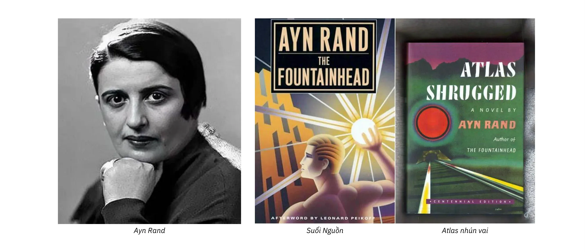

Nhưng thực tế lại hoàn toàn khác, và sự nhầm lẫn này xuất phát từ một vấn đề ngữ nghĩa: bằng cách thừa nhận khả năng hành động và đưa ra lựa chọn của con người, đồng thời thừa nhận thuyết quyết định luận logic mà họ là đối tượng của nó, những người theo chủ nghĩa tự do đầu tiên, trên thực tế, cũng là những người kế thừa Spinoza. Điểm chung giữa họ với Spinoza là niềm tin rằng con người không vượt lên trên tự nhiên mà là kết quả của một quá trình tiến hóa đặt họ vào trong một thuyết quyết định luận, một lịch sử vượt ra ngoài họ, và phần lớn chịu trách nhiệm về bản chất và hành động của con người.

Cuối cùng, nếu niềm tin vào ý chí tự do là một ảo tưởng mà rất khó để thoát ra, thì đó là vì nó liên quan đến một ảo tưởng khác nuôi dưỡng nó, ảo tưởng về nguyên nhân cuối cùng, mà tôi mời bạn nghiên cứu trong chương tiếp theo.

## Ảo tưởng về nguyên nhân cuối cùng

<chapterId>da2a7fb1-f1e9-5b56-822d-c73770de749d</chapterId>

:::video id=a0127fe7-a4cb-4a1c-8af4-f11c40b4a3d7:::

Trong chương trước, chúng ta đã thấy rằng ảo tưởng về ý chí tự do bao gồm niềm tin rằng chúng ta có thể khởi đầu mọi thứ từ hư không, rằng chỉ có ý chí mới có thể định hướng cuộc sống, và rằng chúng ta sẽ có một quyền quyết định vô hạn. Đó là quan niệm cho rằng con người có khả năng phá vỡ trật tự của Tự nhiên nhiều hơn là chịu sự chi phối của nó.

Nhưng đối với Spinoza (1632-1677), con người không phải là "một đế chế trong một đế chế", nghĩa là, trái ngược với những gì Descartes đã xác lập (1596-1650), con người không phải là một ngoại lệ trong tự nhiên, và không bao giờ được miễn trừ khỏi chuỗi nhân quả kéo dài mang tính quyết định.

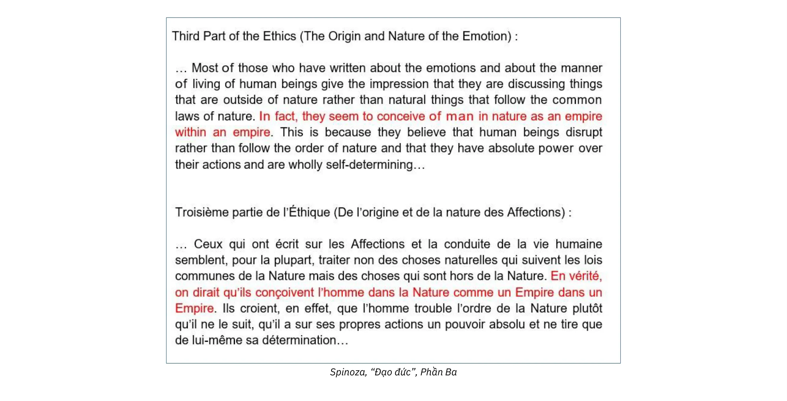

Và vì, theo Spinoza, Tự nhiên không có mục đích được quy định từ góc độ đạo đức, và vì con người có xu hướng nhầm lẫn trí tưởng tượng với sự hiểu biết, nên họ diễn giải nó theo những gì phù hợp với lợi ích của riêng họ. Đến mức họ gán cho mọi thứ một ý nghĩa chỉ xuất phát từ cách họ đánh giá và liên hệ chúng với chính mình.

Nghĩa là theo mong muốn, hy vọng và nỗi sợ hãi của họ.

Lý luận này được minh họa bằng ảo tưởng về nguyên nhân cuối cùng, vốn là một trở ngại lớn đối với tư duy và việc vận dụng lý trí, bởi vì nó chỉ đơn giản thể hiện nhu cầu của chúng ta là làm cho các tác động của một sự vật không tương ứng với nguyên nhân thực sự của nó, mà tương ứng với một niềm tin, ngay cả khi nó vô lý hoặc trẻ con.

Một niềm tin thể hiện một ý định, đặc biệt là thiêng liêng, và theo cách chúng ta diễn giải, thường là mê tín dị đoan, hoặc là sự thiếu hiểu biết.

Và đó là lý do tại sao các căn bệnh mới như AIDS vào những năm 90 hay covid vào năm 2020 luôn được một số người coi là biểu hiện của một ý định thiêng liêng và thường mang tính trừng phạt, theo một lập luận trái ngược với nguyên tắc nhân quả làm nền tảng cho chủ nghĩa duy lý và khoa học hiện đại được thiết lập từ thời Copernicus (1473-1543), Kepler (1571-1630) và Galileo (1564-1727).

Thực tế là, như Spinoza đã nói, con người chẳng mấy quan tâm đến việc có quá nhiều thứ vượt quá sức tưởng tượng của họ, rằng có nhiều hỗn loạn hơn là trật tự trong tự nhiên. Tuy nhiên, sự phức tạp của những thứ vượt quá tầm hiểu biết của họ nên ngăn cản họ tin vào bất kỳ dự án mục đích luận nào. Ông nói rằng điều đó không quan trọng, bởi vì niềm tin của con người vào sự liên quan của những điều chắc chắn dựa trên những gì phù hợp với mong muốn và lợi ích của họ luôn mạnh mẽ hơn bất kỳ lập luận lý trí hay mối quan tâm nào về chân lý.

Như vậy, chủ nghĩa cuối cùng đồng nghĩa với việc đảo ngược nguyên nhân và kết quả của sự vật để hiểu chúng: ví dụ, chúng ta tin rằng lý do chúng ta có mắt là để nhìn, và lý do chúng ta có răng là để nhai. Trong khi, tất nhiên, mục đích của chủ nghĩa cuối cùng là để thấy rằng loài người đã phát triển thị lực trong quá trình tiến hóa, và thực sự chính nhờ nhu cầu nuôi sống bản thân và ăn thịt mà bộ răng của chúng ta cũng phát triển như ngày nay.

Và đây chính xác là điều mà nhà tự nhiên học người Pháp Jean-Baptiste de Lamarck (1744-1829) khẳng định (hình ảnh 3.3.3) khi ông đưa ra học thuyết tiền Darwin rằng chính chức năng tạo ra cơ quan, chứ không phải ngược lại.

Nhưng như Spinoza đã nói, "ảo tưởng của con người không dừng lại ở đó", và trong số tất cả những ví dụ về những ý tưởng mục đích luận ngây thơ, và cuối cùng khá buồn cười, chúng ta thường trích dẫn ví dụ nổi tiếng của nhà sinh vật học Bernardin de Saint-Pierre (1737-1814). Cựu giám đốc Bảo tàng Lịch sử Tự nhiên Paris này đã nhìn nhận tính chất cuối cùng của tự nhiên bằng thơ ca, trữ tình và một chút ngây thơ, khi cho rằng, chẳng hạn, dưa hấu được tạo ra chỉ với mục đích làm hài lòng những gia đình đông người, bởi lớp vỏ sần sùi của nó giúp dễ dàng cắt thành những lát đều nhau.

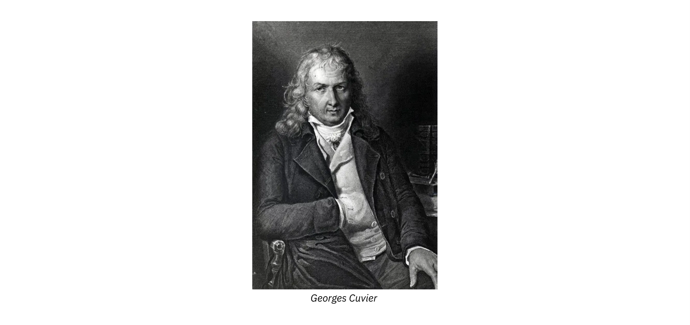

Ví dụ, định nghĩa về [lạm phát](https://planb.academy/resources/glossary/inflation) do các nhà kinh tế học Keynes và những người ủng hộ nhà nước phúc lợi đưa ra cũng minh họa rất rõ nghịch lý này. Theo họ, lạm phát là sự gia tăng giá cả, mà theo một số ngân hàng trung ương, xuất phát từ "hư vô", hoặc từ bối cảnh địa chính trị mà không ai có thể kiểm soát hoặc dự đoán được. Mặc dù giá cả tăng thực sự có thể dẫn đến lạm phát theo chu kỳ - ví dụ, khi giá dầu tăng, giá của một số hàng hóa chế biến cũng sẽ tăng - nhưng nguyên nhân cơ cấu thực sự của lạm phát chủ yếu liên quan đến sự gia tăng tiền tệ Supply, điều này lại hàm ý sự giảm giá trị của tiền tệ và, ipso facto, sự gia tăng giá cả một cách máy móc.

Tin tưởng, hoặc khiến người khác tin tưởng, điều ngược lại cũng giống như mơ mộng hão huyền, như Spinoza đã nói một cách mỉa mai, và dựng lên một lập luận sai lầm, hoặc gây hiểu lầm, và càng dễ được chấp nhận hơn vì nó được coi là một phản ứng được mong đợi để chứng minh mình đúng. Trong trường hợp này, khi những người ủng hộ sự can thiệp của nhà nước coi lạm phát là cách tốt nhất để giải quyết các vấn đề kinh tế.

Tuy nhiên, cách diễn giải thiên lệch về lạm phát này khiến chúng ta quên rằng, mặc dù nó hữu ích cho việc quản lý nền kinh tế trong ngắn hạn, nhưng thực chất nó là một loại thuế ẩn, về lâu dài chỉ dẫn đến thảm họa về người và vật chất, và khiến các quốc gia không thể không lạm dụng quyền lực. Đây chính là điều Friedrich Hayek (1899-1992) đã mô tả rất hay trong tiểu luận "Con đường dẫn đến chế độ nông nô", khi ông gợi lên cảnh nô lệ mà các quốc gia không thể tự thoát ra.

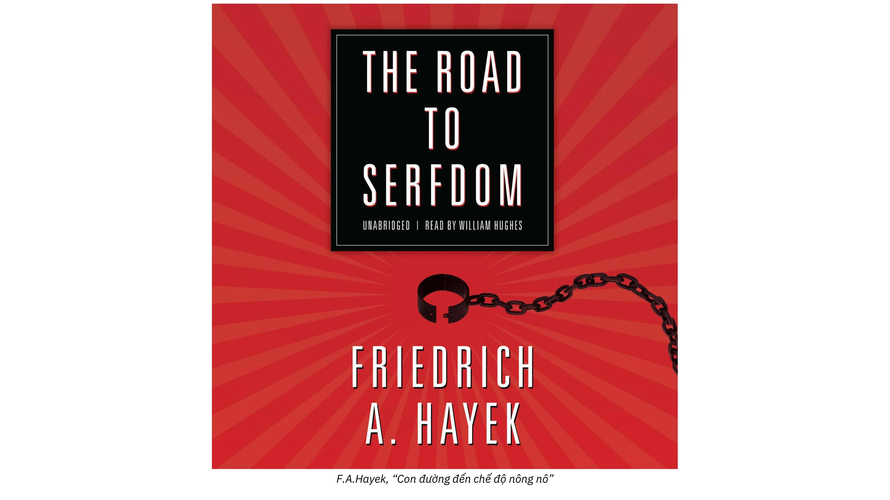

Cuối cùng, điều đáng lưu ý ở đây là cơ chế cuối cùng này cũng được minh họa rõ ràng qua cách những người chỉ trích Bitcoin thể hiện sự chỉ trích của họ bằng cách tập trung chính xác vào những tác động của nó.

Bởi vì mặc dù một số tác động của Bitcoin chắc chắn có thể bị chỉ trích, do định kiến nhận thức liên quan đến việc nó là một công nghệ mới và mang tính đột phá, chúng ta vẫn có xu hướng chỉ nhìn thấy những tác động tiêu cực. Đặc biệt là nếu thực tế không khớp với mong muốn của chúng ta, ví dụ như nếu chúng ta là người sùng đạo khi đối mặt với một cuộc cách mạng Copernicus như chủ nghĩa Spinoza, hoặc nếu chúng ta là một ngân hàng trung ương khi đối mặt với khái niệm tiền tệ kỹ thuật số phi tập trung.

Tuy nhiên, khá rõ ràng rằng nếu một người theo đạo hoặc một chủ ngân hàng trung ương thể hiện sự hiểu biết, tò mò và thiện chí, và nếu họ quan tâm đến một khái niệm, trước tiên tìm cách hiểu khái niệm đó thay vì đánh giá tác động của nó để phù hợp với ý kiến của họ với kỳ vọng của họ, thì họ chắc chắn sẽ có thể tuân thủ khái niệm đó.

Cảm ơn sự chú ý của bạn và hẹn gặp lại ở chương tiếp theo.

## Ảo tưởng thần học

<chapterId>93554156-5e62-526d-9b71-49c47be916af</chapterId>

:::video id=9c490cc1-3d29-4ca7-9464-1a701bb91ba7:::

:::id video=9c490cc1-3d29-4ca7-9464-1a701bb91ba7:::

Trong chương cuối cùng này về quan điểm Copernicus mới về các ý tưởng do Spinoza đưa ra, cuối cùng chúng ta chuyển sang ảo tưởng thứ ba do Spinoza (1632-1677) đưa ra trong tác phẩm Đạo đức học của ông.

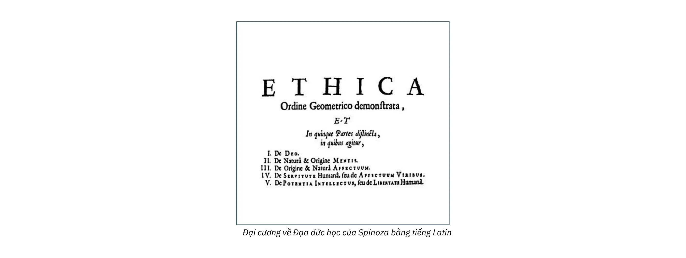

Ảo tưởng này có liên quan trực tiếp đến hai ảo tưởng đầu tiên, ảo tưởng về ý chí tự do và ảo tưởng về sự kết thúc.

Đó là về ảo tưởng thần học.

Vấn đề là: Chừng nào con người còn thiếu hiểu biết, "về cả sự vật lẫn bản thân mình", như Spinoza đã nói, chừng nào họ còn tin vào sự tự do ảo tưởng của mình, họ sẽ coi trí tưởng tượng là sự hiểu biết, tức là họ sẽ luôn cho rằng mình có khả năng suy nghĩ và hiểu được bản chất của sự vật, trong khi thực tế họ chỉ đang tưởng tượng, bịa đặt và phóng chiếu những gì có ích cho họ. Theo mong muốn của họ.

Đây là lý do tại sao con người tin rằng nếu các phương tiện tự nhiên tồn tại và hữu ích, chẳng hạn như răng để ăn hay mắt để nhìn, thì đó là vì chúng được tạo ra một cách hợp lý bởi một "đấng chỉ huy tự nhiên". Nói cách khác, đó là một vị thần có chủ đích, nhân hình, mà ý định của con người được gán cho.

Nói cách khác, một ông già râu bạc ẩn sau đám mây, người được cho là đã tạo ra mọi thứ trong tự nhiên như một phương tiện để đạt được mục đích của chúng ta, bởi vì ông yêu thương chúng ta và bảo vệ chúng ta khi chúng ta tôn vinh và thờ phụng ông.

Đây là giai đoạn đầu tiên của ảo tưởng thần học.

Nhưng bất chấp niềm kiêu hãnh của chúng ta khi tin rằng mình cao hơn Tự nhiên, và tưởng tượng rằng mình có thể tạo ra điều gì đó từ hư không, thực ra chúng ta luôn phải chịu những điều kiện tồn tại cho thấy rằng, cuối cùng, chúng ta sẽ không thể "thoát khỏi nó", như giáo sư triết học Gilles Deleuze (1925-1995) đã nói. Chúng ta là phàm nhân, giống như mọi loài động vật, nhưng chúng ta biết điều đó.

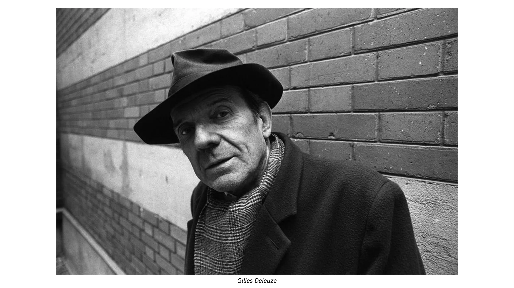

Việc tin hoặc tưởng tượng điều ngược lại để tự trấn an chính là lý do tại sao chúng ta liên tục bị giằng xé giữa nỗi sợ hãi và hy vọng, giống như hai cực đối lập và không thể tách rời giữa cảm giác an toàn và cảm giác hoảng loạn, vì nỗi sợ hãi luôn gắn liền với hy vọng về những ngày tốt đẹp hơn.

Không có nỗi sợ nào mà không có hy vọng, cũng như không có hy vọng nào mà không có sợ hãi, và người sợ hãi luôn hy vọng thoát khỏi điều mình sợ, trong khi người hy vọng luôn sợ rằng điều mình hy vọng sẽ không xảy ra.

Và vì "chúng ta dễ dàng tin vào những gì chúng ta hy vọng", Spinoza nói trong cuốn Đạo đức học của mình, nên khi chúng ta đối mặt với những nguyên nhân hoặc sự kiện bên ngoài có thể gây hại cho chúng ta, trái ngược với bất kỳ ý tưởng nào về tính hữu ích, thì giai đoạn thứ hai của cái gọi là ảo tưởng thần học này được thể hiện, đặc trưng bởi những niềm tin từ đó nảy sinh tình cảm mê tín.

Nói cách khác, theo Voltaire (1694-1778), "kẻ khét tiếng", người mà mê tín không bao giờ xuất phát từ lý trí, và nó luôn tương ứng với niềm tin phi lý hoặc vô căn cứ, trái ngược với mọi hình thức lý trí bằng cách gán cho các sự vật hoặc hành động những sức mạnh hoặc tiềm năng tâm linh mà chúng không có.

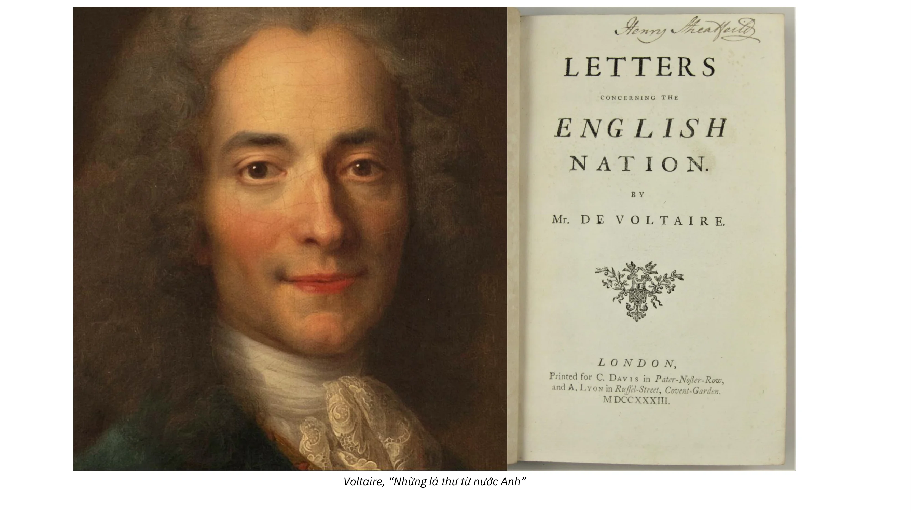

Dưới vỏ bọc giải thoát chúng ta, cho phép chúng ta tưởng tượng ra một thế giới tốt đẹp hơn, mê tín thực chất đang giam cầm chúng ta trong chính những ảo tưởng và dối trá của mình. Trong những cảnh nô lệ mà chúng ta sẽ phải mất một khoảng thời gian như Hard mới có thể thoát ra được.

Đây chính là điều mà thời kỳ Khai sáng Đức, Anh và Pháp đã bảo vệ từ thế kỷ 18 trở đi, khẳng định rằng mê tín dị đoan chỉ đơn giản là ngăn cản con người trưởng thành, không chỉ bằng cách hạn chế việc vận dụng lý trí, mà còn, và trên hết, bằng cách tạo ra sự bất khoan dung, vốn là công cụ tốt nhất để thiết lập sự thống trị của một thế lực, dù là chính trị hay tôn giáo.

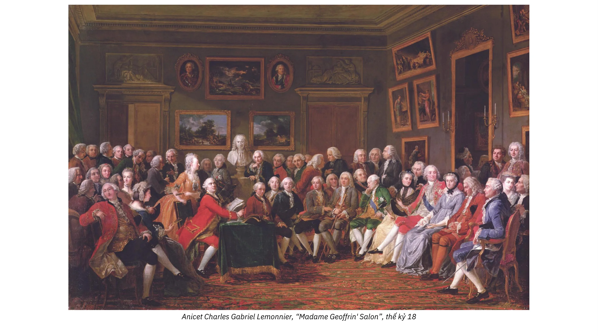

Và đây chính là điều Spinoza một lần nữa chứng minh trong Luận thuyết Chính trị Thần học của ông, mà chúng ta đã đề cập. Trong bài luận này, ông viết rằng "bí mật lớn nhất của chế độ quân chủ, và mối quan tâm chính của nó, là lừa dối người dân, và ngụy trang dưới danh nghĩa tôn giáo nỗi sợ hãi vốn đang kiểm soát họ". Đây là lý do tại sao những kẻ bạo chúa, độc tài hay nhà cách mạng, những người luôn bị thúc đẩy bởi mong muốn làm điều tốt cho người khác, thường xuyên, nếu không muốn nói là luôn luôn, rơi vào cái bẫy làm ngược lại nguyên tắc của mình để đạt được mục tiêu.

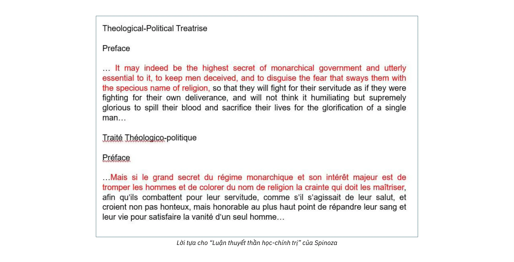

Nhưng điều mới mẻ mà Spinoza mang lại cho TTP, và theo một cách nào đó khiến ông trở thành cha đẻ của chủ nghĩa thế tục, là xem xét rằng trong khi việc chống lại mê tín dị đoan và lời kêu gọi bạo lực mà tự do một cách nghịch lý cho phép là điều cần thiết, thì thực tế là việc bảo vệ quyền tin tưởng và quyền tự do suy nghĩ lại là vì lợi ích của nhà nước.

Bởi vì ngay khi những ý tưởng tồn tại và được thể hiện một cách riêng tư, chúng chắc chắn sẽ lan rộng khắp xã hội, và cả sự cấm đoán lẫn kiểm duyệt đều không thể ngăn cản chúng. Những ý tưởng, dù đúng hay sai, dù tốt hay xấu, dù thế nào cũng sẽ được lưu hành, và việc cấm đoán chúng về lâu dài chỉ có thể dẫn đến sự nổi loạn và lật đổ nhà nước nhân danh tự do.

Nói cách khác, trên thực tế, nhà nước sẽ lo sợ nhiều hơn về việc kiểm duyệt hoặc đàn áp quyền tự do ngôn luận hơn là việc duy trì nó, và do đó, Spinoza cho biết, nhà nước có lợi ích khi để cá nhân thực hiện quyền tự nhiên của họ là suy nghĩ và thể hiện bản thân.

Đối với Spinoza, một nhà nước dân chủ cho phép tự do tư tưởng do đó là sự bảo đảm tốt nhất rằng mọi người sẽ sống trong hòa bình, và rằng, nhờ vào việc vận dụng lý trí, họ sẽ không chỉ được tự do suy nghĩ và hành động mà còn có thể hiểu được những ràng buộc đang kìm hãm họ để thoát khỏi chúng.

# Từ lý thuyết tình cảm đến Bitcoin

<partId>82e69d4f-a94f-5978-bcb8-8a7b4651bcca</partId>

## Câu hỏi về cái ác trong Spinoza

<chapterId>1ce64576-2688-5757-a119-57cc3a1076c0</chapterId>

:::video id=9c490cc1-3d29-4ca7-9464-1a701bb91ba7:::

:::id video=9c490cc1-3d29-4ca7-9464-1a701bb91ba7:::

Bây giờ tôi muốn thảo luận về vấn đề cái ác, như Spinoza (1632-1677) đã trình bày trong các tác phẩm và thư từ của ông.

Nhưng hãy lưu ý, đây là một chủ đề phức tạp và gây tranh cãi, và mục tiêu ở đây chỉ đơn giản là hiểu, một lần nữa, cách suy nghĩ của ông để nắm bắt tốt hơn những gì dẫn dắt ông, tức là hành trình tìm kiếm tự do.

Như chúng ta đã thấy, việc không tin vào ý chí tự do hay bất kỳ hình thức chủ nghĩa cuối cùng nào trong tự nhiên sẽ nhanh chóng làm nảy sinh vấn đề về sự tồn tại của cái ác trong cuộc sống hàng ngày của chúng ta.

Nói cách khác, câu hỏi đặt ra là liệu "cái ác" có tồn tại trong tự nhiên hay không và liệu con người có phải chịu trách nhiệm về tác hại mà họ gây ra hay không.

Các triết gia cổ đại tin rằng cái ác không tồn tại trong tự nhiên, và Socrates (470-399 TCN) chẳng hạn, đã dạy rằng "cái ác chẳng là gì cả". Theo ông, một người độc ác không phải là độc ác bẩm sinh, và theo một cách nào đó, họ chỉ đơn giản là hiểu sai về bản chất của cái thiện.

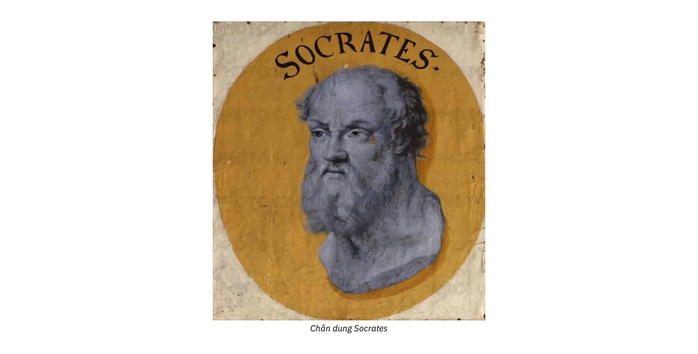

Nhưng truyền thống kinh viện, đặc biệt là truyền thống của Thánh Augustine (354-430), vẫn còn ảnh hưởng đến đạo đức Kitô giáo ngày nay, lập luận rằng cái ác không chỉ tồn tại, rằng nó là một thực tế, mà nó có thể được giải thích bởi vì con người tự do, bởi vì họ có khả năng lựa chọn giữa thiện và ác, và do đó, cái ác mà họ gây ra hoàn toàn là trách nhiệm của chính họ.

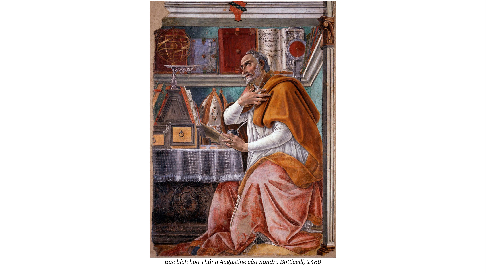

Và ngay cả khi trách nhiệm về những thiệt hại do động đất, virus chết người hay việc một đứa trẻ sinh ra bị mù không nên được quy cho con người, thì lối suy nghĩ này vẫn tồn tại bằng cách gán cho tự nhiên một ý định đạo đức khiến chúng phải chịu trách nhiệm. Ví dụ, bằng cách cho rằng nếu một trận động đất xảy ra, chính xác là do con người đã hành xử không tốt.

Đây là quan niệm được những người theo tôn giáo bảo vệ rằng con người sinh ra là tội nhân, phạm tội tổ tông.

Tất nhiên, như bạn có thể tưởng tượng, ý tưởng này đã bị Spinoza bác bỏ hoàn toàn, ông cho rằng, vì Thiên nhiên, hay Chúa hoặc số phận như ông nói, không có ý định, và vì con người không có ý chí tự do, nên trách nhiệm về "cái ác" mà người ta gán cho họ hoàn toàn là ảo tưởng.

Spinoza viết trong cuốn Đạo đức học rằng "Không có điều gì xảy ra trong tự nhiên có thể được quy cho một thói xấu tồn tại trong đó", và theo ông, do đó chúng ta sẽ sai lầm khi coi, ví dụ, tình trạng mù lòa của một đứa trẻ sơ sinh là "xấu xa" vì khi sinh ra đã mù, một đứa trẻ không bị mất thị lực hơn một hòn đá.

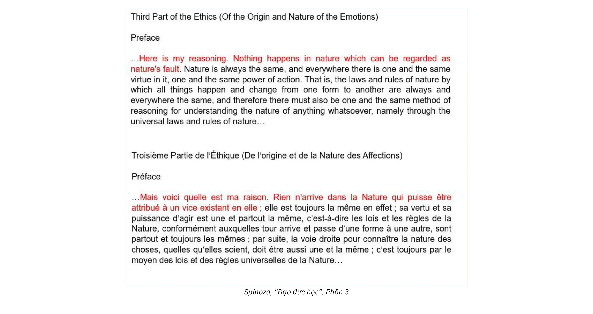

Và nếu chúng ta nghĩ rằng người mù không có thị lực, thì điều đó chỉ đúng theo quan điểm của những người sáng mắt.

Do đó, Spinoza đưa ra ý tưởng rằng cái ác không tồn tại trong tự nhiên, nhưng tính độc đáo của ông, khiến nó trở thành một triết lý mang tính cách mạng, là xem xét rằng cái ác không tồn tại và "cái thiện" cũng vậy.

Và đây là lý do tại sao ông nói về đạo đức hơn là luân lý, không bàn về đúng sai, vì tất cả đều là những khái niệm tương đối và chủ quan, mà bàn về điều gì là "tốt" hay "xấu" đối với nhu cầu tự nhiên của chúng ta là "kiên trì trong bản thể", ông nói. Nói cách khác, là để sống và phát triển. Để phát triển như một con người.

Hơn nữa, chúng ta đã thấy rằng quan điểm của Spinoza về trách nhiệm của những người có hành vi sai trái khi phạm tội rõ ràng không nhằm mục đích bào chữa cho họ. Bởi vì, ngay cả khi không biết nguyên nhân thực sự khiến họ phạm tội, con người vẫn luôn ý thức được việc mình đang làm và do đó, tự thân họ phải chịu trách nhiệm trước đạo đức và pháp luật.

Rõ ràng, hành vi của tội phạm luôn gắn liền với yếu tố quyết định gia đình, xã hội, kinh tế hoặc thậm chí y khoa, nếu tội ác của hắn có thể được giải thích bằng tình trạng thể chất hoặc tinh thần. Và đây chính là vai trò của công lý, vượt ra ngoài khuôn khổ luật hình sự để xem xét thực tế rằng một số tội ác không chỉ phải bị trừng phạt mà còn phải được xử lý, có tính đến hoàn cảnh gia đình, xã hội và tâm lý của người phạm tội.

Đây là lý do tại sao nhà Spinoza Gilles Deleuze (1925-1995) giải thích rằng đạo đức là một loại hành vi học, tức là khoa học thực tiễn về cách tồn tại, hay như ông nói, "nghệ thuật tạo ra những cuộc gặp gỡ tốt đẹp".

Nói cách khác, theo Spinoza, tự do bao gồm việc hướng sự tồn tại của chúng ta tới những gì "làm tăng sức mạnh hành động của chúng ta" và luôn lạc quan hướng tới tương lai, nhìn thế giới như nó vốn có thay vì tưởng tượng nó như chúng ta muốn nhìn.

Và đó chính là thiên tài trong cách chứng minh của Spinoza, khi ông đấu tranh chống lại những bác sĩ của sự ngu dốt và chống lại tất cả những người cho rằng ngu dốt là tốt.

Ngược lại, Spinoza nghiên cứu những đam mê của con người, ngay cả những đam mê phi lý nhất, đau khổ, điên rồ, buồn bã hay u sầu, theo cách của các nhà hình học, "more geometrico", giống như cách người ta nghiên cứu các điểm, đường, bề mặt và thể tích.

Đây là lý thuyết về tình cảm mà ông phát triển trong phần thứ ba của tác phẩm Đạo đức học, và tôi khuyên bạn nên nghiên cứu ngay bây giờ.

Cảm ơn sự chú ý của bạn.

## Lý thuyết ảnh hưởng

<chapterId>3bb011ce-6f0c-51a6-b41f-25a3b5b7768e</chapterId>

:::video id=bb427cc6-e54d-4b44-bd6d-281ba421001a:::

Theo Spinoza, tự do là một khái niệm cần được khám phá, một con đường dẫn đến một cuộc sống tốt đẹp hơn, mạnh mẽ hơn. Một cuộc sống tự do hơn. Một con đường đòi hỏi chúng ta phải nhận ra thuyết quyết định tuyệt đối và tính nhân quả hợp lý của vạn vật.

Ông phát triển hệ thống của mình trong phần thứ ba của Đạo đức học. Đó là "lý thuyết về cảm xúc" nổi tiếng.

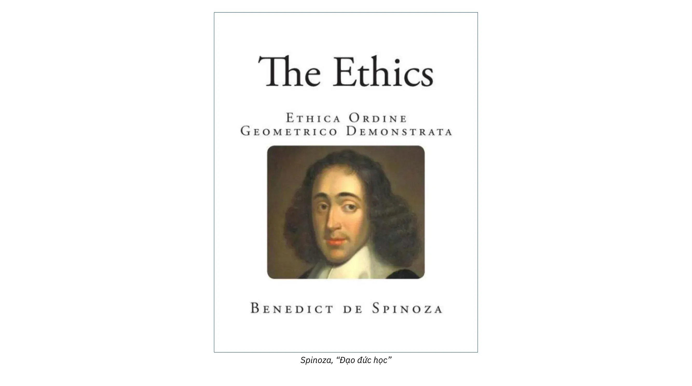

Nguyên lý là, theo Spinoza, tình cảm của con người là những thay đổi chủ động hoặc thụ động của cơ thể và suy nghĩ ảnh hưởng đến khả năng hành động của chúng ta, tức là hành vi của chúng ta.

Tuy nhiên, tùy thuộc vào những ảnh hưởng đặc trưng của bản chất con người và những ảnh hưởng từ thế giới bên ngoài, chúng ta hoàn toàn có khả năng hình thành những ý tưởng, lý luận và thể hiện niềm vui thực sự.

Nhưng chúng ta cũng có khả năng hình thành cái gọi là tình cảm thụ động, những định kiến khiến chúng ta máy móc, "bất chấp chính mình" theo cách không còn nhìn thấy hoặc làm những gì mà lợi ích cá nhân đòi hỏi.

Chúng ta nói về chế độ nô lệ, hay tình trạng phục tùng, một trạng thái đặc trưng bởi sự bất lực trong việc kiểm soát và chống lại những cảm xúc thụ động đôi khi khiến chúng ta muốn những điều mình không làm và làm những điều mình không muốn.

Đây là điều Spinoza nói trong cuốn Đạo đức học của mình, khi ông ngạc nhiên rằng "mọi người thường thấy điều tốt nhất, chấp nhận nó và làm điều tồi tệ nhất", hoặc rằng "họ chiến đấu vì sự phục tùng của mình như thể họ đang chiến đấu vì sự cứu rỗi của chính mình".

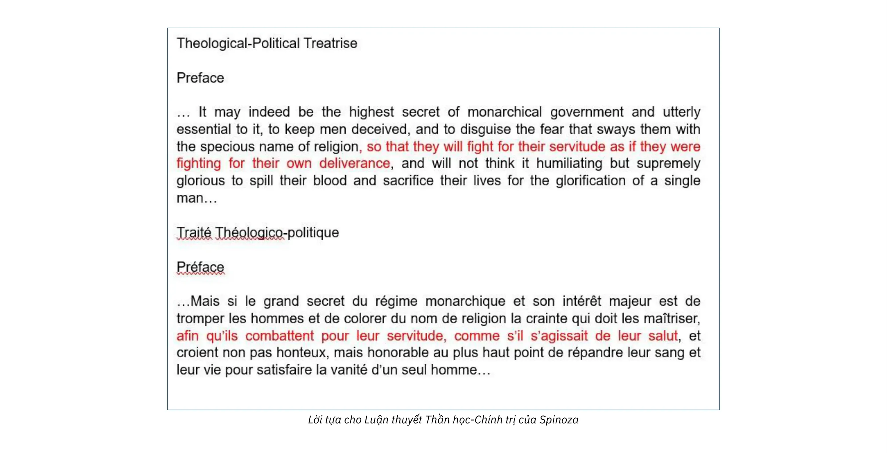

Spinoza lấy ví dụ về lòng căm thù, mà ông coi là một cảm xúc thụ động, hướng tới nỗi buồn và nảy sinh từ những ý tưởng không đầy đủ, tức là hiểu biết một phần về nguyên nhân, và ông định nghĩa nó là "một nỗi buồn gắn liền với ý tưởng về một nguyên nhân bên ngoài".

Nói cách khác, nếu chúng ta ghét một người nước ngoài, đó là vì chúng ta liên tưởng người nước ngoài này với ấn tượng của chúng ta về họ, vì những lý do chúng ta không hiểu, bởi họ là người nước ngoài và khác biệt về bản chất. Đó là ý niệm về một nguyên nhân bên ngoài - hơn nữa, một ý niệm luôn thúc đẩy những người thiếu hiểu biết nói xấu một khái niệm mà họ không biết.

Điều này đặc biệt đúng trong lĩnh vực [tiền điện tử](https://planb.academy/resources/glossary/cryptocurrency).

Spinoza cho rằng nếu chúng ta loại bỏ ý niệm tiêu cực về nguyên nhân bên ngoài này, không phải bằng đạo đức, mà bằng giáo dục, bằng sự đồng cảm, bằng lý trí, đặc biệt là bằng cách tập trung vào phẩm chất của người lạ này trong trường hợp này, hoặc trong trường hợp của Bitcoin, vào khía cạnh thực tế hoặc tính hữu ích của họ, thì cảm giác buồn bã đi kèm sẽ biến mất và tự động, lòng căm thù cũng biến mất.

Cần nhớ rằng lối suy nghĩ này tất nhiên cũng áp dụng cho các cảm xúc chủ động, đặc biệt là tình yêu, mà theo Spinoza, là "một niềm vui gắn liền với ý niệm về một nguyên nhân bên ngoài". Và nếu, chẳng hạn, nguyên nhân bên ngoài của tình yêu dành cho một vật thể hay một người biến mất hoặc thay đổi theo thời gian, thì niềm vui gắn liền với nó cũng có thể biến mất, dập tắt cảm giác yêu thương. Điều này, khi chúng ta không hiểu rõ, có thể khiến chúng ta bất hạnh và chán nản.

Nhưng nếu cái gọi là lý thuyết về tình cảm này áp dụng cho "vô thức" của chúng ta, thì cách suy nghĩ hợp lý này "theo cách của người khảo sát" cũng áp dụng cho cuộc chiến chống lại mọi hình thức nô lệ bên ngoài, dù là tôn giáo, chính trị hay kết quả của các hiện tượng tự nhiên.

Đây là ví dụ về sét đánh. Bởi vì khi sét đánh và giết chết những người vô tội, những người thiếu hiểu biết sẽ có xu hướng coi đó là bàn tay của Chúa, cho rằng sét thể hiện một ý định đạo đức và cuối cùng. AIDS vào những năm 90, hay thậm chí gần đây hơn là Covid, đã bị một số người hiểu là sự trừng phạt của Chúa.

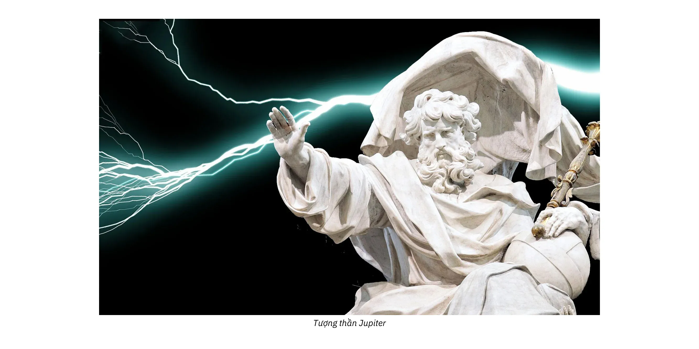

Trong khi đó, đối với Spinoza, tất nhiên, tất cả những ý tưởng mục đích luận này chỉ là mê tín dị đoan, đồng nghĩa với sự ngu dốt, bởi vì trong ví dụ này, ông nói rằng tia sét đánh chẳng có tác dụng gì ngoài việc thể hiện bản chất của chính nó. Đó là đánh. Dĩ nhiên, không hề có ý định đạo đức nào nhằm trừng phạt hay ban thưởng cho bất kỳ ai.

Nhờ ví dụ đơn giản này, chúng ta hiểu rằng giải pháp duy nhất để bảo vệ bản thân khỏi sét đánh - nói cách khác, để giải thoát khỏi sự nô lệ mà mối nguy hiểm này luôn áp đặt lên chúng ta - không phải là than vãn về vận rủi hay về một sự bất công được cho là của Chúa, cũng không phải là đưa ra bất kỳ lập luận đạo đức nào. Không, đúng hơn, ở đây, cũng như với lòng căm thù, vấn đề là suy ngẫm về những gì chúng ta có thể làm từ góc độ đạo đức.

Và trong trường hợp này, chúng ta cần bảo vệ bản thân khỏi sét bằng cách lý trí, cởi mở với sự tiến bộ, tò mò và tự tin về những gì khoa học có thể mang lại cho chúng ta và tại sao không lắp đặt một cột thu lôi.

Đây chính là thiên tài của Đạo đức học. Spinoza cho chúng ta thấy rằng có thể chuyển từ sự nô lệ tự nguyện, từ cuộc sống "bất chấp bản thân" và cuộc sống tùy tiện, xa lánh vĩnh viễn, sang một cuộc sống được sống bằng sự hiểu biết về tình cảm và quyết tâm.

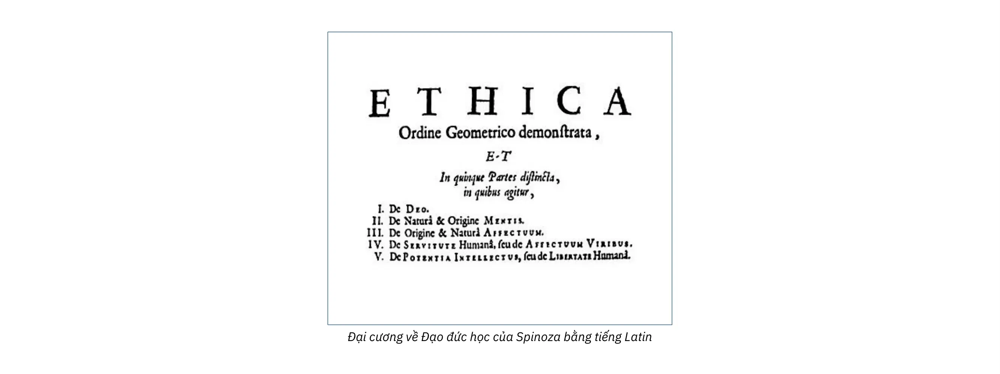

Đó là một cách suy nghĩ cho phép chúng ta mổ xẻ bản chất con người để nhìn thấy mặt tích cực hay sự thật trong mọi việc. Để loại bỏ những lý do gây ra nỗi buồn và sợ hãi đang đè nặng lên chúng ta. Nói cách khác, để được tự do, tức là có thể ngừng vâng theo những đam mê buồn bã và thay đổi hành vi của mình.

Và để hiểu, có lẽ là lần đầu tiên trong lịch sử triết học, rằng bạn có thể sáng suốt và hạnh phúc.

Và đó là lý do tại sao chủ nghĩa Spinoza thường được gọi là "triết lý của niềm vui".

## Tự do, trường phái kinh tế Áo và triết học Cypherpunk

<chapterId>b54f2532-460c-11f0-a248-93ff24ef1d57</chapterId>

:::video id=5f49d5b4-e15f-475b-b40d-07464c08ca4d:::

Như bạn đã biết, tự do theo Spinoza là nhận thức về thuyết quyết định luận của chúng ta. Dưới sự dẫn dắt của lý trí, và nhờ khả năng hành động, chúng ta có thể hiểu được cơ chế nhân quả của chế độ nô lệ, để chúng ta có thể đấu tranh chống lại chúng, không còn chịu đựng chúng nữa, và không còn hành động chống lại lợi ích của chính mình nữa.

Cuối cùng, sự sáng suốt này có nghĩa là không còn sống trong chủ nghĩa hư vô mà sau này Friedrich Nietzsche (1844-1900) mô tả, chủ nghĩa mà con người đánh mất chính mình trong những lý tưởng ý thức hệ, tức là những hư cấu chính trị hoặc tôn giáo, vì những lý tưởng này mà họ phủ nhận thực tế, trẻ hóa bản thân và khiến bản thân trở nên bất hạnh.

Đây chính xác là nội dung của triết học lý trí Khai sáng, đặc biệt là nhờ Immanuel Kant (1724-1804), người mà chỉ có cá nhân có học thức, dưới sự hướng dẫn của lý trí, mới có thể tự mình suy nghĩ và xác định, về mặt đạo đức, điều gì là "đúng" hay "tốt", và điều gì là độc hại.

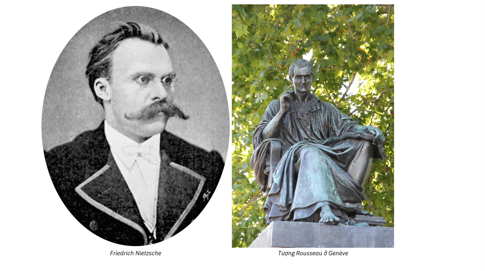

Nói cách khác, ông nói, nếu chúng ta tự suy nghĩ, nếu chúng ta lý luận như những người trưởng thành có lý trí, và do đó nếu chúng ta cố gắng gắn bó với mối liên hệ nhân quả giữa mọi thứ, chúng ta sẽ không còn cần đến một thẩm quyền đạo đức để dạy chúng ta, ví dụ, về những đức tính thực sự của tôn giáo hay các giá trị đạo đức thực sự trong lĩnh vực chính trị và kinh tế.

Đây là một lập luận liên hệ với trường phái kinh tế tự do [Áo](https://planb.academy/resources/glossary/austrian-school), ra đời trong bầu không khí trí thức cực kỳ màu mỡ của Vienna trước Thế chiến thứ nhất. Bởi chính trong bối cảnh này, các trí thức như Carl Menger (1840-1921), Ludwig von Mises (1883-1979) và Friedrich Hayek (1899-1992) đã đặt nền móng cho một trường phái kinh tế tự do mới, sau này trở thành nền tảng cho niềm tin của những người theo chủ nghĩa mật mã ([cypherpunk](https://planb.academy/resources/glossary/cypherpunks)) tương lai. Và từ đó, Bitcoin ra đời.

Ví dụ, Menger và Mises đã khẳng định rằng mọi kiến thức phải được xây dựng dựa trên mối liên hệ nhân quả giữa các sự vật, và do đó đề xuất một quan niệm nhân quả mới về kinh tế học. Đặc biệt, quan niệm này được truyền cảm hứng từ tinh thần tự do được phát triển vài năm trước đó bởi nhà kinh tế học người Pháp Frédéric Bastiat (1801-1850).

Ngược lại, Hayek cho rằng mọi quyết định kinh tế luôn thể hiện một dạng bất ổn và thiếu hiểu biết, và việc không phải chịu đựng những điều đó vì đạo đức, niềm tin, định kiến hay ý thức hệ chính trị giúp phân tích hành vi kinh tế một cách chính xác và mở rộng ra là xem xét điều gì là tốt cho cá nhân, cho xã hội và cho Nhà nước.

Đây chính là cách các nhà kinh tế học tự do người Áo này lên tiếng chỉ trích gay gắt mọi tư tưởng xã hội chủ nghĩa - Hayek gọi là "chủ nghĩa kế hoạch" - và mọi chính sách đạo đức lấy cảm hứng từ chúng, mà theo quan điểm của ông, chỉ dẫn đến sự sụp đổ. Việc trao quyền lực kinh tế cho các chính phủ, vốn dĩ đã lạc hậu và không phù hợp với những gì nên làm và không nên làm, chắc chắn sẽ thất bại.

Ví dụ, người Áo tin rằng khi một quốc gia tự trao cho mình, bằng sự cưỡng chế, quyền tạo ra tiền để quản lý nền kinh tế và giải quyết khủng hoảng, thì rủi ro là quốc gia đó sẽ không bao giờ có thể kiềm chế được việc lạm dụng quyền lực này.

Tại sao vậy? Bởi vì nó luôn ở trong một hình thức nô lệ ngăn cản anh ta làm điều đó, và do đó thúc đẩy anh ta, như Spinoza đã nói, "nhìn thấy điều tốt nhất, chấp nhận nó... nhưng lại làm điều tồi tệ nhất".

Là một người theo chủ nghĩa Spinoza, Hayek giải thích trong một video rằng "vì quyền lực này không thể bị tước đoạt bằng bạo lực, nên tất cả những gì có thể làm là sử dụng một mánh khóe và giới thiệu một khái niệm tiền tệ mới mà chính phủ không thể ngăn chặn được nữa". Một lập luận được Milton Friedman (1912-2006) nhắc lại trong một cuộc phỏng vấn, trong đó ông thảo luận về hình thức tiền tệ kỹ thuật số mới này trong bối cảnh Internet mới ra đời.

Đây là những lập luận chính trị và kinh tế được đưa ra bởi những người theo chủ nghĩa mật mã đầu tiên, Eric Hughes (1953-), trong "tuyên ngôn Cypherpunk" của ông, hoặc Timothy May (1951-2018) trong "tuyên ngôn vô chính phủ mật mã" của ông, và Satoshi Nakamoto sẽ lại tiếp tục đề cập đến những lập luận này.

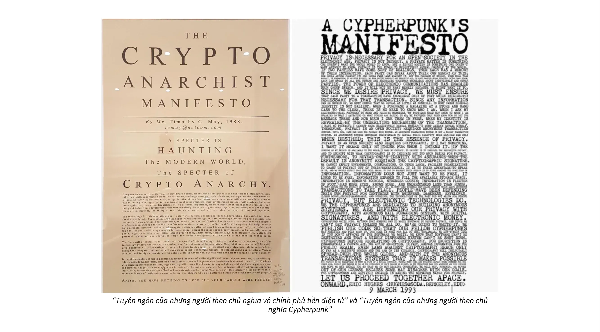

Đặc biệt là khi ông khắc tiêu đề tờ Times ngày 3 tháng 1 năm 2009 trên [đế đồng xu](https://planb.academy/resources/glossary/coinbase-transaction) [Genesis](https://planb.academy/resources/glossary/genesis-block) của khối [Blockchain](https://planb.academy/resources/glossary/blockchain) Bitcoin để minh họa cho sự kết thúc của một kỷ nguyên, Keynes, và sự khởi đầu của một kỷ nguyên khác với khát vọng tự do, vô chính phủ và tự do cá nhân.

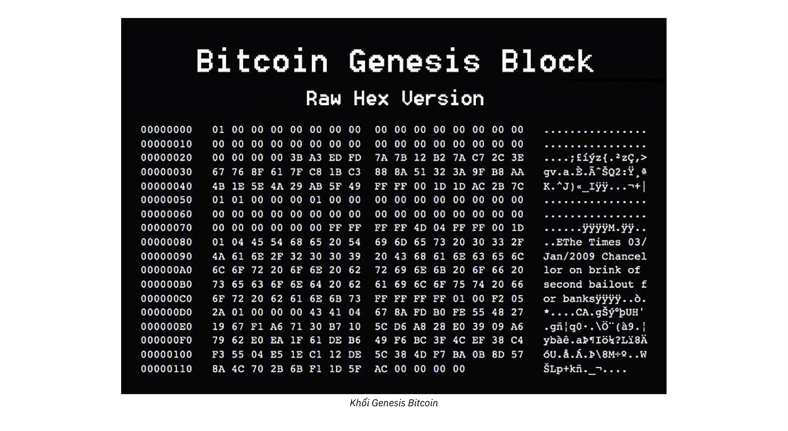

[Sách Trắng](https://planb.academy/resources/glossary/white-paper) được công bố ngày 31 tháng 10 năm 2008 trình bày Bitcoin như một phương tiện trao đổi giá trị trên Internet mà không cần bên thứ ba đáng tin cậy, dựa trên giao thức phi tập trung. Một cuộc cách mạng "Copernican" cuối cùng sẽ cho phép mọi người lấy lại khả năng hành động, tức là tự do, tự do thương mại, quyền sở hữu và sự tôn trọng quyền riêng tư của họ.

Tại sao? Bởi vì Bitcoin cho phép chúng ta thoát khỏi ách nô lệ này theo cách của Spinoza, nhờ lý trí, nhờ ngôn ngữ toán học của Galileo. Và, như Hayek đã đề xuất, mà không cần nhà nước can thiệp. Và một cách hòa bình, không cần ép buộc hay truyền giáo.

Trên thực tế, đây là điểm tương đồng cuối cùng tôi sẽ đưa ra giữa chủ nghĩa Spinoza và Bitcoin, để chỉ ra rằng không có ích gì khi thuyết phục bất kỳ ai không chấp nhận khái niệm Copernicus hoặc khái niệm mang tính đột phá nào khác ngoài lý trí, sự hiểu biết, sự tò mò hoặc thiện chí.

Không phải bằng vũ lực, không phải bằng bạo lực. Bởi vì sự thật là Copernicus, Galileo, Newton, Darwin, Einstein, Hayek, Spinoza hay Satoshi Nakamoto chưa bao giờ đe dọa bất kỳ ai không tin vào ý tưởng và chứng minh của họ.

# Phần cuối

<partId>70a5a3c8-6c88-11f0-8753-db07e26dcaf4</partId>

## Đánh giá & Xếp hạng

<chapterId>7945c38c-6c88-11f0-a73f-0f7cdf99f53f</chapterId>

<isCourseReview>true</isCourseReview>

## Kỳ thi cuối kỳ

<chapterId>a557fd32-6c88-11f0-96ff-cfa532cf76a0</chapterId>

<isCourseExam>true</isCourseExam>

## Phần kết luận

<chapterId>ae04ab38-6c88-11f0-a496-3be47119e6b6</chapterId>

<isCourseConclusion>true</isCourseConclusion>