# Bitcoin و BTCPay Server


این یک دوره مقدماتی در مورد اپراتور سرور BTCPay است که توسط الکوس و باس نوشته شده و توسط melontwist و asi0 در قالب دوره Plan ₿ تطبیق داده شده است.


یک داستان ناتمام


"این دروغ است، اعتماد من به تو شکسته است، من تو را منسوخ خواهم کرد".


تولید شده توسط بنیاد سرور BTCPay


+++

# مقدمه


<partId>59e43fe3-b494-5da6-b4b4-9df5bdf08916</partId>


## بررسی کلی دوره


<chapterId>785ed2bc-94ae-4962-a26a-edf5742a3c72</chapterId>


به دوره POS 305 در مورد BTCPay Server خوش آمدید!


هدف این آموزش این است که به شما یاد دهد چگونه BTCPay Server را در کسب‌وکار یا سازمان خود نصب، پیکربندی و استفاده کنید. BTCPay Server یک راه‌حل متن‌باز است که به شما امکان می‌دهد پرداخت‌های Bitcoin را به صورت مستقل، امن و مقرون‌به‌صرفه پردازش کنید. این دوره به‌طور عمده برای کاربران پیشرفته‌ای طراحی شده است که می‌خواهند میزبانی خودکار BTCPay Server را برای ادغام کامل در عملیات روزانه خود تسلط یابند.


**بخش 1: مقدمه‌ای بر سرور BTCPay**

ما با یک ارائه کلی از BTCPay Server شروع خواهیم کرد، که شامل صفحه ورود، مدیریت حساب کاربری و ایجاد یک فروشگاه جدید است. این مقدمه به شما کمک می‌کند تا BTCPay Server Interface را درک کرده و ویژگی‌های اساسی مورد نیاز برای شروع استفاده از این ابزار را بشناسید.


**بخش ۲: مقدمه‌ای بر ایمن‌سازی کلیدهای Bitcoin**

امنیت وجوه Bitcoin شما بسیار مهم است. در این بخش، ما به بررسی تولید کلیدهای رمزنگاری، استفاده از کیف‌پول‌های سخت‌افزاری برای ایمن‌سازی این کلیدها و نحوه تعامل با کلیدهای خود از طریق BTCPay Server خواهیم پرداخت. همچنین یاد خواهید گرفت که چگونه یک BTCPay Server Lightning Wallet را برای بهینه‌سازی تراکنش‌های خود پیکربندی کنید.


**بخش ۳: سرور BTCPay Interface**

این بخش شما را از طریق کاربر Interface سرور BTCPay راهنمایی می‌کند. شما یاد خواهید گرفت که چگونه در داشبورد حرکت کنید، تنظیمات فروشگاه و سرور را پیکربندی کنید، پرداخت‌ها را مدیریت کنید و از افزونه‌های یکپارچه بهره‌مند شوید. هدف این است که شما را با ابزارهای مورد نیاز برای سفارشی‌سازی نصب خود بر اساس نیازهایتان آشنا کند.


**بخش ۴: پیکربندی سرور BTCPay**

در نهایت، ما بر نصب عملی BTCPay Server در محیط‌های مختلف تمرکز خواهیم کرد. چه از LunaNode، Voltage یا یک نود Umbrel استفاده کنید، شما مراحل اساسی برای استقرار و پیکربندی BTCPay Server خود را با در نظر گرفتن ویژگی‌های خاص هر محیط خواهید آموخت.


آماده‌اید تا BTCPay Server را به‌خوبی یاد بگیرید و کسب‌وکار خود را گسترش دهید؟ بزن بریم!


## تحسین منتقدان برای Bitcoin نویسنده و سرور BTCPay


<chapterId>e1fe6294-3c82-5203-9537-779f9087c35a</chapterId>


بیایید با اینکه BTCPay Server چیست و از کجا آمده است شروع کنیم. ما به شفافیت و استانداردهای خاصی برای ایجاد اعتماد در فضای Bitcoin ارزش می‌دهیم.

یک پروژه در فضا این ارزش‌ها را شکست. توسعه‌دهنده اصلی سرور BTCPay، نیکلاس دوریر، این موضوع را شخصی تلقی کرد و قول داد که آن‌ها را منسوخ کند. اکنون، سال‌ها بعد، ما هر روز به سوی این آینده کار می‌کنیم، کاملاً متن‌باز.


> این دروغ است، اعتماد من به تو شکسته شده است، من تو را منسوخ خواهم کرد.
> نیکولاس دوریر

پس از سخنان نیکلاس، زمان شروع ساخت و ساز فرا رسید. کارهای زیادی برای چیزی که اکنون BTCPay Server می‌نامیم انجام شد. افراد بیشتری خواستند در این تلاش کمک کنند. شناخته‌شده‌ترین آن‌ها r0ckstardev، MrKukks، Pavlenex و اولین تاجری که از این نرم‌افزار استفاده کرد، astupidmoose هستند.


منبع باز به چه معناست و چه چیزهایی در یک پروژه منبع باز دخیل هستند؟


FOSS مخفف نرم‌افزار آزاد و متن‌باز است. مورد اول به شرایطی اشاره دارد که به هر کسی اجازه می‌دهد نسخه‌های نرم‌افزار را کپی، تغییر و حتی توزیع کند (حتی برای کسب سود). مورد دوم به اشتراک‌گذاری آزادانه کد منبع اشاره دارد و عموم را تشویق به مشارکت و بهبود آن می‌کند.

این کاربران با تجربه‌ای را جذب می‌کند که مشتاق به مشارکت در نرم‌افزاری هستند که از قبل استفاده می‌کنند و از آن ارزش می‌گیرند، و در طول زمان ثابت می‌کند که در پذیرش نسبت به نرم‌افزار مالکیتی برتری دارد. این با اصول Bitcoin که می‌گوید "اطلاعات می‌خواهند آزاد باشند" سازگار است. این افراد پرشوری را گرد هم می‌آورد که یک جامعه را تشکیل می‌دهند و به سادگی سرگرم‌کننده‌تر است. مانند Bitcoin، FOSS اجتناب‌ناپذیر است.


### قبل از اینکه شروع کنیم


این دوره شامل بخش‌های متعددی است. بسیاری از آن‌ها توسط معلم کلاس شما، محیط‌های نمایشی که به آن‌ها دسترسی دارید، یک سرور میزبانی شده برای خودتان و احتمالاً یک نام دامنه مدیریت خواهند شد. اگر این دوره را به‌طور مستقل تکمیل می‌کنید، لطفاً توجه داشته باشید که محیط‌هایی که به عنوان DEMO برچسب‌گذاری شده‌اند برای شما در دسترس نخواهند بود.

توجه: اگر این دوره را به صورت حضوری دنبال می‌کنید، نام‌های سرور ممکن است بسته به تنظیمات کلاس شما متفاوت باشند. متغیرها در نام‌های سرور ممکن است به همین دلیل متفاوت باشند.


### ساختار دوره


هر فصل دارای اهداف و ارزیابی‌های دانش است. در این دوره، ما هر یک از این‌ها را پوشش خواهیم داد و در پایان هر بلوک درس (یعنی فصل) خلاصه‌ای از ویژگی‌های کلیدی خواهیم داشت. تصاویر برای ارائه بازخورد بصری و تقویت مفاهیم کلیدی در جنبه بصری ارائه شده‌اند. اهداف در ابتدای هر بلوک درس تعیین می‌شوند. این اهداف فراتر از یک چک‌لیست هستند. این‌ها به شما راهنمایی برای دستیابی به مجموعه‌ای از مهارت‌های جدید ارائه می‌دهند. ارزیابی‌های دانش به تدریج چالش‌برانگیزتر می‌شوند و تنظیمات سرور BTCPay شما را بهبود می‌بخشند.


### دانشجویان با این دوره چه چیزی دریافت می‌کنند؟


با دوره سرور BTCPay، یک دانش‌آموز می‌تواند اصول اولیه، به‌صورت فنی و غیر فنی از Bitcoin را درک کند. آموزش گسترده در استفاده از Bitcoin از طریق سرور BTCPay به دانش‌آموزان اجازه می‌دهد تا زیرساخت Bitcoin خود را اداره کنند.


### آدرس‌های وب مهم یا فرصت‌های تماس


بنیاد سرور BTCPay، که به آلکوس و باس اجازه داد این دوره را بنویسند، در توکیو، ژاپن قرار دارد. بنیاد سرور BTCPay از طریق وب‌سایت ذکر شده قابل دسترسی است؛


- https://foundation.btcpayserver.org
- به کانال‌های رسمی چت بپیوندید: https://chat.btcpayserver.org


## مقدمه‌ای بر Bitcoin


<chapterId>5c0bc234-c188-5b4a-94d5-adee87a120e2</chapterId>


### درک Bitcoin از طریق تمرین کلاسی


این یک تمرین کلاسی است، بنابراین اگر خودتان این دوره را بگذرانید، نمی‌توانید آن را انجام دهید، اما همچنان می‌توانید این تمرین را مرور کنید. برای تکمیل این وظیفه، حداقل تعداد افراد بین 9 تا 11 نفر است.


تمرین پس از تماشای مقدمه "چگونه Bitcoin و Blockchain کار می‌کنند" توسط BBC آغاز می‌شود.


:::video id=c20b6df7-0c3a-4785-94b9-42ef59093acc:::


این تمرین نیاز به حداقل نه نفر برای شرکت دارد. این تمرین قصد دارد به صورت فیزیکی ایده‌ای از نحوه کار Bitcoin ارائه دهد. با بازی کردن هر نقش در شبکه، شما به صورت تعاملی و سرگرم‌کننده‌ای یاد خواهید گرفت. این تمرین شامل Lightning Network نمی‌شود.


### مثال؛ نیاز به ۹ / ۱۱ نفر دارد


نقش‌ها عبارتند از:


- 1 مشتری
- ۱ تاجر
- ۷ تا ۹ گره Bitcoin


**راه‌اندازی به شرح زیر است:**


مشتریان محصولی را از فروشگاه با Bitcoin خریداری می‌کنند.


**سناریو 1 - سیستم بانکداری سنتی**


- راه اندازی:
  - نمودارها/توضیحات را در Figjam پیوست مشاهده کنید - [طرح‌واره فعالیت](https://www.figma.com/file/ckmvMq02Jm2MegSsVCDFhc/Day-1-Classroom-Activity?type=whiteboard&node-id=0-1&t=KR31ofMaJX6S95UL-0).
  - سه دانش‌آموز داوطلب برای ایفای نقش‌های مشتری (Alice)، فروشنده (Bob)، و بانک پیدا کنید.
- توالی رویدادها را اجرا کنید:
  - مشتری- در حال مرور فروشگاه آنلاین است و کالایی به قیمت ۲۵ دلار پیدا می‌کند که می‌خواهد و به فروشنده اطلاع می‌دهد که مایل به خرید است.
  - تاجر- درخواست پرداخت می‌کند.
  - مشتری- اطلاعات کارت را به فروشنده ارسال می‌کند
  - تاجر - اطلاعات را به بانک ارسال می‌کند (شامل شناسایی خود و هویت/اطلاعات) و درخواست پرداخت می‌کند از
  - بانک اطلاعات مربوط به مشتری و فروشنده (Alice و Bob) را جمع‌آوری کرده و بررسی می‌کند که موجودی مشتری کافی است.
  - از حساب Alice مبلغ ۲۵ دلار کسر می‌کند، ۲۴ دلار به حساب Bob اضافه می‌کند، ۱ دلار بابت خدمات برمی‌دارد
  - فروشنده تأییدیه از بانک دریافت می‌کند و کالا را به مشتری ارسال می‌کند.
- نظرات:
  - Bob و Alice باید با یک بانک رابطه داشته باشند.
  - بانک اطلاعات شناسایی درباره هر دو Bob و Alice جمع‌آوری می‌کند.
  - بانک سهم خود را برمی‌دارد.
  - بانک باید همیشه به نگهداری پول هر شرکت‌کننده اعتماد شود.


**سناریو ۲ - سیستم Bitcoin**


- راه اندازی:
  - نمودارها/توضیحات را در Figjam پیوست شده ببینید - [طرح فعالیت](https://www.figma.com/file/ckmvMq02Jm2MegSsVCDFhc/Day-1-Classroom-Activity?type=whiteboard&node-id=0-1&t=KR31ofMaJX6S95UL-0).
  - بانک را با نه دانش‌آموز جایگزین کنید که نقش یک کامپیوتر (Bitcoin نود/ماینر) را در شبکه برای جایگزینی بانک ایفا خواهند کرد.
- هر یک از ۹ کامپیوتر دارای یک سابقه تاریخی کامل از تمام تراکنش‌های گذشته انجام شده است (بنابراین موجودی‌های دقیق بدون جعل)، و همچنین مجموعه‌ای از قوانین:
  - تأیید کنید که تراکنش به درستی امضا شده است (thekeyfitsthelock)
  - تراکنش‌های معتبر را به همتایان در شبکه ارسال و دریافت کنید و تراکنش‌های نامعتبر (از جمله هر تراکنشی که سعی در خرج کردن دوباره همان وجوه دارد) را حذف کنید.
- به‌روزرسانی/افزودن رکوردها به‌صورت دوره‌ای با تراکنش‌های جدیدی که از کامپیوتر "تصادفی" دریافت می‌شود، به شرطی که تمام محتویات معتبر باشند (توجه: برای سادگی، در حال حاضر مؤلفه Proof of Work را نادیده می‌گیریم)، در غیر این صورت این‌ها را رد کرده و به همان روال قبلی ادامه دهید تا زمانی که کامپیوتر "تصادفی" بعدی یک به‌روزرسانی ارسال کند.
  - مقدار مناسب در صورت معتبر بودن محتوا پاداش داده شد.
- توالی رویدادها را اجرا کنید:
  - مشتری - در حال مرور فروشگاه آنلاین است و کالایی به قیمت ۲۵ دلار پیدا می‌کند که می‌خواهد و به فروشنده اطلاع می‌دهد که مایل به خرید آن است.
  - فروشنده - با ارسال Invoice/Address از Wallet خود از مشتری درخواست پرداخت می‌کند.
  - مشتری - یک تراکنش ایجاد می‌کند (ارسال ۲۵ دلار بیت‌کوین به یک Address ارائه شده توسط فروشنده) و آن را به شبکه Bitcoin ارسال می‌کند.
- رایانه‌ها- تراکنش را دریافت و تأیید می‌کنند:
  - حداقل ۲۵ دلار BTC در Address در حال ارسال است از
  - تراکنش به‌درستی امضا شده است («توسط مشتری باز شده است»)
  - اگر این‌گونه نباشد، تراکنش از طریق شبکه منتشر نخواهد شد، و اگر چنین باشد، منتشر شده و در انتظار نگه داشته می‌شود.
  - بازرگانان می‌توانند بررسی کنند که تراکنش در حال انتظار و منتظر است.
- یک کامپیوتر به‌طور "تصادفی" انتخاب می‌شود تا با پخش "یک بلوک" حاوی آن، پیشنهاد نهایی کردن تراکنش پیشنهادی را ارائه دهد؛ اگر تأیید شود، آن‌ها یک پاداش BTC دریافت خواهند کرد.
  - اختیاری/پیشرفته - به جای انتخاب تصادفی یک کامپیوتر، Mining را شبیه‌سازی کنید و کامپیوترها تاس بریزند تا زمانی که یک نتیجه از پیش تعیین‌شده رخ دهد (مثلاً اولین کسی که دو شش بیاورد انتخاب می‌شود)
  - همچنین می‌تواند نشان دهد چه اتفاقی می‌افتد اگر دو کامپیوتر تقریباً به‌طور همزمان برنده شوند و منجر به شکاف زنجیره‌ای شود.
  - رایانه‌ها اعتبار را بررسی می‌کنند، سوابق را در دفتر کل خود به‌روزرسانی/اضافه می‌کنند اگر قوانین رعایت شوند، و بلوک را به همتایان پخش می‌کنند.
  - رایانه‌ای که به صورت تصادفی انتخاب شده است، برای پیشنهاد یک بلوک معتبر پاداش دریافت می‌کند.
  - فروشنده بررسی کرد که تراکنش نهایی شده است؛ بنابراین، وجوه دریافت شد و کالا به مشتری ارسال شد.
- نظرات:
  - توجه داشته باشید که نیازی به رابطه بانکی قبلی نبود.
  - هیچ شخص ثالثی برای تسهیل لازم نیست؛ با کد/مشوق‌ها جایگزین شده است.
  - هیچ جمع‌آوری داده‌ای توسط کسی خارج از Exchange مستقیم انجام نمی‌شود و فقط مقدار لازم باید بین شرکت‌کنندگان مبادله شود (مثلاً، ارسال Address).
  - هیچ اعتمادی بین افراد لازم نیست (به جز فروشنده‌ای که کالا را ارسال می‌کند)، مانند خرید نقدی در بسیاری از جهات.
  - پول به‌طور مستقیم متعلق به افراد است.
  - Bitcoin Ledger به‌صورت دلار برای سادگی نمایش داده شده است، اما در واقعیت، این BTC است.
  - ما یک تراکنش واحد را شبیه‌سازی می‌کنیم که پخش می‌شود، اما در واقعیت، تراکنش‌های متعددی در شبکه در انتظار هستند و بلوک‌ها شامل هزاران تراکنش به‌طور همزمان می‌باشند. نودها همچنین بررسی می‌کنند که هیچ تراکنش دو بار خرج شده‌ای در انتظار نباشد (در این صورت همه به جز یکی را حذف می‌کردم).
- سناریوهای تقلب:
  - اگر مشتری ۲۵ دلار بیت‌کوین نداشته باشد چه می‌شود؟
    - آنها قادر به ایجاد تراکنش نخواهند بود زیرا "باز کردن قفل" و "Ownership" یک چیز هستند و کامپیوترها بررسی می‌کنند که تراکنش به درستی امضا شده است؛ در غیر این صورت، آن را رد می‌کنند.
  - اگر کامپیوتر به صورت تصادفی تلاش کند تا "Ledger را تغییر دهد" چه می‌شود؟
    - بلوک رد می‌شود، زیرا هر کامپیوتر دیگر دارای تاریخچه کاملی است و متوجه تغییر می‌شود که یکی از قوانین آن‌ها را نقض می‌کند.
    - رایانه تصادفی پاداشی دریافت نمی‌کند و هیچ تراکنشی از بلوک آن‌ها نهایی نخواهد شد.


## ارزیابی دانش


<chapterId>1461f064-933d-50ea-8935-324b68ec5d5f</chapterId>


### بحث کلاسی KA


برخی ساده‌سازی‌هایی که در تمرین کلاس تحت سناریوی دوم انجام شده‌اند را مورد بحث قرار دهید و توضیح دهید که سیستم واقعی Bitcoin چه کاری انجام می‌دهد.


### مرور واژگان KA


اصطلاحات کلیدی زیر را که در بخش قبلی معرفی شده‌اند، تعریف کنید:


- گره
- Mempool
- هدف سختی
- بلوک


**معنی برخی اصطلاحات اضافی را به صورت گروهی بحث کنید:**


Blockchain، تراکنش، خرج کردن دوگانه، مسئله ژنرال‌های بیزانسی، Mining، Proof of Work (PoW)، تابع Hash، Block reward، Blockchain، طولانی‌ترین زنجیره، حمله 51٪، خروجی، قفل خروجی، تغییر، ساتوشی‌ها، کلید عمومی/خصوصی، Address، رمزنگاری کلید عمومی، امضای دیجیتال، Wallet


# معرفی سرور BTCPay


<partId>9c8a2d0c-9ba1-5c39-874c-f9eaf1bba663</partId>


## درک صفحه ورود به سیستم BTCPay Server


<chapterId>14aad54c-9bd8-54f2-9455-178b8ae63408</chapterId>


### کار با سرور BTCPay


هدف این بخش از دوره، داشتن درک کلی از نرم‌افزار BTCPay Server خواهد بود. در یک محیط مشترک، توصیه می‌شود که نمایش مربی را دنبال کرده و همراه با کتاب دوره BTCPay Server پیش بروید تا معلم را دنبال کنید. شما یاد خواهید گرفت که چگونه یک Wallet را از طریق روش‌های متعدد ایجاد کنید. مثال‌ها شامل تنظیمات Hot Wallet و کیف پول‌های سخت‌افزاری متصل از طریق BTCPay Server Vault می‌باشند. این اهداف در محیط دمو رخ می‌دهند که توسط مربی دوره شما نمایش داده شده و به آن دسترسی داده می‌شود.


اگر این دوره را به تنهایی دنبال کنید، می‌توانید فهرستی از میزبان‌های شخص ثالث برای اهداف نمایشی در https://directory.btcpayserver.org/filter/hosts پیدا کنید. ما به شدت توصیه می‌کنیم که از این گزینه‌های شخص ثالث به عنوان محیط‌های تولید استفاده نکنید، اما آن‌ها برای معرفی استفاده از Bitcoin و BTCPay Server مناسب هستند.


به عنوان یک کارآموز ستاره راک BTCPay Server، ممکن است تجربه قبلی در راه‌اندازی یک نود Bitcoin داشته باشید. این دوره به طور خاص به نرم‌افزار BTCPay Server اختصاص دارد.


بسیاری از گزینه‌ها در BTCPay Server به نوعی در سایر نرم‌افزارهای مرتبط با Bitcoin و Wallet وجود دارند.


### صفحه ورود به سرور BTCPay


هنگامی که به محیط دمو خوش‌آمد می‌گویید، از شما خواسته می‌شود که «وارد شوید» یا «حساب خود را ایجاد کنید.» ممکن است مدیران سرور به دلایل امنیتی قابلیت ایجاد حساب‌های جدید را غیرفعال کنند. لوگوها و رنگ دکمه‌های BTCPay Server قابل تغییر هستند زیرا BTCPay Server نرم‌افزار متن‌باز است. یک میزبان شخص ثالث می‌تواند نرم‌افزار را با برچسب سفید تغییر داده و ظاهر کلی آن را تغییر دهد.


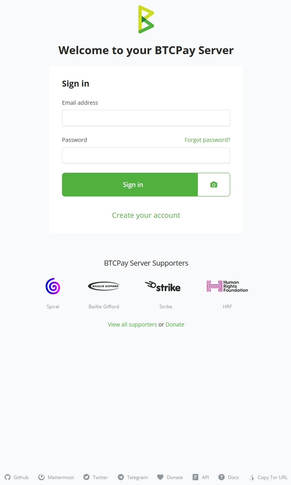


### پنجره ایجاد حساب


ایجاد حساب‌ها در BTCPay Server نیاز به رشته‌های معتبر ایمیل Address دارد؛ example@email.com یک رشته معتبر برای ایمیل خواهد بود.


رمز عبور باید حداقل ۸ کاراکتر باشد، شامل حروف، اعداد و کاراکترها. پس از تنظیم رمز عبور، باید رمز عبور تایپ شده را تأیید کنید تا مطمئن شوید که با آنچه در اولین فیلد رمز عبور تایپ شده است، مطابقت دارد.


هنگامی که هر دو فیلد ایمیل و رمز عبور به درستی پر شده‌اند، روی دکمه «ایجاد حساب» کلیک کنید. این کار ایمیل و رمز عبور را در نمونه سرور BTCPay مربی ذخیره می‌کند.


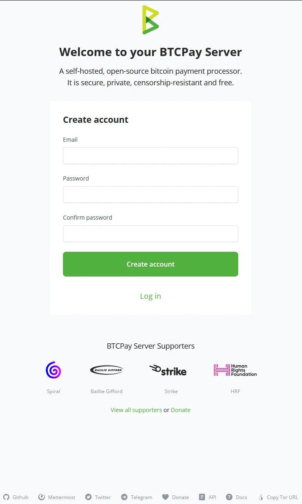


**!توجه!**


اگر این دوره را به‌تنهایی دنبال می‌کنید، ایجاد این حساب ممکن است کاری باشد که در یک میزبان شخص ثالث انجام دهید؛ بنابراین، دوباره یادآوری می‌کنیم که هرگز از این‌ها به‌عنوان محیط‌های تولید استفاده نکنید و فقط برای اهداف آموزشی به کار ببرید.


### ایجاد حساب توسط مدیر سرور BTCPay


مدیر نمونه سرور BTCPay همچنین می‌تواند حساب‌هایی برای BTCPay Server ایجاد کند. مدیر نمونه سرور BTCPay می‌تواند روی ‘تنظیمات سرور’ (1) کلیک کند، روی تب ‘کاربران’ (2) کلیک کند، و روی دکمه “+ افزودن کاربر” (3) در بالای سمت راست تب کاربران کلیک کند. در هدف (4.3)، شما بیشتر درباره کنترل مدیر بر حساب‌ها خواهید آموخت.


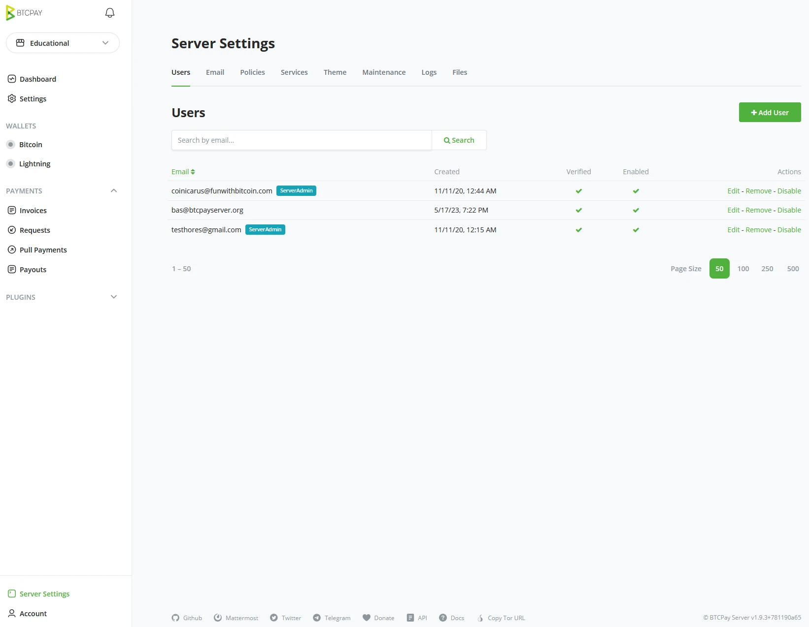


به عنوان یک مدیر، شما نیاز دارید که ایمیل کاربر Address را داشته باشید و یک رمز عبور استاندارد تنظیم کنید. توصیه می‌شود به عنوان مدیر به کاربر اطلاع دهید که باید این رمز عبور را قبل از استفاده از حساب برای دلایل امنیتی تغییر دهد. اگر مدیر رمز عبور را تنظیم نکند و SMTP بر روی سرور تنظیم شده باشد، کاربر یک ایمیل با لینک دعوت برای ایجاد حساب و تنظیم رمز عبور خود دریافت خواهد کرد.


### مثال


هنگام دنبال کردن دوره توسط یک مربی، لینک داده شده توسط مربی را دنبال کنید و حساب کاربری خود را در محیط دمو ارائه شده ایجاد کنید. اطمینان حاصل کنید که ایمیل Address و رمز عبور شما به صورت امن ذخیره شده‌اند؛ شما به این اطلاعات ورود برای بقیه اهداف دمو در این دوره نیاز خواهید داشت.


ممکن است مربی شما ایمیل Address را از قبل جمع‌آوری کرده و قبل از این تمرین یک لینک دعوت ارسال کرده باشد. در صورت دستور، ایمیل خود را بررسی کنید.


هنگام گذراندن دوره بدون مربی، حساب کاربری خود را با استفاده از محیط دمو BTCPay Server ایجاد کنید؛ به


https://Mainnet.demo.btcpayserver.org/login.


این حساب باید فقط برای اهداف نمایش/آموزشی استفاده شود و هرگز برای تجارت استفاده نشود.


### خلاصه مهارت‌ها


در این بخش، شما موارد زیر را یاد گرفتید:


- نحوه ایجاد یک حساب کاربری در یک سرور میزبانی شده از طریق Interface.
- چگونه یک مدیر سرور می‌تواند به صورت دستی کاربران را در تنظیمات سرور اضافه کند.


### ارزیابی دانش


#### بررسی مفهومی KA


دلایل استفاده از سرور دمو برای مقاصد تولیدی:

1. **پایداری و قابلیت اطمینان**: سرورهای دمو معمولاً برای تست و نمایش طراحی شده‌اند و ممکن است از نظر پایداری و قابلیت اطمینان به اندازه کافی قوی نباشند.

2. **امنیت**: سرورهای دمو ممکن است به روزرسانی‌های امنیتی منظم نداشته باشند و در برابر حملات آسیب‌پذیر باشند.

3. **عملکرد**: این سرورها ممکن است منابع کافی برای مدیریت بار کاری تولیدی نداشته باشند و منجر به کاهش عملکرد شوند.

4. **پشتیبانی فنی**: معمولاً پشتیبانی فنی محدودی برای سرورهای دمو وجود دارد که می‌تواند در صورت بروز مشکلات، چالش‌برانگیز باشد.

5. **مقیاس‌پذیری**: سرورهای دمو ممکن است برای مقیاس‌پذیری طراحی نشده باشند و در صورت نیاز به افزایش ظرفیت، مشکلاتی ایجاد کنند.

6. **قابلیت اطمینان داده‌ها**: احتمال از دست رفتن داده‌ها یا خرابی در سرورهای دمو بیشتر است، که می‌تواند به از دست رفتن اطلاعات مهم منجر شود.


## مدیریت حساب(های) کاربری


<chapterId>b58ca6ee-b7fc-5e81-a6aa-c8ff212b4c55</chapterId>


### مدیریت حساب در سرور BTCPay


پس از اینکه صاحب فروشگاه حساب خود را ایجاد کرد، می‌تواند آن را در پایین سمت چپ رابط کاربری BTCPay Server مدیریت کند. در زیر دکمه حساب، تنظیمات سطح بالاتری وجود دارد.


- حالت تاریک/روشن.
- پنهان کردن اطلاعات حساس.
- مدیریت حساب.


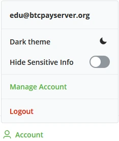


### حالت تاریک و روشن


کاربران BTCPay Server می‌توانند بین نسخه حالت روشن یا تاریک رابط کاربری انتخاب کنند. صفحات مشتری‌محور تغییر نخواهند کرد. آن‌ها از تنظیمات ترجیحی مشتری در مورد حالت تاریک یا روشن استفاده می‌کنند.


### پنهان کردن اطلاعات حساس


دکمه مخفی کردن اطلاعات حساس یک Layer سریع و ساده از امنیت را به ارمغان می‌آورد. هر زمان که نیاز دارید سرور BTCPay خود را اجرا کنید، اما ممکن است افرادی در فضای عمومی از پشت سر شما نگاه کنند، مخفی کردن اطلاعات حساس را روشن کنید و تمام مقادیر در سرور BTCPay مخفی خواهند شد. ممکن است کسی بتواند از پشت سر شما نگاه کند، اما دیگر نمی‌تواند مقادیری که با آن‌ها سروکار دارید را ببیند.


### مدیریت حساب


پس از ایجاد حساب کاربری، اینجا جایی است که می‌توانید رمزهای عبور، 2fa یا کلیدهای API را مدیریت کنید.


### مدیریت حساب - حساب


به‌صورت اختیاری حساب خود را با یک ایمیل Address متفاوت به‌روزرسانی کنید. برای اطمینان از صحت ایمیل Address شما، سرور BTCPay به شما اجازه می‌دهد یک ایمیل تأیید ارسال کنید. اگر کاربر یک ایمیل جدید Address تنظیم کند و تأییدیه کار کند، روی ذخیره کلیک کنید. نام کاربری همان ایمیل قبلی باقی می‌ماند.


یک کاربر ممکن است تصمیم بگیرد کل حساب خود را حذف کند. این کار با کلیک بر روی دکمه حذف در زبانه حساب کاربری قابل انجام است.


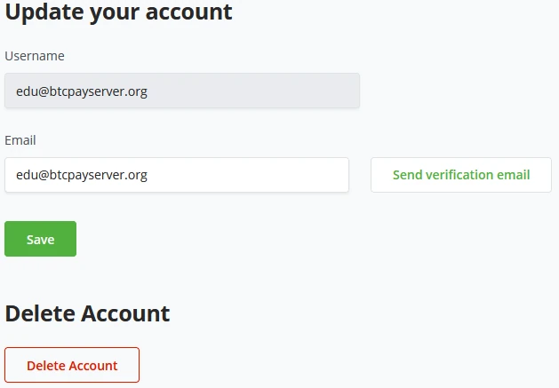


**!توجه!**


پس از تغییر ایمیل، نام کاربری حساب تغییر نخواهد کرد. ایمیل قبلی داده شده Address به عنوان نام ورود باقی خواهد ماند.


### مدیریت حساب - رمز عبور


یک دانشجو ممکن است بخواهد رمز عبور خود را تغییر دهد. او می‌تواند این کار را با رفتن به زبانه رمز عبور انجام دهد. در اینجا او باید رمز عبور قدیمی خود را وارد کند و می‌تواند آن را به یک رمز جدید تغییر دهد.


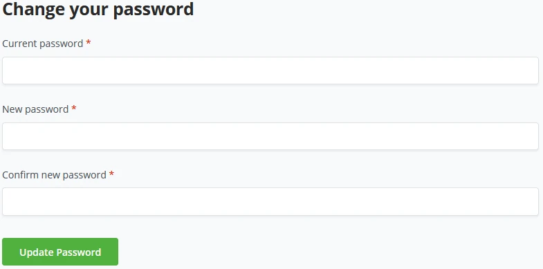


### احراز هویت دو مرحله‌ای (2fa)


برای محدود کردن پیامدهای ناشی از سرقت رمز عبور، می‌توانید از احراز هویت دو مرحله‌ای (2fa)، که یک روش امنیتی نسبتاً جدید است، استفاده کنید. می‌توانید احراز هویت دو مرحله‌ای را از طریق مدیریت حساب و زبانه مربوط به احراز هویت دو مرحله‌ای فعال کنید. پس از ورود با نام کاربری و رمز عبور خود، باید یک مرحله دوم را تکمیل کنید.


سرور BTCPay دو روش برای فعال‌سازی 2FA ارائه می‌دهد، 2FA مبتنی بر اپلیکیشن (Authy، Google، Microsoft authenticators) یا از طریق دستگاه‌های امنیتی (FIDO2 یا LNURL Auth).


### احراز هویت دو مرحله‌ای - مبتنی بر اپلیکیشن


بر اساس سیستم عامل تلفن همراه شما (Android یا iOS)، کاربران می‌توانند بین برنامه‌های زیر انتخاب کنند؛


1. یک برنامه احراز هویت دو مرحله‌ای دانلود کنید؛


   - Authy برای [Android](https://play.google.com/store/apps/details?id=com.authy.authy) یا [iOS](https://apps.apple.com/us/app/authy/id494168017)
   - مایکروسافت احراز هویت برای [اندروید](https://play.google.com/store/apps/details?id=com.azure.authenticator) یا [iOS](https://apps.apple.com/us/app/microsoft-authenticator/id983156458)
   - Google Authenticator برای [Android](https://play.google.com/store/apps/details?id=com.google.android.apps.authenticator2&hl=e%C2%80) یا [iOS](https://apps.apple.com/us/app/google-authenticator/id388497605)

۲. پس از دانلود و نصب برنامه Authenticator.


   - کد QR ارائه شده توسط BTCPay Server را اسکن کنید
   - یا کلید تولید شده توسط سرور BTCPay را به صورت دستی در برنامه Authenticator خود وارد کنید.

۳. برنامه Authenticator یک کد منحصر به فرد به شما ارائه می‌دهد. کد منحصر به فرد را در BTCPay Server وارد کنید تا تنظیمات را تأیید کنید و برای تکمیل فرآیند، روی تأیید کلیک کنید.


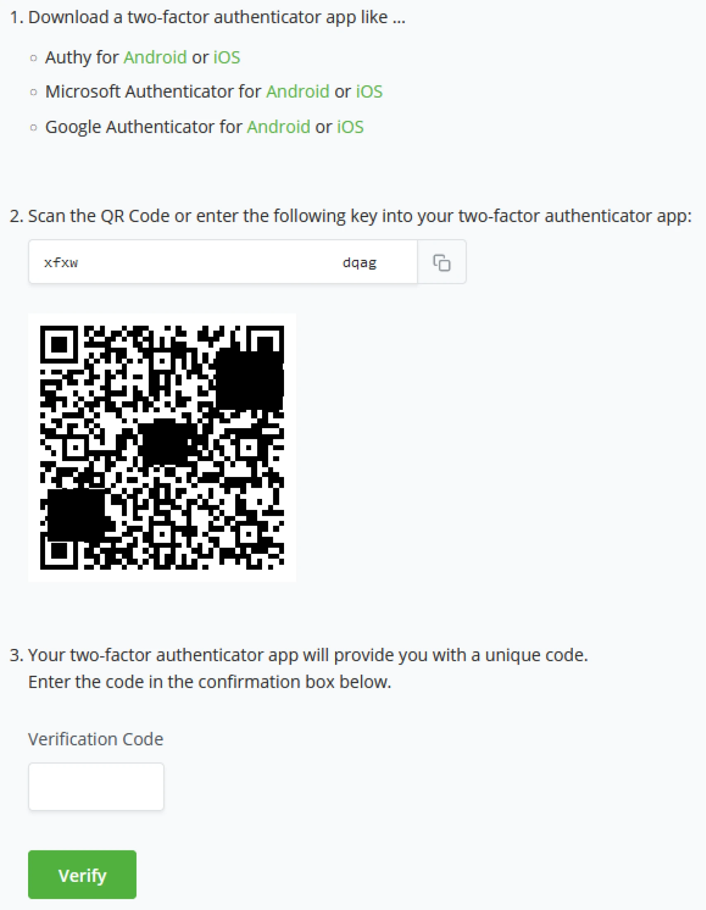


### خلاصه مهارت‌ها


در این بخش، شما موارد زیر را یاد گرفتید:


- گزینه‌های مدیریت حساب و روش‌های مختلف مدیریت یک حساب در یک نمونه از سرور BTCPay.
- نحوه تنظیم احراز هویت دو مرحله‌ای مبتنی بر اپلیکیشن.


### ارزیابی دانش


#### بررسی مفهومی KA


توضیح دهید که چگونه احراز هویت دو مرحله‌ای مبتنی بر اپلیکیشن به امنیت حساب شما کمک می‌کند.


## ایجاد یک فروشگاه جدید


<chapterId>463b3634-b49f-5512-a711-3b2e096fc2e0</chapterId>


### جادوگر ایجاد فروشگاه خود را بسازید


هنگامی که یک کاربر جدید وارد BTCPay Server می‌شود، محیط خالی است و نیاز به یک فروشگاه اول دارد. جادوگر معرفی BTCPay Server به کاربر گزینه‌ای برای ‘ایجاد فروشگاه شما’ (1) ارائه می‌دهد. یک فروشگاه می‌تواند به عنوان خانه‌ای برای نیازهای Bitcoin شما دیده شود. یک نود جدید BTCPay Server با همگام‌سازی Bitcoin Blockchain (2) شروع خواهد شد. بسته به زیرساختی که BTCPay Server را روی آن اجرا می‌کنید، این می‌تواند از چند ساعت تا چند روز متغیر باشد. نسخه فعلی نمونه در گوشه پایین سمت راست رابط کاربری BTCPay Server شما نشان داده می‌شود. این برای مرجع در هنگام عیب‌یابی مفید است.


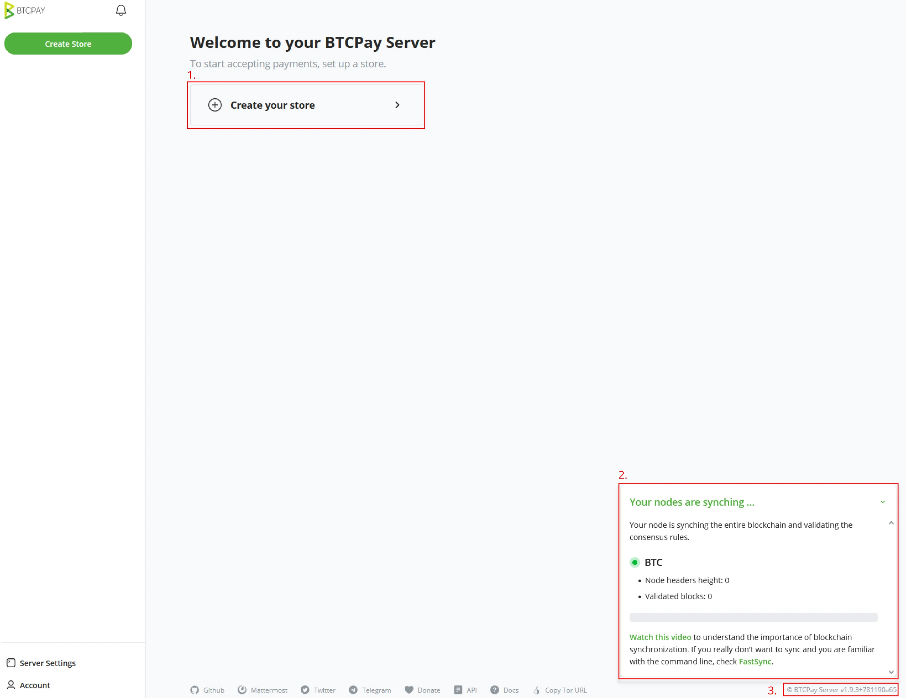


### جادوگر ایجاد فروشگاه خود را بسازید


با دنبال کردن این دوره، صفحه‌ای کمی متفاوت از صفحه قبلی را مشاهده خواهید کرد. از آنجا که مربی شما محیط دمو را آماده کرده است، Bitcoin و Blockchain قبلاً همگام‌سازی شده‌اند و بنابراین وضعیت همگام‌سازی نودها را نخواهید دید.


یک کاربر ممکن است تصمیم بگیرد کل حساب خود را حذف کند. این کار با کلیک بر روی دکمه حذف در برگه حساب قابل انجام است.


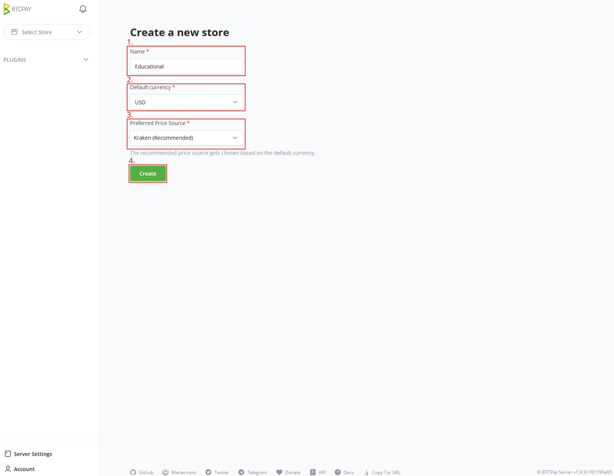


**!توجه!**


حساب‌های BTCPay Server می‌توانند تعداد نامحدودی فروشگاه ایجاد کنند. هر فروشگاه یک Wallet یا "خانه" است.


### مثال


با کلیک بر روی "فروشگاه خود را ایجاد کنید" شروع کنید.


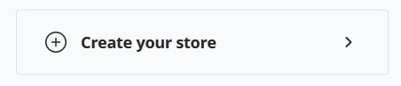


این اولین خانه و داشبورد شما برای استفاده از سرور BTCPay را ایجاد خواهد کرد.


(1) پس از کلیک بر روی "ایجاد فروشگاه شما"، سرور BTCPay از شما می‌خواهد که فروشگاه را نام‌گذاری کنید؛ این نام می‌تواند هر چیزی باشد که برای شما مفید است.


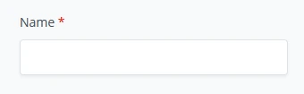


(2) در مرحله بعد باید یک ارز پیش‌فرض فروشگاه تنظیم شود، یا یک ارز فیات یا به صورت Bitcoin / Sats استاندارد. برای محیط دمو، ما آن را به USD تنظیم خواهیم کرد.


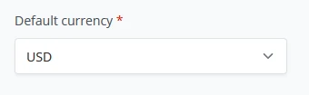


(3) به عنوان آخرین پارامتر در تنظیم فروشگاه، BTCPay Server از شما می‌خواهد که یک "منبع قیمت ترجیحی" را تنظیم کنید تا قیمت Bitcoin را با قیمت فعلی فیات مقایسه کند تا فروشگاه شما نرخ صحیح Exchange بین Bitcoin و ارز فیات تنظیم‌شده فروشگاه را نمایش دهد. ما در مثال دمو با پیش‌فرض ادامه می‌دهیم و این را به Kraken Exchange تنظیم می‌کنیم. BTCPay Server از API Kraken برای بررسی نرخ‌های Exchange استفاده می‌کند.


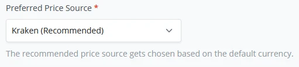


(4) اکنون که این پارامترهای فروشگاه تنظیم شده‌اند، روی دکمه Create کلیک کنید و BTCPay Server داشبورد اولین فروشگاه شما را ایجاد خواهد کرد، جایی که ویزارد ادامه خواهد یافت.


تبریک می‌گویم، شما اولین فروشگاه خود را ایجاد کرده‌اید و این تمرین به پایان می‌رسد.


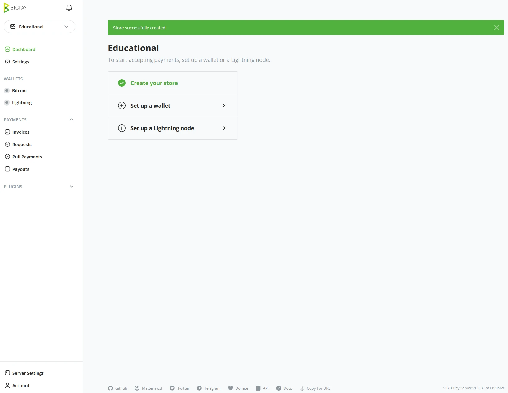


### خلاصه مهارت‌ها


در این بخش، شما یاد گرفتید:


- ایجاد فروشگاه و پیکربندی یک ارز پیش‌فرض همراه با تنظیمات منبع قیمت.
- هر "فروشگاه" یک خانه جدید است که از فروشگاه‌های دیگر در این نصب BTCPay Server جدا شده است.


# مقدمه‌ای بر ایمن‌سازی کلیدهای Bitcoin


<partId>25da22d8-fd37-51c5-af2a-58b9f3b046b2</partId>


## درک تولید کلیدهای Bitcoin


<chapterId>d162735b-847b-578e-83b8-a044ab703ec5</chapterId>


### تولید کلیدهای Bitcoin شامل چه مواردی است؟


کیف پول‌های Bitcoin، زمانی که ایجاد می‌شوند، به اصطلاح "seed" ایجاد می‌کنند. در هدف آخر، شما یک "seed" ایجاد کردید. سری کلمات تولید شده قبلی نیز به عنوان عبارات Mnemonic شناخته می‌شوند. seed برای استخراج کلیدهای فردی Bitcoin استفاده می‌شود و برای ارسال یا دریافت Bitcoin به کار می‌رود. عبارات seed هرگز نباید با اشخاص ثالث یا همتایان غیرقابل اعتماد به اشتراک گذاشته شوند.


نسل seed بر اساس استاندارد صنعتی معروف به چارچوب "Deterministic Hierarchical" (HD) انجام می‌شود.


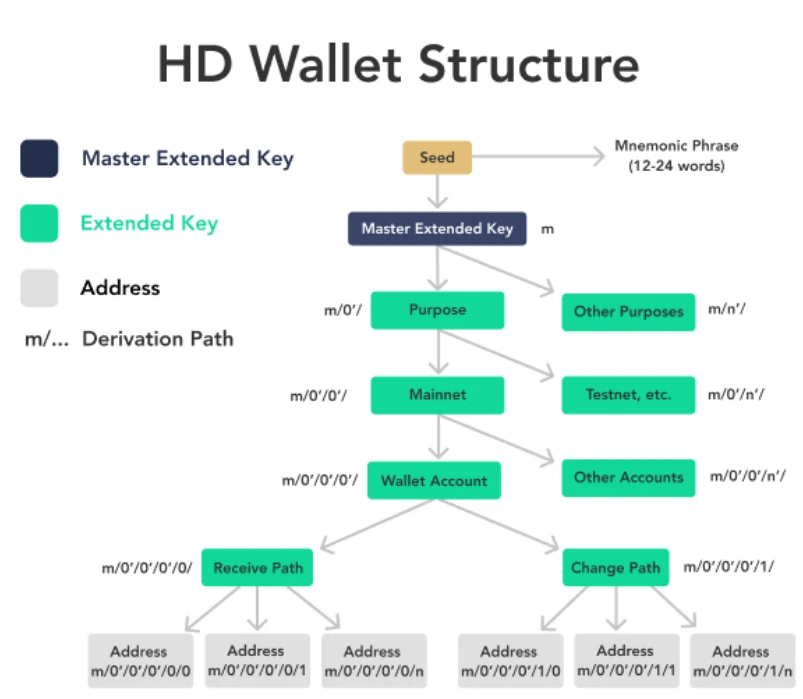


### آدرس‌ها


سرور BTCPay ساخته شده بر روی generate یک Address جدید است. این مشکل استفاده مجدد از کلید عمومی یا Address را برطرف می‌کند. استفاده از همان کلید عمومی، ردیابی کل تاریخچه پرداخت شما را بسیار آسان می‌کند. در نظر گرفتن کلیدها به عنوان کوپن‌های یک‌بار مصرف به طور قابل توجهی حریم خصوصی شما را بهبود می‌بخشد. ما همچنین از آدرس‌های Bitcoin استفاده می‌کنیم، این‌ها را با کلیدهای عمومی اشتباه نگیرید.


یک Address از کلید عمومی از طریق یک "الگوریتم هش" مشتق می‌شود. با این حال، بیشتر کیف پول‌ها و تراکنش‌ها به جای آن کلیدهای عمومی، آدرس‌ها را نمایش می‌دهند. آدرس‌ها به طور کلی کوتاه‌تر از کلیدهای عمومی هستند و معمولاً با `1`، `3`، یا `bc1` شروع می‌شوند، در حالی که کلیدهای عمومی با `02`، `03`، یا `04` شروع می‌شوند.


- آدرس‌هایی که با `1.....` شروع می‌شوند هنوز هم آدرس‌های بسیار رایجی هستند. همان‌طور که در فصل ایجاد یک فروشگاه جدید ذکر شد، این‌ها آدرس‌های قدیمی هستند. این نوع Address برای تراکنش‌های P2PKH طراحی شده است. P2Pkh از کدگذاری Base58 استفاده می‌کند که باعث می‌شود Address به حروف بزرگ و کوچک حساس باشد. ساختار آن بر اساس کلید عمومی با یک رقم اضافی به عنوان شناسه است.


- آدرس‌هایی که با `bc1...` شروع می‌شوند به آرامی به آدرس‌های بسیار رایج تبدیل می‌شوند. این‌ها به عنوان آدرس‌های (بومی) SegWit شناخته می‌شوند. این آدرس‌ها ساختار کارمزد بهتری نسبت به آدرس‌های دیگر ذکر شده ارائه می‌دهند. آدرس‌های بومی SegWit از کدگذاری Bech32 استفاده می‌کنند و فقط حروف کوچک را مجاز می‌دانند.


- آدرس‌هایی که با `3...` شروع می‌شوند، معمولاً هنوز توسط صرافی‌ها برای آدرس‌های واریز استفاده می‌شوند. این آدرس‌ها در فصل ایجاد یک فروشگاه جدید، آدرس‌های SegWit پیچیده یا تو در تو ذکر شده‌اند. با این حال، آن‌ها می‌توانند به عنوان "Multisig Address" نیز عمل کنند. هنگامی که به عنوان SegWit Address استفاده می‌شوند، دوباره مقداری صرفه‌جویی در کارمزد تراکنش‌ها وجود دارد، هرچند کمتر از SegWit بومی. آدرس‌های P2SH از کدگذاری Base58 استفاده می‌کنند. این باعث می‌شود که به حروف بزرگ و کوچک حساس باشد، مانند Address قدیمی.


- آدرس‌هایی که با `2...` شروع می‌شوند، آدرس‌های Testnet هستند. این آدرس‌ها برای دریافت Testnet Bitcoin (tBTC) طراحی شده‌اند. شما هرگز نباید این موضوع را اشتباه گرفته و Bitcoin را به این آدرس‌ها ارسال کنید. برای اهداف توسعه، می‌توانید یک Testnet Wallet را generate کنید. چندین فاست آنلاین برای دریافت Testnet Bitcoin وجود دارد. هرگز Testnet Bitcoin را خریداری نکنید. Testnet Bitcoin استخراج می‌شود. این ممکن است دلیلی برای یک توسعه‌دهنده باشد که به جای آن از Regtest استفاده کند. این یک محیط بازی برای توسعه‌دهندگان است که برخی از اجزای شبکه را ندارد. با این حال، Bitcoin برای اهداف توسعه بسیار مفید است.


### کلیدهای عمومی


کلیدهای عمومی امروزه کمتر در عمل استفاده می‌شوند. با گذشت زمان، کاربران Bitcoin آنها را با آدرس‌ها جایگزین کرده‌اند. آنها هنوز هم وجود دارند و گاهی اوقات استفاده می‌شوند. کلیدهای عمومی به طور کلی رشته‌های بسیار طولانی‌تری نسبت به آدرس‌ها هستند. درست مانند آدرس‌ها، آنها با یک شناسه خاص شروع می‌شوند.


- اول، `02...` و `03...` شناسه‌های کلید عمومی بسیار استانداردی هستند که در قالب SEC کدگذاری شده‌اند. این‌ها می‌توانند پردازش شده و به آدرس‌هایی برای دریافت تبدیل شوند، برای ایجاد آدرس‌های multi-sig استفاده شوند، یا برای تأیید یک امضا به کار روند. تراکنش‌های اولیه Bitcoin از کلیدهای عمومی به عنوان بخشی از تراکنش‌های P2PK استفاده می‌کردند.


- کیف پول‌های HD، با این حال، از ساختار متفاوتی استفاده می‌کنند. `xpub...`، `ypub...` یا `zpub...` به عنوان کلیدهای عمومی توسعه‌یافته شناخته می‌شوند که به آنها xpubs گفته می‌شود. این کلیدها برای استخراج بسیاری از کلیدهای عمومی استفاده می‌شوند زیرا بخشی از HD Wallet هستند. از آنجا که xpub شما سوابق کل تاریخچه شما، به معنای تراکنش‌های گذشته و آینده را نگه می‌دارد، هرگز این اطلاعات را با طرف‌های غیرقابل اعتماد به اشتراک نگذارید.


### خلاصه مهارت‌ها


در این بخش، شما موارد زیر را یاد گرفتید:


- تفاوت‌های بین انواع داده‌های آدرس و کلید عمومی و مزایای استفاده از آدرس‌ها نسبت به کلیدهای عمومی.


### ارزیابی دانش


مزیت استفاده از آدرس‌های تازه برای هر تراکنش در مقایسه با استفاده مجدد از Address یا روش‌های کلید عمومی


## ایمن‌سازی کلیدها با Hardware Wallet


<chapterId>c54a6d61-5a43-5fdb-93ae-c6750de9c612</chapterId>


### ذخیره کلیدهای Bitcoin


پس از تولید یک عبارت seed، لیست ۱۲ تا ۲۴ کلمه‌ای که در این کتاب تولید شده نیاز به پشتیبان‌گیری و امنیت مناسب دارد، زیرا این کلمات تنها راه برای بازیابی دسترسی به یک Wallet هستند. ساختار کیف پول‌های HD و نحوه تولید آدرس‌ها به صورت تعیین‌پذیر با استفاده از همان seed، تمام آدرس‌های ایجاد شده شما با استفاده از این لیست کلمات Mnemonic که نمایانگر seed یا عبارت بازیابی شما هستند، پشتیبان‌گیری خواهند شد.


عبارت بازیابی خود را ایمن نگه دارید. اگر کسی، به‌ویژه با نیت بد، به آن دسترسی پیدا کند، می‌تواند وجوه شما را جابه‌جا کند. نگه‌داشتن seed به‌صورت ایمن و محفوظ اما همچنین به خاطر سپردن آن به یکدیگر وابسته است. روش‌های مختلفی برای ذخیره کلیدهای خصوصی Bitcoin وجود دارد که هر کدام دارای مزایا و معایبی هستند، چه از نظر امنیت، حریم خصوصی، راحتی یا روش‌های فیزیکی. به دلیل اهمیت کلیدهای خصوصی، کاربران Bitcoin تمایل دارند این کلیدها را در "حفاظت شخصی" به‌جای استفاده از خدمات "حفاظتی" مانند بانک‌ها ذخیره و ایمن نگه دارند. بسته به کاربر، او باید از یک راه‌حل ذخیره‌سازی Cold یا Hot Wallet استفاده کند.


### ذخیره‌سازی کلیدهای Bitcoin در Hot و Cold


معمولاً کیف پول‌های Bitcoin به صورت Hot Wallet یا Cold Wallet نام‌گذاری می‌شوند. بیشتر مبادلات در راحتی، سهولت استفاده و ریسک‌های امنیتی قرار دارند. هر یک از این روش‌ها را می‌توان در یک راه‌حل نگهداری نیز مشاهده کرد. با این حال، مبادلات در اینجا بیشتر بر اساس امنیت و حریم خصوصی هستند و فراتر از محدوده این دوره می‌باشند.


### Hot Wallet


کیف‌پول‌های Hot راحت‌ترین روش برای تعامل با Bitcoin از طریق نرم‌افزارهای موبایل، وب یا دسکتاپ هستند. Wallet همیشه به اینترنت متصل است و به کاربران امکان ارسال یا دریافت Bitcoin را می‌دهد. با این حال، این ویژگی همچنین نقطه ضعف آن است، زیرا Wallet که همیشه آنلاین است، اکنون بیشتر در معرض حملات هکرها یا بدافزارها بر روی دستگاه شما قرار دارد. در BTCPay Server، کیف‌پول‌های Hot کلیدهای خصوصی را بر روی نمونه ذخیره می‌کنند. هر کسی که به فروشگاه BTCPay Server شما دسترسی داشته باشد، می‌تواند در صورت مخرب بودن، وجوه را از این Address سرقت کند. هنگامی که BTCPay Server در یک محیط میزبانی شده اجرا می‌شود، همیشه باید این موضوع را در پروفایل امنیتی خود در نظر بگیرید و ترجیحاً از Hot-Wallet در چنین شرایطی استفاده نکنید. زمانی که BTCPay Server بر روی سخت‌افزار متعلق به شما نصب شده و توسط شما امن و مورد اعتماد است، پروفایل ریسک به طور قابل توجهی کاهش می‌یابد، اما هرگز به طور کامل از بین نمی‌رود!


### Cold Wallet


افراد Bitcoin خود را به یک Cold Wallet منتقل می‌کنند زیرا می‌تواند کلیدهای خصوصی را از اینترنت جدا کند. حذف اتصال اینترنت از معادله، خطر بدافزار، جاسوس‌افزار و تعویض سیم‌کارت را کاهش می‌دهد. ذخیره‌سازی Cold به‌عنوان برتر از ذخیره‌سازی Hot برای امنیت و خودمختاری در نظر گرفته می‌شود، به شرطی که اقدامات احتیاطی کافی برای جلوگیری از از دست دادن کلیدهای خصوصی Bitcoin انجام شود. ذخیره‌سازی Cold برای مقادیر زیادی از Bitcoin که به دلیل پیچیدگی تنظیمات Wallet قرار نیست اغلب خرج شوند، مناسب‌ترین است.


روش‌های مختلفی برای ذخیره کلیدهای Bitcoin در ذخیره‌سازی Cold وجود دارد، از کیف پول‌های کاغذی تا کیف پول‌های ذهنی، کیف پول‌های سخت‌افزاری، یا از ابتدا، یک فایل Wallet. اکثر کیف پول‌ها از BIP 39 برای generate عبارت seed استفاده می‌کنند. با این حال، در نرم‌افزار اصلی Bitcoin، هنوز توافقی برای استفاده از آن حاصل نشده است. نرم‌افزار اصلی Bitcoin همچنان یک فایل Wallet.dat ایجاد می‌کند که باید در مکانی امن و آفلاین ذخیره کنید.


### خلاصه مهارت‌ها


در این بخش، شما یاد گرفتید:


- تفاوت‌های بین کیف پول‌های Hot و Cold از نظر عملکرد و مبادلات آن‌ها.


### ارزیابی دانش بررسی مفهومی


- Wallet چیست؟


- تفاوت بین کیف پول‌های Hot و Cold چیست؟


- توصیف کنید منظور از "تولید یک Wallet" چیست؟


## استفاده از کلیدهای Bitcoin شما


<chapterId>bff488de-5052-56e6-b696-97e896f762ae</chapterId>


### سرور BTCPay Wallet


سرور BTCPay شامل ویژگی‌های استاندارد Wallet زیر است:


- تراکنش‌ها
- ارسال
- دریافت کردن
- اسکن مجدد
- پرداخت‌های کششی
- پرداخت‌ها
- PSBT
- تنظیمات عمومی


### تراکنش‌ها


مدیران می‌توانند تراکنش‌های ورودی و خروجی برای On-Chain Wallet متصل به این فروشگاه خاص را در نمای تراکنش‌ها مشاهده کنند. هر تراکنش تفاوتی بین دریافت شده و ارسال شده دارد. دریافت شده به صورت Green و تراکنش‌های خروجی به رنگ قرمز خواهند بود. در نمای تراکنش BTCPay Server، مدیران همچنین مجموعه‌ای از برچسب‌های استاندارد را مشاهده خواهند کرد.


| Transaction Type | Description                                          |
| ---------------- | ---------------------------------------------------- |
| App              | Payment was received through an app created invoice  |
| invoice          | Payment was received through an invoice              |
| payjoin          | Not paid, invoice timer still has not expired        |
| payjoin-exposed  | UTXO was exposed through an invoice payjoin proposal |
| payment-request  | Payment was received through a payment request       |
| payout           | Payment was sent through a payout or refund          |

### چگونه ارسال کنیم


تابع ارسال سرور BTCPay تراکنش‌ها را از سرور BTCPay شما On-Chain Wallet ارسال می‌کند. سرور BTCPay روش‌های متعددی برای امضای تراکنش‌های شما جهت خرج کردن وجوه ارائه می‌دهد. یک تراکنش می‌تواند با موارد زیر امضا شود؛


- Hardware Wallet
- کیف‌پول‌های پشتیبانی‌کننده از PSBT
- کلید خصوصی HD یا عبارات بازیابی.
- Hot Wallet


#### Hardware Wallet


سرور BTCPay دارای پشتیبانی داخلی از Hardware Wallet است که به شما امکان می‌دهد از Hardware Wallet خود با BTCPay Vault استفاده کنید بدون اینکه اطلاعات به برنامه‌ها یا سرورهای شخص ثالث نشت کند. یکپارچه‌سازی Hardware Wallet در سرور BTCPay به شما اجازه می‌دهد تا Hardware Wallet خود را وارد کرده و وجوه ورودی را با یک تأیید ساده در دستگاه خود خرج کنید. کلیدهای خصوصی شما هرگز دستگاه را ترک نمی‌کنند و تمام وجوه در برابر Full node شما اعتبارسنجی می‌شوند، بنابراین هیچ نشت داده‌ای وجود ندارد.


#### امضا با Wallet پشتیبانی از PSBT


PSBT (تراکنش‌های Bitcoin به‌صورت جزئی امضا شده) یک فرمت تبادل برای تراکنش‌های Bitcoin است که هنوز به‌طور کامل امضا نشده‌اند. PSBT در BTCPay Server پشتیبانی می‌شود و می‌تواند با کیف‌پول‌های سخت‌افزاری و نرم‌افزاری سازگار امضا شود.


ساخت یک تراکنش کاملاً امضاشده Bitcoin از مراحل زیر عبور می‌کند:


- یک PSBT با ورودی‌ها و خروجی‌های خاص ساخته می‌شود اما بدون امضاها
- PSBT صادر شده می‌تواند توسط Wallet که از این فرمت پشتیبانی می‌کند، وارد شود.
- داده‌های تراکنش را می‌توان با استفاده از Wallet بررسی و امضا کرد.
- فایل امضاشده PSBT از Wallet صادر شده و با سرور BTCPay وارد می‌شود.
- سرور BTCPay تراکنش نهایی Bitcoin را تولید می‌کند
- شما نتیجه را تأیید کرده و آن را به شبکه پخش می‌کنید.


#### امضا با کلید خصوصی HD یا Mnemonic seed


اگر قبلاً یک Wallet با استفاده از BTCPay Server ایجاد کرده‌اید، می‌توانید با وارد کردن کلید خصوصی خود در یک فیلد مناسب، وجوه را خرج کنید. یک "AccountKeyPath" مناسب در Wallet> Settings تنظیم کنید؛ در غیر این صورت نمی‌توانید خرج کنید.


#### امضا با Hot Wallet


اگر هنگام راه‌اندازی فروشگاه خود یک Wallet جدید ایجاد کرده و آن را به عنوان Hot Wallet فعال کرده‌اید، به‌طور خودکار از seed ذخیره‌شده روی سرور برای امضا استفاده خواهد کرد.


### RBF (Replace-by-fee)


Replace-by-fee (RBF) یک ویژگی پروتکل Bitcoin است که به شما اجازه می‌دهد یک تراکنش پخش‌شده قبلی را (در حالی که هنوز تأیید نشده است) جایگزین کنید. این امکان را می‌دهد که اثر انگشت تراکنش Wallet خود را تصادفی‌سازی کنید یا آن را با نرخ کارمزد بالاتری جایگزین کنید تا تراکنش را در صف اولویت تأیید (Mining) بالاتر ببرید. این به طور مؤثر تراکنش اصلی را جایگزین می‌کند زیرا نرخ کارمزد بالاتر اولویت‌بندی خواهد شد و پس از تأیید، تراکنش اصلی را باطل می‌کند (بدون دوبار خرج کردن).


دکمه "Advanced Settings" را فشار دهید تا گزینه‌های RBF را مشاهده کنید؛


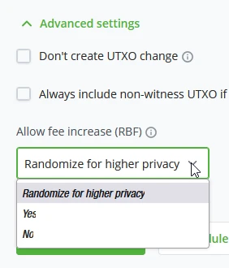


- تصادفی‌سازی برای حفظ حریم خصوصی بیشتر، اجازه می‌دهد تا تراکنش به‌طور خودکار برای تصادفی‌سازی اثر انگشت تراکنش جایگزین شود.
- بله، تراکنش را برای RBF علامت‌گذاری کنید و به‌طور صریح جایگزین شود (به‌طور پیش‌فرض جایگزین نشود، فقط با ورودی)
- نه، اجازه ندهید تراکنش جایگزین شود.


### انتخاب سکه


انتخاب سکه یک ویژگی پیشرفته برای افزایش حریم خصوصی است که به شما امکان می‌دهد سکه‌هایی را که می‌خواهید هنگام ایجاد یک تراکنش خرج کنید، انتخاب کنید. به عنوان مثال، پرداخت با سکه‌هایی که تازه از یک ترکیب مشترک آمده‌اند.


انتخاب سکه به صورت بومی با ویژگی برچسب‌های Wallet کار می‌کند. این به شما امکان می‌دهد وجوه ورودی را برای مدیریت و هزینه‌کرد روان‌تر UTXO برچسب‌گذاری کنید.


سرور BTCPay همچنین از BIP-329 برای مدیریت برچسب‌ها پشتیبانی می‌کند. BIP-329 امکان برچسب‌گذاری را فراهم می‌کند؛ اگر از یک Wallet که از این BIP خاص پشتیبانی می‌کند انتقال دهید و برچسب‌ها را تنظیم کنید، سرور BTCPay این‌ها را شناسایی کرده و وارد می‌کند. هنگام مهاجرت سرورها، این اطلاعات نیز می‌تواند صادر و به محیط جدید وارد شود.


### چگونه دریافت کنیم


هنگام کلیک بر روی دکمه دریافت در BTCPay Server، یک Address استفاده‌نشده تولید می‌شود که می‌تواند برای دریافت پرداخت‌ها استفاده شود. مدیران همچنین ممکن است با تولید یک "Invoice" جدید، یک Address جدید generate کنند.


سرور BTCPay همیشه از شما می‌خواهد که generate را به Address موجود بعدی برای جلوگیری از استفاده مجدد Address انجام دهید. پس از کلیک بر روی "generate بعدی BTC موجود Address"، سرور BTCPay یک Address جدید و QR تولید کرد. همچنین به شما اجازه می‌دهد تا به طور مستقیم یک برچسب به Address برای مدیریت بهتر آدرس‌های خود تنظیم کنید.


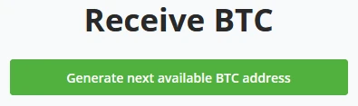


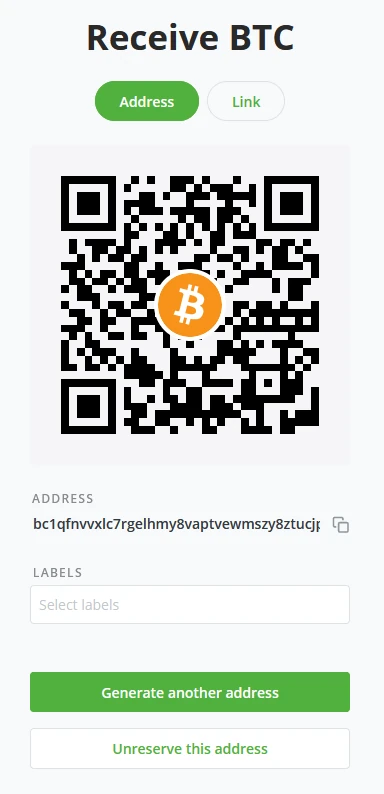


#### اسکن مجدد


ویژگی Rescan به "Scantxoutset" در Bitcoin Core 0.17.0 متکی است تا وضعیت فعلی Blockchain (که به عنوان UTXO Set شناخته می‌شود) را برای سکه‌هایی که به طرح مشتق‌سازی پیکربندی شده تعلق دارند، اسکن کند. بازاسکن Wallet دو مشکل را که کاربران BTCPay Server تجربه می‌کنند، حل می‌کند.


1. مشکل محدودیت فاصله - بیشتر کیف‌پول‌های شخص ثالث، کیف‌پول‌های سبکی هستند که یک نود را بین بسیاری از کاربران به اشتراک می‌گذارند. کیف‌پول‌های سبک و وابسته به Full node مقدار آدرس‌های بدون موجودی (معمولاً 20) را که در Blockchain ردیابی می‌کنند، محدود می‌کنند تا از مشکلات عملکردی جلوگیری کنند. سرور BTCPay برای هر Invoice یک Address جدید تولید می‌کند. با توجه به موارد فوق، پس از اینکه سرور BTCPay 20 فاکتور متوالی پرداخت نشده تولید کرد، Wallet خارجی از دریافت تراکنش‌ها متوقف می‌شود، با فرض اینکه هیچ تراکنش جدیدی رخ نداده است. Wallet خارجی شما آن‌ها را زمانی که فاکتورها در 21، 22 و غیره پرداخت می‌شوند، نشان نخواهد داد. از سوی دیگر، به صورت داخلی، Wallet سرور BTCPay هر Address که تولید می‌کند را همراه با یک محدودیت فاصله بسیار بزرگتر ردیابی می‌کند. این به شخص ثالث وابسته نیست و همیشه می‌تواند موجودی صحیح را نشان دهد.

2. راه‌حل محدودیت فاصله - اگر [Wallet خارجی/موجود شما](https://docs.btcpayserver.org/WalletSetup/#use-an-existing-Wallet) اجازه پیکربندی محدودیت فاصله را می‌دهد، راه‌حل ساده افزایش آن است. با این حال، اکثر کیف‌پول‌ها این امکان را نمی‌دهند. تنها کیف‌پول‌هایی که ما می‌دانیم اجازه پیکربندی محدودیت فاصله را می‌دهند Electrum، Wasabi و Sparrow wallet هستند. متأسفانه، احتمالاً با بسیاری از کیف‌پول‌های دیگر با مشکل مواجه خواهید شد. برای بهترین تجربه کاربری و حفظ حریم خصوصی، در نظر داشته باشید که کیف‌پول‌های خارجی را کنار بگذارید و از Wallet داخلی BTCPay Server استفاده کنید.


#### BTCPay Server از "mempoolfullrbf=1" استفاده می‌کند


سرور BTCPay از "mempoolfullrbf=1" استفاده می‌کند؛ ما این گزینه را به‌صورت پیش‌فرض به تنظیمات سرور BTCPay شما اضافه کرده‌ایم. با این حال، ما آن را به‌صورت یک قطعه قابل غیرفعال‌سازی توسط شما نیز قرار داده‌ایم. بدون "mempoolfullrbf=1"، اگر مشتری پرداختی را با تراکنشی که سیگنال RBF نمی‌دهد دوباره خرج کند، فروشنده تنها پس از تأیید از آن مطلع خواهد شد.


یک مدیر ممکن است بخواهد از این تنظیم انصراف دهد. با استفاده از رشته زیر، می‌توانید تنظیم پیش‌فرض را تغییر دهید.


```
BTCPAYGEN_EXCLUDE_FRAGMENTS="$BTCPAYGEN_EXCL UDE_FRAGMENTS;opt-mempoolfullrbf"
. btcpay-setup.sh -i
```


### تنظیمات BTCPay Server Wallet


تنظیمات Wallet در BTCPay Server نمای کلی و سریعی از تنظیمات عمومی Wallet شما ارائه می‌دهد. اگر Wallet با BTCPay Server ایجاد شده باشد، همه این تنظیمات از پیش پر شده‌اند.


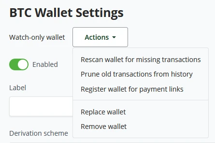


تنظیمات Wallet در BTCPay Server نمایی واضح و سریع از تنظیمات کلی Wallet شما ارائه می‌دهد. اگر Wallet با BTCPay Server ایجاد شده باشد، همه این تنظیمات از پیش پر شده‌اند. تنظیمات Wallet در BTCPay Server با وضعیت Wallet شروع می‌شود. آیا این یک Watch-only یا Hot Wallet است؟ بسته به نوع Wallet، اقدامات ممکن است شامل اسکن مجدد Wallet برای تراکنش‌های گمشده، هرس کردن تراکنش‌های قدیمی از تاریخچه، ثبت Wallet برای لینک‌های پرداخت، یا جایگزینی و حذف Wallet فعلی متصل به فروشگاه باشد. در تنظیمات Wallet در BTCPay Server، مدیران می‌توانند برچسبی برای Wallet برای مدیریت بهتر Wallet تنظیم کنند. در اینجا، مدیر همچنین قادر خواهد بود طرح مشتق، کلید حساب (xpub)، اثر انگشت و مسیر کلید را ببیند. پرداخت‌ها در تنظیمات Wallet تنها دو تنظیم اصلی دارند. پرداخت نامعتبر است اگر تراکنش در (دقیقه‌های تنظیم شده) پس از انقضای Invoice تأیید نشود. Invoice را تأیید شده در نظر بگیرید زمانی که تراکنش پرداخت دارای X تعداد تأییدیه باشد. مدیران همچنین می‌توانند یک سوئیچ برای نمایش هزینه‌های پیشنهادی در پرداخت‌ها تنظیم کنند یا یک هدف تأیید دستی در تعداد بلوک‌ها تنظیم کنند.


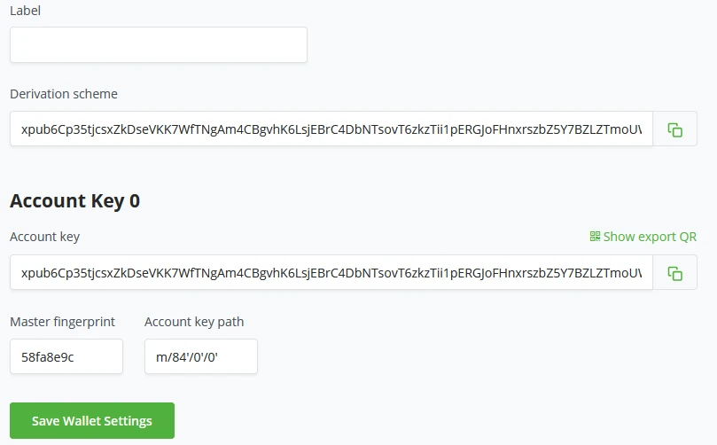


**!توجه!**


اگر این دوره را به‌تنهایی دنبال می‌کنید، ایجاد این حساب ممکن است کاری باشد که در یک میزبان شخص ثالث انجام دهید، بنابراین دوباره یادآوری می‌کنیم که هرگز از این‌ها به‌عنوان محیط‌های تولید استفاده نکنید، بلکه فقط برای اهداف آموزشی استفاده کنید.


### مثال


#### راه‌اندازی Bitcoin Wallet در BTCPay Server


سرور BTCPay دو روش برای تنظیم Wallet ارائه می‌دهد. یک روش وارد کردن یک Bitcoin Wallet موجود است. وارد کردن می‌تواند با اتصال یک Hardware Wallet، وارد کردن یک فایل Wallet، وارد کردن یک کلید عمومی توسعه‌یافته، اسکن کد QR یک Wallet، یا به عنوان آخرین گزینه، وارد کردن دستی یک Wallet بازیابی seed که قبلاً ایجاد شده است، انجام شود. در سرور BTCPay، همچنین امکان ایجاد یک Wallet جدید وجود دارد. دو روش ممکن برای پیکربندی سرور BTCPay هنگام تولید یک Wallet جدید وجود دارد.


گزینه Hot Wallet در BTCPay Server امکان ویژگی‌هایی مانند 'PayJoin' یا 'Liquid' را فراهم می‌کند. با این حال، یک نقطه ضعف وجود دارد، seed بازیابی تولید شده برای این Wallet بر روی سرور ذخیره خواهد شد، جایی که هر کسی که کنترل Admin دارد می‌تواند seed بازیابی را دریافت کند. از آنجا که کلید خصوصی شما از seed بازیابی شما مشتق می‌شود، یک عامل مخرب می‌تواند به وجوه فعلی و آینده شما دسترسی پیدا کند!


برای کاهش چنین ریسکی در BTCPay Server، یک مدیر می‌تواند در تنظیمات سرور > سیاست‌ها > "اجازه به غیر مدیران برای ایجاد کیف‌پول‌های Hot برای فروشگاه‌هایشان" را به خیر تنظیم کند، همان‌طور که به‌طور پیش‌فرض است. برای افزایش امنیت این کیف‌پول‌های Hot، مدیر سرور باید احراز هویت دو مرحله‌ای را برای حساب‌هایی که اجازه داشتن کیف‌پول‌های Hot را دارند، فعال کند. ذخیره کلیدهای خصوصی روی یک سرور عمومی خطرناک است و با ریسک‌هایی همراه است. برخی از این ریسک‌ها مشابه ریسک‌های Lightning Network هستند (برای ریسک‌های Lightning Network به فصل بعدی مراجعه کنید).


گزینه دوم که سرور BTCPay در تولید یک Wallet جدید ارائه می‌دهد، ایجاد یک Watch-only wallet است. سرور BTCPay یک بار کلیدهای خصوصی شما را generate خواهد کرد. پس از اینکه کاربر تأیید کرد که عبارت seed خود را نوشته است، سرور BTCPay کلیدهای خصوصی را از سرور پاک خواهد کرد. در نتیجه، فروشگاه شما اکنون یک Wallet فقط-مشاهده به آن متصل دارد. برای خرج کردن وجوه دریافت شده در Watch-only wallet خود، به فصل "چگونه ارسال کنیم" مراجعه کنید، یا با استفاده از BTCPay Server Vault، PSBT (Partially Signed Bitcoin Transaction)، یا، که کمتر توصیه می‌شود، با ارائه دستی عبارت seed خود.


شما یک 'فروشگاه' جدید در بخش آخر ایجاد کردید. جادوگر نصب با درخواست "راه‌اندازی Wallet" یا "راه‌اندازی یک نود Lightning" ادامه خواهد داد. در این مثال، شما فرآیند جادوگر "راه‌اندازی Wallet" (1) را دنبال خواهید کرد.


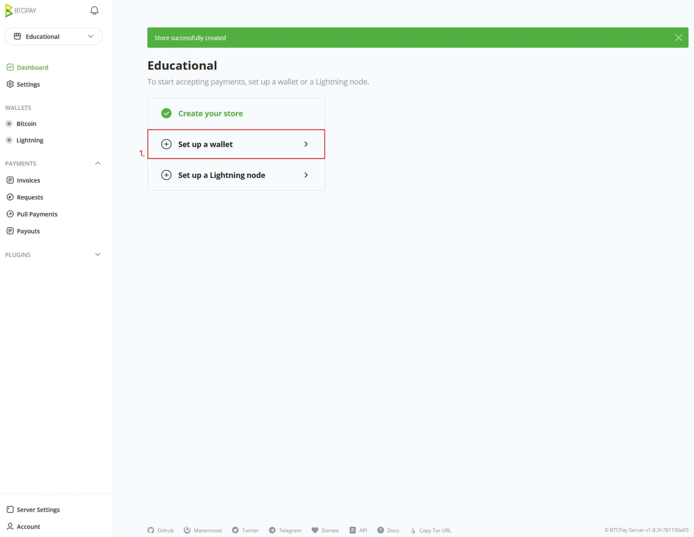


پس از کلیک کردن روی "راه‌اندازی Wallet"، جادوگر با درخواست نحوه ادامه، ادامه خواهد داد؛ سرور BTCPay اکنون گزینه اتصال یک Bitcoin Wallet موجود به فروشگاه جدید شما را ارائه می‌دهد. اگر Wallet ندارید، سرور BTCPay پیشنهاد ایجاد یک جدید را می‌دهد. این مثال مراحل "ایجاد یک Wallet جدید" (2) را دنبال خواهد کرد. مراحل را دنبال کنید تا یاد بگیرید چگونه "اتصال یک Wallet موجود (1)" را انجام دهید.


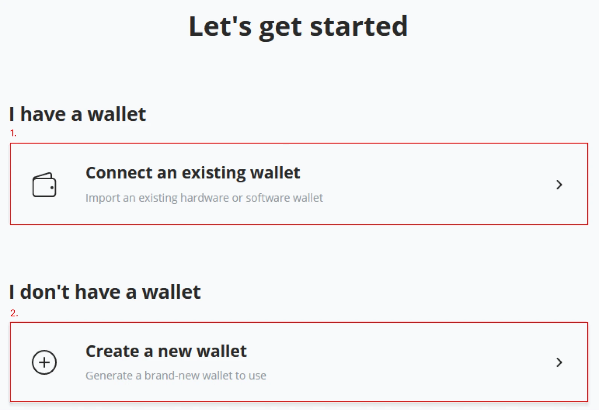


**!توجه!**


اگر این دوره را در یک کلاس درس می‌گذرانید، مثال فعلی و seed که ما ایجاد کرده‌ایم فقط برای اهداف آموزشی است. هرگز نباید هیچ مقدار قابل توجهی به جز آنچه در طول تمرین‌ها در این آدرس‌ها مورد نیاز است، وجود داشته باشد.


(1) با کلیک بر روی دکمه "ایجاد یک Wallet جدید"، جادوگر "Wallet جدید" را ادامه دهید.


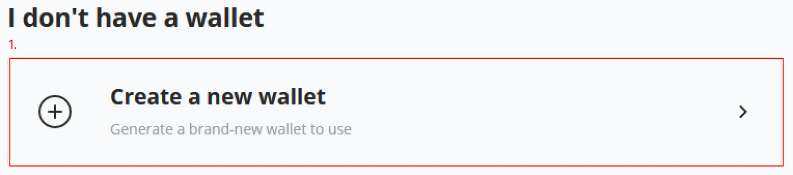


(2) پس از کلیک بر روی "Create a new Wallet"، پنجره بعدی در ویزارد گزینه‌های "Hot Wallet" و "Watch-only wallet" را ارائه می‌دهد. اگر با یک مربی همراهی می‌کنید، محیط شما یک دمو مشترک است و شما فقط می‌توانید یک Watch-only wallet ایجاد کنید. به تفاوت بین هر دو شکل زیر توجه کنید. همان‌طور که در محیط دمو با مربی همراهی می‌کنید، یک "Watch-only wallet" ایجاد کنید و با ویزارد "New Wallet" ادامه دهید.


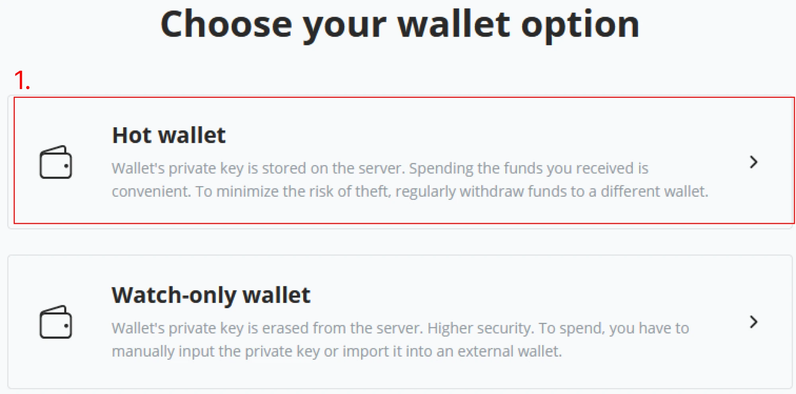


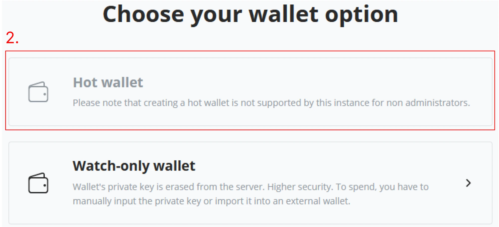


(3) ادامه جادوگر جدید Wallet، اکنون در بخش Create BTC Watch-only wallet هستید. در اینجا می‌توانیم نوع "Address" Wallet را تنظیم کنیم. سرور BTCPay به شما اجازه می‌دهد نوع Address مورد نظر خود را انتخاب کنید؛ تا زمان نگارش این دوره، همچنان توصیه می‌شود از آدرس‌های bech32 استفاده کنید. برای اطلاعات بیشتر در مورد آدرس‌ها به فصل اول این بخش مراجعه کنید.


- SegWit (bech32)
  - آدرس‌های Native SegWit با `bc1q` شروع می‌شوند.
  - مثال: `bc1qXXXXXXXXXXXXXXXXXXXXXX`
- میراث
  - آدرس‌های Legacy آدرس‌هایی هستند که با عدد `1` شروع می‌شوند.
  - مثال: `15e15hXXXXXXXXXXXXXXXXXXXX`
- Taproot (برای کاربران پیشرفته)
  - آدرس‌های Taproot با `bc1p` شروع می‌شوند.
  - مثال: `bc1pXXXXXXXXXXXXXXXXXXXXXXXX`
- SegWit بسته‌بندی‌شده
  - SegWit پیچیده شده شامل آدرس‌هایی است که با `3` شروع می‌شوند.
  - مثال: `37BBXXXXXXXXXXXXXXX`


SegWit (توصیه‌شده) را به عنوان نوع Wallet Address ترجیحی خود انتخاب کنید.


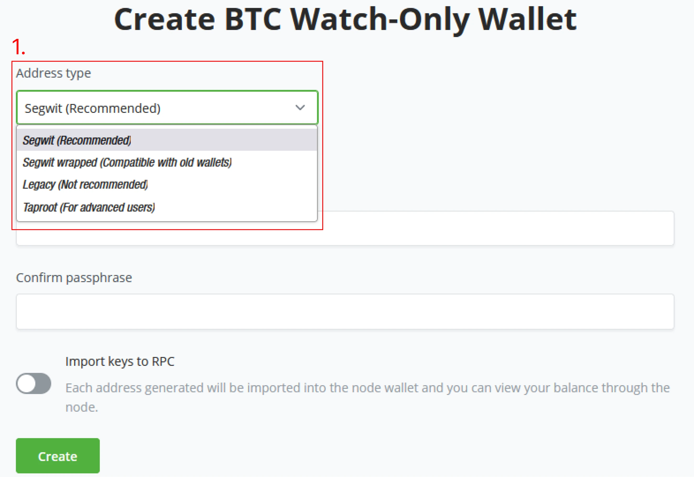


(4) هنگام تنظیم پارامتر برای Wallet، سرور BTCPay به کاربران اجازه می‌دهد تا یک passphrase اختیاری را از طریق BIP39 تنظیم کنند، حتماً رمز عبور خود را تأیید کنید.


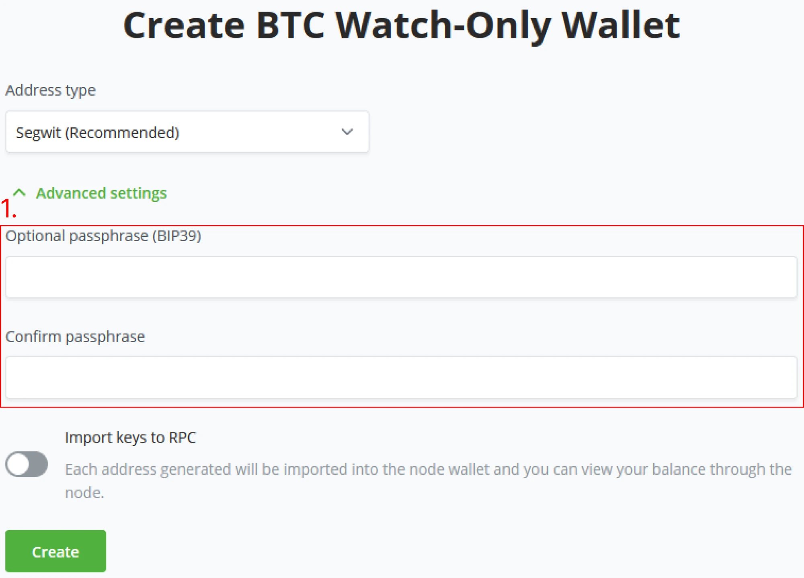


(5) پس از تنظیم نوع Address برای Wallet و احتمالاً تنظیم برخی گزینه‌های پیشرفته، روی ایجاد کلیک کنید و سرور BTCPay، Wallet جدید شما را generate خواهد کرد. توجه داشته باشید که این آخرین مرحله قبل از تولید عبارت seed شما است. اطمینان حاصل کنید که این کار را فقط در محیطی انجام می‌دهید که کسی نتواند با نگاه کردن به صفحه نمایش شما، عبارت seed را بدزدد.


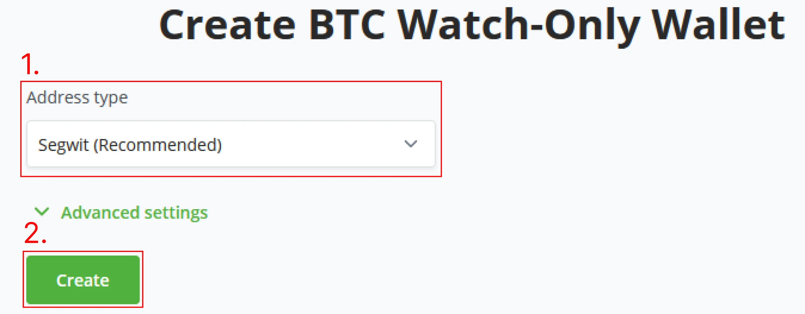


(6) در صفحه بعدی جادوگر، BTCPay Server عبارت بازیابی seed را برای Wallet تازه تولید شده شما نشان می‌دهد؛ این‌ها کلیدهای بازیابی Wallet و امضای تراکنش‌ها هستند. BTCPay Server یک عبارت seed شامل 12 کلمه تولید می‌کند. این کلمات پس از این صفحه تنظیمات از سرور پاک خواهند شد. این Wallet به‌طور خاص یک Watch-only wallet است. توصیه می‌شود که این عبارت seed به‌صورت دیجیتالی یا با تصویر عکاسی ذخیره نشود. کاربران تنها در صورتی می‌توانند در جادوگر پیش بروند که به‌طور فعال تأیید کنند که عبارت seed خود را نوشته‌اند.


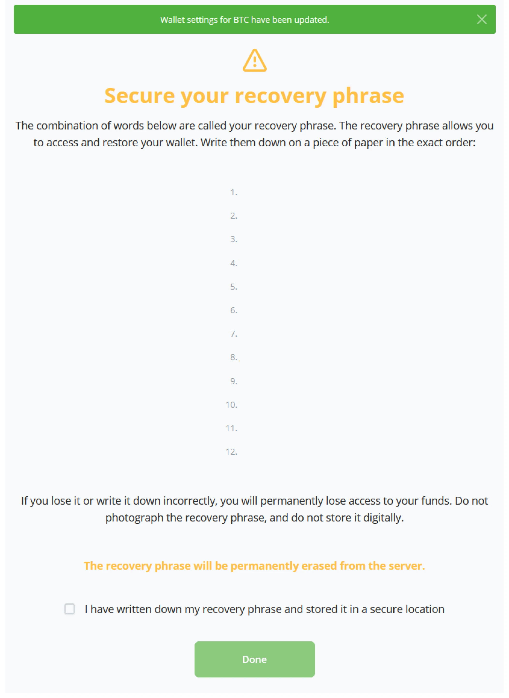


(7) پس از کلیک بر روی Done و ایمن‌سازی عبارت جدید تولید شده Bitcoin seed، سرور BTCPay فروشگاه شما را با Wallet جدید پیوست شده به‌روزرسانی می‌کند و آماده دریافت پرداخت‌ها است. در Interface کاربر، در منوی ناوبری سمت چپ، توجه کنید که چگونه Bitcoin اکنون در زیر Wallet برجسته و فعال شده است.


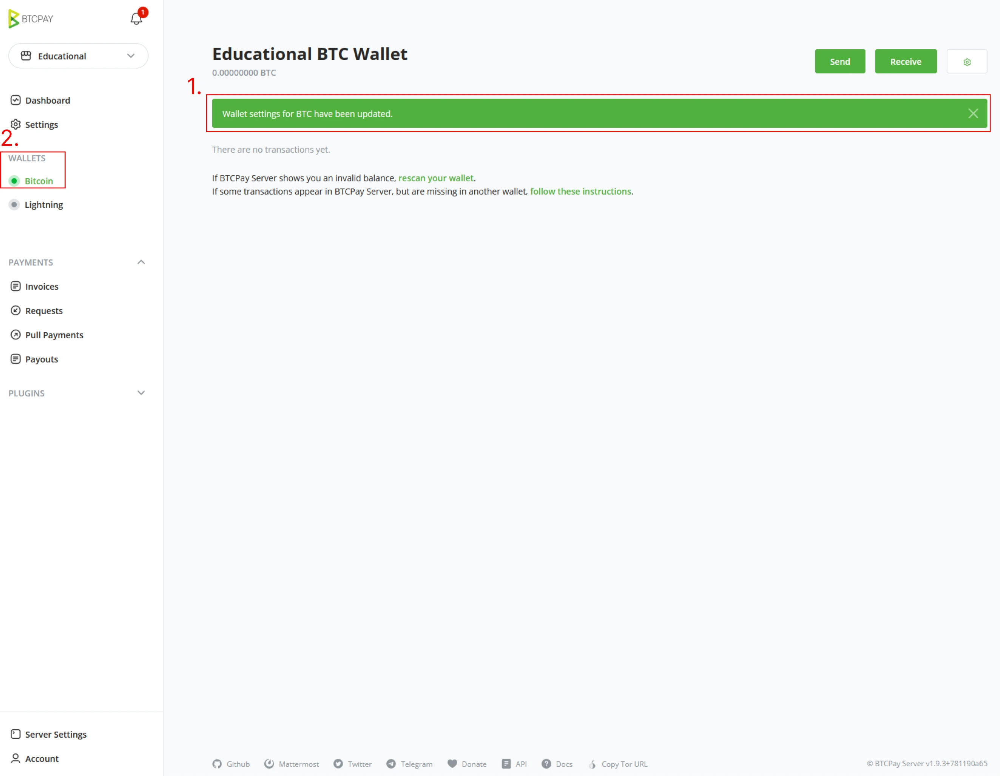


### مثال: نوشتن عبارت seed


این یک لحظه بسیار خاص و امن برای استفاده از Bitcoin است. همانطور که قبلاً ذکر شد، فقط شما باید به عبارت seed خود دسترسی یا آگاهی داشته باشید. هنگامی که با یک مربی و کلاس درس همراهی می‌کنید، seed تولید شده باید فقط در این دوره استفاده شود. عوامل زیادی، چشمان کنجکاو همکلاسی‌ها، سیستم‌های ناامن و بسیاری دیگر باعث می‌شوند که این کلیدها فقط آموزشی و غیرقابل اعتماد باشند. با این حال، کلیدهای تولید شده باید همچنان برای مثال‌های دوره ذخیره شوند.


اولین روشی که در وضعیت فعلی استفاده خواهیم کرد، که همچنین کم‌امن‌ترین روش است، نوشتن عبارت seed به ترتیب صحیح است. کارت عبارت seed در مواد درسی ارائه شده به دانشجو یا در GitHub سرور BTCPay یافت می‌شود. ما از این کارت برای نوشتن کلمات تولید شده در مرحله قبلی استفاده خواهیم کرد. اطمینان حاصل کنید که آنها را به ترتیب صحیح بنویسید. پس از نوشتن آنها، آنها را با آنچه نرم‌افزار ارائه داده است بررسی کنید تا مطمئن شوید که آنها را به ترتیب صحیح نوشته‌اید. پس از نوشتن آن، کادر تأیید را کلیک کنید که نشان می‌دهد عبارت seed خود را به درستی نوشته‌اید.


### مثال: ذخیره‌سازی یک عبارت seed بر روی یک Hardware Wallet


در این دوره، ما به ذخیره یک عبارت seed بر روی یک Hardware Wallet می‌پردازیم. دنبال کردن این دوره توسط یک مدرس ممکن است همیشه شامل چنین دستگاهی نباشد. در دوره، مواد راهنما لیستی از کیف پول‌های سخت‌افزاری ارائه داده‌اند که برای این تمرین مناسب خواهد بود.


ما از BTCPay Server vault و یک Blockstream Jade Hardware Wallet در این مثال استفاده خواهیم کرد.


شما همچنین می‌توانید با مشاهده ویدیو برای مرجع در اتصال یک Hardware Wallet همراهی کنید.

:::video id=8e61664b-e0c0-416d-8ef9-b631bf28ec4d:::


دانلود BTCPay Server Vault: https://github.com/btcpayserver/BTCPayServer.Vault/releases


مطمئن شوید که فایل‌های صحیح را برای سیستم خود دانلود کنید. کاربران ویندوز باید بسته [BTCPayServerVault-2.0.5-setup.exe](https://github.com/btcpayserver/BTCPayServer.Vault/releases/download/Vault%2Fv2.0.5/BTCPayServerVault-2.0.5-setup.exe) را دانلود کنند، کاربران مک بسته [BTCPayServerVault-osx-x64-2.0.5.dmg](https://github.com/btcpayserver/BTCPayServer.Vault/releases/download/Vault%2Fv2.0.5/BTCPayServerVault-osx-x64-2.0.5.dmg) را دانلود کنند، و کاربران لینوکس باید [BTCPayServerVault-Linux-2.0.5.tar.gz](https://github.com/btcpayserver/BTCPayServer.Vault/releases/download/Vault%2Fv2.0.5/BTCPayServerVault-Linux-2.0.5.tar.gz) را دانلود کنند.


پس از نصب BTCPay Server Vault، نرم‌افزار را با کلیک بر روی آیکون در دسکتاپ خود اجرا کنید. هنگامی که BTCPay Server Vault به درستی نصب و برای اولین بار اجرا می‌شود، از شما اجازه می‌خواهد تا با برنامه‌های وب استفاده شود. از شما خواسته می‌شود تا دسترسی به BTCPay Server خاصی که با آن کار می‌کنید را اعطا کنید. این شرایط را بپذیرید. اکنون BTCPay Server Vault به جستجوی دستگاه سخت‌افزاری می‌پردازد. هنگامی که دستگاه پیدا شد، BTCPay Server تشخیص می‌دهد که Vault در حال اجرا است و دستگاه شما را شناسایی کرده است.


**!توجه!**


کلیدهای SSH یا حساب کاربری مدیر سرور خود را به هیچ‌کس جز مدیران ندهید هنگام استفاده از Hot Wallet. هر کسی که به این حساب‌ها دسترسی داشته باشد، به وجوه موجود در Hot Wallet دسترسی خواهد داشت.


### خلاصه مهارت‌ها


در این بخش، شما موارد زیر را یاد گرفتید:


- نمایش تراکنش Bitcoin Wallet و دسته‌بندی‌های مختلف آن.
- گزینه‌های مختلفی در دسترس هستند هنگام ارسال از Bitcoin Wallet، از سخت‌افزار تا کیف‌پول‌های Hot.
- مشکل محدودیت فاصله که هنگام استفاده از اکثر کیف پول‌ها با آن مواجه می‌شوید و نحوه رفع آن.
- چگونه یک generate جدید Bitcoin Wallet را در BTCPay Server ایجاد کنیم، شامل ذخیره کلیدها در یک Hardware Wallet و پشتیبان‌گیری از عبارت بازیابی.


در این هدف، شما یاد گرفته‌اید که چگونه یک generate جدید Bitcoin Wallet را در BTCPay Server ایجاد کنید. ما هنوز به چگونگی ایمن‌سازی یا استفاده از آن کلیدها نپرداخته‌ایم. در یک مرور سریع از این هدف، شما یاد گرفته‌اید که چگونه اولین فروشگاه را راه‌اندازی کنید. شما یاد گرفته‌اید که چگونه یک generate عبارت بازیابی Bitcoin seed را ایجاد کنید.


### ارزیابی دانش بررسی عملی


روشی برای تولید کلیدها و طرحی برای ایمن‌سازی آن‌ها را توصیف کنید، همراه با مبادلات/ریسک‌های طرح امنیتی.


## سرور BTCPay Lightning Wallet


<chapterId>1bbece7e-0197-57e6-a93a-561cf384d946</chapterId>


هنگامی که یک مدیر سرور یک نمونه جدید از BTCPay Server را فراهم می‌کند، می‌تواند یک پیاده‌سازی Lightning Network، LND، Core Lightning، یا Eclair را تنظیم کند؛ برای دستورالعمل‌های نصب دقیق‌تر به بخش پیکربندی BTCPay Server مراجعه کنید.


اگر توسط یک کلاس دنبال شود، اتصال یک نود لایتنینگ به سرور BTCPay شما از طریق یک نود سفارشی کار می‌کند. کاربری که مدیر سرور در BTCPay Server نیست، به طور پیش‌فرض قادر به استفاده از نود داخلی لایتنینگ نخواهد بود. این به منظور حفاظت از مالک سرور در برابر از دست دادن وجوهش است. مدیران سرور می‌توانند یک پلاگین نصب کنند تا از طریق LNBank به نود لایتنینگ خود دسترسی دهند؛ این موضوع خارج از محدوده این کتاب است؛ برای اطلاعات بیشتر درباره LNBank به صفحه رسمی پلاگین مراجعه کنید.


### اتصال به گره داخلی (مدیر سرور)


مدیر سرور می‌تواند از نود لایتنینگ داخلی BTCPay Server استفاده کند. صرف نظر از پیاده‌سازی لایتنینگ، اتصال به نود لایتنینگ داخلی به همان صورت است.


به یک فروشگاه تنظیمات قبلی بروید و روی "Lightning" Wallet در منوی سمت چپ کلیک کنید. BTCPay Server دو امکان تنظیم ارائه می‌دهد، استفاده از نود داخلی (فقط مدیر سرور به صورت پیش‌فرض) یا یک نود سفارشی (اتصال خارجی). مدیران سرور می‌توانند روی گزینه "استفاده از نود داخلی" کلیک کنند. هیچ تنظیمات بیشتری لازم نیست. روی دکمه "ذخیره" کلیک کنید و به اعلان با عنوان "نود BTC Lightning به‌روزرسانی شد" توجه کنید. فروشگاه اکنون با موفقیت قابلیت‌های Lightning Network را دریافت کرده است.


### اتصال به گره خارجی (کاربر سرور/صاحب فروشگاه)


از آنجا که به‌طور پیش‌فرض به صاحبان فروشگاه اجازه داده نمی‌شود از نود لایتنینگ سرور ادمین استفاده کنند، اتصال باید به یک نود خارجی برقرار شود، خواه نودی که قبل از راه‌اندازی سرور BTCPay توسط صاحب فروشگاه مالکیت شده باشد، یک افزونه LNBank در صورت ارائه توسط ادمین سرور، یا یک راه‌حل نگهداری مانند Alby.


به یک فروشگاه تنظیمات قبلی بروید و روی "Lightning" که زیر کیف پول‌ها در منوی سمت چپ قرار دارد کلیک کنید. از آنجا که به‌طور پیش‌فرض به صاحبان فروشگاه اجازه استفاده از نود داخلی داده نمی‌شود، این گزینه غیرفعال است. استفاده از نود سفارشی تنها گزینه‌ای است که به‌طور پیش‌فرض برای صاحبان فروشگاه در دسترس است.


BTCPay Server به اطلاعات اتصال نیاز دارد؛ راه‌حل قبلی ساخته‌شده (یا راه‌حل حضانتی) این اطلاعات را به‌طور خاص برای یک پیاده‌سازی Lightning ارائه خواهد داد. درون BTCPay Server، صاحبان فروشگاه می‌توانند از اتصالات زیر استفاده کنند؛


- C-lightning از طریق اتصال TCP یا سوکت دامنه یونیکس.
- شارژ رعد و برق از طریق HTTPS
- اکلر از طریق HTTPS
- LND از طریق پروکسی REST
- LNDhub از طریق REST API


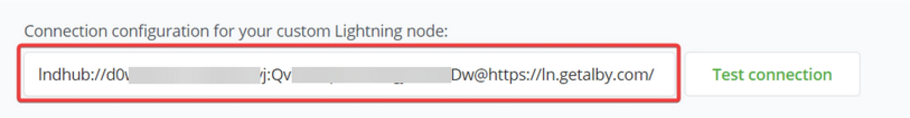


روی "تست اتصال" کلیک کنید تا مطمئن شوید که جزئیات اتصال را به درستی وارد کرده‌اید. پس از تأیید اتصال، روی ذخیره کلیک کنید و BTCPay Server نشان می‌دهد که فروشگاه با یک نود لایتنینگ به‌روزرسانی شده است.


### مدیریت گره داخلی Lightning LND (مدیر سرور)


پس از اتصال نود داخلی لایتنینگ، مدیران سرور متوجه کاشی‌های جدیدی در داشبورد خواهند شد که به‌طور خاص برای اطلاعات لایتنینگ هستند.


- تراز رعد و برق
- BTC در کانال‌ها
  - باز کردن کانال‌های BTC
  - موجودی محلی BTC
  - BTC موجودی از راه دور
  - بستن کانال‌های BTC
- BTC On-Chain
  - BTC تأیید شد
  - BTC تایید نشده
  - BTC رزرو شد
- خدمات رعد و برق
  - سوار بر آذرخش (RTL).


با کلیک بر روی لوگوی Ride the Lightning در کاشی "خدمات Lightning" یا "Lightning" در زیر کیف‌پول‌ها در منوی سمت چپ، مدیران سرور می‌توانند به RTL برای مدیریت نود Lightning دسترسی پیدا کنند.


**توجه!**


اتصال به نود داخلی لایتنینگ ناموفق است - اگر اتصال داخلی ناموفق است، تأیید کنید:


1. گره Bitcoin On-Chain به طور کامل همگام‌سازی شده است

۲. نود داخلی لایتنینگ در بخش "لایتنینگ" > "تنظیمات" > "تنظیمات لایتنینگ BTC" به حالت "فعال" درآمده است.


اگر نمی‌توانید به نود لایتنینگ خود متصل شوید، سعی کنید سرور خود را مجدداً راه‌اندازی کنید، یا برای جزئیات بیشتر به مستندات رسمی BTCPay Server مراجعه کنید؛ https://docs.btcpayserver.org/Troubleshooting/ . تا زمانی که نود لایتنینگ شما به صورت "آنلاین" ظاهر نشود، نمی‌توانید پرداخت‌های لایتنینگ را در فروشگاه خود بپذیرید. سعی کنید اتصال لایتنینگ خود را با کلیک بر روی لینک "Public Node Info" آزمایش کنید.


### لایتنینگ Wallet


در گزینه Lightning Wallet در نوار منوی سمت چپ، مدیران سرور به راحتی به RTL، اطلاعات نود عمومی خود و تنظیمات Lightning مخصوص فروشگاه BTCPay Server خود دسترسی خواهند داشت.


#### اطلاعات گره داخلی


مدیران سرور می‌توانند روی اطلاعات نود داخلی کلیک کرده و به وضعیت سرور خود (آنلاین/ آفلاین) و رشته اتصال برای Clearnet یا Tor نگاهی بیندازند.


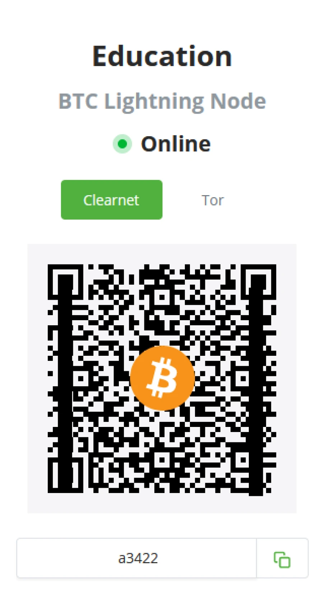


#### اتصال را تغییر دهید


اگر صاحب فروشگاه تصمیم بگیرد از تغییرات در تنظیمات لایتنینگ استفاده کند - تغییر اتصال.

در کنار فروشگاه اطلاعات گره عمومی، مالکان می‌توانند این گزینه را پیدا کنند. این گزینه تنظیمات اولیه برای اتصال گره لایتنینگ خارجی را بازگردانی می‌کند، اطلاعات جدید گره لایتنینگ را پر کنید، روی ذخیره کلیک کنید و فروشگاه را با اطلاعات جدید گره به‌روزرسانی کنید.


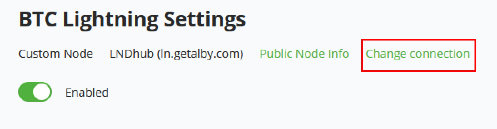


#### خدمات


اگر مدیر سرور تصمیم بگیرد چندین سرویس برای پیاده‌سازی Lightning نصب کند، آنها در اینجا فهرست خواهند شد. با یک پیاده‌سازی استاندارد LND، مدیران ابزار استاندارد Ride The Lightning (RTL) را برای مدیریت نود خواهند داشت.


#### تنظیمات BTC Lightning Wallet


پس از افزودن نود لایتنینگ به فروشگاه در یک مرحله قبلی، در تنظیمات Lightning Wallet، صاحبان فروشگاه همچنان می‌توانند با استفاده از دکمه Toggle در بالای تنظیمات لایتنینگ، آن را برای فروشگاه خود غیرفعال کنند.


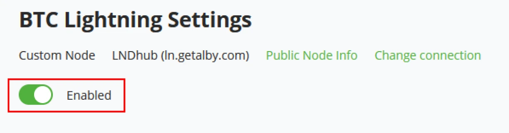


#### گزینه‌های پرداخت لایتنینگ


صاحبان فروشگاه می‌توانند پارامترهای زیر را برای بهبود تجربه Lightning برای مشتریان خود تنظیم کنند.


- مقادیر پرداخت لایتنینگ را به ساتوشی نمایش دهید.
- افزودن راهنمایی‌های پرش برای کانال‌های خصوصی به Lightning Invoice.
- یکپارچه‌سازی کدهای URL/QR پرداخت On-Chain و Lightning در مرحله پرداخت.
- یک قالب توضیحات برای فاکتورهای لایتنینگ تنظیم کنید.


#### LNURL


صاحبان فروشگاه می‌توانند انتخاب کنند که از LNURL استفاده کنند یا نه. یک URL Lightning Network، یا LNURL، یک استاندارد پیشنهادی برای تعاملات بین پرداخت‌کننده و دریافت‌کننده لایتنینگ است. به طور خلاصه، یک LNURL یک URL کدگذاری شده به صورت bech32 است که با lnurl پیشوند شده است. انتظار می‌رود که لایتنینگ Wallet این URL را رمزگشایی کند، با URL تماس بگیرد و منتظر یک شیء JSON با دستورالعمل‌های بیشتر بماند، که به‌ویژه شامل یک برچسب تعریف‌کننده رفتار knurl است.


- LNURL را فعال کنید
- حالت کلاسیک LNURL
  - برای سازگاری Wallet، کدگذاری شده Bech32 (کلاسیک) در مقابل URL متن ساده (آینده)
- به دریافت‌کننده اجازه دهید نظری بدهد.


### مثال 1


#### به Lightning با نود داخلی (مدیر) متصل شوید


این گزینه تنها در صورتی در دسترس است که شما مدیر این نمونه باشید یا اگر مدیر تنظیمات پیش‌فرض را تغییر داده باشد که کاربران بتوانند از نود لایتنینگ داخلی استفاده کنند.


به عنوان یک مدیر، بر روی Lightning Wallet در نوار منوی سمت چپ کلیک کنید. سرور BTCPay از شما می‌خواهد که از یکی از دو گزینه برای اتصال به یک نود لایتنینگ استفاده کنید: یک نود داخلی یا یک نود خارجی سفارشی. بر روی استفاده از نود داخلی کلیک کرده و سپس بر روی ذخیره کلیک کنید.


#### مدیریت نود لایتنینگ شما (RTL)


پس از اتصال به نود لایتنینگ داخلی، BTCPay Server به‌روزرسانی خواهد شد و یک اعلان "نود لایتنینگ BTC به‌روزرسانی شد" را نشان می‌دهد، که تأیید می‌کند اکنون لایتنینگ را به فروشگاه خود متصل کرده‌اید.


مدیریت نود لایتنینگ وظیفه مدیر سرور است. این شامل.


- مدیریت تراکنش
- مدیریت نقدینگی
  - نقدینگی ورودی
  - نقدینگی خروجی
- مدیریت همتایان و کانال‌ها
  - همتایان متصل
  - هزینه‌های کانال
  - وضعیت کانال
- ایجاد پشتیبان‌های مکرر از وضعیت‌های کانال.
- بررسی گزارش‌های مسیریابی
- به طور جایگزین، از خدماتی مانند Loop استفاده کنید.


مدیریت تمام نودهای لایتنینگ به‌صورت استاندارد با RTL انجام می‌شود (با فرض اینکه شما روی یک پیاده‌سازی LND اجرا می‌کنید). مدیران می‌توانند در BTCPay Server روی Lightning Wallet خود کلیک کرده و دکمه‌ای برای باز کردن RTL پیدا کنند. داشبورد اصلی BTCPay Server اکنون با کاشی‌های Lightning Network به‌روزرسانی شده است که شامل دسترسی سریع به RTL می‌باشد.


### مثال ۲


#### به Alby متصل شوید


هنگام اتصال به یک متولی مانند Alby، صاحبان فروشگاه باید ابتدا یک حساب کاربری ایجاد کنند، به این آدرس مراجعه کنید: https://getalby.com/


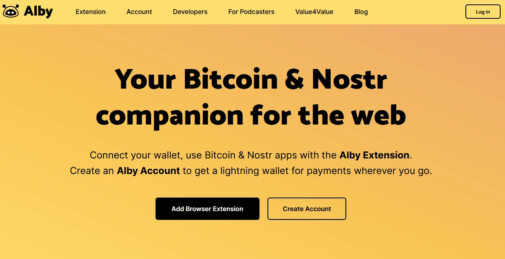


پس از ایجاد حساب Alby، به فروشگاه BTCPay Server خود بروید.


مرحله 1: روی 'راه‌اندازی یک نود لایتنینگ' در داشبورد یا 'لایتنینگ' زیر کیف پول‌ها کلیک کنید.


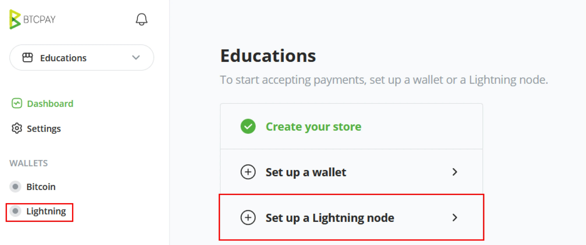


مرحله ۲: اطلاعات اتصال Wallet که توسط Alby ارائه شده است را وارد کنید. در داشبورد Alby، روی Wallet کلیک کنید. در اینجا "اطلاعات اتصال Wallet" را خواهید یافت. این اطلاعات را کپی کنید. اطلاعات را از Alby در قسمت پیکربندی اتصال در BTCPay Server جای‌گذاری کنید.


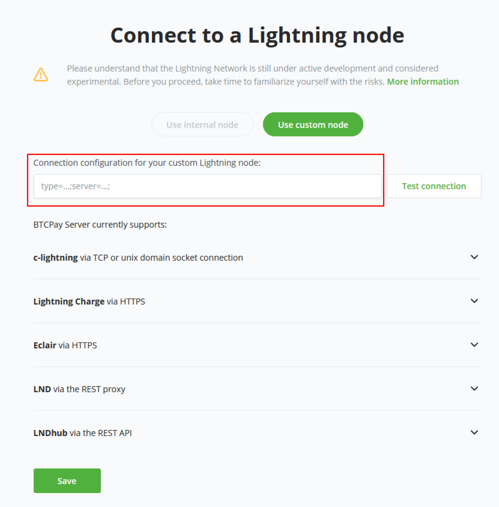


مرحله 3: پس از ارائه جزئیات اتصال به سرور BTCPay، روی دکمه "Test Connection" کلیک کنید تا اطمینان حاصل شود که اتصال به درستی کار می‌کند. پیام "اتصال به نود لایتنینگ موفقیت‌آمیز بود" را در بالای صفحه خود مشاهده کنید. این تأیید می‌کند که همه چیز به درستی کار می‌کند.


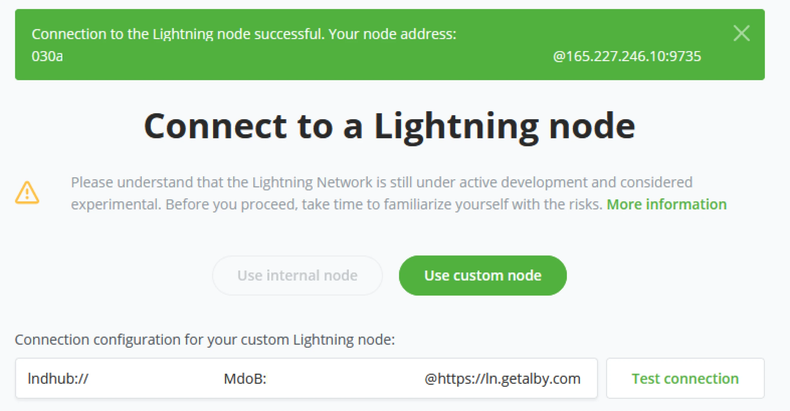


مرحله ۴: روی ذخیره کلیک کنید، و فروشگاه شما اکنون به یک نود لایتنینگ توسط Alby متصل شده است.


**!توجه!**


هرگز به یک راه‌حل نگهداری لایتنینگ بیش از ارزشی که مایل به از دست دادن آن هستید، اعتماد نکنید.


### خلاصه مهارت‌ها


در این بخش شما یاد گرفتید:


- چگونه یک نود لایتنینگ داخلی یا خارجی را متصل کنیم
- محتوا و عملکرد کاشی‌های مختلف مرتبط با Lightning در داشبورد
- نحوه پیکربندی Lightning Wallet با استفاده از Voltage Surge یا Alby


### ارزیابی دانش بررسی عملی


برخی از گزینه‌های مختلف برای اتصال Lightning Wallet به فروشگاه شما را توصیف کنید.


# سرور BTCPay Interface


<partId>25e88b81-e1ab-515f-a035-09f2a3075556</partId>


## بررسی اجمالی داشبورد


<chapterId>410ff28b-a272-5c91-93e0-48d5b28c53ab</chapterId>


سرور BTCPay یک بسته نرم‌افزاری ماژولار است. با این حال، استانداردهایی وجود دارد که هر سرور BTCPay خواهد داشت و مدیر/کاربران با آن تعامل خواهند داشت. شروع با داشبورد. نقطه ورود اصلی هر سرور BTCPay پس از ورود به سیستم. داشبورد نمای کلی از عملکرد فروشگاه شما، موجودی فعلی Wallet و آخرین تراکنش‌ها در ۷ روز گذشته را ارائه می‌دهد. از آنجا که این یک نمای ماژولار است، افزونه‌ها ممکن است از این نما به نفع خود استفاده کنند و کاشی‌های خود را در داشبورد ایجاد کنند. برای این کتاب دوره، ما فقط در مورد افزونه‌ها/برنامه‌های استاندارد و نماهای مربوطه آنها در سراسر سرور BTCPay صحبت خواهیم کرد.


### کاشی‌های داشبورد


در نمای اصلی داشبورد BTCPay Server چندین کاشی استاندارد در دسترس است. این کاشی‌ها برای صاحب فروشگاه یا مدیر طراحی شده‌اند تا بتواند فروشگاه خود را به سرعت در یک نمای کلی مدیریت کند.


- Wallet تعادل
- فعالیت تراکنش
- موجودی لایتنینگ (اگر لایتنینگ در فروشگاه فعال باشد)
- خدمات Lightning (اگر Lightning در فروشگاه فعال باشد)
- تراکنش‌های اخیر.
- فاکتورهای اخیر
- Crowdfunds فعال کنونی
- عملکرد فروشگاه / پرفروش‌ترین اقلام.


### Wallet تعادل


کاشی تراز Wallet نمای کلی سریعی از وجوه و عملکرد Wallet شما ارائه می‌دهد. می‌توان آن را به صورت BTC یا ارز فیات در نمودار هفتگی، ماهانه یا سالانه مشاهده کرد.


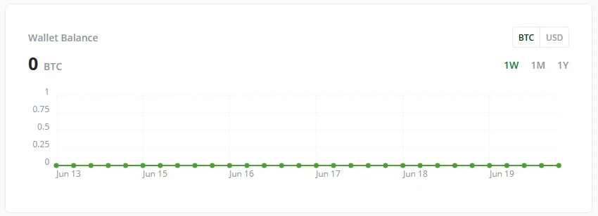


### فعالیت تراکنش


در کنار کاشی تراز Wallet، سرور BTCPay نمای کلی سریعی از پرداخت‌های در انتظار، تعداد تراکنش‌ها در ۷ روز گذشته و اینکه آیا فروشگاه شما بازپرداختی صادر کرده است یا خیر را نشان می‌دهد. با کلیک بر روی دکمه مدیریت، به بخش مدیریت پرداخت‌های در انتظار وارد می‌شوید (برای اطلاعات بیشتر درباره پرداخت‌ها در سرور BTCPay - فصل پرداخت‌ها را مطالعه کنید).


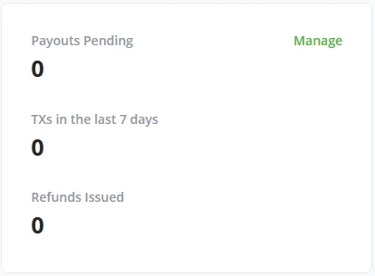


### تعادل رعد و برق


این تنها زمانی قابل مشاهده است که Lightning فعال باشد.


هنگامی که مدیر دسترسی Lightning Network را مجاز کرده است، داشبورد سرور BTCPay اکنون یک کاشی جدید با اطلاعات نود لایتنینگ شما دارد. چه مقدار BTC در کانال‌ها است، چگونه این مقدار به صورت محلی یا از راه دور (نقدینگی ورودی یا خروجی) متعادل شده است، اگر کانال‌ها در حال بسته شدن یا باز شدن هستند، و چه مقدار Bitcoin در On-Chain روی نود لایتنینگ نگهداری می‌شود.


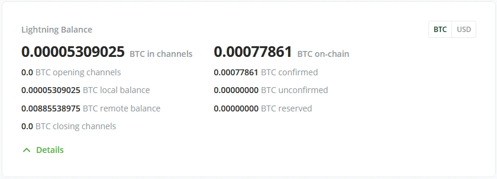


### خدمات رعد و برق


این تنها زمانی قابل مشاهده است که رعد و برق فعال باشد.


در کنار مشاهده موجودی Lightning خود در داشبورد BTCPay Server، مدیران همچنین کاشی خدمات Lightning را مشاهده خواهند کرد. در اینجا مدیران می‌توانند دکمه‌های سریع برای ابزارهایی که برای مدیریت نود Lightning خود استفاده می‌کنند را پیدا کنند؛ به عنوان مثال، Ride the Lightning یکی از ابزارهای استاندارد با BTCPay Server برای مدیریت نود Lightning است.


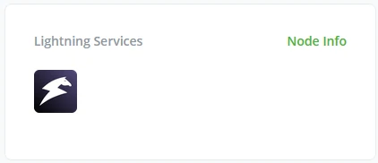


### تراکنش‌های اخیر


کاشی تراکنش‌های اخیر، جدیدترین تراکنش‌های فروشگاه شما را نشان می‌دهد. با یک کلیک، مدیر نمونه سرور BTCPay اکنون می‌تواند آخرین تراکنش را مشاهده کند و ببیند آیا نیاز به توجه به آن وجود دارد یا خیر.


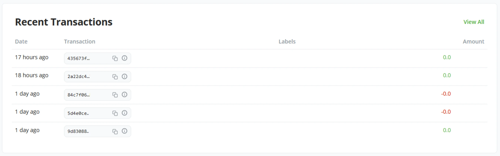


### فاکتورهای اخیر


کاشی فاکتورهای اخیر ۶ فاکتور آخر تولید شده توسط سرور BTCPay شما را نشان می‌دهد، شامل وضعیت و مبلغ Invoice. این کاشی همچنین شامل دکمه "مشاهده همه" برای دسترسی آسان به نمای کامل Invoice است.


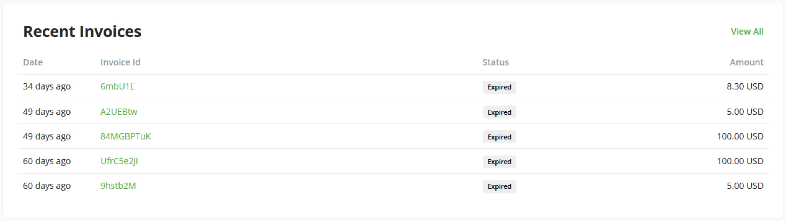


### نقطه فروش و سرمایه‌گذاری جمعی


از آنجا که سرور BTCPay مجموعه‌ای از پلاگین‌ها یا اپلیکیشن‌های استاندارد ارائه می‌دهد، فروشگاه و جمع‌آوری سرمایه دو پلاگین اصلی سرور BTCPay هستند. با هر فروشگاه و Wallet، یک کاربر سرور BTCPay می‌تواند به تعداد دلخواه فروشگاه یا جمع‌آوری سرمایه generate ایجاد کند. هر کدام یک کاشی داشبورد جدید ایجاد می‌کند که عملکرد پلاگین‌ها را نشان می‌دهد.


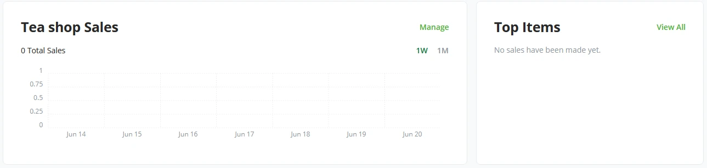


توجه داشته باشید که تفاوت جزئی بین یک کاشی نقطه فروش و کاشی تأمین مالی جمعی وجود دارد. مدیر در کاشی نقطه فروش، اقلام پرفروش را مشاهده می‌کند. در کاشی تأمین مالی جمعی، این به مزایای برتر تبدیل می‌شود. هر دو کاشی دارای دکمه‌های سریع برای مدیریت برنامه مربوطه و مشاهده فاکتورهای اخیر ایجاد شده توسط اقلام برتر یا مزایای برتر هستند.


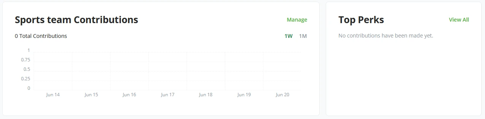


**!?توجه!?**


نمودارهای تراز و تراکنش‌های اخیر فقط برای روش پرداخت On-Chain در دسترس هستند. اطلاعات مربوط به ترازها و تراکنش‌های Lightning Network در لیست کارها قرار دارد. از نسخه 1.6.0 سرور BTCPay، ترازهای پایه Lightning Network در دسترس هستند.


### خلاصه مهارت‌ها


در این بخش، شما موارد زیر را یاد گرفتید:


- چیدمان اصلی کاشی‌ها در صفحه اصلی به عنوان داشبورد شناخته می‌شود.
- درک پایه‌ای از محتوای هر کاشی.


### بررسی ارزیابی دانش


لیست کنید تا جایی که می‌توانید کاشی‌ها را از حافظه از داشبورد.


## سرور BTCPay - تنظیمات فروشگاه


<chapterId>e8faef7b-278d-550e-a511-bc3a442daf64</chapterId>


در نرم‌افزار BTCPay Server، ما دو نوع تنظیمات را می‌شناسیم. تنظیمات خاص فروشگاه BTCPay Server، دکمه تنظیمات که در نوار منوی سمت چپ زیر داشبورد قرار دارد، و تنظیمات BTCPay Server که در پایین نوار منو درست بالای حساب کاربری قرار دارد. تنظیمات خاص سرور BTCPay Server فقط توسط مدیران سرور قابل مشاهده است.


تنظیمات فروشگاه شامل زبانه‌های متعددی است که هر مجموعه از تنظیمات را دسته‌بندی می‌کند.


- عمومی
- نرخ‌ها
- ظاهر پرداخت
- توکن‌های دسترسی
- کاربران
- نقش‌ها
- وب‌هوک‌ها
- پردازنده‌های پرداخت
- ایمیل‌ها
- فرم‌ها


### عمومی


در زبانه تنظیمات عمومی، صاحبان فروشگاه برندینگ و پیش‌فرض‌های پرداخت خود را تنظیم می‌کنند. در تنظیم اولیه فروشگاه، نامی برای فروشگاه داده شده است؛ این نام در تنظیمات عمومی تحت عنوان نام فروشگاه نمایش داده می‌شود. در اینجا، صاحب فروشگاه می‌تواند وب‌سایت خود را برای تطابق با برندینگ و یک شناسه فروشگاه برای شناسایی توسط مدیر در پایگاه داده تنظیم کند.


#### برندسازی


از آنجا که سرور BTCPay نرم‌افزار آزاد و متن‌باز (FOSS) است، صاحب فروشگاه می‌تواند برندینگ سفارشی را برای تطبیق با فروشگاه خود انجام دهد. رنگ برند را تنظیم کنید، لوگوهای برند خود را ذخیره کنید و CSS سفارشی برای صفحات عمومی/مشتری‌محور (فاکتورها، درخواست‌های پرداخت، پرداخت‌های کششی) اضافه کنید.


#### پرداخت


در تنظیمات پرداخت، صاحبان فروشگاه می‌توانند ارز پیش‌فرض فروشگاه خود را تنظیم کنند (یا در Bitcoin یا در هر ارز فیات).


#### به هر کسی اجازه دهید فاکتورها ایجاد کند


این تنظیم برای توسعه‌دهندگان یا سازندگان بر روی سرور BTCPay در نظر گرفته شده است. با روشن کردن این تنظیم برای فروشگاه شما، به دنیای خارج اجازه می‌دهد تا فاکتورها را بر روی نمونه سرور BTCPay شما ایجاد کنند.


#### افزودن هزینه اضافی (هزینه شبکه) به فاکتورها


ویژگی‌ای در BTCPay برای محافظت از فروشندگان در برابر حملات Dust یا مشتریانی که هزینه‌های بالایی را در آینده ایجاد می‌کنند، زمانی که فروشنده نیاز دارد مقدار زیادی Bitcoin را به‌طور همزمان جابجا کند. به عنوان مثال، مشتری یک Invoice به مبلغ 20 دلار ایجاد کرده و آن را به‌صورت جزئی پرداخت کرده است، به‌طوری که 1 دلار را 20 بار پرداخت کرده تا Invoice به‌طور کامل پرداخت شود. اکنون فروشنده یک تراکنش بزرگتر دارد که هزینه Mining را افزایش می‌دهد در صورتی که فروشنده تصمیم بگیرد این وجوه را بعداً جابجا کند. به‌طور پیش‌فرض، BTCPay هزینه شبکه اضافی را به مبلغ کل Invoice اضافه می‌کند تا این هزینه را برای فروشنده پوشش دهد زمانی که Invoice در چندین تراکنش پرداخت می‌شود. BTCPay چندین گزینه برای سفارشی‌سازی این ویژگی محافظتی ارائه می‌دهد. شما می‌توانید یک هزینه شبکه اعمال کنید:


- تنها در صورتی که مشتری بیش از یک پرداخت برای Invoice انجام دهد (در مثال بالا، اگر مشتری یک Invoice به مبلغ 20\$ ایجاد کرده و 1\$ پرداخت کرده باشد، مبلغ کل Invoice باقی‌مانده اکنون 19\$ + هزینه شبکه است. هزینه شبکه پس از اولین پرداخت اعمال می‌شود)
- در هر پرداخت (از جمله اولین پرداخت، در مثال ما، مجموعاً 20\$ + هزینه شبکه بلافاصله، حتی در اولین پرداخت)
- هرگز هزینه شبکه را اضافه نکنید (هزینه شبکه را به طور کامل غیرفعال می‌کند)


در حالی که از تراکنش‌های Dust محافظت می‌کند، اگر به درستی ارتباط برقرار نشود، می‌تواند تأثیر منفی بر کسب‌وکارها بگذارد. مشتریان ممکن است سوالات بیشتری داشته باشند و فکر کنند که شما از آن‌ها بیش از حد هزینه می‌گیرید.


#### Invoice منقضی می‌شود اگر کل مبلغ پس از چه مدت پرداخت نشده باشد؟


تایمر Invoice به طور پیش‌فرض بر روی 15 دقیقه تنظیم شده است. تایمر یک مکانیزم حفاظتی در برابر نوسانات است زیرا مقدار Bitcoin را بر اساس نرخ‌های Bitcoin به فیات قفل می‌کند. اگر مشتری در مدت زمان تعیین شده Invoice را پرداخت نکند، Invoice منقضی شده در نظر گرفته می‌شود. به محض اینکه تراکنش در Blockchain قابل مشاهده باشد (0-تأییدیه)، Invoice "پرداخت شده" در نظر گرفته می‌شود اما زمانی "کامل" محسوب می‌شود که به تعداد تأییدیه‌هایی که فروشنده تعریف کرده است برسد (معمولاً 1-6). تایمر به صورت دقیقه‌ای قابل تنظیم است.


#### آیا Invoice حتی اگر مبلغ پرداختی X٪ کمتر از حد انتظار باشد، پرداخت می‌شود؟


هنگامی که یک مشتری از Exchange Wallet برای پرداخت مستقیم یک Invoice استفاده می‌کند، Exchange یک کارمزد کوچک دریافت می‌کند. این بدان معناست که چنین Invoice به طور کامل تکمیل شده در نظر گرفته نمی‌شود. Invoice وضعیت "پرداخت شده به صورت جزئی" را دریافت می‌کند. اگر یک فروشنده بخواهد فاکتورهای کم‌پرداخت را بپذیرد، می‌توانید نرخ درصد را اینجا تنظیم کنید.


### نرخ‌ها


در سرور BTCPay، زمانی که یک Invoice تولید می‌شود، همیشه به جدیدترین و دقیق‌ترین قیمت Bitcoin به فیات نیاز دارد. هنگام ایجاد یک فروشگاه جدید در سرور BTCPay، از مدیران خواسته می‌شود که منبع قیمت ترجیحی خود را تنظیم کنند؛ پس از راه‌اندازی فروشگاه، صاحبان فروشگاه همیشه می‌توانند منبع قیمت خود را در این زبانه تغییر دهند.


#### اسکریپت‌نویسی قوانین نرخ پیشرفته


عمدتاً توسط کاربران حرفه‌ای استفاده می‌شود. اگر فعال شود، صاحبان فروشگاه می‌توانند اسکریپت‌هایی پیرامون رفتار قیمت و نحوه شارژ مشتریان خود ایجاد کنند.


#### آزمایش


یک مکان سریع برای آزمایش جفت ارزهای مورد علاقه شما. این همچنین شامل یک ویژگی برای بررسی جفت ارزهای پیش‌فرض از طریق پرس‌وجوی REST است.


### ظاهر پرداخت


برگه ظاهر پرداخت با تنظیمات خاص Invoice و روش پرداخت پیش‌فرض آغاز می‌شود و روش‌های پرداخت خاصی را زمانی که الزامات تعیین‌شده برآورده شوند، فعال می‌کند.


#### Invoice تنظیمات


روش‌های پرداخت پیش‌فرض. سرور BTCPay در یک پیکربندی استاندارد سه گزینه دارد.


- BTC (On-Chain)
- BTC (LNURL-pay)
- BTC (off-chain & Lightning)


ما می‌توانیم پارامترهایی برای فروشگاه خود تنظیم کنیم، به‌طوری‌که مشتری فقط زمانی با Lightning تعامل داشته باشد که قیمت کمتر از مقدار X باشد و برعکس برای تراکنش‌های On-Chain زمانی که X بیشتر از Y است همیشه گزینه پرداخت On-Chain را ارائه دهد.


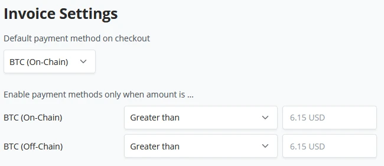


#### وارسی


از زمان انتشار BTCPay Server نسخه 1.7، یک Checkout جدید به نام Interface، Checkout V2 معرفی شد. از زمان انتشار نسخه 1.9، استانداردسازی شد، اما مدیران و صاحبان فروشگاه‌ها همچنان می‌توانند پرداخت را به نسخه قبلی تنظیم کنند. با استفاده از گزینه "استفاده از پرداخت کلاسیک"، صاحب فروشگاه می‌تواند فروشگاه را به تجربه پرداخت قبلی بازگرداند. BTCPay Server همچنین مجموعه‌ای از پیش‌تنظیمات برای تجارت آنلاین یا تجربه درون فروشگاهی دارد.


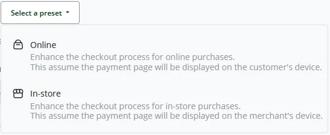


هنگامی که یک مشتری با فروشگاه تعامل می‌کند و یک Invoice تولید می‌کند، یک زمان انقضا برای Invoice وجود دارد. به طور پیش‌فرض، سرور BTCPay این زمان را به 5 دقیقه تنظیم می‌کند و مدیر می‌تواند این زمان را به هر مقداری که مناسب می‌بیند تنظیم کند. صفحه پرداخت می‌تواند با بررسی پارامترهای زیر بیشتر سفارشی‌سازی شود:


- پرداخت را با نمایش کاغذپاش جشن بگیرید
- نمایش سربرگ فروشگاه (نام و لوگو)
- دکمه "پرداخت در Wallet" را نشان دهید
- یکپارچه‌سازی URL/QRهای پرداخت On-Chain و off-chain
- مقادیر پرداخت لایتنینگ را به ساتوشی نمایش دهید.
- تشخیص خودکار زبان در پرداخت


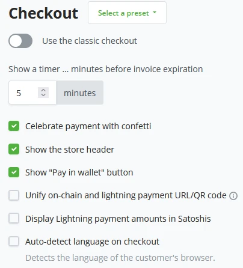


وقتی که تشخیص خودکار زبان تنظیم نشده است، سرور BTCPay به طور پیش‌فرض انگلیسی را نمایش می‌دهد. یک صاحب فروشگاه می‌تواند این پیش‌فرض را به زبان مورد نظر خود تغییر دهد.


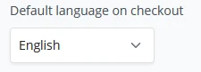


روی منوی کشویی کلیک کنید و صاحبان فروشگاه می‌توانند یک عنوان HTML سفارشی برای نمایش در صفحه پرداخت تنظیم کنند.


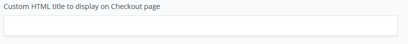


برای اطمینان از اینکه مشتری روش پرداخت خود را می‌داند، صاحب فروشگاه می‌تواند به‌طور صریح تنظیم کند که در هنگام پرداخت همیشه از کاربران بخواهد روش پرداخت مورد نظر خود را انتخاب کنند. هنگامی که Invoice پرداخت می‌شود، سرور BTCPay به مشتری اجازه می‌دهد به فروشگاه اینترنتی بازگردد. صاحبان فروشگاه می‌توانند این بازگشت را پس از پرداخت مشتری به‌طور خودکار تنظیم کنند.


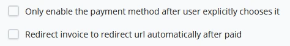


#### رسید عمومی


در تنظیمات رسید عمومی، صاحب فروشگاه می‌تواند صفحات رسید را به صورت عمومی تنظیم کند و لیست پرداخت را در صفحه رسید نشان دهد و کد QR رسید را برای دسترسی آسان مشتری به صورت دیجیتالی نمایش دهد.


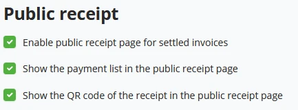


### توکن‌های دسترسی


توکن‌های دسترسی برای جفت شدن با یکپارچه‌سازی‌های خاص تجارت الکترونیک یا یکپارچه‌سازی‌های سفارشی ساخته شده استفاده می‌شوند.


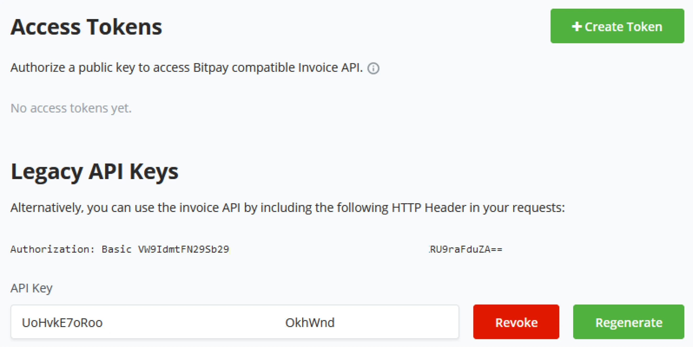


### کاربران


کاربران فروشگاه جایی هستند که صاحب فروشگاه می‌تواند اعضای کارکنان خود، حساب‌های آن‌ها و دسترسی به فروشگاه را مدیریت کند. پس از اینکه اعضای کارکنان حساب‌های خود را ایجاد کردند، صاحب فروشگاه می‌تواند کاربران خاصی را به عنوان کاربران مهمان یا صاحبان فروشگاه اضافه کند. برای تعریف بیشتر نقش کارکنان، به بخش بعدی در مورد "تنظیمات فروشگاه BTCPay Server - نقش‌ها" مراجعه کنید.


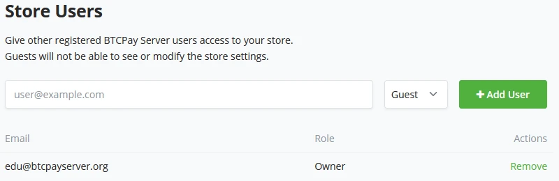


### نقش‌ها


ممکن است یک صاحب فروشگاه نقش‌های استاندارد کاربر را به اندازه کافی مهم نداند. در تنظیمات نقش‌های سفارشی، یک صاحب فروشگاه می‌تواند نیازهای دقیق هر نقش را در کسب‌وکار خود تعریف کند.


(1) برای ایجاد یک نقش جدید، روی دکمه "+ Add role" کلیک کنید.


(2) یک نام نقش وارد کنید، برای مثال، "Cashier".


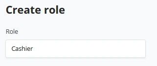


(3) مجوزهای فردی را برای نقش پیکربندی کنید.


- فروشگاه‌های خود را تغییر دهید.
- مدیریت حساب‌های Exchange مرتبط با فروشگاه‌های شما.
  - مشاهده حساب‌های Exchange مرتبط با فروشگاه‌های شما.
- پرداخت‌های کششی خود را مدیریت کنید.
- ایجاد پرداخت‌های کششی.
  - ایجاد پرداخت‌های کششی غیرمجاز.
- فاکتورها را اصلاح کنید.
  - مشاهده فاکتورها.
  - یک Invoice ایجاد کنید.
  - ایجاد فاکتورها از نودهای لایتنینگ مرتبط با فروشگاه‌های شما.
- فروشگاه‌های خود را مشاهده کنید.
  - مشاهده فاکتورها.
  - مشاهده درخواست‌های پرداخت خود.
  - وب‌هوک‌های فروشگاه‌ها را تغییر دهید.
- درخواست‌های پرداخت خود را اصلاح کنید.
  - مشاهده درخواست‌های پرداخت خود.
- از نودهای لایتنینگ مرتبط با فروشگاه‌های خود استفاده کنید.
  - فاکتورهای لایتنینگ مرتبط با فروشگاه‌های خود را مشاهده کنید.
  - ایجاد فاکتورها از نودهای لایتنینگ مرتبط با فروشگاه‌های شما.
- وجوه را به حساب‌های Exchange مرتبط با فروشگاه‌های خود واریز کنید.
- برداشت وجوه از حساب‌های Exchange به فروشگاه شما.
- وجوه تجاری را در حساب‌های Exchange فروشگاه خود معامله کنید.


وقتی نقش ایجاد می‌شود، نام ثابت است و نمی‌توان آن را بعداً در حالت ویرایش تغییر داد.


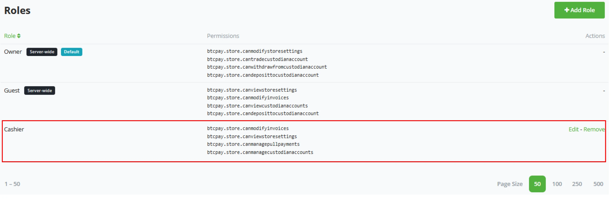


### وب‌هوک‌ها


در BTCPay Server، ایجاد یک "Webhook" جدید نسبتاً آسان است. در تنظیمات فروشگاه BTCPay Server - تب Webhooks، صاحب فروشگاه می‌تواند به راحتی با کلیک بر روی "+ Create Webhook" یک webhook جدید ایجاد کند. Webhooks به BTCPay Server اجازه می‌دهند تا رویدادهای HTTP مرتبط با فروشگاه شما را به سرورهای دیگر یا یکپارچه‌سازی‌های تجارت الکترونیک ارسال کند.


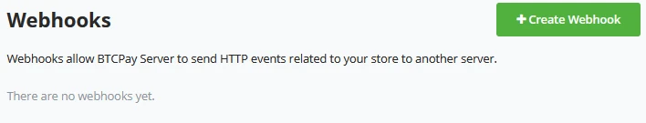


اکنون در نمای ایجاد یک Webhook هستید. مطمئن شوید که URL Payload خود را می‌دانید و آن را در سرور BTCPay خود جای‌گذاری کنید. هنگامی که URL payload را جای‌گذاری کردید، در زیر آن، رمز webhook نمایش داده می‌شود. رمز webhook را کپی کرده و در نقطه پایانی ارائه دهید. وقتی همه چیز تنظیم شد، می‌توانید در سرور BTCPay به تحویل خودکار تغییر وضعیت دهید. ما سعی خواهیم کرد هر تحویل ناموفق را پس از 10 ثانیه، 1 دقیقه و تا 6 بار پس از 10 دقیقه دوباره تحویل دهیم. می‌توانید بین هر رویداد تغییر وضعیت دهید یا رویدادها را بر اساس نیازهای خود مشخص کنید. حتماً webhook را فعال کرده و روی افزودن webhook کلیک کنید تا آن را ذخیره کنید.


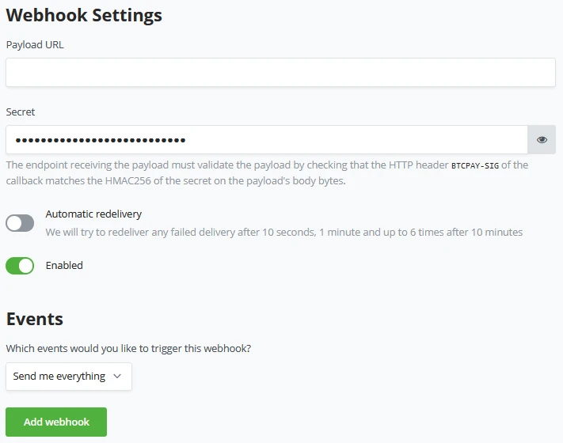


وب‌هوک‌ها قرار نیست با API بیت‌پی سازگار باشند. دو IPN جداگانه (در اصطلاح بیت‌پی: "اعلان‌های پرداخت فوری") در سرور BTCPay وجود دارد.


- وب‌هوک
- اعلان‌ها


فقط هنگام ایجاد فاکتورها از طریق API بیت‌پی از URL اعلان استفاده کنید.


### پردازنده‌های پرداخت


پردازنده‌های پرداخت با مفهوم پرداخت‌ها در BTCPay Server همکاری می‌کنند. یک جمع‌کننده پرداخت برای دسته‌بندی چندین تراکنش و ارسال آن‌ها به‌صورت یکجا. با پردازنده‌های پرداخت، صاحب فروشگاه می‌تواند پرداخت‌های دسته‌بندی‌شده را به‌صورت خودکار انجام دهد. BTCPay Server دو روش پرداخت خودکار ارائه می‌دهد، On-Chain و off-chain (LN).


صاحب فروشگاه می‌تواند هر دو پردازشگر پرداخت را به‌صورت جداگانه کلیک و پیکربندی کند. ممکن است صاحب فروشگاه بخواهد پردازشگر On-Chain را فقط یک‌بار در هر X ساعت اجرا کند، در حالی که off-chain ممکن است هر چند دقیقه یک‌بار اجرا شود. برای On-Chain، شما همچنین می‌توانید هدفی را تعیین کنید که در کدام بلوک باید گنجانده شود. به‌طور پیش‌فرض، این مقدار روی 1 (یا بلوک بعدی موجود) تنظیم شده است. توجه داشته باشید که تنظیم پردازشگر پرداخت off-chain فقط تایمر فاصله زمانی دارد و هدف بلوک ندارد. پرداخت‌های Lightning Network فوری هستند.


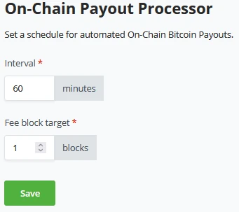

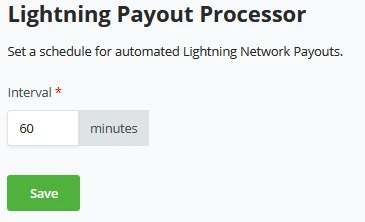


صاحبان فروشگاه تنها در صورتی می‌توانند پردازنده On-Chain را پیکربندی کنند که یک Hot-Wallet به فروشگاهشان متصل باشد.


پس از راه‌اندازی یک پردازشگر پرداخت، می‌توانید به سرعت آن را حذف یا تغییر دهید با بازگشت به زبانه پردازشگر پرداخت در تنظیمات فروشگاه BTCPay Server.


**!?توجه!?**


پردازشگر پرداخت On-Chain - پردازشگر پرداخت‌های زنجیره‌ای تنها می‌تواند بر روی فروشگاهی کار کند که با Hot Wallet متصل شده پیکربندی شده باشد. اگر Hot Wallet متصل نشده باشد، سرور BTCPay کلیدهای Wallet را نگه نمی‌دارد و قادر به پردازش خودکار پرداخت‌ها نخواهد بود.


### ایمیل‌ها


سرور BTCPay می‌تواند از ایمیل‌ها برای اعلان‌ها استفاده کند یا، در صورت تنظیم صحیح، برای بازیابی حساب‌هایی که در این نمونه ساخته شده‌اند، زیرا به‌طور استاندارد سرور BTCPay هنگام گم شدن رمز عبور، به عنوان مثال، ایمیلی ارسال نمی‌کند.


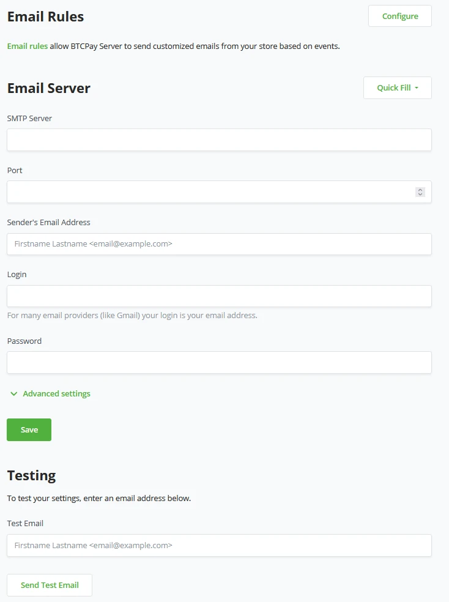


قبل از اینکه یک صاحب فروشگاه بتواند قوانین ایمیل را برای رویدادهای خاص فروشگاه خود تنظیم کند، باید برخی تنظیمات اولیه ایمیل را انجام دهیم. سرور BTCPay به این تنظیمات نیاز دارد تا ایمیل‌ها را برای رویدادهای مبتنی بر فروشگاه شما یا برای بازنشانی رمز عبور ارسال کند.


سرور BTCPay با استفاده از گزینه "پر کردن سریع" پر کردن این اطلاعات را آسان‌تر کرده است:


- Gmail.com
- Yahoo.com
- میلگان
- آفیس365
- سندگرید


با استفاده از گزینه پر کردن سریع، سرور BTCPay فیلدهای مربوط به سرور SMTP و پورت را به‌طور خودکار پر می‌کند؛ اکنون، صاحب فروشگاه فقط نیاز دارد تا اطلاعات کاربری خود را در یک ایمیل Address، ورود (که معمولاً برابر با ایمیل شما Address است)، و رمز عبور خود وارد کند. گزینه پیشرفته‌ای که سرور BTCPay در تنظیمات ایمیل ارائه می‌دهد، غیرفعال کردن بررسی‌های امنیتی گواهی TLS است؛ به‌طور پیش‌فرض، این گزینه فعال است.


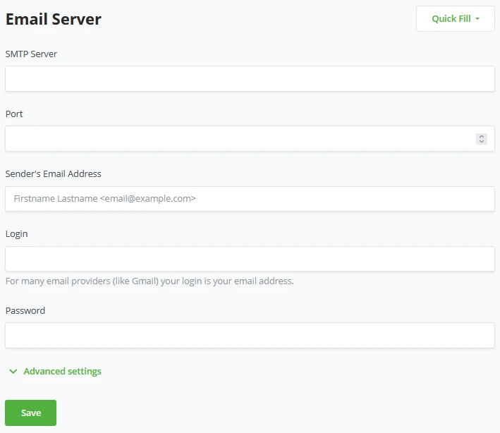


با قوانین ایمیل، یک صاحب فروشگاه می‌تواند رویدادهای خاصی را برای ارسال ایمیل به آدرس‌های ایمیل مشخص تنظیم کند.


- Invoice ایجاد شد
- Invoice دریافت پرداخت
- Invoice پردازش
- Invoice منقضی شد
- Invoice حل و فصل شد
- Invoice نامعتبر
- Invoice پرداخت تسویه شد


اگر مشتری ایمیل Address را ارائه داده باشد، این تریگرها می‌توانند اطلاعات را نیز به مشتری ارسال کنند. صاحبان فروشگاه می‌توانند خط موضوع را از پیش پر کنند تا مشخص شود چرا این ایمیل ارسال شده و چه تریگری باعث آن شده است.


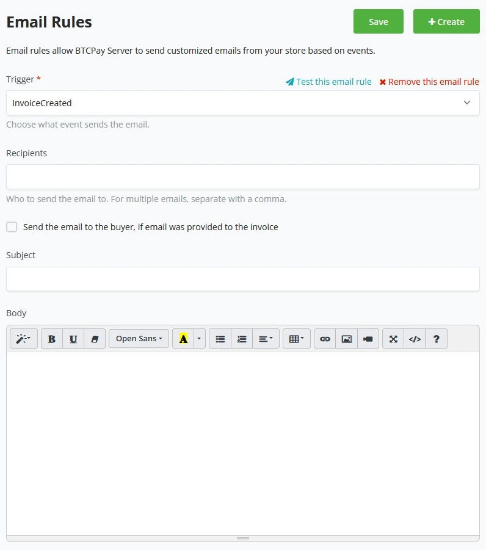


### فرم‌ها


از آنجا که سرور BTCPay هیچ داده‌ای جمع‌آوری نمی‌کند، ممکن است صاحب فروشگاه بخواهد یک فرم سفارشی به تجربه پرداخت خود اضافه کند؛ به این ترتیب، صاحب فروشگاه می‌تواند اطلاعات اضافی از مشتری خود جمع‌آوری کند. سازنده فرم سرور BTCPay از دو بخش تشکیل شده است، یک نمای بصری و یک نمای کد پیشرفته‌تر از فرم‌ها.


هنگام ایجاد یک فرم جدید، BTCPay Server یک پنجره جدید باز می‌کند که اطلاعات پایه‌ای را در مورد آنچه می‌خواهید فرم جدید شما درخواست کند، می‌پرسد. در ابتدا، صاحب فروشگاه باید یک نام واضح به فرم جدید خود بدهد، این نام پس از تنظیم قابل تغییر نیست.


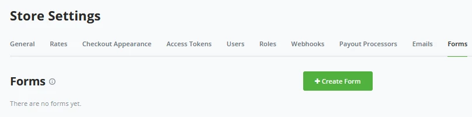


پس از اینکه صاحب فروشگاه به فرم یک نام می‌دهد، می‌توانید سوئیچ "اجازه استفاده عمومی از فرم" را به حالت روشن تغییر دهید و فرم به Green تبدیل می‌شود. این کار به این دلیل است که فرم در هر مکان مشتری‌محور استفاده شود. به عنوان مثال، اگر صاحب فروشگاه یک Invoice جداگانه ایجاد کند که از طریق نقطه فروش او نباشد، ممکن است همچنان بخواهد اطلاعات را از مشتری جمع‌آوری کند؛ این سوئیچ به حالت روشن اجازه می‌دهد که آن اطلاعات جمع‌آوری شود.


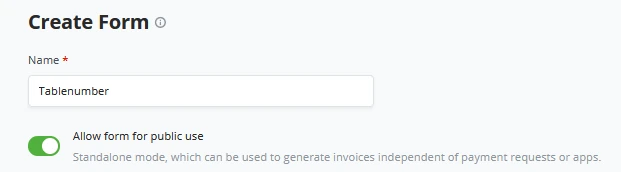


هر فرم با حداقل ۱ فیلد فرم جدید شروع می‌شود. یک صاحب فروشگاه می‌تواند نوع فیلد را انتخاب کند؛


- متن
- عدد
- رمز عبور
- ایمیل
- نشانی اینترنتی
- شماره‌های تلفن
- تاریخ
- فیلدهای مخفی
- فیلدست
- یک بخش متنی برای نظرات آزاد.
- انتخابگر گزینه


هر نوع با پارامترهای خاص خود برای پر کردن همراه است. صاحب فروشگاه می‌تواند آن را به دلخواه خود تنظیم کند. در زیر اولین فیلد ایجاد شده، صاحبان فروشگاه می‌توانند به افزودن فیلدهای جدید به این فرم ادامه دهند.


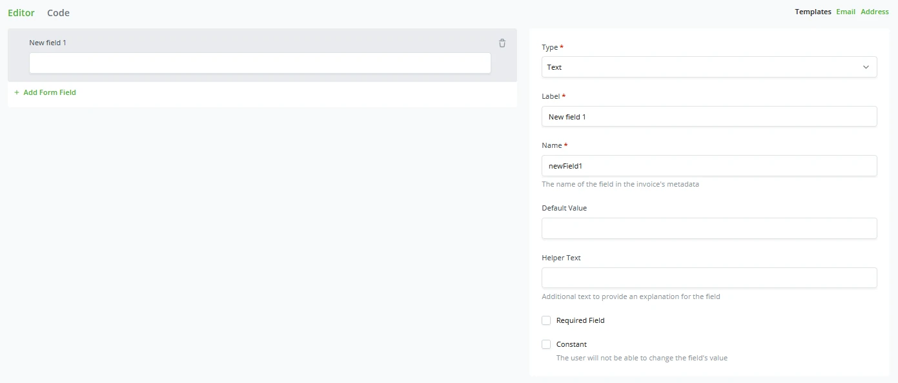


#### فرم‌های سفارشی پیشرفته


سرور BTCPay همچنین به شما امکان می‌دهد فرم‌ها را در کد بسازید. به‌ویژه JSON. به جای نگاه کردن به ویرایشگر، صاحبان فروشگاه می‌توانند روی دکمه CODE که درست در کنار ویرایشگر قرار دارد کلیک کنند و وارد کد فرم‌های خود شوند. در تعریف یک فیلد، تنها فیلدهای زیر می‌توانند تنظیم شوند؛ مقادیر فیلدها در متادیتای Invoice ذخیره می‌شوند:


| Field                 | Description                                                                                                                                                                                                                                                                                                                                                                                                                                                        |
| --------------------- | ------------------------------------------------------------------------------------------------------------------------------------------------------------------------------------------------------------------------------------------------------------------------------------------------------------------------------------------------------------------------------------------------------------------------------------------------------------------ |
| .fields.constant      | If true, the .value must be set in the form definition, and the user will not be able to change the field's value. ( example: the form definition's version)                                                                                                                                                                                                                                                                                                       |
| .fields.type          | The HTML input type text, radio, checkbox, password, hidden, button, color, date, datetime-local, month, week, time, email, number, range, search, url, select, tel                                                                                                                                                                                                                                                                                                |
| .fields.options       | If .fields.type is select, the list of selectable values                                                                                                                                                                                                                                                                                                                                                                                                           |
| .fields.options.text  | The text displayed for this option                                                                                                                                                                                                                                                                                                                                                                                                                                 |
| .fields.options.value | The value of the field if this option is selected                                                                                                                                                                                                                                                                                                                                                                                                                  |
| .fields.type=fieldset | Create a HTML fieldset around the children .fields.fields (see below)                                                                                                                                                                                                                                                                                                                                                                                              |
| .fields.name          | The JSON property name of the field as it will appear in the invoice's metadata                                                                                                                                                                                                                                                                                                                                                                                    |
| .fields.value         | The default value of the field                                                                                                                                                                                                                                                                                                                                                                                                                                     |
| .fields.required      | if true, the field will be required                                                                                                                                                                                                                                                                                                                                                                                                                                |
| .fields.label         | The label of the field                                                                                                                                                                                                                                                                                                                                                                                                                                             |
| .fields.helpText      | Additional text to provide an explanation for the field.                                                                                                                                                                                                                                                                                                                                                                                                           |
| .fields.fields        | You can organize your fields in a hierarchy, allowing child fields to be nested within the invoice’s metadata. This structure can help you better organize and manage the collected information, making it easier to access and interpret. For example, if you have a form that collects customer information, you can group the fields under a parent field called customer. Within this parent field, you might have child fields like name, Email, and address. |

نام فیلد نشان‌دهنده نام خاصیت JSON است که مقدار ارائه‌شده توسط کاربر را در متادیتای Invoice ذخیره می‌کند. برخی از نام‌های شناخته‌شده می‌توانند تفسیر شوند و تنظیمات Invoice را تغییر دهند.


| Field name       | Description            |
| ---------------- | ---------------------- |
| invoice_amount   | The invoice's amount   |
| invoice_currency | The invoice's currency |

می‌توانید فیلدهای فرم Invoice را به‌طور خودکار با افزودن رشته‌های پرس‌وجو به URL فرم، مانند "?your_field=value" پیش‌پر کنید.


در اینجا چند مورد استفاده برای این ویژگی آورده شده است:


- کمک به ورودی کاربر: فیلدها را با اطلاعات شناخته شده مشتری از پیش پر کنید تا تکمیل فرم برای آنها آسان‌تر شود. به عنوان مثال، اگر قبلاً ایمیل مشتری Address را می‌دانید، می‌توانید فیلد ایمیل را از پیش پر کنید تا در زمان آنها صرفه‌جویی شود.
- شخصی‌سازی: فرم را بر اساس ترجیحات یا بخش‌بندی مشتری سفارشی کنید. به عنوان مثال، اگر سطوح مختلف مشتری دارید، می‌توانید فرم را با داده‌های مرتبط مانند سطح عضویت یا پیشنهادات خاص آن‌ها از پیش پر کنید.
- ردیابی: منبع بازدیدهای مشتری را با استفاده از فیلدهای مخفی و مقادیر از پیش پر شده ردیابی کنید. به عنوان مثال، می‌توانید لینک‌هایی با مقادیر از پیش پر شده utm_media برای هر کانال بازاریابی (مانند توییتر، فیس‌بوک، ایمیل) ایجاد کنید. این به شما کمک می‌کند تا اثربخشی تلاش‌های بازاریابی خود را تحلیل کنید.
- آزمایش A/B: پیش‌پر کردن فیلدها با مقادیر مختلف برای آزمایش نسخه‌های مختلف فرم، به شما امکان می‌دهد تجربه کاربری و نرخ تبدیل را بهینه کنید.


### خلاصه مهارت‌ها


در این بخش، شما موارد زیر را یاد گرفتید:


- طرح‌بندی و عملکرد زبانه‌ها در تنظیمات فروشگاه
- گزینه‌های متعددی برای تنظیم دقیق مدیریت نرخ‌های پایه Exchange، پرداخت‌های جزئی، پرداخت‌های کم‌تر از مقدار مورد نیاز و موارد دیگر.
- ظاهر پرداخت را سفارشی کنید، از جمله فعال‌سازی زنجیره اصلی وابسته به قیمت در مقابل Lightning در فاکتورها.
- مدیریت سطوح دسترسی و مجوزهای فروشگاه در نقش‌های مختلف.
- پیکربندی ایمیل‌های خودکار و محرک‌های آن‌ها
- ایجاد فرم‌های سفارشی برای جمع‌آوری اطلاعات اضافی مشتری در هنگام پرداخت.


### ارزیابی‌های دانش


#### بررسی KA


تفاوت بین تنظیمات فروشگاه و تنظیمات سرور چیست؟


#### فرضی KA


برخی گزینه‌هایی که ممکن است در Checkout Appearance > Invoice Settings انتخاب کنید و دلیل آن‌ها را توضیح دهید.


## BTCPay Server - تنظیمات سرور


<chapterId>1dd858a2-49ea-586b-9bc1-75a65f508df6</chapterId>


سرور BTCPay شامل دو نمای تنظیمات مختلف است. یکی به تنظیمات فروشگاه اختصاص دارد و دیگری به تنظیمات سرور. دومی فقط در دسترس است اگر شما مدیر سرور باشید و نه برای صاحبان فروشگاه. مدیران سرور می‌توانند کاربران را اضافه کنند، نقش‌های سفارشی ایجاد کنند، سرور ایمیل را پیکربندی کنند، سیاست‌ها را تنظیم کنند، وظایف نگهداری را اجرا کنند، تمام خدمات متصل به سرور BTCPay را بررسی کنند، فایل‌ها را به سرور آپلود کنند یا لاگ‌ها را بررسی کنند.


### کاربران


همان‌طور که در بخش قبلی ذکر شد، مدیران سرور می‌توانند با اضافه کردن کاربران به زبانه کاربران، آن‌ها را به سرور خود دعوت کنند.


### نقش‌های سفارشی در کل سرور


سرور BTCPay دو نوع نقش سفارشی را می‌شناسد، نقش‌های سفارشی خاص فروشگاه و نقش‌های سفارشی سراسری در تنظیمات سرور BTCPay. هر دو مجموعه‌ای مشابه از مجوزها دارند؛ با این حال، اگر از طریق تنظیمات سرور BTCpay - زبانه نقش‌ها تنظیم شود، نقش اعمال شده به صورت سراسری خواهد بود و به چندین فروشگاه اعمال می‌شود. به یک برچسب "سراسری" برای نقش‌های سفارشی در تنظیمات سرور توجه کنید.


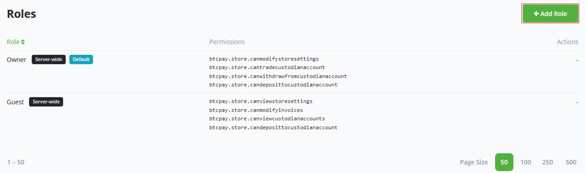


### نقش‌های سفارشی در کل سرور


مجموعه مجوزهای نقش‌های سفارشی در کل سرور؛


- فروشگاه‌های خود را تغییر دهید.
- حساب‌های Exchange مرتبط با فروشگاه‌های خود را مدیریت کنید.
  - مشاهده حساب‌های Exchange مرتبط با فروشگاه‌های شما.
- پرداخت‌های کششی خود را مدیریت کنید.
- ایجاد پرداخت‌های کششی.
  - ایجاد پرداخت‌های کششی غیرمجاز.
- فاکتورها را اصلاح کنید.
  - مشاهده فاکتورها.
  - یک Invoice ایجاد کنید.
  - ایجاد فاکتورها از نودهای لایتنینگ مرتبط با فروشگاه‌های شما.
- فروشگاه‌های خود را مشاهده کنید.
  - مشاهده فاکتورها.
  - مشاهده درخواست‌های پرداخت خود.
  - وب‌هوک‌های فروشگاه‌ها را تغییر دهید.
- درخواست‌های پرداخت خود را تغییر دهید.
  - مشاهده درخواست‌های پرداخت خود.
- از نودهای لایتنینگ مرتبط با فروشگاه‌های خود استفاده کنید.
  - فاکتورهای لایتنینگ مرتبط با فروشگاه‌های خود را مشاهده کنید.
  - ایجاد فاکتورها از نودهای لایتنینگ مرتبط با فروشگاه‌های شما.
- وجوه را به حساب‌های Exchange مرتبط با فروشگاه‌های خود واریز کنید.
- برداشت وجوه از حساب‌های Exchange به فروشگاه شما.
- وجوه تجاری را در حساب‌های Exchange فروشگاه خود معامله کنید.


**!?توجه!?**


هنگامی که نقش ایجاد می‌شود، نام ثابت است و نمی‌توان آن را بعداً در حالت ویرایش تغییر داد.


### ایمیل


تنظیمات ایمیل در سطح سرور شبیه به تنظیمات ایمیل خاص فروشگاه است. با این حال، این تنظیم نه تنها محرک‌ها برای فروشگاه‌ها یا گزارش‌های مدیر را مدیریت می‌کند. این تنظیمات ایمیل همچنین بازیابی رمز عبور را در سرور BTCPay در هنگام ورود به سیستم فراهم می‌کند. این تنظیمات به طور مشابه با تنظیمات خاص فروشگاه کار می‌کند؛ مدیران می‌توانند به سرعت پارامترهای ایمیل خود را پر کرده و اطلاعات ورود ایمیل خود را وارد کنند، و سرور اکنون می‌تواند ایمیل‌ها را ارسال کند.


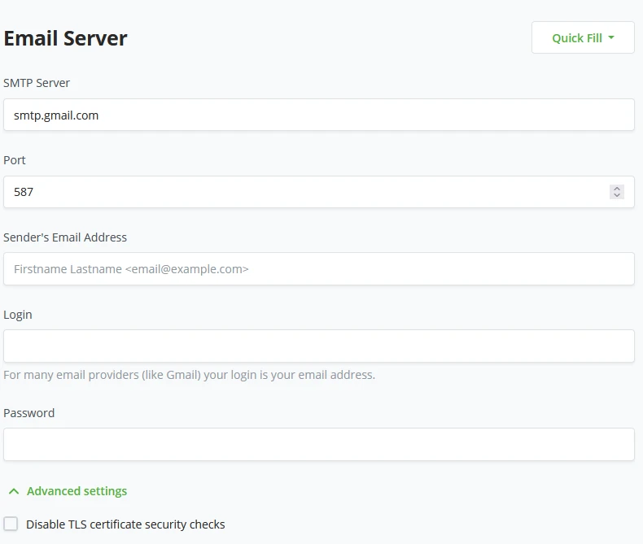


### سیاست‌ها


مدیران سیاست BTCPay Server می‌توانند برخی تنظیمات را در موضوعاتی مانند تنظیمات کاربران موجود، تنظیمات کاربران جدید، تنظیمات اعلان‌ها و تنظیمات نگهداری تنظیم کنند. این تنظیمات برای ثبت کاربران جدید به عنوان مدیر یا کاربران عادی یا حتی مخفی کردن BTCPay Server از موتورهای جستجو با افزودن به هدر سرور شما طراحی شده‌اند.


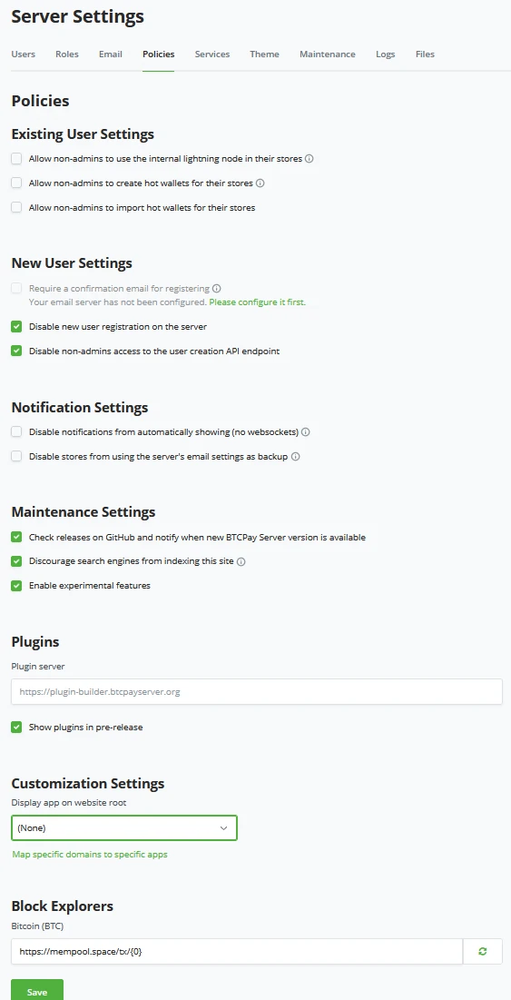


#### تنظیمات کاربر موجود


گزینه‌های موجود در اینجا از نقش‌های سفارشی جدا هستند. این مجوزهای اضافی ممکن است یک فروشگاه یا صاحب فروشگاه را در معرض حملات قرار دهند. سیاست‌هایی که ممکن است به کاربران موجود اضافه شوند:


- اجازه دهید کاربران غیر مدیر از نود داخلی Lightning در فروشگاه‌های خود استفاده کنند.
  - این به صاحبان فروشگاه اجازه می‌دهد تا از نود لایتنینگ مدیر سرور و در نتیجه از وجوه او استفاده کنند! مراقب باشید، این یک راه‌حل برای دادن دسترسی به لایتنینگ نیست.
- اجازه دهید کاربران غیر مدیر کیف پول‌های Hot را برای فروشگاه‌های خود ایجاد کنند.
  - این به هر کسی که یک حساب کاربری در نمونه سرور BTCPay شما دارد اجازه می‌دهد تا Hot-wallets ایجاد کند و بازیابی seed خود را در سرور مدیر ذخیره کند. این ممکن است مدیر را مسئول نگهداری وجوه شخص ثالث کند!
- اجازه به کاربران غیر مدیر برای وارد کردن کیف‌پول‌های Hot برای فروشگاه‌هایشان.
  - مشابه به موضوع قبلی ایجاد کیف پول‌های Hot، این سیاست اجازه وارد کردن یک Hot Wallet را می‌دهد، با همان خطراتی که در بخش ایجاد کیف پول‌های Hot ذکر شده است.


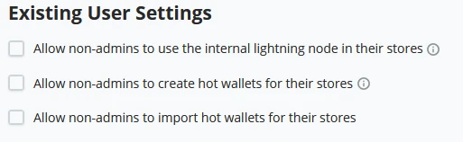


#### تنظیمات کاربر جدید


ما می‌توانیم برخی تنظیمات مهم را برای مدیریت کاربران جدیدی که به سرور می‌آیند، تنظیم کنیم. می‌توانیم یک ایمیل تأیید برای ثبت‌نام‌های جدید تنظیم کنیم، ایجاد کاربر جدید از طریق صفحه ورود را غیرفعال کنیم و دسترسی غیرمدیران به ایجاد کاربر از طریق API را محدود کنیم.


- برای ثبت‌نام نیاز به یک ایمیل تأیید دارید.
  - مدیر سرور باید یک سرور ایمیل راه‌اندازی کرده باشد!
- غیرفعال کردن ثبت‌نام کاربر جدید در سرور
- دسترسی کاربران غیر مدیر به نقطه پایانی API ایجاد کاربر را غیرفعال کنید.


به طور پیش‌فرض، سرور BTCPay گزینه غیرفعال کردن ثبت‌نام کاربر جدید را فعال کرده و دسترسی غیرمدیران به نقطه پایانی API ایجاد کاربر را غیرفعال کرده است. این به دلیل جنبه امنیتی است که هیچ فرد تصادفی که ممکن است به صفحه ورود BTCPay سرور شما دسترسی پیدا کرده باشد، نتواند شروع به ایجاد حساب کند.


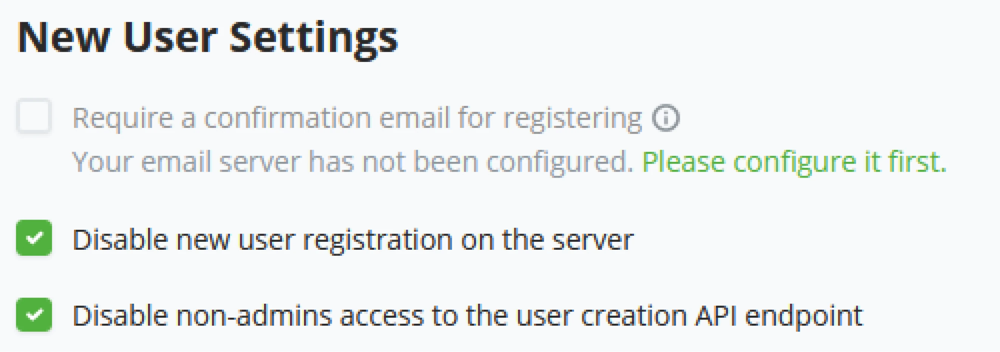


#### تنظیمات اعلان


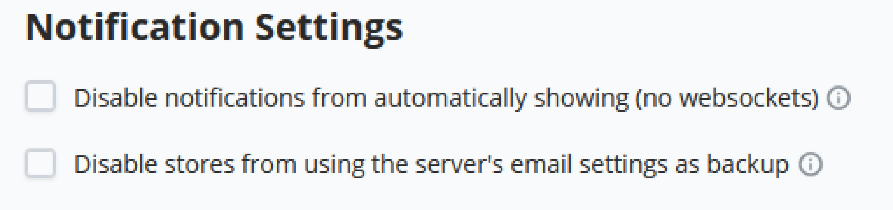


#### تنظیمات نگهداری


سرور BTCPay یک پروژه متن‌باز است که در GitHub قرار دارد. هر زمان که سرور BTCPay نسخه جدیدی از نرم‌افزار را منتشر کند، مدیران می‌توانند از در دسترس بودن نسخه جدید مطلع شوند. مدیران همچنین ممکن است بخواهند موتورهای جستجو (گوگل، یاهو، داک‌داک‌گو) را از ایندکس کردن دامنه سرور BTCPay منصرف کنند. از آنجا که سرور BTCPay یک نرم‌افزار آزاد و متن‌باز (FOSS) است، توسعه‌دهندگان در سراسر جهان ممکن است بخواهند ویژگی‌های جدیدی ایجاد کنند؛ سرور BTCPay دارای یک ویژگی آزمایشی است که با فعال کردن آن، مدیر می‌تواند از ویژگی‌هایی که هنوز برای تولید آماده نیستند و صرفاً برای اهداف آزمایشی هستند، استفاده کند.


- انتشارها را در GitHub بررسی کنید و هنگامی که نسخه جدیدی از BTCPay Server در دسترس است، اطلاع دهید.
- جلوگیری از ایندکس شدن این سایت توسط موتورهای جستجو
- ویژگی‌های آزمایشی را فعال کنید.


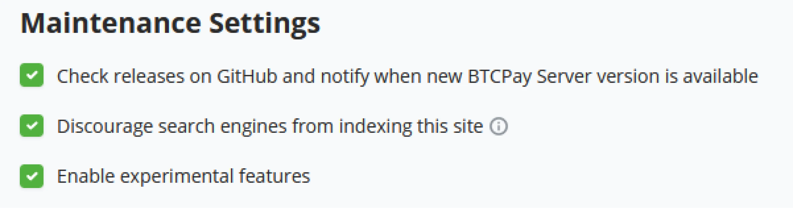


#### افزونه‌ها


سرور BTCPay می‌تواند افزونه‌ها را اضافه کرده و مجموعه ویژگی‌های خود را گسترش دهد. افزونه‌ها به‌طور پیش‌فرض از مخزن سازنده افزونه BTCPay Server بارگذاری می‌شوند. با این حال، یک مدیر می‌تواند انتخاب کند که افزونه‌ها را در حالت پیش‌انتشار ببیند و اگر توسعه‌دهنده افزونه اجازه دهد، مدیر سرور اکنون می‌تواند نسخه‌های بتا افزونه‌ها را نصب کند.


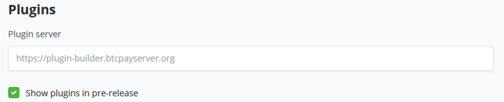


##### تنظیمات سفارشی‌سازی


یک استقرار استاندارد BTCPay Server از طریق دامنه‌ای که در زمان نصب برای آن تنظیم شده است قابل دسترسی خواهد بود. با این حال، یک مدیر سرور می‌تواند دامنه ریشه را مجدداً نقشه‌برداری کرده و یکی از برنامه‌های ایجاد شده از یک فروشگاه خاص را نمایش دهد. مدیر سرور همچنین می‌تواند دامنه‌های خاصی را به برنامه‌های خاصی نقشه‌برداری کند.


- برنامه را در ریشه وب‌سایت نمایش دهید
  - فهرستی از برنامه‌های ممکن برای نمایش در دامنه اصلی را نمایش می‌دهد.


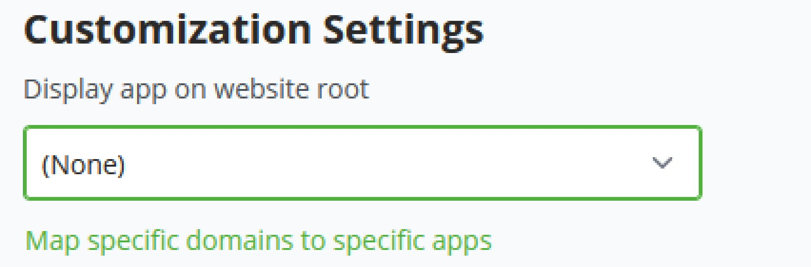


- دامنه‌های خاص را به برنامه‌های خاص نگاشت کنید.
  - وقتی برای برنامه‌های خاص یک دامنه خاص را تنظیم می‌کنید، مدیر می‌تواند به تعداد مورد نیاز دامنه‌هایی را که به برنامه‌های خاص اشاره دارند، تنظیم کند.


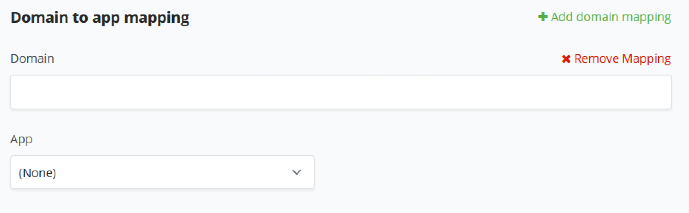


#### کاوشگرهای بلاک


سرور BTCPay به‌صورت استاندارد با Mempool.space به‌عنوان Block explorer برای تراکنش‌ها ارائه می‌شود. هنگامی که سرور BTCPay یک Invoice جدید ایجاد می‌کند و تراکنشی به آن متصل است، صاحب فروشگاه می‌تواند برای باز کردن تراکنش کلیک کند؛ سرور BTCPay به‌صورت استاندارد به Mempool.space به‌عنوان Block explorer اشاره می‌کند؛ یک مدیر سرور ممکن است این را به ترجیح خود تغییر دهد.


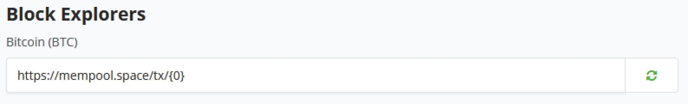


### خدمات


تنظیمات سرور BTCPay: تب خدمات یک نمای کلی از اجزایی است که سرور BTCPay شما استفاده می‌کند. خدماتی که سرور BTCPay شما ارائه می‌دهد ممکن است بسته به روش استقرار متفاوت باشد.


یک مدیر سرور BTCPay می‌تواند بر روی "مشاهده اطلاعات" پشت هر سرویس کلیک کند تا آن را باز کرده و تنظیمات خاصی را اعمال کند.


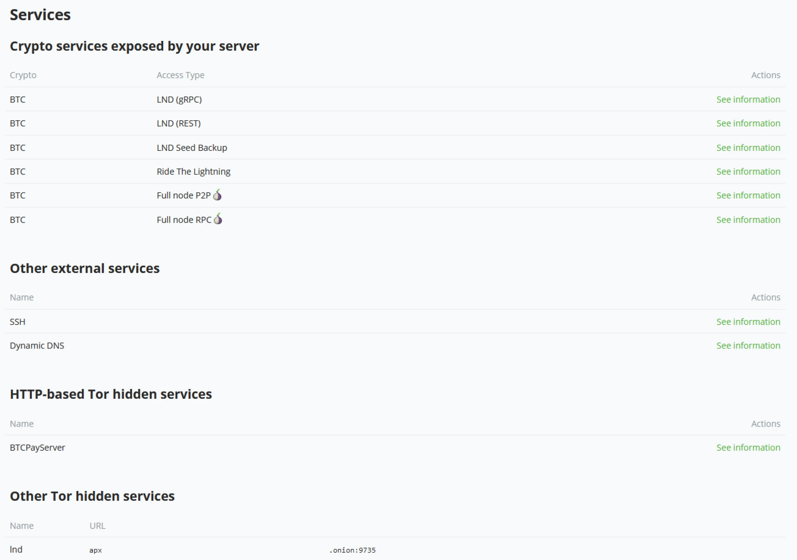


#### LND (gRPC)


BTCPay سرویس GRPC مربوط به LND را برای استفاده خارجی در دسترس قرار می‌دهد؛ اطلاعات اتصال را در این منوی تنظیمات خاص پیدا خواهید کرد؛ کیف‌پول‌های سازگار در اینجا فهرست شده‌اند. سرور BTCPay همچنین یک کد QR برای اتصال ارائه می‌دهد تا در Wallet موبایل اسکن و اعمال شود.


سرور ادمین‌ها می‌توانند جزئیات بیشتری را مشاهده کنند؛


- جزئیات میزبان
- استفاده از SSL
- ماکارون
- ادمین‌ماکارون
- فاکتورMacaroon
- ReadonlyMacaroon
- مجموعه رمزهای SSL GRPC (GRPC_SSL_CIPHER_SUITES)


#### LND (REST)


BTCPay سرویس REST LND را برای مصرف خارجی ارائه می‌دهد؛ اطلاعات اتصال را اینجا خواهید یافت؛ کیف‌پول‌های سازگار اینجا فهرست شده‌اند. از جمله کیف‌پول‌های سازگار می‌توان به Joule، Alby و ZeusLN اشاره کرد. سرور BTCPay یک کد QR برای اتصال ارائه می‌دهد، آن را اسکن کرده و در Wallet سازگار اعمال کنید.


- REST Uri
- ماکارون
- ادمین‌ماکارون
- فاکتورMacaroon
- ReadonlyMacaroon


#### LND seed پشتیبان


پشتیبان LND seed برای بازیابی وجوه از LND Wallet شما در صورت خرابی سرور مفید است. از آنجا که نود لایتنینگ یک Hot-Wallet است، می‌توانید اطلاعات محرمانه seed را در این صفحه پیدا کنید.


LND فرآیند بازیابی را مستند می‌کند. برای مستندات به https://github.com/lightningnetwork/LND/blob/master/docs/recovery.md مراجعه کنید.


#### سوار بر آذرخش


Ride the Lightning یک ابزار مدیریت نود لایتنینگ است که به عنوان نرم‌افزار متن‌باز ساخته شده است. سرور BTCPay از RTL به عنوان مؤلفه مدیریت نود لایتنینگ در پشته خود استفاده می‌کند. مدیران سرور BTCPay می‌توانند از طریق تنظیمات سرور - تب خدمات یا با کلیک بر روی Lightning Wallet به RTL دسترسی پیدا کنند.


#### Full node P2P


سرور ادمین‌ها ممکن است بخواهند نود Bitcoin خود را به یک Wallet موبایل متصل کنند. این صفحه اطلاعاتی را برای اتصال از راه دور به Full node شما از طریق پروتکل P2P ارائه می‌دهد. در زمان نگارش این کتاب، سرور BTCPay کیف‌پول‌های Blockstream Green و Wasabi Wallet را به عنوان کیف‌پول‌های سازگار فهرست می‌کند. سرور BTCPay یک کد QR برای اتصال ارائه می‌دهد که می‌توانید آن را در Wallet سازگار اسکن و اعمال کنید.


#### Full node RPC


این صفحه اطلاعاتی را برای اتصال از راه دور به Full node شما از طریق پروتکل RPC ارائه می‌دهد.


#### اس‌اس‌اچ


SSH برای اهداف نگهداری استفاده می‌شود. سرور BTCPay فرمان اتصال اولیه را برای دسترسی به سرور شما و کلیدهای عمومی SSH مجاز برای اتصال به سرور شما نشان می‌دهد. مدیران سرور ممکن است بخواهند تغییرات SSH را از طریق رابط کاربری BTCPay Server غیرفعال کنند.


#### DNS پویا


DNS پویا به شما امکان می‌دهد یک نام DNS پایدار داشته باشید که به سرور شما اشاره کند، حتی اگر IP شما Address به طور منظم تغییر کند. این کار توصیه می‌شود اگر BTCPay Server را در خانه میزبانی می‌کنید و می‌خواهید یک دامنه clearnet برای دسترسی به سرور خود داشته باشید.


توجه داشته باشید که برای دریافت گواهینامه HTTPS باید نصب NAT و سرور BTCPay خود را به درستی پیکربندی کنید.


### موضوع


سرور BTCPay به‌صورت استاندارد با دو تم ارائه می‌شود: حالت‌های روشن و تاریک. این تم‌ها را می‌توان با کلیک بر روی حساب کاربری در پایین سمت چپ و تغییر بین تم تاریک یا تم روشن تغییر داد. مدیران سرور BTCPay می‌توانند تم خود را با ارائه یک تم CSS سفارشی اضافه کنند.


مدیران می‌توانند با افزودن CSS سفارشی خود یا تنظیم تم سفارشی خود به عنوان یک تم کامل سفارشی، تم روشن/تاریک را گسترش دهند.


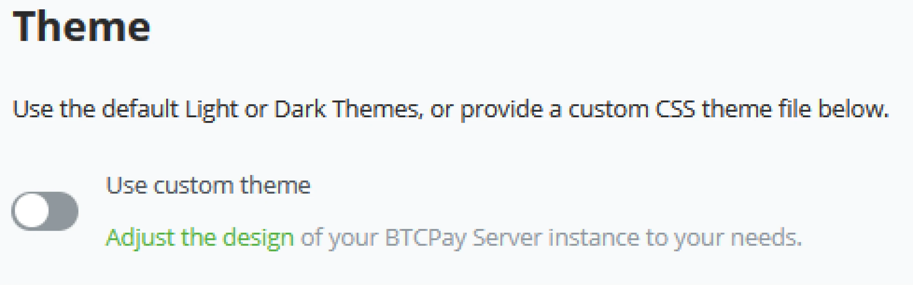


#### برندسازی سرور


مدیران سرور می‌توانند برندینگ سرور BTCPay را با تنظیم یک برندینگ سراسری برای شرکت خود تغییر دهند. از آنجا که سرور BTCPay نرم‌افزار آزاد و متن‌باز (FOSS) است، مدیران سرور می‌توانند نرم‌افزار را با برچسب سفید تغییر داده و ظاهر آن را برای کسب‌وکار خود سفارشی کنند.


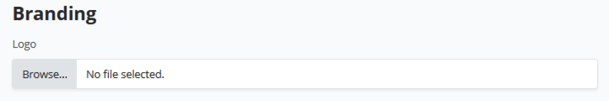


### نگهداری و تعمیرات


به عنوان یک مدیر سرور، کاربران شما انتظار دارند که به خوبی از سرور مراقبت کنید. در برگه نگهداری BTCPay Server، مدیر می‌تواند برخی از تعمیرات اساسی را انجام دهد. نام دامنه را به نمونه BTCPay Server تنظیم کنید، سرور را راه‌اندازی مجدد کنید یا آن را پاکسازی کنید. شاید مهم‌ترین کار، اجرای به‌روزرسانی‌ها باشد.


سرور BTCPay یک پروژه متن‌باز است و به‌طور مکرر به‌روزرسانی می‌شود. هر نسخه جدید یا از طریق اعلان‌های سرور BTCPay شما یا در کانال‌های رسمی که سرور BTCPay از طریق آن‌ها ارتباط برقرار می‌کند، اعلام می‌شود.


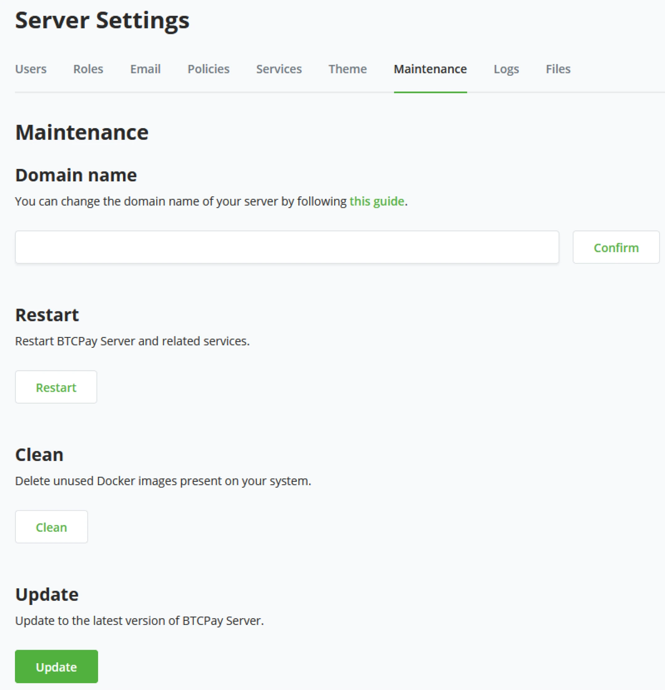


#### نام دامنه


پس از راه‌اندازی BTCPay Server، ممکن است یک مدیر بخواهد دامنه اصلی خود را تغییر دهد. درون تب نگهداری، مدیر می‌تواند دامنه را تغییر دهد. پس از کلیک بر روی تأیید و تنظیم رکوردهای DNS مناسب بر روی دامنه، BTCPay Server به‌روزرسانی و راه‌اندازی مجدد می‌شود تا به دامنه جدید بازگردد.


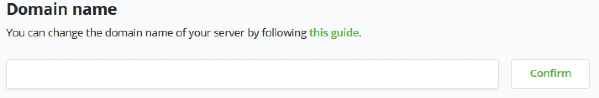


#### راه‌اندازی مجدد


راه‌اندازی مجدد سرور BTCPay و خدمات مرتبط.


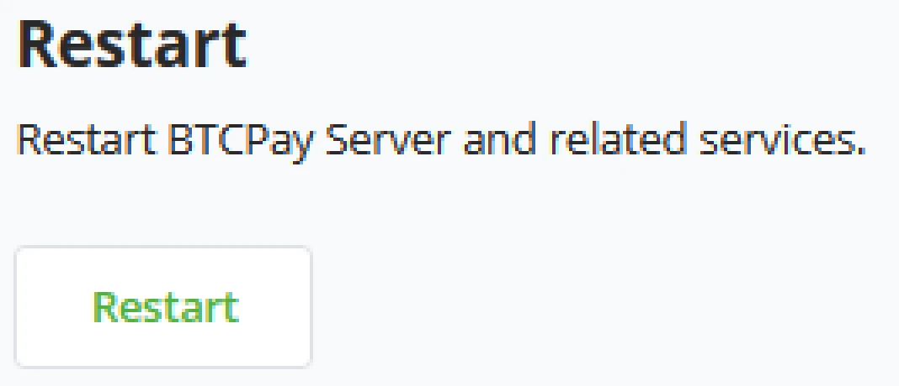


#### تمیز


سرور BTCPay با اجزای Docker اجرا می‌شود؛ با به‌روزرسانی‌ها، ممکن است بقایای تصاویر Docker، فایل‌های موقت و غیره باقی بماند. مدیران سرور می‌توانند با اجرای اسکریپت Clean این موارد را پاک کرده و فضای محیط خود را بازیابی کنند.


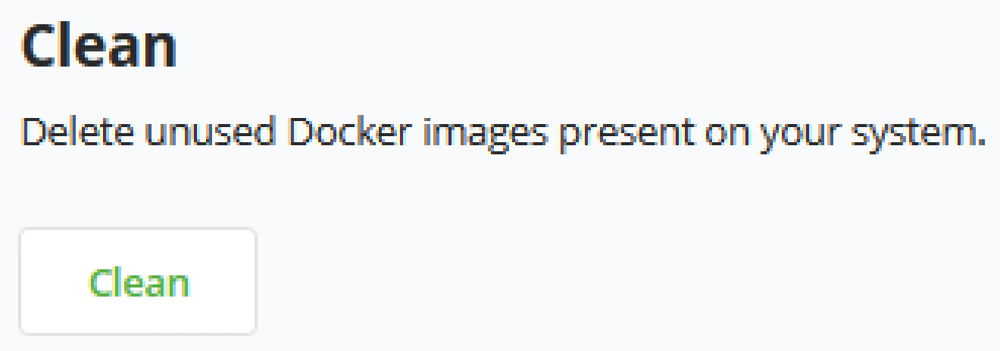


#### به‌روزرسانی


احتمالاً مهم‌ترین گزینه در زبانه نگهداری. سرور BTCPay توسط جامعه ساخته شده است و بنابراین، چرخه‌های به‌روزرسانی آن بیشتر از اکثر محصولات نرم‌افزاری است. هنگامی که سرور BTCPay نسخه جدیدی دارد، مدیران در مرکز اعلان‌های خود مطلع خواهند شد. با کلیک بر روی دکمه به‌روزرسانی، سرور BTCPay آخرین نسخه را در GitHub بررسی کرده، سرور را به‌روزرسانی و راه‌اندازی مجدد می‌کند. قبل از به‌روزرسانی، همیشه به مدیران سرور توصیه می‌شود که یادداشت‌های انتشار که از طریق کانال‌های رسمی سرور BTCPay توزیع می‌شود را بخوانند.


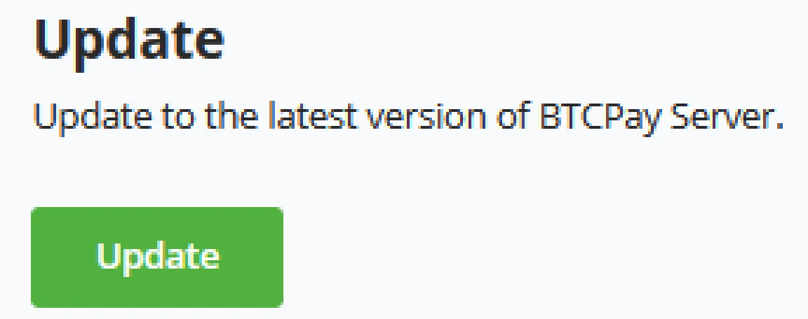


### ورود به سیستم


روبرو شدن با یک مشکل هرگز سرگرم‌کننده نیست. این سند رایج‌ترین جریان کار و مراحل را برای شناسایی مؤثر مشکل شما و حل آن به‌تنهایی یا با کمک جامعه توضیح می‌دهد.


شناسایی مشکل بسیار مهم است.


#### تکرار مشکل


اول و مهم‌تر از همه، سعی کنید تعیین کنید که مشکل چه زمانی رخ می‌دهد. سعی کنید مشکل را تکرار کنید. سعی کنید سرور خود را به‌روزرسانی و راه‌اندازی مجدد کنید تا تأیید کنید که می‌توانید مشکل خود را بازتولید کنید. اگر مشکل شما را بهتر توصیف می‌کند، از صفحه نمایش عکس بگیرید.


##### به‌روزرسانی سرور


نسخه BTCPay Server خود را بررسی کنید اگر خیلی قدیمی‌تر از [آخرین نسخه](https://github.com/btcpayserver/btcpayserver/releases) BTCPay Server است. به‌روزرسانی سرور شما ممکن است مشکل را حل کند.


##### راه‌اندازی مجدد سرور


راه‌اندازی مجدد سرور شما یک راه آسان برای حل بسیاری از مشکلات رایج سرور BTCPay است. ممکن است نیاز باشد که برای راه‌اندازی مجدد، با استفاده از SSH به سرور خود وارد شوید.


##### راه‌اندازی مجدد یک سرویس


ممکن است فقط نیاز داشته باشید که یک سرویس خاص را در استقرار سرور BTCPay خود برای برخی مشکلات مجدداً راه‌اندازی کنید. مانند راه‌اندازی مجدد کانتینر lets encrypt برای تمدید گواهی SSL.


```bash
sudo su -
cd btcpayserver-docker
docker restart letsencrypt-nginx-proxy-companion
```


از دستور docker ps برای پیدا کردن نام یک سرویس دیگر که می‌خواهید مجدداً راه‌اندازی کنید، استفاده کنید.


#### نگاه کردن به گزارش‌ها


ورود به سیستم می‌تواند اطلاعات ضروری را فراهم کند. در پاراگراف‌های زیر، نحوه دریافت اطلاعات ورود به سیستم برای بخش‌های مختلف BTCPay را توضیح خواهیم داد.


##### BTCPay لاگ‌ها


از نسخه v1.0.3.8، شما می‌توانید به راحتی به لاگ‌های سرور BTCPay از طریق رابط کاربری دسترسی پیدا کنید. اگر مدیر سرور هستید، به تنظیمات سرور > لاگ‌ها بروید و فایل لاگ‌ها را باز کنید. اگر نمی‌دانید یک خطای خاص در لاگ‌ها به چه معناست، هنگام عیب‌یابی به آن اشاره کنید.


اگر می‌خواهید گزارش‌های دقیق‌تری داشته باشید و از استقرار Docker استفاده می‌کنید، می‌توانید گزارش‌های کانتینرهای خاص Docker را با استفاده از خط فرمان مشاهده کنید. این [دستورالعمل‌ها برای ssh](https://docs.btcpayserver.org/FAQ/ServerSettings/#how-to-ssh-into-my-btcpay-running-on-vp%C2%80) به یک نمونه از BTCPay که بر روی یک VPS اجرا می‌شود را ببینید.


در صفحه بعد، فهرست کلی از نام‌های کانتینر استفاده شده برای BTCPay Server آمده است.


دستورات زیر را اجرا کنید تا لاگ‌ها را بر اساس نام کانتینر چاپ کنید. برای مشاهده لاگ‌های کانتینرهای دیگر، نام کانتینر را جایگزین کنید.


```bash
sudo su -
cd btcpayserver-docker
docker ps
docker logs --tail 100 generated_btcpayserver_1
```


| Logs for     | Container Name                    |
| ------------ | --------------------------------- |
| BTCPayServer | generated_btcpayserver_1          |
| NBXplorer    | generated_nbxplorer_1             |
| Bitcoind     | btcpayserver_bitcoind             |
| Postgres     | generated_postgres_1              |
| proxy        | letsencrypt-nginx-proxy-companion |
| Nginx        | nginx-gen                         |
| Nginx        | nginx                             |
| c-lightning  | btcpayserver_clightning_bitcoin   |
| LND          | btcpayserver_lnd_bitcoin          |
| RTL          | generated_lnd_bitcoin_rtl_1       |
| Thunderhub   | generated_bitcoin_thub_1          |
| LibrePatron  | librepatron                       |
| Tor          | tor-gen                           |
| Tor          | tor                               |

###### Lightning Network LND - داکر


چند روش برای دسترسی به لاگ‌های LND هنگام استفاده از Docker وجود دارد. ابتدا به عنوان ریشه وارد شوید:


```bash
sudo su -
Navigate to the correct directory:
cd btcpayserver-docker
# Find container name:
docker ps
Print logs by container name:
docker logs --tail 100 btcpayserver_lnd_bitcoin
```


به طور متناوب، می‌توانید با استفاده از شناسه کانتینر به سرعت لاگ‌ها را چاپ کنید (فقط اولین کاراکترهای یکتای شناسه مورد نیاز است، مانند دو کاراکتر سمت چپ‌ترین):


```bash
docker logs 'add your container ID'
```


اگر به هر دلیلی به لاگ‌های بیشتری نیاز دارید


```bash
sudo su -
cd /var/lib/docker/volumes/generated_lnd_bitcoin_datadir/\_data/logs/ bitcoin/mainnet/
ls
```


شما چیزی شبیه به این خواهید دید


```bash
lnd.log lnd.log.13 lnd.log.15 lnd.log.16.gz lnd.log.17.gz
```


برای دسترسی به لاگ‌های بدون فشرده‌سازی، دستور `cat LND.log` را اجرا کنید یا اگر لاگ دیگری می‌خواهید، از `cat LND.log.15` استفاده کنید.


برای دسترسی به لاگ‌های فشرده در `.gzip` از دستور `gzip -d LND.log.16.gz` استفاده کنید (در اینجا ما به `LND.log.16.gz` دسترسی پیدا می‌کنیم). این باید به شما یک فایل جدید بدهد که می‌توانید با استفاده از `cat LND.log.16` آن را مشاهده کنید. در صورتی که دستور بالا کار نکرد، ممکن است نیاز باشد ابتدا gzip را با دستور `sudo apt-get install gzip` نصب کنید.


###### Lightning Network c-lightning - داکر


```bash
sudo su -
docker ps
# Find the c-lightning container ID.
docker logs 'add your container ID here'
```


به طور جایگزین، از این استفاده کنید


```bash
docker logs --tail 100 btcpayserver_clightning_bitcoin
```


شما همچنین می‌توانید اطلاعات لاگ را با فرمان c-lightning CLI دریافت کنید.


```bash
bitcoin-lightning-cli.sh getlog
```


#### گزارش‌های گره Bitcoin


علاوه بر [مشاهده لاگ‌ها](https://docs.btcpayserver.org/Troubleshooting/#2-looking-through-the-logs) در کانتینر bitcoind خود، می‌توانید از هر یک از [دستورات bitcoin-cli](https://developer.Bitcoin.org/reference/RPC/index.html) نیز استفاده کنید.


[(opens new window)](https://developer.Bitcoin.org/reference/RPC/index.html) برای به‌دست‌آوردن اطلاعات از نود Bitcoin شما. BTCPay شامل یک اسکریپت است که به شما اجازه می‌دهد به‌راحتی با نود Bitcoin خود ارتباط برقرار کنید.


در داخل پوشه btcpayserver-docker، اطلاعات Blockchain را با استفاده از نود خود دریافت کنید:


```bash
bitcoin-cli.sh getblockchaininfo
```


### فایل‌ها


سرور BTCPay دارای یک سیستم فایل محلی است و دارایی‌های فروشگاه (محصول)، لوگوها و برندینگ را مستقیماً به سرور آپلود می‌کند. سیستم فایل سرور فقط توسط مدیران سرور قابل دسترسی است؛ صاحبان فروشگاه می‌توانند لوگوها/برندینگ خود را در سطح فروشگاه آپلود کنند.


وقتی که مدیر سرور در زبانه ذخیره‌سازی فایل است، امکان آپلود مستقیم به سرور شما یا تغییر ارائه‌دهنده ذخیره‌سازی فایل به سیستم فایل محلی یا Azure Blob Storage وجود دارد.


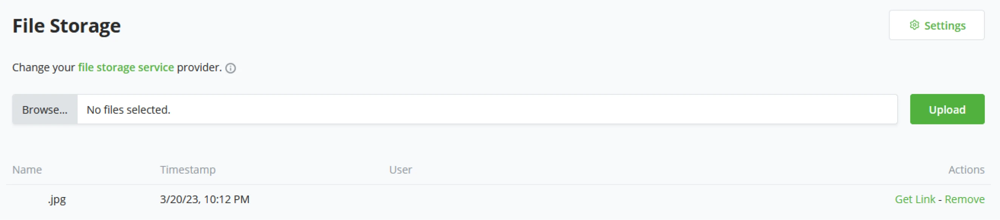


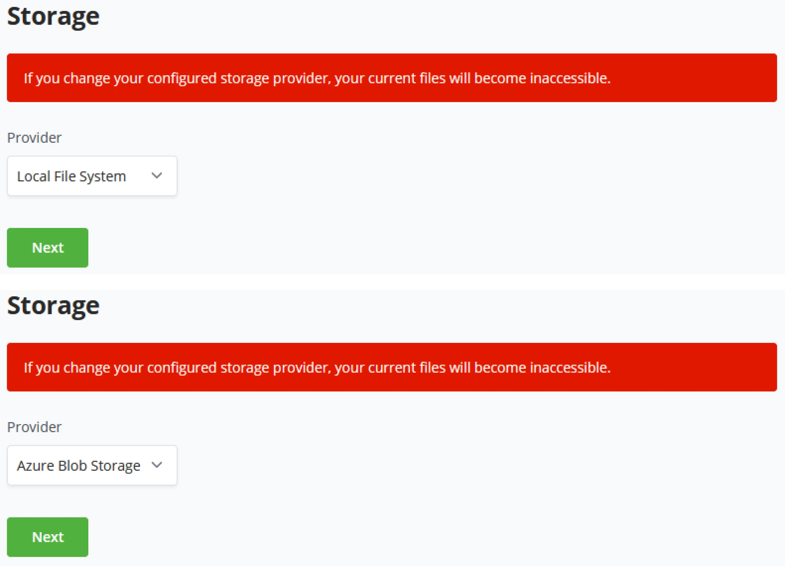


### خلاصه مهارت‌ها


در این بخش، شما موارد زیر را یاد گرفتید:


- تفاوت بین تنظیمات فروشگاه و سرور، به ویژه در ارتباط با کاربران، نقش‌ها و ایمیل‌ها
- تنظیم سیاست‌های سراسری سرور برای استفاده و ایجاد Lightning یا Bitcoin Hot Wallet، ثبت‌نام کاربر جدید و اعلان‌های ایمیل.
- چگونه تم‌های سفارشی (به جای گزینه‌های ساده روشن/تاریک ارائه شده) اضافه کنیم و همچنین لوگوهای سفارشی ایجاد کنیم
- انجام وظایف ساده نگهداری سرور از طریق رابط کاربری گرافیکی ارائه شده
- رفع مشکلات، از جمله دریافت جزئیات برای هر یک از کانتینرهای Docker یا نود شما
- مدیریت ذخیره‌سازی فایل


### ارزیابی دانش


#### بررسی مفهومی KA


تفاوت نقش‌های اختصاص داده شده از طریق تنظیمات سرور در مقابل تنظیمات فروشگاه چیست و یک کاربرد بالقوه برای یکی نسبت به دیگری را توصیف کنید؟


#### بررسی عملی KA


برخی از موارد استفاده ممکن که در زبانه سیاست‌ها فعال می‌شوند را توصیف کنید.


#### بررسی عملی KA


برخی از اقداماتی که یک مدیر ممکن است به طور معمول در زبانه نگهداری انجام دهد را توصیف کنید.


## سرور BTCPay - پرداخت‌ها


<chapterId>e2b71ff9-3f4f-5e71-9771-8e03fbbef00f</chapterId>


Invoice سندی است که فروشنده برای دریافت پرداخت به خریدار صادر می‌کند.


در سرور BTCPay، یک Invoice نمایانگر سندی است که باید در یک بازه زمانی مشخص با نرخ ثابت Exchange پرداخت شود. فاکتورها دارای تاریخ انقضا هستند زیرا نرخ Exchange را در یک بازه زمانی مشخص قفل می‌کنند تا گیرنده را از نوسانات قیمت محافظت کنند.


هسته اصلی BTCPay Server توانایی عمل به عنوان یک سیستم مدیریت Bitcoin Invoice است. یک Invoice ابزاری اساسی برای پیگیری و مدیریت یک پرداخت دریافت شده است.


مگر اینکه از [Wallet](https://docs.btcpayserver.org/Wallet/) داخلی برای دریافت پرداخت‌ها به صورت دستی استفاده کنید، تمامی پرداخت‌ها در یک فروشگاه در صفحه فاکتورها نمایش داده می‌شوند. این صفحه به صورت تجمعی پرداخت‌ها را بر اساس تاریخ مرتب می‌کند و بخش مرکزی برای مدیریت Invoice و رفع اشکال پرداخت است.


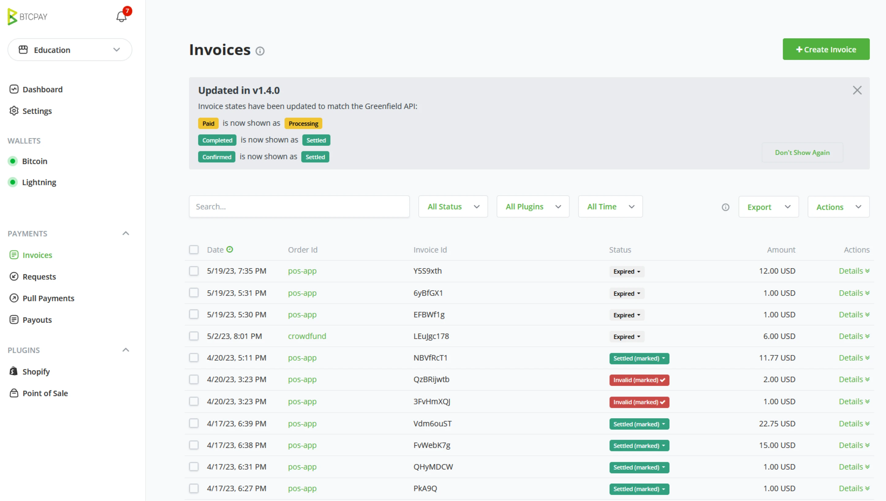


### عمومی


#### وضعیت‌های Invoice


جدول زیر وضعیت‌های استاندارد Invoice در BTCPay را فهرست کرده و توصیف می‌کند و اقدامات رایج را پیشنهاد می‌دهد. اقدامات فقط توصیه‌ها هستند. تصمیم‌گیری در مورد بهترین اقدام برای استفاده و کسب‌وکار بر عهده کاربران است.


| Invoice Status             | Description                                                                                                                             | Action                                                                                                                      |
| -------------------------- | --------------------------------------------------------------------------------------------------------------------------------------- | --------------------------------------------------------------------------------------------------------------------------- |
| New                        | Not paid, invoice timer still has not expired                                                                                           | None                                                                                                                        |
| New (paidPartial)          | Paid, not in full, invoice timer still has not expired                                                                                  | None                                                                                                                        |
| Expired                    | Not paid, invoice timer expired                                                                                                         | None                                                                                                                        |
| Expired (paidPartial) \*\* | Paid, not in full amount, and expired                                                                                                   | Contact buyer to arrange a refund or ask for them to pay their due. Optionally mark invoice as settled or invalid           |
| Expired (paidLate)         | Paid, in full amount, after the invoice timer has expired                                                                               | Contact buyer to arrange a refund or process order if late confirmations are acceptable.                                    |
| Settled (paidOver)         | Paid more than the invoice amount, settled, received sufficient amount of confirmations                                                 | Contact buyer to arrange a refund for the extra amount, or optionally wait for buyer to contact you                         |
| Processing                 | Paid in full, but has not received sufficient amount of confirmations specified in the store settings                                   | Contact buyer to arrange a refund for the extra amount, or optionally wait for buyer to contact you                         |
| Processing (paidOver)      | Paid more than the invoice amount, not received sufficient amount of confirmations                                                      | Wait to be settled then contact buyer to arrange a refund for the extra amount, or optionally wait for buyer to contact you |
| Settled                    | Paid, in full, received sufficient amount of confirmations in store                                                                     | Fulfil the order                                                                                                            |
| Settled (marked)           | Status was manually changed to settled from an processing or invalid status                                                             | Store admin has marked the payment as settled                                                                               |
| Invalid\*                  | Paid, but failed to receive sufficient amount of confirmations within the time specified in store settings                              | Check the transaction on a blockchain explorer, if it received sufficient confirmations, mark as settled                    |
| Invalid (marked)           | Status was manually changed to invalid from a settled or expired status                                                                 | Store admin has marked the payment as invalid                                                                               |
| Invalid (paidOver)         | Paid more than the invoice amount, but failed to receive sufficient amount of confirmations within the time specified in store settings | Check the transaction on a blockchain explorer, if it received sufficient confirmations, mark as settled                    |

#### جزئیات Invoice


صفحه جزئیات Invoice شامل تمام اطلاعات مربوط به یک Invoice است.


اطلاعات Invoice به‌طور خودکار بر اساس وضعیت Invoice، نرخ Exchange و غیره ایجاد می‌شود. اطلاعات محصول به‌طور خودکار ایجاد می‌شود اگر Invoice با اطلاعات محصول ایجاد شده باشد، مانند در برنامه نقطه فروش.


#### فیلتر کردن Invoice


فاکتورها را می‌توان از طریق فیلترهای سریع که در کنار دکمه جستجو قرار دارند یا فیلترهای پیشرفته که با کلیک بر روی لینک (راهنما) در بالا فعال می‌شوند، فیلتر کرد. کاربران می‌توانند فاکتورها را بر اساس فروشگاه، شناسه سفارش، شناسه آیتم، وضعیت یا تاریخ فیلتر کنند.


#### Invoice صادرات


فاکتورهای BTCPay Server می‌توانند به فرمت CSV یا JSON صادر شوند. برای اطلاعات بیشتر درباره‌ی صادرات Invoice و حسابداری.


#### بازپرداخت یک Invoice


اگر به هر دلیلی مایل به صدور بازپرداخت هستید، می‌توانید به راحتی از نمای Invoice یک بازپرداخت ایجاد کنید.


#### بایگانی فاکتورها


به دلیل ویژگی عدم استفاده مجدد Address در سرور BTCPay، معمولاً فاکتورهای منقضی شده زیادی را در صفحه Invoice فروشگاه خود مشاهده می‌کنید. برای پنهان کردن آن‌ها از دید خود، آن‌ها را در لیست انتخاب کرده و به عنوان بایگانی شده علامت‌گذاری کنید. فاکتورهایی که به عنوان بایگانی شده علامت‌گذاری شده‌اند حذف نمی‌شوند. پرداخت به یک Invoice بایگانی شده همچنان توسط سرور BTCPay شما شناسایی خواهد شد (وضعیت paidLate). شما می‌توانید در هر زمان فاکتورهای بایگانی شده فروشگاه را با انتخاب فاکتورهای بایگانی شده از منوی کشویی فیلتر جستجو مشاهده کنید.


#### ارز پیش‌فرض


ذخیره ارز پیش‌فرض، این در جادوگر ایجاد فروشگاه تنظیم شده بود


#### اجازه دهید هر کسی Invoice ایجاد کند


اگر می‌خواهید به دنیای خارج اجازه دهید تا در فروشگاه شما فاکتور ایجاد کند، باید این گزینه را فعال کنید. این گزینه تنها در صورتی مفید است که از دکمه پرداخت استفاده می‌کنید یا اگر فاکتورها را از طریق API یا وب‌سایت HTML شخص ثالث صادر می‌کنید. برنامه PoS از پیش تأیید شده است و نیازی به فعال کردن این گزینه برای بازدیدکننده تصادفی جهت باز کردن فروشگاه POS شما و ایجاد یک Invoice ندارد.


#### افزودن هزینه اضافی (هزینه شبکه) به Invoice


- فقط در صورتی که مشتری بیش از یک پرداخت برای Invoice انجام دهد
- در هر پرداخت
- هرگز هزینه شبکه اضافه نکنید


#### Invoice منقضی می‌شود اگر کل مبلغ پس از .. دقیقه پرداخت نشده باشد.


تایمر Invoice به طور پیش‌فرض روی 15 دقیقه تنظیم شده است. این تایمر یک مکانیزم حفاظتی در برابر نوسانات است زیرا مقدار ارز دیجیتال را بر اساس نرخ‌های ارز دیجیتال به فیات قفل می‌کند. اگر مشتری در مدت زمان تعیین‌شده Invoice را پرداخت نکند، Invoice منقضی تلقی می‌شود. Invoice به محض اینکه تراکنش در Blockchain (بدون تاییدیه) قابل مشاهده باشد، "پرداخت‌شده" در نظر گرفته می‌شود اما زمانی "کامل" تلقی می‌شود که به تعداد تاییدیه‌هایی که فروشنده تعریف کرده است (معمولاً 1-6) برسد. تایمر قابل تنظیم است.


#### در نظر بگیرید که Invoice حتی اگر مبلغ پرداختی ..٪ کمتر از حد انتظار باشد، پرداخت شده است.


در شرایطی که مشتری از Exchange Wallet برای پرداخت مستقیم یک Invoice استفاده می‌کند، Exchange مقدار کمی کارمزد دریافت می‌کند. این بدان معناست که چنین Invoice به‌طور کامل تکمیل‌شده محسوب نمی‌شود. Invoice وضعیت "پرداخت جزئی" دریافت می‌کند. اگر یک فروشنده بخواهد فاکتورهای کم‌پرداخت را بپذیرد، می‌توانید نرخ درصد را اینجا تنظیم کنید.


### درخواست‌ها


درخواست‌های پرداخت یک ویژگی است که به صاحبان فروشگاه BTCPay اجازه می‌دهد تا فاکتورهای بلندمدت ایجاد کنند. وجوه با استفاده از نرخ Exchange در زمان پرداخت به یک درخواست پرداخت واریز می‌شود. این امکان را به کاربران می‌دهد تا بدون مذاکره یا تأیید نرخ‌های Exchange با صاحب فروشگاه در زمان پرداخت، به راحتی پرداخت‌های خود را انجام دهند.


کاربران می‌توانند درخواست‌ها را به صورت پرداخت‌های جزئی انجام دهند. درخواست پرداخت تا زمانی که به طور کامل پرداخت نشود یا اگر صاحب فروشگاه زمان انقضا تعیین کند، معتبر باقی می‌ماند. آدرس‌ها هرگز دوباره استفاده نمی‌شوند. هر بار که کاربر برای ایجاد یک Invoice برای درخواست پرداخت روی پرداخت کلیک می‌کند، یک Address جدید تولید می‌شود.


صاحبان فروشگاه می‌توانند درخواست‌های پرداخت را چاپ کنند (یا داده‌های Invoice را صادر کنند) برای نگهداری سوابق و حسابداری. BTCPay به‌طور خودکار فاکتورها را به‌عنوان درخواست‌های پرداخت در لیست Invoice فروشگاه شما برچسب‌گذاری می‌کند.


#### درخواست‌های پرداخت خود را سفارشی کنید


- Invoice مبلغ - تنظیم مبلغ پرداخت درخواستی
- نام واحد پول - نمایش مقدار درخواست شده به صورت فیات یا ارز دیجیتال
- مقدار پرداخت - فقط پرداخت‌های تکی یا پرداخت‌های جزئی را مجاز کنید
- زمان انقضا - اجازه پرداخت تا یک تاریخ مشخص یا بدون انقضا
- توضیحات - ویرایشگر متن، جداول داده، جاسازی عکس‌ها و ویدیوها
- ظاهر - رنگ و سبک با تم‌های CSS


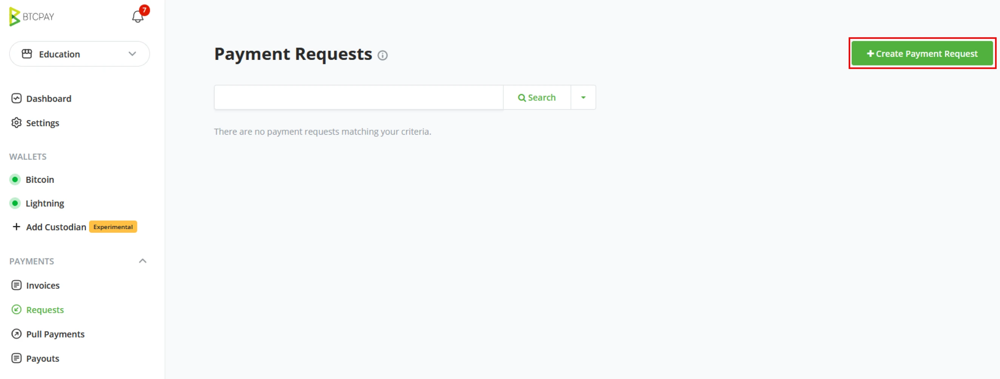


#### ایجاد درخواست پرداخت


در منوی سمت چپ، به درخواست پرداخت بروید و روی "ایجاد درخواست پرداخت" کلیک کنید.


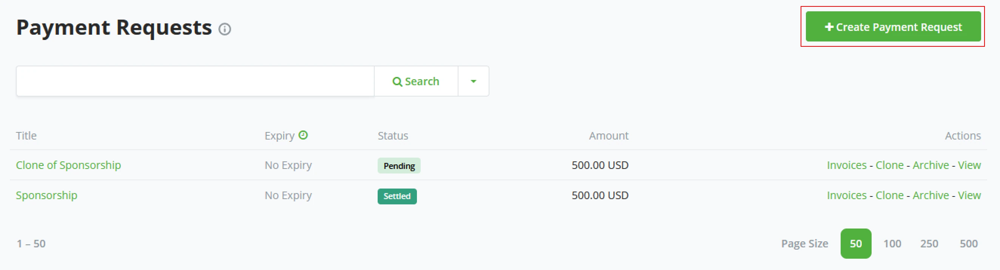


نام درخواست، مبلغ، نمایش واحد پول، فروشگاه مرتبط، زمان انقضا و توضیحات (اختیاری) را ارائه دهید.


گزینه اجازه به دریافت‌کننده برای ایجاد فاکتورها به ارز خود را انتخاب کنید اگر می‌خواهید پرداخت‌های جزئی را مجاز کنید.


روی «ذخیره و مشاهده» کلیک کنید تا درخواست پرداخت خود را بررسی کنید.


BTCPay یک URL برای درخواست پرداخت ایجاد می‌کند. این URL را به اشتراک بگذارید تا درخواست پرداخت خود را مشاهده کنید. به چندین درخواست مشابه نیاز دارید؟ می‌توانید با استفاده از گزینه Clone در منوی اصلی، درخواست‌های پرداخت را کپی کنید.


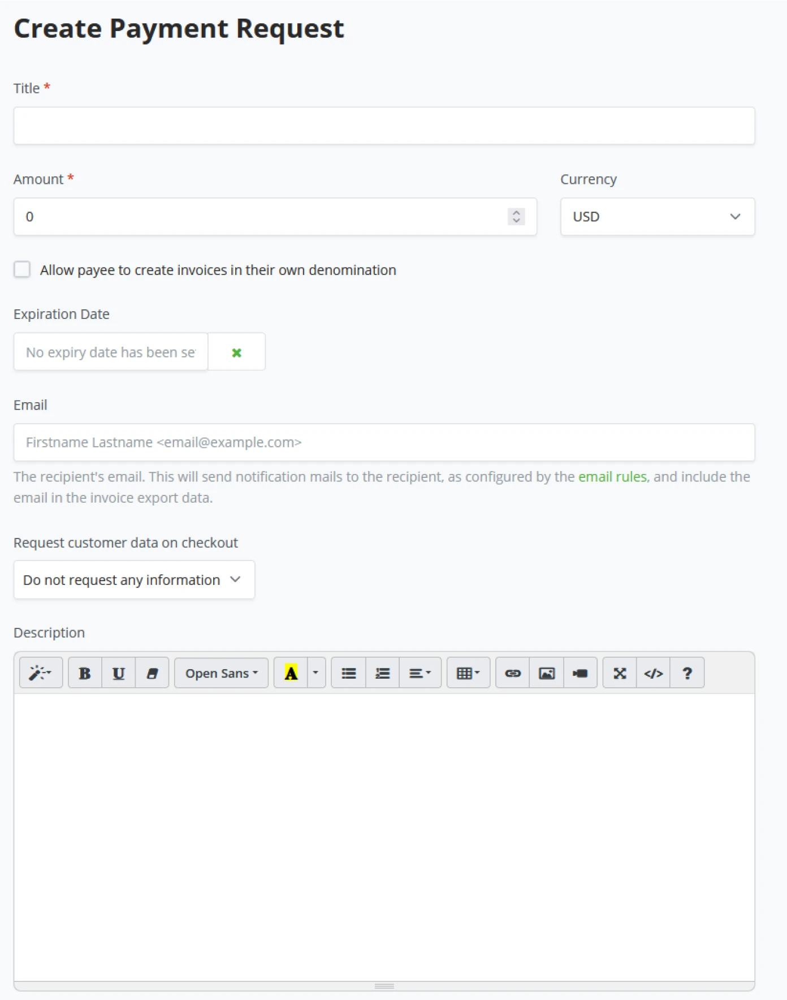


**هشدار**


درخواست‌های پرداخت وابسته به فروشگاه هستند، به این معنی که هر درخواست پرداخت در هنگام ایجاد با یک فروشگاه مرتبط است. اطمینان حاصل کنید که یک Wallet به فروشگاهی که درخواست پرداخت به آن تعلق دارد، متصل باشد.


#### درخواست پرداخت شده


گیرنده و درخواست‌کننده می‌توانند وضعیت درخواست پرداخت را پس از ارسال پرداخت مشاهده کنند. وضعیت به صورت تسویه‌شده نمایش داده می‌شود اگر پرداخت به‌طور کامل دریافت شده باشد. اگر فقط پرداخت‌های جزئی انجام شده باشد، مبلغ بدهی مانده بدهی را نشان خواهد داد.


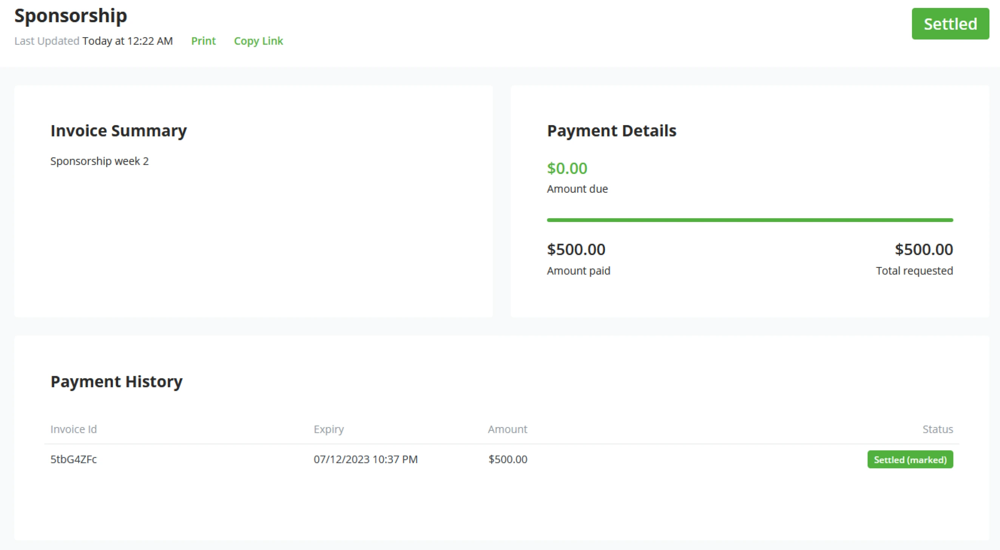


#### درخواست‌های پرداخت را سفارشی کنید


محتوای توضیحات را می‌توان با استفاده از ویرایشگر متنی درخواست پرداخت ویرایش کرد. هر دو گزینه در دسترس هستند اگر بخواهید از تم‌های رنگی اضافی یا استایل‌دهی CSS سفارشی استفاده کنید.


کاربران غیر فنی می‌توانند از یک [قالب بوت‌استرپ](https://docs.btcpayserver.org/Development/Theme/#2-bootstrap-themes) استفاده کنند. سفارشی‌سازی بیشتر می‌تواند با ارائه کد CSS اضافی، مانند آنچه در زیر نشان داده شده است، انجام شود.


```css
:root {
--btcpay-font-family-base: "Source Sans Pro", -apple-system,
BlinkMacSystemFont, "Segoe UI", Roboto, "Helvetica Neue", Arial, sans-serif;
--btcpay-primary: #7d4698;
--btcpay-primary-accent: #59316b;
--btcpay-body-text: #333a41;
--btcpay-body-bg: #fff;
--btcpay-bg-tile: #f8f9fa;
}

#mainNav {
color: white;
background: linear-gradient(#59316b, #331840);
}

#mainNav .btn-link {
color: white;
}
```


### پرداخت‌های کششی


به طور سنتی، یک گیرنده Bitcoin Address خود را به اشتراک می‌گذارد تا یک پرداخت Bitcoin انجام دهد، و فرستنده بعداً پول را به این Address ارسال می‌کند. چنین سیستمی پرداخت Push نامیده می‌شود، زیرا فرستنده پرداخت را آغاز می‌کند در حالی که گیرنده ممکن است در دسترس نباشد و پرداخت را به گیرنده ارسال می‌کند.


با این حال، نقش را معکوس کردن چه می‌شود؟


چه می‌شود اگر به جای اینکه فرستنده پرداخت را ارسال کند، به گیرنده اجازه دهد که پرداخت را در زمانی که مناسب می‌بیند، برداشت کند؟ این مفهوم پرداخت کششی است. این امکان چندین کاربرد جدید را فراهم می‌کند، مانند:


- یک سرویس اشتراک (که در آن مشترک به سرویس اجازه می‌دهد هر x مدت زمان مشخصی پول برداشت کند)
- بازپرداخت‌ها (جایی که فروشنده به مشتری اجازه می‌دهد پول بازپرداخت را به Wallet خود منتقل کند، هر زمان که مناسب بداند)
- صورتحساب مبتنی بر زمان برای فریلنسرها (جایی که شخص استخدام‌کننده به فریلنسر اجازه می‌دهد تا با گزارش زمان، پول را به Wallet خود منتقل کند)
- پشتیبانی مالی (جایی که حامی به گیرنده اجازه می‌دهد هر ماه پول دریافت کند تا به حمایت از کارشان ادامه دهد)
- فروش خودکار (جایی که مشتری یک Exchange به یک Exchange اجازه می‌دهد تا هر ماه به‌طور خودکار پول از Wallet آن‌ها برداشت کند و بفروشد)
- سیستم برداشت موجودی (جایی که یک سرویس با حجم بالا به کاربران اجازه می‌دهد تا درخواست برداشت از موجودی خود را بدهند، سرویس می‌تواند به راحتی تمام پرداخت‌ها به بسیاری از کاربران را در فواصل زمانی ثابت دسته‌بندی کند)


### پرداخت‌ها


عملکرد پرداخت به [پرداخت‌های کششی](https://docs.btcpayserver.org/PullPayments/) متصل است. این ویژگی به شما امکان می‌دهد تا پرداخت‌ها را در BTCPay خود ایجاد کنید. این ویژگی به شما امکان می‌دهد تا پرداخت‌های کششی (بازپرداخت‌ها، پرداخت‌های حقوق یا برداشت‌ها) را پردازش کنید.


#### مثال 1: بازپرداخت


بیایید با مثال بازپرداخت شروع کنیم. مشتری کالایی را از فروشگاه شما خریداری کرده است اما متأسفانه باید آن را برگرداند. آنها خواهان بازپرداخت هستند. در BTCPay، شما می‌توانید یک [بازپرداخت](https://docs.btcpayserver.org/Refund/) ایجاد کنید و لینک مربوطه را به مشتری بدهید تا وجوه خود را دریافت کند. هر زمان که مشتری Address خود را ارائه دهد و وجوه را دریافت کند، این موضوع در پرداخت‌ها نمایش داده خواهد شد.


اولین وضعیت آن در انتظار تأیید است. فروشندگان می‌توانند بررسی کنند که آیا چندین مورد در انتظار هستند و پس از انتخاب، از دکمه اقدامات استفاده کنید.


گزینه‌ها روی دکمه اقدام


- پرداخت‌های انتخاب‌شده را تأیید کنید
- تأیید و ارسال پرداخت‌های انتخاب‌شده
- لغو پرداخت‌های انتخاب‌شده


گام بعدی تأیید و ارسال پرداخت‌های انتخاب شده است زیرا می‌خواهیم مبلغ را به مشتری بازپرداخت کنیم. Address مشتری را بررسی کنید، مبلغ را نشان می‌دهد و اینکه آیا می‌خواهیم هزینه‌ها از مبلغ بازپرداخت کسر شود یا خیر. پس از انجام بررسی‌ها، تنها امضای تراکنش باقی می‌ماند.


اکنون مشتری در صفحه مطالبه به‌روز می‌شود. او می‌تواند تراکنش را دنبال کند زیرا لینکی به Block explorer و تراکنش خود دریافت کرده است. هنگامی که تراکنش تأیید شد و وضعیت به "تکمیل شده" تغییر کرد.


#### مثال ۲: حقوق


حالا بیایید به پرداخت حقوق بپردازیم، زیرا این امر از داخل فروشگاه هدایت می‌شود و نه بر اساس درخواست مشتری. اصول کار همان است؛ از پرداخت‌های کششی استفاده می‌کند. اما به جای ایجاد بازپرداخت، ما یک [پرداخت کششی](https://docs.btcpayserver.org/PullPayments/) ایجاد خواهیم کرد.


به تب پرداخت‌های کششی در سرور BTCPay خود بروید. در بالا سمت راست، روی دکمه ایجاد پرداخت کششی کلیک کنید.


اکنون ما در مرحله ایجاد پرداخت هستیم، به آن یک نام و مبلغ مورد نظر در ارز دلخواه بدهید، توضیحات را پر کنید تا کارمند بداند موضوع چیست. بخش بعدی مشابه بازپرداخت‌ها است. کارمند مقصد Address و مبلغی که می‌خواهد از این پرداخت مطالبه کند را پر می‌کند. او ممکن است تصمیم بگیرد که دو مطالبه جداگانه به آدرس‌های مختلف انجام دهد، یا حتی بخشی از آن را از طریق لایتنینگ مطالبه کند.


اگر چندین پرداخت در انتظار وجود داشته باشد، می‌توانید آن‌ها را به صورت دسته‌ای برای امضا و ارسال آماده کنید. پس از امضا، پرداخت‌ها به زبانه "در حال انجام" منتقل شده و تراکنش را نشان می‌دهند. وقتی توسط شبکه پذیرفته شد، پرداخت به زبانه "تکمیل شده" منتقل می‌شود. زبانه تکمیل شده صرفاً برای اهداف تاریخی است. این زبانه شامل پرداخت‌های پردازش شده و تراکنش مربوط به آن‌ها است.


### پرداخت‌های کششی


#### مفهوم


هنگامی که یک فرستنده یک پرداخت کششی را پیکربندی می‌کند، می‌تواند تعدادی از ویژگی‌ها را پیکربندی کند:


- نام درخواست کشش
- مقدار محدود
- یک واحد (مانند BTC، SAT، USD)
- روش‌های پرداخت
  - BTC On-Chain
  - BTC off-chain
- توضیحات
- CSS سفارشی
- تاریخ پایان (اختیاری برای Lightning Network BOLT11)


پس از این، فرستنده می‌تواند پرداخت کششی را با استفاده از یک لینک با گیرنده به اشتراک بگذارد، که به گیرنده اجازه می‌دهد یک پرداخت ایجاد کند. گیرنده پرداخت خود را انتخاب خواهد کرد:


- از کدام روش پرداخت استفاده شود؟
- کجا پول را بفرستم؟


هنگامی که یک پرداخت ایجاد می‌شود، به محدودیت پرداخت کششی برای دوره جاری محاسبه خواهد شد. سپس فرستنده با تعیین نرخی که پرداخت با آن ارسال خواهد شد، پرداخت را تأیید کرده و با پرداخت ادامه می‌دهد.


برای فرستنده، ما یک روش آسان برای دسته‌بندی پرداخت چندین پرداخت از [BTCPay Internal Wallet](https://docs.btcpayserver.org/Wallet/) ارائه می‌دهیم.


#### رابط برنامه‌نویسی کاربردی گرینفیلد


سرور BTCPay یک API کامل را هم به فرستنده و هم به گیرنده ارائه می‌دهد که در صفحه `/docs` نمونه شما مستند شده است. (یا در وب‌سایت مستندات https://docs.btcpayserver.org)


از آنجا که API ما قابلیت کامل پرداخت‌های کششی را ارائه می‌دهد، یک فرستنده می‌تواند پرداخت‌ها را بر اساس نیازهای خود خودکار کند.


### خلاصه مهارت‌ها


در این بخش، شما موارد زیر را یاد گرفتید:


- درک عمیق از وضعیت‌های Invoice در BTCPay Server و همچنین اقداماتی که می‌توان بر روی آن‌ها انجام داد
- سفارشی‌سازی و مدیریت مکانیزم‌های Invoice با عمر طولانی که به عنوان درخواست‌ها شناخته می‌شوند.
- امکانات پرداخت انعطاف‌پذیر اضافی که با ویژگی منحصر به فرد Pull Payment در BTCPay Server فراهم شده است، به ویژه نحوه مدیریت بازپرداخت‌ها و پرداخت حقوق.


### ارزیابی دانش


#### بررسی مفهومی KA


تفاوت‌های بین فاکتورها و درخواست‌های پرداخت چیست و چه دلیلی ممکن است برای استفاده از دومی وجود داشته باشد؟


#### بررسی مفهومی KA


چگونه پرداخت‌های کششی بر آنچه معمولاً می‌توان با On-Chain انجام داد، گسترش می‌یابند؟ برخی از موارد استفاده‌ای که امکان‌پذیر می‌کنند را توصیف کنید.


## پلاگین‌های پیش‌فرض BTCPay Server


<chapterId>7d673dc4-bd5d-5411-819b-f135f1d86636</chapterId>


### پلاگین‌ها و اپلیکیشن‌های پیش‌فرض


سرور BTCPay با مجموعه استانداردی از افزونه‌ها (برنامه‌ها) ارائه می‌شود که می‌تواند سرور BTCPay را به یک درگاه پرداخت تجارت الکترونیک تبدیل کند. با افزودن یک نقطه فروش، پلتفرم جمع‌آوری سرمایه، و یک دکمه پرداخت آسان، سرور BTCPay به یک راه‌حل آسان برای استقرار تبدیل می‌شود.


### نقطه فروش


یکی از افزونه‌های استاندارد BTCPay Server، نقطه فروش (PoS) است. با افزونه PoS، یک صاحب فروشگاه می‌تواند مستقیماً از BTCPay Server یک فروشگاه آنلاین ایجاد کند و نیازی به راه‌حل‌های تجارت الکترونیک شخص ثالث برای راه‌اندازی فروشگاه آنلاین ندارد. اپلیکیشن PoS مبتنی بر وب به کاربران فروشگاه‌های فیزیکی اجازه می‌دهد تا به راحتی Bitcoin را بدون کارمزد یا واسطه، مستقیماً به Wallet خود بپذیرند. PoS به راحتی می‌تواند بر روی تبلت‌ها یا دستگاه‌های دیگر که از مرور وب پشتیبانی می‌کنند نمایش داده شود. کاربران می‌توانند به راحتی یک میانبر صفحه اصلی ایجاد کنند تا به سرعت به اپلیکیشن وب دسترسی پیدا کنند.


#### چگونه یک نقطه فروش جدید ایجاد کنیم


سرور BTCPay به صاحبان فروشگاه اجازه می‌دهد تا به سرعت یک نقطه فروش را در چندین طرح ایجاد کنند. سرور BTCPay تشخیص می‌دهد که هر فروشگاهی تجارت الکترونیک نیست و هر فروشگاهی بار یا رستوران نیست و با چندین تنظیمات استاندارد برای نقطه فروش شما ارائه می‌شود.


وقتی که صاحب فروشگاه روی "نقطه فروش" در نوار منوی سمت چپ خود کلیک می‌کند، سرور BTCPay اکنون یک نام درخواست خواهد کرد؛ این نام در نوار منوی سمت چپ قابل مشاهده خواهد بود. برای ایجاد PoS روی ایجاد کلیک کنید.


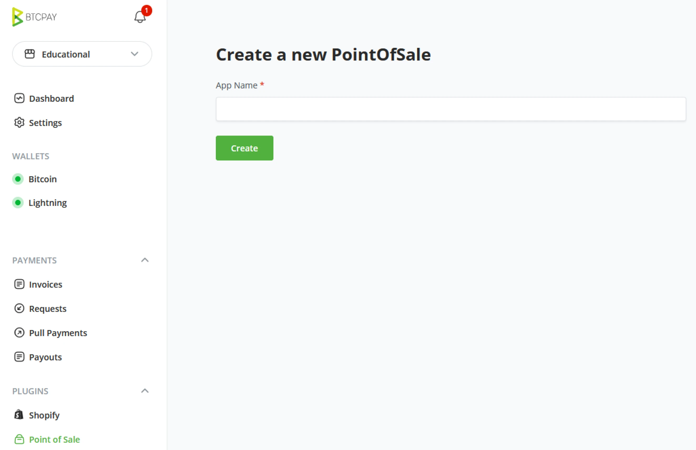


#### به‌روزرسانی نقطه فروش جدید ایجاد شده


پس از ایجاد یک PoS جدید، صفحه بعدی برای به‌روزرسانی نقطه فروش شما و افزودن اقلام به فروشگاه شما خواهد بود.


##### نام برنامه


نامی که در اینجا به نقطه فروش خود می‌دهید در منوی اصلی سرور BTCPay قابل مشاهده خواهد بود.


##### نمایش عنوان


عموم مردم عنوان یا نام عمومی را هنگام بازدید از فروشگاه شما خواهند دید. BTCPay Server به طور استاندارد فروشگاه شما را "فروشگاه چای" نام‌گذاری می‌کند. این را با نام فروشگاه خود جایگزین کنید.


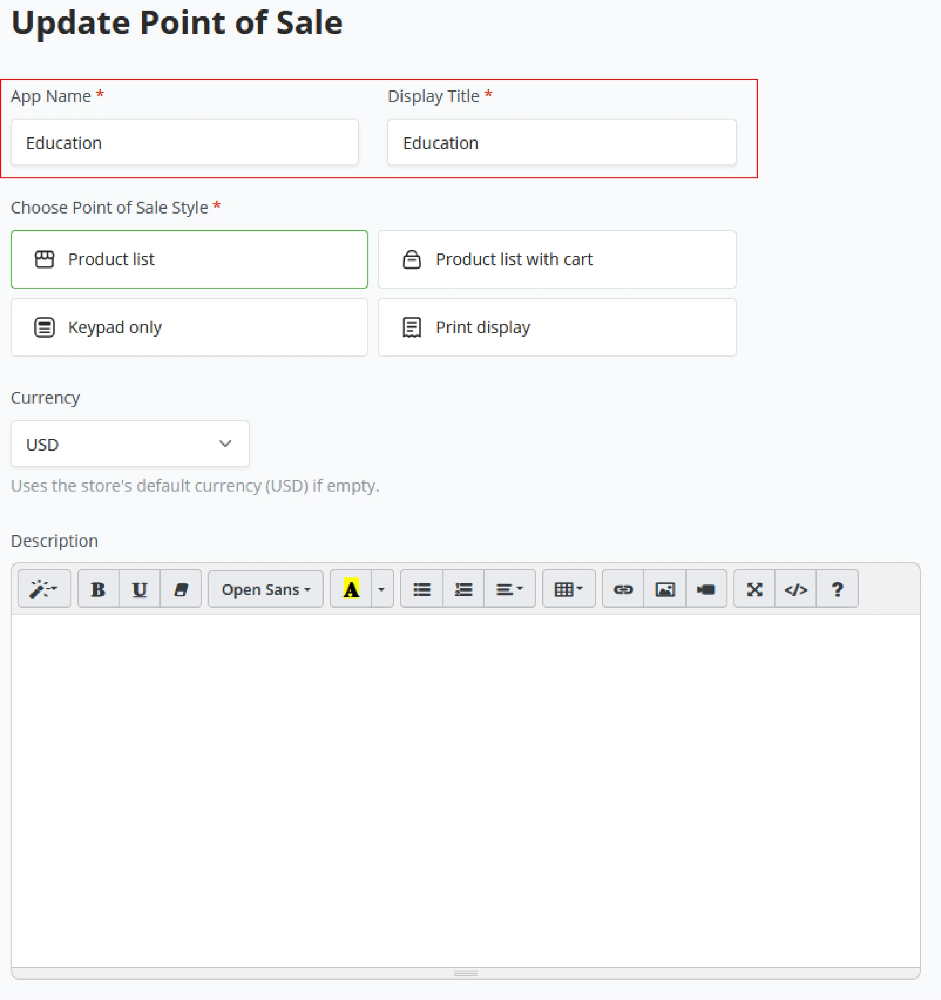


#### انتخاب سبک نقطه فروش


سرور BTCPay قادر است نقطه فروش خود را به روش‌های مختلف نمایش دهد.


- فهرست محصولات
  - نمای فروشگاهی که مشتریان فقط می‌توانند یک محصول را در هر بار خریداری کنند.
- فهرست محصولات با سبد خرید.
  - نمای فروشگاهی که مشتریان می‌توانند چندین کالا را به‌طور همزمان خریداری کنند و نمای کلی سبد خرید را در سمت راست صفحه‌نمایش خود ببینند.
- فقط صفحه کلید
  - هیچ لیست محصولی وجود ندارد، فقط یک صفحه کلید برای صدور فاکتور مستقیم.
- نمایش چاپ (فهرست محصولات قابل چاپ با QR)
  - اگر نمی‌توانید همیشه لیست محصولات خود را به صورت دیجیتالی نمایش دهید، به یک راه‌حل "آفلاین" برای محصولات نیاز دارید؛ سرور BTCPay دارای یک نمایش چاپی است که به عنوان یک فروشگاه آفلاین عمل می‌کند.


#### سبک نقطه فروش - لیست محصولات


#### سبک نقطه فروش - لیست محصولات + سبد خرید


#### سبک نقطه فروش - فقط صفحه کلید


#### نمایش چاپ - سبک نقطه فروش


#### ارز


صاحب فروشگاه ممکن است برای نقطه فروش خود ارز متفاوتی نسبت به ارز پیش‌فرض کلی تنظیم کند. ارز پیش‌فرض فروشگاه به‌طور خودکار این فیلد را پر خواهد کرد.


#### توضیحات


به جهان درباره فروشگاه خود بگویید؛ چه چیزی می‌فروشید و به چه قیمتی؟ همه چیزهایی که فروشگاه شما را توضیح می‌دهد اینجا قرار می‌گیرد.


#### محصولات


هنگامی که یک نقطه فروش ایجاد می‌شود، یک سرور استاندارد BTCPay چند مورد را برای مرجع به فروشگاه اضافه می‌کند. برای درک بهتر هر گزینه ممکن برای یک مورد، روی دکمه ویرایش در هر یک از موارد استاندارد کلیک کنید.


ایجاد یک محصول جدید در فروشگاه شما شامل فیلدهای زیر است؛


- عنوان
- قیمت (ثابت، حداقل، یا سفارشی)
- آدرس تصویر
- شرح
- موجودی
- شناسه
- متن دکمه خرید.
- فعال‌سازی/غیرفعال‌سازی


هنگامی که صاحب فروشگاه تمام فیلدهای محصول جدید را پر کرد، روی ذخیره کلیک کنید و متوجه خواهید شد که بخش محصولات در نقطه فروش اکنون در حال پر شدن است. همیشه مطمئن شوید که در بالای سمت راست صفحه خود ذخیره کنید تا از دست دادن پیشرفت در افزودن محصولات توسط صاحبان فروشگاه جلوگیری شود.


صاحبان فروشگاه همچنین می‌توانند از "ویرایشگر خام" برای پیکربندی محصولات خود استفاده کنند. ویرایشگر خام نیاز به درک پایه‌ای از ساختارهای JSON دارد.


#### وارسی


سرور BTCPay امکان سفارشی‌سازی کوچک پرداخت مخصوص PoS را فراهم می‌کند. صاحب فروشگاه می‌تواند متن "خرید برای x" را تنظیم کند یا با افزودن فرم‌ها، داده‌های خاص مشتری را درخواست کند.


#### نکات


فقط برخی از فروشگاه‌ها به گزینه انعام در فروش‌های خود نیاز دارند. صاحبان فروشگاه می‌توانند این گزینه را بر اساس نیاز فروشگاه خود فعال یا غیرفعال کنند. اگر فروشگاه از انعام استفاده کند و آن را فعال کند، صاحب فروشگاه می‌تواند متن مورد نظر خود را در فیلد انعام تنظیم کند. انعام‌های BTCPay Server بر اساس درصد کار می‌کنند. صاحبان فروشگاه می‌توانند چندین درصد را با جداسازی با کاما اضافه کنند.


#### تخفیف‌ها


به‌عنوان یک صاحب فروشگاه، ممکن است بخواهید به مشتری تخفیف سفارشی در هنگام پرداخت ارائه دهید؛ گزینه تخفیف‌ها در هنگام پرداخت فروشگاه شما در دسترس قرار می‌گیرد. با این حال، این کار به شدت برای سیستم‌های خودپرداخت توصیه نمی‌شود.


#### پرداخت‌های سفارشی


وقتی گزینه پرداخت‌های سفارشی فعال می‌شود، مشتری می‌تواند قیمت تعیین‌شده خود را برابر یا بالاتر از Invoice اصلی تولید شده توسط فروشگاه وارد کند.


#### گزینه‌های اضافی


پس از تنظیم همه چیز برای نقطه فروش خود، برخی گزینه‌های اضافی باقی می‌مانند. صاحبان فروشگاه می‌توانند به راحتی PoS خود را از طریق یک Iframe یا دکمه پرداختی که به یک آیتم خاص فروشگاه لینک می‌شود، جاسازی کنند. برای استایل‌دهی به فروشگاه PoS تازه ایجاد شده، صاحبان می‌توانند CSS سفارشی را در پایین گزینه‌های اضافی اضافه کنند.


#### این برنامه را حذف کنید


اگر صاحب فروشگاه بخواهد به‌طور کامل نقطه فروش را از سرور BTCPay خود حذف کند، در پایین به‌روزرسانی PoS، صاحبان فروشگاه می‌توانند روی دکمه حذف این برنامه کلیک کنند تا برنامه PoS خود را به‌طور کامل از بین ببرند. هنگام کلیک بر روی "حذف این برنامه"، سرور BTCPay برای تأیید، درخواست تایپ `DELETE` و تأیید با کلیک بر روی دکمه حذف را خواهد کرد. پس از حذف، صاحب فروشگاه به داشبورد سرور BTCPay بازمی‌گردد.


### BTCPay Server - تأمین مالی جمعی


در کنار افزونه نقطه فروش، سرور BTCPay گزینه‌ای برای ایجاد یک سرمایه‌گذاری جمعی دارد. درست مانند هر پلتفرم سرمایه‌گذاری جمعی دیگر، صاحبان فروشگاه می‌توانند هدفی تعیین کنند، مزایایی برای مشارکت‌ها ایجاد کنند و آن را بر اساس نیازهای خود سفارشی‌سازی کنند.


#### چگونه یک سرمایه‌گذاری جمعی جدید راه‌اندازی کنیم


روی افزونه Crowdfund از طریق منوی اصلی در سمت چپ سرور BTCPay خود کلیک کنید، زیر بخش افزونه. سرور BTCPay اکنون یک نام برای Crowdfund درخواست خواهد کرد؛ این نام همچنین در نوار منوی سمت چپ نمایش داده خواهد شد.


#### به‌روزرسانی نقطه فروش جدید ایجاد شده


پس از اینکه برنامه نام‌گذاری شد، صفحه بعدی آن به‌روزرسانی برنامه برای داشتن زمینه خواهد بود.


#### نام برنامه


نامی که به Crowdfund خود می‌دهید در منوی اصلی BTCPay Server قابل مشاهده خواهد بود.


#### نمایش عنوان


عنوان به جمع‌سپاری برای عموم داده شده است.


#### شعار


به کمپین جمع‌آوری کمک مالی یک جمله کوتاه بدهید تا هدف آن را مشخص کند.


#### آدرس تصویر ویژه


هر سرمایه‌گذاری جمعی تصویر اصلی خود را دارد، همان بنری که مستقیماً آن را تشخیص می‌دهید. این تصویر می‌تواند در سرور شما ذخیره شود اگر حقوق مدیریتی دارید، مدیران می‌توانند تحت تنظیمات سرور BTCPay Server - فایل‌ها آپلود کنند. وقتی شما مالک یک فروشگاه هستید، تصویر باید از طریق یک میزبان شخص ثالث (برای مثال imgur) به وب آپلود شود.


#### عمومی کردن جمع‌سپاری


این سوئیچ باعث می‌شود که جمع‌سپاری شما عمومی شود و در نتیجه برای دنیای خارج قابل مشاهده باشد. برای اهداف آزمایشی یا برای بررسی اینکه آیا تم شما به درستی اعمال شده است، ممکن است بخواهید این گزینه را در طول دوره ساخت جمع‌سپاری روی OFF نگه دارید.


#### توضیحات


به جهان درباره جمع‌آوری سرمایه خود بگویید، برای چه چیزی سرمایه جمع می‌کنید؟ همه چیزهایی که جمع‌آوری سرمایه شما را توضیح می‌دهد اینجا قرار می‌گیرد.


#### هدف جمع‌سپاری مالی


یک هدف برای میزان درآمدی که جمع‌آوری کمک‌های مالی باید برای پروژه کسب کند تعیین کنید و ارزی که هدف باید بر اساس آن تعیین شود را مشخص کنید. اطمینان حاصل کنید که اگر اهداف شما بین تاریخ‌ها تعیین شده‌اند، این تاریخ‌های هدف و پایان را زیر اهداف در جمع‌آوری سرمایه ذکر کنید.


#### مزایا


مزایا به شدت به کمپین‌های جمع‌سپاری شما کمک می‌کنند. این به این دلیل است که مزایا به افراد راهی برای مشارکت در کمپین شما می‌دهند. آنها به انگیزه‌های خودخواهانه و همچنین انگیزه‌های خیرخواهانه دسترسی پیدا می‌کنند. و به شما اجازه می‌دهند تا به هزینه‌های حامیان خود دسترسی پیدا کنید، نه فقط به کیف پول خیریه آنها -- می‌توانید حدس بزنید کدام یک مهم‌تر است.


ایجاد یک مزیت جدید شامل فیلدهای زیر است ؛


- عنوان
- قیمت (ثابت، حداقل، یا سفارشی)
- آدرس URL تصویر
- توضیحات
- موجودی
- شناسه
- متن دکمه خرید.
- فعال‌سازی/غیرفعال‌سازی


هنگامی که صاحب فروشگاه تمام فیلدهای امتیاز جدید را پر کرد، روی ذخیره کلیک کنید و متوجه خواهید شد که بخش امتیازات در سرمایه‌گذاری جمعی اکنون در حال پر شدن است.


### سرور BTCPay - نقطه فروش


#### مشارکت‌ها


صاحبان فروشگاه می‌توانند انتخاب کنند که چگونه امتیازات نمایش داده شوند، چگونه مرتب شوند، یا حتی در مقایسه با سایر امتیازات رتبه‌بندی شوند. با این حال، هنگامی که اهداف جمع‌آوری سرمایه به دست آمد، صاحبان فروشگاه ممکن است بخواهند جلوی جریان کمک‌ها به این جمع‌آوری سرمایه را بگیرند. بنابراین، او می‌تواند گزینه "اجازه ندادن به کمک‌های اضافی پس از رسیدن به هدف" را فعال کند. این کار جلوی پذیرش کمک‌ها توسط جمع‌آوری سرمایه را خواهد گرفت.


##### رفتار تأمین مالی جمعی


استاندارد Crowdfund فقط فاکتورهایی را که با Crowdfund ایجاد شده‌اند، در هدف محاسبه می‌کند. با این حال، ممکن است مواردی وجود داشته باشد که صاحب فروشگاه بخواهد تمام فاکتورهای ایجاد شده در این فروشگاه به سمت Crowdfund محاسبه شوند.


#### گزینه‌های اضافی برای سفارشی‌سازی


سرور BTCpay چند گزینه سفارشی‌سازی اضافی ارائه می‌دهد. صداها، انیمیشن‌ها یا حتی رشته‌های بحث را به جمع‌آوری سرمایه اضافه کنید. صاحبان فروشگاه‌ها ممکن است با وارد کردن CSS سفارشی خود، ظاهر و احساس جمع‌آوری سرمایه را تغییر دهند.


#### این برنامه را حذف کنید


اگر صاحب فروشگاه بخواهد Crowdfund را به طور کامل از سرور BTCPay خود حذف کند، در پایین به‌روزرسانی فروشگاه Crowdfund، صاحبان فروشگاه می‌توانند روی دکمه "Delete this app" کلیک کنند تا برنامه Crowdfund خود را به طور کامل از بین ببرند. هنگام کلیک بر روی "Delete this app"، سرور BTCPay برای تأیید، درخواست تایپ `DELETE` و تأیید با کلیک بر روی دکمه Delete را خواهد کرد. پس از حذف، صاحب فروشگاه به داشبورد سرور BTCPay بازمی‌گردد.


### سرور BTCPay - دکمه پرداخت


دکمه‌های پرداخت HTML که به‌راحتی قابل تعبیه و بسیار قابل تنظیم هستند، به صاحبان فروشگاه‌ها اجازه می‌دهند تا انعام و کمک‌های مالی دریافت کنند. در نوار منوی سمت چپ BTCPay Server، در زیر بخش افزونه‌ها، صاحبان فروشگاه می‌توانند روی "Pay Button" کلیک کرده و با کلیک بر روی Enable یک دکمه پرداخت ایجاد کنند.


#### تنظیمات عمومی


در تنظیمات عمومی برای دکمه پرداخت، صاحبان فروشگاه می‌توانند تنظیم کنند


- قیمت استاندارد
- ارز پیش‌فرض
- روش پرداخت پیش‌فرض
  - از پیش‌فرض فروشگاه استفاده کنید
  - BTC On-Chain
  - BTC off-chain (Lightning)
  - BTC off-chain (LNURL-pay)
- توضیحات پرداخت
- شناسه سفارش


#### گزینه‌های نمایش


دکمه پرداخت BTCPay Server می‌تواند برای مطابقت با سبک‌های مختلف تنظیم شود. دکمه‌ها می‌توانند مقدار ثابت یا سفارشی داشته باشند که یا با یک اسلایدر یا با دکمه‌های افزایش و کاهش نمایش داده می‌شود.


#### از Modal استفاده کنید


هنگام ایجاد دکمه پرداخت، صاحبان فروشگاه می‌توانند رفتار آن را هنگام کلیک مشتری انتخاب کنند و آن را به صورت یک مدال یا به عنوان یک صفحه جدید نمایش دهند.


**!?توجه!?**


هشدار: دکمه پرداخت باید فقط برای انعام و کمک‌های مالی استفاده شود


استفاده از دکمه پرداخت برای یکپارچه‌سازی‌های تجارت الکترونیک توصیه نمی‌شود زیرا اطلاعات مربوط به سفارش می‌تواند توسط کاربر تغییر یابد. برای تجارت الکترونیک، شما باید از API گرینفیلد ما استفاده کنید. اگر این فروشگاه تراکنش‌های تجاری را پردازش می‌کند، توصیه می‌کنیم قبل از استفاده از دکمه پرداخت، یک فروشگاه جداگانه ایجاد کنید.


#### سفارشی‌سازی متن دکمه پرداخت


به طور پیش‌فرض، دکمه پرداخت BTCPay Server عبارت "Pay With BTCPay" را نمایش می‌دهد. صاحبان فروشگاه می‌توانند این متن را به دلخواه خود تنظیم کرده و لوگوی BTCPay Server را به لوگوی خود تغییر دهند. متن را با استفاده از "Pay Button Text" تنظیم کنید و URL تصویر را در زیر "Pay Button Image URL" قرار دهید.


##### اندازه تصویر


اندازه تصویر در دکمه فقط می‌تواند به سه مقدار پیش‌فرض تنظیم شود.


- 146x40px
- 168x46px
- 209x57px


#### نوع دکمه


BTCPay Server سه حالت برای دکمه پرداخت می‌شناسد.


- مبلغ ثابت
  - قیمت تعیین‌شده قبلی در تنظیمات عمومی دکمه است.
- مبلغ سفارشی
  - دکمه پرداخت BTCPay Server دارای کلیدهای + و - برای تنظیم قیمت سفارشی است.
  - هنگام استفاده از مقدار سفارشی، سرور BTCPay یک حداقل، حداکثر و میزان افزایش تدریجی را درخواست خواهد کرد.
  - دکمه‌ها ممکن است به "استفاده از سبک ورودی ساده" تنظیم شوند. این کار +/- تغییرات را حذف می‌کند.
  - دکمه را به صورت خطی قرار دهید، جایی که دکمه و سوئیچ‌ها به صورت خطی ظاهر می‌شوند.
- اسلایدر
  - مشابه به مقدار سفارشی، اما از نظر بصری متفاوت است زیرا به جای دکمه‌های +/- دارای یک نوار لغزنده است.
  - هنگام استفاده از اسلایدر، سرور BTCPay یک حداقل، حداکثر و میزان افزایش تدریجی را درخواست خواهد کرد.


**!?توجه!?**


حذف دکمه پرداخت را می‌توان در بالای توضیحات هشدار انجام داد.


#### اعلان‌های پرداخت


سرور IPN (اعلان پرداخت فوری) برای وب‌هوک‌ها طراحی شده است و می‌تواند با یک URL برای ارسال داده‌های پس از خرید پر شود.


#### اعلان‌های ایمیل


هر زمان که پرداختی انجام شود، سرور BTCPay می‌تواند به صاحب فروشگاه اطلاع دهد.


#### تغییر مسیر مرورگر


وقتی مشتری خرید را تکمیل می‌کند، در صورتی که توسط صاحب فروشگاه تنظیم شده باشد، به این لینک هدایت می‌شود.


#### گزینه‌های دکمه پرداخت پیشرفته


پارامترهای اضافی رشته پرس و جو را مشخص کنید که باید به صفحه پرداخت اضافه شوند پس از ایجاد Invoice. به عنوان مثال، `lang=da-DK` صفحه پرداخت را به طور پیش‌فرض به زبان دانمارکی بارگذاری می‌کند.


#### از اپ به عنوان نقطه پایانی استفاده کنید


دکمه پرداخت را مستقیماً به یک آیتم در یکی از برنامه‌های PoS یا Crowdfund قبلی متصل کنید.


صاحبان فروشگاه می‌توانند روی منوی کشویی کلیک کرده و برنامه مورد نظر خود را انتخاب کنند؛ پس از انتخاب برنامه، صاحب فروشگاه می‌تواند آیتمی را که نیاز به پیوند دارد اضافه کند.


#### کد تولید شده


از آنجا که دکمه پرداخت BTCPay Server به‌راحتی به‌صورت HTML قابل‌جاسازی است، BTCPay Server کد تولید شده را برای کپی کردن در یک وب‌سایت در پایین صفحه پس از پیکربندی دکمه پرداخت نشان می‌دهد.


صاحبان فروشگاه می‌توانند کد تولید شده را در وب‌سایت خود کپی کنند و دکمه پرداخت از BTCPay Server به طور مستقیم در وب‌سایت آن‌ها فعال می‌شود.


#### اعلان‌های پرداخت


سرور IPN (اعلان پرداخت فوری) برای وب‌هوک‌ها در نظر گرفته شده است و می‌تواند با یک URL برای ارسال داده‌های خرید پر شود.


#### اعلان‌های ایمیل


هر زمان که پرداختی انجام شود، سرور BTCPay می‌تواند به صاحب فروشگاه اطلاع دهد.


#### تغییر مسیر مرورگر


وقتی مشتری خرید را تکمیل می‌کند، در صورت تنظیم توسط صاحب فروشگاه به این لینک هدایت می‌شود.


#### گزینه‌های دکمه پرداخت پیشرفته


مشخص کنید پارامترهای اضافی رشته کوئری که باید به صفحه پرداخت اضافه شوند زمانی که Invoice ایجاد می‌شود. به عنوان مثال، `lang=da-DK` صفحه پرداخت را به طور پیش‌فرض به زبان دانمارکی بارگذاری می‌کند.


#### از برنامه به عنوان نقطه پایانی استفاده کنید


دکمه پرداخت را مستقیماً به یک آیتم در یکی از برنامه‌های PoS یا Crowdfund قبلی متصل کنید. صاحبان فروشگاه می‌توانند روی منوی کشویی کلیک کرده و برنامه مورد نظر خود را انتخاب کنند، پس از انتخاب برنامه، صاحب فروشگاه می‌تواند آیتمی را که نیاز به اتصال دارد اضافه کند.


#### کد تولید شده


از آنجا که دکمه پرداخت BTCPay Server به‌راحتی به‌صورت HTML قابل‌جاسازی است، BTCPay Server کد تولید شده را پس از پیکربندی دکمه پرداخت در پایین صفحه برای کپی کردن در یک وب‌سایت نشان می‌دهد. صاحبان فروشگاه می‌توانند کد تولید شده را در وب‌سایت خود کپی کنند و دکمه پرداخت از BTCPay Server به‌طور مستقیم در وب‌سایت آن‌ها فعال می‌شود.


### خلاصه مهارت‌ها


در این بخش شما یاد گرفتید:


- نحوه استفاده از افزونه PoS یکپارچه BTCPay Server برای ایجاد آسان یک فروشگاه سفارشی
- نحوه استفاده از افزونه یکپارچه Crowdfund در BTCPay Server برای ایجاد آسان یک برنامه جمع‌آوری سرمایه سفارشی
- تولید کد برای یک دکمه پرداخت سفارشی با استفاده از افزونه Pay Button


### ارزیابی دانش


#### بررسی KA


سه افزونه داخلی که به‌طور استاندارد با BTCPay Server ارائه می‌شوند کدامند؟ در چند کلمه، توضیح دهید که هر کدام چگونه می‌توانند استفاده شوند.


# پیکربندی سرور BTCPay


<partId>ff38596c-7de3-5e5c-ba50-9b9edbbbb5eb</partId>


## درک پایه‌ای از نصب BTCPay Server در محیط LunaNode


<chapterId>d0a28514-ffcf-529b-9156-29141f0b060a</chapterId>


### نصب سرور BTCPay در محیط میزبانی شده (LunaNode)


این مراحل تمام اطلاعات لازم برای شروع استفاده از BTCPay Server بر روی LunaNode را فراهم می‌کند. گزینه‌های زیادی برای استقرار نرم‌افزار وجود دارد.

شما می‌توانید تمامی جزئیات BTCPay Server را در https://docs.btcpayserver.org پیدا کنید.


#### از کجا شروع کنیم؟


در این بخش، شما با LunaNode به عنوان ارائه‌دهنده میزبانی آشنا خواهید شد، درباره اولین مراحل استفاده از سرور BTCPay خود یاد خواهید گرفت و یاد می‌گیرید که چگونه با Lightning Network پیش بروید. پس از اینکه تمام مراحل را طی کردیم، می‌توانید یک فروشگاه آنلاین یا پلتفرم جمع‌آوری سرمایه راه‌اندازی کنید که Bitcoin را می‌پذیرد!


این یکی از راه‌های متعدد برای استقرار BTCPay Server است. برای جزئیات بیشتر، مستندات ما را بخوانید.


https://docs.btcpayserver.org.


### BTCPay Server - استقرار LunaNode


#### استقرار LunaNode


ابتدا به وب‌سایت LunaNode.com بروید، جایی که ما یک حساب کاربری جدید ایجاد خواهیم کرد. روی گزینه Sign Up در بالا سمت راست کلیک کنید یا از جادوگر Get Started در صفحه اصلی آن‌ها استفاده کنید.


پس از ایجاد حساب کاربری جدید، LunaNode یک ایمیل تأیید ارسال می‌کند. پس از تأیید حساب، در مقایسه با Voltage، بلافاصله به شما پیشنهاد می‌شود که موجودی حساب خود را افزایش دهید. این موجودی برای پرداخت هزینه‌های فضای سرور و میزبانی لازم است.


#### به حساب LunaNode خود اعتبار اضافه کنید


پس از کلیک بر روی "واریز اعتبار"، می‌توانید تعیین کنید که چقدر می‌خواهید حساب خود را شارژ کنید و چگونه می‌خواهید برای آن پرداخت کنید. LunaNode و BTCPay Server بین 10$USD و 20$USD در ماه هزینه خواهند داشت.

در مقایسه با Voltage.cloud، شما به طور کامل به سرور خصوصی مجازی خود (از اینجا به بعد VPS) دسترسی دارید و بنابراین کنترل بیشتری بر روی سرور خود دارید. پس از ایجاد حساب کاربری جدید، LunaNode یک ایمیل تأیید ارسال می‌کند.

پس از تأیید حساب، در مقایسه با Voltage، اکنون بلافاصله گزینه‌ای برای افزایش موجودی حساب خود دریافت می‌کنید. این موجودی برای پرداخت هزینه فضای سرور و میزبانی لازم است.


#### چگونه یک سرور جدید راه‌اندازی کنیم؟


در این راهنما، ما با ایجاد مجموعه‌ای از کلیدهای API و استفاده از لانچر BTCPay Server ساخته شده توسط LunaNode، مراحل راه‌اندازی را مرور خواهیم کرد.


در داشبورد LunaNode خود، روی API در بالا سمت راست کلیک کنید. این کار یک صفحه جدید باز می‌کند. ما فقط باید یک نام برای کلید API تنظیم کنیم. بقیه موارد توسط LunaNode مدیریت خواهد شد و در این راهنما پوشش داده نمی‌شود. روی دکمه Create API Credential کلیک کنید.

پس از ایجاد اعتبارنامه‌های API، یک رشته طولانی از حروف و کاراکترها دریافت می‌کنید. این کلید API شماست.


#### چگونه یک سرور جدید راه‌اندازی کنیم؟


دو بخش برای این اطلاعات ورود وجود دارد، کلید API و شناسه API؛ ما به هر دو نیاز خواهیم داشت. قبل از اینکه به مرحله بعد برویم، بیایید یک تب دوم در مرورگر باز کنیم و به https://launchbtcpay.lunanode.com/ برویم.


در اینجا از شما خواسته می‌شود که کلید API و شناسه API خود را ارائه دهید. این برای تأیید این است که شما کسی هستید که این سرور جدید را فراهم می‌کنید. کلید API باید هنوز در تب قبلی شما باز باشد؛ اگر به جدول زیر بروید، شناسه API را پیدا خواهید کرد.


به صفحه‌ای که لانچر دارد برگردید، فیلدها را با کلید API و شناسه خود پر کنید و روی ادامه کلیک کنید.


در مرحله بعد، می‌توانید یک نام دامنه ارائه دهید. اگر قبلاً یک دامنه دارید و می‌خواهید از آن برای BTCPay Server استفاده کنید، مطمئن شوید که رکورد DNS (به نام رکورد `A`) را نیز در دامنه خود اضافه کرده‌اید. اگر دامنه‌ای ندارید، به جای آن از دامنه ارائه شده توسط LunaNode استفاده کنید (می‌توانید این را بعداً در تنظیمات BTCPay Server تغییر دهید) و روی ادامه کلیک کنید.


درباره تنظیم یا تغییر یک رکورد DNS برای BTCPay Server بیشتر بخوانید؛ https://docs.btcpayserver.org/FAQ/Deployment/#how-to-change-your-btcpay-server-domain-name


#### راه‌اندازی BTCPay Server بر روی LunaNode


پس از انجام مراحل قبلی، می‌توانیم تمام گزینه‌ها را برای سرور جدید خود تنظیم کنیم. در اینجا Bitcoin (BTC) را به عنوان ارز پشتیبانی‌شده انتخاب خواهیم کرد؛ می‌توانیم یک ایمیل برای دریافت اعلان درباره گواهینامه‌های رمزگذاری برای اهداف تمدید تنظیم کنیم؛ این اجباری نیست.


این راهنما به منظور راه‌اندازی محیط Mainnet (Bitcoin در دنیای واقعی) طراحی شده است؛ با این حال، LunaNode همچنین به شما اجازه می‌دهد تا این را به Testnet یا Regtest برای اهداف توسعه تنظیم کنید. ما در این راهنما آن را بر روی گزینه Mainnet نگه خواهیم داشت.


اجرای لایتنینگ خود را انتخاب کنید. LunaNode دو اجرای مختلف، LND و Core Lightning را ارائه می‌دهد. برای این راهنما، ما LND را انتخاب خواهیم کرد. تفاوت‌های کوچک اما واقعی در هر دو اجرا وجود دارد؛ برای اطلاعات بیشتر در این زمینه، توصیه می‌کنیم مستندات گسترده را مطالعه کنید؛ https://docs.btcpayserver.org/LightningNetwork#getting-started-with-btcpay-server-and-core-lightning-cln


LunaNode چندین طرح ماشین مجازی (VM) ارائه می‌دهد. این طرح‌ها در محدوده‌های قیمتی و مشخصات سرور متفاوت هستند. برای این راهنما، یک طرح m2 کافی خواهد بود؛ با این حال، اگر بیش از Bitcoin را به عنوان ارز انتخاب کرده‌اید، در نظر داشته باشید که حداقل از m4 استفاده کنید.


شتاب بخشیدن به همگام‌سازی اولیه Blockchain؛ این گزینه اختیاری است و به نیازهای شما بستگی دارد. گزینه‌های پیشرفته‌ای مانند تنظیم یک Lightning Alias، اشاره به یک نسخه خاص از GitHub، یا تنظیم کلیدهای SSH وجود دارد؛ هیچ‌کدام از این‌ها در این راهنما مورد بررسی قرار نخواهند گرفت.


پس از پر کردن فرم، باید روی Launch VM کلیک کنید و Lunanode شروع به ایجاد VM جدید شما می‌کند که شامل نصب BTCPay Server بر روی آن است. این فرآیند چند دقیقه طول می‌کشد؛ هنگامی که سرور شما آماده شد، LunaNode لینک سرور جدید BTCPay شما را به شما می‌دهد.


پس از فرآیند ایجاد، روی لینک سرور BTCPay خود کلیک کنید؛ در اینجا از شما خواسته می‌شود تا یک حساب کاربری مدیر ایجاد کنید.


### خلاصه مهارت‌ها


در این بخش شما یاد گرفتید:


- ایجاد و تأمین مالی یک حساب کاربری در LunaNode
- استفاده از BTCPay Server Launcher برای ایجاد سرور خودتان


### ارزیابی دانش


#### بررسی مفهومی KA


توضیح برخی از تفاوت‌ها بین اجرای یک نمونه از BTCPay Server بر روی یک VPS و ایجاد یک حساب کاربری در یک نمونه میزبانی‌شده.


## نصب سرور BTCPay در محیط Voltage


<chapterId>11c7d284-b4d2-5542-872c-df9bd9c1491b</chapterId>


شما با Voltage.cloud به عنوان ارائه‌دهنده میزبانی آشنا خواهید شد، درباره اولین مراحل استفاده از سرور BTCPay خود یاد خواهید گرفت و نحوه کار با Lightning Network را خواهید آموخت. پس از اینکه تمام مراحل را طی کردیم، می‌توانید یک فروشگاه آنلاین یا پلتفرم جمع‌آوری سرمایه راه‌اندازی کنید که Bitcoin را می‌پذیرد!


این یکی از راه‌های متعدد برای استقرار BTCPay Server است. برای جزئیات بیشتر مستندات ما را بخوانید،

https://docs.btcpayserver.org.


### سرور BTCPay - استقرار Voltage.cloud


ابتدا به وب‌سایت Voltage.cloud بروید و یک حساب کاربری جدید ایجاد کنید. هنگام ایجاد حساب کاربری می‌توانید برای یک دوره آزمایشی ۷ روزه رایگان ثبت‌نام کنید. یا روی گزینه Sign Up در بالا سمت راست کلیک کنید یا از گزینه "Try a free 7 day trial" در صفحه اصلی آن‌ها استفاده کنید.


پس از ایجاد حساب کاربری، روی دکمه `NODES` در داشبورد خود کلیک کنید. پس از انتخاب Nodes و ایجاد یک نود جدید، با پیشنهادات ولتاژ نود ممکن مواجه می‌شویم. همانطور که این راهنما به LightningNetwork نیز می‌پردازد، در Voltage ابتدا باید پیاده‌سازی Lightning خود را انتخاب کنیم قبل از اینکه یک سرور BTCPay ایجاد کنیم. روی LightningNode کلیک کنید.


در اینجا باید نوع نود لایتنینگ مورد نظر خود را انتخاب کنید. Voltage گزینه‌های متنوعی برای تنظیمات نورپردازی شما دارد. این موضوع در هنگام استقرار با، به عنوان مثال، LunaNode متفاوت است. برای هدف این راهنما، یک نود Lite کافی خواهد بود. برای اطلاعات بیشتر در مورد تفاوت‌ها به Voltage.cloud مراجعه کنید.


به نود خود یک نام بدهید، یک رمز عبور تنظیم کنید و این رمز عبور را ایمن کنید. اگر این رمز عبور گم شود، دسترسی به پشتیبان‌گیری‌های خود را از دست می‌دهید و Voltage نمی‌تواند آن را بازیابی کند. نود را ایجاد کنید و Voltage پیشرفت را به شما نشان می‌دهد. Voltage نود لایتنینگ شما را ایجاد کرده است. اکنون می‌توانیم نمونه سرور BTCPay را ایجاد کرده و به طور مستقیم به Lightning Network دسترسی پیدا کنیم.


در داشبورد خود روی Nodes در بالا سمت چپ کلیک کنید. در اینجا می‌توانید بخش بعدی از نمونه سرور BTCPay خود را تنظیم کنید. هنگامی که در نمای کلی نودها هستید، روی "ایجاد جدید" کلیک کنید. صفحه‌ای مشابه قبل دریافت می‌کنید. اکنون به جای Lightning Node، BTCPay Server را انتخاب می‌کنیم.


ولتاژ مکان جغرافیایی سرور BTCPay شما را نشان می‌دهد، ولتاژ در منطقه غرب ایالات متحده میزبانی می‌کند. در اینجا همچنین هزینه میزبانی سرور را مشاهده خواهید کرد. روی ایجاد کلیک کنید و به سرور BTCPay خود یک نام بدهید. Lightning را فعال کنید و ولتاژ گره Lightning ایجاد شده در مرحله قبلی را به شما نشان می‌دهد. روی ایجاد کلیک کنید و ولتاژ یک نمونه سرور BTCPay ایجاد خواهد کرد.


پس از کلیک بر روی ایجاد، Voltage نام کاربری و رمز عبور پیش‌فرض را به شما ارائه می‌دهد. این‌ها مشابه رمز عبور قبلی شما در Voltage هستند. بر روی دکمه ورود به حساب کاربری کلیک کنید تا به سرور BTCPay خود هدایت شوید.


به سرور جدید BTCPay خود خوش آمدید. از آنجا که ما در فرآیند ایجاد، Lightning را از قبل تنظیم کرده‌ایم، به شما نشان می‌دهد که Lightning از قبل فعال است!


### خلاصه مهارت‌ها


در این فصل شما یاد گرفتید:


- ایجاد یک حساب کاربری در Voltage.cloud
- مراحل اجرای سرور BTCPay همراه با یک نود Lightning در حساب


### ارزیابی دانش


#### بررسی مفهومی KA


تفاوت‌های کلیدی بین تنظیمات Voltage و LunaNode چیست؟


## نصب سرور BTCPay بر روی یک نود Umbrel


<chapterId>3298e292-6476-5fe0-836c-7fa021348799</chapterId>


در پایان این مراحل، می‌توانید پرداخت‌های لایتنینگ را به فروشگاه BTCPay خود در شبکه محلی خود بپذیرید. این فرآیند همچنین در صورتی که یک نود آمبرل را در یک رستوران یا کسب‌وکار اجرا کنید، اعمال خواهد شد. اگر می‌خواهید این فروشگاه را به یک وب‌سایت عمومی متصل کنید، تمرین پیشرفته را دنبال کنید تا نود آمبرل خود را به عموم نمایش دهید.


https://umbrel.com/


### BTCPay Server - استقرار Umbrel


پس از اینکه نود Umbrel شما به طور کامل با Bitcoin Blockchain همگام‌سازی شد، به فروشگاه اپلیکیشن Umbrel بروید و در زیر بخش Apps به دنبال BTCPay Server بگردید.


روی BTCPay Server کلیک کنید تا جزئیات برنامه را ببینید. وقتی جزئیات برای BTCPay Server باز است، در پایین سمت راست نیازمندی‌های اجرای صحیح برنامه را نشان می‌دهد. نشان می‌دهد که به Bitcoin و نود Lightning نیاز دارد. اگر نود Lightning را روی Umbrel خود نصب نکرده‌اید، روی نصب کلیک کنید. این فرآیند ممکن است چند دقیقه طول بکشد.


پس از نصب نود لایتنینگ خود:


1. در جزئیات برنامه یا روی برنامه در داشبورد Umbrels کلیک کنید.

۲. روی «راه‌اندازی یک نود جدید» کلیک کنید؛ ۲۴ کلمه برای بازیابی نود لایتنینگ شما نمایش داده خواهد شد.

۳. این‌ها را بنویسید.


آمبرل برای تأیید کلماتی که به تازگی نوشته شده‌اند، درخواست خواهد کرد. پس از راه‌اندازی نود لایتنینگ، به فروشگاه اپلیکیشن آمبرل بازگردید و BTCPay Server را پیدا کنید. روی دکمه نصب کلیک کنید و آمبرل نشان خواهد داد که آیا اجزای مورد نیاز نصب شده‌اند و اینکه BTCPay Server به این اجزا نیاز دارد. پس از نصب، روی گزینه Open در بالای سمت راست جزئیات اپلیکیشن کلیک کنید یا از طریق داشبورد آمبرل خود BTCPay Server را باز کنید.


آمبرل برای تأیید کلماتی که تازه نوشته شده‌اند، درخواست خواهد کرد.


**!?توجه!?**


مطمئن شوید که این‌ها را در مکان مناسبی مانند آنچه قبلاً در مورد ذخیره کلیدها یاد گرفته‌اید، ذخیره کنید.


پس از راه‌اندازی نود لایتنینگ، به فروشگاه اپلیکیشن آمبرل بازگردید و BTCPay Server را پیدا کنید. روی دکمه نصب کلیک کنید و آمبرل نشان خواهد داد که آیا اجزای مورد نیاز نصب شده‌اند و اینکه BTCPay Server به دسترسی به این اجزا نیاز دارد.


پس از نصب، در قسمت بالا سمت راست جزئیات برنامه روی Open کلیک کنید یا از طریق داشبورد Umbrels خود، BTCPay Server را باز کنید.


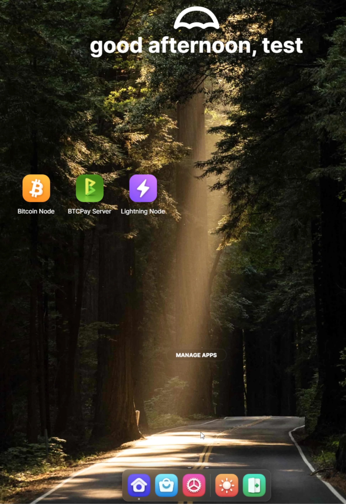


### خلاصه مهارت‌ها


در این بخش شما یاد گرفتید:


- مراحل نصب سرور BTCPay با قابلیت Lightning بر روی یک نود Umbrel


### ارزیابی دانش


#### بررسی مفهومی KA


راه‌اندازی در Umbrel چگونه با دو گزینه میزبانی قبلی متفاوت است؟


# بخش نهایی


<partId>d72e6fa5-0870-5f00-9143-9466ed22e2bd</partId>


## بررسی‌ها و رتبه‌بندی‌ها

<chapterId>d90bb93d-b894-551e-9fd6-6855c739a904</chapterId>

<isCourseReview>true</isCourseReview>

## پایان دوره


<chapterId>c07ac2a5-f97e-5c57-8a80-4955b48128d4</chapterId>

<isCourseConclusion>true</isCourseConclusion>