# Bitcoin i serwer BTCPay


Jest to kurs wprowadzający na temat operatora serwera BTCPay napisany przez Alekosa i Basa, który został dostosowany w formacie kursu Plan ₿ przez melontwist i asi0.


NIEDOKOŃCZONA HISTORIA


"To kłamstwa, moje zaufanie do ciebie zostało złamane, uczynię cię przestarzałym".


Wyprodukowany przez BTCPay Server Foundation


+++

# Wprowadzenie


<partId>59e43fe3-b494-5da6-b4b4-9df5bdf08916</partId>


## Przegląd kursu


<chapterId>785ed2bc-94ae-4962-a26a-edf5742a3c72</chapterId>


Witamy w kursie POS 305 na serwerze BTCPay!


Celem tego szkolenia jest nauczenie, jak zainstalować, skonfigurować i używać BTCPay Server w swojej firmie lub organizacji. BTCPay Server to rozwiązanie typu open source, które umożliwia autonomiczne, bezpieczne i ekonomiczne przetwarzanie płatności Bitcoin. Ten kurs jest skierowany przede wszystkim do zaawansowanych użytkowników, którzy chcą opanować samodzielne hostowanie BTCPay Server w celu pełnej integracji z codziennymi operacjami.


**Sekcja 1: Wprowadzenie do serwera BTCPay**

Zaczniemy od ogólnej prezentacji BTCPay Server, w tym ekranu logowania, zarządzania kontem użytkownika i tworzenia nowego sklepu. To wprowadzenie pomoże ci zrozumieć BTCPay Server Interface i uchwycić podstawowe funkcje potrzebne do rozpoczęcia korzystania z tego narzędzia.


**Sekcja 2: Wprowadzenie do zabezpieczania kluczy Bitcoin**

Bezpieczeństwo środków Bitcoin jest bardzo ważne. W tej sekcji omówimy generowanie kluczy kryptograficznych, korzystanie z portfeli sprzętowych w celu zabezpieczenia tych kluczy oraz sposób interakcji z kluczami za pośrednictwem serwera BTCPay. Dowiesz się również, jak skonfigurować serwer BTCPay Lightning Wallet, aby zoptymalizować transakcje.


**Sekcja 3: Serwer BTCPay Interface**

Ta część poprowadzi Cię przez Interface użytkownika serwera BTCPay. Dowiesz się, jak poruszać się po pulpicie nawigacyjnym, konfigurować ustawienia sklepu i serwera, zarządzać płatnościami i korzystać ze zintegrowanych wtyczek. Celem jest zapoznanie się z narzędziami potrzebnymi do dostosowania instalacji do własnych potrzeb.


**Sekcja 4: Konfiguracja serwera BTCPay**

Na koniec skupimy się na praktycznej instalacji serwera BTCPay w różnych środowiskach. Niezależnie od tego, czy korzystasz z LunaNode, Voltage czy węzła Umbrel, poznasz podstawowe kroki wdrażania i konfigurowania serwera BTCPay, biorąc pod uwagę specyfikę każdego środowiska.


Gotowy do opanowania BTCPay Server i rozwoju swojej firmy? Do dzieła!


## Krytyczne uznanie dla autorskiego Bitcoin i serwera BTCPay


<chapterId>e1fe6294-3c82-5203-9537-779f9087c35a</chapterId>


Zacznijmy od tego, czym jest BTCPay Server i skąd się wziął. Cenimy przejrzystość i pewne standardy, aby budować zaufanie w przestrzeni Bitcoin.

Jeden z projektów w tej przestrzeni złamał te wartości. Główny programista BTCPay Server, Nicolas Dorier, wziął to do siebie i złożył obietnicę, że je zdezaktualizuje. Jesteśmy tutaj wiele lat później i każdego dnia pracujemy nad tą przyszłością, w pełni open-source.


> To kłamstwo, moje zaufanie do ciebie zostało złamane, uczynię cię przestarzałym.
> Nicolas Dorier

Po słowach wypowiedzianych przez Nicolasa nadszedł czas, aby rozpocząć budowę. Wiele pracy włożono w to, co teraz nazywamy serwerem BTCPay. Więcej osób chciało pomóc w tym przedsięwzięciu. Najbardziej rozpoznawalni to r0ckstardev, MrKukks, Pavlenex i pierwszy sprzedawca korzystający z oprogramowania, astupidmoose.


Co oznacza open source i co składa się na taki projekt?


FOSS oznacza Wolne i Otwarte Oprogramowanie. Pierwszy z nich odnosi się do warunków, które pozwalają każdemu kopiować, modyfikować, a nawet rozpowszechniać wersje oprogramowania (nawet w celach zarobkowych). Drugi odnosi się do otwartego udostępniania kodu źródłowego, zachęcając społeczeństwo do jego współtworzenia i ulepszania.

Przyciąga to doświadczonych użytkowników entuzjastycznie nastawionych do współtworzenia oprogramowania, którego już używają i z którego czerpią wartość, co z czasem okazuje się być korzystniejsze niż oprogramowanie prawnie zastrzeżone. Jest to zgodne z etosem Bitcoin, że "informacja pragnie być wolna" Łączy ludzi z pasją, którzy tworzą społeczność i jest po prostu zabawniejszy. Podobnie jak Bitcoin, FOSS jest nieunikniony.


### Zanim zaczniemy


Ten kurs składa się z wielu części. O wiele z nich zadba nauczyciel, środowiska demonstracyjne, do których uzyskasz dostęp, serwer hostowany dla siebie i ewentualnie nazwa domeny. Jeśli ukończysz ten kurs samodzielnie, pamiętaj, że środowiska oznaczone jako DEMO nie będą dla Ciebie dostępne.

UWAGA. Jeśli śledzisz ten kurs w klasie, nazwy serwerów mogą się różnić w zależności od konfiguracji klasy. Z tego powodu zmienne w nazwach serwerów mogą się różnić.


### Struktura kursu


Każdy rozdział ma cele i oceny wiedzy. W tym kursie omówimy każdy z nich i podsumujemy kluczowe funkcje w każdym bloku lekcji (tj. rozdziale). Ilustracje są prezentowane w celu zapewnienia wizualnej informacji zwrotnej i wzmocnienia kluczowych koncepcji w aspekcie wizualnym. Cele są ustalane na początku każdego bloku lekcji. Cele te wykraczają poza listę kontrolną. Zapewniają one przewodnik po nowym zestawie umiejętności. Oceny wiedzy stopniowo zwiększają wyzwania związane z konfiguracją serwera BTCPay.


### Co studenci otrzymują w ramach kursu?


Dzięki kursowi BTCPay Server student może zrozumieć podstawowe zasady, techniczne i nietechniczne Bitcoin. Rozległe szkolenie w zakresie korzystania z Bitcoin za pośrednictwem BTCPay Server pozwoli uczniom obsługiwać własną infrastrukturę Bitcoin.


### Ważne adresy internetowe lub możliwości kontaktu


Fundacja BTCPay Server, która umożliwiła Alekosowi i Basowi napisanie tego kursu, znajduje się w Tokio w Japonii. Z fundacją BTCPay Server można skontaktować się za pośrednictwem wymienionej strony internetowej;


- https://foundation.btcpayserver.org
- dołącz do oficjalnych kanałów czatu :https://chat.btcpayserver.org


## Wprowadzenie do Bitcoin


<chapterId>5c0bc234-c188-5b4a-94d5-adee87a120e2</chapterId>


### Zrozumienie Bitcoin poprzez ćwiczenia w klasie


Jest to ćwiczenie w klasie, więc jeśli sam bierzesz udział w tym kursie, nie możesz go wykonać, ale możesz przejść przez to ćwiczenie. Aby ukończyć to zadanie, minimalna liczba osób wynosi od 9 do 11.


Ćwiczenie rozpoczyna się po obejrzeniu wprowadzenia "Jak działa Bitcoin i Blockchain" BBC.


:::video id=c20b6df7-0c3a-4785-94b9-42ef59093acc:::


To ćwiczenie wymaga udziału co najmniej dziewięciu osób. Ćwiczenie to ma na celu fizyczne zapoznanie się z działaniem Bitcoin. Odgrywając każdą rolę w sieci, będziesz mieć interaktywny i zabawny sposób nauki. To ćwiczenie nie obejmuje Lightning Network.


### Przykład; Wymaga 9 / 11 osób


Role te to :


- 1 Klient
- 1 Kupiec
- 7 do 9 węzłów Bitcoin


**Konfiguracja jest następująca:**


Klienci kupują produkt w sklepie z Bitcoin.


**Scenariusz 1 - Tradycyjny system bankowy**


- Konfiguracja:
  - Zobacz diagramy/wyjaśnienia w załączonym Figjam - [Activity Schematic](https://www.figma.com/file/ckmvMq02Jm2MegSsVCDFhc/Day-1-Classroom-Activity?type=whiteboard&node-id=0-1&t=KR31ofMaJX6S95UL-0).
  - Poproś trzech uczniów-ochotników o odegranie ról klienta (Alice), sprzedawcy (Bob) i banku.
- Odegraj sekwencję wydarzeń:
  - Klient - przegląda sklep online i znajduje przedmiot za 25 USD, który chce kupić, i informuje sprzedawcę, że chciałby dokonać zakupu
  - Sprzedawca - prosi o zapłatę.
  - Klient - wysyła informacje o karcie do sprzedawcy
  - Sprzedawca - przekazuje do Banku informacje (identyfikujące zarówno jego samego, jak i tożsamość/informacje) z żądaniem zapłaty
  - Bank zbiera informacje o kliencie i sprzedawcy (Alice i Bob) i sprawdza, czy saldo klienta jest wystarczające.
  - Odejmuje 25 USD z konta Alice, dodaje 24 USD do konta Boba, pobiera 1 USD za usługę
  - Sprzedawca otrzymuje kciuki od banku i wysyła produkt do klienta.
- Uwagi:
  - Bob i Alice muszą mieć relacje z bankiem.
  - Bank gromadzi informacje identyfikujące zarówno Boba, jak i Alice.
  - Bank wykonuje cięcie.
  - Bank musi przez cały czas sprawować pieczę nad pieniędzmi każdego uczestnika.


**Scenariusz 2 - System Bitcoin**


- Konfiguracja:
  - Zobacz diagramy/wyjaśnienia w załączonym Figjam - [Activity Schematic](https://www.figma.com/file/ckmvMq02Jm2MegSsVCDFhc/Day-1-Classroom-Activity?type=whiteboard&node-id=0-1&t=KR31ofMaJX6S95UL-0).
  - Zastąp Bank dziewięcioma uczniami, którzy odegrają rolę komputerów (węzłów/minerów Bitcoin) w sieci zastępującej Bank.
- Każdy z 9 komputerów posiada kompletny zapis historyczny wszystkich dokonanych w przeszłości transakcji (dzięki czemu salda są dokładne, bez fałszerstw), a także zestaw reguł:
  - Sprawdź, czy transakcja jest prawidłowo podpisana (thekeyfitsthelock)
  - Rozgłaszanie i odbieranie prawidłowych transakcji do peerów w sieci, odrzucanie nieprawidłowych (w tym tych, które próbują dwukrotnie wydać te same środki)
- Okresowo aktualizuj / dodawaj rekordy z nowymi transakcjami otrzymanymi od "losowego" komputera, pod warunkiem, że cała zawartość jest ważna (uwaga: na razie ignorujemy komponent Proof of Work do tego wszystkiego, dla uproszczenia), w przeciwnym razie odrzuć je i kontynuuj jak poprzednio, aż następny "losowy" komputer wyśle aktualizację
  - Odpowiednia kwota była nagradzana, jeśli zawartość była ważna.
- Odegraj sekwencję wydarzeń:
  - Klient - przegląda sklep online i znajduje przedmiot za 25 USD, który chce kupić, i informuje sprzedawcę, że chciałby dokonać zakupu
  - Sprzedawca - prosi o płatność, wysyłając klientowi Invoice/Address ze swojego Wallet.
  - Klient konstruuje transakcję (wysyłając BTC o wartości 25 USD do Address dostarczonego przez sprzedawcę) i transmituje ją do sieci Bitcoin.
- Komputery - odbierają transakcję i weryfikują ją:
  - W Address znajduje się co najmniej 25 USD BTC wysyłanych z
  - Transakcja została prawidłowo podpisana ("odblokowana" przez klienta)
  - Jeśli tak nie jest, transakcja nie zostanie rozpropagowana w sieci, a jeśli tak, to zostanie rozpropagowana i wstrzymana w oczekiwaniu.
  - Sprzedawcy mogą sprawdzić, czy transakcja jest oczekująca.
- Jeden komputer jest "losowo" wybierany, aby zaproponować sfinalizowanie proponowanej transakcji poprzez nadanie zawierającego ją "bloku"; jeśli się sprawdzi, otrzyma nagrodę w postaci BTC.
  - OPCJONALNE/ZAAWANSOWANE - zamiast losowo wybierać komputer, symuluj Mining poprzez rzucanie kośćmi przez komputery, aż do uzyskania z góry określonego wyniku (np. wybrany zostanie ten, który jako pierwszy wyrzuci podwójną szóstkę)
  - Może również odtworzyć, co by się stało, gdyby dwa komputery wygrały w przybliżeniu jednocześnie, powodując podział łańcucha.
  - Komputery sprawdzają ważność, aktualizują / dodają rekordy do swoich ksiąg, jeśli reguły są spełnione, i transmitują blok do rówieśników.
  - Losowo wybrany komputer otrzymuje nagrodę za zaproponowanie prawidłowego bloku.
  - Transakcja kontroli sprzedawcy została sfinalizowana; w związku z tym otrzymano środki, a przedmiot został wysłany do klienta.
- Uwagi:
  - Należy zauważyć, że nie było potrzeby wcześniejszej relacji bankowej.
  - Nie jest potrzebna żadna strona trzecia, aby to ułatwić; zastąpione kodem/zachętami.
  - Brak gromadzenia danych przez kogokolwiek spoza bezpośredniego Exchange i tylko niezbędna ilość musi być wymieniana między uczestnikami (np. wysyłka Address).
  - Nie jest wymagane zaufanie między osobami (innymi niż sprzedawca wysyłający przedmiot), podobnie jak w przypadku zakupu gotówkowego na wiele sposobów.
  - Pieniądze należą bezpośrednio do osób fizycznych.
  - Bitcoin Ledger jest przedstawiony w dolarach dla uproszczenia, ale w rzeczywistości jest to BTC.
  - Symulujemy nadawanie pojedynczej transakcji, ale w rzeczywistości w sieci oczekuje wiele transakcji, a bloki zawierają tysiące transakcji jednocześnie. Węzły sprawdzają również, czy nie ma oczekujących transakcji podwójnego wydatku (wyrzuciłbym wszystkie oprócz jednej, gdyby tak było).
- Scenariusze oszukiwania:
  - Co jeśli klient nie miał 25 BTC?
    - Nie byliby w stanie utworzyć transakcji, ponieważ "odblokowanie" i "Ownership" to to samo, a komputery sprawdzają, czy transakcja jest prawidłowo podpisana; w przeciwnym razie odrzucają ją
  - Co jeśli losowo wybrany komputer spróbuje "zmienić Ledger"?
    - Blok zostałby odrzucony, ponieważ każdy inny komputer ma pełną historię i zauważyłby zmianę, naruszając jedną z ich zasad.
    - Losowy komputer nie otrzymałby nagrody, a żadne transakcje z jego bloku nie zostałyby sfinalizowane.


## Ocena wiedzy


<chapterId>1461f064-933d-50ea-8935-324b68ec5d5f</chapterId>


### KA Dyskusja w klasie


Omów niektóre nadmierne uproszczenia dokonane w ćwiczeniu w klasie w ramach drugiego scenariusza i opisz bardziej szczegółowo, co robi rzeczywisty system Bitcoin.


### KA Przegląd słownictwa


Zdefiniuj następujące kluczowe terminy wprowadzone w poprzedniej sekcji:


- Węzeł
- Mempool
- Docelowy poziom trudności
- Blok


**Omówić znaczenie niektórych dodatkowych terminów jako grupa:**


Blockchain, transakcja, podwójny wydatek, bizantyjski problem generałów, Mining, Proof of Work (PoW), funkcja Hash, Block reward, Blockchain, najdłuższy łańcuch, atak 51%, wyjście, blokada wyjścia, zmiana, satoshis, klucz publiczny/prywatny, Address, kryptografia klucza publicznego, podpis cyfrowy, Wallet


# Przedstawiamy serwer BTCPay


<partId>9c8a2d0c-9ba1-5c39-874c-f9eaf1bba663</partId>


## Zrozumienie ekranu logowania do serwera BTCPay


<chapterId>14aad54c-9bd8-54f2-9455-178b8ae63408</chapterId>


### Praca z serwerem BTCPay


Celem tego bloku kursu będzie ogólne zrozumienie oprogramowania BTCPay Server. W środowisku współdzielonym zaleca się śledzenie demonstracji instruktora i podążanie za podręcznikiem BTCPay Server, aby podążać za nauczycielem. Dowiesz się, jak utworzyć Wallet za pomocą wielu metod. Przykłady obejmują konfiguracje Hot Wallet i portfele sprzętowe połączone za pośrednictwem BTCPay Server Vault. Cele te występują w środowisku demonstracyjnym, wyświetlanym i udostępnianym przez instruktora kursu.


Jeśli śledzisz ten kurs samodzielnie, możesz znaleźć listę hostów innych firm do celów demonstracyjnych na stronie https://directory.btcpayserver.org/filter/hosts. Zdecydowanie odradzamy korzystanie z tych opcji innych firm jako środowisk produkcyjnych, ale służą one właściwym celom jako wprowadzenie do korzystania z Bitcoin i BTCPay Server.


Jako stażysta BTCPay Server Rockstar możesz mieć wcześniejsze doświadczenie w konfigurowaniu węzła Bitcoin. Ten kurs będzie specjalnie dostosowany do stosu oprogramowania BTCPay Server.


Wiele opcji w BTCPay Server istnieje w takiej czy innej formie w innym oprogramowaniu związanym z Bitcoin Wallet.


### Ekran logowania do serwera BTCPay


Gdy zostaniesz powitany w środowisku demonstracyjnym, zostaniesz poproszony o "Zaloguj się" lub "Utwórz konto" Administratorzy serwera mogą wyłączyć funkcję tworzenia nowych kont ze względów bezpieczeństwa. Logo BTCPay Server i kolory przycisków mogą być zmieniane, ponieważ BTCPay Server jest oprogramowaniem Open Source. Zewnętrzny host może oznaczyć oprogramowanie białą etykietą i zmienić cały wygląd.


### Okno Utwórz konto


Tworzenie kont na serwerze BTCPay wymaga prawidłowych ciągów adresu e-mail Address; example@email.com będzie prawidłowym ciągiem adresu e-mail.


Hasło musi mieć co najmniej 8 znaków, w tym litery, cyfry i znaki. Po jednokrotnym ustawieniu hasła należy zweryfikować wpisane hasło, aby upewnić się, że jest ono zgodne z hasłem wpisanym w pierwszym polu hasła.


Po prawidłowym wypełnieniu pól adresu e-mail i hasła kliknij przycisk "Utwórz konto". Spowoduje to zapisanie adresu e-mail i hasła na instancji serwera BTCPay instruktora.


**Uwaga!


Jeśli śledzisz ten kurs samodzielnie, utworzenie tego konta byłoby czymś, co mógłbyś zrobić na hoście innej firmy; dlatego ponownie wspominamy, aby nigdy nie używać ich jako środowisk produkcyjnych, ale tylko do celów szkoleniowych.


### Tworzenie konta przez administratora serwera BTCPay


Administrator instancji serwera BTCPay może również tworzyć konta dla serwera BTCPay. Administrator instancji serwera BTCPay może kliknąć "Ustawienia serwera" (1), kliknąć zakładkę "Użytkownicy" (2) i kliknąć przycisk "+ Dodaj użytkownika" (3) w prawym górnym rogu zakładki Użytkownicy. W celu (4.3) dowiesz się więcej o kontroli administratora nad kontami.


Jako administrator musisz podać adres e-mail użytkownika Address i ustawić standardowe hasło. Administrator powinien poinformować użytkownika o konieczności zmiany hasła przed rozpoczęciem korzystania z konta ze względów bezpieczeństwa. Jeśli administrator NIE ustawi hasła, a SMTP zostało ustawione na serwerze, użytkownik otrzyma wiadomość e-mail z linkiem zapraszającym do utworzenia konta i samodzielnego ustawienia hasła.


### Przykład


W przypadku korzystania z kursu prowadzonego przez instruktora należy kliknąć link podany przez instruktora i utworzyć konto w udostępnionym środowisku demonstracyjnym. Upewnij się, że Twój adres e-mail Address i hasło są bezpiecznie zapisane; będziesz potrzebować tych danych logowania do pozostałych celów demonstracyjnych w tym kursie.


Twój instruktor mógł wcześniej zebrać wiadomości e-mail Address i wysłać link z zaproszeniem przed tym ćwiczeniem. W razie potrzeby sprawdź pocztę e-mail.


Jeśli bierzesz udział w kursie bez instruktora, utwórz konto za pomocą środowiska demonstracyjnego BTCPay Server; przejdź do


https://Mainnet.demo.btcpayserver.org/login.


To konto powinno być używane wyłącznie do celów demonstracyjnych/szkoleniowych i nigdy do celów biznesowych.


### Podsumowanie umiejętności


W tej sekcji dowiedziałeś się następujących rzeczy:


- Jak utworzyć konto na serwerze hostowanym przez Interface.
- W jaki sposób administrator serwera może ręcznie dodawać użytkowników w ustawieniach serwera.


### Ocena wiedzy


#### Przegląd koncepcji KA


Podaj powody, dla których używanie serwera demonstracyjnego jest złym pomysłem do celów produkcyjnych.


## Zarządzanie kontami użytkowników


<chapterId>b58ca6ee-b7fc-5e81-a6aa-c8ff212b4c55</chapterId>


### Zarządzanie kontem na serwerze BTCPay


Po utworzeniu konta właściciel sklepu może nim zarządzać w lewym dolnym rogu interfejsu użytkownika serwera BTCPay. Pod przyciskiem Konto znajduje się wiele ustawień wyższego poziomu.


- Tryb ciemny/jasny.
- Przełącznik Ukryj poufne informacje.
- Zarządzaj kontem.


### Tryb ciemny i jasny


Użytkownicy BTCPay Server mogą wybrać wersję interfejsu użytkownika w trybie jasnym lub ciemnym. Strony skierowane do klienta nie zmienią się. Używają one preferowanych przez klienta ustawień dotyczących trybu ciemnego lub jasnego.


### Ukryj przełącznik poufnych informacji


Przycisk ukryj poufne informacje zapewnia szybkie i proste zabezpieczenie Layer. Za każdym razem, gdy musisz obsługiwać swój serwer BTCPay, ale ktoś może czaić się nad twoim ramieniem w przestrzeni publicznej, włącz opcję Ukryj poufne informacje, a wszystkie wartości na serwerze BTCPay zostaną ukryte. Ktoś może być w stanie spojrzeć przez ramię, ale nie może już zobaczyć wartości, z którymi masz do czynienia.


### Zarządzaj kontem


Po utworzeniu konta użytkownika w tym miejscu można zarządzać hasłami, 2fa lub kluczami API.


### Zarządzaj kontem - Konto


Opcjonalnie zaktualizuj swoje konto za pomocą innego adresu e-mail Address. Aby upewnić się, że adres e-mail Address jest poprawny, serwer BTCPay umożliwia wysłanie wiadomości weryfikacyjnej. Kliknij Zapisz, jeśli użytkownik ustawi nowy adres e-mail Address i potwierdzi, że weryfikacja przebiegła pomyślnie. Nazwa użytkownika pozostaje taka sama jak w poprzednim e-mailu.


Użytkownik może zdecydować się na usunięcie całego swojego konta. Można to zrobić, klikając przycisk Usuń na karcie Konto.


**Uwaga!


Po zmianie adresu e-mail nazwa użytkownika konta nie ulegnie zmianie. Poprzednio podany adres e-mail Address pozostanie nazwą logowania.


### Zarządzaj kontem - hasło


Uczeń może chcieć zmienić swoje hasło. Może to zrobić, przechodząc do zakładki Hasło. Tutaj musi wpisać swoje stare hasło i może je zmienić na nowe.


### Uwierzytelnianie dwuskładnikowe (2fa)


Aby ograniczyć konsekwencje kradzieży hasła, można użyć uwierzytelniania dwuskładnikowego (2fa), stosunkowo nowej metody zabezpieczeń. Uwierzytelnianie dwuskładnikowe można aktywować za pomocą opcji Zarządzaj kontem i zakładki Uwierzytelnianie dwuskładnikowe. Po zalogowaniu się przy użyciu nazwy użytkownika i hasła należy wykonać drugi krok.


Serwer BTCPay pozwala na dwa sposoby włączenia 2FA, 2FA opartego na aplikacji (Authy, Google, Microsoft authenticators) lub za pośrednictwem urządzeń zabezpieczających (FIDO2 lub LNURL Auth).


### Uwierzytelnianie dwuskładnikowe - oparte na aplikacji


W zależności od systemu operacyjnego telefonu komórkowego (Android lub iOS), użytkownicy mogą wybierać spośród następujących aplikacji;


1. Pobierz dwuskładnikowy uwierzytelniacz;


   - Authy dla [Android](https://play.google.com/store/apps/details?id=com.authy.authy) lub [iOS](https://apps.apple.com/us/app/authy/id494168017)
   - Microsoft Authenticator dla [Android](https://play.google.com/store/apps/details?id=com.azure.authenticator) lub [iOS](https://apps.apple.com/us/app/microsoft-authenticator/id983156458)
   - Google Authenticator dla [Android](https://play.google.com/store/apps/details?id=com.google.android.apps.authenticator2&hl=e%C2%80) lub [iOS](https://apps.apple.com/us/app/google-authenticator/id388497605)

2. Po pobraniu i zainstalowaniu aplikacji Authenticator.


   - Zeskanuj kod QR dostarczony przez serwer BTCPay
   - Możesz też ręcznie wprowadzić klucz wygenerowany przez serwer BTCPay do aplikacji Authenticator.

3. Aplikacja Authenticator dostarczy Ci unikalny kod. Wprowadź unikalny kod na serwerze BTCPay, aby zweryfikować konfigurację, i kliknij przycisk weryfikacji, aby zakończyć proces.


### Podsumowanie umiejętności


W tej sekcji dowiedziałeś się następujących rzeczy:


- Opcje zarządzania kontem i różne sposoby zarządzania kontem w instancji BTCPay Server.
- Jak skonfigurować 2FA oparte na aplikacji.


### Ocena wiedzy


#### Przegląd koncepcji KA


Opisz, w jaki sposób 2FA oparte na aplikacji pomaga zabezpieczyć Twoje konto


## Tworzenie nowego sklepu


<chapterId>463b3634-b49f-5512-a711-3b2e096fc2e0</chapterId>


### Utwórz kreatora sklepu


Gdy nowy użytkownik loguje się do BTCPay Server, środowisko jest puste i wymaga pierwszego sklepu. Kreator wprowadzenia BTCPay Server daje użytkownikowi opcję "Utwórz swój sklep" (1). Sklep może być postrzegany jako dom dla potrzeb Bitcoin. Nowy węzeł BTCPay Server rozpocznie się od synchronizacji Bitcoin Blockchain (2). W zależności od infrastruktury, na której działa serwer BTCPay, może to potrwać od kilku godzin do kilku dni. Aktualna wersja instancji jest wyświetlana w prawym dolnym rogu interfejsu użytkownika serwera BTCPay. Jest to przydatne podczas rozwiązywania problemów.


### Utwórz kreatora sklepu


Postępowanie zgodnie z tym kursem rozpocznie się od nieco innego ekranu niż na poprzedniej stronie. Ponieważ Twój instruktor przygotował środowisko demonstracyjne, Bitcoin Blockchain został wcześniej zsynchronizowany, dlatego nie zobaczysz stanu synchronizacji węzłów.


Użytkownik może zdecydować o usunięciu całego swojego konta. Można to zrobić, klikając przycisk Usuń na karcie Konto.


**Uwaga!


Konta BTCPay Server mogą tworzyć nieograniczoną liczbę sklepów. Każdy sklep jest Wallet lub "domem".


### Przykład


Zacznij od kliknięcia "Utwórz swój sklep".


Spowoduje to utworzenie pierwszego ekranu głównego i pulpitu nawigacyjnego do korzystania z serwera BTCPay.


(1) Po kliknięciu przycisku "Utwórz sklep" serwer BTCPay będzie wymagał podania nazwy sklepu; może to być dowolna przydatna nazwa.


(2) Następnie należy ustawić domyślną walutę sklepu, albo walutę fiducjarną, albo denominowaną w standardzie Bitcoin / Sats. Dla środowiska demonstracyjnego ustawimy ją na USD.


(3) Jako ostatni parametr w konfiguracji sklepu, serwer BTCPay wymaga ustawienia "Preferowanego źródła ceny" w celu porównania ceny Bitcoin z bieżącą ceną fiat, aby sklep wyświetlał prawidłowy kurs Exchange między Bitcoin a walutą fiat ustawioną w sklepie. W przykładzie demonstracyjnym pozostaniemy przy wartości domyślnej i ustawimy ją na Kraken Exchange. Serwer BTCPay używa interfejsu API Kraken do sprawdzania kursów Exchange.


(4) Po ustawieniu tych parametrów sklepu kliknij przycisk Utwórz, a serwer BTCPay utworzy pulpit nawigacyjny pierwszego sklepu, w którym kreator będzie kontynuował.


Gratulacje, utworzyłeś swój pierwszy sklep i to kończy to ćwiczenie.


### Podsumowanie umiejętności


W tej sekcji dowiedziałeś się:


- Tworzenie sklepu i konfigurowanie domyślnej waluty w połączeniu z preferencjami źródła cen.
- Każdy "Sklep" to nowy dom oddzielony od innych sklepów w tej instalacji serwera BTCPay.


# Wprowadzenie do zabezpieczania kluczy Bitcoin


<partId>25da22d8-fd37-51c5-af2a-58b9f3b046b2</partId>


## Zrozumienie generowania kluczy Bitcoin


<chapterId>d162735b-847b-578e-83b8-a044ab703ec5</chapterId>


### Co jest zaangażowane w generowanie kluczy Bitcoin?


Portfele Bitcoin po utworzeniu tworzą tak zwany "seed". W ostatnim celu utworzyłeś "seed", Seria słów wygenerowanych wcześniej jest również znana jako frazy Mnemonic. seed służy do uzyskiwania indywidualnych kluczy Bitcoin i jest używany do wysyłania lub odbierania Bitcoin. Frazy seed nigdy nie powinny być udostępniane stronom trzecim lub niezaufanym partnerom.


Generowanie seed odbywa się zgodnie ze standardem branżowym znanym jako "Hierarchical Deterministic" (HD).


### Adresy


Serwer BTCPay zbudowany do generate nowego Address. Eliminuje to problem ponownego użycia klucza publicznego lub Address. Używanie tego samego klucza publicznego bardzo ułatwia śledzenie całej historii płatności. Myślenie o kluczach jako jednorazowych voucherach znacznie poprawiłoby prywatność. Używamy również adresów Bitcoin, nie należy ich mylić z kluczami publicznymi.


Address jest wyprowadzany z klucza publicznego za pomocą "algorytmu haszującego" Większość portfeli i transakcji wyświetla jednak adresy, a nie klucze publiczne. Adresy są generalnie krótsze niż klucze publiczne i zwykle zaczynają się od `1`, `3` lub `bc1`, podczas gdy klucze publiczne zaczynają się od `02`, `03` lub `04`.


- Adresy zaczynające się od `1.....` są nadal bardzo powszechnymi adresami. Jak wspomniano w rozdziale Tworzenie nowego sklepu, są to starsze adresy. Ten typ Address jest przeznaczony dla transakcji P2PKH. P2Pkh używa kodowania Base58, co rozróżnia wielkość liter w Address. Jego struktura opiera się na kluczu publicznym z dodatkową 1 cyfrą jako identyfikatorem.


- Adresy zaczynające się od `bc1...` powoli przechodzą do bardzo popularnych adresów. Są one znane jako (natywne) adresy SegWit. Oferują one lepszą strukturę opłat niż inne wspomniane adresy. Natywne adresy SegWit używają kodowania Bech32 i pozwalają tylko na małe litery.


- Adresy zaczynające się od `3...` są nadal powszechnie używane przez giełdy jako adresy depozytowe. Adresy te są wspomniane w rozdziale Tworzenie nowego sklepu, zawinięte lub zagnieżdżone adresy SegWit. Mogą one jednak również funkcjonować jako "Multisig Address". Gdy są używane jako SegWit Address, ponownie występują pewne oszczędności na opłatach transakcyjnych, mniejsze niż w przypadku natywnego SegWit. Adresy P2SH używają kodowania Base58. Sprawia to, że jest on wrażliwy na wielkość liter, podobnie jak starszy Address.


- Adresy zaczynające się od `2...` są adresami Testnet. Są one przeznaczone do otrzymywania Testnet Bitcoin (tBTC). Nigdy nie należy ich mylić i wysyłać Bitcoin na te adresy. Do celów rozwojowych można generate a Testnet Wallet. Istnieje wiele kranów online, aby uzyskać Testnet Bitcoin. Nigdy nie kupuj Testnet Bitcoin. Testnet Bitcoin jest wydobywany. Może to być powód, dla którego deweloper powinien używać Regtest. Jest to środowisko zabaw dla programistów, w którym brakuje niektórych komponentów sieciowych. Bitcoin jest jednak bardzo przydatne do celów programistycznych.


### Klucze publiczne


Klucze publiczne są obecnie rzadziej używane w praktyce. Z czasem użytkownicy Bitcoin zastąpili je adresami. Wciąż istnieją i są okazjonalnie używane. Klucze publiczne są generalnie znacznie dłuższymi ciągami znaków niż adresy. Podobnie jak w przypadku adresów, zaczynają się one od określonego identyfikatora.


- Po pierwsze, `02...` i `03...` są bardzo standardowymi identyfikatorami klucza publicznego zakodowanymi w formacie SEC. Mogą one być przetwarzane i przekształcane w adresy do odbioru, używane do tworzenia adresów multi-sig lub do weryfikacji podpisu. Wczesne transakcje Bitcoin wykorzystywały klucze publiczne jako część transakcji P2PK.


- Portfele HD używają jednak innej struktury. `xpub...`, `ypub...` lub `zpub...` są nazywane rozszerzonymi kluczami publicznymi, a raczej xpub. Klucze te są używane do wyprowadzania wielu kluczy publicznych, ponieważ są częścią HD Wallet. Ponieważ xpub przechowuje zapisy całej historii użytkownika, co oznacza przeszłe i przyszłe transakcje, nigdy nie należy udostępniać ich niezaufanym stronom.


### Podsumowanie umiejętności


W tej sekcji dowiedziałeś się następujących rzeczy:


- Różnice między adresami a typami danych klucza publicznego oraz korzyści wynikające z używania adresów zamiast kluczy publicznych.


### Ocena wiedzy


Opis korzyści płynących z używania nowych adresów dla każdej transakcji w porównaniu do ponownego użycia Address lub metod klucza publicznego


## Zabezpieczanie kluczy za pomocą Hardware Wallet


<chapterId>c54a6d61-5a43-5fdb-93ae-c6750de9c612</chapterId>


### Przechowywanie kluczy Bitcoin


Po wygenerowaniu frazy seed, lista 12-24 słów wygenerowanych w tej książce wymaga odpowiednich kopii zapasowych i zabezpieczeń, ponieważ słowa te są jedynym sposobem na odzyskanie dostępu do Wallet. Struktura portfeli HD i sposób generowania adresów deterministycznie przy użyciu tego jednego seed, wszystkie utworzone adresy zostaną zarchiwizowane przy użyciu tej jednej listy słów Mnemonic reprezentujących seed lub frazę odzyskiwania.


Zabezpiecz swoją frazę odzyskiwania. Jeśli ktoś uzyska do niej dostęp, szczególnie w złym zamiarze, może przenieść Twoje środki. Przechowywanie klucza seed w bezpiecznym miejscu, ale także pamiętanie o tym, jest dla siebie wzajemne. Istnieje kilka metod przechowywania kluczy prywatnych Bitcoin, z których każda ma zalety i wady, zarówno pod względem bezpieczeństwa, prywatności, wygody, jak i środków fizycznych. Ze względu na znaczenie kluczy prywatnych, użytkownicy Bitcoin mają tendencję do przechowywania i bezpiecznego przechowywania tych kluczy w ramach "własnej opieki" zamiast korzystania z usług "powierniczych", takich jak banki. W zależności od użytkownika, musi on korzystać z rozwiązania do przechowywania Cold lub Hot Wallet.


### Hot i Cold przechowujące klucze Bitcoin


Zazwyczaj portfele Bitcoin są denominowane w Hot Wallet lub Cold Wallet. Większość kompromisów dotyczy wygody, łatwości użytkowania i ryzyka związanego z bezpieczeństwem. Każdą z tych metod można również zobaczyć w rozwiązaniu powierniczym. Jednak kompromisy w tym przypadku są głównie oparte na bezpieczeństwie i prywatności i wykraczają poza zakres tego kursu.


### Hot Wallet


Portfele Hot to najwygodniejszy sposób interakcji z Bitcoin za pośrednictwem oprogramowania mobilnego, internetowego lub stacjonarnego. Wallet jest zawsze podłączony do Internetu, umożliwiając użytkownikom wysyłanie lub odbieranie Bitcoin. Jest to jednak również jego słabość, Wallet, ponieważ jest zawsze online, jest teraz bardziej podatny na ataki hakerów lub złośliwego oprogramowania na urządzeniu. W BTCPay Server portfele Hot przechowują klucze prywatne na instancji. Każdy, kto uzyska dostęp do sklepu BTCPay Server, może ukraść środki z tego Address, jeśli jest złośliwy. Gdy BTCPay Server działa w środowisku hostowanym, należy zawsze brać to pod uwagę w profilu bezpieczeństwa i najlepiej nie używać Hot-Wallet w takim przypadku. Gdy serwer BTCPay jest zainstalowany na własnym sprzęcie, zabezpieczonym i zaufanym przez użytkownika, profil ryzyka znacznie się obniża, ale nigdy nie znika!


### Cold Wallet


Osoby fizyczne przenoszą swoje Bitcoin do Cold Wallet, ponieważ mogą odizolować klucze prywatne od Internetu. Usunięcie połączenia internetowego z równania zmniejsza ryzyko złośliwego oprogramowania, oprogramowania szpiegującego i zamiany kart SIM. Uważa się, że pamięć Cold jest lepsza od pamięci Hot pod względem bezpieczeństwa i autonomii, o ile podjęte zostaną odpowiednie środki ostrożności w celu uniknięcia utraty kluczy prywatnych Bitcoin. Pamięć Cold jest najbardziej odpowiednia dla dużych ilości Bitcoin, które nie są przeznaczone do częstego wydawania ze względu na złożoność konfiguracji Wallet.


Istnieją różne metody przechowywania kluczy Bitcoin w pamięci Cold, od portfeli papierowych po portfele mózgowe, portfele sprzętowe lub, od początku, plik Wallet. Większość portfeli używa BIP 39 do generate frazy seed. Jednak w ramach podstawowego oprogramowania Bitcoin nie osiągnięto jeszcze konsensusu w sprawie jego używania. Oprogramowanie Bitcoin Core nadal generate plik Wallet.dat, który należy przechowywać w bezpiecznej lokalizacji offline.


### Podsumowanie umiejętności


W tej części dowiedziałeś się:


- Różnice między portfelami Hot i Cold pod względem funkcjonalności i ich kompromisów.


### Ocena wiedzy Przegląd koncepcji


- Co to jest Wallet?


- Jaka jest różnica między portfelami Hot i Cold?


- Co należy rozumieć przez "generowanie Wallet"?


## Korzystanie z kluczy Bitcoin


<chapterId>bff488de-5052-56e6-b696-97e896f762ae</chapterId>


### Serwer BTCPay Wallet


BTCPay Server składa się z następujących standardowych funkcji Wallet:


- Transakcje
- Wyślij
- Odbiór
- Rescan
- Pull Payments
- Wypłaty
- PSBT
- Ustawienia ogólne


### Transakcje


Administratorzy mogą zobaczyć transakcje przychodzące i wychodzące dla On-Chain Wallet podłączonego do tego konkretnego sklepu w widoku transakcji. Każda transakcja ma rozróżnienie na odebraną i wysłaną. Transakcje otrzymane będą miały kolor Green, a transakcje wychodzące będą miały kolor czerwony. W widoku transakcji serwera BTCPay administratorzy zobaczą również zestaw standardowych etykiet.


| Transaction Type | Description                                          |
| ---------------- | ---------------------------------------------------- |
| App              | Payment was received through an app created invoice  |
| invoice          | Payment was received through an invoice              |
| payjoin          | Not paid, invoice timer still has not expired        |
| payjoin-exposed  | UTXO was exposed through an invoice payjoin proposal |
| payment-request  | Payment was received through a payment request       |
| payout           | Payment was sent through a payout or refund          |

### Jak wysłać


Funkcja wysyłania serwera BTCPay wysyła transakcje z serwera BTCPay On-Chain Wallet. Serwer BTCPay pozwala na wiele sposobów podpisywania transakcji w celu wydania środków. Transakcja może być podpisana za pomocą;


- Hardware Wallet
- Portfele wspierające PSBT
- Klucz prywatny HD lub nasiona odzyskiwania.
- Hot Wallet


#### Hardware Wallet


BTCPay Server ma wbudowaną obsługę Hardware Wallet, umożliwiając korzystanie z Hardware Wallet z BTCPay Vault bez wycieku informacji do aplikacji lub serwerów innych firm. Integracja Hardware Wallet z BTCPay Server umożliwia importowanie Hardware Wallet i wydawanie przychodzących środków za pomocą prostego potwierdzenia na urządzeniu. Klucze prywatne nigdy nie opuszczają urządzenia, a wszystkie środki są weryfikowane w odniesieniu do Full node, więc nie ma wycieku danych.


#### Podpisywanie za pomocą Wallet obsługującego PSBT


PSBT (częściowo podpisane transakcje Bitcoin) to format wymiany dla transakcji Bitcoin, które nadal wymagają pełnego podpisania. PSBT jest obsługiwany na serwerze BTCPay i może być podpisywany za pomocą kompatybilnych portfeli sprzętowych i programowych.


Konstrukcja w pełni podpisanej transakcji Bitcoin obejmuje następujące kroki:


- PSBT zostaje skonstruowany z określonymi wejściami i wyjściami, ale bez sygnatur
- Wyeksportowany PSBT może zostać zaimportowany przez Wallet obsługujący ten format
- Dane transakcji można sprawdzić i podpisać za pomocą Wallet
- Podpisany plik PSBT jest eksportowany z Wallet i importowany do serwera BTCPay
- Serwer BTCPay generuje ostateczną transakcję Bitcoin
- Weryfikujesz wynik i transmitujesz go do sieci


#### Podpisywanie za pomocą klucza prywatnego HD lub Mnemonic seed


Jeśli utworzyłeś Wallet przed użyciem serwera BTCPay, możesz wydać środki, wprowadzając swój klucz prywatny w odpowiednim polu. Ustaw odpowiednią ścieżkę "AccountKeyPath" w Wallet> Settings; w przeciwnym razie nie będzie można wydać środków.


#### Podpisywanie za pomocą Hot Wallet


Jeśli podczas konfigurowania sklepu utworzono nowy Wallet i włączono go jako Hot Wallet, automatycznie użyje on seed przechowywanego na serwerze do podpisania.


### RBF (Replace-by-fee)


Replace-by-fee (RBF) to funkcja protokołu Bitcoin, która umożliwia zastąpienie wcześniej nadanej transakcji (gdy jest ona jeszcze niepotwierdzona). Pozwala to na randomizację odcisku palca transakcji Wallet lub zastąpienie go wyższą stawką opłaty, aby przesunąć transakcję wyżej w kolejce priorytetu potwierdzenia (Mining). Skutecznie zastąpi to pierwotną transakcję, ponieważ wyższa stawka opłaty będzie traktowana priorytetowo, a po potwierdzeniu unieważni pierwotną transakcję (brak podwójnego wydatku).


Naciśnij przycisk "Ustawienia zaawansowane", aby wyświetlić opcje RBF;


- Randomizuj dla większej prywatności, Umożliwia automatyczne zastąpienie transakcji w celu randomizacji odcisku palca transakcji.
- Tak, transakcja z flagą dla RBF i wyraźne zastąpienie (nie jest zastępowana domyślnie, tylko przez dane wejściowe)
- Nie, nie zezwalaj na zastąpienie transakcji.


### Wybór monet


Wybór monet to zaawansowana funkcja zwiększająca prywatność, która pozwala wybrać monety, które chcesz wydać podczas tworzenia transakcji. Na przykład, płacąc monetami, które są świeże z mieszanki conjoin.


Wybór monet działa natywnie z funkcją etykiet Wallet. Pozwala to na oznaczanie przychodzących środków w celu sprawniejszego zarządzania i wydawania UTXO.


BTCpay Server obsługuje również BIP-329 do zarządzania etykietami. BIP-329 pozwala na etykiety na; jeśli przeniesiesz się z Wallet obsługującego ten konkretny BIP i ustawisz etykiety, BTCPay Server rozpozna je i zaimportuje. Podczas migracji serwerów informacje te można również eksportować i importować do nowego środowiska.


### Jak otrzymać


Kliknięcie przycisku odbioru na serwerze BTCPay powoduje wygenerowanie nieużywanego Address, którego można użyć do odbierania płatności. Administratorzy mogą również generate nowy Address, generując nowy "Invoice"


Serwer BTCPay zawsze poprosi o generate następnego dostępnego Address, aby uniknąć ponownego użycia Address. Po kliknięciu "generate następny dostępny BTC Address", serwer BTCPay wygeneruje nowy Address i QR. Umożliwia również bezpośrednie ustawienie etykiety na Address w celu lepszego zarządzania adresami.


#### Ponowne skanowanie


Funkcja ponownego skanowania opiera się na "Scantxoutset" Bitcoin Core 0.17.0 w celu przeskanowania bieżącego stanu Blockchain (zwanego zestawem UTXO) w poszukiwaniu monet należących do skonfigurowanego schematu derywacji. Ponowne skanowanie Wallet rozwiązuje dwa problemy, z którymi borykają się użytkownicy serwera BTCPay.


1. Problem z limitem luk - Większość portfeli innych firm to lekkie portfele, które współdzielą węzeł między wieloma użytkownikami. Lekkie i zależne od Full node portfele ograniczają liczbę (zazwyczaj 20) adresów bez salda, które śledzą na Blockchain, aby zapobiec problemom z wydajnością. Serwer BTCPay generuje nowy Address dla każdego Invoice. Mając na uwadze powyższe, po wygenerowaniu przez serwer BTCPay 20 kolejnych niezapłaconych faktur, zewnętrzny Wallet przestaje pobierać transakcje, zakładając, że nie wystąpiły żadne nowe transakcje. Twój zewnętrzny Wallet nie pokaże ich, gdy faktury zostaną opłacone 21, 22 itd. Z drugiej strony, wewnętrznie, serwer BTCPay Wallet śledzi każdy Address, który generuje wraz ze znacznie większym limitem luki. Nie polega na stronie trzeciej i zawsze może pokazać prawidłowe saldo.

2. Rozwiązanie limitu luk - Jeśli [zewnętrzny/istniejący Wallet](https://docs.btcpayserver.org/WalletSetup/#use-an-existing-Wallet) umożliwia konfigurację limitu luk, łatwym rozwiązaniem jest jego zwiększenie. Jednak większość portfeli na to nie pozwala. Jedyne portfele, które pozwalają na konfigurację limitu luk, jakie znamy, to Electrum, Wasabi i Sparrow Wallet. Niestety, prawdopodobnie napotkasz problem z wieloma innymi portfelami. Aby uzyskać najlepsze wrażenia użytkownika i prywatność, należy rozważyć porzucenie zewnętrznych portfeli i korzystanie z wewnętrznego Wallet serwera BTCPay.


#### Serwer BTCPay używa "mempoolfullrbf=1"


Serwer BTCPay używa "mempoolfullrbf=1"; dodaliśmy to jako domyślne do konfiguracji serwera BTCPay. Udostępniliśmy jednak również fragment, który można samodzielnie wyłączyć. Bez "mempoolfullrbf=1", jeśli klient dwukrotnie wyda płatność z transakcją nie sygnalizującą RBF, sprzedawca dowie się o tym dopiero po potwierdzeniu.


Administrator może chcieć zrezygnować z tego ustawienia. Za pomocą poniższego ciągu znaków można zmienić ustawioną wartość domyślną.


```
BTCPAYGEN_EXCLUDE_FRAGMENTS="$BTCPAYGEN_EXCL UDE_FRAGMENTS;opt-mempoolfullrbf"
. btcpay-setup.sh -i**
```


### Ustawienia Wallet serwera BTCPay


Ustawienia Wallet w BTCPay Server dają jasny i szybki przegląd ogólnych ustawień Wallet. Wszystkie te ustawienia są wstępnie wypełnione, jeśli Wallet został utworzony za pomocą BTCPay Server.


Ustawienia Wallet w BTCPay Server zapewniają przejrzysty i szybki przegląd ogólnych ustawień Wallet. Wszystkie te ustawienia są wstępnie wypełnione, jeśli Wallet został utworzony za pomocą BTCPay Server. Ustawienia Wallet BTCPay Server zaczynają się od statusu Wallet. Czy jest to Wallet typu Watch-only czy Hot? W zależności od typu Wallet działania mogą się różnić od ponownego skanowania Wallet pod kątem brakujących transakcji, przycinania starych transakcji z historii, rejestrowania Wallet dla linków płatności lub zastępowania i usuwania bieżącego Wallet dołączonego do sklepu. W ustawieniach Wallet serwera BTCPay administratorzy mogą ustawić etykietę dla Wallet w celu lepszego zarządzania Wallet. Tutaj administrator będzie mógł również zobaczyć schemat derywacji, klucz konta (xpub), odcisk palca i ścieżkę klucza. Płatności w ustawieniach Wallet mają tylko 2 główne ustawienia. Płatność jest nieważna, jeśli transakcja nie zostanie potwierdzona w (ustawionych minutach) po wygaśnięciu Invoice. Uznaj Invoice za potwierdzony, gdy transakcja płatnicza ma X potwierdzeń. Administratorzy mogą również ustawić przełącznik, aby wyświetlać zalecane opłaty przy płatnościach lub ustawić cel ręcznego potwierdzenia w liczbie bloków.


**Uwaga!


Jeśli śledzisz ten kurs samodzielnie, utworzenie tego konta byłoby czymś, co mógłbyś zrobić na hoście innej firmy, dlatego ponownie wspominamy, aby nigdy nie używać ich jako środowisk produkcyjnych, ale raczej tylko do celów szkoleniowych.


### Przykład


#### Skonfiguruj Bitcoin Wallet na serwerze BTCPay


Serwer BTCPay umożliwia dwa sposoby konfiguracji Wallet. Jednym ze sposobów jest zaimportowanie już istniejącego Bitcoin Wallet. Importu można dokonać poprzez podłączenie Hardware Wallet, zaimportowanie pliku Wallet, wprowadzenie rozszerzonego klucza publicznego, zeskanowanie kodu QR Wallet lub, co najmniej korzystne, ręczne wprowadzenie wcześniej utworzonego Wallet odzyskiwania seed. W BTCPay Server możliwe jest również utworzenie nowego Wallet. Istnieją dwa możliwe sposoby konfiguracji BTCPay Server podczas generowania nowego Wallet.


Opcja Hot Wallet na serwerze BTCPay umożliwia korzystanie z funkcji takich jak "PayJoin" lub "Liquid". Istnieje jednak pewna wada: seed do odzyskiwania wygenerowany dla tego Wallet będzie przechowywany na serwerze, gdzie każdy, kto ma kontrolę administratora, może pobrać seed do odzyskiwania. Ponieważ klucz prywatny pochodzi z odzyskiwanego seed, złośliwy aktor może uzyskać dostęp do bieżących i przyszłych środków!


Aby zmniejszyć takie ryzyko na serwerze BTCPay, administrator może ustawić w Ustawieniach serwera > Zasady > "Zezwalaj nie-adminom na tworzenie portfeli Hot dla ich sklepów" na nie, tak jak jest domyślnie. Aby zwiększyć bezpieczeństwo tych portfeli Hot, administrator serwera powinien włączyć uwierzytelnianie 2FA na kontach, które mogą mieć portfele Hot. Przechowywanie kluczy prywatnych na serwerze publicznym jest niebezpieczne i wiąże się z ryzykiem. Niektóre z nich są podobne do zagrożeń związanych z Lightning Network (patrz następny rozdział dotyczący zagrożeń związanych z Lightning Network).


Drugą opcją oferowaną przez BTCPay Server przy generowaniu nowego Wallet jest utworzenie Watch-only wallet. BTCPay Server jednorazowo wygeneruje generate kluczy prywatnych. Po potwierdzeniu przez użytkownika zapisania frazy seed, serwer BTCPay wyczyści klucze prywatne z serwera. W rezultacie Twój sklep ma teraz połączony Wallet tylko z zegarkiem. Aby wydać środki otrzymane na Watch-only wallet, zobacz rozdział Jak wysłać, korzystając z BTCPay Server Vault, PSBT (Partially Signed Bitcoin Transaction) lub, co jest najmniej zalecane, ręcznie podając frazę seed.


W ostatniej części utworzono nowy "Store". Kreator instalacji będzie kontynuował, prosząc o "Skonfigurowanie Wallet" lub "Skonfigurowanie węzła Lightning". W tym przykładzie zostanie wykonany proces kreatora "Set up a Wallet" (1).


Po kliknięciu "Skonfiguruj Wallet" kreator będzie kontynuował, pytając, jak chcesz kontynuować; BTCPay Server oferuje teraz opcję podłączenia istniejącego Bitcoin Wallet do nowego sklepu. Jeśli nie masz Wallet, BTCPay Server zaproponuje utworzenie nowego. W tym przykładzie wykonamy kroki "tworzenia nowego Wallet" (2). Postępuj zgodnie z instrukcjami, aby dowiedzieć się, jak "Podłączyć istniejący Wallet" (1).


**Uwaga!


Jeśli bierzesz udział w tym kursie w sali lekcyjnej, bieżący przykład i seed, który wygenerowaliśmy, służy wyłącznie do celów edukacyjnych. Na tych adresach nigdy nie powinna znajdować się żadna istotna ilość inna niż wymagana w ćwiczeniach.


(1) Przejdź do kreatora "Nowy Wallet", klikając przycisk "Utwórz nowy Wallet".


(2) Po kliknięciu przycisku "Utwórz nowy Wallet" w następnym oknie kreatora dostępne będą opcje "Hot Wallet" i "Watch-only wallet" Jeśli podążasz za instruktorem, twoje środowisko jest współdzielonym środowiskiem demonstracyjnym i możesz utworzyć tylko Watch-only wallet. Zwróć uwagę na różnicę między poniższymi rysunkami. Będąc w środowisku demonstracyjnym, podążając za instruktorem, utwórz "Watch-only wallet" i kontynuuj pracę z kreatorem "New Wallet".


(3) Kontynuując nowy kreator Wallet, znajdujemy się teraz w sekcji Utwórz BTC Watch-only wallet. Tutaj możemy ustawić Wallet "Typ Address" Serwer BTCPay pozwala wybrać preferowany typ Address; w chwili pisania tego kursu nadal zaleca się używanie adresów bech32. Więcej szczegółów na temat adresów znajduje się w pierwszym rozdziale tej części.


- SegWit (bech32)
  - Natywne SegWit to adresy zaczynające się od `bc1q`.
  - Przykład: `bc1qXXXXXXXXXXXXXXXXXXXX`
- Dziedzictwo
  - Starsze adresy to adresy zaczynające się od cyfry `1`.
  - Przykład: `15e15hXXXXXXXXXXXXXXXXXX`
- Taproot (dla zaawansowanych użytkowników)
  - Adresy Taproot zaczynają się od `bc1p`.
  - Przykład: `bc1pXXXXXXXXXXXXXXXXXXXX`
- SegWit zapakowany
  - SegWit to adresy zaczynające się od `3`.
  - Przykład: `37BBXXXXXXXXXXXXX`


Wybierz SegWit (zalecane) jako preferowany typ Wallet Address.


(4) Podczas ustawiania parametru dla Wallet, serwer BTCPay umożliwia użytkownikom ustawienie opcjonalnego passphrase poprzez BIP39, należy potwierdzić hasło.


(5) Po ustawieniu typu Address Wallet i ewentualnie ustawieniu niektórych opcji zaawansowanych, kliknij Utwórz, a serwer BTCPay utworzy generate nowego Wallet. Należy pamiętać, że jest to ostatni krok przed wygenerowaniem frazy seed. Upewnij się, że robisz to tylko w środowisku, w którym nie można ukraść frazy seed, patrząc na ekran.


(6) Na następnym ekranie kreatora serwer BTCPay wyświetla frazę odzyskiwania seed dla nowo wygenerowanego Wallet; są to klucze do odzyskiwania Wallet i podpisywania transakcji. BTCPay Server generuje frazę seed składającą się z 12 słów. Słowa te zostaną usunięte z serwera po tym ekranie konfiguracji. Ten Wallet jest w szczególności Watch-only wallet. Zaleca się, aby nie przechowywać tej frazy seed w formie cyfrowej lub fotograficznej. Użytkownicy mogą przejść dalej w kreatorze tylko wtedy, gdy aktywnie potwierdzą, że zapisali swoją frazę seed.


(7) Po kliknięciu przycisku Gotowe i zabezpieczeniu nowo wygenerowanej frazy Bitcoin seed, serwer BTCPay zaktualizuje Twój sklep o załączony nowy Wallet i będzie gotowy do przyjmowania płatności. W Interface użytkownika, w lewym menu nawigacyjnym, zauważ, że Bitcoin jest teraz podświetlony i aktywowany pod Wallet.


### Przykład: Zapisywanie frazy seed


Jest to bardzo szczególny i bezpieczny moment na użycie Bitcoin. Jak wspomniano wcześniej, tylko Ty powinieneś mieć dostęp lub wiedzę na temat swojej frazy seed. Ponieważ podążasz za instruktorem i klasą, wygenerowany seed powinien być używany tylko w tym kursie. Zbyt wiele czynników, wścibskie spojrzenia kolegów z klasy, niezabezpieczone systemy i wiele innych sprawiają, że klucze te są jedynie edukacyjne i niezaufane. Jednak wygenerowane klucze powinny być nadal przechowywane dla przykładów kursu.


Pierwszą metodą, którą zastosujemy w obecnej sytuacji, również najmniej bezpieczną, jest zapisanie frazy seed w odpowiedniej kolejności. Karta fraz seed znajduje się w materiałach szkoleniowych dostarczonych studentowi lub na serwerze BTCPay GitHub. Użyjemy tej karty do zapisania słów wygenerowanych w poprzednim kroku. Upewnij się, że zapisujesz je we właściwej kolejności. Po ich zapisaniu sprawdź je w porównaniu z tym, co zostało podane przez oprogramowanie, aby upewnić się, że zapisałeś je we właściwej kolejności. Po zapisaniu kliknij pole wyboru stwierdzające, że fraza seed została zapisana poprawnie.


### Przykład: Przechowywanie frazy seed na Hardware Wallet


W tym kursie poruszamy kwestię przechowywania frazy seed na Hardware Wallet. Podążanie za tym kursem przez instruktora może tylko czasami obejmować takie urządzenie. W kursie, w materiałach instruktażowych znajduje się lista dostarczonych portfeli sprzętowych, które pasowałyby do tego ćwiczenia.


W tym przykładzie użyjemy skarbca BTCPay Server i Blockstream Jade Hardware Wallet.


Możesz także śledzić wideo, aby uzyskać informacje na temat podłączania Hardware Wallet.

:::video id=8e61664b-e0c0-416d-8ef9-b631bf28ec4d:::


Pobierz BTCPay Server Vault: https://github.com/btcpayserver/BTCPayServer.Vault/releases


Upewnij się, że pobrałeś odpowiednie pliki dla swojego systemu. Użytkownicy systemu Windows powinni pobrać pakiet [BTCPayServerVault-2.0.5-setup.exe](https://github.com/btcpayserver/BTCPayServer.Vault/releases/download/Vault%2Fv2.0.5/BTCPayServerVault-2.0.5-setup.exe), użytkownicy komputerów Mac powinni pobrać pakiet [BTCPayServerVault-osx-x64-2.0.5.dmg](https://github.com/btcpayserver/BTCPayServer.Vault/releases/download/Vault%2Fv2.0.5/BTCPayServerVault-osx-x64-2.0.5.dmg), a użytkownicy systemu Linux powinni pobrać pakiet [BTCPayServerVault-Linux-2.0.5.tar.gz](https://github.com/btcpayserver/BTCPayServer.Vault/releases/download/Vault%2Fv2.0.5/BTCPayServerVault-Linux-2.0.5.tar.gz)


Po zainstalowaniu BTCPay Server Vault należy uruchomić oprogramowanie, klikając ikonę na pulpicie. Gdy BTCPay Server Vault zostanie poprawnie zainstalowany i uruchomiony po raz pierwszy, poprosi o pozwolenie na korzystanie z aplikacji internetowych. Poprosi o przyznanie dostępu do konkretnego serwera BTCPay, z którym pracujesz. Zaakceptuj te warunki. BTCPay Server Vault wyszuka teraz urządzenie sprzętowe. Po znalezieniu urządzenia BTCPay Server rozpozna, że Vault jest uruchomiony i pobrał urządzenie.


**Uwaga!


Podczas korzystania z Hot Wallet nie należy udostępniać kluczy SSH ani konta administratora serwera nikomu poza administratorami. Każda osoba z dostępem do tych kont będzie miała dostęp do środków w Hot Wallet.


### Podsumowanie umiejętności


W tej sekcji dowiedziałeś się następujących rzeczy:


- Widok transakcji Bitcoin Wallet i jego różne kategoryzacje.
- Podczas wysyłania z Bitcoin Wallet dostępne są różne opcje, od sprzętu po portfele Hot.
- Problem limitu luki napotykany podczas korzystania z większości portfeli i jak go rozwiązać.
- Jak utworzyć nowy generate Bitcoin Wallet na serwerze BTCPay, w tym przechowywanie kluczy w Hardware Wallet i tworzenie kopii zapasowej frazy odzyskiwania.


W tym celu dowiedziałeś się, jak generate nowy Bitcoin Wallet na serwerze BTCPay. Nie omówiliśmy jeszcze, jak zabezpieczyć lub używać tych kluczy. W krótkim przeglądzie tego celu dowiedziałeś się, jak skonfigurować pierwszy sklep. Dowiedziałeś się, jak generate frazę Bitcoin Recovery seed.


### Ocena wiedzy Przegląd praktyczny


Opisz metodę generowania kluczy i schemat ich zabezpieczania, wraz z kompromisami/ryzykami schematu bezpieczeństwa.


## Serwer BTCPay Lightning Wallet


<chapterId>1bbece7e-0197-57e6-a93a-561cf384d946</chapterId>


Gdy administrator serwera tworzy nową instancję serwera BTCPay, może skonfigurować implementację Lightning Network, LND, Core Lightning lub Eclair; zobacz część Konfigurowanie serwera BTCPay, aby uzyskać bardziej szczegółowe instrukcje instalacji.


Podłączenie węzła Lightning do serwera BTCPay działa za pośrednictwem węzła niestandardowego. Użytkownik, który nie jest administratorem serwera na serwerze BTCPay, domyślnie nie będzie mógł korzystać z wewnętrznego węzła Lightning. Ma to na celu ochronę właściciela serwera przed utratą środków. Administratorzy serwerów mogą zainstalować wtyczkę, aby zapewnić dostęp do swojego węzła Lightning za pośrednictwem LNBank; jest to poza zakresem tej książki; przeczytaj więcej o LNBank na oficjalnej stronie wtyczki.


### Podłącz węzeł wewnętrzny (administrator serwera)


Administrator serwera może korzystać z wewnętrznego węzła Lightning serwera BTCPay. Niezależnie od implementacji Lightning, połączenie z wewnętrznym węzłem Lightning jest takie samo.


Przejdź do poprzedniego sklepu konfiguracji i kliknij "Lightning" Wallet w lewym menu. Serwer BTCPay oferuje dwie możliwości konfiguracji: Korzystanie z węzła wewnętrznego (domyślnie tylko administrator serwera) lub węzła niestandardowego (połączenie zewnętrzne). Administratorzy serwera mogą kliknąć opcję "Użyj węzła wewnętrznego". Nie jest wymagana dalsza konfiguracja. Kliknij przycisk "Zapisz" i zwróć uwagę na powiadomienie o treści "Zaktualizowano węzeł BTC Lightning". Sklep pomyślnie uzyskał teraz możliwości Lightning Network.


### Podłącz węzeł zewnętrzny (użytkownik serwera/właściciel sklepu)


Ponieważ właściciele sklepów domyślnie nie mogą korzystać z węzła Lightning administratora serwera. Połączenie musi zostać nawiązane z zewnętrznym węzłem, albo węzłem należącym do właściciela sklepu przed konfiguracją serwera BTCPay, wtyczką LNBank, jeśli została udostępniona przez administratora serwera, albo rozwiązaniem powierniczym, takim jak Alby.


Przejdź do wcześniej skonfigurowanego sklepu i kliknij "Lightning" pod portfelami w lewym menu. Ponieważ właściciele sklepów nie mogą domyślnie korzystać z węzła wewnętrznego, opcja ta jest wyszarzona. Korzystanie z niestandardowego węzła jest domyślnie jedyną opcją dostępną dla właścicieli sklepów.


Serwer BTCPay wymaga informacji o połączeniu; wcześniej wykonane rozwiązanie (lub rozwiązanie powiernicze) dostarczy te informacje specyficzne dla implementacji Lightning. Na serwerze BTCPay właściciele sklepów mogą korzystać z następujących połączeń;


- C-lightning za pośrednictwem połączenia TCPlubUnixdomainsocket.
- Lightning Charge przez HTTPS
- Eclair przez HTTPS
- LND za pośrednictwem proxy REST
- LNDhub za pośrednictwem interfejsu API REST


Kliknij "testuj połączenie", aby upewnić się, że poprawnie wprowadziłeś szczegóły połączenia. Po potwierdzeniu, że połączenie jest prawidłowe, kliknij zapisz, a serwer BTCPay pokaże, że sklep został zaktualizowany o węzeł Lightning.


### Zarządzanie wewnętrznym węzłem Lightning LND (administrator serwera)


Po podłączeniu wewnętrznego węzła Lightning Node administratorzy serwerów zauważą nowe kafelki na pulpicie nawigacyjnym specjalnie dla informacji Lightning.


- Lightning Balance
- BTC w kanałach
  - Otwarcie kanałów BTC
  - Saldo lokalne BTC
  - Zdalne saldo BTC
  - Zamykanie kanałów BTC
- BTC On-Chain
  - BTC potwierdzone
  - BTC niepotwierdzone
  - BTC zarezerwowane
- Usługi Lightning
  - Ride the Lightning (RTL).


Klikając logo Ride the Lightning w kafelku "Usługi Lightning" lub "Lightning" pod portfelami w lewym menu, administratorzy serwerów mogą przejść do RTL w celu zarządzania węzłami Lightning.


**Uwaga!


Podłączenie wewnętrznego węzła Lightning Node nie powiodło się - jeśli połączenie wewnętrzne nie powiodło się, potwierdź:


1. Węzeł Bitcoin On-Chain jest w pełni zsynchronizowany

2. Wewnętrzny węzeł Lightning jest "Włączony" w sekcji "Lightning" > "Ustawienia" > "Ustawienia BTC Lightning"


Jeśli nie możesz połączyć się z węzłem Lightning, spróbuj ponownie uruchomić serwer lub przeczytaj więcej szczegółów w oficjalnej dokumentacji serwera BTCPay; https://docs.btcpayserver.org/Troubleshooting/ . Nie możesz akceptować płatności Lightning w swoim sklepie, dopóki Twój węzeł Lightning nie pojawi się jako "Online". Spróbuj przetestować połączenie Lightning, klikając link "Informacje o węźle publicznym"


### Lightning Wallet


W opcji Lightning Wallet na lewym pasku menu administratorzy serwerów znajdą łatwy dostęp do RTL, informacji o węźle publicznym i ustawień Lightning specyficznych dla ich sklepu BTCPay Server.


#### Informacje o węźle wewnętrznym


Administratorzy serwerów mogą kliknąć informacje o węźle wewnętrznym i sprawdzić status serwera (Online / Offline) oraz ciąg połączenia dla Clearnet lub Tor.


#### Zmiana połączenia


Jeśli właściciel sklepu zdecyduje się użyć zmienionego w Ustawieniach Lightning - Zmień połączenie.

Obok sklepu z informacjami o węźle publicznym właściciele mogą znaleźć tę opcję. Spowoduje to przywrócenie początkowej konfiguracji połączenia zewnętrznego węzła Lightning, wypełnienie nowych informacji o węźle Lightning, kliknięcie przycisku Zapisz i zaktualizowanie sklepu o nowe informacje o węźle.


#### Usługi


Jeśli administrator serwera zdecyduje się zainstalować wiele usług dla implementacji Lightning, zostaną one wymienione tutaj. W przypadku standardowej implementacji LND administratorzy będą mieli do dyspozycji Ride The Lightning (RTL) jako standardowe narzędzie do zarządzania węzłami.


#### Ustawienia BTC Lightning Wallet


Po dodaniu węzła Lightning do sklepu w poprzednim kroku, w ustawieniach Lightning Wallet, właściciele sklepów mogą nadal dezaktywować go dla swojego sklepu za pomocą przełącznika u góry ustawień Lightning.


#### Opcje płatności Lightning


Właściciele sklepów mogą ustawić parametry dla poniższych elementów, aby zwiększyć komfort korzystania z usługi Lightning przez swoich klientów.


- Wyświetlanie kwot płatności Lightning w Satoshis.
- Dodanie podpowiedzi hop dla kanałów prywatnych do Lightning Invoice.
- Ujednolicenie adresów URL/kodów QR płatności On-Chain i Lightning przy realizacji zakupu.
- Ustaw szablon opisu dla faktur piorunujących.


#### LNURL


Właściciele sklepów mogą zdecydować się na używanie lub nieużywanie LNURL. Adres URL Lightning Network lub LNURL to proponowany standard interakcji między Lightning Payer i odbiorcą płatności. W skrócie, LNURL to zakodowany w bech32 adres url z prefiksem lnurl. Oczekuje się, że Lightning Wallet zdekoduje adres URL, skontaktuje się z nim i zaczeka na obiekt JSON z dalszymi instrukcjami, w szczególności znacznikiem definiującym zachowanie adresu URL.


- Włącz LNURL
- Tryb klasyczny LNURL
  - Dla kompatybilności z Wallet, Bech32 zakodowany (klasyczny) vs czysty tekst URL (nadchodzący)
- Zezwól odbiorcy płatności na przekazanie komentarza.


### Przykład 1


#### Połączenie z Lightning za pomocą węzła wewnętrznego (Administrator)


Ta opcja jest dostępna tylko wtedy, gdy jesteś administratorem tej instancji lub jeśli administrator zmienił ustawienia domyślne, w których użytkownicy mogą korzystać z wewnętrznego węzła pioruna.


Jako administrator kliknij Lightning Wallet na lewym pasku menu. Serwer BTCPay poprosi o użycie jednej z dwóch opcji podłączenia węzła Lightning, węzła wewnętrznego lub niestandardowego węzła zewnętrznego. Kliknij Użyj węzła wewnętrznego i kliknij Zapisz.


#### Zarządzanie węzłem Lightning (RTL)


Po połączeniu z wewnętrznym węzłem Lightning, serwer BTCPay zaktualizuje się i wyświetli powiadomienie "Zaktualizowano węzeł BTC Lightning", potwierdzając, że Lightning został podłączony do Twojego sklepu.


Zarządzanie węzłem Lightning jest zadaniem administratora serwera. Obejmuje to.


- Zarządzanie transakcjami
- Zarządzanie płynnością
  - Płynność przychodząca
  - Płynność wychodząca
- Zarządzanie rówieśnikami i kanałami
  - Podłączone urządzenia równorzędne
  - Opłaty za kanały
  - Status kanału
- Częste tworzenie kopii zapasowych stanów kanałów.
- Sprawdzanie raportów routingu
- Alternatywą jest skorzystanie z usług takich jak Loop.


Całe zarządzanie węzłami Lightning odbywa się standardowo za pomocą RTL (zakładając, że korzystasz z implementacji LND). Administratorzy mogą kliknąć na swój Lightning Wallet w BTCPay Server i znaleźć przycisk do otwarcia RTL. Główny pulpit nawigacyjny BTCPay Server jest teraz zaktualizowany o kafelki Lightning Network, w tym szybki dostęp do RTL.


### Przykład 2


#### Połącz się z błyskawicą z Alby


Łącząc się z opiekunem, takim jak Alby, właściciele sklepów powinni najpierw utworzyć konto, odwiedzając stronę: https://getalby.com/


Po utworzeniu konta Alby przejdź do swojego sklepu BTCPay Server.


Krok 1: Kliknij "Skonfiguruj węzeł Lightning" na pulpicie nawigacyjnym lub "Lightning" pod portfelami.


Krok 2: Wprowadź poświadczenia połączenia Wallet dostarczone przez Alby. Na pulpicie nawigacyjnym Alby kliknij Wallet. Tutaj znajdziesz "Poświadczenia połączenia Wallet". Skopiuj te dane uwierzytelniające. Wklej dane uwierzytelniające z Alby do pola konfiguracji połączenia na serwerze BTCPay.


Krok 3: Po podaniu serwerowi BTCPay szczegółów połączenia, kliknij przycisk "Testuj połączenie", aby upewnić się, że połączenie działa poprawnie. Zwróć uwagę na komunikat "Połączenie z węzłem Lightning powiodło się" u góry ekranu. Potwierdza to, że wszystko działa prawidłowo.


Krok 4: Kliknij przycisk Zapisz, a Twój sklep zostanie połączony z węzłem Lightning przez Alby.


**Uwaga!


Nigdy nie ufaj rozwiązaniu Lightning o większej wartości, niż jesteś gotów stracić.


### Podsumowanie umiejętności


W tej części dowiedziałeś się:


- Jak podłączyć wewnętrzny lub zewnętrzny węzeł Lightning?
- Zawartość i funkcje różnych kafelków związanych z Lightning na pulpicie nawigacyjnym
- Jak skonfigurować Lightning Wallet przy użyciu Voltage Surge lub Alby?


### Ocena wiedzy Przegląd praktyczny


Opisz niektóre z różnych opcji podłączenia urządzenia Lightning Wallet do sklepu.


# Serwer BTCPay Interface


<partId>25e88b81-e1ab-515f-a035-09f2a3075556</partId>


## Przegląd pulpitu nawigacyjnego


<chapterId>410ff28b-a272-5c91-93e0-48d5b28c53ab</chapterId>


BTCPay Server jest modułowym pakietem oprogramowania. Istnieją jednak standardy, które będzie posiadał każdy serwer BTCPay, a administrator/użytkownicy będą z nim współpracować. Zaczynając od pulpitu nawigacyjnego. Główny punkt wejścia każdego serwera BTCPay po zalogowaniu. Dashboard daje przegląd wydajności sklepu, aktualnego salda Wallet i ostatnich tx w ciągu ostatnich 7 dni. Ponieważ jest to widok modułowy, wtyczki mogą wykorzystywać ten widok na swoją korzyść i tworzyć własne kafelki na pulpicie nawigacyjnym. W tym podręczniku będziemy mówić tylko o standardowych wtyczkach / aplikacjach i ich odpowiednich widokach na serwerze BTCPay.


### Kafelki na desce rozdzielczej


W widoku głównym pulpitu nawigacyjnego serwera BTCPay dostępnych jest kilka standardowych kafelków. Kafelki te są przeznaczone dla właściciela sklepu lub administratora, aby mógł szybko zarządzać swoim sklepem w jednym widoku.


- Równowaga Wallet
- Aktywność transakcyjna
- Lightning Balance (jeśli funkcja Lightning jest włączona w sklepie)
- Usługi Lightning (jeśli funkcja Lightning jest włączona w sklepie)
- Ostatnie transakcje.
- Ostatnie faktury
- Aktualnie aktywne fundusze crowdfundingowe
- Wydajność sklepu / najlepiej sprzedające się produkty.


### Równowaga Wallet


Kafelek Saldo Wallet zapewnia szybki przegląd środków i wydajności Wallet. Można go wyświetlić w walucie BTC lub Fiat na wykresie tygodniowym, miesięcznym lub rocznym.


### Aktywność transakcyjna


Obok kafelka Saldo Wallet, BTCPay Server pokazuje szybki przegląd oczekujących wypłat, kwotę transakcji w ciągu ostatnich 7 dni oraz czy Twój sklep wydał jakiekolwiek zwroty. Kliknięcie przycisku Zarządzaj powoduje przejście do zarządzania oczekującymi wypłatami (dowiedz się więcej o wypłatach w rozdziale BTCPay Server - Płatności).


### Lightning Balance


Jest to widoczne tylko wtedy, gdy aktywowana jest funkcja Lightning.


Gdy administrator zezwolił na dostęp do Lightning Network, pulpit nawigacyjny serwera BTCPay ma teraz nowy kafelek z informacjami o węźle Lightning. Ile BTC znajduje się w kanałach, jak jest to zbilansowane lokalnie lub zdalnie (płynność przychodząca lub wychodząca), czy kanały są zamykane lub otwierane oraz ile Bitcoin znajduje się w On-Chain na węźle Lightning.


### Usługi Lightning


Jest to widoczne tylko wtedy, gdy błyskawica jest aktywna.


Oprócz salda Lightning na pulpicie nawigacyjnym BTCPay Server, administratorzy zobaczą również kafelek Usług Lightning. Tutaj administratorzy mogą znaleźć szybkie przyciski narzędzi, których używają do zarządzania węzłem Lightning; na przykład Ride the Lightning jest jednym ze standardowych narzędzi BTCPay Server do zarządzania węzłem Lightning.


### Ostatnie transakcje


Kafelek ostatnich transakcji pokaże najnowsze transakcje Twojego sklepu. Za pomocą jednego kliknięcia administrator instancji serwera BTCPay może teraz zobaczyć ostatnią transakcję i sprawdzić, czy należy zwrócić na nią uwagę.


### Ostatnie faktury


Kafelek ostatnich faktur pokazuje 6 ostatnich faktur wygenerowanych przez serwer BTCPay, w tym status i kwotę Invoice. Kafelek zawiera również przycisk "Wyświetl wszystko", aby łatwo uzyskać dostęp do pełnego przeglądu Invoice.


### Punkt sprzedaży i fundusze społecznościowe


Ponieważ BTCPay Server dostarcza zestaw standardowych wtyczek lub aplikacji, Point Of Sale i Crowdfund to dwie główne wtyczki BTCPay Server. Z każdym sklepem i Wallet, użytkownik BTCPay Server może generate tyle punktów sprzedaży lub funduszy crowdfundingowych, ile uzna za stosowne. Każdy z nich utworzy nowy kafelek pulpitu nawigacyjnego pokazujący wydajność wtyczek.


Zwróć uwagę na niewielką różnicę między kafelkiem punktu sprzedaży a kafelkiem crowdfundingu. Administrator widzi najczęściej sprzedawane przedmioty w kafelku punktu sprzedaży. W kafelku Crowdfund staje się to Top Perks. Oba kafelki mają szybkie przyciski do zarządzania odpowiednią aplikacją i przeglądania ostatnich faktur utworzonych przez najlepsze przedmioty lub najlepsze profity.


**Uwaga!


Wykresy salda i ostatnich transakcji są dostępne tylko dla metody płatności On-Chain. Informacje o saldach i transakcjach Lightning Network są na bieżąco. Od wersji 1.6.0 serwera BTCPay dostępne są podstawowe salda Lightning Network.


### Podsumowanie umiejętności


W tej sekcji dowiedziałeś się następujących rzeczy:


- Podstawowy układ kafelków na głównej stronie docelowej jest znany jako pulpit nawigacyjny.
- Podstawowe zrozumienie zawartości każdego kafelka.


### Przegląd oceny wiedzy


Wymień z pamięci jak najwięcej kafelków z pulpitu nawigacyjnego.


## Serwer BTCPay - ustawienia sklepu


<chapterId>e8faef7b-278d-550e-a511-bc3a442daf64</chapterId>


W oprogramowaniu BTCPay Server znamy 2 rodzaje ustawień. Ustawienia specyficzne dla sklepu BTCPay Server, przycisk ustawień znajdujący się na lewym pasku menu poniżej pulpitu nawigacyjnego oraz ustawienia serwera BTCPay, znajdujące się na dole paska menu tuż nad kontem. Ustawienia specyficzne dla serwera BTCPay Server mogą być przeglądane tylko przez administratorów serwera.


Ustawienia sklepu składają się z wielu zakładek kategoryzujących każdy zestaw ustawień.


- Ogólne
- Stawki
- Wygląd kasy
- Tokeny dostępu
- Użytkownicy
- Role
- Webhooks
- Procesory wypłat
- E-maile
- Formularze


### Ogólne


W zakładce Ustawienia ogólne właściciele sklepów ustawiają swój branding i domyślne ustawienia płatności. Podczas początkowej konfiguracji sklepu podano nazwę sklepu; zostanie to odzwierciedlone w ustawieniach ogólnych w sekcji Nazwa sklepu. Tutaj właściciel sklepu może również ustawić swoją stronę internetową, aby pasowała do marki i identyfikatora sklepu, aby administrator mógł ją rozpoznać w bazie danych.


#### Branding


Ponieważ BTCPay Server jest FOSS, właściciel sklepu może wykonać niestandardowy branding, aby dopasować go do swojego sklepu. Ustaw kolor marki, przechowuj logo marki i dodaj niestandardowy CSS dla stron publicznych / skierowanych do klientów (faktury, żądania płatności, płatności pull)


#### Płatność


W ustawieniach płatności właściciele sklepów mogą ustawić domyślną walutę sklepu (w Bitcoin lub w dowolnej walucie fiducjarnej).


#### Zezwalaj każdemu na tworzenie faktur


To ustawienie jest przeznaczone dla deweloperów lub konstruktorów na serwerze BTCPay. Gdy to ustawienie jest włączone dla Twojego sklepu, umożliwia światu zewnętrznemu tworzenie faktur w Twojej instancji BTCPay Server.


#### Dodaj dodatkową opłatę (opłatę sieciową) do faktur


Funkcja BTCPay mająca na celu ochronę sprzedawców przed atakami Dust lub klientów, aby później generować wysokie koszty opłat, gdy sprzedawca musi przenieść wiele Bitcoin na raz. Na przykład klient utworzył Invoice za 20 USD i zapłacił go częściowo, płacąc 1 USD 20 razy, aż Invoice został w pełni opłacony. Sprzedawca ma teraz większą transakcję, co zwiększa koszt Mining na wypadek, gdyby sprzedawca zdecydował się przenieść te środki później. Domyślnie BTCPay stosuje dodatkowy koszt sieciowy do całkowitej kwoty Invoice, aby pokryć ten koszt dla sprzedawcy, gdy Invoice jest płacony w wielu transakcjach. BTCPay oferuje kilka opcji dostosowania tej funkcji ochrony. Można zastosować opłatę sieciową:


- Tylko jeśli klient dokona więcej niż jednej płatności za Invoice (w powyższym przykładzie, jeśli klient utworzył Invoice za 20\$ i zapłacił 1\$, całkowita należna kwota Invoice wynosi teraz 19\$ + opłata sieciowa. Opłata sieciowa jest naliczana po pierwszej płatności)
- Przy każdej płatności (w tym pierwszej płatności, w naszym przykładzie suma wyniesie 20\$ + opłata sieciowa od razu, nawet przy pierwszej płatności)
- Nigdy nie dodawaj opłaty sieciowej (całkowicie wyłącza opłatę sieciową)


Chociaż chroni to przed transakcjami Dust, może również negatywnie wpływać na firmy, jeśli nie zostanie odpowiednio zakomunikowane. Klienci mogą mieć dodatkowe pytania i myśleć, że naliczasz im zawyżone opłaty.


#### Invoice wygasa, jeśli pełna kwota nie została zapłacona po?


Timer Invoice jest domyślnie ustawiony na 15 minut. Licznik czasu jest mechanizmem ochrony przed zmiennością, ponieważ blokuje kwotę Bitcoin zgodnie z Bitcoin do stawek fiat. Jeśli klient nie opłaci Invoice w określonym czasie, Invoice zostanie uznany za wygasły. Invoice jest uważany za "opłacony", gdy tylko transakcja jest widoczna na Blockchain (0 potwierdzeń), ale uważany za "zakończony", gdy osiągnie liczbę potwierdzeń zdefiniowaną przez sprzedawcę (zwykle 1-6). Licznik czasu można dostosować za pomocą minut.


#### Uznać Invoice za wypłacony, nawet jeśli wypłacona kwota jest o X% niższa niż oczekiwano?


Gdy klient korzysta z Exchange Wallet, aby zapłacić bezpośrednio za Invoice, Exchange pobiera niewielką opłatę. Oznacza to, że taki Invoice nie jest uważany za w pełni ukończony. Invoice otrzymuje status "opłacony częściowo". W tym miejscu można ustawić stawkę procentową, jeśli sprzedawca chce akceptować niedostatecznie opłacone faktury.


### Stawki


W BTCPay Server, gdy generowany jest Invoice, zawsze potrzebuje on najbardziej aktualnej i dokładnej ceny Bitcoin do fiat. Podczas tworzenia nowego sklepu w BTCPay Server administratorzy są proszeni o ustawienie preferowanego źródła ceny; po skonfigurowaniu sklepu właściciele sklepów mogą zawsze zmienić źródło ceny w tej zakładce.


#### Zaawansowane skrypty reguł stawek


Używany głównie przez zaawansowanych użytkowników. Po włączeniu właściciele sklepów mogą tworzyć skrypty dotyczące zachowania cenowego i sposobu naliczania opłat od klientów.


#### Testowanie


Szybkie miejsce do testowania preferowanych par walutowych. Obejmuje to również funkcję sprawdzania domyślnych par walutowych za pomocą zapytania REST.


### Wygląd kasy


Zakładka Wygląd kasy rozpoczyna się od ustawień specyficznych dla Invoice i domyślnej metody płatności oraz włącza określone metody płatności po spełnieniu określonych wymagań.


#### Ustawienia Invoice


Domyślne metody płatności. BTCPay Server w standardowej konfiguracji posiada trzy opcje.


- BTC (On-Chain)
- BTC (LNURL-pay)
- BTC (off-chain i Lightning)


Możemy ustawić parametry dla naszego sklepu, w którym klient będzie wchodził w interakcję z Lightning tylko wtedy, gdy cena jest mniejsza niż kwota X i odwrotnie dla transakcji On-Chain, gdy X jest większe niż Y, zawsze prezentuj opcję płatności On-Chain.


#### Kasa


Od wersji 1.7 BTCPay Server został wprowadzony nowy Checkout Interface, Checkout V2, jak to się nazywa. Ponieważ wersja 1.9 została ustandaryzowana, administratorzy i właściciele sklepów mogą nadal ustawić kasę na poprzednią wersję. Używając przełącznika "Użyj klasycznej kasy", właściciel sklepu może przywrócić poprzednią wersję kasy. BTCPay Server ma również wybrany zestaw ustawień wstępnych dla handlu online lub w sklepie.


Gdy klient wchodzi w interakcję ze sklepem i generuje Invoice, istnieje czas wygaśnięcia Invoice. Domyślnie serwer BTCPay ustawia ten czas na 5 minut, ale administrator może ustawić go na dowolną wartość. Stronę kasy można dodatkowo dostosować, sprawdzając następujące parametry:


- Świętuj płatność, pokazując konfetti
- Pokaż nagłówek sklepu (nazwa i logo)
- Pokaż przycisk "Zapłać w Wallet"
- Ujednolicenie adresów URL/QR płatności On-Chain i off-chain
- Wyświetlanie kwot płatności Lightning w Satoshis
- Automatyczne wykrywanie języka przy kasie


Gdy automatyczne wykrywanie języka nie jest ustawione, serwer BTCPay domyślnie wyświetla język angielski. Właściciel sklepu może zmienić ten domyślny język na preferowany.


Właściciele sklepów mogą ustawić niestandardowy tytuł HTML, który będzie wyświetlany na stronie kasy.


Aby upewnić się, że klient zna swoją metodę płatności, właściciel sklepu może wyraźnie ustawić swoją kasę tak, aby zawsze wymagała od użytkowników wybrania preferowanej metody płatności. Po opłaceniu Invoice serwer BTCPay umożliwia klientowi powrót do sklepu internetowego. Właściciele sklepów mogą ustawić to przekierowanie po automatycznym dokonaniu płatności przez klienta.


#### Odbiór publiczny


W ustawieniach paragonów publicznych właściciel sklepu może ustawić strony paragonów jako publiczne i wyświetlać listę płatności na stronie paragonu oraz kod QR paragonu, aby klient mógł łatwo uzyskać do niego dostęp cyfrowy.


### Tokeny dostępu


Tokeny dostępu są używane do parowania z niektórymi integracjami e-commerce lub niestandardowymi integracjami.


### Użytkownicy


Użytkownicy sklepu to miejsce, w którym właściciel sklepu może zarządzać swoimi pracownikami, ich kontami i dostępem do sklepu. Po tym, jak pracownicy utworzą swoje konta, właściciel sklepu może dodać określonych użytkowników do sklepu jako gości lub właścicieli. Aby dokładniej zdefiniować rolę pracownika, zapoznaj się z następną sekcją "Ustawienia sklepu BTCPay Server - Role"


### Role


Właściciel sklepu może nie uznać standardowych ról użytkownika za wystarczająco istotne. W ustawieniach ról niestandardowych właściciel sklepu może zdefiniować dokładne potrzeby dla każdej roli w swojej firmie.


(1) Aby utworzyć nową rolę, kliknij przycisk "+ Dodaj rolę".


(2) Wprowadź nazwę roli, na przykład "Kasjer".


(3) Skonfiguruj indywidualne uprawnienia dla roli.


- Zmodyfikuj swoje sklepy.
- Zarządzaj kontami Exchange powiązanymi z Twoimi sklepami.
  - Wyświetlanie kont Exchange powiązanych z Twoimi sklepami.
- Zarządzaj płatnościami pull.
- Tworzenie płatności typu pull.
  - Tworzenie niezatwierdzonych płatności pull.
- Modyfikowanie faktur.
  - Wyświetlanie faktur.
  - Utwórz Invoice.
  - Twórz faktury z węzłów Lightning powiązanych z Twoimi sklepami.
- Wyświetl swoje sklepy.
  - Wyświetlanie faktur.
  - Wyświetl żądania płatności.
  - Modyfikacja webhooków sklepów.
- Modyfikowanie żądań płatności.
  - Wyświetl żądania płatności.
- Użyj węzłów Lightning powiązanych z Twoimi sklepami.
  - Wyświetl faktury błyskawiczne powiązane z Twoimi sklepami.
  - Twórz faktury z węzłów Lightning powiązanych z Twoimi sklepami.
- Wpłacaj środki na rachunki Exchange powiązane z Twoimi sklepami.
- Wypłać środki z kont Exchange do swojego sklepu.
- Obracaj środkami na rachunkach Exchange swojego sklepu.


Po utworzeniu roli nazwa jest stała i nie można jej zmienić w trybie edycji.


### Webhooks


W BTCPay Server utworzenie nowego "Webhooka" jest dość łatwe. W ustawieniach sklepu BTCPay Server - zakładka Webhooks, właściciel sklepu może łatwo utworzyć nowy webhook, klikając przycisk "+ Utwórz Webhook". Webhooki umożliwiają serwerowi BTCPay wysyłanie zdarzeń HTTP związanych ze sklepem do innych serwerów lub integracji e-commerce.


Jesteś teraz w widoku tworzenia elementu Webhook. Upewnij się, że znasz adres URL ładunku i wklej go na serwerze BTCPay. Po wklejeniu adresu URL ładunku, pod spodem wyświetlany jest sekret webhooka. Skopiuj sekret webhooka i podaj go w punkcie końcowym. Gdy wszystko zostanie ustawione, możesz przełączyć w BTCPay Server na Automatyczne ponowne dostarczanie. Spróbujemy ponownie dostarczyć każdą nieudaną dostawę po 10 sekundach, 1 minucie i do 6 razy po 10 minutach. Możesz przełączać się między każdym zdarzeniem lub określić zdarzenia dla swoich potrzeb. Pamiętaj, aby włączyć webhook i kliknąć Dodaj webhook, aby go zapisać.


Webhooki nie są kompatybilne z API Bitpay. Istnieją dwa oddzielne IPN (w terminologii BitPay: "Natychmiastowe powiadomienia o płatnościach") na serwerze BTCPay.


- Webhookp
- Powiadomienia


Używaj adresu URL powiadomienia tylko podczas tworzenia faktur za pośrednictwem interfejsu API Bitpay.


### Procesory wypłat


Procesory wypłat współpracują z koncepcją wypłat na serwerze BTCPay. Agregator wypłat umożliwia grupowanie wielu transakcji i wysyłanie ich jednocześnie. Dzięki procesorom wypłat właściciel sklepu może zautomatyzować wypłaty grupowe. BTCPay Server zapewnia dwie metody automatycznych wypłat, On-Chain i off-chain (LN).


Właściciel sklepu może kliknąć i skonfigurować oba procesory wypłat oddzielnie. Właściciel sklepu może chcieć uruchamiać procesor On-Chain tylko raz na X godzin, podczas gdy off-chain może być uruchamiany co kilka minut. Dla On-Chain można również ustawić cel, dla którego blok powinien zostać uwzględniony. Domyślnie jest to 1 (lub następny dostępny blok). Zauważ, że ustawienie procesora wypłat off-chain ma tylko timer interwału i nie ma celu bloku. Wypłaty Lightning Network są natychmiastowe.


Właściciele sklepów mogą skonfigurować procesor On-Chain tylko wtedy, gdy mają Hot-Wallet podłączony do swojego sklepu.


Po skonfigurowaniu procesora wypłat można go szybko usunąć lub zmodyfikować, wracając do zakładki Procesor wypłat w ustawieniach BTCPay Server Store.


**Uwaga!


Procesor wypłat On-Chain - Procesor wypłat onchain może działać tylko w sklepie skonfigurowanym z podłączonym Hot Wallet. Jeśli nie ma podłączonego Hot Wallet, serwer BTCPay nie posiada kluczy do Wallet i nie będzie w stanie automatycznie przetwarzać wypłat.


### E-maile


BTCPay Server może używać wiadomości e-mail do powiadomień lub, po prawidłowym ustawieniu, do odzyskiwania kont utworzonych na instancji, ponieważ standardowo BTCPay Server nie wysyła wiadomości e-mail, gdy na przykład hasło zostanie utracone.


Zanim właściciel sklepu będzie mógł ustawić reguły poczty e-mail, aby uruchamiały się w przypadku określonych zdarzeń w jego sklepie, musimy skonfigurować podstawowe ustawienia poczty e-mail. Serwer BTCPay potrzebuje tych ustawień do wysyłania wiadomości e-mail dotyczących zdarzeń opartych na sklepie lub resetowania hasła.


Serwer BTCPay ułatwił wypełnienie tych informacji za pomocą opcji "Quick Fill":


- Gmail.com
- Yahoo.com
- Mailgun
- Office365
- SendGrid


Korzystając z opcji szybkiego wypełniania, BTCPay Server wstępnie wypełni pola dla serwera SMTP i portu; teraz właściciel sklepu musi jedynie wypełnić swoje dane uwierzytelniające w e-mailu Address, loginie (który zwykle jest równy adresowi e-mail Address) i haśle. Zaawansowaną opcją oferowaną przez BTCPay Server w ustawieniach poczty e-mail jest wyłączenie kontroli bezpieczeństwa certyfikatu TLS; domyślnie jest to Włączone.


Dzięki regułom poczty e-mail właściciel sklepu może ustawić określone zdarzenia, aby wyzwalać wiadomości e-mail na określone adresy e-mail.


- Invoice Utworzono
- Invoice Otrzymana płatność
- Przetwarzanie Invoice
- Invoice wygasła
- Invoice Rozliczony
- Invoice Nieprawidłowy
- Płatność Invoice rozliczona


Jeśli klient podał adres e-mail Address, te wyzwalacze mogą również wysłać informacje do klienta. Właściciele sklepów mogą wstępnie wypełnić wiersz tematu, aby wyjaśnić, dlaczego ten e-mail został wysłany i jaki wyzwalacz go spowodował.


### Formularze


Ponieważ BTCPay Server nie gromadzi żadnych danych, właściciel sklepu może chcieć dodać niestandardowy formularz do swojej kasy; w ten sposób właściciel sklepu może zebrać dodatkowe informacje od swojego klienta. Kreator formularzy BTCPay Server składa się z dwóch części, wizualnego i bardziej zaawansowanego widoku kodu formularzy.


Podczas tworzenia nowego formularza serwer BTCPay otwiera nowe okno z prośbą o podanie podstawowych informacji o tym, czego ma dotyczyć nowy formularz. Na początku właściciel sklepu musi nadać jasną nazwę swojemu nowemu formularzowi, nazwa ta NIE MOŻE zostać zmieniona po jej ustawieniu.


Po tym, jak właściciel sklepu nada formularzowi nazwę, możesz również przełączyć przełącznik "Zezwalaj na formularz do użytku publicznego" na ON, a stanie się on Green. Dzięki temu formularz będzie używany w każdym miejscu kontaktu z klientem. Na przykład, jeśli właściciel sklepu utworzy 1 oddzielny formularz Invoice nie za pośrednictwem swojego punktu sprzedaży, może nadal chcieć zebrać informacje od klienta; przełączenie na ON pozwala na zebranie tych informacji.


Każdy formularz zaczyna się od co najmniej 1 nowego pola formularza. Właściciel sklepu może wybrać typ pola;


- Tekst
- Liczba
- Hasło
- E-mail
- URL
- Numery telefonów
- Data
- Ukryte pola
- Fieldset
- Obszar tekstowy na otwarte komentarze.
- Selektor opcji


Każdy typ ma swoje parametry do wypełnienia. Właściciel sklepu może ustawić je według własnych upodobań. Poniżej pierwszego utworzonego pola właściciele sklepów mogą dodawać nowe pola do tego jednego formularza.


#### Zaawansowane formularze niestandardowe


BTCPay Server umożliwia również tworzenie formularzy w kodzie. W szczególności JSON. Zamiast patrzeć na edytor, właściciele sklepów mogą kliknąć przycisk CODE tuż obok edytora i przejść do kodu swoich formularzy. W definicji pola można ustawić tylko następujące pola; wartości pól są przechowywane w metadanych Invoice:


| Field                 | Description                                                                                                                                                                                                                                                                                                                                                                                                                                                        |
| --------------------- | ------------------------------------------------------------------------------------------------------------------------------------------------------------------------------------------------------------------------------------------------------------------------------------------------------------------------------------------------------------------------------------------------------------------------------------------------------------------ |
| .fields.constant      | If true, the .value must be set in the form definition, and the user will not be able to change the field's value. ( example: the form definition's version)                                                                                                                                                                                                                                                                                                       |
| .fields.type          | The HTML input type text, radio, checkbox, password, hidden, button, color, date, datetime-local, month, week, time, email, number, range, search, url, select, tel                                                                                                                                                                                                                                                                                                |
| .fields.options       | If .fields.type is select, the list of selectable values                                                                                                                                                                                                                                                                                                                                                                                                           |
| .fields.options.text  | The text displayed for this option                                                                                                                                                                                                                                                                                                                                                                                                                                 |
| .fields.options.value | The value of the field if this option is selected                                                                                                                                                                                                                                                                                                                                                                                                                  |
| .fields.type=fieldset | Create a HTML fieldset around the children .fields.fields (see below)                                                                                                                                                                                                                                                                                                                                                                                              |
| .fields.name          | The JSON property name of the field as it will appear in the invoice's metadata                                                                                                                                                                                                                                                                                                                                                                                    |
| .fields.value         | The default value of the field                                                                                                                                                                                                                                                                                                                                                                                                                                     |
| .fields.required      | if true, the field will be required                                                                                                                                                                                                                                                                                                                                                                                                                                |
| .fields.label         | The label of the field                                                                                                                                                                                                                                                                                                                                                                                                                                             |
| .fields.helpText      | Additional text to provide an explanation for the field.                                                                                                                                                                                                                                                                                                                                                                                                           |
| .fields.fields        | You can organize your fields in a hierarchy, allowing child fields to be nested within the invoice’s metadata. This structure can help you better organize and manage the collected information, making it easier to access and interpret. For example, if you have a form that collects customer information, you can group the fields under a parent field called customer. Within this parent field, you might have child fields like name, Email, and address. |

Nazwa pola reprezentuje nazwę właściwości JSON, która przechowuje wartość dostarczoną przez użytkownika w metadanych Invoice. Niektóre dobrze znane nazwy mogą być interpretowane i modyfikować ustawienia Invoice.


| Field name       | Description            |
| ---------------- | ---------------------- |
| invoice_amount   | The invoice's amount   |
| invoice_currency | The invoice's currency |

Możesz automatycznie wstępnie wypełnić pola Invoice, dodając ciągi zapytań do adresu URL formularza, takie jak "?your_field=value".


Oto kilka przypadków użycia tej funkcji:


- Wspomaganie wprowadzania danych przez użytkownika: Wstępnie wypełnij pola znanymi informacjami o kliencie, aby ułatwić mu wypełnienie formularza. Na przykład, jeśli znasz już adres e-mail klienta Address, możesz wstępnie wypełnić pole e-mail, aby zaoszczędzić mu czasu.
- Personalizacja: Dostosuj formularz na podstawie preferencji klienta lub segmentacji. Na przykład, jeśli masz różne poziomy klientów, możesz wstępnie wypełnić formularz odpowiednimi danymi, takimi jak ich poziom członkostwa lub określone oferty.
- Śledzenie: Śledzenie źródła wizyt klientów za pomocą ukrytych pól i wstępnie wypełnionych wartości. Można na przykład tworzyć linki z wstępnie wypełnionymi wartościami utm_media dla każdego kanału marketingowego (np. Twitter, Facebook, e-mail). Pomaga to analizować skuteczność działań marketingowych.
- Testy A/B: Wstępnie wypełnij pola różnymi wartościami, aby przetestować różne wersje formularzy, umożliwiając optymalizację doświadczenia użytkownika i współczynników konwersji.


### Podsumowanie umiejętności


W tej sekcji dowiedziałeś się następujących rzeczy:


- Układ i funkcje zakładek w Ustawieniach sklepu
- Mnogość opcji umożliwiających precyzyjne dostosowanie obsługi bazowych stawek Exchange, płatności częściowych, niewielkich niedopłat i nie tylko.
- Dostosuj wygląd kasy, w tym główny łańcuch zależny od ceny vs. włączenie Lightning na fakturach.
- Zarządzanie poziomami dostępu do sklepu i uprawnieniami dla różnych ról.
- Konfiguracja automatycznych wiadomości e-mail i ich wyzwalaczy
- Tworzenie niestandardowych formularzy w celu gromadzenia dodatkowych informacji o kliencie podczas realizacji zakupu.


### Oceny wiedzy


#### Recenzja KA


Jaka jest różnica między Ustawieniami sklepu a Ustawieniami serwera?


#### KA Hipotetyczny


Opisz niektóre opcje, które możesz wybrać w sekcji Wygląd kasy > Ustawienia Invoice i dlaczego.


## Serwer BTCPay - Ustawienia serwera


<chapterId>1dd858a2-49ea-586b-9bc1-75a65f508df6</chapterId>


BTCPay Server składa się z dwóch różnych widoków ustawień. Jeden jest przeznaczony dla ustawień sklepu, a drugi dla ustawień serwera. Ten drugi jest dostępny tylko wtedy, gdy jesteś administratorem serwera, a nie dla właścicieli sklepów. Administratorzy serwera mogą dodawać użytkowników, tworzyć niestandardowe role, konfigurować serwer poczty e-mail, ustawiać zasady, uruchamiać zadania konserwacyjne, sprawdzać wszystkie usługi dołączone do serwera BTCPay, przesyłać pliki na serwer lub sprawdzać dzienniki.


### Użytkownicy


Jak wspomniano w poprzedniej części, administratorzy serwera mogą zapraszać użytkowników na swój serwer, dodając ich do zakładki Użytkownicy.


### Role niestandardowe dla całego serwera


BTCPay Server zna dwa rodzaje ról niestandardowych, role niestandardowe specyficzne dla sklepu i role niestandardowe dla całego serwera w ustawieniach BTCPay Server. Oba mają podobny zestaw uprawnień; jeśli jednak zostaną ustawione za pomocą zakładki Ustawienia serwera BTCpay - Role, zastosowana rola będzie obejmowała cały serwer i będzie miała zastosowanie do wielu sklepów. Zwróć uwagę na znacznik "obejmujący cały serwer" dla ról niestandardowych w ustawieniach serwera.


### Role niestandardowe dla całego serwera


Zestaw uprawnień ról niestandardowych dla całego serwera;


- Zmodyfikuj swoje sklepy.
- Zarządzaj kontami Exchange powiązanymi z Twoimi sklepami.
  - Wyświetlanie kont Exchange powiązanych z Twoimi sklepami.
- Zarządzaj płatnościami pull.
- Tworzenie płatności typu pull.
  - Tworzenie niezatwierdzonych płatności pull.
- Modyfikowanie faktur.
  - Wyświetlanie faktur.
  - Utwórz Invoice.
  - Twórz faktury z węzłów Lightning powiązanych z Twoimi sklepami.
- Wyświetl swoje sklepy.
  - Wyświetlanie faktur.
  - Wyświetl żądania płatności.
  - Modyfikacja webhooków sklepów.
- Modyfikowanie żądań płatności.
  - Wyświetl żądania płatności.
- Użyj węzłów Lightning powiązanych z Twoimi sklepami.
  - Wyświetl faktury błyskawiczne powiązane z Twoimi sklepami.
  - Twórz faktury z węzłów Lightning powiązanych z Twoimi sklepami.
- Wpłacaj środki na rachunki Exchange powiązane z Twoimi sklepami.
- Wypłać środki z kont Exchange do swojego sklepu.
- Obracaj środkami na rachunkach Exchange swojego sklepu.


**Uwaga!


Po utworzeniu roli nazwa jest stała i nie można jej zmienić w trybie edycji.


### E-mail


Ustawienia poczty e-mail dla całego serwera wyglądają podobnie do ustawień poczty e-mail dla poszczególnych sklepów. Jednak ta konfiguracja obsługuje nie tylko wyzwalacze dla sklepów lub dzienników administratora. Ta konfiguracja poczty e-mail udostępnia również odzyskiwanie hasła na serwerze BTCPay podczas logowania. Działa to podobnie do ustawień specyficznych dla sklepu; administratorzy mogą szybko wypełnić swoje parametry e-mail i wprowadzić swoje dane uwierzytelniające e-mail, a serwer może teraz wysyłać wiadomości e-mail.


### Zasady


Administratorzy zasad BTCPay Server mogą ustawić niektóre ustawienia w tematach takich jak Ustawienia istniejących użytkowników, Ustawienia nowych użytkowników, Ustawienia powiadomień i Ustawienia konserwacji. Są one przeznaczone do rejestrowania nowych użytkowników jako administratorów lub zwykłych użytkowników, a nawet ukrywania serwera BTCPay przed wyszukiwarkami poprzez dodanie do nagłówka serwera.


#### Ustawienia istniejącego użytkownika


Dostępne tutaj opcje są niezależne od ról niestandardowych. Te dodatkowe uprawnienia mogą sprawić, że sklep lub właściciel sklepu będzie podatny na ataki. Zasady, które można dodać do istniejących użytkowników:


- Zezwól osobom niebędącym administratorami na korzystanie z wewnętrznego węzła Lightning w ich sklepach.
  - Umożliwiłoby to właścicielom sklepów korzystanie z węzła Lightning administratora serwera, a tym samym z jego funduszy! Uwaga, nie jest to rozwiązanie dające dostęp do Lightning.
- Zezwolenie osobom niebędącym administratorami na tworzenie portfeli Hot dla ich sklepów.
  - Umożliwiłoby to każdemu, kto ma konto na instancji serwera BTCPay, tworzenie portfeli Hot i przechowywanie ich odzyskanych seed na serwerze administratora. Może to spowodować, że administrator będzie odpowiedzialny za przechowywanie środków osób trzecich!
- Zezwolenie osobom niebędącym administratorami na importowanie portfeli Hot do ich sklepów.
  - Podobnie jak w poprzednim temacie dotyczącym tworzenia portfeli Hot, ta polityka umożliwia importowanie Hot Wallet, z tymi samymi zagrożeniami wymienionymi w sekcji dotyczącej tworzenia portfeli Hot.


#### Ustawienia nowego użytkownika


Możemy skonfigurować kilka ważnych ustawień do zarządzania nowymi użytkownikami przychodzącymi na serwer. Możemy ustawić wiadomość e-mail z potwierdzeniem dla nowych rejestracji, wyłączyć tworzenie nowych użytkowników za pośrednictwem ekranu logowania i ograniczyć dostęp osób niebędących administratorami do tworzenia użytkowników za pośrednictwem interfejsu API.


- Wymagana wiadomość e-mail z potwierdzeniem rejestracji.
  - Administrator serwera musi mieć skonfigurowany serwer poczty e-mail!
- Wyłączenie rejestracji nowych użytkowników na serwerze
- Wyłączenie dostępu osób niebędących administratorami do punktu końcowego API tworzenia użytkownika.


Domyślnie serwer BTCPay ma włączoną opcję Wyłącz rejestrację nowych użytkowników i wyłączony dostęp osób niebędących administratorami do punktu końcowego API tworzenia użytkowników. Wynika to z aspektu bezpieczeństwa, w którym żadna przypadkowa osoba, która mogła znaleźć login BTCPay twojego serwera, nie może rozpocząć tworzenia kont.


#### Ustawienia powiadomień


#### Ustawienia konserwacji


BTCPay Server jest projektem Open Source, który działa na GitHub. Za każdym razem, gdy BTCPay Server wyda nową wersję oprogramowania, administratorzy mogą zostać powiadomieni o dostępności nowej wersji. Administratorzy mogą również chcieć zniechęcić wyszukiwarki (google, yahoo, duckduckgo) do indeksowania domeny BTCPay Server. Ponieważ BTCPay Server jest FOSS, programiści na całym świecie mogą chcieć tworzyć nowe funkcje; BTCPay Server ma funkcję eksperymentalną po włączeniu, a administrator może korzystać z funkcji, które nie są jeszcze przeznaczone do produkcji, wyłącznie do celów testowych.


- Sprawdzaj wydania na GitHub i powiadamiaj o dostępności nowej wersji BTCPay Server.
- Zniechęcanie wyszukiwarek do indeksowania tej strony
- Włącz funkcje eksperymentalne.


#### Wtyczki


BTCPay Server może dodawać wtyczki i rozszerzać swój zestaw funkcji. Wtyczki są domyślnie ładowane z repozytorium BTCPay Server plugin-builder. Administrator może jednak zdecydować się na wyświetlanie wtyczek w stanie przedpremierowym, a jeśli twórca wtyczki na to zezwoli, administrator serwera może teraz zainstalować wersje beta wtyczek.


##### Ustawienia personalizacji


Standardowe wdrożenie serwera BTCPay będzie dostępne za pośrednictwem domeny skonfigurowanej dla niego podczas instalacji. Administrator serwera może jednak zmapować domenę główną i wyświetlić jedną z utworzonych aplikacji z określonego sklepu. Administrator serwera może również mapować określone domeny na określone aplikacje.


- Wyświetlanie aplikacji na stronie głównej witryny
  - Wyświetla listę możliwych aplikacji do wyświetlenia w domenie głównej.


- Mapowanie określonych domen do określonych aplikacji.
  - Po kliknięciu, aby skonfigurować określoną domenę dla określonych aplikacji, administrator może ustawić dowolną liczbę domen wskazanych na określone aplikacje.


#### Odkrywcy bloków


BTCPay Server standardowo zawiera Mempool.space jako Block explorer dla transakcji. Gdy serwer BTCPay wygeneruje nowy Invoice i istnieje powiązana z nim transakcja, właściciel sklepu może kliknąć, aby otworzyć transakcję; serwer BTCPay standardowo wskaże Mempool.space jako Block explorer; administrator serwera może to zmienić zgodnie z własnymi preferencjami.


### Usługi


Ustawienia serwera BTCPay: Zakładka Usługi zawiera przegląd komponentów używanych przez serwer BTCPay. Usługi udostępniane przez serwer BTCPay mogą się różnić w zależności od metody wdrożenia.


Administrator serwera BTCPay może kliknąć przycisk "Zobacz informacje" za każdą usługą, aby ją otworzyć i skonfigurować określone ustawienia.


#### LND (gRPC)


BTCPay udostępnia usługę GRPC LND do użytku zewnętrznego; informacje o połączeniu można znaleźć w tym konkretnym menu ustawień; kompatybilne portfele są wymienione tutaj. Serwer BTCPay udostępnia również kod QR do połączenia w celu zeskanowania i zastosowania w mobilnym Wallet.


Administratorzy serwerów mogą wyświetlić więcej szczegółów;


- Szczegóły dotyczące hosta
- Korzystanie z SSL
- Makaronik
- AdminMacaroon
- InvoiceMacaroon
- ReadonlyMacaroon
- Zestaw szyfrów GRPC SSL (GRPC_SSL_CIPHER_SUITES)


#### LND (REST)


BTCPay udostępnia usługę REST LND do użytku zewnętrznego; informacje o połączeniu można znaleźć tutaj; kompatybilne portfele są wymienione tutaj. Wśród kompatybilnych portfeli są Joule, Alby i ZeusLN. Serwer BTCPay udostępnia kod QR do połączenia, zeskanowania i zastosowania w kompatybilnym Wallet.


- REST Uri
- Makaronik
- AdminMacaroon
- InvoiceMacaroon
- ReadonlyMacaroon


#### LND seed Kopia zapasowa


Kopia zapasowa LND seed jest przydatna do odzyskiwania środków z LND Wallet w przypadku uszkodzenia serwera. Ponieważ węzeł Lightning to Hot-Wallet, poufne informacje o seed można znaleźć na tej stronie.


LND dokumentuje proces odzyskiwania. Dokumentacja znajduje się na stronie https://github.com/lightningnetwork/LND/blob/master/docs/recovery.md.


#### Ride The Lightning


Ride the Lightning to narzędzie do zarządzania węzłami Lightning zbudowane jako oprogramowanie Open Source. BTCPay Server używa RTL jako komponentu do zarządzania węzłami Lightning w swoim stosie. Administratorzy BTCPay Server mogą uzyskać dostęp do RTL za pośrednictwem ustawień serwera - zakładki Usługi lub klikając Lightning Wallet.


#### Full node P2P


Administratorzy serwerów mogą chcieć połączyć swój węzeł Bitcoin z mobilnym Wallet. Ta strona udostępnia informacje umożliwiające zdalne połączenie z Full node za pośrednictwem protokołu P2P. W chwili pisania tej książki BTCPay Server wymienia Blockstream Green i Wasabi Wallet jako kompatybilne portfele. BTCPay Server podaje kod QR do połączenia, zeskanowania i zastosowania w kompatybilnym Wallet.


#### Full node RPC


Ta strona udostępnia informacje umożliwiające zdalne połączenie z Full node za pośrednictwem protokołu RPC.


#### SSH


SSH jest używany do celów konserwacyjnych. BTCPay Server pokazuje początkowe polecenie połączenia, aby uzyskać dostęp do serwera i kluczy publicznych SSH autoryzowanych do łączenia się z serwerem. Administratorzy serwera mogą chcieć wyłączyć zmiany SSH za pośrednictwem interfejsu użytkownika BTCPay Server.


#### Dynamiczny DNS


Dynamiczny DNS umożliwia posiadanie stabilnej nazwy DNS wskazującej na serwer, nawet jeśli adres IP Address zmienia się regularnie. Jest to zalecane, jeśli hostujesz serwer BTCPay w domu i chcesz mieć przejrzystą domenę, aby uzyskać dostęp do swojego serwera.


Należy pamiętać, że aby uzyskać certyfikat HTTPS, należy poprawnie skonfigurować NAT i instalację serwera BTCPay.


### Temat


Serwer BTCPay jest standardowo wyposażony w dwa motywy: Jasny i Ciemny. Można je przełączać, klikając Konto w lewym dolnym rogu i przełączając między ciemnym a jasnym motywem. Administratorzy BTCPay Server mogą dodać swój motyw, dostarczając niestandardowy motyw CSS.


Administratorzy mogą rozszerzyć motyw Light/Dark, dodając własne niestandardowe CSS lub ustawiając swój niestandardowy motyw jako w pełni niestandardowy.


#### Branding serwera


Administratorzy serwera mogą zmienić branding BTCPay Server, ustawiając branding swojej firmy dla całego serwera. Ponieważ BTCPay Server jest oprogramowaniem FOSS, administratorzy serwerów mogą nadawać oprogramowaniu białe etykiety i zmieniać jego wygląd, aby dostosować go do swojej działalności.


### Konserwacja


Jako administrator serwera, użytkownicy oczekują, że będziesz dbał o serwer. W zakładce Konserwacja BTCPay Server administrator może wykonać kilka podstawowych czynności konserwacyjnych. Ustawić nazwę domeny dla instancji BTCPay Server, zrestartować lub wyczyścić serwer. Prawdopodobnie najważniejsze, uruchom aktualizacje.


BTCPay Server jest projektem Open Source i jest często aktualizowany. Każda nowa wersja jest ogłaszana przez powiadomienia BTCPay Server lub na oficjalnych kanałach, przez które komunikuje się BTCPay Server.


#### Nazwa domeny


Po skonfigurowaniu serwera BTCPay administrator może chcieć zmienić swoją pierwotną domenę. W zakładce Maintenance administrator może zmienić domenę. Po kliknięciu potwierdzenia i skonfigurowaniu odpowiednich rekordów DNS w domenie, BTCPay Server aktualizuje się i uruchamia ponownie, aby powrócić do nowej domeny.


#### Restart


Uruchom ponownie serwer BTCPay i powiązane usługi.


#### Czystość


Serwer BTCPay działa z komponentami Docker; po aktualizacjach mogą pozostać resztki obrazów Docker, pliki tymczasowe itp. Administratorzy serwera mogą je wyczyścić i odzyskać miejsce w swoim środowisku, uruchamiając skrypt Clean.


#### Aktualizacja


Prawdopodobnie najważniejsza opcja w zakładce Konserwacja. BTCPay Server jest tworzony przez społeczność, dlatego jego cykle aktualizacji są częstsze niż w przypadku większości oprogramowania. Gdy BTCPay Server ma nową wersję, administratorzy zostaną powiadomieni w swoim centrum powiadomień. Klikając przycisk aktualizacji, BTCPay Server sprawdzi GitHub pod kątem najnowszej wersji, zaktualizuje serwer i uruchomi się ponownie. Przed aktualizacją administratorzy serwerów powinni zawsze zapoznać się z informacjami o wydaniu dystrybuowanymi za pośrednictwem oficjalnych kanałów BTCPay Server.


### Dzienniki


Stawianie czoła problemom nigdy nie jest przyjemne. Niniejszy dokument wyjaśnia najczęstsze procedury i kroki, które należy wykonać, aby skutecznie zidentyfikować problem i rozwiązać go samodzielnie lub z pomocą społeczności.


Identyfikacja problemu jest kluczowa.


#### Powielanie problemu


Przede wszystkim spróbuj ustalić, kiedy występuje problem. Spróbuj odtworzyć problem. Spróbuj zaktualizować i ponownie uruchomić serwer, aby sprawdzić, czy możesz odtworzyć problem. Jeśli to lepiej opisuje problem, zrób zrzut ekranu.


##### Aktualizacja serwera


Sprawdź swoją wersję BTCPay Server, jeśli jest ona znacznie starsza niż [najnowsza wersja](https://github.com/btcpayserver/btcpayserver/releases) BTCPay Server. Aktualizacja serwera może rozwiązać problem.


##### Restartowanie serwera


Ponowne uruchomienie serwera to prosty sposób na rozwiązanie wielu najczęstszych problemów z serwerem BTCPay. W celu ponownego uruchomienia konieczne może być połączenie SSH z serwerem.


##### Restartowanie usługi


W niektórych przypadkach może być konieczne ponowne uruchomienie określonej usługi we wdrożeniu serwera BTCPay. Na przykład ponowne uruchomienie kontenera lets encrypt w celu odnowienia certyfikatu SSL.


```bash
sudo su -
cd btcpayserver-docker
docker restart letsencrypt-nginx-proxy-companion
```


Użyj docker ps, aby znaleźć nazwę innej usługi, którą chcesz ponownie uruchomić.


#### Przeglądanie dzienników


Dzienniki mogą dostarczyć istotnych informacji. W poniższych akapitach opiszemy, jak uzyskać informacje z dziennika dla różnych części BTCPay.


##### Dzienniki BTCPay


Od wersji v1.0.3.8 można łatwo uzyskać dostęp do dzienników serwera BTCPay z poziomu interfejsu użytkownika. Jeśli jesteś administratorem serwera, przejdź do Ustawienia serwera > Logi i otwórz plik logów. Jeśli nie wiesz, co oznacza konkretny błąd w dziennikach, wspomnij o nim podczas rozwiązywania problemów.


Jeśli chcesz uzyskać bardziej szczegółowe dzienniki i korzystasz z wdrożenia Docker, możesz wyświetlić dzienniki określonych kontenerów Docker za pomocą wiersza poleceń. Zobacz te [instrukcje ssh](https://docs.btcpayserver.org/FAQ/ServerSettings/#how-to-ssh-into-my-btcpay-running-on-vp%C2%80) do instancji BTCPay działającej na VPS.


Na następnej stronie znajduje się ogólna lista nazw kontenerów używanych dla serwera BTCPay.


Uruchom poniższe polecenia, aby wydrukować dzienniki według nazwy kontenera. Zastąp nazwę kontenera, aby wyświetlić dzienniki innych kontenerów.


```bash
sudo su -
cd btcpayserver-docker
docker ps
docker logs --tail 100 generated_btcpayserver_1
```


| Logs for     | Container Name                    |
| ------------ | --------------------------------- |
| BTCPayServer | generated_btcpayserver_1          |
| NBXplorer    | generated_nbxplorer_1             |
| Bitcoind     | btcpayserver_bitcoind             |
| Postgres     | generated_postgres_1              |
| proxy        | letsencrypt-nginx-proxy-companion |
| Nginx        | nginx-gen                         |
| Nginx        | nginx                             |
| c-lightning  | btcpayserver_clightning_bitcoin   |
| LND          | btcpayserver_lnd_bitcoin          |
| RTL          | generated_lnd_bitcoin_rtl_1       |
| Thunderhub   | generated_bitcoin_thub_1          |
| LibrePatron  | librepatron                       |
| Tor          | tor-gen                           |
| Tor          | tor                               |

###### Lightning Network LND - Docker


Istnieje kilka sposobów uzyskania dostępu do dzienników LND podczas korzystania z Dockera. Najpierw zaloguj się jako root:


```bash
sudo su -
Navigate to the correct directory:
cd btcpayserver-docker
# Find container name:
docker ps
Print logs by container name:
docker logs --tail 100 btcpayserver_lnd_bitcoin
```


Alternatywnie można szybko wydrukować dzienniki, używając identyfikatora kontenera (potrzebne są tylko pierwsze unikalne znaki identyfikatora, takie jak dwa najbardziej oddalone znaki po lewej stronie):


```bash
docker logs 'add your container ID'
```


Jeśli z jakiegoś powodu potrzebujesz więcej dzienników


```bash
sudo su -
cd /var/lib/docker/volumes/generated_lnd_bitcoin_datadir/\_data/logs/ bitcoin/mainnet/
ls
```


Zobaczysz coś takiego jak


```bash
lnd.log lnd.log.13 lnd.log.15 lnd.log.16.gz lnd.log.17.gz
```


Aby uzyskać dostęp do nieskompresowanych logów tych logów, wykonaj `cat LND.log` lub jeśli chcesz inny, użyj `cat LND.log.15`.


Aby uzyskać dostęp do skompresowanych logów w `.gzip` użyj `gzip -d LND.log.16.gz` (w tym przypadku uzyskujemy dostęp do `LND.log.16.gz`). To powinno dać ci nowy plik, w którym możesz zrobić `cat LND.log.16`. W przypadku, gdy powyższe rozwiązanie nie zadziała, może być konieczne użycie instalacji gzip za pomocą `sudo apt-get install gzip`.


###### Lightning Network c-lightning - Docker


```bash
sudo su -
docker ps
# Find the c-lightning container ID.
docker logs 'add your container ID here'
```


alternatywnie można użyć tego


```bash
docker logs --tail 100 btcpayserver_clightning_bitcoin
```


Informacje dziennika można również uzyskać za pomocą polecenia c-lightning CLI.


```bash
bitcoin-lightning-cli.sh getlog
```


#### Dzienniki węzła Bitcoin


Oprócz [przeglądania dzienników](https://docs.btcpayserver.org/Troubleshooting/#2-looking-through-the-logs) kontenera bitcoind, można również użyć dowolnego z [poleceń bitcoin-cli](https://developer.Bitcoin.org/reference/RPC/index.html)


[(otwiera nowe okno)](https://developer.Bitcoin.org/reference/RPC/index.html), aby uzyskać informacje z węzła Bitcoin. BTCPay zawiera skrypt umożliwiający łatwą komunikację z węzłem Bitcoin.


W folderze btcpayserver-docker pobierz informacje Blockchain za pomocą węzła:


```bash
bitcoin-cli.sh getblockchaininfo
```


### Pliki


Serwer BTCPay ma lokalny system plików i przesyła zasoby sklepu (produktu), logo i branding bezpośrednio na serwer. System plików serwera jest dostępny tylko dla administratorów serwera; właściciele sklepów mogą przesyłać swoje logo/branding na poziomie sklepu.


Gdy administrator serwera znajduje się w zakładce File Storage, możliwe jest bezpośrednie przesłanie plików na serwer lub zmiana dostawcy magazynu plików na lokalny system plików lub Azure Blob Storage.


### Podsumowanie umiejętności


W tej sekcji dowiedziałeś się następujących rzeczy:


- Różnica między ustawieniami sklepu i serwera, w szczególności w odniesieniu do użytkowników, ról i wiadomości e-mail
- Ustawienie zasad dla całego serwera dla używania i tworzenia Lightning lub Bitcoin Hot Wallet, rejestracji nowych użytkowników i powiadomień e-mail.
- Jak dodawać niestandardowe motywy (zamiast prostych jasnych/ciemnych opcji), a także tworzyć niestandardowe logo
- Wykonywanie prostych zadań związanych z konserwacją serwera za pomocą interfejsu GUI
- Rozwiązywanie problemów, w tym pobieranie szczegółów dla dowolnego kontenera Docker lub węzła
- Zarządzanie przechowywaniem plików


### Ocena wiedzy


#### Przegląd koncepcji KA


Jaka jest różnica między rolami przypisanymi w ustawieniach serwera i sklepu i jakie jest potencjalne zastosowanie jednej z nich?


#### Przegląd praktyczny KA


Opisz kilka możliwych przypadków użycia włączonych na karcie Zasady.


#### Przegląd praktyczny KA


Opisz niektóre działania, które administrator może rutynowo wykonywać na karcie Konserwacja.


## Serwer BTCPay - Płatności


<chapterId>e2b71ff9-3f4f-5e71-9771-8e03fbbef00f</chapterId>


Invoice to dokument, który sprzedawca wystawia kupującemu w celu pobrania płatności.


W BTCPay Server, Invoice reprezentuje dokument, który musi zostać opłacony w określonym przedziale czasu po stałym kursie Exchange. Faktury wygasają, ponieważ blokują kurs Exchange w określonych ramach czasowych, aby chronić odbiorcę przed wahaniami cen.


Rdzeniem BTCPay Server jest możliwość działania jako system zarządzania Bitcoin Invoice. Invoice jest niezbędnym narzędziem do śledzenia i zarządzania otrzymaną płatnością.


O ile nie używasz wbudowanego [Wallet](https://docs.btcpayserver.org/Wallet/) do ręcznego odbierania płatności, wszystkie płatności w sklepie będą wyświetlane na stronie Faktury. Strona ta kumulatywnie sortuje płatności według daty i jest centralnym elementem zarządzania Invoice i rozwiązywania problemów z płatnościami.


### Ogólne


#### Statusy Invoice


Poniższa tabela zawiera listę i opis standardowych statusów Invoice w BTCPay i sugeruje typowe działania. Działania są jedynie zaleceniami. Do użytkowników należy określenie najlepszego sposobu działania dla ich przypadku użycia i działalności.


| Invoice Status             | Description                                                                                                                             | Action                                                                                                                      |
| -------------------------- | --------------------------------------------------------------------------------------------------------------------------------------- | --------------------------------------------------------------------------------------------------------------------------- |
| New                        | Not paid, invoice timer still has not expired                                                                                           | None                                                                                                                        |
| New (paidPartial)          | Paid, not in full, invoice timer still has not expired                                                                                  | None                                                                                                                        |
| Expired                    | Not paid, invoice timer expired                                                                                                         | None                                                                                                                        |
| Expired (paidPartial) \*\* | Paid, not in full amount, and expired                                                                                                   | Contact buyer to arrange a refund or ask for them to pay their due. Optionally mark invoice as settled or invalid           |
| Expired (paidLate)         | Paid, in full amount, after the invoice timer has expired                                                                               | Contact buyer to arrange a refund or process order if late confirmations are acceptable.                                    |
| Settled (paidOver)         | Paid more than the invoice amount, settled, received sufficient amount of confirmations                                                 | Contact buyer to arrange a refund for the extra amount, or optionally wait for buyer to contact you                         |
| Processing                 | Paid in full, but has not received sufficient amount of confirmations specified in the store settings                                   | Contact buyer to arrange a refund for the extra amount, or optionally wait for buyer to contact you                         |
| Processing (paidOver)      | Paid more than the invoice amount, not received sufficient amount of confirmations                                                      | Wait to be settled then contact buyer to arrange a refund for the extra amount, or optionally wait for buyer to contact you |
| Settled                    | Paid, in full, received sufficient amount of confirmations in store                                                                     | Fulfil the order                                                                                                            |
| Settled (marked)           | Status was manually changed to settled from an processing or invalid status                                                             | Store admin has marked the payment as settled                                                                               |
| Invalid\*                  | Paid, but failed to receive sufficient amount of confirmations within the time specified in store settings                              | Check the transaction on a blockchain explorer, if it received sufficient confirmations, mark as settled                    |
| Invalid (marked)           | Status was manually changed to invalid from a settled or expired status                                                                 | Store admin has marked the payment as invalid                                                                               |
| Invalid (paidOver)         | Paid more than the invoice amount, but failed to receive sufficient amount of confirmations within the time specified in store settings | Check the transaction on a blockchain explorer, if it received sufficient confirmations, mark as settled                    |

#### Szczegóły Invoice


Strona szczegółów Invoice zawiera wszystkie informacje związane z Invoice.


Informacje Invoice są tworzone automatycznie na podstawie statusu Invoice, wskaźnika Exchange itp. Informacje o produkcie są tworzone automatycznie, jeśli Invoice został utworzony z informacjami o produkcie, np. w aplikacji Point of Sale.


#### Filtrowanie Invoice


Faktury można filtrować za pomocą szybkich filtrów znajdujących się obok przycisku wyszukiwania lub filtrów zaawansowanych, które można przełączać, klikając łącze (Pomoc) u góry. Użytkownicy mogą filtrować faktury według sklepu, identyfikatora zamówienia, identyfikatora pozycji, statusu lub daty.


#### Eksport Invoice


Faktury BTCPay Server mogą być eksportowane w formacie CSV lub JSON. Więcej informacji na temat eksportu i księgowania Invoice.


#### Refundacja Invoice


Jeśli z jakiegokolwiek powodu chcesz dokonać zwrotu, możesz łatwo utworzyć zwrot z poziomu widoku Invoice.


#### Archiwizacja faktur


Ze względu na brak funkcji ponownego wykorzystania Address na serwerze BTCPay, często można zobaczyć wiele wygasłych faktur na stronie Invoice sklepu. Aby ukryć je z widoku, wybierz je na liście i oznacz jako zarchiwizowane. Faktury oznaczone jako zarchiwizowane nie są usuwane. Płatność za zarchiwizowaną Invoice będzie nadal wykrywana przez serwer BTCPay (status paidLate). Możesz wyświetlić zarchiwizowane faktury sklepu w dowolnym momencie, wybierając zarchiwizowane faktury z listy rozwijanej filtra wyszukiwania.


#### Domyślna waluta


Domyślna waluta sklepu, została ustawiona w kreatorze tworzenia sklepu


#### Zezwolenie każdemu na utworzenie Invoice


Powinieneś włączyć tę opcję, jeśli chcesz zezwolić osobom z zewnątrz na tworzenie faktur w Twoim sklepie. Ta opcja jest przydatna tylko w przypadku korzystania z przycisku płatności lub wystawiania faktur za pośrednictwem interfejsu API lub strony HTML innej firmy. Aplikacja PoS jest wstępnie autoryzowana i nie wymaga włączenia tej opcji, aby przypadkowy użytkownik mógł otworzyć sklep POS i utworzyć Invoice.


#### Dodaj dodatkową opłatę (opłata sieciowa) do Invoice


- Tylko jeśli klient dokona więcej niż jednej płatności za Invoice
- Przy każdej płatności
- Nigdy nie dodawaj opłaty sieciowej


#### Invoice wygasa, jeśli pełna kwota nie została zapłacona po ... minutach.


Timer Invoice jest domyślnie ustawiony na 15 minut. Timer jest mechanizmem zabezpieczającym przed zmiennością, ponieważ blokuje kwotę kryptowaluty zgodnie z kursem kryptowaluty do fiat. Jeśli klient nie zapłaci Invoice w określonym czasie, Invoice zostanie uznany za wygasły. Invoice jest uważany za "opłacony", gdy tylko transakcja jest widoczna na Blockchain (o-potwierdzenia), ale uważany za "zakończony", gdy osiągnie liczbę potwierdzeń zdefiniowaną przez sprzedawcę (zwykle 1-6). Licznik czasu można dostosować.


#### Uznaj Invoice za wypłacony, nawet jeśli wypłacona kwota jest o ..% niższa niż oczekiwano.


W sytuacji, gdy klient korzysta z Exchange Wallet, aby zapłacić bezpośrednio za Invoice, Exchange pobiera niewielką opłatę. Oznacza to, że taki Invoice nie jest uważany za w pełni ukończony. Invoice otrzymuje status "opłacony częściowo" Jeśli sprzedawca chce akceptować niedostatecznie opłacone faktury, można ustawić tutaj stawkę procentową


### Żądania


Żądania płatności to funkcja, która umożliwia właścicielom sklepów BTCPay tworzenie faktur o długim okresie ważności. Środki są wypłacane na żądanie płatności przy użyciu kursu Exchange w momencie płatności. Pozwala to użytkownikom na dokonywanie płatności w dogodnym dla nich czasie bez negocjowania lub weryfikowania stawek Exchange z właścicielem sklepu w momencie płatności.


Użytkownicy mogą dokonywać płatności częściowych. Żądanie płatności pozostanie ważne, dopóki nie zostanie opłacone w całości lub jeśli właściciel sklepu wymaga czasu wygaśnięcia. Adresy nigdy nie są ponownie wykorzystywane. Nowy Address jest generowany za każdym razem, gdy użytkownik kliknie zapłać, aby utworzyć Invoice dla żądania płatności.


Właściciele sklepów mogą drukować żądania płatności (lub eksportować dane Invoice) w celu prowadzenia ewidencji i księgowości. BTCPay automatycznie oznacza faktury jako wezwania do zapłaty na liście Invoice sklepu.


#### Dostosowywanie żądań płatności


- Invoice Kwota - Ustaw żądaną kwotę płatności
- Nominał - pokaż żądaną kwotę w walucie fiducjarnej lub kryptowalucie
- Ilość płatności - Zezwalaj tylko na pojedyncze płatności lub płatności częściowe
- Czas wygaśnięcia - Zezwalaj na płatności do określonej daty lub bez wygaśnięcia
- Opis - Edytor tekstu, tabele danych, osadzanie zdjęć i filmów
- Wygląd - Kolor i styl za pomocą motywów CSS


#### Utwórz żądanie płatności


W menu po lewej stronie przejdź do sekcji Wniosek o płatność i kliknij przycisk "Utwórz wniosek o płatność".


Podaj nazwę żądania, kwotę, wyświetlany nominał, powiązany sklep, czas wygaśnięcia i opis (opcjonalnie)


Wybierz opcję Zezwalaj odbiorcy na tworzenie faktur w jego nominale, jeśli chcesz zezwolić na płatności częściowe.


Kliknij Zapisz i wyświetl, aby przejrzeć wniosek o płatność.


BTCPay tworzy adres URL dla żądania płatności. Udostępnij ten adres URL, aby wyświetlić żądanie płatności. Potrzebujesz wielu takich samych żądań? Możesz powielać żądania płatności za pomocą opcji Klonuj w menu głównym.


**UWAGA**


Żądania płatności są zależne od sklepu, co oznacza, że każde żądanie płatności jest powiązane ze sklepem podczas tworzenia. Upewnij się, że Wallet jest połączony ze sklepem, do którego należy żądanie płatności.


#### Płatne żądanie


Odbiorca płatności i wnioskujący mogą wyświetlić status wniosku o płatność po wysłaniu płatności. Status zostanie wyświetlony jako Rozliczone, jeśli płatność została otrzymana w całości. Jeśli dokonano tylko częściowych płatności, kwota do zapłaty będzie wskazywać należne saldo.


#### Dostosowywanie żądań płatności


Treść opisu można edytować za pomocą edytora tekstu żądania płatności. Obie opcje są dostępne, jeśli chcesz użyć dodatkowych motywów kolorystycznych lub niestandardowych stylów CSS.


Użytkownicy nietechniczni mogą użyć motywu [bootstrap] (https://docs.btcpayserver.org/Development/Theme/#2-bootstrap-themes). Dalsze dostosowanie można wykonać, dostarczając dodatkowy kod CSS, jak pokazano poniżej.


```css
:root {
--btcpay-font-family-base: "Source Sans Pro", -apple-system,
BlinkMacSystemFont, "Segoe UI", Roboto, "Helvetica Neue", Arial, sans-serif;
--btcpay-primary: #7d4698;
--btcpay-primary-accent: #59316b;
--btcpay-body-text: #333a41;
--btcpay-body-bg: #fff;
--btcpay-bg-tile: #f8f9fa;
}

#mainNav {
color: white;
background: linear-gradient(#59316b, #331840);
}

#mainNav .btn-link {
color: white;
}
```


### Wyciąganie płatności


Tradycyjnie odbiorca udostępnia swój Bitcoin Address w celu dokonania płatności Bitcoin, a nadawca później wysyła pieniądze na ten Address. Taki system nazywa się Push payment, ponieważ nadawca inicjuje płatność, podczas gdy odbiorca może być niedostępny, przesyłając płatność do odbiorcy.


Co jednak z odwróceniem ról?


A co, jeśli zamiast naciskać na płatność, nadawca pozwoli odbiorcy na pobranie płatności w czasie, który odbiorca uzna za stosowny? Jest to koncepcja płatności Pull. Umożliwia to kilka nowych zastosowań, takich jak:


- Usługa subskrypcji (w której subskrybent pozwala usłudze pobierać pieniądze co x czasu)
- Zwroty (gdy sprzedawca umożliwia klientowi pobranie pieniędzy ze zwrotu do swojego Wallet, gdy uzna to za stosowne)
- Rozliczenia oparte na czasie dla freelancerów (gdzie osoba zatrudniająca pozwala freelancerowi pobierać pieniądze do swojego Wallet w miarę raportowania czasu)
- Patronat (gdy patron pozwala odbiorcy na comiesięczne pobieranie pieniędzy w celu dalszego wspierania jego pracy)
- Automatyczna sprzedaż (gdy klient Exchange zezwoliłby Exchange na pobieranie pieniędzy z jego Wallet w celu automatycznej sprzedaży co miesiąc)
- System wypłat z salda (gdy usługa o wysokim wolumenie pozwala użytkownikom żądać wypłat z ich salda, usługa może następnie łatwo grupować wszystkie wypłaty dla wielu użytkowników w ustalonych odstępach czasu)


### Wypłaty


Funkcja wypłat jest powiązana z [Pull Payments] (https://docs.btcpayserver.org/PullPayments/). Ta funkcja umożliwia tworzenie wypłat w BTCPay. Ta funkcja umożliwia przetwarzanie płatności typu pull (zwroty, wypłaty wynagrodzeń lub wypłaty).


#### Przykład 1: Zwrot


Zacznijmy od przykładu zwrotu pieniędzy. Klient kupił przedmiot w Twoim sklepie, ale niestety musi go zwrócić. Chce otrzymać zwrot pieniędzy. W BTCPay możesz utworzyć [Refund](https://docs.btcpayserver.org/Refund/) i podać klientowi link do odebrania środków. Za każdym razem, gdy klient poda swój Address i zażąda środków, zostanie to pokazane w wypłatach.


Pierwszym statusem jest Oczekuje na zatwierdzenie. Pracownicy sklepu mogą sprawdzić, czy wiele z nich oczekuje, a po dokonaniu wyboru można użyć przycisku Akcje.


Opcje przycisku akcji


- Zatwierdzanie wybranych wypłat
- Zatwierdzanie i wysyłanie wybranych wypłat
- Anulowanie wybranych wypłat


Następnym krokiem jest zatwierdzenie i wysłanie wybranych wypłat, ponieważ chcemy zwrócić pieniądze klientowi. Sprawdź Address klienta, pokazuje kwotę i czy chcemy, aby opłaty zostały odjęte od zwrotu, czy nie. Po wykonaniu tych czynności pozostaje już tylko podpisanie transakcji.


Klient zostanie teraz zaktualizowany na stronie zgłaszania roszczeń. Może on śledzić transakcję, ponieważ otrzymuje link do Block explorer i swojej transakcji. Gdy transakcja zostanie potwierdzona, a jej status zmieni się na Zakończona.


#### Przykład 2: Wynagrodzenie


Przejdźmy teraz do wypłaty wynagrodzenia, ponieważ jest ona sterowana z poziomu sklepu, a nie na żądanie klienta. Podstawa jest taka sama; wykorzystuje płatności Pull. Ale zamiast tworzyć zwrot, dokonamy [Pull Payment] (https://docs.btcpayserver.org/PullPayments/).


Przejdź do zakładki Pull Payments na swoim serwerze BTCPay. W prawym górnym rogu kliknij przycisk Utwórz płatność Pull.


Teraz tworzymy Wypłatę, nadajemy jej nazwę i żądaną kwotę w żądanej walucie, wypełniamy Opis, aby pracownik wiedział, o co chodzi. Kolejna część jest podobna do zwrotów. Pracownik wypełnia docelowy Address i kwotę, o którą chce się ubiegać z tej wypłaty. Może zdecydować się na złożenie 2 oddzielnych wniosków, na różne adresy, a nawet częściowo złożyć wniosek o wypłatę za pomocą błyskawicy.


Jeśli istnieje wiele oczekujących wypłat, można je zbiorczo podpisać i wysłać. Po podpisaniu wypłaty przechodzą do zakładki W toku i wyświetlają Transakcję. Po zaakceptowaniu przez sieć wypłata przechodzi do zakładki Zakończone. Zakładka Zakończone służy wyłącznie do celów historycznych. Przechowuje ona przetworzone wypłaty i należące do nich transakcje


### Wyciąganie płatności


#### Koncepcja


Gdy nadawca konfiguruje płatność Pull, może skonfigurować szereg właściwości:


- Nazwa żądania ściągnięcia
- Kwota graniczna
- Jednostka (taka jak BTC, SAT, USD)
- Metody płatności
  - BTC On-Chain
  - BTC off-chain
- Opis
- Niestandardowy CSS
- Data zakończenia (opcjonalnie dla Lightning Network BOLT11)


Następnie nadawca może udostępnić płatność za pomocą linku odbiorcy, umożliwiając mu utworzenie wypłaty. Odbiorca wybierze swoją wypłatę:


- Której metody płatności użyć
- Gdzie wysłać pieniądze


Po utworzeniu wypłaty będzie ona wliczana do limitu płatności pull w bieżącym okresie. Następnie nadawca zatwierdzi wypłatę, ustawiając stawkę, po której wypłata zostanie wysłana, i dokona płatności.


Dla nadawców zapewniamy łatwy w użyciu sposób zbiorczej płatności kilku wypłat z [BTCPay Internal Wallet] (https://docs.btcpayserver.org/Wallet/).


#### Greenfield API


BTCPay Server zapewnia pełny interfejs API zarówno nadawcy, jak i odbiorcy, który jest udokumentowany na stronie `/docs` instancji. (lub na stronie dokumentacji https://docs.btcpayserver.org)


Ponieważ nasz interfejs API udostępnia pełne możliwości płatności typu pull, nadawca może zautomatyzować płatności zgodnie z własnymi potrzebami.


### Podsumowanie umiejętności


W tej sekcji dowiedziałeś się następujących rzeczy:


- Dogłębne zrozumienie statusów Invoice serwera BTCPay oraz działań, które można na nich wykonać
- Dostosuj i zarządzaj mechanizmami Invoice o przedłużonej żywotności, znanymi jako żądania.
- Dodatkowe elastyczne możliwości płatności otwiera unikalna funkcja Pull Payment serwera BTCPay, w szczególności sposób obsługi zwrotów i wypłat wynagrodzeń.


### Ocena wiedzy


#### Przegląd koncepcji KA


Jakie są różnice między fakturami a wezwaniami do zapłaty i co może być dobrym powodem korzystania z tych drugich?


#### Przegląd koncepcji KA


W jaki sposób płatności typu pull payment rozszerzają to, co zwykle można zrobić w On-Chain? Opisz niektóre przypadki użycia, które umożliwiają.


## Domyślne wtyczki serwera BTCPay


<chapterId>7d673dc4-bd5d-5411-819b-f135f1d86636</chapterId>


### Domyślne wtyczki i aplikacje


Serwer BTCPay jest dostarczany ze standardowym zestawem wtyczek (aplikacji), które mogą przekształcić serwer BTCPay w bramkę płatności e-commerce. Dzięki dodaniu punktu sprzedaży, platformy crowdfundingowej i przycisku łatwej płatności, BTCPay Server staje się łatwym do wdrożenia rozwiązaniem.


### Punkt sprzedaży


Jedną ze standardowych wtyczek BTCPay Server jest Point of Sale (PoS). Dzięki wtyczce PoS właściciel sklepu może utworzyć sklep internetowy bezpośrednio z BTCPay Server, właściciel sklepu nie potrzebuje zewnętrznych rozwiązań e-commerce do prowadzenia sklepu internetowego. Internetowa aplikacja PoS umożliwia użytkownikom sklepów stacjonarnych łatwe akceptowanie Bitcoin, bez opłat lub strony trzeciej, bezpośrednio na Wallet. PoS może być łatwo wyświetlany na tabletach lub innych urządzeniach obsługujących przeglądanie stron internetowych. Użytkownicy mogą łatwo utworzyć skrót na ekranie głównym, aby szybko uzyskać dostęp do aplikacji internetowej.


#### Jak utworzyć nowy punkt sprzedaży


BTCPay Server umożliwia właścicielom sklepów szybkie tworzenie punktów sprzedaży w wielu układach. BTCPay Server zdaje sobie sprawę, że nie każdy sklep jest sklepem e-commerce i nie każdy sklep jest barem lub restauracją, i jest dostarczany z wieloma standardowymi konfiguracjami dla PoS.


Gdy właściciel sklepu kliknie "Punkt sprzedaży" na lewym pasku menu, serwer BTCPay poprosi o podanie nazwy; nazwa ta będzie widoczna na lewym pasku menu. Kliknij Utwórz, aby utworzyć PoS.


#### Aktualizacja nowo utworzonego punktu sprzedaży


Po utworzeniu nowego PoS, na poniższym ekranie będzie można zaktualizować punkt sprzedaży i dodać produkty do sklepu.


##### Nazwa aplikacji


Nazwa nadana tutaj punktowi sprzedaży będzie widoczna w menu głównym serwera BTCPay.


##### Wyświetlany tytuł


Publiczność zobaczy publiczny tytuł lub nazwę podczas odwiedzania Twojego sklepu. Serwer BTCPay standardowo nazywa Twój sklep "Sklep z herbatą" Zastąp to nazwą swojego sklepu.


#### Wybierz styl punktu sprzedaży


Serwer BTCPay może wyświetlać swój punkt sprzedaży na wiele sposobów.


- Lista produktów
  - Widok sklepu, w którym klienci mogą kupić tylko 1 produkt na raz.
- Lista produktów z koszykiem.
  - Widok sklepu, w którym klienci mogą kupować wiele produktów jednocześnie i uzyskać przegląd koszyka po prawej stronie ekranu.
- Tylko klawiatura
  - Brak listy produktów, tylko klawiatura do bezpośredniego fakturowania.
- Wyświetlacz drukowany (drukowana lista produktów z QR)
  - Jeśli nie zawsze możesz wyświetlić swoją listę produktów cyfrowo, potrzebujesz rozwiązania "offline" dla produktów; BTCPay Server ma wyświetlacz do drukowania, który działa jako sklep offline.


#### Styl punktu sprzedaży - lista produktów


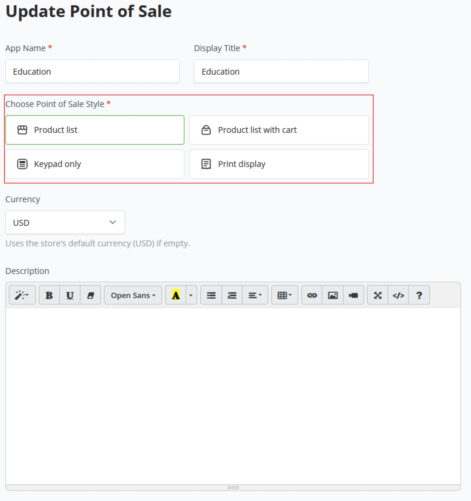


#### Styl punktu sprzedaży - lista produktów + koszyk


#### Styl punktu sprzedaży - tylko klawiatura


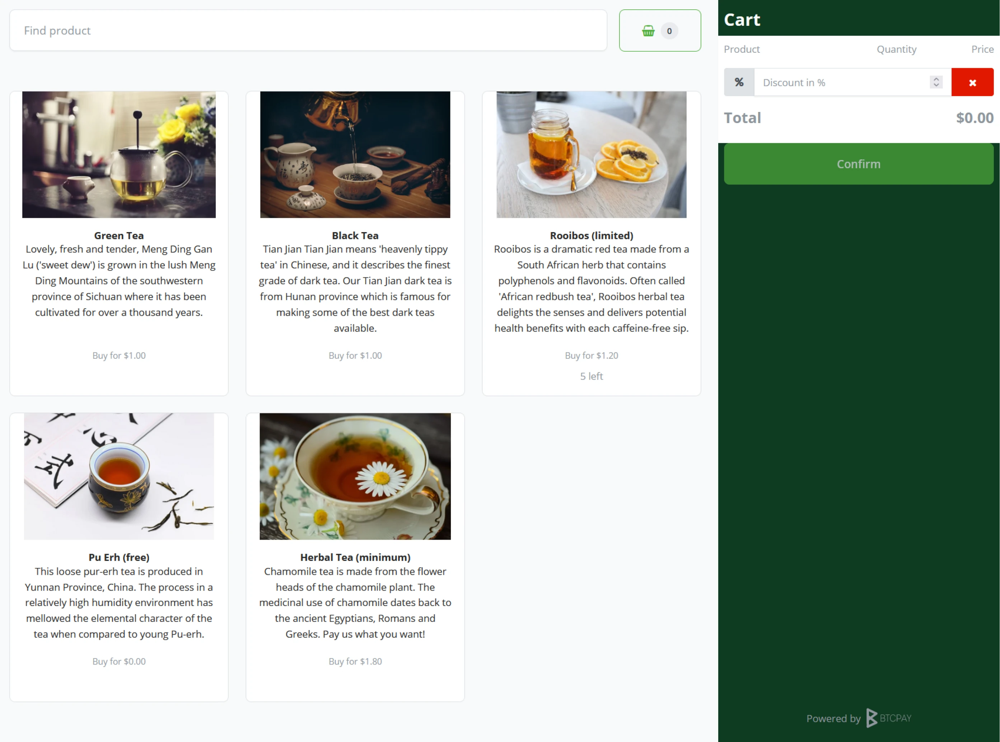


#### Styl punktu sprzedaży - wyświetlacz drukowany


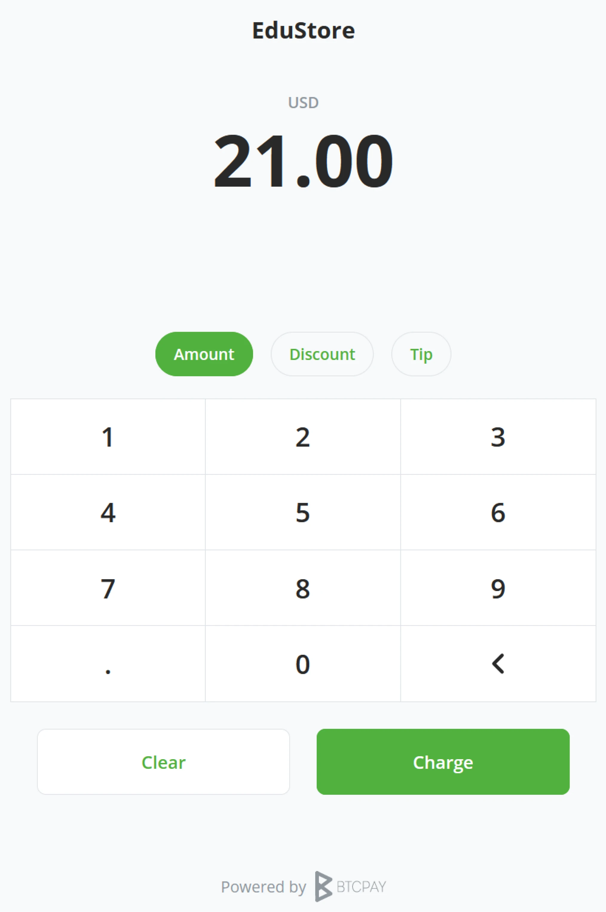


#### Waluta


Właściciel sklepu może ustawić inną walutę dla swojego punktu sprzedaży niż ogólna waluta domyślna. Domyślna waluta sklepu automatycznie wypełni to pole.


#### Opis


Opowiedz światu o swoim sklepie; co sprzedajesz i za ile? Wszystko, co wyjaśnia Twój sklep, znajduje się tutaj.


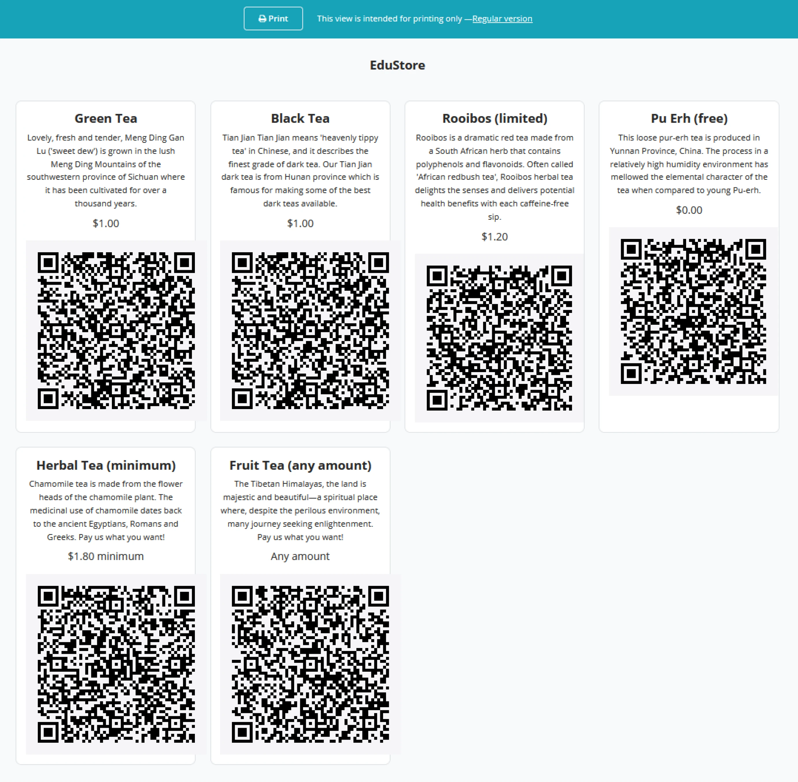


#### Produkty


Gdy tworzony jest punkt sprzedaży, standardowy serwer BTCPay dodaje kilka pozycji do sklepu w celach informacyjnych. Kliknij przycisk Edytuj na dowolnym ze standardowych elementów, aby lepiej zrozumieć każdą możliwą opcję dla elementu.


Tworzenie nowego produktu w sklepie składa się z następujących pól;


- Tytuł
- Cena (stała, minimalna lub niestandardowa)
- Adres URL obrazu
- Opis
- Inwentaryzacja
- ID
- Kup Button Text.
- Włącz/Wyłącz


Gdy właściciel sklepu wypełni wszystkie nowe pola produktów, kliknij przycisk Zapisz, a zauważysz, że sekcja Produkty w punkcie sprzedaży jest teraz wypełniana. Zawsze upewnij się, że zapisujesz w prawym górnym rogu ekranu, aby uniknąć sytuacji, w której właściciele sklepów mogą stracić postęp w dodawaniu produktów.


Właściciele sklepów mogą również używać "Raw Editor" do konfigurowania swoich produktów. Surowy edytor wymaga podstawowej znajomości struktur JSON.


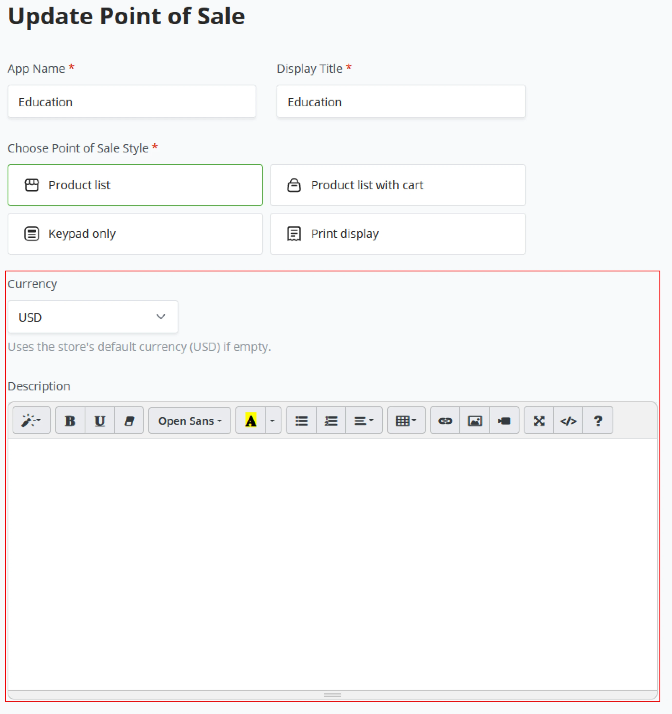


#### Kasa


BTCPay Server pozwala na niewielką personalizację kasy specyficzną dla PoS. Właściciel sklepu może ustawić tekst "Kup za x" lub zażądać określonych danych klienta, dodając formularze.


#### Wskazówki


Tylko niektóre sklepy potrzebują opcji Wskazówki dotyczące sprzedaży. Właściciele sklepów mogą włączyć lub wyłączyć tę opcję według własnego uznania. Jeśli sklep korzysta z włączonych napiwków, właściciel sklepu może ustawić tekst w polu napiwków według własnego uznania. Napiwki serwera BTCPay działają w oparciu o kwotę procentową. Właściciele sklepów mogą dodawać wiele wartości procentowych, oddzielając je przecinkami.


#### Rabaty


Jako właściciel sklepu możesz chcieć udzielić klientowi niestandardowej zniżki przy kasie; przełącznik rabatów staje się dostępny przy kasie sklepu. Jest to jednak bardzo odradzane w przypadku systemów samoobsługowych.


#### Płatności niestandardowe


Gdy opcja płatności niestandardowych jest włączona, klient może wprowadzić swoją ustaloną cenę równą lub wyższą od oryginalnego Invoice wygenerowanego przez sklep.


#### Opcje dodatkowe


Po ustawieniu wszystkiego dla punktu sprzedaży, pozostaje kilka dodatkowych opcji. Właściciele sklepów mogą łatwo osadzić swój PoS za pomocą ramki Iframe lub osadzić przycisk płatności łączący się z określoną pozycją w sklepie. Aby stylizować właśnie utworzony sklep PoS, właściciele mogą dodać niestandardowy CSS na dole dodatkowych opcji.


#### Usuń tę aplikację


Jeśli właściciel sklepu chce całkowicie usunąć punkt sprzedaży ze swojego serwera BTCPay, w dolnej części aktualizacji PoS, właściciele sklepów mogą kliknąć przycisk Usuń tę aplikację, aby całkowicie zniszczyć swoją aplikację PoS. Po kliknięciu przycisku "Usuń tę aplikację" serwer BTCPay poprosi o potwierdzenie, wpisując `DELETE` i potwierdzając, klikając przycisk Usuń. Po usunięciu właściciel sklepu powraca do pulpitu nawigacyjnego BTCPay Server.


### Serwer BTCPay - Crowdfunding


Obok wtyczki Point of Sale, BTCPay Server posiada opcję tworzenia crowdfundingu. Podobnie jak w przypadku każdej innej platformy crowdfundingowej, właściciele sklepów mogą ustawić cel, tworzyć korzyści za wpłaty i dostosowywać je do swoich potrzeb.


#### Jak założyć nowy fundusz crowdfundingowy


Kliknij wtyczkę Crowdfund w menu głównym po lewej stronie serwera BTCPay, poniżej sekcji Wtyczki. BTCPay Server poprosi teraz o nazwę Crowdfund; nazwa ta będzie również wyświetlana na lewym pasku menu.


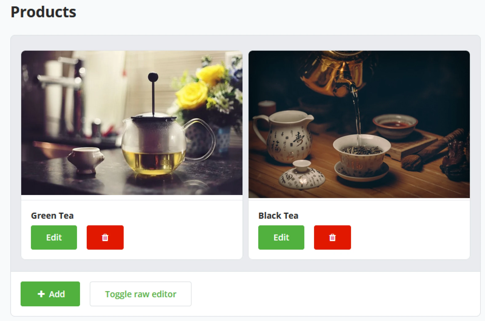


#### Aktualizacja nowo utworzonego punktu sprzedaży


Po nadaniu aplikacji nazwy, następnym ekranem będzie aktualizacja aplikacji w celu uzyskania kontekstu.


#### Nazwa aplikacji


Nazwa nadana funduszowi crowdfundingowemu będzie widoczna w menu głównym serwera BTCPay.


#### Wyświetlany tytuł


Tytuł jest przyznawany Crowdfund dla publiczności.


#### Tagline


Nadaj crowdfundingowi jedno zdanie, aby rozpoznać, o co chodzi w zbiórce pieniędzy.


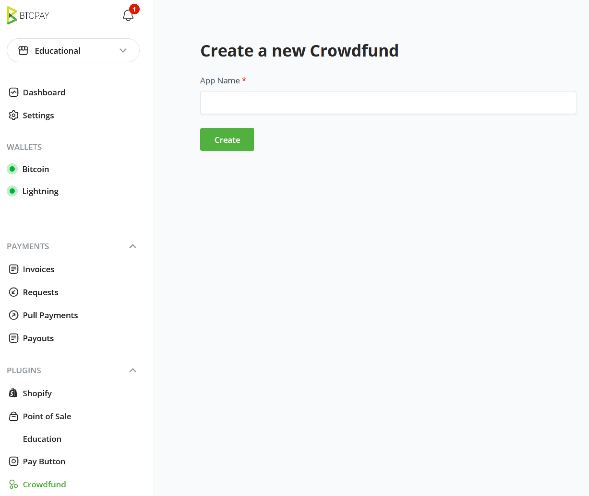


#### Adres URL wyróżnionego obrazu


Każdy crowdfunding ma swój główny obraz, jeden baner, który można bezpośrednio rozpoznać. Ten obraz może być przechowywany na twoim serwerze, jeśli masz uprawnienia administracyjne, administratorzy mogą przesyłać w ustawieniach serwera BTCPay Server - Pliki. Jeśli jesteś właścicielem sklepu, obraz musi zostać przesłany do sieci za pośrednictwem zewnętrznego hosta (na przykład imgur)


#### Upublicznienie crowdfundingu


Ten przełącznik sprawia, że Twój Crowdfund staje się publiczny, a tym samym widoczny dla świata zewnętrznego. Do celów testowych lub sprawdzenia, czy motyw jest poprawnie stosowany, warto ustawić tę opcję na WYŁĄCZONĄ na okres budowania crowdfundingu.


#### Opis


Opowiedz światu o swoim crowdfundingu, na co zbierasz? Wszystko, co wyjaśnia Twój crowdfunding, znajduje się tutaj.


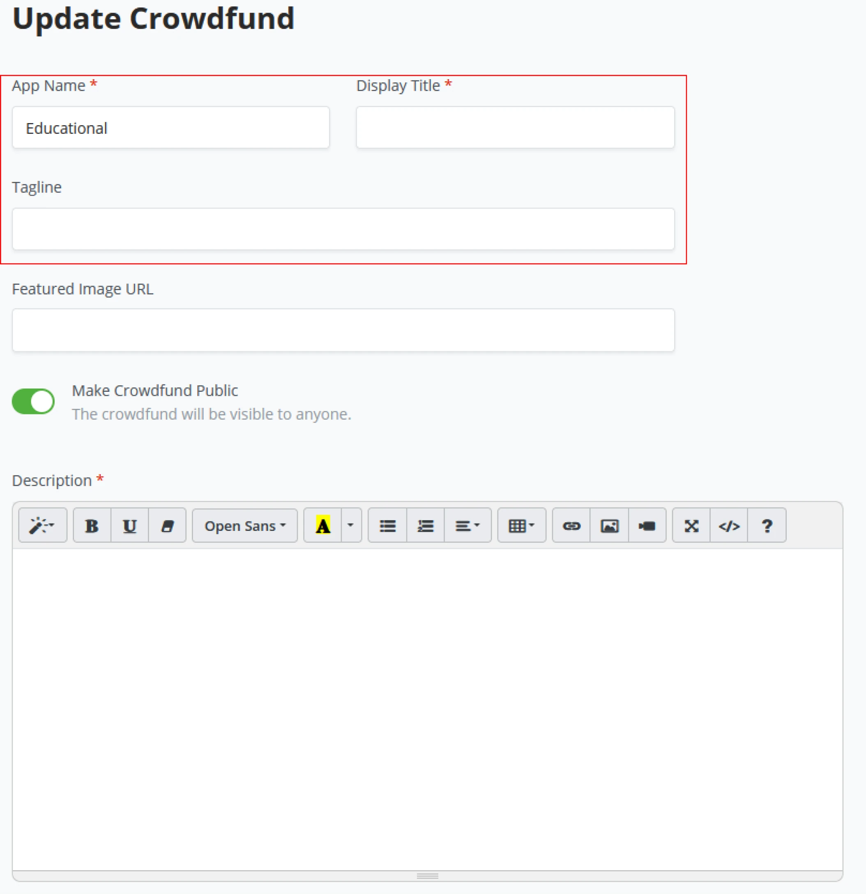


#### Cel crowdfundingu


Określ cel docelowy, jaki fundraiser powinien zarobić na projekcie i w jakiej walucie powinien być wyrażony. Upewnij się, że jeśli Twoje cele są określone między datami, uwzględnij te daty docelowe i końcowe w sekcji Cele w crowdfundingu.


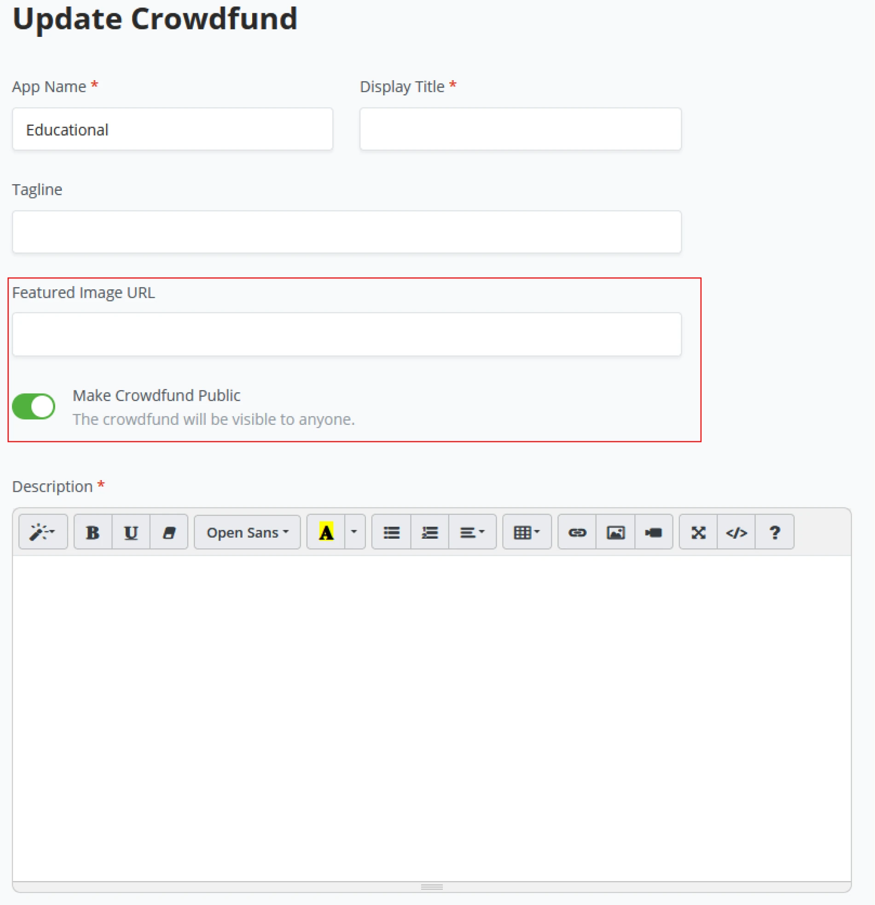


#### Korzyści


Dodatki bardzo pomagają w finansowaniu społecznościowym. Dzieje się tak, ponieważ profity dają ludziom sposób na udział w kampanii. Wykorzystują zarówno motywacje egoistyczne, jak i dobroczynne. Pozwalają też uzyskać dostęp do wydatków wspierających, a nie tylko do ich filantropijnego portfela - można się domyślić, co jest ważniejsze.


Tworzenie nowego profitu składa się z następujących pól ;


- Tytuł
- Cena (stała, minimalna lub niestandardowa)
- Adres URL obrazu
- Opis
- Inwentaryzacja
- ID
- Kup Button Text.
- Włącz/Wyłącz


Gdy właściciel sklepu wypełni wszystkie pola nowego do utworzenia profitu, kliknij zapisz, a zauważysz, że sekcja Perks w crowdfunds jest teraz wypełniona.


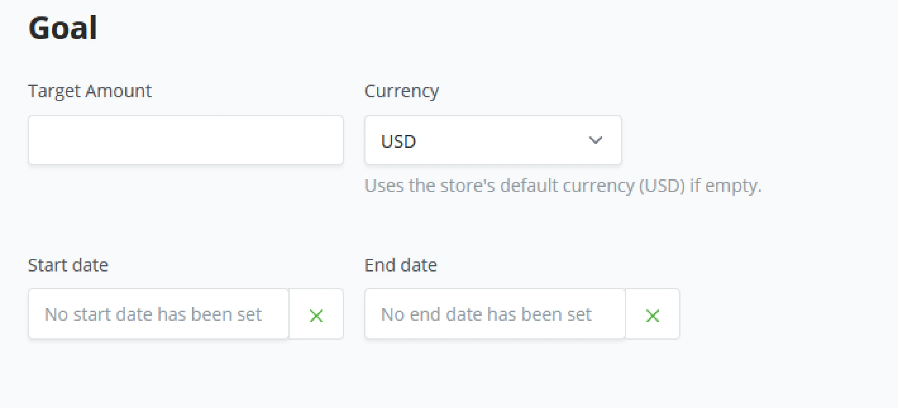


### Serwer BTCPay - punkt sprzedaży


#### Wkład


Właściciele sklepów mogą wybrać sposób wyświetlania dodatków, sposób ich sortowania, a nawet ranking względem innych dodatków. Jednak po osiągnięciu celów Crowdfunds właściciele sklepów mogą chcieć zatrzymać przepływ darowizn na rzecz tej zbiórki. Dlatego może włączyć opcję "Nie zezwalaj na dodatkowe wpłaty po osiągnięciu celu". Spowoduje to zatrzymanie przyjmowania darowizn przez Crowdfund.


##### Zachowanie crowdfundingowe


Standard Crowdfund liczy tylko faktury utworzone za pomocą Crowdfund do celu. Mogą jednak wystąpić przypadki, w których właściciel sklepu chce, aby wszystkie faktury wystawione w tym sklepie były wliczane do crowdfundingu.


#### Dodatkowe opcje personalizacji


BTCpay Server oferuje kilka dodatkowych dostosowań. Do Crowdfund można dodawać dźwięki, animacje, a nawet wątki dyskusyjne. Właściciele sklepów mogą również zmienić wygląd i styl Crowdfund, wprowadzając własne niestandardowe CSS.


#### Usuń tę aplikację


Jeśli właściciel sklepu chce całkowicie usunąć Crowdfund ze swojego serwera BTCPay, na dole aktualizacji Crowdfund właściciele sklepów mogą kliknąć przycisk "Usuń tę aplikację", aby całkowicie zniszczyć swoją aplikację Crowdfund. Po kliknięciu przycisku "Usuń tę aplikację" serwer BTCPay poprosi o potwierdzenie, wpisując `DELETE` i potwierdzając, klikając przycisk Usuń. Po usunięciu właściciel sklepu powraca do pulpitu nawigacyjnego BTCPay Server.


### Serwer BTCPay - przycisk płatności


Łatwe do osadzenia przyciski HTML i wysoce konfigurowalne przyciski płatności umożliwiają właścicielom sklepów otrzymywanie napiwków i darowizn. Na lewym pasku menu BTCPay Server, poniżej sekcji Wtyczki, właściciele sklepów mogą kliknąć "Przycisk płatności" i kliknąć Włącz, aby utworzyć przycisk płatności.


#### Ustawienia ogólne


W ustawieniach ogólnych przycisku płatności właściciele sklepów mogą ustawić


- Cena standardowa
- Domyślna waluta
- Domyślna metoda płatności
  - Użyj domyślnego sklepu
  - BTC On-Chain
  - BTC off-chain (Lightning)
  - BTC off-chain (LNURL-pay)
- Opis kasy
- Identyfikator zamówienia


#### Opcje wyświetlania


Przycisk płatności serwera BTCPay można skonfigurować tak, aby pasował do różnych stylów. Przyciski mogą mieć stałą lub niestandardową kwotę, wyświetlaną za pomocą suwaka lub przełączników plus i min.


#### Użyj Modal


Tworząc przycisk płatności, właściciele sklepów mogą wybrać jego zachowanie po kliknięciu przez klienta i wyświetlić go w oknie modalnym lub jako nową stronę.


**Uwaga!


Ostrzeżenie: Przycisk płatności powinien być używany tylko w przypadku napiwków i darowizn


Używanie przycisku płatności do integracji z e-commerce nie jest zalecane, ponieważ istotne informacje dotyczące zamówienia mogą być modyfikowane przez użytkownika. W przypadku handlu elektronicznego należy korzystać z naszego interfejsu API Greenfield. Jeśli ten sklep przetwarza transakcje handlowe, zalecamy utworzenie oddzielnego sklepu przed użyciem przycisku płatności.


#### Dostosuj tekst przycisku płatności


Domyślnie przycisk płatności BTCPay Server zawiera napis "Zapłać za pomocą BTCPay". Właściciele sklepów mogą ustawić ten tekst według własnego uznania i zmienić logo BTCPay Server na własne. Ustaw tekst za pomocą "Tekst przycisku płatności" i wklej adres URL obrazu pod "Adres URL obrazu przycisku płatności".


##### Rozmiar obrazu


Rozmiar obrazu w przycisku można ustawić tylko na trzy wartości domyślne.


- 146x40px
- 168x46px
- 209x57px


#### Typ przycisku


Serwer BTCPay zna trzy stany przycisku płatności.


- Stała kwota
  - Poprzednia ustawiona cena znajduje się w ustawieniach ogólnych przycisku.
- Kwota niestandardowa
  - Przycisk płatności na serwerze BTCPay ma przełączniki + i -, aby ustawić niestandardową cenę.
  - Podczas korzystania z niestandardowej kwoty serwer BTCPay zażąda podania wartości minimalnej, maksymalnej i tego, jak stopniowo powinna ona rosnąć.
  - Przyciski mogą być ustawione na "Użyj prostego stylu wprowadzania", co eliminuje przełączniki +/-.
  - Dopasuj przycisk w linii, gdzie przycisk i przełączniki są wyświetlane w linii.
- Suwak
  - Podobny do niestandardowej kwoty, jednak różni się wizualnie, ponieważ ma suwak zamiast przełączników +/-.
  - Podczas korzystania z suwaka serwer BTCPay zażąda wartości minimalnej, maksymalnej i stopniowego zwiększania.


**Uwaga!


Przycisk płatności można usunąć u góry w opisie ostrzeżenia.


#### Powiadomienia o płatnościach


Server IPN (Instant Payment Notification) jest przeznaczony dla webhooków i może być wypełniony adresem URL do danych po zakupie.


#### Powiadomienia e-mail


Po dokonaniu płatności serwer BTCPay może powiadomić właściciela sklepu.


#### Przekierowanie przeglądarki


Gdy klient dokona zakupu, zostanie przekierowany do tego linku, jeśli został on ustawiony przez właściciela sklepu.


#### Zaawansowane opcje przycisków płatności


Określa dodatkowe parametry ciągu zapytania, które powinny zostać dołączone do strony kasy po utworzeniu Invoice. Na przykład, `lang=da-DK` domyślnie załaduje stronę kasy w języku duńskim.


#### Używanie aplikacji jako punktu końcowego


Bezpośrednio połącz przycisk płatności z przedmiotem w jednej z aplikacji PoS lub Crowdfund.


Właściciele sklepów mogą kliknąć menu rozwijane i wybrać żądaną aplikację; po wybraniu aplikacji właściciel sklepu może dodać element, który ma zostać połączony.


#### Wygenerowany kod


Ponieważ przycisk płatności BTCPay Server to łatwy do osadzenia HTML, BTCPay Server pokazuje wygenerowany kod do skopiowania na stronę internetową na dole po skonfigurowaniu przycisku płatności.


Właściciele sklepów mogą skopiować wygenerowany kod na swoją stronę internetową, a przycisk płatności z serwera BTCPay jest bezpośrednio aktywny na ich stronie internetowej.


#### Powiadomienia o płatnościach


Server IPN (Instant Payment Notification) jest przeznaczony dla webhooków i może być wypełniony adresem URL w celu opublikowania danych zakupu.


#### Powiadomienia e-mail


Za każdym razem, gdy nastąpi płatność, serwer BTCPay może powiadomić właściciela sklepu.


#### Przekierowanie przeglądarki


Gdy klient dokona zakupu, zostanie przekierowany do tego linku, jeśli został on ustawiony przez właściciela sklepu.


#### Zaawansowane opcje przycisków płatności


Określa dodatkowe parametry ciągu zapytania, które powinny zostać dołączone do strony kasy po utworzeniu Invoice. Na przykład, `lang=da-DK` domyślnie załaduje stronę kasy w języku duńskim.


#### Używanie aplikacji jako punktu końcowego


Bezpośrednio połącz przycisk płatności z pozycją w jednej z aplikacji PoS lub Crowdfund. Właściciele sklepów mogą kliknąć menu rozwijane i wybrać żądaną aplikację, a po wybraniu aplikacji właściciel sklepu może dodać pozycję, która ma zostać połączona.


#### Wygenerowany kod


Ponieważ przycisk płatności BTCPay Server to łatwy do osadzenia HTML, BTCPay Server pokazuje wygenerowany kod do skopiowania na stronę internetową na dole po skonfigurowaniu przycisku płatności. Właściciele sklepów mogą skopiować wygenerowany kod na swoją stronę internetową, a przycisk płatności z BTCPay Server jest bezpośrednio aktywny na ich stronie internetowej.


### Podsumowanie umiejętności


W tej części dowiedziałeś się:


- Jak używać zintegrowanej wtyczki PoS BTCPay Server do łatwego tworzenia niestandardowego sklepu
- Jak korzystać ze zintegrowanej wtyczki Crowdfund BTCPay Server, aby łatwo stworzyć niestandardową aplikację crowdfundingową?
- Generowanie kodu niestandardowego przycisku płatności przy użyciu wtyczki Pay Button


### Ocena wiedzy


#### Recenzja KA


Jakie są trzy wbudowane wtyczki, które są standardowo dostarczane z BTCPay Server? W kilku słowach opisz, w jaki sposób można z nich korzystać.


# Konfiguracja serwera BTCPay


<partId>ff38596c-7de3-5e5c-ba50-9b9edbbbb5eb</partId>


## Podstawowa wiedza na temat instalacji serwera BTCPay w środowisku LunaNode


<chapterId>d0a28514-ffcf-529b-9156-29141f0b060a</chapterId>


### Instalacja serwera BTCPay na hostowanym środowisku (LunaNode)


Te kroki dostarczą wszystkich informacji niezbędnych do rozpoczęcia korzystania z BTCPay Server na LunaNode. Istnieje wiele opcji wdrażania oprogramowania.

Wszystkie szczegóły dotyczące serwera BTCPay można znaleźć na stronie https://docs.btcpayserver.org.


#### Od czego zacząć?


W tej części zapoznasz się z LunaNode jako dostawcą usług hostingowych, poznasz pierwsze kroki korzystania z serwera BTCPay i dowiesz się, jak korzystać z Lightning Network. Po wykonaniu wszystkich kroków możesz uruchomić sklep internetowy lub platformę crowdfundingową akceptującą Bitcoin!


Jest to jeden z wielu sposobów wdrożenia BTCPay Server. Więcej szczegółów można znaleźć w naszej dokumentacji,


https://docs.btcpayserver.org.


### Serwer BTCPay - wdrożenie LunaNode


#### Wdrożenie LunaNode


Najpierw przejdź do strony LunaNode.com, gdzie utworzymy nowe konto. Kliknij Zarejestruj się w prawym górnym rogu lub skorzystaj z kreatora Rozpocznij na stronie głównej.


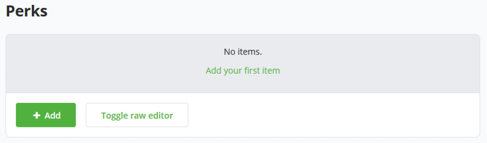


Po utworzeniu nowego konta LunaNode wysyła e-mail weryfikacyjny. Po zweryfikowaniu konta, w porównaniu do Voltage, natychmiast pojawi się możliwość doładowania salda konta. Saldo to jest potrzebne do opłacenia przestrzeni serwerowej i kosztów hostingu.


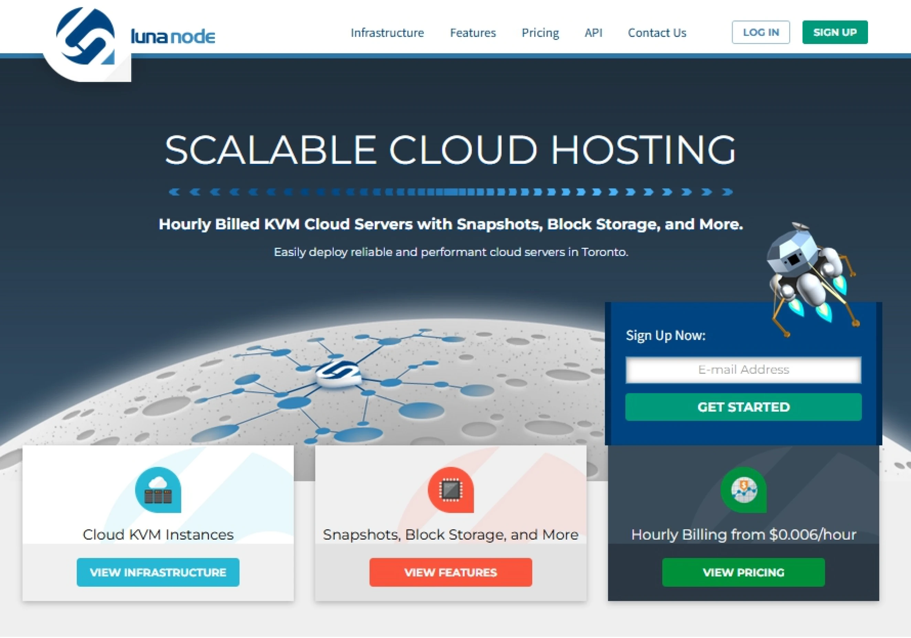


#### Dodaj środki do swojego konta LunaNode


Po kliknięciu "Deposit credit" możesz ustawić, jaką kwotą chcesz doładować swoje konto i jak chcesz za to zapłacić. LunaNode i serwer BTCPay będą kosztować od 10 USD do 20 USD miesięcznie.

W porównaniu do Voltage.cloud, użytkownik otrzymuje pełny dostęp do swojego wirtualnego serwera prywatnego (VPS), a tym samym ma większą kontrolę nad swoim serwerem. Po utworzeniu nowego konta LunaNode wysyła weryfikacyjną wiadomość e-mail.

Po zweryfikowaniu konta, w porównaniu do Voltage, natychmiast pojawi się możliwość doładowania salda konta. Saldo to jest potrzebne do opłacenia przestrzeni serwerowej i kosztów hostingu.


#### Jak wdrożyć nowy serwer?


W tym przewodniku przejdziemy przez konfigurację, tworząc zestaw kluczy API i używając programu uruchamiającego BTCPay Server stworzonego przez LunaNode.


Na pulpicie nawigacyjnym LunaNode kliknij API w prawym górnym rogu. Otworzy się nowa strona. Musimy tylko ustawić nazwę klucza API. Resztą zajmie się LunaNode i nie zostanie to omówione w tym przewodniku. Kliknij przycisk Create API Credential.

Po utworzeniu poświadczeń API otrzymasz długi ciąg liter i znaków. Jest to klucz API.


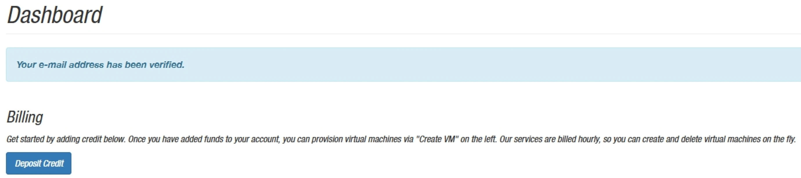


#### Jak wdrożyć nowy serwer?


Istnieją 2 części tych poświadczeń, klucz API i identyfikator API; będziemy potrzebować obu. Zanim przejdziemy do następnego kroku, otwórzmy drugą kartę w przeglądarce i przejdźmy do https://launchbtcpay.lunanode.com/


Tutaj zostaniesz poproszony o podanie klucza API i identyfikatora API. Ma to na celu zweryfikowanie, czy to Ty utworzyłeś ten nowy serwer. Klucz API powinien być nadal otwarty w poprzedniej karcie; jeśli przewiniesz w dół w poniższej tabeli, znajdziesz identyfikator API.


Wróć do strony z Launcherem, wypełnij pola kluczem API i ID, a następnie kliknij Kontynuuj.


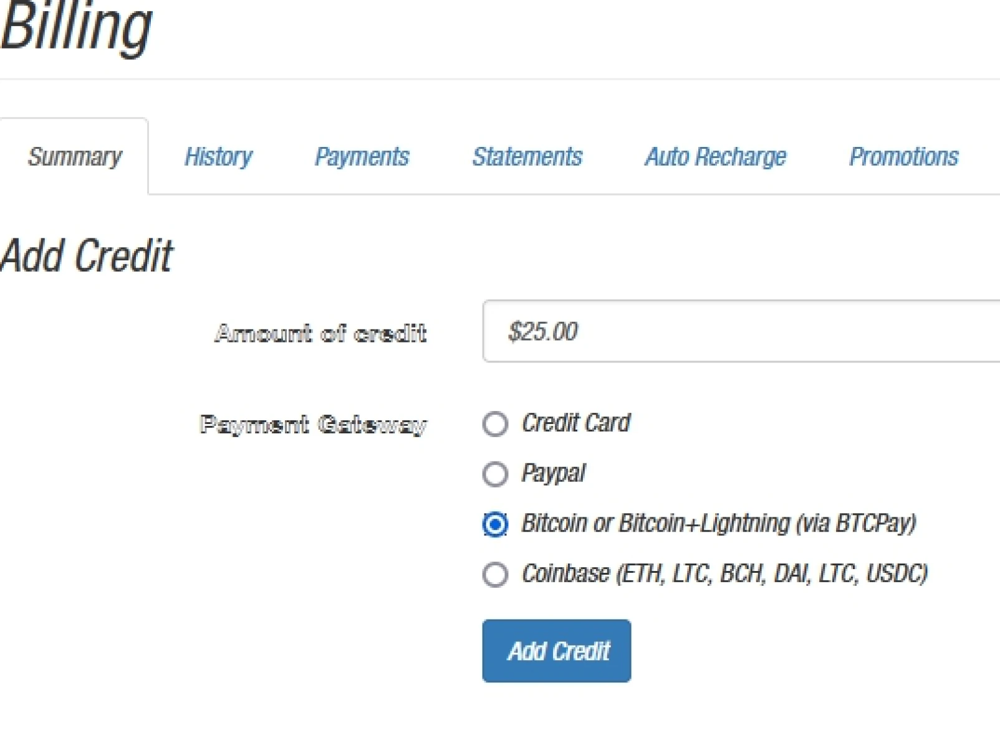


W następnym kroku możesz podać nazwę domeny. Jeśli posiadasz już domenę i chcesz jej użyć dla BTCPay Server, upewnij się, że dodałeś również rekord DNS (zwany rekordem `A`) w swojej domenie. Jeśli nie posiadasz domeny, użyj domeny dostarczonej przez LunaNode (możesz to zmienić później w ustawieniach serwera BTCPay) i kliknij Kontynuuj.


Dowiedz się więcej o ustawianiu lub zmianie rekordu DNS dla serwera BTCPay; https://docs.btcpayserver.org/FAQ/Deployment/#how-to-change-your-btcpay-server-domain-name


#### Uruchomienie serwera BTCPay na LunaNode


Po wykonaniu wcześniejszych kroków możemy ustawić wszystkie opcje dla naszego nowego serwera. Tutaj wybierzemy Bitcoin (BTC) jako naszą wspieraną walutę; możemy ustawić e-mail, aby otrzymywać powiadomienia o certyfikatach szyfrowania w celu odnowienia; nie jest to obowiązkowe.


Ten przewodnik ma na celu skonfigurowanie środowiska Mainnet (Bitcoin w świecie rzeczywistym); jednak LunaNode pozwala również ustawić to na Testnet lub Regtest do celów programistycznych. W tym przewodniku pozostawimy opcję Mainnet.


Wybierz swoją implementację Lightning. LunaNode oferuje dwie różne implementacje, LND i Core Lightning. W tym przewodniku zajmiemy się LND. Istnieją niewielkie, ale prawdziwe różnice w obu implementacjach; aby uzyskać więcej informacji na ten temat, zalecamy przeczytanie obszernej dokumentacji; https://docs.btcpayserver.org/LightningNetwork#getting-started-with-btcpay-server-and-core-lightning-cln


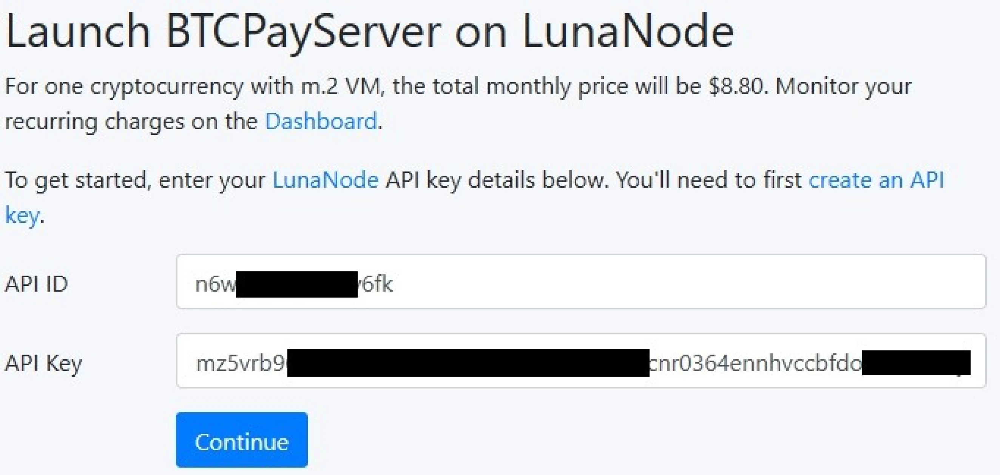


LunaNode oferuje wiele planów maszyn wirtualnych (VM). Różnią się one zakresem cenowym i specyfikacją serwera. Na potrzeby tego przewodnika wystarczy plan m2; jeśli jednak zaznaczyłeś więcej niż tylko Bitcoin jako walutę, rozważ użycie co najmniej m4.


Przyspieszenie początkowej synchronizacji Blockchain; jest to opcjonalne i zależy od Twoich potrzeb. Istnieją zaawansowane opcje, takie jak ustawienie aliasu Lightning, wskazanie konkretnej wersji GitHub lub ustawienie kluczy SSH; żadna z nich nie zostanie poruszona w tym przewodniku.


Po wypełnieniu formularza należy kliknąć Launch VM, a Lunanode rozpocznie tworzenie nowej maszyny wirtualnej, w tym zainstalowanego na niej serwera BTCPay. Proces ten zajmuje kilka minut; gdy serwer jest gotowy, LunaNode udostępnia link do nowego serwera BTCPay.


Po zakończeniu procesu tworzenia kliknij link do swojego serwera BTCPay; tutaj zostaniesz poproszony o utworzenie konta administratora.


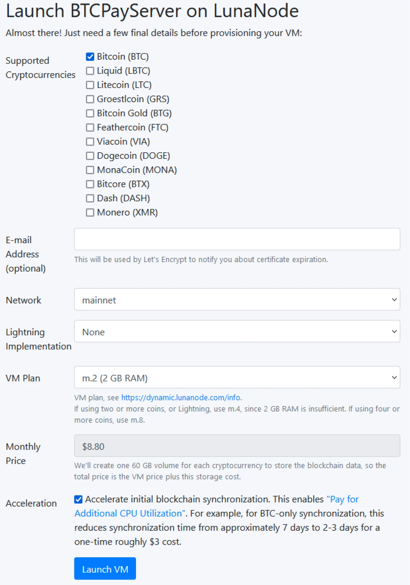


### Podsumowanie umiejętności


W tej części dowiedziałeś się:


- Tworzenie i zasilanie konta w LunaNode
- Korzystanie z programu uruchamiającego serwer BTCPay w celu utworzenia własnego serwera


### Ocena wiedzy


#### Przegląd koncepcji KA


Opisz niektóre różnice między uruchomieniem instancji serwera BTCPay na VPS a utworzeniem konta na hostowanej instancji.


## Instalacja serwera BTCPay w środowisku Voltage


<chapterId>11c7d284-b4d2-5542-872c-df9bd9c1491b</chapterId>


Zapoznasz się z Voltage.cloud jako dostawcą usług hostingowych, poznasz pierwsze kroki korzystania z serwera BTCPay i dowiesz się, jak korzystać z Lightning Network. Po wykonaniu wszystkich kroków możesz uruchomić sklep internetowy lub platformę crowdfundingową akceptującą Bitcoin!


Jest to jeden z wielu sposobów wdrożenia BTCPay Server. Więcej szczegółów można znaleźć w naszej dokumentacji,

https://docs.btcpayserver.org.


### Serwer BTCPay - wdrożenie Voltage.cloud


Najpierw przejdź do strony Voltage.cloud i zarejestruj nowe konto. Podczas tworzenia konta możesz zapisać się na 7-dniowy bezpłatny okres próbny. Kliknij przycisk "Zarejestruj się" w prawym górnym rogu lub skorzystaj z opcji "Wypróbuj 7-dniowy bezpłatny okres próbny" na stronie głównej.


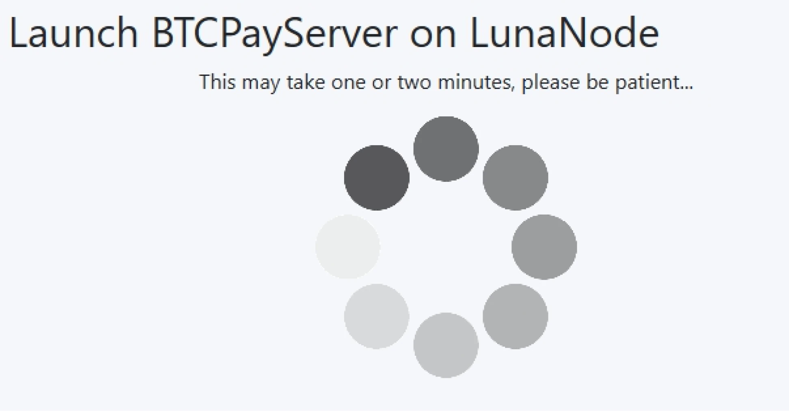


Po utworzeniu konta należy kliknąć przycisk `NODES` na pulpicie nawigacyjnym. Po wybraniu opcji Węzły i utworzeniu nowego węzła, zostaną nam przedstawione możliwe oferty Voltage. Ponieważ w tym przewodniku omówimy również LightningNetwork, w Voltage musimy najpierw wybrać naszą implementację Lightning, zanim utworzymy serwer BTCPay. Kliknij na LightningNode.


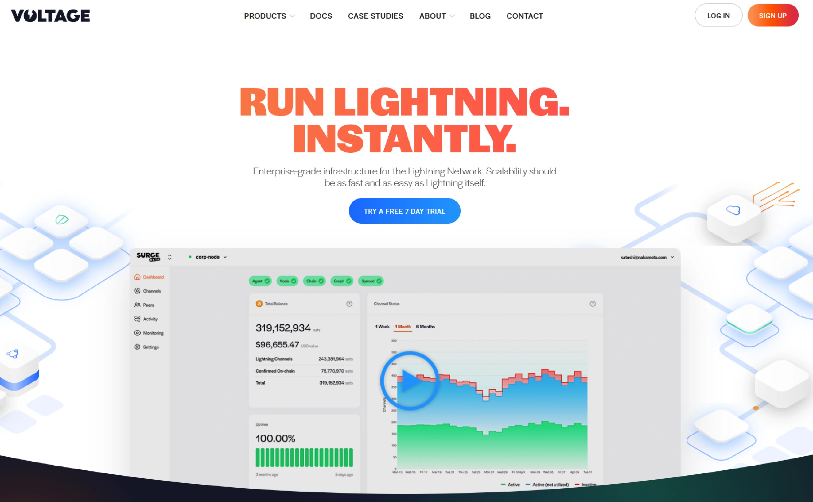


W tym miejscu należy wybrać rodzaj węzła Lightning. Voltage ma wiele opcji konfiguracji oświetlenia. Inaczej jest w przypadku wdrażania, na przykład, LunaNode. Na potrzeby tego przewodnika wystarczy węzeł Lite. Przeczytaj więcej o różnicach w Voltage.cloud.


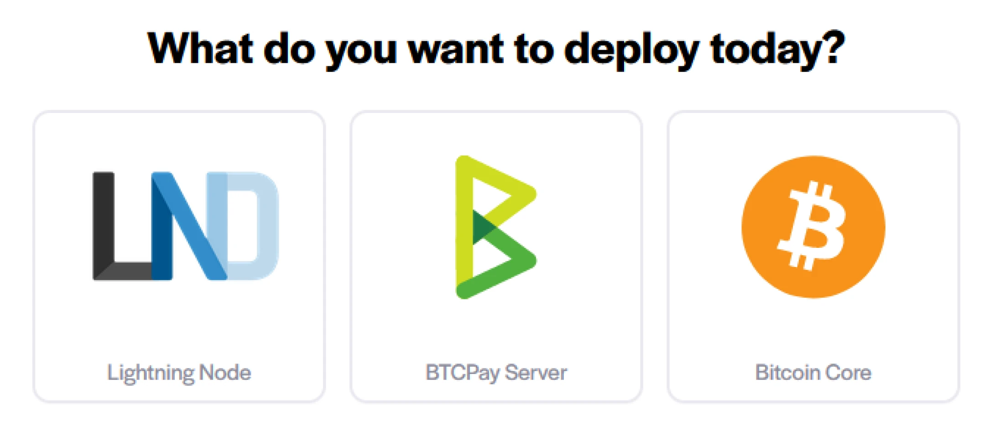


Nadaj węzłowi nazwę, ustaw hasło i zabezpiecz je. Jeśli hasło zostanie utracone, utracisz dostęp do kopii zapasowych, a Voltage nie będzie w stanie go odzyskać. Utwórz węzeł, a Voltage pokaże Ci postęp. Voltage utworzyło węzeł Lightning. Możemy teraz utworzyć instancję serwera BTCPay i uzyskać bezpośredni dostęp do Lightning Network.


Kliknij Węzły w lewym górnym rogu pulpitu nawigacyjnego. Tutaj możesz skonfigurować kolejną część swojej instancji serwera BTCPay. Kliknij "Utwórz nowy", gdy znajdziesz się w przeglądzie węzłów. Otrzymasz podobny ekran jak poprzednio. Teraz zamiast Lightning Node wybieramy BTCPay Server.


Voltage pokazuje geolokalizację serwera BTCPay, hosty napięcia w regionie US West. Tutaj zobaczysz również koszt hostingu serwera. Kliknij Utwórz i nadaj nazwę swojemu serwerowi BTCPay. Włącz Lightning, a Voltage wyświetli węzeł Lightning utworzony w poprzednim kroku. Kliknij Utwórz, a Voltage utworzy instancję serwera BTCPay.


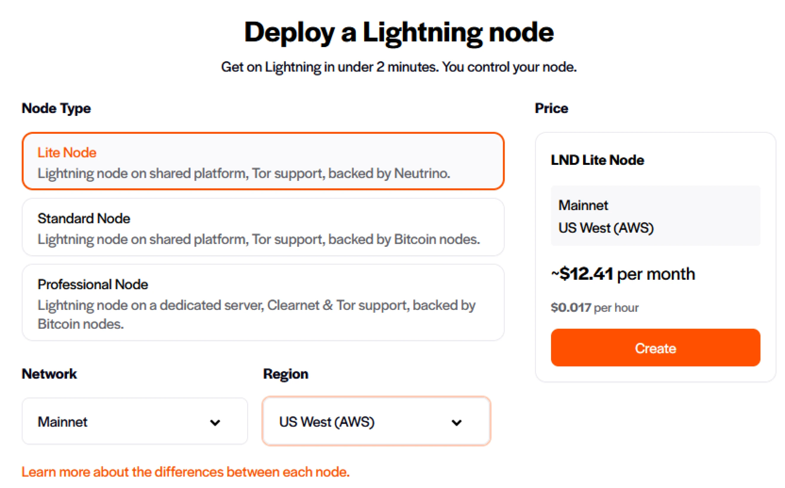


Po kliknięciu przycisku Utwórz, Voltage wyświetli domyślną nazwę użytkownika i hasło. Są one podobne do wcześniej ustawionego hasła w Voltage. Kliknij przycisk Zaloguj się do konta, aby przekierować Cię na serwer BTCPay.


Witamy w nowej instancji serwera BTCPay. Ponieważ skonfigurowaliśmy już Lightning w procesie tworzenia, pokazuje, że Lightning jest już włączony!


### Podsumowanie umiejętności


W tym rozdziale dowiedziałeś się:


- Tworzenie konta na Voltage.cloud
- Kroki, aby uruchomić serwer BTCPay wraz z węzłem Lightning na koncie


### Ocena wiedzy


#### Przegląd koncepcji KA


Jakie są kluczowe różnice między konfiguracjami Voltage i LunaNode?


## Instalacja serwera BTCPay na węźle Umbrel


<chapterId>3298e292-6476-5fe0-836c-7fa021348799</chapterId>


Po zakończeniu tych kroków możesz akceptować płatności błyskawiczne w swoim sklepie BTCPay w sieci lokalnej. Proces ten będzie miał również zastosowanie w przypadku uruchomienia węzła umbrel w restauracji lub firmie. Jeśli chcesz połączyć ten sklep z publiczną stroną internetową, wykonaj ćwiczenie Zaawansowane, aby wystawić węzeł umbrel na widok publiczny.


https://umbrel.com/


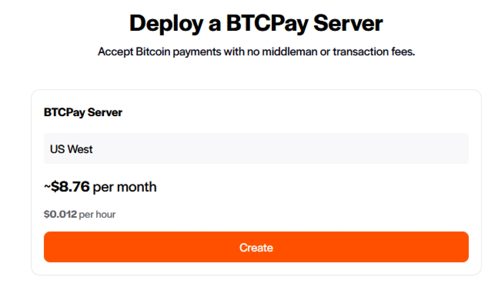


### Serwer BTCPay - wdrożenie Umbrel


Po pełnej synchronizacji węzła Umbrel z Bitcoin Blockchain, przejdź do Umbrel App Store i wyszukaj BTCPay Server w sekcji Aplikacje.


Kliknij BTCPay Server, aby zobaczyć szczegóły aplikacji. Gdy szczegóły są otwarte dla BTCPay Server, w prawym dolnym rogu wyświetlane są wymagania dotyczące prawidłowego działania aplikacji. Pokazuje, że wymaga Bitcoin i węzła Lightning. Jeśli nie zainstalowałeś węzła Lightning na swoim Umbrel, kliknij Zainstaluj. Proces ten może potrwać kilka minut.


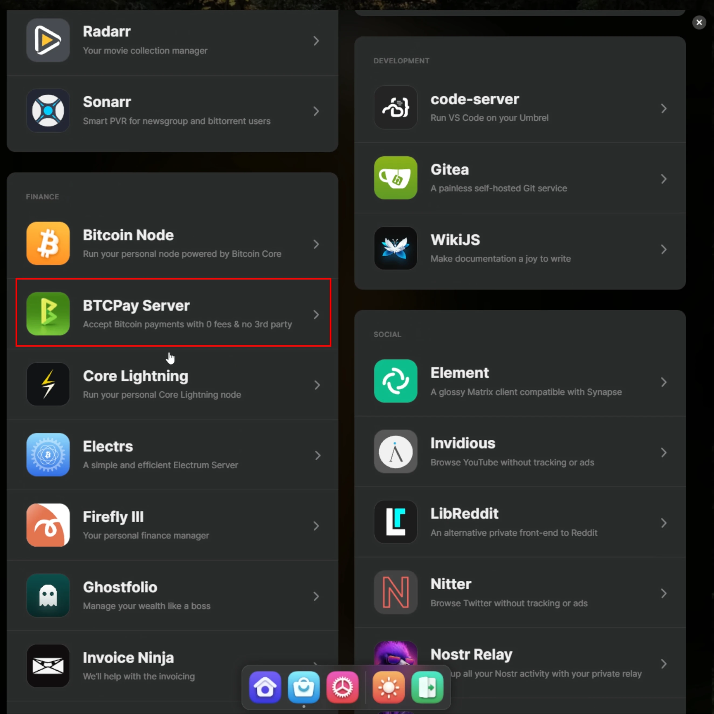


Po zainstalowaniu Lightning Node:


1. Kliknij przycisk Otwórz w szczegółach aplikacji lub w aplikacji na pulpicie nawigacyjnym Umbrels.

2. Kliknij setup a new node (skonfiguruj nowy węzeł); zostaną wyświetlone 24 słowa do odzyskania węzła Lightning.

3. Zapisz je.


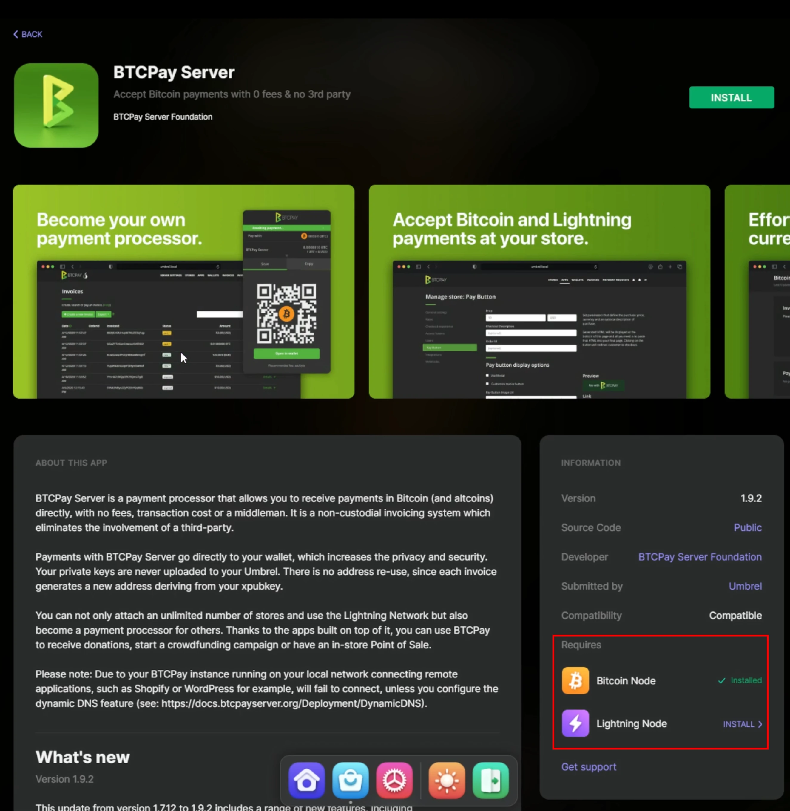


Umbrel poprosi o weryfikację właśnie zapisanych słów. Po skonfigurowaniu węzła Lightning wróć do Umbrel App Store i znajdź BTCPay Server. Kliknij przycisk instalacji, a Umbrel pokaże, czy wymagane komponenty są zainstalowane i czy BTCPay Server wymaga dostępu do tych komponentów. Po instalacji kliknij Otwórz w prawym górnym rogu szczegółów aplikacji lub otwórz BTCPay Server za pośrednictwem pulpitu nawigacyjnego Umbrels.


Umbrel poprosi o weryfikację właśnie zapisanych słów.


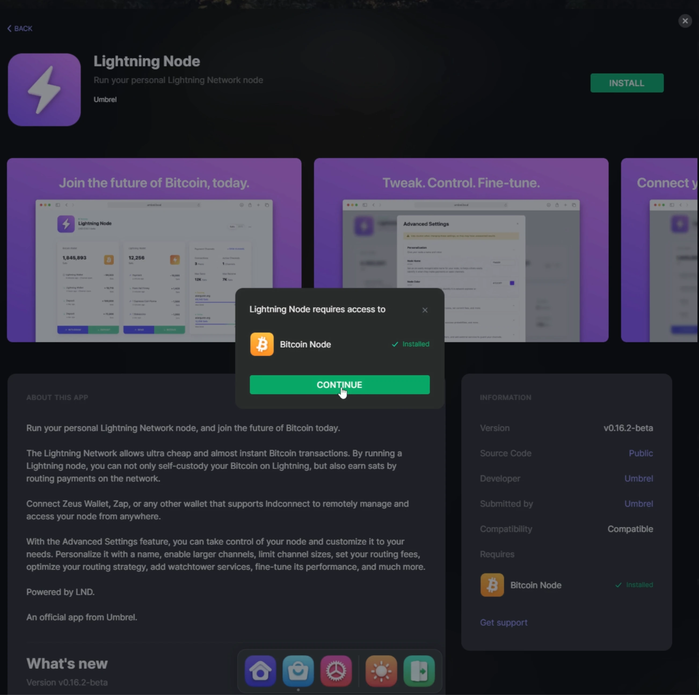


**Uwaga!


Upewnij się, że przechowujesz je w odpowiednim miejscu, tak jak wcześniej nauczyłeś się przechowywać klucze.


Po skonfigurowaniu węzła Lightning wróć do Umbrel App Store i znajdź BTCPay Server. Kliknij przycisk instalacji, a Umbrel pokaże, czy wymagane komponenty są zainstalowane i czy BTCPay Server wymaga dostępu do tych komponentów.


Po instalacji kliknij Otwórz w prawym górnym rogu szczegółów aplikacji lub otwórz serwer BTCPay za pośrednictwem pulpitu nawigacyjnego Umbrels.


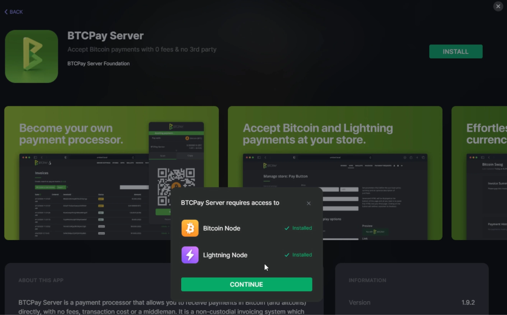


### Podsumowanie umiejętności


W tej części dowiedziałeś się:


- Kroki instalacji serwera BTCPay z funkcjonalnością Lightning na węźle Umbrel


### Ocena wiedzy


#### Przegląd koncepcji KA


Czym różni się konfiguracja Umbrel od dwóch poprzednich opcji hostingu?


# Sekcja końcowa


<partId>d72e6fa5-0870-5f00-9143-9466ed22e2bd</partId>


## Recenzje i oceny

<chapterId>d90bb93d-b894-551e-9fd6-6855c739a904</chapterId>

<isCourseReview>true</isCourseReview>

## Podsumowanie kursu


<chapterId>c07ac2a5-f97e-5c57-8a80-4955b48128d4</chapterId>

<isCourseConclusion>true</isCourseConclusion>