# Un voyage dans les cours de développement CUBO+ pour Bitcoin !

Que faut-il pour construire sur Bitcoin ? Ce cours de 20 heures vous emmène sous la surface de Bitcoin et du Lightning Network, explorant les protocoles qui alimentent l'infrastructure financière la plus résiliente au monde. Que vous cherchiez à contribuer à des projets open-source ou à construire la prochaine génération d'applications Bitcoin, vous acquerrez la profondeur technique nécessaire pour commencer à travailler avec confiance dans cet écosystème.

Enregistré lors du bootcamp CUBO+ 2023 au Salvador, ce cours rassemble les perspectives de développeurs et d'éducateurs Bitcoin de premier plan qui ont façonné la technologie. Le meilleur ? Il est entièrement gratuit, rendu possible par Fulgure Venture, le Bitcoin Office et DecouvreBitcoin. Si vous avez été curieux de savoir comment Bitcoin fonctionne réellement au niveau du protocole, c'est votre chance de le découvrir.
+++
# Introduction et cours préparatoires


<partId>43a835de-c4e7-542b-9d1a-c92f049e88e6</partId>


## Introduction aux cours CUBO


<chapterId>dcf2d37e-b32a-5eb8-aaa3-41ac92475ba9</chapterId>


:::video id=9b6aa5cf-245e-4a66-b3b8-c4860ab51e90:::

Filippo et Mario présentent CUBO+ 2023 et préparent le terrain pour le voyage d'apprentissage complet qui les attend. Ils discutent de la structure des cours, des résultats d'apprentissage et de la manière dont ils permettront aux étudiants d'évoluer dans l'espace de développement Bitcoin.


### Objectifs


Le cours vise à doter les participants d'une compréhension approfondie des principes sous-jacents du Bitcoin, de compétences pratiques en matière de développement et de la capacité de naviguer et de contribuer efficacement à l'écosystème du Bitcoin. Grâce à un mélange de connaissances théoriques et d'exercices pratiques, les étudiants maîtriseront les éléments essentiels de la sécurité du Bitcoin, les subtilités de sa pile logicielle et les mécanismes de sa gouvernance.


### Prérequis


Les participants doivent faire preuve d'une grande curiosité, d'une volonté d'apprendre à un niveau professionnel et d'une certaine connaissance de base en matière de développement. Bien qu'une connaissance approfondie de Bitcoin ne soit pas nécessaire, une compréhension de base des principes de codage et une ouverture d'esprit pour aborder des concepts techniques complexes sont essentielles pour tirer le meilleur parti de l'accélérateur.


#### Outils


Tout au long du cours, les participants utiliseront des outils clés qui faciliteront leur compréhension et amélioreront leur expérience d'apprentissage. L'utilisation de Linux, de la ligne de commande Interface, de GitHub et de Docker fera partie intégrante d'une approche pratique du développement Bitcoin. Ces outils faciliteront le travail avec la pile logicielle Bitcoin, la gestion des environnements de développement et la collaboration sur des projets dans un environnement réel.


## Pourquoi Bitcoin


<chapterId>89a0aa8b-90bd-58b2-82b3-bc5e1f82eaeb</chapterId>


### Pourquoi le Salvador a besoin du Bitcoin


:::video id=ff820fb2-83d4-450f-bda0-17cc5044a902:::

Bienvenue à la première conférence du programme éducatif **Cubo Plus**. Aujourd'hui, nous plongeons dans le monde du Bitcoin, avec Ricky, le fondateur du **Bitcoin Italia Podcast**. Ricky est un militant passionné des droits de l'homme qui utilise le Bitcoin comme outil de protection et de promotion des droits de l'homme. Avec plus de six ans d'expérience, Ricky a beaucoup voyagé, documentant l'adoption de la Bitcoin dans des marchés émergents comme le Salvador et le Guatemala. Son travail ne se limite pas au podcast ; il est également actif sur YouTube (**Bitcoin Explorers**) et sur Twitter (**BTC Explorer**, **Ricky6**). Ricky est convaincu que le Commitment et le Bitcoin offrent la liberté financière et le respect de la vie privée, remettant en cause les systèmes bancaires traditionnels et centralisés.


la population mondiale non bancarisée


### Bitcoin : la liberté financière et son impact sur le Salvador


Cette conférence, **"Pourquoi le Salvador a besoin du Bitcoin"**, donne un aperçu du **protocole Bitcoin**, de ses racines dans le **mouvement Cypherpunk**, et de son rôle en tant qu'outil permettant de libérer **l'argent non censuré**, **l'inclusion financière**, et bien plus encore.


> **Définitions:**
>

> - les règles et la structure qui régissent le fonctionnement du Bitcoin en tant que monnaie numérique décentralisée.
> - mouvement cypherpunk : un groupe qui préconise l'utilisation de la cryptographie pour garantir la protection de la vie privée et la liberté dans les espaces numériques.
> - inclusion financière : fournir un accès aux services financiers aux personnes qui ont été exclues des systèmes bancaires traditionnels, souvent appelées les "non-bancarisés"
> - l'argent non censuré:_ L'argent qui ne peut être contrôlé ou restreint par les gouvernements ou les institutions financières.

#### Parcours de Ricky et plaidoyer en faveur de l'initiative Bitcoin


Le parcours de Ricky dans Bitcoin est ancré dans son travail de défenseur des droits de l'homme. Il pense que Bitcoin peut permettre aux individus de contrôler leurs finances, de protéger leur vie privée et d'éviter les limites des banques centralisées. Son exploration de l'adoption de Bitcoin dans des pays comme le Salvador montre comment cette technologie peut permettre aux populations des marchés émergents d'accéder à l'indépendance financière.


### L'importance et les défis mondiaux du Bitcoin


Le Bitcoin est bien plus qu'une simple monnaie numérique. C'est un outil de protection de la vie privée et de liberté financière. En utilisant des **clés privées**, qui agissent comme des mots de passe principaux, les utilisateurs peuvent gérer leur Bitcoin en toute sécurité, avec un contrôle total sur leurs fonds.


Dans les régimes autoritaires, où la répression financière est courante, la nature **incensurable** de Bitcoin permet aux gens de faire des transactions sans craindre que leurs fonds soient gelés ou confisqués. Sa nature **open-source** encourage la participation mondiale, en favorisant une communauté qui améliore continuellement le réseau.


Malgré son potentiel, le Bitcoin est confronté à des défis importants. Dans des régions comme l'Afrique et l'Inde, les infrastructures de base telles que l'électricité et l'accès à l'internet font souvent défaut, ce qui en limite l'adoption. De plus, **l'inclusion numérique**, c'est-à-dire le fait de s'assurer que les personnes de tous âges et de tous niveaux d'éducation peuvent utiliser la technologie, reste un obstacle majeur.


> **Définitions:**
>

> - clés privées:_Codes secrets qui donnent accès à la Bitcoin d'un utilisateur.
> - logiciel libre : logiciel que tout le monde peut inspecter, modifier et améliorer.

### Le cas du Salvador


La décision du Salvador d'adopter le Bitcoin comme monnaie légale démontre son potentiel de transformation. En utilisant le Bitcoin, le pays cherche à attirer les investissements étrangers et à favoriser la stabilité financière. Des projets tels que **Bitcoin Beach** montrent comment les économies locales peuvent se développer en adoptant le Bitcoin comme moyen de paiement du Exchange.


Cependant, l'adoption mondiale du Bitcoin se heurte à des obstacles tels que l'ignorance, la résistance aux nouvelles technologies et les défis en matière d'infrastructure. Le chemin vers un système financier plus inclusif - où le Bitcoin peut aider à élever les nations en développement - est long mais prometteur. La nature décentralisée et libre du Bitcoin permet d'espérer un avenir où l'équité financière sera accessible à tous.


#### Conclusion


En résumé, le Bitcoin est extrêmement prometteur pour l'autonomisation et l'inclusion financières, mais des défis importants se profilent à l'horizon. Rester engagé dans la communauté Bitcoin, apprendre et poser des questions sera la clé de la réalisation d'un avenir financier décentralisé. Grâce à la collaboration et au plaidoyer, la vision d'un système financier plus juste pour tous peut devenir une réalité.


### Mouvement Cypherpunk et économie autrichienne


#### Mouvement Cypherpunk


Le mouvement **Cypherpunk** est apparu à la fin du 20e siècle, prônant la protection de la vie privée et la liberté par le biais de la cryptographie. Des pionniers comme **Eric Hughes** et **Tim May** pensaient qu'un cryptage fort était essentiel pour protéger la liberté personnelle dans un monde numérique. Leurs idées ont fortement influencé la création de Bitcoin.


> **Définition:**
>

> - le mouvement Cypherpunk est un mouvement qui promeut la vie privée et la liberté à l'aide de la cryptographie.

#### Économie autrichienne


En même temps, l'économie autrichienne** a jeté les bases des principes monétaires de la Bitcoin. Des économistes comme **Ludwig von Mises** et **Friedrich Hayek** ont affirmé qu'une monnaie saine devait être rare, durable et constituer une bonne réserve de valeur - des principes fondamentaux qui ont façonné la conception de la Bitcoin.


> **Définition:**
>

> - rareté : disponibilité limitée, créant de la valeur grâce à la nécessité d'une répartition judicieuse.

### La création de Bitcoin


**Satoshi Nakamoto** a combiné ces idées pour créer Bitcoin en 2008, une monnaie numérique décentralisée et résistante à la censure. En fusionnant les idéaux Cypherpunk de protection de la vie privée avec les principes autrichiens d'une monnaie saine, Bitcoin offre un système financier qui défie les banques traditionnelles et le contrôle gouvernemental.


> **Définition:**
>

> - l'argent qui ne peut être contrôlé ou bloqué par des forces extérieures.

#### Principes économiques clés


- Rareté:** Le fait que Bitcoin soit fixe Supply garantit sa valeur dans le temps.
- Préférence pour le temps:** Encourage à épargner pour l'avenir plutôt qu'à dépenser immédiatement.
- Épargne:** Stocker de la valeur pour des besoins futurs, ce qui conduit à l'investissement et à l'innovation.


> **Définitions:**
>

> - préférence temporelle : Valorisation des biens présents par rapport aux biens futurs.
> - les personnes qui ne sont pas en mesure de s'acquitter de leurs obligations en vertu de l'accord de libre-échange sont considérées comme des membres de la famille.

### Bitcoin au Salvador


L'adoption du Bitcoin par le Salvador reflète son potentiel en tant qu'outil de liberté financière, s'alignant sur la **économie autrichienne** en promouvant l'adoption volontaire et la décentralisation. Cette initiative remet en question les systèmes financiers traditionnels en abordant des questions clés : la concurrence, le monopole et la confiscation.


- Concurrence** : Bitcoin introduit la concurrence dans le paysage financier en offrant une alternative aux services bancaires traditionnels, permettant aux Salvadoriens de contourner les gardiens de la finance et de choisir les services qui répondent le mieux à leurs besoins.


- Monopole** : En décentralisant l'accès aux services financiers, le Bitcoin brise le monopole des banques et des monnaies émises par l'État, réduisant ainsi la dépendance à l'égard des institutions centralisées et favorisant l'inclusion financière.


- Confiscation** : La résistance de Bitcoin à la confiscation permet aux Salvadoriens de contrôler leurs actifs, de protéger leurs richesses contre les saisies extérieures et de renforcer leur souveraineté financière.


L'adoption du Bitcoin par le Salvador favorise un système financier plus inclusif, plus compétitif et plus sûr, en remettant en cause les limites de la finance traditionnelle.


#### Conclusion


Les fondements du Bitcoin dans le **mouvement Cypherpunk** et l'**économie autrichienne** en font une forme de monnaie unique et révolutionnaire. La compréhension de ces principes permet de comprendre pourquoi le Bitcoin a été créé et comment il fonctionne aujourd'hui. Pour en savoir plus, consultez **The Bitcoin Standard** par **Saifedean Ammous**.


Merci de vous intéresser à ce matériel !


## Comment Bitcoin


<chapterId>d800970a-0d8e-5557-810a-7aef845d4a34</chapterId>


### La pile technologique du Bitcoin


:::video id=2c008198-7f4e-4e60-87a0-0af17528ad2f:::

Dans la première conférence du cours "Comment Bitcoin", nous avons commencé à explorer la pile technologique qui sous-tend le réseau Bitcoin. Nous avons abordé des sujets tels que **Hashcash**, **transactions**, le **Blockchain**, le **Lightning Network**, et d'autres composants clés du protocole Bitcoin.


### La pile technologique du Bitcoin, partie 2


:::video id=752343b8-aa78-4bd3-9320-efe2a7e9d88f:::
Au cours de la deuxième conférence intitulée "Comment Bitcoin", nous avons procédé à un examen plus approfondi de la pile technologique de Bitcoin.


### Structure du Bitcoin


Les origines de Bitcoin sont basées sur plusieurs innovations clés, à commencer par **Adam Back's Hashcash**, un système Proof-of-Work (PoW) conçu pour empêcher les spams et les attaques par déni de service en demandant aux expéditeurs d'effectuer des tâches de calcul. Ce concept de PoW est devenu la pierre angulaire de la sécurité de Bitcoin.


Bitcoin s'appuie sur des **signatures numériques** utilisant la **cryptographie à courbe elliptique** pour sécuriser et vérifier les transactions. L'**algorithme de signature numérique à courbe elliptique (ECDSA)** garantit que seul le propriétaire légitime de Bitcoin peut autoriser des transactions sans révéler ses clés privées.


**Satoshi Nakamoto**, le créateur pseudonyme de Bitcoin, a développé ces idées en passant du modèle PoW à un **Blockchain** décentralisé. Cela a permis à un réseau distribué de nœuds de valider et d'enregistrer les transactions sans autorité centrale, marquant une évolution significative par rapport aux tentatives précédentes de monnaie numérique.


> **Définitions:**
>

> - preuve de travail (PoW) : système dans lequel les participants doivent résoudre des énigmes informatiques pour valider les transactions et sécuriser le réseau.
> - cryptographie à courbe elliptique : une méthode cryptographique qui permet d'obtenir des signatures numériques sûres et efficaces.

### Mécanisme Blockchain et validation des transactions


Les transactions Bitcoin sont validées et ajoutées aux blocs par les **miners**, qui s'affrontent pour résoudre une énigme cryptographique à l'aide de l'algorithme Proof-of-Work. Il s'agit de trouver une Hash avec un nombre spécifique de zéros en tête en ajustant une valeur **Nonce** jusqu'à ce que la Hash correcte soit découverte.


Chaque **bloc** du Blockchain se compose d'un **en-tête** (avec des données comme celles du Hash du bloc précédent) et d'une liste de transactions. Le premier bloc, connu sous le nom de **bloc Genesis**, est unique car il n'a pas de prédécesseur.


Avant d'être incluses dans un bloc, les transactions résident dans la **Mempool**, où elles attendent d'être validées. Une fois validées, ces transactions sont ajoutées au nouveau bloc miné, puis à la Blockchain.


> **Définitions:**
>

> - le processus consistant à résoudre des énigmes cryptographiques pour ajouter de nouveaux blocs au Blockchain.
> - une valeur utilisée pour trouver la bonne Hash pendant la Mining.
> - le pool de mémoire est une zone d'attente pour les transactions non confirmées avant qu'elles ne soient ajoutées à un bloc.

### Évolutivité, respect de la vie privée et développement en Bitcoin


Le Bitcoin est confronté à des défis liés à l'évolutivité et à la protection de la vie privée. La capacité de transaction limitée du Blockchain rend difficile la gestion de volumes de transactions élevés. Des solutions comme le **Lightning Network** Address relèvent ces défis en permettant des transactions off-chain par le biais de canaux de paiement, ce qui accroît la rapidité et la confidentialité.


L'utilisation d'un **Full node** est essentielle pour garantir la décentralisation et la sécurité, mais les **nœuds de vérification simplifiée des paiements (SPV)** permettent une participation plus légère au prix d'une certaine sécurité.


Le développement du Bitcoin a évolué pour améliorer les performances et la sécurité. Les principales améliorations comprennent **Segregated Witness (SegWit)**, qui traite la malléabilité des transactions et augmente la taille effective des blocs, et **Taproot**, qui améliore la confidentialité et permet des contrats plus complexes en utilisant **Merkleized Abstract Syntax Trees (MAST)**.


> **Définitions:**
>

> - une mise à jour de Bitcoin qui sépare les données de signature des données de transaction, améliorant ainsi l'efficacité.
> - taproot:_Une mise à jour qui améliore la confidentialité et l'évolutivité de Bitcoin en permettant la mise en place de contrats intelligents plus complexes.
> - réseau éclair : une deuxième solution Layer pour des transactions Bitcoin plus rapides et moins chères par le biais de canaux de paiement.

#### Conclusion


La structure et l'évolution permanente du Bitcoin témoignent de l'innovation et de l'adaptabilité de sa technologie. De **Hashcash** à un Blockchain décentralisé, et de **SegWit** à **Taproot**, le Bitcoin continue à relever les défis liés à l'évolutivité, à la protection de la vie privée et à la sécurité. Les efforts continus de la communauté garantissent que le Bitcoin reste résilient et décentralisé tout en évoluant pour répondre aux exigences de l'avenir.


## Démystifier Bitcoin


<chapterId>171ec71d-3028-5820-9b4f-36682113fc81</chapterId>


### Démystifier Bitcoin


:::video id=c5e2e575-fa9d-4430-805f-205c2cf6f2a5:::

Dans cette conférence, nous démystifions les mythes courants entourant le **Bitcoin**, les **blockchains** et les **cryptocurrencies**. Nous allons examiner 99 idées fausses sur la consommation d'énergie du Bitcoin, l'utilisation criminelle et le "FUD" (peur, incertitude, doute) répandu à propos de cette technologie.


### Bitcoin vs. Blockchain


On croit souvent à tort que le **Bitcoin** et le **Blockchain** sont identiques. Alors que le Bitcoin est une monnaie numérique, le **Blockchain** est la technologie qui l'alimente. Les blockchains fournissent un enregistrement vérifié des transactions, mais elles s'accompagnent de compromis tels que des vitesses plus lentes et des coûts plus élevés, ce qui permet à des solutions telles que le **Lightning Network** Address.


> **Définitions:**
>

> - la technologie sous-jacente utilisée pour enregistrer les transactions dans une Ledger décentralisée et immuable.
> - réseau éclair : une deuxième solution Layer qui améliore l'efficacité des transactions Bitcoin en permettant les transactions off-chain.

### Bitcoin vs. Crypto


Une autre distinction clé est que **Bitcoin** a été créé dans le seul but de fournir une forme de monnaie décentralisée et résistante à la censure, libre de tout contrôle de la part d'une entreprise ou d'un gouvernement. En revanche, les crypto-monnaies **shitcoins** sont souvent conçues avec un contrôle centralisé, et existent principalement pour enrichir les entreprises qui en sont à l'origine par le biais de pratiques prédatrices, de schémas de pompage et de revente, ou d'escroqueries pures et simples. Ces jetons ne servent généralement à rien d'autre qu'à permettre à leurs créateurs de réaliser un profit rapide aux dépens d'investisseurs mal informés. Bitcoin, en revanche, est la seule monnaie numérique véritablement décentralisée ayant fait ses preuves en matière de sécurité et de résilience.


> **Définitions:**
>

> - les Shitcoins sont des crypto-monnaies de faible valeur ou de qualité douteuse qui n'ont pas d'utilité réelle. Elles sont souvent hautement spéculatives et sont parfois créées à des fins frauduleuses ou sans but précis, en profitant de l'essor du marché des crypto-monnaies.


### Consommation d'énergie et impact sur l'environnement


L'une des critiques les plus courantes à l'encontre du Bitcoin est sa **consommation d'énergie**. Si Bitcoin Mining consomme effectivement de l'énergie, elle représente moins de 1 % de la consommation mondiale d'électricité et moins de 3 % de l'énergie perdue. En outre, le **Bitcoin Mining** exploite souvent des sources d'énergie inutilisées ou renouvelables, ce qui le rend plus écologique qu'on ne le dit souvent.


> **Définitions:**
>

> - le processus de validation des transactions et de sécurisation du réseau par la résolution d'énigmes cryptographiques, qui nécessite une puissance de calcul.

### Idées fausses sur l'usage du droit pénal


La Bitcoin est souvent critiquée pour son utilisation dans le cadre d'activités criminelles. Cependant, l'analyse de la Blockchain montre que seul un faible pourcentage des transactions de la Bitcoin est lié à la criminalité. En réalité, les systèmes financiers traditionnels sont beaucoup plus utilisés à des fins criminelles que la Bitcoin.


### Vie privée et fongibilité


**La confidentialité** et la fongibilité** sont des caractéristiques essentielles de Bitcoin. La confidentialité protège les utilisateurs dans les régimes oppressifs, et la fongibilité garantit que chaque Bitcoin est égal, quelle que soit son histoire. Cela fait du Bitcoin une forme de monnaie fiable et équitable.


> **Définitions:**
>

> - la fongibilité est la propriété de la monnaie dont chaque unité est interchangeable avec une autre, assurant ainsi une valeur égale.

### Gérer la confusion et la dynamique du marché


Les rumeurs entourant le Bitcoin exagèrent souvent les inquiétudes concernant son impact sur l'environnement, son utilisation criminelle et sa sécurité. Malgré les fluctuations du marché, la technologie décentralisée et saine du Bitcoin constitue une base solide pour la stabilité à long terme et la liberté financière, en particulier dans des environnements restrictifs comme le Venezuela.


#### Conclusion


Comprendre les réalités de la consommation d'énergie du Bitcoin, ses caractéristiques de confidentialité et son rôle dans la prévention du crime permet de dissiper les mythes qui l'entourent. En mettant fin à la confusion, nous pouvons apprécier le potentiel du Bitcoin en tant que forme révolutionnaire de monnaie saine qui favorise la protection de la vie privée, la sécurité et la décentralisation.


## Exécution du Bitcoin


<chapterId>5f638ec9-a6c1-5716-b27f-d837ab896eb1</chapterId>

<professorId>e7e63d59-ea19-4960-9446-61bd4dcc98f0</professorId>


### Installation de Bitcoin core


:::video id=4a5253cf-b863-466a-8506-0506b28a28de:::

Dans le premier cours du 4ème module, nous avons exploré l'architecture de Bitcoin et l'installation d'un nœud Bitcoin core.


### Exécution d'un nœud Bitcoin


**1. Introduction récapitulative**

Bienvenue à nouveau ! Dans la session précédente, nous avons abordé les concepts fondamentaux de l'architecture de Bitcoin, y compris ses fondements cryptographiques et la structure du réseau pair-à-pair. Aujourd'hui, nous allons passer de la théorie à la pratique en montrant comment installer et configurer un nœud Bitcoin.


**2. Aperçu de la session pratique**

Dans cette session, Alekos nous guidera à travers le processus de configuration d'un nœud Bitcoin à l'aide d'une machine virtuelle. Ce tutoriel pratique est conçu pour vous familiariser avec les étapes de la configuration de votre nœud pour participer au réseau Bitcoin.


La gestion d'un nœud Bitcoin implique la validation des transactions et des blocs, l'application des règles de consensus et le soutien de la décentralisation du réseau. La mise en place d'un nœud vous assure une connexion directe au réseau Bitcoin, ce qui vous permet de contribuer à sa sécurité et à son intégrité.


Dans cette conférence, vous trouverez un guide pour installer et faire fonctionner votre propre Bitcoin core, apprendre à tailler le Blockchain pour gagner de la place, et commencer à expérimenter avec le logiciel. Alekos vous guidera pas à pas dans ce processus passionnant.


### Ce que vous pouvez faire avec le Bitcoin core et ses avantages


En exécutant le Bitcoin core, vous obtenez la possibilité de :


- Validez vos propres transactions et blocs** : S'assurer que les règles du réseau Bitcoin sont respectées sans dépendre de tiers.
- Renforcer le réseau** : En participant au réseau, vous contribuez à sa décentralisation, ce qui rend Bitcoin plus résistant aux attaques.
- Élaguer la Blockchain** : Réduire les besoins de stockage en ne conservant que les transactions les plus récentes, ce qui est idéal si vous disposez d'un espace disque limité.
- Utilisez les fonctions avancées de Wallet** : Gérez votre Bitcoin en toute confidentialité et sécurité, utilisez les clés privées generate hors ligne et signez vos transactions en toute sécurité.
- Interagissez directement avec le réseau Bitcoin** : En utilisant le Bitcoin core, vous pouvez vous connecter directement au réseau sans intermédiaire, ce qui vous permet d'obtenir les données les plus précises.
- Bénéficiez d'une plus grande confidentialité** : En tant qu'opérateur Full node, vous n'avez pas à faire confiance à des services externes, ce qui protège la confidentialité de vos transactions contre la surveillance extérieure.


Les avantages liés à l'exploitation d'un nœud Bitcoin sont considérables pour tout bitcoiner dévoué. Non seulement vous contribuez à sécuriser le réseau et à renforcer sa décentralisation, mais vous améliorez également votre vie privée, vous garantissez l'intégrité de vos propres transactions et vous jouez un rôle proactif dans l'écosystème Bitcoin. La gestion d'un nœud est une étape clé dans l'atteinte de la souveraineté financière et dans l'adhésion totale à la nature décentralisée de Bitcoin.


### Commandes fondamentales


Il s'agit de quelques-unes des commandes de base pour la configuration de votre nœud :


- Vérifier l'état du Bitcoin daemon** :


```bash
sudo systemctl status bitcoind
```


- Démarrer le Bitcoin daemon:** :


```bash
systemctl start bitcoind
```


- Arrêter la Bitcoin daemon:** :


```bash
sudo systemctl stop bitcoind
```


  - Obtenir des informations détaillées** :


```bash
bitcoin-cli getblockchaininfo
```


- L'élagage du Blockchain permet d'économiser de l'espace disque en ne conservant que les blocs les plus récents:** :


```bash
prune=550
```


- Activer le serveur Bitcoin core et configurer les paramètres RPC:** :


```bash
server=1
rpcuser=yourusername
rpcpassword=yourpassword
```


- Vérifier l'état du Bitcoin daemon** :


```bash
sudo systemctl status bitcoind
```


- Vérifiez le solde de votre Bitcoin Wallet:** :

```bash
sudo systemctl status bitcoind
```


### Installation de la foudre C


:::video id=e13a1407-46e3-4b03-9a7a-b0f4a338c3c7:::

#### 1. **Bitcoin core recap**


Commençons par un bref récapitulatif des étapes de l'installation de Bitcoin core sur une VM en nuage, car cela sera crucial pour notre installation ultérieure de C-Lightning.


**Réinstallation de Bitcoin core sur une VM en nuage**

Pour commencer, vous devez réinstaller Bitcoin core sur votre machine virtuelle. Pour cette session, nous allons sauter la vérification des binaires pour gagner du temps, mais rappelez-vous que dans un environnement de production, la vérification des binaires est une étape critique pour assurer la sécurité.


**Télécharger et vérifier les hachages de fichiers**

Tout d'abord, téléchargez la dernière version de Bitcoin core et vérifiez les hachages des fichiers pour vous assurer qu'il n'y a pas eu d'altération.


```sh
wget https://bitcoin.org/bin/bitcoin-core-22.0/bitcoin-22.0-x86_64-linux-gnu.tar.gz
sha256sum bitcoin-22.0-x86_64-linux-gnu.tar.gz
# Compare the output hash with the official hash
```


**Installer le binaire et configurer le démarrage automatique avec systemd**

Ensuite, installez le binaire et configurez-le pour qu'il démarre automatiquement à l'aide de systemd.


```sh
tar -xzf bitcoin-22.0-x86_64-linux-gnu.tar.gz
sudo install -m 0755 -o root -g root -t /usr/local/bin bitcoin-22.0/bin/*
```


**Créer un fichier de service systemd:**


```sh
sudo nano /etc/systemd/system/bitcoind.service
```


**Ajouter la configuration suivante:**


```ini
[Unit]
Description=Bitcoin daemon
After=network.target

[Service]
ExecStart=/usr/local/bin/bitcoind -daemon
User=bitcoin
Group=bitcoin
Type=forking
PIDFile=/var/lib/bitcoind/bitcoind.pid
Restart=on-failure

[Install]
WantedBy=multi-user.target
```


**Créer et configurer l'utilisateur et les répertoires de Bitcoin**

Créez un utilisateur dédié et configurez les répertoires pour Bitcoin core.


```sh
sudo adduser --disabled-login --gecos "" bitcoin
sudo mkdir -p /var/lib/bitcoind
sudo chown bitcoin:bitcoin /var/lib/bitcoind
```


**Utiliser un minimum d'espace disque en élaguant les Blockchain**

Pour économiser de l'espace disque, activez l'élagage dans le fichier de configuration.


```sh
sudo nano /var/lib/bitcoind/bitcoin.conf
```


Ajouter les lignes suivantes :


```ini
prune=550
```


Avec ces étapes, vous devriez avoir Bitcoin core opérationnel avec une utilisation minimale du disque, prêt à interagir avec C-Lightning.


#### 2. **Vue d'ensemble et installation de C-Lightning


**Vue d'ensemble de la foudre


C-Lightning, également connu sous le nom de Core-Lightning, est un protocole Layer 2 qui facilite des transactions plus rapides et moins chères en utilisant les canaux off-chain. Il se distingue par son architecture modulaire et conviviale pour les développeurs, qui permet une personnalisation poussée grâce à des plugins.


**Importance de la modularité et de l'extensibilité avec des plugins**

La conception modulaire de C-Lightning vous permet d'ajouter ou de supprimer des fonctionnalités en fonction des besoins, ce qui vous permet d'adapter le système à des cas d'utilisation spécifiques. Voici quelques exemples de cas d'utilisation


- Traitement des paiements** : Des plugins personnalisés peuvent gérer des conditions de paiement spécifiques.
- Frais d'acheminement** : Ajustez les frais d'acheminement de manière dynamique en fonction des conditions du réseau.
- Automatisation** : Automatisez les tâches telles que la gestion des canaux et l'approvisionnement en liquidités.


### Installation de la foudre


Passons maintenant à l'installation de C-Lightning.


**Utiliser la dernière version stable**

Pour cet exposé, nous utiliserons la dernière version stable, par exemple 22.11.1.


```sh
wget https://github.com/ElementsProject/lightning/releases/download/v22.11.1/clightning-v22.11.1.tar.gz
sha256sum clightning-v22.11.1.tar.gz
# Verify the hash against the provided hash
```


**Vérifier l'intégrité avec les clés GPG**

Vérifiez toujours l'intégrité du fichier téléchargé à l'aide des clés GPG.


```sh
gpg --recv-keys <developer-key-id>
gpg --verify clightning-v22.11.1.tar.gz.asc clightning-v22.11.1.tar.gz
```


**Installer les dépendances et compiler à partir du code source**

Installez les dépendances nécessaires et compilez C-Lightning à partir des sources.


```sh
sudo apt-get update
sudo apt-get install -y autoconf automake build-essential git libtool libgmp-dev \
libsqlite3-dev python3 python3-mako net-tools zlib1g-dev
tar -xzf clightning-v22.11.1.tar.gz
cd clightning-v22.11.1
./configure
make
sudo make install
```


**Configurer le service systemd pour un démarrage automatique**

Créer un fichier de service systemd pour C-Lightning :


```sh
sudo nano /etc/systemd/system/lightningd.service
```


Ajoutez la configuration suivante :


```ini
[Unit]
Description=C-Lightning daemon
After=network.target bitcoind.service

[Service]
ExecStart=/usr/local/bin/lightningd
User=bitcoin
Group=bitcoin
Type=simple
Restart=on-failure

[Install]
WantedBy=multi-user.target
```


#### 3. **Configuration et mise en place**


**Créer les répertoires et les fichiers de configuration nécessaires**

Créer les répertoires et les fichiers de configuration nécessaires à C-Lightning.


```sh
sudo mkdir -p /var/lib/lightning
sudo chown bitcoin:bitcoin /var/lib/lightning
sudo -u bitcoin nano /var/lib/lightning/config
```


Ajoutez les lignes suivantes au fichier de configuration :


```ini
network=testnet
log-level=debug
plugin=/usr/local/libexec/c-lightning/plugins
```


**Configurer C-Lightning pour se connecter avec Bitcoin core sur Testnet**

Assurez-vous que C-Lightning peut se connecter à Bitcoin core en ajoutant les lignes suivantes :


```ini
bitcoin-datadir=/var/lib/bitcoind
bitcoin-rpcuser=<rpcusername>
bitcoin-rpcpassword=<rpcpassword>
```


**Assurer la compatibilité et la synchronisation**

Démarrez les services et assurez-vous qu'ils sont compatibles et synchronisés.


```sh
sudo systemctl start bitcoind
sudo systemctl start lightningd
sudo systemctl enable bitcoind
sudo systemctl enable lightningd
```


**Address chemins d'accès aux fichiers et permissions, en particulier pour l'intégration de Tor**

Configurez les chemins d'accès aux fichiers et les autorisations pour garantir un fonctionnement fluide, en particulier si vous utilisez Tor pour la protection de la vie privée.


```sh
sudo apt-get install tor
sudo -u bitcoin nano /var/lib/lightning/config
```


Ajoutez les éléments suivants pour l'intégration de Tor :


```ini
proxy=127.0.0.1:9050
```


**Sauvegarde du secret du HSM pour la récupération des fonds**

Sauvegarder le secret du HSM pour la récupération des fonds.


```sh
sudo cp /var/lib/lightning/hsm_secret /path/to/secure/location
```


**Tester les connexions et valider l'état opérationnel du nœud**

Enfin, validez l'état opérationnel de votre nœud en testant les connexions et en vous assurant que tout fonctionne comme prévu.


```sh
lightning-cli getinfo
```


En suivant ces étapes, vous disposerez d'une installation C-Lightning entièrement fonctionnelle, connectée à votre nœud Bitcoin core, prête pour les transactions Testnet.


#### Conclusion et questions


En conclusion, nous avons couvert aujourd'hui les étapes essentielles de la réinstallation de Bitcoin core, suivies d'une présentation détaillée de l'installation et de la configuration de C-Lightning. Si vous avez des questions, n'hésitez pas à les poser maintenant ou à les préparer pour une clarification lors de notre prochaine session. N'oubliez pas que l'expérience pratique est cruciale, alors utilisez la configuration Testnet que nous avons discutée pour obtenir plus d'informations.


### Sécurité et dispositifs matériels


:::video id=8b4baf24-1350-46b8-a87b-18678ed219ed:::

### Spectre et dispositif Ledger


#### Introduction


Bienvenue à notre cours sur la sécurité et la configuration des appareils pour la Bitcoin. Aujourd'hui, il s'agit de comprendre l'utilisation des outils de sécurité, en particulier le Specter desktop Wallet et le Ledger Hardware Wallet, et de savoir comment les configurer efficacement pour améliorer la sécurité de la Bitcoin.


**Outils : Specter desktop Wallet et émulateur Ledger**


Specter est un logiciel de bureau Wallet conçu pour faciliter la création et la gestion de portefeuilles Bitcoin, en particulier ceux qui utilisent des dispositifs matériels. Pour notre démonstration, nous utiliserons un émulateur Ledger, qui imite les fonctionnalités d'un Ledger Hardware Wallet.


**Différence entre le dispositif Ledger et la controverse de l'entreprise**


Le dispositif Ledger, un Hardware Wallet populaire, est réputé pour sa sécurité robuste. Toutefois, l'entreprise qui le fabrique a fait l'objet d'un examen minutieux en raison de diverses controverses concernant la confidentialité des données des utilisateurs. Il est essentiel de comprendre la distinction entre la sécurité de l'appareil physique et les pratiques de l'entreprise pour pouvoir l'utiliser en toute connaissance de cause.


**Modèles de sécurité : importance des portefeuilles multi-sig et de la diversité du matériel informatique**


Un aspect essentiel de la sécurité du Bitcoin est l'utilisation de portefeuilles à signatures multiples (multi-sig). Les portefeuilles multi-sig nécessitent plusieurs clés privées pour autoriser une transaction, ce qui renforce considérablement la sécurité. En outre, l'utilisation de différents types de portefeuilles matériels diversifie les risques et renforce le modèle de sécurité.


### Mise en place et configuration


**Téléchargement et installation de Specter**


La première étape de notre processus d'installation consiste à télécharger Specter depuis son dépôt officiel. Il est essentiel de vérifier l'intégrité du téléchargement afin d'éviter les logiciels compromis. Une fois téléchargé, installez Specter sur votre bureau et lancez l'application.


**Configurer Specter pour se connecter aux serveurs Bitcoin core ou Electrum**


Pour configurer Specter, vous devez le connecter à un serveur Bitcoin core ou Electrum. Ces serveurs fournissent les données Blockchain nécessaires aux opérations Wallet. La configuration consiste à définir le serveur Address dans les paramètres de Specter et à assurer une connexion stable.


**Explication des chemins de dérivation et de la récupération des clés publiques**


La compréhension des chemins de dérivation est essentielle pour la gestion du Wallet. Les chemins de dérivation définissent comment les clés sont générées à partir d'une clé principale. Dans Specter, vous pouvez récupérer les clés publiques en connectant votre Hardware Wallet (ou émulateur) et en naviguant dans le Wallet Interface. Veillez à documenter ces chemins d'accès pour pouvoir vous y référer ultérieurement.


**Démonstration pratique : Utilisation de l'émulateur Ledger**


Nous allons maintenant utiliser un émulateur Ledger pour récupérer les clés. Cela implique de connecter l'émulateur à Specter, de naviguer jusqu'à la section de gestion des clés et de sélectionner les clés appropriées pour la création de Wallet.


**Création et gestion de portefeuilles dans Specter**


La création d'une Wallet dans Specter est simple. Accédez à la Interface de création de Wallet, entrez les détails nécessaires et incluez les clés publiques que vous avez récupérées. Une fois créée, vous pouvez gérer la Wallet, surveiller les transactions et garantir des pratiques de sécurité solides.


**Réception et suivi des transactions


Après l'installation du Wallet, la réception de transactions est aussi simple que de partager votre Wallet Address. Specter assure une surveillance en temps réel des transactions entrantes, ce qui vous permet d'être toujours au courant de l'état de votre Wallet.


### Configurations avancées


**Configuration du Specter daemon** à distance


Pour les utilisateurs avancés, la mise en place d'un Specter daemon à distance peut améliorer l'accessibilité et la sécurité. Il s'agit de configurer un serveur distant pour qu'il exécute le backend de Specter, ce qui permet un accès sécurisé à partir de différents appareils.


**Activation de Tor pour la protection de la vie privée**


Pour renforcer la protection de la vie privée, il est fortement recommandé de configurer Specter pour qu'il utilise Tor. Tor anonymise votre trafic réseau, protégeant ainsi votre IP Address d'une éventuelle surveillance. Ceci est particulièrement important pour les utilisateurs soucieux de leur vie privée et de leur sécurité.


**Connexion aux nœuds distants en toute sécurité**


Lorsque vous vous connectez à des nœuds distants, veillez à ce que la connexion soit sécurisée. Cela implique l'utilisation de certificats SSL/TLS et la vérification de l'authenticité du nœud. Les connexions sécurisées empêchent les attaques de l'homme du milieu et garantissent l'intégrité des données.


**Les problèmes de débogage : techniques pratiques**


Il est inévitable de rencontrer des problèmes. Le débogage pratique consiste à vérifier les autorisations des utilisateurs, à contrôler l'accès au répertoire de données et à consulter les journaux pour y déceler les erreurs. Par exemple, il faut s'assurer que Specter dispose des autorisations nécessaires pour accéder au répertoire de données Bitcoin core afin d'éviter les interruptions de fonctionnement.


**Exemple de problème : accès au répertoire de données**


Un problème courant est l'accès incorrect au répertoire de données. Vérifiez que le chemin d'accès à votre répertoire de données Bitcoin core est correctement défini dans la configuration de Specter. Cela garantit que Specter a accès aux données Blockchain nécessaires aux opérations Wallet.


**Prochaines étapes et intégration


En conclusion, les prochaines étapes consistent à intégrer Specter au Lightning Network. Cela permet d'envoyer des fonds de Specter à un nœud Lightning, facilitant ainsi des transactions plus rapides et moins chères. Les prochaines leçons couvriront cette intégration en détail, améliorant ainsi vos capacités de transaction Bitcoin.


**Variabilité du temps de blocage**


Il est essentiel de comprendre la variabilité de la durée des blocs. Les blocs Bitcoin peuvent être extraits à des intervalles variables, ce qui affecte les délais de confirmation des transactions. Cette variabilité doit être prise en compte dans toutes les configurations et opérations Wallet.


**Ressources pédagogiques


Pour un apprentissage complémentaire, vous pouvez consulter des ressources telles que "Mastering the Lightning Network" et les tutoriels de Rusty Russell. Ces documents fournissent des connaissances approfondies sur les nœuds Lightning et les configurations Bitcoin avancées.


**Installation de nœuds et sécurité Tor**


L'installation de nœuds, que ce soit localement ou à distance, bénéficie de l'utilisation de Tor pour une sécurité renforcée. L'utilisation de votre propre nœud garantit la validation des transactions personnelles, améliorant ainsi la sécurité et la confidentialité.


**Philosophie : autosuffisance dans l'apprentissage**


Adoptez une philosophie d'autosuffisance. Les compétences pratiques et l'auto-apprentissage sont primordiaux et dépassent souvent les avantages de l'éducation formelle. Participez à des exercices pratiques pour approfondir votre compréhension de la sécurité Bitcoin.


**Considérations sur la protection de la vie privée


Préservez votre vie privée en évitant les services qui suivent ou enregistrent les transactions. L'anonymat est essentiel pour la sécurité des opérations Bitcoin, et un choix judicieux des services permet de protéger votre identité et l'historique de vos transactions.


Ceci conclut notre exposé sur la sécurité et la configuration des dispositifs pour Bitcoin utilisant Specter et Ledger. N'hésitez pas à poser des questions ou à demander des éclaircissements sur les points abordés.


## Amélioration de Bitcoin


<chapterId>4fdd032f-2b05-5f24-a094-297d64f939de</chapterId>


### Problèmes en suspens dans l'écosystème Bitcoin


:::video id=6d771eca-3f53-493d-8937-db6ddb2cf172:::

Depuis plus d'une décennie, Bitcoin s'est avéré être une innovation transformatrice dans le monde financier, fonctionnant avec succès à l'échelle mondiale et ouvrant de nouvelles possibilités dans l'économie numérique. Cependant, elle reste confrontée à des défis qui nécessitent des solutions créatives et collaboratives. L'évolution continue de Bitcoin offre une opportunité unique à ceux qui souhaitent façonner l'avenir de la finance décentralisée.


#### Problèmes en suspens concernant la facilité d'utilisation du Bitcoin


Malgré plus de dix ans d'existence, Bitcoin est toujours confronté à d'importants problèmes de convivialité. Les outils et les interfaces mis à la disposition des utilisateurs n'ont souvent pas la maturité et la convivialité que l'on trouve dans les systèmes financiers plus traditionnels. Cela est particulièrement évident dans des régions telles que le Salvador, où l'adoption de Bitcoin a été approuvée par le gouvernement. Le principal problème ici est le besoin de meilleures abstractions qui peuvent simplifier l'expérience de l'utilisateur, rendant Bitcoin accessible même aux personnes ayant des connaissances techniques minimales.


#### Problèmes d'évolutivité en suspens


L'évolutivité a été un problème persistant dans le développement de Bitcoin. La capacité du réseau à gérer un volume élevé de transactions reste limitée, ce qui se traduit souvent par des frais On-Chain élevés qui peuvent exclure certains utilisateurs de la participation. Si des solutions telles que le Lightning Network offrent un certain soulagement en permettant les transactions off-chain, elles ne Address résolvent pas totalement les problèmes d'évolutivité. Le besoin de solutions plus complètes, capables de gérer des volumes de transactions croissants sans compromettre l'intégrité du réseau, est évident.


#### Problèmes ouverts en matière de sécurité


La sécurisation des actifs Bitcoin est une tâche complexe, semée d'embûches. Les portefeuilles Hot, qui sont souvent utilisés pour les transactions quotidiennes, présentent des risques de sécurité importants, en particulier pour ceux qui exploitent des nœuds de foudre. En outre, la planification de l'héritage des actifs Bitcoin reste un processus alambiqué et souvent peu sûr. La complexité de ces mesures de sécurité peut dissuader les utilisateurs potentiels et compliquer l'adoption à grande échelle.


#### Problèmes ouverts en matière de protection de la vie privée


La protection de la vie privée est une autre question essentielle au sein de l'écosystème Bitcoin. Alors que la protection de la vie privée est essentielle pour la sécurité, le cadre actuel de Bitcoin offre des fonctions de protection de la vie privée limitées. Les transactions de la On-Chain sont facilement traçables, ce qui compromet l'anonymat de l'utilisateur. Bien que la Lightning Network ait le potentiel de renforcer la protection de la vie privée, elle nécessite encore des améliorations substantielles. L'équilibre entre la transparence et la protection de la vie privée est délicat et exige des solutions innovantes pour garantir la sécurité et la protection de la vie privée des utilisateurs.


#### Problèmes ouverts en matière de flexibilité


La flexibilité du protocole Bitcoin est nécessaire pour améliorer la protection de la vie privée, la sécurité et l'évolutivité. Cependant, une trop grande flexibilité peut devenir une vulnérabilité, pouvant servir de vecteur d'attaque et menacer la décentralisation du réseau. Il est essentiel de trouver un juste équilibre pour maintenir l'intégrité et la résilience du protocole Bitcoin.


### Compromis dans l'amélioration du Bitcoin


#### Facilité d'utilisation contre sécurité et respect de la vie privée


Les efforts visant à améliorer la convivialité de la Bitcoin se font souvent au détriment de la sécurité et de la protection de la vie privée. Par exemple, les portefeuilles de garde conviviaux, tels que la Wallet de la Satoshi, fournissent une Interface accessible, mais compromettent considérablement la sécurité et la confidentialité. Les systèmes simplifiés peuvent améliorer la convivialité, mais peuvent entraîner des problèmes tels que la réutilisation de la Address, qui porte atteinte à la vie privée. Par conséquent, toute amélioration de la convivialité doit être soigneusement évaluée par rapport aux compromis potentiels en matière de sécurité et de respect de la vie privée.


#### Compromis entre évolutivité et respect de la vie privée


L'évolutivité et la protection de la vie privée sont souvent en contradiction dans le réseau Bitcoin. Les améliorations qui améliorent l'évolutivité, telles que des UTXO plus importants ou une réduction de l'obscurcissement cryptographique, diminuent généralement la protection de la vie privée. À l'inverse, les techniques axées sur la protection de la vie privée, telles que les signatures en anneau de Monero, renforcent l'anonymat des utilisateurs mais ont un impact négatif sur l'évolutivité. En outre, l'introduction de contrats avec état, comme dans le cas d'Ethereum, offre une flexibilité accrue au prix d'une réduction de la sécurité et de l'évolutivité. Équilibrer ces compromis est un défi complexe qui nécessite une réflexion méticuleuse.


### Techniques de protection de la vie privée


Les différentes approches de la protection de la vie privée dans Bitcoin s'accompagnent de leurs propres compromis. La confidentialité par obscurcissement, qui consiste à ajouter des informations supplémentaires pour masquer les données pertinentes, peut améliorer la confidentialité mais peut compliquer le réseau. Monero et Zcash en sont des exemples. D'autre part, la confidentialité par omission, qui vise à réduire les informations On-Chain, comme le montre la Lightning Network, peut améliorer à la fois la confidentialité et l'évolutivité. Chaque méthode a ses avantages et ses inconvénients, ce qui nécessite une approche nuancée de l'amélioration de la confidentialité.


### Changements et défis du consensus


La modification du mécanisme de consensus de Bitcoin est une entreprise rare et difficile en raison de la nature décentralisée du réseau. Des propositions telles que ChISA (cross-input signature aggregation) et covenants visent à introduire des règles de transaction plus complexes, mais leur mise en œuvre est semée d'embûches. Les changements consensuels nécessitent un large accord au sein de la communauté, et la coordination nécessaire peut conduire à une frustration importante et à l'épuisement si les changements proposés ne sont pas acceptés. Cela souligne la nécessité d'efforts prudents et collaboratifs dans l'élaboration des protocoles.


### Innovations et normes dans le développement du Bitcoin


L'adhésion à des pratiques normalisées dans le développement Bitcoin Wallet est cruciale pour garantir la facilité d'utilisation et la sécurité. À l'heure actuelle, de nombreux portefeuilles ne respectent pas les normes établies, ce qui entraîne une fragmentation et des vulnérabilités potentielles. La normalisation peut améliorer considérablement l'expérience de l'utilisateur et la sécurité globale des transactions Bitcoin.


Les phrases de sauvegarde traditionnelles de 12 mots, bien qu'efficaces pour l'utilisation de base de la Bitcoin, ne sont pas adaptées aux protocoles off-chain comme la Lightning Network. Les futures normes de sauvegarde doivent évoluer pour améliorer la sécurité et la convivialité de ces fonctions avancées, afin que les utilisateurs puissent gérer leurs actifs en toute sécurité à travers les différentes couches de l'écosystème Bitcoin.


La simplification du processus de paiement grâce à des protocoles unifiés est essentielle pour améliorer l'expérience de l'utilisateur. Les protocoles existants tels que BIP70, BIP78 et Payneem offrent diverses solutions, mais il est possible d'innover davantage. Un protocole de paiement plus rationalisé et plus convivial peut faciliter une adoption plus large et une plus grande facilité d'utilisation.


Le développement de meilleurs outils et matériels est essentiel pour améliorer la convivialité et la sécurité de Bitcoin. Les innovations telles que les portefeuilles matériels (Ledger et Trezor, par exemple) offrent des solutions de sécurité robustes, mais doivent continuer à évoluer pour Address faire face aux nouvelles menaces. Des outils améliorés peuvent rendre le Bitcoin plus accessible et plus sûr pour un public plus large.


Il est essentiel d'atténuer les risques associés à la distribution des Hardware Wallet et de garantir leur intégrité. Les attaques de la chaîne Supply constituent des menaces importantes pour la sécurité de ces dispositifs. La mise en œuvre de mesures de sécurité rigoureuses et la garantie de la transparence des processus de production et de distribution peuvent contribuer à atténuer ces risques.


Simplifier les interactions des utilisateurs avec le Bitcoin et le Lightning Network tout en maintenant la sécurité et l'efficacité est un objectif clé. De meilleures abstractions UX peuvent rendre le Bitcoin plus accessible aux utilisateurs non techniques, favorisant une adoption plus large sans compromettre la sécurité.


La création de matériel pédagogique visant à améliorer la convivialité, la sécurité et la confidentialité de Bitcoin a un impact considérable. En informant les utilisateurs sur les meilleures pratiques et les principes sous-jacents de Bitcoin, on leur permet de prendre des décisions éclairées et d'améliorer leur expérience globale du réseau.


**Layer 1 et Layer 2 changements**


Les innovations au niveau de la base Layer (Layer 1) sont difficiles mais essentielles pour l'évolution à long terme de la Bitcoin. Les solutions Layer 2, comme la Lightning Network, permettent des changements plus expérimentaux et sont plus flexibles en ce qui concerne l'évolutivité et la protection de la vie privée. Les deux couches jouent un rôle crucial dans le développement continu de Bitcoin.


**Coordination du consensus**


Les modifications apportées au protocole de Bitcoin nécessitent une coordination importante et un consensus au sein de la communauté. La nature décentralisée de Bitcoin rend ce processus intrinsèquement difficile. Une coordination efficace et une communication claire sont essentielles pour naviguer dans la complexité des changements de protocole et garantir l'adoption réussie des améliorations.


**Défis d'évolutivité**


L'obtention d'un consensus mondial et la gestion de couches secondaires complexes, telles que la Lightning Network, posent des problèmes d'évolutivité. Ces problèmes doivent être résolus pour que la Bitcoin puisse absorber des volumes de transactions croissants tout en conservant ses principes fondamentaux de sécurité et de décentralisation.


En conclusion, il est essentiel pour l'évolution de l'écosystème Bitcoin de s'attaquer en permanence à ces problèmes ouverts et d'innover au sein de cet écosystème. L'équilibre entre la facilité d'utilisation, la sécurité, la protection de la vie privée et l'évolutivité nécessite une réflexion approfondie et des efforts de collaboration. En contribuant à ces développements, les participants peuvent aider à façonner l'avenir de Bitcoin et son rôle dans le paysage financier mondial.


# Bitcoin Principes fondamentaux


<partId>6c0a3691-3ce4-5309-8ad7-e16e4b63c734</partId>


## Réflexion sur la sécurité dans la Bitcoin


<chapterId>0b97af0c-015a-54e3-a7f0-0f62ceb96c07</chapterId>

<professorId>7dfc5865-a0f6-4c3b-9b05-83e0d807ac59</professorId>


:::video id=08101af2-1ded-4f3a-b1db-d4477c6ab63e:::

Bienvenue à l'exposé d'aujourd'hui sur **la sécurité et la fiabilité**. Notre objectif est d'explorer la relation nuancée entre ces deux aspects fondamentaux de la conception et de l'application des systèmes dans des scénarios réels.


### Introduction à la réflexion sur la sécurité


La réflexion sur la sécurité repose sur des principes visant à protéger les systèmes contre les attaques intentionnelles. Il s'agit d'identifier les menaces potentielles et de mettre en œuvre des mesures pour les atténuer. En revanche, la fiabilité vise à garantir le bon fonctionnement des systèmes dans des conditions spécifiques, en tenant compte des défaillances probabilistes plutôt que des tentatives délibérées d'atteinte à la sécurité.


#### Relation entre la sécurité et la fiabilité


Bien que la sécurité et la fiabilité visent toutes deux à maintenir l'intégrité du système, leurs approches diffèrent considérablement. L'ingénierie de la fiabilité traite de la probabilité de défaillances du système dues à des événements aléatoires et utilise souvent des méthodes statistiques pour prédire et atténuer ces défaillances. En revanche, la sécurité doit tenir compte de la nature délibérée et intelligente des attaques, ce qui nécessite une stratégie de défense multicouche connue sous le nom de "défense en profondeur"


#### Sécurité ou fiabilité


La construction d'un pont au XVIIIe siècle est un exemple typique d'ingénierie de la fiabilité. La qualité de l'acier utilisé, y compris sa composition et son processus de fabrication, a eu une influence déterminante sur la fiabilité du pont. Les ingénieurs devaient prendre en compte les points de défaillance uniques et utiliser les probabilités et les statistiques pour évaluer et garantir la fiabilité du pont dans le temps.


Contrairement à la fiabilité, la sécurité traite des menaces intentionnelles. Par exemple, une clé cryptographique de 256 bits offre une garantie mathématique de sécurité en raison de l'impossibilité de la forcer brutalement. Les mesures de sécurité doivent tenir compte de différents modèles de menace, de la manipulation physique aux cyber-attaques sophistiquées.


### Applications dans le monde réel


Considérez le processus de création et de stockage des clés Bitcoin à l'aide de portefeuilles en papier. Bien que les portefeuilles en papier puissent être sécurisés, ils sont susceptibles d'être endommagés physiquement et falsifiés. Pour garantir l'intégrité de ces portefeuilles, il est nécessaire d'utiliser des méthodes d'inviolabilité et des protocoles de vérification robustes.


Dans un autre scénario, imaginons un accueil à l'aéroport où le conducteur utilise un code secret pour authentifier le passager. Cette mesure de sécurité simple mais efficace empêche les imposteurs de tromper les deux parties.


Au Guatemala, l'horodatage des résultats électoraux a joué un rôle essentiel pour garantir l'intégrité du processus électoral. En utilisant des méthodes cryptographiques pour les données Timestamp, les responsables électoraux ont pu fournir une preuve infalsifiable de l'authenticité des résultats, dissuadant ainsi les manipulateurs potentiels motivés par d'importantes incitations financières.


### Identifier et atténuer les menaces potentielles


La modélisation des menaces est le processus d'identification des menaces potentielles pour la sécurité et la création de stratégies pour les atténuer. Il s'agit de comprendre l'environnement du système, d'identifier les attaquants potentiels et de développer des protocoles sécurisés sur la base d'hypothèses et d'analyses probabilistes.


#### Création de protocoles sécurisés


Pour protéger les élections, par exemple, une supervision impartiale ou un contrôle multipartite peuvent être mis en œuvre pour garantir la transparence et l'intégrité. Les méthodes cryptographiques, telles que l'horodatage et la vérification croisée, permettent de préserver l'authenticité des données et d'empêcher leur falsification.


#### Vérification de la confiance


La vérification de la confiance peut être illustrée par la vérification PGP (Pretty Good Privacy). En vérifiant les empreintes digitales et les signatures des clés PGP, les utilisateurs peuvent établir l'authenticité des identités numériques. Des pratiques similaires sont essentielles pour vérifier l'intégrité des logiciels grâce à la correspondance Hash (par exemple, SHA-256).


#### Établir des relations de confiance


L'instauration de la confiance n'est pas instantanée ; elle nécessite de relier plusieurs voies de confiance et d'assurer la redondance. L'utilisation de HTTPS et de la transparence des certificats soutenue par Blockchain, par exemple, garantit l'authenticité des sources web, ce qui rend difficile la violation de la confiance par les attaquants.


#### Incitations à la sécurité


Il est essentiel de comprendre le rôle des incitations pour maintenir la sécurité. Par exemple, le modèle de sécurité de Bitcoin repose sur les incitations des mineurs et la validation des participants au réseau, ce qui souligne l'importance des incitations économiques dans la protection des écosystèmes numériques.


#### Sécurisation des portefeuilles Bitcoin


Les stratégies de sécurisation des portefeuilles Bitcoin comprennent des configurations à signatures multiples et un stockage diversifié. Ces méthodes garantissent que même si un composant est compromis, la sécurité globale reste intacte.


#### Importance de la validation


Enfin, la validation par l'utilisateur est essentielle au maintien d'un réseau sécurisé. Le rôle de chaque utilisateur dans la validation des transactions et la vérification des composants logiciels et matériels contribue à préserver l'intégrité du réseau et à contrecarrer les menaces potentielles.


En conclusion, la compréhension et l'intégration des principes de sécurité et de fiabilité sont essentielles à la conception de systèmes robustes. En tirant les leçons des exemples historiques, en appliquant des stratégies concrètes et en validant continuellement la confiance, nous pouvons construire des systèmes à la fois sûrs et fiables.


## Logiciels libres et open source (FLOSS) dans la Bitcoin


<chapterId>2c59d609-f1ef-53f4-9575-df62e4d066e9</chapterId>

<professorId>7dfc5865-a0f6-4c3b-9b05-83e0d807ac59</professorId>


:::video id=4544ef7a-685e-4aaf-98a0-8a10dce06172:::

L'utilisation de logiciels libres et open source (FLOSS) est essentielle dans l'écosystème de Bitcoin. Peter Todd étudie l'importance des FLOSS pour Bitcoin, en explorant l'histoire des FLOSS et en examinant comment Github nous permet de construire en collaboration des logiciels libres tels que Bitcoin.


### Nature et importance des logiciels


Le logiciel, à la base, est un ensemble de codes et de données qui indiquent aux appareils informatiques comment effectuer des tâches spécifiques. Contrairement au matériel, dont la reproduction nécessite des matériaux physiques et des processus de fabrication, les logiciels peuvent être facilement copiés et distribués à un coût pratiquement nul. Cette différence fondamentale joue un rôle essentiel dans la prolifération et le développement des logiciels.


L'une des principales distinctions entre les logiciels et le matériel est le concept de source ouverte. Bien que le matériel à code source ouvert existe, il n'est pas aussi répandu en raison de la complexité de la duplication des objets physiques. En revanche, les logiciels libres prospèrent en raison de la facilité de reproduction et de distribution. Les logiciels libres permettent à quiconque de consulter, de modifier et de distribuer le code, ce qui favorise un environnement de collaboration qui accélère l'innovation et la résolution des problèmes.


Le cadre juridique régissant les logiciels s'articule principalement autour des lois sur le droit d'auteur. Ces lois accordent au créateur du logiciel des droits exclusifs d'utilisation, de modification et de distribution de son œuvre. Toutefois, les licences de logiciels libres fournissent un mécanisme permettant de partager ces droits avec le public, sous certaines conditions. Cette structure juridique est essentielle pour comprendre la dynamique de la distribution et de la modification des logiciels.


En résumé, la nature du logiciel en tant que code et données facilement reproductibles, associée aux mécanismes juridiques fournis par les licences libres, souligne son importance cruciale dans le paysage numérique moderne. Ce cadre permet non seulement de stimuler l'innovation, mais aussi de garantir que les logiciels peuvent être librement partagés et améliorés par la communauté mondiale.


### Histoire du mouvement du logiciel libre


Le mouvement du logiciel libre trouve ses racines au début des années 1980, principalement sous l'impulsion de la vision de Richard Stallman sur la liberté des logiciels. Frustré par la nature restrictive des logiciels propriétaires, Stallman s'est donné pour mission de créer des logiciels que les utilisateurs pourraient librement utiliser, modifier et partager. Cela a conduit à la création de la Free Software Foundation (FSF) en 1985.


L'une des contributions importantes de Stallman a été le développement du projet GNU, visant à créer un système d'exploitation libre de type Unix. GNU, qui signifie "GNU's Not Unix" (GNU n'est pas Unix), fournit de nombreux composants essentiels à un système d'exploitation entièrement libre. Cependant, il manquait un noyau, la partie centrale du système d'exploitation.


Cette lacune a été comblée par la création du noyau Linux par Linus Torvalds en 1991. Le noyau de Torvalds, combiné aux composants GNU, a donné naissance à un système d'exploitation libre entièrement fonctionnel connu sous le nom de GNU/Linux. Cette collaboration entre la philosophie Commitment de Stallman sur la liberté des logiciels et la contribution pratique de Torvalds illustre la puissance de l'approche open-source.


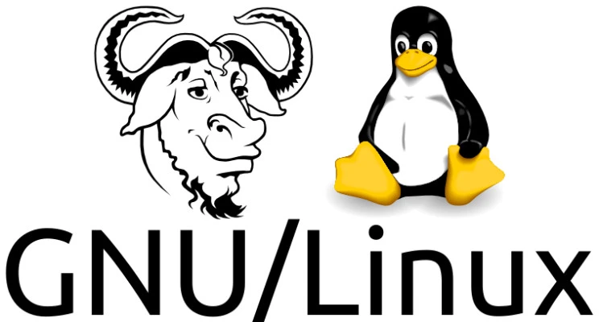


Le mouvement du logiciel libre a eu un impact profond sur l'industrie du logiciel, en promouvant l'idée que les logiciels devraient être libres pour que chacun puisse les utiliser, les modifier et les partager. Ses principes ont jeté les bases d'un grand nombre de projets et de communautés open-source qui prospèrent aujourd'hui.


### Économie et financement de l'open source


Le financement et le maintien des projets de logiciels libres présentent des défis et des opportunités uniques. Contrairement aux logiciels propriétaires, qui génèrent des revenus grâce aux ventes et aux droits de licence, les projets de logiciels libres reposent souvent sur des modèles de financement alternatifs.


Un exemple de réussite est Bitcoin core, un élément essentiel de l'infrastructure Bitcoin. Les développeurs qui travaillent sur Bitcoin core sont souvent financés par des subventions, des dons et des parrainages d'organisations qui bénéficient de la réussite du projet. Ce modèle permet aux développeurs de se concentrer sur l'amélioration du logiciel sans les contraintes d'un financement commercial traditionnel.


Le système d'exploitation Linux en est un autre exemple frappant. De nombreuses entreprises, comme IBM, Red Hat et Intel, contribuent au développement de Linux parce que leurs produits et services dépendent d'un système d'exploitation robuste et sûr. Ces entreprises apportent un soutien financier, contribuent au code et offrent des ressources pour maintenir et améliorer l'écosystème Linux.


Les licences libres, telles que MIT, GPL et AGPL, jouent également un rôle crucial dans la dynamique économique des logiciels libres. Les licences permissives comme le MIT permettent une utilisation plus souple du code, y compris la commercialisation. En revanche, les licences à gauche d'auteur comme la GPL garantissent que tout travail dérivé doit également être à source ouverte, ce qui favorise un environnement de collaboration.


En conclusion, l'économie des logiciels libres repose sur les contributions de la communauté, les parrainages d'entreprises et les modèles de financement innovants. Ces mécanismes garantissent la durabilité et l'amélioration continue des projets de logiciels libres, au bénéfice des développeurs et des utilisateurs.


## Cryptographie dans Bitcoin


<chapterId>71867dd2-912c-55ad-b59c-9dbca8a39469</chapterId>

<professorId>6cfd206c-53b8-47a0-bbf4-44fd84e6ee1d</professorId>


:::video id=b482b0f0-4468-4eaf-bcd6-eb4748bdfa3a:::

Bienvenue ! Aujourd'hui, nous allons nous plonger dans les aspects cruciaux de la cryptographie que tout développeur Bitcoin devrait connaître. Nous nous concentrerons sur les concepts fondamentaux et les applications pratiques sans vous submerger de détails théoriques excessifs. L'objectif principal est de vous doter des connaissances nécessaires pour comprendre, mettre en œuvre et dépanner efficacement les mécanismes cryptographiques dans Bitcoin.


### Concepts cryptographiques de base pour les développeurs Bitcoin


Dans cette section, nous examinerons les concepts cryptographiques essentiels pour les développeurs de Bitcoin, notamment les fonctions Hash, les arbres de Merkle, les signatures numériques et les courbes elliptiques.


**Fonctions Hash** : Une fonction Hash prend une entrée et produit une chaîne d'octets de longueur fixe. En Bitcoin, les fonctions Hash sont fondamentales pour l'intégrité et la sécurité des données. Les fonctions cryptographiques Hash doivent être efficaces, produire des résultats apparemment aléatoires et produire des résultats de longueur fixe quelle que soit la taille de l'entrée. Elles sont utilisées pour les contrôles d'intégrité des fichiers, garantissant que les données n'ont pas été modifiées de manière malveillante.


**Propriétés de sécurité** : Les fonctions cryptographiques Hash doivent respecter plusieurs propriétés de sécurité. La résistance à la pré-image garantit qu'il est impossible, d'un point de vue informatique, d'effectuer une rétro-ingénierie de l'entrée originale à partir de la sortie Hash. La deuxième résistance à la préimage signifie qu'il doit être difficile de trouver une entrée différente qui produise la même sortie Hash. La résistance aux collisions garantit qu'il est improbable de trouver deux entrées différentes produisant le même résultat Hash.


**Arbres de Merkel** : Un Merkle Tree est une structure de données qui permet une vérification efficace et sûre de grands ensembles de données. Les éléments de données sont hachés par paires, les hachages résultants étant combinés itérativement pour former une racine unique Hash. Dans la Bitcoin, les arbres de Merkle sont essentiels à la création de blocs et à la vérification des transactions, en particulier pour les clients de la vérification simplifiée des paiements (SPV) et dans la Taproot (Mast).


**Signatures numériques (ECDSA)** : L'algorithme de signature numérique à courbe elliptique (ECDSA) est utilisé pour garantir l'authenticité et l'intégrité des transactions Bitcoin. Il s'agit de générer une signature à l'aide d'une clé privée qui peut être vérifiée à l'aide de la clé publique correspondante. Les concepts clés comprennent la compréhension des champs finis, des logarithmes discrets et l'importance des nonces.


**Courbes elliptiques** : Les courbes elliptiques sont utilisées dans la cryptographie à clé publique en raison de leur efficacité et de leur sécurité. La sécurité de la cryptographie par courbe elliptique repose sur la difficulté de résoudre le problème du logarithme discret.


### Applications cryptographiques pratiques et pratiques de sécurité en Bitcoin


Dans cette section, nous allons explorer l'application de ces concepts dans le développement réel de la Bitcoin et les meilleures pratiques de sécurité à suivre.


**Cryptographie = danger** : La cryptographie est une arme à double tranchant. Bien qu'elle protège contre les dommages accidentels aux données et les actions malveillantes, une mise en œuvre incorrecte peut entraîner de graves vulnérabilités. Les développeurs doivent comprendre en profondeur les mécanismes cryptographiques pour garantir à la fois une mise en œuvre sûre et la capacité de résoudre les problèmes potentiels. Par exemple, la sortie 256 bits de SHA-2 garantit que les attaques par préimage nécessitent environ 2^256 de travail, avec une résistance aux collisions d'environ 2^128 de travail.


**Merkle Tree applications** : Il est essentiel de comprendre la taille logarithmique de la preuve et de veiller à une conception minutieuse de l'arbre pour éviter les défauts, tels que la Hash duplication dans la vérification des transactions. Les arbres de Merkle sont utilisés pour la création de blocs, la vérification des transactions et les améliorations telles que Taproot.


**Cryptographie à clé publique** : Les logarithmes discrets et les corps finis sont fondamentaux dans les calculs cryptographiques de la Bitcoin. Les protocoles défi-réponse sont utilisés pour vérifier la connaissance d'une clé privée sans la révéler.


**Implications en matière de sécurité** : Des exemples historiques montrent des pertes financières importantes dues à la réutilisation du Nonce. Il est essentiel de comprendre l'importance de la génération de nonces uniques. L'utilisation de bibliothèques de confiance comme LibSecP256k1 garantit des opérations cryptographiques robustes et sûres.


**Cryptographie à courbe elliptique (ECC)** : Les systèmes de signature ont évolué des protocoles d'identité vers des systèmes tels que les signatures Schnorr, actuellement utilisées dans le Bitcoin (BIP 340). La connaissance des courbes elliptiques et de l'arithmétique des corps finis garantit des implémentations cryptographiques sûres.


**Conseils généraux aux développeurs** : Les protocoles cryptographiques doivent faire l'objet d'un examen approfondi par les pairs. Les développeurs doivent être précis et comprendre parfaitement chaque étape des procédures cryptographiques. La connaissance des pièges courants dans les implémentations cryptographiques peut permettre d'éviter des vulnérabilités importantes.


**Les courbes elliptiques dans la cryptographie** : La modification des clés et la sécurité sont des sujets importants, tels que la modification d'une clé publique en utilisant une clé privée supplémentaire tout en garantissant la sécurité. La courbe elliptique spécifique de Bitcoin, SECP256K1, et ses paramètres (P et N) sont fondamentaux pour sa mise en œuvre.


#### Conclusion


Dans cette conférence, nous avons exploré les concepts cryptographiques fondamentaux qui sous-tendent la sécurité et la fonctionnalité de la Bitcoin. Des rôles critiques des fonctions Hash, des arbres de Merkle et des signatures numériques aux mathématiques complexes de la cryptographie à courbe elliptique, ces Elements forment l'épine dorsale du réseau décentralisé de Bitcoin. Comprendre ces concepts, ce n'est pas seulement saisir la théorie, c'est aussi reconnaître les implications pratiques et les pièges potentiels dans le développement du monde réel.


En tant que développeurs Bitcoin, il est essentiel d'aborder les implémentations cryptographiques avec prudence et précision. La sécurité du réseau Bitcoin dépend fortement de l'application correcte et sécurisée de ces principes cryptographiques. Que vous vérifiiez des transactions, conceviez de nouvelles fonctionnalités ou assuriez l'intégrité du Blockchain, une connaissance approfondie de la cryptographie vous permettra de construire des solutions plus robustes, plus sûres et plus innovantes au sein de l'écosystème Bitcoin.


En maîtrisant ces concepts et en adhérant aux meilleures pratiques, vous serez bien équipé pour contribuer efficacement au développement continu de Bitcoin, en garantissant sa résilience et sa sécurité pour l'avenir.


## Modèle de gouvernance de Bitcoin


<chapterId>a30ec3e7-b290-5145-a9a9-042224ab20d2</chapterId>

<professorId>7dfc5865-a0f6-4c3b-9b05-83e0d807ac59</professorId>


:::video id=91a38c17-5801-4a5c-baf2-c9e4cc24fd84:::

### Nature du Bitcoin


Le Bitcoin est une monnaie numérique qui fonctionne sur la base d'un protocole de consensus, un ensemble de règles convenues par les participants au réseau pour garantir l'uniformité et la fonctionnalité. À la base, la Bitcoin est une Ledger décentralisée, connue sous le nom de Blockchain, où les transactions sont enregistrées et vérifiées par les nœuds du réseau. Les nœuds complets, qui stockent tout l'historique de la Bitcoin Blockchain, jouent un rôle crucial dans le maintien de l'intégrité de cette Ledger. D'autres types de nœuds, tels que les nœuds d'archivage, les nœuds pruned et les nœuds SPV (Simplified Payment Verification), contribuent également au réseau de diverses manières. Le protocole de consensus garantit que tous ces nœuds sont d'accord sur l'état de la Blockchain, ce qui rend la Bitcoin résistante à la censure et à la fraude.


#### Prévenir les changements


La gouvernance de Bitcoin est essentielle pour éviter les modifications arbitraires ou malveillantes du protocole. Pour ce faire, un mécanisme de consensus est mis en place, qui nécessite un large accord au sein de la communauté. Les développeurs ayant des connaissances en programmation jouent un rôle important en proposant des changements, mais ceux-ci doivent être acceptés par l'ensemble de la communauté pour être mis en œuvre.


Bitcoin core et les implémentations alternatives ont des responsables qui supervisent le développement et la maintenance du logiciel. Ces mainteneurs sont chargés de fusionner les modifications du code, en veillant à ce qu'elles respectent les règles du consensus et n'introduisent pas de vulnérabilités.


#### Fourches Soft vs fourches Hard


Les fourches Soft sont des modifications qui renforcent les règles existantes du protocole Bitcoin, rendant invalides certaines transactions précédemment valides. Elles sont rétrocompatibles, ce qui signifie que les nœuds non mis à jour reconnaîtront toujours les nouvelles règles. Un exemple de Soft Fork est la correction du bug de débordement en 2010, qui a empêché la création d'argent à partir de rien.


Les fourches Hard sont des modifications qui assouplissent les règles existantes, autorisant de nouveaux types de transactions. Elles ne sont pas rétrocompatibles, ce qui signifie que les nœuds non mis à jour ne reconnaîtront pas les nouvelles règles. Un exemple de Hard Fork pourrait être nécessaire pour le problème de l'année 2106 afin de s'assurer que la Bitcoin continue à fonctionner au-delà de cette date.


### Exemples de gouvernance


Plusieurs exemples concrets illustrent la gouvernance de la Bitcoin en action. La correction du bug de débordement en 2010 a été une Soft Fork qui a corrigé une faille critique. Le problème de l'année 2106 nécessitera probablement une Hard Fork pour Address ses implications. Le passage de la chaîne la plus longue à la chaîne la plus travaillée reflète une décision de gouvernance importante qui a affecté la manière dont le consensus est atteint.


La gouvernance de Bitcoin tient également compte des changements réels dans l'utilisation du protocole. Par exemple, l'introduction des ordinaux et des inscriptions illustre la manière dont les changements de protocole peuvent ne pas censurer les transactions. De même, la mise en œuvre de la RBF complète (Replace-by-fee) a modifié les procédures de remplacement des transactions sans changer les règles de consensus.


#### Motivations pour le changement et le consensus


Les changements apportés à Bitcoin peuvent être motivés par diverses raisons, telles que la correction de bogues critiques, l'introduction de nouvelles fonctionnalités ou la limitation des changements pour des raisons économiques ou politiques. Ces motivations conduisent souvent à des débats au sein de la communauté sur ce qui constitue un bogue par rapport à une fonctionnalité et sur l'impact global sur le réseau.


Le mécanisme de consensus de Bitcoin est intrinsèquement politique, car il nécessite un large accord pour que les changements soient acceptés. Cet aspect politique est essentiel pour maintenir la nature décentralisée du réseau et garantir que toute modification est dans le meilleur intérêt de la communauté.


Les nœuds en cours d'exécution peuvent valider les règles de Bitcoin et participer au réseau, même avec des protocoles de communication différents comme Blockstream Satellite. Cela met en évidence la séparation entre le mécanisme de consensus de Bitcoin et les méthodes de communication de données utilisées par le réseau. L'importance économique des nœuds, en particulier ceux qui sont gérés par de grandes entités comme Binance, peut influencer l'adoption de changements. Ces entités ont des intérêts économiques substantiels dans le réseau et peuvent influencer les décisions en gérant des nœuds influents.


### Débat sur la taille des blocs


Le débat sur la taille des blocs a été une question de gouvernance importante, tournant autour de la question de savoir s'il fallait augmenter la taille des blocs de la Bitcoin. Cette controverse a été résolue par la mise en œuvre de la SegWit, une Soft Fork qui a augmenté la taille effective des blocs et permis la Lightning Network.


### Changements forcés et règle de la majorité


Il y a eu des tentatives juridiques pour contraindre les développeurs de Bitcoin à modifier les règles de Blockchain pour leur bénéfice personnel, comme les poursuites de Craig Wright. Ces tentatives mettent en évidence les défis et les considérations éthiques liés à la gouvernance de la Bitcoin.


Dans la Bitcoin, la règle de la majorité joue un rôle essentiel. Si 60 % des mineurs adoptent une nouvelle règle, leurs blocs seront rejetés par ceux qui gèrent la Bitcoin core d'origine, ce qui entraînera une scission. La Bitcoin Satoshi's Vision (BSV) est un exemple d'échec de la Hard Fork dû au manque de soutien de la communauté.


Passons brièvement en revue quelques concepts importants.


**Soft Fork forcée** : L'idée de mettre en place des règles restrictives pour modifier la Bitcoin peut conduire à d'autres divisions et à des problèmes de gouvernance. Cette approche illustre les complexités et les conflits potentiels au sein de la communauté Bitcoin.


**Attaque à 51 %** : Une attaque à 51 % décrit un scénario dans lequel une majorité de la puissance de hachage pourrait attaquer Bitcoin par des blocs vides Mining. Cela pourrait effectivement tuer le réseau à moins que la communauté n'adopte de nouvelles règles de consensus pour Address l'attaque.


**Check-Lock-Time-Verify (CLTV)** : Check-Lock-Time-Verify (CLTV) est un exemple de changement de gouvernance mis en œuvre sous la forme d'une Soft Fork. La CLTV garantit que les transactions ne sont valables qu'après un certain temps, ce qui est utile pour les canaux de paiement et les clés de sauvegarde. Cette modification a renforcé les règles en utilisant un opcode qui ne faisait rien auparavant.


En conclusion, l'avenir et les changements de Bitcoin sont déterminés par la volonté collective de ses utilisateurs. Les changements importants nécessitent un large consensus, ce qui reflète la nature décentralisée et politique de la gouvernance de Bitcoin.


## Bitcoin Mining Essentiels


<chapterId>a4eacfc3-7b37-5fa3-abd1-b1fc48b645f0</chapterId>

<professorId>e320ccda-be59-492b-a81b-243d9acb592f</professorId>


:::video id=161d074d-4a81-48da-b2c9-9bde041a0da5:::

#### Introduction


Ajelex se concentre sur l'aspect commercial du Bitcoin Mining, en examinant les stratégies pour maintenir la rentabilité dans un marché concurrentiel. La discussion comprend une analyse des coûts opérationnels, des mesures d'efficacité et de l'économie de l'industrie du Mining.


### 1. Facteurs de complexité et de rentabilité de Mining


#### Facteurs techniques et stratégiques


La complexité Mining dans le contexte de Bitcoin implique principalement les Elements aspects techniques et stratégiques qui déterminent la rentabilité des opérations Mining. Il est essentiel de comprendre que la Mining n'est pas un simple jeu de hasard, mais un processus sophistiqué qui nécessite une planification minutieuse et une optimisation continue.


#### Facteurs clés de rentabilité


1. **Coût de l'électricité** : Le coût de l'électricité est l'un des facteurs les plus importants qui affectent la rentabilité de Mining. Dans des régions comme la France, l'électricité peut être relativement chère par rapport à des pays comme le Salvador, où les coûts inférieurs constituent un avantage concurrentiel pour les mineurs.

2. **Efficacité du matériel** : L'efficacité du matériel Mining, mesurée par son taux Hash et sa consommation d'énergie, joue un rôle essentiel. Les mineurs ASIC avancés comme le S19J Pro sont beaucoup plus efficaces que les modèles plus anciens comme l'Antminer S9.

3. **Période de temps** : Bitcoin Mining encourage la planification à long terme.

4. **Prix BTC** : Le prix du BTC est essentiel pour déterminer la rentabilité du Mining.

5. **Difficulté du réseau** : La difficulté du réseau représente la quantité de Hashrate en moyenne nécessaire pour miner un bloc en 10 minutes.

6. **Outils stratégiques** : Des outils tels que [braiins.com] (https://insights.braiins.com) sont inestimables pour calculer la rentabilité et aider les mineurs à prendre des décisions fondées sur des données.


#### Application pratique


D'après mon expérience personnelle, j'ai même utilisé la Mining pour chauffer mon appartement en France, compensant ainsi de manière créative les coûts d'électricité tout en Mining Bitcoin. Cet exemple souligne l'aspect pratique de l'intégration des opérations Mining dans la vie de tous les jours pour en tirer des avantages supplémentaires.


#### Goulets d'étranglement dans la Mining


Les mineurs sont confrontés à trois principaux goulets d'étranglement : la disponibilité du matériel, l'accès à l'énergie et le capital nécessaire pour maintenir les opérations. La rareté des ASIC en raison de la forte demande entraîne souvent de longs délais d'attente et des prix élevés, ce qui complique encore le paysage de la Mining.


- Exemple de **goulot d'étranglement énergétique**.

En 2021, le gouvernement chinois a interdit le Mining sur son territoire, ce qui a eu pour effet de priver les entreprises chinoises de Mining de leur accès à l'énergie. Il en résulte une chute de **50%** du Hashrate en deux semaines.


---

### 2. Évolution et efficacité du matériel Mining


#### Évolution historique


L'évolution du matériel Mining a été monumentale, depuis le simple CPU Mining jusqu'aux mineurs ASIC hautement spécialisés que nous utilisons aujourd'hui.


1. **CPU Mining** : Dans les premiers temps, le Mining était exécuté à l'aide de processeurs d'ordinateurs ordinaires (CPU). Cette méthode a été rapidement dépassée au fur et à mesure que le réseau se développait.

2. **GPU Mining** : Les unités de traitement graphique (GPU) ont permis d'améliorer considérablement l'efficacité de la Mining, rendant les CPU obsolètes pour la Mining.

3. **FPGA Mining** : Les réseaux de portes programmables (Field-Programmable Gate Arrays, FPGA) offrent des performances et une efficacité énergétique encore meilleures que les GPU.

4. **ASIC Mining** : Les circuits intégrés à application spécifique (ASIC) représentent le summum de l'efficacité matérielle Mining, conçus spécifiquement pour les opérations Mining avec des performances inégalées.


#### Comparaison détaillée : S19J Pro vs. Antminer S9


- S19J Pro** : Connu pour sa grande efficacité et sa fiabilité, le S19J Pro offre un taux Hash supérieur tout en consommant moins d'énergie, ce qui le rend idéal pour les opérations à grande échelle.
- Antminer S9** : Bien qu'il soit plus ancien et moins efficace, l'Antminer S9 reste populaire pour les petites installations et les amateurs en raison de son prix abordable et de ses performances décentes.


#### Mining efficacité et apprentissage


Mining n'offre pas seulement des récompenses financières, mais aussi une expérience pratique précieuse. L'acquisition de bitcoins sans KYC par l'intermédiaire de Mining peut être une proposition attrayante pour ceux qui se préoccupent de la protection de la vie privée.


#### Outils et techniques avancés


Les logiciels du marché secondaire peuvent améliorer l'efficacité et la fonctionnalité du matériel Mining. Les outils qui offrent des capacités d'optimisation et de réglage automatique garantissent que chaque puce fonctionne avec une efficacité maximale, en équilibrant efficacement le taux Hash et la consommation d'énergie.


---

### 3. Dynamique de la réglementation et du marché dans les opérations Mining


#### Impact réglementaire


La réglementation joue un rôle important dans l'évolution du paysage de la Mining. Par exemple, l'interdiction de la Mining en Chine a eu de profondes répercussions sur les opérations Mining au niveau mondial, entraînant une baisse significative du taux de Hash du réseau et une redistribution de la puissance de la Mining entre les différentes régions.


#### Dynamique du marché


1. **Disponibilité et coût du matériel** : Le prix et la disponibilité des mineurs ASIC sont influencés par le prix du marché du Bitcoin. Une forte demande pendant les marchés haussiers entraîne une pénurie et une augmentation des prix.

2. **Valeur de la Hash et prix de la Hash** : Il est essentiel de comprendre la distinction entre la valeur de la Hash (les satoshis gagnés par terahash et par jour) et le prix de la Hash (la valeur monétaire du taux de la Hash). Les deux sont influencés par la difficulté du réseau et le prix du marché de la Bitcoin.


#### Mining pools et mécanismes de récompense


1. **Les pools Mining** : En combinant les ressources, les pools Mining offrent des récompenses plus stables, réduisant ainsi la variance et le risque associés au Mining en solo.

2. **Les mécanismes de récompense** : Différents mécanismes de récompense, tels que le paiement au partage (PPS) et les récompenses proportionnelles, offrent différents profils de risque et de récompense aux mineurs.


   - Paiement par action** : Le paiement par action récompense les mineurs pour chaque action valide qu'ils soumettent, que le pool trouve ou non un bloc. *les *Shares** sont des unités de preuve que les mineurs ont effectué le travail requis, et le pool vérifie ces parts.


   - Proportionnelle** : Il dépend du pool Mining d'un bloc de distribuer la récompense de manière égale à la contribution du Miner au Hashrate total du pool.


#### L'avenir du Mining


À mesure que les récompenses pour les blocs diminuent, les mineurs dépendront de plus en plus des frais de transaction. Cette évolution soulève la question de savoir si les frais de transaction constitueront à eux seuls une incitation suffisante pour que les mineurs continuent à sécuriser le réseau.


#### Hébergé Mining


Les services hébergés Mining peuvent permettre de réduire les coûts d'exploitation, mais ils comportent des risques tels que le manque de contrôle et la possibilité de fraude. Il est nécessaire de faire preuve de diligence raisonnable pour atténuer ces risques.


#### Sécurité et efficacité


Les protocoles de sécurité avancés et l'utilisation d'énergies renouvelables améliorent non seulement la rentabilité, mais contribuent également à la croissance durable de l'écosystème Mining.


En conclusion, le monde du Bitcoin Mining est un domaine complexe, aux multiples facettes, qui exige une compréhension approfondie des dynamiques techniques, stratégiques, réglementaires et commerciales. Que vous soyez un Miner expérimenté ou un débutant, il est essentiel de rester informé et de s'adapter pour prospérer dans ce domaine en constante évolution. Je vous remercie de votre attention et j'attends avec impatience vos questions et vos discussions.


# Layer One Concepts


<partId>5300855f-e5e4-5bca-9afe-2397f7c76260</partId>


## Composants du nœud dans Bitcoin


<chapterId>75ea1d88-ee6f-5f98-af90-e4758c55e606</chapterId>

<professorId>6cfd206c-53b8-47a0-bbf4-44fd84e6ee1d</professorId>


:::video id=6fae79f6-da81-4870-927b-923bd1672176:::

Adam Gibson présente les différents composants d'un nœud Bitcoin. Le chapitre se concentre sur le rôle que chaque composant joue dans le maintien de la fonctionnalité et de l'intégrité du réseau. Il explique notamment pourquoi nous devrions utiliser un nœud Bitcoin, ce que fait un nœud Bitcoin et comment fonctionnent les différents composants d'un nœud Bitcoin.


### Introduction aux nœuds Bitcoin


Comprendre le rôle des nœuds Bitcoin est essentiel pour toute personne impliquée dans le réseau Bitcoin. L'exploitation d'un nœud Bitcoin permet aux utilisateurs de valider les transactions, de participer au consensus et de garder le contrôle sur leur vie privée. Cette conférence explique pourquoi l'exploitation d'un nœud Bitcoin est bénéfique et comment elle contribue à la sécurité globale et à la décentralisation du réseau Bitcoin.


### Pourquoi utiliser un nœud Bitcoin ?


L'exploitation d'un nœud Bitcoin est essentielle pour plusieurs raisons :


1. **Vérification** : En exécutant un nœud, vous pouvez vérifier vous-même les transactions, en vous assurant que la Bitcoin que vous recevez est valide sans dépendre de tierces parties.

2. **Participation au consensus** : Les nœuds jouent un rôle crucial dans la détermination des règles du réseau Bitcoin. La participation au consensus contribue donc à maintenir l'intégrité et la sécurité du réseau Blockchain.

3. **Confidentialité et contrôle** : En gérant votre propre nœud, vous n'avez pas à vous fier à des nœuds externes, qui pourraient compromettre votre vie privée en suivant vos transactions et votre solde Wallet.


### Que fait un nœud Bitcoin ?


- Conserve une liste de pairs** : Les nœuds doivent trouver d'autres nœuds dans le réseau et s'y connecter pour Exchange obtenir des informations.
- Réception et envoi de transactions et de blocs valides** : Les nœuds Bitcoin sont responsables de la propagation des transactions et des blocs valides dans le réseau.
- Conserve l'historique des blocs et de la chaîne la plus lourde** : Les nœuds stockent leur propre copie du Blockchain, ce qui leur permet de valider l'authenticité des transactions et des blocs.
- Maintient la liste des candidats valides ; Mempool** : Les nœuds doivent conserver dans la Mempool une liste de candidats possibles à la transaction à inclure dans les blocs.


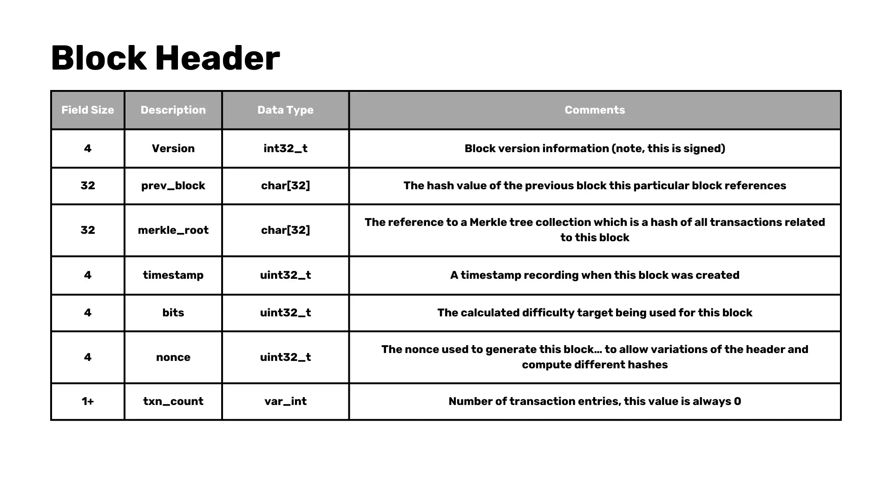


**NOTE** : La Mempool est une zone de stockage temporaire pour les transactions qui ont été validées mais qui n'ont pas encore été incluses dans un bloc.


### Composants du nœud


#### Modules Bitcoin core


- Découverte des pairs** : La découverte des pairs est le processus par lequel un nœud trouve d'autres nœuds auxquels se connecter.
- Moteur de validation** : Le moteur de validation est chargé de vérifier la validité des transactions et des blocs conformément aux règles du réseau.
- RPC (appel de procédure à distance)** : Le Bitcoin core comprend un RPC Interface qui permet à des applications externes, telles que des portefeuilles, d'interagir avec le nœud.
- Stockage des blocs et de l'état de la chaîne** : Bitcoin core peut stocker l'ensemble Blockchain ou non, qu'il s'agisse d'un nœud d'archivage ou d'un nœud pruned. Il stocke également l'état actuel du réseau (l'ensemble UTXO) sur le disque.


#### Que pouvons-nous supprimer ?


- Miner** : La plupart des nœuds Bitcoin ne participent pas à Mining en raison de la puissance de calcul nécessaire.
- RPC (serveur)** : Bitcoin core implémente un JSON-RPC Interface auquel on peut accéder à l'aide de la ligne de commande bitcoin-cli.
- Wallet (disablewallet)** : Si vous préférez utiliser un Wallet externe, vous pouvez désactiver la fonctionnalité Wallet dans le Bitcoin core. Cela vous permet de gérer vos clés privées séparément.
- Mempool (blocs uniquement)** : Pour les utilisateurs qui souhaitent réduire l'utilisation de la bande passante, l'exécution d'un nœud "blocksonly" peut être une solution dans laquelle le nœud ne traite que les blocs, sans tenir compte des transactions.


### État de la chaîne


#### Où sont les pièces ?


Les pièces ne sont pas stockées dans des adresses ; elles résident dans les UTXO, qui représentent tous les résultats des transactions qui n'ont pas été dépensés. Vous pouvez récupérer ces informations à l'aide de la commande :


```Bash
bitcoin-cli gettxoutsetinfo
```


Nous pouvons vérifier que le nombre de bitcoins est correct.


#### Pour chaque UTXO, chainstate a :


- txid.
- Indice de sortie.
- Le bloc dans lequel se trouve le UTXO.
- Qu'il s'agisse d'un coinbase UTXO.


**IMPORTANT** : Les transactions ne sont pas les mêmes que les UTXO.


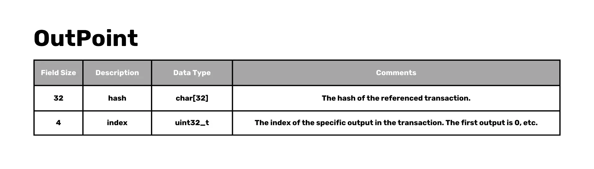


#### Mempool


Il s'agit d'une liste de transactions non confirmées dans chaque nœud, appelées transactions candidates. Elle est stockée dans la mémoire vive pour un accès rapide et ne fait pas partie du consensus.


#### Considérations de sécurité pour les nœuds Bitcoin


La sécurité est primordiale lors de l'exploitation d'un nœud Bitcoin. Voici quelques considérations clés à garder à l'esprit :


#### Éviter la centralisation


Le fait de s'appuyer sur une source unique pour les données Blockchain, comme le téléchargement de tous les blocs à partir d'un serveur central, présente des risques importants. Pour préserver la nature décentralisée de la Bitcoin, les nœuds doivent se connecter à plusieurs pairs et valider les données qu'ils reçoivent.


#### Prévenir les attaques d'isolement


Les attaques par isolement se produisent lorsqu'un nœud est amené à se connecter à un ensemble limité de pairs, ce qui permet à un attaquant de lui fournir des données incorrectes. En se connectant à un ensemble diversifié de pairs et en vérifiant les données reçues, les nœuds peuvent se protéger contre ces attaques.


#### Gestion des connexions entre pairs


Les nœuds doivent gérer avec soin les connexions de leurs pairs afin de s'assurer qu'ils ne se connectent pas à des acteurs malveillants. Il s'agit notamment de tenir à jour une liste des pairs interdits qui ont eu un comportement suspect et de mettre régulièrement à jour la liste des pairs afin d'éviter de se fier à un petit groupe de nœuds.


#### Importance de l'ensemble UTXO


L'ensemble UTXO représente l'état actuel de Bitcoin, listant toutes les sorties de transactions non dépensées. Il est essentiel pour valider les transactions et s'assurer que les pièces ne sont pas dépensées plus d'une fois. Il est important que cet ensemble soit petit et facilement accessible pour maintenir l'efficacité du réseau.


#### Conclusion


L'exploitation d'un nœud Bitcoin est un moyen puissant de participer au réseau Bitcoin, vous donnant la possibilité de vérifier les transactions, de maintenir la confidentialité et de contribuer à la sécurité et à la décentralisation de la Blockchain. Que vous choisissiez d'exploiter un Full node ou de personnaliser votre configuration en élaguant le Blockchain ou en désactivant certains composants, la compréhension des fonctions de base et des considérations de sécurité d'un nœud Bitcoin vous permettra de prendre des décisions éclairées et de contribuer à l'évolution continue du Bitcoin.


## Structures de données de Bitcoin


<chapterId>5ed314b1-8293-567d-bf03-730e8c9c774b</chapterId>

<professorId>e7e63d59-ea19-4960-9446-61bd4dcc98f0</professorId>


:::video id=1790e5fb-33f5-4e0e-982e-41589cd02965:::

L'objectif principal de ce cours est de vous guider dans le processus d'analyse d'un bloc Bitcoin en codant un analyseur en Rust. Cela implique de comprendre la structure des blocs Bitcoin et des transactions, et d'implémenter la logique nécessaire pour extraire et interpréter ces données.


### Analyse des blocs Bitcoin et des transactions dans Rust


#### Composants à analyser


Pour analyser un bloc Bitcoin, vous devez vous concentrer sur les éléments suivants :


1. **En-tête de bloc**

2. **Transactions au sein de la blockchain**

3. **Entrées et sorties de transactions**


#### Structure de l'en-tête du bloc


L'en-tête de bloc est la pierre angulaire d'un bloc Bitcoin et contient les champs suivants :


- Version** : Indique la version du bloc.
- Bloc précédent** : Référence au bloc précédent dans la Blockchain.
- Merkle Root** : Une Hash représentant la Hash combinée de toutes les transactions dans le bloc.
- Timestamp** : L'heure à laquelle le bloc a été extrait.
- Bits** : Le seuil cible pour un bloc valide Hash.
- Nonce** : La valeur que les mineurs ajustent pour obtenir une Hash inférieure au seuil cible.
- Nombre de transactions** : Le nombre de transactions dans le bloc.


**Note** : Seuls les 80 premiers octets (comprenant l'en-tête du bloc) sont hachés pendant le Mining.


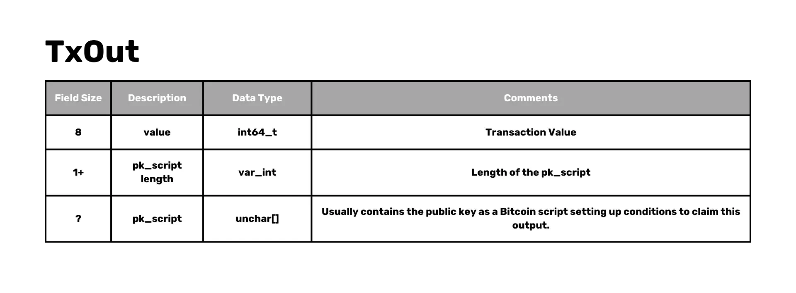


#### Simplifications


Pour que notre exemple reste gérable :


- Nous nous concentrerons sur l'analyse des blocs antérieurs à la SegWit (anciens), en évitant la complexité supplémentaire des témoins ségrégués.
- Nous allons sauter certains opcodes dans le langage de script Bitcoin, en nous concentrant sur quelques-uns dont nous avons besoin pour analyser un bloc complet.


#### Structure de la transaction


Chaque transaction d'un bloc Bitcoin contient les éléments suivants :


- Version** : La version de la transaction.
- Nombre d'entrées** : Nombre d'entrées de transactions.
- Entrées** : La liste des entrées.
  - Sortie précédente (outpoint)** : La référence de la sortie précédente.
    - Hash** : La Hash de la transaction référencée.
    - Index** : L'index de la sortie spécifique dans la transaction, appelée "vout".
  - Longueur du script** : Longueur du script de signature.
  - Script de signature** : Script de confirmation de l'autorisation de la transaction.
  - Séquence** : Version de la transaction telle que définie par l'expéditeur.
- Nombre de sorties** : Nombre de sorties de transaction.
- Résultats** : Contient la valeur et la clé ScriptPubKey.
  - Valeur** : Valeur de la transaction.
  - Longueur du script PubKey** : Longueur du script PubKey.
  - Script PubKey** : Contient la clé publique en tant que configuration pour réclamer la sortie.
- Heure de blocage** : Indique la hauteur du bloc ou Timestamp à partir de laquelle cette transaction peut être incluse dans un bloc.


#### Techniques d'analyse syntaxique


Dans Rust, nous pouvons utiliser différentes techniques pour analyser ces structures :


- Utilise `from_le_bytes` pour lire les données Little Endian.
- Implémenter un trait `parse` personnalisé pour gérer la logique d'analyse pour différentes structures.


```Rust
trait Parse: Sized {
fn parse(bytes: &[u8]) -> Result<(Self, &[u8]), Error>;
}
```


- Implémenter l'analyse générique pour les listes et les types spécifiques tels que `VarInt`, `U32`, `U64`, etc.


```Rust
impl Parse for i32 {
fn parse(bytes: &[u8]) -> Result<(Self, &[u8]), Error> {
let val = i32::from_le_bytes(bytes[0..4].try_into()?);
Ok((val, &bytes[4..]))
}
}
```


### Débogage et tests


Pour s'assurer que notre analyseur fonctionne correctement :


- Comparer les données analysées avec les détails des blocs connus (par exemple, à partir de Mempool.space).
- Valider que le nombre de transactions analysées et les détails des blocs correspondent aux valeurs attendues.


### Traitement des cas particuliers et analyse des scripts


#### Mise en œuvre de la fonction "parse


Nous allons implémenter la fonction `parse` pour traiter le bloc complet, y compris l'en-tête du bloc et les transactions. Cela implique de lire les données du bloc et d'extraire les champs pertinents.


```Rust
impl Parse for Block {
fn parse(bytes: &[u8]) -> Result<(Self, &[u8]), Error> {
let (header, bytes) = Parse::parse(bytes)?;
let (transactions, bytes) = Parse::parse(bytes)?;

let block = Block {
header, transactions
};

Ok((block, bytes))
}
}
```


#### Modification de l'en-tête de bloc


Nous devons adapter notre logique d'analyse pour supprimer le nombre de transactions de la structure de l'en-tête du bloc et le traiter comme une entité distincte.


```Rust
impl Parse for BlockHeader {
fn parse(bytes: &[u8]) -> Result<(Self, &[u8]), Error> {
let (version, bytes) = Parse::parse(bytes)?;
let (prev_block, bytes) = Parse::parse(bytes)?;
let (merkle_root, bytes) = Parse::parse(bytes)?;
let (timestamp, bytes) = Parse::parse(bytes)?;
let (bits, bytes) = Parse::parse(bytes)?;
let (nonce, bytes) = Parse::parse(bytes)?;

let header = BlockHeader {
version, prev_block, merkle_root, timestamp, bits, nonce,
};

Ok((header, bytes))
}
}
```


#### Définition de la structure


Définir une nouvelle structure `Block` qui contient à la fois l'en-tête du bloc et une liste de transactions.


```Rust
struct Block {
header: BlockHeader,
transactions: Vec<Transaction>,
}
```


#### Syntaxe Rust Elements


Introduire la syntaxe Rust Elements telle que le point d'interrogation (`?`) pour la gestion des erreurs. Cela simplifiera notre code et le rendra plus lisible.


#### Assertions


Ajouter des assertions pour vérifier qu'aucun octet n'est laissé sans analyse après le traitement d'un bloc complet. Cela garantit l'intégrité de notre processus d'analyse.


#### Cas particuliers comme les transactions coinbase


Les transactions Coinbase, qui sont la première transaction d'un bloc utilisé pour réclamer la Block reward, présentent des caractéristiques uniques. Nous devons traiter ces cas particuliers de manière appropriée.


```Rust
struct OutPoint {
txid: [u8; 32],
vout: u32,
}

impl OutPoint {
fn is_coinbase(&self) -> bool {
self.txid == [0; 32] && self.vout == 0xFFFFFFFF
}
}
```


#### Stratégie d'analyse des scripts


Pour analyser le script dans les transactions, nous nous concentrerons sur les opcodes communs tels que `OP_CHECKSIG`, `OP_HASH160` et `OP_PUSH`. L'analyse de ces scripts est cruciale pour la validation des transactions et la gestion des erreurs.


```Rust
enum OpCode {
False,
Return,
Dup,
Equal,
CheckSig,
Hash160,
EqualVerify,
Push(Vec<u8>),
}

impl Parse for OpCode {
fn parse(bytes: &[u8]) -> Result<(Self, &[u8]), Error> {
match bytes[0] {
v @ 1..=75 => {
let data = bytes[1..(v as usize + 1)].iter().cloned().collect();
Ok((OpCode::Push(data), &bytes[(v as usize + 1)..]))
},
76 => {
let len = bytes[1] as usize;
let data = bytes[2..(len + 2)].iter().cloned().collect();
Ok((OpCode::Push(data), &bytes[(len + 2)..]))
},

0 => Ok((OpCode::False, &bytes[1..])),

106 => Ok((OpCode::Return, &bytes[1..])),
118 => Ok((OpCode::Dup, &bytes[1..])),
135 => Ok((OpCode::Equal, &bytes[1..])),

136 => Ok((OpCode::EqualVerify, &bytes[1..])),
169 => Ok((OpCode::Hash160, &bytes[1..])),
172 => Ok((OpCode::CheckSig, &bytes[1..])),

_ => todo!()
}
}
}
```


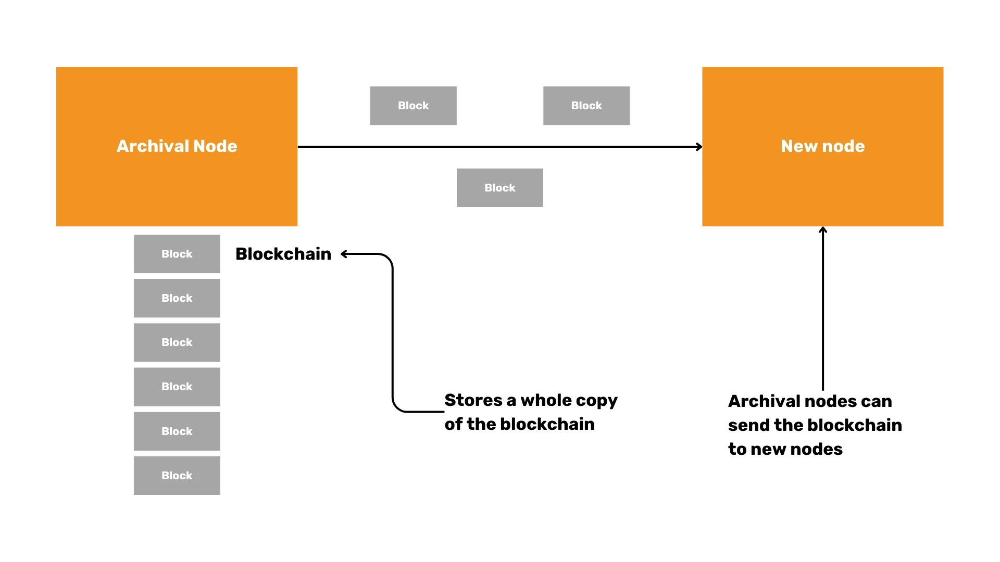


#### Les défis de l'analyse syntaxique des scripts


L'analyse des scripts peut présenter des difficultés, en particulier pour les transactions coinbase. Il est important de prendre en compte les cas de figure et de les traiter correctement pour garantir une analyse précise.


```Rust
impl Parse for Script {
fn parse(bytes: &[u8]) -> Result<(Self, &[u8]), Error> {
let (len, bytes) = VarInt::parse(bytes)?;
let mut script_bytes = &bytes[..len.0 as usize];
let mut opcodes = Vec::new();
while !script_bytes.is_empty() {
let (opcode, bytes) = OpCode::parse(script_bytes)?;
script_bytes = bytes;
opcodes.push(opcode);
}

Ok((Script(opcodes), &bytes[len.0 as usize..]))
}
}
```


#### Blocs compacts


Les blocs compacts sont actuellement utilisés pour améliorer l'efficacité de la transmission des données entre les nœuds. Cela permet de réduire l'utilisation de la bande passante et d'accélérer la synchronisation en envoyant les transactions manquantes dans le Mempool, en les remplissant avec la transaction que le nœud avait déjà dans un bloc, puis en la validant.


#### Utilisation des bibliothèques existantes


Pour les applications critiques pour le consensus, il est recommandé d'utiliser des bibliothèques existantes pour éviter les bogues et garantir la sécurité, comme [Rust-Bitcoin](https://docs.rs/Bitcoin/latest/Bitcoin/) ou [Bitcoin-dev-kit](https://docs.rs/BDK/latest/BDK/). L'implémentation de votre propre analyseur peut être instructive mais aussi risquée dans les environnements de production.


### Efficacité et sécurité en Bitcoin Mining


#### Efficacité en Mining


Mining Les blocs vides peuvent être plus efficaces pour les mineurs :


- Les mineurs commencent à utiliser les blocs Mining vides pour gagner du temps.
- Les blocs vides peuvent être extraits rapidement avant de passer à un bloc complet une fois que le bloc précédent est confirmé.


#### Raisons des blocs vides Mining


Les blocs vides sont parfois minés en raison de problèmes de timing. Les mineurs peuvent ne pas avoir reçu la liste complète des transactions au moment où ils commencent le Mining du bloc suivant, et ils choisissent donc de miner un bloc vide à la place.


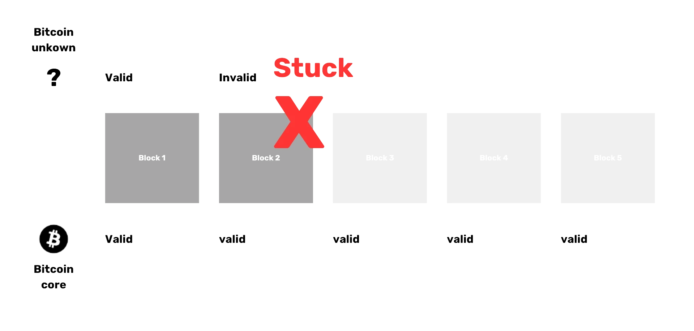


#### Mining malveillant de blocs vides


Bien que l'utilisation malveillante de blocs vides soit possible, elle n'a pas été observée. La raison principale des blocs vides est la contrainte temporelle plutôt qu'une intention malveillante.


#### Implications des blocs vides


L'apparition de blocs vides est un aspect normal du processus Mining et est principalement due à des problèmes de synchronisation. Bien qu'ils ne contiennent pas de transactions, ils prolongent la Blockchain et contribuent à la sécurité du réseau.


#### Importance de la sécurité


La sécurité dans le Bitcoin Mining est primordiale. En adhérant aux meilleures pratiques et en utilisant des bibliothèques bien contrôlées, les mineurs et les développeurs peuvent garantir l'intégrité de la Blockchain et se protéger contre les vulnérabilités potentielles.


En conclusion, l'analyse des blocs Bitcoin et des transactions dans Rust implique la compréhension de structures complexes et la mise en œuvre de techniques d'analyse efficaces. Le traitement des cas particuliers et l'analyse des scripts requièrent une attention particulière, et le fait de se concentrer sur l'efficacité et la sécurité garantit la robustesse du réseau Bitcoin.


## Aperçu du logiciel Bitcoin et implémentations des nœuds


<chapterId>96d64781-fc27-5209-88d8-2acf00d05ea8</chapterId>

<professorId>0b05838c-24af-43ff-93be-896c907e0bc1</professorId>


:::video id=1d148008-9197-446f-afb5-628d4c3a5015:::

Daniela Brozzoni offre une vue d'ensemble de la pile logicielle Bitcoin Layer 1, expliquant les couches qui constituent la base du protocole Bitcoin (c'est-à-dire les nœuds Bitcoin et les portefeuilles Bitcoin) et comment construire le logiciel Bitcoin avec une introduction aux bibliothèques Bitcoin et une plongée en profondeur dans le kit de développement Bitcoin (BDK).


### Aperçu du logiciel Bitcoin


La pile logicielle de la Bitcoin est fondamentale pour son fonctionnement et se compose de plusieurs Elements, y compris des nœuds et des portefeuilles. Une partie essentielle de cet écosystème est le kit de développement Bitcoin (BDK), que nous étudierons en détail ultérieurement. Tout d'abord, concentrons-nous sur le rôle des nœuds au sein du réseau Bitcoin.


#### Nœuds Bitcoin


Les nœuds Bitcoin constituent l'épine dorsale du réseau Bitcoin. Ils se connectent les uns aux autres, effectuent des transactions et des blocs Exchange et valident les données entrantes. Il existe différents types de nœuds, chacun ayant une fonction unique :


- Nœuds complets** : Ces nœuds stockent l'intégralité du Blockchain et valident toutes les transactions et tous les blocs. Ils offrent un haut niveau de sécurité et sont essentiels à la décentralisation du réseau.


  - Nœuds d'archivage** : Sous-ensemble des nœuds complets, les nœuds d'archivage conservent toutes les données Blockchain, ce qui les rend précieux pour l'analyse historique et le débogage.


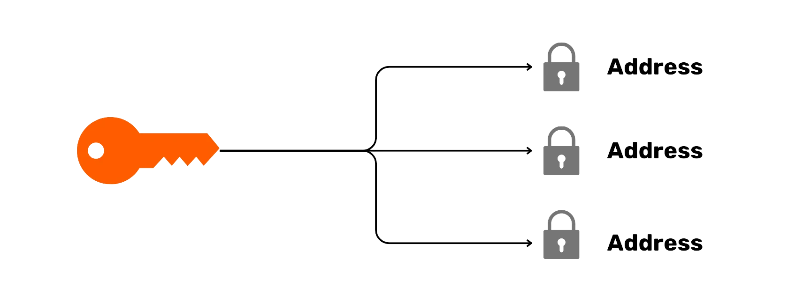


  - Nœuds pruned** : Les nœuds pruned économisent de l'espace disque en ne conservant qu'une partie du Blockchain, éliminant ainsi les anciennes données qui ne sont plus nécessaires à la validation.


#### Bitcoin core


Bitcoin core est l'implémentation Full node la plus répandue. Elle remplit les deux fonctions de Full node et de Wallet. Les principaux aspects de la Bitcoin core sont les suivants


- Facilité d'utilisation** : Il peut être utilisé via une ligne de commande Interface (CLI) et un utilisateur graphique Interface (GUI).
- Nature open-source** : Le code est ouvert, ce qui permet aux développeurs d'y contribuer et d'en examiner le fonctionnement.
- Langage** : Écrit en C++ avec des tests en Python, ce qui garantit des performances et une fiabilité élevées.


##### Explorer Bitcoin core


Pour acquérir une expérience pratique avec Bitcoin core, il est possible de compiler et d'exécuter des tests à l'aide de Git. Ce processus implique :


- Compilation de la base de code pour créer une version exécutable. [Bitcoin github](https://github.com/Bitcoin/Bitcoin) accès à doc/build-\*.md pour les instructions.


```Bash
./autogen.sh
./configure
make # use "-j N" for N parallel jobs
make install # optional
```


- Exécution de tests pour s'assurer que tout fonctionne correctement. Les instructions sont disponibles [ici] (https://github.com/Bitcoin/Bitcoin/blob/master/test/README.md)


```Bash
make check

#individual tests can be run directly calling the test script e.g:
test/functional/feature_rbf.py

#run all possible tests
test/functional/test_runner.py
```


- Création et exécution d'un test en Python pour valider une fonctionnalité spécifique. Le fichier [example.py] (https://github.com/Bitcoin/Bitcoin/blob/master/test/functional/example_test.py) est un exemple très commenté d'un cas de test qui utilise les interfaces RPC et P2P.


#### Autres implémentations de nœuds


Outre la Bitcoin core, il existe plusieurs autres implémentations de nœuds :


- Bitcoin Knots** : Il offre des fonctionnalités plus avancées que le Bitcoin core et occupe plus d'espace et de mémoire.
- LibBitcoin** : Une implémentation flexible et modulaire.
- btcd** : Écrit en Go, il offre différentes philosophies de conception.


La mise en œuvre de ces alternatives comporte ses propres risques, notamment en ce qui concerne les règles de consensus. S'écarter des règles de validation établies peut conduire à des bifurcations ou à des incohérences. Le projet Bitcoin Kernel vise à atténuer ces risques en centralisant le code de consensus, ce qui garantit l'uniformité des implémentations.


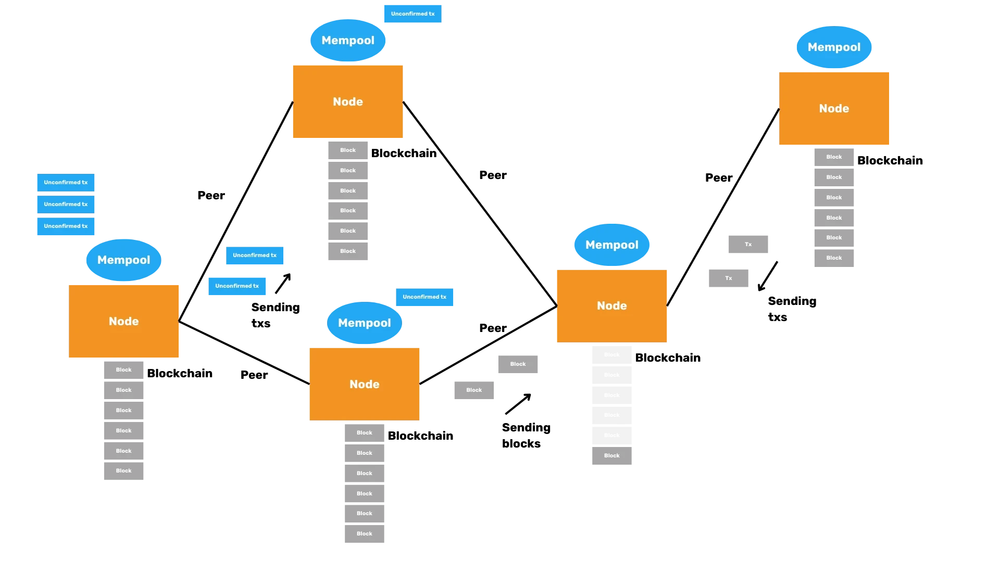


### Portefeuilles et sécurité Bitcoin


Les portefeuilles Bitcoin sont essentiels pour gérer vos avoirs Bitcoin en toute sécurité. Ils se présentent sous différentes formes, chacune avec des caractéristiques et des considérations de sécurité distinctes.


#### Types de portefeuilles Bitcoin


1. **Dépositaire ou non dépositaire** :


   - Portefeuilles de dépositaires** : Gérés par des tiers, ils sont pratiques mais nécessitent la confiance du dépositaire.
   - Portefeuilles non dépositaires** : Contrôlés par les utilisateurs, ils offrent une sécurité et une confidentialité accrues.


2. **Bureau vs. mobile** :


   - Portefeuilles de bureau** : Généralement plus riches en fonctionnalités et plus sûrs.
   - Portefeuilles mobiles** : Offrent commodité et portabilité.


3. **On-Chain contre la foudre** :


   - Portefeuilles On-Chain** : Interagissent directement avec le Bitcoin Blockchain.
   - Portefeuilles Lightning** : Faciliter des transactions plus rapides et moins chères off-chain.


4. **Portefeuilles Cold contre portefeuilles Hot** :


   - Portefeuilles Cold** : Ne sont pas connectés à l'internet, ce qui offre une sécurité supérieure contre les piratages.
   - Portefeuilles Hot** : Connectés à l'internet, ils offrent plus d'accessibilité mais moins de sécurité.


#### Cold Wallet sécurité


Les portefeuilles Cold sont vénérés pour leur sécurité. En restant hors ligne, ils sont intrinsèquement résistants aux piratages en ligne. Toutefois, il est essentiel de s'assurer que les transactions effectuées par l'intermédiaire des portefeuilles Cold sont sûres et exactes afin d'éviter d'envoyer par inadvertance des Bitcoin à des acteurs malveillants.


#### Portefeuilles réservés aux montres


Les portefeuilles de surveillance ne contiennent que des clés publiques, ce qui permet aux utilisateurs de recevoir des Bitcoin et de surveiller leur solde sans pouvoir dépenser. Cette fonction ajoute une Layer sécurité supplémentaire pour ceux qui ont besoin de garder un œil sur leurs avoirs.


#### Fonctions de base d'un Bitcoin Wallet


Quel que soit le type, chaque Bitcoin Wallet remplit trois fonctions fondamentales :


1. **Recevoir les adresses Bitcoin** : Adresses generate et contrôle des transactions entrantes.

2. **Envoyer Bitcoin** : Créer et diffuser des transactions sur le réseau.

3. **Affichage de la balance** : Affiche le solde actuel du Wallet.


#### Rôle des portefeuilles Bitcoin


- Les portefeuilles Bitcoin agissent comme des trousseaux de clés, détenant et générant des clés cryptographiques.


- Ils surveillent le Blockchain pour les transactions entrantes.


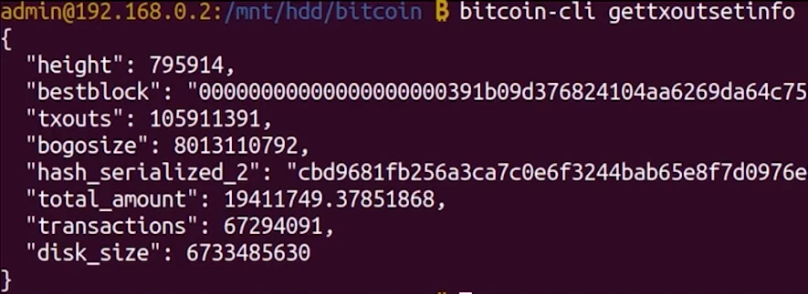


- Créez des transactions en sélectionnant des sorties de transactions non dépensées (UTXO), en définissant des entrées et des sorties, et en optimisant la confidentialité et les frais.


#### Réutilisation de la logique Wallet


Étant donné que tous les portefeuilles Bitcoin partagent des fonctions similaires, la réécriture répétée de la logique Wallet est inefficace. C'est là que le kit de développement Bitcoin (BDK) entre en jeu.


### Kit de développement Bitcoin (BDK) et concepts techniques


Le kit de développement Bitcoin (BDK) est une bibliothèque conçue pour simplifier la création et la gestion des portefeuilles Bitcoin.


#### Présentation de BDK


BDK simplifie la création de Wallet en fournissant des fonctionnalités de plus haut niveau construites au-dessus de Rust Bitcoin. Il prend en charge plusieurs langages de programmation par le biais de liaisons, notamment Kotlin, Swift et Python.


#### Autres bibliothèques Bitcoin


De nombreuses bibliothèques Bitcoin sont adaptées à différents langages de programmation, tels que Python, JavaScript, Java, Go et C. Ces bibliothèques offrent divers outils pour le développement de Bitcoin.


#### Concepts techniques clés


1. **Descripteurs** : Les descripteurs décrivent comment dériver les scripts et les adresses Bitcoin à partir des clés, ce qui permet d'obtenir des fonctionnalités Wallet plus souples et plus puissantes.

2. **PSBT (transactions Bitcoin partiellement signées)** : PSBT est un format pour les transactions qui nécessitent des signatures multiples, facilitant les transactions collaboratives et renforçant la sécurité.

3. **Syntaxe de Rust** : Les concepts clés de Rust, tels que `Option` pour la sécurité des nullités et le type `Result` pour la gestion des erreurs, font partie intégrante de la compréhension et de l'utilisation efficace de BDK.


#### Créer et gérer des transactions


BDK rationalise le processus d'élaboration, de signature et de diffusion des transactions :


1. **Créez des transactions** : Spécifiez les destinataires, les montants et les frais.

2. **Signer des transactions** : Utilisez la PSBT pour recueillir des signatures.

3. **Diffusion des transactions** : Envoyer les transactions finalisées au réseau.


#### Exemple de flux de travail dans BDK


- Configurer Wallet** : Initialiser un Wallet avec des descripteurs.


```Rust
use bdk::{Wallet, SyncOptions};
use bdk::database::MemoryDatabase;
use bdk::blockchain::ElectrumBlockchain;
use bdk::electrum_client::Client;
use bdk::bitcoin;

fn main() -> Result<(), bdk::Error> {
let wallet = Wallet::new(
"tr(tprv8ZgxMBicQKsPf6WJ1Rr8Zmdsr6MaACS5K3tHw3QDQmFbkEsdnG3zAZzhjEgEtetL1jwZ5VAL85UaaFzUpAZPrS7aGkQ3GdM75xPu4sUxSiF/*)",
None,
bitcoin::Network::Testnet,
MemoryDatabase::default(),
)?;

Ok(())
}
```


- Adresses generate** : Créer de nouvelles adresses pour recevoir des Bitcoin d'un Testnet Faucet.


```Rust
//import AddressIndex outside the main function
use bdk::wallet::AddressIndex;

//Function to add isnide main function
let address = wallet.get_address(AddressIndex::New)?;

```


- Vérifier le solde** : Contrôlez la balance du Wallet, d'abord en vous connectant à Electrum, en synchronisant le Wallet et en obtenant la balance du Wallet.


```Rust
//connect to Electrum server and save the blockchain
let client = Client::new("ssl://electrum.blockstream.info:60002")?;
let blockchain = ElectrumBlockchain::from(client);

//sync wallet to the blockchain received
wallet.sync(&blockchain, SyncOptions::default())?;

//get the balance from your wallet
let balance = wallet.get_balance()?;
println!("This is your wallet balance: {}", balance);
```


- Construire, signer et diffuser des transactions** : Construire et finaliser des transactions, puis les diffuser sur le réseau.


```Rust
//Add to the imports
use bdk::bitcoin::Address;
use bdk::{SignOptions};
use std::str::FromStr;
use bdk::blockchain::Blockchain;

//build a transaction psbt
let mut builder = wallet.build_tx();
let recipient_address = Address::from_str("tb1qlj64u6fqutr0xue85kl55fx0gt4m4urun25p7q").unwrap();

builder
.drain_wallet()
.drain_to(recipient_address.script_pubkey())
.fee_rate(FeeRate::from_sat_per_vb(2.0))
.enable_rbf();
let (mut psbt, tx_details) = builder.finish()?;
println!("This is our psbt: {}", psbt);
println!("These are the details of the tx: {:?}", tx_details);

//Sign the PSBT
let finalized = wallet.sign(&mut psbt, SignOptions::default())?;
println!("Is my PSBT Signed? {}", finalized);
println!("This is my PSBT finalized: {}", psbt);


let tx = psbt.extract_tx();
let tx_id = tx.txid();
println!("this is my Bitcoin tx: {}", bitcoin::consensus::encode::serialize_hex(&tx));
println!("this is mny tx id: {}", tx_id);

//Broadcast the transaction
blockchain.broadcast(&tx)?;
```


#### Imprimer la txid et diffuser la transaction


L'attribution et l'impression du transaction ID (txid) permettent d'effectuer un suivi sur des plates-formes telles que Mempool.space. La diffusion de la transaction peut être effectuée en utilisant la méthode `Blockchain.broadcast`, et la vérification des détails et du statut de la transaction est cruciale pour assurer une propagation réussie.


#### BDK : considérations relatives à l'utilité et à la protection de la vie privée


Le BDK est inestimable pour simplifier le Bitcoin Wallet développement. Pour une meilleure confidentialité, des outils comme Electrum, Explora et les nœuds Bitcoin core personnels sont recommandés.


#### Langages de programmation


Lors du développement de projets Bitcoin, le Rust est souvent préféré en raison de sa sécurité et de son efficacité. Toutefois, le choix de la langue peut varier en fonction des exigences spécifiques du projet et de l'expertise du développeur.


#### Dépendances BDK


BDK s'appuie sur plusieurs dépendances clés, notamment Rust-Bitcoin et Rust-Miniscipt. D'autres bibliothèques peuvent être utilisées pour la gestion des bases de données et la cryptographie.


En comprenant ces composants, des nœuds et portefeuilles Bitcoin au kit de développement Bitcoin (BDK), vous pouvez naviguer dans l'écosystème Bitcoin avec plus de confiance et de compétence. Ces connaissances vous permettront de développer des applications Bitcoin robustes et sécurisées, contribuant ainsi à l'évolution continue de cette technologie révolutionnaire.


# Lightning Network


<partId>d7ac2ad7-a4b3-564f-8a8d-cfec5297b3a5</partId>


## Histoire des canaux de paiement


<chapterId>a0b11c6e-c0ff-5e65-b809-b2ab9a2fc37b</chapterId>

<professorId>880c7fa7-8d4c-4c9b-81b4-bc61ed256516</professorId>


:::video id=b90f19a3-a95e-4cd1-8c55-41016f3339cb:::

### Histoire des canaux de paiement


Bienvenue à notre conférence sur les solutions de paiement modernes dans le cadre de la technologie Blockchain. Aujourd'hui, nous allons explorer le contexte historique et les principaux développements des serrures multi-sauts (MHL) et du Lightning Network.


#### Vue d'ensemble et contexte historique


Les verrous multi-sauts (MHL) et le Lightning Network sont des concepts avancés de la technologie Blockchain qui facilitent les micropaiements efficaces et sécurisés à travers le réseau. Historiquement, le besoin de ces innovations est né des inefficacités et des limitations observées dans le déploiement initial des technologies Blockchain, en particulier Bitcoin. En allant plus loin, vous comprendrez comment les structures basées sur les thèmes et les approches en couches ont révolutionné les transactions Blockchain.


### Structure thématique


L'introduction des MHL et de la Lightning Network marque un changement de paradigme, les transactions Blockchain traditionnelles et linéaires étant remplacées par des systèmes plus sophistiqués et multicouches. En compartimentant les transactions en sujets ou segments spécifiques, ces innovations permettent une infrastructure de paiement plus évolutive et plus sûre, qui résout bon nombre des problèmes inhérents aux premières mises en œuvre de la Blockchain.


### Problèmes avec Bitcoin


Bitcoin, le pionnier de la technologie Blockchain, a introduit un système décentralisé dans lequel les transactions sont diffusées sur l'ensemble du réseau. Bien que révolutionnaire, cette méthode est intrinsèquement inefficace. Chaque nœud du réseau doit valider chaque transaction, ce qui entraîne des retards et des goulets d'étranglement importants, en particulier lorsque les volumes de transactions sont élevés.


Le processus de validation décentralisé du Bitcoin nécessite d'importantes ressources informatiques. Chaque transaction doit être vérifiée et enregistrée par plusieurs nœuds, ce qui consomme énormément d'énergie et de puissance de traitement. Non seulement les coûts opérationnels augmentent, mais la bande passante du réseau est également mise à rude épreuve, ce qui entraîne une augmentation des frais de transaction et des temps de traitement plus lents.


Si la décentralisation du Bitcoin est l'un de ses principaux atouts, elle pose également d'importants problèmes. La nature publique de la Blockchain signifie que toutes les transactions sont visibles par tous, ce qui pose des problèmes de confidentialité. En outre, la nécessité d'un consensus entre de nombreux nœuds peut conduire à des pressions centralisatrices, le pouvoir Mining se concentrant entre les mains de quelques grandes entités.


### Les canaux de paiement comme solution


_Gold Standard Metaphor_


Pour Address remédier aux inefficacités et aux problèmes de confidentialité de Bitcoin, les canaux de paiement ont été proposés comme une solution viable. Les canaux de micro-paiement permettent d'effectuer des off-chain transactions en réduisant la nécessité d'un partage constant des données sur l'ensemble du réseau. Cela allège considérablement la charge qui pèse sur le Blockchain, permettant des transactions plus rapides et moins chères.


Le principe fondamental qui sous-tend les canaux de paiement est le concept de la prise en charge des transactions off-chain. Au lieu de diffuser chaque transaction à l'ensemble du réseau, les parties peuvent ouvrir un canal de paiement et effectuer de nombreuses transactions entre elles. Seules l'ouverture et la fermeture du canal sont enregistrées sur le Blockchain, ce qui améliore considérablement l'efficacité et la confidentialité.


Malgré la nature off-chain des canaux de paiement, il reste possible de faire respecter les transactions On-Chain. En cas de litige ou si l'une des parties tente de tricher, le dernier état du canal peut être diffusé à la Blockchain, ce qui garantit que les transactions convenues sont honorées et que les fonds sont alloués correctement.


Les canaux de paiement représentent une avancée significative dans la technologie Blockchain, fournissant une méthode évolutive et sécurisée pour effectuer des transactions tout en abordant de nombreux problèmes fondamentaux associés au Bitcoin. Alors que nous continuons à innover et à construire sur ces fondations, l'avenir du Blockchain semble de plus en plus prometteur.


En conclusion, la compréhension du contexte historique et des défis du Bitcoin, ainsi que des solutions innovantes proposées par les MHL, le Lightning Network et les canaux de paiement, permet d'avoir une vue d'ensemble du paysage actuel et du potentiel futur de la technologie Blockchain.


## Histoire du routage atomique


<chapterId>28be7b31-e6b2-5eea-a5ed-62ce0a154b6e</chapterId>

<professorId>880c7fa7-8d4c-4c9b-81b4-bc61ed256516</professorId>


:::video id=059a714b-4fe9-4266-acb0-6fe5af491662:::

Dans nos discussions précédentes, nous avons abordé les principes fondamentaux des canaux de paiement de base. Ces canaux permettent à deux participants, par exemple Alice et Bob, d'effectuer des transactions directement l'un avec l'autre de manière transparente. Toutefois, ce modèle présente une limitation flagrante : Alice ne peut effectuer des transactions qu'avec Bob et non avec d'autres participants comme Charlie, à moins qu'elle n'établisse des canaux distincts avec chacun d'entre eux. Cette nécessité de canaux multiples entraîne des problèmes d'inefficacité et d'évolutivité, car il ne serait pas pratique pour Alice d'ouvrir un canal direct avec toutes les personnes avec lesquelles elle doit effectuer des transactions.


### Houblon centralisé


Pour remédier à ces limites, Manny Rosenfeld a proposé en 2012 le concept de "hops" centralisés. Ce modèle a introduit des processeurs de paiement centralisés, tels que TrustPay, pour acheminer les paiements entre les utilisateurs. Bien que cette méthode permette de réduire la nécessité de multiples canaux directs, elle présente d'importants inconvénients. Les sauts centralisés posent des problèmes de sécurité, de confiance, de respect de la vie privée, d'escroquerie, de censure et de fiabilité. Les utilisateurs doivent faire confiance à ces entités centralisées pour faciliter leurs transactions, ce qui est contraire à l'éthique de la décentralisation.


### Verrouillage temporel haché Contract (HTLC) et mise en œuvre


Les limites et les inconvénients des sauts centralisés appelaient une solution plus sûre et décentralisée. Ce besoin a conduit au développement du verrou temporel haché Contract (HTLC), proposé en 2015 par Joseph Poon et Thaddeus Dreijer dans le cadre du Lightning Network. Les HTLC combinent les principes des verrous temporels et des verrous Hash pour garantir l'atomicité et l'absence de confiance dans les transactions. Cela signifie qu'une transaction est soit entièrement terminée, soit qu'elle n'a pas lieu du tout, ce qui atténue les risques associés aux paiements incomplets.


Le flux de travail de HTLC implique un processus en plusieurs étapes qui garantit un acheminement sécurisé par le biais de plusieurs intermédiaires. Supposons que Alice veuille payer Éric par l'intermédiaire de Bob, Carol et Diana. Chaque étape du processus implique la création de transactions Commitment avec des délais et des montants décroissants. Si nécessaire, la dernière étape peut être diffusée au réseau Bitcoin pour finaliser la transaction.


Dans une HTLC, Alice bloque le paiement avec une Hash d'un "R" secret Bob, Carol et Diana créent chacune des contrats similaires avec leurs intermédiaires ultérieurs, garantissant qu'elles ne peuvent réclamer leurs fonds que si elles présentent le bon secret "R" Ce mécanisme garantit l'atomicité ; le paiement est entièrement effectué ou échoue, ce qui permet d'éviter les pertes partielles de fonds.


_Hash lock function_


### Considérations pratiques et dynamique des réseaux


Dans un scénario pratique, le flux de paiement de Alice implique le paiement d'Éric par le biais de plusieurs intermédiaires, tels que Bob, Carol et Diana. Chaque participant à cette chaîne est chargé de retirer des fonds au participant précédent.


#### Mises à jour de l'état des canaux


Les canaux mettent à jour leur état sur la base d'accords mutuels et de signatures entre les participants. Par exemple, Alice et Bob peuvent mettre à jour l'état de leur canal sans nécessairement utiliser le secret "R", à condition qu'ils soient d'accord sur les termes de la transaction.


#### Atomicité assurée


Le mécanisme HTLC garantit l'atomicité grâce à l'utilisation de verrous temporels et de signatures. Cette mesure de protection permet au protocole de paiement de garantir un succès ou un échec complet, protégeant ainsi contre les pertes partielles de fonds.


_Combine restrictions_


#### Incitations et responsabilités


Les intermédiaires comme Diana et Carol sont incités à agir correctement au sein du réseau. S'ils ne le font pas, les conséquences n'affectent généralement que l'intermédiaire lui-même, ce qui favorise un comportement responsable.


### Considérations pratiques


Cependant, l'augmentation du nombre de sauts dans l'itinéraire de paiement peut accroître le temps de latence, les frais et le manque potentiel de fiabilité. L'ouverture de plusieurs canaux peut contribuer à réduire le nombre de sauts nécessaires à l'acheminement, améliorant ainsi l'efficacité globale.


#### Graphique des canaux et liquidité


Les nœuds du réseau peuvent soit faire partie d'un graphe de canaux annoncé publiquement, soit rester non annoncés. La liquidité de ces canaux joue un rôle crucial dans l'efficacité du routage, car les nœuds ont besoin de soldes suffisants pour transmettre les paiements avec succès.


#### Routage à la source et confidentialité


Alice doit connaître la topologie du réseau pour décider de l'itinéraire de paiement. L'acheminement à la source est utilisé pour préserver la confidentialité malgré la complexité de l'acheminement des paiements par de multiples intermédiaires.


_Source Routing Path_


#### Conclusion


En résumé, le bon fonctionnement des nœuds garantit des paiements atomiques, et le Lightning Network vise à Address résoudre de nombreux problèmes rencontrés par les systèmes de paiement traditionnels tels que Ripple. En s'appuyant sur les HTLC et le routage stratégique, le Lightning Network fournit une solution plus évolutive, plus efficace et plus sûre pour les paiements décentralisés.


## Examen du Bolt


<chapterId>ba4b09ae-81de-53f2-8c15-316f037aaea9</chapterId>


:::video id=f0d17fe4-d793-4b90-924e-b551db501fbb:::

Le réseau Bitcoin fonctionne comme un système de valeur Trustless Exchange, servant principalement de système de règlement Layer où les transactions sont enregistrées sur un serveur public Ledger. Cela garantit la sécurité et l'immuabilité, mais s'accompagne de limitations, notamment en termes de vitesse de transaction et de frais. Par conséquent, le Bitcoin peut être inefficace pour les petites transactions quotidiennes.


C'est là qu'intervient le Lightning Network, qui fonctionne comme un deuxième Layer au-dessus du Bitcoin Blockchain. Ce réseau de paiement est conçu pour faciliter les transactions rapides et peu coûteuses. En ouvrant un canal de paiement entre deux parties, celles-ci peuvent effectuer des transactions off-chain, en enregistrant uniquement les soldes initial et final sur le Bitcoin Blockchain. Cela permet de réduire considérablement la charge sur le réseau principal, d'améliorer l'évolutivité et de rendre les microtransactions possibles.


Pour mieux comprendre ce concept, prenons l'analogie d'une ardoise de bar. Lorsque vous ouvrez un compte dans un bar, vous pouvez commander continuellement des boissons sans payer après chacune d'entre elles. Enfin, vous réglez le montant total à la fin de la soirée. De même, un canal Lightning permet de multiples transactions off-chain, qui ne sont réglées On-Chain que lorsque le canal est fermé. Une autre analogie est celle d'un aéroport, où l'acheminement d'un paiement à travers plusieurs nœuds s'apparente à la prise de vols de correspondance pour atteindre votre destination. Chaque nœud (ou "vol") aide à diriger votre paiement là où il doit aller, garantissant ainsi un acheminement efficace.


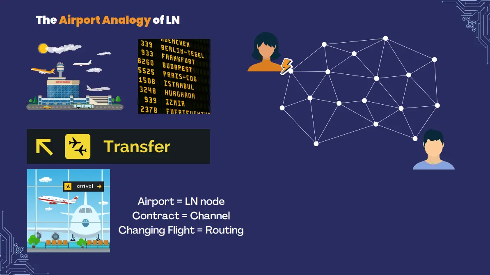_The airport analogy of LN_


En fait, le Lightning Network complète le réseau Bitcoin en s'attaquant à ses limites, le transformant d'un simple système de règlement Layer en un système polyvalent capable de traiter efficacement les transactions quotidiennes.


### **Cahier des charges Lightning Network**


Le protocole Lightning Network est méticuleusement défini à travers 10 BOLT (Basis of Lightning Technology). Ces BOLT ont été adoptés lors d'une conférence à Milan et servent de base aux différentes mises en œuvre du Lightning Network.


_BOLT Diagram _


#### Bolt 1 (protocole de base)


La norme Bolt 1 décrit le formatage des messages à l'aide d'une structure Type-Longueur-Valeur (TLV), qui garantit que les messages sont compris uniformément par les différentes implémentations. La communication s'effectue généralement via un port TCP spécifique, et les messages peuvent être classés en plusieurs catégories :


- Messages de communication** : Il s'agit des messages `Init`, `Error`, `Warning`, `Ping` et `Pong`, qui établissent des connexions, gèrent les erreurs, vérifient l'état de la connexion et obscurcissent le trafic.
- Messages de configuration du canal** : Ces messages sont essentiels pendant la phase d'établissement d'un canal.
- Messages sur l'état des canaux** : Ces messages gèrent les mises à jour au sein des canaux actifs, en veillant à ce que les deux parties soient synchronisées.
- Messages de ragots** : Ils sont utilisés pour la découverte et la mise à jour de la topologie du réseau.
- Messages expérimentaux** : Ils permettent de tester de nouvelles fonctionnalités sans perturber le réseau.


#### Bolt 2 (cycle de vie du canal)


Bolt 2 se penche sur le cycle de vie d'un canal, depuis sa création jusqu'à son fonctionnement normal et, enfin, son règlement. Les principaux processus sont les suivants :


- Établissement d'un canal** : Au cours de cette phase, les parties ouvrent un canal, les signatures Exchange et créent une transaction de financement.
- Fonctionnement normal** : Ici, l'état du canal est continuellement mis à jour à l'aide de Hash Time-Locked Contracts (HTLC). Les messages Commitment et de révocation garantissent que les deux parties sont d'accord sur l'état actuel.
- Règlement** : Il s'agit de fermer le canal, généralement par le biais d'un accord mutuel et d'une négociation sur les honoraires, afin de finaliser les transactions sans entrer dans une boucle de fermeture indéfinie.


#### Mécanisme de mise à jour


Les HTLC jouent un rôle central dans l'acheminement des paiements sur le réseau, permettant des transactions sécurisées sans confiance. Les messages Commitment et de révocation garantissent un accord mutuel sur l'état du canal et préviennent la fraude.


#### Messages spéciaux


Des messages spécifiques tels que "Update Fee" ajustent les frais Miner pour les transactions Commitment, tandis que les messages "Channel Reestablish" garantissent que les deux pairs restent synchronisés après les déconnexions.


#### Fermeture des canaux


Les canaux peuvent être fermés par accord mutuel, action unilatérale ou punition si une tricherie est détectée. Une fermeture correcte permet de finaliser les transactions en toute sécurité.


#### Swaps pour la gestion des liquidités


Les swaps permettent des retraits On-Chain et une gestion efficace des liquidités sans fermeture de canaux. Des solutions futures telles que l'épissage sont en cours de développement pour améliorer ce processus.


#### Mesures de sécurité


Les transactions Commitment intègrent des mécanismes tels que nLockTime, OPCheckSequenceVerify et des clés de révocation pour sécuriser les fonds et prévenir le vol.


### Routage et routage en oignon


_Onion Routing diagram _


Les paiements sont acheminés à l'aide du routage en oignon, qui consiste à créer des paquets cryptés envoyés par l'intermédiaire de plusieurs nœuds. Les HTLC sécurisent la transaction, garantissant ainsi la confidentialité et la sécurité.


### Structure du Invoice


Les factures Lightning Network (Bolt 11) sont encodées en Bech32 et comprennent des détails tels que le paiement Hash, la description et l'expiration. Chaque Invoice ne doit être utilisé qu'une seule fois pour éviter les problèmes de réutilisation.


_BOLT11 Invoice_


#### Chiffrement et authentification


Les procédures de poignée de main et le cryptage (Chacha20) avec authentification (Poly1305) garantissent l'intégrité des messages et la confidentialité des transactions Lightning.


#### Alternatives


D'autres méthodes de demande de paiement telles que LNURL, Keysend et Bolt 12 offrent des caractéristiques et des niveaux d'adoption variables, ce qui assure la flexibilité du réseau.


#### Découverte du réseau


La découverte du réseau dans le Lightning Network a évolué de son utilisation initiale de l'IRC (Internet Relay Communication) à un protocole plus sophistiqué défini par le Bolt 7. Ce protocole utilise des messages Lightning spécifiques, communément appelés messages gossip, pour découvrir et maintenir la topologie du réseau.


#### Messages de Bolt7


Les principaux messages de Bolt 7 sont les suivants


- Annonce de nœud** : Ce message diffuse l'existence d'un nœud.
- Annonce d'un canal** : Ce message informe le réseau de la création d'un nouveau canal.
- Signature de l'annonce** : Elle garantit l'authenticité des messages diffusés.
- Mise à jour de la chaîne** : Ce message communique les mises à jour concernant un canal, telles que les structures de frais et les montants maximums de la HTLC.


#### Processus d'annonce des chaînes


Le processus commence par l'échange, entre pairs locaux, de l'identité et des détails du canal. Après avoir vérifié les signatures et financé les transactions, ils annoncent le canal à leurs homologues du réseau, ce qui garantit que l'ensemble du réseau reste informé des changements topologiques les plus récents.


#### Démarrage du DNS


La découverte des pairs Lightning est facilitée par les requêtes DNS et Bitcoin DNS seed, qui fournissent des informations sur l'IP et le nœud. Ce mécanisme de découverte initiale aide les nœuds à se connecter rapidement au réseau.


#### Annonces de fonctionnalités


Les nœuds peuvent diffuser les fonctionnalités qu'ils prennent en charge, ce qui garantit une compatibilité ascendante tout en permettant des améliorations facultatives. Cette flexibilité garantit que tous les nœuds peuvent interagir en douceur, même si le protocole évolue.


#### Traitement des factures Bolt11


Le réseau garantit l'unicité des factures Bolt 11 afin d'éviter les paiements multiples pour la même Invoice. Si une Invoice est réutilisée, les nœuds du réseau interceptent et empêchent les doubles paiements, préservant ainsi l'intégrité de la transaction.


#### Voix Transmission de données


Bien que possible, la transmission de données vocales via le Lightning Network est fortement compressée et limitée par la taille du message. Un exemple d'application est Sphinx, qui explore l'utilisation innovante de Lightning pour la transmission de données.


#### Cas d'utilisation et débats


La finalité du Lightning Network fait l'objet d'un débat permanent. Bien qu'il soit principalement conçu pour les paiements, d'autres cas d'utilisation, comme la transmission de données, sont explorés, même s'ils ne sont pas universellement acceptés. La communauté discute en permanence des applications réseau potentielles et des améliorations à apporter au protocole.


#### Discussions communautaires


La communauté Lightning Network est très dynamique et s'engage dans un débat et une discussion continus sur les cas d'utilisation, les applications du protocole et les améliorations potentielles. Cet environnement collaboratif favorise l'innovation tout en garantissant que le réseau évolue pour répondre aux besoins des utilisateurs.


En conclusion, la compréhension de l'importance du Second Layer, des spécifications du Lightning Network et des mécanismes de découverte du réseau est cruciale pour quiconque souhaite se plonger dans les subtilités du Lightning Network. Il s'agit d'un domaine complexe mais très gratifiant qui promet de transformer l'avenir des transactions numériques.


## Principaux clients de LN


<chapterId>a2ad8db4-aea2-5231-927c-616c53db31bf</chapterId>


:::video id=90240cb6-a942-4015-b0c2-b721c48309ec:::

Le Lightning Network (LN) représente une avancée significative en matière d'évolutivité et de vitesse de transaction Bitcoin. Les clients LN, généralement appelés portefeuilles Lightning, sont des logiciels ou des applications spécialisés qui permettent aux utilisateurs d'effectuer des transactions par l'intermédiaire de la Lightning Network. Ces portefeuilles jouent un rôle crucial Interface entre l'utilisateur et la LN, facilitant les transactions instantanément réglées et à faible coût en exploitant les chemins off-chain.


Les portefeuilles Lightning sont conçus pour rendre le processus convivial, permettant même aux personnes ayant des connaissances techniques minimales de bénéficier des fonctionnalités avancées du Bitcoin. En permettant des microtransactions rapides et rentables, ces portefeuilles contribuent de manière significative à l'adoption plus large du Bitcoin pour les transactions quotidiennes.


_Lightning Wallets_


### Portefeuilles Bitcoin et portefeuilles Lightning


Les portefeuilles Bitcoin et les portefeuilles Lightning diffèrent fondamentalement dans leur architecture et leurs cas d'utilisation, bien qu'ils aient en commun la gestion des clés privées :


#### Portefeuilles Bitcoin :


- Préoccupation relative à la clé privée** : L'objectif principal des portefeuilles Bitcoin est de savoir qui détient la clé privée. Celle-ci détermine la sécurité et le contrôle des fonds de l'utilisateur.
- Complexité des transactions** : Les portefeuilles Bitcoin gèrent différents scripts de transaction tels que Segregated Witness (SegWit) et Taproot, qui optimisent la taille des transactions et renforcent la confidentialité et la sécurité.


#### Portefeuilles éclair :


- Gestion des clés privées** : Comme pour les portefeuilles Bitcoin, le contrôle des clés privées reste crucial.
- Gestion des liquidités** : Les portefeuilles Lightning se distinguent par la nécessité de gérer les liquidités, ce qui implique d'équilibrer les liquidités locales (sortantes) et distantes (entrantes) afin d'assurer un acheminement fluide des transactions. Pour ce faire, les utilisateurs doivent comprendre et optimiser leurs canaux afin de faciliter l'acheminement efficace des paiements.


#### Gestion des liquidités dans les lightning wallets


Une gestion efficace des liquidités est la pierre angulaire de la réussite des opérations Lightning Network. Elle implique l'équilibre stratégique de deux types principaux de liquidités :


#### Liquidité locale (sortante) :


- Cela représente la quantité de Bitcoin qu'un utilisateur peut envoyer à partir de ses canaux Lightning. Elle est cruciale pour initier des paiements et s'assurer que les transactions peuvent être acheminées vers le destinataire.


#### Liquidités à distance (entrantes) :


- Cela représente le montant de Bitcoin qu'un utilisateur peut recevoir par l'intermédiaire de ses canaux. Il est également important, car il garantit que d'autres personnes peuvent envoyer des paiements à l'utilisateur.


#### Exemple de gestion des liquidités :


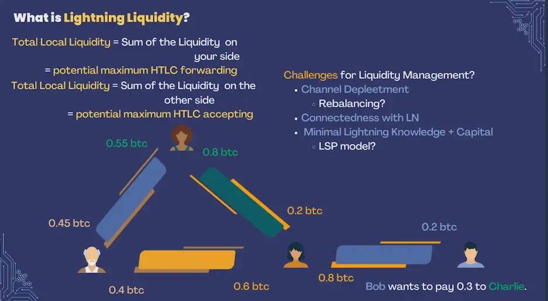_Lightning Liquidity_


Considérons un scénario impliquant Alice, Bob, Charlie et Dan - des utilisateurs typiques de LN interconnectés par divers canaux :


- Alice veut payer Dan mais ne dispose pas de liquidités locales suffisantes dans son canal avec Bob.
- Si Bob dispose d'un solde suffisant et d'un canal avec Charlie, et que Charlie dispose d'un canal avec Dan, le paiement de Alice peut être acheminé via Bob et Charlie pour atteindre Dan.


_Lightning Liquidity_


Toutefois, si l'un de ces canaux est épuisé ou connaît des problèmes de connectivité, la transaction peut échouer. Cela illustre l'importance de maintenir une liquidité équilibrée sur l'ensemble du réseau.


#### Les défis de la Lightning Network :


- L'épuisement des canaux** : Au fil du temps, les canaux peuvent devenir déséquilibrés, les fonds étant concentrés d'un côté, ce qui limite les possibilités de transaction.
- Problèmes de connectivité** : L'acheminement efficace des transactions nécessite des connexions réseau robustes, qui peuvent être difficiles à maintenir.


Pour relever ces défis, les fournisseurs de services de liquidité (LSP) proposent des services de gestion des liquidités, souvent payants, qui permettent aux utilisateurs de maintenir des soldes de canaux optimaux pour des transactions fluides.


### Différents portefeuilles et leurs caractéristiques


Il existe plusieurs portefeuilles Lightning, chacun répondant aux différents besoins et préférences des utilisateurs. En voici quelques exemples :


#### Wallet de Satoshi :


- Caractéristiques** : Entièrement conservateur, convivial, mais à source fermée, ce qui peut poser des problèmes de protection de la vie privée.


#### Albi :


- Caractéristiques** : Extension pour navigateur, open-source, prend en charge les modèles avec et sans garde, ce qui accroît la polyvalence.


#### Brise :


- Caractéristiques** : Nœud léger sur un téléphone, open-source, combinant l'autodétention et la liquidité gérée, offrant un équilibre entre le contrôle et la commodité.


#### Phoenix :


- Caractéristiques** : Similaire à Breeze, utilise un modèle LSP pour la liquidité, open-source, se concentre sur la simplicité d'utilisation et la gestion efficace de la liquidité.


#### Ouvrir Bitcoin Wallet (OBW) :


- Caractéristiques** : Intègre les portefeuilles On-Chain et Lightning, prend en charge les canaux hébergés, open-source avec des fonctionnalités avancées, adapté aux utilisateurs puissants.


### Matrice de gestion des dépôts et des liquidités


Les portefeuilles peuvent être classés en fonction de la personne qui détient les clés privées et de celle qui gère les liquidités. Cette matrice aide les utilisateurs à choisir des portefeuilles qui correspondent à leurs préférences en matière de sécurité et de commodité :


- Portefeuilles de dépôt** : Un tiers détient les clés privées et propose généralement une gestion automatique des liquidités. Les exemples incluent Wallet de Satoshi.
- Portefeuilles non dépositaires** : Les utilisateurs détiennent les clés privées, ce qui peut nécessiter une gestion manuelle des liquidités. Exemples : Breeze et OBW.


_2x2 Matrix of LN Clients_


### Critiques et domaines d'amélioration


Malgré leurs avantages, les portefeuilles Lightning font l'objet de plusieurs critiques et doivent être améliorés :


- Vie privée** : Les portefeuilles fermés et certains modèles de garde posent des problèmes de confidentialité.
- Facilité d'utilisation** : Trouver un équilibre entre les fonctionnalités avancées et la convivialité reste un défi.
- Développement de logiciels libres** : Les différents niveaux de contribution aux logiciels libres affectent la confiance des utilisateurs et le rythme de l'innovation.


### Autres informations et cas d'utilisation


#### Défis algorithmiques :


Les algorithmes actuels pour trouver le chemin optimal à l'intérieur du Lightning Network sont souvent sous-optimaux, impliquant des essais et des erreurs. Des améliorations sont nécessaires pour accroître l'efficacité du routage.


#### Paiements en plusieurs parties :


La décomposition des paiements importants en transactions plus petites permet d'atténuer les problèmes de liquidité et de repérage, ce qui garantit des transactions plus fluides.


#### Bénéfices provenant de l'acheminement :


Les revenus générés par les redevances de routage sont généralement minimes, ce qui rend moins intéressante l'exploitation lucrative des nœuds de routage par les utilisateurs individuels.


#### Divers exemples de Wallet :


- Blink Wallet** : Basé au Salvador, gardien, nécessite un numéro de téléphone, caractéristiques stables du Sats, mais sans les caractéristiques avancées du Lightning Network.
- Blitz Wallet** : Open-source, autocontrôle, nécessite des liquidités gérées par l'utilisateur, offre de nombreuses informations pour les utilisateurs chevronnés.
- SwissBitcoinPay** : Conçu pour les commerçants, garde jusqu'à 24 heures, frais minimes pour les utilisateurs à fort volume.


#### Cas d'utilisation de Wallet :


Différents portefeuilles répondent à des objectifs distincts, de la facilité d'utilisation pour les débutants aux fonctions avancées pour les utilisateurs chevronnés. Il n'existe pas de "meilleur" Wallet ; le choix dépend des besoins et des préférences de chacun.


#### Contribution open source :


Le retour d'information des utilisateurs et les contributions aux projets à code source ouvert sont d'une valeur inestimable pour le développement et la croissance des compétences personnelles, et favorisent un environnement collaboratif et innovant.


En conclusion, il est essentiel de comprendre les différents aspects des clients Lightning Network, leurs différences par rapport aux portefeuilles Bitcoin traditionnels et l'importance d'une gestion efficace des liquidités pour tirer parti de tout le potentiel du Lightning Network. En choisissant le bon Wallet et en participant activement à l'écosystème, les utilisateurs peuvent améliorer considérablement leur expérience des transactions Bitcoin.


# Les défis du LN


<partId>ca58c9d7-ba7e-5392-8488-6a21a9850e6a</partId>


## Défis pratiques pour LN


<chapterId>014c7c40-aef7-58ac-b51f-33784463f482</chapterId>


**(la vidéo sera bientôt disponible)**


Dans cette session, Asi0 aborde les défis pratiques rencontrés lors de l'utilisation du Lightning Network (LN). Malgré son approche révolutionnaire de la mise à l'échelle des transactions Bitcoin, le Lightning Network présente plusieurs défis pratiques que les utilisateurs et les développeurs doivent relever. En particulier, nous examinerons quatre défis principaux : **la gestion des liquidités**, **l'abstraction Layer 1/Layer 2**, **la réception de paiements hors ligne** et **la gestion des sauvegardes**.


Chacun de ces défis est envisagé sous deux angles : celui de l'**utilisateur** et celui du **développeur**, car les défis et les solutions diffèrent en fonction du rôle que vous jouez dans l'écosystème.


---

### Défi 1 : gestion des liquidités


#### **Du point de vue de l'utilisateur:**


Dans la Lightning Network, les **liquidités** désignent la disponibilité des fonds dans les canaux de paiement qui sont nécessaires pour effectuer ou recevoir des paiements. Les utilisateurs doivent s'assurer qu'ils disposent de suffisamment de liquidités entrantes et sortantes pour mener à bien leurs transactions. Par exemple, si vous souhaitez recevoir des paiements, vous devez disposer de liquidités entrantes, ce qui signifie qu'un autre nœud doit allouer une partie de son solde à votre canal. De même, si vous souhaitez envoyer des paiements, vous devez disposer de liquidités sortantes dans votre canal.


- Question pratique** : Les utilisateurs éprouvent souvent des difficultés à équilibrer leurs canaux et à maintenir une liquidité suffisante. En outre, le rééquilibrage des canaux peut entraîner des coûts.
- Solutions possibles** : Certains portefeuilles Lightning ont commencé à intégrer le rééquilibrage automatique des canaux, mais cette fonctionnalité est encore en cours de développement. Les utilisateurs s'appuient également sur les **fournisseurs de services Lightning (LSP)** pour les aider à gérer les liquidités.


#### **Du point de vue du développeur:**


Les développeurs sont confrontés au défi de la mise en œuvre d'une gestion transparente des liquidités dans les applications. Ils doivent créer des outils qui automatisent le rééquilibrage et réduisent les frictions pour les utilisateurs, tout en optimisant les frais et en évitant les goulets d'étranglement en matière de liquidité.


- Enjeu pratique** : La mise en œuvre d'algorithmes efficaces pour l'acheminement des paiements sur un réseau à liquidité variable peut s'avérer complexe et exigeante en termes de calculs.
- Solutions possibles** : Les développeurs explorent des algorithmes avancés pour **l'acheminement des liquidités** et l'utilisation de **canaux à double financement** pour garantir la disponibilité des liquidités aux deux extrémités d'une transaction.


> **Définitions** :
>

> - **Liquidité** : La disponibilité des fonds dans un canal Lightning pour effectuer ou recevoir des paiements.
> - **LSP (Lightning Service Provider)** : Un service qui aide les utilisateurs à gérer les liquidités et les canaux sur le Lightning Network.

---

### Défi 2 : Abstraction L1/L2


#### **Du point de vue de l'utilisateur:**


L'interaction entre **Layer 1 (L1)** (Layer de base de Bitcoin) et **Layer 2 (L2)** (le Lightning Network) n'est souvent pas totalement abstraite pour les utilisateurs. Par exemple, l'ouverture et la fermeture de canaux nécessitent des transactions On-Chain Bitcoin (L1), et les utilisateurs doivent payer des frais On-Chain pour ces actions. Cela introduit une complexité supplémentaire et des retards potentiels lorsque le réseau Bitcoin est encombré.


- Question pratique** : Les utilisateurs ont souvent du mal à comprendre s'ils interagissent avec le Bitcoin de base ou le Lightning Layer. Il peut en résulter une certaine confusion en ce qui concerne les frais, les délais de transaction et la sécurité.
- Solutions possibles** : Des conceptions Wallet améliorées qui font abstraction des interactions L1/L2 et gèrent les ouvertures/fermetures de canaux en arrière-plan. Certains portefeuilles permettent déjà aux utilisateurs de basculer de manière transparente entre les transactions On-Chain et Lightning, en fonction des circonstances.


#### **Du point de vue du développeur:**


Les développeurs sont chargés d'abstraire les complexités de L1 et L2 pour les utilisateurs, en créant des interfaces fluides et intuitives qui traitent les transactions efficacement. Le défi consiste à optimiser l'expérience de l'utilisateur tout en maintenant l'intégrité et la sécurité du protocole Lightning.


- Enjeu pratique** : Veiller à ce que l'utilisateur soit protégé des complexités techniques de la gestion des canaux et des transactions On-Chain, tout en maintenant la transparence lorsque cela est nécessaire.
- Solutions possibles** : Les développeurs travaillent sur des fonctionnalités telles que le **splicing** (qui permet d'ajouter ou de retirer des fonds d'un canal sans le fermer) et des outils de gestion automatique des canaux.


> **Définitions** :
>

> - **L1 (Layer 1)** : Bitcoin principal Blockchain Layer.
> - **L2 (Layer 2)** : Le Lightning Network, qui fonctionne au-dessus du Bitcoin pour permettre des transactions plus rapides et moins chères.
> - **Splicing** : Une technique qui permet de modifier l'équilibre d'un canal Lightning sans avoir à le fermer.

---

### Défi 3 : recevoir des paiements hors ligne


#### **Du point de vue de l'utilisateur:**


L'un des défis de la Lightning Network est de **recevoir des paiements lorsque l'utilisateur est hors ligne**. Contrairement à la base Bitcoin, où les transactions peuvent être reçues à tout moment, Lightning exige que le payeur et le bénéficiaire soient tous deux en ligne pour effectuer une transaction. Il s'agit d'une limitation importante pour de nombreux utilisateurs qui souhaitent utiliser les paiements Lightning dans des situations quotidiennes.


- Problème pratique** : Les utilisateurs ne peuvent recevoir de paiements que si leur nœud est en ligne et connecté au réseau, ce qui n'est pas pratique pour ceux qui souhaitent utiliser Lightning comme méthode de paiement au quotidien.
- Solutions possibles** : Certaines solutions de contournement consistent à utiliser des portefeuilles de dépôt ou à s'appuyer sur des services tiers qui agissent en tant qu'intermédiaires de paiement jusqu'à ce que le nœud destinataire soit mis en ligne.


#### **Du point de vue du développeur:**


Les développeurs étudient les moyens de permettre aux utilisateurs de recevoir des paiements Lightning même lorsque leurs nœuds sont hors ligne. Cela nécessite des solutions créatives pour maintenir la nature décentralisée de Lightning tout en répondant à la question pratique d'être constamment connecté.


- Enjeu pratique** : La mise au point d'un protocole ou d'un système permettant aux utilisateurs de recevoir des paiements hors ligne sans compromettre la sécurité ou la décentralisation constitue un défi technique de taille.
- Solutions possibles** : Des recherches sont en cours sur les **titres de paiement hors ligne**, qui permettraient aux bénéficiaires de réclamer des paiements une fois qu'ils se reconnectent au réseau.


> **Définitions** :
>

> - **Paiements hors ligne** : Paiements envoyés ou reçus alors qu'une partie n'est pas connectée à la Lightning Network.
> - **Portefeuilles de garde** : Portefeuilles dans lesquels un tiers contrôle les clés privées et gère les transactions pour le compte de l'utilisateur.

---

### Défi 4 : gestion des sauvegardes


#### **Du point de vue de l'utilisateur:**


La sauvegarde des canaux Lightning est essentielle pour que les utilisateurs puissent récupérer leurs fonds en cas de panne de leur nœud ou de perte de données. Toutefois, le processus de sauvegarde des canaux Lightning est plus complexe que celui du Bitcoin, car les canaux sont des canaux d'état, c'est-à-dire qu'ils changent à chaque transaction.


- Question pratique** : Les utilisateurs doivent s'assurer que les sauvegardes de leur canal sont à jour, car l'utilisation d'une sauvegarde périmée peut entraîner une perte de fonds ou une pénalisation par le réseau.
- Solutions possibles** : Des portefeuilles comme Phoenix et d'autres ont mis en place des sauvegardes automatiques des canaux, mais ces fonctionnalités ne sont pas encore généralisées à tous les portefeuilles Lightning.


#### **Du point de vue du développeur:**


Les développeurs doivent mettre en œuvre des solutions de sauvegarde qui permettent aux utilisateurs de récupérer leurs fonds de manière sûre et fiable, même après des défaillances catastrophiques. Le défi consiste à faire en sorte que ces solutions soient sûres et faciles à utiliser tout en préservant l'intégrité du protocole Lightning.


- Enjeu pratique** : La conception de systèmes de sauvegarde sécurisés, décentralisés et conviviaux constitue un défi de taille, car les sauvegardes doivent être mises à jour à chaque changement d'état d'un canal.
- Solutions possibles** : *les *Static Channel Backups (SCB)** ont été développés pour simplifier la récupération, mais des solutions plus avancées sont nécessaires pour des sauvegardes entièrement automatisées et sécurisées.


> **Définitions** :
>

> - **Static Channel Backup (SCB)** : Un type de sauvegarde qui permet aux utilisateurs de récupérer leurs fonds à partir d'un canal Lightning en cas de défaillance en rétablissant le dernier état du canal.

---

#### Conclusion


Le Lightning Network offre des avantages considérables en termes de rapidité et de rentabilité pour les transactions Bitcoin, mais il présente également plusieurs défis pratiques. Ces défis - **gestion des liquidités**, **abstraction L1/L2**, **réception de paiements hors ligne** et **gestion des sauvegardes** - exigent des solutions innovantes de la part des utilisateurs et des développeurs. Au fur et à mesure de l'évolution du réseau, il sera essentiel de surmonter ces obstacles pour parvenir à une adoption généralisée et améliorer l'expérience globale de l'utilisateur.


En relevant ces défis, le Lightning Network continuera à évoluer, devenant une solution plus robuste et plus fiable pour la mise à l'échelle du Bitcoin.


## LN Evolution future


<chapterId>c06763dd-bb26-5fec-8ac4-3e446e9517cd</chapterId>

<professorId>880c7fa7-8d4c-4c9b-81b4-bc61ed256516</professorId>


:::video id=ab5f65f1-0b0d-4ca9-8ff7-d42764c1e915:::

### La résilience et l'évolution du Bitcoin


**Mascotte de Bitcoin : blaireau de miel**

Bitcoin est souvent incarné par le blaireau, une créature réputée pour sa ténacité et sa résistance. Ce symbole représente bien la nature robuste et inflexible de Bitcoin. Tout comme le blaireau peut résister à des morsures venimeuses et continuer à prospérer, Bitcoin a fait preuve d'une résistance remarquable face à diverses adversités, notamment les défis réglementaires, la volatilité du marché et les attaques techniques.


**La nature de Bitcoin : en constante évolution**

Contrairement à la notion de statique, Bitcoin est en perpétuelle évolution. Son protocole et son écosystème sont continuellement affinés et améliorés par une communauté mondiale de développeurs et de chercheurs. Ce processus évolutif est motivé par la nécessité d'améliorer la sécurité, l'évolutivité et la fonctionnalité, ce qui permet à la Bitcoin de rester à l'avant-garde du paysage des crypto-monnaies.


### Innovations dans le Lightning Network


**Lightning Network : développement rapide**

Le Lightning Network, la deuxième solution Layer de Bitcoin pour la mise à l'échelle et l'accélération des transactions, fait l'objet d'un développement rapide. Cette Layer permet des transactions rapides et peu coûteuses en activant les canaux de paiement off-chain. Des innovations significatives sont en cours d'intégration pour renforcer son efficacité et sa facilité d'utilisation.


**Canaux à double financement

Traditionnellement, une chaîne de foudre est financée par une seule partie. Cependant, les canaux à double financement permettent aux deux parties (par exemple, Alice et Bob) de contribuer à la liquidité du canal. Cette amélioration permet une plus grande flexibilité dans la capacité d'envoi et de réception et nécessite une communication en amont et de nouveaux protocoles pour gérer le financement conjoint.


**Splicing**

L'épissage est une fonctionnalité qui permet aux utilisateurs de modifier la taille d'un canal Lightning sans le fermer. Cette fonctionnalité permet d'ajouter ou de retirer des fonds d'un canal existant, offrant ainsi un moyen transparent de gérer la liquidité du canal. L'épissage favorise l'interopérabilité entre les transactions On-Chain et les canaux Lightning, améliorant ainsi l'efficacité globale du réseau.


**Mécanisme L2**

Le mécanisme L2 introduit une nouvelle méthode pour invalider les anciens états des canaux sans s'appuyer sur le mécanisme de pénalité. Cette mise à jour dépend de SIGHASH_ANYPREVOUT, une fonctionnalité qui nécessite un Bitcoin Soft Fork. Le mécanisme L2 promet de simplifier la gestion des canaux et d'améliorer la sécurité.


**Bolt 12**

Bolt 12 répond aux limites des factures Bolt 11 utilisées dans le Lightning Network. Il introduit des factures réutilisables et automatise les processus, éliminant le besoin de HTTP et de serveurs web en fonctionnant uniquement au sein du Lightning Network. Cette innovation permet de rationaliser les transactions et d'améliorer l'expérience de l'utilisateur.


### Améliorer la protection de la vie privée et l'efficacité des transactions Bitcoin


**Signatures Taproot, muSig et Schnorr**

Taproot est une mise à jour importante qui consolide la complexité des transactions et améliore la protection de la vie privée. Combinée à MuSig (un protocole pour les transactions à signatures multiples) et aux signatures Schnorr, Taproot améliore l'efficacité des transactions. Ces avancées permettent aux transactions Lightning de ressembler aux transactions Bitcoin habituelles, ce qui simplifie le processus et renforce la protection de la vie privée.


**PTLC routing**

Les contrats à temps bloqué (PTLC) sont une amélioration des contrats à temps bloqué Hash (HTLC) existants. Les PTLC utilisent des signatures Schnorr et améliorent la confidentialité en remplaçant les secrets partagés par des clés publiques, ce qui réduit les possibilités de corrélation et d'abus des paiements.


**Factures de canal**

Les usines à canaux permettent de créer des canaux multipartites (par exemple, 4 sur 4 Multisig), qui peuvent donner naissance à de nouveaux canaux de paiement 2 sur 2 off-chain. Ce système permet de créer et de fermer des canaux rapidement et sans frais, bien qu'il nécessite la coopération de tous les participants. Les usines à canaux augmentent l'évolutivité et la flexibilité globales de la Lightning Network.


**Watchtowers**

Les tours de guet sont des entités tierces qui surveillent le Blockchain à la recherche d'états de canaux anciens. Si une violation est détectée, elles publient des transactions de pénalité afin de garantir la sécurité du réseau. Si les tours de guet renforcent la sécurité en dissuadant les mauvais comportements, elles posent également des problèmes de confidentialité en ce qui concerne la surveillance des transactions.


**blinded Paths**

Les chemins blinded sont conçus pour améliorer la confidentialité du destinataire dans le Lightning Network. Ils masquent le Address du destinataire final, garantissant que seul l'expéditeur connaît le nœud intermédiaire et que chaque nœud ne connaît que ses nœuds adjacents. Cette méthode protège l'identité du destinataire et améliore la confidentialité globale.


**Fournisseurs de services de foudre (FSF)**

Conceptualisés par Breeze Wallet, les fournisseurs de services éclair (LSP) visent à améliorer l'expérience de l'utilisateur en lui offrant des capacités de réception instantanée. Les LSP ouvrent des canaux pour les utilisateurs, de la même manière que les fournisseurs de services Internet offrent des services de connectivité. Cette innovation simplifie le processus d'intégration de l'utilisateur et garantit des interactions transparentes sur le Lightning Network.


**Ressources pour rester informé**

Pour se tenir au courant des dernières innovations techniques en matière de Bitcoin et de Lightning Network, il est essentiel d'exploiter des ressources précieuses. La lettre d'information Bitcoin OpTec, la liste de diffusion lightning dev et les documents rédigés par des experts de l'industrie comme Jason Lopp fournissent des informations et des mises à jour sur les progrès et les recherches en cours dans ce domaine qui évolue rapidement.


En comprenant et en appréciant ces développements, nous pouvons reconnaître les progrès et le potentiel à multiples facettes que le Bitcoin et le Lightning Network représentent pour l'avenir des transactions numériques.


## Protocoles complémentaires au LN


<chapterId>f4d147bb-f146-5b36-a994-b9b70da83744</chapterId>

<professorId>e7e63d59-ea19-4960-9446-61bd4dcc98f0</professorId>


:::video id=ffee9682-1bfa-4717-9f22-9bc1baff0722:::

### Extension et intégration des paiements Lightning


#### Comprendre les paiements Lightning


Avant de se plonger dans les extensions et les intégrations des paiements Lightning, il est essentiel de comprendre le fonctionnement de base d'un paiement Lightning. Un paiement Lightning conventionnel implique plusieurs composants clés : le **payeur**, le **bénéficiaire** et le **Lightning Network** lui-même. Le payeur initie un paiement au bénéficiaire en générant un **Invoice**, qui comprend des informations essentielles telles que le montant à payer et la destination (le nœud du bénéficiaire).


Le processus repose sur des **Hash Time-Locked Contracts (HTLC)**, qui garantissent que les paiements ne peuvent être réclamés que par le bénéficiaire légitime dans un délai déterminé. Deux Elements importants dans ce mécanisme sont **l'acheminement de l'oignon** et la **chaîne HTLC** :


- Routage en oignon** : Il assure la confidentialité en encapsulant les données de transaction dans des couches, de sorte que chaque intermédiaire ne connaît que les nœuds qui le précèdent et le suivent, mais pas l'ensemble de l'itinéraire.
- Chaîne HTLC** : Une série de contrats qui bloquent les fonds jusqu'à ce que le paiement soit effectué ou annulé.


Le **Keysend** est un protocole plus récent qui améliore les capacités du Lightning Network. Contrairement aux méthodes traditionnelles qui nécessitent une communication préalable entre l'expéditeur et le destinataire pour generate et Invoice, Keysend permet des **paiements à l'initiative de l'expéditeur**, rationalisant ainsi le processus et améliorant l'expérience de l'utilisateur.


Cependant, les factures traditionnelles ont leurs limites. Par exemple :


- Usage unique** : Les factures sont généralement utilisées pour une seule transaction, ce qui peut être gênant.
- Limites de taille** : Les factures de grande taille peuvent être difficiles à traiter sous forme de code QR, ce qui les rend peu pratiques pour certaines applications.


> **Définitions** :
>

> - **Invoice** : Une demande de paiement dans le Lightning Network, contenant généralement le montant et les détails du destinataire.
> - **HTLC (Hash bloqué dans le temps Contract)** : Type de Smart contract utilisé pour garantir des paiements conditionnels dans un délai donné.
> - **Routage en oignon** : Technique de protection de la vie privée dans laquelle les données de transaction sont superposées comme un oignon pour protéger l'identité de l'expéditeur et du destinataire.

### Protocoles et cas d'utilisation


Vers oModèles commerciaux et protocoles avancés

our pallier les limites des factures traditionnelles, plusieurs protocoles sont apparus pour étendre et améliorer les paiements Lightning.


- LNURL** : Un protocole qui simplifie la génération de Invoice en permettant la création de factures de manière dynamique, en supportant les dénominations fiduciaires et en permettant l'utilisation d'adresses **Lightning**. Cette approche améliore considérablement l'expérience de l'utilisateur en offrant des méthodes de paiement plus flexibles et une intégration avec différents cas d'utilisation.


- Bolt 12 offres** : Ce protocole est similaire à LNURL mais utilise **la messagerie en oignon** pour améliorer la confidentialité. Bolt 12 permet aux utilisateurs de récupérer des factures automatiquement sans intervention manuelle, ce qui améliore à la fois la confidentialité et la facilité d'utilisation.


Une intégration remarquable des paiements Lightning est celle de **Nostr**, une plateforme décentralisée de médias sociaux. Nostr intègre les paiements Lightning pour permettre les pourboires et les micro-transactions, montrant ainsi comment Lightning peut être intégré dans diverses applications.


Un autre protocole, **RGB**, étend encore la fonctionnalité de Lightning en permettant les **transferts d'actifs** sur le Lightning Network. Le RGB permet le transfert de divers actifs, y compris des jetons, sur les canaux Lightning, élargissant ainsi le champ des transactions possibles.


*les *fournisseurs de services de liquidité Lightning (LSP)** jouent également un rôle essentiel dans l'extension des paiements Lightning. Les LSP fournissent des liquidités pour la réception des paiements, aident à ouvrir des **canaux doublement financés** et garantissent des transactions transparentes en interceptant les paiements et en ouvrant des canaux à la volée.


> **Définitions** :
>

> - **LNURL** : Un protocole qui permet la création dynamique de Invoice, rendant les paiements plus faciles et plus flexibles.
> - **Bolt 12** : Une extension de Lightning qui exploite la messagerie Onion pour la confidentialité tout en automatisant la recherche de Invoice.
> - **Nostr** : Une plateforme décentralisée qui intègre les protocoles LP et les cas d'utilisation
> les paiements fulgurants pour les micro-transactions.
> - **Protocole RGB** : Protocole permettant le transfert d'actifs, comme les jetons, sur le Lightning Network.
> - **LSP (Lightning Service Provider)** : Entité qui fournit des liquidités et ouvre des canaux pour les transactions Lightning, rendant le réseau plus accessible aux utilisateurs.

### Modèles économiques et protocoles avancés


Les progrès réalisés dans le domaine des paiements éclairs ont ouvert la voie à de nouveaux modèles commerciaux, en particulier pour les **fournisseurs de services éclairs (LSP)**. Ces derniers améliorent l'expérience de l'utilisateur en ouvrant des canaux uniquement lorsque des paiements sont détectés, ce qui réduit la complexité de la configuration préalable.


Un exemple de modèle commercial facilité par Lightning est le **modèle d'enchère**. Dans ce cas, un serveur retient l'offre la plus élevée et rejette les offres inférieures, en gardant les paiements en attente jusqu'à la fin de l'enchère. Cela permet d'éviter les remboursements et de rationaliser le processus de vente aux enchères.


Un autre exemple pratique est celui des **jeux de poker**, où le serveur gère les paiements en retenant les paris jusqu'à la fin du jeu, garantissant ainsi un processus de pari sans heurts.


Les paiements Lightning sont également intégrés dans des plateformes telles que **Nostr** et des services de podcasting, ce qui démontre la polyvalence de ces protocoles. En outre, les **pré-images** des paiements peuvent être utilisées comme **clés d'accès** pour déverrouiller des contenus ou des services, ce qui ajoute encore à l'utilité du Lightning Network.


Les protocoles avancés tels que les **contrats à temps partagé (PTLC)** vont encore plus loin en permettant des opérations cryptographiques plus complexes. Les PTLC permettent d'améliorer le routage et le fractionnement des paiements, ce qui renforce la sécurité et l'efficacité.


Des protocoles tels que **LNURL** et **Bolt 12** rationalisent les paiements en réduisant les interactions manuelles, ce qui rend le Lightning Network plus convivial et plus largement adopté.


> **Définitions** :
>

> - **PTLC (Point Time-Locked Contract)** : Une primitive cryptographique qui améliore les HTLC, permettant des paiements plus flexibles et plus sûrs.
> - **Pre-image** : Valeur utilisée pour déverrouiller un HTLC, qui peut également servir de clé d'accès à des services.
> - **Modèle d'enchère** : Un modèle de paiement dans lequel les paiements sont mis en attente pendant une vente aux enchères et ne sont libérés que lorsque l'offre la plus élevée est acceptée.

### Conclusion


L'extension et l'intégration des paiements Lightning par le biais de divers protocoles et cas d'utilisation démontrent l'évolution dynamique de la Lightning Network. De l'amélioration de la fonctionnalité de base des paiements à l'introduction de modèles commerciaux et de protocoles cryptographiques avancés, l'avenir de Lightning est très prometteur en termes d'innovation et d'adoption à grande échelle.


## Comprendre Joinmarket


<chapterId>f109f64f-9b73-5fbf-8870-5d34d5b69df8</chapterId>

<professorId>6cfd206c-53b8-47a0-bbf4-44fd84e6ee1d</professorId>


:::video id=b89f2064-f2e1-49c3-97d0-580891eee1dd:::

Adam Gibson donne un aperçu de Joinmarket, détaillant comment cette implémentation CoinJoin améliore la confidentialité et la fongibilité de Bitcoin. Il explique comment Joinmarket facilite les transactions collaboratives, Trustless et anonymes au sein de l'écosystème Bitcoin. Puis, dans une seconde partie, il montre comment exécuter Joinmarket dans Signet.

