# سفری به سوی حفاظت از داده‌های شما

به برنامه آموزشی اختصاص داده شده به امنیت دیجیتال خوش آمدید. این آموزش به گونه‌ای طراحی شده است که برای همه قابل دسترسی باشد، بنابراین نیازی به دانش قبلی از علوم کامپیوتر نیست. هدف اصلی ما این است که شما را با دانش و مهارت‌های لازم برای حرکت در دنیای دیجیتال به صورت ایمن‌تر و مطمئن‌تر مجهز کنیم.

این شامل پیاده‌سازی چندین ابزار خواهد بود، از جمله یک سرویس ایمیل امن، یک مدیر رمز عبور، و نرم‌افزارهای مختلف برای افزایش امنیت آنلاین.

در این آموزش، هدف ما این نیست که شما را به یک کارشناس، ناشناس یا آسیب‌ناپذیر تبدیل کنیم، زیرا این امر غیرممکن است. در عوض، ما به شما راه‌حل‌های ساده و قابل دسترسی ارائه می‌دهیم تا شروع به تغییر عادات آنلاین خود کنید و کنترل حاکمیت دیجیتال خود را بازپس‌گیرید.

تیم مشارکت‌کنندگان:

موریل؛ طراحی

روگزی نوری و فابیان؛ تولید

Théo; مشارکت

+++

# مقدمه

<partId>534ab66c-b0e6-5757-a7dd-6ea04647edf2</partId>

## بررسی کلی دوره

<chapterId>2f3d005d-8b49-5a3f-b90d-94c11f613407</chapterId>

**هدف: مهارت‌های امنیتی خود را به‌روز کنید!**

به برنامه آموزشی اختصاص داده شده به امنیت دیجیتال خوش آمدید. این آموزش به گونه‌ای طراحی شده است که برای همه قابل دسترسی باشد، بنابراین نیازی به دانش قبلی در علوم کامپیوتر نیست. هدف اصلی ما این است که شما را با دانش و مهارت‌های لازم برای حرکت در دنیای دیجیتال به صورت ایمن‌تر و مطمئن‌تر مجهز کنیم.

این شامل پیاده‌سازی چندین ابزار خواهد بود، از جمله یک سرویس ایمیل امن، یک مدیر رمز عبور، و نرم‌افزارهای مختلف برای افزایش امنیت آنلاین.

این آموزش نتیجه همکاری سه نفر از اساتید ما است:

- رنو لیفچیتز، کارشناس امنیت سایبری
- تئو پانتامیس، دکتری در ریاضیات کاربردی
- روگزی، یکی از بنیان‌گذاران Plan ₿ Network

بهداشت دیجیتال شما در دنیای فزاینده دیجیتال بسیار مهم است. با وجود افزایش مداوم هک و نظارت گسترده، هنوز برای برداشتن اولین قدم و محافظت از خود دیر نشده است.

در این آموزش، ما تلاش نمی‌کنیم که شما را به یک کارشناس، ناشناس یا آسیب‌ناپذیر تبدیل کنیم، زیرا این امر غیرممکن است. در عوض، ما به شما راه‌حل‌های ساده و در دسترسی ارائه می‌دهیم تا همه بتوانند شروع به تغییر عادات آنلاین خود کنند و کنترل حاکمیت دیجیتال خود را بازپس گیرند.

اگر به دنبال مهارت‌های پیشرفته‌تر در این موضوع هستید، منابع، آموزش‌ها یا دیگر دوره‌های آموزشی امنیت سایبری ما در دسترس شما هستند. در این میان، در اینجا یک مرور کلی از برنامه ما برای چند ساعت آینده با هم ارائه شده است.

**بخش 1: هر آنچه باید درباره مرور آنلاین بدانید**

- فصل 1 - مرور آنلاین
- فصل ۲ - استفاده امن از اینترنت

برای شروع، ما اهمیت انتخاب یک مرورگر وب و پیامدهای امنیتی مرتبط با آن را مورد بحث قرار خواهیم داد. سپس به جزئیات مرورگرها، به ویژه در مورد مدیریت کوکی‌ها، خواهیم پرداخت. همچنین خواهیم دید که چگونه می‌توان با استفاده از ابزارهایی مانند TOR تجربه مرور امن‌تر و ناشناس‌تری را تضمین کرد. پس از آن، بر استفاده از VPNها برای افزایش حفاظت از داده‌های شما تمرکز خواهیم کرد. در نهایت، با توصیه‌هایی برای استفاده امن از اتصالات WiFi به پایان خواهیم رسید.

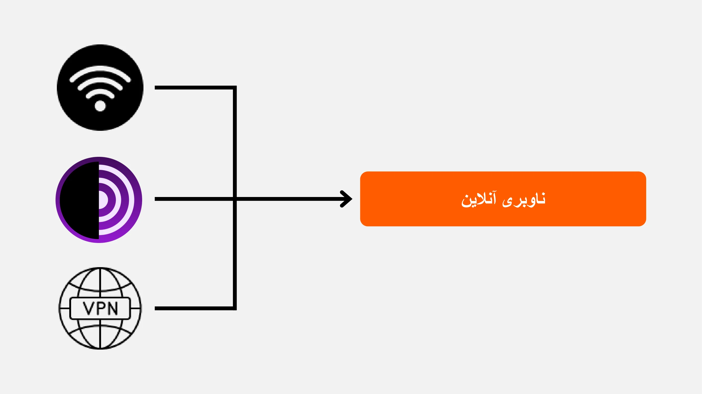

**بخش ۲: بهترین روش‌ها برای استفاده از کامپیوتر**

- فصل ۳ - استفاده از کامپیوتر
- فصل ۴ - هک و مدیریت پشتیبان‌گیری

در این بخش، ما به سه حوزه کلیدی امنیت کامپیوتر خواهیم پرداخت. ابتدا، سیستم‌عامل‌های مختلف از جمله مک، پی‌سی و لینوکس را بررسی خواهیم کرد و ویژگی‌ها و نقاط قوت خاص آن‌ها را برجسته خواهیم کرد. سپس، روش‌هایی برای محافظت مؤثر در برابر تلاش‌های هک و افزایش امنیت دستگاه‌های شما را بررسی خواهیم کرد. در نهایت، بر اهمیت محافظت و پشتیبان‌گیری منظم از داده‌های شما برای جلوگیری از هرگونه از دست رفتن یا باج‌افزار تأکید خواهیم کرد.

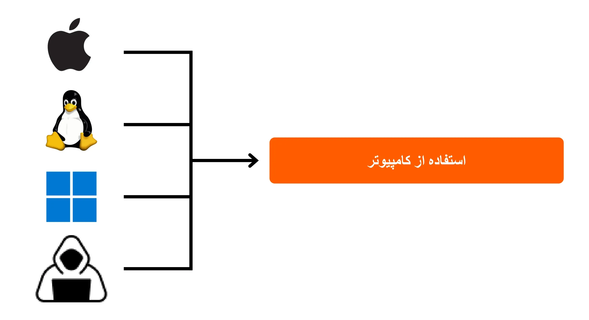

**بخش ۳: اجرای راه‌حل‌ها**

- فصل ۶ - مدیریت ایمیل
- فصل 7 - مدیر رمز عبور
- فصل ۸ - احراز هویت دو مرحله‌ای

در این بخش سوم عملی، به اجرای راه‌حل‌های مشخص شما خواهیم پرداخت.

ابتدا خواهیم دید که چگونه می‌توانید صندوق ورودی ایمیل خود را که برای ارتباطات شما ضروری است و اغلب هدف هکرها قرار می‌گیرد، محافظت کنید. سپس، شما را با یک مدیر رمز عبور آشنا خواهیم کرد: یک راه‌حل عملی برای جلوگیری از فراموشی یا اشتباه گرفتن رمزهای عبور خود در حالی که آنها را ایمن نگه می‌دارید. در نهایت، یک اقدام امنیتی اضافی، احراز هویت دو مرحله‌ای را بررسی خواهیم کرد که یک لایه اضافی Layer از حفاظت به حساب‌های شما اضافه می‌کند. همه چیز به وضوح و به صورت قابل دسترس توضیح داده خواهد شد.

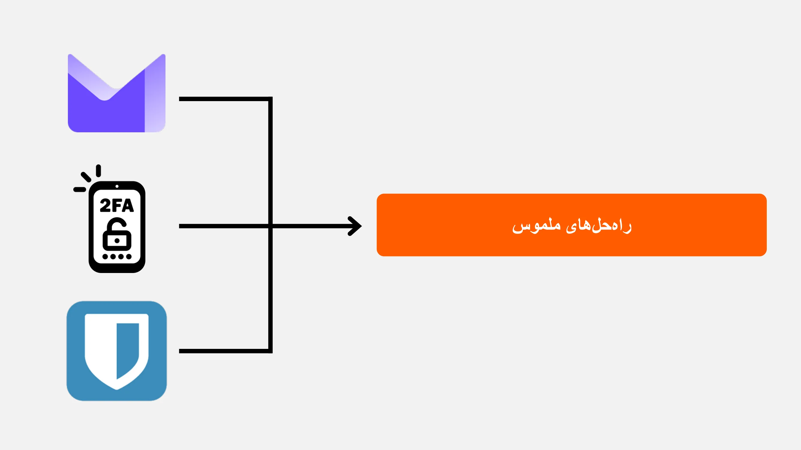

آماده‌اید امنیت دیجیتال خود را تقویت کرده و کنترل داده‌های خود را بازپس بگیرید؟ بزن بریم!

# همه چیزهایی که باید درباره مرور آنلاین بدانید

<partId>b4b5379a-d8ef-59ae-94d3-a6e88959c149</partId>

## مرور آنلاین

<chapterId>3a935da9-fa6e-57eb-bf85-7b3ec35e6ee2</chapterId>

هنگام مرور اینترنت، اجتناب از اشتباهات رایج برای حفظ امنیت آنلاین شما ضروری است. در اینجا چند نکته برای اجتناب از آنها آورده شده است:

### در دانلود نرم‌افزارها احتیاط کنید:

توصیه می‌شود نرم‌افزار را از وب‌سایت رسمی ناشر دانلود کنید تا از سایت‌های عمومی.

مثال: از www.signal.org/download به جای www.logicieltelechargement.fr/signal استفاده کنید.

همچنین توصیه می‌شود که نرم‌افزارهای متن‌باز را در اولویت قرار دهید زیرا اغلب ایمن‌تر هستند و از نرم‌افزارهای مخرب عاری هستند. نرم‌افزار "متن‌باز" نوعی نرم‌افزار است که کد آن به‌صورت عمومی در دسترس و قابل دسترسی برای همه است. این امر امکان تأیید، از جمله موارد دیگر، را فراهم می‌کند که هیچ دسترسی مخفی برای سرقت داده‌های شما وجود ندارد.

> پاداش: نرم‌افزارهای متن‌باز اغلب رایگان هستند! این دانشگاه ۱۰۰٪ متن‌باز است، بنابراین شما می‌توانید کد ما را نیز در GitHub بررسی کنید.
> 

### مدیریت کوکی: خطاها و بهترین روش‌ها

کوکی‌ها فایل‌هایی هستند که توسط وب‌سایت‌ها برای ذخیره اطلاعات بر روی کامپیوتر یا دستگاه موبایل شما ایجاد می‌شوند. در حالی که برخی سایت‌ها برای عملکرد صحیح به این کوکی‌ها نیاز دارند، سایت‌های شخص ثالث می‌توانند از آن‌ها سوءاستفاده کنند، به‌ویژه برای اهداف ردیابی تبلیغاتی. تحت مقرراتی مانند GDPR، امکان‌پذیر است—و توصیه می‌شود—که کوکی‌های ردیابی شخص ثالث را رد کنید در حالی که آن‌هایی را که برای عملکرد صحیح سایت ضروری هستند، بپذیرید. پس از هر بازدید از یک سایت، عاقلانه است که کوکی‌های مرتبط را به صورت دستی یا از طریق یک افزونه یا برنامه خاص حذف کنید. برخی مرورگرها حتی امکان حذف انتخابی کوکی‌ها را ارائه می‌دهند. با وجود این احتیاط‌ها، درک این نکته مهم است که اطلاعات جمع‌آوری‌شده توسط سایت‌های مختلف می‌تواند به هم مرتبط باقی بماند، بنابراین اهمیت یافتن تعادلی بین راحتی و امنیت وجود دارد.

> توجه: همچنین، تعداد افزونه‌های نصب‌شده روی مرورگر خود را محدود کنید تا از مشکلات احتمالی امنیتی و عملکردی جلوگیری شود.

### مرورگرهای وب: انتخاب‌ها، امنیت

دو خانواده اصلی مرورگرها وجود دارند: آن‌هایی که بر پایه Chrome هستند و آن‌هایی که بر پایه Firefox هستند.

اگرچه هر دو خانواده سطح امنیتی مشابهی ارائه می‌دهند، توصیه می‌شود به دلیل قابلیت‌های ردیابی، از مرورگر گوگل کروم استفاده نکنید. جایگزین‌های سبک‌تر برای کروم، مانند کرومیوم یا بریو، ممکن است ترجیح داده شوند. بریو به‌ویژه به دلیل مسدودکننده تبلیغات داخلی‌اش توصیه می‌شود. ممکن است لازم باشد برای دسترسی به برخی وب‌سایت‌ها از مرورگرهای متعددی استفاده کنید.

### مرور خصوصی، TOR، و دیگر جایگزین‌ها برای مرور امن‌تر و ناشناس‌تر

مرور خصوصی، اگرچه مرور شما را از ارائه‌دهنده خدمات اینترنتی پنهان نمی‌کند، اما به شما اجازه می‌دهد تا از به جا گذاشتن ردپای محلی روی کامپیوتر خود جلوگیری کنید. کوکی‌ها به‌طور خودکار در پایان هر جلسه حذف می‌شوند و به شما اجازه می‌دهند بدون ردیابی شدن، همه کوکی‌ها را بپذیرید. مرور خصوصی می‌تواند هنگام خرید خدمات آنلاین مفید باشد، زیرا وب‌سایت‌ها عادات جستجوی ما را ردیابی کرده و قیمت‌ها را بر این اساس تنظیم می‌کنند. با این حال، لازم است توجه داشته باشید که مرور خصوصی برای جلسات موقت و خاص توصیه می‌شود، نه برای مرور عمومی اینترنت.

یک جایگزین پیشرفته‌تر، شبکه TOR (The Onion Router) است که با پنهان کردن IP کاربر Address و اجازه دسترسی به دارک‌نت، ناشناس بودن را ارائه می‌دهد. مرورگر TOR یک مرورگر است که به‌طور خاص برای استفاده از شبکه TOR طراحی شده است. این امکان را به شما می‌دهد تا هم از وب‌سایت‌های معمولی و هم از وب‌سایت‌های .onion بازدید کنید که معمولاً توسط افراد اداره می‌شوند و ممکن است با فعالیت‌های غیرقانونی مرتبط باشند.

تور ابزاری قانونی و به‌طور گسترده مورد استفاده روزنامه‌نگاران، فعالان آزادی و دیگر افرادی است که به دنبال دور زدن سانسور در کشورهای استبدادی هستند. با این حال، مهم است که درک کنیم تور سایت‌های بازدید شده یا خود کامپیوتر را ایمن نمی‌کند. علاوه بر این، استفاده از تور می‌تواند سرعت اتصال به اینترنت را کاهش دهد زیرا داده‌ها قبل از رسیدن به مقصد از طریق کامپیوترهای سه نفر دیگر عبور می‌کنند. همچنین لازم به ذکر است که تور راه‌حلی بی‌عیب و نقص برای تضمین ناشناس بودن ۱۰۰٪ نیست و نباید برای فعالیت‌های غیرقانونی استفاده شود.

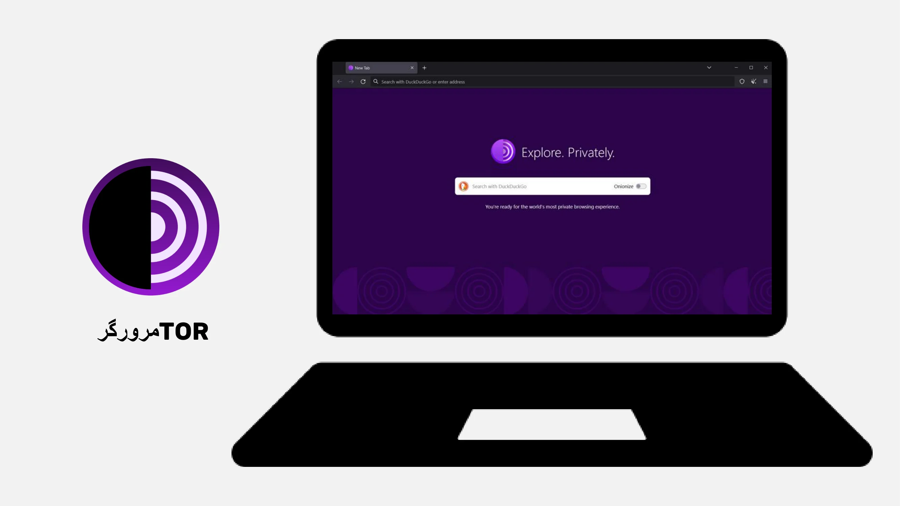

https://planb.network/tutorials/computer-security/communication/tor-browser-a847e83c-31ef-4439-9eac-742b255129bb

## اتصال VPN و اینترنت

<chapterId>5aac83f4-a685-54b0-9759-d71bea7eeed2</chapterId>

### وی‌پی‌ان‌ها

محافظت از اتصال اینترنت شما یک جنبه حیاتی از امنیت آنلاین است و استفاده از شبکه‌های خصوصی مجازی (VPN) روشی مؤثر برای افزایش این امنیت، هم برای کسب‌وکارها و هم برای کاربران فردی است.

VPNها ابزارهایی هستند که داده‌های منتقل‌شده از طریق اینترنت را رمزگذاری می‌کنند و اتصال را امن‌تر می‌سازند. در یک زمینه حرفه‌ای، VPNها به کارکنان این امکان را می‌دهند که به‌طور امن به شبکه داخلی شرکت از مکان‌های دوردست دسترسی پیدا کنند. داده‌های مبادله‌شده رمزگذاری می‌شوند و این امر رهگیری آن‌ها توسط اشخاص ثالث را بسیار دشوارتر می‌سازد. علاوه بر امن‌سازی دسترسی به یک شبکه داخلی، استفاده از VPN می‌تواند به کاربر اجازه دهد که اتصال اینترنت خود را از طریق شبکه داخلی شرکت هدایت کند و این تصور را ایجاد کند که اتصال آن‌ها از شرکت می‌آید. این امر می‌تواند به‌ویژه برای دسترسی به خدمات آنلاین که به‌صورت جغرافیایی محدود شده‌اند، مفید باشد.

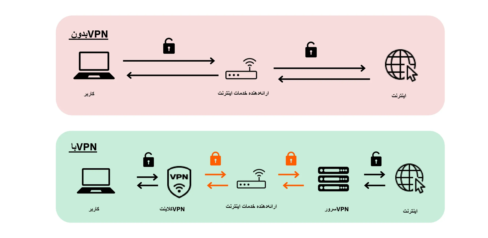

### انواع VPN ها

دو نوع اصلی از VPNها وجود دارد: VPNهای سازمانی و VPNهای مصرف‌کننده، مانند Nordvpn. VPNهای سازمانی معمولاً گران‌تر و پیچیده‌تر هستند، در حالی که VPNهای مصرف‌کننده به طور کلی دسترسی‌پذیرتر و کاربرپسندتر هستند. به عنوان مثال، NordVPN به کاربران این امکان را می‌دهد که از طریق یک سرور واقع در کشور دیگر به اینترنت متصل شوند و به این ترتیب محدودیت‌های جغرافیایی را دور بزنند.

با این حال، استفاده از VPN مصرف‌کننده تضمین‌کننده ناشناس بودن کامل نیست. بسیاری از ارائه‌دهندگان VPN اطلاعاتی درباره کاربران خود نگه می‌دارند که می‌تواند ناشناس بودن آن‌ها را به خطر بیندازد. اگرچه VPNها می‌توانند برای بهبود امنیت آنلاین مفید باشند، اما راه‌حل جهانی نیستند. آن‌ها برای استفاده‌های خاصی مانند دسترسی به خدمات محدود جغرافیایی یا افزایش امنیت در حین سفر مؤثر هستند، اما امنیت کامل را تضمین نمی‌کنند. هنگام انتخاب یک VPN، اولویت‌بندی قابلیت اطمینان و تخصص فنی بر محبوبیت بسیار مهم است. ارائه‌دهندگان VPN که کمترین اطلاعات شخصی را جمع‌آوری می‌کنند، عموماً امن‌تر هستند. خدماتی مانند iVPN و Mullvad اطلاعات شخصی جمع‌آوری نمی‌کنند و حتی پرداخت‌ها را در Bitcoin برای افزایش حریم خصوصی می‌پذیرند.

در نهایت، یک VPN می‌تواند برای مسدود کردن تبلیغات آنلاین نیز استفاده شود و تجربه مرور لذت‌بخش‌تر و امن‌تری را فراهم کند. با این حال، انجام تحقیقات کامل برای یافتن VPN که بهترین نیازهای شما را برآورده کند، ضروری است. استفاده از VPN برای افزایش امنیت توصیه می‌شود، حتی هنگام مرور اینترنت در خانه. این کار به اطمینان از سطح بالاتری از حفاظت برای داده‌های مبادله شده آنلاین کمک می‌کند. در نهایت، آیا می‌توانید URLها و قفل کوچک در نوار Address را بررسی کنید تا تأیید کنید که در سایت مورد نظر هستید؟

https://planb.network/tutorials/computer-security/communication/ivpn-5a0cd5df-29f1-4382-a817-975a96646e68

https://planb.network/tutorials/computer-security/communication/mullvad-968ec5f5-b3f0-4d23-a9e0-c07a3e85aaa8

### HTTPS و شبکه‌های Wi-Fi عمومی

از نظر امنیت آنلاین، درک این نکته ضروری است که 4G به طور کلی از وای‌فای عمومی امن‌تر است. با این حال، استفاده از 4G می‌تواند به سرعت برنامه داده موبایل شما را مصرف کند. پروتکل HTTPS به استانداردی برای رمزگذاری داده‌ها در وب‌سایت‌ها تبدیل شده است. این پروتکل تضمین می‌کند که داده‌های مبادله شده بین کاربر و وب‌سایت امن هستند. بنابراین، ضروری است که تأیید کنید سایتی که بازدید می‌کنید از پروتکل HTTPS استفاده می‌کند.

در اتحادیه اروپا، حفاظت از داده‌ها توسط مقررات عمومی حفاظت از داده‌ها (GDPR) تنظیم می‌شود. بنابراین، استفاده از ارائه‌دهندگان نقاط دسترسی وای‌فای اروپایی، مانند SNCF، که داده‌های اتصال کاربران را نمی‌فروشند، ایمن‌تر است. با این حال، صرف نمایش یک قفل توسط یک سایت تضمینی برای اصالت آن نیست. مهم است که کلید عمومی سایت را با استفاده از یک سیستم گواهی تأیید کنید تا اصالت آن تأیید شود. اگرچه رمزگذاری داده‌ها مانع از رهگیری داده‌های مبادله شده توسط اشخاص ثالث می‌شود، اما همچنان ممکن است یک فرد مخرب خود را به جای سایت جا بزند و داده‌ها را به صورت متن ساده منتقل کند.

برای جلوگیری از کلاهبرداری‌های آنلاین، بسیار مهم است که هویت سایتی که در حال مرور آن هستید را تأیید کنید، به‌ویژه با بررسی پسوند و نام دامنه. علاوه بر این، نسبت به کلاهبردارانی که از حروف مشابه در URLها برای فریب کاربران استفاده می‌کنند، هوشیار باشید.

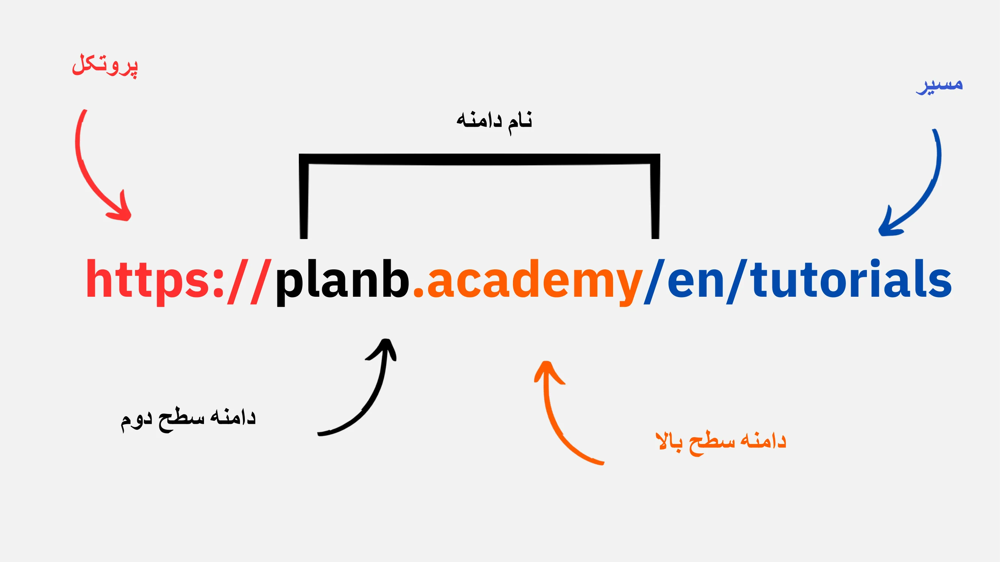

به طور خلاصه، استفاده از VPN می‌تواند امنیت آنلاین را برای هر دو گروه کسب‌وکارها و کاربران فردی به طور قابل توجهی بهبود بخشد. علاوه بر این، رعایت عادات خوب مرور وب می‌تواند به بهداشت دیجیتال بهتر کمک کند. در بخش بعدی این دوره، به امنیت کامپیوتر خواهیم پرداخت، از جمله به‌روزرسانی‌ها، نرم‌افزارهای آنتی‌ویروس و مدیریت رمز عبور.

# بهترین روش‌ها برای استفاده از کامپیوتر

<partId>e6eac20b-ba24-5d9a-8d86-8e0164074457</partId>

## استفاده از کامپیوتر

<chapterId>16745632-b56b-5423-9873-ddf70fdf1efd</chapterId>

امنیت رایانه‌های ما در دنیای دیجیتال امروز یک نگرانی بزرگ است. امروز، ما به سه نکته کلیدی Address خواهیم پرداخت:

- انتخاب کامپیوتر
- به‌روزرسانی‌ها و آنتی‌ویروس برای امنیت بهینه
- بهترین روش‌ها برای امنیت رایانه و داده‌های شما.

### انتخاب کامپیوتر و سیستم‌عامل

در مورد انتخاب کامپیوتر، تفاوت قابل توجهی در امنیت بین کامپیوترهای قدیمی و جدید وجود ندارد. با این حال، تفاوت‌های امنیتی بین سیستم‌عامل‌ها، از جمله ویندوز، لینوکس و مک وجود دارد.

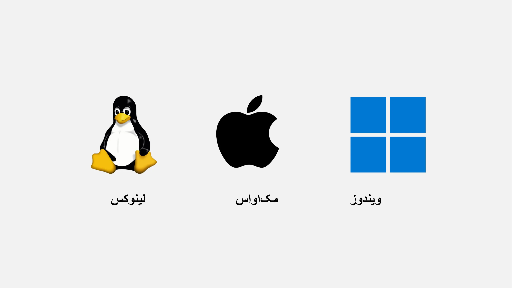

در مورد ویندوز، توصیه می‌شود که به صورت روزانه از حساب کاربری مدیر استفاده نکنید، بلکه دو حساب جداگانه ایجاد کنید: یکی برای استفاده مدیر و دیگری برای استفاده روزانه. ویندوز اغلب به دلیل تعداد زیاد کاربران و سهولت تغییر از کاربر استاندارد به مدیر، بیشتر در معرض بدافزار قرار دارد. از سوی دیگر، تهدیدات در لینوکس و مک کمتر رایج هستند.

انتخاب سیستم‌عامل باید بر اساس نیازها و ترجیحات شما باشد. سیستم‌های لینوکس در سال‌های اخیر به طور قابل توجهی تکامل یافته‌اند و به طور فزاینده‌ای کاربرپسند شده‌اند. اوبونتو یک جایگزین جالب برای مبتدیان است، با یک Interface گرافیکی آسان برای استفاده. امکان پارتیشن‌بندی یک کامپیوتر برای آزمایش لینوکس در حالی که ویندوز را نگه می‌دارید وجود دارد، اما این می‌تواند یک فرآیند پیچیده باشد. اغلب ترجیح داده می‌شود که یک کامپیوتر اختصاصی، یک ماشین مجازی، یا یک کلید USB برای تست لینوکس یا اوبونتو داشته باشید.

### به‌روزرسانی‌های نرم‌افزار

در مورد به‌روزرسانی‌ها، قانون ساده است: **به‌روزرسانی منظم سیستم‌عامل و برنامه‌ها ضروری است.**

در ویندوز 10، به‌روزرسانی‌ها تقریباً به‌صورت مداوم انجام می‌شوند و بسیار مهم است که آن‌ها را مسدود یا به تأخیر نیندازید. هر ساله، تقریباً ۱۵,۰۰۰ آسیب‌پذیری شناسایی می‌شود که اهمیت به‌روزرسانی نرم‌افزار را برای محافظت در برابر بدافزارها و تهدیدات سایبری دیگر نشان می‌دهد. به‌طور کلی، پشتیبانی نرم‌افزار بین ۳ تا ۵ سال پس از انتشار آن پایان می‌یابد، بنابراین لازم است برای ادامه بهره‌مندی از به‌روزرسانی‌های امنیتی به نسخه بالاتری ارتقاء دهید.

این قانون تقریباً برای تمام نرم‌افزارها اعمال می‌شود. در واقع، به‌روزرسانی‌ها برای این طراحی نشده‌اند که دستگاه شما را منسوخ یا کند کنند؛ بلکه برای محافظت از آن در برابر تهدیدات جدید طراحی شده‌اند. برخی به‌روزرسانی‌ها حتی به عنوان به‌روزرسانی‌های عمده در نظر گرفته می‌شوند و بدون آن‌ها، رایانه شما در معرض خطر جدی بهره‌برداری قرار دارد.

برای ارائه یک مثال مشخص از یک خطا، نرم‌افزار ترک‌خورده‌ای که نمی‌توان آن را به‌روزرسانی کرد، دو تهدید بالقوه را به همراه دارد. ورود ویروس در حین دانلود غیرقانونی آن از یک وب‌سایت مشکوک و استفاده ناامن در برابر اشکال جدید حمله.

### آنتی‌ویروس

- آیا به آنتی‌ویروس نیاز دارید؟ بله
- آیا باید پرداخت کنید؟ بستگی دارد!

انتخاب و اجرای یک آنتی‌ویروس مهم است. Windows Defender، آنتی‌ویروس داخلی ویندوز، یک راه‌حل ایمن و مؤثر است. برای یک راه‌حل رایگان، بسیار خوب است و بسیار بهتر از بسیاری از راه‌حل‌های رایگان موجود در اینترنت است. در واقع، هنگام دانلود نرم‌افزار آنتی‌ویروس از اینترنت باید احتیاط کرد، زیرا ممکن است مخرب یا قدیمی باشد.

برای کسانی که مایل به سرمایه‌گذاری در یک آنتی‌ویروس پولی هستند، توصیه می‌شود آنتی‌ویروسی را انتخاب کنند که تهدیدات ناشناخته و نوظهور را به‌طور هوشمندانه تحلیل کند، مانند کسپرسکی. به‌روزرسانی‌های آنتی‌ویروس برای محافظت در برابر تهدیدات نوظهور بسیار مهم هستند.

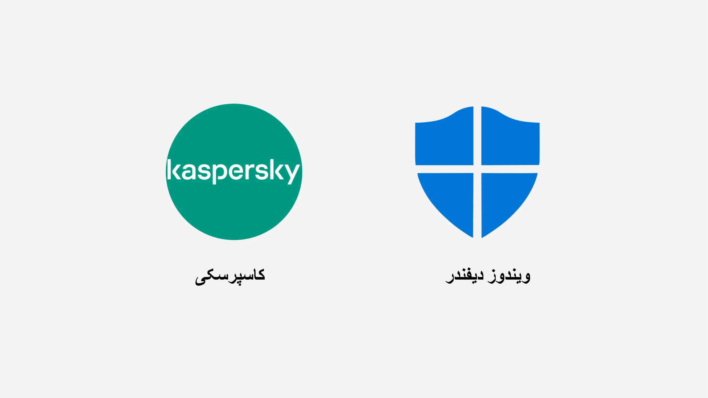

> توجه: لینوکس و مک، به لطف سیستم جداسازی حقوق کاربری خود، اغلب نیازی به آنتی‌ویروس ندارند.

در نهایت، در اینجا برخی از بهترین روش‌ها برای ایمن‌سازی کامپیوتر و داده‌های شما آورده شده است. انتخاب یک آنتی‌ویروس مؤثر و کاربرپسند بسیار مهم است. همچنین اتخاذ روش‌های خوب در کامپیوتر شما، مانند وارد نکردن کلیدهای USB ناشناخته یا مشکوک، بسیار حیاتی است. این کلیدهای USB ممکن است حاوی برنامه‌های مخربی باشند که می‌توانند به‌طور خودکار پس از وارد شدن اجرا شوند. بررسی کلید USB پس از وارد شدن بی‌فایده خواهد بود. برخی شرکت‌ها قربانی هک شدن به دلیل بی‌احتیاطی در رها کردن کلیدهای USB در مناطق قابل دسترس، مانند پارکینگ‌ها، شده‌اند.

رایانه خود را مانند خانه‌تان در نظر بگیرید: هوشیار بمانید، نرم‌افزار خود را به‌طور منظم به‌روزرسانی کنید، فایل‌های غیرضروری را حذف کنید و از یک رمز عبور قوی برای امنیت بیشتر استفاده کنید. رمزگذاری داده‌ها در لپ‌تاپ‌ها و گوشی‌های هوشمند برای جلوگیری از سرقت یا از دست دادن داده‌ها بسیار مهم است. BitLocker برای ویندوز، LUKS برای لینوکس و گزینه داخلی برای مک راه‌حل‌هایی برای رمزگذاری داده‌ها هستند. توصیه می‌شود بدون تردید رمزگذاری داده‌ها را فعال کنید و رمز عبور را روی کاغذ نوشته و در مکانی امن نگهداری کنید.

در نتیجه، انتخاب یک سیستم‌عامل که با نیازهای شما سازگار باشد و به‌روزرسانی منظم آن و برنامه‌های نصب‌شده ضروری است. همچنین، استفاده از یک برنامه آنتی‌ویروس مؤثر و کاربرپسند و اتخاذ روش‌های امنیتی مناسب برای حفاظت از کامپیوتر و داده‌های شما بسیار مهم است.

## هک و مدیریت پشتیبان‌گیری: حفاظت از داده‌های شما

<chapterId>9ddfcb6a-a253-5542-b7eb-df7222b46dc7</chapterId>

### هکرها چگونه حمله می‌کنند؟

برای محافظت مؤثر از خود، ضروری است که بفهمید هکرها چگونه سعی می‌کنند به کامپیوتر شما نفوذ کنند. در واقع، ویروس‌ها اغلب به‌طور جادویی ظاهر نمی‌شوند، بلکه پیامدهای اعمال ما هستند، حتی اگر ناخواسته باشند.

به طور کلی، ویروس‌ها به این دلیل وارد می‌شوند که شما به کامپیوتر خود اجازه داده‌اید آن‌ها را به خانه دعوت کند. این می‌تواند با دانلود نرم‌افزار مشکوک، یک فایل تورنت آلوده، یا به سادگی با کلیک بر روی لینک در یک ایمیل جعلی تجسم شود.

### فیشینگ، هوشیاری در برابر ایمیل‌های جعلی:

توجه! ایمیل‌ها اولین بردار حمله هستند. در اینجا چند نکته آمده است:

- مراقب تلاش‌های فیشینگ باشید که هدفشان استخراج اطلاعات حساس مانند مدارک و گذرواژه‌های شما است. از کلیک کردن روی لینک‌های مشکوک و به اشتراک گذاشتن اطلاعات شخصی خود بدون تأیید مشروعیت فرستنده خودداری کنید.
- با پیوست‌ها و تصاویر ایمیل محتاط باشید:

پیوست‌های ایمیل و تصاویر می‌توانند حاوی بدافزار باشند. پیوست‌ها را از فرستندگان ناشناس یا مشکوک دانلود یا باز نکنید و اطمینان حاصل کنید که نرم‌افزار آنتی‌ویروس شما به‌روز است.

قانون طلایی در اینجا این است که نام کامل فرستنده و همچنین منبع ایمیل را با دقت بررسی کنید. در صورت شک، آن را حذف کنید!

### باج‌افزار و انواع حملات سایبری:

باج‌افزار نوعی نرم‌افزار مخرب است که داده‌های کاربر را رمزگذاری کرده و برای رمزگشایی آن‌ها درخواست باج می‌کند. این نوع حمله به طور فزاینده‌ای رایج شده و می‌تواند برای شرکت‌ها و افراد بسیار مشکل‌ساز باشد. برای محافظت از خود، ایجاد نسخه‌های پشتیبان از حساس‌ترین فایل‌ها ضروری است! این کار باج‌افزار را متوقف نمی‌کند، اما به شما اجازه می‌دهد آن را نادیده بگیرید.

به طور منظم داده‌های مهم خود را به یک دستگاه ذخیره‌سازی خارجی یا یک سرویس ذخیره‌سازی آنلاین امن پشتیبان‌گیری کنید. به این ترتیب، در صورت وقوع حمله سایبری یا خرابی سخت‌افزار، می‌توانید داده‌های خود را بدون از دست دادن اطلاعات حیاتی بازیابی کنید.

راه حل ساده:

- یک درایو خارجی Hard خریداری کرده و داده‌های خود را روی آن کپی کنید. آن را جدا کرده و در مکانی امن در خانه نگهداری کنید. (انجام این کار دو بار و نگهداری یکی از درایوها در مکانی دیگر به محافظت در برابر آتش‌سوزی احتمالی کمک می‌کند.)

- ایجاد یک پشتیبان ابری با استفاده از ProtonMail Drive، Sync، یا Google Drive. داده‌های حساس خود را به این میزبان آنلاین آپلود کنید. با این حال، آگاه باشید که داده‌های شما به طور بالقوه در اینترنت قرار دارند و توسط یک شخص ثالث مورد اعتماد نگهداری می‌شوند.

### آیا باید به هکرها پول بدهید؟

خیر، به طور کلی توصیه نمی‌شود که در صورت حملات باج‌افزار یا انواع دیگر حملات به هکرها پول پرداخت کنید. پرداخت باج تضمینی برای بازیابی داده‌های شما نیست و می‌تواند مجرمان سایبری را به ادامه فعالیت‌های مخربشان تشویق کند. در عوض، پیشگیری و پشتیبان‌گیری منظم از داده‌ها را برای محافظت از خود در اولویت قرار دهید.

اگر ویروسی روی کامپیوتر خود شناسایی کردید، آن را از اینترنت قطع کنید، یک اسکن کامل آنتی‌ویروس انجام دهید و فایل‌های آلوده را حذف کنید. سپس، نرم‌افزار و سیستم‌عامل خود را به‌روزرسانی کنید و رمزهای عبور خود را تغییر دهید تا از نفوذهای بیشتر جلوگیری کنید.

https://planb.network/tutorials/computer-security/data/proton-drive-03cbe49f-6ddc-491f-8786-bc20d98ebb16

https://planb.network/tutorials/computer-security/data/veracrypt-d5ed4c83-7c1c-4181-95ea-963fdf2d83c5

# اجرای راه‌حل‌ها.

<partId>215ec902-ba05-5549-87fc-cb8d82665f7b</partId>

## مدیریت حساب‌های ایمیل

<chapterId>dfceea33-8712-5557-ace1-6ba5598d33d8</chapterId>

### راه‌اندازی یک حساب ایمیل جدید!

حساب ایمیل نقطه مرکزی فعالیت آنلاین شماست: اگر به خطر بیفتد، یک هکر می‌تواند از آن برای بازنشانی تمام رمزهای عبور شما از طریق عملکرد "فراموشی رمز عبور" استفاده کند و به بسیاری از سایت‌های دیگر دسترسی پیدا کند. به همین دلیل باید آن را به درستی ایمن کنید.

یک حساب ایمیل باید با یک رمز عبور منحصر به فرد و قوی ایجاد شود (جزئیات در فصل ۷) و ایده‌آل این است که با یک سیستم احراز هویت دو مرحله‌ای باشد (جزئیات در فصل ۸).

اگرچه همه ما قبلاً یک حساب ایمیل داریم، اما ضروری است که ایجاد یک حساب جدید و مدرن‌تر را برای شروعی تازه در نظر بگیریم.

### انتخاب ارائه‌دهنده ایمیل و مدیریت آدرس‌های ایمیل

مدیریت صحیح آدرس‌های ایمیل ما برای اطمینان از امنیت دسترسی آنلاین ما بسیار مهم است. انتخاب یک ارائه‌دهنده ایمیل امن و محترم به حریم خصوصی اهمیت دارد. به عنوان مثال، ProtonMail یک سرویس ایمیل امن و محترم به حریم خصوصی است.

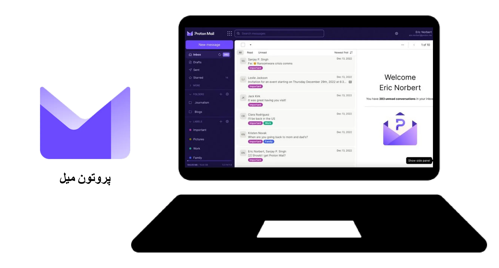

هنگام انتخاب ارائه‌دهنده ایمیل و ایجاد رمز عبور، بسیار مهم است که هرگز از همان رمز عبور برای خدمات آنلاین مختلف استفاده نکنید. توصیه می‌شود به طور منظم آدرس‌های ایمیل جدید ایجاد کرده و از آن‌ها برای اهداف مختلف استفاده کنید. استفاده از یک سرویس ایمیل امن برای حساب‌های حساس توصیه می‌شود. همچنین شایان ذکر است که برخی از خدمات طول رمز عبور را محدود می‌کنند، بنابراین آگاهی از این محدودیت ضروری است. خدماتی نیز برای ایجاد آدرس‌های ایمیل موقت در دسترس هستند که می‌توان از آن‌ها برای حساب‌هایی با مدت زمان محدود استفاده کرد.

فقط برای اطلاع شما، ارائه‌دهندگان ایمیل قدیمی‌تر، مانند La Poste، Arobase، Wig و Hotmail، هنوز در حال استفاده هستند، اما ممکن است روش‌های امنیتی آن‌ها به اندازه Gmail قوی نباشد. بنابراین، توصیه می‌شود دو آدرس ایمیل جداگانه داشته باشید: یکی برای ارتباطات عمومی و دیگری برای بازیابی حساب، که دومی باید امن‌تر باشد. بهتر است از ترکیب ایمیل Address خود با ایمیل اپراتور تلفن یا ارائه‌دهنده خدمات اینترنت خودداری کنید، زیرا این می‌تواند به عنوان یک بردار حمله عمل کند.

### آیا باید حساب ایمیل خود را تغییر دهم؟

شما باید از وب‌سایت Have I Been Pwned (https://haveibeenpwned.com/) استفاده کنید تا بررسی کنید آیا ایمیل شما Address به خطر افتاده است و برای دریافت اعلان‌های نقض داده‌های آینده. هکرها می‌توانند از یک پایگاه داده هک شده برای ارسال ایمیل‌های فیشینگ یا استفاده مجدد از رمزهای عبور به خطر افتاده سوءاستفاده کنند.

به طور کلی، شروع به استفاده از یک ایمیل جدید و امن‌تر Address یک عمل بد نیست و حتی ضروری است اگر کسی بخواهد بر پایه‌ای سالم تازه شروع کند.

پاداش Bitcoin: ممکن است توصیه شود که یک ایمیل خاص Address برای فعالیت‌های Bitcoin خود ایجاد کنیم، مانند ایجاد حساب‌های Exchange، تا این حوزه‌های فعالیت را واقعاً در زندگی‌مان جدا کنیم.

https://planb.network/tutorials/computer-security/communication/proton-mail-c3b010ce-254d-4546-b382-19ab9261c6a2

## مدیر رمز عبور

<chapterId>0b3c69b2-522c-56c8-9fb8-1562bd55930f</chapterId>

### مدیر رمز عبور چیست؟

یک مدیر رمز عبور ابزاری است که به شما امکان می‌دهد رمزهای عبور را برای حساب‌های آنلاین مختلف ذخیره، generate و مدیریت کنید. به جای به خاطر سپردن چندین رمز عبور، فقط به یک رمز عبور اصلی نیاز دارید تا به همه‌ی دیگران دسترسی پیدا کنید.

با استفاده از یک مدیر رمز عبور، دیگر نیازی نیست نگران فراموش کردن رمزهای عبور خود یا نوشتن آن‌ها در جایی باشید. شما فقط باید یک رمز عبور اصلی را به خاطر بسپارید. علاوه بر این، بیشتر این ابزارها رمزهای عبور قوی generate برای شما ایجاد می‌کنند که امنیت حساب‌های شما را افزایش می‌دهد.

### تفاوت‌های بین برخی از مدیران محبوب:

- LastPass: یکی از محبوب‌ترین مدیران. این یک سرویس شخص ثالث است، به این معنی که رمزهای عبور شما در سرورهای آن‌ها ذخیره می‌شود. این سرویس نسخه‌های رایگان و پولی ارائه می‌دهد و دارای یک Interface کاربرپسند است.

- Dashlane: همچنین یک سرویس شخص ثالث است، با Interface شهودی و ویژگی‌های اضافی مانند ردیابی اطلاعات کارت اعتباری و یادداشت‌های امن.

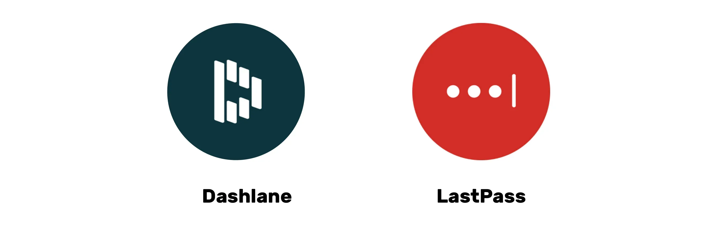

### میزبانی شخصی برای کنترل بیشتر:

- بیت‌واردن: این یک ابزار متن‌باز است، به این معنی که می‌توانید کد آن را بررسی کنید تا امنیت آن را تأیید کنید. اگرچه بیت‌واردن یک سرویس میزبانی شده ارائه می‌دهد، اما همچنین به کاربران اجازه می‌دهد تا خودشان میزبانی کنند، به این معنی که می‌توانید کنترل کنید که رمزهای عبور شما کجا ذخیره می‌شوند، که ممکن است امنیت و کنترل بیشتری ارائه دهد.

- KeePass: این یک راه‌حل متن‌باز است که عمدتاً برای میزبانی شخصی طراحی شده است. داده‌های شما به‌طور پیش‌فرض به‌صورت محلی ذخیره می‌شوند، اما در صورت تمایل می‌توانید پایگاه داده رمز عبور را با استفاده از روش‌های مختلف همگام‌سازی کنید. KeePass به‌خاطر امنیت و انعطاف‌پذیری‌اش به‌طور گسترده‌ای شناخته شده است، اگرچه ممکن است برای مبتدیان کمی کمتر کاربرپسند باشد.

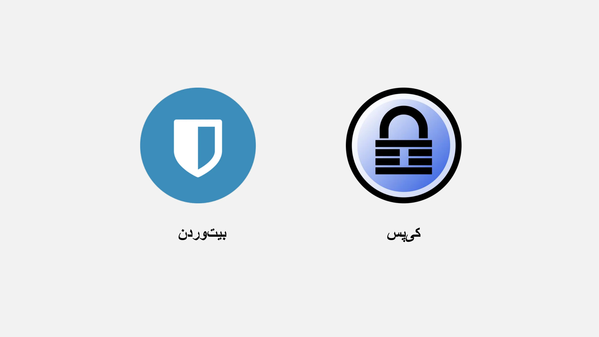

برای راه‌حل‌های خودمیزبان مانند KeePass، امکان همگام‌سازی پایگاه داده بین چندین دستگاه بدون استفاده از خدمات متمرکز شخص ثالث وجود دارد. ابزارهایی مانند **Syncthing** امکان همگام‌سازی رمزگذاری‌شده و غیرمتمرکز را مستقیماً بین دستگاه‌های شما فراهم می‌کنند. این رویکرد داده‌های شما را تحت کنترل شما نگه می‌دارد و در عین حال دسترسی آن‌ها را در همه دستگاه‌های شما تضمین می‌کند.

(توجه: انتخاب بین یک سرویس شخص ثالث یا یک سرویس میزبانی‌شده به سطح راحتی شما با فناوری و اولویت‌بندی شما بین کنترل و راحتی بستگی دارد. سرویس‌های شخص ثالث عموماً برای اکثر افراد راحت‌تر هستند، در حالی که میزبانی شخصی نیاز به دانش فنی بیشتری دارد اما می‌تواند کنترل و آرامش بیشتری از نظر امنیت ارائه دهد.)

### چه چیزی یک رمز عبور خوب را می‌سازد:

یک رمز عبور خوب به طور کلی:

- طول: حداقل ۱۲ کاراکتر.
- پیچیده: ترکیبی از حروف بزرگ و کوچک، اعداد و نمادها.
- منحصر به فرد: از یک رمز عبور برای حساب‌های مختلف استفاده نکنید.
- بر اساس اطلاعات شخصی نیست: از تاریخ تولد، نام‌ها و غیره اجتناب کنید.

برای اطمینان از امنیت حساب کاربری خود، ایجاد رمزهای عبور قوی و امن بسیار مهم است. طول رمز عبور به تنهایی برای اطمینان از امنیت آن کافی نیست. کاراکترها باید کاملاً تصادفی باشند تا در برابر حملات جستجوی فراگیر مقاومت کنند. استقلال رویدادها نیز برای جلوگیری از ترکیب‌های محتمل بسیار مهم است. رمزهای عبور رایج مانند "password" به راحتی به خطر می‌افتند.

برای ایجاد یک رمز عبور قوی، توصیه می‌شود از تعداد زیادی کاراکتر تصادفی استفاده کنید، بدون استفاده از کلمات یا الگوهای قابل پیش‌بینی. همچنین ضروری است که اعداد و کاراکترهای ویژه را شامل کنید. با این حال، شایان ذکر است که برخی وب‌سایت‌ها ممکن است استفاده از برخی کاراکترهای ویژه را محدود کنند. رمزهای عبوری که به صورت تصادفی تولید نشده‌اند، به راحتی قابل حدس زدن هستند. تغییرات یا اضافات به رمزهای عبور امن نیستند. وب‌سایت‌ها نمی‌توانند امنیت رمزهای عبور انتخاب شده توسط کاربران را تضمین کنند.

رمزهای عبور تصادفی تولید شده سطح بالاتری از امنیت را ارائه می‌دهند، اگرچه ممکن است به خاطر سپردن آن‌ها دشوارتر باشد. مدیران رمز عبور می‌توانند رمزهای عبور تصادفی امن‌تری ایجاد کنند. با استفاده از یک مدیر رمز عبور، نیازی به حفظ کردن تمام رمزهای عبور خود ندارید. ضروری است که به تدریج رمزهای عبور قدیمی خود را با آن‌هایی که توسط مدیر تولید شده‌اند جایگزین کنید، زیرا آن‌ها قوی‌تر و امن‌تر هستند. اطمینان حاصل کنید که رمز عبور اصلی مدیر رمز عبور شما نیز قوی و ایمن باشد.

https://planb.network/tutorials/computer-security/authentication/bitwarden-0532f569-fb00-4fad-acba-2fcb1bf05de9

https://planb.network/tutorials/computer-security/authentication/keepass-f8073bb7-5b4a-4664-9246-228e307be246

## احراز هویت دو مرحله‌ای

<chapterId>9391e02e-e61b-5a86-93e0-91a07f217d35</chapterId>

### چرا 2FA را پیاده‌سازی کنیم؟

احراز هویت دو مرحله‌ای (2FA) یک لایه امنیتی اضافی Layer است که اطمینان حاصل می‌کند فردی که سعی در دسترسی به یک حساب آنلاین دارد، همان کسی است که ادعا می‌کند. به جای وارد کردن فقط نام کاربری و رمز عبور، 2FA نیاز به یک فرم تأیید اضافی دارد.

این گام دوم می‌تواند باشد:

- یک کد موقت ارسال شده از طریق پیامک.
- یک کد تولید شده توسط یک برنامه مانند Google Authenticator یا Authy.
- یک کلید امنیتی فیزیکی که آن را در رایانه خود وارد می‌کنید.

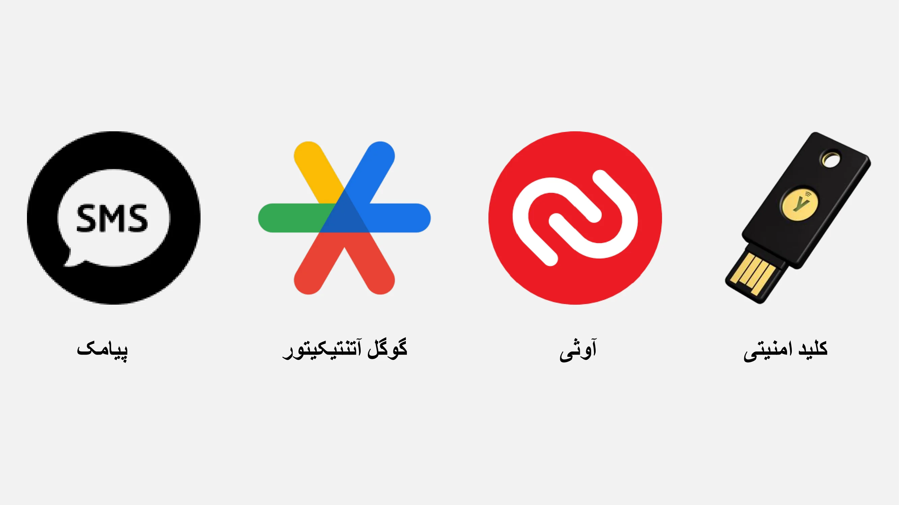

با استفاده از 2FA، حتی اگر یک هکر رمز عبور شما را به دست آورد، بدون این عامل دوم تأیید، همچنان قادر به دسترسی به حساب شما نخواهد بود. این امر 2FA را برای محافظت از حساب‌های آنلاین شما در برابر دسترسی غیرمجاز ضروری می‌سازد.

### کدام گزینه را انتخاب کنیم؟

گزینه‌های مختلف برای احراز هویت قوی سطوح امنیتی متفاوتی را ارائه می‌دهند.

- پیامک به عنوان بهترین گزینه در نظر گرفته نمی‌شود زیرا تنها اثبات مالکیت یک شماره تلفن را فراهم می‌کند.
- ۲FA (احراز هویت دو مرحله‌ای) امن‌تر است زیرا از انواع مختلف شواهد مانند دانش، مالکیت و شناسایی استفاده می‌کند. رمزهای یک‌بار مصرف (HOTP و TOTP) امن‌تر از پیامک هستند زیرا نیاز به محاسبات رمزنگاری دارند و به‌صورت محلی ذخیره می‌شوند نه در حافظه.
- توکن‌های سخت‌افزاری، مانند کلیدهای USB یا کارت‌های هوشمند، امنیت بهینه‌ای را با تولید یک کلید خصوصی منحصر به فرد برای هر سایت و تأیید URL قبل از اجازه اتصال ارائه می‌دهند.

برای امنیت بهینه با احراز هویت قوی، توصیه می‌شود از یک ایمیل امن Address، یک مدیر رمز عبور امن، و پذیرش 2FA با استفاده از YubiKeys استفاده کنید. همچنین توصیه می‌شود دو YubiKey خریداری کنید تا در صورت گم شدن یا سرقت، برای مثال، یک نسخه پشتیبان هم در خانه و هم همراه خود داشته باشید.

در مورد تهدیدات احتمالی برای احراز هویت دو مرحله‌ای با سیم‌کارت (SIM 2FA)، یک مثال رایج حمله تعویض سیم‌کارت است، جایی که مهاجم شماره تلفن کاربر را با اتصال آن به یک سیم‌کارت که توسط مهاجم کنترل می‌شود، سرقت می‌کند. چندین روش وجود دارد که مهاجم می‌تواند این حمله را تکمیل کند؛ با این حال، این تهدید معمولاً فقط برای افراد برجسته و افراد مورد توجه یک نگرانی عمده است.

بیومتریک‌ها می‌توانند به عنوان جایگزین استفاده شوند، اما امنیت کمتری نسبت به ترکیب دانش و مالکیت دارند. داده‌های بیومتریک باید بر روی دستگاه احراز هویت ذخیره شوند و به صورت آنلاین فاش نشوند. مهم است که مدل تهدید مرتبط با روش‌های مختلف احراز هویت را در نظر بگیریم و بر اساس آن‌ها روش‌ها را تنظیم کنیم.

در نهایت، ممکن است مفید باشد که یک زمینه‌ی مختصر درباره‌ی OTPهای HOTP و TOTP ارائه دهیم: HOTP یک رمز عبور یک‌بار مصرف مبتنی بر الگوریتم HMAC (کد احراز هویت پیام مبتنی بر Hash) است، در حالی که TOTP یک OTP مبتنی بر زمان است. ویژگی‌های کلیدی چنین الگوریتم‌هایی این است که رمزهای عبور فقط یک‌بار قابل استفاده هستند، هر مقدار تولید شده منحصر به فرد است و یک کلید مشترک بین دستگاه کاربر (کلاینت) و سرویس احراز هویت (سرور) وجود دارد. تفاوت اصلی بین این دو سیستم در نحوه تولید عامل است: TOTP مبتنی بر زمان است، در حالی که سیستم HOTP مبتنی بر شمارنده است.

### نتیجه‌گیری از آموزش:

همان‌طور که متوجه شده‌اید، اجرای بهداشت دیجیتال خوب لزوماً ساده نیست، اما همچنان در دسترس است!

- ایجاد یک ایمیل امن جدید Address.
- راه‌اندازی یک مدیر رمز عبور.
- فعال‌سازی 2FA.
- به تدریج جایگزین کردن رمزهای عبور قدیمی با رمزهای عبور قوی با احراز هویت دو مرحله‌ای.

به یادگیری ادامه دهید و به تدریج روش‌های خوب را اجرا کنید!

قانون طلایی: امنیت سایبری یک هدف متحرک است که با مسیر یادگیری شما سازگار خواهد شد!

https://planb.network/tutorials/computer-security/authentication/authy-a76ab26b-71b0-473c-aa7c-c49153705eb7

https://planb.network/tutorials/computer-security/authentication/security-key-61438267-74db-4f1a-87e4-97c8e673533e

# بخش عملی

<partId>98ccf14b-4053-5839-878c-7a73ff02eb95</partId>

## راه‌اندازی یک صندوق پستی

<chapterId>afc9ab5d-7664-5a9b-ab50-225ac9ba8f7c</chapterId>

محافظت از حساب ایمیل شما یک گام حیاتی در تأمین امنیت فعالیت‌های آنلاین و حفاظت از داده‌های شماست. این آموزش به صورت گام به گام شما را در ایجاد و راه‌اندازی یک حساب ProtonMail راهنمایی می‌کند، ارائه‌دهنده‌ای که به خاطر سطح بالای امنیت و ارائه رمزگذاری سرتاسری ارتباطات شما شناخته شده است. چه یک کاربر مبتدی باشید و چه یک کاربر با تجربه، بهترین روش‌های ارائه شده در اینجا به شما کمک می‌کند تا امنیت ایمیل خود را تقویت کرده و از ویژگی‌های پیشرفته ProtonMail بهره‌مند شوید:

https://planb.network/tutorials/computer-security/communication/proton-mail-c3b010ce-254d-4546-b382-19ab9261c6a2

## ایمن‌سازی در 2FA

<chapterId>09468ec1-95b7-56a4-a636-7618044568e1</chapterId>

احراز هویت دو مرحله‌ای (2FA) برای ایمن‌سازی حساب‌های آنلاین شما ضروری شده است. در این آموزش، یاد خواهید گرفت که چگونه برنامه 2FA به نام Authy را راه‌اندازی و استفاده کنید، که کدهای ۶ رقمی پویا برای محافظت از حساب‌های شما تولید می‌کند. Authy بسیار آسان برای استفاده است و در چندین دستگاه همگام‌سازی می‌شود. بیاموزید که چگونه Authy را نصب و پیکربندی کنید و به این ترتیب امنیت حساب‌های آنلاین خود را همین حالا تقویت کنید:

https://planb.network/tutorials/computer-security/authentication/authy-a76ab26b-71b0-473c-aa7c-c49153705eb7

گزینه دیگر استفاده از کلید امنیتی فیزیکی است. این آموزش اضافی به شما نشان می‌دهد که چگونه یک کلید امنیتی را به عنوان عامل دوم احراز هویت تنظیم و استفاده کنید:

https://planb.network/tutorials/computer-security/authentication/security-key-61438267-74db-4f1a-87e4-97c8e673533e

## ایجاد یک مدیر رمز عبور

<chapterId>ed579680-4e7b-5f65-8541-14e519a3b242</chapterId>

مدیریت رمز عبور در عصر دیجیتال یک چالش است. همه ما حساب‌های آنلاین متعددی داریم که باید ایمن شوند. یک مدیر رمز عبور به شما کمک می‌کند تا رمزهای عبور قوی و منحصر به فردی برای هر حساب ایجاد و ذخیره کنید.

در این آموزش، یاد بگیرید چگونه Bitwarden، یک مدیر رمز عبور متن‌باز، را راه‌اندازی کنید و چگونه اعتبارنامه‌های خود را در تمام دستگاه‌هایتان همگام‌سازی کنید تا استفاده روزانه‌تان را ساده‌تر کنید:

https://planb.network/tutorials/computer-security/authentication/bitwarden-0532f569-fb00-4fad-acba-2fcb1bf05de9

برای کاربران پیشرفته‌تر، من همچنین یک آموزش در مورد نرم‌افزار رایگان و متن‌باز دیگری ارائه می‌دهم که می‌توانید به صورت محلی برای مدیریت رمزهای عبور خود استفاده کنید:

https://planb.network/tutorials/computer-security/authentication/keepass-f8073bb7-5b4a-4664-9246-228e307be246

## ایمن‌سازی حساب‌های شما

<chapterId>7a774b34-aed0-57dd-b8f7-cf3be51c0d70</chapterId>

در این دو آموزش، من همچنین شما را در ایمن‌سازی حساب‌های آنلاین‌تان راهنمایی می‌کنم و توضیح می‌دهم که چگونه به تدریج روش‌های امن‌تری برای مدیریت روزانه رمزهای عبور خود اتخاذ کنید.

https://planb.network/tutorials/computer-security/authentication/bitwarden-0532f569-fb00-4fad-acba-2fcb1bf05de9

https://planb.network/tutorials/computer-security/authentication/keepass-f8073bb7-5b4a-4664-9246-228e307be246

## تغییر مرورگر و VPN

<chapterId>8dc08feb-313c-5259-a54f-64aa68a07608</chapterId>

محافظت از حریم خصوصی آنلاین شما نیز یک نکته حیاتی برای اطمینان از امنیت شماست. استفاده از VPN می‌تواند اولین راه‌حل برای دستیابی به این هدف باشد.

پیشنهاد می‌کنم دو راه‌حل قابل اعتماد VPN که پرداخت‌های Bitcoin را می‌پذیرند، یعنی IVPN و Mullvad را بررسی کنید. این آموزش‌ها شما را در نصب، پیکربندی و استفاده از Mullvad یا IVPN بر روی تمام دستگاه‌هایتان راهنمایی می‌کنند:

https://planb.network/tutorials/computer-security/communication/ivpn-5a0cd5df-29f1-4382-a817-975a96646e68

https://planb.network/tutorials/computer-security/communication/mullvad-968ec5f5-b3f0-4d23-a9e0-c07a3e85aaa8

همچنین، یاد بگیرید چگونه از مرورگر Tor استفاده کنید، مرورگری که به طور خاص برای حفاظت از حریم خصوصی آنلاین شما طراحی شده است:

https://planb.network/tutorials/computer-security/communication/tor-browser-a847e83c-31ef-4439-9eac-742b255129bb

## راه‌اندازی پشتیبان‌گیری

<chapterId>01cfcde1-77cb-506c-8df1-fa18a2e8cc6b</chapterId>

محافظت از فایل‌های شما نیز یک نکته حیاتی است. این آموزش به شما نشان می‌دهد که چگونه یک استراتژی پشتیبان‌گیری مؤثر با استفاده از Proton Drive پیاده‌سازی کنید. بیاموزید که چگونه از این راه‌حل ابری امن برای اعمال روش ۳-۲-۱ استفاده کنید: سه نسخه از داده‌های خود بر روی دو رسانه مختلف، با یک نسخه خارج از سایت. این امر دسترسی و امنیت فایل‌های حساس شما را تضمین می‌کند:

https://planb.network/tutorials/computer-security/data/proton-drive-03cbe49f-6ddc-491f-8786-bc20d98ebb16

و برای ایمن‌سازی فایل‌های شما که بر روی رسانه‌های قابل حمل مانند درایو USB یا درایو خارجی Hard ذخیره شده‌اند، همچنین به شما نشان می‌دهم که چگونه به راحتی این رسانه‌ها را با استفاده از VeraCrypt رمزگذاری و رمزگشایی کنید:

https://planb.network/tutorials/computer-security/data/veracrypt-d5ed4c83-7c1c-4181-95ea-963fdf2d83c5

# بیشتر بروید

<partId>77113cad-a6d8-57e5-b903-50c223b277ba</partId>

## چگونه در صنعت امنیت سایبری کار کنیم

<chapterId>aad1ae27-4280-5b07-b9ab-118ae013951a</chapterId>

### امنیت سایبری: حوزه‌ای در حال رشد با فرصت‌های بی‌پایان

اگر به حفاظت از سیستم‌ها و داده‌ها علاقه‌مند هستید، حوزه امنیت سایبری فرصت‌های زیادی را ارائه می‌دهد. اگر این صنعت برای شما جذاب است، در اینجا چند مرحله کلیدی برای راهنمایی شما آورده شده است.

### پایه‌های علمی و گواهینامه‌ها:

تحصیلات جامع در علوم کامپیوتر، سیستم‌های اطلاعاتی، یا یک رشته مرتبط اغلب نقطه شروع ایده‌آلی است. این مطالعات پایه لازم برای درک چالش‌های فنی امنیت سایبری را فراهم می‌کنند. برای تکمیل این تحصیلات، عاقلانه است که گواهینامه‌های شناخته‌شده در این زمینه را دریافت کنید. در حالی که این گواهینامه‌ها ممکن است بر اساس منطقه متفاوت باشند، برخی مانند CISSP یا CEH از شناخت جهانی برخوردارند.

امنیت سایبری یک حوزه گسترده و در حال تکامل مداوم است. آشنایی با ابزارهای ضروری و سیستم‌های مختلف بسیار مهم است. علاوه بر این، با وجود زیرشاخه‌های متعدد، از پاسخ به حوادث تا هک اخلاقی، شناسایی حوزه تخصصی خود و تخصص یافتن در آن مفید است.

### کسب تجربه عملی:

اهمیت تجربه عملی را نمی‌توان دست‌کم گرفت. جستجوی کارآموزی یا موقعیت‌های جونیور در شرکت‌هایی با تیم‌های امنیت سایبری راهی عالی برای به‌کارگیری دانش نظری و کسب تجربه عملی است. علاوه بر این، شرکت در مسابقات هک اخلاقی یا شبیه‌سازی‌های امنیت سایبری می‌تواند مهارت‌های شما را در موقعیت‌های واقعی تقویت کند.

قدرت یک شبکه حرفه‌ای بی‌قیمت است. پیوستن به انجمن‌های حرفه‌ای، هکر اسپیس‌ها یا انجمن‌های آنلاین بستری برای Exchange ایده‌ها با دیگر کارشناسان فراهم می‌کند. به همین ترتیب، شرکت در کنفرانس‌ها و کارگاه‌های امنیت سایبری نه تنها به شما امکان یادگیری می‌دهد بلکه به شما کمک می‌کند تا با حرفه‌ای‌های صنعت ارتباط برقرار کنید.

تکامل مداوم تهدیدات نیازمند نظارت منظم بر اخبار و انجمن‌های تخصصی است. در بخشی که اعتماد بسیار مهم است، عمل کردن با اخلاق و صداقت در هر مرحله از حرفه شما ضروری است.

### مهارت‌ها و ابزارهایی برای تعمیق:

- ابزارهای امنیت سایبری: Wireshark، Metasploit، Nmap.
- سیستم‌عامل‌ها: لینوکس، ویندوز، مک‌اواس.
- زبان‌های برنامه‌نویسی: Python، C، Java.
- شبکه‌ها: TCP/IP، VPN، فایروال.
- پایگاه‌های داده: SQL، NoSQL.
- رمزنگاری: SSL/TLS، رمزگذاری متقارن و نامتقارن.
- مدیریت حادثه: تحلیل لاگ، پاسخ به حادثه.
- هک اخلاقی: تکنیک‌های تست نفوذ و تست ورود.
- حاکمیت: استانداردهای ISO، مقررات GDPR و CCPA.

با تسلط بر این مهارت‌ها و ابزارها، شما به خوبی مجهز خواهید شد تا به طور موفقیت‌آمیز در دنیای امنیت سایبری حرکت کنید.

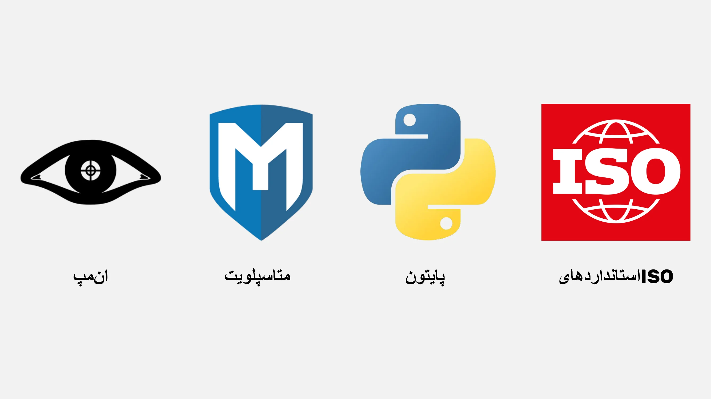

## مصاحبه با رنو

<chapterId>7d83fd98-ce22-514e-b9e8-729fbf71ee6e</chapterId>

### مدیریت کارآمد رمز عبور و تقویت احراز هویت: یک رویکرد آکادمیک

سه بعد کلیدی وجود دارد که هنگام صحبت در مورد مدیران رمز عبور باید در نظر گرفته شوند: ایجاد، به‌روزرسانی و اجرای رمزهای عبور در وب‌سایت‌ها.

به طور کلی توصیه نمی‌شود که از افزونه‌های مرورگر برای پر کردن خودکار رمز عبور استفاده کنید. این ابزارها می‌توانند کاربر را در برابر حملات فیشینگ آسیب‌پذیرتر کنند. رنو، یک کارشناس شناخته‌شده در امنیت سایبری، مدیریت دستی با استفاده از KeePass را ترجیح می‌دهد که شامل کپی و چسباندن دستی رمزهای عبور در برنامه است. افزونه‌ها تمایل دارند سطح حمله را افزایش دهند، می‌توانند عملکرد مرورگر را کند کنند و بنابراین خطر قابل توجهی را به همراه دارند. بنابراین، کاهش استفاده از افزونه‌ها در مرورگر یک عمل توصیه‌شده است.

مدیران رمز عبور معمولاً استفاده از عوامل احراز هویت اضافی، مانند احراز هویت دو مرحله‌ای را تشویق می‌کنند. برای امنیت بهینه، توصیه می‌شود OTPها (رمزهای عبور یک‌بار مصرف) را روی دستگاه موبایل خود نگه دارید. AndOTP یک راه‌حل متن‌باز برای تولید و ذخیره کدهای رمز عبور یک‌بار مصرف (OTP) روی دستگاه موبایل شما ارائه می‌دهد. در حالی که Google Authenticator امکان صادرات بذرهای کد احراز هویت را فراهم می‌کند، اعتماد به پشتیبان‌گیری در حساب گوگل همچنان محدود است. بنابراین، برنامه‌های OTI و AndoTP برای مدیریت مستقل OTP توصیه می‌شوند.

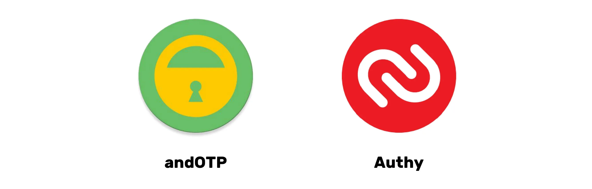

مسئله ارث دیجیتال و سوگواری دیجیتال اهمیت داشتن رویه‌ای برای انتقال گذرواژه‌ها پس از مرگ فرد را برجسته می‌کند. یک مدیر گذرواژه این انتقال را با ذخیره‌سازی امن تمام اسرار دیجیتال در یک مکان تسهیل می‌کند. مدیر گذرواژه همچنین به شما اجازه می‌دهد تا تمام حساب‌های باز را شناسایی کرده و مدیریت بستن یا انتقال آن‌ها را انجام دهید. توصیه می‌شود که گذرواژه اصلی را روی کاغذ بنویسید، اما باید در مکانی مخفی و امن نگهداری شود. اگر درایو Hard رمزگذاری شده و کامپیوتر قفل باشد، گذرواژه حتی در صورت سرقت نیز قابل دسترسی نخواهد بود.

### به سوی عصر پس از رمز عبور: بررسی جایگزین‌های معتبر

رمزهای عبور، اگرچه همه‌جا حاضر هستند، دارای چندین معایب می‌باشند، از جمله خطر انتقال در طول فرآیند احراز هویت. شرکت‌های پیشرو، مانند مایکروسافت و اپل، جایگزین‌های نوآورانه‌ای ارائه می‌دهند، از جمله بیومتریک و توکن‌های سخت‌افزاری، که نشان‌دهنده یک روند پیشرو به سمت کنار گذاشتن رمزهای عبور است.

به عنوان مثال، کلیدهای عبور، کلیدهای تصادفی رمزگذاری‌شده‌ای را ارائه می‌دهند که با یک عامل محلی (مانند بیومتریک یا یک پین) ترکیب می‌شوند، که توسط یک ارائه‌دهنده میزبانی می‌شود اما خارج از دسترس آنها باقی می‌ماند. اگرچه این نیاز به به‌روزرسانی وب‌سایت‌ها دارد، اما این رویکرد نیاز به رمزهای عبور را از بین می‌برد و در نتیجه سطح بالایی از امنیت را بدون محدودیت‌های مرتبط با رمزهای عبور سنتی یا مشکل مدیریت یک گاوصندوق دیجیتال فراهم می‌کند.

پاس‌کیز یک جایگزین قابل اعتماد و امن دیگر برای مدیریت رمز عبور است. با این حال، یک سوال مهم باقی می‌ماند: دسترسی در صورت شکست ارائه‌دهنده. بنابراین، مطلوب است که غول‌های اینترنتی سیستم‌هایی را برای تضمین این دسترسی پیشنهاد دهند.

احراز هویت مستقیم به سرویس مربوطه یک گزینه قابل قبول است که نیاز به شخص ثالث را از بین می‌برد. با این حال، ورود یکپارچه (SSO) ارائه شده توسط غول‌های اینترنتی نیز مشکلاتی از نظر دسترسی و خطرات سانسور ایجاد می‌کند. برای جلوگیری از نشت داده‌ها، کاهش میزان اطلاعات جمع‌آوری شده در طول فرآیند احراز هویت بسیار مهم است.

### امنیت کامپیوتر: الزامات روش‌های ایمن و خطرات مرتبط با سهل‌انگاری انسانی

امنیت کامپیوتر می‌تواند با روش‌های ساده و استفاده از گذرواژه‌های پیش‌فرض، مانند "admin"، به خطر بیفتد. حملات پیچیده همیشه برای به خطر انداختن امنیت کامپیوتر ضروری نیستند. به عنوان مثال، گذرواژه‌های مدیر یک کانال یوتیوب در کد منبع خصوصی یک شرکت نوشته شده بودند. آسیب‌پذیری‌های امنیتی اغلب نتیجه سهل‌انگاری انسانی هستند.

همچنین شایان ذکر است که اینترنت به شدت متمرکز و عمدتاً تحت کنترل آمریکا است. سرور DNS می‌تواند تحت سانسور قرار گیرد و اغلب از DNS فریبنده برای مسدود کردن دسترسی به سایت‌های خاص استفاده می‌کند. DNS یک پروتکل قدیمی و ناامن است که می‌تواند منجر به مشکلات امنیتی شود. پروتکل‌های جدیدی مانند DNSsec ظهور کرده‌اند اما هنوز به طور گسترده استفاده نمی‌شوند. برای دور زدن سانسور و مسدود کردن تبلیغات، می‌توان ارائه‌دهندگان DNS جایگزین را انتخاب کرد.

جایگزین‌های تبلیغات مزاحم شامل Google DNS، OpenDNS و سایر خدمات مستقل می‌باشند. پروتکل استاندارد DNS باعث می‌شود که درخواست‌های DNS برای ارائه‌دهنده خدمات اینترنت قابل مشاهده باشد. DOH (DNS over HTTPS) و DOT (DNS over TLS) اتصال DNS را رمزگذاری می‌کنند و حریم خصوصی و امنیت بیشتری را فراهم می‌کنند. این پروتکل‌ها به دلیل امنیت بالاترشان به طور گسترده در شرکت‌ها استفاده می‌شوند و به صورت بومی توسط ویندوز، اندروید و آیفون پشتیبانی می‌شوند. برای استفاده از DOH و DOT، باید به جای یک IP، یک نام میزبان TLS وارد شود. ارائه‌دهندگان رایگان DOH و DOT به صورت آنلاین در دسترس هستند. DOH و DOT با جلوگیری از حملات "مرد میانی" حریم خصوصی و امنیت را بهبود می‌بخشند.

همچنین شایان ذکر است سیستمی به نام "احراز هویت Lightning"، که برای هر سرویس یک شناسه متفاوت تولید می‌کند، بدون نیاز به ارائه ایمیل Address یا اطلاعات شخصی. امکان داشتن هویت‌های غیرمتمرکز کنترل‌شده توسط کاربر وجود دارد، اما در پروژه‌های هویت غیرمتمرکز، استانداردسازی و نرمال‌سازی وجود ندارد. مدیران بسته مانند NuGet و Chocolaté، که امکان دانلود نرم‌افزارهای متن‌باز خارج از فروشگاه مایکروسافت را فراهم می‌کنند، برای جلوگیری از حملات مخرب توصیه می‌شوند. به طور خلاصه، DNS برای امنیت آنلاین حیاتی است؛ با این حال، ضروری است که در برابر حملات احتمالی به سرورهای DNS هوشیار بمانیم.

# بخش نهایی

<partId>3d8ac4c9-f05b-4133-a40a-6e19d579f05f</partId>

## بررسی‌ها و رتبه‌بندی‌ها

<chapterId>6be74d2d-2116-5386-9d92-c4c3e2103c68</chapterId>

<isCourseReview>true</isCourseReview>

## امتحان نهایی

<chapterId>a894b251-a85a-5fa4-bf2a-c2a876939b49</chapterId>

<isCourseExam>true</isCourseExam>

## نتیجه‌گیری

<chapterId>6270ea6b-7694-4ecf-b026-42878bfc318f</chapterId>

<isCourseConclusion>true</isCourseConclusion>