# Perjalanan Menuju Perlindungan Data Anda

Selamat datang semuanya di program edukasi yang didedikasikan untuk keamanan digital ini. Pelatihan ini dirancang agar mudah diakses oleh siapa saja, jadi tidak diperlukan pengetahuan ilmu komputer sebelumnya. Tujuan utama kami adalah membekali Anda dengan pengetahuan dan keterampilan yang diperlukan untuk menjelajahi dunia digital dengan lebih aman dan terlindungi.

Hal ini akan melibatkan penggunaan beberapa alat seperti layanan email yang aman, alat untuk mengelola kata sandi Anda, dan berbagai perangkat lunak untuk mengamankan aktivitas online Anda.

Dalam pelatihan ini, kami tidak bertujuan untuk membuat Anda menjadi seorang ahli, anonim sepenuhnya, atau kebal terhadap ancaman digital, karena ini adalah hal yang mustahil. Sebaliknya, kami menawarkan beberapa solusi sederhana dan mudah dipahami untuk mulai mengubah kebiasaan Anda di dunia online dan mendapat kembali kendali atas priavsi digital Anda.

Tim kontributor:
- Muriel (desain)
- Rogzy Noury & Fabian (produksi)
- Théo (kontribusi)

+++

# Pendahuluan

<partId>534ab66c-b0e6-5757-a7dd-6ea04647edf2</partId>

## Ikhtisar Kursus

<chapterId>2f3d005d-8b49-5a3f-b90d-94c11f613407</chapterId>

**Tujuan: Tingkatkan keterampilan untuk menjaga keamanan Anda!**

Selamat datang semuanya di program edukasi yang didedikasikan untuk keamanan digital ini. Pelatihan ini dirancang agar mudah diakses oleh siapa saja, jadi tidak diperlukan pengetahuan ilmu komputer sebelumnya. Tujuan utama kami adalah membekali Anda dengan pengetahuan dan keterampilan yang diperlukan untuk menjelajahi dunia digital dengan lebih aman dan terlindungi.

Hal ini akan melibatkan penggunaan beberapa alat seperti layanan email yang aman, alat untuk mengelola kata sandi Anda, dan berbagai perangkat lunak untuk mengamankan aktivitas online Anda.

Pelatihan ini adalah hasil kolaborasi dari tiga profesor kami:

- Renaud Lifchitz, ahli keamanan siber
- Théo Pantamis, PhD dalam matematika terapan
- Rogzy, Co-founder dari Plan ₿ Network.

Kewaspadaan digital Anda sangat penting di dunia yang semakin digital. Meskipun ada peningkatan konstan dalam peretasan dan pengawasan massal, belum terlambat untuk mengambil langkah pertama dan melindungi diri Anda. 
Dalam pelatihan ini, kami tidak mencoba menjadikan Anda seorang ahli, anonim sepenuhnya, atau kebal terhadap ancaman digital, karena ini mustahil. Sebaliknya, kami menawarkan beberapa solusi sederhana dan mudah diakses untuk semua orang untuk mulai mengubah kebiasaan online Anda dan mendapatkan kembali kendali atas privasi digital Anda. 
Jika Anda mencari keterampilan yang lebih lanjut tentang topik ini kami sediakan sumber daya, tutorial, atau pelatihan keamanan siber kami yang lain untuk membantu Anda. Sementara itu, berikut adalah gambaran singkat program kami untuk beberapa jam ke depan.

**Bagian 1: Semua yang Perlu Anda Ketahui tentang Penjelajahan Online**

- Bab 1 - Penjelajahan Online
- Bab 2 - Menggunakan Internet dengan Aman

Kita akan memulai dengan membahas mengapa memilih *web browser* itu penting dan bagaimana pilihan itu memengaruhi keamanan Anda. Selanjutnya, kita akan menyelami lebih dalam tentang *browser*, terutama mengenai pengelolaan cookie. Anda juga akan belajar cara menjelajah dengan lebih aman dan anonim menggunakan alat seperti TOR. Setelah itu, kita akan fokus pada penggunaan VPN untuk meningkatkan perlindungan data Anda. Terakhir, kita akan memberikan rekomendasi untuk menggunakan koneksi WiFi dengan aman.

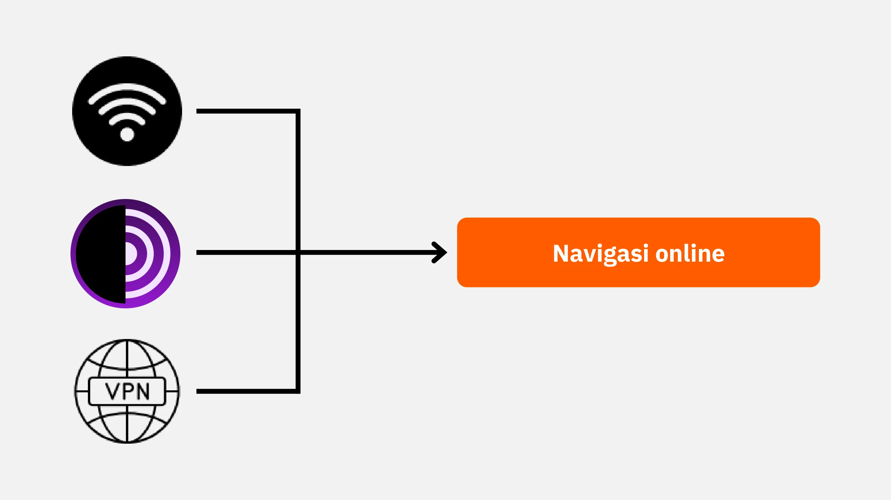

**Bagian 2: Praktik Terbaik Penggunaan Komputer**

- Bab 3 - Penggunaan Komputer
- Bab 4 - Peretasan & Pengelolaan Cadangan

Dalam bagian ini, kita akan membahas tiga area utama keamanan komputer. Pertama, kita akan menjelajahi berbagai sistem operasi, termasuk Mac, Windows, dan Linux, menyoroti karakteristik dan keunggulan spesifik masing-masing. Selanjutnya, kita akan mendalami metode untuk secara efektif melindungi diri dari upaya peretasan dan meningkatkan keamanan perangkat Anda. Terakhir, kita akan menekankan pentingnya melindungi dan mencadangkan data Anda secara berkala untuk mencegah kehilangan atau serangan *ransomware*.

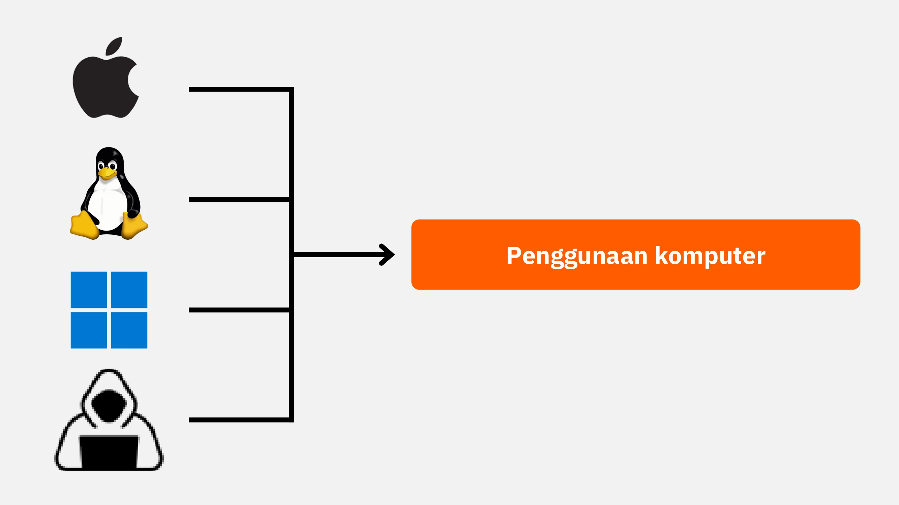

**Bagian 3: Penerapan Langkah-langkah solusi**

- Bab 6 - Manajemen email
- Bab 7 - Pengelola kata sandi (password manager)
- Bab 8 - Otentikasi dua faktor (2FA)

Pada bagian ketiga ini, kita akan fokus pada langkah praktis untuk solusi nyata meningkatkan keamanan digital Anda.

Pertama, kita akan melihat bagaimana melindungi kotak masuk email Anda, yang sangat penting untuk komunikasi dan sering menjadi target peretas. Kemudian, kami akan memperkenalkan Anda pada pengelola kata sandi: solusi praktis untuk mencegah lupa atau tertukar kata sandi sambil tetap menjaganya aman. Terakhir, kita akan membahas tindakan keamanan tambahan, yaitu otentikasi dua faktor, yang menambahkan lapisan perlindungan ekstra pada akun Anda. Semuanya akan dijelaskan dengan jelas dan mudah dipahami.

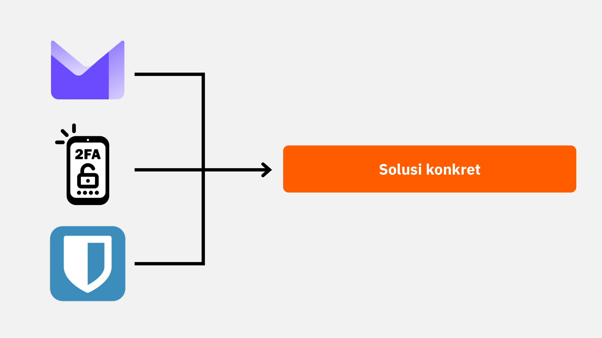

Siap untuk memperkuat keamanan digital Anda dan mengambil kembali kendali atas data Anda? Ayo mulai!

# Semua yang Perlu Anda Ketahui tentang Penjelajahan Online

<partId>b4b5379a-d8ef-59ae-94d3-a6e88959c149</partId>

## Penjelajahan Online

<chapterId>3a935da9-fa6e-57eb-bf85-7b3ec35e6ee2</chapterId>

Saat Anda menjelajahi internet, penting untuk menghindari beberapa kesalahan umum untuk menjaga keamanan online Anda. Berikut adalah beberapa tips untuk menghindarinya:

### Berhati-hatilah dengan pengunduhan perangkat lunak:

Disarankan untuk mengunduh perangkat lunak dari situs resminya dan bukan dari situs umum.
Contoh: Gunakan www.signal.org/download dan hindari pengunduhan melalui www.logicieltelechargement.fr/signal.

Sangat disarankan juga untuk memprioritaskan perangkat lunak sumber terbuka (open-source). Kenapa? Karena perangkat lunak ini seringkali lebih aman dan bebas dari perangkat lunak berbahaya (malicious software).

Perangkat lunak "*open-source*" itu adalah jenis perangkat lunak yang kode programnya tersedia dan bisa diakses oleh siapa saja secara publik. Ini memungkinkan, orang-orang lain untuk memverifikasi bahwa tidak ada akses tersembunyi yang bertujuan mencuri data Anda.

> Bonus: Mayoritas perangkat lunak *open-source* seringkali bersifat gratis! Kode pada pembelajaran di universitas ini juga  100% *open source*, jadi Anda juga dapat memeriksa kode kami di GitHub kami.
> 

### Pengelolaan *Cookie*: Kesalahan dan solusi praktis terbaik

*Cookie* adalah file yang dibuat oleh situs web untuk menyimpan informasi di komputer atau perangkat seluler Anda. Meskipun beberapa situs memerlukan *cookie* ini agar berfungsi dengan baik, *cookie* juga dapat dieksploitasi oleh situs pihak ketiga, terutama untuk tujuan pelacakan iklan. Berdasarkan regulasi seperti GDPR (*General Data Protection Regulation*), Anda dapat dan disarankan untuk menolak *Cookie* pelacakan pihak ketiga sambil tetap menerima *Cookie* yang penting agar situs berfungsi dengan semestinya. Setelah setiap kunjungan ke situs, bijaksana untuk menghapus *Cookie* yang terkait, baik secara manual atau melalui ekstensi atau program khusus. Beberapa *browser* bahkan menawarkan kemungkinan untuk menghapus *Cookie* secara selektif. Meskipun Anda melakukan tindakan pencegahan ini, penting untuk memahami bahwa informasi yang dikumpulkan oleh berbagai situs dapat tetap saling terhubung. Oleh karena itu, penting sekali untuk menemukan keseimbangan antara kenyamanan dan keamanan dalam penjelajahan online Anda.

> Catatan: Batasi juga jumlah ekstensi yang dipasang di *browser* Anda untuk menghindari potensi masalah keamanan dan kinerja.

### Peramban Web (*Web Browser*): pilihan dan keamanan

Ada dua kategori besar peramban (browser): yang berbasis Chrome dan yang berbasis Firefox. 
Meskipun kedua kategori ini menawarkan tingkat keamanan yang serupa, disarankan untuk menghindari penggunaan peramban (browser) Google Chrome karena kemampuannya dalam melacak aktivitas pengguna. Alternatif yang lebih ringan dari Chrome, seperti Chromium atau Brave, mungkin lebih disukai. Brave khususnya sangat direkomendasikan karena memiliki pemblokir iklan bawaan. Dalam beberapa kasus, mungkin diperlukan untuk menggunakan lebih dari satu peramban (browser) untuk mengakses situs web tertentu.

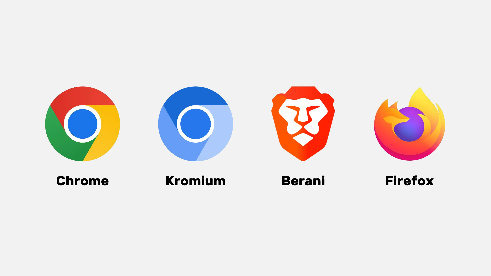

### Penjelajahan Pribadi, TOR, dan alternatif lainnya untuk penjelajahan yang lebih aman dan anonim

Penjelajahan pribadi (private Browse), meskipun tidak menyembunyikan aktivitas penjelajahan dari penyedia layanan internet Anda, memungkinkan Anda menghindari meninggalkan jejak lokal di komputer Anda. Kuki (cookies) akan otomatis terhapus di akhir setiap sesi, memungkinkan Anda menerima semua *Cookie* tanpa terlacak. Penjelajahan pribadi bisa berguna saat membeli layanan online, karena situs web melacak kebiasaan pencarian kita dan menyesuaikan harga karenanya. Namun, penting untuk dicatat bahwa penjelajahan pribadi direkomendasikan untuk sesi sementara dan spesifik, bukan untuk penjelajahan internet umum.

Alternatif yang lebih canggih adalah jaringan TOR (*The Onion Router*), yang menawarkan anonimitas dengan menyembunyikan alamat IP pengguna dan memungkinkan akses ke Darknet. Peramban TOR (TOR Browser) adalah peramban yang dirancang khusus untuk menggunakan jaringan TOR. Ini memungkinkan Anda mengunjungi situs web konvensional dan juga situs web .onion, yang biasanya dioperasikan oleh individu dan mungkin terkait dengan aktivitas ilegal.

TOR bersifat legal dan digunakan oleh jurnalis, aktivis kebebasan, dan orang lain yang ingin lolos dari sensor di negara-negara otoriter. Namun, penting untuk memahami bahwa TOR tidak mengamankan situs yang dikunjungi atau komputer itu sendiri. Selain itu, penggunaan TOR dapat memperlambat koneksi internet karena data harus melewati komputer milik tiga orang lain sebelum mencapai tujuannya. Juga penting untuk dicatat bahwa TOR bukan solusi sempurna untuk menjamin anonimitas 100% dan tidak seharusnya digunakan untuk aktivitas ilegal.

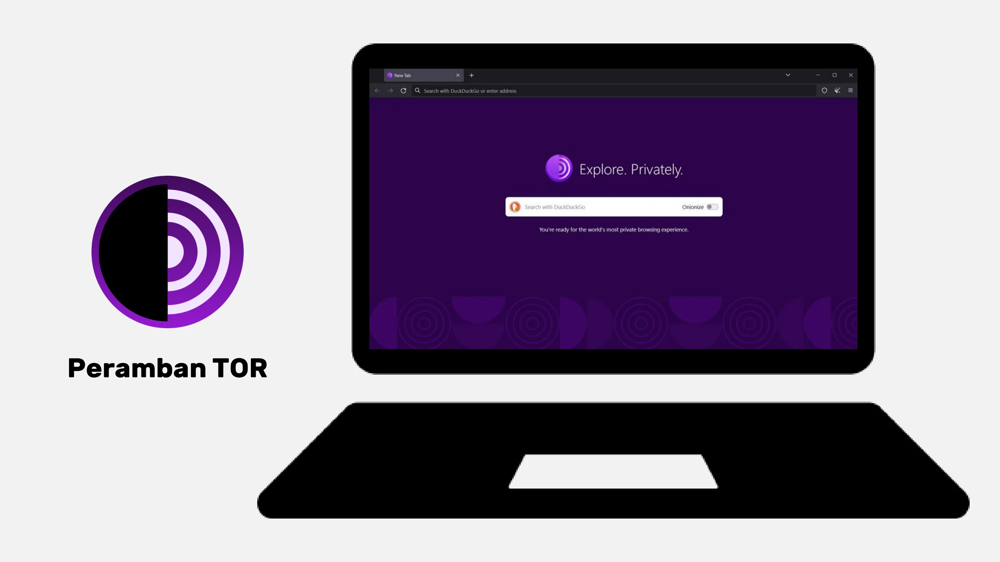

https://planb.network/tutorials/computer-security/communication/tor-browser-a847e83c-31ef-4439-9eac-742b255129bb

## VPN dan koneksi internet

<chapterId>5aac83f4-a685-54b0-9759-d71bea7eeed2</chapterId>

### VPN (*Virtual Private Network*)

Melindungi koneksi internet Anda adalah aspek penting dalam keamanan online, dan menggunakan jaringan pribadi virtual (VPN) adalah metode yang efektif untuk meningkatkan keamanan ini, baik untuk bisnis maupun pengguna individu.

VPN adalah alat yang mengenkripsi data yang dikirimkan melalui internet, menjadikan koneksi lebih aman. Dalam konteks profesional, VPN memungkinkan karyawan untuk mengakses jaringan internal perusahaan dengan aman dari lokasi jarak jauh. Data yang dipertukarkan dienkripsi, membuatnya jauh lebih sulit untuk dilihat atau dicuri oleh pihak ketiga. Selain mengamankan akses ke jaringan internal, menggunakan VPN dapat memungkinkan pengguna untuk mengarahkan koneksi internet mereka melalui jaringan internal perusahaan, memberikan kesan bahwa koneksi mereka berasal dari perusahaan. Ini bisa sangat berguna untuk mengakses layanan online yang dibatasi secara geografis.

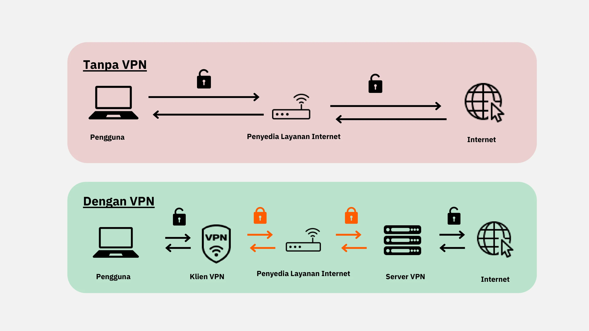

### Jenis-jenis VPN

Ada dua jenis utama VPN: VPN perusahaan dan VPN konsumen, seperti NordVPN. VPN perusahaan cenderung lebih mahal dan kompleks, sementara VPN konsumen umumnya lebih mudah diakses dan ramah pengguna. Misalnya, NordVPN memungkinkan pengguna untuk terhubung ke internet melalui server yang berlokasi di negara lain, sehingga bisa membuka situs atau layanan yang dibatasi berdasarkan lokasi geografis.

Ada dua jenis utama VPN: VPN perusahaan (enterprise VPN) dan VPN konsumen, seperti NordVPN. VPN perusahaan cenderung lebih mahal dan kompleks, sementara VPN konsumen umumnya lebih mudah diakses dan ramah pengguna. Sebagai contoh, NordVPN memungkinkan pengguna untuk terhubung ke internet melalui server yang berlokasi di negara lain, sehingga bisa melewati pembatasan geografis.

Namun, menggunakan VPN konsumen tidak menjamin anonimitas sepenuhnya. Banyak penyedia VPN menyimpan informasi tentang penggunanya, yang bisa membahayakan anonimitas mereka. Meskipun VPN bisa berguna untuk meningkatkan keamanan online, mereka bukan solusi universal. Mereka efektif untuk penggunaan spesifik, seperti mengakses layanan yang dibatasi secara geografis atau meningkatkan keamanan saat bepergian, tetapi tidak menjamin keamanan total. Saat memilih VPN, sangat penting untuk memprioritaskan keandalan dan keahlian teknis daripada popularitas. Penyedia VPN yang paling sedikit mengumpulkan informasi pribadi umumnya adalah yang paling aman. Layanan seperti iVPN dan Mullvad tidak mengumpulkan informasi pribadi dan bahkan memungkinkan pembayaran dengan Bitcoin untuk privasi yang lebih tinggi.

Terakhir, VPN juga bisa dipakai untuk memblokir iklan online, memberikan pengalaman menjelajah yang lebih nyaman dan aman. Namun, penting untuk melakukan riset mendalam agar menemukan VPN yang paling sesuai dengan kebutuhan Anda. Menggunakan VPN sangat dianjurkan untuk meningkatkan keamanan, bahkan saat menjelajah internet di rumah. Ini membantu memastikan tingkat perlindungan yang lebih tinggi untuk data yang dipertukarkan secara online. Terakhir, selalu cek URL dan ikon gembok kecil di bilah alamat untuk memastikan Anda berada di situs yang benar dan aman.

https://planb.network/tutorials/computer-security/communication/ivpn-5a0cd5df-29f1-4382-a817-975a96646e68

https://planb.network/tutorials/computer-security/communication/mullvad-968ec5f5-b3f0-4d23-a9e0-c07a3e85aaa8

### HTTPS & jaringan Wi-Fi publik

Dalam hal keamanan online, penting untuk dipahami bahwa 4G umumnya lebih aman daripada Wi-Fi publik. Namun, penggunaan 4G dapat dengan cepat menguras paket data seluler Anda. Protokol HTTPS telah menjadi standar untuk mengenkripsi data di situs web. Ini memastikan bahwa data yang dipertukarkan antara pengguna dan situs web aman. Oleh karena itu, sangat penting untuk memverifikasi bahwa situs yang Anda kunjungi menggunakan protokol HTTPS.

Di Uni Eropa, perlindungan data diatur oleh Peraturan Perlindungan Data Umum (GDPR). Oleh karena itu, lebih aman menggunakan penyedia titik akses Wi-Fi Eropa, seperti SNCF, yang tidak menjual kembali data koneksi pengguna. Namun, fakta bahwa sebuah situs menampilkan ikon gembok tidak menjamin keasliannya. Penting untuk memverifikasi kunci publik situs menggunakan sistem sertifikat untuk mengonfirmasi keasliannya. Meskipun enkripsi data mencegah pihak ketiga mencegat data yang dipertukarkan, masih mungkin bagi individu jahat untuk meniru situs dan mentransfer data dalam teks biasa.

Untuk menghindari penipuan online, sangat penting untuk memverifikasi identitas situs yang Anda jelajahi, terutama dengan memeriksa ekstensi dan nama domain. Selain itu, waspadai penipu yang menggunakan huruf serupa dalam URL untuk menipu pengguna.

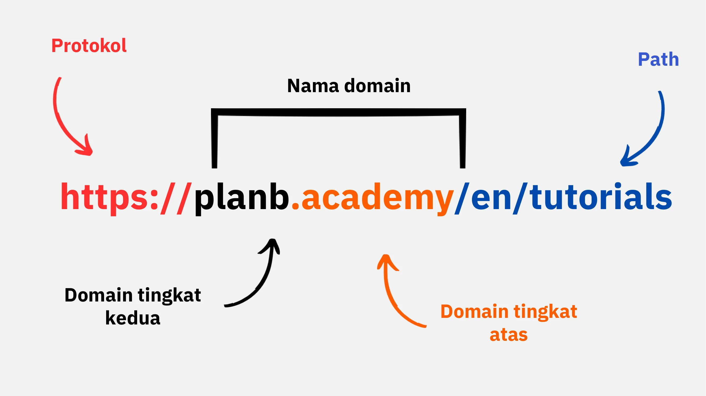

Singkatnya, penggunaan VPN dapat sangat meningkatkan keamanan online baik untuk bisnis maupun pengguna individu. Selain itu, mempraktikkan kebiasaan menjelajah yang baik juga berkontribusi pada keamanan digital yang lebih baik. Di segmen berikutnya dari kursus ini, kita akan membahas keamanan komputer, termasuk pembaruan perangkat lunak, penggunaan antivirus, dan manajemen kata sandi.

# Praktik Terbaik Penggunaan Komputer

<partId>e6eac20b-ba24-5d9a-8d86-8e0164074457</partId>

## Penggunaan Komputer

<chapterId>16745632-b56b-5423-9873-ddf70fdf1efd</chapterId>

Keamanan komputer kita adalah hal utama yang harus diperhatikan di dunia digital saat ini. Saat ini, kami akan membahas tiga poin penting:

- Memilih komputer
- Pembaruan dan antivirus untuk keamanan yang optimal
- Praktik terbaik untuk keamanan komputer dan data Anda.

### Memilih Komputer dan Sistem Operasi

Terkait pemilihan komputer, tidak ada perbedaan keamanan yang signifikan antara komputer lama dan baru. Namun, perbedaan keamanan memang ada pada sistem operasi, termasuk Windows, Linux, dan Mac.

Mengenai Windows, disarankan untuk tidak menggunakan akun administrator setiap hari. Sebaiknya, buat dua akun terpisah: satu untuk keperluan administrasi dan satu lagi untuk penggunaan sehari-hari. Windows seringkali lebih rentan terhadap *malware* karena jumlah penggunanya yang besar dan kemudahan beralih dari pengguna standar ke administrator. Sebaliknya, ancaman jauh lebih jarang terjadi pada Linux dan Mac.

Pilihan sistem operasi harus didasarkan pada kebutuhan dan preferensi Anda. Sistem Linux telah berkembang pesat dalam beberapa tahun terakhir, menjadi semakin ramah pengguna. Ubuntu adalah alternatif yang menarik bagi pemula, dengan antarmuka grafis yang mudah digunakan. Anda bisa saja mempartisi komputer untuk mencoba Linux sambil tetap mempertahankan Windows, namun proses ini bisa cukup rumit. Seringkali, lebih disukai untuk memiliki komputer khusus, mesin virtual (virtual machine), atau USB *flash drive* untuk menguji penggunaan Linux atau Ubuntu.

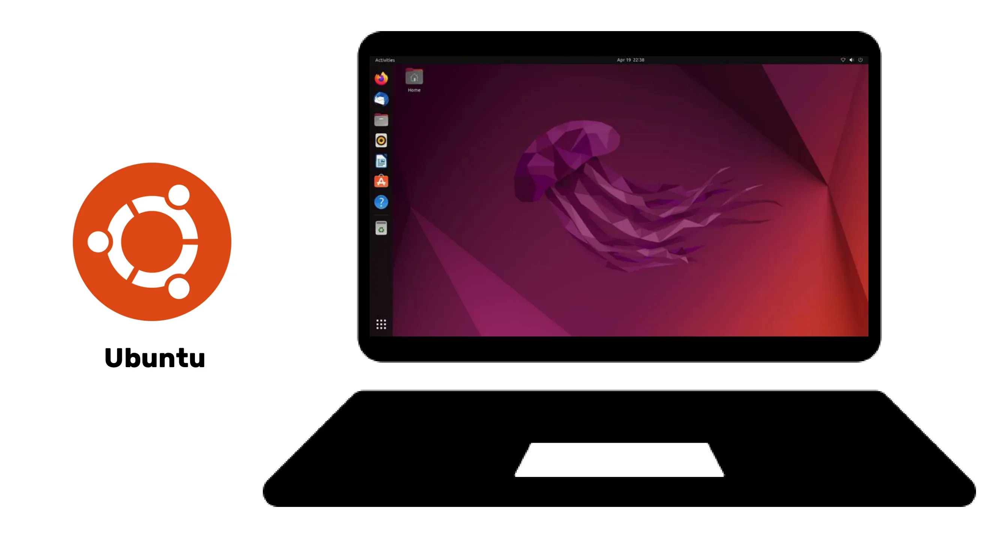

### Pembaruan Perangkat Lunak

Aspek penting dari pembaruan sangat sederhana: **memperbarui sistem operasi dan aplikasi secara teratur adalah hal yang penting.**

Pada Windows 10, pembaruan (updates) hampir berlangsung terus-menerus, dan sangat penting untuk tidak memblokir atau menundanya. Setiap tahun, sekitar 15.000 kerentanan diidentifikasi, yang menyoroti pentingnya menjaga perangkat lunak tetap mutakhir untuk melindungi dari malware dan ancaman siber lainnya. Umumnya, dukungan perangkat lunak berakhir antara 3 hingga 5 tahun setelah dirilis, jadi perlu upgrade ke versi yang lebih tinggi agar tetap mendapatkan pembaruan keamanan.

Aturan ini berlaku untuk hampir semua perangkat lunak. Pembaruan, sejatinya, tidak bertujuan membuat komputer Anda usang atau lambat; sebaliknya, pembaruan dirancang untuk melindungi dari ancaman baru. Beberapa pembaruan bahkan dianggap penting, dan tanpanya, komputer Anda berisiko serius untuk dieksploitasi.

Sebagai contoh konkret dari kesalahan, perangkat lunak bajakan (cracked software) yang tidak dapat diperbarui menimbulkan ancaman ganda. Potensi ancaman itu adalah masuknya virus saat mengunduhnya secara ilegal dari situs web mencurigakan, serta penggunaan yang tidak aman terhadap bentuk serangan baru.

### Anti-virus

- Apakah Anda memerlukan anti-virus? YA
- Apakah Anda harus membayar? Tergantung!

Pemilihan dan penerapan antivirus itu penting. Windows Defender, antivirus bawaan di Windows, adalah solusi yang aman dan efektif. Sebagai solusi gratis, ini sangat bagus dan jauh lebih baik daripada banyak solusi gratis lain yang ditemukan online.

Memang, Anda harus berhati-hati saat mengunduh perangkat lunak antivirus dari internet, karena bisa jadi perangkat lunak itu berbahaya atau sudah kedaluwarsa. Bagi yang ingin menggunakan pada antivirus berbayar, disarankan untuk memilih antivirus yang secara cerdas menganalisis ancaman tak dikenal dan yang baru muncul, seperti Kaspersky. Pembaruan antivirus sangat penting untuk melindungi dari ancaman yang terus berkembang.

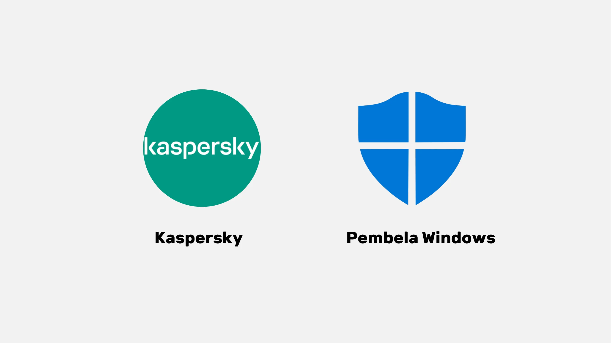

> Catatan: Linux dan Mac, berkat sistem pemisahan hak pengguna mereka, seringkali tidak memerlukan antivirus.

Terakhir, ini beberapa praktik terbaik untuk mengamankan komputer dan data Anda. Penting untuk memilih antivirus yang efektif dan mudah digunakan. Selain itu, sangat penting untuk mengadopsi kebiasaan baik pada komputer Anda, seperti tidak memasukkan USB *flash drive* yang tidak dikenal atau mencurigakan. USB ini mungkin mengandung program berbahaya yang dapat otomatis berjalan saat dimasukkan. Mengecek USB *flash drive* setelah terlanjur dimasukkan akan sia-sia. Beberapa perusahaan bahkan menjadi korban peretasan karena USB *flash drive* yang sengaja ditinggalkan di area mudah diakses, seperti tempat parkir.

Perlakukan komputer Anda seperti Anda memperlakukan rumah: tetap waspada, perbarui perangkat lunak secara berkala, hapus file yang tidak perlu, dan gunakan kata sandi yang kuat untuk keamanan tambahan. Sangat penting untuk mengenkripsi data pada laptop dan smartphone untuk mencegah pencurian atau kehilangan data. BitLocker untuk Windows, LUKS untuk Linux, dan opsi bawaan untuk Mac adalah solusi untuk enkripsi data. Sangat disarankan untuk mengaktifkan enkripsi data tanpa ragu dan menuliskan kata sandi di kertas untuk disimpan di tempat yang aman.

Sebagai kesimpulan, sangat penting untuk memilih sistem operasi yang sesuai dengan kebutuhan Anda dan memperbaruinya secara berkala, begitu juga aplikasi yang terinstal. Juga penting untuk menggunakan program antivirus yang efektif dan mudah digunakan, serta mengadopsi praktik keamanan yang baik untuk melindungi komputer dan data Anda.

## Peretasan & Pengelolaan Pencadangan: Melindungi Data Anda

<chapterId>9ddfcb6a-a253-5542-b7eb-df7222b46dc7</chapterId>

### Bagaimana peretas menyerang?

Untuk melindungi diri secara efektif, penting untuk memahami bagaimana peretas mencoba menyusup ke komputer Anda. Sejatinya, virus tidak sering muncul secara ajaib, melainkan merupakan konsekuensi dari tindakan kita, meskipun tidak disengaja.

Sebagai aturan umum, virus masuk karena Anda telah membiarkan komputer Anda mengundang mereka masuk. Ini bisa divisualisasikan dengan mengunduh perangkat lunak yang mencurigakan, file torrent yang sudah disusupi, atau sekadar mengeklik tautan dalam email penipuan (fraudulent email).

### *Phishing*, kewaspadaan terhadap email penipuan:

Perhatian! Email adalah media peretasan pertama, Berikut beberapa tips penting:

- Tetap waspada terhadap upaya *phishing* yang bertujuan mencuri informasi sensitif Anda, seperti nama pengguna dan kata sandi. Hindari mengklik tautan yang mencurigakan dan berbagi informasi pribadi Anda tanpa memverifikasi keaslian pengirim.

- Berhati-hatilah dengan lampiran email dan gambar:
  Lampiran email dan gambar dapat mengandung *malware*. Jangan mengunduh atau membuka lampiran dari pengirim yang tidak dikenal atau mencurigakan, dan pastikan antivirus Anda sudah diperbarui.

Aturan penting di sini adalah memeriksa dengan cermat nama lengkap pengirim serta asal email. Jika Anda ragu, hapus saja!

### *Ransomware* dan jenis serangan siber:

*Ransomware* adalah jenis perangkat lunak jahat (malicious software) yang mengenkripsi data pengguna dan meminta tebusan untuk membukanya kembali. Jenis serangan ini semakin umum dan bisa sangat merepotkan, baik bagi perusahaan maupun individu. Untuk melindungi diri, sangat penting untuk membuat cadangan (backup) file-file yang paling penting! Ini tidak akan menghentikan *ransomware*, tapi akan memungkinkan Anda untuk mengabaikannya (dan tidak perlu membayar tebusan).

Cadangkan data penting Anda secara teratur ke perangkat penyimpanan eksternal atau layanan penyimpanan online yang aman. Dengan begitu, jika terjadi serangan siber atau kegagalan perangkat keras, Anda bisa memulihkan data tanpa kehilangan informasi penting.

Berikut solusi sederhananya:

- Beli *hard drive* eksternal dan salin data Anda ke dalamnya. Setelah selesai, cabut *hard drive* tersebut dan simpan di lokasi yang aman di dalam rumah. (Melakukan ini dua kali dan menyimpan salah satu drive di lokasi lain dapat membantu melindungi dari potensi kebakaran).

- Buat cadangan *cloud* menggunakan ProtonMail Drive, Sync, atau Google Drive. Unggah data penting Anda ke penyedia platform online ini. Namun, perlu diingat bahwa data Anda berpotensi berada di internet dan dipegang oleh pihak ketiga yang terpercaya.

### Apakah Anda harus membayar peretas?

Tidak, umumnya tidak disarankan untuk membayar peretas dalam kasus *ransomware* atau jenis serangan lainnya. Membayar tebusan tidak menjamin data Anda akan pulih dan justru bisa mendorong para penjahat siber untuk melanjutkan aktivitas jahat mereka. Sebaliknya, prioritaskan pencegahan dan pencadangan data secara rutin untuk melindungi diri Anda.

Jika Anda mendeteksi virus di komputer Anda, segera putuskan koneksinya dari internet, lakukan pemindaian antivirus penuh, dan hapus file-file yang terinfeksi. Setelah itu, perbarui perangkat lunak dan sistem operasi Anda, serta ubah kata sandi Anda untuk mencegah pembobolan lebih lanjut.

https://planb.network/tutorials/computer-security/data/proton-drive-03cbe49f-6ddc-491f-8786-bc20d98ebb16

https://planb.network/tutorials/computer-security/data/veracrypt-d5ed4c83-7c1c-4181-95ea-963fdf2d83c5

# Penerapan solusi.

<partId>215ec902-ba05-5549-87fc-cb8d82665f7b</partId>

## Mengelola akun email

<chapterId>dfceea33-8712-5557-ace1-6ba5598d33d8</chapterId>

### Membuat akun email baru!

Akun email adalah pusat aktivitas online Anda: jika disusupi, peretas dapat menggunakannya untuk mengatur ulang semua kata sandi Anda melalui fungsi "lupa kata sandi" dan mendapatkan akses ke banyak situs lain. Itulah mengapa Anda perlu mengamankannya dengan benar.

Akun email harus dibuat dengan kata sandi yang unik dan kuat (detail di bab 7) dan idealnya dengan sistem autentikasi dua faktor (detail di bab 8).

Meskipun kita semua sudah memiliki akun email, penting untuk mempertimbangkan membuat akun baru yang lebih modern untuk memulai dengan aman.

### Memilih penyedia email dan mengelola alamat email

Pengelolaan alamat email yang tepat sangat penting untuk menjaga keamanan akses online kita. Penting untuk memilih penyedia layanan email yang aman dan menghormati privasi. Sebagai contoh, ProtonMail adalah layanan email yang aman dan menghargai privasi.

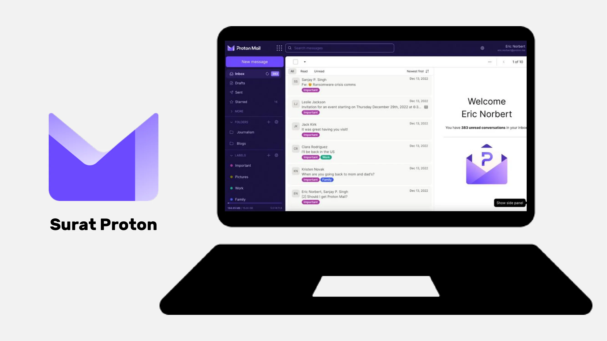

Saat memilih penyedia email dan membuat kata sandi, sangat penting untuk tidak pernah menggunakan kata sandi yang sama untuk layanan online yang berbeda. Disarankan untuk secara rutin membuat alamat email baru dan menggunakannya untuk berbagai keperluan. Sebaiknya gunakan layanan email yang aman untuk akun-akun penting Anda. Perlu dicatat juga bahwa beberapa layanan membatasi panjang kata sandi, jadi penting untuk mengetahui batasan ini. Tersedia juga layanan untuk membuat alamat email sementara, yang bisa digunakan untuk akun dengan durasi terbatas.

Sebagai informasi, penyedia email lama seperti La Poste, Arobase, Wig, dan Hotmail masih digunakan, tetapi praktik keamanannya mungkin tidak sekuat Gmail. Oleh karena itu, disarankan untuk memiliki dua alamat email terpisah: satu untuk komunikasi umum atau penggunaan sehari-hari dan yang lainnya untuk pemulihan akun, di mana yang terakhir harus lebih aman. Sebaiknya hindari mencampurkan alamat email Anda dengan operator telepon atau penyedia layanan internet Anda, karena ini bisa menjadi titik serangan.

### Apakah saya harus mengganti akun email saya?

Anda sebaiknya menggunakan situs web "Have I Been Pwned" (https://haveibeenpwned.com/) untuk memeriksa apakah alamat email Anda telah dibobol dan untuk menerima notifikasi tentang kebocoran data di masa mendatang. Peretas dapat memanfaatkan database yang diretas untuk mengirim email phishing atau menggunakan kembali kata sandi yang telah dibobol.

Secara umum, mulai menggunakan alamat email baru yang lebih aman bukanlah praktik yang buruk, bahkan perlu jika Anda ingin memulai kembali dengan dasar yang lebih baik.
Bonus Bitcoin: Sangat disarankan untuk membuat alamat email spesifik untuk aktivitas Bitcoin atau kripto Anda, seperti untuk membuat akun di bursa (exchange), untuk benar-benar memisahkan area aktivitas ini dalam kehidupan kita.

https://planb.network/tutorials/computer-security/communication/proton-mail-c3b010ce-254d-4546-b382-19ab9261c6a2

## Pengelola Kata Sandi (*Password Manager*)

<chapterId>0b3c69b2-522c-56c8-9fb8-1562bd55930f</chapterId>

### Apa itu pengelola kata sandi?

Pengelola kata sandi (password manager) adalah alat yang memungkinkan Anda untuk menyimpan, membuat, dan mengelola kata sandi untuk berbagai akun online. Daripada harus mengingat banyak kata sandi, Anda hanya perlu satu kata sandi utama (master password) untuk mengakses semua kata sandi lainnya.

Dengan pengelola kata sandi, Anda tidak perlu lagi khawatir lupa kata sandi atau menuliskannya di suatu tempat. Anda cukup mengingat satu kata sandi utama saja. Selain itu, sebagian besar alat ini akan membuat kata sandi yang kuat untuk Anda, yang tentu saja meningkatkan keamanan akun-akun Anda.

### Perbedaan antara beberapa manajer yang sering digunakan:

- LastPass: Salah satu pengelola kata sandi paling populer. LastPass adalah layanan pihak ketiga, yang berarti kata sandi Anda disimpan di server mereka. LastPass menawarkan versi gratis dan berbayar, dengan antarmuka yang ramah pengguna.
- Dashlane: Sama seperti LastPass, Dashlane juga merupakan layanan pihak ketiga. Dashlane punya antarmuka yang yang mudah digunakan dan fitur tambahan seperti pelacakan informasi kartu kredit dan catatan aman (secure notes).

  

### *Self-hosting* untuk kontrol yang lebih baik:

- Bitwarden: Ini adalah alat *open-source*, yang berarti Anda bisa meninjau kode programnya untuk memverifikasi keamanannya. Meskipun Bitwarden menawarkan layanan hosting, ia juga memungkinkan pengguna untuk melakukan *self-host*, yang berarti Anda dapat mengontrol di mana kata sandi Anda disimpan. Ini berpotensi menawarkan keamanan dan kontrol yang lebih besar.

- KeePass: Ini adalah solusi *open-source* yang utamanya ditujukan untuk *self-hosting*. Data Anda disimpan secara lokal secara default, tetapi Anda bisa menyinkronkan database kata sandi menggunakan berbagai metode jika Anda mau. KeePass diakui luas karena keamanan dan fleksibilitasnya, meskipun mungkin sedikit kurang nyaman bagi pengguna pemula.
  

Untuk solusi yang dihosting sendiri seperti KeePass, Anda dapat menyinkronkan basis data Anda di beberapa perangkat tanpa menggunakan layanan terpusat pihak ketiga. Alat seperti **Syncthing** memungkinkan sinkronisasi terenkripsi dan terdesentralisasi langsung antar perangkat Anda. Pendekatan ini menjaga data Anda tetap di bawah kendali Anda sambil memastikan ketersediaannya di semua perangkat Anda.

(Catatan: Memilih antara layanan pihak ketiga atau layanan *self-hosted* (dihosting sendiri) bergantung pada tingkat pemahaman Anda terhadap teknologi dan bagaimana Anda memprioritaskan kontrol daripada kenyamanan. Layanan pihak ketiga umumnya lebih nyaman bagi kebanyakan orang, sementara *self-hosting* membutuhkan lebih banyak pengetahuan teknis, namun dapat menawarkan kontrol dan ketenangan pikiran yang lebih besar dalam hal keamanan.)

### Seperti apa kata sandi yang baik?

Kata sandi yang baik umumnya memiliki ciri-ciri berikut:

- Panjang: setidaknya 12 karakter.
- Kompleks: campuran huruf besar dan kecil, angka, dan simbol.
- Unik: Jangan pernah menggunakan kata sandi yang sama untuk akun yang berbeda.
- Tidak berdasarkan informasi pribadi: hindari penggunaan tanggal lahir, nama, dan lain-lain.

Untuk memastikan keamanan akun Anda, sangat penting untuk membuat kata sandi yang kuat dan aman. Panjang kata sandi saja tidak cukup untuk menjamin keamanannya. Karakter-karakter di dalamnya harus benar-benar acak agar tahan terhadap serangan brute force (dimana penyerang terus-menerus mencoba menebak password). Setiap karakter dipilih secara acak tanpa pola juga penting untuk menghindari kombinasi yang paling mungkin ditebak. Kata sandi umum seperti "password" sangat mudah ditebak.

Untuk membuat kata sandi yang kuat, disarankan untuk menggunakan banyak karakter acak, tanpa menggunakan kata atau pola yang dapat diprediksi. Penting juga untuk menyertakan angka dan karakter khusus. Namun, perlu dicatat bahwa beberapa situs web mungkin membatasi penggunaan karakter khusus tertentu. Kata sandi yang tidak dibuat secara acak mudah ditebak. Variasi atau penambahan pada kata sandi yang sudah ada tidak aman. Situs web tidak dapat menjamin keamanan kata sandi yang dipilih oleh pengguna.

Kata sandi yang dihasilkan secara acak menawarkan tingkat keamanan yang lebih tinggi, meskipun mungkin lebih sulit diingat. Pengelola kata sandi (password manager) dapat membantu membuat kata sandi acak yang lebih aman. Dengan menggunakan pengelola kata sandi, Anda tidak perlu menghafal semua kata sandi Anda. Penting untuk secara bertahap mengganti kata sandi lama Anda dengan yang dihasilkan oleh pengelola, karena kata sandi tersebut lebih kuat dan lebih aman. Pastikan kata sandi utama (master password) dari pengelola kata sandi Anda juga kuat dan aman.

https://planb.network/tutorials/computer-security/authentication/bitwarden-0532f569-fb00-4fad-acba-2fcb1bf05de9

https://planb.network/tutorials/computer-security/authentication/keepass-f8073bb7-5b4a-4664-9246-228e307be246

## Autentikasi Dua Faktor (2FA)

<chapterId>9391e02e-e61b-5a86-93e0-91a07f217d35</chapterId>

### Mengapa menerapkan 2FA

Autentikasi dua faktor (2FA) adalah lapisan keamanan tambahan yang memastikan bahwa orang yang mencoba mengakses akun online memang benar-benar pemilik aslinya. Alih-alih hanya memasukkan nama pengguna dan kata sandi, 2FA memerlukan bentuk verifikasi tambahan.

Verifikasi ini dapat dilakukan melalui:

- Kode sementara yang dikirim melalui SMS.
- Kode yang dihasilkan oleh aplikasi seperti Google Authenticator atau Authy.
- Kunci keamanan fisik yang dapat Anda masukkan ke dalam komputer Anda.
  
  
  
Dengan 2FA, bahkan jika peretas berhasil mendapatkan kata sandi Anda, mereka tetap tidak akan bisa mengakses akun Anda tanpa faktor verifikasi kedua ini. Inilah yang membuat 2FA sangat penting untuk melindungi akun online Anda dari akses tidak sah.

### Opsi Mana yang Harus Dipilih?

Berbagai opsi untuk autentikasi kuat menawarkan tingkat keamanan yang berbeda-beda.

- SMS tidak dianggap sebagai pilihan terbaik karena hanya membuktikan kepemilikan nomor telepon.
- 2FA (autentikasi dua faktor) lebih aman karena menggunakan berbagai jenis bukti, seperti pengetahuan, kepemilikan, dan identifikasi. Kata sandi satu kali (HOTP dan TOTP) lebih aman daripada SMS karena memerlukan perhitungan kriptografi dan disimpan secara lokal, bukan dalam memori.
- Token perangkat keras, seperti kunci USB atau kartu pintar, menawarkan keamanan optimal dengan menghasilkan kunci pribadi unik untuk setiap situs dan memverifikasi URL sebelum mengizinkan koneksi.

Untuk keamanan optimal dengan autentikasi kuat, disarankan untuk menggunakan alamat email yang aman, pengelola kata sandi yang aman, dan mengadopsi 2FA menggunakan YubiKeys. Sebaiknya juga membeli dua YubiKey untuk mengantisipasi kehilangan atau pencurian, misalnya menyimpan cadangan di rumah dan satu lagi selalu bersama Anda.

Mengenai potensi ancaman terhadap 2FA berbasis SIM, contoh umum adalah serangan SIM swap, di mana penyerang mencuri nomor telepon pengguna dengan menautkannya ke kartu SIM yang dikendalikan penyerang. Ada beberapa cara penyerang dapat menyelesaikan serangan ini; namun, ancaman ini biasanya hanya menjadi perhatian utama bagi individu berprofil tinggi dan orang-orang penting.

Biometrik dapat digunakan sebagai pengganti, tetapi kurang aman dibanding kombinasi pengetahuan dan kepemilikan. Data biometrik harus disimpan di perangkat autentikasi dan tidak diungkapkan secara online. Penting untuk mempertimbangkan model ancaman yang terkait dengan metode autentikasi yang berbeda dan menyesuaikan praktik keamanan Anda.

Terakhir, mungkin berguna untuk memberikan konteks singkat tentang OTP HOTP dan TOTP: HOTP adalah kata sandi satu kali berdasarkan algoritma HMAC (Hash-based Message Authentication Code), sedangkan TOTP adalah OTP berbasis waktu. Fitur utama algoritma semacam itu adalah kata sandi hanya dapat digunakan sekali, setiap nilai yang dihasilkan unik, dan kunci bersama ada antara perangkat pengguna (klien) dan layanan autentikasi (server). Perbedaan utama antara kedua sistem terletak pada bagaimana faktor dihasilkan: TOTP berbasis waktu, sedangkan sistem HOTP berbasis counter.

### Kesimpulan dari pelatihan:

Seperti yang sudah Anda pahami, menerapkan keamanan digital yang baik memang tidak selalu sederhana, tapi tetap bisa dilakukan!

- Membuat alamat email baru yang aman.
- Siapkan pengelola kata sandi (*password manager*).
- Aktifkan 2FA (autentikasi dua faktor).
- Ganti kata sandi lama Anda secara bertahap dengan kata sandi kuat yang terintegrasi 2FA.

Terus belajar dan secara bertahap menerapkan praktik yang baik!

Aturan penting : Keamanan siber terus berkembang, dan beradaptasilah seiring dengan bertambahnya jam terbang Anda.

https://planb.network/tutorials/computer-security/authentication/authy-a76ab26b-71b0-473c-aa7c-c49153705eb7

https://planb.network/tutorials/computer-security/authentication/security-key-61438267-74db-4f1a-87e4-97c8e673533e

# Sesi Praktik

<partId>98ccf14b-4053-5839-878c-7a73ff02eb95</partId>

## Menyiapkan Kotak Surat

<chapterId>afc9ab5d-7664-5a9b-ab50-225ac9ba8f7c</chapterId>

Melindungi kotak surat Anda adalah langkah penting untuk mengamankan aktivitas online Anda dan menjaga data pribadi Anda. Tutorial ini akan membimbing Anda, langkah demi langkah, dalam membuat dan mengatur akun ProtonMail, penyedia email yang dikenal karena tingkat keamanannya yang tinggi yang menawarkan enkripsi *end-to-end* untuk jaringan pengiriman pesan Anda. Terlepas dari apakah Anda seorang pemula atau pengguna yang berpengalaman, praktik terbaik yang dipaparkan di sini akan membantu Anda memperkuat keamanan email Anda, sambil memanfaatkan fitur-fitur canggih ProtonMail:

Melindungi akun email Anda merupakan langkah penting dalam mengamankan aktivitas online serta menjaga kerahasiaan data pribadi Anda. Panduan ini akan membimbing Anda, langkah demi langkah, dalam proses pembuatan dan pengaturan akun ProtonMail. ProtonMail dikenal sebagai penyedia layanan yang unggul dalam hal keamanan dan menawarkan enkripsi end-to-end pada setiap komunikasi.

Baik Anda pengguna pemula maupun berpengalaman, praktik-praktik terbaik yang disajikan di sini akan membantu Anda memperkuat keamanan email Anda seraya memanfaatkan fitur-fitur canggih ProtonMail.

https://planb.network/tutorials/computer-security/communication/proton-mail-c3b010ce-254d-4546-b382-19ab9261c6a2

## Mengamankan dengan 2FA

<chapterId>09468ec1-95b7-56a4-a636-7618044568e1</chapterId>

Autentikasi dua faktor (2FA) merupakan langkah yang sangat penting untuk menjaga keamanan akun online Anda. Dalam tutorial ini, Anda akan mempelajari cara mengatur dan menggunakan aplikasi 2FA Authy, yang berfungsi menghasilkan kode dinamis 6 digit untuk melindungi akun Anda. Authy sangat mudah digunakan dan dapat disinkronkan di berbagai perangkat Anda. Mari temukan bagaimana cara menginstal dan mengonfigurasi Authy, sehingga Anda dapat meningkatkan keamanan akun online Anda saat ini :

https://planb.network/tutorials/computer-security/authentication/authy-a76ab26b-71b0-473c-aa7c-c49153705eb7

Pilihan lainnya adalah menggunakan kunci keamanan fisik. Tutorial tambahan ini akan menunjukkan kepada Anda cara mengatur dan menggunakan kunci keamanan sebagai faktor autentikasi kedua :

https://planb.network/tutorials/computer-security/authentication/security-key-61438267-74db-4f1a-87e4-97c8e673533e

## Membuat manajer kata sandi

<chapterId>ed579680-4e7b-5f65-8541-14e519a3b242</chapterId>

Pengelolaan kata sandi merupakan tantangan di era digital ini. Kita semua memiliki banyak akun online yang perlu diamankan. Pengelola kata sandi (password manager) membantu Anda membuat dan menyimpan kata sandi yang kuat serta unik untuk setiap akun.

Dalam tutorial ini, Anda bisa mempelajari cara mengatur Bitwarden, sebuah pengelola kata sandi sumber terbuka (open-source), dan cara menyinkronkan kredensial Anda di seluruh perangkat guna menyederhanakan penggunaan sehari-hari Anda:

https://planb.network/tutorials/computer-security/authentication/bitwarden-0532f569-fb00-4fad-acba-2fcb1bf05de9

Bagi pengguna yang lebih mahir, Saya juga menawarkan tutorial tentang perangkat lunak sumber terbuka gratis (open-source) lainnya untuk mengelola kata sandi Anda secara lokal:

https://planb.network/tutorials/computer-security/authentication/keepass-f8073bb7-5b4a-4664-9246-228e307be246

## Mengamankan Akun Anda

<chapterId>7a774b34-aed0-57dd-b8f7-cf3be51c0d70</chapterId>

Dalam kedua tutorial ini, saya juga membimbing Anda dalam mengamankan akun daring Anda dan menjelaskan bagaimana secara bertahap mengadopsi praktik yang lebih aman untuk pengelolaan kata sandi Anda sehari-hari.

https://planb.network/tutorials/computer-security/authentication/bitwarden-0532f569-fb00-4fad-acba-2fcb1bf05de9

https://planb.network/tutorials/computer-security/authentication/keepass-f8073bb7-5b4a-4664-9246-228e307be246

## Menggunakan browser berbeda & VPN

<chapterId>8dc08feb-313c-5259-a54f-64aa68a07608</chapterId>

Melindungi privasi daring Anda juga merupakan poin penting untuk menjamin keamanan Anda. Penggunaan VPN dapat menjadi solusi awal untuk mencapai hal ini.

Saya menyarankan untuk mempelajari dua solusi VPN tepercaya yang menerima pembayaran Bitcoin, yaitu IVPN dan Mullvad. Tutorial-tutorial ini akan memandu Anda tentang cara menginstal, mengonfigurasi, dan menggunakan Mullvad atau IVPN di semua perangkat Anda.

https://planb.network/tutorials/computer-security/communication/ivpn-5a0cd5df-29f1-4382-a817-975a96646e68

https://planb.network/tutorials/computer-security/communication/mullvad-968ec5f5-b3f0-4d23-a9e0-c07a3e85aaa8

Pelajari juga cara menggunakan Tor Browser, sebuah *browser* yang dirancang khusus untuk melindungi privasi online Anda.

https://planb.network/tutorials/computer-security/communication/tor-browser-a847e83c-31ef-4439-9eac-742b255129bb

## Pengaturan Cadangan

<chapterId>01cfcde1-77cb-506c-8df1-fa18a2e8cc6b</chapterId>

Melindungi file Anda juga merupakan poin penting. Tutorial ini akan menunjukkan kepada Anda cara menerapkan strategi cadangan (backup) yang efektif menggunakan Proton Drive. Pelajari bagaimana memanfaatkan solusi cloud yang aman ini untuk mengaplikasikan metode 3-2-1: tiga salinan data Anda pada dua media berbeda, dengan satu salinan disimpan di lokasi terpisah (offsite). Hal ini memastikan aksesibilitas dan keamanan file-file penting Anda :

https://planb.network/tutorials/computer-security/data/proton-drive-03cbe49f-6ddc-491f-8786-bc20d98ebb16

Untuk mengamankan file-file yang tersimpan pada media penyimpanan *removable* seperti *flash drive USB* atau *hard drive* eksternal, saya juga akan menunjukkan kepada Anda cara melakukan enkripsi dan dekripsi media-media tersebut dengan mudah menggunakan VeraCrypt :

https://planb.network/tutorials/computer-security/data/veracrypt-d5ed4c83-7c1c-4181-95ea-963fdf2d83c5

# Belajarlah Lebih Jauh

<partId>77113cad-a6d8-57e5-b903-50c223b277ba</partId>

## Bagaimana Cara Bekerja di Industri Keamanan Siber

<chapterId>aad1ae27-4280-5b07-b9ab-118ae013951a</chapterId>

### Keamanan Siber: Bidang yang Berkembang dengan Peluang Tanpa Batas

Apabila Anda memiliki minat yang mendalam terhadap perlindungan sistem dan data, bidang keamanan siber menawarkan beragam peluang. Jika industri ini menarik perhatian Anda, berikut adalah beberapa langkah penting untuk memandu Anda.

### Dasar Akademik dan Sertifikasi:

Pendidikan yang kuat di bidang keamanan siber seringkali dimulai dengan pendidikan yang solid dalam ilmu komputer, sistem informasi, atau bidang terkait. Studi ini membekali Anda dengan dasar teknis yang diperlukan untuk memahami tantangan keamanan siber. Sebagai pelengkap pendidikan formal, sangat bijaksana untuk memperoleh sertifikasi yang diakui di bidang ini. Meskipun sertifikasi dapat bervariasi antar wilayah, beberapa di antaranya, seperti CISSP atau CEH, memiliki pengakuan global.

Keamanan siber adalah bidang yang luas dan terus berkembang. Maka, membiasakan diri dengan alat-alat penting dan berbagai sistem adalah hal penting. Selain itu, dengan banyaknya subdomain, mulai dari respons insiden hingga peretasan etis, akan sangat bermanfaat jika Anda bisa mengidentifikasi pasar Anda dan berspesialisasi di dalamnya.

### Mendapatkan Pengalaman Praktik:

Pentingnya pengalaman praktis tidak dapat diremehkan. Mencari kesempatan magang atau posisi junior di perusahaan yang memiliki tim keamanan siber merupakan cara terbaik untuk menerapkan pengetahuan teoretis Anda dan memperoleh pengalaman langsung. Selain itu, berpartisipasi dalam kompetisi peretasan etis atau simulasi keamanan siber dapat mengasah keterampilan Anda dalam situasi dunia nyata.

Kekuatan jaringan profesional sangatlah tak ternilai. Bergabung dengan asosiasi profesional, *hackerspace*, atau forum daring yang menyediakan platform untuk bertukar ide dengan para ahli lainnya. Demikian pula, menghadiri konferensi dan lokakarya keamanan siber tidak hanya memungkinkan Anda belajar, tetapi juga membantu Anda membangun koneksi dengan para profesional di industri ini.

Evolusi ancaman yang konstan menuntut pemantauan berita dan forum spesialis secara berkala. Dalam sektor di mana kepercayaan adalah yang utama, bertindak dengan etika dan integritas sangat penting di setiap tahapan karier Anda.

### Keterampilan dan Alat untuk Dipelajari Lebih Diperdalam:

- Alat Keamanan Siber: Wireshark, Metasploit, Nmap.
- Sistem Operasi: Linux, Windows, MacOS.
- Bahasa Pemrograman: Python, C, Java.
- Jaringan: TCP/IP, VPN, firewall.
- Database: SQL, NoSQL.
- Kriptografi: SSL/TLS, enkripsi simetris/asimetris.
- Manajemen Insiden: Analisis log, respons insiden.
- Peretasan Etis: Teknik penetrasi, pengujian intrusi.
- Tata Kelola: Standar ISO, regulasi GDPR/CCPA.

Dengan menguasai keterampilan dan alat-alat ini, Anda akan siap sepenuhnya untuk berhasil menjelajahi dunia keamanan siber.

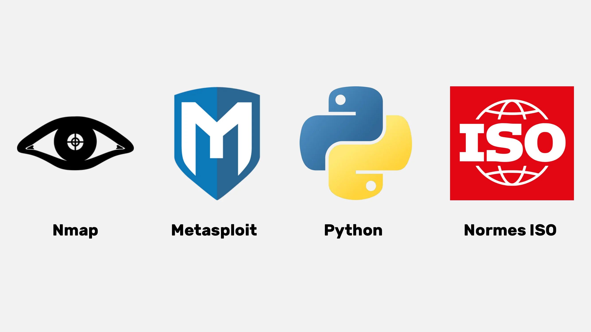

## Wawancara dengan Renaud

<chapterId>7d83fd98-ce22-514e-b9e8-729fbf71ee6e</chapterId>

### Manajemen Kata Sandi yang Efisien dan Penguatan Autentikasi: Pendekatan Akademis

Ada tiga dimensi utama yang perlu dipertimbangkan saat membahas pengelola kata sandi: pembuatan, pembaruan, dan implementasi kata sandi di situs web.

Secara umum, tidak disarankan untuk menggunakan ekstensi *browser* untuk pengisian kata sandi otomatis. Alat-alat ini dapat membuat pengguna lebih rentan terhadap serangan *phishing*. Renaud, seorang ahli keamanan siber yang diakui, lebih memilih pengelolaan manual menggunakan KeePass, yang melibatkan penyalinan dan penempelan kata sandi secara manual ke dalam aplikasi. Ekstensi cenderung meningkatkan permukaan serangan, dapat memperlambat kinerja *browser*, dan oleh karena itu menimbulkan risiko signifikan. Dengan demikian, meminimalkan penggunaan ekstensi pada *browser* adalah praktik yang direkomendasikan.

Pengelola kata sandi umumnya mendorong penggunaan faktor autentikasi tambahan, seperti autentikasi dua faktor (2FA). Untuk keamanan optimal, disarankan untuk menyimpan OTP (One-Time Passwords) di perangkat seluler Anda. AndOTP menyediakan solusi *open-source* untuk menghasilkan dan menyimpan kode OTP di perangkat seluler Anda. Meskipun Google Authenticator memungkinkan ekspor *seed code* autentikasi, kepercayaan terhadap cadangan di akun Google tetap terbatas. Oleh karena itu, aplikasi OTI dan AndOTP direkomendasikan untuk pengelolaan OTP yang mandiri.

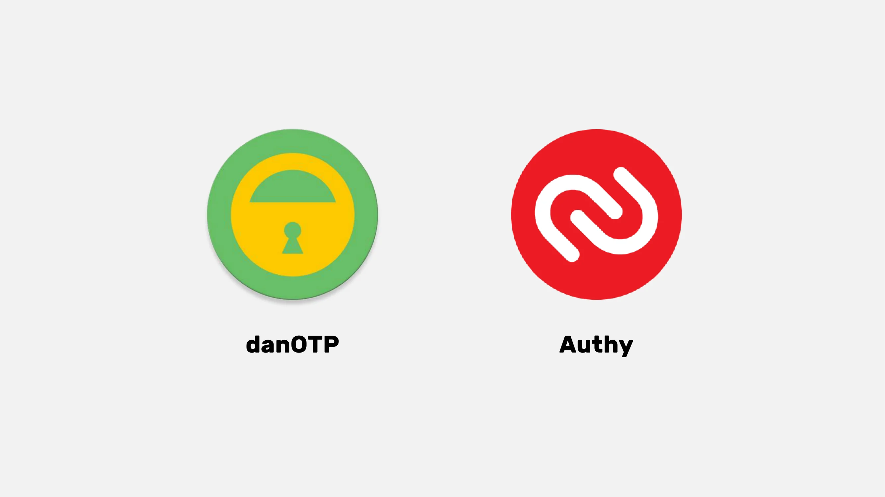

Isu warisan digital dan duka digital menyoroti pentingnya memiliki prosedur untuk mewariskan kata sandi setelah seseorang meninggal dunia. Pengelola kata sandi (password manager) memfasilitasi transisi ini dengan menyimpan semua rahasia digital di satu tempat dengan aman. Pengelola kata sandi juga memungkinkan Anda mengidentifikasi semua akun yang masih aktif dan mengelola penutupan atau pengalihannya. Disarankan untuk menuliskan kata sandi utama (master password) pada kertas, tetapi harus disimpan di lokasi yang tersembunyi dan aman. Jika *hard drive* dienkripsi dan komputer terkunci, kata sandi tersebut tidak akan dapat diakses, bahkan jika terjadi pencurian.

### Menuju Era Pasca-Kata Sandi: Menjelajahi Alternatif yang Kredibel

Kata sandi, meskipun sangat umum digunakan, memiliki beberapa kekurangan, termasuk risiko kebocoran selama proses autentikasi. Perusahaan-perusahaan terkemuka seperti Microsoft dan Apple menawarkan alternatif inovatif, termasuk biometrik dan token perangkat keras, yang menunjukkan tren progresif menuju penghapusan kata sandi.

Passkeys, misalnya, menawarkan kunci acak terenkripsi yang dikombinasikan dengan faktor lokal (seperti biometrik atau PIN). Kunci ini *di-hosting* oleh penyedia, tetapi tidak bisa diakses langsung oleh mereka. Meskipun ini membutuhkan pembaruan situs web, pendekatan ini menghilangkan kebutuhan akan kata sandi, sehingga memberikan tingkat keamanan yang tinggi tanpa batasan yang terkait dengan kata sandi tradisional atau masalah pengelolaan brankas digital.

Passkiz adalah alternatif lain yang layak dan aman untuk pengelolaan kata sandi. Namun, pertanyaan besar tetap ada: ketersediaan jika penyedia mengalami kegagalan. Oleh karena itu, akan sangat diharapkan bagi perusahaan raksasa internet untuk mengusulkan sistem yang menjamin ketersediaan ini.

Autentikasi langsung ke layanan yang relevan adalah opsi yang layak yang menghilangkan kebutuhan akan pihak ketiga. Namun, Single Sign-On (SSO) yang ditawarkan oleh perusahaan raksasa internet juga menimbulkan masalah dalam hal ketersediaan dan risiko sensor. Untuk mencegah kebocoran data, sangat penting untuk meminimalkan jumlah informasi yang dikumpulkan selama proses autentikasi.

### Keamanan komputer: hal yang wajib dilakukan untuk praktik aman dan risiko terkait kelalaian manusia

Keamanan komputer bisa terancam oleh praktik sederhana dan penggunaan kata sandi default, seperti "admin". Serangan canggih tidak selalu diperlukan untuk membahayakan keamanan komputer. Sebagai contoh, kata sandi administrator dari sebuah saluran YouTube pernah tertulis dalam kode sumber pribadi sebuah perusahaan. Kerentanan keamanan sering kali merupakan akibat dari kelalaian manusia.

Penting juga dicatat bahwa internet sangat terpusat dan sebagian besar berada di bawah kendali Amerika. Server DNS dapat menjadi sasaran sensor dan sering kali menggunakan DNS tipuan (deceptive DNS) untuk memblokir akses ke situs tertentu. DNS adalah protokol yang ketinggalan zaman dan tidak aman yang dapat menyebabkan masalah keamanan. Protokol baru, seperti DNSsec, telah muncul tetapi masih belum banyak digunakan. Untuk melewati sensor dan pemblokiran iklan, ada kemungkinan untuk memilih penyedia DNS alternatif. Alternatif untuk iklan yang mengganggu termasuk Google DNS, OpenDNS, dan layanan independen lainnya. Protokol DNS standar membuat kueri DNS terlihat oleh penyedia layanan internet. DoH (DNS over HTTPS) dan DoT (DNS over TLS) mengenkripsi koneksi DNS, memberikan privasi dan keamanan yang lebih baik. Protokol-protokol ini banyak digunakan di perusahaan karena keamanannya yang ditingkatkan dan didukung secara native oleh Windows, Android, dan iPhone. Untuk menggunakan DoH dan DoT, hostname TLS harus dimasukkan alih-alih alamat IP. Penyedia DoH dan DoT gratis tersedia secara online. DoH dan DoT meningkatkan privasi dan keamanan dengan menghindari serangan "man-in-the-middle".

Perlu juga disebutkan sistem yang disebut "Lightning authentication", yang menghasilkan pengenal (*identifier*) berbeda untuk setiap layanan, tanpa perlu memberikan alamat email atau informasi pribadi. Dimungkinkan untuk memiliki identitas terdesentralisasi yang dikendalikan pengguna, tetapi ada kurangnya standardisasi dan normalisasi dalam proyek identitas terdesentralisasi. Pengelola paket seperti NuGet dan Chocolatey, yang memungkinkan pengunduhan perangkat lunak *open-source* di luar *Microsoft Store*, direkomendasikan untuk menghindari serangan berbahaya. Singkatnya, DNS sangat penting untuk keamanan online; namun, sangat penting untuk tetap waspada terhadap potensi serangan pada server DNS.

# Bagian Akhir

<partId>3d8ac4c9-f05b-4133-a40a-6e19d579f05f</partId>

## Ulasan & Penilaian

<chapterId>6be74d2d-2116-5386-9d92-c4c3e2103c68</chapterId>
<isCourseReview>true</isCourseReview>

## Ujian Akhir

<chapterId>a894b251-a85a-5fa4-bf2a-c2a876939b49</chapterId>
<isCourseExam>true</isCourseExam>

## Kesimpulan

<chapterId>6270ea6b-7694-4ecf-b026-42878bfc318f</chapterId>
<isCourseConclusion>true</isCourseConclusion>
