# 데이터 보호를 위한 여정

디지털 보안을 위한 이 교육 프로그램에 오신 것을 환영합니다. 이 과정은 누구나 쉽게 접근할 수 있도록 설계되었으므로 컴퓨터 과학에 대한 사전 지식이 필요하지 않습니다. 디지털 세상을 보다 안전하고 안전하게 탐색하는 데 필요한 지식과 기술을 갖추게 하는 것이 주요 목표입니다.

여기에는 보안 이메일 서비스, 비밀번호 관리자, 온라인 보안을 강화하는 다양한 소프트웨어 등 여러 가지 도구를 구현하는 것이 포함됩니다.

이 과정에서는 여러분을 전문가, 익명 또는 무적의 존재로 만드는 것을 목표로 하지 않습니다. 대신, 온라인 습관을 바꾸고 디지털 주권을 되찾을 수 있는 간단하고 접근하기 쉬운 몇 가지 솔루션을 제공합니다.

기여자 팀:

뮤리엘; 디자인

로지 노리 & 파비안; 제작

테오; 기여

+++

# 소개

<partId>534ab66c-b0e6-5757-a7dd-6ea04647edf2</partId>

## 코스 개요

<chapterId>2f3d005d-8b49-5a3f-b90d-94c11f613407</chapterId>

:::video id=de7236a0-2985-41ef-86f7-3fa0b7f94531:::

**목표: 보안 기술을 업데이트하세요 !**

디지털 보안을 위한 이 교육 프로그램에 오신 것을 환영합니다. 이 과정은 누구나 쉽게 접근할 수 있도록 설계되었으므로 컴퓨터 과학에 대한 사전 지식이 필요하지 않습니다. 디지털 세상을 보다 안전하고 안전하게 탐색하는 데 필요한 지식과 기술을 갖추게 하는 것이 주요 목표입니다.

여기에는 보안 이메일 서비스, 비밀번호 관리자, 온라인 보안을 강화하는 다양한 소프트웨어 등 여러 가지 도구를 구현하는 것이 포함됩니다.

이 강좌는 세 명의 교수님이 공동 작업한 결과물입니다:

- 르노 리프치츠, 사이버 보안 전문가
- 테오 판타미스, 응용 수학 공학 박사
- Rogzy, Plan ₿ Academy 공동 창립자

점점 더 디지털화되는 세상에서 디지털 위생은 매우 중요합니다. 해킹과 대규모 감시가 지속적으로 증가하고 있지만, 지금이라도 첫 걸음을 내딛고 자신을 보호해도 늦지 않습니다.

이 과정에서는 여러분을 전문가, 익명 또는 무적의 존재로 만들려는 것이 아닙니다. 대신, 누구나 온라인 습관을 바꾸고 디지털 주권을 되찾을 수 있도록 간단하고 접근하기 쉬운 몇 가지 솔루션을 제공합니다.

이 주제에 대한 고급 기술을 찾고 계신다면 리소스, 튜토리얼 또는 기타 사이버 보안 강좌를 참조하세요. 그 동안 앞으로 몇 시간 동안 함께할 프로그램에 대한 간략한 개요를 소개합니다.

**섹션 1: 온라인 브라우징에 대해 알아야 할 모든 것**

- 1장 - 온라인 브라우징
- 2장 - 안전한 인터넷 사용

먼저 웹 브라우저 선택의 중요성과 관련 보안에 미치는 영향에 대해 설명하겠습니다. 그런 다음 브라우저의 세부 사항, 특히 쿠키 관리와 관련된 내용을 살펴보겠습니다. 또한 TOR와 같은 도구를 사용하여 보다 안전한 익명 브라우징 환경을 보장하는 방법도 살펴볼 것입니다. 그 후에는 데이터 보호를 강화하기 위한 VPN 사용에 초점을 맞출 것입니다. 마지막으로 안전한 와이파이 연결 사용을 위한 권장 사항으로 마무리하겠습니다.

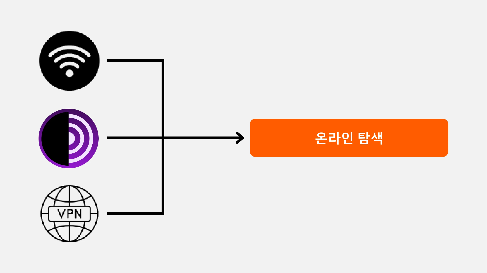

**섹션 2: 컴퓨터 사용 모범 사례**

- 3장 - 컴퓨터 사용
- 4장 - 해킹 및 백업 관리

이 섹션에서는 컴퓨터 보안의 세 가지 주요 영역을 다룹니다. 먼저 Mac, PC, Linux 등 다양한 운영 체제를 살펴보고 각 운영 체제의 특징과 강점을 강조합니다. 다음으로 해킹 시도로부터 효과적으로 보호하고 디바이스의 보안을 강화하는 방법을 살펴봅니다. 마지막으로, 데이터 손실이나 랜섬웨어를 방지하기 위해 정기적으로 데이터를 보호하고 백업하는 것의 중요성을 강조합니다.

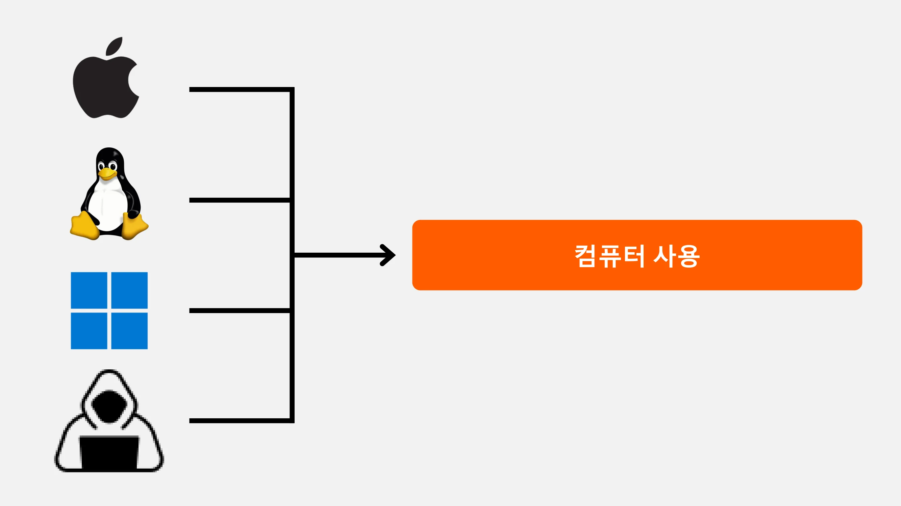

**섹션 3: 솔루션 구현**

- 6장 - 이메일 관리
- 7장 - 비밀번호 관리자
- 8장 - 2단계 인증

이 실용적인 세 번째 섹션에서는 구체적인 솔루션을 구현하는 단계로 넘어가겠습니다.

먼저, 커뮤니케이션에 필수적이면서도 해커의 표적이 되는 이메일 받은 편지함을 보호하는 방법을 살펴봅니다. 그런 다음, 비밀번호를 안전하게 유지하면서 비밀번호를 잊어버리거나 혼동하는 것을 방지하는 실용적인 솔루션인 비밀번호 관리자를 소개합니다. 마지막으로 계정에 추가적인 보안 조치인 2단계 인증에 대해 설명하여 계정의 보호 수준을 1단계 더 높일 수 있습니다. 모든 내용을 명확하고 알기 쉽게 설명해 드리겠습니다.

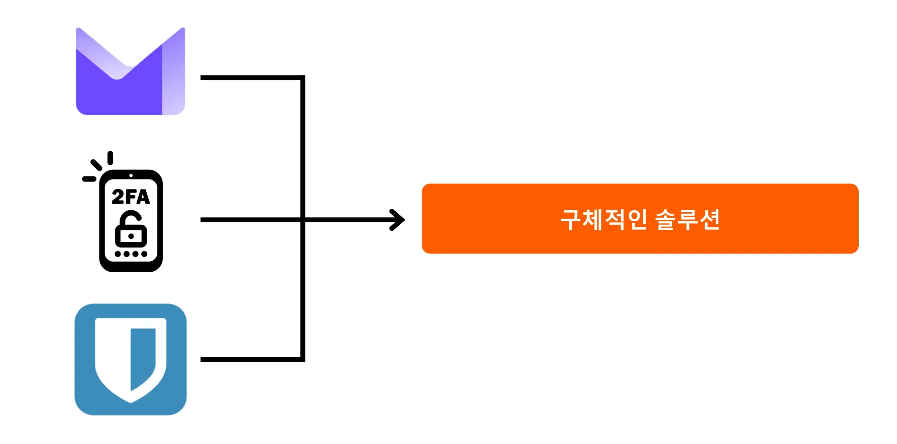

디지털 보안을 강화하고 데이터에 대한 통제권을 되찾을 준비가 되셨나요? 시작하세요!

# 온라인 브라우징에 대해 알아야 할 모든 것

<partId>b4b5379a-d8ef-59ae-94d3-a6e88959c149</partId>

## 온라인 검색

<chapterId>3a935da9-fa6e-57eb-bf85-7b3ec35e6ee2</chapterId>

:::video id=f1cead27-ed41-4ca2-afd2-b08a994d0119:::

인터넷을 검색할 때는 온라인 보안을 유지하기 위해 일반적인 실수를 피하는 것이 중요합니다. 다음은 이러한 실수를 피하기 위한 몇 가지 팁입니다:

### 소프트웨어 다운로드에 주의하세요:

일반 사이트가 아닌 퍼블리셔의 공식 웹사이트에서 소프트웨어를 다운로드하는 것이 좋습니다.

예: 예: www.logicieltelechargement.fr/signal 대신 www.signal.org/download 사용.

또한 오픈 소스 소프트웨어는 더 안전하고 악성 소프트웨어가 없는 경우가 많으므로 우선순위를 정하는 것이 좋습니다. '오픈 소스' 소프트웨어는 코드가 공개적으로 사용 가능하고 누구나 액세스할 수 있는 소프트웨어 유형입니다. 이를 통해 무엇보다도 데이터를 훔치기 위한 숨겨진 액세스가 없는지 확인할 수 있습니다.

> 보너스: 오픈소스 소프트웨어는 종종 무료입니다! 이 대학교는 100% 오픈소스이므로 GitHub에서 코드를 검토할 수도 있습니다.

### 쿠키 관리 오류 및 모범 사례

쿠키는 웹사이트가 사용자의 컴퓨터나 모바일 디바이스에 정보를 저장하기 위해 생성하는 파일입니다. 일부 사이트는 제대로 작동하기 위해 이러한 쿠키가 필요하지만, 타사 사이트에서는 특히 광고 추적 목적으로 쿠키를 악용할 수도 있습니다. GDPR과 같은 규정에 따라 타사 추적 쿠키는 거부할 수 있지만 사이트가 제대로 작동하는 데 필수적인 쿠키는 허용할 수 있으며, 이를 권장합니다. 사이트를 방문할 때마다 수동으로 또는 확장 프로그램이나 특정 프로그램을 통해 관련 쿠키를 삭제하는 것이 현명합니다. 일부 브라우저는 쿠키를 선택적으로 삭제할 수 있는 기능도 제공합니다. 이러한 예방 조치에도 불구하고 여러 사이트에서 수집한 정보가 서로 연결되어 있을 수 있으므로 편의성과 보안 사이의 균형을 찾는 것이 중요합니다.

> 참고: 또한 잠재적인 보안 및 성능 문제를 방지하기 위해 브라우저에 설치된 확장 프로그램의 수를 제한하세요.

### 웹 브라우저: 선택, 보안

브라우저는 크게 두 가지 제품군으로 나뉘는데, 크롬 기반 브라우저와 파이어폭스 기반 브라우저입니다.

두 제품군 모두 비슷한 수준의 보안을 제공하지만 추적 기능으로 인해 구글 크롬 브라우저는 사용하지 않는 것이 좋습니다. 크롬 대신 Chromium이나 Brave와 같은 더 가벼운 대체 브라우저를 사용하는 것이 좋습니다. 특히 광고 차단 기능이 내장된 Brave를 권장합니다. 특정 웹사이트에 액세스하기 위해 여러 브라우저를 사용해야 할 수도 있습니다.

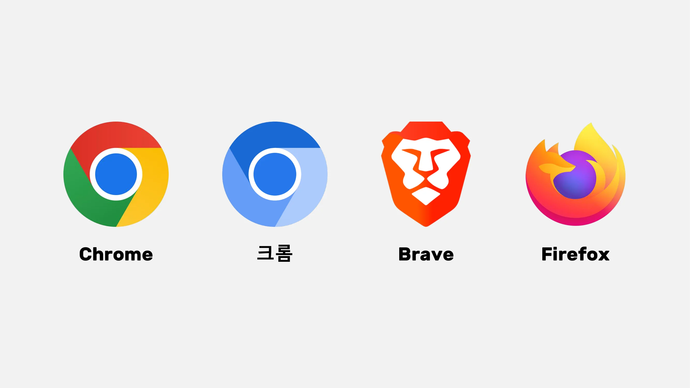

### 보다 안전한 익명 브라우징을 위한 비공개 브라우징, TOR 및 기타 대안

비공개 브라우징을 사용하면 인터넷 서비스 제공업체로부터 검색 기록을 숨기지는 않지만 컴퓨터에 로컬 흔적을 남기지 않을 수 있습니다. 쿠키는 각 세션이 끝날 때마다 자동으로 삭제되므로 추적되지 않고 모든 쿠키를 허용할 수 있습니다. 웹사이트가 사용자의 검색 습관을 추적하고 그에 따라 가격을 조정하기 때문에 온라인 서비스를 구매할 때 비공개 브라우징이 유용할 수 있습니다. 그러나 일반적인 인터넷 브라우징보다는 일시적이고 특정 세션에 비공개 브라우징을 사용하는 것이 좋습니다.

보다 진보된 대안으로는 사용자의 IP Address를 마스킹하고 다크넷에 대한 액세스를 허용하여 익명성을 제공하는 TOR(The Onion Router) 네트워크가 있습니다. TOR 브라우저는 TOR 네트워크를 사용하도록 특별히 설계된 브라우저입니다. 이 브라우저를 사용하면 일반 웹사이트와 일반적으로 개인이 운영하며 불법 활동과 관련이 있을 수 있는 .onion 웹사이트를 모두 방문할 수 있습니다.

TOR는 권위주의 국가에서 검열을 우회하려는 언론인, 자유 운동가 등이 합법적이고 널리 사용하는 도구입니다. 하지만 TOR는 방문한 사이트나 컴퓨터 자체를 보호하지 않는다는 점을 이해하는 것이 중요합니다. 또한 TOR를 사용하면 데이터가 목적지에 도달하기 전에 다른 사람의 컴퓨터 세 대를 통과하기 때문에 인터넷 연결 속도가 느려질 수 있습니다. 또한 TOR는 100% 익명성을 보장하는 완벽한 솔루션이 아니며 불법적인 활동에 사용해서는 안 된다는 점에 유의해야 합니다.

https://planb.academy/tutorials/computer-security/communication/tor-browser-a847e83c-31ef-4439-9eac-742b255129bb

## VPN 및 인터넷 연결

<chapterId>5aac83f4-a685-54b0-9759-d71bea7eeed2</chapterId>

:::video id=737d30ac-43d8-4a69-afda-89b9d7e8c4e1:::

### VPN

인터넷 연결을 보호하는 것은 온라인 보안의 중요한 측면이며, 가상 사설망(VPN)을 사용하는 것은 기업과 개인 사용자 모두에게 이러한 보안을 강화하는 효과적인 방법입니다.

VPN은 인터넷을 통해 전송되는 데이터를 암호화하여 연결을 더욱 안전하게 만드는 도구입니다. 전문적인 맥락에서 VPN은 직원들이 원격 위치에서 회사 내부 네트워크에 안전하게 액세스할 수 있게 해줍니다. 교환되는 데이터는 암호화되므로 제3자가 가로채기가 훨씬 더 어렵습니다. 내부 네트워크에 대한 액세스를 보호하는 것 외에도 VPN을 사용하면 사용자가 회사 내부 네트워크를 통해 인터넷 연결을 라우팅하여 회사에서 연결되는 것처럼 보이게 할 수 있습니다. 이는 지리적으로 제한된 온라인 서비스에 액세스할 때 특히 유용할 수 있습니다.

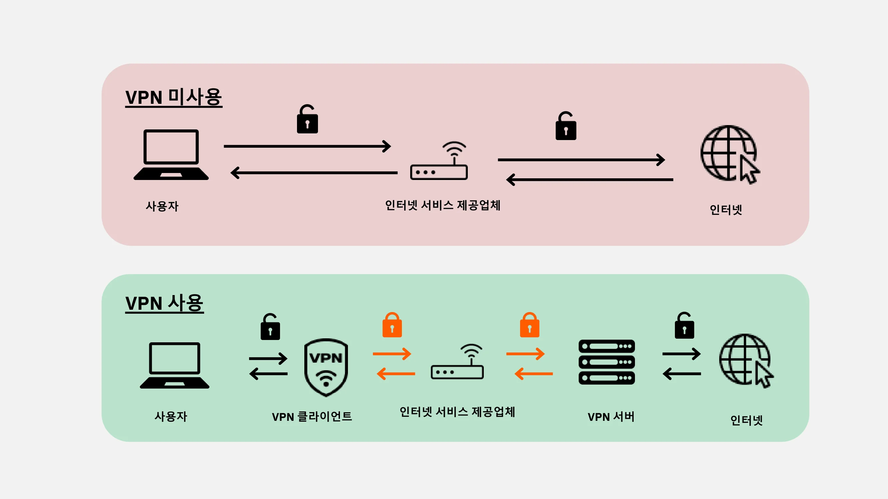

### VPN 유형

VPN에는 크게 두 가지 유형이 있습니다: 기업용 VPN과 Nordvpn과 같은 소비자 VPN. 엔터프라이즈 VPN은 더 비싸고 복잡한 경향이 있는 반면, 소비자 VPN은 일반적으로 더 접근하기 쉽고 사용자 친화적입니다. 예를 들어, NordVPN을 사용하면 다른 국가에 위치한 서버를 통해 인터넷에 연결할 수 있으므로 지리적 제한을 우회할 수 있습니다.

하지만 소비자 VPN을 사용한다고 해서 완전한 익명성이 보장되는 것은 아닙니다. 많은 VPN 제공업체가 사용자에 대한 정보를 보유하기 때문에 익명성이 손상될 수 있습니다. VPN은 온라인 보안을 개선하는 데 유용할 수 있지만, 만능 솔루션은 아닙니다. 지리적으로 제한된 서비스에 액세스하거나 여행 중 보안을 강화하는 등 특정 용도에 효과적이지만 완전한 보안을 보장하지는 않습니다. VPN을 선택할 때는 인기보다 안정성과 기술 전문성을 우선시하는 것이 중요합니다. 일반적으로 개인 정보를 가장 적게 수집하는 VPN 업체가 가장 안전합니다. IVPN 및 Mullvad와 같은 서비스는 개인 정보를 수집하지 않으며 개인 정보 보호를 강화하기 위해 Bitcoin 결제를 허용하기도 합니다.

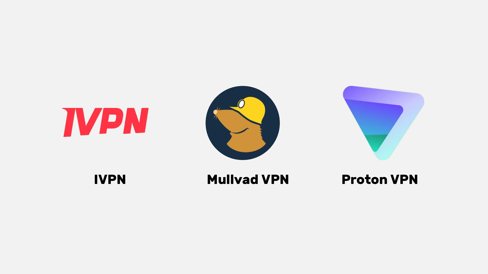

마지막으로, VPN은 온라인 광고를 차단하여 더욱 즐겁고 안전한 브라우징 경험을 제공하는 데도 사용할 수 있습니다. 하지만 자신의 필요에 가장 적합한 VPN을 찾기 위해 철저한 조사를 수행하는 것이 중요합니다. 집에서 인터넷을 브라우징할 때에도 보안을 강화하기 위해 VPN을 사용하는 것이 좋습니다. 이렇게 하면 온라인에서 주고받는 데이터를 더 높은 수준으로 보호할 수 있습니다. 마지막으로, Address 바의 URL과 작은 자물쇠를 확인하여 의도한 사이트에 있는지 확인해 주시겠어요?

https://planb.academy/tutorials/computer-security/communication/ivpn-5a0cd5df-29f1-4382-a817-975a96646e68

https://planb.academy/tutorials/computer-security/communication/mullvad-968ec5f5-b3f0-4d23-a9e0-c07a3e85aaa8

### HTTPS 및 공용 Wi-Fi 네트워크

온라인 보안 측면에서 4G가 일반적으로 공용 Wi-Fi보다 더 안전하다는 사실을 이해하는 것이 중요합니다. 하지만 4G를 사용하면 모바일 데이터 요금제가 빠르게 고갈될 수 있습니다. HTTPS 프로토콜은 웹사이트의 데이터를 암호화하는 표준이 되었습니다. 이는 사용자와 웹사이트 간에 교환되는 데이터가 안전하게 보호되도록 보장합니다. 따라서 방문하는 사이트가 HTTPS 프로토콜을 사용하는지 확인하는 것이 중요합니다. Address가 "https://"로 시작하는지 확인하거나 Address 표시줄에 자물쇠 기호가 표시되는지 확인하면 됩니다.

유럽 연합에서는 데이터 보호가 일반 데이터 보호 규정(GDPR)에 의해 규제됩니다. 따라서 사용자 연결 데이터를 재판매하지 않는 SNCF와 같은 유럽 Wi-Fi 액세스 포인트 제공업체를 이용하는 것이 더 안전합니다. 그러나 사이트에 자물쇠가 표시되어 있다는 사실만으로 사이트의 신뢰성을 보장할 수는 없습니다. 인증서 시스템을 사용하여 사이트의 공개 키를 확인하여 진위 여부를 확인하는 것이 중요합니다. 이를 위해 대부분의 브라우저에서 자물쇠 기호를 클릭하면 인증서에 대한 자세한 정보를 얻을 수 있습니다. 데이터 암호화는 제3자가 교환된 데이터를 가로채는 것을 방지하지만, 악의적인 개인이 사이트를 사칭하여 일반 텍스트로 데이터를 전송하는 것은 여전히 가능합니다.

온라인 사기를 피하려면 특히 확장자와 도메인 이름을 확인하여 탐색 중인 사이트의 신원을 확인하는 것이 중요합니다. 또한 사용자를 속이기 위해 URL에 유사한 문자를 사용하는 사기꾼을 경계하세요.

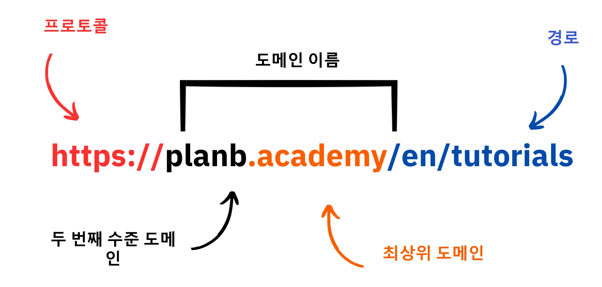

요약하자면, VPN을 사용하면 기업과 개인 사용자 모두의 온라인 보안을 크게 향상시킬 수 있습니다. 또한, 올바른 브라우징 습관을 실천하면 디지털 위생을 개선하는 데 기여할 수 있습니다. 다음 시간에는 업데이트, 바이러스 백신 소프트웨어, 비밀번호 관리 등 컴퓨터 보안에 대해 다루겠습니다.

# 컴퓨터 사용 모범 사례

<partId>e6eac20b-ba24-5d9a-8d86-8e0164074457</partId>

## 컴퓨터 사용

<chapterId>16745632-b56b-5423-9873-ddf70fdf1efd</chapterId>

:::video id=35892007-5ea5-4956-bf80-3363d69c96d5:::

컴퓨터 보안은 오늘날의 디지털 세상에서 가장 큰 관심사입니다. 오늘은 세 가지 핵심 사항을 Address로 정리해 보겠습니다:

- 컴퓨터 선택
- 최적의 보안을 위한 업데이트 및 바이러스 백신
- 컴퓨터와 데이터 보안을 위한 모범 사례.

### 컴퓨터 및 운영 체제 선택

컴퓨터 선택과 관련하여 구형 컴퓨터와 신형 컴퓨터의 보안에는 큰 차이가 없습니다. 그러나 Windows, Linux, Mac 등 운영 체제 간에는 보안 차이가 존재합니다.

Windows의 경우, 관리자 계정을 매일 사용하지 말고 관리자용 계정과 일상용 계정을 따로 만들어 사용하는 것이 좋습니다. Windows는 사용자 수가 많고 일반 사용자에서 관리자로 쉽게 전환할 수 있기 때문에 멀웨어에 더 취약한 경우가 많습니다. 반면 Linux와 Mac에서는 위협이 덜 일반적입니다.

운영 체제 선택은 사용자의 필요와 선호도에 따라 결정해야 합니다. Linux 시스템은 최근 몇 년 동안 크게 발전하여 점점 더 사용자 친화적으로 바뀌고 있습니다. 우분투는 사용하기 쉬운 그래픽 Interface을 갖춘 초보자를 위한 흥미로운 대안입니다. Windows를 유지하면서 Linux를 실험하기 위해 컴퓨터를 파티션할 수도 있지만 이는 복잡한 과정이 될 수 있습니다. 전용 컴퓨터, 가상 머신 또는 USB 키를 사용하여 Linux 또는 우분투를 테스트하는 것이 좋습니다.

### 소프트웨어 업데이트

업데이트와 관련하여 규칙은 간단합니다: **운영 체제와 애플리케이션을 정기적으로 업데이트하는 것은 필수입니다.**

Windows 10에서는 업데이트가 거의 지속적으로 이루어지므로 업데이트를 차단하거나 지연시키지 않는 것이 중요합니다. 매년 약 15,000개의 취약점이 발견되고 있어 멀웨어 및 기타 사이버 위협으로부터 보호하기 위해 소프트웨어를 최신 상태로 유지하는 것이 얼마나 중요한지 알 수 있습니다. 일반적으로 소프트웨어 지원은 출시 후 3년에서 5년 사이에 종료되므로 보안 업데이트의 혜택을 계속 누리려면 상위 버전으로 업그레이드해야 합니다.

이 규칙은 거의 모든 소프트웨어에 적용됩니다. 실제로 업데이트는 컴퓨터를 구식으로 만들거나 느리게 만드는 것이 아니라 새로운 위협으로부터 컴퓨터를 보호하기 위해 고안된 것입니다. 일부 업데이트는 주요 업데이트로 간주되기도 하며, 업데이트가 없으면 컴퓨터가 악용될 심각한 위험에 처하게 됩니다.

오류의 구체적인 예를 들자면, 업데이트할 수 없는 크랙 소프트웨어는 두 가지 잠재적 위협을 초래합니다. 의심스러운 웹사이트에서 불법으로 다운로드하는 과정에서 바이러스가 유입되고 새로운 형태의 공격에 안전하지 않게 사용될 수 있습니다.

### 안티 바이러스

- 바이러스 백신이 필요하신가요? 예
- 비용을 지불해야 하나요? 상황에 따라 다릅니다!

바이러스 백신의 선택과 실행은 중요합니다. Windows에 내장된 바이러스 백신인 Windows Defender는 안전하고 효과적인 솔루션입니다. 무료 솔루션의 경우 온라인에서 찾을 수 있는 많은 무료 솔루션보다 매우 훌륭하고 훨씬 낫습니다. 실제로 인터넷에서 바이러스 백신 소프트웨어를 다운로드할 때는 악의적이거나 오래된 것일 수 있으므로 주의해야 합니다.

유료 바이러스 백신에 투자하고 싶다면, 카스퍼스키와 같이 알려지지 않은 새로운 위협을 지능적으로 분석하는 바이러스 백신을 선택하는 것이 좋습니다. 바이러스 백신 업데이트는 새로운 위협으로부터 보호하는 데 매우 중요합니다.

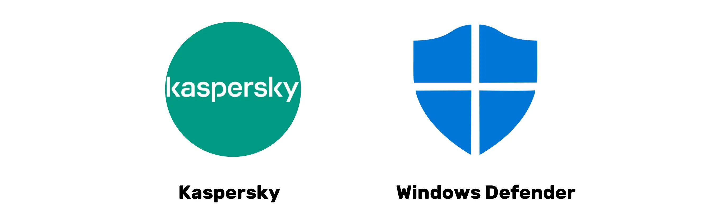

> 참고: Linux와 Mac은 사용자 권한 분리 시스템 덕분에 바이러스 백신이 필요하지 않은 경우가 많습니다.

마지막으로 컴퓨터와 데이터 보안을 위한 몇 가지 모범 사례를 소개합니다. 효과적이고 사용자 친화적인 백신을 선택하는 것이 중요합니다. 또한 알 수 없거나 의심스러운 USB 키를 삽입하지 않는 등의 모범 사례를 컴퓨터에 적용하는 것이 중요합니다. 이러한 USB 키에는 삽입 시 자동으로 실행될 수 있는 악성 프로그램이 포함되어 있을 수 있습니다. USB 키가 삽입된 후에는 확인해도 소용이 없습니다. 일부 회사에서는 주차장과 같이 접근하기 쉬운 곳에 부주의하게 USB 키를 방치하여 해킹 피해를 입은 사례도 있습니다.

컴퓨터를 집과 마찬가지로 취급하세요. 경계를 늦추지 말고, 정기적으로 소프트웨어를 업데이트하고, 불필요한 파일을 삭제하고, 강력한 비밀번호를 사용해 보안을 강화하세요. 노트북과 스마트폰의 데이터를 암호화하여 도난이나 데이터 손실을 방지하는 것이 중요합니다. Windows용 BitLocker, Linux용 LUKS, Mac용 기본 제공 옵션은 데이터 암호화를 위한 솔루션입니다. 주저하지 말고 데이터 암호화를 활성화하고 비밀번호는 종이에 적어 안전한 곳에 보관하는 것이 좋습니다.

결론적으로, 자신의 필요에 맞는 운영 체제를 선택하고 설치된 애플리케이션을 정기적으로 업데이트하는 것이 중요합니다. 또한 효과적이고 사용자 친화적인 바이러스 백신 프로그램을 사용하고 컴퓨터와 데이터를 보호하기 위해 올바른 보안 관행을 채택하는 것이 중요합니다.

## 해킹 및 백업 관리: 데이터 보호

<chapterId>9ddfcb6a-a253-5542-b7eb-df7222b46dc7</chapterId>

:::video id=c6a2c152-f1ae-492c-8993-304d64cdda45:::

### 해커는 어떻게 공격하나요?

자신을 효과적으로 보호하려면 해커가 컴퓨터에 침입하는 방법을 이해하는 것이 중요합니다. 실제로 바이러스는 마술처럼 나타나는 것이 아니라 의도하지 않았더라도 우리가 한 행동의 결과입니다.

일반적으로 바이러스는 컴퓨터가 바이러스를 집으로 초대하도록 허용했기 때문에 침입합니다. 이는 의심스러운 소프트웨어나 손상된 토렌트 파일을 다운로드하거나 사기성 이메일의 링크를 클릭함으로써 시각화할 수 있습니다.

### 피싱, 사기성 이메일에 대한 경계:

주의! 이메일은 첫 번째 공격 경로입니다. 다음은 몇 가지 팁입니다:

- 인증 정보 및 비밀번호와 같은 민감한 정보를 빼내려는 피싱 시도를 경계하세요. 의심스러운 링크를 클릭하거나 발신자의 적법성을 확인하지 않고 개인정보를 공유하지 마세요.
- 이메일 첨부 파일과 이미지에 주의하세요:

이메일 첨부파일과 이미지에는 멀웨어가 포함되어 있을 수 있습니다. 알 수 없거나 의심스러운 발신자가 보낸 첨부파일을 다운로드하거나 열지 말고 바이러스 백신 소프트웨어를 최신 버전으로 유지하세요.

여기서 가장 중요한 원칙은 발신자의 전체 이름과 이메일의 발신처를 꼼꼼히 확인하는 것입니다. 의심스러우면 삭제하세요!

### 랜섬웨어 및 사이버 공격의 유형:

랜섬웨어는 사용자 데이터를 암호화하고 이를 해독하기 위해 몸값을 요구하는 악성 소프트웨어의 일종입니다. 이러한 유형의 공격은 점점 더 일반화되고 있으며 기업과 개인 모두에게 매우 번거로운 문제가 될 수 있습니다. 자신을 보호하려면 가장 중요한 파일의 백업을 만드는 것이 필수적입니다! 이렇게 하면 랜섬웨어를 막을 수는 없지만 랜섬웨어를 무시할 수 있습니다.

중요한 데이터를 외부 저장 장치나 안전한 온라인 스토리지 서비스에 정기적으로 백업하세요. 이렇게 하면 사이버 공격이나 하드웨어 장애가 발생하더라도 중요한 정보를 잃지 않고 데이터를 복구할 수 있습니다.

간단한 솔루션:

- 외장형 Hard 드라이브를 구입하여 데이터를 복사합니다. 드라이브를 분리하여 집 안의 안전한 장소에 보관하세요. (이 작업을 두 번 반복하고 드라이브 중 하나를 다른 장소에 보관하면 잠재적인 화재로부터 보호할 수 있습니다.)

- 프로톤메일 드라이브, 동기화 또는 Google 드라이브를 사용하여 클라우드 백업을 만듭니다. 이 온라인 호스트에 중요한 데이터를 업로드합니다. 하지만 데이터가 인터넷에 공개되어 신뢰할 수 있는 제3자가 보관하고 있을 가능성이 있다는 점에 유의하세요.

### 해커에게 돈을 지불해야 하나요?

아니요, 일반적으로 랜섬웨어 또는 기타 유형의 공격의 경우 해커에게 돈을 지불하는 것은 권장하지 않습니다. 몸값을 지불한다고 해서 데이터 복구가 보장되는 것은 아니며 사이버 범죄자가 악의적인 활동을 계속하도록 부추길 수 있습니다. 대신 예방과 정기적인 데이터 백업을 우선시하여 스스로를 보호하세요.

컴퓨터에서 바이러스가 발견되면 인터넷 연결을 끊고 바이러스 백신 전체 검사를 수행한 후 감염된 파일을 삭제하세요. 그런 다음 소프트웨어와 운영 체제를 업데이트하고 비밀번호를 변경하여 추가 침입을 방지하세요.

https://planb.academy/tutorials/computer-security/data/proton-drive-03cbe49f-6ddc-491f-8786-bc20d98ebb16

https://planb.academy/tutorials/computer-security/data/veracrypt-d5ed4c83-7c1c-4181-95ea-963fdf2d83c5

# 솔루션 구현.

<partId>215ec902-ba05-5549-87fc-cb8d82665f7b</partId>

## 이메일 계정 관리

<chapterId>dfceea33-8712-5557-ace1-6ba5598d33d8</chapterId>

:::video id=75cc914d-9c11-4d3f-86a7-6faf2077f00f:::

### 새 이메일 계정 설정하기!

이메일 계정은 온라인 활동의 중심점으로, 이메일 계정이 유출되면 해커가 '비밀번호 찾기' 기능을 통해 모든 비밀번호를 재설정하고 다른 여러 사이트에 액세스하는 데 사용할 수 있습니다. 그렇기 때문에 제대로 보호해야 합니다.

이메일 계정은 고유하고 강력한 비밀번호(7장의 자세한 내용)와 2단계 인증 시스템(8장의 자세한 내용)을 사용하여 만들어야 합니다.

우리 모두는 이미 이메일 계정을 가지고 있지만, 새로 시작하려면 보다 최신의 새 계정을 만드는 것을 고려해야 합니다.

### 이메일 제공업체 선택 및 이메일 주소 관리하기

이메일 주소의 적절한 관리는 온라인 액세스의 보안을 보장하는 데 매우 중요합니다. 안전하고 개인정보를 존중하는 이메일 제공업체를 선택하는 것이 중요합니다. 예를 들어, ProtonMail은 안전하고 개인정보를 존중하는 이메일 서비스입니다.

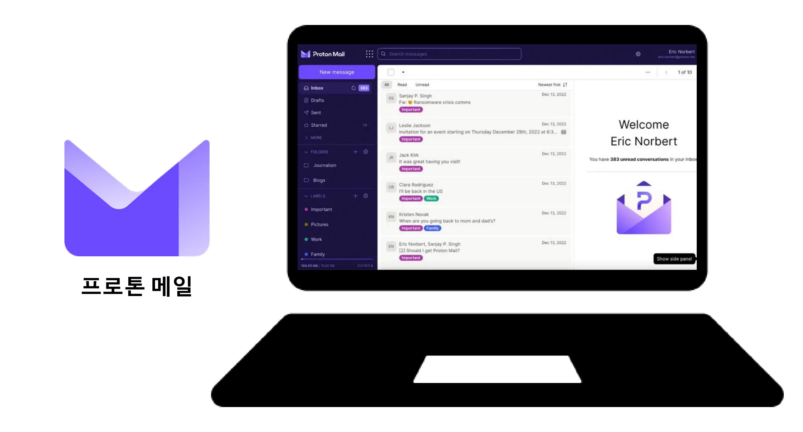

이메일 제공업체를 선택하고 비밀번호를 만들 때 다른 온라인 서비스에 동일한 비밀번호를 재사용하지 않는 것이 중요합니다. 정기적으로 새 이메일 주소를 생성하여 다양한 용도로 사용하는 것이 좋습니다. 중요한 계정에는 보안 이메일 서비스를 사용하는 것이 좋습니다. 또한 일부 서비스는 비밀번호 길이를 제한하고 있으므로 이러한 제한 사항을 숙지하는 것이 중요합니다. 기간이 제한된 계정에 사용할 수 있는 임시 이메일 주소를 만드는 서비스도 있습니다.

참고로 라 포스트, 아로베이스, 위그, 핫메일과 같은 오래된 이메일 제공업체도 여전히 사용 중이지만 보안 방식이 Gmail만큼 강력하지 않을 수 있습니다. 따라서 일반 커뮤니케이션용 이메일 주소와 계정 복구용 이메일 주소를 별도로 사용하는 것이 좋으며, 후자가 더 안전합니다. Address 이메일과 통신사 또는 인터넷 서비스 제공업체의 이메일을 혼용하면 공격 경로가 될 수 있으므로 이를 피하는 것이 가장 좋습니다.

### 이메일 계정을 변경해야 하나요?

이메일 Address이 유출되었는지 확인하고 향후 데이터 유출에 대한 알림을 받으려면 Have I Been Pwned 웹사이트(https://haveibeenpwned.com/)를 이용하세요. 해커는 해킹된 데이터베이스를 악용하여 피싱 이메일을 보내거나 유출된 비밀번호를 재사용할 수 있습니다.

일반적으로 더 안전한 새 이메일 Address을 사용하는 것은 나쁜 습관이 아니며, 건강하게 새로 시작하려는 경우에도 필요합니다.

보너스 Bitcoin: Exchange 계정을 만드는 것과 같이 Bitcoin 활동을 위한 특정 이메일 Address을 만들어 생활에서 이러한 활동 영역을 실제로 분리하는 것이 좋습니다.

https://planb.academy/tutorials/computer-security/communication/proton-mail-c3b010ce-254d-4546-b382-19ab9261c6a2

## 비밀번호 관리자

<chapterId>0b3c69b2-522c-56c8-9fb8-1562bd55930f</chapterId>

:::video id=106b6f17-a5c1-4155-abdf-043ce469d45b:::

### 비밀번호 관리자란 무엇인가요?

비밀번호 관리자는 다양한 온라인 계정의 비밀번호를 저장하고 관리할 수 있는 도구입니다. 여러 개의 비밀번호를 기억하는 대신 마스터 비밀번호 하나만 있으면 다른 모든 계정에 액세스할 수 있습니다.

비밀번호 관리자를 사용하면 더 이상 비밀번호를 잊어버리거나 어딘가에 적어둘 염려가 없습니다. 마스터 비밀번호 하나만 기억하면 됩니다. 또한, 대부분의 도구는 강력한 비밀번호를 생성하여 계정의 보안을 강화합니다.

### 일부 인기 매니저의 차이점:

- LastPass: 가장 인기 있는 관리자 중 하나입니다. 타사 서비스이므로 비밀번호가 타사 서버에 저장됩니다. 무료 버전과 유료 버전을 모두 제공하며, 사용자 친화적인 Interface이 특징입니다.

- Dashlane: 또한 타사 서비스로, 직관적인 Interface과 신용카드 정보 추적 및 보안 메모와 같은 추가 기능을 갖추고 있습니다.

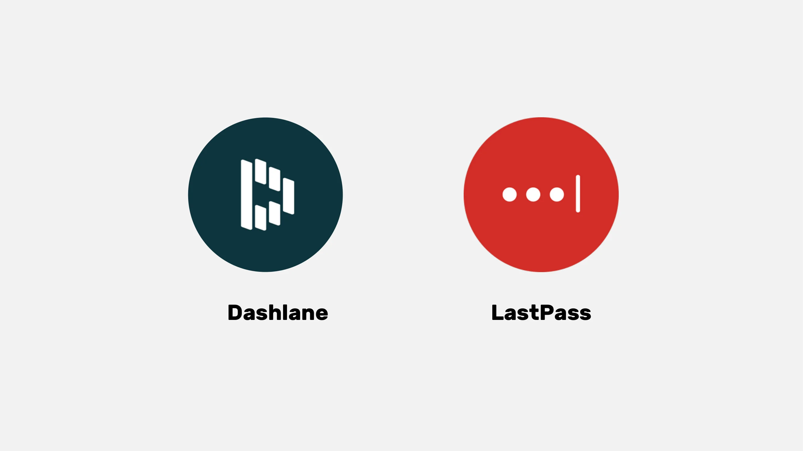

### 셀프 호스팅으로 제어력을 강화하세요:

- 비트워든: 오픈 소스 도구이므로 코드를 검토하여 보안을 확인할 수 있습니다. Bitwarden은 호스팅 서비스를 제공하지만 사용자가 직접 호스팅할 수도 있으므로 비밀번호가 저장되는 위치를 제어할 수 있어 잠재적으로 더 강력한 보안과 제어 기능을 제공할 수 있습니다.

- KeePass: 주로 자체 호스팅을 위한 오픈 소스 솔루션입니다. 기본적으로 데이터는 로컬에 저장되지만 원하는 경우 다른 방법을 사용해 비밀번호 데이터베이스를 동기화할 수 있습니다. 초보자에게는 다소 덜 사용자 친화적일 수 있지만 KeePass는 보안과 유연성으로 널리 인정받고 있습니다.

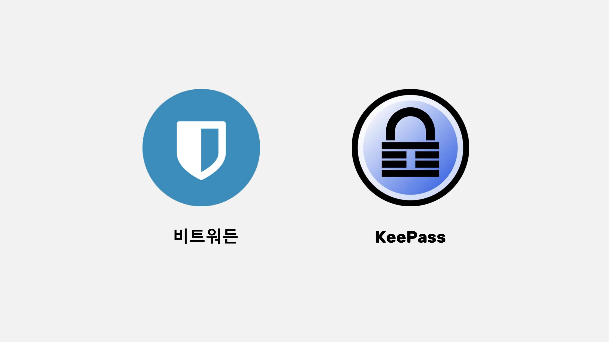

KeePass와 같은 자체 호스팅 솔루션의 경우, 중앙 집중식 타사 서비스를 사용하지 않고도 여러 디바이스 간에 데이터베이스를 동기화할 수 있습니다. **동기화**와 같은 도구를 사용하면 디바이스 간에 직접 암호화되고 분산된 동기화가 가능합니다. 이 접근 방식은 모든 기기에서 데이터의 가용성을 보장하면서 데이터를 통제할 수 있게 해줍니다.

(참고: 타사 서비스 또는 셀프 호스팅 서비스 중 하나를 선택하는 것은 기술 수준과 제어와 편의성 중 어느 쪽에 우선순위를 두느냐에 따라 달라집니다. 타사 서비스는 일반적으로 대부분의 사람들에게 더 편리한 반면, 셀프 호스팅은 더 많은 기술 지식이 필요하지만 보안 측면에서 더 많은 통제권과 안심할 수 있습니다.)

### 좋은 비밀번호의 조건

일반적으로 좋은 비밀번호는 다음과 같습니다:

- 길이: 12자 이상.
- 복합: 대문자와 소문자, 숫자, 기호가 혼합된 형태입니다.
- 고유: 다른 계정에 동일한 비밀번호를 재사용하지 마세요.
- 개인 정보를 기반으로 하지 않음: 생년월일, 이름 등을 피하세요.

계정의 보안을 유지하려면 강력하고 안전한 비밀번호를 만드는 것이 중요합니다. 비밀번호의 길이만으로는 보안을 보장할 수 없습니다. 무차별 암호 대입 공격에 저항하려면 문자는 완전히 무작위로 만들어야 합니다. 가장 가능성이 높은 조합을 피하려면 이벤트의 독립성도 중요합니다. '비밀번호'와 같은 일반적인 비밀번호는 쉽게 해킹당할 수 있습니다.

강력한 비밀번호를 만들려면 예측 가능한 단어나 패턴을 사용하지 않고 무작위 문자를 많이 사용하는 것이 좋습니다. 또한 숫자와 특수 문자를 포함하는 것이 필수적입니다. 그러나 일부 웹사이트에서는 특정 특수 문자의 사용을 제한할 수 있다는 점에 유의하세요. 무작위로 생성되지 않은 비밀번호는 쉽게 추측할 수 있습니다. 비밀번호를 변형하거나 추가하는 것은 안전하지 않습니다. 웹사이트는 사용자가 선택한 비밀번호의 보안을 보장할 수 없습니다.

무작위로 생성된 비밀번호는 기억하기는 더 어려울 수 있지만 더 높은 수준의 보안을 제공합니다. 비밀번호 관리자는 더 안전한 무작위 비밀번호를 개발할 수 있습니다. 비밀번호 관리자를 사용하면 모든 비밀번호를 외울 필요가 없습니다. 기존 비밀번호는 관리자가 생성한 비밀번호가 더 강력하고 안전하므로 점차적으로 비밀번호 관리자가 생성한 비밀번호로 교체하는 것이 중요합니다. 비밀번호 관리자의 마스터 비밀번호도 강력하고 안전한지 확인하세요.

https://planb.academy/tutorials/computer-security/authentication/bitwarden-0532f569-fb00-4fad-acba-2fcb1bf05de9

https://planb.academy/tutorials/computer-security/authentication/keepass-f8073bb7-5b4a-4664-9246-228e307be246

## 2단계 인증

<chapterId>9391e02e-e61b-5a86-93e0-91a07f217d35</chapterId>

:::video id=10fede6f-c839-4455-b324-e887c502667e:::

### 2FA를 구현해야 하는 이유

2단계 인증(2FA)은 온라인 계정에 액세스하려는 사람이 본인이 맞는지 확인하는 추가적인 Layer 보안 조치입니다. 2FA는 사용자 이름과 비밀번호만 입력하는 대신 추가적인 인증 수단을 요구합니다.

두 번째 단계는 다음과 같습니다:

- SMS를 통해 전송되는 임시 코드입니다.
- Google 인증기 또는 Authy와 같은 애플리케이션에서 생성한 코드입니다.
- 컴퓨터에 삽입하는 물리적 보안 키입니다.

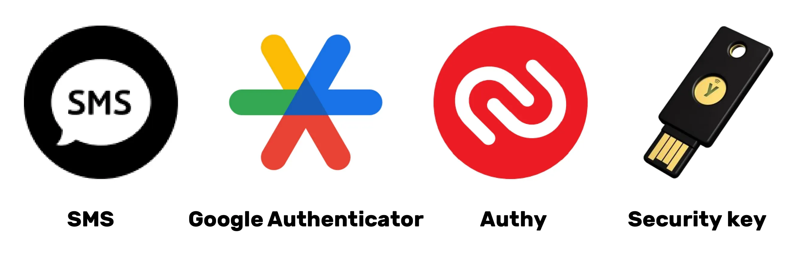

2FA를 사용하면 해커가 비밀번호를 알아내더라도 이 두 번째 인증 요소가 없으면 계정에 액세스할 수 없습니다. 따라서 2FA는 무단 액세스로부터 온라인 계정을 보호하는 데 필수적인 요소입니다.

### 어떤 옵션을 선택해야 하나요?

강력한 인증을 위한 다양한 옵션은 다양한 수준의 보안을 제공합니다.

- SMS는 전화번호를 보유하고 있다는 증거만 제공하기 때문에 최상의 옵션으로 간주되지 않습니다.
- 2단계 인증(2FA)은 지식, 소지품, 신분증 등 여러 유형의 증거를 사용하기 때문에 더 안전합니다. 일회용 비밀번호(HOTP 및 TOTP)는 암호화 계산이 필요하고 디바이스에서 로컬로 생성되는 반면 SMS는 가로챌 수 있기 때문에 SMS보다 안전합니다.
- USB 키 또는 스마트 카드와 같은 하드웨어 토큰은 각 사이트마다 고유한 개인 키를 생성하고 연결을 허용하기 전에 URL을 확인하여 최적의 보안을 제공합니다.

강력한 인증으로 최적의 보안을 유지하려면 보안 이메일 Address, 보안 비밀번호 관리자를 사용하고 YubiKey를 사용한 2FA를 채택하는 것이 좋습니다. 또한 분실이나 도난에 대비하여 두 개의 YubiKey를 구입하여 집과 개인 소유의 백업 사본을 보관하는 것이 좋습니다.

SIM 2FA에 대한 잠재적 위협의 일반적인 예로는 공격자가 사용자의 전화번호를 공격자가 제어하는 SIM 카드에 연결하여 도용하는 SIM 스왑 공격이 있으며, 공격자가 공격을 완료하는 방법에는 여러 가지가 있지만 일반적으로 이 위협은 유명인이나 관심 대상자에게만 주요 관심사입니다.

생체 인식을 대체 수단으로 사용할 수 있지만 지식과 소지품의 조합보다 보안성이 떨어집니다. 생체 인식 데이터는 인증 장치에 저장하고 온라인에 공개하지 않아야 합니다. 다양한 인증 방법과 관련된 위협 모델을 고려하고 그에 따라 관행을 조정하는 것이 중요합니다.

마지막으로 HOTP와 TOTP OTP에 대해 간략히 설명하면 도움이 될 것입니다. HOTP는 HMAC(Hash 기반 메시지 인증 코드) 알고리즘을 기반으로 하는 일회용 비밀번호이고, TOTP는 시간 기반 OTP입니다. 이러한 알고리즘의 주요 특징은 비밀번호는 한 번만 사용할 수 있고, 생성된 각 값은 고유하며, 사용자 디바이스(클라이언트)와 인증 서비스(서버) 간에 공유 키가 존재한다는 것입니다. 두 시스템의 주요 차이점은 요소 생성 방식에 있습니다. TOTP는 시간 기반인 반면, HOTP 시스템은 카운터 기반입니다.

### 강좌를 마무리합니다:

아시다시피, 좋은 디지털 위생을 구현하는 것이 반드시 간단한 것은 아니지만, 여전히 접근 가능한 방법입니다!

- 새 보안 이메일 Address 만들기.
- 비밀번호 관리자 설정하기.
- 2FA 활성화하기.
- 기존 비밀번호를 점차적으로 2단계 인증을 통한 강력한 비밀번호로 교체하고 있습니다.

계속 학습하고 점진적으로 모범 사례를 구현하세요!

황금률: 사이버 보안은 학습 여정에 따라 변화하는 목표입니다!

https://planb.academy/tutorials/computer-security/authentication/authy-a76ab26b-71b0-473c-aa7c-c49153705eb7

https://planb.academy/tutorials/computer-security/authentication/security-key-61438267-74db-4f1a-87e4-97c8e673533e

# 실무 섹션

<partId>98ccf14b-4053-5839-878c-7a73ff02eb95</partId>

## 사서함 설정

<chapterId>afc9ab5d-7664-5a9b-ab50-225ac9ba8f7c</chapterId>

이메일 계정을 보호하는 것은 온라인 활동을 보호하고 데이터를 보호하는 데 있어 매우 중요한 단계입니다. 이 튜토리얼에서는 통신의 종단 간 암호화를 제공하는 높은 수준의 보안으로 잘 알려진 ProtonMail 계정을 만들고 설정하는 방법을 단계별로 안내합니다. 초보자이든 숙련된 사용자이든 여기에 제시된 모범 사례는 이메일의 보안을 강화하는 동시에 ProtonMail의 고급 기능을 활용하는 데 도움이 될 것입니다:

https://planb.academy/tutorials/computer-security/communication/proton-mail-c3b010ce-254d-4546-b382-19ab9261c6a2

## 2FA로 보호

<chapterId>09468ec1-95b7-56a4-a636-7618044568e1</chapterId>

2단계 인증(2FA)은 온라인 계정을 보호하는 데 필수적인 요소가 되었습니다. 이 튜토리얼에서는 계정을 보호하기 위해 동적 6자리 코드를 생성하는 2단계 인증 앱 Authy를 설정하고 사용하는 방법을 알아보세요. Authy는 사용이 매우 간편하고 여러 디바이스에서 동기화됩니다. 지금 바로 Authy를 설치하고 구성하여 온라인 계정의 보안을 강화하는 방법을 알아보세요:

https://planb.academy/tutorials/computer-security/authentication/authy-a76ab26b-71b0-473c-aa7c-c49153705eb7

또 다른 옵션은 물리적 보안 키를 사용하는 것입니다. 이 추가 튜토리얼에서는 보안 키를 두 번째 인증 요소로 설정하고 사용하는 방법을 설명합니다:

https://planb.academy/tutorials/computer-security/authentication/security-key-61438267-74db-4f1a-87e4-97c8e673533e

## 비밀번호 관리자 만들기

<chapterId>ed579680-4e7b-5f65-8541-14e519a3b242</chapterId>

비밀번호 관리는 디지털 시대의 과제입니다. 우리 모두는 보호해야 할 수많은 온라인 계정을 가지고 있습니다. 비밀번호 관리자는 각 계정에 대해 강력하고 고유한 비밀번호를 생성하고 저장하는 데 도움이 됩니다.

이 튜토리얼에서는 오픈 소스 비밀번호 관리 프로그램인 Bitwarden을 설정하는 방법과 모든 장치에서 자격 증명을 동기화하여 일상적인 사용을 간소화하는 방법에 대해 알아보세요:

https://planb.academy/tutorials/computer-security/authentication/bitwarden-0532f569-fb00-4fad-acba-2fcb1bf05de9

고급 사용자를 위해 로컬에서 비밀번호 관리에 사용할 수 있는 또 다른 무료 오픈 소스 소프트웨어에 대한 튜토리얼도 제공합니다:

https://planb.academy/tutorials/computer-security/authentication/keepass-f8073bb7-5b4a-4664-9246-228e307be246

## 계정 보안

<chapterId>7a774b34-aed0-57dd-b8f7-cf3be51c0d70</chapterId>

이 두 튜토리얼에서는 온라인 계정을 보호하는 방법을 안내하고, 매일 비밀번호를 관리할 때 보다 안전한 방법을 점진적으로 채택하는 방법을 설명합니다.

https://planb.academy/tutorials/computer-security/authentication/bitwarden-0532f569-fb00-4fad-acba-2fcb1bf05de9

https://planb.academy/tutorials/computer-security/authentication/keepass-f8073bb7-5b4a-4664-9246-228e307be246

## 브라우저 및 VPN 변경

<chapterId>8dc08feb-313c-5259-a54f-64aa68a07608</chapterId>

온라인 개인 정보를 보호하는 것도 보안을 보장하는 중요한 포인트입니다. 이를 위한 첫 번째 해결책으로 VPN을 사용할 수 있습니다.

Bitcoin 결제를 허용하는 두 가지 신뢰할 수 있는 VPN 솔루션, 즉 IVPN과 Mullvad를 살펴보는 것을 추천합니다. 이 튜토리얼은 모든 기기에서 Mullvad 또는 IVPN을 설치, 구성 및 사용하는 방법을 안내합니다:

https://planb.academy/tutorials/computer-security/communication/ivpn-5a0cd5df-29f1-4382-a817-975a96646e68

https://planb.academy/tutorials/computer-security/communication/mullvad-968ec5f5-b3f0-4d23-a9e0-c07a3e85aaa8

또한, 온라인 개인 정보 보호를 위해 특별히 설계된 브라우저인 토르 브라우저를 사용하는 방법을 알아보세요:

https://planb.academy/tutorials/computer-security/communication/tor-browser-a847e83c-31ef-4439-9eac-742b255129bb

## 백업 설정

<chapterId>01cfcde1-77cb-506c-8df1-fa18a2e8cc6b</chapterId>

파일을 보호하는 것도 중요한 포인트입니다. 이 튜토리얼에서는 프로톤 드라이브를 사용해 효과적인 백업 전략을 구현하는 방법을 보여드립니다. 이 안전한 클라우드 솔루션을 사용해 3-2-1 방식을 적용하는 방법을 알아보세요. 데이터 사본을 두 개의 다른 미디어에 세 개, 한 개는 오프사이트에 복사하는 방식입니다. 이렇게 하면 중요한 파일에 대한 접근성과 보안을 보장할 수 있습니다:

https://planb.academy/tutorials/computer-security/data/proton-drive-03cbe49f-6ddc-491f-8786-bc20d98ebb16

또한 USB 드라이브나 외장형 Hard 드라이브와 같은 이동식 미디어에 저장된 파일을 보호하기 위해 VeraCrypt를 사용하여 이러한 미디어를 쉽게 암호화하고 해독하는 방법도 알려드립니다:

https://planb.academy/tutorials/computer-security/data/veracrypt-d5ed4c83-7c1c-4181-95ea-963fdf2d83c5

# 더 알아보기

<partId>77113cad-a6d8-57e5-b903-50c223b277ba</partId>

## 사이버 보안 업계에서 일하는 방법

<chapterId>aad1ae27-4280-5b07-b9ab-118ae013951a</chapterId>

:::video id=4c818b5c-ea5d-496a-8e82-bc5d96d91430:::

### 사이버 보안: 무한한 기회가 있는 성장하는 분야: 사이버 보안

시스템과 데이터를 보호하는 데 열정이 있다면 사이버 보안 분야는 수많은 기회를 제공합니다. 이 업계에 관심이 있으신 분들을 위해 몇 가지 주요 단계를 안내해 드립니다.

### 학업 기반 및 인증:

컴퓨터 과학, 정보 시스템 또는 관련 분야의 탄탄한 교육이 이상적인 출발점인 경우가 많습니다. 이러한 연구는 사이버 보안의 기술적 과제를 이해하는 데 필요한 기초를 제공합니다. 이러한 교육을 보완하기 위해 해당 분야에서 공인된 자격증을 취득하는 것이 현명합니다. 이러한 자격증은 지역마다 다를 수 있지만, CISSP 또는 CEH와 같은 일부 자격증은 전 세계적으로 인정받고 있습니다.

사이버 보안은 방대하고 끊임없이 진화하는 분야입니다. 따라서 필수 도구와 다양한 시스템을 숙지하는 것이 중요합니다. 또한 사고 대응부터 윤리적 해킹에 이르기까지 수많은 하위 도메인이 있으므로 틈새 시장을 파악하고 이를 전문적으로 다루는 것이 유리합니다.

### 실무 경험 쌓기:

실무 경험의 중요성은 과소평가할 수 없습니다. 사이버 보안 팀이 있는 회사에서 인턴십이나 주니어 직책을 구하는 것은 이론적 지식을 적용하고 실무 경험을 쌓을 수 있는 훌륭한 방법입니다. 또한 윤리적 해킹 대회나 사이버 보안 시뮬레이션에 참여하면 실제 상황에서 기술을 연마할 수 있습니다.

전문가 네트워크의 힘은 매우 중요합니다. 전문 협회, 해커스페이스 또는 온라인 포럼에 가입하면 다른 전문가들과 함께 Exchange 아이디어를 공유할 수 있는 플랫폼이 제공됩니다. 마찬가지로 사이버 보안 컨퍼런스 및 워크샵에 참석하면 배울 수 있을 뿐만 아니라 업계 전문가들과 인맥을 쌓을 수 있습니다.

위협이 끊임없이 진화하기 때문에 뉴스와 전문 포럼을 정기적으로 모니터링해야 합니다. 신뢰가 가장 중요한 업계에서는 경력의 모든 단계에서 윤리와 정직성을 가지고 행동하는 것이 필수적입니다.

### 심화할 기술 및 도구:

- 사이버 보안 도구: 와이어샤크, 메타스플로잇, Nmap.
- 운영 체제: Linux, Windows, MacOS.
- 프로그래밍 언어: Python, C, Java.
- 네트워크: TCP/IP, VPN, 방화벽.
- 데이터베이스: SQL, NoSQL.
- 암호화: SSL/TLS, 대칭 및 비대칭 암호화.
- 인시던트 관리: 로그 분석, 인시던트 대응.
- 윤리적 해킹: 모의 침투 테스트 기법 및 침입 테스트.
- 거버넌스: ISO 표준, GDPR 및 CCPA 규정.

이러한 기술과 도구를 숙지하면 사이버 보안의 세계를 성공적으로 탐색할 수 있는 역량을 갖추게 됩니다.

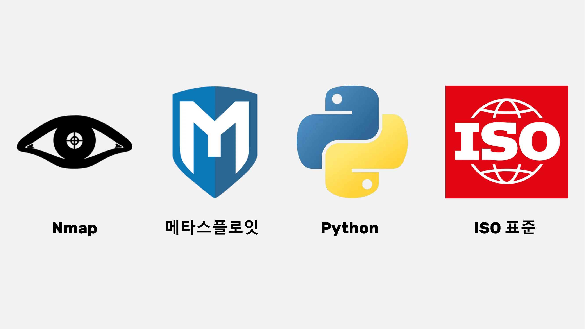

## 르노와의 인터뷰

<chapterId>7d83fd98-ce22-514e-b9e8-729fbf71ee6e</chapterId>

:::video id=ec7014aa-5ebe-444c-80d1-7b14f1fe7bb8:::

### 효율적인 비밀번호 관리 및 인증 강화: 학문적 접근 방식

비밀번호 관리자에 대해 이야기할 때 고려해야 할 세 가지 핵심 요소는 웹사이트에서의 비밀번호 생성, 업데이트, 구현입니다.

일반적으로 비밀번호 자동 입력에 브라우저 확장 프로그램을 사용하지 않는 것이 좋습니다. 이러한 도구는 사용자를 피싱 공격에 더 취약하게 만들 수 있습니다. 사이버 보안 전문가로 인정받는 르노는 비밀번호를 수동으로 복사하여 애플리케이션에 붙여넣는 KeePass를 사용한 수동 관리를 선호합니다. 확장 프로그램은 공격 표면을 늘리고 브라우저 성능을 저하시킬 수 있으므로 상당한 위험을 초래할 수 있습니다. 따라서 브라우저에서 확장 프로그램 사용을 최소화하는 것이 좋습니다.

비밀번호 관리자는 일반적으로 2단계 인증과 같은 추가 인증 요소의 사용을 권장합니다. 최적의 보안을 위해 모바일 디바이스에 OTP(일회용 비밀번호)를 보관하는 것이 좋습니다. AndOTP는 모바일 디바이스에서 일회용 비밀번호(OTP) 코드를 생성하고 저장할 수 있는 오픈 소스 솔루션을 제공합니다. Google 인증기를 사용하면 인증 코드 시드를 내보낼 수 있지만, Google 계정의 백업에 대한 신뢰는 여전히 제한적입니다. 따라서 자율적인 OTP 관리를 위해서는 OTI 및 AndoTP 애플리케이션을 사용하는 것이 좋습니다.

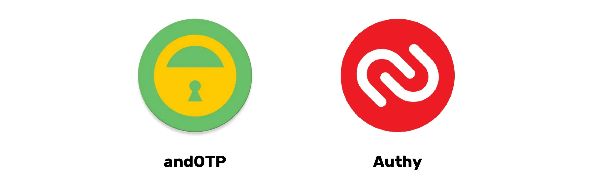

디지털 상속과 디지털 애도의 문제는 사람이 사망한 후 비밀번호를 전송하는 절차를 마련하는 것의 중요성을 강조합니다. 비밀번호 관리자는 모든 디지털 비밀을 한 곳에 안전하게 저장하여 이러한 전환을 용이하게 합니다. 또한 비밀번호 관리자를 사용하면 모든 개설된 계정을 식별하고 폐쇄 또는 이전을 관리할 수 있습니다. 마스터 비밀번호는 종이에 적어두는 것이 좋지만, 잘 보이지 않는 안전한 곳에 보관하는 것이 좋습니다. Hard 드라이브가 암호화되어 있고 컴퓨터가 잠겨 있으면 도난을 당하더라도 비밀번호에 액세스할 수 없습니다.

### 비밀번호 이후의 시대를 향해: 신뢰할 수 있는 대안 탐색

비밀번호는 어디에나 존재하지만 인증 과정 중 전송 위험 등 몇 가지 단점이 있습니다. Microsoft, Apple 등 선도적인 기업들은 생체인식, 하드웨어 토큰 등 혁신적인 대안을 제시하고 있으며, 이는 비밀번호를 포기하는 추세에 대한 점진적인 변화를 나타냅니다.

예를 들어, 패스키는 암호화된 임의의 키와 로컬 요소(예: 생체인식 또는 PIN)를 결합하여 제공업체가 호스팅하지만 손이 닿지 않는 곳에 보관합니다. 이 방식을 사용하려면 웹사이트를 업데이트해야 하지만, 비밀번호가 필요 없으므로 기존 비밀번호의 제약이나 디지털 금고 관리 문제 없이 높은 수준의 보안을 제공합니다.

패스키즈는 비밀번호 관리를 위한 또 다른 실행 가능하고 안전한 대안입니다. 그러나 중요한 문제는 공급업체 장애 발생 시 가용성입니다. 따라서 거대 인터넷 기업들이 이러한 가용성을 보장하는 시스템을 제안하는 것이 바람직할 것입니다.

해당 서비스에 대한 직접 인증은 제3자가 필요 없는 실행 가능한 옵션입니다. 하지만 거대 인터넷 기업이 제공하는 싱글 사인온(SSO)은 가용성 및 검열 위험 측면에서 문제가 있습니다. 데이터 유출을 방지하려면 인증 과정에서 수집되는 정보의 양을 최소화하는 것이 중요합니다.

### 컴퓨터 보안: 안전한 관행의 필수 요건과 사람의 과실로 인한 위험

컴퓨터 보안은 단순한 관행과 'admin'과 같은 기본 비밀번호 사용으로도 손상될 수 있습니다. 컴퓨터 보안을 위태롭게 하기 위해 항상 정교한 공격이 필요한 것은 아닙니다. 예를 들어, 한 YouTube 채널의 관리자 비밀번호가 회사의 비공개 소스 코드로 작성되었습니다. 보안 취약점은 종종 사람의 부주의로 인해 발생합니다.

또한 인터넷이 고도로 중앙 집중화되어 있고 대부분 미국의 통제하에 있다는 점도 주목할 필요가 있습니다. DNS 서버는 검열의 대상이 될 수 있으며 특정 사이트에 대한 액세스를 차단하기 위해 속임수 DNS를 사용하는 경우가 많습니다. DNS는 오래되고 안전하지 않은 프로토콜로 보안 문제를 일으킬 수 있습니다. DNSsec과 같은 새로운 프로토콜이 등장했지만 아직 널리 사용되지는 않습니다. 검열 및 광고 차단을 우회하기 위해 대체 DNS 제공업체를 선택할 수 있습니다.'

침입성 광고의 대안으로는 Google DNS, OpenDNS 및 기타 독립 서비스가 있습니다. 표준 DNS 프로토콜은 인터넷 서비스 제공업체에 DNS 쿼리를 공개합니다. DOH(DNS over HTTPS) 및 DOT(DNS over TLS)는 DNS 연결을 암호화하여 개인 정보 보호 및 보안을 강화합니다. 이러한 프로토콜은 보안이 강화되어 기업에서 널리 사용되며 Windows, Android 및 iPhone에서 기본적으로 지원됩니다. DOH 및 DOT를 사용하려면 IP Address 대신 TLS 호스트 이름을 입력해야 합니다. 무료 DOH 및 DOT 제공업체는 온라인에서 이용할 수 있습니다. DOH 및 DOT는 '중간자' 공격을 방지하여 개인정보 보호 및 보안을 향상시킵니다.

이메일 Address이나 개인정보를 제공할 필요 없이 각 서비스마다 다른 식별자를 생성하는 '라이트닝 인증'이라는 시스템도 언급할 가치가 있습니다. 사용자가 제어하는 탈중앙화된 신원을 가질 수는 있지만, 탈중앙화된 신원 프로젝트에는 표준화 및 표준화가 부족합니다. 악의적인 공격을 피하려면 Microsoft 스토어 외부에서 오픈 소스 소프트웨어를 다운로드할 수 있는 NuGet 및 Chocolaté와 같은 패키지 관리자를 사용하는 것이 좋습니다. 요약하면, DNS는 온라인 보안에 매우 중요하지만 DNS 서버에 대한 잠재적인 공격에 대한 경계를 유지하는 것이 중요합니다.

# 최종 섹션

<partId>3d8ac4c9-f05b-4133-a40a-6e19d579f05f</partId>

## 리뷰 및 평가

<chapterId>6be74d2d-2116-5386-9d92-c4c3e2103c68</chapterId>

<isCourseReview>true</isCourseReview>

## 기말 시험

<chapterId>a894b251-a85a-5fa4-bf2a-c2a876939b49</chapterId>

<isCourseExam>true</isCourseExam>

## 결론

<chapterId>6270ea6b-7694-4ecf-b026-42878bfc318f</chapterId>

<isCourseConclusion>true</isCourseConclusion>