# En reise mot beskyttelse av dine data

Velkommen til dette introduksjonskurset i digital sikkerhet. Denne opplæringen er designet for å være tilgjengelig for alle, så forkunnskaper i datavitenskap er ikke nødvendig. Vårt hovedmål er å gi dere kunnskapen og ferdighetene som er nødvendige for å navigere i den digitale verden på en tryggere og mer privat måte.

Dette vil involvere implementering av flere verktøy som en sikker e-posttjeneste, et verktøy for bedre håndtering av passordene dine, og ulike programvarer for å sikre dine nettaktiviteter.

I dette kurset sikter vi ikke på å gjøre deg til en ekspert, anonym eller usårbar, da dette er umulig. I stedet tilbyr vi deg noen enkle og tilgjengelige løsninger for å starte forvandlingen av dine nettvaner og gjenvinne kontrollen over din digitale suverenitet.

Bidragsytere:
Muriel; design
Rogzy Noury & Fabian; produksjon
Théo; bidrag

+++

# Introduksjon

<partId>534ab66c-b0e6-5757-a7dd-6ea04647edf2</partId>

## Kursoversikt

<chapterId>2f3d005d-8b49-5a3f-b90d-94c11f613407</chapterId>

:::video id=de7236a0-2985-41ef-86f7-3fa0b7f94531:::

**Mål: Oppdater dine sikkerhetsferdigheter!**

Velkommen til dette introduksjonskurset i digital sikkerhet. Denne opplæringen er designet for å være tilgjengelig for alle, så forkunnskaper i datavitenskap er ikke nødvendig. Vårt hovedmål er å gi dere kunnskapen og ferdighetene som er nødvendige for å navigere i den digitale verden på en tryggere og mer privat måte.

Dette vil involvere implementering av flere verktøy som en sikker e-posttjeneste, et verktøy for bedre håndtering av passordene dine, og ulike programvarer for å sikre dine nettaktiviteter.

Denne opplæringen er et samarbeid mellom tre av våre professorer:

- Renaud Lifchitz, ekspert på cybersikkerhet
- Théo Pantamis, PhD i anvendt matematikk
- Rogzy, Medgründer av Plan ₿ Network

Din digitale hygiene er avgjørende i en stadig mer digital verden. Til tross for den konstante økningen i hacking og masseovervåkning, er det ikke for sent å ta det første steget og beskytte deg selv.
I denne opplæringen prøver vi ikke å gjøre deg til en ekspert, anonym eller usårbar, da dette er umulig. I stedet tilbyr vi deg noen enkle og tilgjengelige løsninger for å starte transformasjonen av dine nettvaner og gjenvinne kontrollen over din digitale suverenitet.
Hvis du ser etter mer avanserte ferdigheter om emnet, er våre ressurser, opplæringsprogrammer eller annen cybersikkerhetsopplæring her for deg. I mellomtiden, her er en kort oversikt over vårt program for de neste timene sammen.

**Seksjon 1: Alt du trenger å vite om nettsurfing**

- Kapittel 1 - Nettsurfing
- Kapittel 2 - Sikker bruk av internett

I starten vil vi diskutere viktigheten av å velge en nettleser og hva det vil ha å si for sikkerhet. Deretter vil vi utforske spesifikasjonene til nettlesere, spesielt med tanke på håndtering av informasjonskapsler. Videre vil vi også se hvordan man sikrer en tryggere og mer anonym nettleseropplevelse ved bruk av verktøy som TOR. Etterpå vil vi fokusere på bruk av VPN for å forbedre beskyttelsen av dine data. Til slutt vil vi avslutte med anbefalinger for sikker bruk av WiFi-forbindelser.

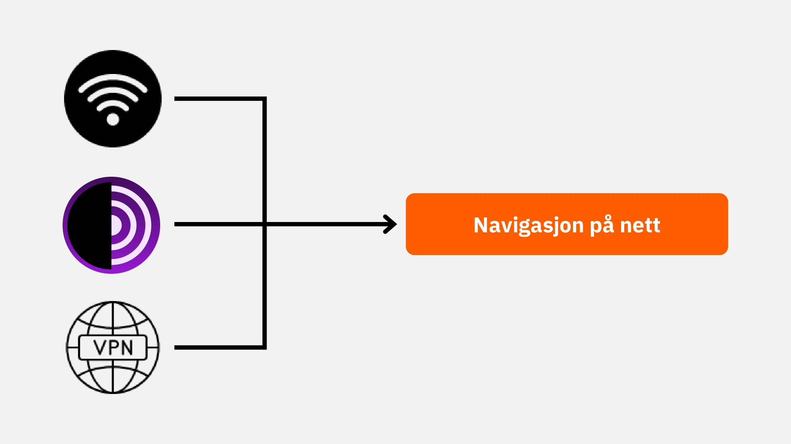

**Seksjon 2: Beste praksiser for bruk av datamaskin**

- Kapittel 3 - Bruk av datamaskin
- Kapittel 4 - Hacking & håndtering av sikkerhetskopier

I denne seksjonen vil vi dekke tre nøkkelområder innen datasikkerhet. Først vil vi utforske ulike operativsystemer: Mac, PC og Linux, og fremheve deres spesifikke egenskaper og styrker. Deretter vil vi dykke ned i metoder for å effektivt beskytte mot hackingforsøk og styrke sikkerheten til enhetene dine. Til slutt vil vi understreke viktigheten av regelmessig å beskytte og sikkerhetskopiere dataene dine for å forhindre tap eller ransomware.

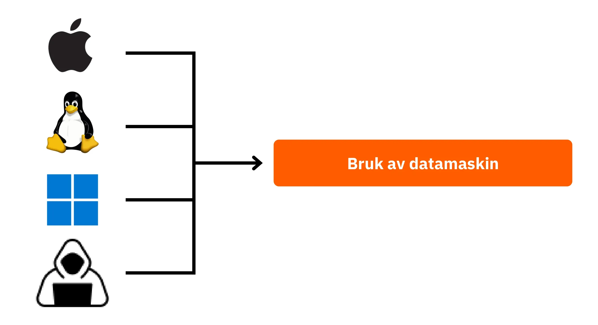

**Seksjon 3: Implementering av løsninger**

- Kapittel 6 - E-posthåndtering
- Kapittel 7 - Passordbehandler
- Kapittel 8 - To-faktor autentisering

I denne praktiske tredje seksjonen vil vi gå videre til implementeringen av dine konkrete løsninger.

Først vil vi se på hvordan du beskytter innboksen din, som er essensiell for kommunikasjonen din og ofte målrettet av hackere. Deretter vil vi introdusere deg for en passordbehandler: en praktisk løsning for å ikke lenger glemme eller blande sammen passordene dine samtidig som du holder dem sikre. Til slutt vil vi diskutere et ekstra sikkerhetstiltak, to-faktor autentisering, som legger til et ekstra lag med beskyttelse for kontoene dine. Alt vil bli forklart enkelt og tydelig. 

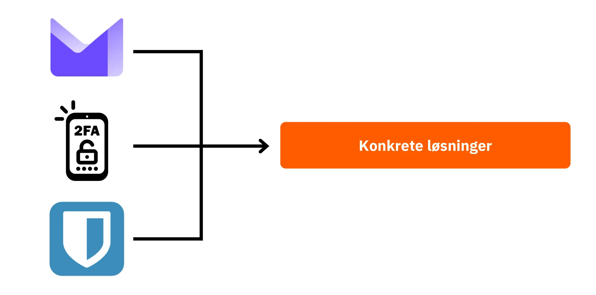

KEr du klar til å styrke din digitale sikkerhet og ta tilbake kontrollen over dine data? La oss starte!
# Alt du trenger å vite om nettsurfing

<partId>b4b5379a-d8ef-59ae-94d3-a6e88959c149</partId>

## Nettsurfing

<chapterId>3a935da9-fa6e-57eb-bf85-7b3ec35e6ee2</chapterId>

:::video id=f1cead27-ed41-4ca2-afd2-b08a994d0119:::

Når du surfer på internett, er det viktig å unngå visse vanlige feil for å bevare nettsikkerheten din. Her er noen tips for å unngå dem:

### Vær forsiktig med nedlastinger av programvare:

Det anbefales å laste ned programvare fra utgiverens offisielle nettsted i stedet for generiske sider.
Eksempel: Bruk www.signal.org/download i stedet for www.logicieltelechargement.fr/signal. 

Det er også tilrådelig å prioritere åpen kildekode-programvare (open source) ettersom de ofte er tryggere og fri for skadelig programvare. En "åpen kildekode"-programvare er en programvare der koden er kjent og tilgjengelig for alle. Dette tillater blant annet verifisering av at det ikke finnes skjult tilgang for å stjele dine personlige data.

> Bonus: Åpen kildekode-programvare er ofte gratis! Dette "universitetet" er 100% åpen kildekode, så du kan sjekke koden vår på GitHub.

### Informasjonskapselhåndtering: Feil og beste praksis

Informasjonskapsler (cookies) er filer opprettet av nettsteder for å lagre informasjon på enheten din. Mens noen sider krever disse informasjonskapslene for å fungere ordentlig, kan de også bli utnyttet av tredjepartssider, spesielt til sporingsformål for annonser og reklame. I samsvar med regelverk som GDPR, er det mulig - og anbefalt - å nekte tredjepartssporing av informasjonskapsler samtidig som du aksepterer de som er essensielle for at siden skal fungere ordentlig. Etter hvert besøk på en side, er det klokt å slette de tilknyttede informasjonskapslene, enten manuelt eller gjennom en utvidelse eller spesifikt program. Noen nettlesere tilbyr til og med muligheten til å selektivt slette informasjonskapsler. Til tross for disse forholdsreglene, er det avgjørende å forstå at informasjonen samlet inn av ulike sider kan forbli sammenkoblet, og dermed se viktigheten av å finne en balanse mellom bekvemmelighet og sikkerhet.

> Merk: Begrens også antallet utvidelser installert på nettleseren din for å unngå potensielle sikkerhets- og ytelsesproblemer.

### Nettlesere: Valg og sikkerhet

Det er to store familier av nettlesere: de som er basert på Chrome og de som er basert på Firefox.
Selv om begge familiene tilbyr et lignende sikkerhetsnivå, anbefales det å unngå Google Chrome-nettleseren på grunn av dens sporing. Lettere alternativer til Chrome, som Chromium eller Brave, kan være å foretrekke. Brave er spesielt anbefalt for sin innebygde annonseblokkering. Det kan være nødvendig å bruke flere nettlesere for å få tilgang til visse nettsteder.

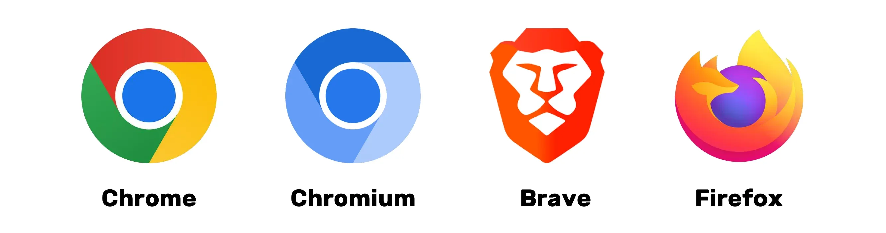

### Privat nettsurfing, TOR og andre alternativer for sikrere og mer anonym surfing

Privat nettsurfing, selv om det ikke skjuler surfing fra din internettleverandør, lar deg forhindrer lokale spor på datamaskinen din. Informasjonskapsler slettes automatisk ved slutten av hver økt, noe som lar deg akseptere alle informasjonskapsler uten å bli sporet. Privat nettsurfing kan være nyttig når du kjøper nettjenester, ettersom nettsteder sporer våre søkevaner og justerer priser deretter. Det er imidlertid viktig å merke seg at privat nettsurfing anbefales for midlertidige og spesifikke økter, ikke for generell nettsurfing.

Et mer avansert alternativ er TOR (The Onion Router)-nettverket, som tilbyr anonymitet ved å maskere brukerens IP-adresse og tillate tilgang til Darknet. TOR Browser er en nettleser spesielt designet for å bruke TOR-nettverket. Den lar deg besøke både konvensjonelle nettsteder og .onion-nettsteder, som vanligvis drives av enkeltpersoner og kan også være av en ulovlig natur.

TOR er lovlig og brukes av journalister, frihetsaktivister og andre som ønsker å omgå sensur i autoritære land. Det er imidlertid viktig å forstå at TOR ikke sikrer de besøkte sidene eller datamaskinen selv. I tillegg kan bruk av TOR senke internettforbindelsen ettersom data passerer gjennom tre andre personers datamaskiner før det når sin destinasjon. Det er også essensielt å merke seg at TOR ikke er en idiotsikker løsning for å garantere 100% anonymitet og bør ikke brukes til ulovlige aktiviteter.

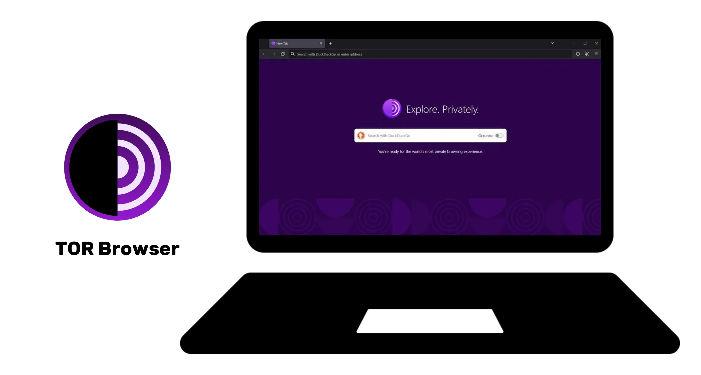

https://planb.network/tutorials/computer-security/communication/tor-browser-a847e83c-31ef-4439-9eac-742b255129bb

## VPN og internettforbindelse

<chapterId>5aac83f4-a685-54b0-9759-d71bea7eeed2</chapterId>

:::video id=737d30ac-43d8-4a69-afda-89b9d7e8c4e1:::

### VPN-er

Å beskytte internettforbindelsen din er et avgjørende aspekt for din nettsikkerhet, og bruk av virtuelle private nettverk (VPN-er) er en effektiv metode for å forbedre denne sikkerheten, både for bedrifter og individuelle brukere.

VPN-er er verktøy som krypterer data som overføres over internett, noe som gjør forbindelsen sikrere. I en profesjonell sammenheng lar VPN-er ansatte trygt få tilgang til bedriftens interne nettverk eksternt. De utvekslede dataene er kryptert, noe som gjør det mye vanskeligere for tredjeparter å snappe opp. I tillegg til å sikre tilgang til et internt nettverk, kan bruk av en VPN tillate en bruker å rute sin internettforbindelse gjennom bedriftens interne nettverk, noe som gir inntrykk av at deres forbindelse kommer fra selskapet. Dette kan være spesielt nyttig for å få tilgang til nettjenester som er geografisk begrenset.

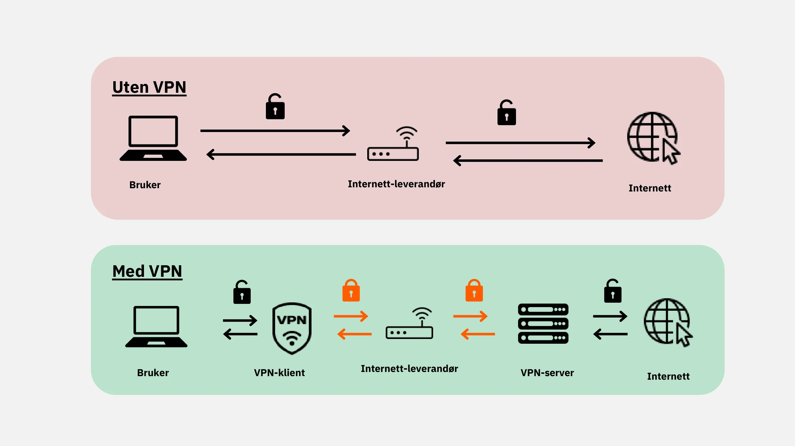

### Typer VPN-er

Det er to hovedtyper av VPN-er: bedrifts-VPN-er og forbruker-VPN-er, som NordVPN. Bedrifts-VPN-er har en tendens til å være dyrere og mer komplekse, mens forbruker-VPN-er generelt er mer tilgjengelige og brukervennlige. For eksempel lar NordVPN brukere koble til internett gjennom en server som ligger i et annet land, noe som kan omgå geografiske restriksjoner.

Å bruke en forbruker-VPN garanterer ikke fullstendig anonymitet. Mange VPN-leverandører beholder informasjon om brukerne sine, noe som potensielt kan kompromittere deres anonymitet. Selv om VPN-er kan være nyttige for å forbedre nettsikkerhet, er de ikke en universell løsning. De er effektive for visse spesifikke bruksområder, som å få tilgang til geografisk begrensede tjenester eller forbedre sikkerheten når man reiser, men de garanterer ikke total sikkerhet. Når du velger en VPN, er det essensielt å prioritere pålitelighet og tekniksk ekspertise over popularitet. VPN-leverandører som samler inn minst personlig informasjon, er generelt de sikreste. Tjenester som iVPN og Mullvad samler ikke inn personlig informasjon og tillater til og med betalinger i Bitcoin for økt personvern. 

VPN kan også brukes til å blokkere nettannonser, noe som gir en mer behagelig og sikker nettsurfingsopplevelse. Det er imidlertid viktig å gjøre din egne undersøkelser for å finne den VPN-en som passer dine spesifikke behov best. Å bruke en VPN anbefales for å forbedre sikkerheten, selv når du surfer på internett hjemme. Dette bidrar til å sikre et høyere sikkerhetsnivå for utvekslet data online. Til slutt, sørg for å sjekke URL-ene og det lille hengelåsikonet i adresselinjen for å bekrefte at du er på det nettstedet du har til hensikt å besøke.

https://planb.network/tutorials/computer-security/communication/ivpn-5a0cd5df-29f1-4382-a817-975a96646e68

https://planb.network/tutorials/computer-security/communication/mullvad-968ec5f5-b3f0-4d23-a9e0-c07a3e85aaa8

### HTTPS & offentlige Wi-Fi-nettverk

Når det gjelder online sikkerhet, er det essensielt å forstå at 4G generelt er sikrere enn offentlig Wi-Fi. Men å bruke 4G kan raskt tømme dine mobildata. HTTPS-protokollen har blitt standarden for kryptering av data på nettsteder. Den sikrer at dataene som utveksles mellom brukeren og nettstedet er sikre. Derfor er det avgjørende å verifisere at nettstedet du besøker bruker HTTPS-protokollen.

I Den europeiske union (EU) er databeskyttelse regulert av General Data Protection Regulation (GDPR). Derfor er det tryggere å bruke europeiske Wi-Fi-tilgangspunktleverandører, som SNCF, som ikke videreselger brukerforbindelsesdata. Men det faktum at et nettsted viser en hengelås garanterer ikke dets autentisitet. Det er viktig å verifisere nettstedets offentlige nøkkel ved hjelp av et sertifikatsystem for å bekrefte dets autentisitet. Selv om datakryptering forhindrer tredjeparter i å overvåke utvekslede data, er det fortsatt mulig for en ondsinnet person å utgi seg for å være nettstedet og overføre data i klartekst.

For å unngå nettsvindel, er det avgjørende å verifisere identiteten til nettstedet du surfer på, spesielt ved å sjekke forlengelsen og domenenavnet. I tillegg, vær årvåken mot svindlere som bruker lignende bokstaver i URL-er for å lure brukere.

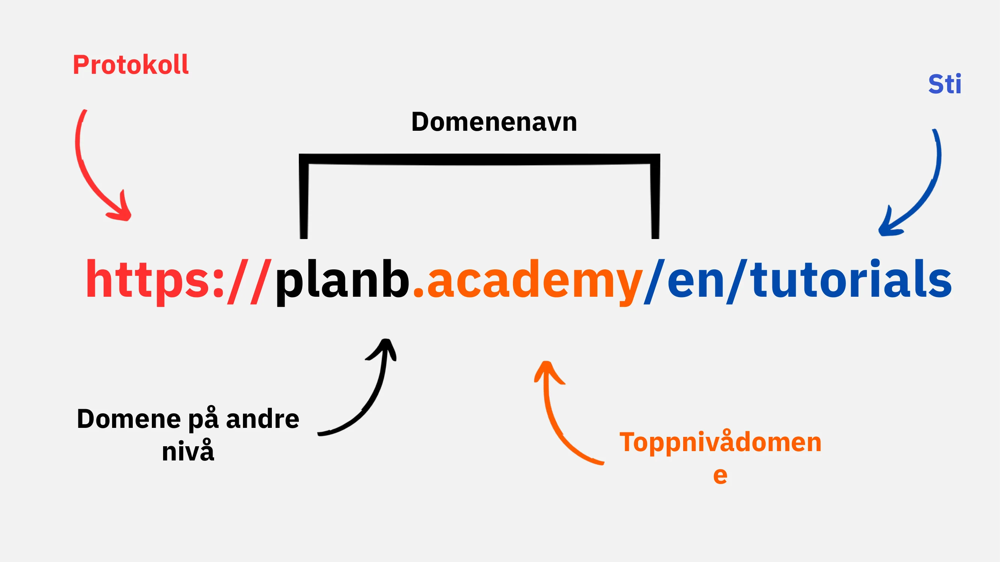

Oppsummert kan bruk av VPN i stor grad forbedre online sikkerhet, både for bedrifter og individuelle brukere. Videre kan det å praktisere gode nettleservaner bidra til bedre digital hygiene. I neste del av dette kurset vil vi ta for oss datasikkerhet, inkludert oppdateringer, antivirus og passordhåndtering.

# Beste praksiser for datamaskinbruk

<partId>e6eac20b-ba24-5d9a-8d86-8e0164074457</partId>

## Datamaskinbruk

<chapterId>16745632-b56b-5423-9873-ddf70fdf1efd</chapterId>

:::video id=35892007-5ea5-4956-bf80-3363d69c96d5:::

Sikkerheten til våre datamaskiner er en stor bekymring i dagens digitale verden. I dag vil vi ta for oss tre nøkkelpunkter:

- Valg av datamaskin
- Oppdateringer og antivirus for optimal sikkerhet
- Beste praksiser for sikkerheten til din datamaskin og data.

### Valg av datamaskin og operativsystem

Når det gjelder valg av datamaskin, er det ingen betydelig forskjell i sikkerhet mellom gamle og nye datamaskiner. Men det finnes sikkerhetsforskjeller mellom operativsystemer som Windows, Linux og Mac.

Angående Windows, anbefales det å ikke bruke en administrator-konto til daglig bruk, men heller opprette to separate kontoer: en administrator-konto og en konto for daglig bruk. Windows er ofte mer utsatt for skadelig programvare på grunn av det store antallet brukere og enkelheten av å bytte fra bruker til administrator. Så på Linux og Mac er trusler mindre vanlige.

Valget av operativsystem bør baseres på dine behov og preferanser. Linux-systemer har utviklet seg betydelig de siste årene, og blir stadig mer brukervennlige. Ubuntu er et interessant alternativ for nybegynnere, med et enkelt å bruke grafisk grensesnitt. Det er mulig å partisjonere en datamaskin for å eksperimentere med Linux samtidig som man beholder Windows, men dette kan være komplekst. Det er ofte å foretrekke å ha en dedikert datamaskin, en virtuell maskin, eller en USB-nøkkel for å teste Linux eller Ubuntu.

### Programvareoppdateringer

Når det gjelder oppdateringer, er regelen enkel: **det er essensielt å regelmessig oppdatere operativsystemet og applikasjoner.**

For eksempel på Windows 10 er oppdateringer nesten kontinuerlige, og det er avgjørende å ikke blokkere eller forsinke dem. Hvert år identifiseres omtrent 15 000 sårbarheter, noe som understreker viktigheten av å holde programvaren oppdatert for å beskytte mot virus. Generelt avsluttes programvarestøtten mellom 3 og 5 år etter utgivelsen, så det er nødvendig å oppgradere til en høyere versjon for å fortsette å dra nytte av sikkerheten.

Regelen gjelder for nesten all programvare. Faktisk er ikke oppdateringer ment for å gjøre maskinen din foreldet eller treg, men for å beskytte den mot nye trusler. Noen oppdateringer anses til og med som store, og uten dem er datamaskinen din i alvorlig fare for utnyttelse.

For å gi deg et konkret eksempel på en feil: "cracked" programvare (ulovlig anskaffet programvare) som ikke kan oppdateres representerer en dobbel potensiell trussel. Ankomsten av et virus under den ulovlige nedlastingen fra en mistenkelig nettside og en usikker bruk mot nye former for angrep.

### Antivirusprogram

- Trenger du antivirusprogram? JA
- Må du betale? Det kommer an på!

Valget og implementeringen av antivirusprogram er viktig. Windows Defender, det innebygde antivirusprogrammet i Windows, er en trygg og effektiv løsning. For en gratis løsning er den ekstremt god og mye bedre enn mange gratis løsninger man finner på nettet. Faktisk bør man være forsiktig med antivirusprogrammer lastet ned fra internett, da de kan være ondsinnede eller utdaterte.

For de som ønsker betale for antivirusprogrammer, anbefales det å velge et program som intelligent analyserer ukjente og fremvoksende trusler, som Kaspersky. Oppdateringer av antivirusprogrammene er essensielt for å beskytte mot nye trusler.

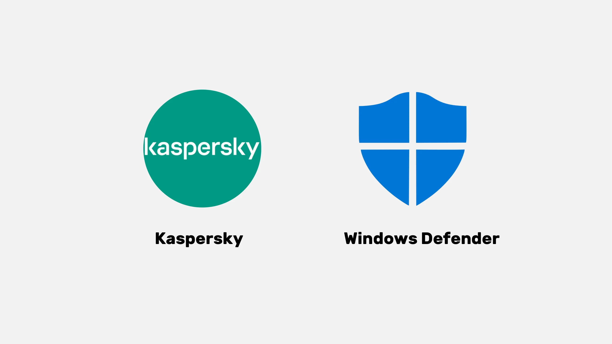

> Merk: Linux og Mac, takket være deres system for separasjon av brukerrettigheter, trenger ofte ikke antivirusprogrammer.

Til slutt, her er noen gode tips for sikkerheten til datamaskinen og dataene dine. Det er viktig å velge et effektivt og brukervennlig antivirusprogram. Det er også avgjørende å ha gode vaner på datamaskinen din, som å ikke sette inn ukjente eller mistenkelige USB-minnepinner. Disse USB-minnepinnene kan inneholde skadelige programmer som automatisk kan starte ved innsetting. Å sjekke USB-minnepinnen vil være nytteløst etter at den har blitt satt inn. Noen selskaper har vært ofre for hacking på grunn av USB-minnepinner som har blitt etterlatt på offentlige områder som for eksempel en parkeringsplass.

Behandle datamaskinen din som du ville behandlet hjemmet ditt: vær årvåken, oppdater programmvaren regelmessig, slett unødvendige filer, og bruk et sterkt passord for sikkerhet. Det er avgjørende å kryptere data på bærbare datamaskiner og smarttelefoner for å forhindre datatyveri eller datatap. BitLocker for Windows, LUKS for Linux, og det innebygde alternativet for Mac er løsninger for datakryptering. Det anbefales å aktivere datakryptering uten å nøle og å skrive ned passordet på et papir som oppbevares på et trygt sted.
For å konkludere så er det essensielt å velge et operativsystem som passer dine behov og regelmessig oppdatere det, samt de installerte applikasjonene. Det er også viktig å bruke et effektivt og brukervennlig antivirusprogram og adoptere gode vaner for sikkerheten til din datamaskin og data.

## Hacking & Sikkerhetskopiering: Beskyttelse av dine data

<chapterId>9ddfcb6a-a253-5542-b7eb-df7222b46dc7</chapterId>

:::video id=c6a2c152-f1ae-492c-8993-304d64cdda45:::

### Hvordan angriper hackere?

For å beskytte deg godt, er det essensielt å forstå hvordan hackere forsøker å infiltrere datamaskinen din. Viruser dukker ikke opp på magisk vis, men er heller konsekvensene av våre handlinger, selv utilsiktet!

Som en generell regel kommer virus fordi du har tillatt datamaskinen din å invitere dem inn i hjemmet ditt. Dette kan visualiseres ved nedlasting av mistenkelig programvare, en kompromittert torrent-fil, eller rett og slett ved å klikke på lenken i en svindel-e-post!

### Phishing - årvåkenhet mot svindel-e-poster:

Vær oppmerksom! E-poster er den første angrepsvektoren. Her er noen tips på å oppdage trusler:

- Vær årvåken mot phishing-forsøk som har som mål å trekke ut sensitiv informasjon som dine påloggingsdetaljer og passord. Unngå å klikke på mistenkelige lenker eller dele din personlige informasjon uten å verifisere avsenderens legitimitet.
- Vær forsiktig med vedlegg og bilder i e-post:
  E-postvedlegg og bilder kan inneholde skadelig programvare. Ikke last ned eller åpne vedlegg fra ukjente eller mistenkelige avsendere, og sørg for at antivirusprogrammet ditt er oppdatert.

Den gyldne regelen her er å nøye sjekke fullt navn på avsenderen samt opprinnelsen til e-posten. Når du er i tvil, slett den!

### Løsepengevirus og typer av cyberangrep:

Løsepengevirus er en type skadelig programvare som krypterer brukerdata og krever løsepenger for å dekryptere dem. Denne typen angrep blir stadig mer vanlig og kan være svært problematisk for et selskap eller en enkeltperson. For å beskytte deg, er det avgjørende å lage sikkerhetskopier av de mest sensitive filene! Dette vil ikke stoppe løsepengeviruset, men det vil tillate deg å ganske enkelt ignorere det.

Sikkerhetskopier de viktige dataene dine regelmessig til en ekstern lagringsenhet eller en sikker nettbasert lagringstjeneste. På denne måten, i tilfelle et cyberangrep eller maskinvarefeil, kan du gjenopprette dataene dine uten å miste viktig informasjon.

Enkel løsning:

- Kjøp en ekstern harddisk og kopier dataene dine på den. Koble den fra og oppbevar den et sted i huset. (Å gjøre dette to ganger og oppbevare en av diskene på et annet sted hjelper med å beskytte mot potensiell brann.)

- Opprett en "sky"-sikkerhetskopi ved å bruke ProtonMail Drive, Sync, eller til og med Google Drive. Last ganske enkelt opp dine sensitive data til denne nettbaserte verten. Vær imidlertid klar over at dataene dine potensielt er på internett og holdes av en pålitelig tredjepart.

### Bør du betale hackerne?

NEI, det anbefales generelt ikke å betale hackere i tilfelle løsepengevirus eller andre typer angrep. Å betale løsepengene garanterer ikke gjenoppretting av dataene dine og kan oppmuntre cyberkriminelle til å fortsette sine ondsinnede aktiviteter. I stedet prioriter forebygging og regelmessig sikkerhetskopi av dataene dine for å beskytte deg selv.

Hvis du oppdager et virus på datamaskinen din, koble den fra internett, utfør en fullstendig antivirus-skanning, og slett infiserte filer. Deretter, oppdater programvaren og operativsystemet ditt, og endre passordene dine for å forhindre ytterligere inntrengninger.

https://planb.network/tutorials/computer-security/data/proton-drive-03cbe49f-6ddc-491f-8786-bc20d98ebb16

https://planb.network/tutorials/computer-security/data/veracrypt-d5ed4c83-7c1c-4181-95ea-963fdf2d83c5

# Implementering av løsninger.

<partId>215ec902-ba05-5549-87fc-cb8d82665f7b</partId>

## Håndtering av e-postkontoer

<chapterId>dfceea33-8712-5557-ace1-6ba5598d33d8</chapterId>

:::video id=75cc914d-9c11-4d3f-86a7-6faf2077f00f:::

### Opprette en ny e-postkonto!

E-postkontoen er senteret i din nettaktivitet: hvis den blir kompromittert, kan en hacker bruke den til å tilbakestille alle passordene dine via "glemt passord"-funksjonen og få tilgang til mange andre nettsteder. Derfor er det viktig å sikre den ordentlig.

En e-postkonto bør opprettes med et unikt og sterkt passord (detaljer i kapittel 7) og ideelt sett med et tofaktor autentiseringssystem (detaljer i kapittel 8).

Selv om vi alle allerede har en e-postkonto, er det viktig å vurdere å opprette en ny, mer moderne en for å starte på nytt.

### Velge en e-postleverandør og håndtere e-postadresser

Riktig håndtering av våre e-postadresser er avgjørende for å sikre sikkerheten til vår netttilgang. Det er viktig å velge en sikker og personvernsrespekterende e-postleverandør. ProtonMail er et eksempel på en sikker og personvernrespekterende e-posttjeneste.

Når du velger en e-postleverandør og oppretter et passord, er det essensielt å aldri gjenbruke samme passord for forskjellige online tjenester. Det anbefales å regelmessig opprette nye e-postadresser og skille bruksområder ved å bruke forskjellige e-postadresser. Det er å foretrekke å velge en sikker e-posttjeneste for kritiske kontoer. Det bør også nevnes at noen tjenester begrenser lengden på passord, så det er viktig å være oppmerksom på denne begrensningen. Tjenester er også tilgjengelige for å opprette midlertidige e-postadresser, som kan brukes for kontoer med begrenset varighet.

Det er viktig å vurdere at eldre e-postleverandører som La Poste, Arobase, Wig, Hotmail, fortsatt brukes, men deres sikkerhetspraksis kan ikke være like god som de hos Gmail. Derfor anbefales det å ha to separate e-postadresser, en for generell kommunikasjon og den andre for oppretting av kontoer, med sistnevnte bedre sikret. Det er best å unngå å blande e-postadressen med den fra din telefonoperatør eller internettleverandør, da dette kan være en angrepsvektor.

### Bør jeg endre min e-postkonto?

Det er anbefales å bruke nettstedet Have I Been Pwned (https://haveibeenpwned.com/) for å sjekke om din e-postadresse har blitt kompromittert og for å bli varslet om fremtidige datainnbrudd. En hacket database kan utnyttes av hackere for å sende phishing-e-poster eller gjenbruke kompromitterte passord.

Generelt er det å begynne å bruke en ny, sikrere e-postadresse ikke en dårlig praksis og til og med nødvendig hvis man ønsker å starte på nytt med et sikrere utgangspunkt.

Bonus Bitcoin: Det kan være lurt å opprette en spesifikk e-postadresse for dine Bitcoin-aktiviteter (opprette børs-kontoer) for å virkelig skille disse av livets aktiviteter med resten av livet.

https://planb.network/tutorials/computer-security/communication/proton-mail-c3b010ce-254d-4546-b382-19ab9261c6a2

## Passordbehandler

<chapterId>0b3c69b2-522c-56c8-9fb8-1562bd55930f</chapterId>

:::video id=106b6f17-a5c1-4155-abdf-043ce469d45b:::

### Hva er en passordbehandler?

En passordbehandler er et verktøy som lar deg lagre, generere og håndtere passordene dine for forskjellige kontoer på nett. I stedet for å huske flere passord, trenger du bare ett hovedpassord for å få tilgang til alle de andre.

Med en passordbehandler trenger du ikke lenger å bekymre deg for å glemme passordene dine eller skrive dem ned et sted. Du trenger bare å huske ett hovedpassord. I tillegg genererer de fleste av disse verktøyene sterke passord for deg, noe som øker sikkerheten til kontoene dine.

### Forskjeller mellom noen populære passordbehandlere:

- LastPass: En av de mest populære passordbehandlerne. Det er en tredjepartstjeneste, noe som betyr at passordene dine lagres på deres servere. Den tilbyr en gratisversjon og en betalt versjon, med et brukervennlig grensesnitt.
- Dashlane: Dette er også en tredjepartstjeneste, med et intuitivt grensesnitt og ekstra funksjoner som sporing av kredittkortinformasjon og sikre notater.

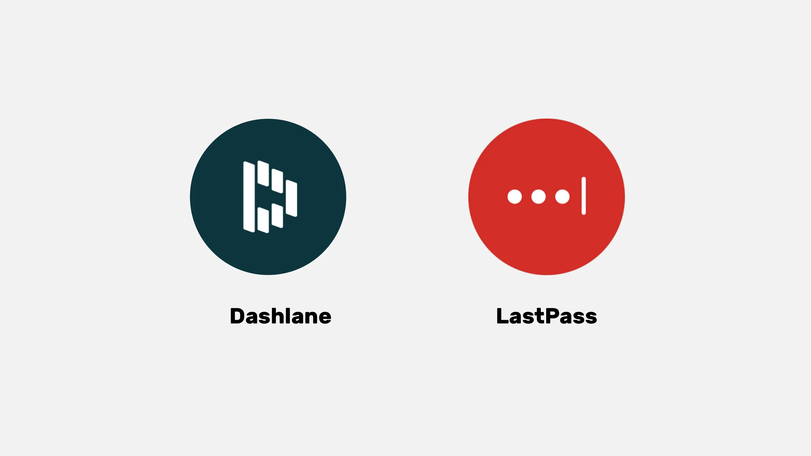

### Selvlagring (self-hosting) for mer kontroll:

- Bitwarden: Dette er et "åpen kildekode"-verktøy (open source), noe som betyr at du kan gjennomgå koden for å verifisere sikkerheten. Selv om Bitwarden tilbyr en tredjepartstjeneste, tillater det også brukere å selvlagre, noe som betyr at du kan kontrollere hvor passordene dine lagres, som potensielt tilbyr mer sikkerhet og kontroll.

- KeePass: Dette er en løsning med åpen kildekode som primært er ment for selvlagring. Dataene dine lagres lokalt som standard, men du kan synkronisere passorddatabasen ved hjelp av forskjellige metoder hvis du ønsker det. KeePass er anerkjent for sin sikkerhet og fleksibilitet, selv om det kan være litt mindre brukervennlig for nybegynnere.

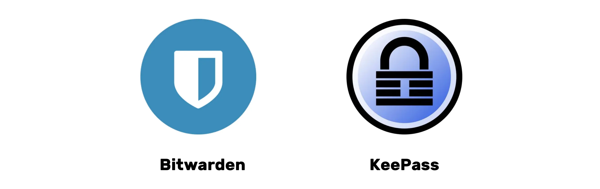

For selvhostede løsninger som KeePass er det mulig å synkronisere databasen din mellom flere enheter uten å bruke sentraliserte tredjepartstjenester. Verktøy som **Syncthing** muliggjør kryptert og desentralisert synkronisering direkte mellom enhetene dine. Denne tilnærmingen holder dataene dine under din kontroll samtidig som den sikrer tilgjengeligheten på alle enhetene dine.

(Merk: Valget mellom en tredjepartstjeneste eller en selvlagrinstjeneste avhenger av ditt nivå av teknologisk komfort og hvordan du prioriterer kontroll versus bekvemmelighet. Tredjepartstjenester er generelt mer praktiske for de fleste mennesker, mens selvlagring krever mer teknisk kunnskap, men kan tilby mer kontroll og sinnsro når det gjelder sikkerhet.)

### Hva som kjennetegner et godt passord:

Et godt passord er generelt:

- Langt: minst 12 tegn.
- Komplekst: en blanding av store og små bokstaver, tall og symboler.
- Unikt: ikke gjenbruk det samme passordet for forskjellige kontoer.
- Ikke basert på personlig informasjon: unngå fødselsdatoer, navn, osv.

For å sørge for god sikkerhet til kontoen din, er det avgjørende å lage sterke og sikre passord. Lengden på passordet er ikke alene nok til å øke sikkerheten. Tegnene må være helt tilfeldige for å motstå "brute force"-angrep. Uavhengighet av hendelser er også viktig for å unngå de mest sannsynlige kombinasjonene. Vanlige passord som "password" blir lett kompromittert.

For å lage et sterkt passord, anbefales det å bruke et stort antall tilfeldige tegn, uten å bruke forutsigbare ord eller mønstre. Det er også essensielt å inkludere tall og spesialtegn. Det bør imidlertid bemerkes at noen nettsteder kan begrense bruken av visse spesialtegn. Passord som ikke er tilfeldig generert, er lette å gjette. Varianter eller tillegg til passord er ikke sikre. Nettsteder kan ikke garantere sikkerheten til passord valgt av brukere.

Tilfeldig genererte passord tilbyr et høyere nivå av sikkerhet, selv om de kan være vanskeligere å huske. Passordbehandlere kan generere mer sikre tilfeldige passord. Ved å bruke en passordbehandler, trenger du ikke å huske alle passordene dine. Det er viktig å gradvis erstatte dine gamle passord med de som er generert av behandleren, da de er sterkere og lengre. Sørg for at hovedpassordet til passordbehandleren din også er sterkt og sikkert.

https://planb.network/tutorials/computer-security/authentication/bitwarden-0532f569-fb00-4fad-acba-2fcb1bf05de9

https://planb.network/tutorials/computer-security/authentication/keepass-f8073bb7-5b4a-4664-9246-228e307be246

## To-Faktor Autentisering (2FA)

<chapterId>9391e02e-e61b-5a86-93e0-91a07f217d35</chapterId>

:::video id=10fede6f-c839-4455-b324-e887c502667e:::

### Hvorfor implementere 2FA

To-faktor autentisering (2FA) er et ekstra lag med sikkerhet som brukes for å sikre at personene som forsøker å få tilgang til en nettbasert konto virkelig er den de hevder å være. I stedet for å bare skrive inn et brukernavn og passord, krever 2FA en sekundær form for verifisering.

Dette andre steget kan være:

- En midlertidig kode sendt via SMS.
- En kode generert av en applikasjon som Google Authenticator eller Authy.
- En fysisk sikkerhetsnøkkel som du setter inn i datamaskinen din.

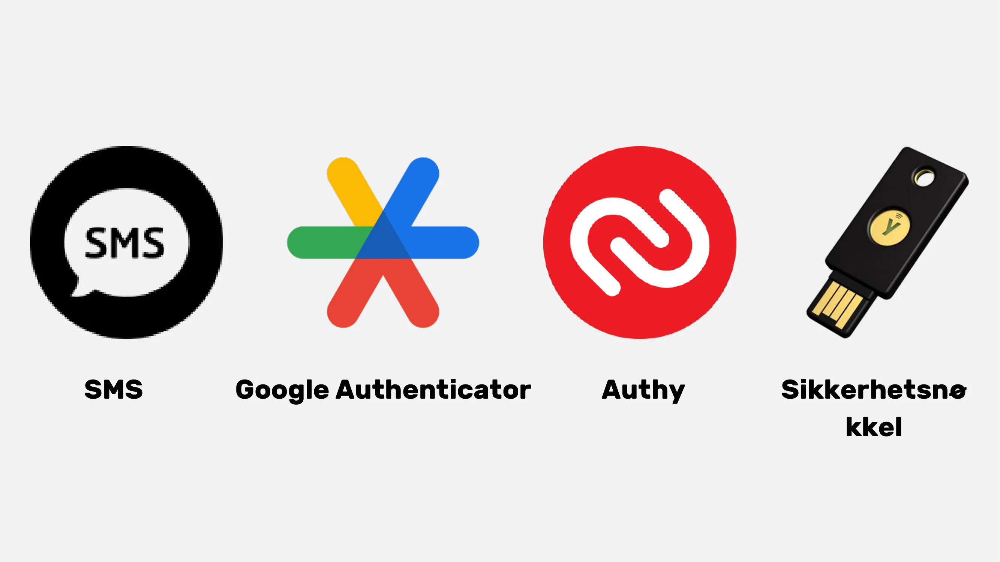

Med 2FA, selv om en hacker får tak i passordet ditt, vil de ikke kunne få tilgang til kontoen din uten denne andre verifiseringsfaktoren. Dette gjør 2FA essensielt for å beskytte dine nettbaserte kontoer mot uautorisert tilgang.

### Hvilket alternativ skal man velge?

De forskjellige alternativene for sterk autentisering tilbyr ulike nivåer av sikkerhet.

- SMS anses ikke som det beste alternativet ettersom det kun gir bevis på besittelse av et telefonnummer.
- 2FA (tofaktorautentisering) er sikrere da det bruker flere typer bevis, som kunnskap, besittelse og identifikasjon. Engangspassord (HOTP og TOTP) er tryggere enn SMS fordi de krever kryptografisk beregning og lagres lokalt i stedet for i minnet.
- Maskinvarenøkler, som USB-nøkler eller smartkort, tilbyr optimal sikkerhet ved å generere en unik privat nøkkel for hver side og verifisere URL-en før tilkoblingen tillates.

For optimal sikkerhet med sterk autentisering, anbefales det å bruke en sikker e-postadresse, en sikker passordbehandler, og å ta i bruk 2FA med YubiKeys. Det er også tilrådelig å kjøpe to YubiKeys for å forutse tap eller tyveri, for eksempel å ha en som er med til daglig bruk og en reservekopi hjemme.

En potensiell trussel for SIM 2FA er et såkalt SIM-bytte-angrep, hvor angriperen stjeler brukerens telefonnummer ved å koble det til et SIM-kort kontrollert av angriperen. Det er flere måter for angriperen å få til dette, men denne trusselen er stort sett bare en bekymring for høyprofilerte individere og andre mennesker av interesse.

Biometri kan brukes som et substitutt, men det er mindre sikkert enn kombinasjonen av kunnskap og besittelse. Biometriske data bør forbli på autentiseringsenheten og ikke avsløres på nettet. Det er viktig å vurdere trusselbildet assosiert med de forskjellige autentiseringsmetodene og justere dine handlinger deretter.

Til slutt er det greit å gi en kort gjennomgang av  HOTP og TOTP engangspassord. HTOP er et engangspassord basert på HMAC (Hash-based Message Authentication Code) algoritmen, og TOTP er et tidsbasert engangspassord. Viktige funksjoner for algoritmer er at passord bare kan bli brukt en gang, hver eneste skapte verdi er unik, og det er en delt nøkkel mellom brukerens enhet (klienten) og autentiseringstjenesten (server). Hovedforskjellen mellom de to systemene (HOTP og TOTP) ligger i hvordan verdiene blir generert: TOTP er tidsbasert og HOTP er tellingsbasert.

### Konklusjon på opplæringen:

Som du nå har forstått, er det å implementere god digital hygiene ikke nødvendigvis enkelt, men det forblir tilgjengelig!

- Opprette en ny sikker e-postadresse.
- Sette opp en passordbehandler.
- Aktivere 2FA.
- Gradvis erstatte våre gamle passord med sterke passord med 2FA.

Fortsett å lære og gradvis implementer gode vaner!

En gylden regel: Nettsikkerhet er et bevegelig mål som vil tilpasse seg din læringsreise!

https://planb.network/tutorials/computer-security/authentication/authy-a76ab26b-71b0-473c-aa7c-c49153705eb7

https://planb.network/tutorials/computer-security/authentication/security-key-61438267-74db-4f1a-87e4-97c8e673533e

# Praktisk del

<partId>98ccf14b-4053-5839-878c-7a73ff02eb95</partId>

## Sette opp en e-postkasse

<chapterId>afc9ab5d-7664-5a9b-ab50-225ac9ba8f7c</chapterId>

Å beskytte e-postkontoen din er et viktig skritt for å sikre dine nettaktiviteter og beskytte dine personlige data. Denne veiledningen vil lede deg, steg for steg, i å opprette og sette opp en ProtonMail-konto, en leverandør kjent for sitt høye sikkerhetsnivå som tilbyr ende-til-ende-kryptering av dine kommunikasjoner. Enten du er en nybegynner eller en erfaren bruker, vil de stegene som presenteres her hjelpe deg med å styrke sikkerheten til din e-post, samtidig som du tar fordel av ProtonMails avanserte funksjoner:

https://planb.network/tutorials/computer-security/communication/proton-mail-c3b010ce-254d-4546-b382-19ab9261c6a2

## Sikre med 2FA

<chapterId>09468ec1-95b7-56a4-a636-7618044568e1</chapterId>

Tofaktorautentisering (2FA) har blitt essensielt for å sikre dine nettbaserte kontoer. I denne veiledningen vil du lære hvordan du setter opp og bruker 2FA-appen Authy, som genererer dynamiske 6-sifrede koder for å beskytte kontoene dine. Authy er veldig enkel å bruke og synkroniseres på tvers av flere enheter. Oppdag hvordan du installerer og konfigurerer Authy, og dermed styrker sikkerheten til dine nettbaserte kontoer nå:

https://planb.network/tutorials/computer-security/authentication/authy-a76ab26b-71b0-473c-aa7c-c49153705eb7

En annen mulighet er å bruke en fysisk sikkerhetsnøkkel. Denne tilleggsveiledningen viser deg hvordan du setter opp og bruker en sikkerhetsnøkkel som en sekundær autentiseringsfaktor:
https://planb.network/tutorials/computer-security/authentication/security-key-61438267-74db-4f1a-87e4-97c8e673533e

## Opprette en passordbehandler

<chapterId>ed579680-4e7b-5f65-8541-14e519a3b242</chapterId>

Passordhåndtering er en utfordring i den digitale tidsalderen. Vi har alle mange nettkontoer å sikre. En passordbehandler hjelper deg med å opprette og lagre sterke og unike passord for hver konto.

I denne veiledningen lærer du hvordan du setter opp Bitwarden, en åpen kildekode passordbehandler, og hvordan du synkroniserer påloggingsinformasjonen din på tvers av alle enhetene dine for å forenkle den daglige bruken:

https://planb.network/tutorials/computer-security/authentication/bitwarden-0532f569-fb00-4fad-acba-2fcb1bf05de9

For mer avanserte brukere tilbyr jeg også en veiledning for en annen gratis og åpen kildekode programvare for å bruke lokalt til håndtering av passordene dine:

https://planb.network/tutorials/computer-security/authentication/keepass-f8073bb7-5b4a-4664-9246-228e307be246

## Sikre kontoene dine

<chapterId>7a774b34-aed0-57dd-b8f7-cf3be51c0d70</chapterId>

I disse to veiledningene guider jeg deg også i å sikre dine nettkontoer og forklarer hvordan du gradvis kan adoptere sikrere vaner for å håndtere passordene dine på daglig basis.

https://planb.network/tutorials/computer-security/authentication/bitwarden-0532f569-fb00-4fad-acba-2fcb1bf05de9

https://planb.network/tutorials/computer-security/authentication/keepass-f8073bb7-5b4a-4664-9246-228e307be246

## Oppsett av sikkerhetskopi

<chapterId>01cfcde1-77cb-506c-8df1-fa18a2e8cc6b</chapterId>

Beskyttelse av dine personlige filer er også et kritisk punkt. Denne veiledningen viser deg hvordan du implementerer en effektiv sikkerhetskopieringsstrategi ved bruk av Proton Drive. Oppdag hvordan du bruker denne sikre sky-løsningen for å anvende 3-2-1 metoden: tre kopier av dataene dine på to forskjellige medier, med en kopi offsite. Dette sikrer tilgjengeligheten og sikkerheten til dine sensitive filer:

https://planb.network/tutorials/computer-security/data/proton-drive-03cbe49f-6ddc-491f-8786-bc20d98ebb16

Og for å sikre filene dine som er lagret på flyttbare medier som en USB-stasjon eller ekstern harddisk, viser jeg deg også hvordan du enkelt kan kryptere og dekryptere disse mediene ved bruk av VeraCrypt:

https://planb.network/tutorials/computer-security/data/veracrypt-d5ed4c83-7c1c-4181-95ea-963fdf2d83c5

## Bytte av nettleser & VPN

<chapterId>8dc08feb-313c-5259-a54f-64aa68a07608</chapterId>

Å beskytte ditt privatliv på nett er også et kritisk punkt for å passe på din sikkerhet. Å bruke en VPN kan være en første løsning for å oppnå dette.

Jeg foreslår å oppdage to pålitelige VPN-løsninger som kan betales i Bitcoin, nemlig IVPN og Mullvad. Disse veiledningene viser deg på hvordan du installerer, konfigurerer og bruker Mullvad eller IVPN på alle enhetene dine:

https://planb.network/tutorials/computer-security/communication/ivpn-5a0cd5df-29f1-4382-a817-975a96646e68

https://planb.network/tutorials/computer-security/communication/mullvad-968ec5f5-b3f0-4d23-a9e0-c07a3e85aaa8

Lær også hvordan du bruker Tor Browser, en nettleser spesielt designet for å beskytte ditt privatliv på nett:

https://planb.network/tutorials/computer-security/communication/tor-browser-a847e83c-31ef-4439-9eac-742b255129bb

# Gå videre

<partId>77113cad-a6d8-57e5-b903-50c223b277ba</partId>

## Hvordan jobbe i cybersikkerhetsindustrien

<chapterId>aad1ae27-4280-5b07-b9ab-118ae013951a</chapterId>

:::video id=4c818b5c-ea5d-496a-8e82-bc5d96d91430:::

### Cybersikkerhet: Et voksende felt med uendelige muligheter

Hvis du er lidenskapelig opptatt av å beskytte systemer og data, tilbyr feltet innen cybersikkerhet en mengde muligheter. Hvis denne industrien er noe som interesserer deg, her er noen nøkkelsteg for å veilede deg.

### Akademisk grunnlag og sertifiseringer:

En solid utdannelse innen datavitenskap, informasjonssystemer, eller et relatert felt er ofte det ideelle utgangspunktet. Disse studiene gir det nødvendige grunnlaget for å forstå de tekniske utfordringene innen cybersikkerhet. For å komplementere denne utdannelsen, er det klokt å oppnå anerkjente sertifiseringer i feltet. Selv om disse sertifiseringene kan variere etter region, nyter noen, som CISSP eller CEH, global anerkjennelse.

Cybersikkerhet er et veldig stort og stadig utviklende felt. Det er avgjørende å gjøre seg kjent med essensielle verktøy og forskjellige systemer. I tillegg, med så mange underdomener, fra hendelsesrespons til etisk hacking, er det gunstig å finne din nisje og spesialisere deg i den.

### Skaff deg praktisk erfaring:

Viktigheten av praktisk erfaring kan ikke undervurderes. Å søke praksisplasser eller juniorstillinger i selskaper med cybersikkerhetsteam er en utmerket måte å anvende din teoretiske kunnskap. Videre så kan det å delta i etiske hacking-konkurranser eller cybersikkerhetssimuleringer kan forfine dine ferdigheter i virkelige situasjoner.

Styrken av et profesjonelt nettverk er uvurderlig. Å bli med i profesjonelle foreninger, hackerspaces, eller nettforum gir en plattform for å utveksle ideer med andre eksperter. På samme måte gir deltakelse på cybersikkerhetskonferanser og andre samlinger ("workshops") ikke bare mulighet til å lære, men også hjelper deg med å bygge forbindelser med bransjefolk.

Den konstante utviklingen av trusler krever regelmessig overvåking av nyheter og spesialiserte forum. I en sektor hvor tillit er essensielt, er det viktig å handle med etikk og integritet i hvert trinn av karrieren din.

### Ferdigheter og verktøy å fordype seg i:

- Cybersikkerhetsverktøy: Wireshark, Metasploit, Nmap.
- Operativsystemer: Linux, Windows, MacOS.
- Programmeringsspråk: Python, C, Java.
- Nettverk: TCP/IP, VPN, brannmur.
- Databaser: SQL, NoSQL.
- Kryptografi: SSL/TLS, symmetrisk/asymmetrisk kryptering.
- Hendelsesstyring: Logganalyse, hendelsesrespons.
- Etisk Hacking: Penetrasjonsteknikker, inntrengingstesting.
- Styring: ISO-standarder, GDPR/CCPA-reguleringer.

Ved å mestre disse ferdighetene og verktøyene, vil du være godt rustet til å navigere cybersikkerhetens verdenen med suksess.

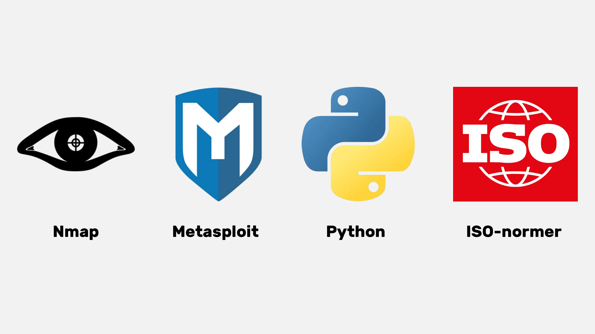

## Intervju med Renaud

<chapterId>7d83fd98-ce22-514e-b9e8-729fbf71ee6e</chapterId>

:::video id=ec7014aa-5ebe-444c-80d1-7b14f1fe7bb8:::

### Effektiv passordhåndtering og styrking av autentisering: En akademisk tilnærming

Det er tre viktige daspekter å vurdere når man snakker om passordhåndtering: lage passird, oppdatere passord og implementering av sikkre passord på nettsider. 

Det er generelt ikke anbefalt å bruke nettleserutvidelser for automatisk utfylling av passord. Disse verktøyene kan gjøre brukeren mer sårbar for phishing-angrep. Renaud, en anerkjent ekspert i cybersikkerhet, foretrekker manuell håndtering ved bruk av KeePass, som innebærer manuelt å kopiere og lime inn passordet. Utvidelser har en tendens til å øke angrepsflaten, kan senke nettleserens ytelse, og derfor utgjør en betydelig risiko. Dermed er minimal bruk av utvidelser på nettleseren en anbefalt praksis.

Passordadministratorer oppmuntrer generelt til bruk av ekstra autentiseringsfaktorer, som tofaktorautentisering. For optimal sikkerhet, er det anbefalt å holde OTP-er (engangspassord) på din mobile enhet. AndoTP tilbyr en åpen kildekode-løsning for å generere og lagre OTP-koder på telefonen din. Mens Google Authenticator tillater eksport av autentiseringskodefrø, forblir tilliten til sikkerhetskopi på en Google-konto begrenset. Derfor er OTI- og AndoTP-applikasjonene anbefalt for autonom OTP-håndtering.

Spørsmålet om digital arv og digital sorgprosess reiser viktigheten av å ha en prosedyre for å overføre passord etter en persons død. En passordbehandler letter denne overgangen ved å sikkert lagre alle digitale hemmeligheter på ett sted. Passordbehandleren tillater også identifisering av alle åpne kontoer og håndtering av deres lukking eller overføring. Det anbefales å skrive ned hovedpassordet på papir, men det bør oppbevares på et skjult og sikkert sted. Hvis harddisken er kryptert og datamaskinen er låst, vil ikke passordet være tilgjengelig, selv i tilfelle av innbrudd.

### Mot en post-passord æra: Utforsking av troverdige alternativer

Passord, selv om de er allestedsnærværende, har mange ulemper, inkludert muligheten for risikabel overføring under autentiseringsprosessen. Ledende selskaper som Microsoft og Apple tilbyr innovative alternativer som biometri og maskinvaretokens, noe som indikerer en progressiv trend mot å forlate passord.

Passkeys, for eksempel, tilbyr krypterte tilfeldige nøkler, kombinert med en lokal faktor (biometri eller PIN), som er driftet av en leverandør, men forblir utenfor deres rekkevidde. Selv om dette krever oppdatering av nettsteder, eliminerer tilnærmingen behovet for passord, og gir dermed et høyt sikkerhetsnivå uten begrensningene forbundet med tradisjonelle passord eller problemet med å håndtere en digital safe.

Passkiz er et annet levedyktig og sikkert alternativ for passordhåndtering. Imidlertid gjenstår et stort spørsmål: tilgjengeligheten i tilfelle leverandørsvikt. Det ville derfor være ønskelig at internettgiganter foreslår systemer for å garantere denne tilgjengeligheten.

Direkte autentisering til den relevante tjenesten er en interessant mulighet for å fjerne behovet for en tredjepart. Imidlertid stiller Single Sign-On (SSO) tilbudt av internettgiganter også problemer i form av tilgjengelighet og risiko for sensur. For å forhindre datalekkasjer, er det avgjørende å minimere mengden informasjon som samles inn under autentiseringsprosessen.

### Datamaskinsikkerhet: imperativer for sikre praksiser og risikoer knyttet til menneskelig uaktsomhet

Datamaskinsikkerhet kan kompromitteres av enkle praksiser og bruk av standardpassord, som "admin". Avanserte angrep er ikke alltid nødvendige for å sette datamaskinsikkerheten i fare. For eksempel ble administrasjonspassordene til en YouTube-kanal skrevet i en bedrifts private kildekode. Sikkerhetssårbarheter er ofte resultatet av menneskelig uaktsomhet.

Det bør også bemerkes at internett er sterkt sentralisert og i stor grad under amerikansk kontroll. DNS-serveren kan være gjenstand for sensur og bruker ofte bedragersk DNS for å blokkere tilgang til visse nettsteder. DNS er en gammel og utilstrekkelig sikker protokoll, som kan føre til sikkerhetsproblemer. Nye protokoller, som DNSsec, har dukket opp, men er fortsatt ikke mye brukt. For å omgå sensur og annonseblokkering, er det mulig å velge alternative DNS-leverandører.

Alternativer til påtrengende annonser inkluderer Google DNS, OpenDNS og andre uavhengige tjenester. Standard DNS-protokollen lar DNS-forespørsler være synlige for internettleverandøren. DOH (DNS over HTTPS) og DOT (DNS over TLS) krypterer DNS-forbindelsen, og gir større personvern og sikkerhet. Disse protokollene brukes mye i bedrifter på grunn av deres forbedrede sikkerhet og har innebygd støtte av Windows, Android og iPhone. For å bruke DOH og DOT, må et TLS-vertsnavn angis i stedet for en IP-adresse. Gratis DOH- og DOT-leverandører er tilgjengelige på nettet. DOH og DOT forbedrer personvern og sikkerhet ved å unngå "man in the middle"-angrep. 

Det er også verdt å nevne systemet som blir kalt "Lightning authentication" som genererer en ulik identifikator for hver tjeneste, uten behov for å oppgi en e-postadresse eller personlig informasjon. Det er mulig å ha brukerkontrollerte desentraliserte identiteter, men det er en mangel på standardisering og normalisering i prosjekter for desentralisert identitet. Pakkebehandlere som Nuget og Chocolaté, som tillater nedlasting av åpen kildekode-programvare utenfor Microsoft Store, anbefales for å unngå ondsinnede angrep. Oppsummert er DNS avgjørende for nettsikkerhet, men det er nødvendig å være årvåken mot potensielle angrep på DNS-servere.

# Siste seksjon

<partId>3d8ac4c9-f05b-4133-a40a-6e19d579f05f</partId>

## Vurderinger & Karakterer

<chapterId>6be74d2d-2116-5386-9d92-c4c3e2103c68</chapterId>
<isCourseReview>true</isCourseReview>

## Avsluttende eksamen

<chapterId>a894b251-a85a-5fa4-bf2a-c2a876939b49</chapterId>
<isCourseExam>true</isCourseExam>

## Konklusjon

<chapterId>6270ea6b-7694-4ecf-b026-42878bfc318f</chapterId>
<isCourseConclusion>true</isCourseConclusion>
