# Een reis naar de bescherming van uw gegevens

Welkom bij dit educatieve programma over digitale beveiliging. Deze training is voor iedereen toegankelijk, dus voorkennis van informatica is niet vereist. Ons belangrijkste doel is om je de kennis en vaardigheden bij te brengen die je nodig hebt om veiliger door de digitale wereld te navigeren.

Hiervoor moeten verschillende tools worden geïmplementeerd, waaronder een veilige e-mailservice, een wachtwoordmanager en verschillende software om de online beveiliging te verbeteren.

In deze training streven we er niet naar om je een expert, anoniem of onkwetsbaar te maken, want dat is onmogelijk. In plaats daarvan bieden we je een aantal eenvoudige en toegankelijke oplossingen om je online gewoonten te veranderen en weer controle te krijgen over je digitale soevereiniteit.

Medewerkers team:

Muriel; ontwerp

Rogzy Noury & Fabian; productie

Théo; bijdrage

+++

# Inleiding

<partId>534ab66c-b0e6-5757-a7dd-6ea04647edf2</partId>

## Cursusoverzicht

<chapterId>2f3d005d-8b49-5a3f-b90d-94c11f613407</chapterId>

:::video id=de7236a0-2985-41ef-86f7-3fa0b7f94531:::

**Doel: Werk je beveiligingsvaardigheden bij!**

Welkom bij dit educatieve programma over digitale beveiliging. Deze training is voor iedereen toegankelijk, dus voorkennis van informatica is niet vereist. Ons belangrijkste doel is om je de kennis en vaardigheden bij te brengen die je nodig hebt om veiliger door de digitale wereld te navigeren.

Hiervoor moeten verschillende tools worden geïmplementeerd, waaronder een veilige e-mailservice, een wachtwoordmanager en verschillende software om de online beveiliging te verbeteren.

Deze training is een samenwerking van drie van onze professoren:

- Renaud Lifchitz, cyberbeveiligingsdeskundige
- Théo Pantamis, doctor in de toegepaste wiskunde
- Rogzy, medeoprichter van Plan ₿ Network

Je digitale hygiëne is cruciaal in een wereld die steeds digitaler wordt. Ondanks de voortdurende toename van hacken en massasurveillance is het nog niet te laat om de eerste stap te zetten en jezelf te beschermen.

In deze training proberen we niet om je een expert, anoniem of onkwetsbaar te maken, want dat is onmogelijk. In plaats daarvan bieden we je een aantal eenvoudige en toegankelijke oplossingen voor iedereen om je online gewoonten te veranderen en weer controle te krijgen over je digitale soevereiniteit.

Als je op zoek bent naar meer geavanceerde vaardigheden over dit onderwerp, dan zijn onze bronnen, tutorials of andere cyberbeveiligingstrainingen er voor jou. In de tussentijd is hier een kort overzicht van ons programma voor de komende paar uur samen.

**Sectie 1: Alles wat je moet weten over online surfen**

- Hoofdstuk 1 - Online surfen
- Hoofdstuk 2 - Veilig gebruik van internet

Om te beginnen bespreken we het belang van het kiezen van een webbrowser en de bijbehorende beveiligingsimplicaties. Daarna gaan we dieper in op de specifieke kenmerken van browsers, met name wat betreft cookiebeheer. We zullen ook zien hoe je veiliger en anoniemer kunt browsen met tools zoals TOR. Daarna richten we ons op het gebruik van VPN's om de bescherming van je gegevens te verbeteren. Tot slot doen we aanbevelingen voor een veilig gebruik van WiFi-verbindingen.

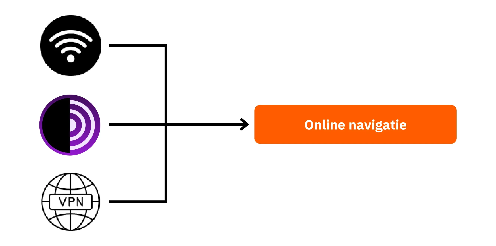

**Sectie 2: Beste praktijken voor computergebruik**

- Hoofdstuk 3 - Computergebruik
- Hoofdstuk 4 - Hacken en back-upbeheer

In dit hoofdstuk behandelen we drie belangrijke gebieden van computerbeveiliging. Eerst zullen we verschillende besturingssystemen onderzoeken, waaronder Mac, PC en Linux, en hun specifieke kenmerken en sterke punten belichten. Vervolgens gaan we in op methoden om je effectief te beschermen tegen hackpogingen en de beveiliging van je apparaten te verbeteren. Tot slot benadrukken we het belang van het regelmatig beveiligen en back-uppen van je gegevens om verlies of ransomware te voorkomen.

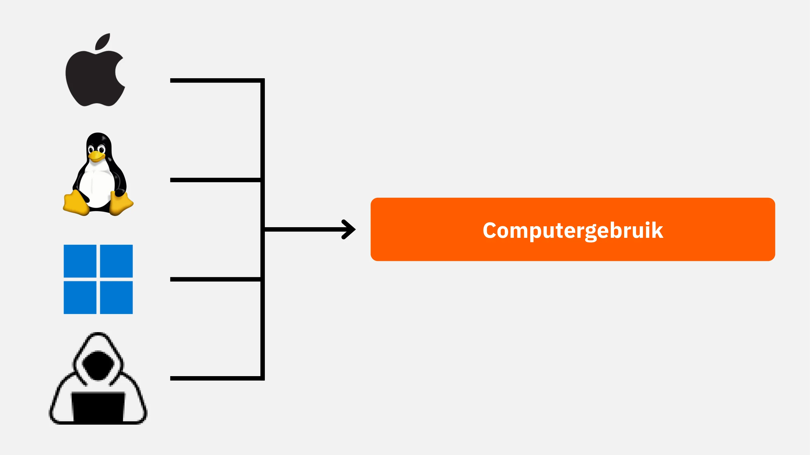

**Deel 3: Implementatie van oplossingen**

- Hoofdstuk 6 - E-mailbeheer
- Hoofdstuk 7 - Wachtwoordmanager
- Hoofdstuk 8 - Authenticatie met twee factoren

In dit praktische derde deel gaan we verder met de implementatie van je concrete oplossingen.

Eerst zullen we zien hoe je je e-mail inbox kunt beschermen, die essentieel is voor je communicatie en vaak het doelwit is van hackers. Daarna laten we je kennismaken met een wachtwoordmanager: een praktische oplossing om te voorkomen dat je wachtwoorden vergeet of door elkaar gebruikt worden en om ze veilig te houden. Tot slot bespreken we een extra beveiligingsmaatregel, twee-factor authenticatie, die een extra Layer bescherming toevoegt aan je accounts. Alles wordt duidelijk en toegankelijk uitgelegd.

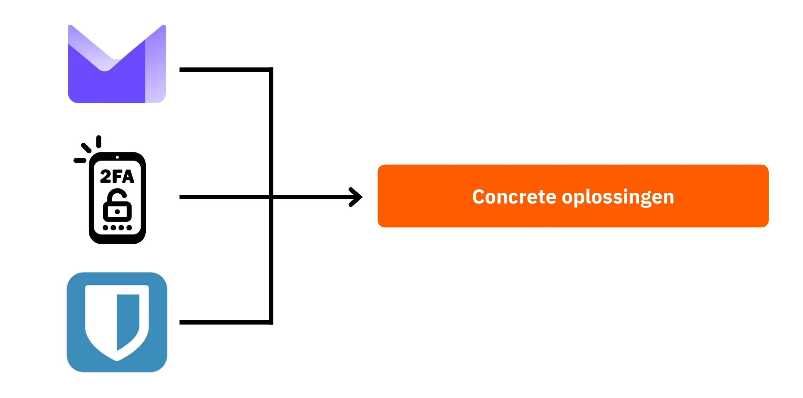

Klaar om uw digitale beveiliging te versterken en de controle over uw gegevens terug te nemen? Laten we gaan!

# Alles wat je moet weten over online surfen

<partId>b4b5379a-d8ef-59ae-94d3-a6e88959c149</partId>

## Online bladeren

<chapterId>3a935da9-fa6e-57eb-bf85-7b3ec35e6ee2</chapterId>

:::video id=f1cead27-ed41-4ca2-afd2-b08a994d0119:::

Wanneer je op het internet surft, is het essentieel om veelgemaakte fouten te vermijden om je online veiligheid te behouden. Hier volgen enkele tips om ze te vermijden:

### Wees voorzichtig met het downloaden van software:

Het is aan te raden om software te downloaden van de officiële website van de uitgever en niet van algemene sites.

Voorbeeld: Gebruik www.signal.org/download in plaats van www.logicieltelechargement.fr/signal.

Het is ook raadzaam om de voorkeur te geven aan open-source software omdat deze vaak veiliger zijn en vrij van kwaadaardige software. Een "open-source" software is een type software waarvan de code openbaar beschikbaar en toegankelijk is voor iedereen. Hierdoor kan onder andere worden gecontroleerd of er geen verborgen toegang is om je gegevens te stelen.

> Bonus: Open-source software is vaak gratis! Deze universiteit is 100% open-source, dus je kunt onze code ook bekijken op GitHub.

### Cookiebeheer: Fouten en best practices

Cookies zijn bestanden die door websites worden aangemaakt om informatie op je computer of mobiele apparaat op te slaan. Hoewel sommige sites deze cookies nodig hebben om goed te functioneren, kunnen ze ook worden misbruikt door sites van derden, met name voor advertentietracking. Onder regelgeving zoals de GDPR is het mogelijk - en aanbevolen - om tracking cookies van derden te weigeren, maar wel cookies te accepteren die essentieel zijn voor het goed functioneren van de site. Na elk bezoek aan een site is het verstandig om de bijbehorende cookies te verwijderen, handmatig of via een extensie of een specifiek programma. Sommige browsers bieden zelfs de mogelijkheid om cookies selectief te verwijderen. Ondanks deze voorzorgsmaatregelen is het cruciaal om te begrijpen dat de informatie die door verschillende sites wordt verzameld met elkaar verbonden kan blijven, vandaar het belang van het vinden van een balans tussen gemak en veiligheid.

> Opmerking: Beperk ook het aantal extensies dat op je browser is geïnstalleerd om mogelijke beveiligings- en prestatieproblemen te voorkomen.

### Webbrowsers: keuzes, beveiliging

Er zijn twee grote families browsers: browsers gebaseerd op Chrome en browsers gebaseerd op Firefox.

Hoewel beide families een vergelijkbaar beveiligingsniveau bieden, is het aan te raden om het gebruik van de Google Chrome browser te vermijden vanwege de trackingmogelijkheden. Lichtere alternatieven voor Chrome, zoals Chromium of Brave, verdienen wellicht de voorkeur. Brave wordt met name aanbevolen vanwege de ingebouwde advertentieblokkering. Het kan nodig zijn om meerdere browsers te gebruiken om toegang te krijgen tot bepaalde websites.

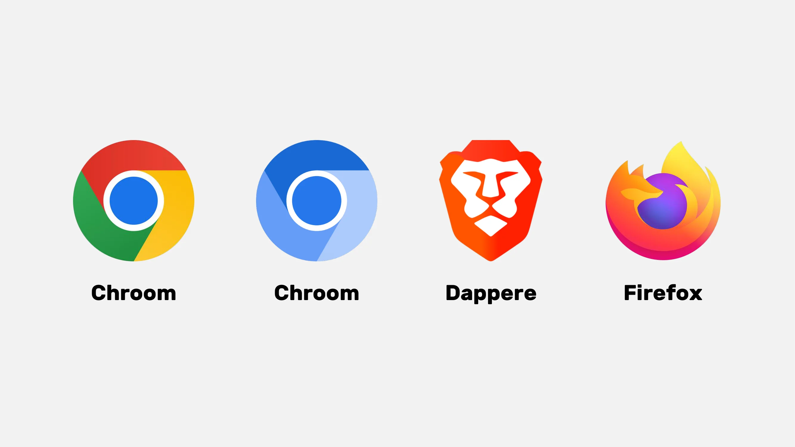

### Privénavigatie, TOR en andere alternatieven voor veiliger en anoniemer surfen

Privénavigatie verbergt het browsen niet voor uw internetprovider, maar zorgt ervoor dat u geen lokale sporen op uw computer achterlaat. Cookies worden automatisch verwijderd aan het einde van elke sessie, zodat u alle cookies kunt accepteren zonder gevolgd te worden. Privénavigatie kan handig zijn bij het kopen van online diensten, omdat websites onze zoekgewoonten bijhouden en de prijzen hierop aanpassen. Het is echter belangrijk op te merken dat privénavigatie wordt aanbevolen voor tijdelijke en specifieke sessies en niet voor algemeen surfen op internet.

Een geavanceerder alternatief is het TOR-netwerk (The Onion Router), dat anonimiteit biedt door het IP Address van de gebruiker te maskeren en toegang te verlenen tot het Darknet. TOR Browser is een browser die speciaal is ontworpen om het TOR-netwerk te gebruiken. Hiermee kun je zowel conventionele websites als .onion websites bezoeken, die meestal door individuen worden beheerd en in verband kunnen worden gebracht met illegale activiteiten.

TOR is een legaal en veelgebruikt hulpmiddel voor journalisten, vrijheidsactivisten en anderen die censuur in autoritaire landen willen omzeilen. Het is echter belangrijk om te begrijpen dat TOR de bezochte sites of de computer zelf niet beveiligt. Daarnaast kan het gebruik van TOR de internetverbinding vertragen, omdat de gegevens door drie computers van anderen gaan voordat ze hun bestemming bereiken. Het is ook belangrijk op te merken dat TOR geen waterdichte oplossing is om 100% anonimiteit te garanderen en dat het niet voor illegale activiteiten mag worden gebruikt.

https://planb.network/tutorials/computer-security/communication/tor-browser-a847e83c-31ef-4439-9eac-742b255129bb

## VPN en internetverbinding

<chapterId>5aac83f4-a685-54b0-9759-d71bea7eeed2</chapterId>

:::video id=737d30ac-43d8-4a69-afda-89b9d7e8c4e1:::

### VPN's

Het beschermen van je internetverbinding is een cruciaal aspect van online beveiliging en het gebruik van virtuele privénetwerken (VPN's) is een effectieve methode om deze beveiliging te verbeteren, zowel voor bedrijven als voor individuele gebruikers.

VPN's zijn tools die gegevens versleutelen die via het internet worden verzonden, waardoor de verbinding veiliger wordt. In een professionele context stellen VPN's werknemers in staat om veilig toegang te krijgen tot het interne netwerk van het bedrijf vanaf externe locaties. De uitgewisselde gegevens worden versleuteld, waardoor het voor derden veel moeilijker wordt om ze te onderscheppen. Naast het beveiligen van de toegang tot een intern netwerk, kan het gebruik van een VPN een gebruiker in staat stellen om zijn internetverbinding via het interne netwerk van het bedrijf te laten lopen, waardoor het lijkt alsof zijn verbinding van het bedrijf afkomstig is. Dit kan vooral handig zijn voor toegang tot online diensten die geografisch beperkt zijn.

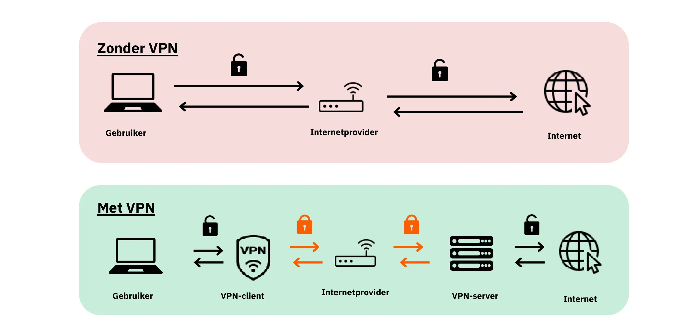

### Soorten VPN's

Er zijn twee hoofdtypen VPN's: ondernemings-VPN's en consumenten-VPN's, zoals Nordvpn. VPN's voor bedrijven zijn meestal duurder en complexer, terwijl VPN's voor consumenten over het algemeen toegankelijker en gebruiksvriendelijker zijn. NordVPN stelt gebruikers bijvoorbeeld in staat om verbinding te maken met het internet via een server in een ander land, waardoor geografische beperkingen worden omzeild.

Het gebruik van een consumenten-VPN garandeert echter geen volledige anonimiteit. Veel VPN-aanbieders bewaren informatie over hun gebruikers, waardoor hun anonimiteit in gevaar kan komen. Hoewel VPN's nuttig kunnen zijn voor het verbeteren van online beveiliging, zijn ze geen universele oplossing. Ze zijn effectief voor specifieke toepassingen, zoals toegang tot geografisch beperkte diensten of het verbeteren van de veiligheid tijdens het reizen, maar ze garanderen geen volledige veiligheid. Bij het kiezen van een VPN is het cruciaal om betrouwbaarheid en technische expertise te verkiezen boven populariteit. VPN-aanbieders die de minste persoonlijke informatie verzamelen zijn over het algemeen het veiligst. Diensten zoals iVPN en Mullvad verzamelen geen persoonlijke informatie en staan zelfs betalingen in Bitcoin toe voor meer privacy.

Tot slot kan een VPN ook worden gebruikt om online advertenties te blokkeren, waardoor je prettiger en veiliger kunt surfen. Het is echter essentieel om grondig onderzoek te doen om de VPN te vinden die het beste bij je behoeften past. Het gebruik van een VPN wordt aanbevolen om de veiligheid te verbeteren, zelfs wanneer je thuis op het internet surft. Dit zorgt voor een hoger beschermingsniveau voor online uitgewisselde gegevens. Tot slot, zou je de URL's en het kleine hangslotje in de Address balk kunnen controleren om te bevestigen dat je op de bedoelde site bent?

https://planb.network/tutorials/computer-security/communication/ivpn-5a0cd5df-29f1-4382-a817-975a96646e68

https://planb.network/tutorials/computer-security/communication/mullvad-968ec5f5-b3f0-4d23-a9e0-c07a3e85aaa8

### HTTPS en openbare Wi-Fi-netwerken

Wat betreft online beveiliging is het belangrijk om te weten dat 4G over het algemeen veiliger is dan openbare Wi-Fi. Het gebruik van 4G kan je mobiele data-abonnement echter snel uitputten. Het HTTPS-protocol is de standaard geworden voor het versleutelen van gegevens op websites. Het zorgt ervoor dat de gegevens die worden uitgewisseld tussen de gebruiker en de website veilig zijn. Daarom is het essentieel om te controleren of de site die je bezoekt het HTTPS-protocol gebruikt.

In de Europese Unie wordt gegevensbescherming geregeld door de General Data Protection Regulation (GDPR). Daarom is het veiliger om Europese aanbieders van Wi-Fi-toegangspunten te gebruiken, zoals SNCF, die de verbindingsgegevens van gebruikers niet doorverkopen. Het feit dat een site een hangslot weergeeft, is echter geen garantie voor authenticiteit. Het is belangrijk om de publieke sleutel van de site te verifiëren met behulp van een certificatensysteem om de authenticiteit te bevestigen. Hoewel gegevensversleuteling voorkomt dat derden de uitgewisselde gegevens onderscheppen, is het nog steeds mogelijk voor een kwaadwillende om zich voor te doen als de site en gegevens in platte tekst over te dragen.

Om online oplichting te voorkomen, is het cruciaal om de identiteit van de site die je bezoekt te verifiëren, vooral door de extensie en domeinnaam te controleren. Wees daarnaast waakzaam voor scammers die vergelijkbare letters in URL's gebruiken om gebruikers te misleiden.

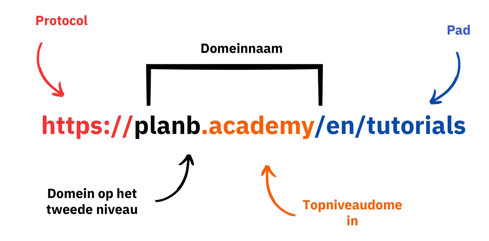

Samengevat kan het gebruik van een VPN de online veiligheid voor zowel bedrijven als individuele gebruikers sterk verbeteren. Bovendien kan het aanleren van goede surfgewoonten bijdragen aan een betere digitale hygiëne. In het volgende deel van deze cursus behandelen we computerbeveiliging, waaronder updates, antivirussoftware en wachtwoordbeheer.

# Beste praktijken voor computergebruik

<partId>e6eac20b-ba24-5d9a-8d86-8e0164074457</partId>

## Computergebruik

<chapterId>16745632-b56b-5423-9873-ddf70fdf1efd</chapterId>

:::video id=35892007-5ea5-4956-bf80-3363d69c96d5:::

De beveiliging van onze computers is een grote zorg in de huidige digitale wereld. Vandaag zullen we Address drie belangrijke punten behandelen:

- De computer kiezen
- Updates en antivirus voor optimale beveiliging
- Beste praktijken voor de beveiliging van uw computer en gegevens.

### De computer en het besturingssysteem kiezen

Wat betreft de keuze van de computer is er geen significant verschil in beveiliging tussen oude en nieuwe computers. Er bestaan echter wel verschillen in beveiliging tussen besturingssystemen, waaronder Windows, Linux en Mac.

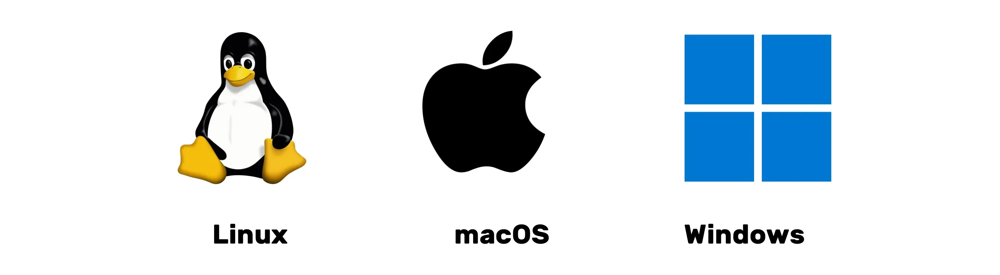

Voor Windows wordt aangeraden om niet dagelijks een beheerdersaccount te gebruiken, maar om twee aparte accounts aan te maken: één voor beheerdersgebruik en één voor dagelijks gebruik. Windows is vaak kwetsbaarder voor malware vanwege het grote aantal gebruikers en het gemak waarmee van een standaardgebruiker naar een beheerder kan worden overgeschakeld. Bedreigingen komen daarentegen minder vaak voor op Linux en Mac.

De keuze van het besturingssysteem moet gebaseerd zijn op je behoeften en voorkeuren. Linux-systemen zijn de laatste jaren sterk geëvolueerd en worden steeds gebruiksvriendelijker. Ubuntu is een interessant alternatief voor beginners, met een gebruiksvriendelijke grafische Interface. Het is mogelijk om een computer te partitioneren om te experimenteren met Linux terwijl je Windows behoudt, maar dit kan een ingewikkeld proces zijn. Het is vaak beter om een eigen computer, een virtuele machine of een USB-sleutel te hebben om Linux of Ubuntu te testen.

### Software-updates

Wat updates betreft, is de regel eenvoudig: **Het regelmatig bijwerken van het besturingssysteem en de toepassingen is essentieel.**

In Windows 10 zijn er bijna continu updates en het is cruciaal om deze niet te blokkeren of uit te stellen. Elk jaar worden er ongeveer 15.000 kwetsbaarheden geïdentificeerd, wat het belang onderstreept van het up-to-date houden van software om je te beschermen tegen malware en andere cyberbedreigingen. Over het algemeen eindigt de ondersteuning van software tussen de 3 en 5 jaar na de release, dus het is noodzakelijk om te upgraden naar een hogere versie om te kunnen blijven profiteren van beveiligingsupdates.

Deze regel geldt voor bijna alle software. Updates zijn namelijk niet bedoeld om je computer verouderd of traag te maken, maar om hem te beschermen tegen nieuwe bedreigingen. Sommige updates worden zelfs als belangrijk beschouwd en zonder deze loopt je computer een groot risico om te worden misbruikt.

Om een concreet voorbeeld van een fout te geven: gekraakte software die niet kan worden bijgewerkt vormt een dubbele potentiële bedreiging. De komst van een virus tijdens het illegaal downloaden van een verdachte website en een onveilig gebruik tegen nieuwe vormen van aanvallen.

### Anti-virus

- Heb je een antivirusprogramma nodig? JA
- Moet je betalen? Dat hangt ervan af!

De keuze en implementatie van een antivirus is belangrijk. Windows Defender, de ingebouwde antivirus in Windows, is een veilige en effectieve oplossing. Voor een gratis oplossing is het extreem goed en veel beter dan veel gratis oplossingen die online te vinden zijn. Voorzichtigheid is geboden bij het downloaden van antivirussoftware van het internet, omdat deze kwaadaardig of verouderd kan zijn.

Voor degenen die willen investeren in een betaalde antivirus, is het aan te raden om een antivirus te kiezen die op intelligente wijze onbekende en opkomende bedreigingen analyseert, zoals Kaspersky. Antivirusupdates zijn cruciaal voor de bescherming tegen nieuwe bedreigingen.

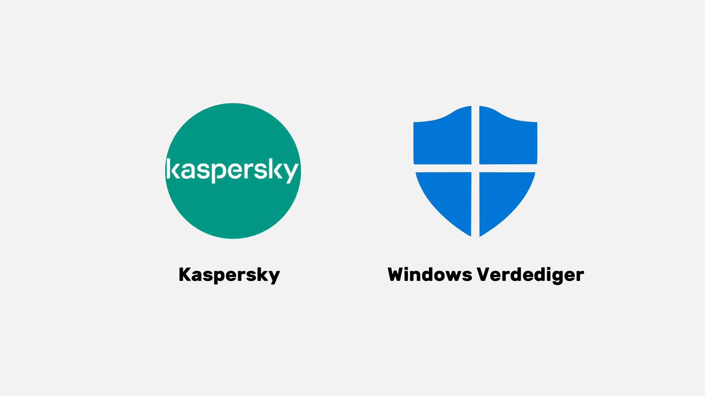

> Opmerking: Linux en Mac hebben dankzij hun systeem voor scheiding van gebruikersrechten vaak geen antivirus nodig.

Tot slot volgen hier enkele best practices voor het beveiligen van je computer en gegevens. Het is belangrijk om een effectieve en gebruiksvriendelijke antivirus te kiezen. Het is ook cruciaal om goede praktijken toe te passen op je computer, zoals het niet plaatsen van onbekende of verdachte USB-sticks. Deze USB-sticks kunnen kwaadaardige programma's bevatten die automatisch worden gestart bij het plaatsen. Het controleren van de USB-stick is nutteloos zodra deze is geplaatst. Sommige bedrijven zijn het slachtoffer geworden van hacking doordat USB-sticks achteloos werden achtergelaten op toegankelijke plaatsen, zoals parkeerplaatsen.

Behandel je computer zoals je je huis zou behandelen: blijf waakzaam, werk je software regelmatig bij, verwijder onnodige bestanden en gebruik een sterk wachtwoord voor extra beveiliging. Het is cruciaal om gegevens op laptops en smartphones te versleutelen om diefstal of gegevensverlies te voorkomen. BitLocker voor Windows, LUKS voor Linux en de ingebouwde optie voor Mac zijn oplossingen voor gegevensversleuteling. Het is aan te raden om gegevensversleuteling zonder aarzeling te activeren en het wachtwoord op papier te zetten en op een veilige plek te bewaren.

Tot slot is het essentieel om een besturingssysteem te kiezen dat aan je behoeften voldoet en dit regelmatig bij te werken, net als de geïnstalleerde applicaties. Het is ook cruciaal om een effectief en gebruiksvriendelijk antivirusprogramma te gebruiken en goede beveiligingspraktijken toe te passen om je computer en gegevens te beschermen.

## Hacking en back-upbeheer: Uw gegevens beschermen

<chapterId>9ddfcb6a-a253-5542-b7eb-df7222b46dc7</chapterId>

:::video id=c6a2c152-f1ae-492c-8993-304d64cdda45:::

### Hoe vallen hackers aan?

Om jezelf effectief te beschermen, is het essentieel om te begrijpen hoe hackers je computer proberen binnen te dringen. Virussen verschijnen namelijk niet vaak op magische wijze, maar zijn eerder de gevolgen van onze acties, zelfs als ze onbedoeld zijn.

In het algemeen komen virussen binnen omdat je je computer hebt toegestaan om ze uit te nodigen. Dit kan zichtbaar zijn door het downloaden van verdachte software, een gecompromitteerd torrentbestand of simpelweg door te klikken op de link in een frauduleuze e-mail.

### Phishing, waakzaamheid tegen frauduleuze e-mails:

Let op! E-mails zijn de eerste aanvalsvector. Hier zijn enkele tips:

- Blijf alert op pogingen tot phishing om gevoelige informatie te ontfutselen, zoals je gegevens en wachtwoorden. Klik niet op verdachte koppelingen en deel je persoonlijke gegevens niet zonder de legitimiteit van de afzender te controleren.
- Wees voorzichtig met e-mailbijlagen en afbeeldingen:

E-mailbijlagen en afbeeldingen kunnen malware bevatten. Download of open geen bijlagen van onbekende of verdachte afzenders en zorg ervoor dat je antivirussoftware up-to-date is.

De gouden regel hier is om zorgvuldig de volledige naam van de afzender en de herkomst van de e-mail te controleren. Bij twijfel, verwijderen!

### Ransomware en soorten cyberaanvallen:

Ransomware is een soort kwaadaardige software die gegevens van gebruikers versleutelt en losgeld eist om ze te ontsleutelen. Dit soort aanvallen komt steeds vaker voor en kan erg lastig zijn voor zowel bedrijven als individuen. Om jezelf te beschermen is het noodzakelijk om back-ups te maken van de meest gevoelige bestanden! Dit zal de ransomware niet stoppen, maar het zal je wel in staat stellen om het te negeren.

Maak regelmatig een back-up van je belangrijke gegevens op een extern opslagapparaat of een veilige online opslagdienst. Zo kun je in het geval van een cyberaanval of hardwarestoring je gegevens herstellen zonder cruciale informatie te verliezen.

Eenvoudige oplossing:

- Koop een externe Hard schijf en kopieer je gegevens erop. Koppel het los en bewaar het op een veilige locatie in huis. (Door dit twee keer te doen en een van de schijven op een andere locatie op te slaan, bescherm je tegen mogelijke brand)

- Maak een cloudback-up met ProtonMail Drive, Sync of Google Drive. Upload je gevoelige gegevens naar deze online host. Wees je er wel van bewust dat je gegevens mogelijk op het internet staan en worden bewaard door een vertrouwde derde partij.

### Moet je de hackers betalen?

NEE, het wordt over het algemeen afgeraden om hackers te betalen in het geval van ransomware of andere soorten aanvallen. Het betalen van losgeld garandeert geen herstel van je gegevens en kan cybercriminelen aanmoedigen om door te gaan met hun kwaadaardige activiteiten. Geef in plaats daarvan prioriteit aan preventie en regelmatige gegevensback-ups om jezelf te beschermen.

Als je een virus ontdekt op je computer, koppel hem dan los van het internet, voer een volledige antivirusscan uit en verwijder geïnfecteerde bestanden. Werk vervolgens uw software en besturingssysteem bij en wijzig uw wachtwoorden om verdere inbraken te voorkomen.

https://planb.network/tutorials/computer-security/data/proton-drive-03cbe49f-6ddc-491f-8786-bc20d98ebb16

https://planb.network/tutorials/computer-security/data/veracrypt-d5ed4c83-7c1c-4181-95ea-963fdf2d83c5

# Implementatie van oplossingen.

<partId>215ec902-ba05-5549-87fc-cb8d82665f7b</partId>

## E-mailaccounts beheren

<chapterId>dfceea33-8712-5557-ace1-6ba5598d33d8</chapterId>

:::video id=75cc914d-9c11-4d3f-86a7-6faf2077f00f:::

### Een nieuw e-mailaccount aanmaken!

Het e-mailaccount is het centrale punt van uw online activiteiten: als het gecompromitteerd is, kan een hacker het gebruiken om al uw wachtwoorden opnieuw in te stellen via de functie "wachtwoord vergeten" en toegang krijgen tot vele andere sites. Daarom moet je het goed beveiligen.

Een e-mailaccount moet worden aangemaakt met een uniek en sterk wachtwoord (details in hoofdstuk 7) en idealiter met een authenticatiesysteem met twee factoren (details in hoofdstuk 8).

Hoewel we allemaal al een e-mailaccount hebben, is het essentieel om te overwegen een nieuw, moderner account aan te maken om fris te beginnen.

### Een e-mailprovider kiezen en e-mailadressen beheren

Een goed beheer van onze e-mailadressen is cruciaal voor de veiligheid van onze online toegang. Het is belangrijk om een veilige en privacy respecterende e-mailprovider te kiezen. ProtonMail is bijvoorbeeld een veilige en privacy respecterende e-mail service.

Bij het kiezen van een e-mailprovider en het aanmaken van een wachtwoord is het essentieel om nooit hetzelfde wachtwoord te hergebruiken voor verschillende online diensten. Het is aan te raden om regelmatig nieuwe e-mailadressen aan te maken en deze voor verschillende doeleinden te gebruiken. Het is raadzaam om een beveiligde e-mailservice te gebruiken voor belangrijke accounts. Het is ook de moeite waard om op te merken dat sommige diensten de lengte van wachtwoorden beperken, dus het is essentieel om op de hoogte te zijn van deze beperking. Er zijn ook diensten beschikbaar voor het aanmaken van tijdelijke e-mailadressen, die kunnen worden gebruikt voor accounts met een beperkte duur.

Om je op de hoogte te stellen: oudere e-mailproviders, zoals La Poste, Arobase, Wig en Hotmail, worden nog steeds gebruikt, maar hun beveiligingspraktijken zijn mogelijk niet zo robuust als die van Gmail. Daarom is het aan te raden om twee aparte e-mailadressen te hebben: één voor algemene communicatie en één voor accountherstel. Je kunt het beste vermijden om je e-mail Address te mengen met die van je telefoonoperator of internetprovider, omdat dit als aanvalsvector kan dienen.

### Moet ik mijn e-mailaccount veranderen?

Gebruik de Have I Been Pwned website (https://haveibeenpwned.com/) om te controleren of je e-mail Address is gecompromitteerd en om meldingen van toekomstige datalekken te ontvangen. Hackers kunnen misbruik maken van een gehackte database om phishing e-mails te versturen of gecompromitteerde wachtwoorden opnieuw te gebruiken.

In het algemeen is het geen slechte gewoonte om een nieuwe, veiligere e-mail Address te gaan gebruiken en het is zelfs noodzakelijk als je op een gezonde basis opnieuw wilt beginnen.

Bonus Bitcoin: Het kan raadzaam zijn om een specifieke e-mail Address aan te maken voor onze Bitcoin activiteiten, zoals het aanmaken van Exchange accounts, om deze gebieden van activiteit in ons leven echt te scheiden.

https://planb.network/tutorials/computer-security/communication/proton-mail-c3b010ce-254d-4546-b382-19ab9261c6a2

## Wachtwoordbeheer

<chapterId>0b3c69b2-522c-56c8-9fb8-1562bd55930f</chapterId>

:::video id=106b6f17-a5c1-4155-abdf-043ce469d45b:::

### Wat is een wachtwoordmanager?

Een wachtwoordmanager is een hulpmiddel waarmee je wachtwoorden voor verschillende online accounts kunt opslaan, generate en beheren. In plaats van meerdere wachtwoorden te onthouden, heb je maar één hoofdwachtwoord nodig om toegang te krijgen tot alle andere wachtwoorden.

Met een wachtwoordmanager hoeft u zich geen zorgen meer te maken dat u uw wachtwoorden vergeet of ergens opschrijft. Je hoeft maar één hoofdwachtwoord te onthouden. Bovendien maken de meeste van deze tools generate sterke wachtwoorden voor je aan, wat de veiligheid van je accounts verhoogt.

### Verschillen tussen enkele populaire managers:

- LastPass: Een van de populairste managers. Het is een service van derden, wat betekent dat je wachtwoorden op hun servers worden opgeslagen. Het biedt zowel een gratis als een betaalde versie, met een gebruiksvriendelijke Interface.

- Dashlane: Het is ook een service van derden, met een intuïtieve Interface en extra functies zoals het bijhouden van creditcardgegevens en beveiligde notities.

### Zelf hosten voor meer controle:

- Bitwarden: Het is een open-source tool, wat betekent dat je de code kunt bekijken om de veiligheid te controleren. Hoewel Bitwarden een gehoste service biedt, kunnen gebruikers het ook zelf hosten. Dit betekent dat u zelf kunt bepalen waar uw wachtwoorden worden opgeslagen, wat mogelijk meer veiligheid en controle biedt.

- KeePass: Het is een open-source oplossing die vooral bedoeld is voor zelf-hosting. Uw gegevens worden standaard lokaal opgeslagen, maar u kunt de wachtwoorddatabase desgewenst op verschillende manieren synchroniseren. KeePass wordt algemeen erkend om zijn veiligheid en flexibiliteit, hoewel het misschien iets minder gebruiksvriendelijk is voor beginners.

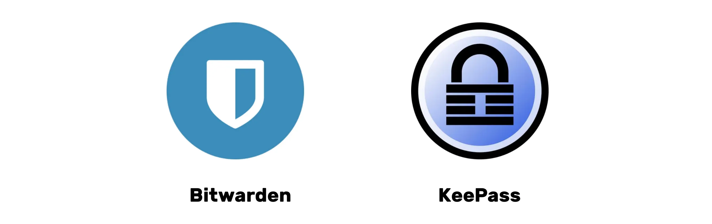

Voor zelfgehoste oplossingen zoals KeePass is het mogelijk om uw database te synchroniseren tussen meerdere apparaten zonder gebruik te maken van gecentraliseerde diensten van derden. Hulpmiddelen zoals **Syncthing** maken versleutelde en gedecentraliseerde synchronisatie rechtstreeks tussen uw apparaten mogelijk. Deze aanpak houdt uw gegevens onder uw controle en zorgt tegelijkertijd voor beschikbaarheid op al uw apparaten.

(Opmerking: De keuze tussen een dienst van derden of een zelf gehoste dienst hangt af van je niveau van technologisch comfort en hoe je controle tegenover gemak stelt. Diensten van derden zijn over het algemeen handiger voor de meeste mensen, terwijl zelf hosten meer technische kennis vereist maar meer controle en gemoedsrust kan bieden op het gebied van beveiliging)

### Wat is een goed wachtwoord?

Een goed wachtwoord is over het algemeen:

- Lang: minstens 12 tekens.
- Complex: een mix van hoofdletters en kleine letters, cijfers en symbolen.
- Uniek: gebruik hetzelfde wachtwoord niet opnieuw voor verschillende accounts.
- Niet gebaseerd op persoonlijke informatie: vermijd geboortedata, namen, enz.

Om de veiligheid van je account te garanderen, is het cruciaal om sterke en veilige wachtwoorden te maken. De lengte van het wachtwoord is niet genoeg om de veiligheid te garanderen. De tekens moeten volledig willekeurig zijn om brute force aanvallen te weerstaan. De onafhankelijkheid van gebeurtenissen is ook belangrijk om de meest waarschijnlijke combinaties te vermijden. Veelgebruikte wachtwoorden zoals "wachtwoord" worden gemakkelijk gecompromitteerd.

Om een sterk wachtwoord te maken, wordt het aanbevolen om een groot aantal willekeurige tekens te gebruiken, zonder voorspelbare woorden of patronen te gebruiken. Het is ook essentieel om cijfers en speciale tekens te gebruiken. Het is echter de moeite waard om op te merken dat sommige websites het gebruik van bepaalde speciale tekens kunnen beperken. Wachtwoorden die niet willekeurig worden gegenereerd, zijn gemakkelijk te raden. Variaties of toevoegingen aan wachtwoorden zijn niet veilig. Websites kunnen de veiligheid van wachtwoorden die door gebruikers zijn gekozen niet garanderen.

Willekeurig gegenereerde wachtwoorden bieden een hoger beveiligingsniveau, hoewel ze moeilijker te onthouden kunnen zijn. Wachtwoordbeheerders kunnen veiligere willekeurige wachtwoorden ontwikkelen. Door een wachtwoordmanager te gebruiken, hoeft u niet al uw wachtwoorden te onthouden. Het is essentieel om geleidelijk je oude wachtwoorden te vervangen door wachtwoorden die zijn gegenereerd door de manager, omdat ze sterker en veiliger zijn. Zorg ervoor dat het hoofdwachtwoord van uw wachtwoordmanager ook sterk en veilig is.

https://planb.network/tutorials/computer-security/authentication/bitwarden-0532f569-fb00-4fad-acba-2fcb1bf05de9

https://planb.network/tutorials/computer-security/authentication/keepass-f8073bb7-5b4a-4664-9246-228e307be246

## Authenticatie met twee factoren

<chapterId>9391e02e-e61b-5a86-93e0-91a07f217d35</chapterId>

:::video id=10fede6f-c839-4455-b324-e887c502667e:::

### Waarom 2FA implementeren

Tweefactorauthenticatie (2FA) is een extra Layer van beveiliging die ervoor zorgt dat de persoon die toegang probeert te krijgen tot een online account, is wie hij/zij beweert te zijn. In plaats van alleen een gebruikersnaam en wachtwoord in te voeren, vereist 2FA een extra vorm van verificatie.

Deze tweede stap kan zijn:

- Een tijdelijke code die via sms wordt verzonden.
- Een code gegenereerd door een applicatie zoals Google Authenticator of Authy.
- Een fysieke beveiligingssleutel die je in je computer steekt.

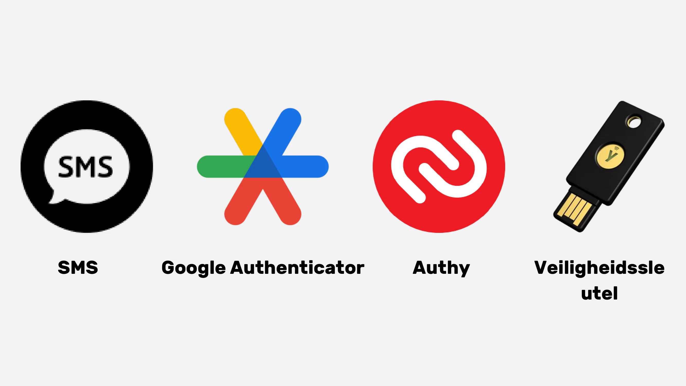

Met 2FA zal een hacker, zelfs als hij je wachtwoord bemachtigt, geen toegang krijgen tot je account zonder deze tweede verificatiefactor. Dit maakt 2FA essentieel voor het beschermen van je online accounts tegen ongeautoriseerde toegang.

### Welke optie moet ik kiezen?

De verschillende opties voor sterke authenticatie bieden verschillende beveiligingsniveaus.

- SMS wordt niet als de beste optie beschouwd, omdat het alleen bewijs levert van het bezit van een telefoonnummer.
- 2FA (twee-factor authenticatie) is veiliger omdat het meerdere soorten bewijs gebruikt, zoals kennis, bezit en identificatie. Eenmalige wachtwoorden (HOTP en TOTP) zijn veiliger dan sms omdat ze cryptografische berekeningen vereisen en lokaal worden opgeslagen in plaats van in het geheugen.
- Hardwaretokens, zoals USB-sleutels of smartcards, bieden optimale beveiliging door voor elke site een unieke privésleutel te genereren en de URL te verifiëren voordat de verbinding wordt toegestaan.

Voor optimale beveiliging met sterke authenticatie is het aan te raden om een veilige e-mail Address, een veilige wachtwoordmanager en 2FA met YubiKeys te gebruiken. Het is ook raadzaam om twee YubiKeys aan te schaffen om verlies of diefstal te voorkomen, bijvoorbeeld door een reservekopie thuis en op uw persoon te bewaren.

Wat mogelijke bedreigingen voor SIM 2FA betreft, is een veelvoorkomend voorbeeld een SIM-swap aanval, waarbij een aanvaller het telefoonnummer van een gebruiker steelt door het te koppelen aan een SIM-kaart die door de aanvaller wordt beheerd. Er zijn verschillende manieren waarop een aanvaller de aanval kan uitvoeren, maar deze bedreiging is meestal alleen een grote zorg voor hooggeplaatste personen en personen van belang.

Biometrie kan als vervanging worden gebruikt, maar is minder veilig dan de combinatie van kennis en bezit. Biometrische gegevens moeten worden opgeslagen op het authenticatiemiddel en mogen niet online worden vrijgegeven. Het is belangrijk om rekening te houden met het dreigingsmodel dat gepaard gaat met verschillende authenticatiemethoden en de werkwijzen hierop aan te passen.

Tot slot kan het nuttig zijn om een korte context te geven over HOTP- en TOTP-OTP's: HOTP is een eenmalig wachtwoord gebaseerd op het HMAC-algoritme (Hash-gebaseerde Message Authentication Code), terwijl TOTP een tijdsgebaseerde OTP is. De belangrijkste kenmerken van dergelijke algoritmen zijn dat wachtwoorden maar één keer kunnen worden gebruikt, dat elke gegenereerde waarde uniek is en dat er een gedeelde sleutel bestaat tussen het apparaat van de gebruiker (client) en de authenticatieservice (server). Het belangrijkste verschil tussen de twee systemen ligt in de manier waarop de factor wordt gegenereerd: het TOTP-systeem is gebaseerd op tijd, terwijl het HOTP-systeem is gebaseerd op tellers.

### Afsluiting van de training:

Zoals je hebt begrepen, is het implementeren van een goede digitale hygiëne niet per se eenvoudig, maar het blijft toegankelijk!

- Een nieuwe beveiligde e-mail Address aanmaken.
- Een wachtwoordmanager instellen.
- 2FA activeren.
- Geleidelijk onze oude wachtwoorden vervangen door sterke wachtwoorden met 2FA.

Blijf leren en implementeer geleidelijk goede praktijken!

Gouden regel: Cyberbeveiliging is een bewegend doelwit dat zich aanpast aan jouw leerproces!

https://planb.network/tutorials/computer-security/authentication/authy-a76ab26b-71b0-473c-aa7c-c49153705eb7

https://planb.network/tutorials/computer-security/authentication/security-key-61438267-74db-4f1a-87e4-97c8e673533e

# Praktisch gedeelte

<partId>98ccf14b-4053-5839-878c-7a73ff02eb95</partId>

## Een mailbox instellen

<chapterId>afc9ab5d-7664-5a9b-ab50-225ac9ba8f7c</chapterId>

Het beveiligen van je e-mailaccount is een cruciale stap in het beveiligen van je online activiteiten en het beschermen van je gegevens. Deze handleiding begeleidt je stap voor stap bij het maken en instellen van een ProtonMail-account, een provider die bekend staat om zijn hoge beveiligingsniveau en end-to-end versleuteling van je communicatie biedt. Of je nu een beginnende of ervaren gebruiker bent, de best practices die hier worden gepresenteerd zullen je helpen de beveiliging van je e-mail te versterken terwijl je profiteert van de geavanceerde functies van ProtonMail:

https://planb.network/tutorials/computer-security/communication/proton-mail-c3b010ce-254d-4546-b382-19ab9261c6a2

## Beveiligen met 2FA

<chapterId>09468ec1-95b7-56a4-a636-7618044568e1</chapterId>

Authenticatie met twee factoren (2FA) is essentieel geworden voor het beveiligen van je online accounts. In deze tutorial leer je hoe je de 2FA app Authy instelt en gebruikt. Authy genereert dynamische 6-cijferige codes om je accounts te beveiligen. Authy is heel eenvoudig te gebruiken en synchroniseert op meerdere apparaten. Ontdek hoe je Authy installeert en configureert, en versterk zo nu al de beveiliging van je online accounts:

https://planb.network/tutorials/computer-security/authentication/authy-a76ab26b-71b0-473c-aa7c-c49153705eb7

Een andere optie is het gebruik van een fysieke beveiligingssleutel. Deze extra handleiding laat zien hoe je een beveiligingssleutel instelt en gebruikt als tweede authenticatiefactor:

https://planb.network/tutorials/computer-security/authentication/security-key-61438267-74db-4f1a-87e4-97c8e673533e

## Een wachtwoordmanager maken

<chapterId>ed579680-4e7b-5f65-8541-14e519a3b242</chapterId>

Wachtwoordbeheer is een uitdaging in het digitale tijdperk. We hebben allemaal talloze online accounts die we moeten beveiligen. Een wachtwoordmanager helpt je bij het maken en opslaan van sterke en unieke wachtwoorden voor elke account.

In deze tutorial leer je hoe je Bitwarden instelt, een open-source wachtwoordmanager, en hoe je je gegevens synchroniseert met al je apparaten om het dagelijks gebruik te vereenvoudigen:

https://planb.network/tutorials/computer-security/authentication/bitwarden-0532f569-fb00-4fad-acba-2fcb1bf05de9

Voor meer gevorderde gebruikers heb ik ook een tutorial over een andere gratis en open-source software om lokaal te gebruiken voor het beheren van je wachtwoorden:

https://planb.network/tutorials/computer-security/authentication/keepass-f8073bb7-5b4a-4664-9246-228e307be246

## Je accounts beveiligen

<chapterId>7a774b34-aed0-57dd-b8f7-cf3be51c0d70</chapterId>

In deze twee tutorials begeleid ik je ook bij het beveiligen van je online accounts en leg ik uit hoe je geleidelijk veiligere werkwijzen kunt aannemen voor het dagelijks beheren van je wachtwoorden.

https://planb.network/tutorials/computer-security/authentication/bitwarden-0532f569-fb00-4fad-acba-2fcb1bf05de9

https://planb.network/tutorials/computer-security/authentication/keepass-f8073bb7-5b4a-4664-9246-228e307be246

## Veranderen van browser & VPN

<chapterId>8dc08feb-313c-5259-a54f-64aa68a07608</chapterId>

Het beschermen van je online privacy is ook een cruciaal punt om je veiligheid te garanderen. Het gebruik van een VPN kan hiervoor een eerste oplossing zijn.

Ik stel voor dat je twee betrouwbare VPN-oplossingen onderzoekt die Bitcoin betalingen accepteren, namelijk IVPN en Mullvad. Deze tutorials laten je zien hoe je Mullvad of IVPN op al je apparaten kunt installeren, configureren en gebruiken:

https://planb.network/tutorials/computer-security/communication/ivpn-5a0cd5df-29f1-4382-a817-975a96646e68

https://planb.network/tutorials/computer-security/communication/mullvad-968ec5f5-b3f0-4d23-a9e0-c07a3e85aaa8

Leer ook hoe je Tor Browser gebruikt, een browser die speciaal is ontworpen om je online privacy te beschermen:

https://planb.network/tutorials/computer-security/communication/tor-browser-a847e83c-31ef-4439-9eac-742b255129bb

## Back-up instellen

<chapterId>01cfcde1-77cb-506c-8df1-fa18a2e8cc6b</chapterId>

Het beschermen van je bestanden is ook een cruciaal punt. Deze handleiding laat zien hoe je een effectieve back-upstrategie implementeert met Proton Drive. Ontdek hoe u deze veilige cloudoplossing kunt gebruiken om de 3-2-1 methode toe te passen: drie kopieën van uw gegevens op twee verschillende media, met één kopie offsite. Dit garandeert de toegankelijkheid en veiligheid van uw gevoelige bestanden:

https://planb.network/tutorials/computer-security/data/proton-drive-03cbe49f-6ddc-491f-8786-bc20d98ebb16

En om je bestanden op verwisselbare media zoals een USB-station of externe Hard schijf te beveiligen, laat ik je ook zien hoe je deze media eenvoudig kunt versleutelen en ontsleutelen met VeraCrypt:

https://planb.network/tutorials/computer-security/data/veracrypt-d5ed4c83-7c1c-4181-95ea-963fdf2d83c5

# Ga verder

<partId>77113cad-a6d8-57e5-b903-50c223b277ba</partId>

## Werken in de cyberbeveiligingsindustrie

<chapterId>aad1ae27-4280-5b07-b9ab-118ae013951a</chapterId>

:::video id=4c818b5c-ea5d-496a-8e82-bc5d96d91430:::

### Cyberbeveiliging: Een groeiend veld met eindeloze mogelijkheden

Als je gepassioneerd bent over het beschermen van systemen en gegevens, biedt cyberbeveiliging talloze mogelijkheden. Als deze branche je intrigeert, volgen hier enkele belangrijke stappen die je kunnen helpen.

### Academische Grondslagen en Certificaten:

Een gedegen opleiding in computerwetenschappen, informatiesystemen of een verwant vakgebied is vaak het ideale uitgangspunt. Deze studies bieden de nodige basis om de technische uitdagingen van cyberbeveiliging te begrijpen. Als aanvulling op deze opleiding is het verstandig om erkende certificeringen op dit gebied te behalen. Hoewel deze certificeringen per regio kunnen verschillen, worden sommige, zoals CISSP of CEH, wereldwijd erkend.

Cyberbeveiliging is een enorm en voortdurend veranderend vakgebied. Het is cruciaal om vertrouwd te raken met essentiële tools en verschillende systemen. Daarnaast zijn er talloze subdomeinen, variërend van incident response tot ethisch hacken. Het is dus goed om je niche te bepalen en je daarin te specialiseren.

### Praktijkervaring opdoen:

Het belang van praktijkervaring kan niet worden onderschat. Stages of junior posities zoeken in bedrijven met cyberbeveiligingsteams is een uitstekende manier om je theoretische kennis toe te passen en praktijkervaring op te doen. Bovendien kun je door deel te nemen aan ethische hackingwedstrijden of cyberbeveiligingssimulaties je vaardigheden verfijnen in praktijksituaties.

De kracht van een professioneel netwerk is van onschatbare waarde. Lid worden van professionele verenigingen, hackerspaces of online fora biedt een platform om Exchange ideeën uit te wisselen met andere experts. Ook het bijwonen van cyberbeveiligingsconferenties en -workshops stelt je niet alleen in staat om te leren, maar helpt je ook om connecties op te bouwen met professionals uit de sector.

De voortdurende evolutie van bedreigingen vereist regelmatige controle van nieuws en gespecialiseerde forums. In een sector waar vertrouwen van het grootste belang is, is handelen met ethiek en integriteit essentieel in elke fase van je carrière.

### Vaardigheden en hulpmiddelen om te verdiepen:

- Gereedschappen voor cyberbeveiliging: Wireshark, Metasploit, Nmap.
- Besturingssystemen: Linux, Windows, MacOS.
- Programmeertalen: Python, C, Java.
- Netwerken: TCP/IP, VPN, firewall.
- Databases: SQL, NoSQL.
- Cryptografie: SSL/TLS, symmetrische en asymmetrische encryptie.
- Incidentbeheer: Logboekanalyse, reactie op incidenten.
- Ethisch hacken: Technieken voor penetratietesten en inbraaktesten.
- Governance: ISO-normen, GDPR en CCPA-regelgeving.

Als je deze vaardigheden en tools onder de knie hebt, ben je goed uitgerust om succesvol te navigeren in de wereld van cyberbeveiliging.

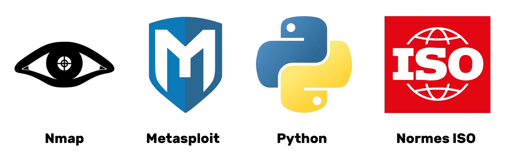

## Interview met Renaud

<chapterId>7d83fd98-ce22-514e-b9e8-729fbf71ee6e</chapterId>

:::video id=ec7014aa-5ebe-444c-80d1-7b14f1fe7bb8:::

### Efficiënt wachtwoordbeheer en versterking van authenticatie: Een academische benadering

Er zijn drie belangrijke dimensies om rekening mee te houden als we het hebben over wachtwoordmanagers: het aanmaken, bijwerken en implementeren van wachtwoorden op websites.

Het wordt over het algemeen afgeraden om browserextensies te gebruiken voor het automatisch vullen van wachtwoorden. Deze tools kunnen de gebruiker kwetsbaarder maken voor phishing-aanvallen. Renaud, een erkend expert op het gebied van cyberbeveiliging, geeft de voorkeur aan handmatig beheer met KeePass, waarbij wachtwoorden handmatig worden gekopieerd en in de applicatie worden geplakt. Extensies vergroten het aanvalsoppervlak, kunnen de prestaties van de browser vertragen en vormen daarom een aanzienlijk risico. Het minimaliseren van het gebruik van extensies in de browser wordt daarom aanbevolen.

Wachtwoordmanagers moedigen over het algemeen het gebruik van extra verificatiefactoren aan, zoals twee-factor authenticatie. Voor optimale beveiliging is het raadzaam om OTP's (One-Time Passwords) op uw mobiele apparaat te bewaren. AndOTP biedt een open-source oplossing voor het genereren en opslaan van one-time password (OTP) codes op je mobiele apparaat. Hoewel Google Authenticator het exporteren van authenticatiecode seeds toestaat, blijft het vertrouwen in back-up op een Google-account beperkt. Daarom worden de applicaties OTI en AndoTP aanbevolen voor autonoom OTP-beheer.

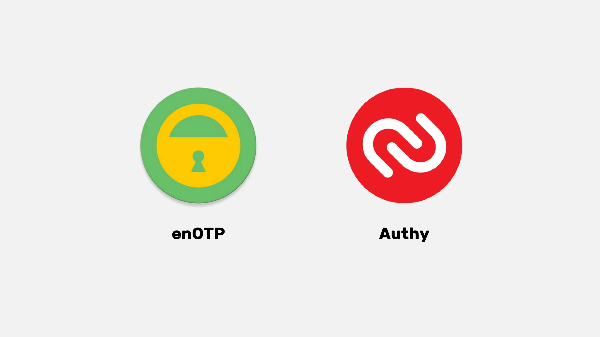

De kwestie van digitale erfenis en digitale rouw benadrukt het belang van een procedure om wachtwoorden over te dragen na iemands overlijden. Een wachtwoordmanager vergemakkelijkt deze overgang door alle digitale geheimen veilig op één plaats op te slaan. De wachtwoordmanager maakt het ook mogelijk om alle open accounts te identificeren en hun sluiting of overdracht te beheren. Het wordt aanbevolen om het hoofdwachtwoord op papier te zetten, maar het moet op een verborgen en veilige plaats bewaard worden. Als de Hard schijf versleuteld is en de computer vergrendeld, is het wachtwoord niet toegankelijk, zelfs niet in geval van inbraak.

### Naar een postwachtwoord tijdperk: Het verkennen van geloofwaardige alternatieven

Wachtwoorden, hoewel alomtegenwoordig, hebben verschillende nadelen, waaronder het risico van overdracht tijdens het authenticatieproces. Toonaangevende bedrijven, zoals Microsoft en Apple, bieden innovatieve alternatieven, waaronder biometrie en hardwaretokens, wat duidt op een progressieve trend om wachtwoorden af te schaffen.

Passkeys bieden bijvoorbeeld versleutelde willekeurige sleutels in combinatie met een lokale factor (zoals biometrische gegevens of een pincode), die een provider host maar buiten zijn bereik blijft. Hoewel hiervoor websites moeten worden bijgewerkt, maakt deze aanpak wachtwoorden overbodig en biedt zo een hoog beveiligingsniveau zonder de beperkingen die traditionele wachtwoorden met zich meebrengen of het probleem van het beheren van een digitale kluis.

Passkiz is een ander haalbaar en veilig alternatief voor wachtwoordbeheer. Er blijft echter een belangrijke vraag: de beschikbaarheid in het geval van een providerstoring. Het zou daarom wenselijk zijn dat internetgiganten systemen voorstellen om deze beschikbaarheid te garanderen.

Directe authenticatie bij de betreffende dienst is een haalbare optie die een derde partij overbodig maakt. De Single Sign-On (SSO) die door internetgiganten wordt aangeboden, levert echter ook problemen op in termen van beschikbaarheid en risico's op censuur. Om datalekken te voorkomen, is het cruciaal om de hoeveelheid informatie die tijdens het authenticatieproces wordt verzameld te minimaliseren.

### Computerbeveiliging: vereisten voor veilige praktijken en risico's door menselijke nalatigheid

Computerbeveiliging kan in gevaar worden gebracht door eenvoudige praktijken en het gebruik van standaard wachtwoorden, zoals "admin". Geavanceerde aanvallen zijn niet altijd nodig om de computerbeveiliging in gevaar te brengen. De beheerderswachtwoorden van een YouTube-kanaal waren bijvoorbeeld geschreven in de privébroncode van een bedrijf. Kwetsbaarheden in de beveiliging zijn vaak het gevolg van menselijke nalatigheid.

Het is ook vermeldenswaard dat het internet sterk gecentraliseerd is en grotendeels onder Amerikaanse controle staat. De DNS-server kan onderhevig zijn aan censuur en gebruikt vaak misleidende DNS om de toegang tot bepaalde sites te blokkeren. DNS is een verouderd en onveilig protocol dat tot veiligheidsproblemen kan leiden. Er zijn nieuwe protocollen opgedoken, zoals DNSsec, maar deze worden nog steeds niet op grote schaal gebruikt. Om censuur en advertentieblokkering te omzeilen, is het mogelijk om alternatieve DNS-aanbieders te kiezen

Alternatieven voor opdringerige advertenties zijn onder andere Google DNS, OpenDNS en andere onafhankelijke diensten. Het standaard DNS-protocol laat DNS-query's zichtbaar voor de internetprovider. DOH (DNS over HTTPS) en DOT (DNS over TLS) versleutelen de DNS-verbinding, wat meer privacy en beveiliging biedt. Deze protocollen worden veel gebruikt in bedrijven vanwege hun verbeterde beveiliging en worden standaard ondersteund door Windows, Android en iPhone. Om DOH en DOT te gebruiken, moet een TLS-hostnaam worden ingevoerd in plaats van een IP Address. Gratis DOH- en DOT-providers zijn online beschikbaar. DOH en DOT verbeteren de privacy en beveiliging door "man-in-the-middle"-aanvallen te vermijden.

Het is ook de moeite waard om het systeem genaamd "Lightning authenticatie" te noemen, dat een andere identifier genereert voor elke dienst, zonder de noodzaak om een e-mail Address of persoonlijke informatie op te geven. Het is mogelijk om gedecentraliseerde identiteiten door gebruikers te laten beheren, maar er is een gebrek aan standaardisatie en normalisatie in gedecentraliseerde identiteitsprojecten. Pakketbeheerders zoals NuGet en Chocolaté, die het mogelijk maken om open source software te downloaden buiten de Microsoft Store om, worden aanbevolen om kwaadaardige aanvallen te vermijden. Samengevat is DNS cruciaal voor online beveiliging; het is echter essentieel om waakzaam te blijven voor mogelijke aanvallen op DNS-servers.

# Laatste Sectie

<partId>3d8ac4c9-f05b-4133-a40a-6e19d579f05f</partId>

## Beoordelingen

<chapterId>6be74d2d-2116-5386-9d92-c4c3e2103c68</chapterId>

<isCourseReview>true</isCourseReview>

## Eindexamen

<chapterId>a894b251-a85a-5fa4-bf2a-c2a876939b49</chapterId>

<isCourseExam>true</isCourseExam>

## Conclusie

<chapterId>6270ea6b-7694-4ecf-b026-42878bfc318f</chapterId>

<isCourseConclusion>true</isCourseConclusion>
