# Urugendo rwo gucungera amakuru yawe

Murakaze, mwese, muri iyi porogarame y’inyigisho yahariwe ivy'umutekano muvy'ubuhinga bwa none. Iki cigwa categuwe kuburyo umuntu wese ashobore kukironka, rero nibisaba ko uba usanzwe ufise ubumenyi mubijanye na siyance y'inyabwonko. Intego yacu nyamukuru ni ukuguha ubumenyi n’ubuhinga bikenewe kugira ngo ushobore kugendera mw’isi y'ubuhinga bwa none ata nkomanzi kandi mumutekano birushijeho.

Ivyo bizosaba ko hashirwa mu ngiro ikoreshwa ry'ibikoresho bimwe na bimwe, harimwo serivisi ya imeyiri irinzwe, ubutunganyirizo bw'ijambo ry'ibanga, be na porogarame z'inyabwonko zitandukanye mu kwongereza umutekano wo kuri interineti.

Muri iki cigwa, ntidufise intumbero yo kuguhindura umuhinga, uwutazwi, canke uwudashobora gushikirwa n’ingorane, kuko ivyo ntibishoboka. Ahubwo, turaguha inyishu zimwe zimwe zoroshe kandi woshikako kugira ngo utangure guhindura akameyero ko gukoresha interineti usanganywe no gusubirana ububasha k'ubusegaba bwawe muvy'ubuhinga bwa none.

Ishirahamwe ry'abatererano:

Muriyeli; igishushanyo

Rogzy Nouri na Fabiyani; umwimbu

Tewo; intererano

+++

# Intangamarara

<partId>534ab66c-b0e6-5757-a7dd-6ea04647edf2</partId>

## Incamake y'icigwa

<chapterId>2f3d005d-8b49-5a3f-b90d-94c11f613407</chapterId>

:::video id=de7236a0-2985-41ef-86f7-3fa0b7f94531:::

**Ihangiro: Gushira kugihe ubuhinga bwawe bwo gucungera umutekano !**

Murakaze, mwese, muri iyi porogarame y’inyigisho yahariwe ivy'umutekano muvy'ubuhinga bwa none. Iki cigwa categuwe kuburyo umuntu wese ashobore kukironka, rero nibisaba ko uba usanzwe ufise ubumenyi mubijanye na siyanse y'inyabwonko. Intego yacu nyamukuru ni ukuguha ubumenyi n’ubuhinga bikenewe kugira ngo ushobore kugendera mw’isi y'ubuhinga bwa none ata nkomanzi kandi mumutekano birushijeho.

Ivyo bizosaba ko hashirwa mu ngiro ikoreshwa ry'ibikoresho bimwe na bimwe, harimwo serivisi ya imeyiri irinzwe, ubutunganyirizo bw'ijambo ry'ibanga, be na porogarame z'inyabwonko zitandukanye mu kwongereza umutekano wo kuri interineti.

Iki cigwa ni igikorwa c’ubufatanye c’abaporofeseri bacu batatu:

- Renaud Lifchitz, umuhinga mu vy'umutekano wo kuri interineti
- Théo Pantamis, umuhinga mu vy'ibiharuro
- Rogzy,  umwe mubashinze Plan ₿ Network.

Isuku ryawe muvy'ubuhinga bwa none ni rirahambaye cane mw’isi iriko iratera imbere mu vy’ubuhinga bwa none. Naho kwinjirirwa biguma vyiyongera n'icungerwa ry'abantu rikorerwa kuri interineti kubwinshi, nturacererwa gutera intambwe ya mbere mu kwikingira.

Muri iki cigwa, ntituriko turagerageza kukugira umuhinga, uwutazwi, canke uwudashobora gushikirwa n’ingorane, kuko ivyo ntibishoboka. Ahubwo, dutanga inyishu zoroshe kandi zishikira bose kugira ngo utangure guhindura ingeso zawe kuri interineti usanganywe no gusubirana ububasha k'ubusegaba bwawe muvy'ubuhinga bwa none.

Niba uriko urarondera ubuhinga buteye imbere ku bijanye nibi, ibikoresho vyacu, inyigisho canke ibindi vyigwa bijanye n’umutekano wo kuri interineti birahari ku bwawe. Hagati aho, ng’iyi incamke ya porogarame yacu mumamasaha make akurikira turi kumwe.

**Igisata ca 1: Ivyo ukeneye kumenya vyose ku bijanye no gushakisha kuri interineti**

- Igice ca 1 - Kurondera kuri interineti
- Igice ca 2 - Gukoresha interineti mumutekano

Kugira ngo dutangure, turaza kuganira ku kamaro ko guhitamwo  igikoresho cokurondera kumbuga(mucukumbuzi) n’ibijanye numutekano wicogikoresho. Tuzoheza tubone ivyerekeye ivyobikoresha, cane cane ku bijanye n’ugutuganywa kw'ububiko bw'amakuru bwite y'uwugenderera urubuga (Cookies). Tuzoheza tubone ingene tworonderera kumbuga hakoreshejwe uburyo burinzwe kandi butagaragaza umwidondoro w'umuntu nibimuranga, dukoresheje ibikoresho nka TOR. Inyuma y’aho, tuzokwibanda ku gukoresha za VPNs kugira ngo hakazwe ugukingirwa kw'amakuru yawe. Ubwa nyuma, tuzoheza n’impanuro zo gukoresha inzira ya WiFi muburyo burinzwe.

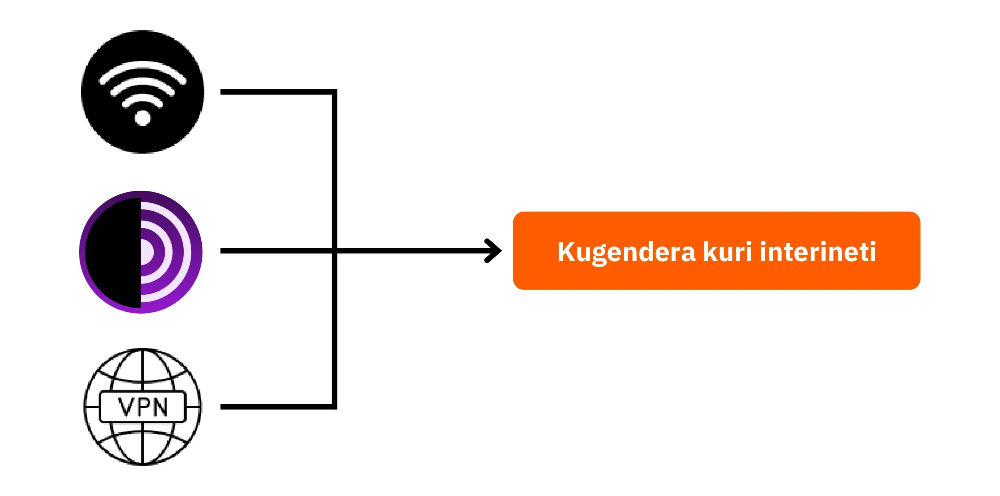

**Igisata ca 2: Imigenzo myiza  yo gukoresha inyabwonko**

- Igice ca 3 - Ikoreshwa ry'inyabwonko
- Igice ca 4 - Ukwinjirigwa be n'ugutunganywa kw'ububiko bw' inyongera bw'amakuru 

Muri iki gisata, turaza kuraba ibintu bitatu nyamukuru bijanye n’umutekano w'inyabwonko. Ubwa mbere, tuzokwihweza sisiteme z'ikoresha zitandukanye, harimwo Mac, PC, na Linux, tugaragaze ibiziranga n’inkomezi zazo. Inyuma y’aho, tuzokwihweza uburyo bwo kwikingira neza abagerageza gutera no kwongereza umutekano w’ibikoresho vyawe. Ubwa nyuma, tuzokwibanda ku kamaro ko kwama urinda no gukora ububiko bw' inyongera bw'amakuru yawe kugira ngo wirinde kugira ikintu na kimwe utakaza canke ransomware.

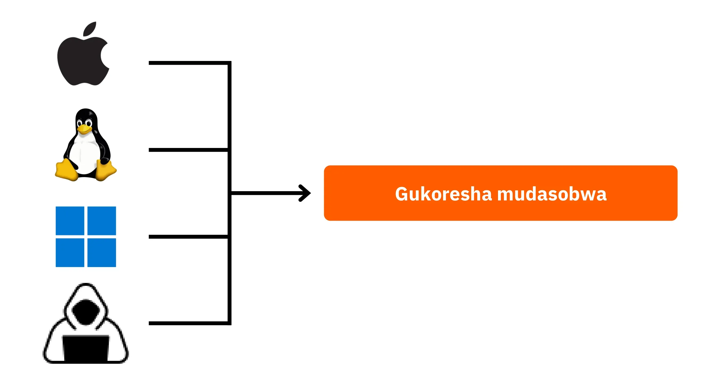

**Igisata ca 3: Gushira mu ngiro inyishu**

- Igice ca 6 - Ugutunganywa kwa imeyiri
- Igice ca 7 - Ubutunganyirizo bw'ijambo ry'ibanga
- Igice ca 8 - Ivyemezo bibiri mukwimenyekanisha

Muri iki gice co gushira mungiro ca gatatu , tuzoja ku gushirwa mu ngiro kw’imiti yawe nyayo.

Ubwa mbere, tuzobona ingene wokingira agasanduku kawe ka imeyiri, ako nako ningombwa ku bijanye n’uguhanahana amakuru yawe kandi akenshi kakaba gakunda guterwa cane n’abatera. Hanyuma, tuzokwereka ubutunganyirizo bw'ijambo ry'ibanga: umuti wogushira mungiro wo kwirinda kwibagirwa canke kuvanga Amajambo y' ibanga yawe mu gihe uyarinda. Ubwa nyuma, tuzovuga ku ngingo y’umutekano y’inyongera, ivyemezo bibiri mukwimenyekanisha, ivyo bikaba vyongera ubundu burinzi bw’inyongera ku makonti yawe. Ivyo vyose bizosigurwa neza kandi muburyo bworoshe gushikako.

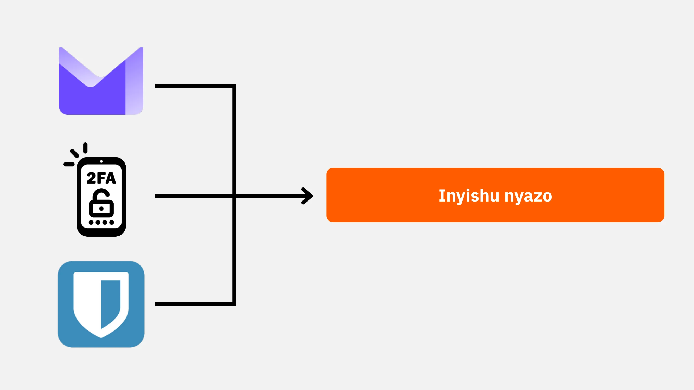

Uriteguye gukomeza umutekano wawe muvy'ubuhinga bwa none no gusubirana ububasha ku amakuru yawe? Reka tugende!

# Ivyo ukeneye kumenya vyose ku bijanye no kurondera kuri interineti

<partId>b4b5379a-d8ef-59ae-94d3-a6e88959c149</partId>

## kurondera kuri interineti

<chapterId>3a935da9-fa6e-57eb-bf85-7b3ec35e6ee2</chapterId>

:::video id=f1cead27-ed41-4ca2-afd2-b08a994d0119:::

Igihe uriko urarondera kuri interineti, birahambaye cane ko wirinda amakosa asanzwe akogwa kugira ngo ugume ufise umutekano wawe kuri interineti. Ngizi inama zimwe zimwe zo kuzirinda:

### Urabe maso mu kuvoma porogarame ku rubuga

uhanuwe kuvoma porogarame ku rubuga rwemewe rw’uwasohoye iyo porogarame aho kuyikura ku mbuga rusangi.

Akarorero: Koresha urubuga www.signal.org/download aho gukoresha urubuga www.logicieltelechargement.fr/signal.

Ni vyiza kandi gushira imbere porogarame zisoko yuguruye(open-source) kuko akenshi usanga atankomanzi kandi ataho zihuriye na porogarame mbi. porogarame "open-source" ni ubwoko bwa porogarame kode yayo iboneka ku mugaragaro kandi ishobora gushikirwa na bose. Ivyo bituma umuntu ashobora gusuzuma, mu bindi, ko ata nzira yihishije yo kwiba amakuru yawe.

> Akarusho: porogarame zisoko yuguruye akenshi zitangwa ku buntu! Iyi kaminuza n'isoko yuguruye 100%, rero urashobora no gusubiramwo kode yacu kuri GitHub.

### Ugutunganywa kwa kuki(cookie): Amakosa n'imigenzo myiza

amakuki ni amadosiye aremwa n’imbuga kugira ngo zibike amakuru ku mashini nyabwonko yawe canke kuri terefone ngendanwa yawe. Naho imbuga zimwe zimwe bibabisaba ko habako ayo makuki kugira zishobore gukora neza, ayo makuki ashobora kandi gukoreshwa n’izindi mbuga, cane cane kugira ngo zikurikirane ibijanye no kwamamaza. Mu mategeko nka GDPR, birashoboka kandi uhanuwe kwankira amakuki y'izindi mbuga gukurikirana amakuru mu gihe wemera amakuki yangombwa kugira ngo urubuga rukore neza. Inyuma y’aho umuntu agendereye urubuga, ni vyiza ko akurako amakuki ajanye n’urubuga, avyikoreye canke biciye ku nyongera bushobozi canke kuri porogarame yihariye. Hari mbere n'ibikoresho vyokurondera kumbuga (mucukumbuzi) bitanga ubushobozi bwo gukurako amakuki muburyo bwo guhitamo. Naho ivyo vyitonderwa, birahambaye cane gutahura ko amakuru yegeranywa n’imbuga zitandukanye ashobora kuguma afite aho ahuriye, ni co gituma bihambaye kurondera ukunganisha ugutuma umuntu ashobora gukora neza n’ugutekanirwa.

> Iciyumviro: Vyongeye, nugabanye igitigiri c’inyongera bushobozi ushira mugikoresho cawe cokurondera kumbuga (mucukumbuzi) kugira ngo wirinde ingorane zikomeye z'umutekano n’imikorere.

### Ibikoresho vyokurondera kumbuga (mucukumbuzi): amahitamwo, umutekano

Hari imiryango ibiri ikomeye y’ibikoresho vyokurondera kumbuga (mucukumbuzi): ivyo bishingiye kuri Chrome n’ivyo bishingiye kuri Firefox.

Naho iyo miryango yompi itanga urugero rumwe rw’umutekano, birakenewe ko umuntu yirinda gukoresha igikoresho cokurondera kumbuga (mucukumbuzi) ca Google Chrome kubera ubushobozi gifise bwo gukurikirana amakuru yumuntu. Ibindi bikoresho vyoroshe kuruta Chrome, nka Chromium canke Brave, bishobora gukundwa kurusha ibindi. Uhanuwe muburyo bwihariye gukoresha Brave  cane cane kubera ubuhinga bwayo ikoranye bwo guhagarika amatangazo. Bishobora kuba ngombwa ko ukoresha ibikoresho vyo kurondera kumbuga (mucukumbuzi) vyinshi kugira ngo ugere ku mbuga zimwezimwe.

### Kurondera mu buryo bwihariye, TOR, n'ubundi buryo bwo gushakisha mu buryo butekanye kandi butazwi

Kurondera mu buryo bw’ibanga, naho nyene bitanyegeza uko urondera ku wuguha interineti, biragufasha kwirinda gusiga ibimenyetso ku mashine nyabwonko yawe. Amakuki aca akugwako ubwo nyene ugiheza kurondera, ivyo bikaba bituma wemera amakuki yose udakurikiranwa. kurondera kumbuga mw’ibanga birashobora kugirakamaro igihe ugura serivisi zokuri interineti, kuko imbuga zikurikirana ingeso zacu zo kurondera zigahindura ibiciro bivanye n’ivyo. Ariko rero, birahambaye kumenya ko Kurondera mu buryo bw’ibanga bihanuwe mugihe biba arivy’igihe gito no mu bihe vyihariye, aho kubikora urondera kuri interineti muri rusangi.

Ubundi buryo buteye imbere cane ni umuhora wa [TOR (The Onion Router)](https://planb.academy/resources/glossary/tor), utanga ubutamenyekana mu kutagaragaza IP Address y’uwuyikoresha no kwemerera umuntu gushika kuri Darknet. TOR ni igikoresha cokurondera kumbuga (mucukumbuzi) cagenewe vyihariye gukoresha umuhora wa TOR. Bigufasha kugenderera imbuga zisanzwe n’imbuga za .onion, zikoreshwa n’abantu ku giti cabo kandi zishobora kuba zifite ahozihuriye n’ibikorwa bitemewe n’amategeko.

TOR ni igikoresho cemewe n’amategeko kandi gikoreshwa cane n’abanyamakuru, abaharanira ukwishira ukizana, n’abandi barondera guca kuruhande ibibujijwe mubihugu bidatanga ukwishira ukizana muri vyose. Ariko rero, nivyakamaro gutahura ko TOR itarinda imbuga zagenderewe canke inyabwonko ubwayo. Ikindi kandi, gukoresha TOR birashobora gutuma interineti igenda gahoro kuko amakuru aca mu nyabwonko z’abandi bantu batatu imbere y’uko ashika aho aja. Ni ngombwa kandi kumenya ko TOR atari umuti uzirintenge wo gutuma umuntu atamenyekana 100% kandi ko idakwiye gukoreshwa mu bikorwa bitemewe n’amategeko.

https://planb.academy/tutorials/computer-security/communication/tor-browser-a847e83c-31ef-4439-9eac-742b255129bb

## VPN n'inzira ya interineti

<chapterId>5aac83f4-a685-54b0-9759-d71bea7eeed2</chapterId>

:::video id=737d30ac-43d8-4a69-afda-89b9d7e8c4e1:::

### Ama VPN

Gukingira inzira ya interineti yawe ni ikintu gihambaye cane mu bijanye n’umutekano wo kuri interineti, kandi gukoresha imihora y’ibanga (VPNs) ni uburyo bwiza bwo gukaza uwo mutekano, haba ku bucuruzi canke ku bayikoresha ku giti cabo.

VPN ni ibikoresho bi nyegeza amakuru yoherezwa kuri interinetii, bikaba bituma iyo nzira iguma irinzwe. Mu bijanye n’umwuga, VPN zituma abakozi bashobora gushika ku muhora w’imbere mw’ishirahamwe bari mubice vyakure na kure. Amakuru ahanahanwa aranyegezwa, ivyo bikaba bituma bigorana cane ko abandi bantu bashobora kubinjirira. Uretse gukingira umuhora w’imbere, gukoresha VPN birashobora gutuma uwuyikoresha ashobora gukoresha inzira ya interineti yiwe biciye ku muhora w’imbere mw’ishirahamwe, bikitwa ko inzira yiwe iva muri iryo shirahamwe. Ivyo birashobora kuba ingirakamaro cane cane ku bijanye no kuronka serivisi zo kuri interineti zibujijwe mukarere.

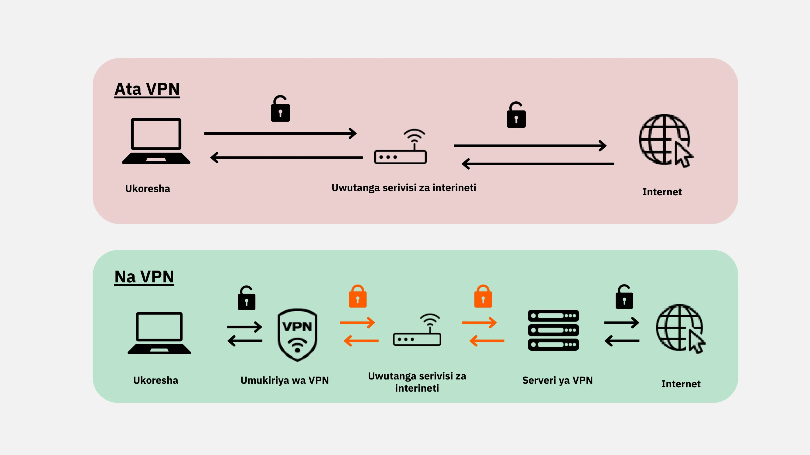

### Ubwoko bwa VPN

Hari ubwoko bubiri bw’ibanze bwa VPN: VPN z’amashirahamwe na VPN z’abaguzi, nka Nordvpn. VPN z’amashirahamwe zikunda kuba zizimvye kandi zigoye, mu gihe VPN z’abaguzi muri rusangi ushobora kuzironka kandi zoroshe gukoresha. Nk’akarorero, NordVPN ituma abayikoresha bashobora kwinjira kuri interinetii biciye ku rusenge(seriveri) ruri mu kindi gihugu, gutyo bakarenga kubibujijwe mukarere.

Ariko rero, gukoresha VPN y’abaguzi ntibituma umuntu atamenyekana. Abatanga VPN benshi bafata amakuru yerekeye abazikoresha, ivyo bishobora gutuma badashika kukutamenyekana kwabo. Naho VPNs zishobora kuba ingirakamaro mu gutuma umutekano wo kuri interineti uja kuyindi ntambwe, si umuti w’abantu bose. zikora neza mu bikorwa vyihariye, nk’ugushika ku bibujijwe mukarere canke gukaza umutekano igihe uri kurugendo, ariko ntibituma umuntu agira umutekano wose ukwiye. Igihe uhitamwo VPN, birahambaye cane ko ushira imbere ukwizigirwa n’ukuba utahura neza uko ikora kuruta ukumenyekana. Abatanga VPN bakorakoranya amakuru makeyi cane y’umuntu ku giti ciwe ni bo muri rusangi badateye ikibazo. Servisi nka iVPN na Mullvad ntizikusanya amakuru y’umuntu ku giti ciwe mbere ziremera no kwishura muri Bitcoin kugira ngo hongerezwe ukwigenga kumuntu bwite.

Ubwa nyuma, VPN irashobora kandi gukoreshwa mu guhagarika amatangazo yo kuri interineti, bikaba bitanga uburyo bwiza kandi burinzwe bwo kurondera. Ariko rero, ni ngombwa gukora ubushakashatsi bwimbitse kugira uronke VPN ihuye neza n’ivyo ukeneye. Birahanuwe gukoresha VPN kugira ngo ukaze umutekano, mbere n’igihe uriko urakoresha interineti muhira. 

Ibi bifasha mugutuma habako ugukingira guhambaye kw'amakuru ahanahanwa kuri interineti. Ubwa nyuma, woba ushobora kuraba ama URL(bumwe mu bwoko bw'amahuza) n’agafunguzo gatoyi kari ahagenewe kwandikwa Aderese kugira ngo wemeze ko uri ku rubuga wagomvye kuba uriko?

https://planb.academy/tutorials/computer-security/communication/ivpn-5a0cd5df-29f1-4382-a817-975a96646e68

https://planb.academy/tutorials/computer-security/communication/mullvad-968ec5f5-b3f0-4d23-a9e0-c07a3e85aaa8

### HTTPS n'imihora ya Wi-Fi ya rusangi

Ku bijanye n’umutekano wo kuri interineti, ni ngombwa gutahura ko muri rusangi 4G irinzwe kuruta Wi-Fi ya rusange. Ariko rero, gukoresha 4G birashobora guheza ningoga umutekero wawe wa interineti. Itegeko rya HTTPS ryacitse umurungongendegwako wo kunyegeza amakuru ku mbuga. Bituma amakuru ahanahanwa hagati y’uwukoresha urubuga n’urubuga aba arinzwe. Kubwivyo ni ngombwa ko wihweza ko urubuga uriko uragenderera rukoresha itegeko rya HTTPS. Ushobora gukora ivyo wihweza aderese ko itanguzwa na "https://" canke uraba ko akagufuri gatoyi kagaragara ahagenewe kwandikwa aderese

Mu Bumwe bw’Uburaya, ugukingira amakuru bigenwa n’itegeko Rusangi ryerekeye Ugukingira Amakuru
(GDPR). Ku bw’ivyo, birarushiriza kuba vyiza gukoresha ibikoresho bifasha kuronka Wi-Fi bitangwa namashirahamwe y’i Buraya, nka SNCF, idasubira kugurisha amakuru y’uguhuza ya babikoresha. Ariko rero, kuba gusa urubuga rwerekana urufunguzo ntivyemeza ko ari urw’ukuri. N'ivyakamaro gusuzuma urufunguzo rwa rusange rw’urubuga hakoreshejwe uburyo bwo gutanga icemeza ko ari urw’ukuri. Kugira ivyo ubikore vyinshi mubikoresho vyokurondeza kuri interineti ushobora gufyonda ku kamenyetso kurufunguzo kugire uronke amakuru yandi kw'ico cemezo. Naho kunyegeza amakuru bibuza abandi kwitambika amakuru ahanahanwa, birashoboka ko umuntu mubi yokwigira urubuga akarungika amakuru mu nyandiko itanyegeje.

Kugira ngo wirinde ububeshi, birahambaye cane ko usuzuma akaranga k’urubuga uriko urarondererako, cane cane mu gusuzuma izina ry'urubuga n'ikirihereza. Ikindi, ba maso ku bahendanyi bakoresha amajambo asa mu ma URL (bumwe mu bwoko bw'amahuza) kugira ngo bahenda abakoresha urubuga.

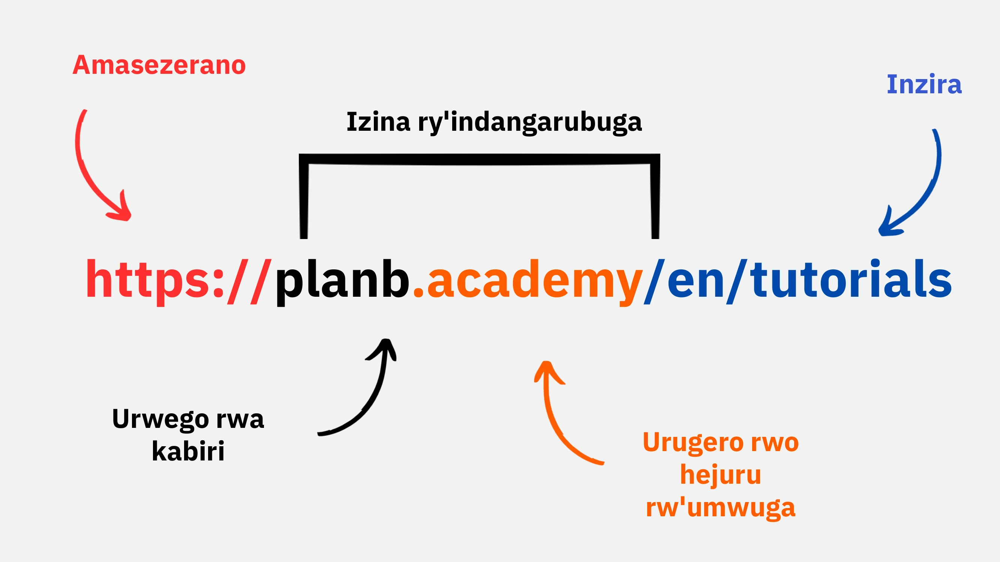

Mu ncamake, gukoresha VPN birashobora gutuma umutekano wo kuri interineti utera imbere cane ku bucuruzi no ku bayikoresha ku giti cabo. Vyongeye, kwimenyereza ingeso nziza zo kurondeza kumbuga birashobora gutuma umuntu agira isuku ryiza muvyubuhinga bwa none. Mu gice gikurikira c’icigwa, tuzoraba ibijanye n’umutekano w'inyabwonko, harimwo n’ivyo gushira kugihe, porogarame zikingira umugera(nyabwonko) be n’ugutunganywa kw'ijambo ry'ibanga.

# Imigenzo Myiza y'Ugukoresha Inyabwonko

<partId>e6eac20b-ba24-5d9a-8d86-8e0164074457</partId>

## Ikoreshwa ry'inyabwonko

<chapterId>16745632-b56b-5423-9873-ddf70fdf1efd</chapterId>

:::video id=35892007-5ea5-4956-bf80-3363d69c96d5:::

Umutekano w'inyabwonko zacu ni ikintu gihangayikishije cane mw’isi y’ubu y’ubuhinga bwa none. Uyu musi, tuza kuraba ibintu bitatu bikomeye:

- Guhitamwo inyabwonko
- Gushira kugihe na porogarame zikingira umugera(nyabwonko) kugira ngo ugire umutekano wikirenga
- Imigenzo myiza kugira ngo habeho umutekano w'inyabwonko yawe n’amakuru yawe.

### Guhitamwo Inyabwonko na Sisiteme ikoresha

Ku bijanye n’uguhitamwo inyabwonko, nta tandukaniro rikomeye riri hagati ya inyabwonko za kera n’izishasha mu bijanye n’umutekano. Ariko rero, hariho itandukaniro mu bijanye n’umutekano hagati ya sisteme zikoresho, harimwo Windows, Linux na Mac.

Ku bijanye na Windows, birakenewe ko udakoresha konti y’umuyobozi vya minsi yose, ahubwo ugakora konti zibiri zitandukanye: imwe y’ibikorwa bijanye n'umuyobozi n’iyindi yibikorwa vya minsi yose. Windows akenshi irashobora gushikirwa cane n’ibintu bibi kubera igitigiri kinini cabayikoresha n’ukuba vyoroshe kuva muri konti isanzwe uja muri konti y'umuyobozi. Ku rundi ruhande, ivyo ntibikunze gushika kuri Linux na Mac.

Guhitamwo sisteme yo gukoresha bikwiye gushingira ku vyo ukeneye n’ivyo ukunda. sisiteme za Linux zarateye imbere cane mu myaka iheze, zica zirushiriza kuba zorohera abazikoresha. "Ubuntu" ni yindi sisteme yabagitangura, ifise igicapo cyoroshe gukoresha. Birashoboka kugabura inyabwonko mwo ibice kugira ngo ugerageze Linux mu gihe uguma ufise Windows, ariko ivyo bishobora kuba igikorwa kigoye. Akenshi ni vyiza kugira inyabwonko yihariye, inyabwonko iri muyindi (virtual), canke urufunguzo rwa USB kugira ngo ugerageze Linux canke "Ubuntu".

### Gushira kugihe porogarame

Ku bijanye n'ugushira kugihe, itegeko riroroshe: **Gushira kugihe sisteme na porogarame buri munsi ni ngombwa.**

Kuri Windows 10, gushira kugihe bisa nkibidahera, kandi birahambaye cane ko utabibuza canke ngo ubicereze. Buri mwaka, haboneka integenke za sisteme nkibihumbi cumi na bitanu 15000, ivyo bikaba bishimika ku kamaro ko kuguma ushira sisteme kugihe kugira ngo wikingire porogarame mbi be n’ibindi bintu vyokuri interineti bishobora konona sistem. Muri rusangi, ubufasha kuri sisteme buhera hagati y’imyaka 3 n’imyaka 5 inyuma y’aho isohorewe, ni co gituma bikenewe ko umuntu ashirakuyindi ntera sisteme kugira ngo akomeze kwunguka bishasha bijanye n’umutekano.

Iryo tegeko rihakwa gukoreshwa kuri porogarame zose. Vyukuri, gushira kugihe ntibigamije gutuma imashini yawe idakoreshwa canke igenda buhoro; ahubwo bigenewe kuyirinda ibintu bishasha bishobora kuyonona. Hari mbere n'ugushira kugihe bifatwa nkibikomeye, utabikoze, inyabwonko yawe yawe iba iri mukaga gakomeye ko kuba yokoreshwa nabi.

Kugira ngo dutange akarorero nyako k’ikosa, porogarame zitarishwe zidashobora gushirwa kugihe zirashobora gutera ingorane zindi. Ugushika kw’umugera(nyabwonko) mumashini yawe mu gihe uyivoma ku rubuga ruteye amakenga mu buryo butemewe n’amategeko be n’ukuyikoresha muburyo butokurinda ibitero bishasha.

### porogarame ikingira umugera (nyabwonko)

- Ukeneye porogarame ikingira umugera? EGOME
- Mbega utegerezwa kuriha? Biravana!

Guhitamwo no gushira mu ngiro porogarame ikingira umugera nivy'akamaro. Windows Defender, porogarame ikingira umugera yubakiye muri Windows, ni umuti udateye ikibazo kandi ukora neza. Ku bijanye n’kuba ari umuti w’ubuntu, ni mwiza cane knd birengeje kuruta iyindi miti myinshi y’ubuntu usanga kuri interineti. Vyukuri, umuntu akwiye kugira amakenga igihe avoma kuri interineti porogarame zikingira umugera(nyabwonko), kuko yoshobora kuba ari mbi canke ikaba yarataye igihe.

Ku bipfuza gushiramwo imitahe muri porogarame zikingira umugera zirihwa, uhanuwe guhitamwo porogram ikingira umugera(nyabwonko) ikora umwihwezo mu buryo bw’ubwenge ibintu vyokonona bitaramenyekana n’ibiza biravuka, nka Kaspersky. Gushira kugihe poragarame ikingira umugera(nyabwonko) birahambaye mu gukingira ibintu vyokonona biza biravuka.

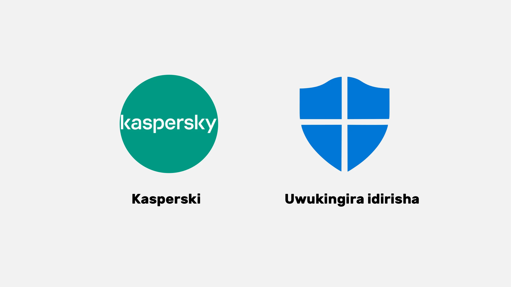

> Iciyumviro: Linux na Mac, kubera uburyo bwazo bwo gutandukanya uburenganzira bw’amakonti yaba zikoresha, kenshi ntizikeneye antivirus.

Ubwa nyuma, ng’iyi imigenzo myiza yo gucungera inyabwonko yawe n’amakuru yawe. Ni vy'akamaro guhitamwo porogarame ikingira umugera(nyabwonko) ikora neza kandi yoroshe gukoresha. Kandi birahamabaye ko utangura kwimenereza imigenzo myiza ku nyabwonko yawe, nk’ukudacomeka imfunguruzo za USB ziteye amakenga. Izo mfunguruzo za USB zishobora kuba zirimwo porogarame mbi zishobora guca zitangura uki zi comeka. Gusuzuma urufunguzo rwa USB ntibizogira akamaro mugihe ruzoba rumaze gucomekwa. Ibigo bimwe bimwe vyarinjiriwe kubera imfunguruzo za USB basiga ataco bitayeko ahantu umuntu ashobora gushika, nk’aho abantu bahagarika imiduga(parikingi).

Fata inyabwonko yawe nk’uko wofata inzu yawe: guma uri maso, uhore ushira kugihe sisteme yawe, ufute amadosiye adakenewe, kandi ukoreshe ijambo ry'ibanga rigoye kumenya kugira ngo urushirize kugira umutekano. Birahambaye kunyegeza amakuru ari ku ma laptop na ma smartphone kugira ngo uyakingire ntiyibwe canke ngo atakare. BitLocker ya Windows, LUKS ya Linux, n’uburyo bwubakiye muri Mac ni imiti yo kunyegeza amakuru. Birahanuwe gukoresha ubuhinga bwo kunyegeza amakuru ata gukekeranya no kwandika ijambo ry'ibanga ku rupapuro kugira ngo ubike ahantu harinzwe.

Mu gusozera, ni ngombwa guhitamwo sisteme ijanye n’ivyo ukeneye kandi ukama uyishira kugihe, be na porogarame zirimwo. Birahamabye kandi gukoresha porogarame ikingira umugera(nyabwonko) ikora neza kandi yoroshe gukoresha no kwimenyereza imigenzo myiza yo gukingira inyabwonko yawe n’amakuru yawe.

## Ukwinjirigwa be n'ugutunganywa kw'ububiko bw' inyongera bw'amakuru: Gukingira amakuru yawe

<chapterId>9ddfcb6a-a253-5542-b7eb-df7222b46dc7</chapterId>

:::video id=c6a2c152-f1ae-492c-8993-304d64cdda45:::

### None abatwinjirira batera gute?

Kugira ngo wikingire neza, ningombwa ko utahura ingene abakwinjirira bagerageza kwinjira mu nyabwonko yawe. Vyukuri, imigera(nyabwonko) ntipfa kuza uko, ahubwo ni ingaruka z’ibikorwa vyacu, naho tubigira tutabibona.

Nk’itegeko rusangi, imigera(nyabwonko) iza kubera ko wemereye inyabwonko yawe ko iyitumira. Ibi birashobora kugaragara mu kuvoma porogarame ziteye amakenga, dosiye ya torrent izayamaze gufata umugera, canke gusa mu gufyonda kuri iryo huza (link) riri muri imeyiri y’ububeshi.

### Ububeshi buciye mudutego (Phishing), ukuba maso kuma imeyiri y'ububeshi

Itwararike! imeyiri nizo ziza ubwambere mugutegwa. Dore inama zimwe zimwe:

- Guma uri maso kutwo dutego (phishing) tugambiriye kugukuramwo amakuru y’agaciro, nk’amakuru yawe y’ibanga be n’amajambo y’ibanga yawe. Irinde gufyonda ku mahuza (link) ateye amakenga no gutanga amakuru yawe bwite utasuzumye uwakurungikiye ko yizewe.
- Urabe maso n'ibifatanijwe na imeyiri n'amashusho:

Ivyo bifatanijwe na imeyiri n’amashusho bishobora kubamwo ibintu bibi. Ntuvome canke ngo wugurure ivyo bifatanijwe na email bivuye ku bantu utazi canke bateye amakenga, kandi urabe neza ko porogarame yawe ikingira umugera(nyabwonko) iri ku gihe.

Itegeko ry’inzahabu aha ni ugusuzuma neza izina ryose ry’uwarungitse imeyiri be n’aho iyo imeyiri ikomoka. Igihe ufise amakenga, uyifute!

### Ransomware n’ubwoko bw’ibitero vyo kuri interineti

Ransomware ni ubwoko bwa porogarame mbi zinyegeza amakuru y’abakoresha kandi zigasaba incungu kugira ngo zigarukane ayo amakuru. Ubwo bwoko bw’igitero bugenda buragwira kandi burashobora gutera ingorane cane ku mashirahamwe n’abantu ku giti cabo. Kugira ngo wikingire, nivyakamaro cane kugira ububiko bw' inyongera bw’amadosiye yakamaro cane! Ivyo ntibizohagarika iyo ransomware(igitero cincungu), ariko bizotuma ushobora kuyirengagiza.

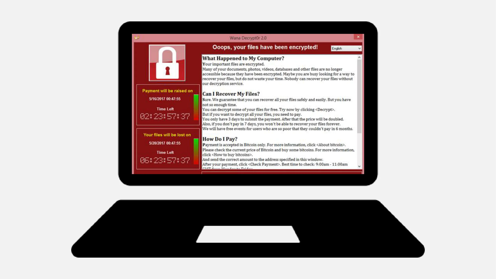

Uhore ukora ububiko bw' inyongera bw'amakuru yawe yakamaro kugikoresho cokubika amakuri kindi canke ku gikoresho co kubika amakuru co kuri interineti kirinzwe. Mubwo buryo, mugihe habaye igitero co kuri interineti canke igikoresho cawe kigapfa, urashobora kugarukana amakuru yawe ata makuru ahambaye utakaje.

Umuti woroshe:

- Gura Hard drive (kimwe mubikoresho vyokubika amakuru) yindi maze ubikeko amakuru yawe. Uyicomore maze uyibike mukibanza kirinzwe atankomanzi mu nzu. (Gukora ivyo incuro zibiri no kubika imwe muri izo hard drive mu kindi kibanza birafasha kwikingira umuriro ushobora gutera.)

- Rema ububiko bw'inyongera kuri cloud (igicu) ukoresheje ProtonMail Drive, Sync, canke Google Drive. Ushirako amakuru yawe y'agaciro. Ariko rero, menya neza ko amakuru yawe ashobora kuba ari kuri interineti kandi ko afise uwundi muntu yizigiwe.

### None woba ukwiye kuriha abo ba kwinjiriye?

OYA, muri rusangi ntuhanuriwe kuriha abakwinjiriye mu gihe habayeho igitero cy’incungu (ransomware) canke ubundi bwoko bw’ibitero. Kuriha iyo ncungu ntibituma amakuru yawe usubira kuyaronka kandi birashobora gutuma abagizi ba nabi bo kuri interineti babandanya ibikorwa vyabo bibi. Ahubwo, nushire imbere ukwirinda no gukora ububiko bw'inyongera bw’amakuru umunsi kumunsi kugira ngo wikingire.

Niwabona umugera(nyabwonko) ku nyabwonko yawe, yikure kuri interineti, ukore irondera rikwiye ry’umugera, hanyuma ufute amadosiye yagizweko ingaruka. Hanyuma, ushire kugihe porogarame yawe na sisiteme, wongere uhindure amajambo y’ibanga yawe kugira ngo ntihagire ukundi gutegwa kubaho.

https://planb.academy/tutorials/computer-security/data/proton-drive-03cbe49f-6ddc-491f-8786-bc20d98ebb16

https://planb.academy/tutorials/computer-security/data/veracrypt-d5ed4c83-7c1c-4181-95ea-963fdf2d83c5

# Gushirwa mu ngiro kw’imiti.

<partId>215ec902-ba05-5549-87fc-cb8d82665f7b</partId>

## Gutunganya konti za imeyiri

<chapterId>dfceea33-8712-5557-ace1-6ba5598d33d8</chapterId>

:::video id=75cc914d-9c11-4d3f-86a7-6faf2077f00f:::

### Gukora konti nshasha ya imeyiri!

Konti ya imeyiri ni yo nzira nyamukuru y'ibikorwa vyawe vyo kuri interineti: iyo ihungabanyijwe igiye mumaboko mabi, uwugutera ashobora kuyikoresha kugira ngo ahindure amajambo y'ibanga yawe yose biciye kuburyo bwa "forgot password" maze akaronka uburenganzira bwo gushika ku zindi mbuga nyinshi. Ni co gituma ukeneye kuyirinda neza.

Konti ya imeyiri ikwiye gukorwa ifise ijambo ry'ibanga ry’umwihariko kandi rikomeye (ibisobanuro biri mu gice ca 7) kandi vyiza cane hakoreshejwe sisteme y'ivyemezo bibiri mukwimenyekanisha (ibisobanuro biri mu gice ca 8).

Naho twese dusanzwe dufise konti ya imeyiri, ni ngombwa ko twiyumvira gukora iyindi nshasha, igezweho kugira ngo dutangure bushasha.

### Guhitamwo abatanga imeyiri no gutunganya aderesi za imeyiri

Gutunganywa neza kw'aderesi zacu za imeyiri ni ikintu gihambaye cane kugira ngo tubone neza ko umutekano wacu wo kuri interineti ukwiye. Ni ngombwa guhitamwo abaguha service za imeyiri zirinzwe kandi buhaha ubuzima bwibanga bwawe. Nk’akarorero, ProtonMail irizewe kandi yubaha ubuzima bwibanga bwawe.

Igihe uhisemwo abaguha imeyiri no gukora ijambo ry'ibanga, ningombwa ko udasubira gukoresha ijambo ry'ibanga rimwe ku ma serivise atandukanye yo kuri interineti. Uhanuwe ko uhora ukora aderesi nshasha za imeyiri bivanye nivyo ushaka gukora. Ni vyiza gukoresha serivise ya imeyiri irinzwe kuma makonti ahambaye. Birabereye kandi kumenya ko hariho serivisi zimwezimwe zigabanya uburebure bw’amajambo y’ibanga, ni ngombwa rero ko uba ubizi. Hariho kandi na service zo gukora aderesi emeyiri vy’igihe gito, bikaba vyokwifashishwa ku makonti amara umwanya muto.

Kugira ndabamenyeshe gusa, abatanga emeyiri ba kera, nka La Poste, Arobase, Wig, na Hotmail, baracariho, ariko uburyo bwabo bwo gucungera umutekano bushobora kuba budahamabaye nk’ubwa Gmail. Kubw'ivyo, uhanuwe kugira aderesi zibiri zitandukanye za email: imwe ni iyo guhanahana amakuru muri rusangi, iyindi ni iyo kugarukana konti, iyo ya nyuma ikaba ari yo irinzwe cane. Ni vyiza kwirinda kuvanga aderese imeyiri yawe niy’uwuguha serivise za terefone yawe canke uwuguha interineti, kuko ivyo bishobora gukoreshwa nk’inzira yo guterwa.

### Noba nohindura konti yanje ya imeyiri?

Ushobora gukoresha urubuga rwa Have I Been Pwned (https://haveibeenpwned.com/) kugira ngo umenye nimba imeyiri yawe Address yahungabanijwe no kugira ngo uronke ubutumwa mugihe amakuru yawe yinjiriwe  muri kazoza. Abakwinjirira barashobora gukoresha urutonde rw’amakuru rwinjiriwe kugira ngo barungike ubutumwa bwububeshi bwo kuri imeyiri  canke basubire gukoresha amajambo y’ibanga yamenenyekanye.

Muri rusangi, gutangura gukoresha aderese imeyiri nshasha, irinzwe cane si umugenzo mubi kandi mbere birakenewe nimba umuntu ashaka gutangura bushasha muburyo buryo bubereye.

akarusho Bitcoin: Bishobora kuba vyiza dukoze aderese imeyiri yihariye ku bikorwa vyacu vya Bitcoin, nk’ugukora amakonti yo guhanahana, kugira ngo dutandukanye ivyo bice vy’ibikorwa mu buzima bwacu vy’ukuri.

https://planb.academy/tutorials/computer-security/communication/proton-mail-c3b010ce-254d-4546-b382-19ab9261c6a2

## Ubutunganyirizo bw'ijambo ry'ibanga

<chapterId>0b3c69b2-522c-56c8-9fb8-1562bd55930f</chapterId>

:::video id=106b6f17-a5c1-4155-abdf-043ce469d45b:::

### Ubutunganyirizo bw'ijambo ry'ibanga ni iki?

Ubutunganyirizo bw'ijambo ry'ibanga ni igikoresho kigufasha kubika, Kurema, no gutunganya amajambo y' ibanga y’amakonti atandukanye yo kuri interineti. Aho kwibuka amajambo y’ibanga menshi, ukeneye ijambo ry’ibanga rimwe gusa kugira ngo ushikire ayandi yose.

Iyo ufise ubutunganyirizo bw'ijambo ry'ibanga, ntuba ugikeneye kwiganyira ku bijanye no kwibagirwa amajambo y'ibanga yawe canke kuyandika ahantu kanaka. Ukeneye kwibuka ijambo ry'ibanga rimwe gusa. Ikindi, vyinshi muri ivyo bikoresho bikuremera amajambo y’ibanga akomeye, ivyo bikaba bituma umutekano wa konti yawe urushiriza kuba mwiza.

### Itandukaniro hagati y'ubutunganyirizo bumwe bumwe buzwi cane:

- LastPass:  bumwe m'ubutunganyirizo buzwi cane. Ni serivise yu wundi muntu, bisobanura ko Amajambo y' ibanga yawe abikwa ku bisenge(seriveri) vyabo . Hariho ukuyikoresha k'ubuntu n'ukuyikoresha urishe, ifise igicapo cyoroshe gukoresha.

- Dashlane: Nayo Ni serivise yu wundi muntu, ifise igicapo cyoroshe gukoresha be n’ibindi nk’ugukurikirana amakuru y’ikarita y’inguzanyo n’amakete arinzwe.

### kwitunganyiriza ubwawe (Self-hosting) kugira ngo ushobore kugira ububasha bwisumbuye:

- Bitwarden: Ni igikoresho c'isoko y'uguruye, bisobanura ko ushobora gusubiramwo kode yayo kugira ngo usuzume umutekano wayo. Naho Bitwarden itanga serivice itunganywa nabandi yemerera kandi abayikoresha ko bashobora kwitunganyiriza ubwabo, ivyo bisigura ko ushobora kugenzura aho amajambo y’ibanga yawe abikwa, bikaba bishobora gutanga umutekano n’ububasha bwisumbuye.

- KeePass: Ni umuti w’isoko y'uguruye wagenewe cane cane kwitunganyiriza. Amakuru yawe abikwa iwawe mubisanzwe, ariko ushobora gusanisha n'urutonde rw'ijambo ry'ibanga ukoresheje uburyo butandukanye mugihe ubishaka. KeePass izwi cane kubera umutekano wayo n’uguhinduranya vyoroshe, naho yoba igoye gukoresha gatoyi ku bagitangura kuyikoresha.

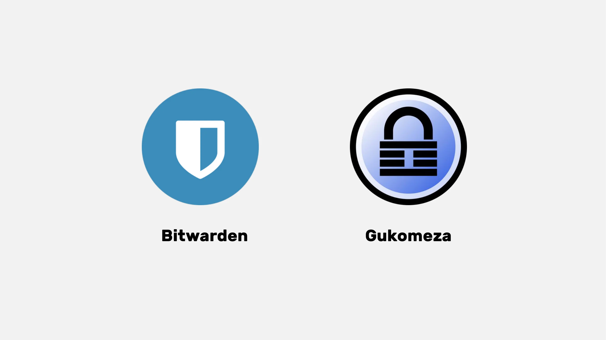

Ku bijanye n'imiti y'ukwitunganyiriza nka KeePass, birashoboka gusanisha urutonde rw'amakuru yawe hagati y'ibikoresho byinshi utakoresheje serivisi zo zigenzurwa z'abandi. Ibikoresho nka **Syncthing** bituma habaho ugusanisha kunyegejwe kandi kutagenzurwa hagati yibikoresho vyawe. Ubu buryo bugufasha kugumana amakuru yawe mu bubasha bwawe kandi ukaba ushoboraku yabona ku bikoresho vyawe vyose.

(Iciyumviro: Guhitamwo hagati ya  serivise yu wundi muntu canke  kwitunganyiriza bivana n’urugero rw’ubuhinga bwawe n’ingene ushira imbere ububasha kuruta uburyo bwo gukoresha.  serivise yu wundi muntu muri rusangi irabereye abantu benshi, mu gihe  kwitunganyiriza bisaba ubumenyi bwinshi mu vy’ubuhinga ariko bishobora gutanga ububasha bwinshi n’amahoro muvy'umutekano)

### Ijambo ry'ibanga ryiza rirangwa niki

ijambo ry'ibanga ryiza muri rusangi ni:

- Rirerire: nimiburiburi indome 12.
- Rirakomeye: ni uruvange rw’indome nini n’intoyi, ibiharuro n’ibimenyetso.
- Umwihariko(Ryihariye): ntusubire gukoresha ijambo ry'ibanga rimwe ku makonti agiye atandukanye.
- Ritegerezwa kuba ridashingiye ku makuru y’umuntu ku giti ciwe: wirinde amatariki y’amavuko, amazina, n’ibindi.

Kugira ngo konti yawe ibe ifite umutekano, birahambaye cane ko ukora amajambo y’ibanga akomeye kandi arinzwe. Uburebure bw’ijambo ry'ibanga ntibuhagije kugira ngo ribe rifise umutekano. Ibirigizwe indome n' ibimenyetso bitegerezwa kuba bidasanzwe kugira ngo birwanye ibitero vy’inkomezi vy’agahomerabunwa(Brute force attacks). Ukwigenga kw’ibintu na kwo nyene ni ikintu gihambaye kugira ngo umuntu yirinde ibintu bishobora guhurizwa hamwe. Amajambo y' ibanga asanzwe nka "password" arashobora guhungabanywa bitagoranye.

Kugira ngo ukore ijambo ry'ibanga rikomeye, uhanuwe ko ukoresha indome nyinshi zidasanzwe, udakoresheje amajambo canke ibigereranyo vyoroshe ku kwiyumvira. Ni ngombwa kandi ko habamwo ibiharuro n’ibimenyetso bidasanzwe. Ariko rero, birabereye kumenya yuko imbuga zimwezimwe zishobora kukubuza gukoresha indome zimwezimwe zidasanzwe. Amajambo y’ibanga asanzwe aroroshye kw'iyumvira. Impinduka canke inyongera ku majambo y’ibanga ntibitekanye. Imbuga ntizishobora Kukwizeza umutekano w’amajambo y’ibanga yatowe n’abazikoresha.

Amajambo y’ibanga aremwa ku buryo nkubwo bwokuvangitiranya indome canke ibimenyetso atanga umutekano mwinshi, naho yoba agoye kwibuka. Ubutunganyirizo bw’Amajambo y' ibanga burashobora gutegura Amajambo y' ibanga afise umuteakano cane. Mu gukoresha ubutunganyirizao bw’ijambo ry'ibanga, ntukeneye gufata ku mutwe amajambo y' ibanga yawe yose. Ni ngombwa ko buhoro buhoro usubiriza amajambo y’ibanga yawe ya kera nayo ategugwa n'ubutunganyirizo bw'ijambo ry'ibanga, kuko akomeye kandi afise umutekano. Raba neza ko ijambo ry'ibanga ry’ubutunganyirizo bwawe bw’ijambo ry'ibanga na ryo nyene rikomeye kandi rifise umutekano.

https://planb.academy/tutorials/computer-security/authentication/bitwarden-0532f569-fb00-4fad-acba-2fcb1bf05de9

https://planb.academy/tutorials/computer-security/authentication/keepass-f8073bb7-5b4a-4664-9246-228e307be246

## Ivyemezo Bibiri mukwimenyekanisha(2FA)

<chapterId>9391e02e-e61b-5a86-93e0-91a07f217d35</chapterId>

### Kubera iki habaho gushira mu ngiro 2FA

Ivyemezo bibiri (2FA) ni uwundi mutekano  w'inyongera bituma bigaragara ko umuntu agerageza kwinjira muri konti kuri interineti ari uwo yivugira ko ari we. Aho kwinjiza gusa izina ry’ukoresha urubuga n’ijambo ry'ibanga, 2FA isaba uburyo bwo kugenzura bwongereweko.

Iyi ntambwe ya kabiri ishobora kuba:

- Kode y’igihe gito yoherezwa biciye kuri SMS.
- Kode yashizweho na porogarame nka Google Authenicator canke Authy.
- Urufunguzo rw’umutekano ucomeka ku nyabwonko yawe.

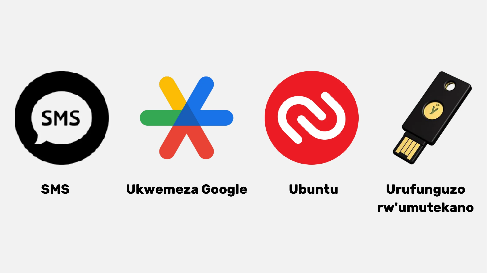

Iyo ukoresheje 2FA, naho umusuma yoronka ijambo banga ryawe, ntazoshobora kwinjira muri konti yawe ataco kindi kintu kigira kabiri co kugenzura. Ivyo bituma 2FA iba ngombwa mu gukingira amakonti yawe yo kuri interineti abagerageza kukwinjirira batavyemerewe.

### Ni ubuhe buryo bwo guhitamwo?

Amahitamwo atandukanye yo kwemeza ko uwinjira ari we bitanga ingero zitandukanye z’umutekano.

- SMS ntiyitwa uburyo bwiza kuko itanga gusa ikimenyamenya c’uko umuntu afise inomero ya terefone.
- 2FA (ivyemezo bibiri mukwimenyekanisha) irarinzwe cane kuko ikoresha ubwoko bwinshi bw’ibimenyamenya, nk’ubumenyi, ivyo ufise, n’ibikuranga. Amajambo y’ibanga akoreshwa rimwe (HOTP na TOTP) niyo afise umutekano kuruta SMS kuko asaba ubuhinga bw'ibiharuro mu buryo bw’ibanga kandi aremerwa aho nyene kugikoresho canke inyabwonko yawe, mugihe SMS zo zishobora guciribwa mo.
- Token z’ibikoresho, nk’imfunguruzo za USB canke amakarata y’ikoranabuhanga (smart card), biratanga umutekano ukwiye mu gutanga urufunguzo rw’ibanga rwihariye kuri buri rubuga kandi hakabaho kugenzura URL (bumwe mu bwoko bw'amahuza) imbere y’uko wemerewa kwinjira.

Kugira ngo ubone umutekano ukwiye n’ukwemeza gukomeye, uhanuwe ko ukoresha aderese imeyiri irinzwe, ubutunganyirizo bw'ijambo ry'ibanga butekanye, kandi ugakoresha 2FA ukoresheje YubiKeys. Ni vyiza kandi kugura YubiKeys zibiri kugira ngo witege ko wotakaza canke ukibwa, nk’akarorero, kugira ububiko bw'inyongera muhira no ku muntu wawe.

Naho ku bijanye n’ibintu bishobora kugutera ubwoba SIM 2FA, akarorero gasanzwe ni igitero co guhindura SIM, aho uwutera yiba inomero ya terefone uwuyikoresha mu kuyihuza n’ikarita SIM igenzurwa n’uwutera, hari uburyo bwinshi uwutera ashobora kurangiza igitero; ariko rero, ivyo bikunda kuba ibiteye ubwoba canke ibihangayikishije kubantu b’abanyacubahiro be n’abantu bafise bivyozana inyungu.

Biometrics irashobora gukoreshwa nk’iyindi nyishu, ariko nitanga umutekano ukwiye cane nk’uguhuza ubumenyi n’ivyo umuntu afise. Amakuru ya biometric akwiye kubikwa ku gikoresho co kwemeza ko umuntu ari we ntagomba kuba ari kuri interineti. Ni vyumumaro kwihweza uburyo bwo gutera ubwoba bujanye n’uburyo butandukanye bwo kwemeza ko umuntu ari we hama ukaza urahindura imigenzo yawe uko bikwiye.

Ubwa nyuma, bishobora kuba vyiza gutanga insiguro ngufi ku bijanye na HOTP be na TOTP OTPs: HOTP ni ijambo ry'ibanga rikoreshwa rimwe rishingiye ku buhinga bwa HMAC (Message ya Kode y’Ukwemeza ishingiye Hash), mu gihe TOTP ari OTP ishingiye ku gihe. Ibintu nyamukuru biranga ubwo buryo ni uko amajambo y’ibanga ashobora gukoreshwa rimwe gusa, Ijambo ryose rivutse riba ryihariye, kandi urufunguzo rusangi ruriho hagati y’igikoresho c’uwakira n’igisenge(seriveri) co kwemeza ko umuntu ari we. Itandukaniro ry’ibanze hagati y’izo sistem zibiri riri mu kuntu ijambo ry'ibanga rivuka: TOTP ishingiye ku gihe, mu gihe HOTP ishingiye ku vyo guharura.

### Gusozera icigwa

Nk’uko mwabitahuye, gushirwa mu ngiro isuku ryiza muvy'ubuhinga bwa none si ngombwa ngo bibe vyoroshe, ariko biguma bishoboka!

- Gukora aderese imeyiri nshasha irinzwe.
- Gushinga ubutunganyirizo bw'ijambo ry'ibanga.
- Gukoresha 2FA.
- Gusubirira amajambo y’ibanga yacu ya kera Buhoro buhoro na yakomeye akoresha 2FA.

Komeza kwiga kandi buhoro buhoro ushire mu ngiro imigenzo myiza!

Itegeko ry'inzahabu: Umutekano wo kuri interineti ni intumbero igendagenda izohuza n’urugendo rwawe rwo kwiga!

https://planb.academy/tutorials/computer-security/authentication/authy-a76ab26b-71b0-473c-aa7c-c49153705eb7

https://planb.academy/tutorials/computer-security/authentication/security-key-61438267-74db-4f1a-87e4-97c8e673533e

# Igisata c'ibikorwa

<partId>98ccf14b-4053-5839-878c-7a73ff02eb95</partId>

## Gutegura ububiko bw'ubutumwa

<chapterId>afc9ab5d-7664-5a9b-ab50-225ac9ba8f7c</chapterId>

Gukingira konti yawe ya imeyiri ni intambwe ihambaye mu gukingira ibikorwa vyawe vyo kuri interineti no gucungera amakuru yawe. Iyi nyigisho izokuyobora, intambwe ku yindi, mu kurema no gushinga konti ya ProtonMail, Izwi kubera umutekano wayo wo hejuru utanga ububiko bunyegeje bw’amakuru yawe uhanahana kuva ku mpera kugeza kuyindi(end-to-end encryption). Waba uri umukoresha mushasha canke usanzwe uzi gukoresha ivyikoranabuhanga, imigenzo myiza ishikirijwe aha izogufasha gukomeza umutekano wa imeyiri yawe mu gihe uzoba uriko urakoresha ubuhinga buteye imbere bwa ProtonMail:

https://planb.academy/tutorials/computer-security/communication/proton-mail-c3b010ce-254d-4546-b382-19ab9261c6a2

## Gukingira biciye muri 2FA

<chapterId>09468ec1-95b7-56a4-a636-7618044568e1</chapterId>

Ivyemezo bibiri (2FA) vyacitse ikintu gihambaye kugira ngo ukingire amakonti yawe yo kuri interineti. Muri iyi nyigisho, uzomenya ingene woshirako no gukoresha porogarame ya 2FA Authy, itanga amakode y’ibiharuro 6 akora neza kugira ngo ukingire amakonti yawe. Authy yoroshe cane gukoresha kandi irakorana n’ibikoresho vyinshi. Tora ingene woshiramwo no gutunganya Authy, gutyo ukomeze umutekano wa amakonti yawe yo kuri interineti ubu nyene:

https://planb.academy/tutorials/computer-security/authentication/authy-a76ab26b-71b0-473c-aa7c-c49153705eb7

Iyindi nzira ni ugukoresha urufunguruzo rw’umutekano rufadika. Iyi nyigisho y'inyongera ikwereka ingene woshirako be n' ugukoresha urufunguzo rw'umutekano nk'ikintu ca kabiri co kwemeza:

https://planb.academy/tutorials/computer-security/authentication/security-key-61438267-74db-4f1a-87e4-97c8e673533e

## Gukora ubutunganirizo bw'ijambo ry'ibanga

<chapterId>ed579680-4e7b-5f65-8541-14e519a3b242</chapterId>

Ubutunganirizo bw'ijambo ry'ibanga n'ikibazo gikomeye mw'iki gihe c'ubuhinga bwa none. Twese turafise ama konti menshi yo kuri interineti yo gukingira. ubutunganirizo bw'ijambo ry'ibanga buragufasha kurema no gushingura amajambo y'ibanga akomeye kandi atahandi woyasanga.

Muri iyi nyigisho, menya ingene woshirako Bitwarden, ubutunganirizo bw’ijambo ry'ibanga bw’isoko yuguruye, n’ingene wohuza amakuru yawe ku bikoresho vyawe vyose kugira ngo woroherwe muvyukora misi yose:

https://planb.academy/tutorials/computer-security/authentication/bitwarden-0532f569-fb00-4fad-acba-2fcb1bf05de9

Ku bakoresha b'inzobere, ndatanga kandi inyigisho ku yindi porogarame y’ubuntu kandi y'isoko yuguruye yo gukoresha ku gikoresho cawe mu gutunganya amajambo y'ibanga yawe:

https://planb.academy/tutorials/computer-security/authentication/keepass-f8073bb7-5b4a-4664-9246-228e307be246

## Gucungera amakonti yawe

<chapterId>7a774b34-aed0-57dd-b8f7-cf3be51c0d70</chapterId>

Muri izi nyigisho zibiri, ndakuyobora kandi mu gucungera amakonti yawe yo kuri interineti no kubigisha neza ingene wofata buhoro buhoro imigenzo y'umutekano wose kugira ushobore kwitunganiriza neza amajambo y'ibanga yawe mu buzima bwa minsi yose.

https://planb.academy/tutorials/computer-security/authentication/bitwarden-0532f569-fb00-4fad-acba-2fcb1bf05de9

https://planb.academy/tutorials/computer-security/authentication/keepass-f8073bb7-5b4a-4664-9246-228e307be246

## Guhindura umucukumbuzi & VPN

<chapterId>8dc08feb-313c-5259-a54f-64aa68a07608</chapterId>

Gukingira ubuzima bwawe bw'ibanga kuri interineti ni ikintu gihamabaye utegerezwa kwitwararika kugira urinde umutekano wawe. Gukoresha VPN birashobora kuba inyishu nyamukuru kugira ushike kuri uwo mutekano wawe.

Ndabagira inama yo kumenya inyishu z'ama VPN zizewe kandi zirihishwa muma Bitcoin, arizo IVPN na Mullvad. Izi nyigisho zirakuyobora ingene woshiramwo, gutunganya, no gukoresha Mullvad canke IVPN ku bikoresho vyawe vyose:

https://planb.academy/tutorials/computer-security/communication/ivpn-5a0cd5df-29f1-4382-a817-975a96646e68

https://planb.academy/tutorials/computer-security/communication/mullvad-968ec5f5-b3f0-4d23-a9e0-c07a3e85aaa8

Kandi, menya gukoresha mucukumbuzi Tor Browser, Igikoresho cagenewe kugufasha kurondera kuri interineti cane gucungera ubuzima bw'ibanga bwo kuri interineti:

https://planb.academy/tutorials/computer-security/communication/tor-browser-a847e83c-31ef-4439-9eac-742b255129bb

## Gukora ububiko bwinyongera

<chapterId>01cfcde1-77cb-506c-8df1-fa18a2e8cc6b</chapterId>

Gukingira amadosiye yawe kandi ni ikintu gihambaye. Iyi nyigisho irakwereka neza ingene woshira mungiro umukenyuro wo gukora ububiko bwinyongera wizewe cane wifashishije Proton Drive. Tora ingene wokoresha uyu muti wa cloud utekanye kugira ngo ukoreshe uburyo bwa 3-2-1: kopi zitatu z’amakuru yawe zibitse ku bikoresho bibiri bitandukanye, na kopi imwe itari kuri interineti. Ibi bituma amadosiye yawe y'agaciro ashobora kworoha gushikwako kandi ari mu mutekano:

https://planb.academy/tutorials/computer-security/data/proton-drive-03cbe49f-6ddc-491f-8786-bc20d98ebb16

Kandi kugira ngo ukingire amadosiye yawe ashinguye ku bikoresho bicomorwa nka USB(flash) canke hard drive(kimwe mubikoresho vyokubika amakuru), ndakwereka kandi ingene wonyegeza canke ukanyegurura ivyo bikoresho ukoresheje VeraCrypt mu buryo bworoshe:

https://planb.academy/tutorials/computer-security/data/veracrypt-d5ed4c83-7c1c-4181-95ea-963fdf2d83c5

# Shika kure

<partId>77113cad-a6d8-57e5-b903-50c223b277ba</partId>

## Uko wokora mu bijanye n'umutekano wo kuri interineti

<chapterId>aad1ae27-4280-5b07-b9ab-118ae013951a</chapterId>

:::video id=4c818b5c-ea5d-496a-8e82-bc5d96d91430:::

### Umutekano wo kuri interineti: Igisata kiriko kirakura gifise amahirwe atagira iherezo

Niba ukunda cane gukingira ama sisteme na’amakuru, igisata c’umutekano wo kuri interineti kiratanga uturyo twinshi. Nimba iki gisata kigutera umunezero, ng’izi intambwe nyamukuru zizokuyobora.

### Ishingiro ry'inyigisho n'ivyemezo

Ubumenyi bukomeye mubijanye na siyanse y'inyabwonko, ubuhinga bwo gutanga amakuru canke ikindi gisata gifitaniye isano n’ivyo, akenshi ni co kintu ciza co gutangurirako. Izi nyigisho zitanga umushinge wa nkenerwa kugira ngo umuntu atahure ibihanze ubuhinga bwa none bijanye n’umutekano wo kuri interineti. Kugira ngo umuntu yuzuze iyo nyigisho, ni vyiza ko aronka ivyemezo vyemewe muri ico gisata. Naho ivyo vyemezo bishobora gutandukanywa hakurikijwe akarere, bimwebimwe, nka CISSP canke CEH, biremerwa kw’isi yose.

Ivy’umutekano wo kuri interineti ni igisata kinini kandi kiguma gitera imbere. Kwimenyereza neza ibikoresho vyangombwa be na sisteme zigiye zitandukanye n'ikintu gihambaye. Ikindi, hamwe n’ibice vyinshi, kuva ku kwishura ku bibazo gushika ku gutera/kwinjirira vy’inyifato runtu, ni vyiza kubimenya cane canke no kubinonosora.

### Kuronka ubumenyi bushingiye ku bikorwa

Ntidushobora gufata minenerwe akamaro k’ubumenyi bushingiye ku bikorwa. Kurondera kwimenyereza umwuga mu vy'icaro vya bashasha mu mashirahamwe afise uturwi two gucunga umutekano wo kuri interineti ni uburyo bwiza cane bwo gukoresha ubumenyi ufise mu vy’inyigisho no kuronka ubumenyi ngirakamaro bishingiye kubikorwa. Ikindi kandi, kwifatanya n’amarushanwa yo guterara/kwinjirira vy’inyifato runtu canke kwigana ivy’umutekano wo kuri interineti birashobora gutuma ubuhinga bwawe butera imbere mu bihe vy’ukuri.

Inkomezi z’urumuhora wa kinyamwuga ni iz’agaciro kanini cane. Kwifatanya n’amashirahamwe akora kinyamwuga, hackerspaces, canke amahuriro yo kuri interineti atanga urubuga rwo guhanahana ivyiyumviro n'abandi bahinga. Ikindi kandi nuko, kuja mu nama n’inyigisho yerekeye umutekano wo kuri interineti ntibituma wiga gusa, ariko kandi biragufasha kwubaka ubucuti n’ababigize umwuga mu vy’ubuhinga.

Ukubangamirwa cane kuguma gutera imbere ivyo rero bikaba bica bituma hakenerwa gucungera umwanya wose kandi kenshi amakuru n'inyigisho zabigenewe. Mu rwego aho ukwizigirana ari kwo guhambaye cane, gukorana n’inyifato runtu ni ngombwa ku ntambwe yose y’akazi kawe.

### Ubuhinga n’Ibikoresho vyo kunonosora

- Ibikoresho vyo gucungera umutekano wo kuri interineti: Wireshark, Metasploit, Nmap.
- Ubuhinga bwo gukoresha(sisteme): Linux, Windows, MacOS.
- Indimi zo kwandikamwo porogarame: python, C, Java.
- Imihora: TCP/IP, VPN, fire wall.
- Urutonde rw'amakuru: SQL, NoSQL.
- Ivy’ukunyegeza amakuru: SSL/TLS, ukunyegeza amakuru bihuye n’ibitaringaniye.
- Ugutunganywa kw'ibiba: Isesengura ry’ivyabaye, inyishu kubiba.
- Gutera/Kwinjirira vy’inyifato runtu(Ethical Hacking): kugerageza kwinjira no kw'injirirwa.
- Intwaro: Ivyagezwe vya ISO, GDPR, n’ivyagenwe na CCPA.

Niwamenya neza ubwo buhinga n’ibikoresho, uzoba ufise ibikenewe vyose kugira ngo ushobore kugendera neza mw’isi y’umutekano wo kuri interineti.

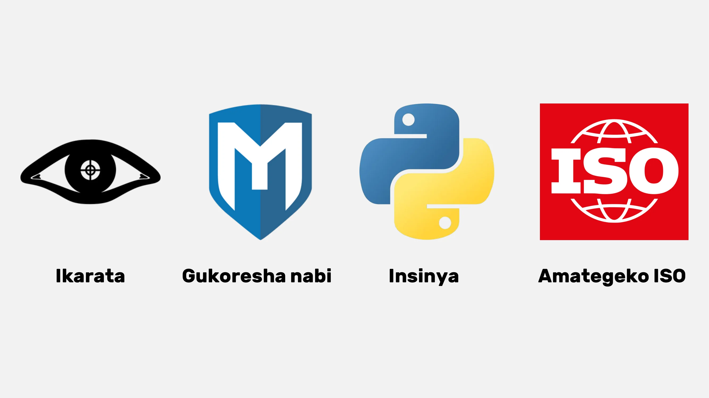

## Ikiganiro na Renaud

<chapterId>7d83fd98-ce22-514e-b9e8-729fbf71ee6e</chapterId>

:::video id=ec7014aa-5ebe-444c-80d1-7b14f1fe7bb8:::

### Gutunganya neza ijambo ry'ibanga no gukomeza ukwemeza uwinjira: Uburyo bwo kwiga

Hariho ibintu bitatu ngenderwako vyo kwitwararika igihe tuvuga ibijanye n’ubutunganyirizo bw' amajambo y’ibanga: ukurema, ugushira ku gihe no gushiraho amajambo y’ibanga ku mbuga.

Muri rusangi sivyiza gukoresha inyongerabushobozi muri mucukumbuzi kugira ngo umuntu yuzuze ijambobanga ryiwe. Ivyo bikoresho birashobora gutuma uwubikoresha ashobora guterwa n’ibitero vy'ububeshi bw'udutego. Renaud, umuhinga mu vy’umutekano wo kuri interineti, akunda gukoresha amaboko akoresheje KeePass, ivyo bikaba birimwo kwimura no gushiramwo amajambo y’ibanga muri iyo porogarame. Izo nyongera bushobozi zikunda kwongereza uburyo bwo guterwa, birashobora gutuma mucukumbuzi igenda bukebuke, bigatuma bitera ingorane nyinshi. Gutyo, kugabanya ikoreshwa ry'inyongerabushobozi ni akamenyero keza kandi uhamagarirwa.

Ubutunganyirizo bw'amajambo y'ibanga muri rusangi bukangurira gukoresha ibindi bintu vyo kwemeza uwinjira, nka 2FA (ivyemezo bibiri mukwimenyekanisha). Kugira ngo ugire umutekano ukwiye, ni vyiza ko uguma ufise amajambo y’ibanga y’igihe gito (OTPs) kuri ngendanwa yawe. AndOTP itanga umuti w’isoko yuguruye wo guhingura no kubika amakode y’ijambo ry'ibanga ry’igihe kimwe (OTP) ku gikoresho cawe co ngendanwa. Naho Google Authenticator yemera kohereza hanze kode y’ukwemeza, ukwizigira ububiko bw'inyongera kuri konti ya Google kuguma ari guke. Ni co gituma, ibikorwa vya OTI na AndoTP bihanuwe mubijanye n’ugutunganywa kwa OTP kwigenga.

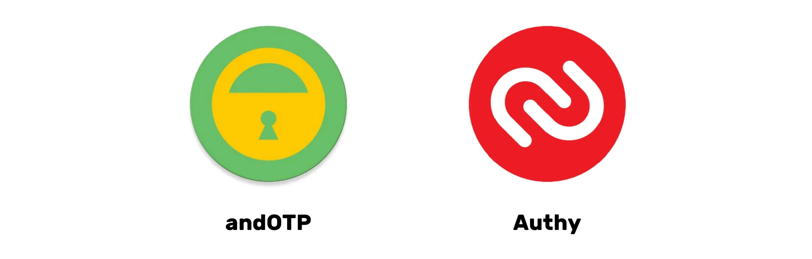

Ikibazo c’iragi ry’ubuhinga bwa none n’ugucura intimba kw’ubuhinga bwa none kirerekana akamaro ko kugira uburyo bwo gutanga amajambo y’ibanga umuntu amaze gupfa. Ubutunganyirizo bw'amajambo y'ibanga burafasha iyo mpinduka mu kubika neza amabanga yose y’ubuhinga bwa none ahantu hamwe. Ubutunganyirizo bw'amajambo y'ibanga kandi budufasha kumenya amakonti yose yuguruye no gutunganya ukugarwa kwayo canke uguhererekanywa kwayo. Ni vyiza kwandika ijambo banga ry’ibanze ku rupapuro, ariko rikwiye kubikwa ahantu hiherereye kandi hafise umutekano. Iyo amakuru ari kuri Hard drive anyegeje kandi inyabwonko ikaba yugaye, ijambo ry'banga ntiri zoshobora gushikwako, mbere n’igihe umuntu yibwe.

### Kuja mu gihe c'inyuma y'ijambo ry'ibanga: Gutohoza ubundi buryo bwizewe

Amajambo y’ibanga, naho ari hose arafise ingaruka mbi nyinshi, harimwo n’ingorane zo gutanga amakuru mu gihe c'ukwimenyekanisha. Amashirahamwe akomeye nka Microsoft na Apple, aratanga uburyo bushasha bwo gukoresha, harimwo n’ibimenyetso vy’ubuhinga(Tokens) bwa biometric n’ivy'ibikoresho, ivyo bikaba vyerekana ko hariho iterambere ry’uguheba amajambo y’ibanga.

Nk’akarorero, Passkeys zitanga imfunguruzo zidasanzwe zinyegeje zifatanijwe n’ikintu co mu mashini yawe (nka biometrics canke PIN), ivyo uwubitanga naho abitanga biaguma kure y’aho ashobora gushika. Naho ivyo bisaba gushira kugihe imbuga, iyo nzira irakurako ivy’ugukenera amajambo y’ibanga, ivyo bikaba bitanga umutekano wo ku rugero rwo hejuru ata ngorane zijanye n’amajambo y’ibanga ya kera canke ikibazo co gucunga ububiko bw’ibanga bw’ubuhinga bwa none.

Passkiz ni ubundi buryo bushoboka kandi butekanye bwo gucunga ijambobanga. Ariko rero, ikibazo gikomeye kiracariho: ukuboneka mu gihe uwubutanga abuze. Vyoba vyiza rero ko ibigo bikomeye vyo kuri interineti bitanga uburyo bwo gutuma ivyo bishobora kuboneka.

Kwimenyekanisha vyihuse ataco umuntu akoze kuri serivise kanaka ni uburyo bushoboka bushobora gutuma umuntu adakenera uwundi muntu. Ariko rero, iyo nzira yitwa Single Sign-On (SSO) itangwa n’ibigo bikomeye vyo kuri interineti na yo nyene iratera ingorane mu bijanye n’ukuntu iboneka be n’ingorane zo gucungerwa. Kugira ngo amakuru ntasohoke, birahambaye cane ko amakuru yegeranywa agabanywa mu gihe c’ukwimenyekanisha.

### Umutekano w'inyabwonko: Akamaro k'imigenzo y'umutekano n'ingorane zijanye n'ukwanjanjwa kw'umuntu

Umutekano w'inyabwonko ushobora guhungabanywa n'ibikorwa bisanze no gukoresha amajambo y'ibanga asanzwe ariho, nka "admin". Ibitero bikomeye ntivyama bikenewe kugira ngo umutekano w' inyabwonko yawe ugire ikibazo. Nk'akarorero, amajambo y'ibanga y'umuyobozi w'umurongo wa YouTube yanditswe muri kode y'isoko y'ibanga y'ishirahamwe. Akenshi uguhungabana kw’umutekano biterwa n’ubujuju bw’abantu.

Birabereye kandi kumenya ko interineti iri ahantu hagendurwa kandi ahanini igenzurwa n’Abanyamerika. Server ya DNS irashobora gukengera kandi akenshi irashobora gukoresha DNS ihendabantu kugira ngo ibuze imbuga zimwe zimwe kugenderwa. DNS ni umurongo wa kera kandi udatekanye ushobora gutuma haba ibibazo vy’umutekano. Amategeko mashasha, nka DNSsec, yarasohotse ariko n’ubu ntakoreshwa cane. Kugira ngo ushire kure ugucengera no kubuza amatangazo, birashoboka guhitamwo abandi batanga DNS.'

Ubundi buryo bwo kwamamaza butera ubwoba harimwo Google DNS, OpenDNS, n’izindi serivisi zigenga. Itegeko rya DNS risanzwe risiga ibibazo vya DNS biboneka ku wutanga serivisi ya interineti. DOH (DNS kuri HTTPS) na DOT (DNS kuri TLS) zinyegeza uruja n’uruza rwa DNS, zigatuma umuntu agira ubuzima bwite n’umutekano mwinshi. ayomategeko akoreshwa cane mu bigo kubera umutekano wayo kandi asanzwe ashigikirwa na Windows, Android, na iPhone. Kugira ngo ukoreshe DOH na DOT, izina ry'ubushitsi TLS ritegerezwa kuba ariryo ryandikwa aho gukoresha Aderese IP . Abatanga DOH na DOT ku buntu baraboneka kuri interineti. DOH na DOT zituma ubuzima bwite n'umutekano bitera imbere mu kwirinda ibitero vy'abantu babaja hagati (man-in-the-middle) mugihe amakuru ahana hanwa.

Ni vyiza kandi kuvuga uburyo bwitwa "Lightning authentication", butanga ikimenyetso gitandukanye kuri buri serivise yose, idatanze aderese imeyiri canke amakuru y'umuntu bwite. Birashoboka ko haba akaranga k’abantu bose kagenzurwa n’abakoresha, ariko hariho ukubura uguhuza n’ugusanura mu migambi y’akaranga k’abantu katagenzurwa. Abatunganya amapaki nka NuGet na Chocolaté, bashobora kwemerera kuvoma porogarame z'isoko yuguruye hanze y’ubudandarizo bwa Microsoft, nibo muhanuriwe gukoresha kugira wirinde ibitero bibi. Mu ncamake, DNS ni ikintu gihambaye cane ku mutekano wo kuri interineti; ariko rero, ni ngombwa ko umuntu aguma ari maso ku bitero bishobora gutera ibisenge(server) vya DNS.

# Igisata ca nyuma

<partId>3d8ac4c9-f05b-4133-a40a-6e19d579f05f</partId>

## Guterera iciyumviro n'amanota

<chapterId>6be74d2d-2116-5386-9d92-c4c3e2103c68</chapterId>

<isCourseReview>true</isCourseReview>

## Ikibazo canyuma

<chapterId>a894b251-a85a-5fa4-bf2a-c2a876939b49</chapterId>

<isCourseExam>true</isCourseExam>

## Gusozera

<chapterId>6270ea6b-7694-4ecf-b026-42878bfc318f</chapterId>

<isCourseConclusion>true</isCourseConclusion>
