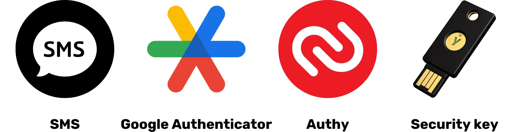

# Safari ya kulinda data yako

Karibu kila mtu kwenye mpango huu wa elimu unaolenga usalama wa kidijitali. Mafunzo haya yameundwa ili yaweze kufikiwa na kila mtu, kwa hivyo hakuna ujuzi wa awali wa sayansi ya kompyuta unaohitajika. Lengo letu kuu ni kukupa maarifa na ujuzi unaohitajika ili kuvinjari ulimwengu wa kidijitali kwa usalama na faragha zaidi.

Hili litahusisha utekelezaji wa zana kadhaa kama vile huduma salama ya barua pepe, zana ya kudhibiti vyema manenosiri yako, na programu mbalimbali ili kulinda miamala yako za mtandaoni.

Katika mafunzo haya, hatulengi kukufanya uwe mtaalam, usijulikane, au usiwe hatarini, kwani hii haiwezekani. Badala yake, tunakupa baadhi ya suluhu rahisi na zinazoweza kufikiwa ili kuanza kubadilisha tabia zako za mtandaoni na kurejesha udhibiti wa mamlaka yako ya kidijitali.

Timu ya wachangiaji:

Muriel; kubuni

Rogzy Noury ​​& Fabian; uzalishaji

Théo; mchango

+++
# Utangulizi

<partId>534ab66c-b0e6-5757-a7dd-6ea04647edf2</partId>

## Utangulizi wa Kozi

<chapterId>2f3d005d-8b49-5a3f-b90d-94c11f613407</chapterId>

### Lengo: Sasisha ujuzi wako wa usalama!

Karibu kila mtu kwenye mpango huu wa elimu unaolenga usalama wa kidijitali. Mafunzo haya yameundwa ili yaweze kufikiwa na kila mtu, kwa hivyo hakuna ujuzi wa awali wa sayansi ya kompyuta unaohitajika. Lengo letu kuu ni kukupa maarifa na ujuzi unaohitajika ili kuvinjari ulimwengu wa kidijitali kwa usalama na faragha zaidi.

Hii itahusisha utekelezaji wa zana kadhaa kama vile huduma salama ya barua pepe, zana ya kudhibiti vyema manenosiri yako, na programu mbalimbali ili kulinda miamala yako ya mtandaoni.

Mafunzo haya ni juhudi shirikishi za maprofesa wetu watatu:

- Renaud Lifchitz, mtaalam wa usalama wa mtandao
- Théo Pantamis, PhD katika hesabu iliyotumika
- Rogzy, Mwenyekiti wa Plan ₿ Network

Usafi wako wa kidijitali ni muhimu katika ulimwengu unaozidi kuwa wa kidijitali. Licha ya kuongezeka kwa mara kwa mara kwa utapeli na ufuatiliaji wa watu wengi, sio kuchelewa sana kuchukua hatua ya kwanza na kujilinda.

Katika mafunzo haya, hatujaribu kukufanya kuwa mtaalam, asiyejulikana, au asiyeweza kuathiriwa, kwani hii haiwezekani. Badala yake, tunakupa baadhi ya suluhu rahisi na zinazoweza kufikiwa kwa kila mtu ili kuanza kubadilisha tabia zako za mtandaoni na kurejesha udhibiti wa mamlaka yako ya kidijitali.

Ikiwa unatafuta ujuzi wa hali ya juu zaidi kuhusu mada hii, nyenzo zetu, mafunzo, au mafunzo mengine ya usalama wa mtandao yako hapa kwa ajili yako. Wakati huo huo, hapa kuna muhtasari mfupi wa programu yetu kwa saa chache zijazo pamoja.

### Sehemu ya 1: Kila kitu unachohitaji kujua kuhusu kuvinjari mtandaoni

- Sura ya 1 - Kuvinjari mtandaoni
- Sura ya 2 - Kutumia mtandao kwa usalama

Kwanza, tutajadili umuhimu wa kuchagua kivinjari cha wavuti na athari zake kwa usalama. Kisha tutachunguza maelezo mahususi ya vivinjari, hasa kuhusu usimamizi wa vidakuzi. Pia tutaona jinsi ya kuhakikisha hali ya kuvinjari iliyo salama zaidi na isiyojulikana, kwa kutumia zana kama vile TOR. Baadaye, tutazingatia matumizi ya VPN ili kuimarisha ulinzi wa data yako. Hatimaye, tutamalizia na mapendekezo ya matumizi salama ya miunganisho ya WiFi.

### Sehemu ya 2: Mbinu bora za matumizi ya kompyuta

- Sura ya 3 - Matumizi ya kompyuta
- Sura ya 4 - Udukuzi na usimamizi wa chelezo

Katika sehemu hii, tutashughulikia maeneo matatu muhimu ya usalama wa kompyuta. Kwanza, tutachunguza mifumo tofauti ya uendeshaji: Mac, PC, na Linux, tukiangazia sifa na nguvu zao. Kisha, tutachunguza mbinu za kulinda kwa ufanisi dhidi ya majaribio ya udukuzi na kuimarisha usalama wa vifaa vyako. Hatimaye, tutasisitiza umuhimu wa kulinda na kuhifadhi nakala za data zako mara kwa mara ili kuzuia upotevu wowote au programu ya kukomboa.

### Sehemu ya 3: Utekelezaji wa suluhisho

- Sura ya 6 - Usimamizi wa barua pepe
- Sura ya 7 - Kidhibiti Nenosiri
- Sura ya 8 - Uthibitishaji wa vipengele viwili

Katika sehemu hii ya tatu ya vitendo, tutaendelea na utekelezaji wa suluhisho yako madhubuti.

Kwanza, tutaona jinsi ya kulinda kikasha chako cha barua pepe, ambacho ni muhimu kwa mawasiliano yako na mara nyingi hulengwa na wadukuzi. Kisha, tutakutambulisha kwa kidhibiti nenosiri: suluhu la vitendo la kutosahau tena au kuchanganya manenosiri yako huku ukiyaweka salama. Hatimaye, tutajadili hatua ya ziada ya usalama, uthibitishaji wa vipengele viwili, ambavyo huongeza Layer ya ziada ya ulinzi kwenye akaunti zako. Kila kitu kitaelezewa kwa uwazi na kwa urahisi.

# Kila kitu unachohitaji kujua kuhusu kuvinjari mtandaoni

<partId>b4b5379a-d8ef-59ae-94d3-a6e88959c149</partId>

## Kuvinjari mtandaoni

<chapterId>3a935da9-fa6e-57eb-bf85-7b3ec35e6ee2</chapterId>

Wakati wa kuvinjari mtandao, ni muhimu kuepuka makosa fulani ya kawaida ili kuhifadhi usalama wako mtandaoni. Hapa kuna vidokezo vya kuviepuka:

### Kuwa mwangalifu na upakuaji wa programu:

Inashauriwa kupakua programu kutoka kwa tovuti rasmi ya mchapishaji badala ya tovuti za kawaida.

Mfano: Tumia www.signal.org/download badala ya www.logicieltelechargement.fr/signal.

Inashauriwa pia kutanguliza programu huria kwani mara nyingi ni salama na hazina programu hasidi. Programu ya "chanzo-wazi" ni programu ambayo msimbo wake unajulikana na kupatikana kwa kila mtu. Hii inaruhusu uthibitishaji, kati ya mambo mengine, kwamba hakuna ufikiaji uliofichwa wa kuiba data yako ya kibinafsi.

> Bonasi: Programu huria mara nyingi ni bure! Chuo kikuu hiki ni chanzo wazi 100%, kwa hivyo unaweza pia kuangalia nambari yetu kwenye GitHub yetu.
> 
### Usimamizi wa vidakuzi: Makosa na mbinu bora

Vidakuzi ni faili zilizoundwa na tovuti ili kuhifadhi maelezo kwenye kifaa chako. Ingawa tovuti zingine zinahitaji vidakuzi hivi kufanya kazi vizuri, vinaweza pia kutumiwa na tovuti za watu wengine, hasa kwa madhumuni ya ufuatiliaji wa utangazaji. Kwa mujibu wa kanuni kama vile GDPR, inawezekana - na inapendekezwa - kukataa vidakuzi vya ufuatiliaji wa watu wengine huku ukikubali zile ambazo ni muhimu kwa utendakazi mzuri wa tovuti. Baada ya kila ziara ya tovuti, ni busara kufuta vidakuzi vinavyohusishwa, ama mwenyewe au kupitia kiendelezi au programu maalum. Vivinjari vingine hata hutoa uwezekano wa kufuta vidakuzi kwa kuchagua. Licha ya tahadhari hizi, ni muhimu kuelewa kwamba taarifa zinazokusanywa na tovuti tofauti zinaweza kubaki zimeunganishwa, hivyo basi umuhimu wa kutafuta uwiano kati ya urahisi na usalama.

> Kumbuka: Pia punguza idadi ya viendelezi vilivyosakinishwa kwenye kivinjari chako ili kuepuka matatizo yanayoweza kutokea ya usalama na utendakazi.
### Vivinjari vya wavuti: chaguo, usalama

Kuna familia mbili kuu za vivinjari: zile zinazotegemea Chrome na zile zinazotegemea Firefox.

Ingawa familia zote mbili hutoa kiwango sawa cha usalama, inashauriwa kuepuka kivinjari cha Google Chrome kutokana na wafuatiliaji wake.Vivinjari mbadala nyepesi, kama vile Chromium au Brave, vinaweza kupendekezwa. Brave inapendekezwa hasa kwa block yake ya matangazo iliyojengwa.

### Kuvinjari kwa faragha, TOR, na mbadala zingine kwa usalama zaidi na kuvinjari bila kujulikana

Kuvinjari kwa faragha, ingawa hakufichi kuvinjari kutoka kwa mtoa huduma wako wa mtandao, hukuruhusu usiondoe alama za ndani kwenye kompyuta yako. Vidakuzi hufutwa kiotomatiki mwishoni mwa kila kipindi, hivyo kukuruhusu kukubali vidakuzi vyote bila kufuatiliwa. Kuvinjari kwa faragha kunaweza kuwa muhimu wakati wa kununua huduma za mtandaoni, kwani tovuti hufuatilia tabia zetu za utafutaji na kurekebisha bei ipasavyo. Hata hivyo, ni muhimu kutambua kwamba kuvinjari kwa faragha kunapendekezwa kwa vipindi vya muda na maalum, si kwa kuvinjari kwa ujumla kwa mtandao.

Njia mbadala ya kisasa zaidi ni mtandao wa TOR (The Onion Router), ambao hutoa kutokujulikana kwa kuficha IP ya mtumiaji Anwani na kuruhusu ufikiaji wa Darknet. Kivinjari cha TOR ni kivinjari iliyoundwa mahsusi kutumia mtandao wa TOR. Inakuruhusu kutembelea tovuti za kawaida na tovuti za .onion, ambazo kwa kawaida huendeshwa na watu binafsi na zinaweza kuwa ni za kinyume cha sheria.

TOR ni halali na inatumiwa na wanahabari, wanaharakati wa uhuru, na wengine wanaotaka kuepuka udhibiti katika nchi zenye mamlaka. Hata hivyo, ni muhimu kuelewa kwamba TOR haihifadhi tovuti zilizotembelewa au kompyuta yenyewe. Zaidi ya hayo, kutumia TOR kunaweza kupunguza kasi ya muunganisho wa intaneti, kwani data inapita kupitia kompyuta za watu wengine watatu kabla ya kufika mahali inapokwenda. Pia ni muhimu kutambua kwamba TOR si suluhu la kijinga ili kuhakikisha kutokujulikana kwa 100% na haipaswi kutumiwa kwa muamala haramu.

https://planb.network/tutorials/computer-security/communication/tor-browser-a847e83c-31ef-4439-9eac-742b255129bb

## VPN na unganisho la mtandao

<chapterId>5aac83f4-a685-54b0-9759-d71bea7eeed2</chapterId>

### VPN

Kulinda muunganisho wako wa intaneti ni kipengele muhimu cha usalama wa mtandaoni, na kutumia mitandao ya kibinafsi ya mtandaoni (VPNs) ni njia mwafaka ya kuimarisha usalama huu, kwa biashara na watumiaji binafsi.

'VPN ni zana zinazosimba kwa njia fiche data inayotumwa kwenye mtandao, na kufanya muunganisho kuwa salama zaidi. Katika muktadha wa kitaalamu, VPN huruhusu wafanyakazi kufikia mtandao wa ndani wa kampuni kwa usalama kwa mbali. Data iliyobadilishwa imesimbwa kwa njia fiche, na kuifanya iwe vigumu zaidi kwa wahusika wengine kukatiza. Mbali na kupata ufikiaji wa mtandao wa ndani, kutumia VPN kunaweza kumruhusu mtumiaji kuelekeza muunganisho wake wa intaneti kupitia mtandao wa ndani wa kampuni, na hivyo kutoa hisia kwamba muunganisho wao unatoka kwa kampuni. Hii inaweza kuwa muhimu hasa kwa kupata huduma za mtandaoni ambazo zimezuiwa kijiografia.

### Aina za VPN

Kuna aina mbili kuu za VPNs: VPN za biashara na VPN za watumiaji, kama vile NordVPN. VPN za Biashara huwa na gharama kubwa zaidi na ngumu, wakati VPN za watumiaji kwa ujumla zinapatikana zaidi na ni rahisi kwa watumiaji. Kwa mfano, NordVPN inaruhusu watumiaji kuunganisha kwenye mtandao kupitia seva iliyo katika nchi nyingine, ambayo inaweza kukwepa vikwazo vya kijiografia.

Hata hivyo, kutumia VPN ya mtumiaji hakuhakikishii kutokujulikana kabisa. Watoa huduma wengi wa VPN huhifadhi maelezo kuhusu watumiaji wao, jambo ambalo linaweza kuhatarisha kutokujulikana kwao. Ingawa VPN zinaweza kuwa muhimu kwa kuboresha usalama wa mtandaoni, sio suluhisho la wote. Zinatumika kwa matumizi fulani mahususi, kama vile kufikia huduma zenye mipaka ya kijiografia au kuboresha usalama unaposafiri, lakini hazitoi dhamana ya usalama kamili. Wakati wa kuchagua VPN, ni muhimu kutanguliza kuegemea na ufundi kuliko umaarufu. Watoa huduma za VPN wanaokusanya taarifa ndogo zaidi za kibinafsi kwa ujumla ndio salama zaidi. Huduma kama vile iVPN na Mullvad hazikusanyi taarifa za kibinafsi na hata kuruhusu malipo katika Bitcoin kwa faragha iliyoongezeka.

Hatimaye, VPN inaweza pia kutumika kuzuia matangazo ya mtandaoni, kutoa hali ya kuvinjari ya kufurahisha na salama zaidi. Hata hivyo, ni muhimu kufanya utafiti wako mwenyewe ili kupata VPN ambayo inafaa zaidi mahitaji yako maalum. Kutumia VPN kunapendekezwa ili kuimarisha usalama, hata wakati wa kuvinjari mtandao nyumbani. Hii husaidia kuhakikisha kiwango cha juu cha usalama kwa data iliyobadilishwa mtandaoni. Hatimaye, hakikisha kuwa umeangalia URL na kufuli ndogo kwenye upau wa Anwani ili kuthibitisha kuwa uko kwenye tovuti unayotarajia kutembelea.

https://planb.network/tutorials/computer-security/communication/ivpn-5a0cd5df-29f1-4382-a817-975a96646e68
https://planb.network/tutorials/computer-security/communication/mullvad-968ec5f5-b3f0-4d23-a9e0-c07a3e85aaa8

### HTTPS na mitandao ya umma ya Wi-Fi'

Kwa upande wa usalama wa mtandaoni, ni muhimu kuelewa kwamba 4G kwa ujumla ni salama zaidi kuliko Wi-Fi ya umma. Hata hivyo, kutumia 4G kunaweza kufuta haraka mpango wako wa data. Protocol ya HTTPS imekuwa kiwango cha kusimba data kwenye tovuti; inahakikisha kwamba data iliyosimbwa kati ya mtumiaji na tovuti ni salama. Kwa hivyo, ni muhimu kuthibitisha kuwa tovuti unayotembelea inatumia protocol ya HTTPS.

Katika Umoja wa Ulaya, ulinzi wa data unadhibitiwa na Kanuni ya Jumla ya Ulinzi wa Data (GDPR). Kwa hivyo, ni salama zaidi kutumia watoa huduma wa Wi-Fi wa Ulaya, kama vile SNCF, ambao hawauzi data ya muunganisho wa mtumiaji. Hata hivyo, ukweli kwamba tovuti inaonyesha kufuli hauhakikishi uhalisi wake. Ni muhimu kuthibitisha ufunguo wa umma wa tovuti kwa kutumia mfumo wa cheti ili kuthibitisha uhalisi wake. Ingawa usimbaji fiche wa data huzuia wahusika wengine kuingilia data iliyobadilishwa, bado inawezekana kwa mtu hasidi kuiga tovuti na kuhamisha data kwa maandishi wazi.

Ili kuepuka ulaghai mtandaoni, ni muhimu kuthibitisha utambulisho wa tovuti unayovinjari, hasa kwa kuangalia kiendelezi na jina la kikoa. Zaidi ya hayo, kuwa macho dhidi ya walaghai wanaotumia herufi sawa katika URL ili kuwahadaa watumiaji.

Kwa muhtasari, matumizi ya VPN yanaweza kuboresha sana usalama mtandaoni, kwa biashara na watumiaji binafsi. Zaidi ya hayo, kujizoeza kwa tabia nzuri ya kuvinjari kunaweza kuchangia usafi bora wa kidijitali. Katika sehemu inayofuata ya kozi hii, tutalinda usalama wa kompyuta wa Anwani, ikijumuisha masasisho, kingavirusi na udhibiti wa nenosiri.

# Mbinu Bora za Matumizi ya Kompyuta

<partId>e6eac20b-ba24-5d9a-8d86-8e0164074457</partId>

## Matumizi ya Kompyuta

<chapterId>16745632-b56b-5423-9873-ddf70fdf1efd</chapterId>

Usalama wa kompyuta zetu ni jambo linalosumbua sana katika ulimwengu wa kisasa wa kidijitali. Leo, tutaunda Anwani yenye mambo matatu muhimu:

- Kuchagua kompyuta
- Sasisho na antivirus kwa usalama bora
- Mbinu bora za usalama wa kompyuta na data yako.

### Kuchagua Kompyuta na Mfumo wa Uendeshaji

Kuhusu uchaguzi wa kompyuta, hakuna tofauti kubwa katika usalama kati ya kompyuta za zamani na mpya. Hata hivyo, tofauti za usalama zipo kati ya mifumo ya uendeshaji: Windows, Linux, na Mac.

Kuhusu Windows, inashauriwa kutotumia akaunti ya msimamizi kila siku, lakini badala ya kuunda akaunti mbili tofauti: akaunti ya msimamizi na akaunti ya matumizi ya kila siku. Windows mara nyingi huwekwa wazi kwa programu hasidi kutokana na idadi kubwa ya watumiaji na urahisi wa kubadili kutoka kwa mtumiaji hadi msimamizi. Kwa upande mwingine, vitisho sio kawaida kwenye Linux na Mac.

Uchaguzi wa mfumo wa uendeshaji unapaswa kutegemea mahitaji yako na mapendekezo yako. Mifumo ya Linux imebadilika sana katika miaka ya hivi karibuni, na kuwa rahisi zaidi na zaidi kwa watumiaji. Ubuntu ni mbadala wa kuvutia kwa Kompyuta, na Interface ya picha iliyo rahisi kutumia. Inawezekana kugawanya kompyuta ili kujaribu Linux wakati wa kuweka Windows, lakini hii inaweza kuwa ngumu. Mara nyingi ni vyema kuwa na kompyuta maalum, mashine pepe, au ufunguo wa USB ili kujaribu Linux au Ubuntu.

### Sasisho za Programu

Kuhusu masasisho, sheria ni rahisi: **kusasisha mara kwa mara mfumo wa uendeshaji na programu ni muhimu.**

Kwenye Windows 10, sasisho karibu zinaendelea na ni muhimu sio kuzizuia au kuzichelewesha. Kila mwaka, takriban udhaifu 15,000 hutambuliwa, ikionyesha umuhimu wa kusasisha programu ili kulinda dhidi ya virusi. Kwa ujumla, usaidizi wa programu huisha kati ya miaka 3 na 5 baada ya kutolewa, kwa hivyo ni muhimu kusasisha hadi toleo la juu ili kuendelea kunufaika na usalama.

Sheria hiyo inatumika kwa karibu programu zote. Hakika, masasisho hayalengi kufanya mashine yako kuwa ya kizamani au polepole, lakini kuilinda dhidi ya vitisho vipya. Baadhi ya sasisho hata huchukuliwa kuwa kuu, na bila wao, kompyuta yako iko katika hatari kubwa ya unyonyaji.

Ili kukupa mfano halisi wa hitilafu: programu iliyopasuka ambayo haiwezi kusasishwa inawakilisha tishio linalowezekana maradufu. Kuwasili kwa virusi wakati wa upakuaji wake haramu kutoka kwa tovuti inayotiliwa shaka na matumizi yasiyo salama dhidi ya aina mpya za mashambulizi.

### Kinga-virusi

- Je, unahitaji anti-virusi? NDIYO
- Je, unapaswa kulipa? Inategemea!

Uchaguzi na utekelezaji wa antivirus ni muhimu. Windows Defender, antivirus iliyojengwa ndani ya Windows, ni suluhisho salama na la ufanisi. Kwa suluhisho la bure, ni nzuri sana na bora zaidi kuliko suluhisho nyingi za bure zinazopatikana mitandaoni. Kwa kweli, tahadhari inapaswa kutekelezwa na antivirus iliyopakuliwa kutoka kwa Mtandao, kwani inaweza kuwa mbaya au ya zamani.

Kwa wale wanaotaka kuwekeza katika antivirus iliyolipwa, inashauriwa kuchagua antivirus ambayo inachambua kwa busara vitisho visivyojulikana na vinavyoibuka, kama vile Kaspersky. Sasisho za antivirus ni muhimu ili kulinda dhidi ya vitisho vipya.

> Kumbuka: Linux na Mac, shukrani kwa mfumo wao wa kutenganisha haki za mtumiaji, mara nyingi hazihitaji antivirus.
Hatimaye, hapa kuna baadhi ya mbinu nzuri za usalama wa kompyuta na data yako. Ni muhimu kuchagua antivirus yenye ufanisi na ya kirafiki. Pia ni muhimu kufuata mazoea mazuri kwenye kompyuta yako, kama vile kutoingiza vitufe vya USB visivyojulikana au vinavyotiliwa shaka. Vifunguo hivi vya USB vinaweza kuwa na programu hasidi ambazo zinaweza kuzindua kiotomatiki baada ya kuingizwa. Kuangalia ufunguo wa USB hakutakuwa na maana pindi tu kitakapoingizwa. Baadhi ya makampuni yamekuwa wahanga wa udukuzi kutokana na funguo za USB zilizoachwa kizembe katika maeneo yanayofikiwa na watu wengi, kama vile sehemu ya kuegesha magari.

Tumia kompyuta yako kama ambavyo ungefanya nyumbani mwako: kaa macho, sasisha mara kwa mara, futa faili zisizo za lazima, na utumie nenosiri thabiti kwa usalama. Ni muhimu kusimba data kwenye kompyuta za mkononi na simu mahiri ili kuzuia wizi au upotevu wa data. BitLocker ya Windows, LUKS ya Linux, na chaguo iliyojengewa ndani ya Mac ni suluhu za usimbaji data. Inashauriwa kuamsha usimbaji fiche wa data bila kusita na kuandika nenosiri kwenye karatasi ili kuwekwa mahali salama.

Kwa kumalizia, ni muhimu kuchagua mfumo wa uendeshaji unaofaa mahitaji yako na usasishe mara kwa mara, pamoja na programu zilizosakinishwa. Pia ni muhimu kutumia kizuia-virusi kinachofaa mtumiaji na kupitisha mazoea mazuri kwa usalama wa kompyuta na data yako.

## Udukuzi na Usimamizi wa Hifadhi Nakala: Kulinda Data Yako

<chapterId>9ddfcb6a-a253-5542-b7eb-df7222b46dc7</chapterId>

### Wadukuzi hushambuliaje?

Ili kujilinda vizuri, ni muhimu kuelewa jinsi wadukuzi hujaribu kupenyeza kwenye kompyuta yako. Hakika, virusi havionekani mara nyingi kwa uchawi, lakini ni matokeo ya matendo yetu, hata bila kukusudia!

Kama kanuni ya jumla, virusi hufika kwa sababu umeruhusu kompyuta yako iwaalike nyumbani kwako. Hii inaweza kuonekana kwa kupakua programu inayotiliwa shaka, faili ya mkondo iliyoathiriwa, au kwa kubofya tu kiungo cha barua pepe ya ulaghai!

### Hadaa, tahadhari dhidi ya barua pepe za ulaghai:

Makini! Barua pepe ndio vekta ya kwanza ya shambulio, hapa kuna vidokezo:

- Kaa macho kuhusu majaribio ya kuhadaa ili kupata maelezo ya kibinafsi yanayolenga kutoa taarifa nyeti kama vile vitambulisho na manenosiri yako. Epuka kubofya viungo vinavyotiliwa shaka na kushiriki maelezo yako ya kibinafsi bila kuthibitisha uhalali wa mtumaji.
- Kuwa mwangalifu na viambatisho vya barua pepe na picha:

Viambatisho vya barua pepe na picha vinaweza kuwa na programu hasidi. Usipakue au kufungua viambatisho kutoka kwa watumaji wasiojulikana au wanaotiliwa shaka, na uhakikishe kuwa antivirus yako imesasishwa.

Sheria kuu hapa ni kuangalia kwa uangalifu jina kamili la mtumaji na asili ya barua pepe. Unapokuwa na shaka, ifute!

### Ransomware na aina za mashambulizi ya mtandao:

Ransomware ni aina ya programu hasidi ambayo husimba data ya mtumiaji kwa njia fiche na kudai fidia ili kusimbua. Aina hii ya shambulio inazidi kuwa ya kawaida na inaweza kuwa shida sana kwa kampuni au mtu binafsi. Ili kujilinda, ni muhimu kuunda nakala za faili nyeti zaidi! Hii haitazuia ukombozi, lakini itakuruhusu kuipuuza tu.

Hifadhi nakala ya data yako muhimu mara kwa mara kwenye kifaa cha hifadhi ya nje au huduma salama ya kuhifadhi mtandaoni. Kwa njia hii, katika tukio la mashambulizi ya mtandao au kushindwa kwa maunzi, unaweza kurejesha data yako bila kupoteza taarifa muhimu.

Suluhisho rahisi:

- Nunua kiendeshi cha nje cha Hard na unakili data yako humo. Ikate na uihifadhi mahali fulani ndani ya nyumba. (Kufanya hivi mara mbili na kuhifadhi moja ya viendeshi katika eneo lingine husaidia kulinda dhidi ya moto unaoweza kutokea.)
- Unda nakala rudufu ya "wingu" ukitumia Hifadhi ya ProtonMail, Usawazishaji, au hata Hifadhi ya Google. Pakia tu data yako nyeti kwa seva pangishi hii ya mtandaoni. Hata hivyo, fahamu kuwa data yako inawezekana iko kwenye mtandao na inashikiliwa na mtu mwingine anayeaminika.

### Je, unapaswa kuwalipa wadukuzi?

HAPANA, kwa ujumla haipendekezwi kuwalipa wavamizi katika kesi ya ransomware au aina nyingine za mashambulizi. Kulipa fidia hakuhakikishi urejeshaji wa data yako na kunaweza kuwahimiza wahalifu wa mtandaoni kuendelea na miamala yao ya hasidi. Badala yake, weka kipaumbele kuzuia na uhifadhi nakala mara kwa mara za data yako ili kujilinda.

Ukigundua virusi kwenye kompyuta yako, iondoe kwenye mtandao, fanya uchunguzi kamili wa antivirus na ufute faili zilizoambukizwa. Kisha, sasisha programu yako na mfumo wa uendeshaji, na ubadilishe nenosiri lako ili kuzuia kuingiliwa zaidi.

https://planb.network/tutorials/computer-security/data/proton-drive-03cbe49f-6ddc-491f-8786-bc20d98ebb16
https://planb.network/tutorials/computer-security/data/veracrypt-d5ed4c83-7c1c-4181-95ea-963fdf2d83c5

# Utekelezaji wa ufumbuzi.

<partId>215ec902-ba05-5549-87fc-cb8d82665f7b</partId>

## Kusimamia akaunti za barua pepe

<chapterId>dfceea33-8712-5557-ace1-6ba5598d33d8</chapterId>

### Kuanzisha akaunti mpya ya barua pepe!

Akaunti ya barua pepe ndiyo sehemu kuu ya miamala yako ya mtandaoni; ikiwa imeingiliwa, mdukuzi anaweza kuitumia kuweka upya nenosiri lako kupitia kipengele cha “umesahau nenosiri” na kupata ufikiaji wa tovuti nyingine nyingi. Ndiyo sababu unahitaji kuilinda vizuri.

Akaunti ya barua pepe inapaswa kuundwa na nenosiri la kipekee na dhabiti (maelezo katika sura ya 7) na kwa hakika kwa mfumo wa uthibitishaji wa vipengele viwili (maelezo katika sura ya 8).

Ingawa sote tayari tuna akaunti ya barua pepe, ni muhimu kuzingatia kuunda mpya, ya kisasa zaidi ili kuanza upya.

### Kuchagua mtoaji wa barua pepe na kudhibiti address za barua pepe

Usimamizi sahihi wa address zetu za barua pepe ni muhimu ili kuhakikisha usalama wa ufikiaji wetu mtandaoni. Ni muhimu kuchagua mtoa huduma wa barua pepe salama na anayeheshimu faragha. Kwa mfano, ProtonMail ni huduma ya barua pepe salama na inayoheshimu faragha.

Wakati wa kuchagua mtoa huduma wa barua pepe na kuunda nenosiri, ni muhimu kuto­tumia tena nenosiri lile­lile kwa huduma mbalimbali mtandaoni. Inapendekezwa kuunda mara kwa mara Address mpya za barua pepe na kutumia Address tofauti kwa akaunti tofauti. Ni vyema kuchagua huduma ya barua pepe salama na inayoheshimu faragha kwa akaunti zako muhimu. Pia, inapaswa kuzingatiwa kuwa baadhi ya huduma huweka kikomo kwa urefu wa nywila, kwa hiyo ni muhimu kufahamu kizuizi hiki. Huduma pia hutolewa Address za barua pepe za muda, ambazo zinaweza kutumika kwa akaunti za muda mfupi.

Ni muhimu kuzingatia kwamba watoa huduma wa barua pepe wakubwa kama vile La Poste, Arobase, Wig, Hotmail, bado wanatumika, lakini mbinu zao za usalama huenda zisiwe nzuri kama zile za Gmail. Kwa hiyo, inashauriwa kuwa na anwani mbili tofauti za barua pepe, moja kwa ajili ya mawasiliano ya jumla na nyingine kwa ajili ya kurejesha akaunti, huku ya pili ikiwa imelindwa vyema. Ni vyema kuepuka kuchanganya barua pepe ya Anwani na opereta wa simu yako au mtoa huduma wa mtandao, kwani hii inaweza kuwa vekta ya mashambulizi.

### Je, nibadilishe akaunti yangu ya barua pepe?

Inashauriwa kutumia tovuti ya Have I Been Pwned (https://haveibeenpwned.com/) ili kuangalia kama barua pepe yetu ya Anwani imeathiriwa na kuarifiwa kuhusu ukiukaji wa data wa siku zijazo. Hifadhidata iliyodukuliwa inaweza kutumiwa vibaya na wadukuzi kutuma barua pepe za ulaghai au kutumia tena manenosiri yaliyoathiriwa.

Kwa ujumla, kuanza kutumia barua pepe mpya, iliyo salama zaidi ya Anwani sio mazoezi mabaya na hata ni muhimu ikiwa mtu anataka kuanza upya kwa misingi ya afya.

Bonasi ya Bitcoin: Inashauriwa kuunda barua pepe maalum yenye Address kwa miamala yetu ya Bitcoin (kuunda akaunti za exchange) ili kutenganisha kwa kweli maeneo ya miamala katika maisha yetu.

https://planb.network/tutorials/computer-security/communication/proton-mail-c3b010ce-254d-4546-b382-19ab9261c6a2

## Kidhibiti cha Nenosiri

<chapterId>0b3c69b2-522c-56c8-9fb8-1562bd55930f</chapterId>

### Kidhibiti cha nenosiri ni nini?

Kidhibiti cha nenosiri ni zana inayokuruhusu kuhifadhi, kuzalisha, na kudhibiti nywila zako za akaunti tofauti za mtandaoni. Badala ya kukumbuka nywila nyingi, unahitaji nenosiri moja kuu ili kufikia zingine zote.

Ukiwa na kidhibiti cha nenosiri, huhitaji tena kuwa na wasiwasi kuhusu kusahau manenosiri yako au kuyaandika mahali fulani. Unahitaji tu kukumbuka nenosiri kuu moja. Zaidi ya hayo, nyingi ya zana hizi huzalisha manenosiri thabiti kwa ajili yako, ambayo huongeza usalama wa akaunti yako.

### Tofauti kati ya baadhi ya wasimamizi maarufu:

- LastPass: Mmoja wa wasimamizi maarufu. Ni huduma ya wahusika wengine, ambayo inamaanisha kuwa nywila zako zimehifadhiwa kwenye seva zao. Inatoa toleo lisilolipishwa na toleo linalolipishwa, na Interface inayomfaa mtumiaji.
- Dashlane: Pia ni huduma ya watu wengine, yenye Interface angavu na vipengele vya ziada kama vile kufuatilia maelezo ya kadi ya mkopo na madokezo salama.

### Mwenyeji mwenyewe kwa udhibiti zaidi:

- Bitwarden: Ni zana huria, ambayo inamaanisha unaweza kukagua msimbo wake ili kuthibitisha usalama wake. Ingawa Bitwarden inatoa huduma iliyopangishwa, pia inaruhusu watumiaji kujipangisha wenyewe, ambayo ina maana kwamba unaweza kudhibiti mahali ambapo manenosiri yako yanahifadhiwa, ambayo inaweza kutoa usalama na udhibiti zaidi.
- KeePass: Ni suluhisho la chanzo-wazi ambalo kimsingi linakusudiwa upangishaji binafsi. Data yako huhifadhiwa ndani kwa chaguo-msingi, lakini unaweza kusawazisha hifadhidata ya nenosiri kwa kutumia mbinu tofauti ukipenda. KeePass inatambulika kote kwa usalama na unyumbufu wake, ingawa inaweza kuwa rahisi kidogo kwa watumiaji wanaoanza.

(Kumbuka: Kuchagua kati ya huduma ya wengine au huduma inayojiendesha hutegemea kiwango chako cha faraja ya kiteknolojia na jinsi unavyotanguliza udhibiti dhidi ya urahisishaji. Huduma za watu wengine kwa ujumla zinafaa zaidi kwa watu wengi, ilhali upangishaji wa kibinafsi unahitaji maarifa zaidi ya kiufundi lakini unaweza kutoa udhibiti zaidi na amani ya akili katika suala la usalama.)

### Ni nini hufanya nenosiri zuri:

Nenosiri zuri kwa ujumla ni:

- Muda mrefu: angalau herufi 12.
- Changamano: mchanganyiko wa herufi kubwa na ndogo, nambari na alama.
- Kipekee: usitumie tena nenosiri sawa kwa akaunti tofauti.
- Sio kulingana na maelezo ya kibinafsi: epuka tarehe za kuzaliwa, majina, nk.

Ili kuhakikisha usalama wa akaunti yako, ni muhimu kuunda nenosiri thabiti na salama. Urefu wa nenosiri hautoshi kuhakikisha usalama wake. Wahusika lazima wawe wa kubahatisha kabisa ili kupinga mashambulizi ya kikatili. Uhuru wa matukio pia ni muhimu ili kuepuka mchanganyiko unaowezekana. Manenosiri ya kawaida kama vile "nenosiri" yanaweza kuathirika kwa urahisi.

Ili kuunda nenosiri kali, inashauriwa kutumia idadi kubwa ya wahusika wa random, bila kutumia maneno au mifumo inayotabirika. Pia ni muhimu kujumuisha nambari na wahusika maalum. Hata hivyo, ni lazima ieleweke kwamba baadhi ya tovuti zinaweza kuzuia matumizi ya wahusika fulani maalum. Manenosiri ambayo hayajazalishwa kwa nasibu ni rahisi kukisia. Tofauti au nyongeza kwa manenosiri si salama. Tovuti haziwezi kuhakikisha usalama wa manenosiri yaliyochaguliwa na watumiaji.

Nenosiri zinazozalishwa bila mpangilio hutoa kiwango cha juu cha usalama, ingawa zinaweza kuwa ngumu zaidi kukumbuka. Vidhibiti vya nenosiri vinaweza kuzalisha salama zaidi manenosiri nasibu. Kwa kutumia kidhibiti cha nenosiri, huhitaji kukariri manenosiri yako yote. Ni muhimu kubadilisha hatua kwa hatua nywila zako za zamani na zile zinazozalishwa na msimamizi, kwa kuwa zina nguvu na ndefu. Hakikisha kuwa nenosiri kuu la kidhibiti chako cha nenosiri pia ni thabiti na salama.

https://planb.network/tutorials/computer-security/authentication/bitwarden-0532f569-fb00-4fad-acba-2fcb1bf05de9
https://planb.network/tutorials/computer-security/authentication/keepass-f8073bb7-5b4a-4664-9246-228e307be246

## Uthibitishaji wa Mambo Mbili

<chapterId>9391e02e-e61b-5a86-93e0-91a07f217d35</chapterId>

### Kwa nini kutekeleza 2FA

Uthibitishaji wa vipengele viwili (2FA) ni Layer ya ziada ya usalama inayotumiwa kuhakikisha kuwa watu wanaojaribu kufikia akaunti ya mtandaoni ni wale wanaodai kuwa. Badala ya kuingiza jina la mtumiaji na nenosiri, 2FA inahitaji uthibitishaji wa pili.

Hatua hii ya pili inaweza kuwa:

- Nambari ya kuthibitisha ya muda iliyotumwa kupitia SMS.
- Msimbo unaozalishwa na programu kama vile Kithibitishaji cha Google au Authy.
- Ufunguo halisi wa usalama unaoweka kwenye kompyuta yako.

Kwa 2FA, hata kama mdukuzi atapata nenosiri lako, hatawezi kufikia akaunti yako bila kipengele cha pili cha uthibitishaji. Hii inafanya 2FA kuwa muhimu kwa kulinda akaunti zako za mtandaoni dhidi ya ufikiaji usioidhinishwa.

### Chaguo gani la kuchagua?

Chaguo tofauti za uthibitishaji thabiti hutoa viwango tofauti vya usalama.

- SMS haizingatiwi kuwa chaguo bora zaidi kwani inatoa tu uthibitisho wa kumiliki nambari ya simu.
- 2FA (uthibitishaji wa vipengele viwili) ni salama zaidi kwani hutumia aina nyingi za ushahidi, kama vile maarifa, umiliki na kitambulisho. Manenosiri ya mara moja (HOTP na TOTP) ni salama kuliko SMS kwa sababu yanahitaji ukokotoaji wa kriptografia na huhifadhiwa ndani badala ya kumbukumbu.
- Tokeni za maunzi, kama vile funguo za USB au kadi mahiri, hutoa usalama kamili kwa kutoa ufunguo wa kipekee wa faragha kwa kila tovuti na kuthibitisha URL kabla ya kuruhusu muunganisho.

Kwa usalama bora zaidi kwa uthibitishaji thabiti, inashauriwa kutumia barua pepe salama ya Anwani, kidhibiti salama cha nenosiri, na kupitisha 2FA kwa kutumia YubiKeys. Inashauriwa pia kununua YubiKeys mbili ili kutarajia hasara au wizi, kwa mfano, kuweka nakala rudufu nyumbani na kwa mtu wako.

Kuhusu vitisho vinavyoweza kutokea kwa SIM 2FA, huu ni mfano wa kawaida: shambulio la kubadilisha SIM hutokea wakati mvamizi anaiba nambari ya simu ya mtumiaji kwa kuiunganisha na SIM kadi inayodhibitiwa na mvamizi. Kuna njia kadhaa ambazo mshambuliaji anaweza kukamilisha shambulio hilo kwa mafanikio; hata hivyo, tishio hili ni kawaida tu wasiwasi mkubwa kwa wasifu wa juu na watu wa maslahi.

Biometriska inaweza kutumika kama njia mbadala, lakini ni salama kidogo kuliko mchanganyiko wa ujuzi na milki. Data ya kibayometriki inapaswa kubaki kwenye kifaa cha uthibitishaji na isifichuliwe mtandaoni. Ni muhimu kuzingatia mtindo wa tishio unaohusishwa na mbinu tofauti za uthibitishaji na kurekebisha mazoea ipasavyo.

Hatimaye, inaweza kuwa na manufaa kutoa muhtasari mfupi kuhusu HOTP na TOTP (OTP): HOTP ni nenosiri la mara moja linalotegemea algoriti ya HMAC (Hash-based Message Authentication Code), wakati TOTP ni nenosiri la mara moja linalotegemea muda. Sifa muhimu za algoriti hizi ni kwamba manenosiri yanaweza kutumika mara moja tu; kila thamani inayozalishwa ni ya kipekee na hutegemea ufunguo ulioshirikiwa kati ya kifaa cha mtumiaji (mteja) na huduma ya uthibitishaji (seva). Tofauti kati ya mifumo miwili ni jinsi kipengele kinavyofanya kazi: TOTP inategemea muda, wakati HOTP inategemea kielelezo cha kuthibitisha.

### Hitimisho la mafunzo:

Kama ulivyoelewa, kutekeleza usafi mzuri wa kidijitali sio lazima iwe rahisi, lakini inabaki kupatikana!

- Inaunda barua pepe mpya salama ya Anwani.
- Kuweka kidhibiti cha nenosiri.
- Inawasha 2FA.
- Hatua kwa hatua kubadilisha manenosiri yetu ya zamani kwa manenosiri thabiti na 2FA.

Endelea kujifunza na hatua kwa hatua tekeleza mazoea mazuri!

Kanuni ya dhahabu: Usalama wa Mtandao ni lengo linalosonga ambalo litaendana na safari yako ya kujifunza!

https://planb.network/tutorials/computer-security/authentication/authy-a76ab26b-71b0-473c-aa7c-c49153705eb7
https://planb.network/tutorials/computer-security/authentication/security-key-61438267-74db-4f1a-87e4-97c8e673533e

# Sehemu ya Vitendo

<partId>98ccf14b-4053-5839-878c-7a73ff02eb95</partId>

## Kuweka Sanduku la Barua

<chapterId>afc9ab5d-7664-5a9b-ab50-225ac9ba8f7c</chapterId>

Kulinda akaunti yako ya barua pepe ni hatua muhimu ya kulinda miamala yako ya mtandaoni na kuhifadhi data yako ya kibinafsi. Mafunzo haya yatakuongoza hatua kwa hatua katika kuunda na kusanidi akaunti ya ProtonMail, mtoa huduma anayejulikana kwa kiwango chake cha juu cha usalama, ambacho hutoa usimbaji fiche kuanzia mwanzo hadi mwisho wa mawasiliano yako. Iwe wewe ni mgeni au mtumiaji mwenye uzoefu, mbinu bora zilizowasilishwa hapa zitakusaidia kuimarisha usalama wa barua pepe yako, huku ukinufaika na vipengele vya kina vya ProtonMail:

https://planb.network/tutorials/computer-security/communication/proton-mail-c3b010ce-254d-4546-b382-19ab9261c6a2

## Kulinda katika 2FA

<chapterId>09468ec1-95b7-56a4-a636-7618044568e1</chapterId>

Uthibitishaji wa vipengele viwili (2FA) umekuwa muhimu ili kupata akaunti zako za mtandaoni. Katika somo hili, utajifunza jinsi ya kusanidi na kutumia programu ya 2FA Authy, ambayo hutengeneza misimbo thabiti ya tarakimu 6 ili kulinda akaunti zako. Authy ni rahisi sana kutumia na inasawazisha kwenye vifaa vingi. Gundua jinsi ya kusakinisha na kusanidi Authy, na hivyo uimarishe usalama wa akaunti zako za mtandaoni hivi sasa:

https://planb.network/tutorials/computer-security/authentication/authy-a76ab26b-71b0-473c-aa7c-c49153705eb7

Chaguo jingine ni kutumia security key.

Mafunzo haya ya ziada yanakuonyesha jinsi ya kusanidi na kutumia security key kama kipengele cha pili cha uthibitishaji:

https://planb.network/tutorials/computer-security/authentication/security-key-61438267-74db-4f1a-87e4-97c8e673533e

## Inaunda kidhibiti cha nenosiri

<chapterId>ed579680-4e7b-5f65-8541-14e519a3b242</chapterId>

Kudhibiti nenosiri ni changamoto katika enzi ya kidijitali. Sote tuna akaunti nyingi mtandaoni za kulinda. Kidhibiti cha nenosiri hukusaidia kuunda na kuhifadhi manenosiri thabiti na ya kipekee kwa kila akaunti.

Katika somo hili, jifunze jinsi ya kusanidi Bitwarden, kidhibiti cha nenosiri la programu huria, na jinsi ya kusawazisha kitambulisho chako kwenye vifaa vyako vyote ili kurahisisha matumizi yako ya kila siku:

https://planb.network/tutorials/computer-security/authentication/bitwarden-0532f569-fb00-4fad-acba-2fcb1bf05de9

Kwa watumiaji wa hali ya juu zaidi, pia ninatoa mafunzo juu ya programu nyingine isiyolipishwa na huria ya kutumia ndani ya nchi kudhibiti manenosiri yako:

https://planb.network/tutorials/computer-security/authentication/keepass-f8073bb7-5b4a-4664-9246-228e307be246

## Kulinda akaunti zako

<chapterId>7a774b34-aed0-57dd-b8f7-cf3be51c0d70</chapterId>

Katika mafunzo haya mawili, ninakuongoza pia katika kulinda akaunti zako za mtandaoni na kueleza jinsi ya kuchukua taratibu salama zaidi za kudhibiti manenosiri yako kila siku.

https://planb.network/tutorials/computer-security/authentication/bitwarden-0532f569-fb00-4fad-acba-2fcb1bf05de9
https://planb.network/tutorials/computer-security/authentication/keepass-f8073bb7-5b4a-4664-9246-228e307be246

## Mpangilio wa chelezo

<chapterId>01cfcde1-77cb-506c-8df1-fa18a2e8cc6b</chapterId>

Kulinda faili zako za kibinafsi pia ni hatua muhimu. Mafunzo haya yanakuonyesha jinsi ya kutekeleza mbinu bora ya kuhifadhi nakala kwa kutumia Proton Drive. Gundua jinsi ya kutumia suluhisho hili salama la wingu kutumia mbinu ya 3-2-1: nakala tatu za data yako kwenye midia mbili tofauti, na nakala moja nje ya tovuti. Hii inahakikisha ufikiaji na usalama wa faili zako nyeti:

https://planb.network/tutorials/computer-security/data/proton-drive-03cbe49f-6ddc-491f-8786-bc20d98ebb16

Na ili kulinda faili zako zilizohifadhiwa kwenye midia inayoweza kutolewa kama vile hifadhi ya USB au kiendeshi cha nje cha Hard, pia ninakuonyesha jinsi ya kusimba kwa urahisi na kusimbua midia hii kwa kutumia VeraCrypt:

https://planb.network/tutorials/computer-security/data/veracrypt-d5ed4c83-7c1c-4181-95ea-963fdf2d83c5

## Mabadiliko ya kivinjari na VPN

<chapterId>8dc08feb-313c-5259-a54f-64aa68a07608</chapterId>

Kulinda faragha yako ya mtandaoni pia ni hatua muhimu ili kuhakikisha usalama wako. Kutumia VPN inaweza kuwa suluhisho la kwanza kufanikisha hili.

Ninapendekeza kugundua suluhisho mbili za kuaminika za VPN ambazo zinalipwa katika Bitcoin, ambazo ni IPP na Mullvad. Mafunzo haya hukuongoza jinsi ya kusakinisha, kusanidi, na kutumia Mullvad au IPP kwenye vifaa vyako vyote:

https://planb.network/tutorials/computer-security/communication/ivpn-5a0cd5df-29f1-4382-a817-975a96646e68
https://planb.network/tutorials/computer-security/communication/mullvad-968ec5f5-b3f0-4d23-a9e0-c07a3e85aaa8

Pia, jifunze jinsi ya kutumia Tor Browser, kivinjari kilichoundwa mahususi kulinda faragha yako mtandaoni:

https://planb.network/tutorials/computer-security/communication/tor-browser-a847e83c-31ef-4439-9eac-742b255129bb

# Nenda zaidi

<partId>77113cad-a6d8-57e5-b903-50c223b277ba</partId>

## Jinsi ya kufanya kazi katika tasnia ya usalama wa mtandao

<chapterId>aad1ae27-4280-5b07-b9ab-118ae013951a</chapterId>

### Usalama Mtandaoni: Sehemu Inayokua yenye Fursa Zisizoisha

Ikiwa una shauku ya kulinda mifumo na data, uwanja wa usalama wa mtandao hutoa fursa nyingi. Ikiwa tasnia hii inakuvutia, hapa kuna hatua muhimu za kukuongoza.

### Misingi ya Kiakademia na Vyeti:

Elimu dhabiti katika sayansi ya kompyuta, mifumo ya habari, au uwanja unaohusiana mara nyingi ndio mahali pazuri pa kuanzia. Masomo haya hutoa msingi unaohitajika kuelewa changamoto za kiufundi za usalama wa mtandao. Ili kukamilisha elimu hii, ni busara kupata vyeti vinavyotambulika katika nyanja hiyo. Ingawa vyeti hivi vinaweza kutofautiana kulingana na eneo, baadhi, kama vile CISSP au CEH, hufurahia kutambuliwa kimataifa.

Cybersecurity ni uwanja mkubwa na unaoendelea kubadilika. Kujitambulisha na zana muhimu na mifumo tofauti ni muhimu. Zaidi ya hayo, pamoja na vikoa vingi, kutoka kwa majibu ya matukio hadi udukuzi wa maadili, ni manufaa kupata niche yako na utaalam ndani yake.

### Kupata Uzoefu wa Vitendo:

Umuhimu wa uzoefu wa vitendo hauwezi kupuuzwa. Kutafuta mafunzo ya kazi au nafasi za chini katika kampuni zilizo na timu za usalama wa mtandao ni njia bora ya kutumia maarifa yako ya kinadharia. Zaidi ya hayo, kushiriki katika mashindano ya udukuzi wa kimaadili au uigaji wa usalama wa mtandao kunaweza kuboresha ujuzi wako katika hali halisi ya ulimwengu.

Nguvu ya mtandao wa kitaaluma ni ya thamani sana. Kujiunga na vyama vya kitaalamu, hackerspaces, au vikao vya mtandaoni hutoa jukwaa la mawazo ya Ubadilishanaji na wataalamu wengine. Vile vile, kuhudhuria kongamano na warsha za usalama wa mtandao hakukuruhusu kujifunza tu bali pia hukusaidia kujenga miunganisho na wataalamu wa sekta hiyo.

Mabadiliko ya mara kwa mara ya vitisho yanahitaji ufuatiliaji wa mara kwa mara wa habari na vikao maalum. Katika sekta ambayo uaminifu ni muhimu, kutenda kwa maadili na uadilifu ni muhimu katika kila hatua ya kazi yako.

### Ujuzi na Zana za Kukuza:

- Zana za Usalama wa Mtandao: Wireshark, Metasploit, Nmap.
- Mifumo ya Uendeshaji: Linux, Windows, MacOS.
- Lugha za Kupanga: Python, C, Java.
- Mitandao: TCP/IP, VPN, firewall.
- Hifadhidata: SQL, NoSQL.
- Usimbaji fiche: SSL/TLS, usimbaji linganifu/asymmetric.
- Usimamizi wa Tukio: Uchambuzi wa kumbukumbu, majibu ya tukio.
- Udukuzi wa Kimaadili: Mbinu za kupenya, upimaji wa kuingilia.
- Utawala: Viwango vya ISO, kanuni za GDPR/CCPA.

Kwa kufahamu ujuzi na zana hizi, utakuwa na vifaa vya kutosha vya kuvinjari ulimwengu wa usalama wa mtandao kwa mafanikio.

## Mahojiano na Renaud

<chapterId>7d83fd98-ce22-514e-b9e8-729fbf71ee6e</chapterId>

### Udhibiti Bora wa Nenosiri na Uimarishaji wa Uthibitishaji: Mbinu ya Kiakademia

Kuna vipengele vitatu muhimu vya kuzingatia unapozungumzia wasimamizi wa nywila: kuunda, kusasisha, na utekelezaji wa manenosiri kwenye tovuti.

Kwa ujumla, haipendekezwi kutumia viendelezi vya kivinjari kujaza nenosiri moja kwa moja. Zana hizi zinaweza kuongeza eneo la mashambulizi ya hadaa na kuweka mtumiaji hatarini zaidi. Renaud, mtaalam anayetambulika katika usalama wa mtandao, anapendelea kusanidi nenosiri kwa mkono kupitia KeePass, hatua inayohusisha kunakili na kubandika nenosiri mwenyewe. Viendelezi hivyo huongeza eneo la mashambulizi na vinaweza kupunguza kasi ya kivinjari, hivyo kusababisha hatari kuwa kubwa zaidi. Kwa hivyo, matumizi ya viendelezi vichache kwenye kivinjari ndiyo yanayopendekezwa.

Vidhibiti vya nenosiri kwa ujumla huhimiza matumizi ya vipengele vya ziada vya uthibitishaji, kama uthibitishaji wa vipengele viwili (2FA). Kwa usalama zaidi, inashauriwa kuweka OTP (One-Time Password) kwenye kifaa chako cha rununu. AndOTP inatoa suluhisho la chanzo huria la kuzalisha na kuhifadhi misimbo ya OTP kwenye simu yako. Ingawa Google Authenticator inaruhusu usafirishaji wa seed za uthibitishaji, imani katika kuhifadhi seed kwenye akaunti ya Google bado ina mipaka. Kwa hivyo, programu kama OTI na AndOTP zinapendekezwa kwa usimamizi huru wa OTP.

Swali la urithi wa kidijitali na maombolezo ya kidijitali linaibua umuhimu wa kuwa na utaratibu wa kusambaza nywila baada ya kifo cha mtu. Kidhibiti cha nenosiri huwezesha mabadiliko haya kwa kuhifadhi kwa usalama siri zote za kidijitali katika sehemu moja. Kidhibiti cha nenosiri pia huruhusu kutambua akaunti zote zilizofunguliwa na kudhibiti kufungwa au kuhamisha. Inashauriwa kuandika nenosiri kuu kwenye karatasi, lakini inapaswa kuwekwa mahali pa siri na salama. Ikiwa gari la Hard limesimbwa na kompyuta imefungwa, nenosiri halitapatikana, hata katika kesi ya wizi.

### Kuelekea Enzi ya Baada ya Nenosiri: Kuchunguza Mibadala Inayoaminika

Nywila, ingawa ziko kila mahali, zina hasara nyingi, ikiwa ni pamoja na uwezekano wa maambukizi hatari wakati wa mchakato wa uthibitishaji. Kampuni zinazoongoza kama vile Microsoft na Apple hutoa njia mbadala za kibunifu kama vile bayometriki na tokeni za maunzi, zikionyesha mwelekeo unaoendelea wa kuachana na manenosiri.

'Vifunguo vya siri, kwa mfano, hutoa funguo za nasibu zilizosimbwa kwa njia fiche, zikiunganishwa na kipengele cha ndani (bayometriki au PIN), ambazo zinapangishwa na mtoa huduma lakini hazifikiwi nazo. Ingawa hii inahitaji kusasisha tovuti, mbinu hiyo huondoa hitaji la manenosiri, hivyo basi kutoa kiwango cha juu cha usalama bila vikwazo vinavyohusishwa na nywila za kitamaduni au suala la kudhibiti salama ya kidijitali.

Passkiz ni mbadala nyingine inayotumika na salama kwa usimamizi wa nenosiri. Hata hivyo, swali kuu linabaki: upatikanaji katika kesi ya kushindwa kwa mtoa huduma. Kwa hivyo ingehitajika kwa makampuni makubwa ya mtandao kupendekeza mifumo ya kuhakikisha upatikanaji huu.

Uthibitishaji wa moja kwa moja kwa huduma husika ni chaguo la kuvutia kutotegemea tena mtu wa tatu. Hata hivyo, Mfumo wa Kuingia Mara Moja (SSO) unaotolewa na makampuni makubwa ya mtandao pia huleta matatizo katika upatikanaji na hatari za udhibiti. Ili kuzuia uvujaji wa data, ni muhimu kupunguza kiasi cha taarifa zinazokusanywa wakati wa mchakato wa uthibitishaji.

### Usalama wa kompyuta: sharti za mazoea salama na hatari zinazohusiana na uzembe wa kibinadamu

Usalama wa kompyuta unaweza kuathiriwa na mazoea rahisi na utumiaji wa nenosiri chaguo-msingi, kama vile "admin". Mashambulizi ya kisasa sio lazima kila wakati kuhatarisha usalama wa kompyuta. Kwa mfano, manenosiri ya msimamizi wa kituo cha YouTube yaliandikwa katika msimbo wa chanzo wa kibinafsi wa kampuni. Udhaifu wa usalama mara nyingi ni matokeo ya uzembe wa kibinadamu.

Inapaswa pia kuzingatiwa kuwa mtandao ni wa kati na kwa kiasi kikubwa chini ya udhibiti wa Marekani. Seva ya DNS inaweza kuwa chini ya udhibiti huo, na mara nyingi hutumiwa kwa DNS spoofing ili kuzuia ufikiaji wa tovuti fulani. DNS ni protocol ya zamani na isiyo na usalama wa kutosha, ambayo inaweza kusababisha masuala ya usalama. Protocol mpya, kama DNSSEC, zimebuniwa lakini bado hazitumiki sana. Ili kuepuka udhibiti na kuzuia matangazo, inawezekana kuchagua watoa huduma mbadala wa DNS.

Njia mbadala za matangazo yanayoingiliana ni pamoja na Google DNS, OpenDNS, na huduma zingine huru. Itifaki ya kawaida ya DNS huacha hoja za DNS zionekane kwa mtoa huduma wa intaneti. DOH (DNS juu ya HTTPS) na DOT (DNS juu ya TLS) husimba muunganisho wa DNS kwa njia fiche, hivyo kutoa faragha na usalama zaidi. Itifaki hizi hutumika sana katika makampuni ya biashara kwa sababu ya usalama wao ulioimarishwa na zinaungwa mkono na Windows, Android na iPhone. Ili kutumia DOH na DOT, jina la mpangishi wa TLS lazima liandikwe badala ya IP Address. Watoa huduma za DOH na DOT bila malipo wanapatikana mtandaoni. DOH na DOT huboresha faragha na usalama kwa kuepuka mashambulizi ya "mtu katikati".

Pia inafaa kutaja mfumo unaoitwa "Lightning authentication". Mfumo huu hutoa kitambulisho tofauti kwa kila huduma, bila hitaji la kutoa barua pepe ya Address au maelezo ya kibinafsi. Kuna uwezekano wa kuwa na vitambulisho vilivyogatuliwa vinavyodhibitiwa na mtumiaji, lakini kuna ukosefu wa kusanifisha na kuhalalisha katika miradi ya utambulisho iliyogatuliwa. Wasimamizi wa vifurushi kama vile Nuget na Chocolaté, zinazoruhusu kupakua programu huria nje ya Duka la Microsoft, wanapendekezwa ili kuepuka mashambulizi mabaya. Kwa muhtasari, DNS ni muhimu kwa usalama wa mtandaoni, lakini ni muhimu kuwa macho dhidi ya mashambulizi yanayoweza kutokea kwenye seva za DNS.

# Hitimisho

<partId>3d8ac4c9-f05b-4133-a40a-6e19d579f05f</partId>

## Ukaguzi na Ukadiriaji

<chapterId>6be74d2d-2116-5386-9d92-c4c3e2103c68</chapterId>

<isCourseReview>true</isCourseReview>
## Mtihani wa Mwisho

<chapterId>a894b251-a85a-5fa4-bf2a-c2a876939b49</chapterId>

<isCourseExam>true</isCourseExam>
## Hitimisho

<chapterId>6270ea6b-7694-4ecf-b026-42878bfc318f</chapterId>

<isCourseConclusion>true</isCourseConclusion>
