# การเดินทางสู่การปกป้องข้อมูลของคุณ

ยินดีต้อนรับทุกคนเข้าสู่โปรแกรมการศึกษาที่อุทิศให้กับความปลอดภัยทางดิจิทัล หลักสูตรนี้ถูกออกแบบมาเพื่อให้ทุกคนสามารถเข้าถึงได้ ดังนั้นไม่จำเป็นต้องมีความรู้ทางวิทยาการคอมพิวเตอร์มาก่อน เป้าหมายหลักของเราคือการให้ความรู้และทักษะที่จำเป็นในการนำทางโลกดิจิทัลอย่างปลอดภัยและมั่นคงยิ่งขึ้น

สิ่งนี้จะเกี่ยวข้องกับการใช้งานเครื่องมือต่างๆ รวมถึงบริการอีเมลที่ปลอดภัย, โปรแกรมจัดการรหัสผ่าน, และซอฟต์แวร์ต่างๆ เพื่อเพิ่มความปลอดภัยออนไลน์

ในหลักสูตรนี้ เราไม่ได้มุ่งหวังที่จะทำให้คุณเป็นผู้เชี่ยวชาญ ไม่ระบุตัวตน หรือไม่สามารถถูกโจมตีได้ เนื่องจากสิ่งนี้เป็นไปไม่ได้ แต่เราขอนำเสนอวิธีแก้ปัญหาที่ง่ายและเข้าถึงได้เพื่อเริ่มเปลี่ยนนิสัยออนไลน์ของคุณและกลับมาควบคุมอธิปไตยทางดิจิทัลของคุณอีกครั้ง

ทีมผู้สนับสนุน:

มิวเรียล; ออกแบบ

Rogzy Noury & Fabian; การผลิต

Théo; การมีส่วนร่วม

+++

# บทนำ

<partId>534ab66c-b0e6-5757-a7dd-6ea04647edf2</partId>

## ภาพรวมของหลักสูตร

<chapterId>2f3d005d-8b49-5a3f-b90d-94c11f613407</chapterId>

:::video id=de7236a0-2985-41ef-86f7-3fa0b7f94531:::

**วัตถุประสงค์: อัปเดตทักษะด้านความปลอดภัยของคุณ !**

ยินดีต้อนรับทุกท่านเข้าสู่โปรแกรมการศึกษาที่อุทิศให้กับความปลอดภัยทางดิจิทัล หลักสูตรนี้ถูกออกแบบมาให้ทุกคนสามารถเข้าถึงได้ ดังนั้นไม่จำเป็นต้องมีความรู้พื้นฐานทางวิทยาการคอมพิวเตอร์มาก่อน เป้าหมายหลักของเราคือการเตรียมความรู้และทักษะที่จำเป็นให้คุณสามารถเดินทางในโลกดิจิทัลได้อย่างปลอดภัยและมั่นคงยิ่งขึ้น

สิ่งนี้จะเกี่ยวข้องกับการใช้งานเครื่องมือหลายอย่าง รวมถึงบริการอีเมลที่ปลอดภัย ตัวจัดการรหัสผ่าน และซอฟต์แวร์ต่างๆ เพื่อเพิ่มความปลอดภัยออนไลน์

หลักสูตรนี้เป็นความร่วมมือของอาจารย์สามท่านของเรา:

- Renaud Lifchitz, ผู้เชี่ยวชาญด้านความปลอดภัยทางไซเบอร์
- ธีโอ แพนตามิส, ปริญญาเอกด้านคณิตศาสตร์ประยุกต์
- Rogzy, ผู้ร่วมก่อตั้ง Plan ₿ Academy

สุขอนามัยดิจิทัลของคุณมีความสำคัญอย่างยิ่งในโลกที่ดิจิทัลเพิ่มมากขึ้น แม้ว่าการแฮ็กและการสอดส่องมวลชนจะเพิ่มขึ้นอย่างต่อเนื่อง แต่ก็ยังไม่สายเกินไปที่จะเริ่มต้นและปกป้องตัวเอง

ในหลักสูตรนี้ เราไม่ได้พยายามทำให้คุณเป็นผู้เชี่ยวชาญ ไม่ระบุตัวตน หรือไม่สามารถถูกโจมตีได้ เนื่องจากสิ่งนี้เป็นไปไม่ได้ แต่เราขอนำเสนอวิธีแก้ปัญหาที่ง่ายและเข้าถึงได้สำหรับทุกคน เพื่อเริ่มเปลี่ยนแปลงพฤติกรรมออนไลน์ของคุณและกลับมาควบคุมอธิปไตยทางดิจิทัลของคุณอีกครั้ง

หากคุณกำลังมองหาทักษะขั้นสูงเพิ่มเติมในหัวข้อนี้ ทรัพยากร บทแนะนำ หรือหลักสูตรความปลอดภัยทางไซเบอร์อื่นๆ ของเราพร้อมให้บริการคุณ ในระหว่างนี้ นี่คือภาพรวมคร่าวๆ ของโปรแกรมของเราในอีกไม่กี่ชั่วโมงข้างหน้า

**Section 1: ทุกสิ่งที่คุณจำเป็นต้องรู้เกี่ยวกับการท่องเว็บออนไลน์**

- บทที่ 1 - การท่องเว็บออนไลน์
- บทที่ 2 - การใช้อินเทอร์เน็ตอย่างปลอดภัย

ในการเริ่มต้น เราจะพูดถึงความสำคัญของการเลือกเว็บเบราว์เซอร์และผลกระทบด้านความปลอดภัยที่เกี่ยวข้อง จากนั้นเราจะสำรวจรายละเอียดของเบราว์เซอร์ โดยเฉพาะเกี่ยวกับการจัดการคุกกี้ เราจะดูวิธีการเพื่อให้แน่ใจว่าประสบการณ์การท่องเว็บของคุณมีความปลอดภัยและไม่ระบุตัวตนมากขึ้น โดยใช้เครื่องมือต่างๆ เช่น TOR หลังจากนั้น เราจะมุ่งเน้นไปที่การใช้ VPN เพื่อเพิ่มการปกป้องข้อมูลของคุณ สุดท้าย เราจะจบด้วยคำแนะนำสำหรับการใช้การเชื่อมต่อ WiFi อย่างปลอดภัย

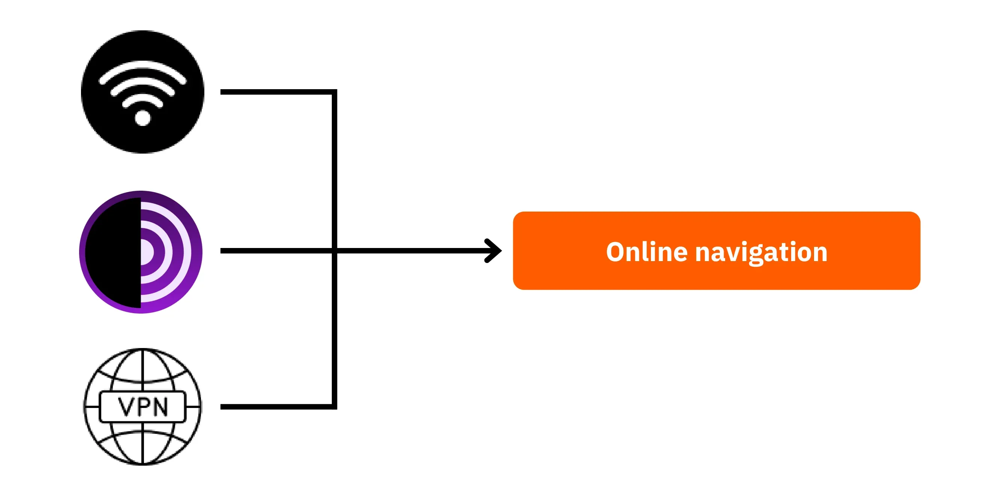

**Section 2: แนวทางปฏิบัติที่ดีที่สุดสำหรับการใช้คอมพิวเตอร์**

- บทที่ 3 - การใช้คอมพิวเตอร์
- บทที่ 4 - การแฮ็ก & การจัดการสำรองข้อมูล

ในส่วนนี้ เราจะครอบคลุมสามประเด็นสำคัญของความปลอดภัยทางคอมพิวเตอร์ ประการแรก เราจะสำรวจระบบปฏิบัติการต่างๆ รวมถึง Mac, PC และ Linux โดยเน้นลักษณะเฉพาะและจุดแข็งของแต่ละระบบ ต่อไป เราจะสำรวจวิธีการป้องกันการพยายามแฮ็กและเพิ่มความปลอดภัยให้กับอุปกรณ์ของคุณอย่างมีประสิทธิภาพ สุดท้าย เราจะเน้นความสำคัญของการปกป้องและสำรองข้อมูลของคุณเป็นประจำเพื่อป้องกันการสูญหายหรือการโจมตีด้วยแรนซัมแวร์

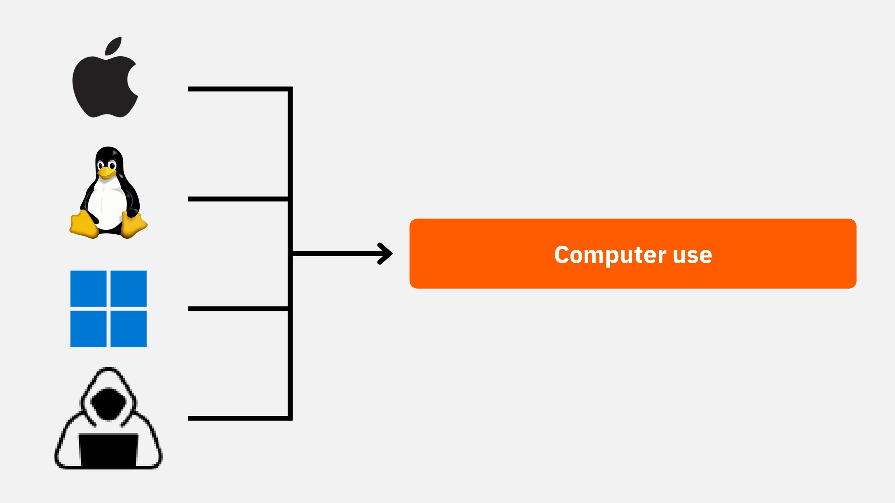

**ส่วนที่ 3: การดำเนินการแก้ไขปัญหา**

- บทที่ 6 - การจัดการอีเมล
- บทที่ 7 - ตัวจัดการรหัสผ่าน
- บทที่ 8 - การยืนยันตัวตนสองปัจจัย

ในส่วนที่สามที่เป็นภาคปฏิบัตินี้ เราจะดำเนินการไปสู่การนำเสนอวิธีแก้ปัญหาที่เป็นรูปธรรมของคุณ

ก่อนอื่น เราจะมาดูวิธีการปกป้องกล่องจดหมายอีเมลของคุณ ซึ่งเป็นสิ่งสำคัญสำหรับการสื่อสารของคุณและมักเป็นเป้าหมายของแฮกเกอร์ จากนั้นเราจะแนะนำคุณให้รู้จักกับตัวจัดการรหัสผ่าน: โซลูชันที่ใช้งานได้จริงเพื่อป้องกันการลืมหรือสับสนรหัสผ่านของคุณในขณะที่ยังคงรักษาความปลอดภัยไว้ สุดท้ายเราจะพูดถึงมาตรการรักษาความปลอดภัยเพิ่มเติม การยืนยันตัวตนแบบสองปัจจัย ซึ่งเพิ่มชั้นการป้องกันเพิ่มเติมให้กับบัญชีของคุณ ทุกอย่างจะถูกอธิบายอย่างชัดเจนและเข้าถึงได้ง่าย

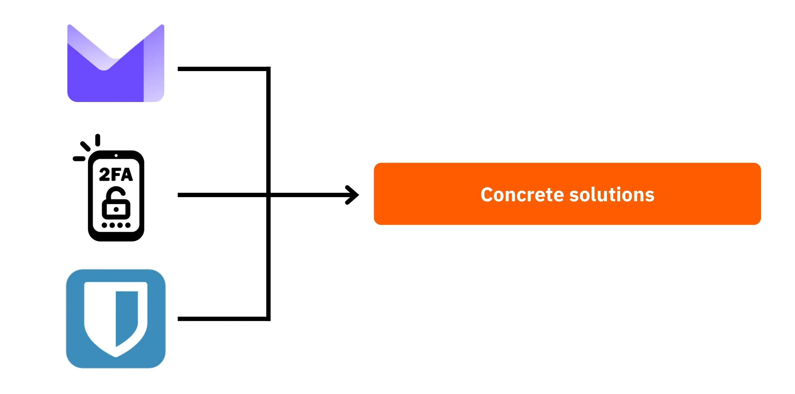

พร้อมที่จะเสริมความปลอดภัยทางดิจิทัลและควบคุมข้อมูลของคุณกลับคืนมาแล้วหรือยัง? ไปกันเลย!

# ทุกสิ่งที่คุณจำเป็นต้องรู้เกี่ยวกับการท่องเว็บออนไลน์

<partId>b4b5379a-d8ef-59ae-94d3-a6e88959c149</partId>

## การท่องเว็บออนไลน์

<chapterId>3a935da9-fa6e-57eb-bf85-7b3ec35e6ee2</chapterId>

:::video id=f1cead27-ed41-4ca2-afd2-b08a994d0119:::

เมื่อท่องอินเทอร์เน็ต สิ่งสำคัญคือต้องหลีกเลี่ยงข้อผิดพลาดทั่วไปเพื่อรักษาความปลอดภัยออนไลน์ของคุณ นี่คือเคล็ดลับบางประการเพื่อหลีกเลี่ยงข้อผิดพลาดเหล่านั้น:

### ระมัดระวังในการดาวน์โหลดซอฟต์แวร์:

ขอแนะนำให้ดาวน์โหลดซอฟต์แวร์จากเว็บไซต์ทางการของผู้เผยแพร่แทนที่จะดาวน์โหลดจากเว็บไซต์ทั่วไป

ตัวอย่าง: ใช้ www.signal.org/download แทน www.logicieltelechargement.fr/signal.

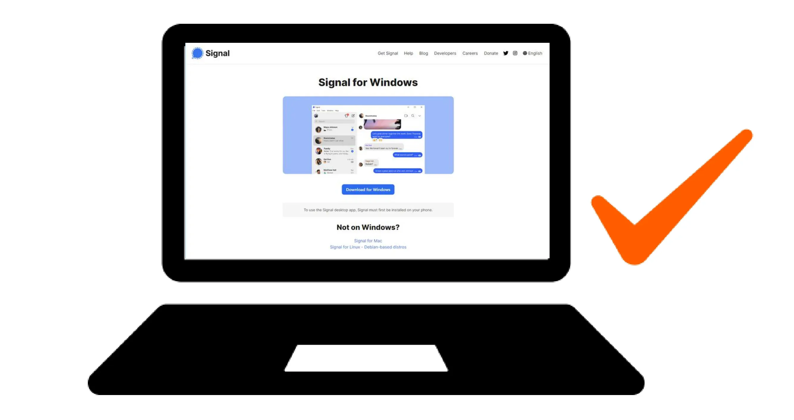

นอกจากนี้ยังแนะนำให้ให้ความสำคัญกับซอฟต์แวร์โอเพ่นซอร์สเนื่องจากมักจะปลอดภัยกว่าและปราศจากซอฟต์แวร์ที่เป็นอันตราย ซอฟต์แวร์ "โอเพ่นซอร์ส" เป็นประเภทของซอฟต์แวร์ที่มีโค้ดเปิดเผยต่อสาธารณะและทุกคนสามารถเข้าถึงได้ สิ่งนี้ช่วยให้สามารถตรวจสอบได้ว่าไม่มีการเข้าถึงที่ซ่อนอยู่เพื่อขโมยข้อมูลของคุณ

> โบนัส: ซอฟต์แวร์โอเพ่นซอร์สมักจะฟรี! มหาวิทยาลัยแห่งนี้เป็นโอเพ่นซอร์ส 100% ดังนั้นคุณสามารถตรวจสอบโค้ดของเราได้บน GitHub.

### การจัดการคุกกี้: ข้อผิดพลาดและแนวทางปฏิบัติที่ดีที่สุด

คุกกี้เป็นไฟล์ที่สร้างขึ้นโดยเว็บไซต์เพื่อเก็บข้อมูลบนคอมพิวเตอร์หรืออุปกรณ์มือถือของคุณ ในขณะที่บางเว็บไซต์ต้องการคุกกี้เหล่านี้เพื่อทำงานอย่างถูกต้อง แต่ก็สามารถถูกใช้โดยเว็บไซต์บุคคลที่สาม โดยเฉพาะเพื่อวัตถุประสงค์ในการติดตามโฆษณา ภายใต้กฎระเบียบเช่น GDPR เป็นไปได้—และแนะนำ—ให้ปฏิเสธคุกกี้ติดตามของบุคคลที่สามในขณะที่ยอมรับคุกกี้ที่จำเป็นสำหรับการทำงานที่ถูกต้องของเว็บไซต์ หลังจากการเยี่ยมชมแต่ละครั้ง ควรลบคุกกี้ที่เกี่ยวข้อง ไม่ว่าจะด้วยตนเองหรือผ่านส่วนขยายหรือโปรแกรมเฉพาะ บางเบราว์เซอร์ยังมีความสามารถในการลบคุกกี้อย่างเลือกสรร แม้จะมีข้อควรระวังเหล่านี้ แต่สิ่งสำคัญคือต้องเข้าใจว่าข้อมูลที่รวบรวมโดยเว็บไซต์ต่างๆ สามารถเชื่อมโยงกันได้ ดังนั้นจึงมีความสำคัญในการหาสมดุลระหว่างความสะดวกสบายและความปลอดภัย

> หมายเหตุ: นอกจากนี้ ควรจำกัดจำนวนส่วนขยายที่ติดตั้งในเบราว์เซอร์ของคุณเพื่อหลีกเลี่ยงปัญหาด้านความปลอดภัยและประสิทธิภาพที่อาจเกิดขึ้นได้

### เว็บเบราว์เซอร์: ตัวเลือก, ความปลอดภัย

มีสองตระกูลหลักของเบราว์เซอร์: ตระกูลที่ใช้ Chrome และตระกูลที่ใช้ Firefox

แม้ว่าทั้งสองครอบครัวจะมีระดับความปลอดภัยที่คล้ายคลึงกัน แต่แนะนำให้หลีกเลี่ยงการใช้เบราว์เซอร์ Google Chrome เนื่องจากความสามารถในการติดตามของมัน ทางเลือกที่เบากว่า Chrome เช่น Chromium หรือ Brave อาจเป็นที่ต้องการ โดยเฉพาะ Brave ที่แนะนำเป็นพิเศษสำหรับตัวบล็อกโฆษณาที่ติดตั้งมาในตัว อาจจำเป็นต้องใช้เบราว์เซอร์หลายตัวเพื่อเข้าถึงเว็บไซต์บางแห่ง

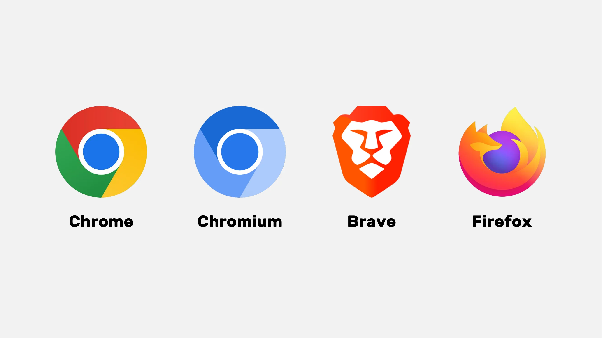

### การท่องเว็บแบบส่วนตัว, TOR, และทางเลือกอื่น ๆ สำหรับการท่องเว็บที่ปลอดภัยและไม่ระบุตัวตนมากขึ้น

การท่องเว็บแบบส่วนตัว แม้ว่าจะไม่สามารถซ่อนการท่องเว็บจากผู้ให้บริการอินเทอร์เน็ตของคุณได้ แต่ช่วยให้คุณหลีกเลี่ยงการทิ้งร่องรอยในเครื่องคอมพิวเตอร์ของคุณได้ คุกกี้จะถูกลบโดยอัตโนมัติเมื่อสิ้นสุดแต่ละเซสชัน ทำให้คุณสามารถยอมรับคุกกี้ทั้งหมดโดยไม่ถูกติดตาม การท่องเว็บแบบส่วนตัวสามารถมีประโยชน์เมื่อซื้อบริการออนไลน์ เนื่องจากเว็บไซต์จะติดตามพฤติกรรมการค้นหาของเราและปรับราคาให้เหมาะสม อย่างไรก็ตาม สิ่งสำคัญคือต้องทราบว่าการท่องเว็บแบบส่วนตัวนั้นแนะนำสำหรับเซสชันชั่วคราวและเฉพาะเจาะจง มากกว่าการท่องเว็บทั่วไปบนอินเทอร์เน็ต

ทางเลือกที่ก้าวหน้ากว่าคือเครือข่าย TOR (The Onion Router) ซึ่งให้ความเป็นนิรนามโดยการปกปิดที่อยู่ IP ของผู้ใช้และอนุญาตให้เข้าถึง Darknet ได้ TOR Browser เป็นเบราว์เซอร์ที่ออกแบบมาโดยเฉพาะเพื่อใช้เครือข่าย TOR มันช่วยให้คุณสามารถเยี่ยมชมเว็บไซต์ทั่วไปและเว็บไซต์ .onion ซึ่งมักจะดำเนินการโดยบุคคลและอาจเกี่ยวข้องกับกิจกรรมที่ผิดกฎหมาย

TOR เป็นเครื่องมือที่ถูกกฎหมายและใช้กันอย่างแพร่หลายโดยนักข่าว นักเคลื่อนไหวเพื่อเสรีภาพ และบุคคลอื่นๆ ที่ต้องการหลีกเลี่ยงการเซ็นเซอร์ในประเทศที่มีการปกครองแบบเผด็จการ อย่างไรก็ตาม สิ่งสำคัญคือต้องเข้าใจว่า TOR ไม่ได้รักษาความปลอดภัยให้กับเว็บไซต์ที่เยี่ยมชมหรือคอมพิวเตอร์เอง นอกจากนี้ การใช้ TOR อาจทำให้การเชื่อมต่ออินเทอร์เน็ตช้าลงเนื่องจากข้อมูลต้องผ่านคอมพิวเตอร์ของคนอื่นอีกสามเครื่องก่อนถึงปลายทาง อีกทั้งยังควรทราบว่า TOR ไม่ใช่ทางออกที่สมบูรณ์แบบในการรับประกันความเป็นนิรนาม 100% และไม่ควรใช้เพื่อกิจกรรมที่ผิดกฎหมาย

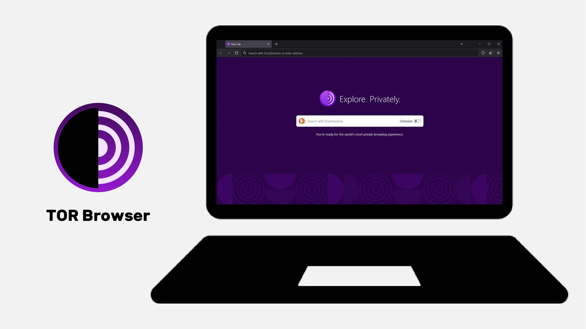

https://planb.academy/tutorials/computer-security/communication/tor-browser-a847e83c-31ef-4439-9eac-742b255129bb

## VPN และการเชื่อมต่ออินเทอร์เน็ต

<chapterId>5aac83f4-a685-54b0-9759-d71bea7eeed2</chapterId>

:::video id=737d30ac-43d8-4a69-afda-89b9d7e8c4e1:::

### VPNs

การปกป้องการเชื่อมต่ออินเทอร์เน็ตของคุณเป็นส่วนสำคัญของความปลอดภัยออนไลน์ และการใช้เครือข่ายส่วนตัวเสมือน (VPN) เป็นวิธีที่มีประสิทธิภาพในการเพิ่มความปลอดภัยนี้ ทั้งสำหรับธุรกิจและผู้ใช้รายบุคคล

VPN เป็นเครื่องมือที่เข้ารหัสข้อมูลที่ส่งผ่านอินเทอร์เน็ต ทำให้การเชื่อมต่อมีความปลอดภัยมากขึ้น ในบริบทของการทำงาน VPN ช่วยให้พนักงานสามารถเข้าถึงเครือข่ายภายในของบริษัทได้อย่างปลอดภัยจากสถานที่ห่างไกล ข้อมูลที่แลกเปลี่ยนจะถูกเข้ารหัส ทำให้บุคคลที่สามดักจับได้ยากขึ้น นอกจากการรักษาความปลอดภัยในการเข้าถึงเครือข่ายภายในแล้ว การใช้ VPN ยังช่วยให้ผู้ใช้สามารถเปลี่ยนเส้นทางการเชื่อมต่ออินเทอร์เน็ตผ่านเครือข่ายภายในของบริษัท ทำให้ดูเหมือนว่าการเชื่อมต่อมาจากบริษัท ซึ่งมีประโยชน์อย่างยิ่งในการเข้าถึงบริการออนไลน์ที่มีการจำกัดทางภูมิศาสตร์

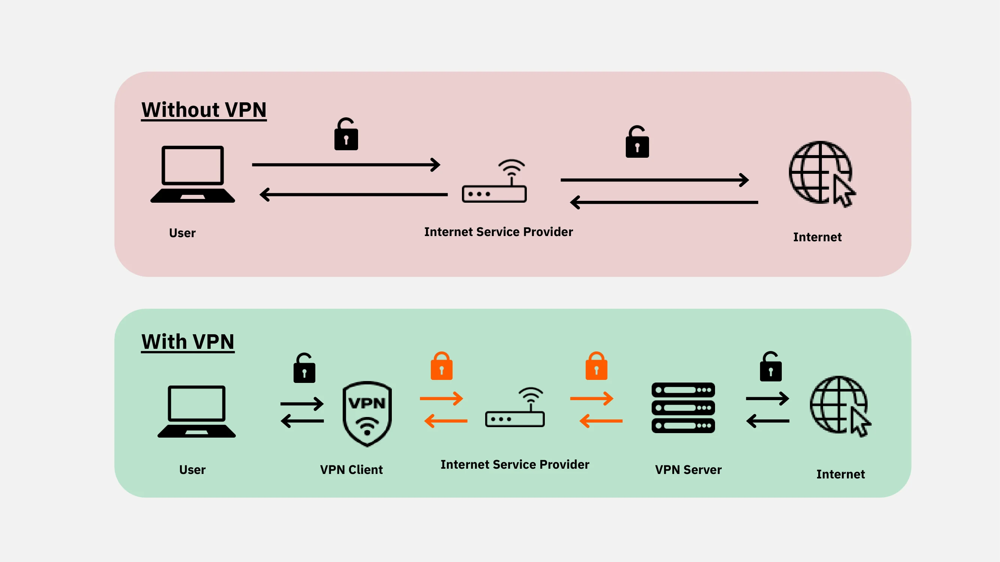

### ประเภทของ VPN

มี VPN สองประเภทหลัก: VPN สำหรับองค์กรและ VPN สำหรับผู้บริโภค เช่น Nordvpn VPN สำหรับองค์กรมักจะมีราคาสูงกว่าและซับซ้อนกว่า ในขณะที่ VPN สำหรับผู้บริโภคมักจะเข้าถึงได้ง่ายกว่าและใช้งานง่ายกว่า ตัวอย่างเช่น NordVPN ช่วยให้ผู้ใช้เชื่อมต่ออินเทอร์เน็ตผ่านเซิร์ฟเวอร์ที่ตั้งอยู่ในประเทศอื่น ซึ่งช่วยให้สามารถหลีกเลี่ยงข้อจำกัดทางภูมิศาสตร์ได้

อย่างไรก็ตาม การใช้ VPN สำหรับผู้บริโภคไม่ได้รับประกันการไม่เปิดเผยตัวตนอย่างสมบูรณ์ ผู้ให้บริการ VPN หลายรายเก็บข้อมูลเกี่ยวกับผู้ใช้ของพวกเขา ซึ่งอาจทำให้การไม่เปิดเผยตัวตนถูกประนีประนอมได้ แม้ว่า VPN จะมีประโยชน์ในการปรับปรุงความปลอดภัยออนไลน์ แต่ก็ไม่ใช่ทางออกที่ครอบคลุม พวกมันมีประสิทธิภาพสำหรับการใช้งานเฉพาะ เช่น การเข้าถึงบริการที่จำกัดตามภูมิศาสตร์หรือการเพิ่มความปลอดภัยขณะเดินทาง แต่ไม่ได้รับประกันความปลอดภัยทั้งหมด เมื่อเลือก VPN สิ่งสำคัญคือต้องให้ความสำคัญกับความน่าเชื่อถือและความเชี่ยวชาญทางเทคนิคมากกว่าความนิยม ผู้ให้บริการ VPN ที่เก็บรวบรวมข้อมูลส่วนบุคคลน้อยที่สุดมักจะปลอดภัยที่สุด บริการอย่าง iVPN และ Mullvad ไม่เก็บรวบรวมข้อมูลส่วนบุคคลและยังอนุญาตให้ชำระเงินใน Bitcoin เพื่อเพิ่มความเป็นส่วนตัวอีกด้วย

ในที่สุด VPN ยังสามารถใช้เพื่อบล็อกโฆษณาออนไลน์ ทำให้การท่องเว็บสนุกสนานและปลอดภัยยิ่งขึ้น อย่างไรก็ตาม จำเป็นต้องทำการวิจัยอย่างละเอียดเพื่อค้นหา VPN ที่เหมาะสมกับความต้องการของคุณ การใช้ VPN เป็นที่แนะนำเพื่อเพิ่มความปลอดภัย แม้ในขณะที่ท่องอินเทอร์เน็ตที่บ้าน ซึ่งช่วยให้มั่นใจได้ถึงระดับการป้องกันที่สูงขึ้นสำหรับข้อมูลที่แลกเปลี่ยนทางออนไลน์ สุดท้ายนี้ คุณสามารถตรวจสอบ URL และแม่กุญแจเล็ก ๆ ในแถบที่อยู่เพื่อยืนยันว่าคุณอยู่ในเว็บไซต์ที่ต้องการหรือไม่?

https://planb.academy/tutorials/computer-security/communication/ivpn-5a0cd5df-29f1-4382-a817-975a96646e68

https://planb.academy/tutorials/computer-security/communication/mullvad-968ec5f5-b3f0-4d23-a9e0-c07a3e85aaa8

### HTTPS & เครือข่าย Wi-Fi สาธารณะ

ในแง่ของความปลอดภัยออนไลน์ สิ่งสำคัญคือต้องเข้าใจว่า 4G โดยทั่วไปมีความปลอดภัยมากกว่า Wi-Fi สาธารณะ อย่างไรก็ตาม การใช้ 4G อาจทำให้แผนข้อมูลมือถือของคุณหมดอย่างรวดเร็ว โปรโตคอล HTTPS ได้กลายเป็นมาตรฐานสำหรับการเข้ารหัสข้อมูลบนเว็บไซต์ มันช่วยให้มั่นใจได้ว่าข้อมูลที่แลกเปลี่ยนระหว่างผู้ใช้และเว็บไซต์นั้นปลอดภัย ดังนั้นจึงเป็นสิ่งสำคัญที่จะตรวจสอบว่าเว็บไซต์ที่คุณกำลังเยี่ยมชมใช้โปรโตคอล HTTPS คุณสามารถทำได้โดยการตรวจสอบว่าที่อยู่ที่แสดงเริ่มต้นด้วย "https://" หรือการตรวจสอบว่าสัญลักษณ์รูปกุญแจแสดงในแถบที่อยู่

ในสหภาพยุโรป การคุ้มครองข้อมูลถูกควบคุมโดยระเบียบการคุ้มครองข้อมูลทั่วไป (GDPR) ดังนั้น การใช้ผู้ให้บริการจุดเชื่อมต่อ Wi-Fi ของยุโรป เช่น SNCF ซึ่งไม่ขายต่อข้อมูลการเชื่อมต่อของผู้ใช้จึงปลอดภัยกว่า อย่างไรก็ตาม การที่เว็บไซต์แสดงรูปกุญแจล็อคไม่ได้รับประกันความถูกต้องของเว็บไซต์นั้น สิ่งสำคัญคือต้องตรวจสอบคีย์สาธารณะของเว็บไซต์โดยใช้ระบบใบรับรองเพื่อยืนยันความถูกต้อง สำหรับสิ่งนั้น ในเบราว์เซอร์ส่วนใหญ่ คุณสามารถคลิกที่สัญลักษณ์กุญแจล็อคเพื่อรับข้อมูลเพิ่มเติมเกี่ยวกับใบรับรอง แม้ว่าการเข้ารหัสข้อมูลจะป้องกันบุคคลที่สามจากการดักจับข้อมูลที่แลกเปลี่ยนกัน แต่ก็ยังเป็นไปได้ที่บุคคลที่เป็นอันตรายจะปลอมตัวเป็นเว็บไซต์และถ่ายโอนข้อมูลในรูปแบบข้อความธรรมดา

เพื่อหลีกเลี่ยงการหลอกลวงออนไลน์ สิ่งสำคัญคือต้องตรวจสอบตัวตนของเว็บไซต์ที่คุณกำลังเข้าชม โดยเฉพาะการตรวจสอบส่วนขยายและชื่อโดเมน นอกจากนี้ ควรระมัดระวังผู้หลอกลวงที่ใช้ตัวอักษรที่คล้ายกันใน URL เพื่อหลอกลวงผู้ใช้

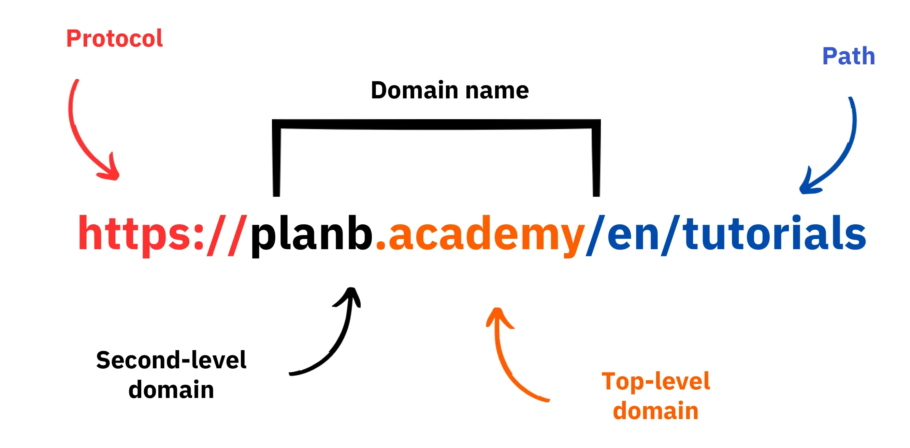

โดยสรุป การใช้ VPN สามารถปรับปรุงความปลอดภัยออนไลน์ได้อย่างมากสำหรับทั้งธุรกิจและผู้ใช้บุคคล นอกจากนี้ การปฏิบัตินิสัยการท่องเว็บที่ดีสามารถช่วยให้สุขอนามัยดิจิทัลดีขึ้นได้ ในส่วนถัดไปของหลักสูตรนี้ เราจะครอบคลุมถึงความปลอดภัยของคอมพิวเตอร์ รวมถึงการอัปเดต ซอฟต์แวร์ป้องกันไวรัส และการจัดการรหัสผ่าน

# แนวทางปฏิบัติที่ดีที่สุดสำหรับการใช้คอมพิวเตอร์

<partId>e6eac20b-ba24-5d9a-8d86-8e0164074457</partId>

## การใช้คอมพิวเตอร์

<chapterId>16745632-b56b-5423-9873-ddf70fdf1efd</chapterId>

:::video id=35892007-5ea5-4956-bf80-3363d69c96d5:::

ความปลอดภัยของคอมพิวเตอร์ของเราเป็นเรื่องที่น่ากังวลอย่างมากในโลกดิจิทัลปัจจุบัน วันนี้เราจะพูดถึงสามประเด็นสำคัญ:

- การเลือกคอมพิวเตอร์
- อัปเดตและแอนตี้ไวรัสเพื่อความปลอดภัยสูงสุด
- แนวทางปฏิบัติที่ดีที่สุดสำหรับความปลอดภัยของคอมพิวเตอร์และข้อมูลของคุณ

### การเลือกคอมพิวเตอร์และระบบปฏิบัติการ

เกี่ยวกับการเลือกคอมพิวเตอร์ ไม่มีความแตกต่างที่สำคัญในด้านความปลอดภัยระหว่างคอมพิวเตอร์เก่าและใหม่ อย่างไรก็ตาม มีความแตกต่างด้านความปลอดภัยระหว่างระบบปฏิบัติการต่างๆ รวมถึง Windows, Linux และ Mac

เกี่ยวกับ Windows ขอแนะนำว่าไม่ควรใช้บัญชีผู้ดูแลระบบในชีวิตประจำวัน แต่ควรสร้างบัญชีแยกต่างหากสองบัญชี: หนึ่งสำหรับการใช้งานผู้ดูแลระบบและอีกหนึ่งสำหรับการใช้งานประจำวัน Windows มักจะมีความเสี่ยงต่อมัลแวร์มากกว่าเนื่องจากมีผู้ใช้จำนวนมากและความง่ายในการเปลี่ยนจากผู้ใช้มาตรฐานไปเป็นผู้ดูแลระบบ ในทางกลับกัน ภัยคุกคามจะพบได้น้อยกว่าใน Linux และ Mac

การเลือกระบบปฏิบัติการควรขึ้นอยู่กับความต้องการและความชอบของคุณ ระบบ Linux ได้พัฒนาไปอย่างมากในช่วงไม่กี่ปีที่ผ่านมา ทำให้ใช้งานง่ายขึ้นเรื่อยๆ Ubuntu เป็นทางเลือกที่น่าสนใจสำหรับผู้เริ่มต้น ด้วยอินเทอร์เฟซกราฟิกที่ใช้งานง่าย สามารถแบ่งพาร์ติชันคอมพิวเตอร์เพื่อทดลองใช้ Linux ในขณะที่ยังคงใช้ Windows ได้ แต่กระบวนการนี้อาจซับซ้อน บ่อยครั้งที่การมีคอมพิวเตอร์เฉพาะ เครื่องเสมือน หรือ USB key เพื่อทดสอบ Linux หรือ Ubuntu จะเป็นทางเลือกที่ดีกว่า

### อัปเดตซอฟต์แวร์

เกี่ยวกับการอัปเดต กฎนั้นง่ายมาก: **การอัปเดตระบบปฏิบัติการและแอปพลิเคชันอย่างสม่ำเสมอเป็นสิ่งสำคัญ**

บน Windows 10 การอัปเดตเกิดขึ้นอย่างต่อเนื่อง และเป็นสิ่งสำคัญที่จะไม่บล็อกหรือชะลอการอัปเดตเหล่านี้ ในแต่ละปีมีการระบุช่องโหว่ประมาณ 15,000 รายการ ซึ่งเน้นย้ำถึงความสำคัญของการรักษาซอฟต์แวร์ให้ทันสมัยเพื่อป้องกันมัลแวร์และภัยคุกคามทางไซเบอร์อื่น ๆ โดยทั่วไปการสนับสนุนซอฟต์แวร์จะสิ้นสุดลงระหว่าง 3 ถึง 5 ปีหลังจากการเปิดตัว ดังนั้นจึงจำเป็นต้องอัปเกรดเป็นเวอร์ชันที่สูงขึ้นเพื่อรับประโยชน์จากการอัปเดตความปลอดภัยต่อไป

กฎนี้ใช้กับซอฟต์แวร์เกือบทั้งหมด จริงๆ แล้ว การอัปเดตไม่ได้มีจุดประสงค์เพื่อทำให้เครื่องของคุณล้าสมัยหรือช้าลง แต่ถูกออกแบบมาเพื่อป้องกันจากภัยคุกคามใหม่ๆ การอัปเดตบางอย่างถือว่าเป็นการอัปเดตใหญ่ และหากไม่มีมัน คอมพิวเตอร์ของคุณจะเสี่ยงต่อการถูกโจมตีอย่างรุนแรง

เพื่อให้ตัวอย่างที่ชัดเจนของข้อผิดพลาด ซอฟต์แวร์ที่ถูกแคร็กซึ่งไม่สามารถอัปเดตได้ก่อให้เกิดภัยคุกคามสองเท่า การมาถึงของไวรัสระหว่างการดาวน์โหลดอย่างผิดกฎหมายจากเว็บไซต์ที่น่าสงสัยและการใช้งานที่ไม่ปลอดภัยต่อรูปแบบการโจมตีใหม่ ๆ

### แอนตี้ไวรัส

- คุณต้องการโปรแกรมป้องกันไวรัสหรือไม่? ใช่
- คุณต้องจ่ายไหม? ขึ้นอยู่กับ!

การเลือกและการติดตั้งโปรแกรมป้องกันไวรัสมีความสำคัญ Windows Defender ซึ่งเป็นโปรแกรมป้องกันไวรัสที่ติดตั้งมากับ Windows เป็นทางเลือกที่ปลอดภัยและมีประสิทธิภาพ สำหรับโซลูชันฟรี มันดีมากและดีกว่าโซลูชันฟรีหลายๆ ตัวที่พบทางออนไลน์ อย่างไรก็ตาม ควรใช้ความระมัดระวังเมื่อดาวน์โหลดซอฟต์แวร์ป้องกันไวรัสจากอินเทอร์เน็ต เนื่องจากอาจเป็นอันตรายหรือล้าสมัยได้

สำหรับผู้ที่ต้องการลงทุนในโปรแกรมป้องกันไวรัสแบบชำระเงิน ขอแนะนำให้เลือกโปรแกรมป้องกันไวรัสที่สามารถวิเคราะห์ภัยคุกคามที่ไม่รู้จักและเกิดขึ้นใหม่ได้อย่างชาญฉลาด เช่น Kaspersky การอัปเดตโปรแกรมป้องกันไวรัสเป็นสิ่งสำคัญสำหรับการป้องกันภัยคุกคามที่เกิดขึ้นใหม่

> หมายเหตุ: Linux และ Mac ขอบคุณระบบการแยกสิทธิ์ของผู้ใช้ มักไม่จำเป็นต้องมีแอนตี้ไวรัส

ในที่สุดนี้ นี่คือแนวทางปฏิบัติที่ดีที่สุดบางประการสำหรับการรักษาความปลอดภัยให้กับคอมพิวเตอร์และข้อมูลของคุณ สิ่งสำคัญคือต้องเลือกใช้โปรแกรมป้องกันไวรัสที่มีประสิทธิภาพและใช้งานง่าย นอกจากนี้ยังจำเป็นต้องนำแนวทางปฏิบัติที่ดีมาใช้กับคอมพิวเตอร์ของคุณ เช่น ไม่ใส่ USB ที่ไม่รู้จักหรือดูน่าสงสัย USB เหล่านี้อาจมีโปรแกรมที่เป็นอันตรายซึ่งสามารถเปิดตัวได้โดยอัตโนมัติเมื่อเสียบเข้าไป การตรวจสอบ USB จะไม่มีประโยชน์เมื่อมันถูกเสียบเข้าไปแล้ว บางบริษัทตกเป็นเหยื่อของการแฮ็กเนื่องจาก USB ถูกทิ้งไว้อย่างไม่ระมัดระวังในพื้นที่ที่เข้าถึงได้ เช่น ลานจอดรถ

ดูแลคอมพิวเตอร์ของคุณเหมือนกับบ้านของคุณ: รักษาความระมัดระวัง อัปเดตซอฟต์แวร์ของคุณเป็นประจำ ลบไฟล์ที่ไม่จำเป็น และใช้รหัสผ่านที่แข็งแกร่งเพื่อเพิ่มความปลอดภัย การเข้ารหัสข้อมูลบนแล็ปท็อปและสมาร์ทโฟนเป็นสิ่งสำคัญเพื่อป้องกันการโจรกรรมหรือการสูญหายของข้อมูล BitLocker สำหรับ Windows, LUKS สำหรับ Linux และตัวเลือกที่มีอยู่ใน Mac เป็นวิธีแก้ปัญหาสำหรับการเข้ารหัสข้อมูล ขอแนะนำให้เปิดใช้งานการเข้ารหัสข้อมูลโดยไม่ลังเล และจดรหัสผ่านลงบนกระดาษเพื่อเก็บไว้ในที่ปลอดภัย

โดยสรุปแล้ว การเลือกระบบปฏิบัติการที่เหมาะสมกับความต้องการของคุณและการอัปเดตเป็นประจำ รวมถึงแอปพลิเคชันที่ติดตั้งไว้เป็นสิ่งสำคัญ นอกจากนี้ การใช้โปรแกรมป้องกันไวรัสที่มีประสิทธิภาพและใช้งานง่าย และการนำแนวทางปฏิบัติด้านความปลอดภัยที่ดีมาใช้ก็มีความสำคัญในการปกป้องคอมพิวเตอร์และข้อมูลของคุณ

## การแฮ็ก & การจัดการสำรองข้อมูล: การปกป้องข้อมูลของคุณ

<chapterId>9ddfcb6a-a253-5542-b7eb-df7222b46dc7</chapterId>

:::video id=c6a2c152-f1ae-492c-8993-304d64cdda45:::

### แฮกเกอร์โจมตีอย่างไร?

เพื่อป้องกันตัวเองอย่างมีประสิทธิภาพ จำเป็นต้องเข้าใจว่าผู้แฮกเกอร์พยายามเจาะเข้าสู่คอมพิวเตอร์ของคุณอย่างไร จริงๆ แล้ว ไวรัสไม่ได้ปรากฏขึ้นมาอย่างมหัศจรรย์ แต่เป็นผลมาจากการกระทำของเรา แม้ว่าจะไม่ได้ตั้งใจก็ตาม

ตามกฎทั่วไป ไวรัสจะเข้ามาเพราะคุณได้อนุญาตให้คอมพิวเตอร์ของคุณเชิญชวนพวกมันเข้ามาในบ้านของคุณ สิ่งนี้สามารถมองเห็นได้จากการดาวน์โหลดซอฟต์แวร์ที่น่าสงสัย ไฟล์ทอร์เรนต์ที่ถูกโจมตี หรือเพียงแค่คลิกที่ลิงก์ในอีเมลหลอกลวง

### ฟิชชิ่ง, ความระมัดระวังต่ออีเมลหลอกลวง:

คำเตือน! อีเมลเป็นช่องทางการโจมตีแรก นี่คือเคล็ดลับบางประการ:

- ระมัดระวังการพยายามฟิชชิ่งที่มุ่งหวังจะดึงข้อมูลที่ละเอียดอ่อน เช่น ข้อมูลประจำตัวและรหัสผ่านของคุณ หลีกเลี่ยงการคลิกลิงก์ที่น่าสงสัยและการแบ่งปันข้อมูลส่วนตัวของคุณโดยไม่ตรวจสอบความถูกต้องของผู้ส่ง
- ระมัดระวังกับไฟล์แนบและรูปภาพในอีเมล:

ไฟล์แนบอีเมลและรูปภาพอาจมีมัลแวร์ อย่าดาวน์โหลดหรือเปิดไฟล์แนบจากผู้ส่งที่ไม่รู้จักหรือมีความน่าสงสัย และตรวจสอบให้แน่ใจว่าซอฟต์แวร์ป้องกันไวรัสของคุณเป็นเวอร์ชันล่าสุด

กฎทองที่นี่คือการตรวจสอบชื่อเต็มของผู้ส่งอย่างละเอียดรวมถึงแหล่งที่มาของอีเมลด้วย เมื่อสงสัย ให้ลบทิ้ง!

### แรนซัมแวร์และประเภทของการโจมตีทางไซเบอร์:

Ransomware เป็นประเภทของซอฟต์แวร์ที่เป็นอันตรายซึ่งเข้ารหัสข้อมูลของผู้ใช้และเรียกร้องค่าไถ่เพื่อถอดรหัส ขณะนี้การโจมตีประเภทนี้กำลังเพิ่มขึ้นอย่างรวดเร็วและอาจเป็นปัญหาใหญ่สำหรับทั้งบริษัทและบุคคลทั่วไป เพื่อป้องกันตัวเอง สิ่งสำคัญคือต้องสร้างการสำรองข้อมูลของไฟล์ที่มีความสำคัญที่สุด! แม้ว่าจะไม่สามารถหยุด ransomware ได้ แต่จะช่วยให้คุณสามารถเพิกเฉยต่อมันได้

สำรองข้อมูลสำคัญของคุณไปยังอุปกรณ์จัดเก็บข้อมูลภายนอกหรือบริการจัดเก็บข้อมูลออนไลน์ที่ปลอดภัยเป็นประจำ ด้วยวิธีนี้ ในกรณีที่เกิดการโจมตีทางไซเบอร์หรือฮาร์ดแวร์ล้มเหลว คุณสามารถกู้คืนข้อมูลของคุณได้โดยไม่สูญเสียข้อมูลสำคัญ

วิธีแก้ปัญหาง่าย ๆ:

- ซื้อฮาร์ดไดรฟ์ภายนอกและคัดลอกข้อมูลของคุณลงไปในนั้น ถอดการเชื่อมต่อและเก็บไว้ในที่ปลอดภัยภายในบ้าน (การทำเช่นนี้สองครั้งและเก็บหนึ่งในฮาร์ดไดรฟ์ในสถานที่อื่นช่วยป้องกันไฟไหม้ที่อาจเกิดขึ้นได้)

- สร้างการสำรองข้อมูลบนคลาวด์โดยใช้ ProtonMail Drive, Sync หรือ Google Drive อัปโหลดข้อมูลที่มีความสำคัญของคุณไปยังโฮสต์ออนไลน์นี้ อย่างไรก็ตาม ควรตระหนักว่าข้อมูลของคุณอาจอยู่บนอินเทอร์เน็ตและถูกถือครองโดยบุคคลที่สามที่เชื่อถือได้

### คุณควรจ่ายเงินให้แฮกเกอร์หรือไม่?

ไม่, โดยทั่วไปไม่แนะนำให้จ่ายเงินให้กับแฮกเกอร์ในกรณีของแรนซัมแวร์หรือการโจมตีประเภทอื่น ๆ การจ่ายค่าไถ่ไม่ได้รับประกันว่าคุณจะได้ข้อมูลคืนและอาจส่งเสริมให้ผู้กระทำความผิดทางไซเบอร์ดำเนินกิจกรรมที่เป็นอันตรายต่อไป ควรให้ความสำคัญกับการป้องกันและการสำรองข้อมูลเป็นประจำเพื่อปกป้องตัวเองแทน

หากคุณตรวจพบไวรัสในคอมพิวเตอร์ของคุณ ให้ตัดการเชื่อมต่อจากอินเทอร์เน็ต ทำการสแกนไวรัสแบบเต็มรูปแบบ และลบไฟล์ที่ติดไวรัส จากนั้น อัปเดตซอฟต์แวร์และระบบปฏิบัติการของคุณ และเปลี่ยนรหัสผ่านเพื่อป้องกันการบุกรุกเพิ่มเติม

https://planb.academy/tutorials/computer-security/data/proton-drive-03cbe49f-6ddc-491f-8786-bc20d98ebb16

https://planb.academy/tutorials/computer-security/data/veracrypt-d5ed4c83-7c1c-4181-95ea-963fdf2d83c5

# การดำเนินการแก้ปัญหา

<partId>215ec902-ba05-5549-87fc-cb8d82665f7b</partId>

## การจัดการบัญชีอีเมล

<chapterId>dfceea33-8712-5557-ace1-6ba5598d33d8</chapterId>

:::video id=75cc914d-9c11-4d3f-86a7-6faf2077f00f:::

### กำลังตั้งค่าบัญชีอีเมลใหม่!

บัญชีอีเมลเป็นจุดศูนย์กลางของกิจกรรมออนไลน์ของคุณ: หากถูกบุกรุก แฮกเกอร์สามารถใช้มันเพื่อรีเซ็ตรหัสผ่านทั้งหมดของคุณผ่านฟังก์ชัน "ลืมรหัสผ่าน" และเข้าถึงเว็บไซต์อื่นๆ ได้มากมาย นั่นคือเหตุผลที่คุณจำเป็นต้องรักษาความปลอดภัยให้ดี

ควรสร้างบัญชีอีเมลด้วยรหัสผ่านที่ไม่ซ้ำและแข็งแกร่ง (รายละเอียดในบทที่ 7) และควรมีระบบการยืนยันตัวตนสองขั้นตอน (รายละเอียดในบทที่ 8)

แม้ว่าเราทุกคนจะมีบัญชีอีเมลอยู่แล้ว แต่การพิจารณาสร้างบัญชีใหม่ที่ทันสมัยกว่าเพื่อเริ่มต้นใหม่ก็เป็นสิ่งสำคัญ

### การเลือกผู้ให้บริการอีเมลและการจัดการที่อยู่อีเมล

การจัดการที่เหมาะสมของที่อยู่อีเมลของเราเป็นสิ่งสำคัญเพื่อให้มั่นใจในความปลอดภัยของการเข้าถึงออนไลน์ของเรา การเลือกผู้ให้บริการอีเมลที่ปลอดภัยและเคารพความเป็นส่วนตัวเป็นสิ่งสำคัญ ตัวอย่างเช่น ProtonMail เป็นบริการอีเมลที่ปลอดภัยและเคารพความเป็นส่วนตัว

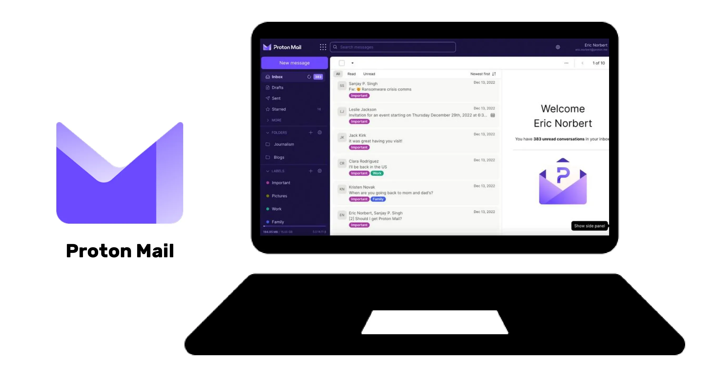

เมื่อเลือกผู้ให้บริการอีเมลและสร้างรหัสผ่าน สิ่งสำคัญคือไม่ควรใช้รหัสผ่านเดียวกันซ้ำสำหรับบริการออนไลน์ต่างๆ ขอแนะนำให้สร้างที่อยู่อีเมลใหม่เป็นประจำและใช้สำหรับวัตถุประสงค์ต่างๆ ควรใช้บริการอีเมลที่ปลอดภัยสำหรับบัญชีที่สำคัญ นอกจากนี้ยังควรทราบว่าบริการบางอย่างจำกัดความยาวของรหัสผ่าน ดังนั้นจึงจำเป็นต้องตระหนักถึงข้อจำกัดนี้ บริการสำหรับสร้างที่อยู่อีเมลชั่วคราวก็มีให้ใช้งาน ซึ่งสามารถใช้สำหรับบัญชีที่มีระยะเวลาจำกัด

เพียงเพื่อแจ้งให้คุณทราบ ผู้ให้บริการอีเมลเก่า เช่น La Poste, Arobase, Wig และ Hotmail ยังคงใช้งานอยู่ แต่แนวทางปฏิบัติด้านความปลอดภัยของพวกเขาอาจไม่แข็งแกร่งเท่ากับของ Gmail ดังนั้นจึงแนะนำให้มีที่อยู่อีเมลสองที่แยกกัน: หนึ่งสำหรับการสื่อสารทั่วไปและอีกหนึ่งสำหรับการกู้คืนบัญชี โดยที่อันหลังควรมีความปลอดภัยมากกว่า ควรหลีกเลี่ยงการผสมที่อยู่อีเมลของคุณกับของผู้ให้บริการโทรศัพท์หรือผู้ให้บริการอินเทอร์เน็ต เนื่องจากอาจเป็นช่องทางในการโจมตีได้

### ฉันควรเปลี่ยนบัญชีอีเมลของฉันหรือไม่?

คุณควรใช้เว็บไซต์ Have I Been Pwned (https://haveibeenpwned.com/) เพื่อตรวจสอบว่าอีเมลของคุณถูกละเมิดหรือไม่ และเพื่อรับการแจ้งเตือนเกี่ยวกับการละเมิดข้อมูลในอนาคต แฮกเกอร์สามารถใช้ฐานข้อมูลที่ถูกแฮ็กเพื่อส่งอีเมลฟิชชิ่งหรือใช้รหัสผ่านที่ถูกละเมิดซ้ำได้

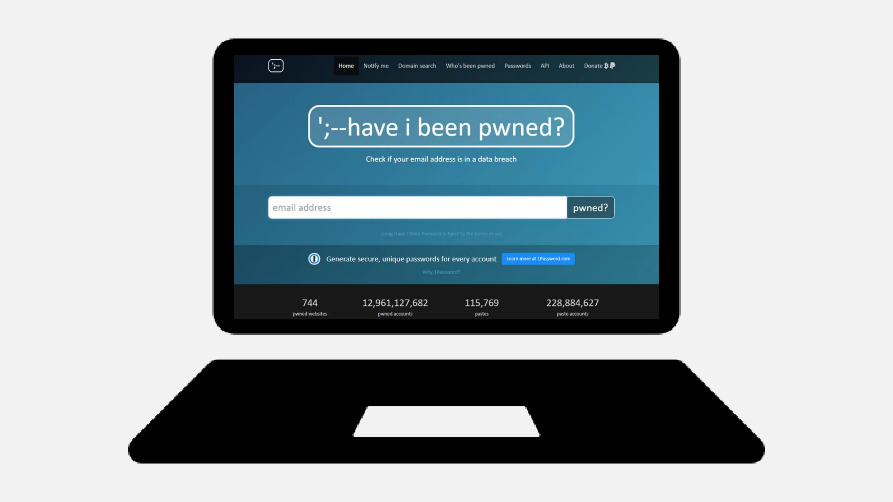

โดยทั่วไปแล้ว การเริ่มใช้ที่อยู่อีเมลใหม่ที่ปลอดภัยมากขึ้นไม่ใช่เรื่องที่ไม่ดี และจำเป็นด้วยซ้ำหากต้องการเริ่มต้นใหม่บนพื้นฐานที่ดีต่อสุขภาพ

โบนัส Bitcoin: อาจเป็นการดีที่จะสร้างที่อยู่อีเมลเฉพาะสำหรับกิจกรรม Bitcoin ของเรา เช่น การสร้างบัญชีแลกเปลี่ยน เพื่อแยกแยะพื้นที่กิจกรรมเหล่านี้ในชีวิตของเราอย่างแท้จริง

https://planb.academy/tutorials/computer-security/communication/proton-mail-c3b010ce-254d-4546-b382-19ab9261c6a2

## ตัวจัดการรหัสผ่าน

<chapterId>0b3c69b2-522c-56c8-9fb8-1562bd55930f</chapterId>

:::video id=106b6f17-a5c1-4155-abdf-043ce469d45b:::

### ตัวจัดการรหัสผ่านคืออะไร?

ตัวจัดการรหัสผ่านเป็นเครื่องมือที่ช่วยให้คุณสามารถจัดเก็บ, generate, และจัดการรหัสผ่านสำหรับบัญชีออนไลน์ต่างๆ แทนที่จะต้องจำรหัสผ่านหลายๆ อัน คุณเพียงแค่ต้องใช้รหัสผ่านหลักอันเดียวเพื่อเข้าถึงรหัสผ่านอื่นๆ ทั้งหมด

ด้วยโปรแกรมจัดการรหัสผ่าน คุณไม่ต้องกังวลเกี่ยวกับการลืมรหัสผ่านหรือจดบันทึกไว้ที่ไหนอีกต่อไป คุณเพียงแค่ต้องจำรหัสผ่านหลักเพียงหนึ่งเดียว นอกจากนี้ เครื่องมือเหล่านี้ส่วนใหญ่ยังสร้างรหัสผ่านที่แข็งแกร่ง generate ให้คุณ ซึ่งช่วยเพิ่มความปลอดภัยให้กับบัญชีของคุณ

### ความแตกต่างระหว่างผู้จัดการยอดนิยมบางคน:

- LastPass: หนึ่งในผู้จัดการที่ได้รับความนิยมมากที่สุด เป็นบริการของบุคคลที่สาม ซึ่งหมายความว่ารหัสผ่านของคุณจะถูกเก็บไว้บนเซิร์ฟเวอร์ของพวกเขา มีทั้งเวอร์ชันฟรีและเวอร์ชันที่ต้องชำระเงิน โดยมีอินเทอร์เฟซที่ใช้งานง่าย

- Dashlane: มันยังเป็นบริการของบุคคลที่สาม พร้อมด้วยอินเทอร์เฟซที่ใช้งานง่ายและคุณสมบัติเพิ่มเติม เช่น การติดตามข้อมูลบัตรเครดิตและบันทึกที่ปลอดภัย

### โฮสต์เองเพื่อการควบคุมที่มากขึ้น:

- Bitwarden: มันเป็นเครื่องมือโอเพ่นซอร์ส ซึ่งหมายความว่าคุณสามารถตรวจสอบโค้ดของมันเพื่อยืนยันความปลอดภัยได้ แม้ว่า Bitwarden จะมีบริการโฮสต์ แต่ก็ยังอนุญาตให้ผู้ใช้โฮสต์เองได้ ซึ่งหมายความว่าคุณสามารถควบคุมได้ว่ารหัสผ่านของคุณถูกเก็บไว้ที่ไหน ซึ่งอาจให้ความปลอดภัยและการควบคุมมากขึ้น

- KeePass: เป็นโซลูชันโอเพนซอร์สที่มีจุดประสงค์หลักสำหรับการโฮสต์ด้วยตนเอง ข้อมูลของคุณจะถูกจัดเก็บไว้ในเครื่องโดยค่าเริ่มต้น แต่คุณสามารถซิงโครไนซ์ฐานข้อมูลรหัสผ่านด้วยวิธีการต่างๆ ได้หากต้องการ KeePass ได้รับการยอมรับอย่างกว้างขวางในด้านความปลอดภัยและความยืดหยุ่น แม้อาจจะใช้งานยากเล็กน้อยสำหรับผู้เริ่มต้น

สำหรับโซลูชันที่โฮสต์เองเช่น KeePass เป็นไปได้ที่จะซิงโครไนซ์ฐานข้อมูลของคุณระหว่างอุปกรณ์หลายเครื่องโดยไม่ต้องใช้บริการของบุคคลที่สามที่เป็นศูนย์กลาง เครื่องมืออย่าง **Syncthing** ช่วยให้สามารถซิงโครไนซ์ที่เข้ารหัสและกระจายศูนย์ได้โดยตรงระหว่างอุปกรณ์ของคุณ วิธีการนี้ช่วยให้ข้อมูลของคุณอยู่ภายใต้การควบคุมของคุณในขณะที่ยังคงความพร้อมใช้งานในทุกอุปกรณ์ของคุณ

(หมายเหตุ: การเลือกใช้บริการจากบุคคลที่สามหรือบริการที่โฮสต์ด้วยตนเองขึ้นอยู่กับระดับความสะดวกสบายทางเทคโนโลยีของคุณและวิธีที่คุณให้ความสำคัญกับการควบคุมเทียบกับความสะดวกสบาย บริการจากบุคคลที่สามมักจะสะดวกกว่าสำหรับคนส่วนใหญ่ ในขณะที่การโฮสต์ด้วยตนเองต้องการความรู้ทางเทคนิคมากกว่าแต่สามารถให้การควบคุมและความสบายใจในแง่ของความปลอดภัยได้มากกว่า)

### อะไรที่ทำให้รหัสผ่านดี:

รหัสผ่านที่ดีโดยทั่วไปคือ:

- ยาว: อย่างน้อย 12 ตัวอักษร.
- ซับซ้อน: การผสมผสานระหว่างตัวอักษรพิมพ์ใหญ่และพิมพ์เล็ก, ตัวเลข, และสัญลักษณ์.
- ไม่ซ้ำกัน: อย่าใช้รหัสผ่านเดียวกันสำหรับบัญชีต่างๆ
- ไม่อิงตามข้อมูลส่วนบุคคล: หลีกเลี่ยงวันเกิด ชื่อ ฯลฯ

เพื่อให้มั่นใจในความปลอดภัยของบัญชีของคุณ สิ่งสำคัญคือต้องสร้างรหัสผ่านที่แข็งแกร่งและปลอดภัย ความยาวของรหัสผ่านไม่เพียงพอที่จะรับประกันความปลอดภัย ตัวอักษรต้องเป็นแบบสุ่มทั้งหมดเพื่อป้องกันการโจมตีแบบ brute force ความเป็นอิสระของเหตุการณ์ก็สำคัญเช่นกันเพื่อหลีกเลี่ยงการรวมกันที่เป็นไปได้มากที่สุด รหัสผ่านทั่วไปเช่น "password" สามารถถูกเจาะได้ง่าย

ในการสร้างรหัสผ่านที่แข็งแกร่ง แนะนำให้ใช้ตัวอักษรสุ่มจำนวนมาก โดยไม่ใช้คำหรือรูปแบบที่คาดเดาได้ นอกจากนี้ยังจำเป็นต้องมีตัวเลขและอักขระพิเศษ อย่างไรก็ตาม ควรทราบว่าเว็บไซต์บางแห่งอาจจำกัดการใช้อักขระพิเศษบางตัว รหัสผ่านที่ไม่ได้สร้างขึ้นแบบสุ่มจะคาดเดาได้ง่าย การเปลี่ยนแปลงหรือการเพิ่มเติมในรหัสผ่านไม่ปลอดภัย เว็บไซต์ไม่สามารถรับประกันความปลอดภัยของรหัสผ่านที่ผู้ใช้เลือกได้

รหัสผ่านที่สร้างขึ้นแบบสุ่มให้ระดับความปลอดภัยที่สูงกว่า แม้ว่าจะจำได้ยากกว่า ผู้จัดการรหัสผ่านสามารถพัฒนารหัสผ่านแบบสุ่มที่ปลอดภัยยิ่งขึ้นได้ โดยการใช้ผู้จัดการรหัสผ่าน คุณไม่จำเป็นต้องจดจำรหัสผ่านทั้งหมดของคุณ จำเป็นต้องค่อยๆ แทนที่รหัสผ่านเก่าของคุณด้วยรหัสผ่านที่สร้างโดยผู้จัดการ เนื่องจากมีความแข็งแกร่งและปลอดภัยยิ่งขึ้น ตรวจสอบให้แน่ใจว่ารหัสผ่านหลักของผู้จัดการรหัสผ่านของคุณก็แข็งแกร่งและปลอดภัยเช่นกัน

https://planb.academy/tutorials/computer-security/authentication/bitwarden-0532f569-fb00-4fad-acba-2fcb1bf05de9

https://planb.academy/tutorials/computer-security/authentication/keepass-f8073bb7-5b4a-4664-9246-228e307be246

## การยืนยันตัวตนสองปัจจัย

<chapterId>9391e02e-e61b-5a86-93e0-91a07f217d35</chapterId>

:::video id=10fede6f-c839-4455-b324-e887c502667e:::

### ทำไมต้องใช้ 2FA

การยืนยันตัวตนแบบสองปัจจัย (2FA) เป็นชั้นความปลอดภัยเพิ่มเติมที่ช่วยให้มั่นใจว่าบุคคลที่พยายามเข้าถึงบัญชีออนไลน์คือผู้ที่พวกเขาอ้างว่าเป็น แทนที่จะเพียงแค่ป้อนชื่อผู้ใช้และรหัสผ่าน 2FA ต้องการรูปแบบการยืนยันเพิ่มเติม

ขั้นตอนที่สองนี้สามารถเป็น:

- รหัสชั่วคราวที่ส่งผ่าน SMS.
- รหัสที่สร้างโดยแอปพลิเคชันเช่น Google Authenticator หรือ Authy.
- กุญแจความปลอดภัยทางกายภาพที่คุณเสียบเข้ากับคอมพิวเตอร์ของคุณ

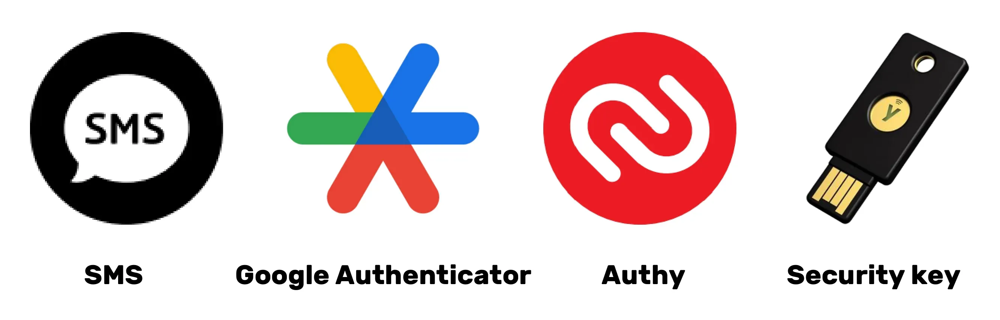

ด้วย 2FA แม้ว่าผู้ไม่หวังดีจะได้รหัสผ่านของคุณไป พวกเขาก็ยังไม่สามารถเข้าถึงบัญชีของคุณได้หากไม่มีปัจจัยการยืนยันตัวตนที่สองนี้ สิ่งนี้ทำให้ 2FA เป็นสิ่งจำเป็นสำหรับการปกป้องบัญชีออนไลน์ของคุณจากการเข้าถึงโดยไม่ได้รับอนุญาต

### ตัวเลือกไหนให้เลือก?

ตัวเลือกต่างๆ สำหรับการยืนยันตัวตนที่แข็งแกร่งให้ระดับความปลอดภัยที่แตกต่างกัน

- SMS ไม่ถือว่าเป็นตัวเลือกที่ดีที่สุดเนื่องจากให้เพียงหลักฐานการครอบครองหมายเลขโทรศัพท์เท่านั้น
- การยืนยันตัวตนแบบสองปัจจัย (2FA) มีความปลอดภัยมากกว่าเนื่องจากใช้หลักฐานหลายประเภท เช่น ความรู้ การครอบครอง และการระบุตัวตน รหัสผ่านใช้ครั้งเดียว (HOTP และ TOTP) ปลอดภัยกว่า SMS เพราะต้องใช้การคำนวณทางเข้ารหัสและถูกสร้างขึ้นในอุปกรณ์ของคุณเอง ในขณะที่ SMS สามารถถูกดักจับได้
- โทเค็นฮาร์ดแวร์ เช่น กุญแจ USB หรือสมาร์ทการ์ด มอบความปลอดภัยสูงสุดโดยการสร้างคีย์ส่วนตัวที่ไม่ซ้ำกันสำหรับแต่ละเว็บไซต์และตรวจสอบ URL ก่อนที่จะอนุญาตการเชื่อมต่อ

เพื่อความปลอดภัยสูงสุดด้วยการยืนยันตัวตนที่แข็งแกร่ง ขอแนะนำให้ใช้ที่อยู่อีเมลที่ปลอดภัย ตัวจัดการรหัสผ่านที่ปลอดภัย และนำ 2FA มาใช้โดยใช้ YubiKeys นอกจากนี้ยังแนะนำให้ซื้อ YubiKeys สองอันเพื่อเตรียมพร้อมสำหรับการสูญหายหรือการโจรกรรม เช่น เก็บสำเนาสำรองไว้ที่บ้านและพกติดตัว

สำหรับภัยคุกคามที่อาจเกิดขึ้นกับ SIM 2FA ตัวอย่างทั่วไปคือการโจมตีแบบ SIM swap ซึ่งผู้โจมตีขโมยหมายเลขโทรศัพท์ของผู้ใช้โดยเชื่อมโยงกับซิมการ์ดที่ผู้โจมตีควบคุมอยู่ มีหลายวิธีที่ผู้โจมตีสามารถดำเนินการโจมตีได้ อย่างไรก็ตาม ภัยคุกคามนี้มักจะเป็นข้อกังวลหลักสำหรับบุคคลที่มีชื่อเสียงและบุคคลที่น่าสนใจเท่านั้น

ข้อมูลชีวมิติสามารถใช้แทนได้ แต่มีความปลอดภัยน้อยกว่าการรวมกันของความรู้และการครอบครอง ข้อมูลชีวมิติควรถูกเก็บไว้ในอุปกรณ์การยืนยันตัวตนและไม่ควรถูกเปิดเผยทางออนไลน์ สิ่งสำคัญคือต้องพิจารณารูปแบบภัยคุกคามที่เกี่ยวข้องกับวิธีการยืนยันตัวตนที่แตกต่างกันและปรับแนวปฏิบัติตามนั้น

สุดท้ายนี้ อาจเป็นประโยชน์ที่จะให้บริบทสั้น ๆ เกี่ยวกับ HOTP และ TOTP OTPs: HOTP เป็นรหัสผ่านใช้ครั้งเดียวที่อิงตามอัลกอริทึม HMAC (Hash-based Message Authentication Code) ในขณะที่ TOTP เป็น OTP ที่อิงตามเวลา คุณสมบัติหลักของอัลกอริทึมเหล่านี้คือ รหัสผ่านสามารถใช้ได้เพียงครั้งเดียว แต่ละค่าที่สร้างขึ้นมีความเป็นเอกลักษณ์ และมีคีย์ที่ใช้ร่วมกันระหว่างอุปกรณ์ของผู้ใช้ (client) และบริการการตรวจสอบสิทธิ์ (server) ความแตกต่างหลักระหว่างสองระบบนี้อยู่ที่วิธีการสร้างปัจจัย: TOTP อิงตามเวลา ในขณะที่ระบบ HOTP อิงตามตัวนับ

### บทสรุปของหลักสูตร:

ตามที่คุณได้เข้าใจ การปฏิบัติสุขอนามัยดิจิทัลที่ดีไม่จำเป็นต้องง่ายเสมอไป แต่ยังคงสามารถเข้าถึงได้!

- กำลังสร้างที่อยู่อีเมลใหม่ที่ปลอดภัย
- การตั้งค่าตัวจัดการรหัสผ่าน
- เปิดใช้งาน 2FA.
- ค่อยๆ เปลี่ยนรหัสผ่านเก่าของเราเป็นรหัสผ่านที่แข็งแกร่งพร้อม 2FA

เรียนรู้อย่างต่อเนื่องและค่อยๆ นำแนวปฏิบัติที่ดีมาใช้!

กฎทอง: ความปลอดภัยทางไซเบอร์เป็นเป้าหมายที่เคลื่อนไหวซึ่งจะปรับตัวตามเส้นทางการเรียนรู้ของคุณ!

https://planb.academy/tutorials/computer-security/authentication/authy-a76ab26b-71b0-473c-aa7c-c49153705eb7

https://planb.academy/tutorials/computer-security/authentication/security-key-61438267-74db-4f1a-87e4-97c8e673533e

# ส่วนปฏิบัติ

<partId>98ccf14b-4053-5839-878c-7a73ff02eb95</partId>

## การตั้งค่ากล่องจดหมาย

<chapterId>afc9ab5d-7664-5a9b-ab50-225ac9ba8f7c</chapterId>

การปกป้องบัญชีอีเมลของคุณเป็นขั้นตอนสำคัญในการรักษาความปลอดภัยกิจกรรมออนไลน์ของคุณและปกป้องข้อมูลของคุณ บทแนะนำนี้จะนำคุณทีละขั้นตอนในการสร้างและตั้งค่าบัญชี ProtonMail ซึ่งเป็นผู้ให้บริการที่รู้จักกันดีในด้านความปลอดภัยระดับสูงที่มีการเข้ารหัสแบบ end-to-end สำหรับการสื่อสารของคุณ ไม่ว่าคุณจะเป็นผู้ใช้มือใหม่หรือมีประสบการณ์ แนวทางปฏิบัติที่ดีที่สุดที่นำเสนอที่นี่จะช่วยให้คุณเสริมสร้างความปลอดภัยของอีเมลของคุณในขณะที่ใช้ประโยชน์จากคุณสมบัติขั้นสูงของ ProtonMail:

https://planb.academy/tutorials/computer-security/communication/proton-mail-c3b010ce-254d-4546-b382-19ab9261c6a2

## การรักษาความปลอดภัยใน 2FA

<chapterId>09468ec1-95b7-56a4-a636-7618044568e1</chapterId>

การยืนยันตัวตนแบบสองปัจจัย (2FA) ได้กลายเป็นสิ่งจำเป็นสำหรับการรักษาความปลอดภัยบัญชีออนไลน์ของคุณ ในบทแนะนำนี้ คุณจะได้เรียนรู้วิธีการตั้งค่าและใช้งานแอป 2FA ชื่อ Authy ซึ่งสร้างรหัส 6 หลักแบบไดนามิกเพื่อปกป้องบัญชีของคุณ Authy ใช้งานง่ายมากและสามารถซิงโครไนซ์ข้ามอุปกรณ์หลายเครื่อง ค้นหาวิธีการติดตั้งและกำหนดค่า Authy และเสริมสร้างความปลอดภัยของบัญชีออนไลน์ของคุณได้เลยตอนนี้:

https://planb.academy/tutorials/computer-security/authentication/authy-a76ab26b-71b0-473c-aa7c-c49153705eb7

อีกทางเลือกหนึ่งคือการใช้กุญแจความปลอดภัยแบบกายภาพ บทแนะนำเพิ่มเติมนี้จะแสดงวิธีการตั้งค่าและใช้กุญแจความปลอดภัยเป็นปัจจัยการยืนยันตัวตนที่สอง:

https://planb.academy/tutorials/computer-security/authentication/security-key-61438267-74db-4f1a-87e4-97c8e673533e

## การสร้างตัวจัดการรหัสผ่าน

<chapterId>ed579680-4e7b-5f65-8541-14e519a3b242</chapterId>

การจัดการรหัสผ่านเป็นความท้าทายในยุคดิจิทัล เราทุกคนมีบัญชีออนไลน์จำนวนมากที่ต้องรักษาความปลอดภัย ตัวจัดการรหัสผ่านช่วยให้คุณสร้างและจัดเก็บรหัสผ่านที่แข็งแกร่งและไม่ซ้ำกันสำหรับแต่ละบัญชี

ในบทแนะนำนี้ เรียนรู้วิธีการตั้งค่า Bitwarden ซึ่งเป็นโปรแกรมจัดการรหัสผ่านแบบโอเพ่นซอร์ส และวิธีการซิงค์ข้อมูลรับรองของคุณในทุกอุปกรณ์เพื่อให้ง่ายต่อการใช้งานในชีวิตประจำวันของคุณ:

https://planb.academy/tutorials/computer-security/authentication/bitwarden-0532f569-fb00-4fad-acba-2fcb1bf05de9

สำหรับผู้ใช้ขั้นสูง ฉันยังมีบทแนะนำเกี่ยวกับซอฟต์แวร์ฟรีและโอเพ่นซอร์สอีกตัวหนึ่งที่สามารถใช้ในเครื่องเพื่อจัดการรหัสผ่านของคุณ:

https://planb.academy/tutorials/computer-security/authentication/keepass-f8073bb7-5b4a-4664-9246-228e307be246

## การรักษาความปลอดภัยบัญชีของคุณ

<chapterId>7a774b34-aed0-57dd-b8f7-cf3be51c0d70</chapterId>

ในบทแนะนำทั้งสองนี้ ฉันยังแนะนำคุณในการรักษาความปลอดภัยบัญชีออนไลน์ของคุณและอธิบายวิธีการค่อยๆ นำแนวปฏิบัติที่ปลอดภัยยิ่งขึ้นมาใช้ในการจัดการรหัสผ่านของคุณในแต่ละวัน

https://planb.academy/tutorials/computer-security/authentication/bitwarden-0532f569-fb00-4fad-acba-2fcb1bf05de9

https://planb.academy/tutorials/computer-security/authentication/keepass-f8073bb7-5b4a-4664-9246-228e307be246

## เปลี่ยนเบราว์เซอร์ & VPN

<chapterId>8dc08feb-313c-5259-a54f-64aa68a07608</chapterId>

การปกป้องความเป็นส่วนตัวออนไลน์ของคุณก็เป็นจุดสำคัญในการรับประกันความปลอดภัยของคุณ การใช้ VPN สามารถเป็นทางออกแรกในการบรรลุเป้าหมายนี้

ฉันขอแนะนำให้สำรวจโซลูชัน VPN ที่เชื่อถือได้สองตัวที่รับชำระเงิน Bitcoin ได้แก่ IVPN และ Mullvad บทแนะนำเหล่านี้จะแนะนำวิธีการติดตั้ง กำหนดค่า และใช้งาน Mullvad หรือ IVPN บนอุปกรณ์ทั้งหมดของคุณ:

https://planb.academy/tutorials/computer-security/communication/ivpn-5a0cd5df-29f1-4382-a817-975a96646e68

https://planb.academy/tutorials/computer-security/communication/mullvad-968ec5f5-b3f0-4d23-a9e0-c07a3e85aaa8

นอกจากนี้ เรียนรู้วิธีการใช้ Tor Browser ซึ่งเป็นเบราว์เซอร์ที่ออกแบบมาโดยเฉพาะเพื่อปกป้องความเป็นส่วนตัวของคุณทางออนไลน์:

https://planb.academy/tutorials/computer-security/communication/tor-browser-a847e83c-31ef-4439-9eac-742b255129bb

## การตั้งค่าการสำรองข้อมูล

<chapterId>01cfcde1-77cb-506c-8df1-fa18a2e8cc6b</chapterId>

การปกป้องไฟล์ของคุณก็เป็นจุดสำคัญเช่นกัน บทแนะนำนี้จะแสดงวิธีการใช้กลยุทธ์การสำรองข้อมูลที่มีประสิทธิภาพโดยใช้ Proton Drive ค้นพบวิธีการใช้โซลูชันคลาวด์ที่ปลอดภัยนี้เพื่อใช้วิธี 3-2-1: สามสำเนาของข้อมูลของคุณในสื่อสองประเภทที่แตกต่างกัน โดยมีหนึ่งสำเนาอยู่นอกสถานที่ วิธีนี้จะช่วยให้มั่นใจได้ถึงการเข้าถึงและความปลอดภัยของไฟล์ที่สำคัญของคุณ:

https://planb.academy/tutorials/computer-security/data/proton-drive-03cbe49f-6ddc-491f-8786-bc20d98ebb16

และเพื่อรักษาความปลอดภัยของไฟล์ที่จัดเก็บไว้ในสื่อที่ถอดออกได้ เช่น ไดรฟ์ USB หรือฮาร์ดไดรฟ์ภายนอก ฉันจะแสดงวิธีการเข้ารหัสและถอดรหัสสื่อเหล่านี้โดยใช้ VeraCrypt อย่างง่ายดาย:

https://planb.academy/tutorials/computer-security/data/veracrypt-d5ed4c83-7c1c-4181-95ea-963fdf2d83c5

# ไปให้ไกลกว่าเดิม

<partId>77113cad-a6d8-57e5-b903-50c223b277ba</partId>

## วิธีการทำงานในอุตสาหกรรมความปลอดภัยทางไซเบอร์

<chapterId>aad1ae27-4280-5b07-b9ab-118ae013951a</chapterId>

:::video id=4c818b5c-ea5d-496a-8e82-bc5d96d91430:::

### ความปลอดภัยทางไซเบอร์: สาขาที่เติบโตอย่างต่อเนื่องพร้อมโอกาสไม่รู้จบ

หากคุณมีความหลงใหลในการปกป้องระบบและข้อมูล สาขาความปลอดภัยทางไซเบอร์มีโอกาสมากมาย หากอุตสาหกรรมนี้ดึงดูดใจคุณ นี่คือขั้นตอนสำคัญบางประการที่จะช่วยแนะนำคุณ

### พื้นฐานทางวิชาการและการรับรอง:

การศึกษาที่มั่นคงในสาขาวิทยาการคอมพิวเตอร์ ระบบสารสนเทศ หรือสาขาที่เกี่ยวข้อง มักเป็นจุดเริ่มต้นที่เหมาะสมที่สุด การศึกษาเหล่านี้ให้พื้นฐานที่จำเป็นในการเข้าใจความท้าทายทางเทคนิคของความปลอดภัยทางไซเบอร์ เพื่อเสริมการศึกษานี้ ควรได้รับการรับรองที่ได้รับการยอมรับในสาขานี้ แม้ว่าการรับรองเหล่านี้อาจแตกต่างกันไปตามภูมิภาค แต่บางอย่างเช่น CISSP หรือ CEH ได้รับการยอมรับในระดับโลก

ความปลอดภัยทางไซเบอร์เป็นสาขาที่กว้างขวางและมีการพัฒนาอย่างต่อเนื่อง การทำความคุ้นเคยกับเครื่องมือที่จำเป็นและระบบต่าง ๆ เป็นสิ่งสำคัญ นอกจากนี้ ด้วยโดเมนย่อยที่หลากหลาย ตั้งแต่การตอบสนองต่อเหตุการณ์ไปจนถึงการแฮ็กอย่างมีจริยธรรม การระบุช่องทางเฉพาะของคุณและเชี่ยวชาญในนั้นจะเป็นประโยชน์

### การได้รับประสบการณ์จริง:

ความสำคัญของประสบการณ์จริงไม่สามารถประเมินต่ำเกินไปได้ การหาฝึกงานหรือตำแหน่งจูเนียร์ในบริษัทที่มีทีมความปลอดภัยไซเบอร์เป็นวิธีที่ยอดเยี่ยมในการประยุกต์ใช้ความรู้ทางทฤษฎีของคุณและได้รับประสบการณ์จริง นอกจากนี้ การเข้าร่วมการแข่งขันแฮ็กอย่างมีจริยธรรมหรือการจำลองความปลอดภัยไซเบอร์สามารถปรับปรุงทักษะของคุณในสถานการณ์จริงได้

ความแข็งแกร่งของเครือข่ายมืออาชีพนั้นมีคุณค่ามาก การเข้าร่วมสมาคมวิชาชีพ, hackerspaces, หรือฟอรัมออนไลน์ให้แพลตฟอร์มในการแลกเปลี่ยนความคิดกับผู้เชี่ยวชาญคนอื่น ๆ ในทำนองเดียวกัน การเข้าร่วมการประชุมและเวิร์กช็อปด้านความปลอดภัยทางไซเบอร์ไม่เพียงแต่ช่วยให้คุณเรียนรู้ แต่ยังช่วยให้คุณสร้างความสัมพันธ์กับมืออาชีพในอุตสาหกรรมอีกด้วย

การพัฒนาของภัยคุกคามอย่างต่อเนื่องต้องการการติดตามข่าวสารและฟอรัมเฉพาะทางอย่างสม่ำเสมอ ในภาคส่วนที่ความไว้วางใจเป็นสิ่งสำคัญ การกระทำด้วยจริยธรรมและความซื่อสัตย์เป็นสิ่งจำเป็นในทุกขั้นตอนของอาชีพของคุณ

### ทักษะและเครื่องมือที่ควรพัฒนา:

- เครื่องมือความปลอดภัยทางไซเบอร์: Wireshark, Metasploit, Nmap.
- ระบบปฏิบัติการ: ลินุกซ์, วินโดวส์, แมคโอเอส.
- ภาษาโปรแกรม: Python, C, Java.
- เครือข่าย: TCP/IP, VPN, ไฟร์วอลล์.
- ฐานข้อมูล: SQL, NoSQL.
- การเข้ารหัส: SSL/TLS, การเข้ารหัสแบบสมมาตรและอสมมาตร
- การจัดการเหตุการณ์: การวิเคราะห์บันทึก, การตอบสนองต่อเหตุการณ์.
- การแฮ็กอย่างมีจริยธรรม: เทคนิคการทดสอบการเจาะระบบและการทดสอบการบุกรุก
- การกำกับดูแล: มาตรฐาน ISO, ข้อบังคับ GDPR และ CCPA

ด้วยการเชี่ยวชาญทักษะและเครื่องมือเหล่านี้ คุณจะมีความพร้อมที่จะนำทางในโลกของความปลอดภัยทางไซเบอร์ได้อย่างประสบความสำเร็จ

## สัมภาษณ์กับเรโนด์

<chapterId>7d83fd98-ce22-514e-b9e8-729fbf71ee6e</chapterId>

:::video id=ec7014aa-5ebe-444c-80d1-7b14f1fe7bb8:::

### การจัดการรหัสผ่านอย่างมีประสิทธิภาพและการเสริมสร้างความแข็งแกร่งในการยืนยันตัวตน: แนวทางเชิงวิชาการ

มีสามมิติสำคัญที่ควรพิจารณาเมื่อพูดถึงโปรแกรมจัดการรหัสผ่าน: การสร้าง การอัปเดต และการใช้งานรหัสผ่านบนเว็บไซต์

โดยทั่วไปไม่แนะนำให้ใช้ส่วนขยายของเบราว์เซอร์สำหรับการกรอกข้อมูลรหัสผ่านอัตโนมัติ เครื่องมือเหล่านี้สามารถทำให้ผู้ใช้มีความเสี่ยงต่อการโจมตีแบบฟิชชิ่งมากขึ้น Renaud ผู้เชี่ยวชาญที่ได้รับการยอมรับในด้านความปลอดภัยทางไซเบอร์ ชอบการจัดการด้วยตนเองโดยใช้ KeePass ซึ่งเกี่ยวข้องกับการคัดลอกและวางรหัสผ่านลงในแอปพลิเคชันด้วยตนเอง ส่วนขยายมักจะเพิ่มพื้นผิวการโจมตี สามารถทำให้ประสิทธิภาพของเบราว์เซอร์ช้าลง และดังนั้นจึงเป็นความเสี่ยงที่สำคัญ ดังนั้น การลดการใช้ส่วนขยายบนเบราว์เซอร์จึงเป็นแนวทางปฏิบัติที่แนะนำ

โดยทั่วไปแล้ว โปรแกรมจัดการรหัสผ่านจะสนับสนุนการใช้ปัจจัยการยืนยันเพิ่มเติม เช่น การยืนยันตัวตนแบบสองปัจจัย เพื่อความปลอดภัยสูงสุด ขอแนะนำให้เก็บ OTPs (รหัสผ่านใช้ครั้งเดียว) ไว้ในอุปกรณ์มือถือของคุณ AndOTP ให้บริการโซลูชันโอเพ่นซอร์สสำหรับการสร้างและจัดเก็บรหัสผ่านใช้ครั้งเดียว (OTP) บนอุปกรณ์มือถือของคุณ ในขณะที่ Google Authenticator อนุญาตให้ส่งออกเมล็ดพันธุ์รหัสยืนยันตัวตน ความเชื่อมั่นในการสำรองข้อมูลในบัญชี Google ยังคงมีจำกัด ดังนั้นแอปพลิเคชัน OTI และ AndoTP จึงได้รับการแนะนำสำหรับการจัดการ OTP แบบอิสระ

คำถามเกี่ยวกับมรดกดิจิทัลและการไว้อาลัยดิจิทัลเน้นย้ำถึงความสำคัญของการมีขั้นตอนในการส่งต่อรหัสผ่านหลังจากที่บุคคลเสียชีวิต ตัวจัดการรหัสผ่านช่วยอำนวยความสะดวกในการเปลี่ยนผ่านนี้โดยการจัดเก็บความลับดิจิทัลทั้งหมดไว้อย่างปลอดภัยในที่เดียว ตัวจัดการรหัสผ่านยังช่วยให้คุณระบุบัญชีที่เปิดอยู่ทั้งหมดและจัดการการปิดหรือการโอนย้ายได้อีกด้วย ขอแนะนำให้เขียนรหัสผ่านหลักลงบนกระดาษ แต่ควรเก็บไว้ในที่ซ่อนและปลอดภัย หากฮาร์ดไดรฟ์ถูกเข้ารหัสและคอมพิวเตอร์ถูกล็อก รหัสผ่านจะไม่สามารถเข้าถึงได้ แม้ในกรณีที่เกิดการโจรกรรม

### สู่ยุคหลังรหัสผ่าน: สำรวจทางเลือกที่น่าเชื่อถือ

แม้ว่ารหัสผ่านจะพบได้ทั่วไป แต่ก็มีข้อเสียหลายประการ รวมถึงความเสี่ยงในการส่งข้อมูลระหว่างกระบวนการยืนยันตัวตน บริษัทชั้นนำ เช่น Microsoft และ Apple เสนอทางเลือกที่เป็นนวัตกรรมใหม่ รวมถึงไบโอเมตริกและโทเค็นฮาร์ดแวร์ ซึ่งบ่งบอกถึงแนวโน้มที่ก้าวหน้าในการละทิ้งรหัสผ่าน

Passkeys เช่น เสนอคีย์สุ่มที่เข้ารหัสรวมกับปัจจัยท้องถิ่น (เช่น ไบโอเมตริกซ์หรือ PIN) ซึ่งผู้ให้บริการเป็นผู้โฮสต์แต่ยังคงอยู่นอกเหนือการเข้าถึงของพวกเขา แม้ว่าสิ่งนี้จะต้องการการอัปเดตเว็บไซต์ แต่แนวทางนี้กำจัดความจำเป็นในการใช้รหัสผ่าน จึงให้ระดับความปลอดภัยสูงโดยไม่มีข้อจำกัดที่เกี่ยวข้องกับรหัสผ่านแบบดั้งเดิมหรือปัญหาการจัดการตู้นิรภัยดิจิทัล

Passkiz เป็นอีกหนึ่งทางเลือกที่มีประสิทธิภาพและปลอดภัยสำหรับการจัดการรหัสผ่าน อย่างไรก็ตาม คำถามสำคัญยังคงอยู่: ความพร้อมใช้งานในกรณีที่ผู้ให้บริการล้มเหลว ดังนั้นจึงเป็นที่พึงประสงค์ที่ยักษ์ใหญ่อินเทอร์เน็ตจะเสนอระบบเพื่อรับประกันความพร้อมใช้งานนี้

การตรวจสอบสิทธิ์โดยตรงกับบริการที่เกี่ยวข้องเป็นตัวเลือกที่ใช้งานได้ซึ่งช่วยขจัดความจำเป็นในการใช้บุคคลที่สาม อย่างไรก็ตาม การลงชื่อเข้าใช้ครั้งเดียว (SSO) ที่เสนอโดยยักษ์ใหญ่อินเทอร์เน็ตยังมีปัญหาในแง่ของความพร้อมใช้งานและความเสี่ยงของการเซ็นเซอร์ เพื่อป้องกันการรั่วไหลของข้อมูล สิ่งสำคัญคือต้องลดปริมาณข้อมูลที่รวบรวมระหว่างกระบวนการตรวจสอบสิทธิ์ให้น้อยที่สุด

### ความปลอดภัยของคอมพิวเตอร์: ความจำเป็นของการปฏิบัติที่ปลอดภัยและความเสี่ยงที่เกี่ยวข้องกับความประมาทของมนุษย์

ความปลอดภัยของคอมพิวเตอร์สามารถถูกทำลายได้ด้วยการปฏิบัติที่ง่ายและการใช้รหัสผ่านเริ่มต้น เช่น "admin" การโจมตีที่ซับซ้อนไม่จำเป็นเสมอไปในการทำให้ความปลอดภัยของคอมพิวเตอร์ตกอยู่ในอันตราย ตัวอย่างเช่น รหัสผ่านของผู้ดูแลระบบของช่อง YouTube ถูกเขียนไว้ในซอร์สโค้ดส่วนตัวของบริษัท ช่องโหว่ด้านความปลอดภัยมักเป็นผลมาจากความประมาทของมนุษย์

นอกจากนี้ยังควรสังเกตว่าอินเทอร์เน็ตมีการรวมศูนย์สูงและอยู่ภายใต้การควบคุมของอเมริกาเป็นส่วนใหญ่ เซิร์ฟเวอร์ DNS สามารถถูกเซ็นเซอร์และมักใช้ DNS หลอกลวงเพื่อบล็อกการเข้าถึงเว็บไซต์บางแห่ง DNS เป็นโปรโตคอลที่ล้าสมัยและไม่ปลอดภัยซึ่งอาจนำไปสู่ปัญหาด้านความปลอดภัย โปรโตคอลใหม่ เช่น DNSsec ได้เกิดขึ้นแต่ยังไม่ได้รับการใช้งานอย่างแพร่หลาย เพื่อหลีกเลี่ยงการเซ็นเซอร์และการบล็อกโฆษณา สามารถเลือกผู้ให้บริการ DNS ทางเลือกได้

ทางเลือกแทนโฆษณาที่ล่วงล้ำรวมถึง Google DNS, OpenDNS และบริการอิสระอื่นๆ โปรโตคอล DNS มาตรฐานทำให้การสอบถาม DNS มองเห็นได้โดยผู้ให้บริการอินเทอร์เน็ต DOH (DNS over HTTPS) และ DOT (DNS over TLS) เข้ารหัสการเชื่อมต่อ DNS ทำให้มีความเป็นส่วนตัวและความปลอดภัยมากขึ้น โปรโตคอลเหล่านี้ถูกใช้อย่างแพร่หลายในองค์กรเนื่องจากความปลอดภัยที่เพิ่มขึ้นและได้รับการสนับสนุนโดยเนทีฟใน Windows, Android และ iPhone ในการใช้ DOH และ DOT จะต้องป้อนชื่อโฮสต์ TLS แทนที่อยู่ IP ผู้ให้บริการ DOH และ DOT ฟรีมีให้บริการออนไลน์ DOH และ DOT ปรับปรุงความเป็นส่วนตัวและความปลอดภัยโดยหลีกเลี่ยงการโจมตีแบบ "man-in-the-middle"

นอกจากนี้ยังควรกล่าวถึงระบบที่เรียกว่า "Lightning authentication" ซึ่งสร้างตัวระบุที่แตกต่างกันสำหรับแต่ละบริการ โดยไม่จำเป็นต้องให้ที่อยู่อีเมลหรือข้อมูลส่วนบุคคล เป็นไปได้ที่จะมีตัวตนแบบกระจายที่ผู้ใช้ควบคุมได้ แต่ยังขาดมาตรฐานและการทำให้เป็นปกติในโครงการตัวตนแบบกระจาย ผู้จัดการแพ็กเกจเช่น NuGet และ Chocolaté ซึ่งอนุญาตให้ดาวน์โหลดซอฟต์แวร์โอเพนซอร์สนอก Microsoft Store นั้นแนะนำเพื่อหลีกเลี่ยงการโจมตีที่เป็นอันตราย โดยสรุป DNS มีความสำคัญต่อความปลอดภัยออนไลน์ อย่างไรก็ตาม จำเป็นต้องระมัดระวังต่อการโจมตีที่อาจเกิดขึ้นกับเซิร์ฟเวอร์ DNS

# ส่วนสุดท้าย

<partId>3d8ac4c9-f05b-4133-a40a-6e19d579f05f</partId>

## รีวิวและการให้คะแนน

<chapterId>6be74d2d-2116-5386-9d92-c4c3e2103c68</chapterId>

<isCourseReview>true</isCourseReview>

## การสอบปลายภาค

<chapterId>a894b251-a85a-5fa4-bf2a-c2a876939b49</chapterId>

<isCourseExam>true</isCourseExam>

## บทสรุป

<chapterId>6270ea6b-7694-4ecf-b026-42878bfc318f</chapterId>

<isCourseConclusion>true</isCourseConclusion>