Kan din politiska positionering kokas ner till höger eller vänster? Den här kursen erbjuder ett revolutionerande sätt att förstå det politiska spektrumet genom den grundläggande axeln frihet och tvång. Med hjälp av Nolan-diagrammet analyserar vi politiska familjer - socialister, konservativa, centrister och libertarianer - inte enligt deras uttalade avsikter, utan enligt deras grad av förtroende för statlig kontroll. Upptäck den spontana ordningens logik, utforska de verkliga filosofiska frågorna (individualism vs. kollektivism) och lär dig att definiera dina egna värderingar utan att falla i fällorna med traditionella etiketter.

Den här kursen kommer också att avslöja varför Bitcoin är mer än bara en valuta: det är ett politiskt projekt som ärvts från Cypherpunks. Bitcoin är långt ifrån att kunna klassificeras på en linjär axel, utan är en decentraliserande kraft som motsätter sig statlig valuta och erbjuder en fredlig flykt från inflation och övervakning. Genom att begränsa den centraliserade makten över pengar omdefinierar Bitcoin den väsentliga politiska frågan: Bestämmer du över ditt liv, eller gör någon annan det? Dyk ner i denna analys för att vässa din ideologiska kompass och förstå den djupgående politiska inverkan som denna teknik har på din individuella frihet.

+++

# Inledning

<partId>8aef3eca-aa4c-405a-8b32-7fd7993b3e04</partId>

## Fällan med höger-vänster-klyftan

<chapterId>8aef3eca-aa4c-405a-8b32-7fd7993b3e04</chapterId>

Många anser att den mest slående klyftan i västvärlden idag är den mellan den politiska vänstern och den politiska högern. Medierna ägnar en stor del av sina diskussioner åt denna konfrontation, som framställs som avgörande för civilisationens framtid.

Så för att identifiera en individs politiska sympatier plottar vi dem på en enkel horisontell linje. Vi placerar oss längst ut till vänster, vänster, i mitten, till höger och till höger på linjen, beroende på de olika tendenserna.

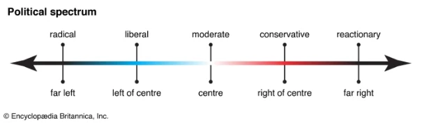

Vissa lutar sig mot dem för vilka ordning måste bevaras och införas till varje pris, det är **höger**. Andra lutar åt dem för vilka jämlikhet måste tillämpas till varje pris, även om det innebär att reformera allt - detta är **vänster**.

Denna kategorisering är dock ofta alltför förenklad och ineffektiv. Traditionellt ses till exempel vänstern som reformistisk, medan högern är mer konservativ. Men detta har blivit tveksamt i vår tid, eftersom vänstern nu kämpar för att bevara förvärvade fördelar, vilket gör den, ur den synvinkeln, konservativ.

De flesta individer som befinner sig mellan de två ytterligheterna kallas ofta för centrister, men denna etikett förenklar också deras position.

Låt oss ta ett exempel: om någon är för ekonomisk frihet men också för rätten att immigrera, var skulle du placera dem på en enkel vänster-höger-linje? En persons position på det politiska spektrumet är inte statisk, utan beror ofta på den aktuella frågan.

Många människor passar inte in och tycker att vänster eller höger, socialist eller konservativ inte beskriver deras åsikter på ett korrekt sätt.

Har du någonsin känt att det inte alltid räcker med att beskriva nyanserna och komplexiteten i politiska åsikter? Många människor hittar inte sin plats i den och tycker att vänster eller höger, socialist eller konservativ inte beskriver deras åsikter på ett korrekt sätt.

Även om detta positioneringskriterium fortfarande är användbart för att beteckna politiska känslor, kan det inte begreppsmässigt redogöra för mångfalden av ideologiska debatter och ståndpunkter.

Problemet med vänster-höger-axeln är att den inte lämnar något utrymme för klassiskt liberalt tänkande, som inte kan klumpas ihop med vare sig vänsterns egalitarism eller högerns nationalism.

Var på vänster-högerskalan placerar vi sådana som Thomas Jefferson, Alexis de Tocqueville, Frédéric Bastiat, Ron Paul, Elon Musk och Javier Milei?

Hur är det med klassiska liberaler och samtida tankeskolor som libertarianer? Ibland likställs de felaktigt med högern, eller till och med extremhögern. Men oftast existerar de inte i den här referensramen.

På sin tid sa ekonomen och parlamentsledamoten Frédéric Bastiat att han ibland röstade med vänstern, ibland med högern, beroende på vilket lagförslag som diskuterades.

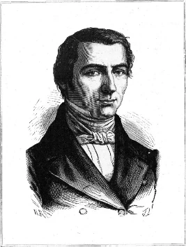

Detta innebar inte att han var centerpartist eller socialdemokrat. Bastiat var en stark motståndare till alla former av statism, till alla former av statlig interventionism. Han förespråkade en maximal ekonomisk och personlig frihet som var förenlig med respekt för andra, eftersom han trodde att samhällsordningen kunde växa fram underifrån, genom privata initiativ, socialt samarbete och individuellt ansvar, med ett minimum av lagar.

Låt oss ta ett annat exempel: **Är Bitcoin höger eller vänster?

Bitcoin är onekligen ett projekt som bryter med den nuvarande penningpolitiken. Det är alltså ett politiskt projekt. Men det är svårt att placera Bitcoin på en enkel linjär axel som går från yttersta vänster till yttersta höger.

Till att börja med är själva definitionen av höger och vänster komplex och utvecklas över tid, vilket gör det svårt att göra en strikt klassificering. Men framför allt överskrider Bitcoin, som en decentraliserad teknik, traditionella politiska skiljelinjer och lockar anhängare från olika politiska bakgrunder, från vänster och höger, inklusive anarkister och personer som betraktar sig som opolitiska.

- Högerorienterade personligheter kan se Bitcoin som ett alternativ till centralbankernas penningpolitik.
- Vänsterorienterade personligheter är också närvarande, framför allt på grund av Bitcoin:s potential för finansiell inkludering och som ett verktyg mot censur.

I själva verket är den traditionella dikotomin mellan höger och vänster otillräcklig, godtycklig och dåligt lämpad för att korrekt placera Bitcoin, som är en offentlig valuta som vem som helst kan anta, oavsett deras politiska lutning.

En enkel linjär axel som går från vänster till höger fungerar inte heller bra, eftersom ideologier som fascism och kommunism har likheter (totalitarism) som inte syns på en sådan axel.

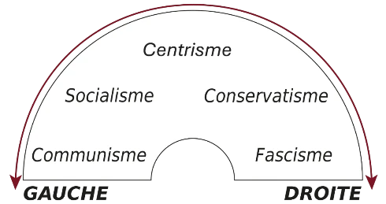

Dessutom, även om högern utan tvekan är mer ekonomiskt liberal än vänstern, delar båda lägren en misstro mot den fria marknaden, avtalsfrihet och privat egendom, och en dragning till statlig interventionism. För makthavarna, oavsett om de tillhör höger- eller vänstersidan, löses varje problem genom en ny reglering eller skatt, snarare än genom självreglering av individuella interaktioner.

Det är intressant att notera att vissa politiska ståndpunkter kan gå på tvärs mot traditionella höger/vänster-skiljelinjer. Protektionism, som ofta försvaras av vänstern, kan till exempel lätt förenas med nationalism, ett värde som traditionellt förknippas med högern. På samma sätt tvekar inte bönderna, som är fästa vid marken och familjetraditionerna - högervärderingar - att demonstrera kraftigt för att kräva statliga subventioner, ett tillvägagångssätt som ligger i linje med socialistisk logik.

Slutligen, döljer inte denna partipolitiska polarisering en mycket djupare och mer gammal klyfta: den som har separerat de som styr från de som styrs i århundraden?

Under covid-19-pandemin införde de flesta väststater totalitära kontrollsystem, och även om många av dessa avskaffades ökade klyftan mellan den härskande klassen och den genomsnittliga medborgaren.

Med statlig skuldsättning och inflation bevittnar vi en modern form av förslavning genom förlusten av människors köp- och sparkraft.

I själva verket gynnar systemet med fiatpengar de rikaste människorna och de mäktigaste finansiella enheterna, i synnerhet regeringarna, som är de största låntagarna. Genom att låna tvingar de bankerna att trycka nya pengar. Den inflation som blir följden är en mekanism som på ett försåtligt sätt devalverar pengar och förstör människors besparingar.

Fiatvalutan är hörnstenen i denna utvidgning av statens makt. Den gör det möjligt för regeringar att finansiera obegränsade utgifter, vilket eliminerar de budgetbegränsningar som fanns under en guldstandard. Detta moderna slaveri upprätthålls av en elit som är fast besluten att bevara sina privilegier, medan en försvagad befolkning, som avväpnats inför statens expansion, gradvis ser varje sfär av sin existens falla under kontroll.

I den här kursen kommer vi att se att det politiska landskapet är mycket rikare och mer komplext än bara de två kategorierna vänster och höger, tack vare en visuell modell som hjälper oss att bättre förstå de olika politiska familjerna.

Innan vi börjar den här kursen vill jag be dig att göra ett kort frågesport. Försök att svara på följande frågor:

**Sociala frågor**

- Bör staten äga eller kontrollera tidningar, radio eller TV?
- Bör staten reglera sexuell aktivitet mellan samtyckande vuxna, inklusive prostitution?
- Bör droger som marijuana, kokain och heroin legaliseras?
- Bör det vara lagligt för människor att resa eller resa in i och lämna ett land utan begränsningar?
- Bör regeringen skicka trupper för att ingripa i andra länders angelägenheter?
- Bör barn enligt lag vara skyldiga att gå i skolan?
- Ska föräldrar få undervisa sina barn hemma?
- Bör vapeninnehav begränsas genom lag?
- Hur ska regeringens miljöpolitik se ut?
- Behövs det en offentlig institution för att se till att läkemedel är säkra och effektiva?

**Ekonomiska frågor**

- Ska staten subventionera jordbrukare och reglera vad de odlar?
- Bör regeringen införa tullar, kvoter, embargon eller andra restriktioner för internationell handel?
- Bör regeringen införa en obligatorisk minimilön?
- Är beskattning det enda sättet att betala för nödvändiga offentliga tjänster?
- Bör staten hjälpa företag i svåra ekonomiska tider med lån till låg ränta eller subventioner?
- Vad är det bästa sättet att hantera dagens massiva budgetunderskott?
- Hur kan vi lösa problemet med underskottet i socialförsäkringssystemet?
- Bör regeringen skicka ekonomiskt stöd till andra länder?
- Vad ska regeringen göra åt de stigande sjukvårdskostnaderna?
- Vad bör regeringens kärnenergipolitik vara?

I alla dessa frågor finns det en central och avgörande fråga som dyker upp: den grad av statlig kontroll du kan tolerera, och därmed också den grad av finansiering du mer eller mindre tvingas delta i.

Så den grundläggande politiska frågan är: **Vem skall bestämma? ** För att uttrycka det på ett annat sätt: **Fattar du de viktiga besluten om ditt personliga och sociala liv, eller gör någon annan det åt dig?

1966 utvecklade författaren Robert Heinlein i *Revolt on the Moon* (The Moon is a Harsh Mistress) idén om att regeringar alltid slutar med att samla makt och kontrollera medborgarna, vilket han kallar människans oundvikliga sjukdom.

Han konstaterar att mänskligheten är politiskt uppdelad mellan dem som vill styra över andras liv och dem som inte vill det.

> Människosläktet delas politiskt in i de som vill att människor ska kontrolleras och de som inte har någon sådan önskan.

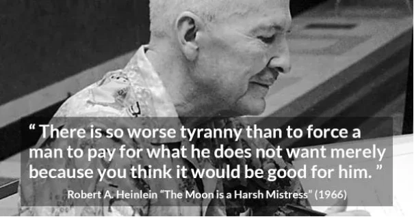

Numera försvarar alla politiska partier, oavsett om de är vänster, center eller höger, statens rätt att styra människors liv och ingripa i alla frågor genom regleringar och skatter. I mainstreammedierna ser vi samma sak: referensramen är statstrogen.

Så, bör den traditionella politiska modellen med höger och vänster övervinnas? Och om så är fallet, till förmån för vilken annan modell?

# Mot en ny uppdelning: frihet-tvång

<partId>fb5cb390-67ad-41f3-903d-c208b84e6a0c</partId>

## Nolan-diagrammet

<chapterId>7b3aa120-6eee-45a1-9e46-856e26403e08</chapterId>

I stället för att dela upp politiska doktriner längs en höger/vänster-axel skulle det vara mer meningsfullt att se på saker och ting genom frihetens prisma. Vi skulle då få en frihet-makt-axel, så att det klassiska liberala tänkandet äntligen skulle hitta sin plats på det politiska schackbrädet.

Det rätta sättet att se på saken skulle alltså vara att ställa frihetens försvarare mot statens försvarare - de som litar på individers förmåga att organisera sig på ett ansvarsfullt sätt och de som vill ha en stark myndighet för att lugna dem och kontrollera andras liv.

David Nolan, grundare av Libertarian Party 1971 och författare till det numera berömda Nolan Chart, förstod detta. Han är en alumn från Massachusetts Institute of Technology (MIT) och har utformat ett diagram som sannolikt bättre kommer att representera komplexiteten i det politiska spektrumet.

Hans idé är att till vänster-höger-axeln lägga till en andra frihets-/maktaxel som går från statism längst ner (punkt noll) till libertarianism längst upp. Ju längre bort från nollpunkten, desto mer libertariansk är den ideologiska positioneringen.

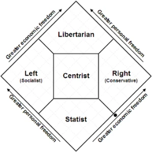

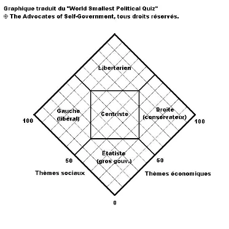

Diagrammet är en kvadrat som är indelad i fem sektioner, med en etikett tilldelad var och en av de följande sektionerna:

- Botten: den mest auktoritära, till och med totalitära formen av statism, som motsvarar dem som stöder mycket lite ekonomisk och personlig frihet.
- Till vänster: socialister. De som förespråkar mindre ekonomisk frihet och mer personlig frihet.
- Till höger: konservativa. De som stöder höga nivåer av ekonomisk frihet och låga nivåer av personlig frihet.
- Överst: libertarianer, motsatsen till den hårdföra statarismen. Dessa är de människor som stöder större ekonomisk och personlig frihet.
- I mitten: centristerna. Detta är en pragmatisk zon för dem som är för ett system som blandar lite ekonomisk och personlig frihet med en önskan om viss marknadsreglering, vilket innebär att vissa individuella rättigheter offras.

Detta gör Nolan-diagrammets tvådimensionella ansats till en mycket mer korrekt representation av det politiska spektrumet än den typiska endimensionella vänster-höger-linjen som de flesta politiska analytiker hänvisar till.

## De två grundläggande dimensionerna

<chapterId>e41d903d-26c9-425e-8a92-6aec48838b61</chapterId>

Diagrammet visar de ekonomiska friheterna (skattenivåer, fri marknad, privata tjänster) på x-axeln och de personliga friheterna (rörelsefrihet, åsiktsfrihet, självbestämmande) på y-axeln.

Detta system bygger på idén att de flesta politiska frågor kan delas in i två breda kategorier: ekonomiska och personliga (eller samhälleliga).

### Ekonomiska friheter

I kategorin ekonomisk frihet ingår vad du gör som producent och konsument - vad du kan köpa, sälja eller producera. Var du arbetar, vem du anställer eller vad du gör med dina pengar.

Exempel på ekonomisk aktivitet: starta ett företag, köpa ett hus, bygga en byggnad, handla, arbeta på ett kontor.

- Till höger om axeln** (mot 100 på Economic Issues-skalan): preferens för **ekonomisk frihet**. Detta innebär mindre statlig inblandning i ekonomin, färre regleringar, lägre skatter och större frihet för företag och individer att producera, handla och konsumera. Tyngdpunkten ligger på den fria marknaden, privat egendom och konkurrens som drivkrafter för välstånd.
 - Emblematiska personer:* Margaret Thatcher (Storbritannien), Ronald Reagan (USA), Javier Milei (Argentina).

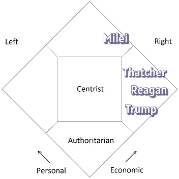

- Till vänster om axeln** (mot 0 på skalan för ekonomiska frågor): preferens för **stark statlig inblandning i ekonomin**. Detta innebär reglering, höga skatter för att finansiera offentliga tjänster (hälsovård, utbildning, transport), förstatligande och omfördelning av välstånd. Syftet är ofta att minska ojämlikheter och garantera en viss grad av social rättvisa.
  - Emblematiska personer:* Franklin D. Roosevelt (USA), Jean Jaurès (Frankrike), Bernie Sanders, Barack Obama.

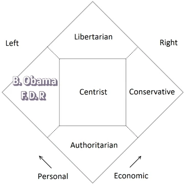

### Personliga och sociala friheter

I kategorin personlig frihet ingår vad du gör i dina privata relationer, med dina åsikter och övertygelser. I allmänhet är det allt du gör med din egen kropp och ditt eget sinne.

*Exempel på personliga aktiviteter:* äktenskap; välja vilka böcker du läser och vilka filmer du ser; vilka livsmedel, mediciner och droger du väljer att konsumera; sport; dina religiösa val; vilka organisationer du går med i; vilka människor du väljer att umgås med.

- Högst upp på axeln** (mot 100 på Social Issues-skalan): preferens för **individuell frihet** och tolerans. Staten bör lägga sig i individers livsval så lite som möjligt (aborträtt, HBTQ+-rättigheter, yttrandefrihet, legalisering av vissa substanser etc.) Vi värdesätter autonomi och mångfald.
  - Symboliska personer:* Nelson Mandela, Simone Veil, Noam Chomsky.

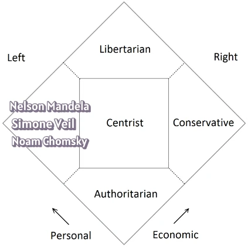

- Längst ner på axeln** (mot 0 på skalan för sociala frågor): preferens för **ordning, säkerhet och traditionella värderingar**. Staten har en roll att spela när det gäller att reglera moral, upprätthålla allmän ordning och ibland försvara en viss syn på moral eller tradition, även genom våld. Detta inkluderar ståndpunkter som förespråkar dödsstraff, restriktioner för invandring eller statligt främjande av den traditionella familjen.
  - Emblematiska figurer:* Joseph de Maistre (fransk kontrarevolutionär filosof) - för sina idéer om gudomlig ordning och auktoritet. Nutida auktoritära ledare som Vladimir Putin i Ryssland och Xi Jinping i Kina.

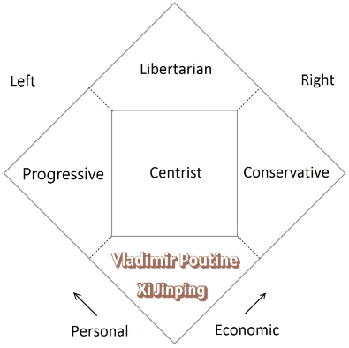

## Är du en höger- eller vänstervriden statist?

<chapterId>06d903fc-9453-47d4-b0b1-38b6b82ccf99</chapterId>

En person kan vara vänster i ekonomiska frågor (för omfördelning) men höger i samhällsfrågor (mycket fäst vid ordning och tradition). Och vice versa! Den diamantformade modellen fångar denna komplexitet.

Vänstern definieras traditionellt som förknippad med socialism, ett system där staten har betydande makt över individer och samhällsorganisation, särskilt när det gäller omfördelning av inkomster. Högern skulle kunna ses som motsatsen, en situation där staten saknar betydande maktbefogenheter, vilket skulle definiera den som liberal. Verkligheten är dock mer komplex, och högern är inte bara motsatsen till den statstrogna vänstern.

Den politik som förts av höger- och vänsterregeringar under de senaste decennierna har inte varit fundamentalt annorlunda, och ingen av dem har varit verkligt liberal i den klassiska, europeiska betydelsen av begreppet.

Den centrala tanken i Nolans diagram är att den stora skillnaden mellan politiska filosofier, den verkligt avgörande faktorn, är graden av statlig kontroll över mänskligt handlande på det personliga och ekonomiska området.

Med andra ord finns det inte bara en vänster-höger-axel som speglar dina personliga värderingar, utan också en topp-botten-axel som speglar din vilja att använda våld för att tvinga andra att följa dina värderingar.

Ur denna synvinkel har höger och vänster samma politiska mål: att vinna makt så att de kan organisera samhället enligt sin världsbild och påtvinga alla den.

Detta är själva definitionen av statism: att använda lagstiftning för att kontrollera och forma samhället.

Det är därför vi kan säga att vissa är **högerorienterade statister**, medan andra är **vänsterorienterade statister** eller mittenorienterade.

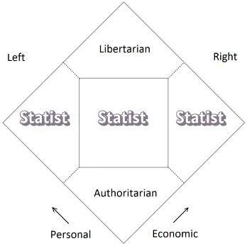

För vissa är det i namn av att försvara civilisationen, för andra är det i namn av att försvara arbetarklassen, naturen eller de förtryckta. Och centristerna godkänner också detta, när det passar dem.

Högern anser att den personliga moralen är det viktigaste och är därför beredd att tillåta frihet i egendomsfrågor och ekonomiska frågor. Å andra sidan vill de lagstifta om moral och religion på samma gång.

Vänstern å sin sida fäster inte särskilt stor vikt vid traditionella moraliska och religiösa krav. Vänstern är mindre intresserad av gudomlig rättvisa och mer intresserad av social rättvisa, eller kanske av tanken att gudomlig rättvisa *skulle* vara social rättvisa. För den politiska vänstern är den lämpliga fördelningen av belöningar i samhället en fråga för rättsliga eller politiska beslut. Följaktligen är den politiska vänstern fientligt inställd till ekonomisk frihet och den fria marknaden, som inte verkar fördela rikedom och belöningar efter individuella behov.

## Är du kulturkonservativ eller politiskt konservativ?

<chapterId>bef3d6f1-390a-472d-8f18-a559d38aea54</chapterId>

Kulturkonservatism är det personliga fasthållandet vid så kallade traditionella moraliska värden, antropologi, estetik och metafysik, som alla ärvts från det förflutna. Det är en livsvisdom som vägleds av uråldriga principer, vare sig de är grekisk-romerska eller judisk-kristna. **Det är inte en politisk filosofi

Om du är kulturkonservativ är du för den traditionella familjen, dygdetik och gudstro. Den kulturkonservative tror att människan, för att bli lycklig, behöver själens upphöjelse, andliga värden och en viss känslomässig ädelhet.

Å andra sidan är **politisk konservatism** ett sätt att organisera samhället enligt en fast ordning. Det är därför konservativa är motståndare till framsteg. De vill frysa samhället i det tillstånd som det har nått i det ögonblick de talar, och tror att varje förändring skulle vara värre.

Politiskt sett ansluter sig kulturkonservativa ofta till den politiska konservatismen. Men så är inte alltid fallet. De två konservatismerna är inte nödvändigtvis oskiljaktiga. **Man kan vara både kulturkonservativ och libertarian

En person kan t.ex. försvara kulturella traditioner (såsom familj, religion eller lokala seder) i sitt personliga liv eller i samhället, samtidigt som han eller hon förespråkar en begränsad regering som inte påtvingar dessa värderingar genom lag. Denna typ av person kan uppmuntra konservativa normer genom övertalning, utbildning eller genom att föregå med gott exempel, samtidigt som den respekterar andras rätt att leva annorlunda, i linje med libertarianska principer.

Den kulturkonservativa libertarianen kan moraliskt ogilla vissa beteenden, men han **förespråkar inte lagligt förbud eller fängslande** av människor som ägnar sig åt samförståndsmässiga, icke-aggressiva handlingar. Den kan ogilla sådana handlingar, motsätta sig dem, bekämpa dem och aktivt avskräcka människor från att delta i dem, men alltid **utan att tillgripa lagens tvångsmedel**.

I praktiken har personer som Ron Paul eller tänkare som Rothbard och Hoppe i USA försökt förena dessa två visioner genom att försvara både traditionella värderingar och maximal individuell frihet.

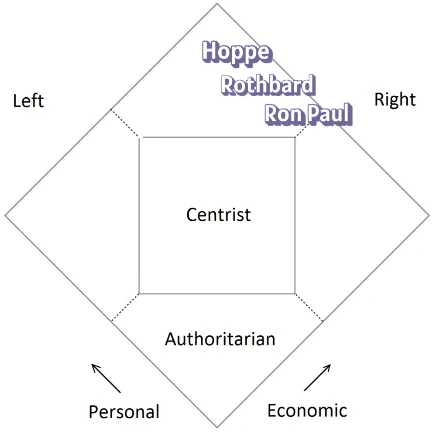

## Är du liberal eller libertarian?

<chapterId>d382c40b-78ce-416f-9f63-6ad43768406b</chapterId>

De termer som används för att beteckna politiska familjer är inte oföränderliga. De kan variera beroende på geografiskt och historiskt sammanhang. Detta kan leda till förvirring.

I Europa och USA har vissa ord inte längre samma innebörd. Så är fallet med ordet liberalism.

I Nordamerika klassificeras *liberalism* till vänster och likställs med progressivism. Amerikanska *liberaler* har i själva verket blivit förespråkare för statlig intervention och *Big Government*. Denna historiska utveckling står i skarp kontrast till den fortsatta betydelsen av begreppen liberal och konservativ i Europa.

I många länder, särskilt i Europa, förknippas begreppet liberalism med en ekonomisk laissez-faire-politik och minskat statligt ingripande.

Det är därför som termen *liberaler* är missvisande för en europé. Den amerikanska liberala politiken kan sedan 1900-talet beskrivas som en förskjutning mot ett statligt, auktoritärt paradigm, vilket har förvrängt innebörden av ordet *liberalism*.

Historiskt sett har den amerikanska *liberalismen* stött en betydande statlig interventionism (Franklin Delano Roosevelts *New Deal* och Lyndon B. Johnsons *Great Society*), inklusive omfördelning av rikedomar och sociala program. I USA förknippas därför termen *liberal* med vänster- eller socialdemokratisk politik, t.ex. offentlig sjukförsäkring och offentliga program för fattigdomsbekämpning.

Från 1960-talet och framåt började anhängare av klassisk liberalism i USA att kalla sig *libertarianer* för att skilja sig från amerikanska liberaler. De är arvtagare till 1800-talets europeiska klassiska liberalism.

## Är du en libertarian eller en libertaire/anarkist (på franska libertaire)?

<chapterId>fc761194-249f-4009-a20f-1f98b7226cf2</chapterId>

Termen **libertarian** översätts ibland med libertarian eller libertin, vilket är ett stort missförstånd.

Den franska termen libertaire kommer från 1800-talets anarkistiska tradition, som härstammar från socialismen. Denna tradition är historiskt kopplad till tänkare som Pierre-Joseph Proudhon och Mikhail Bakunin. Anarkism är den politiska doktrin som säger att alla former av regeringar är onödiga, förtryckande och måste avskaffas.

För socialistiska och kommunistiska anarkister är egendom stöld. De vill att pengar och banker försvinner och att man återgår till en lokal ekonomi som bygger på byteshandel. De eftersträvar ett egalitärt samhälle där individuell frihet utövas inom ett kollektivt ramverk, utan dominans.

Till skillnad från libertarianer är anarkister ofta antikapitalistiska och förespråkar ekonomiska former som mutualism, kollektivism eller libertariansk kommunism.

Socialistiska anarkister som Mikhail Bakunin och Pierre Kropotkin såg privat egendom och staten som två källor till förtryck och föreslog att de skulle avskaffas.

En anarkist kan förespråka självförvaltade kommuner, kooperativ eller antihierarkiska rörelser, samtidigt som han eller hon förkastar statlig auktoritet och kapitalistiska strukturer.

De är för att avskaffa staten, men har avstått från våldsamma åtgärder mot staten på grund av bristande effektivitet. Å andra sidan har de inte avstått från att använda våld mot privata företag. De stöder offentliga monopol, accepterar arbetsteorin om värde, fördömer lönesystemet och betraktar vinst och räntor som exploatering. Få vänsteranarkister, som Pierre-Joseph Proudhon, förde en aktiv kampanj mot beskattning.

För libertarianer är tvärtom det enda sättet att garantera individuell frihet att garantera privat egendom. Den väsentliga skillnaden mellan libertarianer och anarkister gäller därför uppfattningen om individuell egendom och avtalsfrihet. Libertarianernas våldsdoktrin är dessutom defensiv: självförsvar och motstånd mot förtryck.

Libertiner är aktivister för sexuell frihet. Det är inte så mycket en politisk filosofi som ett personligt sätt att leva, baserat på en ohämmad moral som står i motsats till borgerlig moral. Politiskt är de ofta i linje med vänsteranarkister, det vill säga med anarkister.

# Politiska familjer under lupp

<partId>2e1183f6-95d4-4d3c-9274-843993210624</partId>

## Strukturella och avsiktliga definitioner

<chapterId>ec5b13b7-4104-46a9-9c39-a810959a69ee</chapterId>

Låt oss nu ta en närmare titt på de olika politiska filosofierna. Den nedersta delen av ramen kommer att behandlas något marginellt, eftersom det inte i strikt mening är en politisk ideologi, utan snarare ett socialt system som tenderar mot totalitarism.

Men först måste vi förklara en viktig skillnad.

Milton Friedman skrev

> Ett av de största misstagen är att bedöma politik och program utifrån deras avsikter snarare än deras resultat. Vi känner alla till den berömda vägen som är belagd med goda avsikter. [...] Program som är avsedda för fattiga eller behövande får nästan alltid effekter som är raka motsatsen till vad deras välmenande sponsorer hoppas uppnå.

Politiska åtgärder, som ofta motiveras av generösa avsikter, kan få oförutsedda eller skadliga konsekvenser om de inte baseras på en rigorös analys av mänskliga incitament och beteenden. Till exempel skapar en socialpolitik som syftar till att hjälpa de fattiga ofta perversa effekter som ekonomiskt beroende eller snedvridning av marknaden.

För Friedman måste mätbara resultat - t.ex. ekonomisk tillväxt, fattigdomsbekämpning eller effektivitet - gå före avsikter, eftersom de senare, även om de är ädla, inte garanterar framgång.

De **strukturella eller praktiska definitionerna** fokuserar på hur politiska system fungerar i praktiken och på deras observerbara egenskaper. Socialism kännetecknas till exempel av att staten har en tendens att ta hand om, reglera och planera allt. Libertarianism, å andra sidan, kännetecknas av att individen och hans eller hennes frihet ges företräde och tenderar mot minimal statlig inblandning i ekonomin och på andra håll.

Däremot baseras **intentionella definitioner** på individers eller gruppers uttalade motiv, mål eller avsikter. Socialism har till exempel social rättvisa som mål. Men om vi förlitar oss på avsikter blir saker och ting otydliga, eftersom alla är för rättvisa. Därför föredrar vi att använda strukturella definitioner för att få en tydligare och mer objektiv analys.

I de följande kapitlen förklaras hur man strukturellt definierar politiska familjer.

## Socialisterna

<chapterId>1ef34d7b-f813-458c-934c-1d404f882150</chapterId>

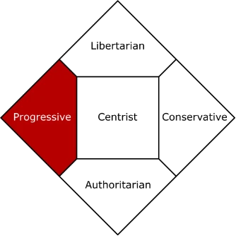

- Friheter:** ganska stark på det sociala området, men svag på det ekonomiska området.
- Kardinalvärden:** jämlikhet, framsteg, social rättvisa, solidaritet.
- Filosofi och principer:** Den kollektiva organisationens företräde. Socialismen är en praktik som utgår från samhället som helhet (holism) och som uttrycks genom staten. Den socialistiska staten syftar till att ta hand om och styra mänsklig aktivitet till det maximala. Socialister har en nästan obegränsad tro på möjligheten att bygga en ny samhällsordning baserad på förnuft.
- Politik:** Socialister förespråkar hälsoprogram, skattehöjningar och subventioner för att garantera rättvisa. Detta innebär ekonomisk och social statlig styrning, planering (organisering av produktionen uppströms). Hayek talar om konstruktivism, dvs. tanken att det är upp till staten att bygga samhället och ge det en viss form, i motsats till den liberala ordningen där samhället bygger sig självt (spontan ordning). Den mest radikala och framgångsrika socialismen är totalitär, eftersom staten tar över all mänsklig verksamhet.
- Ekonomi:** Socialism innebär en stark statlig kontroll av ekonomin, till förmån för rättvisa (att alla ska kunna försörja sig själva). Socialister är misstänksamma mot fria marknader, som de ser som ett system som gör det möjligt för de starka att ge sig på de sårbara. De förespråkar omfördelning av rikedomar och centraliserade sociala program som finansieras genom höga skatter och intäkter.

**Olika typer av socialister:**

Begreppet socialism är en neologism som för första gången användes systematiskt och med en exakt innebörd av fransmannen Pierre Leroux år 1833. Inom den moderna socialismen kan två traditioner urskiljas:

1.  **Revolutionära socialister** är motståndare till äganderätten och vill förstöra det kapitalistiska borgerliga samhället. De följer i fotspåren av 1800-talets anarkister som Bakunin. Denna anarkism gav senare upphov till den marxistiska kommunismen.

2.  **Reformistiska socialister** är inte benägna att ta till våld. De har inte övergett sitt mål om social rättvisa, men detta mål eftersträvas genom demokratiska val och beskattning, med hjälp av de resurser som genereras av marknadsekonomin. Så var fallet med Jean Jaurès, Leon Blum, Olof Palme (Sverige), Willy Brandt (Tyskland) och François Mitterrand (Frankrike).

Franklin Delano Rossevelts New Deal spelade en roll i formandet av den amerikanska demokratiska socialismen (Bernie Sanders).

- Skapandet av social trygghet
- Införande av federal minimilön
- Upprätta arbetslöshetsförsäkring
- Federala offentliga anställningsprogram

Enligt Bernie Sanders har *dessa reformer blivit nationens sociala väv och grunden för den amerikanska medelklassen*.

> Socialism är den metod som ersätter individuellt ägande av produktions- och bytesmedel med socialt ägande.  - Léon Blum, "På en mänsklig skala", 1945.

## Konservativa

<chapterId>4e068cd8-a5c3-44f8-ac77-309f249a59eb</chapterId>

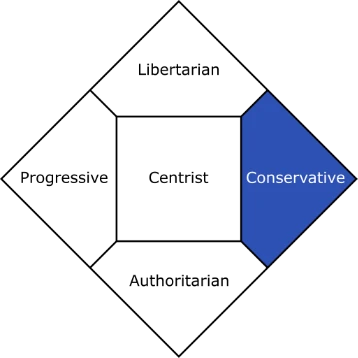

- Friheter:** de är starka på det ekonomiska området men svaga på det samhälleliga området.

- Kardinala värden:** dygd, ordning, tradition, civilisation.

- Filosofi och principer:** Konservativa anser att saker och ting i allmänhet är bra som de är, och att varje förändring skulle kunna göra dem sämre. De försöker bevara det som redan finns, försvarar det som gott i sig och är motvilliga till förändringar i ett system som de anser har visat sig vara effektivt. I hjärtat av den traditionella konservatismen finns en djup respekt för sedan länge etablerade samhällsinstitutioner, som ses som ett viktigt skydd mot kaos, orättvisor och grymhet. Dessa sociala byggnadsverk upprätthåller den solidaritet, säkerhet och styrka som mänskligheten behöver för att motstå modernitetens överdrifter.

- Politik:** Konservativa förespråkar traditionella sociala kontroller och statligt ingripande för att upprätthålla sociala och moraliska normer (ordning, säkerhet, värderingar). De stöder ett starkt nationellt försvar. De tenderar att stödja mer omfattande polisbefogenheter. Socialism uppfattas som en brutal brytning med den västerländska civilisationen. Konservativa spelade en avgörande roll i kampen mot kommunismen och förkastandet av överdriven statlig interventionism.

- Ekonomi:** Konservativa stöder låg beskattning och minimal reglering av företag. De stöder hederligt entreprenörskap och fri företagsamhet samt individer som arbetar hårt för att samla rikedom. Men de fruktar att för mycket individuell frihet kommer att leda till omoral eller civilisationens nedgång.

**Typer av konservativa:**

i 1800-talets Europa är de konservativa reaktionära. De förespråkar en återgång till det gamla feodala, jordbruks- och hantverkssamhället. De vill fly dagens samhälle och återvända till det förflutna, före den utveckling som de anser vara skadlig: vetenskapliga och tekniska framsteg, med dess konsekvenser för ekonomin och samhället.

I de anglosaxiska länderna liknar konservatismen högerpolitiken i de latinska länderna. Empiriskt definieras denna konservatism genom sitt motstånd mot progressivismen i New Deal, som i USA har fått namnet *liberalism*. Som exempel kan nämnas Russell Kirks, Michael Oakeshotts och Roger Scrutons arbeten.

#### Vi måste dock skilja mellan två typer av konservatism.

1.  **Traditionell amerikansk konservatism** bygger på idén om "ordnad frihet", som syftar till att förena de ibland motsägelsefulla strävandena efter gemenskap och individ, individuell frihet och ansvar, begränsad regering och fria marknader. Efter andra världskriget återuppfann den amerikanska konservatismen sig själv och försökte förena traditionella liberala och konservativa värderingar. De motsatte sig kommunismen, men också den amerikanska federala regeringens överdrivna expansion, och hävdade att de problem som den skapade inte bara kunde lösas genom att förbättra dess förvaltning, utan också genom att återställa moraliska och religiösa värderingar.

2.  **I USA**, från 2000-talet och framåt, blev neokonservativa alltmer involverade i att rättfärdiga militär interventionism för att införa demokrati i världen, särskilt efter den 11 september 2001, och fick mycket kritik från traditionalistiska konservativa.

Vissa kallar sig nu "paleokonservativa" för att skilja sig från neokonservativa.

## Libertarianer

<chapterId>9ca743de-537b-42fb-87d2-212d5f478b22</chapterId>

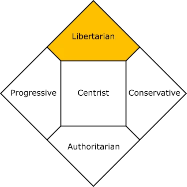

- Friheter:** de är starka på både samhälleliga och ekonomiska områden.

- Kardinala värden:** individuell frihet, ansvar, privat egendom, samtycke.

- Filosofi och principer:** Den individuella frihetens primat. Historiskt sett är den klassiska liberalismen först och främst en rättsfilosofi. Den grundläggande idén är att varje individ har omistliga rättigheter till liv, frihet och egendom. Dessa rättigheter beviljas inte av regeringen utan är inneboende i människan. Självsuveränitet (eller självägande) är idén om att varje individ är den rättmätiga ägaren av sin egen kropp och sitt eget liv och har rätt att fatta beslut om dessa utan yttre tvång, så länge han eller hon inte kränker andras rättigheter.

- Politik:** Libertarianer anser att ingen, inte heller någon grupp (inklusive regeringen), har rätt att initiera eller hota med fysiskt våld mot en annan person eller dennes egendom. Detta är principen om icke-aggression. Detta innebär att bedrägeri, stöld och tvång är moraliskt förkastligt. Användning av våld kan endast rättfärdigas i självförsvar.

Libertarianer vägrar att ge staten särskilt tillstånd att begå handlingar som de flesta människor skulle anse vara omoraliska, olagliga eller kriminella om de begicks av individer eller grupper i samhället. Kort sagt insisterar libertarianer på att alla ska omfattas av samma moralkodex, utan undantag för någon grupp eller individ.

Libertarianer är djupt misstänksamma mot all maktkoncentration, oavsett om den är politisk eller ekonomisk. Statsmakten anses vara särskilt farlig eftersom den lagligen kan utöva tvång.

- Ekonomi:** Frihandel och näringsfrihet är ekonomiska uttryck för respekt för individers rätt att äga sig själva och sina varor och att fritt utbyta dem. Frihet skapar en spontan och rättvis ordning, eftersom den är ett resultat av individens agerande och ansvar, genom samspelet mellan frivilligt utbyte och avtal.

**Typer av libertarianer: **

Under 1900-talet växte två stora trender fram:

1.  **Minarkist:** som anser att statens befogenheter bör vara strikt begränsade till försvaret av individuella friheter. Det är en minimal statsregim (*Nattväktarstaten*), där makten endast är legitim för att säkerställa kärnfunktionerna polis, rättvisa och väpnat försvar av territoriet.

2.  **Den andra anarkokapitalisten:** som anser att statliga funktioner bör privatiseras och skötas av marknaden.

Båda är dock överens om den grundläggande principen om individuell suveränitet. Libertarianska idéer uttrycktes redan på 1700-talet av fysiokraterna, i synnerhet Vincent de Gournay och Turgot, och utvecklades av Condillac, Jean-Baptiste Say och Frédéric Bastiat. Under 1900-talet togs de upp och utvecklades av den österrikiska ekonomiska skolan, vars främsta författare är Ludwig von Mises, Friedrich Hayek och Murray Rothbard.

## Centristerna

<chapterId>d4f5c100-a791-45cf-bc7c-6e2353dc7a48</chapterId>

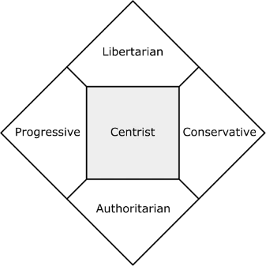

- Friheter:** De är moderata anhängare av individuella och ekonomiska friheter.

- Kardinalvärden:** måttfullhet, kompromiss, anpassning, allmännytta.

- Filosofi:** Centrister undviker ytterligheter och föredrar pragmatiska lösningar. De tänker på problem från fall till fall, inte i termer av principer. Centrismens natur är ofta att närma sig ett ämne genom att söka en pragmatisk balans mellan olika ståndpunkter. Pragmatism är en politisk filosofi som förespråkar anpassning till särskilda sammanhang snarare än en rigid tillämpning av ideologiska principer. Det är ett politiskt förhållningssätt som bygger på måttfullhet och kompromisser. Detta pragmatiska tänkande bygger på tanken att endast teknokrater kan fatta de rätta besluten för att uppnå de bästa socioekonomiska resultaten.

- Politik:** de vill kombinera statlig kontroll och individuella val för en stabil, måttfull strategi. Det är en flexibel form av statligt ingripande från fall till fall. I denna teknokratiska form av styrning baseras politiska beslut på rationalitet och expertis, snarare än ideologi eller partipolitisk debatt.

- Ekonomi:** Centrister accepterar marknadsmekanismer, samtidigt som de inser behovet av lämplig expertkontroll och reglering. De förespråkar en kontrollerad marknadsekonomi där konkurrensen sker inom ett regelverk som skyddar det allmänna intresset.

Centrismen erkänner också vikten av riktade sociala program för att korrigera ojämlikheter utan att skapa ett alltför stort beroende av staten. Detta system för omfördelning av rikedomar syftar mindre till dogmatisk egalitarism än till social fred och "att leva tillsammans".

**Typer av centrister:** Centrister kan luta åt socialism, konservatism, libertarianism eller auktoritarism, inte av princip utan av pragmatism eller politisk opportunism.

- Emmanuel Macron (Frankrike):** hans positionering är både höger och vänster. Med liberala ekonomiska reformer (ekonomisk höger) och stöd för vissa samhälleliga friheter (social vänster) söker han en medelväg.
- Tony Blair (Storbritannien):** med sitt "tredje vägen"-koncept. Han försökte förena marknadspolitik med mål för social rättvisa och skilde sig därmed från traditionella socialister och konservativa.

Keynesianism är en ekonomisk teori som förespråkar aktiva statliga ingripanden för att stabilisera ekonomin.

I stället för att låta marknaden reglera sig själv menade Keynes att staten borde använda finans- och penningpolitiken - t.ex. offentliga utgifter, skatter och räntor - för att stimulera den samlade efterfrågan i tider av lågkonjunktur eller dämpa den i tider av överhettning.

Keynes förespråkade varken absolut laissez-faire (som rena marknadsförespråkare) eller total statlig kontroll (som i en planekonomi).

Detta synsätt utgör en ekonomisk "tredje väg" som söker en balans mellan klassisk liberalism, som vill ha en fri marknad, och statsplanerad socialism, som vill ha maximal planering.

Filosofiskt sett kan vi hänvisa till den berömde politiske filosofen John Rawls, författare till *The Theory of Justice* (1971).

Dess två rättviseprinciper (lika frihet för alla och principen om skillnader, som innebär att ojämlikheter endast tillåts om de gynnar de mest missgynnade) är ett uttryck för detta försök att sammanföra liberalism och egalitarism.

Begreppet **överlappande konsensus** är också centralt i John Rawls tänkande, särskilt i hans bok *Political Liberalism* (1993). Här är ett citat som illustrerar detta koncept:

> Ett överlappande samförstånd uppnås när medborgare, trots att de följer olika övergripande, religiösa eller filosofiska doktriner, ändå konvergerar mot en uppsättning politiska rättviseprinciper som de alla kan stödja utifrån sina egna perspektiv.

Hans mål är att visa att det är möjligt att förena oförenliga grundläggande doktriner kring gemensamma principer om rättvisa, själva kärnan i den centristiska filosofin.

## Totalitära regimer

<chapterId>7a5e9f5a-2be1-4497-892a-3da5f015faa0</chapterId>

Det är viktigt att notera att begreppet totalitarism avser ett politiskt system, inte en politisk ideologi i betydelsen konservatism eller centrism. En totalitär regim kännetecknas av en omfattande, tvingande statlig kontroll över alla aspekter av det offentliga och privata livet.

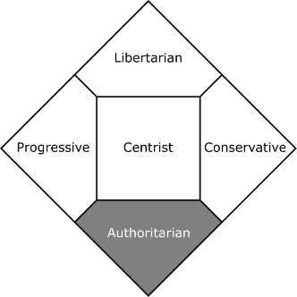

- Friheter:** totalitära regimer stöder stark statlig kontroll över det personliga och ekonomiska livet. Totalitarism existerar när staten kontrollerar allt i samhället och har obegränsad makt.
- Filosofi:** Totalitarister anser att centraliserad auktoritet är det enda sättet att garantera ordning och rättvisa, medan frihet är en faktor som skapar oordning. De vill att staten ska kontrollera alla aspekter av det ekonomiska och personliga livet, eftersom de tror att en sådan kontroll är mer sannolik att skapa ett idealsamhälle. De är revolutionära regimer som rättfärdigar våld med att det tidigare systemet var helt fel och att en ny modell måste etableras genom att torka tavlan ren. De kan inte tolerera en alltför stor mångfald av åsikter eller något uttryck som utmanar deras auktoritet.
- Politik:** totalitarism avser ett enpartisystem. Enligt Hannah Arendt är totalitarism varken en politisk familj eller en despotisk politisk regim. Det är själva negationen av politik: ett system där människor görs oförmögna till självständig handling. Enligt henne har syftet med totalitär utbildning aldrig varit att ingjuta övertygelser, utan att förstöra förmågan att bilda någon annan (The Origins of Totalitarianism, 1951). Totalitära samhällen kännetecknas av att de använder sig av en ideologi, ett löfte om ett *paradis*, t.ex. historiens slut eller rasrenhet. Följaktligen eliminerar de alla former av opposition genom politisk polis och användning av terror.
- Ekonomi:** totalitära regimer kan tolerera privat företagsamhet om den tvingas tjäna statens intressen, eller kräva att staten kontrollerar alla produktionsmedel. De ser den fria marknaden som ett hot mot den allmänna ordningen, eftersom idealsamhällen måste planeras av myndigheterna.

**Det finns två allmänna kategorier av totalitära regimer**: vänstertotalitära (kommunism, nationalsocialism) och högertotalitära (militärdiktaturer, fascism). Men dessa kategorier förlorar sin mening om vi förstår att matrisen är densamma. Detta är fallet med Hitler och Stalin. Trots deras historiska antagonism finner vi samma ledarkult, ungdomsrekrytering, censur, övervakning, förtryck av all opposition, politisk förföljelse och krossande av all individuell frihet.

- Hitler (nazism/fascism): Även om nazismen inte formellt avskaffade privat egendom utövade den nazistiska staten en överväldigande kontroll över ekonomin. Produktion, resursfördelning och (även privat) företagande underordnades alla statliga mål (upprustning, autarki). Det fanns en centraliserad ekonomisk planering för att tjäna regimens mål.

- Stalin (Kommunism/Stalinism): Stalinismen exemplifierar total statlig kontroll av ekonomin. Allt privat ägande av produktionsmedlen avskaffades, ekonomin var helt planerad (femårsplaner) och staten kontrollerade absolut alla aspekter av produktion och distribution.

# Samhällsfrågor

<partId>ab160ddd-5c3a-436b-a77a-76d7089f1611</partId>

## Samhällsfrågor

<chapterId>bb2156da-7e10-4f0b-89c3-f6d53f5a79ef</chapterId>

Här är några vanliga frågor om politiska frågor. Varje fråga följs av ett kort svar som är typiskt för en socialist, en konservativ, en libertarian och en centerpartist.

Naturligtvis ger dessa snabba svar bara en glimt av varje synvinkel. Eftersom alla inte tänker på samma sätt är de svar som tillskrivs dem naturligtvis öppna för debatt. Jag har dock försökt att vara rättvis och korrekt återge vad de flesta skulle säga.

Samhällsfrågor handlar inte om pengar, utan om de val vi gör när det gäller vad vi läser, äter, dricker, röker, bär eller vem vi väljer att umgås, sova med eller gifta oss med.

### Bröllopet

**Fråga:** Bör regeringen legalisera homoäktenskap på samma sätt som traditionella äktenskap?

- Socialister:** Ja, de ser en heterosexuell majoritet som förtrycker en homosexuell minoritet genom att neka dem äktenskap, och stöder därför naturligtvis reformen. Socialister vill införa en enda uppfattning om civiläktenskap, inklusive homosexualitet, till nackdel för dem som anser att äktenskapet endast är mellan en man och en kvinna. Att legalisera homoäktenskap är därför en handling för social rättvisa som främjar ett mer inkluderande och tolerant samhälle. Det säkerställer att samkönade par åtnjuter samma juridiska rättigheter (arv, beskattning, filiation etc.) och skydd som heterosexuella par, och överbryggar därmed en faktisk ojämlikhet. Kärnan i argumentet är övertygelsen om att alla medborgare ska behandlas lika enligt lagen, oavsett sexuell läggning. Att neka samkönade par att ingå äktenskap ses som oacceptabel diskriminering.

- Konservativa:** Nej. De ser det traditionella äktenskapet som en grundläggande institution i den västerländska civilisationen, som går 2 500 år tillbaka i tiden och som historiskt sett har definierats som en förening mellan en man och en kvinna. Denna definition är inte godtycklig, utan vilar på biologiska (förmågan att fortplanta sig naturligt) och kulturella/religiösa grunder. En radikal omdefiniering av äktenskapet ses som ett hot mot det civiliserade samhället. Att legalisera homoäktenskap skulle vara att denaturera eller omdefiniera denna heliga och grundläggande institution och tömma den på dess ursprungliga innebörd och primära uppgift, som är fortplantning och grundandet av en familj i dess naturliga form. Snabbt föränderliga sociala normer betraktas ofta med misstänksamhet, eftersom de kan leda till att referenspunkter försvinner och att kulturell eller nationell identitet går förlorad. Äktenskapet ses som en grundpelare i denna ordning.

- Libertarianer:** Ja och nej. Det konsekventa libertarianska förhållningssättet är att försvara privatiseringen av äktenskapet, dvs. äktenskapet helt fritt från statlig inblandning. Äktenskapet är en icke-statlig institution, och staten har ingen rätt att tvinga andra att erkänna traditionella eller homosexuella äktenskap. Lösningen? Avskaffa obligatoriska civila äktenskap och överlåta denna roll till privata sammanslutningar: kyrkor, synagogor, moskéer eller privata sekulära organisationer. Denna politiska lösning, som respekterar äganderätten och den individuella friheten, skulle kunna kallas separationen av äktenskap och stat.

- Centrister:** Ja. Centrister skulle erkänna att samhället har utvecklats och att en betydande del av befolkningen vill att samkönade par ska erkännas. De ansluter sig till principen om icke-diskriminering och anser att individer har rätt att leva de liv de väljer, inklusive juridiska unioner. De skulle vara lyhörda för argumentet att samkönade par bör åtnjuta samma juridiska rättigheter och skydd (arv, socialt skydd, beskattning) som heterosexuella par. För centrister måste staten återspegla mångfalden bland medborgarna och moderniseringen av lagstiftningen, samtidigt som en viss social sammanhållning upprätthålls.

### Invandring

**Fråga:** Bör regeringen öppna gränserna för alla och villkorslöst släppa in dem som vill immigrera?

- Socialister:** Ja. De ser illegala invandrare som en förtryckt grupp och infödda vita, som är fientligt inställda till invandrare, som deras förtryckare. Dessutom är restriktioner baserade på nationalitet eller religion diskriminerande och strider mot de mänskliga rättigheterna. Staten har en skyldighet att välkomna människor i nöd och att främja mångfald och integration.

- Konservativa:** Nej. Staten har den suveräna rätten att kontrollera sina gränser och att välja vem som kommer in på dess territorium. Begränsningar kan vara nödvändiga för att skydda den nationella säkerheten, den kulturella identiteten eller samhällets förmåga att integreras. De är rädda för att invandring kommer att förstöra nationernas identitet och ytterligare undergräva även de mest blygsamma medborgarnas arbete. Gränser och en väldefinierad befolkning är en del av civiliserade värderingar.

- Libertarianer:** Ja och nej. Ja till marknadsinvandring och nej till statlig invandring. För i en starkt statsstödd värld är invandring alltid subventionerad och skapar ett olyckligt anspråk på andras arbetskraft, det vill säga en artificiell rättighet, en form av ekonomisk överföring. Men utifrån axeln frihet/tvång ger en öppen gräns individen möjlighet att välja regering och möjlighet att rösta med fötterna. Därför skulle den bästa invandringspolitiken vara att minska statens inblandning och låta medborgarna bestämma själva.

- Centerpartister:** Regeringen måste hantera invandringen på ett balanserat sätt. Medan restriktioner baserade på religion i allmänhet är oacceptabla, kan sådana som baseras på nationalitet eller kompetens vara nödvändiga för att tillgodose ekonomiska behov och säkerställa en framgångsrik integration, samtidigt som internationella konventioner och mänskliga rättigheter respekteras.

### Skjutvapen

**Fråga:** Bör laglydiga medborgare kunna äga skjutvapen utan strikt reglering?

- Socialister:** Nej. Allmänhetens säkerhet måste gå före friheten att äga vapen. Strikta regleringar är nödvändiga för att minska våldet och garantera allas säkerhet, eftersom staten har en skyldighet att skydda sina medborgare.

- Konservativa:** Delvis ja, rätten att äga ett vapen för självförsvar är ett viktigt värde. Men regleringar för att garantera säkerhet och allmän ordning är också nödvändiga, men de måste respektera denna grundläggande rättighet.

- Libertarianer:** Ja, rätten att beväpna sig är en väsentlig del av rätten till självförsvar. Staten bör inte ha våldsmonopol, och individer bör kunna skydda sig själva utan hinder. Men att reglera bärandet av vapen bör överlåtas till marknaden, yrkesverksamma och medborgarföreningar.

- Centrister:** Nej, reglering är nödvändig. Även om rätten att äga skjutvapen kan finnas för vissa användningsområden, kräver allmän säkerhet och minskning av våld strikta kontroller (tillstånd, bakgrundskontroller, typ av vapen) för att hitta en balans mellan frihet och ordning.

### Läkemedlen

**Fråga:** Bör vuxna tillåtas att använda droger fritt för rekreationsändamål?

- Socialister:** Ja Bestraffning är ineffektivt. Legalisering möjliggör kontroll och intäktsgenerering.
- Konservativa:** Nej. Konsumtion är skadligt för hälsan och den sociala ordningen.
- Libertarianer:** Ja, förutsatt att statens roll i samhället minskas. Staten har inget att göra med att blanda sig i personliga beslut så länge de inte direkt skadar andra.
- Centrister:** Komplex debatt. Avkriminalisering möjlig men strikt reglering absolut nödvändig.

### Hälsa

**Fråga:** Bör regeringen beskatta sockerhaltiga drycker för att minska fetma?

- Socialister:** Ja. Problemet med fetma är problemet för de tillverkare som marknadsför läskedrycker. Läskskatten är ett socialistiskt förslag för att bekämpa tillverkare eller säljare av sockerhaltiga drycker som anklagas för att göra vinster på bekostnad av folkhälsan.

- Konservativa:** I princip, ja. Regeringens uppdrag är att säkerställa sina medborgares hälsa. Men konservativa föredrar i allmänhet lösningar som bygger på personligt ansvar och utbildning. Att införa en skatt på sockerhaltiga drycker skulle ses som en alltför stor statlig inblandning i medborgarnas personliga beslut.

- En grundläggande princip inom libertarianismen är att det är orättvist att skydda människor från sig själva. Medborgare är vuxna, inte barn. Försök att tvinga fram bättre hälsovanor genom tvångsmedel anses kostsamma, ineffektiva och i slutändan kontraproduktiva. Problemet med fetma måste tacklas genom privata initiativ.

- Centerpartister:** Ja, de skulle vara öppna för idén om en skatt om den visade sig vara effektiv och om dess sociala och ekonomiska nackdelar kunde mildras. De skulle se den som en del av en bredare, integrerad lösning, snarare än en isolerad åtgärd.

# Ekonomiska frågor

<partId>465e0e6b-17e9-4f07-9a41-b3e88af0e83f</partId>

## Ekonomiska frågor

<chapterId>f1d6c5de-fa05-4fb7-9d2e-73cc9791ea23</chapterId>

Ekonomiska frågor handlar om pengar, t.ex. sysselsättning, köp och försäljning, investeringar och kommersiella transaktioner. Jag har valt ut fem frågor för att presentera svaren från varje politisk familj. Självklart ger dessa snabba svar bara en glimt av varje synvinkel.

### Skatter

**Fråga:** Bör inkomstskatterna sänkas eller ersättas av enklare och lägre skatteformer?

- Progressiva inkomstskatter är ett grundläggande verktyg för att omfördela välstånd och finansiera offentliga tjänster (hälsovård, utbildning, socialt skydd). De är avgörande för social rättvisa.
- Konservativa:** Ja. Lägre skatter uppmuntrar till investeringar, jobbskapande och ekonomisk tillväxt. De uppmuntrar individuella initiativ och minskar statligt slöseri. Skatterna måste vara rättvisa och låga.

- Libertarianer:** Ja. Skatter är en form av statlig stöld och ett hinder för privat egendom. Den bör minskas drastiskt eller avskaffas till förmån för frivillig beskattning eller helt privata tjänster.

- Centerpartister:** Ett skattesystem måste vara balanserat. En viss grad av progressivitet är nödvändig för solidariteten, men för höga skatter kan motverka investeringar. Målet är ett system som finansierar nödvändiga tjänster utan att kväva ekonomin.

### Minimilön

**Fråga:** Bör lagar om minimilöner avskaffas för att möjliggöra fria förhandlingar mellan arbetsgivare och arbetstagare?

- Minimilönen är avgörande för att garantera ett värdigt liv för arbetstagare, minska ojämlikheter och bekämpa fattigdom. Det är ett verktyg för social rättvisa som skyddar de mest utsatta.

- Konservativa:** I princip nej, marknaden måste spela sin roll som regulator. En minimilön kan dock vara acceptabel om den inte i alltför hög grad hämmar företagens konkurrenskraft. Det viktiga är individuellt ansvar och jobbskapande snarare än bidragsberoende.

- Libertarianer:** Ja. Minimilönen är ett artificiellt ingrepp som snedvrider arbetsmarknaden, skapar arbetslöshet och bryter mot avtalsfriheten. Marknaden bör bestämma lönerna genom förhandlingar.

- Centerpartister:** Nej, minimilönen har en viktig social roll. Den måste finnas, men dess nivå måste justeras pragmatiskt för att undvika att arbetstillfällen förstörs, med hänsyn till företagens konkurrenskraft och arbetstagarnas köpkraft.

### Hälso- och sjukvård

**Fråga:** Bör sjukvården överlåtas till privata marknader snarare än statliga program?

- Socialdemokrater:** Nej. Tillgång till sjukvård är en grundläggande rättighet, inte en handelsvara. Staten måste garantera ett allmänt, offentligt finansierat sjukvårdssystem, så att alla har tillgång till vård, oavsett inkomst.

- Konservativa:** För det mesta, ja. Privata marknader kan vara mer effektiva och minska skattebördan. Staten kan spela en minimal roll för de fattigaste, men individuellt ansvar och privata försäkringar är att föredra.

- Libertarianer:** Ja. Sjukvård är en tjänst som alla andra. Den privata marknaden är mer effektiv, innovativ och erbjuder konsumenterna fler valmöjligheter. Statliga ingripanden leder till ineffektivitet och byråkrati. Men framför allt har individer rätt att själva välja om de vill gå ur socialförsäkringssystemet.

- Centrister:** Ett blandat system är ofta det bästa tillvägagångssättet. Staten måste garantera allmän tillgång och solidaritet (grundläggande täckning), samtidigt som den lämnar utrymme för den privata sektorn att diversifiera utbudet och förnya sig för att optimera effektivitet och kvalitet.

### Miljön

**Fråga:** Bör miljöregleringar begränsas så att företag kan reglera sig själva?

- Socialister:** Nej. Staten måste införa strikta regler för att skydda miljön och bekämpa klimatförändringarna. Marknaden kan inte ensam lösa dessa problem, som kräver kollektiva åtgärder och planering. Subventioner anses nödvändiga för att säkerställa den ekologiska omställningen. Dessutom måste den internationella frihandeln regleras för att skydda miljön.

- Konservativa:** I princip ja, eftersom fri företagsamhet är viktigt. En viss nivå av reglering är dock nödvändig för att skydda miljön som ett arv och en resurs, men utan att kväva ekonomin.

- Libertarianer:** Ja. Miljöregleringar är ett hinder för ekonomisk frihet och äganderätt. De anser att det bästa sättet att skydda miljön är genom privat egendom, inte genom byråkratiska organisationer. De tillägger att ägare är mer benägna att ta hand om sin egendom, eftersom de har ett intresse av att bevara dess värde. Miljöproblem kan lösas med hjälp av marknaden, individuellt ansvar och äganderätt. Förorenare måste hållas ansvariga för de skador de orsakar på miljön.

- Centrister:** Nej, självreglering är inte tillräckligt. Miljöregleringar är nödvändiga för att skydda planeten och folkhälsan. De måste dock utformas på ett sådant sätt att de inte straffar företagens konkurrenskraft i alltför hög grad och att de uppmuntrar grön innovation.

### Subventioner

**Fråga:** Bör företag berövas subventioner och räddningsplaner?

- Socialister:** Nej. Subventioner kan vara nödvändiga för att stödja innovation, skydda arbetstillfällen, utveckla strategiska sektorer eller säkerställa den ekologiska övergången. Statens roll är att vara en ekonomisk aktör och planerare.

- Konservativa:** I princip ja, för att uppmuntra fri konkurrens och individuellt företagsansvar. Undantag kan dock göras för strategiska eller nationella industrier som är avgörande för landets säkerhet eller sysselsättning.

- Libertarianer:** Ja. Subventioner och räddningsaktioner snedvrider marknaden, gynnar vissa företag framför andra och skapar beroende av staten. Företag som misslyckas bör gå i konkurs.

- Centerpartister:** I allmänhet ja, men med undantag. Subventioner ska vara riktade och tillfälliga, motiverade av ett allmänintresse (innovation, ekologisk omställning, strategiska sektorer). Räddningsaktioner bör endast övervägas i händelse av ett stort systemhot mot ekonomin.

# Filosofiska skillnader mellan politiska familjer

<partId>a4c96533-ae9a-45be-8dc2-e0c2534eb89d</partId>

## Filosofiska skillnader mellan politiska familjer

<chapterId>e48cff63-15d9-4789-ab6c-f1df06683fce</chapterId>

Om vi jämför de olika politiska familjerna kan vi se att det finns möjliga likheter, men också punkter av oförenlighet. Detta är särskilt sant när vi jämför libertarianer med andra ideologiska profiler.  Låt oss analysera dessa olikheter med hjälp av några filosofiska begrepp.

### Frihet: princip eller möjlighet?

För att reda ut denna förvirring kommer vi att beskriva 3 uppfattningar om frihet.

1. För konservativa är frihet något bra, men för mycket frihet skapar kaos och oordning. Friheten måste därför begränsas och inramas.

För dem är frihet inte en grundläggande princip, utan en fråga om ändamålsenlighet. En konservativ som fördömer lagar som straffar homofobiska yttranden är till exempel inte nödvändigtvis för legalisering av droger eller avskaffande av familjebidrag.

2. Socialister kan också förespråka införandet av den ena eller andra friheten på ad hoc-basis, opportunistiskt och selektivt. Men för dem handlar det inte om att tillämpa en allmän princip för beslutsfattande. De kan försöka tvinga individer att lämna sina rötter, precis som konservativa försöker tvinga dem att stanna kvar.

3. För libertarianer är frihet en allmän princip för beslut och handling. En libertarian är en radikal försvarare av individuell frihet och äganderätt, som strävar efter att minimera statliga ingripanden och motsätter sig alla former av statligt påtvingad social konstruktivism. Även om styrkan i frihetsprincipen kan variera mellan anarkokapitalister (som vägrar att tänja på några regler) och klassiska liberaler (som har en mer nyanserad diskurs) är principen alltid densamma: privatisera allt som kan privatiseras.

Denna motsättning mellan de politiska familjerna fanns redan - med andra ord - i Gustave Molinaris Les Soirées de la rue Saint Lazare. Denna bok, som publicerades 1849 av en lärjunge till Frédéric Bastiat, innehåller tre karaktärer: socialisten, den konservative och ekonomen. Den person som kallas ekonomen är i själva verket en liberal, i ordets klassiska bemärkelse; i dag skulle vi säga en libertarian.

I dessa dialoger, som Molinari har utformat, står ekonomen (liberalen/libertarianen) alltid i motsatsställning till socialisten och den konservative. Han insisterar på att visa att deras ståndpunkter inte är fundamentalt olika. För Molinari har konservativa och socialister nämligen en sak gemensamt: de försöker införa sin syn på samhället genom staten.

## Spontan kontra konstruerad ordning

<chapterId>504aa7da-ecd5-4177-87d9-c8792f58c8e3</chapterId>

Begreppen *spontan ordning* och *konstruerad ordning* är grundläggande för att förstå skillnaderna mellan olika politiska uppfattningar, inklusive libertarianism och högerns (konservatism) och vänsterns (socialism) konstruktivism.

Med konstruktivism avses en önskan att forma samhället enligt en viss plan. Det är ett förhållningssätt som försöker införa en förutbestämd vision av samhället genom statens eller andra enheters åtgärder (fackföreningar, icke-statliga organisationer, påtryckningsgrupper eller internationella organisationer).

Motsatsen till konstruktivism är spontan ordning, som uppstår naturligt ur individers fria samspel, medan konstruerad ordning är resultatet av medvetna, planerade ingrepp för att forma samhället enligt en viss vision, vare sig den är konservativ (fast) eller progressiv (förändrad).

Konstruktivister tror att det är möjligt att bygga ett samhälle som överensstämmer med deras önskemål. Libertarianer, å andra sidan, tror att ett samhälle bygger sig självt på ett oförutsägbart sätt genom samordningsprocesser mellan individer.

Spontan ordning är ett viktigt begrepp som härrör från Hayeks arbete. Spontan ordning definieras som en produkt av individers fria interaktion i samhället. Den är resultatet av mänsklig handling, inte av medvetet mänskligt handlande, och den är inte planerad eller påtvingad av en central myndighet: *The product of human action, not of human design*, upprepade Friedrich Hayek och citerade Adam Ferguson.

Adam Smith beskrev i sin tur den osynliga handens mekanism och skrev: *Genom att endast söka sitt eget egenintresse arbetar [individen] ofta mer effektivt för samhällets bästa än om hans syfte verkligen vore att arbeta för det.*

Enligt Hayek leder alla anspråk på att vetenskapligt organisera samhället och marknaden till att förvärra missförhållandena snarare än att avhjälpa dem. Som Burke påpekade, i fotspåren av skottarna Smith och Hume, skapar historien institutioner som är mer komplexa och bättre anpassade än något som förnuftet medvetet kan föreställa sig.

Regler, institutioner, praxis och andra sociala företeelser är inte resultatet av en central myndighets avsiktliga planering.

*Många av de största saker som mänskligheten har åstadkommit är inte resultatet av en medvetet styrd tanke, och ännu mindre av en avsiktligt samordnad insats av många människor, utan av en process där individen spelar en roll som han aldrig helt kommer att förstå.* F. Hayek.

Språk, till exempel, eller seder, är saker som skapats av människan. Men inget av dem har kommit till genom en människas försorg. De har alla uppstått oplanerat. Detsamma gäller för gamla valutor, som metallmynt, eller för en ny valuta som Bitcoin. Dessa är *innovationer utan tillstånd* som har valts av marknaden.

**Spridd kunskap

> Kunskap existerar aldrig i en koncentrerad eller integrerad form, utan endast som spridda fragment av ofullständig och ofta motsägelsefull kunskap som innehas av alla olika individer.
>

> F. Hayek, Kunskapens användning i samhället, 1945

Marknaden är ett verktyg för samarbete, eftersom den ger information om det verkliga läget när det gäller behov och kompetens. Det är ett förfarande för att upptäcka information och mobilisera spridd kunskap om värde och behov. Marknaden är i själva verket en mötesplats för individuella preferenser, vilket leder till prisbildning. Prissystemet är därför en mekanism som uppstår spontant ur kontrakt för att samordna utbyten. När priserna debatteras fritt återspeglar de mångfalden av konsumenternas åsikter och preferenser.

Endast individer kan känna till kostnaderna och fördelarna med en vara, eftersom de är subjektiva. I ett centraliserat, planerat system, å andra sidan, sätter staten priserna, men eftersom den bara känner till en del av konsumenternas preferenser och lokala särdrag, snedvrider den marknaden. Endast ett decentraliserat handelssystem, med fritt förhandlade priser, kan ta fram denna spridda kunskap.

Libertarianer är därför motståndare till både socialister och konservativa, dvs. till två kategorier av konstruktivister: socialister vill reformera samhället, konservativa vill behålla det som det är. Det finns alltså vänsterkonstruktivister och högerkonstruktivister.

**Politik eller marknad? **

Konstruktivister, centrister, konservativa och socialister är alla överens om en viktig sak: de anser att den politiska processen är mer effektiv än marknadsprocessen.

- Med politisk process menar jag en centralregerings förmåga att med lagens makt skapa en samhällsordning som är både rättvis och stabil för det stora flertalet.

- Och med marknadsprocess menar jag fritt och frivilligt utbyte som ett sätt att interagera och som en mekanism för samarbete.

Filosofiskt sett kan libertarianen hålla med om vissa av de konservativas och socialisternas mål, men empiriskt sett kommer han eller hon inte att hålla med om deras medel.

Så libertarianen kommer att hålla med socialisterna om att hjälpa förtryckta arbetare, men han kommer inte att tro att minimilönen kan uppnå detta mål, åtminstone inte en enhetlig minimilön som införs överallt.

Ironiskt nog försvarar många socialistiska förespråkare ekonomisk jämlikhet, men historien har visat att när länder försöker utrota den spontana välståndsskapande process som är förknippad med fria marknader, skapar de den värsta tänkbara typen av ojämlikhet: ett samhälle där massorna svälter medan centralplanerarna lever som kungar.

Central planering kan inte fungera, eftersom den försöker ersätta allvetande intelligens med ett distribuerat, fragmenterat system med lokal men sammankopplad kunskap.

På samma sätt kommer libertarianen att hålla med om den konservativa idén att civilisationen måste försvaras, men kommer inte att hålla med om att stifta lagar och förordningar som ökar restriktionerna, utgifterna och statens börda. Tvärtom kommer libertarianen att försvara det enda medel som är både rättvist och effektivt: valfriheten eller principen om ansvarsfull frihet, dvs. marknadsprocessen.

Libertarianerna anser att den ekonomiska och sociala ordningen är självorganiserande, förutsatt att individens rättigheter och skyldigheter är tydligt definierade. Deras synsätt bygger på respekt för äganderätten och att staten inte ingriper, utan låter samhället organisera sig självt.

För libertarianer är den verkliga regleringen av samhället inte demokrati, som har sina användningsområden som ett sätt att utse representanter, utan först och främst den fria marknaden. Utan en fri marknad finns det ingen kompass. Marknaden är nämligen den bästa indikatorn på personliga preferenser. På en fri marknad utövar aktörerna fullt ut sin rätt att bestämma över sina egna angelägenheter.

## Individualism kontra kollektivism

<chapterId>ba205097-37f8-4503-9c1e-97eb31e7678c</chapterId>

Individualism och kollektivism representerar två fundamentalt motsatta synsätt på förhållandet mellan individ och samhälle.

Den österrikiske ekonomen Ludwig von Mises brukade säga: Endast individen tänker, endast han resonerar, endast han agerar.

Som ett resultat av detta har ett kollektiv ingen existens eller verklighet, annat än de handlingar som utförs av de individer som är dess medlemmar. Samhället har ingen vilja, ingen tanke. Alla kollektiva handlingar måste förklaras utifrån sina enskilda beståndsdelar. Vi kan inte tala om "statens, ett lands, ett företags, en fackförenings agerande": det är alltid individer som agerar.

Varje samhällsorgan existerar därför endast genom förmedling av dem som i sina handlingar gör anspråk på att vara en del av det. Om ingen gjorde anspråk på att tillhöra den skulle den upphöra att existera. På samma sätt existerar ett språk endast genom de individer som talar det. Om de slutar tala det upphör det att existera.

Ur etisk och juridisk synvinkel är individen den enda moraliska agenten. Det finns ingen annan referens för att definiera gott och ont. Föreställningar om rätt och fel, om rättigheter och skyldigheter, är meningsfulla endast för enskilda individer, inte för samhällen, länder eller ens djur.

Den grundläggande antropologiska princip som ligger till grund för denna välförstådda individualism formulerades tydligt av Immanuel Kant på 1700-talet: *Våga tänka själv*.

Denna uppmaning, ursprungligen hämtad från en epistel av Horace publicerad tjugo år före vår tideräkning, togs upp och populariserades av Immanuel Kant i hans essä *Vad är* upplysningen? publicerad 1784. För Kant är denna fras upplysningens motto och symboliserar människans uppstigande ur sin minoritet, ett tillstånd av oförmåga att använda sitt förstånd utan vägledning av andra, vilket hon själv är ansvarig för genom lättja och feghet.

Människan är varken ett djur eller en slav. Hon tillhör sig själv och är utrustad med en fri vilja, en förmåga att välja med hjälp av förnuftet. Kort sagt, människan är ett mål i sig själv, inte ett medel för andra. Det är detta som ger henne hennes moraliska värdighet.

Men genom att på detta sätt stärka människan kan individualismen ändå för många framstå som en skrämmande upplevelse. Är vi redo att ta ansvar för våra egna liv?

Kollektivism, oavsett om den är ekonomisk eller politisk, är en filosofi som förlitar sig på att en myndighet utanför individen - staten eller majoriteten - ska påtvinga individen ett visst sätt att leva och vissa ekonomiska villkor. Beslut fattas i denna överordnade enhets namn. Individernas privata intressen måste därför underordnas denna.

Kollektivismen sätter alltså kollektivet, oavsett om det är nationellt, kulturellt eller religiöst, i förgrunden och betraktar individer som medel för att stärka och säkerställa denna högsta enhets fortbestånd. Kollektivets mål, oavsett om det är en nation, en stat eller en kyrka, är överordnade individens. Ur denna synvinkel är institutionernas primära funktion att tjäna samhället, även om det sker på bekostnad av individerna.

För Karl Max: "det är inte människornas medvetande som bestämmer deras existens, tvärtom är det deras sociala existens som bestämmer deras medvetande". Marx betonade alltså att individen är djupt rotad i den sociala verkligheten och att hans medvetande bestäms av denna verklighet. Med andra ord, individen är endast verklig i den mån han är en medlem av samhället, och hans individuella existens har endast mening i samband med klasskampen för det gemensamma bästa.

Enligt Mises: *Det finns ingen enhetlig kollektivistisk ideologi, men många kollektivistiska doktriner. Var och en upphöjer en annan kollektiv enhet och kräver att alla anständiga människor underkastar sig den. Varje sekt dyrkar sin egen idol och är intolerant mot konkurrerande idoler* (Theory and History).

För Mises finns det höger- och vänsterkollektivismer. Nationalsocialism, tillsammans med Mussolinis fascism, är högerkollektivismer. Kommunism och socialism är vänsterkollektivismer. För honom är det ingen större skillnad mellan Hitlers nazism och Stalins kommunism. Även om drivkrafterna är olika finns det i båda fallen ett hat mot individens frihet och ett rättfärdigande av våld.

Utifrån denna distinktion kan de politiska familjerna analyseras på följande sätt:

*Två motsatta uppfattningar om samhället kommer alltid att förbli oförenliga: den individualistiska uppfattningen - för vilken människan är en varelse med förnuft och frihet, kapabel att organisera sina egna relationer med andra människor - och den kollektivistiska uppfattningen, enligt vilken **samhället** existerar oberoende av de människor som utgör det, deras önskningar och deras vilja. Den kollektivistiska uppfattningen har sett några av sina mest monstruösa konkretiseringar i den marxistiska totalitarismen, men trots allt är det också den som socialdemokratin är kopplad till.* Pascal Salin, Libéralisme.

På ett liknande sätt skrev filosofen Karl Popper i sin bok The Open Society and its Enemies från 1945: *Jag kallar det slutna samhället för det magiska eller tribala samhället, och det öppna samhället för det samhälle där individerna konfronteras med personliga beslut.* (Tome I, s.199).

Enligt Karl Popper är det öppna och det slutna samhället grundläggande begrepp som beskriver radikalt olika principer för samhällsorganisation, utan möjlighet till syntes mellan dem:

  - Det slutna samhället är ett samhälle som av princip avvisar individers kritiska frihet, utbyte med omvärlden och de framsteg och den mångfald som följer av detta. Det är en samhällsmodell som bottnar i en kollektiv mentalitet som fruktar förändring, avvisar kritik och individuellt ansvar och idealiserar en statisk, harmonisk och ofta tribal ordning.
  - Det öppna samhället kännetecknas av människans förmåga att utöva kritiskt omdöme och individuellt ansvar. Med det kommer en ny princip för social organisation baserad på ansvarets företräde, fritt val av värderingar, övertygelser, utbyten och relationer, inom ramen för abstrakta regler för rätt uppförande.

Totalitarism är den politiska form som detta slutna samhälle tar sig när det implementeras på ett radikalt, modernt sätt, förlitar sig på en ideologi av säkerhet och använder statliga kontrollmekanismer (censur, propaganda, ledarkult) för att införa påtvingad stabilitet, till förfång för individuella friheter och kritiskt tänkande. Man är besatt av att upprätthålla den hierarkiska ordningen och att underkasta sig oföränderliga traditioner och kollektiva föreställningar. I dessa samhällen tar sig den sociala kontrollen uttryck i en ständig och nära ömsesidig övervakning, medan individen inte existerar som sådan utan domineras och omsluts av gemenskapen.

Den största skillnaden mellan de två samhällsmodellerna ligger i deras inställning till kunskap, förändring och politisk organisation:

- Det öppna samhället är dynamiskt, kritiskt och inriktat på individuell frihet och möjligheten att reformera normer.
- Det slutna samhället är statiskt, dogmatiskt och totalitärt och söker stabilitet genom kontroll och en återgång till en tidigare, idealiserad ordning.

Denna motsättning belyser den grundläggande oförenligheten mellan en modell som bygger på individuell frihet och kritiskt förnuft och en annan som bygger på organisk enhet, irrationalitet och kollektiv underkastelse.

Men det öppna samhället är bräckligt, alltid ofullbordat och ständigt ifrågasatt. Det konfronteras med nostalgiska tendenser, förlusten av den känsla av trygghet som stamsamhället innebar för dess medlemmar och önskan att återställa den ursprungliga samhällsordningen, eventuellt genom våld.

# Den politiska trenden bland bitcoinare

<partId>c0de3201-5c74-4854-b872-15a27165d228</partId>

## Den politiska trenden bland bitcoinare

<chapterId>89b42c72-bd73-465d-b420-e35d7c5de07c</chapterId>

I slutet av den här kursen anser vi att det är viktigt att ta upp den politiska positioneringen av Bitcoin och bitcoiners.

### Är Bitcoin ett politiskt projekt?

Bitcoin är en decentraliserad kryptovaluta, skapad av Satoshi Nakamoto 2008, som möjliggör opålitliga, peer-to-peer finansiella transaktioner.

Bitcoin styrs av ett mjukvaruprotokoll med öppen källkod, utan VD, huvudkontor, marknadsföringsbudget eller utsedd myndighet. Detta innebär att ingen politisk enhet eller regering har kontroll över det.

Denna neutralitet är oroande för vissa och kan leda till att man tror att detta är en opolitisk teknik, som Internet på 1900-talet eller tryckpressen på 1300-talet.

Även om Bitcoin i sig varken är höger eller vänster och inte heller tillhör någon religion, uppfanns det ändå för att lösa ett problem - förtroendet för finansiella börser och centraliserade enheter. Och det är i sig ett politiskt problem.

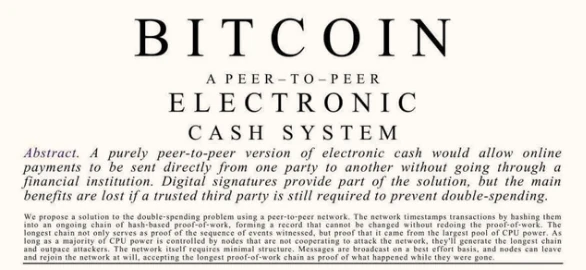

När vi läser Satoshi Nakamotos vitbok kan vi se att Bitcoin utformades för att erbjuda innovativt skydd mot två stora samtida hot: utbredd övervakning och påskyndande av artificiellt penningskapande.

1. Även om Bitcoin inte är helt anonym, ökar den avsevärt integriteten genom att begränsa den finansiella övervakningen av individer. Detta gör det möjligt för till exempel en dissident i en diktatur att inneha och byta värde online utan rädsla för konfiskering eller censur. Även om detta kan verka långt borta för medborgare i demokratier är det ett avgörande steg framåt för individuella friheter.

2. Bitcoin gör det möjligt för alla att skydda sina besparingar mot den plundring av privat egendom som monetär inflation innebär. Det är ett försök att utmana statens kontroll över hanteringen av pengar som ett instrument för utbyte och därmed konkurrera med staten. Finanskrisen 2008 och covid 19-pandemin har visat på bristerna i det nuvarande systemet. De biljoner dollar som trycktes upp ur tomma intet för att förhindra att ekonomin skulle kollapsa ytterligare fick förödande effekter, som vi fortfarande betalar för.

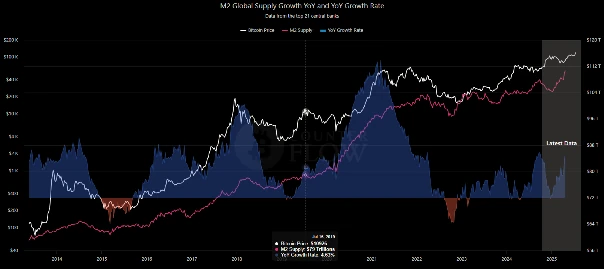

Så Bitcoin är mycket mer än en finansiell teknik, det är ett projekt för att förändra världen, för att förbättra den. Det är ett ambitiöst politiskt projekt för att omdefiniera maktrelationer mellan individer och institutioner:

> Det grundläggande problemet med konventionella valutor är att man måste lita på dem för att de ska fungera. Man måste lita på att centralbanken inte devalverar valutan, men fiatvalutornas historia är full av brott mot detta förtroende.

Detta citat från Satoshi Nakamoto är grundläggande för att förstå filosofin bakom Bitcoin. Satoshi belyser bristerna i Fiat-systemet som bygger på tillit till centraliserade institutioner, och föreslår Bitcoin som ett tillitslöst alternativ.

Utgångspunkten för Satoshi Nakamotos intellektuella förhållningssätt är därför människors övertro på fiatvalutor och den falska tron på att staten kan lösa kriser. I det första utvunna blocket i Bitcoin-berättelsen infogade Satoshi Nakamoto en symbolisk mening från en förstasidesartikel i London Times:

> The Times 03/Jan/2009 Finansministern på randen till en andra bankräddning.

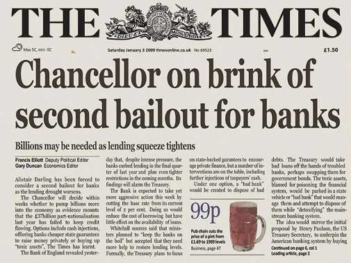

Att denna titel ingår i genesis-blocket är öppet för tolkning. Men den kan framstå som Satoshi:s kommentar till de traditionella finansinstitutens misslyckanden och som ett uttalande om Bitcoin:s mål: att erbjuda ett alternativ till centraliserade banksystem.

När staten inför strikt kontroll över alla transaktioner (t.ex. genom att begränsa kontanter eller införa en centraliserad digital valuta) har den total kontroll över ekonomin, till nackdel för individers valfrihet och suveränitet. Genom att övervaka alla transaktioner kan staten bättre identifiera nya skattekällor och införa strikta regleringar.

Bitcoin utformades dock för att fungera utan inblandning av centralbanker eller andra statligt kontrollerade finansiella mellanhänder. På grund av sin decentraliserade, pseudonyma natur och motståndskraft mot manipulation skulle den kunna försvaga välfärdsstatens grundvalar genom att minska dess kontroll över pengar, beskattning och det finansiella systemet.

Så en av de viktigaste egenskaperna hos Bitcoin är förmågan att äga sig själv. I den traditionella finansvärlden kan man inte äga sig själv. Det är alltid finansiella mellanhänder som är villiga att ge dig tillgång till ett konto.

Bitcoin utformades för att begränsa regeringarnas makt över valutan.

Den förhindrar att pengar används för politiska ändamål som offentliga utgifter, krig, ideologisk formatering och åsiktskontroll.

- Regeringen kan ta ut euro från ditt bankkonto.
- Den kan ta ditt hus och din mark.
- Den kan ta dina aktier.
- Den kan ta ditt guld.
- Den kan ta allt ifrån dig.

Men regeringen kan inte ta dina bitcoins, eftersom den inte kan konfiskera innehållet i ditt sinne.

Det är därför Bitcoin bygger på ett grundläggande filosofiskt antagande: frihet innebär att man äger sig själv, frukterna av sitt arbete och sitt privatliv.

På så sätt drivs den av en världsbild som är både moralisk och politisk. När staten har monopol på pengar befinner du dig i ett statssystem, oavsett om det är höger eller vänster. Bitcoin:s projekt är att erbjuda alla en fri penningmarknad.

Men Bitcoin dök inte upp från ingenstans. Den bygger på framsteg inom matematik, fysik, datavetenskap och filosofi. Satoshi Nakamoto, även om han var briljant, byggde på idéer från andra innovatörer. Bland dem pionjärerna inom cypherpunk-rörelsen.

## Vilka är cypherpunkarna?

<chapterId>dc18ba9a-c242-472a-a717-531a5f125737</chapterId>

Denna rörelse föddes i början av 1990-talet ur en oro för den mänskliga friheten mot bakgrund av myndigheternas övervakning i den digitala tidsåldern.

De växer fram i ett sammanhang där informations- och kommunikationstekniken utvecklas snabbt, men där regeringar och företag också börjar utöva större kontroll över denna teknik. Det är en rörelse som har beröringspunkter med libertarianska och anarkistiska tänkare. Den motiveras av oro för massövervakning och kränkningar av den personliga integriteten.

Tanken var att göra anonymitet och ekonomisk frihet tillgänglig för alla, tack vare digitala kryptografiska verktyg. På så sätt skulle statliga myndigheter inte ha någon kontroll över aktiviteter på nätet.

Den första e-postlistan Cypherpunk, som Satoshi var medlem i och där han först delade med sig av vitboken Bitcoin, startades 1992 av Tim May och Eric Hughes. Deras mål var att stödja skapandet av ny programvara för att skydda privatlivet.

Cypherpunk Manifesto, som skrevs av Eric Hughes 1993, sammanfattar deras filosofi:

> Integritet är avgörande för ett öppet samhälle i den elektroniska tidsåldern (...) Vi kan inte förvänta oss att regeringar, företag eller andra stora anonyma organisationer ska garantera vår integritet (...) Mitt huvudmål för Cypherpunks är att få människor att försvara sin integritet, snarare än att förlita sig på att någon annan ska tillhandahålla den.
>

> Eric Hughes - Cypherpunk Mailinglist, 23 mars 1993.

Och han tillägger:

> sekretess i ett öppet samhälle kräver anonyma transaktionssystem. Hittills har kontanter varit det huvudsakliga systemet av denna typ.

Det är därför kryptografi kommer att användas som ett verktyg för motstånd mot alla former av statlig och företagskontroll. Det säkerställer att varje part i en transaktion endast vet vad som är absolut nödvändigt för den transaktionen.

Cypherpunks tror på kryptografins kraft att skapa utrymmen för frihet och individuell autonomi, vilket gör det möjligt för människor att kommunicera och interagera säkert och anonymt.

De förespråkar en modell där förtroendet sätts till decentraliserade kryptografiska system snarare än till centraliserade institutioner som banker, företag eller regeringar.

#### Cypherpunk-metoden

> Cypherpunks skriver kod

förkunnar Éric Hughes som avslutning på sitt manifest.

För honom ligger vägen framåt i att aktivt bygga anonyma system som gör godtyckliga politiska uppdelningar irrelevanta och onödiga. Koden bygger på tillämpning av kryptografi för att omvandla den abstrakta idén om frihet till en ny ekonomisk och samhällelig verklighet.

Cypherpunks finner ingen tröst i förhoppningar och önskningar. De ingriper aktivt i händelseförloppet och formar sitt eget öde.

Politiskt strävar de efter att bygga decentraliserade nätverk där beslut fattas kollektivt och ingen enskild enhet kan påtvinga sin vilja. All centralisering bygger på tvång, inte samtycke, med andra ord behandlas individer som barn som är oförmögna till självständighet och som måste straffas om de börjar bestämma över sitt eget öde.

Denna filosofi om frihet och aktiv konstruktion, som ärvts från Cypherpunks, förkroppsligades av Satoshi Nakamoto 2008, med uppfinningen av Bitcoin. Han var den förste att omsätta idén om en ocensurerad, suverän elektronisk valuta i praktiken.

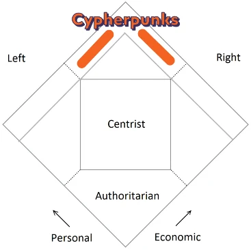

Bitcoin begränsar statens makt genom att erbjuda ett decentraliserat, pseudonymt och svårkontrollerat monetärt alternativ. Oavsett om det antas av höger- eller vänsteraktivister, av försvarare av frihet eller jämlikhet, eller helt enkelt av sparare utan politisk etikett, ger det individer möjlighet att frigöra sig från det traditionella finansiella systemet och återta kontrollen över sina pengar.

Ur denna synvinkel, utan att uttryckligen göra anspråk på att tillhöra ett politiskt läger, bär Bitcoin fröet till en tyst revolution och ansluter sig till toppen av urtavlan i Nolans diagram.

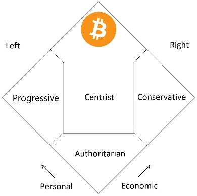

## Vem ska bestämma?

<chapterId>cfc7688e-d647-4af1-880d-c70d3ae7d823</chapterId>

I den här kursen har jag försökt visa att den verkliga skiljelinjen inte går mellan vänstern, högern eller mitten, som alla har utgått från ett statspostulat. I slutändan delar alla de klassiska politiska familjerna en misstro mot den fria marknaden och en förkärlek för statlig interventionism.

Men hur är det med dem som vill ha mindre regering och mindre centralisering? Bitcoin-användare, till exempel, som vill avsluta monopolet på penningskapande. Hur placerar vi dem i detta politiska spektrum?

I själva verket ligger den verkliga politiska skiljelinjen i grundläggande filosofiska principer: frihet eller tvång, frivilligt samtycke eller tvång, den ansvarstagande individen eller kollektivet.

Det rätta sättet att tänka kring politik är att utgå från etiska principer snarare än etiketter.

Från och med då var den politiska frågan inte längre *vill du fatta de viktiga besluten i ditt liv, eller vill du att någon annan ska fatta dem åt dig?

På en mer allmän nivå är den filosofiska frågan följande: *bör den sociala organisationen vara resultatet av en medveten plan som utformats och införts av den politiska klassen, eller resultatet av en fri utveckling som uppstår genom frivilliga interaktioner mellan alla aktörer i det ekonomiska och sociala livet?

**En ignorerad politisk familj: libertarianerna**

Denna nya politiska skiljelinje, som bygger på motsättningar mellan principer, lyfter fram en politisk familj som är mycket verklig men som ofta ignoreras av allmänheten: libertarianerna.

Ur libertariansk synvinkel har individer både rätten och ansvaret att fatta sina egna beslut. Däremot anser konventionella politiska familjer, från vänster till höger, att regeringen bör fatta några eller många av de viktiga besluten i en individs liv och i det ekonomiska livet i allmänhet.

Men varför ska vissa tvinga på andra sin livsstil och världsbild?

I en verklig frihetsregim kan de som ansluter sig till vänsterns ideal leva enligt deras principer. De är fria att ge upp sina ägodelar, att dela med sig av de produktionsmedel de äger eller att donera sin lön till en organisation som de själva väljer, som kan omfördela dessa medel till de mest missgynnade eller stödja kulturella initiativ och företag som främjar sysselsättning.

Med samma token har de som delar högerns värderingar i denna frihetsregim rätt att leva i enlighet med sina övertygelser: att arbeta hårt, att spara, att föra vidare familjens och nationens värderingar till sina barn, att undvika innehåll som strider mot deras moral eller att välja att inte anställa den ena eller andra typen av arbetstagare. Ingen ska påtvinga andra sitt sätt att leva. Det är genom marknadens frihet och valmöjligheterna som våra mål kan uppnås på ett fredligt sätt.

Kort sagt, den grundläggande skillnaden mellan de politiska trenderna ligger i den centraliserade statens roll: socialister och konservativa använder staten för att införa sin vision av samhället, medan libertarianer förespråkar decentralisering och låter individer och privata samhällen definiera och organisera samhället, enligt deras preferenser och i linje med äganderätten.

**Och hur blir det med Bitcoin?

Det är därför Bitcoin också är en politisk brytning. Det är en fredlig revolt mot politiseringen av pengar och konfiskeringen av dem av en liten minoritet. Bitcoin handlar inte om höger och vänster. Tvärtom, det är en marknadsvaluta som står i motsats till statliga pengar.

Statliga pengar eller fiatpengar är ett tvingande, centraliserat system som är lätt att skapa, billigt och har en olycklig tendens att förlora i värde.

Omvänt är marknadspengar, som historiskt illustrerats av guld och för närvarande av Bitcoin, en sund, svårproducerad valuta som uppstår frivilligt, spontant och behåller sitt värde på lång sikt.

Tack vare sin fasta tillgång och decentraliserade natur utgör Bitcoin den sundaste formen av valuta som någonsin uppfunnits och erbjuder ett potentiellt alternativ till expansionen av statsmakten och den obegränsade finansieringen av krig.

Slutligen är Bitcoin inte ett klassiskt politiskt projekt, i betydelsen ett statligt eller tvångsmässigt initiativ. Det är en teknik som gör det möjligt för individer att bestämma själva, vilket paradoxalt nog har långtgående politiska konsekvenser genom att begränsa centraliserade, dominerande krafter.

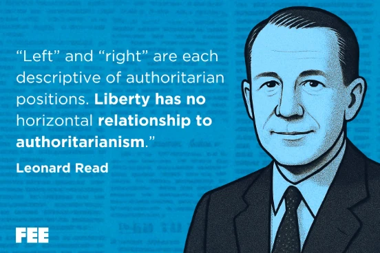

# Sista avsnittet

<partId>d886a919-12b0-4e38-86de-7159b98b1864</partId>

## Utvärdera denna kurs

<chapterId>f0b8398c-7c15-417e-83b0-42e7aab533dc</chapterId>

<isCourseReview>true</isCourseReview>

## Slutlig examination

<chapterId>230ddc56-ceb8-11f0-bf47-6f8dd2541da1</chapterId>

<isCourseExam>true</isCourseExam>

## Slutsats

<chapterId>1dfe6e4a-47d5-48e1-94d0-6ac29b31e161</chapterId>

<isCourseConclusion>true</isCourseConclusion>
