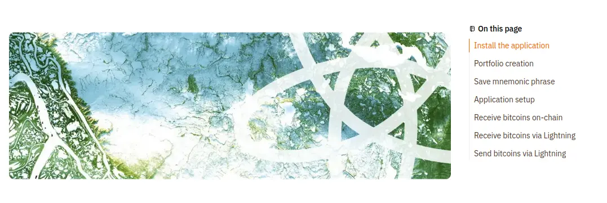

**Note**: the cover image should always be a horizontal rectangular shape, like the `cover.webp` above.

Info: the planb.academy platform will display chapters titles on the right side of each tutorial (On PC), to create a chapter title you only need to create a H2 title, for example, see the title below.

## Chapter Title 1

Such chapters titles on the right side can be clicked by the user to jump to the specific chapter, here is how they appear on the platform (make sure to be displaying the `Preview` mode on Github web)

You can see here the chapter legend displayed right after the tutorial cover image

## Chapter Title 2

To write bold text follow the two examples below: the "Info" and "Note" words would appear in bold

**Info**: I strongly advise you to read all of this markdown file, it contains precious examples about how the markdown is rendered within the Plan ₿ Academy platform. While some of the rules are the same of markdown syntax, others aren't.

**Note**: _This sentence appears in italic on the platform_

## Chapter Title 3

Text to be written here. You can't put a period and press a new line to actually see the text on a new line. You **have to put an empty line** between two paragraphs to actually see the two paragraphs on the platform.

Let's now see an example (below) over how mention things, people who spoke such things and other details.

**Example**: below is shown a famous statement from Satoshi Nakamoto that was posted on the Bitcointalk forum on July 30, 2010:

> If you don't believe me or don't get it, I don't have time to try to convince you, sorry.

As you can see, no need of the `"` signs, they will be automatically rendered by the platform. Just briefly introduce the author of the mention and give as much context as you think is suitable.

### Information about explaining words

Whenever you mention a word proper of the bitcoin space, you may decide to further explain it be clearer. Well, this is something encouraged, but please instead of writing yourself such text, if possible mention it from the Plan ₿ Academy [Glossary](https://planb.academy/en/resources/glossary). For example, let's say you are going to explain the `Ark` term:

**Example:** ..if you don't know what Ark is, please take a look at the [following definition](https://planb.academy/resources/glossary/ark) from the Plan ₿ Academy Glossary..

**Note** be sure to remove the `/en` path (or any other language selected) from the link you copy: https://planb.academy/en/resources/glossary/ark → becomes → https://planb.academy/resources/glossary/ark

## Chapter Title 4

Some text before an image. Please note how the image paths are written, the image 01 is an image containing no text, or English text only. You should only put English or no-text images inside an English markdown file.

Other text after an image.

If you want to mention a Plan ₿ Academy tutorial, put the link in this way (remember the empty line, as if it were a paragraph):

https://planb.academy/tutorials/computer-security/authentication/bitwarden-0532f569-fb00-4fad-acba-2fcb1bf05de9

You will also need to put a new line after, then you can go on writing your text..
