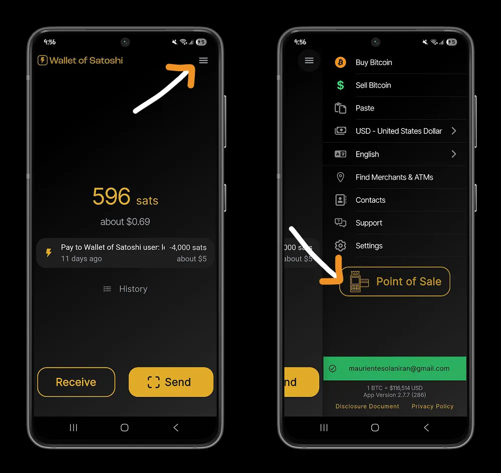

## Introduzione

L'obiettivo di questo tutorial è permettere al proprietario di una piccola impresa, idealmente un negozio, un bancarella, o più in generale di un'attività commerciale, di accettare bitcoin come pagamento e di vivere la cosa in modo semplice. Il target di riferimento è il proprietario del negozio, il quale gestisce in autonomia l'attività commerciale e si avvale di alcuni collaboratori.

### Esempi famosi

In alcune aree del mondo sono nate comunità che potremmo definire _circolari_, cioè dove bitcoin è sia accettato che impiegato diffusamente dalla popolazione per pagare presso le attività commerciali. Addirittura gli stessi commercianti, dopo essere stati pagati in bitcoin dai propri clienti, hanno stretto accordi con i propri fornitori per pagare in bitcoin anche la merce per il proprio negozio.

## Accettare Bitcoin

Il prossimo passo è accettare bitcoin direttamente nella propria impresa; il modo più semplice per fare ciò è installare e configurare un wallet Lightning Network (di seguito: "LN") per ricevere pagamenti instantanei, permettendo al tempo stesso al cliente di pagare ridotte commissioni di transazione.

Per semplicità in questo tutorial prendiamo l'esempio di Wallet of Satoshi, segui questa guida per installarlo e configurarlo:

https://planb.network/tutorials/wallet/mobile/wallet-of-satoshi-39149d86-e42b-4e8f-ae9f-7e061e7784f7

Dopo aver seguito la guida sarai pronto per accettare bitcoin come metodo di pagamento: davanti al cliente ti basterà aprire l'app da mobile e, dopo aver cliccato sul bottone `Ricevi`, inserire la quantità (generalmente nella tua valuta locale) per generare una fattura pagabile dall'utente.

**Pro Tip**: aggiungere una nota alla fattura prima di crearla permette di aggiungere al pagamento un'informazione utile nel futuro per associare il pagamento ad un certo evento (per esempio la vendita di 1 kg di mele per 900 sats). Le note inserite manualmente non sono visibili alla controparte, saranno dunque confinate al proprio uso interno.

### Configurazione avanzata

Una configurazione leggermente più avanzata è usare la funzione Point of Sale di Wallet of Satoshi, accessibile dall'app cliccando sul menù ad hamburger in alto a destra (clicca dove indica la freccia):

clicca poi sul bottone `Point of Sale` indicato dalla freccia, nell'immagine di destra.

Questo è uno dei due modi per accedere alla funzione Point of Sale di Wallet of Satoshi, il secondo metodo è tramite l'app dedicata [Wallet of Satoshi PoS](https://www.walletofsatoshi.com/pos). I vantaggi della funzione Point of Sale sono tre:
- la funzionalità di sola ricezione: perfetta per lasciare i propri dipendenti collezionare i pagamenti dei clienti, evitando che possano spendere quei fondi;
- permettere di creare un elenco di prezzi e prodotti per il proprio negozio, così da creare invoice Lightning selezionando i prodotti comprati;
- scaricare i report di vendita in formato CSV.

Per saperne di più, ecco il tutorial dedicato a Wallet of Satoshi - Point of Sale:

https://planb.network/tutorials/business/point-of-sale/wallet-of-satoshi-pos-efc9f266-cb21-49a8-94a8-5fe15a82eb07

## Regolamentazione

La regolamentazione di bitcoin varia notevolmente da un paese all'altro. Alcune nazioni hanno una normativa chiara e rigorosa, mentre altre più incerta e imprecisa. Molti paesi richiedono, in modi diversi, di dichiarare i bitcoin in proprio possesso (sia come persone fisiche che come aziende), ai fini del monitoraggio fiscale oppure per applicare un prelievo fiscale.

## La Soluzione per il Commerciante 

Indipendentemente da quale sia la regolamentazione del paese, l'azione più semplice per il negoziante di una piccola impresa commerciale è, dopo aver introitato bitcoin, versare nella cassa dell'attività commerciale un importo in contanti pari all'ammontare dello scontrino emesso. Così facendo si evitano molte complicazioni nell'accettare, dichiarare e contabilizzare bitcoin all'interno dell'attività commerciale.

**Nota**: In alcune tipologie di attività potrebbe non essere previsto alcun documento cartaceo che riguarda la transazione commerciale tra cliente e venditore, in tal caso per il commerciante sarà tutto ancora più semplice ed immediato!

Vediamo adesso alcuni vantaggi e svantaggi per la soluzione proposta.

### Vantaggi

Questo semplice accorgimento permette di evitare diversi problemi: toglie la necessità delle procedure di KYC ("Know Your Customer") su quei bitcoin ricevuti come pagamento, che è una pratica molto dannosa per il diritto alla privacy e per la sicurezza degli individui; e mantiene le attività di contabilità invariate, non essendoci il bisogno di mettere a bilancio quei bitcoin.

Non sarà quindi necessario investire ulteriori tempo e denaro con il tuo consulente fiscale per tenere traccia di questi introiti, dal momento che saranno uguali a tutti gli altri.

### Svantaggi

All'aumentare del volume d'affari in bitcoin, inserire i contanti in cassa potrebbe diventare impossibile, per esempio i contanti a disposizione potrebbero non bastare a coprire tutti gli introiti in bitcoin. Tuttavia lo scopo del tutorial non affronta questo avvenimento, non è un problema che ragionevolmente si presenterà immediatamente al commerciante che inizia ad accettare bitcoin, anzi è un avvenimento molto raro.

Un altro problema che potrebbe affliggervi - ad esempio presente in alcuni paesi europei - è che la tipologia della vostra impresa potrebbe impedirvi di accettare il contante come metodo di pagamento per i beni e servizi erogati ai vostri clienti. In tal caso il metodo esposto non sarà più sufficiente, servirà adottare un'alternativa più complessa.

## Report Bitcoin 

Come abbiamo visto si può facilmente accettare bitcoin senza sostenere nuove procedure contabili dannose per la propria privacy; tuttavia non finisce qui: sarebbe comunque opportuno conservare una contabilità parallela per tenere traccia del proprio flusso di bitcoin. Non temere, può essere semplice quanto si vuole, fintanto che si riesce a comprendere quanti bitcoin siano entrati e usciti dal proprio wallet. 

**Attenzione**: compilare il campo `Note` quando si crea la fattura LN per il cliente facilita di molto l'aggiornamento della contabilità in bitcoin, stesso discorso per quando si effettua un pagamento LN verso i propri fornitori. Idealmente, ad ogni transazione è associata una nota di pagamento. Questa nota sarà solo visibile all'interno del wallet.

## Conclusione

Accettare bitcoin è solo il primo passo. Per un'attività commerciale è importare tenere traccia delle proprie operazioni, ma ciò non deve avvenire a discapito della propria privacy e della propria libertà individuale, sacra ed inviolabile. E come abbiamo visto, una soluzione semplice risolve molti problemi e soddisfa tutte le parti coinvolte nella transazione, cioè il negozio ed il cliente.