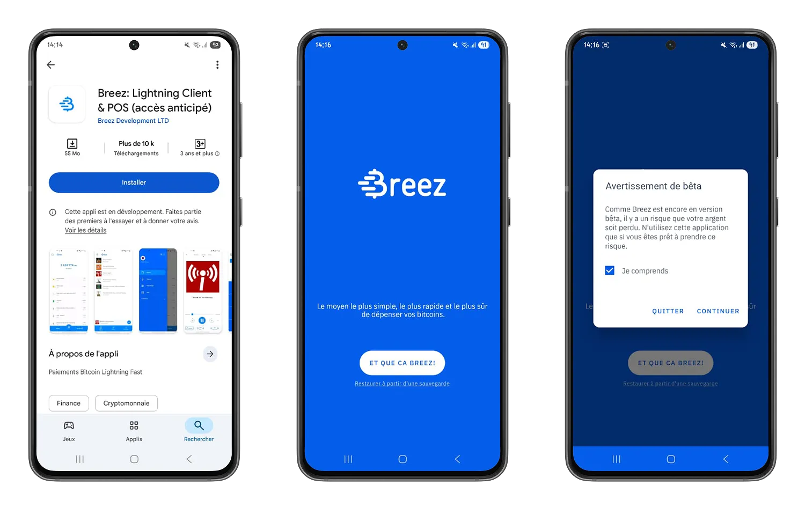
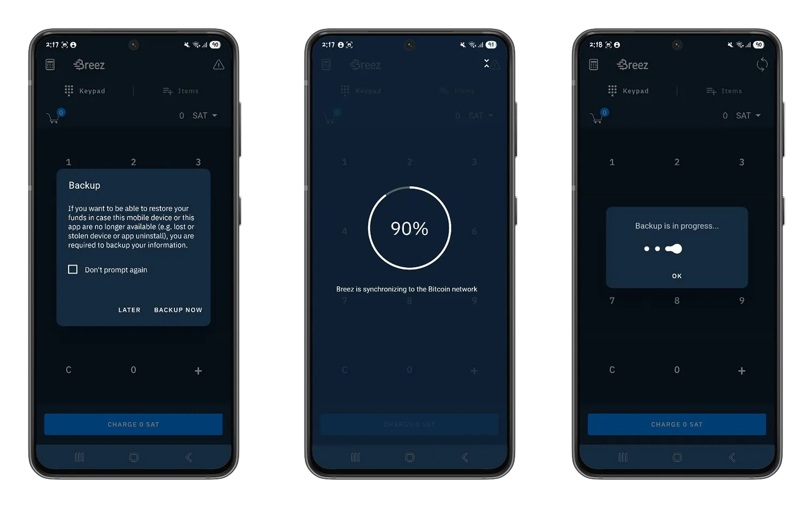
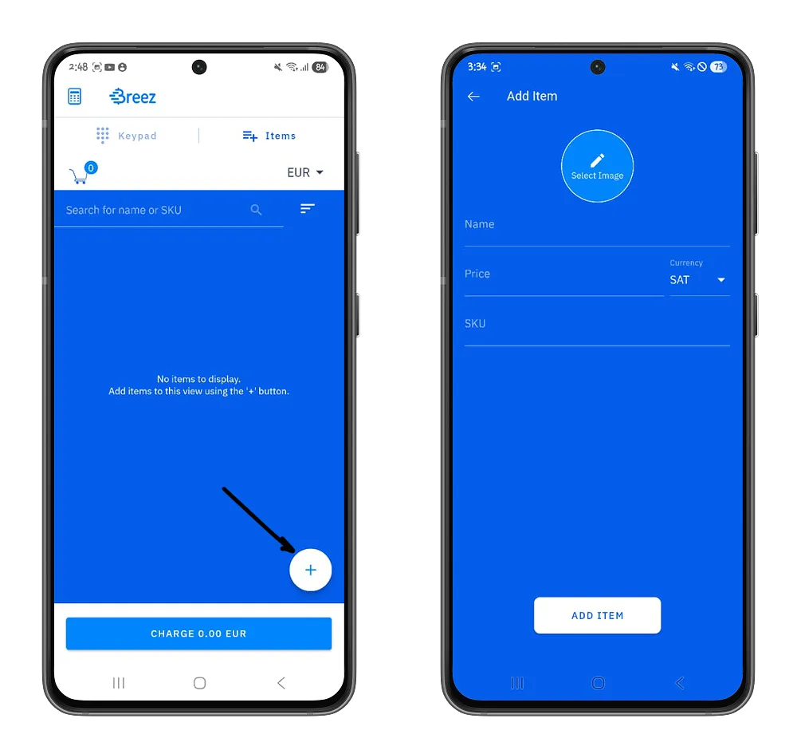
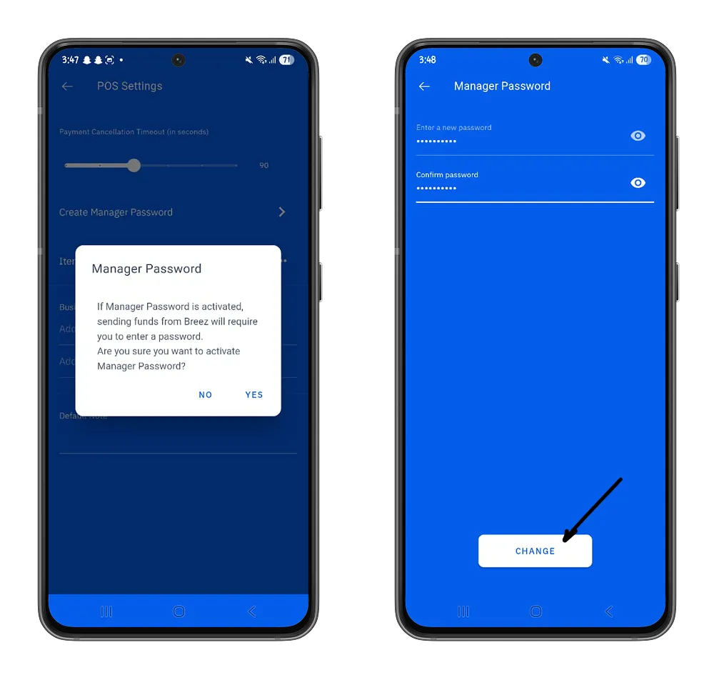
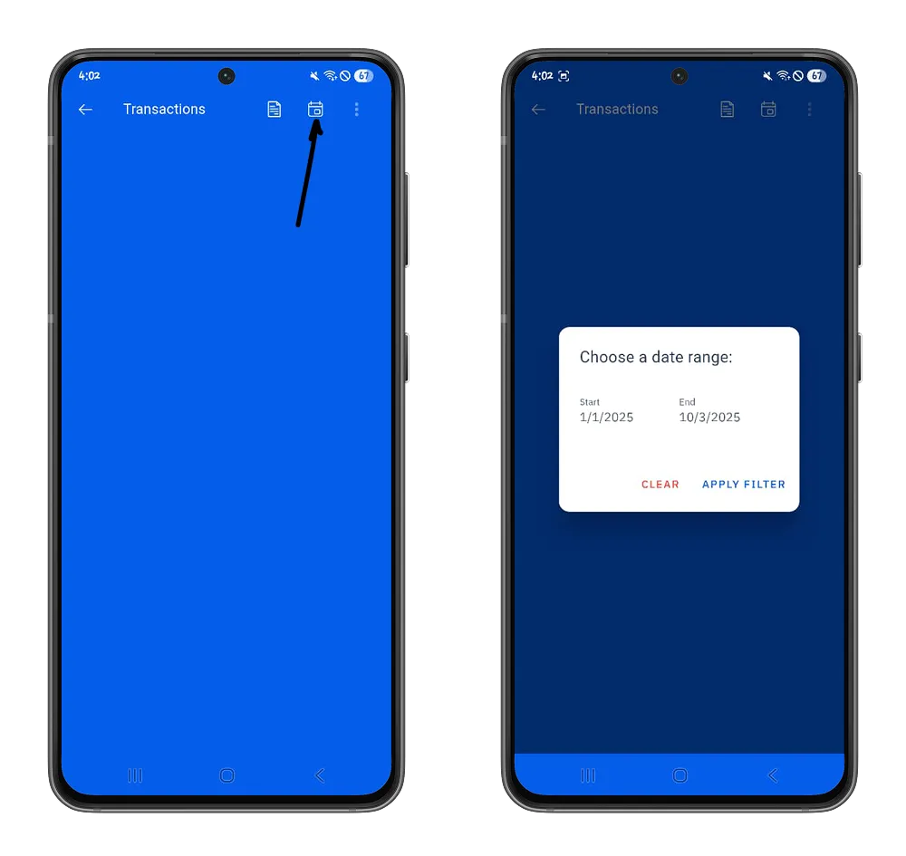

COVID-19-pandemian jälkeen kosketuksettomat digitaaliset maksut ovat levinneet laajalti jopa pienimpiin kauppoihin. Tänä aikana monet yritykset ovat havainneet bitcoin-käteisratkaisujen käytännöllisyyden, minkä ansiosta ne voivat vastaanottaa maksuja kaikkialta maailmasta. Nämä ratkaisut ovat kuitenkin toisinaan vaikeita käyttää tai sopimattomia pienille yrityksille. Tässä opetusohjelmassa tutustumme Breez-maksupäätteeseen, ratkaisuun, joka erottuu edukseen helppokäyttöisyydellään ja antaa sinulle samalla täydellisen hallinnan bitcoinien hallinnasta.

## Asenna Breez POS

Breez POS on Breez wallet:n tarjoama itsesäilytyspalvelu. Tämän palvelun hyödyllisyys on antaa kauppiaille mahdollisuus kerätä maksuja Bitcoin:n kautta ja pysyä samalla yksinkertaisessa käyttöliittymässä, joka on hyvin samanlainen kuin erilaiset Lightning-lompakot. Breez POS on saatavilla [Google Play Store](https://play.google.com/store/apps/details?id=com.breez.client) (Android) ja [App Store](https://apps.apple.com/app/breez-lightning-client-pos/id1463604142) (iOS) -latausalustoilla.

⚠️ On tärkeää huomata, että nämä sovellukset ovat vielä kehitteillä ja että toiminnallisuuksien käytössä voi olla virheitä. Suosittelemme maltillista käyttöä.

Tämän sovelluksen avulla Breez antaa sinulle täydellisen määräysvallan verkon kokoonpanoihin ja maksuasetuksiin ja takaa samalla itsemääräämisoikeutesi bitcoinien hallinnoinnissa.

Voit tutustua Breez wallet:n eri vaihtoehtoihin seuraamalla alla olevaa ohjetta. Tämä vaihe auttaa sinua ymmärtämään paremmin myyntipisteen ekosysteemiä ja ottamaan käyttöön parhaat käytännöt, jotta voit turvata tehokkaasti seed:een liittyvät bitcoinit.

https://planb.academy/tutorials/wallet/mobile/breez-46a6867b-c74b-45e7-869c-10a4e0263c06

https://planb.academy/tutorials/wallet/backup/backup-mnemonic-22c0ddfa-fb9f-4e3a-96f9-46e2a7954270

## Breez POS:n käyttäminen

Tässä oppaassa keskitymme "*Myyntipiste*"-osioon, jotta ymmärrät, miten se voidaan integroida maksuvälineeksi yrityksessäsi.

Myyntipiste on olennainen osa Breezin valikoimaa, ja se perustuu ensisijaisesti Lightning Network:ään maksujen keräämisessä.

"*Myyntipiste*"-valikossa on suora käyttöliittymä maksujen keräämistä varten. Se on jaettu kahteen osaan:

### Suoraveloitus

Ensimmäinen osa on suoraveloitusnäppäimistö. Tämä käyttöliittymä on kätevä, kun haluat kerätä maksun kokonaisuudessaan, kun tiedät asiakkaasi kokonaisostokset tai kun et tarvitse yrityksessäsi kiinteää tuoteluetteloa (esim. freelance-palvelut).

Jotta voit käyttää Breez POS -järjestelmää ensimmäistä kertaa, sinun on kerättävä yli 2500 satoshin (noin 3 euroa tämän päivän valuuttakurssilla) suuruinen maksu. Tämä summa, joka maksetaan vain ensimmäisellä käteiskassalla, vastaa maksukanavan luomisen kustannuksia, jotta voit kommunikoida muiden Lightning Network-solmujen kanssa ja lähettää ja vastaanottaa satosheja.

### Tuoteluettelo

Toinen osa on tuoteluettelo. Tämä käyttöliittymä on ihanteellinen, kun sinulla on tuoteluettelo, jossa on ennalta määritellyt hinnat. Täällä voit määrittää tuotteesi valmiiksi ja käyttää niitä generate-laskuihin parantaaksesi kassakuittien jäljitettävyyttä.

Voit määrittää jokaisen tuotteen manuaalisesti tästä käyttöliittymästä napsauttamalla "**Plus**"-painiketta ja määrittelemällä sitten tuotteen nimen, hinnan ja tunnisteen.

Tämän jälkeen voit lisätä sen ja määrittää sen määrän ja kerätä siihen liittyvän maksun.

Kun luettelosi on melko suuri, voi olla hankalaa lisätä tuotteita yksi kerrallaan. Tätä varten voit tuoda ja viedä tuoteluettelosi automaattisesti CSV-tiedostoista kohdassa **Edellytykset > Myyntipisteen asetukset**, valikosta "Tuoteluettelo".

Tässä samassa kohdassa voit määrittää Lightning-laskujen voimassaoloajan. Tästä lähtien asiakkaillasi on kaikkien laskujesi osalta `N` sekuntia aikaa suorittaa maksu, muutoin sinun on luotava uusi Lightning-lasku.

Johtajana voit vahvistaa bitcoinien turvallisuutta lisäämällä salasanan, joka vaaditaan kaikkiin wallet:stä lähteviin maksuihin. Tämä ominaisuus on erityisen hyödyllinen, kun et ole ainoa, joka hallinnoi ulostuloa.

**Transaktiot**-valikossa on luettelo kaikista keräämistänne maksuista. Voit myös suodattaa tuloksia tietyn ajanjakson osalta napsauttamalla **Kalenteri**-painiketta.

Voit myös tarkastella päivittäistä yhteenvetoa myynnistäsi ja kerätystä kokonaissummasta napsauttamalla **Dokumentti**-painiketta.

Sinulla on nyt täydellinen käsitys Breez-sovelluksen tarjoamasta myyntipisteestä, jotta voit integroida Bitcoin:n saumattomasti liiketoimintaasi. Jos pidit tätä opetusohjelmaa hyödyllisenä, suosittelemme opetusohjelmaamme be-BOP:stä, verkkokauppa-alustasta, jonka avulla voit ottaa vastaan maksuja bitcoineilla ja tehdä liiketoiminnastasi rahanarvoista.

https://planb.academy/tutorials/business/point-of-sale/be-bop-d8c40a3b-9090-48e7-9ba7-235d0c17e5fa