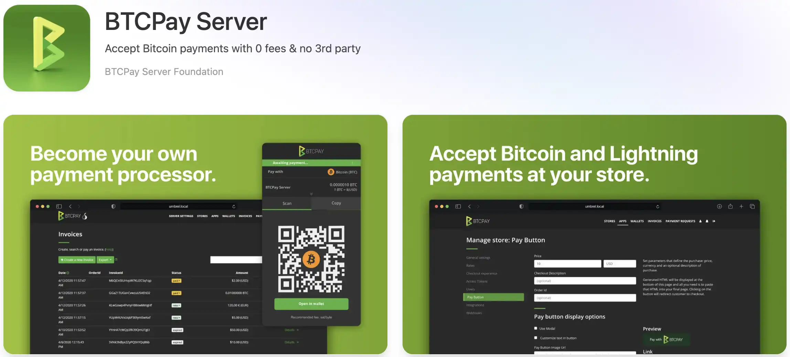


В екосистемата Bitcoin приемането на плащания представлява голямо предизвикателство както за търговците, така и за бизнеса. Традиционните решения, независимо дали са банкови (кредитни карти, Stripe, PayPal), или дори Bitcoin (BitPay, Coinbase Commerce), налагат посредници, които налагат значителни такси, събират чувствителни бизнес данни и могат да блокират или цензурират трансакциите ви по своя прищявка. Тази зависимост е в противоречие с основните принципи на Bitcoin за децентрализация, поверителност и финансов суверенитет.


Сървърът на BTCPay се очертава като отговор на този проблем с отворен код. Този самостоятелно хостван платежен процесор превръща собствения ви Bitcoin възел в професионална инфраструктура, без посредници, без допълнителни такси за обработка и без компромис с поверителността. Разработен от глобална общност от сътрудници от 2017 г. насам, BTCPay Server ви позволява да получавате Bitcoin и Lightning плащания директно в портфейлите си, като запазвате пълен контрол върху средствата си по всяко време.


Традиционно инсталирането на BTCPay Server изисква напреднали технически умения: Конфигуриране на Linux сървър, владеене на Docker, управление на SSL сертификати и мрежова сигурност. Umbrel революционизира този подход с инсталация с едно кликване, директно интегрирана с вашия възел Bitcoin и Lightning. Това опростяване прави това, което преди беше запазено за опитни техници, достъпно за всички.


**Важно е да се разбере**: BTCPay сървърът на Umbrel работи по подразбиране само в локалната ви мрежа. Можете да създавате фактури, да приемате плащания по Lightning и Bitcoin и да управлявате счетоводството си от всяко устройство, свързано към домашната Ви мрежа (компютър, смартфон, таблет). Тази конфигурация е идеална за фактуриране на услуги при личен контакт, управление на плащания при личен контакт или използване на BTCPay Server от вашата локална мрежа. От друга страна, за да интегрирате BTCPay Server в онлайн магазин, който е публично достъпен в интернет, ще е необходима допълнителна конфигурация с публична експозиция (ще разгледаме този въпрос в края на урока).


Този урок ви превежда през пълната инсталация на BTCPay Server на Umbrel, конфигурирането на вашия възел Bitcoin wallet и Lightning, създаването и плащането на фактури и управлението на счетоводните отчети. Ще откриете как да използвате ефективно BTCPay Server в локалната си мрежа, а след това ще разгледаме решения за публично показване, ако искате да го интегрирате със сайт за електронна търговия.


## Предварителни условия


За да следвате този урок, трябва да имате правилно инсталиран и конфигуриран Umbrel. Ако все още не сте го направили, вижте нашия урок за инсталиране на Umbrel.


https://planb.academy/tutorials/node/bitcoin/umbrel-8b0e3b5b-d3cf-4a1e-8bb8-1ad2db4dd848

Вашият възел Bitcoin Core трябва да бъде напълно синхронизиран с блокчейна (100% в приложението Bitcoin на Umbrel). Тази първоначална синхронизация обикновено отнема между 3 дни и 2 седмици, в зависимост от вашия хардуер и интернет връзка.


За да приемате незабавни плащания с Lightning, е необходимо да инсталирате LND (Lightning Network Daemon) в Umbrel. Ако искате да активирате тази функция, вижте нашия урок за инсталиране и конфигуриране на LND в Umbrel.


https://planb.academy/tutorials/node/lightning-network/umbrel-lnd-b12e0b5b-12ff-45f1-978e-62f4b4a8ba16

Осигурете поне 50 GB свободно дисково пространство за сървъра на BTCPay, неговите бази данни и данни за светкавиците. Силно се препоръчва стабилна интернет връзка чрез Ethernet кабел, за да се избегнат прекъсвания.


## Инсталиране на сървъра на BTCPay на Umbrel


От интерфейса на Umbrel (`umbrel.local`) влезте в App Store и потърсете "BTCPay Server" в категорията Bitcoin.


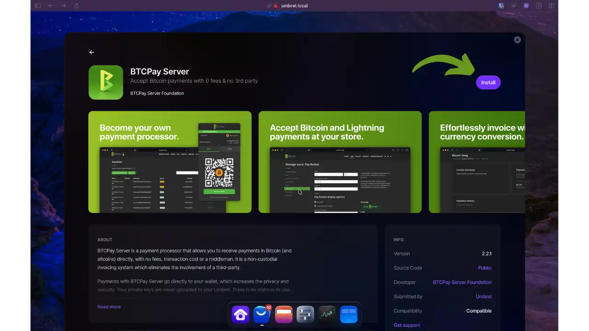


Натиснете Инсталиране. Umbrel автоматично проверява дали са инсталирани Bitcoin Core и LND, след което започва внедряването (2-5 минути).


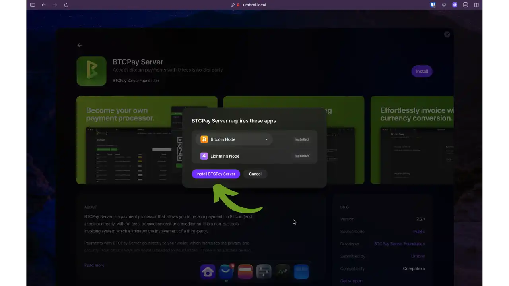


След като го инсталирате, отворете приложението. Ще трябва да създадете администраторски акаунт със силни идентификационни данни.


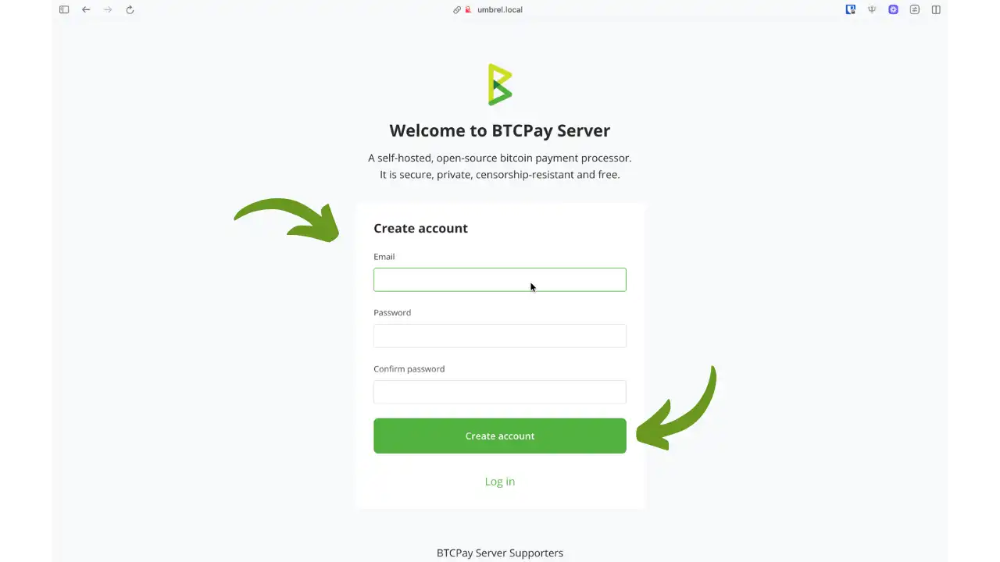


След като акаунтът ви бъде създаден, сървърът на BTCPay веднага ще ви подкани да създадете първия си магазин. Изберете име на фирмата и референтна валута (EUR, USD или BTC).


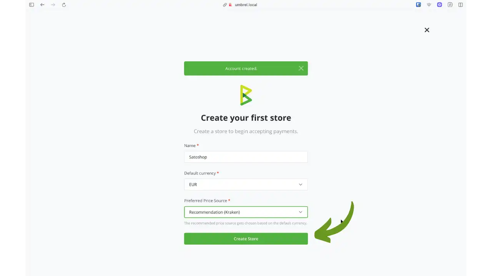


## Достъп до сървъра на BTCPay в локалната мрежа


Сървърът на BTCPay е достъпен от всяко устройство в локалната ви мрежа (WiFi или Ethernet). Достъп от вашия браузър до :


```url
http://umbrel.local
```


Или директно към :


```url
http://umbrel.local:3003
```


**Дистанционен достъп с Tailscale**: За да получите достъп до сървъра на BTCPay от всяка точка на света, използвайте Tailscale. Тази защитена VPN услуга ви позволява да се свържете с вашия Umbrel, сякаш се намирате в локалната си мрежа. Вижте нашия урок, посветен на Tailscale, в Umbrel.


https://planb.academy/tutorials/computer-security/communication/tailscale-9acbd7de-04d9-40f6-ab80-35f0dfedb632

## Конфигуриране на вашия Bitcoin wallet


За да приемате плащания, трябва да конфигурирате Bitcoin wallet. BTCPay Server показва опции за конфигуриране в таблото за управление.


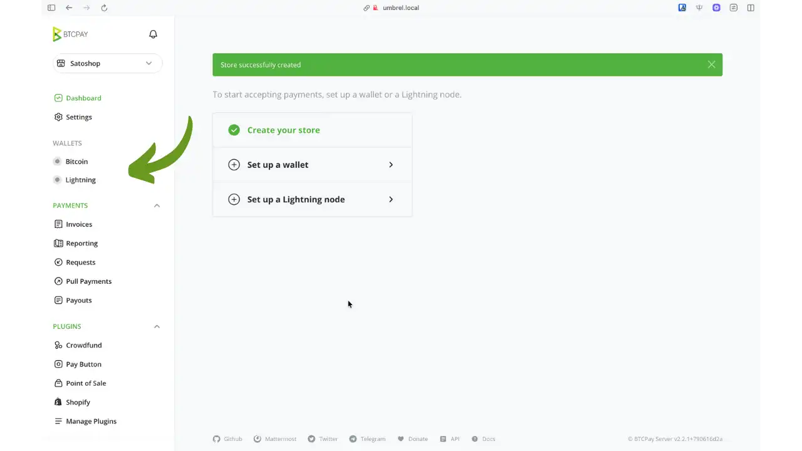


За да конфигурирате wallet Bitcoin, отидете в "Портфейли" > "Bitcoin".


Имате две възможности: да създадете нов wallet директно в BTCPay или да импортирате съществуващ wallet. За импортиране са налични няколко метода:


- Свържете хардуер wallet** (препоръчително): Импортирайте публичните си ключове чрез приложението Vault
- Импортиране на файл wallet** (препоръчително): Качете експортиран файл от вашия wallet
- Въведете разширен публичен ключ**: Въведете ръчно своя XPub/YPub/ZPub
- Сканиране на QR код wallet**: Сканиране на QR код от BlueWallet, Cobo Vault, Passport или Specter DIY
- Въведете wallet seed** (не се препоръчва) : Въведете фраза за възстановяване от 12 или 24 думи


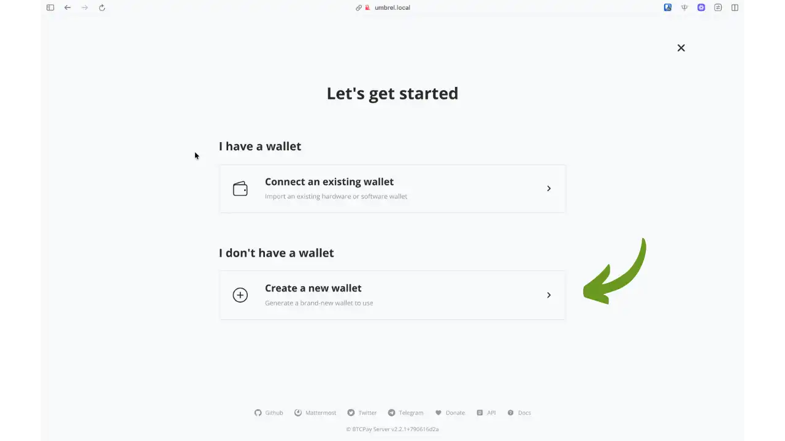


В този урок ще създадем нов Hot wallet: частният ключ ще се съхранява на нашия сървър Umbrel. В този случай силно ви съветваме да премествате средствата редовно на студен wallet, за да избегнете съхраняването на големи суми на сървъра.


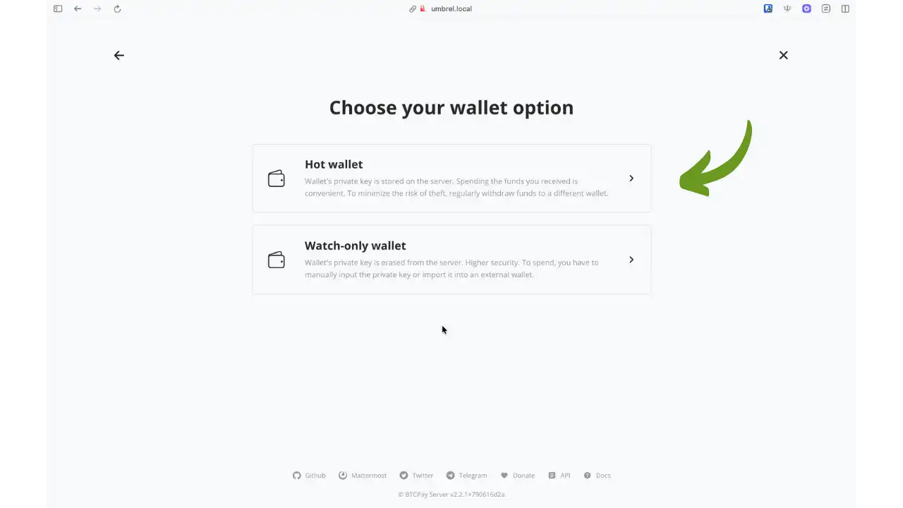


След като бъде конфигуриран, сървърът на BTCPay потвърждава, че вашият wallet е готов да приема плащания по on-chain.


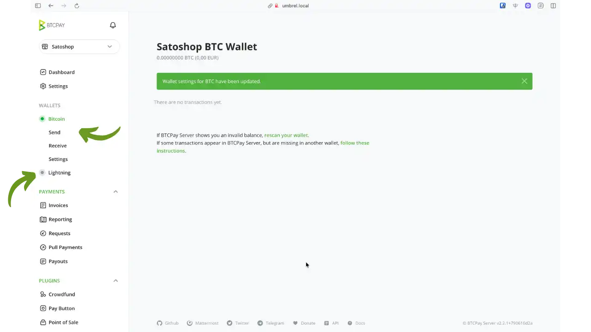


## Активиране на Lightning Network


За да приемате незабавни плащания с Lightning, отидете в Портфейли > Lightning. След това, тъй като вашият възел LND вече е създаден в Umbrel, просто кликнете върху бутона "Запази", за да потвърдите връзката между вашия BTCPay сървър и вашия възел Lightning.


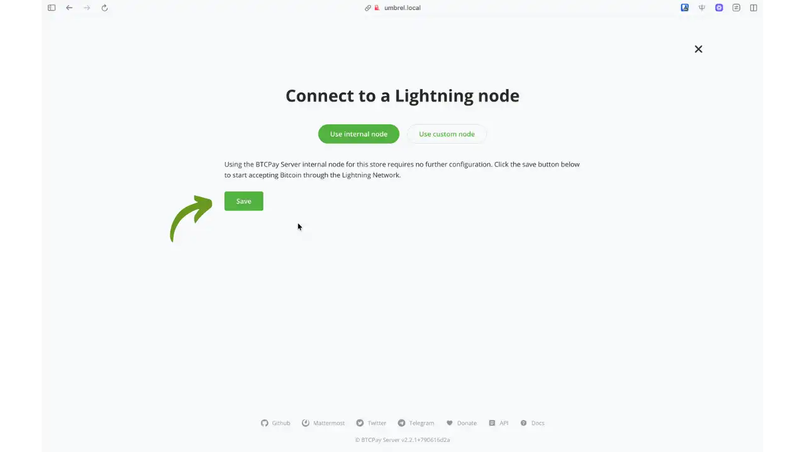


## Създаване и плащане на фактури


В интерфейса на сървъра на BTCPay отидете на Фактури > Създаване на Invoice. Въведете сумата, добавете незадължително описание и щракнете върху Създаване.


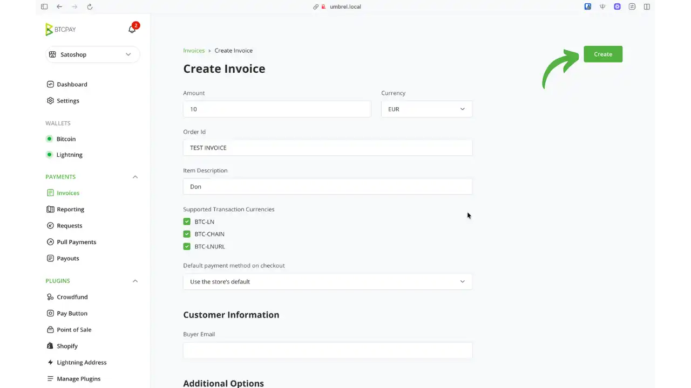


След това можете да кликнете върху бутона "Checkout", за да се покаже фактурата. След това BTCPay генерира фактура с унифициран QR код (BIP21), съдържащ адреса Bitcoin и фактурата Lightning.


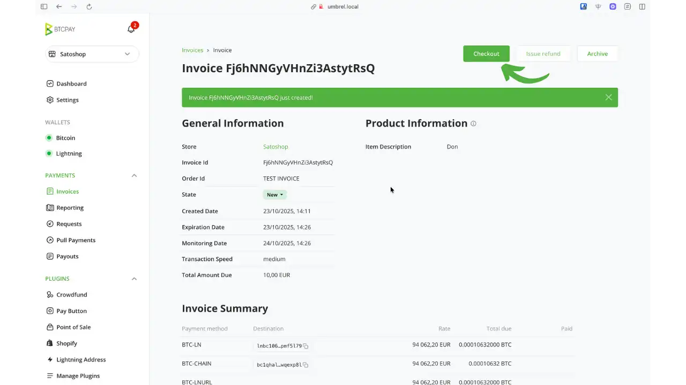


Вашият клиент може да сканира QR кода с всеки съвместим wallet.


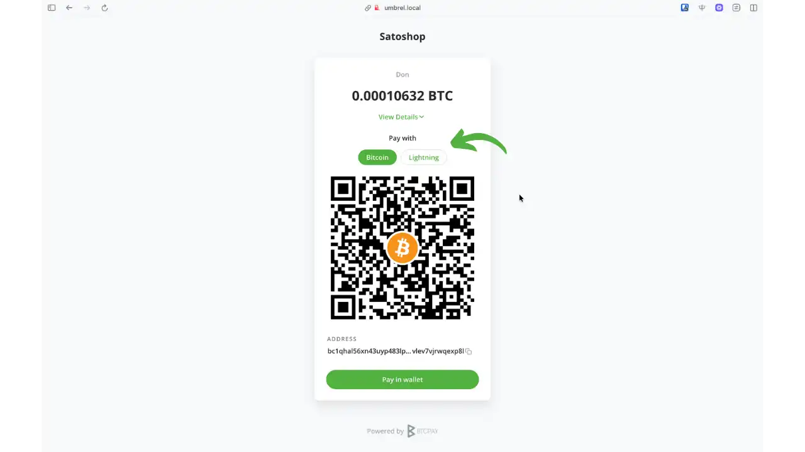


След като бъде платена, фактурата се превръща в "Уредена" за няколко секунди в "Светкавица".


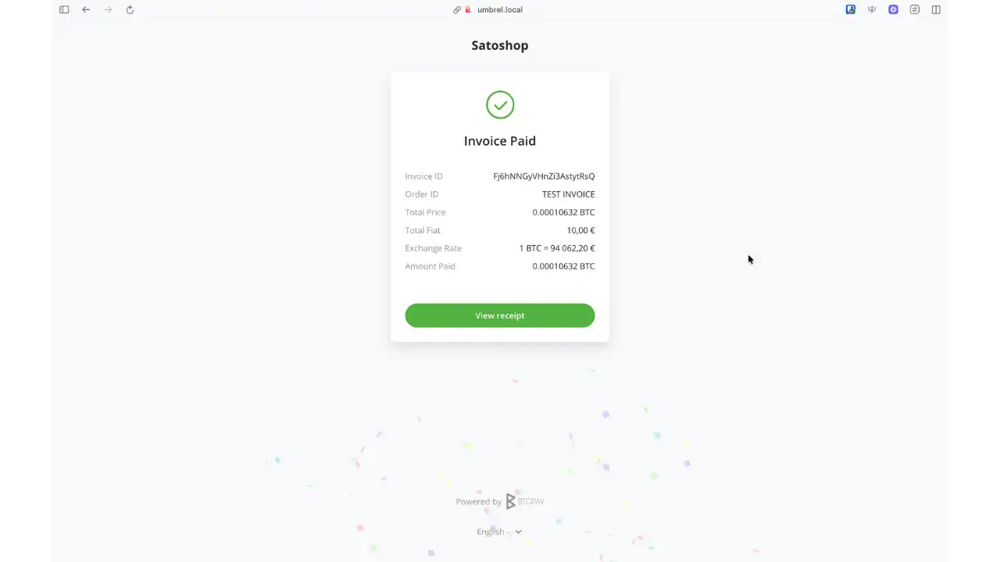


## Управление и проследяване на плащанията


В раздел "Отчитане", таб "Фактури", ще намерите пълна история на фактурите си с дата, сума, статус и начин на плащане. Можете да я експортирате, ако е необходимо.


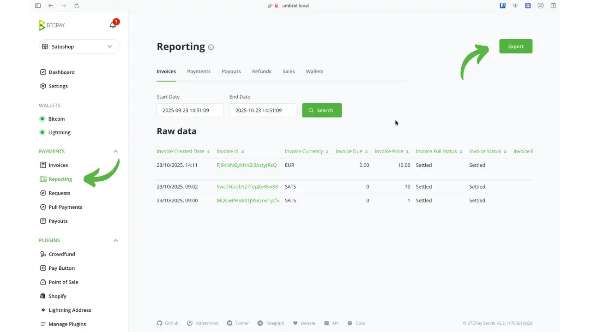


## Конфигурация на магазина


BTCPay Server ви позволява да управлявате няколко магазина с различни параметри. Всеки магазин представлява отделна бизнес единица: магазин за електронна търговия, физическо място за продажба или фактуриране на услуги.


В настройките на магазина ще намерите няколко важни раздела:


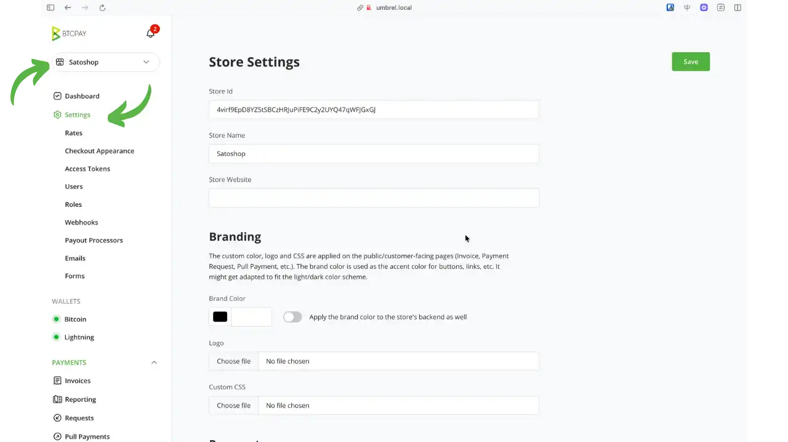


- Общи настройки**: Име на магазина, референтна валута (BTC, EUR, USD), време на изтичане на фактурата (по подразбиране 15 минути), брой на необходимите блокчейн потвърждения
- Цени**: Конфигуриране на източниците на обменни курсове и конвертиране на фиат/ԜԜ-50
- Външен вид на касата**: Персонализирайте външния вид на страниците за плащане (лого, цветове, персонализирани съобщения)
- Настройки за имейл**: Конфигуриране на имейл известия за получени плащания
- Токени за достъп**: Управление на API токени за интеграция с електронна търговия (WooCommerce, Shopify и др.)
- Потребители**: Управлявайте достъпа на потребители до магазина с различни нива на разрешения (собственик, гост)
- Уеб куки**: Конфигуриране на Webhook за синхронизиране в реално време със счетоводната или ERP системата ви


Сървърът на BTCPay предлага и раздел Plugins за разширяване на функционалността с интеграции за електронна търговия, системи за продажби и допълнителни инструменти.


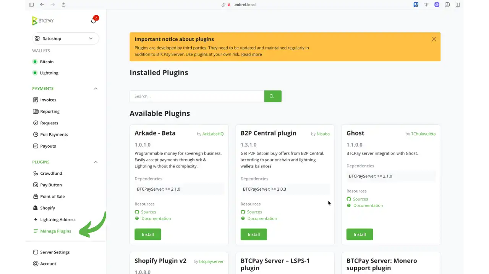


## Предимства и ограничения на местното използване


**Предимства на сървъра на BTCPay пред Umbrel** :


- Пълен суверенитет: изключителен контрол върху частните ключове и средствата, никоя трета страна не може да замрази или цензурира вашите плащания
- Значителни икономии: само Bitcoin мрежови разходи (няколко цента за Lightning) спрямо 2-3% за традиционните процесори
- Максимална поверителност: без регистрация, проверка на самоличността или споделяне на данни с компании от трети страни
- Архитектурата с отворен код гарантира прозрачност, одитируемост и устойчивост чрез голяма общност от разработчици
- Лесна инсталация чрез Umbrel, без необходимост от напреднали технически умения


**Важни ограничения** :


- Само в локална мрежа**: Сървърът на BTCPay в Umbrel е достъпен само от домашната ви мрежа. Перфектен за фактуриране лице в лице, услуги на свободна практика или малки физически бизнеси, но неподходящ за публично достъпни онлайн магазини.
- Пълна техническа отговорност: поддръжка на възли, редовни резервни копия, наблюдение на свързаността
- Управление на светкавичната ликвидност: откриване и управление на канали с достатъчен входящ капацитет
- Поддръжката е ограничена до документацията на общността и форумите, което изисква повече самостоятелност от търговския отдел за обслужване на клиенти


Това ограничение на локалната мрежа е основната пречка за интегрирането на BTCPay Server в магазин за електронна търговия, където клиентите трябва да имат достъп до страниците за плащане от всяка точка на интернет.


## Най-добри практики и безопасност


Активирайте автоматичното архивиране на Umbrel и съхранявайте копие на външен носител (USB памет, твърд диск, криптиран облак). Съхранявайте семената на Bitcoin (фрази за възстановяване) на сигурно, физически отделно място. Създайте резервно копие на файла channel.backup на LND за светкавично възстановяване.


Редовно наблюдавайте синхронизацията на ядрото Bitcoin, каналите на Lightning и реакцията на сървъра на BTCPay. Прост седмичен тест: generate и платете сметка за няколко сатоши. Поддържайте Umbrel в актуално състояние (пачове за сигурност, подобрения). Правете резервно копие преди големи актуализации. За професионална употреба помислете за външно наблюдение (UptimeRobot) с предупреждения по имейл/SMS.


## Публично разкриване на сървъра на BTCPay за онлайн магазин


За да интегрирате сървъра на BTCPay в уеб базиран магазин за електронна търговия (WooCommerce, Shopify и др.), клиентите ви трябва да имат достъп до страниците за плащане отвсякъде, а не само от локалната мрежа.


**Решение: Nginx Proxy Manager**


Можете да изложите публично сървъра на BTCPay с помощта на Nginx Proxy Manager (наличен в Umbrel App Store). Това решение изисква :


- Име на домейн (класическо или безплатно чрез DuckDNS, No-IP, Afraid.org)
- Конфигуриране на пренасочване на портове (портове 80 и 443) в маршрутизатора
- Инсталиране на Nginx Proxy Manager, който автоматично управлява SSL сертификати


Тази конфигурация излага сървъра ви на достъп до интернет и изисква допълнителна бдителност (силни пароли, 2FA, редовни актуализации). Ще подготвим специален урок, в който ще опишем подробно тази пълна процедура.


## Заключение


BTCPay Server на Umbrel съчетава мощта на възела Bitcoin с простотата на Umbrel, за да създаде самостоятелно хоствана професионална платежна инфраструктура, достъпна за всички. Този финансов суверенитет е свързан с отговорност за поддръжката, но Umbrel значително опростява оперативната тежест в сравнение с ползите: премахване на таксите за обработка, защита на личните данни, устойчивост на цензура и пълен контрол върху средствата ви.


Използването на локални мрежи вече обхваща широк спектър от приложения: фактуриране на услуги на свободна практика, плащания на място, малки физически магазини или просто обучение и експериментиране с Bitcoin и Lightning в контролирана среда. За нуждите на електронната търговия, изискващи публично излагане, съществува решението Nginx Proxy Manager, но то изисква допълнителна техническа конфигурация, която ще опишем подробно в специален урок.


Независимо дали управлявате бизнес, стартиращ проект или просто експериментирате, сървърът на BTCPay в Umbrel предлага пълна финансова автономност. Пътят започва с първия ви магазин, първата ви фактура, първото ви плащане, получено директно във вашата суверенна инфраструктура.


## Ресурси


### Официална документация


- [Официален уебсайт на сървъра на BTCPay] (https://btcpayserver.org)
- [Пълна документация за сървъра на BTCPay](https://docs.btcpayserver.org)
- [GitHub BTCPay Server](https://github.com/btcpayserver/btcpayserver)
- [Документация за Tailscale](https://tailscale.com/kb)


### Общност и подкрепа


- [Форум BTCPay Server](https://chat.btcpayserver.org)
- [Форум Umbrel](https://community.getumbrel.com)
- [Reddit r/BTCPayServer](https://reddit.com/r/BTCPayServer)