BTCPay Server là một gói phần mềm mã nguồn mở miễn phí do Nicolas Dorier tạo ra, cho phép chấp nhận thanh toán bằng Bitcoin mà không cần trung gian. Được thiết kế để cung cấp quyền tự chủ và chủ quyền tài chính, BTCPay Server được cài đặt trên máy chủ riêng và cung cấp khả năng quản lý giao dịch toàn diện, từ lập hóa đơn đến xác thực thanh toán on-chain hoặc Lightning Network, và kế toán. Nó tích hợp dễ dàng với các trang thương mại điện tử (WooComerce, Shopify, v.v.) hoặc có thể được sử dụng làm thiết bị đầu cuối thanh toán cho các cửa hàng thực tế (*POS*).

BTCPay Server chắc chắn là giải pháp tiên tiến nhất dành cho các thương nhân muốn chấp nhận Bitcoin. Đây là phần mềm toàn diện và mạnh mẽ nhất về mặt bảo mật, chủ quyền và tính bảo mật. Mặt khác, nó cũng là phần mềm phức tạp nhất để cài đặt và bảo trì. Ngoài ra còn có các lựa chọn thay thế đơn giản hơn: một số hoàn toàn mang tính giám sát, như OpenNode, trong khi một số khác cung cấp sự cân bằng thú vị giữa tính dễ sử dụng và chủ quyền, như Swiss Bitcoin Pay:

https://planb.academy/tutorials/business/point-of-sale/swiss-bitcoin-pay-2-a78b057e-ed11-47ac-860c-71019fcb451a

Mục đích của hướng dẫn này là hướng dẫn bạn từng bước cài đặt, cấu hình và sử dụng BTCPay Server, để bạn có thể triển khai cơ sở hạ tầng thanh toán an toàn, độc lập theo đúng tinh thần của Bitcoin.

## Các tính năng của Máy chủ BTCPay

Các giải pháp điểm bán hàng Bitcoin tập trung, chẳng hạn như *OpenNode*, mang lại sự dễ sử dụng, nhưng lại phụ thuộc vào một công ty bên thứ ba vì chúng không thể tự lưu trữ và trong hầu hết các trường hợp, đều là độc quyền. Mặc dù chúng giúp việc thiết lập thanh toán dễ dàng hơn, nhưng lại phát sinh phí hoa hồng và khiến người dùng phải chịu nhiều rủi ro hơn so với giải pháp như BTCPay Server, cả về mặt lưu ký tiền và bảo mật.

Máy chủ BTCPay hướng đến các thương nhân, hiệp hội và tổ chức phi lợi nhuận trực tuyến hoặc truyền thống muốn nhận quyên góp bằng Bitcoin. Đây cũng là giải pháp lý tưởng cho các chủ dự án và nhà phát triển đang tìm kiếm sự hỗ trợ trực tiếp từ cộng đồng của họ.

Các tính năng đặc biệt của BTCPay Server bao gồm:

- **tính tự chủ hoàn toàn** của nó,
- việc không có thủ tục **KYC**,
- kiểm soát toàn bộ quỹ**,
- **loại bỏ phí nền tảng**.

Bằng cách tự mình trở thành đơn vị xử lý thanh toán, bạn loại bỏ mọi sự phụ thuộc vào bên thứ ba tập trung giữa bạn và khách hàng. Bạn có thể chấp nhận thanh toán trực tiếp bằng Bitcoin và hóa đơn thanh toán generate. Điều này đảm bảo rằng cả bạn và công ty của bạn đều không thể bị bất kỳ ai khác cấm. Bạn vừa đóng vai trò là ngân hàng vừa là đơn vị xử lý thanh toán mà không phải trả hoa hồng cho bên trung gian cho mỗi giao dịch.

Phí giao dịch cho **on-chain** vẫn giữ nguyên, nhưng có thể giảm bằng cách sử dụng mạng **Liquid** hoặc **Lightning**.

Ngoài ra :

- Giao diện và hóa đơn có thể tùy chỉnh hoàn toàn;
- Hỗ trợ **Tor** gốc để tăng cường tính bảo mật;
- Hỗ trợ **gây quỹ cộng đồng**, **POS** và **nút thanh toán**;
- Tương thích với nhiều loại tiền tệ;
- Bitcoin thanh toán trực tiếp và ngang hàng;
- Kiểm soát hoàn toàn khóa riêng tư của bạn;
- Tăng cường quyền riêng tư;
- Tăng cường bảo mật;
- Phần mềm tự lưu trữ;
- Hỗ trợ **SegWit** và **mạng Lightning**;
- Danh mục đầu tư nội bộ, dựa trên nút, với sự tích hợp của danh mục đầu tư phần cứng.

## Cài đặt và cấu hình Máy chủ BTCPay

### Chọn chế độ lưu trữ của bạn

Máy chủ BTCPay có thể được cài đặt theo nhiều cách khác nhau. Tùy thuộc vào nhu cầu và nguồn lực của bạn, có ba tùy chọn chính:

- Máy chủ BTCPay do bên thứ ba lưu trữ**: bạn sử dụng nền tảng lưu trữ dịch vụ cho bạn. Dịch vụ này đơn giản, nhưng thường không miễn phí.
- Máy chủ BTCPay tự lưu trữ trên máy chủ đám mây** (ví dụ: thông qua [btcpayprovider](https://btcpayprovider.com/), [Bitcoin People](http://bitcoinpeople.it/) hoặc bất kỳ nhà cung cấp nào khác). Đây là giải pháp được khuyến nghị cho hầu hết các thương nhân mới bắt đầu.
- Máy chủ BTCPay được cài đặt trên phần cứng của bạn (cục bộ)**: trên máy tính, mini-PC hoặc Umbrel. Phương pháp này mang tính kỹ thuật hơn, nhưng hoàn toàn độc lập.

https://planb.academy/tutorials/business/point-of-sale/btcpay-server-umbrel-68e1c535-4322-4507-a69c-9dfcbc36dfd1

Đối với một thương gia khởi nghiệp, **triển khai trên máy chủ đám mây** là giải pháp thỏa hiệp tốt nhất giữa tính tự chủ, tính đơn giản và tính bảo mật, mà không cần phải quản lý toàn bộ cơ sở hạ tầng kỹ thuật.

Máy chủ BTCPay có thể được triển khai nhanh chóng từ nhiều nhà cung cấp dịch vụ lưu trữ. Trong số đó, Voltage nổi bật là giải pháp chuẩn mực cho người dùng cần cơ sở hạ tầng đáng tin cậy, chuyên nghiệp và có chủ quyền.

### Tạo phiên bản máy chủ BTCPay trên Voltage

**Voltage** là nền tảng lưu trữ Bitcoin và Lightning trọn gói cho phép bạn triển khai ngay Máy chủ BTCPay của riêng mình mà không cần cấu hình phức tạp hay bảo trì máy chủ.

Truy cập [trang web chính thức của Voltage](https://voltage.cloud).

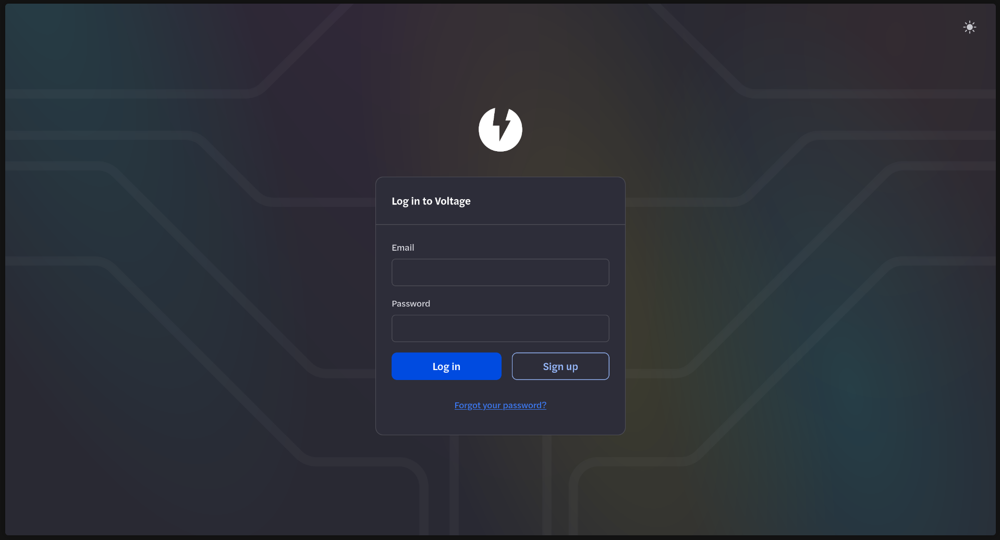

Tạo **tài khoản người dùng** với địa chỉ email hợp lệ và mật khẩu mạnh.

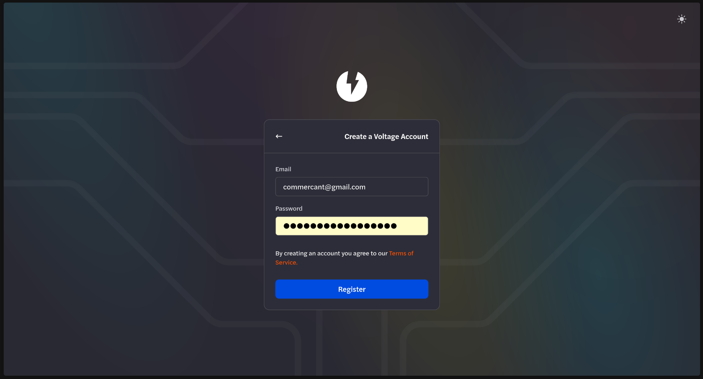

Voltage cung cấp **bản dùng thử miễn phí 7 ngày**. Xin lưu ý rằng sau 7 ngày dùng thử miễn phí, bạn sẽ được mời đăng ký gói thuê bao cố định với giá **25 đô la mỗi tháng** để tiếp tục **duy trì hoạt động của các nút**.

Sau khi tạo tài khoản Voltage và đăng nhập lần đầu tiên, bạn sẽ được chuyển hướng đến trang chủ, có hai phần chính:

- Phần **Cơ sở hạ tầng** để quản lý các nút Lightning, Bitcoin Core, BTCPay Server và các dịch vụ Bitcoin khác trên nền tảng đám mây;
- và phần **Thanh toán** cho phép bạn truy cập API Lightning của Voltage để tích hợp thanh toán Bitcoin vào các ứng dụng tùy chỉnh.

Để triển khai phiên bản **BTCPay Server** của bạn, hãy nhấp vào **Truy cập cơ sở hạ tầng**. Đây là nơi bạn có thể tạo, quản lý và giám sát tất cả các dịch vụ của mình, bao gồm cả nút Bitcoin và BTCPay Server.

#### Tạo một nhóm

Trước khi bạn có thể triển khai một dịch vụ, nền tảng sẽ nhắc bạn **tạo một nhóm**. **Nhóm** (không gian làm việc) là một không gian làm việc nhóm tất cả các dịch vụ Bitcoin và Lightning của bạn lại với nhau (ví dụ: một nút, Máy chủ BTCPay, trình duyệt, v.v.). Nó giống như một thư mục chứa các dự án khác nhau của bạn.

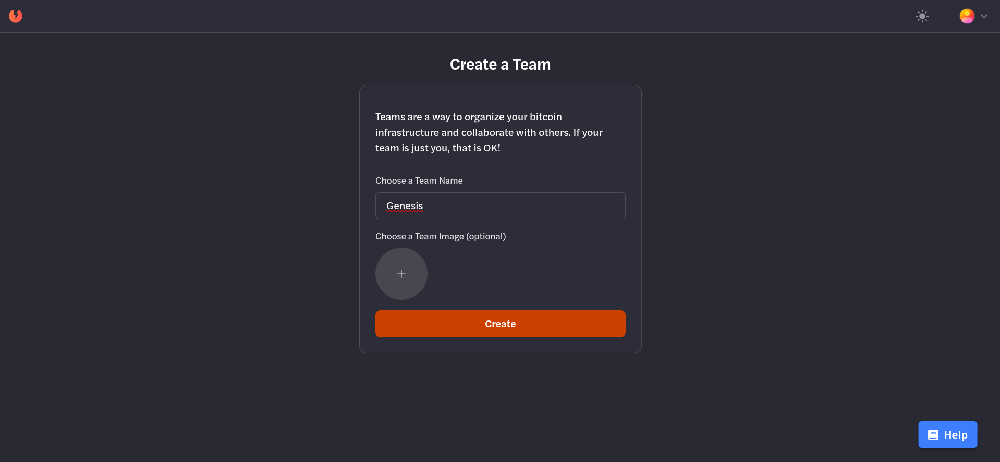

Trong hướng dẫn này, nhóm chúng ta vừa tạo sẽ có tên là **Genesis**. Bạn có thể thêm ảnh đại diện nếu muốn. Sau khi hoàn tất, hãy nhấp vào nút **Tạo**. Bạn có thể mời người dùng khác tham gia nhóm và thậm chí đổi tên nhóm nếu muốn.

Trên trang chủ của nhóm, một số tùy chọn sẽ xuất hiện:

- Lightning Nodes**: triển khai một nút Lightning hoàn chỉnh (LND);
- Nút lõi Bitcoin**: để khởi chạy một nút Bitcoin hoàn chỉnh;
- Máy chủ BTCPay**: để lưu trữ phiên bản BTCPay sẵn sàng sử dụng;
- Tài khoản Nostr**: để quản lý danh tính Nostr.

Kích hoạt **xác thực kép (2FA)** để bảo mật tài khoản và dịch vụ của bạn (nút sẽ hiển thị màu đỏ nếu bị vô hiệu hóa).

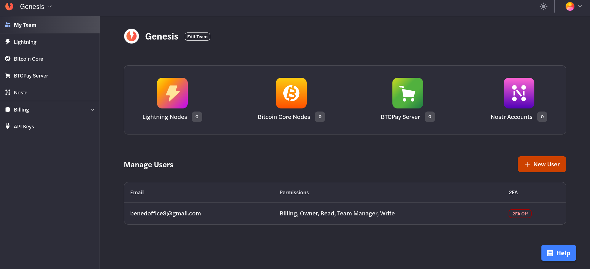

Nhấp vào **Máy chủ BTCPay** trong số các tùy chọn, sau đó nhấp vào **Khởi chạy Cửa hàng BTCPay**.

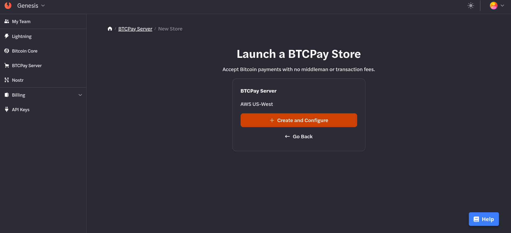

Sau đó, Voltage sẽ yêu cầu bạn **tạo và cấu hình phiên bản Máy chủ BTCPay** của mình bằng cách chọn **tên dịch vụ** (1) và bật thanh toán Lightning (2).

Bạn sẽ cần một nút Lightning nếu quyết định chấp nhận thanh toán bằng Lightning.

Nếu bạn chưa có nút Bitcoin hoặc Lightning, Voltage sẽ tự động đề xuất bạn tạo một nút.

Nhấp vào **Tạo nút Lightning** (3) .

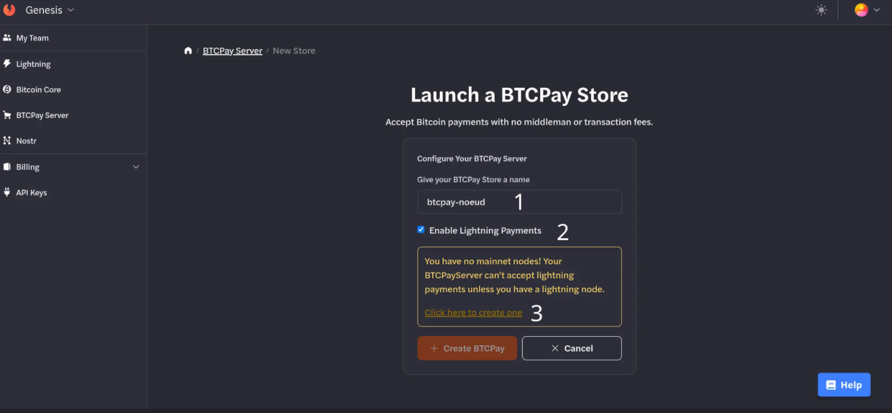

Khi vào giao diện tạo nút, bạn sẽ được yêu cầu chọn giữa bố cục **chuẩn** và **chuyên nghiệp**.

Bạn có thể tạo một nút thật (**Mainnet**) hoặc một nút thử nghiệm (**Testnet**). Sau đó, nhấp vào nút **Tiếp tục**.

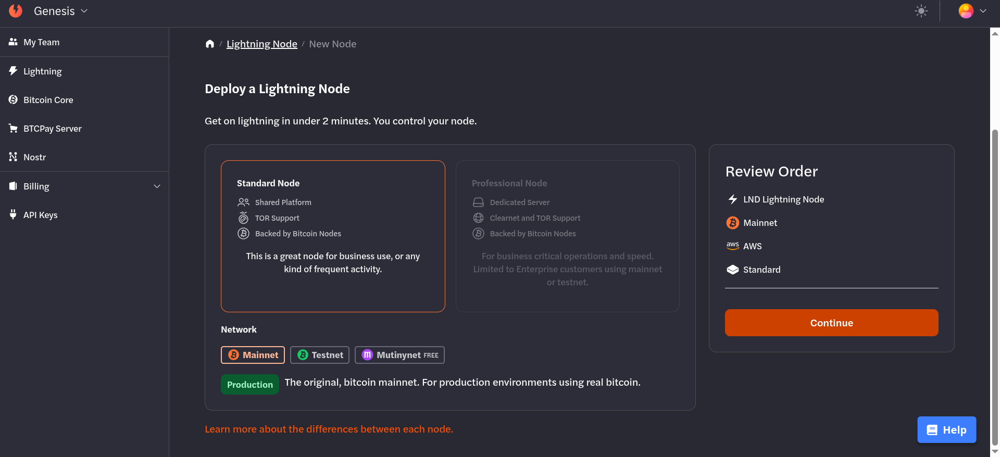

Trong hướng dẫn này, chúng ta hãy sử dụng gói tiêu chuẩn. Nhập **tên nút**, **mật khẩu** và nhấn nút **Tạo**.

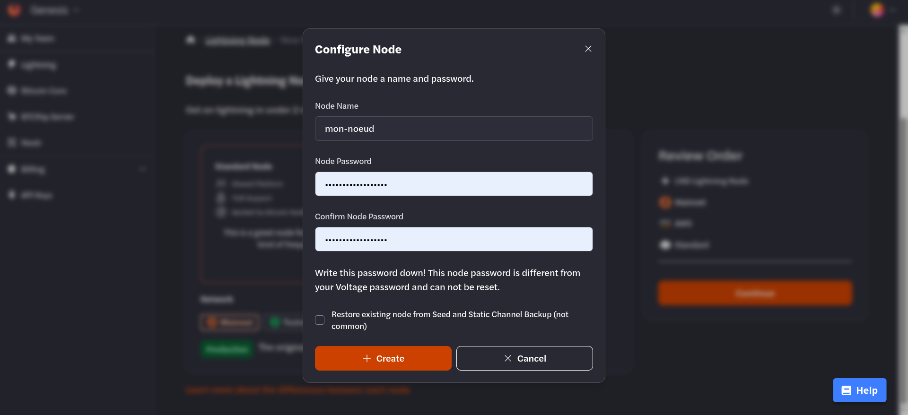

Sau một vài phút, nút của bạn sẽ hoạt động và bạn sẽ có thể mở một kênh miễn phí với khả năng thu sóng là 500.000 sats.

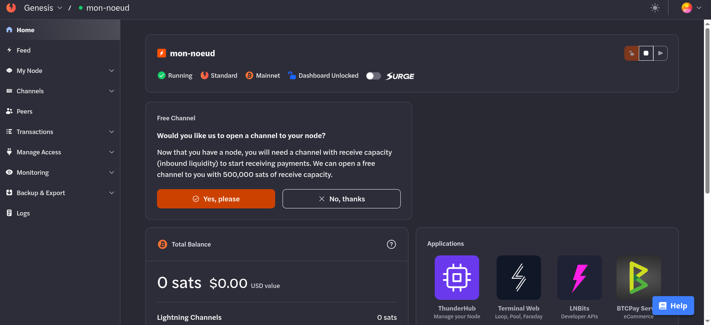

Xa hơn một chút về phía bên phải, bạn sẽ tìm thấy mọi thông tin cần thiết về nút thắt của mình!

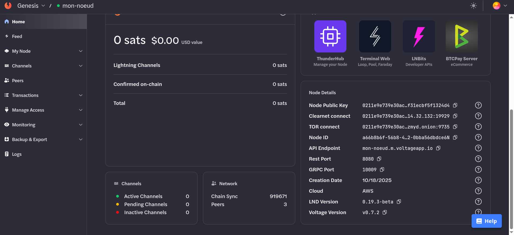

Bây giờ chúng ta đã thiết lập và chạy nút Lightning, hãy quay lại cài đặt máy chủ BTCPay. Bây giờ bạn có thể nhấp vào nút **Tạo BTCPay**.

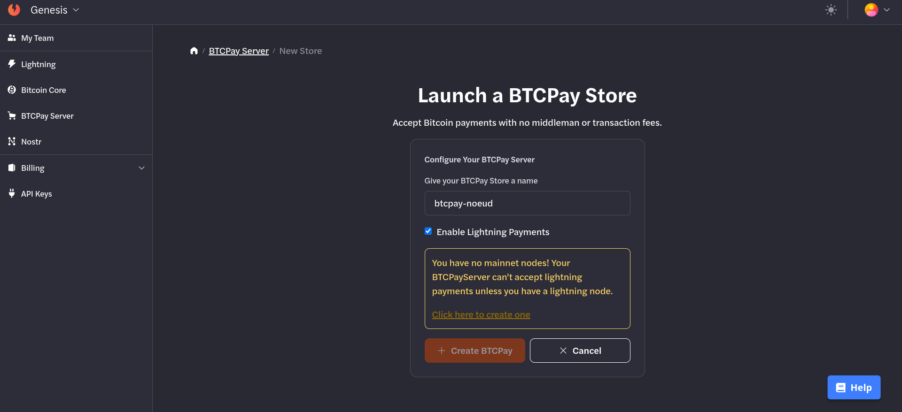

Một trang sẽ mở ra với thông tin đăng nhập mặc định của bạn, cùng với thông báo nhắc bạn thay đổi mật khẩu ban đầu. Sau khi hoàn tất, hãy nhấp vào nút **Đăng nhập ngay** để truy cập giao diện.

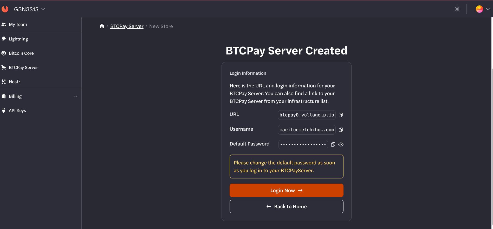

Vậy là xong! Máy chủ BTCPay của bạn đã sẵn sàng sử dụng. Bạn sẽ được chuyển hướng trực tiếp đến trang đăng nhập của máy chủ BTCPay.

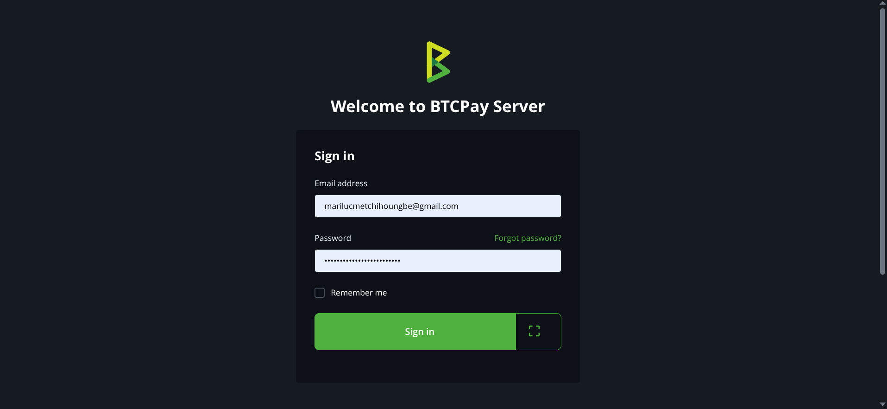

Sau khi đăng nhập, hãy cấu hình **cửa hàng** đầu tiên của bạn:

- Đặt cho nó một cái tên.

- Chọn **tiền tệ mặc định** (EUR, USD, CFA, v.v.).

- Chọn **nhà cung cấp tỷ giá hối đoái** (ví dụ: CoinGecko).

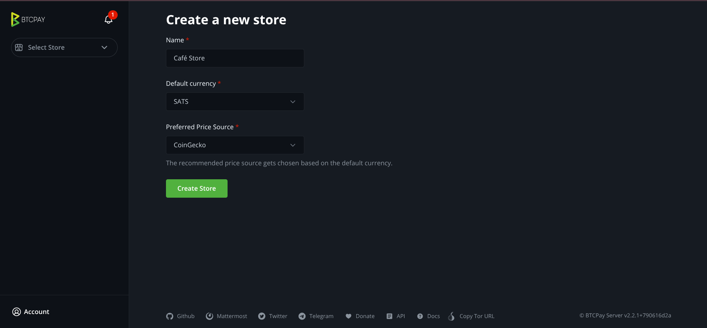

Sau đó, bạn sẽ được chuyển hướng đến bảng điều khiển của cửa hàng. Trên giao diện bảng điều khiển, bạn sẽ thấy nút **Tạo cửa hàng** được đánh dấu màu xanh lá cây, vì bước này đã hoàn tất.

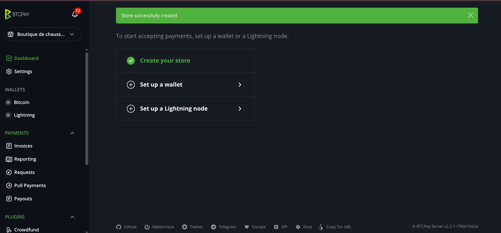

Xa hơn một chút, chúng ta có các nút **Cấu hình wallet** và **Cấu hình nút Lightning**. Trong trường hợp này, chúng ta đã kết nối với một nút Lightning đang chạy bằng điện áp. Vì vậy, chúng ta sẽ không cần phải thực hiện việc này ở đây.

Chúng ta hãy chuyển sang cấu hình danh mục đầu tư. Nhấp vào nút **Cấu hình danh mục đầu tư**.

Vì chúng ta mới bắt đầu sử dụng Máy chủ BTCPay, hãy kết nối một wallet hiện có. Nhấn **Kết nối danh mục đầu tư hiện có**.

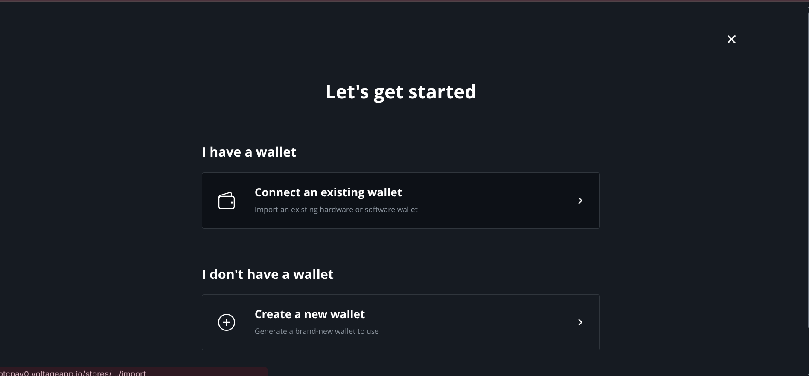

Sau đó, bạn phải chọn **phương thức nhập**. Trong số các tùy chọn có sẵn, hãy chọn **Nhập khóa công khai mở rộng**.

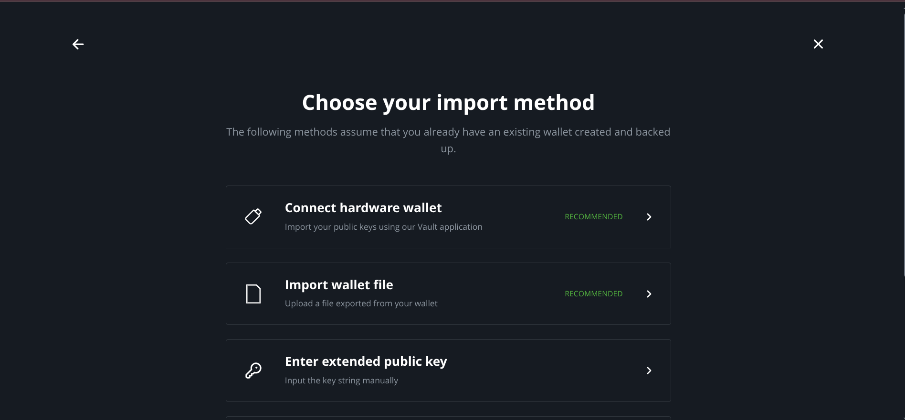

Bằng cách liên kết với wallet hiện có, bạn có thể nhận thanh toán **trực tiếp trên wallet bên ngoài này** mà không cần máy chủ BTCPay truy cập vào khóa riêng của bạn. Vì vậy, ngay cả khi máy chủ bị tấn công hoặc khóa công khai (`xpub`) bị xâm phạm, kẻ tấn công vẫn có thể xem lịch sử giao dịch của bạn, nhưng sẽ **không thể truy cập vào tiền của bạn**.

Khi bạn nhấp vào nút **Nhập khóa công khai mở rộng**, bạn sẽ được **chuyển hướng** đến trang nơi bạn phải cung cấp khóa này.

Bây giờ chúng ta hãy lấy **khóa công khai mở rộng**.

### Kết nối Bitcoin wallet

Để nhận thanh toán, bạn cần kết nối Bitcoin wallet với cửa hàng của mình. Để thực hiện việc này, bạn có một số tùy chọn:

- Danh mục phần cứng** (Ledger, Trezor, Coldcard...) ;

- Danh mục phần mềm** (Ứng dụng Blockstream, Ashigaru, Electrum, Sparrow...)

- Máy chủ BTCPay** nội bộ wallet (không khuyến khích vì kém an toàn hơn và có nguy cơ lộ tiền của bạn nhiều hơn trong trường hợp máy chủ bị tấn công).

Trong hướng dẫn này, chúng ta sẽ sử dụng **danh mục phần mềm**, dễ dàng cấu hình ban đầu hơn. Bạn có thể chọn từ một số ứng dụng tương thích: **Electrum**, **Phoenix**, **Zeus**, **Muun**, v.v.

Để minh họa, chúng ta sẽ sử dụng **Electrum**. Mở **Electrum**, nhấp vào **Danh mục đầu tư**, sau đó nhấp vào **Thông tin**:

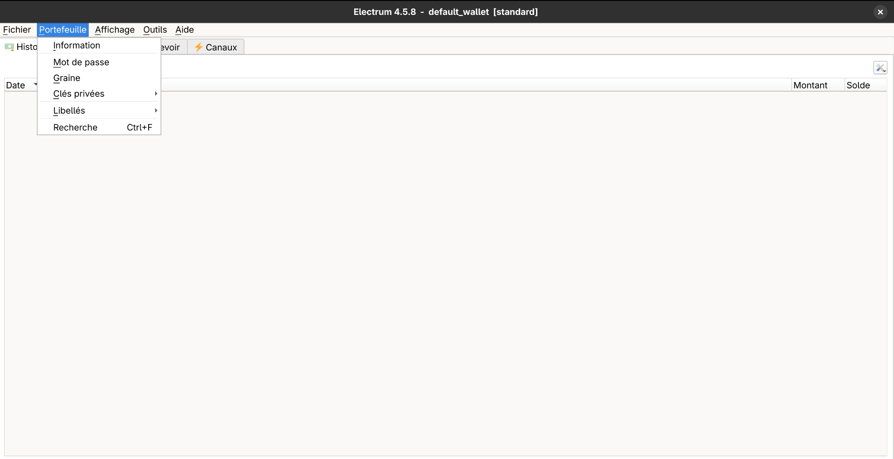

Tiếp theo, sao chép **khóa công khai chính (xpub)**.

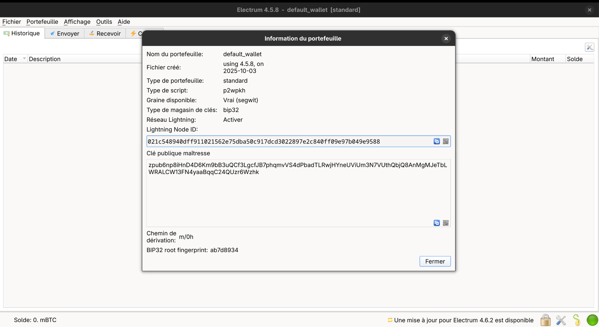

Sau khi sao chép khóa công khai chính, hãy dán khóa đó vào trường được cung cấp trên trang Máy chủ BTCPay.

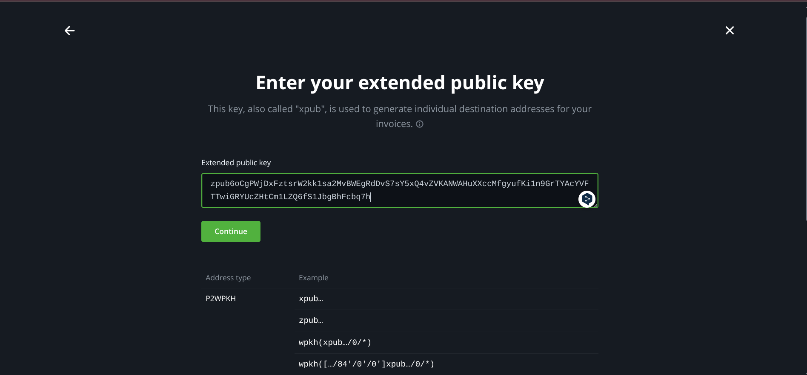

Sau khi xác minh, bạn sẽ được chuyển hướng đến bảng điều khiển của cửa hàng.

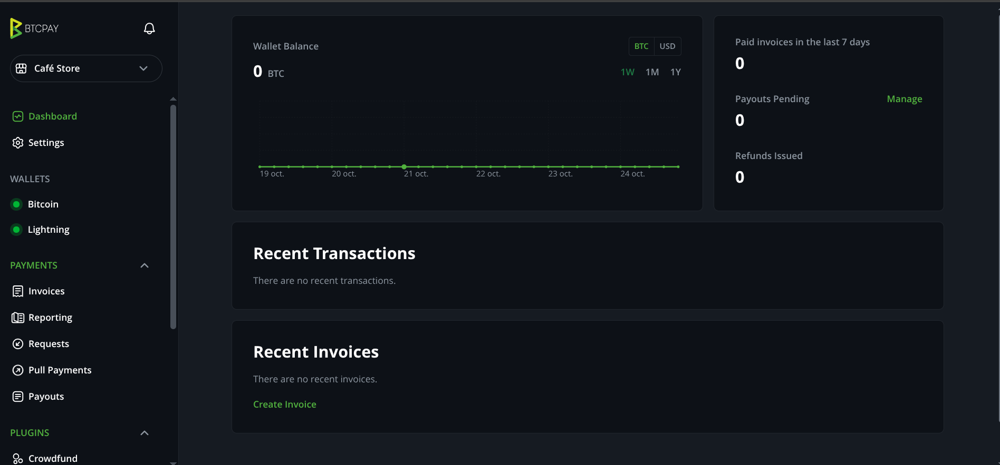

### Tạo điểm bán hàng (PoS)

Sau khi thiết lập cửa hàng và danh mục đầu tư, giờ đây bạn có thể thiết lập **Điểm bán hàng (PoS)** để bắt đầu nhận thanh toán Bitcoin trực tiếp từ khách hàng.

Tính năng tích hợp này của **Máy chủ BTCPay** lý tưởng cho **các thương gia, thợ thủ công, chủ nhà hàng hoặc nhà cung cấp dịch vụ** muốn chấp nhận Bitcoin **mà không cần có trang web** hoặc kỹ năng kỹ thuật đặc biệt.

### Mục đích của việc bán hàng là gì?

**PoS** là **giao diện POS được đơn giản hóa** hoạt động như một thiết bị đầu cuối thanh toán **Bitcoin**.

Nó cho phép bạn:

- Tạo **menu sản phẩm hoặc dịch vụ** có giá cố định.
- Tạo **hóa đơn tức thì có mã QR** để quét.
- Chia sẻ **URL thanh toán** có thể truy cập qua điện thoại thông minh, máy tính bảng hoặc máy tính.

Nói cách khác, PoS biến Máy chủ BTCPay của bạn thành **giao diện bán hàng trực tiếp**, nơi mọi khoản thanh toán đều được nhận **trong Bitcoin wallet** của riêng bạn, không qua trung gian.

### Cấu hình PoS

Trong bảng điều khiển BTCPay, nhấp vào **PLUGIN**, sau đó nhấp vào **Điểm bán hàng**.

Sau đó, nhấp vào **Tạo ứng dụng PoS mới**. Thao tác này sẽ thêm một **ứng dụng mới** vào cửa hàng BTCPay của bạn, giống như bạn đang cài đặt một trang web bán hàng nội bộ thu nhỏ.

Một trang sẽ mở ra để tạo ứng dụng của bạn. Hãy định nghĩa **tên ứng dụng**: đây là tên nội bộ, chỉ hiển thị trên bảng điều khiển của bạn (ví dụ: _Shoe Shop_).

Nhấp vào **Tạo** để xác thực.

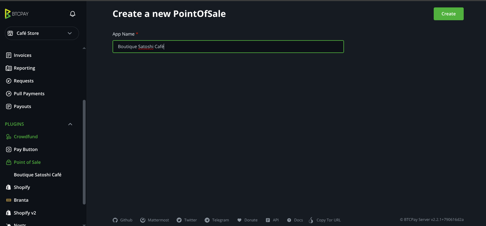

Sau khi tạo, bạn sẽ được chuyển hướng đến **Trang cấu hình chi tiết** của Điểm bán hàng.

### Tùy chỉnh giao diện bán hàng của bạn

Trên trang này, bạn có thể xác định các yếu tố cần thiết của PoS:

- Tên ứng dụng** (tên quản lý nội bộ, có thể thay đổi bất cứ lúc nào).

- Hiển thị tiêu đề** (nội dung khách hàng của bạn sẽ thấy ở đầu trang).

- Kiểu điểm bán hàng** (Chế độ **Mô tả** phù hợp với các dịch vụ như cắt tóc hoặc ăn uống, trong khi chế độ **Danh mục sản phẩm** lý tưởng cho các cửa hàng cung cấp nhiều mặt hàng).

- Hiển thị đơn vị tiền tệ** (chọn **XOF**, **EUR** hoặc **USD** theo giá thông thường của bạn).

- Danh sách sản phẩm** (thêm sản phẩm, mô tả và giá tại đây).

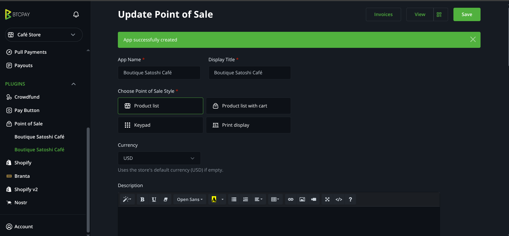

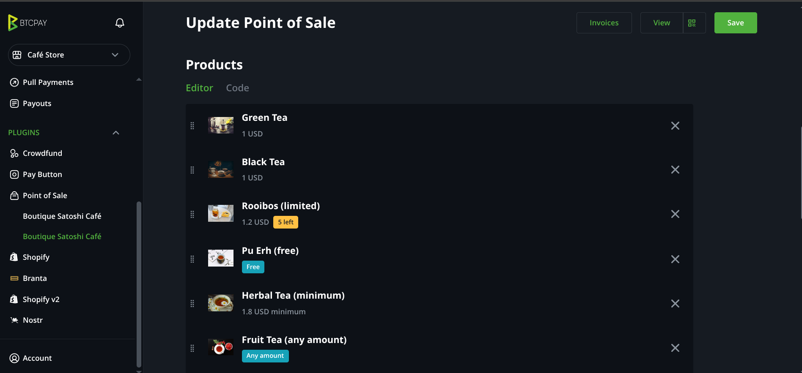

### Lưu và kiểm tra PoS của bạn

Khi bạn hoàn tất việc cấu hình, hãy nhấp vào **Lưu** để lưu cài đặt, sau đó nhấp vào **Xem** để xem trước PoS của bạn.

Bạn sẽ thấy một trang giới thiệu sản phẩm của mình, trong đó mỗi nút tương ứng với một mặt hàng hoặc dịch vụ.

Ngay khi khách hàng chọn sản phẩm:

1. BTCPay tự động tạo hóa đơn Bitcoin hoặc Lightning**.

2. Một **mã QR** sẽ xuất hiện trên màn hình.

3. Khách hàng có thể **quét và thanh toán trực tiếp** bằng máy Bitcoin wallet.

### Kết quả cuối cùng

Bây giờ bạn đã có **Điểm bán hàng Bitcoin** hoàn chỉnh mà bạn có thể:

- Mở từ điện thoại thông minh hoặc máy tính bảng trong cửa hàng của bạn;

- Hiển thị trên màn hình để khách hàng quét;

- Hoặc chia sẻ qua **URL** công khai, như trang đặt hàng đơn giản.

Với mỗi khoản thanh toán, số tiền sẽ tự động được ghi có vào **BTCPay wallet** của bạn, không qua trung gian hoặc phí của bên thứ ba.

Tính năng này biến PoS của bạn thành **thiết bị đầu cuối thanh toán Bitcoin độc lập**.

## Sử dụng hàng ngày

Trước khi rút bất kỳ khoản thanh toán thực tế nào, chúng tôi khuyên bạn nên thực hiện **một cuộc kiểm tra** để kiểm tra xem mọi thứ có hoạt động bình thường không.

### Kiểm tra thanh toán

- Tạo hóa đơn** từ giao diện PoS của bạn (ví dụ: sản phẩm 1 satoshi hoặc số tiền nhỏ).

- Quét mã QR trên màn hình** bằng Bitcoin hoặc Lightning wallet (chẳng hạn như **Phoenix**, **Muun** hoặc **Wallet hoặc Satoshi**).

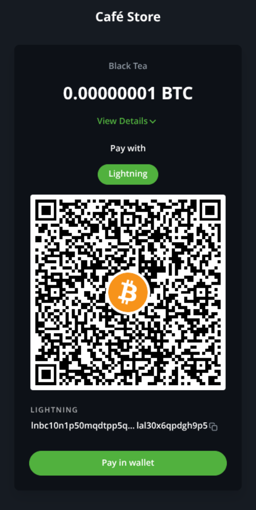

- Xác thực thanh toán** trong wallet của bạn: giao dịch được gửi ngay lập tức.

- Quay lại Máy chủ BTCPay**: hóa đơn sẽ hiển thị là **Đã thanh toán** trong danh sách.

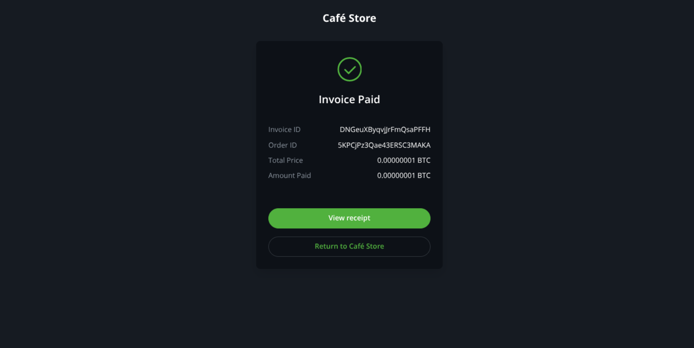

Xin chúc mừng! Điểm bán hàng của bạn hiện đã **hoạt động**. Bạn có thể bắt đầu nhận thanh toán Bitcoin từ khách hàng một cách đơn giản, nhanh chóng và không cần trung gian.

### Tạo hóa đơn cho khách hàng

Trong menu **Hóa đơn**, nhấp vào **Hóa đơn mới**.

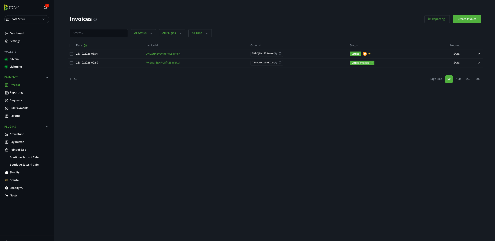

Nhập **số tiền** và **tiền tệ địa phương** (BTCPay tự động tính toán số tiền tương đương bằng BTC), cũng như thông tin sản phẩm khác.

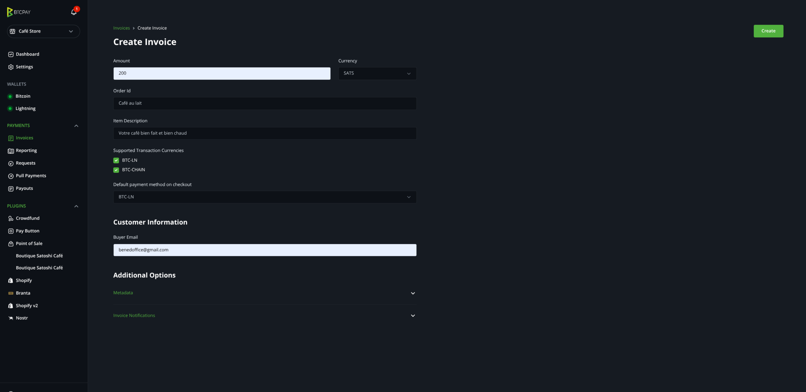

Chia sẻ **mã QR** hoặc **URL** với khách hàng.

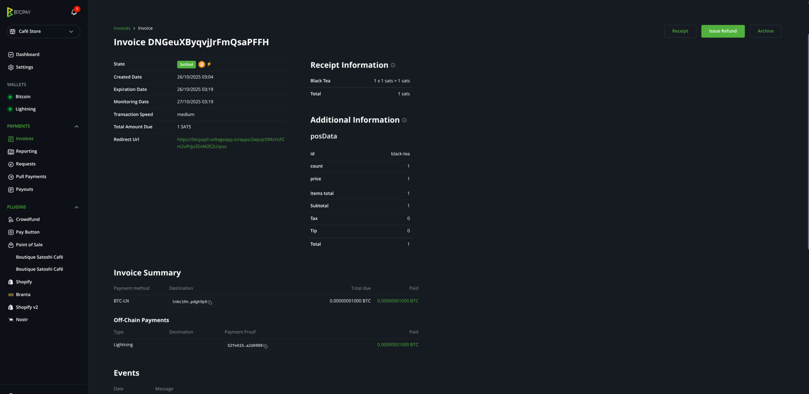

### Theo dõi các khoản thanh toán đã nhận

Vẫn trong menu **Hóa đơn**, bạn sẽ thấy danh sách tất cả các giao dịch của mình.

Các trạng thái có thể là:

- Đang chờ**: thanh toán vẫn chưa được xác nhận.

- Đã thanh toán**: thanh toán đã được xác nhận.

- Đã hết hạn**: hóa đơn không được thanh toán vào ngày đến hạn.

### Hoàn tiền cho khách hàng

Trong menu **Hóa đơn**, hãy chọn hóa đơn cần hoàn tiền.

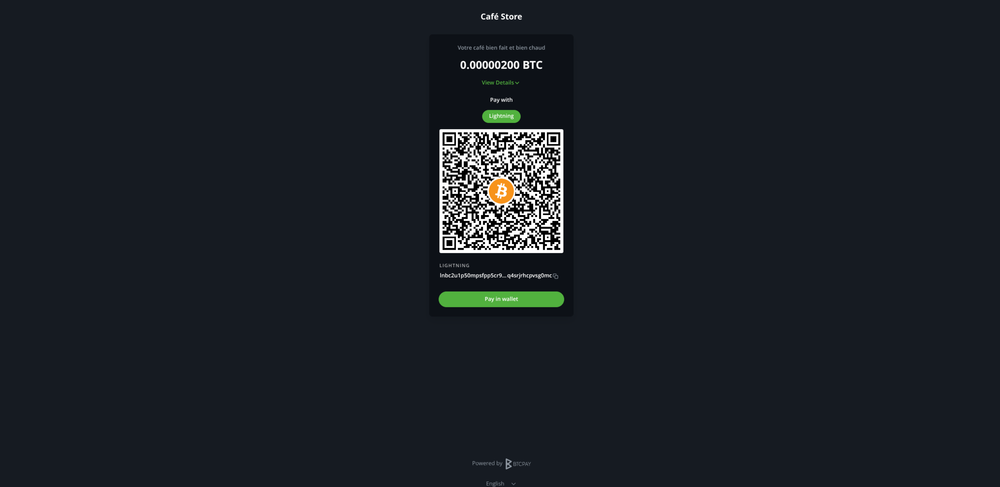

Nhấp vào **Hoàn tiền** và nhập địa chỉ Bitcoin do khách hàng cung cấp.

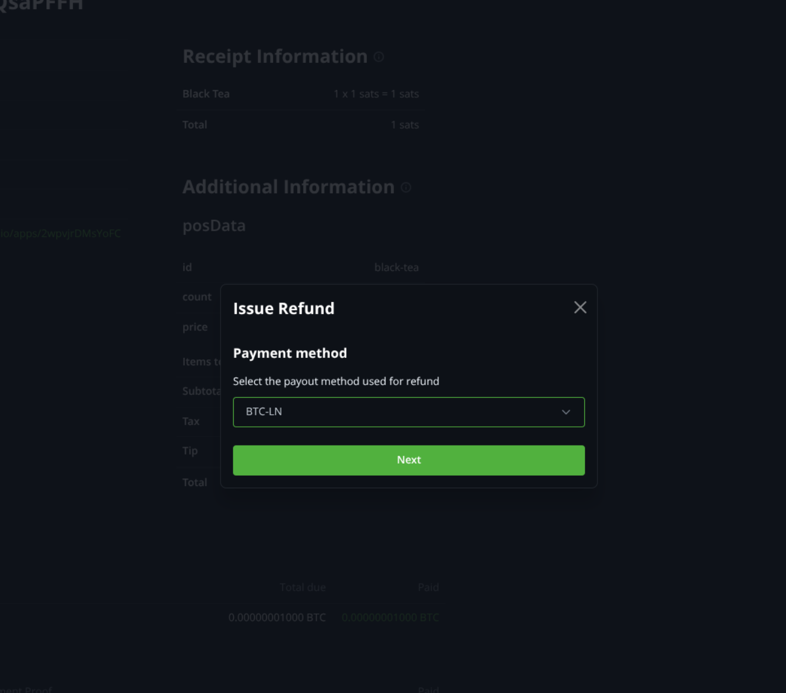

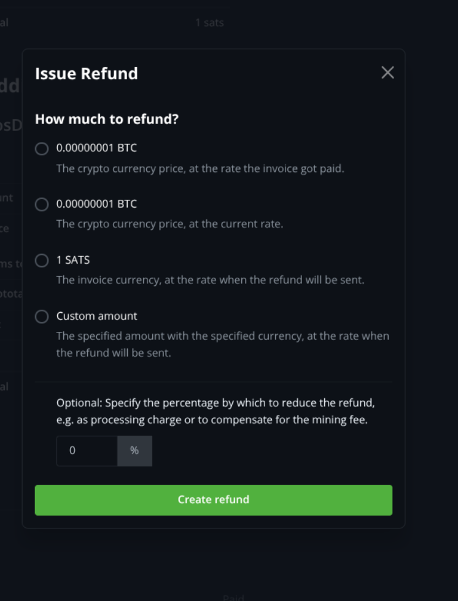

### Báo cáo và xuất dữ liệu

Máy chủ BTCPay cho phép bạn **xuất giao dịch** (ở định dạng CSV hoặc Excel). Điều này rất hữu ích cho việc kế toán và theo dõi thu ngân của bạn.

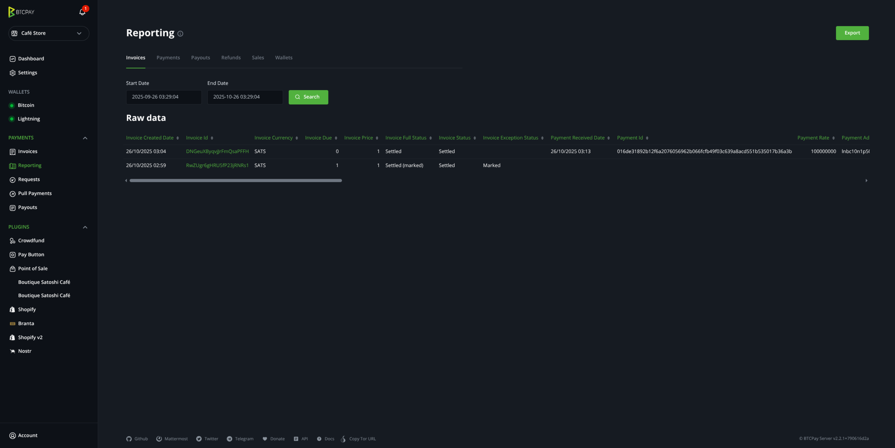

Trong menu **Báo cáo**, nhấp vào **Xuất**: tất cả giao dịch của bạn sẽ được lưu vào tệp CSV mà bạn có thể xem lại tại địa phương.

## An toàn và thực hành tốt nhất

Quyền tự chủ mà BTCPay Server trao tặng (toàn quyền quản lý tiền của bạn) là một thế mạnh thực sự. Tuy nhiên, quyền tự do này cũng đi kèm với trách nhiệm lớn hơn về mặt bảo mật. Bằng cách tự quản lý các khoản thanh toán, bạn đóng vai trò như một ngân hàng của chính mình. Đó là lý do tại sao việc áp dụng các biện pháp tốt nhất để bảo vệ tiền, dữ liệu và cơ sở hạ tầng của bạn là vô cùng quan trọng. Dưới đây là những điểm chính cần lưu ý.

### Truy cập an toàn vào máy chủ của bạn

- Sử dụng mật khẩu mạnh: kết hợp chữ hoa, chữ thường, số và ký tự đặc biệt. Tránh sử dụng lại mật khẩu hiện có.
- Kích hoạt xác thực hai yếu tố (2FA) để truy cập vào giao diện BTCPay của bạn.
- Thường xuyên cập nhật hệ điều hành, phiên bản BTCPay Server và các thành phần phụ thuộc (Docker, nút Bitcoin, nút Lightning...). Các bản cập nhật thường khắc phục các lỗ hổng bảo mật.

### Quản lý và sao lưu khóa riêng tư

- Lưu khóa riêng tư và cụm từ hạt giống của bạn ngoại tuyến, trên phương tiện vật lý (giấy hoặc kim loại).
- Tốt nhất nên sử dụng phần cứng wallet.
- Lưu giữ nhiều bản sao lưu ở nhiều vị trí vật lý riêng biệt và được bảo vệ.

### Thanh toán an toàn và bảo mật

- Sử dụng mạng Tor hoặc VPN để ẩn địa chỉ IP của máy chủ và bảo vệ quyền riêng tư của bạn.
- Vô hiệu hóa các cổng không cần thiết trên máy chủ của bạn và hạn chế kết nối SSH chỉ tới các địa chỉ đáng tin cậy.
- Kích hoạt HTTPS (chứng chỉ SSL) cho mọi kết nối tới giao diện web BTCPay của bạn.
- Không bao giờ chia sẻ giao diện quản trị của bạn với nhân viên không được đào tạo về quản lý danh mục đầu tư Bitcoin.

### Triển khai các biện pháp tốt nhất cho mạng Lightning

Cửa hàng của bạn được kết nối với **nút Lightning được lưu trữ trên Voltage**, giúp đơn giản hóa đáng kể việc quản lý kỹ thuật mạng. Tuy nhiên, việc áp dụng **các biện pháp giám sát và bảo mật tốt** vẫn rất quan trọng:

- Lưu khóa đăng nhập và khóa truy cập API** của nút Voltage (cho phép BTCPay kết nối).
- Bảo vệ tài khoản Voltage** của bạn bằng xác thực hai yếu tố và mật khẩu mạnh.
- Theo dõi trạng thái nút và kênh** từ bảng điều khiển điện áp của bạn: điều này giúp bạn phát hiện bất kỳ sự bất thường hoặc mất đồng bộ nào.
- Tránh chia sẻ thông tin đăng nhập API** của bạn hoặc tiết lộ chúng ở nơi công cộng (ví dụ: trong mã trang web).
- Trong trường hợp di chuyển, chỉ cần **cấu hình lại liên kết giữa BTCPay và Voltage**: không cần phải đóng kênh theo cách thủ công.

Với Voltage, bạn được hưởng lợi từ cơ sở hạ tầng **an toàn, khả dụng cao** và **tự động sao lưu**, đồng thời vẫn giữ được **quyền tối cao đối với các khoản thanh toán Lightning của bạn**.

### Tổ chức và cấu trúc các quy trình nội bộ

- Xác định chính sách quản lý quyền truy cập rõ ràng: ai có thể tạo hóa đơn, xem thanh toán, truy cập nút, v.v.
- Ghi lại quy trình sao lưu và khôi phục để bạn có thể phản ứng nhanh chóng khi xảy ra sự cố.
- Kiểm tra thường xuyên việc khôi phục bản sao lưu để đảm bảo chúng hoạt động bình thường.
- Đào tạo nhân viên hoặc cộng tác viên của bạn về bảo mật hoạt động cơ bản: cảnh giác chống lừa đảo, sử dụng mật khẩu an toàn, tôn trọng tính bảo mật.

### Giám sát và thiết lập bảo trì liên tục

- Liên tục theo dõi hoạt động của máy chủ bằng các công cụ ghi nhật ký hoặc giám sát.
- Lên lịch đánh giá bảo mật định kỳ: kiểm tra các bản cập nhật, quyền truy cập, bản sao lưu và tính nhất quán của giao dịch.

Xin chúc mừng! Bạn đã hoàn thành hướng dẫn này. Giờ đây, bạn có thể tự mình làm quen với BTCPay Server, giúp bạn quản lý cửa hàng dễ dàng hơn.

Để tìm hiểu thêm, tôi khuyên bạn nên tham gia khóa đào tạo đầy đủ của chúng tôi về cách tích hợp Bitcoin vào công ty của bạn:

https://planb.academy/courses/a804c4b6-9ff5-4a29-a530-7d2f5d04bb7a