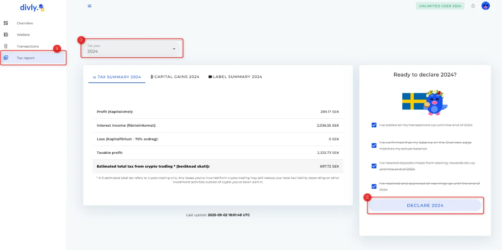
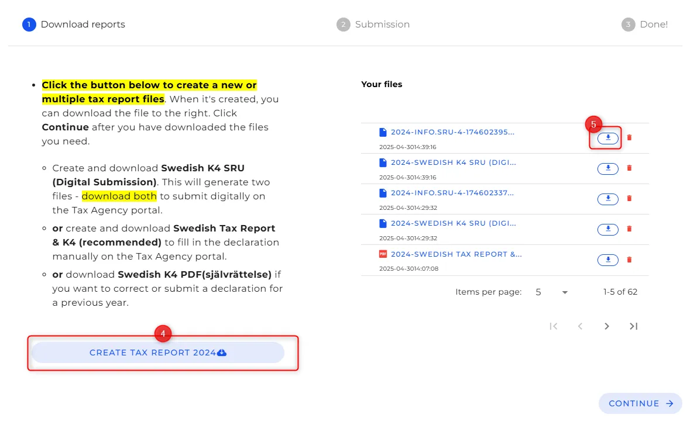

## Innledning

Denne veiledningen forklarer hvordan du bruker [Divly] (https://divly.com/) til å utarbeide en Bitcoin (BTC)-skatterapport. Utarbeidelse av en skatterapport innebærer å samle alle relevante BTC-transaksjoner i et regnskapsår, beregne skattepliktige gevinster eller inntekter og eksportere en rapport som kan sendes til de lokale skattemyndighetene.

I jurisdiksjoner der Bitcoin er underlagt skatteregler, må du rapportere gevinst eller tap fra BTC-avhendelser og inntekter mottatt i BTC. Ved hjelp av et skatterapporteringsprogram kan du organisere denne informasjonen og generere en skatterapport på en effektiv måte.

## Kom godt i gang

Til å begynne med:

- Opprett en Divly-konto.
- Angi **land for skattemessig bosted** og **lokal valuta**.
- Kontroller at disse innstillingene gjenspeiler jurisdiksjonen der du rapporterer skatt.

Divly bruker denne konfigurasjonen til å bruke passende skatteregler og valutaomregninger når rapporten genereres.

## Trinn 1 - Importer alle Bitcoin-transaksjoner fra wallet-ene og utvekslingene dine

Alle Bitcoin-transaksjoner for skatteåret må importeres før skatteberegninger gjøres.

Divly støtter flere importmetoder:

- API- eller OAuth-tilkoblinger** for sentraler eller tjenester som støtter det
- CSV-filopplasting** fra wallet eller sentraler
- Manuell registrering** for alle transaksjoner som ikke dekkes av automatiserte metoder

Sørg for at du importerer **alle BTC inn- og utbetalinger** som er relevante for skatteperioden du rapporterer.

## Trinn 2 - Gjennomgå importerte transaksjoner

**Bekreft kryptosaldoen din:**

Det beste stedet å starte er å sjekke at den totale kryptobeholdningen din stemmer overens med antallet som vises i Divly. Divly beregner beholdningen din ved å summere alle transaksjonene du har importert.

Dette gjør du ved å gå til oversiktssiden. Sjekk at hver enkelt krypto som er oppført, faktisk er det antallet du eier. Divly viser ikke fiat-valutaene dine i oversikten, så ignorér dem i denne øvelsen.

Du kan filtrere etter wallet hvis du finner noen problemer. Dette hjelper deg med å forstå hvilke wallet som kan være usynkronisert.

Etter import:

- Gå til delen **Transaksjoner**.
- Kontroller at alle transaksjoner vises med korrekte datoer og beløp.
- Løs manglende advarsler om pris- eller kostnadsgrunnlag der det er nødvendig.

**Viktig: ** Sørg for å importere ** ALLE ** kryptotransaksjonene dine til Divly før du går videre til neste trinn. Inkludert kalde wallet-er! Ellers er det en risiko for at skatten din ikke blir riktig.

## Trinn 3 - Kategoriser relevante innskudd og uttak

Ulike typer kryptotransaksjoner kan ha forskjellige skattekonsekvenser. Disse inkluderer aktiviteter som å gi kryptovaluta i gave, tapte eiendeler, mining-belønninger, fork, airdrops og lignende hendelser. Det er viktig at alle transaksjoner kategoriseres nøyaktig.

I de fleste tilfeller tildeler Divly automatisk de riktige etikettene. Men når de tilgjengelige transaksjonsdataene er utilstrekkelige, er det ikke sikkert at automatisk klassifisering er mulig. I slike situasjoner er det brukerens ansvar å manuelt tildele riktig etikett. For å forstå betydningen og den skattemessige behandlingen av hver etikett, se den relaterte hjelpeartikkelen.

Du merker transaksjonene ved å gå til siden Transaksjoner. Velg en eller flere transaksjoner, og velg riktig etikett fra rullegardinmenyen øverst på siden.

## Trinn 4 - Generer skatterapporten

Når transaksjonene er importert og klassifisert:

- Gå til delen **Skatterapport**.
- Velg det aktuelle **skatteåret**.
- Gå gjennom oversikten over beregnede gevinster, tap og inntektskategorier.

Sammendraget aggregerer skattepliktige hendelser basert på importerte data og klassifiseringer.

Divlys grensesnitt for skatterapporter lar deg bekrefte at alle transaksjoner er fanget opp før eksport.

## Trinn 5 - Eksporter rapporten

Etter gjennomgang:

- Eksporter den ferdige BTC-skatterapporten i det formatet som er tilgjengelig for ditt land.
- Lagre den eksporterte filen eller skriv den ut for innsending til skattemyndighetene.

Avhengig av hvilken jurisdiksjon du befinner deg i, kan det hende du må følge spesifikke innsendingsinstruksjoner eller bruke landsspesifikke skjemaer med de eksporterte dataene dine. [Divlys landsspesifikke veiledninger] (https://divly.com/en/guides) kan hjelpe deg med innsendingstrinnene hvis det er nødvendig.