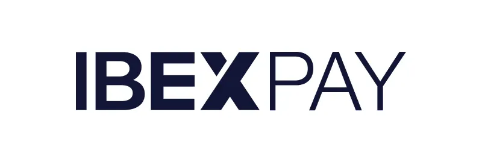

Bitcoin:n saattaminen kaikkien käyttöön tarkoittaa myös sitä, että sen hyödyllisyys ja sen täydellinen sovittaminen liiketoimintaasi on osoitettava.  Mikä olisikaan parempi tapa osoittaa Bitcoin:n teho kuin se, että voit kerätä maksuja ympäri maailmaa?  Tässä opetusohjelmassa tutustumme IbexPayyn, yksinkertaiseen alustaan, jonka avulla voit integroida bitcoinin maksuvälineeksi sekä fyysiseen myymälääsi että verkkokauppa-alustallesi.

## Aloittaminen IbexPayn kanssa

IBEX on Lightning-infrastruktuuripalvelujen edelläkävijän IBEXin kehittämä maksualusta. Tilin hankkimiseksi mene IbexPayn [viralliselle alustalle](https://www.ibexpay.io/) ja napsauta "**Start**"-painiketta.

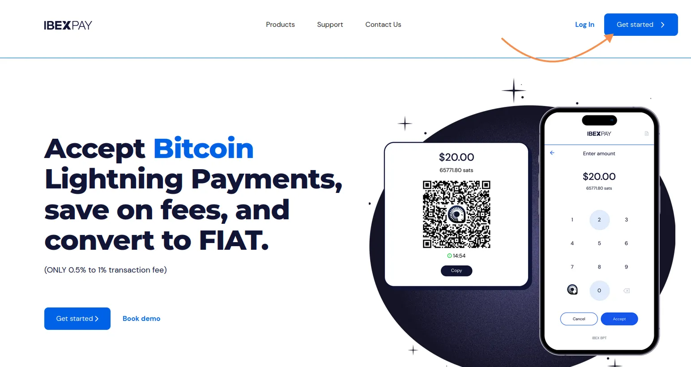

Täytä yritykseesi liittyvät tiedot ja valitse sitten maa, johon olet perustanut liikkeesi: tämä vaihe on tärkeä maksujen keräämisessä käytettävän valuutan kannalta.

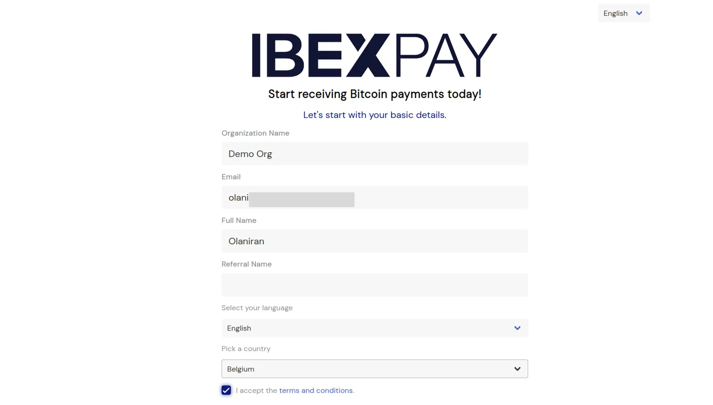

Valitettavasti IbexPay ei ole saatavilla useimmissa Afrikan maissa, mutta Euroopassa, Aasiassa ja Amerikassa on runsaasti vaihtoehtoja.

Kun vahvistat rekisteröitymisesi, sinulle lähetetään sähköposti, jossa voit määrittää salasanan tilillesi. Aseta vahva salasana arkaluonteisten yritystietojesi suojaamiseksi.

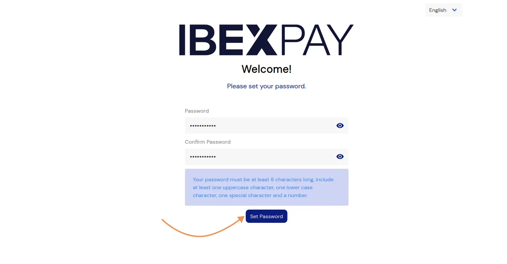

## Määritä tilisi

IbexPay on minimalistinen, joustava alusta, jonka avulla voit perustaa ja aloittaa maksujen keräämisen Bitcoin:n (onchain ja Lightning) kautta hyvin nopeasti.

Kun olet kirjautunut sisään, kojelauta antaa sinulle muokattavan yleiskuvan yrityksesi käteistulotiedoista.

Tästä kojelaudasta voit :

- Tarkastele tapahtumahistoriaa päivittäisen, kuukausittaisen, vuosittaisen tai räätälöidyn ajanjakson ajalta;
- Vie historia Excel-muodossa (CSV) kirjanpitoa varten;
- Tarkista henkilökohtaiseen osoitteeseesi lähetettävien satoshien kokonaismäärä;
- Tarkista tililläsi käytettävissä oleva paikallisen valuutan määrä.

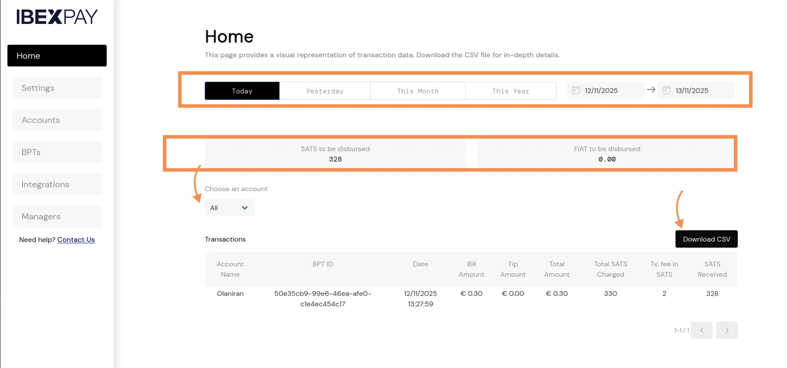

Määritä **Asetukset** -valikossa kaikki yrityksesi kannalta olennaiset tiedot: henkilökohtaiset osoitteet, yrityksen asiakirjat jne.

Tässä osiossa voit määrittää Bitcoin onchain -vastaanottoosoitteesi ja Lightning-osoitteesi. Nämä kaksi tietoa ovat hyödyllisiä, koska 24 tunnin välein IbexPay siirtää päivän transaktioiden kokonaissumman suoraan konfiguroimaasi Bitcoin onchain -osoitteeseen.

IbexPayn tiimi tarkistaa nämä tiedot. Kun tämä todentaminen on valmis, sinulla on myös mahdollisuus määritellä prosenttiosuus bitcoineista, jonka haluat lunastaa transaktiota kohden. Esimerkiksi 20 euron maksua varten Lightningin kautta, jos Bitcoin-prosenttiosuudeksi on asetettu 30 %, IbexPay lähettää tämän summan 6 euroa vastaavana bitcoineina, jolloin FIAT-saldossasi on käytettävissä 14 euroa.

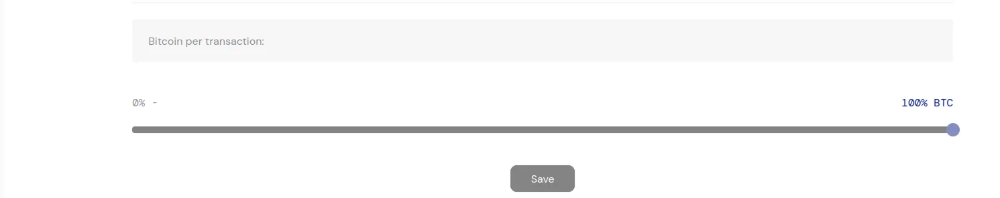

IbexPay tarvitsee myös pankkitietosi maksaakseen saldosi paikallisessa valuutassa. Määritä pankkitilisi tiedot maksujen vastaanottamista varten.

Jos omistat useita myymälöitä, voit luoda tilin jokaiselle myymälälällesi ja seurata tapahtumia erikseen samasta IbexPay-käyttöliittymästä.

Voit myös määrittää eri johtajan jokaiselle tilillesi (myymälälle). Luo tätä varten myymäläpäällikkö **Hallinnoijat** -valikossa syöttämällä myymäläpäällikön nimi ja sähköpostiosoite. Tämä esimies saa automaattisesti sähköpostikutsun hänelle osoitetun myymälän hallinnointiin.

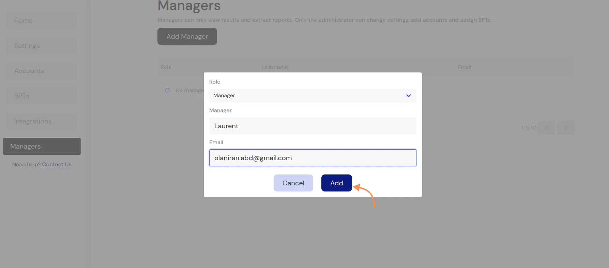

**Tilit**-valikossa voit yhdistää esimiehen myymälään napsauttamalla **Valvojan määrittäminen**-painiketta.

Valitse sitten myymälä (tili) ja nimetty valvoja ja napsauta linkkipainiketta.

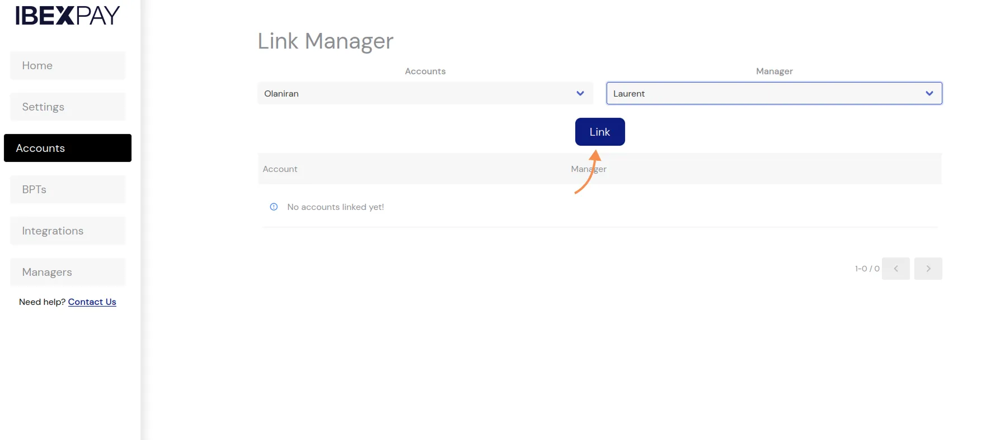

## Bitcoin-maksupäätteet

**BTP:t** (*Bitcoin-maksupäätteet*) -välilehdellä voit luoda myyntipistesivun, jota käytetään myymälän kassalla. Napsauta **Add BTP**-painiketta ja täytä sitten :

- Terminaalin nimi ;
- tähän päätelaitteeseen liittyvä myymälä;
- käytettävä paikallinen valuutta.

Kun maksupääte on luotu, napsauta linkkiä, joka ohjaa sinut maksuliittymään.

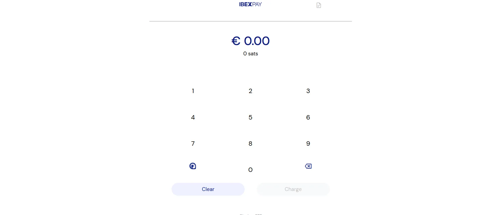

Voit nyt alkaa luoda Lightning-laskuja, jotka asiakkaasi ja kumppanisi voivat maksaa. Klikkaamalla IbexPay-logoa käyttöliittymässä saat QR-koodin, jonka voit skannata älypuhelimellasi, jolloin saat IbexPay POS:n käyttöön millä tahansa laitteella.

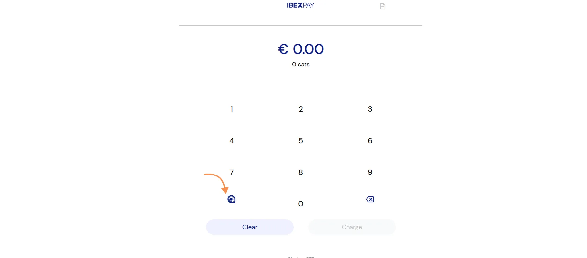

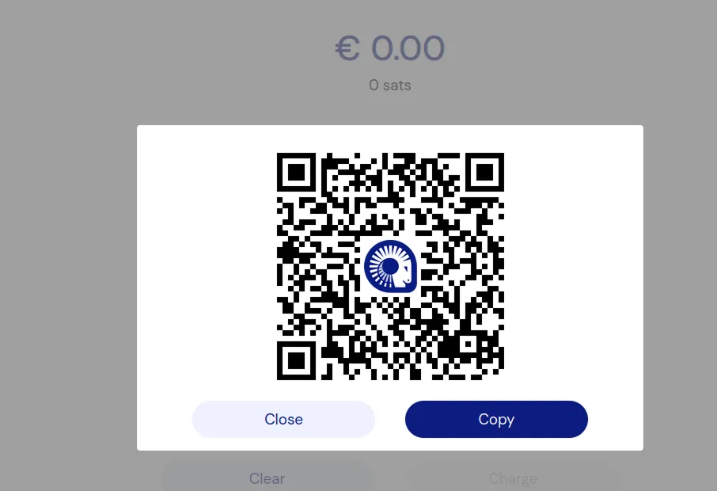

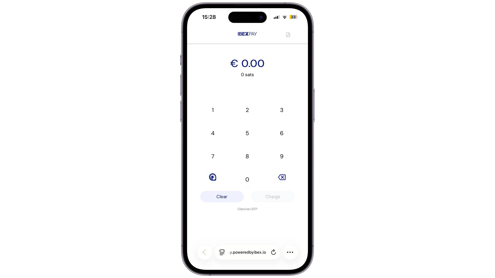

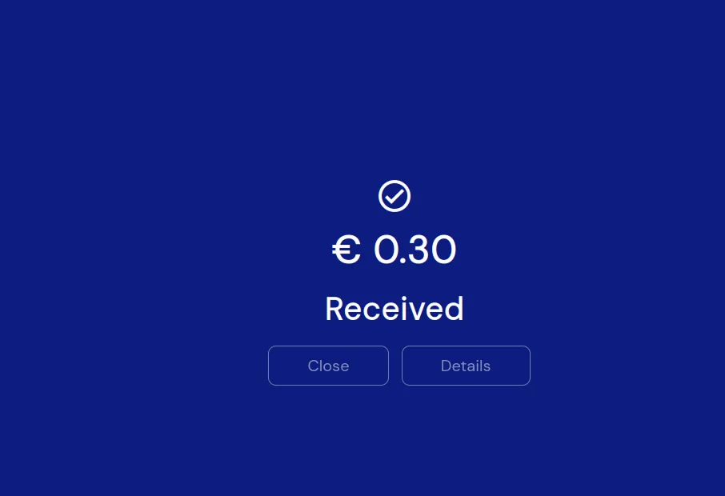

## Integrointi verkkokauppoihin

IbexPay ei rajoitu fyysisiin myymälöihisi. **Integrations**-valikosta löydät kaikki IbexPayhin liittyvät verkkokauppa-alustat ja maksuratkaisut. Erityisesti voit yhdistää IbexPay-tilisi :

- API räätälöityä sähköisen kaupankäynnin sivustoa varten ;
- WooCommerce ;
- Shopify;
- Zaprite;
- TiloPay;
- ja IbexPay-lahjoitussivut.

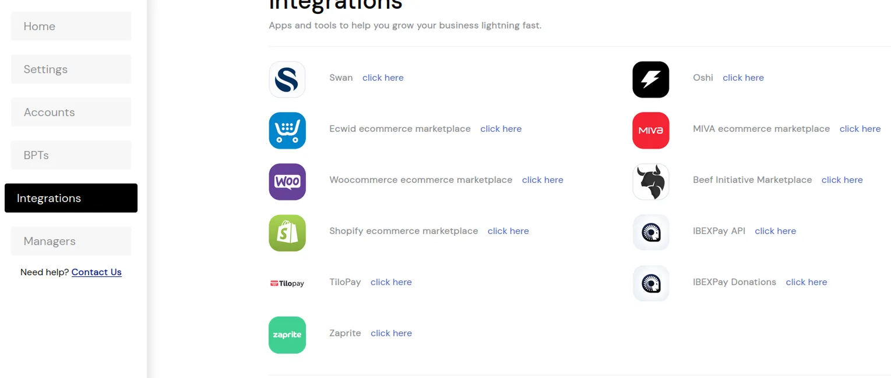

Sinulla on nyt työkalu, jonka avulla voit hyväksyä Bitcoin:n yrityksessäsi vain muutamassa minuutissa. Jos haluat mieluummin itsesäilytysratkaisuja, katso oppaita työkaluista, kuten Breez POS :

https://planb.academy/tutorials/business/point-of-sale/breez-pos-76d6bf36-f4b5-422e-8579-edf149021525

Tutustu myös kattavaan BIZ 101 -kurssimme yrityksille, jotta voit oppia parhaita käytäntöjä, jotka liittyvät Bitcoin-maksuihin, ja ymmärtää, miten hallita tehokkaasti kassavirtaa, kun integroit Bitcoin liiketoimintaasi:

https://planb.academy/courses/a804c4b6-9ff5-4a29-a530-7d2f5d04bb7a