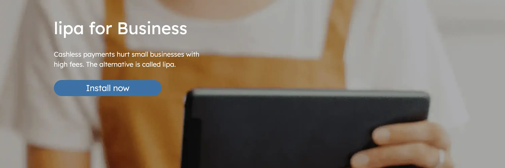
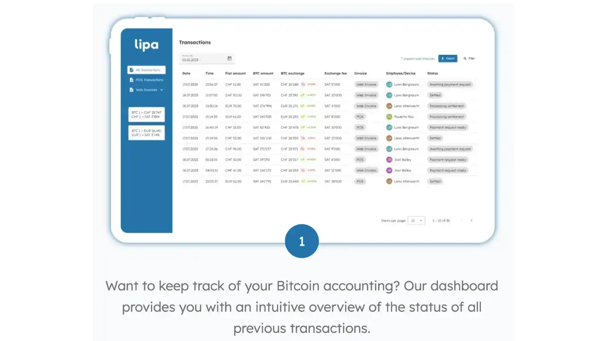
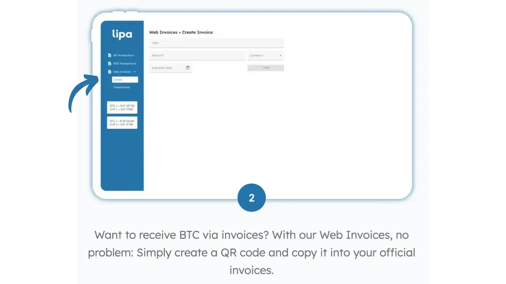
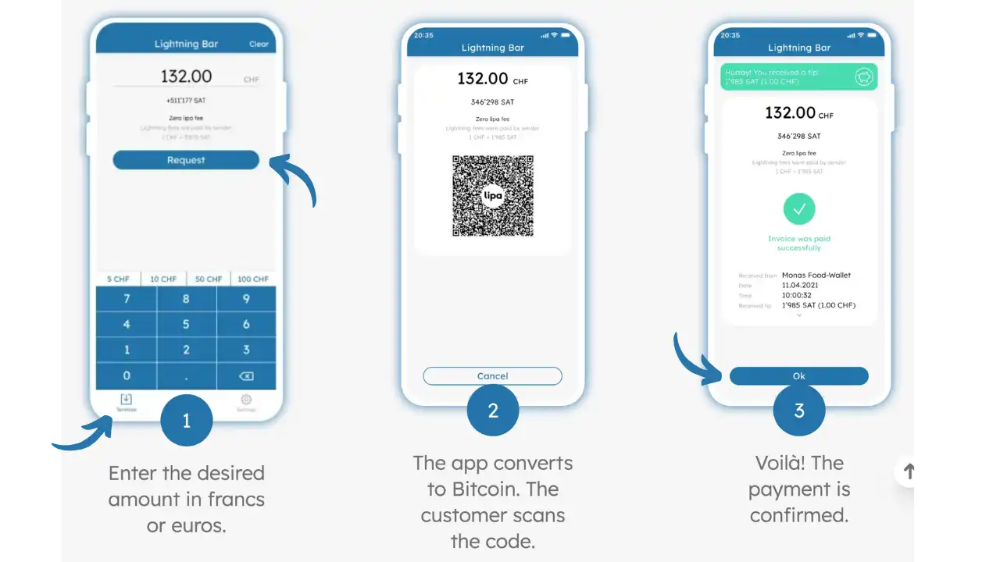

Les commerçants ont aujourd'hui un intérêt croissant à accepter des paiements Bitcoin via le Lightning Network. Contrairement aux paiements par carte bancaire traditionnels, qui impliquent des frais élevés et des délais de règlement, les transactions Lightning sont quasi instantanées, ne subissent pas de rétrofacturations et préservent la confidentialité des clients.

Pour qu'un commerce puisse adopter Bitcoin facilement, la solution de paiement doit rester simple avec une interface de caisse intuitive, offrir des fonctions multi-utilisateurs et proposer idéalement une conversion automatique en monnaie locale pour atténuer la volatilité.

**Lipa for Business** répond précisément à ces besoins. Il s'agit d'une solution suisse développée par Lightning Payment Services AG, conçue pour permettre aux commerçants d'accepter les paiements Bitcoin Lightning de manière simple et efficace, tout en restant non-custodial.

*Note : Les captures d'écran utilisées dans ce tutoriel sont tirées du site officiel Lipa for Business (lipa.swiss/en/for-business) et sont utilisées à des fins éducatives.*

## Présentation de Lipa for Business

Lipa for Business est une application mobile qui fonctionne comme une caisse enregistreuse Bitcoin et Lightning. Elle propose une interface épurée pour encaisser des paiements en sats et intègre des fonctionnalités professionnelles : accès employés, exports comptables, tableau de bord web, le tout sans jamais prendre possession de vos fonds.

### Fonctionnalités clés

**Paiements Lightning instantanés** : Génération de factures Bitcoin Lightning en quelques secondes, assurant des transactions quasi instantanées sans intermédiaire bancaire. Les frais sont minimes et transparents comparés aux solutions traditionnelles.

**Interface POS intuitive** : L'application fournit une interface de point de vente claire, pensée pour être utilisée facilement en boutique. Saisissez le montant en devise locale, l'app affiche immédiatement le montant en BTC et un QR code de paiement. Compatible avec tous les wallets Lightning du marché.

**Gestion multi-employés** : Tous les employés peuvent utiliser l'application pour encaisser, sans avoir accès aux fonds. Le propriétaire conserve le contrôle total, tandis que la synchronisation cloud assure qu'aucune transaction n'est perdue. Chaque employé reçoit un accès distinct via QR code d'invitation.

**Conversion automatique en CHF** : Pour les commerçants suisses, Lipa offre la conversion instantanée des ventes en francs suisses sur compte bancaire. Cette option est facultative : vous pouvez conserver les paiements en Bitcoin (sans frais) ou les convertir en CHF/EUR moyennant 0,98 % de commission.

**Tableau de bord web** : Interface d'administration accessible via dashboard.lipa.swiss permettant de consulter toutes les transactions, filtrer par période ou employé, et exporter les données comptables au format CSV. Le dashboard permet également de générer des factures web avec QR codes directement depuis l'interface.

## Création d'un compte

⚠️ **Important** : L'installation de l'application nécessite d'être résident suisse. Cette restriction géographique s'applique pour des raisons de conformité réglementaire.

Pour utiliser Lipa for Business, créez d'abord un compte marchand dédié :

- Rendez-vous sur lipa.swiss/for-business et téléchargez l'application correspondant à votre plateforme (Android ou iOS)
- Installez "lipa wallet for business" depuis Google Play ou l'App Store
- Au premier lancement, renseignez les détails de votre entreprise : nom du commerce, email de contact, téléphone et adresse professionnelle
- L'email sert d'identifiant principal pour accéder au tableau de bord web

Une fois le formulaire soumis, Lipa crée votre espace marchand. Une brève vérification manuelle peut être effectuée (processus KYC simplifié) avant activation définitive. L'activation se fait généralement sous 24 heures, mais les délais peuvent varier.

**Important** : Aucune liaison avec un compte bancaire n'est exigée pour commencer à encaisser en Bitcoin. Les informations bancaires ne sont nécessaires que si vous optez pour la conversion automatique en CHF.

## Installation et interface

**Application mobile** : Disponible sur smartphone et tablette Android/iOS. L'interface a été pensée pour une utilisation en point de vente avec des éléments bien lisibles et des interactions limitées au nécessaire. Un bouton "Encaisser un paiement" donne accès à l'écran de saisie du montant.

**Pré-requis techniques** : Connexion Internet stable requise (3G minimum) pour traiter les paiements Lightning en temps réel.

**Tableau de bord web** : Tableau de bord gratuit accessible via dashboard.lipa.swiss. Connexion sécurisée par email (magic link sans mot de passe). L'interface présente toutes vos transactions avec détails complets : date, montant BTC/fiat, taux de change, employé, etc. Export CSV pour intégration comptable.

Le dashboard permet également de générer des factures web avec QR codes directement depuis l'interface :

**Multi-terminaux** : Support natif de plusieurs terminaux au sein d'une entreprise. Ajoutez de nouveaux appareils en créant des employés via QR code d'invitation. Chaque terminal est lié au même wallet marchand tout en conservant une traçabilité par caissier.

## Accepter un paiement

Le processus d'encaissement est similaire à une transaction classique :

- **Saisie du montant** : Sur l'écran de paiement, indiquez le montant en monnaie locale (CHF ou EUR). Exemple : pour un café à 4,50 CHF, entrez 4.50
- **Génération de facture** : L'application convertit instantanément le montant en satoshis au taux actuel et génère une facture Lightning sous forme de QR code
- **Paiement client** : Le client scanne le QR code avec son wallet Lightning et valide le paiement
- **Confirmation** : Le paiement est confirmé en quelques secondes avec affichage visuel de succès

## Outils professionnels

**Historique et statistiques** : Chaque paiement est enregistré avec détails complets. Le dashboard offre une vue d'ensemble avec filtres par période ou employé, comparable à un système de caisse classique.

**Exports comptables** : Export des données au format CSV/Excel avec toutes les informations nécessaires (taux de change, ID transaction) pour intégration dans vos logiciels comptables.

**Gestion employés** : Ajout/suppression d'utilisateurs autorisés via dashboard. Chaque employé reçoit un accès distinct avec traçabilité des transactions. Révocation possible à tout moment.

**Sauvegarde** : Compte marchand non-custodial avec phrase de récupération de 24 mots à conserver précieusement. Seul le propriétaire du wallet principal doit gérer cette sauvegarde - les employés n'y ont pas accès.

## Conversion automatique CHF

**Disponibilité** : Service offert aux commerçants suisses avec règlement en CHF (EUR prévu selon disponibilité).

**Configuration** : Choix entre réception en Bitcoin (gratuit) ou conversion fiat via partenaire financier. Si conversion CHF, renseigner un IBAN pour les virements.

**Frais** : 0,98 % de commission sur les montants convertis (contre 0 % pour les paiements conservés en BTC). Pas d'autres frais cachés ni d'abonnement.

**Fonctionnement** : Le montant reçu est immédiatement vendu au taux marché puis transféré sur votre compte bancaire. Virement selon délais bancaires standards de votre établissement.

**Flexibilité** : Option réversible à tout moment dans les paramètres. Permet de tester en mode "conversion fiat" puis passer en 100 % BTC une fois à l'aise.

## Sécurité et confidentialité

**Non-custodial** : Vous gardez le contrôle permanent des fonds reçus. Une paire de clés privée/publique est générée lors de la configuration (d'où la phrase de 24 mots). Lipa ne stocke pas vos clés privées.

**Sécurité employés** : Les employés ne peuvent que créer des factures, pas dépenser les fonds. En cas de problème sur un terminal, vos fonds restent sécurisés et vous pouvez révoquer l'accès.

**Confidentialité clients** : Paiements Lightning pseudonymes sans données personnelles attachées. Contraste avec les paiements par carte qui passent par des réseaux centralisés.

**Authentification** : Dashboard accessible via magic link email. Application mobile protégeable par PIN ou biométrie.

## Cas d'usage recommandés

- **Restauration** : Bars, restaurants, cafés pour accepter additions en Bitcoin avec gestion pourboires
- **Commerce de détail** : Épiceries, boulangeries pour élargir moyens de paiement sans frais fixes  
- **Vendeurs nomades** : Food trucks, marchés, festivals avec simple smartphone
- **Événements** : Stands temporaires avec solution prête à l'emploi
- **Services** : Consultants, artisans pour facturation ponctuelle en Bitcoin

## Avantages et limites

### Avantages
- Interface simple ne nécessitant aucune compétence technique
- Solution non-custodiale avec contrôle total des fonds
- Gestion multi-employés avec traçabilité
- Export comptable et dashboard web inclus
- Option conversion automatique CHF pour commerçants suisses
- Frais transparents : 0 % Bitcoin, 0,98 % conversion fiat
- Positionnement comme entreprise innovante dans l'écosystème Bitcoin
- Protection contre l'inflation et la dévaluation monétaire
- Système de paiement résistant à la censure et décentralisé

### Limites
- Support Lightning uniquement (pas de Bitcoin on-chain)
- Conversion fiat limitée à la Suisse actuellement
- Nécessite que les clients aient un wallet Lightning compatible
- QR codes statiques non disponibles actuellement
- Connexion Internet obligatoire pour toutes les transactions

## Conclusion

Lipa for Business se positionne comme une solution complète pour accepter Bitcoin en magasin. Aucune infrastructure coûteuse n'est nécessaire (un simple smartphone suffit), les frais sont faibles et fixes, et l'intégration dans les processus existants est facilitée.

Le caractère non-custodial et respectueux de la vie privée, combiné à des outils de gestion professionnels, en fait un choix attrayant pour les commerçants souhaitant adopter Bitcoin tout en conservant simplicité et sécurité.

## Ressources

- [Site officiel Lipa for Business](https://lipa.swiss/en/for-business)
- [Dashboard web](https://dashboard.lipa.swiss)
- [Support Lipa for Business](https://help.lipa.swiss/business)
- [Support général Lipa](https://help.lipa.swiss/wallet)
- [LinkedIn Lipa](https://www.linkedin.com/company/getlipa)
- [Twitter @lipa_btc](https://twitter.com/lipa_btc)