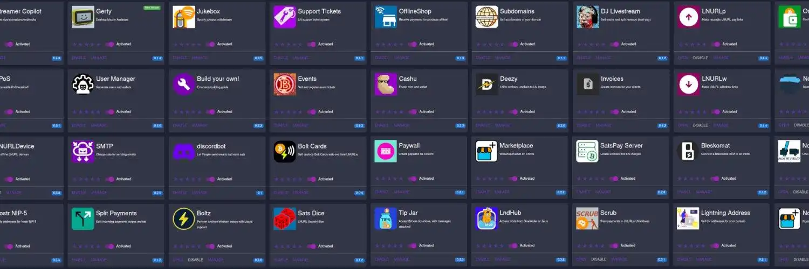


LNbits एक ओपन सोर्स वेब इंटरफ़ेस है जो किसी भी लाइटनिंग बैकएंड (LND, Core Lightning, Phoenixd) को एक संपूर्ण सेवा प्लेटफ़ॉर्म में बदल देता है। यह स्व-होस्टेड समाधान आपको अपने फंड पर पूर्ण नियंत्रण बनाए रखते हुए, अलग-अलग कई लाइटनिंग पोर्टफ़ोलियो प्रबंधित करने, बिक्री केंद्र स्थापित करने, दान प्रणालियाँ या बिलिंग सेवाएँ बनाने में सक्षम बनाता है।


यह ट्यूटोरियल दो इंस्टॉलेशन विधियों को कवर करता है: **फ़ीनिक्सडी के साथ वीपीएस उबंटू** (पूर्ण Bitcoin नोड के बिना हल्का समाधान) और **अम्ब्रेल** (आपके मौजूदा LND नोड के साथ एकीकरण)। प्लान ₿ अकादमी के सामान्य LNbits ट्यूटोरियल के विपरीत, जो अवधारणाओं और एक्सटेंशन को कवर करता है, यह गाइड चरण-दर-चरण तकनीकी इंस्टॉलेशन प्रक्रियाओं पर केंद्रित है।


## एलएनबिट्स क्या है?


LNbits, Python (FastAPI) में विकसित एक लाइटनिंग अकाउंटिंग सिस्टम है जो किसी मौजूदा बैकएंड (LND, Core Lightning, Phoenixd) से जुड़ता है। पारंपरिक लाइटनिंग नोड्स के विपरीत, LNbits अपनी API कुंजियों के साथ कई अलग-अलग पोर्टफ़ोलियो प्रबंधित करने के लिए एक सुलभ इंटरफ़ेस प्रदान करता है। आप अपने परिवार, कर्मचारियों या परियोजनाओं के लिए उप-खाते बना सकते हैं, बिना उन्हें अपने सभी फंड तक पहुँच दिए।


अलग किया गया आर्किटेक्चर जानकारी को SQLite (डिफ़ॉल्ट) या PostgreSQL (उत्पादन) में संग्रहीत करता है, जबकि धन आपके लाइटनिंग बैकएंड द्वारा प्रबंधित रहता है। यह पृथक्करण पोर्टेबिलिटी की गारंटी देता है: आप अपना उपयोगकर्ता डेटा खोए बिना Phoenixd से LND में माइग्रेट कर सकते हैं।


## प्रमुख विशेषताऐं


एलएनबिट्स एक बहुमुखी विस्तार प्रणाली प्रदान करता है: टीपीओएस (बिक्री का बिंदु), पेवॉल (सामग्री मुद्रीकरण), इवेंट्स (टिकटिंग), एलएनडीहब (ब्लूवॉलेट के लिए सर्वर), जीडब्ल्यू-6 कार्ड (एनएफसी भुगतान), स्प्लिट पेमेंट्स (स्वचालित वितरण), और उपयोगकर्ता प्रबंधक (प्रमाणीकरण के साथ उपयोगकर्ता प्रबंधन)।


**डैशबोर्ड** वास्तविक समय में शेष राशि, लेन-देन इतिहास और बिलिंग टूल प्रदर्शित करता है। प्रत्येक wallet में एक विशिष्ट URL होता है जिसमें उसकी API कुंजियाँ होती हैं, जिससे पारंपरिक लॉगिन के बिना भी पहुँच संभव होती है। तीन-स्तरीय API कुंजी प्रणाली** (एडमिन, इनवॉइस, रीड-ओनली) सुरक्षित एकीकरण के लिए अनुमतियों का विस्तृत नियंत्रण प्रदान करती है।


LNbits मूल रूप से **LNURL** (LNURL-भुगतान, LNURL-निकासी, LNURL-प्रमाणन) को क्रियान्वित करता है और **लाइटनिंग Address** का समर्थन करता है, जो आधुनिक लाइटनिंग वॉलेट्स के साथ संगतता की गारंटी देता है और पेशेवर सेवाओं की तैनाती को सुविधाजनक बनाता है।


## समर्थित प्लेटफ़ॉर्म


**उबंटू वीपीएस**: पूर्ण Bitcoin नोड के बिना हल्का समाधान। पूर्वापेक्षाएँ: 1 vCPU, 1-2 GB RAM, उबंटू 22.04 LTS, पायथन 3.10+, Git, UV। सार्वजनिक प्रदर्शन (LNURL सेवाएँ) के लिए HTTPS + डोमेन नाम आवश्यक है।


**अम्ब्रेल**: ऐप स्टोर से आसान इंस्टॉलेशन। पूर्वापेक्षा: सिंक्रोनाइज़्ड LND और ओपन चैनल्स के साथ कार्यात्मक अम्ब्रेल नोड। स्वचालित कॉन्फ़िगरेशन।


नीचे हमारे अम्ब्रेल और अम्ब्रेल LND ट्यूटोरियल के लिंक दिए गए हैं:


https://planb.academy/tutorials/node/bitcoin/umbrel-8b0e3b5b-d3cf-4a1e-8bb8-1ad2db4dd848

https://planb.academy/tutorials/node/lightning-network/umbrel-lnd-b12e0b5b-12ff-45f1-978e-62f4b4a8ba16

## फीनिक्सडी के साथ उबंटू वीपीएस पर स्थापना


### चरण 1: VPS सर्वर को सुरक्षित करना


**किसी भी इंस्टॉलेशन से पहले**, आपको अपने Ubuntu VPS सर्वर को तकनीकी नियमों के अनुसार सुरक्षित करना होगा। यह कदम आपके इंफ्रास्ट्रक्चर और आपके लाइटनिंग फंड्स की सुरक्षा के लिए **महत्वपूर्ण** है।


आरंभ करने में आपकी सहायता के लिए यहां एक विस्तृत मार्गदर्शिका दी गई है: **[प्रारंभिक उबंटू सर्वर कॉन्फ़िगरेशन - चरण-दर-चरण मार्गदर्शिका](https://danielpcostas.dev/ubuntu-server-initial-configuration-a-step-by-step-guide/)** डैनियल पी. कोस्टास द्वारा।


यह मार्गदर्शिका उपयोगकर्ता कॉन्फ़िगरेशन, सुरक्षित SSH, फ़ायरवॉल (UFW), फ़ेल2बैन, स्वचालित अपडेट और अच्छे सिस्टम सुरक्षा अभ्यासों को कवर करती है।


### चरण 2: फीनिक्सडी स्थापित करना


आपका सर्वर सुरक्षित हो जाने के बाद, आपको फ़ीनिक्सड को इंस्टॉल और कॉन्फ़िगर करना होगा। प्लान ₿ अकादमी इंस्टॉलेशन, seed जनरेशन और systemd सेवा कॉन्फ़िगरेशन पर एक व्यापक समर्पित ट्यूटोरियल प्रदान करती है:


https://planb.academy/tutorials/node/lightning-network/phoenixd-beb86edd-f9c0-4bec-ad36-db234c88e7b1

एक बार जब फीनिक्सड चालू हो जाए (`./phoenix-cli getinfo` से जांच करें), तो `~/.phoenix/phoenix.conf` में **HTTP पासवर्ड** नोट कर लें - आपको फीनिक्सड से LNbits को कनेक्ट करने के लिए इसकी आवश्यकता होगी।


### LNbits परिनियोजन


UV स्थापित करें और LNbits क्लोन करें:


```bash
curl -LsSf https://astral.sh/uv/install.sh | sh
export PATH="$HOME/.local/bin:$PATH"
git clone https://github.com/lnbits/lnbits.git && cd lnbits
uv sync --all-extras
```


फीनिक्सड बैकएंड को कॉन्फ़िगर करें:


```bash
cp .env.example .env && nano .env
```


`.env` में जोड़ें:


```
LNBITS_BACKEND_WALLET_CLASS=PhoenixdWallet
PHOENIXD_API_ENDPOINT=http://127.0.0.1:9740
PHOENIXD_API_PASSWORD=<mot-de-passe-phoenix.conf>
```


`uv run lnbits --host 0.0.0.0 --port 5000` के साथ परीक्षण करें, फिर `Wants=phoenixd.service` के साथ systemd सेवा बनाएं।


## प्रारंभिक सेटअप और पहला उपयोग


### सुपरयूज़र सक्रियण


`.env` में व्यवस्थापक इंटरफ़ेस सक्रिय करें:


```
LNBITS_ADMIN_UI=true
```


LNbits को पुनः आरंभ करें (`sudo systemctl restart lnbits`) और सुपरयूजर आईडी प्राप्त करें:


```bash
cat ~/lnbits/data/.super_user
```


प्रशासन पैनल के लिए `http://<IP-VPS>:5000/wallet?usr=<SuperUserID>` पर जाएँ। "सर्वर" मेनू आपको फंडिंग स्रोतों, एक्सटेंशन और उपयोगकर्ता खातों को कॉन्फ़िगर करने देता है।


### सुरक्षित खाता निर्माण


**सार्वजनिक प्रदर्शन के लिए महत्वपूर्ण**: यदि आप अपने LNbits इंस्टैंस को इंटरनेट से सुलभ सार्वजनिक डोमेन नाम पर प्रदर्शित कर रहे हैं, तो उपयोगकर्ता खातों के निःशुल्क निर्माण को अक्षम करना महत्वपूर्ण है।


सुपरयूज़र एडमिनिस्ट्रेशन इंटरफ़ेस से, "सेटिंग्स" और फिर "यूज़र मैनेजमेंट" सेक्शन में जाएँ। वहाँ आपको "नए यूज़र्स बनाने की अनुमति दें" विकल्प मिलेगा।


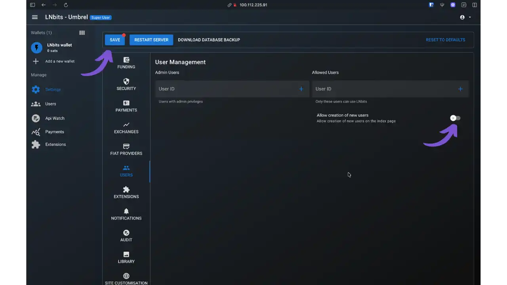


**डोमेन नाम के साथ सार्वजनिक प्रदर्शनी के लिए** :


- आपको "नए उपयोगकर्ताओं के निर्माण की अनुमति दें" विकल्प को अक्षम करना होगा**
- इस सुरक्षा के बिना, इंटरनेट पर कोई भी आपके इंस्टेंस पर खाता बना सकता है
- एक हमलावर आपके खाते बना सकता है और आपकी जानकारी के बिना आपके लाइटनिंग नोड की तरलता का उपयोग कर सकता है
- आपको सुपरयूज़र इंटरफ़ेस से मैन्युअल रूप से उपयोगकर्ता खाते बनाने होंगे


**केवल स्थानीय उपयोग के लिए** :


- यदि आपका इंस्टैंस केवल स्थानीय रूप से सुलभ है तो यह विकल्प कम महत्वपूर्ण है (http://localhost:5000)
- हालाँकि, इस विकल्प को अक्षम करना एक अच्छा सामान्य सुरक्षा अभ्यास है


एक बार कॉन्फ़िगर हो जाने के बाद, केवल सुपरयूज़र एडमिनिस्ट्रेटर ही "यूज़र्स" इंटरफ़ेस के ज़रिए नए यूज़र अकाउंट बना सकता है। यह तरीका इस बात पर पूरा नियंत्रण सुनिश्चित करता है कि कौन आपके लाइटनिंग इंफ्रास्ट्रक्चर तक पहुँच सकता है और आपके फंड का इस्तेमाल कर सकता है।


### पहला चैनल खोलना


फीनिक्सड ऑटो-लिक्विडिटी के माध्यम से चैनलों का स्वतः प्रबंधन करता है। LNbits से ~30,000 sats का लाइटनिंग इनवॉइस जनरेट करें और उसका भुगतान अन्य wallet से करें। फीनिक्सड स्वचालित रूप से ACINQ के लिए एक चैनल खोलता है। प्रारंभिक शुल्क (~20-23 हज़ार sats) काट लिया जाता है, शेष राशि (~7-10 हज़ार sats) on-chain पुष्टिकरण के बाद दिखाई देती है।


`./phoenix-cli getinfo` से स्थिति की जाँच करें। फिर चैनल ओपनिंग को नियंत्रित करने के लिए ऑटो-लिक्विडिटी (`phoenix.conf` में `auto-liquidity=off`) को अक्षम करने पर विचार करें।


### सार्वजनिक प्रदर्शन और HTTPS


**महत्वपूर्ण**: सार्वजनिक प्रदर्शन के लिए HTTPS अनिवार्य है (API कुंजी सुरक्षा + LNURL संगतता)। केवल स्थानीय उपयोग के लिए इस चरण को छोड़ दें।


**कैडी (अनुशंसित)**: स्वचालित SSL. `sudo apt install -y caddy`, `/etc/caddy/Caddyfile` संपादित करें:


```
votre-domaine.com {
reverse_proxy 127.0.0.1:5000
}
```


पुनः आरंभ करें: `sudo systemctl restart caddy`.


**Nginx** : अधिक नियंत्रण। `nginx certbot python3-certbot-nginx` स्थापित करें, `/etc/nginx/sites-available/lnbits` बनाएँ:


```nginx
server {
listen 80;
server_name votre-domaine.com;
location / {
proxy_pass http://127.0.0.1:5000;
proxy_set_header Host $host;
proxy_set_header X-Forwarded-Proto $scheme;
}
}
```


सक्रिय करें: `sudo ln -s /etc/nginx/sites-available/lnbits /etc/nginx/sites-enabled/ && sudo nginx -t && sudo systemctl reload nginx && sudo certbot --nginx -d your-domain.com`


`.env` में जोड़ें: `FORWARDED_ALLOW_IPS=*`


## छाता स्थापना


### ऐप स्टोर से परिनियोजन


अम्ब्रेल ऐप स्टोर पर जाएं, "LNbits" खोजें, और "इंस्टॉल" पर क्लिक करें।


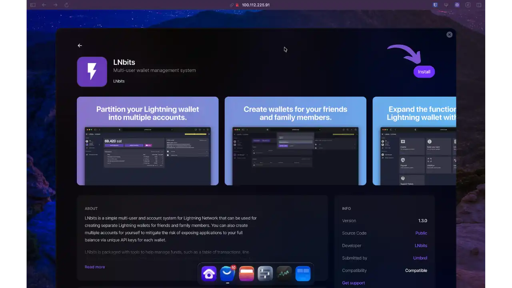


अम्ब्रेल स्वचालित रूप से आवश्यक निर्भरताओं की जाँच करता है। LNbits को काम करने के लिए लाइटनिंग नोड (LND) की आवश्यकता होती है। यदि आपका लाइटनिंग नोड पहले से ही चालू है, तो पुष्टि करने के लिए "LNbits इंस्टॉल करें" पर क्लिक करें।


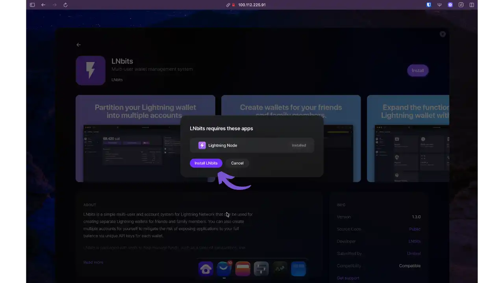


अम्ब्रेल डॉकर इमेज डाउनलोड करता है, LND के साथ स्वचालित रूप से कनेक्शन कॉन्फ़िगर करता है, और कंटेनर शुरू करता है (2-5 मिनट)। इंस्टॉलेशन पूरी तरह से बैकग्राउंड में होता है।


### प्रारंभिक सुपरयूज़र कॉन्फ़िगरेशन


पहली बार लॉन्च करने पर, LNbits आपको सुपरयूज़र एडमिनिस्ट्रेटर अकाउंट बनाने के लिए कहेगा। एडमिनिस्ट्रेशन इंटरफ़ेस तक पहुँच सुरक्षित रखने के लिए एक यूज़रनेम और सुरक्षित पासवर्ड डालें।


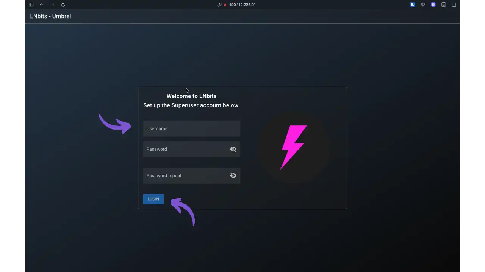


**महत्वपूर्ण**: इस सुपरयूज़र खाते को आपके LNbits इंस्टेंस पर पूर्ण अधिकार प्राप्त हैं। एक मज़बूत पासवर्ड चुनें और उसे सुरक्षित रखें।


खाता बनाने के बाद, आपको स्वचालित रूप से मुख्य प्रशासन इंटरफ़ेस पर ले जाया जाएगा। अम्ब्रेल ने पहले ही LND को आपके फंडिंग स्रोत के रूप में सेट कर दिया है - सभी लाइटनिंग भुगतान आपके मौजूदा चैनलों के माध्यम से होंगे।


### व्यवस्थापक इंटरफ़ेस तक पहुँच


बाएं हाथ की ओर मेनू में, पूर्ण प्रशासन पैनल तक पहुंचने के लिए "सेटिंग्स" पर क्लिक करें।


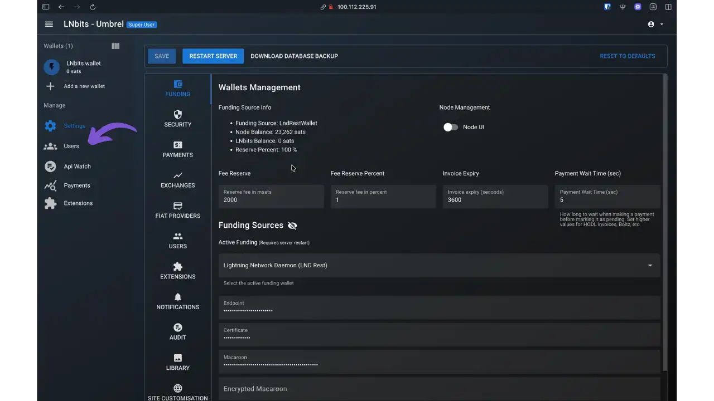


"वॉलेट प्रबंधन" अनुभाग आपके कॉन्फ़िगरेशन के बारे में महत्वपूर्ण जानकारी प्रदर्शित करता है:


- वित्तपोषण स्रोत** : LndBtcRestWallet (आपके LND अम्ब्रेल नोड से सीधा कनेक्शन)
- नोड बैलेंस** : आपके लाइटनिंग चैनलों में उपलब्ध कुल तरलता
- एलएनबिट्स बैलेंस**: एलएनबिट्स प्रणाली को आवंटित धनराशि (आरंभ में 0 sats)


अब आप अपने द्वारा बनाए गए सभी LNbits वॉलेट के लिए अपने अम्ब्रेल नोड की लिक्विडिटी का सीधे उपयोग कर सकते हैं। किसी अतिरिक्त कॉन्फ़िगरेशन की आवश्यकता नहीं है - LNbits चालू है।


### प्रयोक्ता प्रबंधन


LNbits की सबसे शक्तिशाली विशेषताओं में से एक है, कई स्वतंत्र उपयोगकर्ता बनाने की इसकी क्षमता, जिनमें से प्रत्येक के पास पासवर्ड प्रमाणीकरण और अलग-अलग वॉलेट हैं। यह आर्किटेक्चर आपके अम्ब्रेल नोड की तरलता का लाभ उठाते हुए विभिन्न उपयोगों के लिए पूरी तरह से अलग-अलग उप-खाते प्रदान करना संभव बनाता है: व्यवसाय, परिवार, कर्मचारी, परियोजनाएँ, आदि।


साइड मेनू में, उपयोगकर्ता प्रबंधन तक पहुँचने के लिए "उपयोगकर्ता" पर क्लिक करें। नया उपयोगकर्ता जोड़ने के लिए "खाता बनाएँ" पर क्लिक करें।


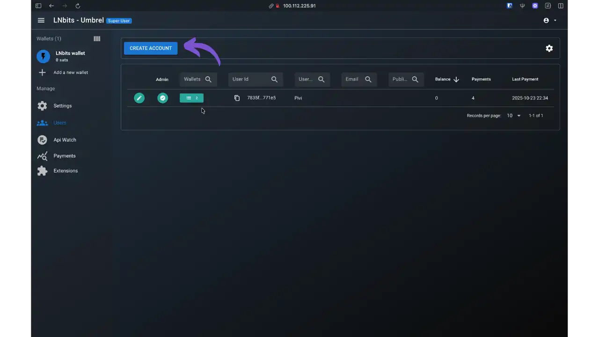


उपयोगकर्ता निर्माण फ़ॉर्म भरें:


- उपयोगकर्ता नाम**: लॉगिन उपयोगकर्ता नाम (उदाहरण: "satoshi")
- पासवर्ड सेट करें**: प्रमाणीकरण पासवर्ड सेट करने के लिए इस विकल्प को सक्रिय करें
- पासवर्ड** और **पासवर्ड दोहराएँ**: इस उपयोगकर्ता के लिए पासवर्ड सेट करें


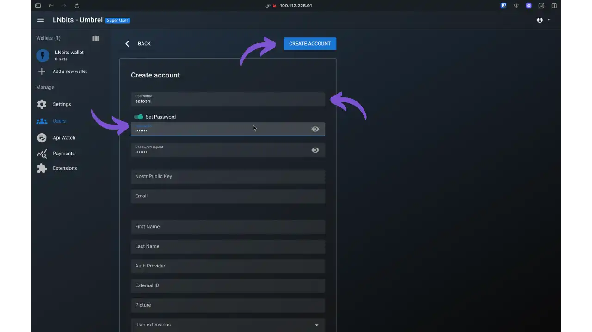


न्यूनतम कॉन्फ़िगरेशन के लिए वैकल्पिक फ़ील्ड (नोस्ट्र पब्लिक की, ईमेल, प्रथम नाम, अंतिम नाम) खाली छोड़े जा सकते हैं। पुष्टि करने के लिए "खाता बनाएँ" पर क्लिक करें।


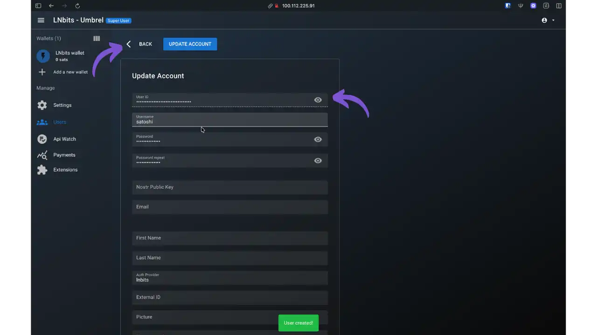


आपका नया उपयोगकर्ता अब अपने विशिष्ट पहचानकर्ता और उपयोगकर्ता नाम के साथ उपयोगकर्ताओं की सूची में दिखाई देगा।


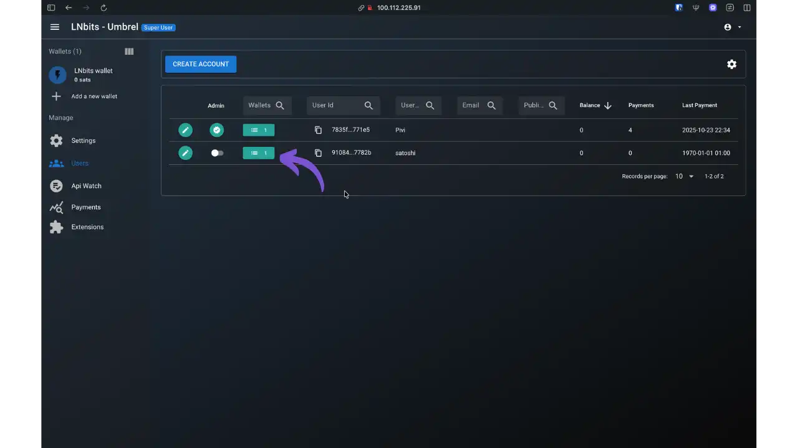


**महत्वपूर्ण बिंदु**: प्रत्येक उपयोगकर्ता अपने पासवर्ड से पूरी तरह स्वतंत्र रूप से लॉग ऑन कर सकता है। सुपरयूज़र व्यवस्थापक, प्रशासन इंटरफ़ेस के माध्यम से पूर्ण नियंत्रण बनाए रखता है।


### उपयोगकर्ता wallet प्रबंधन


अब जब "satoshi" उपयोगकर्ता बन गया है, तो आपको उसे wallet लाइटनिंग असाइन करना होगा। संबंधित उपयोगकर्ता के लिए wallet आइकन (दूसरा आइकन) पर क्लिक करें, फिर "नया वॉलेट बनाएँ" पर क्लिक करें।


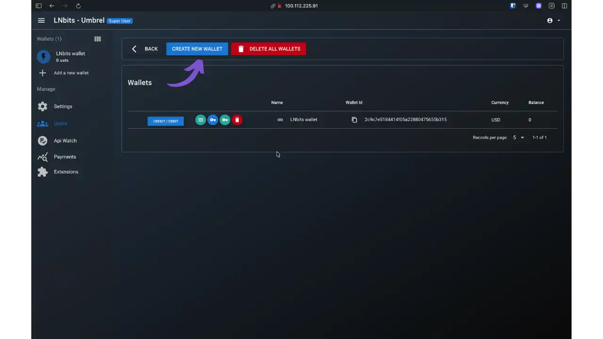


एक डायलॉग बॉक्स आपको wallet का नाम देने के लिए कहेगा। एक वर्णनात्मक नाम दर्ज करें (जैसे, "Wallet या Satoshi") और प्रदर्शित मुद्रा (CUC, USD, EUR, आदि) चुनें।


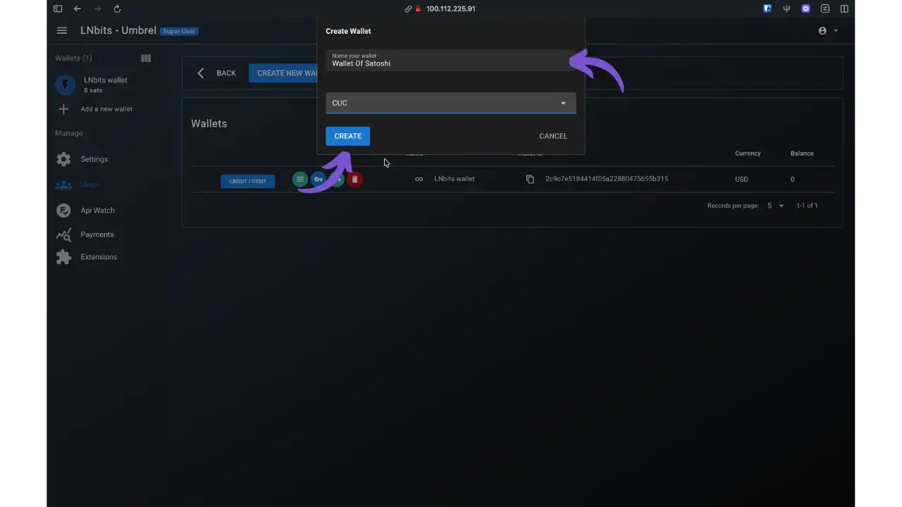


"CREATE" पर क्लिक करें। LNbits तुरन्त इस उपयोगकर्ता के लिए एक कार्यशील wallet लाइटनिंग उत्पन्न करता है।


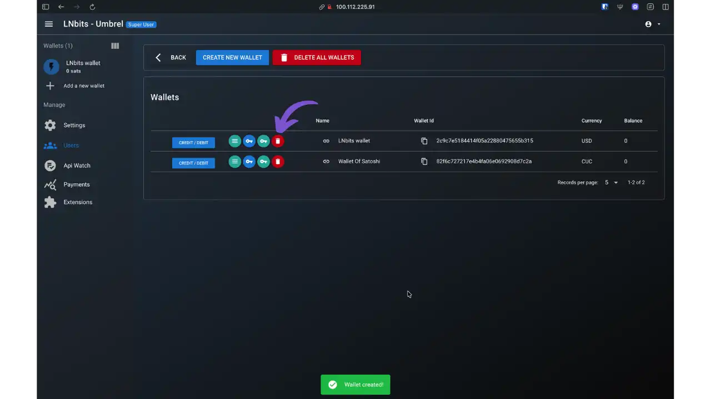


अब आपको दो मौजूदा वॉलेट दिखाई देंगे: डिफ़ॉल्ट wallet "LNbits wallet" जो अपने आप बना है, और नया "Wallet Of Satoshi"। उपयोगकर्ता अनुभव को आसान बनाने के लिए, आप डिलीट आइकन (लाल ट्रैश कैन) पर क्लिक करके डिफ़ॉल्ट wallet को हटा सकते हैं।


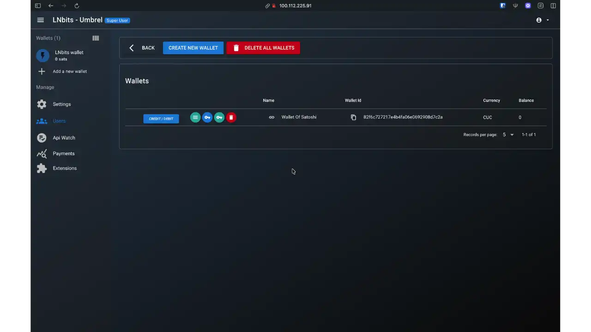


"satoshi" उपयोगकर्ता के पास अब एक एकल, स्पष्ट रूप से पहचाना गया wallet है। प्रत्येक wallet उपयोगकर्ता आपके अंतर्निहित LND नोड की तरलता का उपयोग करते हुए पूरी तरह से स्वायत्त रूप से कार्य करता है।


**मुख्य अवधारणा**: ये सभी वॉलेट आपके अम्ब्रेल नोड की वैश्विक तरलता को साझा करते हैं। आप प्रत्येक wallet के लिए नए लाइटनिंग चैनल नहीं बनाते - LNbits एक बुद्धिमान लेखा परत के रूप में कार्य करता है जो आपके मौजूदा लाइटनिंग इंफ्रास्ट्रक्चर के भीतर धन के आवंटन का प्रबंधन करता है। यही LNbits के मल्टी-wallet सिस्टम की ताकत है।


### उपयोगकर्ता लॉगिन


सुपरयूज़र खाते (ऊपर दाईं ओर आइकन) से लॉग आउट करें और LNbits लॉगिन पृष्ठ पर वापस आएँ। अब आप नए उपयोगकर्ता के क्रेडेंशियल्स से लॉग इन कर सकते हैं।


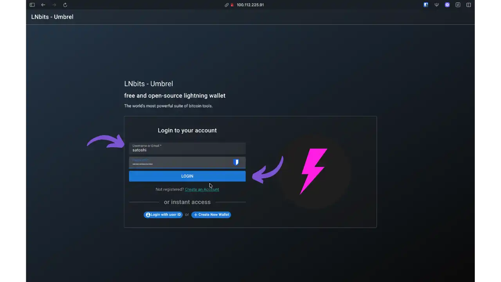


पहले से निर्धारित उपयोगकर्ता नाम ("satoshi") और पासवर्ड दर्ज करें, फिर "लॉगिन" पर क्लिक करें। उपयोगकर्ता को अपने व्यक्तिगत wallet तक सीधी पहुँच प्राप्त होती है, जो प्रशासनिक इंटरफ़ेस से पूरी तरह अलग होता है।


### wallet उपयोगकर्ता से Interface


एक बार लॉग इन करने के बाद, उपयोगकर्ता अपने संपूर्ण wallet लाइटनिंग इंटरफ़ेस तक पहुंच प्राप्त कर लेता है।


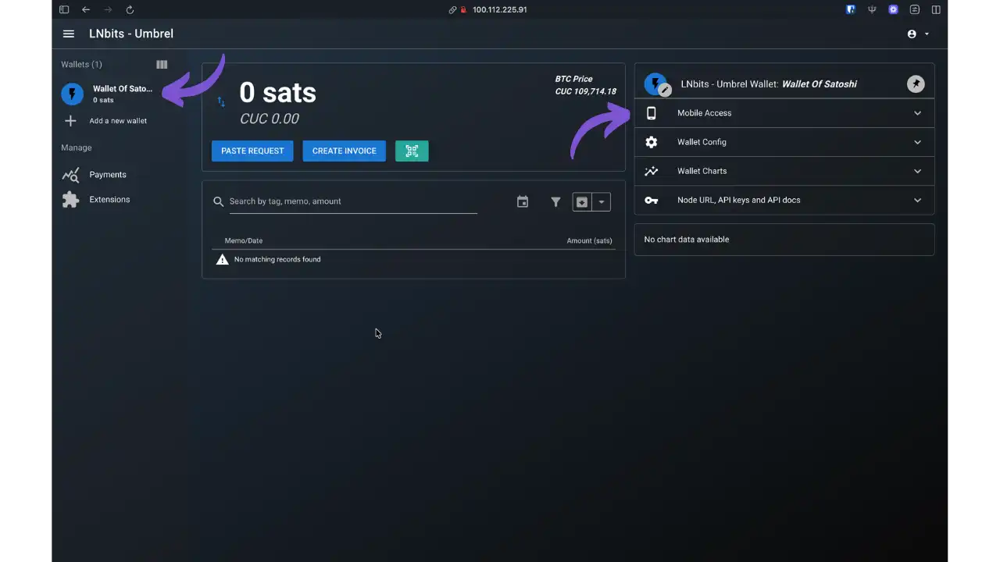


इंटरफ़ेस की विशेषताएं:


- वर्तमान शेष राशि**: sats और चुनी गई मुद्रा में प्रदर्शित (इस उदाहरण में CUC)
- मुख्य क्रियाएँ**: अनुरोध चिपकाएँ, इनवॉइस बनाएँ, QR आइकन (त्वरित स्कैन)
- लेन-देन इतिहास** : सभी भुगतानों और प्राप्तियों की पूरी सूची
- दायाँ साइड पैनल**: कॉन्फ़िगरेशन और एक्सेस विकल्प


### wallet तक मोबाइल पहुंच


दाईं ओर का पैनल एक विशेष रूप से व्यावहारिक सुविधा प्रदान करता है: wallet तक मोबाइल पहुँच। उपलब्ध विकल्पों को देखने के लिए "मोबाइल पहुँच" अनुभाग खोलें।


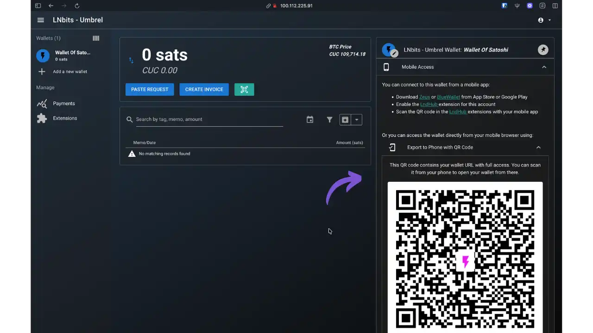


LNbits इस wallet को स्मार्टफोन पर उपयोग करने के कई तरीके प्रदान करता है:


**विकल्प 1: संगत मोबाइल एप्लिकेशन


- ऐप स्टोर या गूगल प्ले से **Zeus** या **BlueWallet** डाउनलोड करें
- इस wallet के लिए LNbits में **LndHub** एक्सटेंशन सक्रिय करें
- wallet को कनेक्ट करने के लिए मोबाइल ऐप से LndHub QR कोड स्कैन करें


**विकल्प 2: मोबाइल ब्राउज़र के माध्यम से सीधी पहुँच**


- "QR कोड के साथ फ़ोन पर निर्यात करें" में प्रदर्शित QR कोड में एकीकृत प्रमाणीकरण के साथ wallet का पूरा URL शामिल है
- wallet को सीधे अपने मोबाइल ब्राउज़र में खोलने के लिए अपने स्मार्टफ़ोन से इस QR कोड को स्कैन करें
- त्वरित पहुँच के लिए होम स्क्रीन पर पृष्ठ जोड़ें


**महत्वपूर्ण सुरक्षा**: इस URL में wallet तक पूरी पहुँच के लिए API कुंजियाँ हैं। इसे कभी भी सार्वजनिक रूप से साझा न करें। इस QR कोड का उपयोग अपनी Bitcoin निजी कुंजियों की तरह करें - इस QR कोड को स्कैन करने वाले किसी भी व्यक्ति को wallet तक पूरी पहुँच मिल जाएगी।


यह मोबाइल सुविधा आपके LNbits Umbrel इंस्टैंस को आपके और आपके मित्रों के लिए एक वास्तविक लाइटनिंग wallet सर्वर में बदल देती है, जबकि आपके स्वयं-होस्टेड नोड के कारण आपके फंड पर पूर्ण संप्रभुता बनी रहती है।


### उपयोगकर्ता पहुँच साझाकरण


इस बहु-उपयोगकर्ता कॉन्फ़िगरेशन का मुख्य उपयोग **अपने परिवार या करीबी लोगों के साथ वॉलेट साझा करना** है। एक बार जब आप एक समर्पित wallet (जैसे हमारे उदाहरण में "satoshi") वाला उपयोगकर्ता बना लेते हैं, तो आप इन लॉगिन क्रेडेंशियल्स को अपने परिवार के विश्वसनीय सदस्यों के साथ साझा कर सकते हैं।


**अम्ब्रेल पर पहुँच सुरक्षा**: अम्ब्रेल पर आपके LNbits इंस्टैंस तक पहुँच स्वाभाविक रूप से सुरक्षित है, क्योंकि इसे केवल निम्न द्वारा ही एक्सेस किया जा सकता है:


- आपके स्थानीय नेटवर्क पर**: आपके घर के सदस्य जो एक ही WiFi/ईथरनेट नेटवर्क से जुड़े हैं, वे इंस्टेंस तक पहुँच सकते हैं
- वीपीएन के माध्यम से**: यदि आप अपने अम्ब्रेल सर्वर पर कॉन्फ़िगर किए गए टेलस्केल जैसे वीपीएन का उपयोग करते हैं, तो अधिकृत उपयोगकर्ता सुरक्षित दूरस्थ पहुँच प्राप्त कर सकते हैं


सुरक्षा की यह दोहरी परत (नेटवर्क एक्सेस + उपयोगकर्ता प्रमाणीकरण) अम्ब्रेल पर "नए उपयोगकर्ताओं के निर्माण की अनुमति दें" विकल्प को कम महत्वपूर्ण बनाती है। केवल वे लोग ही लॉगिन इंटरफ़ेस तक पहुँच सकते हैं जिनके पास पहले से ही आपके नेटवर्क या वीपीएन तक पहुँच है।


**सामान्य परिदृश्य**: आप एक "पिता" खाता, एक "माँ" खाता, एक "व्यवसाय" खाता वगैरह बनाते हैं। परिवार के प्रत्येक सदस्य का अपना अलग wallet लाइटनिंग खाता होता है, और वे आपके अम्ब्रेल नोड की साझा तरलता का लाभ उठाते हैं। बस उपयोगकर्ता नाम और पासवर्ड साझा करें - फिर उपयोगकर्ता आपके स्थानीय नेटवर्क पर किसी भी डिवाइस से या आपके टेलस्केल वीपीएन के माध्यम से कनेक्ट हो सकता है। अधिक जानकारी के लिए कृपया हमारा समर्पित टेलस्केल ट्यूटोरियल देखें:


https://planb.academy/tutorials/computer-security/communication/tailscale-9acbd7de-04d9-40f6-ab80-35f0dfedb632

### उपलब्ध एक्सटेंशन देखें


सुपरयूजर इंटरफेस पर वापस लौटें और संपूर्ण LNbits एक्सटेंशन इकोसिस्टम की खोज के लिए बाएं हाथ के पैनल में "एक्सटेंशन" मेनू तक पहुंचें।


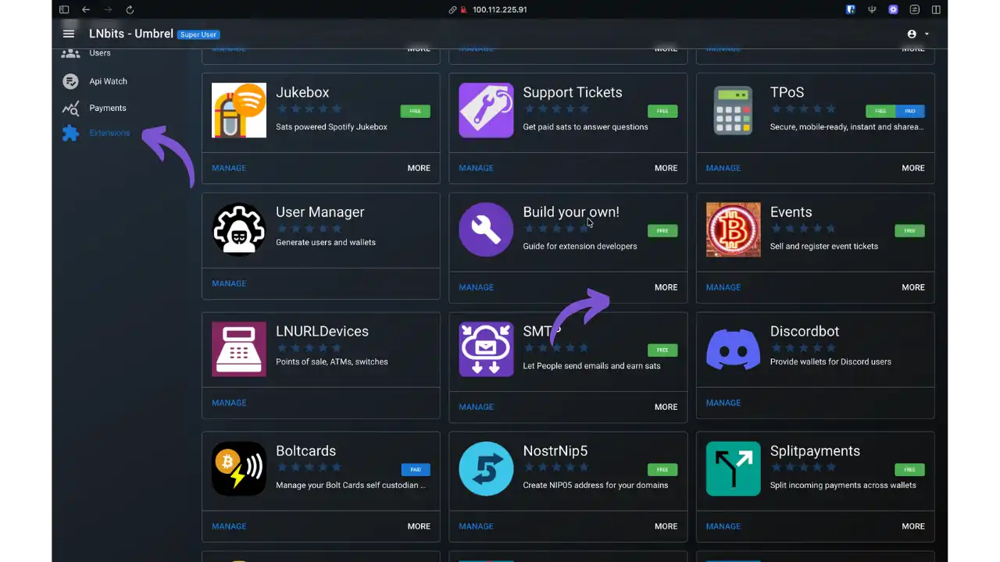


LNbits एक्सटेंशन की एक समृद्ध सूची प्रदान करता है जो आपके इंस्टैंस को एक वास्तविक लाइटनिंग सेवा प्लेटफ़ॉर्म में बदल देता है:


- ज्यूकबॉक्स**: sats-संचालित ज्यूकबॉक्स सिस्टम (स्पॉटिफ़ाई भुगतान)
- समर्थन टिकट**: सशुल्क समर्थन प्रणाली (प्रश्नों के उत्तर देने के लिए satss प्राप्त करें)
- टीपीओएस**: खुदरा विक्रेताओं के लिए सुरक्षित, मोबाइल पॉइंट-ऑफ-सेल टर्मिनल
- उपयोगकर्ता प्रबंधक**: उन्नत उपयोगकर्ता और wallet प्रबंधन (जिसका हमने अभी उपयोग किया है)
- कार्यक्रम**: कार्यक्रम टिकटों की बिक्री और सत्यापन
- LNURLDevices**: बिक्री केंद्र प्रबंधन, एटीएम, कनेक्टेड स्विच
- SMTP**: उपयोगकर्ताओं को ईमेल भेजने और संतुष्टि अर्जित करने में सक्षम बनाता है
- बोल्टकार्ड्स**: लाइटनिंग टैप-टू-पे भुगतानों के लिए एनएफसी कार्ड प्रोग्रामिंग
- NostrNip5**: अपने डोमेन के लिए NIP5 पते बनाएँ
- स्प्लिटपेमेंट्स**: कई वॉलेट्स के बीच भुगतानों का स्वचालित वितरण


प्रत्येक एक्सटेंशन इस इंटरफ़ेस से एक क्लिक से सक्रिय हो जाता है। "मुफ़्त" चिह्नित एक्सटेंशन निःशुल्क हैं, जबकि कुछ "भुगतान" संस्करणों के रूप में उपलब्ध हैं। अपनी ज़रूरतों के अनुरूप एक्सटेंशन चुनने के लिए कैटलॉग देखें - चाहे वह व्यवसाय के लिए हो, पारिवारिक प्रबंधन के लिए हो, या Lightning Network की क्षमताओं के साथ प्रयोग करने के लिए हो।


## लाभ और सीमाएँ


**लाभ**: वित्तीय संप्रभुता (धन/कुंजी/डेटा का पूर्ण नियंत्रण), वास्तुशिल्प लचीलापन (दोषरहित VPS→full node माइग्रेशन), पेशेवर विस्तार प्रणाली, सहज ज्ञान युक्त इंटरफ़ेस।


**सीमाएँ** : बीटा में सॉफ्टवेयर (मात्रा पर सावधानी), प्रशासक की जिम्मेदारी के तहत सुरक्षा, संवेदनशील API कुंजी (HTTPS अनिवार्य) वाले URL, बहु-उपयोगकर्ता प्रबंधन में संरक्षक जिम्मेदारी शामिल है।


## सर्वोत्तम प्रथाएं


**बैकअप**: फीनिक्सड सीड/LND क्रेडेंशियल, LNbits डेटाबेस, .env फ़ाइलें। दैनिक स्वचालित करें, प्रोडक्शन सर्वर से दूर रखें, एन्क्रिप्टेड। नियमित रूप से रीस्टोर का परीक्षण करें।


**रखरखाव**: नियमित रूप से अपडेट की जाँच करें (LNbits, लाइटनिंग बैकएंड, ऑपरेटिंग सिस्टम)। बड़े अपडेट से पहले हमेशा रिलीज़ नोट्स देखें।


- अम्ब्रेल पर**: ऐप स्टोर आपको नए संस्करणों की स्वचालित रूप से सूचना देता है। "एक्सटेंशन प्रबंधित करें" > "सभी अपडेट करें" के माध्यम से एक्सटेंशन सिंक्रनाइज़ करें। अम्ब्रेल के स्वचालित बैकअप में SQLite डेटाबेस समावेशन की जाँच करें।
- VPS पर**: `cd lnbits && git pull && uv sync --all-extras && sudo systemctl restart lnbits` से मैन्युअल रूप से अपडेट करें। सिस्टम लॉग मॉनिटर करें: `sudo journalctl -u lnbits -f`।


## निष्कर्ष


LNbits सेल्फ-होस्टिंग लाइटनिंग वित्तीय संप्रभुता का एक ठोस मार्ग प्रदान करता है। VPS+Phoenixd तेज़ सेवाओं के लिए एक हल्का समाधान प्रदान करता है, और मौजूदा Bitcoin नोड के साथ अम्ब्रेल का पूर्ण एकीकरण प्रदान करता है। यह स्केलेबल आर्किटेक्चर सरल बहु-उपयोगकर्ता wallet से लेकर परिष्कृत व्यावसायिक उपयोग के मामलों तक के विकास को सक्षम बनाता है।


सेल्फ-होस्टिंग में ज़िम्मेदारी शामिल है: बीजों का बैकअप लें, पहुँच सुरक्षित रखें, और मामूली मात्रा से शुरुआत करें। इन सावधानियों के साथ, LNbits विकेंद्रीकरण और स्वायत्तता को बनाए रखते हुए, लाइटनिंग अर्थव्यवस्था के लिए एक मज़बूत समाधान बन जाता है।


## संसाधन


### आधिकारिक दस्तावेज


- [एलएनबिट्स दस्तावेज़ीकरण](https://docs.lnbits.org)
- [एलएनबिट्स गिटहब](https://github.com/lnbits/lnbits)
- [फीनिक्सडी गिटहब](https://github.com/ACINQ/phoenixd)
- [आधिकारिक स्थापना गाइड](https://github.com/lnbits/lnbits/blob/main/docs/guide/installation.md)


### सामुदायिक मार्गदर्शिकाएँ


- [प्रारंभिक Ubuntu सर्वर कॉन्फ़िगरेशन](https://danielpcostas.dev/ubuntu-server-initial-configuration-a-step-by-step-guide/) डैनियल पी. कोस्टास द्वारा (चरण-दर-चरण VPS सुरक्षा)
- [Ubuntu VPS पर LNbits + Phoenixd इंस्टॉलेशन](https://danielpcostas.dev/install-lnbits-phoenixd-vps-ubuntu/) डैनियल पी. कोस्टास द्वारा (संपूर्ण गाइड)
- [क्लियरनेट पर LNbits सर्वर](https://ereignishorizont.xyz/lnbits-server/en/) एक्सल द्वारा
- [VPS पर LNbits](https://github.com/TrezorHannes/vps-lnbits) हैन्स द्वारा