Införandet av Bitcoin har blivit massivt över hela världen tack vare de möjligheter som Lightning Network erbjuder. Det finns nu flera lösningar som gör det möjligt för dig att vara en del av denna våg och integrera Bitcoin som betalningsmedel för att ge din tjänst, ditt företag, en global räckvidd och ta emot omedelbara betalningar från var som helst i världen. I det här sammanhanget utmärker sig Flash, en lösning för självförvar, genom sin funktionalitet och användarupplevelse.

## Komma igång med Flash

Flash är en plattform som gör det möjligt för dig som handlare eller entreprenör att samla in betalningar baserat på Lightning-överlagringen av Bitcoin-protokollet. Plattformen är ganska intuitiv och redan från början tar den dig igenom de steg som krävs för att sätta upp din organisation.

### Sätt upp din organisation

Dra nytta av Flashs enkelhet och sätt upp din organisation i bara tre steg.

- Fyll i uppgifterna om din organisation:

Flash-plattformen tar emot företag från alla kontinenter, inklusive Afrika (Nigeria, Ghana), Europa, Nord- och Sydamerika och Asien (Vietnam, Kina).

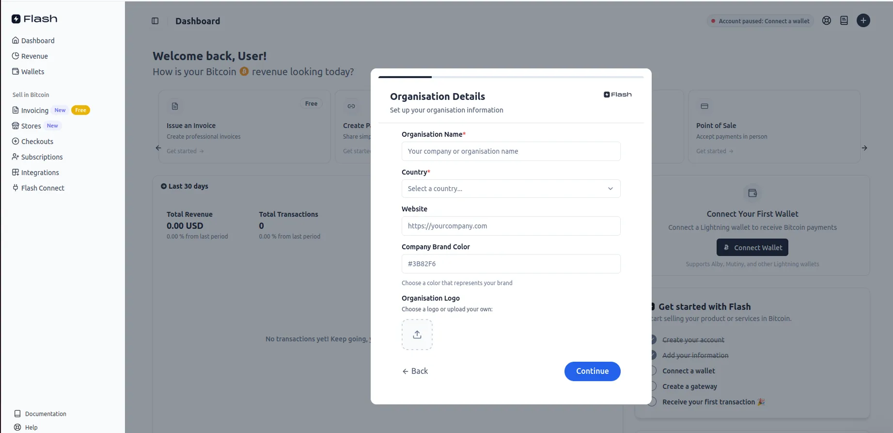

- Ingen identifiering krävs på plattformen. Ange bara ditt för- och efternamn, sedan det land som du vill arbeta från och fortsätt sedan processen.

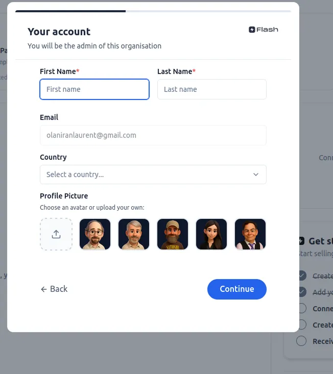

- En självförvaltande tjänst: även om Flash är en cash-in-plattform ger den dig frihet och kontroll över dina medel. Du har möjlighet att ansluta den Lightning Wallet som du använder mest, eller ansluta den dedikerade Wallet utan förvaring som utvecklats av Flash.

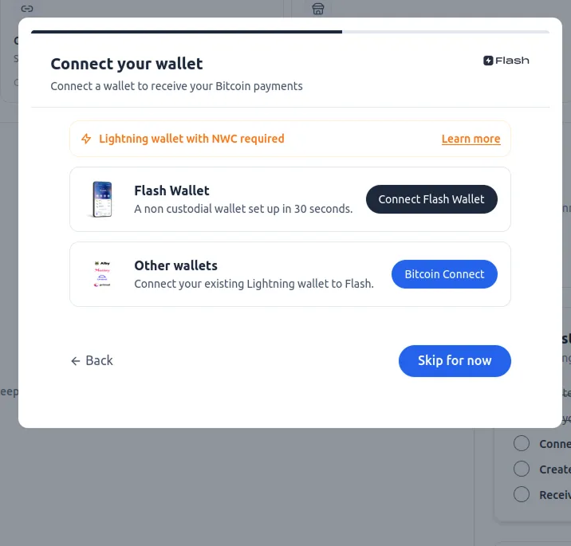

Beroende på vilken Lightning Wallet du använder finns följande alternativ:

- Alby Hub** för Alby Go plånböcker, Alby-tillägget för din webbläsare.

https://planb.network/tutorials/wallet/mobile/alby-go-40202802-b346-4a3c-9863-465c3bde9903

- Coinos** för att ansluta Bitcoin web CoinOS Wallet.
- Flash Wallet** för anslutning till Flash Wallet.
- LN länk**

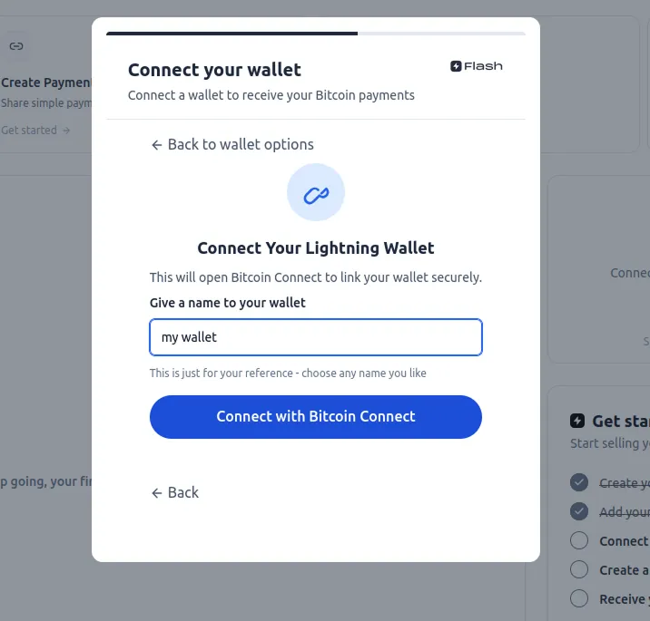

I den här handledningen använder vi Blitz Wallet med en Nostr Wallet Connect-anslutning för att länka vår Wallet till vår organisation på Flash.

https://planb.network/tutorials/wallet/mobile/blitz-wallet-794bdac4-1af4-49d5-9ea5-abb8228ca196

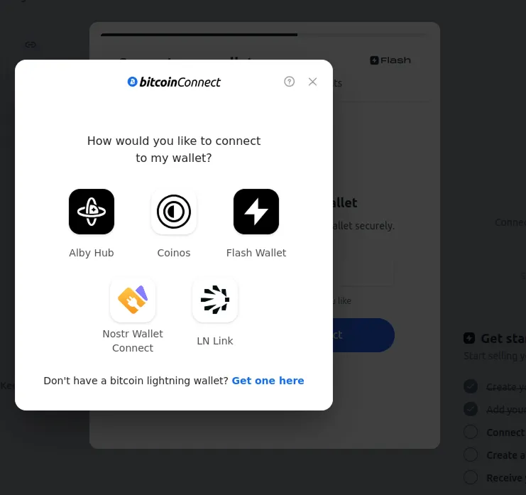

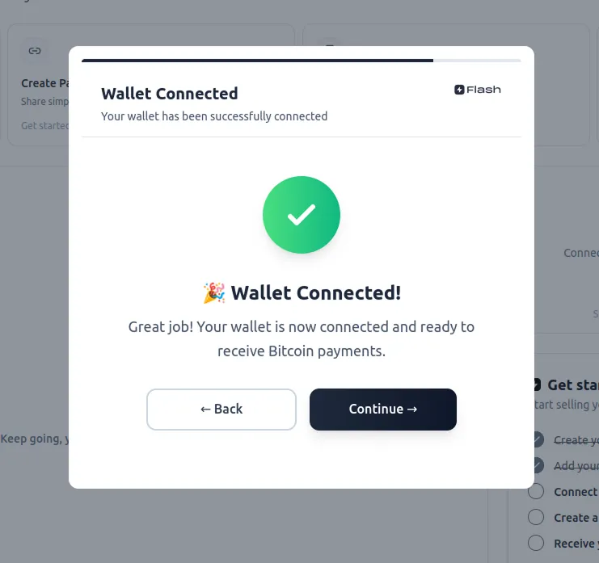

När du har anslutit din Bitcoin Wallet kan du ange de funktioner som intresserar dig och som du vill använda på plattformen. Dessa inkluderar

- Prenumerationshantering: perfekt för att hantera dina prenumeranters prenumerationer genom att ta emot ett fast belopp under en viss period.
- Betalningslänkar till generate-sidor där dina kunder kan betala dina fakturor.
- Donationer för att stödja dina projekt.
- e-handel, som gör det möjligt att konfigurera och sälja fysiska och digitala produkter online.
- Försäljningsställen som ger dig gränssnitt för att hantera betalningar i dina butiker.

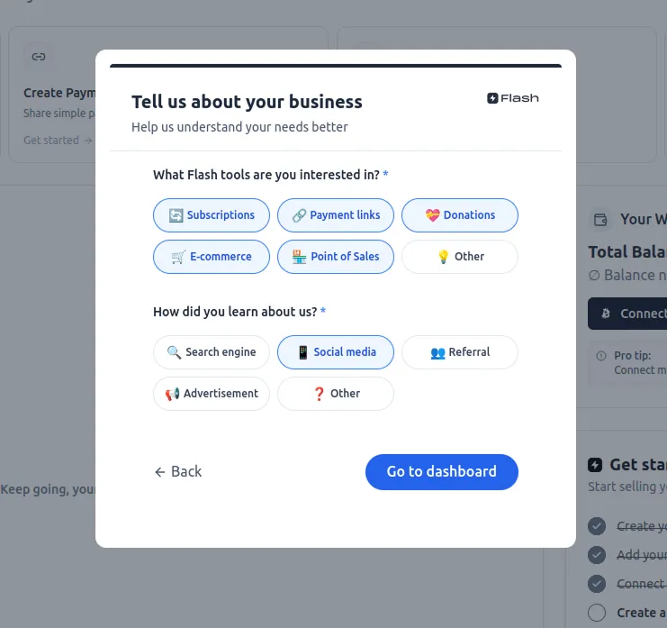

När du har slutfört dessa inledande konfigurationer kan du kontrollera att ditt konto är igång i den övre högra Coin i instrumentpanelen.

### Skapa ett försäljningsställe

Har du redan en fysisk butik i ditt område och skulle vilja acceptera Bitcoin-betalningar? Flashs **Point of Sale**-alternativ är rätt lösning för dig.

När du skapar ditt kassasystem får du en webblänk som är den Interface du använder för att utföra åtgärder i kassasystemet.

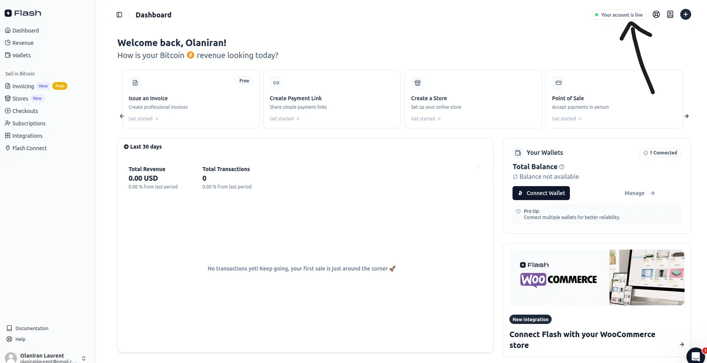

Klicka på **Start** i kvadranten **Point of Sale** på din instrumentpanelsida. Du kommer att omdirigeras till Interface för att konfigurera ditt försäljningsställe. Fyll i informationen som motsvarar ditt försäljningsställe och associera det med den portfölj som du tidigare har anslutit och skicka sedan in dina uppgifter.

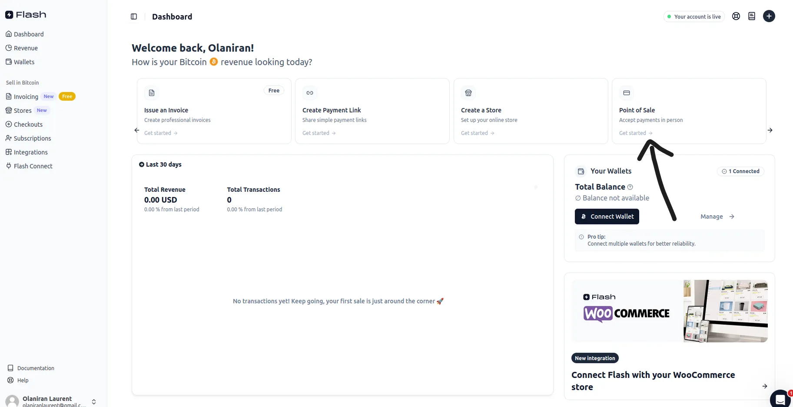

Innan du går till denna Interface för att börja samla in betalningar i Bitcoin rekommenderar vi att du skapar tillgängliga produkter i din butik för bättre spårbarhet, för att ha ett lager på Flash.

På instrumentpanelen klickar du på ikonen **More** och sedan på **New product**.

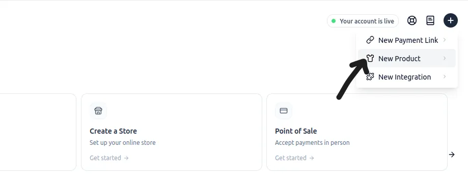

Fyll i din produktinformation och koppla den till ditt försäljningsställe.

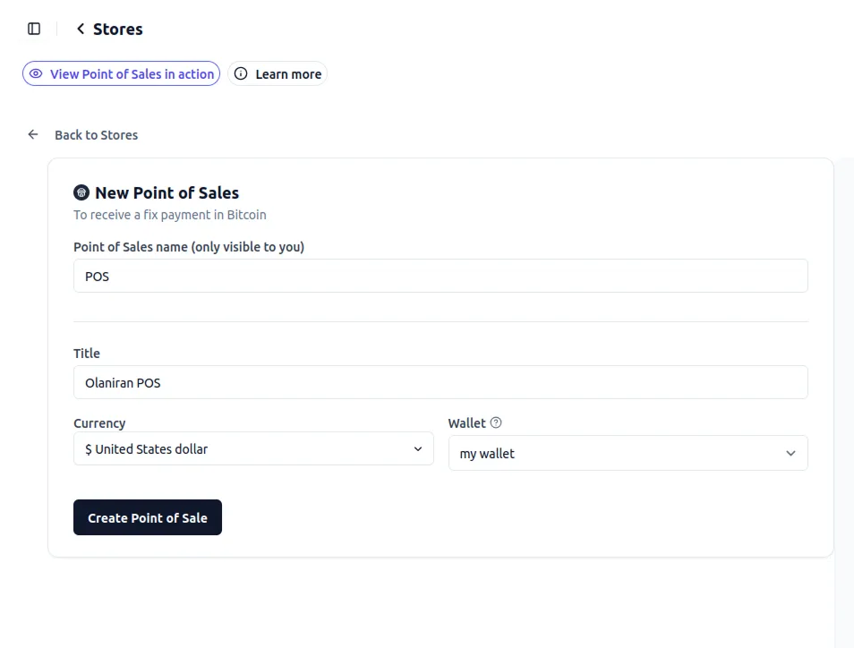

Du kan komma åt menyn för ditt försäljningsställe genom att klicka på namnet på ditt försäljningsställe i avsnittet **Aktiva tjänster**.

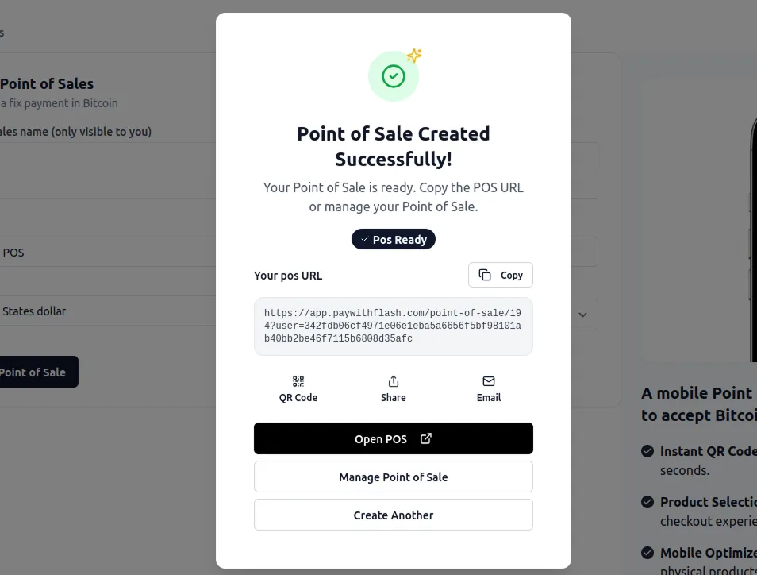

Kopiera Interface-länken till ditt försäljningsställe och gå in på den. I avsnittet **Produkter** hittar du en lista över alla produkter som du har kopplat till det här försäljningsstället. Du kan sedan generate Bitcoin (Lightning) fakturor för att debitera dina kunder.

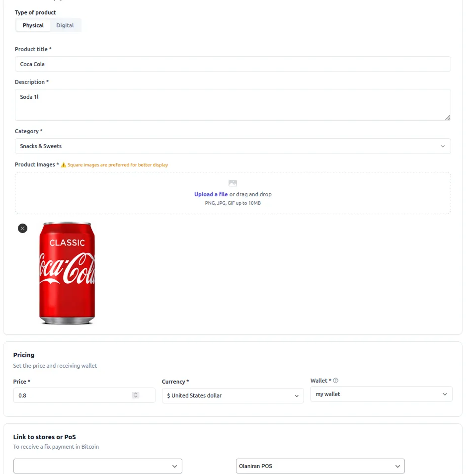

### Betalningslänkar

Med Flash kan du ta emot betalningar från var som helst i världen via Bitcoin inte bara via en försäljningspunkt utan också via en betalningslänktjänst. Du kan generate betalningslänkar som frilansare, projektutvecklare eller vad du än har för status. Dessa länkar är lätta att dela med din mottagare och gör det möjligt för dig att ta emot bitcoins direkt till din egen förvaring Wallet, utan några mellanhänder.

På Flash-instrumentpanelen klickar du på **Payment link** och fyller i formuläret för att generate din betalningslänk.

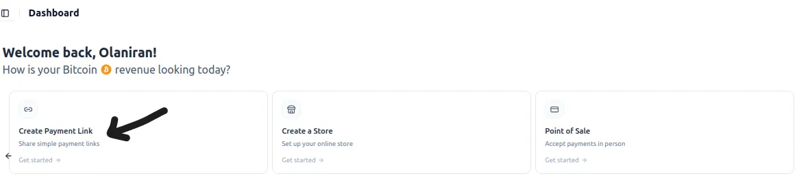

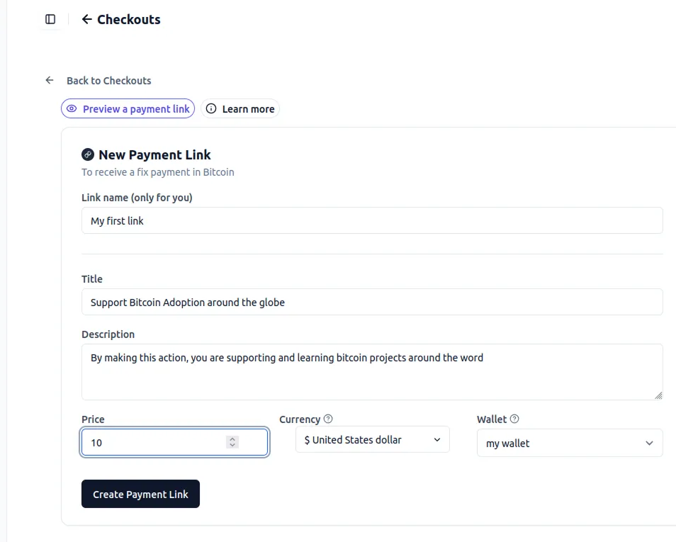

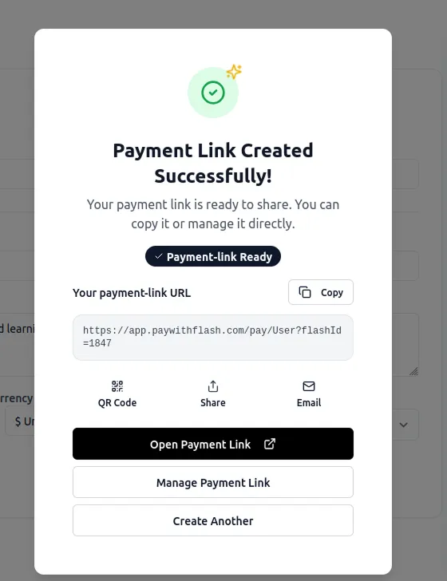

### Donationer

I menyn **Checkouts** kan du skapa donationsplugins som du kan lägga in på din webbplats eller i sociala nätverk, så att människor kan stödja ditt projekt.

Klicka på alternativet **Nytt donationsplugin** och konfigurera sedan detaljerna för ditt

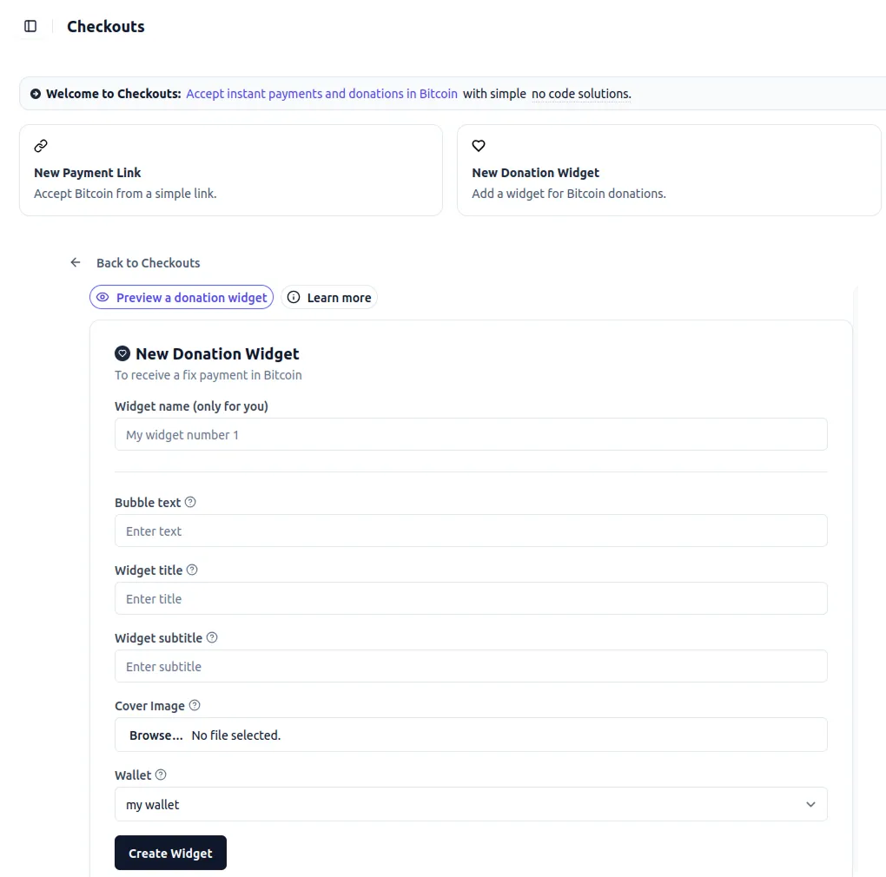

När du har skapat ditt donationsplugin får du en javascript-kod som du kan integrera på din webbplats för att börja ta emot donationer.

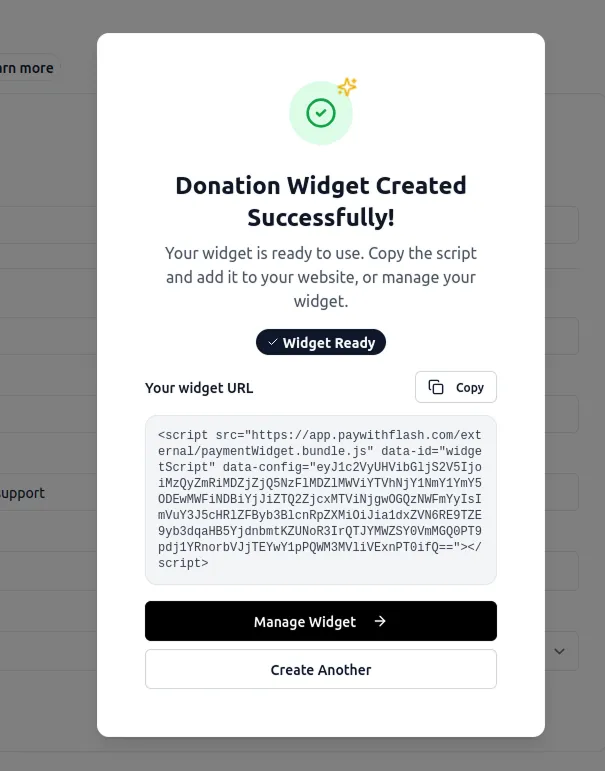

### Prenumerationer

Prenumerationer är en idealisk tjänst när du har prenumeranter eller vill ta emot ett visst belopp på återkommande basis.

I menyn **Prenumerationer** klickar du på **Ny prenumerationsplan**. Definiera de olika abonnemangen som du vill skapa och konfigurera sedan dina abonnemangsparametrar.

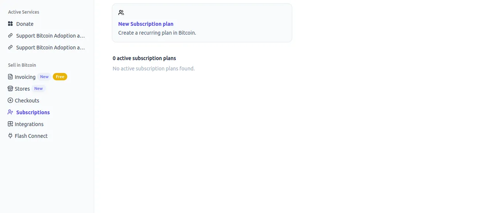

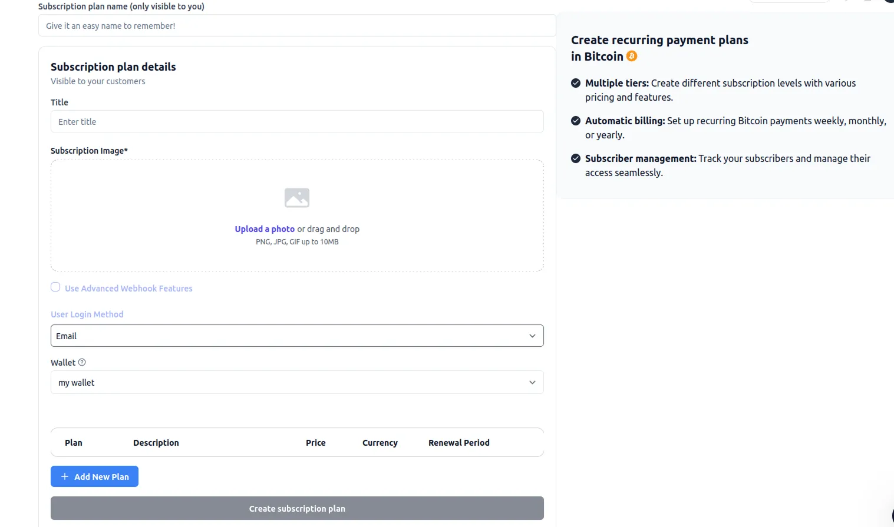

### Integrationer

Flash är inte bara ett slutet ekosystem: tack vare menyn **Integrations** kan du ansluta ditt företag till verktyg som du redan använder. Baserat på dokumentationen kan du integrera din Flash-organisation med :

- WooCommerce
- Shopify
- Wix
- Vimeo OTT (kommer snart)

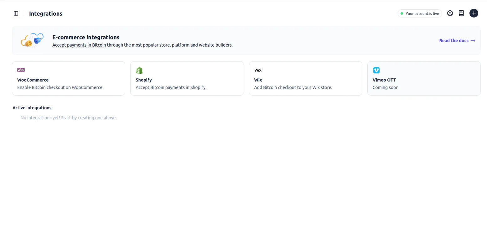

### Skapa din butik

Är du en ny handlare eller har du inte en webbplats där du kan integrera Flash? Plattformen erbjuder ett alternativ för webbplatsbyggnad som låter dig skapa Flash-butiker och sälja dina produkter samtidigt som du tar emot betalningar i Bitcoin.

I menyn går du till Interface för alternativet **Shop** och klickar sedan på **Ny shop**.

Konfigurera detaljerna för din butik genom att ange ett unikt namn som endast är synligt för dig, ett offentligt namn för dina besökare, din butiksbeskrivning och din varumärkesidentitet (logotyp, omslagsaffisch). Välj den valuta som du vill använda för produkterna på din webbplats. Priserna på dessa produkter kommer att konverteras till Bitcoin med hjälp av den aktuella marknadsomräkningskursen, och anslut Bitcoin Wallet som du vill ta emot betalningar på.

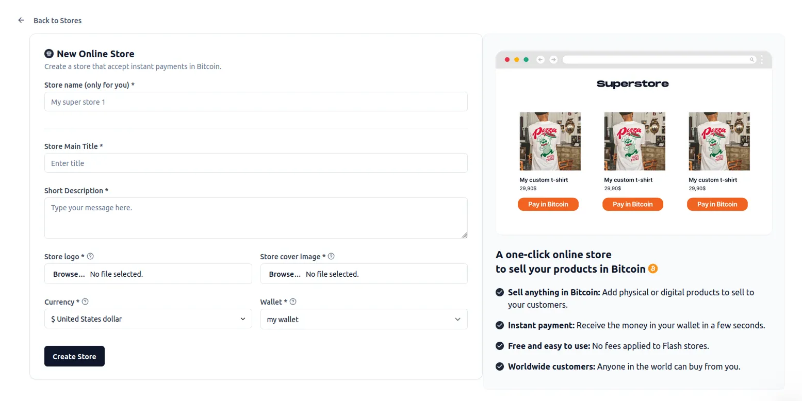

Vi hoppas att du har haft glädje av den här upptäckten, och vi uppmuntrar dig att lära dig mer om effekterna och bästa praxis för att integrera Bitcoin i ditt företag med vår Bitcoin för företagskurs.

https://planb.network/courses/a804c4b6-9ff5-4a29-a530-7d2f5d04bb7a
