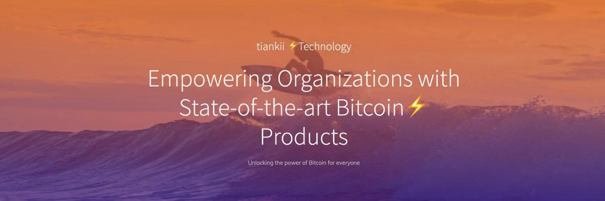

Bitcoinのエコシステムにおいて、リアルタイムで支払いを受け入れることは、企業や個人にとって依然として大きな課題である。従来のソリューションでは、高度な技術的知識を必要としたり、複雑なインフラを維持しなければならなかったり、仲介業者に資金を預けなければならなかったりすることが多い。このような状況は、Lightning Networkの技術的進歩が期待されているにもかかわらず、日常的な通貨としてのBitcoinの普及を妨げている。

2021年に誕生したサルバドールの企業Tiankiiは、利用しやすいモジュール式のBitcoinインフラを提供することで、この問題に対応している。Tiankiiは、クローズドなエコシステムの採用を強制するのではなく、相互接続されたツール群を提供することで、資金のコントロールを犠牲にすることなく、誰でもBitcoin Lightningをビジネスに統合することができる。

## 天喜とは？

### 起源と哲学

ナワトル語で「誰でもアクセスできる青空市場」を意味するTiankiiは、エルサルバドル初の100％Bitcoin新興企業である。同国の法定通貨としてBitcoinが採用された後、ダルビン・オテロ氏によって設立された同社は、Bitcoinを価値の貯蔵から日常的な買い物のための取引可能な通貨に変えることを目指している。カストディアル・プラットフォームとは異なり、Tiankiiは非カストディアル・アプローチを採用し、ユーザーが資金を管理する。

### テクニカル・アーキテクチャ

Tiankiiは、Lightning Networkに基づくBitcoin-as-a-Serviceインフラのプロバイダーとして位置づけられている。この第2層技術は、ごくわずかなコストでほぼ瞬時の取引を可能にし、マイクロペイメントや日常的な買い物を可能にする。

アーキテクチャーは3つの柱に基づいている：

**ライトニング・ファースト**：on-chainトランザクションの大口サポートを維持しつつ、スピードとコスト削減のためにLightningネットワークを組織的に優先する。

**オープンスタンダード**：支払い要求の自動化のためのLNURLの使用、読み取り可能な電子メールIDのためのLightning Address、相互運用可能なNFC支払いのためのBoltカード。

**walletにとらわれないモジュール性**：異なるLightningポートフォリオ（LNbits、Blink、BlueWallet）または独自のノードを接続することが可能。

## 天恵生態系ツール

### Bitcoin POS - 店内決済端末

このアプリケーションは、スマートフォンやタブレットをLightning端末に変える。加盟店が現地通貨で金額を入力すると、アプリがLightning QRコードを生成するか、Boltカードを受け付ける。取引は即座に手数料なしで入金され、150以上の通貨での自動換算、チップ管理、売上履歴が利用できる。

### マーチャントダッシュボード - 一元的な販売管理

Interfaceウェブは、walletライトニングを接続し、リアルタイムで取引を追跡し、請求書を発行し、generate会計レポートを集中管理する。このプラットフォームは、店舗での支払い（POS）、オンライン販売（eコマースのプラグイン）、またはAPIの統合など、すべてのチャネルを集約する。決済は選択されたwalletに集約される。

### Bitcoin非接触カード（Boltカード）

NFC Boltカードは、Bitcoinを一般に普及させるためのTiankiiの大きなイノベーションです。非接触型銀行カードのように機能し、対応端末をタップするだけでBitcoinライトニングの購入代金を支払うことができる。

従来のカストディアル・ソリューションとは異なり、このカードは相互運用性を保証するオープンスタンダードに従っている。ユーザーは、IBIアプリケーションを介して自分のwalletとリンクさせることができるため、秘密鍵を保持し、関連する資金を完全に管理することができる。支払いにかかる時間はわずか1秒で、支払時にスマートフォンを取り出したり、インターネットに接続したりする必要はない。

このソリューションは、特にスマートフォンに不慣れな人々にとって包括的であり、Bitcoin経済へのアクセスしやすい入り口を提供する。

### IBIアプリ - Interface 個別 Bitcoin

IBIアプリケーション（Individual Bitcoin Interface）は、Bitcoin Lightningを日常的に使用したい個人のために設計されています。このアプリケーションの主な利点は、個人用の Address Lightning、電子メール形式で読み取り可能な支払い識別子の生成にあります（例：alice@ibi.me）。

この識別子により、支払いの受け取りが劇的に簡素化される。generate では、取引のたびに新しい請求書を作成する必要がなく、送信者はライトニング・アドレスを入力するだけで済む。このインターフェースでは、Boltカードの管理（有効化、無効化、利用限度額）、様々なライトニング・ウォレットとの接続、QRコードのスキャンによる支払いも可能です。

### Eコマース・プラグイン

WooCommerce、Shopify、Cloudbedsのためのすぐに使えるインテグレーション。数分でインストールでき、チェックアウトにBitcoin Lightningを追加できます。利点：手数料ゼロ（クレジットカードは2-3％）、即時決済、世界中からのアクセス、チャージバックの排除。支払いは加盟店の接続されたwalletに直接届きます。

### Bitcoin APIおよび開発者ツール

Tiankii SDKは、独自のノードを維持することなく、Bitcoin Lightningを既存のアプリケーションに統合することを可能にします。APIは、Google Cloud上でホストされる堅牢なインフラストラクチャを介して、請求書作成、支払い確認、およびバルクメール送信を処理します。コマンド・センターは、カスタム・ドメイン、一括支払い、NFC端末とカードの集中管理に関するAddress Lightningを持つ組織向けのサービスを完成させる。

## インストールと最初のステップ

### 必須条件

Tiankiiの使用には複雑な技術的前提条件は必要ない。アプリケーションは、スマートフォン、タブレット、またはコンピュータのウェブブラウザを介して動作します。IBIやマーチャントダッシュボードにアクセスするために必要なのは、インターネットアクセスと最新のブラウザだけです。

**プライベートユーザー向け（IBIアプリ）**：wallet Lightning の事前設定は不要です。アカウントを作成すると、Tiankiiは[Breez SDK Liquid](https://sdk-doc-liquid.breez.technology/guide/about_breez_sdk_liquid.html)(バックグラウンドでLiquidネットワークを使用するノードレス実装)を介して、動作するAddress Lightningを自動的に設定します。技術的な設定をすることなく、すぐに支払いを受けたり送ったりすることができます。このソリューションは、初心者のアクセスを劇的に簡素化し、しかも自己完結型です。

**加盟店向け（マーチャントダッシュボード）** ：POS端末を使用し、支払いを受け取るためには、既存のwallet Lightningの接続が必須です。Tiankiiは多くのソリューションをサポートしています：モバイルウォレット（Blink、Strike）、セルフホストソリューション（LNbits、LND/CLN node）、またはウェブウォレット（Alby）。詳細な接続ガイドは、このチュートリアルのリソースセクションにあります。

### 個人のお客様へIBIアプリ

**アカウント作成

accounts.ibi.meにアクセスしてアカウントを作成してください。このページでは、2つのアカウントタイプからお選びいただけます：個人でご利用になる場合は「Personal Use」、商用でご利用になる場合は「Business Use」をお選びください。Personal Use "を選択すると、Bitcoinで支払いを受けたり送ったりするためのツールにアクセスできます。

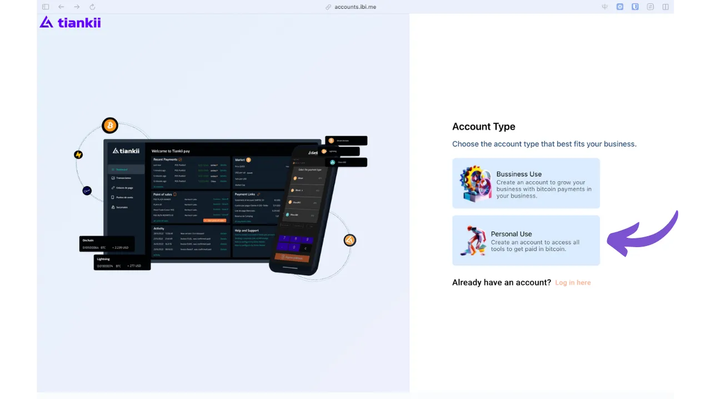

個人利用」を選択すると、自動的にgo.ibi.meに移動し、登録が完了します。この登録は、電子メール、電話番号、またはGoogle、Microsoft、Twitterアカウントを使用して行うことができます。登録が完了すると、Lightning Addressが利用可能になり、すぐにIBIのインターフェイスにアクセスすることができます。

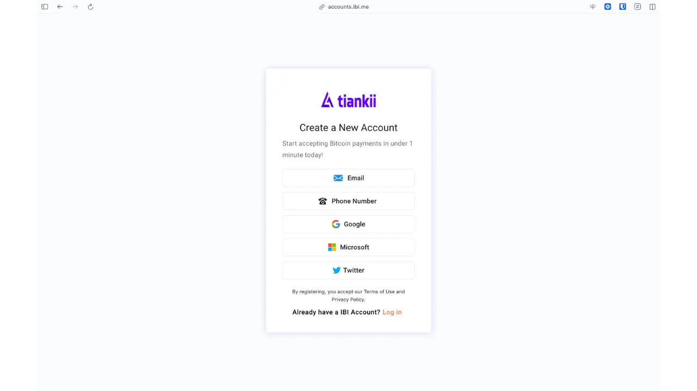

**Interfaceメイン

IBIのインターフェースは、サトシと現地通貨（米ドル）で残高を表示します。3つのボタンでやり取りができます。「Receive」で支払いを受け取り、「Scan」でQRコードをスキャンし、「Send」でサトシを送金します。

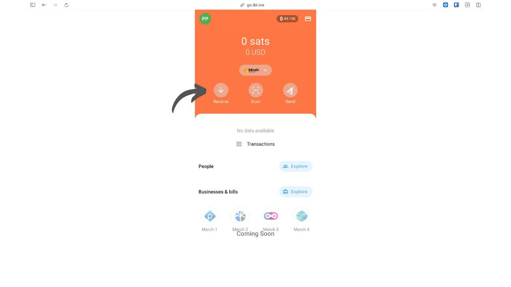

**支払いを受ける

サトシを受け取るには、「受け取る」を押してください。アプリケーションは自動的にQRコードを生成し、パーソナライズされたAddress Lightning（nom@ibi.meフォーマット）を表示します。このアドレスまたはQRコードを送金人と共有すると、資金は即座にあなたのIBIアカウントに届きます。

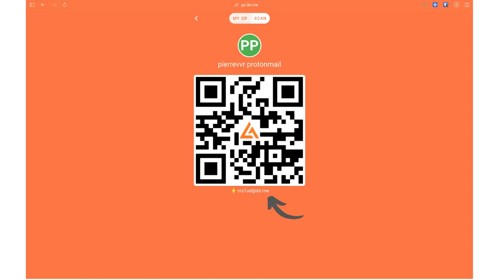

残高が入金されたら、このサトシを使って支払いをすることができる。

**支払いを送る

サトシを送信するには、「送信」を押します。LightningのQRコードを読み取るか、Lightning Addressの送信先を直接入力します。

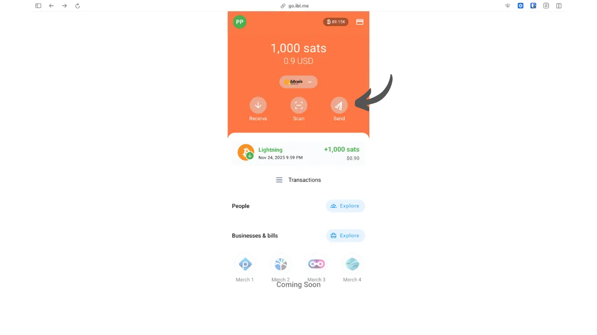

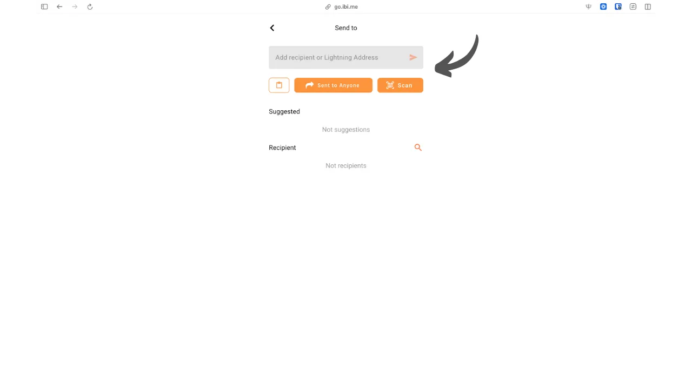

希望する金額をサトシで入力し、現地通貨での相当額を確認して支払いを確定する。

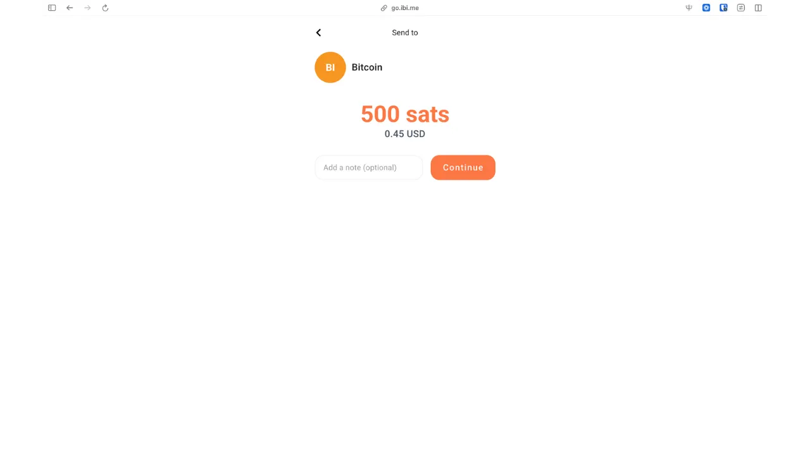

成功通知では、発送金額、取引手数料、受取人などの詳細が確認できます。

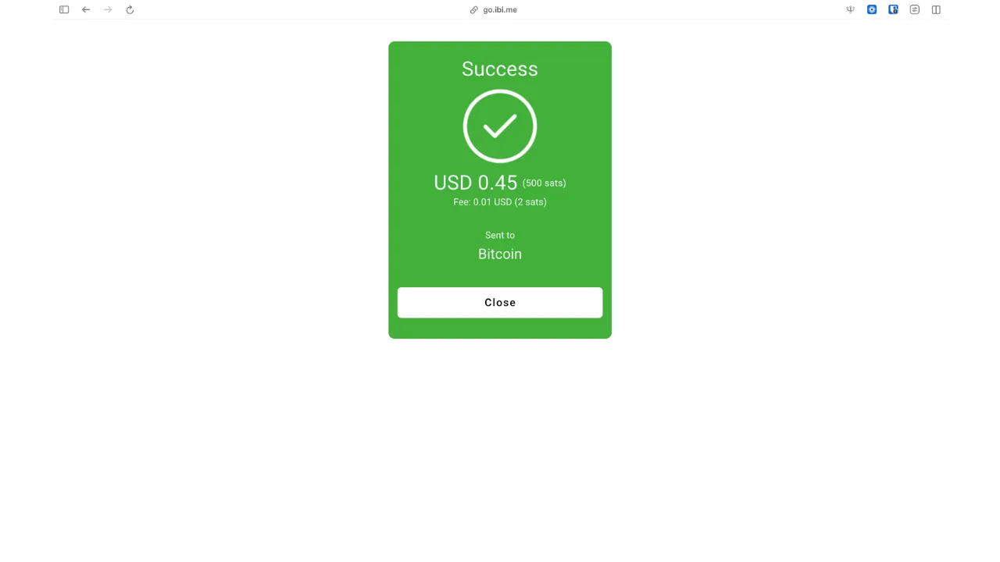

**アカウント管理

設定では、Bitcoin NFCカード（Boltカード）を管理することができます。このインターフェイスでは、カードの有効化、無効化、利用限度額の設定ができます。

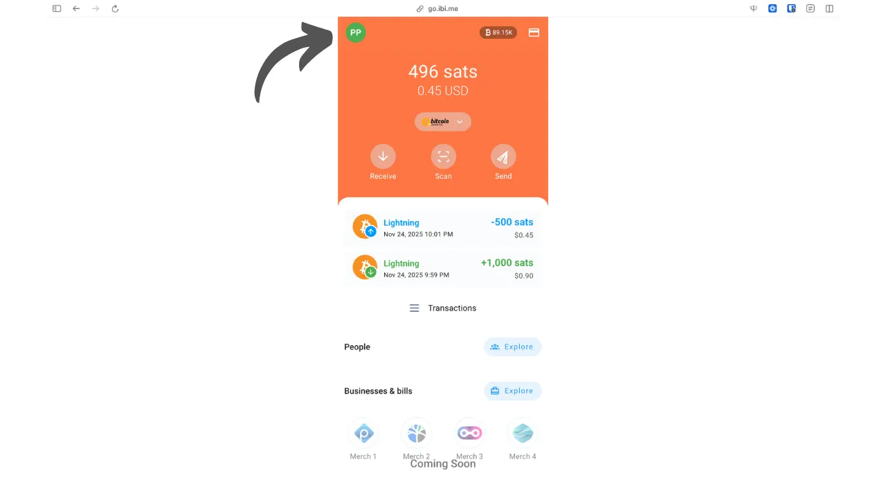

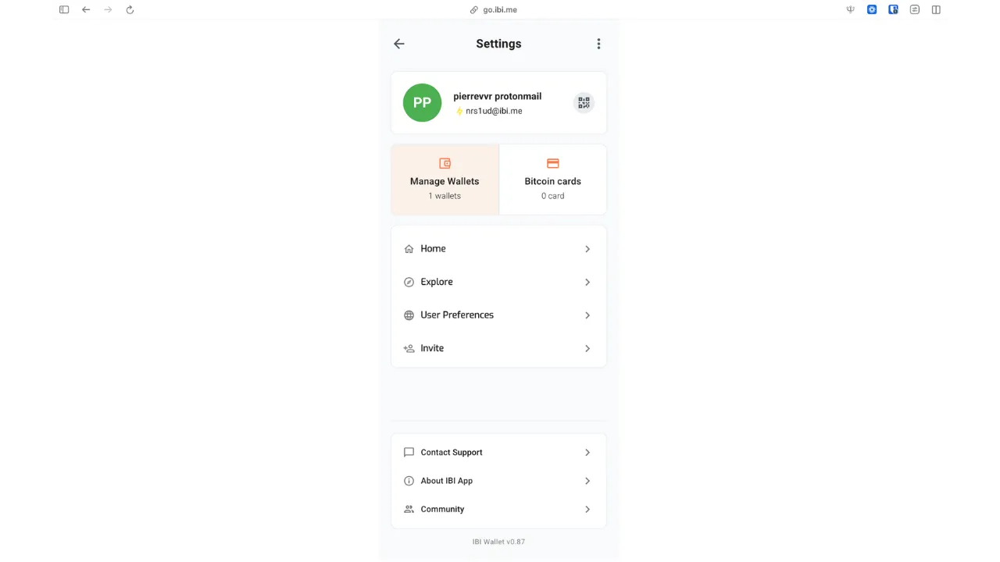

### 加盟店様向けマーチャントダッシュボードとPOS

**ビジネスアカウント作成

accounts.ibi.meにアクセスしてアカウントを作成します。ビジネスユース」を選択して、マーチャントツールにアクセスします。このタイプのアカウントでは、マーチャントダッシュボードとPOS端末へのアクセスがロック解除されます。

ビジネス利用」を選択すると、自動的にマーチャントダッシュボード（pay.tiankii.com）にリダイレクトされます。これにより、収益追跡、取引、支払いツールを備えたビジネス管理インターフェイスに移動します。支払いの受付を開始するには、まずページ上部のリンクをクリックしてwallet Lightningを接続する必要があります（画像の矢印を参照）。

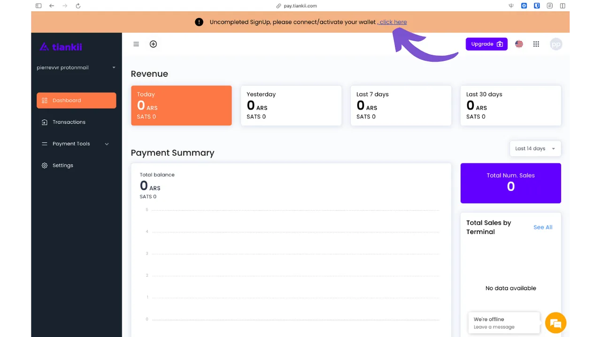

**walletライトニング**接続

walletLightningを接続して支払いを受け取ります。インターフェースにはいくつかの接続オプションがあります。いくつかのオプション(Bitcoin OnchainとLightning Network)はまだ開発中で、インターフェイス上ではグレーアウトして表示されますのでご注意ください。

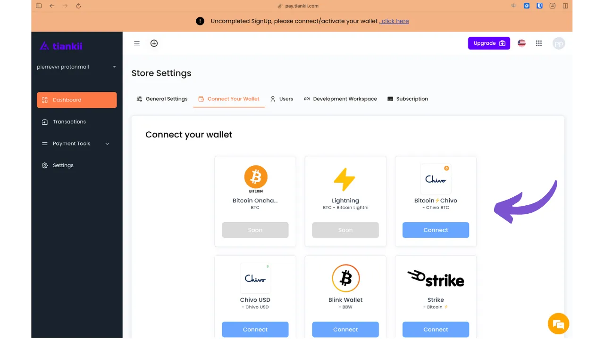

このチュートリアルでは、Chivo、Blink Wallet、Strikeと互換性のあるLightning Address接続を使用します。お手持ちのLightning Address (nom@domaine.com 形式) を入力してください。例えば、LN Markets、Alby、またはその他の互換性のあるサプライヤーから入手できます。

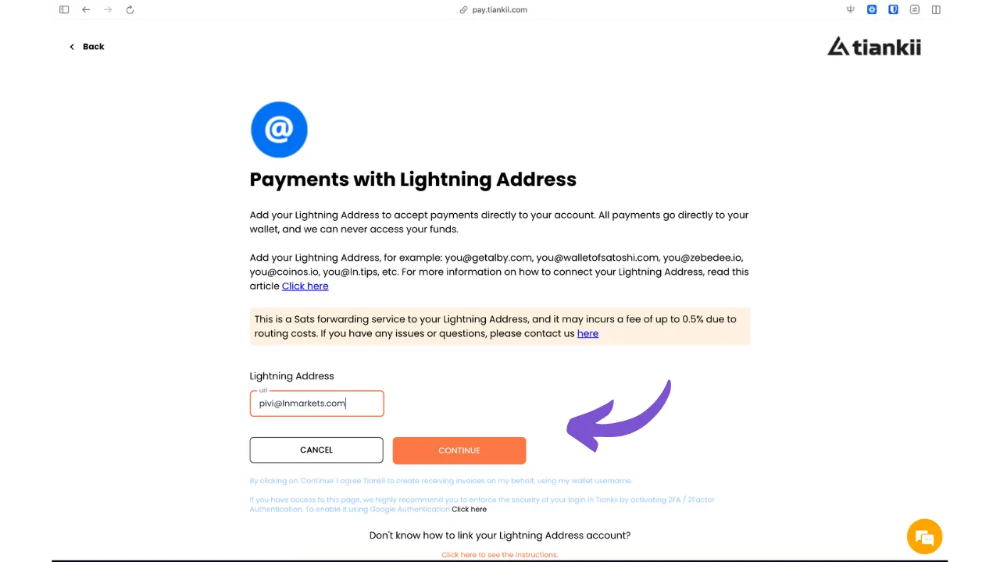

ログインすると、アカウントは使用可能になります。これでPOSにアクセスしたり、ダッシュボードに戻って他の設定を行うことができます。

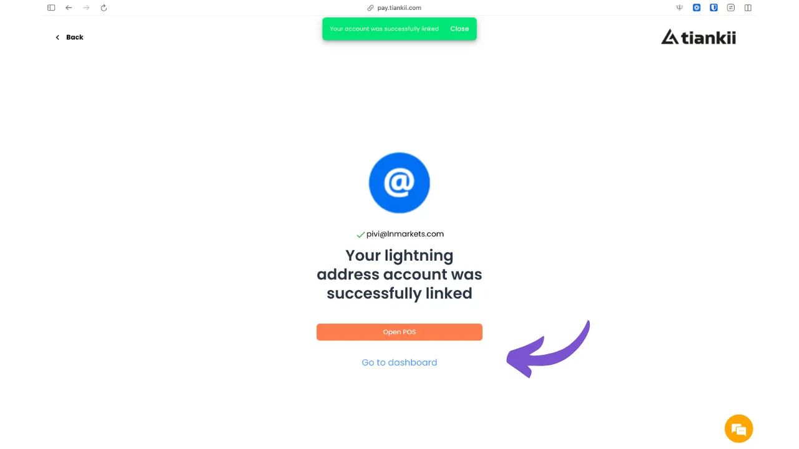

*支払いリンク

支払いツール "メニューから "支払いリクエスト "にアクセスし、支払いリンクを作成・管理することができます。この機能は、メールやメッセージで送信するパーソナライズされた支払いリンクを作成するのに便利です：寄付、単一の支払い、複数の支払い、あるいはコンテンツを保護するためのペイウォール。ビジネスニーズに合わせて様々なタイプのリンクを作成することができます。

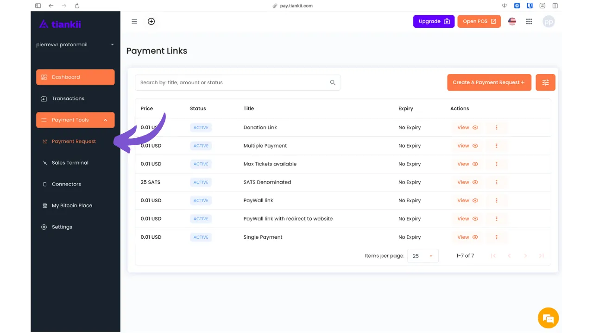

**販売端末の構成

店頭での支払いを受け付けるには、「支払いツール」から「販売端末」メニューにアクセスします。このセクションでPOS端末の作成と管理ができます（端末の数はプランによって異なります、下記のフリーミアムプランとビジネスプランをご覧ください）。開く "をクリックしてブラウザでPOSインターフェイスを開きます。

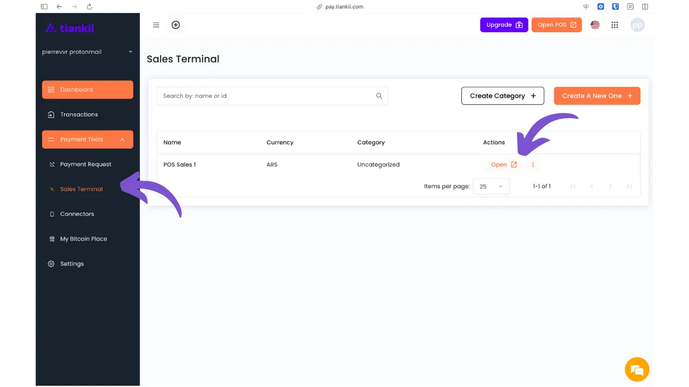

**セールスの創出

POSターミナルには、販売金額を入力するためのテンキーが表示されます。現地通貨で金額を入力し（例：500satsは630.74ARSに相当）、「OK」を押して確定します。

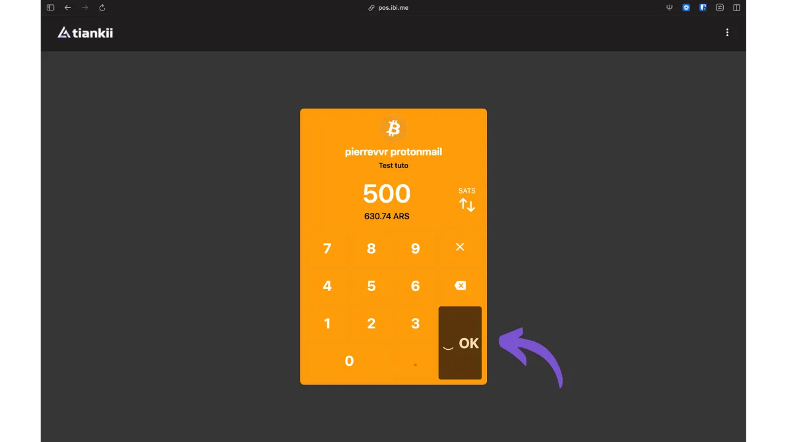

このアプリケーションは、Lightning QRコードと支払い用のLightning Addressを即座に生成する。顧客はwalletでQRコードをスキャンするか、NFC端末でBoltカードを使用することができる。

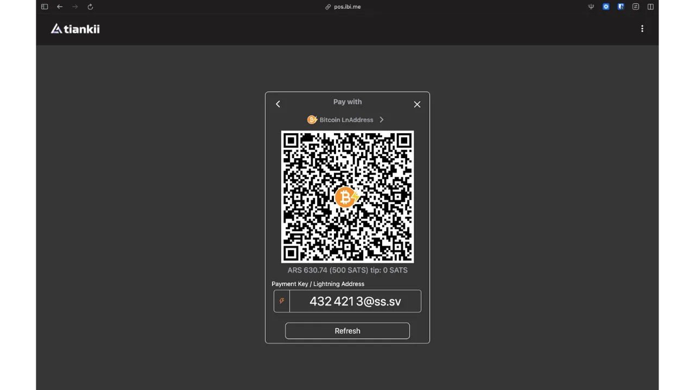

お支払いが確認されるとすぐに確認画面が表示され、現地通貨とサトシで受領金額が表示されます。領収書をEメールで送信したり、チケットを印刷したり、すぐに新しい販売を開始することができます。

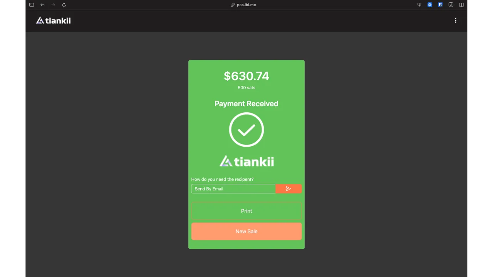

**監視と管理

すべての取引はマーチャントダッシュボードに記録されます。期間ごとの収益、総販売数、会計のための詳細な履歴を完全に追跡することができます。

設定インターフェイスには、いくつかの設定タブがあります。一般設定」タブでは、マーチャントプロファイルと通知を管理できます。Users "タブでは、あなたのチームにマーチャントダッシュボードへのアクセスを追加・管理することができます。開発ワークスペース」タブでは、高度な統合のためのAPIキーにアクセスでき、「サブスクリプション」ではサブスクリプションを管理できます。

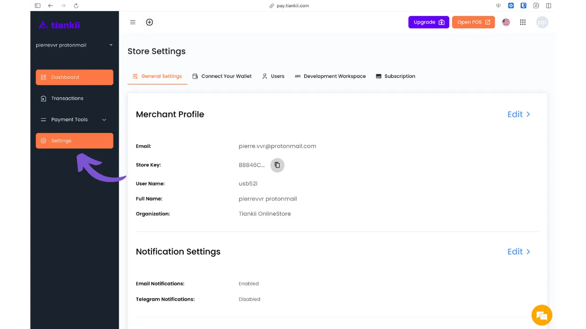

**フリーミアムプランとビジネスプラン

Tiankiiはマーチャントダッシュボードに2つのパッケージを提供しています。フリーミアム**プラン(無料)はスタートアップに適しており、1つの販売端末、1人のユーザー、毎月の取引量は1,000米ドルに制限され、Eコマースコネクターへのアクセスはできません。ビジネス**プラン(取引毎に0.5%の手数料)では、無制限の端末、無制限のユーザー、無制限の取引量、WooCommerce/Shopify/Cloudbedsプラグインへのアクセス、専用のWhatsApp通知をご利用いただけます。

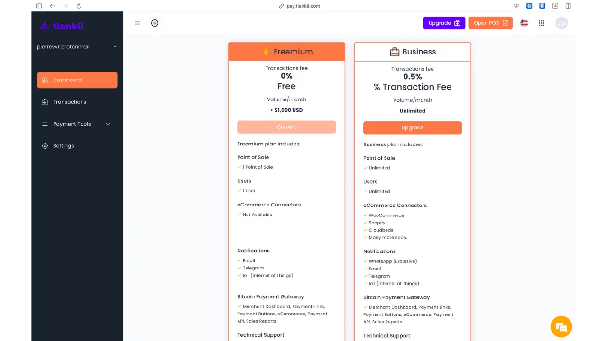

## 利点と制約

### ハイライト

**自己保管**：秘密鍵を保持し、資金を完全に管理できます。口座凍結やサードパーティプラットフォーム倒産のリスクはありません。

**シンプルさ**：Lightning Addressを電子メールアドレスとして使用し、タップするだけでNFC決済ができ、専門知識不要の直感的なインターフェース。

**完全なエコシステム**：すべてのプロファイル（個人、小売業者、開発者）のためのツールで、ニーズに合わせてモジュール式の統合が可能です。

**専門的なコンプライアンス**：安全なクラウドホスティング、PCI-DSSコンプライアンス、サルバドール規制コンプライアンス。

### 制限事項

**雷の制約**：walletの常時接続が必要、大口の流動性管理、受信者がオフラインの場合の障害リスク。Tiankiiは統合LSPによってこれらの点を軽減している。

**SaaS依存**です：Tiankiiが利用できない場合、請求書の作成は一時的に不可能になります。

**プライバシー**：Tiankiiは取引のメタデータ（金額、日付）を観察することができます。BTCPay Serverのようなセルフホストソリューションよりもプライベート性は低い。

## 結論

Tiankiiは、うまく設計されたインフラが、Bitcoinの日常通貨としての大量採用を阻む技術的障壁をいかに取り除くことができるかを示している。Lightning Networkのパワーを非保護的なアプローチと利用しやすいツールと組み合わせることで、エコシステムは金融主権と使いやすさの間でバランスの取れた道を提供する。

加盟店にとって、Tiankiiは新たな顧客層にアクセスしながら取引コストを大幅に削減する機会となる。消費者にとっては、ライトニングAddressとNFCカードが、技術的な複雑さを伴わずにBitcoinを実用的な通貨に変える。

Bitcoinの普及には教育と時間が必要だが、Tiankiiのようなインフラは、技術的なツールがすでに存在していることを示している。Bitcoin決済の簡素化というミッションは、もはや遠い夢物語ではなく、踏み出そうとする意欲のある人なら誰でもアクセス可能な現実となっている。

## リソース

### 公式文書

- [天氣公式サイト](https://tiankii.com)
- [天声人語ヘルプセンター](https://help.tiankii.com)
- [IBIアプリケーション](https://go.ibi.me)
- [マーチャント・ダッシュボード](https://pay.tiankii.com)
- [司令部](https://cc.ibi.me)

### Walletコネクション・ガイド

- [コネクトLNビット](https://help.tiankii.com/portal/en/kb/articles/connect-your-lnbits-wallet)
- [コネクト・ブルーウォレット（LNDHub）](https://help.tiankii.com/portal/en/kb/articles/connect-your-lndhub-bluewallet)
- [コネクトアルビーWallet](https://help.tiankii.com/portal/en/kb/articles/connect-your-alby-wallet)
- [コネクトストライクWallet】(https://help.tiankii.com/portal/es/kb/articles/como-vincular-strike-wallet)

### コミュニティ

- [Lightning Networkプラス](https://lightningnetwork.plus) - ライトニング教材
- [Bitcoin ビーチ](https://www.bitcoinbeach.com) - サルバドルの循環型経済イニシアチブ Bitcoin

### 関連ツール

- [ブリンクWallet】(https://blink.sv) - Walletライトニング対応推奨
- [LNbits](https://lnbits.com) - セルフホスト型walletソリューション
- [スタンダードBoltカード](https://github.com/boltcard) - NFCカードの技術仕様