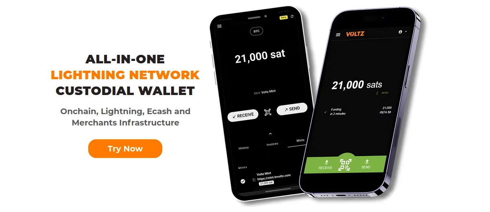

Voltz platformu fikri, kendi bitcoin wallet hizmetlerini sağlamak isteyen bir grup bitcoin kullanıcısından geldi. Sonuç, perakende satışta bitcoin kabul etmek için eksiksiz bir altyapı oldu. Bu eğitimde sizi Voltz ve platformun sunduğu bitcoin entegrasyon olanakları hakkında bir tura çıkarıyoruz.

## Voltz ile çalışmaya başlama

Voltz, günlük olarak göndermenize, almanıza ve ödemenize olanak tanıyan bir saklama Lightning wallet olmanın ötesinde, bitcoin'i işletmenize bir satış noktası veya pazar yeri olarak entegre etmek için çok sayıda uzantı sağlayan eksiksiz bir platformdur.

Voltz] platformuna (https://www.voltz.com/en) gidin ve "Şimdi dene" düğmesine tıklayarak bir hesap oluşturun.

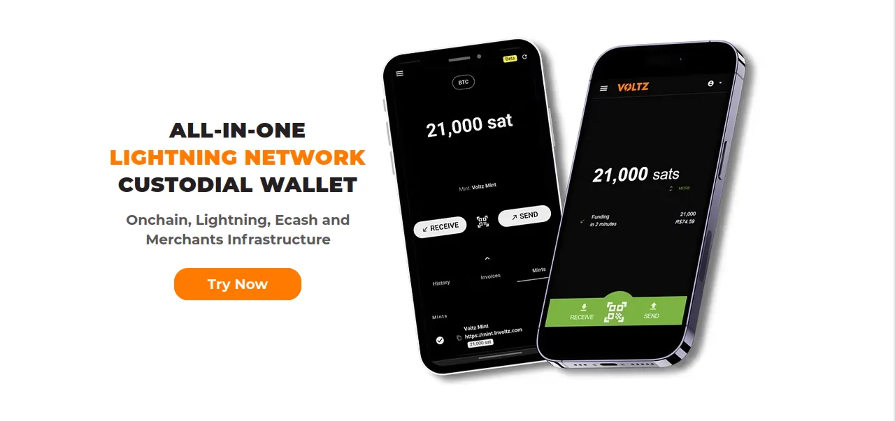

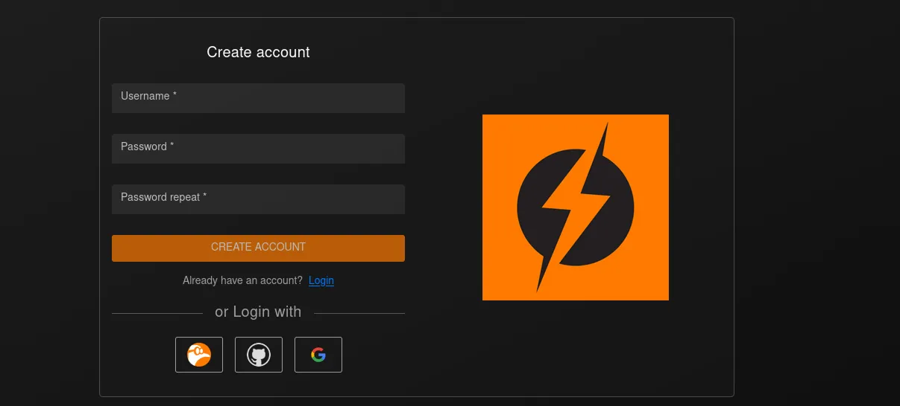

⚠️ Kaba kuvvet saldırılarına karşı şansınızı artırmak için güçlü bir alfanümerik şifre belirlemeniz ve kimlik avına karşı korunmak için giriş bilgilerinizi doldurmak üzere gerçekten resmi Voltz web sitesinde olduğunuzu kontrol etmeniz önemlidir.

Voltz arayüzü LnBits platformunun arayüzüne çok benzemektedir.

https://planb.academy/tutorials/business/others/lnbits-cdfe1e38-069a-4df9-a86b-ce01ef28f4c2

Voltz aslında bir LnBits sunucusu üzerine kurulmuştur; kendi LnBits sunucularınızı nasıl kuracağınızı ve çözümlerinizi bu sunucular üzerine nasıl inşa edeceğinizi öğrenmek için eğitimimize göz atın.

https://planb.academy/tutorials/business/others/lnbits-server-6a406046-3cef-4a64-a82b-8d8f0f82a192

Platform, birden fazla portföyü verimli bir şekilde yönetmenize olanak tanır. Varsayılan olarak, kaydolduğunuzda otomatik olarak bir Lightning portföyünüz olur. Ancak, başka portföyler de ekleyebilirsiniz.

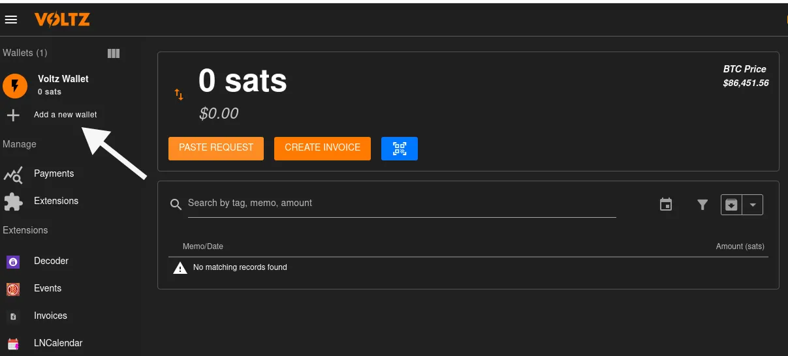

### Taşınabilirlik

Voltz bir web arayüzü ile sınırlı değildir: **Mobil Erişim** bölümünde, aktif Voltz wallet'ünüzü Zeus veya Blue Wallet gibi uygulamalara bağlayabilirsiniz.

https://planb.academy/tutorials/wallet/mobile/zeus-embedded-c67fa8bb-9ff5-430d-beee-80919cac96b9

https://planb.academy/tutorials/wallet/mobile/blue-wallet-2f4093da-6d03-4f26-8378-b9351d0dbc90

Bunu yapmak için platformda **LndHub** uzantısını yüklemeniz ve etkinleştirmeniz gerekir.

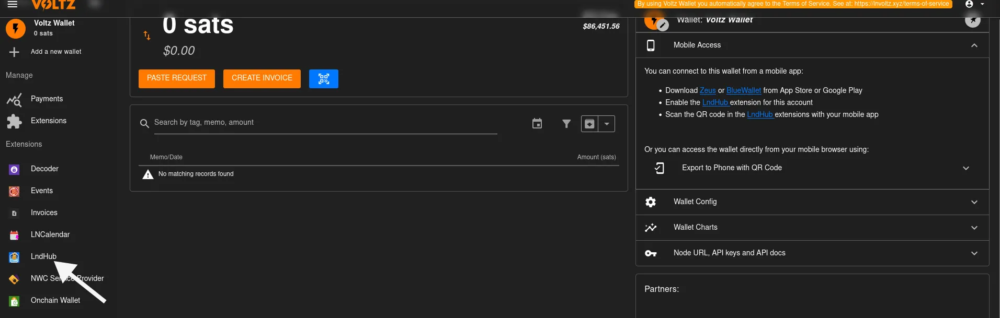

Aktif Voltz portföyünüzü seçin ve vermek istediğiniz haklara bağlı olarak uygun QR kodunu tarayın.

- Fatura QR kodu yalnızca portföy geçmişinizi ve generate yeni faturalarınızı okumanızı sağlar.
- Yönetici QR kodu, geçmişi, generate faturalarını görüntülemenize ve ayrıca Yıldırım faturalarını ödemenize olanak tanır.

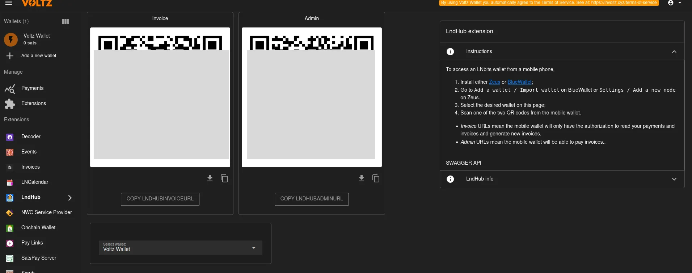

Bu eğitimde, Voltz wallet'imizi Blue Wallet uygulamasına bağlıyoruz.

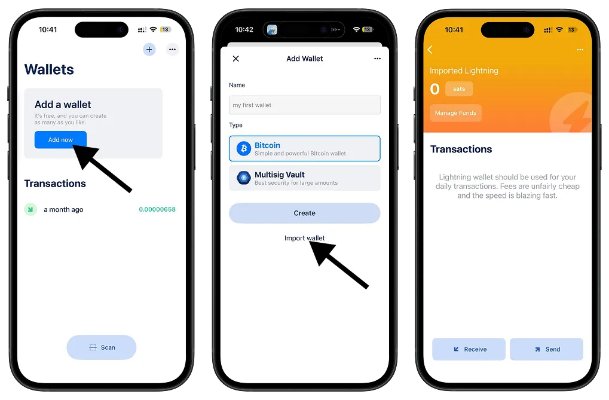

Portföyümüz bağlandıktan sonra, gerçekleştirilen tüm eylemler Blue Wallet ve Voltz arasında senkronize edilecektir. Örneğin, Blue Wallet'da bir faturayı generate yaptığınızda, Voltz'da da bir geçmişiniz olur.

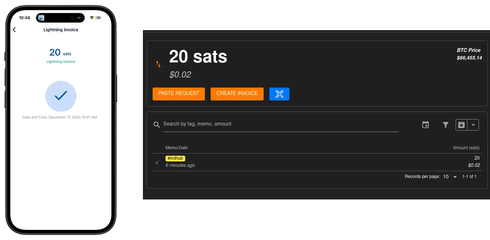

Portföy yapılandırması** bölümünde, portföy adının özelleştirilmesi ve ödemelerinizi almak istediğiniz para birimi gibi minimum parametreleri bulacaksınız.

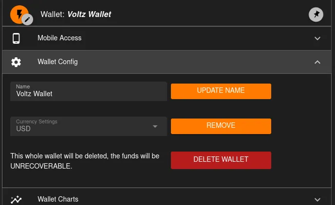

### Uzantılar

Voltz platformunun özel özelliklerinden biri, ihtiyacınız olan uzantıları etkinleştirmenize olanak tanıyan modülerliğidir. Uzantıların listesi **Extensions** menüsünde bulunabilir.

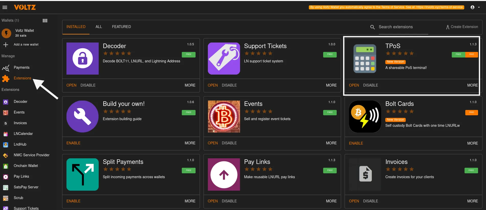

Bu uzantılar arasında, envanter tutmak ve müşterilerinizden ödeme toplamak için kullanabileceğiniz bir satış noktası terminali olan TPoS da yer alıyor.

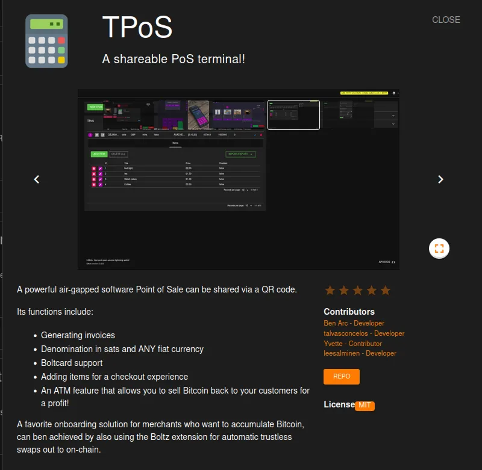

Satış Noktası terminalinden şunları yapabilirsiniz:

- Müşterileriniz ve ortaklarınızla paylaşabileceğiniz bir web sayfası edinin;
- Ürün envanterini yönetin;
- Lightning faturaları oluşturun;
- Bolt kartları ile nakit ödemeler.

Uzantının ücretsiz sürümü ve daha gelişmiş özellikler için ücretli sürümü mevcuttur. Bir POS terminali oluşturmak için, uzantı logosunun altındaki **Aç** düğmesine tıklayın, ardından **Yeni POS** seçeneğine tıklayın.

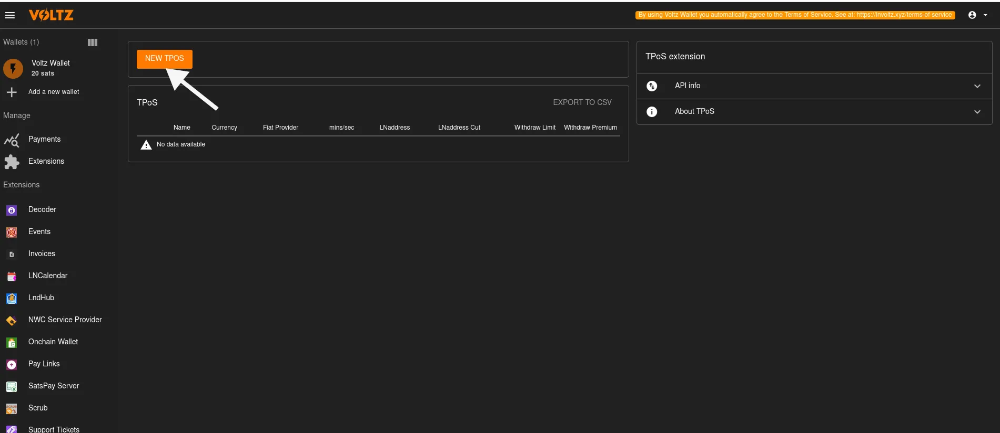

Satış noktanızın adını tanımlayın, ardından ödemeleri toplamak için Voltz wallet'nizi terminalinize bağlayın. Bahşişleri **Aktifleştir** kutusunu işaretleyerek etkinleştirebilirsiniz. Ayrıca müşterilerinize makbuz düzenlemek istiyorsanız fatura yazdırma seçeneğini de etkinleştirin (bu işlevsellik hala geliştirilme aşamasındadır, bu nedenle arızalar olabilir).

Satış noktası terminali, ülkenizin vergisini doğrudan ürünlerinize uygulamak istediğinizde vergi yapılandırmasını da içerir.

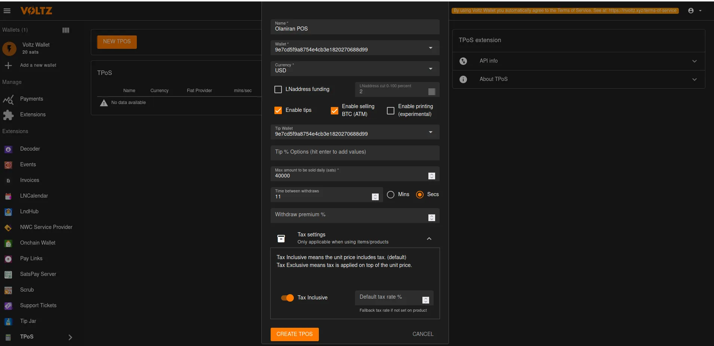

POS terminaliniz oluşturulduktan sonra, siz ve müşterileriniz için sorunsuz bir ödeme ve muhasebe deneyimi sağlamak için önceden yapılandırılmış ürünler ve hizmetler ekleyebilirsiniz.

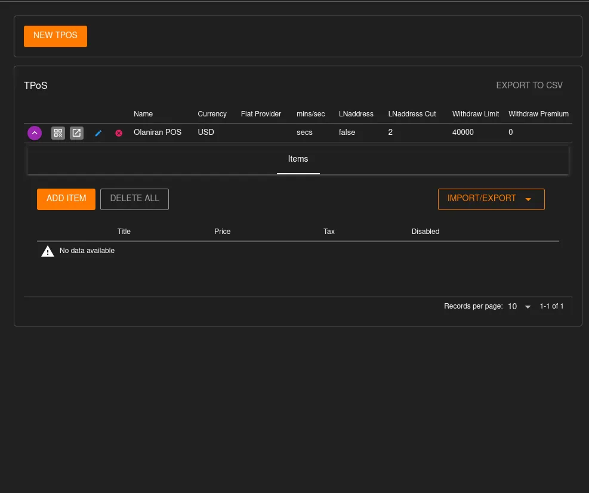

Adlarını tanımlayarak, bir resim ekleyerek ve bir satış fiyatı belirleyerek ürünlerinizi oluşturun.  Daha kolay takip için ürünlerinizi kategorilere ayırabilirsiniz. Vergileri doğrudan belirli bir ürüne uygulayabilirsiniz. Ürüne herhangi bir vergi uygulanmamışsa, satış noktası terminali oluşturma aşamasında yapılandırılan vergi otomatik olarak uygulanacaktır.

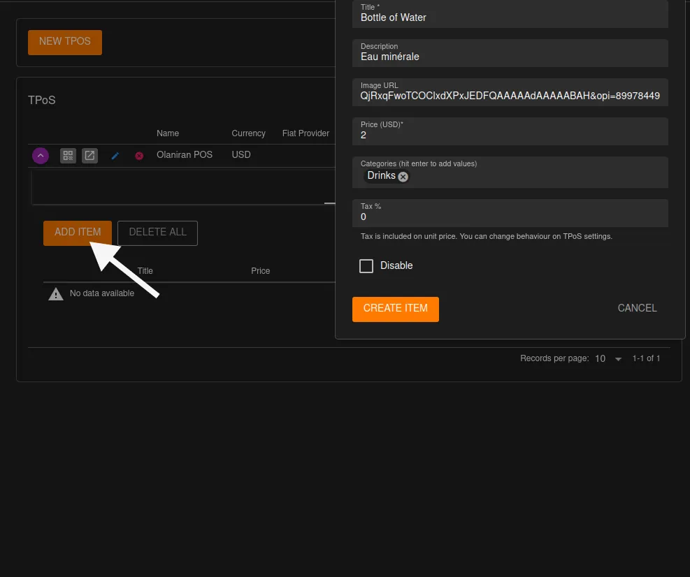

Ürün listenizi **İçe/Dışa Aktar** düğmesine tıklayarak JSON formatından otomatik olarak içe aktarabilirsiniz.

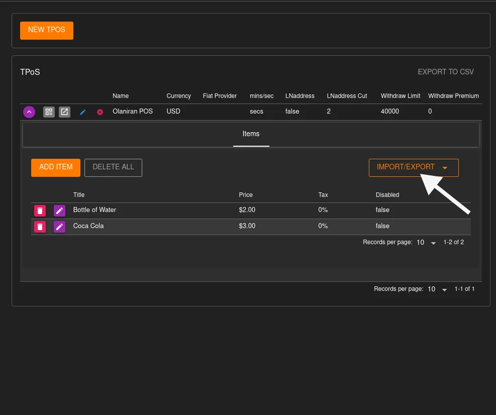

Ödeme alanına **Yeni Sekme** simgesine tıklayarak bağlantı üzerinden erişin veya **QR kodu** simgesine tıklayarak POS platformunuzu QR kodu aracılığıyla müşterilerinizle paylaşın.

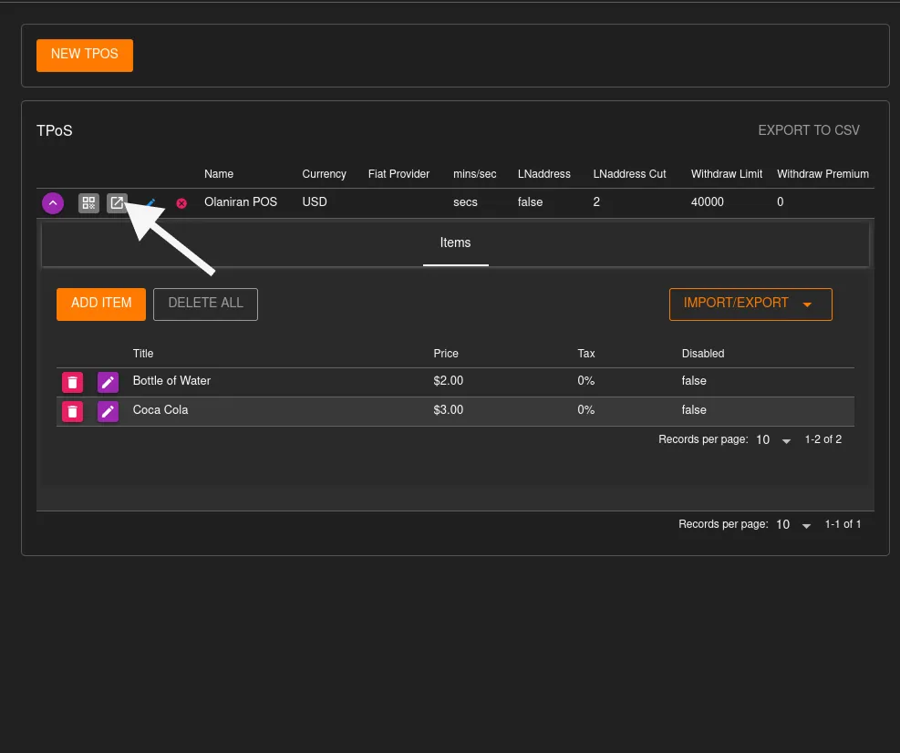

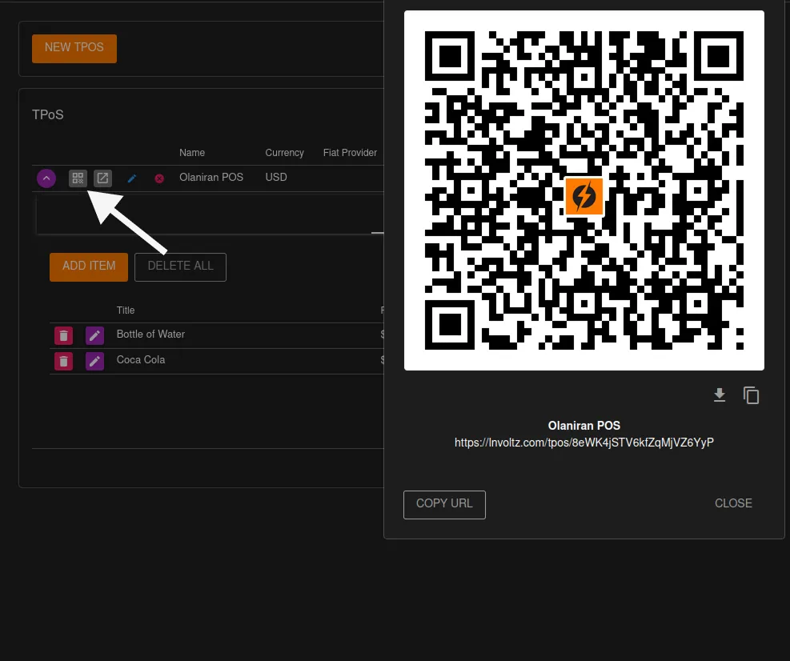

Müşterileriniz kataloğunuzu inceleyebilir ve ödemelerini bu arayüzden yapabilirler.

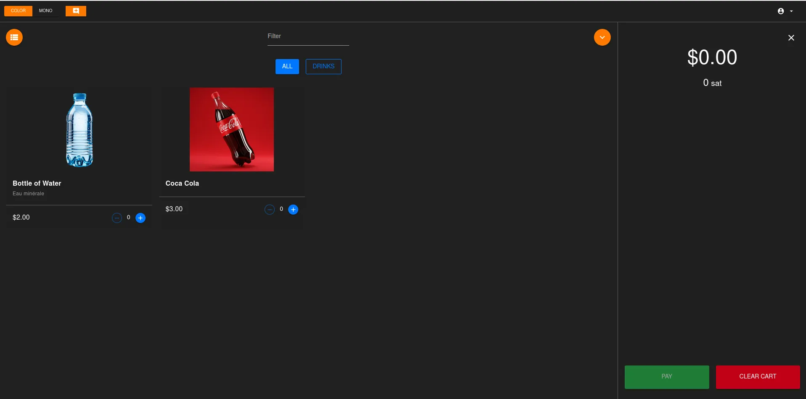

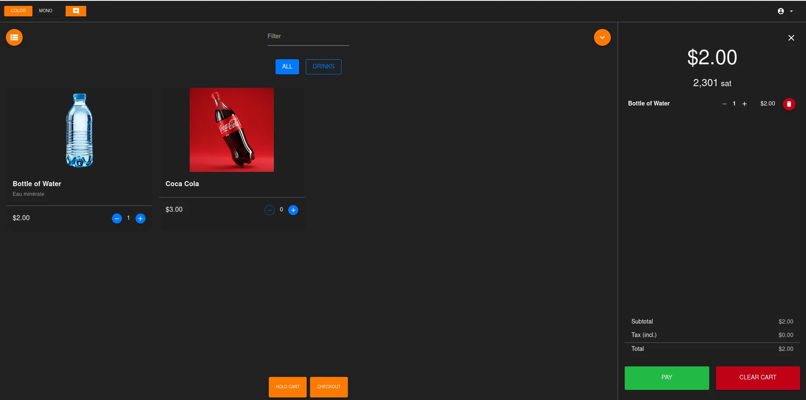

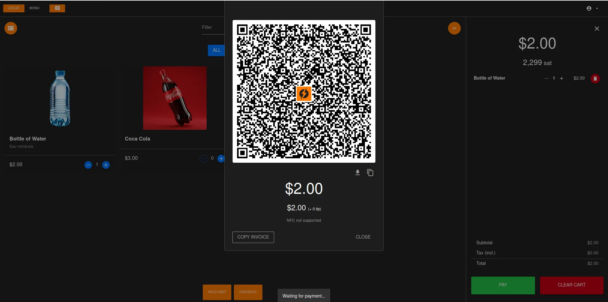

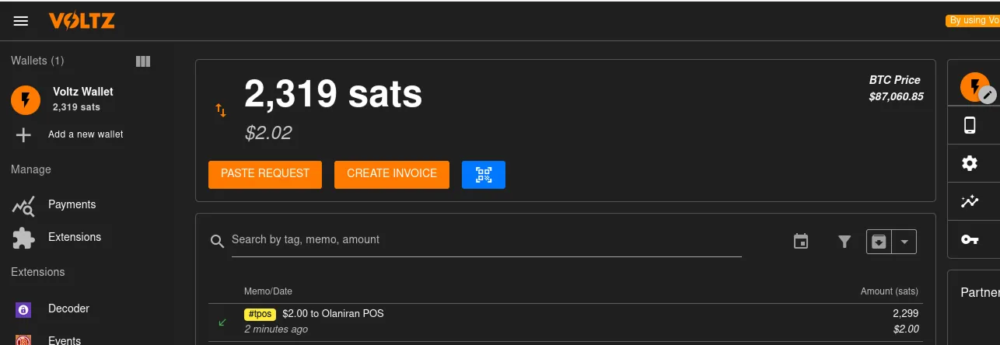

Mevcut uzantılar grubunda, POS terminalinden geçmeden izole ödemeleri toplamak için belirli ürünlerle generate faturaları oluşturmanıza olanak tanıyan **Invoice** ve **Payment Link** uzantıları gibi araçlar da bulacaksınız.

## Ödemelerinizi takip edin

Voltz, **Ödemeler** menüsünde çeşitli portföylerinize yapılan ödemelere genel bir bakış sunar.

Ödemelerinizi şu şekilde takip edebilirsiniz:

- Durum.
- Etiket: örneğin satış noktası ödemeleri için **TPOS** ve Zeus ve Blue Wallet cüzdanlarında mobil bağlantı üzerinden **lnhub**.
- Koleksiyon portföyü.
- Toplam gelen ve giden ödemeler.
- İyi tanımlanmış bir dönem.

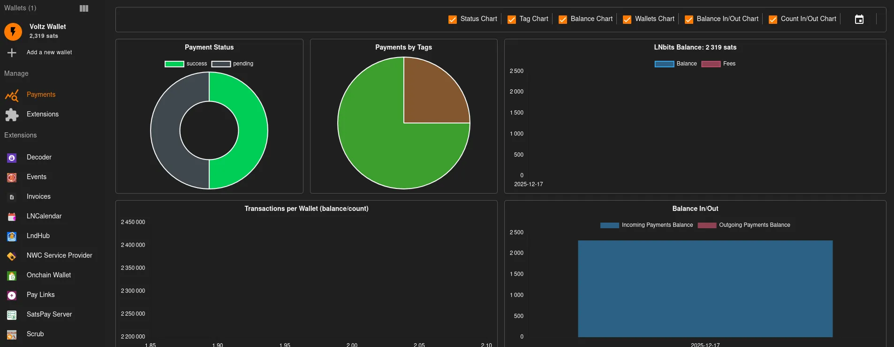

## Daha fazla seçenek

Voltz aynı zamanda üzerine kendi çözümlerinizi inşa edebileceğiniz bir altyapıdır. Uzantılar** bölümünde, Voltz ve LnBits ekosistemi içinde kendi uzantılarınızı geliştirmeye yönelik bir kılavuz bulacaksınız.

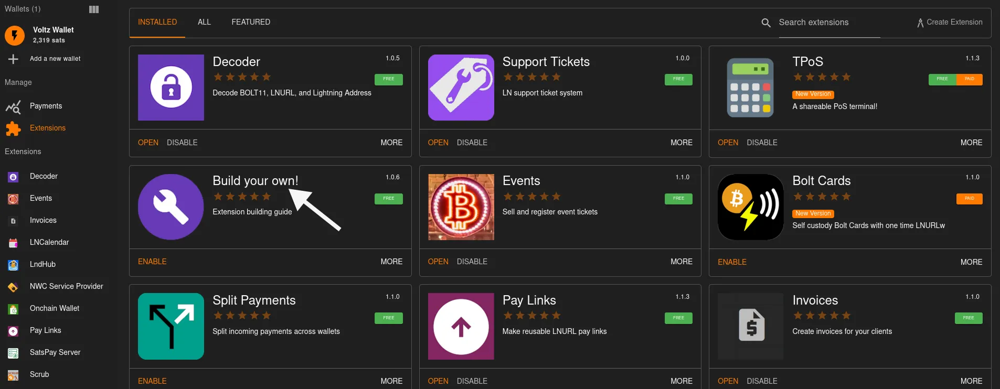

Ekosistem dışında çözümler geliştirmek, ancak yine de altyapılarını kullanmak istemeniz durumunda, **URL of node** bölümünde, bu verilerle neler yapabileceğinize dair bir örnekle birlikte API anahtarlarını ve dokümantasyon bilgilerini bulacaksınız.

Voltz wallet'nizi kullanarak uygulamalarınızdan Lightning faturaları oluşturabilir, Lightning faturalarını ödeyebilir, faturaların kodunu çözebilir ve doğrulayabilirsiniz.

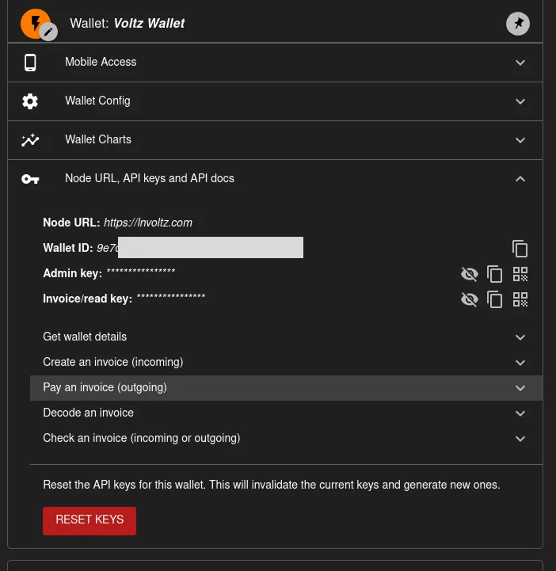

Artık Voltz hakkında iyi bir kavrayışa sahipsiniz. Bu eğitimi beğendiyseniz, kursumuzla bitcoin'i işletmenize entegre etmek için en iyi yöntemler ve araçlar hakkında daha fazla bilgi edineceğinizden eminiz: İşletmeler için Bitcoin.

https://planb.academy/courses/a804c4b6-9ff5-4a29-a530-7d2f5d04bb7a