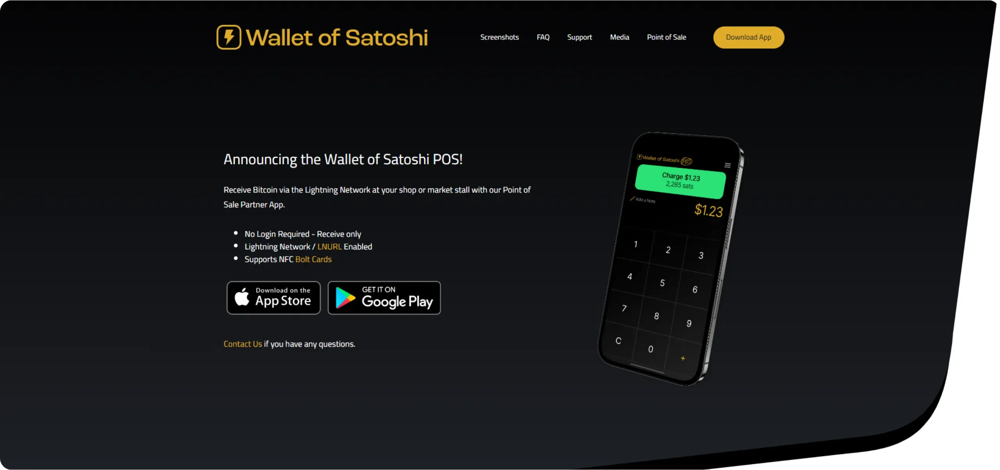

Menggabungkan kekuatan Lightning Network dengan pengalaman pengguna yang lancar untuk menerima Bitcoin dalam bisnis Anda: itulah misi **Wallet dari Satoshi** yang telah ditetapkan oleh Satoshi dengan mengimplementasikan point-of-sale dalam portofolionya. Dalam tutorial ini, kita akan mengetahui bagaimana Anda dapat menyiapkan point-of-sale yang menerima Bitcoin dalam bisnis Anda.

## Portofolio

Dalam ekosistem Bitcoin, Wallet dari Satoshi merupakan Wallet yang direkomendasikan untuk memulai pembayaran Lightning. Terlepas dari kenyataan bahwa Anda tidak memiliki bitcoin sepenuhnya (kustodian mandiri), Wallet dari Satoshi menawarkan pengalaman yang lancar untuk memulai dengan Bitcoin dengan jumlah kecil menggunakan Lightning Network Layer. Jika ini adalah pengalaman pertama Anda dengan Wallet ini, kami merekomendasikan tutorial Memulai.

https://planb.network/tutorials/wallet/mobile/wallet-of-satoshi-39149d86-e42b-4e8f-ae9f-7e061e7784f7

Untuk memfasilitasi adopsi Bitcoin di komunitas di seluruh dunia, Wallet dari Satoshi juga telah menyiapkan Point of Sale untuk mendorong pengguna menemukan penggunaan yang telah terbukti di komunitas mereka: membeli dan menjual barang dan jasa dengan Bitcoin.

## Tempat Penjualan

Pengalaman Point-of-Sale yang ditawarkan oleh Wallet dari Satoshi menonjol dari opsi lainnya, terutama karena kesederhanaan dan kelancarannya. Selain hanya memerlukan aplikasi seluler yang tersedia di Google Play Store dan iOS, Anda dapat menggunakan Wallet untuk:

- Melakukan transaksi pribadi.
- Kelola inventaris Anda.
- Invoice pelanggan Anda.
- Simpan catatan terpisah untuk aset dan pembayaran dari bisnis Anda.

⚠️ **PENTING**: Sangat penting untuk mengunduh aplikasi di platform resmi atau langsung melalui situs web resmi untuk menjamin integritas data dan keamanan dana Anda.

Dalam aplikasi, akses menu, lalu klik tombol **Point de Vente** untuk mengakses titik penjualan.

❗Akses ke kasir mengharuskan Anda masuk dengan email Anda.

Di bawah bagian **Keyboard**, Anda dapat langsung Invoice pembelian dengan memasukkan jumlah produk dan menambahkan catatan untuk penelusuran yang lebih baik.

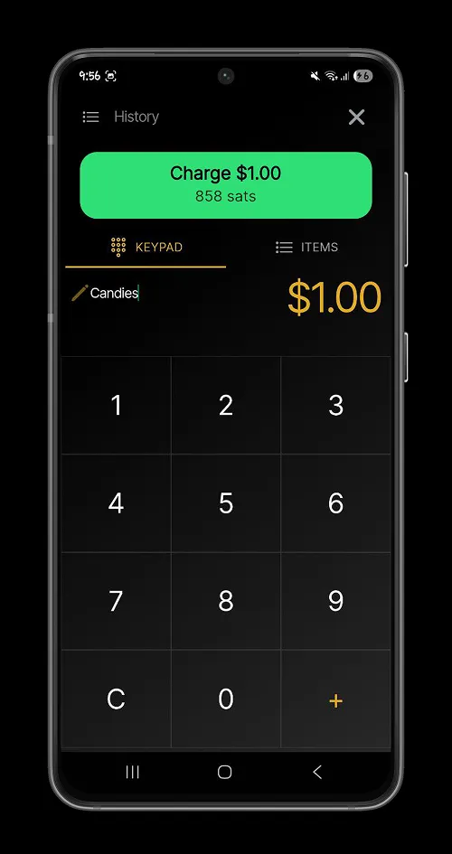

Untuk menyusun tempat penjualan dengan lebih baik, Anda dapat mengonfigurasi produk yang Anda miliki di toko Anda dengan memberikan nama dan harga yang Anda jual.

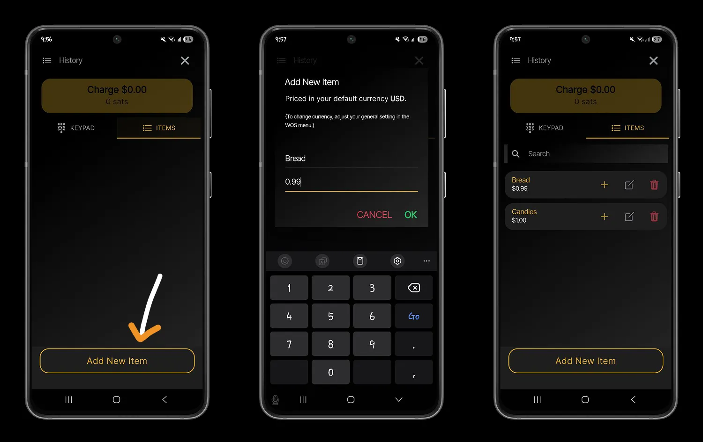

Anda dapat memilih beberapa item ke generate menjadi Lightning Invoice untuk dibayar oleh pelanggan Anda. Dengan menggabungkan opsi Keyboard dan Item, Anda dapat membuat Invoice tanpa hambatan untuk produk yang masuk dan keluar dari inventaris Anda.

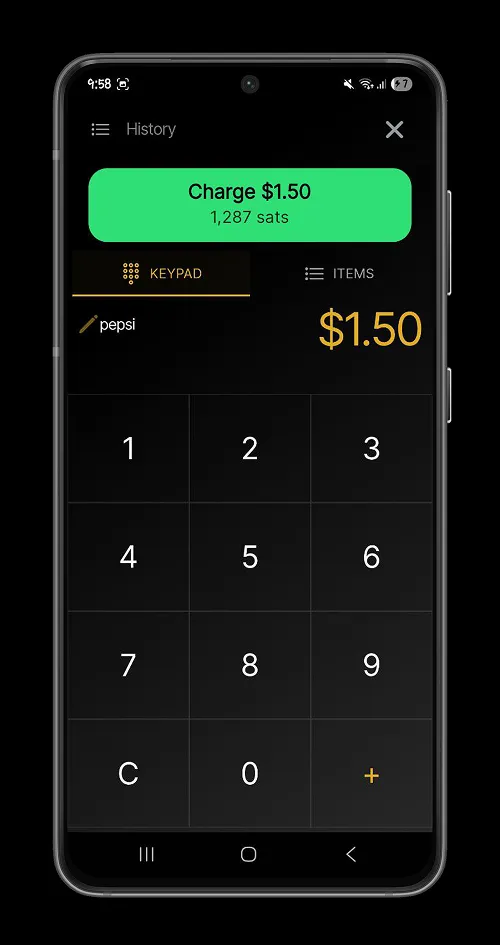

Klik tombol **Bebankan biaya** ke generate Lightning Invoice yang terkait dengan pembelian pelanggan Anda. Pelanggan Anda akan dapat membayar tagihannya secara instan dari Lightning Wallet atau dengan kartu Bolt melalui NFC.

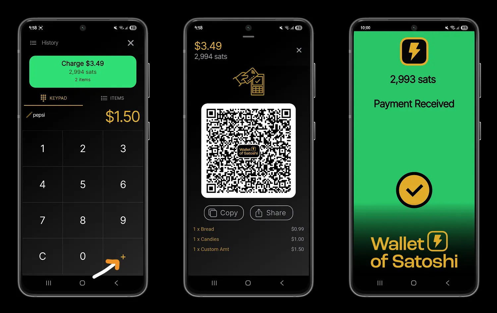

Di menu **History**, Anda akan menemukan daftar pembayaran untuk setiap Invoice yang telah Anda buat di kasir. Riwayat ini berbeda dengan riwayat default akun Wallet dan Satoshi Anda, yang mencantumkan semua pembayaran yang telah Anda lakukan dan terima di luar point of sale.

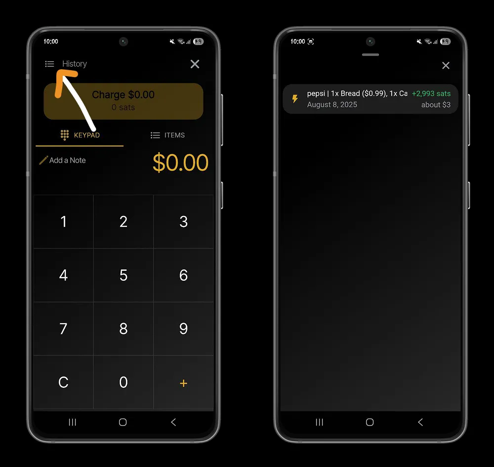

## Meningkatkan konfigurasi titik penjualan

Memiliki pengalaman yang mulus dengan kasir juga berarti menemukan konfigurasi yang tepat untuk lingkungan Anda.

Pada menu portofolio Wallet dari Satoshi, pilih mata uang lokal Anda dari daftar mata uang yang didukung, untuk mengonfigurasi produk Anda dalam unit mata uang yang Anda kenal.

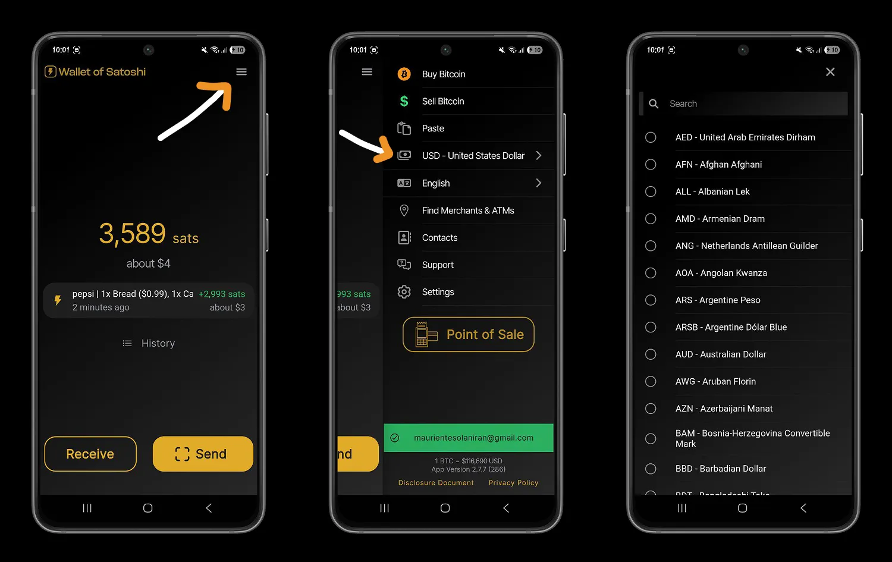

Untuk melacak pembayaran Anda dengan lebih baik, dalam pengaturan Wallet dari Satoshi, Anda dapat mengunduh riwayat pembayaran Anda ke dalam file CSV dan melakukan analisis apa pun yang Anda inginkan berdasarkan data ini.

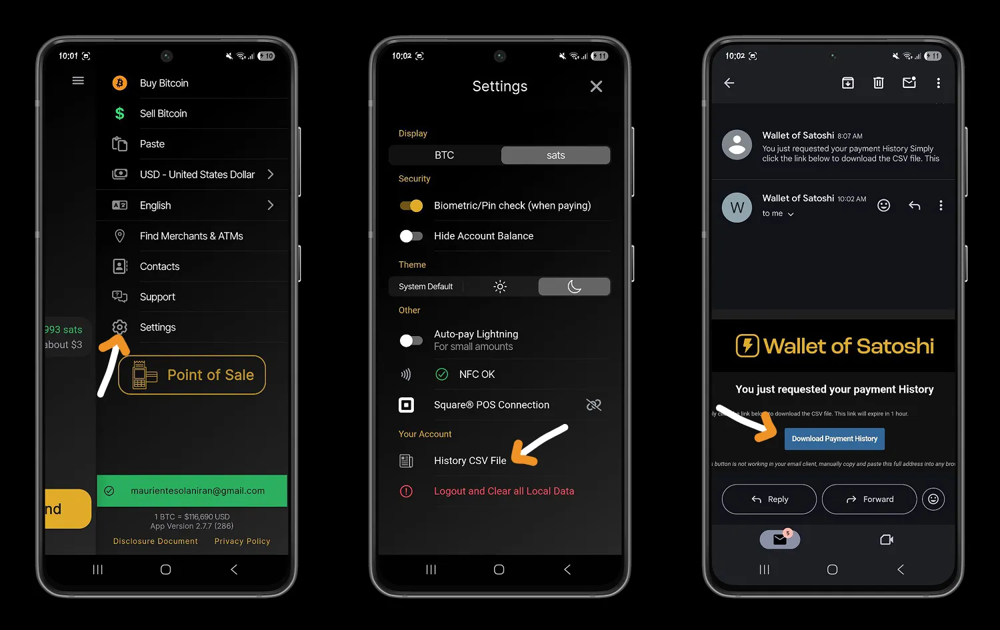

Sebuah email akan dikirimkan ke email akun Address Anda dengan tautan sementara untuk mengunduh file CSV.

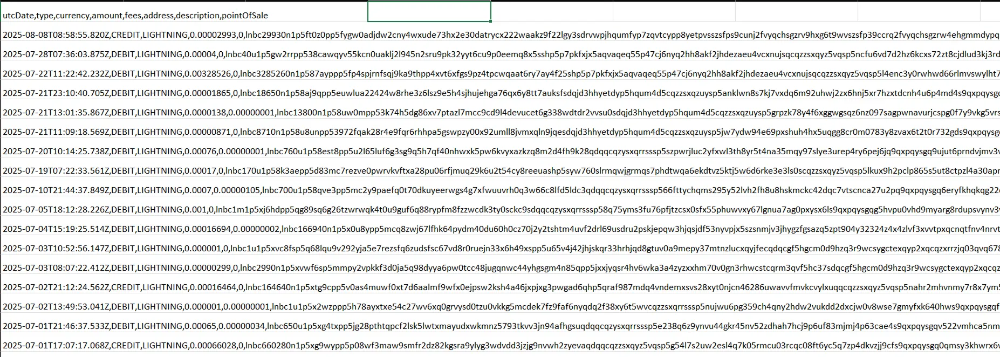

## Lebih jauh dengan Point of Sale

Wallet dari Satoshi tidak hanya menyediakan solusi Bitcoin untuk usaha kecil. Dari aplikasi POS Wallet dari Satoshi, Anda dapat mengaktifkan staf Anda untuk menguangkan pembayaran Bitcoin di berbagai tempat penjualan.

Unduh aplikasi ini, yang tersedia di iOS dan Google Play Store, ke berbagai terminal Anda atau ke perangkat karyawan Anda.

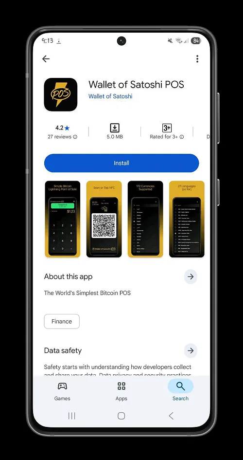

Hubungkan Lightning Address Anda ke Wallet Satoshi Wallet dan atur unit mata uang untuk wilayah tempat penjualan.

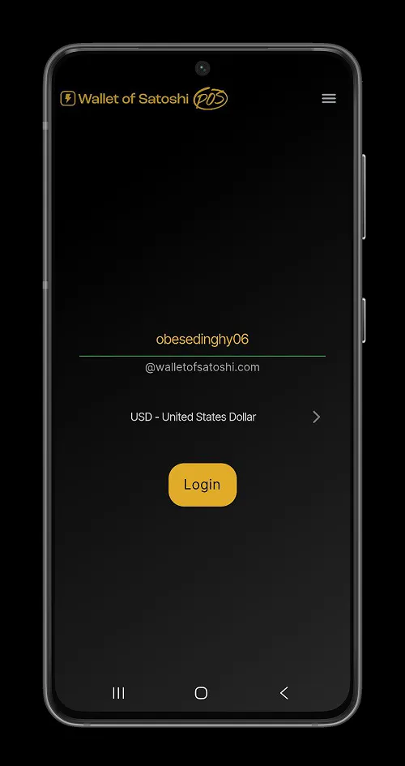

Staf Anda kemudian memenuhi syarat untuk menerima pembayaran Bitcoin di toko Anda. Wallet standar dari Satoshi Wallet tetap menjadi tempat Anda dapat membelanjakan bitcoin dan mengkonfigurasi ulang inventaris toko Anda.

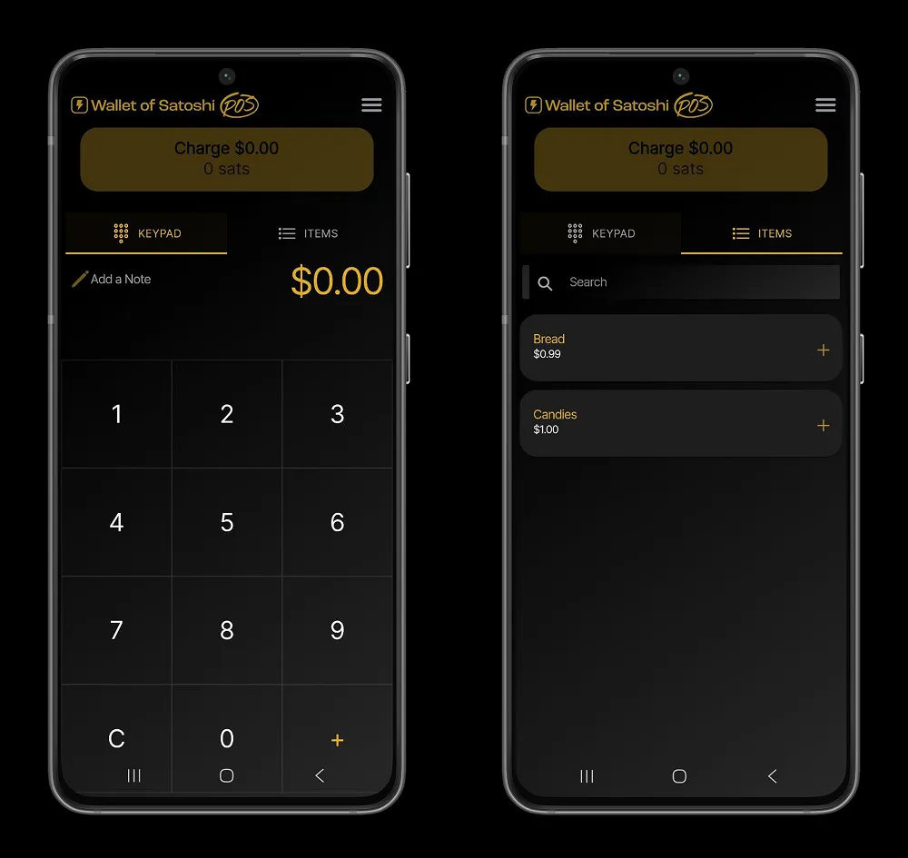

Setiap pengguna aplikasi POS Wallet dari Satoshi memiliki riwayat pembayaran yang dipersonalisasi dari faktur Lightning yang telah mereka hasilkan dalam aplikasi.

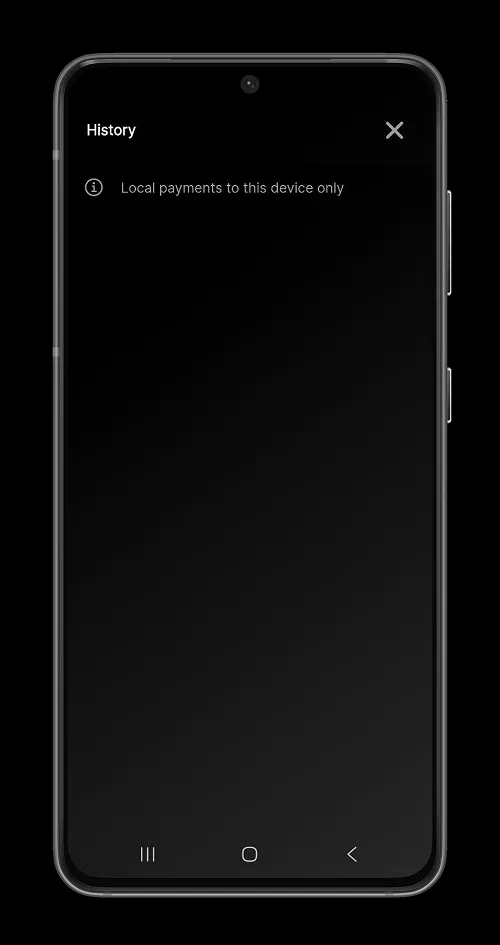

Anda sekarang memiliki alat untuk menerima Bitcoin dalam bisnis Anda hanya dalam beberapa menit. Jika Anda menyukai solusi penyimpanan mandiri, kami yakin Anda akan menyukai tutorial kami tentang Point of Sale Breez Wallet.

https://planb.network/tutorials/business/point-of-sale/breez-pos-76d6bf36-f4b5-422e-8579-edf149021525

Dan jika Anda mencari PoS lengkap yang cocok untuk usaha kecil dan menengah, saya juga merekomendasikan Swiss Bitcoin Pay:

https://planb.network/tutorials/business/point-of-sale/swiss-bitcoin-pay-2-a78b057e-ed11-47ac-860c-71019fcb451a

Terakhir, temukan kursus pelatihan lengkap kami untuk mempelajari dasar-dasar pembayaran dan arus kas Bitcoin untuk bisnis:

https://planb.network/courses/a804c4b6-9ff5-4a29-a530-7d2f5d04bb7a