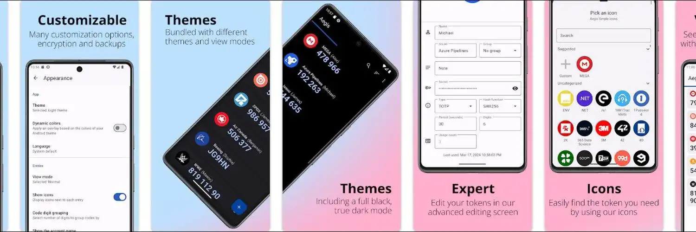
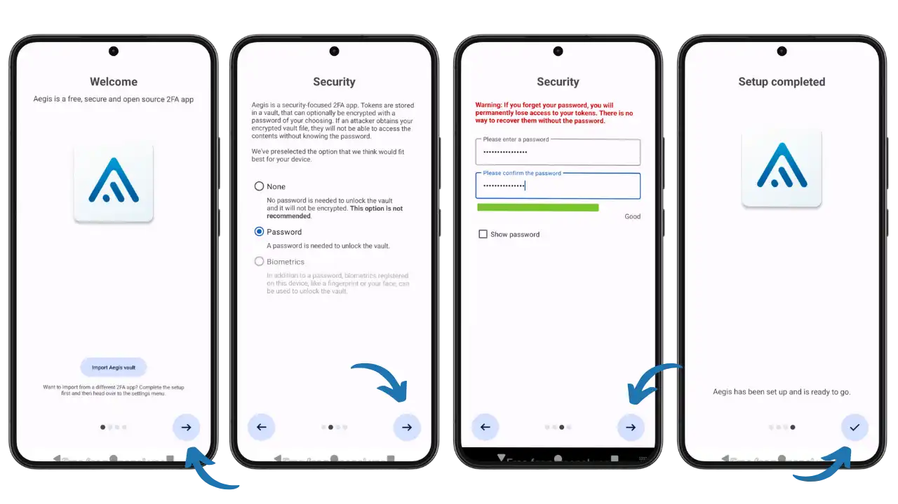
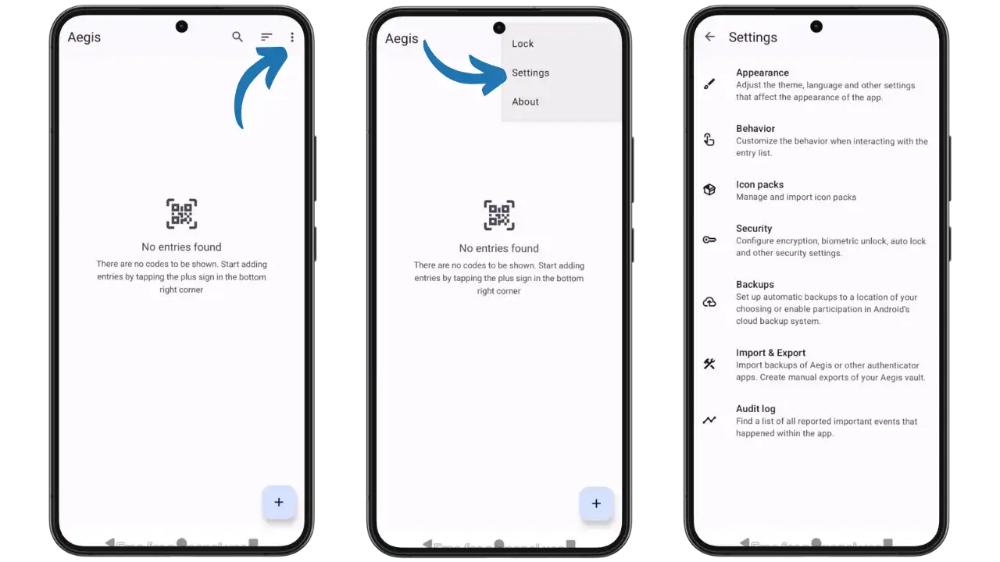
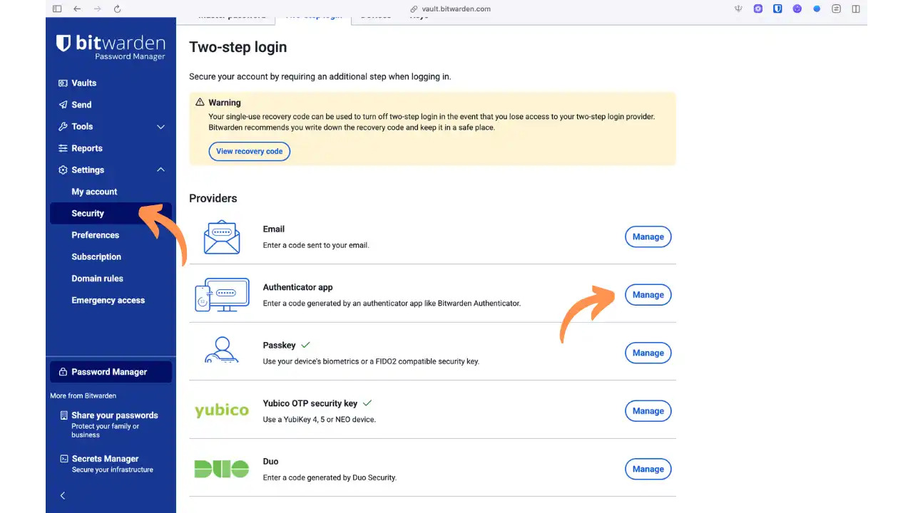
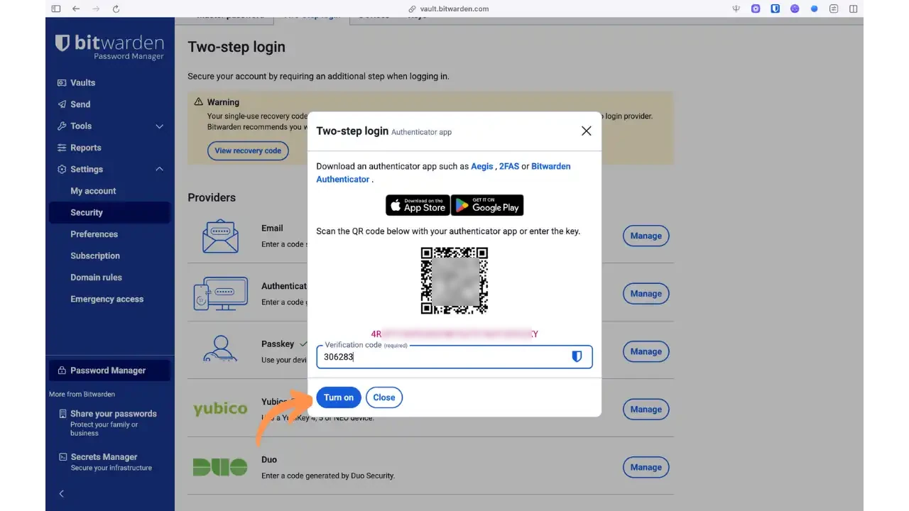
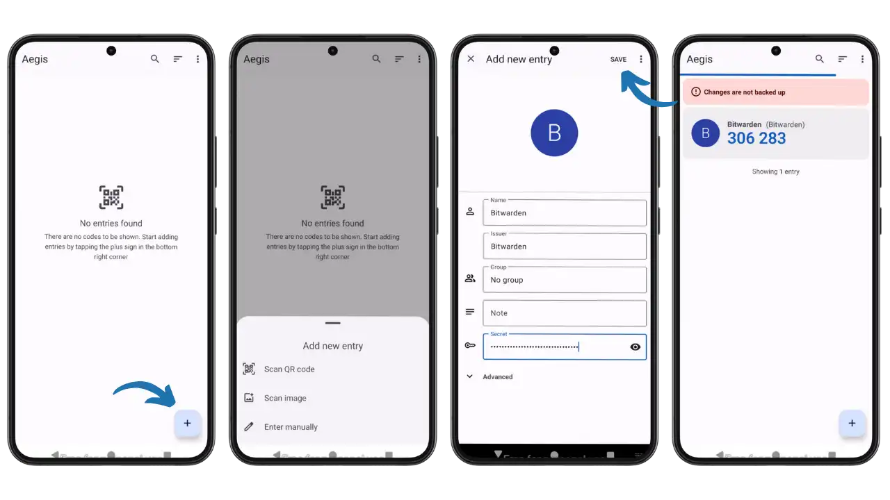
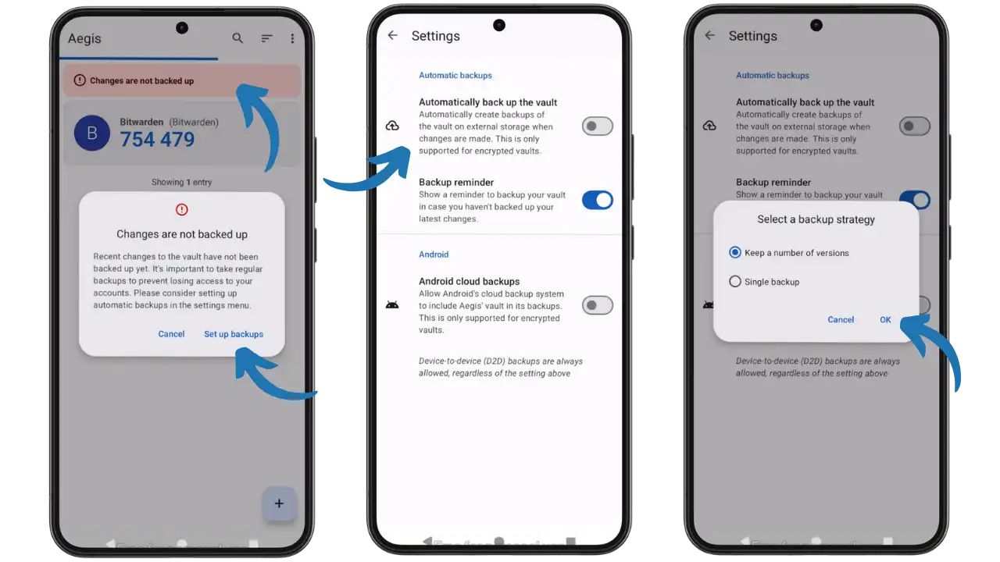
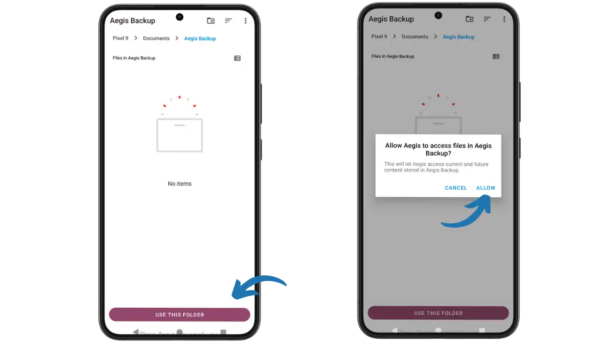

Hoy en día, la autenticación de dos factores (2FA) es esencial para proteger las cuentas en línea. Además de la contraseña, añade un segundo factor (a menudo un código de 6 dígitos) que caduca a los 30 segundos, lo que dificulta considerablemente la tarea de los piratas informáticos. Utilizar una aplicación específica TOTP (*Time-based One-Time Password*) es más seguro que los SMS, que pueden ser secuestrados por ataques de intercambio de SIM.

Sin embargo, no todas las aplicaciones de autenticación son iguales. Muchas soluciones propietarias (Google Authenticator, Authy, etc.) plantean problemas: son propietarias y de código cerrado (imposible auditar su seguridad), a veces integran rastreadores de publicidad, no ofrecen copias de seguridad cifradas de tus códigos e incluso pueden impedir la exportación de tus cuentas para encerrarte en su ecosistema.

Aegis Authenticator, en cambio, se presenta como una alternativa gratuita y ética a estas aplicaciones. Aegis es una aplicación gratuita, segura y de código abierto para gestionar tus tokens de verificación en dos pasos en Android. Su desarrollo se centra en características esenciales que otras apps no ofrecen, incluyendo un cifrado robusto de los datos locales y la posibilidad de realizar copias de seguridad seguras. En definitiva, Aegis ofrece una solución de doble autenticación local y auditable, ideal para cualquiera que desee mantener un control total sobre sus códigos 2FA.

## Presentación de Aegis Authenticator

Aegis Authenticator es una aplicación 2FA de código abierto para Android, publicada bajo licencia GPL v3. Destaca por su filosofía de "privacidad por diseño": la aplicación funciona completamente offline y no requiere conexión a un servicio remoto. Como resultado, tus tokens permanecen almacenados localmente en tu dispositivo, en una caja fuerte segura de la que sólo tú tienes la llave.

### Características principales

**Bóveda encriptada:** todos sus códigos OTP se almacenan en una bóveda encriptada AES-256 (modo GCM), protegida por una contraseña maestra definida por el usuario. Puedes desbloquear esta bóveda mediante contraseña o datos biométricos (huella dactilar, reconocimiento facial) para mayor comodidad. En ausencia de una contraseña, los datos quedarían sin cifrar, por lo que le recomendamos encarecidamente que establezca una.

**Organización avanzada:** Aegis mantiene sus numerosas cuentas 2FA bien organizadas. Puede ordenar sus entradas alfabéticamente o en el orden que desee, agruparlas por categorías (por ejemplo, Personal, Trabajo, Social) para facilitar su recuperación y asignar a cada entrada un icono personalizado. Se incluye una barra de búsqueda para encontrar instantáneamente un servicio o cuenta por su nombre.

**Copias de seguridad locales cifradas:** Para garantizar que nunca pierdes el acceso a tus cuentas, Aegis ofrece copias de seguridad automáticas de tu caja fuerte. Éstas están cifradas (mediante contraseña) y pueden guardarse en la ubicación que elija (almacenamiento interno, carpeta en la nube, etc.). La aplicación también puede exportar manualmente su base de datos de cuentas, en formato cifrado o sin cifrar, según sea necesario. Importar cuentas desde otras aplicaciones 2FA es igual de fácil (Aegis admite la importación desde Authy, Google Authenticator, FreeOTP, andOTP, etc.).

**Seguridad y privacidad:** la aplicación está completamente desconectada por defecto. No requiere permisos de red, lo que significa que no transmite datos al exterior, y no incluye rastreadores de anuncios ni módulos de análisis del comportamiento. Aegis no muestra anuncios, y no requiere una cuenta de usuario: tan pronto como se instala, está en funcionamiento sin necesidad de registro. Como su código fuente es público en GitHub, la comunidad puede auditarlo libremente, lo que garantiza la ausencia de funcionalidades maliciosas u ocultas.

**Moderno Interface:** Aegis adopta un cuidado Material Design, con soporte para temas oscuros (incluyendo un modo AMOLED) e incluso una vista de mosaico opcional para mostrar tus códigos como cuadrículas. Interface es ordenado, sin florituras, y evita la captura de pantalla de los códigos como medida de seguridad.

## Instalación

Como Aegis Authenticator es de código abierto, sus desarrolladores favorecen los canales de distribución respetuosos con la privacidad. Hay dos formas principales de instalarlo:

### Vía F-Droid (recomendado)

La forma más segura y sencilla es a través de F-Droid, la tienda alternativa gratuita. Si F-Droid aún no está instalado en tu teléfono, empieza por descargarlo desde el sitio web oficial [F-Droid.org](https://f-droid.org). A continuación :

- Abre F-Droid y asegúrate de haber actualizado tus repositorios para obtener la última lista de aplicaciones
- Busque "Aegis Authenticator" en F-Droid. Debería aparecer la aplicación oficial (editor: Beem Development)
- Inicie la instalación pulsando Instalar. Como Aegis es una de las aplicaciones verificadas por F-Droid, se beneficiará de una descarga fiable y segura

La instalación a través de F-Droid ofrece la ventaja de recibir actualizaciones automáticas de la aplicación tan pronto como se publiquen. Además, F-Droid garantiza que la aplicación está libre de componentes propietarios no deseados.

### Vía GitHub (APK firmado)

Si prefieres instalar la aplicación sin pasar por una tienda, puedes descargar el APK oficial directamente desde la página de GitHub del proyecto. En el repositorio de Aegis ([github.com/beemdevelopment/Aegis](https://github.com/beemdevelopment/Aegis)), ve a la sección Releases, donde se publican las versiones estables.

- Descargar la última versión APK
- Antes de instalar el APK, asegúrate de que has autorizado la instalación de aplicaciones de orígenes desconocidos en tu dispositivo (en los Ajustes de Android)
- El APK proporcionado en GitHub está firmado por el desarrollador con la misma clave que en F-Droid

Tras la instalación manual, la aplicación funcionará de forma idéntica. Ten en cuenta que las actualizaciones no serán automáticas: tendrás que consultar GitHub periódicamente para ver si hay nuevas versiones.

### Google Play Store vs F-Droid

Aegis Authenticator está disponible tanto en Google Play Store como en F-Droid, lo que te permite elegir el método de instalación:

**Google Play Store:**

- ✅ Actualizaciones automáticas integradas en el sistema Android
- ✅ Instalación sencilla y familiar
- ✅ El mismo APK firmado que en otros canales

**F-Droid (recomendado) :**

- ✅ Tienda gratuita y de código abierto
- ✅ Construcción reproducible y verificable
- ✅ No requiere servicio de Google
- ✅ Respeto por la filosofía del software libre

La elección entre estas dos opciones depende de tus preferencias respecto al ecosistema de Google. Si prefieres la simplicidad, Play Store es ideal. Si quieres un enfoque más respetuoso con la privacidad, independiente de los servicios de Google, F-Droid es la mejor opción.

## Primera configuración

Cuando se lanza Aegis por primera vez, se propone un procedimiento de configuración inicial para asegurar su código 2FA:

*Proceso de configuración inicial de Aegis: pantalla de bienvenida, opciones de seguridad, definición de la contraseña maestra y finalización*

### Establecer una contraseña maestra

Aegis te pedirá primero que elijas una contraseña maestra. Esta contraseña se utilizará para cifrar todos los testigos de autenticación almacenados en el almacén. Le recomendamos encarecidamente que establezca una contraseña fuerte y única que sólo usted conozca.

**⚠️ Advertencia:** no olvide esta contraseña - si la pierde, sus códigos 2FA encriptados quedarán inaccesibles (no hay puerta trasera). Aegis le pedirá que introduzca la contraseña dos veces para confirmarla.

### Activar el desbloqueo biométrico (opcional)

Si tu dispositivo Android está equipado con un lector de huellas dactilares u otro sensor biométrico, Aegis te pedirá que actives el desbloqueo biométrico. Esta opción es opcional pero muy práctica: te permite desbloquear rápidamente la aplicación con tu huella dactilar o tu cara, en lugar de escribir la contraseña cada vez.

Ten en cuenta que los datos biométricos son una comodidad añadida: tu contraseña maestra sigue siendo necesaria si se cambian los datos biométricos o se reinicia el dispositivo.

### Descubrir la configuración de la aplicación

Una vez dentro de la aplicación (la Interface principal está inicialmente vacía), familiarícese con las opciones de configuración disponibles. Accede a la configuración a través del menú desplegable situado en la parte superior derecha de la pantalla (tres puntos verticales) y, a continuación, selecciona "Configuración".

*Interface principal Aegis vacío al inicio, acceso al menú de parámetros y visión general de las opciones disponibles*

El menú de ajustes de Aegis agrupa varias secciones importantes:

- **Apariencia**: Personaliza el tema (claro, oscuro, AMOLED), el idioma y otros ajustes visuales
- **Comportamiento**: Configurar el comportamiento de la aplicación al interactuar con la lista de entradas
- **Paquetes de iconos**: gestiona e importa paquetes de iconos para personalizar el aspecto de tus cuentas
- **Seguridad**: Ajustes de cifrado, desbloqueo biométrico, bloqueo automático y otros parámetros de seguridad
- **Copias de seguridad**: Configura copias de seguridad automáticas en la ubicación que elijas
- **Importación y exportación**: Importe copias de seguridad de otras aplicaciones de autenticación y exporte manualmente su bóveda de Aegis
- **Registro de auditoría**: Registro detallado de todos los eventos significativos de la aplicación

Esta clara organización le permite configurar Aegis según sus preferencias y necesidades de seguridad.

## Añadir una cuenta 2FA

Con Aegis configurado, pasemos a lo esencial: añadir tus cuentas de dos factores. El proceso es sencillo, y Aegis ofrece varios métodos para integrar tus códigos de autenticación.

### Los tres métodos de adición disponibles

Desde la pantalla principal de Aegis Interface, pulsa el botón **+** de la parte inferior derecha para acceder a las opciones de añadir. Tiene tres opciones:

- **Escanear código QR**: Escanea directamente el código QR mostrado por el servicio web
- **Escanear imagen**: Escanea un código QR desde una imagen guardada en tu dispositivo
- **Introducir manualmente**: Introducir manualmente la información de la cuenta 2FA

### Ejemplo práctico: configuración de Bitwarden

Tomemos el ejemplo concreto de la activación de 2FA en Bitwarden para ilustrar el proceso:

*Ejemplo de activación 2FA en Bitwarden: Interface web con opciones de autenticación y recomendación Aegis*

- **Inicio de sesión y acceso a la configuración**: Inicia sesión en tu cuenta de Bitwarden y accede a la configuración, pestaña "Seguridad"
- **Sección de proveedores**: Vaya a la sección "Proveedores" y haga clic en "Gestionar" en la sección "Aplicación Authenticator"

*Proceso completo para añadir una cuenta: Código QR mostrado por el servicio, clave secreta visible y código de verificación introducido*

- **Escanee el código QR**: Se abre una ventana emergente con el código QR y la clave secreta
- **En Aegis**: Utilice "Escanear código QR" para capturar información automáticamente
- **Verificación**: Introduzca el código de 6 dígitos generado por Aegis en el campo "Código de verificación"
- **Activación**: Haga clic en "Activar" para finalizar la activación

### Añadir datos manualmente

Si prefiere o no puede escanear el código QR, utilice la opción "Introducir manualmente". El formulario le permite introducir :

*Proceso para añadir una nueva cuenta 2FA: Interface vacío, añadir opciones, formulario de entrada manual y cuenta añadida con éxito*

- **Nombre**: Nombre del servicio (por ejemplo, Bitwarden, GitHub...)
- **Emisor**: El emisor (a menudo idéntico al nombre)
- **Grupo**: Opcional, para organizar tus cuentas por categorías
- **Nota**: Observaciones personales sobre esta cuenta
- **Secreto**: La clave secreta suministrada por el servicio (enmascarada por defecto)
- **Avanzado**: Parámetros avanzados (algoritmo, período, número de dígitos)

Una vez añadida la cuenta, aparece en su lista con su código actual y un indicador de tiempo que muestra el tiempo restante antes de la renovación.

### Compatibilidad universal

Aegis es compatible con todos los servicios que utilizan los estándares TOTP y HOTP, incluidos prácticamente todos los sitios que ofrecen 2FA: redes sociales, bancos, gestores de contraseñas, plataformas de criptomonedas, etc.

### Organización de la entrada

Una vez que haya añadido varias cuentas, apreciará las herramientas de organización de Aegis:

- **Ordenación personalizada:** Por defecto, las cuentas aparecen en orden alfabético, pero puedes cambiar el orden manualmente
- **Grupos y categorías:** Crea grupos para separar tus cuentas personales de las de tu empresa, o agrúpalas por tipo de servicio (banca, correo electrónico, redes sociales, etc.)
- **Iconos personalizados:** Aegis intenta asignar automáticamente un icono apropiado si está disponible, de lo contrario puede elegir entre muchos iconos genéricos o importar una imagen
- **Búsqueda rápida:** La barra de búsqueda de la parte superior le permite teclear unas cuantas letras para filtrar al instante las entradas coincidentes

Al tocar una entrada, el código OTP se muestra a tamaño completo (si estaba oculto) y puedes copiarlo en el portapapeles con una pulsación larga: práctico para pegarlo en la aplicación a la que quieras conectarte.

## Seguridad y copias de seguridad

Con la seguridad en el corazón de Aegis, es importante entender cómo se protegen sus códigos 2FA, y cómo garantizar su persistencia en caso de problema.

### Arquitectura de seguridad

**Encriptación robusta**: Todos tus códigos se almacenan en una caja fuerte encriptada utilizando el algoritmo **AES-256 en modo GCM**, combinado con tu contraseña maestra. La derivación de claves se basa en **scrypt**, lo que ofrece una mayor protección contra los ataques de fuerza bruta.

**Desbloqueo seguro** : La contraseña maestra es necesaria para descifrar tus datos. Biometría (opcional) utiliza el **Android Secure Keystore** y TEE (Trusted Execution Environment) para proteger la clave de cifrado.

**Permisos mínimos**: Aegis funciona offline por defecto, requiriendo únicamente acceso a la cámara (escáner QR), biometría y vibrador. No se recopilan ni comparten datos.

### Opciones de copia de seguridad

Aegis ofrece varias estrategias de copia de seguridad para adaptarse a diferentes necesidades de seguridad y comodidad:

*Interface completo con cuenta añadida, alerta de copia de seguridad, configuración de copia de seguridad automática y estrategias de copia de seguridad*

**1. Copias de seguridad locales automáticas**

- Configure una carpeta de destino de su elección
- Frecuencia personalizable (después de cada cambio, diariamente, etc.)
- Archivos cifrados protegidos por contraseña (.aesvault)
- Compatible con carpetas sincronizadas (Nextcloud, Dropbox, etc.)

*Proceso de selección de la carpeta de copia de seguridad: explorador de archivos, carpeta de destino y autorización de acceso*

**2. Copias de seguridad en la nube para Android**

- Integración opcional con el sistema de copias de seguridad Android
- Disponible sólo para cajas fuertes encriptadas (seguridad preservada)
- Copia de seguridad transparente con otros datos de Android
- Restauración automática al cambiar de dispositivo

**3. Exportaciones manuales**

- Exportación a petición a través de **Configuración > Importar y Exportar**
- Elección de formato cifrado (recomendado) o claro
- Útil para migraciones o copias de seguridad ocasionales

### Buenas prácticas de seguridad

- Mantén varias versiones de **copia de seguridad** para evitar la corrupción
- Pruebe regularmente **sus copias de seguridad intentando restaurarlas**
- Guarde por separado los códigos de recuperación proporcionados por el servicio técnico
- Tu **contraseña maestra** sigue siendo necesaria incluso con las copias de seguridad en la nube
- **Proteja su contraseña maestra**: utilice una contraseña única y segura almacenada en un gestor de contraseñas
- **Mantenga su aplicación actualizada** con los últimos parches de seguridad
- Activar el **bloqueo automático** en los ajustes para proteger el acceso a la aplicación
- Desactiva las **capturas de pantalla** (opción por defecto) para evitar que tus códigos sean interceptados
- **Utilice la biometría con moderación**: prefiera las contraseñas para los accesos críticos

## Comparación con otras aplicaciones

¿Cómo se compara Aegis con otras aplicaciones de autenticación populares?

### Aegis frente a Google Authenticator

**Aegis :**

- código abierto y auditable
- ✅ Copia de seguridad local cifrada
- organización avanzada (grupos, iconos, búsqueda)
- ✅ No hay recogida de datos
- ❌ Solo Android

**Google Authenticator :**

- disponible en Android e iOS
- ✅ Sincronización en la nube (desde 2023)
- ❌ Código fuente cerrado
- ❌ Funcionalidad limitada
- ❌ Posible recopilación de datos de Google

### Aegis frente a Authy

**Aegis :**

- código abierto
- ✅ No se requiere cuenta
- ✅ Posibilidad de exportar códigos
- ✅ Control total de datos
- ❌ Sin sincronización nativa multidispositivo

**Authy :**

- ✅ Sincronización multidispositivo
- disponible en Android e iOS
- ❌ Código fuente cerrado
- ❌ Requiere un número de teléfono
- ❌ Imposible exportar códigos
- ❌ Las aplicaciones de escritorio se eliminarán en marzo de 2024

Aegis destaca para los usuarios de Android que valoran la transparencia, la seguridad local y el control total sobre sus datos. Alternativas como Authy son más adecuadas si necesitas sincronización automática multidispositivo.

## Conclusión

Aegis Authenticator es una solución excelente para quienes buscan una aplicación 2FA segura, transparente y respetuosa con la privacidad. Su enfoque de código abierto, combinado con un cifrado robusto y una cuidada Interface, la convierten en una opción de primer orden para proteger sus cuentas en línea.

Aunque se limita a Android y carece de sincronización nativa en la nube, Aegis compensa con creces estas limitaciones con su filosofía de "privacidad por diseño" y el control total de los datos. Para los usuarios preocupados por su privacidad digital, Aegis ofrece una alternativa creíble y potente a las soluciones propietarias dominantes en el mercado.

La seguridad de sus cuentas en línea no tiene por qué depender de la buena voluntad de las empresas comerciales. Con Aegis, usted mantiene el control de sus códigos de autenticación, en una caja fuerte digital de la que sólo usted tiene la llave.

## Recursos

### Sitios web oficiales

- **Sitio web oficial**: [getaegis.app](https://getaegis.app/) - Presentación y descarga de la solicitud
- **Código fuente**: [github.com/beemdevelopment/Aegis](https://github.com/beemdevelopment/Aegis) - Repositorio oficial de GitHub
- **F-Droid**: [f-droid.org/packages/com.beemdevelopment.aegis](https://f-droid.org/packages/com.beemdevelopment.aegis/) - Instalación a través de la tienda libre

### Documentación técnica

- **Documentación sobre la bóveda**: [Diseño de la bóveda](https://github.com/beemdevelopment/Aegis/blob/master/docs/vault.md) - Descripción técnica del cifrado y de la arquitectura de seguridad
- **Preguntas frecuentes oficiales**: [getaegis.app/#faq](https://getaegis.app/#faq) - Respuestas a las preguntas más frecuentes
- **Wiki del proyecto**: [github.com/beemdevelopment/Aegis/wiki](https://github.com/beemdevelopment/Aegis/wiki) - Documentación completa para el usuario